# خواننده تلگرام

<!-- TOP_NAV START -->

<a href="https://github.com/sombriolitfa-eng/aioo06/blob/main/telegram/content/archive_1.md" style="display:inline-block; padding:6px 12px; margin:0 4px; background-color:#2ea44f; color:white; text-decoration:none; border-radius:4px; font-weight:bold;">صفحه بعد</a>

<!-- TOP_NAV END -->

<!-- MSG START -->

---
📅 بروزرسانی: 1405/03/08 23:28
---

## VahidOOnLine — post 242823

ویدیوی منتشرشده، لحظه کشته شدن جاویدنام بابک سلطانی را در اصفهان نشان می‌دهد.
سلطانی، ۵۹ ساله، شامگاه ۱۹ دی ۱۴۰۴ هنگامی که معترضان را در اصفهان پناه می‌داد هدف شلیک گلوله ماموران قرار گرفت و جان باخت.
‌🏁 🇬🇧 IranintlTV

🤖 @VahidOOnLine

## VahidOOnLine — post 242822

  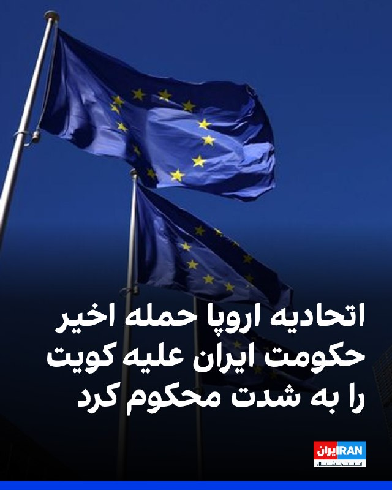

اتحادیه اروپا با انتشار بیانیه‌ای اعلام کرد که حمله اخیر حکومت ایران علیه کویت را به شدت محکوم می‌کند.

در این بیانیه آمده که این حمله بنا بر حقوق بین‌الملل نقض حاکمیت کویت محسوب می‌شود.

اتحادیه اروپا همبستگی کامل خود را با دولت و مردم کویت بار دیگر اعلام کرد و افزود: «چنین حملاتی تهدیدی جدی برای امنیت و ثبات منطقه به شمار می‌روند.»
‌🏁 🇬🇧 IranintlTV

🤖 @VahidOOnLine

## VahidOOnLine — post 242821

  

♦️ اسکات بسنت، وزیر خزانه‌داری ایالات متحده، روز جمعه هشتم خرداد، اعلام کرد که این کشور در راستای بخش اقتصادی جنگ دونالد ترامپ، رئیس‌جمهوری آمریکا، علیه جمهوری اسلامی، که به عنوان «خشم اقتصادی» شناخته می‌شود، یک میلیارد دلار از دارایی‌های رمزارزی ایران را توقیف کرده است.
‌🇸🇦 Indypersian

🤖 @VahidOOnLine

## VahidOOnLine — post 242820

🗣روایت شما از بحران اقتصادی و زندگی در آتش‌بس- جمعه ۸ خرداد:

🔹جوانی ما سوخت پای سفاهت عده‌ای که هیچ درک و فهمی از شادی و سرور ندارند، نزدیک به ۵۰ سال سرمایه‌های کشور رو به یغما دادند، ولی آدمی به امید زنده است.

🔹از اصفهان: گرونی بیداد می‌کنه. از صبح تا شب کار می‌کنیم برای یک میلیون که اونم هیچی نمی‌شه باهاش بخری.

🔹اینا توافق بکنن یا نکنن، هیچ فرقی به حال ما مردم نداره. جمهوری اسلامی به زودی به دست مردم نابود خواهد شد، چون مردم تو شرایط وحشتناکی دارن زندگی می‌کنن.

🔹من یه نوجوون ۱۵ ساله‌ام. چرا باید به فکر قیمت طلا و دلار باشم؟ تنها آرزوی زندگیم فقط خرید موتوریه که آخرین بار قیمتش ۸۰ میلیون تومان بود و الان قیمت گرفتم شده ۲۰۰ تومان. این یعنی خاک کردن آرزوهامون. این حق ما نیست.

🔹من یه بچه ۱۲ ساله هستم، دارم حسرت می‌خورم چرا یه دوچرخه ندارم، هر روز آرزو می‌کنم شاهزاده برگرده، هم مردم خوشحال بشن و هم کسانی که آرزوی چیزی داشتن بتونن بخرنش.

🔹ما نوجوان‌ها واقعا بدبخت شدیم نه امیدی نه آرزویی نه آینده‌ای. از بدو تولد با کرونا، آلودگی، قطعی برق و آب، جنگ و کشتار سر کردیم.

🔹به عنوان یه جوان ۲۸ ساله خیلی وقته دیگه انگیزه و امیدی برای آینده ندارم؛ جوانی که از وقتی که یادشه فقط داره کار می‌کنه و حتی پاش رو از شهر خودش برای یه مسافرت دو روزه بیرون نذاشته. پرایدی که ۱۵ سال از عمر خودش گذشته رو نمی‌تونم بخرم. ما سوختیم.

🔹جمهوری اسلامی با این وحشی‌گری‌هاش به زودی به جایی می‌ره که اسکندر و چنگیز رفتند. به دست مردم شجاع ایران، نه ترامپ. زنده‌باد امید، زنده‌باد ایران، زنده‌باد آزادی.

🔹مردم عزیز ایران، این روزهای سخت هم می‌گذره. امیدتون رو از دست ندین؛ ما ملتی هستیم که بارها دوباره از نو بلند شده. کنار هم می‌مونیم، می‌جنگیم و ایران‌مون رو پس می‌گیریم. آینده از آنِ مردمه.
‌🏁 🇬🇧 IranintlTV

🤖 @VahidOOnLine

## VahidOOnLine — post 242819

  

اسکات بسنت، وزیر خزانه‌داری آمریکا اعلام کرد این کشور یک میلیارد دلار از دارایی‌های رمزارزی مرتبط با جمهوری اسلامی را توقیف کرده است.

بسنت در پاسخ به پرسشی درباره محاصره دریایی بنادر ایران گفت هر اقدامی برای کاهش یا لغو محدودیت‌ها، به‌صورت تدریجی انجام خواهد شد.

وزیر خزانه‌داری آمریکا پیش‌تر نیز اعلام کرده بود دسترسی شرکت‌های هواپیمایی ایران به محل‌های فرود، سوخت‌گیری و فروش بلیت را قطع خواهیم کرد.
‌🏁 🇬🇧 IranintlTV

🤖 @VahidOOnLine

## VahidOOnLine — post 242818

  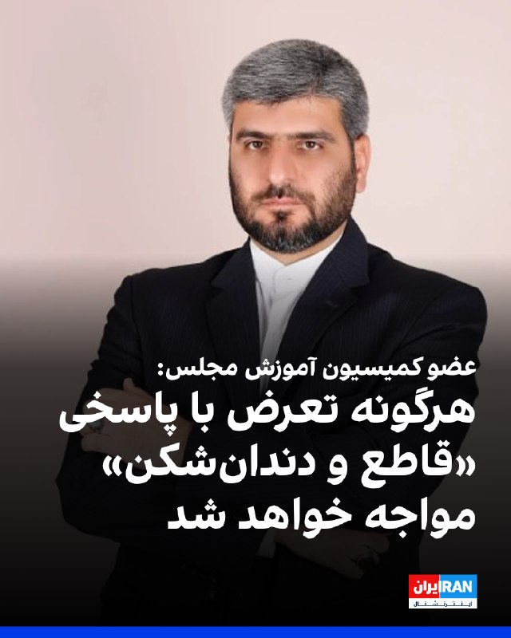

علی خزایی، عضو کمیسیون آموزش مجلس گفت که هرگونه تعرض و تجاوز از سوی آمریکا، اسرائیل و متحدانشان با «پاسخ قاطع، سخت و دندان‌شکن» مواجه خواهد شد.

خزایی افزود: «دشمن بار دیگر دچار خطای محاسباتی شده و تصور کرده جمهوری اسلامی در میدان نبرد دچار سکوت یا انفعال شده است.»
‌🏁 🇬🇧 IranintlTV

🤖 @VahidOOnLine

## VahidOOnLine — post 242817

  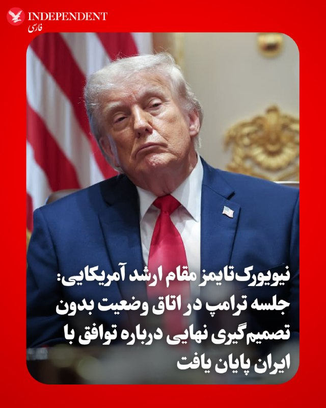

♦️ یک مقام ارشد دولت آمریکا که خواست نامش فاش نشود، روز جمعه هشتم خرداد، در گفتگو با نیویورک‌تایمز اعلام کرد که جلسه دونالد ترامپ، رئیس‌جمهوری آمریکا، در اتاق وضعیت کاخ سفید حدود دو ساعت به طول انجامید، اما او هنوز تصمیم نهایی را درباره توافق جدید با ایران اتخاذ نکرده است.

به گفته این مقام مسئول، دولت ترامپ بر این باور است که طرفین به یک توافق نزدیک شده‌اند، اما همچنان موضوعات مشخصی از جمله مسئله آزادسازی دارایی‌های مسدودشده ایران مورد بحث و رایزنی قرار دارد. ترامپ در پیامی که پیش از این جلسه منتشر کرد، تاکید کرد که فعلا پولی آزاد نخواهد شد.
‌🇸🇦 Indypersian

🤖 @VahidOOnLine

## VahidOOnLine — post 242816

  

♦️ ابراهیم عزیزی، رئیس کمیسیون امنیت ملی مجلس شورای اسلامی با انتشار پیامی در شبکه اجتماعی ایکس، ایران را «پیروز و فاتح میدان» دانست و نوشت: «ترامپ باید بداند که ایران، به عنوان پیروز و فاتح میدان شرایط را تعیین می‌کند: نقد مقابل نقد، نسیه مقابل نسیه، هیچ مقابل هیچ؛ البته برای موضوعاتی که مورد مذاکره است نه آرزوهایش!»

این پیام ساعاتی پس از آن منتشر شد که ترامپ، با انتشار جزئیاتی از تفاهم‌نامه مورد مذاکره اعلام کرد که بازگشایی تنگه هرمز، برقرار نشدن هرگونه سازوکار اخذ عوارض از کشتی‌ها و نابودی ذخایر اورانیوم با غنای بالا از موارد ذکر شده هستند. اسماعیل بقایی، سخنگوی وزارت خارجه این موارد را رد کرد. ترامپ بارها تاکید کرده که تنها توافقی را می‌پذیرد که مسئله تنگه هرمز و برنامه هسته‌ای جمهوری اسلامی را در بر بگیرد.
‌🇸🇦 Indypersian

🤖 @VahidOOnLine

## VahidOOnLine — post 242815

  

خبرگزاری رویترز به نقل از منابع جمهوری اسلامی گزارش داد که تهران ممکن است با انتقال نیمی از ذخایر اورانیوم غنی‌شده ۶۰درصدی به یک کشور ثالث موافقت کند.

بر اساس این گزارش، در این حالت، جمهوری اسلامی در مقابل این مقدار، اورانیوم با غنای ۵ درصد دریافت می‌کند.

رویترز نوشت که همچنین ممکن است نیم دیگر این ذخایر در داخل ایران رقیق‌سازی شود.
‌🏁 🇬🇧 IranintlTV

🤖 @VahidOOnLine

## VahidOOnLine — post 242814

  

♦️خبرنگار صداوسیما در قشم از فعال شدن سامانه پدافند هوایی در این منطقه خبر داد و اعلام کرد این اقدام دقایقی پیش انجام شده است.
در ادامه، خبرگزاری مهر به نقل از منابع محلی گزارش داد یک ریزپرنده در حوالی قشم توسط پدافند هوایی هدف قرار گرفته و منهدم شده است.
بر اساس این گزارش‌ها، جزئیات بیشتری درباره ماهیت این ریزپرنده و نتیجه نهایی عملیات پدافندی تاکنون منتشر نشده است.
‌🇸🇦 Indypersian

🤖 @VahidOOnLine

## VahidOOnLine — post 242813

  

نیویورک‌تایمز به نقل از یک مقام ارشد آمریکایی گزارش داد نشست دونالد ترامپ در «اتاق وضعیت» کاخ سفید دو ساعت به طول انجامید، اما رییس‌جمهور آمریکا هنوز درباره هیچ توافق جدیدی با تهران به تصمیم نهایی نرسیده است.

این مقام افزود دولت آمریکا معتقد است به دستیابی به توافق نزدیک شده، اما برخی مسائل از جمله آزادسازی دارایی‌های مسدودشده همچنان محل بررسی و اختلاف‌نظر است.
‌🏁 🇬🇧 IranintlTV

🤖 @VahidOOnLine

## VahidOOnLine — post 242812

  <a href="telegram/content/VahidOOnLine_242812_1780084742.mp4" target="_blank">🎬 Download video</a>

یک شهروند با اشاره به وضعیت بد معیشتی به مقایسه قدرت خرید خانواده‌های ایرانی با شهروندان کشورهای دیگر پرداخته و می‌گوید که بازگشت نسبی اتصال به اینترنت به این علت است که «حواسمان را پرت کنند.»

پیام او با هوش مصنوعی خوانده شده است.
‌🏁 🇬🇧 IranintlTV

🤖 @VahidOOnLine

## VahidOOnLine — post 242811

  

ارتش اسرائیل اعلام کرد که بر اساس مستنداتی که به دست آورده، گروه مسلح حزب‌الله، تحت حمایت جمهوری اسلامی، راکت‌هایی را شلیک کرده که به کلیسایی در جنوب لبنان اصابت کرده است.

در بیانیه ارتش اسرائیل آمده است: «سازمان تروریستی حزب‌الله در طول شامگاه جمعه چندین راکت شلیک کرد که به کلیسای ارتدوکس سنت جورج در جنوب لبنان اصابت کردند. این شلیک‌ها به ساختمان‌هایی در روستای مسیحی مرجعیون اصابت کردند.»

ارتش اسرائیل تاکید کرده که نیروهایش در محدوده این کلیسا فعالیت نمی‌کنند.
‌🏁 🇬🇧 IranintlTV

🤖 @VahidOOnLine

## VahidOOnLine — post 242810

  

♦️ روزنامه وال‌استریت ژورنال روز جمعه هشتم خرداد، در گزارشی اختصاصی به نقل از منابع آگاه فاش کرد که امارات متحده عربی در طول جنگ، ده‌ها حمله هوایی را علیه مواضعی در ایران انجام داده است. منابع وال‌استریت ژورنال می‌گویند نقش امارات در این کارزار نظامی، «بسیار عمیق‌تر» از آنچه که پیش‌تر گزارش شده، بوده است.

بر اساس این گزارش، این حملات با هماهنگی کامل واشنگتن و تل‌آویو و با اتکا به اطلاعات ارائه‌شده از سوی آن‌ها انجام شده است. اهداف امارات شامل جزایر قشم و ابوموسی در تنگه هرمز، بندرعباس، پالایشگاه نفت جزیره لاوان و مجتمع پتروشیمی عسلویه بوده است. حملات به عسلویه که به صورت مشترک با اسرائیل و در پاسخ به ضربات جمهوری اسلامی به زیرساخت‌های انرژی امارات انجام شد، واکنش‌های شدید بین‌المللی را برانگیخت و واشنگتن را وادار کرد از اسرائیل بخواهد حمله به تاسیسات انرژی را متوقف کند.

علاوه بر ابعاد نظامی، امارات در سازمان ملل نیز از پیش‌نویس قطعنامه‌های مجوز استفاده از زور برای بازگشایی تنگه هرمز حمایت کرد و تعطیلی مدارس و موسسات وابسته به تهران در دبی و لغو ویزای شهروندان ایرانی را در دستور کار قرار داد.
‌🇸🇦 Indypersian

🤖 @VahidOOnLine

## VahidOOnLine — post 242809

  <a href="telegram/content/VahidOOnLine_242809_1780084745.mp4" target="_blank">🎬 Download video</a>

♦️این روزها ویدیوهای متعددی از آمادگی بدنی نیروهای نظامی آمریکا و ورزش‌های وزیر جنگ این کشور از سوی ارتش آمریکا منتشر شده که توجه‌ها را به آمادگی بدنی پیت هگست جلب کرده است. در پی این انتشار این تصاویر یک عضو نیروی دریایی جمهوری اسلامی نیز تصاویری از ورزشهای انفرادی خود منتشر کرده و این تصاویر را به‌صورت مقایسه‌ای با تصاویر ورزش‌های نیروهای آمریکایی با هگست ترکیب کرده است. تمرین‌های این تفنگدار نیروی دریایی جمهوری اسلامی، در یک باشگاه خصوصی انجام شده و در پایگاه ارتش یا سپاه تصویربرداری نشده است.

پیش از این بارها آماده نبودن بدنی فرماندهان ارتش و سپاه از سوی کاربران ایرانی مورد شوخی و طنز قرار گرفته است و پیش از شروع جنگ نیز بسیاری از کاربران مقایسه میان پیت هگست و فرماندهان نظامی جمهوری اسلامی را دستمایه ساخت محتواهای طنز قرار داده بودند.
‌🇸🇦 Indypersian

🤖 @VahidOOnLine

## VahidOOnLine — post 242808

  

خبرگزاری تسنیم، وابسته به سپاه پاسداران گزارش داد که شامگاه جمعه، در پی رصد ریزپرنده متخاصم «دشمن آمریکایی-اسرائیلی» در حوالی قشم از سوی پدافند هوایی ارتش، مورد اصابت قرار گرفت و منهدم شد.
پیش‌تر رسانه‌های ایران تصاویری از شلیک ممتد پدافند در محدوده قشم منتشر کرده بودند.
‌🏁 🇬🇧 IranintlTV

🤖 @VahidOOnLine

## VahidOOnLine — post 242807

  

خبرگزاری مهر، وابسته به سازمان تبلیغات اسلامی، نوشت شامگاه جمعه، صدای فعالیت پدافند در جزیره قشم از سوی ساکنان محلی گزارش شده است.

بنا بر این گزارش ماهیت این صداها مشخص نیست و هنوز هیچ‌یک از نهادهای رسمی درباره علت وقوع این صداها اظهارنظر نکرده‌اند.
‌🏁 🇬🇧 IranintlTV

🤖 @VahidOOnLine

## VahidOOnLine — post 242806

  

ابراهیم عزیزی، رییس کمیسیون امنیت ملی مجلس، در شبکه ایکس نوشت که ترامپ باید بداند که جمهوری اسلامی به عنوان «پیروز و فاتح میدان»، شرایط را تعیین می‌کند؛ نقد مقابل نقد، نسیه مقابل نسیه و هیچ مقابل هیچ. البته برای موضوعاتی که مورد مذاکره است، نه آرزوهایش.

پیش‌تر دونالد ترامپ اعلام کرد که «ایران باید موافقت کند که هرگز سلاح یا بمب هسته‌ای نخواهد داشت. تنگه هرمز باید فورا باز باشد؛ بدون دریافت عوارض و برای عبور و مرور نامحدود کشتی‌ها در هر دو جهت. همه مین‌های دریایی (بمب‌ها)، در صورت وجود، باید از میان برداشته شوند.»
‌🏁 🇬🇧 IranintlTV

🤖 @VahidOOnLine

## VahidOOnLine — post 242805

  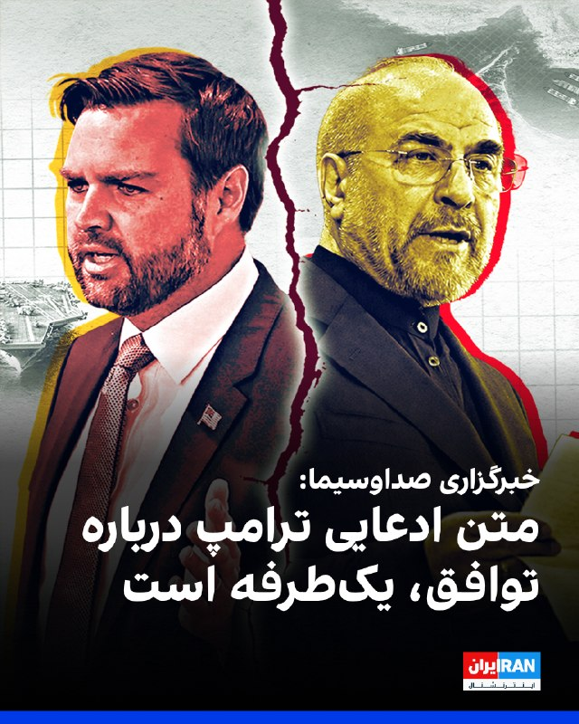

خبرگزاری صداوسیمای جمهوری اسلامی اعلام کرد «متن ادعایی ترامپ یک‌طرفه» است و هنوز درباره هیچ‌کدام از بندهای آن توافقی نشده است.
خبرگزاری صداوسیما افزود جمهوری اسلامی هنوز متن ۱۴بندی ادعایی رسانه‌ها را برای آمریکا ارسال نکرده است.

خبرگزاری صداوسیما همچنین اعلام کرد ادعای ترامپ درباره مواد هسته‌ای ایران عقب‌نشینی آشکار از ادعاهای اولیه درباره انتقال این مواد به آمریکا است.

پیش‌تر دونالد ترامپ اعلام کرد که برای اتخاذ تصمیم نهایی درباره ایران، در اتاق وضعیت کاخ سفید جلسه تشکیل داده است.
‌🏁 🇬🇧 IranintlTV

🤖 @VahidOOnLine

## VahidOOnLine — post 242804

  

♦️ مهدی خانعلی‌زاده، خبرنگار صداوسیما که برای پوشش مذاکرات اسلام‌آباد، به پاکستان سفر کرده بود، با انتشار پیامی در روایتگر اینستاگرام خود، متن تفاهم احتمالی میان تهران و واشنگتن را ناقض «بیانیه شورای امنیت ملی» که به تایید مجتبی خامنه‌ای، رهبر جدید جمهوری اسلامی نیز رسیده بود، دانست.

خانعلی‌زاده نوشت: «در متن تفاهم احتمالی، هشت بند از ۱۰ بعد بیانیه شورای عالی امنیت ملی که به تایید رهبری رسیده، رعایت نشده و زیر پا گذاشته شده است.»

او در ادامه به دو بند مربوط به آزادی دارایی‌های مسدودشده ایران و وضعیت حقوقی تنگه هرمز نیز پرداخت و با اشاره به تناقض در گفته‌های دونالد ترامپ با روایت مقام‌های جمهوری اسلامی، امکان اجرایی نشدن این تفاهم را «بسیار بالا» دانست.

خانعلی‌زاده، مذاکراتی که با میانجی‌گری پاکستان پس از دیدار در اسلام‌آباد انجام شد را «پسااسلام‌آباد» خواند و نوشت که این مذاکرات «بر مبنای شروط رهبری» انجام نشده است.
‌🇸🇦 Indypersian

🤖 @VahidOOnLine

## WithYashar — post 12905

نیویورک پست: زمان نهایی شدن تفاهم‌نامه بین آمریکا و ایران مشخص نیست
@withyashar

## WithYashar — post 12904

  <a href="telegram/content/WithYashar_12904_1780084748.mp4" target="_blank">🎬 Download video</a>

وزیر خزانه‌داری آمریکا، اسکات بسنت:
ما حدود ۱ میلیارد دلار از رمزارزهای ایران را توقیف کرده‌ایم فقط مستقیم کیف‌پول‌ها را گرفته‌ایم.
برخی از آن‌ها شاید همین الان در حال تایپ کردن باشند و هنوز متوجه نشده‌اند که کیف‌پولشان گرفته شده است.
این پولی است که از مردم ایران دزدیده شده است.
@withyashar

## WithYashar — post 12903

شبکه کان اسرائیل :
نتانیاهو خواستار از سرگیری حملات به ایران است.
@withyashar

## WithYashar — post 12902

پست جدیددد اتاق جنگ داغ داغ کلیک کنید و کارای اداریش رو انجام بدید 💥

https://www.instagram.com/reel/DY7xeuCRP_4/?igsh=aW9oOXNnbno1NDJ6

## WithYashar — post 12901

  

پوستر
@withyashar

## WithYashar — post 12900

المانیتور: تیم ترامپ، در اقدامی قابل توجه، ایده ایجاد یک صندوق ۳۰۰ میلیارد دلاری را برای ایران مطرح کرده است.
این پیشنهاد در شرایطی مطرح می‌شود که پیش از این، تهران یک پیشنهاد تجاری مشابه را رد کرده بود.
@withyashar

## WithYashar — post 12899

گزارش انفجار دارم از‌ بندر

## WithYashar — post 12898

## WithYashar — post 12897

صدای نوتیفیکیشن پولای بلوکه شدست دارن واریز میکنن 🤣
@withyashar

## WithYashar — post 12896

تسنیم: ریز پرنده دشمن رو تو قشم زدیم
@withyashar

## WithYashar — post 12895

🚨🚨🚨🚨🚨🚨

## WithYashar — post 12894

منابع محلی ۲ انفجار در قشم همزمان با فعالیت پدافند هوایی گزارش دادند.
@withyashar

## WithYashar — post 12893

  <a href="telegram/content/WithYashar_12893_1780084751.mp4" target="_blank">🎬 Download video</a>

پدافند قشم همچنان فعاله
@withyashar

## WithYashar — post 12892

امشب از ته وجودتون خالصانه از خدا بخواهید امیدوارم که ندای ما را بشنود و بهترینها برایمان اتفاق بیفته🍀

## WithYashar — post 12891

سلام اين مسير دقيقا مسير قاهره هست . درست داره ميره ولى ما چون مسير قاهره رو بلد نيستم فكر ميكنيم داريم اشتباه ميريم

## WithYashar — post 12890

  <a href="telegram/content/WithYashar_12890_1780084752.mp4" target="_blank">🎬 Download video</a>

دیدبان اتاق جنگ : الان پدافند قشم💥
@withyashar

## WithYashar — post 12889

🚨پدافند قشم فعال شد
@withyashar

## WithYashar — post 12888

خبرگزاری فرانسوی: جارد کوشنر مانع امضای تفاهم‌نامه بین آمریکا و ایران شد
@withyashar

## WithYashar — post 12887

🤣😃

## WithYashar — post 12886

## mwarmonitor — post 9896

📌امارات متحده عربی در طول جنگ، در هماهنگی با آمریکا و اسرائیل، ده‌ها حمله هوایی علیه ایران انجام داد - وال استریت ژورنال

@mwarmonitor

## mwarmonitor — post 9895

🔴 تانکر تارکرز: در روزهای اخیر، نفتکش‌ها در امتداد ساحل ایران و در تأسیسات دریایی اقدام به بارگیری نفت خام و انواع فرآورده‌های پالایش‌شده کرده‌اند. امروز (۲۹ مه ۲۰۲۶) نیز شاهد بارگیری یک نفتکش بسیار بزرگ (VLCC) به میزان دو میلیون بشکه نفت خام هستیم.

@mwarmonitor

## mwarmonitor — post 9894

🔴یک منبع مطلع به من گفت که پست ترامپ در Truth Social درباره لغو محاصره، در واقع اولین شرط قبل از رفتن به مراحل بعدی تفاهم بوده است.

🔸طبق گفته این منبع، طرف ایرانی اصرار داشته که ابتدا یک اعلام عمومی رسمی انجام شود. ترامپ به نظر می‌رسد این موضوع را به‌عنوان یک مسئله فرعی مطرح کرده، در حالی که تهران آن را یک اقدام مهم برای ایجاد اعتماد قبل از ورود به پرونده‌های حساس‌تر می‌داند.

🔹تا این لحظه هیچ بحث مستقیمی درباره پرونده هسته‌ای انجام نشده است. انتظار می‌رود روند به‌تدریج و از طریق یک تفاهم‌نامه (MoU) پیش برود، به‌طوری که در هر مرحله، یک اقدام متقابل از سوی طرف مقابل انجام شود.

🔸همان منابع می‌گویند که اعلام آتش‌بس بین حزب‌الله و اسرائیل نیز به‌عنوان بخشی از چارچوب گسترده‌تر در حال شکل‌گیری مورد انتظار است. علی هاشم خبرنگار الجزیره

@mwarmonitor

## mwarmonitor — post 9893

🔴 دونالد ترامپ: ​«ایران باید موافقت کند که هرگز سلاح یا بمب هسته‌ای نخواهد داشت. تنگه هرمز باید فوراً، بدون هیچ‌گونه عوارض (حق عبور)، برای تردد نامحدود کشتیرانی در هر دو جهت باز شود. تمام مین‌های دریایی (بمب‌ها)، در صورت وجود، نابود خواهند شد (ما تعداد زیادی…

## mwarmonitor — post 9892

🔴لارنس نورمن خبرنگار وال‌استریت ژورنال ؛ بار دیگر: توافق بر سر یک تفاهم‌نامه (MoU) به معنای توافق نهایی نیست که همه مسائل، از جمله موضوع هسته‌ای را پوشش دهد.

🔹این بخش در واقع «بخش آسان‌تر» است، دقیقاً به این دلیل که بسیاری از مسائل به آینده موکول (به تعویق) شده‌اند.

🔸اما اگر به‌طور منطقی این دیدگاه را داشته باشید که ممکن است هرگز یک توافق نهایی شکل نگیرد، این به این معنا نیست که یک چارچوب توافق یا MoU وجود نخواهد داشت.

@mwarmonitor

## mwarmonitor — post 9891

🔴رئیس‌جمهور ترامپ در حال حاضر به سمت اتاق وضعیت (Situation Room) می‌رود تا تصمیم بگیرد آیا توافق با ایران را بپذیرد یا نه؛ توافقی که می‌تواند شامل بازگشایی تنگه هرمز، لغو محاصره آمریکا علیه بنادر ایران، و همچنین خارج کردن و نابود کردن اورانیوم غنی‌شده تهران باشد. نیویورک پست

@mwarmonitor

## mwarmonitor — post 9890

بله کله زرد توافق کرد

## mwarmonitor — post 9889

🔴 دونالد ترامپ: ​«ایران باید موافقت کند که هرگز سلاح یا بمب هسته‌ای نخواهد داشت. تنگه هرمز باید فوراً، بدون هیچ‌گونه عوارض (حق عبور)، برای تردد نامحدود کشتیرانی در هر دو جهت باز شود. تمام مین‌های دریایی (بمب‌ها)، در صورت وجود، نابود خواهند شد (ما تعداد زیادی…

## mwarmonitor — post 9888

🔴 دونالد ترامپ:

​«ایران باید موافقت کند که هرگز سلاح یا بمب هسته‌ای نخواهد داشت. تنگه هرمز باید فوراً، بدون هیچ‌گونه عوارض (حق عبور)، برای تردد نامحدود کشتیرانی در هر دو جهت باز شود. تمام مین‌های دریایی (بمب‌ها)، در صورت وجود، نابود خواهند شد (ما تعداد زیادی از این مین‌ها را از طریق انفجار، با مین‌روب‌های زیردریایی فوق‌العاده خود پاکسازی کرده‌ایم. ایران کار حذف و/یا انفجار فوری هرگونه مین باقی‌مانده را که تعدادشان زیاد نخواهد بود، کامل خواهد کرد!). کشتیرانی‌هایی که به دلیل محاصره دریایی شگفت‌انگیز و بی‌سابقه ما در تنگه گرفتار شده بودند و این محاصره اکنون برداشته خواهد شد، می‌توانند فرآیند "بازگشت به خانه" را آغاز کنند! از طرف من، رئیس‌جمهور محبوبتان، به همسران، شوهران، والدین و خانواده‌های خود سلام برسانید!
​مواد غنی‌شده که گاهی اوقات از آن‌ها به عنوان "گرد و غبار هسته‌ای" یاد می‌شود و در اعماق زمین زیر کوه‌های عملاً فروریخته قرار دارند—که ناشی از حمله ۱۱ ماه پیش بمب‌افکن قدرتمند B2 ما بوده و روی آن جا خوش کرده است—توسط ایالات متحده (که توافق شده تنها کشوری است که در کنار چین توانایی مکانیکی انجام این کار را دارد!)، با هماهنگی و همکاری نزدیک با جمهوری اسلامی ایران، به علاوه آژانس بین‌المللی انرژی اتمی، از زیر خاک بیرون آورده و نابود خواهد شد.
​تا اطلاع ثانوی هیچ پولی رد و بدل نخواهد شد. در مورد موارد دیگر که از اهمیت بسیار کمتری برخوردارند، توافق شده است. من هم‌اکنون در "اتاق وضعیت" (Situation Room) جلسه خواهم داشت تا تصمیم نهایی را اتخاذ کنم. از توجه شما به این موضوع سپاسگزارم!

رئیس‌جمهور دونالد جی. ترامپ»

@mwarmonitor

## mwarmonitor — post 9887

  <a href="telegram/content/mwarmonitor_9887_1780084753.mp4" target="_blank">🎬 Download video</a>

🔸موشک بالستیک میان‌برد روسی «اورِشنیک» (Oreshnik) با قطعات قدیمی مونتاژ شده است.

🔹کارشناسان اوکراینی بقایای موشک بالستیک جدید روسیه موسوم به «اورشنیک» را بررسی کرده‌اند و به این نتیجه رسیده‌اند که این موشک با استفاده از قطعات قدیمی ساخته شده است.

🔸به گفته متخصصان، بسیاری از اجزا حداکثر تا سال‌های ۲۰۱۶–۲۰۱۷ تولید شده‌اند؛ از جمله قطعات روسی و بلاروسی (از کارخانه Integral در بلاروس). حتی یکی از واحدها تاریخ تولید ۲۰۱۷ را به‌طور واضح روی خود دارد.

🔸با وجود آن‌که تبلیغات روسیه «اورشنیک» را یک سلاح پیشرفته و مدرن معرفی می‌کند، این موشک تا حد زیادی از قطعات قدیمی مونتاژ شده است.

🔹همچنین قطعات خارجی ساخت چین، ایالات متحده آمریکا، ژاپن، آلمان و سوئیس در بقایای این موشک شناسایی شده است.

@mwarmonitor

## mwarmonitor — post 9886

  

🔸نیروهای ایالات متحده آمریکا به اجرای محاصره علیه ایران ادامه می‌دهند.
تا تاریخ ۲۹ مه، ۱۱۵ کشتی تجاری تغییر مسیر داده شده‌اند تا اطمینان حاصل شود هیچ‌گونه تجارت دریایی وارد بنادر ایران نشده یا از آن خارج نشود.

@mwarmonitor

## mwarmonitor — post 9885

📝 «رادیو شب‌بخیر کوچولو در منهتن؛ پشت‌پرده لالایی‌های سفارشی فرناز فصیحی برای ذبح حقیقت»

🔰نیویورک‌تایمز روزگاری اعتبار می‌فروخت، اما امروز با سقوط به عمق توهم، به گهواره‌ای برای دفن حقیقت تبدیل شده است؛ برجی در منهتن که بخش خاورمیانه‌اش دپارتمان راستی‌آزمایی را منحل کرده تا اتاق تخیل و الهام بسازد. در این سقوط آزاد، هر زمان که نام قصه فرناز فصیحی از رادیو شب بخیر کوچولو به میان می‌آید، مخاطب می‌داند که باید چشم بر واقعیت‌های تلخ و خونین کف خیابان ببندد و به لالاییِ منابع ناشناس، ارواح سرگردانِ درگاه‌های حکومتی و روایت‌های مهندسی‌شده‌ای گوش بسپارد که در آن قطع کردن اینترنت صرفاً برای استراحت چشم بچه‌هاست و معترضان بازیگران یک تئاتر خیابانی! این روزنامه‌نگاریِ سفارشی و جهت‌دار، شرف قلم را فدای دسترسی‌های دیپلماتیک پنهان کرده و چنان تشت اعتبارتان را از بام انداخته که مردم خاورمیانه به تیترهای مندرج در صفحاتتان صرفاً زهرخند می‌زنند. شب بخیر جهان اول، شب بخیر منابع خیالی، و شب بخیر حقیقتی که در تاروپود این قصه‌های شبانه ذبح شدی.هر زمان به نام این «خبربمال سفارشی» برخوردید، فوراً فرار کنید؛ چرا که اگر پای گزارش‌های تخیلی‌اش بنشینید، ناگهان چشم باز می‌کنید و می‌بینید در اوج جنگ و بلک‌اوت اینترنتی، در حال نوشیدن چای دیپلماتیک با احمدی‌نژاد پساجنگ هستید!

@mwarmonitor

## mwarmonitor — post 9884

🔴شرکت آمریکایی Chevron: ما ۶ کشتی در تنگه هرمز داریم و هیچ‌گونه عوارض عبور پرداخت نخواهیم کرد.

@mwarmonitor

## mwarmonitor — post 9882

  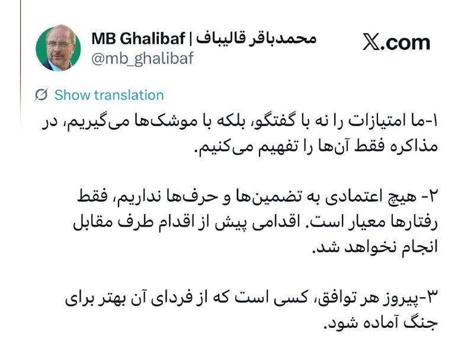

📝 واقعاً باید به این حسنِ انتخابِ روزگار در چیدن مهره‌های اطرافمان تبریک گفت؛ کلکسیونی بی‌نظیر از نوابغِ صلح‌طلب که معتقدند امتیازات را باید با موشک گرفت و از فردای هر توافقی، بند پوتین‌ها را برای جنگ بعدی محکم کرد! در این میان، سهمِ پیشانی‌نوشتِ ما ایرانی‌ها هم شده تماشای یک مسابقه جذابِ «کی از همه مجنون‌تره؟» میان داخلی و غریبه؛ از این طرف با تئوریسین‌های دیپلماسیِ راکتی و همسایگانِ همیشه دستمال به دست، و از آن طرف با دونالد ترامپ و شرکا که انگار همگی دسته‌جمعی در یک کلینیکِ فوق‌تخصصیِ توهم فارغ‌التحصیل شده‌اند و حالا برای پیاده کردن پروژه‌های پایان‌نامه‌شان، قرعه کشی کرده و دقیقاً روی اعصاب و زندگی ما نشانه‌ رفته‌اند.

@mwarmonitor

## mwarmonitor — post 9881

🔴دونالد ترامپ در سوشال تروث

«جیل بایدن اکنون بالاخره اعتراف کرده است که نمی‌دانسته در طول مناظره ریاست‌جمهوری فوق‌العاده و پربیننده سال ۲۰۲۴ ما، چه بلایی سر "جوی خواب‌آلود" آمد؛ مناظره‌ای که در آن جو دقیقاً در بالاترین سطح از استانداردهای مناظره عمل نمی‌کرد. او گفت با خود فکر کرده که جو دچار "سکته مغزی" یا اتفاقات بسیار بد دیگری شده است، و با این حال، هرگز برای کمک به شوهرِ گرفتار خود به روی صحنه ندوید؛ کاری که هر زن خوبی انجام می‌دهد. تنها چیزی که او فراموش کرد به آن اشاره کند این بود که من قبل از فروپاشیِ تقریباً کامل او، چقدر عالی عمل می‌کردم. به عبارت دیگر، همان‌طور که بسیاری پرسیده‌اند، آیا عملکرد قوی من در آن مناظره باعث شد که او خیلی ساده و واضح "کم بیاورد" (قفل کند) و به شکست ننگینش منجر شود، یا دلایل دیگری در کار بود؟ هیچ‌کس دیگری پاسخ این را نمی‌داند، اما من می‌دانم!!!»

@mwarmonitor

## FoxNewsTwitter — post 342409

  <a href="telegram/content/FoxNewsTwitter_342409_1780084755.mp4" target="_blank">🎬 Download video</a>

Fox News (Twitter/X)

"Hand to God" this video is real.

A Florida deputy thought he had caught a distracted driver red-handed.

Then he walked up to the window and discovered the driver...only had one hand.

Kathleen Thomas was pulled over on suspicion of using a cellphone with her right hand while driving, but the stop quickly took an unexpected turn when she explained she doesn't have a right hand.

In the video, the officer asks Thomas to swear "hand to God" that she did not have the phone in her hand.

After video of the encounter went viral, officials dropped the citation over what they called a lack of evidence.

## FoxNewsTwitter — post 342408

  <a href="telegram/content/FoxNewsTwitter_342408_1780084757.mp4" target="_blank">🎬 Download video</a>

Fox News (Twitter/X)

“Let them hear you at the f***ing White House.”

Bruce Springsteen rages against President Trump and his administration during his latest Washington, DC show:

"This White House is destroying the American idea and our reputation around the world."

"We are America, the reckless, unpredictable, predatory, untrustworthy, rogue nation."

The crowd at Nationals Park roared as Springsteen urged fans to “fight back.”

## FoxNewsTwitter — post 342406

  <a href="telegram/content/FoxNewsTwitter_342406_1780084759.mp4" target="_blank">🎬 Download video</a>

Fox News (Twitter/X)

"They're among us"

The White House has a new message on aliens: They are not coming from outer space — they are already here and ICE is tracking them.
A new website, Aliens.gov tracks illegal immigrant arrests, migrant encounters and ICE operations nationwide, using a live heat map and searchable arrest data by city, state and alleged crime.

“Millions arrived under the cover of darkness,” the site says, accusing past leaders of covering up and accelerating the problem.

A White House official told Fox News Digital this is a “first of its kind effort” to draw attention to the fallout from the previous administration’s border policies.

## FoxNewsTwitter — post 342405

  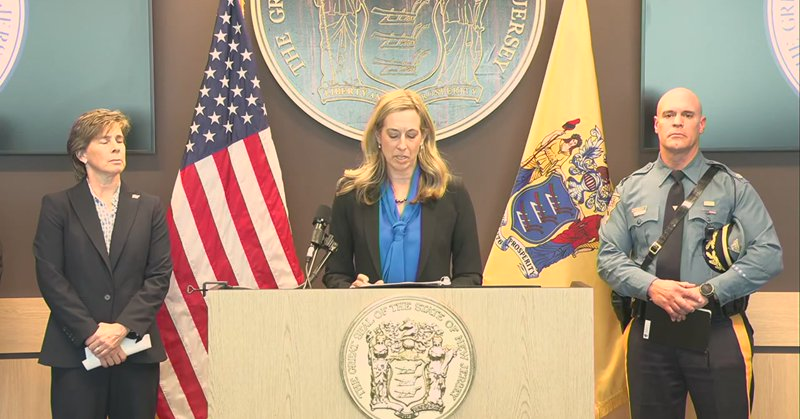

Fox News (Twitter/X)

WATCH LIVE: NJ Gov. Sherrill holds press conference on Delaney Hall detention center https://twitter.com/i/broadcasts/1aKbddMqbnqJX

## FoxNewsTwitter — post 342404

  

Fox News (Twitter/X)

WATCH LIVE: FBI details intense security crackdown ahead of World Cup https://twitter.com/i/broadcasts/1nGeLLBrydAKX

## FoxNewsTwitter — post 342403

  <a href="telegram/content/FoxNewsTwitter_342403_1780084762.mp4" target="_blank">🎬 Download video</a>

Fox News (Twitter/X)

President Trump and NYC Mayor Zohran Mamdani are on the same page about at least one thing: they both want the New York Knicks to win an NBA championship.

"I'll say one of the few things the president and I agree on is not just that New York City is the greatest city in the world, but that we do want the Knicks to win the championship."

Mamdani also says if Trump wants to attend a game, he'll let him enjoy it like any other fan.

## FoxNewsTwitter — post 342402

  <a href="telegram/content/FoxNewsTwitter_342402_1780084764.mp4" target="_blank">🎬 Download video</a>

Fox News (Twitter/X)

“I’ll kill your whole f–king family. Your whole f–king family is dead. Your children, your wife, all dead."

A left-wing activist in Newark was caught on camera shouting those words at an unmasked ICE officer as protests outside the Delaney ICE facility turned chaotic.

Acting AG Todd Blanche is now firing back, promising that the "disgusting" activist will be caught and charged, emphasizing that threatening a federal officer and their family is a federal crime.

“That is disgusting ... and we see his face and I promise you we will find him, and when we find him, we will arrest him."

## FoxNewsTwitter — post 342401

  <a href="telegram/content/FoxNewsTwitter_342401_1780084766.mp4" target="_blank">🎬 Download video</a>

Fox News (Twitter/X)

NEW: President Trump defends Jaxson Dart against the fierce backlash he's facing following his recent rally appearance, showering the New York Giants quarterback with praise while brushing off critics.

"He's a conservative guy. He said, 'I love you, sir.'"

"When Jaxson gets harassed a little bit, he's also loved more, because we have more people than they do."

Watch the full interview on @MyViewFNC tomorrow at 9 pm ET.

## FoxNewsTwitter — post 342400

  <a href="telegram/content/FoxNewsTwitter_342400_1780084768.mp4" target="_blank">🎬 Download video</a>

Fox News (Twitter/X)

A furious customer — being labeled 'Chipotle Karen' — launched a burrito bowl straight into an employee’s face after a heated argument over her order.

A Chipotle employee was left covered in food after an angry customer allegedly launched her order directly at the worker’s face during a confrontation inside the California restaurant.

The moment was caught on camera. Now Santa Ana Police are asking for help identifying the woman, who investigators say took off after the assault.

## FoxNewsTwitter — post 342399

  

Fox News (Twitter/X)

WATCH LIVE: SpaceX launches Falcon 9 rocket from Florida https://twitter.com/i/broadcasts/1yxBeepDOpWJN

## FoxNewsTwitter — post 342398

  

Fox News (Twitter/X)

JUST IN: President Trump launches a scathing attack on Jill Biden after she admitted that she thought her husband was having a "stroke" during their infamous 2024 presidential debate.

“She said that she thought he was having a ‘stroke,’ and various other really bad things, and yet never rushed onto the stage to help her troubled husband, as any good wife would do.”

“As many have asked, did my strong performance in that debate cause him to, plain and simple, ‘choke,’ leading to his ignominious defeat, or were there other reasons? Nobody else knows the answer to that, BUT I DO!!!” https://twitter.com/FoxNews/status/2059806402294542554#m

## FoxNewsTwitter — post 342397

  <a href="telegram/content/FoxNewsTwitter_342397_1780084770.mp4" target="_blank">🎬 Download video</a>

Fox News (Twitter/X)

Early morning PT with America’s bravest.

Secretary of War Pete Hegseth kicks off his day by working out alongside U.S. troops aboard the USS Boxer while docked in Singapore.

## FoxNewsTwitter — post 342396

  <a href="telegram/content/FoxNewsTwitter_342396_1780084772.mp4" target="_blank">🎬 Download video</a>

Fox News (Twitter/X)

WATCH: Secretary Pete Hegseth gives a rousing speech to sailors and Marines aboard the USS Boxer, praising them for being the force behind America’s strength in the conflict with Iran:

“As the President said in the Cabinet meeting... Iran can either do it the right way with a deal across the table, or they can deal with my guy on the left and it happened to be me...”

“But it’s not me. It’s you guys.”

## FoxNewsTwitter — post 342395

  <a href="telegram/content/FoxNewsTwitter_342395_1780084774.mp4" target="_blank">🎬 Download video</a>

Fox News (Twitter/X)

NEW: JPMorgan Chase CEO Jamie Dimon delivers a powerful tribute to American exceptionalism on @MorningsMaria:

“America is still the beacon of light, and the hill is still the arsenal of democracy, the bastion of freedom.”

“I’m quite patriotic in that, and that this country provides safety to the whole world.”

“We have the strongest military in the world, underpinned by the strongest economy in the world.”

@MariaBartiromo

## FoxNewsTwitter — post 342394

  <a href="telegram/content/FoxNewsTwitter_342394_1780084776.mp4" target="_blank">🎬 Download video</a>

Fox News (Twitter/X)

NEW: JPMorgan CEO Jamie Dimon pushes back on NYC Mayor Mamdani’s calls for higher taxes, arguing that politicians should focus on fixing government rather than seeking tax hikes.

“Good policy is free.”

“Don’t try to raise more taxes or spend more money. Sit down and fix policy. And I think you can grow 1% faster. I literally believe that.”

“It’s frustrating. It hurts. It’s embarrassing. And it always hurts the civilians of our country.”

“He’s running a city of 300,000 employees now. He’s never had a job like that.”

“And I’ve seen mayors who’ve failed abysmally because they can’t administer themselves out of a paper bag, or because ideology blinds them to practical, realistic, real-world policy.”

Dimon described his recent meeting with Mamdani as “pleasant,” saying, “I said everything I wanted to say,” and offering that if he could help him, he’d “be happy to do that.”

@MorningsMaria @MariaBartiromo

## pm_afshaa — post 91872

رئیس شورای هماهنگی اسلامی :قرار است یک مراسم تشییع ده‌ها میلیون نفری برای رهبر شهید مفعولمون برگزار کنیم

💧 Rainbet.com the #1 Non-KYC Crypto Casino & Sportsbook @rainbetcom

😁 @Pm_Afshaa

## pm_afshaa — post 91871

  

کانفیگ استارلینک رایگان👇

## pm_afshaa — post 91870

https://t.me/proxy?server=87.248.129.12&port=15&secret=ee1603010200010001fc030386e24c3add626973636f7474692e79656b74616e65742e636f6d

پروکسی مخصوص دانلود

💧 Rainbet.com the #1 Non-KYC Crypto Casino & Sportsbook @rainbetcom

😁 @Pm_Afshaa

## pm_afshaa — post 91869

🔴کان اسرائیل:نتانیاهو خواستار از سرگیری حملات به ایران است

💧 Rainbet.com the #1 Non-KYC Crypto Casino & Sportsbook @rainbetcom

😁 @Pm_Afshaa

## pm_afshaa — post 91868

🔴1 میلیارد دلار ارز دیجیتال سپاه توسط آمریکا مسدود شد

💧 Rainbet.com the #1 Non-KYC Crypto Casino & Sportsbook @rainbetcom

😁 @Pm_Afshaa

## pm_afshaa — post 91867

ثابتی؛ نماینده مجلس:پزشکیان به صداوسیما فشار اورده که دیگه سخنرانی های رهبر شهید علیه آمریکا رو پخش نکنن تا ترامپ لج نکنه و توافق رو بهم بزنه

💧 Rainbet.com the #1 Non-KYC Crypto Casino & Sportsbook @rainbetcom

😁 @Pm_Afshaa

## pm_afshaa — post 91866

https://t.me/proxy?server=87.248.129.50&port=15&secret=ee1603010200010001fc030386e24c3add626973636f7474692e79656b74616e65742e636f6d

پروکسی سرعت بالا مخصوص دانلود

💧 Rainbet.com the #1 Non-KYC Crypto Casino & Sportsbook @rainbetcom

😁 @Pm_Afshaa

## pm_afshaa — post 91865

https://t.me/proxy?server=87.248.129.12&port=15&secret=ee1603010200010001fc030386e24c3add626973636f7474692e79656b74616e65742e636f6d

پروکسی پینگ 100 متصل

💧 Rainbet.com the #1 Non-KYC Crypto Casino & Sportsbook @rainbetcom

😁 @Pm_Afshaa

## pm_afshaa — post 91864

🔴نیویورک تایمز:ترامپ حدود دو ساعت در اتاق وضعیت با تیم ارشد امنیت ملی ملاقات کرد اما هیچ تصمیمی برای توافق با ایران نگرفت

💧 Rainbet.com the #1 Non-KYC Crypto Casino & Sportsbook @rainbetcom

😁 @Pm_Afshaa

## pm_afshaa — post 91863

🔴فاکس نیوز: خبرهای مهمی از نشست ترامپ در کاخ سفید بیرون خواهد آمد

💧 Rainbet.com the #1 Non-KYC Crypto Casino & Sportsbook @rainbetcom

😁 @Pm_Afshaa

## pm_afshaa — post 91862

شش فروند هواپیمای ترابری C-17A Globemaster III متعلق به ایالات متحده آمریکا در حال ورود به خاورمیانه هستن

💧 Rainbet.com the #1 Non-KYC Crypto Casino & Sportsbook @rainbetcom

😁 @Pm_Afshaa

## pm_afshaa — post 91861

https://t.me/proxy?server=87.248.129.210&port=4455&secret=7hYDAQIAAQAB_AMDhuJMOt1iaXNjb3R0aS55ZWt0YW5ldC5jb20

پروکسی متصل سرعت بالا

💧 Rainbet.com the #1 Non-KYC Crypto Casino & Sportsbook @rainbetcom

😁 @Pm_Afshaa

## pm_afshaa — post 91860

دمت گرم از روزی که نت وص شده با کانفینگای کانال شما وصلم🌹🌹

## pm_afshaa — post 91859

دمت گرم همه پروکسی هات وصله و کانفینگ هات عالین کانالت کلا حرف نداره داداش دمت گرم پر قدرت ادامه بده

## pm_afshaa — post 91858

ارتش جمهورى اسلامى از سرنگونی یک فروند پهپاد آمریکایی در آسمان جزیره قشم خبر داد

💧 Rainbet.com the #1 Non-KYC Crypto Casino & Sportsbook @rainbetcom

😁 @Pm_Afshaa

## pm_afshaa — post 91857

https://t.me/proxy?server=87.248.129.13&port=15&secret=ee1603010200010001fc030386e24c3add63646e2e79656b74616e65742e636f6d

پروکسی سرعت بالا

💧 Rainbet.com the #1 Non-KYC Crypto Casino & Sportsbook @rainbetcom

😁 @Pm_Afshaa

## pm_afshaa — post 91856

پدافند بندر عباس فعال شد

💧 Rainbet.com the #1 Non-KYC Crypto Casino & Sportsbook @rainbetcom

😁 @Pm_Afshaa

## pm_afshaa — post 91855

https://t.me/proxy?server=87.248.129.132&port=16&secret=ee1603010200010001fc030386e24c3add63646e2e79656b74616e65742e636f6d

پروکسی سرعت بالا مخصوص دانلود فیلم و سریال

💧 Rainbet.com the #1 Non-KYC Crypto Casino & Sportsbook @rainbetcom

😁 @Pm_Afshaa

## pm_afshaa — post 91853

  <a href="https://t.me/pm_afshaa/91853" target="_blank">📎 Download file</a>

نپسترنت نامحدود سرعت موشکی بزنین وصل شین

💧 Rainbet.com the #1 Non-KYC Crypto Casino & Sportsbook @rainbetcom

😁 @Pm_Afshaa

## pm_afshaa — post 91852

  <a href="telegram/content/pm_afshaa_91852_1780084779.mp4" target="_blank">🎬 Download video</a>

ویدیویی جدید از لحظه اصابت موشک به یه پایگاه نظامی

💧 Rainbet.com the #1 Non-KYC Crypto Casino & Sportsbook @rainbetcom

😁 @Pm_Afshaa

## iaghapour — post 2642

  

⭕️ آپدیت بزرگ ویندوز ۱۱ منتشر شد؛ پرسرعت‌تر و هوشمندتر!

مایکروسافت به‌تازگی آپدیت جدید ویندوز ۱۱ (نسخه‌های ۲۴H۲ و ۲۵H۲) را با تمرکز بر افزایش سرعت و هوش مصنوعی منتشر کرد.

مهم‌ترین تغییرات این به‌روزرسانی:

🔹 اشتراک‌گذاری صدا: امکان اتصال هم‌زمان دو هدفون بلوتوثی مجزا به یک سیستم برای تماشای فیلم یا گوش دادن به موسیقی.

🔸 دوربین مشترک: دسترسی هم‌زمان چند نرم‌افزار به وب‌کم بدون مسدود شدن تصویر.

🔹 افزایش سرعت و جستجو: ارتقای چشمگیر سرعت منوی استارت و اجرای برنامه‌ها، به همراه امکان پیدا کردن سریع فایل‌ها با جستجوی تنها دو حرف.

🔸 پایش هوش مصنوعی و باتری: نمایش دقیق میزان مصرف پردازنده عصبی (NPU) در تسک‌منیجر و بهینه‌سازی مصرف انرژی لپ‌تاپ‌ها در حالت استندبای.

این آپدیت با رفع خطاهای ناگهانی و بهبود سیستم امنیتی Windows Hello، تجربه بسیار روان‌تری ارائه می‌دهد و در ژوئن ۲۰۲۶ به‌صورت خودکار برای همه کاربران فعال خواهد شد.

🆔 @iAghapour

## DEJradio — post 5111

  <a href="telegram/content/DEJradio_5111_1780084781.mp4" target="_blank">🎬 Download video</a>

🚨
🔸 خبر ۲۱
آدینه ۸ خرداد ۱۴۰۵

#خبر۲۱
@DEJradio

## DEJradio — post 5110

  <a href="telegram/content/DEJradio_5110_1780084783.mp4" target="_blank">🎬 Download video</a>

🤡
🔺 مراسم حج؛ زیارت پرفشار حجرالاسود، زائرانی که با فنون رزمی و کشتی مهمان خدا می‌شوند در موارد متعدد سلامت و جان خودشان یا دیگران را تهدید می‌کنند.

#حج #زیارت
@DEJradio

## DEJradio — post 5106

  <a href="telegram/content/DEJradio_5106_1780084785.webm" target="_blank">🎬 Download video</a>

👑
🔺 بر اساس اطلاعات دریافتی دژ، یکی از جانفدایان میهن، شایان شکاری ۲۰ ساله است که ۱۸ دی‌ماه ۱۴۰۴ در شهر رشت هدف گلوله سرکوبگران قرار گرفت. او قهرمان کشوری و نایب قهرمان تکواندو باشگاه‌های آسیا بود و در رشته تریبت بدنی در دانشگاه تحصیل می‌کرد.

دژ از مسیر منابع اختصاصی دریافته که حکومت به خانواده او پیشنهاد پرداخت وجه داده بود و اینکه بپذیرند «شهید» شده است اما آنها قبول نکردند.

شایان شکاری و امیرمحمد کرمی، دو عضو تیم‌ملی تکواندوی نوجوانان ایران در سال ۱۴۰۱، در جریان انقلاب ملی ایرانیان به دست نیروهای سرکوب کشته شدند.

#شایان_شکاری #امیرمحمد_کرمی #انقلاب_شیروخورشید
@DEJradio

## DEJradio — post 5105

⭕️ تهران بیش از پیش در تهدیدهای تروریستی در دانمارک دست دارد

سازمان اطلاعاتی دانمارک اعلام کرد جمهوری اسلامی نقشی پررنگ‌تر از پیش در تهدیدهای امنیتی و تروریستی علیه این کشور ایفا می‌کند.
رئیس سازمان امنیت و اطلاعات ملی دانمارک گفت این تهدیدها به‌ویژه متوجه منافع اسرائیلی و یهودی و همچنین مخالفان ایرانی ساکن اروپا، از جمله در دانمارک است.
به گزارش این نهاد امنیتی، سرویس‌های اطلاعاتی جمهوری اسلامی برای برنامه‌ریزی عملیات از شبکه‌های بزهکار و جذب نیرو در اروپا استفاده می‌کنند.
دانمارک همچنین گفت تشدید تنش میان جمهوری اسلامی، اسرائیل و آمریکا در ماه‌های پیشین، بر میزان تهدید در کشورهای شمال و غرب اروپا تاثیر گذاشت.

#خبر #دژ #تروریسم
@DEJradio

## DEJradio — post 5104

⭕️ بریتانیا علیه یک شهروند یونانی به اتهام همکاری با سرویس اطلاعاتی مرتبط با جمهوری اسلامی اعلام جرم کرد

پلیس بریتانیا اعلام کرد یک شهروند ۴۶ ساله یونانی را به اتهام همکاری با یک سرویس اطلاعاتی خارجی متهم کرده است.
به گفتۀ پلیس بریتانیا، گمان می‌رود ارتباطات فرد متهم، مرتبط با نهادهای امنیتی جمهوری اسلامی بوده باشد.
پلیس ضدتروریسم بریتانیا گفت این پرونده در مورد تلاش برای هدف قرار دادن یک روزنامه‌نگار شاغل در شبکۀ تلویزیونی ایران اینترنشنال است.

#خبر #دژ #بریتانیا
@DEJradio

## DEJradio — post 5103

⭕️ ترامپ برای تصمیم پایانی در مورد جمهوری اسلامی به اتاق وضعیت می‌رود

دونالد ترامپ، رئیس جمهوری آمریکا اعلام کرد روز آدینه در اتاق وضعیت کاخ سفید همراه با مشاورانش درمورد توافق احتمالی با جمهوری اسلامی تصمیم پایانی را می‌گیرد.
ترامپ گفت جمهوری اسلامی باید متعهد شود هرگز سلاح هسته‌ای تولید نمی‌کند، تنگۀ هرمز دوباره باز می‌شود و مین‌های دریایی نیز برداشته یا منهدم می‌شود.
رئیس جمهوری آمریکا گفت بر اساس توافق احتمالی، محاصرۀ دریایی آمریکا علیه جمهوری اسلامی لغو می‌شود.
همچنین کشتی‌هایی که در تنگۀ هرمز متوقف شده بودند، روند بازگشت را آغاز می‌کنند.
دونالد ترامپ در مورد ذخایر اورانیوم غنی‌شدۀ جمهوری اسلامی گفت این مواد با هماهنگی تهران و آژانس بین‌المللی انرژی اتمی، از زیر زمین خارج و نابود می‌شود.
ترامپ گفت تنها آمریکا و چین توانایی فنی اجرای چنین عملیاتی را دارند.
او تأکید کرد که فعلا هیچ پولی با تهران رد و بدل نمی‌شود. ترامپ افزود دربارۀ موضوعات دیگر که اهمیت کمتری دارند، توافق به‌دست آمده است.

#خبر #دژ #توافق
@DEJradio

## DEJradio — post 5102

  <a href="telegram/content/DEJradio_5102_1780084785.mp4" target="_blank">🎬 Download video</a>

🚨
🔸 مردم نباید از حکومتشان بترسند؛ حکومت باید از مردم بترسد

#جمهوری_اسلامی #انقلاب_شیروخورشید
@DEJradio

## DEJradio — post 5101

  <a href="telegram/content/DEJradio_5101_1780084787.mp4" target="_blank">🎬 Download video</a>

🎥
🔺 هشدار وزیر جنگ آمریکا به جمهوری اسلامی؛ انتخاب میان توافق یا رویارویی با ارتش آمریکا

پیت هگست، وزیر جنگ آمریکا، در سخنانی خطاب به نیروهای نیروی دریایی این کشور بر عرشه ناو «یواس‌اس باکسر» تأکید کرد جمهوری اسلامی باید میان دستیابی به توافق و مواجهه با توان نظامی آمریکا یکی را انتخاب کند.
هگست با اشاره به مواضع دونالد ترامپ گفت تهران همچنان فرصت دارد از مسیر مذاکره و توافق پیش برود، اما در صورت خودداری از این مسیر، با نیروهای مسلح آمریکا روبه‌رو خواهد شد. وی در سخنان خود آمادگی و توان عملیاتی نیروهای آمریکایی را عامل اصلی بازدارندگی در برابر دشمنان ایالات متحده توصیف کرد.

#زیرنویس #دژ #پیت_هگست
@DEJradio

## DEJradio — post 5100

  <a href="telegram/content/DEJradio_5100_1780084789.mp4" target="_blank">🎬 Download video</a>

🎥
🔥 مردم نباید از حکومتشان بترسند؛ حکومت‌ها باید از مردم بترسند!

#ایران_را_پس_میگیریم
@DEJradio

## DEJradio — post 5099

  <a href="telegram/content/DEJradio_5099_1780084791.webm" target="_blank">🎬 Download video</a>

🔺📢 “ما یک خانواده پنج نفره هستیم، در حال حاضر فقط پدرم که بازنشسته است حقوق داره، مادرم خانه‌دار و سه خواهر و برادر که بعد از جنگ هر سه بیکار شدیم، با بدبختی زندگی می‌کنیم...

پیام دریافتی

#تورم #جنگ
@DEJradio

## DEJradio — post 5098

⭕️ پزشکیان دستور داد کالاهای اساسی و دارو از مسیر کشورهای همسایه و چین تأمین بشود

مسعود پزشکیان، رئیس دولت جمهوری اسلامی خواستار سرعت گرفتن اجرای توافق‌ها با پاکستان، روسیه و جمهوری آذربایجان برای واردات کالاهای مورد نیاز شد.
او در نشست با وزرای اقتصادی، بر گسترش مسیرهای «جایگزین» تجاری و تسریع تأمین کالاهای اساسی و دارو تأکید کرد.
در این نشست همچنین بررسی واردات دارو و برخی اقلام حیاتی از مسیر ریلی چین در دستور کار قرار گرفته است.
پیش‌تر گزارش‌هایی در مورد فروش نفت به چین از طریق مرز زمینی پاکستان منتشر شده بود.
با ادامه محاصرۀ دریایی جمهوری اسلامی در جنوب ایران، جمهوری اسلامی به دنبال راه‌های جایگزین برای گریز از بحران فزایندۀ اقتصادی است.

#خبر #دژ
@DEJradio

## DEJradio — post 5097

⭕️ وال‌استریت ژورنال: پوتین ۲۶ میلیارد دلار در پروژه‌های ضدپیری سرمایه‌گذاری کرد

وال‌استریت ژورنال گزارش داد ولادیمیر پوتینف رئیس جمهوری روسیه پروژه‌ای ۲۶ میلیارد دلاری را برای پیشرفت فناوری‌های ضدپیری، تکثیر اندام‌های حیاتی و پیوند اعضا دنبال می‌کند.
بر اساس این گزارش، کرملین این برنامه را در قالب «طرح ملی افزایش طول عمر» پیش می‌برد و هدف رسمی آن «افزایش امید به زندگی شهروندان روسیه» اعلام شده است.
بنا بر این گزارش، دانشمندان روسی بر فناوری‌هایی از جمله چاپ زیستی بافت‌های زنده و پرورش اندام در بدن خوک‌های اصلاح‌شدۀ ژنتیکی کار می‌کنند.
در این گزارش عنوان شد هدف دانشمندان روسی رسیدن به جایگزینی اندام‌ها تا پایان دهۀ کنونی میلادی است.
وال‌استریت ژورنال همچنین نوشت بخشی از این پروژه زیر نظر ماریا ورونتسوا، دختر ولادیمیر پوتین و میخائیل کووالچوک، از چهره‌های نزدیک به کرملین پیش می‌رود.

#خبر #دژ #پوتین
@DEJradio

## DEJradio — post 5096

⭕️ ورتکسا گزارش داد ۶۵ درصد نفتکش‌ها با سیگنال خاموش، از تنگۀ هرمز عبور می‌کنند

شرکت ورتکسا اعلام کرد در ماه جاری بیش از شصت و پنج درصد نفتکش‌ها با خاموش کردن سیستم شناسایی خودکار از تنگۀ هرمز عبور کردند.
پیش از انسداد تنگۀ هرمز، گزارش‌هایی از خاموش کردن سیستم شناسایی در نفتکش‌های حامل نفت جمهوری اسلامی منتشر شده بود. اکنون بر پایۀ گزارش‌های تازه، بخش بزرگی از کشتی‌های منطقه برای کاهش خطر ردیابی و حمله، بدون سیگنال حرکت می‌کنند.
ورتکسا همچنین گزارش داد این روند به خارج از آبراه هرمز نیز گسترش پیدا کرده است.
بنا بر این گزارش اکنون ۹۰ درصد نفتکش‌های حامل نفت و فرآورده‌های نفتی در بندر فجیرۀ امارات نیز با سیگنال خاموش تردد یا بارگیری می‌کنند.
بر اساس برآورد سازمان اطلاعات دریانوردی بریتانیا، از زمان آغاز جنگ جمهوری اسلامی و آمریکا ۲۸ کشتی در آب‌های منطقه هدف حمله قرار گرفته‌ است.

#خبر #دژ #تنگه_هرمز #نفت
@DEJradio

## DEJradio — post 5095

⭕️ اتحادیۀ اروپا اعلام کرد برای امنیت تنگۀ هرمز کشتی‌های بیشتری اعزام می‌کند

کایا کالاس، مسئول سیاست خارجی اتحادیۀ اروپا گفت این اتحادیه برای تأمین امنیت دریانوردی در تنگه هرمز، شمار بیشتری از کشتی‌ها را اعزام می‌کند.
او گفت این اقدام در قالب گسترش مأموریت دریایی کنونی اتحادیۀ اروپا انجام می‌شود.
به گفتۀ کالاس در برنامه‌های تازه ممکن است استفاده از شناورهای تخصصی از جمله کشتی‌های مین‌روب هم گنجانده شود.
اتحادیۀ اروپا در جریان مأموریت دریایی خود اکنون با سه کشتی در منطقه، از مسیرهای دریایی در برابر حملات محافظت می‌کند.

#خبر #دژ #تنگه_هرمز #اروپا
@DEJradio

## DEJradio — post 5094

  <a href="telegram/content/DEJradio_5094_1780084792.webm" target="_blank">🎬 Download video</a>

🚨
🔸 فریبرز کرمی‌زند افشر پیشین پلیس افشا کرد که مقرر شده مبلغی با عنوان «حق جنگ» به پرسنل فراجا و سایر سازمان‌های درگیر با جنگ تعیین شود، اما مبلغ به حساب پرسنل واریز نشده است زیرا احمدرضا رادان فرمانده انتظامی جمهوری اسلامی دستور داده پول‌ها بلوکه شود تا از آن برای بازسازی مقرها و کلانتری‌هایی که در جنگ آسیب دیده‌اند استفاده شود.

اکنون با توجه به سوابق مقامات نظام در دزدی و اختلاس این احتمال که تمام پول‌ها از بین برود و سر از جیب آقایان درآورد زیاد است.

#احمدرضا_رادان #جنگ
@DEJradio

## VahidOnline — post 75796

  <a href="telegram/content/VahidOnline_75796_1780084792.mp4" target="_blank">🎬 Download video</a>

اسکات بسنت:
ما حدود ۱ میلیارد دلار از ارزهای دیجیتال ایران را توقیف کرده‌ایم - کیف پول‌ها را کاملاً توقیف کرده‌ایم.

ممکن است برخی از آنها همین الان در حال تایپ کردن باشند و متوجه نشوند که کیف پولشان توقیف شده است.

این پولی است که از مردم ایران دزدیده شده است.
@VahidOOnLine

📡 @VahidOnline

## VahidOnline — post 75795

  

نیویورک‌تایمز به نقل از یک مقام ارشد آمریکایی گزارش داد نشست دونالد ترامپ در «اتاق وضعیت» کاخ سفید دو ساعت به طول انجامید، اما رییس‌جمهور آمریکا هنوز درباره هیچ توافق جدیدی با تهران به تصمیم نهایی نرسیده است.

این مقام افزود دولت آمریکا معتقد است به دستیابی به توافق نزدیک شده، اما برخی مسائل از جمله آزادسازی دارایی‌های مسدودشده همچنان محل بررسی و اختلاف‌نظر است.
@VahidOOnLine

📡 @VahidOnline

## VahidOnline — post 75794

  

روزنامه وال‌استریت ژورنال روز جمعه هشتم خرداد، در گزارشی اختصاصی به نقل از منابع آگاه فاش کرد که امارات متحده عربی در طول جنگ، ده‌ها حمله هوایی را علیه مواضعی در ایران انجام داده است.

منابع وال‌استریت ژورنال می‌گویند نقش امارات در این کارزار نظامی، «بسیار عمیق‌تر» از آنچه که پیش‌تر گزارش شده، بوده است.

بر اساس این گزارش، این حملات با هماهنگی کامل واشنگتن و تل‌آویو و با اتکا به اطلاعات ارائه‌شده از سوی آن‌ها انجام شده است.

اهداف امارات شامل جزایر قشم و ابوموسی در تنگه هرمز، بندرعباس، پالایشگاه نفت جزیره لاوان و مجتمع پتروشیمی عسلویه بوده است.
حملات به عسلویه که به صورت مشترک با اسرائیل و در پاسخ به ضربات جمهوری اسلامی به زیرساخت‌های انرژی امارات انجام شد، واکنش‌های شدید بین‌المللی را برانگیخت و واشنگتن را وادار کرد از اسرائیل بخواهد حمله به تاسیسات انرژی را متوقف کند.
@VahidOOnLine

📡 @VahidOnline

## VahidOnline — post 75793

#قشم
پیام‌های دریافتی درباره فعالیت پدافند:

سلام وحید
قشم ساعت ۲۱:۲۵ تاریخ جمعه ۸ خرداد
پدافند فعال شد من در محدوده قلعه پرتغالی‌ها شهر قشمم و شلیک پدافند کاملا قابل دیدن و شنیدن بود

21:26 هشتم خرداد جزیره #قشم
صدای توافق خیلی بلند به گوشمون رسید. حدود یک دقیقه صدای شدید پدافند، احتمالا برخورد موفق با پهباد نفوذی.

درود همین پنج دقیقه پیش پدافند قشم داشت شلیک می کرد درگیری بود

ساعت 21:25
همین الان پدافند قشم فعال شد و یک چیزی رو زد

🔄 آپدیت:
تسنیم: "در پی رصد ریزپرنده متخاصم دشمن آمریکایی ـ صهیونی در حوالی قشم توسط پدافند هوایی ارتش، بلافاصله در عملیات موفق مورد اصابت قرار گرفت و منهدم شد."
📡 @VahidOnline

## VahidOnline — post 75792

  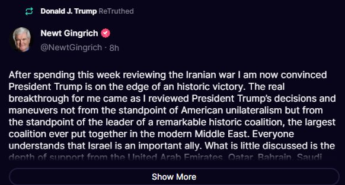

دونالد ترامپ پستی از نیوت گینگریچ، رییس پیشین مجلس نمایندگان آمریکا، را در تروث سوشال بازنشر کرد که در آن نوشته شده بود: پس از بررسی جنگ ایران در این هفته، متقاعد شدم ترامپ در آستانه یک پیروزی تاریخی قرار دارد
IranIntlbrk

پستی که گینگریچ ۸ ساعت پیش نوشته بود، ترجمه ماشین:
پس از آنکه این هفته را صرف بررسی جنگ ایران کردم، اکنون متقاعد شده‌ام که رئیس‌جمهور ترامپ در آستانه یک پیروزی تاریخی قرار دارد. نقطه عطف واقعی برای من زمانی رقم خورد که تصمیم‌ها و مانورهای رئیس‌جمهور ترامپ را نه از منظر یکجانبه‌گرایی آمریکا، بلکه از منظر رهبر یک ائتلاف تاریخی چشمگیر بررسی کردم؛ بزرگ‌ترین ائتلافی که تاکنون در خاورمیانه مدرن شکل گرفته است.

همه می‌دانند که اسرائیل متحد مهمی است. اما آنچه کمتر درباره آن صحبت می‌شود، عمق حمایت امارات متحده عربی، قطر، بحرین، عربستان سعودی و دیگر کشورهای منطقه است. برای دیکتاتوری ایران باید بسیار تأمل‌برانگیز باشد که دریابد حتی یک متحد ندارد که حاضر باشد محاصره دریایی آمریکا را به چالش بکشد. آرام‌آرام، به‌تدریج و با احتیاط، متحدان اروپایی ما نیز در حال صف‌آرایی برای کمک در خلیج فارس و تنگه هرمز هستند.

بخش بزرگی از مانورهای رئیس‌جمهور ترامپ علیه ایران زمانی معنا پیدا می‌کند که او را نه صرفاً یک رئیس‌جمهور یکجانبه‌گرای آمریکایی، بلکه رهبر یک ائتلاف ببینیم. من بخش زیادی از چند هفته گذشته را صرف بررسی گزینه‌های نظامی کردم؛ از جمله پیروزی در نبرد خلیج فارس و تنگه هرمز و، در صورت لزوم، استفاده از سطحی تکان‌دهنده و خردکننده از قدرت نظامی؛ مشابه آنچه رئیس‌جمهور نیکسون و وزیر خارجه کیسینجر در کریسمس ۱۹۷۲ علیه هانوی و هایفونگ به کار گرفتند؛ اقدامی که هر دو رهبر معتقد بودند ویتنام شمالی را به پذیرش آتش‌بس و آزادی اسرای آمریکایی متقاعد کرد.

اگر این یک کارزار یکجانبه آمریکایی بود، می‌توانستم با اشتیاق از یک کارزار نظامی تهاجمی‌تر حمایت کنم. اما در عین حال روشن است که چنین اقدامی ائتلاف را از هم می‌پاشاند، زیرا متحدان عرب ما متقاعدند که ایران هنوز می‌تواند خسارت عظیمی به میدان‌های نفتی و زیرساخت‌های آنان وارد کند. ائتلاف‌ها ذاتاً کندتر از کارزارهای یکجانبه عمل می‌کنند. با این حال، ائتلاف‌ها در نهایت قدرتی به‌مراتب بیشتر را وارد میدان می‌کنند.

من نیز مانند همه دیگران از سرعت گفت‌وگوها با این دیکتاتوری سرخورده‌ام؛ اما پس از بررسی توازن قوا و گزینه‌های در دسترس ائتلاف از یک سو، و دیکتاتوری مذهبیِ ایران از سوی دیگر، آماده‌ام بگویم که رهبری ائتلافیِ رئیس‌جمهور ترامپ ــ چیزی که تقریباً هیچ‌یک از منتقدان او نمی‌خواهند به آن اذعان کنند ــ در آستانه دستیابی به یک پیروزی عظیم تاریخی است.

و اگر دیکتاتوری ایران در نهایت ثابت کند که به شکلی نومیدانه به موضعی انتحاری پایبند است، زمان کافی برای یک کارزار نظامی با قدرت و اثربخشی عظیم وجود خواهد داشت. در هر صورت، ما در آستانه یک پیروزی شگفت‌انگیز برای ارزش‌های خود و برای خاورمیانه‌ای امن‌تر قرار داریم.
NewtGingrich

📡 @VahidOnline

## VahidOnline — post 75791

  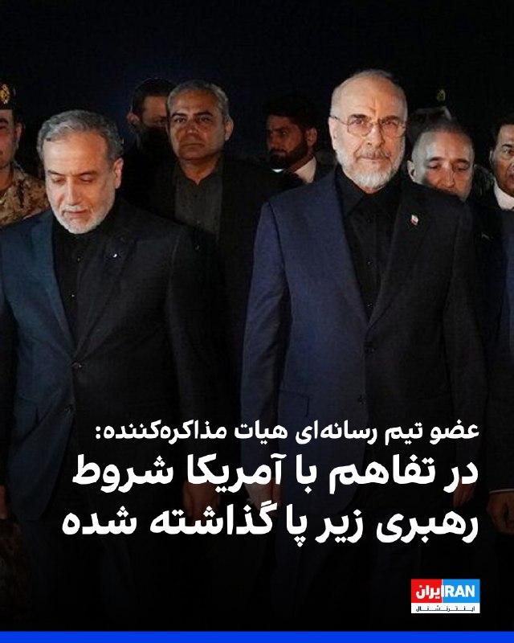

مهدی خانعلی‌زاده، عضو تیم رسانه‌ای هیات مذاکره‌کننده جمهوری اسلامی، نوشت که در متن تفاهم احتمالی هشت بند از ۱۰ بند بیانیه شورای عالی امنیت ملی که به تایید مجتبی خامنه‌ای رسیده، رعایت نشده و زیر پا گذاشته شده است.

او افزود که تفاهم‌نامه کنونی برخلاف بیانیه آتش‌بس شورای عالی امنیت ملی است و مشخص شده که اساسا مذاکرات پسااسلام‌آباد، بر مبنای شروط رهبری انجام نشده است.
@VahidOOnLine

📡 @VahidOnline

## VahidOnline — post 75790

  

اسماعیل بقایی، سخنگوی وزارت خارجه ایران در مصاحبه‌ای با صدا و سیما گفت که تبادل پیام‌ها ادامه دارد ولی هنوز هیچ توافقی نهایی نشده است و افزود که مدیریت تنگه هرمز باید توسط ایران و عمان تعیین شود.

او بار دیگر گفت: «در این مرحله بر خاتمه جنگ متمرکز هستیم و در مورد پرونده هسته‌ای هیچ مذاکره‌ای نداریم.»

این اظهارات در حالی از سوی ایران مطرح شده که آقای ترامپ فهرستی از خواسته‌هایی را که می‌گوید ایران باید برآورده کند، مطرح کرد که شامل تعهد ایران به عدم دستیابی به سلاح هسته‌ای، باز کردن تنگه هرمز بدون دریافت عوارض، مین‌روبی کامل این آبراه و خارج‌سازی ذخایر اورانیوم ‌غنی‌شده ایران با همکاری آمریکا و تحت نظارت آژانس و سپس از بین بردن این مواد است.
@VahidHeadline
پیش‌تر: خبرگزاری فارس، نزدیک به سپاه پاسداران، نیز به نقل از یک منبع ایرانی دیگر اظهارنظر رئیس‌جمهور ایالات منحده دربارهٔ توافق احتمالی با ایران، را «آمیخته‌ای از راست و دروغ» خوانده است.
این منبع گفته که در متن توافق بندی درباره باز شدن تنگه هرمز بدون دریافت عوارض وجود ندارد و تفاهم بر سر نابودی دخایر اورانیوم ایران را نیز «بی‌اساس» دانسته است.
@VahidHeadline

📡 @VahidOnline

## VahidOnline — post 75789

  

☄️ پست ترامپ، ترجمه ماشین:
ایران باید بپذیرد که هرگز سلاح یا بمب هسته‌ای نخواهد داشت.

تنگه هرمز باید فوراً، بدون عوارض، برای عبور و مرور آزادانه کشتی‌ها در هر دو جهت باز شود. همه مین‌های دریایی، اگر وجود داشته باشند، برچیده خواهند شد؛ ما با مین‌روب‌های زیرآبی فوق‌العاده خود، شمار زیادی از این مین‌ها را از طریق انفجار از بین برده‌ایم. ایران نیز باید فوراً هر مین باقی‌مانده‌ای را، که تعدادشان زیاد نخواهد بود، جمع‌آوری یا منفجر کند.

کشتی‌هایی که به‌دلیل محاصره دریایی شگفت‌انگیز و بی‌سابقه ما در تنگه گرفتار شده بودند ــ ❗️ محاصره‌ای که اکنون لغو خواهد شد ــ می‌توانند روند «بازگشت به خانه» را آغاز کنند! از طرف من، رئیس‌جمهور محبوبتان، به همسران، شوهران، پدران، مادران و خانواده‌هایتان سلام برسانید!

مواد غنی‌شده، که گاهی از آن با عنوان «غبار هسته‌ای» یاد می‌شود و در اعماق زمین دفن شده؛ در حالی که کوه‌هایی که عملاً بر اثر حمله قدرتمند بمب‌افکن‌های B-2 ما در ۱۱ ماه پیش فرو ریخته‌اند روی آن قرار دارند، ❗️توسط ایالات متحده از زیر خاک بیرون آورده خواهد شد؛ کشوری که، طبق توافق، تنها کشور در کنار چین است که توان مکانیکی انجام چنین کاری را دارد.
این کار با هماهنگی و همکاری نزدیک با جمهوری اسلامی ایران و همچنین آژانس بین‌المللی انرژی اتمی انجام خواهد شد و سپس این مواد نابود خواهد شد.

❗️ تا اطلاع ثانوی، هیچ پولی رد و بدل نخواهد شد.

درباره موارد دیگری که اهمیت بسیار کمتری دارند نیز توافق حاصل شده است.

💥اکنون در اتاق وضعیت جلسه خواهم داشت تا تصمیم نهایی را بگیرم.

از توجه شما به این موضوع سپاسگزارم!

رئیس‌جمهور دونالد جی. ترامپ
realDonaldTrump

📡 @VahidOnline

## VahidOnline — post 75788

  <a href="telegram/content/VahidOnline_75788_1780084795.mp4" target="_blank">🎬 Download video</a>

این ویدیو با شرح عبور موشک‌های تاماهاک در مرز عراق و ایران در شبکه‌های اجتماعی و چند رسانه منتشر شده و گفته می‌شود مربوط به روزهای نخست جنگ است.
@VahidOOnLine

📡 @VahidOnline

## VahidOnline — post 75787

  <a href="telegram/content/VahidOnline_75787_1780084795.mp4" target="_blank">🎬 Download video</a>

اسکات بسنت، وزیر خزانه‌داری آمریکا، روز پنجشنبه هفتم خرداد ماه اعلام کرد عمان پس از دریافت هشدار واشنگتن درباره پیامدهای احتمالی مشارکت در طرح دریافت عوارض از کشتی‌های عبوری از تنگه هرمز، به آمریکا اطمینان داده است که برنامه‌ای برای اجرای چنین طرحی ندارد.
بسنت روز پنجشنبه در نشست خبری کاخ سفید گفت که صبح همان روز با سفیر عمان گفتگو کرده و از او شنیده است که مسقط هیچ برنامه‌ای برای دریافت عوارض در تنگه هرمز ندارد.
او افزود: «به او گفتم این موضوع از اساس غیرقابل قبول است و او نیز نمی‌خواهد افراد عمانی یا موسسات مالی عمانی را در معرض خطر تحریم قرار دهد.»
بسنت ساعاتی پیش‌تر در پیامی در شبکه اجتماعی ایکس هشدار داده بود که وزارت خزانه‌داری آمریکا هر فرد یا نهادی را که به‌صورت مستقیم یا غیرمستقیم در تسهیل دریافت عوارض در تنگه هرمز نقش داشته باشد، هدف تحریم قرار خواهد داد. او تصریح کرده بود که هر شریک احتمالی این طرح نیز با مجازات و تحریم روبه‌رو خواهد شد.
@VahidOOnLine

📡 @VahidOnline

## VahidOnline — post 75786

  

شبکه العربیه به نقل از منابع آگاه گزارش داد جمهوری اسلامی می‌خواهد اورانیوم غنی‌سازی‌شده خود را به چین منتقل کند، مشروط بر آن‌که چین تضمین دهد این مواد را به آمریکا تحویل نخواهد داد.

به گفته این منابع، بسیاری از نکات مرتبط با برنامه هسته‌ای جمهوری اسلامی در مذاکرات جاری حل‌وفصل شده است.

بر اساس این گزارش، جمهوری اسلامی با نظارت بین‌المللی بر تاسیسات هسته‌ای خود برای جلوگیری از تعطیل‌شدن آن‌ها موافقت کرده است.
@VahidOOnLine

📡 @VahidOnline

## VahidOnline — post 75785

  

محمدباقر قالیباف، مذاکره‌کننده ارشد جمهوری اسلامی با آمریکا، روز جمعه تهدید کرد که تهران امتیازات مورد نظر خود در توافق پایان دادن به جنگ را با «موشک» می‌گیرد و پیش از اقدام واشینگتن درباره این توافق اقدامی نخواهد کرد.

او در شبکه ایکس همچنین نوشت: «هیچ اعتمادی به تضمین‌ها و حرف‌ها نداریم، فقط رفتارها معیار است.»

این موضع‌گیری یک روز پس از آن انجام شد که چند رسانه غربی خبر دادند آمریکا و ایران به تفاهمی برای تمدید آتش‌بس و رفع محدودیت عبور و مرور کشتی‌ها در تنگه هرمز رسیده‌اند، اما این توافق منتظر تصمیم و امضای نهایی دونالد ترامپ، رئیس‌جمهور ایالات متحده است.

قالیباف در پیام خود اعلام کرده که «اقدامی پیش از اقدام طرف مقابل انجام نخواهد شد».

از سوی دیگر، رسانه‌های نزدیک به سپاه پاسداران می‌گویند گزارش‌ها درباره توافق تهران و واشنگتن صحیح نیست. خبرگزاری تسنیم در این مورد به نقل از یک «منبع مطلع» نوشت: «متن توافق تا این لحظه جمع‌بندی نهایی نشده است.»
@VahidHeadline

📡 @VahidOnline

## VahidOnline — post 75784

  

‏🔴بنیاد عبدالرحمن برومند از ابتدای سال جاری تاکنون، اجرای ۶۶۰ مورد اعدام توسط جمهوری اسلامی را مستند کرده است. با این حال، به دلیل ماهیت پنهان‌کاری و غیرشفاف بودن سیستم قضایی ایران، آمار واقعی به احتمال زیاد بسیار بیشتر از این رقم است.

‏🔸از زمان آغاز جنگ، آمار اعدام معترضان و افرادی که به جاسوسی و اتهامات مشابه علیه امنیت ملی متهم شده‌اند، با سرعتی نگران‌کننده افزایش یافته است. «اعترافات اجباری» قربانیان، اصلی‌ترین «مدرک» مورد استفاده در این احکام مرگبار بوده است.

‏🔸این اعترافات در شرایطی کاملا مبهم و تحت فشارهای شدید جسمی و روحی اخذ می‌شوند. جمهوری اسلامی به طور مستمر این اعترافات اجباری را در رسانه‌های دولتی پخش می‌کند تا از آن به عنوان ابزاری برای توجیه اعدام‌ها و سرکوب مخالفت‌های عمومی استفاده کند.
‏⁧ #نه_به_اعدام ⁩
@IranRights

## IranIntlTV — post 339646

  <a href="telegram/content/IranIntlTV_339646_1780084797.mp4" target="_blank">🎬 Download video</a>

اسرائیل‌هیوم در گزارشی از وجود یک شاخه محرمانه در موساد خبر داد که ماموریت آن عملیات نفوذ، جنگ روانی و بی‌ثبات‌سازی جمهوری اسلامی با هدف تغییر رژیم در ایران است.

گفت‌وگو با منشه امیر، کارشناس امور خاورمیانه
@iranintltv

## IranIntlTV — post 339645

  <a href="telegram/content/IranIntlTV_339645_1780084799.mp4" target="_blank">🎬 Download video</a>

رومانی سفیر روسیه را پس از برخورد یک پهپاد روسی به ساختمانی در خاک این کشور احضار کرد. مقام‌های اروپایی این حادثه را نقض حریم هوایی اتحادیه اروپا دانستند. کایا کالاس، مسئول سیاست خارجه اتحادیه اروپا، هم گفته مسکو نباید حریم این منطقه را نقض کند.
این برخورد هم‌زمان با حملات شبانه روسیه به اوکراین رخ داد و دست‌کم دو نفر زخمی شدند.
@iranintltv

## IranIntlTV — post 339644

ویدیوی منتشرشده، لحظه کشته شدن جاویدنام بابک سلطانی را در اصفهان نشان می‌دهد.
سلطانی، ۵۹ ساله، شامگاه ۱۹ دی ۱۴۰۴ هنگامی که معترضان را در اصفهان پناه می‌داد هدف شلیک گلوله ماموران قرار گرفت و جان باخت.

## IranIntlTV — post 339643

  

اتحادیه اروپا با انتشار بیانیه‌ای اعلام کرد که حمله اخیر حکومت ایران علیه کویت را به شدت محکوم می‌کند.

در این بیانیه آمده که این حمله بنا بر حقوق بین‌الملل نقض حاکمیت کویت محسوب می‌شود.

اتحادیه اروپا همبستگی کامل خود را با دولت و مردم کویت بار دیگر اعلام کرد و افزود: «چنین حملاتی تهدیدی جدی برای امنیت و ثبات منطقه به شمار می‌روند.»
https://iranintl.com/202605296946

## IranIntlTV — post 339642

  <a href="telegram/content/IranIntlTV_339642_1780084801.mp4" target="_blank">🎬 Download video</a>

با وجود گزارش‌هایی درباره توافق میان واشینگتن و تهران، سرنوشت مذاکرات همچنان در هاله‌ای از ابهام قرار دارد.

دونالد ترامپ برای تصمیم‌گیری نهایی درباره توافق احتمالی با جمهوری اسلامی در نشست اتاق وضعیت کاخ سفید شرکت می‌کند.

گفت‌وگو با شهیر شهیدثالث، تحلیل‌گر روابط بین‌الملل
@iranintltv

## IranIntlTV — post 339641

🗣روایت شما از بحران اقتصادی و زندگی در آتش‌بس- جمعه ۸ خرداد:

🔹جوانی ما سوخت پای سفاهت عده‌ای که هیچ درک و فهمی از شادی و سرور ندارند، نزدیک به ۵۰ سال سرمایه‌های کشور رو به یغما دادند، ولی آدمی به امید زنده است.

🔹از اصفهان: گرونی بیداد می‌کنه. از صبح تا شب کار می‌کنیم برای یک میلیون که اونم هیچی نمی‌شه باهاش بخری.

🔹اینا توافق بکنن یا نکنن، هیچ فرقی به حال ما مردم نداره. جمهوری اسلامی به زودی به دست مردم نابود خواهد شد، چون مردم تو شرایط وحشتناکی دارن زندگی می‌کنن.

🔹من یه نوجوون ۱۵ ساله‌ام. چرا باید به فکر قیمت طلا و دلار باشم؟ تنها آرزوی زندگیم فقط خرید موتوریه که آخرین بار قیمتش ۸۰ میلیون تومان بود و الان قیمت گرفتم شده ۲۰۰ تومان. این یعنی خاک کردن آرزوهامون. این حق ما نیست.

🔹من یه بچه ۱۲ ساله هستم، دارم حسرت می‌خورم چرا یه دوچرخه ندارم، هر روز آرزو می‌کنم شاهزاده برگرده، هم مردم خوشحال بشن و هم کسانی که آرزوی چیزی داشتن بتونن بخرنش.

🔹ما نوجوان‌ها واقعا بدبخت شدیم نه امیدی نه آرزویی نه آینده‌ای. از بدو تولد با کرونا، آلودگی، قطعی برق و آب، جنگ و کشتار سر کردیم.

🔹به عنوان یه جوان ۲۸ ساله خیلی وقته دیگه انگیزه و امیدی برای آینده ندارم؛ جوانی که از وقتی که یادشه فقط داره کار می‌کنه و حتی پاش رو از شهر خودش برای یه مسافرت دو روزه بیرون نذاشته. پرایدی که ۱۵ سال از عمر خودش گذشته رو نمی‌تونم بخرم. ما سوختیم.

🔹جمهوری اسلامی با این وحشی‌گری‌هاش به زودی به جایی می‌ره که اسکندر و چنگیز رفتند. به دست مردم شجاع ایران، نه ترامپ. زنده‌باد امید، زنده‌باد ایران، زنده‌باد آزادی.

🔹مردم عزیز ایران، این روزهای سخت هم می‌گذره. امیدتون رو از دست ندین؛ ما ملتی هستیم که بارها دوباره از نو بلند شده. کنار هم می‌مونیم، می‌جنگیم و ایران‌مون رو پس می‌گیریم. آینده از آنِ مردمه.

## IranIntlTV — post 339640

  <a href="telegram/content/IranIntlTV_339640_1780084803.mp4" target="_blank">🎬 Download video</a>

اسرائیل‌هیوم گزارش داده موساد شاخه‌ای محرمانه برای عملیات نفوذ و جنگ روانی علیه جمهوری اسلامی با هدف تغییر رژیم ایجاد کرده است. این گزارش همچنین گفته رییس موساد معتقد است در صورت ادامه محاصره دریایی و شکست توافق با جمهوری اسلامی، حکومت ایران تا پایان ۲۰۲۶ سقوط می‌کند.
@iranintltv

## IranIntlTV — post 339639

  

اسکات بسنت، وزیر خزانه‌داری آمریکا اعلام کرد این کشور یک میلیارد دلار از دارایی‌های رمزارزی مرتبط با جمهوری اسلامی را توقیف کرده است.

بسنت در پاسخ به پرسشی درباره محاصره دریایی بنادر ایران گفت هر اقدامی برای کاهش یا لغو محدودیت‌ها، به‌صورت تدریجی انجام خواهد شد.

وزیر خزانه‌داری آمریکا پیش‌تر نیز اعلام کرده بود دسترسی شرکت‌های هواپیمایی ایران به محل‌های فرود، سوخت‌گیری و فروش بلیت را قطع خواهیم کرد.
https://iranintl.com/202605296456

## IranIntlTV — post 339638

  

علی خزایی، عضو کمیسیون آموزش مجلس گفت که هرگونه تعرض و تجاوز از سوی آمریکا، اسرائیل و متحدانشان با «پاسخ قاطع، سخت و دندان‌شکن» مواجه خواهد شد.

خزایی افزود: «دشمن بار دیگر دچار خطای محاسباتی شده و تصور کرده جمهوری اسلامی در میدان نبرد دچار سکوت یا انفعال شده است.»
https://iranintl.com/202605297926

## IranIntlTV — post 339637

  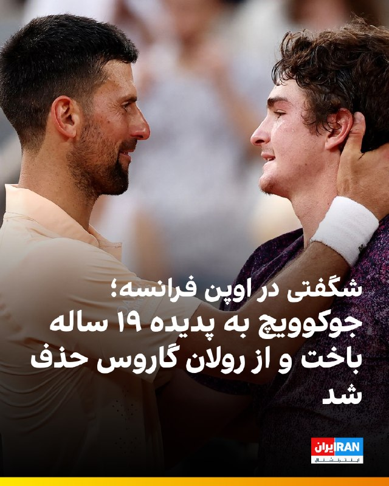

🔻نوواک جوکوویچ، مرد شماره ۴ تنیس جهان، در دور سوم رولان گاروس پس از پیش افتادن در دو ست، در نهایت مقابل ژوائو فونسکا، پدیده ۱۹ ساله برزیلی، باخت و حذف شد. پس از ۴ ساعت و ۵۳ دقیقه رقابت نفس‌گیر، شگفتی کامل شد و ورزشگاه فیلیپ شاتریه پس از حذف یانیک سینر، دومین شوک فصل را دید.

🔹اکنون قطعی است که دومین گرنداسلم سال را بازیکنی فتح خواهد کرد که تاکنون چنین عنوانی را به دست نیاورده است. نوواک جوکوویچ آخرین قهرمان گرنداسلم حاضر در پاریس بود.

🔹جدی‌ترین مدعی حال حاضر الکساندر زورف است که امشب در دور سوم به مصاف کوئنتن آلیس می‌رود.

🔹حذف جوکوویچ، به این معناست که از میان پنج نفر برتر رنکینگ، تنها زورف در جدول باقی مانده است.

🔹یانیک سینر، نفر اول جهان، در دور دوم و آن هم پس از برتری ۲-۰ در ست‌ها مقابل خوان مانوئل سروندولو از آرژانتین، به دلیل گرمازدگی شکست خورد.

🔹کارلوس آلکاراس، نفر دوم جهان، به دلیل آسیب‌دیدگی دست از حضور در پاریس انصراف داد.

🔹امشب، نواک جوکوویچ در میان تشویق پرشور تماشاگران زمین را ترک کرد؛ آیا این آخرین باری است که این ستاره ۳۹ ساله را در رولان گاروس می‌بینیم؟

@iranintltvsport

## IranIntlTV — post 339636

  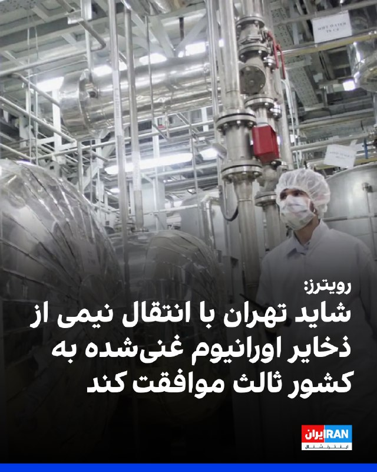

خبرگزاری رویترز به نقل از منابع جمهوری اسلامی گزارش داد که تهران ممکن است با انتقال نیمی از ذخایر اورانیوم غنی‌شده ۶۰درصدی به یک کشور ثالث موافقت کند.

بر اساس این گزارش، در این حالت، جمهوری اسلامی در مقابل این مقدار، اورانیوم با غنای ۵ درصد دریافت می‌کند.

رویترز نوشت که همچنین ممکن است نیم دیگر این ذخایر در داخل ایران رقیق‌سازی شود.
https://iranintl.com/202605295732

## IranIntlTV — post 339635

  

نیویورک‌تایمز به نقل از یک مقام ارشد آمریکایی گزارش داد نشست دونالد ترامپ در «اتاق وضعیت» کاخ سفید دو ساعت به طول انجامید، اما رییس‌جمهور آمریکا هنوز درباره هیچ توافق جدیدی با تهران به تصمیم نهایی نرسیده است.

این مقام افزود دولت آمریکا معتقد است به دستیابی به توافق نزدیک شده، اما برخی مسائل از جمله آزادسازی دارایی‌های مسدودشده همچنان محل بررسی و اختلاف‌نظر است.
https://iranintl.com/202605292981

## IranIntlTV — post 339634

  <a href="telegram/content/IranIntlTV_339634_1780084808.mp4" target="_blank">🎬 Download video</a>

یک شهروند با اشاره به وضعیت بد معیشتی به مقایسه قدرت خرید خانواده‌های ایرانی با شهروندان کشورهای دیگر پرداخته و می‌گوید که بازگشت نسبی اتصال به اینترنت به این علت است که «حواسمان را پرت کنند.»

پیام او با هوش مصنوعی خوانده شده است.

## IranIntlTV — post 339633

  

ارتش اسرائیل اعلام کرد که بر اساس مستنداتی که به دست آورده، گروه مسلح حزب‌الله، تحت حمایت جمهوری اسلامی، راکت‌هایی را شلیک کرده که به کلیسایی در جنوب لبنان اصابت کرده است.

در بیانیه ارتش اسرائیل آمده است: «سازمان تروریستی حزب‌الله در طول شامگاه جمعه چندین راکت شلیک کرد که به کلیسای ارتدوکس سنت جورج در جنوب لبنان اصابت کردند. این شلیک‌ها به ساختمان‌هایی در روستای مسیحی مرجعیون اصابت کردند.»

ارتش اسرائیل تاکید کرده که نیروهایش در محدوده این کلیسا فعالیت نمی‌کنند.
https://iranintl.com/202605293734

## IranIntlTV — post 339632

  <a href="https://t.me/IranintlTV/339632" target="_blank">📎 Download file</a>

🎧نسخه صوتی حرف آخر با پوریا زراعتی - مجتبی و وحیدی مانع توافق هستند
@iranintlTV

## IranIntlTV — post 339631

  <a href="telegram/content/IranIntlTV_339631_1780084811.mp4" target="_blank">🎬 Download video</a>

۲۴ با فرداد فرحزاد
@iranintltv

## IranIntlTV — post 339630

  

خبرگزاری تسنیم، وابسته به سپاه پاسداران گزارش داد که شامگاه جمعه، در پی رصد ریزپرنده متخاصم «دشمن آمریکایی-اسرائیلی» در حوالی قشم از سوی پدافند هوایی ارتش، مورد اصابت قرار گرفت و منهدم شد.
پیش‌تر رسانه‌های ایران تصاویری از شلیک ممتد پدافند در محدوده قشم منتشر کرده بودند.
https://iranintl.com/202605297986

## IranIntlTV — post 339629

  <a href="telegram/content/IranIntlTV_339629_1780084812.mp4" target="_blank">🎬 Download video</a>

آیا واقعا در تهران همه آماده‌ی توافق هستند و فقط ترامپ مانده که موافقت کند؟
@iranintltv

## IranIntlTV — post 339628

  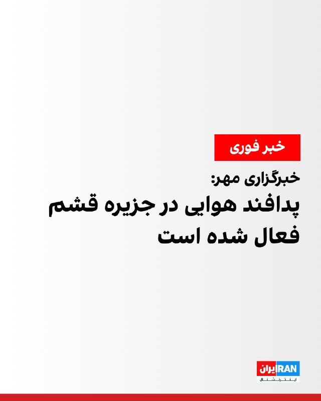

خبرگزاری مهر، وابسته به سازمان تبلیغات اسلامی، نوشت شامگاه جمعه، صدای فعالیت پدافند در جزیره قشم از سوی ساکنان محلی گزارش شده است.

بنا بر این گزارش ماهیت این صداها مشخص نیست و هنوز هیچ‌یک از نهادهای رسمی درباره علت وقوع این صداها اظهارنظر نکرده‌اند.
https://iranintl.com/202605296669

## IranIntlTV — post 339627

  

ابراهیم عزیزی، رییس کمیسیون امنیت ملی مجلس، در شبکه ایکس نوشت که ترامپ باید بداند که جمهوری اسلامی به عنوان «پیروز و فاتح میدان»، شرایط را تعیین می‌کند؛ نقد مقابل نقد، نسیه مقابل نسیه و هیچ مقابل هیچ. البته برای موضوعاتی که مورد مذاکره است، نه آرزوهایش.

پیش‌تر دونالد ترامپ اعلام کرد که «ایران باید موافقت کند که هرگز سلاح یا بمب هسته‌ای نخواهد داشت. تنگه هرمز باید فورا باز باشد؛ بدون دریافت عوارض و برای عبور و مرور نامحدود کشتی‌ها در هر دو جهت. همه مین‌های دریایی (بمب‌ها)، در صورت وجود، باید از میان برداشته شوند.»
https://iranintl.com/202605295273

## Shin_Persian — post 6307

Shin ✓ @hey_itsmyturn
Fri, 29 May 2026 18:10:17 UTC

State-owned Mehr News confirms the AA activity in Qeshm island
Hormozgan Province, #Iran

فارسی

خبرگزاری دولتی مهر فعالیت پدافند هوایی (AA) در جزیره قشم را تایید کرد.
استان هرمزگان، #Iran

𝕏 · @shin_persian

## Shin_Persian — post 6306

  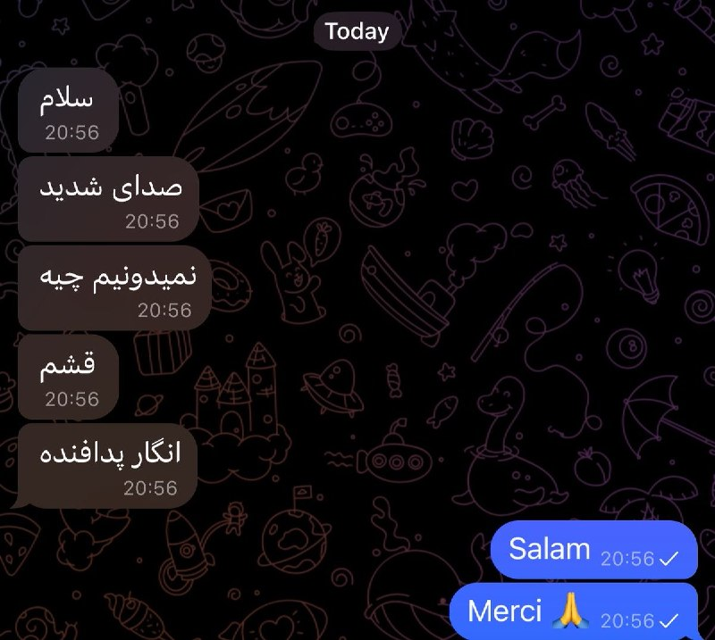

Shin ✓ @hey_itsmyturn
Fri, 29 May 2026 17:58:04 UTC

Intense AA activity in Qeshm Island, Hormozgan Province, #Iran

فارسی

فعالیت شدید پدافند هوایی در جزیره قشم، استان هرمزگان، #Iran

𝕏 · @shin_persian

## Shin_Persian — post 6305

  

🔁 Quoting above tweet: Shin ✓ @hey_itsmyturn Fri, 29 May 2026 16:27:26 UTC IRGC-owned Tasnim News: "No final agreement has been reached between Iran and the United States at this time. According to Tasnim News Agency’s reporter, no final agreement has…

## Shin_Persian — post 6304

🔁 Quoting above tweet:
Shin ✓ @hey_itsmyturn
Fri, 29 May 2026 16:27:26 UTC

IRGC-owned Tasnim News:

"No final agreement has been reached between Iran and the United States at this time.

According to Tasnim News Agency’s reporter, no final agreement has been concluded between Iran and the United States so far. President Trump's tweet aligns with his consistent pattern of unilateral and self-aggrandizing pronouncements.

Donald Trump's statements concerning the lifting of the naval blockade on Iran, emanating from the head of the terrorist U.S. administration, should be viewed with skepticism. Should such an action materialize, it would merely signify the cessation of one of numerous ceasefire violations, given that such a blockade should never have been initiated.

Furthermore, Trump's assertions and those of American media outlets regarding the nuclear issue are unfounded, as no detailed discussions on nuclear matters are currently taking place in this area.

The U.S. President's insistence on not releasing Iran's blocked funds solely intensifies Iran's suspicion regarding the seriousness of the United States.

The Islamic Republic of Iran has repeatedly emphasized that the status of its blocked assets must be clarified prior to any preliminary agreement."

فارسی

خبرگزاری تسنیم وابسته به سپاه پاسداران انقلاب اسلامی (IRGC):

«تا این لحظه هیچ توافق نهایی میان ایران و ایالات متحده حاصل نشده است.

به گزارش خبرنگار خبرگزاری تسنیم، تاکنون هیچ توافق نهایی بین ایران و ایالات متحده منعقد نشده است. توئیت پرزیدنت ترامپ با الگوی همیشگی او در اظهارات یک‌جانبه و خودبزرگ‌بینانه مطابقت دارد.

اظهارات دونالد ترامپ در خصوص رفع محاصره دریایی ایران که از سوی رئیس دولت تروریست آمریکا مطرح شده، باید با تردید نگریسته شود. در صورت تحقق چنین اقدامی، این تنها به معنای توقف یکی از موارد متعدد نقض آتش‌بس خواهد بود، چرا که چنین محاصره‌ای اساساً نباید هرگز آغاز می‌شد.

علاوه بر این، ادعاهای ترامپ و رسانه‌های آمریکایی در مورد موضوع هسته‌ای بی‌اساس است، زیرا در حال حاضر هیچ بحث مفصلی در مورد مسائل هسته‌ای در این زمینه در جریان نیست.

اصرار رئیس‌جمهور آمریکا بر عدم آزادسازی اموال بلوکه شده ایران، صرفاً سوءظن ایران را نسبت به جدیت ایالات متحده تشدید می‌کند.

جمهوری اسلامی ایران بارها تأکید کرده است که وضعیت دارایی‌های بلوکه شده‌اش باید پیش از هرگونه توافق مقدماتی روشن شود.»

𝕏 · @shin_persian

## Shin_Persian — post 6303

  

↩️ Quoted tweet: Shin ✓ @hey_itsmyturn Fri, 29 May 2026 14:55:22 UTC President Trump @POTUS: "Iran must agree that they will never have a Nuclear Weapon or Bomb. The Hormuz Strait must be immediately open, no tolls, for unrestricted shipping traffic, in…

## Shin_Persian — post 6302

↩️ Quoted tweet:
Shin ✓ @hey_itsmyturn
Fri, 29 May 2026 14:55:22 UTC

President Trump @POTUS:
"Iran must agree that they will never have a Nuclear Weapon or Bomb. The Hormuz Strait must be immediately open, no tolls, for unrestricted shipping traffic, in both directions. All water mines (bombs), if any, will be terminated (we have removed, through

↩️ توییت نقل‌قول شده — برای پاسخ، پست زیر را ببینید.

فارسی

رئیس‌جمهور ترامپ @POTUS:
«ایران باید موافقت کند که هرگز سلاح هسته‌ای یا بمب نخواهد داشت. تنگه هرمز باید فوراً برای تردد نامحدود کشتی‌رانی در هر دو جهت، بدون هیچ‌گونه حق‌العبوری، باز شود. تمام مین‌های دریایی (بمب‌ها)، در صورت وجود، نابود خواهند شد (ما حذف کرده‌ایم، از طریق

𝕏 · @shin_persian

## Shin_Persian — post 6301

  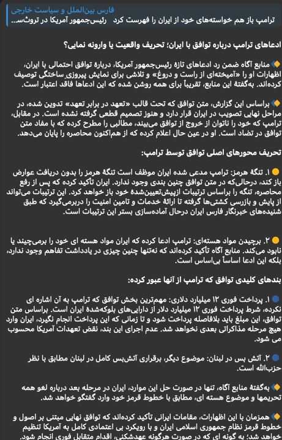

🔁 Quoting above tweet: Shin ✓ @hey_itsmyturn Fri, 29 May 2026 15:49:40 UTC IRGC-owned Fars News in response to POTUS' post: """ Knowledgeable sources, while refuting the recent claims of the American president regarding a potential agreement with Iran,…

## Shin_Persian — post 6300

🔁 Quoting above tweet:
Shin ✓ @hey_itsmyturn
Fri, 29 May 2026 15:49:40 UTC

IRGC-owned Fars News in response to POTUS' post:

""" Knowledgeable sources, while refuting the recent claims of the American president regarding a potential agreement with Iran, have described his statements as "a mixture of truth and falsehood" and an attempt to present a fabricated victory. According to these sources, it has become evident to nearly everyone that these claims lack credibility.

According to this report, the text of the agreement, drafted under the framework of "commitment for commitment," is in its final stages of approval in Iran, and a definitive decision has not yet been made. In contrast, Trump, who sees himself unable to withdraw from the agreement, has made statements that contradict the provisions of the agreement text. He has simultaneously announced an immediate end to the blockade.

Trump's Distortion of Key Agreement Provisions:

1. Strait of Hormuz: Trump has claimed that Iran is obliged to open the Strait of Hormuz without imposing tolls, whereas no such clause exists in the agreement text. Iran has emphasized that after the lifting of the blockade, it will open the strait according to its pre-determined arrangements. These arrangements could include monitoring and inspection of vessels, as well as providing services and ensuring security, for which Iranian reporters from Fars News Agency hear preparations are underway.

2. Dismantling of Nuclear Materials: Trump has alleged that Iran will dismantle or destroy its nuclear materials. Knowledgeable sources have stressed that not only is there no such provision in the memorandum of understanding, but this claim is fundamentally groundless.

Key Agreement Clauses Ignored by Trump:

1. Immediate Payment of 12 Billion Dollars: The most crucial part of the agreement, which Trump has not mentioned, is the condition for an immediate payment of 12 billion dollars from Iran's blocked assets. According to the agreement text, this amount must be paid immediately, and until this payment is made, Iran will not enter any subsequent negotiation stages. Failure to implement this clause would constitute a violation of U.S. commitments.

2. Ceasefire in Lebanon: Another issue is the establishment of a complete ceasefire in Lebanon in accordance with Hezbollah's views.

According to knowledgeable sources, only if these issues are resolved will Iran, in the next stage, engage in discussions regarding the lifting of all sanctions and the nuclear issue, in accordance with its red lines.

Concurrent with these statements, Iranian officials have emphasized that the final agreement will be formulated based on the principles and red lines of the Islamic Republic of Iran's system and with a complete distrustful approach towards the United States, such that any breaking of promises will be met with immediate reciprocal action. """

ترجمه فارسی در بخش نظرات

𝕏 · @shin_persian

## Shin_Persian — post 6299

  

↩️ Quoted tweet: Shin ✓ @hey_itsmyturn Fri, 29 May 2026 14:55:22 UTC President Trump @POTUS: "Iran must agree that they will never have a Nuclear Weapon or Bomb. The Hormuz Strait must be immediately open, no tolls, for unrestricted shipping traffic, in…

## Shin_Persian — post 6298

↩️ Quoted tweet:
Shin ✓ @hey_itsmyturn
Fri, 29 May 2026 14:55:22 UTC

President Trump @POTUS:
"Iran must agree that they will never have a Nuclear Weapon or Bomb. The Hormuz Strait must be immediately open, no tolls, for unrestricted shipping traffic, in both directions. All water mines (bombs), if any, will be terminated (we have removed, through

↩️ توییت نقل‌قول شده — برای پاسخ، پست زیر را ببینید.

فارسی

پرزیدنت ترامپ @POTUS:
«ایران باید موافقت کند که هرگز سلاح یا بمب هسته‌ای نخواهد داشت. تنگه هرمز باید فورا، بدون عوارض، برای ترافیک کشتیرانی نامحدود در هر دو جهت باز شود. تمام مین‌های آبی (بمب‌ها)، در صورت وجود، منهدم خواهند شد (ما برداشته‌ایم، از طریق...»

𝕏 · @shin_persian

## Shin_Persian — post 6297

  

Shin ✓ @hey_itsmyturn Fri, 29 May 2026 14:55:22 UTC President Trump @POTUS: "Iran must agree that they will never have a Nuclear Weapon or Bomb. The Hormuz Strait must be immediately open, no tolls, for unrestricted shipping traffic, in both directions.…

## Shin_Persian — post 6296

Shin ✓ @hey_itsmyturn
Fri, 29 May 2026 14:55:22 UTC

President Trump @POTUS:
"Iran must agree that they will never have a Nuclear Weapon or Bomb. The Hormuz Strait must be immediately open, no tolls, for unrestricted shipping traffic, in both directions. All water mines (bombs), if any, will be terminated (we have removed, through detonation, numerous such mines with our great underwater mine sweepers. Iran will complete the immediate removal and/or detonation of any mines that are left, which will not be many!). Ships caught in the Strait due to our amazing and unprecedented Naval Blockade, which will now be lifted, may start the process of “heading home!” Say HELLO to your wives, husbands, parents, and families from me, your favorite President! The enriched material, sometimes referred to as “Nuclear Dust,” which is buried deep underground with virtually collapsed mountains, caused by our powerful B2 Bomber attack 11 months ago, sitting on top of it, will be unearthed by the United States (which, it is agreed, is the only Country, along with China, with the mechanical capability of doing so!), in close coordination and conjunction with the Islamic Republic of Iran, plus the International Atomic Energy Agency, and DESTROYED. No money will be exchanged, until further notice. Other items, of far less importance, have been agreed to. I will be meeting now, in the Situation Room, to make a final determination. Thank you for your attention to this matter! President DONALD J. TRUMP"

ترجمه فارسی در بخش نظرات

𝕏 · @shin_persian

## Shin_Persian — post 6295

  

🔁 Quoting above tweet: Shin ✓ @hey_itsmyturn Fri, 29 May 2026 13:10:40 UTC The Speaker of Parliament and the head of Islamic Regime's negotiating team, Mohammad Bagher Ghalibaf posted a three-point statement outlining clear position regarding negotiations…

## Shin_Persian — post 6294

🔁 Quoting above tweet:
Shin ✓ @hey_itsmyturn
Fri, 29 May 2026 13:10:40 UTC

The Speaker of Parliament and the head of Islamic Regime's negotiating team, Mohammad Bagher Ghalibaf posted a three-point statement outlining clear position regarding negotiations with the United States:

"1. We achieve concessions not through dialogue, but through missiles; in negotiations, we merely articulate them.

2. We do not trust guarantees or words; only actions serve as a measure. No action will be taken before the opposing party acts.

3. The victor of any agreement is the one who, from the day after, prepares better for war."

فارسی

رئیس مجلس و رئیس تیم مذاکره‌کننده رژیم اسلامی، محمدباقر قالیباف، بیانیه‌ای سه‌عاملی را منتشر کرد که موضع شفافی را در خصوص مذاکره با ایالات متحده ترسیم می‌کند:

«۱. ما امتیازها را نه از طریق گفتگو، بلکه با موشک‌ها به دست می‌آوریم؛ در مذاکرات، ما صرفاً آن‌ها را بیان می‌کنیم.

۲. ما به تضمین‌ها یا واژه‌ها اعتماد نمی‌کنیم؛ تنها عمل ملاک است. هیچ اقدامی پیش از اقدام طرف مقابل انجام نخواهد شد.

۳. پیروز هر توافقی کسی است که از فردای آن روز، خود را بهتر برای جنگ آماده کند.»

𝕏 · @shin_persian

## Shin_Persian — post 6293

  <a href="telegram/content/Shin_Persian_6293_1780084820.mp4" target="_blank">🎬 Download video</a>

↩️ Quoted tweet: Israel War Room ✓ @IsraelWarRoom Thu, 28 May 2026 23:27:55 UTC .@VP Vance says the US has made "a lot of progress" in negotiations with Iran, but major disputes remain over Iran's uranium enrichment program and its highly enriched uranium…

## Shin_Persian — post 6292

↩️ Quoted tweet:
Israel War Room ✓ @IsraelWarRoom
Thu, 28 May 2026 23:27:55 UTC

.@VP Vance says the US has made "a lot of progress" in negotiations with Iran, but major disputes remain over Iran's uranium enrichment program and its highly enriched uranium stockpile.

"We're going back and forth on a couple of language points... Hopefully, we'll continue to

↩️ توییت نقل‌قول شده — برای پاسخ، پست زیر را ببینید.

فارسی

.@VP ونس می‌گوید ایالات متحده در مذاکرات با ایران به "پیشرفت‌های زیادی" دست یافته است، اما اختلافات عمده بر سر برنامه غنی‌سازی اورانیوم ایران و ذخایر اورانیوم با غنی‌سازی بالای این کشور همچنان باقی است.

"ما بر سر چند نکته زبانی در حال رایزنی رفت و برگشتی هستیم... امیدواریم که به ادامه دهیم"

𝕏 · @shin_persian

## ManotoTV — post 105869

  <a href="telegram/content/ManotoTV_105869_1780084822.mp4" target="_blank">🎬 Download video</a>

در سیاست بین‌الملل، کشورها بیش از آنکه بر پایه دوستی، همدلی یا شعارهای اخلاقی تصمیم بگیرند، بر اساس منافع ملی خود عمل می‌کنند. قدرت‌های بزرگ ممکن است از آزادی، امنیت، حقوق بشر یا نظم جهانی سخن بگویند، اما در لحظه تصمیم، محاسبه اصلی این است که چه چیزی به سود آن‌هاست.

## ManotoTV — post 105868

  <a href="telegram/content/ManotoTV_105868_1780084823.mp4" target="_blank">🎬 Download video</a>

سخنان الهام‌بخش فریدون فرخزاد درباره خودباوری ملی

## ManotoTV — post 105860

  <a href="telegram/content/ManotoTV_105860_1780084824.mp4" target="_blank">🎬 Download video</a>

در سیاست، گاهی مهم‌تر از خود رویداد، چیزی است که آن رویداد آشکار می‌کند.

جنگ اخیر نیز پرده‌ای از واقعیت جمهوری اسلامی کنار زد: شکاف‌هایی که پنهان شده بود، ضعف‌هایی که انکار می‌شد و بحران‌هایی که با تبلیغات پوشانده می‌شد.

## FarsiVOA — post 219015

  <a href="telegram/content/FarsiVOA_219015_1780084825.mp4" target="_blank">🎬 Download video</a>

⚡️منشه امیر در برنامه تفسیر خبر: از دیدگاه اسرائیل خطر موشکی جمهوری اسلامی مهمتر از خطر اتمی آن است
@FarsiVOA

## FarsiVOA — post 219014

🔺دیدگاه | توقیف و ادعای توقیف با مکث بر نمونه اخیر فیلم «تهران، کنارت»

▪️اواخر برگزاری جشنواره چهل و چهارم فیلم فجر بود. اوایل نیمه دوم بهمن ۱۴۰۴. دبیر جشنواره در تلویزیون حکومتی جمهوری اسلامی گفت: «جهان و سینما محل رفت و آمد است. باید پیش از آن که نوبت به ما برسد، با احترام به غصه‌های هم، مدارا و تحمل را در این خانه تمرین کنیم». مقصود منوچهر شاهسواری از این حرف که به ظاهر، هم فلسفی و مرگ‌آگاهانه جلوه می‌‌کرد و هم عاطفی، چه بود؟

⬇️ بیشتر بخوانید:
https://ir.voanews.com/a/opinion-iran-cinema-movie-kenarat-tehran-another-view/8154837.html
@FarsiVOA

## FarsiVOA — post 219013

⚡️افزایش تهدیدات جمهوری اسلامی در کشورهای اسکاندیناوی
@FarsiVOA

## FarsiVOA — post 219012

⚡️دیدار وزیر خارجه آمریکا با همتای پاکستانی‌اش و گفتگوی‌ تلفنی او با رئیس جمهور لبنان در میانه تحولات منطقه‌ای
@FarsiVOA

## FarsiVOA — post 219011

🔺روایت دو برادر معترض ایرانی؛ فرار پس از ماه‌ها زندگی مخفیانه

▪️دو برادر معترض ایرانی که پس از شرکت در اعتراضات ضدحکومتی و ماه‌ها زندگی مخفیانه، ایران را ترک کرده‌اند می‌گویند پس از حضور در دو دوره اعتراضات، احساس کردند جانشان در خطر بازداشت، زندان یا حتی اعدام قرار دارد.

⬇️ بیشتر بخوانید:
https://ir.voanews.com/a/iranian-brothers-describe-fleeing-after-months-in-hiding/8155356.html
@FarsiVOA

## FarsiVOA — post 219010

🔺افزایش نگران‌کننده اعدام‌ها در ایران؛ بنیاد برومند: ۶۶۰ اعدام در سال ۲۰۲۶ مستند شده است

▪️بنیاد عبدالرحمن برومند می‌گوید که از ابتدای سال جاری میلادی (۱۱ دی ۱۴۰۴) تاکنون، اجرای ۶۶۰ مورد اعدام توسط جمهوری اسلامی ایران را مستند کرده است.

⬇️ بیشتر بخوانید:
https://ir.voanews.com/a/boroumand-center-documented-660-execution/8155307.html
@FarsiVOA

## FarsiVOA — post 219009

ادامه تنش میان اسرائیل و حزب‌الله چه‌قدر بر توافق آمریکا و جمهوری اسلامی اثر دارد؟ گفت‌وگو با صالح کامرانی

## FarsiVOA — post 219008

نسرین ستوده در روایتی از بازداشت خود از ضرب‌وشتم، فشار برای اعتراف اجباری و شرایط «غیرانسانی» بازداشتگاه گفته و تأکید کرده توجه افکار عمومی و حمایت‌های داخلی و بین‌المللی در آزادی موقت او نقش داشته است

## FarsiVOA — post 219007

  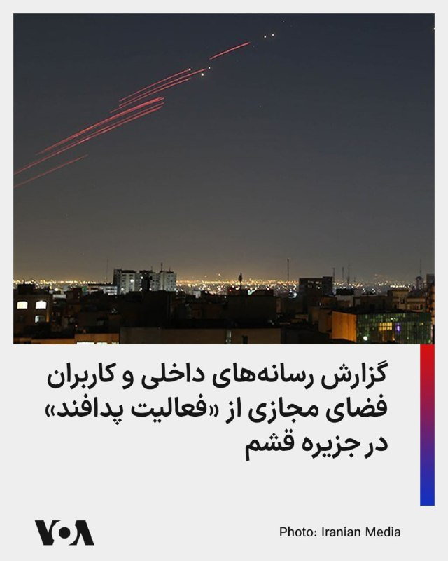

⚡️رسانه‌های داخلی و گزارش کاربران فضای مجازی در شامگاه جمعه ۸ خرداد از فعالیت پدافند در جزیره قشم حکایت دارد.
خبرگزاری تسنیم وابسته به سپاه مدعی شد پدافند قشم بعد از مشاهده «ریزپرنده متخاصم» در حوالی این جزیره فعال شده و توانسته این «ریز پرنده» را هدف قرار دهد.
خبرگزاری حکومتی مهر هم مدعی شد که پدافند جزیره قشم از چند جهت با اهدافی در آسمان منطقه درگیر شده است.
این سومین شب متوالی است که گزارش‌هایی که از انفجار یا فعالیت پدافندی در جنوب ایران منتشر می‌شود.

## FarsiVOA — post 219006

  <a href="telegram/content/FarsiVOA_219006_1780084827.mp4" target="_blank">🎬 Download video</a>

همزمان با فوران آتشفشان مایون در فیلیپین، یک شهاب‌سنگ از پشت این کوه عبور کرد.

تصویری که از این لحظه ثبت شده، عبور شهاب‌سنگ از آسمان را در حالی نشان می‌دهد که گدازه‌های آتشفشان در حال فوران هستند. برخی گزارش‌ها از احتمال ثبت نخستین تصویر همزمان شهاب‌سنگ و آتشفشان فعال در یک قاب خبر داده‌اند.

@FarsiVOA

## FarsiVOA — post 219005

  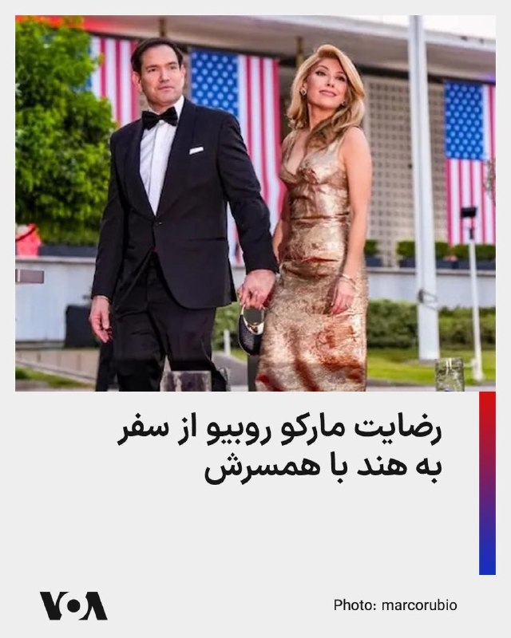

مارکو روبیو، وزیر امور خارجه آمریکا، با انتشار این تصویر در اینستاگرام نوشت که به همراه همسرش، دیدار بسیار خوبی با متحدان و شرکای آمریکا در هند داشته است.

@FarsiVOA

## FarsiVOA — post 219004

🔺وزیر خارجه آمریکا با همتای پاکستانی خود دیدار کرد؛ مشارکت برای امنیت و رفاه هر دو کشور

▪️وزیران امور خارجه ایالات متحده و پاکستان روز جمعه ۸ خرداد در واشنگتن از همکاری‌های میان دو کشور ابراز خشنودی و بر توسعه روابط‌شان تاکید کردند.

⬇️ بیشتر بخوانید:

https://ir.voanews.com/a/iran-pakistan-ishagh-dar-meeting-rubio-marco-/8155334.html/?nocach=1

## FarsiVOA — post 219003

در حالی که مقام‌های آمریکایی منتظر تصمیم نهایی پرزیدنت ترامپ درباره توافق هستند، پیام‌های متناقض از جمهوری اسلامی درباره تنگه هرمز، برنامه هسته‌ای و سرنوشت مذاکرات همچنان مخابره می‌شود

## FarsiVOA — post 219002

چرا آمریکا و جمهوری اسلامی هنوز به توافق نرسیده‌اند؟ خواسته‌های دو طرف چیست؟ گفت‌وگو با محمد قائدی

## FarsiVOA — post 219001

  <a href="telegram/content/FarsiVOA_219001_1780084828.mp4" target="_blank">🎬 Download video</a>

ویدیوهای منتشر شده در شبکه‌های اجتماعی، حملات ارتش اسرائیل به چندین هدف وابسته به حزب‌الله در لبنان را نشان می‌دهد.

در این تصاویر، دود و انفجار در مناطقی از لبنان که هدف حملات قرار گرفته‌اند، دیده می‌شود.

@FarsiVOA

## FarsiVOA — post 219000

🔺اصرار حزب‌الله بر گنجاندن موضوع لبنان در مذاکرات آمریکا و جمهوری اسلامی؛ اسرائیل: گروه نیابتی رژیم ایران به‌شدت ضعیف شده است

▪️در حالی که ارزیابی‌های فرماندهی جبهه شمالی در اسرائیل درباره توان رزمی حزب‌الله لبنان، از ضعیف شدن شدید این گروه تروریستی وابسته به جمهوری اسلامی حکایت دارد، گزارش‌ها حاکی از آن است که حزب‌الله در حال اعمال فشار بر جمهوری اسلامی است تا پایان جنگ و توقف حملات اسرائیل به این گروه را بخشی از روند مذاکرات رژیم ایران با آمریکا در نظر بگیرد.

⬇️ بیشتر بخوانید:

https://ir.voanews.com/a/lebanon-hezbollah-iran-war-proxy/8155271.html/?nocach=1

## FarsiVOA — post 218999

🔺 گزارش | «زمین گرد است یا تخت؟»؛ روایت اعدام غلامرضا خانی شکرآب توسط رژیم ایران

▪️نامش، غلامرضا خانی شکرآب بود. اگرچه در گزارش‌های رسمی اطلاعاتی درباره سن او منتشر نشده، اما بر اساس یکی از پست‌هایش در اینستاگرام، هنگام اعدام باید ۳۳ یا ۳۴ ساله بوده باشد؛ او روز ۵ خرداد ۱۴۰۵ به اتهام «جاسوسی برای اسرائیل» اعدام شد.

⬇️ بیشتر بخوانید:

https://ir.voanews.com/a/iran-execution-khani-shekarab-gholamreza/8155303.html/?nocach=1

## FarsiVOA — post 218998

اصابت پهپاد روسی به ساختمان در رومانی؛ ناتو: از هر وجب خاک خود دفاع می‌کنیم

## FarsiVOA — post 218997

توافق جمهوری اسلامی و آمریکا نزدیک است؟ چه کسی هزینه سیاسی آن را در ایران می‌پردازد؟

## FarsiVOA — post 218996

🔺پرزیدنت ترامپ: رژیم ایران باید بپذیرد که هرگز سلاح هسته‌ای نخواهد داشت؛ تنگه هرمز باید فوراً و بدون عوارض باز شود ▪️رئیس جمهوری آمریکا از برگزاری جلسه‌ای اضطراری با مقامات بلندپایه دولت خود در اتاق وضعیت خبر داد و گفت که در آستانه تصمیم‌گیری درباره پرونده…

## DW_Farsi — post 125294

🔶 قالیباف: امتیازات را نه با گفت‌وگو بلکه با موشک‌ها می‌گیریم

محمدباقر قالیباف، مذاکره‌کننده ارشد ایران در پیامی تازه تهدید کرد که جمهوری اسلامی امتیازات خود برای رسیدن به توافق در مذاکرات‌ با آمریکا را "نه با گفت‌وگو" بلکه با "موشک‌ها"ی خود می‌گیرد.

او در این پیام که جمعه هشتم خرداد در شبکه ایکس نوشته افزود: «هیچ اعتمادی به تضمین‌ها و حرف‌ها نداریم. فقط رفتارها معیار است. اقدامی پیش از اقدام طرف مقابل انجام نخواهد شد.»

قالیباف این اظهارات را همزمان با انتشار گزارش‌های رسانه‌ای در مورد قوی بودن امکان رسیدن به توافق در مذاکرات دو طرف بیان کرده است.

همزمان دونالد ترامپ، رئیس‌جمهور آمریکا در روز جمعه هشتم خرداد (۲۹ مه) در پیامی تازه در شبکه تروث سوشال اعلام کرد که در جلسه‌ای در اتاق وضعیت کاخ سفید در مورد توافق با ایران تصمیم نهایی را خواهد گرفت.

او در این پیام موارد مد نظر آمریکا برای توافق با ایران را فهرست کرده است.

طبق پیام ترامپ، این موارد شامل موافقت جمهوری اسلامی با عدم توسعه سلاح هسته‌ای، بازگشایی تنگه هرمز، انهدام تمامی مین‌های دریایی کارگذاشته‌شده توسط ایران، لغو محاصره دریایی این کشور توسط ایالات متحده و همچنین خار‌ج‌کردن اورانیوم بسیار غنی‌شده از زیر آوار توسط آمریکا و نابودسازی آن می‌شود.

رئیس‌جمهور آمریکا ادامه داد: «تا اطلاع ثانوی، هیچ پولی مبادله نخواهد شد. در مورد سایر موارد که از اهمیت بسیار کم‌تری برخوردار هستند، توافق حاصل شده است.»
@dw_farsi

## DW_Farsi — post 125293

🔶 دو فعال کرد و از معترضان دی‌‌ماه "با تیراندازی سپاه" کشته شدند

سازمان حقوق بشری هه‌نگاو و شبکه حقوق بشر کردستان از کشته شدن دو برادر و فعال فرهنگی کرد که بعد از شرکت در اعتراضات دی‌ماه مخفیانه زندگی می‌کردند با "شلیک مستقیم" نیروهای سپاه پاسداران خبر داده‌اند.

شبکه حقوق بشر کردستان به نقل از یک منبع مطلع اعلام کرد، صبح روز پنج‌شنبه هفتم خرداد نیروهای سپاه پس از شناسایی محل اختفای آن‌ها در روستای "قلعه‌کوهش" شهرستان دالاهو به محل اقامت این دو برادر یورش بردند: «نیروهای سپاه در جریان این عملیات، منزل محل سکونت آنان را بدون هشدار قبلی هدف تیراندازی قرار داده و مجتبی و میثم ویسی را با شلیک گلوله کشتند.»

هه‌نگاو نیز با روایتی مشابه نوشته، یک شهروند دیگر که صاحب این خانه بوده "سرنوشتش نامعلوم است."

این سازمان حقوق بشری می‌‌گوید، این دو برادر "از چهره‌های خوش‌نام و مردمی و پیروان آیین یارسان" و از مؤسسان کتابخانه شهرک دره‌دریژ (شهرک مهدیه) کرمانشاه و از برگزارکنندگان اصلی مراسم‌ نوروز کردی در این منطقه بودند.

همچنین مجتبی ویسی علاوه بر فعالیت‌های مدنی، از "ورزشکاران برجسته و مقام‌آور رشته کشتی در استان کرمانشاه بود."

خبرگزاری فرانسه می‌نویسد، رسانه‌های داخلی ایران نیز این اتفاق که پنج‌شنبه رخ داده را تأیید کرده‌اند اما می‌گویند، آن‌ها زمانی که از مخفی‌گاه خود اقدام به تیراندازی به نیروهای امنیتی کردند هدف آتش قرار گرفته و کشته شدند.

خبرگزاری تسنیم، وابسته به سپاه پاسداران آن‌ها را "دو تن از عاملان اصلی" ناآرامی‌های دی‌ماه در منطقه دره‌دراز کرمانشاه معرفی کرده و مدعی شده که آنان ابتدا به سوی نیروهای امنیتی تیراندازی کردند.

در ادامه این گزارش آمده است که "در نهایت، نیروهای امنیتی در راستای مأموریت قانونی و به جهت دفاع از خود، اقدام به تیراندازی متقابل کردند که منجر" به کشته شدن این دو نفر شد.
@dw_farsi

## DW_Farsi — post 125292

🔶 گروسی: قزاقستان آماده پذیرش ذخایر اورانیوم ایران است

قزاقستان اعلام کرده، در صورتی که آمریکا در مذاکراتش با ایران به توافق دست یابد این کشور آماده است تا ذخایر اورانیوم بسیار غنی‌شده ایران را نگهداری کند.

خبرگزاری رویترز می‌نویسد، این مطلب را رافائل گروسی، مدیرکل آژانس بین‌المللی انرژی اتمی به روزنامه فایننشال تایمز گفته است.

مطابق این خبر، گروسی در مصاحبه‌ای که روز جمعه ۲۹ مه (هشتم خرداد) منتشر شد به این روزنامه گفت، این کشور هنگامی که قاسم‌‌‌‌‌‌‌‌‌ ـژومارت توکایف، رئیس‌جمهور قزاقستان این هفته در شهر آستانه با او دیدار کرد، آمادگی خود را برای پذیرش این ذخایر ابراز داشت.

قزاقستان میزبان یک بانک ذخیره اورانیوم با غنای پایین است که تحت کنترل بین‌المللی قرار دارد و هدف آن تضمین تأمین سوخت مورد نیاز نیروگاه‌ها در کشورهای عضو آژانس بین‌المللی انرژی اتمی و جلوگیری از گسترش سلاح‌های هسته‌ای است.

این تأسیسات ذخیره در سال ۲۰۱۷ با همکاری آژانس بین‌المللی انرژی اتمی راه‌اندازی شد.

سرنوشت ۴۴۰ کیلوگرم اورانیوم ایران که تا سطح ۶۰ درصد غنی‌سازی شده، یکی از حساس‌ترین موضوعات در گفت‌وگوهای غیررسمی میان واشنگتن و تهران درباره توافقی برای پایان دادن به جنگ میان آمریکا، اسرائیل و ایران است.

دونالد ترامپ خواستار آن شده که این اورانیوم از ایران خارج شود.

تهران به‌صورت علنی اعلام کرده که ذخایر مرتبط با برنامه هسته‌ای خود را تحویل نخواهد داد. با این حال، بنا به گفته افرادی که از این پیشنهاد اطلاع دارند، ایران ظاهراً آمادگی داده است که در چارچوب توافقی برای تمدید ۶۰ روزه آتش‌بس شکننده، بازگشایی تنگه هرمز و ایجاد زمینه مذاکرات درباره برنامه هسته‌ای ایران، درباره رقیق‌سازی یا انتقال این مواد شکافت‌پذیر مذاکره کند.

گمان می‌رود ۴۴۰ کیلوگرم اورانیوم با غنای بالای ایران اکنون زیر آوار سه تأسیسات اصلی هسته‌ای این کشور، نطنز، فردو و اصفهان، قرار داشته باشد؛ تأسیساتی که پس از مشارکت کوتاه‌مدت آمریکا در جنگ ۱۲ روزه اسرائیل علیه ایران در ژوئن گذشته، هدف بمباران آمریکا قرار گرفتند.

این میزان اورانیوم ۶۰ درصدی، اگر تا سطح ۹۰ درصد ، یعنی سطح مورد نیاز برای سلاح هسته‌ای، بیشتر غنی‌سازی شود، برای ساخت حدود ۱۰ سلاح هسته‌ای کافی خواهد بود.

دونالد ترامپ این هفته در شبکه تروث سوشال گفت که اورانیوم با غنای بالا باید "یا فوراً به ایالات متحده تحویل داده شود، یا ترجیحاً با همکاری جمهوری اسلامی ایران در محل نابود شود".

او افزود: «یا در مکان مناسب دیگری، به‌شرط آنکه کمیسیون انرژی اتمی یا نهادی مشابه، این روند و این رویداد را نظارت کند.»

ترامپ همچنین تأکید کرد که "موافق نخواهد بود" روسیه یا چین این ذخایر را در اختیار بگیرند.

در کنار موضوع اورانیوم، آمریکا ایران را تحت فشار قرار داده است تا یک تعلیق ۲۰ ساله برای غنی‌سازی اورانیوم را بپذیرد.
@dw_farsi

## DW_Farsi — post 125291

🔶 جایزه دفاعی اسرائيل به سامانه‌های به‌کار رفته در جنگ ایران رسید

یسرائيل کاتس، وزیر دفاع اسرائيل اسامی برندگان جایزه دفاعی این کشور در سال ۲۰۲۶ را اعلام کرد که از جمله شامل یک "سامانه منحصربه‌فرد" است که در جنگ علیه ایران مورد استفاده قرار گرفته است.

به گزارش تایمز اسرائيل، مراسم اهدای این جوایز با حضور کاتس، ایال زامیر، رئیس ستاد کل ارتش و اسحاق هرتزوگ ، رئیس‌جمهور اسرائيل در اقامتگاه رئیس‌جمهور برگزار خواهد شد.

وزارت دفاع اسرائيل بدون مشخص‌ کردن دقیق سامانه مورد نظر گفت، یکی از پروژه‌های برنده، یک سامانه تسلیحاتی است که نقشی "محوری" در رشته‌‌عملیات‌ علیه جمهوری اسلامی ایفا کرده و "نتایج استثنایی" با تأثیر راهبردی قابل‌توجه به‌دست آورده است.

این جایزه به نیروی هوایی اسرائیل، وزارت دفاع و شرکت "رافائل سیستم‌های پیشرفته دفاعی" اعطا شده است.

دیگر پروژه‌های برنده شامل یک سامانه عملیاتی محرمانه متعلق به سازمان اطلاعاتی موساد، به‌کارگیری عملیاتی ماهواره‌های شناسایی "اوفک-۱۳" و "اوفک-۱۹"، یک دستاورد فناورانه از سوی واحد ۸۱ و واحد ۸۲۰۰ در اداره اطلاعات ارتش اسرائیل و سامانه‌های جنگ الکترونیک می‌شود که گفته می‌شود، در طول جنگ به جلوگیری از رهگیری هواپیماهای سرنشین‌دار اسرائیلی کمک کرده‌اند.

کاتس در بیانیه‌ای گفت: «سال گذشته قدرت عظیم دولت اسرائیل، نهادهای دفاعی و صنایع دفاعی اسرائیل را به کل جهان ثابت کرد.»

او افزود: «توانمندی‌ها، سامانه‌ها و پیشرفت‌های نوآورانه‌ای که در عملیات علیه دشمنان ما به نمایش گذاشته شد و دشمنان ما را در ایران، لبنان، غزه و سایر عرصه‌ها هدف قرار داد و از میان برد، به دولت اسرائیل برتری بی‌سابقه عملیاتی، اطلاعاتی و فناورانه بخشید.»

اسرائيل که بارها از سوی جمهوری اسلامی تهدید به نابودی شده یک بار در ژوئن سال گذشته به مواضع جمهوری اسلامی حمله کرد. این جنگ ۱۲ روز طول کشید و در نهایت با حملات آمریکا به سه مرکز کلیدی هسته‌ای ایران پایان یافت.

دور دوم این درگیری‌ها از ۲۸ فوریه سال جاری شروع شد و هفته‌ها طول کشید تا دو طرف به آتش‌بسی موقت دست یافتند؛ آتش‌بسی که هنوز سرنوشت آن معلوم نیست.
@dw_farsi

## DW_Farsi — post 125290

🔶 ابهام در صدور ویزای آمریکا برای تیم ملی فوتبال ایران

در حالی که دو هفته به آغاز رقابت‌های جام جهانی مانده ظاهرا تیم ملی فوتبال ایران همچنان باید در انتظار صدور ویزای ایالات متحده آمریکا باشد.

ابوالفضل پسندیده، سفیر ایران در مکزیک، روز جمعه هشتم خرداد در جریان بازدید از شهر مرزی تیخوانا در این کشور که قرار شده میزبان کمپ اصلی تیم ملی فوتبال ایران برای حضور در این رقابت‌ها باشد با اعلام این خبر گفت: «شکی نداریم که تیخوانا مکان بسیار خوبی برای هواداران ما خواهد بود.»

پسندیده با اشاره به "کشور شمالی" که به وضوح به ایالات متحده آمریکا اشاره داشت، تاکید کرد که این کشور به مسئولیت خود به عنوان میزبان تیم ایران عمل نکرده است.

در ابتدا قرار بود که تیم ملی ایران اردو و محل اقامت خود را در آریزونای آمریکا بر پا کند ولی بعد از شروع جنگ ایالات متحده و اسرائيل علیه جمهوری اسلامی برنامه‌ها تغییر کرد و اکنون تیخوانا در مکزیک محلی است که قرار است تیم ملی ایران در آن‌جا مستقر شود.

پسندیده با ابراز عدم اطمینان در مورد کسب ویزای آمریکا برای تیم ملی فوتبال ایران گفت، اما فیفا (فدراسیون بین‌المللی فوتبال) تمامی تلاش خود را، هرچند بدون موفقیت، انجام داده تا مطمئن شود که با مانعی روبرو نخواند شد، زیرا آن‌ها تنها تیم از بین ۴۸ تیم دعوت‌شده به جام جهانی ۲۰۲۶ هستند که با مشکل مواحه شده‌اند."

او همچنین ابراز امیدواری کرد که ایرانیان ساکن کالیفرنیا و مکزیک برای تشویق تیم ایران در دور اول بازی در لس‌‌آنجلس و سیاتل مقابل نیوزیلند، بلژیک و مصر حضور داشته باشند.
@dw_farsi

## DW_Farsi — post 125289

🔶 ترامپ: برای تصمیم‌گیری نهایی در مورد ایران تشکیل جلسه می‌دهم

دونالد ترامپ، رئیس‌جمهور آمریکا در پستی تازه از تشکیل جلسه‌ای در اتاق وضعیت (Situation Room) کاخ سفید به منظور "تصمیم‌گیری" نهایی درباره توافق با ایران خبر داده است.

در این پست که در شبکه اجتماعی "تروث سوشال" در روز جمعه هشتم خرداد (۲۹ مه) منتشر شده ترامپ موارد مد نظر آمریکا برای توافق با ایران را فهرست کرده است.

طبق این پیام، این موارد شامل موافقت جمهوری اسلامی با عدم توسعه سلاح هسته‌ای، بازگشایی تنگه هرمز، انهدام تمامی مین‌های دریایی کارگذاشته‌شده توسط ایران، لغو محاصره دریایی این کشور توسط ایالات متحده و همچنین خار‌ج‌کردن اورانیوم بسیار غنی‌شده از زیر آوار توسط آمریکا و نابودسازی آن می‌شود.

ترامپ در مورد خروج اورانیوم با غنای بالا نوشت که این مواد "از زیر زمین خارج خواهند شد و توافق شده که آمریکا تنها کشور علاوه بر چین است که توانایی فنی چنین کاری را دارد."

در ضمن، خروج این مواد در "هماهنگی و همکاری نزدیک با جمهوری اسلامی ایران و آژانس بین‌المللی انرژی اتمی انجام خواهد شد."

او ادامه داد: «تا اطلاع ثانوی، هیچ پولی مبادله نخواهد شد. در مورد سایر موارد که از اهمیت بسیار کمتری برخوردار هستند، توافق حاصل شده است.»

خبرگزاری فارس، نزدیک به سپاه در واکنش به پیام تازه ترامپ از قول "منابع آگاه" خبر داد که پیام رئیس جمهور آمریکا درباره توافق احتمالی با ایران، "آمیخته ای از راست و دروغ و تلاشی برای نمایش پیروزیِ ساختگی" است.

فارس در ادامه نوشته است که «متن توافق که تحت قالب "تعهد در برابر تعهد" تدوین شده، در مراحل نهایی تصویب در ایران قرار دارد و هنوز تصمیم قطعی اتخاذ نشده است.»
@dw_farsi

## DW_Farsi — post 125288

🔶 صدور حکم ۱۵ سال زندان برای توطئه حمله به کنسرت تیلور سوئیفت

دادگاه ایالتی وینر نوی‌اشتات متهم اصلی پرونده طرح حمله به کنسرت تیلور سوئیفت در وین را گناهکار شناخت و به ۱۵ سال زندان محکوم کرد. این دادگاه او را در بیش از ۱۲ مورد اتهامی، که بیشتر آن‌ها با تروریسم ارتباط داشت، مجرم دانست. یکی دیگر از متهمان این پرونده نیز به ۱۲ سال زندان محکوم شد.

به گزارش خبرگزاری آلمان، منشأ این پرونده به اوت ۲۰۲۴ بازمی‌گردد؛ زمانی که بران آ.، شهروند اتریشی با ریشه‌های مقدونیه شمالی، به گفته دادستانی قصد داشت به جمعیت حاضر در برابر ورزشگاه ارنست هاپل حمله کند و سپس خودکشی کند.

او برای این منظور، بر اساس آموزش‌های اینترنتی، مقدار کمی از منفجره تهیه کرده بود و تلاش داشت سلاح‌هایی مانند مسلسل و نارنجک دستی خریداری کند.
@dw_farsi

## DW_Farsi — post 125287

  

🔶 دیدار علی باقری با مقام‌های برزیل و مصر در مسکو

علی باقری، معاون سیاست خارجی و امنیت بین‌الملل شورای عالی امنیت ملی ایران در سفر به پایتخت روسیه در دیدارهای جداگانه‌‌ای با مشاور سیاست خارجی رئیس‌جمهور برزیل و دبیرکل شورای امنیت ملی مصر گفت‌وگو کرد.

به گزارش رسانه‌های ایران، باقری در دیدار با سلسو آموریم، مقام یادشده برزیل که در حاشیه چهاردهمین نشست بین‌المللی مقام‌های بلندپایه امنیتی در مسکو برگزار شد، درباره آخرین تحولات منطقه‌ای و بین‌المللی تبادل نظر کرد.

وضعیت غرب آسیا و توسعه همکاری‌های دوجانبه نیز از دیگر موضوعات مطرح‌شده بود.

معاون دبیر شورای عالی امنیت ملی ایران همچنین با یوسف علا‌ء‌الدین، دبیرکل شورای امنیت ملی مصر دیدار و گفت‌وگو کرد.

دو طرف در این دیدار درباره آخرین تحولات منطقه‌ای و بین‌المللی، وضعیت غرب آسیا و چگونگی کمک به تحکیم صلح و ثبات در حوزه پیرامونی تبادل نظر کردند.

به نقل از ایسنا، چهاردهمین کنفرانس بین‌المللی مقامات بلندپایه امنیتی در مسکو از سه‌شنبه تا پنج‌شنبه پنجم تا هفتم خرداد برگزار شد و باقری علاوه بر گفت‌وگو با این مقام‌ها در نشست اصلی نیز شرکت و سخنرانی کرد.
@dw_farsi

## DW_Farsi — post 125286

🔶 رومانی پس از حمله روسیه خواستار سامانه‌های ضد پهپادی ناتو شد

اصابت یک پهپاد روسی به یک ساختمان مسکونی در رومانی، از اعضای ناتو و اتحادیه اروپا باعث انتقاد شدید متحدان ائتلاف دفاعی نظامی ناتو از مسکو و ابراز همبستگی با بخارست شد.

به گفته رسانه‌ها، برخورد این پهپاد به این ساختمان در شامگاه منتهی به جمعه ۲۹ مه منجر به زخمی شدن دو نفر شد. طبق اعلام وزارت کشور، جراحات این دو نفر سطحی بود و در محل تحت درمان قرار گرفت.

مارک روته، دبیرکل ناتو در پی این رخداد "حمایت کامل و بی‌قید و شرط" ناتو از رومانی را به نیکوشور دان، رئیس‌جمهور این کشور ابراز کرد. متیو ویتاکر، سفیر آمریکا در ناتو نیز اظهارات مشابهی کرده است.
@dw_farsi

## DW_Farsi — post 125284

🔶 حماس از گرانی و کمبود در غزه سود می‌برد

افزایش شدید قیمت‌ها در غزه فقط نتیجه جنگ و محاصره نیست، بلکه با سازوکاری گره خورده که در آن برای ورود کالا به این منطقه، مبالغ سنگینی تحت عنوان "هماهنگی" دریافت می‌شود. بر اساس این گزارش، کارشناسان می‌گویند از این ساختار، پیش از همه حماس و شبکه‌ای از خانواده‌های بانفوذ تجاری سود می‌برند.

به گزارش رسانه‌های آلمان، در بازار غزه، کمبود دام و گوشت باعث شده قیمت هر کیلو گوشت تا ۱۲۰ دلار بالا برود. یکی از دام‌فروشان می‌گوید برای ورود هر محموله کالا به غزه، باید مبلغی سنگین برای "هماهنگی" پرداخت شود؛ رقمی که به گفته او برای هر بار حدود ۴۰۰ هزار دلار است. این عدد به‌طور مستقل قابل راستی‌آزمایی نیست، اما فروشندگان می‌گویند بدون این پرداخت‌ها، عملا ورود کالا ممکن نیست.

در بخش پوشاک نیز همین الگو تکرار می‌شود. یک فروشنده لباس در غزه می‌گوید برای هر پالت کالا حدود ۵ هزار دلار باید برای "هماهنگی" پرداخت شود و همین هزینه، قیمت نهایی اجناس را به‌شدت بالا می‌برد. او می‌گوید بخشی از لباس‌ها اکنون از کرانه باختری به غزه می‌رسد و همین هم بر هزینه‌ها افزوده است.
@dw_farsi

## DW_Farsi — post 125276

🔶 پنج خطر سلامتی ناشی از مصرف بیش از حد پروتئین

پژوهش‌های علمی نشان می‌دهند که مصرف بیش از حد پروتئین نه‌تنها همیشه مفید نیست، بلکه در برخی شرایط می‌تواند سلامت بدن را تهدید کند.

پروتئین بدون تردید یکی از مهم‌ترین مواد مغذی برای بدن است و نقش حیاتی در ساخت عضلات، ترمیم بافت‌ها، تولید هورمون‌ها و عملکرد سیستم ایمنی دارد. با این حال، متخصصان تغذیه تأکید می‌کنند که بدن انسان تنها به مقدار مشخصی پروتئین نیاز دارد و دریافت بیش از اندازه آن، به‌ویژه از منابع حیوانی، ممکن است عوارض مختلفی ایجاد کند.

@dw_farsi

## DW_Farsi — post 125275

🔶 هشدار بانک مرکزی اروپا درباره اثرات جنگ ایران در حوزه یورو

تحقیقات بانک مرکزی اروپا که روز جمعه هشتم خرداد (۲۹ مه) منتشر شد نشان می‌دهد که مصرف‌کنندگان منطقه یورو که پیش از این نیز از جنگ اوکراین آسیب دیده بودند ممکن است بر اثر بحران و تنش‌های حاصل از جنگ ایران باز هم آسیب ببینند.

طبق گزارش خبرگزاری رویترز، بر اثر پیامدهای جنگ ایران مصرف‌کنندگان منطقه یورو رفتار و نگرش خود را با سرعت بیشتری تغییر داده‌اند؛ امری که به این معناست که ضربه اقتصادی می‌تواند عمیق‌تر و سریع‌تر باشد.

حمله روسیه به اوکراین در فوریه ۲۰۲۲ باعث ایجاد بحران انرژی و تورمی شد که اروپا تا حد زیادی از آن بهبود یافته بود، اما پس از آن، حملات هوایی آمریکا و اسرائیل در ۲۸ فوریه علیه جمهوری اسلامی جنگی را آغاز کرد که منجر به اختلال بی‌سابقه‌ای در تأمین انرژی شده است.
@dw_farsi

## DW_Farsi — post 125274

🔶 ادامه سیاست فشار حداکثری آمریکا با تحریم‌های جدید علیه شبکه نفتی ایران

وزارت امور خارجه آمریکا روز پنجشنبه ۷ خرداد (۲۸ مه) در ادامه سیاست "فشار حداکثری"، مجموعه‌ای از تحریم‌های جدید را علیه افراد، شرکت‌ها و کشتی‌های مرتبط با صادرات نفت و محصولات پتروشیمی ایران اعلام کرد.

هدف این اقدام کاهش درآمدهای جمهوری اسلامی عنوان شده است که به گفته واشنگتن برای فعالیت‌های منطقه‌ای و حمایت از گروه‌های نیابتی استفاده می‌شود.

چندین شرکت مدیریت کشتی و تعدادی نفتکش به‌دلیل نقش در حمل و نقل نفت و پتروشیمی ایران در فهرست تحریم قرار گرفته‌اند و همچنین هشت کشتی به‌عنوان دارایی‌های مرتبط با این شبکه‌ها شناسایی و مسدود شده‌اند.

وزارت خارجه آمریکا اعلام کرده است که این شبکه‌ها با استفاده از روش‌های پنهان حمل‌ونقل دریایی به فروش نفت ایران کمک کرده و بخشی از درآمدهای آن را تامین می‌کنند.

هم‌زمان، وزارت خزانه‌داری نیز شبکه‌ای دیگر در حوزه فروش نفت ایران را تحریم کرده است.

در بیانیه خزانه‌داری آمریکا به شرکت‌ها و افراد فعال در تجارت محصولات پتروشیمی ایران در کشورهای مختلف نیز اشاره و آن‌ها به‌دلیل انجام معاملات مالی مرتبط با ایران تحریم شده‌اند.

آمریکا اعلام کرده هدف این اقدامات، تغییر رفتار ایران از طریق فشار اقتصادی و محدود کردن منابع مالی مرتبط با فعالیت‌های منطقه‌ای است.
@dw_farsi

## Persian_Trend_Official — post 15293

  <a href="telegram/content/Persian_Trend_Official_15293_1780084829.webm" target="_blank">🎬 Download video</a>

https://youtube.com/live/24Mc1cJMDgQ?feature=share

## Persian_Trend_Official — post 15292

  <a href="telegram/content/Persian_Trend_Official_15292_1780084830.webm" target="_blank">🎬 Download video</a>

وزیر خزانه‌داری ایالات‌متحده : یک میلیارد دلار از دارایی‌های رمزارز ایران(سپاه) را مصادره کردیم.

🔹اسکات بسنت، وزیر خزانه‌داری آمریکا، روز (جمعه) مدعی شد که ایالات متحده حدود یک میلیارد دلار از دارایی‌های رمزارزی ایران را مصادره کرده است.

👺Phantom

📌 @persian_trend_official
پرشین ترند | متفاوت‌ترین کانال نظامی

## Persian_Trend_Official — post 15291

تا دقایقی دیگه لایو آغاز میشه

## Persian_Trend_Official — post 15290

  <a href="telegram/content/Persian_Trend_Official_15290_1780084830.webm" target="_blank">🎬 Download video</a>

وضعیت فعلی آسمان منطقه

📌 @persian_trend_official
پرشین ترند | متفاوت‌ترین کانال نظامی

## Persian_Trend_Official — post 15289

  

اونوقت به خامنه ای شربت شهادت دادن نامردا !

📌 @persian_trend_official
پرشین ترند | متفاوت‌ترین کانال نظامی

## Persian_Trend_Official — post 15288

  <a href="telegram/content/Persian_Trend_Official_15288_1780084831.webm" target="_blank">🎬 Download video</a>

«ترامپ باید بداند که ایران به عنوان پیروز و فاتح میدان شرایط را تعیین می‌کند:
نقد مقابل نقد
نسیه مقابل نسیه
هیچ مقابل هیچ
البته برای موضوعاتی که مورد مذاکره است نه آرزوهایش»

-ایراهیم عزیزی،رئیس کمسیون امنیت ملی مجلس شورای اسلامی

📌 @persian_trend_official
پرشین ترند | متفاوت‌ترین کانال نظامی

## Persian_Trend_Official — post 15287

  <a href="telegram/content/Persian_Trend_Official_15287_1780084831.mp4" target="_blank">🎬 Download video</a>

خدا رحمت کنه شمخانی رو
رهبری رو به شهر توریستی فرستاد !

📌 @persian_trend_official
پرشین ترند | متفاوت‌ترین کانال نظامی

## Persian_Trend_Official — post 15286

  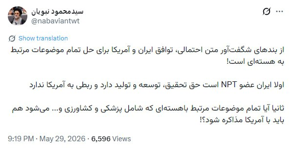

از بندهای شگفت‌آور متن احتمالی، توافق ایران و آمریکا برای حل تمام موضوعات مرتبط به هسته‌ای است!

اولا ایران عضو NPT است حق تحقیق، توسعه و تولید دارد و ربطی به آمریکا ندارد

ثانیا آیا تمام موضوعات مرتبط باهسته‌ای که شامل پزشکی و کشاورزی و... می‌شود هم باید با آمریکا مذاکره شود؟!

## Persian_Trend_Official — post 15285

  

بد شد که !

## Persian_Trend_Official — post 15284

  <a href="telegram/content/Persian_Trend_Official_15284_1780084834.webm" target="_blank">🎬 Download video</a>

🎬 Video

## Persian_Trend_Official — post 15283

  <a href="telegram/content/Persian_Trend_Official_15283_1780084834.webm" target="_blank">🎬 Download video</a>

🔹تسنیم: انهدام پهپاد آمریکایی در حوالی قشم

در پی رصد پهپاد آمریکایی در حوالی قشم توسط پدافند هوایی ارتش، بلافاصله در عملیات موفق مورد اصابت قرار گرفت و منهدم شد.

👺Phantom

📌 @persian_trend_official
پرشین ترند | متفاوت‌ترین کانال نظامی

## Persian_Trend_Official — post 15282

  <a href="telegram/content/Persian_Trend_Official_15282_1780084835.webm" target="_blank">🎬 Download video</a>

رویترز: تهران ممکن است با انتقال نیمی از ذخایر اورانیوم غنی‌شده ۶۰درصدی موافقت کند

📌 @persian_trend_official
پرشین ترند | متفاوت‌ترین کانال نظامی

## Persian_Trend_Official — post 15281

  <a href="telegram/content/Persian_Trend_Official_15281_1780084835.webm" target="_blank">🎬 Download video</a>

مجدد گزارش های تایید نشده از فعالیت پدافند در قشم! 📝 Nick 📌 @persian_trend_official پرشین ترند | متفاوت‌ترین کانال نظامی

## Persian_Trend_Official — post 15279

  <a href="telegram/content/Persian_Trend_Official_15279_1780084836.webm" target="_blank">🎬 Download video</a>

زیرنویس های صداوسیما !!!

## Persian_Trend_Official — post 15278

فکر میکنم حوالی ساعت 23 به وقت تهران

## Persian_Trend_Official — post 15277

  <a href="telegram/content/Persian_Trend_Official_15277_1780084836.webm" target="_blank">🎬 Download video</a>

منتظر روشن شدن اتفاقات هستم بلافاصله بعدش لایو داریم

## Persian_Trend_Official — post 15276

  <a href="telegram/content/Persian_Trend_Official_15276_1780084836.mp4" target="_blank">🎬 Download video</a>

🎥 لحظه بمباران پایگاه فتح سپاه، در فردیس کرج

👺Phantom

📌 @persian_trend_official
پرشین ترند | متفاوت‌ترین کانال نظامی

## Persian_Trend_Official — post 15275

  <a href="telegram/content/Persian_Trend_Official_15275_1780084838.mp4" target="_blank">🎬 Download video</a>

تصاویری از قشم

👺Phantom

📌 @persian_trend_official
پرشین ترند | متفاوت‌ترین کانال نظامی

## Persian_Trend_Official — post 15274

  <a href="telegram/content/Persian_Trend_Official_15274_1780084839.webm" target="_blank">🎬 Download video</a>

هم اکنون فعالیت پدافند در بندرعباس

👺Phantom

📌 @persian_trend_official
پرشین ترند | متفاوت‌ترین کانال نظامی

## RadioFarda — post 157704

آیا توافق موقت ایران و آمریکا در آستانهٔ رسیدن به مرحلهٔ پایانی است؟

🔸با وجود انتشار گزارش‌های ضدونقیض از تهران و واشینگتن دربارهٔ احتمال یک توافق موقت، کاخ سفید هنوز به‌طور شفاف اعلام نکرده است که آیا دو کشور به توافق نزدیک شده‌اند یا نه.

🔸اسکات بسنت، وزیر خزانه‌داری آمریکا، به خبرنگاران گفته است مذاکرات همچنان ادامه دارد و تأکید کرده که دونالد ترامپ، رئیس‌جمهور آمریکا، «توافق بدی» را برای ایالات متحده نخواهد پذیرفت.

🔸همزمان، گزارش‌هایی منتشر شده که نشان می‌دهد ایران و آمریکا پیرامون یک توافق موقت ۶۰ روزه برای تمدید آتش‌بس و احیای مذاکرات هسته‌ای به جمع‌بندی رسیده‌اند.

🔸انتشار این گزارش‌ها اختلاف دیدگاه‌ها در دولت ترامپ و میان جمهوری‌خواهان را برجسته کرده است. منتقدان می‌گویند کاخ سفید در شرایطی موضع نرم‌تری در قبال تهران در پیش گرفته که تنش‌ها در تنگه هرمز همچنان ادامه دارد.

🔸برای درک بهتر آن‌چه ممکن است پشت صحنه در جریان باشد، رادیو اروپای آزاد/رادیو آزادی با الکساندر گری، رئیس دفتر شورای امنیت ملی در دورهٔ نخست ریاست‌جمهوری دونالد ترامپ و مدیرعامل کنونی شرکت مشاوره ژئوپلیتیک «امریکن گلوبال استراتجیز»، گفت‌وگو کرده است.

🔸متن کامل این گفت‌وگو را در وب‌سایت رادیوفردا بخوانید.

@RadioFarda

## RadioFarda — post 157703

  

🔸رؤسای آژانس بین‌المللی انرژی، صندوق بین‌المللی پول، بانک جهانی و سازمان تجارت جهانی روز پنج‌شنبه برای بررسی واکنش نهادهای خود به پیامدهای جنگ در خاورمیانه دیدار کردند. این موضوع در بیانیه مشترکی که روز جمعه منتشر شد، اعلام شده است.

🔸این نهادها در بیانیه خود با اشاره به محاصره در تنگه هرمز، هشدار دادند: «اگر جریان حمل‌ونقل دریایی به حالت عادی بازنگردد، کاهش سریع و ادامه‌دار ذخایر جهانی نفت، همزمان با اوج تقاضای تابستانی در نیمکره شمالی، خطرات فزاینده‌ای برای امنیت سوخت، شرایط بازار و تاب‌آوری گسترده‌تر اقتصاد جهانی ایجاد خواهد کرد.»

🔸در ادامه این بیانیه آمده است که این نهادها همچنین گزینه‌هایی را برای «تقویت بیشتر حمایت جمعی از طریق اقدامات چندجانبه و دوجانبه» بررسی کرده‌اند.

🔸در پی حملات مشترک آمریکا و اسرائیل به ایران در نهم اسفند سال گذشته و آغاز جنگ، نیروهای نظامی ایران تنگه هرمز را مسدود کردند. این آبراه محل عبور حدود ۲۰ درصد از نفت و گاز در جهان بود و اختلال در حرکت کشتی‌ها باعث افزایش قیمت نفت و کمبود گاز و سایر محصولات نفتی در برخی کشورها شد.

@RadioFarda

## RadioFarda — post 157702

  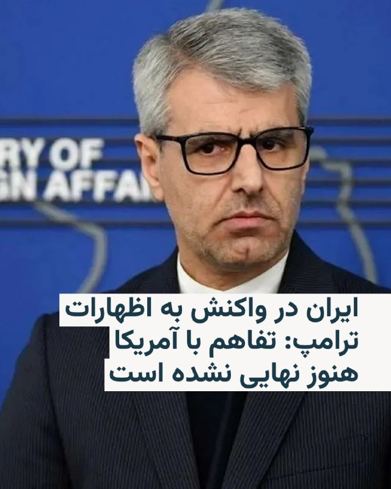

🔸سخنگوی وزارت خارجه جمهوری اسلامی در واکنش به پیام دونالد ترامپ دربارهٔ محتوای توافق میان آمریکا و ایران اعلام کرد که تفاهم میان دو کشور هنوز نهایی نشده است.

🔸اسماعیل بقائی روز جمعه گفت: «تبادل پیام‌ها البته ادامه دارد، ولی تفاهم نهایی نشده است.»

🔸دونالد ترامپ، رئیس‌جمهور آمریکا ساعتی پیش اعلام کرد که توافق پایان دادن جنگ باید شامل مواردی مانند تعهد ایران به باز شدن تنگه هرمز و نابودی ذخایر اورانیوم باشد.

🔸به گزارش رسانه‌های ایران، بقائی دربارهٔ وضعیت تنگه هرمز با اشاره به واقع شدن آن در آب‌های سرزمینی ایران و عمان گفت که دو کشور «باید ساز و کارهایی را اتخاذ کنند که هم منافع و امنیت ملی خودشان به عنوان کشورهای ساحلی حفظ شود و هم این‌که به جامعه جهانی این اطمینان را بدهند که کشتی‌رانی از این مسیر به صورت ایمن انجام می‌شود.»

🔸او همچنین مدعی شد که مدیریت تنگه هرمز به ایران و عمان مرتبط است. این در حالی است که رئیس‌جمهور و وزیر خزانه‌داری آمریکا اخیرا عمان را تهدید کرده‌اند که نباید تلاشی برای کنترل این آبراه و اخذ عوارض از کشتی‌ها داشته باشد.

@RadioFarda

## RadioFarda — post 157701

  <a href="https://t.me/radiofarda/157701" target="_blank">📎 Download file</a>

ادامه فشار حداکثری آمریکا با تمرکز بر صادرات نفت ایران؛ گفت‌وگو با دالغا خاتین‌اغلو

🔸در حالیکه ایران و آمریکا درگیر یک روند دیپلماتیک برای دسترسی به یک تفاهم اولیه هستند، اسکات بسنت، وزیر خزانه‌داری آمریکا، در بیانیه‌ای گفت: «اجازه نخواهیم داد دولت ایران درآمدهای نفتی خود را برای بازسازی نیروهای مسلح و توانایی‌های نظامی‌اش افزایش دهد». در همین راستا وزارت خارجه آمریکا روز هفتم خرداد، چندین نهاد، فرد و کشتی را که «ستون فقرات اقتصاد غیرقانونی نفت ایران» نامیده، تحریم کرد. دالغا خاتین اغلو خبرنگار و تحلیلگر حوزه انرژی در باکو به رادیوفردا از میزان اثرگذاری این «کارزار فشار حداکثری» می‌گوید.

@RadioFarda

## RadioFarda — post 157700

  

🔸خبرگزاری رویترز روز جمعه به نقل از یک منبع ایرانی نوشت که بین تهران و واشینگتن یک تفاهم سیاسی صورت گرفته اما هنوز نهایی نشده و همچنین توافق با ایران شامل نابودی مواد هسته‌ای نیست.

🔸دونالد ترامپ، رئیس‌جمهور آمریکا ساعتی پیش اعلام کرد که توافق پایان دادن جنگ باید شامل مواردی مانند تعهد ایران به باز شدن تنگه هرمز و نابودی ذخایر اورانیوم باشد.

🔸منبع ایرانی به رویترز گفته است که تفاهم بین واشینگتن و تهران شامل موضوع هسته‌ای نیست و اظهارات آقای ترامپ درباره نابودی اورانیوم ایران را رد کرده است.

🔸خبرگزاری فارس، نزدیک به سپاه پاسداران، نیز به نقل از یک منبع ایرانی دیگر اظهارنظر رئیس‌جمهور ایالات منحده دربارهٔ توافق احتمالی با ایران، را «آمیخته‌ای از راست و دروغ» خوانده است.

🔸این منبع گفته که در متن توافق بندی درباره باز شدن تنگه هرمز بدون دریافت عوارض وجود ندارد و تفاهم بر سر نابودی دخایر اورانیوم ایران را نیز «بی‌اساس» دانسته است.

@RadioFarda

## RadioFarda — post 157699

  <a href="https://t.me/radiofarda/157699" target="_blank">📎 Download file</a>

تفاهم احتمالی آمریکا و ایران به معنی پایان «نه جنگ، نه صلح» است؟ گفت‌وگو با علی واعظ

🔸علی واعظ، مدیربخش ایران در گروه بین‌المللی بحران در ژنو سوییس ساعتی بعد از اعلام رئیس‌جمهور آمریکا درباره قصدش برای اتخاذ تصمیم نهایی درباره توافق با ایران به رادیوفردا می‌گوید تفاهم میان دو کشور بسیار محتمل است اما دست یافتن به توافق جامع به فاکتورهایی بستگی دارد که دستیابی به آن را دشوارتر می‌کند.

@RadioFarda

## RadioFarda — post 157698

  <a href="https://t.me/radiofarda/157698" target="_blank">📎 Download file</a>

📻بشنوید: ایستگاه ۱۹ با رادیوفردا، هشتم خرداد ۱۴۰۵

@RadioFarda

## RadioFarda — post 157697

آیا اسرائیل برای سومین جنگ احتمالی با ایران آماده می‌شود؟

🔸هم‌زمان با تحویل هواپیماهای جدید سوخت‌رسان آمریکایی به ارتش اسرائیل، ستاد پشت جبهه این کشور به رسانه‌ها گفته تدارکاتش برای «سومین جنگ احتمالی» با ایران به‌صورتی ادامه دارد که بتوان جامعه را با بیشترین سرعت برای جنگی دیگر آماده کرد.

🔸در این میان، رسانه‌های اسرائیل «نگرانی» کشورشان از توافق احتمالی آمریکا و ایران را بازتاب داده و نوشته‌اند جنگ اخیر اهداف اسرائیل را محقق نکرد.

🔸افسران ارشد اسرائیل در گفت‌وگوهای هم‌زمان با رسانه‌های این کشور در روز هفتم خرداد، گفتند از مسئولان کشوری و نظامی فرمان گرفته‌اند تا اقدامات لازم برای دفاع از مردم و پشت جبهه اسرائیل را برای سومین جنگ احتمالی با ایران انجام دهند.

🔸به گزارش شبکه کان، افسران یادشده گفتند دستور دارند به‌‎گونه‌ای شرایط را مهیا کنند که جامعه در بخش دفاعی و پشت جبهه مانند یک خودرو بتواند به سرعت از «صفر به صد» برسد.

🔸آن‌ها افزودند برنامه‌ریزی جنگ بعدی باید محرمانه پیش رود و هیچ اطلاعی از آن به عوامل و افرادی در جامعه اسرائیل درز نکند تا بیشترین غافلگیری برای کشور هدف را به همراه داشته باشد.

🔸بر اساس این گزارش، در آن صورت، پشت جبهه اسرائیل نخواهد توانست از قبل به مردم هشداری برای تدارکات و آمادگی بدهد و از این رو، «شرایط باید از حالا به گونه‌ای فراهم شود که در کمترین بازه زمانی بتوان از زندگی عادی روزانه وارد فاز جنگ شدید شد و آماده دفاع بود».

🔸گزارش کامل را در وب‌سایت رادیوفردا بخوانید.

@RadioFarda

## RadioFarda — post 157696

  <a href="https://t.me/radiofarda/157696" target="_blank">📎 Download file</a>

چشم‌انداز دسترسی به اینترنت برای شهروندان ایرانی در گفت‌وگو با اشکان خسروپور

🔸بعد از آنکه دولت در ایران دستور «بازگشایی» اینترنت را صادر کرد و به ۸۸ روز سیاست قطع دسترسی همگانی به اینترنت پایان داد، حالا بخشی از کاربران ایرانی به مدد ابزار مختلف مقابله با فیلترینگ و وی‌پی‌ان به فضای اینترنت جهانی بازمی‌گردند. شورای اطلاع رسانی دولت در بیانیه‌ای که روز هشتم خرداد منتشر کرده یک «اقلیت پرهیاهو» را متهم کرده است که «جلوی دسترسی به اینترنت ایستاد». آیا این رویکرد حاکی از اختلاف در حاکمیت جمهوری اسلامی در زمینه دسترسی به اینترنت است؟ وضعیت کنونی «دسترسی» را چگونه باید توصیف کرد. ارزیابی اشکان خسروپور پژوهشگر سیاست‌گذاری اینترنت در فرانسه را در این زمینه بشنوید.

@RadioFarda

## RadioFarda — post 157695

  <a href="https://t.me/radiofarda/157695" target="_blank">📎 Download file</a>

🔸 در این کافه فردا به صحبت‌های عجیب زینب سلیمانی در مورد شجاعت پدرش، توهین محمدجواد لاریجانی به معاون رییس جمهور آمریکا، دغدغه‌های مسئولین نظام در مورد دفن خامنه‌ای، زندگی و آثار جهانبخش پازوکی و آخرین رویدادهای مربوط به حضور تیم ملی فوتبال ایران در جام جهانی می‌پردازیم.

🔸 برای تماس با ما می‌توانید به شناسه کافه فردا در تلگرام صوت و متن بفرستید.

📻 کافه فردا

## RadioFarda — post 157694

🔸دونالد ترامپ، رئیس‌جمهور آمریکا، اعلام کرد که روز جمعه در اتاق وضعیت کاخ سفید جلسه‌ای برگزار خواهد کرد تا تصمیم نهایی درباره توافق با ایران را اتخاذ کند. 🔸او در پستی در شبکه اجتماعی خود، تروث سوشال، مواردی را که باید در توافق احتمالی گنجانده شود، برشمرد…

## RadioFarda — post 157693

  

🔸دونالد ترامپ، رئیس‌جمهور آمریکا، اعلام کرد که روز جمعه در اتاق وضعیت کاخ سفید جلسه‌ای برگزار خواهد کرد تا تصمیم نهایی درباره توافق با ایران را اتخاذ کند.

🔸او در پستی در شبکه اجتماعی خود، تروث سوشال، مواردی را که باید در توافق احتمالی گنجانده شود، برشمرد و گفت که ایران باید متعهد شود که سلاح هسته‌ای تولید نکند، تنگه هرمز دوباره باز شود، هرگونه مین دریایی جمع‌آوری شود، محاصره آمریکا علیه ایران لغو گردد و اورانیوم با غنای بالای ایران توسط آمریکا خارج و نابود شود.

🔸رئیس‌جمهور آمریکا در توضیح لغو محاصره دریایی علیه ایران گفت: «کشتی‌هایی که به دلیل محاصره دریایی بی‌سابقه و فوق‌العاده ما در تنگه گرفتار شده بودند -محاصره‌ای که اکنون لغو خواهد شد- می‌توانند روند بازگشت به خانه را آغاز کنند.»

@RadioFarda

## RadioFarda — post 157692

  

🔸محمدباقر قالیباف، مذاکره‌کننده ارشد جمهوری اسلامی با آمریکا، روز جمعه تهدید کرد که تهران امتیازات مورد نظر خود در توافق پایان دادن به جنگ را با «موشک» می‌گیرد و پیش از اقدام واشینگتن درباره این توافق اقدامی نخواهد کرد.

🔸او در شبکه ایکس همچنین نوشت: «هیچ اعتمادی به تضمین‌ها و حرف‌ها نداریم، فقط رفتارها معیار است.»

🔸این موضع‌گیری یک روز پس از آن انجام شد که چند رسانه غربی خبر دادند آمریکا و ایران به تفاهمی برای تمدید آتش‌بس و رفع محدودیت عبور و مرور کشتی‌ها در تنگه هرمز رسیده‌اند، اما این توافق منتظر تصمیم و امضای نهایی دونالد ترامپ، رئیس‌جمهور ایالات متحده است.

🔸قالیباف در پیام خود اعلام کرده که «اقدامی پیش از اقدام طرف مقابل انجام نخواهد شد».

🔸از سوی دیگر، رسانه‌های نزدیک به سپاه پاسداران می‌گویند گزارش‌ها درباره توافق تهران و واشنگتن صحیح نیست. خبرگزاری تسنیم در این مورد به نقل از یک «منبع مطلع» نوشت: «متن توافق تا این لحظه جمع‌بندی نهایی نشده است.»

@RadioFarda

## RadioFarda — post 157691

  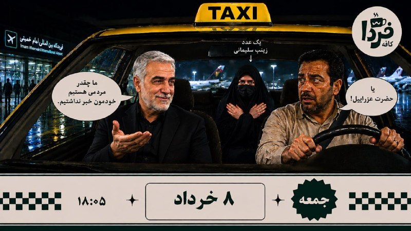

📷 Photo

## RadioFarda — post 157690

  

🔸پلیس بریتانیا روز جمعه اعلام کرد یک شهروند یونانی به اتهام همکاری با یک سرویس اطلاعاتی خارجی که به گفته پلیس «گمان می‌رود متعلق به ایران باشد» متهم شد. اتهام او تلاش برای هدف قرار دادن یک روزنامه‌نگار شاغل در شبکه تلویزیونی ایران اینترنشنال است.

🔸پلیس ضدتروریسم اعلام کرد که یوانیس آیدینیدیس ۴۶ ساله و ساکن مونیخ آلمان، روز شنبه بازداشت شده و بر اساس قانون امنیت ملی بریتانیا علیه او اعلام جرم شده است.

🔸قرار است آیدینیدیس روز جمعه در دادگاه وست‌مینستر حاضر شود.

🔸پلیس گفت اتهامات مطرح‌شده احتمالاً به ایران و هدف قرار دادن یک روزنامه‌نگار مستقر در بریتانیا در شبکه ایران اینترنشنال مربوط می‌شود. در بیانیه پلیس بریتانیا نام این روزنامه‌نگار ذکر نشده است.

🔸مأموران پلیس همچنین اعلام کردند که معتقد نیستند تهدید گسترده‌تری متوجه عموم مردم باشد.

🔸در ماه آوریل نیز سه نفر در ارتباط با تلاش برای حمله آتش‌سوزی عمدی به ساختمانی مرتبط با این شبکه در شمال‌غرب لندن متهم شدند؛ هرچند آن آتش‌سوزی هیچ خسارت یا مصدومیتی به همراه نداشت.

@RadioFarda

## RadioFarda — post 157689

  

🔸سازمان اطلاعاتی دانمارک روز جمعه هشتم خرداد اعلام کرد که ایران نقش پررنگ‌تری در تهدید تروریستی علیه این کشور اسکاندیناویایی ایفا می‌کند و افزود ارزیابی تهدیدها بازتابی از تحولات جهانی است.

🔸رئیس سازمان امنیت و اطلاعات ملی دانمارک می‌گوید سطح کلی تهدید برای ایران همچنان ۴ از ۵ است، اما تأکید کرد که در سال‌های اخیر ماهیت این تهدیدها «به‌طور قابل‌توجهی تغییر کرده است».

🔸فین بورخ آندرسن در بیانیه‌ای گفت: «در سال گذشته، بازیگران دولتی اهمیت فزاینده‌ای در تهدیدات تروریستی پیدا کرده‌اند. ارزیابی ما این است که این موضوع به‌ویژه درباره ایران صدق می‌کند؛ کشوری که به‌طور خاص تهدیدی برای منافع اسرائیلی و یهودی و همچنین برخی مخالفان ایرانی در اروپا، از جمله دانمارک، محسوب می‌شود.»

🔸او افزود: «تهدید ناشی از ایران از سوی سرویس‌های اطلاعاتی این کشور سرچشمه می‌گیرد که برای برنامه‌ریزی و اجرای حملات از شبکه‌های مجرمانه و همچنین جذب نیرو در اروپا استفاده می‌کنند».

@Radiofarda

## RadioFarda — post 157688

  <a href="https://t.me/radiofarda/157688" target="_blank">📎 Download file</a>

📻بشنوید: ساعت ۱۴ با رادیوفردا،هشتم خرداد ۱۴۰۵‌

@Radiofarda

## IranianMinds — post 21041

فاکس نیوز :
خبرهای مهمی از نشست ترامپ در کاخ سفید بیرون خواهد آمد

@IranianMinds

## IranianMinds — post 21040

  

🔴شش فروند هواپیمای نظامی Boeing C-17A Globemaster lll متعلق به نیروی هوایی ایالات متحده در حال ورود به خاورمیانه هستند.

@IranianMinds

## IranianMinds — post 21039

  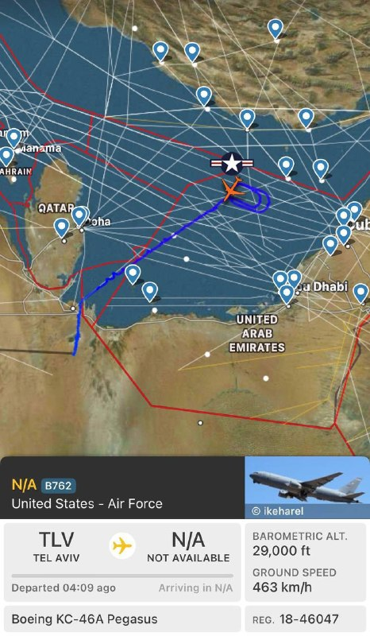

🔴 همزمان با گزارش‌هایی مبنی بر وقوع انفجار و فعالیت پدافند هوایی ایران در جزیره قشم در نزدیکی تنگه هرز، یک تانکر سوخت‌گیری هوایی پگاسوس KC-46A پگاسوس که از تل‌آویو پرواز می‌کرد، بر فراز خلیج فارس مشاهده شد.

@IranianMinds

## IranianMinds — post 21038

نیویورک تایمز همین الان:

ترامپ حدود دو ساعت در اتاق وضعیت با تیم ارشد امنیت ملی ملاقات کرد اما هیچ تصمیمی برای توافق با ایران نگرفت.

@IranianMinds

## IranianMinds — post 21037

  <a href="telegram/content/IranianMinds_21037_1780084847.mp4" target="_blank">🎬 Download video</a>

قشم

@IranianMinds

## IranianMinds — post 21036

🔴 قشم انگار باز یه خبراییه پدافند فعال شده و گزارشاتی از صدای انفجار هم هست.

@IranianMinds

## IranianMinds — post 21035

  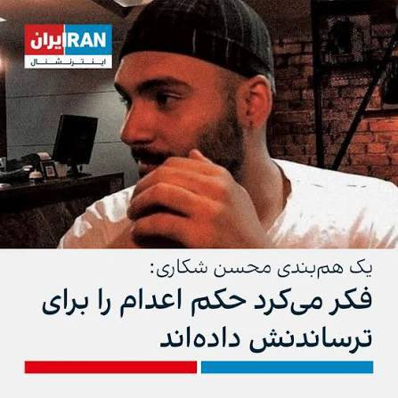

@IranianMinds

## IranianMinds — post 21034

  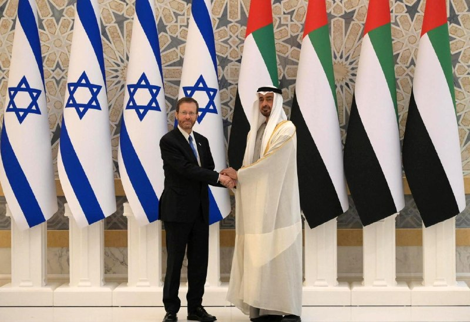

🔴 وال استریت ژورنال :

امارات متحده عربی در طول جنگ، به‌طور مخفیانه ده‌ها حمله هوایی را با هماهنگی ایالات متحده و اسرائیل علیه ایران انجام داده است.

این حملات، سایت‌های نظامی و مراکز مرتبط با انرژی را هدف قرار داده و حتی تا پس از اعلام آتش‌بس نیز ادامه داشته است.

@IranianMinds

## IranianMinds — post 21033

🎁 استارت کن و کانفیگتو رایگان بگیر 
⭐ویژه کاربران پرمیوم تلگرام 
⭐️ اگه اکانت تلگرامت پرمیوم باشه به محض استارت ربات بدون هیچ امتیاز و زیر مجموعه دایی جون بهت کانفیگ هدیه میده 
✔️ همچنین با اوردن دوستای پرمیومت امتیاز بیشتری میگیری 
🎁 @Daeijoonbot | استارت…

## IranianMinds — post 21032

  

🎁 استارت کن و کانفیگتو رایگان بگیر

⭐ویژه کاربران پرمیوم تلگرام

⭐️ اگه اکانت تلگرامت پرمیوم باشه به محض استارت ربات بدون هیچ امتیاز و زیر مجموعه دایی جون بهت کانفیگ هدیه میده

✔️ همچنین با اوردن دوستای پرمیومت امتیاز بیشتری میگیری

🎁 @Daeijoonbot | استارت کن و کانفیگ رایگان بگیر 
🌟

## IranianMinds — post 21031

  

🔴 رائفی پور :

تو جنگ آمریکاییا حتی از آدم فضاییا هم کمک گرفتن و باهاشون به ما حمله کردن ولی بازم نتونسن شکستمون بدن.

@IranianMinds

## IranianMinds — post 21030

  <a href="telegram/content/IranianMinds_21030_1780084850.mp4" target="_blank">🎬 Download video</a>

اینا واقعا به معنای واقعی عقب موندن 😂😂

@IranianMinds

## IranianMinds — post 21029

در کمال تعجب تا الان خبری از جنگ تو جنوب کشور نبوده

@IranianMinds

## IranianMinds — post 21028

  <a href="telegram/content/IranianMinds_21028_1780084851.mp4" target="_blank">🎬 Download video</a>

وضعیت تنگه هرمز
کشتی‌ها یکی پس از دیگری لنگر انداختند

@IranianMinds

## IranianMinds — post 21027

  

🔴 مراد ویسی :

من توی زندگیم برای ارتباط با آدما فقط یه معیار دارم، میزان تنفر از جمهوری اسلامی …

@IranianMinds

## IranianMinds — post 21026

🔴 خبرگزاری فارس :

نبینیم ترامپ شاخ و شونه بکشه اینجا همین الانم باید آمریکا باید فورا ۱۲ میلیارد دلار از دارایی‌های مسدودشده ایران رو آزاد کنه تا مذاکرات ادامه پیدا کنه، و آتش‌بس کامل در لبنان طبق شرایط حزب‌الله هم لازمه.

سریع تر انجام بده شاید مذاکره کردیم.

@IranianMinds

## IranianMinds — post 21025

  

🔴 آکسیوس :

ترامپ به زودی درباره مذاکرات با تیمش تصمیمشو میگیره و اعلام میکنه , همچنین یه مقام بالا رده دولت ترامپ گفت ما تعهدات شفاهی از سوی ایران در خصوص مواد هسته‌ای دریافت کرده‌ایم؛ اما مهم‌ترین بخش، مواردی است که در جریان مذاکرات بر سر آن‌ها توافق خواهد شد.

@IranianMinds

## IranianMinds — post 21024

  

⭕️ رایگان بدون واریز شرط های فوتبالی ببند از همون اول موجودی 500 هزارتومانه
❌

🎉 500 هزارتومن رایگان فقط با ثبت نام بدون هیچگونه واریزی!

💳 پرداخت مستقیم و سریع بدون واسطه، بدون دردسر، واریز و برداشت در سریع‌ترین زمان ممکن

⌛ پشتیبانی 24 ساعته

🌐 Winro.io

🌐 Winro.io
کانال بونوس های رایگان g8

📱 @winro_io

## IranianMinds — post 21023

  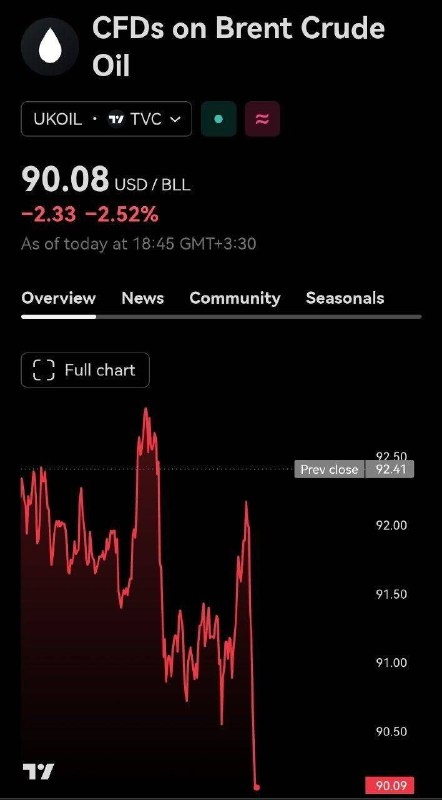

بعد حرفای ترامپ نفت سقوط آزاد کرد.

@IranianMinds

## IranianMinds — post 21022

🔴 نیویورک پست :

ترامپ هم اکنون در اتاق وضعیت کاخ سفید هست و قراره تصمیم خودش برای مذاکره با ایران رو بگیره.

@IranianMinds

## BBCPersian — post 282349

🔻 تسنیم: پهپاد دشمن در اطراف جزیره قشم هدف قرار گرفت و منهدم شد

در پی گزارش‌ها درباره شنیده شدن صدای پدافند در جزیره قشم، خبرگزاری تسنیم،‌ نزدیک به منابع امنیتی گزارش داد که یک «ریزپرنده» آمریکایی اسرائیلی در حوالی جزیره قشم هدف پدافند هوایی ارتش ایران قرار گرفته و منهدم شده است.

منابع آمریکا درباره این گزارش اظهارنظری نکردند.

دیشب هم سپاه پاسداران مدعی سرنگون کردن یک پهپاد شده بود.

https://bbc.in/4nZZvWf
@BBCPersian

## BBCPersian — post 282348

🔻 شنیده شدن صدای پدافند و انفجار در محدوده جزیره قشم

خبرگزاری مهر شامگاه روز جمعه گزارش داد که تعدادی از ساکنان در جزیره قشم از شنیده شدن صدای فعالیت پدافند هوایی خبر دادند.

این خبرگزاری می‌گوید که هنوز هیچ یک از نهادهای رسمی در ایران درباره علت این صداها اظهارنظری نکردند.

وحیدآنلاین هم می‌گوید که تعدادی از مخاطبانش حدود ساعت ۹ و نیم شب روز جمعه هشتم خرداد ماه در پیام‌هایی از شنیده شدن و دیدن شلیک پدافند خبر دادند.

برخی هم از شنیدن صداهایی شبیه به انفجار گفتند.

https://bbc.in/4wZIkbv
@BBCPersian

## BBCPersian — post 282347

  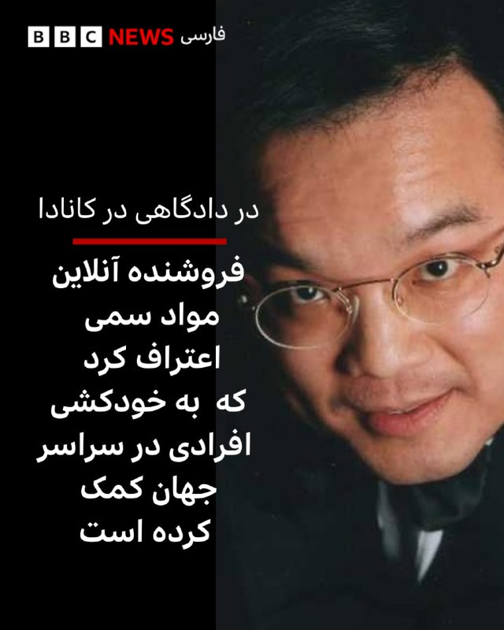

‌
❌هشدار: در این مطلب به موضوع خودکشی اشاره شده است. اگر به خودکشی فکر می‌کنید، با نهادهای تخصصی یا افراد متخصص تماس بگیرید.❌

کنت لا،‌ یک مرد کانادایی در دادگاهی در انتاریو اعتراف کرد که با فروش مواد شیمیایی کشنده در مرگ ۱۴ نفر که قصد خودکشی داشتند مشارکت داشته است. دادگاه او را به معاونت در مرگ،‌ متهم و مجرم شناخت.

اعتراف او بخشی از توافق با دادستان‌ها بود، که اتهامات جدی قتل عمد را از پرونده او حذف کنند.

آقای لا ۶۰ ساله است و پیشتر سرآشپز بوده است. او مواد شیمیایی قانونی اما سمی را به صورت آنلاین به افرادی که در تالارهای گفت‌وگوی خودکشی در اینترنت با آنها آشنا شده بود، می‌فروخت.

به گفته دادستان‌ها او حدود ۱۲۰۰ بسته مواد سمی را برای افرادی در ۴۱ کشور جهان ارسال کرده است.

گفته می‌شود که آقای لا به بیش از ۷۳ بریتانیایی مواد سمی فروخته است.

خانواده قربانیان بریتانیایی از دادستان‌ها در بریتانیا به دلیل متهم نکردن آقای لا در رابطه با مرگ بیش از ۷۳ بریتانیایی خشمگین هستند.

📷Peel Regional Police/PA Wire

@BBCPersian

## BBCPersian — post 282346

  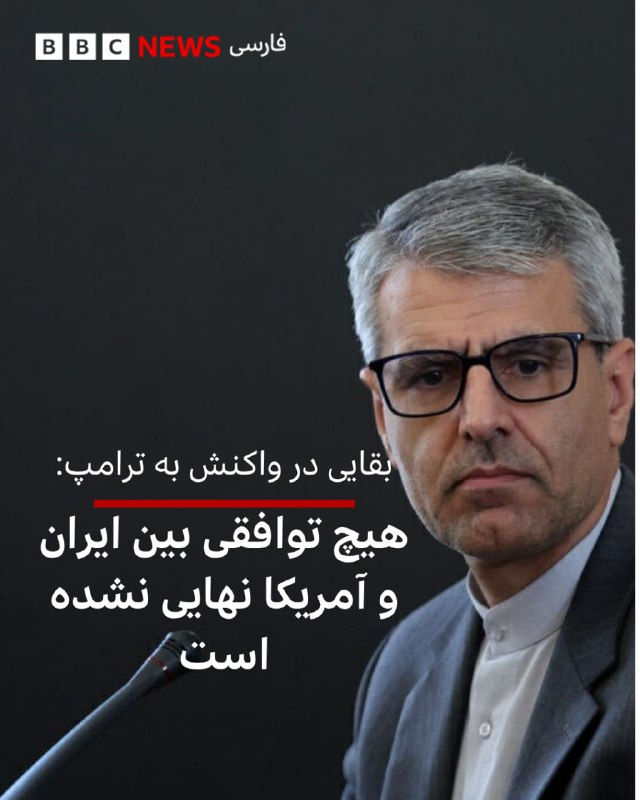

بقایی: هنوز هیچ توافقی میان ایران و آمریکا نهایی نشده است

اسماعیل بقایی، سخنگوی وزارت خارجه ایران گفت که تبادل پیام‌ها ادامه دارد ولی هنوز هیچ توافقی میان ایران و آمریکا نهایی نشده است و افزود که مدیریت تنگه هرمز باید توسط ایران و عمان تعیین شود.

آقای بقایی در مصاحبه‌ای با صدا و سیما جمهوری اسلامی این اظهارات را مطرح کرد.

او بار دیگر گفت: «در این مرحله بر خاتمه جنگ متمرکز هستیم و در مورد پرونده هسته‌ای هیچ مذاکره‌ای نداریم.»

این اظهارات در حالی از سوی ایران مطرح شده که آقای ترامپ فهرستی از خواسته‌هایی را که می‌گوید ایران باید برآورده کند، مطرح کرد که شامل تعهد ایران به عدم دستیابی به سلاح هسته‌ای، باز کردن تنگه هرمز بدون دریافت عوارض، مین‌روبی کامل این آبراه و خارج‌سازی ذخایر اورانیوم ‌غنی‌شده ایران با همکاری آمریکا و تحت نظارت آژانس و سپس از بین بردن این مواد است.
📷IRNA

https://bbc.in/434zQlG
@BBCPersian

## BBCPersian — post 282345

  <a href="https://t.me/bbcpersian/282345" target="_blank">📎 Download file</a>

پادکست جام جهان‌نما، جمعه ۸ خرداد ۱۴۰۵ این برنامه رادیویی رامی‌توانید هرشب ساعت ۲۰ به وقت ایران، روی موج متوسط ۷۰۲ کیلوهرتز و موج کوتاه۹۴۶۵ کیلوهرتز بشنوید. تکرار برنامه را هم می‌توانید ساعت ۲۱:۳۰ روی موج متوسط ۷۰۲ کیلوهرتز و موج کوتاه۵۳۹۵ کیلوهرتز گوش کنید.
@BBCPersian

## BBCPersian — post 282344

🔻دونالد ترامپ، رئیس‌جمهور آمریکا، دقایقی پیش اعلام کرد که در اتاق وضعیت جلسه خواهد داشت تا درباره ایران تصمیم نهایی را بگیرد.

او در پستی در شبکه اجتماعی خود تروث سوشال، فهرستی را از خواسته‌هایی که می‌گوید ایران باید برآورده کند، مطرح کرده و گفته است در مورد موضوعات «کم اهمیت‌ت» دیگر توافق حاصل شده است.

آقای ترامپ در ابتدا خواسته اصلی خود را تکرار کرده است: «ایران باید موافقت کند که هرگز به سلاح یا بمب هسته‌ای دست نخواهد یافت.»

او در ادامه خواستار باز شدن تنگه هرمز «در هر دو جهت» و «بدون هیچ عوارضی» شد.

رئیس‌جمهور آمریکا سپس به موضوع مین‌گذاری در تنگه هرمز اشاره کرد و گفت: «تمام مین‌های دریایی (بمب‌ها)، در صورت وجود، از بین خواهند رفت (ما با مین‌روب‌های زیردریایی فوق‌العاده خود، تعداد زیادی از این مین‌ها را از طریق انفجار خنثی کرده‌ایم. ایران بلافاصله عملیات جمع‌آوری ویا انفجار هرگونه مین باقی‌مانده را که تعدادشان زیاد نخواهد بود، تکمیل خواهد کرد.)»

آقای ترامپ در ادامه مژده می‌دهد که پس از توافق، کشتی‌هایی که به دلیل محاصره دریایی آمریکا در تنگه هرمز گرفتار شده‌اند، می‌توانند رهسپار خانه شوند:

«از طرف من، رئیس جمهور محبوبتان، به همسران، شوهران، والدین و خانواده‌هایتان سلام کنید.»

دونالد ترامپ سپس به ذخایر اورانیوم غنی‌شده ایران می‌پردازد و می‌گوید این مواد که بر اثر حمله هوایی ۱۱ ماه پیش آمریکا اکنون در زیر خاک مدفون شده‌اند، توسط آمریکا و با هماهنگی ایران و آژانس بین‌المللی انرژی اتمی از زیر خاک بیرون آورده می‌شود و از بین برده خواهد شد.

رئیس‌جمهور آمریکا سپس تاکید می‌کند که «تا اطلاع ثانوی هیچ پولی رد و بدل نخواهد شد.»

@BBCPersian

## BBCPersian — post 282343

  <a href="telegram/content/BBCPersian_282343_1780084857.mp4" target="_blank">🎬 Download video</a>

یک موشک «نیو گلن» متعلق به شرکت بلو اوریجین، شامگاه پنج‌شنبه ۷ خرداد، روی سکوی پرتابی در کیپ کاناورال در ایالت فلوریدای آمریکا منفجر شد.
 
این شرکت فناوری فضایی که در سال ۲۰۰۰ توسط جف بزوس، میلیاردر و بنیان‌گذار آمازون تأسیس شده است، اعلام کرد که این حادثه هیچ‌گونه مصدومیتی نداشته است.
 
به گفته مسئولان شرکت، این انفجار در جریان یک ارزیابی پیش از پرواز، موسوم به «آزمایش هات‌فایر» رخ داد و این حادثه به‌عنوان یک «ناهنجاری» توصیف شد.

@BBCPersian

## BBCPersian — post 282342

  

‌🔻سازمان اطلاعات و امنیت دانمارک گفته است که ایران طی یک سال اخیر، نقش پررنگ‌تری در «تهدیدهای تروریستی» علیه آن کشور داشته است.

سرویس اطلاعات و امنیت ملی دانمارک روز جمعه گفت که ماهیت این تهدیدها «به‌طور قابل توجهی تغییر کرده است.»

فین بورخ اندرسن، رئیس این سازمان، در بیانیه‌ای گفت: «در یک سال گذشته، بازیگران دولتی اهمیت بیشتری در تهدید تروریستی پیدا کرده‌اند. بنابر ارزیابی ما، این موضوع به‌ویژه درباره ایران صدق می‌کند، کشوری که تهدیدی را متوجه منافع اسرائیل و یهودی‌ها و همچنین برخی مخالفان ایرانی در اروپا می‌کند، از جمله در دانمارک.»

او اضافه کرد: «تهدیدهایی که از سوی ایران با آن مواجهیم از نهادهای اطلاعاتی این کشور سرچشمه می‌گیرد. همچنین از شبکه‌های جنایی و علاوه بر این، جذب نیروهایی در اروپا که از آنها برای برنامه‌ریزی و اجرای حملات استفاده می‌کند.»

لینک خبر کامل:
https://bbc.in/4o4wJnC
📷Getty Images

@BBCPersian

## BBCPersian — post 282341

  <a href="telegram/content/BBCPersian_282341_1780084859.mp4" target="_blank">🎬 Download video</a>

🔻زنی در شهر پالم بیچ ایالات فلوریدای آمریکا توسط یک افسر پلیس و به ظن در دست داشتن تلفن همراه با دست راست هنگام رانندگی متوقف شد.

کاتلین توماس که دست راستش را از دست داده، بازوی راستش را بالا برد تا نبود دستش را به افسر نشان دهد، اما با این حال برای او پرونده ثبت شد.

این رویداد در ماه فوریه رخ داد و در هفته جاری، این افسر درخواست کرده است که این اتهامات رد شود.

دفتر کلانتر شهرستان پالم بیچ به بی‌بی‌سی اعلام کرد: «معاون بر اساس مشاهده بصری اقدام به توقف خودرو کرد. پس از بررسی‌های بیشتر و به دلیل نبود شفافیت در نحوه ثبت تخلفات در نرم‌افزار صدور جریمه، در نهایت تصمیم به لغو اتهامات گرفته شد.»
https://bbc.in/42ZkFdA

@BBCPersian

## BBCPersian — post 282340

  

‌🔻محمدباقر قالیباف، رئیس مجلس شورای اسلامی و مذاکره‌کننده ارشد جمهوری اسلامی در پیامی که در شبکه اجتماعی ایکس منتشر کرده، نوشته است: «ما امتیازات را نه با گفت‌وگو، بلکه با موشک‌‌ها می‌گیریم، در مذاکره فقط آن‌ها را تفهیم می‌کنیم.»

او به موضوع اعتماد میان دو طرف در مذاکرات جاری با آمریکا اشاره کرده و نوشته است: «اعتمادی به تضمین‌ها و حرف‌ها نداریم، فقط رفتارها معیار است. هیچ اقدامی پیش از اقدام طرف مقابل انجام نخواهد شد.»

آقای قالیباف در ادامه پیامش آورده است:«پیروز هر توافقی کسی است که از فردای آن، بهتر برای جنگ آماده شود.»

محمدباقر قالیباف دوشنبه به قطر رفته بود.

هدف از این سفر مذاکره بر سر برخی از دارایی‌های ایران بود که به دلیل تحریم‌های ایالات متحده مسدود شده است.

📷 ICANA News Agency via Getty Images
https://bbc.in/3RQ4kFC

@BBCPersian

## BBCPersian — post 282339

🔻حمله پهپادی به یک کشتی ترکیه در دریای سیاه

🔻پس از آن‌که یک کشتی ترکیه در طول شب گذشته هدف حمله پهپادی قرار گرفت، این کشور نسبت به خطرات تشدید کنترل‌نشده تنش‌ها در منطقه دریای سیاه هشدار داد.

وزارت خارجه ترکیه مشخص نکرده است که کدام کشور مسئول این حمله بوده است.

در جریان جنگ روسیه و اوکراین، هر دو طرف کشتی‌هایی را در دریای سیاه هدف قرار داده‌اند.

https://bbc.in/4fJezFG
@BBCPersian

## BBCPersian — post 282338

  

🔻عبدالحسین روح‌الامینی، نماینده مجلس شورای اسلامی در یک برنامه تلویزیونی گفت چند هفته است که از مجتبی خامنه‌ای، رهبر جدید ایران، اجازه خواسته‌اند تا «قانون‌گذاری و رای‌گیری» مجازی در مجلس انجام شود.

او گفت در حال حاضر دستگاه‌های امنیتی اجازه جمع شدن نمایندگان مجلس شورای اسلامی را نمی‌دهند.

آقای روح‌الامینی در ادامه این گفت‌وگو اشاره کرد که تا کنون پاسخی از مجتبی خامنه‌ای به این پرسش داده نشده است.

روح‌الله ایزدخواه، نماینده مردم تهران در مجلس هم در این برنامه گفت تا کنون نمایندگان دو، سه، جلسه مجازی با «تبلت‌های مخصوص» مجلس برگزار کرده‌اند اما بنابر بر آیین‌نامه مجلس اجازه «رای‌گیری مجازی» وجود ندارد.

لینک خبر کامل:
https://bbc.in/4uOJwwT
📷khamenei.ir

@BBCPersian

## BBCPersian — post 282337

  <a href="telegram/content/BBCPersian_282337_1780084862.mp4" target="_blank">🎬 Download video</a>

🔻سرخط خبرهای روز جمعه ۸ خرداد ۱۴۰۵
@BBCPersian

## BBCPersian — post 282336

  <a href="telegram/content/BBCPersian_282336_1780084864.mp4" target="_blank">🎬 Download video</a>

🔻گروه‌های امداد در لائوس پنج روستایی را که پس از بارندگی‌های شدید و رانش زمین به مدت یک هفته در غاری سیلابی گرفتار شده بودند، زنده پیدا کردند.

به گفته تیم‌های نجات لائوسی و تایلندی که در این عملیات مشارکت داشتند، دو نفر دیگر از اعضای این گروه همچنان مفقود هستند.

این افراد چهارشنبه هفته گذشته برای جست‌وجوی ذخایر طلا و شکار حیوانات وحشی وارد غار شده بودند، اما پس از مسدود شدن دهانه ورودی بر اثر سیلاب، نتوانستند خارج شوند.

در عملیات امدادرسانی، گروهی از متخصصان باتجربه در عملیات نجات از غار، از جمله اعضای تیم معروف تایلندی که در سال ۲۰۱۸ یک گروه دانش‌آموز را نجات داده بودند، حضور داشتند.
https://bbc.in/4nYZxxB
📸 Reuters
@BBCPersian

## BBCPersian — post 282335

  

‌🔻صندوق کودکان سازمان ملل، یونیسف، می‌‌گوید در یک هفته گذشته، به‌طور میانگین، هر ۲۴ ساعت ۱۱ کودک در حملات اسرائیل در لبنان کشته یا زخمی شدند.

به گفته یونیسف، در هفت روز گذشته، ۱۵ کودک در لبنان کشته و ۶۲ کودک دیگر زخمی شده‌اند.

با وجود آتش‌بس، اسرائیل دامنه و شدت حملاتش در لبنان را افزایش داده است.

حملات سنگین اسرائیل از شامگاه چهارشنبه تا بامداد پنج‌شنبه شهرها و روستاهایی در جنوب لبنان را هدف قرار داد.

در این مدت اسرائیل مناطق جدیدی را هم به عنوان مناطق درگیری و عملیاتی اعلام کرد.

اسرائیل همچنین ساختمانی را در حومه جنوبی بیروت هدف قرار داده است.

یونیسف می‌گوید در مجموع، در هفت روز گذشته، ۷۷ کودک در لبنان کشته یا زخمی شدند.

این نهاد در گزارش خود اعلام کرد که از زمان آغاز آتش‌بس در ماه آوریل، در مجموع ۵۵ کودک کشته و ۲۱۲ کودک زخمی شده‌اند.

ریکاردو پیرس، سخنگوی یونیسف، این آمار را «تکان‌دهنده» توصیف کرد.

بنابر آتش‌بسی که آمریکا از ۱۶ آوریل (۲۷ فروردين ۱۴۰۵) آن را اعلام کرد، قرار بود جنگ میان اسرائیل و حزب‌الله لبنان پایان یابد.

📷EPA
https://bbc.in/4fkdFzr

@BBCPersian

## BBCPersian — post 282334

  <a href="telegram/content/BBCPersian_282334_1780084867.mp4" target="_blank">🎬 Download video</a>

🔻محسن قاصد، فعال محیط‌زیست و عکاس، ویدیویی از بازگشت پرندگان مهاجر به جزیره حفاظت شده هون در دریاچه ارومیه منتشر کرده است. او در توضیح این ویدیو نوشته: «امسال حجم و تعداد و تنوع انواع گونه از پرندگانی که در دریاچه و جزایر دیده می‌شوند نسبت به سال‌های گذشته ده‌ها برابر بیشتر شده است.»

اطلاعات ثبت‌شده توسط اداره کل محیط زیست آذربایجان شرقی و غربی نشان می‌دهد بهار امسال، حجم آب دریاچه ارومیه با افزایشی ۱۵ برابری نسبت به سال گذشته روبه‌رو بوده است.

بهبود نسبی شرایط دریاچه ارومیه باعث بازگشت پرندگان مهاجری مثل فلامینگوها و کاکایی‌ها به این دریاچه شده که در سال‌های پیش، به دلیل خشکسالی شدید، از این دریاچه رفته بودند.

با این حال مقام‌های سازمان محیط‌زیست هشدار داده‌اند دریاچه ارومیه «هنوز از وضعیت بحران خارج نشده است.»

دریاچه ارومیه در شمال غربی ایران واقع شده است و بزرگ‌ترین دریاچه داخلی کشور به شمار می‌رود. این دریاچه در سال ۱۴۰۴ و در پی بحران‌های متعدد، به خشکی کامل نزدیک شد.

@BBCPersian

## idfinfarsi — post 11659

  <a href="telegram/content/idfinfarsi_11659_1780084868.mp4" target="_blank">🎬 Download video</a>

مستندات ارتش اسرائیل ثابت میکنند: سازمان تروریستی حزب‌الله راکت‌هایی را شلیک کرده که به کلیسایی در جنوب لبنان اصابت کرده‌اند

سازمان تروریستی حزب‌الله در طول شب (جمعه) چندین راکت شلیک کرد که به کلیسای ارتدوکس سنت جورج در جنوب لبنان اصابت کردند. این شلیک‌ها به ساختمان‌هایی در روستای مسیحی مرجعیون اصابت کردند — تأکید می‌شود که نیروهای ارتش اسرائیل در محدوده این کلیسا فعالیت نمی‌کنند.

ارتش اسرائیل اکنون مستنداتی را منتشر می‌کند که اصابت راکت‌های سازمان تروریستی حزب‌الله به این کلیسا در جنوب لبنان را ثابت میکنند.

این یک مدرک دیگر است که ثابت میکند که سازمان تروریستی حزب‌الله همچنان شهروندان لبنان را به خطر انداخته و به آن‌ها آسیب می‌زند.

## Dirty_Kids — post 390517

  <a href="telegram/content/Dirty_Kids_390517_1780084870.mp4" target="_blank">🎬 Download video</a>

حسین علایی از فرمانده‌های پیشین نیروی دریایی سپاه تروریستی تو این ویدئو می‌گه موشعلی رو شمخانی بگا داد و باعث کسپر شدنش شد،

«سه روز قبل از جنگ چهل روزه به شمخانی قحبه گفتم آمریکا و اسرائیل با کسپر کردن رهبری جنگ رو شروع می‌کنند اما شمخانی زن‌هزارتختخوابی شونه‌ش رو انداخت بالا و گفت نووچ، نمی‌تونن،
گفتم چرا نمی‌تونن کسمشنگ؟
گفت نمی‌تونن پیداش کنن»


@Dirty_Kids 👻

## Dirty_Kids — post 390516

  <a href="telegram/content/Dirty_Kids_390516_1780084871.mp4" target="_blank">🎬 Download video</a>

🔴 یه پست جدید و جنجالیِ دیگه از اکانت کاخ سفید همراه این کپشن:

اونا [آدم فضاییا] بین ما راه میرن.

@Dirty_Kids 👻

## Dirty_Kids — post 390512

  <a href="telegram/content/Dirty_Kids_390512_1780084872.mp4" target="_blank">🎬 Download video</a>

🔴 مردم ایران ۳ ماه اینترنت نداشتن، حالا که اینترنتشون برگشته به روال سابق، لابد دیگه به نحو احسنت ازش استفاده میکنن؛

+ همچنان یسری ایرنی‌ها تو اینستاگرام:

@Dirty_Kids 👻

## Dirty_Kids — post 390511

  

خبر به نقل از نیویورک‌تایمز:

«ترامپ بعد از حدود دو ساعت جلسه در اتاق وضعیت کا‌خ‌سفید، بدون اینکه هیچ تصمیمی درباره توافق جدید با روافض قحبه بگیره، جلسه رو ترک کرد. یک مقام ارشد دولت این خبر رو به نیویورک تایمز داده.
به گفته این مقام، دولت معتقده توافق خیلی نزدیکه، اما هنوز اختلافاتی باقی مونده، از جمله بر سر آزادسازی دارایی‌های روافض کس‌پدر».

@Dirty_Kids 👻

## Dirty_Kids — post 390510

  

در حالیکه ترامپ به گفته‌ی خودش به اتاق وضعیت رفته که تصمیم نهایی در خصوص امضای تفاهم‌نامه با روافض رو بگیره

خبرگزاری مهر روافض خبر از شنیده‌ شدن صدای پدافند در قشم اون‌ورا می‌ده:

@Dirty_Kids 👻

## Dirty_Kids — post 390509

  

ولی عوضش اینترنت‌‌پرو و سیمکارت‌سفید ثواب داره 😂😂😂

@Dirty_Kids 👻

## Dirty_Kids — post 390508

  <a href="telegram/content/Dirty_Kids_390508_1780084875.mp4" target="_blank">🎬 Download video</a>

توی تهرانپارس دوتا پسر دارن مخ میزنن که یه پسره با بلندگو از پشت میگه: بخدا پسر خوبیه فقط میخواد بکنتت😂😂

@Dirty_Kids 👻

## Dirty_Kids — post 390507

ویزای ساعتی بازیکنان تیم ملی اینجوریه که بازی به پنالتی بکشه باید پنالتی ها رو از مکزیک بزنن.

@Dirty_Kids 👻

## Dirty_Kids — post 390506

  <a href="telegram/content/Dirty_Kids_390506_1780084876.mp4" target="_blank">🎬 Download video</a>

دهن سرویسا این چیه ساختید😂😂

@Dirty_Kids 👻

## Dirty_Kids — post 390505

  

اکانت رسمی Clash of clans تو اینستاگرام، انگاری زده تو کارِ تولید محتوا برای فوت فتیشا:

@Dirty_Kids 👻

## Dirty_Kids — post 390504

  <a href="telegram/content/Dirty_Kids_390504_1780084878.mp4" target="_blank">🎬 Download video</a>

این ریمیکس الان ارزش ترند شدنو داره؛
دست به دست بکنید برسه به دست ترامپ:

@Dirty_Kids 👻

## Dirty_Kids — post 390503

میدونم به تخمتونه و متأسفانه رعایت نمیکنید فقط خواستم بگم جمعه عدهٔ شرعی آذر تموم میشه.

یعنی اینکه امروز ۸ خرداد ۱۴۰۵ جمعه، کص زن شمخانی از اسارت شرعی در میاد

@Dirty_Kids 👻

## Dirty_Kids — post 390502

  

حالا چه عجله‌‌ای هست برای ادامه‌ی جنگ. اصلا یه ۱۰ سالی طول بکشه چه اشکالی داره.

@Dirty_Kids 👻

## Dirty_Kids — post 390501

  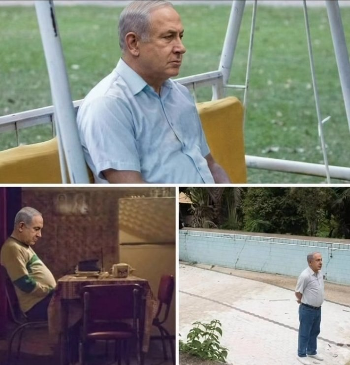

وقتی منتظری مسخره بازیای ترامپ تموم بشه و بزنی بقیشون رو کتلت کنی

@Dirty_Kids 👻

## Dirty_Kids — post 390500

  <a href="https://t.me/Dirty_Kids/390500" target="_blank">📎 Download file</a>

✅ اپلیکیشن اندروید سایت جهانی دربی بت

💰اولین سایت جهانی با امکان شارژ و برداشت ریالی(کارت به کارت)

🔗 برای ورود فیلترشکن روی کشور مناسب قرار دهید مانند فنلاند و المان و....

😀Telegram Channel
👇
https://t.me/+bcynkEgSW2dlYTc0

## Dirty_Kids — post 390499

  

😤دنبال یه سایت شرط بندی بین المللی بودی که به ایرانیا خدمات بده؟!
⛔

👍دربی بت همون انتخاب  100%

💎ویژگی های سایت جهانی Derby Bet:

⬅️امکان شارژ امن با کارت بانکی

⬅️واریز اول دوبل شارژ می شوید(بونوس۱۰۰٪)

⬅️پر اپشن ترین سایت فعال در ایران

⬅️تسویه حساب کمتر از 5 دقیقه

⬅️برگشت بخشی از باخت به صورت هفتگی

🚨کد هدیه ثبت نام:GG007

⚠️برای دانلود اپلکیشن کلیک کنید
👉

🔔کانال دربی بت :

🪙https://t.me/+bcynkEgSW2dlYTc0

## Dirty_Kids — post 390498

  <a href="telegram/content/Dirty_Kids_390498_1780084881.mp4" target="_blank">🎬 Download video</a>

شت

@Dirty_Kids 👻

## Hranews — post 113230

گزارشی از اجرای حکم اعدام ۷ زندانی در زندان‌های مختلف

❗️
❗️
❗️
❗️
❗️ – حکم هفت زندانی که پیشتر از بابت اتهامات مرتبط با جرائم مواد مخدر و قتل به مجازات #اعدام محکوم شده بودند، در زندان‌های زاهدان، بیرجند، مشهد و کرمانشاه به اجرا درآمد.

ادامه مطلب

↘️
@hranews_bot تماس ✉️ -  @Hranews  کانال هرانا 🆑

## Hranews — post 113229

  

تداوم بازداشت؛ گزارشی از آخرین وضعیت عبدالرحیم سلیمانی در زندان قم

❗️
❗️
❗️
❗️
❗️ – عبدالرحیم سلیمانی اردستانی، پژوهشگر دینی و استاد دانشگاه، با وجود گذشت بیش از دو ماه از زمان بازداشت، همچنان به‌صورت بلاتکلیف در زندان ساحلی قم نگهداری می‌شود. این زندانی سیاسی اخیراً با نگارش نامه‌ای از داخل زندان، به تشریح آخرین وضعیت خود پرداخته است.

به گزارش خبرگزاری هرانا، ارگان خبری مجموعه فعالان حقوق بشر در ایران، عبدالرحیم سلیمانی اردستانی، کماکان به‌صورت بلاتکلیف قضایی در زندان ساحلی قم به‌سر می‌برد.

آقای سلیمانی اخیرا با نگارش نامه‌ای اعلام کرده است که با ۱۱ اتهام از جمله «تشویش اذهان عمومی»، «توهین به مقدسات»، «توهین به رهبری» (به دو شخص علی و مجتبی خامنه‌ای)، «تجمع در اعتراض به حصر میرحسین موسوی»، «اجتماع و تبانی علیه امنیت داخلی»، «توهین به مقدسات تشیع»، «فعالیت تبلیغی ضد نظام»، «نشر اکاذیب رایانه‌ای به قصد تشویش اذهان عمومی»، «توهین به مراجع»، «هتک حیثیت روحانیت» و «کنترل ذهن و القائات روانی» مواجه شده است و در ادامه از خود نسبت به این اتهامات مذکور دفاع کرده است.
در بخشی از این نامه آمده است که وی بدون ارائه حکم قضایی و با برخوردی خشونت‌آمیز و توأم با بی‌احترامی بازداشت شده و حدود دو ساعت تحت ضرب‌وشتم ماموران امنیتی قرار گرفته است. همچنین، با گذشت بیش از دو ماه از زمان بازداشت، او همچنان از حق ملاقات محروم مانده و یک ماه از این مدت را در سلول انفرادی سپری کرده است.

ادامه مطلب

#عبدالرحیم_سلیمانی_اردستانی

↘️
@hranews_bot تماس ✉️ -  @Hranews  کانال هرانا 🆑

## Hranews — post 113228

گزارشی از معوقات مزدی کارکنان بیمارستان امام علی چابهار

❗️
❗️
❗️
❗️
❗️ – شماری از #کارکنان شاغل در بیمارستان امام علی چابهار از عدم پرداخت مطالبات مزدی خود ابراز نارضایتی کرده و خواستار رسیدگی به وضعیتشان شدند.

ادامه مطلب

↘️
@hranews_bot تماس ✉️ -  @Hranews  کانال هرانا 🆑

## Hranews — post 113227

  

اعتراضات ۱۴۰۴؛ تداوم بازداشت دانیال امینی و حمیدرضا ریزانه در اصفهان

❗️
❗️
❗️
❗️
❗️– دانیال امینی و حمیدرضا ریزانه، از بازداشت شدگان اعتراضات سراسری دی ۱۴۰۴ در اصفهان، با گذشت ۱۴۵ روز از زمان بازداشت، همچنان در بلاتکلیفی قضایی به‌سر می‌برند. این دو شهروند به‌ترتیب در کانون اصلاح و تربیت و زندان دستگرد اصفهان نگهداری می‌شوند.

به گزارش خبرگزاری هرانا، ارگان خبری مجموعه فعالان حقوق بشر در ایران، دانیال امینی و حمیدرضا ریزانه، از بازداشت شدگان اعتراضات سراسری دی ۱۴۰۴، در بازداشت بسر می‌برند.

بر اساس اطلاعات دریافتی هرانا، ۱۴۵ روز از زمان بازداشت این دو شهروند که در پرونده‌ای مشترک با اتهامات مرتبط با اعتراضات سراسری مواجه هستند، می‌گذرد. حمیدرضا ریزانه در زندان دستگرد اصفهان و دانیال امینی در کانون اصلاح و تربیت اصفهان نگهداری می‌شود. در اسفند ماه سال گذشته به خانواده‌های این دو شهروند اعلام شد که با آزادی موقت آنان با وثیقه موافقت شده است. با این حال، پس از مراجعه خانواده‌ها به مراجع مربوط و تامین وثیقه، با آزادی موقت آنان مخالفت شد. این دو شهروند همچنان در وضعیت بلاتکلیفی قضایی به‌سر می‌برند.

ادامه مطلب

#دانیال_امینی
#حمیدرضا_ریزانه

↘️
@hranews_bot تماس ✉️ -  @Hranews  کانال هرانا 🆑

## Hranews — post 113226

شهرستان مهرستان؛ ۲ شهروند توسط ماموران اداره اطلاعات بازداشت شدند

❗️
❗️
❗️
❗️
❗️ – روز گذشته، محسن دهانی و احسان دهانی دو برادر اهل شهرستان مهرستان توسط نیروهای اداره اطلاعات در این شهرستان #بازداشت و به مکان نامعلومی منتقل شدند.

ادامه مطلب

#محسن_دهانی
#احسان_دهانی

↘️
@hranews_bot تماس ✉️ -  @Hranews  کانال هرانا 🆑

## Hranews — post 113225

  

در هفته‌ای که گذشت؛ نگاهی به گزارشات محیط زیستی در ایران

❗️
❗️
❗️
❗️
❗️ – حق بر #محیط_زیست و مبانی فلسفی آن، از قواعد حقوق بشر و حقوق طبیعی نشأت گرفته شده است. ابتدایی ترین حق طبیعی انسان در این کره خاکی، «#حق_حیات» است. اما طی دهه‌های اخیر به دلیل استفاده بی‌رویه از منابع طبیعی، عدم نظارت و توجه به مباحث زیست محیطی و الگوهای صحیح، محیط زیست طبیعی به‌شدت آسیب دیده است. گزارش پیش رو حاصل ثبت ۷۳ گزارش محیط زیستی ایران است که در هفته‌ اخیر منتشر و به هدف آگاه‌سازی گردآوری شده است.

به گزارش خبرگزاری هرانا، ارگان خبری مجموعه فعالان حقوق بشر در ایران، در هفته‌‌ای که گذشت لاشه هشت قلاده فوک خزری کشف شد. همچنین، بیش از ۳۱ شکارچی و صیاد غیرمجاز و قاچاقچی چوب بازداشت و به مراجع قضایی معرفی شدند. افزون بر این، بر اساس گزارشات منتشر شده، بیش از ۱۴.۷ تن چوب قاچاق کشف و ضبط شد. از سوی دیگر، شاخص کیفی هوا دستکم در ۲۱ شهر ناسالم و خطرناک اعلام شد. از دیگر اخبار مرتبط با محیط زیست میتوان به بحران خشکسالی، پسماندها و آلاینده‌ها در مناطق مختلف اشاره کرد؛ در گزارش پیش رو به برخی از آنها پرداخته شده است.

آسیب رسانی به جنبه های مختلف محیط زیست در ایران کماکان ادامه دارد. از طرفی شهروندانی وجود دارند که به دلیل عدم آموزش یا نیازهای مالی دست به تخریب و آسیب رسانی به محیط زیست می زنند و از سوی دیگر نهادهای متولی در تلاش هستند تا از حجم این آسیب ها بکاهند، هر چند این تلاش ها قابل تقدیر است اما به نظر نمی آید میزان آن با شرایط محیط زیستی ایران تطبیق داشته باشد.

ادامه مطلب

↘️
@hranews_bot تماس ✉️ -  @Hranews  کانال هرانا 🆑

## Hranews — post 113224

  

حال نامساعد لیندزی فورمن در یازدهمین روز از اعتصاب در بند زنان زندان اوین

❗️
❗️
❗️
❗️
❗️ – لیندزی فورمن، شهروند بریتانیایی محبوس در زندان اوین، یازدهمین روز #اعتصاب خود را در این زندان سپری می‌کند. این زندانی با شرایط جسمی نامناسبی از جمله، کاهش وزن، افت قند خون و نوسانات فشار خون روبه‌رو شده است. همچنین، عدم امکان برقراری تماس وی با خانواده خود، منجر به افزایش نگرانی نزدیکان و خانواده او شده است.

به گزارش خبرگزاری هرانا، ارگان خبری مجموعه فعالان حقوق بشر در ایران، لیندزی فورمن یازدهمین روز اعتصاب خود را در زندان اوین سپری می‌کند.

یک منبع مطلع در گفت‌وگو با هرانا اعلام کرد: خانم فورمن در حالی یازدهمین روز اعتصاب غذای خود را پشت سر می‌گذارد که وضعیت جسمانی او نگران‌کننده است. وی دچار افت شدید قند خون (زیر ۹۰)، کاهش وزن قابل توجه (حدود هشت کیلوگرم از آغاز اعتصاب)، و افت فشار خون (۶ روی ۹) شده است. همچنین علائمی مانند سرگیجه، تهوع، دردهای طولانی‌مدت شکمی و رنگ‌پریدگی غیرعادی در او مشاهده می‌شود.
این منبع افزود: در این وضعیت، هیچ یک از مسئولین مربوطه به دیدار او نیامده است و همچنین سفارت بریتانیا نیز واکنشی به شرایط وی نشان نداده است. از سوی دیگر، محرومیت از امکان استفاده تلفن زندان باعث شده است که خانواده وی اطلاعی از وضعیت او کسب نکنند. امری که منجر به افزایش نگرانی‌های نزدیکان و خانواده این زندانی شده است.

ادامه مطلب

#لیندزی_فورمن

↘️
@hranews_bot تماس ✉️ -  @Hranews  کانال هرانا 🆑

## Hranews — post 113223

  

از جرم «جاسوسی» تا جرم‌انگاری «قصد همکاری»/ #مریم_عابدی

📡
📡
📡
📡
📡– جرایم علیه امنیت ملی همواره در شمار حساس‌ترین و شدیدترین حوزه‌های حقوق کیفری قرار گرفته‌اند. در تمامی نظام‌های حقوقی، دولت‌ها حفاظت از اسرار، اطلاعات طبقه‌بندی‌شده، تاسیسات حیاتی و ساختارهای امنیتی را از عناصر بنیادین بقای سیاسی و حاکمیتی خود تلقی می‌کنند و از همین‌رو، جرم جاسوسی به‌عنوان یکی از مهم‌ترین جرایم علیه امنیت خارجی کشورها شناخته می‌شود. به این دلیل، اهمیت امنیت ملی هرگز به معنای نفی اصول بنیادین حقوق کیفری نیست؛ اصولی که بر پایه‌ی «قانونی بودن جرم و مجازات»، «تفسیر مضیق قوانین کیفری»، «لزوم وجود رفتار مادی مجرمانه» و «ممنوعیت مجازات افکار و نیات صرف» استوار شده‌اند.

در حقوق کیفری ایران، جرایم مرتبط با جاسوسی عمدتاً در فصل اولِ کتاب پنجم قانون مجازات اسلامی، ذیل عنوان «جرایم علیه امنیت داخلی و خارجی کشور» پیش‌بینی شده‌اند. مهم‌ترین مقررات در این زمینه را می‌توان در مواد ۵۰۱، ۵۰۵، ۵۰۸ و برخی مقررات پراکنده‌ی مرتبط با همکاری با دولت‌های متخاصم مشاهده کرد.

بر اساس ماده‌ی ۵۰۱ قانون مجازات اسلامی و تعزیرات: «هر کس نقشه‌ها یا اسرار یا اسناد و تصمیمات راجع به سیاست داخلی یا خارجی کشور را عالماً و عامداً در اختیار افرادی که صلاحیت دسترسی به آن‌ها را ندارند قرار دهد یا از مفاد آن مطلع کند، به نحوی که متضمن نوعی جاسوسی باشد، به حبس محکوم می‌شود.»

هم‌چنین ماده‌ی ۵۰۸ مقرر می‌دارد: «هر کس یا گروهی با دول خارجی متخاصم، به هر نحو علیه جمهوری اسلامی ایران همکاری نماید، در صورتی که محارب شناخته نشود، به یک تا ده سال حبس محکوم می‌شود.»

در ساختار سنتی حقوق کیفری ایران، همانند بسیاری از نظام‌های حقوقی کلاسیک، تحقق جرم امنیتی مستلزم وجود عنصر مادی مشخص و عینی بود؛ بدین معنا که صرف گرایش ذهنی، تمایل سیاسی یا حتی قصد ارتکاب جرم، بدون ظهور خارجی و ورود به مرحله‌ی اجرا، اصولاً برای تحقق جرم کافی تلقی نمی‌شد. به بیان دیگر، حقوق کیفری تا زمانی که رفتار مرتکب وارد عرصه‌ی اجتماعی نشده و خطری واقعی علیه امنیت عمومی ایجاد نکرده باشد، حق مداخله‌ی کیفری پیدا نمی‌کند.

ادامه مطلب

ادامه مطلب در وبسایت خط صلح

↘️
@hranews_bot تماس ✉️ - @Hranews کانال هرانا 🆑

## Hranews — post 113222

تداوم بازداشت و بی خبری از وضعیت ۲ شهروند در چابهار

❗️
❗️
❗️
❗️
❗️– نوربخش جدگال و یحیی جدگال دو برادر ساکن چابهار حدود ۱۱ روز است که توسط نیروهای امنیتی در این شهرستان بازداشت شدند و تاکنون از محل نگهداری آنها اطلاعی حاصل نشده است.

#نوربخش_جدگال #یحیی_جدگال

ادامه مطلب

↘️
@hranews_bot تماس ✉️ - @Hranews کانال هرانا 🆑

## Hranews — post 113221

  

گزارشی از آخرین وضعیت حیدر نکوسیرت در زندان وکیل آباد مشهد

❗️
❗️
❗️
❗️
❗️– حیدر نکوسیرت، از بازداشت شدگان اعتراضات دی‌ماه ۱۴۰۴، در زندان وکیل آباد مشهد محبوس است. وی که توسط دادگاه انقلاب مشهد به دو سال حبس محکوم شده، علیرغم شرایط نامناسب جسمی ناشی از بیماری‌های کلیوی، چشمی و دیابت، کماکان از رسیدگی تخصصی پزشکی محروم مانده است.

به گزارش خبرگزاری هرانا، ارگان خبری مجموعه فعالان حقوق بشر در ایران، حیدر نکوسیرت در زندان وکیل آباد مشهد محبوس است.

بر اساس اطلاعات دریافتی هرانا؛ حیدر نکوسیرت چندی پیش توسط دادگاه انقلاب مشهد به دو سال حبس محکوم شده است. یک منبع مطلع نزدیک به خانواده این زندانی با تایید این موضوع به هرانا گفت: حیدر طی مدت زمان بازداشت از حق دسترسی به وکیل محروم مانده است. همچنین، وی در حالی از بیماری دیابت، نارسایی کلیوی و کاهش بینایی در یک چشم رنج می‌برد که دیگر چشم سالم او نیز دچار مشکل شده است. آقای نکوسیرت نیازمند رسیدگی تخصصی پزشکی و اعزام به مراکز درمانی خارج از زندان است.

#حیدر_نکوسیرت

ادامه مطلب

↘️
@hranews_bot تماس ✉️ - @Hranews کانال هرانا 🆑

## manototv — post 105869

  <a href="telegram/content/manototv_105869_1780084885.mp4" target="_blank">🎬 Download video</a>

در سیاست بین‌الملل، کشورها بیش از آنکه بر پایه دوستی، همدلی یا شعارهای اخلاقی تصمیم بگیرند، بر اساس منافع ملی خود عمل می‌کنند. قدرت‌های بزرگ ممکن است از آزادی، امنیت، حقوق بشر یا نظم جهانی سخن بگویند، اما در لحظه تصمیم، محاسبه اصلی این است که چه چیزی به سود آن‌هاست.

## manototv — post 105868

  <a href="telegram/content/manototv_105868_1780084886.mp4" target="_blank">🎬 Download video</a>

سخنان الهام‌بخش فریدون فرخزاد درباره خودباوری ملی

## manototv — post 105860

  <a href="telegram/content/manototv_105860_1780084887.mp4" target="_blank">🎬 Download video</a>

در سیاست، گاهی مهم‌تر از خود رویداد، چیزی است که آن رویداد آشکار می‌کند.

جنگ اخیر نیز پرده‌ای از واقعیت جمهوری اسلامی کنار زد: شکاف‌هایی که پنهان شده بود، ضعف‌هایی که انکار می‌شد و بحران‌هایی که با تبلیغات پوشانده می‌شد.

## alonews — post 123573

  <a href="telegram/content/alonews_123573_1780084888.webm" target="_blank">🎬 Download video</a>

🔴فوری/وزیر خزانه داری آمریکا درباره رفع تحریم‌های ایران

🔴به گزارش الجزیره،  وزیر خزانه‌داری آمریکا مدعی شد که تحریم‌های ایران به تدریج لغو خواهد شد.

✅ @AloNews خبر جنگ

## alonews — post 123572

  <a href="telegram/content/alonews_123572_1780084889.webm" target="_blank">🎬 Download video</a>

👈 تانکر ترکرز اعلام کرد: صادرات نفت و فرآورده‌های نفتی ایران تداوم دارد و امروز یک ابرنفتکش دو میلیون بشکه نفت خام ایران را بارگیری کرده است.

✅ @AloNews خبر جنگ

## alonews — post 123571

  <a href="telegram/content/alonews_123571_1780084889.webm" target="_blank">🎬 Download video</a>

👈وزیر خزانه‌داری آمریکا: یک میلیارد دلار از دارایی‌های رمزارز ایران را مصادره کردیم!

✅ @AloNews خبر جنگ

## alonews — post 123570

  <a href="telegram/content/alonews_123570_1780084889.webm" target="_blank">🎬 Download video</a>

👈کان اسرائیل: نتانیاهو خواستار از سرگیری حملات به ایران است

✅ @AloNews خبر جنگ

## alonews — post 123569

  <a href="telegram/content/alonews_123569_1780084889.webm" target="_blank">🎬 Download video</a>

👈بسنت وزیر خزانه داری آمریکا: احتمالاً تورم ایران بیش از ۲۰۰٪ است.

🔴ما فکر می‌کنیم ایران ماهانه ۴۰۰ تا ۵۰۰ میلیون دلار سرقت می‌کرد!

✅ @AloNews خبر جنگ

## alonews — post 123568

  <a href="telegram/content/alonews_123568_1780084889.webm" target="_blank">🎬 Download video</a>

👈 پنتاگون در حال جذب صدها عضو نیروهای مسلح برای حضور در رویداد UFC برنامه‌ریزی‌شده توسط رئیس‌جمهور ترامپ در کاخ سفید در ۱۴ ژوئن است، گزارش واشنگتن پست.

🔴بر اساس یادداشت‌های داخلی که واشنگتن پست بررسی کرده است، نیروهای انتخاب‌شده برای حضور به عنوان تماشاگر با یونیفرم باید هزینه‌های سفر و اقامت خود را بپردازند، استانداردهای فعلی آمادگی جسمانی نظامی — از جمله الزامات قد به کمر — را رعایت کنند و یونیفرم رسمی بپوشند.

🔴مقامات به دنبال جذب پرسنل درجه‌دار جوان و افسران جوان برای حضور هستند.

✅ @AloNews خبر جنگ

## alonews — post 123567

  <a href="telegram/content/alonews_123567_1780084890.webm" target="_blank">🎬 Download video</a>

👈نیویورک تایمز به نقل از یک مقام دولتی:
نشست ترامپ در اتاق عملیات حدود دو ساعت به طول انجامید

✅ @AloNews خبر جنگ

## alonews — post 123566

  <a href="telegram/content/alonews_123566_1780084890.webm" target="_blank">🎬 Download video</a>

⚫
🏆 به دنیای هیجان‌انگیز فوتبال خوش اومدی!

⭐️اینجا قراره باهم لحظه‌به‌لحظه‌ی جام جهانی رو زندگی کنیم؛
از بازی‌های حساس و نتایج داغ گرفته تا حاشیه‌ها، کری‌خونی‌ها و اتفاقاتی که همه درباره‌ش حرف میزنن! 
🔥
🔥

✅ پوشش کامل مسابقات

💀 ترول تیم‌ها و بازیکن‌ها

🎥 ویدیوها و لحظه‌های فان فوتبالی

📊 آمار، ترکیب‌ها و اخبار فوری

🌍 حواشی جذاب از سراسر جام جهانی

📢اینجا فقط یک کانال خبری نیست؛
یک جمع فوتبالیه برای کسایی که فوتبال رو با هیجان، شوخی و احساس واقعی دنبال میکنن 
📛
💟

🆘
🔞 آماده باش چون قراره جام جهانی رو متفاوت تجربه کنیم!

⚡ @Vaarzesh_Plus

⚡ @Vaarzesh_Plus

## alonews — post 123565

  <a href="telegram/content/alonews_123565_1780084890.webm" target="_blank">🎬 Download video</a>

👈نیویورک تایمز به نقل از یک مقام دولت ترامپ: ما به دستیابی به توافق نزدیک شده‌ایم، اما برخی از مسائل همچنان مورد بحث هستند.

🔴 نیویورک تایمز به نقل از یک مقام دولت ترامپ: موضوع دارایی‌های مسدود شده ایران همچنان مانعی در مذاکرات است.

✅ @AloNews خبر جنگ

## alonews — post 123564

  <a href="telegram/content/alonews_123564_1780084890.webm" target="_blank">🎬 Download video</a>

👈وزارت خارجه پاکستان اعلام کرد که وزیر خارجه این کشور در دیدار با روبیو، وزیر خارجه امریکا ابراز اطمینان کرده است که تلاشهای تحقق صلح منجر به نتایج مثبت خواهد شد.

✅ @AloNews خبر جنگ

## alonews — post 123563

  <a href="telegram/content/alonews_123563_1780084891.webm" target="_blank">🎬 Download video</a>

👈خبرنگار الحدث: نشست ترامپ در اتاق عملیات کاخ سفید درباره تصمیم‌گیری در مورد ایران به پایان رسید.

🔴باید منتظر تصمیم ترامپ و اعلامش باشیم

✅ @AloNews خبر جنگ

## alonews — post 123562

  <a href="telegram/content/alonews_123562_1780084891.webm" target="_blank">🎬 Download video</a>

👈 هشدارهای پهپاد در منطقه خط تقابل، شمال اسرائیل فعال هستند.

✅ @AloNews خبر جنگ

## alonews — post 123561

  <a href="telegram/content/alonews_123561_1780084891.webm" target="_blank">🎬 Download video</a>

👈 شش فروند هواپیمای ترابری نظامی Boeing C-17A Globemaster III نیروی هوایی ایالات متحده در راه خاورمیانه هستند.

✅ @AloNews خبر جنگ

## alonews — post 123560

  <a href="telegram/content/alonews_123560_1780084891.webm" target="_blank">🎬 Download video</a>

🔴فوری / فاکس نیوز: خبرهای مهمی از نشست ترامپ در کاخ سفید بیرون خواهد آمد

✅ @AloNews خبر جنگ

## alonews — post 123559

  <a href="telegram/content/alonews_123559_1780084891.webm" target="_blank">🎬 Download video</a>

👈شبکه تلویزیونی اسرائیل به نقل از یک منبع گزارش داد: هیئت اسرائیلی در مذاکرات پنتاگون پیشنهاد لبنان برای خروج از لبنان را رد کرد

✅ @AloNews خبر جنگ

## alonews — post 123558

  <a href="telegram/content/alonews_123558_1780084892.webm" target="_blank">🎬 Download video</a>

👈ارتش ایران : یه پهپاد دشمن رو سرنگون کردیم

✅ @AloNews خبر جنگ

## alonews — post 123556

  <a href="telegram/content/alonews_123556_1780084892.webm" target="_blank">🎬 Download video</a>

👈خبرگزاری صداوسیما: ترامپ ضرورت خروج آمریکا از اطراف ایران را نادیده گرفته درحالیکه این موضوع مورد تاکید قطعی ایران است.

✅ @AloNews خبر جنگ

## alonews — post 123555

  <a href="telegram/content/alonews_123555_1780084892.mp4" target="_blank">🎬 Download video</a>

👈ویدیویی از جشن برداشتن محاصره دریایی در قشم و شلیک توپ ضد هوایی

✅ @AloNews خبر جنگ

## alonews — post 123554

  <a href="telegram/content/alonews_123554_1780084893.webm" target="_blank">🎬 Download video</a>

🔴فوری / گزارش های تایید نشده از فعالیت پدافند در قشم 
✅ @AloNews خبر جنگ

## alonews — post 123553

  <a href="telegram/content/alonews_123553_1780084893.webm" target="_blank">🎬 Download video</a>

🔴فوری / گزارش های تایید نشده از فعالیت پدافند در قشم 
✅ @AloNews خبر جنگ

---
📅 بروزرسانی: 1405/03/08 14:30
---

## VahidOOnLine — post 242714

  

♦️شبکه خبری العربیه، روز جمعه هشتم خرداد ماه، به نقل از منابع «آگاه» گزارش کرد که جمهوری اسلامی ایران در چارچوب مذاکرات با آمریکا خواستار انتقال ذخایر اورانیوم غنی‌شده به چین شده و از پکن خواسته است تا تضمین دهد که این مواد در اختیار ایالات متحده قرار نخواهد گرفت.

این ادعا در حالی مطرح می‌شود که دونالد ترامپ، رئیس جمهوری آمریکا دو روز پیش صراحتا با انتقال اورانیوم غنی‌شده ایران به چین یا روسیه مخالفت کرده بود.

منابع العربیه گفته‌اند، بخش قابل توجهی از اختلافات و مسائل مورد مناقشه در پرونده هسته‌ای ایران در جریان مذاکرات اخیر حل‌وفصل شده و طرف‌ها در بسیاری از موضوعات به پیشرفت دست یافته‌اند.

العربیه به نقل از منابع خود همچنین گزارش کرد که جمهوری اسلامی با هدف جلوگیری از برچیده‌شدن تاسیسات  هسته‌ای ایران و حفظ زیرساخت‌های موجود، با نظارت بین‌المللی بر تاسیسات هسته‌ای خود موافقت کرده است.

این گزارش در حالی منتشر می‌شود که مقام‌های جمهوری اسلامی همچنان به حفظ  ذخایر اورانیوم غنی‌شده در ایران تاکید می‌کنند. رئیس کمیسیون امنیت ملی مجلس، ساعاتی پیش در گفتگو با خبرگزاری روسی ریانووستی اعلام کرده بود اورانیوم غنی‌شده ایران به کشور ثالث منتقل نخواهد شد.
‌🇸🇦 Indypersian

🤖 @VahidOOnLine

## VahidOOnLine — post 242713

  

شبکه العربیه به نقل از منابع آگاه گزارش داد جمهوری اسلامی می‌خواهد اورانیوم غنی‌سازی‌شده خود را به چین منتقل کند، مشروط بر آن‌که چین تضمین دهد این مواد را به آمریکا تحویل نخواهد داد.

به گفته این منابع، بسیاری از نکات مرتبط با برنامه هسته‌ای جمهوری اسلامی در مذاکرات جاری حل‌وفصل شده است.

بر اساس این گزارش، جمهوری اسلامی با نظارت بین‌المللی بر تاسیسات هسته‌ای خود برای جلوگیری از تعطیل‌شدن آن‌ها موافقت کرده است.
‌🏁 🇬🇧 IranintlTV

🤖 @VahidOOnLine

## VahidOOnLine — post 242712

🗣روایت شما از زندگی در دوران پس از انقلاب ملی و جنگ - جمعه ۸ خرداد ۱۴۰۵

🔹وضعیت اقتصادی داغونه. قیمت‌ها لحظه‌ای بالا می‌رن، یه وعده ناهار برای یک نفر شده نیم میلیون.

🔹از اردبیل پیام می‌دم، وضعیت داروها خیلی وخیمه. رفتم دو ورق استامینوفن‌کدئین بگیرم، گفت فقط یک ورق می‌تونم بدم چون دستور جیره‌بندی به همه داروخانه‌ها داده شده.

🔹خطاب به آموزش و پرورش؛ من یه دانش‌آموز ششمی‌ام که ۲۱ روز دیگه امتحان تیزهوشان داریم. ما هیچی نه از درس فهمیدیم نه از تیزهوشان. این تصمیم رو هم یهویی گرفتن و گفتن به‌دلیل شرایط جنگی. لطفاً رسیدگی کنید. از شهرستان بناب.

🔹اپلیکیشن دولینگو چی داره که از اون هم می‌ترسن؟ من باهاش زبان می‌خوندم ولی الان با این اینترنتی که می‌گن باز شده، هنوز کار نمی‌کنه.

🔹یک کیلو زیره چناران خریدم پنج میلیون تومان. چرا این‌قدر همه‌چیز گرونه؟ خسته شدیم.

🔹من دانش‌آموز پایه دوازدهمم. به‌خاطر نبود مدرسه و رشته مورد علاقه‌ام مجبور شدم برم مدرسه غیردولتی. امسال هیچی از مدرسه نفهمیدیم، حالا هم تهدید می‌کنن اگه شهریه رو تسویه نکنید دیپلم نمی‌دیم. از کجا بیاریم؟

🔹همه‌چی گرون شده، مرغ کیلویی ۵۰۰ شده. واقعاً دیگه نمی‌دونم چیکار کنم.

🔹کار به جایی رسیده که فوق‌لیسانس و دکترا هم کار نظافتی و ظرف‌شویی و خدماتی می‌کنن.

🔹کرج؛ کسایی که می‌گن اینترنت وصل شده و خوشحالیم، از چی خوشحالید؟ از اینترنت قطره‌چکانی به‌اصطلاح بین‌الملل؟ ۱۸ و ۱۹ دی رو فراموش کردید؟ پنج ماهه اینترنت نداریم، پنج ماه.

🔹ما تو ایران هر روز که شروع می‌کنیم، چه تو اقتصاد و تورم و معیشت، یک پله عقب‌تر از دیروز زندگی می‌کنیم.

🔹من ۱۸ سالمه و امسال کنکور دارم. پدرم بازنشسته تأمین اجتماعی هست و حقوقش از پارسال اضافه نشده. هر ماه پول کم میاریم، با این اوضاع زندگی واقعاً خیلی سخت شده.

🔹از خرم‌آباد اینجا وضعیت خیلی داغونه. گرونی و فقر کمر خیلی‌ها رو شکسته، نمی‌دونم تا کجا قراره این وضعیت ادامه پیدا کنه.
‌🏁 🇬🇧 IranintlTV

🤖 @VahidOOnLine

## VahidOOnLine — post 242711

  

♦️دادستان‌های فدرال آمریکا یک مهندس نرم‌افزار گوگل را به استفاده از اطلاعات محرمانه این شرکت برای کسب بیش از ۱.۲">۱.۲ میلیون دلار سود از طریق پلتفرم پیش‌بینی «پلی‌مارکت» متهم کردند.
بر اساس اسناد قضایی، «میکله اسپانیولو» ۳۶ ساله، شهروند ایتالیا و ساکن سوئیس، با دسترسی به داده‌های محرمانه گوگل درباره فهرست پرجست‌وجوترین افراد سال ۲۰۲۵، در بازارهای پیش‌بینی پلی‌مارکت شرط‌بندی کرده و از اطلاعاتی استفاده کرده که هنوز در اختیار عموم قرار نگرفته بود.
به گزارش ان‌بی‌سی، دادستانی منطقه جنوبی نیویورک اعلام کرد اسپانیولو با استفاده از اطلاعات داخلی گوگل درباره فهرست سالانه « مرور سال در جستجو» (Year in Search) در چندین بازار پیش‌بینی فعالیت کرده و از این طریق بیش از ۱.۲">۱.۲ میلیون دلار سود به دست آورده است.
یکی از مهم‌ترین شرط‌بندی‌های مورد اشاره در این پرونده به خواننده «دی‌فورد» (D4vd) مربوط می‌شود. در حالی که بسیاری از کاربران پلی‌مارکت احتمال کمی برای قرار گرفتن نام او در میان پرجست‌وجوترین افراد سال قائل بودند، اسپانیولو به داده‌های داخلی گوگل دسترسی داشت و بر اساس آن شرط‌بندی کرده بود.
وزارت دادگستری آمریکا او را به کلاهبرداری در معاملات کالا، کلاهبرداری اینترنتی و پول‌شویی متهم کرده است. همزمان کمیسیون معاملات آتی کالای آمریکا نیز شکایتی مدنی علیه وی مطرح کرده است.
گوگل اعلام کرده استفاده از اطلاعات محرمانه شرکت برای شرط‌بندی یا کسب منفعت شخصی نقض جدی سیاست‌های این شرکت محسوب می‌شود. پلی‌مارکت نیز گفته است پس از شناسایی فعالیت مشکوک این معامله‌گر، موضوع را به مقام‌های آمریکایی گزارش کرده و با تحقیقات همکاری کرده است.
این پرونده از نخستین مواردی است که مقام‌های آمریکایی استفاده از اطلاعات نهانی در بازارهای پیش‌بینی را تحت پیگرد قضایی قرار داده‌اند.
‌🇸🇦 Indypersian

🤖 @VahidOOnLine

## VahidOOnLine — post 242710

  <a href="telegram/content/VahidOOnLine_242710_1780052432.mp4" target="_blank">🎬 Download video</a>

⭕️رئیس کمیسیون امنیت ملی مجلس: ایران اورانیوم غنی‌شده را به کشور ثالث منتقل نمی‌کند

♦️ابراهیم عزیزی، رئیس کمیسیون امنیت ملی و سیاست خارجی مجلس شورای اسلامی، در گفتگو با خبرگزاری ریانووستی روسیه تاکید کرد که ایران قصد ندارد اورانیوم غنی‌شده خود را به کشور ثالث منتقل کند.
عزیزی با اشاره به روند مذاکرات میان تهران و واشنگتن گفت آمریکا باید در رفتار خود تجدیدنظر کند، در غیر این صورت دستیابی به نتیجه در مذاکرات ممکن نخواهد بود.
عزیزی در ادامه با رد احتمال انتقال ذخایر اورانیوم غنی‌شده ایران به خارج از کشور تصریح کرد که تهران چنین برنامه‌ای را دنبال نمی‌کند. این اظهارات در حالی مطرح می‌شود که موضوع سرنوشت ذخایر اورانیوم غنی‌شده ایران یکی از محورهای مورد بحث در مذاکرات جاری میان ایران و آمریکا به شمار می‌رود.
ابراهیم عزیزی، روز پنجشنبه نیز با انتشار متنی در شبکه اجتماعی اکس گفته بود جمهوری اسلامی هرگز از خطوط قرمز خود از جمله «حق غنی‌سازی و حفظ اورانیوم غنی‌شده»، «مدیریت تنگه هرمز» و «لغو تحریم‌ها» عقب‌نشینی نخواهد کرد.
‌🇸🇦 Indypersian

🤖 @VahidOOnLine

## VahidOOnLine — post 242709

  

♦️در پی اصابت یک پهپاد روسی به یک ساختمان مسکونی در خاک رومانی در بامداد جمعه هشتم خرداد ماه، موجی از واکنش‌ها از سوی مقام‌های اروپایی و ناتو شکل گرفت و این حادثه به‌عنوان نشانه‌ای از گسترش خطرات جنگ اوکراین به کشورهای عضو ناتو توصیف شد.
اورسولا فون در لاین، رئیس کمیسیون اروپا، روز جمعه هشتم خرداد ماه اعلام کرد که «جنگ تجاوزکارانه روسیه یک بار دیگر از خط قرمز دیگری عبور کرده است.» او با اعلام همبستگی کامل اتحادیه اروپا با رومانی گفت که بروکسل به تقویت امنیت و بازدارندگی خود، به‌ویژه در مرزهای شرقی، ادامه خواهد داد و فشارها بر مسکو را افزایش می‌دهد.
آلیسون هارت، سخنگوی ناتو نیز با محکوم کردن «بی‌ملاحظگی روسیه» در شبکه‌های اجتماعی نوشت: «ناتو به تقویت دفاع خود در برابر همه تهدیدها، از جمله پهپادها، ادامه خواهد داد.» او همچنین اعلام کرد که مارک روته، دبیرکل ناتو، در تماس با مقام‌های رومانی قرار دارد.
ژان-نوئل بارو، وزیر امور خارجه فرانسه، نیز این حادثه را «اقدامی غیرمسئولانه» توصیف کرد و اعلام کرد که سفیر روسیه را در ارتباط با این رویداد احضار کرده است.
رادوسلاو سیکورسکی، وزیر امور خارجه لهستان، در گفتگو با رویترز ضمن اعلام همبستگی با بخارست گفت: «صرف‌نظر از اینکه این حادثه عمدی بوده یا نتیجه بی‌کفایتی، روسیه همچنان خطرناک است و ما باید از خود در برابر آن دفاع کنیم.»
نیکوشور دان، رئیس‌جمهوری رومانی، نیز با اشاره به «بی‌سابقه بودن» این حادثه تاکید کرد که این رویداد مستلزم «پاسخی قاطع، هماهنگ و مشترک در سطح ملی و بین‌المللی» است.
رومانی که عضو اتحادیه اروپا و ناتو است، با اوکراین مرز مشترک دارد و در ماه‌های گذشته نیز چندین بار بقایای پهپادهای روسی در خاک این کشور کشف شده بود.
‌🇸🇦 Indypersian

🤖 @VahidOOnLine

## VahidOOnLine — post 242708

  <a href="telegram/content/VahidOOnLine_242708_1780052434.mp4" target="_blank">🎬 Download video</a>

تصویر ارسالی یک شهروند ایرانی به ایران اینترنشنال نشان می‌دهد تصاویر جان‌باختگان اعتراضات انقلاب ملی در دی‌ماه در لندن روی دیوار جاویدنامان نمایش داده شده و ایرانیان در این منطقه حاضر می‌شوند.
‌🏁 🇬🇧 IranintlTV

🤖 @VahidOOnLine

## VahidOOnLine — post 242707

  

جلال دهقانی فیروزآبادی، دبیر شورای راهبردی روابط خارجی جمهوری اسلامی، با اشاره به مذاکرات جاری تهران و واشینگتن، چین را «ضامن تفاهم احتمالی» معرفی کرد و گفت برای دونالد ترامپ، رییس‌جمهوری آمریکا، «تفاهم نسبت به تشدید تنش در اولویت است».

او مذاکرات را «بسیار سخت» و موضوع مطرح‌شده در آن را «بسیار پیچیده و گسترده» خواند و افزود: «پیشنهاد می‌شود تیم حقوقی پشتیبان مذاکره تقویت شود.»
‌🏁 🇬🇧 IranintlTV

🤖 @VahidOOnLine

## VahidOOnLine — post 242706

  

ابراهیم عزیزی، رییس کمیسیون امنیت ملی مجلس، در مصاحبه با رسانه روسی اسپوتنیک گفت: «آمریکا در مذاکرات قابل اعتماد نبوده و اگر رفتار خود را تغییر ندهد، توافقی شکل نخواهد گرفت.»

او ادامه داد جمهوری اسلامی «مدیریت تنگه هرمز را به‌صورت دائمی دنبال می‌کند و این سیاست مقطعی نیست».

رییس کمیسیون امنیت ملی مجلس افزود حکومت ایران قصد ندارد ذخایر اورانیوم غنی‌شده خود را به کشور ثالث منتقل کند.
‌🏁 🇬🇧 IranintlTV

🤖 @VahidOOnLine

## VahidOOnLine — post 242705

‏بر اساس اسناد وزارت دادگستری آمریکا، محمد باقر سعد داوود الساعدی با قاسم سلیمانی و ابومهدی المهندس ارتباط نزدیک داشته است.

‏در گزارش آمده او تصاویر و اطلاعات مراکز یهودی و اهداف آمریکایی را برای فردی فرستاد که در واقع مامور مخفی آمریکا بود. در صورت محکومیت، ممکن است به حبس ابد محکوم شود

‏گفت‌وگو با عرفان قانعی‌فرد، تحلیلگر خاورمیانه
‌🏁 🇬🇧 IranintlTV

🤖 @VahidOOnLine

## VahidOOnLine — post 242704

  

♦️جلال دهقانی فیروزآبادی، دبیر شورای راهبردی روابط خارجی جمهوری اسلامی ایران، روز جمعه هشتم خرداد ماه در گفتگویی با روزنامه شرق گفت چین به‌طور غیرمستقیم از پاکستان در مذاکرات مشارکت داشته و «یکی از بازیگرانی است تفاهم احتمالی میان آمریکا و ایران را تضمین می‌کند.»
دبیر شورای راهبردی روابط خارجی با اشاره به نقش پاکستان در مذاکرات گفت اسلام‌آباد به دلیل روابط مناسب با ایران، آمریکا و عربستان سعودی و همچنین انگیزه‌های ملی خود، توانسته نقش موثری در میانجی‌گری ایفا کند. به گفته او، انگیزه‌های شخصی و ملی پاکستان، از جمله نقش عاصم منیر فرمانده ارتش این کشور و ارتباطات او با دونالد ترامپ، می‌تواند به پیشبرد مذاکرات کمک کند.
دهقانی فیروزآبادی همچنین افزود منازعه ایران و آمریکا یکی از پیچیده‌ترین و طولانی‌ترین اختلافات در عرصه بین‌المللی است و با وجود نقش‌آفرینی اسلام‌آباد، محدودیت‌هایی در این روند وجود داشته که موجب شده چین نیز به‌صورت غیرمستقیم در مذاکرات حضور داشته باشد.
به ادعای این مقام جمهوری اسلامی، به نظر می‌رسد از دیدگاه دونالد ترامپ، گزینه تفاهم و مذاکره بر تشدید تنش برتری یافته است
‌🇸🇦 Indypersian

🤖 @VahidOOnLine

## VahidOOnLine — post 242703

  <a href="telegram/content/VahidOOnLine_242703_1780052438.mp4" target="_blank">🎬 Download video</a>

♦️مقام‌های رومانی اعلام کردند در پی حمله پهپادی روسیه در نزدیکی مرز اوکراین، یک ساختمان مسکونی در شهر گالاتسی هدف قرار گرفت و دو نفر زخمی شدند. مجروحان برای درمان به بیمارستان منتقل شده‌اند.

این حادثه در حالی رخ داده که حملات روسیه به مناطق مرزی اوکراین ادامه دارد و چندین بار بقایای پهپادها و موشک‌ها به خاک کشورهای عضو ناتو در همسایگی اوکراین سقوط کرده است.
‌🇸🇦 Indypersian

🤖 @VahidOOnLine

## VahidOOnLine — post 242702

‏وال‌استریت ژورنال از شبکه‌ای متشکل از نفتکش‌های موسوم به «ناوگان سایه» پرده برداشت که با انتقال‌های مخفیانه در دریا، منشا نفت ایران را پنهان می‌کنند. این تجارت سالانه ده‌ها میلیارد دلار درآمد برای جمهوری اسلامی به همراه دارد

‏گفت‌وگو با علیرضا محبی، خبرنگار ایران‌اینترنشنال
‌🏁 🇬🇧 IranintlTV

🤖 @VahidOOnLine

## VahidOOnLine — post 242701

  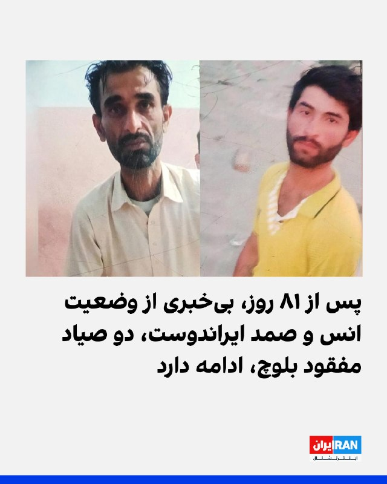

به گزارش حال‌وش، با گذشت ۸۱ روز از ناپدید شدن دو صیاد بلوچ به نام‌های انس ایراندوست و صمد ایراندوست که با یک قایق موتوری برای صیادی راهی آب‌های آزاد دریای عمان شده بودند، همچنان هیچ اطلاعی از سرنوشت آنان در دست نیست و خانواده‌هایشان در نگرانی و بی‌خبری به‌سر می‌برند.
انس ایراندوست ۲۷ ساله و پدر دو فرزند و صمد ایراندوست ۴۰ ساله و پدر پنج فرزند است و هر دو شهروند ساکن روستای پُزم از توابع شهرستان کنارک بوده‌اند. این دو شهروند بلوچ روز ۱۷ اسفندماه ۱۴۰۴، هم‌زمان با آغاز تنش‌ها و درگیری‌های نظامی در منطقه پس از عزیمت برای صیادی ناپدید شدند.
به گفته منابع آگاه، خانواده‌های این دو صیاد در این مدت بارها پیگیری کرده‌اند اما هیچ نهاد رسمی پاسخ روشنی درباره سرنوشت آنان نداده است.
در هفته‌ها و ماه‌های اخیر، گزارش‌های متعددی درباره ناپدید شدن ملوانان و صیادان بلوچ در آب‌های دریای عمان، تنگه هرمز و مسیرهای اقیانوسی منتشر شده است.

‌🏁 🇬🇧 IranintlTV

🤖 @VahidOOnLine

## VahidOOnLine — post 242700

♦️شرکت فناوری سرگرمی «گلکسی کورپوریشن» کره جنوبی روز پنجشنبه هشتم خرداد در سئول نمایش مدی برگزار کرد که در آن ربات‌ها و انسان‌ها با لباس‌های یکسان روی صحنه حاضر شدند: رویدادی که با هدف به تصویر کشیدن همزیستی انسان و ربات‌ها در آینده طراحی شده بود.

به گزارش رویترز، این نمایش با عنوان «نمایش مد هوش مصنوعی فیزیکی ماخ ۳۳» (MACH33: Physical AI Fashion Show) در «پارک ربات گلکسی» در سئول برگزار شد و ربات‌ها در کنار مدل‌های انسانی با پوشش‌های هماهنگ در برابر تماشاگران ظاهر شدند.

در بخشی از این برنامه، ربات‌هایی که شنل بر تن داشتند روی صحنه رفتند وسپس دو مدل زن شنل‌ها را از تن آن‌ها برداشتند تا لباس‌های اصلی نمایان شود.

پس از آن، مدل‌های انسانی با همان لباس‌ها وارد صحنه شدند و در کنار ربات‌ها ژست گرفتند.

ربات‌ها و انسان‌ها همچنین در اجرایی که آمیزه‌ای از مد، فناوری رباتیک و هنرهای نمایشی بود، برنامه هماهنگی را روی صحنه به نمایش گذاشتند.
‌🇸🇦 Indypersian

🤖 @VahidOOnLine

## VahidOOnLine — post 242699

  

♦️مسعود پزشکیان، رئیس جمهوری اسلامی ایران روز جمعه هشتم خرداد با انتشار پیامی در اکس از تلاش‌های پاکستان برای «رسیدن به توافق» تشکر کرد و نوشت: «سیاست ایران گسترش همکاری با کشورهای مسلمان و همسایه در همه زمینه‌هاست. »

این پیام یک روز پس از یک دور جدید از تشدید تنش‌ها در خلیج فارس منتشر می‌شود. سپاه پاسداران روز پنجشنبه اعلام کرد در پاسخ به حمله آمریکا به محلی در بندرعباس، «مبدا حمله را هدف قرار داده است.» همزمان کویت اعلام کرد با حملات موشکی و پهپادی مقابله کرده است. کویت، عربستان سعودی، امارات، قطر و اتحادیه عرب، حمله به کویت را به‌شدت محکوم کردند.

پزشکیان نوشت: «در گفتگوهایم با نخست وزیران مالزی و پاکستان برای تبریک عید سعید قربان، با تاکید بر پایبندی ایران به دیپلماسی، از مواضع انسانی مالزی و از ابتکار عمل و تلاش‌های موثر پاکستان برای رسیدن به توافق تشکر کردم. سیاست ایران گسترش همکاری با کشورهای مسلمان و همسایه در همه زمینه‌هاست.»
‌🇸🇦 Indypersian

🤖 @VahidOOnLine

## VahidOOnLine — post 242698

  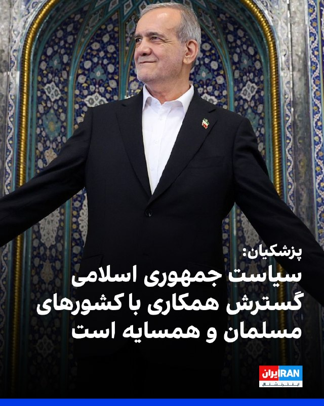

پزشکیان در ایکس با اشاره به گفتگوهایش با نخست‌وزیران مالزی و پاکستان، بر پایبندی جمهوری اسلامی به دیپلماسی تاکید کرد و گفت: «سیاست حکومت ایران گسترش همکاری با کشورهای مسلمان و همسایه در همه زمینه‌هاست.»
‌🏁 🇬🇧 IranintlTV

🤖 @VahidOOnLine

## VahidOOnLine — post 242697

  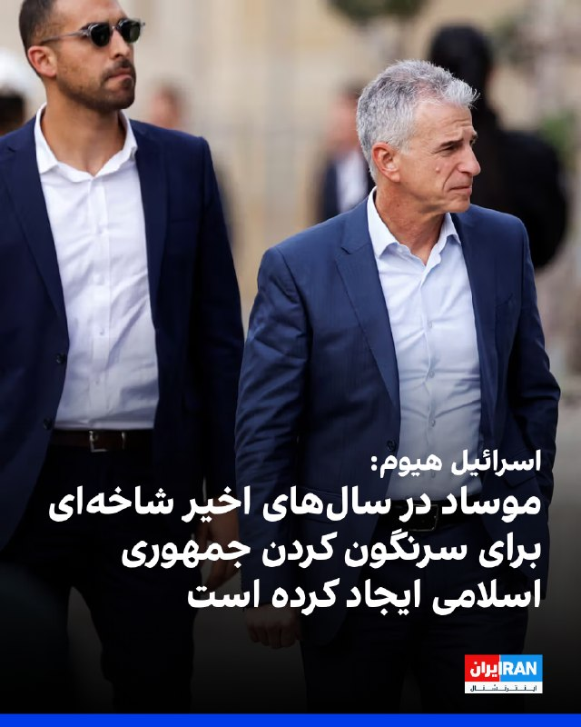

اسرائیل هیوم در گزارشی نوشت موساد در سال‌های اخیر شاخه‌ای محرمانه برای نزدیک‌تر کردن سقوط جمهوری اسلامی ایجاد کرده است. به گفته منابع آگاه، رییس موساد متقاعد شده است که اگر ترامپ با تهران توافق نکند و محاصره دریایی را ادامه دهد، جمهوری اسلامی تا پایان سال ۲۰۲۶ سقوط می‌کند.
به نوشته اسرائیل هیوم، ماموریت ابتدایی این شاخه که در سال ۲۰۲۱ و پس از آغاز ریاست داوید بارنیا بر موساد ایجاد شد، عملیات‌ هدفمند برای کنار زدن مقام‌های ارشد جمهوری اسلامی بود، اما به‌تدریج به بخشی از راهبرد گسترده‌تر موساد برای «تغییر رژیم» تبدیل شد.
رییس پیشین این شاخه به اسرائیل هیوم گفت موساد در گذشته بیشتر از طریق ترور افراد را حذف می‌کرد، اما اکنون افشای اطلاعات شرم‌آور یا آسیب‌زننده درباره مقام‌ها می‌تواند آن‌ها را از حلقه قدرت خارج کند؛ روشی که به گفته او «ارزان‌تر و ساده‌تر از عملیات ترور» است.
به نوشته اسرائیل هیوم، مقام‌های موساد معتقدند عملیات‌های اخیر علیه ایران فقط یک مرحله در مسیر سقوط جمهوری اسلامی بوده است. رئیس پیشین شاخه نفوذ گفت این واحد اکنون با شدت بیشتری فعالیت می‌کند و هدف آن «سریع‌تر کردن ساعت شنی پایان حکومت است».
‌🏁 🇬🇧 IranintlTV

🤖 @VahidOOnLine

## VahidOOnLine — post 242696

  

شبکه کان اسرائیل گزارش داد تلاش‌های عمان و ایران برای ایجاد سازوکار مشترک مدیریت و دریافت عوارض در تنگه هرمز، باعث خشم آمریکا و کشورهای خلیج فارس شده است.
یک دیپلمات از یکی از کشورهای میانجی به کان گفت: «ما تلاش کردیم وضعیت تنگه را به حالت پیشین بازگردانیم.» بر اساس توافق در حال شکل‌گیری، قرار است تنگه هرمز بدون محدودیت باز شود.
اسماعیل بقایی، سخنگوی وزارت امور خارجه جمهوری اسلامی، «لفاظی‌های تهدیدآمیز» مقام‌های آمریکا علیه عمان را در واکنش به گزارش‌ها درباره احتمال مشارکت این کشور در کنترل تنگه هرمز محکوم کرد و آن را «مغایر با اصول بنیادین منشور ملل متحد و حقوق بین‌الملل» دانست.

‌🏁 🇬🇧 IranintlTV

🤖 @VahidOOnLine

## VahidOOnLine — post 242695

♦️ویدیوی منتشرشده، لحظه انفجار موشک غول‌پیکر «نیو گلن» (New Glenn) متعلق به شرکت فضایی بلواوریجین، تحت مالکیت جف بیزوس، را روی سکوی پرتاب شماره ۳۶ در پایگاه فضایی کیپ کاناورال فلوریدا نشان می‌دهد.
این حادثه زمانی رخ داد که تیم فنی در حال آماده‌سازی و انجام آزمایش آتش ایستا (Static Fire) پیش از ماموریت بعدی این موشک، موسوم به NG-4، بود. تصاویر منتشرشده لحظه تبدیل شدن این موشک پیشرفته به یک گلوله بزرگ آتش را نشان می‌دهد.
موشک نیو گلن یکی از مهم‌ترین پروژه‌های بلواوریجین برای رقابت در بازار پرتاب‌های سنگین فضایی به شمار می‌رود و این انفجار می‌تواند باعث شکست و تاخیر قابل توجه در برنامه‌های فضایی این شرکت شود.
‌🇸🇦 Indypersian

🤖 @VahidOOnLine

## WithYashar — post 12852

سلام یاشار عزیز من امشب عروسیمه امشب میزنه آماده باشم تو باغ مهمونا رو از قبل آماده کنم میزنه ؟؟ 😂😂

## WithYashar — post 12851

بر اساس تحلیل نشریه اکونومیست، طرفین درگیر ممکن است بیش از هر زمان دیگری به یک توافق نزدیک شده باشند.
با این حال، این توافق جامع نخواهد بود و جنگ را برای همیشه پایان نخواهد داد.
این نشریه در ادامه توضیح می‌دهد که چگونه ملاحظات و بازی‌های سیاسی، عامل اصلی ارسال این پیام‌های ضدونقیض از سوی طرفین است
@withyashar

## WithYashar — post 12850

نیویورک تایمز: یکی از جدیدترین و شگفت‌انگیزترین عناصر پیش‌نویس توافق صلح ایران، یک صندوق سرمایه‌گذاری پیشنهادی برای ایران به مبلغ ۳۰۰ میلیارد دلار است.

ایران در ابتدا این موضوع را به عنوان غرامت برای خسارات جنگ (که آن را بین ۳۰۰ میلیارد تا ۱ تریلیون دلار تخمین می‌زند) مطرح کرد. طرف آمریکایی آن را به عنوان یک «صندوق سرمایه‌گذاری بین‌المللی» که به تسهیل آن کمک می‌کند، بازتعریف کرده است
یک چارچوب نرم‌تر که از کلمه غرامت اجتناب می‌کند.
به نظر می‌رسد این ایده از استیو ویتکوف و جرد کوشنر نشأت گرفته است که پروژه‌های املاک و مستغلات تهران و یک ابزار سرمایه‌گذاری گسترده‌تر را به عنوان شیرین‌کننده‌های معامله مطرح کردند
@withyashar

## WithYashar — post 12849

دوستان من گفتم فردا میگم کجا متن ها رو بفرستید دوبار هم در متن تاکیید کردم! پیغام هایی که الان دایرکت دادید بین پیغام های‌دیگه میره و از دست میره حتی نیمتونم بخونم 😟 چرا درک نمیکنید خیلی واضح گفتم

## WithYashar — post 12848

خب این متن را مینویسم که همه حتما ببینند. امروز و فردا روز بسیار مهمی هست. ما هر دو شب را بیدار خواهیم ماند برای گزارش و برای دوشنبه آخر شب هم در صورتی که حمله نبود میخواهیم یک پیام برای شاهزاده بفرستیم ساعت ۱۱:۱۱ دقیقه . در نتیجه از همه شما دعوت میکنم خیلی…

## WithYashar — post 12847

  <a href="telegram/content/WithYashar_12847_1780052442.mp4" target="_blank">🎬 Download video</a>

معاون رئیس دفتر کاخ سفید در امور سیاست، استیون میلر:
ایران امتیاز های خیلی قابل توجه، مادی به ایالات متحده داده که قبلا میگفت غیر ممکنه
@withyashar

## WithYashar — post 12846

فارس نیوز ، خطیب نماز جمعهٔ تهران: دشمن متوقف نیست، ما باید در مرز دانش و فناوری حرکت کنیم
حجت‌الاسلام ابوترابی: تعرض آمریکا در سحرگاه دیروز به نقطه‌ای در حاشیه فرودگاه بندرعباس که نه خسارت جانی داشت و نه خسارت مالی، اما تعرض به آسمان و زمین ایران بود. این تعرض از پایگاه هوایی آمریکا در منطقه انجام شد
@withyashar 🥴

## WithYashar — post 12845

خب این متن را مینویسم که همه حتما ببینند. امروز و فردا روز بسیار مهمی هست. ما هر دو شب را بیدار خواهیم ماند برای گزارش و برای دوشنبه آخر شب هم در صورتی که حمله نبود میخواهیم یک پیام برای شاهزاده بفرستیم ساعت ۱۱:۱۱ دقیقه . در نتیجه از همه شما دعوت میکنم خیلی رسمی و محترمانه صحبتهای خود را بنویسید و امروز بر روی متن تمرکز کنید و فردا از ساعت ۱۰ صبح تا ۱۰ شب برای من ارسال کنید تا چکیده ای از تمام آنها را ارسال کنم و فقط کلام من نباشد. حتی شده یک کلمه از پیام هر شخص را برمیداریم و متنی باهم میسازیم که در خور باشد. پس از شما دعوت میکنم به این کمپین بپیوندید ،لطفا امروز و فردا از فرستادن دایرکتهای غیرمعمول بپرهیزید سوال بیشتری را نمیتوانم پاسخ بدهم متن کامل است هر صحبتی که دارید در همان متن بنویسید تا همه با هم متن پایانی را استوری، کامنت ، دایرکت و ایمیل کنیم 🙌🏾. شروع ارسال فردا ۱۰ صبح و آخرین مهلت ارسال برای من فردا ۱۰ شب است.
@withyashar

## WithYashar — post 12844

تحلیل عوستاد رائفی پور :
آمریکایی‌ها نیروهای بیگانه فضایی هم کمک گرفتن
@withyashar

## WithYashar — post 12843

شبکه العربیه به نقل از منابع آگاه گزارش داد جمهوری اسلامی می‌خواهد اورانیوم غنی‌سازی‌شده خود را به چین منتقل کند، مشروط بر آن‌که چین تضمین دهد این مواد را به آمریکا تحویل نخواهد داد.
@withyashar

## WithYashar — post 12842

اسرائیل هیوم در گزارشی نوشت موساد در سال‌های اخیر شاخه‌ای محرمانه برای نزدیک‌تر کردن سقوط جمهوری اسلامی ایجاد کرده است. به گفته منابع آگاه، رییس موساد متقاعد شده است که اگر ترامپ با تهران توافق نکند و محاصره دریایی را ادامه دهد، جمهوری اسلامی تا پایان سال ۲۰۲۶ سقوط می‌کند.
ماموریت ابتدایی این شاخه که در سال ۲۰۲۱ و پس از آغاز ریاست داوید بارنیا بر موساد ایجاد شد، عملیات‌ هدفمند برای کنار زدن مقام‌های ارشد جمهوری اسلامی بود، اما به‌تدریج به بخشی از راهبرد گسترده‌تر موساد برای «تغییر رژیم» تبدیل شد.
رییس پیشین این شاخه به اسرائیل هیوم گفت موساد در گذشته بیشتر از طریق ترور افراد را حذف می‌کرد، اما اکنون افشای اطلاعات شرم‌آور یا آسیب‌زننده درباره مقام‌ها می‌تواند آن‌ها را از حلقه قدرت خارج کند؛ روشی که به گفته او «ارزان‌تر و ساده‌تر از عملیات ترور» است.، مقام‌های موساد معتقدند عملیات‌های اخیر علیه ایران فقط یک مرحله در مسیر سقوط جمهوری اسلامی بوده است. رئیس پیشین شاخه نفوذ گفت این واحد اکنون با شدت بیشتری فعالیت می‌کند و هدف آن «سریع‌تر کردن ساعت شنی پایان حکومت است».
@withyashar

## WithYashar — post 12841

سنتکام : ادعا: تلویزیون دولتی ایران ادعا کرد که نیروهای ایرانی یک هواپیمای آمریکایی را در نزدیکی بوشهر سرنگون کرده‌اند. نادرست.
حقیقت: هیچ هواپیمای آمریکایی سرنگون نشده است. تمام دارایی‌های هوایی ایالات متحده در نظر گرفته شده است.
@withyashar

## WithYashar — post 12840

  

استوری جدید علی کریمی و حمایت از شاهزاده رضا پهلوی
@withyashar

## WithYashar — post 12839

ابراهیم عزیزی رئیس کمیسیون امنیت ملی مجلس: آنچه امروز جمهوری ایران دنبال می‌کند، مدیریت هوشمند تنگه هرمز است.
اعمال کنترل و ترتیبات ایران در تنگه هرمز ماهیت دائمی دارد و بی‌تردید مقطعی نیست.
ایران قصد ندارد اورانیوم غنی شده خود را به کشور ثالث منتقل کند.
@withyashar

## WithYashar — post 12838

رویترز: ترامپ در شرایطی به دنبال پایان دادن به جنگ با ایران است که همزمان با دو فشار متضاد مواجه شده است. از یک سو افزایش قیمت انرژی و نگرانی از تبعات اقتصادی جنگ، کاخ سفید را به سمت دستیابی به توافق سوق می‌دهد و از سوی دیگر بخشی از جمهوری‌خواهان و متحدان سیاسی ترامپ خواهان ادامه فشار نظامی و جلوگیری از هرگونه امتیازدهی به جمهوری اسلامی هستند.
@withyashar

## WithYashar — post 12837

  <a href="telegram/content/WithYashar_12837_1780052444.mp4" target="_blank">🎬 Download video</a>

ونس: دستاوردهای ما علیه ایران قابل توجه بوده است

جی‌ دی ونس، معاون رئیس‌جمهور آمریکا: اگر به آنچه تاکنون به دست آورده‌ ایم نگاه کنید ،در صورتی که بتوانیم به یک توافق نهایی برسیم ،در حال بازگشایی تنگه هرمز هستیم.

ما پیش‌تر توان نظامی متعارف آنها( ایران) را به‌ شدت تضعیف کرده‌ ایم و در موقعیتی قرار داریم که میتوانیم برنامه هسته‌ ای‌ شان را به‌ طور قابل توجهی عقب بیندازیم،نه فقط در دوره این رئیس‌ جمهور، بلکه در بلندمدت.

این یک اتفاق بسیار، بسیار خوب برای مردم آمریکا است.
@withyashar

## WithYashar — post 12836

یه مقام ایرانی به وال استریت ژورنال: تهران نگرانه که اسرائیل، آمریکا رو از مذاکرات خارج کنه
@withyashar

## WithYashar — post 12835

  <a href="telegram/content/WithYashar_12835_1780052446.mp4" target="_blank">🎬 Download video</a>

پودر شدن موشلی ۹۰ روزه شد
@withyashar

## mwarmonitor — post 9880

  <a href="telegram/content/mwarmonitor_9880_1780052447.mp4" target="_blank">🎬 Download video</a>

📝 وقتی می‌گویند «مدیریت جهادی»، دقیقاً منظورشان همین است؛ محسن برمهانی معاون صدا و سیما میلی مدیری که چنان غرق در حل بحران‌های کلان کشور و تحول در رسانه ملی بوده که اصلاً وقت نکرده مسیر رختخواب تا استودیو را از طریق حمام طی کند. ظاهر پشم‌والو و قیافه ژولیده‌ای که انگار همین چند ثانیه پیش با زلزله‌ای ملایم از عمق پتو بیرون کشیده شده، خودش یک پیام استراتژیک است: «ما آن‌قدر مشغول کاریم که فرصت شانه کردن مو و تعویض لباس را هم نداریم!»
🔸در دنیایی که رسانه‌ها با هوش مصنوعی و استانداردهای فوق‌مدرن بصری جلو می‌روند، این انگل ها به «اصالت طبیعی» روی آورده‌اند؛ به‌طوری که بوی عرق و اتمسفر کپک‌زده از پشت صفحه نمایشگر هم رد می‌شود و مستقیم به مشام مخاطب می‌رسد. این سطح از واقع‌گرایی در تصویر، خودش بزرگ‌ترین دستاورد نظام مدیریتی است! از چنین ژنرال‌های خط مقدمی که معتقدند رسانه باید «پیش‌تر و بیشتر از میدان موثر باشد»، بعید هم نیست که با همین سر و وضع، فاتح جنگ‌های رسانه‌ای جهان شوند. تف به این حجم از تخصص و آراستگی که هر بیننده‌ای را در همان نگاه اول، میخکوب و البته منزجر می‌کند!

@mwarmonitor

## mwarmonitor — post 9878

📝وقتی شهر که خلوت بشه، قورباغه هفت‌تیرکش میشه! بله آقای ترامپ، وقتی درست وسط جنگ که این جمهوری اسلامیِ فکسنی داشت نفله و تکه‌پاره می‌شد، تو با اون مغز فندقی و ژست‌های پوچت دویدی وسط و آتش‌بس دادی، باید هم تهش به این افتضاح ختم بشه. مردک هالو، با همین حماقتت…

## mwarmonitor — post 9877

  <a href="telegram/content/mwarmonitor_9877_1780052448.mp4" target="_blank">🎬 Download video</a>

📽سکانس هالیوودی
🔹«پهپاد اوکراینی به ناوچه روسی «دریاسالار اسن» در نووروسیسک اصابت کرد.

🔸ناوچه پروژه ۱۱۳۵۶ «دریاسالار اسن»، که حامل موشک‌های کروز کالیبر است، در پایگاه دریایی روسیه در شهر نووروسیسک هدف یک پهپاد اوکراین قرار گرفت.

🔸تصاویر ضبط‌شده از شب ۲۳ مه به‌روشنی نشان می‌دهد که سامانه‌های پدافند هوایی روسیه پیش از اصابت، موفق به رهگیری این پهپاد نشده‌اند.

@mwarmonitor

## mwarmonitor — post 9876

🔸«اوایل صبح امروز، در جریان حملات روسیه به زیرساخت‌های اوکراین در نزدیکی مرز، یک ساختمان مسکونی در رومانی هدف یک پهپاد قرار گرفت. دبیرکل ناتو، مارک روته، با مقام‌های رومانی در تماس است. ما بی‌پروایی روسیه را محکوم می‌کنیم و ناتو به تقویت پدافندهای خود در برابر…

## mwarmonitor — post 9875

  

🔸«اوایل صبح امروز، در جریان حملات روسیه به زیرساخت‌های اوکراین در نزدیکی مرز، یک ساختمان مسکونی در رومانی هدف یک پهپاد قرار گرفت. دبیرکل ناتو، مارک روته، با مقام‌های رومانی در تماس است. ما بی‌پروایی روسیه را محکوم می‌کنیم و ناتو به تقویت پدافندهای خود در برابر همه تهدیدها، از جمله پهپادها، ادامه خواهد داد.»
— سخنگوی ناتو

@mwarmonitor

## mwarmonitor — post 9874

  

🚫 ادعا: تلویزیون دولتی ایران مدعی شد نیروهای ایرانی یک هواپیمای آمریکایی را در نزدیکی بوشهر سرنگون کرده‌اند — نادرست.

✅ حقیقت: هیچ هواپیمای آمریکایی سرنگون نشده است. تمامی دارایی‌ها و هواگردهای هوایی ایالات متحده سالم بوده و همگی شناسایی و حسابرسی شده‌اند.

@mwarmonitor

## mwarmonitor — post 9873

🔴وزیر خارجه پاکستان جمعه ساعت ۱۰ صبح به وقت شرق آمریکا (ET) با مارکو روبیو، وزیر خارجه ایالات متحده، دیدار خواهد کرد؛ این در حالی است که دونالد ترامپ در حال بررسی پیش‌نویس توافقی است که بر اساس آن تنگه هرمز دوباره بازگشایی شود و گفت‌وگوهای هسته‌ای با ایران آغاز گردد—مشروط به اینکه آمریکا محاصره بنادر ایران را کنار بگذارد. نیویورک پست

@mwarmonitor

## mwarmonitor — post 9872

🔴ونس می‌گوید ایالات متحده و ایران به یک توافق «بسیار نزدیک» هستند

📝باراک راوید AXIOS

🔰چرا این موضوع اهمیت دارد: امضای این یادداشت تفاهم، بزرگ‌ترین گشایش دیپلماتیک از زمان آغاز جنگ خواهد بود، اما دستیابی به یک توافق نهایی که خواسته‌های هسته‌ای رئیس‌جمهور ترامپ را برآورده کند، نیازمند مذاکرات فشرده بیشتری است.

🔸ترامپ و مشاورانش در مراحل قبلی جنگ نیز چندین بار فکر می‌کردند به توافق نزدیک شده‌اند، اما مذاکرات بارها با بن‌بست مواجه شد.

تحولات جدید در خبر
بنا بر گزارش قبلی اکسیوس در روز پنجشنبه، مذاکره‌کنندگان آمریکایی و ایرانی روی یک یادداشت تفاهم ۶۰ روزه به توافق رسیده‌اند، اما ترامپ هنوز موافقت نهایی خود را اعلام نکرده است.
مقامات آمریکایی ادعا کردند همتایان ایرانی آن‌ها از طریق واسطه‌ها به آن‌ها گفته‌اند که تاییدیه لازم را دارند و آماده امضا هستند. یک مقام رسمی از یکی از کشورهای میانجی نیز این موضوع را تایید کرد.
مذاکره‌کنندگان آمریکایی جزئیات توافق نهایی را به اطلاع ترامپ رساندند، اما او بلافاصله آن را تایید نکرد. یک مقام آمریکایی گفت: «رئیس‌جمهور به واسطه‌ها اعلام کرد که برای فکر کردن در این باره به چند روز زمان نیاز دارد.»
حکومت ایران هنوز به طور علنی در مورد این خبر اظهار نظر نکرده است، اما خبرگزاری تسنیم، وابسته به سپاه پاسداران انقلاب اسلامی، به نقل از یک منبع ادعا کرد که این یادداشت تفاهم هنوز نهایی نشده است.
آخرین وضعیت (وضعیت موجود)
مقامات ارشد آمریکایی گفتند که تا بعدازظهر پنجشنبه، ترامپ تمایل به امضای این توافق داشته، اما هنوز این کار را انجام نداده است.
ترامپ بعدازظهر پنجشنبه با شیخ تمیم بن حمد آل ثانی، امیر قطر، گفت‌وگو کرد تا درباره توافق با ایران رایزنی کند. قطر یکی از میانجی‌های کلیدی بین دو کشور است.
یک مقام آمریکایی گفت یکی از دلایلی که ترامپ می‌خواهد چند روز دیگر صبر کند، این است که مطمئن شود مقامات ایرانی توافق را امضا می‌کنند و از آن عقب‌نشینی نخواهند کرد.
این مقام آمریکایی افزود دلیل دیگر این است که ترامپ می‌خواهد پیش از تصمیم‌گیری نهایی، ببیند بحث‌های سیاسی داخلی پیرامون این توافق چگونه پیش می‌رود.
اظهارات ونس
ونس که رهبری تیم مذاکره‌کننده ایالات متحده در گفتگوها با ایران در اسلام‌آبادِ پاکستان در ماه آوریل را بر عهده داشت و از آن زمان به شدت درگیر این موضوع بوده است، روز پنجشنبه گفت دشوار است بگوییم ترامپ چه زمانی یا آیا اصلاً این یادداشت تفاهم با ایران را امضا خواهد کرد یا خیر.
«ما روی چند نکته نگارشی و زبانی در حال رفت‌وبرگشت (بحث) هستیم. ما در اینجا پیشرفت‌های زیادی داشته‌ایم.»
ونس افزود: «امیدواریم به پیشرفت خود ادامه دهیم و رئیس‌جمهور در موقعیتی قرار گیرد که بتواند توافقنامه را تایید کند، اما مشخصاً این موضوع هنوز مشخص نیست (TBD).»
او در پایان گفت: «نمی‌توانم تضمین کنم که به آنجا (توافق) خواهیم رسید... اما در حال حاضر حس خوبی نسبت به آن دارم.»

@mwarmonitor

## FoxNewsTwitter — post 342393

  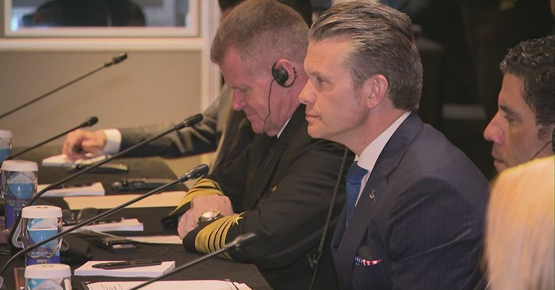

Fox News (Twitter/X)

WATCH LIVE: Hegseth holds bilateral meeting in Thailand
https://twitter.com/i/broadcasts/1MJgNNjDAXXGL

## FoxNewsTwitter — post 342392

  

Fox News (Twitter/X)

WATCH LIVE: Hegseth holds bilateral meeting with Vietnam's president
https://twitter.com/i/broadcasts/1dGYllpbnmYKX

## FoxNewsTwitter — post 342391

  <a href="telegram/content/FoxNewsTwitter_342391_1780052451.mp4" target="_blank">🎬 Download video</a>

Fox News (Twitter/X)

A Blue Origin rocket exploded during a "hotfire test" at Cape Canaveral Space Force Station on Thursday night.

Everyone has been accounted for and is safe, Jeff Bezos, the company's founder, said.

NASA Administrator Jared Isaacman said he was aware of the incident, which he called an "anomaly," and the agency would provide information on any impacts to Artemis or Moon Base programs.

"Spaceflight is unforgiving, and developing new heavy-lift launch capability is extraordinarily difficult. We will work with our partners to support a thorough investigation of this anomaly, assess near-term mission impacts, and get back to launching rockets," he said.

## FoxNewsTwitter — post 342390

  <a href="telegram/content/FoxNewsTwitter_342390_1780052454.mp4" target="_blank">🎬 Download video</a>

Fox News (Twitter/X)

Spencer Pratt says he's the "look around" candidate: "Look around and see with your own eyes what I'm saying."

"And that's why I'm going to win." |@Gutfeldfox

## FoxNewsTwitter — post 342389

  <a href="telegram/content/FoxNewsTwitter_342389_1780052455.mp4" target="_blank">🎬 Download video</a>

Fox News (Twitter/X)

"I hate these people."

Los Angeles mayoral candidate Spencer Pratt didn't hold back on @gutfeldfox as he says he keeps being asked which politicians he looks up to.

"These people let my house and my mom's house burn down," Pratt said before blasting Mayor Bass.

"She's actually a terrible liar, she's just incredible at how much she does it."

## FoxNewsTwitter — post 342388

  <a href="telegram/content/FoxNewsTwitter_342388_1780052457.mp4" target="_blank">🎬 Download video</a>

Fox News (Twitter/X)

"I don't want anybody to endorse me except for the moms and the animal lovers in LA — that's my entire vote."

LA mayoral candidate Spencer Pratt tells @Gutfeldfox that he's not interested in getting endorsements from Hollywood celebrities.

## FoxNewsTwitter — post 342387

  <a href="telegram/content/FoxNewsTwitter_342387_1780052458.mp4" target="_blank">🎬 Download video</a>

Fox News (Twitter/X)

"I don't want anybody to endorse me except for the moms and the animal lovers in LA — that's my entire vote."

LA mayoral candidate Spencer Pratt tells @Gutfeldfox that he's not interested in getting endorsements from Hollywood celebrities.

## FoxNewsTwitter — post 342386

  <a href="telegram/content/FoxNewsTwitter_342386_1780052460.mp4" target="_blank">🎬 Download video</a>

Fox News (Twitter/X)

.@greggutfeld: "Is there anybody who was devastated by the fires still voting for Karen Bass?"

@spencerpratt: "There's definitely lunatics. Their houses didn't burn down, but they could have been saved by the US Forest Service."

"But these people have convinced themselves the Palisades burned down because of climate change....it wasn't that Mayor Bass was drinking in Ghana and defunded the firefighters." | @gutfeldfox

## FoxNewsTwitter — post 342385

  <a href="telegram/content/FoxNewsTwitter_342385_1780052462.mp4" target="_blank">🎬 Download video</a>

Fox News (Twitter/X)

"The people I'm surging with are the people having to step over the naked drug addicts and step into human poop to get their $20 matcha."

Spencer Pratt slams the idea that he's only popular on the internet as he joins @Gutfeldfox days before the Los Angeles mayoral primary.

## FoxNewsTwitter — post 342384

  <a href="telegram/content/FoxNewsTwitter_342384_1780052463.mp4" target="_blank">🎬 Download video</a>

Fox News (Twitter/X)

A dog in trouble was rescued from a pond at a Colorado golf course after becoming trapped with no way out.

Westminster Animal Management responded to the scene after the dog, Luna, was spotted stuck in the pond.

The officer carefully pulled the dog to safety before Luna was evaluated and reunited with her family.

## FoxNewsTwitter — post 342383

  <a href="telegram/content/FoxNewsTwitter_342383_1780052465.mp4" target="_blank">🎬 Download video</a>

Fox News (Twitter/X)

NOW: Dallas officials confirm three people — including two women and one child — were killed after a massive explosion and fire tore through an apartment building in the city’s Oak Cliff neighborhood.

Dallas Fire-Rescue says three additional victims were transported to hospitals, including one person in critical but stable condition.

The incident was initially reported as a gas leak before escalating into a five-alarm fire.

## FoxNewsTwitter — post 342382

  <a href="telegram/content/FoxNewsTwitter_342382_1780052466.mp4" target="_blank">🎬 Download video</a>

Fox News (Twitter/X)

Billy Bush on Spencer Pratt's chances in the LA Mayoral election: "He knows how to communicate and she [Karen Bass] has no idea what to do about him." https://twitter.com/JesseBWatters/status/2060162354386477426#m

## FoxNewsTwitter — post 342381

  <a href="telegram/content/FoxNewsTwitter_342381_1780052468.mp4" target="_blank">🎬 Download video</a>

Fox News (Twitter/X)

Fighter jets launch from the deck of the USS Abraham Lincoln as the aircraft carrier conducts flight operations in the Arabian Sea.

## FoxNewsTwitter — post 342380

  <a href="telegram/content/FoxNewsTwitter_342380_1780052470.mp4" target="_blank">🎬 Download video</a>

Fox News (Twitter/X)

KELLYANNE CONWAY: "I hold Jill Biden most responsible and here's why: She let her ego and her thirst for power and fame to overtake the love and protection of her husband." https://twitter.com/IngrahamAngle/status/2060148754733240589#m

## FoxNewsTwitter — post 342376

Fox News (Twitter/X)

New York City Mayor Zohran Mamdani will not attend the city’s annual Israel Day Parade on Sunday — breaking with a tradition every NYC mayor has upheld since 1964.

The decision comes as Mamdani has continued appearing at major cultural and religious events across the city, including the Saint Patrick’s Day Parade, Lunar New Year celebrations, Eid prayers in Brooklyn, and the Sikh Day Parade in Manhattan.

His absence from this year’s Israel Day Parade is already drawing criticism as antisemitism reaches record levels in New York and anti-Israel demonstrations continue outside synagogues and Jewish institutions across the city.

## FoxNewsTwitter — post 342375

  <a href="telegram/content/FoxNewsTwitter_342375_1780052472.mp4" target="_blank">🎬 Download video</a>

Fox News (Twitter/X)

FOX NEWS REPORT: The US and Iran reached a tentative ceasefire deal that would last for 60 days, pending President Trump's approval, @BillMelugin_ reports.

## FoxNewsTwitter — post 342374

  <a href="telegram/content/FoxNewsTwitter_342374_1780052473.mp4" target="_blank">🎬 Download video</a>

Fox News (Twitter/X)

JESSE WATTERS: "Who cares if they don't like the food? Get 'em out of here."

"Cory Booker says this ICE facility shouldn't be in New Jersey. Why? Where should it be in?"

"You got to keep them somewhere before you send them home. https://twitter.com/TheFive/status/2060112010327511267#m

## pm_afshaa — post 91807

  

علیرضا فیروز جا قهرمان شرنج دنیا عکس شیر و خورشید پست کرد

💧 Rainbet.com the #1 Non-KYC Crypto Casino & Sportsbook @rainbetcom

😁 @Pm_Afshaa

## pm_afshaa — post 91806

🔴سنتکام:ادعـا تلویزیون دولتی ایران که گفته بود نیروهای ایرانی یک هواپیمای آمریکایی را نزدیک بوشهر سرنگون کردن غلطه

💧 Rainbet.com the #1 Non-KYC Crypto Casino & Sportsbook @rainbetcom

😁 @Pm_Afshaa

## pm_afshaa — post 91805

یه مقام ایرانی به وال استریت ژورنال: تهران نگرانه که اسرائیل، آمریکا رو از مذاکرات خارج کنه

💧 Rainbet.com the #1 Non-KYC Crypto Casino & Sportsbook @rainbetcom

😁 @Pm_Afshaa

## pm_afshaa — post 91804

🔴سی‌ان‌ان:حداقل 50 تونل دسترسی به شهرهای موشکی در ایران پس از حملات اسرائیل که آنها را مسدود کرده بود، پاکسازی و تعمیر شدن

💧 Rainbet.com the #1 Non-KYC Crypto Casino & Sportsbook @rainbetcom

😁 @Pm_Afshaa

## pm_afshaa — post 91803

🔴وزارت امور خارجه عراق :ما عملیات هدف قرار دادن کویت توسط ایران با موشک‌ها و پهپادها رو محکوم میکنیم

💧 Rainbet.com the #1 Non-KYC Crypto Casino & Sportsbook @rainbetcom

😁 @Pm_Afshaa

## pm_afshaa — post 91802

#مهم
عزیزای دلم همگی الان چنل زاپاس‌مون رو جوین بشید کانال تحت ریپورت شدیده اگه چیزی شد زاپاس رو داشته باشید فعالیت میاد اونور
👇

https://t.me/Pm_Zapas
https://t.me/Pm_Zapas

## pm_afshaa — post 91801

  

علی کریمی از شاهزاده رضا پهلوی حمایت کرد

💧 Rainbet.com the #1 Non-KYC Crypto Casino & Sportsbook @rainbetcom

😁 @Pm_Afshaa

## pm_afshaa — post 91799

https://t.me/proxy?server=tg.capycore.ru&port=443&secret=27ebe852539fb8ec5f327c73262bb721

پروکسی مخصوص دانلود فیلم و سریال سرعت بالا

💧 Rainbet.com the #1 Non-KYC Crypto Casino & Sportsbook @rainbetcom

😁 @Pm_Afshaa

## pm_afshaa — post 91798

پزشکیان :به جلیلی گفتم توام بیا یه گوشه کارو بگیر کمک کن کشورو درست کنیم. گفت نه من فقط پیشنهاد میدم. گفتم پیشنهاد به چه دردم میخوره اخه عمل میخوام; نخواستیم اصلا

💧 Rainbet.com the #1 Non-KYC Crypto Casino & Sportsbook @rainbetcom

😁 @Pm_Afshaa

## DEJradio — post 5093

⭕️ سنتکام خبر هدف گرفتن هواگرد آمریکایی توسط جمهوری اسلامی را نادرست خواند

ستاد فرماندهی مرکزی ارتش آمریکا گزارش‌های منتشرشده در رسانه‌های حکومت در ایران را دربارۀ هدف قرار گرفتن یک هواگرد آمریکایی رد کرد.
سنتکام در شبکۀ اکس خبر داد ادعای مطرح‌شده در تلویزیون جمهوری اسلامی دروغ است و همۀ هواگردها و هواپیماهای آمریکا سالم است.

#خبر #دژ #سنتکام
@DEJradio

## DEJradio — post 5092

⭕️ تحریم‌های تازۀ آمریکا شریان‌های مالی سپاه را هدف گرفت

وزارت امور خارجۀ آمریکا اعلام کرد با اعمال تحریم‌های تازه، مستقیما منابع مالی سپاه پاسداران و ساختار نظامی جمهوری اسلامی را هدف گرفته است.
در بسته تحریمی تازۀ آمریکا، هشت نهاد، سه نهاد فعال در تجارت پتروشیمی، یک فرد و هشت کشتی مرتبط با حمل نفت و فرآورده‌های مرتبط با جمهوری اسلامی، هدف گرفته شد.
تامی پیگوت، سخنگوی وزارت امور خارج، آمریکا گفت واشینگتن در چارچوب سیاست فشار شدید اقتصادی، شبکه‌های نفتی و ناوگان مخفی جمهوری اسلامی را هدف گرفته است.
وزارت امور خارجۀ آمریکا هشدار داد هر فرد یا شرکتی که در تجارت نفت و انرژی با جمهوری اسلامی مشارکت کند، با خطر تحریم روبه‌رو است.

#خبر #دژ #تحریم
@DEJradio

## DEJradio — post 5091

⭕️ جانشین فرماندۀ تیپ شهر غزه در شاخۀ نظامی حماس حذف شد

ارتش اسرائیل اعلام کرد عماد حسن حسین اسلیم، جانشین فرماندۀ تیپ شهر غزه و فرماندل گردان زیتون در شاخۀ نظامی حماس، در پی حمله‌ای مشترک با شاباک، حذف شد.
حماس که از پشتیبانی جمهوری اسلامی بهره‌مند است، در سیاهۀ تروریستی اروپا و آمریکا قرار دارد.
بر اساس بیانیۀ ارتش اسرائیل، این حمله روز چهارشنبه انجام شده است.
بنا بر گزارش‌ها اسلیم یکی از فرماندهان کشتار هفتم اکتبر در اسرائیل بود.
به گزارش ارتش اسرائیل، این فرد در سال‌های اخیر ده‌ها طرح عملیاتی را علیه نیروهای اسرائیلی در غزه هدایت کرده بود و تهدیدی فوری به شمار می‌رفت.
ارتش اسرائیل اعلام کرد دیگر نتایج حمله و سرنوشت یک فرماندۀ دیگر حماس که در محل حضور داشت، همچنان در دست بررسی است.

#خبر #دژ #اسرائیل #حذف_هدفمند
@DEJradio

## DEJradio — post 5090

⭕️ تفاهم‌نامۀ ۶۰ روزه تهران و واشینگتن در انتظار تصمیم ترامپ است

رسانه‌های آمریکایی گزارش دادند دونالد ترامپ هنوز برای امضای تفاهم‌نامه با جمهوری اسلامی، تصمیم پایانی را نگرفته است.
بنا بر گزارش‌ها تهران و واشینگتن بر سر یک تفاهم اولیه شصت روزه برای تمدید آتش‌بس و ادامۀ مذاکرات به جمع‌بندی رسیده‌اند، اما همه چیز به تأیید نهایی دونالد ترامپ وابسته است.
به گزارش آکسیوس، بر اساس این تفاهمنامه، آتش‌بس تمدید می‌شود و مسیر مذاکرات هسته‌ای باز می‌ماند.
یک مقام آمریکایی به آکسیوس گفت ترامپ به میانجی‌ها اطلاع داده که باید چند روز برای اخذ تصمیم پایانی فکر کند.

#خبر #دژ #توافق
@DEJradio

## DEJradio — post 5089

⭕️ عمان به امریکا تعهد داد برنامه‌ای برای دریافت عوارض در تنگۀ هرمز ندارد

اسکات بسنت، وزیر خزانه‌داری آمریکا گفت پس از گفت‌وگو با سفیر عمان در واشینگتن، از او تضمین گرفته که مسقط برای دریافت عوارض از کشتی‌های عبوری در تنگۀ هرمز برنامه‌ای ندارد.
او افزود به سفیر عمان داده هرگونه اقدام در دریافت عوارض از کشتی‌ها، می‌تواند افراد و نهادهای عمانی را در معرض تحریم قرار دهد.
این اظهارات یک روز پس از آن مطرح می‌شود که دونالد ترامپ هشدار داد اگر عمان بخواهد این آبراه را کنترل کند، توسط آمریکا نابود می‌شود.
مقام‌های جمهوری اسلامی پیش‌تر گفته بودند تهران و عمان درمورد ایجاد سازوکار عبور کشتی‌ها در آبراه هرمز مذاکره می‌کنند.

#خبر #دژ #تنگه_هرمز #عوارض
@DEJradio

## DEJradio — post 5088

⭕️ جی‌دی ونس: به توافق با تهران نزدیک شدیم اما هیچ چیز قطعی نیست

جی‌دی ونس، معاون رئیس‌ جمهوری آمریکا گفت واشینگتن و تهران هنوز به توافق نهایی نرسیده‌اند، اما به آن نزدیک شده‌اند.
او گفت نمی‌تواند تضمین کند که توافق در راه است، اما نسبت به آن خوش‌بین است.
به گفتۀ جی‌دی ونس چند موضوع اصلی از جمله ذخایر اورانیوم غنی‌شده و مسئله غنی‌سازی، همچنان محل اختلاف است.
معاون رئیس‌ جمهوری آمریکا گفت هنوز روی چند بخش متن بده‌وبستان می‌کنیم و مشخص نیست دونالد ترامپ ان را امضا می‌کند یا نه.

#خبر #دژ #مذاکرات
@DEJradio

## DEJradio — post 5087

⭕️ وزیر جنگ آمریکا گفت رخدادهای آینده به تصمیم جمهوری اسلامی بستگی دارد

پیت هگست، وزیر جنگ آمریکا گفت جمهوری اسلامی باید از برنامۀ هسته‌ای خود دست بکشد و آنچه در آینده مورد ایران رخ می‌دهد، به تصمیم تهران بستگی دارد.
او با اشاره به موضع دونالد ترامپ گفت جمهوری اسلامی یا از مسیر توافق پای میز مذاکره به پیش می‌رود و یا با گزینۀ نظامی روبه‌رو می‌شود.
هگست این اظهارات را در عرشۀ رزمناو آمریکایی یو‌اس‌اس باکسر، در سنگاپور و پیش از حضور در مجمع امنیتی آسیا مطرح کرد.

#خبر #دژ #جنگ
@DEJradio

## DEJradio — post 5086

⭕️ آمریکا دسترسی شرکت‌های هواپیمایی جمهوری اسلامی به امکانات فرود، سوخت‌گیری و فروش بلیت را متوقف می‌کند

اسکات بسنت، وزیر خزانه‌داری آمریکا گفت واشینگتن در چارچوب افزایش فشار بر جمهوری اسلامی و باز نگه داشتن تنگۀ هرمز، دسترسی شرکت‌های هواپیمایی جمهوری اسلامی را به فرودگاه‌ها و امکانات سوخت‌گیری و فروش بلیت، متوقف می‌کند.
بسنت در شبکۀ اکس نوشت: دسترسی هر دو شرکت هواپیمایی جمهوری اسلامی به این امکانات، از دست می‌رود.
ایالات متحده پیش‌تر شرکت‌های هوپیمایی از جمله ایران‌ایر و ماهان را در فهرست تحریم‌ قرار داده بود.
به گفتۀ اسکات بسنت، تنها یک نتیجۀ راضی‌کننده در مذاکرات،می‌تواند روند نزولی اقتصاد را در ایران متوقف کند.
وزیر خزانه‌داری آمریکا همچنین یادآور شد اقتصاد و ارزش پول ایران در وضعیت سقوط آزاد، قرار دارد.
او گفت برنامۀ «فشار شدید اقتصادی، با هدف افزایش فشار بر جمهوری اسلامی ادامه پیدا می‌کند.

#خبر #دژ #تحریم
@DEJradio

## DEJradio — post 5085

  <a href="telegram/content/DEJradio_5085_1780052476.webm" target="_blank">🎬 Download video</a>

🔺📢 سردار پاسدار محمدرضا جعفری:
برای نابودی نیروهای آمریکایی برنامه داریم، کافی است حمله زمینی کنند

آمریکا و جمهوری اسلامی در حال مذاکره‌اند و بر اساس ادعای بعضی مقامات دو کشور توافق بسیار نزدیک‌ است اما واقعیت آن است که یکی از اصلی‌ترین گزینه‌ها همچنان «حمله نظامی» است، و حکومت نگران از اینکه در مرحله آتی «عملیات زمینی» در دستور کار آمریکا و اسرائیل قرار بگیرد.

سردار پاسدار محمدرضا جعفری از فرماندهان سـ.ـپاه پاسداران در مراسم چهلم محمد پاکپور فرمانده پیشین سـ.ـپاه که در جنگ ۴۰ روزه کشته شد، در جمع خبرنگاران در پاسخ به احتمال حمله زمینی گفته «اگر ایالات متحده آمریکا به صورت زمینی به ایران حمله کند، رزمندگان سـ.ـپاه پاسداران انقلاب اسلامی برای نابودی آنها برنامه‌ریزی کرده‌اند.»

او همچنین گفت: «به دونالد ترامپ رئیس جمهور آمریکا هشدار می‌دهم که سربازان ما را نیازماید؛ ما آماده‌ایم تا پاسخ سختی به آمریکا بدهیم و ارتش او را در زمین نابود کنیم.»
گزارش شده که به ترامپ مجموعه‌ای از عملیات‌ها ارائه شده که می‌تواند شامل ورود نیروهای زمینی به ایران باشد. در حال حاضر حدود سه هزار چترباز از لشکر نخبه ۸۲ هوابرد و ۵۰۰۰ نیروی زبده از واحدهای اعزامی ۳۱ و ۱۱ تفنگداران دریایی را مستقر کرده است.

#جنگ #حمله_زمینی
@DEJradio

## DEJradio — post 5084

  <a href="telegram/content/DEJradio_5084_1780052476.mp4" target="_blank">🎬 Download video</a>

🤡
🔺 عقل ولایتمدار؛ قالیباف مذاکره می‌کند، ماکت ظریف را آتش‌ می‌زنند!

مذاکره با آمریکا هواداران حکومت را خشمگین کرده است، اما می‌کوشند "نفهمند" پشت مذاکرات، دیگر روحانی و ظریف نیستند بلکه سرداران‌اند که برای بقای خودشان تن به مذاکره با قاتلان خامنه‌ای داده‌اند.

#موشعلی #مذاکرات
@DEJradio

## DEJradio — post 5083

  <a href="telegram/content/DEJradio_5083_1780052478.mp4" target="_blank">🎬 Download video</a>

🔺🎥 با توجه به اینکه دسترسی بخشی از شهروندان در داخل کشور به اینترنت به‌صورت نسبی برقرار شده است ویدیوهایی از حواشی جنگ ۴۰ روزه به اشتراک گذاشته می‌شود.

یکی از این ویدیوها مربوط به شادی هموطنان بعد از اعلام کشته‌شدن علی خامنه‌ای در بمباران است.

#موشعلی #جنگ۴۰روزه
@DEJradio

## DEJradio — post 5082

  <a href="telegram/content/DEJradio_5082_1780052480.webm" target="_blank">🎬 Download video</a>

🔺📷 شبکه الحدث با استناد به تصاویر ماهواره‌ای گزارش داد جمهوری اسلامی در حال بیرون کشیدن دوباره ذخایر موشکیِ دفن‌شده‌اش از سایت‌های زیرزمینی است.

تصاویر ماهواره‌ای تازه نشان می‌دهند که سـ.ـپاه پاسداران در حال بازیابی شمار زیادی موشک است که در تأسیسات زیرزمینی پنهان شده بودند؛ هم‌زمان ماشین‌آلات سنگین و بولدوزرها نیز مشغول پاک کردن آثار حملات اخیر اسرائیل و آمریکا هستند.

#ذخایر_موشکی #جنگ
@DEJradio

## DEJradio — post 5081

  <a href="telegram/content/DEJradio_5081_1780052480.webm" target="_blank">🎬 Download video</a>

🔺📢 به گزارش «حال‌ وش» شامگاه پنجشنبه ۷ خرداد ماه ۱۴۰۵، یک مامور نیروی انتظامی در پی تیراندازی افراد مسلح در شهرستان ایرانشهر کشته شد.

استوار دوم عیسی عباسی در محدوده چهارراه بـ.ـسیج و تقاطع خیابان حافظ ایرانشهر، زمانی که با یک دستگاه موتورسیکلت در حال عزیمت به محل کار خود بوده، هدف تیراندازی افراد مسلح قرار گرفت.

تا لحظه تنظیم این گزارش، هیچ فرد یا گروهی مسئولیت این حمله را برعهده نگرفته و مقام‌های امنیتی نیز جزئیات بیشتری درباره مهاجمان یا انگیزه احتمالی این تیراندازی منتشر نکرده‌اند.

#ایرانشهر #جنگ
@DEJradio

## DEJradio — post 5080

  <a href="telegram/content/DEJradio_5080_1780052481.webm" target="_blank">🎬 Download video</a>

🚨📢 بر اساس گزارش منابع داخلی و محلی، پدافند در شهر ایران از جمله بندرعباس، جم (بوشهر) و بیدگنه در جنوب تهران فعال شد.
مردم در شهر جم صدای چند انفجار شنیدند. مسئولان محلی ادعا کردند علت انفجارها مقابله با «پهپاد‌های متخاصم» بود اما منابع غیررسمی گزارش دادند تاسیسات موشکی سـ.ـپاه پاسداران هدف حمله قرار گرفته است.

طی هفته گشته جنگنده‌های آمریکا دست‌کم دو قایق تندرو سـ.ـپاه و فرودگاه بندرعباس و چند سایت موشکی را هدف قرار دادند.
یک منبع آگاه به دژ می‌گوید علت حمله آمریکا به فرودگاه بندرعباس استقرار لانچر یا پهپاد در نزدیک باند بود. با این لانچرها چند مشوشک [یا پهپاد] به امارات پرتاب شد.

مردم به اطلاع‌رسانی جمهوری اسلامی بی‌اعتمادند. به گزارش خبرگزاری مهر، در پی شنیده شدن صدای انفجار در منطقه ۷ چاه شهرستان جم واقع در استان بوشهر، مشخص شد که این رخداد ناشی از عملکرد پدافند دفاعی بوده است.

پیش‌تر، خبرگزاری تسنیم گزارش داده بود صداهای شنیده‌شده احتمالا به شلیک‌های اخطار نیروی دریایی ایران به برخی شناورها مرتبط است. خبرگزاری فارس نیز اعلام کرد نیروهای مسلح جمهوری اسلامی پنجشنبه شب از مناطق جنوبی کشور به‌سمت اهدافی نامشخص موشک شلیک کرده‌اند.

#پدافند #جنگ
@DEJradio

## mamlekate — post 103602

📝 الو ساعت ۰۰:۱۳ جمعه ۸ خرداد
بیدگنه صدای پدافند پشت‌ هم

📝الو جمعه فعالیت مکرر پدافند در لنجان اصفهان

📝 همدان ساعت ۱ شب چندتا صدای مهیب اومد برقم دوبار قطع و وصل شد

🚀 گزارش‌های رسانه‌های حکومتی در ایران از حملات موشکی جمهوری اسلامی

@mamlekate

## VahidOnline — post 75783

  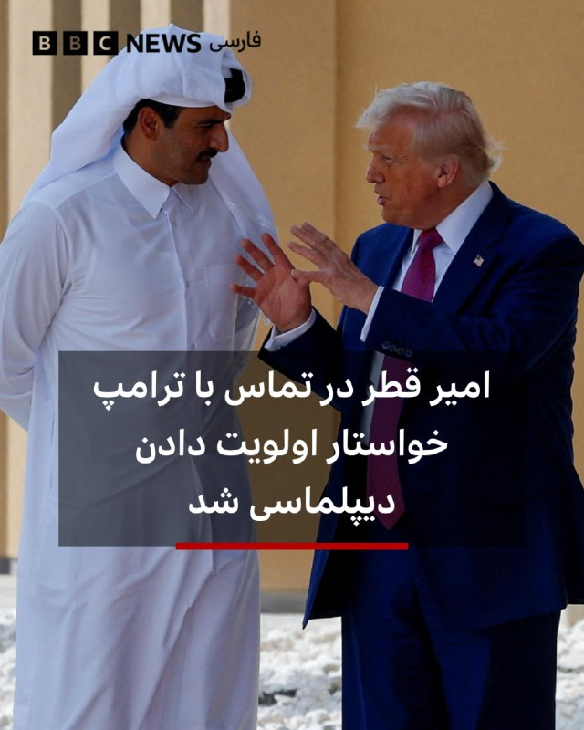

‌ ‌ ‌ ‌
شیخ تمیم بن حمد آل ثانی، امیر قطر، در تماسی تلفنی با دونالد ترامپ، رئیس جمهور آمریکا، در مورد تحولات منطقه‌ای گفتگو کرد.

دفتر امیر قطر در گزارشی از این مکالمه تلفنی اعلام کرد که شیخ تمیم بر اهمیت اولویت دادن به راه‌حل‌های دیپلماتیک و گفت‌وگو بین همه طرف‌ها به امید جلوگیری از تنش‌ها و تشدید بیشتر در خاورمیانه تأکید کرد.

در این بیانیه آمده است که ترامپ نیز به نوبه خود از نقش قطر در حمایت از تلاش‌های میانجیگری پاکستان بین واشنگتن و تهران قدردانی کرد و «از تلاش‌های قطر برای رفع اختلافات و ترویج کاهش تنش در منطقه» تمجید کرد.
@VahidHeadline

📡 @VahidOnline

## VahidOnline — post 75782

  <a href="telegram/content/VahidOnline_75782_1780052482.mp4" target="_blank">🎬 Download video</a>

فاکس‌نیوز: جی‌دی ونس می‌گوید ایالات متحده در مذاکرات با ایران «پیشرفت زیادی» داشته و معتقد است تهران «حداقل تا حالا با حسن نیت در حال مذاکره است.»

جی‌دی ونس: خب، فکر می‌کنم گفتن دقیق اینکه رئیس‌جمهور دقیقاً چه زمانی یا اصلاً تفاهم‌نامه را امضا خواهد کرد، سخت است. ما در حال رفت‌وآمد بر سر چند نکتهٔ زبانی هستیم.
کاملاً واضح است که به نظر من، ایرانی‌ها — آنها یک معامله می‌خواهند. آنها می‌خواهند تنگهٔ هرمز را باز کنند. ما هم می‌خواهیم تنگهٔ هرمز را باز کنیم.

🔸چند مسئله در مورد موضوع هسته‌ای وجود دارد: ذخیرهٔ اورانیوم غنی‌شدهٔ بالا و همچنین مسئلهٔ غنی‌سازی.

پس می‌دانید، ما با آنها در حال چانه‌زنی و رفت‌وآمد هستیم. ما واقعاً فکر می‌کنیم آنها حداقل تا حالا با حسن نیت مذاکره می‌کنند.
داریم پیشرفت می‌کنیم و امیدواریم به این پیشرفت ادامه دهیم تا رئیس‌جمهور در موقعیتی قرار بگیرد که بتواند توافق را تأیید کند.
FoxNews

📡 @VahidOnline

## IranIntlTV — post 339553

  <a href="telegram/content/IranIntlTV_339553_1780052482.mp4" target="_blank">🎬 Download video</a>

سرخط خبرهای جمعه ۸ خرداد
@iranintltv

## IranIntlTV — post 339552

🔻سایه سنگین بحران اقتصادی بر زندگی معلولان؛ افزایش حمایت‌ها در انتظار تصویب دولت

فاطمه عباسی، معاون توان‌بخشی سازمان بهزیستی، با اشاره به مشکلات فزاینده افراد دارای معلولیت در پی وخامت بحران اقتصادی کشور، اعلام کرد این سازمان خواستار افزایش ۸۰ تا ۹۰ درصدی کمک‌هزینه حق پرستاری نسبت به سال ۱۴۰۴ شده، اما اجرای آن منوط به تصویب دولت خواهد بود.

عباسی جمعه هشتم خرداد در مصاحبه با خبرگزاری ایلنا گفت سازمان بهزیستی «به‌صورت مستمر» پیگیر افزایش کمک‌هزینه حق پرستاری افراد دارای معلولیت است و در همین راستا، در جلسات کمیسیون بودجه هیات دولت جمهوری اسلامی حضور یافته است.

به گفته معاون توان‌بخشی سازمان بهزیستی، افزایش مبلغ کمک‌هزینه پس از تصویب در هیات وزیران قابل اجرا خواهد بود. با این حال، او درباره زمان احتمالی بررسی و تصویب این پیشنهاد توضیحی ارائه نکرد.

عباسی افزود تا زمان تصمیم‌گیری هیات وزیران، پرداخت کمک‌هزینه حق پرستاری بر اساس سرانه مصوب سال ۱۴۰۴ ادامه خواهد یافت.

او یادآور شد: «با توجه به اینکه بیش از ۸۰ درصد این افراد در دهک‌های پایین قرار داشته و در خانواده نگهداری می‌شوند، لزوم حمایت از آن‌ها جهت پیشگیری از تشدید معلولیت و جلوگیری از کاهش کیفیت زندگی اهمیت خاصی دارد.»

در روزهای اخیر، تشدید مشکلات اقتصادی و افزایش چشمگیر هزینه‌های درمان و دارو، فشار مضاعفی بر شهروندان ایرانی وارد آورده است.
این شرایط به‌ویژه برای افراد دارای معلولیت که نیاز مستمر به خدمات پزشکی، توان‌بخشی و دارو دارند، چالش‌های جدی‌تری ایجاد کرده است.
یک شهروند هشتم خرداد در پیامی به ایران‌اینترنشنال نوشت: «بیمار آرتریت روماتویید و فیبرومیالژیا هستم. ۱۰ سال است درگیر بیماری هستم. هشت سال است داروی رمیکید تزریق می‌کنم. چند ماه است که دارو دریافت نکرده‌ام. بیماری من دوباره بیدار شده و تمام مفاصلم متورم و زانوهایم قفل شده.»
او افزود: «دیروز از سازمان غذا و دارو تماس گرفتند و گفتند رمیکید موجود است ویالی ۱۹ میلیون. سه ویالش می‌شود ۵۷ میلیون. ولی من با وجود این همه درد نتوانستم خرید کنم، چون توانایی پرداخت هزینه‌اش را ندارم.»

کمک‌هزینه جدید لوازم بهداشتی پاسخگوی نیاز واقعی معلولان نخواهد بود

معاون توان‌بخشی سازمان بهزیستی در ادامه مصاحبه خود اعلام کرد افراد دارای معلولیت که به‌دلیل شرایط جسمی و نیازهای پزشکی ناگزیر به استفاده مداوم از پوشینه و سایر اقلام بهداشتی هستند، در دو ماه گذشته با افزایش قابل توجه قیمت این محصولات و دشواری در تامین آن‌ها روبه‌رو شده‌اند.
عباسی گفت: «کمبود مقطعی کالا و نوسان شدید در بازار، به‌ویژه در شرایط کنونی، فشار مضاعفی را بر خانواده‌های این عزیزان وارد کرده است.»

او افزود بر اساس مکاتبات انجام‌شده، قرار است سرانه کمک‌هزینه لوازم بهداشتی در بودجه سال ۱۴۰۵ از یک میلیون و ۵۰۰ هزار تومان به دو میلیون و ۵۰۰ هزار تومان افزایش یابد و در عین حال گفت بودجه مصوب در این خصوص «به‌‎طور رسمی ابلاغ نشده و هنوز به مرحله اجرا نرسیده» است.
معاون توان‌بخشی سازمان بهزیستی اذعان کرد: «حتی این سرانه جدید هم با قیمت واقعی نیاز بهداشتی یک فرد ضایعه نخاعی یا بسترگرا فاصله و تفاوت واضحی دارد.»
پنجم خرداد، وب‌سایت خبرآنلاین گزارش داد گرانی لوازم بهداشتی در ایران زندگی حدود ۴۵ هزار فرد دارای آسیب نخاعی را تحت تاثیر قرار داده است.
بر پایه این گزارش، بهای اقلام و تجهیزات پزشکی مورد استفاده روزانه این افراد، از جمله گاز استریل، پانسمان‌های تخصصی، سوند، کیسه سوند، ژل، سرنگ، دستمال کاغذی و داروهای مرتبط با زخم بستر، دست‌کم دو تا سه برابر شده است.

🔗وبسایت ایران‌اینترنشنال

@iranintltv

## IranIntlTV — post 339551

  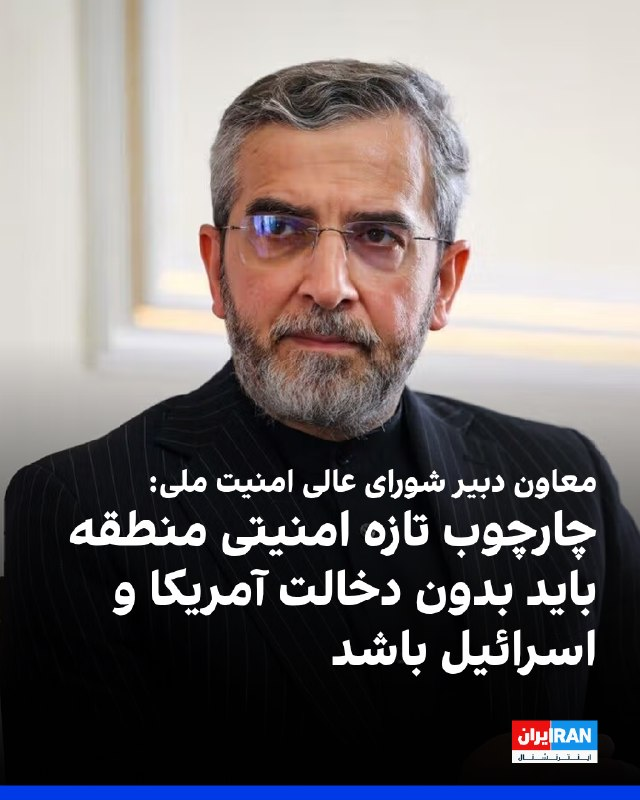

علی باقری‌کنی، معاون دبیر شورای عالی امنیت ملی، در حاشیه کنفرانس امنیتی مسکو، گفت: «پس از حملات اخیر آمریکا و اسرائیل، باید چارچوب تازه‌ای برای صلح و ثبات در منطقه تعریف شود و این موضع با استقبال کشورهای حاضر در کنفرانس روبه‌رو شده است.»

باقری‌کنی گفت «پیمان ابراهیم» در واقع «پیمان فرعون» است و ضامن صلح در منطقه نخواهد بود و تا زمانی که طرح‌هایی مانند «خاورمیانه بزرگ» از سوی آمریکا یا «اسرائیل بزرگ» دنبال شود، منطقه به ثبات نخواهد رسید.

او افزود: «شکل‌گیری هر سازوکار امنیتی جدید باید با مشارکت کشورهای منطقه و بدون دخالت آمریکا و نفوذ اسرائیل باشد.»
https://iranintl.com/202605299574

## IranIntlTV — post 339550

‏محمد باقر الساعدی که خود را «مانند فرزند قاسم سلیمانی» فرمانده سابق نیروی قدس می‌داند، بازداشت و قرار است در آمریکا محاکمه شود. این در حالی است که احتمال افشای اطلاعات حساس، به نگرانی فرماندهان گروه‌های نیابتی جمهوری اسلامی در عراق دامن زده است
‏گزارش تروسکە صادقی، روزنامه‌نگار

@iranintltv

## IranIntlTV — post 339549

🗣روایت شما از زندگی در دوران پس از انقلاب ملی و جنگ - جمعه ۸ خرداد ۱۴۰۵

🔹من دبیر هستم، بعد از سی سال خدمت در آموزش‌وپرورش بازنشسته شدم. پاداش پایان کارم ۶۵۰ میلیون بود، آن هم در چند قسط. رفتم یک کولر ایستاده قیمت کردم ۴۵۰ میلیون. حالا شما ملاحظه بفرمایید بدبخت‌ترین قشر در این جامعه معلم بیچاره است.

🔹پیامم با آن‌هایی است که هر شب می‌آیند توی خیابان، شماها انگار داخل این کشور زندگی نمی‌کنید یا این‌که به جایی وصل هستید. مگر می‌شود آدم این‌قدر کور باشد و چشمش را روی این همه خون جاویدنام‌هایمان ببندد.

🔹در کشوری که «صنعت» ندارد، بخش کشاورزی هم با افزایش قیمت کودهای شیمیایی تا ۷۰۰ درصد، در حال نابودی است. کود سوپرفسفات یک میلیونی شده ۷ میلیون. دامدار و کشاورز در حال ضرر هستند. بماند که مردم باید گرانی این محصول ضروری را تحمل کنند.

🔹از شهر کرمانشاه پیام می‌فرستم. از سال نو تا الان که ۸ خرداد ماه است، مدام گرد و خاک و هوای ناسالم را تجربه می‌کنیم. داریم خفه می‌شویم. همه‌ی تعطیلات را مجبوریم خانه بگذرانیم.

🔹وضعیت اقتصادی داغونه. قیمت‌ها لحظه‌ای بالا می‌روند. یک وعده ناهار برای یک نفر شده نیم میلیون.

🔹چند شب صدای پدافند و تیر در مسجدسلیمان می‌آید، حدود ساعت ۲ یا ۳ شب.

🔹من یک کافی‌نت‌دار هستم در فردیس کرج. کاسبی ما از زمان جنگ تا الان هنوز خراب است و اینترنت با این‌که باز شده، هنوز مختل است. همان اندک مشتری هم که می‌آید، با این نت باز نمی‌شود که کارش را انجام بدهیم، حتی سایت‌های داخلی.

🔹شش تا سوسیس گرفتم، شد یک میلیون و ۲۰۰ هزار تومان.

🔹وقتی به آرامستان‌های خوزستان، اهواز، آبادان، خرمشهر و ماهشهر می‌رویم، جوانانی از ۱۴ تا ۳۰ سال دفن شده‌اند که علت فوتشان سرطان و تصادف است. مگر می‌شود از ۲۸ دی‌ماه تا ۲۵ دی‌ماه این همه جوان خوزستانی به علت سرطان فوت شده باشند؟ مردم همه آگاهند که چه خبر بوده.

## IranIntlTV — post 339548

  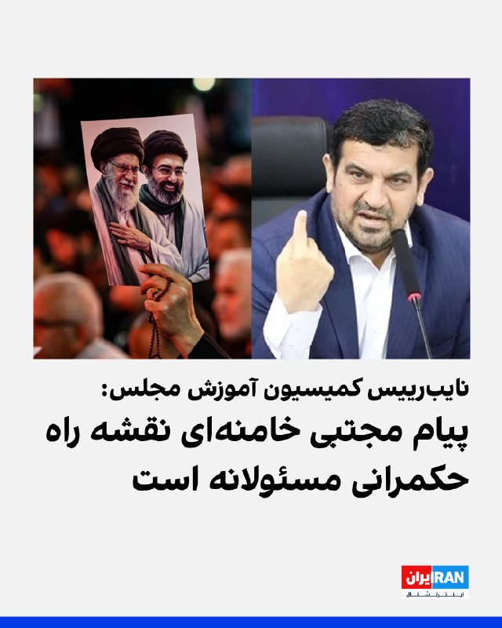

محمد مولوی، نایب‌رییس کمیسیون آموزش مجلس، پیام مجتبی خامنه‌ای، رهبر جمهوری اسلامی، را ترسیم‌کننده «نقشه راه حکمرانی مسئولانه» خواند.

او گفت دشمنان پس از ناکامی در عرصه‌های نظامی و اقتصادی، با تمرکز بر «ایجاد تفرقه اجتماعی و سیاسی» به دنبال «ضربه زدن به انسجام ملت» هستند.

مولوی افزود مجلس باید در «خط مقدم حفظ وحدت ملی» قرار گیرد و اجازه ندهد «اختلافات غیرضروری و رقابت‌های جناحی» به شکاف در بدنه اجتماعی کشور منجر شود.

او تاکید کرد ترجیح منافع ملی بر منافع فردی و جناحی باید در تصمیم‌گیری‌های «تقنینی و نظارتی» مجلس دنبال شود.
https://iranintl.com/202605294589

## IranIntlTV — post 339547

  <a href="telegram/content/IranIntlTV_339547_1780052484.mp4" target="_blank">🎬 Download video</a>

روزنامه اسرائیل هیوم گزارش داد در حالی که هدف عملیات «خیزش شیران» حمله به زیرساخت‌های هسته‌ای و موشکی جمهوری اسلامی بود، عملیات «غرش شیران» با هدف تغییر حکومت در ایران طراحی شده بود.
گفت‌وگو با حسین آقایی، عضو تحریریه ایران‌اینترنشنال
@iranintltv

## IranIntlTV — post 339546

  <a href="telegram/content/IranIntlTV_339546_1780052486.mp4" target="_blank">🎬 Download video</a>

مرتضی کاظمیان، عضو تحریریه ایران‌اینترنشنال، گفت: «با وجود همه تلاش‌های جمهوری اسلامی برای ارعاب جامعه، پتانسیل اکثریت ناراضی و معترض در ایران همچنان پابرجاست و ممکن است در ماه‌های آینده بار دیگر خود را نشان دهد.»
@iranintltv

## IranIntlTV — post 339545

  <a href="telegram/content/IranIntlTV_339545_1780052487.mp4" target="_blank">🎬 Download video</a>

یک پرستار با ارسال پیامی به ایران اینترنشنال از شرایط اخراج خود از کار در زمان جنگ اخیر روایت می‌کند. پیام او با هوش مصنوعی خوانده شده است.

## IranIntlTV — post 339544

  

با جدی‌تر شدن احتمال توافق و تداوم آتش‌بس میان جمهوری اسلامی و اسرائیل و آمریکا، پیام‌های ارسالی شهروندان به ایران‌اینترنشنال از تشدید دوباره فشارهای امنیتی و اجتماعی در شهرهای مختلف ایران حکایت دارد.

بر اساس این گزارش‌ها، فعالیت گشت ارشاد در شهرهایی مانند اصفهان، رشت و انزلی از سر گرفته شده و ماموران علاوه بر زنان، مردان دارای پوشش غیرحکومتی از جمله شلوارک‌پوشان را نیز بازداشت و به ون‌های پلیس منتقل می‌کنند.

شهروندان همچنین از ثبت تصاویر افراد توسط ماموران خبر داده‌اند.

یک شهروند اشاره می‌کند که ماموران لباس شخصی حکومت در خیابان‌های این شهر به زنان و دختران به دلیل پوشش تذکر می‌دهند و آن‌ها را تحت فشار می‌گذارند.

در رفسنجان، یک شهروند می‌گوید پس از تذکر حجاب از سوی زنان حامی حکومت، ماموران مسلح برای یافتن او به محل‌های اطراف مراجعه کرده‌اند. گزارش‌هایی نیز از بررسی تلفن‌های همراه شهروندان و کنترل‌های گسترده‌تر منتشر شده است.

گزارش‌هایی از پلمپ مغازه‌ها در رشت به دلیل موضوع حجاب و نیز پلمپ یک باشگاه ورزشی زنان در اراک پس از ورود نیروهای امنیتی و بازداشت چند مربی منتشر شده است.
https://iranintl.com/2026

## IranIntlTV — post 339543

  

محمدرضا محسنی‌ثانی، عضو کمیسیون امنیت ملی مجلس، اظهارات دونالد ترامپ درباره حضور احتمالی ایران در «پیمان ابراهیم» را «هذیان‌گویی سیاسی» خواند و گفت این سخنان ناشی از «توهمات» و «وضعیت نامتعادل روانی» رییس‌جمهوری آمریکا است.

محسنی‌ثانی گفت پیوستن کشورهایی مانند امارات متحده عربی و بحرین به این پیمان نتوانسته اهداف آمریکا را محقق کند و این توافق‌ها «لرزان و بی‌ریشه» است.

او افزود این اظهارات «پروپاگاندای تبلیغاتی» برای سرپوش گذاشتن بر آنچه «شکست نظامی آمریکا در برابر جمهوری اسلامی» خواند و بازسازی چهره آمریکا در عرصه بین‌المللی است.
https://iranintl.com/202605290096

## IranIntlTV — post 339542

  

ارتش اسرائیل و سازمان امنیت داخلی این کشور، شین‌بت، در بیانیه‌ای مشترک اعلام کردند عماد حسن حسین اسلیم، جانشین فرمانده تیپ شهر غزه و فرمانده گردان زیتون در شاخه نظامی حماس، در حمله‌ای در شمال نوار غزه کشته شده است.

بر اساس این بیانیه، اسلیم فرماندهی نیروهای گردان زیتون را در حمله هفتم اکتبر به خاک اسرائیل بر عهده داشت و در سال‌های اخیر، به‌ویژه در دوره اخیر، در طراحی ده‌ها حمله علیه نیروهای اسرائیلی در غزه نقش داشته است.

ارتش اسرائیل همچنین اعلام کرد فرد دیگری از اعضای حماس نیز در محل حمله حضور داشته و نتایج این حمله در حال بررسی است. به گفته ارتش، پیش از حمله اقداماتی برای کاهش آسیب به غیرنظامیان، از جمله استفاده از مهمات دقیق و نظارت هوایی، انجام شده بود.
https://iranintl.com/202605298887

## IranIntlTV — post 339541

‏شهروندان در ایران از موج تعدیل نیرو و اخراج افراد متخصص به ویژه در شرکت‌های پیمانکاری خبر دادند

‏گفت‌وگو با لیلا سعادتی، عضو تحریریه ایران‌اینترنشنال

@iranintltv

## IranIntlTV — post 339540

  <a href="telegram/content/IranIntlTV_339540_1780052491.mp4" target="_blank">🎬 Download video</a>

یک زن سرپرست خانوار با ارسال پیامی صوتی به ایران اینترنشنال از افزایش هزینه‌ها و ناتوانی در تامین معیشت خود می‌گوید. صدای او با هوش مصنوعی بازخوانی شده است.

## IranIntlTV — post 339539

  <a href="telegram/content/IranIntlTV_339539_1780052492.mp4" target="_blank">🎬 Download video</a>

خبرگزاری تسنیم، وابسته به سپاه پاسداران، با رد گزارش‌ها درباره نهایی شدن توافق تهران و واشینگتن اعلام کرد که اختلافات بر سر برخی بندهای کلیدی، از جمله آزادسازی دارایی‌های مسدودشده ایران، همچنان پابرجاست. هم‌زمان، جی‌دی ونس، معاون رییس‌جمهوری آمریکا، گفت دو طرف به توافق نزدیک شده‌اند، اما هنوز به آن دست نیافته‌اند.
جزییات بیشتر با بابک اسحاقی و احمد صمدی، خبرنگاران ایران‌اینترنشنال
@iranintltv

## IranIntlTV — post 339538

  <a href="telegram/content/IranIntlTV_339538_1780052494.mp4" target="_blank">🎬 Download video</a>

یک شهروند با ارسال پیامی به ایران اینترنشنال از نایاب شدن داروهای خارجی بیماری تالاسمی روایت می ‌کند. پیام او با هوش مصنوعی خوانده شده است.

## IranIntlTV — post 339537

🔻نهاله شهیدی یزدی، شهروند بهائی و فعال حقوق کودکان، برای تحمل شش سال حبس احضار شد

بر اساس اطلاعات رسیده به ایران‌اینترنشنال، نهاله شهیدی یزدی، شهروند بهائی و فعال حقوق کودک، برای تحمل شش سال حبس به دادسرای کرمان احضار شده است. هم‌زمان، نویان حجازی، شهروند بهائی ساکن جویبار، از سوی دادگاه انقلاب به حبس، جزای نقدی و محرومیت از حقوق اجتماعی محکوم شد.

از شهیدی یزدی خواسته شده است ۱۲ خرداد خود را برای اجرای حکم به دادسرای کرمان معرفی کند.

این شهروند بهائی مرداد ۱۴۰۴ از سوی دادگاه بدوی در کرمان به شش سال حبس تعزیری محکوم شد و این حکم در دادگاه تجدیدنظر نیز عینا تایید شد.

یک منبع مطلع از وضعیت شهیدی یزدی به ایران‌اینترنشنال گفت پس از تایید حکم، درخواست اعاده دادرسی او در دیوان عالی کشور به نتیجه نرسید.

به گفته این منبع، مقام‌های قضایی از تحویل نسخه حکم دادگاه تجدیدنظر به وکیلان او خودداری کردند و همین موضوع، امکان پیگیری موثر پرونده را با مشکل مواجه کرد.

شهیدی یزدی هشتم فروردین ۱۴۰۲، هنگام بازگشت از سفر به کرمان، در ایستگاه قطار از سوی ماموران اداره اطلاعات سپاه پاسداران بازداشت شد. ماموران تلفن همراه و دیگر وسایل الکترونیکی او را ضبط کردند و منزل او در کرج را نیز تفتیش و کتاب‌های دینی و عکس‌های شخصی‌اش را ضبط کردند.

او پس از ۹ ماه و چهار روز بازداشت، ۱۲ دی ۱۴۰۲ با وثیقه یک میلیارد و ۲۰۰ میلیون تومانی به‌طور موقت آزاد شد.
یک منبع آگاه به ایران‌اینترنشنال گفت شهیدی یزدی سال‌ها در زمینه آموزش و سوادآموزی کودکان و کمک‌رسانی بشردوستانه به مناطق محروم فعالیت داشته است.
به گفته این منبع، بخشی از فعالیت‌های او بر آموزش و حمایت از کودکان ساکن مناطق محروم اطراف بم متمرکز بوده و کمک‌های جمع‌آوری‌شده برای تامین مواد غذایی، پوشاک، لوازم تحصیلی و برخی نیازهای اولیه ساکنان این مناطق، استفاده می‌شده است.
شهیدی یزدی، پیش از این نیز در اسفند ۱۳۸۹ با اتهام‌های «اقدام علیه امنیت ملی» و «تبلیغ علیه نظام» بازداشت و در دادگاه بدوی به پنج سال حبس محکوم شده بود، اما دادگاه تجدیدنظر کرمان در نهایت حکم تبرئه او را صادر کرد.

حبس، جزای نقدی و محرومیت اجتماعی برای نویان حجازی

وب‌سایت حقوق بشری هرانا گزارش داد نویان حجازی، شهروند بهائی، از سوی دادگاه انقلاب جویبار مستقر در شعبه ۱۰۲ دادگاه کیفری این شهرستان، بابت آنچه «تبلیغ دین بهائی» عنوان شده، به پرداخت ۱۲۲ میلیون و ۵۰۱ هزار تومان جزای نقدی و محرومیت از حقوق اجتماعی به مدت ۱۰ سال و یک روز محکوم شده است.
بر اساس گزارش هرانا، او همچنین از بابت اتهام «تبلیغ علیه نظام» به هفت ماه و ۱۶ روز حبس محکوم شده است.

نیروهای امنیتی چهارم تیر ۱۴۰۴ بدون ارائه حکم قضایی، حجازی را در منزل شخصی‌اش بازداشت کردند. او ۱۲ مرداد همان سال با تودیع وثیقه آزاد شد.
لوا صمیمی، همسر حجازی، نیز هنگام پیگیری وضعیت او در بازداشتگاه کچوئی ساری بازداشت شد و چندی بعد با تودیع وثیقه آزاد شد.
جامعه جهانی بهائی اول خرداد در بیانیه‌ای اعلام کرد از زمان آغاز جنگ اخیر، حدود ۸۰ شهروند بهائی در ایران بازداشت یا زندانی شده‌اند.

🔗متن کامل گزارش را اینجا بخوانید

@iranintltv

## IranIntlTV — post 339536

  

🔻روزنامه فرانسوی اکیپ در آستانه فینال لیگ قهرمانان اروپا در بوداپست، به تحلیل شباهت‌ها و تفاوت‌های تاکتیکی پاری‌سن‌ژرمن و آرسنال، دو تیم فینالیست پرداخته است. این گزارش با به چالش کشیدن این کلیشه که آرسنال تیمی صرفاً تدافعی و خسته‌کننده است و در مقابل، پاری‌سن‌ژرمن تیمی کاملاً هجومی و بی‌پروا، به بررسی لایه‌های پنهان تاکتیکی هر دو تیم می‌پردازد.

🔹هر دو باشگاه در این فصل اهداف مشابهی را دنبال کرده‌اند، اما به دلیل ابزارهای متفاوتی که در اختیار دارند، مسیرهای متفاوتی را برای رسیدن به فینال پیموده‌اند.

🔹آرسنال و پاری‌سن‌ژرمن هر دو از تیم‌هایی هستند که بیشترین زمان را در این فصل به دفاع در زمین حریف (High Block) اختصاص داده‌اند. تفاوت اصلی در روش اجرای این استراتژی است؛ شاگردان میکل آرتتا معمولاً در قالب منظم ۴-۴-۲ دفاع می‌کنند که در آن یکی از هافبک‌ها به خط حمله اضافه می‌شود تا فضای بازی حریف را محدود کند. ادریان کلارک، بازیکن پیشین آرسنال، معتقد است که ثبات دفاعی توپچی‌ها به چیدمان موقعیتی بسیار دقیق آرتتا متکی است تا تیم در ضدحملات آسیب‌پذیر نباشد.

🔹جزییات بیشتر را در سایت بخوانید

@iranintltvsport

## IranIntlTV — post 339535

  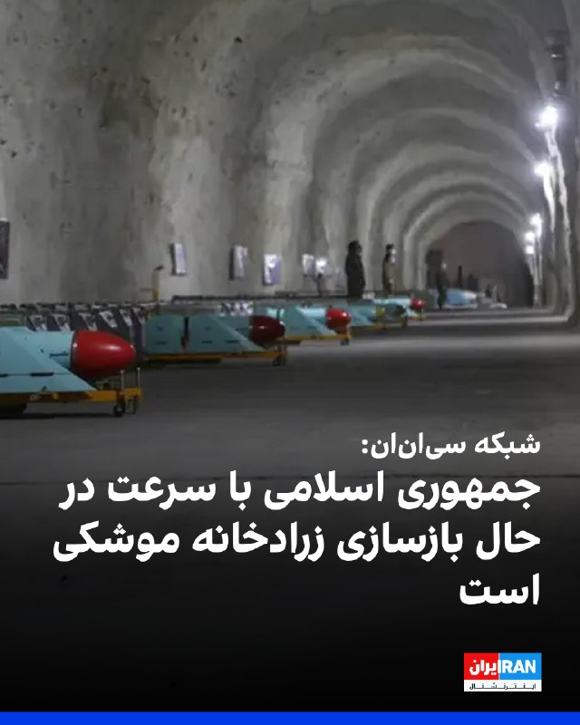

شبکه سی‌ان‌ان با استناد به تحلیل تصاویر ماهواره‌ای گزارش داد جمهوری اسلامی با سرعت در حال بازسازی زرادخانه موشکی و پهپادی خود است و روند بازیابی توان نظامی، گسترده و سریع ارزیابی می‌شود.

بر اساس این گزارش، سی‌ان‌ان ۶۹ تونل در ۱۸ پایگاه موشکی زیرزمینی را بررسی کرده است. تصاویر نشان می‌دهد از زمان آغاز آتش‌بس، دست‌کم ۵۰ ورودی مسدودشده بازگشایی شده و بسیاری از ورودی‌های دیگر نیز در حال تعمیر هستند.

سی‌ان‌ان در ادامه به نمونه‌ای در غرب ایران اشاره کرد و نوشت تاسیسات زیرزمینی باختران در کرمانشاه چند هفته پیش هدف حمله قرار گرفت و هر چهار ورودی آن تخریب شد. با این حال، تصاویر جدید نشان می‌دهد دو ورودی اکنون کاملا باز به نظر می‌رسد و جاده‌های لازم برای انتقال پرتابگرهای موشکی نیز بازسازی شده است.

به گزارش سی‌ان‌ان، جمهوری اسلامی همچنین در حال پاک‌سازی دو ورودی دیگر این مجموعه است و برخی از بیش از ۱۰ دهانه ایجادشده بر اثر اصابت مهمات آمریکایی را نیز ترمیم کرده است.
https://iranintl.com/202605294719

## IranIntlTV — post 339534

  <a href="telegram/content/IranIntlTV_339534_1780052496.mp4" target="_blank">🎬 Download video</a>

مسعود بهمنی شامگاه ۱۸ دی ۱۴۰۴ در جریان اعتراضات شهریار و هنگام کمک به مجروحان در علی‌آباد، با حمله مسلحانه ماموران دو انگشت خود را از دست داد و در همان حال بازداشت شد.

خانواده بهمنی چند روز پس از بازداشت مسعود، پیکر شکنجه‌شده و بی‌جانش را در کهریزک شناسایی کردند. بر اساس گزارش‌ها ماموران برای تحویل پیکر، خانواده را به پرداخت مبلغی سنگین وادار کردند. زیر فشارهای امنیتی، خانواده جاویدنام مسعود بهمنی، او را در زادگاهش اندیمشک به خاک سپردند.

## Shin_Persian — post 6291

  

U.S. Central Command ✓ @CENTCOM
Thu, 28 May 2026 22:49:22 UTC

🚫CLAIM: Iran's state TV claimed Iranian forces downed a U.S. aircraft near Bushehr. FALSE.

✅TRUTH: No U.S. aircraft were shot down. All U.S. air assets are accounted for.

فارسی

🚫 ادعا: تلویزیون دولتی ایران ادعا کرد که نیروهای ایرانی یک هواپیمای آمریکایی را در نزدیکی بوشهر سرنگون کرده‌اند. نادرست است.

✅ حقیقت: هیچ هواپیمای آمریکایی سرنگون نشده است. وضعیت تمام تجهیزات هوایی ایالات متحده مشخص و تایید شده است.

𝕏 · @shin_persian

## Shin_Persian — post 6290

  

Shin ✓ @hey_itsmyturn
Thu, 28 May 2026 21:16:53 UTC

And IRGC's Fars confirms the earlier missile launch

فارسی

و خبرگزاری فارس (وابسته به سپاه پاسداران) شلیک موشک در زمان زودتر را تایید می‌کند.

𝕏 · @shin_persian

## Shin_Persian — post 6289

Shin ✓ @hey_itsmyturn
Thu, 28 May 2026 21:14:07 UTC

מי שלא מכסח את הדשא, הדשא מכסח אותו!

English

Whoever does not mow the lawn, the lawn mows them!

فارسی

هر کس که چمن را کوتاه نکند، چمن او را از پا در می‌آورد!

𝕏 · @shin_persian

## FarsiVOA — post 218966

  <a href="telegram/content/FarsiVOA_218966_1780052499.mp4" target="_blank">🎬 Download video</a>

اهدای ۱۶ فروند جنگنده گریپِن سوئد به اوکراین با حضور زلنسکی در استکهلم؛

بر اساس گزارش منابع رسمی، اولف کریسترسون، نخست‌وزیر سوئد، در جریان دیدار با ولودیمیر زلنسکی، رئیس‌جمهور اوکراین، در پایگاه هوایی اوپسالا، رسماً اعلام کرد که این کشور ۱۶ فروند جنگنده «یاس ۳۹ گریپِن» از مدل‌های سی/دی را به اوکراین اهدا می‌کند.

این اقدام که در قالب بزرگ‌ترین بسته حمایت نظامی استکهلم از کی‌یف انجام می‌شود، گام مهمی در تقویت پدافند هوایی و توان رزمی اوکراین در مواجهه با حملات روسیه به شمار می‌رود.

همچنین بر اساس توافقات صورت‌گرفته، اوکراین در برنامه‌ای بلندمدت قصد دارد روند خرید مدل‌های جدیدتر این جنگنده، ایی/اِف را نیز آغاز کند.
@FarsiVOA

## FarsiVOA — post 218965

🔺هگست در سنگاپور؛ تأکید بر روابط با ویتنام و هشدار به جمهوری اسلامی

▪️پیت هگست، وزیر جنگ آمریکا در جریان سفر خود به سنگاپور، با تو لام، رهبر و فان وان گیانگ، وزیر دفاع ویتنام دیدار کرد. او همچنین در سخنانی به جمهوری اسلامی هشدار داد که از پیگیری برنامه هسته‌ای خود منصرف شود.

▪️قرار است که وزیر جنگ آمریکا روز شنبه در نشست امنیتی آسیا در سنگاپور سخنرانی کند. طبق اعلام پنتاگون، سخنرانی هگست بر «رویکردی مبتنی بر عقل سلیم برای حفاظت از منافع حیاتی آمریکا در منطقه هند-آرام» متمرکز خواهد بود.

▪️او روز جمعه در عرشه ناو «یو‌اس‌اس باکسر» در سنگاپور اعلام کرد حکومت ایران باید از برنامه هسته‌ای خود دست بکشد و اینکه در ادامه چه اتفاقی رخ دهد به جمهوری اسلامی بستگی دارد.

⬇️ بیشتر بخوانید:
https://ir.voanews.com/a/8155257.html

## FarsiVOA — post 218964

  <a href="telegram/content/FarsiVOA_218964_1780052500.mp4" target="_blank">🎬 Download video</a>

تصاویری از لحظه برخورد پهپاد روسی به ساختمان مسکونی در رومانی؛

رومانی، عضو ناتو، روز جمعه اعلام کرد که یک پهپاد در جریان حمله شبانه روسیه به اوکراین همسایه، دو نفر را در شهری در جنوب شرقی این کشور مجروح کرده است.

این نخستین بار از زمان آغاز جنگ است که یک پهپاد به منطقه‌ای پرجمعیت در رومانی برخورد کرده و موجب جراحت افراد شده است.

وزارت دفاع رومانی اعلام کرد این کشور که ۶۵۰ کیلومتر مرز زمینی با اوکراین دارد، از زمانی که مسکو حملات خود را به بنادر کی‌یف در امتداد رود دانوب آغاز کرده، ۲۸ بار شاهد نقض حریم هوایی خود توسط پهپادهای روسی بوده است.
@FarsiVOA

## FarsiVOA — post 218963

  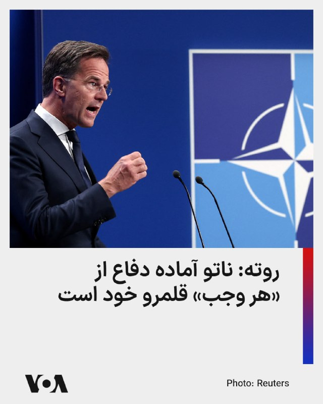

مارک روته، دبیرکل ناتو، روز جمعه پس از آنکه یک پهپاد در جریان حمله شبانه روسیه به اوکراین، به یک ساختمان آپارتمانی در رومانی، کشور عضو ناتو برخورد کرد، گفت که ناتو آماده دفاع از هر وجب از قلمرو خود است.

روته در پیامی در شبکه ایکس نوشت: «رفتار بی‌ملاحظه روسیه برای همه ما خطرناک است». او افزود: «شب گذشته بار دیگر نشان داد که پیامدهای جنگ تجاوزکارانه و غیرقانونی آن‌ها به مرزها محدود نمی‌شود.»

دبیرکل ناتو تأکید کرد: «ما به تقویت بازدارندگی و دفاع از خود در داخل ادامه خواهیم داد و همچنین به حمایت از اوکراین در حالی که در برابر تجاوز روسیه دفاع می‌کند، ادامه خواهیم داد.»

همچنین متیو ویتاکر، سفیر آمریکا در ناتو، روز جمعه حادثه پهپادی در رومانی را محکوم کرد و در شبکه ایکس، نوشت: «ما در کنار متحد خود در ناتو، رومانی، ایستاده‌ایم و این تجاوز بی‌ملاحظه به قلمرو آن را محکوم می‌کنیم». او نیز افزود: «ما از هر وجب از قلمرو ناتو دفاع خواهیم کرد.»
@FarsiVOA

## FarsiVOA — post 218962

  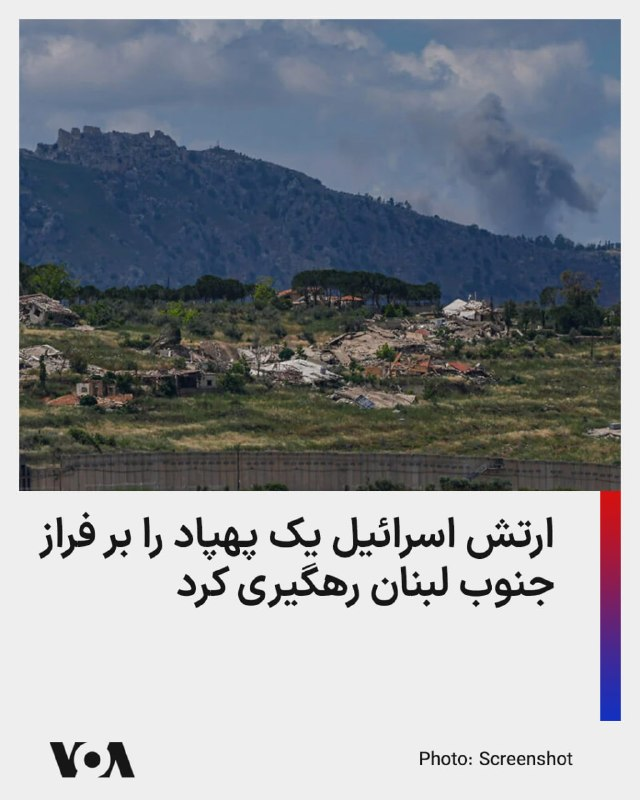

ارتش اسرائیل اعلام کرد که روز جمعه یک پهپاد ظاهراً متعلق به حزب‌الله را بر فراز منطقه‌ای در جنوب لبنان رهگیری کرده است.

این پهپاد در منطقه‌ای رهگیری شد که در آن، نیروهای اسرائیلی در حال عملیات هستند.

بنا بر اعلام ارتش اسرائیل، این «هدف هوایی مشکوک» و تلاش‌ها برای سرنگون کردن آن، باعث به صدا درآمدن آژیرها در مناطق مرزی اسرائیل شد.
@FarsiVOA

## FarsiVOA — post 218961

  

خبرگزاری رویترز با استناد به داده‌های کشتی‌رانی گزارش داده که فیلیپین یک محموله نفتی جمهوری اسلامی را در ماه جاری دریافت کرده است.

بر اساس این گزارش، کشتی «اوشن استارت» یک محموله یک میلیون بشکه‌ای نفت خام ایران را در اوایل ماه جاری از یک نفتکش دیگر دریافت کرد و حدود دو هفته پیش به پالایشگاه باتاآن فیلیپین تحویل داد.

شرکت‌های ردیابی نفتکش‌ها، کپلر و وُرتکسا، تأیید کرده‌اند که محموله یاد شده نفت ایران بوده که ۲۷ مارس در جزیره خارگ به کشتی «کِیلو» بارگیری شده بود.

آمریکا از ۲۰ مارس تا ۱۹ آوریل معافیت یک‌ماهه برای خرید نفت جمهوری اسلامی داده بود و طبق گزارش‌ها، هند ماه گذشته روزانه ۶۵ هزار بشکه نفت و مقداری گاز مایع از ایران خریداری کرده بود.
@FarsiVOA

## FarsiVOA — post 218960

  

در ادامه بازداشت شهروندان کُرد در بوکان، سه زن به نام‌های حمیرا امین‌پور، شلیر امین‌پور و منیژه خشنود طی روزهای اخیر توسط نیروهای سرکوب بازداشت شدند.

براساس گزارش‌ کولبر نیوز، نیروهای اداره اطلاعات روز چهارشنبه ششم خرداد با ورود به منزل حمیرا و شلیر امین‌پور، این دو خواهر را بدون ارائه حکم قضایی بازداشت کردند. مأموران همچنین بخشی از وسایل شخصی آنان را ضبط کرده‌اند.

در رویدادی مشابه، منیژه خشنود، شهروند ۵۸ ساله اهل بوکان، نیز روز سه‌شنبه پنجم خرداد در پی ورود نیروهای امنیتی به منزل خانوادگی‌اش بازداشت شد.

گفته می‌شود مأموران پس از تفتیش خانه، وسایلی از جمله تلفن همراه، لپ‌تاپ و تعدادی کتاب شخصی او را با خود برده‌اند.

منابع آگاه اعلام کرده‌اند که خانواده‌های این سه زن تاکنون موفق به کسب اطلاع دقیقی از محل نگهداری، وضعیت سلامتی و اتهامات مطرح‌شده علیه آنان نشده‌اند.

منیژه خشنود پیش‌تر نیز سابقه بازداشت داشته و در سال ۱۴۰۳ با اتهام «تبلیغ علیه حکومت» به حبس محکوم شده بود.
@FarsiVOA

## FarsiVOA — post 218959

  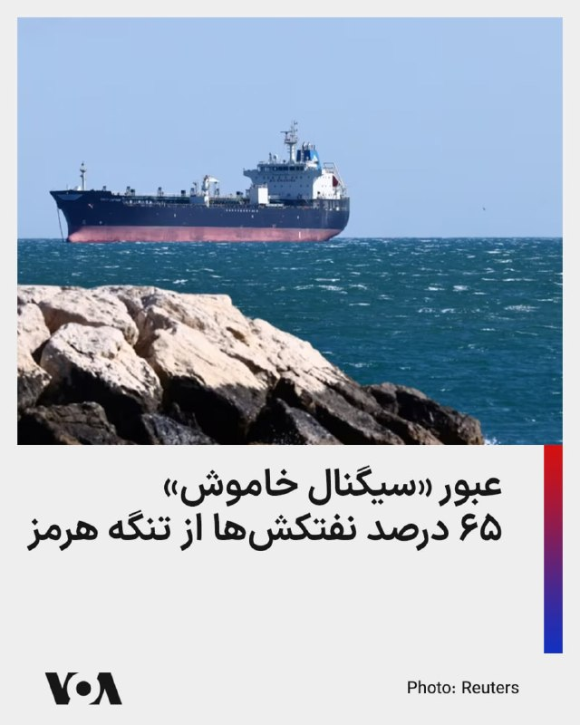

شرکت وُرتکسا می‌گوید در ماه جاری بیش از ۶۵ درصد نفتکش‌ها با خاموش کردن سیستم شناسایی خودکار از تنگه هرمز عبور کرده‌اند.

پیش از انسداد تنگه هرمز و حملات گسترده جمهوری اسلامی به کشتی‌ها، تنها نفتکش‌های قاچاق کننده نفت خود ایران برای پرهیز از ردیابی، سیستم شناسایی خودکار را خاموش می‌کردند، اما اکنون بخش بزرگی از نفتکش‌های منطقه برای پنهان ماندن از ردگیری و حملات رژیم ایران با سیگنال خاموش حرکت می‌کنند.

دامنه خاموشی سیستم شناسایی خودکار نفتکش‌ها حتی به بیرون از تنگه هرمز نیز رسیده و ورتکسا می‌گوید ۹۰ درصد از کشتی‌های حامل نفت و محصولات نفتی بندر فجیره امارات در دریای عمان نیز با سیگنال خاموش بارگیری و تردد می‌کنند.

طبق برآورد سازمان اطلاعات دریانوردی بریتانیا، از زمان آغاز جنگ جمهوری اسلامی و آمریکا، ۲۸ کشتی در آب‌های منطقه مورد هدف قرار گرفته است.
@FarsiVOA

## FarsiVOA — post 218958

🔺واکنش‌های گسترده در اروپا به نقض حریم هوایی رومانی توسط پهپاد روسی

▪️پس از آن که یک پهپاد روسی در جریان حمله شبانه به اوکراین، به یک ساختمان مسکونی در رومانی برخورد کرد و غیرنظامیان را مجروح ساخت، مقامات اروپایی این اقدام را محکوم کردند.

▪️مسئول سیاست خارجی اتحادیه اروپا، گفت: «پس از حادثه پهپاد در رومانی، نباید به مسکو اجازه داده شود که حریم هوایی اروپا را بدون مجازات نقض کند.»

▪️سخنگوی ناتو نیز نوشت: «بی‌ملاحظگی روسیه را محکوم می‌کنیم و ناتو به تقویت دفاع‌های خود در برابر همه تهدیدها، از جمله پهپادها، ادامه خواهد داد.»

▪️رومانی همزمان با احضار سفیر روسیه، اعلام کرد که طی چند ساعت آینده قراردادی برای استفاده از توانمندی‌های دفاع ضدپهپادی اتحادیه اروپا امضا خواهد کرد.

⬇️ بیشتر بخوانید:
https://ir.voanews.com/a/widespread-reactions-in-europe-to-violation-of-romanian-airspace-by-russian-drone/8155255.html

## FarsiVOA — post 218957

🔺یک مرکز نگهداری کودکان معلول به دلیل «آسیب به کودکان» تعطیل شد

▪️افشای سوختگی شدید یک کودک معلول و بستن دیگر کودکان به تخت، منجر به تعطیلی موقت مرکز نگهداری کودکان معلول در تهران شد.

▪️انتقال دوباره یک کودک به بیمارستان که پس از سوختگی با آب داغ پیش از طی مراحل درمان مرخص شده بود، موضوع بدرفتاری با کودکان تحت پوشش این مرکز را برجسته کرد.

▪️روابط عمومی سازمان بهزیستی با تأیید این گزارش مدعی است که علیه مسئول فنی و صاحب امتیاز مرکز اعلام جرم صورت گرفته و منتظر دستور قضایی برای تعطیلی دائم ‌مرکز است.

▪️آزار و آسیب‌ رساندن به کودکان در مراکز تحت پوشش بهزیستی طی سال‌های گذشته به صورت متعدد از سوی رسانه‌های داخلی گزارش شده است.

⬇️ بیشتر بخوانید:
https://ir.voanews.com/a/8155253.html

## FarsiVOA — post 218956

Farsi VOA pinned an audio file

## FarsiVOA — post 218955

  <a href="https://t.me/farsivoa/218955" target="_blank">📎 Download file</a>

🔴📢‌ نسخه صوتی اخبار ساعت ۲۰ پنجشنبه ۷ خرداد ۱۴۰۵

🛜در صورتی که با مشکل اینترنت مواجه هستید میتوانید اخبار صدای آمریکا را از نسخه‌های پادکست خبری ما روزانه دنبال کنید همچنین می‌توانید از نسخه سبک وب‌سایت ما پیگیر باشید:
https://ir.voanews.com/lite

📡بروزترین فرکانسهای ماهواره‌ای را نیز میتوانید از صفحه زیر پیگیری کنید:
https://ir.voanews.com/satellite

🔔دیگر شبکه‌های اجتماعی ما را هم دنبال کنید:
https://linktr.ee/voafarsi

ما را به اشتراک بگذارید
@voafarsi

## FarsiVOA — post 218954

  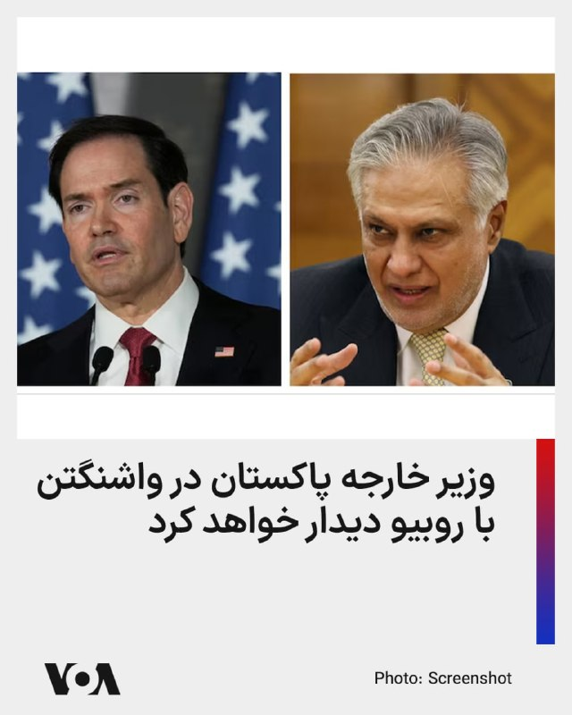

وزارت خارجه پاکستان اعلام کرد که محمد اسحاق دار، وزیر خارجه این کشور وارد واشنگتن شده و قرار است با مارکو روبیو، همتای آمریکایی خود دیدار کند.

بر اساس اعلام وزارت خارجه پاکستان، اسحاق دار در این دیدار درباره «موضوعات دارای اهمیت دوجانبه و منطقه‌ای» گفت‌وگو خواهد کرد.

پاکستان میانجی مذاکرات میان آمریکا و جمهوری اسلامی است؛ مذاکراتی که به گفته مقامات آمریکایی پیشرفت‌هایی داشته، اما دونالد ترامپ، رئیس‌جمهوری آمریکا هنوز درباره تفاهم میان دو کشور تصمیم نگرفته است.
@FarsiVOA

## FarsiVOA — post 218953

  

دونالد ترامپ، رئیس‌جمهوری آمریکا، درباره خط قرمزی که رژیم ایران برای ازسرگیری کارزار نظامی تهاجمی آمریکا نباید از آن عبور کند، گفت: «در نهایت خط قرمز، توافقی است که برای ما خوب نباشد. من دارم اوضاع را پیش می‌برم و خواهیم دید چه می‌شود.»

ترامپ در گفت‌وگو با فاکس نیوز هشدار داد عبور ایران از این خط، باعث آغاز دوباره کارزار نظامی تهاجمی آمریکا خواهد شد.

نسخه کامل این مصاحبه شنبه ساعت ۹ شب به وقت شرق آمریکا از شبکه فاکس نیوز پخش خواهد شد.

ترامپ به فاکس نیوز گفت که هرچند مقامات جمهوری اسلامی مذاکره‌کنندگانی «بسیار خوب» هستند، اما نیروی نظامی نابودشده آن‌ها به ایالات متحده اهرمی می‌دهد تا شرایط مطلوب خود را تحمیل کند؛ مهم‌ترین آن‌ها عدم دسترسی جمهوری اسلامی به سلاح هسته‌ای است.

رئیس‌جمهور گفت: «آن‌ها زیرک هستند، اما در نهایت همه برگ‌ها دست ماست، چون ما آن‌ها را از نظر نظامی شکست داده‌ایم.»

⬇️ بیشتر بخوانید:
https://ir.voanews.com/a/trump-reveals-the-line-iran-has-to-cross/8155213.html

## FarsiVOA — post 218952

  

آژانس بین‌المللی انرژی می‌گوید به رغم جنگ خاورمیانه، سرمایه‌گذاری‌های در حوزه انرژی جهان در سال جاری نسبت به ۲۰۲۵ حدود پنج درصد رشد خواهد داشت.

بر اساس این گزارش، انتظار می‌رود ۳.۴ تریلیون دلار در بخش انرژی جهان طی سال جاری سرمایه‌گذاری شود و بخش اعظم آن در حوزه انرژی‌های پاک خواهد بود.

بر اساس این گزارش، انتظار نمی‌رود مناقشات نظامی جمهوری اسلامی و آمریکا تاثیری بر سرمایه‌گذاری‌های حوزه نفت، گاز و زغال‌سنگ داشته باشد. امسال حدود ۱.۲ تریلیون دلار در این بخشها سرمایه‌گذاری خواهد شد.

این گزارش همچنین از آسیب به ۳۰ تاسیسات انرژی و پتروشیمی منطقه در جریان مناقشات جمهوری اسلامی و آمریکا خبر داده و گفته است بازسازی این تاسیسات نیازمند «چندین سال زمان و دهها میلیارد دلار سرمایه‌گذاری» است.

⬇️ بیشتر بخوانید:
https://ir.voanews.com/a/8155254.html

## FarsiVOA — post 218951

  

وزارت دفاع رومانی، عضو ناتو، گزارش داد که پس از برخورد یک پهپاد روسی به یک ساختمان آپارتمانی، ۲ نفر زخمی شدند.

وزارت دفاع رومانی روز جمعه اعلام کرد: «در طول شب ۲۸ تا ۲۹ مه، فدراسیون روسیه حملات پهپادی به اهداف غیرنظامی و زیرساختی در اوکراین، در نزدیکی مرز رودخانه‌ای با رومانی، را از سر گرفت.»

این وزارتخانه افزود: «یکی از این پهپادها وارد حریم هوایی رومانی شد، توسط رادار تا بخش جنوبی شهر گالاتی ردیابی شد و بر روی سقف یک ساختمان آپارتمانی سقوط کرد که برخورد آن باعث آتش‌سوزی شد».

اداره خدمات اضطراری رومانی نیز اعلام کرد که دو نفر زخمی شده‌اند.
@FarsiVOA

## FarsiVOA — post 218948

🔺جی‌دی ونس: مذاکرات با رژیم ایران پیشرفت داشته است اما معلوم نیست دونالد ترامپ تفاهم‌نامه را امضا می‌کند یا خیر

▪️جی‌دی ونس، معاون رئیس‌جمهوری آمریکا، پنج‌شنبه شب گفت که ایالات متحده و جمهوری اسلامی در مذاکراتشان بر سر یک «یادداشت تفاهم» که آتش‌بس میان دو کشور را ۶۰ روز تمدید می‌کند و تنگه هرمز را باز می‌کند «پیشرفت زیادی» داشته‌اند.

⬇️ بیشتر بخوانید:
https://ir.voanews.com/a/8155212.html
@FarsiVOA

## FarsiVOA — post 218947

🔺وزارت امور خارجه آمریکا با اعلام تحریم‌های تازه گفت «شریان‌های مالی سپاه پاسداران» را هدف قرار می‌دهیم

▪️وزارت امور خارجه آمریکا روز پنج‌شنبه ۷ خرداد اعلام کرد که ایالات متحده در حال انجام «اقدامات هماهنگ» برای قطع دسترسی جمهوری اسلامی به درآمدهایی است که از آن برای «تجاوز منطقه‌ای و تروریسم جهانی» استفاده می‌کند.

⬇️ بیشتر بخوانید:
https://ir.voanews.com/a/8155211.html
@FarsiVOA

## FarsiVOA — post 218946

  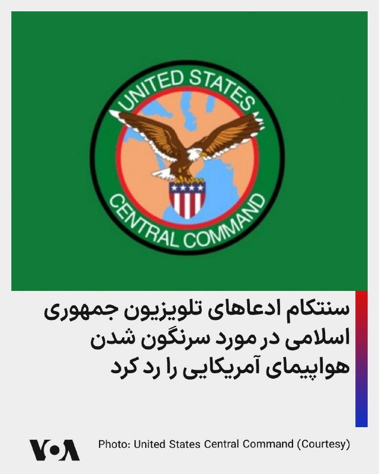

⚡️ستاد فرماندهی مرکزی آمریکا، سنتکام ادعای تلویزیون حکومتی ایران را که نیروهای جمهوری اسلامی یک هواپیمای آمریکایی را در نزدیکی بوشهر سرنگون کرده‌اند نادرست خواند و افزود هیچ هواپیمای آمریکایی سرنگون نشده است.
@FarsiVOA

## FarsiVOA — post 218945

🔺وزارت دادگستری آمریکا علیه تبعه عراقی-ایرانی عضو کتائب‌الحزب‌الله کیفرخواست صادر کرد؛ السعدی به توطئه برای بمب‌گذاری متهم است

▪️وزارت دادگستری آمریکا روز پنج‌شنبه ۷ خرداد علیه یک شهروند دو تابعیتی عراقی-ایرانی به نام محمدباقر سعد داوود السعدی، کیفرخواست صادر کرد.

⬇️ بیشتر بخوانید:
https://ir.voanews.com/a/8154996.html
@FarsiVOA

## DW_Farsi — post 125269

  

🔶 ارتش اسرائیل در حال بررسی شلیک اشتباه به یک هواپیمای غیرنظامی است
 
ارتش اسرائیل روز جمعه ۸ خرداد (۲۹ مه) اعلام کرد در حال بررسی حادثه‌ای است که در آن نیروهای این کشور به اشتباه به سوی یک هواپیمای غیرنظامی بر فراز کرانه باختری شلیک کرده‌اند، زیرا آن را با پهپاد اشتباه گرفته بودند.
 
به گفته ارتش این حادثه پس از گزارش ساکنان شهرک "بیت‌ئیل" درباره مشاهده چند پهپاد ناشناس رخ داد و نیروهای اسرائیلی پس از اعزام به منطقه به تصور شناسایی پهپاد به سوی آن شلیک کردند.
 
بعدا اما مشخص شد مسیر پرواز هواپیماهای به سمت فرودگاه بن‌گوریون تغییر کرده و آن‌ها در ارتفاع پایین‌تری از منطقه عبور می‌کردند که احتمالا باعث این اشتباه شده است.
 
ارتش اسرائیل همچنین در حال بررسی این احتمال است که یک پهپاد پلیس نیز هم‌زمان در منطقه پرواز می‌کرده است.
 
بر اساس داده‌های ارتش، این حادثه هیچ خسارت یا تلفاتی در پی نداشته و تحقیقات درباره آن همچنان ادامه دارد.
@dw_farsi

## DW_Farsi — post 125268

🔶 اوکراین امیدوار است با خرید جنگنده گریپن با روسیه مقابله کند
 
اوکراین امیدوار است با دریافت جنگنده‌های سوئدی گریپن، توان روسیه در استفاده گسترده از بمب‌های هدایت‌شونده را محدود کند. دلیل اصلی این امیدواری، تجهیز این جنگنده‌ها به موشک‌های هوا به هوای "میتئور" است؛ موشک‌هایی با بردی تا ۲۰۰ کیلومتر که می‌توانند هواپیماهای دشمن را از فاصله‌ای دور هدف قرار دهند.
 
پاولو پالیسا، معاون دفتر ولودیمیر زلنسکی، گفته است این فقط یک تقویت عادی برای نیروی هوایی نیست، بلکه گامی به‌سوی یک معماری دفاعی تازه برای اوکراین به شمار می‌رود. او موشک‌های "میتئور" را "بازوی بلند" نیروی هوایی توصیف کرده و گفته است با این قابلیت، می‌توان جنگنده‌های روسی حامل بمب‌های هدایت‌شونده را از جبهه دور نگه داشت.
 
به گفته او، این تحول نه فقط برای نیروی هوایی، بلکه برای حفاظت از نیروهای پیاده نیز اهمیتی بسیار بالا دارد.
 
برد ۲۰۰ کیلومتری به این معنا نیست که جنگنده‌های روسی لزوما در عمق ۲۰۰ کیلومتری پشت جبهه هدف قرار خواهند گرفت. برای چنین کاری، جنگنده گریپن باید تا نزدیکی خط مقدم پرواز کند؛ اقدامی که بسیار پرخطر است.
 
سناریوی محتمل‌تر این است که موشک‌ها از مناطق امن‌تر شلیک شوند و پس از عبور از میدان نبرد، به سمت مناطق تحت کنترل روسیه بروند. این‌که این برد در عمل تا چه اندازه برای دور نگه داشتن جنگنده‌های روسی کافی خواهد بود، هنوز روشن نیست. با این حال، زلنسکی گفته هدف این است که هواپیماهای روسی آن‌قدر عقب رانده شوند که دیگر نتوانند بمب‌های هدایت‌شونده را به‌صورت گسترده به کار ببرند.
@dw_farsi

## DW_Farsi — post 125267

  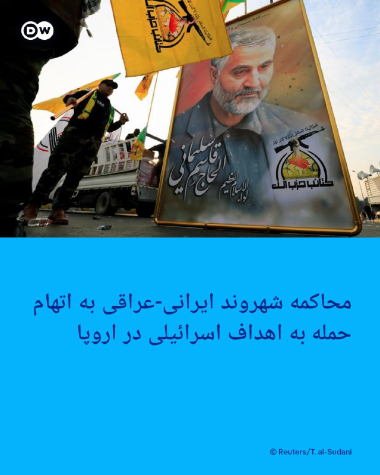

🔶 محاکمه شهروند ایرانی-عراقی به اتهام حمله به اهداف اسرائیلی در اروپا
 
وزارت دادگستری آمریکا و پلیس فدرال این کشور اعلام کردند که محمدباقر سعد داوود الساعدی، فرمانده کتائب حزب‌الله، به اتهام نقش داشتن در سازماندهی و هدایت مجموعه‌ای از حملات علیه اهداف یهودی و اسرائیلی در اروپا و سایر نقاط جهان، تحت پیگرد قضایی قرار گرفته است.
 
این فرد که پیش‌تر در ۱۵ مه با شش فقره اتهام در یک شکایت اولیه روبه‌رو شده بود، روز پنجشنبه ۷ خرداد (۲۸ مه) با اتهامات بیشتری از جمله "حمایت مادی از کتائب حزب‌الله و سپاه پاسداران، ارائه حمایت مادی برای اقدامات تروریستی، توطئه برای بمب‌گذاری در اماکن عمومی، تخریب اموال با استفاده از آتش یا مواد منفجره و تروریسم" مواجه شده است.
 
به نوشته نیویورک پست، الساعدی از چهره‌های بلندپایه در محافل مسلح عراقی-ایرانی به شمار می‌رود. او ۱۵ مه در ترکیه بازداشت و به آمریکا استرداد شده است. وزارت دادگستری آمریکا او را دست‌کم به ۱۸ حمله و اقدام در اروپا و ایالات متحده متهم کرده است.
 
بر اساس این گزارش، او در حمله به اهداف آمریکایی و یهودی نقش داشته است.
 
@dw_farsi

## DW_Farsi — post 125266

  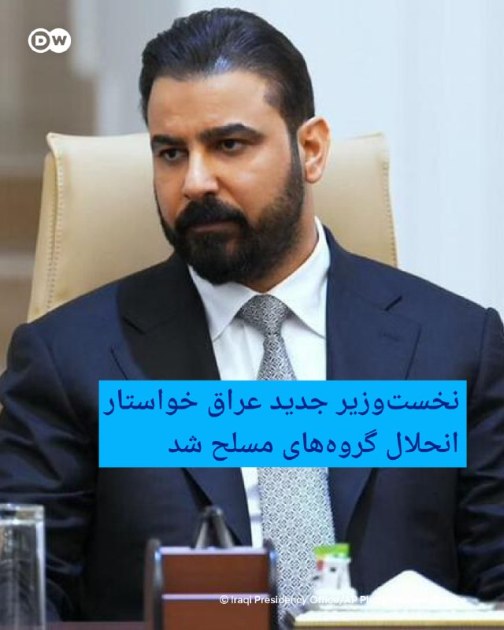

🔶 نخست‌وزیر جدید عراق خواستار انحلال گروه‌های مسلح شد
 
علی الزیدی، نخست‌وزیر جدید عراق از همه گروه‌های مسلح شیعه در این کشور خواسته است که تحت نظر دولت و نهادهای رسمی آن  فعالیت کنند و در ساختارهای رسمی کشور ادغام شوند.
 
این موضع‌گیری بعد از فشارهای آمریکا بر بغداد برای محدود کردن نفوذ گروه‌های شبه‌نظامی وابسته به ایران اتخاذ شده است.
 
دفتر اطلاع‌رسانی نخست‌وزیر عراق اعلام کرده است که تمامی گروه‌های مسلح باید تحت چارچوب دولت عمل کنند.
 
این تحولات پس از آن صورت گرفت که مقتدی صدر، رهبر جریان صدر و روحانی برجسته شیعه در عراق خبر داد که گروه مسلح "سرایا السلام" خود را از "جنبش ملی شیعه" جدا و در نهادهای دولتی ادغام می‌کند.
 
مقتدی صدر پیش‌تر نیز از گروه‌های مسلح مورد حمایت ایران انتقاد کرده و خواستار خلع سلاح آن‌ها شده بود. صدر در بیانیه‌ای از نیروهای "حشد الشعبی" و دیگر گروه‌های مسلح شیعه خواست سلاح خود را به دولت عراق  تحویل دهند.
 
بر اساس گزارش‌ها این رویکرد بخشی از فشارهای فزاینده واشنگتن بر دولت عراق است تا نفوذ گروه‌های شبه‌نظامی خارج از کنترل دولت کاهش یابد.
@dw_farsi

## DW_Farsi — post 125265

  

📸 عکس روز: "پاولینا" به حفاری ادامه می‌دهد

پس از نزدیک به یک سال توقف اجباری، دستگاه غول‌پیکرحفاری تونل با نام "پاولینا" اکنون دوباره در تونل گوتارد سوئیس به کار افتاده است. این دستگاه که توسط شرکت هرن‌کنشت در شهر شواناو آلمان ساخته شده، در ژوئن ۲۰۲۵ به دلیل برخورد با یک ناحیه مشکل‌دار در سنگ‌ها متوقف شده بود. در گوتارد سوئیس، یک تونل جاده‌ای در حال ساخت است. قرار است این تونل در سال ۲۰۳۰ افتتاح شود.
@dw_farsi

## DW_Farsi — post 125264

  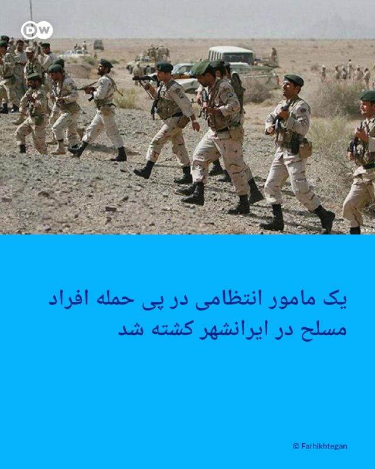

🔶 یک مامور انتظامی در پی حمله افراد مسلح در ایرانشهر کشته شد
 
به گزارش گروه رسانه‌ای "حال‌ وش" که اخبار سیستان و بلوچستان را پوشش می‌دهد، شامگاه پنج‌شنبه ۷ خردادماه (۲۸ مه) در پی تیراندازی افراد مسلح در شهرستان ایرانشهر، یکی از نیروهای انتظامی جان خود را از دست داد.
 
پس از انتشار خبر این حادثه، تصویری از این مامور نظامی که نامش عیسی عباسی عنوان شده توسط رسانه‌های حکومتی و کانال‌های وابسته به نهادهای امنیتی منتشر شد.
 
حال‌وش می‌نویسد بر اساس اطلاعات دریافتی، این نیروی نظامی شامگاه دیروز در محدوده چهار راه بسیج و تقاطع خیابان حافظ ایرانشهر، هنگامی که با یک دستگاه موتورسیکلت در حال عزیمت به محل کار خود بوده، هدف تیراندازی افراد مسلح قرار گرفته و بر اثر اصابت گلوله کشته شده است.
 
حال‌وش همچنین از امنیتی‌شدن فضای ایرانشهر و تلاش نیروهای امنیتی برای شناسایی عاملان حمله خبر داده است.
 
طبق گزارش‌ها تا کنون هیچ فرد یا گروهی مسئولیت این حمله را برعهده نگرفته و مقام‌های امنیتی نیز جزئیات بیشتری درباره مهاجمان یا انگیزه احتمالی این تیراندازی منتشر نکرده‌اند.
@dw_farsi

## DW_Farsi — post 125263

🔶 آزادسازی دارایی‌ها؛ مرهمی ناکافی بر زخم‌های اقتصاد جنگ‌زده

🔻گزارشی از امید برین
 
بحث بر سر آزادسازی دارایی‌های بلوکه‌شده ایران در خارج از کشور، بار دیگر به یکی از محورهای اصلی چانه‌زنی‌های دیپلماتیک بدل شده است.

در شرایطی که مقامات تهران به دنبال دسترسی به حدود ۱۲ میلیارد دلار از این منابع هستند، این پرسش مطرح می‌شود که آیا تزریق این وجوه می‌تواند راهگشای بحران‌های ساختاری اقتصاد باشد؟
 
برای واکاوی این موضوع، دویچه‌ وله فارسی نظرات کارشناسان بهزاد احمدی‌نیا، روزنامه‌نگار حوزه نفت و انرژی، اشکان نظام‌آبادی، روزنامه‌نگار اقتصادی و احمد علوی، اقتصاددان را جویا شده است.
@dw_farsi

## DW_Farsi — post 125262

  

🔶 ترامپ: در صورت شکست مذاکرات با ایران، گزینه نظامی روی میز است
 
دونالد ترامپ، رئیس‌جمهور آمریکا در ویدیوی کوتاهی که به‌عنوان پیش‌نمایش مصاحبه کامل او با شبکه "فاکس‌نیوز" در روز پنجشنبه ۷ خرداد (۲۸ مه) منتشر شد، اعلام کرده است که هر گونه توافق با ایران اگر برای آمریکا مناسب و مطلوب نباشد، قابل قبول نخواهد بود.
 
او همچنین گفته است که در نهایت روند را ارزیابی کرده و نتیجه را بررسی خواهد کرد و بر اساس آن تصمیم می‌گیرد.
 
ترامپ در ادامه خاطرنشان کرده است که مذاکرات در حال انجام است و طرف مقابل نیز در حال گفت‌وگو و تدوین متن توافق است و آن‌ها را مذاکره‌کنندگانی "بسیار خوب" توصیف کرده است. با این حال او تاکید کرده است که در نهایت ایالات متحده در موقعیت برتر قرار دارد، زیرا طرف مقابل از نظر نظامی شکست خورده است.
 
این اظهارات در حالی مطرح شده است که هم‌زمان درباره آینده آتش‌بس شکننده و مذاکرات متوقف‌شده میان دو طرف بحث‌هایی جریان دارد.
 
ترامپ در ادامه برنامه هسته‌ای ایران را یکی از محورهای اصلی اختلافات دانسته و بر ضرورت جلوگیری از دستیابی ایران به توانمندی هسته‌ای تاکید کرده است.
 
@dw_farsi

## DW_Farsi — post 125261

  

🔶 سنتکام: هیچ هواپیمای آمریکایی در نزدیکی بوشهر سرنگون نشده است
 
سنتکام صبح روز جمعه ۸ خرداد (۲۹ مه) در شبکه اجتماعی ایکس اعلام کرد که گزارش منتشرشده از سوی تلویزیون دولتی ایران درباره سرنگونی یک هواپیمای آمریکایی در نزدیکی بوشهر نادرست است.
 
در بیانیه سنتکام آمده است: «ادعای رسانه دولتی ایران مبنی بر اینکه نیروهای مسلح ایران یک هواپیمای آمریکایی را در نزدیکی بوشهر سرنگون کرده‌اند، صحت ندارد.»
 
سنتکام همچنین تاکید کرده است که هیچ هواپیمای آمریکایی سرنگون نشده و تمامی تجهیزات و دارایی‌های هوایی آمریکا در سلامت و امنیت کامل قرار دارند.
 
مسعود تنگستانی، فرماندار جم بوشهر پیش از این در گفت‌وگو با صداوسیما مدعی شده بود که در آسمان جم "یک هواگرد متخاصم هدف قرار گرفته" اما هیچ تلفات یا خسارتی نداشته و اوضاع "آرام" است.
@dw_farsi

## DW_Farsi — post 125260

  

🔶 ونس: آمریکا و ایران به توافق نزدیک شده‌اند، اما نهایی نشده است
 
جی‌دی ونس، معاون رئیس جمهور آمریکا شامگاه پنجشنبه ۷ خرداد (۲۸ مه) تائید کرد که در خصوص "تفاهم‌نامه" با ایران پیشرفت‌های زیادی میان ایالات متحده و ایران حاصل شده، اما هنوز روی برخی موضوعات کار می‌شود.
 
ونس به خبرنگاران گفت که هنوز به نتیجه قطعی نرسیده‌اند، اما به آن بسیار نزدیک شده‌اند و روند کار همچنان ادامه دارد. او همچنین تاکید کرد که هنوز مشخص نیست آیا دونالد ترامپ این توافق را تائید خواهد کرد یا خیر و او این موضوع را تضمین نمی‌کند.
 
معاون دونالد ترامپ تاکید کرد که دشوار است بتوان گفت دقیقا چه زمانی یا حتی آیا رئیس‌جمهور این تفاهم‌نامه را امضا خواهد کرد یا خیر. او همچنین افزود که ایران در حال حاضر با "نیت خوب" در حال مذاکره است و ابراز امیدواری کرده که روند پیشرفت ادامه یابد.
 
پیش از این روزنامه "نیویورک تایمز" به نقل از سه مقام آمریکایی گزارش داد که توافق بسیار نزدیک است. این توافق می‌تواند آتش‌بس ۸ آوریل را تمدید کند، به بازگشایی تنگه هرمز منجر شود و مسیر را برای مذاکرات گسترده‌تر هموار کند.
 
@dw_farsi

## DW_Farsi — post 125259

🔶 جام ۱۹۹۴ روبرتو باجو؛ "دم اسبی آسمانی" عالم فوتبال
 
🔻 گزارشی از شهرام احدی
 
«باجو، رافائل (نقاش بزرگ ایتالیایی) عالم فوتبال است؛ بازیکنان دیگر در مقایسه با او رنگرزی بیش نیستند.» این سخنی است که جیانی آنیلی ، رئیس شرکت فیات و رئیس افتخاری باشگاه یوونتوس تورین، با توجه به خلاقیت و ذوق باجو بر زبان آورده بود.
 
لئوناردو داوینچی، یکی از نوابغ بزرگ تاریخ بشریت، از شخصت‌هایی است که روبرتو باجو او را می‌ستاید و او را fantasista می‌خواند؛ کسی که از قوه تخیل و نیروی لازم برخوردار است تا حرف را به عمل تبدیل کند.
 
در ایتالیا ورزش فوتبال از لحاظ عظمت، زیبایی و لذت توان برابری با هنرهای سنتی را دارد. فوتبال‌دوستان این کشور نیز عاشق آنند که ستارگانی چون باجو را همطراز با هنرمندانی چون داوینچی و رافائل بدانند و خلاقیت آنان بستایند.
 
لفظ fantasista در فرهنگ فوتبال برای مهاجمی بازی‌ساز یا یک بازی‌ساز تهاجمی به کار می‌رود. سخن از مهره‌ای است که میان خط میانی و حمله در جنبش است؛ مرزهای شعاع بازی او مشخص نیست و هیچ تاکتیکی را نمی‌توان بر او دیکته کرد، چرا که در غیر این صورت محاسبه‌ناپذیری خود را از دست می‌دهد و بدین ترتیب تمامی هنرش را.
 
روبرتو باجو در طول فعالیت حرفه‌ای خود که در سن ۳۷ سالگی به پایان رساند، فراز و نشیب‌های زیادی را پشت سر گذاشت و در تیم‌هایی بزرگی چون یونتوس تورین، آ ث میلان، اینتر میلان، فلورانس و بولونیا توپ زد، اما در همه‌ی این باشگاه معضلی کم و بیش یکسان را تجربه کرد.
@dw_farsi

## DW_Farsi — post 125258

🔶 "توافق آمریکا و ایران بدون همراهی اسرائیل پایدار نخواهد بود"
 
🔻 گزارشی از مراد رحمتی

در اخرین لحظات تهیه این گزارش، خبرگزاری رویترز به نقل از چهار منبع آگاه گزارش داد که آمریکا و ایران بر سر پیش‌نویس یادداشت تفاهمی برای تمدید آتش‌بس ۶۰ روزه به توافق رسیده‌اند، اما دونالد ترامپ هنوز آن را تائید نکرده است.
 
در این میان اختلافات آمریکا و اسرائیل بر سر موضوعاتی چون برنامه موشکی ایران و نیروهای نیابتی همچنان پابرجاست.
 
هم‌زمان، دولت ترامپ تلاش کرده بود که توافق احتمالی با ایران را به گسترش "پیمان ابراهیم" و عادی‌سازی روابط کشورهای عربی با اسرائیل گره بزند.
 
از سوی دیگر، برخی گزارش‌های منتشرشده حاکی از آن است که واشنگتن تمایلی به ورود به یک جنگ منطقه‌ای گسترده بخاطر "اقدامات یک‌جانبه اسرائیل" ندارد.
 
در داخل ایران نیز جریان‌های مخالف توافق، از هم‌اکنون علیه هرگونه مصالحه با آمریکا وارد میدان شده‌اند و تلاش دارند فضای داخلی را علیه تیم مذاکره‌کننده تحریک کنند.
 
اکنون پرسش اصلی این است که آیا این تنش‌های نظامی بخشی از فشارهای سیاسی و امنیتی پیش از توافق است، یا منطقه در آستانه مرحله‌ای تازه و خطرناک‌تر قرار دارد؟
@dw_farsi

## Persian_Trend_Official — post 15234

  

میدل ایست ای: جاناتان پولارد، جاسوس سابق اسرائیلی، گفته است که ترکیه و مصر می‌توانند پس از پایان درگیری با ایران، به چالش‌های امنیتی بزرگ بعدی اسرائیل تبدیل شوند.

پولارد استدلال کرد که اسرائیل باید برای رویارویی‌های آینده با هر دو کشور آماده شود و نسبت به گسترش نفوذ ترکیه در جنوب سوریه هشدار داد.

اظهارات پولارد نمایانگر سیاست رسمی دولت اسرائیل نیست، بلکه در بحبوحه تنش‌های منطقه‌ای و بحث‌های جاری در داخل اسرائیل بر سر تهدیدات امنیتی آینده در خاورمیانه مطرح شده است.

📝 Amir

📌 @persian_trend_official
پرشین ترند | متفاوت‌ترین کانال نظامی

## Persian_Trend_Official — post 15233

  <a href="telegram/content/Persian_Trend_Official_15233_1780052511.webm" target="_blank">🎬 Download video</a>

اینا یادشون رفته هنوز رهبرشون رو دفن نکردن ؟

📌 @persian_trend_official
پرشین ترند | متفاوت‌ترین کانال نظامی

## Persian_Trend_Official — post 15230

  <a href="telegram/content/Persian_Trend_Official_15230_1780052512.webm" target="_blank">🎬 Download video</a>

بمباران بی‌وقفه لبنان توسط اسرائیل

📌 @persian_trend_official
پرشین ترند | متفاوت‌ترین کانال نظامی

## Persian_Trend_Official — post 15229

  <a href="telegram/content/Persian_Trend_Official_15229_1780052512.webm" target="_blank">🎬 Download video</a>

اسرائیل می‌گوید یکی از فرماندهان حماس را در تازه‌ترین عملیات ترور در غزه کشته است

ارتش اسرائیل اعلام کرد «عماد حسن حسین اسلیم»، از فرماندهان حماس، در شمال نوار غزه کشته شده است. رسانه‌های نزدیک به حماس نیز از کشته شدن عماد اسلیم، فرمانده گردان زیتون در شاخه نظامی حماس، خبر داده‌اند.

📌 @persian_trend_official
پرشین ترند | متفاوت‌ترین کانال نظامی

## Persian_Trend_Official — post 15228

  <a href="telegram/content/Persian_Trend_Official_15228_1780052512.webm" target="_blank">🎬 Download video</a>

استیون میلر، معاون رئیس دفتر کاخ سفید در امور سیاسی: ایران امتیازات قابل توجه، مادی و چشمگیری به ایالات متحده داده است که تا همین چند وقت پیش غیرممکن بود.

📝 Amir

📌 @persian_trend_official
پرشین ترند | متفاوت‌ترین کانال نظامی

## Persian_Trend_Official — post 15227

  <a href="telegram/content/Persian_Trend_Official_15227_1780052513.mp4" target="_blank">🎬 Download video</a>

وزیر جنگ آمریکا: ایران یا توافق می‌کند یا با نیروی نظامی مواجه می‌شود.

پیت هگست در جمع سربازان آمریکایی: همانطور که رئیس جمهور در جلسه کابینه گفت، ایران یا می‌تواند با یک توافق از طریق مذاکره، کار را به روش درست انجام دهد یا می‌تواند با شخص من در سمت چپ معامله کند. که اتفاقاً من بودم اما این من نیستم. شماها هستید.

📝 Amir

📌 @persian_trend_official
پرشین ترند | متفاوت‌ترین کانال نظامی

## Persian_Trend_Official — post 15224

  <a href="telegram/content/Persian_Trend_Official_15224_1780052514.webm" target="_blank">🎬 Download video</a>

حضور پدافند موشکی برد کوتاه مجید ایرانی در رژه ارتش ارمنستان چند روز پیش در پی جابه‌جایی ادوات نظامی توسط ارتش ارمنستان در سطح شهر ایروان برای برگزاری رژه روز جمهوری ارمنستان، تصاویری از سیستم پدافندی برد کوتاه مجید با نام صادراتی AD-08 در خیابان های این…

## Persian_Trend_Official — post 15223

  <a href="telegram/content/Persian_Trend_Official_15223_1780052515.mp4" target="_blank">🎬 Download video</a>

روز گذشته با حضور زلنسکی در پایگاه هوایی اوپسالا، قرار شد سوئد 16 فروند جنگنده Saab JAS 39 Gripen C/D را به اوکراین اهدا کند.

📝 Amir

📌 @persian_trend_official
پرشین ترند | متفاوت‌ترین کانال نظامی

## Persian_Trend_Official — post 15222

  <a href="telegram/content/Persian_Trend_Official_15222_1780052516.mp4" target="_blank">🎬 Download video</a>

لحظه اصابت یک بمب از نمای نزدیک مربوط به جنگ اخیر

👺Phantom

📌 @persian_trend_official
پرشین ترند | متفاوت‌ترین کانال نظامی

## Persian_Trend_Official — post 15221

  <a href="telegram/content/Persian_Trend_Official_15221_1780052517.mp4" target="_blank">🎬 Download video</a>

شکست آزمایش راکت شرکت آمازون با انفجار شدید

⚔️راکت «نیو گلن» متعلق به شرکت Blue Origin، بامداد پنجشنبه در جریان یک آزمایش زمینی موتور در سکوی پرتاب «ال‌سی-۳۶» واقع در کیپ کاناورال ایالت فلوریدا دچار انفجار شد؛ حادثه‌ای که می‌تواند برنامه‌های فضایی این شرکت برای ماه‌های آینده را با تأخیر جدی روبه‌رو کند.

⚔️این انفجار حدود ساعت ۹ شب به وقت محلی فلوریدا و در جریان آزمایش «هات‌فایر» رخ داد؛ آزمایشی که طی آن موتورهای مرحله نخست راکت در حالی که روی زمین ثابت هستند، روشن می‌شوند تا عملکرد سامانه‌ها پیش از پرتاب واقعی بررسی شود.

⚔️آزمایش انجام‌شده بخشی از آماده‌سازی مأموریت «NG-۴» بود؛ مأموریتی که قرار بود ۴۸ ماهواره پروژه «کوئیپر» متعلق به شرکت آمازون را به مدار زمین منتقل کند.

⚔️تصاویر منتشرشده از محل حادثه نشان می‌دهد انفجار بسیار شدید بوده و یک گلوله عظیم آتش در سکوی پرتاب ایجاد شده است. همچنین گفته می‌شود برج صاعقه‌گیر سکوی پرتاب فرو ریخته و بخش‌هایی از زیرساخت‌های پایگاه نیز آسیب جدی
دیده‌اند.

👺Phantom

📌 @persian_trend_official
پرشین ترند | متفاوت‌ترین کانال نظامی

## Persian_Trend_Official — post 15220

  <a href="https://t.me/persian_trend_official/15220" target="_blank">📎 Download file</a>

فایل صوتی لایو دیشب
نسخه کم حجم - 6.78 مگابایت

اتاق جنگ پنجشنبه 7 خرداد | نقض آتش بس یا توافق ایران و آمریکا در برزخ !

📝 Nick

📌 @persian_trend_official
پرشین ترند | متفاوت‌ترین کانال نظامی

## Persian_Trend_Official — post 15214

  <a href="telegram/content/Persian_Trend_Official_15214_1780052519.mp4" target="_blank">🎬 Download video</a>

🇷🇴
🇷🇺
🚩حمله پهپادی روسیه به ناتو:

در رومانی پهپاد گران به یک ساختمان بلند اصابت کرد یک پهپاد مستقیماً به آپارتمانی در شهر گالاتس پرواز کرد یک آتش سوزی بزرگ بود بر اثر این انفجار دو نفر مجروح شدند.

🥷Phantom

🛰@persian_trend_official
پرشین ترند | متفاوت‌ترین کانال نظامی

## RadioFarda — post 157687

  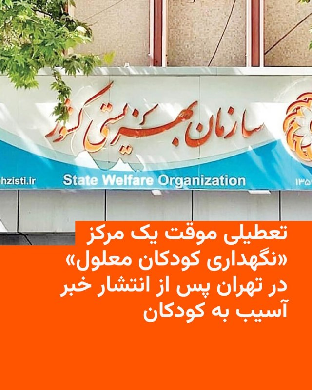

🔸رسانه‌های ایران از تعطیلی موقت یک مرکز نگهداری کودکان معلول در تهران به دلیل بدرفتاری با کودکان تحت پوشش این مرکز خبر دادند.

🔸خبرآنلاین روز جمعه هشتم خرداد گزارش داد که افشای سوختگی شدید یک کودک معلول و بستن دیگر کودکان به تخت منجر به تعطیلی موقت مرکز نگهداری کودکان معلول در تهران شده است.

🔸بنا بر این گزارش اوایل اردیبهشت ماه یکی از کودکان تحت پوشش یک مرکز بهزیستی در منطقه ۲۲ تهران، به دلیل سوختگی ناشی از آب داغ حمام به بیمارستان منتقل می‌شود، اما ترخیص زودهنگام و نحوه مراقبت از او در این مرکز منجر به «تشدید سوختگی، عفونت زخم‌ها و بستری شدن در آی.سی.یو» می‌شود.

🔸گزارش‌ها حاکی است، این کودک که «مرسانا» نام دارد و دچار معلولیت ذهنی است، توسط دو کارمند این مرکز که خود را مادر و خاله او معرفی کرده بودند، پیش از طی مراحل درمان از بیمارستان به مرکز بازگردانده شده بود.

🔸این کودک اما بار دیگر به دلیلی عفونت ناشی از شستشوی نواحی سوختگی با وسائل غیربهداشتی به بیمارستان منتقل می‌شود.

🔸خبرآنلاین در این گزارش به موارد دیگری از آزار کودکان از جمله بستن کودکان معلول به تخت نیز ااشاره کرده است.

@RadioFarda

## RadioFarda — post 157686

ارمنستان ظاهراً یک سامانهٔ پدافند هوایی ایرانی را در رژهٔ نظامی به نمایش گذاشت

🔸ارمنستان در رژه نظامی «روز جمهوری»، تجهیزاتی از جمله پرتابگرهای راکتی، پهپادها و خودروهای زرهی از کشورهایی مانند فرانسه و هند، و همچنین سامانه‌ای را به نمایش گذاشت که به نظر می‌رسد یک سامانهٔ پدافند هوایی ایرانی باشد.

🔸خرید تسلیحات از تهران در شرایطی که ارمنستان در حال نزدیک‌تر شدن به واشینگتن است، می‌تواند حساسیت‌برانگیز باشد، به‌ویژه آن‌که این رژه در ایروان تنها چند ساعت پس از آن برگزار شد که دونالد ترامپ، رئیس‌جمهور آمریکا، پیش از انتخابات پارلمانی هفتم ژوئن از نیکول پاشینیان، نخست‌وزیر ارمنستان، حمایت کرد.

🔸نخستین گزارش‌ها از مشاهده سامانهٔ «مجید ای‌دی-۸»، که یک سامانه پدافند هوایی کوتاه‌برد نصب‌شده روی کامیون است، در جریان تمرین‌های رژه در روز قبل منتشر شد. چندین رسانه ارمنی تصاویری از سامانه‌هایی منتشر کردند که به گفتهٔ آن‌ها «مجید» بودند و بخشی از آن‌ها پوشانده شده بود.

🔸بخش ارمنی رادیو اروپای آزاد/رادیو آزادی روز پنجشنبه هفتم خرداد همین سامانه‌ها را در حالی که بدون پوشش از میدان جمهوری عبور می‌کردند رصد کرد. با این حال، در میان مارش نظامی، گویندهٔ رسمی درباره منشأ آن‌ها با احتیاط سخن گفت.

🔸او گفت: «سامانهٔ موشکی زمین‌به‌هوای خودکششی کوتاه‌برد “اسکورپیون” برای شناسایی و انهدام هواگردهای در ارتفاع پایین، بالگردها و پهپادها، و نیز دفاع هوایی از تأسیسات حیاتی نظامی و صنعتی طراحی شده است».

🔸به نظر می‌رسد «اسکورپیون» نامی محلی است که مقامات ارمنی بر این سامانه گذاشته‌اند. به برخی سامانه‌های دیگر نیز نام‌های بومی داده شده بود؛ برای مثال، توپ‌های خودکششی فرانسوی «سزار» با نام «آرامازد»، برگرفته از یکی از خدایان اسطوره‌ای ارمنی، معرفی شدند.

🔸سخنگوی وزارت دفاع ارمنستان از تأیید یا رد منشأ ایرانی «اسکورپیون» خودداری کرد.

🔸اما سیروس عامریان، تحلیلگر امور نظامی مستقر در نیوزیلند، به رادیو فردا گفت که درباره منشأ این سامانه تردیدی وجود ندارد.

🔸نسخه کامل این گفت‌وگو را در وب‌سایت رادیوفردا بخوانید.

@RadioFarda

## RadioFarda — post 157685

ایران و آمریکا برای پایان جنگ «به توافق رسیده‌اند»؛ در انتظار تأیید دونالد ترامپ

🔸رسانه‌های آمریکایی به نقل از «منابع آگاه» از مذاکرات ایران و آمریکا می‌گویند که تهران و واشینگتن به «توافق اولیه» برای تمدید آتش‌بس و رفع محدودیت‌های کشتیرانی در تنگه هرمز دست یافته‌اند.

🔸خبرگزاری رویترز به نقل از این منابع آگاه آمریکایی که به نام آن‌ها اشاره‌ نکرده است، نوشته که دونالد ترامپ، رئیس‌جمهور آمریکا، هنوز این توافق را تأیید نکرده و رسانه‌های دولتی ایران نیز اعلام کرده‌اند که توافق نهایی نشده است.

🔸بر اساس این گزارش، این توافق روز پنج‌شنبه هفتم خرداد به‌دست آمده است.

🔸بر اساس اظهارات چهار منبع آگاه در گفت‌وگو با این خبرگزاری، این توافق، آتش‌بس را برای ۶۰ روز دیگر تمدید می‌کند و اجازه می‌دهد رفت‌وآمد کشتی‌ها در تنگه هرمز ادامه یابد، همزمان تیم‌های مذاکره‌کننده دوطرف بر سر مسائل دشواری مانند برنامه هسته‌ای ایران مذاکره می‌کنند.

🔸این منابع تأکید کرده‌اند که ترامپ هنوز این توافق را تأیید نکرده است. ایران نیز تاکنون درباره گزارش‌های مربوط به این توافق، که نخستین‌بار توسط وب‌سایت آکسیوس منتشر شد، اظهار نظر رسمی نکرده است.

🔸یک مقام آمریکایی به اکسیوس گفته بود که رئیس‌جمهور آمریکا به میانجی‌ها اطلاع داده که «می‌خواهد چند روز برای فکر کردن درباره آن زمان داشته باشد».

🔸جی‌دی ونس، معاون رئیس‌جمهور آمریکا، در همین رابطه به خبرنگاران در واشینگتن گفت: «هنوز به نتیجه نهایی نرسیده‌ایم، اما خیلی نزدیک هستیم و به تلاش ادامه می‌دهیم».

🔸او افزود: «نمی‌توانم تضمین کنم که حتماً به توافق می‌رسیم، اما در حال حاضر احساس خوبی نسبت به آن دارم.»

🔸شبکه خبری سی‌ان‌ان نیز به نقل از مقام‌های آمریکایی نوشته که روز پنج‌شنبه و در جریان مذاکرات میان ایالات متحده و ایران، یک توافق اولیه حاصل شده است.

🔸این شبکه نیز تأیید کرده که این توافق اولیه کماکان در انتظار امضا و تأیید دونالد ترامپ است و وضعیت منطقه همچنان پرتنش باقی مانده است.

🔸نسخه کامل این گزارش را در وب‌سایت رادیوفردا بخوانید.

@RadioFarda

## RadioFarda — post 157683

🔸کیهان کلهر، استاد شناخته شده موسیقی ایران شامگاه پنجشنبه اعلام کرد که در راستای حمایت از کسب‌وکارهای فرهنگی و هنری آسیب‌دیده از قطع اینترنت در ایران،‌ صفحه‌ اینستاگرام خود را به تبلیغات آنها اختصاص می‌دهد.

🔸این موسیقیدان برجسته ایرانی روز پنجشنبه هفتم خرداد با انتشار متنی در استوری اینستاگرام خود اعلام کرد که صفحه‌اش را به مدت ۸۸ روز - مطابق با تعداد روز قطع اینترنت در ایران- به «تبلیغ و حمایت از کسب‌وکار اهالی فرهنگ و هنر» که به گفته او در ماه‌های اخیر به دلیل قطع اینترنت دچار خسارت شده‌اند، اختصاص خواهد داد.

🔸او از هنرمندان و فعالان فرهنگی خواسته است پست‌های تبلیغی خود را برای انتشار ارسال کنند و تأکید کرده که صفحات با تعداد دنبال‌کنندگان کمتر، در اولویت معرفی قرار خواهند گرفت.

🔸کیهان کلهر تاکید کرده است که این فراخوان تنها شامل کسب‌وکارهای داخل ایران می‌شود و انتشار تبلیغ‌ها نیز صرفا بر اساس زمان دریافت پیام‌ها انجام خواهد شد.

🔸پیشتر افشین کلاهی، رئیس کمیسیون اقتصاد دانش‌بنیان اتاق بازرگانی ایران، خسارت مستقیم ناشی از اختلال اینترنت را روزانه ۳۰ تا ۴۰ میلیون دلار برآورد کرده بود.

@RadioFarda

## RadioFarda — post 157682

🔸یک موشک «نیو گلن» شرکت بلو اوریجین که بدون سرنشین بود، روز پنج‌شنبه هفتم خرداد در جریان یک آزمایش روی سکوی پرتابی در ایالت فلوریدا منفجر شد.

🔸این رویداد ضربه‌ای جدی به پروژه فضایی جف بزوس محسوب می‌شود، در حالی که این شرکت تلاش می‌کند فاصلهٔ خود را با اسپیس‌ایکسِ ایلان ماسک، که در آستانه عرضهٔ اولیه سهام است، کاهش دهد.

🔸ویدئویی که توسط «ناسا‌اسپیس‌فلایت» منتشر شد، که پرتاب‌ها از فلوریدا را به‌صورت زنده پخش می‌کند، نشان داد که موشک عظیم نیو گلن حدود ساعت ۹ شب به وقت شرق آمریکا (یک بامداد جمعه به وقت گرینویچ) روی سکو روشن می‌شود و سپس به یک گلوله آتش عظیم تبدیل می‌شود که شعله‌ها و دود غلیظ را به ارتفاع بالا می‌فرستد.

🔸این انفجار تازه‌ترین شکست در مسیر طولانی و پرتاخیر پروژهٔ نیو گلن است؛ موشکی که قرار است نقش کلیدی در انتقال فرودگرهای ماه و محموله‌ها در برنامه آرتمیس ناسا ایفا کند.

🔸نسخه کامل این گزارش را در وب‌سایت رادیوفردا بخوانید.

@RadioFarda

## RadioFarda — post 157681

  

🔸آمریکا اعلام کرد در حال انجام اقداماتی هماهنگ برای قطع دسترسی حکومت ایران به منابع مالی است که به گفته واشینگتن، موجب تقویت اقدامات تهاجمی منطقه‌ای و تروریسم جهانی می‌شوند.

🔸در همین راستا وزارت خارجه آمریکا روز پنج‌شنبه هفتم خرداد، چندین نهاد، فرد و کشتی را که «ستون فقرات اقتصاد غیرقانونی نفت ایران» نامیده، تحریم کرد.

🔸در بیانیه این وزارتخانه آمده که با این تحریم‌های تازه، آمریکا «به‌طور مستقیم شریان‌های مالی سپاه پاسداران انقلاب اسلامی و ساختار نظامی ایران را هدف قرار داده است.»

🔸در چارچوب این اقدامات، وزارت خارجه آمریکا هشت نهاد را تحریم و هشت کشتی را به عنوان اموال توقیف‌شده معرفی کرده است؛ این کشتی‌ها به‌دلیل مشارکت در حمل نفت یا محصولات پتروشیمی ایران هدف قرار گرفته‌اند. همچنین سه نهاد و یک فرد نیز در ارتباط با تجارت محصولات پتروشیمی با منشأ ایرانی تحریم شده‌اند.

🔸هم‌زمان، وزارت خزانه‌داری آمریکا نیز اعلام کرد که بازیگران کلیدی یک شبکه فروش نفت را تحریم کرده که ده‌ها میلیون بشکه نفت ایران به ارزش میلیاردها دلار را جابه‌جا کرده است.

@RadioFarda

## RadioFarda — post 157680

دیدگاه سیاستمداران و تحلیل‌گران اسرائیلی دربارۀ توافق احتمالی آمریکا و ایران

🔸توافق آمریکا- ایران هنوز نه به دار است و نه به بار. اما از حالا معلوم است که سرنوشت سیاسی بنیامین نتانیاهو، نخست‌وزیر اسرائیل، را در انتخابات پارلمانی اکتبر آینده رقم خواهد زد.

🔸در میانۀ موج گسترده انتقادهای داخلی از او به‌دلیل آنچه عدم موفقیتش در دستیابی به اهداف جنگ‌های سه سال اخیر در غزه، لبنان و ایران می‌خوانند، تنها معدودی از وزیران از جمله الی کوهن، وزیر انرژی که به حمایت حزب لیکود نیاز دارند، ادعا می‌کنند که توافق واشینگتن- تهران برای اسرائیل الزام‌آور نخواهد بود. ‌

🔸از سوی دیگر سیما شاین، مسئول پیشین میز ایران در موساد، به رادیو ارتش اسرائیل گفته که هر گونه توافق ایران با آمریکا، ایران برای اسرائیل هم الزام‌آور است.

🔸داوید بیتان، سیاستمدار بانفوذ حزب لیکود و رئیس کمیسیون اقتصادی کنست، این هفته خطاب به اسرائیلی‌های منتقدی که می‌گویند کشورشان در مذاکرات آمریکا- ایران دور زده شده، گفت چرا متوجه نمی‌شوید که «در موضوع هسته‌ای، نمی‌توانیم به تنهایی با ایران مقابله کنیم».

🔸آقای بیتان هم‌زمان در گفت‌وگویی رادیویی گفت مهم نیست در توافق واشینگتن با تهران چه نوشته شود. باید آماده باشیم که از این بعد هر یکی دو سال یک بار، جنگ با ایران داشته باشیم.

🔸روزنامۀ یدیعوت آحرونوت نوشته که بنیامین نتانیاهو در یازده سال گذشته، از زمان دستیابی آمریکا و پنج قدرت دیگر به توافق هسته‌ای موسوم به برجام با ایران، اصرار کرده بود که باید توافق بهتری شکل می‌گرفت.

🔸این روزنامه در ادامه این پرسش را مطرح می‌کند که آیا توافقی که در حال حاضر کاخ سفید آن را بدون مشورت اسرائیل تنظیم می‌کند، به راستی برای اسرائیل بهتر از برجام خواهد بود؟

🔸نسخه کامل این گزارش را در وب‌سایت رادیوفردا بخوانید.

@RadioFarda

## RadioFarda — post 157679

🔸تصاویر منتشر شده از جزیره هون یکی از جزایر حفاظت شده در دریاچه ارومیه بازگشت پرندگان به این جزیره را نشان می‌دهد.

🔸این تصاویر که با موسیقی منتشر شده، روز پنجم خرداد ثبت شده است.

🔸رضا رحمانی، دبیر کارگروه نجات دریاچه ارومیه روز سه‌شنبه ۲۲ اردیبهشت گفت کهه تراز دریاچه ارومیه به بالاترین سطح خود در ۶ سال گذشته رسیده و موجب احیای حیات دوباره آن و بازگشت پرندگان مهاجر شده است.

🔸بر اساس گزارش‌ها در پی بارش‌های اخیر وضعیت دریاچه ارومیه در مقایسه زمان‌های مشابه سال‌های گذشته بهتر شده است.

🔸کاوه مدنی، مدیر مؤسسه آب، محیط‌زیست و سلامت دانشگاه سازمان ملل، در هفته‌های گذشته با انتشار یک گزارش تصویری از وضعیت دریاچه ارومیه طی یک دهه گذشته گفته بود: «وضعیت دریاچه در فروردین امسال بهتر از چند سال اخیر است اما در صورت عدم تداوم بارندگی‌ها، با شروع فصل گرما، آب دریاچه دوباره تبخیر و دریاچه دوباره خشک خواهد شد.»

🔸کاهش تراز آبی و خشکی دریاچه ارومیه در سال‌های اخیر سبب نگرانی کارشناسان و فعالان محیط زیست شده و بحران محیط زیستی پیرامون دریاچه ایجاد کرده بود.

@RadioFarda

## RadioFarda — post 157678

  

🔸فرماندهی مرکزی آمریکا، سنتکام، روز جمعه هشتم خرداد این ادعای تلویزیون جمهوری اسلامی را رد کرد که گفته بود ایران یک هواپیمای آمریکایی را در نزدیکی بوشهر سرنگون کرده‌ است.

🔸به گفتهٔ سنتکام، هیچ هواپیمای آمریکایی سرنگون نشده است. تمام تجهیزات هوایی ایالات متحده تحت کنترل و قابل حسابرسی هستند.

🔸در پی انتشار گزارش‌هایی درباره شنیدن صدای انفجار و شلیک در جنوب ایران، رسانه‌های نزدیک به سپاه پاسداران شامگاه پنجشنبه از شلیک به سمت برخی شناورها در تنگه هرمز خبر دادند.

🔸برخی رسانه‌ها بامداد جمعه به نقل از مسعود تنگستانی، فرماندار جم، گزارش داده بودند که یک «هواگرد» آمریکایی در آسمان این شهرستان هدف قرار گرفته است.

@RadioFarda

## RadioFarda — post 157677

  

🔸وزارت دادگستری آمریکا علیه محمدباقر سعد داوود السعدی شهروند دوتابعیتی عراقی-ایرانی و عضو کتائب حزب‌الله کیفرخواستی هشت بندی صادر و او را به مشارکت در توطئه‌های تروریستی از جمله برنامه‌ریزی برای بمب‌گذاری در اروپا و آمریکا متهم کرد.

🔸مقام‌های آمریکا می‌گویند السعدی به عنوان مامور کتائب حزب‌الله و سپاه پاسداران فعالیت داشته و در نزدیک به ۲۰ حمله و تلاش برای حمله در سراسر اروپا و ایالات متحده دست داشته است.

🔸به گفته دادستان کل ایالات متحده «السعدی مستقیماً در عملیات تروریستی برای حمله به منافع ایالات متحده و اسرائیل در سراسر جهان دست داشته و با دیگران برای برنامه‌ریزی حملات مرگبار در خاک آمریکا همکاری کرده است.»

🔸تصاویر منتشر شده در شبکه‌های اجتماعی السعدی را در کنار قاسم سلیمانی فرمانده پیشین نیروی قدس سپاه نشان می‌دهد.

🔸وزارت دادگستری آمریکا اعلام کرد که او به تازگی در عراق بازداشت و به آمریکا منتقل شده است.

@RadioFarda

## RadioFarda — post 157676

  

🔸معاون رئیس‌جمهور آمریکا می‌گوید واشینگتن هنوز با ایران به توافق نهایی نرسیده است، اما طرف‌ها به آن نزدیک شده‌اند.

🔸جی‌دی ونس روز پنجشنبه هفتم خرداد به خبرنگاران گفت: «نمی‌توانم تضمین کنم که به توافق می‌رسیم، اما در حال حاضر احساس نسبتاً مثبتی دارم».

🔸به گفته منابعی که با سایت اکسیوس و خبرگزاری رویترز صحبت کرده‌اند، ایالات متحده و ایران روز پنج‌شنبه به توافقی دست یافتند تا آتش‌بس میان خود را تمدید کرده و محدودیت‌های مربوط به کشتیرانی در تنگه هرمز را لغو کنند؛ این توافق منوط به تأیید دونالد ترامپ، رئیس‌جمهور آمریکا، است.

🔸آقای ونس گفت در مذاکرات با تهران چند موضوع اختلافی وجود دارد، از جمله ذخایر اورانیوم غنی‌شدهٔ ایران و مسئلهٔ غنی‌سازی.

🔸او افزود: «دقیقاً نمی‌توان گفت رئیس‌جمهور چه زمانی یا حتی آیا یادداشت تفاهم را امضا خواهد کرد یا نه. ما بر سر چند نکته در متن همچنان در حال رفت‌وبرگشت هستیم».

🔸معاون رئیس‌جمهور آمریکا افزود ایالات متحده در موقعیتی است که می‌تواند برنامه هسته‌ای تهران را به‌طور قابل‌توجهی عقب بیندازد.

@RadioFarda

## RadioFarda — post 157675

  

🔸وزارت خزانه‌داری آمریکا اعلام کرد دور تازه‌ای از تحریم‌ها را علیه افراد، شرکت‌ها و کشتی‌های مرتبط با جمهوری اسلامی اعمال کرده است.

🔸براساس این بیانیه ۱۷ شرکت در کشورهای مختلف از جمله امارات متحده عربی، قطر، هند، سنگاپور،‌ هنگ کنگ و جزایر مارشال به دلیل همکاری با شبکه‌های مرتبط با جمهوری اسلامی و شرکت «سپهر انرژی جهان نمای پارس» تحریم شده‌اند.

🔸وزارت خزانه‌داری آمریکا همچنین هشت نفتکش و کشتی حمل و نقل با پرچم کشورهای مختلف را به فهرست تحریم‌ها اضافه و اعلام کرد که این اقدامات در راستای سیاست فشار حداکثری و مقابله با شبکه‌های دور زدن تحریم‌ها انجام شده است.

🔸در میان افراد تحریم شده نیز نام یک تبعه هند دیده می شود که به گفته آمریکا در شبکه تجارت نفت و پتروشیمی جمهوری اسلامی نقش داشته است.

@RadioFarda

## RadioFarda — post 157674

  <a href="https://t.me/radiofarda/157674" target="_blank">📎 Download file</a>

📻بشنوید: سرخط خبرها با رادیوفردا، هشتم خرداد ۱۴۰۵‌

@RadioFarda

## IranianMinds — post 21005

  

🔴پست نشریه اکونومیست:
طرفین درگیر ممکن است بیش از هر زمان دیگری به یک توافق نزدیک شده باشند، با این‌حال این توافق جامع نخواهد بود و جنگ را برای همیشه به پایان نخواهد رساند.
این نشریه در ادامه توضیح داد که چگونه ملاحظات و بازی‌های سیاسی عامل اصلی این پیام‌های ضدونقیض دو طرف می‌باشد.

@IranianMinds

## IranianMinds — post 21004

🔴این است عاقبت یاوه‌گویی جنایتکاران.

@IranianMinds

## IranianMinds — post 21003

  

رسایی تو کانال شخصی‌اش رسما به مجتبی خامنه ای تیکه پرونده
اومده نوشته چه کسانی شایسته رهبری هستند.

بعد آیه‌ ای از نوح نبی و پسرش به عنوان مثال آورده و گفته هرچند نوح آدم خوبی بود، اما پسرش خراب بودو اوکی نبود

کلا این بشر با همه مشکل داره از مردم ایران گرفته تا جمع خودیاشون

‏
@IranianMinds

## IranianMinds — post 21002

🔴 امروز روز ملی مشاورین املاکه. امروز دیگه میزنه @IranianMinds

## IranianMinds — post 21001

  

🔴 امروز روز ملی مشاورین املاکه.

امروز دیگه میزنه

@IranianMinds

## IranianMinds — post 21000

  <a href="telegram/content/IranianMinds_21000_1780052526.mp4" target="_blank">🎬 Download video</a>

👈پیت وزیر جنگ امریکا در جمع سربازان آمریکایی:

"همانطور که رئیس جمهور در جلسه کابینه گفت... ایران یا می‌تواند با یک توافق از طریق مذاکره، کار را به روش درست انجام دهد - یا می‌تواند با شخص من در سمت چپ معامله کند. که اتفاقاً من بودم - اما این من نیستم. شماها هستید."

@IranianMinda

## IranianMinds — post 20999

  <a href="https://t.me/IranianMinds/20999" target="_blank">📎 Download file</a>

سرور فوق العاده پرسرعت و قوی مخصوص اینستا و یوتیوب سرعت فضایی

متصل تمام اینترنت ها

آموزش اتصال در اندروید

آموزش اتصال در آیفون

حتما شیر بدید بقیه هم متصل شن لطفا دانلود سنگین هم نزنید ❤️‍🔥

@IranianMinds

## IranianMinds — post 20998

  <a href="telegram/content/IranianMinds_20998_1780052528.mp4" target="_blank">🎬 Download video</a>

ویدئویی که به تازگی منتشر شده
از لحظه اصابت موشک اسرائیلی به یه پایگاه نظامی تو جنگ ۴۰ روزه.

@IranianMinds

## IranianMinds — post 20997

  <a href="https://t.me/IranianMinds/20997" target="_blank">📎 Download file</a>

سرور فوق العاده پرسرعت و قوی مخصوص اینستا و یوتیوب سرعت فضایی مخصوص ایرانسل و مخابرات

آموزش اتصال در اندروید

آموزش اتصال در آیفون

حتما شیر بدید بقیه هم متصل شن لطفا دانلود سنگین هم نزنید ❤️‍🔥

@IranianMinds

## IranianMinds — post 20996

  

🔴کتاب قدرت مذاکره ی پرفسور عراقچی وزیر امورخارجه ی مقتدر کشورمون بعد درخواستای فراوان مردم ایران تخفیف براش در نظر گرفته شد و میتونید الان با قیمت کمتر بخونیدش و بعد از هر مذاکره جنگ به راه بندازید.

@IranianMinds

## IranianMinds — post 20995

🔴 ابراهیم عزیزی، رییس کمیسیون امنیت ملی مجلس، در مصاحبه با رسانه روسی اسپوتنیک گفت: «آمریکا در مذاکرات قابل اعتماد نبوده و اگر رفتار خود را تغییر ندهد، توافقی شکل نخواهد گرفت.»

@IranianMinds

## IranianMinds — post 20994

کسی اگر دامنه کلودفلر قدیمی داره بیاد پیوی روش کانفیگ بزنیم
هر دامنه ای باشه مشکلی نیست فقط باید قدیمی باشه داخل کلودفلر
هزینه هم بخواد میدم

@AmirrPower

## IranianMinds — post 20993

  <a href="telegram/content/IranianMinds_20993_1780052531.mp4" target="_blank">🎬 Download video</a>

🔴 فوری تایید شده :

گویا سید علی خامنه ای زندس و اولین سخنرانیش بعد از جنگ رو منتشر کرد

@IranianMinds

## IranianMinds — post 20992

شرمنده کردید اینترنت رو وصل کردید.
ما عادت نداریم به این‌همه امکانات.
حداقل به جاش برق رو قطع کنید

@IranianMinds

## IranianMinds — post 20991

🔴 جی دی ونس:

تا الآن به توافقی با ایران دست نیافته‌ایم اما بسیار نزدیک شده‌ایم.

@IranianMinds

## IranianMinds — post 20990

🔴 مقام ایرانی به وال استریت ژورنال: تهران نگرانه که اسرائیل، آمریکا رو از مذاکرات خارج کنه.

@IranianMinds

## IranianMinds — post 20989

  <a href="telegram/content/IranianMinds_20989_1780052531.mp4" target="_blank">🎬 Download video</a>

🔴 تو‌ روز روشن تو صداوسیما دنیارو تهدید به عملیات های تروریستی میکنن

خوش چشم کارشناس صداوسیما :

دیگه دوران بمب های هسته ای گذشته اینکارارو راحت میتونن بفهمن کار کی بوده ، الان تایم جنگ های میکروبی و بیولوژیکیه کسیم نمیفهمه کار کی بوده.

@IranianMinds

## IranianMinds — post 20988

  <a href="telegram/content/IranianMinds_20988_1780052532.webm" target="_blank">🎬 Download video</a>

🚨 اگر همین الان توی سایت #وینرو عضو بشی 
🤩
🤩
🤩 هزار تومان شارژ رایگان میگیری
❕

✅ من خودم عضو شدم بدون واریز ۵۰۰ تومان گرفتم باهاش فوتبال پیش بینی کردم پولم شد ۲ میلیون 
❕

💚خیلی راحت هم برداشت کردم کل پولم رو 
💵

💳 پرداخت مستقیم و سریع بدون واسطه، بدون دردسر، واریز و برداشت در سریع‌ترین زمان ممکن

🔴این فرصت محدود رو از دست ندید:

🌐 Winro.io

🌐 Winro.io
کانال بونوس های رایگان a7

📱 @winro_io

## IranianMinds — post 20987

@IranianMindsGroup

ایدی گروه کامنتا ( تو کامنتا خیلی درخواست داده بودید )

## IranianMinds — post 20985

این تخم‌ حرومارو خب چرا تو برنامه ای که اربابات فیلتر کردن میپلکی پس؟

@IranianMinds

## BBCPersian — post 282333

  <a href="telegram/content/BBCPersian_282333_1780052533.mp4" target="_blank">🎬 Download video</a>

🔻مجسمه‌ لیونل مسی، با ارتفاع ۲۱ متر که در کلکته هند برپا شده، قرار است پایین آورده شود.

این تصمیم پس از آن گرفته شد که مهندسان اعلام کردند این مجسمه در برابر وزش باد تکان می‌خورد و «به‌طور خطرناکی ناپایدار است.»

شکایت و پی‌گیری ساکنان محلی هم باعث شد که مقام‌ها دستور دهند مجسمه فورا پایین آورده شود.

این اثر دی‌ماه پارسال و همزمان با تور «بزرگ‌ترین بازیکن تمام دوران» مسی در هند رونمایی شده بود، با این‌حال از نظر سازه‌ای ناایمن تشخیص داده شده است.
@BBCPersian

## BBCPersian — post 282332

🔻دستور پزشکیان برای تسریع تامین کالاهای اساسی و دارو در همکاری با پاکستان، روسیه، چین و جمهوری آذربایجان

🔻مسعود پزشکیان در جلسه با وزرای اقتصادی دولت ایران دستوراتی را برای تسریع تامین کالاهای اساسی و دارو صادر کرده است.

رئیس جمهور ایران در این جلسه بر توسعه کریدورهای جایگزین تجاری از طریق بنادر شمالی و کشورهای همسایه و متحدان ایران تاکید کرده است.

پاکستان، روسیه و جمهوری آذربایجان سه کشوری هستند که آقای پزشکیان برای تامین و واردات برخی اقلام مورد نیاز ایران، خواستار تسریع در اجرای توافق‌ها با این کشورها شده است.

در این جلسه همچنین مصوب شده است که امکان «واردات دارو و برخی اقلام حیاتی از طریق مسیرهای ریلی از چین» بررسی شود.

رئیس جمهور ایران، وزارت کشاورزی را هم مامور کرده است تا آثار احتمالی ناشی از محاصره دریایی ایران بر قیمت کالاهای اساسی و دارو را به حداقل ممکن برساند.

با آغاز محاصره دریایی آب‌های جنوبی ایران از سوی آمریکا، نگرانی‌ها از تامین کالاهای اساسی و دارو در ایران افزایش یافته است.

بندر امام خمینی و برخی دیگر از بنادر در جنوب ایران، اصلی‌ترین منبع ورود کالاهای وارداتی و اساسی به این کشور بود.

https://trib.al/5TRpSg0
@BBCPersian

## BBCPersian — post 282331

  

‌🔸تیم نوجوانان ایران با کسب شش طلا قهرمان زودهنگام مسابقات کشتی فرنگی نوجوانان آسیا در ویتنام شد.

روز پنجشنبه رقابت‌ها در هفت وزن برگزار شد و تیم ایران در شش وزن مدال طلا گرفت.

این بازی‌ها در شهر دانانگ کشور ویتنام برگزار می‌شود.

آرمین اسماعیلی در وزن ۴۵ کیلوگرم، علی اسماعیلی در وزن ۴۸ کیلوگرم، وحید عشیری در وزن ۵۵ کیلوگرم، امیررضا طهماسب پور در وزن ۶۰ کیلوگرم، امیررضا مهری در وزن ۹۲ کیلوگرم و علی اکبر آکو در وزن ۱۱۰ کیلوگرم، کشتی‌گیران ایرانی بودند که مدال طلا دریافت کردند.

مسابقات وزن پایانی این رقابت‎‌ها امروز برگزار می‌شود

📷IRNA
https://trib.al/BlLVnzq

@BBCPersian

## BBCPersian — post 282330

🔻وزارت خارجه ایران: سکوت نهادهای بین‌المللی باعث جری شدن بیشتر اسرائیل می‌شود

🔻اسماعیل بقایی، سخنگوی وزارت خارجه ایران تشدید حملات اسرائیل به مناطق مختلف لبنان از جمله بیروت، پایتخت این کشور را محکوم کرده است.

آقای بقایی گفته است «سکوت و بی‌تفاوتی نهادهای بین‌المللی» باعث «جری‌شدن بیشتر» اسرائیل می‌شود.

سخنگوی وزارت خارجه ایران همچنین آمریکا را «همدست و شریک همه جنایات» اسرائیل در لبنان، اراضی فلسطینی و کل منطقه توصیف کرده است.

با تشدید حملات نظامی اسرائیل طی روزهای اخیر، ده‌ها نفر در لبنان کشته شده‌اند.

اسرائیل گفته است هدف این کشور از این حملات، حزب‌اللهِ لبنان است.

ارتش اسرائیل همچنین از ساکنان حدود یک‌هشتم خاک لبنان خواسته است تا خانه‌هایشان را به سمت مناطق شمالی‌تر ترک کنند.

https://trib.al/4oYd4hT
@BBCPersian

## BBCPersian — post 282329

  

‌🔻مسعود پزشکیان، رئیس‌جمهور ایران، در پستی در شبکه اجتماعی ایکس از تماس تلفنی با شهباز شریف، نخست وزیر پاکستان خبر داد و گفت از تلاش‌های «موثر» پاکستان برای رسیدن به توافق قدردانی کرده است.

آقای پزشکیان در این پست نوشته است برای تبریک عید قربان با نخست وزیران مالزی و پاکستان تماس گرفته است. او نوشت که در این تماس «با تاکید بر پایبندی ایران به دیپلماسی، از مواضع انسانی مالزی و از ابتکار عمل و تلاش‌های موثر پاکستان برای رسیدن به توافق تشکر کردم.»

پاکستان میانجی اصلی مذاکرات ایران و آمریکا بر پایان دادن به جنگ است.

به گفته آقای پزشکیان، «سیاست ایران گسترش همکاری با کشورهای مسلمان و همسایه در همه زمینه‌هاست.»

این اظهارات آقای پزشکیان در حالی بیان می‌شود که جی دی ونس، معاون رئيس جمهوری آمريکا ایران و آمریکا به توافق «خیلی نزدیک» شده‌اند اما هنوز «نهایی نشده» است.

📷Reuters
https://trib.al/RhFFr0t

@BBCPersian

## BBCPersian — post 282328

🔻پیت هگست سخنران اصلی کنفرانس امنیتی شانگری‌لا

🔻پیت هگست، وزیر دفاع آمریکا، از سخنرانان اصلی نشست دفاعی و امنیتی شانگری‌لا در سنگاپور خواهد بود. با این حال گمان می‌رود مقام‌های ارشد چین در این نشست شرکت نکنند.

این در حالی است که اختلاف آمریکا و چین بر سر تایوان و همچنین جنگ با ایران بر این نشست سایه انداخته است.

بنابر گزارش خبرگزاری فرانسه، این دومین سال پیاپی است که وزیر دفاع چین در «گفت‌وگوی شانگری‌لا» در سنگاپور شرکت نخواهد کرد، اقدامی که برخی کارشناسان آن را نشانه‌ای از افزایش قدرت و اعتمادبه‌نفس چین ارزیابی کرده‌اند.

گفته شده مقام‌های ارشد حدود ۴۵ کشور در این نشست شرکت خواهند کرد.

شانگری‌لا در گذشته نشستی برای بحث‌های سیاسی و همچنین گفت‌وگوهای دیپلماتیک، پشت‌پرده و سطح بالا بوده است.

غیبت دنگ جون، وزیر دفاع چین عملا به این معناست که دیداری میان او و آقای هگست برنامه‌ریزی نشده است.

https://trib.al/ApOfpZW
@BBCPersian

## BBCPersian — post 282319

🔻رئیس‌جمهور آمریکا، دونالد ترامپ، از «همه کشورها» خواسته است «فورا توافق‌های ابراهیم را امضا کنند»؛ اقدامی که ممکن است به‌عنوان یکی از شروط دستیابی به توافق صلح با ایران مطرح شود.

توافق‌نامه ابراهیم مجموعه‌ای از توافق‌ها برای عادی‌سازی روابط دیپلماتیک میان اسرائیل و چند کشور عربی است که در سال ۲۰۲۰ و در دوره نخست ریاست‌جمهوری آقای ترامپ امضا شد.

دونالد ترامپ در پیامی در شبکه اجتماعی تروث سوشال نوشت: «من به‌طور الزامی درخواست می‌کنم که همه کشورها فورا توافق‌نامه ابراهیم را امضا کنند و اگر ایران توافق خود را با من، به‌عنوان رئیس‌جمهور ایالات متحده آمریکا امضا کند، باعث افتخار خواهد بود که آن‌ها نیز بخشی از این ائتلاف بی‌نظیر جهانی باشند.»

این پیام پس از تماس تلفنی آقای ترامپ با رهبران عربستان سعودی، امارات متحده عربی، قطر، پاکستان، ترکیه، اردن، بحرین و مصر منتشر شد.

لینک خبر کامل:
https://bbc.in/4ofkPYd
📸GettyImages/ Reuters/ Bloomberg via Getty Images/ EPA/ Universal Images Group via Getty Images/ AFP via Getty Images

@BBCPersian

## BBCPersian — post 282318

  <a href="https://t.me/bbcpersian/282318" target="_blank">📎 Download file</a>

🔻این هفته در پرگار: گرایش سیاسی ما چگونه شکل می‌گیرد؟

🔻عقاید سیاسی ما چگونه شکل می‌گیرند؟ چطور تغییرمی‌کنند؟ چرا دیگرانی که تا دیروز همفکر می‌پنداشتیم را ممکن است امروز ناقص‌العقل بنامیم؟ آنها ما را چطور می‌بینند؟

میهمان‌ها:
پویا قدوسی، استاد جغرافیای انسانی
مانی منجمی، روان‌پزشک

@BBCPersian

## BBCPersian — post 282317

🔻نخست‌وزیر لبنان: هیچ چیز حملات اسرائیل و تخلیه گسترده جنوب کشور را توجیه نمی‌کند

🔻نواف سلام، نخست‌وزیر لبنان، گفته است هیچ چیز حملات اسرائیل و هشدارهای تخلیه گسترده در جنوب این کشور را توجیه نمی‌کند.

او گفته است اقدامات اسرائیل، از جمله تخریب بناهای تاریخی، مصداق «مجازات جمعی» است، اقدامی که به گفته او در تمام قواعد و قوانین بین‌المللی حاکم بر جنگ‌ها، انجام آن محکوم شده است.

در روزهای اخیر، با گسترش عملیات نظامی اسرائیل ده‌ها نفر در لبنان کشته شده‌اند.

حملات اسرائیل روز پنجشنبه به بیروت پایتخت لبنان هم کشید.

اسرائیل می‌گوید هدفش، حزب‌اللهِ لبنان است.

ارتش اسرائیل همچنین از ساکنان حدود یک‌هشتم خاک لبنان خواسته است تا خانه‌هایشان را به سمت مناطق شمالی‌تر ترک کنند.

https://bbc.in/4ef8C15
@BBCPersian

## BBCPersian — post 282308

🖊نوربرتو پاردس
بی‌بی‌سی موندو

🔻رید برودی، ۷۲ ساله و ساکن نیویورک، از همان سال‌های جوانی آموخت که عدالت تنها یک آرمان نیست، بلکه مبارزه‌ای جسورانه و مداوم علیه فراموشی است.

او که در سال ۱۹۵۳ در نیویورک به دنیا آمد، فرزند خانواده‌ای یهودی بود که از نازیسم جان سالم به در برده بودند. خانواده او از اردوگاه‌های کار اجباری گریختند و بعدها در آزادسازی بوداپست نقش داشتند. همین پیشینه باعث شد از کودکی با این باور بزرگ شود که جنایت‌هایی با چنین ابعادی نباید بی‌پاسخ بمانند.

دهه‌ها بعد، همین باور او را به یکی از بانفوذترین وکلای حقوق بشر در جهان تبدیل کرد و لقب «شکارچی دیکتاتورها» را گرفت.

او از آمریکای لاتین تا آفریقا، در کنار قربانیان ایستاده، روایت‌های دفن‌شده را بازسازی کرده و به محاکمه رهبرانی کمک کرده که سال‌ها دست‌نیافتنی به نظر می‌رسیدند.

متن کامل خبر را از لینک زیر بخوانید:

https://bbc.in/4dCT8ER

📷GettyImages/ Isabel Coixet/ Courtesy of Reed Brody/ AFP via Getty Images/ Star Max/GC Images

@BBCPersian

## idfinfarsi — post 11658

در یک حمله دقیق برای رفع یک تهدید فوری در شمال نوار غزه: ارتش اسرائیل و شاباک جانشین فرمانده تیپ شهر غزه در شاخه نظامی سازمان تروریستی حماس را به هلاکت رساندند

نیروهای ارتش اسرائیل و شاباک، دو روز پیش (چهارشنبه) تروریست عماد حسن حسین اسلیم، جانشین فرمانده تیپ شهر غزه و فرمانده گردان زیتون در شاخه نظامی این سازمان را هدف قرار داده و به هلاکت رساندند؛ فردی که فرماندهی یورش به خاک اسرائیل در کشتار ۷ اکتبر را بر عهده داشت.

در سال‌های اخیر و به‌ویژه در دوره اخیر، این تروریست ده‌ها طرح تروریستی علیه نیروهای ارتش اسرائیل در نوار غزه را پیش برده بود و از این رو تهدیدی فوری محسوب می‌شد.

در زیرساختی که مورد حمله قرار گرفت، یک فرمانده دیگر از سازمان تروریستی حماس نیز حضور داشت؛ نتایج این حمله در دست بررسی است.

نیروهای ارتش اسرائیل تحت فرماندهی جنوب در منطقه مطابق توافق مستقر هستند و به فعالیت برای رفع هرگونه تهدید فوری ادامه خواهند داد.

## Dirty_Kids — post 390461

  

عجیب‌ترین خبر بعد از وصل شدن اینترنت، بازی کردن نیکلاس کیج در نقش اسپایدرمن بود.

@Dirty_Kids 👻

## Dirty_Kids — post 390457

هروقت بهتون گفتن «چطور قدیما کسی اوتیسم‌ نداشته؟» بهشون بگید یک بابایی به اسم عبدالکریم بین محمد الرافعی‌ القزوینی در قرن هفتم نشسته ۵۰۰ صفحه شرح‌حال‌ از آدم‌هایی که در قزوین بودند و اسمشون محمد بوده نوشته و برمبنای حرف اول اسم باباشون دسته بندی کرده!

@Dirty_Kids 👻

## Dirty_Kids — post 390456

  <a href="telegram/content/Dirty_Kids_390456_1780052536.webm" target="_blank">🎬 Download video</a>

🆕 اپلیکیشن MelBet 
✅

🎁 کد هدیه 100 دلاری: Sport100

🌀 کاملترین برنامه موبایل

🤝 اسپانسر رسمی لالیگا

🥇صرافی معتبر

🌐 ربات راهنما

🇮🇷 برای تغییر زبان برنامه، زبان موبایل خود را تغییر دهید.

✅ ورود به اپلیکیشن بدون فیلترشکن

## Dirty_Kids — post 390455

⚠️ خیلیا نمیدونن که اگه ثبت‌نامشون رو با لینک زیر انجام بدن... 
⁉️

💥 بونوس خوش‌آمد گویی تا %220 بیشتر میگیرن!
فقط کافیه به لینک زیر مراجعه کنید و وارد ملبت بشید و به راحتی ثبتنام کنید! 👌

🌐 لینک بدون فیلتر سایت معتبر ملبت 👇

🌐 www.MelBet1.com

🎁 بعد از ثبتنام، وارد حسابت شو و توی بخش "بونوس‌ها" فعالش کن 
🎚️

نکته: فقط این هفته فعاله، پس از دستش نده 
🙂

🎁 کد هدیه 100 دلاری فراموش نشه: Sport100

✅ معرفی سایت و اپلیکیشن مل‌بت

💯 ورود به سایت مل‌بت (بدون فیلترشکن)

## Dirty_Kids — post 390454

  

رسانه‌های حکومتی از برگزاری مراسم برای خونواده‌ی موشعلی در شابدل‌عظیم‌حسنی نوشتن

این مراسم دیشب در حالی برگزار شده که خب موشتبا رو بعد از ۹۰ روز همه دیگه قبول کردیم که AIیی بیش نیست،

اما در این بین هیچ کیرمغز رافضی پیدا نمی‌شه از خودش بپرسه مصطفی، مسعود و میثم،
سه موشعلی‌بچه‌ی قرمساق دیگه‌ش کجان؟

@Dirty_Kids 👻

## Dirty_Kids — post 390453

  <a href="telegram/content/Dirty_Kids_390453_1780052537.mp4" target="_blank">🎬 Download video</a>

ویدئویی جدید از لحظه اصابت بمب اسرائیلی به یه پایگاه نظامی تو جنگ ۴۰ روزه:

@Dirty_Kids 👻

## Dirty_Kids — post 390452

  <a href="telegram/content/Dirty_Kids_390452_1780052538.mp4" target="_blank">🎬 Download video</a>

🔴 فیلم وایرال شده از سه تا پسر که داشتن راه خودشونو میرفتن که یه دفعه یکیشون...

+ پسرا عالین، یارو بگا میرفته بلند شده میخنده😂

@Dirty_Kids 👻

## Dirty_Kids — post 390451

  

🔴 جفت کنین، حمید رسایی تیتر زده چه کسانی شایسته رهبری ان؟

بعد زیرش داستان حضرت نوح رو نوشته که پسرش ناشایست از آب دراومد!خیلی مستقیم گفته مجتبی نالایقه برای رهبری😂

@Dirty_Kids 👻

## Dirty_Kids — post 390450

  

تا فعال سازی محصولات نرمال گیگی 10 هزار تومانی قیمت سرویس های اضطراری به گیگی 50 هزار تومان کاهش پیدا کرد
🚀

🎁 کد تخفیف خرید اول دوباره ریست شد و همه میتونن ازش استفاده کنن:
BadBanOFF

💸 با این کد، 50 هزار تومان تخفیف روی اولین خریدت بگیر!

🔥و مهم‌تر از همه...
سیستم معرفی بادبان فعال‌تر از همیشه‌ست!
از تمام خریدهای کاربرانی که معرفی میکنی، 10% خریدشون رو پورسانت دائمی دریافت کن و موجودی کیف پولت رو افزایش بده 
💼

وقتی بادبان داری، هیچ بادی مانع نیست… حتی وقتی اینترنت ملیه
⛵️
R8

🛡@BadBan_VPN | کانال 

🤖@BadBan_VPNBot | ربات 

📞@BadBan_VPNSupport | پشتیبانی

## Dirty_Kids — post 390449

  <a href="telegram/content/Dirty_Kids_390449_1780052540.mp4" target="_blank">🎬 Download video</a>

قیاسی رفته کنسرت کینگ‌رام
سیاوش اردلان پست کرده نوشته تهران واقعی اینجاس همه درحال شادی

@Dirty_Kids 👻

## Dirty_Kids — post 390447

  

کاشکی نت این وصل نمیشد

@Dirty_Kids 👻

## Dirty_Kids — post 390445

  <a href="telegram/content/Dirty_Kids_390445_1780052542.mp4" target="_blank">🎬 Download video</a>

لعنت به جمهوری اسهالی که شرایطی به وجود آورده که من نتونم زن بگیرم ظرف شستنش رو ببینم

#نه_به_ماشین‌ظرفشویی

@Dirty_Kids 👻

## Dirty_Kids — post 390444

طولانی‌ترین قطعی اینترنت در عصر معاصر
بزرگترین قتل‌عام معترضان در تاریخ معاصر
یکی از بالاترین نرخ‌های تورم در جهان
یکی از بی‌ارزش‌ترین پول‌های جهان
یکی از کم اعتبارترین پاسپورت‌های جهان

دستاوردهای گنده‌ گوزترین حکومت جهان...

@Dirty_Kids 👻

## Dirty_Kids — post 390443

  

بنده در حال ورود به سوشال مدیا با jump jump vpn:

@Dirty_Kids 👻

## Dirty_Kids — post 390442

  <a href="telegram/content/Dirty_Kids_390442_1780052543.mp4" target="_blank">🎬 Download video</a>

یکی از نفس‌گیر ترین ویدیوهای جنگ!
چه گزارشی می‌کنه طرف!
مکان یه جایی تو خیابون شریعتی!

@Dirty_Kids 👻

## Dirty_Kids — post 390441

  <a href="telegram/content/Dirty_Kids_390441_1780052544.webm" target="_blank">🎬 Download video</a>

☢️خفن ترین و‌ قدیمی ترین  انالیزور  ایران ینی دکتر بت 
👍 
🔴مسابقات جذاب جام جهانی به زودی شروع میشه بیا توی کانال دکتر بت و باهاش همراه شو و پول در بیار
💵 رایگان بهترین شرط هارو براتون میذاره حتی هزار تومن هم دریافت نمیکنه روزانه میتونی از پیش بینی فوتبال باهاش…

## Dirty_Kids — post 390440

  <a href="telegram/content/Dirty_Kids_390440_1780052545.webm" target="_blank">🎬 Download video</a>

☢️خفن ترین و‌ قدیمی ترین  انالیزور  ایران ینی دکتر بت 
👍

🔴مسابقات جذاب جام جهانی به زودی شروع میشه بیا توی کانال دکتر بت و باهاش همراه شو و پول در بیار
💵

رایگان بهترین شرط هارو براتون میذاره
حتی هزار تومن هم دریافت نمیکنه
روزانه میتونی از پیش بینی فوتبال باهاش پول در بیاری 👌
A7

🌟اگ اهل پیش بینی فوتبالی این کانال اصلا از دست ندین
👇

✅https://t.me/+4_ADqwB9e-QwYjlk

✅https://t.me/+4_ADqwB9e-QwYjlk

## Hranews — post 113220

آثار سوختگی و بستن کودکان به تخت؛ مرکز نگهداری کودکان دارای معلولیت تعطیل شد

❗️
❗️
❗️
❗️
❗️– به‌ دنبال انتشار گزارشی مبنی بر سوختگی شدید یک کودک ۱۱ ساله و بستن دیگر #کودکان به تخت در یک مرکز نگهداری کودکان معلول در تهران، این مرکز به صورت موقت تعطیل شد. بنابر اعلام روابط عمومی سازمان بهزیستی، علیه این مرکز به دلیل اهمال‌ در انجام وظیفه، پنهان‌کاری و فاقد صلاحیت بودن برخی از پرسنل، اقدام قضایی صورت گرفته است.

ادامه مطلب

↘️
@hranews_bot تماس ✉️ - @Hranews کانال هرانا 🆑

## Hranews — post 113219

  

نهاله شهیدی یزدی، شهروند بهائی جهت اجرای حکم حبس احضار شد

❗️
❗️
❗️
❗️
❗️– نهاله شهیدی یزدی، شهروند #بهائی ساکن کرج، با دریافت ابلاغیه‌ای جهت اجرای حکم حبس به شعبه اجرای احکام دادگاه انقلاب کرمان احضار شد.

به گزارش خبرگزاری هرانا، ارگان خبری مجموعه فعالان حقوق بشر در ایران، نهاله شهیدی یزدی، شهروند بهائی احضار شد.

بر اساس اطلاعات دریافتی هرانا، شعبه اجرای احکام دادگاه انقلاب کرمان ابلاغیه ای برای خانم شهیدی یزدی صادر کرده است. در این ابلاغیه از وی خواسته شده، در تاریخ ۱۲ خردادماه، جهت اجرای حکم شش سال حبس خود در این شعبه قضایی حاضر شود.
لازم به ذکر است؛ علی‌رغم درخواست دادگاه از وکیل نهاله شهیدی یزدی برای مراجعه و رویت رای، نسخه‌ای از حکم در اختیار وی قرار نگرفت. متعاقبا، درخواست اعاده دادرسی او در دیوان عالی کشور به دلیل عدم ضمیمه شدن رای دادگاه تجدیدنظر مورد پذیرش واقع نشد. این در حالی است که با وجود پیگیری‌های بعدی توسط وکیل دیگر وی، دادگاه از تحویل نسخه رای خودداری کرده و صرفا امکان رویت آن را، بدون اجازه یادداشت‌برداری، تصویربرداری یا دریافت رونوشت، فراهم کرده است؛ امری که عملا امکان طرح و پیگیری درخواست اعاده دادرسی را از وی سلب کرده است.

#نهاله_شهیدی_یزدی

ادامه مطلب

↘️
@hranews_bot تماس ✉️ - @Hranews کانال هرانا 🆑

## Hranews — post 113218

به دلیل استفاده از اینترنت استارلینک؛ تشکیل پرونده قضایی برای ۴۰ شهروند در شمیرانات

❗️
❗️
❗️
❗️
❗️– فرمانده ناحیه بسیج الغدیر بخش لواسان و رودبار قصران شمیرانات اعلام کرد که از ابتدای فروردین ماه تاکنون، ۴۰ دستگاه اینترنت ماهواره‌ای استارلینک در این شهرستان کشف و برای صاحبان آنها پرونده قضایی تشکیل شده است.

ادامه مطلب

↘️
@hranews_bot تماس ✉️ - @Hranews کانال هرانا 🆑

## Hranews — post 113217

گزارشی از بازداشت حمیرا و شلیر امین‌پور در بوکان

❗️
❗️
❗️
❗️
❗️– حمیرا امین‌پور و شلیر امین‌پور، دو خواهر ساکن شهرستان بوکان، روز چهارشنبه ۶ خردادماه، توسط نیروهای امنیتی بازداشت و به مکان نامعلومی منتقل شدند.

#حمیرا_امین‌پور #شلیر_امین‌پور

ادامه مطلب

↘️
@hranews_bot تماس ✉️ - @Hranews کانال هرانا 🆑

## alonews — post 123481

  <a href="telegram/content/alonews_123481_1780052546.webm" target="_blank">🎬 Download video</a>

👈سی‌ان‌ان: ایران با سرعت بسیار بالا داره توان موشکی خودش رو بازسازی میکنه

✅ @AloNews خبر جنگ

## alonews — post 123480

  <a href="telegram/content/alonews_123480_1780052546.webm" target="_blank">🎬 Download video</a>

👈سیتنا: سهم IPV6 در اینترنت ایران همچنان نزدیک به صفر؛ بازگشت کامل به IPv4 فشار بر شبکه را افزایش داده است

🔴بررسی داده‌های شبکه طی ۴۸ ساعت اخیر نشان می‌دهد سهم IPv6 در ترافیک اینترنت ایران همچنان بدون تغییر محسوس در محدوده نزدیک به صفر باقی مانده است؛ وضعیتی که به گفته کارشناسان، فشار مضاعفی بر زیرساخت IPv4 و سامانه‌های NAT وارد کرده و مانعی جدی برای رسیدن شبکه اینترنت کشور به پایداری کامل محسوب می‌شود

✅ @AloNews خبر جنگ

## alonews — post 123479

  <a href="telegram/content/alonews_123479_1780052546.webm" target="_blank">🎬 Download video</a>

👈واشنگتن تایمز: سیستم جدید یوتیوب برای شناسایی هوش مصنوعی؛ اعمال خودکار برچسب روی ویدیوهای افشانشده

🔴طبق گزارش واشنگتن تایمز، از این پس از سازندگان ویدیو در یوتیوب خواسته می‌شود تا در طول فرآیند آپلود، استفاده یا عدم استفاده از هوش مصنوعی در تولید محتوای خود را مشخص کنند.

🔴بر اساس این سیستم جدید، اگر یوتیوب استفاده از هوش مصنوعی را در ویدیویی تشخیص دهد که سازنده آن را فاش نکرده است، پلتفرم به طور خودکار برچسب مربوطه را روی ویدیو اعمال خواهد کرد.

✅ @AloNews خبر جنگ

## alonews — post 123478

  <a href="telegram/content/alonews_123478_1780052546.webm" target="_blank">🎬 Download video</a>

⚫
🏆 به دنیای هیجان‌انگیز فوتبال خوش اومدی!

⭐️اینجا قراره باهم لحظه‌به‌لحظه‌ی جام جهانی رو زندگی کنیم؛
از بازی‌های حساس و نتایج داغ گرفته تا حاشیه‌ها، کری‌خونی‌ها و اتفاقاتی که همه درباره‌ش حرف میزنن! 
🔥
🔥

✅ پوشش کامل مسابقات

💀 ترول تیم‌ها و بازیکن‌ها

🎥 ویدیوها و لحظه‌های فان فوتبالی

📊 آمار، ترکیب‌ها و اخبار فوری

🌍 حواشی جذاب از سراسر جام جهانی

📢اینجا فقط یک کانال خبری نیست؛
یک جمع فوتبالیه برای کسایی که فوتبال رو با هیجان، شوخی و احساس واقعی دنبال میکنن 
📛
💟

🆘
🔞 آماده باش چون قراره جام جهانی رو متفاوت تجربه کنیم!

⚡ @Vaarzesh_Plus

⚡ @Vaarzesh_Plus

## alonews — post 123477

  <a href="telegram/content/alonews_123477_1780052547.webm" target="_blank">🎬 Download video</a>

👈 حمله هوایی اسرائیل به شهر یوه‌مور الشافیق در جنوب لبنان هدف قرار گرفت.

✅ @AloNews خبر جنگ

## alonews — post 123476

  <a href="telegram/content/alonews_123476_1780052547.webm" target="_blank">🎬 Download video</a>

👈سخنگوی کمیسیون امنیت ملی: به قدرت ایرانی‌ها تعظیم کنید

✅ @AloNews خبر جنگ

## alonews — post 123475

  <a href="telegram/content/alonews_123475_1780052547.mp4" target="_blank">🎬 Download video</a>

👈کشتی‌ها در بخش عمان تنگهٔ هرمز، یکی پس از دیگری لنگر انداختند

✅ @AloNews خبر جنگ

## alonews — post 123474

  <a href="telegram/content/alonews_123474_1780052549.webm" target="_blank">🎬 Download video</a>

👈بر اساس تحلیل نشریه اکونومیست، طرفین درگیر ممکن است بیش از هر زمان دیگری به یک توافق نزدیک شده باشند.

🔴با این حال، این توافق جامع نخواهد بود و جنگ را برای همیشه پایان نخواهد داد.

🔴 این نشریه در ادامه توضیح می‌دهد که چگونه ملاحظات و بازی‌های سیاسی، عامل اصلی ارسال این پیام‌های ضدونقیض از سوی طرفین است

✅ @AloNews خبر جنگ

## alonews — post 123473

  <a href="telegram/content/alonews_123473_1780052549.webm" target="_blank">🎬 Download video</a>

👈 کلش ریپورت به نقل از وال استریت ژورنال: وسواس شخصی پوتین؛ راه‌اندازی پروژه ۲۶ میلیارد دلاری برای افزایش طول عمر و مبارزه با پیری

🔴طبق گزارش وال‌استریت ژورنال، ولادیمیر پوتین یک طرح ۲۶ میلیارد دلاری با حمایت دولت را برای تحقیق در زمینه افزایش طول عمر آغاز کرده است که گفته می‌شود ناشی از وسواس شخصی او با مسئله پیری است.

🔴 این پروژه کلان شامل حوزه‌های پیشرفته و جنجالی مانند چاپ زیستی اندام‌ها، پرورش اندام‌های انسانی در بدن خوک‌های کوچک، ژن‌درمانی و کرایوتراپی (سرما‌درمانی) می‌شود.

🔴رهبری این پروژه حساس بر عهده دختر پوتین و یکی از متحدان نزدیک او قرار دارد.

🔴 با این حال، منتقدان بر این باورند که این طرح تا کنون دستاورد علمی معتبر و داوری‌شده‌ای نداشته و به نظر می‌رسد هدف از آن، بیشتر تأمین و هدایت بودجه‌های خاص باشد تا دست یافتن به نتایج واقعی علمی.

✅ @AloNews خبر جنگ

## alonews — post 123472

  <a href="telegram/content/alonews_123472_1780052549.webm" target="_blank">🎬 Download video</a>

👈نیویورک تایمز: یکی از جدیدترین و شگفت‌انگیزترین عناصر پیش‌نویس توافق صلح ایران، یک صندوق سرمایه‌گذاری پیشنهادی برای ایران به مبلغ ۳۰۰ میلیارد دلار است.

🔴ایران در ابتدا این موضوع را به عنوان غرامت برای خسارات جنگ (که آن را بین ۳۰۰ میلیارد تا ۱ تریلیون دلار تخمین می‌زند) مطرح کرد. طرف آمریکایی آن را به عنوان یک «صندوق سرمایه‌گذاری بین‌المللی» که به تسهیل آن کمک می‌کند، بازتعریف کرده است — یک چارچوب نرم‌تر که از کلمه غرامت اجتناب می‌کند.

🔴به نظر می‌رسد این ایده از استیو ویتکوف و جرد کوشنر نشأت گرفته است که پروژه‌های املاک و مستغلات تهران و یک ابزار سرمایه‌گذاری گسترده‌تر را به عنوان شیرین‌کننده‌های معامله مطرح کردند

✅ @AloNews خبر جنگ

## alonews — post 123471

  <a href="telegram/content/alonews_123471_1780052549.webm" target="_blank">🎬 Download video</a>

👈خوش چشم تحلیلگر ارشد: الان دیگه بمب‌ هسته‌ای حرکت جالبی نیست؛ هرکی اینکارو کنه معلومه و میتونن بفهمن کار کی بوده. بنظرم تو این دوران فقط جنگ بیولوژیکی و میکروبی جوابه!

✅ @AloNews خبر جنگ

## alonews — post 123470

  <a href="telegram/content/alonews_123470_1780052549.webm" target="_blank">🎬 Download video</a>

👈وزیر علوم: امتحانات دانشجویان تحصیلات تکمیلی حضوری است/ کارشناسی، در انتظار تصمیم گیری نهایی است

✅ @AloNews خبر جنگ

## alonews — post 123469

  <a href="telegram/content/alonews_123469_1780052549.webm" target="_blank">🎬 Download video</a>

👈الجزیره: مقامات عالیرتبه چین در نشست آسیایی با محوریت جنگ آمریکا علیه ایران غایب هستند

✅ @AloNews خبر جنگ

## alonews — post 123468

  <a href="telegram/content/alonews_123468_1780052550.webm" target="_blank">🎬 Download video</a>

👈سی ان بی سی: خشم ترامپ از عمان، «سوئیس خاورمیانه» را در کانون توجه قرار داد.

✅ @AloNews خبر جنگ

## alonews — post 123467

  <a href="telegram/content/alonews_123467_1780052550.webm" target="_blank">🎬 Download video</a>

👈ادعای جوزالم پست: یک شرکت اسرائیلی دریافت که هکرهای گروه «آدابیل میناب»، مرتبط با وزارت اطلاعات ایران، در ماه مارس سیستم‌های حمل و نقل لس‌آنجلس را هک کرده و ۷۰۰ گیگابایت داده را به سرقت برده و عملیات پیش از جام جهانی فوتبال ۲۰۲۶ را مختل کرده‌اند

✅ @AloNews خبر جنگ

## alonews — post 123466

  <a href="telegram/content/alonews_123466_1780052550.webm" target="_blank">🎬 Download video</a>

👈سفیر ایالات متحده در ناتو: ما در کنار متحد ناتو خود، رومانی، ایستاده‌ایم و این تجاوز بی‌پروا به خاک آن را محکوم می‌کنیم. افکار ما با مجروحان در گالاتی است. ما از هر اینچ از خاک ناتو دفاع خواهیم کرد.

✅ @AloNews خبر جنگ

## alonews — post 123465

  <a href="telegram/content/alonews_123465_1780052550.webm" target="_blank">🎬 Download video</a>

👈درحالی که هنوز مقامات ایران و آمریکا تاکنون درباره توافق احتمالی موضع‌گیری نکردند، برخی منابع پاکستانی از جمله «خبرگزاری رایت‌نو» مدعی شدند که «ایران و آمریکا اسلام آباد را برای امضای تفاهم‌نامه انتخاب کرده‌اند.»

🔴بر اساس این ادعا، ایران ظرف ۳۰ روز تنگه هرمز را مین زدایی خواهد کرد. بنابر ادعای این گزارش، کاخ سفید این توافق را تأیید کرده است، در حالی که سی‌بی‌اس ادعا کرده که این توافق نهایی شده است.

✅ @AloNews خبر جنگ

## alonews — post 123464

  <a href="telegram/content/alonews_123464_1780052550.webm" target="_blank">🎬 Download video</a>

👈ادعای معاون رئیس دفتر کاخ سفید در امور سیاست، استیون میلر: ایران امتیازات قابل توجه، مادی و چشمگیری به ایالات متحده داده است که تنها مدت کوتاهی پیش غیرممکن بود.

✅ @AloNews خبر جنگ

## alonews — post 123463

  <a href="telegram/content/alonews_123463_1780052550.webm" target="_blank">🎬 Download video</a>

🔴فوری / ارتش اسرائیل: معاون فرمانده تیپ شهر غزه در شاخه نظامی جنبش حماس را ترور کردیم

✅ @AloNews خبر جنگ

## alonews — post 123462

  <a href="telegram/content/alonews_123462_1780052551.webm" target="_blank">🎬 Download video</a>

👈رویترز: رئیس جمهور آمریکا در تلاش برای پایان دادن به جنگ با ایران، خود را در یک دوراهی می‌بیند. 

🔴 او تحت فشار است تا تنگه هرمز را بازگشایی کند و قیمت بنزین را در کشورش کاهش دهد.

🔴در عین حال، اگر امتیازی به تهران بدهد، ممکن است با واکنش شدید تندروهای ضد ایرانی در حزب جمهوری‌خواه مواجه شود

✅ @AloNews خبر جنگ

<!-- MSG END -->

<!-- NAV START -->

<a href="https://github.com/sombriolitfa-eng/aioo06/blob/main/telegram/content/archive_1.md" style="display:inline-block; padding:6px 12px; margin:0 4px; background-color:#2ea44f; color:white; text-decoration:none; border-radius:4px; font-weight:bold;">صفحه بعد</a>

<!-- NAV END -->
