# خواننده تلگرام

<!-- TOP_NAV START -->

<a href="https://github.com/sombriolitfa-eng/aioo06/blob/main/telegram/content/archive_1.md" style="display:inline-block; padding:6px 12px; margin:0 4px; background-color:#2ea44f; color:white; text-decoration:none; border-radius:4px; font-weight:bold;">صفحه بعد</a>

<!-- TOP_NAV END -->

<!-- MSG START -->

---
📅 بروزرسانی: 1405/03/11 01:11
---

## VahidOOnLine — post 243119

  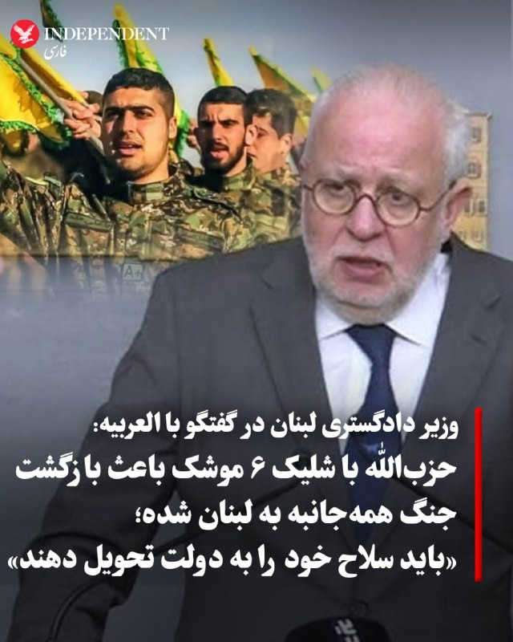

♦️وزیر دادگستری لبنان روز یکشنبه، ۱۰ خردادماه، در گفتگوی اختصاصی با «العربیه» با انتقاد شدید از عملکرد نظامی حزب‌الله اعلام کرد: «حزب‌الله لبنان را به جنگ‌هایی می‌کشاند که خود انتخاب نکرده است و با شلیک ۶ موشک، جنگ همه‌جانبه را به کشور بازگرداند. اکنون زمان آن فرا رسیده است که این گروه به ماجراجویی‌های خود پایان دهد و از گزینه دولت حمایت کند. چرا که سلاح حزب‌الله به بهانه‌ای برای تهاجم به لبنان تبدیل شده است.» او با تاکید بر ضرورت خلع سلاح این گروه افزود: «حزب‌الله باید سلاح خود را به دولت تحویل دهد و این به معنای تسلیم شدن نیست. اگر حزب‌الله سلاحش را تحویل دهد، دولت در مذاکرات قوی‌تر خواهد بود، در حالی که در وضعیت فعلی، این گروه توانایی دولت برای مذاکره از موضع قدرت را مختل کرده است. حزب‌الله پیش از این نیز لبنانی‌ها را در سوریه قربانی کرد و نبردها را صرفا در راستای منافع خود پیش می‌برد. در حال حاضر دیپلماسی مناسب‌ترین راه است».
‌🇸🇦 Indypersian

🤖 @VahidOOnLine

## VahidOOnLine — post 243118

♦️مهدی تاج، رئیس فدراسیون فوتبال ایران، روز یکشنبه در پاسخ به نگرانی‌ها درباره صدور ویزای بازیکنان تیم ملی فوتبال برای سفر به آمریکا گفت: «میزبان ما فیفا است و فیفا در واقع مسئول برگزاری مسابقات و از نظر ما مسئول دادن ویزا است، نه دولت آمریکا. چرا که وقتی کشوری می‌خواهد میزبانی را عهده‌دار شود، متعهد به انجام یک‌سری کارها می‌شود که یکی از آن‌ها صادر کردن ویزا است و باید این حداقل‌های قانونی را رعایت و مراعات کنند. من خودم امیدوارم با توجه به مسئولیتی که فیفا پذیرفته و صحبت‌های رخ‌به‌رخی که ما از نزدیک با مسئولین فیفا داشته‌ایم، این کار اتفاق بیفتد و مشکلی در این زمینه وجود نداشته باشد.»
همزمان، عباس عراقچی، وزیر امور خارجه جمهوری اسلامی، در گفتگو با خبرگزاری صداوسیما با اشاره به آخرین وضعیت صدور ویزا برای اعضای تیم ملی فوتبال ایران گفت: «دیروز [شنبه] دوستان ما در ترکیه با سفارت مکزیک تماس‌های نزدیکی داشتند. سفارت مکزیک در آنکارا از انگشت‌نگاری [اعضای تیم ملی] صرف‌نظر کرده و بنابر هماهنگی قرار شد به گونه‌ای جلو برود که همه ویزاها صادر بشود.»
‌🇸🇦 Indypersian

🤖 @VahidOOnLine

## VahidOOnLine — post 243117

  

♦️«مرکز مشترک اطلاعات دریایی» (JMIC) در جدیدترین گزارش ارزیابی امنیتی خود، سطح تهدیدات برای امنیت کشتیرانی تجاری در منطقه دریایی خاورمیانه به‌ویژه تنگه هرمز را «بحرانی» اعلام کرد. بر اساس این گزارش، حجم تردد کشتی‌های تجاری در تنگه هرمز در بازه زمانی ۱۱ اسفند تا ۱۰ خرداد به شدت کاهش یافته و شناورها ناچار به تغییر مسیر به سمت آب‌های ساحلی عمان شده‌اند. این نهاد بین‌المللی همچنین با اشاره به صدور هشدار ناوریا ۹ (NAVAREA IX) درباره رویت یک مین شناور در این آب‌راه حیاتی، نسبت به تداوم خطر مین‌گذاری در مسیرهای تردد و اختلالات شدید و مداوم در سیستم‌های موقعیت‌یاب جهانی (GNSS) هشدار داد طبق آمارهای ارائه‌شده، میانگین تردد روزانه کشتی‌ها در تنگه هرمز به تنها ۳ تا ۴ ترانزیت در روز سقوط کرده است؛ با این حال، گزارش تصریح می‌کند که جریان ترافیک دریایی در خلیج عدن و دریای سرخ جنوبی کماکان پایدار است و در ۷۲ ساعت گذشته هیچ حمله تاییدشده‌ای علیه کشتی‌های تجاری در این مناطق ثبت نشده است.
‌🇸🇦 Indypersian

🤖 @VahidOOnLine

## VahidOOnLine — post 243116

  

یوهان وادفول، وزیر خارجه آلمان، اعلام کرد ادامه پیشروی ارتش اسرائیل در جنوب لبنان مایه «نگرانی جدی» است.

به گزارش رویترز، وزیر خارجه آلمان گفت: «از همه طرف‌های درگیر به‌شدت می‌خواهم درگیری‌ها را متوقف کرده و به آتش‌بس مورد توافق بازگردند.»
‌🏁 🇬🇧 IranintlTV

🤖 @VahidOOnLine

## VahidOOnLine — post 243115

  

سناتور لیندسی گراهام، نماینده جمهوری‌خواه مجلس سنای آمریکا، در شبکه اجتماعی ایکس نوشت در گفت‌گو با دونالد ترامپ، حمایت خود را از توافقی با حکومت ایران که ‌خواسته‌های رییس‌جمهوری آمریکا برای باز کردن تنگه هرمز، شروع مذاکرات برای پایان دادن دائمی به جاه‌طلبی‌های هسته‌ای و حمایت تهران از تروریسم را بپذیرد، تأیید کرده است.

او ابراز اطمینان کرد که ترامپ با یک توافق بد با ایران موافقت نخواهد کرد.

گراهام در مورد حملات اسرائیل در لبنان نیز نوشت که باید به این کشور اجازه داد که تهدیدهای ناشی از حملات مداوم حزب‌الله را خنثی کند و افزود: بخش‌هایی از اسرائیل به دلیل اصابت موشک‌ها و راکت‌های حزب‌الله غیرقابل سکونت هستند.
‌🏁 🇬🇧 IranintlTV

🤖 @VahidOOnLine

## VahidOOnLine — post 243114

  

علی عبدالله خانی‌، قائم‌مقام معاون راهبردی پزشکیان، با بیان اینکه «بیش از ۵۶ درصد مردم حداقل یک بار در تجمعات شبانه شرکت کردند» گفت: این حضور یعنی حفظ نظام جمهوری اسلامی را مد نظر داشتند.
او اضافه کرد: «همه رده‌های سنی با تحصیلات مختلف در این اجتماعات حضور داشتند و ۷۰ درصد عاملیت جنبش بر عهده زنان بود.»
‌🏁 🇬🇧 IranintlTV

🤖 @VahidOOnLine

## VahidOOnLine — post 243113

  <a href="telegram/content/VahidOOnLine_243113_1780263720.mp4" target="_blank">🎬 Download video</a>

♦️عباس عراقچی، وزیر امور خارجه جمهوری اسلامی، روز یکشنبه در گفتگو با خبرگزاری صداوسیما با اشاره به آخرین وضعیت صدور ویزا برای اعضای تیم ملی فوتبال ایران گفت: «دیروز [شنبه] دوستان ما در ترکیه با سفارت مکزیک تماس‌های نزدیکی داشتند. سفارت مکزیک در آنکارا از انگشت‌نگاری [اعضای تیم ملی] صرف‌نظر کرده و بنابر هماهنگی قرار شد به گونه‌ای جلو برود که همه ویزاها صادر بشود.» او گفت:‌ «هرچه به ما بیشتر فشار آوردند، بیشتر جنگیدیم».
پیش از این، دکتر جمشید ایرانی، وکیل دیوان عالی آمریکا، از صدور «مجوز موقت و مشروط برای ورود» (Parole) به بازیکنان تیم ملی فوتبال ایران خبر داد. این وکیل در پیامی که در صفحه فیسبوک خود به اشتراک گذاشت، با اشاره به تحقیق و پی بردن به تصمیم واشنگتن در قبال کاروان ورزشی ایران توضیح داد که وزارت امور خارجه آمریکا برای اعضای تیم ملی «ویزای معمولی» صادر نخواهد کرد، بلکه ورود آن‌ها به خاک این کشور در قالب این طرح مشروط خواهد بود که امتیازات ویزای عادی را ندارد.
این تحولات درحالی رخ می‌دهد که تا روز جمعه هشتم خرداد ماه، وضعیت ویزای اعضای تیم ملی فوتبال مردان جمهوری اسلامی ایران، در کمتر از دو هفته به آغاز جام جهانی، با ابهاماتی روبه‌رو بود.
‌🇸🇦 Indypersian

🤖 @VahidOOnLine

## VahidOOnLine — post 243112

  

♦️به گزارش تسنیم، خبرگزاری وابسته به سپاه، یکشنبه‌شب «نشت و انفجار شدید گاز» در یک مجتمع ۴۰ واحدی واقع در فاز یک اندیشه، دست‌کم ۴ مجروح برجای گذاشت. بر اساس اعلام سازمان آتش‌نشانی، این حادثه در طبقه سوم این مجتمع رخ داده و با توجه به شدت انفجار و ارزیابی‌های اولیه در محل، احتمال افزایش شمار مجروحان وجود دارد.
‌🇸🇦 Indypersian

🤖 @VahidOOnLine

## VahidOOnLine — post 243111

  

امانوئل مکرون، رییس‌جمهور فرانسه، در شبکه اجتماعی ایکس اعلام کرد با محمد بن سلمان، ولیعهد عربستان سعودی، هیثم بن طارق، سلطان عمان، محمد بن زاید، رییس امارات متحده عربی، و عبدالفتاح السیسی، رییس‌جمهور مصر، گفت‌وگو کرده است.

مکرون افزود به همه آن‌ها پیامی واحد منتقل کرده است: ضروری است توافقی میان ایالات متحده و جمهوری اسلامی هرچه سریع‌تر حاصل شود و این فرصت باید همین اکنون مورد استفاده قرار گیرد.

او تاکید کرد اولویت باید دستیابی به آتش‌بس و بازگشایی فوری تنگه هرمز، بدون هیچ شرطی و در چارچوب حقوق بین‌الملل، باشد. سپس گفت‌وگوها باید برای دستیابی به توافقی کامل و مستحکم درباره برنامه هسته‌ای، موشک‌های بالستیک و ثبات منطقه‌ای ادامه یابد.
‌🏁 🇬🇧 IranintlTV

🤖 @VahidOOnLine

## VahidOOnLine — post 243110

  

بر اساس اطلاعات رسیده به ایران‌اینترنشنال، اشکان مالکی و مهرداد محمدی‌نیا، دو معترض بازداشت‌شده در جریان انقلاب ملی در دی‌ماه ۱۴۰۴، در معرض خطر اجرای قریب‌الوقوع حکم اعدام قرار دارند. 
بنا بر این گزارش، این دو جوان معترض در زندان قزلحصار محبوس هستند. 
دادگاه رسیدگی به پرونده اشکان مالکی و مهرداد محمدی‌نیا روز دوم اسفند در شعبه ۱۵ دادگاه انقلاب به ریاست ابوالقاسم صلواتی برگزار شد. این دو معترض در نهایت به اعدام محکوم شدند و بر اساس اطلاعات دریافتی، در معرض اجرای حکم قرار دارند. 
اشکان مالکی و مهرداد محمدی‌نیا در این پرونده به «محاربه از طریق تحریق و تخریب مسجد جعفری و حوزه علمیه امام هادی در کوی نصر تهران» متهم شده‌اند. 
در همین پرونده، آرمان معرفتی، دیگر معترض بازداشت‌شده که هم‌اکنون در زندان تهران بزرگ نگهداری می‌شود، به «اجتماع و تبانی علیه امنیت داخلی کشور» متهم شده است.
‌🏁 🇬🇧 IranintlTV

🤖 @VahidOOnLine

## VahidOOnLine — post 243109

  

♦️احمد الشرع، رئیس‌جمهوری سوریه، روز یکشنبه دهم خرداد ماه، در تماس تلفنی با دونالد ترامپ، رئیس‌جمهوری آمریکا، درباره روابط دوجانبه، آخرین تحولات سیاسی و امنیتی منطقه و راه‌های تقویت همکاری‌های مشترک گفتگو کرد.
بر اساس بیانیه دفتر ریاست‌جمهوری سوریه، دو طرف در این تماس راه‌های حمایت از ثبات سوریه و کمک به روند بهبود اقتصادی این کشور در مرحله پیش رو را مورد بررسی قرار دادند.
احمد الشرع در این گفتگو بر اهمیت تداوم حمایت‌های بین‌المللی از سوریه در دوره بازسازی و احیای کشور تاکید کرد و گفت لغو تحریم‌های باقی‌مانده آمریکا علیه سوریه گامی اساسی برای احیای اقتصاد، جذب سرمایه‌گذاری و بهبود شرایط معیشتی شهروندان سوری است.
دفتر ریاست‌جمهوری سوریه همچنین اعلام کرد در این تماس تلفنی، آخرین تحولات منطقه‌ای و «مسائل مورد اهتمام مشترک دو کشور» نیز مورد بحث و تبادل نظر قرار گرفت.
‌🇸🇦 Indypersian

🤖 @VahidOOnLine

## VahidOOnLine — post 243108

  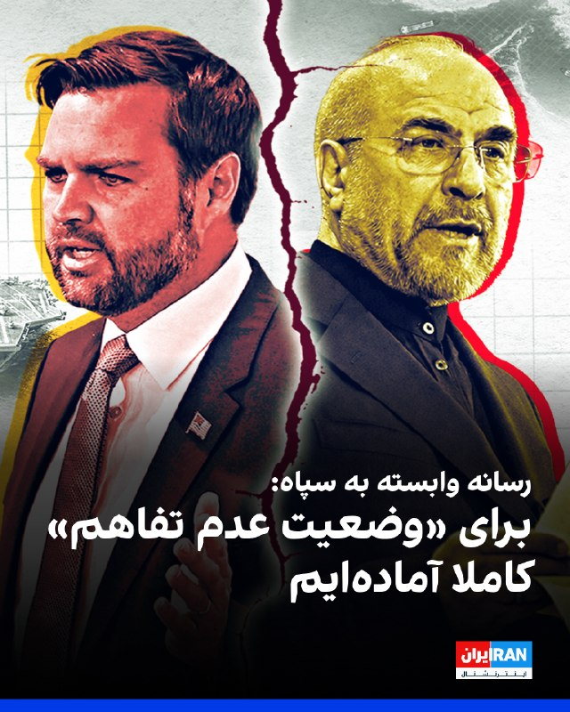

خبرگزاری تسنیم، وابسته به سپاه، به نقل از «یک منبع مطلع» درباره روند مذاکرات نوشت: ملاک برای جمهوری اسلامی متنی است که خودمان قبول داشته باشیم و اعمال اصلاحیه از سوی ترامپ به معنای پذیرش آن از طرف ما نیست.

تسنیم افزود جمهوری اسلامی برای «وضعیت عدم تفاهم» نیز کاملا آمادگی دارد.
‌🏁 🇬🇧 IranintlTV

🤖 @VahidOOnLine

## VahidOOnLine — post 243107

  

♦️خبرگزاری حکومتی تسنیم، شامگاه یکشنبه دهم خرداد ماه، به نقل از یک «منبع مطلع» گزارش داد در پی پیشنهاد اصلاحیه‌های جدید از سوی دونالد ترامپ به متن تفاهم احتمالی میان تهران و واشنگتن، ایران نیز اصلاحیه‌های خود را بر متن اعمال خواهد کرد.
این منبع با اشاره به گزارش رسانه‌های آمریکایی درباره تغییرات پیشنهادی رئیس‌جمهوری آمریکا به تسنیم گفت: «تبادل متن‌ها همچنان ادامه دارد و ایران نیز قاعدتا اصلاحیه‌های خود را درباره متن اعمال خواهد کرد و هنوز هیچ چیز نهایی نیست.»
خبرگزاری تسنیم که به عنوان منبعی برای بازتاب دیدگاه‌ه هسته‌های نزدیک به قدرت در ایران شناخته می‌شود، به نقل از این منبع آگاه تاکید کرد: «ملاک برای ایران متنی است که خودمان آن را قبول داشته باشیم و اعمال اصلاحیه از سوی ترامپ به معنای پذیرش آن از جانب ایران نیست.»
این منبع مطلع همچنین تصریح کرد: «ایران برای وضعیت عدم تفاهم نیز کاملا آمادگی دارد.»
‌🇸🇦 Indypersian

🤖 @VahidOOnLine

## VahidOOnLine — post 243106

  <a href="telegram/content/VahidOOnLine_243106_1780263730.mp4" target="_blank">🎬 Download video</a>

سخنان الهام‌بخش دکتر عزت‌الله همایونفر، ادیب و سیاست‌مداری که واژگانش، وطن را معنا می‌کردند. در روزگاری که صداقت در سیاست نایاب بود، او ایستاد؛ با فرهنگ، با قلم، با شرف.
‌🏁 🇬🇧 ManotoTV

🤖 @VahidOOnLine

## VahidOOnLine — post 243096

  <a href="telegram/content/VahidOOnLine_243096_1780263732.mp4" target="_blank">🎬 Download video</a>

حذف احتمالی سردار آزمون از تیم ملی، فقط یک خبر ورزشی نیست.

این ماجرا دوباره پرسشی قدیمی را زنده می‌کند: در کشوری که سیاست و ورزش بارها به هم گره خورده‌اند، چه کسی حق دارد نماینده یک ملت باشد؟

از حمایت ورزشکاران از معترضان تا واکنش حکومت به صداهای مستقل، فوتبال ایران سال‌هاست فراتر از یک بازی است.

شاید امروز مهم‌ترین بحث فوتبال ایران نه ترکیب تیم ملی، بلکه معنای «تیم ملی» باشد. ورق بزنید.
‌🏁 🇬🇧 ManotoTV

🤖 @VahidOOnLine

## WithYashar — post 13108

گزارش‌ها از حمله پهپادی ایران به گروه های مخالف ایرانی-کرد در نزدیکی اربیل، شمال عراق!
@withyashar

## WithYashar — post 13107

  <a href="telegram/content/WithYashar_13107_1780263733.mp4" target="_blank">🎬 Download video</a>

اتاق جنگ با یاشار : چشم آسمان ، هواپیما آواکس
@withyashar

## WithYashar — post 13106

## WithYashar — post 13105

انفجار در فاز یک اندیشه شهریار خیابان شیشم شرقی در یک ساختمان که چندین مصدوم داشته @withyashar

## WithYashar — post 13104

انفجار در فاز یک اندیشه شهریار خیابان شیشم شرقی در یک ساختمان که چندین مصدوم داشته @withyashar

## WithYashar — post 13103

  <a href="telegram/content/WithYashar_13103_1780263736.mp4" target="_blank">🎬 Download video</a>

🎬 Video

## WithYashar — post 13102

پدافند قم فعال شد 🚨
@withyashar

## WithYashar — post 13101

  <a href="telegram/content/WithYashar_13101_1780263737.mp4" target="_blank">🎬 Download video</a>

انفجار در فاز یک اندیشه شهریار خیابان شیشم شرقی در یک ساختمان که چندین مصدوم داشته
@withyashar

## WithYashar — post 13100

تسنیم : ایران تغییرات بیشتری در یادداشت تفاهم ایجاد خواهد کرد. اینکه ترامپ در حال ایجاد تغییراتی در این یادداشت تفاهم است، به این معنی نیست که این تغییرات برای ما قابل قبول است. ایران کاملاً برای شرایطی که هیچ توافقی حاصل نشود، آماده است.
@withyashar

## WithYashar — post 13099

حمله به کشتی حامل مس در تنگه هرمز

در پی درگیری‌های اخیر در تنگه هرمز، یک کشتی خارجی که حامل مس بود، مورد هدف قرار گرفت
@withyashar

## WithYashar — post 13098

  <a href="telegram/content/WithYashar_13098_1780263740.mp4" target="_blank">🎬 Download video</a>

تردد خودرو های منطقه آزاد در سراسر کشور آزاد است
@withyashar

## WithYashar — post 13097

  <a href="telegram/content/WithYashar_13097_1780263742.mp4" target="_blank">🎬 Download video</a>

اسکات بسنت، وزیر خزانه‌داری ایالات متحده:

اشتباه بزرگی که ایرانی‌ها مرتکب شدند حمله به همسایگانشان در شورای همکاری خلیج فارس، همسایگانشان در خلیج فارس بود، زیرا ما متحدان بسیار خوبی داشتیم که شاید در مورد پول با ما کاملاً شفاف نبودند، پول ایران که در سیستم‌های بانکی آنها بود، ناگهان بسیار مطیع شدند و حاضر شدند حساب‌ها را تحویل دهند یا به ما در مسدود کردن حساب‌ها کمک کنند.
@withyashar

## WithYashar — post 13096

کانال ۱۵ اسرائیل: گسترش عملیات اسرائیل در لبنان با هماهنگی دولت آمریکا انجام شد.
@withyashar

## WithYashar — post 13095

جروزالم پست: منابع به واشنگتن پست مدعی شدند که مجتبی خامنه‌ای، رهبر ایران، هنوز به آخرین پیشنهادات ایالات متحده، از جمله تفاهم‌ نامه‌ای که در جریان مذاکرات اخیر مورد توافق قرار گرفت، پاسخی نداده است.
@withyashar

## WithYashar — post 13094

عراقچی: ویزای تیم ملی فوتبال ظرف یک تا دو روز آینده صادر می‌شود
@withyashar

## WithYashar — post 13093

  <a href="telegram/content/WithYashar_13093_1780263744.mp4" target="_blank">🎬 Download video</a>

شاهزاده رضا پهلوی:

آنها در تلاشند تا قانون شریعت را نه در دمشق یا تهران، بلکه در خیابان‌های بلژیک، خیابان‌های پاریس، خیابان‌های لندن تحمیل کنند.

تا چه حد اجازه می‌دهید این رادیکالیسم ادامه یابد؟ این تهدیدی مستقیم برای ثبات و جمعیت‌شناسی اروپا است!
@withyashar

## WithYashar — post 13092

منابع اسرائیلی:ترامپ در تماس تلفنی آخر خود با بنیامین نتانیاهو اعلام کرد که در صورت همکاری با واشنگتن برای این تفاهم‌ نامه 60 روزه موقت اسرائیل کاملا در لبنان و غزه آزادی عمل خواهد داشت
@withyashar

## WithYashar — post 13091

به گزارش رسانه‌های محلی، فعالیت جت‌های جنگنده بر فراز کرج در استان البرز گزارش شده است.
@withyashar

## WithYashar — post 13090

صبح امروز سپاه اعلام کرده یک پهپاد MQ-1 را در نزدیکی جزیره قشم سرنگون کرده است. هرچند اسرائیل یا آمریکا این موضوع را تأیید نکرده‌اند، اما چند ساعت بعد یک حمله در همان منطقه انجام شده است. منابع می‌گویند در این حمله، «محسن سپاسیان» (مسئول تدارکات سپاه هوافضا در استان) و «ستوان سینا نجارپور» کشته شده‌اند. تاکنون هیچ طرفی مسئولیت حمله را بر عهده نگرفته است و این خبر را تایید نکرده است
@withyashar

## WithYashar — post 13089

## mwarmonitor — post 9960

✈️یک فروند هواپیمای گشت دریایی P-8A پوزیدون نیروی دریایی ایالات متحده امروز بر فراز دریای عرب فعال بود.

✈️به‌طور جداگانه، یک فروند دیگر از هواپیماهای گشت دریایی P-8A نیروی دریایی آمریکا از کمپ لمونیه در جیبوتی به پایگاه هوایی شاهزاده سلطان در عربستان سعودی پرواز کرد.

@mwarmonitor

## mwarmonitor — post 9959

  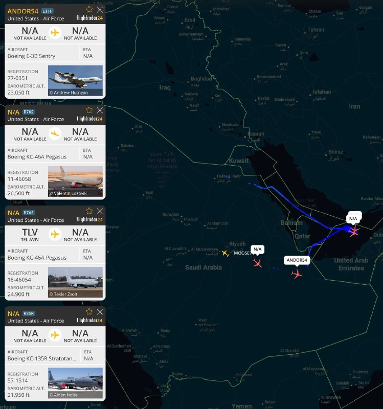

✈️نیروی هوایی ایالات متحده آمریکا (USAF)

Boeing E-3 Sentry: یک فروند✈️
AE11DF 77-0351 – ANDOR 54

Boeing KC-46 Pegasus: دو فروند✈️
AE5FA5 11-46058 – YETI ??
AE5FA1 18-46054 – YETI ??

Boeing KC-135 Stratotanker: یک فروند✈️
AE058B 57-1514 – علامت تماس نامشخص

📌بر اساس داده‌های فلایت‌رادار، امشب سه هواپیمای سوخت‌رسان و یک فروند آواکس E-3 بر فراز منطقه مسئولیت سنتکام مشاهده شده‌اند.

@mwarmonitor

## mwarmonitor — post 9957

🔴مجری (سی‌ان‌ان): اکنون باراک راوید، تحلیل‌گر امور جهانی و سیاسی سی‌ان‌ان و خبرنگار اکسیوس به ما ملحق شده است. باراک، همیشه از حضور شما در اینجا خوشحالیم. ما چند روزی است که در یک وضعیت انتظار و بلاتکلیفی به سر می‌بریم. شما موقعیت فعلی ما را در این لحظه چگونه…

## mwarmonitor — post 9956

🔴مجری (سی‌ان‌ان):
اکنون باراک راوید، تحلیل‌گر امور جهانی و سیاسی سی‌ان‌ان و خبرنگار اکسیوس به ما ملحق شده است. باراک، همیشه از حضور شما در اینجا خوشحالیم. ما چند روزی است که در یک وضعیت انتظار و بلاتکلیفی به سر می‌بریم. شما موقعیت فعلی ما را در این لحظه چگونه توصیف می‌کنید؟
🔵باراک راوید:
خب، فکر می‌کنم ما در آخرین لحظات این مذاکرات قرار داریم، یا حداقل در لحظاتی که پتانسیل این را دارند که آخرین لحظات باشند. من فکر می‌کنم هر دو طرف این موضوع را تایید و اعتراف می‌کنند؛ و این را هم از مقامات آمریکایی، هم از میانجی‌ها و هم از خود ایرانی‌ها می‌شنوم که همین موضوع را به رسانه‌های دولتی خود نیز می‌گویند؛ اینکه طرفین بسیار به یک توافق نزدیک هستند. و همیشه در لحظات پایانی مذاکرات، هر طرف تلاش می‌کند تا به آخرین دستاورد و پیروزی نهایی خود دست یابد. و من فکر می‌کنم در حال حاضر در چنین وضعیتی هستیم.
🔴مجری:
بله، و وزیر دفاع نیز اعلام کرده که ایالات متحده در صورت لزوم آماده است تا نبرد را [در خلیج فارس] از سر بگیرد. اما ارزیابی شما از تمایل رئیس‌جمهور برای گام برداشتن در این مسیر چیست؟
🔵باراک راوید:
خب، این قطعا یک گزینه است و من فکر نمی‌کنم ترامپ آن را نادیده گرفته باشد. اما در حال حاضر، برداشت من از گفتگو با افراد نزدیک به رئیس‌جمهور این است که موضوع اصلی که پرزیدنت ترامپ می‌خواهد در کوتاه‌مدت حل کند، مسئله تنگه هرمز است. و یکی از مواردی که به رئیس‌جمهور گفته شده، از جمله در جلسات اتاق وضعیت (Situation Room)، این است که اگر او توافق را نپذیرد و جنگ دوباره از سر گرفته شود، این به معنای سناریوی بسته ماندن تنگه هرمز برای ۶ تا ۱۲ ماه دیگر خواهد بود؛ با تمام پیامدهایی که برای اقتصاد جهانی و اقتصاد ایالات متحده به همراه دارد. و من فکر می‌کنم این چیزی است که پرزیدنت ترامپ می‌خواهد آن را حل کند و فکر می‌کنم این یکی از ملاحظات اصلی او در بررسی این توافق در حال حاضر است.
🔴مجری:
ارتش اسرائیل نیز درباره شدت گرفتن درگیری‌ها با حزب‌الله در لبنان هشدار می‌دهد. درگیری‌ها میان اسرائیل و حزب‌الله پس از ترور رهبر عالی ایران از سر گرفته شد. این یک جبهه دوم است، اما یک درگیری مرتبط با تمام این قضایا به شمار می‌رود. این موضوع چگونه بر این مذاکرات میان آمریکا و ایران تاثیر می‌گذارد؟
🔵باراک راوید:
در مورد ایرانی‌ها، آن‌ها تلاش می‌کنند تا به نوعی این دو درگیری را به هم پیوند بزنند و مطمئن شوند که اگر با آمریکا به توافقی دست یابند، یکی از نتایج آن این باشد که اسرائیل مجبور شود حملات خود علیه حزب‌الله را متوقف کند. فکر می‌کنم در حال حاضر، با توجه به شکلی که پیش‌نویس توافق دارد، به احتمال زیاد ایرانی‌ها قرار است حداقل...

@mwarmonitor

## mwarmonitor — post 9955

🎬 Video

## mwarmonitor — post 9954

🔴مجری ؛ «یک دقیقه زمان داریم و می‌خواهم از شما بپرسم که چقدر به کسانی که در حال حاضر به رئیس‌جمهور مشاوره می‌دهند اعتماد دارید؟ حدس می‌زنم برخی از مهره‌های اصلی را می‌شناسید، چه استیو وین باشد، چه جرد کوشنر؛ شما در گذشته با آن‌ها تعامل داشته‌اید. آیا مطمئن هستید که آن‌ها از دانش استراتژیک یا درک کافی برای بهبود وضعیتی که در حال حاضر وجود دارد، برخوردارند؟»
🔵 جان بولتون:
«فکر نمی‌کنم آن‌ها متوجه نوع امتیازاتی که واگذار می‌کنند باشند. به عنوان مثال، یکی از جنجالی‌ترین ابعاد این توافق که هنوز بسیار مبهم است، این است که آیا ایالات متحده قصد دارد دارایی‌های مسدود شده ایران را آزاد کند و منابع دیگری را در اختیار آن‌ها قرار دهد یا خیر.
به نظر من این یک اشتباه بزرگ خواهد بود. آزاد کردن دارایی‌ها برای یک دولت واقعی در ایران که نماینده مردم باشد، یک چیز است؛ اما اگر ما دارایی‌های مسدود شده را در اختیار این دولت قرار دهیم، این کار جایگاه آن‌ها را بیش از پیش تثبیت خواهد کرد.
و من فکر نمی‌کنم دلالان املاک (اشاره به سابقه ترامپ و کوشنر) درک کنند که چه چیزی در اینجا در خطر است. موضوع این پول‌ها، توسعه اقتصادی در ایران نیست؛ بلکه تثبیت موقعیت و توانمندسازی رژیم برای ماندن در قدرت است. اگر کار به این شکل پیش برود، از نظر سیاسی برای ترامپ بسیار بد خواهد بود.» بلومبرگ

@mwarmonitor

## mwarmonitor — post 9953

  <a href="telegram/content/mwarmonitor_9953_1780263749.mp4" target="_blank">🎬 Download video</a>

🎬 Video

## mwarmonitor — post 9952

🔴ارتش آمریکا در حملات هوایی به قایق‌هایی که آن‌ها را به قاچاق مواد مخدر متهم می‌کند، در آب‌های نزدیک آمریکای جنوبی بیش از ۲۰۰ نفر را کشته است. در کلمبیا و اکوادور، این حملات زندگی کسانی را که از راه دریا امرار معاش می‌کنند، دگرگون کرده است. نیویورک تایمز

@mwarmonitor

## mwarmonitor — post 9951

  <a href="telegram/content/mwarmonitor_9951_1780263751.mp4" target="_blank">🎬 Download video</a>

📌«دو فروند بمب‌افکن استراتژیک B-1 امروز کمی بعد از ساعت ۶ عصر در یک پرواز آموزشی از پایگاه RAF Fairford به پرواز درآمدند و به سمت جنوب‌غربی حرکت کردند. امروز مسافت پروازشان نسبتاً طولانی بوده است.»

@mwarmonitor

## mwarmonitor — post 9950

🔴«در یک تحلیل بصری که برای مشتریان تهیه کرده‌ایم، نشان دادیم که چهار نفتکش متعلق به شرکت ملی نفتکش ایران (NITC)، با مجموع محموله‌ای حدود ۷ میلیون بشکه نفت خام، به نظر می‌رسد طی ۲ تا ۳ روز گذشته در مقطعی تلاش کرده‌اند ایران را ترک کنند، اما به احتمال زیاد دوباره به سمت ایران تغییر مسیر داده‌اند. TANKER TRACKER

@mwarmonitor

## FoxNewsTwitter — post 342461

Fox News (Twitter/X)

New York City's annual Israel Day parade went on without its mayor.

Zohran Mamdani skipped the event due to his stance toward Israel, breaking a decades-long tradition of New York City mayors attending the celebration.

As thousands packed Fifth Avenue waving Israeli flags, Gov. Kathy Hochul, Sen. Chuck Schumer, Attorney General Letitia James, and New York Republican gubernatorial candidate Bruce Blakeman all took part.

Mamdani's absence quickly became a political flashpoint, with critics accusing Mamdani of turning his back on New York's Jewish community amid record levels of antisemitism.

## FoxNewsTwitter — post 342460

  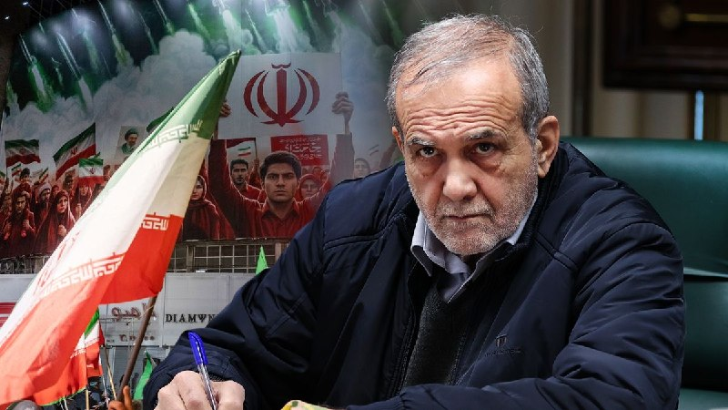

Fox News (Twitter/X)

Iran’s president has reportedly asked to resign, citing a loss of authority inside the country’s ruling system.

According to reports, Masoud Pezeshkian told the Supreme Leader’s office that he and his government have been excluded from major decision-making, leaving him unable to fulfill his responsibilities.

The reported resignation comes amid growing signs of internal power struggles within the regime and as the U.S. continues negotiations with Tehran.

President Trump has repeatedly pointed to divisions inside Iran’s leadership, previously saying the regime is “seriously fractured.”

## FoxNewsTwitter — post 342459

  

Fox News (Twitter/X)

A fight over a White House ballroom is turning into a national security showdown.

President Trump is accusing a federal judge of jeopardizing Washington’s safety by slowing a project that includes a rooftop drone base and other security enhancements.

“Judge Richard Leon should stop playing games with America’s security!” Trump wrote, arguing that today’s threats demand new defensive measures beyond traditional protections.

The lawsuit is focused on whether the administration can proceed with the project and its security upgrades without congressional authorization.

## FoxNewsTwitter — post 342458

  <a href="telegram/content/FoxNewsTwitter_342458_1780263756.mp4" target="_blank">🎬 Download video</a>

Fox News (Twitter/X)

Video captures the moment a dog is spooked by a meteor that exploded over Massachusetts, creating a boom heard across New England.

## pm_afshaa — post 91975

  <a href="telegram/content/pm_afshaa_91975_1780263758.webm" target="_blank">🎬 Download video</a>

🔴قائم‌مقام، معاون راهبردی پزشکیان:
بیش از 56 درصد مردم حداقل یک بار در تجمعات شبانه شرکت کردن.

💧 Rainbet.com the #1 Non-KYC Crypto Casino & Sportsbook @rainbetcom

😁 @Pm_Afshaa

## pm_afshaa — post 91974

پزشکیان: فقط شهادت میتونه منو از خدمت به مردم باز بداره

💧 Rainbet.com the #1 Non-KYC Crypto Casino & Sportsbook @rainbetcom

😁 @Pm_Afshaa

## pm_afshaa — post 91973

#مهم
عزیزای دلم همگی الان چنل زاپاس‌مون رو جوین بشید کانال تحت ریپورت شدیده اگه چیزی شد زاپاس رو داشته باشید فعالیت میاد اونور
👇

https://t.me/Pm_Zapas
https://t.me/Pm_Zapas

## pm_afshaa — post 91972

سخنگوی کمیته امنیت ملی جمهوری اسلامی: لبنان را رها نخواهیم کرد؛ برای ما به اندازه ایران مهم است

💧 Rainbet.com the #1 Non-KYC Crypto Casino & Sportsbook @rainbetcom

😁 @Pm_Afshaa

## pm_afshaa — post 91970

  <a href="telegram/content/pm_afshaa_91970_1780263759.webm" target="_blank">🎬 Download video</a>

🔴تسنیم به نقل از یک منبع آگاه:
ایران اصلاحیه‌های جدید درباره متن تفاهم احتمالی اعمال خواهد کرد .

ملاک برای ایران متنی است که خودمان قبول داشته باشیم و اعمال اصلاحیه از ناحیه ترامپ به معنای پذیرش آنها توسط ایران نیست؛ ایران برای وضعیت عدم تفاهم نیز کاملاً آمادگی دارد.

💧 Rainbet.com the #1 Non-KYC Crypto Casino & Sportsbook @rainbetcom

😁 @Pm_Afshaa

## pm_afshaa — post 91969

  <a href="telegram/content/pm_afshaa_91969_1780263759.mp4" target="_blank">🎬 Download video</a>

انفجار در فاز یک اندیشه شهریار خیابان شیشم شرقی در یک ساختمان که چندین مصدوم داشته

💧 Rainbet.com the #1 Non-KYC Crypto Casino & Sportsbook @rainbetcom

😁 @Pm_Afshaa

## pm_afshaa — post 91968

  <a href="telegram/content/pm_afshaa_91968_1780263762.mp4" target="_blank">🎬 Download video</a>

🎙️گزارشگر به محمد‌جواد ظریف:
میگن شما پشت پرده مذاکرات هستید.

ظریف: من اصلا هیچکاره‌ام

💧 Rainbet.com the #1 Non-KYC Crypto Casino & Sportsbook @rainbetcom

😁 @Pm_Afshaa

## pm_afshaa — post 91967

🔴یک مقام ارشد امنیتی اسرائیلی: ایران قرارداد با آمریکا را امضا نخواهدکرد

💧 Rainbet.com the #1 Non-KYC Crypto Casino & Sportsbook @rainbetcom

😁 @Pm_Afshaa

## pm_afshaa — post 91966

  <a href="telegram/content/pm_afshaa_91966_1780263763.mp4" target="_blank">🎬 Download video</a>

شاهزاده رضا پهلوی:برخلاف این رژیم که می‌خواهد اسرائیل را از نقشه جهان پاک کند، ما آن‌ها را به عنوان شرکای استراتژیک واقعی می‌بینیم.

ما از دوستان اسرائیلی‌مان استقبال می‌کنیم تا در حل بسیاری از چالش‌هایی که ایران با آن‌ها مواجه است به ما کمک کنن ما با اسرائیل هیچ اختلافی نداریم

💧 Rainbet.com the #1 Non-KYC Crypto Casino & Sportsbook @rainbetcom

😁 @Pm_Afshaa

## pm_afshaa — post 91965

  <a href="telegram/content/pm_afshaa_91965_1780263766.mp4" target="_blank">🎬 Download video</a>

شاهزاده رضا پهلوی:آنها در تلاشند تا قانون شریعت را نه در دمشق یا تهران، بلکه در خیابان‌های بلژیک، خیابان‌های پاریس، خیابان‌های لندن تحمیل کنند.

تا چه حد اجازه می‌دهید این رادیکالیسم ادامه یابد؟ این تهدیدی مستقیم برای ثبات و جمعیت‌شناسی اروپا است!

💧 Rainbet.com the #1 Non-KYC Crypto Casino & Sportsbook @rainbetcom

😁 @Pm_Afshaa

## pm_afshaa — post 91964

  <a href="telegram/content/pm_afshaa_91964_1780263769.mp4" target="_blank">🎬 Download video</a>

شاهزاده رضا پهلوی:
مردم ایران همان نیروهای حاضر در میدان هستند. نیازی به اعزام نیروهای نظامی شما نیست، اما برای اینکه نیروهای حاضر در میدان بتوانند فرصتی برای بازگشت به خیابان‌ها داشته باشند، به حداقل محافظت نیاز دارن

💧 Rainbet.com the #1 Non-KYC Crypto Casino & Sportsbook @rainbetcom

😁 @Pm_Afshaa

## pm_afshaa — post 91963

🔴منابع اسرائیلی:ترامپ در تماس تلفنی آخر خود با بنیامین نتانیاهو اعلام کرد که در صورت همکاری با واشنگتن برای این تفاهم‌ نامه 60 روزه موقت اسرائیل کاملا در لبنان و غزه آزادی عمل خواهد داشت

💧 Rainbet.com the #1 Non-KYC Crypto Casino & Sportsbook @rainbetcom

😁 @Pm_Afshaa

## pm_afshaa — post 91962

  <a href="telegram/content/pm_afshaa_91962_1780263772.webm" target="_blank">🎬 Download video</a>

🔴ایران اینترنشنال: مسعود پزشکیان به علت تسلط کامل فرماندهان سپاه بر اداره امور کشور، با ارسال نامه‌ای به دفتر مجتبی خامنه‌ای خواهان استعفا از سمت خودش شده. 
💧 Rainbet.com the #1 Non-KYC Crypto Casino & Sportsbook @rainbetcom 
😁 @Pm_Afshaa

## DEJradio — post 5193

⭕️🕘 خبر ۲۱
یکشنبه ۱۰ خرداد ۱۴۰۵

#خبر۲۱
@DEJradio

## DEJradio — post 5192

  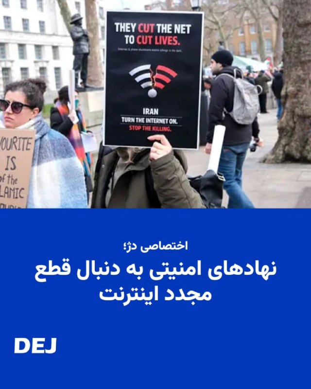

⭕️
⭕️ یک منبع مطلع به دژ می‌گوید اینترنت در ایران با اصرار دولت مسعود پزشکیان مجدد وصل شد، اما بعضی افراد صاحب نفوذ در دستگاه‌های امنیتی برای قطع مجدد آن فشار می‌آورند.
این افراد به واسطه چند عضو شورای‌عالی فضای مجازی از ستاد «ساماندهی اینترنت» وابسته به دولت شکایت کردند.
همچنین چند نماینده مجلس شورای اسلامی با پشتیبانی نهادهای امنیتی به دنبال مسدودسازی مجدد اینترنت هستند. آنها گفته‌اند «ستاد ویژه فضای مجازی حق تصمیم برای اینترنت ندارد.»
در ایران با آغاز جنگ اینترنت قطع شد و بیش از سه ماه تمام کشور به جز سیم‌کارت سفیدها به آن دسترسی نداشتند.
برخی اما می‌گویند محال است، بدون نظر نهادهای امنیتی بالادستی اینترنت وصل شده باشد. به اعتقاد آنها دولت تصمیم‌گیر نیست و صرفاً یک بازی درون حکومتی است که برای دولت پزشکیان نزد افکار عمومی با وصل شدن اینترنت اعتبارسازی شود.
مخالفان باز شدن اینترنت می‌گویند، "احتمال آسیب به دستگاه امنیتی و احتمال نفوذ خارجی در عرصه حکمرانی لز طریق اینترنت بسیار زیاد است."

#اینترنت
@DEJradio

## DEJradio — post 5191

📡
🛑 ساعتی پیش دونالد ترامپ مصاحبه‌ای از مارک لوین، روزنامه نگار نزدیک به خود با دیویس هنسن، تاریخ نگار و پژوهشگر موسسه را در حساب کاربری خود در تروث سوشیال قرار داد.
این مصاحبه مربوط به جنگ ایالات متحده با جمهوری اسلامی است.

#ترامپ #مارک_لوین
@DEJradio

## VahidOnline — post 75825

  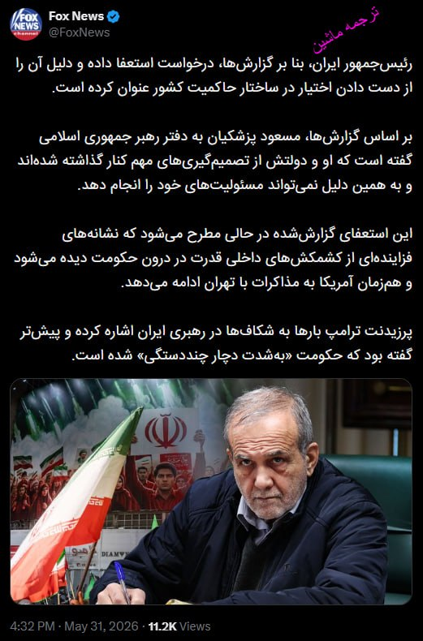

فاکس نیوز هم به درخواست استعفای پزشکیان پرداخته: FoxNews

چند مقام دولتی در ایران از جمله سخنگوی دولت این کشور با تکذیب شایعه استعفای مسعود پزشکیان، آن را «خبر کذب با هدف ایجاد ناامیدی» خواندند.

فاطمه مهاجرانی، سخنگوی دولت، الیاس حضرتی و علی احمدنیا که از اعضای شورای اطلاع رسانی دولت آقای پزشکیان هستند در پست‌های جداگانه به ادامه کار رئیس جمهوری و تلاش او برای «حل مسائل کشور» اشاره کرده‌اند.
@VahidHeadline

📡 @VahidOnline

## VahidOnline — post 75824

  

به گزارش تسنیم، خبرگزاری وابسته به سپاه، یکشنبه‌شب «نشت و انفجار شدید گاز» در یک مجتمع ۴۰ واحدی واقع در فاز یک اندیشه، دست‌کم ۴ مجروح برجای گذاشت. بر اساس اعلام سازمان آتش‌نشانی، این حادثه در طبقه سوم این مجتمع رخ داده و با توجه به شدت انفجار و ارزیابی‌های اولیه در محل، احتمال افزایش شمار مجروحان وجود دارد.
@VahidOOnLine

📡 @VahidOnline

## VahidOnline — post 75823

  <a href="telegram/content/VahidOnline_75823_1780263775.mp4" target="_blank">🎬 Download video</a>

خبرگزاری تسنیم، وابسته به سپاه پاسداران انقلاب اسلامی، در واکنش به گزارش شبکه ایران اینترنشنال درباره استعفای مسعود پزشکیان، رییس دولت، این خبر را تکذیب کرد و آن را «شایعه‌سازی» خواند.

شبکه ایران اینترنشنال، ساعاتی پیش در گزارشی اعلام کرد مسعود پزشکیان در نامه‌ای رسمی به دفتر مجتبی خامنه‌ای، رهبر جمهوری اسلامی، خواستار کناره‌گیری از سمت خود شده است. این رسانه همچنین نوشت در این نامه به وجود اختلافات ساختاری در اداره کشور و نقش نهادهای نظامی در تصمیم‌گیری‌های کلان اشاره شده است.
@VahidHeadline

📡 @VahidOnline

## IranIntlTV — post 339944

  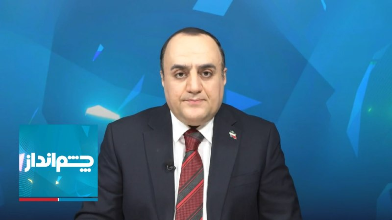

مراد ویسی، تحلیل‌گر ارشد ایران‌اینترنشنال، گفت: «پزشکیان از ناتوانی در اداره کشور به دلیل دخالت‌های سپاه گلایه کرده، اما فرماندهان سپاه که بر بخش‌های اصلی قدرت مسلط شده‌اند حاضر به پذیرش این انتقادها نیستند. برای مردمی که جمهوری اسلامی را نمی‌خواهند، تشدید اختلافات در راس حکومت نشانه‌ای از تضعیف بیشتر نظام و درگیری میان دو جناحی تلقی می‌شود که هر دو متهم به ظلم علیه مردم هستند.»
@iranintltv

## IranIntlTV — post 339943

  

یوهان وادفول، وزیر خارجه آلمان، اعلام کرد ادامه پیشروی ارتش اسرائیل در جنوب لبنان مایه «نگرانی جدی» است.

به گزارش رویترز، وزیر خارجه آلمان گفت: «از همه طرف‌های درگیر به‌شدت می‌خواهم درگیری‌ها را متوقف کرده و به آتش‌بس مورد توافق بازگردند.»
https://iranintl.com/202605317536

## IranIntlTV — post 339942

  

سناتور لیندسی گراهام، نماینده جمهوری‌خواه مجلس سنای آمریکا، در شبکه اجتماعی ایکس نوشت در گفت‌گو با دونالد ترامپ، حمایت خود را از توافقی با حکومت ایران که ‌خواسته‌های رییس‌جمهوری آمریکا برای باز کردن تنگه هرمز، شروع مذاکرات برای پایان دادن دائمی به جاه‌طلبی‌های هسته‌ای و حمایت تهران از تروریسم را بپذیرد، تأیید کرده است.

او ابراز اطمینان کرد که ترامپ با یک توافق بد با ایران موافقت نخواهد کرد.

گراهام در مورد حملات اسرائیل در لبنان نیز نوشت که باید به این کشور اجازه داد که تهدیدهای ناشی از حملات مداوم حزب‌الله را خنثی کند و افزود: بخش‌هایی از اسرائیل به دلیل اصابت موشک‌ها و راکت‌های حزب‌الله غیرقابل سکونت هستند.
https://iranintl.com/202605310697

## IranIntlTV — post 339941

  <a href="telegram/content/IranIntlTV_339941_1780263778.mp4" target="_blank">🎬 Download video</a>

فاطمه مهاجرانی، سخنگوی دولت جمهوری اسلامی، گفت افزایش ارزش کالابرگ از مطلوبات دولت است، اما باید با مقدورات هماهنگ باشد. او با اشاره تلویحی به محاصره دریایی آمریکا به‌عنوان تحولات مرزهای جنوبی و اثر آن بر درآمد کشور افزود «فعلا خبری از افزایش مبلغ کالابرگ نیست.»
@iranintltv

## IranIntlTV — post 339940

  

علی عبدالله خانی‌، قائم‌مقام معاون راهبردی پزشکیان، با بیان اینکه «بیش از ۵۶ درصد مردم حداقل یک بار در تجمعات شبانه شرکت کردند» گفت: این حضور یعنی حفظ نظام جمهوری اسلامی را مد نظر داشتند.
او اضافه کرد: «همه رده‌های سنی با تحصیلات مختلف در این اجتماعات حضور داشتند و ۷۰ درصد عاملیت جنبش بر عهده زنان بود.»
https://iranintl.com/202605314070

## IranIntlTV — post 339939

  <a href="telegram/content/IranIntlTV_339939_1780263780.mp4" target="_blank">🎬 Download video</a>

🔻علیرضا دبیر، رییس فدراسیون کشتی، درباره شماری از مخالفان جمهوری اسلامی در آمریکا گفت: «من ۱۴۰ رفیق درست و حسابی در آمریکا دارم که دکتر و مهندس هستند. نگاه نکنید چهار نفر می‌آیند جلوی دوربین می‌رقصند. این افراد لش و لوش‌هایی بودند که چند سال پیش فرار کردند و رفتند.»

🔹علیرضا دبیر پیشتر بخشی از ایرانیان خارج از کشور را «آویزان»، «پلشت» و «به دردنخور» خطاب کرده بود.

@iranintltvsport

## IranIntlTV — post 339938

  <a href="telegram/content/IranIntlTV_339938_1780263783.mp4" target="_blank">🎬 Download video</a>

بعد از سه ماه خاموشی مطلق، کم‌کم عده بیشتری در ایران به اینترنت وصل می‌شوند؛ جمهوری اسلامی چطور با استقرار یک پادگان دیجیتال، حق ارتباط ده‌ها میلیون ایرانی را مصادره کرد؟ این انزوای بی‌سابقه چگونه از نظر فنی، مهندسی شد، خسارت‌ ده‌ها میلیارد دلاری آن بر دوش چه کسانی است و آمران و پیمانکاران اجرایی این خاموشی دقیقا چه کسانی هستند؟ امشب قطع سراسری اینترنت در ایران را زیر ذره‌بین می‌بریم.

اصلاحیه: در بخشی از برنامه عدد خسارت روزانه قطعی اینترنت بین «۷۰ تا ۸۰ میلیارد دلار» ذکر شده. رقم صحیح روزانه «۷۰ تا ۸۰ میلیون دلار» است.
@iranintltv

## IranIntlTV — post 339937

  <a href="telegram/content/IranIntlTV_339937_1780263786.mp4" target="_blank">🎬 Download video</a>

سی‌ان‌ان گزارش داد جمهوری اسلامی بخش بزرگی از مسیرهای مسدودشده به سایت‌های زیرزمینی موشکی خود را بازسازی کرده است.

به نوشته این رسانه، ایران اکنون توان شلیک شمار بیشتری موشک دوربرد به سمت اسرائیل و دیگر کشورهای منطقه را دارد.

گفت‌وگو با آرام حسامی، استاد علوم سیاسی
@iranintltv

## IranIntlTV — post 339936

  

امانوئل مکرون، رییس‌جمهور فرانسه، در شبکه اجتماعی ایکس اعلام کرد با محمد بن سلمان، ولیعهد عربستان سعودی، هیثم بن طارق، سلطان عمان، محمد بن زاید، رییس امارات متحده عربی، و عبدالفتاح السیسی، رییس‌جمهور مصر، گفت‌وگو کرده است.

مکرون افزود به همه آن‌ها پیامی واحد منتقل کرده است: ضروری است توافقی میان ایالات متحده و جمهوری اسلامی هرچه سریع‌تر حاصل شود و این فرصت باید همین اکنون مورد استفاده قرار گیرد.

او تاکید کرد اولویت باید دستیابی به آتش‌بس و بازگشایی فوری تنگه هرمز، بدون هیچ شرطی و در چارچوب حقوق بین‌الملل، باشد. سپس گفت‌وگوها باید برای دستیابی به توافقی کامل و مستحکم درباره برنامه هسته‌ای، موشک‌های بالستیک و ثبات منطقه‌ای ادامه یابد.
https://iranintl.com/202605318416

## IranIntlTV — post 339935

  

بر اساس اطلاعات رسیده به ایران‌اینترنشنال، اشکان مالکی و مهرداد محمدی‌نیا، دو معترض بازداشت‌شده در جریان انقلاب ملی در دی‌ماه ۱۴۰۴، در معرض خطر اجرای قریب‌الوقوع حکم اعدام قرار دارند. 
بنا بر این گزارش، این دو جوان معترض در زندان قزلحصار محبوس هستند. 
دادگاه رسیدگی به پرونده اشکان مالکی و مهرداد محمدی‌نیا روز دوم اسفند در شعبه ۱۵ دادگاه انقلاب به ریاست ابوالقاسم صلواتی برگزار شد. این دو معترض در نهایت به اعدام محکوم شدند و بر اساس اطلاعات دریافتی، در معرض اجرای حکم قرار دارند. 
اشکان مالکی و مهرداد محمدی‌نیا در این پرونده به «محاربه از طریق تحریق و تخریب مسجد جعفری و حوزه علمیه امام هادی در کوی نصر تهران» متهم شده‌اند. 
در همین پرونده، آرمان معرفتی، دیگر معترض بازداشت‌شده که هم‌اکنون در زندان تهران بزرگ نگهداری می‌شود، به «اجتماع و تبانی علیه امنیت داخلی کشور» متهم شده است.
https://iranintl.com/202605317088

## IranIntlTV — post 339934

  <a href="telegram/content/IranIntlTV_339934_1780263790.mp4" target="_blank">🎬 Download video</a>

علی شیرازی، عضو تحریریه ایران‌اینترنشنال، درباره سناریوی پذیرش استعفای مسعود پزشکیان از سوی مجتبی خامنه‌ای گفت: «در چنین شرایطی، کشور وارد حکومت نظامی خواهد شد؛ وضعیتی که در آن فرماندهان سپاه پاسداران به‌طور علنی زمام امور مرتبط با زندگی مردم را در دست خواهند گرفت.»
@iranintltv

## IranIntlTV — post 339933

  

خبرگزاری تسنیم، وابسته به سپاه، به نقل از «یک منبع مطلع» درباره روند مذاکرات نوشت: ملاک برای جمهوری اسلامی متنی است که خودمان قبول داشته باشیم و اعمال اصلاحیه از سوی ترامپ به معنای پذیرش آن از طرف ما نیست.

تسنیم افزود جمهوری اسلامی برای «وضعیت عدم تفاهم» نیز کاملا آمادگی دارد.
https://iranintl.com/202605318379

## IranIntlTV — post 339932

  <a href="telegram/content/IranIntlTV_339932_1780263793.mp4" target="_blank">🎬 Download video</a>

🔻بازیکنان تیم فوتبال آرسنال پس از قهرمانی در لیگ برتر انگلستان، در حضور هواداران خود رژه قهرمانی در خیابان‌های لندن برگزار کردند. آرسنال پس از ۲۲ سال توانست عنوان قهرمانی لیگ برتر را از آن خود کند.

🔹گزارش آیدین مقیمی، ایران‌اینترنشنال

@iranintltvsport

## IranIntlTV — post 339931

  

یدالله جوانی، معاون سیاسی سپاه پاسداران، گفت: «اعمال حاکمیت بر تنگه هرمز سلاحی راهبردی‌تر از تسلیحات اتمی است که ایران را قادر به تنبیه متجاوزان می‌کند.»

او با اشاره به جنگ میان جمهوری اسلامی، آمریکا و اسرائیل افزود: «این جنگ اجتناب‌ناپذیر بود و ما در وقوع آن غافلگیر نشدیم. همواره برای این رویارویی آماده می‌شدیم.»

معاون سیاسی سپاه پاسداران همچنین با اشاره به جنگ هشت‌ساله ایران و عراق گفت: «جنگ تحمیلی دوم و سوم نیز همان برکات را برای جامعه اسلامی ایران به همراه داشته است. ایران نه تنها در دفاع پیروز شد، بلکه از دل این جنگ، یک قدرت جهانی ظهور کرده است.»
https://iranintl.com/202605318586

## IranIntlTV — post 339930

  <a href="telegram/content/IranIntlTV_339930_1780263796.mp4" target="_blank">🎬 Download video</a>

دهمین نمایشگاه «تهران، بدون سانسور» با همکاری ناشران مستقل خارج از کشور در شهرهای تورنتو و اتاوا برگزار شد.

برگزارکنندگان اعلام کرده‌اند این نمایشگاه امسال به‌صورت محدود در شهرهای دیگری از جمله لندن، استکهلم و کپنهاگ نیز برگزار خواهد شد.

گزارش مهسا مرتضوی، خبرنگار ایران‌اینترنشنال و گفت‌وگو با سعید چوبک، برگزارکننده نمایشگاه
@iranintltv

## IranIntlTV — post 339929

  <a href="https://t.me/IranintlTV/339929" target="_blank">📎 Download file</a>

🎧نسخه صوتی چشم‌انداز: استعفای مسعود پزشکیان؛ بحران در حکومت اسلامی
@iranintlTV

## IranIntlTV — post 339928

  <a href="telegram/content/IranIntlTV_339928_1780263799.mp4" target="_blank">🎬 Download video</a>

استعفای مسعود پزشکیان؛ بحران در حکومت اسلامی

چشم‌انداز با مهدی مهدوی‌آزاد

نسخه کامل این برنامه در یوتیوب:
https://youtu.be/bGNMtgCM1x0
@iranintltv

## IranIntlTV — post 339927

  <a href="telegram/content/IranIntlTV_339927_1780263802.mp4" target="_blank">🎬 Download video</a>

محمدجواد اکبرین، عضو تحریریه ایران‌اینترنشنال، درباره استعفای مسعود پزشکیان گفت: «در گذشته هم سابقه داشته که سر بزنگاه نظامیان به جای مدیران سیاسی تصمیم گرفته‌اند اما در آن روزها شرایط اقتصاد ایران به ویرانی امروز نبود.» او افزود پزشکیان در این شرایط باید پاسخگوی وضعیت موجود باشد، اما «می‌داند که توان اداره و پاسخگویی را ندارد و به همین دلیل نامه استعفای خود را نوشته است».
@iranintltv

## IranIntlTV — post 339926

  

ایران‌اینترنشنال به اسناد و اطلاعاتی اختصاصی دست یافته است که نشان می‌دهند یک شرکت چینی با هماهنگی دولت این کشور و همچنین دو شرکت مستقر در ترکیه و امارات، در تامین مواد شیمیایی لازم برای ساخت موشک‌های بالستیک به سپاه پاسداران کمک می‌‌کند.

یک سند که گروه هکری پرانا به آن دست یافته و در اختیار ایران‌اینترنشنال قرار داده است، فاش می‌کند که چین نه‌تنها آشکارا به سپاه پاسداران در تامین این مواد کمک می‌کند، بلکه با کمک شبکه‌ای از شرکت‌ها تحریم‌های آمریکا علیه جمهوری اسلامی را هم دور می‌زند.

در این میان شرکت «هاوکان انرژی» نقش اصلی را ایفا می‌‌کند. این شرکت سال‌ها واسطه فروش نفت سپاه پاسداران به پالایشگاه‌های چینی بود و چهار سال پیش به دلیل تامین مالی نیروی قدس سپاه پاسداران از سوی ایالات متحده تحریم شد.

سال گذشته یک منبع مطلع به اینترنشنال گفته بود که این شرکت بیش از یک میلیارد دلار از پول نفت سپاه را بازنگردانده است.

ادامه این گزارش را در وبسایت ایران‌اینترنشنال بخوانید
https://iranintl.com/202605316277

## IranIntlTV — post 339924

  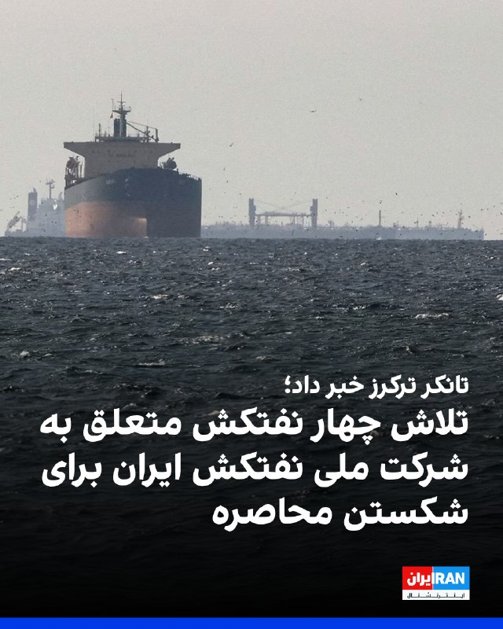

تانکر ترکرز در شبکه اجتماعی ایکس اعلام کرد چهار نفتکش متعلق به شرکت ملی نفتکش ایران، با مجموع ظرفیت حدود هفت میلیون بشکه نفت خام، طی دو تا سه روز گذشته ظاهرا تلاش کرده‌اند ایران را ترک کنند، اما به احتمال زیاد مجبور به بازگشت شده‌اند.
https://iranintl.com/202605318162

## Shin_Persian — post 6341

↩️ Quoted tweet: acceladealer ✓ @acceladealer Sun, 31 May 2026 19:44:43 UTC Damage to building following explosion (claimed targeted assassination) in SHAHRIAR [شهريار], Iran 35.680714, 51.022755 @GeoConfirmed @EpicFuryMap @FaytuksNetwork geolocated by…

## Shin_Persian — post 6340

  

↩️ Quoted tweet:
acceladealer ✓ @acceladealer
Sun, 31 May 2026 19:44:43 UTC

Damage to building following explosion (claimed targeted assassination) in SHAHRIAR [شهريار], Iran

35.680714, 51.022755

@GeoConfirmed @EpicFuryMap @FaytuksNetwork

geolocated by @acceladealer

↩️ توییت نقل‌قول شده — برای پاسخ، پست زیر را ببینید.

فارسی

خسارت به ساختمان در پی انفجار (ادعای ترور هدفمند) در شهریار، ایران

۳۵.۶۸۰۷۱۴, ۵۱.۰۲۲۷۵۵

@GeoConfirmed @EpicFuryMap @FaytuksNetwork

تایید جغرافیایی توسط @acceladealer_

𝕏 · @shin_persian

## Shin_Persian — post 6339

Shin ✓ @hey_itsmyturn
Sun, 31 May 2026 20:12:22 UTC

Explosions in Erbil, Kurdistan Region, #Iraq 🇮🇶

فارسی

انفجارها در اربیل، اقلیم کردستان، #Iraq 🇮🇶

𝕏 · @shin_persian

## Shin_Persian — post 6337

Shin ✓ @hey_itsmyturn
Sun, 31 May 2026 19:03:04 UTC

He was responsible for importing sat. dishes for IRIB, as well as contracts between the IRIB and IRGC Khatam Al Anbiya.

فارسی

او مسئول واردات دیش‌های ماهواره برای صدا و سیمای جمهوری اسلامی ایران (IRIB) و همچنین مسئول قراردادهای بین صدا و سیما و قرارگاه سازندگی خاتم‌الانبیا سپاه پاسداران (IRGC) بود.

𝕏 · @shin_persian

## Shin_Persian — post 6336

Shin ✓ @hey_itsmyturn
Sun, 31 May 2026 19:01:19 UTC

Targeted assassination in Adniesheh, Tehran Province, #Iran
Target: Vahid Hakan
@ ~ 1820Z

فارسی

ترور هدفمند در اندیشه، استان تهران، #Iran
هدف: وحید هاکان
در حدود ۱۸۲۰Z (۲۱:۵۰ به وقت تهران)

𝕏 · @shin_persian

## Shin_Persian — post 6335

  

Shin ✓ @hey_itsmyturn
Sun, 31 May 2026 17:44:41 UTC

Now -
Jet activity over Karaj, Alborz Province, #Iran

فارسی

فعالیت جت‌های جنگنده بر فراز کرج، استان البرز، #Iran

𝕏 · @shin_persian

## ManotoTV — post 105889

  <a href="telegram/content/ManotoTV_105889_1780263809.mp4" target="_blank">🎬 Download video</a>

سخنان الهام‌بخش دکتر عزت‌الله همایونفر، ادیب و سیاست‌مداری که واژگانش، وطن را معنا می‌کردند. در روزگاری که صداقت در سیاست نایاب بود، او ایستاد؛ با فرهنگ، با قلم، با شرف.

## ManotoTV — post 105879

  <a href="telegram/content/ManotoTV_105879_1780263811.mp4" target="_blank">🎬 Download video</a>

حذف احتمالی سردار آزمون از تیم ملی، فقط یک خبر ورزشی نیست.

این ماجرا دوباره پرسشی قدیمی را زنده می‌کند: در کشوری که سیاست و ورزش بارها به هم گره خورده‌اند، چه کسی حق دارد نماینده یک ملت باشد؟

از حمایت ورزشکاران از معترضان تا واکنش حکومت به صداهای مستقل، فوتبال ایران سال‌هاست فراتر از یک بازی است.

شاید امروز مهم‌ترین بحث فوتبال ایران نه ترکیب تیم ملی، بلکه معنای «تیم ملی» باشد. ورق بزنید.

## FarsiVOA — post 219212

  

⚡️مایک والتز، سفیر آمریکا در سازمان ملل متحد، در واکنش به پستی در شبکه اجتماعی ایکس که به نقل از اسکات بسنت، وزیر خزانه‌داری آمریکا، نوشته بود حملات جمهوری اسلامی به کشورهای جنوب خلیج فارس باعث شده این کشورها در شناسایی و مسدود کردن دارایی‌های تهران در بانک‌های خود با واشنگتن همکاری کنند، گفت بله، جمهوری اسلامی «اشتباه بزرگی» مرتکب شد و تا آینده قابل پیش‌بینی، بهای آن را خواهد پرداخت.
@FarsiVOA

## FarsiVOA — post 219211

  <a href="telegram/content/FarsiVOA_219211_1780263812.mp4" target="_blank">🎬 Download video</a>

⚡️بازنشستگان ایرانی زیر فشار تورم ساختاری؛ گفت‌وگو با رضا غیبی
@FarsiVOA

## FarsiVOA — post 219210

⚡️در سایه بحران دارو و معیشت در ایران؛ دغدغه روزنامه کیهان لبنان است
@FarsiVOA

## FarsiVOA — post 219208

🔺دیدگاه | سقوط قلعه بوفور و شکستی که حزب‌الله و جمهوری اسلامی تقدیم جهان اسلام کردند

◾️تصرف قلعه تاریخی و راهبردی بوفور (یا بوفورت که نام عربی آن «شقیف» است) توسط ارتش اسرائیل در جنوب لبنان می‌تواند برخی معادلات نظامی و سیاسی این کشور را تغییر دهد و یک شکست تاریخی برای حزب‌الله و جمهوری اسلامی ثبت کند.

⬇️ بیشتر بخوانید:
https://ir.voanews.com/a/opinion-beaufort-castle-fall-hezbollah-defeat/8155798.html
@FarsiVOA

## FarsiVOA — post 219207

  

فرماندهی مرکزی ایالات متحده، سنتکام، تصویری از هدایت یک بالگرد «ام‌اچ-۶۰ اس سی هاوک» هنگام فرود روی عرشه ناو «یواس‌اس میلیوس» در جریان عملیات پروازی در ۸ خرداد منتشر کرد.

سنتکام می‌گوید ناو «میلیوس» از محاصره آمریکا علیه جمهوری اسلامی حمایت می‌کند؛ محاصره‌ای که تا ۱۰ خرداد، مسیر ۱۱۸ کشتی تجاری را تغییر داده و ۵ فروند را از کار انداخته است.

@FarsiVOA

## FarsiVOA — post 219206

در حالی که ماه‌ها قبل مسئولان فدراسیون فوتبال جمهوری اسلامی از تضمین‌ها و شروط حضور تیم در جام جهانی صحبت می‌کردند، حالا در فاصله ۱۱ روز تا آغاز جام جهانی گزارش‌ها حاکی از آن است که فدراسیون برای تعیین تکلیف ویزاها بار دیگر به فیفا نامه زده است.

## FarsiVOA — post 219205

🔺صدور حکم زندان علیه یک وکیل؛ وقتی مجازات اعتراض «یک‌سال حضور در ستاد امر به معروف» است

◾️منابع حقوق بشری روز یکشنبه ۱۰ خرداد، از محکومیت مهدی انصاری، وکیل دادگستری به پنج سال حبس، و محکومیت نیما حسن‌خانی، از بازداشت‌شدگان اعتراضات دی‌ ۱۴۰۴، به «یک سال حضور در ستاد امر به معروف و نهی از منکر» به علاوه محکومیت‌های دیگر خبر دادند.

⬇️ بیشتر بخوانید:

https://ir.voanews.com/a/nima-hassankhani-mehdi-ansari-protesters-prison-lawyer/8155821.html

## FarsiVOA — post 219204

روزنامه شرق در گزارشی از گسترش پدیده‌ای نوشت که آن را «بحران خاموش ترک درمان» نامیده است؛ وضعیتی که در آن بیماران به دلیل افزایش هزینه‌ها، درمان‌‌ و مراقبت از بیماری‌های مزمن را به تعویق می‌اندازند یا به‌کلی کنار می‌گذارند.

بر اساس این گزارش، فشار همزمان تورم درمانی، کاهش قدرت خرید خانوارها، رشد قیمت دارو و تجهیزات پزشکی و پوشش محدود بیمه‌ها باعث شده درمان برای بسیاری از خانواده‌ها از یک حق ضروری به کالایی وابسته به توان مالی تبدیل شود.

گزارش کامل را در وب‌سایت صدای آمریکا بخوانید.

@FarsiVOA

## FarsiVOA — post 219201

ده سال زندان برای شهروندی که از معترض نشسته در برابر ماموران فیلمبرداری کرد

## FarsiVOA — post 219200

🔺ارتش اسرائیل: از زمان آتش‌بس تاکنون ۹۰۰ تروریست حزب‌الله کشته شدند

◾️ارتش اسرائیل روز یکشنبه ۱۰ خرداد، با انتشار پیامی در حساب کاربری خود در شبکه اجتماعی ایکس اعلام کرد که از آغاز آتش‌بس میان اسرائیل و لبنان در ۲۸ فروردین تاکنون «۹۰۰ تروریست از نیروهای حزب‌الله» را از بین برده است.

⬇️ بیشتر بخوانید:

https://ir.voanews.com/a/israel-lebanon-hezbollah-iran-beaufort/8155810.html

## FarsiVOA — post 219199

  <a href="telegram/content/FarsiVOA_219199_1780263863.mp4" target="_blank">🎬 Download video</a>

شنبه ٩ خرداد ۱۴۰۵، گروهی از پرستاران در یزد در اعتراض به «واریز نشدن تعرفه‌های خدمات پرستاری از شش ماه گذشته و تداوم بی‌عدالتی‌های صنفی و مزدی» با شعار «پرستار داد بزن، حقتو فریاد بزن» مقابل ساختمان استانداری تجمع کردند.

## FarsiVOA — post 219198

🔺جمهوری اسلامی سه تن از معترضان دی را به بیش از ۹ سال حبس محکوم کرد

◾️قوه قضائیه جمهوری اسلامی سه جوان اهل دره‌شهر استان ایلام و ساکن کرج به نام‌های محمدامین شمسی، امیر امرایی، و کامیار امرایی را که در جریان اعتراضات دی‌ماه ۱۴۰۴ بازداشت و در قزل‌حصار زندانی شده‌اند، جمعا به ۹ سال و ۳ ماه حبس محکوم کرده است.

⬇️ بیشتر بخوانید:

https://ir.voanews.com/a/prison-three-kurdish-youths-qezel-hesar-judiciary/8155814.html

## FarsiVOA — post 219197

🔺سناتور گراهام: پرزیدنت ترامپ «توافق بد» با رژیم ایران را نمی‌پذیرد

◾️لیندسی گراهام، سناتور ارشد جمهوری‌خواه از ایالت کارولینای جنوبی، یکشنبه ۱۰ خرداد، در شبکه ایکس با اشاره به گفت‌و‌گوی اخیرش با دونالد ترامپ، رئیس جمهوری آمریکا، نوشت: «یقین دارم دونالد ترامپ با یک توافق بد با [رژیم] ایران موافقت نخواهد کرد.»

⬇️ بیشتر بخوانید:

https://ir.voanews.com/a/lindsey-graham-iran-israel-hezbollah/8155794.html

## FarsiVOA — post 219194

تیفانی ترامپ، دختر پرزیدنت ترامپ، با انتشار تصاویری از سفر خود و همسرش به تاج محل نوشت: «دیداری شگفت‌انگیز از تاج محل؛ رویایی که به حقیقت پیوست.»

@FarsiVOA

## DW_Farsi — post 125355

🔶 عراقچی: تا وقتی گفت‌وگوها به نتیجه مشخص نرسد، قضاوت زودهنگام بی‌معناست
 
عباس عراقچی، وزیر امور خارجه جمهوری اسلامی ایران، در گفت‌وگو با خبرگزاری صدا و سیما با اشاره به ادامه روند گفت‌وگوها و تبادل پیام‌ها میان ایران و آمریکا با میانجی‌گری پاکستان، گفت تا زمانی که این روند به نتیجه مشخصی نرسد، نمی‌توان درباره آن قضاوت کرد.
 
عراقچی گفت گفت‌وگوها و تبادل پیام‌ها همچنان در جریان است و این روند ادامه دارد.
 
او تاکید کرد هرگونه ارزیابی درباره این روند باید به زمانی موکول شود که نتیجه‌ای روشن و مشخص به دست آمده باشد.
 
وزیر امور خارجه جمهوری اسلامی ایران افزود آنچه اکنون در رسانه‌ها درباره مذاکرات مطرح می‌شود، در حد گمانه‌زنی است.
 
پیشتر، محمدباقر قالیباف، رئیس مجلس شورای اسلامی با اشاره به مذاکرات جاری بین جمهوری اسلامی و آمریکا بر سر ادامه آتش‌بس و توافق هسته‌ای، با بیان این که جمهوری اسلامی "هیچ اعتمادی" به وعده‌های آمریکا ندارد گفت: «کار دیپلماسی تبدیل پیروزی‌های کسب شده در میدان نظامی به دستاوردهای سیاسی و حقوقی است.»
 
قالیباف در ادامه، مذاکره‌کنندگان جمهوری اسلامی را "سربازان میدان مبارزه‌ دیپلماسی" توصیف کرد و گفت مذاکره‌کنندگان جمهوری اسلامی "هیچ اعتمادی به حرف ها و وعده‌های دشمن ندارند".
 
این در حالی است که وبسایت خبری اکسیوس از قول یک مقام ارشد ایالات متحده گزارش داد که دونالد ترامپ، رئیس جمهور آمریکا در جریان نشست اتاق وضعیت در کاخ سفید، خواسته که چند اصلاحیه در متن توافق با جمهوری اسلامی انجام شود.
 
در این گزارش آمده است که در متن کنونی یک بازه ۶۰ روزه برای انجام مذاکره در خصوص تعهدات اتمی جمهوری اسلامی و کاهش تحریم‌ها پیش‌بینی شده و نخستین موضوعات بر سر سرنوشت ذخایر اورانیوم غنی‌شده در ایران و نیز محدود کردن غنی‌سازی بیشتر خواهد بود.
 
در همین حال، نیویورک‌تایمز از سه مقام ایالات متحده نقل کرده که ترامپ، پیش‌شرط‌های چارچوب احتمالی توافق با ایران را سخت‌تر کرده و تغییرات پیشنهادی خود را به منظور بازبینی دوباره به تهران فرستاده است.
@dw_farsi

## DW_Farsi — post 125354

  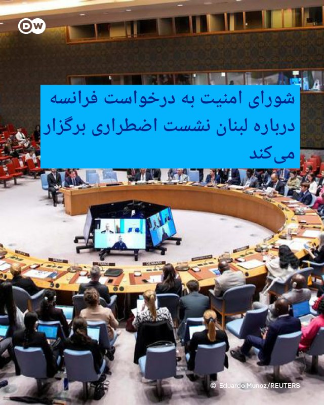

🔶 شورای امنیت به درخواست فرانسه درباره لبنان نشست اضطراری برگزار می‌کند
 
منابع دیپلماتیک به خبرگزاری فرانسه گفته‌اند شورای امنیت سازمان ملل نشست اضطراری درباره گسترش عملیات اسرائیل در لبنان را برگزار خواهد کرد. این نشست به درخواست فرانسه تشکیل می‌شود و بلافاصله پس از نشست اضطراری دیگری درباره سقوط یک پهپاد روسی به یک ساختمان مسکونی در رومانی، که برای ساعت ۳ بعدازظهر روز یکشنبه ۳۱ مه به وقت نیویورک برنامه‌ریزی شده، آغاز خواهد شد.
 
 به این ترتیب، پرونده لبنان در ادامه یک جلسه امنیتی دیگر در دستور کار شورای امنیت قرار خواهد گرفت.
 
درخواست فرانسه پس از آن مطرح شد که نیروهای اسرائیلی قلعه راهبردی بوفور  را در لبنان تصرف کردند. این تحول، نگرانی‌ها درباره گسترش بیشتر دامنه عملیات اسرائیل در خاک لبنان را افزایش داده است.
 
برگزاری این نشست نشان می‌دهد تحولات میدانی اخیر در جنوب لبنان، بار دیگر به سطح شورای امنیت کشیده شده و به موضوعی فوری در دستور کار سازمان ملل تبدیل شده است.
 
@dw_farsi

## DW_Farsi — post 125353

  

🔶 حسن و حسین امیری، دو برادر ۲۰ ساله، به اعدام محکوم شدند
 
به گزارش هرانا، حسن و حسین امیری، دو برادر دوقلوی ۲۰ ساله زندانی در قزلحصار کرج، از سوی شعبه ۲۶ دادگاه انقلاب تهران به ریاست ایمان افشاری به اعدام محکوم شده‌اند. این حکم به‌تازگی صادر شده و مبنای آن اتهام "جاسوسی برای اسرائیل" عنوان شده است. در کیفرخواست این دو برادر، مشاهده تصاویری از ساختمان‌های آسیب‌دیده مبنای طرح اتهام "جاسوسی به نفع اسرائیل" قرار گرفته است.
 
یک منبع مطلع به هرانا گفته است حسن و حسین امیری به دستور بازپرس پرونده به‌صورت جداگانه در زندان قزلحصار نگهداری می‌شوند و از حق ملاقات با یکدیگر محروم هستند.
 
این دو برادر پیش‌تر در یکی از ایست‌های بازرسی و پس از بررسی تلفن همراهشان بازداشت شدند و به مدت دو ماه به‌صورت بلاتکلیف در زندان قزلحصار کرج نگهداری شدند.
 
حسن و حسین امیری از دو سالگی در مراکز بهزیستی پرورش یافته‌اند و خانواده‌ای برای پیگیری وضعیت خود ندارند؛ موضوعی که نگرانی آشنایان آن‌ها را درباره روند رسیدگی به پرونده افزایش داده است.
 
@dw_farsi

## Persian_Trend_Official — post 15417

  <a href="telegram/content/Persian_Trend_Official_15417_1780263867.webm" target="_blank">🎬 Download video</a>

https://youtube.com/live/KH1FJLD8MjM?feature=share

## Persian_Trend_Official — post 15416

تا دقایقی دیگه لایو داریم

## Persian_Trend_Official — post 15415

  <a href="telegram/content/Persian_Trend_Official_15415_1780263868.mp4" target="_blank">🎬 Download video</a>

خبرگزاری CNN: ایران علیرغم بمباران گسترده آمریکا و اسرائیل، در کمتر از دو ماه دسترسی به اکثر پایگاه‌های موشکی زیرزمینی خود را بازیابی کرده است.

در طول جنگ، ایالات متحده و اسرائیل با تخریب جاده‌های دسترسی و فرو ریختن ورودی‌های تونل، زیرساخت‌های موشکی زیرزمینی ایران را هدف قرار دادند. اما از زمان آتش‌بس، تهران به سرعت اقدام کرده است. از 69 ورودی تونل در 18 تأسیسات زیرزمینی مورد حمله، 50 مورد از آنها تاکنون پاکسازی شده‌اند.

تصاویر ماهواره‌ای نشان می‌دهد که تلاش برای بازیابی به چیزی پیچیده‌تر از بولدوزرها، بیل مکانیکی‌ها و کامیون‌های کمپرسی متکی نیست. جاده‌ها در اکثر سایت‌ها بازسازی شده‌اند و برخی از بخش‌ها از قبل آسفالت شده‌اند.

منابع متعدد به CNN گفتند که بازیابی بسیار ارزان‌تر و ساده‌تر از خود حملات بوده است. تیمور کادیشف، محقق دانشگاه هامبورگ، گفت: "شما باید از سلاح‌های بسیار پیچیده و گران‌قیمت برای ایجاد چنین خسارتی استفاده کنید و تنها چیزی که برای تعمیر آن نیاز دارید بولدوزرها هستند."

📝 Amir

📌 @persian_trend_official
پرشین ترند | متفاوت‌ترین کانال نظامی

## Persian_Trend_Official — post 15414

  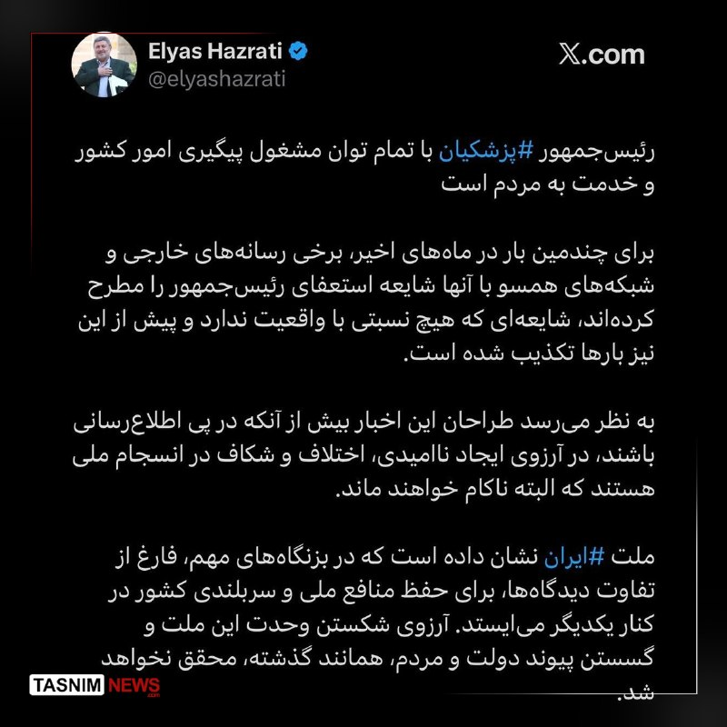

شایعه استعفای رئیس‌جمهور هیچ نسبتی با واقعیت ندارد‏

«الیاس حضرتی» رئیس شورای اطلاع‌رسانی دولت:

🔹 رئیس‌جمهور ‌پزشکیان⁩ با تمام توان مشغول پیگیری امور کشور و خدمت به مردم است

🔹 ‏برای چندمین بار در ماه‌های اخیر، برخی رسانه‌های خارجی و شبکه‌های همسو با آنها شایعه استعفای رئیس‌جمهور را مطرح کرده‌اند، شایعه‌ای که هیچ نسبتی با واقعیت ندارد و پیش از این نیز بارها تکذیب شده است.

🔹 ‏به نظر می‌رسد طراحان این اخبار بیش از آنکه در پی اطلاع‌رسانی باشند، در آرزوی ایجاد ناامیدی، اختلاف و شکاف در انسجام ملی هستند که البته ناکام خواهند ماند.

🔹 ‏ملت ایران⁩ نشان داده است که در بزنگاه‌های مهم، فارغ از تفاوت دیدگاه‌ها، برای حفظ منافع ملی و سربلندی کشور در کنار یکدیگر می‌ایستد. آرزوی شکستن وحدت این ملت و گسستن پیوند دولت و مردم، همانند گذشته، محقق نخواهد شد.

👺Phantom

📌 @persian_trend_official
پرشین ترند | متفاوت‌ترین کانال نظامی

## RadioFarda — post 157753

  <a href="https://t.me/radiofarda/157753" target="_blank">📎 Download file</a>

📻بشنوید: سرخط خبرهای نیمه‌شب با رادیوفردا، یازده خرداد ۱۴۰۵‌

@RadioFarda

## RadioFarda — post 157752

🔸حسن آقاخانی، وکیل دادگستری، روز یکشنبه خبر داد که مسعود پیاهو، موکل او، به اتهام فیلم گرفتن از معترضی که در جریان اعتراضات دی‌ماه سال گذشته مقابل مأموران پلیس ایران در خیابان روی زمین نشسته بود، به ۱۰ سال زندان محکوم شده است. 🔸او به امتداد گفت که بازداشت…

## RadioFarda — post 157751

  <a href="telegram/content/RadioFarda_157751_1780263872.mp4" target="_blank">🎬 Download video</a>

🔸حسن آقاخانی، وکیل دادگستری، روز یکشنبه خبر داد که مسعود پیاهو، موکل او، به اتهام فیلم گرفتن از معترضی که در جریان اعتراضات دی‌ماه سال گذشته مقابل مأموران پلیس ایران در خیابان روی زمین نشسته بود، به ۱۰ سال زندان محکوم شده است.

🔸او به امتداد گفت که بازداشت آقای پیاهو به پیش از هجدهم و نوزدهم دی سال گذشته برمی‌گردد.

🔸این وکیل توضیح داده است: «موکل من در حال کار در بازاری بودند که به خیابان جمهوری مشرف بوده است. شخصی در مقابل مامورین نیروی انتظامی، می‌نشیند و مسعود یک فیلم کوتاه به صورت ناخودآگاه از آن صحنه ضبط می‌کند.»

🔸او اعلام کرد که مسعود پیاهو قصد انتشار «عمومی» این ویدئو را نداشته و آن را در «استوری پرایوت» صفحه اینستاگرام خود منتشر کرد اما سپس شخص دیگری آن را به شکل عمومی منتشر کرد.

🔸انتشار این ویدئو از فردی که روز هشتم دی‌ماه و در دومین روز اعتراضات به تنهایی مقابل مأموران انتظامی روی زمین نشسته بود، به شکل گسترده منتشر شد، بازتاب‌های فراوانی ایجاد کرد و به یکی از نمادهای این اعتراض‌ها تبدیل شد.

@RadioFarda

## RadioFarda — post 157750

🔸طالبان با قانون جدید طلاق، به‌طور ضمنی ازدواج کودکان را به رسمیت شناخته است.

🔸بر اساس این قانون، دختران ازدواج‌کرده در کودکی فقط پس از رسیدن به سن بلوغ می‌توانند درخواست جدایی بدهند؛ در این سن نیز اگر اعتراضی نکنند، سکوتشان به‌معنای رضایت تلقی می‌شود.

🔸سازمان ملل این فرمان را گامی دیگر در تضعیف حقوق زنان و دختران افغان دانسته و آن را نشانه‌ای از مجاز بودن ازدواج کودکان توصیف کرده است.

🔸طبق این قانون، حتی در صورت بدرفتاری شوهر، دختر برای فسخ ازدواج باید ادعای خود را در دادگاه ثابت کند؛ در غیر این صورت، رأی به نفع شوهر صادر می‌شود.

🔸فعالان حقوق زنان می‌گویند در افغانستانِ تحت حاکمیت طالبان، با محدودیت‌های شدید علیه زنان و تابوی اجتماعی طلاق، دسترسی دختران خردسال به عدالت عملاً بسیار دشوار است.

@RadioFarda

## IranianMinds — post 21161

  

مسعود پیاهو، مردی که تصویر معترض نشسته مقابل نیروهای پلیس یگان ویژه در مقابل پاساژ علاالدین در آغاز اعتراضات دی ماه سال گذشته رو منتشر کرد، به گفته وکیلش به ۱۰ سال زندان محکوم شده!

@IranianMinds

## IranianMinds — post 21160

  

ویدیوی پشم ریزون از لحظه‌ی حمله آمریکا با موشک تاماهاک به بیت رهبری رو از «کلوز فرند» ببینید: 
🔥

@CloseFriend3
@CloseFriend3

## BBCPersian — post 282516

  <a href="telegram/content/BBCPersian_282516_1780263877.mp4" target="_blank">🎬 Download video</a>

‌ ‌ ‌ ‌
در ماه‌های اخیر گزارش‌های متعددی از کمبود دارو در ایران منتشر شده است. به گفته وحید شریعت، رئیس انجمن روانپزشکی ایران، داروهای حیاتی روانپزشکی از جمله داروهای مرتبط با افسردگی، دوقطبی و اسکیزوفرنی با کمبود مواجه شده‌اند و در صورت ادامه روند فعلی، این وضعیت می‌تواند در ماه‌های آینده تشدید شود.

دکتر کیانا کثیری در برنامه رادیویی جام جهان‌نمای بی‌بی‌سی فارسی درباره پیامدهای خطرناک کمبود داروهای روانپزشکی گفت.

@BBCPersian

## BBCPersian — post 282515

  <a href="https://t.me/bbcpersian/282515" target="_blank">📎 Download file</a>

پادکست برنامه شصت دقیقه یکشنبه ۱۰ خرداد ۱۴۰۵

این نسخه رادیویی برنامه شصت دقیقه تلویزیون فارسی بی‌بی‌سی است که هرشب بعد از پخش، با حجم کم از اپلیکیشن‌های پادگیر و صفحه تلگرام بی‌بی‌سی فارسی در دسترس است.

با هشتگ BBCPersianRadio# با ما در ارتباط باشید

@BBCPersian

## BBCPersian — post 282514

  

‌ ‌ ‌
چند مقام دولتی در ایران از جمله سخنگوی دولت این کشور با تکذیب شایعه استعفای مسعود پزشکیان، آن را «خبر کذب با هدف ایجاد ناامیدی» خواندند.

فاطمه مهاجرانی، سخنگوی دولت، الیاس حضرتی و علی احمدنیا که از اعضای شورای اطلاع رسانی دولت آقای پزشکیان هستند در پست‌های جداگانه به ادامه کار رئیس جمهوری و تلاش او برای «حل مسائل کشور» اشاره کرده‌اند.

در همین حال، خبرگزاری‌های رسمی ایران، روز یکشنبه چند گزارش‌ تصویری از حضور و سخنرانی آقای پزشکیان در رویدادهای مختلف داخلی منتشر کردند از جمله گفتگوی او با خبرنگاران درباره جام جهانی ۲۰۲۶.

https://trib.al/MvkvAGi
📷omidradio
@BBCPersian

## BBCPersian — post 282513

  

‌ ‌ ‌ ‌
عباس عراقچی، وزیر امور خارجه ایران گفته است که گفت‌وگوها و تبادل پیام‌ها بین ایران و آمریکا برای خاتمه جنگ همچنان در جریان است و تا زمانی که به نتیجه مشخصی نرسد، نمی‌توان درباره آن قضاوت کرد.

او در گفت‌وگو با خبرگزاری صدا و سیما با اشاره به ادامه تبادل پیام‌ها بین ایران و آمریکا برای خاتمه جنگ با میانجی گری پاکستان، گفته است تا زمانی که این اقدامات به نتیجه خاصی نرسد، گمانه‌زنی‌های مطرح‌شده در این زمینه فاقد اهمیت است.

او افزود: همه آنچه در حال حاضر درباره مذاکرات در رسانه ها مطرح می‌شود، در حد گمانه‌زنی است و به نظر من نباید به این گمانه‌زنی‌ها اهمیت داده شود تا وقتی موضوعات به مرحله قطعیت برسد.

https://trib.al/c8Cs9MF
📷eghtesadnews
@BBCPersian

## BBCPersian — post 282512

🔻 شورای امنیت به درخواست فرانسه «درمورد گسترش حمله اسرائیل به لبنان» جلسه اضطراری برگزار می‌کند

منابع دیپلماتیک به خبرگزاری فرانسه گفتند که شورای امنیت سازمان ملل متحد روز دوشنبه درمورد گسترش حمله اسرائیل به لبنان، پس از تصرف قلعه تاریخی شقیف (بوفور)، جلسه اضطراری برگزار خواهد کرد.

این منابع گفتند که این جلسه به درخواست فرانسه و بلافاصله پس از جلسه اضطراری درمورد اصابت یک پهپاد روسیه به آپارتمانی در رومانی خواهد بود.

پیشتر، وزیر امور خارجه فرانسه گفت که پس از تصرف قلعه شقیف (بوفور) در لبنان به دست نیروهای اسرائیل، خواستار برگزاری نشست اضطراری شورای امنیت سازمان ملل شده است.

ژان نوئل بارو به شبکه «بی‌اف‌ام تی‌وی» گفت: «با وجود آنکه حق دفاع مشروع اسرائیل را مانند هر کشوری به رسمیت می‌شناسیم، هیچ چیز نمی‌تواند ادامه عملیات نظامی اسرائیل و پیشروی هرچه بیشتر در خاک لبنان را توجیه کند.»

وزیر دفاع اسرائیل امروز در پستی در شبکه تلگرام نوشت: «۴۴ سال پس از نبرد قهرمانانه بوفور و در روزی که یادآور سربازان کشته‌ شده در جنگ اول لبنان (۱۹۸۲) است، نیروهای ما بار دیگر به این قلعه بازگشتند و پرچم اسرائیل را برافراشتند.»

این قلعه ۹۰۰ ساله که متعلق به قرون وسطی است، دید وسیعی بر جنوب لبنان دارد و از نظر نظامی بسیار مهم محسوب می‌شود.

https://trib.al/kde10vW
@BBCPersian

## BBCPersian — post 282511

🔻 تام باراک فرستاده ویژه ترامپ در امور سوریه و عراق شد

دونالد ترامپ، امروز تام باراک، سفیر آمریکا در ترکیه، را با حفظ پست کنونی، به عنوان فرستاده ویژه رئیس‌جمهور آمریکا در امور سوریه و عراق هم منصوب کرد.

دونالد ترامپ با اعلام این خبر در شبکه اجتماعی تروث سوشال از عملکرد آقای باراک در سمت سفیر آمریکا در ترکیه تمجید کرد: «تام باراک به عنوان سفیر آمریکا در ترکیه باقی خواهد ماند و با حمایت کامل وزارت امور خارجه ایالات متحده فعالیت خواهد کرد.»

او نوشت: «همکاری استراتژیک آمریکا با دولت‌های سوریه و عراق، و روابطش با این کشورها همچنان در حال گسترش است.»

https://trib.al/xnR5A7T
@BBCPersian

## BBCPersian — post 282510

  <a href="telegram/content/BBCPersian_282510_1780263882.mp4" target="_blank">🎬 Download video</a>

آخرین خبرهای مهم روز یکشنبه ۱۰ خرداد ۱۴۰۵

@BBCPersian

## Dirty_Kids — post 390686

🔴 ایران اینترنشنال: مسعود پزشکیان بخاطر ورود سپاه به تمامی مسائل کشور و دخالت در کارای دولت نامه استعفا خودشو به مجتبی خامنه‌ای تحویل داد. @Dirty_Kids 👻

## Dirty_Kids — post 390685

  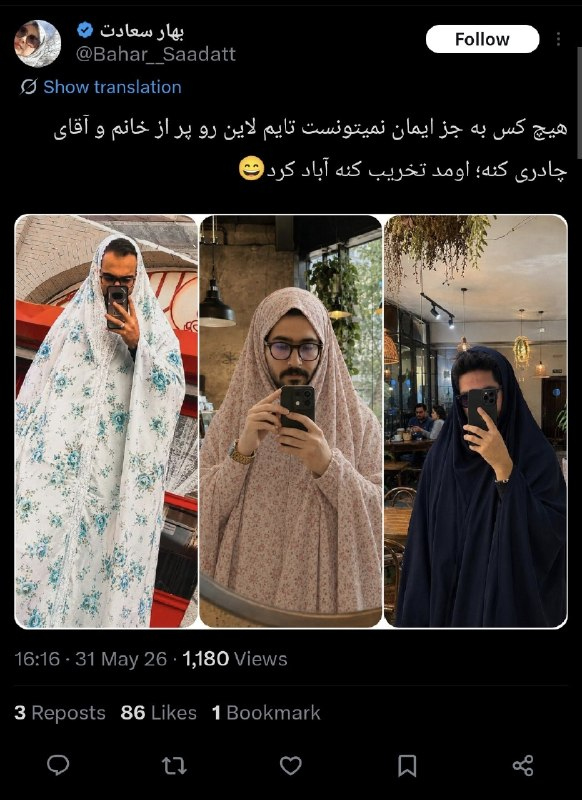

قشنگ جاهایی که میرن عین خودشون کیریه. قهوه تو لیوان دسته دار. دیزاین خیمه معاویه. اصلا کیری بودن با شماها آمیخته شده. @Dirty_Kids 👻

## Dirty_Kids — post 390684

  <a href="telegram/content/Dirty_Kids_390684_1780263886.mp4" target="_blank">🎬 Download video</a>

عوارض کوکائین

@Dirty_Kids 👻

## Dirty_Kids — post 390683

  <a href="telegram/content/Dirty_Kids_390683_1780263888.mp4" target="_blank">🎬 Download video</a>

لاشی جدی داشتم احساساتی میشدم :/

@Dirty_Kids 👻

## Dirty_Kids — post 390680

  <a href="telegram/content/Dirty_Kids_390680_1780263891.mp4" target="_blank">🎬 Download video</a>

دخترا تو اینستاگرام ديگه زیادی دارن با ما راحت میشن:

@Dirty_Kids 👻

## Dirty_Kids — post 390679

  

واکنش فیلد مارشال محسن رضایی به خبر استعفای پزشکیان 🤣

@Dirty_Kids 👻

## Dirty_Kids — post 390678

  

لانچر موشک‌های بالستیک جمهوری اسلامی.

@Dirty_Kids 👻

## Dirty_Kids — post 390677

زندگی برای قشر ما اینطوریه که اون زمان 5 تومن نداشتیم یه پراید بخریم ، بعد 10 تومن نداشتیم ، بعد 20 تومن نداشتیم
الانم یک میلیارد نداریم.
فرقی برا ما نکرده

اون موقع کمتر نداشتیم بخریم، بعد بیشتر نداشتیم بخریم، الان اصلا نداریم بخریم. :)

@Dirty_Kids 👻

## Dirty_Kids — post 390676

  

🔴 ماهی‌ای که به تازگی در ونزوئلا کشف شده و آقایون دائم در تلاشن تا بتونن صیدش کنن:|

@Dirty_Kids 👻

## Dirty_Kids — post 390675

  <a href="telegram/content/Dirty_Kids_390675_1780263893.mp4" target="_blank">🎬 Download video</a>

موافقید با نظر مرادمون در خصوص «بی‌بی»؟!

@Dirty_Kids 👻

## Dirty_Kids — post 390674

  

🔴 معاون دفتر پزشکیان: خبر استعفای رییس جمهور دروغه و پزشکیان همچنان به غصه خوردن ادامه میده.

@Dirty_Kids 👻

## Dirty_Kids — post 390673

  

وقتی از عقلت استفاده میکنی🤣

@Dirty_Kids 👻

## Dirty_Kids — post 390672

  

رفسنجانی تو خاطراتش گفته بود: همه‌ی جوجه آخوندارو میندازن تو بشکه بهشون دخول میکنن هیچی دیگه خواستم بگم حق دارن از اون محیط پاشون به این محیط باز شده ذوق کنن داستان اینه که یکی گفته تو کافه چادری میبینم چندشم میشه این گوزوها مثلا دارن دیس‌بک میدن @Dirty_Kids…

## Dirty_Kids — post 390671

  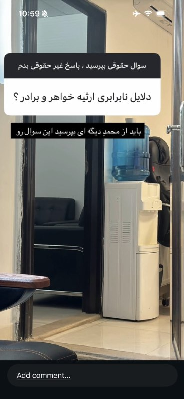

وکیل از اسمش محمد هستش

وکیل تراز :)))))))))))

@Dirty_Kids 👻

## Hranews — post 113295

  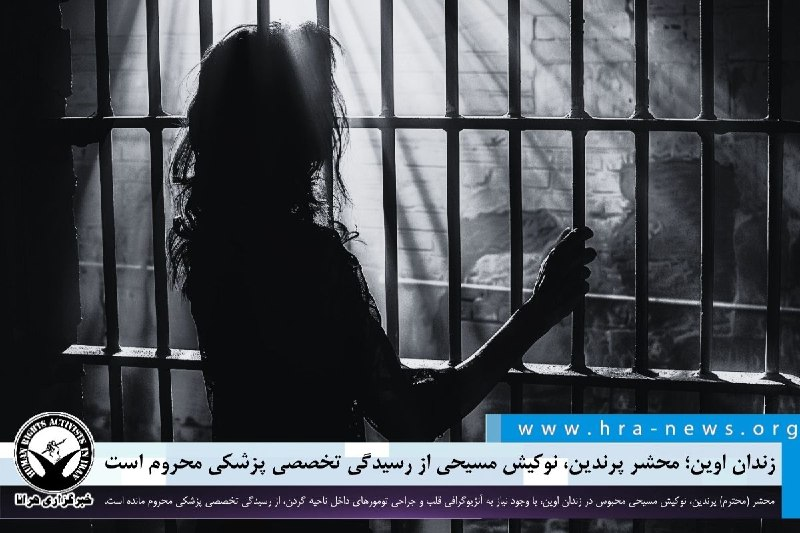

عدم رسیدگی پزشکی؛ اعزام بی‌نتیجه محشر پرندین به بیمارستان و تداوم محرومیت از درمان

❗️
❗️
❗️
❗️
❗️– محشر (محترم) پرندین، نوکیش مسیحی محبوس در زندان اوین، با وجود نیاز فوری به آنژیوگرافی قلب و جراحی تومورهای ناحیه گردن، از رسیدگی تخصصی پزشکی محروم مانده است. وی در هفته گذشته به بیمارستان اعزام شد، اما پس از انجام یک آزمایش، بدون دریافت خدمات درمانی یا تجویز دارو به زندان بازگردانده شد.

به گزارش خبرگزاری هرانا، ارگان خبری مجموعه فعالان حقوق بشر در ایران، محشر (محترم) پرندین کماکان از رسیدگی درمانی محروم است.

یک منبع مطلع از وضعیت این نوکیش مسیحی، ضمن تایید این موضوع به هرانا گفت: “خانم پرندین در هفته گذشته یک‌بار به بیمارستان اعزام شد، اما پس از انجام تنها یک آزمایش، بدون دریافت خدمات درمانی یا تجویز دارو، مجدداً به زندان بازگردانده شد. این در حالی است که بنا بر تشخیص پزشک بهداری زندان، وی نیازمند انجام آنژیوگرافی قلب و جراحی تومورهای موجود در ناحیه گردن است.”

ادامه مطلب

#محشر_پرندین #محترم_پرندین

↘️
@hranews_bot تماس ✉️ - @Hranews کانال هرانا 🆑

## Hranews — post 113294

  

محمد داوری از زندان عادل‌آباد شیراز آزاد شد

❗️
❗️
❗️
❗️
❗️– محمد داوری، زندانی سیاسی، امروز با پایان دوران محکومیت از زندان عادل‌آباد شیراز آزاد شد.

به گزارش خبرگزاری هرانا، ارگان خبری مجموعه فعالان حقوق بشر در ایران، محمد داوری آزاد شد.

براساس اطلاعات دریافتی هرانا، آقای داوری امروز یکشنبه ۱۰ خرداد ۱۴۰۵، با پایان دوران محکومیت خود از زندان عادل‌آباد شیراز آزاد شده است.

ادامه مطلب

#محمد_داوری

↘️
@hranews_bot تماس ✉️ - @Hranews کانال هرانا 🆑

## Hranews — post 113293

دستکم ۴ تجمع اعتراضی برگزار شد

❗️
❗️
❗️
❗️
❗️– امروز یکشنبه ۱۰ خرداد، جمعی از بازنشستگان تامین اجتماعی در شهرهای تهران، رشت و شوش و گروهی از کارگران شهرداری در شوش تجمع اعتراضی برگزار کردند.

ادامه مطلب

#کارگران #بازنشستگان

↘️
@hranews_bot تماس ✉️ - @Hranews کانال هرانا 🆑

## Hranews — post 113292

  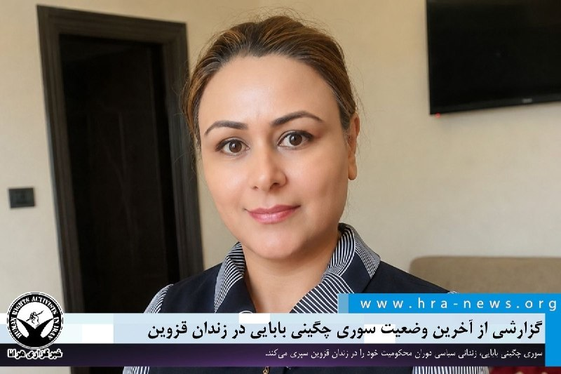

گزارشی از آخرین وضعیت سوری چگینی بابایی در زندان قزوین

❗️
❗️
❗️
❗️
❗️– سوری چگینی بابایی، زندانی سیاسی دوران محکومیت خود را در زندان قزوین سپری می‌کند. وی پیشتر، توسط دادگاه انقلاب قزوین به سه سال حبس و مجازاتهای تکمیلی محکوم شده بود. همچنین او بیش از ۱۴۰ روز است که از ملاقات با خانواده خود محروم مانده است.

به گزارش خبرگزاری هرانا، ارگان خبری مجموعه فعالان حقوق بشر در ایران، سوری چگینی بابایی، زندان سیاسی دوران محکومیت خود را در زندان قزوین سپری می‌کند.

بر اساس اطلاعات دریافتی هرانا، خانم بابایی پس از بازداشت در اعتراضات سراسری ۱۴۰۴، با یک پرونده قضایی دو بخشی مواجه شد. وی در بخش نخست این پرونده، توسط شعبه دوم دادگاه انقلاب قزوین از بابت اتهام «توهین به رهبری» به دو سال حبس و از بابت اتهام «تبلیغ علیه نظام» به یک سال حبس و دو سال ممنوعیت خروج از کشور محکوم شده است. همچنین در بخش دوم این پرونده، شعبه ۱۰۵ دادگاه کیفری دو قزوین، وی را از اتهام «اخلال در نظم و آسایش عمومی» تبرئه کرده است.

ادامه مطلب

#سوری_چگینی_بابایی

↘️
@hranews_bot تماس ✉️ - @Hranews کانال هرانا 🆑

## Hranews — post 113291

گزارشی از بلاتکلیفی، معوقات مزدی و بیمه‌ای کارگران در ۳ واحد مختلف

❗️
❗️
❗️
❗️
❗️– حدود ۱۷۰ نفر از کارگران کارخانه پویا نخ ایلام واقع در شهرک صنعتی ششدار در بلاتکلیفی شغلی به‌سر می‌برند. از سوی دیگر، گروهی از #کارگران کارخانه کیش چوب از عدم پرداخت مطالبات مزدی چندین ماهه خود خبر دادند. همچنین، شماری از کارگران کارخانجات مخابراتی ایران (آی‌تی‌ام‌سی) در شیراز، از عدم پرداخت چندین ماه حق بیمه و مطالبات مزدی خود ابراز نارضایتی کرده و خواستار رسیدگی به مطالباتشان شدند.

ادامه مطلب

↘️
@hranews_bot تماس ✉️ - @Hranews کانال هرانا 🆑

## Hranews — post 113290

  

مسلم زمانی از زندان یاسوج آزاد شد

❗️
❗️
❗️
❗️
❗️– مسلم زمانی، شهروند ساکن گچساران که در رابطه با اعتراضات دی‌ماه ۱۴۰۴ بازداشت شده بود، امروز با تودیع وثیقه از زندان یاسوج آزاد شد.

به گزارش خبرگزاری هرانا، ارگان خبری مجموعه فعالان حقوق بشر در ایران، مسلم زمانی آزاد شد.

براساس اطلاعات دریافتی هرانا، آزادی آقای زمانی امروز یکشنبه ۱۰ خردادماه، با تودیع وثیقه از زندان یاسوج صورت گرفته است.

پرونده وی در شعبه دوم بازپرسی دادسرای عمومی و انقلاب گچساران با اتهاماتی از جمله «تبلیغ علیه نظام جمهوری اسلامی»، «عضویت در دسته، جمعیت یا شعبه جمعیت‌هایی که در داخل کشور با هدف برهم زدن امنیت کشور تشکیل شده‌اند» و «اجتماع و تبانی برای ارتکاب جرم علیه امنیت داخلی یا خارجی کشور» در حال رسیدگی است.

ادامه مطلب

#مسلم_زمانی

↘️
@hranews_bot تماس ✉️ - @Hranews کانال هرانا 🆑

## Hranews — post 113289

مردی در تهران به اعدام و شلاق محکوم شد

❗️
❗️
❗️
❗️
❗️– مردی به اتهام قتل و مصرف مشروبات الکلی توسط شعبه سه دادگاه کیفری تهران به مجازات‌هایی از جمله #اعدام و #شلاق محکوم شد.

ادامه مطلب

↘️
@hranews_bot تماس ✉️ - @Hranews کانال هرانا 🆑

## Hranews — post 113288

کرمان؛ مرگ یک کارگر در سایه فقدان ایمنی کار

❗️
❗️
❗️
❗️
❗️– در سایه فقدان ایمنی محیط و شرایط نامناسب کار، یک #کارگر مقنی در کرمان، حین انجام کار طی حادثه ای جان خود را از دست داد.

ادامه مطلب

↘️
@hranews_bot تماس ✉️ - @Hranews کانال هرانا 🆑

## manototv — post 105889

  <a href="telegram/content/manototv_105889_1780263899.mp4" target="_blank">🎬 Download video</a>

سخنان الهام‌بخش دکتر عزت‌الله همایونفر، ادیب و سیاست‌مداری که واژگانش، وطن را معنا می‌کردند. در روزگاری که صداقت در سیاست نایاب بود، او ایستاد؛ با فرهنگ، با قلم، با شرف.

## manototv — post 105879

  <a href="telegram/content/manototv_105879_1780263901.mp4" target="_blank">🎬 Download video</a>

حذف احتمالی سردار آزمون از تیم ملی، فقط یک خبر ورزشی نیست.

این ماجرا دوباره پرسشی قدیمی را زنده می‌کند: در کشوری که سیاست و ورزش بارها به هم گره خورده‌اند، چه کسی حق دارد نماینده یک ملت باشد؟

از حمایت ورزشکاران از معترضان تا واکنش حکومت به صداهای مستقل، فوتبال ایران سال‌هاست فراتر از یک بازی است.

شاید امروز مهم‌ترین بحث فوتبال ایران نه ترکیب تیم ملی، بلکه معنای «تیم ملی» باشد. ورق بزنید.

## alonews — post 124067

  <a href="telegram/content/alonews_124067_1780263902.webm" target="_blank">🎬 Download video</a>

👈خبرگزاری ‌CNN اعلام کرد که ایران اکنون 50 ورودی از 69 ورودی تونلی را که توسط ایالات متحده آمریکا و اسرائیل در 18 تأسیسات موشکی زیرزمینی مورد اصابت قرار گرفته بود، باز کرده است

🔴تصویر متعلق به یک پایگاه موشکی در دزفول است که چهار ورودی از پنج ورودی آن باز شده است

✅ @AloNews خبر جنگ

## alonews — post 124065

  <a href="telegram/content/alonews_124065_1780263902.webm" target="_blank">🎬 Download video</a>

👈رژه روز اسرائیل در نیویورک

✅ @AloNews خبر جنگ

## alonews — post 124064

  <a href="telegram/content/alonews_124064_1780263903.mp4" target="_blank">🎬 Download video</a>

این 2 دقیقه رو حتما یه جا سیو کنین و یا بفرستین پیوی رفیقتون که گمش نکنین! هر بار این کلیپ رو باز کنین مو به تنتون سیخ میشه که طی این چند سال چه اتفاقی افتاده!

[@AloTweet]

## alonews — post 124063

  <a href="telegram/content/alonews_124063_1780263904.mp4" target="_blank">🎬 Download video</a>

🔴مسعود پیاهو، کسی که ویدیوی مرد نشسته مقابل موتوسواران یگان‌ویژه در خیابان جمهوری تهران را منتشر کرد، به ۱۰ سال زندان محکوم شد.

🔴ویدیوی این مرد که در دومین روز اعتراضات دی‌ماه ۱۴۰۴ منتشر شد، به سرعت وایرال و به یکی از نمادهای اعتراضات تبدیل شد.

🤔دم از عدل علی میزنن ولی به معاویه گفتن زکی

✅@AloNews

## alonews — post 124062

  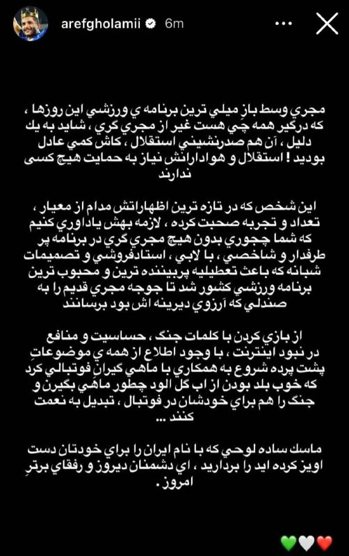

🔴 حمله شدید عارف غلامی، بازیکن استقلال به محمدحسین میثاقی
@AloSport

## alonews — post 124061

  <a href="telegram/content/alonews_124061_1780263906.webm" target="_blank">🎬 Download video</a>

👈نبیه بری، رئیس مجلس لبنان : اعلام کرده که خلع سلاح حزب‌الله را تضمین می‌کند و قول آن را می‌دهد اگر اسرائیلی‌ها حملاتشان را متوقف کنند.

✅ @AloNews خبر جنگ

## alonews — post 124060

  <a href="telegram/content/alonews_124060_1780263907.webm" target="_blank">🎬 Download video</a>

👈اوکراین تعدادی پهپاد انتحاری به سمت روسیه پرتاب کرد

✅ @AloNews خبر جنگ

## alonews — post 124059

  <a href="telegram/content/alonews_124059_1780263907.webm" target="_blank">🎬 Download video</a>

👈مرندی: اگر نتانیاهو در جنوب لبنان متوقف نشود، اقتصاد آمریکا در ماه ژوئن فرو می‌پاشد، زمان در حال تمام شدن است!

✅ @AloNews خبر جنگ

## alonews — post 124058

  <a href="telegram/content/alonews_124058_1780263907.webm" target="_blank">🎬 Download video</a>

👈شبکه خبری المیادین گزارش داد صدای چند انفجار در مرکز منطقه کردستان عراق شنیده شده است.

🔴هنوز علت انفجارها مشخص نیست

✅ @AloNews خبر جنگ

## alonews — post 124057

  <a href="telegram/content/alonews_124057_1780263908.webm" target="_blank">🎬 Download video</a>

👈تانکرترکرز: چهار نفتکش ایرانی با محموله ۷ میلیون بشکه‌ای ظاهراً به ایران بازگردانده شدند

🔴 بر اساس یک تحلیل تصویری، ۴ نفتکش شرکت ملی نفتکش ایران با مجموع ۷ میلیون بشکه نفت خام در ۲ تا ۳ روز گذشته ظاهراً برای خروج از آب‌های ایران حرکت کرده‌اند، اما به احتمال زیاد مسیرشان تغییر کرده و به داخل بازگشته‌اند.

✅ @AloNews خبر جنگ

## alonews — post 124056

  <a href="telegram/content/alonews_124056_1780263908.webm" target="_blank">🎬 Download video</a>

👈انفجار گاز در مجتمع مسکونی فاز یک اندیشه با ۴ مصدوم؛ احتمال افزایش مصدومان

✅ @AloNews خبر جنگ

## alonews — post 124055

  <a href="telegram/content/alonews_124055_1780263908.webm" target="_blank">🎬 Download video</a>

👈ماکرون: ایران و آمریکا باید فورا به توافق برسند!

✅ @AloNews خبر جنگ

## alonews — post 124054

  <a href="telegram/content/alonews_124054_1780263909.webm" target="_blank">🎬 Download video</a>

👈بلومبرگ: سه ماه پس از آغاز جنگ ایران، تقریباً غیرممکن شده است که روحیه صعودی که بازارهای جهانی را برای دارایی‌های پرریسک هدایت می‌کند، کاهش یابد

✅ @AloNews خبر جنگ

## alonews — post 124053

  <a href="telegram/content/alonews_124053_1780263909.webm" target="_blank">🎬 Download video</a>

👈فعالیت تانکر های سوخت رسان آمریکایی در خلیج فارس

🔴همچنین آواکس E3 نیز بلند شده است

✅ @AloNews خبر جنگ

## alonews — post 124052

  <a href="telegram/content/alonews_124052_1780263909.webm" target="_blank">🎬 Download video</a>

👈وزیر خارجه آلمان: پیشروی مداوم ارتش اسرائیل در جنوب لبنان نگرانی عمیقی ایجاد کرده است

✅ @AloNews خبر جنگ

## alonews — post 124051

  <a href="telegram/content/alonews_124051_1780263910.webm" target="_blank">🎬 Download video</a>

👈سخنگوی کمیسیون امنیت ملی: به ساعت صفر برسیم حتما نظامیان ما اقدام خواهند کرد!

✅ @AloNews خبر جنگ

## alonews — post 124050

  <a href="telegram/content/alonews_124050_1780263910.webm" target="_blank">🎬 Download video</a>

👈 سخنگوی کمیسیون امنیت ملی مجلس: ما هیچ تعهدی در موضوع هسته‌ای در مقابل طرف آمریکایی نداریم

✅ @AloNews خبر جنگ

## alonews — post 124049

  <a href="telegram/content/alonews_124049_1780263910.webm" target="_blank">🎬 Download video</a>

👈ایالات متحده شهروندان و شرکت‌های خود را از استفاده از خدمات ایران برای تأمین امنیت عبور از تنگه هرمز منع کرد.

✅ @AloNews خبر جنگ

## alonews — post 124048

  <a href="telegram/content/alonews_124048_1780263910.webm" target="_blank">🎬 Download video</a>

👈وزارت خارجه قطر: دولت قطر استمرار تجاوزات اسرائیل علیه لبنان و گسترش نفوذ زمینی آن در جنوب این کشور را محکوم می‌کند.

🔴 ما از جامعه بین‌المللی می‌خواهیم که مقامات اشغالگر اسرائیل را ملزم به توقف تجاوزات خود علیه لبنان کند.

🔴 ما بر موضع ثابت دولت قطر در قبال لبنان، وحدت، حاکمیت و تمامیت ارضی آن، و حمایت کامل ما از تمامی تلاشهایی که ثبات و شکوفایی لبنان را تقویت میکند، تأکید می‌کنیم.

✅ @AloNews خبر جنگ

---
📅 بروزرسانی: 1405/03/10 21:13
---

## VahidOOnLine — post 243081

  <a href="telegram/content/VahidOOnLine_243081_1780249410.mp4" target="_blank">🎬 Download video</a>

♦️عباس عراقچی، وزیر امور خارجه ایران، روز یکشنبه در گفتگو با خبرنگاران گفت گفتگوها و تبادل پیام‌ها با طرف آمریکایی همچنان ادامه دارد و تا زمانی که مذاکرات به نتیجه مشخصی نرسد، نمی‌توان درباره آن قضاوت کرد.
وزیر امورخارجه افزود: «هر آنچه که الان گفته می‌شود گمانه‌زنی است و نباید به آن اهمیت داد.»
اظهارات وزیر امور خارجه ایران در حالی مطرح می‌شود که رسانه‌های آکسیوس و نیویورک‌تایمز در گزارش‌هایی از سخت‌تر کردن شرایط در متن توافق احتمالی از سوی دونالد ترامپ خبر داده‌اند.
‌🇸🇦 Indypersian

🤖 @VahidOOnLine

## VahidOOnLine — post 243080

  <a href="telegram/content/VahidOOnLine_243080_1780249412.mp4" target="_blank">🎬 Download video</a>

♦️رهاسازی آب از سد زاینده‌رود از روز یکشنبه دهم خرداد ماه آغاز شده و پیش‌بینی می‌شود جریان آب تا روز دوشنبه به شهر اصفهان برسد.
منصور شیشه‌فروش، مدیرکل مدیریت بحران استان أصفهان، روز یکشنبه با اعلام این خبر اعلام کرد حجم ذخیره سد زاینده‌رود به حدود ۶۱۴ میلیون مترمکعب رسیده است و آب رهاشده پس از طی مسیر رودخانه، طی ساعات آینده به مناطق مختلف حوضه زاینده‌رود و سپس به شهر اصفهان خواهد رسید.
زاینده‌رود که در سال‌های اخیر به دلیل تصمیم‌های مدیران جمهوری اسلامی برای مدیریت منابع آبی، بارها با خشکی طولانی‌مدت مواجه شده، برای بسیاری از شهروندان اصفهان تنها یک رودخانه نیست، بلکه بخشی از هویت و تاریخ این شهر به شمار می‌رود.
جاری شدن این رودخانه، هرساله با استقبال گسترده شهروندان اصفهانی و انتشار ویدیوهایی از تجمع مردم در پل‌های تاریخی شهر أصفهان همراه می‌شود.
‌🇸🇦 Indypersian

🤖 @VahidOOnLine

## VahidOOnLine — post 243079

  

سایت امتداد گزارش داد مسعود پیاهو، شهروندی که تصویر نشستن یک معترض مقابل نیروهای سرکوب در اعتراضات بازار در دی ۱۴۰۴ را ثبت کرده بود، به اتهام «همکاری با اسرائیل» به ۱۰ سال حبس محکوم شده است.

حسن آقاخانی، وکیل این شهروند، عنوان کرده است موکل او این فیلم کوتاه را به صورت ناخودآگاه از آن صحنه ضبط کرده و قصد انتشار آن را نداشته و صرفا برای تعداد محدودی از دوستانش در استوری خصوصی اینستاگرام منتشر کرده است.

به گزارش امتداد و به نقل از وکیل مسعود پیاهو، حکم ۱۰ سال حبس در شعبه ۹ دیوان تایید شده و به اجرای احکام رفته است و این شهروند باید خود را به زندان معرفی کند.
‌🏁 🇬🇧 IranintlTV

🤖 @VahidOOnLine

## VahidOOnLine — post 243078

  

♦️مسعود پزشکیان، رئیس‌جمهوری ایران، روز یکشنبه ۱۰ خرداد در پیامی در شبکه اجتماعی ایکس نوشت: «رویارویی با چالش‌های بزرگ بدون تحمل سختی‌ها امکان‌پذیر نیست.»
پزشکیان که در روزهای اخیر اظهارنظرهای مختلفی درباره مشکلات اقتصادی و بحران‌های مختلفی مانند کمبود انرژی در ایران بیان کرده است، در این پیام نوشت: «رویارویی با چالش‌های بزرگ بدون تحمل سختی‌ها شدنی نیست. عبور از این مسیر پر فراز و نشیب تنها با آگاهی و همکاری عمومی ممکن است.»
پزشکیان ادامه داد: «باید واقعیت‌های موجود را برای مردم تبیین کنیم تا همه بخش‌های جامعه در حل مشکلات مشارکت داشته باشند.»
‌🇸🇦 Indypersian

🤖 @VahidOOnLine

## VahidOOnLine — post 243077

  

♦️شبکه سی‌ان‌ان، روز یکشنبه دهم خرداد ماه، به نقل از مقام‌های آمریکایی گزارش داد دونالد ترامپ پس از نشست روز جمعه با مشاوران خود، اصلاحاتی را به متن توافق احتمالی با ایران بازگردانده و به این ترتیب روند مذاکرات برای دست‌کم یک هفته دیگر ادامه خواهد یافت.

بر اساس این گزارش، جزئیات دقیق تغییرات مورد نظر ترامپ هنوز مشخص نیست، اما مقام‌های آمریکایی گفته‌اند رئیس‌جمهور آمریکا بر درج مفاد سخت‌گیرانه‌تر درباره تعهدات هسته‌ای ایران و همچنین تضمین بازگشایی تنگه هرمز اصرار دارد.

سی‌ان‌ان همچنین گزارش داد ترامپ درباره میزان تسهیلات و امتیازهای مالی که ممکن است در چارچوب توافق به ایران ارائه شود ابراز نگرانی کرده است. به گفته این شبکه، رئیس‌جمهوری آمریکا نمی‌خواهد توافق جدید با توافق هسته‌ای دوران باراک اوباما مقایسه شود. توافقی که ترامپ همواره از آن انتقاد کرده و آن را توافقی ضعیف توصیف کرده است.

این گزارش می‌افزاید بازنگری‌های جدید ترامپ موجب شده رایزنی‌ها میان طرف‌های درگیر همچنان ادامه داشته باشد و مذاکرات وارد مرحله تازه‌ای شود.
‌🇸🇦 Indypersian

🤖 @VahidOOnLine

## VahidOOnLine — post 243076

  

یک منبع آگاه به ایران اینترنشنال خبر داد که مسعود پزشکیان، رئیس‌جمهوری ایران، با ارسال نامه‌ای رسمی به دفتر مجتبی خامنه‌ای، رهبر جمهوری اسلامی، خواستار کناره‌گیری از سمت خود شد.
بر اساس اطلاعات رسیده به ایران‌اینترنشنال، پزشکیان در این نامه که طی ساعات گذشته ارسال شده، با لحنی کم‌سابقه و انتقادی هشدار داده است که ساختار اداره کشور عملاً از مسیرهای رسمی خارج شده و بخش‌های اصلی حاکمیت تحت کنترل کامل طیفی خاص از فرماندهان سپاه پاسداران قرار گرفته است.
هنوز روشن نیست که مجتبی خامنه‌ای با استعفای رئیس‌جمهوری موافقت خواهد کرد یا خیر، اما محتوای نامه از شکافی عمیق و بی‌سابقه در بالاترین سطوح قدرت در جمهوری اسلامی حکایت دارد.
پزشکیان در این نامه تأکید کرده که رئیس‌جمهوری و دولت عملاً از روند تصمیم‌گیری‌های کلان و حیاتی کشور کنار گذاشته شده‌اند و خلأ ناشی از این وضعیت، زمینه را برای در دست گرفتن امور توسط جریان‌های افراطی در سپاه پاسداران فراهم کرده است. او همچنین تصریح کرده که در چنین شرایطی امکان اداره دولت و انجام مسئولیت‌های قانونی خود را ندارد و به همین دلیل خواستار کناره‌گیری فوری شده است.
‌🏁 🇬🇧 IranintlTV

🤖 @VahidOOnLine

## VahidOOnLine — post 243075

  

دنی دانون، سفیر اسرائیل در سازمان ملل، در شبکه اجتماعی ایکس نوشت: «درست در زمانی که یهودی‌ستیزی دوباره در حال افزایش است و نفرت از اسرائیل حتی از سوی برخی مسئولان منتخب نیز تشویق می‌شود، ما با قامتی استوار ایستاده‌ایم.»

او افزود: «هیچ‌کس نمی‌تواند ما را وادار کند پرچم‌های اسرائیل را پایین بیاوریم؛ نه در نیویورک و نه در هیچ جای دیگری در جهان.»
‌🏁 🇬🇧 IranintlTV

🤖 @VahidOOnLine

## VahidOOnLine — post 243074

  <a href="telegram/content/VahidOOnLine_243074_1780249417.mp4" target="_blank">🎬 Download video</a>

♦️اسکات بسنت، وزیر خزانه‌داری ایالات متحده، روز یکشنبه دهم خرداد ماه، در گفتگو با برنامه «آینده‌های صبح یکشنبه» (Sunday Morning Futures)  شبکه فاکس گفت، از نظر رئیس‌جمهوری آمریکا، اتمام جنگ با ایران به معنای تضمین کامل و همیشگی باز بودن تنگه هرمز، جمع‌آوری تمام اورانیوم غنی‌شده ایران و اطمینان قطعی از این امر است که تهران هرگز به سلاح هسته‌ای دست پیدا نخواهد کرد.
بسنت این دستاورد را «تحولی تاریخی» توصیف کرد و افزود به لطف رویکرد قاطعانه پرزیدنت ترامپ، «مقامات ایران برای نخستین بار در ۴۷ سال گذشته پای میز مذاکره آمده‌اند تا درباره نداشتن سلاح هسته‌ای گفتگو کنند.»
این گفتگو درحالی صورت می‌گیرد که به گزارش رسانه‌های آکسیوس و نیویورک تایمز، دونالد ترامپ با ایجاد تغییراتی در متن توافق احتمالی واشنگتن با تهران، شرایط سخت‌تری را پیش روی رهبران جمهوری اسلامی ایران قرار داده است.
‌🇸🇦 Indypersian

🤖 @VahidOOnLine

## VahidOOnLine — post 243073

  

فرماندهی مرکزی ایالات متحده (سنتکام) با انتشار تصاویری، جزئیاتی از فعالیت یک ناو هواپیمابر آمریکایی که اکنون نزدیک ایران هستند منتشر و آن را «شهری روی دریا» توصیف کرد.

در حالی که به دلیل آتش‌بس جاری با جمهوری اسلامی، عملیات‌ها محدودتر شده‌اند، مقامات آمریکایی می‌گویند نیروی دریایی ایالات متحده همچنان آماده است در صورت نیاز حملات را افزایش دهد.

سنتکام نوشت: «یک ناو هواپیمابر نیروی دریایی آمریکا در اصل یک شهر مستقل روی دریاست. با طولی حدود سه زمین فوتبال و بیش از ۵۰۰۰ ملوان در آن، برای اینکه عملیات به‌طور روان پیش برود، حضور و همکاری همه نیروها—چه در عرشه و چه زیر آن—ضروری است.»

ویدئوهای منتشرشده در پستی در شبکه اجتماعی ایکس نشان می‌دهد ملوانان در حال انجام وظایف مختلف روی این ناو هستند؛ از تهیه غذا گرفته تا هدایت هواپیماها روی عرشه.
‌🏁 🇬🇧 IranintlTV

🤖 @VahidOOnLine

## VahidOOnLine — post 243072

  

نیویورک‌تایمز به نقل از سه مقام آگاه گزارش داد دونالد ترامپ شروط چارچوب احتمالی توافق برای پایان جنگ با ایران را سخت‌تر کرده و نسخه اصلاح‌شده را برای بررسی به تهران ارسال کرده است. هنوز مشخص نیست چه تغییراتی در متن اعمال شده است.

بر اساس این گزارش، ترامپ نسبت به بخش‌هایی از توافق که شامل آزادسازی دارایی‌های ایران می‌شود ابراز نگرانی کرده و از طولانی شدن پاسخ تهران به پیشنهادهای آمریکا ناراضی است.

این تغییرات با هدف افزایش فشار برای پذیرش چارچوبی انجام شده که پیش‌تر برای تایید به مجتبی خامنه‌ای ارسال شده بود. به گفته منابع، برقراری ارتباط و دریافت پاسخ از مجتبی خامنه‌ای دشوار است و هرگونه تغییر در این سند که به‌عنوان «یادداشت تفاهم» شناخته می‌شود، ممکن است موجب تاخیرهای بیشتر در روند مذاکرات شود.
‌🏁 🇬🇧 IranintlTV

🤖 @VahidOOnLine

## VahidOOnLine — post 243071

  <a href="telegram/content/VahidOOnLine_243071_1780249421.mp4" target="_blank">🎬 Download video</a>

♦️فاطمه مهاجرانی، سخنگوی دولت مسعود پزشکیان، روز یکشنبه در یک گفتگوی تلویزیونی گفت: «مطلوب دولت این است که بتواند مبلغ کالابرگ را افزایش دهد اما باید مطلوبات را با مقدورات هماهنگ کنیم و این امکان فعلا وجود ندارد.»
مهاجرانی با اشاره به محاصره دریایی ایران ادامه داد: «اتفاقی که الان در جنوب کشور و دریا در حال رخ دادن است، روی اقتصاد ما تاثیر می‌گذارد.»
او گرانی را محصول محاصره دریایی آمریکا دانست و افزود: «این موضوع بر کاهش ورود کالا تاثیر می‌گذارد و وقتی جریان عرضه و تقاضا دچار مشکل می‌شود، بازار واکنش نشان می‌دهد.»
‌🇸🇦 Indypersian

🤖 @VahidOOnLine

## VahidOOnLine — post 243070

  

اسکات بسنت، وزیر خزانه‌داری آمریکا، در گفت‌وگو با فاکس‌نیوز درباره ایران اعلام کرد: لایه اول و دوم حکومت آن‌ها از بین رفته و اکنون با لایه سوم روبه‌رو هستیم. شاید آن‌ها دیده‌اند برای بقیه چه اتفاقی افتاد و می‌بینند ترامپ آماده انجام چه اقداماتی است.

بسنت افزود: اگر ترامپ با این توافق موافقت کند، همین حالا به رهبران جمهوری اسلامی می‌گویم که او این توافق را هم از نظر نظامی و هم از نظر اقتصادی اجرا خواهد کرد. آزادی کشتیرانی در خلیج فارس از طریق تنگه هرمز باید به وضعیت پیشین بازگردد.

او درباره اینکه آیا ترامپ «کار را تمام خواهد کرد» گفت: اگر «تمام کردن کار» یعنی اطمینان از باز بودن تنگه هرمز، در اختیار گرفتن اورانیوم با غنای بالا و نداشتن سلاح هسته‌ای از سوی جمهوری اسلامی، پس کار تمام شده است.

بسنت تاکید کرد: چه از طریق مداخله نظامی، چه محاصره یا فشار اقتصادی، این نخستین بار در ۴۷ سال گذشته است که ایرانی‌ها درباره نداشتن سلاح هسته‌ای گفت‌وگو می‌کنند. این موضوع پیش‌تر ممنوعه بود و اکنون برای نخستین بار روی میز مذاکره قرار گرفته است.
‌🏁 🇬🇧 IranintlTV

🤖 @VahidOOnLine

## VahidOOnLine — post 243069

  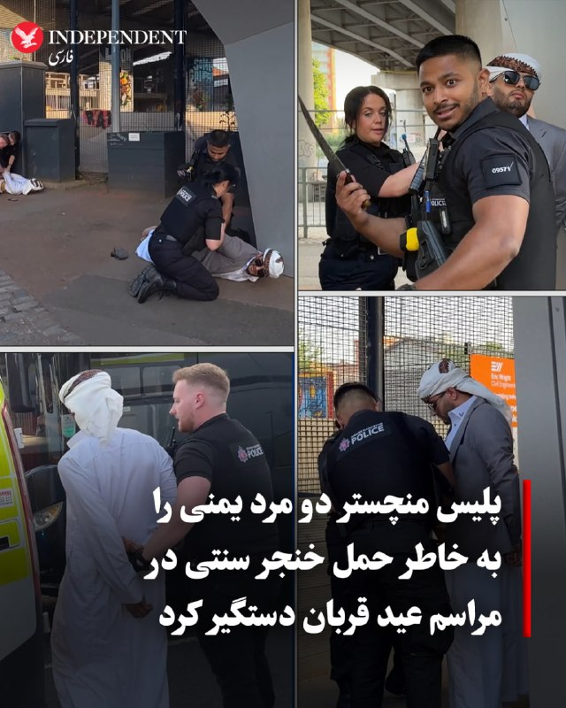

♦️پلیس منچستر در جریان عید قربان در بریتانیا، دو مرد بریتانیایی-یمنی را پس از مشاهده خنجرهای سنتی «جنبیه» بر کمرشان بازداشت کرد.
جنبیه، خنجری خمیده و زینتی است که در فرهنگ یمن نماد مردانگی و هویت قبیله‌ای به شمار می‌رود و معمولا به عنوان بخشی از لباس سنتی مردان یمنی استفاده می‌شود.
بر اساس قوانین بریتانیا، حمل چاقو و دیگر سلاح‌های سرد در اماکن عمومی بدون «دلیل موجه» ممنوع است. به همین دلیل مأموران پلیس این دو نفر را بازداشت و خنجرهای آنها را ضبط کردند.
‌🇸🇦 Indypersian

🤖 @VahidOOnLine

## VahidOOnLine — post 243068

  

سی‌ان‌ان گزارش داد تهران پس از خارج کردن سریع زرادخانه‌های موشکی مدفون خود، در موقعیتی قرار گرفته که می‌تواند تعداد بیشتری موشک دوربرد به سمت اسرائیل و دیگر کشورهای خاورمیانه شلیک کند؛ موضوعی که به گفته کارشناسان، محدودیت‌های راهبرد بمباران آمریکا را نشان می‌دهد.

بر اساس این گزارش، حملات آمریکا و اسرائیل در هفته‌های گذشته با هدف تخریب جاده‌ها و مسدود کردن ورودی تونل‌ها انجام شد تا دسترسی تهران به سایت‌های زیرزمینی موشکی محدود شود.

تصاویر ماهواره‌ای بررسی‌شده توسط سی‌ان‌ان نشان می‌دهد جمهوری اسلامی با استفاده از تجهیزات ساده‌ای مانند بولدوزر و کامیون‌های حمل‌ونقل توانسته این مسیرها را دوباره بازسازی کند. کارشناسان می‌گویند این موضوع نشان می‌دهد توان موشکی ایران تنها با هدف قرار دادن ورودی تونل‌ها قابل از بین بردن نیست.
‌🏁 🇬🇧 IranintlTV

🤖 @VahidOOnLine

## VahidOOnLine — post 243067

  <a href="telegram/content/VahidOOnLine_243067_1780249425.mp4" target="_blank">🎬 Download video</a>

♦️فرماندهی مرکزی ایالات متحده (سنتکام) روز یکشنبه ۱۰ خرداد با انتشار پیامی در شبکه اجتماعی ایکس، ناوهای هواپیمابر نیروی دریایی آمریکا را به «شهری خودکفا در دریا» تشبیه کرد.
به گفته سنتکام، یک ناو هواپیمابر آمریکایی تقریبا به اندازه سه زمین فوتبال طول دارد و بیش از پنج هزار ملوان در آن مستقر هستند.
در این پیام آمده است که تداوم عملیات این شناورها نیازمند همکاری هماهنگ تمامی نیروها در بخش‌های مختلف، چه روی عرشه و چه در بخش‌های زیرین ناو است تا ماموریت‌ها و فعالیت‌های روزانه به شکل روان و موثر ادامه یابد.
‌🇸🇦 Indypersian

🤖 @VahidOOnLine

## VahidOOnLine — post 243066

  

مسعود پزشکیان با بیان اینکه «محدودیت‌ها و فشارهای خارجی در حوزه اقتصادی پیچیدگی‌های خاصی را برای اداره کشور ایجاد کرده است» گفت: شرایط کشور عادی و ساده نیست.

او با اشاره به ضرورت تقویت «تاب‌آوری» مردم گفت: واقعیت‌های موجود باید با جامعه در میان گذاشته شود تا آنها بتوانند نقش خود را در مواجهه با چالش‌ها ایفا کنند.

پزشکیان اضافه کرد: «جامعه باید نسبت به الزامات و هزینه‌های مقاومت آگاه باشد».
‌🏁 🇬🇧 IranintlTV

🤖 @VahidOOnLine

## VahidOOnLine — post 243065

  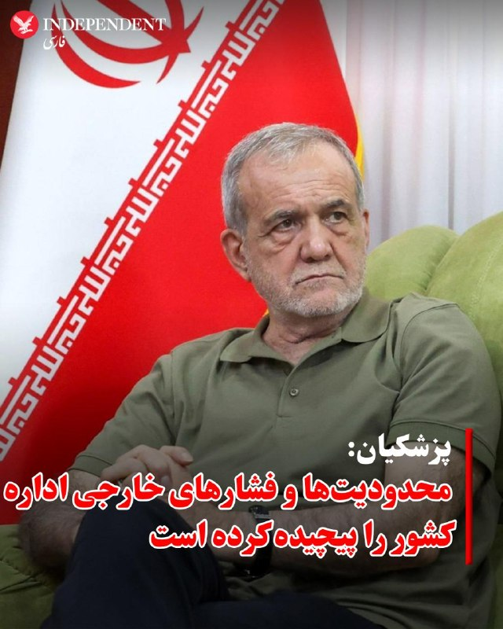

♦️مسعود پزشکیان، رئیس‌جمهوری ایران، روز یکشنبه دهم خرداد ماه با اشاره به شرایط اقتصادی کشور گفت تداوم برخی محدودیت‌ها و فشارهای خارجی، پیچیدگی‌های خاصی را برای اداره کشور ایجاد کرده است.

به گزارش خبرگزاری تسنیم، پزشکیان اظهار داشت مردم باید نسبت به واقعیت‌های موجود آگاهی داشته باشند، زیرا بخشی از مشکلات اقتصادی کشور ناشی از محدودیت‌های بیرونی و بخشی دیگر نتیجه فشارهایی است که در شرایط خاص کنونی بر کشور تحمیل شده است.

پزشکیان همچنین گفت همه اعضای دولت، مدیران و کارکنان دستگاه‌های مختلف با جدیت در حال فعالیت هستند و در کنار اقدامات اجرایی، یکی از رویکردهای اصلی دولت در این دوره، استفاده از ظرفیت‌های اجتماعی و مردمی برای مدیریت شرایط و عبور از بحران است.

او افزود دولت تلاش کرده است علاوه بر بهره‌گیری از ظرفیت نهادهای رسمی، از توان صنوف، اتاق‌های بازرگانی، دانشگاه‌ها، مساجد، محلات، انجمن‌های تخصصی و گروه‌های مردمی نیز برای مدیریت شرایط کشور استفاده کند.
‌🇸🇦 Indypersian

🤖 @VahidOOnLine

## VahidOOnLine — post 243064

♦️درویش‌رضا منظمی، هنرمند برجسته موسیقی ایرانی و نوازنده نامدار کمانچه، روز یکشنبه ۱۰ خردادماه، در ۸۷ سالگی درگذشت.
منظمی در شانزدهم فروردین ۱۳۱۸ در الشتر لرستان چشم به جهان گشود و از دوران دبیرستان، به‌صورت خودآموز فراگیری کمانچه را آغاز کرد. او با ادامه آموزش در الشتر و خرم‌آباد، فعالیت هنری خود را گسترش داد و به‌تدریج وارد عرصه حرفه‌ای موسیقی شد.
این پیشکوست نوازندگی کمانچه، از سال ۱۳۴۰ به مدت پنج سال نزد حسین یاحقی به آموزش علمی کمانچه و ویلن پرداخت و سپس در دانشکده هنرهای زیبای دانشگاه تهران نزد استادانی چون نورعلی برومند و داریوش صفوت، ردیف‌های میرزا عبدالله را فرا گرفت. او همچنین از محضر علی‌اصغر بهاری در نوازندگی کمانچه و از جواد معروفی در تئوری موسیقی بهره برد.
منظمی از اعضای اولیه گروه «شیدا» بود و همکاری‌های او با چهره‌هایی چون محمدرضا لطفی، محمدرضا شجریان و ناصر فرهنگ‌فر، نقش مهمی در شکل‌گیری و جریان‌سازی موسیقی دستگاهی ایران در دهه‌های ۵۰ و ۶۰ ایفا کرد.
‌🇸🇦 Indypersian

🤖 @VahidOOnLine

## VahidOOnLine — post 243063

  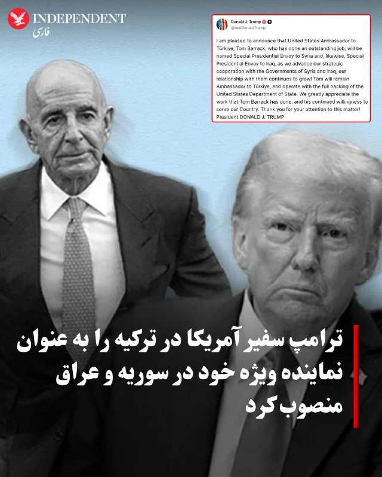

♦️دونالد ترامپ، رئیس‌جمهوری آمریکا، روز یکشنبه دهم خرداد ماه اعلام کرد تام باراک، سفیر ایالات متحده در ترکیه، به عنوان نماینده ویژه  آمریکا در امور سوریه و عراق منصوب شده است.

ترامپ روز یکشنبه در پیامی در شبکه اجتماعی «تروث سوشال» با تمجید از عملکرد باراک نوشت  او در سمت سفیر آمریکا در ترکیه «کار فوق‌العاده‌ای» انجام داده و همزمان با حفظ این سمت، مسئولیت‌های جدید خود را نیز بر عهده خواهد گرفت.

رئیس‌جمهوری آمریکا افزود این انتصاب در چارچوب پیشبرد همکاری‌های راهبردی واشنگتن با دولت‌های سوریه و عراق انجام شده و روابط آمریکا با دو کشور در حال گسترش است.

ترامپ همچنین تاکید کرد باراک در مسئولیت‌های جدید خود از حمایت کامل وزارت خارجه آمریکا برخوردار خواهد بود و همچنان به فعالیت خود به عنوان سفیر ایالات متحده در ترکیه ادامه می‌دهد.

مارکو روبیو، وزیر خارجه آمریکا، روز نهم خرداد ماه از پایان ماموریت تام باراک به‌عنوان نماینده ویژه آمریکا در سوریه خبر داد.
‌🇸🇦 Indypersian

🤖 @VahidOOnLine

## VahidOOnLine — post 243062

  

دونالد ترامپ در تروث‌سوشال اعلام کرد که تام باراک، سفیر ایالات متحده در ترکیه، به عنوان فرستاده ویژه ریاست‌جمهوری در امور عراق و سوریه منصوب شده است.

ترامپ افزود: همزمان با پیشبرد همکاری راهبردی ما با دولت‌های سوریه و عراق، روابط ما با آن‌ها همچنان در حال گسترش است.
‌🏁 🇬🇧 IranintlTV

🤖 @VahidOOnLine

## WithYashar — post 13087

## WithYashar — post 13086

## WithYashar — post 13085

مشکلش چیه اصلا همین امشب باشه چه بهتر! هرچه زودتر بهتر اصلا! خیلی زودتر از اینا حتییییی🫠🫠🫠

## WithYashar — post 13084

و اینکه لطفا خودت هم یه پست بذار ما شاهزاده رو تگ کنیم

## WithYashar — post 13083

قرار‌ ما فردا شب ۱۱:۱۱ دقیقه تهران

## WithYashar — post 13082

## WithYashar — post 13080

مگه امروز یکشنبه نیست؟😅
قرار نبود دوشنبه باشه؟

## WithYashar — post 13078

## WithYashar — post 13077

متن کامنت بررسی ‌کنید

جناب شاهزاده رضا پهلوی گرامی،

پدر ، این پیام، جمع‌بندی دیدگاه‌ها و پیشنهادهای گروهی از ایرانیان داخل و خارج کشور با هدف تقویت انسجام ملی و ایجاد مسیر عملی برای دوران پیش از گذار است.

عناوین چکیده از هزاران پیغام مردمی به‌صورت خلاصه:

* ضرورت ایجاد ساختار منسجم برای سازماندهی نیروهای مردمی داخل و خارج
* همگرایی و اتحاد جریان‌های مختلف مخالف
* ارائه نقشه راه و چارچوب زمانی شفاف برای اقدامات جمعی
* آمادگی میدانی و سازوکارهای حمایتی در شرایط بحران
* تقویت تیم‌های مشورتی، تخصصی و شفافیت در تصمیم‌گیری
* توجه فوری به بحران معیشت و فشار اقتصادی مردم
* ارتباط مستقیم‌تر و مستمر با جامعه

جمع‌بندی: جامعه آماده تغییر است، اما این مسیر نیازمند انسجام، شفافیت و ساختار اجرایی روشن است.

درخواست پایانی: فراهم شدن امکان ارتباط مستقیم برای انتقال منظم دیدگاه‌ها و ادامه گفت‌وگو با جناب آقای یاشار « yashar » که از طرف ما به عنوان گردآورنده و ارتباط‌گیرنده این مجموعه دیدگاه‌ها معرفی و تایید میشود.

این متن نسخه خلاصه‌شده است و نسخه کامل از طریق ایمیل، دایرکت و … ارسال شده است. ممنون از توجه شما
پاینده ایران و درود بر خاندان ایران ساز پهلوی

@withyashar

## WithYashar — post 13076

  <a href="https://t.me/withyashar/13076" target="_blank">📎 Download file</a>

پروژه شکوفایی ایران : برنامه اضطرار

🌐 @withyashar

🌐 instagram.com/yashar

## WithYashar — post 13075

## WithYashar — post 13074

درود، میشه بی زحمت اون 250 صفحه رو بفرستی تو گروه ممنونم🙏🙏🙏

## WithYashar — post 13073

با توجه به اینکه بخش محدودی از دفترچه پروژه شکوفایی«اضطرار» حدود ۱۰٪ به دوران پیش از تغییر رژیم «زمان حال» اختصاص دارد، لازم است به دغدغه‌ها و پرسش‌های مردم در این حوزه توجه بیشتری شود و برای آن‌ها برنامه‌ریزی دقیق‌تر و اقدامات سریع‌تری در نظر گرفته شود، زیرا این موضوعات برای افکار عمومی اهمیت مستقیم و فوری دارند.

اینم به متن اضافه میکنم

## WithYashar — post 13072

زرشکیان قهر کرد !

اینترنشنال: مسعود پزشکیان با ارسال نامه‌ای به دفتر مجتبی خامنه‌ای خواهان استعفا از سمت خودش شده.
@withyashar

## WithYashar — post 13071

متن چکیده نسخه ۲۰ بیانیه جمعی از ایرانیان داخل و خارج کشور خطاب به شاهزاده رضا پهلوی پدر گرامی ، این متن جمع‌بندی مجموعه‌ای از دیدگاه‌ها، نگرانی‌ها و پیشنهادهای طیف گسترده‌ای از ایرانیان داخل و خارج کشور است که با هدف تقویت انسجام ملی، افزایش شفافیت و…

## WithYashar — post 13070

## WithYashar — post 13069

## WithYashar — post 13068

یاشار جان سلام یه سوال فنی داشتم ،
بعد بر اندازی و سقوط ایده برخورد شما با عرزشی یا حالا بسیجی که دستش به خونی آلوده نیست صرفا موج سوار بود یا اصلا همراه بوده چیه اوناهم باید مجازات بشن یا باید گذشت و همکاری کرد ؟

## WithYashar — post 13067

  

یک کشتی ایرانی به نام «IRGC TOLL COLLECT» به معنی « اخذ عوارض توسط سپاه پاسداران » در تنگه هرمز ظاهر شده است
@withyashar
مفتبر جاده هرمزه 🤣 تلکه بگیر سر گردنه

## WithYashar — post 13066

یاشار همین الان مرکز تهران دو صدا مهیب انفجار مانند ۱۹:۳۲
@withyashar

## mwarmonitor — post 9949

  

🔸ملوانان آمریکایی یک فروند بالگرد MH-60S سی‌هاوک را هنگام فرود بر عرشه پروازی ناوشکن USS Milius (DDG 69) در جریان عملیات پروازی، در تاریخ ۲۹ مه هدایت می‌کنند. میلیوس در حال پشتیبانی از محاصره دریایی ایالات متحده علیه ایران است؛ محاصره‌ای که تا ۳۱ مه موجب تغییر مسیر ۱۱۸ کشتی تجاری و از کار افتادن ۵ کشتی شده است.

@mwarmonitor

## mwarmonitor — post 9948

🔴بر اساس گزارش رسانه لبنانی LBCI، وزیر امور خارجه آمریکا Marco Rubio در حال پیگیری برقراری یک آتش‌بس کامل در لبنان است و احتمال دارد پس از نشست مذاکراتی ۲ ژوئن، این موضوع رسماً اعلام شود.

🔸سناتور لیندسی گراهام:

🔹در گفت‌وگوی اخیرم با دونالد ترامپ، حمایت خود را از توافقی با ایران اعلام کردم که خواسته رئیس‌جمهور ترامپ برای بازگشایی تنگه هرمز و آغاز مذاکرات به‌منظور پایان همیشگی جاه‌طلبی‌های هسته‌ای ایران و حمایت آن از تروریسم را بپذیرد. اطمینان دارم که در نهایت، رئیس‌جمهور ترامپ با یک توافق بد با ایران موافقت نخواهد کرد.

🔹در جبهه‌ای جداگانه، بر این باورم که باید به اسرائیل اجازه داده شود تهدیدهایی را که از حملات مستمر حزب‌الله از خاک لبنان متوجه این کشور است، خنثی کند. بخش‌هایی از اسرائیل به‌دلیل شلیک موشک‌ها و راکت‌های حزب‌الله غیرقابل سکونت شده‌اند.

🔹غیرقابل قبول است که از اسرائیل خواسته شود آتش‌بسی با حزب‌الله بپذیرد، آن هم در حالی که حزب‌الله آشکارا خواستار نابودی اسرائیل است و حملات مداوم خود را ادامه می‌دهد. هرگونه آتش‌بس با حزب‌الله به آن‌ها فرصت می‌دهد دوباره مسلح شوند و قوی‌تر شوند. از نظر من، نباید هیچ پیوندی میان توافق با ایران و توانایی اسرائیل برای دفاع و مقابله با تجاوز بی‌وقفه حزب‌الله در لبنان وجود داشته باشد. درباره حماس نیز این پرسش مطرح است که تا چه زمانی قرار است به آن‌ها فرصت خلع سلاح بدهیم؟ بگذارید اسرائیل کار آن‌ها را تمام کند.

🔹هر توافقی با ایران که توانایی اسرائیل برای مقابله با حماس و حزب‌الله را محدود کند، نادرست و غیرعاقلانه خواهد بود.

@mwarmonitor

## mwarmonitor — post 9947

🔴دونالد ترامپ در Truth Social نوشت:

خوشحالم اعلام کنم که سفیر ایالات متحده در ترکیه، تام باراک، که عملکردی outstanding داشته است، به‌عنوان نماینده ویژه ریاست‌جمهوری در امور سوریه و همچنین نماینده ویژه ریاست‌جمهوری در امور عراق منصوب خواهد شد. این انتصاب در راستای پیشبرد همکاری‌های راهبردی ما با دولت‌های سوریه و عراق صورت می‌گیرد و روابط ما با آن‌ها همچنان در حال گسترش است.
تام باراک همچنان سفیر ایالات متحده در ترکیه باقی خواهد ماند و با پشتیبانی کامل وزارت امور خارجه ایالات متحده فعالیت خواهد کرد.
ما قدردان کاری هستیم که تام باراک انجام داده و نیز از آمادگی مستمر او برای خدمت به کشورمان سپاسگزاریم.

از توجه شما به این موضوع متشکریم.

@mwarmonitor

## mwarmonitor — post 9946

  <a href="telegram/content/mwarmonitor_9946_1780249433.mp4" target="_blank">🎬 Download video</a>

📝 آه، چقدر دلمان کباب شد برای این ماده خرس گریزلی تلویزیون که دوباره پیدایش شده تا با فلسفه‌بافی درباره «مطلوبات و مقدورات»، روی زخم ملت نمک بپاشد! راست می‌گویی؛ مطلوبِ قلبی یک انگل و حرومیِ جاخوش‌کرده در بدنه این کشور هم این است که پروانه باشد و پرواز کند، اما مقدوراتِ ذاتِ کثیفش اجازه نمی‌دهد چیزی غیر از یک تفاله باشد. شما حرومی‌ها که ادعا می‌کردید کنترل اقتصاد دنیا در مرزهای جنوبی در دست‌های معجزه‌گرتان است، چطور شد که وقتِ تامین نیازهای اولیه کشور رسید، زاییدید و ناگهان یاد مقدورات افتادید؟ سناریوی سیاهی است؛ در ادعا حاکم اقیانوس‌ها و در واقعیت عاجز از تامین پیاز و پوشک! شما مطلوبتان این بود که قهرمان باشید، ولی مقدوراتِ وقاحت‌تان ثابت کرد که فقط انگل‌هایی هستید که به مکیدن خون مردم ادامه می‌دهید؛ پس دست‌کم ژست فیلسوفان را نگیرید که قاب تلویزیون از این همه کثافت ترک برمی‌دارد.

@mwarmonitor

## mwarmonitor — post 9945

  <a href="telegram/content/mwarmonitor_9945_1780249436.mp4" target="_blank">🎬 Download video</a>

🔸اسرائیل در حال شخم زدن لبنان

@mwarmonitor

## FoxNewsTwitter — post 342454

Fox News (Twitter/X)

## FoxNewsTwitter — post 342450

Fox News (Twitter/X)

Coordinated supply operation exposed at Delaney Hall ahead of protests.

Agitators outside the Delaney Hall detention facility in New Jersey were seen establishing a highly organized logistics and support operation before protests began at the site.

Stockpiles of masks, duct tape, hard hats and medical supplies were laid out near the facility. Delaney Hall has been at the center of a standoff after detainees alleged abuse and poor conditions, claims DHS denies.

## FoxNewsTwitter — post 342449

  <a href="telegram/content/FoxNewsTwitter_342449_1780249437.mp4" target="_blank">🎬 Download video</a>

Fox News (Twitter/X)

Police hold the line as anti-ICE agitators try breaking the barricade at Delaney Hall to push their way into the New Jersey detention center.

## FoxNewsTwitter — post 342448

  <a href="telegram/content/FoxNewsTwitter_342448_1780249440.mp4" target="_blank">🎬 Download video</a>

Fox News (Twitter/X)

JUST IN: Governor DeSantis leads the charge to eliminate property taxes in Florida under a new plan aimed at giving homeowners relief.

"This is really a historic opportunity to have more money in people's pockets and to actually have their home be their private property that the government just can't use as a piggy bank." | @SundayFutures

## FoxNewsTwitter — post 342447

  

Fox News (Twitter/X)

"ICE! ICE! We love ICE!"

Trump supporters chant as they confront anti-ICE agitators at Delaney Hall amid violent demonstrations outside the New Jersey detention center.

## FoxNewsTwitter — post 342446

  

Fox News (Twitter/X)

America's next economic powerhouse takes shape in Texas as companies abandon the Bay Area in California.

A new report shows Texas attracted 230 corporate relocations between 2018 and 2025, with Dallas, Austin and Houston leading the charge.

Meanwhile, California suffered the nation's steepest corporate losses, with more than 160 companies moving their headquarters out of the San Francisco Bay Area, citing taxes, labor regulations and soaring costs.

## FoxNewsTwitter — post 342445

  <a href="telegram/content/FoxNewsTwitter_342445_1780249445.mp4" target="_blank">🎬 Download video</a>

Fox News (Twitter/X)

An anti-ICE rioter is arrested for threatening to kill federal agents and their families during violent demonstrations outside New Jersey's Delaney Hall. The FBI caught the suspect within 24 hours after using facial recognition technology to identify him.

"Touch a cop and this FBI will put you down," FBI Director Kash Patel said.

## pm_afshaa — post 91961

  <a href="telegram/content/pm_afshaa_91961_1780249447.webm" target="_blank">🎬 Download video</a>

🔴ایران اینترنشنال: مسعود پزشکیان به علت تسلط کامل فرماندهان سپاه بر اداره امور کشور، با ارسال نامه‌ای به دفتر مجتبی خامنه‌ای خواهان استعفا از سمت خودش شده. 
💧 Rainbet.com the #1 Non-KYC Crypto Casino & Sportsbook @rainbetcom 
😁 @Pm_Afshaa

## pm_afshaa — post 91960

  <a href="telegram/content/pm_afshaa_91960_1780249448.webm" target="_blank">🎬 Download video</a>

🔴کانال 15 اسرائیل به نقل از منابع:
گسترش عملیات در لبنان با هماهنگی آمریکا انجام شد.

💧 Rainbet.com the #1 Non-KYC Crypto Casino & Sportsbook @rainbetcom

😁 @Pm_Afshaa

## pm_afshaa — post 91959

  <a href="telegram/content/pm_afshaa_91959_1780249449.webm" target="_blank">🎬 Download video</a>

🔴عباس عراقچی: گفتگوها و تبادل پیام‌‌ها در جریان است و تا وقتی به نتیجه مشخص نرسه، نمیشه در موردش قضاوت کرد و هر آنچه که الان گفته میشه گمانه‌زنی است و نباید به آن اهمیت داد.

💧 Rainbet.com the #1 Non-KYC Crypto Casino & Sportsbook @rainbetcom

😁 @Pm_Afshaa

## pm_afshaa — post 91958

  <a href="telegram/content/pm_afshaa_91958_1780249450.webm" target="_blank">🎬 Download video</a>

🔴ایران اینترنشنال: مسعود پزشکیان به علت تسلط کامل فرماندهان سپاه بر اداره امور کشور، با ارسال نامه‌ای به دفتر مجتبی خامنه‌ای خواهان استعفا از سمت خودش شده. 
💧 Rainbet.com the #1 Non-KYC Crypto Casino & Sportsbook @rainbetcom 
😁 @Pm_Afshaa

## pm_afshaa — post 91956

#مهم
عزیزای دلم همگی الان چنل زاپاس‌مون رو جوین بشید کانال تحت ریپورت شدیده اگه چیزی شد زاپاس رو داشته باشید فعالیت میاد اونور
👇

https://t.me/Pm_Zapas
https://t.me/Pm_Zapas

## pm_afshaa — post 91955

  

ترامپ پستی از نیوت گینگریچ را بازنشر کرد که در آن گفته است ترامپ «در آستانه یک پیروزی تاریخی» در ایران است

💧 Rainbet.com the #1 Non-KYC Crypto Casino & Sportsbook @rainbetcom

😁 @Pm_Afshaa

## pm_afshaa — post 91954

🔴وزیر خزانه‌داری آمریکا: فشارها بر ایران و جلوگیری از صادرات نفت از جزیره خارک ادامه دارد

💧 Rainbet.com the #1 Non-KYC Crypto Casino & Sportsbook @rainbetcom

😁 @Pm_Afshaa

## pm_afshaa — post 91953

  <a href="telegram/content/pm_afshaa_91953_1780249451.webm" target="_blank">🎬 Download video</a>

🔴ایران اینترنشنال: مسعود پزشکیان به علت تسلط کامل فرماندهان سپاه بر اداره امور کشور، با ارسال نامه‌ای به دفتر مجتبی خامنه‌ای خواهان استعفا از سمت خودش شده.

💧 Rainbet.com the #1 Non-KYC Crypto Casino & Sportsbook @rainbetcom

😁 @Pm_Afshaa

## pm_afshaa — post 91952

وضعیت لبنان بعد از حمله هوایی اسراییل به این کشور 
💧 Rainbet.com the #1 Non-KYC Crypto Casino & Sportsbook @rainbetcom 
😁 @Pm_Afshaa

## pm_afshaa — post 91951

  <a href="telegram/content/pm_afshaa_91951_1780249452.webm" target="_blank">🎬 Download video</a>

🔴مهاجرانی، سخنگوی دولت:
قالیباف کسی است که فرمانده میدان بوده و عراقچی هم رزمنده زمان جنگ است، بنابراین تمام کسانی که الان درگیر مذاکره هستن، میدان رو به‌خوبی درک می‌کنند.

نیروهای مسلح ایران همچنان دست‌به‌ماشه هستن و تیم دیپلماسی با همین نگاه، مذاکرات رو دنبال میکنه.

💧 Rainbet.com the #1 Non-KYC Crypto Casino & Sportsbook @rainbetcom

😁 @Pm_Afshaa

## pm_afshaa — post 91950

🔴سی‌ان‌ان: ترامپ با آزادسازی هرگونه دارایی ایران در توافق احتمالی مخالفت کرده

💧 Rainbet.com the #1 Non-KYC Crypto Casino & Sportsbook @rainbetcom

😁 @Pm_Afshaa

## pm_afshaa — post 91949

  <a href="telegram/content/pm_afshaa_91949_1780249453.webm" target="_blank">🎬 Download video</a>

🔴سی‌بی‌اس: میانجی‌ها هنوز دارن روی توافق بین تهران و واشینگتن کار میکنن. ترامپ روز جمعه متن توافق رو دوباره اصلاح کرده و نسخه جدیدش رو فرستاده ایران تا تأییدش کنه، ولی تا الان هنوز پاسخی از طرف تهران داده نشده. 
💧 Rainbet.com the #1 Non-KYC Crypto Casino…

## pm_afshaa — post 91948

  <a href="telegram/content/pm_afshaa_91948_1780249454.webm" target="_blank">🎬 Download video</a>

🔴رئیس کمیته نظامی ناتو:
احتمال عملیات برای بازگشایی تنگه هرمز وجود داره؛ حضور نظامی متحدان برای مقابله با مسدودسازی مسیرهای بین‌المللی رو افزایش دادیم.

💧 Rainbet.com the #1 Non-KYC Crypto Casino & Sportsbook @rainbetcom

😁 @Pm_Afshaa

## pm_afshaa — post 91947

  <a href="telegram/content/pm_afshaa_91947_1780249455.webm" target="_blank">🎬 Download video</a>

🔴سی‌ان‌ان: برای آسیب به تاسیسات موشکی ایران از سلاح‌های بسیار پیچیده و بسیار گران‌قیمت استفاده میشه، اما عملیات بازیابی با فناوری بسیار ساده‌ای انجام میشه: بولدوزر.

ایران 50 ورودی از 69 ورودی تونل‌های تاسیسات هدف قرار گرفته موشکی رو باز کرده.

💧 Rainbet.com the #1 Non-KYC Crypto Casino & Sportsbook @rainbetcom

😁 @Pm_Afshaa

## pm_afshaa — post 91946

  <a href="telegram/content/pm_afshaa_91946_1780249456.webm" target="_blank">🎬 Download video</a>

🔴اسکات بسنت وزیر خزانه داری آمریکا: اطمینان از باز بودن تنگه هرمز، دریافت اورانیوم بسیار غنی شده و اینکه ایران سلاح هسته‌ای نداره، این کار رو تمام میکنه.

این اولین باره که ایرانی‌ها در 47 سال گذشته حاضر شدن در مورد نداشتن سلاح هسته‌ای بحث کنند.

💧 Rainbet.com the #1 Non-KYC Crypto Casino & Sportsbook @rainbetcom

😁 @Pm_Afshaa

## pm_afshaa — post 91945

  <a href="telegram/content/pm_afshaa_91945_1780249456.webm" target="_blank">🎬 Download video</a>

🔴سی‌ان‌ان: ایران پس از خارج کردن سریع زرادخانه‌های موشکی مدفون خود، در موقعیتی قرار گرفته که میتونه تعداد بیشتری موشک دوربرد به سمت اسرائیل و دیگر کشورهای خاورمیانه شلیک کنه؛ موضوعی که به گفته کارشناسان، محدودیت‌های راهبرد بمباران آمریکا رو نشان میده.

💧 Rainbet.com the #1 Non-KYC Crypto Casino & Sportsbook @rainbetcom

😁 @Pm_Afshaa

## pm_afshaa — post 91944

🔴وال استریت ژورنال: سازمان ملل در حال ورشکستگی است، زیرا ایالات متحده و چین میلیاردها دلار را از این نهاد بین‌المللی خارج می‌کنن 
💧 Rainbet.com the #1 Non-KYC Crypto Casino & Sportsbook @rainbetcom 
😁 @Pm_Afshaa

## pm_afshaa — post 91943

🔴وال استریت ژورنال: سازمان ملل در حال ورشکستگی است، زیرا ایالات متحده و چین میلیاردها دلار را از این نهاد بین‌المللی خارج می‌کنن

💧 Rainbet.com the #1 Non-KYC Crypto Casino & Sportsbook @rainbetcom

😁 @Pm_Afshaa

## pm_afshaa — post 91942

وضعیت لبنان بعد از حمله هوایی اسراییل به این کشور 
💧 Rainbet.com the #1 Non-KYC Crypto Casino & Sportsbook @rainbetcom 
😁 @Pm_Afshaa

## pm_afshaa — post 91939

  <a href="telegram/content/pm_afshaa_91939_1780249457.mp4" target="_blank">🎬 Download video</a>

وضعیت لبنان بعد از حمله هوایی اسراییل به این کشور

💧 Rainbet.com the #1 Non-KYC Crypto Casino & Sportsbook @rainbetcom

😁 @Pm_Afshaa

## DEJradio — post 5190

  <a href="telegram/content/DEJradio_5190_1780249459.mp4" target="_blank">🎬 Download video</a>

📺 
🕐 موسیقی در دوران استبداد، نقش ساز، صدا و هنر در تقویت جنبش‌های آزادیخواهانه
هر یکشنبه و پنجشنبه هر هفته بعد از خبر ۲۱

#ایران_را_پس_میگیریم
#زیرصدا
@DEJradio

## DEJradio — post 5189

  <a href="telegram/content/DEJradio_5189_1780249462.mp4" target="_blank">🎬 Download video</a>

⭕️
🔴 شکاف در صف حامیان نظام؛ یکی از هواداران ولایت با انتقاد از مذاکرات مقامات با قاتلان خامنه‌ای خطاب به ته مانده مسئولان نظام می‌گوید: "مردم رو نفهم فرض نکنید"

#مزدوران
@DEJradio

## DEJradio — post 5188

  <a href="telegram/content/DEJradio_5188_1780249465.mp4" target="_blank">🎬 Download video</a>

📺 
🕐 مهمان برنامه نیمکت، احمد باطبی روزنامه‌نگار و فعال حقوق بشر است. او در این برنامه به واکاوی تحولات جنبش دانشجویی و دگرگونی دانشگاه‌ها پرداخته است.
«نیمکت» برنامه مشترک خبرنامه امیرکبیر و تلویزیون دژ است و بر مبارزات دانشجویی تمرکز دارد.
این برنامه هر یکشنبه بعد از خبر ۲۱ پخش می‌شود.

#نیمکت
@DEJradio

## DEJradio — post 5187

  <a href="telegram/content/DEJradio_5187_1780249468.webm" target="_blank">🎬 Download video</a>

🔸
🔺 فاطمه مهاجرانی سخنگوی دولت درباره دلایل افزایش گرانی گفت «وقتی جریان عرضه و تقاضا دچار مشکل می‌شود بازار واکنش نشان می‌دهد.»
او با اشاره به محاصره دریایی بنادر جمهوری اسلامی، ادامه داد: «دزدی دریایی آمریکا تاثیر می‌گذارد که ورود کمتر شود.»
این در حالیست که برخی مقامات جمهوری اسلامی ادعا می‌کنند «محاصره دریایی» شکست خورده است. بعضی نمایندگان مجلس شورای اسلامی نیز ادعا کرده بودند نظام راهکار شکستن محاصره دریایی را می‌داند.

#محاصره_دریایی #گرانی
@DEJradio

## DEJradio — post 5186

  <a href="telegram/content/DEJradio_5186_1780249468.mp4" target="_blank">🎬 Download video</a>

🔸
🔺 براساس گزارش‌های مردمی بعد از جنگ ۴۰ روزه وضعیت آب سدها و دریاچه‌ها بهتر شده است. برخی منابع می‌گویند حدود ۷۰ درصد ظرفیت مخزن سد کرج تا ۱۰ خرداد پر شده است.

#کرج #آب
@DEJradio

## DEJradio — post 5184

  <a href="telegram/content/DEJradio_5184_1780249470.webm" target="_blank">🎬 Download video</a>

🔺 در جنگ ۴۰ روزه شماری از شهروندان غیرنظامی کشته و زخمی شدند و منازل، مغازه‌ها و دارایی‌های بسیاری از آنها از بین رفت. علت اصلی این وضعیت استقرار مقرها و پایگاه‌های سـ.ـپاه و بـ.ـسیج و کلانتری‌ها در مناطق مسکونی بود. تعداد زیادی از خانه‌های امن و مخفیگاه‌های فرماندهانی که کشته شدند نیز کنار واحدهای مسکونی مردم عادی بود. حتی بعضی ساکنان خبر نداشتند که در آپارتمان آنها چه کسانی تردد می‌کنند.
بسیاری از شهروندان بی‌خانمان شدند و در هتل‌ها و مسافرخانه‌ها ساکن شده‌اند.
در واقع حکومت با استفاده از سپرانسانی، تلاش کرد برای سرکوبگران پوشش ایجاد کند که حاصل این تاکتیک غیرانسانی، کشته شدن هموطنان و ویرانی منازل آنها بود.
اکنون شورای‌عالی امنیت ملی و شهرداری برای انتقال مراکز سرکوب به خارج از مناطق مسکونی زیر فشار قرار گرفته‌اند.
علیرضا زاکانی شهردار تهران می‌گوید، با شورای عالی امنیت ملی برای انتقال مراکز حساس به خارج از مناطق مسکونی مکاتبه شده است. او به خبرگزاری «مهر» گفت، «تجربه جنگ‌های اخیر نشان داد باید با همکاری مجموعه‌های نظامی و انتظامی، شرایطی فراهم شود تا در آینده اطمینان خاطر بیشتری برای شهروندان ایجاد شود.»

#جنگ_چهل_روزه
@DEJradio

## DEJradio — post 5183

  <a href="telegram/content/DEJradio_5183_1780249471.mp4" target="_blank">🎬 Download video</a>

📢
🔺 یکی از مخاطبان با ارسال ویدیویی از تجمعات شبانه حامیان حکومت نوشت، "یک ملا که وسط خیابان پرچم‌گردانی میکرد وقتی دید چنتا دختر تو ماشینیم افسار پاره کرد."

#پیام_دریافتی
@DEJradio

## DEJradio — post 5182

  <a href="telegram/content/DEJradio_5182_1780249473.mp4" target="_blank">🎬 Download video</a>

👑
🔺 تجمع ایرانیان مقیم مادرید در حمایت از انقلاب شیروخورشید و آگاه‌سازی افکار عمومی از جنایات رژیم در ایران

#همبستگی #مادرید
@DEJradio

## VahidOnline — post 75822

  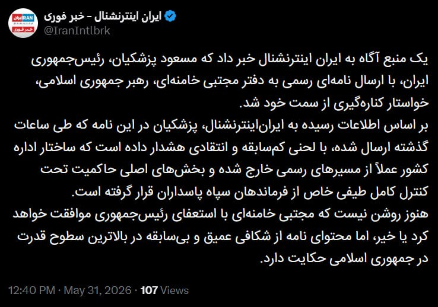

IranIntlbrk

📡 @VahidOnline

## VahidOnline — post 75821

  

مسعود پیاهو، مردی که تصویر معترض نشسته مقابل نیروهای پلیس یگان ویژه در مقابل پاساژ علاالدین در آغاز اعتراضات دی ماه سال گذشته را منتشر کرد، به گفته وکیلش به ۱۰ سال زندان محکوم شده است.
@VahidHeadline

📡 @VahidOnline

## VahidOnline — post 75820

  <a href="telegram/content/VahidOnline_75820_1780249478.mp4" target="_blank">🎬 Download video</a>

اسکات بسنت، وزیر خزانه‌داری آمریکا، در گفت‌وگو با فاکس‌نیوز درباره ایران اعلام کرد: لایه اول و دوم حکومت آن‌ها از بین رفته و اکنون با لایه سوم روبه‌رو هستیم. شاید آن‌ها دیده‌اند برای بقیه چه اتفاقی افتاد و می‌بینند ترامپ آماده انجام چه اقداماتی است.

بسنت افزود: اگر ترامپ با این توافق موافقت کند، همین حالا به رهبران جمهوری اسلامی می‌گویم که او این توافق را هم از نظر نظامی و هم از نظر اقتصادی اجرا خواهد کرد. آزادی کشتیرانی در خلیج فارس از طریق تنگه هرمز باید به وضعیت پیشین بازگردد.

او درباره اینکه آیا ترامپ «کار را تمام خواهد کرد» گفت: اگر «تمام کردن کار» یعنی اطمینان از باز بودن تنگه هرمز، در اختیار گرفتن اورانیوم با غنای بالا و نداشتن سلاح هسته‌ای از سوی جمهوری اسلامی، پس کار تمام شده است.

بسنت تاکید کرد: چه از طریق مداخله نظامی، چه محاصره یا فشار اقتصادی، این نخستین بار در ۴۷ سال گذشته است که ایرانی‌ها درباره نداشتن سلاح هسته‌ای گفت‌وگو می‌کنند. این موضوع پیش‌تر ممنوعه بود و اکنون برای نخستین بار روی میز مذاکره قرار گرفته است.
@VahidOOnLine

📡 @VahidOnline

## VahidOnline — post 75819

  <a href="telegram/content/VahidOnline_75819_1780249479.mp4" target="_blank">🎬 Download video</a>

عراقچی در تاریخ ۲۹ آبان ۱۴۰۴
در تلویزیون جمهوری اسلامی میگه ترامپ به ما نامه‌ای داده و صراحتا نوشته
«دو گزینه بیشتر نیست»
یا جنگ و خونریزی یا مذاکره مستقیم
«برای از بین بردن غنی‌سازی و موشکی»

این مصاحبه چند ماه بعد از جنگ ۱۲ روزه بود! یعنی در آبان ماه، مشکلات آمریکا و جمهوری اسلامی همچنان همون چیزهایی بودند که باعث یک جنگ شد، و این مصاحبه یک ماه پیش از آن بود که دست به قتل‌عام مردم در خیابان‌ها بزنید!

الان هم محور مذاکرات کاملا مشخصه!
همون چیزهایی است که جنگ ۱۲ روزه رو رقم زد. همون چیزهایی است که در آبان ماه عراقچی در تلویزیون گفت.

خون تک‌تک ایرانیان از جمله کودکان میناب پای شماست! شما طرف مذاکره بودید، شما انتخاب کننده و تصمیم گیر بودید.

و شما بین اورانیوم و موشک، و یا جان مردم، زیرساخت‌های کشور، فولاد و پتروشیمی و…
اورانیوم و موشک و دشمنی با اسرائیل و آمریکا رو انتخاب کردید! هنوز هم طرف مذاکره و تصمیم‌گیر شما هستید! و‌ جنگ ‌از سر گرفته بشه باز تصمیم و انتخاب شماست و مقصر شما هستید!

نمی‌توانید پشت کودکان میناب قایم بشید و از کشتار دیماه فرار کنید!
هر خون و ‌هر ویرانی ، همه پای شماست.

## VahidOnline — post 75818

  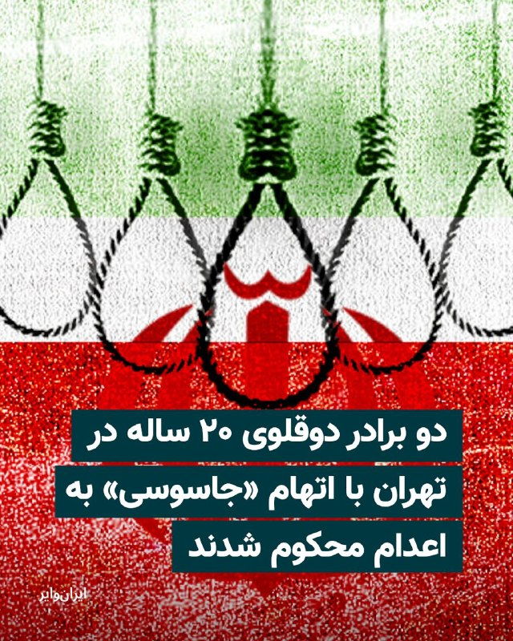

حسن و حسین امیری، دو برادر دوقلوی ۲۰ ساله محبوس در زندان قزلحصار کرج، از سوی شعبه ۲۶ دادگاه انقلاب تهران به ریاست قاضی ایمان افشاری به اعدام محکوم شدند.

بر اساس اطلاعات دریافتی هرانا، مبنای صدور این رای اتهام «جاسوسی برای اسراییل» عنوان شده است.

یک منبع مطلع در گفت‌وگو با هرانا اعلام کرد در کیفرخواست صادرشده علیه حسن و حسین امیری، مشاهده تصاویری از ساختمان‌های آسیب‌دیده به عنوان مستند اتهام «جاسوسی به نفع اسراییل» مورد استناد قرار گرفته است.

این منبع همچنین گفت: «حسن و حسین امیری به دستور بازپرس پرونده به صورت جداگانه در زندان قزلحصار نگهداری می‌شوند و از حق ملاقات با یکدیگر محروم هستند. این دو زندانی در حال حاضر در سوییت ۳۵ این زندان محبوس هستند.»

بر اساس این گزارش، این دو برادر پیشتر در یکی از ایست‌های بازرسی و پس از بررسی تلفن همراهشان بازداشت شدند.آن‌ها پس از بازداشت، به مدت دو ماه در وضعیت بلاتکلیف در زندان قزلحصار کرج نگهداری شدند.

👈 حسن و حسین امیری از دو سالگی در مراکز بهزیستی پرورش یافته‌اند و خانواده‌ای برای پیگیری وضعیت قضایی و حقوقی خود ندارند. به گفته آشنایان این دو جوان، نبود حامی خانوادگی بر نگرانی‌ها درباره روند رسیدگی به پرونده آنان افزوده است.
@VahidHeadline

📡 @VahidOnline

## VahidOnline — post 75817

  

سی‌ان‌ان: ایران چندین ورودی تأسیسات موشکی زیرزمینی خود را بازگشایی کرده است

شبکه خبری سی‌ان‌ان روز یکشنبه ۱۰ خرداد با استناد به تصاویر ماهواره‌ای اعلام کرد ایران توانسته از زمان توقف جنگ شماری از زرادخانه‌های موشکی مدفون خود بر اثر حملات هوایی آمریکا و اسرائیل را از زیر خاک بیرون بیاورد.

حملات آمریکا و اسرائیل با تخریب جاده‌ها و مسدود کردن ورودی تونل‌ها، دسترسی ایران به پایگاه‌های موشکی زیرزمینی را محدود کرده بود.

سی‌ان‌ان ادعا کرده است که ایران تاکنون ۵۰ مورد از ۶۹ ورودی تونلی را که در ۱۸ تأسیسات موشکی زیرزمینی توسط آمریکا و اسرائیل هدف قرار گرفته بودند، بازگشایی کرده است، از جمله در پایگاه‌هایی در خارج از اصفهان و در اطراف خمین.

بر اساس گزارش این شبکه خبری، ایران همچنین بخش‌های دیگری از این پایگاه‌ها را نیز ترمیم کرده است؛ از جمله جاده‌هایی که آمریکا و اسرائیل برای جلوگیری از تردد پرتابگرهای موشکی بمباران کرده بودند. تصاویر ماهواره‌ای نشان می‌دهند که تقریباً تمامی گودال‌های ناشی از بمباران اکنون پر شده‌اند و در دو پایگاه، این جاده‌ها حتی دوباره آسفالت شده‌اند.

ایران شبکه پایگاه‌های زیرزمینی خود را در عمق خاک و در مواردی زیر کوه‌ها ساخته است تا در برابر حملات هوایی مصون باشند، به همین دلیل آمریکا و اسرائیل بسیاری از ورودی‌های این تأسیسات را بمباران کردند؛ اقدامی که در کنار تلاش برای شناسایی و نابود کردن پرتابگرهای موشکی، باعث شد توان ایران برای شلیک موشک به‌طور قابل توجهی محدود شود.

این حملات خسارت سنگینی به پایگاه‌ها وارد کرد؛ به‌گونه‌ای که بیشتر ورودی‌های تونل‌ها زیر حجم عظیمی از آوار مدفون شدند و جاده‌های منتهی به این سایت‌ها نیز به‌شدت تخریب شدند.

سی‌ان‌ان می‌گوید باز کردن ورودی تأسیسات موشکی زیرزمینی می‌تواند به ایران این قابلیت را دهد که در صورت وقوع دور جدیدی از درگیری‌ها، موشک‌های بالستیک بیشتری نسبت به اواخر جنگ ۴۰ روزه به سمت اسرائیل و کشورهای دیگر شلیک کند.
@VahidHeadline

📡 @VahidOnline

## IranIntlTV — post 339915

  <a href="telegram/content/IranIntlTV_339915_1780249482.mp4" target="_blank">🎬 Download video</a>

یک منبع آگاه به ایران‌اینترنشنال خبر داد مسعود پزشکیان با ارسال نامه‌ای رسمی به دفتر مجتبی خامنه‌ای خواستار کناره‌گیری از سمت خود شده است.

براساس اطلاعات رسیده به ایران‌اینترنشنال، پزشکیان در این نامه هشدار داده ساختار اداره کشور عملا از مسیرهای رسمی خارج شده و بخش‌های اصلی حاکمیت تحت کنترل کامل طیفی از فرماندهان سپاه پاسداران قرار گرفته است.

گفت‌وگو با مراد ویسی، تحلیل‌گر ارشد ایران‌اینترنشنال
@iranintltv

## IranIntlTV — post 339914

  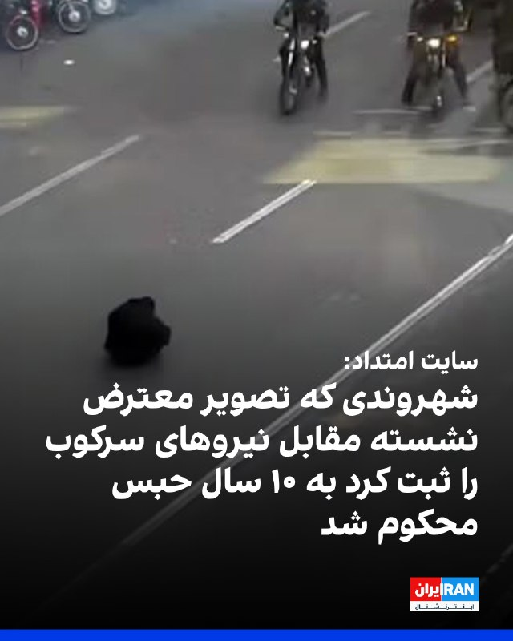

سایت امتداد گزارش داد مسعود پیاهو، شهروندی که تصویر نشستن یک معترض مقابل نیروهای سرکوب در اعتراضات بازار در دی ۱۴۰۴ را ثبت کرده بود، به اتهام «همکاری با اسرائیل» به ۱۰ سال حبس محکوم شده است.

حسن آقاخانی، وکیل این شهروند، عنوان کرده است موکل او این فیلم کوتاه را به صورت ناخودآگاه از آن صحنه ضبط کرده و قصد انتشار آن را نداشته و صرفا برای تعداد محدودی از دوستانش در استوری خصوصی اینستاگرام منتشر کرده است.

به گزارش امتداد و به نقل از وکیل مسعود پیاهو، حکم ۱۰ سال حبس در شعبه ۹ دیوان تایید شده و به اجرای احکام رفته است و این شهروند باید خود را به زندان معرفی کند.
https://iranintl.com/202605316094

## IranIntlTV — post 339913

  <a href="telegram/content/IranIntlTV_339913_1780249485.mp4" target="_blank">🎬 Download video</a>

ویدیوی منتشرشده در شبکه‌های اجتماعی، دود غلیظ ناشی از آتش‌سوزی را در حوالی اتوبان ستاری تهران در روز یک‌شنبه ۱۰ خرداد نشان می‌دهد.

جلال ملکی، سخنگوی سازمان آتش‌نشانی شهرداری تهران، در این‌باره گفت: مقادیری لاستیک و روغن در پارکینگ ساختمانی نگهداری می‌شده که به دلایل نامشخص دچار آتش‌سوزی شده است. این حادثه مصدومیت و تلفات جانی نداشته است.
@iranintltv

## IranIntlTV — post 339912

  <a href="telegram/content/IranIntlTV_339912_1780249486.mp4" target="_blank">🎬 Download video</a>

تیتر اول با نیوشا صارمی، یکشنبه ۱۰ خرداد
@iranintltv

## IranIntlTV — post 339911

  

یک منبع آگاه به ایران اینترنشنال خبر داد که مسعود پزشکیان، رئیس‌جمهوری ایران، با ارسال نامه‌ای رسمی به دفتر مجتبی خامنه‌ای، رهبر جمهوری اسلامی، خواستار کناره‌گیری از سمت خود شد.
بر اساس اطلاعات رسیده به ایران‌اینترنشنال، پزشکیان در این نامه که طی ساعات گذشته ارسال شده، با لحنی کم‌سابقه و انتقادی هشدار داده است که ساختار اداره کشور عملاً از مسیرهای رسمی خارج شده و بخش‌های اصلی حاکمیت تحت کنترل کامل طیفی خاص از فرماندهان سپاه پاسداران قرار گرفته است.
هنوز روشن نیست که مجتبی خامنه‌ای با استعفای رئیس‌جمهوری موافقت خواهد کرد یا خیر، اما محتوای نامه از شکافی عمیق و بی‌سابقه در بالاترین سطوح قدرت در جمهوری اسلامی حکایت دارد.
پزشکیان در این نامه تأکید کرده که رئیس‌جمهوری و دولت عملاً از روند تصمیم‌گیری‌های کلان و حیاتی کشور کنار گذاشته شده‌اند و خلأ ناشی از این وضعیت، زمینه را برای در دست گرفتن امور توسط جریان‌های افراطی در سپاه پاسداران فراهم کرده است. او همچنین تصریح کرده که در چنین شرایطی امکان اداره دولت و انجام مسئولیت‌های قانونی خود را ندارد و به همین دلیل خواستار کناره‌گیری فوری شده است.
https://iranintl.com/

## IranIntlTV — post 339910

  

دنی دانون، سفیر اسرائیل در سازمان ملل، در شبکه اجتماعی ایکس نوشت: «درست در زمانی که یهودی‌ستیزی دوباره در حال افزایش است و نفرت از اسرائیل حتی از سوی برخی مسئولان منتخب نیز تشویق می‌شود، ما با قامتی استوار ایستاده‌ایم.»

او افزود: «هیچ‌کس نمی‌تواند ما را وادار کند پرچم‌های اسرائیل را پایین بیاوریم؛ نه در نیویورک و نه در هیچ جای دیگری در جهان.»
https://iranintl.com/202605317796

## IranIntlTV — post 339909

  <a href="telegram/content/IranIntlTV_339909_1780249490.mp4" target="_blank">🎬 Download video</a>

ایران‌اینترنشنال به اسنادی محرمانه دست یافته که نشان می‌دهد چین از طرق شرکت‌هایی در خاک این کشور، ترکیه و امارات، به سپاه پاسداران در تامین مواد شیمیایی برای ساخت موشک بالستیک کمک می‌کند. این همکاری در ازای نفت و از طریق ستاد پورجعفری سپاه انجام می‌شود.

گزارشی از مجتبا پورمحسن
@iranintltv

## IranIntlTV — post 339908

  <a href="https://t.me/IranintlTV/339908" target="_blank">📎 Download file</a>

🎧نسخه صوتی اخبار شبانگاهی | یکشنبه ۱۰ خرداد
@iranintlTV

## IranIntlTV — post 339907

  

فرماندهی مرکزی ایالات متحده (سنتکام) با انتشار تصاویری، جزئیاتی از فعالیت یک ناو هواپیمابر آمریکایی که اکنون نزدیک ایران هستند منتشر و آن را «شهری روی دریا» توصیف کرد.

در حالی که به دلیل آتش‌بس جاری با جمهوری اسلامی، عملیات‌ها محدودتر شده‌اند، مقامات آمریکایی می‌گویند نیروی دریایی ایالات متحده همچنان آماده است در صورت نیاز حملات را افزایش دهد.

سنتکام نوشت: «یک ناو هواپیمابر نیروی دریایی آمریکا در اصل یک شهر مستقل روی دریاست. با طولی حدود سه زمین فوتبال و بیش از ۵۰۰۰ ملوان در آن، برای اینکه عملیات به‌طور روان پیش برود، حضور و همکاری همه نیروها—چه در عرشه و چه زیر آن—ضروری است.»

ویدئوهای منتشرشده در پستی در شبکه اجتماعی ایکس نشان می‌دهد ملوانان در حال انجام وظایف مختلف روی این ناو هستند؛ از تهیه غذا گرفته تا هدایت هواپیماها روی عرشه.
https://iranintl.com/202605319516

## IranIntlTV — post 339905

  <a href="telegram/content/IranIntlTV_339905_1780249494.mp4" target="_blank">🎬 Download video</a>

سی‌بی‌اس نیوز به نقل از منابع آگاه اعلام کرد دونالد ترامپ، رییس‌جمهوری ایالات متحده، جمعه اصلاحاتی را در متن تفاهم‌نامه اعمال کرد و نسخه جدید را برای تایید به تهران ارسال کرد، اما هنوز پاسخی از سوی جمهوری اسلامی دریافت نشده است.

گزارش مرضیه حسینی، خبرنگار ایران‌اینترنشنال
@iranintltv

## IranIntlTV — post 339904

  

اسکات بسنت، وزیر خزانه‌داری آمریکا، در گفت‌وگو با فاکس‌نیوز درباره ایران اعلام کرد: لایه اول و دوم حکومت آن‌ها از بین رفته و اکنون با لایه سوم روبه‌رو هستیم. شاید آن‌ها دیده‌اند برای بقیه چه اتفاقی افتاد و می‌بینند ترامپ آماده انجام چه اقداماتی است.

بسنت افزود: اگر ترامپ با این توافق موافقت کند، همین حالا به رهبران جمهوری اسلامی می‌گویم که او این توافق را هم از نظر نظامی و هم از نظر اقتصادی اجرا خواهد کرد. آزادی کشتیرانی در خلیج فارس از طریق تنگه هرمز باید به وضعیت پیشین بازگردد.

او درباره اینکه آیا ترامپ «کار را تمام خواهد کرد» گفت: اگر «تمام کردن کار» یعنی اطمینان از باز بودن تنگه هرمز، در اختیار گرفتن اورانیوم با غنای بالا و نداشتن سلاح هسته‌ای از سوی جمهوری اسلامی، پس کار تمام شده است.

بسنت تاکید کرد: چه از طریق مداخله نظامی، چه محاصره یا فشار اقتصادی، این نخستین بار در ۴۷ سال گذشته است که ایرانی‌ها درباره نداشتن سلاح هسته‌ای گفت‌وگو می‌کنند. این موضوع پیش‌تر ممنوعه بود و اکنون برای نخستین بار روی میز مذاکره قرار گرفته است.
https://iranintl.com/202605310994

## IranIntlTV — post 339903

  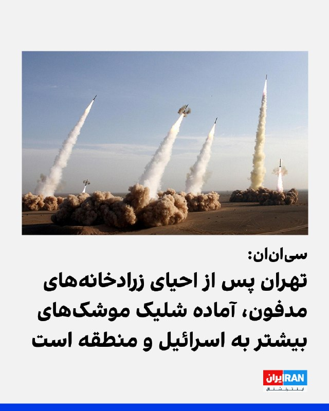

سی‌ان‌ان گزارش داد تهران پس از خارج کردن سریع زرادخانه‌های موشکی مدفون خود، در موقعیتی قرار گرفته که می‌تواند تعداد بیشتری موشک دوربرد به سمت اسرائیل و دیگر کشورهای خاورمیانه شلیک کند؛ موضوعی که به گفته کارشناسان، محدودیت‌های راهبرد بمباران آمریکا را نشان می‌دهد.

بر اساس این گزارش، حملات آمریکا و اسرائیل در هفته‌های گذشته با هدف تخریب جاده‌ها و مسدود کردن ورودی تونل‌ها انجام شد تا دسترسی تهران به سایت‌های زیرزمینی موشکی محدود شود.

تصاویر ماهواره‌ای بررسی‌شده توسط سی‌ان‌ان نشان می‌دهد جمهوری اسلامی با استفاده از تجهیزات ساده‌ای مانند بولدوزر و کامیون‌های حمل‌ونقل توانسته این مسیرها را دوباره بازسازی کند. کارشناسان می‌گویند این موضوع نشان می‌دهد توان موشکی ایران تنها با هدف قرار دادن ورودی تونل‌ها قابل از بین بردن نیست.
https://iranintl.com/202605315236

## IranIntlTV — post 339902

  <a href="telegram/content/IranIntlTV_339902_1780249498.mp4" target="_blank">🎬 Download video</a>

در ادامه گزارش‌ها از موج گسترده بیکاری در ایران، سایت کاریابی «جاب‌ ویژن» اعلام کرد نیمی از مخاطبان یک نظرسنجی در این سایت بیکار شده‌اند. بر اساس این نظرسنجی، ۵۲ درصد از کارجویان اعلام کردند در پی جنگ شغل خود را از دست داده‌اند.
خبرگزاری ایلنا نیز از اخراج گسترده کارگران در مجتمع‌های پتروشیمی ماهشهر و بندر امام گزارش داد.

گفت‌وگو با فواد کیخسروی، فعال کارگری
@iranintltv

## IranIntlTV — post 339900

  <a href="telegram/content/IranIntlTV_339900_1780249500.mp4" target="_blank">🎬 Download video</a>

همزمان با تورم سنگین خوراکی‌ها و تشدید بحران معیشت در ایران، مقام‌های حوزه بهداشت و سلامت درباره پیامدهای کاهش مصرف خوراکی‌های مغذی برای سلامت خانوارها هشدار دادند.

گفت‌وگو با کیارش آرامش، پزشک و متخصص پزشکی اجتماعی و اخلاق زیستی
@iranintltv

## IranIntlTV — post 339899

  

مسعود پزشکیان با بیان اینکه «محدودیت‌ها و فشارهای خارجی در حوزه اقتصادی پیچیدگی‌های خاصی را برای اداره کشور ایجاد کرده است» گفت: شرایط کشور عادی و ساده نیست.

او با اشاره به ضرورت تقویت «تاب‌آوری» مردم گفت: واقعیت‌های موجود باید با جامعه در میان گذاشته شود تا آنها بتوانند نقش خود را در مواجهه با چالش‌ها ایفا کنند.

پزشکیان اضافه کرد: «جامعه باید نسبت به الزامات و هزینه‌های مقاومت آگاه باشد».
https://iranintl.com/202605313966

## IranIntlTV — post 339898

  <a href="telegram/content/IranIntlTV_339898_1780249503.mp4" target="_blank">🎬 Download video</a>

سرخط خبرهای یکشنبه ۱۰ خرداد
@iranintltv

## IranIntlTV — post 339897

  

دونالد ترامپ در تروث‌سوشال اعلام کرد که تام باراک، سفیر ایالات متحده در ترکیه، به عنوان فرستاده ویژه ریاست‌جمهوری در امور عراق و سوریه منصوب شده است.

ترامپ افزود: همزمان با پیشبرد همکاری راهبردی ما با دولت‌های سوریه و عراق، روابط ما با آن‌ها همچنان در حال گسترش است.
https://iranintl.com/202605311800

## IranIntlTV — post 339896

  

اسماعیل کوثری، عضو کمیسیون امنیت ملی مجلس، با تاکید بر اینکه «پرونده هسته‌ای از روی میز مذاکره با آمریکا برداشته شده است»، گفت: «مذاکرات برای پایان دادن به جنگ در حال انجام است اما به توافق نهایی نرسیده‌ایم و می‌دانیم که نتیجه‌ای نخواهند داشت.»

او افزود: «جمهوری اسلامی اکنون در حال مذاکره در مورد جلوگیری از تکرار جنگ، پرداخت غرامت، خروج نیروهای آمریکایی از منطقه و لغو محاصره دریایی است.»

کوثری اضافه کرد: «بسیاری از کشورها کنترل ایران بر تنگه را پذیرفته‌اند.»
https://iranintl.com/202605310064

## IranIntlTV — post 339895

  <a href="telegram/content/IranIntlTV_339895_1780249507.mp4" target="_blank">🎬 Download video</a>

در حالی که تورم سنگین خوراکی‌ها موجب تشدید بحران معیشت در ایران شده است، علیرضا نوری قزلجه، وزیر جهاد کشاورزی، گفت کالاهای اساسی با «قیمت‌های متعادل» در کشور عرضه می‌شوند.

گفت‌وگو با اشکان نظام‌آبادی، روزنامه‌نگار اقتصادی
@iranintltv

## IranIntlTV — post 339894

  <a href="telegram/content/IranIntlTV_339894_1780249510.mp4" target="_blank">🎬 Download video</a>

قهرمانی پاری‌سن‌ژرمن در لیگ قهرمانان اروپا با ناآرامی در خیابان‌های پاریس همراه شد. پلیس فرانسه اعلام کرد بیش از ۴۰۰ نفر در جریان درگیری‌های پس از جشن هواداران بازداشت شدند و نیروهای امنیتی در اطراف شانزه‌لیزه و مرکز شهر از گاز اشک‌آور استفاده کردند.
@iranintltv

## Shin_Persian — post 6334

  

Shin ✓ @hey_itsmyturn Sun, 31 May 2026 17:37:26 UTC Tasnim called @IranIntl a "Mossad-affiliated media", adds "Mr. President did'nt resign, was working today, and will continue his work as planned", citing an "informed source". [These quick denials by…

## Shin_Persian — post 6333

Shin ✓ @hey_itsmyturn
Sun, 31 May 2026 17:37:26 UTC

Tasnim called @IranIntl a "Mossad-affiliated media", adds "Mr. President did'nt resign, was working today, and will continue his work as planned", citing an "informed source".

[These quick denials by IRGC media usually mean the opposite] [They rejected his resignation iyam]

فارسی

تسنیم @IranIntl را یک «رسانه وابسته به موساد» خواند و به نقل از یک «منبع آگاه» افزود: «آقای رئیس‌جمهور استعفا نداده، امروز مشغول به کار بود و طبق برنامه به فعالیت خود ادامه خواهد داد.»

[این تکذیب‌های سریع توسط رسانه‌های سپاه پاسداران (IRGC) معمولاً به معنای معکوس است] [به نظر من آن‌ها با استعفای او مخالفت کرده‌اند]

𝕏 · @shin_persian

## Shin_Persian — post 6332

Shin ✓ @hey_itsmyturn
Sun, 31 May 2026 17:32:49 UTC

IRGC-owned Tasnim denies Pezeshkian's resignation.

فارسی

خبرگزاری تسنیم متعلق به سپاه پاسداران انقلاب اسلامی (IRGC)، استعفای پزشکیان را تکذیب کرد.

𝕏 · @shin_persian

## Shin_Persian — post 6331

↩️ Quoted tweet: ایران اینترنشنال - خبر فوری ✓ @IranIntlbrk Sun, 31 May 2026 16:40:46 UTC یک منبع آگاه به ایران اینترنشنال خبر داد که مسعود پزشکیان، رئیس‌جمهوری ایران، با ارسال نامه‌ای رسمی به دفتر مجتبی خامنه‌ای، رهبر جمهوری اسلامی، خواستار کناره‌گیری از…

## Shin_Persian — post 6330

↩️ Quoted tweet:
ایران اینترنشنال - خبر فوری ✓ @IranIntlbrk
Sun, 31 May 2026 16:40:46 UTC

یک منبع آگاه به ایران اینترنشنال خبر داد که مسعود پزشکیان، رئیس‌جمهوری ایران، با ارسال نامه‌ای رسمی به دفتر مجتبی خامنه‌ای، رهبر جمهوری اسلامی، خواستار کناره‌گیری از سمت خود شد.
بر اساس اطلاعات رسیده به ایران‌اینترنشنال، پزشکیان در این نامه که طی ساعات گذشته ارسال شده، با لحنی کم

↩️ Quoted tweet — see the post below for the reply.

English

An informed source told Iran International that Masoud Pezeshkian, the President of Iran, sent an official letter to the office of Mojtaba Khamenei, the Supreme Leader of the Islamic Republic, requesting to resign from his position.

According to information obtained by Iran International, in this letter sent within the past few hours, Pezeshkian, with a tone...

𝕏 · @shin_persian

## Shin_Persian — post 6329

Shin ✓ @hey_itsmyturn
Sun, 31 May 2026 17:04:32 UTC

Lots of people tweeting the Jordanian flag with a missing star, do they have a problem with Jordan?

فارسی

افراد زیادی در حال توئیت کردن پرچم اردن بدون ستاره هستند، آیا آن‌ها با اردن مشکلی دارند؟

𝕏 · @shin_persian

## Shin_Persian — post 6328

  

Shin ✓ @hey_itsmyturn
Sun, 31 May 2026 16:59:05 UTC

USS Milius is supporting the U.S. blockade against Iran. As of May 31, the blockade has redirected 118 commercial vessels and disabled 5.

Source: https://x.com/i/web/status/2061130303352050177

فارسی

ناو یو‌اس‌اس میلیوس (USS Milius) از محاصره ایالات متحده علیه ایران حمایت می‌کند. تا تاریخ ۳۱ مه، این محاصره باعث تغییر مسیر ۱۱۸ کشتی تجاری و از کار افتادن ۵ کشتی شده است.

منبع: https://x.com/i/web/status/2061130303352050177

𝕏 · @shin_persian

## Shin_Persian — post 6327

↩️ Quoted tweet: Shin ✓ @hey_itsmyturn Fri, 29 May 2026 21:03:59 UTC Source tells me that an Iranian Lieutenant has been killed by shrapnel. Qeshm island, Hormozgan Province, #Iran ↩️ توییت نقل‌قول شده — برای پاسخ، پست زیر را ببینید. فارسی منابع به من…

## Shin_Persian — post 6326

↩️ Quoted tweet:
Shin ✓ @hey_itsmyturn
Fri, 29 May 2026 21:03:59 UTC

Source tells me that an Iranian Lieutenant has been killed by shrapnel.
Qeshm island, Hormozgan Province, #Iran

↩️ توییت نقل‌قول شده — برای پاسخ، پست زیر را ببینید.

فارسی

منابع به من خبر می‌دهند که یک ستوان ایرانی بر اثر اصابت ترکش کشته شده است.
جزیره قشم، استان هرمزگان، #Iran_

𝕏 · @shin_persian

## FarsiVOA — post 219193

فاجعه بیکاری در جنوب ایران؛ اخراج گسترده کارگران پتروشیمی در ماهشهر

## FarsiVOA — post 219192

🔺حبس به دلیل ضبط وقایع؛ ثبت‌کننده «مرد تانکی تهران» به ۱۰ سال زندان محکوم شد

◾️گزارش‌هایی که روز یکشنبه ۱۰ خرداد منتشر شد حاکی از آن است که مسعود پیاهو، شهروندی که تصویری از حرکت اعتراضی مشهور به «مرد تانکی تهران» را ثبت کرده بود، به ۱۰ سال حبس محکوم شده است و پرونده او در آستانه اجرای حکم قرار دارد.

⬇️ بیشتر بخوانید:

https://ir.voanews.com/a/tehran-tank-man-photographer-jailed/8155801.html

## FarsiVOA — post 219191

🔺صدور حکم اعدام علیه دو جوان ۲۰ ساله به اتهام «جاسوسی»؛ ماشین مرگ جمهوری اسلامی سر ایستادن ندارد

◾️در ادامه موج اتهام‌زنی‌های بی‌اساس و صدور احکام اعدام برای مخالفان و معترضان رژیم، قوه قضائیه جمهوری اسلامی حسن و حسین امیری، برادران دوقلوی ۲۰ ساله، را به «جاسوسی برای اسرائیل» متهم و آنها را به اعدام محکوم کرد.

⬇️ بیشتر بخوانید:

https://ir.voanews.com/a/iran-issues-death-sentences-to-two-20-year-olds/8155805.html

## FarsiVOA — post 219190

  <a href="telegram/content/FarsiVOA_219190_1780249513.mp4" target="_blank">🎬 Download video</a>

ارتش اسرائیل تصاویری از فعالیت نیروهایش در قلعه بوفور منتشر کرده است.
نیروهای ارتش اسرائیل پیشتر ارتفاعات بوفور را تصرف کردند. هدف اصلی این عملیات نابودی زیرساخت‌های حزب‌الله بود که با هدایت جمهوری اسلامی در این منطقه ایجاد شده است.

تصرف بوفور پس از روزها نبرد شدید در روستاهای اطراف و عبور نیروهای اسرائیلی از رودخانه لیتانی انجام شد؛ عمیق‌ترین پیشروی اسرائیل در لبنان طی ۲۶ سال گذشته.

این قلعه ۱۲ قرن قدمت دارد و یونسکو آن را به رسمیت می‌شناسد و نزدیک شهر نبطیه و در فاصله حدود ۱۴ کیلومتری از مرز اسرائیل قرار دارد.

## FarsiVOA — post 219189

گفت‌و‌گو با آلان توفیقی، تحلیلگر سیاسی از پاریس، درباره اظهارات قالیباف و دیگر مذاکره‌کنندگان جمهوری اسلامی و تاثیر احتمالی آن بر مواضع پرزیدنت ترامپ

## FarsiVOA — post 219188

🔺صدور حکم خلع لباس علیه یک روحانی اهل سنت به دلیل «عزاداری نکردن» برای مرگ خامنه‌ای

◾️رسانه‌های حقوق بشری روز یکشنبه ۱۰ خرداد اعلام کردند که دادگاه‌ ویژه روحانیت رژیم جمهوری اسلامی، عثمان ذاکری، روحانی سنی اهل بوکان، را به «خلع لباس» و «اخراج از مسجد» محکوم کرده است.

⬇️ بیشتر بخوانید:

https://ir.voanews.com/a/disrobing-sunni-cleric-iran-religious-minorities-mourning-for-khamenei/8155800.html

## FarsiVOA — post 219187

گفت‌و‌گو با دکتر مازیار صدری، فوق تخصص مراقبت‌های ویژه، درباره پیامدهای بالا رفتن هزینه درمان در ایران که سبب شده است بیماران قید مداوا شدن را بزنند.

## FarsiVOA — post 219186

تکمیل طرح محدود کردن سلاح گروەهای مسلح عراق؛ الزیدی: «عصائب اهل حق» هم تسلیم خواهد شد

## FarsiVOA — post 219185

  <a href="telegram/content/FarsiVOA_219185_1780249516.mp4" target="_blank">🎬 Download video</a>

ارتش اسرائیل با انتشار ویدیویی از حملات به زیرساخت‌های سازمان تروریستی حزب‌الله در صور و مناطق دیگر در جنوب لبنان، اعلام کرد از زمان اجرای آتش‌بس تاکنون «۹۰۰ تروریست حزب‌الله» را از بین برده است.

جنگ میان حزب‌الله و ارتش اسرائیل به رغم تمدید آتش‌بس همچنان ادامه دارد و در همین راستا، در روزهای اخیر ارتش اسرائیل چندین هشدار تخلیه برای مناطق مختلف لبنان صادر کرد. نتانیاهو نیز بر گسترش عملیات اسرائیل در جنوب لبنان تأکید کرد.

## FarsiVOA — post 219184

حسن شریعتمداری در عمق میدان: تجربه نشان داده که شخصیت و رهبرِ کاریزماتیک خودش دیکتاتور بعدی خواهد بود. همه را با همه تفاوت‌ها باید دعوت کرد

## FarsiVOA — post 219183

در گفت‌وگو با حسن هاشمیان به عبور ارتش اسرائیل از رود لیتانی و تصرف قلعه راهبردی بوفور (یا بوفورت که نام عربی آن «شقیف» است) پرداختیم. او می‌گوید این پیشروی، «که بزرگ‌ترین شکستی است که جمهوری اسلامی به جهان اسلام تقدیم کرد» معادلات لبنان و مذاکرات منطقه‌ای را به زیان جمهوری اسلامی تغییر می‌دهد.

## FarsiVOA — post 219182

🔺افزایش فشار بر زندانیان اوین؛ از سلول انفرادی تا محرومیت درمانی

◾️کانون حقوق بشر ایران روز یکشنبه ۱۰ خرداد ۱۴۰۵ با انتشار گزارشی از افزایش فشارها بر زندانیان در زندان اوین خبر داد و اعلام کرد که در ماه‌های اخیر مواردی از محرومیت درمانی، محدودیت تماس و ملاقات، انتقال به سلول‌های انفرادی و برخوردهای خشونت‌آمیز با زندانیان گزارش شده است.

⬇️ بیشتر بخوانید:

https://ir.voanews.com/a/pressure-mounts-evin-prison/8155787.html

## FarsiVOA — post 219181

با وجود اعلام رسمی بازگشت اینترنت بین‌الملل، گزارش‌های داخلی و خارجی روزهای اخیر تصویر متفاوتی نشان می‌دهند: فیلترینگ سنگین، اختلال در پیام‌رسان‌ها، محدودیت اپ‌استورها و ناپایداری ارتباط دیتاسنترها همچنان ادامه دارد. ترافیک اینترنت ایران هنوز به نصف سطح عادی هم نرسیده است.

نت‌بلاکس در آخرین ارزیابی خود اعلام کرده شرایط فعلی به دوران میان اعتراضات دی‌ماه و جنگ اخیر شباهت دارد و نه به وضعیت پیش از بحران.

گزارش کامل را در وب‌سایت صدای آمریکا بخوانید.

@FarsiVOA

## FarsiVOA — post 219180

  <a href="telegram/content/FarsiVOA_219180_1780249519.mp4" target="_blank">🎬 Download video</a>

ویدیویی در شبکه‌های اجتماعی منتشر شده که منتسب به یکی از مین‌های دریایی جمهوری اسلامی در محدوده آب‌های عمان است.

مرکز امنیت دریایی عمان روز شنبه ۹ خرداد، بعد از مشاهده یک جسم شناور در غرب منطقه ترافیک ساحلی تنگه هرمز در محدوده آب‌های سرزمینی عمان، که گمان می‌رود «مین دریایی» باشد، از دریانوردان، ماهیگیران، و کشتی‌ها خواست تا نهایت احتیاط را به کار گیرند.

## FarsiVOA — post 219179

  

فرماندهی جنوبی آمریکا تصویری از یک جنگنده «اف/ای-۱۸ اف سوپر هورنت» منتشر کرد که از عرشه ناو هواپیمابر «یواس‌اس نیمیتز» در اقیانوس اطلس به پرواز درآمد.

این تصویر در ۲۸ اردیبهشت گرفته شده است.

@FarsiVOA

## FarsiVOA — post 219178

در گفت‌وگو با امیر چاهکی، کارشناس روابط بین‌الملل، به اظهارات پرزیدنت ترامپ درباره نزدیک بودن به یک توافق «عالی» و هم‌زمان تهدید به اقدام نظامی پرداختیم. به گفته امیر چاهکی، در صورت شکست احتمالی مذاکرات، «این جنگ سه‌روزه یا دو‌هفته‌ای نخواهد بود» و می‌تواند وارد مرحله‌ای طولانی و پرهزینه شود.

## FarsiVOA — post 219177

🔺پرزیدنت ترامپ تام باراک را به عنوان فرستاده ویژه ریاست جمهوری در امور سوریه و عراق منصوب کرد

◾️دونالد ترامپ، رئیس جمهوری ایالات متحده، روز یکشنبه ۱۰ خرداد اعلام کرد تام باراک، سفیر آمریکا در ترکیه، علاوه بر مسئولیت کنونی خود، به عنوان فرستاده ویژه ریاست جمهوری آمریکا در امور سوریه و عراق منصوب خواهد شد.

⬇️ بیشتر بخوانید:

https://ir.voanews.com/a/president-trump-appoints-tom-barrack-special-presidential-envoy-to-syria-and-iraq/8155788.html

## FarsiVOA — post 219176

  <a href="telegram/content/FarsiVOA_219176_1780249522.mp4" target="_blank">🎬 Download video</a>

فرماندهی مرکزی ایالات متحده، سنتکام، با انتشار ویدیویی از داخل یک ناو هواپیمابر نیروی دریایی آمریکا، آن را شهری خودکفا در دریا توصیف کرد.

سنتکام می‌گوید این ناو که طول آن تقریبا به اندازه سه زمین فوتبال است، بیش از پنج هزار نفر را در خود جای داده و برای ادامه عملیات، به همکاری همه نیروها در عرشه و بخش‌های زیرین ناو متکی است.

@FarsiVOA

## FarsiVOA — post 219175

🔺زهرا شهباز طبری پس از نقض حکم پیشین بار دیگر به اعدام محکوم شد

◾️زهرا شهباز طبری، زندانی سیاسی محبوس در زندان لاکان رشت، پس از نقض حکم اعدام پیشین در دیوان عالی کشور، بار دیگر از سوی شعبه دوم دادگاه انقلاب رشت به اعدام محکوم شده است.

⬇️ بیشتر بخوانید:

https://ir.voanews.com/a/political-prisoner-sentenced-to-death/8155775.html

## FarsiVOA — post 219174

پیروزی پاری‌سن‌ژرمن در لیگ قهرمانان اروپا شامگاه شنبه ۹ خرداد پاریس را شعله‌ور کرد و هواداران خیابا‌ن‌ها را تسخیر و شادی کردند.

## DW_Farsi — post 125352

🔶 گزارش سی‌ان‌ان از بازگشایی پایگاه‌های موشکی زیرزمینی ایران
 
سی‌ان‌ان در گزارشی نوشت ایران پس از هفته‌ها بمباران آمریکا و اسرائیل، با استفاده از تجهیزات ساده‌ای مانند بولدوزر و کامیون، در حال بازگشایی زردخانه‌های مدفون خود است و همین موضوع محدودیت‌های راهبرد بمباران آمریکا را آشکار کرده است.
 
بر اساس این گزارش، تصاویر ماهواره‌ای نشان می‌دهند ایران تاکنون ۵۰ ورودی از ۶۹ ورودی تونل را در ۱۸ سایت موشکی زیرزمینی که هدف حمله قرار گرفته بودند، دوباره باز کرده است.
 
در این گزارش آمده است آمریکا  و اسرائیل در هفته‌های نخست جنگ، برای محدود کردن توان موشکی ایران، جاده‌ها را منهدم و دهانه تونل‌های پایگاه‌های زیرزمینی را مسدود کردند. اما تصاویر ماهواره‌ای نشان می‌دهند ایران با ابزارهای ساده توانسته بخش قابل توجهی از این مسیرها را دوباره باز کند.
 
علاوه بر ورودی تونل‌ها، بخش‌هایی از جاده‌هایی که برای جلوگیری از حرکت پرتابگرهای موشکی  بمباران شده بودند نیز ترمیم شده‌اند. به گفته سی‌ان‌ان، تقریبا همه گودال‌های ایجادشده در این مسیرها پر شده و در دو نقطه، حتی آسفالت‌ریزی دوباره انجام شده است.
@dw_farsi

## DW_Farsi — post 125351

  

🔶 تصرف قلعه بوفور از سوی اسرائیل؛ فرانسه خواستار نشست اضطراری شورای امنیت شد
 
ژان-نوئل بارو، وزیر خارجه فرانسه، اعلام کرد پاریس پس از تصرف قلعه بوفور در لبنان توسط ارتش اسرائیل، خواستار برگزاری نشست اضطراری شورای امنیت سازمان ملل شده است. او گفت فرانسه حق اسرائیل برای دفاع از خود را به رسمیت می‌شناسد، اما ادامه عملیات نظامی اسرائیل در لبنان و گسترش حضور آن در خاک این کشور را غیرقابل توجیه می‌داند.
 
به گزارش العربیه انگلیسی، بارو در این باره گفت هیچ چیز نمی‌تواند ادامه عملیات نظامی اسرائیل در لبنان و عمیق‌تر شدن اشغال خاک این کشور را توجیه کند.
 
دنی دانون، نماینده اسرائیل در سازمان ملل، در واکنش به درخواست فرانسه گفت بحث واقعی در شورای امنیت باید درباره شکست مداوم در اجرای قطعنامه ۱۷۰۱ باشد؛ قطعنامه‌ای که پس از جنگ سال ۲۰۰۶ میان اسرائیل و حزب‌الله تصویب شد و بر اساس آن، حزب‌الله باید به شمال رود لیتانی عقب می‌رفت.
 
او گفت حزب‌الله سال‌هاست قطعنامه‌های سازمان ملل را آشکارا نقض کرده، با حمایت ایران مسلح شده و تهدیدی مستقیم برای غیرنظامیان اسرائیلی و ثبات منطقه ایجاد کرده است.
 
@dw_farsi

## DW_Farsi — post 125350

  <a href="telegram/content/DW_Farsi_125350_1780249525.mp4" target="_blank">🎬 Download video</a>

🎥 پیدا شدن بخشی از مجسمه آسیب‌دیده تخت مرمر کاخ گلستان
 
براساس تصاویری که به‌تازگی در شبکه‌های اجتماعی منتشر شده، مرمت‌گران کاخ گلستان روز ۱۸ فروردین ۱۴۰۵ در جریان مرمت تخت مرمر، قطعه "سر فرشته" یکی از مجسمه‌های این اثر تاریخی را که از بدنه جدا شده بود، در میان آوار پیدا کردند.
 
تخت مرمر از آثار دوره فتحعلی‌شاه قاجار در کاخ‌موزه گلستان است که از ۶۵ قطعه مرمر زرد ساخته شده و در گذشته برای مراسم رسمی و تاج‌گذاری مورد استفاده قرار می‌گرفت. رضاشاه پهلوی نیز تاج‌گذاری خود را در این محل برگزار کرد. این اثر تاریخی در پی موج انفجار ناشی از حملات هوایی ائتلاف نظامی آمریکا و اسرائیل به مناطقی در نزدیکی کاخ گلستان در شامگاه دهم اسفند ۱۴۰۴ آسیب دیده بود.
@dw_farsi

## DW_Farsi — post 125349

  

🔶 گزارش‌هایی از حمله موشکی ایران به اقلیم کردستان
 
یک مقام حزب "آزادی کردستان" گفته است امروز یکشنبه ۱۰ خرداد (۳۱ مه) یکی از پایگاه‌های اصلی وابسته به این گروه مخالف حکومت ایران در نزدیکی اربیل در عراق هدف حمله موشکی قرار گرفته است. این مقام، مسئولیت حمله را متوجه ایران دانسته است.
 
هم‌زمان، رسانه‌های دولتی ایران گزارش دادند نیروهای زمینی سپاه پاسداران به پایگاه‌های گروه‌های کرد در شمال عراق حمله کرده‌اند.
 
در این گزارش‌ها اشاره شده که محل دقیق حمله‌ها روشن نیست و مشخص نشده کدام پایگاه‌ها هدف قرار گرفته‌اند.
 
سپاه پاسداران در ماه‌های اخیر بارها مقر احزاب کرد در اقلیم کردستان را هدف حملات هوایی و پهپادی قرار داده است.
@dw_farsi

## DW_Farsi — post 125348

  

🔶 افزایش ۴۰ درصدی خدمات تدفین در بهشت زهرای تهران
 
مصوبه جدید نرخ بهای خدمات در بهشت‌زهرا نشان می‌دهد تعرفه خدمات مختلف، از حمل متوفی و تغسیل تا تکفین، تدفین و برگزاری مراسم، به‌طور متوسط حدود ۴۰ درصد افزایش یافته است. بر اساس این گزارش، در برخی موارد نیز میزان افزایش قیمت‌ها به ۵۰ درصد رسیده است.
 
به گزارش دیده‌بان ایران، هزینه انتقال هر متوفی از سطح شهر تهران تا شعاع ۱۰ کیلومتری به ۹ میلیون و ۷۵۰ هزار ریال رسیده است؛ رقمی که نشان‌دهنده افزایش ۵۰ درصدی این سرویس است.
 
نرخ حمل متوفی به پزشکی قانونی کهریزک نیز از این افزایش مستثنا نمانده و به ازای هر کیلومتر اضافه، افزایش یافته است. در نتیجه، هزینه انتقال در این مسیر نیز نسبت به قبل بالاتر رفته و بار مالی بیشتری بر خانواده‌ها تحمیل می‌کند.
 
در میان خدمات مختلف، آمبولانس خصوصی بیشترین رشد تعرفه را داشته است.
 
این تغییرات در مجموع نشان می‌دهد هزینه خدمات مرتبط با انتقال و رسیدگی به متوفیان در تهران وارد مرحله تازه‌ای از افزایش شده و بخش مهمی از خدمات بهشت‌زهرا با نرخ‌های بالاتری محاسبه خواهد شد.
@dw_farsi

## DW_Farsi — post 125347

🔶 انجمن پرواز۷۵۲ از اصلاح قوانین هوانوردی پس از شش سال خبر داد
 
انجمن خانواده‌های جان‌باختگان پرواز پی‌اس۷۵۲ امروز یکشنبه ۱۰ خرداد (۳۱ مه) اعلام کرد که پس از شش سال و نیم پیگیری و رایزنی، اصلاحاتی در ضمیمه ۱۳ کنوانسیون شیکاگو، یکی از مهم‌ترین اسناد ناظر بر تحقیقات سوانح هوایی، به تصویب رسیده است؛ اصلاحاتی که به گفته این انجمن، در واکنش به کاستی‌هایی شکل گرفته که در روند رسیدگی به سرنگونی هواپیمای اوکراینی در تهران آشکار شد.
 
پرواز پی‌اس۷۵۲ خطوط هوایی بین‌المللی اوکراین بامداد ۱۸ دی ۱۳۹۸ تنها چند دقیقه پس از برخاستن از فرودگاه تهران، با شلیک دو موشک سپاه پاسداران سرنگون شد و تمامی ۱۷۶ سرنشین آن جان باختند. بخش بزرگی از قربانیان، ایرانیان شهروند یا ساکن کانادا بودند.
 
انجمن خانواده‌های جان‌باختگان این هواپیما، در بیانیه خود اعلام کرده است که بر اساس ضمیمه ۱۳ کنوانسیون شیکاگو، مسئولیت هدایت تحقیقات ایمنی در یک سانحه هوایی بر عهده کشوری است که حادثه در قلمرو آن رخ داده است.
 
به گفته این انجمن، همین قاعده باعث شد که تحقیقات ایمنی درباره سرنگونی هواپیمای اوکراینی به جمهوری اسلامی ایران واگذار شود؛ وضعیتی که خانواده‌ها آن را مصداق سپردن "پرونده تحقیقات درباره یک قتل جمعی به دست عاملان آن" توصیف کرده‌اند.
 
به گفته انجمن، اصلاحات جدید پس از سال‌ها دیدار با تصمیم‌گیران بین‌المللی و رایزنی دولت کانادا، در نهادهایی از جمله سازمان بین‌المللی هوانوردی غیرنظامی (ایکائو)، به تصویب رسیده است.
@dw_farsi

## DW_Farsi — post 125346

  

🔶 رییس کمیته نظامی ناتو: اعضای ناتو می‌توانند در بازگشایی تنگه هرمز نقش داشته باشند
 
جوزپه کاوو دراگونه، رییس کمیته نظامی ناتو، گفت این پیمان دفاعی در شرایط کنونی مستقیما در حل‌وفصل مسائل مربوط به تنگه هرمز دخالت ندارد، اما کشورهای عضو این پیمان در حال نزدیک کردن نیروهای خود به منطقه هستند و اگر شرایط لازم فراهم شود، قادر خواهند بود نقش ایفا کنند.
 
کاوو دراگونه گفت ناتو به‌عنوان یک ائتلاف در این مرحله نقشی مستقیم ندارد، اما کشورهای عضو آن چنین نقشی دارند. او افزود این کشورها در حال جابه‌جایی و استقرار نیروهای خود در نزدیکی منطقه هستند تا در صورت مهیا شدن شرایط، بتوانند وارد عمل شوند.
 
او در توضیح بیشتر گفت آنچه در حال شکل‌گیری است، نه یک ماموریت رسمی ناتو، بلکه "ائتلافی از کشورهای مایل" است؛ یعنی مجموعه‌ای از کشورهای عضو ناتو و شریکانی همسو که از هم‌اکنون در حال آماده‌سازی و برنامه‌ریزی هستند تا اگر شرایط مداخله فراهم شد، بتوانند وارد عمل شوند.
@dw_farsi

## DW_Farsi — post 125345

🔶 تعلیق میان ربایش و پهپاد؛ پناهجویان سیاسی ایرانی در عراق
 
🔻گزارشی از آتفه چهارمحالیان

نزدیک به چهار سال از آغاز جنبش"زن، زندگی، آزادی" می‌گذرد، اما آثار آن کماکان بر زندگی بسیاری از معترضان، فعالان سیاسی و خانواده‌های آنان سنگینی می‌کند. شماری از این افراد در سال‌های اخیر ناچار شدند از مسیرهای غیرقانونی مرزی، ایران را ترک کنند و به اقلیم کردستان عراق پناه ببرند؛ منطقه‌ای که برای دهه‌ها یکی از اصلی‌ترین مقاصد پناهجویان سیاسی ایرانی بوده است.
 
روایت کسانی که امروز در اردوگاه‌ها و شهرهای اقلیم زندگی می‌کنند، حاکی از آن است که خروج از ایران برای این پناهجویان به معنای پایان خطر نبوده است.
 
حملات پهپادی و موشکی به اردوگاه‌های محل استقرار پناهجویان و خانواده‌های وابسته به احزاب کرد ایرانی در جنگ اخیر، مشکلات اقامتی، دشواری دسترسی به درمان، نبود امکان کار و هراس از بازگردانده شدن به ایران، تنها بخشی از مشکلاتی است که پناهجویان سیاسی ایرانی از آن سخن می‌گویند.
 
در این میان، روایت اردلان مامه، شهین عبدالقادری، محمد محمدی و علی برزنجی، تصویری از سرنوشت نسلی است که از سرکوب گریخته اما در ناامنی‌های دیگری گرفتار شده است.
@dw_farsi

## DW_Farsi — post 125344

  

🔶 سه سکوی فراساحلی پارس جنوبی پس از جنگ به مدار تولید بازگشتند
 
تورج دهقانی، مدیرعامل شرکت نفت و گاز پارس، گفت روند بازیابی ظرفیت تولید و فرآورش گاز در میدان مشترک پارس جنوبی پس از حملات امریکا و اسرائیل ادامه دارد و تاکنون سه سکوی فراساحلی این میدان دوباره وارد مدار تولید شده‌اند.
 
دهقانی گفت در جریان حملات آمریکا و اسرائیل به برخی تاسیسات پالایشی پارس جنوبی، بخشی از ظرفیت دریافت و فرآورش گاز در نوار ساحلی استان بوشهر با محدودیت روبه‌رو شد.
 
به گفته او، در نتیجه این وضعیت، تعدادی از سکوهای فراساحلی متناظر با پالایشگاه‌های آسیب‌دیده، با وجود آمادگی کامل عملیاتی و بدون آن‌که خود سکوها آسیب دیده باشند، ناچار به توقف تولید شدند، زیرا امکان دریافت و فرآورش گاز تولیدی آن‌ها در بخش خشکی وجود نداشت.
 
مدیرعامل شرکت نفت و گاز پارس گفت با اجرای برنامه‌های فنی و عملیاتی در بخش پایین‌دست و استفاده حداکثری از ظرفیت پالایشگاه‌های فعال، امکان دریافت و فرآورش بخشی از گاز تولیدی این سکوها دوباره فراهم شد.
 
@dw_farsi

## Persian_Trend_Official — post 15413

  <a href="telegram/content/Persian_Trend_Official_15413_1780249531.webm" target="_blank">🎬 Download video</a>

یک منبع آگاه در دولت: اینترنشنال، کارخانه تولید اکاذیب درباره پزشکیان و دیگران است

▪️ یک منبع آگاه در دولت در گفتگو با تسنیم با اشاره به شایعه‌سازی «اینترنشنال»، رسانه وابسته به موساد، درباره استعفای آقای پزشکیان، رئیس‌جمهور، تاکید کرد: اینکه این رسانه ضدایرانی کارخانه تولید اکاذیب درباره ایران است دیگر بر کسی پوشیده نیست، لذا طبیعی است که کسی شایعات او را هم باور نکند.

▪️ وی خاطرنشان کرد: آقای رئیس‌جمهور استعفایی نداده، امروز مشغول کار بوده و برنامه‌های آتی او نیز طبق روال برگزار خواهد شد.

▪️ این منبع آگاه تصریح کرد: این قبیل شایعه‌سازی‌ها با دو هدف عمده صورت می‌گیرد؛ نخست: خبرسازی برای کسب اطلاعات امنیتی به نفع موساد و سیا و دوّم: اختلاف‌افکنی و شکستن انسجام مقدس اجتماعی در ایران.

▪️ وی تاکید کرد: منابع آگاه اینترنشنال، معمولاً محصول تخیلات و فانتزی‌های گردانندگان این شبکه هستند و وجود خارجی ندارند.

👺Phantom

📌 @persian_trend_official
پرشین ترند | متفاوت‌ترین کانال نظامی

## Persian_Trend_Official — post 15412

  

فیک نیوز=ایران اینترنشنال: مسعود پزشکیان بخاطر ورود سپاه به تمامی مسائل کشور و دخالت در کارای دولت نامه استعفا خودشو به مجتبی خامنه‌ای تحویل داد.

👺Phantom

📌 @persian_trend_official
پرشین ترند | متفاوت‌ترین کانال نظامی

## Persian_Trend_Official — post 15411

  

بلومبرگ: ایالات متحده اعلام کرده است که هرگونه توافق با ایران برای عبور امن از تنگه هرمز ممنوع است، حتی اگر این توافق شامل پرداخت پول یا عوارض نباشد.

به گزارش بلومبرگ وزارت خزانه‌داری آمریکا در بیانیه‌ای که در 29 مه منتشر شد تأکید کرد: صرف‌نظر از اینکه پرداختی انجام شود یا نه، اشخاص آمریکایی از دریافت هرگونه خدمات از دولت ایران منع شده‌اند، از جمله خدمات مربوط به تضمین عبور ایمن.

این تصمیم در حالی اتخاذ شده که تنش‌ها میان آمریکا و ایران ادامه دارد و موضوع عبور کشتی‌ها از تنگه هرمز به یکی از مسائل اصلی تبدیل شده است.

بر اساس این دستور شرکت‌ها و افراد آمریکایی نمی‌توانند برای عبور امن با ایران مذاکره کنند، حتی دریافت تضمین امنیت بدون پرداخت پول هم ممنوع است، پرداخت عوارض یا هزینه به ایران نیز مشمول تحریم‌ها می‌شود

این اقدام نشان می‌دهد که واشنگتن عملاً هیچ‌گونه نقش یا اختیار ایران در کنترل عبور و مرور در تنگه هرمز را به رسمیت نمی‌شناسد.

📝 Amir

📌 @persian_trend_official
پرشین ترند | متفاوت‌ترین کانال نظامی

## Persian_Trend_Official — post 15410

  <a href="telegram/content/Persian_Trend_Official_15410_1780249533.webm" target="_blank">🎬 Download video</a>

🇺🇸
🇹🇭
⚡️ — ایالات متحده و تایلند در حال مذاکره بر سر یک توافق بلندمدت جدید برای عرضه گاز طبیعی مایع‌شده آمریکا هستند، زیرا نگرانی‌ها درباره امنیت انرژی پس از آسیب به زیرساخت‌های LNG قطر و ناپایداری در اطراف تنگه هرمز در جریان جنگ ایران افزایش یافته است، رویترز گزارش می‌دهد.

➡️ مذاکرات بر روی یک قرارداد الزام‌آور بلندمدت بین شرکت Venture Global و شرکت دولتی انرژی تایلند، PTT Public Company Limited، متمرکز است.

➡️ قراردادهای مورد بحث احتمالاً برای ۱۵ سال یا بیشتر اجرا خواهند شد، اگرچه حجم‌ها و زمان‌بندی‌های دقیق اعلام نشده است.

👺Phantom

📌 @persian_trend_official
پرشین ترند | متفاوت‌ترین کانال نظامی

## Persian_Trend_Official — post 15409

  

رسانه‌های اسرائیلی: یک پایگاه نظامی در شمال هایمک (مرج بن عامر) هدف پهپادی قرار گرفت.

تا به این لحظه ۶ زخمی در «بیت هیل» از جمله ۳ نفر در وضعیت بحرانی قرار دارند
هلیکوپترهای ارتش در حال انتقال مجروحان در میان نیروهای ارتش در نزدیکی «بیت هلیل» هستند.

👺Phantom

📌 @persian_trend_official
پرشین ترند | متفاوت‌ترین کانال نظامی

## Persian_Trend_Official — post 15408

  

🇮🇷
🇮🇷 حملات موشکی سپاه به سمت اقلیم کردستان، عراق. 
🚀
🚀
🚀
🚀 
👺Phantom 📌 @persian_trend_official پرشین ترند | متفاوت‌ترین کانال نظامی

## Persian_Trend_Official — post 15407

  <a href="telegram/content/Persian_Trend_Official_15407_1780249536.webm" target="_blank">🎬 Download video</a>

صادرات تخم مرغ ممنوع شد. طبق نامه معاونت توسعه بازرگانی وزارت جهاد کشاورزی به مدیرکل دفتر صادرات سازمان توسعه تجارت و گمرک، صادرات تخم‌مرغ خوراکی تا اطلاع ثانوی ممنوع شد .🫆: Ⓜ 🆔:@persian_trend_official پرشین ترند | متفاوت‌ترین کانال نظامی

## Persian_Trend_Official — post 15406

  

🇮🇷
🇮🇷 حملات موشکی سپاه به سمت اقلیم کردستان، عراق.

🚀
🚀
🚀
🚀

👺Phantom

📌 @persian_trend_official
پرشین ترند | متفاوت‌ترین کانال نظامی

## Persian_Trend_Official — post 15403

  <a href="telegram/content/Persian_Trend_Official_15403_1780249537.webm" target="_blank">🎬 Download video</a>

وقتی روحانیت و ایدئولوژی برای پوشش مردم تصمیم‌گیری می‌کنند، نتیجه‌اش می‌شود چنین فاجعه‌ای. قطعاً خانم سخنگو در استایل شخصی خودش می‌تواند بسیار مرتب‌تر و آراسته‌تر ظاهر شود؛ اما آن چیزی که حراست، اجبار و ایدئولوژی حکومتی بر پوشش زنان در جمهوری اسلامی تحمیل…

## Persian_Trend_Official — post 15402

  

وقتی روحانیت و ایدئولوژی برای پوشش مردم تصمیم‌گیری می‌کنند، نتیجه‌اش می‌شود چنین فاجعه‌ای.

قطعاً خانم سخنگو در استایل شخصی خودش می‌تواند بسیار مرتب‌تر و آراسته‌تر ظاهر شود؛ اما آن چیزی که حراست، اجبار و ایدئولوژی حکومتی بر پوشش زنان در جمهوری اسلامی تحمیل می‌کند، در نهایت چنین تصویری از ایران می‌سازد؛ تصویری زشت، تحقیرآمیز و دور از شأن تمدنی چند هزار ساله که قرار است در برابر نگاه جهان نماینده ایران باشد.

تلخ‌تر اینکه ایشان قرار است ویترین «زن مطلوب جمهوری اسلامی» در رسانه‌ها باشد؛ اما همین تصویر نشان می‌دهد وقتی حکومت به‌جای انتخاب آزادانه، پوشش را به ابزار ایدئولوژی تبدیل می‌کند، نتیجه نه وقار است، نه هویت، نه زیبایی؛ بلکه یک نمایش تحمیلی و ضدتصویر از زن ایرانی است.

📌 @persian_trend_official
پرشین ترند | متفاوت‌ترین کانال نظامی

## Persian_Trend_Official — post 15401

  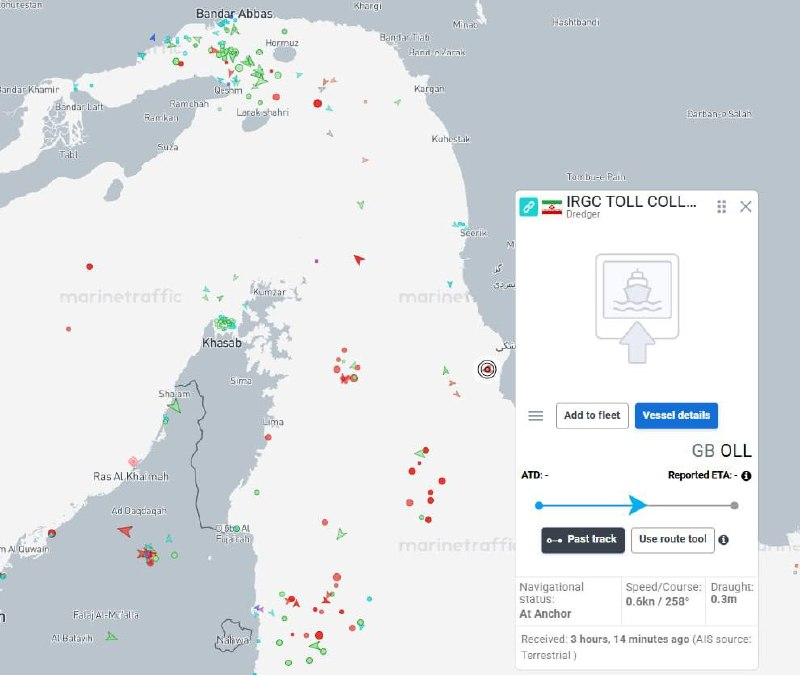

دیده شدن یک شناور ایرانی با نام دریافت‌کننده عوارض سپاه در تنگه هرمز!

📝 Amir

📌 @persian_trend_official
پرشین ترند | متفاوت‌ترین کانال نظامی

## Persian_Trend_Official — post 15400

  <a href="telegram/content/Persian_Trend_Official_15400_1780249539.mp4" target="_blank">🎬 Download video</a>

صداوسیما به شدت عصبانیه که چرا اینترنت وصل شده !
به قول اون پیرمرد معروف، یک یکتون ...

📌 @persian_trend_official
پرشین ترند | متفاوت‌ترین کانال نظامی

## Persian_Trend_Official — post 15399

بنیامین نتانیاهو، نخست وزیر اسرائیل: من به ارتش اسرائیل دستور دادم که مانور را در لبنان گسترش دهد.

نیروهای ما از موانع قدرتمند عبور کردند. آنها زمین های فرماندهی را تصرف کردند و خط الراس بوفورت را تصرف کردند و اکنون دستور من این است که تسلط خود را بر مناطقی که تحت کنترل حزب الله بودند، عمیق تر و گسترش دهیم.

ما در حال آغاز اقدام هستیم، ما در همه جبهه ها عمل می کنیم در سوریه، غزه و لبنان. زمان می برد، اما ما ماموریت را کامل خواهیم کرد.

📝 Amir

📌 @persian_trend_official
پرشین ترند | متفاوت‌ترین کانال نظامی

## Persian_Trend_Official — post 15398

  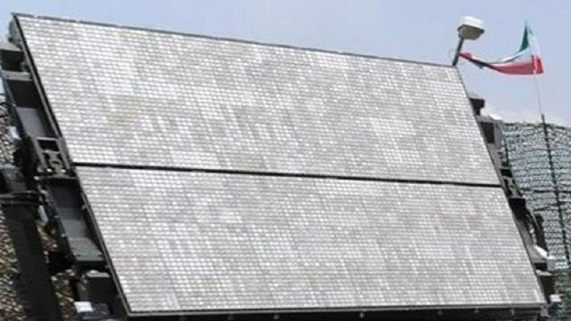

نباید از حضور سامانه های راداری و پدافندی ایرانی در ارمنستان تعجب کرد.

در اواسط دهه 2000 میلادی زمانی که ایران به تازگی به زمینه ساخت سیستم های راداری وارد شده بود پژوهشکده ارتباطات ایروان (ErNIISS) کمک های شایانی به ایران در جهت توسعه سیستم های راداری کرد.

یکی از این سیستم ها که با مشارکت ارمنی ها ساخته شده رادار آرایه فازی فعال نجم-802 است که در سیستم پدافندی صیاد نقش رادار کنترل آتش را دارد.

📝 Amir

📌 @persian_trend_official
پرشین ترند | متفاوت‌ترین کانال نظامی

## Persian_Trend_Official — post 15396

یک سوخت رسان آسیب دیده دیگر امریکایی در پایگاه هوایی میلدنهال توسط عکاسان ثبت شد.

عکاسان هوانوردی در اطراف پایگاه هوایی میلدنهال انگلیس تصاویری از یک هواپیمای سوخت رسان KC-135R آسیب دیده منتشر کردند، این سوخت رسان در فرودگاه بن گوریون در اثر اصابت موشک ایرانی در جریان جنگ 40 روزه آسیب دیده است.

این هواپیمای سوخت رسان پس از پشت سر گذاشتن تعمیرات و اورهال خود، هفته گذشته از فرودگاه بن گوریون برخواسته و وارد پایگاه میلدنهال انگلیس شده و روز گذشته نیز به امریکا برگشته است.

📝 Amir

📌 @persian_trend_official
پرشین ترند | متفاوت‌ترین کانال نظامی

## Persian_Trend_Official — post 15395

دونالد ترامپ: ما به یک توافق عالی خواهیم رسید، وگرنه برمی‌گردیم و آن را از طریق نظامی تمام می‌کنیم.

آنها در ابتدا گفتند: ما سلاح هسته‌ای تولید نخواهیم کرد. من گفتم: خب، اگر سلاح هسته‌ای بخرید چه اتفاقی می‌افتد؟

بنابراین اکنون گفته می‌شود: ما سلاح نظامی تولید نخواهیم کرد یا به هیچ وجه خریداری نخواهیم کرد. این یک تفاوت بزرگ است.

📌 @persian_trend_official
پرشین ترند | متفاوت‌ترین کانال نظامی

## RadioFarda — post 157749

  <a href="https://t.me/radiofarda/157749" target="_blank">📎 Download file</a>

📻بشنوید: ایستگاه ۱۹ با رادیوفردا، دهم خرداد ۱۴۰۵

@RadioFarda

## RadioFarda — post 157748

پزشکیان: تداوم فشارهای خارجی اداره کشور را پیچیده کرده است

🔸مسعود پزشکیان، رئیس‌جمهور ایران، روز یکشنبه گفت فشارهای خارجی و محدود شدن دسترسی دولت به منابع اقتصادی باعث مشکلاتی در اداره کشور شده است.

🔸محاصره دریایی آمریکا علیه بنادر ایران که از اواخر فروردین با دستور رئیس‌جمهور ایالات متحده آغاز شده است، بر اساس گزارش‌ها باعث کاهش شدید صادرات نفت و سقوط درآمدهای ارزی دولت جمهوری اسلامی شده است. این محاصره که توسط نیروهای نظامی آمریکا اعمال می‌شود، حرکت کشتی‌های تجاری از مبدأ و به مقصد ایران را محدود کرده است.

🔸پزشکیان در جلسه هیئت دولت جمهوری اسلامی با اشاره به این که محدودیت‌های بیرونی دلیل بخشی از مشکلات اقتصادی است، گفت: «تداوم برخی محدودیت‌ها و فشارهای خارجی، به‌ویژه در حوزه دسترسی به منابع و ظرفیت‌های اقتصادی، پیچیدگی‌های خاصی را برای اداره کشور ایجاد کرده است.»

🔸او در ادامه خواستار آن شد که مردم درباره «واقعیت‌های موجود» مطلع شوند و گفت که «جامعه باید نسبت به الزامات و هزینه‌های مقاومت آگاه باشد».

🔸این در حالی است که بر اساس گزارش‌ها، دونالد ترامپ، رئیس‌جمهور آمریکا، تفاهم‌نامه برای تمدید آتش‌بس با ایران را با شرایطی «سخت‌تر» دوباره به تهران فرستاده است.

🔸او همچنین تهدید کرده که اگر توافق با ایران مطابق میل واشینگتن نباشد و باعث جلوگیری از دسترسی ایران به سلاح هسته‌ای نشود، احتمال ازسرگیری اقدام نظامی وجود دارد.

@RadioFarda

## RadioFarda — post 157747

🔸ارتش اسرائیل روز یک‌شنبه ۱۰ خرداد اعلام کرد عملیات زمینی خود در جنوب لبنان را به مناطق بیشتری گسترش داده و نیروهایش برای تقویت مواضع نظامی اسرائیل در این منطقه از رود لیتانی هم عبور کرده‌اند.

🔸مقام‌های ارشد اسرائیلی از تصرف یک قلعه مهم در جنوب لبنان خبر دادند و در واکنش به این اتفاق، فرانسه خواستار برگزاری جلسه اضطراری شورای امنیت سازمان ملل شد.

🔸ارتش اسرائیل در بیانیه‌ای گفت «شمار قابل توجهی» از نیروهای زمینی این کشور عملیات تهاجمی را برای گسترش «خط دفاعی پیشرو» آغاز کرده‌اند و این عملیات اکنون به مناطق بیشتری توسعه داده شده است.

🔸این اعلامیه دو روز پس از آن منتشر شد که بنیامین نتانیاهو، نخست‌وزیر اسرائیل، گفت نیروهای اسرائیلی از رود لیتانی، در حدود ۳۰ کیلومتری شمال مرز مشترک اسرائیل و لبنان، عبور کرده‌اند.

🔸همزمان، وزیر دفاع اسرائیل، اعلام کرد ارتش این کشور قلعه شقیف (بوفور)، دژ راهبردی قرون وسطایی در جنوب لبنان، را تصرف کرده و پرچم اسرائیل را بر فراز آن برافراشته است. او این منطقه را «یکی از مهم‌ترین نقاط راهبردی» برای دفاع از شهرک‌های الجلیل و امنیت نیروهای اسرائیلی توصیف کرد.

@RadioFarda

## RadioFarda — post 157746

سی‌ان‌ان: ایران چندین ورودی تأسیسات موشکی زیرزمینی خود را بازگشایی کرده است

🔸شبکه خبری سی‌ان‌ان روز یکشنبه ۱۰ خرداد با استناد به تصاویر ماهواره‌ای اعلام کرد ایران توانسته از زمان توقف جنگ شماری از زرادخانه‌های موشکی مدفون خود بر اثر حملات هوایی آمریکا و اسرائیل را از زیر خاک بیرون بیاورد.

🔸حملات آمریکا و اسرائیل با تخریب جاده‌ها و مسدود کردن ورودی تونل‌ها، دسترسی ایران به پایگاه‌های موشکی زیرزمینی را محدود کرده بود.

🔸سی‌ان‌ان ادعا کرده است که ایران تاکنون ۵۰ مورد از ۶۹ ورودی تونلی را که در ۱۸ تأسیسات موشکی زیرزمینی توسط آمریکا و اسرائیل هدف قرار گرفته بودند، بازگشایی کرده است، از جمله در پایگاه‌هایی در خارج از اصفهان و در اطراف خمین.

🔸بر اساس گزارش این شبکه خبری، ایران همچنین بخش‌های دیگری از این پایگاه‌ها را نیز ترمیم کرده است؛ از جمله جاده‌هایی که آمریکا و اسرائیل برای جلوگیری از تردد پرتابگرهای موشکی بمباران کرده بودند. تصاویر ماهواره‌ای نشان می‌دهند که تقریباً تمامی گودال‌های ناشی از بمباران اکنون پر شده‌اند و در دو پایگاه، این جاده‌ها حتی دوباره آسفالت شده‌اند.

🔸ایران شبکه پایگاه‌های زیرزمینی خود را در عمق خاک و در مواردی زیر کوه‌ها ساخته است تا در برابر حملات هوایی مصون باشند، به همین دلیل آمریکا و اسرائیل بسیاری از ورودی‌های این تأسیسات را بمباران کردند؛ اقدامی که در کنار تلاش برای شناسایی و نابود کردن پرتابگرهای موشکی، باعث شد توان ایران برای شلیک موشک به‌طور قابل توجهی محدود شود.

🔸این حملات خسارت سنگینی به پایگاه‌ها وارد کرد؛ به‌گونه‌ای که بیشتر ورودی‌های تونل‌ها زیر حجم عظیمی از آوار مدفون شدند و جاده‌های منتهی به این سایت‌ها نیز به‌شدت تخریب شدند.

🔸سی‌ان‌ان می‌گوید باز کردن ورودی تأسیسات موشکی زیرزمینی می‌تواند به ایران این قابلیت را دهد که در صورت وقوع دور جدیدی از درگیری‌ها، موشک‌های بالستیک بیشتری نسبت به اواخر جنگ ۴۰ روزه به سمت اسرائیل و کشورهای دیگر شلیک کند.

@RadioFarda

## RadioFarda — post 157745

🔸مرمت‌گران کاخ گلستان سر مجسمه فرشته تخت مرمر را پیدا کردند.

🔸کاخ گلستان در جریان حملات هوایی آمریکا و اسرائیل در اسفند ماه آسیب دیده بود.

🔸تخت مرمر کاخ‌موزه گلستان به دستور فتحعلی‌شاه قاجار از ۶۵ قطعه مرمر زرد ساخته شده است.

@RadioFarda

## IranianMinds — post 21159

  <a href="telegram/content/IranianMinds_21159_1780249543.mp4" target="_blank">🎬 Download video</a>

🔴محمد‌جواد ظریف در پاسخ به سؤال میگن شما پشت پرده مذاکرات هستید، گفت:
من اصلأ هیچکاره ‌ام.

@IranianMinds

## IranianMinds — post 21158

🔴ایران اینترنشنال: پزشکیان به دلیل "تسلط کامل فرماندهان سپاه بر اداره کشور" استعفا داد. @IranianMinds

## IranianMinds — post 21157

  

🔴ایران اینترنشنال:

پزشکیان به دلیل "تسلط کامل فرماندهان سپاه بر اداره کشور" استعفا داد.

@IranianMinds

## IranianMinds — post 21155

  

🔴 چند روز پیش دو تا داداش اسرائیلی دستگیر شدن

حالا دلیلش چی بوده ؟ با کمک چت جی پی تی و گوگل‌مپ میومدن اطلاعات ساختگی از خودشون در میاوردن و میفروختن به جمهوری اسلامی در طول جنگ این کسخلام باور کرده بودن و نمیدونسن اصلا چیه و بر طبق اطلاعات اینا میومدن موشک پرتاب میکردن به سمت مختصاتی که اینا میدادن :)))

@IranianMinds

## IranianMinds — post 21154

  

مسعود پیاهو، مردی که تصویر معترض نشسته مقابل نیروهای پلیس یگان ویژه در مقابل پاساژ علاالدین در آغاز اعتراضات دی ماه سال گذشته رو منتشر کرد، به گفته وکیلش به ۱۰ سال زندان محکوم شده!

@IranianMinds

## IranianMinds — post 21153

  

@IranianMinds

## IranianMinds — post 21152

🔴 مهاجرانی، سخنگوی دولت:
قالیباف کسی است که فرمانده میدان بوده و عراقچی هم رزمنده زمان جنگ است، بنابراین تمام کسانی که الان درگیر مذاکره هستن، میدان رو به‌خوبی درک می‌کنند.

نیروهای مسلح ایران همچنان دست‌به‌ماشه هستن و تیم دیپلماسی با همین نگاه، مذاکرات رو دنبال میکنه.

@IranianMinds

## IranianMinds — post 21151

🔴 اسکات بسنت، وزیر خزانه‌داری آمریکا: فشارها بر ایران و جلوگیری از صادرات نفت از جزیره خارک ادامه دارد.

@IranianMinds

## IranianMinds — post 21150

  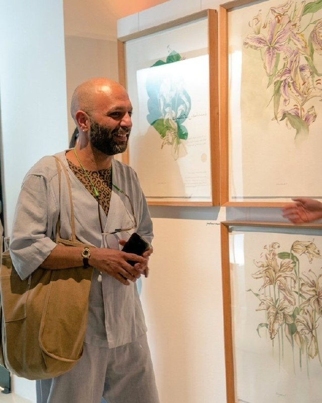

استایل جدید و متفاوت صابر ابر

@IranianMinds

## IranianMinds — post 21149

کانالی که همیشه در مسیر ورشکست کردن سایت های شرطبندی حرکت کرده! 😈

آمار ثابت 90 درصد برد ✅
فقط کافیه چند روز فرم هاش رو دنبال کنید...
⚽ @Tipster_Mafiaa   @Tipster_Mafiaa
⚽ @Tipster_Mafiaa      @Tipster_Mafiaa

## IranianMinds — post 21148

  

میکس عالی برد شد🖤☑️
✔️@Tipster_Mafiaa

## IranianMinds — post 21147

  <a href="telegram/content/IranianMinds_21147_1780249550.mp4" target="_blank">🎬 Download video</a>

اکانت اسرائیل به فارسی:

جدی چرا دفنش نمی‌کنند؟؟😂😂😂

@IranianMinds

## IranianMinds — post 21146

  <a href="telegram/content/IranianMinds_21146_1780249551.mp4" target="_blank">🎬 Download video</a>

🔴 حملات جدید اسرائیل به لبنان.

@IranianMinds

## IranianMinds — post 21145

  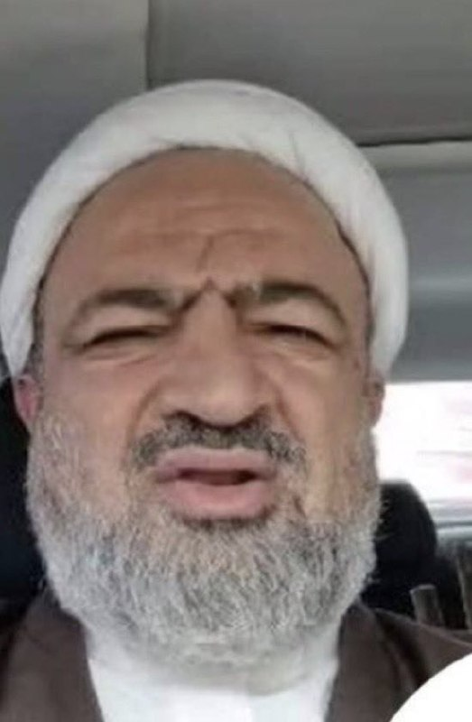

حمید رسایی قبل از جنگ :
مجلس رو تعطیل کنیم بودجه‌اش رو بدیم به مردم.

بعد از جنگ :
مجلس باید باز شود ، اقدامات تقنینی و نظارتی صورت بگیرد

@IranianMinds

## IranianMinds — post 21144

امروز 31 May
روز جهانی لبخنده
چیزی که خیلی وقته ما ایرانیا یادمون رفته
این روز رو به همه جز ایرانیا تبریک میگیم

و لعنت بر باعثو بانیش

@IranianMinds

## IranianMinds — post 21143

  <a href="telegram/content/IranianMinds_21143_1780249554.mp4" target="_blank">🎬 Download video</a>

درود به شرفت.

@IranianMinds

## BBCPersian — post 282509

  <a href="https://t.me/bbcpersian/282509" target="_blank">📎 Download file</a>

📻پادکست جام جهان‌نما، یکشنبه ۱۰ خرداد ۱۴۰۵

پادکست جام جهان‌نما، یکشنبه ۱۰ خرداد ۱۴۰۵ این برنامه رادیویی را می‌توانید هرشب ساعت ۲۰ به وقت ایران، روی موج متوسط ۷۰۲ کیلوهرتز و موج کوتاه۹۴۶۵ کیلوهرتز بشنوید.

تکرار برنامه را هم می‌توانید ساعت ۲۱:۳۰ روی موج متوسط ۷۰۲ کیلوهرتز و موج کوتاه ۵۳۹۵ کیلوهرتز گوش کنید.

@BBCPersian

## BBCPersian — post 282508

🔻بر اساس گزارش‌ها وقوع انفجاری در منطقه تحت کنترل شورشیان میانمار بیش از پنجاه نفر را کشته است.

این انفجار در ایالت شان، نزدیک مرز چین، رخ داده است. تصاویر نشان می‌دهد که دود غلیظی به آسمان بلند شده و ساختمان‌ها در منطقه‌ای وسیع تخریب شده‌اند.

محل انفجار نزدیک شهر نام خام است که در کنترل ارتش آزادی‌بخش ملی تانگ یکی از قدرتمندترین گروه‌های مسلح مخالف دولت نظامی میانمار است.

برخی گزارش‌ها حاکی است که انفجار در یک انبار مهمات رخ داده است اما شورشیان می‌گویند که این انفجار ناشی از انفجار تصادفی مواد منفجره بوده است.

@BBCPersian

## BBCPersian — post 282507

  <a href="telegram/content/BBCPersian_282507_1780249558.mp4" target="_blank">🎬 Download video</a>

رژه پیروزی آرسنال با شور و هیجان در حال برگزاری است و بازیکنان با اتوبوس‌های روباز در شمال لندن حرکت می‌کنند .
 
دود قرمز هوا را پر کرده است زیرا هزاران هوادار برای پیوستن به جشن‌ها در خیابان‌ها صف کشیده‌اند.
 
یکی از هواداران، جرالدین، به ما می‌گوید: «تیم ما دوباره به اوج رسیده است.» دیگری، لی، می‌گوید: «من 20 سال برای این لحظه صبر کردم.»
 
همچنین تیم زنان آرسنال که در ماه فوریه اولین جام قهرمانان زنان را بالای سر برد، در این رژه جشن می‌گیرند.
 
یکی از هواداران جوان به بی‌بی‌سی می‌گوید: «من داشتم برای [آلسیا] روسو دست تکان می‌دادم، او هم دست تکان داد.»
 
جشن‌های امروز پس از فینال نفس‌گیر لیگ قهرمانان اروپا در روز شنبه برگزار می‌شود که در آن پاری سن ژرمن در ضربات پنالتی آرسنال را شکست داد.

@bbcpersian

## BBCPersian — post 282506

🔻سرخط خبرهای روز یکشنبه، ۱۰ خرداد ۱۴۰۵

https://trib.al/Clx2mh7
@BBCPersian

## BBCPersian — post 282505

  

🔻مسعود پیاهو، مردی که تصویر معترض نشسته مقابل نیروهای پلیس یگان ویژه در مقابل پاساژ علاالدین در آغاز اعتراضات دی ماه سال گذشته را منتشر کرد، به گفته وکیلش به ۱۰ سال زندان محکوم شده است.

این ویدیو در آن زمان بازتاب گسترده‌ای در رسانه‌ها و شبکه‌های اجتماعی داشت.

حسن آقاخانی، وکیل مسعود پیاهو به سایت خبری امتداد در ایران گفت: «بازداشت موکل من به پیش از هجدهم و نوزدهم دیماه سال گذشته و اعتراضات اقتصادی در بازار برمی‌گردد. موکل من در حال کار در بازاری بودند که به خیابان جمهوری مشرف بوده است. شخصی در مقابل مامورین نیروی انتظامی، می‌نشیند و مسعود یک فیلم کوتاه به صورت ناخودآگاه از آن صحنه ضبط می‌کند.»

به گفته وکیل آقای پیاهو، «او به هیچ عنوان قصد انتشار ویدیو در بیرون از کشور را نداشته و صرفا برای یک تعداد مختصری از دوستانش در استوری خصوصی اینستاگرامش منتشر کرده است.»

با این وجود، به گفته این وکیل دادگستری، حکم ۱۰ سال حبس مسعود پیاهو که بر اساس قانون «تشدید مجازات جاسوسی و همکاری با رژیم صهیونیستی» صادر شده، در دیوان عالی کشور هم تایید شده و اکنون در آستانه اجرا قرار دارد.

@BBCPersian

## BBCPersian — post 282504

  

🔻حمیدرضا حاجی بابایی امروز در جلسه مجازی مجلس گفت: «با ایجاد اختلال در تامین کالا به‌ویژه در بنادر جنوب، بیش از ۳۴۰ هزار کسب‌وکار مرتبط با کامیون‌ها و تریلرها و بارکش‌ها تحت تاثیر قرار گرفته است.»

او همچنین گفت که محاصره دریایی باعث اختلال در «۸۰ درصد از ۴۰ تا ۴۵ میلیون تن واردات سالانه» شده است، از این رو «واردات حداقل ۵۰ درصد از نیاز وارداتی کالاهای اساسی از طریق بنادر شمالی شروع شده است و باید حتما با قدرت ادامه پیدا کند.»

محمدرضا رضایی کوچی، رئیس کمیسیون عمران، هم گفت: «۴۰۰ هزار راننده در کشور وجود دارد که متاسفانه به دلیل مشخص نبودن مبدا کالاها، در تامین معیشت دچار مشکل شده‌اند.»

او همچنین گفت: «بیش از ۳۰ هزار راننده در کشور وجود دارند که فاقد پوشش بیمه هستند و باید به مسائل معیشتی آنها توجه شود.»

📸IRNA
https://trib.al/MdcHYqS
@BBCPersian

## BBCPersian — post 282503

  <a href="https://t.me/bbcpersian/282503" target="_blank">📎 Download file</a>

📻 تازه‌ترین خبرهای جهان یکشنبه ۱۰ خرداد ۱۴۰۵ از رادیو بی‌بی‌سی در لندن

@BBCPersian

## BBCPersian — post 282502

🔻وزارت بهداشت لبنان: در حمله اسرائیل به بیمارستانی در صور، ۱۳ نفر از کارکنان زخمی شدند

وزارت بهداشت لبنان اعلام کرد در حمله هوایی اسرائیل به نزدیکی یک بیمارستان در شهر صور در جنوب لبنان، «۱۳ نفر» از کارکنان این مرکز درمانی زخمی شده‌اند.

این در حالیست که ارتش اسرائیل به پیشروی در عمق خاک لبنان ادامه می‌دهد.

وزارت بهداشت لبنان در بیانیه‌ای گفت: «دشمن اسرائیلی در اطراف بیمارستان حیرام در صور اقدام به حمله هوایی کرد که در نتیجه آن ۱۳ نفر از کارکنان بیمارستان زخمی شدند و خسارات قابل توجهی به این مرکز وارد شد.»

این بیانیه از جامعه بین‌المللی خواست برای جلوگیری از «گسترش و تشدید حملات اسرائیل» اقدام کند.

https://trib.al/GzhNERS
@BBCPersian

## idfinfarsi — post 11687

  <a href="telegram/content/idfinfarsi_11687_1780249564.mp4" target="_blank">🎬 Download video</a>

‼️مستندات جدید: نیروهای یگان گشتی گولانی در قلعه بوفور

## idfinfarsi — post 11686

  <a href="telegram/content/idfinfarsi_11686_1780249566.mp4" target="_blank">🎬 Download video</a>

۹۰۰ تروریست حزب‌الله از زمان اجرای آتش‌بس به هلاکت رسیدند:

🔸ارتش اسرائیل از ساعات صبح امروز زیرساخت‌های سازمان تروریستی حزب‌الله را در صور و مناطق دیگر در جنوب لبنان مورد حمله قرار داد

🔸به موازات تعمیق فعالیت نیروهای ما در رشته‌کوه بوفور، ارتش اسرائیل از صبح امروز به انبارهای سلاح، مقرهای مستقر و زیرساخت‌های اضافی سازمان تروریستی حزب‌الله در منطقه صور و سایر مناطق جنوب لبنان حمله کرد.

🔸انبارهای هدف قرارگرفته توسط تروریست‌های این سازمان برای پیشبرد و اجرای طرح‌های تروریستی علیه نیروهای ارتش اسرائیل مورد استفاده قرار می‌گرفتند

## Dirty_Kids — post 390670

  <a href="telegram/content/Dirty_Kids_390670_1780249569.mp4" target="_blank">🎬 Download video</a>

🔴 صحبتای ایشون خیلی وایرال شده و نظر خیلیارو جذب کرده.

جذاب‌ترین چیز توی این زمونه برای دخترا اینه که بهشون «نه» بگی! از بس اکثر مردا جلو دخترا خم شدن توقعات بالا رفته.
رفیق دخترِ من بعد از حموم استوری گذاشت از خودش و از ۳۰۰ فالور ۵۰ تا بهش دایرکت دادن! همین باعث میشه دخترا فکر کنن همه اونارو میخوان.
سر همین فکر میکنن هیچکس لایق این نیست باهاشون باشه و هر نفرو برای یه چیزی انتخاب میکنن، یه پسرو برای مسائل مالی، یکیو برای محبت، یکی برای مسئله جنسی و...

@Dirty_Kids 👻

## Dirty_Kids — post 390669

  <a href="telegram/content/Dirty_Kids_390669_1780249570.mp4" target="_blank">🎬 Download video</a>

آهنگ «بزن که خوب می‌زنی» 😂😂 از حامد فرد

@Dirty_Kids 👻

## Dirty_Kids — post 390668

  

دیده شده امروز در تهران:))))))))))))

@Dirty_Kids 👻

## Dirty_Kids — post 390667

  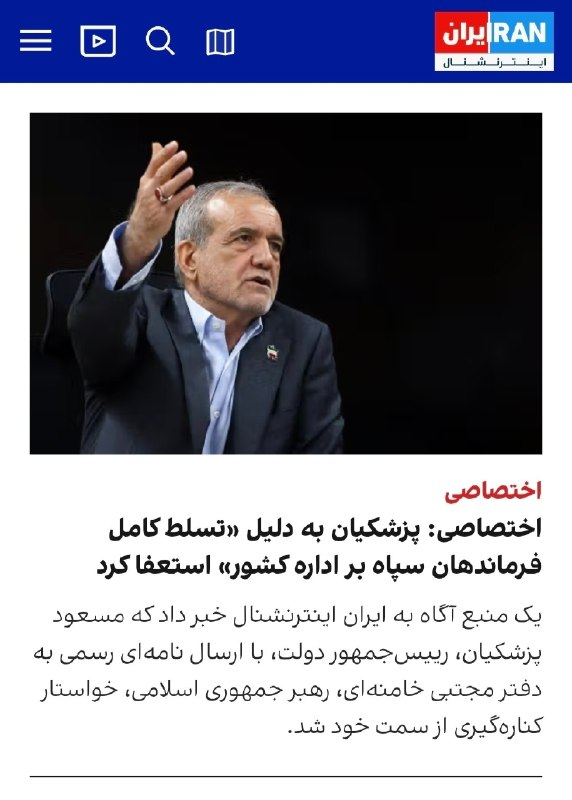

🔴 ایران اینترنشنال: مسعود پزشکیان بخاطر ورود سپاه به تمامی مسائل کشور و دخالت در کارای دولت نامه استعفا خودشو به مجتبی خامنه‌ای تحویل داد.

@Dirty_Kids 👻

## Dirty_Kids — post 390666

  

عجب خایه‌ای دارید؛ یه وقت نگیرنتون، تو روز روشن با چادر توی سطح شهر تردد می‌کنید. فکر میکنم اینکه امثال اینا کافه رفتن رو افتخار میدونن ناشی از احساس طرد شدگی در جامعه‌ست که خودشون به این نتیجه رسیدن کافه جای اونا نیست  + با امریکا مبارزه میکنن با وسایل…

## Dirty_Kids — post 390664

  

🔴 طبق تحقیقات دانشگاه پنسیلوانیا آمریکا
🇺🇸، تو عرقِ زیر بغل مردها یه سری مواد شیمیایی هست که می‌تونه روی حال و بدن زن‌ها اثر مثبت بزاره؛

طِی این آزمایش، یه عصاره از عرق مردها رو به لب بالای خانم‌ها زدن و بعدش بعضی از خانم‌ها متوجه شدن استرسشون کمتر شده و حس آرامش بیشتری پیدا کردن.
این مواد روی بعضی هورمون‌های بدن خانم‌ها مثل هورمون‌های مرتبط با چرخه قاعدگی هم اثر می‌ذاره و همچنین باعث تسکین درد میشه.

@Dirty_Kids 👻

## Dirty_Kids — post 390663

  <a href="https://t.me/Dirty_Kids/390663" target="_blank">📎 Download file</a>

✅ اپلیکیشن اندروید سایت جهانی دربی بت

💰اولین سایت جهانی با امکان شارژ و برداشت ریالی(کارت به کارت)

🔗 برای ورود فیلترشکن روی کشور مناسب قرار دهید مانند فنلاند و المان و....

😀Telegram Channel
👇
https://t.me/+bcynkEgSW2dlYTc0

## Dirty_Kids — post 390662

  

😤دنبال یه سایت شرط بندی بین المللی بودی که به ایرانیا خدمات بده؟!
⛔

👍دربی بت همون انتخاب  100%

💎ویژگی های سایت جهانی Derby Bet:

⬅️امکان شارژ امن با کارت بانکی

⬅️واریز اول دوبل شارژ می شوید(بونوس۱۰۰٪)

⬅️پر اپشن ترین سایت فعال در ایران

⬅️تسویه حساب کمتر از 5 دقیقه

⬅️برگشت بخشی از باخت به صورت هفتگی

🚨کد هدیه ثبت نام:GG007

⚠️برای دانلود اپلکیشن کلیک کنید
👉

🔔کانال دربی بت :

🪙https://t.me/+bcynkEgSW2dlYTc0

## Dirty_Kids — post 390661

  

این تصویر که میبینید اولین جلسه مجلس شورای اسلامیه که فقط با حضور ۱۴ نماینده برگزار شده.

۱۸۷ نماینده به صورت آنلاین شرکت کردن و ۹۳ نماینده دیگه حتی به صورت آنلاین هم حاضر نشدن.

@Dirty_Kids 👻

## Dirty_Kids — post 390660

خامنه‌ای اصلا نفهمید جنگ شده، یهو در اتاقو باز کردن بیت براش دید عه هردوتا دسشو میتونه تکون بده که یهو دید قاسم سلیمانی داره میاد بغلش کنه

@Dirty_Kids 👻

## Dirty_Kids — post 390659

  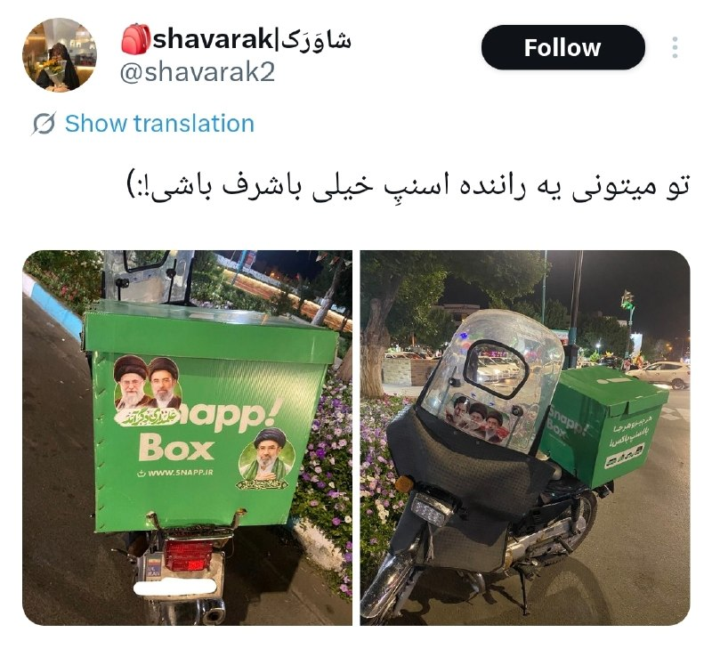

یارو ساقیه، زیاد خیس نکن

@Dirty_Kids 👻

## Dirty_Kids — post 390658

  <a href="telegram/content/Dirty_Kids_390658_1780249578.mp4" target="_blank">🎬 Download video</a>

قصه داره قشنگ میشه، بلاخره تو اینا هم پیدا میشه کسایی که یکم از مغزشون استفاده کنن

@Dirty_Kids 👻

## Dirty_Kids — post 390657

  

🌎با بهبود نسبی وضعیت اینترنت و بازگشت محدود دسترسی به شبکه بین‌الملل، موفق شدیم ضمن حفظ کیفیت و پایداری سرویس‌ها، قیمت را تا هر گیگابایت 20 هزار تومان کاهش دهیم
🖥

🟣با وجود اینکه شرایط اینترنت همچنان ناپایدار است و وضعیت پهنای باند بین‌الملل به ثبات کامل نرسیده، تیم فنی بادبان با توسعه زیرساخت‌ها و بهره‌گیری از سرورهای جدید از سرویس‌دهندگان معتبر، توانسته هزینه‌ها را بهینه کرده و سرویس‌ها را با قیمت مناسب‌تری ارائه دهد
⛵️
G10
از همراهی و اعتماد شما سپاسگزاریم
💜

🛡@BadBan_VPN | کانال 

🤖@BadBan_VPNBot | ربات 

📞@BadBan_VPNSupport | پشتیبانی

## Dirty_Kids — post 390656

  <a href="telegram/content/Dirty_Kids_390656_1780249582.mp4" target="_blank">🎬 Download video</a>

حملات گسترده اسرائیل قهرمان حزبل در صور در جنوب لبنان.

که گفته بودن شیعه‌سانان هزارپدر رافضی امضای تفاهم‌نامه رو‌ منوط کردن به شرط پایان حمله‌ی اسرائیل به حزبل؟
که باراک‌راوید قحبه هم نوشته بود ترامپ گفته بوده تمومش کنید و سر بی‌بی داد کشیده؟


@Dirty_Kids 👻

## Dirty_Kids — post 390652

استایل جدید صابر ابر @Dirty_Kids 👻

## Dirty_Kids — post 390651

  

استایل جدید صابر ابر

@Dirty_Kids 👻

## Dirty_Kids — post 390650

  

+ اره حاجی من تایپم نباشه کنسله

تایپش:

@Dirty_Kids 👻

## Hranews — post 113287

  

تداوم بازداشت؛ بلاتکلیفی احمد رحیمی و سهیلا حسینی همچنان ادامه دارد

❗️
❗️
❗️
❗️
❗️– احمد رحیمی، استاد دانشگاه و همسرش سهیلا حسینی، هنرمند و نقاش، با گذشت ۷۵ روز از زمان بازداشت، همچنان به‌صورت بلاتکلیف در زندان وکیل‌آباد مشهد نگهداری می‌شوند.

به گزارش خبرگزاری هرانا، ارگان خبری مجموعه فعالان حقوق بشر در ایران، احمد رحیمی و همسرش سهیلا حسینی، کماکان در زندان وکیل‌آباد مشهد در بازداشت به‌سر میبرند.

بر اساس اطلاعات دریافتی هرانا، با وجود گذشت ۷۵ روز از زمان بازداشت، خانواده این افراد از دلایل بازداشت و اتهامات منتسب به آنان مطلع نشده‌اند. همچنین با وجود پیگیری‌های مکرر نزدیکان آنان از مراجع قضایی از جمله دادسرا، دادگاه و مسئولان زندان، تاکنون نتیجه‌ای حاصل نشده و امکان ملاقات حضوری نیز برای آنان فراهم نشده است. این افراد همچنین از حق دسترسی به وکیل و امکان تودیع وثیقه برای آزادی موقت محروم مانده‌اند.

ادامه مطلب

#احمد_رحیمی #سهیلا_حسینی

↘️
@hranews_bot تماس ✉️ - @Hranews کانال هرانا 🆑

## Hranews — post 113286

بازماندگی از تحصیل بیش از ۱۵۰۰ دانش‌آموز در استان مرکزی

❗️
❗️
❗️
❗️
❗️– مدیرکل بهزیستی استان مرکزی اعلام کرد که ۱۵۹۸ دانش‌آموز در این استان از تحصیل بازمانده‌اند.

ادامه مطلب

#دانش‌آموزان

↘️
@hranews_bot تماس ✉️ - @Hranews کانال هرانا 🆑

## Hranews — post 113285

اعتراضات ۱۴۰۴؛ تایید حکم ۱۰ سال حبس مسعود پیاهو در دیوان عالی کشور

❗️
❗️
❗️
❗️
❗️– محکومیت حبس مسعود پیاهو، از بازداشت‌شدگان اعتراضات سراسری دی‌ماه ۱۴۰۴، توسط شعبه ۹ دیوان عالی کشور عینا تایید شد. وی پیشتر توسط شعبه ۲۳ دادگاه انقلاب تهران به ۱۰ سال حبس محکوم شده بود.

ادامه مطلب

#مسعود_پیاهو

↘️
@hranews_bot تماس ✉️ - @Hranews کانال هرانا 🆑

## Hranews — post 113284

سنندج؛ وریا موید و جمال خداکرمی آزاد شدند

❗️
❗️
❗️
❗️
❗️– وریا موید و جمال خداکرمی که در جریان اعتراضات سراسری ۱۴۰۴، در سنندج بازداشت شده بودند، با تودیع وثیقه آزاد شدند.

ادامه مطلب

#وریا_موید #جمال_خداکرمی

↘️
@hranews_bot تماس ✉️ - @Hranews کانال هرانا 🆑

## Hranews — post 113283

برنامه «به من چه؟» توقیف شد

❗️
❗️
❗️
❗️
❗️– پخش برنامه «به من چه؟» که از پلتفرم روبیکا پخش می‌شد، متوقف شد. مجید واشقانی، مجری این برنامه اعلام کرد که این اقدام با دستور سازمان تنظیم مقررات رسانه‌های صوت و تصویر فراگیر در فضای مجازی، صورت گرفته است.

ادامه مطلب

#توقیف_برنامه #مجید_واشقانی

↘️
@hranews_bot تماس ✉️ - @Hranews کانال هرانا 🆑

## Hranews — post 113282

  

بررسی تطبیقی تعارضات قانون جدید تشدید مجازات جاسوسی با حقوق اساسی مردم/ ایمان سلیمانی

📡
📡
📡
📡
📡– منتقدان معتقدند این قانون می‌تواند زمینه‌ساز افزایش احکام اعدام، به‌ویژه در پرونده‌های مرتبط با فعالان سیاسی، کاربران فضای مجازی، خبرنگاران شهروندی و معترضان شود. هم‌چنین جرم‌انگاری استفاده از برخی ابزارهای ارتباطی و انتشار محتوا، می‌تواند دسترسی آزاد به اینترنت، آزادی بیان و فعالیت‌های مدنی را بیش از پیش محدود کند.

برخی تحلیل‌ها نیز به تاثیر این قانون بر ایرانیان خارج از کشور اشاره کرده‌اند؛ از جمله نگرانی درباره‌ی طرح اتهام همکاری یا امکان مصادره‌ی اموال.
در سطح کلی، این قانون بخشی از روند گسترده‌تر امنیتی‌سازی فضای سیاسی و اجتماعی پس از تحولات ۱۴۰۴ تلقی می‌شود؛ روندی که به گفته‌ی منتقدان، فشار بر فعالان مدنی، زنان، اقلیت‌ها و مدافعان حقوق بشر را افزایش داده است.
در عرصه‌ی بین‌المللی نیز، تصویب این قانون می‌تواند زمینه‌ساز گزارش‌ها و قطعنامه‌های بیشتر در نهادهای حقوق بشری سازمان ملل شود و فشارهای حقوق بشری علیه جمهوری اسلامی را افزایش دهد. برخی سازمان‌های حقوق بشری این قانون را نمونه‌ای از «رسمی‌سازی سرکوب» توصیف کرده‌اند.

در مجموع، منتقدان بر این باورند که این قانون، امنیت ملی را به اولویتی مطلق تبدیل کرده و در این مسیر، بخشی از حقوق و تضمین‌های بنیادین شهروندان را محدود ساخته است؛ مسئله‌ای که می‌تواند در بلندمدت، پیامدهای حقوقی و سیاسی گسترده‌ای برای جمهوری اسلامی در سطح داخلی و بین‌المللی به همراه داشته باشد.

ادامه مطلب

ادامه مطلب در وبسایت خط صلح

#ایمان_سلیمانی #اعدام #اتهام_جاسوسی

↘️
@hranews_bot تماس ✉️ - @Hranews کانال هرانا 🆑

## Hranews — post 113281

شش شهروند توسط سازمان اطلاعات فراجا بازداشت شدند؛ پخش اعترافات اجباری یکی از آنها

❗️
❗️
❗️
❗️
❗️– سازمان اطلاعات فراجا از #بازداشت شش شهروند در یکی از شهرهای جنوبی کشور خبر داد و مدعی شد این افراد در ارتباط با یک شبکه فعال در داخل کشور بازداشت شده‌اند. هم‌زمان ویدئویی از اعترافات اجباری یکی از بازداشت‌شدگان منتشر شده که مشخص نیست در چه شرایطی ضبط شده است.

ادامه مطلب

↘️
@hranews_bot تماس ✉️ - @Hranews کانال هرانا 🆑

## Hranews — post 113280

اعتراضات دی‌ماه ۱۴۰۴؛ سه تن از بازداشت‌شدگان مجموعا به ۹ سال و ۳ ماه حبس محکوم شدند

❗️
❗️
❗️
❗️
❗️– محمدامین شمسی، امیر امرایی و کامیار امرایی، از بازداشت شدگان اعتراضات سراسری ۱۴۰۴، توسط مراجع قضایی مجموعا به ۹ سال و سه ماه حبس تعزیری محکوم شدند.

ادامه مطلب

#محمدامین_شمسی #امیر_امرایی #کامیار_امرایی

↘️
@hranews_bot تماس ✉️ - @Hranews کانال هرانا 🆑

## Hranews — post 113279

خوزستان؛ ۵۷ کارگر در سال ۱۴۰۴ قربانی حوادث کار شدند

❗️
❗️
❗️
❗️
❗️– مدیرکل پزشکی قانونی خوزستان اعلام کرد که طی سال ۱۴۰۴، دستکم ۵۷ #کارگر در این استان بر اثر حوادث ناشی از کار جان خود را از دست داده‌اند.

ادامه مطلب

↘️
@hranews_bot تماس ✉️ - @Hranews کانال هرانا 🆑

## Hranews — post 113278

  

مهدی انصاری، وکیل دادگستری به ۵ سال حبس محکوم شد

❗️
❗️
❗️
❗️
❗️ – مهدی انصاری، عضو کانون وکلای استان فارس و از بازداشت شدگان اعتراضات سراسری ۱۴۰۴، توسط دادگاه انقلاب شیراز به پنج سال #حبس و دو سال منع خروج از کشور محکوم شد.

به گزارش خبرگزاری هرانا، ارگان خبری مجموعه فعالان حقوق بشر در ایران، مهدی انصاری، وکیل دادگستری به حبس محکوم شد.

بر اساس اطلاعات دریافتی هرانا، یکی از شعب دادگاه انقلاب شیراز، آقای انصاری را بابت اتهام «اجتماع و تبانی به قصد بر هم زدن امنیت کشور»، به پنج سال حبس و دو سال منع خروج از کشور محکوم کرده است.

ادامه مطلب

#مهدی_انصاری

↘️
@hranews_bot تماس ✉️ -  @Hranews  کانال هرانا 🆑

## Hranews — post 113277

  

زندان اوین؛ غزل مرزبان ۷ روز است که در اعتصاب به سر می‌برد

❗️
❗️
❗️
❗️
❗️ – غزل مرزبان، نوکیش مسیحی محبوس در زندان اوین، از روز دوشنبه ۴ خردادماه، در اعتراض به صدور حکم بیش از ۹ سال حبس علیه خود، دست به #اعتصاب زده است.

به گزارش خبرگزاری هرانا، ارگان خبری مجموعه فعالان حقوق بشر در ایران، غزل مرزبان، نوکیش مسیحی، در هفتمین روز از اعتصاب غذای خود بسر می‌برد.

یک منبع مطلع از وضعیت این نوکیش مسیحی، ضمن تایید این خبر به هرانا گفت: “خانم مرزبان در اعتراض به حکم ۹ سال و هشت ماه حبس خود که اخیرا توسط  قاضی ایمان افشاری علیه وی صادر شده است، از تاریخ ۴ خرداد ۱۴۰۵، دست به اعتصاب غذا زده است. با گذشت هفت روز از آغاز اعتصاب غذا، وضعیت جسمانی او نامناسب است.”

ادامه مطلب

#غزل_مرزبان

↘️
@hranews_bot تماس ✉️ -  @Hranews  کانال هرانا 🆑

## Hranews — post 113276

  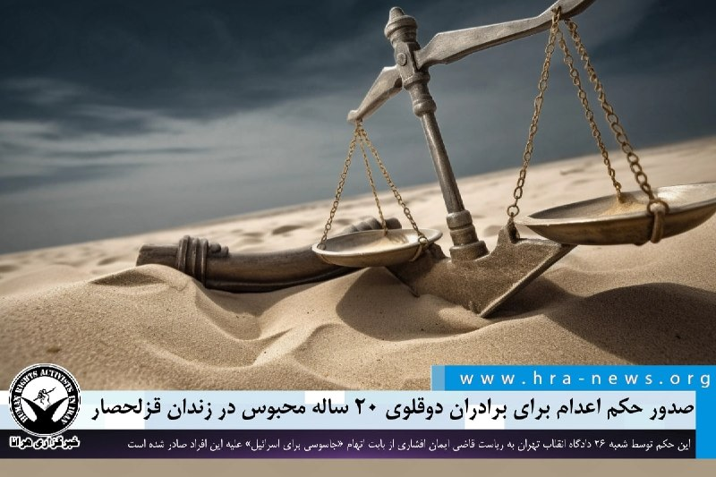

اتهام «جاسوسی»؛ حسن و حسین امیری، برادران ۲۰ ساله به اعدام محکوم شدند

❗️
❗️
❗️
❗️
❗️ – حسن و حسین امیری، برادران دوقلوی ۲۰ ساله محبوس در زندان قزلحصار کرج، توسط شعبه ۲۶ دادگاه انقلاب تهران به ریاست قاضی ایمان افشاری به #اعدام محکوم شدند. این حکم بر اساس اتهام «#جاسوسی برای اسرائیل» علیه این افراد صادر شده است.

به گزارش خبرگزاری هرانا، ارگان خبری مجموعه فعالان حقوق بشر در ایران، حسن و حسین امیری به اعدام محکوم شدند.

بر اساس اطلاعات دریافتی هرانا، این حکم اخیرا توسط شعبه ۲۶ دادگاه انقلاب تهران، به ریاست قاضی ایمان افشاری علیه این برادران دوقلو صادر شده است. اتهام «جاسوسی برای اسرائیل»، مبنای صدور این رای قرار گرفته است.
یک منبع مطلع از وضعیت این دو جوان ۲۰ ساله، به هرانا گفت: «در کیفرخواست صادر شده علیه این افراد، مشاهده تصاویری از ساختمان‌های آسیب‌دیده، مبنای طرح اتهام «جاسوسی به نفع اسرائیل» در پرونده قرار گرفته بود. حسن و حسین امیری به دستور بازپرس پرونده به‌صورت جداگانه در زندان قزلحصار نگهداری می‌شوند و از حق ملاقات با یکدیگر محروم هستند. این دو زندانی در حال حاضر در سوئیت ۳۵ این زندان محبوس هستند.»

ادامه مطلب

#حسن_امیری
#حسین_امیری

↘️
@hranews_bot تماس ✉️ -  @Hranews  کانال هرانا 🆑

## Hranews — post 113275

  

سخنگوی کمیسیون بهداشت مجلس از کمبود حدود هزار قلم #دارو در کشور خبر داد و اعلام کرد که این وضعیت ناشی از مواردی همچون سو مدیریت، ترک فعل و مشکلات در تخصیص به‌موقع ارز است. به گفته سلمان اسحاقی، تاخیر در پرداخت مطالبات داروخانه‌ها و شرکت‌های پخش نیز فشار مضاعفی بر زنجیره #تامین_دارو وارد کرده و می‌تواند دسترسی بیماران به داروهای ضروری را با اختلال مواجه کند.

وی همچنین با اشاره به فعالیت «مافیای دارو» و ضرورت ورود دستگاه قضایی به این حوزه، نسبت به تداوم وضعیت موجود هشدار داد. سلمان اسحاقی تاکید کرد که نابرابری در توزیع دارو میان استان‌ها، ضعف عملکرد بیمه‌ها و ناکارآمدی در مدیریت نظام دارویی، می‌تواند منجر به نقض #حق_سلامت، کاهش دسترسی برابر به خدمات درمانی و افزایش خطرات جانی برای بیماران شود.

↘️
@hranews_bot تماس ✉️ -  @Hranews  کانال هرانا 🆑

## Hranews — post 113274

  

تداوم بازداشت و بلاتکلیفی فرزانه فرهبد و علیرضا شایگان در زندان تربت حیدریه

❗️
❗️
❗️
❗️
❗️ – فرزانه فرهبد، شاعر و مجری اهل سبزوار و همسرش علیرضا شایگان، معلم بازنشسته، در تاریخ ۲۵ فروردین‌ماه سال جاری، پس از احضار به اداره اطلاعات این شهرستان #بازداشت شدند. این شهروندان از آن زمان تاکنون به صورت بلاتکلیف در زندان تربت حیدریه نگهداری می‌شوند.

به گزارش خبرگزاری هرانا، ارگان خبری مجموعه فعالان حقوق بشر در ایران، فرزانه فرهبد و علیرضا شایگان، ۴۸ روز است که در بازداشت به‌ سر می‌برند.

بر اساس اطلاعات دریافتی هرانا، فرزانه فرهبد و همسرش، علیرضا شایگان، روز ۲۵ فروردین ۱۴۰۵ پس از احضار به اداره اطلاعات سبزوار بازداشت شدند. این زوج از زمان بازداشت تاکنون در زندان تربت حیدریه نگهداری می‌شوند و با گذشت بیش از دو ماه، همچنان در بلاتکلیفی قضایی به سر می‌برند.

ادامه مطلب

#فرزانه_فرهبد
#علیرضا_شایگان

↘️
@hranews_bot تماس ✉️ -  @Hranews  کانال هرانا 🆑

## Hranews — post 113273

بوکان؛ عثمان ذاکری، روحانی اهل سنت به خلع لباس روحانیت محکوم شد

❗️
❗️
❗️
❗️
❗️ – عثمان ذاکری، روحانی اهل سنت اهل بوکان، توسط دادگاه‌ ویژه روحانیت، به خلع لباس روحانیت محکوم شد.

ادامه مطلب

#عثمان_ذاکری

↘️
@hranews_bot تماس ✉️ -  @Hranews  کانال هرانا 🆑

## alonews — post 124009

  <a href="telegram/content/alonews_124009_1780249587.webm" target="_blank">🎬 Download video</a>

👈معاون رئیس‌جمهور: رئیس‌جمهور ‎از خدمت به مردم عقب نخواهد نشست

✅ @AloNews خبر جنگ

## alonews — post 124008

  <a href="telegram/content/alonews_124008_1780249588.webm" target="_blank">🎬 Download video</a>

👈ایران اینترنشنال: پزشکیان به خاطر تسلط کامل سپاه بر اداره کشور درخواست استعفا از سمت خودش رو داده. 
✅ @AloNews خبر جنگ

## alonews — post 124007

  <a href="telegram/content/alonews_124007_1780249588.webm" target="_blank">🎬 Download video</a>

👈سنتکام: 118 کشتی تجاری رو برگردوندیم و 5تا رو هم توقیف کردیم

✅ @AloNews خبر جنگ

## alonews — post 124006

  <a href="telegram/content/alonews_124006_1780249588.webm" target="_blank">🎬 Download video</a>

👈ایران اینترنشنال: پزشکیان به خاطر تسلط کامل سپاه بر اداره کشور درخواست استعفا از سمت خودش رو داده. 
✅ @AloNews خبر جنگ

## alonews — post 124005

  <a href="telegram/content/alonews_124005_1780249589.webm" target="_blank">🎬 Download video</a>

👈ایران اینترنشنال: پزشکیان به خاطر تسلط کامل سپاه بر اداره کشور درخواست استعفا از سمت خودش رو داده.

✅ @AloNews خبر جنگ

## alonews — post 124004

  <a href="telegram/content/alonews_124004_1780249589.webm" target="_blank">🎬 Download video</a>

👈جروزالم پست:
منابع به واشنگتن پست مدعی شدند که مجتبی خامنه‌ای، رهبر ایران، هنوز به آخرین پیشنهادات ایالات متحده، از جمله تفاهم‌ نامه‌ای که در جریان مذاکرات اخیر مورد توافق قرار گرفت، پاسخی نداده است.

✅ @AloNews خبر جنگ

## alonews — post 124002

  <a href="telegram/content/alonews_124002_1780249589.webm" target="_blank">🎬 Download video</a>

👈رئیس جمهور ترامپ پست نیوت گینگریچ را دوباره منتشر کرد که در آن می گوید ترامپ "در آستانه پیروزی تاریخی" در ایران است.‌‌

✅ @AloNews خبر جنگ

## alonews — post 124001

  <a href="telegram/content/alonews_124001_1780249590.webm" target="_blank">🎬 Download video</a>

👈وزیر خزانه‌داری آمریکا: فشارها بر ایران و جلوگیری از صادرات نفت از جزیره خارک ادامه دارد

✅ @AloNews خبر جنگ

## alonews — post 124000

  <a href="telegram/content/alonews_124000_1780249590.webm" target="_blank">🎬 Download video</a>

👈وزیر دفاع اسرائیل دستور حملات گسترده در سراسر لبنان را در 24 ساعت آینده صادر کرده است،مردم دو شهر بزرگ نبطیه و صور در جنوب لبنان در حال تخلیه فوری می‌باشند

✅ @AloNews خبر جنگ

## alonews — post 123998

  <a href="telegram/content/alonews_123998_1780249590.mp4" target="_blank">🎬 Download video</a>

👈بندر غزه هدف حمله هوایی قرار گرفت

✅ @AloNews خبر جنگ

## alonews — post 123997

  <a href="telegram/content/alonews_123997_1780249591.webm" target="_blank">🎬 Download video</a>

👈وزیر دفاع چین:
اگرحاکمیت چین بر تایوان نقض شود پایگاه های نظامی ایالات متحده در ژاپن و کره جنوبی به اهداف مشروع تبدیل خواهد شد

🔴پکن هیچ مداخله خارجی را نخواهد پذیرفت.

✅ @AloNews خبر جنگ

## alonews — post 123996

  <a href="telegram/content/alonews_123996_1780249592.webm" target="_blank">🎬 Download video</a>

👈یک کشتی ایرانی به نام «IRGC TOLL COLLECT» در تنگه هرمز ظاهر شده است

✅ @AloNews خبر جنگ

## alonews — post 123995

  <a href="telegram/content/alonews_123995_1780249592.webm" target="_blank">🎬 Download video</a>

👈منبع آمریکایی به سی بی اس :
فعلاً برای رسیدن به توافق با ایران هیچ ضرب‌الاجل و زمان مشخصی تعیین نشده

✅ @AloNews خبر جنگ

## alonews — post 123994

  <a href="telegram/content/alonews_123994_1780249592.webm" target="_blank">🎬 Download video</a>

👈این تصویر که میبینید اولین جلسه مجلس شورای اسلامیه که فقط با حضور ۱۴ نماینده برگزار شده.

۱۸۷ نماینده به صورت آنلاین شرکت کردن و ۹۳ نماینده دیگه حتی به صورت آنلاین هم حاضر نشدن.

🔴طرف نماینده شهرشه ولی حتی حوصله نداشته آنلاین شه بعد انتظار دارن دانش آموزا و دانشجوها هر روز به صورت مجازی تو کلاسا شرکت کنن.

✅ @AloNews خبر جنگ

## alonews — post 123993

🔥 همراه با ساب + حجم مصرفی، فقط 9T! 🚀 ❌ آفر فقط تا پایان امشب ❌ 🔥 اگه دنبال یه VPN پایدار و بدون دردسر می‌گردی، این پلن مخصوص خودته! @Netaazaadbot @NetAazaadBot ✅ همراه با ساب + حجم مصرفی ✅ 15 سرور اختصاصی پرسرعت ✅ اتصال پایدار و بدون قطعی ✅ سرعت بالا…

## alonews — post 123992

  

🔥 همراه با ساب + حجم مصرفی، فقط 9T! 🚀

❌ آفر فقط تا پایان امشب ❌

🔥 اگه دنبال یه VPN پایدار و بدون دردسر می‌گردی، این پلن مخصوص خودته!

@Netaazaadbot
@NetAazaadBot
✅ همراه با ساب + حجم مصرفی
✅ 15 سرور اختصاصی پرسرعت
✅ اتصال پایدار و بدون قطعی
✅ سرعت بالا حتی در ساعات شلوغ

@Netaazaadbot
@NetAazaadBot
💎 کیفیتی که بعد از استفاده متوجه تفاوتش میشی!

📩 برای خرید و دریافت سرویس استارت رو بزن✅

## alonews — post 123991

  <a href="telegram/content/alonews_123991_1780249593.webm" target="_blank">🎬 Download video</a>

👈کانال 12 اسرائیل: حزب الله از صبح امروز بیش از 20 راکت به سمت شمال اسرائیل شلیک کرده است‌‌

✅ @AloNews خبر جنگ

## alonews — post 123990

  <a href="telegram/content/alonews_123990_1780249594.webm" target="_blank">🎬 Download video</a>

👈انفجار مهیب در میانمار، دستکم ۵۵ کشته

🔴در انفجار مهیب در انبار مواد منفجره در نامکام در میانمار، دستکم ۵۵ نفر کشته و بیش از ۶۰ نفر زخمی شدند.

🔴از سرنوشت چندی نفر دیگر خبری در دست نیست .

🔴در جریان این انفجار ۱۰۰ خانه آسیب دیده است.

✅ @AloNews خبر جنگ

## alonews — post 123989

  <a href="telegram/content/alonews_123989_1780249594.webm" target="_blank">🎬 Download video</a>

🔴فوری/سی ان ان:
ترامپ با آزادسازی هرگونه دارایی ایران در توافق احتمالی مخالفت کرده است.

✅ @AloNews خبر جنگ

<!-- MSG END -->

<!-- NAV START -->

<a href="https://github.com/sombriolitfa-eng/aioo06/blob/main/telegram/content/archive_1.md" style="display:inline-block; padding:6px 12px; margin:0 4px; background-color:#2ea44f; color:white; text-decoration:none; border-radius:4px; font-weight:bold;">صفحه بعد</a>

<!-- NAV END -->
