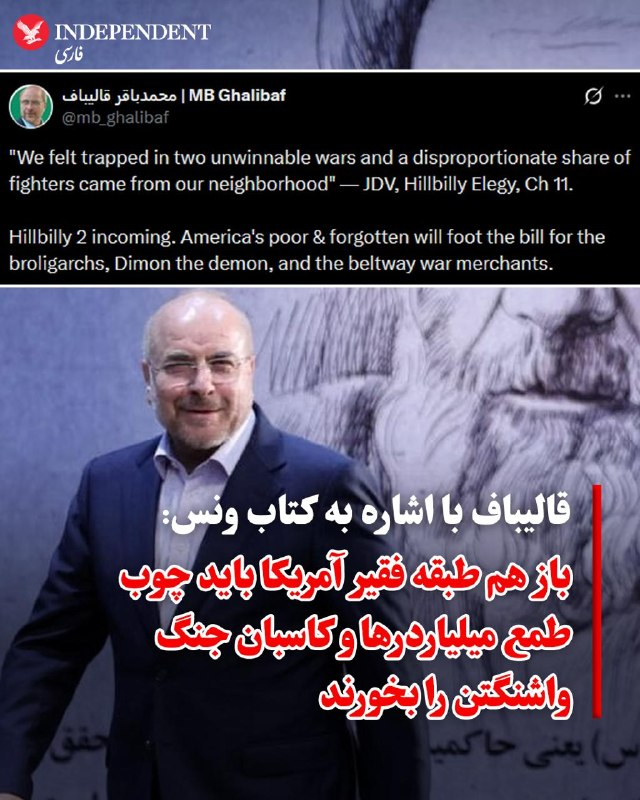
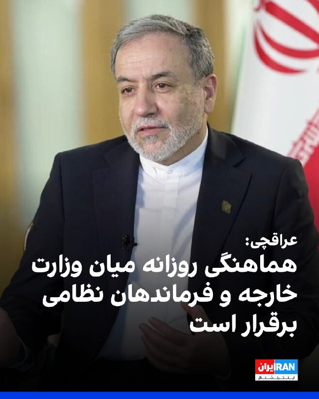

# خواننده تلگرام

<!-- TOP_NAV START -->

<a href="https://github.com/ProAlit/aio-downloader/blob/main/telegram/content/archive_1.md" style="display:inline-block; padding:6px 12px; margin:0 4px; background-color:#2ea44f; color:white; text-decoration:none; border-radius:4px; font-weight:bold;">صفحه بعد</a>

<!-- TOP_NAV END -->

<!-- MSG START -->

---
📅 بروزرسانی: 1405/02/30 17:53
---

## VahidOOnLine — post 241152

  <a href="telegram/content/VahidOOnLine_241152_1779287034.mp4" target="_blank">🎬 Download video</a>

مدیرعامل شرکت ملی نفت ابوظبی، اعلام کرده است امارات متحده عربی اجرای طرح ساخت یک خط لوله جدید برای دور زدن تنگه هرمز را پیش برده و این پروژه اکنون ۵۰ درصد پیشرفت داشته است.
در حال حاضر خط لوله عملیاتی امارات، خط لوله حبشان–فجیره است که از میادین نفتی حبشان در جنوب‌غرب ابوظبی تا بندر فجیره در دریای عمان امتداد دارد.
این خط لوله در حال حاضر توان انتقال تا ۱.۸ میلیون بشکه نفت در روز را دارد. تاسیسات نفتی فجیره از زمان آغاز جنگ چندین بار هدف حملات پهپادی منتسب به ایران قرار گرفته است.
بر اساس اعلام مقامات اماراتی، خط لوله جدید قرار است ظرفیت کل صادرات نفت این کشور را تا سال آینده دو برابر کند.
‌🏁 🇬🇧 ManotoTV

🤖 @VahidOOnLine

## VahidOOnLine — post 241151

  

عباس عراقچی، وزیر خارجه جمهوری اسلامی، اعلام کرد: هرجا لازم باشد می‌جنگیم و هرجا لازم باشد مذاکره می‌کنیم. ما کاملا در خدمت منافع نظام هستیم.

عراقچی افزود که ارتباط و هماهنگی مستمر و روزانه میان وزارت خارجه و فرماندهان نیروهای مسلح در سطوح مختلف برقرار است.
‌🏁 🇬🇧 IranintlTV

🤖 @VahidOOnLine

## VahidOOnLine — post 241150

  

♦️محمدباقر قالیباف، رئیس مجلس شورای اسلامی، روز چهارشنبه ۳۰ اردیبهشت، با انتشار مطلبی در شبکه اجتماعی ایکس و با استناد به کتاب خاطرات جی‌دی ونس، معاون رئیس‌جمهوری آمریکا، «سیاست‌های جنگ‌طلبانه واشنگتن» را مورد انتقاد قرار داد.

قالیباف با نقل‌قولی از کتاب «مرثیه هیل‌بیلی» نوشته ونس که در آن به ناامیدی طبقه کارگر آمریکا از حضور در «دو جنگ غیرقابل‌پیروزی» (عراق و افغانستان) اشاره شده، نوشت که نسخه دوم این وضعیت در راه است.

رئیس مجلس شورای اسلامی نوشت که در موازنه جدید قدرت در واشنگتن، بار دیگر «طبقه فقیر و فراموش‌شده آمریکا» باید تاوان «جاه‌طلبی‌های سرمایه‌داران بزرگ فناوری، مدیران ارشد وال‌استریت از جمله جیمی دایمن، و کاسبان جنگ» در کمربند سیاسی واشنگتن را بپردازند.

قالیباف در حالی به طبقه «فقیر و فراموش‌شده» در آمریکا پرداخت که گزارش‌ها از ایران حاکی از گرانی افسارگسیخته اقلام اساسی است.
‌🇸🇦 Indypersian

🤖 @VahidOOnLine

## WithYashar — post 11760

دونالد ترامپ دربارهٔ خودش:

شما در نهایت خواهید گفت: او بزرگ‌ترین رئیس‌جمهوری بود که تاکنون زندگی کرده است.
@withyashar

## FoxNewsTwitter — post 341993

  <a href="telegram/content/FoxNewsTwitter_341993_1779287036.mp4" target="_blank">🎬 Download video</a>

Fox News (Twitter/X)

NOW: President Trump boards Air Force One en route to Connecticut, where he will deliver remarks at the U.S. Coast Guard Academy graduation ceremony.

## FoxNewsTwitter — post 341992

Fox News (Twitter/X)

BREAKING: Iran’s Revolutionary Guard warns that if the U.S. and Israel resume attacks on Tehran, the conflict would spread “beyond the region” and bring “crushing blows” in unexpected places.

This comes after President Trump announced that the United States could end the conflict “very quickly” and claimed Iran was eager to negotiate.

## DEJradio — post 4784

  <a href="telegram/content/DEJradio_4784_1779287038.webm" target="_blank">🎬 Download video</a>

🔺🎤 انتقاد از حضور جمهوری اسلامی در نهادهای حقوق بشری سازمان ملل؛

گفت‌وگو با هیلل نویر، مدیر اجرایی دیده‌بان در سازمان ملل.

#حقوق_بشر #سازمان_ملل
@DEJradio

## VahidOnline — post 75570

  

سپاه پاسداران با انتشار بیانیه‌ای تهدید کرده که در صورت آغاز دوباره جنگ آمریکا و اسرائیل علیه ایران، جنگ «به فراتر از منطقه کشیده خواهد شد.»

در این بیانیه با اشاره به تهدیدهای دونالد ترامپ و مقام‌های اسرائیل برای حمله مجدد به ایران آمده: «اگر تجاوز به ایران تکرار شود جنگ منطقه‌ای که وعده داده شده بود، این بار به فراتر از منطقه کشیده خواهد شد و ضربات کوبنده ما در جاهایی که تصور آن را ندارید شما را به خاک سیاه خواهد نشاند.»

عباس عراقچی، وزیر خارجه ایران هم در واکنش به اظهارات تهدیدآمیز دونالد ترامپ، رئیس‌جمهور آمریکا، درباره احتمال از سرگیری حمله نظامی به ایران، در شبکه ایکس نوشته «با درس‌هایی که آموخته‌ایم و دانشی که به دست آورده‌ایم، مطمئن باشید بازگشت به میدان جنگ با شگفتی‌های بسیار بیشتری همراه خواهد بود.»
@VahidHeadline

📡 @VahidOnline

## VahidOnline — post 75569

  

رسانه‌های ایران روز چهارشنبه ۳۰ اردیبهشت خبر دادند که محسن نقوی، وزیر کشور پاکستان، وارد تهران شده است. او روز ۲۶ اردیبهشت نیز به ایران سفر کرده بود.

خبرگزاری ایسنا اعلام کرده که برنامه و اهداف سفر این مقام ارشد پاکستانی در ایران «مشخص نیست». خبرگزاری تسنیم نیز گزارش داده که آقای نقوی در بدو ورود به تهران با وزیر کشور ایران دیدار کرده است.
@VahidHeadline

📡 @VahidOnline

## VahidOnline — post 75568

  

رسانه‌ها در ایران از اجرای حکم اعدام قاتل الهه حسین‌نژاد، که جسد او اوایل خرداد سال گذشته در بیابان‌های اطراف تهران پیدا شد، خبر می‌دهند.

عصر چهارم خرداد ۱۴۰۴ الهه حسین‌نژاد ۲۴ ساله از سالن زیبایی که در آنجا مشغول به کار بود، بیرون آمد تا به خانه‌اش در اسلامشهر برود، اما ناپدید شد و وقتی خانواده‌اش اعلام شکایت کردند بررسی‌های تیم جنایی نشان می‌داد الهه از میدان آزادی سوار یک خودروی عبوری شده است.

جست و جوها برای یافتن الهه سرانجام پس از ۱۱ روز نتیجه داد و با دستگیری راننده خودرو به نام بهمن ۳۷ ساله و اعتراف به قتل الهه، جسد او در بیابان‌های اطراف تهران پیدا شد. متهم نیز پس از محاکمه به اعدام محکوم شد.

این قتل جنجال زیادی درباره امنیت زنان در ایران به پا کرد و تا مدت‌ها رسانه‌ها درباره آن مطالب مختلفی منتشر می‌کردند.

@VahidHeadline

📡 @VahidOnline

## VahidOnline — post 75567

  

رسانه‌های حقوق بشری گزارش دادند دادگاه کیفری تهران پس از رسیدگی دوباره به پرونده شهرک اکباتان، سه معترض بازداشت‌شده در این پرونده را به دیه و پنج سال حبس محکوم و سه معترض دیگر را از اتهام مشارکت در «قتل عمد» تبرئه کرد. حکم اعدام این شش تن پیش‌تر در دیوان عالی کشور نقض شده بود.

سایت هرانا چهارشنبه ۳۰ اردیبهشت گزارش داد شعبه ۱۳ دادگاه کیفری یک استان تهران، میلاد آرمون، علیرضا کفایی و امیرمحمد خوش‌اقبال را بابت اتهام «مشارکت در قتل عمد» آرمان علی‌وردی، از نیروهای بسیج، محکوم کرد. هر یک از آن‌ها به پرداخت سهم مساوی از دیه کامل یک انسان و پنج سال حبس محکوم شده‌اند.

طبق گزارش هرانا، نوید نجاران، حسین نعمتی و علیرضا برمرزپورناک، سه متهم دیگر این پرونده، به دلیل «فقدان مدارک دال بر وارد کردن ضربه به ناحیه مشخصی از بدن علی‌وردی» از اتهام مشارکت در قتل عمد تبرئه شدند.

این حکم ۱۵ بهمن سال گذشته صادر و سه‌شنبه ۲۹ اردیبهشت به وکلای این افراد ابلاغ شده است.

این شش شهروند معترض در آبان ۱۴۰۳ از سوی همین شعبه به اعدام محکوم شده بودند.
@VahidOOnLine

📡 @VahidOnline

## IranIntlTV — post 338094

  <a href="telegram/content/IranIntlTV_338094_1779287041.mp4" target="_blank">🎬 Download video</a>

سومین روز رسیدگی به پرونده حمله به پوریا زراعتی، مجری ایران‌اینترنشنال، در دادگاه وولیچ برگزار شد. دادستان این دادگاه گفت، حمله کنندگان به نیابت از جمهوری اسلامی، به قصد آسیب رساندن به پوریا زراعتی این حمله را انجام دادند.

تاج‌الدین سروش، خبرنگار ایران‌اینترنشنال، گزارش می‌دهد
@iranintltv

## IranIntlTV — post 338093

  

عباس عراقچی، وزیر خارجه جمهوری اسلامی، اعلام کرد: هرجا لازم باشد می‌جنگیم و هرجا لازم باشد مذاکره می‌کنیم. ما کاملا در خدمت منافع نظام هستیم.

عراقچی افزود که ارتباط و هماهنگی مستمر و روزانه میان وزارت خارجه و فرماندهان نیروهای مسلح در سطوح مختلف برقرار است.
https://iranintl.com/202605208263

## IranIntlTV — post 338092

  <a href="telegram/content/IranIntlTV_338092_1779287043.mp4" target="_blank">🎬 Download video</a>

سپاه پاسداران با انتشار بیانیه‌ای در واکنش به تهدیدهای اخیر دونالد ترامپ، هشدار داد در صورت حمله دوباره آمریکا و اسرائیل به جمهوری اسلامی، دامنه جنگ از منطقه فراتر خواهد رفت. سپاه همچنین اعلام کرد «ضربات کوبنده» را در مکان‌هایی وارد می‌کند که به گفته این نهاد نظامی، طرف مقابل «تصورش را هم نمی‌کند.»
گفت‌وگو با شایان سمیعی، کارشناس امنیت ملی
@iranintltv

## IranIntlTV — post 338091

  <a href="telegram/content/IranIntlTV_338091_1779287045.mp4" target="_blank">🎬 Download video</a>

شران هسکل، معاون وزیر خارجه اسرائیل، به بابک اسحاقی، خبرنگار ایران‌اینترنشنال، گفت جنگ اسرائیل با سپاه و ایدئولوژی افراطی است، نه با مردم ایران.
@iranintltv

## Shin_Persian — post 6114

  

سردار مادرجنده بی جنبه :( بلاک کرد

## ManotoTV — post 105685

  <a href="telegram/content/ManotoTV_105685_1779287047.mp4" target="_blank">🎬 Download video</a>

مدیرعامل شرکت ملی نفت ابوظبی، اعلام کرده است امارات متحده عربی اجرای طرح ساخت یک خط لوله جدید برای دور زدن تنگه هرمز را پیش برده و این پروژه اکنون ۵۰ درصد پیشرفت داشته است.
در حال حاضر خط لوله عملیاتی امارات، خط لوله حبشان–فجیره است که از میادین نفتی حبشان در جنوب‌غرب ابوظبی تا بندر فجیره در دریای عمان امتداد دارد.
این خط لوله در حال حاضر توان انتقال تا ۱.۸ میلیون بشکه نفت در روز را دارد. تاسیسات نفتی فجیره از زمان آغاز جنگ چندین بار هدف حملات پهپادی منتسب به ایران قرار گرفته است.
بر اساس اعلام مقامات اماراتی، خط لوله جدید قرار است ظرفیت کل صادرات نفت این کشور را تا سال آینده دو برابر کند.

## manototv — post 105685

  <a href="telegram/content/manototv_105685_1779287047.mp4" target="_blank">🎬 Download video</a>

مدیرعامل شرکت ملی نفت ابوظبی، اعلام کرده است امارات متحده عربی اجرای طرح ساخت یک خط لوله جدید برای دور زدن تنگه هرمز را پیش برده و این پروژه اکنون ۵۰ درصد پیشرفت داشته است.
در حال حاضر خط لوله عملیاتی امارات، خط لوله حبشان–فجیره است که از میادین نفتی حبشان در جنوب‌غرب ابوظبی تا بندر فجیره در دریای عمان امتداد دارد.
این خط لوله در حال حاضر توان انتقال تا ۱.۸ میلیون بشکه نفت در روز را دارد. تاسیسات نفتی فجیره از زمان آغاز جنگ چندین بار هدف حملات پهپادی منتسب به ایران قرار گرفته است.
بر اساس اعلام مقامات اماراتی، خط لوله جدید قرار است ظرفیت کل صادرات نفت این کشور را تا سال آینده دو برابر کند.

## alonews — post 121327

  <a href="telegram/content/alonews_121327_1779287048.webm" target="_blank">🎬 Download video</a>

👈العربیه: ممکن است طی ساعات آینده از نهایی شدن نسخه نهایی توافق بین آمریکا و ایران خبر داده شود. 
✅ @AloNews خبر جنگ

## alonews — post 121326

  <a href="telegram/content/alonews_121326_1779287048.webm" target="_blank">🎬 Download video</a>

🔴فوووووووووری

## alonews — post 121325

🔴فوووووووووری

---
📅 بروزرسانی: 1405/02/30 17:43
---

## VahidOOnLine — post 241149

  

سایت رویداد۲۴ گزارش داد یک مرد جوان مجرد از جنگ‌زدگان ساکن هتل لاله تهران، در روزهای ابتدایی جنگ و در پی فشار شدید روانی ناشی از جنگ، آوارگی و بی‌خانمانی خودکشی کرده و جان باخته است.

بر اساس این گزارش، علیرضا رئیسی، معاون وزیر بهداشت، گفته بود وزارت بهداشت برای ارائه مشاوره‌های روان‌شناختی به آوارگان آمادگی کامل داشته، اما شهرداری تهران از ورود تیم‌های متخصص این وزارتخانه جلوگیری کرده است.

در مقابل، محمد صاحب، مدیرکل سلامت شهرداری تهران، این صحبت‌ها را رد کرد و گفت پیشنهاد همکاری وزارت بهداشت «بسیار دیر» و پس از آتش‌بس ارائه شد؛ زمانی که به گفته او، شهرداری از قبل مقدمات خدمات‌رسانی را فراهم کرده بود.

(به توصیه کارشناسان، اگر با فردی روبه‌رو شدید که از جملات یا عباراتی حاکی از افسردگی یا تمایل به پایان زندگی استفاده می‌کند، از او بخواهید با یک پزشک متخصص معتمد، نهادهای فعال در این زمینه یا فردی مورد اعتماد درباره نگرانی‌هایش صحبت کند. اگر خودتان به خودکشی فکر می‌کنید، در ایران می‌توانید با اورژانس اجتماعی با شماره ۱۲۳ تماس بگیرید.)
‌🏁 🇬🇧 IranintlTV

🤖 @VahidOOnLine

## WithYashar — post 11759

ترامپ درباره ایران:

اکنون در ایران خشم زیادی وجود دارد زیرا مردم زندگی بسیار بدی دارند.
@withyashar

## WithYashar — post 11758

خبرنگار: درباره جنگ ایران چی میگید؟

ترامپ: بذار اینجوری بگم، شما تو ویتنام 19 سال توی جنگ بودید، جنگ جهانی دوم 4 سال بودید؛ من 3 ماهه تو ایران درگیرم، خیلیاش هم آتش‌بس بوده. تو دوتا جنگ، ونزوئلا و اینجا، ما 13 نفر از دست دادیم، تو جنگ‌های دیگه صدها هزار نفر کشته دادید. ما عملاً ونزوئلا رو گرفتیم تقریباً هم ایران رو هم گرفتیم.
@withyashar

## WithYashar — post 11757

دونالد ترامپ دربارهٔ ایران:
من هیچ عجله‌ای ندارم. همه می‌گویند: «انتخابات میان‌دوره‌ای.» من هیچ عجله‌ای ندارم.
@withyashar

## mwarmonitor — post 9349

  <a href="telegram/content/mwarmonitor_9349_1779286438.mp4" target="_blank">🎬 Download video</a>

🔹خبرنگار: آیا این موضوع بیشتر از اون چیزی که انتظار داشتید طول کشیده که بخواهید با ایران به توافق برسید؟
🔸دونالد ترامپ: خب، بذار این‌طوری بهش نگاه کنیم؛ شما ۱۹ سال در ویتنام بودید، درسته؟ شما ۱۰ سال در افغانستان و این جاهای دیگه بودید. شما در عراق بودید؛ چقدر در عراق بودید؟ ۱۲ سال؟ ۱۲ سال. شما برای ۷ سال در کره بودید. جنگ جهانی دوم متفاوته، اون ۴ سال بود.
من برای ۳ ماهه که وارد شدم، و بخش زیادی از اون هم آتش‌بس بوده، بنابراین... و می‌دونی چیه؟ شما صدها هزار سرباز رو در این جنگ‌های مختلف از دست دادید. در دو جنگ؛ ونزوئلا، که ما هیچ‌کس رو از دست ندادیم، و اینجا، ما ۱۳ نفر رو از دست دادیم.
حالا، ۱۳ نفر، ۱۳ نفر هم زیاده، اما ما ۱۳ نفر رو از دست دادیم. در جنگ‌های دیگه، شما صدها هزار نفر رو از دست دادید.

@mwarmonitor

## mwarmonitor — post 9348

  <a href="telegram/content/mwarmonitor_9348_1779286441.mp4" target="_blank">🎬 Download video</a>

🔹خبرنگار: درباره ایران، آیا یک توافق محدود، فقط برای یک آتش‌بس طولانی‌تر [ممکنه]؟
🔸دونالد ترامپ: آن‌ها باید تنگه را باز کنند، این کار باید فوراً انجام شود. بنابراین ما به این [موضوع] یک فرصت می‌دهیم. من هیچ عجله‌ای ندارم. می‌دانید، مردم فکر می‌کنند «اوه، انتخابات میان‌دوره‌ای در پیش است، پس او عجله دارد»؛ من هیچ عجله‌ای ندارم. من فقط... از نظر ایده‌آل دوست دارم آدم‌های کمتری کشته شوند تا اینکه تعداد زیادی کشته شوند. ما می‌توانیم این کار را از هر دو طریق انجام دهیم، اما... اما من ترجیح می‌دهم آدم‌های کمتری کشته شوند.
من فقط در این فکرم که آیا آن‌ها خیر و صلاح مردم را می‌خواهند یا نه، چون برخی از کارهایی که دارند انجام می‌دهند به نظر من یعنی آن‌ها خیر و صلاح مردم را نمی‌خواهند، در حالی که باید صلاح مردم را بخواهند.
اممم... در حال حاضر خشم زیادی در ایران وجود دارد چون مردم در وضعیت بسیار بدی زندگی می‌کنند. ناآرامی و تلاطم زیادی وجود دارد که ما قبلاً تا این حد شاهدش نبوده‌ایم. و حالا باید ببینیم چه می‌شود.

@mwarmonitor

## FoxNewsTwitter — post 341991

‌Fox News (Twitter/X)

https://www.foxnews.com/politics/fmr-dem-rep-barney-frank-sharp-tongued-liberal-trailblazer-dodd-frank-co-author-dies

## FoxNewsTwitter — post 341990

  

Fox News (Twitter/X)

WATCH LIVE: House Judiciary hearing on the Southern Poverty Law Center https://twitter.com/i/broadcasts/1rGmqoPmNLBGy

## FoxNewsTwitter — post 341989

  

Fox News (Twitter/X)

WATCH LIVE: Senate hearing examining sports betting in America. https://twitter.com/i/broadcasts/1qxoNeomOpEJv

## FoxNewsTwitter — post 341988

  <a href="telegram/content/FoxNewsTwitter_341988_1779286445.mp4" target="_blank">🎬 Download video</a>

Fox News (Twitter/X)

BREAKING: President Trump comes out in support of former reality TV star Spencer Pratt’s and his political rise in the race to be the next mayor of Los Angeles.

When asked if he sees any similarities between himself and the fellow reality-television-star-turned-politician, Trump noted Pratt's unique personality and popular appeal.

"Oh, I'd like to see him do well... He's a character."

## IranIntlTV — post 338090

  

سایت رویداد۲۴ گزارش داد یک مرد جوان مجرد از جنگ‌زدگان ساکن هتل لاله تهران، در روزهای ابتدایی جنگ و در پی فشار شدید روانی ناشی از جنگ، آوارگی و بی‌خانمانی خودکشی کرده و جان باخته است.

بر اساس این گزارش، علیرضا رئیسی، معاون وزیر بهداشت، گفته بود وزارت بهداشت برای ارائه مشاوره‌های روان‌شناختی به آوارگان آمادگی کامل داشته، اما شهرداری تهران از ورود تیم‌های متخصص این وزارتخانه جلوگیری کرده است.

در مقابل، محمد صاحب، مدیرکل سلامت شهرداری تهران، این صحبت‌ها را رد کرد و گفت پیشنهاد همکاری وزارت بهداشت «بسیار دیر» و پس از آتش‌بس ارائه شد؛ زمانی که به گفته او، شهرداری از قبل مقدمات خدمات‌رسانی را فراهم کرده بود.

(به توصیه کارشناسان، اگر با فردی روبه‌رو شدید که از جملات یا عباراتی حاکی از افسردگی یا تمایل به پایان زندگی استفاده می‌کند، از او بخواهید با یک پزشک متخصص معتمد، نهادهای فعال در این زمینه یا فردی مورد اعتماد درباره نگرانی‌هایش صحبت کند. اگر خودتان به خودکشی فکر می‌کنید، در ایران می‌توانید با اورژانس اجتماعی با شماره ۱۲۳ تماس بگیرید.)
https://iranintl.com/202605200313

## IranIntlTV — post 338089

  <a href="telegram/content/IranIntlTV_338089_1779286449.mp4" target="_blank">🎬 Download video</a>

دونالد ترامپ، رییس‌جمهوری آمریکا، گفت: «در ایران خشم زیادی وجود دارد و ناآرامی بی‌سابقه‌ای شکل گرفته است و خواهیم دید چه اتفاقی می‌افتد.» او همچنین تاکید کرد درباره توافق محدود مرتبط با تنگه هرمز عجله‌ای ندارد.
@iranintltv

## Shin_Persian — post 6113

📦 mhrv-rs v1.9.33 released

• In Full Tunnel mode, fully idle sessions now use a stronger empty-keepalive backoff, and when every deployment is detected as legacy they stop sending repeated empty polls after going idle
• For mixed fleets where at least one deployment still has healthy long-poll support, the client keeps emitting empty polls so round-robin can still reach that healthy peer and remote→client data doe…

Files (Android APKs, Windows, macOS, Linux, OpenWRT) on the files channel:

👉 v1.9.33 — all files with SHA-256

Channel:
https://t.me/mhrv_rs
or: https://t.me/+R1OyoHX2boA1ZDgx

#v1933

## FarsiVOA — post 218222

  

فرماندهی مرکزی ایالات متحده، سنتکام، در یک به‌روز‌رسانی تازه اعلام کرد که از زمان اجرای محاصره دریایی جمهوری اسلامی تا ۳۰ اردیبهشت، نیروهای آمریکایی ۹۰ کشتی را وادار به تغییر مسیر کرده‌اند و ۴ کشتی را غیرفعال کرده‌اند.

سنتکام همچنین تصویری از یک هلیکوپتر تهاجمی (ای‌اچ-۱زد وایپر) در حال گشت‌زنی نزدیک یک کشتی تجاری در آب‌های منطقه منتشر کرده است.

## RadioFarda — post 157391

🔸محمدباقر قالیباف، رئیس مجلس شورای اسلامی، ادعا کرد که آمریکا به دنبال دور جدید جنگ علیه ایران است و باید واشینگتن را از تسلیم شدن تهران ناامید کرد. 🔸او در یک فایل صوتی که رسانه‌های ایران روز چهارشنبه ۳۰ اردیبهشت منتشر کردند، با اشاره به برقراری آتش‌بس میان…

## RadioFarda — post 157390

  

🔸محمدباقر قالیباف، رئیس مجلس شورای اسلامی، ادعا کرد که آمریکا به دنبال دور جدید جنگ علیه ایران است و باید واشینگتن را از تسلیم شدن تهران ناامید کرد.

🔸او در یک فایل صوتی که رسانه‌های ایران روز چهارشنبه ۳۰ اردیبهشت منتشر کردند، با اشاره به برقراری آتش‌بس میان ایران و آمریکا گفت: «تحرکات آشکار و پنهان دشمن نشان می‌دهد که دشمن به موازات فشارهای اقتصادی و سیاسی از اهداف نظامی خود دست نکشیده و به دنبال دور جدیدی از جنگ و ماجراجویی جدید است.»

🔸دونالد ترامپ، رئیس‌جمهور آمریکا، روز دوشنبه گفت که ارتش این کشور قرار بود روز سه‌شنبه حملاتی علیه ایران انجام دهد اما او به درخواست شماری از کشورهای منطقه و برای رسیدن به توافق پایان جنگ با ایران، دستور لغو این حملات را داده است.

🔸آقای ترامپ در عین حال روز سه‌شنبه هشدار داد که ایران تنها چند روز برای رسیدن به توافق با آمریکا وقت دارد و در غیر این‌صورت شاید لازم شود «ضربه بزرگ» دیگری به آن وارد شود.

@RadioFarda

## IranianMinds — post 20443

  <a href="telegram/content/IranianMinds_20443_1779286454.mp4" target="_blank">🎬 Download video</a>

🔴 ترامپ درباره ایران:

«الان خشم زیادی در ایران وجود دارد چون مردم شرایط زندگی بسیار بدی دارند.»

@IranianMinds

## Hranews — post 113062

  

در نهمین روز بازداشت؛ خانواده مهدی شفاخواه همچنان از وضعیت او بی خبرند

❗️
❗️
❗️
❗️
❗️– کماکان از سرنوشت مهدی شفاخواه، فعال حوزه آموزش و حمایت از کودکان کار و ساکنان مناطق محروم که ۹ روز پیش در تهران بازداشت شد، اطلاعی حاصل نشده است. این وضعیت منجر به افزایش نگرانی‌های خانواده آقای شفاخواه شده است.

به گزارش خبرگزاری هرانا، ارگان خبری مجموعه فعالان حقوق بشر در ایران، مهدی شفاخواه، فعال اجتماعی کماکان در بازداشت به‌سر می‌برد.

یک منبع مطلع از وضعیت این فعال اجتماعی ضمن تایید این خبر به هرانا گفت: ۹ روز است که از بازداشت آقای شفاخواه می‌گذرد و وی همچنان از دسترسی به وکیل محروم مانده است. با وجود مراجعه برادر او، رضا شفاخواه، که خود وکیل دادگستری است، به خانواده اعلام شده که وی تنها امکان استفاده از وکلای مورد تأیید تبصره ماده ۴۸ را دارد.
همچنین، مراجعات مکرر خانواده این شهروند به مراجع قضایی و امنیتی برای کسب اطلاع از سرنوشت وی، تاکنون بی نتیجه بوده است.

#مهدی_شفاخواه

ادامه مطلب

↘️
@hranews_bot تماس ✉️ - @Hranews کانال هرانا 🆑

## alonews — post 121324

  <a href="telegram/content/alonews_121324_1779286458.webm" target="_blank">🎬 Download video</a>

👈سخنگوی انجمن صنایع فرآورده‌های لبنی:
قراره لبنیات از اول خرداد 20 درصد گرون بشه.

✅ @AloNews خبر جنگ

---
📅 بروزرسانی: 1405/02/30 17:34
---

## VahidOOnLine — post 241148

  

دونالد ترامپ درباره توافق با جمهوری اسلامی و موضوع تنگه هرمز گفت: «ما یک فرصت به این موضوع می‌دهیم. عجله‌ای ندارم. نمی‌خواهم افراد زیادی کشته شوند؛ ترجیح می‌دهم تعداد کمی کشته شوند.»

او گفت در ایران خشم و ناآرامی زیادی وجود دارد زیرا مردم در شرایط بدی زندگی می‌کنند و باید دید چه اتفاقی می‌افتد.
‌🏁 🇬🇧 IranintlTV

🤖 @VahidOOnLine

## VahidOOnLine — post 241147

  <a href="telegram/content/VahidOOnLine_241147_1779285845.mp4" target="_blank">🎬 Download video</a>

یک شهروند در پیامی به ایران اینترنشنال درباره جنگ‌طلبی جمهوری اسلامی می‌گوید که حملات اخیر سپاه پاسداران به امارات متحده عربی تجارت بوشهر در ایران را تحت تاثیر قرار داد و نابود کرد. پیام این مخاطب با هوش مصنوعی خوانده شده است.
‌🏁 🇬🇧 IranintlTV

🤖 @VahidOOnLine

## WithYashar — post 11756

خبرنگار: «آیا شما و بنیامین نتانیاهو دربارهٔ ایران هم‌نظر هستید؟»

دونالد ترامپ: «بله.»
@withyashar

## mwarmonitor — post 9347

🇮🇱‏سخنگوی ارتش اسرائیل:

🔸رئیس ستاد کل ارتش اسرائیل خطاب به فرماندهان لشکرها: «در تمامی جبهه‌ها آماده هستیم و در مناطق دفاعی خط مقدم مستقر شده‌ایم، تهدیدها را خنثی کرده و با ابتکار، پایداری و قاطعیت واقعیت را شکل می‌دهیم. دستاوردهای ارتش اسرائیل حاصل نبرد و فداکاری بی‌سابقه شما فرماندهان و رزمندگان در نیروهای وظیفه و ذخیره است. در این لحظات، ارتش اسرائیل در بالاترین سطح آماده‌باش قرار دارد و برای هر تحولی آماده است. در کنار نبرد شدید و مستمر، باید سطح بالایی از ارزش‌ها، حرفه‌ای‌گری و انضباط عملیاتی را حفظ کنیم؛ این‌ها شرط آمادگی رزمی و انسجام ارتش اسرائیل است.»

رئیس ستاد کل ارتش اسرائیل، سپهبد ایال زامیر، امروز (چهارشنبه) با تمامی فرماندهان لشکرها گفت‌وگو کرد.

در این گفت‌وگو، رئیس ستاد کل ارتش اسرائیل ارزیابی وضعیت عملیاتی را با فرماندهان انجام داد و به چالش‌های عملیاتی در تمامی جبهه‌ها، میزان آمادگی نیروها و ادامه نبرد در جبهه‌های مختلف پرداخت.

بخشی از سخنان رئیس ستاد کل ارتش اسرائیل، سپهبد ایال زامیر: «شما نسل منحصربه‌فردی از فرماندهان لشکر در تاریخ ارتش اسرائیل و کشور اسرائیل هستید. اقدامات شما در دو سال و نیم گذشته در کتاب‌های تاریخ ثبت خواهد شد. توانمندی ارتش، حفظ ارزش‌ها و دستاوردهای عملیاتی آن—در دستان شماست.

در تمامی جبهه‌های نبرد در مرزها، ما آماده هستیم و در مناطق دفاع پیشرو مستقر شده‌ایم، تهدیدها را خنثی کرده و با ابتکار، پایداری و قاطعیت واقعیت را شکل می‌دهیم. دستاوردهای ارتش اسرائیل نتیجه نبرد و فداکاری بی‌سابقه شما فرماندهان و رزمندگان در نیروهای وظیفه و ذخیره است.

در این لحظات، ارتش اسرائیل در بالاترین سطح آماده‌باش قرار دارد و برای هر تحول احتمالی آماده است. در کنار نبرد شدید و مداوم، باید سطح بالایی از ارزش‌ها، حرفه‌ای‌گری و انضباط عملیاتی را حفظ کنیم. این‌ها شروط آمادگی رزمی و انسجام ارتش اسرائیل هستند.

در هر جبهه، ما تهدیدها را برطرف کرده و در درجه نخست برای تعمیق ضربه به دشمن و حفظ امنیت شهروندان و نیروهای خود عمل می‌کنیم.

به‌عنوان رئیس ستاد کل ارتش اسرائیل، تمامی جبهه‌ها را مدنظر دارم—ما به‌طور نظام‌مند، قدرتمند و مبتنی بر برنامه، به ایران و کل محور ضربه زده و آن را تضعیف کرده‌ایم. به نبرد در جبهه‌های نزدیک و دور به هر میزان که لازم باشد ادامه خواهیم داد. برای انجام تمامی مأموریت‌ها و کاهش بار غیرقابل‌تصور بر نیروهای ذخیره، نیازمند گسترش دایره خدمت‌کنندگان هستیم؛ این یک موضوع اساسی و حیاتی برای توان عملیاتی ارتش اسرائیل است.

🔹در این میان، شما فرماندهان لشکرها کار فوق‌العاده‌ای انجام می‌دهید؛ این فقط در نتایج میدانی نیست، بلکه در توانایی هدایت نیروها، پرورش آن‌ها و در نهایت—پیروزی است.»

@mwarmonitor

## mwarmonitor — post 9346

🔸ترامپ می‌گوید او دیدار پوتین با شی جین‌پینگ در چین را تماشا کرده و مدعی است که خودش استقبال باشکوه‌تری دریافت کرده است.

🔹«نمی‌دانم مراسم آن‌ها به اندازه مراسم من درخشان بود یا نه. من دیدم، فکر می‌کنم ما از آن‌ها بهتر بودیم. فکر می‌کنم ما از آن‌ها بهتر بودیم.»

@mwarmonitor

## FoxNewsTwitter — post 341987

Fox News (Twitter/X)

BREAKING: Former Rep. Barney Frank, D-Mass., coauthor of sweeping Dodd-Frank Act after 2008 financial crisis, dead at 86

## FoxNewsTwitter — post 341986

  <a href="telegram/content/FoxNewsTwitter_341986_1779285847.mp4" target="_blank">🎬 Download video</a>

Fox News (Twitter/X)

NEW: President Trump celebrates a clean sweep in last night's primary races while taking aim at Democrat James Talarico's Senate campaign in Texas:

"We won all races last night. Every one of them."

"I believe the Texas candidate who's Ken Paxton, I think he'll win... I think he'll go on to defeat a very defective candidate, a candidate that believes in six genders. And he takes hits at Jesus Christ and he's wearing a mask six months ago. Anyone wearing a mask six months ago doesn't get it."

"And he's a vegan. He's a vegan in Texas. And you can't get elected as a vegan in Texas."

## FoxNewsTwitter — post 341985

  <a href="telegram/content/FoxNewsTwitter_341985_1779285850.mp4" target="_blank">🎬 Download video</a>

Fox News (Twitter/X)

President Trump isn't choosing favorites when it comes to Vance and Rubio leading the White House press briefings.

REPORTER: "Do you think Vance or Rubio did better in the press briefings?"

PRESIDENT TRUMP: "I think they both did great. What do you want me to say?

"I watched both of them. They're both very good men."

## pm_afshaa — post 91109

  <a href="telegram/content/pm_afshaa_91109_1779285852.mp4" target="_blank">🎬 Download video</a>

🎙️خبرنگار: درباره جنگ ایران چی میگید؟

ترامپ: بذار اینجوری بگم، شما تو ویتنام 19 سال توی جنگ بودید، جنگ جهانی دوم 4 سال بودید؛ من 3 ماهه تو ایران درگیرم، خیلیاش هم آتش‌بس بوده. تو دوتا جنگ، ونزوئلا و اینجا، ما 13 نفر از دست دادیم، تو جنگ‌های دیگه صدها هزار نفر کشته دادید. ما عملاً ونزوئلا رو گرفتیم تقریباً هم ایران رو هم گرفتیم.

💧 Rainbet.com the #1 Non-KYC Crypto Casino & Sportsbook @rainbetcom

😁 @Pm_Afshaa

## DEJradio — post 4783

نسخه کامل گفتگو در نشست آینده تکنولوژی ایران

این نشست روز ۱۶ مه (۲۶ اردیبهشت) در محل دفتر مرکزی شرکت «اوبر» در شهر سان‌فرانسیسکو در ایالت کالیفرنیای آمریکا برگزار شد.

@OfficialRezaPahlavi

## IranIntlTV — post 338088

  

دونالد ترامپ درباره توافق با جمهوری اسلامی و موضوع تنگه هرمز گفت: «ما یک فرصت به این موضوع می‌دهیم. عجله‌ای ندارم. نمی‌خواهم افراد زیادی کشته شوند؛ ترجیح می‌دهم تعداد کمی کشته شوند.»

او گفت در ایران خشم و ناآرامی زیادی وجود دارد زیرا مردم در شرایط بدی زندگی می‌کنند و باید دید چه اتفاقی می‌افتد.
https://iranintl.com/202605201857

## IranIntlTV — post 338087

  <a href="telegram/content/IranIntlTV_338087_1779285856.mp4" target="_blank">🎬 Download video</a>

یک شهروند در پیامی به ایران اینترنشنال درباره جنگ‌طلبی جمهوری اسلامی می‌گوید که حملات اخیر سپاه پاسداران به امارات متحده عربی تجارت بوشهر در ایران را تحت تاثیر قرار داد و نابود کرد. پیام این مخاطب با هوش مصنوعی خوانده شده است.

## IranIntlTV — post 338086

  <a href="telegram/content/IranIntlTV_338086_1779285859.mp4" target="_blank">🎬 Download video</a>

دونالد ترامپ تاکید کرد احتمال دارد آمریکا برای زدن ضربه‌ای بزرگ، بار دیگر به جمهوری‌اسلامی حمله کند. سپاه پاسداران در واکنش گفت: «با رهبران کفر می‌جنگیم و جنگ را به فراتر از منطقه می‌کشانیم.»

مریم رحمتی، خبرنگار ایران‌اینترنشنال، گزارش می‌دهد
@iranintltv

## IranIntlTV — post 338085

  <a href="https://t.me/IranintlTV/338085" target="_blank">📎 Download file</a>

🎧نسخه صوتی دومینو: آخرین رایزنی‌ها پیش از جنگ آخر
@iranintlTV

## DW_Farsi — post 124929

  

🔶 تهدید سپاه: در صورت تکرار حمله، دامنه جنگ از منطقه فراتر خواهد رفت

سپاه پاسداران انقلاب اسلامی روز چهارشنبه ۳۰ اردیبهشت (۲۰ ماه مه) در بیانیه‌ای تهدید کرد اگر ایالات متحده بار دیگر حملات را آغاز کند، جنگ را فراتر از خاورمیانه گسترش خواهد داد.

این تهدید پس از آن مطرح شد که دونالد ترامپ، رئيس‌جمهور آمریکا گفت تنها یک ساعت با صدور دستور آغاز دوباره عملیات نظامی فاصله داشته است.

سپاه همچنین آمریکا و اسرائیل را خطاب قرار داد و مدعی شد که در صورت تکرار حمله، ضربات جمهوری اسلامی در نقاطی وارد خواهد شد که دشمنان "تصور آن را ندارند".

سپاه در بخش دیگری از بیانیه خود گفت با وجود آن‌که آمریکا و اسرائیل با همه توان دو ارتش "پرهزینه" خود به ایران حمله کردند، جمهوری اسلامی همه ظرفیت‌های خود را علیه آن‌ها وارد عمل نکرد.

به نظر می رسد این بیانیه در واکنش به اظهارات مقامات آمریکایی صادر شده است.

@dw_farsi

## IranianMinds — post 20442

  <a href="telegram/content/IranianMinds_20442_1779285862.mp4" target="_blank">🎬 Download video</a>

🔴 خبرنگار: آیا شما و نتانیاهو در مورد ایران هم‌نظر هستید؟

ترامپ: بله.

@IranianMinds

## IranianMinds — post 20441

  <a href="telegram/content/IranianMinds_20441_1779285864.mp4" target="_blank">🎬 Download video</a>

🔴 ترامپ درباره خودش:

«آخرش می‌گید: «او بزرگ‌ترین رئیس‌جمهوری است که تا به حال وجود داشته.»

@IranianMinds

## IranianMinds — post 20440

  <a href="telegram/content/IranianMinds_20440_1779285867.mp4" target="_blank">🎬 Download video</a>

🔴 ترامپ درباره نتانیاهو:

«نتانیاهو هر کاری که من بخواهم انجام می‌دهد.»

@IranianMinds

## IranianMinds — post 20439

  <a href="telegram/content/IranianMinds_20439_1779285869.mp4" target="_blank">🎬 Download video</a>

🔴 ترامپ درباره ایران:

«من عجله‌ای ندارم. همه می‌گویند: «انتخابات میان‌دوره‌ای». من عجله‌ای ندارم.»

@IranianMinds

## IranianMinds — post 20438

  <a href="telegram/content/IranianMinds_20438_1779285871.mp4" target="_blank">🎬 Download video</a>

🔴 ترامپ:

«ما ونزوئلا را تصرف کردیم. عملاً ایران را هم تصرف کرده‌ایم.

تا حالا ۱۳ نفر را از دست داده‌ایم. اگر شخص دیگری بود، ۱۰۰,۰۰۰ نفر از دست می‌رفت، باشه؟»

@IranianMinds

## idfinfarsi — post 11612

  

📷 Photo

## idfinfarsi — post 11611

سخنگوی ارتش اسرائیل:

رئیس ستاد کل ارتش اسرائیل خطاب به فرماندهان لشکرها: «در تمامی جبهه‌ها آماده هستیم و در مناطق دفاعی خط مقدم مستقر شده‌ایم، تهدیدها را خنثی کرده و با ابتکار، پایداری و قاطعیت واقعیت را شکل می‌دهیم. دستاوردهای ارتش اسرائیل حاصل نبرد و فداکاری بی‌سابقه شما فرماندهان و رزمندگان در نیروهای وظیفه و ذخیره است. در این لحظات، ارتش اسرائیل در بالاترین سطح آماده‌باش قرار دارد و برای هر تحولی آماده است. در کنار نبرد شدید و مستمر، باید سطح بالایی از ارزش‌ها، حرفه‌ای‌گری و انضباط عملیاتی را حفظ کنیم؛ این‌ها شرط آمادگی رزمی و انسجام ارتش اسرائیل است.»

رئیس ستاد کل ارتش اسرائیل، سپهبد ایال زامیر، امروز (چهارشنبه) با تمامی فرماندهان لشکرها گفت‌وگو کرد.

در این گفت‌وگو، رئیس ستاد کل ارتش اسرائیل ارزیابی وضعیت عملیاتی را با فرماندهان انجام داد و به چالش‌های عملیاتی در تمامی جبهه‌ها، میزان آمادگی نیروها و ادامه نبرد در جبهه‌های مختلف پرداخت.

بخشی از سخنان رئیس ستاد کل ارتش اسرائیل، سپهبد ایال زامیر: «شما نسل منحصربه‌فردی از فرماندهان لشکر در تاریخ ارتش اسرائیل و کشور اسرائیل هستید. اقدامات شما در دو سال و نیم گذشته در کتاب‌های تاریخ ثبت خواهد شد. توانمندی ارتش، حفظ ارزش‌ها و دستاوردهای عملیاتی آن—در دستان شماست.

در تمامی جبهه‌های نبرد در مرزها، ما آماده هستیم و در مناطق دفاع پیشرو مستقر شده‌ایم، تهدیدها را خنثی کرده و با ابتکار، پایداری و قاطعیت واقعیت را شکل می‌دهیم. دستاوردهای ارتش اسرائیل نتیجه نبرد و فداکاری بی‌سابقه شما فرماندهان و رزمندگان در نیروهای وظیفه و ذخیره است.

در این لحظات، ارتش اسرائیل در بالاترین سطح آماده‌باش قرار دارد و برای هر تحول احتمالی آماده است. در کنار نبرد شدید و مداوم، باید سطح بالایی از ارزش‌ها، حرفه‌ای‌گری و انضباط عملیاتی را حفظ کنیم. این‌ها شروط آمادگی رزمی و انسجام ارتش اسرائیل هستند.

در هر جبهه، ما تهدیدها را برطرف کرده و در درجه نخست برای تعمیق ضربه به دشمن و حفظ امنیت شهروندان و نیروهای خود عمل می‌کنیم.

به‌عنوان رئیس ستاد کل ارتش اسرائیل، تمامی جبهه‌ها را مدنظر دارم—ما به‌طور نظام‌مند، قدرتمند و مبتنی بر برنامه، به ایران و کل محور ضربه زده و آن را تضعیف کرده‌ایم. به نبرد در جبهه‌های نزدیک و دور به هر میزان که لازم باشد ادامه خواهیم داد. برای انجام تمامی مأموریت‌ها و کاهش بار غیرقابل‌تصور بر نیروهای ذخیره، نیازمند گسترش دایره خدمت‌کنندگان هستیم؛ این یک موضوع اساسی و حیاتی برای توان عملیاتی ارتش اسرائیل است.

در این میان، شما فرماندهان لشکرها کار فوق‌العاده‌ای انجام می‌دهید؛ این فقط در نتایج میدانی نیست، بلکه در توانایی هدایت نیروها، پرورش آن‌ها و در نهایت—پیروزی است.»

## officialrezapahlavi — post 1834

نسخه کامل گفتگو در نشست آینده تکنولوژی ایران

این نشست روز ۱۶ مه (۲۶ اردیبهشت) در محل دفتر مرکزی شرکت «اوبر» در شهر سان‌فرانسیسکو در ایالت کالیفرنیای آمریکا برگزار شد.

@OfficialRezaPahlavi

## alonews — post 121323

  <a href="telegram/content/alonews_121323_1779285874.mp4" target="_blank">🎬 Download video</a>

👈ترامپ درباره خودش:
شما در نهایت خواهید گفت: «او بزرگترین رئیس‌جمهوری است که زندگی کرده است.»

✅ @AloNews خبر جنگ

## alonews — post 121322

  <a href="telegram/content/alonews_121322_1779285877.mp4" target="_blank">🎬 Download video</a>

👈دونالد ترامپ: «در اسرائیل، میزان محبوبیت من ۹۹ درصد است. شاید به اسرائیل بروم و برای نخست وزیری نامزد شوم.».

✅ @AloNews خبر جنگ

---
📅 بروزرسانی: 1405/02/30 17:23
---

## VahidOOnLine — post 241146

  <a href="telegram/content/VahidOOnLine_241146_1779285229.mp4" target="_blank">🎬 Download video</a>

⭕️ پلنگ جوان ایرانی در پناهگاه «کم‌کی» یزد دیده شد

♦️تصاویر تازه ثبت‌شده از حضور یک پلنگ جوان در پناهگاه حیات‌وحش کم‌کی شهرستان بهاباد، بار دیگر اهمیت زیستگاه‌های طبیعی استان یزد در حفظ گونه‌های ارزشمند حیات‌وحش را نشان داد.
پلنگ ایرانی که یکی از گونه‌های در معرض تهدید به شمار می‌رود، در سال‌های اخیر به‌ندرت در برخی مناطق مرکزی ایران مشاهده شده و ثبت این تصویر می‌تواند نشانه‌ای امیدوارکننده از پویایی حیات‌وحش و امنیت نسبی زیستگاه‌های منطقه باشد.
فعالان محیط‌زیست معتقدند حفاظت از منابع طبیعی، جلوگیری از شکار غیرمجاز و تامین امنیت زیستگاه‌ها نقش مهمی در بقای این گونه ارزشمند دارد.
‌🇸🇦 Indypersian

🤖 @VahidOOnLine

## VahidOOnLine — post 241145

  <a href="telegram/content/VahidOOnLine_241145_1779285232.mp4" target="_blank">🎬 Download video</a>

♦️انتشار ویدیویی از سوی ایتامار بن‌گویر، وزیر امنیت ملی اسرائیل، که در آن خدمه بازداشت‌شده ناوگان کمک‌رسانی «صمود» به غزه تحقیر می‌شوند، موجی از انتقادها را برانگیخت. بن‌گویر با انتشار این ویدیو در شبکه ایکس نوشت: «به اسرائیل خوش آمدید.»

گیدئون سعار، وزیر امور خارجه اسرائیل، با لحنی تند به این اقدام واکنش نشان داد و خطاب به بن‌گویر گفت: «تو در این نمایش شرم‌آور عمدا به کشور آسیب رساندی. تو زحمات بزرگ و موفقیت‌آمیز افراد زیادی، از سربازان ارتش تا کارکنان وزارت خارجه را به باد دادی. خیر، تو نماد و چهره اسرائیل نیستی.»

در مقابل، بن‌گویر با دفاع از رفتار خود پاسخ داد: «برخی در دولت هنوز نمی‌دانند با حامیان تروریسم چطور رفتار کنند. از وزیر خارجه انتظار می‌رود درک کند که اسرائیل دیگر یک طعمه آسان و ضعیف نیست. هر کس برای حمایت از تروریسم و همبستگی با حماس به خاک ما بیاید، سیلی خواهد خورد و ما دیگر آن طرف صورت خود را جلو نمی‌آوریم.»
‌🇸🇦 Indypersian

🤖 @VahidOOnLine

## VahidOOnLine — post 241144

  

محمدباقر قالیباف، رییس مجلس، در سومین پیام صوتی با اشاره به گذشت یک ماه از آتش‌بس گفت: «تحرکات آشکار و پنهان دشمن نشان می‌دهد که به موازات فشارهای اقتصادی و سیاسی از اهداف نظامی خود دست نکشیده و به دنبال دور جدیدی از جنگ و ماجراجویی جدید است.»
او افزود: «ما از فرصت آتش‌بس به بهترین شکل برای بازسازی توان نظامی استفاده کردیم و امروز از چنان آمادگی برخورداریم که دشمن را شگفت‌زده خواهیم کرد.»
‌🏁 🇬🇧 IranintlTV

🤖 @VahidOOnLine

## VahidOOnLine — post 241143

  

♦️ سلطان الجابر، مدیرعامل شرکت ملی نفت ابوظبی (ADNOC)، روز چهارشنبه ۳۰ اردیبهشت، اعلام کرد که این کشور برنامه‌های خود را برای احداث یک خط لوله جدید با هدف دور زدن تنگه هرمز پیش برده و این پروژه اکنون به پیشرفت ۵۰ درصدی رسیده است.

در حال حاضر، خط لوله فعال امارات، خط لوله نفت «حبشان-فجیره» است که از میادین نفتی حبشان در جنوب غربی ابوظبی آغاز شده و به بندر فجیره در دریای عمان منتهی می‌شود.

این خط لوله در حال حاضر روزانه تا ۱.۸ میلیون بشکه نفت را منتقل می‌کند؛ با این حال، پایانه نفتی فجیره از زمان آغاز جنگ، چندین بار هدف حملات پهپادی جمهوری اسلامی قرار گرفته است. انتظار می‌رود با راه‌اندازی خط لوله جدید تا سال آینده، ظرفیت کل صادرات نفت امارات از این مسیر به دو برابر افزایش یابد. با این‌حال الجابر تاکید کرد که دست‌کم چهار ماه طول می‌کشد که این شرکت بتواند به ظرفیت ۸۰درصد جریان نفت پیش از جنگ برسد.
‌🇸🇦 Indypersian

🤖 @VahidOOnLine

## WithYashar — post 11755

  <a href="telegram/content/WithYashar_11755_1779285237.mp4" target="_blank">🎬 Download video</a>

ترامپ : نتانیاهو هر کاری که من بخوام انجام میده . من الان ۹۹٪ اسرائیلی هستم. می‌تونم برای نخست‌وزیری کاندید بشم، پس شاید بعد از انجام این کار، به اسرائیل برم و برای نخست‌وزیری کاندید بشم.
@withyashar

## mwarmonitor — post 9345

🇸🇦وزیر خارجه عربستان سعودی:

🔸پادشاهی عربستان سعودی از تصمیم رئیس‌جمهور آمریکا، دونالد ترامپ، برای دادن فرصت به دیپلماسی جهت دستیابی به یک توافق قابل‌قبول برای پایان دادن به جنگ، و بازگرداندن امنیت و آزادی کشتیرانی در تنگه هرمز به وضعیت پیش از ۲۸ فوریه ۲۰۲۶، و نیز رسیدگی به تمامی نقاط اختلاف به شکلی که در خدمت امنیت و ثبات منطقه باشد، به‌طور بسیار مثبت قدردانی می‌کند.

🔸همچنین عربستان سعودی از تلاش‌های میانجی‌گرانه جاری پاکستان در این زمینه نیز قدردانی می‌کند. عربستان امیدوار است ایران از این فرصت استفاده کند تا از پیامدهای خطرناک تشدید تنش‌ها جلوگیری کرده و به‌طور فوری به تلاش‌ها برای پیشبرد مذاکراتی که به یک توافق جامع برای دستیابی به صلح پایدار در منطقه و جهان منجر می‌شود، پاسخ دهد.

@mwarmonitor

## mwarmonitor — post 9344

🔴ترامپ می‌گوید نخست‌وزیر اسرائیل، نتانیاهو، درباره ایران «هر کاری که من بخواهم انجام خواهد داد».

@mwarmonitor

## FoxNewsTwitter — post 341984

  <a href="telegram/content/FoxNewsTwitter_341984_1779285240.mp4" target="_blank">🎬 Download video</a>

Fox News (Twitter/X)

NEW: President Trump jokes that he could run for Prime Minister of Israel after his current term since he's so well-liked there.

"Maybe after I do this I'll go to Israel and run for prime minister. I had a poll this morning, I'm 99%."

## pm_afshaa — post 91108

  <a href="telegram/content/pm_afshaa_91108_1779285242.webm" target="_blank">🎬 Download video</a>

🔴ترامپ: از نتانیاهو هر کاری بخوام درباره ایران انجام میده.

💧 Rainbet.com the #1 Non-KYC Crypto Casino & Sportsbook @rainbetcom

😁 @Pm_Afshaa

## pm_afshaa — post 91107

  <a href="telegram/content/pm_afshaa_91107_1779285243.mp4" target="_blank">🎬 Download video</a>

🔴دونالد ترامپ: من عجله‌ای ندارم، همه میگن انتخابات میان‌دوره‌ای و اینا، ولی من برای جنگ اصلاً عجله ندارم.

💧 Rainbet.com the #1 Non-KYC Crypto Casino & Sportsbook @rainbetcom

😁 @Pm_Afshaa

## pm_afshaa — post 91106

  <a href="telegram/content/pm_afshaa_91106_1779285246.mp4" target="_blank">🎬 Download video</a>

🔴ترامپ: الان تو اسرائیل 99 درصد طرفدار دارم و میتونم برای نخست‌وزیری کاندید شم؛ شاید بعد این ماجرا برم اسرائیل واسه نخست‌وزیری.

💧 Rainbet.com the #1 Non-KYC Crypto Casino & Sportsbook @rainbetcom

😁 @Pm_Afshaa

## pm_afshaa — post 91105

  <a href="telegram/content/pm_afshaa_91105_1779285248.webm" target="_blank">🎬 Download video</a>

🔴عباس عراقچی: هر جا لازم باشه بجنگیم می‌جنگیم و هر جا لازم باشه مذاکره کنیم مذاکره می‌کنیم.

‌
💧 Rainbet.com the #1 Non-KYC Crypto Casino & Sportsbook @rainbetcom

😁 @Pm_Afshaa

## pm_afshaa — post 91104

  <a href="telegram/content/pm_afshaa_91104_1779285249.webm" target="_blank">🎬 Download video</a>

🔴قالیباف: رئیس جمهور آمریکا بین دو گزینه دچار تردید است اولین گزینه اولویت دادن به پایان جنگ است که هزینه های آن را بعنوان بازنده جنگ بدهد و دومین گزینه شروع مجدد جنگ یا ادامه محاصره دریایی برای فشار و مجبور کردن ایران به پذیرش تسلیم است. واقعیت این است که رصد دقیق شرایط آمریکا این احتمال را تقویت می کند آنها هنوز به تسلیم شدن ملت ایران امیدوار هستند و به غلط فکر می کند که می توانند با تداوم محاصره و فشاراقتصادی از یک طرف و تشدید فشار در میدان نظامی و به راه انداختن دور جدیدی از حملات، ایران را مجاب کنند تا در میدان دیپلماسی به زیاده خواهی های آنان پاسخ مثبت دهد.

💧 Rainbet.com the #1 Non-KYC Crypto Casino & Sportsbook @rainbetcom

😁 @Pm_Afshaa

## iaghapour — post 2621

⭕️ اعتراف رسمی دولت: ۷۰ درصد مطالبات مردم، رفع محدودیت‌های اینترنت است

معاون اجرایی رئیس‌جمهور صراحتاً اعلام کرد که طبق نظرسنجی‌های نهاد ریاست‌جمهوری، بیش از ۷۰ درصد گلایه‌ها و خواسته‌های مردم به محدودیت‌های اینترنت مربوط می‌شود. او تأکید کرد که سیاست پایدار کشور نباید بر مبنای فیلترینگ باشد.

نکات کلیدی سخنان معاون رئیس‌جمهور درباره وضعیت اینترنت:

🔹 تصمیمات اضطراری باید تمام شوند: محدودیت‌های اخیر به دلیل شرایط خاص امنیتی و جنگی بوده، اما تصمیمات دوران اضطرار نباید دائمی شوند و سیاست پایدار کشور نمی‌تواند بر محدودسازی بنا شود.

🔸 اعتراف به شکست فیلترینگ: تجربه عملی نشان داد محدودیت‌های فراگیر ارتباطی به نتایج مورد انتظار منجر نشده و استفاده گسترده از فیلترشکن‌ها اثربخشی این محدودیت‌ها را از بین برده است.

🔹 حق آگاهی مردم: اعتماد عمومی مهم‌ترین سرمایه است و مردم حق دارند بدانند محدودیت‌ها بر چه مبنایی اعمال می‌شود، چه دامنه‌ای دارد و تا چه زمانی ادامه خواهد داشت.

به گفته قائم‌پناه، کشور به یک تفاهم ملی در حوزه ارتباطات نیاز دارد؛ چرا که آینده ایران متصل و فناورانه است و دسترسی پایدار به اینترنت، پیش‌شرط تحقق این آینده خواهد بود./ زومیت

🆔 @iaghapour

## IranIntlTV — post 338084

  

محمدباقر قالیباف، رییس مجلس، در سومین پیام صوتی با اشاره به گذشت یک ماه از آتش‌بس گفت: «تحرکات آشکار و پنهان دشمن نشان می‌دهد که به موازات فشارهای اقتصادی و سیاسی از اهداف نظامی خود دست نکشیده و به دنبال دور جدیدی از جنگ و ماجراجویی جدید است.»
او افزود: «ما از فرصت آتش‌بس به بهترین شکل برای بازسازی توان نظامی استفاده کردیم و امروز از چنان آمادگی برخورداریم که دشمن را شگفت‌زده خواهیم کرد.»
https://iranintl.com/202605209885

## FarsiVOA — post 218221

  <a href="telegram/content/FarsiVOA_218221_1779285251.mp4" target="_blank">🎬 Download video</a>

کشورهای میانجی می‌گویند مذاکرات میان آمریکا و ایران به زمان بیشتری نیاز دارد. در میدان پرسیدیم اگر در نهایت توافقی در کار نباشد، با چه سناریوهایی رو‌به‌رو می‌شویم و هر طرف چه برگ‌های برنده‌ای دارد؟

## IranianMinds — post 20437

  <a href="telegram/content/IranianMinds_20437_1779285253.mp4" target="_blank">🎬 Download video</a>

🔴 ترامپ:

«الان توی اسرائیل ۹۹٪ محبوبیت دارم. شاید برای نخست‌وزیری هم کاندید بشم، پس ممکنه بعد از این کار برم اسرائیل و برای نخست‌وزیری نامزد بشم.

@IranianMinds

## IranianMinds — post 20436

🔴مهدی رسولی( مداح):

به من لقب موشک هایپر‌سونیک دادند.

لانچر هم حتما سعید طوسی😂😂

@IranianMinds

## BBCPersian — post 281616

🔻نیروی دریایی سپاه: تردد از تنگه هرمز با کسب هماهنگی ما در حال انجام است

🔻روابط عمومی نیروی دریایی سپاه پاسداران در اطلاعیه‌ای اعلام کرد که «طی شبانه روز گذشته ۲۶ فروند کشتی اعم از نفتکش، کانتینر بر و سایر کشتی‌های تجاری با هماهنگی و تامین امنیت نیروی دریایی سپاه از تنگه هرمز عبور کردند.»

در این اطلاعیه تاکید شده است که «تردد از تنگه هرمز با کسب مجوز و با هماهنگی نیروی دریایی سپاه در حال انجام است.»

با شروع جنگ آمریکا و اسرائیل علیه ایران، تهران عملا تنگه هرمز را بست و عبور و مرور از این آبراه حیاتی به‌شدت محدود شد. سپس آمریکا محاصره دریایی و فشار بر بنادر ایران را آغاز کرد. در نتیجه تعداد زیادی نفتکش هفته‌ها در خلیج فارس گیر افتادند و فقط برخی از آن‌ها بعدا از مسیرهای مورد تایید ایران عبور کردند.

داده‌های کشتیرانی شرکت‌های ال‌اس‌ای‌جی و کپلر نشان داد که سه نفتکش غول‌پیکر امروز در حال عبور از تنگه هرمز به مقصد بازارهای آسیایی بودند؛ نفتکش‌هایی که بیش از دو ماه در خلیج فارس با حدود شش میلیون بشکه نفت خام خاورمیانه معطل مانده بودند.

هم‌زمان گزارش‌ها حاکیست که یک نفتکش دیگر نیز وارد تنگه هرمز شده است و قصد عبور از این آبراه را دارد.

https://bbc.in/3RgsPf3
@BBCPersian

## alonews — post 121321

  <a href="telegram/content/alonews_121321_1779285255.webm" target="_blank">🎬 Download video</a>

👈ترامپ: رژیم ایران رو عوض کردم

✅ @AloNews خبر جنگ

## alonews — post 121320

  <a href="telegram/content/alonews_121320_1779285255.mp4" target="_blank">🎬 Download video</a>

👈خبرنگار : درباره جنگ ایران چی میگید؟

🔴ترامپ : بذار اینجوری بگم شما تو ویتنام ۱۹ سال بودید،جنگ جهانی دوم ۴ سال بود

- من ۳ ماهه درگیرم، خیلیاش هم آتش‌بس بوده. تو دو جنگ،ونزوئلا و اینجا، ما ۱۳ نفر از دست دادیم
- تو جنگ‌های دیگه صدها هزار نفر کشته دادید. ما عملاً ونزوئلا رو گرفتیم تقریباً هم ایران رو گرفتیم

✅ @AloNews خبر جنگ

## alonews — post 121319

  <a href="telegram/content/alonews_121319_1779285259.webm" target="_blank">🎬 Download video</a>

👈ترامپ: به ایران فرصت میدم فکر کنه

✅ @AloNews خبر جنگ

## alonews — post 121318

  <a href="telegram/content/alonews_121318_1779285259.webm" target="_blank">🎬 Download video</a>

👈ترامپ: اگر عیسی مسیح پایین می آمد و رای ها را می شمرد ، من در کالیفرنیا برنده می شدم اما این یک انتخابات تقلبی است.‌‌

✅ @AloNews خبر جنگ

## alonews — post 121317

  <a href="telegram/content/alonews_121317_1779285259.webm" target="_blank">🎬 Download video</a>

👈ترامپ: وقتی پرونده ایران را مطالعه می‌کنم اصلا به انتخابات میان دوره‌ای فکر نمی‌کنم و برای رسیدن به توافق عجله ندارم

✅ @AloNews خبر جنگ

## alonews — post 121316

  <a href="telegram/content/alonews_121316_1779285260.webm" target="_blank">🎬 Download video</a>

👈ترامپ: امروز خشم زیادی در ایران وجود دارد زیرا استاندارد زندگی بد است‌‌

✅ @AloNews خبر جنگ

## alonews — post 121315

  <a href="telegram/content/alonews_121315_1779285260.webm" target="_blank">🎬 Download video</a>

🔴فوری/ترامپ: برا جنگ عجله ندارم

✅ @AloNews خبر جنگ

---
📅 بروزرسانی: 1405/02/30 17:14
---

## WithYashar — post 11753

  <a href="telegram/content/WithYashar_11753_1779284645.mp4" target="_blank">🎬 Download video</a>

بازم تکرار میکنم نفرستید این ویدیو ها فیک هستند !!!
@withyashar
جدا از جعلی بودن روسیه الان برف ‌نیسن !
علی گدام مارکت بورو نیست یه عمری خودش خودشو نشسته ! حمام هم کس دیگه لیف زده ! 😂

## DEJradio — post 4782

⭕️ تظاهرات پاریس در پشتیبانی از شاهزاده و علیه حکومت سرکوبگر اسلامی

شماری از ایرانیان، فرانسوی‌ها و اسرائیلی‌ها در پاریس، در پشتیبانی از شاهزاده رضا پهلوی و همچنین علیه سرکوب و ادامۀ قطعی اینترنت در ایران، تظاهرات کردند.
در این تظاهرات بارها شعارهایی علیه جمهوری اسلامی اسلامی سرداده شد و شرکت‌کنندگان خواستار توقف اعدام‌ها و پشتیبانی بین‌المللی از شاهزاده، برای رهبری دوران گذار شدند.
برگزاری پرفورمنس‌ و اعلام همبستگی مردم ایران و اسرائیل، از دیگر برنامه‌های شرکت‌کنندگان در این تظاهرات بود.

#شاهزاده_رضا_پهلوی #همبستگی #پاریس
@DEJradio

## DEJradio — post 4781

⭕️ اقرار پزشکیان به ناتوانی در در تأمین بنزین و حامل‌های انرژی

مسعود پزشکیان، رئیس‌ دولت جمهوری اسلامی اعلام کرد نظام در تأمین بنزین و برخی حامل‌های انرژی با محدودیت روبه‌رو است.
او خواستار صرفه‌جویی، اصلاح الگوی مصرف و تدوین نظام سهمیه‌بندی استانی شد.
پزشکیان ادعا کرد مردم باید از وضعیت موجود آگاه باشند تا به گفتۀ او «عبور از شرایط کنونی ممکن شود».
علاوه بر آسیب دیدن بخشی از زیرساخت‌های انرژی و انبارهای سوخت، محاصرۀ دریایی توسط آمریکا، واردات بنزین و سایر فرآورده‌های سوختی را مختل کرده است.

#بنزین
@DEJradio

## DEJradio — post 4780

⭕️ وزیر کشور پاکستان برای دومین بار در یک هفته به تهران رفت

رسانه‌های حکومتی در ایران گزارش دادند محسن نقوی، وزیر کشور پاکستان، وارد تهران شده است.
این دومین سفر او به ایران در کمتر از یک هفته است.
خبرگزاری‌های جمهوری اسلامی از جزئیات و اهداف این سفر اظهار بی‌اطلاعی کردند.
این سفر همزمان با ادامۀ مذاکرات تهران و واشینگتن و تهدیدهای تازۀ دونالد ترامپ علیه جمهوری اسلامی انجام می‌شود.
اسلام‌آباد در ماه‌های اخیر میانجی واشینگتن و تهران بوده است.

#مذاکرات #پاکستان
@DEJradio

## IranIntlTV — post 338083

  <a href="telegram/content/IranIntlTV_338083_1779284647.mp4" target="_blank">🎬 Download video</a>

🔻آرسنال پس از ۲۲ سال قهرمان لیگ برتر فوتبال انگلستان شد. تصویر جاویدنام عارف جعفرزاده، ۳۲ ساله و اهل رشت که از هواداران آرسنال بود، به دست یک هنرمند انگلیسی روی دیوار ستاره‌های این تیم در شمال لندن نقش بست.

🔹گفتگوی آیدین مقیمی، خبرنگار ایران‌اینترنشنال با دو هوادار آرسنال

@iranintltvsport

## IranIntlTV — post 338082

  <a href="telegram/content/IranIntlTV_338082_1779284649.mp4" target="_blank">🎬 Download video</a>

پروفسور توماس جونو، استاد دانشگاه اتاوا و متخصص سیاست خارجی کانادا و خاورمیانه، در مصاحبه اختصاصی با ایران‌اینترنشنال می‌گوید رژیم جمهوری اسلامی پس از جنگ از جهات بسیاری ضعیف‌تر شده و زیرساخت‌های اقتصادی آن آسیب جدی دیده است.

نسخه کامل این گفت‌وگو در یوتیوب:
https://youtu.be/CydXSHBajSk

@iranintltv

## IranIntlTV — post 338081

  

🔻خبرگزاری مهر گزارش داد که چند باشگاه لیگ برتری با ارسال نامه‌ای به مسئولان فوتبال، تاکید کرده‌اند که به دلیل مشکلات مالی، توان ادامه رقابت‌ها را ندارند و خواستار پایان بیست‌وپنجمین دوره لیگ برتر شده‌اند.

🔹مهر نوشت که این باشگاه‌ها شرایط اقتصادی و اجرایی خود را «بحرانی» توصیف کرده و نسبت به ادامه حضور در فصل جاری لیگ برتر ابراز تردید کرده‌اند. در این نامه‌ها، مشکلات مربوط به پرداخت قرارداد بازیکنان و کادر فنی، دشواری‌های حمل‌ونقل، محدودیت‌های زیرساختی و کاهش حمایت اسپانسرها از مهم‌ترین دلایل عنوان شده است.

🔹پس از آغاز جنگ آمریکا و اسرائیل با جمهوری اسلامی، مسابقات لیگ برتر فوتبال برگزار نشد و فدراسیون فوتبال اعلام کرد که ادامه بازی‌ها پس از پایان دیدارهای تیم ملی در جام جهانی برگزار خواهد شد.

@iranintltvsport

## FarsiVOA — post 218220

  <a href="telegram/content/FarsiVOA_218220_1779284653.mp4" target="_blank">🎬 Download video</a>

سخنگوی ارتش اسرائیل در بیانیه‌ای اعلام کرد ارتش اسرائیل یک سایت تولید تسلیحات متعلق به سازمان تروریستی حزب‌الله را که در ساختمانی با کاربری درمانگاه احداث شده بود، در منطقه صور در جنوب لبنان هدف قرار داد.

بنابر بیانیه ارتش، این سایت در ساختمانی احداث شده بود که به‌عنوان یک درمانگاه غیرنظامی مورد استفاده قرار می‌گرفت و در فاصله‌ای بسیار نزدیک از یک مسجد قرار داشت. پس از حمله، انفجارهای ثانویه در این محل شناسایی شد که نشان‌دهنده وجود تسلیحات در داخل ساختمان است.

## IranianMinds — post 20435

🔴وزارت نیروهای مسلح فرانسه:

ناو هواپیما‌بر شارل دوگل، به منطقه عملیاتی سواحل شبه‌جزیره عربستان رسید.

@IranianMinds

## BBCPersian — post 281615

  <a href="telegram/content/BBCPersian_281615_1779284655.mp4" target="_blank">🎬 Download video</a>

⭕️سرخط خبرهای چهارشنبه ۳۰ اردیبهشت ۱۴۰۵

## alonews — post 121314

  <a href="telegram/content/alonews_121314_1779284657.webm" target="_blank">🎬 Download video</a>

👈ترامپ: نتانیاهو کاری را که از او میخواهم انجام خواهد داد‌‌

🔴من و نتانیاهو درباره ایران توافق داریم‌‌

✅ @AloNews خبر جنگ

## alonews — post 121313

  <a href="telegram/content/alonews_121313_1779284658.mp4" target="_blank">🎬 Download video</a>

👈تسنیم تصاویری از حمله پهپادی به یک نفتکش منتشر کرد که سعی داشت بدون هماهنگی با مقامات ایرانی از تنگه هرمز عبور کند.

✅ @AloNews خبر جنگ

## alonews — post 121312

  <a href="telegram/content/alonews_121312_1779284660.webm" target="_blank">🎬 Download video</a>

👈دوستان ما در پیام رسان‌های داخلی هیچ کانالی نداریم

✅ @AloNews خبر جنگ

---
📅 بروزرسانی: 1405/02/30 17:03
---

## VahidOOnLine — post 241142

  

فرماندهی نیروی دریایی سپاه پاسداران در بیانیه‌ای اعلام کرد: «در شبانه‌روز گذشته، ۲۶ فروند کشتی اعم از نفتکش، کانتینر‌بر و سایر کشتی‌های تجاری با هماهنگی و تامین امنیت نیروی دریایی سپاه از تنگه هرمز عبور کردند.»

در این بیانیه آمده است: «تردد از تنگه هرمز با کسب مجوز و با هماهنگی نیروی دریایی سپاه در حال انجام است.»
‌🏁 🇬🇧 IranintlTV

🤖 @VahidOOnLine

## VahidOOnLine — post 241141

  

بر اساس گزارش‌های رسیده به ایران‌اینترنشنال، امیر بشیری چلکاسری، متولد ۱۹ دی ۱۳۸۵، در اعتراضات ۱۸ دی‌ماه در خیابان طالقانی رشت بر اثر شلیک گلوله جنگی نیروهای حکومتی به ناحیه دهان جان باخت. پیکر او در شب تولدش، به‌صورت شبانه در زادگاهش، چلکاسر رودبار، به خاک سپرده شد.
‌🏁 🇬🇧 IranintlTV

🤖 @VahidOOnLine

## VahidOOnLine — post 241140

  

در ادامه لفاظی‌های مقام‌های حکومت، محمدجواد ظریف، وزیر پیشین امور خارجه جمهوری اسلامی، گفت: «ما نیاز به تضمین از قول‌شکنان و پیمان‌شکنان نداریم. مردم و نیروهای مسلح ما بزرگ‌ترین تضمین برای ما هستند.»

او ادامه داد: «آینده پر از فرصت است برای ایران تهدیدها هستند، اما تهدیدگران فهمیدند که با تهدید و قلدری و زورگویی نمی‌توانند این مردم را تسلیم کنند.»

ظریف با تکرار سخنان علی خامنه‌ای، دیکتاتور پیشین ایران افزود: «دوران بزن در رو تمام شده است.»
‌🏁 🇬🇧 IranintlTV

🤖 @VahidOOnLine

## VahidOOnLine — post 241139

  

خبرگزاری تسنیم، وابسته به سپاه پاسداران روز چهارشنبه ۳۰ اردیبهشت اعلام کرد که طی شبانه‌روز گذشته ۲۶ کشتی با «هماهنگی و تامین امنیت نیروی دریایی سپاه» از تنگه هرمز عبور کرده‌اند. بر اساس این گزارش، این ۲۶ کشتی شامل نفتکش، کانتینربر و سایر کشتی‌های تجاری بوده است. پیش از این صداوسیمای جمهوری اسلامی اعلام کرده بود که در ۲۴ ساعت گذشته، پنج ابرنفتکش از تنگه هرمز عبور کرده‌اند.
‌🇸🇦 Indypersian

🤖 @VahidOOnLine

## VahidOOnLine — post 241138

  <a href="telegram/content/VahidOOnLine_241138_1779284038.mp4" target="_blank">🎬 Download video</a>

دادبان پیرامون پرونده اکباتان گزارش داده شعبه ۱۳ دادگاه کیفری یک استان تهران در رای جدید خود، اعلام کرده که در این پرونده امکان صدور حکم قصاص وجود ندارد. بر اساس حکم جدید، میلاد آرمون، علیرضا کفایی و امیرمحمد خوش‌اقبال به اتهام مشارکت در قتل عمد، هر کدام به پرداخت دیه کامل به‌صورت مساوی و تحمل ۵ سال حبس محکوم شده‌اند.
در همین پرونده، علیرضا برمرزپورناک، حسین نعمتی و نوید نجاران از اتهام مشارکت در قتل عمد تبرئه شده‌اند. دادگاه دلیل این تصمیم را نبود ادله کافی درباره این موضوع عنوان کرده که ضربه مرگبار دقیقا توسط چه فردی وارد شده است.
در رای صادر شده تاکید شده که هر چند متهمان در درگیری و ضرب‌وشتم آرمان علی‌وردی، بسیجی کشته‌شده در جریان اعتراضات سراسری ۱۴۰۱ حضور داشته‌اند، اما به دلیل مشخص نبودن عامل ضربه منجر به فوت، شرایط صدور حکم قصاص فراهم نیست.
این در حالی است که پیش‌تر همین شعبه در رای متفاوت، این شش متهم را به قصاص محکوم کرده بود؛ حکمی که بعدا با نظر دیوان عالی کشور نقض و برای رسیدگی مجدد به دادگاه بدوی بازگردانده شد.
‌🏁 🇬🇧 ManotoTV

🤖 @VahidOOnLine

## FoxNewsTwitter — post 341983

Fox News (Twitter/X)

NEW: President Trump leaves the White House for Joint Base Andrews, as he heads to New London, Connecticut, where he’ll deliver the commencement address at the U.S. Coast Guard Academy.

## pm_afshaa — post 91103

  <a href="telegram/content/pm_afshaa_91103_1779284039.webm" target="_blank">🎬 Download video</a>

🔴نیروی دریایی سپاه: 26 کشتی با هماهنگی نیرودریایی سپاه عبور کردن.

💧 Rainbet.com the #1 Non-KYC Crypto Casino & Sportsbook @rainbetcom

😁 @Pm_Afshaa

## DEJradio — post 4779

⭕️ سفیر آمریکا در سازمان ملل: اقتصاد ایران در حال فروپاشی است

مایک والتز، سفیر آمریکا در سازمان ملل گفت منابع مالی جمهوری اسلامی در حال پایان یافتن و اقتصاد ایران در وضعیت فروپاشی است.
او جمهوری اسلامی را متهم کرد که به‌جای حرکت به سمت صلح، همچنان به دنبال برنامۀ هسته‌ای و حمله به زیرساخت‌های غیرنظامی است.
اسکات بسنت، وزیر خزانه‌داری آمریکا نیز گفت واشینگتن ده‌ها میلیارد دلار از درآمدهای نفتی جمهوری اسلامی را مختل کرده است.

#فروپاشی #فشار_حداکثری
@DEJradio

## DEJradio — post 4778

⭕️ آمار ازدواج در ایران طی ۱۵ سال نصف شد

مرضیه وحید دستجردی، دبیر ستاد ملی جمعیت گفت میزان ازدواج در ایران نسبت به سال ۱۳۸۹ حدودا پنجاه درصد کاهش یافته است.
او اعلام کرد شمار ازدواج‌ها از حدود ۸۹۱ هزار مورد در سال ۱۳۸۹ به حدود ۴۳۱ هزار مورد در سال ۱۴۰۴ رسید.
دستجردی همچنین کاهش تولدها را «زنگ خطر جدی» برای آیندۀ ایران توصیف کرد. او گفت اشتغال، مسکن و امید اجتماعی، نقشی اساسی در فرزندآوری دارند.

#جمعیت #فرزندآوری
@DEJradio

## DEJradio — post 4777

⭕️ وکیل نوکیشان مسیحی در شیراز بازداشت شد

بنا بر گزارش‌ها بهار صحرائیان، وکیل دادگستری و فعال حقوق بشر، در شیراز بازداشت شده است.
سازمان «مادۀ ۱۸» اعلام کرد خانم صحرائیان با اتهام‌هایی از جمله «اجتماع و تبانی علیه امنیت ملی»، «فعالیت تبلیغی علیه نظام» و «نشر اکاذیب» روبه‌رو شده است.
بهار صحرائیان وکالت شماری از نوکیشان مسیحی را برعهده داشت و پیش‌تر نیز در بازداشت بوده است.

#وکیل #نوکیشان #شیراز
@DEJradio

## DEJradio — post 4776

⭕️ کایا کالاس: اجرای تحریم‌های سپاه در اروپا یکدست نیست

کایا کالاس، مسئول سیاست خارجی اتحادیۀ اروپا گفت چگونگی اجرای تحریم سپاه، بر عهدۀ کشورهای عضو اتحادیه اروپا است. به گفتۀ او، میان این کشورها تفاوت‌ بسیاری در شیوۀ اجرا وجود دارد.
کایا کالاس، همچنین تاکید کرد رسانه‌های آزاد نقشی مهم را در افشای کشورهایی دارند که امکان فعالیت سپاه را فراهم می‌کنند.
هانا نویمن، نمایندۀ آلمان در پارلمان اروپا می‌گوید شبکه‌های وابسته به سپاه همچنان در اروپا فعال هستند و اعضای آن از طریق کنسولگری‌ها و فعالیت‌های اقتصادی، ایرانیان و اسرائیلی‌های ساکن اروپا را تحت فشار قرار می‌دهند.

#اروپا #تحریم #سپاه_تروریستی_پاسداران
@DEJradio

## DEJradio — post 4775

⭕️ ادعای سپاه: ۲۶ کشتی در ۲۴ ساعت گذشته از تنگۀ هرمز عبور کرد

نیروی دریایی سپاه پاسداران مدعی شد در ۲۴ ساعت پیشین، ۲۶ کشتی تجاری و نفتکش با هماهنگی این نیرو از تنگۀ هرمز عبور کردند.
بنا بر ادعای سپاه، تردد کشتی‌ها از تنگۀ هرمز با اخذ مجوز و هماهنگی نیروی دریایی سپاه انجام می‌شود.
این در حالی است که بنادر ایران تحت محاصرۀ دریایی ارتش آمریکا قرار دارد و کشتی‌های مرتبط با جمهوری اسلامی نمی‌توانند از تنگۀ هرمز عبور کنند.
سپاه پاسداران انقلاب اسلامی در سیاهۀ تروریستی اتحادیۀ اروپا و ایالات متحدۀ آمریکا قرار دارد.

#سپاه_تروریستی_پاسداران #تنگه_هرمز
@DEJradio

## DEJradio — post 4774

⭕️ امارات از پیشرفت خط لولۀ دور زدن تنگۀ هرمز خبر داد

سلطان الجابر، مدیرعامل شرکت ملی نفت ابوظبی، اعلام کرد پروژۀ خط لولۀ تازۀ امارات برای دور زدن تنگۀ هرمز تاکنون پنجاه درصد پیشرفت داشته است.
او گفت این پروژه در سال ۲۰۲۵ با هدف کاهش وابستگی به تنگۀ هرمز دنبال شده است.
این مقام اماراتی همچنین از گسترش همکاری‌های ابوظبی و واشینگتن خبر داد. او تأکید کرد امارات پس از خروج از اوپک نیز نقشی تثبیت‌کننده در بازار انرژی برعهده می‌گیرد.

#امارات #تنگه_هرمز
@DEJradio

## IranIntlTV — post 338080

  <a href="https://t.me/IranintlTV/338080" target="_blank">📎 Download file</a>

🎧نسخه صوتی اخبار نیم‌روزی | چهارشنبه ۳۰ اردیبهشت
@iranintlTV

## IranIntlTV — post 338079

  

فرماندهی نیروی دریایی سپاه پاسداران در بیانیه‌ای اعلام کرد: «در شبانه‌روز گذشته، ۲۶ فروند کشتی اعم از نفتکش، کانتینر‌بر و سایر کشتی‌های تجاری با هماهنگی و تامین امنیت نیروی دریایی سپاه از تنگه هرمز عبور کردند.»

در این بیانیه آمده است: «تردد از تنگه هرمز با کسب مجوز و با هماهنگی نیروی دریایی سپاه در حال انجام است.»
https://iranintl.com/202605204827

## IranIntlTV — post 338078

  

بر اساس گزارش‌های رسیده به ایران‌اینترنشنال، امیر بشیری چلکاسری، متولد ۱۹ دی ۱۳۸۵، در اعتراضات ۱۸ دی‌ماه در خیابان طالقانی رشت بر اثر شلیک گلوله جنگی نیروهای حکومتی به ناحیه دهان جان باخت. پیکر او در شب تولدش، به‌صورت شبانه در زادگاهش، چلکاسر رودبار، به خاک سپرده شد.
https://iranintl.com/202605209846

## IranIntlTV — post 338077

  

در ادامه لفاظی‌های مقام‌های حکومت، محمدجواد ظریف، وزیر پیشین امور خارجه جمهوری اسلامی، گفت: «ما نیاز به تضمین از قول‌شکنان و پیمان‌شکنان نداریم. مردم و نیروهای مسلح ما بزرگ‌ترین تضمین برای ما هستند.»

او ادامه داد: «آینده پر از فرصت است برای ایران تهدیدها هستند، اما تهدیدگران فهمیدند که با تهدید و قلدری و زورگویی نمی‌توانند این مردم را تسلیم کنند.»

ظریف با تکرار سخنان علی خامنه‌ای، دیکتاتور پیشین ایران افزود: «دوران بزن در رو تمام شده است.»
https://iranintl.com/202605203689

## ManotoTV — post 105684

  <a href="telegram/content/ManotoTV_105684_1779284043.mp4" target="_blank">🎬 Download video</a>

دادبان پیرامون پرونده اکباتان گزارش داده شعبه ۱۳ دادگاه کیفری یک استان تهران در رای جدید خود، اعلام کرده که در این پرونده امکان صدور حکم قصاص وجود ندارد. بر اساس حکم جدید، میلاد آرمون، علیرضا کفایی و امیرمحمد خوش‌اقبال به اتهام مشارکت در قتل عمد، هر کدام به پرداخت دیه کامل به‌صورت مساوی و تحمل ۵ سال حبس محکوم شده‌اند.
در همین پرونده، علیرضا برمرزپورناک، حسین نعمتی و نوید نجاران از اتهام مشارکت در قتل عمد تبرئه شده‌اند. دادگاه دلیل این تصمیم را نبود ادله کافی درباره این موضوع عنوان کرده که ضربه مرگبار دقیقا توسط چه فردی وارد شده است.
در رای صادر شده تاکید شده که هر چند متهمان در درگیری و ضرب‌وشتم آرمان علی‌وردی، بسیجی کشته‌شده در جریان اعتراضات سراسری ۱۴۰۱ حضور داشته‌اند، اما به دلیل مشخص نبودن عامل ضربه منجر به فوت، شرایط صدور حکم قصاص فراهم نیست.
این در حالی است که پیش‌تر همین شعبه در رای متفاوت، این شش متهم را به قصاص محکوم کرده بود؛ حکمی که بعدا با نظر دیوان عالی کشور نقض و برای رسیدگی مجدد به دادگاه بدوی بازگردانده شد.

## FarsiVOA — post 218219

  <a href="telegram/content/FarsiVOA_218219_1779284044.mp4" target="_blank">🎬 Download video</a>

ارتش اسرائیلی ویدیویی از هدف‌گیری و انهدام یکی از مواضع دیده‌بانی متعلق به حزب‌الله در جنوب لبنان منتشر کرده است.

بنابر بیانیه ارتش اسرائیل این تجهیزات رصد، داخل یک ساختمان غیرنظامی قرار داشت و توسط سازمان تروریستی حزب‌الله برای نظارت و هدایت عملیات علیه نیروهای ارتش اسرائیل استفاده می‌شد.

علاوه بر این، نیروهای ارتش اسرائیل «یک تروریست را داخل انبار ذخایر تسلیحاتی» هدف قرار دادند. انفجارهای ثانویه پس از حمله نشان‌دهنده وجود مهمات در انبار بود.

## DW_Farsi — post 124928

  

🔶 قوه قضاییه اظهارات همسر رشید مظاهری درباره زندان انفرادی را رد کرد

به گزارش خبرگزاری مهر، قوه قضائيه جمهوری اسلامی اعلام کرد رشید مظاهری هنگام تلاش برای خروج غیرقانونی از کشور از مرزهای غربی، پس از آن‌که به گفته این نهاد قصد داشت با تغییر چهره و پرداخت رشوه به ماموران مرزبانی از کشور خارج شود، بازداشت شده است.

قوه قضائيه همچنین اخبار منتشر شده در خصوص انتقال دروازه‌بان پیشین تیم ملی فوتبال ایران و باشگاه استقلال تهران به سلول انفرادی در زندان مرکزی ارومیه را رد کرد و مدعی شد که او اکنون در بند عمومی نگهداری می‌شود.

قوه قضائیه گفته است رسیدگی به این اتهام‌ها در حال انجام است و ادعاهای منتشرشده در فضای مجازی درباره وضعیت او با واقعیت تطابق ندارد.

پیش‌تر مریم عبدالهی، همسر رشید مظاهری، در یک پست اینستاگرامی نوشته بود که او به زندان مرکزی ارومیه منتقل شده و در شرایط سخت در سلول انفرادی نگهداری می‌شود.

او همچنین گفته بود ماه‌هاست برای آزادی همسرش تلاش می‌کند و از جامعه ورزش، رسانه‌ها و مردم خواسته بود صدای رشید مظاهری باشند و خواستار شفافیت و رسیدگی فوری و عادلانه شده بود.

@dw_farsi

## RadioFarda — post 157389

  

🔸مایک والتز، سفیر آمریکا در سازمان ملل، می‌گوید منابع مالی حکومت ایران «در حال تمام شدن» و اقتصاد این کشور «در وضعیت فروپاشی» است.

🔸او افزوده که با این حال جمهوری اسلامی «به‌جای روی آوردن به رویکردی تازه و صلح‌آمیز، دست به حملات مکرر و گستاخانه‌ای علیه زیرساخت‌های غیرنظامی برق زده و همچنان به راهبرد دستیابی به سلاح هسته‌ای چنگ زده که می‌تواند جهان را در تاریکی فرو ببرد.»

🔸او تأکید کرده که «ما نمی‌توانیم این را تحمل کنیم و هرگز تحمل نخواهیم کرد.»

🔸اسکات بسنت، وزیر خزانه‌داری ایالات متحده، هم روز سه‌شنبه ۲۹ اردیبهشت در یک نشست مبارزه با تأمین مالی تروریسم در پاریس، گفت که این وزارتخانه، حکومت ایران را از درآمدهایی که برای «برنامه‌های تسلیحاتی، گروه‌های نیابتی تروریستی و جاه‌طلبی‌های هسته‌ای خود استفاده می‌کرد، محروم کرده است.»

🔸او افزود که واشینگتن «ده‌ها میلیارد دلار از درآمد پیش‌بینی‌شده نفتی» جمهوری اسلامی را مختل کرده است.

@RadioFarda

## RadioFarda — post 157388

  

🔸دبیر ستاد ملی جمعیت ایران می‌گوید میزان ازدواج و تولد در کشور به اندازه‌ای کاهش یافته که بر اساس آمارها میزان ازدواج در کشور نسبت به سال ۱۳۸۹ «نصف» شده است.

🔸مرضیه وحید دستجردی در همایش روز ملی جمعیت گفت: «بالاترین میزان ازدواج در سال ۱۳۸۹ با ۸۹۱ هزار و ۶۲۷ مورد ثبت شده، اما این رقم در سال ۱۴۰۴ به ۴۳۱ هزار و ۲۱ مورد کاهش یافته که بیانگر افت ۵۰ درصدی ازدواج‌ها است.»

🔸دستجردی با استناد به آمار سازمان ثبت احوال، تعداد تولدها در سال ۱۴۰۴ را نیز ۸۹۲ هزار و ۲۷۸ مورد اعلام کرد و افزود که وقوع دو جنگ علیه کشور به فاصله هشت تا ۹ ماه، «تأثیر مستقیم و غیرقابل انکاری» بر فرزندآوری داشته است.

🔸او در اظهاراتش به دغدغه‌های علی خامنه‌ای، رهبر پیشین جمهوری اسلامی درباره فرزندآوری اشاره کرد و کاهش جمعیت را «زنگ خطر جدی» برای آینده ایران دانست.

🔸دستجردی تأکید کرد که برای افزایش فرزندآوری، «مؤلفه‌های کلیدی نظیر اشتغال پایدار، تأمین مسکن و ایجاد امید در دل جوانان نقش اساسی دارند که متأسفانه در قانون فعلی به برخی از این زیرساخت‌ها به طور کامل و جامع پرداخته نشده است.»

@RadioFarda

## BBCPersian — post 281614

🔻ناتو سامانه موشکی جدیدی را برای تقویت دفاع هوایی در ترکیه مستقر می‌کند

🔻ترکیه روز چهارشنبه اعلام کرد که آلمان از ماه ژوئن یک سامانه دفاع موشکی پاتریوت را برای استقرار شش ماهه به آن کشور ارسال خواهد کرد.

این سپر دفاع موشکی قرار است جایگزین سامانه‌ای شود که به عنوان بخشی از اقدامات ناتو در جنوب شرقی ترکیه، برای تقویت دفاع هوایی در بحبوحه جنگ آمریکا و اسرائیل با ایران مستقر شده بود.

در ماه مارس، ترکیه اعلام کرد که یک سامانه پاتریوت آمریکایی در جنوب شرقی ترکیه، در نزدیکی پایگاه راداری ناتو، برای مواجهه با تهدیدهای موشکی ایران مستقر شده است.

پدافندهای ناتو در طول جنگ، چهار موشک بالستیک را که از جانب ایران شلیک شده بود، سرنگون کردند.

وزارت دفاع ترکیه در بیانیه‌ای گفته است: «علاوه بر سامانه دفاع هوایی پاتریوت اسپانیا که در حال حاضر در کشور ما مستقر است، یکی از دو سامانه پاتریوت اضافی که ناتو به دلیل درگیری‌های بین ایالات متحده، اسرائیل و ایران مستقر کرده است، با یک سیستم آلمانی جایگزین خواهد شد.»

در این بیانیه همچنین آمده است: «قرار است این جایگزینی در ماه ژوئن تکمیل شود و انتظار می‌رود این سیستم تقریبا شش ماه عملیاتی باقی بماند.»

وزارت دفاع ترکیه افزود که ارزیابی‌های امنیتی با هماهنگی متحدان ادامه خواهد یافت.

ترکیه که دومین ارتش بزرگ ناتو را داراست، در سال‌های اخیر گام‌های مهمی برای کاهش وابستگی خود به تامین‌کنندگان خارجی در صنعت دفاعی برداشته است.

با این حال ترکیه هنوز پدافند هوایی کاملی ندارد و برای پشتیبانی به سیستم‌های مستقر ناتو در منطقه، متکی است.

https://bbc.in/4uT0biq
@BBCPersian

## Dirty_Kids — post 389807

قدیم فقط طالبی و خربزه و هندونه داشتیم
این ملون و شاه‌پسند و جانان یهو از کجا پیداشون شد حاجی؟

@Dirty_Kids 👻

## Dirty_Kids — post 389806

  

آقای پپ گواردیولا، مربی با دانش و مادرقحبه‌ی چپولِ جزامی!
همین که قهرمان نشدی و بعد از کلی هزینه نجومی مجبوری سیتی رو با ناکامی ترک کنی، برای من یک دنیا ارزش داره.

با آرزوی شکست های بیشتر و ناکامی های بزرگتر برای جنابعالی.

@Dirty_Kids 👻

## Dirty_Kids — post 389805

  

اگه احیانا فیفا نزاشت پرچم بزرگ ببرید
یه چیزی هست بنام طرح موزاییکی

هرکی یه تیکه کاغذ با خوش میبره و در نهایت این شیر و خورشید بزرگ میتونید درست کنید و نمایش بدید

حالا نه در این حد واسه یه جایگاه استادیوم اسونه، فقط هماهنگی میخواد بشینید از الان درست کنید

سپاس گزارم از توجه شما

@Dirty_Kids 👻

## manototv — post 105684

  <a href="telegram/content/manototv_105684_1779284051.mp4" target="_blank">🎬 Download video</a>

دادبان پیرامون پرونده اکباتان گزارش داده شعبه ۱۳ دادگاه کیفری یک استان تهران در رای جدید خود، اعلام کرده که در این پرونده امکان صدور حکم قصاص وجود ندارد. بر اساس حکم جدید، میلاد آرمون، علیرضا کفایی و امیرمحمد خوش‌اقبال به اتهام مشارکت در قتل عمد، هر کدام به پرداخت دیه کامل به‌صورت مساوی و تحمل ۵ سال حبس محکوم شده‌اند.
در همین پرونده، علیرضا برمرزپورناک، حسین نعمتی و نوید نجاران از اتهام مشارکت در قتل عمد تبرئه شده‌اند. دادگاه دلیل این تصمیم را نبود ادله کافی درباره این موضوع عنوان کرده که ضربه مرگبار دقیقا توسط چه فردی وارد شده است.
در رای صادر شده تاکید شده که هر چند متهمان در درگیری و ضرب‌وشتم آرمان علی‌وردی، بسیجی کشته‌شده در جریان اعتراضات سراسری ۱۴۰۱ حضور داشته‌اند، اما به دلیل مشخص نبودن عامل ضربه منجر به فوت، شرایط صدور حکم قصاص فراهم نیست.
این در حالی است که پیش‌تر همین شعبه در رای متفاوت، این شش متهم را به قصاص محکوم کرده بود؛ حکمی که بعدا با نظر دیوان عالی کشور نقض و برای رسیدگی مجدد به دادگاه بدوی بازگردانده شد.

## alonews — post 121311

  <a href="telegram/content/alonews_121311_1779284052.webm" target="_blank">🎬 Download video</a>

👈قالیباف: آمریکا دوباره در جنگی بی‌پایان که در آن امکان پیروزی ندارد گیر خواهد افتاد

رئیس مجلس در حساب کاربری خود در شبکهٔ ایکس، عبارتی از فصل ۱۱ کتاب خاطرات ونس، معاون اول رئیس جمهوری آمریکا نقل کرد:

🔴«ما احساس می‌کردیم در دو جنگ بی‌پایان و بدون امکان برد گیر افتاده‌ایم و سهم نامتناسبی از سربازان از محله خودمان (محله فقرا) آمده بود.»

🔴این وضعیت (گیر افتادن آمریکا در جنگی که نمی‌توانند ببرند) دوباره در حال تکرار شدن است. این بار فقرا و فراموش‌شدگان آمریکایی باید هزینهٔ جنگ‌افروزی الیگارش‌های نزدیک به کاخ سفید، افراد شیطان‌صفتی همچون جیمی دیمون و لابی تاجران جنگ در واشینگتن را بپردازند.

🔴گفتنی است جیمی دیمون مدیرعامل موسسه مالی و بانک جی‌پی مورگان در آمریکا و از مهم‌ترین چهره‌های حلقهٔ تامین‌کنندگان مالی جنگ علیه ایران است که اخیرا نیز علیه کشورمان لفاظی کرده است.

✅ @AloNews خبر جنگ

---
📅 بروزرسانی: 1405/02/30 16:53
---

## VahidOOnLine — post 241137

  <a href="telegram/content/VahidOOnLine_241137_1779283423.mp4" target="_blank">🎬 Download video</a>

⭕️ سپاه ویدیویی از حمله پهپادی به یک نفتکش در تنگه هرمز را منتشر کرد

♦️رسانه‌های وابسته به سپاه پاسداران، ظهر روز چهارشنبه ۳۰ اردیبهشت ماه، ویدیویی از حمله پهپادی به یک نفتکش در تنگه هرمز را منتشر کردند.
تسنیم نوشت: «نفتکش‌های متخلف و پنهان‌کار در دروازه تنگه هرمز شناسایی و تنبیه شدند.»
‌🇸🇦 Indypersian

🤖 @VahidOOnLine

## WithYashar — post 11752

قالیباف: آمریکا دوباره در جنگی بی‌پایان که در آن امکان پیروزی ندارد گیر خواهد افتاد
@withyashar

## IranIntlTV — post 338076

  <a href="telegram/content/IranIntlTV_338076_1779283426.mp4" target="_blank">🎬 Download video</a>

🔻شاهزاده رضا پهلوی با جمعی از اعضای انجمن ورزشکاران ایرانی آزادی‌خواه دیدار کرد و آنها از تبعیض و فشارهای جمهوری اسلامی علیه ورزشکاران در ایران گفتند و دیدگاه‌های خود را با شاهزاده رضا پهلوی در میان گذاشتند.

🔹میترا حجازی‌پور، سوشا مکانی، مجید فلاح، ابراهیم اسحاقی، طیب آزموده و بهناز آذر از جمله ورزشکارانی هستند که در این دیدار حضور داشتند.

@iranintltvsport

## RadioFarda — post 157387

  

🔸نیروی دریایی سپاه پاسداران روز چهارشنبه اعلام کرد که در شبانه‌روز گذشته ۲۶ کشتی تجاری با «هماهنگی و تامین امنیت» از سوی این نیرو از تنگه هرمز عبور کردند.

🔸در اطلاعیه کوتاهی که در شبکه ایکس منتشر شده، آمده است: «طی شبانه روز گذشته ۲۶ فروند کشتی اعم از نفتکش، کانتینربر و سایر کشتی‌های تجاری با هماهنگی و تامین امنیت نیروی دریایی سپاه از تنگه هرمز عبور کردند.»

🔸سپاه پاسداران مشخص نکرده است که این کشتی‌ها متعلق به کدام کشورها هستند.

🔸ایران از روز نهم اسفند و همزمان با آغاز حملات آمریکا و اسرائیل، اقدام به اختلال در رفت‌وآمد کشتی‌ها در تنگه هرمز کرد و سپس این آبراه استراتژیک را مسدود کرد.

🔸با برقراری آتش‌بس و بعد از یک دور مذاکره میان نمایندگان ایران و آمریکا در پاکستان که به نتیجه نرسید، دونالد ترامپ دستور محاصره دریایی ایران را صادر کرد که همچنان ادامه دارد.

🔸همزمان با سفر رئیس‌جمهور آمریکا به چین در هفته گذشته، مقام‌های ایرانی از عبور چند کشتی چینی از تنگه هرمز خبر داده بودند. همچنین در روزهای اخیر گزارش شد که دو نفتکش حامل گاز مایع متعلق به قطر نیز از این آبراه گذشته است.

@RadioFarda

## BBCPersian — post 281613

🔻امارات از عراق خواست از اقدامات خصمانه از خاکش جلوگیری کند

🔻وزارت امور خارجه امارات متحده عربی اعلام کرد که از عراق خواسته است تا چند روز پس از حمله پهپادی به نیروگاه هسته‌ای براکه، از اقدامات خصمانه‌ای جلوگیری کند که «از خاک عراق سرچشمه می‌گیرد.»

وزارت دفاع امارات دیروز اعلام کرد که حمله پهپادی روز یکشنبه که باعث آتش‌سوزی در نیروگاه هسته‌ای شد، از عراق شلیک شده بود.

https://bbc.in/3PtqVqU
@BBCPersian

## alonews — post 121310

  <a href="telegram/content/alonews_121310_1779283429.webm" target="_blank">🎬 Download video</a>

👈حمله بنی گور وزیر امنیت ملی اسرائیل به گیدعون ساعر وزیر خارجه:
برخی در دولت هنوز متوجه نشده‌اند که چگونه باید با طرفداران تروریسم رفتار کنند.

انتظار می‌رود وزیر خارجه اسرائیل درک کند که اسرائیل دیگر کشوری نیست که به راحتی تحت فشار قرار گیرد.

هر کس برای حمایت از تروریسم و هم‌سویی با حماس به سرزمین ما بیاید، کتک خواهد خورد و ما دیگر لایه‌ی دیگر صورت خود را به روی او نخواهیم چرخاند.

✅ @AloNews خبر جنگ

## alonews — post 121309

  <a href="telegram/content/alonews_121309_1779283429.webm" target="_blank">🎬 Download video</a>

👈درگیری بین وزرای اسرائیلی به فضای مجازی کشیده شد
‼️

🔴وزیر امور خارجه اسرائیل، گیدئون ساعر، به بن-گیور:
به عمد به کشورمان در این نمایش ننگین آسیب رساندید - و این اولین بار نیست.

شما تلاش‌های عظیم، حرفه‌ای و موفق بسیاری از افراد را خنثی کرده‌اید — از سربازان ارتش اسرائیل تا کارکنان وزارت امور خارجه و بسیاری دیگر.

خیر، شما چهره اسرائیل نیستید.

✅ @AloNews خبر جنگ

---
📅 بروزرسانی: 1405/02/30 16:43
---

## DW_Farsi — post 124927

🔶 اجرای توافق گمرکی اروپا و آمریکا پس از تهدیدهای ترامپ

نمایندگان کشورهای عضو اتحادیه اروپا و پارلمان اروپا روز چهارشنبه ۲۰ مه (۳۰ اردیبهشت) درباره اجرای توافق گمرکی آمریکا و اتحادیه اروپا به تفاهم رسیدند. طبق این توافق، قرار است دسترسی محصولات کشاورزی و دریایی آمریکا به بازار اروپا تسهیل شود.

با این حال، مقام‌های اروپایی تاکید کرده‌اند که این امتیازها تنها در صورتی ادامه خواهد داشت که آمریکا نیز به تعهدات خود پایبند بماند.

در متن توافق پیش‌بینی شده است که اگر واشنگتن مفاد توافق تجاری را نقض کند، اتحادیه اروپا می‌تواند امتیازهای گمرکی را تعلیق کرده و حتی دوباره تعرفه‌ها را افزایش دهد.

موضوع این "سازوکارهای حفاظتی"، یکی از اصلی‌ترین اختلاف‌ها میان کشورهای اروپایی در جریان مذاکرات داخلی بود.

پیش‌تر ترامپ به اتحادیه اروپا تا چهارم ژوئیه فرصت داده بود تا اجرای توافق را نهایی کند در غیر این صورت، او تعرفه واردات خودروهای اروپایی به آمریکا را از ۱۵ به ۲۵ درصد افزایش خواهد داد؛ اقدامی که می‌توانست به‌ویژه به خودروسازان آلمانی آسیب جدی وارد کند.

اورزولا فون‌ درلاین، رئیس کمیسیون اتحادیه اروپا ابراز امیدواری کرد توافق جدید به کاهش تنش‌های تجاری میان اروپا و آمریکا منجر شود. او خواستار اجرای سریع کاهش تعرفه‌ها شد.

برند لانگه، مذاکره‌کننده ارشد پارلمان اروپا نیز گفت پارلمان موفق شده است خواسته خود برای ایجاد "شبکه امنیتی" در برابر تخلف احتمالی آمریکا را در توافق بگنجاند.

مایکل دامیانوس، وزیر انرژی، تجارت و صنعت قبرس که کشورش ریاست دوره‌ای اتحادیه اروپا را بر عهده دارد، گفت "حفظ یک شراکت باثبات، قابل پیش‌بینی و متوازن میان دو سوی آتلانتیک به سود هر دو طرف است". او همچنین افزود اتحادیه اروپا با این تصمیم به تعهدات خود عمل می‌کند.

مارتین شیردوان، رئیس فراکسیون چپ در پارلمان اروپا، از این توافق انتقاد کرد و گفت اتحادیه اروپا در برابر فشارها و "باج‌خواهی" ترامپ عقب‌نشینی کرده است.

بر اساس این توافق، تعرفه‌های گمرکی اتحادیه اروپا بر کالاهای صنعتی آمریکا از زمان اجرایی شدن قانون آغاز می‌شود و تا پایان سال ۲۰۲۹ ادامه خواهد داشت.

این توافق بخشی از تفاهمی است که فون‌در لاین و ترامپ در اوت سال گذشته برای جلوگیری از تشدید جنگ تجاری میان دو طرف به آن دست یافته بودند. در مقابل آمریکا نیز متعهد شده بود تعرفه بیشتر کالاهای اروپایی را حداکثر در سطح ۱۵ درصد نگه دارد.

@dw_farsi

## IranianMinds — post 20434

  <a href="telegram/content/IranianMinds_20434_1779282831.mp4" target="_blank">🎬 Download video</a>

🔴یک عده از چپ‌های(فری پالستاین) که در ناوگان صمود بودند و قصد داشتند که محاصره دریایی را بشکنند، توسط نیروهای ارتش اسرائیل به رهبری بن گویر، وزیر امنیت ملی این کشور، محاصره شدند و همانند برده‌، مجبور به زانو زدن در برابر نیروهای اسرائیلی شدند.

@IranianMinds

## alonews — post 121308

  <a href="telegram/content/alonews_121308_1779282834.mp4" target="_blank">🎬 Download video</a>

👈ممدجواد ظریف:
بر دهان مستکبران خواهیم کوبید

✅ @AloNews خبر جنگ

---
📅 بروزرسانی: 1405/02/30 16:34
---

## VahidOOnLine — post 241136

  

رسانه‌های حقوق بشری گزارش دادند دادگاه کیفری تهران پس از رسیدگی دوباره به پرونده شهرک اکباتان، سه معترض بازداشت‌شده در این پرونده را به دیه و پنج سال حبس محکوم و سه معترض دیگر را از اتهام مشارکت در «قتل عمد» تبرئه کرد. حکم اعدام این شش تن پیش‌تر در دیوان عالی کشور نقض شده بود.

سایت هرانا چهارشنبه ۳۰ اردیبهشت گزارش داد شعبه ۱۳ دادگاه کیفری یک استان تهران، میلاد آرمون، علیرضا کفایی و امیرمحمد خوش‌اقبال را بابت اتهام «مشارکت در قتل عمد» آرمان علی‌وردی، از نیروهای بسیج، محکوم کرد. هر یک از آن‌ها به پرداخت سهم مساوی از دیه کامل یک انسان و پنج سال حبس محکوم شده‌اند.

طبق گزارش هرانا، نوید نجاران، حسین نعمتی و علیرضا برمرزپورناک، سه متهم دیگر این پرونده، به دلیل «فقدان مدارک دال بر وارد کردن ضربه به ناحیه مشخصی از بدن علی‌وردی» از اتهام مشارکت در قتل عمد تبرئه شدند.

این حکم ۱۵ بهمن سال گذشته صادر و سه‌شنبه ۲۹ اردیبهشت به وکلای این افراد ابلاغ شده است.

این شش شهروند معترض در آبان ۱۴۰۳ از سوی همین شعبه به اعدام محکوم شده بودند.
‌🏁 🇬🇧 IranintlTV

🤖 @VahidOOnLine

## WithYashar — post 11751

  <a href="telegram/content/WithYashar_11751_1779282276.mp4" target="_blank">🎬 Download video</a>

تنها فیلم موجود از جعفر شفیع زاده

«در پشت پرده های انقلاب» عنوان کتاب خاطرات جعفر شفيع زاد، بچه قصاب قهدری‌جانی است که نخستین بار در سال ۲۰۰۰ در آلمان منتشر شد.

او یکی از اعضای بادی گارد خمينی بود که در سال ۵۶ در سوريه بدستور قطب زاده؛ ابراهيم يزدی؛ بنی صدر و.... دوره آموزش نظامی مخصوص و چريکی گذرانده و از زندان اصفهان و روستای قهدريجان به فرانسه و دمشق و ليبی (طرابلس) فرستاده میشود.

برای اندکی ممکن است که سبک نگارش خاطرات شفیع زاده در کتاب «در پشت پرده های انقلاب» به صورت مستند نباشد و یا اینکه اسم افراد و یا مکانها بنا بر ملاحظاتی با آنچه که واقعا اتفاق افتاده باشد دقیقا همخوانی نداشته باشد. اما تجربیات، مدارک موجود و اطلاعاتی که بعد از انتشار این کتاب به دست آمد نشان داد که همه مطالب بیان شده در این کتاب بخصوص دخالت کشورها در به پایان رساندن انقلاب ۵۷ و دستنشاندگی محافل اسلامی و رایطه شخص خمینی، کاملا واقعی است.
@withyashar

## IranIntlTV — post 338075

  <a href="telegram/content/IranIntlTV_338075_1779282279.mp4" target="_blank">🎬 Download video</a>

پس از ماه‌ها بی‌خبری از وضعیت رشید مظاهری، دروازه‌بان پیشین تیم فوتبال ایران، قوه قضاییه بازداشت او را تایید کرد. مظاهری پس از کشتار معترضان در دی‌ماه، با انتشار ویدیویی علی خامنه‌ای را «شیطان» توصیف کرده بود.
گفت‌وگو با رها پوربخش، عضو تحریریه ایران‌اینترنشنال
@iranintltv

## IranIntlTV — post 338074

  <a href="telegram/content/IranIntlTV_338074_1779282281.mp4" target="_blank">🎬 Download video</a>

بازداشت پسر معصومه ابتکار و اعضای خانواده او توسط اداره مهاجرت آمریکا، در روزهای اخیر به یکی از موضوعات پربحث در شبکه‌های اجتماعی تبدیل شده است. پس از انتشار اظهارات عروس خانواده به آسوشیتدپرس درباره تلاش برای داشتن «یک زندگی عادی»، بسیاری از کاربران به تناقض میان سبک زندگی خانواده مقام‌های جمهوری اسلامی در خارج از کشور واکنش نشان داده‌اند.
عادله بورنگ، عضو تحریریه ایران‌اینترنشنال، از واکنش کاربران می‌گوید
@iranintltv

## IranIntlTV — post 338073

  

رسانه‌های حقوق بشری گزارش دادند دادگاه کیفری تهران پس از رسیدگی دوباره به پرونده شهرک اکباتان، سه معترض بازداشت‌شده در این پرونده را به دیه و پنج سال حبس محکوم و سه معترض دیگر را از اتهام مشارکت در «قتل عمد» تبرئه کرد. حکم اعدام این شش تن پیش‌تر در دیوان عالی کشور نقض شده بود.

سایت هرانا چهارشنبه ۳۰ اردیبهشت گزارش داد شعبه ۱۳ دادگاه کیفری یک استان تهران، میلاد آرمون، علیرضا کفایی و امیرمحمد خوش‌اقبال را بابت اتهام «مشارکت در قتل عمد» آرمان علی‌وردی، از نیروهای بسیج، محکوم کرد. هر یک از آن‌ها به پرداخت سهم مساوی از دیه کامل یک انسان و پنج سال حبس محکوم شده‌اند.

طبق گزارش هرانا، نوید نجاران، حسین نعمتی و علیرضا برمرزپورناک، سه متهم دیگر این پرونده، به دلیل «فقدان مدارک دال بر وارد کردن ضربه به ناحیه مشخصی از بدن علی‌وردی» از اتهام مشارکت در قتل عمد تبرئه شدند.

این حکم ۱۵ بهمن سال گذشته صادر و سه‌شنبه ۲۹ اردیبهشت به وکلای این افراد ابلاغ شده است.

این شش شهروند معترض در آبان ۱۴۰۳ از سوی همین شعبه به اعدام محکوم شده بودند.
https://iranintl.com/202605201945

## FarsiVOA — post 218218

  <a href="telegram/content/FarsiVOA_218218_1779282284.mp4" target="_blank">🎬 Download video</a>

ارتش اسرائیل با انتشار این ویدیو اعلام کرد شب گذشته یک انبار تسلیحات متعلق به حماس را در مرکز نوار غزه منهدم کرد. به گفته ارتش اسرائیل این تسلیحات علیه نیروهای فعال ارتش در نزدیکی خط زرد و شهروندان اسرائیل استفاده می‌شدند.

## DW_Farsi — post 124926

🎥 روغن‌های مصرف‌شده؛ راه‌حل جدید برای بحران سوخت جهانی؟
 
با افزایش قیمت نفت خام در پی تنش‌های خاورمیانه، سوخت‌های زیستی تجدیدپذیر بیش از پیش مورد توجه قرار گرفته‌اند. روغن‌های پخت‌وپز مصرف‌شده و دیگر منابع تجدیدپذیر حالا به‌عنوان گزینه‌ای جایگزین مطرح هستند؛ اما به نظر می‌رسد که چشم‌انداز این صنعت به روند قیمت نفت و سیاست‌های انرژی دولت‌ها  وابسته باشد.
@dw_farsi

## BBCPersian — post 281612

  

🖊بن میلن, بی‌بی‌سی

یک قاچاقچی رده‌بالا که در تحقیقات مخفی بی‌بی‌سی درمورد قاچاق انسان به بریتانیا شناسایی شده بود، در کردستان عراق دستگیر شد.

شبکه‌ای که کاردو جاف با نام مستعار «کاردو رانیه» اداره می‌کرده است، گمان می‌رود که در سال‌های اخیر هزاران مهاجر غیرقانونی را با قایق‌های کوچک از طریق کانال مانش به بریتانیا منتقل کرده باشد.

کاردو جاف از سوی ماموران آژانس امنیت منطقه‌ای اقلیم کردستان در عراق به ظن جرایم قاچاق انسان دستگیر شد؛ او اکنون در بازداشت است و تحقیقات همچنان ادامه دارد.

این مرد ۲۸ ساله که کرد عراقی است، چندین سال با نام‌های مستعار مختلف فعالیت می‌کرد. آقای جاف با مخفی نگه داشتن نام واقعی خود، صدور حکم بازداشت بین‌المللی را برای سازمان‌های اجرای قانون دشوارتر کرده بود.

هفته گذشته، نام واقعی او توسط گزارشگران بی‌بی‌سی، سو میچل و راب لاوری، فاش شد و روایت تعقیب این قاچاقچی در پاکست برنامه رادیو ۴ بی‌بی‌سی منتشر شد.

برای خواندن مطلب کامل به لینک موجود زیر مراجعه کنید:

https://bbc.in/4nGMQrg
📷BBC
@BBCPersian

## alonews — post 121307

🚨 تخفیف خفن فلش‌نت فقط به مدت ۵ ساعت! 
⏰ از همین الان تا ۵ ساعت آینده، تمام سرویس‌های ربات با قیمت ویژه هر گیگ فقط ۹۰ هزار تومان ارائه می‌شوند. 
🎉 هدیه ویژه به مناسبت رسیدن خانواده فلش‌نت به ۲۲۵ هزار نفر 
💎 ۵ گیگابایت — ۶۵۰ هزار تومان 
💎 ۱۰ گیگابایت — ۹۰۰…

## alonews — post 121306

🚨 تخفیف خفن فلش‌نت فقط به مدت ۵ ساعت!

⏰ از همین الان تا ۵ ساعت آینده،
تمام سرویس‌های ربات با قیمت ویژه هر گیگ فقط ۹۰ هزار تومان ارائه می‌شوند.

🎉 هدیه ویژه به مناسبت رسیدن خانواده فلش‌نت به ۲۲۵ هزار نفر

💎 ۵ گیگابایت — ۶۵۰ هزار تومان

💎 ۱۰ گیگابایت — ۹۰۰ هزار تومان

💎 ۵۰ گیگابایت — ۴ میلیون و ۵۰۰ هزار تومان

⚡️ فرصت محدود و تعداد سرویس‌ها محدود است.

🤖 همین حالا از طریق ربات فلش‌نت خرید خود را انجام دهید قبل از اینکه تخفیف به پایان برسد!

🙏 تیم فلش نت

@Flashnetofferbot

## alonews — post 121305

  <a href="telegram/content/alonews_121305_1779282288.webm" target="_blank">🎬 Download video</a>

👈مارکو روبیو، وزیر خارجه آمریکا، رفت رو مخ حکومت کوبا و گفت وقتشه یه فصل جدید با مردم کوبا شروع بشه

✅ @AloNews خبر جنگ

## alonews — post 121304

  <a href="telegram/content/alonews_121304_1779282288.mp4" target="_blank">🎬 Download video</a>

👈دبیرکل ناتو: روسیه میداند استفاده از سلاح هسته‌ای واکنشی ویرانگر خواهد داشت

🔴مارک روته، دبیرکل ناتو، در پاسخ به سوالی درباره احتمال استفاده روسیه از سلاح هسته‌ای در جنگ اوکراین گفت: «آنها میدانند اگر چنین اتفاقی بیفتد، واکنش ویرانگر خواهد بود.»
روته جزئیات بیشتری درباره نوع واکنش احتمالی ارائه نکرد، اما این اظهارات در ادامه هشدارهای مکرر ناتو و کشورهای غربی درباره پیامدهای استفاده از سلاح هسته‌ای مطرح شده است.

✅ @AloNews خبر جنگ

---
📅 بروزرسانی: 1405/02/30 16:23
---

## VahidOOnLine — post 241135

  

♦️صداوسیمای جمهوری اسلامی روز چهارشنبه ۳۰ اردیبهشت، اعلام کرد که پنج ابرنفتکش پس از انجام هماهنگی‌های لازم با نیروی دریایی سپاه پاسداران، اجازه یافتند از تنگه هرمز عبور کنند.

داده‌های کشتیرانی موسسات کپلر و ال‌اس‌ای‌جی تایید می‌کنند که دو نفتکش عظیم «یوان گوی یانگ» با پرچم چین و «اوشن لیلی» با پرچم هنگ‌کنگ، پس از بیش از دو ماه انتظار در خلیج فارس، سرانجام با حمل ۴ میلیون بشکه نفت خام از این آبراه حیاتی عبور کردند.

هم‌زمان، چو هیون، وزیر امور خارجه کره جنوبی، در یک جلسه پارلمانی در سئول تایید کرد که یک نفتکش متعلق به این کشور نیز روز چهارشنبه در حال عبور از تنگه هرمز بوده است. نفتکش‌های چینی و هنگ‌کنگی محموله‌های نفت خام عراق و قطر را درست در آستانه آغاز درگیری‌ها در اسفندماه بارگیری کرده بودند.
‌🇸🇦 Indypersian

🤖 @VahidOOnLine

## WithYashar — post 11750

  

poshte-pardehaye-enghelab (@withyashar).pdf

## FoxNewsTwitter — post 341982

  <a href="telegram/content/FoxNewsTwitter_341982_1779281627.mp4" target="_blank">🎬 Download video</a>

Fox News (Twitter/X)

NEW: MPD and the FBI are asking the public to help identify the faces behind the viral Chipotle assault in D.C.’s Navy Yard neighborhood.

Authorities say a combined reward of up to $6,000 is now being offered for information leading to arrests and convictions in the case.

## IranIntlTV — post 338072

  <a href="telegram/content/IranIntlTV_338072_1779281630.mp4" target="_blank">🎬 Download video</a>

پاکستان در حالی نقش میانجی میان تهران و واشینگتن را ایفا می‌کند که همکاری‌های نظامی گسترده خود با عربستان سعودی، یکی از رقبای اصلی جمهوری اسلامی، را ادامه داده است. خبرگزاری رویترز گزارش داده اسلام‌آباد یک اسکادران جنگنده جی‌اف-۱۷، دو اسکادران پهپاد نظامی و سامانه‌های پدافند هوایی اچ‌کیو-۹ ساخت چین را به عربستان سعودی اعزام کرده است.
@iranintltv

## RadioFarda — post 157386

  

🔸رسانه‌های ایران روز چهارشنبه ۳۰ اردیبهشت خبر دادند که محسن نقوی، وزیر کشور پاکستان، وارد تهران شده است. او روز ۲۶ اردیبهشت نیز به ایران سفر کرده بود.

🔸خبرگزاری ایسنا اعلام کرده که برنامه و اهداف سفر این مقام ارشد پاکستانی در ایران «مشخص نیست». خبرگزاری تسنیم نیز گزارش داده که آقای نقوی در بدو ورود به تهران با وزیر کشور ایران دیدار کرده است.

🔸وزیر کشور پاکستان در سفر قبلی به تهران که ابتدای این هفته انجام شد، درباره «ازسرگیری مذاکرات» بین ایران و آمریکا با همتای ایرانی خود گفت‌وگو کرد و سپس به دیدار رئیس‌جمهور و رئیس مجلس ایران رفت.

🔸دومین سفر این مقام پاکستانی در حالی انجام می‌شود که دونالد ترامپ، رئیس‌جمهور آمریکا، گفته است یک حمله نظامی برنامه‌ریزی‌شده به اهدافی در ایران برای روز سه‌شنبه را لغو کرده و جی‌دی ونس، معاون او، نیز رروز سه‌شنبه از «پیشرفت زیاد» مذاکرات بین واشینگتن و تهران برای رسیدن به توافق پایان جنگ خبر داد.

🔸ترامپ روز سه‌شنبه تأکید کرد که ایران تنها چند روز برای تصمیم‌گیری درباره توافق وقت دارد و افزود شاید لازم باشد ضربات نظامی دیگری به ایران وارد شود.

@RadioFarda

## alonews — post 121303

  <a href="telegram/content/alonews_121303_1779281633.mp4" target="_blank">🎬 Download video</a>

👈دبیرکل ناتو: وابستگی بیش از حد اروپا به آمریکا پایدار نیست

مارک روته، دبیرکل ناتو، اعلام کرد اروپا به همراه بریتانیا، ترکیه و نروژ بیش از ۵۰۰ میلیون نفر جمعیت دارد، در حالی که روسیه حدود ۱۲۰ تا ۱۴۰ میلیون نفر جمعیت دارد.
او گفت با این حال، اروپا همچنان برای دفاع از خود در برابر روسیه بیش از حد به آمریکا وابسته است؛ کشوری با حدود ۳۵۰ میلیون نفر جمعیت که نقش اصلی در تامین امنیت ناتو را بر عهده دارد.
روته تاکید کرد: «این وضعیت در بلندمدت پایدار نیست.»

تحلیل: اظهارات دبیرکل ناتو در شرایطی مطرح میشود که جنگ اوکراین و احتمال کاهش حضور نظامی آمریکا در اروپا، بحث درباره تقویت توان دفاعی مستقل اروپا را دوباره پررنگ کرده است.

✅ @AloNews خبر جنگ

## alonews — post 121302

  <a href="telegram/content/alonews_121302_1779281636.webm" target="_blank">🎬 Download video</a>

👈بن‌گیور، وزیر امنیت ملی اسرائیل، از فعالان بازداشت‌شده در کاروان جهانی صمود غزه در بندر آشدود بازدید کرد. 
🔴به اسرائیل خوش آمدید، ما اینجا در کنترل هستیم. این همان چیزی است که باید باشد. 
✅ @AloNews خبر جنگ

---
📅 بروزرسانی: 1405/02/30 16:15
---

## VahidOOnLine — post 241134

  <a href="telegram/content/VahidOOnLine_241134_1779281144.mp4" target="_blank">🎬 Download video</a>

⭕️ انفجار خودرو در مرکز مالی منهتن نیویورک

♦️انفجار و آتش‌سوزی یک خودرو در نزدیکی مجسمه مشهور «گاو خشمگین» در منطقه وال‌استریت منهتن نیویورک، باعث ایجاد وحشت و سردرگمی میان شهروندان، گردشگران و کارمندان دفترهای کاری شد.
این حادثه حدود ساعت ۶ عصر به وقت محلی و در یکی از پرترددترین و گردشگری‌ترین نقاط شهر نیویورک رخ داد؛ جایی که مجسمه نمادین «گاو خشمگین» (Charging Bull) به‌عنوان سمبل وال‌استریت و قلب اقتصادی آمریکا شناخته می‌شود و روزانه هزاران نفر از آن بازدید می‌کنند.
بر اساس گزارش‌های اولیه، یک وسیله نقلیه ابتدا دچار آتش‌سوزی شد و سپس انفجاری در محل رخ داد. نیروهای پلیس و امدادی نیویورک بلافاصله در منطقه حاضر شدند و محدوده حادثه را تحت کنترل قرار دادند.
تاکنون مقام‌های آمریکایی جزئیات رسمی درباره علت حادثه، احتمال عمدی بودن آن، میزان خسارت‌ها یا شمار احتمالی تلفات و مجروحان منتشر نکرده‌اند.
‌🇸🇦 Indypersian

🤖 @VahidOOnLine

## FoxNewsTwitter — post 341981

  <a href="telegram/content/FoxNewsTwitter_341981_1779281145.mp4" target="_blank">🎬 Download video</a>

Fox News (Twitter/X)

“He was the absolute best dad in the world.”

The daughter of Amin Abdullah — the hero security guard killed during the deadly shooting at a San Diego mosque — remembers her father through tears as the community mourns the three men killed in the attack.

Police say Abdullah helped lock down the Islamic Center and confronted the shooters, actions authorities believe saved lives with nearly 140 children inside the building at the time.

Investigators are treating the massacre as a hate crime after officials say the teenage suspects arrived heavily armed and left behind extremist writings.

## FarsiVOA — post 218217

برگزاری نشست «آینده ایران: وضعیت و چشم‌انداز ملیت‌ها در ایران» به میزبانی بامبوس چارالامبوس نماینده پارلمان بریتانیا

## IranianMinds — post 20433

🔴منابع شبکه العربیه:

آمریکا به پاکستان اطلاع داده که در مسئله هسته‌ای و تنگه هرمز، هیچ امتیازی نخواهد داد.
منابع افزودند که ایران تضمین‌های آمریکایی برای پایان جنگ را کافی نمی‌داند.

@IranianMinds

## BBCPersian — post 281611

🔻تصویب طرحی که راه برگزاری انتخابات زودهنگام در اسرائیل را هموار می‌کند

در اسرائیل نمایندگان کنست، لایحه‌ای را تصویب کرده‌اند که بر اساس آن پارلمان منحل می‌شود و احتمالا انتخابات سراسری زودتر از موقع برگزار می‌شود.

این لایحه توسط احزاب ائتلاف حاکم راست‌گرا ارائه شده است که می‌گویند بنیامین نتانیاهو، نخست وزیر، را دیگر شریک قابل اعتمادی برای خود نمی‌بینند.

این به معنای برگزاری انتخابات چند هفته زودتر از مهلت ۲۷ اکتبر است، اگرچه تاریخ دقیق آن قرار است در مرحله بعدا مشخص شود.

نظرسنجی‌ها حاکی از آن است که آقای نتانیاهو احتمالا در انتخابات بعدی شکست خواهد خورد.

https://bbc.in/4ulwfeR
@BBCPersian

## BBCPersian — post 281610

  

🔻میزان، خبرگزاری قوه قضائیه ایران گزارش داد که رشید مظاهری، دروازه‌بان پیشین تیم ملی فوتبال ایران، هنگام تلاش برای خروج «غیرقانونی» از کشور بازداشت شده است و ادعای همسر او را مبنی بر «نگهداری‌اش در انفرادی در شرایط خیلی سخت»، تکذیب کرد.

پیش‌تر مریم عبدالهی، همسر آقای مظاهری، در صفحه اینستاگرامش نوشت: «رشید همیشه برای حق ایستاد و هزینه‌ همین ایستادگی را حالا با حبس در انفرادی می‌دهد به زندان مرکزی ارومیه منتقل شده و در سلول انفرادی نگهداری می‌شود.» او همچنین از«جامعه ورزش، رسانه‌ها و مردم وطن‌پرست» خواسته بود که بیشتر از قبل «صدای رشید مظاهری باشند.»

قوه قضائیه ایران، با رد ادعای خانم عبداللهی برای نگهداری رشید مظاهری در انفرادی، می‌گوید که این بازیکن سابق فوتبال در بند عمومی زندان نگهداری می‌شود.

در این گزارش همچنین ادعا شده است که آقای مظاهری «قصد داشته با تغییر چهره و پرداخت رشوه به ماموران مرزبانی از مرز‌های غربی به صورت غیرقانونی از کشور خارج شود که در هنگام خروج بازداشت می‌شود.»
رشید مظاهری بعد از انتشار ویدیویی علی خامنه‌ای را مسئول کشته‌شدن معترضان دی ۱۴۰۴ معرفی کرده بود.

📷Hamshahri
@BBCPersian

## Dirty_Kids — post 389804

کولر آبی بوی امتحان نهایی میده.

@Dirty_Kids 👻

## Dirty_Kids — post 389803

  <a href="telegram/content/Dirty_Kids_389803_1779281148.mp4" target="_blank">🎬 Download video</a>

در سالگرد آنگوزمان شدن شهیدِ خدمت رئیسی بد نیست این ویدئو رو دوباره ببینیم…

راستی کسی از حلقوم رهبری خبری داره؟ اتفاقی براش افتاده؟ 😂

@Dirty_Kids 👻

## Hranews — post 113061

زندان اوین؛ گزارشی از اعتصاب کریگ و لیندزی فورمن، زوج بریتانیایی

❗️
❗️
❗️
❗️
❗️– کریگ فورمن و لیندزی فورمن، دو شهروند بریتانیایی محبوس در زندان اوین، در اعتراض به شرایط نگهداری‌شان در زندان و قطع امکان برقراری تماس تلفنی با خانواده، دست به اعتصاب زده‌اند.

#کریگ_فورمن #لیندزی_فورمن

ادامه مطلب

↘️
@hranews_bot تماس ✉️ - @Hranews کانال هرانا 🆑

## alonews — post 121301

  <a href="telegram/content/alonews_121301_1779281149.webm" target="_blank">🎬 Download video</a>

👈یه خانواده پاکستانی اسم 2 پسر دوقلوی تازه متولدشون رو "علی خامنه‌ای" و "علی لاریجانی" گذاشتن.

✅ @AloNews خبر جنگ

## alonews — post 121300

  <a href="telegram/content/alonews_121300_1779281149.mp4" target="_blank">🎬 Download video</a>

👈حمله به الدویر، لبنان

✅ @AloNews خبر جنگ

## alonews — post 121299

  <a href="telegram/content/alonews_121299_1779281150.mp4" target="_blank">🎬 Download video</a>

🔴تصاویر دیده نشده از شب ۱۸ دی

👑حماسه‌ای که ملت شیر و خورشید رقم زدند

✅@AloNews

## alonews — post 121298

  <a href="telegram/content/alonews_121298_1779281152.webm" target="_blank">🎬 Download video</a>

👈حزب الله تصاوير منتشر کرد که نشان مي دهد يک fpv به يک باتري گنبد آهنين در محل اسرائيلي جلال العالم در مرز حمله کرده است.‌‌

✅ @AloNews خبر جنگ

## alonews — post 121297

  <a href="telegram/content/alonews_121297_1779281152.mp4" target="_blank">🎬 Download video</a>

👈ظریف: ما نیاز به تضمین از قول‌شکنان و پیمان‌شکنان نداریم/ مردم و نیروهای مسلح ما بزرگ‌ترین تضمین برای ما هستند

✅ @AloNews خبر جنگ

## alonews — post 121296

📱لطفا توییتر الونیوز رو دنبال کنین 
🔴پست های انگلیسی در رابطه با جنایت های حکومت به انگلیسی نوشته شده و افراد مهم منشن و هشتگ های مهم قرار داده شده. 
🔴ریپست کنین. مهمترین کمک این روزها جلوگیری از پروپاگاندا حکومت علیه این قتل عام مردم هستش. خونشون نباید پایمال…

## alonews — post 121295

  <a href="telegram/content/alonews_121295_1779281153.webm" target="_blank">🎬 Download video</a>

👈سنتکام: ۹۰ کشتی رو تغییر مسیر دادیم و ۴ کشتی رو غیرفعال کردیم

✅ @AloNews خبر جنگ

---
📅 بروزرسانی: 1405/02/30 16:03
---

## VahidOOnLine — post 241133

  <a href="telegram/content/VahidOOnLine_241133_1779280422.mp4" target="_blank">🎬 Download video</a>

امارات متحده عربی، چند روز پس از حمله پهپادی به نیروگاه هسته‌ای براکه در ابوظبی، از عراق خواست فوراً مانع هرگونه «اقدام خصمانه» از خاک خود شود.
وزارت خارجه امارات در بیانیه‌ای تأکید کرد دولت عراق باید بدون قید و شرط از انجام حملات از خاک این کشور جلوگیری کرده و تهدیدها را سریع و مسئولانه مهار کند.
ابوظبی همچنین از عراق خواست برای حفظ امنیت و ثبات منطقه نقش فعال‌تری ایفا کند و جایگاه خود را به‌عنوان «شریکی مسئول» در منطقه تقویت کند.
‌🏁 🇬🇧 ManotoTV

🤖 @VahidOOnLine

## VahidOOnLine — post 241132

  <a href="telegram/content/VahidOOnLine_241132_1779280423.mp4" target="_blank">🎬 Download video</a>

هم‌زمان با قهرمانی آرسنال، کاربران شبکه‌های اجتماعی از عارف جعفرزاده، هوادار این تیم و از جاویدنام‌های رشت، یاد کردند.

عارف جعفرزاده، اهل رشت، در جریان اعتراضات دی‌ماه ۱۴۰۴ جان باخت. بنیاد عبدالرحمن برومند سن او را ۳۴ سال، محل کشته‌شدن را رشت در استان گیلان و تاریخ جان‌باختن او را ۲۰ دی ۱۴۰۴ ثبت کرده و نحوه کشته‌شدن را «اعدام خودسرانه» عنوان کرده است.

علاقه عارف به آرسنال پیش‌تر نیز مورد توجه کاربران قرار گرفته بود. حالا با قهرمانی این تیم، نام او بار دیگر در شبکه‌های اجتماعی بازتاب یافته و کاربران با انتشار تصویری از مزارش نوشته‌اند: «جا دارد قهرمانی آرسنال را به جاویدنام عارف جعفرزاده تبریک بگوییم.»
‌🏁 🇬🇧 ManotoTV

🤖 @VahidOOnLine

## VahidOOnLine — post 241131

  

سنتکام، فرماندهی مرکزی آمریکا، اعلام کرد از زمان آغاز محاصره دریایی جنوب ایران، تا روز چهارشنبه نیروهای این کشور ۹۰ کشتی را تغییر مسیر داده‌اند. سنتکام نوشت: «چهار کشتی نیز برای تضمین اجرای محاصره دریایی از کار انداخته‌ شده‌اند.»

سنتکام همچنین با انتشار همچنین تصویری از یک بالگرد تهاجمی «ای‌اچ-۱ زد وایپر» متعلق به نیروی تفنگداران دریایی آمریکا منتشر کرد و نوشت که در جریان عملیات این محاصره دریایی، این بالگرد در نزدیکی یک کشتی تجاری در حال عبور از آب‌های منطقه‌ای گشت‌زنی می‌کند.
‌🏁 🇬🇧 IranintlTV

🤖 @VahidOOnLine

## VahidOOnLine — post 241130

  <a href="telegram/content/VahidOOnLine_241130_1779280425.mp4" target="_blank">🎬 Download video</a>

رویترز گزارش داد سه نفتکش غول‌پیکر چینی و کره‌جنوبی حامل حدود ۶ میلیون بشکه نفت خاورمیانه، پس از بیش از دو ماه توقف در خلیج فارس، از ۷تنگه هرمز عبور کرده و راهی بازارهای آسیایی شده‌اند.
بر اساس این گزارش، دو نفتکش چینی حامل نفت عراق و قطر و یک نفتکش کره‌جنوبی حامل نفت کویت، از مسیر تعیین‌شده از سوی جمهوری‌اسلامی عبور کرده‌اند.
‌🏁 🇬🇧 ManotoTV

🤖 @VahidOOnLine

## IranIntlTV — post 338071

  

سنتکام، فرماندهی مرکزی آمریکا، اعلام کرد از زمان آغاز محاصره دریایی جنوب ایران، تا روز چهارشنبه نیروهای این کشور ۹۰ کشتی را تغییر مسیر داده‌اند. سنتکام نوشت: «چهار کشتی نیز برای تضمین اجرای محاصره دریایی از کار انداخته‌ شده‌اند.»

سنتکام همچنین با انتشار همچنین تصویری از یک بالگرد تهاجمی «ای‌اچ-۱ زد وایپر» متعلق به نیروی تفنگداران دریایی آمریکا منتشر کرد و نوشت که در جریان عملیات این محاصره دریایی، این بالگرد در نزدیکی یک کشتی تجاری در حال عبور از آب‌های منطقه‌ای گشت‌زنی می‌کند.
https://iranintl.com/202605209458

## Shin_Persian — post 6112

↩️ Quoted tweet: العربية عاجل ✓ @AlArabiya_Brk Wed, 20 May 2026 11:53:13 UTC مصادر العربية: أميركا أبلغت باكستان بأنها لن تقدم تنازلات في المطالب النووية ومضيق هرمز #العربية_عاجل ↩️ Quoted tweet — see the post below for the reply. English Al Arabiya sources:…

## Shin_Persian — post 6111

↩️ Quoted tweet:
العربية عاجل ✓ @AlArabiya_Brk
Wed, 20 May 2026 11:53:13 UTC

مصادر العربية: أميركا أبلغت باكستان بأنها لن تقدم تنازلات في المطالب النووية ومضيق هرمز #العربية_عاجل

↩️ Quoted tweet — see the post below for the reply.

English

Al Arabiya sources: The United States has informed Pakistan that it will not make concessions regarding nuclear demands and the Strait of Hormuz. #AlArabiya_Breaking

𝕏 · @shin_persian

## Shin_Persian — post 6109

  <a href="telegram/content/Shin_Persian_6109_1779280427.mp4" target="_blank">🎬 Download video</a>

ارتش دفاعی اسرائیل | IDF Farsi ✓ @IDFFarsi Wed, 20 May 2026 12:09:36 UTC سخنگوی ارتش اسرائیل: در فاصله چند متری از یک مسجد: ارتش اسرائیل یک سایت تولید تسلیحات متعلق به سازمان تروریستی حزب‌الله را که در ساختمانی با کاربری درمانگاه احداث شده بود، هدف قرار…

## Shin_Persian — post 6108

ارتش دفاعی اسرائیل | IDF Farsi ✓ @IDFFarsi
Wed, 20 May 2026 12:09:36 UTC

سخنگوی ارتش اسرائیل:

در فاصله چند متری از یک مسجد: ارتش اسرائیل یک سایت تولید تسلیحات متعلق به سازمان تروریستی حزب‌الله را که در ساختمانی با کاربری درمانگاه احداث شده بود، هدف قرار داد

نیروهای ارتش اسرائیل پریروز (دوشنبه)، یک سایت تولید تسلیحات متعلق به سازمان تروریستی حزب‌الله را در منطقه صور در جنوب لبنان هدف قرار دادند.

این سایت در ساختمانی که به‌عنوان یک درمانگاه غیرنظامی مورد استفاده قرار می‌گرفت و در فاصله‌ای بسیار نزدیک از یک مسجد قرار داشت، احداث شده بود. پس از حمله، انفجارهای ثانویه در این محل شناسایی شد که نشان‌دهنده وجود تسلیحات در داخل ساختمان است.

سازمان تروریستی حزب‌الله همچنان به فعالیت در مجاورت و از درون زیرساخت‌های غیرنظامی، از جمله اماکن مذهبی و مراکز درمانی ادامه می‌دهد و از آن‌ها به‌صورت سوءاستفاده‌آمیز برای پیشبرد طرح‌های تروریستی علیه شهروندان کشور اسرائیل و نیروهای ارتش اسرائیل بهره می‌برد.

English

IDF (Israel Defense Forces) Spokesperson:

A few meters from a mosque: The IDF targeted a weapons production site belonging to the Hezbollah terrorist organization, which was established in a building used as a clinic.

The day before yesterday (Monday), IDF forces targeted a weapons production site belonging to the Hezbollah terrorist organization in the Tyre region of southern Lebanon.

This site was established in a building used as a civilian clinic, located in very close proximity to a mosque. Following the strike, secondary explosions were identified at the scene, indicating the presence of weapons inside the building.

The Hezbollah terrorist organization continues to operate adjacent to and from within civilian infrastructure, including religious sites and medical centers, exploitatively utilizing them to advance terrorist plots against citizens of the State of Israel and IDF forces.

𝕏 · @shin_persian

## ManotoTV — post 105683

  <a href="telegram/content/ManotoTV_105683_1779280429.mp4" target="_blank">🎬 Download video</a>

امارات متحده عربی، چند روز پس از حمله پهپادی به نیروگاه هسته‌ای براکه در ابوظبی، از عراق خواست فوراً مانع هرگونه «اقدام خصمانه» از خاک خود شود.
وزارت خارجه امارات در بیانیه‌ای تأکید کرد دولت عراق باید بدون قید و شرط از انجام حملات از خاک این کشور جلوگیری کرده و تهدیدها را سریع و مسئولانه مهار کند.
ابوظبی همچنین از عراق خواست برای حفظ امنیت و ثبات منطقه نقش فعال‌تری ایفا کند و جایگاه خود را به‌عنوان «شریکی مسئول» در منطقه تقویت کند.

## ManotoTV — post 105682

  <a href="telegram/content/ManotoTV_105682_1779280430.mp4" target="_blank">🎬 Download video</a>

یکی از مخاطبان منوتو تصویری از یک فروشگاه در ایران فرستاده که در آن روی بطری روغن خوراکی دزدگیر نصب شده است.

این تصویر در حالی ارسال شده که افزایش قیمت کالاهای اساسی، تورم و کاهش قدرت خرید، فشار معیشتی بر خانوارها را بیشتر کرده است.

مخاطبی که این تصویر را فرستاده، نوشته است نصب دزدگیر روی کالایی مانند روغن، نشان می‌دهد گرانی و بحران اقتصادی تا سفره روزمره مردم پیش رفته است.

## ManotoTV — post 105681

  <a href="telegram/content/ManotoTV_105681_1779280431.mp4" target="_blank">🎬 Download video</a>

هم‌زمان با قهرمانی آرسنال، کاربران شبکه‌های اجتماعی از عارف جعفرزاده، هوادار این تیم و از جاویدنام‌های رشت، یاد کردند.

عارف جعفرزاده، اهل رشت، در جریان اعتراضات دی‌ماه ۱۴۰۴ جان باخت. بنیاد عبدالرحمن برومند سن او را ۳۴ سال، محل کشته‌شدن را رشت در استان گیلان و تاریخ جان‌باختن او را ۲۰ دی ۱۴۰۴ ثبت کرده و نحوه کشته‌شدن را «اعدام خودسرانه» عنوان کرده است.

علاقه عارف به آرسنال پیش‌تر نیز مورد توجه کاربران قرار گرفته بود. حالا با قهرمانی این تیم، نام او بار دیگر در شبکه‌های اجتماعی بازتاب یافته و کاربران با انتشار تصویری از مزارش نوشته‌اند: «جا دارد قهرمانی آرسنال را به جاویدنام عارف جعفرزاده تبریک بگوییم.»

## ManotoTV — post 105680

  <a href="telegram/content/ManotoTV_105680_1779280432.mp4" target="_blank">🎬 Download video</a>

رویترز گزارش داد سه نفتکش غول‌پیکر چینی و کره‌جنوبی حامل حدود ۶ میلیون بشکه نفت خاورمیانه، پس از بیش از دو ماه توقف در خلیج فارس، از ۷تنگه هرمز عبور کرده و راهی بازارهای آسیایی شده‌اند.
بر اساس این گزارش، دو نفتکش چینی حامل نفت عراق و قطر و یک نفتکش کره‌جنوبی حامل نفت کویت، از مسیر تعیین‌شده از سوی جمهوری‌اسلامی عبور کرده‌اند.

## FarsiVOA — post 218216

  <a href="telegram/content/FarsiVOA_218216_1779280433.mp4" target="_blank">🎬 Download video</a>

پرسش میدان: ادامه‌ آتش‌بس؟‌جنگ دوباره؟ صلح ناپایدار؟ تعلیقی که بر زندگی مردم در ایران سایه افکنده چه زمان و چگونه به پایان می‌رسد؟‌ آیا چشم‌اندازی برای ثبات هست؟

## DW_Farsi — post 124925

  

🔶 قطع اینترنت در ایران وارد هشتادودومین روز شد؛ انتقاد سرافراز از "مدیریت ضعیف"
 
نت‌بلاکس اعلام کرد قطع اینترنت در ایران اکنون وارد هشتادودومین روز شده و پس از ۱۹۴۴ ساعت، کشور همچنان تا حد زیادی از اینترنت جهانی جدا مانده است.
 
نت‌بلاکس می‌گوید در دورانی که قطع چنددقیقه‌ای اینترنت می‌تواند "بحران" تلقی شود، ایران با ادامه این خاموشی دیجیتال رکوردهای تازه‌ای ثبت کرده است. این نهاد هشدار داده که ادامه این وضعیت، هم معیشت مردم را تخریب می‌کند و هم حقوق شهروندی را بیشتر فرسایش می‌دهد.
 
در همین رابطه، محمد سرافراز، عضو شورای عالی فضای مجازی، به روزنامه "شرق" گفته است که "مشکل اصلی، ساختار ناکارآمد، مدیریت ضعیف و دخالت نهادهای دیگر در شورای عالی فضای مجازی است. او تأکید کرده که تصمیم‌های مربوط به قطع اینترنت در خود این شورا گرفته نشده و کارنامه ۱۵ ساله شورا هم نشان می‌دهد این نهاد نتوانسته در جهت هدف اولیه‌اش، یعنی بهره‌گیری حداکثری از فرصت‌های اینترنت، گام‌های بلندی بردارد."
 
@dw_farsi

## manototv — post 105683

  <a href="telegram/content/manototv_105683_1779280435.mp4" target="_blank">🎬 Download video</a>

امارات متحده عربی، چند روز پس از حمله پهپادی به نیروگاه هسته‌ای براکه در ابوظبی، از عراق خواست فوراً مانع هرگونه «اقدام خصمانه» از خاک خود شود.
وزارت خارجه امارات در بیانیه‌ای تأکید کرد دولت عراق باید بدون قید و شرط از انجام حملات از خاک این کشور جلوگیری کرده و تهدیدها را سریع و مسئولانه مهار کند.
ابوظبی همچنین از عراق خواست برای حفظ امنیت و ثبات منطقه نقش فعال‌تری ایفا کند و جایگاه خود را به‌عنوان «شریکی مسئول» در منطقه تقویت کند.

## manototv — post 105682

  <a href="telegram/content/manototv_105682_1779280436.mp4" target="_blank">🎬 Download video</a>

یکی از مخاطبان منوتو تصویری از یک فروشگاه در ایران فرستاده که در آن روی بطری روغن خوراکی دزدگیر نصب شده است.

این تصویر در حالی ارسال شده که افزایش قیمت کالاهای اساسی، تورم و کاهش قدرت خرید، فشار معیشتی بر خانوارها را بیشتر کرده است.

مخاطبی که این تصویر را فرستاده، نوشته است نصب دزدگیر روی کالایی مانند روغن، نشان می‌دهد گرانی و بحران اقتصادی تا سفره روزمره مردم پیش رفته است.

## manototv — post 105681

  <a href="telegram/content/manototv_105681_1779280437.mp4" target="_blank">🎬 Download video</a>

هم‌زمان با قهرمانی آرسنال، کاربران شبکه‌های اجتماعی از عارف جعفرزاده، هوادار این تیم و از جاویدنام‌های رشت، یاد کردند.

عارف جعفرزاده، اهل رشت، در جریان اعتراضات دی‌ماه ۱۴۰۴ جان باخت. بنیاد عبدالرحمن برومند سن او را ۳۴ سال، محل کشته‌شدن را رشت در استان گیلان و تاریخ جان‌باختن او را ۲۰ دی ۱۴۰۴ ثبت کرده و نحوه کشته‌شدن را «اعدام خودسرانه» عنوان کرده است.

علاقه عارف به آرسنال پیش‌تر نیز مورد توجه کاربران قرار گرفته بود. حالا با قهرمانی این تیم، نام او بار دیگر در شبکه‌های اجتماعی بازتاب یافته و کاربران با انتشار تصویری از مزارش نوشته‌اند: «جا دارد قهرمانی آرسنال را به جاویدنام عارف جعفرزاده تبریک بگوییم.»

## manototv — post 105680

  <a href="telegram/content/manototv_105680_1779280438.mp4" target="_blank">🎬 Download video</a>

رویترز گزارش داد سه نفتکش غول‌پیکر چینی و کره‌جنوبی حامل حدود ۶ میلیون بشکه نفت خاورمیانه، پس از بیش از دو ماه توقف در خلیج فارس، از ۷تنگه هرمز عبور کرده و راهی بازارهای آسیایی شده‌اند.
بر اساس این گزارش، دو نفتکش چینی حامل نفت عراق و قطر و یک نفتکش کره‌جنوبی حامل نفت کویت، از مسیر تعیین‌شده از سوی جمهوری‌اسلامی عبور کرده‌اند.

## alonews — post 121292

  <a href="telegram/content/alonews_121292_1779280439.mp4" target="_blank">🎬 Download video</a>

👈ویدیوهای که داخل رسانه‌ها وایرال شده، یه فرد شبیه چهره علی خامنه‌ای، هست و دست راستش هم آسیب دیده

😂میدونم AI هست ولی دلیلش چیه که دارن اینارو رو نشر میدن؟

✅ @AloNews خبر جنگ

## alonews — post 121291

  <a href="telegram/content/alonews_121291_1779280440.webm" target="_blank">🎬 Download video</a>

👈نیروی دریایی سپاه: ۲۶ کشتی با هماهنگی نیرودریایی سپاه عبور کردند

🔴تردد از تنگه هرمز با کسب مجوز و با هماهنگی نیروی دریایی سپاه درحال انجام است

✅ @AloNews خبر جنگ

<!-- MSG END -->

<!-- NAV START -->

<a href="https://github.com/ProAlit/aio-downloader/blob/main/telegram/content/archive_1.md" style="display:inline-block; padding:6px 12px; margin:0 4px; background-color:#2ea44f; color:white; text-decoration:none; border-radius:4px; font-weight:bold;">صفحه بعد</a>

<!-- NAV END -->
