# خواننده تلگرام

<!-- TOP_NAV START -->

<a href="https://github.com/sombriolitfa-eng/aioo06/blob/main/telegram/content/archive_1.md" style="display:inline-block; padding:6px 12px; margin:0 4px; background-color:#2ea44f; color:white; text-decoration:none; border-radius:4px; font-weight:bold;">صفحه بعد</a>

<!-- TOP_NAV END -->

<!-- MSG START -->

---
📅 بروزرسانی: 1405/03/07 16:28
---

## VahidOOnLine — post 242598

  

بنیامین نتانیاهو، نخست وزیر اسرائیل گفت که ارتش این کشور با قدرت به حملات علیه حزب‌الله ادامه خواهد داد.
نتانیاهو اضافه کرد که نیروهای اسرائیل از رودخانه لیتانی در جنوب لبنان عبور کرده‌اند.

بنیامین نتانیاهو، سه‌شنبه اعلام کرده بود که ارتش این کشور با «نیروهای گسترده زمینی» در جنوب لبنان در حال عملیات است و کنترل «مناطق راهبردی» را در دست می‌گیرد.
‌🏁 🇬🇧 IranintlTV

🤖 @VahidOOnLine

## VahidOOnLine — post 242597

  <a href="telegram/content/VahidOOnLine_242597_1779973105.mp4" target="_blank">🎬 Download video</a>

⭕️ حمله با چاقو در ایستگاه قطار «وینترتور» سوئیس با فریاد «الله‌اکبر»

♦️پلیس سوئیس اعلام کرد در پی حمله یک مرد مسلح به چاقو در ایستگاه قطار شهر «وینترتور» در نزدیکی زوریخ، سه نفر زخمی شدند. این حادثه صبح پنجشنبه رخ داد و نیروهای پلیس پس از عملیات گسترده امنیتی، مهاجم ۳۱ ساله سوئیسی را بازداشت کردند.
براساس بیانیه پلیس، مجروحان برای درمان به بیمارستان منتقل شده‌اند و تحقیقات درباره انگیزه مهاجم ادامه دارد.
روزنامه «بلیک» سوئیس گزارش داده ویدیویی از محل حادثه به دست آورده که در آن مردی در حالی که از سالن ایستگاه خارج می‌شود، شعار «الله‌اکبر» سر می‌دهد. شاهدان عینی گفته‌اند مهاجم چاقو در دست داشته و مردم وحشت‌زده در حال فرار و فریاد بودند.
این حادثه باعث استقرار گسترده نیروهای پلیس و ایجاد فضای امنیتی در اطراف ایستگاه شد. مقام‌های سوئیسی هنوز درباره احتمال تروریستی بودن حمله اظهار نظر رسمی نکرده‌اند.
‌🇸🇦 Indypersian

🤖 @VahidOOnLine

## VahidOOnLine — post 242596

  <a href="telegram/content/VahidOOnLine_242596_1779973107.mp4" target="_blank">🎬 Download video</a>

سخنرانی امیرعباس هویدا در جمع دانشجویان درباره نقش جوانان در توسعه و اداره کشور
‌🏁 🇬🇧 ManotoTV

🤖 @VahidOOnLine

## VahidOOnLine — post 242595

  

کایا کالاس، مسئول سیاست خارجی اتحادیه اروپا، در پایان نشست غیررسمی وزیران خارجه این اتحادیه در قبرس گفت که هر توافق اولیه میان آمریکا و جمهوری اسلامی، باید با مذاکرات عمیق‌تر درباره ذخایر هسته‌ای و دیگر مسائل حیاتی مرتبط با امنیت منطقه تکمیل شود.

مسئول سیاست خارجی اتحادیه اروپا گفت که این اتحادیه همکاری‌های امنیتی و دفاعی خود را با کشورهای خلیج فارس افزایش می‌دهد.
‌🏁 🇬🇧 IranintlTV

🤖 @VahidOOnLine

## VahidOOnLine — post 242588

  <a href="telegram/content/VahidOOnLine_242588_1779973109.mp4" target="_blank">🎬 Download video</a>

اینترنت در ایران فقط ابزار ارتباط نیست، میدان قدرت است. هر بار که قطع یا وصل می‌شود، حکومت در واقع در حال تنظیم سطح کنترل خود بر جامعه است، اینکه مردم چه ببینند، چه بگویند، چگونه وصل شوند و تا چه اندازه بتوانند با هم عمل کنند.
‌🏁 🇬🇧 ManotoTV

🤖 @VahidOOnLine

## VahidOOnLine — post 242587

  

سخنگوی وزارت خارجه روسیه تاکید کرد که این کشور آماده است در خروج اورانیوم غنی‌شده از ایران کمک کند، اما آمریکا پیشنهادی که ماه‌ها روی میز بوده را نپذیرفته است.

روز چهارشنبه دونالد ترامپ در نشست کابینه در کاح سفید، درباره اورانیوم غنی‌شده ایران گفت که با انتقال آنها به روسیه یا چین موافق نیست.

سخنگوی وزارت خارجه روسیه گفت که این کشور از آمریکا و جمهوری اسلامی درخواست می‌کند به درگیری مسلحانه بازنگردند و به گفت‌وگوها ادامه دهند.
‌🏁 🇬🇧 IranintlTV

🤖 @VahidOOnLine

## VahidOOnLine — post 242586

  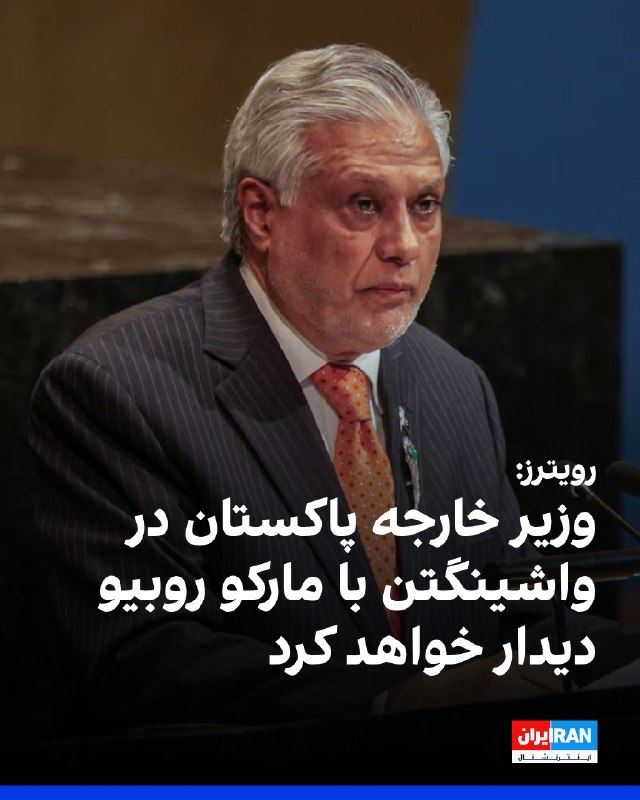

رویترز گزارش داد محمد اسحاق دار، وزیر خارجه پاکستان، جمعه به واشینگتن سفر می‌کند و با مارکو روبیو، وزیر خارجه آمریکا، دیدار خواهد کرد.

این سفر در حالی انجام می‌شود که اسلام‌آباد در تلاش است درباره توافقی برای پایان دائمی جنگ آمریکا و اسرائیل با جمهوری اسلامی مذاکره کند.

وزارت خارجه پاکستان اعلام کرد وزیر خارجه پاکستان و روبیو در این دیدار روابط دوجانبه را بررسی خواهند کرد و درباره تحولات منطقه‌ای و جهانی مورد علاقه دو طرف تبادل نظر می‌کنند.
‌🏁 🇬🇧 IranintlTV

🤖 @VahidOOnLine

## VahidOOnLine — post 242585

  <a href="telegram/content/VahidOOnLine_242585_1779973111.mp4" target="_blank">🎬 Download video</a>

♦️خبرگزاری فرانسه روز پنجشنبه هفتم خرداد اعلام کرد در جریان حمله هوایی اسرائیل به جنوب بیروت یک آپارتمان مسکونی هدف قرار گرفته است.
ویدیوهای منتشر شده از این حمله، غیرنظامیان در حال جمع‌آوری آوار دیده می‌شوند.
برخی از رسانه‌های محلی به نقل از منابعی در ارتش اسرائیل اعلام کردند یکی از فرماندهان ارشد یگان‌های موشکی حزب‌الله هدف این حمله بوده است. هنوز گزارشی درباره نتیجه این عملیات منتشر نشده است.
‌🇸🇦 Indypersian

🤖 @VahidOOnLine

## VahidOOnLine — post 242584

  

با ارسال ویدیو، درباره وضعیت معیشتی، مالی و اشتغال خود در ماه‌های اخیر روایت کنید.
روی لینک زیر کلیک کنید و پیام‌های خود را از طریق مدیا‌بات برای ما بفرستید.

t.me

پیام‌های شما به صورت زیر‌نویس در تلویزیون و همچنین در بخش‌های مختلف‌ خبری منتشر خواهد شد.
‌🏁 🇬🇧 IranintlTV

🤖 @VahidOOnLine

## VahidOOnLine — post 242583

  

♦️سپاه پاسداران روز پنجشنبه هفتم خردادماه با انتشار بیانیه‌ای به مناسبت کشته شدن محمد عوده و عزالدین حداد، دو فرمانده حماس اعلام کرد منطقه جز با محو اسرائیل روی آرامش نمی‌بیند.

سپاه در این بیانیه از حمایت جمهوری اسلامی از «محور مقاومت» تاکید کرد.

این پیام یک روز پس از تهدید دوباره مجتبی خامنه‌ای به نابودی اسرائیل تا ۱۵ سال دیگر صادر شده است.
‌🇸🇦 Indypersian

🤖 @VahidOOnLine

## VahidOOnLine — post 242582

  

در پی حملات موشکی و پهپادی جمهوری اسلامی به کویت، وزارت خارجه قطر در بیانیه‌ای هدف قرار گرفتن کویت با موشک و پهپاد را به‌شدت محکوم کرد و آن را «نقض آشکار حاکمیت» این کشور و «نقض فاحش قوانین بین‌المللی» دانست.

قطر همچنین خواستار جلوگیری از «پیامدهای حملات غیرموجه» و کاهش تنش برای بازگرداندن امنیت و ثبات در سطح منطقه و جهان شد.

وزارت خارجه قطر در ادامه بر «همبستگی کامل» این کشور با کویت تاکید کرد و گفت از هر اقدامی برای حفظ حاکمیت و امنیت کویت حمایت می‌کند.
‌🏁 🇬🇧 IranintlTV

🤖 @VahidOOnLine

## VahidOOnLine — post 242581

  

سایت هرانا خبر داد کیمیا داوودی و تارا داوودی، دو خواهر محبوس در زندان اوین که در جریان اعتراضات دی‌ماه ۱۴۰۴ بازداشت شده بودند، از سوی دادگاه انقلاب تهران به‌ترتیب به ۱۰ و شش سال حبس محکوم شدند.

بر اساس این گزارش، شعبه ۱۵ دادگاه انقلاب تهران به ریاست ابوالقاسم صلواتی، کیمیا داوودی را بابت اتهاماتی از جمله «ارتباط با گروه‌ها و شبکه‌های معاند» و «اجتماع و تبانی علیه امنیت کشور» به ۱۰ سال حبس محکوم کرده است.

هرانا افزود تارا داوودی نیز بابت اتهاماتی از جمله «اجتماع و تبانی علیه امنیت کشور» و «تبلیغ علیه نظام» به شش سال زندان محکوم شده است.

این دو خواهر ۲۴ دی‌ماه ۱۴۰۴، در جریان اعتراضات سراسری در تهران بازداشت شدند و اکنون در بند زنان زندان اوین به سر می‌برند. هرانا نوشت بازداشت آنها با ضرب‌وشتم و اعمال خشونت از سوی نیروهای امنیتی همراه بوده است.
‌🏁 🇬🇧 IranintlTV

🤖 @VahidOOnLine

## VahidOOnLine — post 242580

  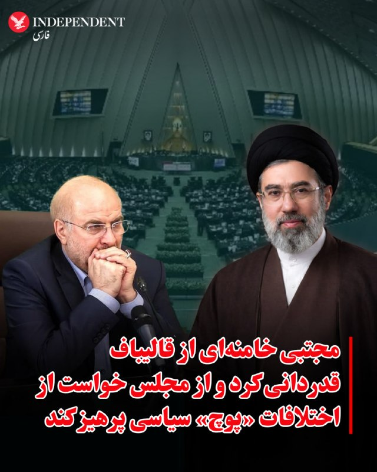

♦️مجتبی خامنه‌ای، سومین رهبر جمهوری اسلامی روز پنجشنبه هفتم خردادماه با انتشار بیانیه‌ای «از تلاش‌های نمایندگان مجلس و خصوصا» محمدباقر قالبیاف،  رئیس مجلس شورای اسلامی و مذاکره‌کننده ارشد در مذاکرات با آمریکا، قدردانی کرد.

 از مجتبی خامنه‌ای از زمان انتصاب به مقام رهبری در اسفندماه سال گذشته هیچ صدا و تصویری منتشر نشده است.

مجتبی خامنه‌ای در این پیام که به مناسبت سومین سالگرد آغار به کار دوازدهمین دوره مجلس شورای اسلامی صادر شده است، از «نخبگان فکری و سیاسی از جمله نمایندگان مجلس» خواست از آنچه «اختلافات پوچ سیاسی و برجسته کردن تفاوت‌های اجتماعی» خواند،  پرهیز کنند.
‌🇸🇦 Indypersian

🤖 @VahidOOnLine

## VahidOOnLine — post 242579

  

رسانه‌های اسرائیل خبر دادند که در حمله به بیروت، علی الحسینی، فرمانده واحد موشکی حزب الله، هدف قرار گرفته است.

همزمان آی۲۴ نیوز نوشت که در حمله به بیروت یک فرمانده یگان موشکی نیروی قدس سپاه پاسداران هدف قرار گرفته است.
همچنین ارتش اسرائیل ضمن اعلام حمله به بیروت، دقایقی پیش حمله‌ای را در بیروت انجام داده است.

ارتش اسرائیل جزئیات بیشتری منتشر نکرده، اما رسانه‌های لبنانی گزارش داده‌اند این حمله در منطقه «الشویفات» در جنوب بیروت رخ داده است.
iranintl
‌🏁 🇬🇧 IranintlTV

🤖 @VahidOOnLine

## WithYashar — post 12789

بنیامین نتانیاهو، نخست وزیر اسرائیل گفت که ارتش این کشور با قدرت به حملات علیه حزب‌الله ادامه خواهد داد.
نتانیاهو اضافه کرد که نیروهای اسرائیل از رودخانه لیتانی در جنوب لبنان عبور کرده‌اند.
@withyashar

## WithYashar — post 12788

خبرگزاری والا به نقل از یک مقام امنیتی اسرائیل: یکی از اهداف در بیروت یک فرمانده ارشد ایرانی بوده است
@withyashar

## WithYashar — post 12787

سنتکام طی بیانیه‌ای ایران را به نقض فاحش آتش‌بس متهم کرد
@withyashar

## WithYashar — post 12786

  

رسانه‌های عبری : «علی الحسینی»، مسئول موشکی حزب‌الله در یگان امام حسین به هلاکت رسید
@withyashar

## WithYashar — post 12785

به گزارش ان. بی. سی نیوز، پس از ارتش اسرائیل، سنتکام فرماندهی مرکزی آمریکا هم بانک اهداف خود در ایران را به روزرسانی کرد و لیستی از جدید از اهداف را تهیه کرد. هدف‌های راحت‌تر مثل رادارهای ثابت، باندها و هواپیماها تا حد زیادی قبلا زده شدن. چیزهایی که مونده بیشتر زیرزمینی، پراکنده یا سیارن و بدون شناسایی دقیق که ادامه درگیری رو سخت‌تر کرده
@withyashar

## WithYashar — post 12784

  

اشتراک Ai موشتبی رو تمدید کردن و موفق شد یه متن طولانی برای سالگرد مجلس بده ، از خالیباف تشکر کرده و به امریکام گفته شیطان بزرگ همین یه امضا بچه ۴ ساله هم با پاورپینت انداختن اون زیر 🤣
@withyashar

## WithYashar — post 12783

  

«روزنامه وال‌استریت ژورنال دیروز گزارش داد که ایران برای دور زدن تحریم‌ها و محاصره آمریکا، از سازوکاری موسوم به انتقال کشتی‌به‌کشتی(Ship-to-Ship) استفاده می‌کند؛ به این صورت که کشتی‌های تحریم‌شده حامل نفت ایران، پیش از ارسال محموله به چین، بار خود را در دریا به کشتی دیگری منتقل می‌کنند.»
@withyashar

## WithYashar — post 12782

  

ارتش اسرائیل دقایقی پیش مجدداً دستور تخلیه فوری کل جنوب لبنان را صادر کرد!
@withyashar

## WithYashar — post 12781

مقام‌های آمریکایی گفتند جمهوری اسلامی چهار پهپاد انتحاری را به سمت کشتی‌های آمریکایی و تجاری شلیک کرد، اما جنگنده‌های آمریکا آن‌ها را سرنگون کردند. به گفته این مقام‌ها، جنگنده‌های اف-۱۸ آمریکا همچنین پیش از پرواز پنجمین پهپاد، واحد کنترل زمینی جمهوری اسلامی را در بندرعباس منهدم کردند.
@withyashar

## WithYashar — post 12780

## WithYashar — post 12779

  

حجم ترافیک اینترنت بین‌الملل، تا ساعت ۷ و نیم صبح امروز به ۵۳ درصد حجم پیش از دی‌ماه ۱۴۰۴ رسیده است
@withyashar
حرفم که گفتم اینترنت فقط با رفتن اینا به حالت قبل بر‌میگرده هنوز پا برجاست !

## WithYashar — post 12778

## WithYashar — post 12777

  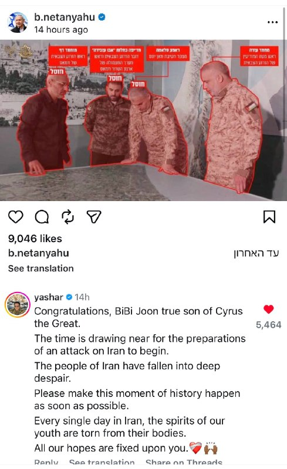

👏👏👏

## WithYashar — post 12776

  

بامداد امروز بعد از شلیک موشک از امیدیه خوزستان به سمت کویت ، صدای انفجار شنیده شده و ستون دود دیده شده که ظاهراً لانچری که موشک ازش شلیک شده بلافاصله توسط ارتش آمریکا مورد هدف قرار گرفته
@withyashar

## WithYashar — post 12775

  

اسرائیل، عزالدین البیک، فرمانده تیپ شمال غزه را به هااکت رساند
@withyashar

## WithYashar — post 12774

  

رویترز: یک گاومیش آلبینو نادر در بنگلادش که به خاطر دسته موی بلوندش «دونالد ترامپ» لقب گرفته بود، پس از اینکه در فضای مجازی دیده شد، از قربانی شدن در عید قربان نجات یافت.
این گاومیش ۷۰۰ کیلوگرمی قبلاً فروخته شده بود، اما دولت به دلیل نگرانی‌های امنیتی و تجمع جمعیت برای دیدن آن، وارد عمل شد.

مقامات پول خریدار را بازگرداندند و حیوان را به باغ‌وحش داکا منتقل کردند.
@withyashar

## WithYashar — post 12773

آمریکا «نهاد مدیریت آبراه خلیج فارس» را تحریم کرد

وزارت خزانه‌داری آمریکا اعلام کرد سازمان تازه تأسیس ایرانی «نهاد مدیریت آبراه خلیج فارس» را به فهرست تحریم‌های خود اضافه کرده است.
@withyashar

## WithYashar — post 12772

  <a href="telegram/content/WithYashar_12772_1779973122.mp4" target="_blank">🎬 Download video</a>

◀️رد موشک های ۳پا در امیدیه خوزستان که به سمت کویت میرفت
@withyashar

## WithYashar — post 12771

اکسیوس: ایران چهارتا پهپاد انتحاری به سمت یک ناو نیروی دریایی آمریکا و یک کشتی تجاری پرتاب کرد نیروهای آمریکایی پهپادها رو رهگیری کردن و همچنین یک واحد پرتاب پهپاد ایرانی دیگه رو روی زمین قبل از اینکه بتوانه شلیک کنه، هدف قرار دادن
@withyashar

## WithYashar — post 12770

فاکس نیوز: آمریکا یه ایستگاه کنترل زمینی ایران رو تو بندرعباس زده؛ همون جایی که قرار بوده یه پهپاد تهاجمی ازش بلند شه.

به گفتهٔ مقام‌های آمریکایی، چهار تا پهپاد انتحاری دیگه هم که تو تنگه هرمز تهدید محسوب می‌شدن، زده شدن.
@withyashar

## mwarmonitor — post 9858

🔴 سخنگوی ارتش اسرائیل: چند لحظه پیش یک حمله هدفمند در بیروت انجام دادیم. @mwarmonitor

## mwarmonitor — post 9857

  <a href="telegram/content/mwarmonitor_9857_1779973123.mp4" target="_blank">🎬 Download video</a>

🔴 سخنگوی ارتش اسرائیل: چند لحظه پیش یک حمله هدفمند در بیروت انجام دادیم.

@mwarmonitor

## mwarmonitor — post 9856

🔴وزارت امور خارجه عراق: ما حملات جنایتکارانه ایران را که خاک کشور کویت را هدف قرار داده‌اند، به شدت محکوم می‌کنیم.

@mwarmonitor

## mwarmonitor — post 9855

🚨در ساعت ۱۰:۱۷ شب به وقت شرقی در تاریخ ۲۷ مه، ایران یک موشک بالستیک به سمت کویت شلیک کرد که توسط نیروهای کویتی با موفقیت رهگیری شد. این نقض آشکار آتش‌بس توسط رژیم ایران، چند ساعت پس از آن رخ داد که نیروهای ایرانی پنج پهپاد تهاجمی یک‌طرفه را پرتاب کردند که تهدیدی آشکار در داخل و اطراف تنگه هرمز ایجاد می‌کردند. همه پهپادها توسط نیروهای آمریکایی با موفقیت رهگیری شدند و همچنین از پرتاب پهپاد ششم از یک مرکز کنترل زمینی ایران در بندرعباس جلوگیری شد.

🚨فرماندهی مرکزی آمریکا (سنتکام) و شرکای منطقه‌ای همچنان هوشیار و محتاط هستند و به دفاع از نیروها و منافع خود در برابر تجاوزات غیرموجه ایران ادامه می‌دهند.

@mwarmonitor

## mwarmonitor — post 9854

  <a href="telegram/content/mwarmonitor_9854_1779973124.mp4" target="_blank">🎬 Download video</a>

📝 این حجم از دنائت و فرومایگی، چیزی جز سقوطِ کاملِ انسانیت نیست؛ موجودی که سال‌ها پشت نقابِ فضل و کمالات قایق رانده، اکنون شرفِ نداشته‌اش را در لجن‌زارِ منفعت‌طلبی به حراج گذاشته است. چطور می‌توان نام انسان را بر این نون‌به‌نرخ‌روز‌خورِ حرامی گذاشت که در اوج جنایات رژیم خونخوار جمهوری اسلامی در ۱۸ و ۱۹ دی، وقتی هزاران نفر را در دو روز به خاک و خون کشیدند، لال‌مانی گرفته بود و اکنون برای بقای قاتلان، ژستِ فیلسوفانه می‌گیرد؟

🔸 نجفیان، تویی که امروز وقاحت را به اوج رسانده‌ای و می‌گویی «وای به حال مردمی که به جای فهم دچار وهم شوند»، خودت تجسمِ عینیِ توهم و بی‌شرفی هستی. کاش حداقل نطفه شیطان بودی؛ چرا که شیطان تکلیفش روشن است و مثل تو با ماسک هنر و کمالات، نان را به نرخ خونِ مظلومان ترید نمی‌کند. این ذاتِ کثیف و فریبکار که در برابر کشتار مردم سکوت کرد، امروز در پیشگاه تاریخ عریان شده و چیزی جز رسوایی، بی‌آبرویی و تفِ لعنتِ ملت را برای خود به ارمغان نیاورده است.

@mwarmonitor

## mwarmonitor — post 9853

📌دبیرکل شورای همکاری خلیج فارس: ما با شدیدترین عبارات، ادامه حملات خائنانه ایران به کشور کویت را محکوم می‌کنیم.

@mwarmonitor

## mwarmonitor — post 9852

🔴 پلیس سوئیس: در پی یک حمله با چاقو در ایستگاه قطار شهر وینترتور، ۳ نفر زخمی شدند.

@mwarmonitor

## mwarmonitor — post 9851

📰 رویترز: گزارش‌هایی از پنتاگون فاش کرده‌اند که نیروهای آمریکایی در طول جنگ از طریق داده‌های موقعیت‌یابی ماهواره ای هدف قرار گرفته‌اند.

@mwarmonitor

## mwarmonitor — post 9850

...طرف اوکراینی‌ها که دارن در برابر متجاوز از خودشون دفاع می‌کنن. و حالا اون خودش مسئول فعال شدن اون ماشه (شروع درگیری) است. بنابراین فکر می‌کنم این فاکتوری هست که در ذهن او وجود داره، هرچند در اینجا به زبان آورده نشده. این فرصت وجود داره که شاید بتونیم به…

## mwarmonitor — post 9849

🔴مجری فاکس نیوز ؛ می‌خواهیم به سراغ ژنرال بازنشسته چهار ستاره ارتش، "جک کین" (Jack Keane) برویم. او رئیس انستیتوی مطالعات جنگ، قائم‌مقام سابق ستاد مشترک ارتش و تحلیلگر ارشد استراتژیک فاکس نیوز است. ژنرال کین، بسیار خوشحالیم که امروز شما را همراه خود داریم.»…

## mwarmonitor — post 9848

🔴مجری فاکس نیوز ؛ می‌خواهیم به سراغ ژنرال بازنشسته چهار ستاره ارتش، "جک کین" (Jack Keane) برویم. او رئیس انستیتوی مطالعات جنگ، قائم‌مقام سابق ستاد مشترک ارتش و تحلیلگر ارشد استراتژیک فاکس نیوز است. ژنرال کین، بسیار خوشحالیم که امروز شما را همراه خود داریم.»
«می‌دانید، من در واقع می‌خواهم برنامه را با نشان دادن این نقل قول به همه کسانی که از خانه ما را تماشا می‌کنند شروع کنم؛ زیرا ما شاهد مطرح شدن هر دو جنبه این استدلال هستیم و تلاش می‌کنیم بفهمیم که آیا اصلاً جای انعطاف و تعدیلی در اینجا وجود دارد یا خیر. اما فکر می‌کنم این نقل قول از سوی رهبری ایران، تا حدودی کمک‌کننده باشد. آن‌ها همیشه به نوعی یک ساز را می‌زنند (یک حرف را تکرار می‌کنند)، اما فقط می‌خواهم این نکته را روشن کنم که این رهبر جدید اساساً همان چیزی را می‌گوید که آن‌ها در تمام این مدت می‌گفتند.»
مجری در حال خواندن متن روی تصویر:
«بنابراین، این بیانیه‌ای از سوی آیت‌الله مجتبی خامنه‌ای است که در طول ایام حج—یکی از بالاترین مراسم‌های مذهبی آن‌ها—بیان شده است. او می‌گوید: "عقربه‌های زمان به عقب برنخواهند گشت و ملت‌ها و سرزمین‌های منطقه دیگر به عنوان سپری برای پایگاه‌های ایالات متحده عمل نخواهند کرد. ایالات متحده نه تنها دیگر پناهگاه امنی برای شرارت‌های خود نخواهد داشت..."»
مجری در حال خواندن ادامه متن:
«"...و همچنین برای ایجاد پایگاه‌های نظامی در منطقه؛ بلکه روز به روز از موقعیت پیشین خود دورتر و دورتر می‌شود." و او در ادامه به نوعی به تخریب اسرائیل نیز می‌پردازد که البته غافلگیری بزرگی هم نیست.»
«برداشت شما از موقعیتی که آن‌ها اکنون در آن قرار دارند چیست؟ آیا این واقعاً یک رژیم جدید است؟ و آیا همان‌طور که امروز از رئیس‌جمهور شنیدیم، ما در اینجا با افراد منطقی‌تری طرف هستیم، ژنرال؟»

🔵ژنرال جک کین:
«بله، منظورم این است که... تلاش برای گمانه‌زنی در مورد اینکه در چه موقعیتی هستیم تقریباً بی‌ثمر است؛ زیرا می‌دانید که این جناح‌ها در داخل ایران وجود دارند. تندروها یک چیز می‌گویند و مذاکره‌کنندگان چیز دیگری می‌گویند.»
«و هر کسی هر از گاهی میکروفون را به دست می‌گیرد و آن را در بوق و کرنا می‌کند و شما چیزی شبیه به آنچه او (رهبر ایران) همین الان گفت یا برخی تندروهای دیگر می‌گویند را می‌شنوید که: "هیچ راهی وجود ندارد که ما در اینجا به توافق برسیم." اما این‌ها کسانی نیستند که با مذاکره‌کنندگان ما گفتگو می‌کنند.»
«فکر می‌کنم مهم است که بدانیم اصلاً چگونه به اینجا رسیده‌ایم؟ منظورم این است که واقعیت این است که زمان زیادی از آن گذشته است—یک هفته پیش—که ما در آستانه بازگشت به عملیات‌های نظامی بودیم؛ و من صادقانه معتقدم که رئیس‌جمهور همین را می‌خواست. من می‌دانم که موضع من و برخی دیگر نیز همین بود؛ و ما معتقد بودیم که این بهترین گزینه در دسترس ما در آن زمان بود.»
«اما اتفاقی که در اینجا افتاد این است که نخست‌وزیرِ... رهبریِ پاکستان و قطر و برخی دیگر نزد رئیس‌جمهور آمدند و معتقد بودند پس از گفتگو با ایرانی‌ها و فشاری که ایرانی‌ها حس می‌کردند، فرصتی برای دستیابی به یک توافق در اینجا وجود دارد.»
«بنابراین رئیس‌جمهور چه کار کرد؟ او به آن حرف‌ها گوش داد و به غریزه خود اعتماد کرد. می‌دانید، یکی از چیزهایی که در این رئیس‌جمهور ثابت است—اگر به آنچه می‌گوید توجه کنید—وقتی صحبت می‌کند، او می‌خواهد درباره توقف جنگ صحبت کند. او در واقع فراتر از این می‌رود و می‌گوید: "من می‌خواهم کشتار را متوقف کنم."»
«و حالا او خودش مسئول فعال کردن آن کشتار است. وقتی شنیدید که او در مورد اوکراین بارها و بارها می‌گفت: "من می‌خواهم کشتار را متوقف کنم"، او داشت درباره هر دو طرف صحبت می‌کرد؛ نه فقط یک طرف...

@mwarmonitor

## mwarmonitor — post 9847

## mwarmonitor — post 9846

  <a href="telegram/content/mwarmonitor_9846_1779973126.mp4" target="_blank">🎬 Download video</a>

🔴فرماندهی جنوبی ایالات متحده یک شناور را در شرق اقیانوس آرام هدف قرار داد.
بر اساس اطلاعات نهادهای اطلاعاتی آمریکا، این شناور در مسیرهای شناخته‌شده قاچاق مواد مخدر فعالیت می‌کرد و توسط یک سازمان تروریستی مورد استفاده قرار گرفته بود.

@mwarmonitor

## mwarmonitor — post 9845

🔴«یک آژانس کشتیرانی اعلام کرد: پهپادها به سه نفتکش در دریای سیاه، در نزدیکی سواحل ترکیه، حمله کردند.»

@mwarmonitor

## mwarmonitor — post 9844

📰 بلومبرگ:
دونالد ترامپ نسخه جدیدی از شکایت قضایی ۱۰ میلیارد دلاری خود را به اتهام افترا علیه روزنامه وال استریت ژورنال و شرکت مادر آن نیوز کورپ ثبت کرده است. این شکایت به دلیل انتشار مقاله‌ای درباره روابط نزدیک ادعایی او با جفری اپستین مطرح شده است.

@mwarmonitor

## mwarmonitor — post 9843

📰 پولیتیکو:
به گزارش پولیتیکو، نیروها و تسلیحات نظامی آمریکا برای حمله به کوبا آماده هستند و تنها چیزی که باقی مانده، دستور نهایی از سوی دونالد ترامپ است.

@mwarmonitor

## mwarmonitor — post 9842

📊 داده‌های معاملاتی:
قیمت‌های جهانی نفت صبح روز پنج‌شنبه حدود ۴ درصد افزایش یافت؛ این رشد در حالی رخ داده که انتظار می‌رود اختلالاتی در عبور نفتکش‌ها از تنگه هرمز ایجاد شود.

@mwarmonitor

## mwarmonitor — post 9841

صبح امروز به کویت حمله موشکی شد ، مثل دیشب این نقض آتش بس نبوده و فقط یک احوال پرسی دیپلماتیک بود

## FoxNewsTwitter — post 342339

  <a href="telegram/content/FoxNewsTwitter_342339_1779973127.mp4" target="_blank">🎬 Download video</a>

Fox News (Twitter/X)

“They’re trying to get me elected so they can move back.”

L.A. mayoral candidate Spencer Pratt reveals the strong support his campaign is getting from former Angelenos who feel they were pushed out of the city.

“L.A. is incredible when you don’t let drug addicts take over the street and make moms and kids scared to go to parks or the school.” | @foxandfriends

## FoxNewsTwitter — post 342338

  <a href="telegram/content/FoxNewsTwitter_342338_1779973129.mp4" target="_blank">🎬 Download video</a>

Fox News (Twitter/X)

JUST IN: Los Angeles mayoral candidate Spencer Pratt says he never wanted to become mayor before, but felt the need to step up because the city deserves a leader who tells the truth.

"I don't do national politics. I don't do parties. I just say, look, they're stealing all of our tax money to give it to drug addicts, to have needles and tourniquets, and they're actually even selling the drugs to these addicts to let these people die on our sidewalks."

"I want to be the compassionate one. Get these people mandatory treatment, medical treatment with doctors to help them get off of fentanyl and super meth."

"These people have failed us. They've spent all of our tax money to increase problems... I never wanted to be the mayor. I just wanted somebody to tell the truth." | @foxandfriends

## FoxNewsTwitter — post 342337

  <a href="telegram/content/FoxNewsTwitter_342337_1779973131.mp4" target="_blank">🎬 Download video</a>

Fox News (Twitter/X)

NEW: DHS Secretary Markwayne Mullin warns sanctuary cities could start seeing major disruptions to international flights as federal agents are redirected to deal with violent protests that have been targeting law enforcement and ICE facilities:

"When we have situations, what's happening in new Jersey right now, when we have to prioritize where we put federal employees because local law enforcement won't help protect their streets.”

“We're not going to halt the flights, what we're saying is we just won't be able to process them because we don't have officers there. We're going to pull out our Customs and Border Patrol officers that process these flights and put them in these facilities to help protect our employees coming out of work.”

## FoxNewsTwitter — post 342336

  <a href="telegram/content/FoxNewsTwitter_342336_1779973132.mp4" target="_blank">🎬 Download video</a>

Fox News (Twitter/X)

NEW: CENTCOM says Iran carried out an “egregious ceasefire violation” overnight, launching a ballistic missile toward Kuwait and multiple attack drones near the Strait of Hormuz.

The missile was intercepted by Kuwaiti forces while the U.S. took out five drones and prevented a sixth launch from Bandar Abbas.

President Trump still has faith a deal can happen, but he’s signaling he’s willing to finish the job if Iran keeps pushing.

@madeleinerivera reports the latest.

## FoxNewsTwitter — post 342335

  <a href="telegram/content/FoxNewsTwitter_342335_1779973134.mp4" target="_blank">🎬 Download video</a>

Fox News (Twitter/X)

NOW: VP Vance and Second Lady Usha Vance deboard from Air Force Two.

The vice president will speak at the United States Air Force Academy's 68th graduation ceremony on Thursday.

Hundreds of cadets will be commissioned as officers during the ceremony, and the Air Force Thunderbirds are scheduled to perform a flyover, the U.S. Air Force Academy says.

## FoxNewsTwitter — post 342334

  <a href="telegram/content/FoxNewsTwitter_342334_1779973136.mp4" target="_blank">🎬 Download video</a>

Fox News (Twitter/X)

Jill Biden is now admitting she feared something was seriously wrong with Joe Biden during his 2024 debate against Donald Trump.

“I thought, ‘Oh, my God, he’s having a stroke,’” the former first lady recalled in a new interview. She said she'd never seen him like that before, and hasn't seen him like that since.

Her alarm is a sharp contrast to her public reaction immediately after the debate, when she praised Biden for doing "such a great job" and answering "every question."

The debate meltdown ultimately triggered weeks of panic inside the Democratic Party, which resulted in Biden dropping out of the race.

## FoxNewsTwitter — post 342333

Fox News (Twitter/X)

WATCH LIVE: Texas Senate nominee James Talarico holds general election kick-off rally in Houston https://twitter.com/i/broadcasts/1qKVmmwNMjVxB

## FoxNewsTwitter — post 342332

  

Fox News (Twitter/X)

BREAKING: The U.S. struck an Iranian ground control station in Bandar Abbas that was about to launch an attack drone, officials tell FOX News.

Four other Iranian one-way attack drones that posed a threat in the Strait of Hormuz were also shot down, the officials said.

"These actions were measured, purely defensive, and intended to maintain the ceasefire."

## pm_afshaa — post 91738

ابوترابی، نماینده مجلس: آمریکا بعد از جام جهانی و انتخابات کنگره دوباره حمله می‌کند

💧 Rainbet.com the #1 Non-KYC Crypto Casino & Sportsbook @rainbetcom

😁 @Pm_Afshaa

## pm_afshaa — post 91737

https://t.me/boost/pm_afshaa

## pm_afshaa — post 91736

https://t.me/boost/pm_afshaa

## pm_afshaa — post 91735

🔴جروزالم پست: کشورهای حوزه خلیج فارس احتمالاً درخواست ترامپ برای پیوستن به توافق‌نامه ابراهیم را جدی نمی‌گیرند و آن را «زودهنگام» می‌دانن

💧 Rainbet.com the #1 Non-KYC Crypto Casino & Sportsbook @rainbetcom

😁 @Pm_Afshaa

## pm_afshaa — post 91734

🔴رویترز:ترامپ گفت، نسبت به پیامدهای سیاسی یک درگیری طولانی‌مدت با ایران هیچ نگرانی ندارد و رهبران ایران اشتباه محاسبه کرده‌اند اگر تصور می‌کنند انتخابات میان‌دوره‌ای نوامبر او را مجبور به پذیرش یک معامله خواهد کرد

💧 Rainbet.com the #1 Non-KYC Crypto Casino & Sportsbook @rainbetcom

😁 @Pm_Afshaa

## pm_afshaa — post 91733

  <a href="telegram/content/pm_afshaa_91733_1779973138.webm" target="_blank">🎬 Download video</a>

PMTV NEWS🦁☀️.npvt

## pm_afshaa — post 91732

  <a href="https://t.me/pm_afshaa/91732" target="_blank">📎 Download file</a>

نپسترنت مناسب اینستا و دانلود

💧 Rainbet.com the #1 Non-KYC Crypto Casino & Sportsbook @rainbetcom

😁 @Pm_Afshaa

## pm_afshaa — post 91731

حملات ارتش اسراییل به بیروت 
💧 Rainbet.com the #1 Non-KYC Crypto Casino & Sportsbook @rainbetcom 
😁 @Pm_Afshaa

## pm_afshaa — post 91730

🔴سنتکام حمله ایران با یک عدد موشک بالستیک به کویت را نقض فاحش آتش‌بس خواند

💧 Rainbet.com the #1 Non-KYC Crypto Casino & Sportsbook @rainbetcom

😁 @Pm_Afshaa

## pm_afshaa — post 91729

  <a href="telegram/content/pm_afshaa_91729_1779973139.mp4" target="_blank">🎬 Download video</a>

حملات ارتش اسراییل به بیروت

💧 Rainbet.com the #1 Non-KYC Crypto Casino & Sportsbook @rainbetcom

😁 @Pm_Afshaa

## pm_afshaa — post 91728

سخنگوی شهرداری تهران : مترو و BRT همچنان رایگان است

💧 Rainbet.com the #1 Non-KYC Crypto Casino & Sportsbook @rainbetcom

😁 @Pm_Afshaa

## pm_afshaa — post 91727

پروکسیا و سرورا رو بفرستین برا دوستاتون اونا هم وصل شن

## pm_afshaa — post 91726

راستی واسه پروکسی های که میفرستی مرسی😂

## pm_afshaa — post 91725

سلام خواستم تشکرکنم بابت کانفیگ وپروکسی هایی که توچنلتون میزاریدواقعاعالیه❤️

## pm_afshaa — post 91724

https://t.me/proxy?server=tg.capycore.ru&port=443&secret=27ebe852539fb8ec5f327c73262bb721

💧 Rainbet.com the #1 Non-KYC Crypto Casino & Sportsbook @rainbetcom

😁 @Pm_Afshaa

## pm_afshaa — post 91723

https://t.me/proxy?server=tg.capycore.ru&port=443&secret=27ebe852539fb8ec5f327c73262bb721

پروکسی متصل سرعت بالا

💧 Rainbet.com the #1 Non-KYC Crypto Casino & Sportsbook @rainbetcom

😁 @Pm_Afshaa

## pm_afshaa — post 91722

https://t.me/proxy?server=arezoni9.ir&port=15&secret=ee1603010200010001fc030386e24c3add63646e2e79656b74616e65742e636f6d

پروکسی سرعت بالا متصل

💧 Rainbet.com the #1 Non-KYC Crypto Casino & Sportsbook @rainbetcom

😁 @Pm_Afshaa

## pm_afshaa — post 91721

https://t.me/proxy?server=195.254.165.4&port=8443&secret=EERighJJvXrFGRMCIMJdCQ%3D%3D

پروکسی پر سرعت مخصوص دانلود

💧 Rainbet.com the #1 Non-KYC Crypto Casino & Sportsbook @rainbetcom

😁 @Pm_Afshaa

## pm_afshaa — post 91720

🔴ارتش اسرائیل دقایقی پیش مجدداً دستور تخلیه فوری کل جنوب لبنان را صادر کرد

💧 Rainbet.com the #1 Non-KYC Crypto Casino & Sportsbook @rainbetcom

😁 @Pm_Afshaa

## pm_afshaa — post 91719

  

طبق اخبار حسن شاهوار پور فرمانده سپاه ولی‌عصر خوزستان در حمله دیشب آمریکا به درک واصل شده

💧 Rainbet.com the #1 Non-KYC Crypto Casino & Sportsbook @rainbetcom

😁 @Pm_Afshaa

## DEJradio — post 5072

⭕️ وال‌استریت ژورنال: رژیم با سنجش توان تاب‌آوری اقتصادی خود، میزان امتیازدهی به آمریکا را تنظیم می‌کند

به گزارش وال‌استریت ژورنال، تهران می‌خواهد با توجه به میزان تاب آوری در برابر فشارهای اقتصادی، دادن و گرفتن امتیازها را در جریان مذاکرات تنظیم کند.
این روزنامۀ آمریکایی گزارش داد جمهوری اسلامی پس از جنگ و محاصرۀ دریایی آمریکا در اقتصاد با بحرانی عمیق‌تر از پیش روبه‌رو شده است.
وال‌استریت ژورنال نوشت کاهش درآمدهای نفتی و محدودیت ذخیره‌سازی نفت خام، خطر تعطیلی برخی چاه‌های نفت را افزایش می‌دهد.
بنا بر این گزارش، افزایش قیمت کالاهای اساسی، رشد بیکاری و سقوط ارزش ریال، نگرانی مقام‌های جمهوری اسلامی از ناآرامی‌های تازه را بیشتر کرده است.
وال‌استریت ژورنال همچنین گزارش داد بیش از یک میلیون نفر در جریان جنگ و پیامدهای اقتصادی آن بیکار شدند.
این روزنامه نوشت جمهوری اسلامی با وجود فشارهای داخلی، همچنان تلاش می‌کند بدون دادن امتیازهای گسترده، مذاکره با آمریکا را پیش ببرد.

#خبر #دژ
@DEJradio

## DEJradio — post 5071

⭕️ جمعیت زیر خط فقر در ایران از ۴۰ میلیون نفر عبور می‌کند

شماری از کارشناسان اقتصاد و استاد دانشگاه در ایران هشدار دادند که در سال جاری شمار افراد زیر خط فقر از چهل میلیون تن عبور می‌کند.
حجت میرزایی، عضو هیئت علمی دانشگاه علامه طباطبایی، گفت با کاهش شدید صادرات نفت و ادامۀ محاصرۀ دریایی، رشد اقتصادی ایران بین منفی ۸.۸ تا منفی ۱۰ درصد برآورد می‌شود.
او افزود پیش‌بینی‌ها نشان می‌دهد بین ۳.۵ تا ۴.۵ میلیون نفر دیگر به جمعیت فقیر کشور اضافه می‌شود.
اقتصاددانان همچنین از افزایش بیکاری، رشد پدیدۀ «شاغلان فقیر» و بلندتر شدن دوره‌های بیکاری در ایران خبر دادند.

#خبر #دژ #فقر
@DEJradio

## DEJradio — post 5070

⭕️تهران پس از تهدید ترامپ علیه عمان با این کشور اعلام همبستگی کرد

اسماعیل بقائی، سخنگوی وزارت امور خارجۀ جمهوری اسلامی، پس از تهدید دونالد ترامپ علیه عمان، با مسقط اعلام همبستگی کرد.
تهران همچنین تهدیدهای رئیس جمهوری آمریکا علیه عمان را محکوم کرده است.
دونالد ترامپ، رئیس‌ جمهوری ایالات متحده به عمان هشدار داده بود اگر بخواهد {با جمهوری اسلامی} تنگۀ هرمز را کنترل کند، توسط آمریکا نابود می‌شود.
اسماعیل بقائی همچنین مدعی شد حملات بامداد پنج‌شنبۀ آمریکا به مناطقی در بندرعباس «نقض فاحش حقوق بین‌الملل و منشور ملل متحد» است.
بقائی در مورد پهپادهایی که علیه ارتش آمریکا به پرواز درآمده بودند و رهگیری و نابود شدند، توضیحی نداد و تنها مدعی «نقض مستمر آتش‌بس» از سوی آمریکا شد.

#خبر #دژ #عمان
@DEJradio

## DEJradio — post 5069

  <a href="telegram/content/DEJradio_5069_1779973140.webm" target="_blank">🎬 Download video</a>

🚨📢 یکشنبه شب سوم خرداد ماه ۱۴۰۵ «علیرضا تمسکنی زاهدی» از نیروهای پلیس اطلاعات و امنیت استان گلستان، حین گشت‌زنی در محله اوزینه گرگان، مقابل چشمان همکارانش با اسلحه سازمانی کلاشنیکف به زندگی خود پایان داد.

رضا تمیزکار از پرسنل پیشین پلیس با اعلام این خبر به نقل از همکاران او گفت علت این تصمیم، "فشار شدید کاری، تحقیر، برخوردهای فرماندهان و فضای فرسایشی حاکم بر بدنه پلیس است که پرسنل را به این نقطه رسانده است."

تمیزکار می‌گوید، این حادثه؛ نشانه بحرانی عمیق در ساختاری است که حتی نیروهای خودش را هم از نظر روحی و روانی فرسوده کرده. افزایش فشار، بی‌انگیزگی و فروپاشی روحیه در میان نیروهای انتظامی در شهرها و شهرستان‌های مختلف، دیگر قابل کتمان نیست.

#اطلاعات #خودکشی
@DEJradio

## DEJradio — post 5068

⭕️ گزارش صداوسیما دربارۀ تفاهم تهران و واشینگتن کاملا ساختگی بود

کاخ سفید گزارش صداوسیمای جمهوری اسلامی دربارۀ پیش‌نویس تفاهم میان تهران و واشینگتن را نادرست دانست.
بنا بر اعلام دولت آمریکا، گزارش تلویزیون حکومت جمهوری اسلامی «کاملا ساختگی» است.
تلویزیون حکومت جمهوری اسلامی پیش‌تر مدعی شده بود پیش‌نویس توافق شامل رفع محاصرۀ دریایی بنادر جنوبی ایران، بازگشایی تنگۀ هرمز و خروج نیروهای آمریکایی از منطقه است.
کاخ سفید در بیانیه‌ای تأکید کرد هیچ‌کس نباید به گزارش رسانه‌های حکومت جمهوری اسلامی اعتماد کند.
مذاکرات میان تهران و واشینگتن با میانجی‌گری کشورهای منطقه ادامه دارد.

#خبر #دژ #مذاکرات
@DEJradio

## DEJradio — post 5067

⭕️ سامانه‌های پدافندی کویت تهدیدهای موشکی و پهپادی تازه را رهگیری کردند

ارتش کویت بامداد پنج‌شنبه اعلام کرد سامانه‌های پدافند هوایی این کشور تهدیدهای موشکی و پهپادی‌ را رهگیری کرده‌اند.
ارتش کویت بدون اعلام منشأ تهدیدها، خبر داد صدای انفجارهایی که به گوش رسیده، به دلیل رهگیری‌های پدافندی است.
این بیانیه ساعاتی پس از حملات آمریکا به اهدافی در جنوب ایران و به چهار پهپاد جمهوری اسلامی، منتشر شد.
سپاه اعلام کرده بود در واکنش به حملۀ آمریکا، یک پایگاه هوایی این کشور در منطقه را هدف گرفته است.

#خبر #دژ #کویت
@DEJradio

## DEJradio — post 5066

⭕️ آمریکا نهاد مدیریت آبراه خلیج فارس را به‌دلیل ارتباط با سپاه تحریم کرد

وزارت خزانه‌داری آمریکا نهاد تازه تشکیل شدۀ موسوم به «مدیریت آبراه خلیج فارس» را به‌دلیل ارتباط با سپاه پاسداران تحریم کرد.
تحریم این نهاد بر اساس رویۀ عملیات ضدتروریسم، انجام شد.
واشینگتن نهاد «مدیریت آبراه خلیج فارس» را بخشی از تلاش سپاه برای درآمدزایی از مسیر تنگۀ هرمز و دریافت عوارض از کشتی‌های عبوری عنوان کرد.
وزارت خزانه‌داری آمریکا هشدار داد هر فرد یا نهادی که با این سازمان همکاری کند، ممکن است هدف تحریم قرار بگیرد.
اسکات بسنت، وزیر خزانه‌داری آمریکا، گفت تازه‌ترین اقدامات جمهوری اسلامی در تنگۀ هرمز نشان می‌دهد رژیم حاکم بر ایران بیش از پیش به منابع مالی نیاز دارد.

#خبر #دژ #تحریم
@DEJradio

## DEJradio — post 5065

⭕️ ادعای نمایندۀ مجلس شورای اسلامی: بازگشایی اینترنت خلاف قانون است

احمد راستینه، سخنگوی کمیسیون فرهنگی مجلس شورای اسلامی گفت بازگشایی اینترنت «خلاف قانون» است. به گفتۀ او شماری از وظایف ستاد ساماندهی فضای مجازی، با شورای عالی فضای مجازی تداخل دارد.
احمد راستینه رأی دیوان «عدالت» اداری برای توقف فعالیت این ستاد را از نظر حقوقی «درست و دقیق» خواند.
دیوان عدالت اداری پیش‌تر اعلام کرده بود اجرای مصوبۀ تشکیل ستاد ساماندهی فضای مجازی تا زمان رسیدگی پایانی متوقف می‌شود.

#خبر #دژ #اینترنت
@DEJradio

## DEJradio — post 5064

⭕️ با وجود اتصال اینترنت در ایران همچنان به‌شدت زیر فیلتر قرار دارد

نت‌بلاکس، نهاد ناظر بر دسترسی اینترنت در جهان، اعلام کرد با وجود برقراری اتصال به اینترنت در ایران، کاربران همچنان با فیلترینگ شدید مواجه‌اند.
این نهاد جهانی پایش اینترنت گزارش داد وضعیت کنونی مانند دوره‌ای کوتاه پس از اعتراضات سراسری دی‌ماه است. در آن دوره اینترنت جهانی به‌صورت محدود و ناپایدار در دسترس قرار گرفته بود.
بر اساس داده‌ها حجم ترافیک اینترنت بین‌الملل ایران تا بامداد پنج‌شنبه به حدودا ۵۳ درصد از سطح پیش از اعتراضات دی‌ماه ۱۴۰۴ رسید.
نت‌بلاکس نوشت هنوز مشخص نیست اینترنت به وضعیت عادی برمی‌گردد یا محدودیت‌ و اختلال‌ ادامه پیدا می‌کند.

#خبر #دژ #اینترنت
@DEJradio

## DEJradio — post 5063

  <a href="telegram/content/DEJradio_5063_1779973141.mp4" target="_blank">🎬 Download video</a>

🔺🎥 آتش‌سوزی در برج‌ پامچال؛ بنیاد تعاون آجا بساز بنداز است

برج پامچال ارتش واقع در منطقه ۲۲ تهران (چیتگر) روز چهارشنبه ششم خرداد دچار آتش‌سوزی شد. تحت تاثیر آتش‌سوزی‌های مداوم انفجارها و آتش‌سوزی‌های زنجیره‌ای در مناطق و شهرک‌های نظامی، برخی مدعی شدند که این حادثه نیز یک حذف هدفمند بود. با این همه بررسی‌های اولیه نشان می‌دهد آتش‌سوزی ناشی از شعله‎ور شدن نمای کامپوزیتی ساختمان بوده است. یک منبع داخلی به دژ می‌گوید، «هنوز مشخص نیست پشت ماجرا چه بوده، اما در اینکه بنیاد تعاون آجا بساز بنداز است شک نکنید.»

#آتشسوزی #چیتگر
@DEJradio

## DEJradio — post 5062

⭕️ ترامپ: نه تحریم را لغو می‌کنیم نه به تهران پول می‌دهیم؛ کار را یکسره می‌کنیم

دونالد ترامپ، رئیس جمهوری آمریکا گفت در مذاکرات جاری با تهران، صحبتی درباره کاهش تحریم‌ها یا انتقال پول به جمهوری اسلامی مطرح نیست.
او تأکید کرد آمریکا کنترل دارایی‌های مسدودشده ایران را حفظ می‌کند. به گفتۀ ترامپ، هر زمان اداره کنندگان ایران رفتار درستی در پیش بگیرند، اجازه داده می‌شود که به پول‌ها دسترسی پیدا کنند.
دونالد ترامپ همچنین گفت آمریکا هنوز از وضعیت توافق احتمالی خشنود نیست، اما جمهوری اسلامی بسیار مایل است به توافق برسد.
رئیس جمهوری آمریکا هشدار داد اگر توافقی به‌دست نیاید، واشینگتن کار را یکسره می‌کند.

#دژ #خبر #ترامپ #مذاکرات #تحریم
@DEJradio

## DEJradio — post 5061

⭕️ روبیو: در مذاکراه با تهران مقداری پیشرفت رخ داد

مارکو روبیو، وزیر امور خارجۀ آمریکا در بامداد پنج‌شنبه گفت در مذاکره با جمهوری اسلامی برای رسیدن به توافق «مقداری پیشرفت» رخ داده است.
او افزود طی ساعت‌ها چند روز آینده مشخص می‌شود امکان پیشروی بیش‌تر وجود دارد یا نه.
مارکو روبیو تأکید کرد جمهوری اسلامی هرگز به سلاح هسته‌ای دست پیدا نمی‌کند.
وزیر خارجه آمریکا گفت اولویت دولت ترامپ همچنان دیپلماسی است.

#خبر #دژ #مارکو_روبیو #مذاکرات
@DEJradio

## DEJradio — post 5060

⭕️ اسرائیل از جنوب لبنان تا رود زهرانی را منطقۀ جنگی اعلام کرد

ارتش اسرائیل اعلام کردهمۀ مناطق جنوب رود زهرانی در لبنان، در فاصلۀ حدودا ۴۰ کیلومتری مرز اسرائیل، منطقۀ جنگی به شمار می‌رود.
اویخای ادرعی، سخنگوی عرب‌زبان ارتش اسرائیل از ساکنان این مناطق خواست تا به شمال رود زهرانی بروند.
ارتش اسرائیل دلیل این تصمیم را نقض مکرر آتش‌بس از سوی حزب‌الله عنوان کرد.
شبه‌نظامیان حزب‌الله که از سوی جمهوری اسلامی پشتیبانی می‌شوند، در سیاهۀ تروریستی آمریکا و اتحادیۀ اروپا قرار دارند.
ایال زمیر، رئیس ستاد ارتش اسرائیل گفت این کشور شدت عملیات علیه حزب‌الله را افزایش می‌دهد و ضرباتی سهمگین‌تر به آنها وارد می‌کند.

#خبر #دژ #اسرائیل
@DEJradio

## DEJradio — post 5059

⭕️ روسیه بازگشت کارکنان خود به نیروگاه بوشهر را به تعویق انداخت

روس‌اتم، سازمان دولتی انرژی هسته‌ای روسیه اعلام کرد بازگشت کارکنانش به نیروگاه هسته‌ای بوشهر را به تعویق می‌اندازد.
الکسی لیخاچف، مدیرعامل روس‌اتم گفت اخبار ضدونقیض دربارۀ مذاکرات جمهوری اسلامی و آمریکا و حملاتی که به نقاطی از ایران انجام شد، دلیل این تصمیم بوده است.
او افزود ولادیمیر پوتین، رئیس جمهوری روسیه در جریان این تصمیم قرار گرفته و آن را تأیید کرده است.
روس‌اتم در دوران جنگ چهل روزه ۸۱۳ نفر از کارکنان خود را از نیروگاه بوشهر خارج کرد و تنها ۲۰ تن را برای حفظ ایمنی و ادامۀ فعالیت نیروگاه، در محل نگه داشت.

#خبر #دژ #روسیه #ایران
@DEJradio

## DEJradio — post 5058

🔺 جنگ خاورمیانه مسیر سرمایه‌گذاری جهانی در انرژی را تغییر داد

آژانس جهانی انرژی اعلام کرد بحران خاورمیانه کشورها را به سمت تنوع‌بخشی به منابع و مسیرهای انرژی سوق داده است.
فاتح بیرول، مدیر اجرایی آژانس، وضعیت کنونی را بزرگ‌ترین بحران امنیت انرژی در جهان، عنوان کرد.
آژانس جهانی انرژی پیش‌بینی کرد بخش عمدۀ سرمایه‌گذاری جهانی انرژی در سال ۲۰۲۶ در برق و همچنین در انرژی هسته‌ای و تجدیدپذیر، انجام شود.
این نهاد جهانی پیش‌بینی کرد سرمایه‌گذاری در انرژی جهانی در سال جاری به ۳.۴ تریلیون دلار برسد.
بنا بر این گزارش، سرمایه‌گذاری در نفت برای سومین سال پیاپی کاهش پیدا می‌کند، اما سرمایه‌گذاری در گاز طبیعی امسال به بالاترین سطح در یک دهۀ اخیر می‌رسد.

#خبر #دژ #خاورمیانه #انرژی
@DEJradio

## DEJradio — post 5057

⭕️ سنتکام چهار پهپاد انتحاری جمهوری اسلامی را در نزدیکی تنگۀ هرمز سرنگون کرد

سنتکام، ستاد فرماندهی مرکزی ارتش آمریکا اعلام کرد در بامداد پنج‌شنبه چهار پهپاد انتحاری جمهوری اسلامی را که در اطراف تنگۀ هرمز «تهدید ایجاد کرده بودند» سرنگون کرده است.
سنتکام همچنین گفت یک ایستگاه کنترل پهپادی در بندرعباس را پیش از پرتاب پهپاد پنجم هدف قرار داده است.
سپاه پاسداران ادعا کرد یک پایگاه هوایی آمریکا را در پاسخ به آنچه «تعرض» خواند، هدف قرار داده است.
روایت سپاه از هدف گرفتن پایگاه آمریکایی هنوز توسط منابع محلی تأیید نشده است.

#خبر #دژ #سنتکام #تنگه_هرمز
@DEJradio

## DEJradio — post 5056

⭕️ افزایش دوبارۀ بهای نفت در پی حملات شبانه در تنگۀ هرمز

بهای نفت در معاملات پنج‌شنبه، در پی حملات تازه میان آمریکا و جمهوری اسلامی، بار دیگر افزایش یافت.
بهای نفت برنت با رشد ۱.۸ درصدی به حدود ۹۶ دلار رسید. همچنین هر بشکه نفت خام آمریکا روز پنج‌شنبه بیش از ۹۰ دلار معامله شد.
از سویی اکثر بورس‌های آسیایی از جمله هنگ‌کنگ، سئول و شانگهای با کاهش شاخص قیمت روبه‌رو شد.

#خبر #دژ #نفت #تنگه_هرمز
@DEJradio

## DEJradio — post 5055

⭕️ هشدار ترامپ به عمان: اگر بخواهید تنگۀ هرمز را کنترل کنید، نابودتان می‌کنیم

دونالد ترامپ، رئیس جمهوری آمریکا گفت در چارچوب توافق احتمالی با جمهوری اسلامی، تنگۀ هرمز باید بی‌درنگ باز شود و در کنترل هیچ کشوری نباشد.
ترامپ گفت آمریکا بر آبراه هرمز نظارت می‌کند، اما اجازه نمی‌دهد هیچ کشوری کنترل آن را در دست بگیرد.
ترامپ با اشاره به عمان گفت:آنها هم باید مانند بقیه رفتار کنند، وگرنه مجبور می‌شویم نابودشان کنیم.

#خبر #دژ #ترامپ #تنگه_هرمز
@DEJradio

## DEJradio — post 5054

  <a href="telegram/content/DEJradio_5054_1779973142.webm" target="_blank">🎬 Download video</a>

🔺📢 سنگ بنای فعالیت علیه جمهوری اسلامی؛

فریبرز کرمی‌زند، افسر پیشین پلیس

#اپوزیسیون #جمهوری_اسلامی
@DEJradio

## DEJradio — post 5053

  <a href="telegram/content/DEJradio_5053_1779973143.webm" target="_blank">🎬 Download video</a>

🔺🎥 هنرنمایی دختران برزیلی با توپ فوتبال.

#فوتبال #دختران_برزیلی
@DEJradio

## mamlekate — post 103601

📝 واکنش سنتکام به پرتاب موشک بالستیک به کویت توسط رژیم ایران: «نقض فاحش آتش‌بس» است

ستاد فرماندهی مرکزی ایالات متحده آمریکا، سنتکام، روز پنجشنبه ۷ خرداد از پرتاب یک موشک بالستیک توسط رژیم ایران به سمت کویت در ساعت ۱۰:۱۷ شامگاه چهارشنبه به وقت شرق آمریکا (حوالی ۶ بامداد به وقت ایران) حوالی خبر داد. در این پیام آمده است که این موشک با موفقیت توسط نیروهای کویتی رهگیری شده است.

@mamlekate

## mamlekate — post 103595

یه دلقک دوزاری رو، یه مشت دوزاری‌تر از خودش بهش تریبون میدن گنده می‌کنن تا بیاد سفیدشویی هلاک شدن کسی رو بکنه که عضو یگان امام رضا بود (یگانی که نیروهاش به نیکا شاکرمی تجاوز کردند) و دقیقا هم تو کار سرکوب و کشتن و دستگیری بچه‌های اکباتان تو خیزش مهسا فعال بود. این مدت هم تو مجازی همه جا رو سرش اکلیل ریدن که گنده شه گنده شه این گند رو بزنه مرتیکه گه. کاری نداریم اصلا یه بخشی از همون سیستم قضایی جمهوری اسلامی با سند و مدرک هم حکم‌های اعدام بچه‌های اکباتان رو رد کرده و اینا بی‌دلیل و مدرک برا طنابشون دنبال گردن می‌گردن...

t.me/mamlekate/87072

## mamlekate — post 103594

📞 تهران جنوب شرق صدای انفجار اومد
۳ تا صدای انفجار
پنج شنبه ۱۱:۰۵

@mamlekate

## mamlekate — post 103593

📝 ارتش کویت از رهگیری حملات موشکی و پهپادی «دشمن» خبر داد

ارتش کویت اعلام کرد که پدافند هوایی این کشور در حال مقابله با «حملات موشکی و پهپادهای دشمن» است، اما به مبدأ این تهدیدها اشاره نکرد.

📝 افزایش درگیری‌ها بین آمریکا و جمهوری اسلامی در خلیج فارس؛ یک پایگاه سپاه هدف قرار گرفت

@mamlekate

## VahidOnline — post 75766

  <a href="telegram/content/VahidOnline_75766_1779973143.mp4" target="_blank">🎬 Download video</a>

ویدیوی دریافتی: 'رد موشک شلیک شده در آسمان #امیدیه خوزستان، پنج‌شنبه ۷ خرداد'
Vahid

☄️سپاه اعلام کرد در واکنش به حمله‌های پرتابه‌های هوایی آمریکا در سحرگاه پنج‌شنبه به نقطه‌ای در حاشیه فرودگاه بندرعباس، یک پایگاه هوایی آمریکا را که مبدا این حملات بود در ساعت ۴:۵۰ هدف قرار داده است.
سپاه تاکید کرد در صورت تکرار حمله‌های آمریکا، پاسخ جمهوری اسلامی «قاطع‌تر» خواهد بود.
@VahidOOnLine
رسانه‌هایی که بیانیه سپاه رو نقل کردند، از جمله خبرگزاری رسمی جمهوری اسلامی، ایرنا، نوشتند "ساعت ۴/۵۰" حمله کردند که یعنی چهار و نیم ولی با توجه به اینکه با دو رقم اعشار نوشتند احتمالا منظورشون چهار و پنجاه دقیقه بوده.
اما این هم عجیبه چون آژیر در کویت و پیام‌ها از امیدیه مربوط به ساعت ۵:۵۰ بودند!
📡 @VahidOnline

## VahidOnline — post 75763

از #امیدیه در خوزستان پیام‌ها و تصاویری دریافت می‌کنم که میگن حدود ساعت ۵:۵۰ موشکی شلیک شده و سمت تونل امیدیه میانکوه صدای انفجاری شنیده شده.
یکی نوشته لانچر هدف گرفته شده.

دقیقا میشه هم‌زمان با شنیده شدن آژیر در کویت

📡 @VahidOnline

## VahidOnline — post 75762

  

پیام‌های دریافتی:

سلام وحید الان کویت رو زد ۵/۲۰

وحيد همين الان اژير كويت فعال شد

سلام صدای پدافند و تقریبا ۲ تا انفجار در کویت

درود وحید🙋🏻‍♂️
اینجا ساعت ۵:۲۰ به وقت کویت صدای اژیر اومد و رو گوشی ها هشدار اومد
ولی هنوز هیچ رسانه‌ی کویتیی دلیل این اتفاقو نگفته

آپدیت:
ارتش کویت اعلام کرد سامانه‌های پدافند هوایی این کشور حملات موشکی و پهپادی «متخاصم» را رهگیری کرده‌اند، اما مشخص نکرد این تهدیدها از کجا منشأ گرفته‌اند.

ارتش کویت در بیانیه‌ای اعلام کرد صداهای انفجاری که در کشور شنیده شده است، ناشی از رهگیری این تهدیدها توسط سامانه‌های دفاع هوایی بوده است.
@VahidHeadline

📡 @VahidOnline

## IranIntlTV — post 339408

🗣روایت شما از زندگی در آتش‌بس- پنجشنبه ۷ خرداد

🔹می‌خواستم بگم برخلاف خیلی‌ها که از ترامپ و نتانیاهو ناراحت هستن، من برعکس خیلی‌ها ازشون تشکر می‌کنم که تا همین‌جا هم واقعاً کارهای بزرگی انجام دادن. تغییر در رژیم یک رونده و مردم هم به‌هرحال باید این سختی‌ها رو تحمل کنن به امید روزی که نجات پیدا کنیم.
🔹به‌وقتش خود ما می‌جنگیم، می‌میریم و در نهایت ما ایران رو پس می‌گیریم. درسته میگیم تا کی دیگه باید تاوان بدیم، ولی اینم می‌دونیم که آزادی به دست خودمون رقم می‌خوره.
🔹اینجا همه‌چیز داره از هم می‌پاشه؛ زندگی‌ها، کارها، پیوندها، تندرستی، سلامت روان، بهداشت، خوراک و پوشاک. تنها چیزی که ما رو سرپا نگه داشته، دیدن راهپیمایی ایرانیان خارج از کشور در ماهواره و تصور روز آزادیه.
🔹دوستان عزیز یادتون نره که این حکومت در دی‌ماه ۱۴۰۴ چه جنایاتی انجام داد. صرفا چون اینترنت رو وصل کردن نپرید بغل آخوند. این اینترنت حق ماست، پس برای گرفتن حقتون از این ستمگران سپاسگزار نباشید.
🔹اکثریت ما با جمهوری اسلامی مخالفیم و کار آخر رو باید خودمون انجام بدیم.
🔹در طول تاریخ، دیکتاتورها تا لحظه آخر شاخ و شونه می‌کشن و در نهایت به فجیع‌ترین حالت ممکن سقوط می‌کنن. ما برای آزادی بهای سنگینی دادیم؛ چه دی‌ماه و چه قبل از اون، پس صبور باشید و امیدوار.
🔹امروز وصل شدم و خواستم بگم ما در ۱۸ و ۱۹ دی شکوهی از حجم جمعیت و صدایی که خاموش نمی‌شد دیدیم که به این سادگی‌ها ناامید و تموم نمی‌شیم.
🔹خواهش می‌کنم ناامید نشید. به ۱۸ و ۱۹ دی فکر کنید، به اون همه جوان زیبا که رفتن برای آزادی و دیگه برنگشتن. ما باید این کار رو تموم کنیم.

## IranIntlTV — post 339407

  

بنیامین نتانیاهو، نخست وزیر اسرائیل گفت که ارتش این کشور با قدرت به حملات علیه حزب‌الله ادامه خواهد داد.
نتانیاهو اضافه کرد که نیروهای اسرائیل از رودخانه لیتانی در جنوب لبنان عبور کرده‌اند.

بنیامین نتانیاهو، سه‌شنبه اعلام کرده بود که ارتش این کشور با «نیروهای گسترده زمینی» در جنوب لبنان در حال عملیات است و کنترل «مناطق راهبردی» را در دست می‌گیرد.
https://iranintl.com/202605286880

## IranIntlTV — post 339406

  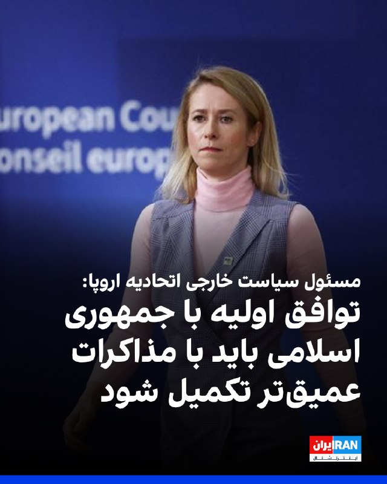

کایا کالاس، مسئول سیاست خارجی اتحادیه اروپا، در پایان نشست غیررسمی وزیران خارجه این اتحادیه در قبرس گفت که هر توافق اولیه میان آمریکا و جمهوری اسلامی، باید با مذاکرات عمیق‌تر درباره ذخایر هسته‌ای و دیگر مسائل حیاتی مرتبط با امنیت منطقه تکمیل شود.

مسئول سیاست خارجی اتحادیه اروپا گفت که این اتحادیه همکاری‌های امنیتی و دفاعی خود را با کشورهای خلیج فارس افزایش می‌دهد.
https://iranintl.com/202605287506

## IranIntlTV — post 339405

  

سخنگوی وزارت خارجه روسیه تاکید کرد که این کشور آماده است در خروج اورانیوم غنی‌شده از ایران کمک کند، اما آمریکا پیشنهادی که ماه‌ها روی میز بوده را نپذیرفته است.

روز چهارشنبه دونالد ترامپ در نشست کابینه در کاح سفید، درباره اورانیوم غنی‌شده ایران گفت که با انتقال آنها به روسیه یا چین موافق نیست.

سخنگوی وزارت خارجه روسیه گفت که این کشور از آمریکا و جمهوری اسلامی درخواست می‌کند به درگیری مسلحانه بازنگردند و به گفت‌وگوها ادامه دهند.
https://iranintl.com/202605284382

## IranIntlTV — post 339404

  

رویترز گزارش داد محمد اسحاق دار، وزیر خارجه پاکستان، جمعه به واشینگتن سفر می‌کند و با مارکو روبیو، وزیر خارجه آمریکا، دیدار خواهد کرد.

این سفر در حالی انجام می‌شود که اسلام‌آباد در تلاش است درباره توافقی برای پایان دائمی جنگ آمریکا و اسرائیل با جمهوری اسلامی مذاکره کند.

وزارت خارجه پاکستان اعلام کرد وزیر خارجه پاکستان و روبیو در این دیدار روابط دوجانبه را بررسی خواهند کرد و درباره تحولات منطقه‌ای و جهانی مورد علاقه دو طرف تبادل نظر می‌کنند.
https://iranintl.com/202605281487

## IranIntlTV — post 339403

منبع نزدیک به مذاکرات: درباره ابعاد هماهنگی قالیباف با مجتبی خامنه‌ای تردید وجود دارد

اطلاعات رسیده به ایران‌اینترنشنال حاکی از آن است که تردیدها درباره سطح آگاهی مجتبی خامنه‌ای از جزییات مذاکرات تهران و واشینگتن افزایش یافته است. همچنین، میزان هماهنگی محمدباقر قالیباف و سایر اعضای تیم مذاکره‌کننده با رهبر جمهوری اسلامی، در هاله‌ای از ابهام است.

یک منبع آگاه از روند مذاکرات تهران و واشینگتن، پنج‌شنبه هفتم خرداد به ایران‌اینترنشنال گفت: «درباره میزان اطلاع مجتبی خامنه‌ای از روند گفت‌وگوها و ابعاد تفاهم تیم مذاکره‌کننده جمهوری اسلامی با دولت دونالد ترامپ، ابهام‌های جدی وجود دارد.»

بر اساس این اطلاعات، سفر اخیر قالیباف و عباس عراقچی، وزیر امور خارجه جمهوری اسلامی، به قطر و «خودداری تیم مذاکره‌کننده جمهوری اسلامی از سفر به پاکستان» یا پیشبرد گفت‌وگوها در تهران، بر گمانه‌زنی‌ها درباره تشدید اختلاف‌نظرها و نبود هماهنگی کامل در سطوح بالای حاکمیت افزوده است.

پیش‌تر در ۳۰ اردیبهشت، شبکه الحدث گزارش داد همکاری میان حکومت ایران و پاکستان با چالش‌هایی روبه‌رو شده و فضای بی‌اعتمادی بر سطح هماهنگی‌های دو طرف سایه انداخته است.
این رسانه افزود میان تهران و اسلام‌آباد درباره کانال‌های مذاکره و محل برگزاری گفت‌وگوها، اختلاف نظر وجود دارد.
بر اساس این گزارش، پاکستان از ایجاد کانال‌های ارتباطی جدید میان تهران و واشینگتن ابراز نارضایتی کرده است.
اکنون اطلاعات اختصاصی رسیده به ایران‌اینترنشنال نشان می‌دهد افزایش نقش‌آفرینی دوحه و سفر هیات مذاکره‌کننده جمهوری اسلامی به قطر، ممکن است نشانه‌ای از اختلافات داخلی و تغییر در مسیر هماهنگی‌های دیپلماتیک جمهوری اسلامی باشد.
مجتبی خامنه‌ای از زمان انتصاب به‌عنوان سومین رهبر جمهوری اسلامی، در هیچ مراسم یا مکانی عمومی حاضر نشده و هیچ پیام صوتی یا تصویری منتشر نکرده است.
پیام‌های منتسب به خامنه‌ای تنها به‌صورت مکتوب منتشر می‌شوند.
در این بازه زمانی، برخی رسانه‌ها و حامیان جمهوری اسلامی بارها تصاویر و ویدیوهایی از او را که با هوش مصنوعی ساخته شده‌اند، به اشتراک گذاشته‌اند.
اختلاف در حاکمیت بر سر مذاکره با آمریکا
در هفته‌های گذشته، گزارش‌های متعددی درباره بروز اختلاف نظر در ساختار حاکمیت جمهوری اسلامی بر سر نحوه پیشبرد جنگ و مذاکرات با آمریکا منتشر شده و حتی اطلاعات رسیده از توبیخ قالیباف حکایت داشته است.

ابوالفضل ابوترابی، نماینده مجلس شورای اسلامی، هفتم خرداد در مصاحبه با پایگاه خبری دیده‌بان ایران‌، به مذاکرات تهران و واشینگتن پرداخت و گفت: «تمام خطوط قرمز رهبری از تنگه هرمز، مساله هسته‌ای و گرفتن غرامت، نقض شده است.»

ابوترابی توافق احتمالی دو طرف را «برجام دو» خواند و با اشاره به مفاد آن افزود: «امروز دارند با یک آبنبات چوبی ما را فریب می‌دهند ... این ۱۴ بند با آن ۱۰ ‌بندی که با نظر مستقیم رهبری تهیه شده بود، کاملا و ۱۸۰ درجه متفاوت است.»

این اظهارات در شرایطی مطرح شد که علی‌رغم در جریان بودن رایزنی‌های دیپلماتیک، درگیری‌های پراکنده میان ایالات متحده و جمهوری اسلامی همچنان ادامه دارد.

بامداد هفتم خرداد، ارتش آمریکا اعلام کرد چند پهپاد جمهوری اسلامی را در نزدیکی تنگه هرمز سرنگون کرده و یک سایت نظامی مرتبط با پرتاب پهپادها را هدف قرار داده است.

در مقابل، سپاه پاسداران از حمله به یک پایگاه هوایی آمریکا خبر داد.
 
🔗وب‌سایت ایران‌اینترنشنال
@iranintltv

## IranIntlTV — post 339402

  

با ارسال ویدیو، درباره وضعیت معیشتی، مالی و اشتغال خود در ماه‌های اخیر روایت کنید.
روی لینک زیر کلیک کنید و پیام‌های خود را از طریق مدیا‌بات برای ما بفرستید.

https://t.me/intlmedia_bot

پیام‌های شما به صورت زیر‌نویس در تلویزیون و همچنین در بخش‌های مختلف‌ خبری منتشر خواهد شد.

## IranIntlTV — post 339401

  <a href="telegram/content/IranIntlTV_339401_1779973146.mp4" target="_blank">🎬 Download video</a>

آلکسیا پوتیاس، کاپیتان تیم فوتبال زنان بارسلون، پس از ۱۴ فصل حضور در این باشگاه از تیم جدا شد.

رها پوربخش، خبرنگار ایران‌اینترنشنال، گزارش می‌دهد
@iranintltv

## IranIntlTV — post 339400

جمهوری اسلامی و آمریکا پس از رد گزارش توافق هرمز از سوی ترامپ، حملات متقابل انجام دادند

سپاه پاسداران انقلاب اسلامی پنج‌شنبه هفتم خرداد یک پایگاه هوایی آمریکا را هدف قرار داد. اقدامی که پس از حملات ارتش آمریکا به آن‌چه یک مقام واشینگتن «عملیات پهپادی ایران» در نزدیکی تنگه هرمز خواند، انجام شد.

این درگیری تنها چند ساعت پس از آن رخ داد که دونالد ترامپ، رییس‌جمهوری آمریکا، گزارش‌ها را درباره نزدیک بودن توافقی با تهران رد کرد.

تشدید دوباره درگیری‌ها، نگرانی‌ها را درباره آتش‌بس شکننده میان تهران و واشینگتن - که از ۱۹ فروردین برقرار شده - افزایش داده و امیدها به توافق صلح را تضعیف کرده است.

حمله آمریکا به پهپادهای ایرانی
یک مقام آمریکایی که نخواست نامش فاش شود، به خبرگزاری رویترز گفت ارتش آمریکا چهار پهپاد تهاجمی ایران را سرنگون کرده و یک ایستگاه کنترل زمینی در بندرعباس را هدف قرار داده است. مرکزی که به گفته او در آستانه پرتاب پنجمین پهپاد قرار داشت.

این مقام گفت: «این اقدام‌ها حساب‌شده، کاملا دفاعی و با هدف حفظ آتش‌بس انجام شدند.»

خبرگزاری تسنیم به نقل از سپاه پاسداران گزارش داد جمهوری اسلامی در پاسخ به آن‌چه «حمله بامداد آمریکا در نزدیکی فرودگاه بندرعباس» توصیف شد، یک پایگاه آمریکایی را هدف قرار داده است.

هشدار در کویت و شمال اسرائیل
کویت که میزبان یکی از پایگاه‌های بزرگ آمریکا در منطقه است، اعلام کرد در حال مقابله با حملات موشکی و پهپادی است، اما توضیح نداد این حملات از کجا انجام شده‌اند.

اسرائیل نیز از فعال شدن آژیرهای هشدار در شمال این کشور در پی «فعالیت هوایی دشمن» خبر داد.

در واکنش به تشدید تنش‌ها، قیمت نفت که چهارشنبه حدود پنج درصد کاهش یافته بود، دوباره افزایش یافت.

بهای نفت خام آمریکا بیش از سه درصد رشد کرد، بازار سهام افت کرد و ارزش دلار بالا رفت.

ترامپ: هیچ کشوری کنترل تنگه هرمز را در دست نمی‌گیرد
جنگی که از ۹ اسفند ۱۴۰۴ با حملات آمریکا و اسرائیل به جمهوری اسلامی آغاز شد، تاکنون باعث جهش شدید قیمت جهانی انرژی شده است.

او همچنین گزارش صداوسیمای جمهوری اسلامی را رد کرد. گزارشی که در آن گفته شده است تهران به پیش‌نویس غیررسمی توافقی دست یافته که بر اساس آن، کشتیرانی تجاری در تنگه هرمز ظرف یک ماه به سطح پیش از جنگ بازمی‌گردد و ایران و عمان به‌طور مشترک مدیریت تردد را بر عهده می‌گیرند.

ترامپ گفت هیچ کشوری کنترل این آبراه را در اختیار نخواهد داشت و در اظهاراتی تهدیدآمیز علیه مسقط تاکید کرد: «هیچ‌کس قرار نیست کنترل تنگه را در دست بگیرد. این آب‌های بین‌المللی است و عمان هم مثل بقیه رفتار خواهد کرد، وگرنه مجبور می‌شویم آن‌ها را نابود کنیم.»

اختلاف‌ها بر سر تحریم‌ها، برنامه هسته‌ای و تنگه هرمز
علی باقری کنی، معاون دبیر شورای عالی امنیت ملی، گفت تهران خواهان آزادسازی همه دارایی‌های بلوکه‌شده ایران از سوی آمریکاست.

او به تسنیم گفت: «آزادسازی کامل و بدون قید و شرط دارایی‌های ایران، حق قانونی ملت ایران است.»

تحریم‌ها، برچیدن برنامه هسته‌ای جمهوری اسلامی و وضعیت تنگه هرمز - که پیش از جنگ حدود یک‌پنجم تجارت جهانی نفت و گاز طبیعی مایع از آن عبور می‌کرد - همچنان مهم‌ترین نقاط اختلاف در مذاکرات برای پایان جنگ هستند.

رویترز نوشت این آبراه بر اساس قوانین بین‌المللی، مشمول حق عبور آزاد کشتی‌های خارجی است.

وزارت خزانه‌داری آمریکا نیز «سازمان مدیریت تنگه هرمز» - نهادی ایرانی که برای مدیریت عبور و مرور در این تنگه ایجاد شده - را به فهرست تحریم‌های مرتبط با تهدید امنیت ملی آمریکا اضافه کرد.

اختلاف بر سر پرونده هسته‌ای
صداوسیمای جمهوری اسلامی گزارش داد پیش‌نویس توافق با واشینگتن شامل خروج نیروهای آمریکایی از مناطق نزدیک به ایران است؛ هرچند مساله حضور نظامی آمریکا در منطقه همچنان نیازمند مذاکره بیشتر توصیف شد.

کاخ سفید این گزارش را «کاملا ساختگی» خواند و تهران نیز به آن واکنش رسمی نشان نداد.

گزارش تلویزیون جمهوری اسلامی درباره پیش‌نویس توافق، اشاره‌ای به برنامه هسته‌ای تهران نداشت. برنامه‌ای که آمریکا خواهان برچیدن آن است.

منابع ایرانی به رویترز گفته‌اند مذاکرات درباره پرونده هسته‌ای قرار است در مرحله دوم گفت‌وگوها انجام شود. موضوعی که ممکن است برای برخی از نزدیک‌ترین حامیان ترامپ، قابل قبول نباشد.

مارکو روبیو، وزیر خارجه آمریکا، در نشست کابینه دولت ترامپ گفت: «اصل ماجرا این است که ایران هرگز نباید به سلاح هسته‌ای دست پیدا کند.»
 
🔗متن کامل گزارش را اینجا بخوانید
@iranintltv

## IranIntlTV — post 339399

  

در پی حملات موشکی و پهپادی جمهوری اسلامی به کویت، وزارت خارجه قطر در بیانیه‌ای هدف قرار گرفتن کویت با موشک و پهپاد را به‌شدت محکوم کرد و آن را «نقض آشکار حاکمیت» این کشور و «نقض فاحش قوانین بین‌المللی» دانست.

قطر همچنین خواستار جلوگیری از «پیامدهای حملات غیرموجه» و کاهش تنش برای بازگرداندن امنیت و ثبات در سطح منطقه و جهان شد.

وزارت خارجه قطر در ادامه بر «همبستگی کامل» این کشور با کویت تاکید کرد و گفت از هر اقدامی برای حفظ حاکمیت و امنیت کویت حمایت می‌کند.
https://iranintl.com/202605283859

## IranIntlTV — post 339398

  

سایت هرانا خبر داد کیمیا داوودی و تارا داوودی، دو خواهر محبوس در زندان اوین که در جریان اعتراضات دی‌ماه ۱۴۰۴ بازداشت شده بودند، از سوی دادگاه انقلاب تهران به‌ترتیب به ۱۰ و شش سال حبس محکوم شدند.

بر اساس این گزارش، شعبه ۱۵ دادگاه انقلاب تهران به ریاست ابوالقاسم صلواتی، کیمیا داوودی را بابت اتهاماتی از جمله «ارتباط با گروه‌ها و شبکه‌های معاند» و «اجتماع و تبانی علیه امنیت کشور» به ۱۰ سال حبس محکوم کرده است.

هرانا افزود تارا داوودی نیز بابت اتهاماتی از جمله «اجتماع و تبانی علیه امنیت کشور» و «تبلیغ علیه نظام» به شش سال زندان محکوم شده است.

این دو خواهر ۲۴ دی‌ماه ۱۴۰۴، در جریان اعتراضات سراسری در تهران بازداشت شدند و اکنون در بند زنان زندان اوین به سر می‌برند. هرانا نوشت بازداشت آنها با ضرب‌وشتم و اعمال خشونت از سوی نیروهای امنیتی همراه بوده است.
https://iranintl.com/202605287064

## IranIntlTV — post 339397

  

رسانه‌های اسرائیل خبر دادند که در حمله به بیروت، علی الحسینی، فرمانده واحد موشکی حزب الله، هدف قرار گرفته است.

همزمان آی۲۴ نیوز نوشت که در حمله به بیروت یک فرمانده یگان موشکی نیروی قدس سپاه پاسداران هدف قرار گرفته است.
همچنین ارتش اسرائیل ضمن اعلام حمله به بیروت، دقایقی پیش حمله‌ای را در بیروت انجام داده است.

ارتش اسرائیل جزئیات بیشتری منتشر نکرده، اما رسانه‌های لبنانی گزارش داده‌اند این حمله در منطقه «الشویفات» در جنوب بیروت رخ داده است.
iranintl.com/202605287238

## IranIntlTV — post 339396

  

کویت حملات موشکی و پهپادی جمهوری اسلامی را نقض آشکار حاکمیت، امنیت و تمامیت ارضی خود خواند. وزارت خارجه کویت تاکید کرد که این حملات در زمانی رخ می‌دهد که شماری از کشورهای منطقه در حال تلاش جدی برای کاهش تنش و مهار بحران هستند.

کویت همچنین حملات جمهوری اسلامی را نقض قطعنامه ۲۸۱۷ سال ۲۰۲۶ شورای امنیت سازمان ملل دانست.

وزارت خارجه کویت تاکید کرد این کشور حق کامل خود را برای اتخاذ همه اقدامات لازم به منظور حفظ امنیت و دفاع از سرزمین و تاسیسات حیاتی خود در برابر هرگونه تجاوز یا تهدید محفوظ می‌دارد.
iranintl.com/202605283201

## IranIntlTV — post 339395

  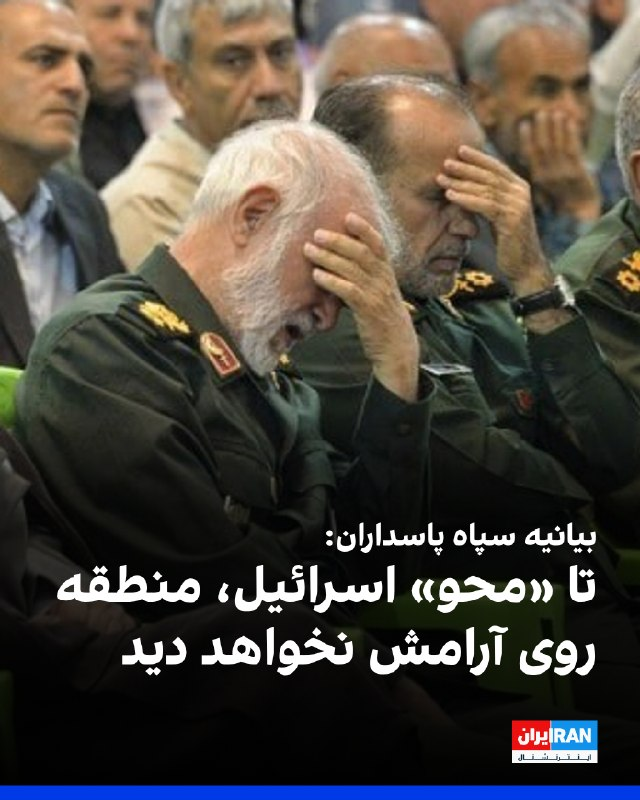

در پی کشته شدن دو فرمانده حماس در حملات هوایی به غزه، سپاه پاسداران در بیانیه‌ای اعلام کرد تا زمانی که اسرائیل «محو» نشود، منطقه روی آرامش نخواهد دید و و صلحی که رییس‌جمهور «خبیث و قمارباز» آمریکا از آن حرف می‌زند، جز «کشتار، قتل و ترور» نیست.

در بخشی از این بیانیه آمده است کشته شدن این فرماندهان نه تنها مقاومت را تضعیف نمی‌کند، بلکه به ادامه «جهاد تا آزادی فلسطین و قدس» منجر خواهد شد.
https://iranintl.com/202605285892

## IranIntlTV — post 339394

  <a href="telegram/content/IranIntlTV_339394_1779973150.mp4" target="_blank">🎬 Download video</a>

ایران‌اینترنشنال در کارزاری مردمی به دنبال ثبت و مستندسازی حقیقت درباره کشتار دی‌ماه در رشت است. بر اساس گزارش‌ها، صدها نفر از معترضان در دو شب ۱۸ و ۱۹ دی‌ماه در این شهر کشته شدند.

گفت‌وگو با فرنوش فرجی، عضو تحریریه ایران‌اینترنشنال
@iranintltv

## IranIntlTV — post 339393

  <a href="telegram/content/IranIntlTV_339393_1779973152.mp4" target="_blank">🎬 Download video</a>

ایران‌اینترنشنال در کارزاری مردمی، در پی ثبت و مستندسازی حقیقت درباره کشتار دی‌ماه در رشت است. صدها نفر از معترضان رشت طی دو شب ۱۸ و ۱۹ دی‌ماه در این شهر کشته شدند. با وجود اسناد و تصاویری که از این جنایت منتشر شده، هنوز هزاران روایت ناگفته باقی مانده است.
ایران‌اینترنشنال در ادامه این کارزار مردمی، از شاهدان عینی، خانواده‌ها و نزدیکان کشته‌شدگان می‌خواهد روایت‌ها، تصاویر، ویدیوها و اطلاعات خود را ارسال کنند تا نام و سرگذشت کشته‌شدگان رشت در سکوت و بی‌خبری دفن نشود.

گزارش فرزاد فتاحی، عضو تحریریه ایران‌اینترنشنال
@iranintltv

## IranIntlTV — post 339392

  <a href="telegram/content/IranIntlTV_339392_1779973154.mp4" target="_blank">🎬 Download video</a>

پلیس متروپولیتن لندن اعلام کرد یک مرد ۴۱ ساله ایرانی در پی برخورد شدید یک خودرو در نزدیکی دیوار جاویدنامان در گولدرز گرین لندن به‌شدت زخمی و به بیمارستان منتقل شد. راننده، مردی ۳۹ ساله عراقی، به اتهام وارد کردن جراحات شدید، رانندگی خطرناک و خودداری از ارائه نمونه برای آزمایش مواد مخدر بازداشت شده است. پلیس اعلام کرد این پرونده در حال حاضر تروریستی تلقی نمی‌شود.
فربد سروندی، خبرنگار ایران‌اینترنشنال، گزارش می‌دهد
@iranintltv

## IranIntlTV — post 339391

  

ارتش اسرائیل، ظهر پنج‌شنبه هفت خرداد اعلام کرد در ۲۴ ساعت گذشته بیش از ۱۳۵ موضع حزب‌الله را در مناطق صور، بقاع و جنوب لبنان هدف قرار داده است.

بر اساس این اطلاعیه، حدود ۱۰ محل پرتاب راکت که حزب‌الله از آن‌ها برای شلیک به سوی نیروهای ارتش اسرائیل و غیرنظامیان اسرائیلی استفاده می‌کرد، در بقاع و جنوب لبنان هدف قرار گرفت. ارتش اسرائیل همچنین اعلام کرد یک اردوگاه آموزشی حزب‌الله در بریتال، در منطقه بقاع، هدف حمله قرار گرفته است.

بر اساس این اطلاعیه، ارتش اسرائیل شب گذشته حدود ۱۵ زیرساخت نظامی در صور را که به گفته این ارتش برای پیشبرد حملات حزب‌الله استفاده می‌شد، هدف قرار داد. نیروی هوایی اسرائیل همچنین یک گروه از نیروهای حزب‌الله را هنگام خروج از محل پرتاب راکت هدف قرار داد.
iranintl.com/202605280529

## IranIntlTV — post 339390

  

فرماندهی مرکزی آمریکا، سنتکام، در شبکه ایکس اعلام کرد جمهوری اسلامی ساعت ۴:۴۷ بامداد پنج‌شنبه به وقت ایران، یک موشک بالستیک به سوی کویت شلیک کرد که نیروهای کویتی آن را رهگیری کردند.

سنتکام این اقدام را «نقض فاحش آتش‌بس» خواند و افزود چند ساعت پیش از آن، نیروهای جمهوری اسلامی پنج پهپاد انتحاری را در و نزدیک تنگه هرمز به پرواز درآوردند که «تهدیدی آشکار» ایجاد کردند.

بر اساس اعلام سنتکام، همه این پهپادها از سوی نیروهای آمریکایی رهگیری شدند و آمریکا همچنین از پرتاب ششمین پهپاد از یک مرکز کنترل زمینی جمهوری اسلامی در بندرعباس جلوگیری کرد.
https://iranintl.com/202605288025

## IranIntlTV — post 339389

  <a href="telegram/content/IranIntlTV_339389_1779973156.mp4" target="_blank">🎬 Download video</a>

چند برابر شدن هزینه‌های روزانه زندگی و گرانی بی‌سابقه مواد غذایی و دارو در ایران از عمده پیام‌هایی است که شهروندان به مدیابات ایران‌اینترنشنال ارسال کرده‌اند.

لیلا سعادتی، عضو تحریریه ایران‌اینترنشنال، گزارش می‌دهد
@iranintltv

## Shin_Persian — post 6282

↩️ Quoted tweet: acceladealer ✓ @acceladealer Thu, 28 May 2026 11:38:42 UTC Damage to mid-rise building (claimed targeted assassination) in BEIRUT, Lebanon 33.808852, 35.508167 @GeoConfirmed @FaytuksNetwork geolocated by @acceladealer ↩️ توییت نقل‌قول…

## Shin_Persian — post 6281

  

↩️ Quoted tweet:
acceladealer ✓ @acceladealer
Thu, 28 May 2026 11:38:42 UTC

Damage to mid-rise building (claimed targeted assassination) in BEIRUT, Lebanon

33.808852, 35.508167

@GeoConfirmed @FaytuksNetwork

geolocated by @acceladealer

↩️ توییت نقل‌قول شده — برای پاسخ، پست زیر را ببینید.

فارسی

خسارت به یک ساختمان میان‌مرتبه (ادعای ترور هدفمند) در بیروت، لبنان

33.808852, 35.508167

@GeoConfirmed @FaytuksNetwork

تایید موقعیت جغرافیایی توسط @acceladealer_

𝕏 · @shin_persian

## Shin_Persian — post 6280

  <a href="telegram/content/Shin_Persian_6280_1779973158.mp4" target="_blank">🎬 Download video</a>

Shin ✓ @hey_itsmyturn
Thu, 28 May 2026 11:32:41 UTC

Reported video of the targeted building where Ali al-Husni, head of the IRGC-backed Imam Hussein Division's missile forces was targeted by #IAF 🇮🇱

فارسی

ویدیو منتشر شده از ساختمان مورد هدف که در آن علی‌الحسنی، رئیس نیروهای موشکی لشکر امام حسین (تحت حمایت سپاه پاسداران - IRGC)، توسط نیروی هوایی اسرائیل (#IAF) 🇮🇱 هدف قرار گرفت.

𝕏 · @shin_persian

## Shin_Persian — post 6279

  

↩️ Quoted tweet: Shin ✓ @hey_itsmyturn Thu, 28 May 2026 11:17:43 UTC Initial: A commander of IRGC-backed Hashed Sha'abi / PMU / PMF terror organization has been killed in Maysan governorate, #Iraq 🇮🇶 ↩️ توییت نقل‌قول شده — برای پاسخ، پست زیر را ببینید.…

## Shin_Persian — post 6278

↩️ Quoted tweet:
Shin ✓ @hey_itsmyturn
Thu, 28 May 2026 11:17:43 UTC

Initial:
A commander of IRGC-backed Hashed Sha'abi / PMU / PMF terror organization has been killed in Maysan governorate, #Iraq 🇮🇶

↩️ توییت نقل‌قول شده — برای پاسخ، پست زیر را ببینید.

فارسی

یکی از فرماندهان سازمان تروریستی حشد الشعبی (بسیج مردمی عراق) وابسته به سپاه پاسداران، در استان میسان، #Iraq 🇮🇶 کشته شده است.

𝕏 · @shin_persian

## Shin_Persian — post 6276

U.S. Central Command ✓ @CENTCOM
Thu, 28 May 2026 10:48:55 UTC

At 10:17 p.m. ET on May 27, Iran launched a ballistic missile toward Kuwait that was successfully intercepted by Kuwaiti forces. This egregious ceasefire violation by the Iranian regime occurred hours after Iranian forces launched five one-way attack drones that posed a clear threat in and near the Strait of Hormuz. All drones were successfully intercepted by U.S. forces which also prevented a sixth drone launch from an Iranian ground control site in Bandar Abbas.

U.S. Central Command and regional partners remain vigilant and measured as we continue to defend our forces and interests from unjustified Iranian aggression.

فارسی

در ساعت ۱۰:۱۷ شب به وقت منطقه زمانی شرقی در ۲۷ مه، ایران یک موشک بالستیک را به سمت کویت شلیک کرد که توسط نیروهای کویتی با موفقیت رهگیری شد. این نقض فاحش آتش‌بس توسط رژیم ایران ساعاتی پس از آن رخ داد که نیروهای ایرانی پنج پهپاد تهاجمی یک‌طرفه را پرتاب کردند که تهدیدی آشکار در داخل و نزدیکی تنگه هرمز ایجاد کرده بود. تمام پهپادها توسط نیروهای ایالات متحده با موفقیت رهگیری شدند و همچنین از پرتاب ششمین پهپاد از یک سایت کنترل زمینی ایران در بندرعباس جلوگیری به عمل آمد.

فرماندهی مرکزی ایالات متحده (سنتکام/CENTCOM) و شرکای منطقه‌ای هوشیار و خویشتندار باقی می‌مانند و ما به دفاع از نیروها و منافع خود در برابر تجاوزات توجیه‌ناپذیر ایران ادامه می‌دهیم.

𝕏 · @shin_persian

## Shin_Persian — post 6275

Shin ✓ @hey_itsmyturn
Thu, 28 May 2026 11:17:43 UTC

Initial:
A commander of IRGC-backed Hashed Sha'abi / PMU / PMF terror organization has been killed in Maysan governorate, #Iraq 🇮🇶

فارسی

یکی از فرماندهان سازمان تروریستی حشدالشعبی (بسیج مردمی عراق) وابسته به سپاه پاسداران انقلاب اسلامی در استان میسان، #Iraq 🇮🇶 کشته شد.

𝕏 · @shin_persian

## Shin_Persian — post 6274

↩️ Quoted tweet: Emanuel (Mannie) Fabian ✓ @manniefabian Thu, 28 May 2026 11:03:55 UTC The IDF says it carried out a strike in Beirut a short while ago. No further details are given. According to Lebanese media, the strike took place in Shuwayfat, just…

## Shin_Persian — post 6273

  

↩️ Quoted tweet:
Emanuel (Mannie) Fabian ✓ @manniefabian
Thu, 28 May 2026 11:03:55 UTC

The IDF says it carried out a strike in Beirut a short while ago.

No further details are given.

According to Lebanese media, the strike took place in Shuwayfat, just south of the capital.

↩️ توییت نقل‌قول شده — برای پاسخ، پست زیر را ببینید.

فارسی

ارتش دفاعی اسرائیل (IDF) اعلام کرد که لحظاتی پیش حمله‌ای را در بیروت انجام داده است.

جزئیات بیشتری ارائه نشده است.

به گفته رسانه‌های لبنانی، این حمله در الشویفات، در جنوب پایتخت، رخ داده است.

𝕏 · @shin_persian

## Shin_Persian — post 6272

  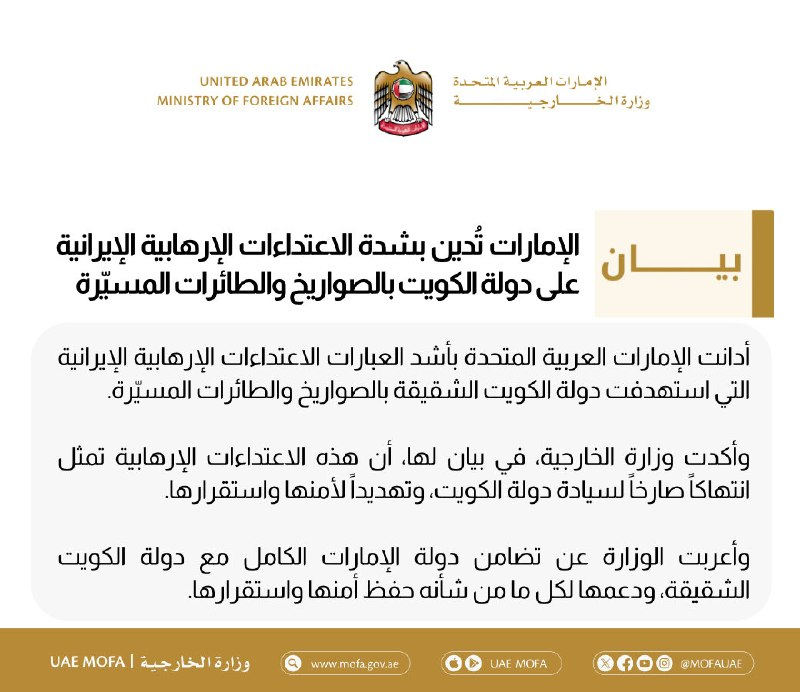

MoFA وزارة الخارجية ✓ @mofauae
Thu, 28 May 2026 09:57:41 UTC

الإمارات تُدين بشدة الاعتداءات الإرهابية الإيرانية على دولة الكويت بالصواريخ والطائرات المسيّرة

English

The United Arab Emirates strongly condemns the Iranian terrorist attacks on the State of Kuwait using missiles and drones.

𝕏 · @shin_persian

## Shin_Persian — post 6271

Shin ✓ @hey_itsmyturn
Thu, 28 May 2026 11:02:57 UTC

Targeted assassination near Hariri airport, Beirut, #Lebanon

فارسی

ترور هدفمند در نزدیکی فرودگاه حریری، بیروت، #Lebanon #لبنان

𝕏 · @shin_persian

## Shin_Persian — post 6270

🔁 Quoting above tweet:
Shin ✓ @hey_itsmyturn
Thu, 28 May 2026 09:55:51 UTC

ICYMI

فارسی

جهت اطلاع کسانی که مطلع نشده‌اند (ICYMI)

𝕏 · @shin_persian

## Shin_Persian — post 6269

  

↩️ Quoted tweet: KUWAIT ARMY - الجيش الكويتي ✓ @KuwaitArmyGHQ Thu, 28 May 2026 02:40:14 UTC تتصدى حالياً الدفاعات الجوية الكويتية لهجمات صاروخية وطائرات مسيرة معادية. تنوه رئاسة الأركان العامة للجيش أن أصوات الانفجارات إن سمعت فهي نتيجة اعتراض منظومات الدفاع…

## Shin_Persian — post 6268

↩️ Quoted tweet:
KUWAIT ARMY - الجيش الكويتي ✓ @KuwaitArmyGHQ
Thu, 28 May 2026 02:40:14 UTC

تتصدى حالياً الدفاعات الجوية الكويتية لهجمات صاروخية وطائرات مسيرة معادية.

تنوه رئاسة الأركان العامة للجيش أن أصوات الانفجارات إن سمعت فهي نتيجة اعتراض منظومات الدفاع الجوي للهجمات المعادية.

يرجى من الجميع التقيد بتعليمات الأمن والسلامة الصادرة عن الجهات المختصة.

↩️ Quoted tweet — see the post below for the reply.

English

Kuwaiti air defenses are currently intercepting hostile missile and drone attacks.

The General Staff of the Army notes that any sounds of explosions heard are the result of air defense systems intercepting these hostile attacks.

Everyone is requested to adhere to the security and safety instructions issued by the competent authorities.

𝕏 · @shin_persian

## Shin_Persian — post 6267

Shin ✓ @hey_itsmyturn
Thu, 28 May 2026 01:49:46 UTC

Treasury's Economic Fury campaign targets Iran's Persian Gulf Strait Authority (PGSA), a new IRGC extortion scheme charging illegitimate "tolls" for vessels transiting the Strait of Hormuz.

𝐃𝐄𝐒𝐈𝐆𝐍𝐀𝐓𝐄𝐃 𝐄𝐍𝐓𝐈𝐓𝐘:

• 𝐏𝐞𝐫𝐬𝐢𝐚𝐧 𝐆𝐮𝐥𝐟 𝐒𝐭𝐫𝐚𝐢𝐭 𝐀𝐮𝐭𝐡𝐨𝐫𝐢𝐭𝐲 (𝐏𝐆𝐒𝐀) - Iranian government agency that coordinates with IRGC and IRGC Navy to extort commercial vessels through forced route compliance, information submission requirements, and passage fees that fund the designated Foreign Terrorist Organization IRGC.

𝐊𝐄𝐘 𝐎𝐏𝐄𝐑𝐀𝐓𝐈𝐎𝐍𝐀𝐋 𝐃𝐄𝐓𝐀𝐈𝐋𝐒:

- Vessels must submit requested information to receive "permission" from PGSA to transit the Strait of Hormuz
- PGSA forces vessels to follow Iranian-designated routes near Iran's coast under IRGC instructions
- Extortion payments accepted via fiat currency, digital assets, offsets, informal swaps, or in-kind payments including nominally charitable donations
- All toll revenues are funneled directly to the IRGC

𝐄𝐂𝐎𝐍𝐎𝐌𝐈𝐂 𝐅𝐔𝐑𝐘 𝐂𝐀𝐌𝐏𝐀𝐈𝐆𝐍 𝐈𝐌𝐏𝐀𝐂𝐓:

- Treasury has disrupted tens of billions of dollars in Iranian regime revenue
- Nearly $500 million in regime-linked cryptocurrency frozen
- Targeted shadow banking networks, weapons supply chains, and shadow fleet operations
- Secondary sanctions risk for foreign financial institutions facilitating Iranian activities

𝐒𝐀𝐍𝐂𝐓𝐈𝐎𝐍𝐒 𝐈𝐌𝐏𝐋𝐈𝐂𝐀𝐓𝐈𝐎𝐍𝐒:

- Designated under E.O. 13224 for materially assisting the IRGC
- All U.S. persons prohibited from transactions involving PGSA
- Foreign entities cooperating with the strait authority face sanctions exposure
- Secondary sanctions possible for foreign financial institutions conducting significant transactions with PGSA
- Violations may result in civil or criminal penalties on strict liability basis

𝐂𝐎𝐌𝐏𝐋𝐈𝐀𝐍𝐂𝐄 𝐖𝐀𝐑𝐍𝐈𝐍𝐆:

Any cooperation with the Persian Gulf Strait Authority may constitute providing support to the IRGC and expose parties to U.S. sanctions risk, regardless of payment method or justification.

ترجمه فارسی در بخش نظرات

𝕏 · @shin_persian

## ManotoTV — post 105852

  <a href="telegram/content/ManotoTV_105852_1779973161.mp4" target="_blank">🎬 Download video</a>

سخنرانی امیرعباس هویدا در جمع دانشجویان درباره نقش جوانان در توسعه و اداره کشور

## ManotoTV — post 105845

  <a href="telegram/content/ManotoTV_105845_1779973163.mp4" target="_blank">🎬 Download video</a>

اینترنت در ایران فقط ابزار ارتباط نیست، میدان قدرت است. هر بار که قطع یا وصل می‌شود، حکومت در واقع در حال تنظیم سطح کنترل خود بر جامعه است، اینکه مردم چه ببینند، چه بگویند، چگونه وصل شوند و تا چه اندازه بتوانند با هم عمل کنند.

## FarsiVOA — post 218886

پلیس سوئیس اعلام کرد در حمله با چاقو در ایستگاه قطار شهر وینترتور، سه نفر زخمی شدند.

گزارش‌ها حاکی است مهاجم ۳۱ ساله پس از حمله بازداشت شده است.

@FarsiVOA

## FarsiVOA — post 218885

🔺سه زخمی در حمله با سلاح سرد در سوئیس

◾️پلیس محلی سوئیس روز پنجشنبه ۷ خرداد اعلام کرد که مردی سه نفر را در حمله با چاقو در یک ایستگاه قطار در شهر وینترتور سوئیس در نزدیکی زوریخ زخمی کرده بود، دستگیر شد.

⬇️ بیشتر بخوانید:

https://ir.voanews.com/a/switzerland-attack-injury-allaho-akbar/8154821.html

## FarsiVOA — post 218884

  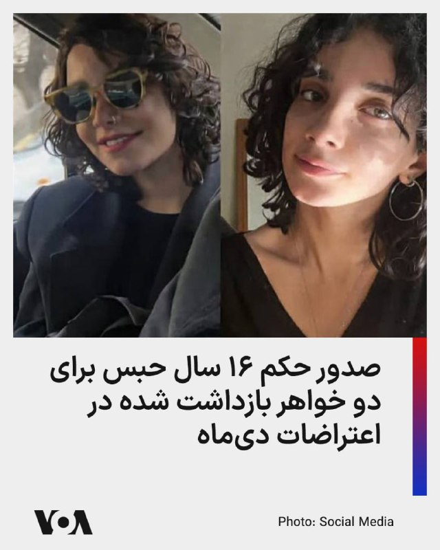

ارگان خبری مجموعه فعالان حقوق بشر در ایران خبر داد که تارا و کیمیا داوودی، دو خواهر محبوس در زندان اوین، توسط شعبه ۱۵ دادگاه انقلاب تهران به ریاست قاضی ابوالقاسم صلواتی در مجموع به ۱۶ سال حبس محکوم شده‌اند.

براساس این گزارش، کیمیا داوودی به اتهاماتی از جمله «ارتباط با گروه‌ها و شبکه‌های معاند» و «اجتماع و تبانی علیه امنیت کشور» به ۱۰ سال زندان و تارا داوودی نیز به اتهاماتی شامل «اجتماع و تبانی علیه امنیت کشور» و «تبلیغ علیه نظام» به شش سال حبس محکوم شده است.

این دو خواهر در تاریخ ۲۴ دی‌ماه ۱۴۰۴ در جریان اعتراضات سراسری در تهران بازداشت شدند و هم‌اکنون در بند زنان زندان اوین نگهداری می‌شوند. به گفته منابع حقوق بشری، بازداشت آن‌ها با خشونت نیروهای امنیتی همراه بوده است.
@FarsiVOA

## FarsiVOA — post 218883

  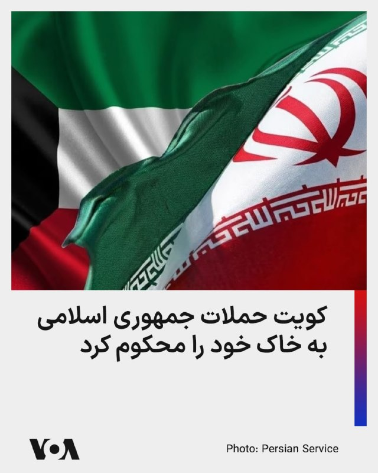

وزارت خارجه کویت حملات اخیر موشکی و پهپادی رژیم ایران به خاک کویت را به عنوان یک تشدید تنش جدی و نقض آشکار حاکمیت و امنیت محکوم کرد.

این وزارتخانه روز پنج‌شنبه اعلام کرد که تهران را کاملاً مسئول حملات اخیر می‌داند و حکومت ایران خواست فوراً و بدون قید و شرط حملات را متوقف کند.

پیشتر ستاد کل ارتش کویت اعلام کرد که پدافند هوایی این کشور در حال مقابله با «حملات موشکی و پهپادهای دشمن» است. با این حال، ارتش کویت نگفت این تهدیدها از کجا آمده‌ بودند.

بیانیه وزارت خارجه کویت همزمان با یک بیانیه سنتکام منتشر شد که در آن، ستاد فرماندهی مرکزی آمریکا، گزارش داد که در ساعت ۱۰:۱۷ شب چهارشنبه ۲۷ مه به وقت شرق آمریکا، حدود ساعت ۶ بامداد به وقت تهران، جمهوری اسلامی یک موشک بالستیک به سوی کویت شلیک کرد که با موفقیت توسط نیروهای کویتی رهگیری شد.
@FarsiVOA

## FarsiVOA — post 218882

  

خبرگزاری فارس وابسته به سپاه، با انتشار گزارشی اعلام کرد که هزینه‌های بالای دندان‌پزشکی و عدم پوشش بیمه، دلایل اصلی مراجعه نکردن شهروندان به دندانپزشکی است.

این خبرگزاری هزینه درمان هر دندان را حدود ۱۵ الی ۴۰ میلیون تومان گزارش و اعلام کرد که شرکت‌های بیمه‌ حتی یک ریال از این هزینه هنگفت را پرداخت نمی‌کنند.

طبق آمارهای موجود، هر ایرانی حداقل شش دندان پوسیده دارد و تنها هزینه عصب‌کشی یک دندان، حدود هفت میلیون است.

بر اساس گزارش خبرگزاری فارس، هزینه هر واحد «ایمپلنت» ۲۳ الی ۳۰ میلیون تومان و هزینه پرکردن هر دندان با مواد نیز چهار تا ۱۲ میلیون تومان است.

شورای عالی کار جمهوری اسلامی، حداقل دستمزد ماهانه کارگران را ۱۶ میلیون و ۶۰۰ هزار تومان تعیین کرده است.
@FarsiVOA

## FarsiVOA — post 218881

  

نت‌بلاکس، نهاد ناظر بر اختلالات اینترنتی، اعلام کرد که علیرغم اینکه دسترسی به شبکه جهانی تا حد زیادی در ایران بازگشته است، اما شاخص‌ها نشان می‌دهند که کاربران همچنان با فیلترینگ شدید مواجه هستند.

نت‌بلاکس، این فیلترینگ شدید را مشابه دوره مابین اعتراضات سراسری دی ماه و آغاز عملیات نظامی علیه جمهوری اسلامی، حدفاصل دی ماه تا اسفند ۱۴۰۴ توصیف کرد.

دسترسی شهروندان ایرانی به اینترنت بین‌المللی، از روز نهم اسفند ۱۴۰۴ قطع شد و جمهوری اسلامی پس از ۸۸ روز، در شامگاه پنجم خرداد ۱۴۰۵ به صورت ناپایدار اینترنت را وصل کرد.

بر اساس اعلام نت‌بلاکس، این زمان، طولانی‌ترین دوره قطع اینترنت در جهان از سوی یک کشور دارای زیرساخت اینترنت بوده و از این بابت جمهوری اسلامی رکورددار است.
@FarsiVOA

## FarsiVOA — post 218880

  

وزیرعلوم، تحقیقات و فناوری از احتمال برگزاری کنکور سراسری ۱۴۰۵ در دهه سوم مرداد خبر داد و هم‌زمان نسبت به کاهش چشمگیر استقبال از رشته‌های علوم پایه در کشور هشدار داد.

حسین سیمایی‌صراف اعلام کرد براساس پیش‌بینی‌ها، کنکور سراسری ۱۴۰۵ احتمالاً در دهه سوم مرداد برگزار می‌شود و جزئیات نهایی آن به ‌زودی از سوی سازمان سنجش آموزش کشور اعلام خواهد شد.

وی با اشاره به کاهش حدود ۵۰ درصدی استقبال از رشته‌های علوم پایه در سه دهه اخیر گفت این روند می‌تواند آینده علمی کشور را تحت تأثیر قرار دهد و نیازمند حمایت جدی و ایجاد مشوق‌های شغلی برای دانشجویان این حوزه است.

در حالی که زمان احتمالی برگزاری کنکور اعلام شده، هنوز زمان دقیق آزمون و همچنین امتحانات نهایی پایه دوازدهم مشخص نیست.

سازمان سنجش آموزش کشور اعلام کرده زمان نهایی کنکور و آزمون دانشجو معلم یک هفته پیش از برگزاری اطلاع‌ رسانی می‌شود. همچنین وزارت آموزش‌ و پرورش گفته است تکلیف امتحانات نهایی تا نیمه مرداد مشخص خواهد شد.
@FarsiVOA

## FarsiVOA — post 218879

🔺ریزش بازارهای جهانی سهام در پی افزایش تنش‌های نظامی خاورمیانه

▪️در پی افزایش تنش‌های نظامی میان جمهوری اسلامی و آمریکا ارزش سهام بازارهای جهانی افت کرد.

▪️شاخص فراگیر بازار سهام «استاکس اروپا ۶۰۰» با ۰.۶ درصد افت مواجه شد و تمام بورس‌های بزرگ منطقه نیز در محدوده منفی معامله شدند.

▪️افت چشمگیر شاخص سهام عمدتاً مربوط به کشورهایی است که به شدت به نفت خاورمیانه وابسته هستند و ذخایر استراتژیک نفت چندانی نیز ندارند؛ از جمله تایوان، سنگاپور، فیلیپین و تا حدودی کره جنوبی.

▪️شاخص بازار‌های سهام آسیایی به استثنای پاکستان و تا حدودی چین، در همه کشورها افت کرده است. اگرچه در خود چین برخی بازارهای سهام رشد نشان می‌دهد، اما شاخص بازارهای هنگ‌کنگ با شدت بیشتری افت کرده است.

⬇️ بیشتر بخوانید:
https://ir.voanews.com/a/global-stock-markets-plunge-as-middle-east-military-tensions-rise/8154816.html

## FarsiVOA — post 218878

🔺واکنش سنتکام به پرتاب موشک بالستیک به کویت توسط رژیم ایران: «نقض فاحش آتش‌بس» است

▪️سنتکام حمله رژیم ایران به کویت با یک فروند موشک بالستیک را «نقض فاحش آتش‌بس» توسط رژیم ایران خواند و بر تداوم هوشیاری آمریکا و شرکای منطقه‌ای برای مقابله با «تجاوزگری غیرموجه» رژیم ایران تاکید کرد.

⬇️ بیشتر بخوانید:

https://ir.voanews.com/a/centcom-says-iran-missle-strike-kuwait-egregious-ceasefire-violation/8154817.html

## FarsiVOA — post 218877

  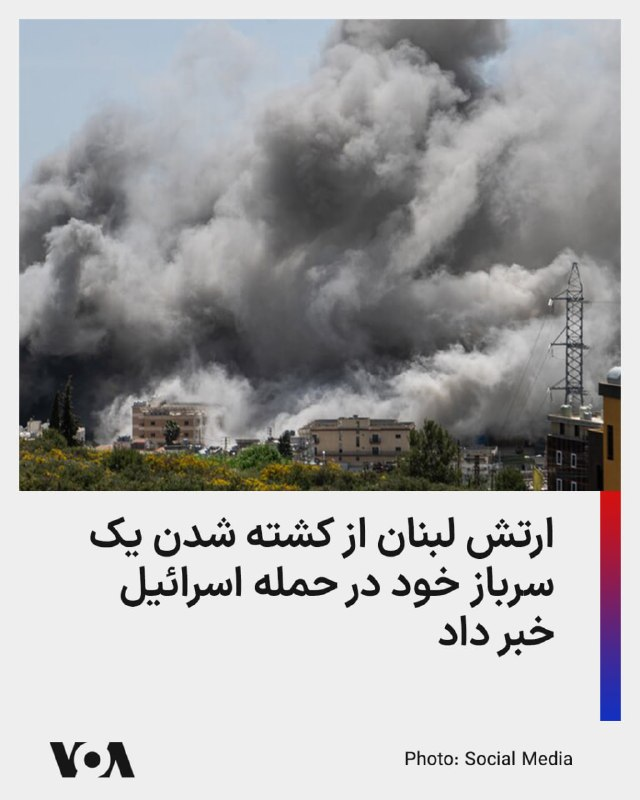

ارتش لبنان اعلام کرد که یک سرباز این ارتش در جریان حمله اسرائیل در جنوب لبنان کشته شده است.

بر اساس بیانیه ارتش لبنان که روز پنجشنبه صادر شد، این سرباز زمانی هدف قرار گرفت که در جاده زغتة–دیرالزهرانی در منطقه نبطیه در جنوب لبنان در حال تردد بود.

این سومین سرباز لبنانی است که در روزهای اخیر کشته می‌شود.

ارتش لبنان چهارشنبه اعلام کرد که یک سربازش در حمله‌ای در جاده کفردون–الخردلی در همان منطقه جنوب لبنان کشته شده است. همچنین ارتش لبنان سه‌شنبه اعلام کرد که یک سربازش در حمله اسرائیل در منطقه بقاع غربی کشته شده است.
@FarsiVOA

## FarsiVOA — post 218876

🔺اکسیوس: دولت ترامپ خود را برای احتمال فروپاشی کوبا آماده می‌کند

▪️اکسیوس گزارش داد که دولت ترامپ خود را برای احتمال فروپاشی رژیم کوبا، حتی در تابستان پیش‌رو، آماده می‌کند.

▪️مقام‌های آمریکایی گفتند واشنگتن در صورت فرو رفتن این جزیره در هرج‌ومرج، طرح‌های تازه‌ای برای واکنش نظامی شبیه‌سازی و بررسی کرده است.

▪️یکی از مقام‌های ارشد دولت دونالد ترامپ به اکسیوس روز پنجشنبه با اشاره به احتمال فروپاشی حکومت کوبا گفت: «اما ما هنوز نمی‌خواهیم رژیم را کاملاً از بین ببریم. این کار روش و مرحله‌بندی دارد.»

▪️پیشتر ونزوئلا و رهبر سوسیالیست آن، نیکلاس مادورو، با ارسال نفت رایگان، کوبا را سرپا نگه داشته بود؛ نفتی که هم برق کشور را تأمین می‌کرد و هم منبع درآمد صادراتی برای هاوانا بود.

⬇️ بیشتر بخوانید:
https://ir.voanews.com/a/8154815.html

## FarsiVOA — post 218875

🔺کدام کشورها از انسداد تنگه هرمز سود بردند؟

▪️انسداد تنگه هرمز اگرچه تبعات تورمی بر اقتصاد همه کشورها داشته، اما برخی از آنها به خاطر جهش قیمت انرژی به سودهای کلانی دست یافته‌اند.

▪️در میان کشورهای همسایه ایران، عمان، روسیه و جمهوری آذربایجان درآمدهای صادرات نفت خود را به شدت افزایش داده‌اند.

▪️در خارج از خاورمیانه، کشورهای صادرکننده نفت، خصوصا آنهایی که محصولات نفتی نیز صادر می‌کنند به درآمدهای کلانی رسیده‌اند.

▪️رویترز می‌نویسد سلطان‌نشین جزیره بورنئو صادرات محصولات نفتی خود را در ماه جاری به ۴.۱۶ میلیون بشکه رسانده که بالاترین رقم از ژوئیه پارسال است. صادرات گاز مایع این کشور نیز با ۱۸ درصد رشد به ۳۳۰ هزار تن رسیده است.

⬇️ بیشتر بخوانید:
https://ir.voanews.com/a/which-countries-benefited-from-the-blockade-of-the-strait-of-hormuz/8154813.html

## FarsiVOA — post 218874

🔺ایالات متحده اعلام کرد سفارتش در کی‌یف همچنان باز است

▪️سفارت ایالات متحده در کی‌یف روز پنج‌شنبه اعلام کرد که همچنان باز است و گزارش‌ها درباره تغییر در عملیات خود را در پی هشدارهای روسیه مبنی بر اینکه دیپلمات‌ها و خارجی‌ها باید پیش از تشدید حملات، پایتخت اوکراین را ترک کنند، رد کرد.

▪️برخی رسانه‌های اوکراینی روز پنج‌شنبه به نقل کایا کالاس، مسئول سیاست خارجی اتحادیه اروپا، گزارش دادند که سفارت آمریکا در کی‌یف تعطیل شده است.

▪️اما سفارت آمریکا در کی‌یف در شبکه اجتماعی ایکس، نوشت: «سفارت آمریکا باز است. هیچ تغییری در فعالیت ما وجود ندارد و گزارش‌های خلاف آن، نادرست است.»

⬇️ بیشتر بخوانید:
https://ir.voanews.com/a/us-says-its-embassy-in-kyiv-remains-open/8154812.html

## FarsiVOA — post 218873

  <a href="telegram/content/FarsiVOA_218873_1779973167.mp4" target="_blank">🎬 Download video</a>

ارتش اسرائیل اعلام کرد که پنجشنبه موجی از حملات هوایی را علیه زیرساخت‌های حزب‌الله در شهر ساحلی صور در لبنان آغاز کرد.

آویخای ادرعی، سخنگوی ارتش اسرائیل، روز چهارشنبه درباره حمله به چندین نقطه در صور هشدار داده بود.

خبرگزاری رسمی لبنان گزارش داد که صبح پنج‌شنبه دو رشته حمله اسرائیل به شهر صور و منطقه‌ای در شرق آن انجام شد که یک ساختمان را هدف قرار داد و باعث آتش‌سوزی شد.

رویترز نیز ویدئوی منتشر شده توسط شاهدان عینی در روز پنج‌شنبه را که لحظه حمله اسرائیل به ساختمان‌هایی در شهر صور را نشان می‌دهد، تایید کرد.

ارتش اسرائیل روز چهارشنبه بخش جدیدی از جنوب لبنان را منطقه جنگی اعلام کرد و از ساکنان آن خواست به سمت شمال حرکت کنند. این ارتش هشدار داد که علیه گروه مسلح حزب‌الله در این منطقه «با قدرت بسیار زیاد» اقدام خواهد کرد.

تنش‌ها در روزهای اخیر میان اسرائیل و حزب‌الله افزایش یافته و روز سه‌شنبه نیز ارتش اسرائیل حملاتی به جنوب و شرق لبنان انجام داد.
@FarsiVOA

## FarsiVOA — post 218872

  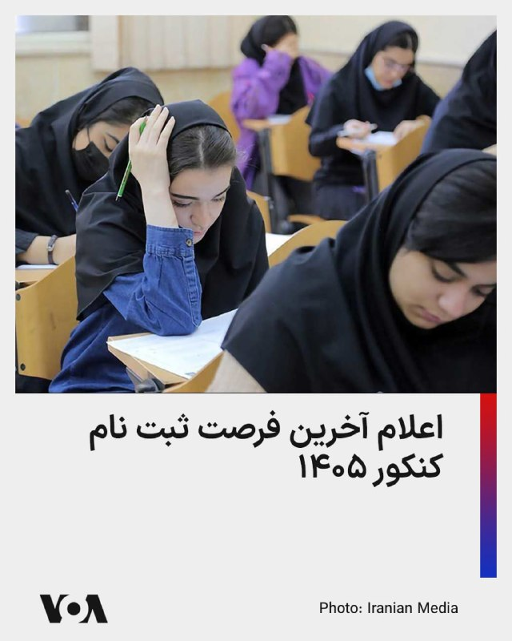

مهلت ثبت‌نام داوطلبان آزمون سراسری سال ۱۴۰۵ دانشگاه‌ها و موسسات آموزش عالی و همچنین آزمون پذیرش دانشجو معلم، روز جمعه هشتم خرداد پایان می‌یابد.

این در حالی است که تا این لحظه زمان دقیق برگزاری امتحانات نهایی پایه‌ دوازدهم مدارس و همچنین کنکور اعلام نشده و دانش‌آموزان نمی‌دانند چه زمانی باید در جلسه امتحان حضور یابند.

سازمان سنجش آموزش کشور روز ۳۰ اردیبهشت اعلام کرد «زمان دقیق برگزاری کنکور و پذیرش دانشجو معلمان»، یک هفته قبل از آزمون اعلام می‌شود.

از سوی دیگر، علی فرهادی، سخنگوی وزارت آموزش‌وپرورش، نیز اعلام کرده که تکلیف نحوه برگزاری امتحانات نهایی دانش‌آموزان پایه یازدهم و دوازدهم، تا نیمه مرداد ماه مشخص می‌‌شود.

امتحانات نهایی پایه دوازدهم از این جهت قابل اهمیت است که نتایج آن به صورت مستقیم در نتایج کنکور تاثیر می‌گذارد.

پیشتر حمیدرضا حاجی‌بابایی، نایب رئیس مجلس اعلام کرده بود که امتحانات نهایی، ۱۵ روز و کنکور سراسری ۴۵ روز پس از پایان جنگ برگزار خواهد شد.
@FarsiVOA

## FarsiVOA — post 218871

  <a href="telegram/content/FarsiVOA_218871_1779973169.mp4" target="_blank">🎬 Download video</a>

ارتش اسرائیل اعلام کرد در جریان یک حمله هوایی خود به جنوب نوار غزه در روز سه‌شنبه گذشته یک «مقام ارشد مالی» حماس کشته شده است.

ارتش اسرائیل روز پنجشنبه اعلام کرد که این حمله در خان‌یونس انجام شد و ایهاب کریزم، مسئول یک شبکه مرکزی برای انتقال پول به حماس در جریان این حمله کشته شد.

به گفته ارتش اسرائیل، کریزم مسئول «مدیریت انتقال میلیون‌ها دلار به شاخه نظامی حماس» بوده و اخیراً نیز «به نقض توافق آتش‌بس ادامه داده است»؛ اقداماتی که به گفته ارتش اسرائیل، باعث شد حماس بتواند حملات علیه نیروها و غیرنظامیان اسرائیلی را پیش ببرد.

طبق اعلام ارتش اسرائیل، در این حمله همچنین محمد الهباش، یک فرمانده مقر تولید تسلیحات حماس، نیز کشته شد.

همزمان ارتش اسرائیل پنجشنبه گزارش داد که نیروهای واحد کماندویی این ارتش، تحت هدایت شاباک، طی دو روز گذشته در چند عملیات در کرانه باختری هفت فلسطینی مظنون به تروریسم را بازداشت کردند؛

بر اساس این گزارش، برخی متهم به برنامه‌ریزی حملات قریب‌الوقوع علیه اسرائیل بودند.

ارتش اسرائیل اعلام کرد همه بازداشت‌شدگان برای بازجویی بیشتر به نیروهای امنیتی تحویل داده شدند.
@FarsiVOA

## FarsiVOA — post 218870

🔺افزایش ۵ تا ۴۵ برابری تعرفه برق «پرمصرف‌ها»

▪️مدیرکل دفتر مدیریت انرژی و مشتریان توانیر از افزایش ۵ تا ۴۵ برابری تعرفه برق خانوارهای «پرمصرف» خبر داد.

▪️او مدعی شد مصرف برق یک چهارم مشترکین خانگی بالاتر از الگوی مصرف است و نیم درصد مشترکین هم «بسیار بدمصرف» هستند.

▪️طبق گزارش‌های توانیر، بخش خانگی تنها حدود یک سوم برق کشور را مصرف می‌کند و سرانه مصرف برق بخش خانگی ایران حدود ۱۱۰۰ کیلووات ساعت در سال است؛ رقمی که ۶۰ درصد کمتر از اتحادیه اروپا و چندین برابر کمتر از آمریکا و کشورهای عرب حوزه خلیج فارس است.

▪️جمهوری اسلامی طی یک دهه گذشته حتی نیمی از اهداف رشد تولید برق را نتوانسته محقق کند و اکنون در فصول گرم سال با ۲۰ تا ۲۵ درصد کسری برق مواجه است.

⬇️ بیشتر بخوانید:
https://ir.voanews.com/a/iran-5-to-45-times-increase-in-electricity-tariffs-for-high-consumption-consumers/8154811.html

## FarsiVOA — post 218869

  

رئیس اتحادیه صنف چاپخانه‌داران و صحاف تهران، اعلام کرد که بخش قابل توجهی افزایش قیمت کالاها و اجناس، ناشی از هزینه بسته‌بندی و افزایش ۲۰۰ تا ۴۰۰ درصدی قیمت مواد اولیه صنعت چاپ است.

بابک عابدین به خبرگزاری ایلنا گفته است که هزینه‌ بسته‌بندی و چاپ، تأثیر مستقیم بر تورم قیمت کالاهای اساسی داشته است.

او یادآور شد که بخش قابل توجهی از این افزایش قیمت، ناشی از هزینه بسته‌بندی است، زیرا برای تهیه مواد اولیه مانند پلیمرها، آلومینیوم و کاغذ مجبور به پرداخت هزینه‌های چندبرابری هستیم.

به گفته رئیس اتحادیه صنف چاپخانه‌داران، این هزینه‌ها مستقیماً به صنایع مصرفی منتقل و در نهایت به صورت تورم شدید به مصرف‌کننده تحمیل می‌شود.

عابدین یادآور شد که پس از جنگ، قیمت موادی مانند آلومینیوم و ورق‌های چاپ‌پذیری که در بسته‌بندی استفاده می‌شوند به سطح بی‌سابقه‌ای رسیده است.
@FarsiVOA

## FarsiVOA — post 218868

  

دنی دانون، سفیر اسرائیل در سازمان ملل، اعلام کرد که این سازمان اسرائیل را فهرست ناقضان مرتبط با «خشونت جنسی در مناطق درگیری» و در کنار «بی‌رحم‌ترین سازمان‌های تروریستی جهان مثل حماس و داعش» قرار داده است.

آقای دانون در سخنانی ویدیویی که روز پنجشنبه در شبکه اجتماعی ایکس منتشر شد، گفت: «این یک تصمیم سیاسی است! جدا از واقعیت‌ها و حقیقت!»

او افزود: «اسرائیل برای هر ادعا، شواهد، اسناد و پاسخ‌های مفصل ارائه کرده است. ما از نمایندگان سازمان ملل دعوت کردیم به منطقه بیایند و از نزدیک موضوع را بررسی کنند، و آن‌ها البته ترجیح دادند این کار را نکنند. وقتی واقعیت‌ها با روایت مورد نظرشان همخوانی ندارد، در سازمان ملل به‌سادگی روایت را تغییر می‌دهند.»

رسانه‌های اسرائیلی گزارش دادند که اسرائیل قصد دارد همکاری خود با دفتر آنتونیو گوترش، دبیرکل سازمان ملل، را در پی این تصمیم متوقف کند.

در گزارش پیشین که ژوئیه ۲۰۲۵ از سوی دفتر گوترش منتشر شد، حماس در فهرست «طرف‌هایی که به‌طور جدی مظنون به ارتکاب یا مسئول رفتار تجاوز یا دیگر اشکال خشونت جنسی در موقعیت‌های درگیری مسلحانه هستند» قرار گرفته بود.
@FarsiVOA

## FarsiVOA — post 218867

  

قیمت‌های جهانی نفت در پی واکنش ایالات متحده به حملات پهپادی جمهوری اسلامی به یک کشتی آمریکایی و هدف قرار دادن مواضع جمهوری اسلامی افزایش یافت.

قیمت نفت شاخص برنت روز پنج‌شنبه با رشدی بالای ۳.۵ درصدی به نزدیک ۹۸ دلار رسید.

ارزش سهام در بازارهای بورس جهانی، خصوصا آمریکا، نیز در پی افزایش تنش‌های خاورمیانه مقداری افت کرد.

سایت تسنیم، نزدیک به سپاه پاسداران، به نقل از فردی که او را یک «منبع آگاه نظامی» خواند، اوایل روز پنج‌شنبه به وقت محلی گزارش داد که نیروهای سپاه به یک «نفتکش آمریکایی» که قصد داشت از تنگه هرمز عبور کند، حمله کردند.

آمریکا می‌گوید در اقدامی تدافعی، چهار پهپاد انفجاری جمهوری اسلامی را رهگیری و منهدم کرد و یک مرکز پهپاد در ایران را پیش از پرتاب پنجمین پهپاد، هدف حمله قرار داد.
@FarsiVOA

## DW_Farsi — post 125238

🔶 آمریکا: کمک شرکت‌های سوئیسی به ایران برای دور زدن تحریم‌ها

شماری از شرکت‌های مستقر در سوئیس، از مدیریت نفتکش‌های ناوگان سایه گرفته تا جابه‌جایی پول و سرمایه‌گذاری درآمدهای نفتی، در شبکه‌ای نقش داشته‌اند که به گفته آمریکا برای فروش نفت ایران، دور زدن تحریم‌ها و انتقال منابع مالی به سپاه پاسداران به کار رفته است. این اتهام‌ها هم شرکت‌های کشتیرانی در ژنو و هم یک صندوق سرمایه‌گذاری در تسوگ و یک بانک خصوصی در زوریخ را دربر می‌گیرد.

در گزارش که سازمان رادیو و تلویزیون دولتی سوئیس منتشر کرده است، نام شرکت "فرکتال شیپینگ" در ژنو مطرح شده؛ شرکتی که در سال ۲۰۲۲ مدیریت حدود ۳۰ نفتکش قدیمی را بر عهده گرفت. گفته می‌شود این شرکت ابتدا نفت روسیه را جابه‌جا می‌کرد، اما پس از تشدید تحریم‌های غرب علیه روسیه، مدیرعامل آن، ماتیو فیلیپ، یک شرکت تابعه در دبی تاسیس کرد. آمریکا از تابستان ۲۰۲۵ او و شرکت‌هایش در ژنو و دبی را تحریم کرد و مدعی شد این مجموعه بخشی از یک شبکه ایرانی است.

به گفته آمریکا، محور این شبکه حسین شمخانی ، پسر علی شمخانی، بوده است. واشنگتن می‌گوید او ساختاری از شرکت‌ها را هدایت می‌کرده که نفت ایران را به‌رغم تحریم‌ها به چین و هند می‌رسانده و درآمدهای آن به سپاه پاسداران می‌رسیده است. در همین چارچوب، نفتکش‌های مرتبط با شرکت‌های ماتیو فیلیپ نیز به‌عنوان بخشی از ناوگان سایه در انتقال نفت و بارگیری در بنادر روسیه به کار گرفته شده‌اند.

@dw_farsi

## DW_Farsi — post 125237

  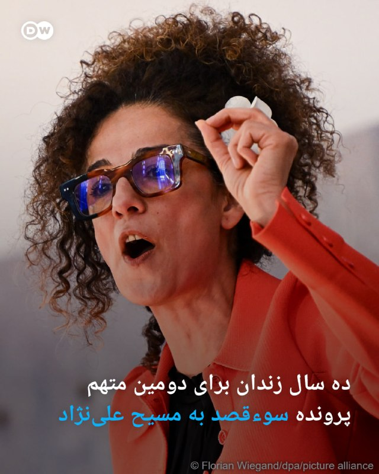

🔶 ده سال زندان برای دومین متهم پرونده سوءقصد به مسیح علی‌نژاد

پرونده نقشه‌ جمهوری اسلامی برای قتل مسیح علی‌نژاد، روزنامه‌نگار و فعال ایرانی-آمریکایی با محکومیت جاناتان لودهولت ۳۷ ساله به ۱۰ سال زندان وارد مرحله جدیدی شد.

این فرد به همراه همدست خود قرار بود در ازای دریافت ۱۰۰ هزار دلار آمریکا، مسیح علی‌نژاد را به قتل برسانند. وزارت دادگستری ایالات متحده روز چهارشنبه اعلام کرد لودهولت به دلیل مشارکت در طرح قتل سفارشی، به ۱۰ سال زندان محکوم شده است.

لودهولت که اهل منطقه استیتن آیلند نیویورک است، دومین متهم این پرونده است که اکنون راهی زندان می‌شود. در ژانویه نیز همدست او، کارلایل ریورا، محکوم شده بود. او حکم ۱۵ سال زندان دریافت کرده بود. در همین راستا مسیح علی‌نژاد که هدف این طرح ترور بود، پس از انتشار حکم در پستی نوشت: «تا زمانی که حکومت ایران بر سر کار باشد، هیچ‌کدام از ما، چه داخل ایران و چه خارج از آن، امنیت نخواهیم داشت.»

بر اساس اعلام وزارت دادگستری آمریکا، حکومت ایران پشت این سوءقصد نافرجام قرار داشته است. وزارت دادگستری آمریکا نوشت سپاه پاسداران انقلاب اسلامی، سال‌ها برای ربودن یا قتل این روزنامه‌نگار برنامه‌ریزی کرده بود.

@dw_farsi

## DW_Farsi — post 125236

  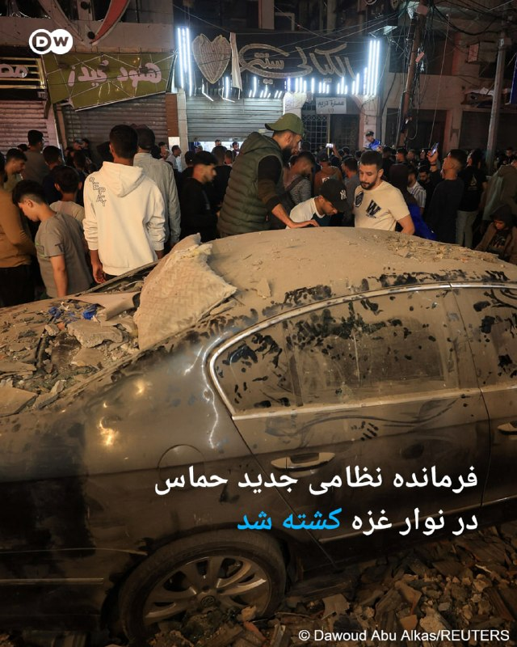

🔶 فرمانده نظامی جدید حماس در نوار غزه کشته شد

کمتر از دو هفته پس از کشته شدن فرمانده پیشین گروه تروریستی حماس در غزه ، اسرائیل فرمانده نظامی جدید این گروه را نیز در جریان یک حمله از بین برد.

ارتش اسرائیل و سازمان اطلاعات داخلی شین‌بت صبح چهارشنبه با اعلام این خبر گفتند که محمد عوده پس از ماه‌ها تحت نظر بودن، روز سه‌شنبه در شهر غزه "از بین برده شد".

ارتش اسرائیل و شین‌بت همچنین اعلام کردند: «عوده از آخرین فرماندهان ارشد [زنده در] شاخه نظامی حماس بود که در برنامه‌ریزی و اجرای کشتار ۷ اکتبر نقش داشت.»

شاخه نظامی حماس عصر چهارشنبه، کشته شدن محمد عوده و اعضای خانواده او را تایید کرد. منابع پزشکی در نوار غزه نیز اعلام کردند عوده و چهار نفر از بستگانش در حملات هوایی اسرائیل در شهر غزه کشته شدند. در مجموع شش نفر در این حملات جان خود را از دست داده‌اند.

اسرائیل حدود یک هفته و نیم پیش نیز کشته شدن فرمانده پیشین عوده، یعنی عزالدین الحداد، را در یک حمله هوایی اسرائیل تایید کرده بود. وزیر دفاع اسرائیل آن زمان او را نیز یکی از طراحان اصلی حمله هفتم اکتبر توصیف کرده بود. بر اساس اعلام اسرائیل، عوده اندکی پس از کشته شدن الحداد، رهبری شاخه نظامی حماس در نوار غزه را بر عهده گرفته بود. با این حال، حماس این موضوع را به طور رسمی تایید نکرد.

@dw_farsi

## DW_Farsi — post 125235

  

📸 عکس روز: مرلین مونرو، نماد هالیوود

در لس‌آنجلس نمایشگاهی با عنوان "مرلین مونرو: نماد هالیوود" برپا شده است. در این نمایشگاه که به ابتکار "موزه آکادمی تصاویر متحرک" ترتیب داده شده، صدها شیء اصل، از جمله لباس‌ها، پوسترها، عکس‌ها، نامه‌ها و وسایل شخصی‌ مرلین مونرو به نمایش گذاشته شده است. بسیاری از این قطعات منحصر به فرد هستند. این نمایشگاه نگاهی به سیر تحول مرلین مونرو برای تبدیل شدن به یک نماد هالیوود را ارائه می‌دهد.

@dw_farsi

## DW_Farsi — post 125234

  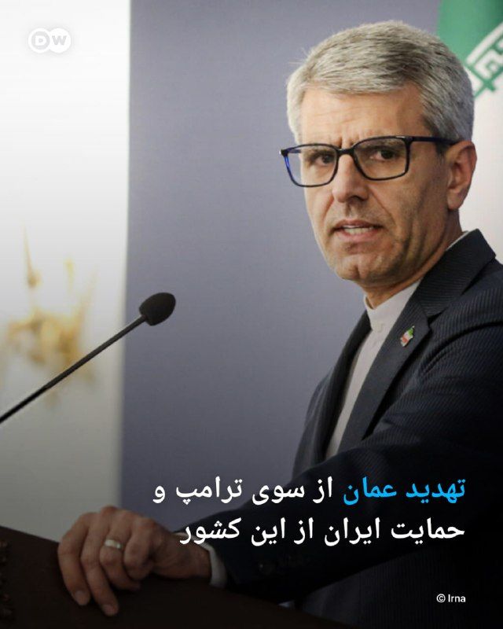

🔶 تهدید‌ عمان از سوی ترامپ و حمایت ایران از این کشور

اسماعیل بقائی، سخنگوی وزارت امور خارجه جمهوری اسلامی، حملات نظامی بامداد امروز آمریکا به بندرعباس را "نقض فاحش منشور ملل متحد و آتش‌بس نوزدهم فروردین" خواند و آن چه را که "لفاظی‌های واشنگتن علیه ایران و عمان" نامید محکوم کرد.

بقائی همچنین با محکوم کردن "تعرض به کشتیرانی تجاری در منطقه‌ خلیج فارس و آب‌های آزاد و نیز تعرض هوایی به مناطق جنوبی ایران ظرف چند روز گذشته"، بر حق قانونی جمهوری اسلامی برای دفاع برای دفاع طبق ماده ۵۱ منشور سازمان ملل تأکید کرد.

سخنگوی وزارت امور خارجه جمهوری اسلامی همچنین گفت که "با کشور دوست و برادر عمان" ابراز همبستگی می‌کند. او با اشاره ضمنی به اظهارات اخیر ترامپ گفت: «تهدید به "انهدام" یک کشور عضو سازمان ملل متحد که همواره نقشی سازنده، موثر و مسئولانه در قبال صلح و امنیت منطقه داشته و طی سال‌های متمادی در مقام میانجی روندهای دیپلماتیک، مساعی جمیله خود را در خدمت صلح و ثبات منطقه به کار گرفته است، نه تنها نقض اصل بنیادین منع تهدید به استفاده از زور است، بلکه نشانه خطرناک دیگری از عادی‌سازی قانون‌شکنی و قلدرمآبی در روابط بین‌الملل است.»

ترامپ در اظهارات اخیر خود در جریان نشست کابینه درباره آینده تنگه هرمز، به عمان، شریک آمریکا، درباره همکاری با ایران هشدار داده بود.

ترامپ روز چهارشنبه در کاخ سفید با بیان این که عمان باید "مثل بقیه رفتار کند" گفته بود: «در غیر این صورت آمریکا آن‌ها را منهدم خواهد کرد.»

@dw_farsi

## DW_Farsi — post 125222

📸 فراری تمام برقی؛ سنت‌شکنی در فرم و وفاداری به قدرت

فراری در روزهای اخیر با مدل "Ferrari Luce" از نخستین خودروی تمام‌برقی خود رونمایی کرده و گامی بزرگ به سوی آینده برداشته است. مدت‌ها درباره این خودرو گمانه‌زنی می‌شد و حالا بالاخره رونمایی شده است. دلیل هیجان زیاد درباره این پروژه فقط ورود برند افسانه‌ای فراری به دنیای خودروهای برقی نبود، بلکه همکاری ویژه‌ای هم پشت آن قرار داشت: طراحی داخلی و خارجی خودرو را جاناتان آیو، طراح سابق اپل، انجام داده است.

نتیجه، خودرویی است که عمداً قواعد همیشگی فراری را می‌شکند. "لوچه" (Luce) در زبان ایتالیایی به معنای "نور" است و برخلاف سوپراسپرت‌های سنتی فراری، این مدل یک خودروی پنج‌نفره و چهاردر است که با طراحی غیرمعمول خود توجه‌ها را جلب می‌کند.

اما از نظر قدرت، این خودرو کاملاً یک فراری واقعی است. چهار موتور الکتریکی آن مجموعاً تا ۱۰۵۰ اسب‌بخار نیرو تولید می‌کنند. در حالت پرفورمنس، حداکثر سرعت خودرو به ۳۱۰ کیلومتر بر ساعت می‌رسد. همچنین به لطف قابلیت Boost، شتاب صفر تا ۱۰۰ کیلومتر را در ۲.۵ ثانیه و صفر تا ۲۰۰ کیلومتر را در ۶.۸ ثانیه طی می‌کند.
@dw_farsi

## DW_Farsi — post 125221

  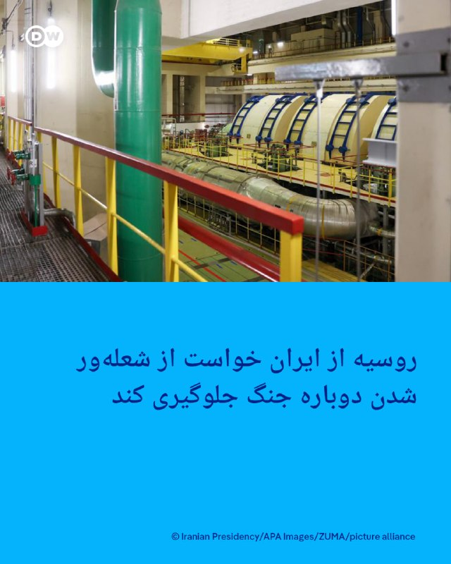

🔶 یک مقام روس: ایران از شروع یک جنگ جدید جلوگیری کند

شرکت دولتی انرژی هسته‌ای روسیه تصمیم گرفته است بازگشت کارکنان خود به نیروگاه هسته‌ای بوشهر در ایران را به تعویق بیندازد. این خبر را الکسی لیخاچف، رئیس روس‌اتم، روز چهارشنبه اعلام کرد. روس‌اتم پیش‌تر ۸۱۳ نفر از کارکنان خود را از این سایت تخلیه کرده بود و تنها ۲۰ نفر را در محل باقی گذاشته بود.

همزمان یک مقام امنیتی روسیه در دیدار با علی باقری‌کنی، معاون دبیر شورای عالی امنیت ملی جمهوری اسلامی از حکومت ایران خواست تا از شروع مجدد جنگجلوگیری کند.

به گزارش پرس‌نیوز، خبرگزاری انگلیسی‌زبان صداوسیمای جمهوری اسلامی، الکساندر وندیکتوف، معاون دبیر شورای امنیت روسیه، حکومت ایران را به دنبال کردن "یک معماری امنیتی جهانی جدید" تشویق کرده است.

ندیکتوف در دیدار با باقری‌کنی گفته است: «آنچه از اهمیت فوق‌العاده برخوردار است، جلوگیری از شعله‌ور شدن دوباره یک رویارویی نظامی و هموار کردن مسیر برای ایجاد یک نظم امنیتی جدید در منطقه است. ما آماده‌ایم این روند را از طریق همه ابزارهای موجود تسهیل کنیم.»

@dw_farsi

## DW_Farsi — post 125220

🔶 نروژ به چتر بازدارندگی هسته‌ای فرانسه پیوست

امانوئل مکرون، رئیس‌جمهوری فرانسه، و یوناس گار استوره، نخست‌وزیر نروژ، اعلام کرده‌اند اسلو به طرح بازدارندگی هسته‌ای تحت رهبری پاریس پیوسته است. بر پایه این طرح، فرانسه که تنها قدرت هسته‌ای اتحادیه اروپاست، می‌خواهد از ظرفیت هسته‌ای خود برای تقویت امنیت شرکای اروپایی استفاده کند.

به نوشته فرانس ۲۴ یوناس گار استوره گفت اروپا با جدی‌ترین وضعیت امنیتی از زمان جنگ جهانی دوم روبه‌روست و توافق دفاعی تازه با فرانسه در همین چارچوب امضا شده است. او افزود نروژ در ماه‌های گذشته با آلمان و بریتانیا نیز توافق‌های دفاعی امضا کرده و اکنون با فرانسه هم به یک چارچوب جامع همکاری رسیده است.

مکرون هم گفت نروژ، به‌عنوان یک شریک مهم جغرافیایی و راهبردی، می‌تواند ارزش افزوده‌ای جدی برای این بازدارندگی تقویت‌شده ایجاد کند.

مکرون این برنامه را در ماه مارس معرفی کرده بود. بر اساس این طرح، کشورهای عضو می‌توانند به‌طور موقت میزبان «نیروهای راهبردی هوایی» فرانسه شوند؛ حضوری که از نگاه پاریس، محاسبات دشمنان بالقوه را پیچیده‌تر می‌کند و بازدارندگی اروپا را بالا می‌برد.

پیش از نروژ، هشت کشور دیگر به این چارچوب پیوسته بودند: بلژیک، دانمارک، آلمان، یونان، هلند، لهستان، سوئد و بریتانیا.

@dw_farsi

## DW_Farsi — post 125219

  

🔶 ادامه حملات سهمگین ارتش اسرائیل به مواضع حزب‌الله در جنوب لبنان

ارتش اسرائیل از موج حملات تازه به زیرساخت‌های گروه حزب‌الله در شهر صور لبنان خبر داد. بر اساس گزارش رسانه‌های لبنانی، ارتش اسرائیل شهرک حاروف در جنوب لبنان را هدف حمله‌ هوایی هدف قرار داد.

همچنین خبرها حاکی از کشته شدن یک سرباز اسرائیلی در پی حمله پهپادی حزب‌الله به شمال اسرائیل است. در همین راستا ارتش اسرائیل تایید کرد که یک سرباز اسرائیلی در حمله پهپادی حزب‌الله به شمال این کشور در نزدیکی مرز لبنان کشته شد. حمله پهپادی حزب‌الله لبنان همچنین به مجروح شدن دو نظامی اسرائیلی منجر شد. جراحت یکی از این مجروحان جدی گزارش شده است.

درگیری میان اسرائیل و حزب‌الله روز چهارشنبه تشدید شد. بر اساس اعلام منابع اسرائیلی، ارتش این کشور بیش از ۱۵۰ هدف را در صور، نبطیه، دره بقاع و سراسر جنوب لبنان هدف قرار داد و حزب‌الله نیز پهپادهایی را به سمت روش هانیکرا و شلومی پرتاب کرد. همچنین گزارش شده که آژیرهای اعلام خطر در کریات شمونا به صدا درآمدند.

آویخای ادرعی، سخنگوی عربی‌زبان ارتش اسرائیل، در روز چهارشنبه با ارائه فهرستی طولانی‌ از شهرها و روستاها به شهروندان لبنانی ساکن این مناطق هشدار داد که از شمال رودخانه زهرانی یا دست‌کم از مناطق وابسته به حزب‌الله فاصله بگیرند.

او گفت: «با توجه به نقض توافق آتش‌بس از سوی سازمان تروریستی حزب‌الله، ارتش اسرائیل مجبور است با قدرت علیه آن اقدام کند و قصد آسیب رساندن به شما را ندارد.»

@dw_farsi

## DW_Farsi — post 125218

  

🔶 رئیس کمیسیون امنیت ملی مجلس: از "خطوط قرمز" عقب‌نشینی نخواهیم کرد

ابراهیم عزیزی، رئیس کمیسیون امنیت ملی و سیاست خارجی مجلس شورای اسلامی گفت که جمهوری اسلامی "از خطوط قرمز خود مانند حق غنی‌سازی، اورانیوم غنی‌شده، مدیریت تنگه هرمز و لغو تحریم‌ها عقب‌نشینی نخواهد کرد".

به گزارش خبرگزاری مهر، رئیس کمیسیون امنیت ملی مجلس شورای اسلامی همچنین در ادامه اظهارات خود، تهدیدات دونالد ترامپ، رئیس جمهور آمریکا را "لفاظی" خواند و مدعی شد: «دیگر همه می‌دانند ترامپ برای نجات خود از این بن‌بست راهبردی یک روز از ابزار تهدید استفاده می‌کند و روز دیگر برای توافق التماس‌ می‌کند!»

@dw_farsi

## DW_Farsi — post 125217

  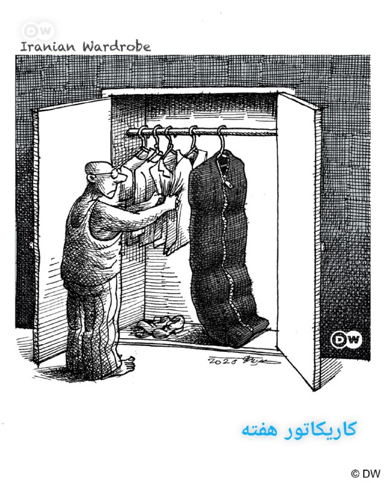

📸 کاریکاتور هفته

چند ماه از قتل‌عام دی‌ماه در ایران گذشته است؛ جنگی میان جمهوری اسلامی، آمریکا و اسرائیل درگرفت. اینترنتی که نزدیک به سه ماه قطع بود، حالا کم‌کم دارد وصل می‌شود و زمزمه‌های توافقی میان رژیم و آمریکا به گوش می‌رسد؛ توافقی که هنوز امکان تحقق و ابعادش در هاله‌ای از ابهام قرار دارد. هم‌زمان، گروه‌های مختلف اپوزیسیون سرگرم جدال، حذف معنوی و مقصر دانستن یکدیگرند. اما شاید در میان همه این آشوب‌ها، یک چیز بیش از هر چیز دیگر قطعی به نظر برسد: عادی شدن گرفتن جان شهروندان ایرانی به جرم مخالفت و خواستنِ تغییر.

این موضوع دستمایه مانا نیستانی در طراحی کاریکاتور هفته برای دویچه وله فارسی بوده است.

@dw_farsi

## Persian_Trend_Official — post 15187

  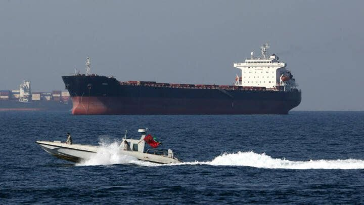

عبور 26 فروند کشتی از تنگه هرمز با هماهنگی سپاه

روابط عمومی نیروی دریایی سپاه اعلام کرد: کنترل هوشمند تنگه هرمز با اقتدار کامل در حال انجام است و طی شبانه روز گذشته 26 فروند کشتی تجاری و نفتکش پس از کسب مجوز با هماهنگی نیروی دریایی سپاه از کریدور ایمن تنگه هرمز عبور کردند.

دریافت مجوز و هماهنگی برای تردد در تنگه هرمز یک امر قطعی بوده و همانطور که قبلا اعلام شد عبور از سایر مسیرها به مثابه اخلال شناخته شده و با آنها برخورد می گردد.

شب گذشته نیز چندین کشتی بصورت غیر مجاز با دستکاری و خاموش کردن سیستم های ناوبری، قصد ورود به خلیج فارس را داشتند. رزمندگان نیروی دریایی سپاه بعد از چندین نوبت اخطار رادیویی دو فروند از آنها را در جای خود متوقف و مابقی نیز مجبور به بازگشت شدند.

📝 Amir

📌 @persian_trend_official
پرشین ترند | متفاوت‌ترین کانال نظامی

## Persian_Trend_Official — post 15186

💢🇮🇱🇱🇧🏴رسانه‌های اسرائیلی: «علی الحسنی»، مسئول موشکی در یگان امام حسین ترور شده است.

👩‍💻@PhantomDirective

🆔@persian_trend_official
پرشین ترند | متفاوت‌ترین کانال نظامی

## Persian_Trend_Official — post 15185

  

🇮🇱
❌
🇱🇧
🇱🇧 — عکس ساختمان هدف‌گرفته شده در حومه جنوبی بیروت (داهییه).

👩‍💻@PhantomDirective

🆔@persian_trend_official
پرشین ترند | متفاوت‌ترین کانال نظامی

## Persian_Trend_Official — post 15184

  <a href="telegram/content/Persian_Trend_Official_15184_1779973178.mp4" target="_blank">🎬 Download video</a>

یدعوت آحرونوت:

حمله جنگنده های اسرائیلی به بیروت برای ترور فرمانده‌ ای در نیروی موشکی حزب‌الله بوده است.

👩‍💻@PhantomDirective

🆔@persian_trend_official
پرشین ترند | متفاوت‌ترین کانال نظامی

## Persian_Trend_Official — post 15183

  

اسرائیل در اقدامی ظاهراً ترور، بیروت را بمباران کرد.

👩‍💻@PhantomDirective

🆔@persian_trend_official
پرشین ترند | متفاوت‌ترین کانال نظامی

## Persian_Trend_Official — post 15182

  <a href="telegram/content/Persian_Trend_Official_15182_1779973179.webm" target="_blank">🎬 Download video</a>

🎬 Video

## Persian_Trend_Official — post 15181

  

سنتکام: یک موشک پرتاب شده از سوی ایران توسط نیروهای کویتی با موفقیت رهگیری شد.

فرماندهی مرکزی ایالات متحده در بیانیه ای اعلام کرد: ایران یک موشک بالستیک به سمت کویت پرتاب کرد که با موفقیت توسط نیروهای کویت رهگیری شد. این نقض فاحش آتش بس توسط رژیم ایران ساعاتی پس از آن رخ داد که نیروهای ایرانی پنج پهپاد حمله یک طرفه را پرتاب کردند که تهدیدی آشکار در داخل و نزدیک تنگه هرمز بود. همه پهپادها با موفقیت توسط نیروهای آمریکایی رهگیری شدند و همچنین از پرتاب ششم پهپاد از یک سایت کنترل زمینی ایران در بندرعباس جلوگیری کردند.

فرماندهی مرکزی ایالات متحده و شرکای منطقه ای همچنان هوشیار و سنجیده هستند زیرا ما همچنان به دفاع از نیروها و منافع خود در برابر تجاوزات غیرموجه ایران ادامه می دهیم.

📌 @persian_trend_official
پرشین ترند | متفاوت‌ترین کانال نظامی

## Persian_Trend_Official — post 15180

  

💢کشف «آخرین تصویر» از چهره یزدگرد سوم پادشاه ساسانی در آتشکده باستانی بازه هور خراسان

باستان‌شناسان دانشگاه تهران در جریان کاوش‌های خود در شمال شرق ایران، موفق به شناسایی یک پانل گچ‌بری نفیس شده‌اند که به باور پژوهشگران، تصویری از یزدگرد سوم، آخرین پادشاه سلسله ساسانی را در روزهای پایانی عمر و در آستانه سقوط این امپراتوری به نمایش می‌گذارد.

نتایج این کشف بزرگ باستان‌شناسی که تحت سرپرستی دکتر میثم لباف خانیکی، عضو هیأت علمی گروه باستان‌شناسی دانشگاه تهران صورت گرفته، در قالب مقاله‌ای علمی با عنوان «آخرین تصویر از آخرین پادشاه» در نشریه بین‌المللی و معتبر «شرق و غرب» متعلق به مؤسسه «ایزمئو» در ایتالیا منتشر شده است.

بیشتر بخوانید: https://l.euronews.com/FzEU

## Persian_Trend_Official — post 15179

  <a href="telegram/content/Persian_Trend_Official_15179_1779973181.webm" target="_blank">🎬 Download video</a>

ارتش لبنان از کشته شدن یک گروهبان خود با نام علاء محمود در پی حمله هوایی اسرائیل به جاده زفتا-دیرالزهرانی خبر داد.

📝 Amir

📌 @persian_trend_official
پرشین ترند | متفاوت‌ترین کانال نظامی

## Persian_Trend_Official — post 15176

  <a href="telegram/content/Persian_Trend_Official_15176_1779973181.webm" target="_blank">🎬 Download video</a>

حضور پدافند موشکی برد کوتاه مجید ایرانی در رژه ارتش ارمنستان

چند روز پیش در پی جابه‌جایی ادوات نظامی توسط ارتش ارمنستان در سطح شهر ایروان برای برگزاری رژه روز جمهوری ارمنستان، تصاویری از سیستم پدافندی برد کوتاه مجید با نام صادراتی AD-08 در خیابان های این شهر منتشر شد که امروز ارتش ارمنستان با برگزاری رژه رسماً از این پدافند رونمایی کرد.

ارمنستان اولین کاربر غیرمتحد این سامانه محسوب میشود.

📝 Amir

📌 @persian_trend_official
پرشین ترند | متفاوت‌ترین کانال نظامی

## Persian_Trend_Official — post 15175

  <a href="telegram/content/Persian_Trend_Official_15175_1779973181.mp4" target="_blank">🎬 Download video</a>

ارتش روسیه در حال استقرار سامانه‌های پدافند هوایی Pantsir-S1 بر روی پشت‌بام‌برجی ۴۲ طبقه در مسکو با استفاده از هلیکوپترهای Mil Mi-26 است

👩‍💻@PhantomDirective

🆔@persian_trend_official
پرشین ترند | متفاوت‌ترین کانال نظامی

## Persian_Trend_Official — post 15174

  <a href="telegram/content/Persian_Trend_Official_15174_1779973183.webm" target="_blank">🎬 Download video</a>

🌲 - 🇱🇧🇮🇱 مردی که در جاده شبریه-صور رانندگی می‌کرد، تماس تلفنی دریافت کرد(از سمت اسرائیلی ها)که هشدار می‌داد وسیله نقلیه‌اش هدف قرار خواهد گرفت. او وسط جاده از ماشین بیرون پرید و فرار کرد.

نیروهای دفاع مدنی شاخه ای از جنبش عمل (مثل هلال احمر خودمون )به عنوان اقدام احتیاطی جاده را پیش از حمله بستند.

👩‍💻@PhantomDirective

🆔@persian_trend_official
پرشین ترند | متفاوت‌ترین کانال نظامی

## Persian_Trend_Official — post 15173

  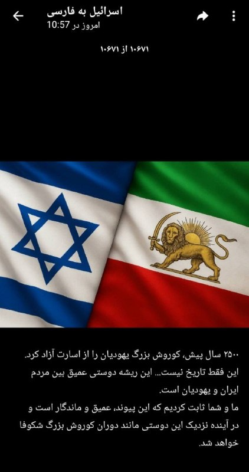

👑
➖
🤴
➖
🇮🇱
پست ساعاتی قبل کانال اسرائیل به فارسی

👩‍💻@PhantomDirective

🆔@persian_trend_official
پرشین ترند | متفاوت‌ترین کانال نظامی

## Persian_Trend_Official — post 15172

  <a href="telegram/content/Persian_Trend_Official_15172_1779973184.mp4" target="_blank">🎬 Download video</a>

©️تصاویری از حمله نیروی هوایی به مقر حزب‌الله در محله الاثار در شهر صور در جنوب لبنان
©️

👩‍💻@PhantomDirective

🆔@persian_trend_official
پرشین ترند | متفاوت‌ترین کانال نظامی

## Persian_Trend_Official — post 15171

  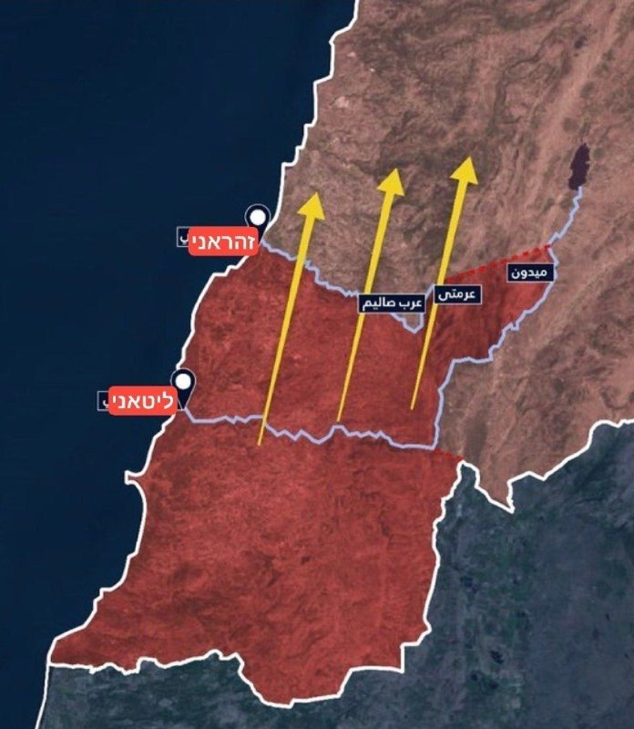

🇮🇱
🇱🇧 اسرائیل دستور تخلیه کل جنوب لبنان را صادر کرده ، که شامل تمام مناطق جنوب رودخانه لیتانی می‌شود.

👩‍💻@PhantomDirective

🆔@persian_trend_official
پرشین ترند | متفاوت‌ترین کانال نظامی

## Persian_Trend_Official — post 15170

  

البيت سیستمز قراردادی به ارزش ۳۵۰ میلیون دلار برای ارتقاء تانک‌ها از یک مشتری بین‌المللی دریافت کرد.

، حیفا، اسرائیل، ۲۸ مه ۲۰۲۶ // — شرکت البیت سیستمز امروز اعلام کرد که قراردادی به ارزش تقریبی ۳۵۰ میلیون دلار از یک مشتری بین‌المللی برای ارتقاء تانک‌های اصلی میدان نبرد (MBT) دریافت کرده است. این برنامه شامل یکپارچه‌سازی سامانه‌های پیشرفته کنترل آتش، سامانه‌های الکتریکی هدایت توپ و برجک، راهکارهای ارتباطی و آگاهی محیطی، و همچنین بسته ارتقاء میان‌عمر (Mid Life Upgrade) است. اجرای این قرارداد طی چهار سال انجام خواهد شد.
بر اساس این قرارداد، البیت سیستمز سامانه‌های تانک‌ها را برای افزایش عمر عملیاتی و ارتقاء آمادگی رزمی آن‌ها نوسازی خواهد کرد. این برنامه ارتقاء شامل جایگزینی و بهبود سامانه‌های کلیدی روی تانک است و از جمله تجهیزاتی مانند سامانه‌های دید الکترواپتیکی سبک‌وزن و با کارایی بالا با قابلیت‌های هوش مصنوعی (AI) را در بر می‌گیرد که امکان مشاهده در روز و شب، و همچنین شناسایی و رهگیری پیشرفته اهداف را فراهم می‌کنند.
این قرارداد همچنین شامل تأمین قطعات یدکی و ارائه خدمات نگهداری و پشتیبانی فنی برای تضمین آمادگی عملیاتی بلندمدت است. افزون بر این، یک سامانه ارتباط صوتی امن و با ظرفیت بالا نیز در این پروژه یکپارچه خواهد شد.

👩‍💻@PhantomDirective

🆔@persian_trend_official
پرشین ترند | متفاوت‌ترین کانال نظامی

## Persian_Trend_Official — post 15169

  

بیانیه ارتش دفاعی اسرائیل (IDF):

در واکنشی سریع ارتش دفاعی اسرائیل سر شبکه مرکزی انتقال وجوه حماس را از بین برد.

روز سه‌شنبه، ارتش دفاعی اسرائیل در منطقه خان یونس ضربه‌ای وارد کرد و ایهاب خریزم، سر شبکه مرکزی انتقال وجوه حماس را از بین برد.

ایهاب خریزم مسئول مدیریت انتقال میلیون‌ها دلار به شاخه نظامی حماس بود. در ماه‌های اخیر، خریزم به نقض توافق آتش‌بس ادامه داد و فعالیت‌های او به سازمان تروریستی امکان داد حملات فوری علیه نیروهای ارتش دفاعی اسرائیل و غیرنظامیان اسرائیلی انجام دهد.

از بین بردن خریزم ضربه قابل توجهی به تلاش‌های بازسازی و تقویت نیروهای حماس وارد می‌کند.

علاوه بر خریزم، در جریان این حمله، ارتش دفاعی اسرائیل محمد الحباش، فرمانده واحد در ستاد تولید حماس را نیز از بین برد. در طول جنگ، الحباش در ساخت سلاح برای حماس مشارکت داشت.

قبل از حمله، اقداماتی برای کاهش آسیب به غیرنظامیان انجام شد، از جمله استفاده از مهمات دقیق و نظارت هوایی.

نیروهای ارتش دفاعی اسرائیل تحت فرماندهی جنوبی مطابق با توافق آتش‌بس مستقر باقی مانده و به عملیات برای رفع هر تهدید فوری ادامه خواهند داد.

👩‍💻@PhantomDirective

🆔@persian_trend_official
پرشین ترند | متفاوت‌ترین کانال نظامی

## Persian_Trend_Official — post 15168

  <a href="telegram/content/Persian_Trend_Official_15168_1779973186.mp4" target="_blank">🎬 Download video</a>

سپاه پاسداران تصاویری از حملات موشکی بامداد امروز خود به کویت را منتشر کرد.

طبق ویدیو منتشر شده توسط رسانه های سپاه پاسداران در این حمله از موشک‌ های بالستیک سوخت جامد کوتاه برد و میان برد خانواده فاتح استفاده شده است.

📝 Amir

📌 @persian_trend_official
پرشین ترند | متفاوت‌ترین کانال نظامی

## RadioFarda — post 157658

  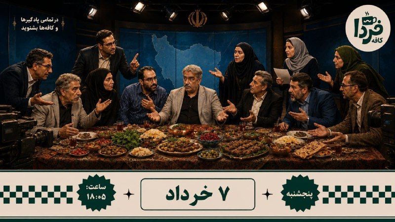

📷 Photo

## RadioFarda — post 157657

مقام پیشین پنتاگون: ایران و آمریکا هر دو اهرم فشار دارند، اما به توافق هم نیاز دارند

🔸واشینگتن و تهران میان ادامه دیپلماسی و خطر ازسرگیری درگیری نظامی در رفت‌وآمدند. مایکل پاتریک مولروی، مقام پیشین وزارت دفاع آمریکا در امور خاورمیانه در دولت اول ترامپ، معتقد است در حال حاضر هر دو طرف انگیزه‌ای قوی برای جلوگیری از تشدید بحران دارند.

🔸با این حال، او هشدار می‌دهد که هرگونه پیشرفتی در نهایت به به این بستگی دارد که تهران و واشینگتن تا چه اندازه حاضر به مصالحه باشند.

🔸مولروی در گفت‌وگو با رادیو اروپای آزاد/رادیو آزادی می‌گوید که برای دستیابی به توافق هنوز «امیدواری» وجود دارد، چون هم واشینگتن و هم تهران «به پایان یافتن این وضعیت علاقه دارند»، اما هشدار می‌دهد که اگر هر یک از دو طرف در استفاده از اهرم فشار خود زیاده‌روی کند، مذاکرات ممکن است فرو بپاشد.

🔸متن کامل این گفت‌وگو را در وب‌سایت رادیوفردا بخوانید.

@RadioFarda

## RadioFarda — post 157656

🔸رسانه‌های ایران پیامی منسوب به مجتبی خامنه‌ای، رهبر جمهوری اسلامی، را خطاب به نمایندگان مجلس شورای اسلامی منتشر کردند که در آن می‌گوید «ایجاد تفرقه و تجزیه اجتماعی»، در کنار جنگ و فشار اقتصادی و محاصره، «طرح و نقشهٔ کور دشمن» است. 🔸مجتبی خامنه‌ای در این…

## RadioFarda — post 157655

  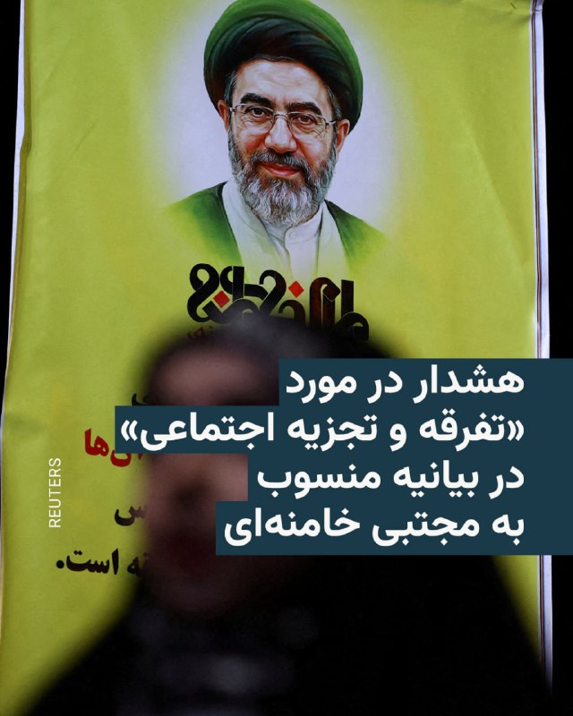

🔸رسانه‌های ایران پیامی منسوب به مجتبی خامنه‌ای، رهبر جمهوری اسلامی، را خطاب به نمایندگان مجلس شورای اسلامی منتشر کردند که در آن می‌گوید «ایجاد تفرقه و تجزیه اجتماعی»، در کنار جنگ و فشار اقتصادی و محاصره، «طرح و نقشهٔ کور دشمن» است.

🔸مجتبی خامنه‌ای در این پیام که روز پنجشنبه هفتم خرداد منتشر شد، همچنین به تمام کسانی که آن‌ها را «جان‌فدایانی که دل‌شان برای اسلام و انقلاب یا استقلال و سربلندی ایران می‌تپد» نامیده، هشدار داد که «اختلافات غیرموجه و حتی موجه را به تنازع و تفرقه تبدیل نکنند».

🔸وزارت اطلاعات جمهوری اسلامی روز گذشته در بیانیه‌ای هشدار داد که بعد از جنگ اخیر، «برخی کمبودها و گرانی‌ها» در پی فشارهای اقتصادی آمریکا می‌تواند باعث بروز ناآرامی‌های تازه در ایران شود.

🔸وال‌استریت جورنال نیز روز پنجشنبه در گزارشی به نقل از تحلیلگران هشدار داد که ادامهٔ محاصرهٔ دریایی آمریکا علیه ایران که به کاهش ذخایر ارزی ایران انجامیده، می‌تواند احتمال بروز اعتراضات جدید در ایران را افزایش دهد.

@RadioFarda

## RadioFarda — post 157654

  <a href="https://t.me/radiofarda/157654" target="_blank">📎 Download file</a>

📻بشنوید: ساعت ۱۴ با رادیوفردا،هفتم خرداد ۱۴۰۵‌

@Radiofarda

## RadioFarda — post 157653

عفو بین‌الملل: حکومت ایران از پوشش «شرایط جنگی» برای سرکوب بیشتر استفاده می‌کند

🔸سازمان عفو بین‌الملل می‌گوید حکومت ایران، با استفاده از پوشش «شرایط جنگی»، روند سرکوب مخالفان را با بازداشت‌های گسترده و غیرقانونی، روندهای قضایی شتاب‌زده و به‌طور فاحش ناعادلانه، اعدام‌های سیاسی، احکام سنگین زندان و مصادرهٔ اموال تشدید کرده است.

🔸اریکا گووارا روساس، از مدیران ارشد عفو بین‌الملل، روز پنج‌شنبه هفتم خرداد، گفت مقامات ایران از شرایط بحرانی ناشی از جنگ، «برای تضعیف بیشتر حقوق مردم ایران استفاده می‌کنند؛ مردمی که پیش‌تر نیز از پیامدهای ویرانگر حملات هوایی غیرقانونی نیروهای آمریکا و اسرائیل و همچنین دهه‌ها جنایت مشمول قوانین بین‌المللی توسط جمهوری اسلامی رنج می‌برند».

🔸به‌گفتهٔ عفو بین‌الملل، از زمان حمله آمریکا و اسرائیل به ایران در نهم اسفند پارسال، حکومت ایران بیش از شش هزار نفر از معترضان، روزنامه‌نگاران، وکلا، مدافعان حقوق بشر، مخالفان سیاسی و اعضای اقلیت‌های قومی و مذهبی را بازداشت کرده‌ است.

🔸مقامات ارشد قضایی دستور تعقیب و محاکمهٔ سریع افراد بازداشت‌شده، از جمله در پرونده‌هایی با اتهامات مستوجب اعدام را، نیز صادر کرده‌اند؛ در حالی که نگرانی‌های گسترده‌ای دربارهٔ ناپدیدسازی قهری، شکنجه و سایر بدرفتاری‌ها و همچنین استفاده از «اعترافات» اجباری در محاکمه‌های نمایشی و به‌شدت ناعادلانهٔ دستگاه قضایی ایران وجود دارد.

🔸به نوشتهٔ عفو بین‌الملل، طی این مدت مقامات احکام زندان طولانی‌مدت برای افراد صادر کرده و دست‌کم ۳۹ اعدام سیاسی انجام داده‌اند.

🔸 گزارش کامل را در وب‌سایت رادیوفردا بخوانید.

@RadioFarda

## RadioFarda — post 157652

🔸پاپ لئو روز سه‌شنبه در اقامتگاهش در «کاستل گاندولفو» نزدیک رم، از نخستین خودروی تمام‌برقی شرکت «فراری» دیدن کرد.

🔸پاپ به خودرو علاقه زیادی دارد و مدل جدید «لوچه» را همراه با «جان الکان» رئیس شرکت فراری دید.

🔸الکان یک فرمان این مدل خودرو را به پاپ هدیه داد.

🔸«لوچه» یک خودروی خانوادگی چهار در و پنج‌نفره است.

🔸ظاهرش با فراری‌های اسپرت و بنزینی همیشگی فرق دارد.

🔸این خودرو دوشنبه شب در رم رونمایی شد. روز بعد هم به «سرجو ماتارلا» رئیس‌جمهور ایتالیا و پاپ لئو نشان داده شد.

🔸سهام فراری در بورس میلان ۸.۴ درصد افت کرد. یک سرمایه‌گذار به رویترز گفت دلیلش «ناامیدی از طراحی ظاهری» خودرو بوده است.

@RadioFarda

## RadioFarda — post 157651

🔸چند اقتصاددان و استاد دانشگاه ایران، در یک نشست تخصصی، از احتمال «رشد منفی ۱۰ درصدی» اقتصاد کشور پس از وقوع جنگ اخیر خبر داده و پیش‌بینی کردند که در سال جاری، حدود «چهار و نیم میلیون نفر» به جمعیت فقیر ایران اضافه شود. 🔸روزنامهٔ دنیای اقتصاد در شمارهٔ روز…

## RadioFarda — post 157650

  

🔸چند اقتصاددان و استاد دانشگاه ایران، در یک نشست تخصصی، از احتمال «رشد منفی ۱۰ درصدی» اقتصاد کشور پس از وقوع جنگ اخیر خبر داده و پیش‌بینی کردند که در سال جاری، حدود «چهار و نیم میلیون نفر» به جمعیت فقیر ایران اضافه شود.

🔸روزنامهٔ دنیای اقتصاد در شمارهٔ روز پنج‌شنبه، هفتم خرداد خود، نوشته که چهار اقتصاددان و پژوهشگر حوزهٔ اقتصاد و سیاست‌گذاری اجتماعی، باتوجه به وضعیت کشور، وضعیت «نگران‌کننده‌ای» برای اقتصاد ایران ترسیم کردند.

🔸حجت میرزایی، عضو هیئت علمی دانشکدهٔ اقتصاد علامه طباطبایی، در این نشست گفته باتوجه به محاصرهٔ دریایی و کاهش صادرات نفت ایران به نزدیک صفر درصد، «پیش‌بینی می‌شود رشد اقتصادی ایران در سال ۱۴۰۵ بین منفی ۸.۸ تا منفی ۱۰ درصد باشد.»

🔸او افزوده که «با در نظر گرفتن آثار جنگ، پیش‌بینی می‌شود بین ۳.۵ تا ۴.۵ میلیون نفر دیگر در سال ۱۴۰۵ به جمعیت فقیر ایران افزوده شوند و شمار افراد زیر خط فقر به بیش از ۴۰ میلیون نفر برسد.»

@RadioFarda

## RadioFarda — post 157649

🔸روزنامه وال‌استریت جورنال در گزارشی نوشت جمهوری اسلامی ایران در پی جنگ و محاصرهٔ دریایی آمریکا، با بحرانی عمیق‌تر از گذشته در اقتصاد خود مواجه شده و مقامات تهران در حال سنجیدن این موضوع هستند که آیا می‌توانند فشارها را برای گرفتن امتیازهای بیشتر در مذاکرات…

## RadioFarda — post 157648

  

🔸روزنامه وال‌استریت جورنال در گزارشی نوشت جمهوری اسلامی ایران در پی جنگ و محاصرهٔ دریایی آمریکا، با بحرانی عمیق‌تر از گذشته در اقتصاد خود مواجه شده و مقامات تهران در حال سنجیدن این موضوع هستند که آیا می‌توانند فشارها را برای گرفتن امتیازهای بیشتر در مذاکرات تحمل کنند یا نه.

🔸بر اساس این گزارش که روز پنجشنبه هفتم خرداد منتشر شد، محاصرهٔ دریایی آمریکا باعث کاهش درآمدهای نفتی ایران شده و خطر تعطیلی برخی چاه‌های نفت را هم به‌دلیل کمبود ظرفیت ذخیره‌سازی نفت خام افزایش داده است.

@RadioFarda

## RadioFarda — post 157647

🔸اسماعیل بقائی سخنگوی وزارت خارجه ایران، حمله بامداد پنج‌شنبه آمریکا به مناطقی در بندرعباس، را «تجاوز» نامید و آن را محکوم کرد. 🔸آقای بقائی این حمله را «نقض فاحش حقوق بین‌الملل و منشور ملل متحد» دانست و افزود: «شورای امنیت سازمان ملل موظف به ایفای مسئولیت…

## RadioFarda — post 157646

  

🔸اسماعیل بقائی سخنگوی وزارت خارجه ایران، حمله بامداد پنج‌شنبه آمریکا به مناطقی در بندرعباس، را «تجاوز» نامید و آن را محکوم کرد.

🔸آقای بقائی این حمله را «نقض فاحش حقوق بین‌الملل و منشور ملل متحد» دانست و افزود: «شورای امنیت سازمان ملل موظف به ایفای مسئولیت قانونی خود برای پاسخگو کردن متجاوزان آمریکایی است.»

🔸سخنگوی وزارت خارجه ایران می‌گوید آمریکا «به‌طور مستمر»، آتش‌بس میان دو کشور را که از ۱۹ فروردین اجرایی شده، «نقض» می‌کند.

🔸او افزود که «تعرض به کشتیرانی تجاری در منطقه‌ خلیج فارس و آب‌های آزاد و نیز تعرض هوایی به مناطق جنوبی ایران ظرف چند روز گذشته»، منجر به «عزم جمهوری اسلامی ایران برای اتخاذ همه تدابیر لازم جهت دفاع از حاکمیت ملی و تمامیت سرزمینی» است.

🔸بامداد پنجشنبه هفتم خرداد خبرگزاری‌های بین‌المللی به‌نقل از فرماندهی مرکزی ارتش آمریکا، سنتکام، خبر دادند که نيروهای آمریکایی «چهار پهپاد انتحاری ايرانی» را که در اطراف تنگه هرمز «تهديد ايجاد کرده بودند»، ساقط کردند و «يک ايستگاه کنترل زمينی ايران در بندرعباس را که در آستانهٔ پرتاب پنجمين پهپاد بود، هدف قرار دادند.»

@RadioFarda

## RadioFarda — post 157645

اطلاعات بریتانیا: در جنگ اوکراین، تاکنون نزدیک به ۵۰۰ هزار سرباز روسیه کشته شده‌اند

🔸یک مقام ارشد اطلاعاتی بریتانیا اعلام کرد که از زمان آغاز تهاجم گستردهٔ روسیه به اوکراین در سال ۲۰۲۲ تاکنون، نزدیک به ۵۰۰ هزار سرباز روسیه در جنگی که به وضعیتی نزدیک به بن‌بست هم رسیده، کشته شده‌اند.

🔸این عدد که رئیس سازمان ارتباطات دولتی بریتانیا روز چهارشنبه ششم خرداد اعلام کرد، با برآوردهایی که در ماه‌های اخیر از سوی دیگر دولت‌های غربی و همچنین رسانه‌های مستقل منتشر شده، همخوانی دارد.

🔸خانم کیست-باتلر همچنین هشدارهای پیشین دولت بریتانیا را تکرار کرد و گفت روسیه «بی‌وقفه زیرساخت‌های حیاتی، روندهای دموکراتیک، زنجیره‌های تأمین و اعتماد عمومی» را در بریتانیا و سراسر اروپا هدف قرار می‌دهد.

🔸سازمان ارتباطات دولتی بریتانیا نهاد اصلی اطلاعات شنود این کشور و معادل آژانس امنیت ملی آمریکا است.

🔸او گفت این سازمان بر حفاظت از کابل‌ها و خطوط لولهٔ زیردریایی متصل‌کنندهٔ بریتانیا و مقابله با «اقدامات خرابکارانه و تلاش‌ها برای ترور» تمرکز کرده است.

🔸 گزارش کامل را در وب‌سایت رادیوفردا بخوانید.

@RadioFarda

## RadioFarda — post 157643

🔸وزارت دادگستری آمریکا یک شهروند آمریکایی را به‌دلیل مشارکت در طرح «تعقیب و قتل» مسیح علی‌نژاد، فعال سیاسی ایرانی-آمریکایی، به ۱۰ سال زندان زندان محکوم کرد. 🔸در بیانیه‌ای این نهاد که روز چهارشنبه ششم خرداد منتشر کرده، آمده جاناتان لودهولت، ساکن استاتن آیلند،…

## RadioFarda — post 157642

  

🔸وزارت دادگستری آمریکا یک شهروند آمریکایی را به‌دلیل مشارکت در طرح «تعقیب و قتل» مسیح علی‌نژاد، فعال سیاسی ایرانی-آمریکایی، به ۱۰ سال زندان زندان محکوم کرد.

🔸در بیانیه‌ای این نهاد که روز چهارشنبه ششم خرداد منتشر کرده، آمده جاناتان لودهولت، ساکن استاتن آیلند، «به‌دلیل نقش خود در توطئه تعقیب و قتل یک روزنامه‌نگار و منتقد برجسته حکومت ایران، به زندان محکوم شد.»

🔸بر اساس اعلام وزارت دادگستری آمریکا، لودهولت در یک طرح «قتل سفارشی» که به‌گفته مقامات آمریکایی از سوی حکومت ایران هدایت می‌شد، علیه مسیح علی‌نژاد فعال سیاسی ایرانی-آمریکایی که به‌طور علنی با حکومت ایران مخالفت کرده است، مشارکت داشت.

🔸این متهم علاوه بر حکم زندان، به سه سال آزادی تحت نظارت نیز محکوم شد.

🔸جی کلیتون، دادستان ایالات متحده درباره این پرونده گفته که «حکومت ایران بارها تلاش کرده است تا مسیح علی‌نژاد را همین‌جا در شهر نیویورک ردیابی و به قتل برساند.»

@RadioFarda

## RadioFarda — post 157641

پاراگراف اول؛ آیا «سینمای یواشکی» توانسته سینمای مجوزدار را عقب براند؟

🔸مثل بسیاری از دوگانه‌هایی که جنگ اسرائیل و آمریکا با ایران به آن دامن زده، سینمای ایران نیز دوپاره شده است.

🔸 از یک‌سو سینمای رسمی قرار دارد؛ سینمایی کم‌رمق و پرهزینه که حتی پیش از جنگ نیز به‌تدریج از سبد فرهنگی بسیاری از خانواده‌های ایرانی کنار گذاشته شده بود و امروز با اقتصاد فرسوده و جامعه‌ای تحت فشار بحران معیشت و ناامنی، چشم‌انداز روشنی برای آن تصور نمی‌شود.

🔸 در سوی دیگر، سینمایی شکل گرفته که ریشه‌های آن به‌طور خاص اعتراض‌های ۱۴۰۱ و جنبش «زن زندگی آزادی» بازمی‌گردد؛ سینمایی که سینماگرانش آشکارا در برابر سیاست‌های رسمی وزارت فرهنگ و ارشاد اسلامی و سازوکار سانسور ایستادند و اعلام کردند بدون مجوز هم می‌توان فیلم ساخت.

🔸 این جریان که در فضای عمومی با عنوان «سینمای زیرزمینی» شناخته می‌شود، به‌نوعی بازگشت تصویرهایی است که پس از انقلاب از پردهٔ سینما حذف شده بود. برای اولین‌بار پس از دهه‌ها، تماشاگر ایرانی می‌تواند زنان هنرپیشه را بی‌حجاب بر پردهٔ سینما ببیند.

🔸 اما تفاوت این سینما تنها در ظاهر نیست. به‌تدریج زبان و دستور سیاسی مستقل خود را نیز شکل داده است؛ زبانی صریح، انتقادی و گاه تند که می‌کوشد مرز روشنی میان خود و سینمای مجوزدار ترسیم کند.

🔸 با این حال پرسش اصلی همچنان باقی است: آیا این «سینمای زیرزمینی» توانسته همان تأثیری را بر سینما بگذارد که موسیقی زیرزمینی پیش‌تر بر موسیقی رسمی گذاشت؟ آیا توانسته ذائقهٔ مخاطب را تغییر دهد، سانسور را به عقب براند و به یک جریان اثرگذار تبدیل شود، یا هنوز بیشتر در حد یک کنش اعتراضی باقی مانده است تا یک بدیل واقعی؟

🔸 در برنامهٔ رادیویی «پاراگراف اول»، کاوه فرنام، تهیه‌کنندهٔ سینمای مستقل از پراگ، به همراه عبدالرضا کاهانی، فیلمساز از تورنتو، دربارهٔ شکاف‌های سیاسی و اجتماعی، بازتاب آن بر سینمای رسمی و غیررسمی به بحث پرداختند.

🔸 گزارش کامل را در وب‌سایت رادیوفردا بخوانید.

@RadioFarda

## RadioFarda — post 157638

🔸علی باقری کنی معاون دبیر شورای عالی امنیت ملی ایران می‌گوید جمهوری اسلامی به‌دنبال «آزادسازی تمام دارایی‌‎های مسدودشده ایران» توسط آمریکا است. 🔸او این موضوع را «حق قانونی ملت ایران» عنوان کرده و گفته دارایی‌های ایران «باید تماماً و بدون قید و شرط بازگردانده…

## RadioFarda — post 157637

  

🔸علی باقری کنی معاون دبیر شورای عالی امنیت ملی ایران می‌گوید جمهوری اسلامی به‌دنبال «آزادسازی تمام دارایی‌‎های مسدودشده ایران» توسط آمریکا است.

🔸او این موضوع را «حق قانونی ملت ایران» عنوان کرده و گفته دارایی‌های ایران «باید تماماً و بدون قید و شرط بازگردانده شود».

🔸این اظهارات در شرایطی بیان می‌شود که دونالد ترامپ، رئیس‌جمهور آمریکا، روز چهارشنبه در نشست کابینه خود تأکید کرد که در مذاکرات برای رسیدن به توافق پایان دادن به جنگ، درباره کاهش تحریم‌ها یا انتقال پول به تهران گفت‌وگو نمی‌شود.

🔸او در پاسخ به پرسش یکی از خبرنگاران درباره احتمال کاهش تحریم‌های آمریکا علیه ایران گفت: «ما اصلاً درباره کاهش تحریم‌ها یا دادن پول صحبت نمی‌کنیم. ما کنترل پول‌هایی را در اختیار داریم که آن‌ها ادعا می‌کنند متعلق به خودشان است. ما کنترل آن پول را حفظ خواهیم کرد.»

🔸ترامپ افزود: «هر وقت آن‌ها (ایران) رفتار درستی داشته باشند و کار درست را انجام دهند، اجازه خواهیم داد به پول‌شان دسترسی پیدا کنند.»

@RadioFarda

## RadioFarda — post 157636

گفت‌وگو با دیپلمات آمریکایی؛ بازشدن اینترنت نشانه چرخش از میدان جنگ به میز مذاکره است

🔸پس از ۸۸ روز خاموشی دیجتیال، که نت‌بلاکس آن را «طولانی‌ترین قطع سراسری اینترنت در تاریخ معاصر» خوانده است، و در حالی که گفت‌وگوها با واشینگتن زیر سایۀ فشارهای نظامیِ تازه در خلیج فارس ادامه دارد، ایران دسترسی مردم به اینترنت را هرچند به‌طور محدود برقرار کرده است.

🔸رادیو اروپای آزاد/رادیو آزادی برای موشکافی این موضوع که گشایش محدود دیجیتال از سوی تهران چه معنایی دارد و آیا گفت‌وگوهای کنونی می‌تواند به یک آتش‌بس پایدار بینجامد، با چارلز دان گفت‌وگو کرده است.

🔸او دیپلمات ارشد پیشین آمریکا و مقام امنیت ملی است که بیش از ۲۴ سال پیشینۀ کار دولتی دارد و در دوران ریاست‌جمهوریِ جرج دبلیو بوش، مدیر بخش عراق در شورای امنیت ملی بوده است.

🔸 گزارش کامل را در وب‌سایت رادیوفردا بخوانید.

@RadioFarda

## IranianMinds — post 20943

  

فراموش نکنید ….

@IranianMinds

## IranianMinds — post 20941

🔴وزیر امور خارجه پاکستان فردا برای دیدار به واشنگتن خواهد رفت و با وزیر امور خارجه آمریکا، مارکو روبیو، ملاقات خواهد کرد.

@IranianMinds

## IranianMinds — post 20940

  

سنتکام طی بیانیه‌ای ایران را به نقض فاحش آتش‌بس متهم کرد

@IranianMinds

## IranianMinds — post 20939

مجتبی خامنه‌ای برای بار هزارو یکم به صورت متنی پیامی منتشر کرد

- حداقل یکی از پیاماتو ویس بده مشتی مطمعن شیم زنده ای

@IranianMinds

## IranianMinds — post 20938

  <a href="telegram/content/IranianMinds_20938_1779973192.mp4" target="_blank">🎬 Download video</a>

دقایقی پیش
حمله هوایی جنگنده های اسرائیل به بیروت

@IranianMinds

## IranianMinds — post 20937

  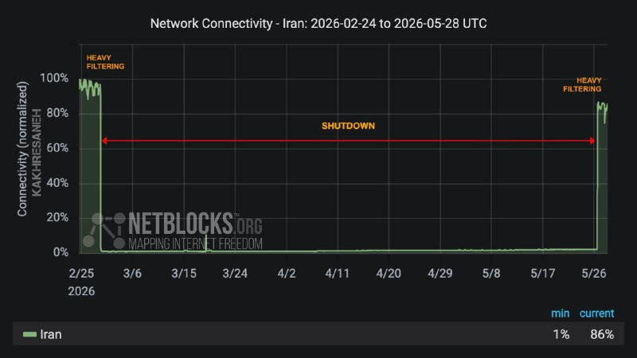

نمودار جدید نت بلاکس نشان میده همچنان بخشی از محدودیت های اینترنت باقی مونده

@IranianMinds

## IranianMinds — post 20935

  

املت 500 هزار تومان!

@IranianMinds

## IranianMinds — post 20934

  

🔴تصاویر چهار عدد سپاه تروریستی که در قایق تندرو، توسط آمریکا به درک واصل شدن.

@IranianMinds

## IranianMinds — post 20933

  

🔴 کامران غضنفری، نماینده مجلس:

آمریکایی‌ها هر روز میان مارو و مقام‌ های رسمی ما را تحقیر می‌کنند، نباید با چنین دولتی مذاکره کرد

@IranianMinds

## IranianMinds — post 20932

  <a href="telegram/content/IranianMinds_20932_1779973195.webm" target="_blank">🎬 Download video</a>

👍 
👍 #اختصاصی #وینرو :

✅ ثبت نام کن 
🤩 
🤩 
🤩 هزارتومان شارژ بی قیدوشرط بگیر!

💵 
💬 به مدت محدود 
📣

😮 تنها سایتی که با عضویت بدون واریز 500,000 تومان شارژ بی قیدو شرط میده #وینرو هست
💰

👑 #معتبرترین سایت ایرانی 
⬇️

🌐 Winro.io

🌐 Winro.io

📱کانال اخبار و هدایا r7 
🎁

📱 @winro_io

## IranianMinds — post 20931

  

اکانت اسرائیل به فارسی:

۲۵۰۰ سال پیش، کوروش بزرگ یهودیان را از اسارت آزاد کرد. این فقط تاریخ نیست… این ریشه دوستی عمیق بین مردم ایران و یهودیان است.
ما ‌و شما ثابت کردیم که این پیوند، عمیق و پایدار است و در آینده نزدیک این دوستی مانند دوران کوروش بزرگ شکوفا خواهد شد.

@IranianMinds

## IranianMinds — post 20930

  

حالا چرا انقد خایه کردی از پشت هم محو کردی سرتو

@IranianMinds

## IranianMinds — post 20929

  

🔴 دیوار نگاره جدید میدان فلسطین تهران :

اسرائیل ۱۵ سال آینده را نخواهد دید!

@IranianMinds

## IranianMinds — post 20928

  

🔴 اسرائیل دستور تخلیه کل جنوب لبنان و تمام مناطقی که در‌ جنوب این کشور هستن رو داد !

@IranianMinds

## IranianMinds — post 20927

  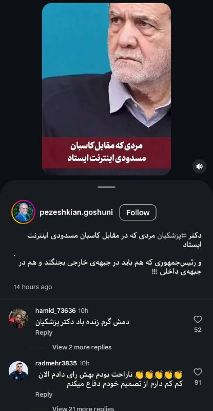

فک کن حدود ۹۰ روز کوچیک ترین حق انسانیتو‌ ازت بگیرن بعد با هزار منت و دردسر اونم نه درست وصلش کنن بعد یه عده شل مغز بیان برا اینکار از یارو بت بسازن.

@IranianMinds

## IranianMinds — post 20926

  <a href="telegram/content/IranianMinds_20926_1779973199.mp4" target="_blank">🎬 Download video</a>

🔴 جمهوری اسلامی یک پایگاه هوایی آمریکا در کویت را هدف قرار داد که رسانه‌ها ادعا می‌کنند از آن برای حمله به بندرعباس در جنوب ایران استفاده شده است.

@IranianMinds

## IranianMinds — post 20925

  

🔴 یک مقام وزارت بهداشت :

بمولا رهبرمون هیچیش نشد ی چن تا خراش بود فقط اخبارای کذبو‌ اصلا باور نکنید ، آقا موشتبی حتی روزه هم میگرفت تو ماه رمضان.

@IranianMinds

## IranianMinds — post 20924

  

🔴 سازمان ملل اسرائیل را به فهرست سیاه مربوط به خشونت جنسی مرتبط با درگیری‌ ها اضافه کرد.

@IranianMinds

## IranianMinds — post 20923

  <a href="telegram/content/IranianMinds_20923_1779973201.mp4" target="_blank">🎬 Download video</a>

به یاد آنان که جسارت بیشتری از ما داشتند، حرف ما را بلندتر فریاد زدند و اکنون در کنار ما نیستند…

ما هیچوقت پا پس نمیکشیم و تا پایان این حکومت و گرفتن انتقام عزیزانمون مبارزه میکنیم و در آخر فراموش نکنید , ما پیروزیم !

@IranianMinds

## IranianMinds — post 20922

ثبت نام کن ۵۰۰ هزارتومان جایزه بگیر
نیازی هم به واریز نیست
تنها سایت مورد #تایید ما با بونوس های واقعی:

🌐
🌐 Winro.io

## BBCPersian — post 282267

🔻ارتش اسرائیل از حملات هوایی به بیروت خبر داد

ارتش اسرائیل از انجام حملات هوایی به بیروت، پایتخت لبنان خبر داده است. این اقدام پس از آن صورت گرفت که حملات پیشین به جنوب لبنان دست‌کم ۱۲ کشته بر جای گذاشته بود.

ارتش اسرائیل در بیانیه‌ای گفت: «اندکی پیش، نیروهای اسرائیل به اهدافی در بیروت حمله کردند. جزئیات به زودی اعلام خواهد شد.»

یک منبع امنیتی لبنانی گفت که این حمله در نزدیکی حومه جنوبی بیروت انجام شده است، اما هنوز مشخص نیست که هدف حمله چه بوده است. تصاویر منتشرشده از منطقه، دود غلیظی را نشان می‌دهد که در میان ساختمان‌ها به هوا برخاسته است.

قرار بود آتش‌بس میان اسرائیل و گروه حزب‌الله، که مورد حمایت ایران است، از ۱۷ آوریل (۲۸ فروردین) اجرایی شود، اما این آتش‌بس تاکنون رعایت نشده است.

@BBCPersian

## BBCPersian — post 282266

🔻سنتکام: حمله موشکی ایران به کویت نقض فاحش آتش‌بس است

فرماندهی مرکزی ارتش ایالات متحده، سنتکام، حمله موشکی ایران به کویت را «نفض فاحش» آتش‌بس خوانده است.

این نهاد در حساب رسمی خود در شبکه ایکس نوشته است: «ساعت ۱۰:۱۷ شب به وقت شرق آمریکا در تاریخ ۲۷ مه، ایران یک موشک بالستیک به سمت کویت شلیک کرد که با موفقیت توسط نیروهای کویتی رهگیری شد.»

سنتکام نوشته است «این نقض فاحش آتش‌بس توسط رژیم ایران، ساعاتی پس از آن رخ داد که نیروهای ایرانی پنج پهپاد تهاجمی یک‌طرفه را شلیک کردند که تهدیدی آشکار در تنگه هرمز و نزدیکی آن ایجاد کردند.»

فرماندهی مرکزی ارتش آمریکا می‌گوید: «تمام پهپادها با موفقیت توسط نیروهای آمریکایی رهگیری شدند و آنها همچنین از پرتاب ششمین پهپاد از یک سایت کنترل زمینی ایران در بندرعباس جلوگیری کردند.»

سنتکام در ادامه آورده است: «فرماندهی مرکزی ایالات متحده و شرکای منطقه‌ای کماکان هوشیار و محتاط هستند و ما همچنان به دفاع از نیروها و منافع خود در برابر تجاوز توجیه‌ناپذیر ایران ادامه می‌دهیم.»

ارتش کویت پیشتر اعلام کرده بود سامانه‌های پدافند هوایی این کشور حملات موشکی و پهپادی «متخاصم» را رهگیری کرده‌اند.

@BBCPersian

## BBCPersian — post 282265

🔻کویت از ایران خواست «فورا و بدون قید و شرط» حملات موشکی و پهپادی به کشورش را متوقف کند

کویت حمله پهپادی و موشکی به خاک آن کشور در اوایل صبح امروز را به ایران نسبت داد و آن را محکوم کرد.

این در حالی است که درگیری نظامی تازه میان جمهوری اسلامی ایران و نیروهای آمریکایی فشار بیشتری بر آتش‌بس شکننده در جنگ خاورمیانه وارد کرده است.

وزارت خارجه کویت در بیانیه‌ای حملات موشکی و پهپادی ایران به آن کشور را به‌شدت محکوم کرد و آن را «تشدید جدی تنش‌ها و نقض آشکار حاکمیت و امنیت ملی» دانست.

این وزارتخانه از ایران خواست «فورا و بدون قید و شرط این حملات را متوقف کند» و اعلام کرد که «مسئولیت کامل این اقدامات بر عهده تهران است.»

@BBCPersian

## BBCPersian — post 282264

  

🔻بیانه جمعی از کنشگران در باره آزادی زندانیان سیاسی و نگرانی از وضعیت میرحسین موسوی و زهرا رهنورد

بیش از ۲۰ استاد دانشگاه و کنشگر سیاسی و مدنی در بیانیه‌ای خواهان آزادی میرحسین موسوی، زهرا رهنورد و همه زندانیان سیاسی و مدنی در ایران شدند.

این کنشگران در بیانیه خود گفته‌اند که بنابر «گزارش‌های موثق» اعتقاد دارند که محل اقامت میر‌حسین موسوی و خانم زهرا رهنورد در جریان جنگ اخیر و حمله هوایی به خیابان پاستور به شدت آسیب دیده و «آنان پس از این حادثه، به مکانی نامعلوم منتقل شده‌اند؛ موضوعی که پس از پانزده سال حصر خانگی، نگرانی‌های جدی و گسترده‌ای را برانگیخته است.»

در این بیاینه آمده است: «ما ضمن ابراز احترام به پایداری و ایستادگی آقای موسوی و خانم رهنورد، بار دیگر بر ضرورت پایان دادن به حصر و آزادی این دو شخصیت برجسته و همه فعالان سیاسی و مدنی که تحت فشار و در زندان‌های مختلف به بند کشیده شده‌اند، تأکید می‌کنیم و خواستار رعایت حقوق انسانی و شهروندی تمام این عزیزان هستیم.»

نام بهروز بیات، سعید پیوندی، شهلا حائری، فاطمه شمس، کاظم علمداری و فرزانه عظیمی در میان امضاءکنندگان این بیانیه دیده می‌شود.

@BBCPersian

## BBCPersian — post 282263

🔻عبدربه منصور هادی، رئیس‌جمهور سابق یمن، در عربستان سعودی درگذشت

یک منبع در ریاست‌جمهوری یمن به خبرگزاری فرانسه گفت که عبدربه منصورهادی، رئیس‌جمهور سابق یمن، در عربستان سعودی درگذشته است.

به گفته این منبع، آقای هادی که بیش از ۸۰ سال داشت، «پس از وخامت ناگهانی وضعیت جسمانی‌اش در ریاض درگذشت.»

عبدربه منصور هادی در سال ۲۰۱۵ و هم‌زمان با آغاز جنگ داخلی یمن، پس از آن که شورشیان حوثی مورد حمایت ایران دولت او را از صنعا بیرون راندند، به عربستان سعودی گریخت و از آن زمان در این کشور زندگی می‌کرد.

@BBCPersian

## BBCPersian — post 282262

  <a href="telegram/content/BBCPersian_282262_1779973204.mp4" target="_blank">🎬 Download video</a>

🔻ناسا روز سه‌شنبه در یک نشست خبری، طرح خود برای ایجاد پایگاهی دائمی در ماه را ارائه کرد؛ طرحی که شامل سکونت دائمی انسان در این قمر تا سال ۲۰۳۲ است.

جرد آیزاکمن، مدیر ناسا، گفت این سازمان فضایی در پی آن است که «هم‌زمان با بازگشت دوباره آمریکا به ماه  و این بار برای ماندن، حس کنجکاوی را برانگیزد».

این برنامه‌ها برای بازگشت دائمی به ماه در حالی مطرح می‌شود که ماموریت موفق آرتمیس ۲ ناسا در ماه آوریل، با سفر چهار فضانورد به دور ماه، تنها قمر طبیعی زمین همراه بود.

ایجاد یک پایگاه در ماه می‌تواند به ایالات متحده امکان انجام آزمایش‌های علمی، استخراج احتمالی منابع ارزشمند و همچنین سفر آسان‌تر به مریخ را بدهد.

https://bbc.in/4uFoZuK
@BBCPersian

## BBCPersian — post 282261

🔻ایران حمله به مناطقی در بندرعباس و اظهارات ترامپ در مورد عمان را محکوم کرد

سخنگوی وزارت امور خارجه ایران حمله بامداد امروز آمریکا به مناطقی در بندرعباس را «به شدت» محکوم کرد و آن را «نقض فاحش حقوق بین‌الملل و منشور ملل متحد» دانست.

اسماعیل بقایی گفت: «این اقدام تجاوزی علیه تمامیت ارضی و حاکمیت ملی ایران و نقض آشکار حقوق بین‌الملل و منشور سازمان ملل» است.

او همچنین تاکید کرد که «شورای امنیت سازمان ملل باید مسئولیت قانونی خود را برای پاسخگو کردن آمریکا ایفا کند.»

سخنگوی وزارت امور خارجه همچنین اظهارات اخیر دونالد ترامپ،‌ رئیس جمهور آمریکا در مورد عمان را محکوم کرد و ضمن ابراز همبستگی با آن کشور گفت: «تهدید به انهدام یک کشور عضو سازمان ملل که نقش میانجی و سازنده در منطقه داشته، نشانه خطرناک دیگری از عادی‌سازی قانون‌شکنی و قلدرمآبی در روابط بین‌الملل است.»

دونالد ترامپ دیروز در جلسه کابینه آمریکا در کاخ سفید با هشدار درباره گزارش‌ها از هماهنگی میان تهران و مسقط برای کنترل تنگه هرمز گفته بود: «عمان نیز همانند هر کشور دیگری رفتار خواهد کرد و در غیر این‌صورت مجبور خواهیم شد آن را منفجر کنیم.»

@BBCPersian

## BBCPersian — post 282260

🔻پلیس لندن می‌گوید که در پی یک حادثه رانندگی در محله‌ گولدرز گرین در شمال لندن یک مرد ۴۱ ساله ایرانی با جراحات شدید به بیمارستان منتقل شده است.

بر اساس گزارش پلیس یک مرد ۳۹ ساله عراقی هم به ظن ایجاد جراحات عمدی با رانندگی خطرناک و خودداری از انجام آزمایش مربوط به مواد مخدر بازداشت و در بازداشتگاه پلیس زندانی است.

پلیس از ادامه تحقیقات خبر داده است اما اعلام کرد که این حادثه را یک «اقدام تروریستی» ارزیابی نمی‌کند.

ویدئوهایی از این حادثه منتشر شده است که در آن یک خودرو تیره رنگ شاستی بلند از روی یک شخص عبور می‌کند.

برخی تصاویر نشان می‌دهد که پیش از این حادثه افرادی این خودرو و یک خودرو دیگر را که یک زن و یک روحانی سرنشین آن هستند،‌ دوره کرده و با موبایل در حال فیلمبرداری از سرنشینان آن هستند. صدای شعارهایی علیه سرنشینان این خودروها شنیده می‌شود.

به نظر می‌رسد یک عمامه سیاهرنگ هم روی زمین افتاده است.

پلیس لندن از شهروندان خواست که از بازنشر ویدئوها خودداری کنند و هر نوع اطلاعاتی که دارند را با پلیس در میان بگذارند.

برخی در شبکه‌های اجتماعی نوشتند که این حادثه در نزدیکی دیوار یادبود کشته‌شدگان اعتراضات دی ماه در گولدرز گرین اتفاق افتاده است.

ديوار یادبود در خیابان گولدرز گرين، در شمال لندن به‌عنوان محلی برای نمايش تصاوير کشته‌شدگان اعتراضات دی ماه سال گذشته استفاده می‌شود. در جریان سرکوب اعتراضات سراسری دی ماه هزاران نفر در ایران کشته شدند.

چندی پیش این دیوار هدف حمله قرار گرفت و پلیس چند نفر را به اتهام تلاش برای آتش زدن این محل بازداشت کرد.

@BBCPersian

## BBCPersian — post 282259

  <a href="telegram/content/BBCPersian_282259_1779973205.mp4" target="_blank">🎬 Download video</a>

🔻فراری از نخستین خودرو تمام‌برقی خود رونمایی کرد. پاپ لئو  سه‌شنبه (۷ خرداد، ۲۶ مه) از این خودرو بازدید کرد و پشت فرمان آن نشست.

این خودرو  ۶۴۰ هزار دلاری که «لوچه» نام دارد، واکنش‌های متفاوتی را در شبکه‌های اجتماعی برانگیخته است. برخی کاربران شبکه‌های اجتماعی طراحی لوچه را «فاجعه» و «ضربه به هویت فراری» توصیف کرده‌اند، در حالی که گروهی دیگر آن را «شاهکاری در طراحی» دانسته‌اند.

این خودرو که نخستین مدل پنج‌نفره فراری محسوب می‌شود، با همکاری جانی آیو، مدیر سابق طراحی اپل، طراحی شده و ظاهری متفاوت از مدل‌های سنتی این برند ایتالیایی دارد.

رونمایی از این خودرو در حالی انجام می‌شود که بسیاری از خودروسازان لوکس اروپایی، از جمله لامبورگینی و پورشه، به‌دلیل کاهش تقاضا برای خودروهای برقی لوکس، تولید خودروهای برقی خود را محدود کرده‌اند.

فراری اعلام کرده در کنار مدل‌های برقی، همچنان به تولید خودروهای بنزینی و هیبریدی ادامه خواهد داد.

https://bbc.in/4o22bms
@BBCPersian

## BBCPersian — post 282256

  

🔻نت‌بلاکس، نهاد ناظر بر دسترسی اینترنت در جهان می‌گوید که اینترنت ایران به‌رغم اتصال با فیلترینگ شدید روبروست.

نت‌بلاکس در شبکه ایکس اعلام کرد که سه ماه پیش در چنین روزی، ایران دسترسی به اینترنت جهانی را قطع کرد.

«در حالی که اکنون اتصال تا حد زیادی برقرار شده است، معیارها نشان می‌دهند که کاربران هنوز با فیلترینگ شدید مواجه هستند، مشابه دوره موقت بین اعتراضات ژانویه و شروع جنگ.»اشاره این نهاد به بعد از اعتراضات دی ماه است که برای مدت کوتاهی دسترسی به اینترنت برقرار شده بود.

در پی بازگشت تدریجی دسترسی به اینترنت جهانی در ایران، داده‌های شرکت کنتیک نشان می‌دهد که حجم ترافیک اینترنت بین‌الملل پس از هفته‌ها محدودیت شدید، تا ساعت ۷ و نیم صبح امروز به ۵۳ درصد حجم پیش از اعتراضات دی‌ماه ۱۴۰۴ رسیده است.

به‌گفته کنتیک، این روند تا حدی شبیه به وضعیت وصل شدن نسبی اینترنت بعد از اعتراضات دی ماه است.

@BBCPersian
📷 REUTERS

## BBCPersian — post 282254

با بازگشت تدریجی اتصال ایران به اینترنت جهانی، کاربران ایرانی در حال بازگشت به شبکه‌های اجتماعی هستند، و صاحبان کسب و کارهای اینترنتی در ایران امیدوارند بار دیگر رونق به کسب و کارشان بازگردد.

اما شاید شروع دوباره با چالش‌هایی هم همراه باشد.
اگر کسب‌وکار اینترنتی مانند فروشگاه اینستاگرام داشته‌اید و در چند ماه گذشته به دلیل قطع بودن اینترنت نتوانستید کار کنید، حالا که برگشته‌اید، چه تغییراتی می‌ببینید؟ آیا الگوریتم‌ها و قطعی بلندمدت بر کسب‌وکار و بازدید صفحه‌تان تاثیر گذاشته؟

آیا فکر می‌کنید رفتار مشتریان تغییر کرده باشد؟ چطور کسب‌وکارتان را بازسازی می‌کنید؟

طی این مدت پلتفرم‌ها و شبکه‌های اجتماعی داخلی ایران تا چه حد توانسته بود به ادامه کسب و کارتان کمک کند؟

نظرات و تجربیات خود را با هشتگ #اینترنت برای ما ارسال کنید:
آی‌مسج و واتس‌اپ: ۰۰۴۴۷۳۴۲۰۳۲۱۱۳
پیامگیر تلگرام t.me/bbcshoma
@BBCPersian
https://bbc.in/431n47v

## BBCPersian — post 282253

🔻نماینده مجلس ایران: بازگشایی اینترنت خلاف قانون است

احمد راستینه،‌ سخنگوی کمیسیون فرهنگی مجلس ایران در واکنش به تصمیمات مسعود پزشکیان، رئیس جمهور آن کشور برای بررسی وضعیت اینترنت، گفت که برخی از ماموریت‌ها و شرح وظایف این ستاد با ماموریت‌ها و شرح وظایف شورای عالی فضای مجازی «تداخل» دارد.

او می‌گوید که رای دیوان عدالت اداری در توقف فعالیت این ستاد از نظر حقوقی «درست و دقیق» است.

به گفته این نماینده مجلس بازگشایی اینترنت «خلاف قانون»‌ است.

در پی قطع اینترنت از زمان شروع جنگ در ایران در اسفندماه سال گذشته، مسعود پزشکیان «ستاد ساماندهی و راهبردی فضای مجازی» را برای بررسی بازگشت اینترنت بین‌الملل تشکیل داد.

تصمیم این ستاد در مورد بازگشایی مجدد اینترنت با واکنش تند مخالفان روبرو شده است.

پس از آن دیوان عدالت اداری اعلام کرد که «در پی شکایت‌هایی با درخواست ابطال سند ایجاد این ستاد، هیات تخصصی صنایع و بازرگانی با احراز فوریت موضوع، دستور توقف اجرای مصوبه را تا زمان رسیدگی نهایی صادر کرده است.»

به‌رغم این اقدام، اینترنت بین‌المللی از دو روز پیش، پس از بیش از ۸۰ روز برای کابران فعال شده است.

@BBCPersian

## BBCPersian — post 282252

🔻افزایش قیمت نفت در پی حملات تازه ایران و آمریکا

قیمت نفت در معاملات روز پنج‌شنبه بار دیگر صعود کرد، در حالی که اغلب بورس‌های آسیایی با افت مواجه شدند. این تحولات در پی حملات تازه آمریکا به ایران و افزایش نگرانی‌ها درباره شکننده بودن آتش‌بس رخ داده است.

افزایش قیمت نفت بخش زیادی از کاهش روز چهارشنبه را جبران کرد، کاهشی که به امید دستیابی قریب‌الوقوع به توافقی برای پایان دادن به درگیری‌ها شاهد آن بودیم.

نفت برنت دریای شمال، شاخص اصلی بین‌المللی، در معاملات صبح پنج‌شنبه ۱/۸ درصد افزایش یافت و به ۹۵/۹۵ دلار در هر بشکه رسید. همچنین نفت خام وست تگزاس اینترمدیت آمریکا هم با رشد ۱/۷درصدی به ۹۰/۱۷ دلار رسید.

بازارهای سهام آسیا عمدتاً نزولی بودند؛ شاخص هنگ‌کنگ بیش از ۱/۵ درصد افت کرد.

بورس سئول هم نزدیک به یک درصد کاهش یافت و شاخص شانگهای نیز ۰/۳ درصد پایین آمد.

این کاهش‌ها پس از عملکرد قابل توجه بازارهای جهانی سهام در روز چهارشنبه رخ داد.

اقتصاددانان هشدار داده‌اند اگر تورم در نتیجه جنگ تشدید شود، بانک‌های مرکزی ممکن است ناچار به افزایش نرخ بهره شوند؛ اقدامی که هزینه استقراض را بالا می‌برد و می‌تواند رشد اقتصادی را تحت فشار قرار دهد.

@BBCPersian

## BBCPersian — post 282251

  

🔻ترافیک اینترنت ایران به ۵۳ درصد سطح پیش از اعتراضات دی‌ماه رسید

در پی بازگشت تدریجی دسترسی به اینترنت جهانی در ایران، داده‌های شرکت کنتیک نشان می‌دهد که حجم ترافیک اینترنت بین‌الملل پس از هفته‌ها محدودیت شدید، تا ساعت ۷ و نیم صبح امروز به ۵۳ درصد حجم پیش از اعتراضات دی‌ماه ۱۴۰۴ رسیده است.

این روند تا حدی شبیه به وضعیت وصل شدن نسبی اینترنت بعد از اعتراضات است. در آن زمان به‌رغم اتصال برخی خدمات به اینترنت جهانی، این اتصال بسیار ناپایدار و با اختلالات متناوب همراه بود.

مشخص نیست آیا دسترسی به حالت قبل بر‌خواهد گشت یا به همان شکل ناپایدار باقی خواهد ماند.

گزارش‌های رسیده و تجربیات کاربران حاکی است که دسترسی به برخی خدمات امکان‌پذیر شده است هرچند ارتباط با ثبات نیست و از جمله، تماس‌های صوتی- تصویری، کیفیت بالایی ندارند.

@BBCPersian

## BBCPersian — post 282250

🔻رئیس انجمن صنفی دفاتر مسافرتی ایران: خسارت وارده به صنعت گردشگری در جنگ از ۲۰ هزار میلیارد تومان فراتر رفته است

رئیس انجمن صنفی دفاتر خدمات مسافرتی ایران گفته است که در جریان جنگ اخیر، «حدود پنج همت (۵ هزار میلیارد تومان) خسارت به دفاتر خدمات مسافرتی وارد شده و مجموع خسارت صنعت گردشگری می‌تواند از ۲۰ همت (۲۰ هزار میلیارد تومان) فراتر برود.»

حرمت‌الله رفیعی با انتقاد از فشارهای مالیاتی و بیمه‌ای بر فعالان این صنف، گفت که دفاتر مسافرتی در شرایط دشوار ناشی از محدودیت‌های ناوگان هوایی و کاهش قدرت خرید مردم با مشکلات جدی مواجه هستند و حمایت موثری از سوی دستگاه‌های اجرایی دریافت نکرده‌اند.

او با اشاره به اینکه تاکنون ایرلاین‌ها و برخی مراکز اقامتی اقدامی برای بازگرداندن هزینه‌های پروازها و هتل‌های لغوشده به مردم انجام نداده‌اند، گفت: «به دلیل نبود مرجع واحد برای رسیدگی به شکایات، آمار دقیقی از مطالبات وجود ندارد، اما در خوش‌بینانه‌ترین حالت دست‌کم ۵۰۰ میلیارد تومان از پول مردم بابت خدمات لغوشده نزد ایرلاین‌ها، مراکز اقامتی و صاحبان قدرت باقی مانده و باید هرچه سریع‌تر بازگردانده شود.»

@BBCPersian

## BBCPersian — post 282245

🔻فیلیپه فان دورسن، بی‌بی‌سی برزیل

اسرائیل به دنبال مرگ حییم وایزمن به رئیس‌جمهور جدیدی نیاز داشت. بنابراین وزارت خارجه نام یهودیان سرشناس را مطرح کرد که می‌توانستند این نقش را ایفا کنند و مهاجرت به کشور تازه‌ تاسیس را تشویق کنند.

به این ترتیب، دولت داوید بن‌ گوریون نخست‌وزیر تصمیم گرفت بار دیگر یک دانشمند را برای این مقام دعوت کند و اصلی‌ترین گزینه، مشهورترین دانشمند جهان بود.

آبا ابن به نمایندگی از بن‌گوریون نامه‌ای به اینشتین نوشت.

او نوشت: «اسرائیل کشوری کوچک از نظر ابعاد فیزیکی است، اما می‌تواند به بزرگی دست یابد، زیرا عالی‌ترین سنت‌های معنوی و فکری مردم یهود را چه در دوران باستان و دوران مدرن به نمایش می‌گذارد.»

@BBCPersian
📷 Getty Images

## Dirty_Kids — post 390394

  

‏ستاد فرماندهی مرکزی ایالات متحده (سنتکام)، در پیامی که در شبکه اجتماعی ایکس منتشر شده است، اعلام کرد که ایران با شلیک یک فروند موشک بالستیک، آتش‌بس موجود را به طور فاحش نقض کرده است.

به گفته سنتکام، این اقدام پس از آن صورت گرفت که ایالات متحده پنج پهپاد ایرانی را در تنگه هرمز سرنگون کرد و اجازه پرتاب به ششمین پهپاد را روی زمین نداد و آن‌ را منهدم ساخت.

در پاسخ به این تحولات، ایران یک موشک بالستیک به سمت کویت شلیک کرد که این موشک توسط پدافند هوایی کویت رهگیری و منهدم شد. این اقدام از سوی سنتکام به عنوان نقض فاحش آتش‌بس خوانده شده است.

از سوی دیگر، سپاه پاسداران صبح امروز اعلام کرد که این حمله موشکی در پاسخ به حملات هوایی آمریکا به بندرعباس صورت گرفته و طی آن، یک پایگاه هوایی آمریکا در منطقه هدف قرار داده شده است. سپاه پاسداران تصریح کرد پایگاهی که هدف حمله موشکی قرار گرفته، همان پایگاهی بوده که به عنوان مبدأ حملات آمریکا علیه بندرعباس استفاده شده است.

@Dirty_Kids 👻

## Dirty_Kids — post 390393

  

این روزا در اینستاگرام فارسی چه میگذرد:

@Dirty_Kids 👻

## Dirty_Kids — post 390392

  <a href="telegram/content/Dirty_Kids_390392_1779973207.mp4" target="_blank">🎬 Download video</a>

یه پیرمرد رو آوردن صدا و سیما تا حماسه بسازه، یه طوری حرف زد کل برنامه و مخاطبا گوز پیچ شدن😂

@Dirty_Kids 👻

## Dirty_Kids — post 390390

  <a href="telegram/content/Dirty_Kids_390390_1779973208.mp4" target="_blank">🎬 Download video</a>

عزیزان، شما که نبودید، این سهیل مستجابیان اول تو یه ویدیو کلوزفرند به مردم فحش داد، ویدیوش لو رفت، معذرت‌خواهی کرد، دوباره تو کلوز اینو گذاشت، اونم لو رفت:)))))

@Dirty_Kids 👻

## Dirty_Kids — post 390387

بهترین و بدترین پایان‌بندی‌های سریالی.

@Dirty_Kids 👻

## Dirty_Kids — post 390384

  <a href="telegram/content/Dirty_Kids_390384_1779973209.mp4" target="_blank">🎬 Download video</a>

شهاب کون، بلاگر اینستاگرامی رو یادتونه که قرار بود با مینا نامداری ازدواج کنه و یه مدت ترند اینستا فارسی شده بود؟

موقعی که جنگ شد و اینترنت‌ها قطع شدن، وقتی دید دیگه ویو نیست، به این صورت تو تیک تاک و اینستا واسه عربا کص و کونشو مینداخت بیرون تا مشتری پیدا کنه..

@Dirty_Kids 👻

## Dirty_Kids — post 390383

  <a href="telegram/content/Dirty_Kids_390383_1779973210.mp4" target="_blank">🎬 Download video</a>

آرایشگر ایرانی که بخاطر پست کردن ویدیوی کارهاش در اینستاگرام توسط رژیم تهدید شده بود با انتشار این ویدیو به تهدیدها اعتراض کرد.
ویدیوش در شبکه اجتماعی انگلیسی زبان وایرال شده که کمک میکنه مردم دنیا ببینن که مردم ایران از چه حقوق ابتدایی محروم هستند.

@Dirty_Kids 👻

## Dirty_Kids — post 390382

  

امریکا هر شب اینا رو میزنه بعدش بیانیه میده ما هنوز تو آتش بس هستیم :)))))))

دیشب امریکا یه سایت نظامی که تهدیدی برای ناوها و نیروهاشون بود رو در جنوب ایران زدن و سپاه هم جوابشونو داد و مبدا حمله رو که یه پایگاه در کویت بود رو زد

+ سایت پهبادی سپاه در بندرعباس دیگر وجود ندارد.
اما آتش بس هنوز وحود دارد😂
از توجه شما سپاس گذارم

@Dirty_Kids 👻

## Dirty_Kids — post 390381

  <a href="https://t.me/Dirty_Kids/390381" target="_blank">📎 Download file</a>

📱 اپلیکیشن اندروید بدون فیلتر ریتزوبت

➖➖➖➖➖

🔹 ثبت نام آسان 
✅
🔹 رابط کاربری بسیار راحت و سریع 
✅
🔹 درگاه پرداخت کارت به کارت 
✅
🔹 درگاه پرداخت دلاری سریع 
✅
🔹 بونوس ۱۰۰ درصدی اولین واریز 
✅
🔹 بونوس ۱۰۰ درصدی واریز یکشنبه ها 
✅

➖➖➖➖➖
🌐 https://RitzoBet.com

⚡️ @RitzoBet_ir

## Dirty_Kids — post 390380

  

⚠️ برای #شرطبندی های فوتبال از سایت معتبر و بین المللی استفاده کنید ✅

سایت #ریتزوبت ، چهار سال هستش داخل ایران فعالیت میکنه 
✅

لایسنس بین المللی داره ، روش های شارژ و برداشت متنوع داره و بونوس 100% ورزشی و کش بک های جذاب
💎

⏪ اپلیکیشن بدون فیلتر ریتزوبت 
📱
⏩
R7

✅ لینک بدون‌ فیلتر ریتزوبت
🤣

🆔 @RitzoBet_ir 
🇮🇷

## Dirty_Kids — post 390379

  

این عرزشیه میگه علی عظمایی کتلت شده

@Dirty_Kids 👻

## Dirty_Kids — post 390378

  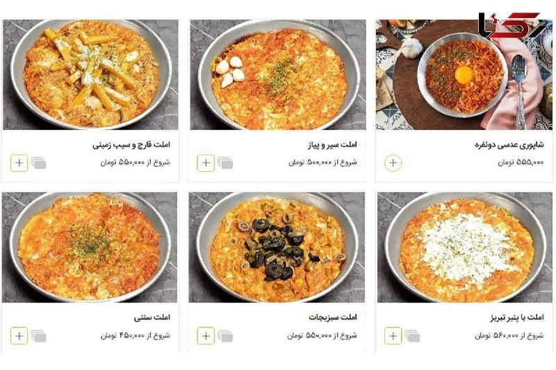

بعضی جاها قیمت یه املت به ۵۰۰ هزار تومن رسیده!😐😐

@Dirty_Kids 👻

## Dirty_Kids — post 390377

  

به صورت کاملا اتفاقی:
_ پزشکیان ۳۰ ساله سینگله
_ اینترنت با دستور پزشکیان متصل شد
_ دقیقا فردای اتصال اینترنت روز جهانی خودارضاییه

@Dirty_Kids 👻

## Dirty_Kids — post 390376

  

🔴 فرصت از این بهتر؟؟
امروز روز جهانیه خودارضاییه تو این روز دختر پسرا به دوستاشون زنگ میزنن که دور هم جمع بشن و باهم بشینن خودارضایی کنن

@Dirty_Kids 👻

## Dirty_Kids — post 390375

  

بادبان از 100,000 عضو گذشت!
🎉

با بازگشت اینترنت درحال آماده سازی زیرساخت بادبان برای سرویس دهی برای شرایط نرمال و خروج از سرویس دهی اضطراری هستیم با نرمال شدن شرایط قیمت های کاهشی خواهد بود تا اتمام این فرایند کاربران عزیز میتونن از سرویس های اضطراری استفاده کنن
🚀

🛒به زودی در ربات سرویس های نرمال با قیمت هر گیگ 10 هزار تومان برای فروش فعال خواهند شد
🏷️

🎁 کد تخفیف خرید اول دوباره ریست شد و همه میتونن ازش استفاده کنن:
BadBanOFF

💸 با این کد، 50 هزار تومان تخفیف روی اولین خریدت بگیر!

🔥و مهم‌تر از همه...
سیستم معرفی بادبان فعال‌تر از همیشه‌ست!
از تمام خریدهای کاربرانی که معرفی میکنی، 10% خریدشون رو پورسانت دائمی دریافت کن و موجودی کیف پولت رو افزایش بده 
💼

وقتی بادبان داری،
هیچ بادی مانع نیست… حتی وقتی اینترنت ملیه
⛵️

R7

🛡@BadBan_VPN | کانال 

🤖@BadBan_VPNBot | ربات 

📞@BadBan_VPNSupport | پشتیبانی

## Dirty_Kids — post 390374

بچه‌های نیرو مسلح‌شون انقد بی‌خایه هستن که حتی میترسن از پشت شناسایی بشن، محو میکنن پس‌کله‌رو 😂

@Dirty_Kids 👻

## Hranews — post 113209

  

پس از بازگشت نسبی اینترنت بین‌المللی در ایران در روزهای اخیر، نت‌بلاکس در آخرین به‌روزرسانی خود اعلام کرد که داده‌ها نشان می‌دهد کاربران ایرانی همچنان با فیلترینگ و محدودیت‌های گسترده مواجه‌اند؛ وضعیتی مشابه شرایط حاکم بر دوره میان اعتراضات سراسری دی‌ماه و آغاز جنگ.
#فیلترینگ_اینترنت

↘️
@hranews_bot تماس ✉️ - @Hranews کانال هرانا 🆑

## Hranews — post 113208

دزفول؛ یک نوجوان ۱۷ ساله پدر، مادر و برادرش را به قتل رساند

❗️
❗️
❗️
❗️
❗️– امروز پنجشنبه ۷ خردادماه، یک نوجوان ۱۷ ساله در دزفول پس از به قتل رساندن پدر و مادرش با مراجعه به محل کسب برادرش وی را نیز با ضربات سلاح سرد به #قتل رساند. او پس از این اقدام به زندگی خود پایان داد.

ادامه مطلب

↘️
@hranews_bot تماس ✉️ - @Hranews کانال هرانا 🆑

## Hranews — post 113207

  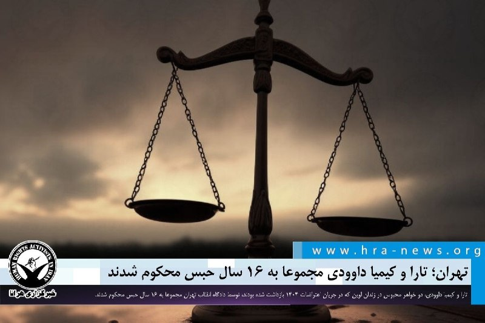

تارا و کیمیا داوودی مجموعا به ۱۶ سال حبس محکوم شدند

❗️
❗️
❗️
❗️
❗️– تارا و کیمیا داوودی، دو خواهر محبوس در زندان اوین که در جریان اعتراضات ۱۴۰۴ بازداشت شده بودند، توسط دادگاه انقلاب تهران مجموعا به ۱۶ سال حبس محکوم شدند.

به گزارش خبرگزاری هرانا، ارگان خبری مجموعه فعالان حقوق بشر در ایران، دو خواهر در تهران به حبس محکوم شدند.

براساس حکمی که توسط شعبه ۱۵ دادگاه انقلاب تهران به ریاست قاضی ابوالقاسم صلواتی صادر شده است، کیمیا داوودی از بابت اتهاماتی از جمله ارتباط با گروه ها و شبکه های معاند و اجتماع و تبانی علیه امنیت کشور به ۱۰ سال حبس و تارا داوودی از بابت اتهاماتی از جمله اجتماع و تبانی علیه امنیت کشور و تبلیغ علیه نظام به ۶ سال زندان محکوم شده‌اند.

ادامه مطلب

#کیمیا_داوودی #تارا_داوودی

↘️
@hranews_bot تماس ✉️ - @Hranews کانال هرانا 🆑

## Hranews — post 113206

یک مرد توسط برادرش در تهران مورد اسیدپاشی قرار گرفت و جان‌باخت

❗️
❗️
❗️
❗️
❗️– مردی حدودا ۳۵ ساله در تهران توسط برادرش هدف #اسیدپاشی قرار گرفت و جان خود را از دست داد. متهم این پرونده همچنان متواری است و تحت تعقیب قضایی قرار دارد.

ادامه مطلب

↘️
@hranews_bot تماس ✉️ - @Hranews کانال هرانا 🆑

## Hranews — post 113205

  

از فیلتر تلگرام تا «اینترنت پرو»/ امیر آقایی

📡
📡
📡
📡
📡– جمهوری اسلامی در حال جابه‌جا کردن بسیاری از رکوردهای منفی در زمینه‌ی سرکوب دیجیتال است. ایرانیان در طول شاید یکی از پرالتهاب‌ترین مقاطع تاریخی خود یعنی از زمان شروع جنگ ۱۲روزه تا اعتراضات دی‌ماه و بعد از آن جنگ ۴۰روزه –که هنوز هم مشخص نیست کاملاً تمام شده یا نه– در مجموع بیش‌تر از صد روز را بدون اینترنت سپری کرده‌اند. تفاوت اساسی آخرین مقطع #قطع_اینترنت، حضور پررنگ اینترنت طبقاتی در لباس طرح جدیدی به نام «اینترنت پرو» است. این پروژه اما محصول امروز و دیروز اتاق‌های تصمیم‌گیری نظام نیست، بلکه نقطه‌ی پایانی مسیر پرپیچ‌وتابی است که نظام طی کرد تا به آن برسد. هرکدام از بزنگاه‌های اعتراضات دی‌ماه ۹۶، اعتراضات گرانی بنزین در آبان ۹۸، اعتراضات ۱۴۰۱ و در نهایت اعتراضات دی‌ماه ۱۴۰۴ برای دستگاه‌های امنیتی نظام درس‌آموخته‌هایی به دنبال داشت که در نهایت، نسخه‌ی اینترنت پرو خروجی نهایی آن بود. در ادامه بررسی خواهیم کرد که چه شد تا «اینترنت پرو» از جعبه‌ی جادویی نظام درآمد.

ادامه مطلب

ادامه مطلب در وبسایت خط صلح

#امیر_آقایی

↘️
@hranews_bot تماس ✉️ - @Hranews کانال هرانا 🆑

## Hranews — post 113204

عمر عزیزی با تودیع وثیقه از زندان زاهدان آزاد شد

❗️
❗️
❗️
❗️
❗️– عمر عزیزی، شهروند اهل شهرستان قصرقند، روز دوشنبه با تودیع وثیقه از زندان زاهدان آزاد شد. وی در آبان ماه سال گذشته بازداشت شده بود.

ادامه مطلب

#عمر_عزیزی

↘️
@hranews_bot تماس ✉️ - @Hranews کانال هرانا 🆑

## Hranews — post 113203

  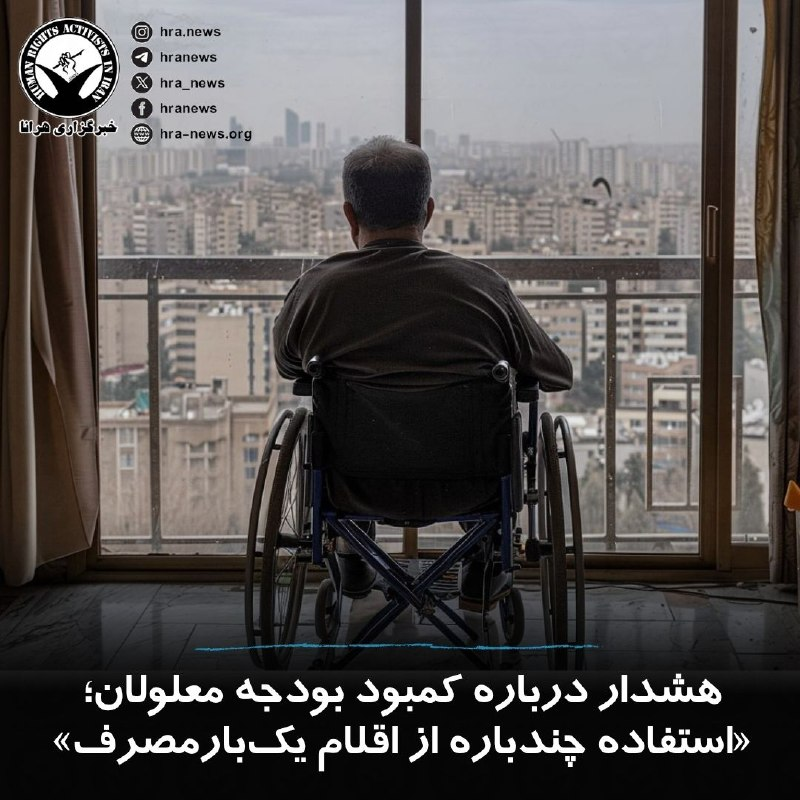

مدیر کمپین معلولان در گفتگو با ایرنا نسبت به پیامدهای کمبود بودجه در تأمین لوازم بهداشتی افراد دارای معلولیت هشدار داد و گفت: به دلیل ناکافی بودن کمک‌هزینه‌ها، بسیاری از افراد ناچارند اقلام یک‌بارمصرفی مانند پوشک، سوند و نلاتون را چندبار استفاده کنند؛ اقدامی که می‌تواند به بروز عفونت‌های شدید و حتی مرگ منجر شود. او تأکید کرد که در شرایط تورمی فعلی، عدم افزایش حق پرستاری و کمک‌هزینه‌های بهداشتی فشار مضاعفی بر زندگی افراد دارای معلولیت وارد کرده است.

در ادامه این گزارش، مادر دو فرزند دارای معلولیت "شدید"، از وضعیت معیشتی و درمانی خانواده‌اش گفت و توضیح داد که با وجود افزایش شدید قیمت پوشینه و سایر اقلام بهداشتی، مستمری و حمایت‌های بهزیستی پاسخگوی نیازهای اولیه نیست. به گفته او، تأخیر در پرداخت کمک‌هزینه‌ها و ناکافی بودن درآمد خانوار، در کنار مشکلات مسکن و نبود حمایت‌های پایدار، شرایط زندگی این خانواده را به وضعیت بحرانی رسانده است.
#افراد_دارای_معلولیت #معلولان

↘️
@hranews_bot تماس ✉️ - @Hranews کانال هرانا 🆑

## Hranews — post 113202

  

علی خسروی، زندانی سیاسی از زندان بیرجند آزاد شد

❗️
❗️
❗️
❗️
❗️– علی خسروی، زندانی سیاسی اهل بیرجند که در زندان این شهرستان محبوس بود، به صورت مشروط آزاد شد.

به گزارش خبرگزاری هرانا، ارگان خبری مجموعه فعالان حقوق بشر در ایران، علی خسروی آزاد شد.

بر اساس اطلاعات دریافتی هرانا، آزادی آقای خسروی به صورت مشروط از زندان بیرجند صورت گرفته است.

ادامه مطلب

#علی_خسروی

↘️
@hranews_bot تماس ✉️ - @Hranews کانال هرانا 🆑

## manototv — post 105852

  <a href="telegram/content/manototv_105852_1779973215.mp4" target="_blank">🎬 Download video</a>

سخنرانی امیرعباس هویدا در جمع دانشجویان درباره نقش جوانان در توسعه و اداره کشور

## manototv — post 105845

  <a href="telegram/content/manototv_105845_1779973216.mp4" target="_blank">🎬 Download video</a>

اینترنت در ایران فقط ابزار ارتباط نیست، میدان قدرت است. هر بار که قطع یا وصل می‌شود، حکومت در واقع در حال تنظیم سطح کنترل خود بر جامعه است، اینکه مردم چه ببینند، چه بگویند، چگونه وصل شوند و تا چه اندازه بتوانند با هم عمل کنند.

## alonews — post 123300

  <a href="telegram/content/alonews_123300_1779973217.webm" target="_blank">🎬 Download video</a>

👈دولت عراق حملات ایران به کویت را بی‌شرمانه خواند!

✅ @AloNews خبر جنگ

## alonews — post 123299

  <a href="telegram/content/alonews_123299_1779973217.webm" target="_blank">🎬 Download video</a>

👈خوش چشم، کارشناس ارشد صدا و سیما: ایندفعه دیگه جنگی نمیشه

✅ @AloNews خبر جنگ

## alonews — post 123298

  <a href="telegram/content/alonews_123298_1779973218.webm" target="_blank">🎬 Download video</a>

👈هواشناسی: تا چند روز آینده خیلی گرم میشه

✅ @AloNews خبر جنگ

## alonews — post 123297

  <a href="telegram/content/alonews_123297_1779973218.webm" target="_blank">🎬 Download video</a>

👈ابوالفضل ابوترابی، نماینده مجلس: آمریکا بعد از جام جهانی و انتخابات کنگره دوباره حمله می‌کند.

✅ @AloNews خبر جنگ

## alonews — post 123296

  <a href="telegram/content/alonews_123296_1779973218.webm" target="_blank">🎬 Download video</a>

👈بیانیه سنتکام درباره اتفاقات دیشب :

🔴دیشب ایران یه موشک بالستیک به سمت کویت شلیک کرد که توسط پدافند کویت رهگیری و منهدم شد.
این اقدام، نقض جدی آتش‌بس بود؛ اونم فقط چند ساعت بعد از اینکه نیروهای ایرانی 5 پهپاد انتحاری رو اطراف تنگه هرمز به پرواز درآوردن که تهدید محسوب میشدن.
البته که همه این پهپادا توسط نیروهای آمریکایی ساقط شدن و حتی جلوی پرتاب ششمین پهپاد هم از یه سایت کنترل زمینی تو بندرعباس گرفته شد.

🔴نیروهای آمریکا و متحداش تو منطقه همچنان آماده‌باش هستن و واسه دفاع از نیروها و منافعشون مقابل «اقدامات تهاجمی و غیرموجه ایران» هوشیار باقی میمونن.

✅ @AloNews خبر جنگ

## alonews — post 123295

  <a href="telegram/content/alonews_123295_1779973218.webm" target="_blank">🎬 Download video</a>

👈سه نفتکش با پرچم‌های پالائو و سیرالئون در دریای سیاه هدف حمله پهپادی قرار گرفتند، اما این حادثه تلفات جانی یا آسیب به خدمه در پی نداشت

✅ @AloNews خبر جنگ

## alonews — post 123294

  <a href="telegram/content/alonews_123294_1779973218.webm" target="_blank">🎬 Download video</a>

👈وزیرخارجه پاکستان جمعه ۸ خرداد به واشنگتن خواهد رفت تا با مارکو روبیو دیدار کند

✅ @AloNews خبر جنگ

## alonews — post 123293

  <a href="telegram/content/alonews_123293_1779973218.webm" target="_blank">🎬 Download video</a>

👈سیتنا، پایگاه اختصاصی اخبار اینترنت: تمرکز ۹۱ درصدی ترافیک اینترنت در تهران است و بازگشت توزیع عادی پهنای باند زمان‌بر است

✅ @AloNews خبر جنگ

## alonews — post 123292

  <a href="telegram/content/alonews_123292_1779973219.webm" target="_blank">🎬 Download video</a>

👈 واشنگتن پست: مقامات دولت ترامپ، اداره حکاکی و چاپ را تحت فشار قرار داده‌اند تا یک اسکناس ۲۵۰ دلاری با تصویر رئیس‌جمهور طراحی کند، که این اولین بار در بیش از ۱۵۰ سال گذشته است که تصویر یک فرد زنده روی پول رایج آمریکا چاپ می‌شود.

✅ @AloNews خبر جنگ

## alonews — post 123291

🚀مصرف بالا؟ حجم‌خوری زیاد؟ اینو ببین 👇 💎 همراه با ساب یعنی مصرف بهینه‌تر و تجربه بهتر ⚡️ 🚀 سرعت عالی پایدار برای استفاده روزانه و بلند مدت😍😍 @NetAazaadBot @NetAazaadBot 😍آف فقط برای امشب😍 ❌ گیگی 50T ❌ ✅ فقط گیگی 25T ✅ @NetAazaadBot @NetAazaadBot 🔥 یه…

## alonews — post 123290

  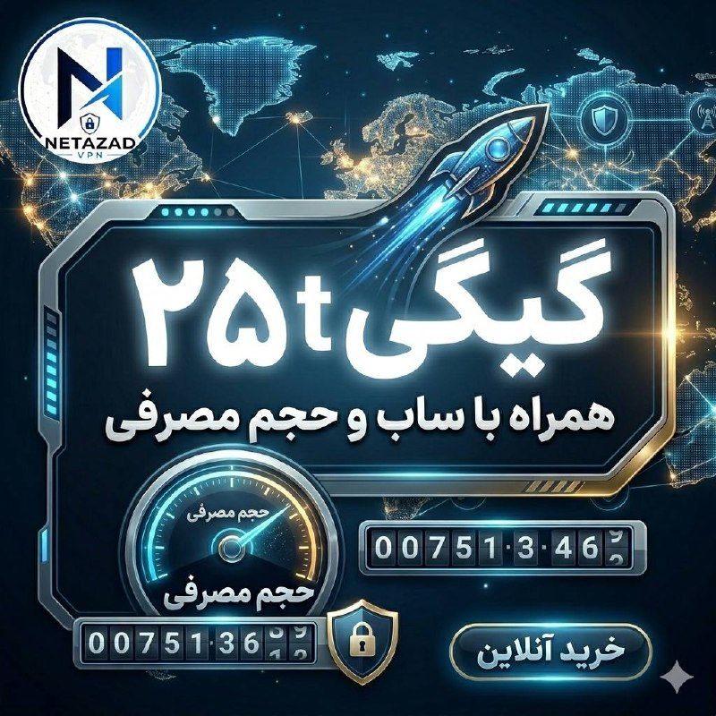

🚀مصرف بالا؟ حجم‌خوری زیاد؟ اینو ببین 👇
💎 همراه با ساب یعنی مصرف بهینه‌تر و تجربه بهتر
⚡️
🚀 سرعت عالی پایدار برای استفاده روزانه و بلند مدت😍😍

@NetAazaadBot
@NetAazaadBot

😍آف فقط برای امشب😍
❌ گیگی 50T ❌
✅ فقط گیگی 25T ✅

@NetAazaadBot
@NetAazaadBot
🔥 یه بار امتحان کن، خودت تفاوتشو حس می‌کنی✅

## alonews — post 123289

  <a href="telegram/content/alonews_123289_1779973219.mp4" target="_blank">🎬 Download video</a>

طرف تازه اینترنت پرو خریده، بعد پسرش بهش خبر میده اینترنتا وصل شده.

واکنش باباهه خداست😂😂

[@AloTweet]

## alonews — post 123288

  <a href="telegram/content/alonews_123288_1779973220.webm" target="_blank">🎬 Download video</a>

🔴سه ماهه حامیان جمهوری اسلامی با خیال راحت توی خیابون جمع می‌شن؛ نه خبری از حمله‌ست، نه «ناامنی»، نه تروریستی که پیداش بشه.

🔴اما همین که مردم معترض می‌آن توی خیابون، لباس‌شخصی، چماق‌دار، موتور‌سوار و تروریست ها با هم فعال می‌شن!

🔴چرا؟ چون این تروریست‌ها از بیرون نیومدن؛ همون بازوی خیابونی رژیم هستن. همون‌هایی که وقتی نوبت مردم می‌رسه، مأموریت‌شون می‌شه ترس، سرکوب و خون‌ریزی و کشتار مردم بیگناه.

🤔تروریست حکومتیه که برای حفظ خودش، خیابون رو به میدان وحشت تبدیل می‌کنه.

✅@AloNews

## alonews — post 123287

  <a href="telegram/content/alonews_123287_1779973220.webm" target="_blank">🎬 Download video</a>

👈تصویری از محل حمله ترور هدفمند 
🔴هدف ترور به نقل از منابع اسرائیلی: علی حصنی،فرمانده یگان موشکی لشکر امام حسین 
✅ @AloNews خبر جنگ

## alonews — post 123286

  <a href="telegram/content/alonews_123286_1779973220.webm" target="_blank">🎬 Download video</a>

👈تسنیم نوشت: برخی مدارس با لغو امتحانات مجازی، نمرات دانش‌آموزان را بر اساس ارزشیابی کیفی ثبت می‌کنند

✅ @AloNews خبر جنگ

## alonews — post 123285

  <a href="telegram/content/alonews_123285_1779973221.webm" target="_blank">🎬 Download video</a>

👈 اکسیوس: در حالی که دولت آمریکا فشار اقتصادی بر کوبا را افزایش می‌دهد، احتمال روبه‌رو شدن با بی‌ثباتی بزرگ در این کشور وجود دارد

🔴 این رویکرد شتاب‌گرایی تدریجی است؛ یعنی فشار افزایش می‌یابد، اما از مداخله مستقیم خودداری می‌شود

🔴 دولت ترامپ معتقد است که بدتر شدن کمبود مواد غذایی، برق و سوخت می‌تواند تظاهرات ضد دولتی در هاوانا را برانگیزد

✅ @AloNews خبر جنگ

## alonews — post 123283

  <a href="telegram/content/alonews_123283_1779973221.webm" target="_blank">🎬 Download video</a>

👈پروازهای رامسر به مشهد و اصفهان پس از ماه ها وقفه برقرار می‌شود

✅ @AloNews خبر جنگ

## alonews — post 123282

  <a href="telegram/content/alonews_123282_1779973221.webm" target="_blank">🎬 Download video</a>

👈وزارت خارجه قطر: نخست‌وزیر قطر در تماس با وزیر خارجه ژاپن تأکید کرد که همۀ طرف‌ها باید به میانجی‌گری برای حل بحران [آمریکا و ایران] پاسخ مثبت دهند.

🔴نخست‌وزیر قطر بر ضرورت حل مسالمت‌آمیز ریشه‌های بحران برای دستیابی به توافقی پایدار تأکید کرد.

✅ @AloNews خبر جنگ

## alonews — post 123281

  <a href="telegram/content/alonews_123281_1779973221.webm" target="_blank">🎬 Download video</a>

👈تصویری از محل حمله ترور هدفمند 
🔴هدف ترور به نقل از منابع اسرائیلی: علی حصنی،فرمانده یگان موشکی لشکر امام حسین 
✅ @AloNews خبر جنگ

## alonews — post 123280

  <a href="telegram/content/alonews_123280_1779973221.mp4" target="_blank">🎬 Download video</a>

🔴نیروهای تروریستی که ایران رو اشغال کردن در 18 و 19 دی در حال شلیک مستقیم به مردم معترض بودند.

✅@AloNews

---
📅 بروزرسانی: 1405/03/07 03:51
---

## VahidOOnLine — post 242497

هشت روایت کوتاه از هشت زندگی ناتمام.<
از شاهین‌شهر تا تهرانپارس، از کرج تا زنجان؛ جوانانی که بعضی تازه وارد زندگی مشترک، کار یا آینده‌ای تازه شده بودند، در خیابان‌های ایران هدف گلوله قرار گرفتند. بعضی در آغوش خانواده جان دادند، بعضی با تیر خلاص کشته شدند و بعضی حتی پس از مرگ، حقیقت کشته‌شدنشان انکار شد.<
روزبه صفری هلیسادی، مجتبی انصاری‌فرد، اشکان شهبازی، ساینا نظام‌دوست، صفا فرزانفر، رضا کاووسی حیدری، عرشیا براری و آرمین سلطان‌محمدی؛
جاویدنامان انقلاب ملی ایرانیان.<
این نام‌ها سند خشونتی است که بر مردم ایران گذشت؛ و یادشان بخشی از راهی است که تا آزادی ادامه دارد.<
#جاویدنامان_انقلاب_ملی_ایرانیان
‌🏁 🇬🇧 IranintlTV

🤖 @VahidOOnLine

## VahidOOnLine — post 242496

  

یک مقام آمریکایی در گفت‌وگو با رویترز از حملات جدید آمریکا به یک سایت نظامی در ایران خبر داد و گفت ارتش آمریکا همچنین چندین پهپاد ایرانی را رهگیری و سرنگون کرده است. هنوز به جزییات این سایت نظامی و تعداد پهپادها اشاره‌ای نشده است.
ساعتی پیش در پی شنیده شدن صدای ۳ انفجار در شرق بندرعباس، پدافند هوایی این شهر فعال شد.

‌🏁 🇬🇧 IranintlTV

🤖 @VahidOOnLine

## VahidOOnLine — post 242495

  

♦️دقایقی پس از گزارش خبرگزاری فارس درباره شنیده شدن سه صدای انفجار در شرق بندرعباس، یک مقام آمریکایی به رویترز گفت که ارتش آمریکا حمله‌های جدیدی علیه یک سایت نظامی جمهوری اسلامی انجام داده که تهدیدی برای نیروهای آمریکایی و تردد تجاری در تنگه هرمز بوده است. او همچنین گفته که ارتش آمریکا عملیات دیگری علیه چند پهپاد ایرانی انجام داده است.
ارتش آمریکا روز دوشنبه نیز به قایق‌های سپاه که گفته شده در حال مین‌گذاری در تنگه هرمز بودند حمله کرد و پرتابگرهای موشکی را نیز در خاک ایران هدف قرار داد.
با این حال مذاکرات تهران با آمریکا ادامه پیدا کرد و باقر قالیباف روز سه‌شنبه نیز برای پیگیری مذاکرات در عمان ماند.
‌🇸🇦 Indypersian

🤖 @VahidOOnLine

## VahidOOnLine — post 242494

  

یک مقام آمریکایی به رویترز گفت ارتش آمریکا حملات تازه‌ای را در ایران انجام داده و این حملات یک سایت نظامی را هدف قرار داده است. طبق این گزارش، مقام‌های آمریکا این سایت را تهدیدی برای نیروهای آمریکایی و تردد تجاری دریایی در تنگه هرمز قلمداد کرده بودند.

این مقام، که به شرط فاش نشدن نامش صحبت کرد، گفت ارتش آمریکا همچنین چندین پهپاد ایرانی را رهگیری و سرنگون کرده است.

ساعتی پیش در پی شنیده شدن صدای ۳ انفجار در شرق بندرعباس، پدافند هوایی این شهر فعال شد.
‌🏁 🇬🇧 IranintlTV

🤖 @VahidOOnLine

## VahidOOnLine — post 242493

  

اسرائیل هیوم گزارش داد ترامپ متن پیش‌نویس یادداشت تفاهم با جمهوری اسلامی را برای نتانیاهو و شماری از رهبران منطقه فرستاده است تا نظر آن‌ها را دریافت کند. این متن طی روز گذشته ارسال شده و در تماس تلفنی شب گذشته ترامپ و نتانیاهو نیز مورد بررسی قرار گرفته است.
اسرائیل هیوم نوشت بر اساس توضیح آمریکا به کشورهای خلیج فارس، هیچ توافقی امضا نخواهد شد که به جمهوری اسلامی اجازه دهد سلاح هسته‌ای داشته باشد یا کنترل تنگه هرمز را در اختیار بگیرد. واشینگتن همچنین تاکید کرده بازگشایی کامل و آزادانه تنگه هرمز، شرط اساسی پیشرفت در مذاکرات است.
به گزارش اسرائیل هیوم، منابع دیپلماتیک می‌گویند آمریکا اصرار دارد جمهوری اسلامی برای تحویل اورانیوم غنی‌شده تعهد کتبی ارائه کند. ترامپ نیز گفته است تهران در ازای واگذاری اورانیوم، کاهش تحریم دریافت نخواهد کرد و مارکو روبیو تاکید کرده است ایران به سلاح هسته‌ای دست نخواهد یافت.

‌🏁 🇬🇧 IranintlTV

🤖 @VahidOOnLine

## VahidOOnLine — post 242492

  

♦️کره شمالی اعلام کرد هرگز از سلاح هسته‌ای خود دست نخواهد کشید و برنامه خلع سلاح هسته‌ای این کشور انجام نخواهد شد.
به گزارش رویترز، خبرگزاری دولتی کره شمالی به نقل از سخنگوی وزارت خارجه این کشور گزارش داد پیونگ‌یانگ همچنین از ائتلاف امنیتی «کواد» به رهبری آمریکا و مواضع آنچه «خصمانه» علیه کره شمالی و دیگر کشورهای منطقه خواند، انتقاد کرده است.
‌🇸🇦 Indypersian

🤖 @VahidOOnLine

## VahidOOnLine — post 242491

  

♦️به گزارش خبرگزاری فارس، حوالی ساعت ۱:۳۰ بامداد، صدای سه انفجار در شرق شهر بندرعباس شنیده شد و هم‌زمان، سامانه‌های پدافند هوایی این شهر برای دقایقی فعال گردیدند. در حال حاضر محل دقیق و منشا اصلی این صداها مشخص نیست.
‌🇸🇦 Indypersian

🤖 @VahidOOnLine

## VahidOOnLine — post 242490

  

رسانه‌های ایران از شنیده شدن صدای ۳ انفجار از شرق شهر بندرعباس حوالی ساعت ۱:۳۰ بامداد خبر دادند. هنوز محل دقیق و منشا این صداها مشخص نیست و پیگیری‌ها برای مشخص شدن آن ادامه دارد. هم‌زمان برای دقایقی پدافند هوایی بندرعباس نیز فعال شد.
‌🏁 🇬🇧 IranintlTV

🤖 @VahidOOnLine

## VahidOOnLine — post 242489

  

♦️از ساعتی پیش، فروشگاه برنامه‌های گوگل، «گوگل‌پلی»، پس از ماه‌ها مسدودسازی بار دیگر برای بخشی از کاربران داخل ایران در دسترس قرار گرفته است. به گزارش مهر، این بازگشایی روی اپراتورهای ثابت و همراه انجام شده است؛ هرچند که این دسترسی هنوز برای تمام کاربران یکسان نیست، اما بر اساس تجربه‌های قبلی، انتظار می‌رود این سامانه به تدریج برای همگان فعال شود.
این گشایش تدریجی در شرایطی رخ می‌دهد که جمهوری اسلامی از روز سه‌شنبه ۵ خرداد، پس از ۸۸ روز خاموشی و قطع گسترده اینترنت بین‌الملل که در پی کشته شدن علی خامنه‌ای و آغاز جنگ ۳۸ روزه رخ داد، دسترسی به شبکه را به صورت محدود، کند و ناپایدار برقرار کرده است. با وجود اعلام رسانه‌های دولتی مبنی بر «بازگشت اینترنت»، داده‌های بین‌المللی موسسه کنتیک و گزارش‌های شهروندان نشان می‌دهد که سطح اتصال کاربران هنوز از ۳۹ درصد فراتر نرفته و شبکه با اختلالات شدید، سرعت پایین و پالایش (فیلترینگ) گسترده سکوهای اصلی مواجه است.
‌🇸🇦 Indypersian

🤖 @VahidOOnLine

## VahidOOnLine — post 242488

  

♦️ابراهیم عزیزی، رئیس کمیسیون امنیت ملی و سیاست خارجی مجلس شورای اسلامی، در واکنش به اظهارات اخیر دونالد ترامپ تاکید کرد که جمهوری اسلامی با الفاظی‌های رئیس‌جمهور آمریکا، هرگز از خطوط قرمز خود از جمله «حق غنی‌سازی و حفظ اورانیوم غنی‌شده»، «مدیریت تنگه هرمز» و «لغو تحریم‌ها» عقب‌نشینی نخواهد کرد.
عزیزی با انتشار پیامی در شبکه اجتماعی اکس نوشت: «دیگر همه می‌دانند ترامپ برای نجات خود از این بن‌بست راهبردی، یک روز از ابزار تهدید استفاده می‌کند و روز دیگر برای توافق التماس می‌کند.»
‌🇸🇦 Indypersian

🤖 @VahidOOnLine

## VahidOOnLine — post 242487

  

ابراهیم عزیزی، رییس کمیسیون امنیت ملی مجلس، در ایکس نوشت: «جمهوری اسلامی از خطوط قرمز خود مانند حق غنی‌سازی و اورانیوم غنی‌شده، مدیریت تنگه هرمز و لغو تحریم‌ها عقب‌نشینی نخواهد کرد.»
او افزود: «همه می‌دانند ترامپ برای نجات خود از این بن‌بست راهبردی یک روز از ابزار تهدید استفاده می‌کند و روز دیگر برای توافق التماس‌ می‌کند.»

‌🏁 🇬🇧 IranintlTV

🤖 @VahidOOnLine

## VahidOOnLine — post 242486

  

♦️به گزارش اسرائیل هیوم، دونالد ترامپ، رئیس‌جمهوری آمریکا، متن پیش‌نویس توافق با تهران را برای شماری از رهبران منطقه، از جمله بنیامین نتانیاهو، نخست‌وزیر اسرائیل، ارسال کرده و از آن‌ها خواسته است دیدگاه‌های خود را درباره این سند ارائه کنند.
بر اساس این گزارش، متن پیش‌نویس که طی ۲۴ ساعت گذشته برای رهبران منطقه ارسال شده، یکی از محورهای گفتگوی تلفنی اخیر ترامپ و نتانیاهو بوده است. با این حال، هنوز مشخص نیست این متن نسخه‌ای است که جمهوری اسلامی نیز با آن موافقت کرده یا آخرین پیشنهاد آمریکا به تهران محسوب می‌شود.
اسرائیل هیوم همچنین گزارش داد تهران نسخه جداگانه‌ای از پیش‌نویس خود را منتشر کرده که در آن اشاره‌ای به برنامه هسته‌ای نشده و خواستار دور شدن نیروی دریایی آمریکا از منطقه شده است. کاخ سفید گزارش‌های مربوط به پذیرش کنترل ایران بر تنگه هرمز یا عقب‌نشینی نظامی آمریکا را «کاملا ساختگی» توصیف کرده است.
بر اساس این گزارش، یکی از شرط‌های اصلی آمریکا برای پیشرفت مذاکرات، تعهد کتبی جمهوری اسلامی به واگذاری اورانیوم غنی‌شده عنوان شده است.
‌🇸🇦 Indypersian

🤖 @VahidOOnLine

## WithYashar — post 12767

«رویترز» به نقل از یک مقام آمریکایی گزارش داد: ارتش آمریکا حملات هوایی جدیدی را علیه یک سایت نظامی ایران انجام داد که تهدیدی برای نیروها و ناوبری ما در تنگه هرمز محسوب می‌ شد @withyashar

## WithYashar — post 12766

## WithYashar — post 12765

## WithYashar — post 12764

گزارشات تأیید نشده از ترور سردار علی عظمایی، جانشین سردار علیرضا تنگسیری، فرمانده نیروی دریایی سپاه. @withyashar

## WithYashar — post 12763

## WithYashar — post 12762

ترامپ، به شبکه فاکس نیوز: مذاکره با ایران درباره کنار گذاشتن غبار هسته‌ای به دلیل تضاد در تصمیمات ایران، رفت و برگشت دارد تأسیسات هسته‌ای ایران تحت نظارت مداوم ۹ دوربین، ۲۴ ساعته قرار دارند. هرگونه تحرک ایرانی در داخل تأسیسات هسته‌ای با واکنش مستقیم نظامی…

## WithYashar — post 12761

  <a href="telegram/content/WithYashar_12761_1779927678.mp4" target="_blank">🎬 Download video</a>

پهپاد شناسایی همکنون در آسمان اصفهان
@withyashar

## WithYashar — post 12760

  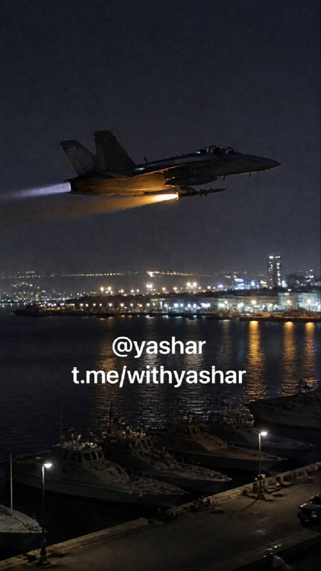

«رویترز» به نقل از یک مقام آمریکایی گزارش داد:

ارتش آمریکا حملات هوایی جدیدی را علیه یک سایت نظامی ایران انجام داد که تهدیدی برای نیروها و ناوبری ما در تنگه هرمز محسوب می‌ شد
@withyashar

## WithYashar — post 12759

گزارشات تأیید نشده از ترور سردار علی عظمایی، جانشین سردار علیرضا تنگسیری، فرمانده نیروی دریایی سپاه.
@withyashar

## WithYashar — post 12758

## WithYashar — post 12757

## WithYashar — post 12756

## WithYashar — post 12755

یا موسی

## WithYashar — post 12754

پدافند اصفهان فعال شد !
@withyashar

## WithYashar — post 12753

فارس : شنیده‌شدن صدای ۳ انفجار از شرق بندرعباس

حوالی ساعت ۱:۳۰ بامداد صدای ۳ انفجار از شرق شهر بندرعباس شنیده شد.

هنوز محل دقیق و منشأ این صداها مشخص نیست و پیگیری‌ها برای مشخص شدن آن ادامه دارد.

همزمان برای دقایقی پدافند شهر بندرعباس نیز فعال شد.

طی ۴ روز اخیر نیروهای مسلح کشورمان یک پهپاد آر کیو ۹ و یک پهپاد اوربیتر‌ دشمن آمریکایی صهیونی را در منطقه هرمزگان منهدم و همچنین سامانه‌های پدافندی نیز یک اف ۳۵ و یک پهپاد آر کیو ۴ را نیز رهگیری کردند.
@withyashar

## WithYashar — post 12752

خبر گزاری فارس‌ انفجار رو تایید کرد !!!
@withyashar

## WithYashar — post 12751

تایید نشده ۳ نفر‌گفتن ماشین این کاربر‌ با آدرس گفته :
بولوار‌خلیج فارس یه ماشین رو با پهپاد زدنن رفت رو هوا و بعد پدافند با تاخییر شروع کرد فعالیت
@withyashar

## WithYashar — post 12750

داداش من بندرم ۳ تا انفجار ۳۰ مین پیش بود و تا ۱۰ مین پیشم صدای پدافند می اومد میگن گویا یه ماشینو زدن و ترور بوده
@withyashar

## WithYashar — post 12749

https://t.me/boost/withyashar

## WithYashar — post 12748

چیزی ‌نیست بی بی اومده یه قلیه ماهی ‌بزنه بره 🐟 شلوغش نکنید

## mwarmonitor — post 9840

🔴«در میان گزارش‌هایی از چندین انفجار در بندرعباس و فعال شدن پدافند هوایی ایران، فعالیت قابل توجهی از پروازهای نظامی آمریکا در خلیج فارس مشاهده شد؛ از جمله یک هواپیمای هشدار زودهنگام E-3B Sentry نیروی هوایی آمریکا (AWACS)، تانکرهای سوخت‌رسان KC-46A و هواپیمای…

## mwarmonitor — post 9839

  

بازم این بیچاره نصف شبی زابرا کردید

## mwarmonitor — post 9838

📝 دنیای موازیِ صداوسیما واقعاً جای قشنگیه؛ سنت‌کام بیانیه رسمی صادر کرد، پدافند بندرعباس پودر شد ، اسامی تلفات رو دارن می‌شمارن، اونوقت خبرنگارِ تیزبین اون وسط واستاده، نسیم خنک دریا رو بو می‌کشه و با آرامشِ فیلسوفانه‌ای می‌گه: «همه‌چیز عادیه، مردم هم دارن…

## FoxNewsTwitter — post 342331

  <a href="telegram/content/FoxNewsTwitter_342331_1779927682.mp4" target="_blank">🎬 Download video</a>

Fox News (Twitter/X)

NOW: VP Vance waves as he boards Air Force Two with Second Lady Usha Vance.

The vice president will be speaking at the United States Air Force Academy’s 68th graduation ceremony on Thursday.

## FoxNewsTwitter — post 342330

  <a href="telegram/content/FoxNewsTwitter_342330_1779927684.mp4" target="_blank">🎬 Download video</a>

Fox News (Twitter/X)

FOX NEWS REPORT: In a major policy shift, the Trump administration says Americans exposed to Ebola will be treated at a facility in Kenya instead of flying home. @BillMelugin_ reports on the spread of the deadly outbreak as suspected cases now near 1,000.

## FoxNewsTwitter — post 342329

  <a href="telegram/content/FoxNewsTwitter_342329_1779927687.mp4" target="_blank">🎬 Download video</a>

Fox News (Twitter/X)

Kathy Hochul attempted to dunk on President Trump over the Knicks — and ended up getting roasted by fans instead.

The New York governor tried to quiz the president's support for the team when asked about him potentially attending an NBA Finals game.

“I ask him to name the starting lineup from the 1993 championship team and see how he does,” Hochul said.

There’s just one problem: the Knicks didn’t win a championship in 1993. Their last NBA title came in 1973.

## FoxNewsTwitter — post 342328

  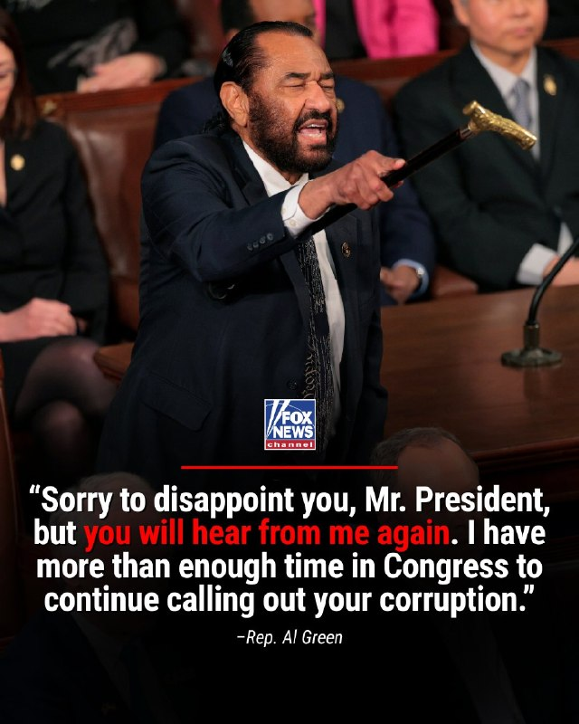

Fox News (Twitter/X)

Al Green isn't going quietly.

The defiant anti-Trump Texas congressman lost his primary on Tuesday, but is making clear he still plans to call out President Trump with his remaining time.

His remarks were in response to a Truth Social post from the president, who called Green, "one of the most mentally deficient Congressmen in the history of our Country."

Trump added, “I will miss that lunatic not screaming and violently waving his cane at me during my next State of the Union Speech.”

## FoxNewsTwitter — post 342327

  

Fox News (Twitter/X)

Former AG Pam Bondi has reportedly been diagnosed with thyroid cancer.

The diagnosis came shortly after Bondi wrapped up her time as attorney general. She reportedly underwent treatment and is recovering.

Katie Miller, who is married to White House Deputy Chief of Staff Stephen Miller, reacted to the news: “Pam has been quietly kicking cancer’s ass the last few weeks.”

## FoxNewsTwitter — post 342326

  <a href="telegram/content/FoxNewsTwitter_342326_1779927691.mp4" target="_blank">🎬 Download video</a>

Fox News (Twitter/X)

WATCH: DHS footage captures the chaotic takedown of a tractor-trailer near the southern border after authorities say 20 illegal migrants were found hidden inside the cab.

Video shows the driver suddenly jumping out and running as DPS troopers, Border Patrol agents, and sheriff’s deputies move in around the truck on Interstate 35 in La Salle County.

Officials say the migrants were concealed in the sleeper area behind the driver’s seat. The suspect, identified as John David Amaya, was arrested and charged with smuggling of persons.

Four minors from Mexico and Guatemala were among the group, according to DPS.

Following the incident, the group was referred to U.S. Border Patrol.

## FoxNewsTwitter — post 342325

  

Fox News (Twitter/X)

## FoxNewsTwitter — post 342324

  

Fox News (Twitter/X)

“Donald Trump” the buffalo has been spared from sacrifice in Bangladesh after going viral.

“Donald Trump,” the rare albino buffalo named for its blond tuft of hair, was hours away from being sacrificed for Eid al-Adha... until the government stepped in.

It had already been sold for ritual slaughter when viral videos turned it into a national attraction.

Crowds started flooding the farm to see the nearly 1,500-pound animal in person, forcing officials to intervene due to security concerns.

Now the buffalo is headed to the national zoo in Dhaka instead.

## pm_afshaa — post 91704

vless://406d8436-0eb9-4eb2-84fb-960e076ffba6@104.17.121.71:443?mode=stream-one&path=%2Fde&security=tls&encryption=none&insecure=0&host=de.lezzatzone.ir&fp=chrome&type=xhttp&allowInsecure=0&sni=de.lezzatzone.ir#PMTV%20NEWS%F0%9F%A6%81%E2%98%80%EF%B8%8F

نامحدود پرسرعت

💧 Rainbet.com the #1 Non-KYC Crypto Casino & Sportsbook @rainbetcom

😁 @Pm_Afshaa

## pm_afshaa — post 91703

vless://762ca06a-daba-4510-8533-7ba0667fb1f1@188.137.230.245:8880?path=%2F&security=none&encryption=none&type=ws#lex.vip%E2%8F%B3

نا محدود بزنید

## pm_afshaa — post 91702

🔴رویترز:جت های جنگی آمریکا یک سایت نظامی در بندر عباس را بمباران کردن

💧 Rainbet.com the #1 Non-KYC Crypto Casino & Sportsbook @rainbetcom

😁 @Pm_Afshaa

## pm_afshaa — post 91701

  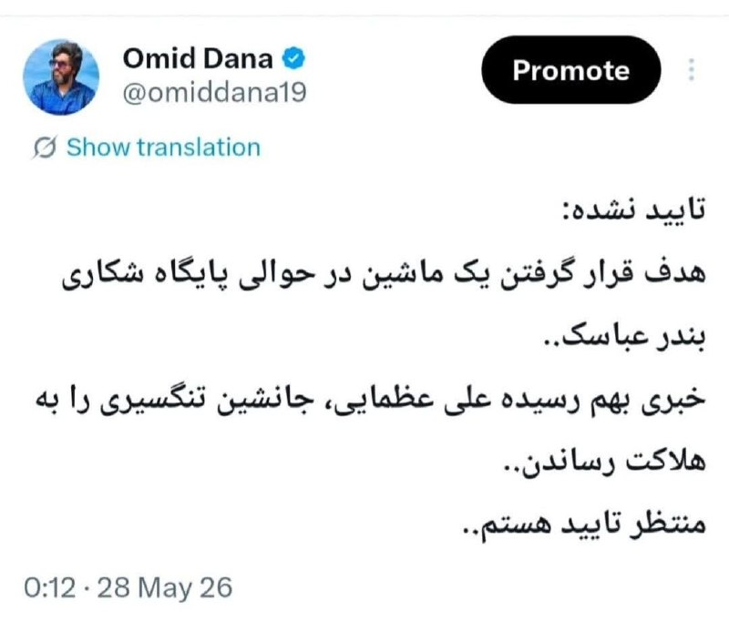

امید دانا هم خبر از ترور داد

💧 Rainbet.com the #1 Non-KYC Crypto Casino & Sportsbook @rainbetcom

😁 @Pm_Afshaa

## pm_afshaa — post 91700

🔴رویترز:ارتش ایالات متحده حملات جدیدی را به یک پایگاه نظامی ایرانی که تهدیدی برای نیروهای آمریکایی و کشتی‌های تجاری در تنگه هرمز بود، انجام داد

💧 Rainbet.com the #1 Non-KYC Crypto Casino & Sportsbook @rainbetcom

😁 @Pm_Afshaa

## pm_afshaa — post 91699

https://t.me/proxy?server=195.254.165.4&port=8443&secret=EERighJJvXrFGRMCIMJdCQ== پروکسی مخصوص دانلود سرعت بالا 
💧 Rainbet.com the #1 Non-KYC Crypto Casino & Sportsbook @rainbetcom 
😁 @Pm_Afshaa

## pm_afshaa — post 91698

🔴گزارشات تأیید نشده از ترور سردار علی عظمایی، جانشین سردار علیرضا تنگسیری، فرمانده نیروی دریایی سپاه

💧 Rainbet.com the #1 Non-KYC Crypto Casino & Sportsbook @rainbetcom

😁 @Pm_Afshaa

## pm_afshaa — post 91696

  <a href="telegram/content/pm_afshaa_91696_1779927696.mp4" target="_blank">🎬 Download video</a>

لبنان هم اکنون

💧 Rainbet.com the #1 Non-KYC Crypto Casino & Sportsbook @rainbetcom

😁 @Pm_Afshaa

## pm_afshaa — post 91695

🔴گزارش ها از درگیری میان نیروی دریایی سپاه و نیروی دریایی آمریکا در تنگه هرمز

💧 Rainbet.com the #1 Non-KYC Crypto Casino & Sportsbook @rainbetcom

😁 @Pm_Afshaa

## pm_afshaa — post 91694

https://t.me/proxy?server=195.254.165.4&port=8443&secret=EERighJJvXrFGRMCIMJdCQ==

پروکسی مخصوص دانلود سرعت بالا

💧 Rainbet.com the #1 Non-KYC Crypto Casino & Sportsbook @rainbetcom

😁 @Pm_Afshaa

## pm_afshaa — post 91693

https://t.me/proxy?server=87.248.129.13&port=15&secret=ee1603010200010001fc030386e24c3add63646e2e79656b74616e65742e636f6d

پروکسی متصل سرعت بالا

💧 Rainbet.com the #1 Non-KYC Crypto Casino & Sportsbook @rainbetcom

😁 @Pm_Afshaa

## pm_afshaa — post 91692

vless://be9c1310-a744-4162-a6ee-da63d015c58a@185.143.234.235:2053?type=ws&encryption=none&path=%3Fed%3D2048&host=dl.lexwill.site&security=tls&fp=chrome&alpn=h2%2Chttp%2F1.1&sni=dl.lexwill.site#Lex-ro2272tq

نامحدود سرعت موشکی مخصوص اینستا و یوتیوب

💧 Rainbet.com the #1 Non-KYC Crypto Casino & Sportsbook @rainbetcom

😁 @Pm_Afshaa

## pm_afshaa — post 91690

  <a href="telegram/content/pm_afshaa_91690_1779927697.mp4" target="_blank">🎬 Download video</a>

لبنان هم اکنون

💧 Rainbet.com the #1 Non-KYC Crypto Casino & Sportsbook @rainbetcom

😁 @Pm_Afshaa

## pm_afshaa — post 91688

🔴هم اکنون حملات شدید اسرائیل به بندر صور

💧 Rainbet.com the #1 Non-KYC Crypto Casino & Sportsbook @rainbetcom

😁 @Pm_Afshaa

## pm_afshaa — post 91687

🔴بلومبرگ:قیمت هر گالن بنزین در آمریکا با کاهش بی سابقه به 3 دلار رسید

💧 Rainbet.com the #1 Non-KYC Crypto Casino & Sportsbook @rainbetcom

😁 @Pm_Afshaa

## pm_afshaa — post 91686

گزارش ها از ترور در بندر عباس 
💧 Rainbet.com the #1 Non-KYC Crypto Casino & Sportsbook @rainbetcom 
😁 @Pm_Afshaa

## pm_afshaa — post 91685

گزارش ها از ترور در بندر عباس

💧 Rainbet.com the #1 Non-KYC Crypto Casino & Sportsbook @rainbetcom

😁 @Pm_Afshaa

## pm_afshaa — post 91684

فارس:سه انفجار در بندرعباس عباس رخ داده و پدافند هم فعال شده

💧 Rainbet.com the #1 Non-KYC Crypto Casino & Sportsbook @rainbetcom

😁 @Pm_Afshaa

## mamlekate — post 103592

📞 الو بندرعباس رو زدن ۱:۳۳ پنج‌شنبه ۷ خرداد

@mamlekate

## mamlekate — post 103591

📝 دونالد ترامپ درباره مذاکره با رژیم ایران: توافق نکنند کار را تمام می‌کنیم

رئیس جمهوری آمریکا با تاکید بر این که جمهوری اسلامی چاره‌ای جز توافق با آمریکا ندارد، از این که تاکنون نتیجه‌ای از گفت‌و‌گوها به دست نیامده است ابراز نارضایتی کرد.

ترامپ روز چهارشنبه ۶ خرداد همزمان با برگزاری نشست کابینه خود در کاخ سفید گمانه‌زنی‌ها درباره آزادسازی پول‌‌های بلوکه‌شده و رفع تحریم‌های رژيم ایران از سوی ایالات متحده را نیز رد کرد و به خبرنگاران گفت که با انتقال اورانیوم‌های غنی‌شده [رژیم] ایران به چین یا روسیه مخالف است.

@mamlekate

## VahidOnline — post 75761

  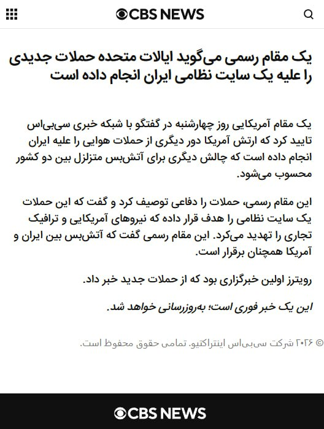

☄️ یک مقام آمریکایی به سی‌بی‌اس گفت ایالات متحده حملات جدیدی را علیه یک سایت نظامی ایران انجام داده ولی آتش‌بس همچنان برقرار است.
cbsnews
یک مقام آمریکایی در گفت‌وگو با رویترز از حملات جدید آمریکا به یک سایت نظامی در ایران خبر داد و گفت ارتش آمریکا همچنین چندین پهپاد ایرانی را رهگیری و سرنگون کرده است. هنوز به جزییات این سایت نظامی و تعداد پهپادها اشاره‌ای نشده است.
ساعتی پیش در پی شنیده شدن صدای ۳ انفجار در شرق بندرعباس، پدافند هوایی این شهر فعال شد.
@VahidOOnLine

📡 @VahidOnline

## VahidOnline — post 75760

#بندرعباس
پیام‌های دریافتی:

چهار تا صدای انفجار پشت سر هم اومد الان
ساعت ۱:۳۳ بندرعباس

درود آقا وحید همین الان سه تا صدای انفجار اومد تو بندرعباس ساعت ۱:۳۳ دقیقه

حاجی صدای انفجار دوباره شرق بندرعباس همین حالا سه تا پشت سر هم ساعت1/43 دقیقه

سلام وحید
۰۱:۳۳ شب
همین الان بندرعباس صدای ۳ تا انفجار اومد
سمت بهشت بندر
احتمالا باز مثل سری قبل باند فرودگاهه

بندرعباس ساعت ۱:۳۰ هفتم خرداد صدای جنگنده بعدش سه تا صدا انفجار اومد

سه تا انفجار بندرعباس

ساعت 1 و 33 دقیقه بامداد پنجشنبه 7 خرداد صدای سه تا انفجار رو از بندر عباس کس دیگه ای هم گزارش کرده ؟
شبیه صدای موشک زمین به هوا بود

بندرعباس صدا اومد
سه بار
درود. ساعت ۱:۳۲ دقیقه صدای سه انفجار شدید در بندرعباس اومد و خونه شدید لرزید.
ساعت ۱:۴۷ باز هم صدای دو انفجار دیگه اومد

صدای سه انفجار بندرعباس همین الان

سلام وحید جان بندرعباس چند انفجار وحشتناک پنجره خونه لرزید 1.38
دباره زدن بندرعباس ساعت 1.49

۳تا صدای انفجار بعد صدای پدافند

سه انفجار پشت سر هم و یکی هم ده دقیقه بعدش بندرعباس رخ داده
Vahid

📡 @VahidOnline

## IranIntlTV — post 339325

هشت روایت کوتاه از هشت زندگی ناتمام.
از شاهین‌شهر تا تهرانپارس، از کرج تا زنجان؛ جوانانی که بعضی تازه وارد زندگی مشترک، کار یا آینده‌ای تازه شده بودند، در خیابان‌های ایران هدف گلوله قرار گرفتند. بعضی در آغوش خانواده جان دادند، بعضی با تیر خلاص کشته شدند و بعضی حتی پس از مرگ، حقیقت کشته‌شدنشان انکار شد.
روزبه صفری هلیسادی، مجتبی انصاری‌فرد، اشکان شهبازی، ساینا نظام‌دوست، صفا فرزانفر، رضا کاووسی حیدری، عرشیا براری و آرمین سلطان‌محمدی؛
جاویدنامان انقلاب ملی ایرانیان.
این نام‌ها سند خشونتی است که بر مردم ایران گذشت؛ و یادشان بخشی از راهی است که تا آزادی ادامه دارد.
#جاویدنامان_انقلاب_ملی_ایرانیان

## IranIntlTV — post 339324

  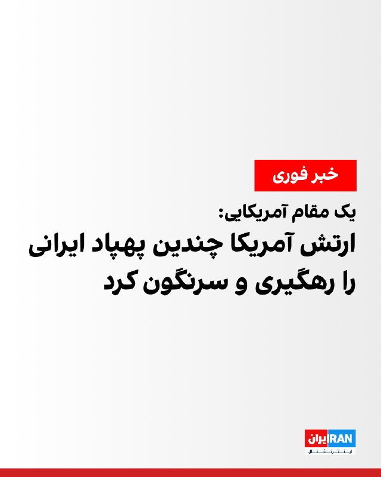

یک مقام آمریکایی در گفت‌وگو با رویترز از حملات جدید آمریکا به یک سایت نظامی در ایران خبر داد و گفت ارتش آمریکا همچنین چندین پهپاد ایرانی را رهگیری و سرنگون کرده است. هنوز به جزییات این سایت نظامی و تعداد پهپادها اشاره‌ای نشده است.
ساعتی پیش در پی شنیده شدن صدای ۳ انفجار در شرق بندرعباس، پدافند هوایی این شهر فعال شد.

https://iranintl.com/202605271743

## IranIntlTV — post 339323

  

یک مقام آمریکایی به رویترز گفت ارتش آمریکا حملات تازه‌ای را در ایران انجام داده و این حملات یک سایت نظامی را هدف قرار داده است. طبق این گزارش، مقام‌های آمریکا این سایت را تهدیدی برای نیروهای آمریکایی و تردد تجاری دریایی در تنگه هرمز قلمداد کرده بودند.

این مقام، که به شرط فاش نشدن نامش صحبت کرد، گفت ارتش آمریکا همچنین چندین پهپاد ایرانی را رهگیری و سرنگون کرده است.

ساعتی پیش در پی شنیده شدن صدای ۳ انفجار در شرق بندرعباس، پدافند هوایی این شهر فعال شد.
https://iranintl.com/202605274221

## IranIntlTV — post 339322

  <a href="telegram/content/IranIntlTV_339322_1779927701.mp4" target="_blank">🎬 Download video</a>

بعد از بازگشت نسبی اینترنت، مردم چه گفتند؟

بازگشت نسبی اینترنت به ایران، فقط به معنای وصل شدن دوبارهٔ اینستاگرام و واتس‌اپ نبود؛ میلیون‌ها ایرانی، پس از ماه‌ها، دوباره توانستند همدیگر را پیدا کنند، حرف بزنند، تصویر بفرستند و روایت خودشان را از آن‌چه در این مدت بر آن‌ها گذشته، منتشر کنند. شاید مهم‌ترین اتفاق ۲۴ ساعت گذشته دقیقاً همین باشد؛ بازگشت روایت مردم در برابر روایت رسمی حکومت و صاحبان «سیم‌کارت‌های سفید».
کامبیز حسینی در «برنامه» به این موضوع می‌پردازد.

«یک ایران صدای شما را می‌شنود»
دوشنبه تا پنجشنبه ۱۱ شب تهران
از تلویزیون ایران اینترنشنال

تماشای نسخه کامل این قسمت از «برنامه» در یوتیوب:
https://youtu.be/Xum6cfiHzgU
@iranintltv

## IranIntlTV — post 339321

  

اسرائیل هیوم گزارش داد ترامپ متن پیش‌نویس یادداشت تفاهم با جمهوری اسلامی را برای نتانیاهو و شماری از رهبران منطقه فرستاده است تا نظر آن‌ها را دریافت کند. این متن طی روز گذشته ارسال شده و در تماس تلفنی شب گذشته ترامپ و نتانیاهو نیز مورد بررسی قرار گرفته است.
اسرائیل هیوم نوشت بر اساس توضیح آمریکا به کشورهای خلیج فارس، هیچ توافقی امضا نخواهد شد که به جمهوری اسلامی اجازه دهد سلاح هسته‌ای داشته باشد یا کنترل تنگه هرمز را در اختیار بگیرد. واشینگتن همچنین تاکید کرده بازگشایی کامل و آزادانه تنگه هرمز، شرط اساسی پیشرفت در مذاکرات است.
به گزارش اسرائیل هیوم، منابع دیپلماتیک می‌گویند آمریکا اصرار دارد جمهوری اسلامی برای تحویل اورانیوم غنی‌شده تعهد کتبی ارائه کند. ترامپ نیز گفته است تهران در ازای واگذاری اورانیوم، کاهش تحریم دریافت نخواهد کرد و مارکو روبیو تاکید کرده است ایران به سلاح هسته‌ای دست نخواهد یافت.

https://iranintl.com/202605277271

## IranIntlTV — post 339320

  <a href="telegram/content/IranIntlTV_339320_1779927704.mp4" target="_blank">🎬 Download video</a>

سمیرا از آلمان: خاله‌ام ماه‌هاست جلوی تلویزیون نشسته تا اسم پسرِ جاویدنامش را ببیند

«یک ایران صدای شما را می‌شنود»
دوشنبه تا پنجشنبه ۱۱ شب تهران
از تلویزیون ایران اینترنشنال

تماشای نسخه کامل این قسمت از «برنامه» در یوتیوب:
https://youtu.be/Xum6cfiHzgU
@iranintltv

## IranIntlTV — post 339319

  <a href="telegram/content/IranIntlTV_339319_1779927707.mp4" target="_blank">🎬 Download video</a>

نور از تهران: پزشکیان حق ما را از ما گرفت و به‌عنوان صدقه برگرداند.

«یک ایران صدای شما را می‌شنود»
دوشنبه تا پنجشنبه ۱۱ شب تهران
از تلویزیون ایران اینترنشنال

تماشای نسخه کامل این قسمت از «برنامه» در یوتیوب:
https://youtu.be/Xum6cfiHzgU
@iranintltv

## IranIntlTV — post 339318

  <a href="https://t.me/IranintlTV/339318" target="_blank">📎 Download file</a>

🎧نسخه صوتی برنامه با کامبیز حسینی؛ بازگشت اینترنت و عبور مردم از روایت رسمی حکومت
@iranintlTV

## IranIntlTV — post 339317

  <a href="telegram/content/IranIntlTV_339317_1779927709.mp4" target="_blank">🎬 Download video</a>

ریک اسکات، سناتور جمهوری‌خواه، گفت ایالات متحده به رهبری دونالد ترامپ به هر شکل مانع دستیابی جمهوری اسلامی به سلاح هسته‌ای خواهد شد.
او افزود یا توافقی برای توقف این برنامه حاصل می‌شود یا اقدام نظامی قاطع انجام خواهد شد.

گزارش مرضیه حسینی، خبرنگار ایران‌اینترنشنال
@iranintltv

## IranIntlTV — post 339316

  

رسانه‌های ایران از شنیده شدن صدای ۳ انفجار از شرق شهر بندرعباس حوالی ساعت ۱:۳۰ بامداد خبر دادند. هنوز محل دقیق و منشا این صداها مشخص نیست و پیگیری‌ها برای مشخص شدن آن ادامه دارد. هم‌زمان برای دقایقی پدافند هوایی بندرعباس نیز فعال شد.
https://iranintl.com/202605276527

## IranIntlTV — post 339315

  <a href="telegram/content/IranIntlTV_339315_1779927712.mp4" target="_blank">🎬 Download video</a>

همزمان با افزایش امیدها به بازگشایی تنگه هرمز، قیمت جهانی نفت حدود پنج درصد کاهش یافت. رویترز گزارش داد تردد نفتکش‌ها در تنگه هرمز هنوز به سطح پیش از جنگ بازنگشته است.

گزارش اردوان روزبه، خبرنگار ایران‌اینترنشنال
@iranintltv

## IranIntlTV — post 339314

  <a href="telegram/content/IranIntlTV_339314_1779927714.mp4" target="_blank">🎬 Download video</a>

دونالد ترامپ گفت واشینگتن درباره کاهش تحریم‌ها یا پرداخت پول به جمهوری اسلامی گفت‌وگو نمی‌کند. نیویورک‌تایمز نیز گزارش داد دارایی‌های بلوکه‌شده و برنامه هسته‌ای جمهوری اسلامی همچنان از محورهای اختلاف در مذاکرات هستند.

گزارش نیلوفر منصوری، خبرنگار ایران‌اینترنشنال
@iranintltv

## Shin_Persian — post 6266

Shin ✓ @hey_itsmyturn
Wed, 27 May 2026 23:55:28 UTC

It was USN again apparently

فارسی

ظاهراً باز هم کار نیروی دریایی ایالات متحده (USN) بود.

𝕏 · @shin_persian

## Shin_Persian — post 6265

  

Shin ✓ @hey_itsmyturn
Wed, 27 May 2026 22:40:43 UTC

2210Z
Explosion heard in Bandar Abbas, Hormozgan Province, #Iran

فارسی

۲۲۱۰ زولو (۰۱:۴۰ به وقت تهران)
صدای انفجار در بندرعباس، استان هرمزگان، #Iran شنیده شد.

𝕏 · @shin_persian

## Iliaen — post 4437

بامداد پنجشنبه؛ زیرنویس صدا و سیما: چند صدای انفجار در بندعباس شنیده شد؛ رویترز به نقل از یک مقام آمریکایی مدعی حمله به یک موقعیت نظامی در بندرعباس شد.

همچنین خبرگزاری CBS به نقل از مقامات ایالات متحده می‌گوید یک سایت نظامی در خاک ایران هدف حمله قرار گرفت.

@iliaen

## FarsiVOA — post 218856

⚡️اختلاف و دوگانگی میان کشورهای اتحادیه اروپا در مهار غول‌های فناوری؛ نگرانی از تنش با آمریکا
@FarsiVOA

## FarsiVOA — post 218855

🔺انفجارها در بندرعباس؛ گزارش‌ها از دور تازه‌ای از حملات ارتش آمریکا به اهدافی در ایران و مقابله آن‌ با حملات پهپادی جمهوری اسلامی

▪️کاربران شبکه‌های اجتماعی از وقوع چندین انفجار در ساعات اولیه روز پنج‌شنبه ۷ خرداد در بندرعباس خبر دادند. طبق اطلاعات کانال تلگرامی وحیدآنلاین، این انفجارها بین حدود ساعت ۱:۳۰ بامداد تا نزدیک به ۲ بامداد شنیده شد.

⬇️ بیشتر بخوانید:
https://ir.voanews.com/a/8154603.html
@FarsiVOA

## FarsiVOA — post 218854

  <a href="telegram/content/FarsiVOA_218854_1779927717.mp4" target="_blank">🎬 Download video</a>

⚡️بازنشر گزارش آزار و فشار بر زنان زندانی در ایران توسط دونالد ترامپ، نشانه‌ای از تغییر میدان نبرد میان واشنگتن و جمهوری اسلامی است. نبردی که این‌بار، بر سر روایت رنج زنان شکل گرفته است.
@FarsiVOA

## FarsiVOA — post 218853

  <a href="telegram/content/FarsiVOA_218853_1779927718.mp4" target="_blank">🎬 Download video</a>

⚡️ده سال زندان برای دومین متهم پرونده توطئه قتل مسیح‌علی‌نژاد؛ علی‌نژاد: جمهوری اسلامی هم داخل آدم می‌کشد هم در خارج قاتل استخدام می‌کند
@FarsiVOA

## FarsiVOA — post 218852

⚡️گزارش جدید بانک مرکزی اروپا از وضعیت بازارهای مالی اروپا
@FarsiVOA

## FarsiVOA — post 218851

🔺یک تبعه آمریکایی در پرونده توطئه برای قتل مسیح علینژاد به ۱۰ سال زندان محکوم شد

▪️وزارت دادگستری آمریکا روز چهارشنبه ۶ خرداد در بیانیه‌ای گفت که جاناتان لودهولت، ساکن استاتن آیلند، «به‌دلیل نقش خود در توطئه تعقیب و قتل یک روزنامه‌نگار و منتقد برجسته حکومت ایران، به زندان محکوم شد.»

⬇️ بیشتر بخوانید:
https://ir.voanews.com/a/8154602.html
@FarsiVOA

## FarsiVOA — post 218850

⚡️چالش شبه‌نظامیان وابسته به جمهوری اسلامی در عراق؛ انعطاف سیاسی یا حفظ سلاح در برابر دولت بغداد؟
@FarsiVOA

## FarsiVOA — post 218849

⚡️هشدار سازمان اطلاعات بریتانیا نسبت به جنگ ترکیبی روسیه، چین و جمهوری اسلامی
@FarsiVOA

## FarsiVOA — post 218848

⚡️کابینه پرزیدنت ترامپ روز چهارشنبه ۶ خرداد در کاخ سفید تشکیل جلسه داد. در بخش‌هایی از این جلسه موضوع «خشم حماسی» و مذاکره با رژیم ایران نیز مطرح شد. صدای آمریکا بخش‌هایی از این جلسه را به طور مستقیم و با ترجمه همزمان پژواک کیومرثی پخش کرد.
@FarsiVOA

## FarsiVOA — post 218847

  

⚡️کانال تلگرامی وحیدآنلاین دقایقی قبل به نقل از کاربران از شنیده شدن صدای چندین انفجار در بندرعباس خبر داد.
@FarsiVOA

## FarsiVOA — post 218846

⚡️رئیس جمهوری آمریکا: مقامات جمهوری اسلامی مصمم به دستیابی به توافق با ما هستند
@FarsiVOA

## FarsiVOA — post 218845

🔺اف‌بی‌آی با «تهدیدات دولت‌های متخاصم» از جمله «سرکوب فراملی» در زمان برگزاری مسابقات جام جهانی مقابله می‌کند

▪️کش پتل، رئیس پلیس فدرال آمریکا (اف‌بی‌آی)، روز چهارشنبه ۶ خرداد گفت ایالات متحده درباره اقدامات «ضد دموکراتیک» احتمالی «دولت‌های خارجی متخاصم» در طول برگزاری جام جهانی فوتبال هشدار داد و از عموم مردم خواست هوشیار باشند.

⬇️ بیشتر بخوانید:
https://ir.voanews.com/a/8154589.html
@FarsiVOA

## Persian_Trend_Official — post 15152

  

خبرهایی که از ترور علی عظمایی جانشین سردار تنگسیری دست به دست می‌شود برای اولین بار توسط منابع خبری نامعتبر و زرد منتشر شده.

📝 Amir

📌 @persian_trend_official
پرشین ترند | متفاوت‌ترین کانال نظامی

## Persian_Trend_Official — post 15151

یک مقام آمریکایی در مصاحبه با شبکه سی‌بی‌اس نیوز ادعا کرد با وجود حملاتی که امشب انجام شده آتش بس همچنان پابرجا تلقی می‌شود.

📝 Amir

📌 @persian_trend_official
پرشین ترند | متفاوت‌ترین کانال نظامی

## Persian_Trend_Official — post 15150

  

اکسیوس به نقل از یک مقام ارشد امریکایی می‌گوید طرف ایرانی چهار پهپاد انتحاری به سمت یک ناو نیروی دریایی امریکا و یک شناور تجاری شلیک کرده است.

به گفته اکسیوس نیروهای آمریکایی این پهپادها را رهگیری و همچنین یک واحد پهپادی را قبل از آنکه پهپادی شلیک کند منهدم کردند.

📝 Amir

📌 @persian_trend_official
پرشین ترند | متفاوت‌ترین کانال نظامی

## Persian_Trend_Official — post 15149

  

صداوسیما جمهوری اسلامی پس از گذشت حدود دو ساعت از شنیده شدن صدای انفجار در بندرعباس خبر حمله را به این شکل تأیید کرد.

📝 Amir

📌 @persian_trend_official
پرشین ترند | متفاوت‌ترین کانال نظامی

## Persian_Trend_Official — post 15148

  

حمله مجدد هوایی ارتش ایالات متحده به بندرعباس

به نقل از گزارش دقایقی پیش رویترز، ایالات متحده امریکا حملات هوایی جدیدی را علیه مناطقی در بندرعباس انجام داده است.

به گفته مقاماتی امریکایی این مناطق تهدیدی برای نیروهای ایالات متحده و کشتی‌های تجاری در تنگه هرمز محسوب می‌شدند.

📝 Amir

📌 @persian_trend_official
پرشین ترند | متفاوت‌ترین کانال نظامی

## Persian_Trend_Official — post 15147

https://youtube.com/live/2HyaIyBB-ko?feature=share

## IranianMinds — post 20920

عزیزان کسی هست دامنه وایت رو کلادفلر داشته باشه پیام بده ( برای وصل کردن بچه ها میخوایم )

@AmirrPower

## IranianMinds — post 20919

🔴 رویترز :

جمهوری اسلامی چن تا پهپاد هم شلیک کرده بود که ارتش آمریکا همشونو نابود کرد.

@IranianMinds

## IranianMinds — post 20918

تنها چیزی که شاید این آتش بس و نقض کنه یه بمب اتمه

@IranianMinds

## IranianMinds — post 20917

خبر های ترور و این چیزا همش کذبه و برا جو دادنه هر چیزیو سریع باور نکنید

قرار به ترور بود یه جوری میزدن همه متوجه شیم

## IranianMinds — post 20916

🔴 رویترز به نقل از یک مقام بالا رده آمریکایی :

ارتش آمریکا حملات جدیدی را به یک سایت نظامی در جنوب ایران انجام داد , این سایت تهدیدی برای ناوبری و نیروهای آمریکایی بود.

@IranianMinds

## IranianMinds — post 20915

  <a href="telegram/content/IranianMinds_20915_1779927723.mp4" target="_blank">🎬 Download video</a>

🔴 اسرائیل هم این وسط کلش کیری شد یه ساختمون دیگه رو تو لبنان آورد پایین و یکی دیگه از فرمانده های حزب الله رو ترور کرد.

@IranianMinds

## IranianMinds — post 20914

  <a href="https://t.me/IranianMinds/20914" target="_blank">📎 Download file</a>

سرور فوق العاده پرسرعت و قوی مخصوص اینستا و یوتیوب سرعت فضایی مخصوص تمام اینترنت ها

آموزش اتصال در اندروید

آموزش اتصال در آیفون

حتما شیر بدید بقیه هم متصل شن لطفا دانلود سنگین هم نزنید ❤️‍🔥

@IranianMinds

## IranianMinds — post 20913

چیزه خاصی نیست مثل دفعات قبله
دوتا قایقو لانچرو چن تا سپاهیو میزنن تهشم میگن برا دفاع از خودمون بوده و تموم میشه میره تا شب بعدی که دوباره بزننشون

## IranianMinds — post 20912

🔴 رسانه آمریکایی: ایالات متحده یک عملیات دفاعی در بندرعباس ایران انجام داده و افزوده است که آمریکا برای حفاظت از منافع منطقه‌ای خود اقدام خواهد کرد و این موضوع تأثیری بر آتش‌بس ندارد. @IranianMinds

## IranianMinds — post 20911

🔴 رسانه آمریکایی:

ایالات متحده یک عملیات دفاعی در بندرعباس ایران انجام داده و افزوده است که آمریکا برای حفاظت از منافع منطقه‌ای خود اقدام خواهد کرد و این موضوع تأثیری بر آتش‌بس ندارد.

@IranianMinds

## IranianMinds — post 20910

یه زمانی هر شب تلگرام جنگ بود

الان هر شب ترور هدفمنده

## IranianMinds — post 20909

  

یادش بخیر

@IranianMinds

## IranianMinds — post 20908

🔴 خبرگزاری فارس :

سه انفجار در بندرعباس عباس رخ داده و پدافند هم فعال شده.

@IranianMinds

## IranianMinds — post 20907

  <a href="https://t.me/IranianMinds/20907" target="_blank">📎 Download file</a>

سرور فوق العاده پرسرعت و قوی مخصوص اینستا و یوتیوب سرعت فضایی مخصوص تمام اینترنت ها

آموزش اتصال در اندروید

آموزش اتصال در آیفون

حتما شیر بدید بقیه هم متصل شن لطفا دانلود سنگین هم نزنید ❤️‍🔥

@IranianMinds

## IranianMinds — post 20906

  <a href="https://t.me/IranianMinds/20906" target="_blank">📎 Download file</a>

سرور فوق العاده پرسرعت و قوی مخصوص اینستا و یوتیوب سرعت فضایی مخصوص تمام اینترنت ها

آموزش اتصال در اندروید

آموزش اتصال در آیفون

حتما شیر بدید بقیه هم متصل شن لطفا دانلود سنگین هم نزنید ❤️‍🔥

@IranianMinds

## IranianMinds — post 20905

  <a href="https://t.me/IranianMinds/20905" target="_blank">📎 Download file</a>

سرور فوق العاده پرسرعت و قوی مخصوص اینستا و یوتیوب سرعت فضایی مخصوص تمام اینترنت ها

آموزش اتصال در اندروید

آموزش اتصال در آیفون

حتما شیر بدید بقیه هم متصل شن لطفا دانلود سنگین هم نزنید ❤️‍🔥

@IranianMinds

## IranianMinds — post 20904

🔴 اپ استور هم باز شد. @IranianMinds

## IranianMinds — post 20903

🔴 اپ استور هم باز شد.

@IranianMinds

## IranianMinds — post 20902

  <a href="telegram/content/IranianMinds_20902_1779927727.mp4" target="_blank">🎬 Download video</a>

شاهزاده رضا پهلوی روز جمعه ۱ خرداد (۲۲ مه)، در نشستی آنلاین با شماری از فعالان و چهره‌های رسانه‌ای و هنری گفتگو کردند. ایشان ضمن شنیدن دیدگاه‌ها و نظرات حاضران، به برخی پرسش‌ها نیز پاسخ دادند. بخش‌های بیشتری از این گفتگو در روزهای آینده منتشر خواهد شد.

@OfficialRezaPahlavi

## IranianMinds — post 20901

  

علیرضا فیروزجا (ایرانی)
با پرچم فرانسه
نفر اول شطرنج جهانو شکست داد

اینم از نابغه هامون...

@IranianMinds

## BBCPersian — post 282221

  

🔻هلال احمر تشکیلات فلسطینی و منابع بیمارستانی در غزه می‌گویند که هفت نفر در جریان حمله هوایی اسرائیل به خانه‌ای در غزه کشته شدند.

این منابع گفتند دو دختر جوان در میان کشته‌شدگان هستند. این حمله ۱۵ زخمی هم داشته است.

بنا بر گزارش‌ها یک هواپیمای جنگی ارتش اسرائیل دو موشک به این خانه در مرکز شهر غزه شلیک کرد.

ارتش اسرائیل می‌گوید که «دو عضو ارشد نظامی حماس» را در این حمله هدف قرار داده بود، اما نام آن‌ها را اعلام نکرد.

روز گذشته هم اسرائیل محمد عوده، فرمانده جدید شاخه نظامی حماس، در جریان یک حمله به طبقات بالایی یک ساختمان در غزه کشت.

حملات تازه اسرائیل با وجود آتش‌بس میان حماس و اسرائیل در اکتبر سال گذشته انجام می‌شود.

📷 EPA
https://bbc.in/4dBInTn
@BBCPersian

## BBCPersian — post 282220

  

🔻‌دادگاه رسیدگی به مرگ متیو پری، ستاره سریال «فرندز»، کِنِت ایواماسا، دستیار آقای پری را به «۴۱ ماه» زندان محکوم کرد. این دادگاه که چهارشنبه ۲۷ مه (۶ خرداد) در لس‌آنجلس برگزار شد، آقای ایواماسا را به جرم «تامین کتامین» برای آقای پری مجرم شناخت. متیو پری اکتبر ۲۰۲۳ به دلیل عوارض بیش مصرفی مواد درگذشت.

در این جلسه دادستان گفت که کِنِت ایواماسا، ۶۰ ساله، به آقای پری کتامین تزریق کرده بود و همچنین برای تهیه بیش از ۵۰ هزار دلار کتامین در هفته‌های پیش از مرگ او با دو پزشک همکاری کرده بود.

آقای ایواماسا در اوت ۲۰۲۴ به «توطئه برای توزیع کتامین منجر به مرگ» اعتراف کرد و دادگاه با اشد مجازات او را به ۱۵ سال حبس در زندان فدرال محکوم کرده بود. همچنین او به دو سال آزادی تحت نظارت و پرداخت ۱۰ هزار دلار جریمه محکوم شده بود. او باید روز ۱۷ ژوئن خود را به زندان معرفی کند.

ادامه خبر را از لینک زیر در وبسایت بی‌بی‌سی فارسی بخوانید.

📷 Getty Images for GQ
https://bbc.in/4uAVNou
@BBCPersian

## BBCPersian — post 282219

🔻پم باندی، دادستان کل پيشين آمريکا که ماه گذشته توسط دونالد ترامپ از سمت خود برکنار شد، اعلام کرد به سرطان تيروئيد مبتلا شده است.

باندی ۶۰ ساله به سی‌بی‌اس گفت که تحت درمان قرار دارد و چند هفته پيش نيز تحت عمل جراحی قرار گرفته است.

هنوز مشخص نيست سرطان پم باندی از کدام انواع سرطان تیروئید است اما پزشکان دست کم دو نوع رایج سرطان تیروئید را که روند آهسته‌ای دارد، بسیار درمان‌پذیر می‌دانند.

او در یک سال و اندی حضور در دولت، از حامیان سرسخت دونالد ترامپ بود و خود را دنبال‌کننده جدی سیاست‌های رئیس جمهور آمریکا معرفی می‌کرد هرچند حواشی مرتبط با پرونده اپستین و همچنین به گزارش رسانه‌های آمریکا، انتظار از او برای پیگیری شکایاتی چون پرونده جیمز کومی و دیگر منتقدان جدی آقای ترامپ، زمینه‌ساز جدایی‌اش شد.

https://bbc.in/3PpIMz2
@BBCPersian

## BBCPersian — post 282218

  <a href="https://t.me/bbcpersian/282218" target="_blank">📎 Download file</a>

🔻پادکست برنامه شصت دقیقه چهارشنبه ۶ خرداد ۱۴۰۵
این برنامه رادیویی را می‌توانید هر شب ساعت ۲۳ به وقت ایران، روی موج متوسط ۷۰۲ کیلوهرتز و موج کوتاه ۹۴۶۵ کیلوهرتز بشنوید.
تکرار برنامه را هم می‌توانید ساعت ۲۱:۳۰ روی موج متوسط ۷۰۲ کیلوهرتز و موج کوتاه ۵۳۹۵ کیلوهرتز گوش کنید.

@BBCPersian

## BBCPersian — post 282209

🖋سوتیک بیسواس
خبرنگار هند، بی‌بی‌سی

برای نخستین بار از سال ۱۹۵۷، دیگر هیچ‌یک از دولت‌های ایالتی در هند تحت رهبری کمونیست‌ها نیست.

شکست «جبهه دموکراتیک چپ» به رهبری حزب کمونیست هند (مارکسیست) در ایالت کرالا در انتخابات اخیر، پس از یک دهه حضور در قدرت، به یکی از ماندگارترین تجربه‌های کمونیسم دموکراتیک در جهان پایان داده است.

در اوج قدرت، احزاب کمونیست هند بر ایالت‌هایی از بنگال غربی تا کرالا و تریپورا حکومت می‌کردند. این احزاب از طریق اتحادیه‌های کارگری، سازمان‌های دهقانی، شاخه‌های دانشجویی و شبکه‌های منظم حزبی، بر زندگی بیش از ۱۰۰ میلیون نفر تاثیر گذاشتند.

آلبوم را ورق بزنید و ادامه مطلب را از لینک زیر در وبسایت بی‌بی‌سی فارسی بخوانید.

📸GettyImages/ Reuters/ Anadolu via Getty Images/ AFP via Getty Images/ Hindustan Times via Getty Images/
Bloomberg via Getty Images/NurPhoto via Getty Images
https://bbc.in/3POJXYS
@BBCPersian

## BBCPersian — post 282208

🔻رئیس بزرگترین آژانس جاسوسی بریتانیا: نزدیک به ۵۰۰ هزار سرباز روسیه در جنگ با اوکراین، از دست رفته‌اند
رئیس بزرگترین آژانس جاسوسی بریتانیا (GCHQ) می‌گوید که روسیه از زمان آغاز تهاجم تمام عیار به اوکراین در چهار سال پیش، نزدیک به نیم میلیون سربازش را از دست داده است.

ان کیست-باتلر رئیس این آژانس در حالی این آمار را اعلام کرد که هم روسیه و هم اوکراین تا کنون به طور مداوم تخمین‌هایی از کشته‌شدگان طرف مقابل منتشر کرده‌اند، اما تمایلی به ارائه جزئیات در مورد تعداد نیروهای کشته‌شده خود در این جنگ نداشته‌اند.

با این حال، در ماه فوریه، ولادیمیر زلنسکی، رئیس‌جمهور اوکراین، گفت که این کشور از سال ۲۰۲۲ تاکنون ۵۵ هزار سرباز خود را از دست داده است.

بخش روسی بی‌بی‌سی به همراه رسانه مستقل مدیازونا و گروهی از داوطلبان از فوریه ۲۰۲۲ در حال شمارش کشته‌شدگان نیروهای روسیه در این جنگ بوده است. این اقدام با استفاده از گزارش‌های رسمی، مطالب روزنامه‌ها، رسانه‌های اجتماعی و یادبودها و قبرهای جدید صورت گرفته و بر اساس آن بی‌بی‌سی تاکنون توانسته است نام ۲۲۳,۵۳۹ سرباز و افسر کشته شده روسیه را در جنگ اوکراین تأیید کند.

اما فرانک گاردنر، خبرنگار امور امنیتی بی‌بی‌سی، می‌گوید: اعتقاد بر این است که تعداد واقعی کشته‌شدگان بسیار بیشتر است و کارشناسان نظامی که با آنها مشورت شده معتقدند که تجزیه و تحلیل بی‌بی‌سی از طریق تعداد قبرها، یادبودهای جنگ و آگهی‌های ترحیم ممکن است ۴۵ تا ۶۵ درصد از کل کشته‌شدگان را تشکیل دهد.

https://bbc.in/4fckZNj
@BBCPersian

## Dirty_Kids — post 390367

  <a href="telegram/content/Dirty_Kids_390367_1779927731.webm" target="_blank">🎬 Download video</a>

☢️خفن ترین و‌ قدیمی ترین  انالیزور  ایران ینی دکتر بت 
👍 
🔴مسابقات جذاب جام جهانی به زودی شروع میشه بیا توی کانال دکتر بت و باهاش همراه شو و پول در بیار
💵 رایگان بهترین شرط هارو براتون میذاره حتی هزار تومن هم دریافت نمیکنه روزانه میتونی از پیش بینی فوتبال باهاش…

## Dirty_Kids — post 390366

  <a href="telegram/content/Dirty_Kids_390366_1779927732.webm" target="_blank">🎬 Download video</a>

☢️خفن ترین و‌ قدیمی ترین  انالیزور  ایران ینی دکتر بت 
👍

🔴مسابقات جذاب جام جهانی به زودی شروع میشه بیا توی کانال دکتر بت و باهاش همراه شو و پول در بیار
💵

رایگان بهترین شرط هارو براتون میذاره
حتی هزار تومن هم دریافت نمیکنه
روزانه میتونی از پیش بینی فوتبال باهاش پول در بیاری 👌
A6

🌟اگ اهل پیش بینی فوتبالی این کانال اصلا از دست ندین
👇

✅https://t.me/+4_ADqwB9e-QwYjlk

✅https://t.me/+4_ADqwB9e-QwYjlk

## Dirty_Kids — post 390365

  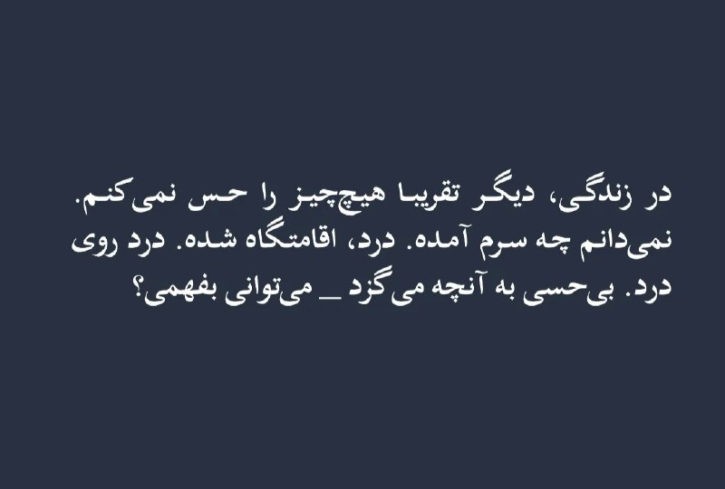

#بخوابیم

@Dirty_Kids 👻

## Dirty_Kids — post 390364

  

شهروندان در بندرعباس از وقوع انفجارهای پیاپی و پرواز جنگنده‌های خارجی در بامداد پنجشنبه خبر می‌دهند.

خبرگزاری فارس، وابسته به سپاه هم با تایید خبر انفجارها نوشت محل دقیق و منشا آن مشخص نیست و پدافند بندرعباس نیز فعال شده است.

@Dirty_Kids 👻

## Dirty_Kids — post 390363

  

آخرین تصویری که خامنه ای دیده 😂

@Dirty_Kids 👻

## Dirty_Kids — post 390362

  <a href="telegram/content/Dirty_Kids_390362_1779927733.mp4" target="_blank">🎬 Download video</a>

فقط در برزیل چنین چیزی ممکن است!

@Dirty_Kids 👻

## Dirty_Kids — post 390361

  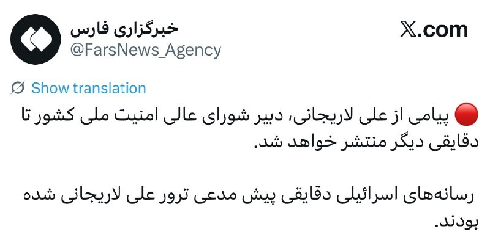

بچه‌ها شما که نبودین قرار بود پیام لاریجانی تا دقایقی دیگر منتشر بشه.
شما هستین و پیامش هنوز منتشر نشده

@Dirty_Kids 👻

## Dirty_Kids — post 390360

  

این سریال YourFriendes & Neighbors رو ببینید، ازش لذت ببرید و بعدا ازم تشکر کنید.

ژانر کمدی/درام هست
این داداشمون پولدار بوده، تو بالاشهر امریکا میشینه ورشکسته میشه، رو میاره به لاشی‌بازی و دزدی

@Dirty_Kids 👻

## Dirty_Kids — post 390359

  <a href="telegram/content/Dirty_Kids_390359_1779927737.mp4" target="_blank">🎬 Download video</a>

طرف تازه اینترنت پرو خریده، بعد پسرش بهش خبر میده اینترنتا وصل شده.

واکنش باباهه خداست😂😂

@Dirty_Kids 👻

## Dirty_Kids — post 390356

  <a href="telegram/content/Dirty_Kids_390356_1779927738.mp4" target="_blank">🎬 Download video</a>

داداش تو دیگه به کسی کمک نکن😂😂😂

@Dirty_Kids 👻

## alonews — post 123187

  

بهترین سرعت با بهترین قیمت با God Vpn🔵
تخفیف ویژه برای امشب فقط✅✅

10 گیگ فقط 150,000 تومن😍
بقیه قیمت ها در ربات👍✅😍

❌قیمت در حالت عادی گیگی
10 گیگ 250,000❌

✅تضمین بدون قطعی
🌐 اتصال با تمامی دستگاه
🔻🏪پشتیبانی ۲۴ ساعته
✔️ دور زدن نت ملی
🔘 بالاترین سرعت با تمام اپراتورها
⭐با کیفیت عالی و ضمانت بازگشت وجه
🌐🌐🌐🌐🌐🌐⭐️
➖➖➖➖➖➖➖➖➖➖
ربات تلگرام جهت خرید لحظه ای:
@GodVpnV2_Bot ربات 1
@V2rayPc1bot ربات 2

ایدی کانال:
t.me/God_of_Vpn
پشتیبانی و خرید عمده:
@Pc_V2ray
@Mmkhh00

## alonews — post 123186

  <a href="telegram/content/alonews_123186_1779927742.mp4" target="_blank">🎬 Download video</a>

👈هم اکنون حمله به اسرائیل بندر صور

✅ @AloNews خبر جنگ

## alonews — post 123185

  <a href="telegram/content/alonews_123185_1779927743.webm" target="_blank">🎬 Download video</a>

👈خسارت حدودی قطع اینترنت در ۸۸روز

605,440,000,000,000تومان

✅ @AloNews خبر جنگ

## alonews — post 123184

  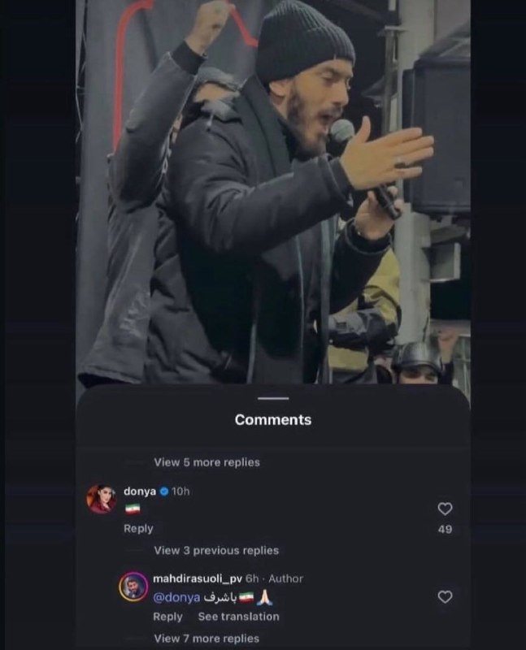

دوستانی که تازه آنلاین شدن در جریان باشید اون موقع که شما نبودید، دنیا جهانبخت و مهدی رسولی باهم رل زدن

[@AloTweet]

## alonews — post 123183

  <a href="telegram/content/alonews_123183_1779927744.webm" target="_blank">🎬 Download video</a>

👈روتِم یانای ۲۰ ساله از تیپ گیواتی امروز در حمله پهپادی حزب‌الله به یک پایگاه نظامی نزدیک شومرا، شمال اسرائیل کشته شد.

✅ @AloNews خبر جنگ

## alonews — post 123182

  <a href="telegram/content/alonews_123182_1779927744.mp4" target="_blank">🎬 Download video</a>

👈لحظه شکست دادن نفر اول شطرنج جهان توسط علیرضا فیروزجا

🔴علیرضا نخبه ایرانی مدتی قبل به دلیل مسائل سیاسی از ایران خارج و به فرانسه پناهنده شد

✅ @AloNews خبر جنگ

## alonews — post 123181

  <a href="telegram/content/alonews_123181_1779927747.mp4" target="_blank">🎬 Download video</a>

👈دی تا خرداد.......

✅ @AloNews خبر جنگ

---
📅 بروزرسانی: 1405/03/07 00:12
---

## VahidOOnLine — post 242484

  

اسماعیل بقائی، سخنگوی وزارت خارجه، درباره تحولات قفقاز و طرح موسوم به «TRIPP» (مسیر ترامپ برای صلح و شکوفایی بین‌المللی)، گفت موضع جمهوری اسلامی درباره امنیت در قفقاز جنوبی «روشن» است و هیچ شبهه‌ای در این خصوص وجود ندارد.

او افزود جمهوری اسلامی از گسترش مراودات اقتصادی و رفع انسداد از مسیرهای مواصلاتی استقبال می‌کند، اما نسبت به «نیات بدخواهانه» آمریکا که سابقه «شرارت و تجاوزگری» در مناطق مختلف جهان دارد، سوءظن شدید دارد و مخالفت خود را با حضور «ناامن‌ساز» آن در قفقاز جنوبی صراحتا اعلام کرده است.

بقائی همچنین گفت قفقاز جنوبی «همسایه بلاواسطه ایران» است و جمهوری اسلامی صلح، ثبات و پیشرفت اقتصادی در این منطقه را در راستای منافع ملی خود می‌داند.

او افزود مداخله قدرت‌های فرامنطقه‌ای در تحولات منطقه، صلح، ثبات و منافع جمعی کشورهای منطقه را با چالش جدی مواجه می‌کند.
‌🏁 🇬🇧 IranintlTV

🤖 @VahidOOnLine

## VahidOOnLine — post 242483

  

♦️به گزارش رویترز، دولت هلند روز چهارشنبه ۷ خرداد در نامه‌ای به پارلمان این کشور اعلام کرد که یک فروند کشتی مین‌روب را به عنوان بخشی از عملیات ناتو به دریای مدیترانه اعزام می‌کند. این اقدام با هدف آمادگی برای استقرار سریع احتمالی در تنگه هرمز، در صورت توافق بر سر یک ماموریت بین‌المللی پس از پایان جنگ ایران، صورت می‌گیرد.
وزیران دفاع و خارجه هلند در نامه‌ای به پارلمان این کشور اعلام کردند این کشتی از اواخر خرداد به گروه دائمی مقابله با مین ناتو ملحق خواهد شد و آمادگی‌ها برای ایفای نقش احتمالی هلند در تامین امنیت مسیرهای دریایی خلیج فارس ادامه دارد.
بر اساس این گزارش، ناتو در حال آماده‌سازی تجهیزات و پشتیبانی لجستیکی در نزدیکی خلیج فارس است و هلند همچنین در حال بررسی مشارکت نیروهای تخصصی جستجو، غواصی، خنثی‌سازی مواد منفجره و اعزام نیرو به ائتلاف احتمالی آینده است.
‌🇸🇦 Indypersian

🤖 @VahidOOnLine

## VahidOOnLine — post 242482

  

سعید کوزه‌چی، سفیر جمهوری اسلامی در سئول، پس از احضار به وزارت خارجه کره جنوبی، نقش جمهوری اسلامی را در حمله به کشتی باری اچ‌ام‌ام نامو در تنگه هرمز رد کرد.

پیش‌تر کره جنوبی اعلام کرد حمله به کشتی اچ‌ام‌ام نامو در اوایل این ماه احتمالا با استفاده از یک موشک ایرانی انجام شده است.
‌🏁 🇬🇧 IranintlTV

🤖 @VahidOOnLine

## VahidOOnLine — post 242479

  

♦️تانکرترکرز، نهاد ردیابی نفتکش‌ها در تازه‌ترین گزارش خود اعلام کرد در پی محاصره دریایی آمریکا، نزدیک به ۶۰ میلیون بشکه نفت خام ایران در دریا متوقف شده و حدود شش میلیارد دلار درآمد نفتی فعلا به تهران نرسیده است.
بر اساس اطلاعات منتشرشده از سوی این مجموعه، کاهش صادرات نفت ایران در هفته‌های اخیر باعث شده بخش قابل توجهی از نفت خام ایران روی نفتکش‌ها باقی بماند و امکان انتقال یا فروش آن با دشواری روبه‌رو شود. تانکرترکرز همچنین اعلام کرده هنوز تعداد زیادی نفتکش خالی برای بارگیری وجود دارد، اما همزمان با کاهش تولید نفت، میزان بارگیری نفتکش‌ها نیز افت کرده است.
گزارش‌های منتشرشده در رسانه‌های بین‌المللی و داده‌های رهگیری دریایی نشان می‌دهد بخشی از نفتکش‌های ایرانی همچنان تلاش می‌کنند با خاموش کردن سیستم‌های رهگیری یا انتقال محموله‌ها در دریا، محدودیت‌ها را دور بزنند. با این حال، ارزیابی‌ها حاکی از آن است که فشار بر صادرات نفت ایران در مقایسه با ماه‌های گذشته افزایش یافته است.
‌🇸🇦 Indypersian

🤖 @VahidOOnLine

## VahidOOnLine — post 242478

  <a href="telegram/content/VahidOOnLine_242478_1779914578.mp4" target="_blank">🎬 Download video</a>

♦️رویترز روز چهارشنبه ششم خرداد گزارش داد نیروهای امدادی در لائوس، کشوری در جنوب‌شرق آسیا، پنج نفر را که حدود یک هفته در غاری در استان زایسامبون گرفتار شده بودند، زنده پیدا کردند و عملیات جستجو برای یافتن دو نفر دیگر همچنان ادامه دارد.

بر اساس گزارش رسانه‌های دولتی لائوس، این هفت نفر هفته گذشته برای جستجوی طلا وارد غار شده بودند، اما بارندگی شدید و رانش زمین راه خروج آن‌ها را مسدود کرد.

ده‌ها امدادگر از لائوس و تایلند در عملیات نجات مشارکت دارند. یک گروه داوطلب تایلندی نیز از روز یکشنبه به این عملیات پیوسته است.
‌🇸🇦 Indypersian

🤖 @VahidOOnLine

## VahidOOnLine — post 242477

  

تانکر ترکرز در شبکه ایکس اعلام کرد در پی محاصره دریایی آمریکا، نزدیک به ۶۰ میلیون بشکه نفت خام ایران متوقف شده و حدود شش میلیارد دلار درآمد نفتی در حال حاضر به تهران نمی‌رسد.

این نهاد ردیابی نفتکش‌ها افزود هنوز نفتکش‌های خالی زیادی برای بارگیری نفت بیشتر وجود دارد، اما با کاهش تولید نفت، بارگیری نفتکش‌ها نیز کاهش یافته است.
‌🏁 🇬🇧 IranintlTV

🤖 @VahidOOnLine

## VahidOOnLine — post 242476

  <a href="telegram/content/VahidOOnLine_242476_1779914581.mp4" target="_blank">🎬 Download video</a>

♦️با آغاز فصل نوبرانه‌های تابستانی در شمال ایران، دومین جشنواره «هلی‌سوری» در مازندران آغاز به کار کرد؛ جشنواره‌ای که طعم ترش و شور آلوچه‌های سبز را با موسیقی، خوراک محلی و صنایع‌دستی شمال ایران همراه کرده است.

این جشنواره در هادی‌شهر بابلسر استان مازندران با حدود ۱۰۰ غرفه برگزار شد و تمرکز آن بر معرفی خوراک بومی، چاشنی‌های محلی و احیای فرهنگ روستایی و صنایع‌دستی منطقه بود. یکی از بخش‌های محبوب جشنواره، تجربه خوردن «آلوچه دَشکن» یا «هلی کِتِنی» بود؛ آلوچه‌های سبزی که با نمک و چاشنی‌های محلی کوبیده و طعم‌دار می‌شوند.

در کنار آن، بازدیدکنندگان طعم «دَلار» یا «دَلال» را نیز تجربه کردند؛ چاشنی سبزرنگ و مشهور شمال ایران که از ترکیب سبزی‌های معطر مانند نعناع، گشنیز و سبزی های محلی و نمک تهیه می‌شود و یکی از معروف‌ترین همراهان آلوچه و گوجه‌سبز در استان‌های شمالی به شمار می‌رود.

آلوچه با نام علمی Prunus cerasifera، از گونه‌های بومی غرب آسیا و جنوب شرق اروپا است.
‌🇸🇦 Indypersian

🤖 @VahidOOnLine

## VahidOOnLine — post 242474

♦️مسجد جامع عتیق اصفهان یا مسجد جمعه اصفهان، یکی از مهم‌ترین و باشکوه‌ترین آثار معماری ایران و جهان اسلام به شمار می‌رود، بنایی تاریخی که در طول قرن‌ها، لایه‌های مختلفی از هنر، معماری و تاریخ ایران را در خود جای داده و امروز همچون موزه‌ای زنده، سیر تحول معماری ایرانی ـ اسلامی را روایت می‌کند.
این مسجد که بخش‌های مختلف آن در دوره‌های گوناگون تاریخی ساخته و تکمیل شده، از نخستین سده‌های اسلامی تا دوران سلجوقی و صفوی، همواره مرکز مهم مذهبی، فرهنگی و اجتماعی اصفهان بوده است. بسیاری از پژوهشگران معتقدند پیش از اسلام نیز این مکان کاربری مذهبی داشته و احتمالا یکی از آتشکده‌های مهم شهر اصفهان در همین محدوده قرار داشته است.
هر گوشه از مسجد جامع اصفهان نشانی از دوره‌ای تاریخی را در خود حفظ کرده؛ از شبستان‌ها و ایوان‌های عظیم گرفته تا گنبدهای کم‌نظیر، کتیبه‌های تاریخی، آجرکاری‌های ظریف و تزئینات چشم‌نواز که آن را به یکی از برجسته‌ترین نمونه‌های معماری ایرانی تبدیل کرده است.
سیمای کنونی مسجد عمدتا متعلق به دوره سلجوقیان است.
این تصاویر را خدیجه نادری ثبت کرده و در خبرگزاری مهر منتشر شده‌اند.
‌🇸🇦 Indypersian

🤖 @VahidOOnLine

## VahidOOnLine — post 242473

  

ابراهیم رضایی، سخنگوی کمیسیون امنیت ملی مجلس، در واکنش به گزارش‌ها درباره توافق احتمالی میان واشینگتن و تهران، در ایکس نوشت: اگرچه پیش‌نویس است و چیزی قطعی نیست اما متناسب با «پیروزی بزرگ ملت ایران» در جنگ ۴۰ روزه نیست.

او پیش‌تر نیز گفته بود جمهوری اسلامی نباید در موضوع هسته‌ای تعهدی بدهد که قدرت بازدارندگی‌اش را تضعیف کند.
‌🏁 🇬🇧 IranintlTV

🤖 @VahidOOnLine

## VahidOOnLine — post 242472

♦️ پیت هگست، وزیر جنگ آمریکا، چهارشنبه ششم خرداد، در نشست کابینه در کاخ سفید، از سیاست‌های دونالد‌ ترامپ در قبال جمهوری اسلامی تمجید کرد و گفت خروج ترامپ از برجام و اقدامات بعدی او، آمریکا و جهان را از «تهدید» جمهوری اسلامی دور کرده است.

هگست خطاب به ترامپ گفت: «چه موضوع قاسم سلیمانی باشد، چه کنار گذاشتن توافق اوباما که قرار بود به آنها سلاح بدهد، و چه جنگ ۱۲ روزه، شما شرایطی ایجاد کردید که مردم آمریکا و جهان از این تهدید در امان بمانند.»

وزیر جنگ آمریکا همچنین گفت ترامپ در عملیات «خشم حماسی» برخلاف جنگ‌های گذشته در عراق و افغانستان، با «حداکثر قدرت» عمل کرد و جمهوری اسلامی را «به زانو درآورد.»

او همچنین گفت آمریکا با ایجاد «محاصره جهانی» علیه جمهوری اسلامی، فشار سنگینی بر اقتصاد ایران وارد کرده و همین مسئله تهران را به سمت مذاکرات سوق داده است.
‌🇸🇦 Indypersian

🤖 @VahidOOnLine

## VahidOOnLine — post 242471

  

مولوی عبدالحمید، امام‌جمعه اهل سنت زاهدان، در مراسم «عید قربان» ابراز امیدواری کرد مذاکرات جمهوری اسلامی و آمریکا که «قرار است جلوی جنگ را بگیرد» به نتیجه برسد و دو طرف به توافق دست یابند.

او با اشاره به این‌که از جزییات توافق اطلاعی ندارد، گفت در گذشته بارها بر ضرورت «توافق عادلانه» تاکید کرده و افزود برخی که پیش‌تر با این دیدگاه مخالف بودند، اکنون با آن موافق شده‌اند.

عبدالحمید همچنین گفت در گذشته سخنانی مطرح شده بود که با انتقاد برخی مواجه می‌شد، اما در نهایت مشخص شد آن سخنان «صحیح و درست» بوده‌اند.

امام‌جمعه اهل سنت زاهدان افزود: «ما خیرخواه کشور و ملت ایران هستیم» و بزرگ‌ترین خیرخواهی برای کشور را «شنیدن حرف مردم ایران و جلب رضایت آن‌ها» دانست.

او تاکید کرد: «کشور، حکومت و دولت متعلق به مردم است، لذا باید در راستای خدمت به مردم و جلب رضایت‌شان تلاش شود.»

عبدالحمید در پایان گفت: «ما امیدواریم فصل جدیدی در کشور ما آغاز شود که تمام منافع کشور به مردم بازگردند. منافع ملی بسیار مهم است و همه چیز باید فدای منافع مردم شود.»
‌🏁 🇬🇧 IranintlTV

🤖 @VahidOOnLine

## VahidOOnLine — post 242470

  

⭕️ نماینده ولی فقیه در سپاه:
می‌توانستیم ضربات سنگین‌تری به آمریکا بزنیم اما مجتبی خامنه‌ای موافقت نکرد

♦️عبدالله حاجی‌صادقی، نماینده ولی فقیه در سپاه پاسداران، مدعی شد: «در طول جنگ می‌توانستیم اقدامات سنگین‌تری علیه آمریکا در منطقه انجام دهیم اما چون مردم خاورمیانه آسیب می‌دیدند، خامنه‌ای موافقت نکرد.»
او همچنین با اشاره به آنچه «نقشه دشمن» توصیف کرد، افزود هدف اصلی این است که مردم و جریان‌های داخلی در برابر یکدیگر قرار گیرند.
اظهارات نماینده ولی فقیه در سپاه در حالی مطرح می‌شود که به دلیل هراس از حملات اسرائیل و آمریکا، هنوز تصویری از رهبر جدید جمهوری اسلامی منتشر نشده است.
‌🇸🇦 Indypersian

🤖 @VahidOOnLine

## VahidOOnLine — post 242469

  <a href="telegram/content/VahidOOnLine_242469_1779914587.mp4" target="_blank">🎬 Download video</a>

♦️دونالد‌ ترامپ، رئیس‌جمهوری آمریکا، چهارشنبه ششم خردادماه، در پاسخ به سوالی درباره احتمال کاهش تحریم‌ها علیه جمهوری اسلامی برای فروش نفت خام، با قاطعیت این موضوع را رد کرد.

ترامپ گفت: «نه، ما درباره هیچ کاهش تحریمی یا دادن پول صحبت نمی‌کنیم؛ نه تحریم‌ها، نه پول، هیچ‌چیز.»

او همچنین تاکید کرد آمریکا کنترل پول‌هایی را که جمهوری اسلامی متعلق به خود می‌داند، حفظ خواهد کرد و افزود: «وقتی رفتار درستی داشته باشند و کار درست را انجام دهند، اجازه می‌دهیم به پولشان دسترسی پیدا کنند.»
‌🇸🇦 Indypersian

🤖 @VahidOOnLine

## VahidOOnLine — post 242468

  <a href="telegram/content/VahidOOnLine_242468_1779914588.mp4" target="_blank">🎬 Download video</a>

یک شهروند در پیامی به ایران‌اینترنشنال از کسانی که در دوران قطع کامل اینترنت از اینترنت پروی حکومت استفاده نکردند تشکر کرد. پیام او با هوش مصنوعی خوانده شده است.
‌🏁 🇬🇧 IranintlTV

🤖 @VahidOOnLine

## VahidOOnLine — post 242467

  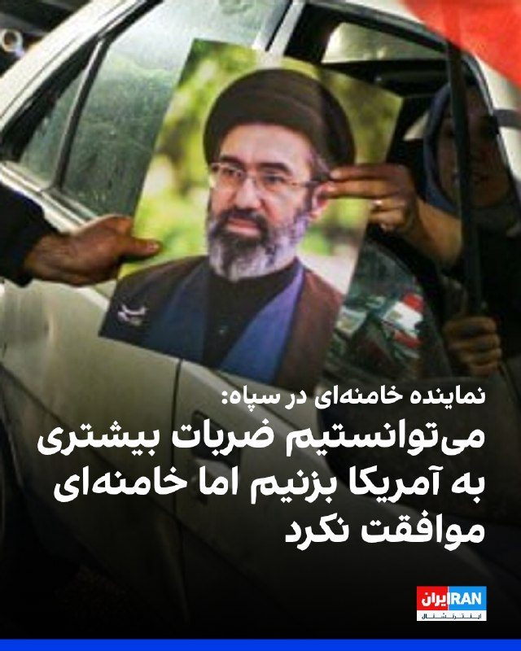

عبدالله حاجی‌صادقی، نماینده خامنه‌ای در سپاه: در طول جنگ می‌توانستیم اقدامات سنگین‌تری علیه آمریکا در منطقه انجام دهیم اما چون مردم خاورمیانه آسیب می‌دیدند، خامنه‌ای موافقت نکرد.

او افزود نقشه دشمن این است که ما را مقابل هم بگذارد.
‌🏁 🇬🇧 IranintlTV

🤖 @VahidOOnLine

## VahidOOnLine — post 242466

  <a href="telegram/content/VahidOOnLine_242466_1779914592.mp4" target="_blank">🎬 Download video</a>

⭕️ آتش‌سوزی گسترده در برج مسکونی شهرک چیتگر تهران

♦️بر اساس ویدیوهایی که حساب کاربری «وحید آنلاین» منتشر کرده است بعدازظهر چهارشنبه ششم خردادماه آتش‌سوزی گسترده‌ای در یکی از برج‌های مجتمع مسکونی پامچال در شهرک چیتگر تهران رخ داده است.
تصاویر منتشرشده از این حادثه، شعله‌ور شدن بخش‌هایی از ساختمان را نشان می‌دهد.
جلال ملکی، سخنگوی سازمان آتش‌نشانی تهران اعلام کرده است که وضعیت ساختمان از نظر ایمنی در شرایط «بسیار نامناسب» قرار داشته، اما تا این لحظه این حادثه تلفات جانی نداشته است.
جزئیات دقیق علت وقوع آتش‌سوزی و میزان خسارات احتمالی هنوز اعلام نشده است.
‌🇸🇦 Indypersian

🤖 @VahidOOnLine

## VahidOOnLine — post 242463

  

دونالد ترامپ درباره لغو یا کاهش تحریم‌های جمهوری اسلامی گفت واشینگتن «درباره هیچ‌گونه کاهش تحریم‌ها یا دادن پول» صحبت نمی‌کند و تاکید کرد: «هیچ تحریمی، هیچ پولی، هیچ چیزی.»

او افزود آمریکا کنترل پولی را که جمهوری اسلامی ادعا می‌کند متعلق به خود است در اختیار دارد و این کنترل را حفظ خواهد کرد. ترامپ گفت زمانی که جمهوری اسلامی «رفتار درستی» داشته باشد و «کار درست را انجام دهد»، اجازه دسترسی به این پول داده خواهد شد، اما «در حال حاضر چنین کاری انجام نمی‌دهیم» و «این دو موضوع به هم وابسته نیستند.»

ترامپ همچنین درباره انتقال اورانیوم غنی‌شده گفت با انتقال ذخایر اورانیوم غنی‌شده ایران به روسیه یا چین موافق نیست.
‌🏁 🇬🇧 IranintlTV

🤖 @VahidOOnLine

## VahidOOnLine — post 242462

♦️ مارکو روبیو، وزیر خارجه آمریکا، چهارشنبه ششم خرداد، در نشست کابینه در کاخ سفید گفت جمهوری اسلامی هرگز به سلاح هسته‌ای دست نخواهد یافت و آمریکا همچنان مسیر مذاکره و دیپلماسی را ترجیح می‌دهد.

روبیو گفت: «نتیجه نهایی این است که ایران هرگز قرار نیست سلاح هسته‌ای داشته باشد. اتفاقات اخیر بار دیگر یادآوری کرد که آنها بزرگ‌ترین حامی تروریسم در جهان هستند و هرگز نمی‌توانند سلاح هسته‌ای داشته باشند.»

وزیر خارجه آمریکا تاکید کرد ترجیح دونالد‌ ترامپ همیشه مذاکره و دستیابی به توافق بوده و دیپلماسی «همیشه نخستین گزینه» آمریکا است.

او افزود آمریکا همچنان از طریق نمایندگان ترامپ، از جمله استیو ویتکاف، جرد کوشنر و معاون رئیس‌جمهوری، مذاکرات را دنبال می‌کند و اگر توافقی قابل دستیابی باشد، واشنگتن خواهان تحقق آن است.

روبیو همچنین گفت در مذاکرات «مقداری پیشرفت» حاصل شده و آمریکا در روزها و ساعت‌های آینده بررسی خواهد کرد که آیا این روند ادامه پیدا می‌کند یا نه.

او در ادامه هشدار داد اگر مسیر دیپلماسی نتیجه ندهد، گزینه‌های دیگری نیز روی میز خواهد بود، اما تاکید کرد جمهوری اسلامی و رهبران آن «هرگز سلاح هسته‌ای نخواهند داشت.»
‌🇸🇦 Indypersian

🤖 @VahidOOnLine

## VahidOOnLine — post 242461

  

♦️پیت هگست، وزیر جنگ آمریکا، در نشست کابینه در کاخ سفید گفت در هر دو دوره ریاست‌جمهوری دونالد ترامپ تنها یک رویکرد ثابت وجود داشته و آن جلوگیری کامل از دستیابی ایران به سلاح هسته‌ای بوده است.
او با اشاره به عملیات «خشم حماسی» تاکید کرد این‌بار برخلاف جنگ‌های عراق و افغانستان، رویکرد آمریکا مبتنی بر «قدرت هوشمند و حداکثر بازدارندگی» بوده و نتیجه آن «به زانو درآمدن ایران» است.
هگست در ادامه گفت که توان نظامی ایران به‌شدت آسیب دیده و گفت نیروی دریایی ایران «در کف خلیج فارس» قرار دارد و نیروی هوایی و پدافند این کشور نیز دچار آسیب شده است. به گفته او، اگرچه ایران هنوز توان موشکی دارد، اما فعلا قادر به تولید بیشتر موشک، پهپاد یا شناورهای نظامی نیست.
وزیر جنگ آمریکا همچنین تاکید کرد که ایران در نتیجه فشارهای واردشده ناچار به پذیرش مذاکره شده و هم‌زمان تحت یک «محاصره جهانی» قرار گرفته که صادرات و واردات آن را مختل کرده است.
او در پایان گفت آمریکا همچنان گزینه‌های نظامی و دیپلماتیک را روی میز دارد و در صورت لزوم «برای پایان دادن به موضوع» آماده اقدام مستقیم خواهد بود.
‌🇸🇦 Indypersian

🤖 @VahidOOnLine

## VahidOOnLine — post 242460

  

دونالد ترامپ در پاسخ به سوالی درباره کنترل تنگه هرمز توسط تهران و عمان گفت این تنگه برای همه باز خواهد بود و آب‌های بین‌المللی محسوب می‌شود. او تاکید کرد هیچ‌کس آن را کنترل نخواهد کرد و آمریکا بر آن نظارت خواهد داشت.

ترامپ افزود کنترل تنگه بخشی از مذاکرات است و ایران تمایل دارد آن را در اختیار بگیرد، اما چنین اتفاقی نخواهد افتاد. او درباره عمان نیز گفت این کشور مانند دیگران رفتار خواهد کرد و در غیر این صورت آمریکا مجبور خواهد شد آن‌ها را منفجر کند.
‌🏁 🇬🇧 IranintlTV

🤖 @VahidOOnLine

## WithYashar — post 12739

عضو تیم رسانه‌ای هیئت مذاکراتی ایران: سفر قالیباف به قطر درباره آزادسازی ۱۲ میلیارد دلار از اموال بلوکه‌شده، موفقیت‌آمیز بود!
@withyashar

## WithYashar — post 12738

یاشار جان احساس میکنم این جام جهانی امسال خیلی اتفاقات عجیب و غریبی میوفته ، دنیا باز هم خواهد دید که ما تا تهش پای ایران وایسادیم ☀️🦁 خواهیم دید چه خواهد شد !

## WithYashar — post 12737

یاشار جان
احساس میکنم این جام جهانی امسال خیلی اتفاقات عجیب و غریبی میوفته ، دنیا باز هم خواهد دید که ما تا تهش پای ایران وایسادیم ☀️🦁
خواهیم دید چه خواهد شد !

## WithYashar — post 12736

دایی جان، ایران همش دنبال پوله بخاطر این نیست که پول ندارن به ادماشون بدن؟ نمیشه جاهایی که ربط به دولت داره رو اعتصاب کنیم! و هر دفعه میگن قراره پولمون رو بدن تا انگار ساکتشون کنه.!!

## WithYashar — post 12735

دایی جان، ایران همش دنبال پوله بخاطر این نیست که پول ندارن به ادماشون بدن؟ نمیشه جاهایی که ربط به دولت داره رو اعتصاب کنیم!
و هر دفعه میگن قراره پولمون رو بدن تا انگار ساکتشون کنه.!!

## WithYashar — post 12734

شاهزاده رضا پهلوی جمعه پیش در نشستی با شماری از فعالان رسانه ای که ویدیو آن الان پخش شده گفت : تیشرت های سیاه یا ساواک به خصوص و هر چیزی غیر از تم اصلی شیر و خورشید نپوشید این جریان در کمترین حالت ایجاد جنجال میکند و انحرافی است من واقعاً درک نمی‌کنم این موضوع از کجا آب میخورد و این مسئله نگران‌کننده است.
@withyashar

## WithYashar — post 12733

## WithYashar — post 12732

## WithYashar — post 12731

  

ارسالی : داداش این ایده ایی که دادی رو یه مقدارخلاقیت دادم بهش که بفهمن دقیقا چطورمیشه رفت بدون پرچم
@withyashar

## WithYashar — post 12730

Voice message

## WithYashar — post 12729

هم اکنون گزارش ها از دو ترور بزرگ در شمال غزه.
@withyashar

## WithYashar — post 12728

اتاق جنگ با یاشار : کاری‌ نداره اگه همه با هم متحد باشن میتونن ، فقط با پوشیدن لباس های سبز سفید ، قرمز و زرد یه ابر پرچم قول آسای انسانی‌ پیکسلی درست کنند 🧠😍🙌🏾 @withyashar

## WithYashar — post 12727

## WithYashar — post 12726

## WithYashar — post 12725

  <a href="telegram/content/WithYashar_12725_1779914599.mp4" target="_blank">🎬 Download video</a>

صدا و سیما شرط جدید ایران برای توافق با آمریکا را اعلام کرد: پرداخت غرامت ۳۰۰ میلیارد دلاری از آمریکا به ایران!
@withyashar

## WithYashar — post 12724

در اسرائیل پرونده‌ای جنجالی به نام «پرونده بیلد» فاش شده است. طبق این گزارش‌ها، یک سند محرمانه منتسب به حماس عمداً به رسانه‌ها درز داده شد تا خشم افکار عمومی از دولت بنیامین ناتانیاهو کمتر شود.

گفته می‌شود «آری روزنفلد» و پدرزنش یک مسیر غیرقانونی برای انتقال اسناد محرمانه از سازمان اطلاعات نظامی اسرائیل به دفتر نتانیاهو ایجاد کرده بودند. سپس تلاش کردند پیام‌ها و روایت‌های سیاسی خاصی را وارد سخنرانی‌های نخست‌وزیر ناتانیاهو کنند تا بر افکار عمومی از او تأثیر مثبت بگذارند.

این پرونده «بیلد» نام گرفته چون بخشی از اسناد ابتدا به روزنامه آلمانی Bild رسیده بود. مخالفان دولت می‌گویند از اطلاعات امنیتی برای اهداف سیاسی استفاده شده، اما حامیان نتانیاهو این اتهامات را اغراق‌آمیز و سیاسی می‌دانند.
@withyashar
اسرائیلی ها هم دنیایی دارن خوب‌ مردی بی بی برا خودتون اسن کارو کرده ! ولی مخالفاش داستان کردن !

## WithYashar — post 12723

جلسه کمپ دیوید که قرار بود امروز برگزار شود ترامپ اعلام کرد: جلسه کابینه به دلیل شرایط آب و هوایی در کاخ سفید برگزار خواهد شد، نه در کمپ دیوید! حالا صحبت‌هایی هست که کمپ دیوید یک تله برای شناسایی فردی بود که اطلاعات را نشت می‌داد ! فرد مورد نظر گیر افتاد !…

## WithYashar — post 12722

سلام یاشار جان خسته نباشی، ممنونم بابت زحمات
میگم یه سوال تو خبر دارین که میگن جلسه کابینه کمپ دیوید یه تله بوده که کی اطلاعات رو لو می‌داده و فهمیدن که جی دی ونس بوده؟!

## WithYashar — post 12721

ارتش اتاق جنگ اعلام حضور کنید. مانور امشب شروع شد. این کامنت زیر پست بی بی را لایک کنید، ریپلای کنید و اگر میتوانید اد تو استوری هم بکنید و به دوستان خود هم بگویید این کار را انجام دهند. آماده میشیم برای مانور نهایی در دوشنبه. توجه کنید فقط همین کامنت را لایک کنید، حتی پست را هم لایک نکنید که کاملا دیده بشه❤️‍🩹🙌🏾

https://www.instagram.com/p/DY2dIhsM-VK/?igsh=MXFhaGU4NzliZzVmaw==

ترجمه:

تبریک می‌گویم بی بی جون، فرزند راستین کوروش کبیر.
دیگر زمان آن رسیده که مقدمات حمله به ایران آغاز شود.
مردم ایران در نهایت ناامیدی فرو رفته‌اند.
لطفاً این لحظهٔ تاریخ‌ساز را هرچه زودتر رقم بزنید.
هر روز در ایران، روح جوانان ما را از جسمشان جدا می‌کنند.
تمام چشم امید ما به شما دوخته شده

## WithYashar — post 12720

اسرائیل هیوم: ترامپ پیش‌نویس یادداشت تفاهم با ایران را به نتانیاهو و رهبران منطقه تحویل داد تا نظرات خود را اعلام کنند
@withyashar

## mwarmonitor — post 9837

  

🔴ناوشکن کلاس Horizon CHEVALIER PAUL 🇫🇷 و ناوچه کلاس FREMM POSS ALSACE 🇫🇷 ۲ روز پیش در آب‌های جنوب عمان مشاهده شدند 📍موقعیت ناوشکن: 16.8356, 55.3751 📍موقعیت ناوچه: 16.8513, 56.070 📌این دو شناور در حال عملیات مشترک با ناو هواپیمابر فرانسوی CDG (شارل دوگل)…

## mwarmonitor — post 9836

  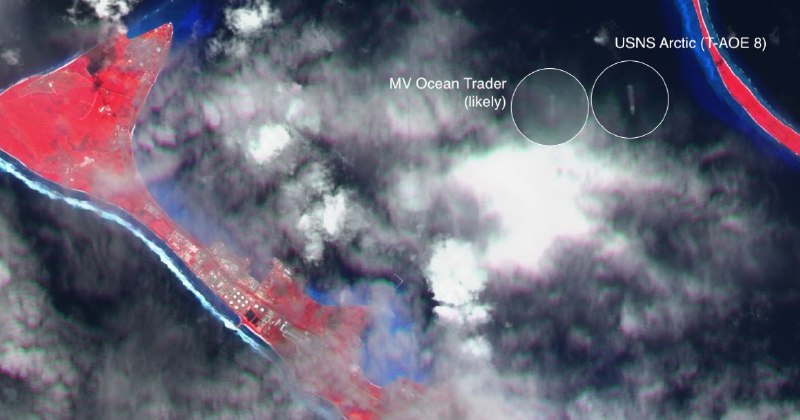

🔴پایگاه NSF دیه‌گو گارسیا: به‌روزرسانی لجستیکی و SOC

🛰تصاویر ماهواره‌ای Sentinel-2 مربوط به امروز (۲۷ مه) نمای به‌روزی از وضعیت و استقرارها در داخل آب‌سنگ حلقوی پایگاه NSF دیه‌گو گارسیا ارائه می‌دهد.

🔸تأمین تدارکات ناوگان:
کشتی پشتیبانی سریع رزمی USNS Arctic (T-AOE-8) در حال حاضر در تالاب لنگر انداخته است. این موضوع الگویی را نشان می‌دهد که مدتی است مشاهده می‌کنیم: کشتی‌های USNS همچنان به‌صورت متناوب از دیه‌گو گارسیا برای سوخت‌گیری، تدارکات و تعمیر و نگهداری خود در فاصله بین مأموریت‌ها به ناوگان استفاده می‌کنند.

🚢کشتی مادر SOC:
با احتمال بسیار زیاد، MV Ocean Trader همچنان در آب‌سنگ حلقوی لنگر انداخته است. پوشش سنگین ابر در عبور امروز شناسایی ۱۰۰٪ قطعی را دشوار می‌کند.

@mwarmonitor

## mwarmonitor — post 9835

  <a href="telegram/content/mwarmonitor_9835_1779914603.mp4" target="_blank">🎬 Download video</a>

📝وقتی شهر که خلوت بشه، قورباغه هفت‌تیرکش میشه! بله آقای ترامپ، وقتی درست وسط جنگ که این جمهوری اسلامیِ فکسنی داشت نفله و تکه‌پاره می‌شد، تو با اون مغز فندقی و ژست‌های پوچت دویدی وسط و آتش‌بس دادی، باید هم تهش به این افتضاح ختم بشه. مردک هالو، با همین حماقتت به این «بچه شیعه‌های رافضی» که کارشون تموم بود، تنفس مصنوعی دادی تا حالا از قعر ذلت بلند بشن و برات شاخ و شونه بکشن!

🔸حالا نگاه کن؛ این نظامِ مفلوک و در حال احتضار که تا دیروز داشت غزل خداحافظی رو می‌خوند، چنان وهمِ قدرت برش داشته که با وقاحت تمام، یک لیست باج‌خواهی ۳۰۰ میلیارد دلاری جلوی چشمای نابینات گذاشته! تویی که ادعای معامله‌گری داشتی، حالا باید بشینی و شروط مسخره‌ی یه مشت بازنده رو گوش کنی که دارن برات حکم خروج از منطقه و لغو تحریم‌ها رو صادر می‌کنن. حماقت تو و وقاحت اون‌ها، واقعاً یه کمدی سیاه و تهوع‌آوره!

@mwarmonitor

## mwarmonitor — post 9834

📝 وسط این هیاهوی بی‌پایان مجازی، جایی میان استوری‌های افشاگرانه، ویس‌های لو رفته و رگبار الفاظ رکیک، هدف اصلی به کل فراموش شده است. اتاق فکرهای دستگاه امنیتی جمهوری اسلامی نیازی به طراحی نقشه‌های پیچیده ندارند؛ آن‌ها با پاشیدن بذر شک و کینه، تله‌ای هوشمندانه ساخته‌اند تا فعالان مجازی با منیت‌ها و حسادت‌هایشان، پیاده‌نظامِ ناخواستهٔ رژیم شوند و ارتشِ یکدیگر را نابود کنند. هر کلیک روی این جنجال‌های مجازی و هر بازنشر این کینه‌توزی‌ها، بازی در زمین سناریویی است که جمهوری اسلامی برای بقای خود نوشته تا به جامعه دیکته کند که هیچ جایگزین معتبر و شریفی وجود ندارد.

🔸دردآورترین پرده این نمایش آنجاست که مخاطب خسته و بی‌قرار در داخل کشور، وقتی چشمان نگرانش را به این سیرک مجازی می‌دوزد تا ردی از امید یا راهکار بیابد، چیزی جز یک میدان جنگ مبتذل بر سر سهم‌الارثِ نبرده نمی‌بیند؛ تصویری که خروجی آن چیزی جز تزریق ناامیدی مطلق به بدنه جامعه و کشتن آخرین کورسوهای همبستگی نیست.

🔸مردم و مخاطبانی که دل در گروی تغییر و بهبود دارند، باید به طور جدی از این فضای سمی، فرسایشی و سودجویانه دوری کنند. نباید با پیگیری، لایک و بازنشر این جنگ‌های زرگری، بنزین به آتش این فتنه و بازی طراحی‌شدهٔ جمهوری اسلامی بریزند. بایکوت کردن این تجارتِ تفرقه و آگاهی از این تلهٔ رسانه‌ای، اولین قدم برای نجات امید و بازگرداندن تمرکز به مسیر اصلی است.

@mwarmonitor

## mwarmonitor — post 9833

🔴«باز هم حرف‌های تکراری و متناقضی مطرح شد که تمام تحلیل‌های قبلی درباره جهت‌گیری‌ها را نقش بر آب کرد. به نظر من، تا زمانی که توئیت رسمی مبنی بر تصمیم نهایی‌اش منتشر نشود، هر حرفی که می‌زند صرفاً برای جلب توجه و بازی رسانه‌ای است. باید منتظر ماند و دید نتیجه نهایی مذاکرات چه می‌شود؛ او یا در نهایت به ساز ایران می‌رقصد و مسیر تعامل را ادامه می‌دهد، یا دست به حمله خواهد زد.»

@mwarmonitor

## mwarmonitor — post 9832

🔴ترامپ گفت مطمئن نیست که ایالات متحده باید توافقی برای پایان دادن به جنگ با ایران امضا کند، اگر عربستان سعودی و دیگر کشورهای حاشیه خلیج فارس با پیوستن به توافق‌نامه‌های ابراهیم موافقت نکنند.
او گفت: «آن‌ها این را به ما بدهکارند.»

@mwarmonitor

## mwarmonitor — post 9831

  

🔴نزدیک به ۶۰ میلیون بشکه نفت خام ایران در نتیجه محاصره دریایی نیروی دریایی آمریکا متوقف و گرفتار شده است. این میزان تقریباً ۶ میلیارد دلار درآمد نفتی است که در حال حاضر به تهران نمی‌رسد.
🔸با وجود این‌که هنوز نفتکش‌های خالی زیادی برای بارگیری نفت در دسترس هستند، اما به دلیل کاهش تولید نفت، میزان بارگیری نفتکش‌ها نیز کاهش یافته است. TANKER TRACKER

@mwarmonitor

## mwarmonitor — post 9830

🔸هشدار درباره اینکه روسیه در حال آماده‌سازی یک کارزار گسترده‌تر از حملات موشک‌های بالستیک علیه شهرهای اوکراین است، ولودیمیر زلنسکی در نامه‌ای به ترامپ و کنگره آمریکا خواستار گسترش ارسال سامانه‌های موشکی پاتریوت شد. CBS

@mwarmonitor

## mwarmonitor — post 9829

🔸تردد کشتی‌های تجاری از تنگه هرمز روز چهارشنبه به چند کشتی محدود شد که عمدتاً به ایران مرتبط بودند؛ موضوعی که نشان‌دهنده ماهیت ناپیوسته و نوسانی عبور و مرور در مهم‌ترین گلوگاه انرژی جهان است. بلومبرگ

@mwarmonitor

## mwarmonitor — post 9828

🔴وزیر امور خارجه آمریکا، مارکو روبیو: «ما در مورد ایران مقداری پیشرفت داشته‌ایم و طی چند ساعت یا چند روز آینده خواهیم دید که آیا پیشرفت بیشتری حاصل خواهد شد یا نه.»

@mwarmonitor

## mwarmonitor — post 9827

🔴ترامپ: «ایران بسیار جدی است و خیلی می‌خواهد به یک توافق برسد. تا این لحظه هنوز به آن نرسیده‌اند... ما از این وضعیت راضی نیستیم، اما خواهیم دید. یا به توافق می‌رسیم، یا مجبور خواهیم شد کار را تمام کنیم.»

@mwarmonitor

## mwarmonitor — post 9826

🔴ترامپ: ایرانی‌ها فکر می‌کنند من به خاطر انتخابات میان‌دوره‌ای جنگ را پایان می‌دهم، اما من به این موضوع اهمیتی نمی‌دهم.

@mwarmonitor

## mwarmonitor — post 9825

🔴ترامپ به PBS گفت: وقتی از او پرسیده شد آیا ایران در ازای کنار گذاشتن اورانیوم بسیار غنی‌شده، کاهش تحریم‌ها دریافت خواهد کرد یا نه، پاسخ صریح داد: «نه، نه اصلاً. کاهش تحریم‌ها؟ نه.»

@mwarmonitor

## mwarmonitor — post 9824

🔴امروز، شهرهای مهم جنوب لبنان یعنی صور و النبطیه با خطر اشغال مستقیم روبه‌رو هستند. نیروهای اسرائیلی به منطقه زوطر شرقی رسیده‌اند؛ تنها حدود پنج کیلومتر فاصله تا نبطیه وجود دارد، و هم‌زمان دستور تخلیه برای شهر صور صادر شده است. 🔸دولت لبنان قصدی برای دفاع…

## mwarmonitor — post 9823

  

🔴سازمان UKMTO (مرکز عملیات تجارت دریایی بریتانیا) گزارشی درباره وقوع یک حادثه در ۶۰ مایل دریایی (NM) در شرق مسقط، عمان دریافت کرده است. 🔸ناخدای یک کشتی نفت‌کش، گزارشی از وقوع یک انفجار بیرونی در سمت چپ بخش عقب کشتی (Port side aft) و نزدیک به خط آب (waterline)…

## mwarmonitor — post 9822

🔰ایران ۲۴ میلیارد دلار از دارایی‌های بلوکه‌شده خود را پیش‌شرط امضای یک توافق صلح با آمریکا قرار داده است؛ از این مبلغ، گفته می‌شود ۱۲ میلیارد دلار باید هم‌زمان با اعلام توافق آزاد شود. تلگراف

@mwarmonitor

## mwarmonitor — post 9821

🔴امروز، شهرهای مهم جنوب لبنان یعنی صور و النبطیه با خطر اشغال مستقیم روبه‌رو هستند. نیروهای اسرائیلی به منطقه زوطر شرقی رسیده‌اند؛ تنها حدود پنج کیلومتر فاصله تا نبطیه وجود دارد، و هم‌زمان دستور تخلیه برای شهر صور صادر شده است.

🔸دولت لبنان قصدی برای دفاع از شهرهای خود ندارد و تنها گزینه پیشِ رو را مذاکره می‌بیند؛ موضعی که از نظر نویسنده بزدلانه و بدون هیچ شرمی توصیف شده است. پهپادهای FPV حزب‌الله می‌توانند به نیروهای پیش‌روی اسرائیل خسارت وارد کنند، اما در همین سطح نیز قادر به متوقف کردن حمله نیستند. در همین حال، شرط ایران مبنی بر عدم هدف قرار دادن بیروت و ضاحیه در این لحظه عملاً به نمادی بدون اثر عملی تبدیل شده، آن هم در شرایطی که نتانیاهو به‌دنبال ایجاد واقعیت‌های جدید در زمین است.

🔹بدون تردید، شمار بیشتری از سربازان اسرائیلی در خاک لبنان کشته خواهند شد و لبنان به باتلاقی خطرناک تبدیل می‌شود. اما در مقابل، بخش‌های بیشتری از خاک لبنان تحت اشغال قرار خواهد گرفت. روستاها طی ماه‌های گذشته به‌طور سیستماتیک ویران شده‌اند و اکنون نوبت شهرهاست.

🔸کسانی که انتظار راه‌حلی سریع در میز مذاکرات دارند، باید از این توهم دست بردارند. و کسانی که منتظر حل بحران لبنان از طریق توافقات منطقه‌ای هستند نیز چیزی به دست نخواهند آورد. آنچه من می‌بینم فراتر از یک بحران است؛ یک تحول بنیادین و فراگیر است که ممکن است سال‌ها ادامه یابد—سال‌هایی نه معمولی، بلکه طولانی، فرسایشی و ویرانگر، بدون هیچ افق روشنی. الجزیره

@mwarmonitor

## mwarmonitor — post 9820

  

🔴حساب رسمی تلگرام در پلتفرم X (توییتر سابق) به نظر می‌رسد هک شده باشد.

@mwarmonitor

## mwarmonitor — post 9819

📌 تندروهای افراطی در ایران به مذاکره‌کنندگان به‌دلیل مذاکرات با آمریکا حمله کرده‌اند. فیننشال تایمز

@mwarmonitor

## mwarmonitor — post 9818

🔴سخنگوی کاخ سفید: گزارش رسانه‌های ایرانی درباره «یادداشت تفاهم» نادرست بوده و به‌طور کامل ساختگی است.

@mwarmonitor

## FoxNewsTwitter — post 342323

  

Fox News (Twitter/X)

BREAKING: Matthew Perry’s live-in assistant has been sentenced to more than 3 years in prison for his role in the actor’s ketamine overdose death.

60-year-old Kenneth Iwamasa admitted he injected Perry with ketamine before the “Friends” star was found dead at his Los Angeles home in 2023.

“You were privy to his struggle with addiction,” the judge told him before sentencing. “Your conduct was reckless.”

The sentencing closes the final chapter in the nearly three-year federal investigation into Perry’s death.

## FoxNewsTwitter — post 342322

  

Fox News (Twitter/X)

No one wants a romantic dinner ruined by a screaming child at the next table.

According to a new survey, 75% of Americans say restaurants should offer some kind of adults-only dining experience to avoid unruly kids.

That includes child-free sections, restrictions during late-night hours, and quieter dining environments focused more on the experience than family-friendly chaos.

## FoxNewsTwitter — post 342321

  

Fox News (Twitter/X)

"Hitler missed one."

That's just one of the many antisemitic attacks at the center of a new DOJ lawsuit against UCLA, which accuses the university of tolerating an antisemitic environment as on-campus protests ramped up after Hamas' October 7th attacks on Israel.

The lawsuit accuses university officials of being “deliberately indifferent” as students were allegedly assaulted, blocked from buildings by protesters, and prevented from accessing parts of campus during the encampment demonstrations.

Prosecutors say UCLA violated Title VI protections by continuing to receive federal funding while failing to comply with anti-discrimination laws.

## FoxNewsTwitter — post 342320

  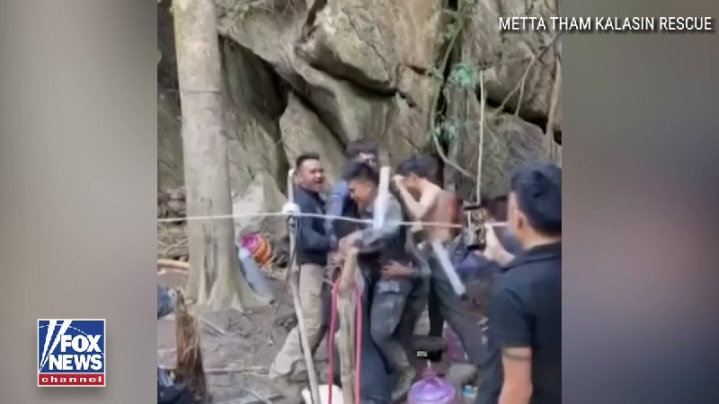

Fox News (Twitter/X)

Rescuers break down in tears and embrace after saving five people trapped deep inside a flooded cave.

A Thai rescue team pushed through murky underwater passageways and narrow tunnels trying to reach the group trapped in Laos’ Xaisomboun Province before time ran out.

Families waiting above ground feared they may never see their loved ones again as rescuers battled dangerous conditions.

Then came the moment nobody thought they’d witness: survivors emerging alive as emotional reunions unfolded above ground.

## FoxNewsTwitter — post 342319

  <a href="telegram/content/FoxNewsTwitter_342319_1779914611.mp4" target="_blank">🎬 Download video</a>

Fox News (Twitter/X)

NEW: President Trump reveals he was invited to a New York Knicks game for their first NBA finals appearance in 27 years:

"I was invited... I was going to go on Wednesday, but they closed it out very quickly."

"They have some great players. I think I'll be going to one of the games. I was invited by, numerous people."

"The Knicks have really... they really suffered for years".

## FoxNewsTwitter — post 342318

  <a href="telegram/content/FoxNewsTwitter_342318_1779914614.mp4" target="_blank">🎬 Download video</a>

Fox News (Twitter/X)

NEW: DHS Sec. Markwayne Mullin responds to "radical left" ICE protests in New Jersey:

"It shows the radical left Democrats' priorities when they decide to go out and protest a detention center where we're housing rapists, child predators, murderers, drug dealers, and they choose Memorial Day of all the time to go protest something."

"Then you have one of the senators complain because he got splattered with a with a, you know, pepper ball. I'm sorry. You probably shouldn't have been there."

## FoxNewsTwitter — post 342317

  <a href="telegram/content/FoxNewsTwitter_342317_1779914617.mp4" target="_blank">🎬 Download video</a>

Fox News (Twitter/X)

NEW: President Trump says gas prices will "come down a lot" shortly after the Iran "excursion" ends, while slamming California for its high prices and taxes.

"It'll come down to where it was before."

## FoxNewsTwitter — post 342316

  <a href="telegram/content/FoxNewsTwitter_342316_1779914620.mp4" target="_blank">🎬 Download video</a>

Fox News (Twitter/X)

BREAKING: Secretary of War Hegseth reveals President Trump ordered the Pentagon to prioritize protecting Nigerian Christians targeted by ISIS — and says the mission quietly led to the killing of ISIS’ second-in-command in Nigeria.

Hegseth says U.S. intelligence gathered during the operation helped lead to the deaths of “hundreds” of ISIS fighters tied to attacks on Christians and threats against the U.S. homeland.

"There's a lot of things we do that the media pays attention to, and a lot of things that the president empowers the Department to do on behalf of the American people, that he deserves great credit for."

## FoxNewsTwitter — post 342315

  <a href="telegram/content/FoxNewsTwitter_342315_1779914623.mp4" target="_blank">🎬 Download video</a>

Fox News (Twitter/X)

NEW: Sec. Rubio gives an update on the "three phase" process playing out in Venezuela:

"Over 10 million barrels of Venezuelan oil have been delivered to the United States since the 3rd of January. That industry is being professionalized for the first time ever. It's going to the benefit of the Venezuelan people."

"They are selling oil in the market at market rates. The money is going to an account in the United States, controlled and monitored by Treasury, audited by KPMG. And it's, for the first time ever, the money is not being stolen. It's going to the benefit of the Venezuelan people."

## FoxNewsTwitter — post 342314

  <a href="telegram/content/FoxNewsTwitter_342314_1779914625.mp4" target="_blank">🎬 Download video</a>

Fox News (Twitter/X)

NEW: VP Vance details healthcare fraud findings to President Trump, sharing tragic stories of fraudsters taking advantage of elderly Americans and the Medicaid system:

VP VANCE: "Not only do you have an American taxpayer who's paying into these programs, you have an elderly citizen deprived of his dignity because we're not going out for the fraudsters. Well, now we are."

PRESIDENT TRUMP: "How much money did he get?"

VP VANCE: "Sir, hundreds of thousands of dollars, maybe more than that, but we think that that exact type of fraud has been replayed all over our country."

## FoxNewsTwitter — post 342313

  <a href="telegram/content/FoxNewsTwitter_342313_1779914629.mp4" target="_blank">🎬 Download video</a>

Fox News (Twitter/X)

NOW: President Trumps taps in Secretary Rubio, who's "doing a fantastic job," for an update on negotiations with Iran:

"If recent events have done anything, it's just reminded us once again that they are the world's leading sponsor of terrorism, and they can never have a nuclear weapon."

"Mr. President, your preference you've told us repeatedly, as always, to negotiate these things and to figure out if you can have agreements. Diplomacy is always the first option, and we continue to work on that through your envoys..." - Secretary Rubio

## FoxNewsTwitter — post 342312

  <a href="telegram/content/FoxNewsTwitter_342312_1779914632.mp4" target="_blank">🎬 Download video</a>

Fox News (Twitter/X)

NOW: VP Vance praises President Trump’s leadership for helping the fraud task force break down barriers, go after fraudsters, and save Americans money.

"I'll come to the president and say, Mr. President, I need your permission to do..."

"He'll say, for what? For the fraud task force. And he'll cut me off and say, yes, go do it."

## FoxNewsTwitter — post 342311

  <a href="telegram/content/FoxNewsTwitter_342311_1779914635.mp4" target="_blank">🎬 Download video</a>

Fox News (Twitter/X)

BREAKING: President Trump gives a massive shoutout to Tulsi Gabbard, commending her tireless work as Director of National Intelligence following the announcement of her resignation due to her husband’s health:

"Tulsi has worked tirelessly to restore trust and focus with the intelligence community, they all respected her. They listened to her. She gave us leads that were pretty much, people thought they were dead and they weren't dead."

"Tulsi, we're praying for you and for your husband. Her husband's not feeling great, but he's going to feel great soon. You're going to make him- you're going to get them better. And he's a wonderful guy. So just say hello and thank you for the great work you've done."

## FoxNewsTwitter — post 342310

  <a href="telegram/content/FoxNewsTwitter_342310_1779914638.mp4" target="_blank">🎬 Download video</a>

Fox News (Twitter/X)

BREAKING: President Trump blasts fraudsters, "Somalians," and Rep. Ilhan Omar for "what they've done to Minnesota."

"They're all crooks, the Somalians, and what they've done to Minnesota... They're crooked as hell."

"Ilhan Omar crooked is hell. They're all crooks."

"We got them. Now we're putting the clamps on."

## FoxNewsTwitter — post 342309

  

Fox News (Twitter/X)

NOW: President Trump comments on the sweeping success of Republican candidates with his endorsement in elections yesterday:

"Last night was incredible. Not only Texas, but so many other places, and the numbers were fantastic." https://twitter.com/FoxNews/status/2059604700979228857#m

## FoxNewsTwitter — post 342308

  <a href="telegram/content/FoxNewsTwitter_342308_1779914642.mp4" target="_blank">🎬 Download video</a>

Fox News (Twitter/X)

JUST NOW: President Trump touts his administration's economic success during today's Cabinet meeting:

"This year, the typical family got tax refunds of nearly, almost close to $5,000."

"The stock market has set 68 all-time record highs since the election. So 68 days we hit all-time highs."

"The average 401K is up almost $30,000 since I took office."

"The Americans are benefiting."

## FoxNewsTwitter — post 342307

  <a href="telegram/content/FoxNewsTwitter_342307_1779914645.mp4" target="_blank">🎬 Download video</a>

Fox News (Twitter/X)

NOW: President Trump welcomes the press to the 12th Cabinet meeting of his second term, highlighting the administration's transparency:

"We're always letting the press join us because we're very open and transparent. You like the word transparent, but we're more transparent than any any administration in history. To the best of my knowledge, press has never been invited ever to a cabinet meeting for any reason at all... It's an honor to have you."

## FoxNewsTwitter — post 342306

  

Fox News (Twitter/X)

WATCH LIVE: President Trump holds Cabinet meeting amid Iran negotiations https://twitter.com/i/broadcasts/1yxBeePLPmnJN

## FoxNewsTwitter — post 342305

  <a href="telegram/content/FoxNewsTwitter_342305_1779914648.mp4" target="_blank">🎬 Download video</a>

Fox News (Twitter/X)

The search is on for the next James Bond, and there’s reportedly a new favorite to take over the role of Agent 007, so that begs the question – who will play the next Bond girl?

Our sponsor Kalshi’s prediction market shows:
— Zendaya: 94%
— Margaret Qualley: 20%
— Sydney Sweeney: 17%
— Anya Taylor-Joy: 14%

@foxandfriends

## FoxNewsTwitter — post 342303

Fox News (Twitter/X)

NEW: President Trump jokingly congratulates the Democrats for longtime Texas congressman and Trump critic Al Green losing his house seat in last night's Texas primary.

"I will miss that lunatic not screaming and violently waving his cane at me during my next State of the Union Speech."

## pm_afshaa — post 91676

عضو تیم رسانه‌ای هیئت مذاکراتی جمهوری اسلامی: سفر قالیباف به قطر درباره آزادسازی 12 میلیارد دلار از اموال بلوکه‌شده، موفقیت‌آمیز بود

💧 Rainbet.com the #1 Non-KYC Crypto Casino & Sportsbook @rainbetcom

😁 @Pm_Afshaa

## pm_afshaa — post 91675

  <a href="telegram/content/pm_afshaa_91675_1779914651.mp4" target="_blank">🎬 Download video</a>

شاهزاده رضا پهلوی روز جمعه ۱ خرداد (۲۲ مه)، در نشستی آنلاین با شماری از فعالان و چهره‌های رسانه‌ای و هنری گفتگو کردند. ایشان ضمن شنیدن دیدگاه‌ها و نظرات حاضران، به برخی پرسش‌ها نیز پاسخ دادند. بخش‌های بیشتری از این گفتگو در روزهای آینده منتشر خواهد شد.

@OfficialRezaPahlavi

## pm_afshaa — post 91674

https://t.me/proxy?server=195.254.165.185&port=15&secret=ee1603010200010001fc030386e24c3add63646e2e79656b74616e65742e636f6d

پروکسی متصل سرعت بالا

💧 Rainbet.com the #1 Non-KYC Crypto Casino & Sportsbook @rainbetcom

😁 @Pm_Afshaa

## pm_afshaa — post 91673

🔴2 فرمانده ارشد حماس توسط ارتش اسرائیل به هلاکت رسیدن 
💧 Rainbet.com the #1 Non-KYC Crypto Casino & Sportsbook @rainbetcom 
😁 @Pm_Afshaa

## pm_afshaa — post 91672

vless://06b65903-406d-4a41-8463-6fd5c0ee7798@43.169.18.179:443?encryption=none&security=tls&sni=sni.skylee4.cloudns.ch&fp=chrome&type=ws&host=sni.skylee4.cloudns.ch&path=%2F#PMTV%20NEWS%20%F0%9F%A6%81%E2%98%80%EF%B8%8F کانفینگ پر سرعت مخصوص اینستا و یوتیوب…

## pm_afshaa — post 91671

vless://06b65903-406d-4a41-8463-6fd5c0ee7798@43.169.18.179:443?encryption=none&security=tls&sni=sni.skylee4.cloudns.ch&fp=chrome&type=ws&host=sni.skylee4.cloudns.ch&path=%2F#PMTV%20NEWS%20%F0%9F%A6%81%E2%98%80%EF%B8%8F

کانفینگ پر سرعت مخصوص اینستا و یوتیوب

💧 Rainbet.com the #1 Non-KYC Crypto Casino & Sportsbook @rainbetcom

😁 @Pm_Afshaa

## pm_afshaa — post 91670

🔴2 فرمانده ارشد حماس توسط ارتش اسرائیل به هلاکت رسیدن

💧 Rainbet.com the #1 Non-KYC Crypto Casino & Sportsbook @rainbetcom

😁 @Pm_Afshaa

## pm_afshaa — post 91669

https://t.me/proxy?server=connect.tproxy.store&port=8443&secret=dd79e7010200010007f0030386e24c3add

پروکسی متصل مختص تلگرام

💧 Rainbet.com the #1 Non-KYC Crypto Casino & Sportsbook @rainbetcom

😁 @Pm_Afshaa

## pm_afshaa — post 91668

  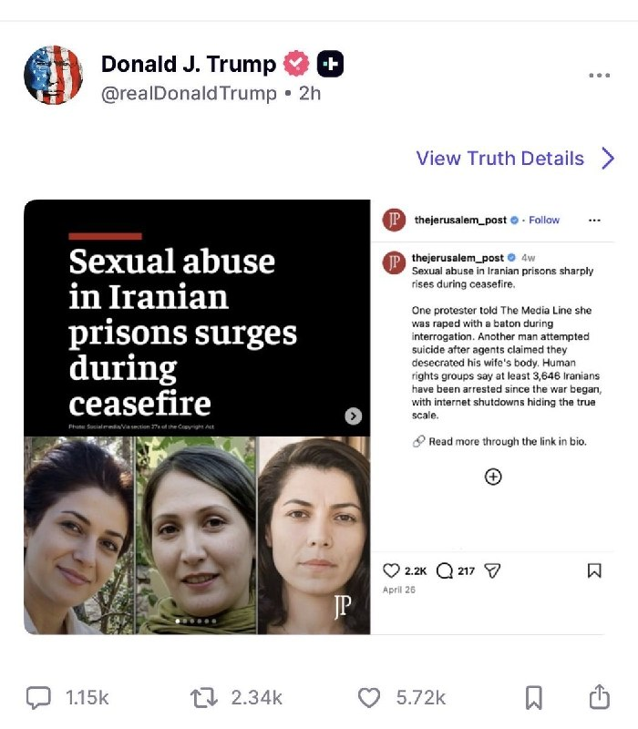

ترامپ یه خبری رو یه ریپوست کرده که گزارشیه که نشون میده آزار جنسی در زندان های جمهوری اسلامی در دوران آتش بس بیشتر شده

💧 Rainbet.com the #1 Non-KYC Crypto Casino & Sportsbook @rainbetcom

😁 @Pm_Afshaa

## pm_afshaa — post 91667

vless://06b65903-406d-4a41-8463-6fd5c0ee7798@43.169.18.179:443?encryption=none&security=tls&sni=sni.skylee4.cloudns.ch&fp=chrome&type=ws&host=sni.skylee4.cloudns.ch&path=%2F#PMTV%20NEWS%20%F0%9F%A6%81%E2%98%80%EF%B8%8F

کانفینگ پر سرعت مخصوص دانلود

💧 Rainbet.com the #1 Non-KYC Crypto Casino & Sportsbook @rainbetcom

😁 @Pm_Afshaa

## pm_afshaa — post 91666

🔴پیت هگست:آنها ممکن است موشک داشته باشند، اما در حال حاضر نمی‌توانند موشک‌های بیشتری بسازند. نمی‌توانند پهپادهای بیشتری بسازند. نمی‌توانند کشتی‌های بیشتری بسازند. آمدند و تسلیم شدند تا صحبت کنند

💧 Rainbet.com the #1 Non-KYC Crypto Casino & Sportsbook @rainbetcom

😁 @Pm_Afshaa

## pm_afshaa — post 91665

vless://76bc8e3d-0e6b-4a35-b1a7-7f5158042666@45.76.83.35:54985?encryption=none&security=none&type=tcp&headerType=none#PMTV%20NEWS%20%F0%9F%A6%81%E2%98%80%EF%B8%8F

نپسترنت نا محدود سرعت بالا

💧 Rainbet.com the #1 Non-KYC Crypto Casino & Sportsbook @rainbetcom

😁 @Pm_Afshaa

## pm_afshaa — post 91664

🔴ترامپ :قرار نیست تحریم های ایران برداشته بشه. حتی اگه اورانیوم غنی شدش رو هم تحویل بده هیچ تحریمی کاهش پیدا نمیکنه

💧 Rainbet.com the #1 Non-KYC Crypto Casino & Sportsbook @rainbetcom

😁 @Pm_Afshaa

## pm_afshaa — post 91663

🔴ترامپ: ایرانی‌ها فکر می‌کنند من به‌خاطر انتخابات میان‌دوره‌ای جنگ را تمام می‌کنم اما من اهمیتی نمی‌دهم

💧 Rainbet.com the #1 Non-KYC Crypto Casino & Sportsbook @rainbetcom

😁 @Pm_Afshaa

## pm_afshaa — post 91662

#مهم
عزیزای دلم همگی الان چنل زاپاس‌مون رو جوین بشید کانال تحت ریپورت شدیده اگه چیزی شد زاپاس رو داشته باشید فعالیت میاد اونور
👇

https://t.me/Pm_Zapas
https://t.me/Pm_Zapas

## pm_afshaa — post 91661

  <a href="telegram/content/pm_afshaa_91661_1779914653.mp4" target="_blank">🎬 Download video</a>

پشماتون بریزه، اینجا کردستان نیست، اینجا آلمانه که ایرانیا و کُردا فتحش کردن! تهشم دارن کردی میرقصن

💧 Rainbet.com the #1 Non-KYC Crypto Casino & Sportsbook @rainbetcom

😁 @Pm_Afshaa

## pm_afshaa — post 91660

🔴کاخ سفید :هیچ‌کس نباید به آنچه رسانه‌های دولتی ایران منتشر می‌کنند اعتماد کند

💧 Rainbet.com the #1 Non-KYC Crypto Casino & Sportsbook @rainbetcom

😁 @Pm_Afshaa

## pm_afshaa — post 91659

vless://406d8436-0eb9-4eb2-84fb-960e076ffba6@162.159.38.183:2083?encryption=none&security=tls&sni=de.lezzatzone.ir&alpn=h2%2Chttp%2F1.1&fp=chrome&type=tcp&headerType=none#%40Glitch_Config

نامحدود سرعت موشکی
🚀

💧 Rainbet.com the #1 Non-KYC Crypto Casino & Sportsbook @rainbetcom

😁 @Pm_Afshaa

## pm_afshaa — post 91658

🟠کاخ سفید در توییتر به طور غیرمستقیم گزارش رسانه‌های دولتی جمهوری اسلامی تروریست درباره پیش‌نویس تفاهم‌نامه بین آمریکا و ج.ا را رد کرد

💧 Rainbet.com the #1 Non-KYC Crypto Casino & Sportsbook @rainbetcom

😁 @Pm_Afshaa

## pm_afshaa — post 91657

🔴مهر: یک ساختمان اداری در فرودگاه امام خمینی آتش گرفت

💧 Rainbet.com the #1 Non-KYC Crypto Casino & Sportsbook @rainbetcom

😁 @Pm_Afshaa

## iaghapour — post 2637

## iaghapour — post 2636

🔻بچه ها میگن انقدر پهنای باند دیتاسنتر ها پایین هستش که اکثر روش های تانل که اجرا میکنن سرعت بدی داره یا دچار قطع و وصلی و اختلال زیاد هستش.

خیلی به روش تانل بستگی نداره بیشتر مشکل پهنای باند ضعیف دیتاسنتر ها مربوط هست.

امیدوارم در روزهای آینده وضعیت بهتر بشه.

## DEJradio — post 5044

  <a href="telegram/content/DEJradio_5044_1779914654.mp4" target="_blank">🎬 Download video</a>

شاهزاده رضا پهلوی روز جمعه ۱ خرداد (۲۲ مه)، در نشستی آنلاین با شماری از فعالان و چهره‌های رسانه‌ای و هنری گفتگو کردند. ایشان ضمن شنیدن دیدگاه‌ها و نظرات حاضران، به برخی پرسش‌ها نیز پاسخ دادند. بخش‌های بیشتری از این گفتگو در روزهای آینده منتشر خواهد شد.

@OfficialRezaPahlavi

## DEJradio — post 5043

  <a href="telegram/content/DEJradio_5043_1779914656.mp4" target="_blank">🎬 Download video</a>

🚨
🔸 خبر ۲۱
چهارشنبه ۶ خرداد ۱۴۰۵

#خبر۲۱
@DEJradio

## DEJradio — post 5042

  <a href="telegram/content/DEJradio_5042_1779914660.webm" target="_blank">🎬 Download video</a>

🔺📢 بلاتکلیفی آینده‌سازان ایران در فصل امتحانات؛

گزارش: اشکان خسروپور

#فصل_امتحانات
@DEJradio

## DEJradio — post 5041

  

👑
👑 شهین خاکپور، یکی از تازه‌ترین قربانیان جنایات رژیم، از ایرانیان آزادی‌خواه و مبارزان میدانی در ایران بود که به دست جمهوری اسلامی زندانی و به ۱۸ سال حبس محکوم شد.
خانم خاکپور که در زندان به ذات‌الریه مبتلا شد، در دوره مرخصی درمانی به ترکیه رفت، اما با تشدید بیماری، جان خود را از دست داد.
زنده‌یاد شهین خاکپور، یادش گرامی خواهد بود و نامش فراموش نخواهد شد.

#جاویدنامان #شهین_خاکپور
@DEJradio

## DEJradio — post 5040

  <a href="telegram/content/DEJradio_5040_1779914661.mp4" target="_blank">🎬 Download video</a>

👑🎥 تلاش ایرانیان مقیم اروپا برای لغو احکام اعدام زندانیان سیاسی

#بچه_های_اکباتان #زندانیان_سیاسی
@DEJradio

## DEJradio — post 5039

  <a href="telegram/content/DEJradio_5039_1779914664.mp4" target="_blank">🎬 Download video</a>

🔺🎥 رسانه‌های داخلی از وقوع آتش‌سوزی در یکی از برج‌های شهرک چیتگر تهران خبر دادند علت حادثه، میزان تلفات و خسارت مشخص نیست.

#آتشسوزی #چیتگر
@DEJradio

## DEJradio — post 5038

  <a href="telegram/content/DEJradio_5038_1779914667.webm" target="_blank">🎬 Download video</a>

🔺📢 رئیس ستاد کل ارتش اسرائیل:
پایه‌های حکومت آیت‌الله‌ها ترک برداشته است

ایال زمیر، رئیس ستاد کل ارتش اسرائیل گفت پایه‌های حکومت آیت‌الله‌ها به‌طرز قابل توجهی ترک برداشته است. به گفته این مقام ارشد نظامی اسرائیل، آینده و ثبات نظام جمهوری اسلامی در هاله‌ای از ابهام فرو رفته است.

ایال زمیر یادآوری کرد سران جمهوری اسلامی تحت تعقیب قرار دارند و اصلی‌ترین توانایی‌های نظامی حکومت نابود شده است. زمیر همچنین گفت برنامه هسته‌ای جمهوری اسلامی سال‌ها به عقب رانده شده و اقتصاد کشور در حال فروپاشی است.

#رژیم_آخوندی #اسرائیل
@DEJradio

## DEJradio — post 5036

  <a href="telegram/content/DEJradio_5036_1779914668.webm" target="_blank">🎬 Download video</a>

🚨
🔸 ایران فراموش‌شده در سایه بحران هرمز

گزارش: ایمان صفتی

#شاهزاده_رضا_پهلوی #تنگه_هرمز #ایران
@DEJradio

## DEJradio — post 5035

  <a href="telegram/content/DEJradio_5035_1779914668.mp4" target="_blank">🎬 Download video</a>

👑🎥 سه‌شنبه‌های نه به اعدام؛ تجمع ایرانیان ملی‌گرا مقیم هامبورگ

#همبستگی #هامبورگ
@DEJradio

## DEJradio — post 5034

  <a href="telegram/content/DEJradio_5034_1779914671.mp4" target="_blank">🎬 Download video</a>

👑🎥 پرفورمنس «نه به اعدام» در هانوفر؛ روایت جنایات جمهوری اسلامی برای افکار عمومی

#همبستگی #هانوفر
@DEJradio

## DEJradio — post 5033

⭕️ وزیر اسرائیلی گفت اهرم راهبردی جمهوری اسلامی در تنگۀ هرمز در حال نابودی است

الی کوهن، وزیر انرژی دولت اسرائیل، گفت همۀ ظرفیت جمهوری اسلامی در تنگۀ هرمز و اهرم راهبردی آن، در حال نابودی است.
او خبر داد که گفت‌وگوها برای ایجاد زیرساخت‌های انتقال انرژی از شرق به غرب در حال پیشرفت است.
به گفتۀ الی کوهن، هدف از گفت‌وگوهای تازه، انتقال انرژی به اروپا از مسیر اسرائیل است.
الی کوهن افزود کشورهای حاشیۀ خلیج فارس از جمله عربستان سعودی و امارات متحدۀ عربی علاقه‌مند به مشارکت در این پروژه‌ها شده‌اند.
به گفتۀ وزیر انرژی و زیرساخت اسرائیل، کریدور انرژی میان هند و اروپا از طریق کشورهای خلیج فارس و اسرائیل در دست بررسی است. همچنین مسیر مصر می‌تواند اجرای این پروژه را تسریع کند.

#دژ #خبر #اسرائیل
@DEJradio

## DEJradio — post 5032

⭕️ مقام ارشد اسرائیل گفت پایه‌های حکومت آیت‌الله‌ها ترک برداشته است

ایال زمیر، رئیس ستاد کل ارتش اسرائیل گفت پایه‌های حکومت آیت‌الله‌ها به‌طرز قابل توجهی ترک برداشته است.
به گفتۀ این مقام ارشد نظامی اسرائیل، آینده و ثبات نظام جمهوری اسلامی در هاله‌ای از ابهام فرو رفته است.
ایال زمیر یادآوری کرد سران جمهوری اسلامی تحت تعقیب قرار دارند و اصلی‌ترین توانایی‌های نظامی حکومت نابود شده است.
زمیر همچنین گفت برنامۀ هسته‌ای جمهوری اسلامی سال‌ها به عقب رانده شده و اقتصاد کشور در حال فروپاشی است.

#خبر #دژ #اسرائیل
@DEJradio

## DEJradio — post 5031

⭕️ ادعای باقری‌کنی: موضوع ذخایر اورانیوم در دستور کار مذاکرات نیست

علی باقری‌کنی، معاون دبیر شورای عالی امنیت ملی نظام ادعا کرد موضوع ذخایر اورانیوم غنی‌شده در دستور کار مذاکرۀ کنونی با آمریکا قرار ندارد.
او در حاشیۀ نشست امنیتی روسیه مدعی شد تهران و واشینگتن هنوز دربارۀ رفع انسداد تنگۀ هرمز به توافق نرسیده‌اند.
باقری‌کنی گفت جمهوری اسلامی و عمان درمورد سازوکار تازۀ مدیریت تردد کشتی‌ها در تنگۀ هرمز در حال مذاکره‌اند.
دونالد ترامپ تأکید کرده اورانیوم غنی‌شده باید یا به آمریکا تحویل داده شود یا زیر نظارت بین‌المللی رقیق و نابود شود.

#خبر #دژ #اورانیوم #مذاکرات
@DEJradio

## DEJradio — post 5030

⭕️ وزارت اطلاعات جمهوری اسلامی از استارلینک و «شکستن انسجام ملی» می‌ترسد

وزارت اطلاعات جمهوری اسلامی روز چهارشنبه در بیانیه‌ای مدعی شد پس از توقف جنگ سخت، «دشمن» بر جنگ ترکیبی متمرکز شده است.
این وزارتخانه از تشدید فشار اقتصادی، حملات سایبری، جنگ رسانه‌ای، قاچاق سلاح و «ابزارهای ارتباطی همچون استارلینک» به‌عنوان محورهای جنگ ترکیبی نام برد.
در این بیانیه درباره هرگونه اقدام برای شکستن «انسجام ملی و ایجاد گسست اجتماعی» هشدار داده شد. وزارت اطلاعات دولت پزشکیان تهدید کرد با این موارد «با دقت و قاطعیت» برخورد می‌شود.
مشخص نیست منظور وزارت اطلاعات از «انسجام ملی» مورد ادعا چه بوده است.
این تهدیدها تنها یک روز پس از بازگشت اینترنت جهانی در ایران پس از ۸۸ روز قطعی سراسری منتشر شده است.
اسماعیل خطیب، وزیر پیشین اطلاعات در جریان حملات اسرائیل و آمریکا در جنگ چهل روزه کشته شد.
این وزارتخانه اکنون توسط یک سرپرست اداره می‌شود و هنوز فردی به عنوان وزیر اطلاعات، معرفی نشده است.

#خبر #دژ #استارلینک #وزارت_اطلاعات
@DEJradio

## DEJradio — post 5029

  

🔺احضار سفیر تهران در سئول؛ جمهوری اسلامی مسئول حمله به کشتی کره‌ای شناخته شد

کره جنوبی اعلام کرد سفیر جمهوری اسلامی را در اعتراض به حمله به یک کشتی کره‌ای در تنگۀ هرمز احضار می‌کند.
سئول پس از چند هفته بررسی اعلام کرد به احتمال بسیار قوی، یک موشک ساخت جمهوری اسلامی عامل حمله به کشتی اچ‌ام‌ام نامو، بود.
پارک یون‌جو، معاون وزیر امور خارجۀ کرۀ جنوبی، گفت تحلیل‌های فنی نشان می‌دهد پرتابۀ استفاده‌شده نسخه‌ای از موشک «نور» بود.
بنا بر داده‌ها روی برخی از قطعات موشک نیز نشانه‌هایی از یک تولیدکنندۀ ایرانی دیده شد.
این کشتی باری کره‌ای در ۱۴ اردیبهشت امسال هدف حمله قرار گرفت.
به گفته مقام‌های کره‌ای، یکی از موشک‌ها درحدود هفت متر در بدنۀ کشتی نفوذ کرده بود.

#خبر #دژ #کره_جنوبی #تنگه_هرمز
@DEJradio

## DEJradio — post 5028

⭕️ پاکستان باید به درخواست ترامپ برای پیوستن به پیمان ابراهیم پاسخ بدهد

لیندزی گراهام، سناتور جمهوری‌خواه آمریکایی گفت با توجه به درخواست دونالد ترامپ برای پیوستن کشورهای اسلامی به پیمان ابراهیم، پاکستان باید موضع خود را روشن کند.
گراهام بار دیگر از نقش پاکستان در میانجی‌گری میان جمهوری اسلامی و آمریکا انتقاد کرد.
این سناتور برجستۀ آمریکایی افزود دشمنی پاکستان با اسرائیل، پیشینه‌ای طولانی دارد.
گراهام تأکید کرد استقرار هواپیماهای نظامی جمهوری اسلامی در پایگاه‌های پاکستان غیرقابل انکار است.
این سیاستمدار نزدیک به ترامپ پیش‌تر نیز گفته بود اگر گزارش‌ مربوط به پناه گرفتن هواپیماهای جمهوری اسلامی در پاکستان درست باشد، نقش اسلام‌آباد به‌عنوان میانجی باید بازنگری شود.

#خبر #دژ #توافق_ابراهیم #پاکستان
@DEJradio

## DEJradio — post 5027

⭕️ ترامپ پس از معاینۀ سه‌ساعتۀ پزشکی از وضعیت سلامتی‌ عالی خود خبر داد

دونالد ترامپ، رئیس‌ جمهوری آمریکا شامگاه سه‌شنبه پس از انجام یک معاینۀ سه‌ساعته در مرکز پزشکی نظامی والتر رید، اعلام کرد همه چیز کاملا عالی بود.
به گزارش کاخ سفید این مراجعه بخشی از معاینات پیشگیرانۀ پزشکی و دندانپزشکی بوده است.
ترامپ در خرداد ماه ماه آینده ۸۰ ساله می‌شود. این چهارمین معاینۀ پزشکی علنی ترامپ از آغاز دور دوم ریاست‌جمهوری او به شمار می‌رود.

#خبر #دژ #ترامپ
@DEJradio

## DEJradio — post 5026

  <a href="telegram/content/DEJradio_5026_1779914676.mp4" target="_blank">🎬 Download video</a>

⭕️ اسرائیل از حذف فرماندۀ تازۀ شاخۀ نظامی حماس در غزه خبر داد

ارتش اسرائیل و شاباک اعلام کردند محمد عوده، فرماندۀ تازۀ شاخۀ نظامی حماس در غزه، در حملۀ هوایی شامگاه سه‌شنبه در شمال غزه کشته شد.
به گفتۀ مقام‌های اسرائیلی، عوده پس از کشته شدن عزالدین حداد در هفتۀ پیشین، فرماندهی شاخۀ نظامی حماس را برعهده گرفته بود.
ارتش اسرائیل اعلام کرد عوده از طراحان حملۀ تروریستی هفتم اکتبر بود.
بنا بر گزارش ارتش اسرائیل، محمد عوده در جریان جنگ نیز عملیات اطلاعاتی و حملات علیه نیروهای اسرائیلی را هدایت می‌کرد.
حماس که سال‌ها از پشتیبانی مالی و فکری جمهوری اسلامی برخوردار بود، در سیاهۀ تروریستی آمریکا و اروپا قرار دارد.
رسانه‌های نزدیک به حماس مدعی شدند محمد عوده همراه با همسر و پسرانش کشته شده است.
یسرائیل کاتز، وزیر دفاع اسرائیل نوشت: ما خود را متعهد کرده‌ایم همۀ کسانی را که کشتار هفتم اکتبر را رهبری کردند از میان برداریم.
به گفتۀ کاتز، همه این افراد، در هر جا که باشند، نشان شده‌اند.

#خبر #دژ #اسرائیل #حماس
@DEJradio

## DEJradio — post 5025

  <a href="telegram/content/DEJradio_5025_1779914678.webm" target="_blank">🎬 Download video</a>

🔺📢 پاشنه آشیل جمهوری اسلامی؛ بحران مشروعیت برای هواداران

*پژمان گلچین، پژوهشگر فلسفه

#پاشنه_آشیل #جنگ
@DEJradio

## DEJradio — post 5024

⭕️ اروپا از گسترش تهدیدهای روسیه به حوزۀ بالتیک و حملات سایبری نگران است

گزارش‌ها نشان می‌دهد نگرانی اروپا در مورد روسیه از جنگ اوکراین فراتر رفته و اکنون احتمال تهدید کشورهای بالتیک و تشدید حملات سایبری نیز مطرح است.
کایا کالاس، مسئول سیاست خارجی اتحادیۀ اروپا هشدار داد اگر کرملین برای ادامۀ جنگ به بسیج تازه نیاز پیدا کند، ممکن است به سمت تشدید تنش در منطقه حرکت کند.
همچنین رئیس سازمان اطلاعات ارتباطات در دولت بریتانیا گفت روسیه به‌طور مداوم زیرساخت‌های حیاتی، روندهای دموکراتیک و زنجیره‌های تأمین در اروپا را هدف قرار می‌دهد.

#خبر #دژ #سایبری #اروپا
@DEJradio

## mamlekate — post 103590

📝 ترامپ به ایران فرصت صلح داد اما نمی‌تواند به حاکمان مذهبی‌اش اعتماد کند

انتشار این خبر که دونالد ترامپ، رئيس‌جمهوری ایالات متحده، در اقدامی غیرمعمول، قرار است چهارشنبه با تمام اعضای کابینه خود جلسه داشته باشد، نشان می‌دهد او در حال بررسی راه‌هایی برای سرعت بخشیدن به مذاکرات به‌شدت کند و فرسایشی با جمهوری اسلامی ایران است.

@mamlekate

## mamlekate — post 103589

الو چهارشنبه ساعت ۱۳:۰۰ واحد هوا پتروشیمی دماوند که توی جنگ روز ۱۷ فروردین نیروگاهشون مورد اصابت قرار گرفته بود دچار انفجار شد. حداقل ۱ نفر کشته و ۴ نفر مجروح شدن. دلیل انفجار هنوز معلوم نیست.

@mamlekate

## VahidOnline — post 75758

  <a href="telegram/content/VahidOnline_75758_1779914679.mp4" target="_blank">🎬 Download video</a>

دونالد ترامپ درباره لغو یا کاهش تحریم‌های جمهوری اسلامی گفت واشینگتن «درباره هیچ‌گونه کاهش تحریم‌ها یا دادن پول» صحبت نمی‌کند و تاکید کرد: «هیچ تحریمی، هیچ پولی، هیچ چیزی.»
او افزود آمریکا کنترل پولی را که جمهوری اسلامی ادعا می‌کند متعلق به خود است در اختیار دارد و این کنترل را حفظ خواهد کرد. ترامپ گفت زمانی که جمهوری اسلامی «رفتار درستی» داشته باشد و «کار درست را انجام دهد»، اجازه دسترسی به این پول داده خواهد شد، اما «در حال حاضر چنین کاری انجام نمی‌دهیم» و «این دو موضوع به هم وابسته نیستند.»
ترامپ همچنین درباره انتقال اورانیوم غنی‌شده گفت با انتقال ذخایر اورانیوم غنی‌شده ایران به روسیه یا چین موافق نیست.
@VahidOOnLine
دونالد ترامپ در پاسخ به سوالی درباره کنترل تنگه هرمز توسط تهران و عمان گفت این تنگه برای همه باز خواهد بود و آب‌های بین‌المللی محسوب می‌شود. او تاکید کرد هیچ‌کس آن را کنترل نخواهد کرد و آمریکا بر آن نظارت خواهد داشت.
ترامپ افزود کنترل تنگه بخشی از مذاکرات است و ایران تمایل دارد آن را در اختیار بگیرد، اما چنین اتفاقی نخواهد افتاد. او درباره عمان نیز گفت این کشور مانند دیگران رفتار خواهد کرد و در غیر این صورت آمریکا مجبور خواهد شد آن‌ها را منفجر کند.
@VahidOOnLine

📡 @VahidOnline

## VahidOnline — post 75757

  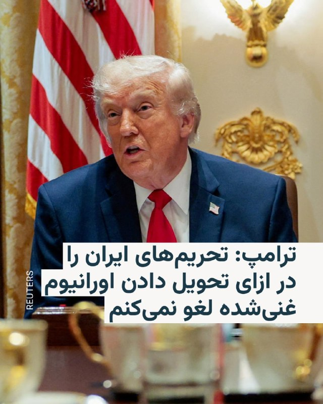

دونالد ترامپ، رئیس‌جمهور آمریکا، روز چهارشنبه گفت که ایران در ازای کنار گذاشتن اورانیوم با غنای بالای خود، از لغو تحریم‌ها توسط واشینگتن برخوردار نخواهد شد و از پیشنهادات ایران برای توافق پایان جنگ ابراز نارضایتی کرد.

ترامپ پیش از برگزاری جلسه کابینه خود در یک تماس تلفنی کوتاه با شبکه پی‌بی‌اس نیوز، در پاسخ به این سوال که آیا توافق فعلی به این معناست که ایران در ازای لغو تحریم‌ها، اورانیوم با غنای بالای خود را واگذار خواهد کرد، گفت: «نه، نه، اصلاً. خبری از لغو تحریم‌ها نیست، نه.»
او اضافه کرد: «آن‌ها قرار است اورانیوم با غنای بالای خود را کنار بگذارند، نه در ازای لغو تحریم‌ها. نه، نه، اصلاً.»

ایران بیش از ۴۰۰ کیلو اورانیوم غنی شده تا حد ۶۰ درصد دارد که در تأسیسات زیرزمینی هدف قرار گرفته در جنگ ۱۲ روزه سال گذشته مدفون است.
رئیس‌جمهور ایالات متحده ساعتی بعد در ابتدای نشست کابینه خود در کاخ سفید گفت که ایران بسیار مایل است به توافق برسد، اما آمریکا هنوز از توافق پیشنهادی رضایت ندارد.

ترامپ در این نشست در حضور خبرنگاران گفت: «ایران خیلی مصمم است، آن‌ها خیلی می‌خواهند که به توافق برسند. تا اینجا هنوز موفق نشده‌اند... ما از آن راضی نیستیم، اما خواهیم شد.»
او سپس بار دیگر ایران را به ازسرگیری حملات نظامی تهدید کرد: «یا به آن نقطه می‌رسیم، یا اینکه مجبور می‌شویم کار را یکسره کنیم.»
@VahidHeadline

📡 @VahidOnline

## VahidOnline — post 75756

  

⚠️تصاویر دلخراش از اجساد مردم کشته‌شده در بیمارستان تهرانپارس تهران 
⚠️ دو روز پیش ویدیوی دوم رو با تردید منتشر کرده بودم و نوشته بودم نمی‌دونم درسته یا نه. حالا عکس‌هایی از بیمارستان تهرانپارس با شرح جان‌باختگان ۱۸ و ۱۹ دی دریافت کردم که نشون میدن اون ویدیو…

## VahidOnline — post 75755

  <a href="telegram/content/VahidOnline_75755_1779914680.mp4" target="_blank">🎬 Download video</a>

دونالد‌ ترامپ، رئیس‌جمهوری آمریکا، چهارشنبه ششم خرداد، در نشست کابینه در کاخ سفید درباره مذاکرات با جمهوری اسلامی گفت تهران «بسیار مشتاق» توافق است، اما مذاکرات هنوز به نتیجه نهایی نرسیده است.

ترامپ گفت: ما از وضعیت فعلی راضی نیستیم ولی خواهیم شد.

رئیس‌جمهوری آمریکا همچنین جمهوری اسلامی را تحت فشار شدید توصیف کرد و گفت: «نیروی دریایی‌شان نابود شده، نیروی هوایی از بین رفته و همه‌چیزشان از دست رفته است.»

ترامپ افزود جمهوری اسلامی «در حالی مذاکره می‌کند که چیزی برایش باقی نمانده» و هشدار داد اگر توافق حاصل نشود، آمریکا ممکن است «برگردد و کار را تمام کند.»

ترامپ گفت: «آنها تازه دوباره به اینترنت برگشته‌اند، چون به‌شدت تحت فشار قرار گرفته‌اند.»

او همچنین گفت اقتصاد ایران «در حال سقوط آزاد» است و تهران به‌دلیل فشارهای سنگین، گزینه دیگری جز حرکت به‌سوی توافق ندارد.
@VahidOOnLine

📡 @VahidOnline

## VahidOnline — post 75753

خبرگزاری فارس به نقل از «منابع آگاه» گزارش داد که دونالد ترامپ، رئیس‌جمهوری آمریکا، ممکن است در ساعات آینده به‌صورت یک‌طرفه اعلام کند که توافق میان ایران و آمریکا نهایی شده است؛ اقدامی که به گفته این منابع می‌تواند با هدف اعمال فشار سیاسی و اثرگذاری بر افکار عمومی انجام شود، پیش از آنکه اختلافات باقی‌مانده به‌طور کامل برطرف شود.

بر اساس این گزارش، این سناریو در حالی مطرح شده که هنوز برخی موضوعات میان دو طرف حل‌نشده باقی مانده و روند مذاکرات به مرحله نهایی نرسیده است.
در همین زمینه، یک عضو تیم مذاکره‌کننده ایرانی در گفتگو با فارس تاکید کرده است که تا زمانی که همه موارد مورد نظر ایران حل و فصل نشود، هیچ توافقی قابل اعلام نخواهد بود.
به گفته این منبع، جمهوری اسلامی ایران تنها در صورتی که اختلافات به‌طور کامل برطرف شود، نتیجه مذاکرات را به‌صورت رسمی اعلام خواهد کرد و هیچ توافقی پیش از رسیدن به جمع‌بندی نهایی، مورد تایید تهران نخواهد بود.
@VahidOOnLine

📡 @VahidOnline

## VahidOnline — post 75749

  <a href="telegram/content/VahidOnline_75749_1779914681.mp4" target="_blank">🎬 Download video</a>

#آتش‌سوزی در یکی از برج‌های مجتمع مسکونی پامچال در چیتگر #تهران
تصاویر دریافتی + منتشرشده، چهارشنبه ۶ خرداد
Vahid

📡 @VahidOnline

## VahidOnline — post 75748

  

کاخ سفید روز چهارشنبه اعلام کرد گزارشی که از سوی صداوسیمای جمهوری اسلامی منتشر شده و به پیش‌نویس یک چارچوب اولیه و غیررسمی برای تفاهم‌نامه میان ایران و ایالات متحده اشاره داشت، «صحیح نیست» و تفاهم‌نامه مورد اشاره «کاملاً ساختگی» است.

تلویزیون حکومتی ایران ساعتی قبل گزارش داده بود که پیش‌نویس یک توافق چارچوبی با ایالات متحده شامل تعهد به لغو محاصره دریایی ایران، بازگرداندن رفت‌وآمد در تنگه هرمز و خروج نیروهای آمریکایی از منطقه خلیج فارس است.

کاخ سفید در بیانیه‌ای اعلام کرد: «این گزارش رسانه‌های تحت کنترل ایران حقیقت ندارد و تفاهم‌نامه‌ای که آنها منتشر کرده‌اند کاملاً ساختگی است. هیچ‌کس نباید آنچه رسانه‌های دولتی ایران منتشر می‌کنند را باور کند. واقعیت‌ها اهمیت دارند.»

گزارش صداوسیما مدعی شده بود که آمریکا متعهد به رفع محاصره دریایی ایران شده و در مقابل، ایران تعهد داده تعداد کشتی‌های عبوری تجاری را طی یک ماه به سطح پیش از تنش‌ها بازگرداند.

تلویزیون جمهوری اسلامی همچنین گفته بود بر اساس این پیش‌نویس، «مدیریت و مسیر عبور و مرور» کشتی‌ها با ایران و همکاری عمان انجام خواهد شد و آمریکا تعهد داده نیروهای نظامی این کشور از «محیط پیرامونی ایران خارج شوند».
@VahidHeadline

📡 @VahidOnline

## VahidOnline — post 75747

  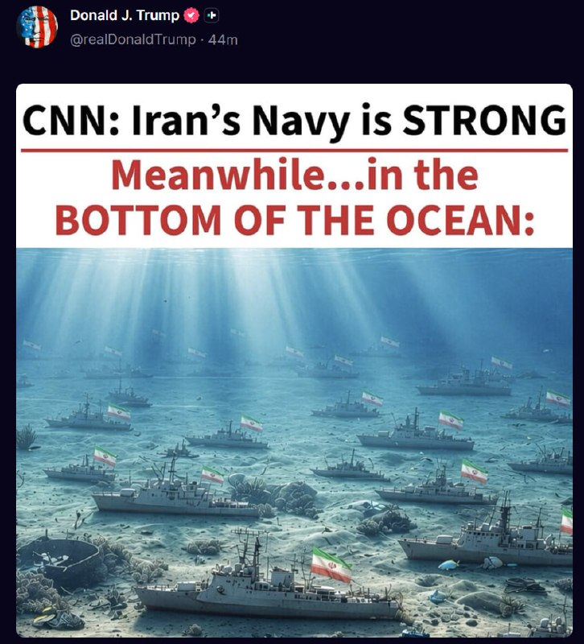

دونالد‌ ترامپ، رئیس‌جمهوری آمریکا، چهارشنبه ششم خرداد در شبکه اجتماعی تروث سوشال با انتشار تصویری ساخته‌شده با هوش مصنوعی، از شبکه سی‌ان‌ان انتقاد کرد و نوشت این رسانه نیروی دریایی جمهوری اسلامی را قدرتمند نشان می‌دهد، در حالی که شناورهای ایران در اقیانوس غرق شده‌اند.

در این تصویر، جمله «سی‌ان‌ان: نیروی دریایی ایران قدرتمند است» در کنار تصویری از شناورهای غرق‌شده جمهوری اسلامی در کف اقیانوس دیده می‌شود.
@VahidOOnLine

📡 @VahidOnline

## VahidOnline — post 75746

  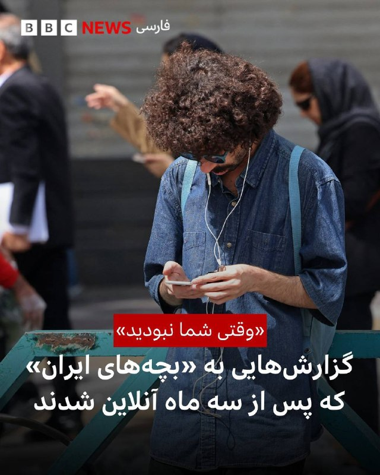

‏گروهی از کاربران در شبکه اجتماعی ایکس (توییتر سابق) پست‌های انتقادی گزارش‌گونه از تحولات و رویدادهای سیاسی خارج از ایران منتشر می‌کنند، خطاب به شهروندانی که پس از حدود سه ماه به‌طور تدریجی با فیلترشکن موفق می‌‌شوند به اینترنت وصل شوند.

‏این پست‌ها که با عبارت‌هایی مانند «وقتی شما نبودید» یا «بچه‌های ایران که تازه وصل شده‌اید» آغاز می‌شود، همزمان با کاهش تدریجی اختلال در دسترسی به اینترنت، به محلی برای مستندسازی و بازاندیشی انتقادی نسبت به تحولات سیاسی‌ ۸۸ روز گذشته تبدیل شده است.
@VahidHeadline
دوستانی که تازه وصل شدن یدونه «سلام وحید جان» سرچ کنید آرشیو کامل از اندر احوالات ایرانی جماعت در زمان قطعی نت رو براتون میاره
iamroyaz

📡 @VahidOnline

## VahidOnline — post 75745

  <a href="telegram/content/VahidOnline_75745_1779914684.mp4" target="_blank">🎬 Download video</a>

خبرگزاری صداوسیما اعلام کرد به یک سند غیررسمی اولیه از چارچوب ۱۴ بندی تفاهم احتمالی میان ایران و آمریکا دسترسی پیدا کرده، سندی که به گفته رسانه‌های ایرانی، هنوز نهایی نشده اما حاوی جزئیاتی درباره وضعیت تنگه هرمز و حضور نظامی آمریکا در منطقه است.

بر اساس این گزارش، در پیش‌نویس منتشرشده آمده است که آمریکا متعهد می‌شود نیروهای نظامی خود را از اطراف ایران خارج کرده و محاصره دریایی را متوقف کند. در مقابل، تهران نیز تعهد می‌دهد ظرف مدت یک ماه، عبور کشتی‌های تجاری از تنگه هرمز را به سطح پیش از جنگ بازگرداند.

طبق مفاد این سند، کشتی‌های نظامی مشمول توافق نخواهند بود و مدیریت مسیر حرکت کشتی‌های تجاری در تنگه هرمز با همکاری ایران و سلطنت عمان انجام می‌شود.

صداوسیما همچنین گزارش داد که هنوز چارچوب نهایی تفاهم تدوین نشده و ایران تاکید کرده بدون وجود «سازوکار راستی‌آزمایی» یا همان مکانیزم اطمینان، هیچ اقدام عملی انجام نخواهد داد.
در بخش دیگری از این گزارش آمده است که اگر دو طرف طی ۶۰ روز آینده به توافق نهایی برسند، این تفاهم می‌تواند در قالب یک قطعنامه الزام‌آور در شورای امنیت سازمان ملل تصویب شود.
@VahidOOnLine

🔄 آپدیت:
کاخ سفید: گزارش رسانه‌های جمهوری اسلامی درباره تفاهم‌نامه تهران و واشینگتن کاملا ساختگی است

کاخ سفید گزارش رسانه‌های جمهوری اسلامی درباره بندهای تفاهم‌نامه احتمالی را «کاملا ساختگی» خواند و گفت نباید به روایت رسانه‌های جمهوری اسلامی اعتماد کرد
@VahidOOnLine

📡 @VahidOnline

## VahidOnline — post 75744

  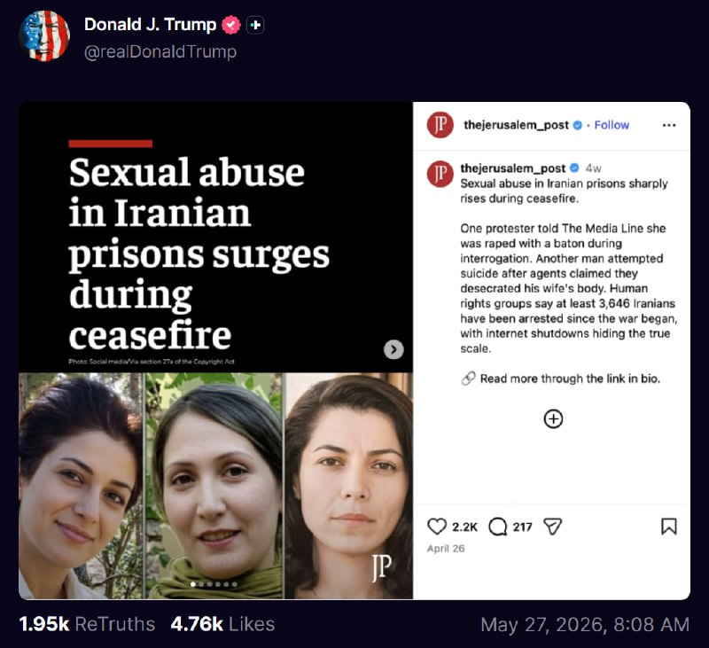

دونالد ترامپ در تروث‌سوشال گزارشی از جروزالم‌پست را بازنشر کرد که بر اساس اطلاعات اختصاصی «مدیا لاین» نوشته است موارد آزار و تعرض جنسی به زنان بازداشت‌شده، به‌ویژه زنان جوان، در زندان‌ها و بازداشتگاه‌های جمهوری اسلامی در دوران آتش‌بس افزایش یافته است.

در این گزارش، زنی جوان به نام کاملیا گفته پس از بازداشت خشونت‌آمیز در خانه‌اش، دو هفته همراه هشت زن دیگر، از جمله دختری ۱۶ ساله که با ساچمه از ناحیه صورت زخمی شده بود، در اتاقی ۲۰ متری نگهداری شد.

به گفته کاملیا، او پس از انتقال به سلول انفرادی و خودداری از اعتراف اجباری، در اتاق بازجویی هدف خشونت قرار گرفت، لباس‌هایش پاره شد، با باتوم مورد تجاوز قرار گرفت، به‌شدت کتک خورد و به تجاوز گروهی تهدید شد.

جروزالم‌پست همچنین با اشاره به قطع گسترده اینترنت، بازداشت‌ها، ناپدیدسازی قهری، آدم‌ربایی، تهدید روزنامه‌نگاران و مخالفان در خارج از کشور و افزایش ناگهانی اعدام مخالفان نوشت سرکوب در ایران تشدید شده است.

دونالد ترامپ پیش‌تر نیز با انتشار پستی در تروث سوشال خواستار آزادی هشت زندانی سیاسی زن در ایران شده بود.
@VahidOOnLine

📡 @VahidOnline

## VahidOnline — post 75742

وزارت اطلاعات جمهوری اسلامی روز چهارشنبه ششم خرداد هشدار داد که بعد از جنگ اخیر، «برخی کمبودها و گرانی‌ها» در پی فشارهای اقتصادی آمریکا می‌تواند باعث بروز ناآرامی‌های تازه در ایران شود.

این وزارتخانه در بیانیه‌ای مدعی شد که «تشدید فشارهای اقتصادی و متعاقب آن، انجام تحریکات گوناگون اجتماعی توسط عوامل دشمن و رسانه‌های مزدور فارسی‌زبان بیگانه، با سوء استفاده از برخی کمبودها و گرانی‌ها» یکی از محورهای مورد توجه آمریکا و اسرائیل است.

هشدار درباره احتمال ناآرامی همزمان با افزایش شدید نرخ تورم و و گرانی کالاها و همچنین انتشار گزارش‌هایی درباره کاهش شدید درآمدهای دولت جمهوری اسلامی در پی هفته‌ها محاصره دریایی آمریکا و سقوط شدید صادرات نفت ایران مطرح شده است.

این در حالی است که اعتراضات دی‌ماه سال گذشته نیز بعد از افزایش مداوم نرخ ارز در بازار و مناطق تجاری ایران آغاز و بعد از چند روز با افزایش تعداد معترضان، با خشونت شدید نیروهای امنیتی و کشتار هزاران نفر مواجه شد.

وزارت اطلاعات همچنین درباره «عملیات تروریستی و تجاوزات مرزی بویژه در شمال غرب و جنوب شرق ایران» و انواع عملیات «ترور و خرابکاری» هشدار داده و مدعی شده که آمریکا و اسرائیل به دنبال وارد کردن «انواع سلاح، مهمات و ابزار ارتباطی غیرقانونی، بویژه استارلینک» به ایران هستند.
ابراز نگرانی از رواج اینترنت ماهواره‌ای استارلینک در حالی است که بعد از ۸۸ روز قطع سراسری اینترنت در ایران، از روز سه‌شنبه شهروندان توانسته‌اند به شکل تدریجی و محدود به برخی سرویس‌های اینترنت جهانی دسترسی پیدا کنند.
@VahidHeadline
این بیانیه که با عنوان «سخنی با ولی‌نعمتان و هشداری به دشمنان» در رسانه‌های داخلی ایران منتشر شده، ادعا می‌کند که «دشمن شکست خورده در جنگ نظامی، بدنبال تولید دستآورد برای خویش، گرچه از طریق جنگ نرم، می‌باشد.»
این بیانیه در حالی صادر می‌شود که اسماعیل خطیب، وزیر اطلاعات جمهوری اسلامی در سومین هفته جنگ در حمله اسرائیل کشته شد و دولت هنوز جانشینی برای او معرفی نکرده است.

وزارت اطلاعات در این بیانیه علاوه بر اسرائیل و آمریکا، بریتانیا و اروپا را به همراهی با این دو قدرت متهم و کشورهای عرب حاشیه خلیج فارس را به‌عنوان «غلامان متمول» مسئول تامین مالی «جنگ ترکیبی تمام عیار» علیه «مردم قهرمان ایران» معرفی کرده است.
وزارت اطلاعات در این بیانیه معترضان و مخالفان جمهوری اسلامی در خارج از ایران را تهدید کرد و نوشت: «مزدوران ضد انقلاب و تروریست‌های مقیم خارج کشور و حامیان آن‌ها نیز از آتشی که می‌افروزند در امان نخواهند بود.»
@VahidOOnLine

📡 @VahidOnline

## VahidOnline — post 75741

  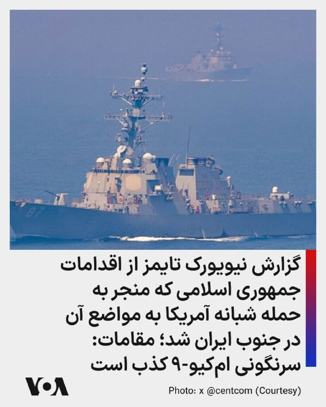

نیویورک تایمز به نقل از دو مقام آمریکایی در روز سه‌شنبه ۵ خرداد گزارش داد که حملات دوشنبه شب نظامی ایالات متحده به اهدافی در جنوب ایران پس از آن صورت گرفت که تحلیلگران اطلاعاتی، مجموعه‌ای از اقدامات نظامی بالقوه تهدیدآمیز جمهوری اسلامی را در ۲۴ ساعت منتهی به این حملات شناسایی کردند.

هواپیماهای جنگی آمریکا دو قایق تندرو سپاه پاسداران انقلاب اسلامی را که سعی در مین‌گذاری در تنگه هرمز داشتند، غرق کردند.

این مقامات که نخواستند نامشان فاش شود، همچنین گفتند که جمهوری اسلامی پهپادهای تهاجمی یک‌طرفه را به سمت حدود دوازده کشتی جنگی نیروی دریایی ایالات متحده که در خلیج عمان و دریای عرب یا اطراف آن هستند شلیک کرد. این کشتی‌ها در حال اعمال محاصره دریایی آمریکا علیه جمهوری اسلامی هستند.

طبق این گزارش تحلیلگران نظامی آمریکا همچنین فعالیت‌هایی را در برخی از سایت‌های موشکی زمین به هوای جمهوری اسلامی در نزدیکی تنگه هرمز شناسایی کردند؛ فعالیت‌هایی که امنیت هواپیماهای جنگی آمریکایی مستقر بر روی زمین و آن‌هایی که روی ناو هواپیمابر آمریکا در منطقه به عنوان بخشی از نیروی اعمال‌کننده محاصره دریایی حضور دارند، تهدید می‌کرد.

تیم هاوکینز، سخنگوی فرماندهی مرکزی ایالات متحده، روز دوشنبه در بیانیه‌ای گفت که ایالات متحده «برای محافظت از نیروهای خود در برابر تهدیدات نیروهای» جمهوری اسلامی حملاتی را به اهدافی در جنوب ایران انجام داد.

سایر مقامات پنتاگون گزارش‌های رسانه‌های داخلی در ایران را که در روز سه‌شنبه مدعی شدند یک پهپاد آمریکایی «ام-کیو۹ ریپر» توسط جمهوری اسلامی سرنگون شد، رد کردند.
@VahidHeadline

📡 @VahidOnline

## IranIntlTV — post 339305

  

اسماعیل بقائی، سخنگوی وزارت خارجه، درباره تحولات قفقاز و طرح موسوم به «TRIPP» (مسیر ترامپ برای صلح و شکوفایی بین‌المللی)، گفت موضع جمهوری اسلامی درباره امنیت در قفقاز جنوبی «روشن» است و هیچ شبهه‌ای در این خصوص وجود ندارد.

او افزود جمهوری اسلامی از گسترش مراودات اقتصادی و رفع انسداد از مسیرهای مواصلاتی استقبال می‌کند، اما نسبت به «نیات بدخواهانه» آمریکا که سابقه «شرارت و تجاوزگری» در مناطق مختلف جهان دارد، سوءظن شدید دارد و مخالفت خود را با حضور «ناامن‌ساز» آن در قفقاز جنوبی صراحتا اعلام کرده است.

بقائی همچنین گفت قفقاز جنوبی «همسایه بلاواسطه ایران» است و جمهوری اسلامی صلح، ثبات و پیشرفت اقتصادی در این منطقه را در راستای منافع ملی خود می‌داند.

او افزود مداخله قدرت‌های فرامنطقه‌ای در تحولات منطقه، صلح، ثبات و منافع جمعی کشورهای منطقه را با چالش جدی مواجه می‌کند.
https://iranintl.com/202605271825

## IranIntlTV — post 339304

  <a href="telegram/content/IranIntlTV_339304_1779914687.mp4" target="_blank">🎬 Download video</a>

یک شهروند با ارسال ویدیویی به ایران‌اینترنشنال با اشاره به مشکلات اقتصادی از بیکار شدن همسرش گفته و اشاره می‌کند که اقدام به سقط جنین کرده است.

## IranIntlTV — post 339303

  

سعید کوزه‌چی، سفیر جمهوری اسلامی در سئول، پس از احضار به وزارت خارجه کره جنوبی، نقش جمهوری اسلامی را در حمله به کشتی باری اچ‌ام‌ام نامو در تنگه هرمز رد کرد.

پیش‌تر کره جنوبی اعلام کرد حمله به کشتی اچ‌ام‌ام نامو در اوایل این ماه احتمالا با استفاده از یک موشک ایرانی انجام شده است.
https://iranintl.com/202605272938

## IranIntlTV — post 339302

  

سعید کوزه‌چی، سفیر جمهوری اسلامی در سئول، پس از احضار به وزارت خارجه کره جنوبی، نقش جمهوری اسلامی را در حمله به کشتی باری اچ‌ام‌ام نامو در تنگه هرمز رد کرد.

پیش‌تر کره جنوبی اعلام کرد حمله به کشتی اچ‌ام‌ام نامو در اوایل این ماه احتمالا با استفاده از یک موشک ایرانی انجام شده است.
https://iranintl.com/202605272938

## IranIntlTV — post 339301

  

سعید کوزه‌چی، سفیر جمهوری اسلامی در سئول، پس از احضار به وزارت خارجه کره جنوبی، نقش جمهوری اسلامی را در حمله به کشتی باری اچ‌ام‌ام نامو در تنگه هرمز رد کرد.

پیش‌تر کره جنوبی اعلام کرد حمله به کشتی اچ‌ام‌ام نامو در اوایل این ماه احتمالا با استفاده از یک موشک ایرانی انجام شده است.
https://iranintl.com/202605272938

## IranIntlTV — post 339300

  <a href="telegram/content/IranIntlTV_339300_1779914693.mp4" target="_blank">🎬 Download video</a>

وزارت اطلاعات از نفوذ گسترده امنیتی و سایبری علیه ایران و پیامدهای جنگ ۴۰ روزه خبر داد. در این بیانیه به ورود استارلینک، خرابکاری، ناامن‌سازی مرزها و تلاش برای ایجاد آشوب داخلی اشاره شده و گفته شده این اقدامات خنثی شده‌اند. همچنین از بازداشت ده‌ها نفر به اتهام همکاری با موساد و گروه‌های تروریستی و هشدار نسبت به احتمال اعتراض‌های خیابانی خبر داده شده است.

گفت‌وگو با مراد ویسی، تحلیلگر ارشد ایران‌اینترنشنال
@iranintltv

## IranIntlTV — post 339299

  <a href="https://t.me/IranintlTV/339299" target="_blank">📎 Download file</a>

🎧نسخه صوتی چشم‌انداز: پشت‌ پرده امتیازات حیرت‌آور ترامپ به حکومت ایران
@iranintlTV

## IranIntlTV — post 339298

  

تانکر ترکرز در شبکه ایکس اعلام کرد در پی محاصره دریایی آمریکا، نزدیک به ۶۰ میلیون بشکه نفت خام ایران متوقف شده و حدود شش میلیارد دلار درآمد نفتی در حال حاضر به تهران نمی‌رسد.

این نهاد ردیابی نفتکش‌ها افزود هنوز نفتکش‌های خالی زیادی برای بارگیری نفت بیشتر وجود دارد، اما با کاهش تولید نفت، بارگیری نفتکش‌ها نیز کاهش یافته است.
https://iranintl.com/202605278620

## IranIntlTV — post 339297

‏دونالد ترامپ در نشست کابینه در کاخ سفید با اشاره به ادامه مذاکرات با جمهوری اسلامی گفت شاید مجبور شویم برگردیم و کار را تمام کنیم. همزمان با ادامه مذاکرات، ان‌بی‌سی نیوز نیز گزارش داد پنتاگون فهرستی از اهداف احتمالی در ایران را تهیه کرده است.

‏ گفت‌وگو با علیرضا نامور حقیقی، تحلیلگر سیاسی

## IranIntlTV — post 339296

  <a href="telegram/content/IranIntlTV_339296_1779914697.mp4" target="_blank">🎬 Download video</a>

پس از هفته‌ها اختلال و محدودیت گسترده اینترنت در ایران، حالا با وصل شدن دوباره اینترنت جهانی، بسیاری از مخاطبان ایران‌اینترنشنال می‌گویند دسترسی‌ها هنوز به وضعیت عادی برنگشته و در بعضی مناطق همچنان محدودیت وجود دارد.

گفت‌وگو با حسین قاضیان، جامعه‌شناس
@iranintltv

## IranIntlTV — post 339295

  <a href="telegram/content/IranIntlTV_339295_1779914700.mp4" target="_blank">🎬 Download video</a>

وزارت اطلاعات با انتشار بیانیه‌ای از نفوذ گسترده امنیتی، اطلاعاتی و سایبری در کشور خبر داد. در این بیانیه نسبت به پیامدهای جنگ ۴۰ روزه، شرایط امنیتی کشور و احتمال دور تازه اعتراض‌های خیابانی هشدار داده شده است.

گفت‌وگو با مراد ویسی، تحلیل‌گر ارشد ایران‌اینترنشنال
@iranintltv

## IranIntlTV — post 339293

  <a href="telegram/content/IranIntlTV_339293_1779914703.mp4" target="_blank">🎬 Download video</a>

یک شهروند با ارسال پیامی به ایران‌اینترنشنال می‌گوید که طرح اینترنت پرو شکست خورده و با باز شدن نسبی اینترنت مردم فریب نمی‌خورند. پیام او با هوش مصنوعی خوانده شده است.

## IranIntlTV — post 339292

  <a href="telegram/content/IranIntlTV_339292_1779914706.mp4" target="_blank">🎬 Download video</a>

ساعتی پیش از جلسه دولت آمریکا در کاخ سفید، دونالد ترامپ در شبکه اجتماعی تروت سوشال پستی درباره افزایش گزارش‌های آزار و خشونت جنسی در زندان‌های ایران را بازنشر کرد.

ارزیابی جمشید برزگر، روزنامه‌نگار و تحلیلگر سیاسی
@iranintltv

## IranIntlTV — post 339291

  

ابراهیم رضایی، سخنگوی کمیسیون امنیت ملی مجلس، در واکنش به گزارش‌ها درباره توافق احتمالی میان واشینگتن و تهران، در ایکس نوشت: اگرچه پیش‌نویس است و چیزی قطعی نیست اما متناسب با «پیروزی بزرگ ملت ایران» در جنگ ۴۰ روزه نیست.

او پیش‌تر نیز گفته بود جمهوری اسلامی نباید در موضوع هسته‌ای تعهدی بدهد که قدرت بازدارندگی‌اش را تضعیف کند.
https://iranintl.com/202605275713

## IranIntlTV — post 339290

  <a href="telegram/content/IranIntlTV_339290_1779914709.mp4" target="_blank">🎬 Download video</a>

۲۴ با فرداد فرحزاد

@iranintltv

## IranIntlTV — post 339289

  <a href="telegram/content/IranIntlTV_339289_1779914711.mp4" target="_blank">🎬 Download video</a>

از ادعای محقق شدن تغییر رژیم در ایران تا اظهارات ضد و نقیض درباره تنگه هرمز و مذاکرات؛ استراتژی رییس‌جمهور آمریکا یا سردرگمی او؟

گفت‌وگو با محمد قائدی مدرس روابط بین‌الملل در دانشگاه جورج واشینگتن

@iranintltv

## IranIntlTV — post 339288

  

مولوی عبدالحمید، امام‌جمعه اهل سنت زاهدان، در مراسم «عید قربان» ابراز امیدواری کرد مذاکرات جمهوری اسلامی و آمریکا که «قرار است جلوی جنگ را بگیرد» به نتیجه برسد و دو طرف به توافق دست یابند.

او با اشاره به این‌که از جزییات توافق اطلاعی ندارد، گفت در گذشته بارها بر ضرورت «توافق عادلانه» تاکید کرده و افزود برخی که پیش‌تر با این دیدگاه مخالف بودند، اکنون با آن موافق شده‌اند.

عبدالحمید همچنین گفت در گذشته سخنانی مطرح شده بود که با انتقاد برخی مواجه می‌شد، اما در نهایت مشخص شد آن سخنان «صحیح و درست» بوده‌اند.

امام‌جمعه اهل سنت زاهدان افزود: «ما خیرخواه کشور و ملت ایران هستیم» و بزرگ‌ترین خیرخواهی برای کشور را «شنیدن حرف مردم ایران و جلب رضایت آن‌ها» دانست.

او تاکید کرد: «کشور، حکومت و دولت متعلق به مردم است، لذا باید در راستای خدمت به مردم و جلب رضایت‌شان تلاش شود.»

عبدالحمید در پایان گفت: «ما امیدواریم فصل جدیدی در کشور ما آغاز شود که تمام منافع کشور به مردم بازگردند. منافع ملی بسیار مهم است و همه چیز باید فدای منافع مردم شود.»
https://iranintl.com/202605278561

## IranIntlTV — post 339287

  <a href="telegram/content/IranIntlTV_339287_1779914715.mp4" target="_blank">🎬 Download video</a>

در تحولی مهم در عراق، گروه سرایا السلام شاخه نظامی جریان صدر، سلاح‌های خود را به دولت تحویل داد و تحت فرماندهی نیروهای مسلح قرار گرفت.

گفت‌وگو با تروسکه صادقی، خبرنگار ایران‌اینترنشنال

@iranintltv

## IranIntlTV — post 339286

  <a href="telegram/content/IranIntlTV_339286_1779914717.mp4" target="_blank">🎬 Download video</a>

مهدی مهدوی‌آزاد در برنامه «چشم‌انداز» گفت: «بخش بزرگی از رجزخوانی‌های جمهوری اسلامی با واقعیت همخوانی ندارد. نفس ورود به مذاکره با دولت دونالد ترامپ که جمهوری اسلامی او را عامل کشتن قاسم سلیمانی و علی خامنه‌ای معرفی می‌کند، نشان می‌دهد تهران امکان ورود به این مذاکرات از موضع قدرت را نداشته است. از سوی دیگر، هرچند سناتورهای جمهوری‌خواه آمریکا تاکید دارند که ترامپ در مسیر دستیابی به توافقی مطلوب است، اما نفس ورود او به مذاکره با جمهوری اسلامی همچنان موجب نگرانی است.»
@iranintltv

## IranIntlTV — post 339285

  <a href="telegram/content/IranIntlTV_339285_1779914719.mp4" target="_blank">🎬 Download video</a>

یک شهروند در پیامی به ایران‌اینترنشنال از کسانی که در دوران قطع کامل اینترنت از اینترنت پروی حکومت استفاده نکردند تشکر کرد. پیام او با هوش مصنوعی خوانده شده است.

## Shin_Persian — post 6264

  

↩️ Quoted tweet: NewsWire ✓ @NewsWire_US Wed, 27 May 2026 17:02:46 UTC TRUMP: OMAN WILL BEHAVE OR WE'LL HAVE TO BLOW THEM UP. ↩️ توییت نقل‌قول شده — برای پاسخ، پست زیر را ببینید. فارسی ترامپ: عمان مودبانه رفتار خواهد کرد وگرنه مجبور خواهیم شد آن‌ها را…

## Shin_Persian — post 6263

↩️ Quoted tweet:
NewsWire ✓ @NewsWire_US
Wed, 27 May 2026 17:02:46 UTC

TRUMP: OMAN WILL BEHAVE OR WE'LL HAVE TO BLOW THEM UP.

↩️ توییت نقل‌قول شده — برای پاسخ، پست زیر را ببینید.

فارسی

ترامپ: عمان مودبانه رفتار خواهد کرد وگرنه مجبور خواهیم شد آن‌ها را منفجر کنیم.

𝕏 · @shin_persian

## Shin_Persian — post 6262

laurence norman @laurnorman
Wed, 27 May 2026 16:04:12 UTC

Saudis, Egypt, Jordan and Morocco have written to @iaeaorg seeking an urgent board meeting before June 5 over the attack on the UAE’s Barakah nuclear power plant. -1-

فارسی

عربستان، مصر، اردن و مراکش در نامه‌ای به آژانس بین‌المللی انرژی اتمی (@iaeaorg)، خواستار تشکیل جلسه فوری شورای حکام پیش از ۵ ژوئن در خصوص حمله به نیروگاه هسته‌ای براکه امارات شده‌اند. -۱-

𝕏 · @shin_persian

## Shin_Persian — post 6261

Open Source Intel ✓ @Osint613
Wed, 27 May 2026 15:54:57 UTC

Trump: No sanctions relief for Iran in exchange for giving up its highly enriched uranium stockpile. - PBS News

فارسی

ترامپ: هیچ لغو تحریمی برای ایران در ازای دست کشیدن از ذخایر اورانیوم با غنای بالای آن وجود نخواهند داشت. - PBS News

𝕏 · @shin_persian

## Shin_Persian — post 6260

Faytuks Network ✓ @FaytuksNetwork
Wed, 27 May 2026 16:20:06 UTC

Trump: "Iran is very much intent, they want very much to make a deal. So far they haven't gotten there ... we're not satisfied with it, but we will be. We will be either that or we'll have to just finish the job"

فارسی

ترامپ: «ایران بسیار مصمم است، آن‌ها خیلی می‌خواهند به توافق برسند. تا اینجا به آن نرسیده‌اند... ما از آن راضی نیستیم، اما خواهیم بود. یا آن‌گونه خواهد شد یا اینکه مجبور می‌شویم کار را تمام کنیم»

𝕏 · @shin_persian

## Shin_Persian — post 6259

سكاي نيوز عربية-عاجل ✓ @SkyNewsArabia_B
Wed, 27 May 2026 15:33:33 UTC

رئيس شركة "روساتوم" الروسية: قررنا تأجيل عودة موظفينا إلى محطة بوشهر للطاقة النووية في إيران

English

Head of the Russian company Rosatom: We have decided to postpone the return of our employees to the Bushehr Nuclear Power Plant in Iran.

𝕏 · @shin_persian

## Shin_Persian — post 6258

  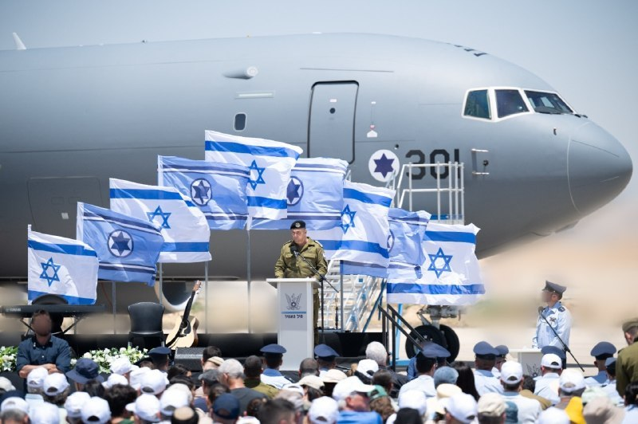

Shin ✓ @hey_itsmyturn Wed, 27 May 2026 11:34:53 UTC #IDF 🇮🇱: "The first aircraft of its kind in the Air Force was inducted into the new refueling squadron - 'Gideon' The Chief of Staff at the induction ceremony: "The edifice of evil of the Ayatollah regime…

## Shin_Persian — post 6257

Shin ✓ @hey_itsmyturn
Wed, 27 May 2026 11:34:53 UTC

#IDF 🇮🇱:
"The first aircraft of its kind in the Air Force was inducted into the new refueling squadron - 'Gideon'

The Chief of Staff at the induction ceremony: "The edifice of evil of the Ayatollah regime has cracked significantly and its future and stability are shrouded in fog. Its leaders are pursued, most of its military capabilities have been destroyed, the nuclear program has been set back years; its economy is collapsing and its citizens have not yet understood the magnitude of the disaster to which their extremist leaders have led them""
#Iran

فارسی

#IDF 🇮🇱:
"نخستین هواپیما از این نوع در نیروی هوایی به اسکادران جدید سوخت‌رسان - 'گیدئون' ملحق شد.

رئیس ستاد کل نیروهای مسلح در مراسم الحاق: «بنای شرارت رژیم آیت‌الله‌ها به شدت ترک خورده و آینده و ثبات آن در هاله‌ای از ابهام است. رهبران آن تحت تعقیب هستند، اکثر توانمندی‌های نظامی‌اش نابود شده، برنامه هسته‌ای سال‌ها به عقب رانده شده؛ اقتصاد آن در حال فروپاشی است و شهروندانش هنوز ابعاد فاجعه‌ای را که رهبران افراطی‌شان آن‌ها را به سوی آن سوق داده‌اند، درک نکرده‌اند»"
#Iran

𝕏 · @shin_persian

## Shin_Persian — post 6256

Shin ✓ @hey_itsmyturn
Wed, 27 May 2026 00:20:37 UTC

Several airstrikes on Nabatieh, southern Lebanon
+
Jet activity over Baghdad, Iraq.

فارسی

چندین حمله هوایی به نبطیه در جنوب لبنان
+
فعالیت جنگنده‌ها بر فراز بغداد، عراق.

𝕏 · @shin_persian

## Iliaen — post 4436

بزرگ‌ترین تفاوت میان امروز و ۹۰ روز قبل، این است که شناخت ما به سیاست، جامعه، دوستان و حتی خودمان دگرگون شد.

جامعه‌ای که امروز می‌داند در اوج روزهای تاریکی با چه بحران‌هایی طرف خواهد شد، چه راهکارهای واقع‌بینانه‌‌ای برای مدیریت آن خواهد داشت و مهم‌تر از همه، سطح توقع خود را نسبت به همه چیز بهتر می‌شناسد، یک جامعه تکامل‌یافته است.

چنین جامعه‌ای بیشتر درد می‌کشد، آسیب زیادی را متحمل شده، اما دیگر از هیچ چیز غافلگیر نخواهد شد و درنهایت با عبور از مرحله واکنش‌گرایی، وارد مرحله کُنش‌گرایی می‌شود که این، بخش پایانی از هر انقلاب‌ است.

بخشی که دست‌کم یک‌بار به تمام ملت‌ها در تاریخ نشان داد، واکنش‌گرایی یعنی غافلگیری و بلاتکلیفی، اما ‌آزادی، یک فرایند از دل کنش‌گرایی است.

باید بدانیم که یک انقلاب پیش از نمود در جامعه به عنوان یک “انقلاب سیاسی”، ابتدا در ذهن و نگرش آن جامعه، تحت عنوان یک “انقلاب فرهنگی و شناختی” رقم می‌خورد و ما در حال گذر از این مرحله پایانی هستیم.

امروز و در اینجا، باید بیش از هر زمان نسبت به آینده امیدوار بود، زیرا تاریخ این را به ما نشان می‌دهد؛ همانطور که پیش‌تر سرنوشت خامنه‌ای را نشان داده بود!

@iliaen

## ManotoTV — post 105837

  <a href="telegram/content/ManotoTV_105837_1779914724.mp4" target="_blank">🎬 Download video</a>

از «کمک در راه است» تا مذاکره، معامله و بازگشت به همان سیاست همیشگی؟ ورق بزنید.

## FarsiVOA — post 218844

🔺سناتور گراهام: دونالد ترامپ می‌تواند هم به درگیری با جمهوری اسلامی پایان دهد و هم عربستان را وارد «پیمان ابراهیم» کند

▪️لیندزی گراهام، سناتور جمهوری‌خواه ایالت کارولینای جنوبی، روز چهارشنبه ۶ خرداد با انتشار پیامی در شبکه اجتماعی ایکس از تلاش‌های دونالد ترامپ، رئیس‌جمهوری آمریکا، برای پایان دادن به درگیری‌ها با جمهوری اسلامی از طریق یک توافق «واقعی و پایدار» حمایت کرد.

⬇️ بیشتر بخوانید:
https://ir.voanews.com/a/sen-graham-praises-president-trump-for-trying-to-end-iran-conflict/8154582.html
@FarsiVOA

## FarsiVOA — post 218843

  <a href="telegram/content/FarsiVOA_218843_1779914725.mp4" target="_blank">🎬 Download video</a>

⚡️گزارش نرگس صبا در برنامه تفسیر خبر: از چرایی قطع اینترنت تا دلایل بازگشت دوباره و محدود آن
@FarsiVOA

## FarsiVOA — post 218842

  <a href="telegram/content/FarsiVOA_218842_1779914727.mp4" target="_blank">🎬 Download video</a>

⚡️حذف ناخواسته گوشت از سفره مردم؛ جایگزین‌ چیست؟ گفت‌وگو با مریم دادخواه متخصص تغدیه

@FarsiVOA

## FarsiVOA — post 218841

  <a href="telegram/content/FarsiVOA_218841_1779914728.mp4" target="_blank">🎬 Download video</a>

⚡️علیرضا فیروزی در برنامه تفسیر خبر: فیلترینگ یک بنگاه اقتصادی برای حکومت است
@FarsiVOA

## FarsiVOA — post 218840

⚡️کابینه پرزیدنت ترامپ روز چهارشنبه ۶ خرداد در کاخ سفید تشکیل جلسه داد. در بخش‌هایی از این جلسه موضوع «خشم حماسی» و مذاکره با رژیم ایران نیز مطرح شد. صدای آمریکا بخش‌هایی از این جلسه را به طور مستقیم و با ترجمه همزمان پژواک کیومرثی پخش کرد.
@FarsiVOA

## FarsiVOA — post 218839

  <a href="telegram/content/FarsiVOA_218839_1779914729.mp4" target="_blank">🎬 Download video</a>

⚡️علی بیگی در برنامه تفسیر خبر: تمرکز جمهوری اسلامی روی اینترنت طبقاتی است
@FarsiVOA

## FarsiVOA — post 218838

🔺افزایش نگرانی‌ها درباره وضعیت چند جوان معترض ۱۷ تا ۲۰ ساله در زندان‌های جمهوری اسلامی

▪️سازمان‌های حقوق بشری روز چهارشنبه ۶ خرداد ۱۴۰۵، درباره وضعیت چند جوان کم‌ سن‌وسال معترض، محبوس در زندان‌های جمهوری اسلامی عمیقا ابراز نگرانی کردند.

⬇️ بیشتر بخوانید:
https://ir.voanews.com/a/iran-arrest-teenager-execution-prison/8154579.html
@FarsiVOA

## FarsiVOA — post 218837

  <a href="telegram/content/FarsiVOA_218837_1779914730.mp4" target="_blank">🎬 Download video</a>

⚡️سینا قنبرپور در برنامه تفسیر خبر: مردم می‌گویند کانفیگ‌فروش دست تو رو شده برام
@FarsiVOA

## FarsiVOA — post 218836

  <a href="telegram/content/FarsiVOA_218836_1779914731.mp4" target="_blank">🎬 Download video</a>

⚡️روزنه‌ای برای حرف‌های نگفته کاربران ایرانی در طولانی‌ترین خاموشی دیجیتال جهان

@FarsiVOA

## FarsiVOA — post 218835

🔺تلاش آمریکا برای جلوگیری از ورود ایبولا به کشور؛ شمار قربانیان در کنگو از ۲۲۰ نفر گذشت

▪️مارکو روبیو، وزیر امور خارجه آمریکا، می‌گوید ایالات متحده باید از ورود افراد مبتلا به ایبولا از جمهوری دموکراتیک کنگو جلوگیری کند. شیوع این بیماری در کنگو تاکنون دست‌کم ۲۲۰ مرگ مشکوک و بیش از ۹۰۰ مورد مشکوک به ابتلا بر جای گذاشته است.

⬇️ بیشتر بخوانید:
https://ir.voanews.com/a/marco-rubio-vows-to-keep-ebola-out-of-us/8154574.html
@FarsiVOA

## FarsiVOA — post 218834

⚡️انتقال کمپ تیم ملی فوتبال جمهوری اسلامی به تیخوانا در مکزیک، حالا به یکی از جنجالی‌ترین بحث‌های رسانه‌های ایران تبدیل شده. از محدودیت‌های آمریکا برای اقامت تیم ملی گرفته تا هشدار رسانه‌های داخلی درباره ناامنی، کارتل‌های مواد مخدر، و محله‌های پرخطر این شهر مرزی.
@FarsiVOA

## FarsiVOA — post 218833

⚡️با گذشت ۸۸ روز از خاموشی دیجیتال در ایران، روایت‌ها از اینترنتِ محدود، خسارت میلیارددلاری به اقتصاد، فشار معیشتی، کوچک‌تر شدن سفره مردم و تشدید فضای امنیتی در ایران خبر می‌دهند
@FarsiVOA

## FarsiVOA — post 218828

فرماندهی مرکزی ایالات متحده، سنتکام، تصاویری از عملیات هوایی ملوانان و تفنگداران دریایی آمریکا بر ناو هواپیمابر «یو‌اس‌اس آبراهام لینکلن» منتشر کرد.

این ناو از عملیات منطقه‌ای در دریای عرب پشتیبانی می‌کند، از جمله محاصره دریایی آمریکا علیه جمهوری اسلامی که تاکنون بیش از ۱۰۰ کشتی تجاری را تغییر مسیر داده است.

## FarsiVOA — post 218827

🔺دونالد ترامپ درباره مذاکره با رژیم ایران: توافق نکنند کار را تمام می‌کنیم

▪️رئیس جمهوری آمریکا با تاکید بر این که جمهوری اسلامی چاره‌ای جز توافق با آمریکا ندارد، از این که تاکنون نتیجه‌ای از گفت‌و‌گوها به دست نیامده است ابراز نارضایتی کرد.

⬇️ بیشتر بخوانید:

https://ir.voanews.com/a/donald-trump-marco-rubio-pete-hegsett-iran-attack-agreement/8154553.html/?nocach=1

## FarsiVOA — post 218826

نفوذ پهپادها به حریم ناتو؛ تشدید نگرانی امنیتی در شرق و شمال اروپا

## FarsiVOA — post 218825

رئیس سازمان اطلاعات و امنیت سایبری بریتانیا می‌گوید روسیه مستقیماً زیرساخت‌ها، انتخابات و سیستم‌های حیاتی این کشور را هدف گرفته و خطر حملات سایبری به سطحی «بی‌سابقه» رسیده. هم‌زمان بریتانیا و لهستان در حال امضای یک پیمان دفاعی جدید برای مقابله با تهدیدهای روسیه و تقویت امنیت اروپا هستند

## DW_Farsi — post 125212

  

🔶 هگست: ایران هنوز ذخایر موشکی دارد اما نمی‌تواند موشک تازه تولید کند

پیت هگست، وزیر دفاع (جنگ) آمریکا می‌گوید، ایران با وجود هفته‌ها بمباران ایالات متحده و اسرائیل، همچنان ذخایر موشکی در اختیار دارد.

او در نشست هیات دولت آمریکا در کاخ سفید در روز چهارشنبه ششم خرداد گفت: «ممکن است آنها هنوز موشک داشته باشند، اما در حال حاضر نمی‌توانند موشک‌های بیشتری بسازند.»

وزیر دفاع آمریکا همچنین افزود که ایران "در حال حاضر نمی‌تواند پهپادهای بیشتری تولید کند و کشتی‌های بیشتری بسازد".

او اضافه کرد: «آن‌ها به همین دلیل آمدند و برای گفت‌وگو اعلام تسلیم کردند.»

هگست ضمن ستایش محاصره بنادر ایران از سوی آمریکا نیز گفت: «هیچ نفتکش ایرانی در هیچ نقطه جهان در امان نیست و ما در سراسر جهان شاهد توقیف‌ها بوده‌ایم؛ اقدامی که شریان حیاتی اقتصادی آنها را قطع می‌کند.»
@dw_farsi

## DW_Farsi — post 125211

🎥 "فیلم و کتاب زیر بغل، خانه به خانه" در گریز از سانسور

مستند "نفس دوم"، ساخته مژگان ایلانلو مانند بسیاری دیگر از فیلم‌ها در ایران اجازه نمایش عمومی ندارد. سازنده این فیلم حالا در اروپاست تا در اکران‌های عمومی فیلمش در خارج از ایران حضور داشته باشد. با او درباره این فیلم گفت و گو کردیم.
@dw_farsi

## DW_Farsi — post 125210

  

🔶 ترامپ به ایران: اگر توافق نشود مجبوریم کار را یکسره کنیم

دونالد‌ ترامپ، رئیس‌جمهور آمریکا، روز چهارشنبه ۲۷ مه (۶ خرداد) در نشست کابینه خود در کاخ سفید درباره مذاکرات با جمهوری اسلامی گفت، تهران "واقعا می‌خواهد توافق کند، اما مذاکرات هنوز به نتیجه نهایی نرسیده است".

ترامپ در عین حال تاکید کرد: «ما از وضعیت فعلی [مذاکره] راضی نیستیم، ولی خواهیم شد.»

رئیس‌جمهور آمریکا با اشاره به اینکه "جمهوری اسلامی تحت فشار شدید است"، اضافه کرد: «نیروی دریایی‌شان نابود شده، نیروی هوایی از بین رفته و همه‌چیزشان از دست رفته است.»

ترامپ خاطرنشان کرد، جمهوری اسلامی "در حالی مذاکره می‌کند که چیزی برایش باقی نمانده".

او در ادامه هشدار داد، یا توافق حاصل می‌شود یا "مجبور می‌شویم کار را یکسره کنیم."

ترامپ ضمن اشاره به این نکته که "اقتصاد ایران در حال سقوط آزاد است" گفت که تهران "به‌دلیل فشارهای سنگین، گزینه دیگری جز حرکت به‌سوی توافق ندارد".

اظهارات ترامپ در حالی بیان شده است که او چهار روز پیش گفته بود، در مورد یک توافق "تا حد زیادی مذاکره شده" و جزئیات آن "به زودی اعلام خواهد شد".
@dw_farsi

## DW_Farsi — post 125209

  

🔶 وزارت اطلاعات ایران: دشمن به جنگ نرم و سایبری روی آورده است

وزارت اطلاعات ایران طی بیانیه‌ای با اشاره به آمریکا و اسرائیل "تصرف، تجزیه، تسلیم، فروپاشی و براندازی" حکومت را جزو اهداف آن‌ها خواند و مدعی شد که "دشمن اکنون با توقف جنگ سخت" به "جنگ نرم و سایبری" روی آورده است.

در بیانیه‌ این وزارت‌خانه که روز چهارشنبه ششم خرداد (۲۷ مه) از صدا‌وسیمای جمهوری اسلامی منتشر شد اعلام شده که "دشمن" اکنون با ابزارهایی دیگر همان هدفی را دنبال می‌کند که در آغاز جنگ ایران "آشکارا اعلام کرده بود"، اما "نتوانست از راه نظامی به آن دست یابد."

این وزارتخانه همچنین مدعی شد، آمریکا و اسرائیل می‌کوشند "فشار اقتصادی را تشدید کنند"، میان گروه‌های دینی و قومی شکاف ایجاد کنند و دست به خرابکاری و دیگر "عملیات تروریستی" بزنند.

در این بیانیه ادعا شده است که برای این منظور، "سلاح، مهمات و ابزارهای غیرقانونی ارتباطی، به‌ویژه استارلینک" برای دسترسی به اینترنت ماهواره‌ای، در "دستور کار جدی دشمن" قرار دارد.

با وجود آتش‌بس برقرارشده، نیروهای آمریکایی اخیرا بار دیگر مواضع موشکی و کشتی‌های ایرانی را هدف حمله قرار داده‌اند.
@dw_farsi

## DW_Farsi — post 125208

  

🔶 ایران: پیش‌نویس تفاهم‌نامه با آمریکا را دریافت کردیم؛ کاخ سفید تکذیب کرد

صداوسیمای جمهوری اسلامی ایران گزارش داد که تهران پیش‌نویس چارچوب اولیه و غیررسمی یک یادداشت تفاهم با آمریکا را جهت پایان دادن به میان درگیری دو کشور دریافت کرده است.

طی این گزارش، بر اساس این چارچوب، جمهوری اسلامی "ظرف یک ماه تردد کشتی‌های تجاری از تنگه هرمز را به سطح پیش از جنگ بازمی‌گرداند و ایالات متحده نیز نیروهای نظامی خود را از اطراف ایران خارج و محاصره دریایی را لغو  می‌کند."

صداوسیما افزود، این چارچوب، که کشتی‌های نظامی را در بر نمی‌گیرد و بر اساس آن، جمهوری اسلامی با همکاری عمان عبور و مرور کشتی‌ها در تنگه را مدیریت خواهد کرد، هنوز نهایی نشده است و تهران بدون "راستی‌آزمایی ملموس" هیچ اقدامی انجام نخواهد داد.

در پی انتشار این خبر کاخ سفید طی بیانیه‌ای در شبکه ایکس اعلام کرد که این گزارش که رسانه‌های ایران آن را منتشر کرده‌اند "درست نیست و یادداشت تفاهمی که آن‌ها منتشر کرده‌اند کاملا ساختگی است."

کاخ سفید افزود: «هیچ کس نباید مطالبی که رسانه‌های دولتی ایران منتشر می‌کنند را باور کند. واقعیت‌ها اهمیت دارند.»
@dw_farsi

## DW_Farsi — post 125207

  

🔶 کره جنوبی سفیر ایران را در اعتراض به حمله به کشتی خود احضار کرد

کره جنوبی روز چهارشنبه ۲۷ مه (ششم خرداد) اعلام کرد که سفیر ایران را احضار خواهد کرد تا در پی پایان تحقیقات درباره حمله به کشتی خود در تنگه هرمز مراتب اعتراضش را اعلام کند.

این کشور می‌گوید، بر اساس نتایج این تحقیقات، "به احتمال بسیار زیاد" این حمله با یک موشک ساخت ایران انجام شده است.

این کشتی باری کره جنوبی روز ۴ مه در تنگه هرمز ، آبراهی راهبردی که از زمان آغاز جنگ آمریکا و اسرائیل علیه جمهوری اسلامی در ۲۸ فوریه عملا بسته شده، هدف حمله قرار گرفت.

دونالد ترامپ، رئیس جمهور آمریکا، مدعی شده که جمهوری اسلامی به این کشتی با پرچم پاناما "شلیک‌هایی" کرده، اما تهران مسئولیت این حمله را رد کرده است.

پس از تحقیقاتی که چند هفته به طول انجامید، دولت کره جنوبی اعلام کرد، بررسی‌های فنی نشان می‌دهد که پرتابه ناشناسی که به این کشتی اصابت کرده، "به احتمال بسیار زیاد" گونه‌ای دیگر از "سری نور، ساخته‌شده در ایران" بوده است.
@dw_farsi

## DW_Farsi — post 125206

🔶 بازداشت ۳۹ تن در یونان به اتهام "فساد در یارانه‌های کشاورزی"

در جریان تحقیقات درباره یک پرونده گسترده فساد مربوط به یارانه‌های کشاورزی اتحادیه اروپا در یونان، مقام‌ها ۳۹ مظنون را بازداشت کردند.

پلیس یونان اعلام کرد که روز سه‌شنبه ۲۶ مه (۵ خرداد) ۱۷ نفر در شمال کشور، عمدتا در شهر تسالونیکی، دومین شهر بزرگ یونان، بازداشت شدند.

بنا بر این گزارش، روز پیش از آن نیز ۲۲ نفر بازداشت شده بودند که بیشتر آنها در جزیره کرت انجام شده است.
@dw_farsi

## DW_Farsi — post 125205

🔶 پیروزی نامزد مورد حمایت ترامپ در تگزاس به‌ رغم رسوایی‌ها

کن پاکستون، دادستان کل تگزاس با حمایت قاطع دونالد ترامپ، رئیس‌جمهور آمریکا توانست در انتخابات درون‌حزبی جمهوری‌خواهان در تگزاس که یکی از پایگاه‌های اصلی و سنتی حزب جمهوری‌خواه است جیمز کورنین، سناتور باسابقه را شکست دهد.

پاکستون به دلیل گرایش‌های راست‌گرایانه و وفاداری شدید به ترامپ پیروز شد و اکنون در انتخابات مهم نوامبر ۲۰۲۶ نامزد جمهوری‌خواهان خواهد بود.
@dw_farsi

## DW_Farsi — post 125204

🎥 نقش یک شرکت در امارات در خرید تجهیزات ماهواره‌ای چینی برای ایران

بنا به گزارش‌ها، سپاه پاسداران از یک شرکت مستقر در امارات متحده عربی برای خرید تجهیزات ماهواره‌ای پیشرفته چینی استفاده کرده است و بعدا در جنگ، حملاتی را علیه اهداف اماراتی انجام داده است.
@dw_farsi

## DW_Farsi — post 125203

🔶 تشدید تهدید‌های پوتین علیه اوکراین و پاسخ آلمان

بر اساس گزارش‌ها، سرگئی لاوروف، وزیر امور خارجه روسیه، دربارiه حملات سیستماتیک بیشتر به کی‌یف، پایتخت اوکراین هشدار داده است.

به گفته او، نه فقط تاسیساتی که برای نیروهای مسلح اوکراین اهمیت دارند، بلکه "مراکز تصمیم‌گیری" نیز هدف قرار خواهند گرفت. از خارجی‌ها و دیپلمات‌ها بار دیگر خواسته شده است تا شهر را ترک کنند.
@dw_farsi

## DW_Farsi — post 125202

🔶 طالبان به دنبال اعزام دیپلمات‌های بیش‌تری به اروپاست

طالبان که بر افغانستان حکومت می‌کند در حال حاضر دیپلمات‌های خود را به آلمان اعزام کرده است. این گروه خواستار آن است که در آینده دیپلمات‌های خود را به کشورهای بیش‌تری در اتحادیه اروپا اعزام کند و به همین خاطر این پیشنهاد را مطرح کرده که در عوض، در بازگرداندن پناهجویان افغان از اروپا به افغانستان همکاری خواهد کرد.

طبق تحقیقات شبکه تلویزیونی و رادیویی "ان‌ار‌د" (NDR) آلمان، این خواست یکی از مطالبات اصلی هیئت طالبان در سفر برنامه‌ریزی‌شده به بروکسل است.
@dw_farsi

## DW_Farsi — post 125201

  

🔶 هشدار بانک مرکزی اروپا درباره پیامدهای جنگ ایران و تشدید تنش‌های تجاری در اقتصاد جهان

بانک مرکزی اروپا هشدار داده است که جنگ ایران و ادامه تنش‌های تجاری در جهان می‌تواند رشد اقتصادی منطقه یورو را کاهش دهد، هزینه استقراض را افزایش دهد و فشار بیشتری بر بودجه دولت‌های اروپایی وارد کند.

این هشدار در جدیدترین گزارش ثبات مالی بانک مرکزی اروپا منتشر شده؛ گزارشی که می‌گوید بازارهای مالی تاکنون واکنش شدیدی به جنگ ایران نشان نداده‌اند و همین موضوع نگرانی‌هایی درباره "کم‌اهمیت جلوه دادن خطرها" از سوی سرمایه‌گذاران ایجاد کرده است.

بانک مرکزی اروپا هشدار داده که "سناریویی از رشد که به طور قابل توجهی ضعیف‌تر باشد و در همراهی با یک شوک انرژی پایدارتر باشد، می‌تواند باعث ارزیابی مجدد پایداری مالی و تغییر ناگهانی قیمت‌ها در بازارهای اوراق قرضه دولتی شود".

طبق این برآورد، اینگونه قیمت‌گذاری مجدد می‌تواند "هزینه‌های استقراض شرکت‌ها را افزایش دهد و یک حلقه بازخورد ایجاد کند که می‌تواند ثبات مالی را با خطر مواجه سازد و به اقتصاد واقعی ضربه بزند".
@dw_farsi

## DW_Farsi — post 125200

🔶 عربستان سعودی؛ ۱.۵ میلیون نفر با وجود جنگ به حج می‌روند

🔻 گزارشی از Cathrin Schaer

سال ۲۰۲۶ نخستین سالی است که دولت آمریکا از شهروندان خود خواسته در سفر برای مراسم حج تجدیدنظر کنند و اعلام کرده که کارکنان غیرضروری دولت آمریکا در مارس امسال از عربستان خارج شده‌اند.

کارشناسان احتمال هدف قرار دادن مستقیم حج توسط ایران را بسیار پایین می‌دانند زیرا این اماکن برای همه مسلمانان مقدس است. علاوه بر این، حدود ۳۰ هزار زائر ایرانی نیز امسال در مراسم حج حضور دارند.

اما این نگرانی وجود دارد که این مراسم به اشتباه یا تصادفی هدف قرار گیرد.
@dw_farsi

## DW_Farsi — post 125199

🎥 مبارزه با راست افراطی در قفس ورزش‌های رزمی (رینگ)

راست افراطی در آلمان بیش از پیش از ورزش‌های رزمی ترکیبی برای جذب نیرو استفاده می‌کند. حالا یک باشگاه در شهر کمنیتس در شرق آلمان با ایجاد فضایی فراگیر و بدون تبعیض، تلاش می‌کند در برابر این روند بایستد.
@dw_farsi

## DW_Farsi — post 125198

  

🔶 باقری: تماس‌های غیرمستقیم با آمریکا ادامه دارد؛ موضوع ذخایر اورانیوم مطرح نیست

علی باقری کنی، معاون دبیر شورای عالی امنیت ملی ایران گفته است، "تماس‌های غیرمستقیم" میان تهران و واشنگتن ادامه دارد، اما "موضوع ذخایر اورانیوم غنی‌شده ایران در مذاکرات جاری مطرح نیست".

باقری که برای شرکت در کنفرانس امنیتی مسکو به روسیه سفر کرده، اعلام کرد که ایران و عمان در حال مذاکره برای تعیین "سازوکاری جدید" برای عبور کشتی‌ها از تنگه هرمز هستند.

او با بیان اینکه شرایط عبور و مرور در تنگه هرمز پس از جنگ اخیر "با گذشته متفاوت خواهد بود"، به خبرنگاران گفت: «تا زمانی که در همه مسائل به توافق نرسیم، معتقدیم که در هیچ‌چیز به توافق نرسیده‌ایم.»

اظهارات باقری در حالی مطرح می‌شود که تهران و واشنگتن در هفته‌های اخیر، با میانجیگری پاکستان، مذاکراتی را برای دستیابی به تفاهم‌نامه پایان جنگ دنبال کرده‌اند.

بر اساس گزارش‌ها، موضوعاتی مانند بازگشایی تنگه هرمز، آزادسازی دارایی‌های بلوکه‌شده ایران و توقف درگیری‌های نظامی، از محورهای اصلی این گفت‌وگوها بوده است.

@dw_farsi

## DW_Farsi — post 125188

📸 آلمان چقدر ثروتمند دارد؟

در سال گذشته، دارایی مالی خصوصی در سراسر جهان ۷٫۴ درصد رشد کرده است. این رشد ثروت در سال ۲۰۲۵ به‌مراتب بیشتر از نرخ تورم بوده است. در مجموع، ثروت خالص جهانی شامل دارایی‌های فیزیکی به ۵۵۰ تریلیون دلار آمریکا رسیده است.

این موضوع در گزارش ثروت جهانی ۲۰۲۶ (Global Wealth Report 2026) گروه مشاوره بوستون منتشرشده است.

در آلمان نیز ثروت به‌طور چشمگیری افزایش یافته است: تا تاریخ ۳۱ دسامبر سال ۲۰۲۵، مجموع ثروت در این کشور به ۲۳٫۳ تریلیون دلار رسیده است. بیش از نیمی از این ثروت در دارایی‌های فیزیکی، به‌ویژه املاک، سرمایه‌گذاری شده است.

طبق تعریف این گزارش، هر فردی که بیش از ۱۰۰ میلیون دلار "دارایی مالی" داشته باشد، فوق‌ثروتمند محسوب می‌شود.

دارایی‌های مالی به مجموعه‌ای از منابع و سرمایه‌های پولی گفته می‌شود که ارزش آن‌ها بر اساس پول نقد، اسناد مالی و مطالبات سنجیده می‌شود.

در آلمان ۵۰۰۰ نفر در گروه فوق‌ثروتمند قرار دارند. در سراسر جهان نیز نزدیک به ۹۷ هزار فوق‌ثروتمند وجود دارد که بیش از یک‌سوم آن‌ها در آمریکا (۳۷ هزار نفر) و ۱۱ هزار نفر در چین زندگی می‌کنند.
@dw_farsi

## Persian_Trend_Official — post 15146

https://youtube.com/live/2HyaIyBB-ko?feature=share

## Persian_Trend_Official — post 15145

تا دقایقی دیگه لایو امشب آغاز میشه
حدودا 30 دقیقه

## Persian_Trend_Official — post 15144

  <a href="telegram/content/Persian_Trend_Official_15144_1779914739.mp4" target="_blank">🎬 Download video</a>

پرفسور خوش چشم محبوب دل ها و مشتری زغال خوب

📌 @persian_trend_official
پرشین ترند | متفاوت‌ترین کانال نظامی

## Persian_Trend_Official — post 15143

  <a href="telegram/content/Persian_Trend_Official_15143_1779914742.webm" target="_blank">🎬 Download video</a>

رویترز: پنتاگون و اسپیس ایکس برای ارائه Direct-to-Cell در ایران مذاکره کرده بودند

🔹به گزارش رویترز، پنتاگون در خلال درگیری نظامی با ایران و در شرایطی که دسترسی اینترنت در کشور قطع شده بود، بر سر ارائه سرویس دایرکت تو سل (Direct-to-Cell) که منجر به اتصال مستقیم گوشی‌های هوشمند به اینترنت ماهواره‌ای استارلینک می‌شود، با شرکت اسپیس‌ایکس گفتگو کرده و بر سر هزینه‌ها دچار اختلاف نظر شده بود.
🔹رویترز می‌گوید براساس اسناد پنتاگون و گفته‌های یکی از منابع آگاه، اسپیس‌ایکس که در سال ۲۰۲۵ مبلغ ۱۱.۴ میلیارد دلار از استارلینک درآمد داشته، برای راه‌اندازی این قابلیت در ایران پیشنهاد دریافت رقم هنگفت ۵۰۰ میلیون دلار به همراه هزینه ۱۰۰ میلیون دلاری ماهانه برای عملیاتی کردن آن را مطرح کرده بود. این ارقام باعث نگرانی شدید مقامات دفاعی آمریکا شده بود و رویترز نتوانسته مشخص کند که آیا توافقی در این زمینه حاصل شده است یا خیر.

👩‍💻@PhantomDirective

🆔@persian_trend_official
پرشین ترند | متفاوت‌ترین کانال نظامی

## Persian_Trend_Official — post 15142

  

🔴 ترامپ: از روند مذاکرات با ایران راضی نیستیم؛ گزینه نظامی همچنان روی میز است.

▪️ وی اعلام کرد واشینگتن از روند فعلی مذاکرات با ایران رضایت ندارد.
▪️ او هشدار داد اگر توافق «قابل‌قبولی» حاصل نشود، آمریکا ممکن است دوباره به اقدام نظامی متوسل شود
▪️ ترامپ تأکید کرده ایران باید به‌صورت شفاف از دستیابی به سلاح هسته‌ای صرف‌نظر کند و مذاکرات فعلی هنوز به سطح مطلوب آمریکا نرسیده است

🫆:Tony

📌 @persian_trend_official
پرشین ترند | متفاوت‌ترین کانال نظامی

## Persian_Trend_Official — post 15141

  <a href="telegram/content/Persian_Trend_Official_15141_1779914743.mp4" target="_blank">🎬 Download video</a>

⭕️مزدور کلمبیایی که به اسارت ارتش روسیه در آمد !!‌

💢ویدئو منتشرشده از صحنه اسارت یک فرد معرفی‌شده به‌عنوان «مزدور کلمبیایی» در درگیری‌های مرتبط با اوکراین حاکی از آن است که نیروهای روسی پس از اسارت، از هویت او سؤال کرده و زمانی که مشخص شده تبعه اوکراین نیست، او را شهروند کلمبیا معرفی کرده است.

💢در این ویدئو یکی از نظامیان روس در مکالمه‌ای کوتاه و غیررسمی با او به زبان انگلیسی از کشورش سؤال کرده و در واکنش به پاسخ «کلمبیا»، جمله‌ای طعنه آمیز به او میگوید:

▪️برادر به روسیه خوش آمدی ...

💢در ادامه این گزارش آمده است که وضعیت حقوقی این فرد در چارچوب اسیران جنگی محل بحث است؛ چرا که ادعا شده برخی نیروهای روسی، افراد غیر اوکراینیِ حاضر در میدان نبرد را در دسته «مزدور» طبقه‌بندی می‌کنند. با این حال، طبق قواعد شناخته‌شده حقوق بین‌الملل بشردوستانه و کنوانسیون‌های ژنو، وضعیت اسارت و رفتار با اسیران جنگی باید بر اساس معیارهای مشخص حقوقی تعیین شود، نه صرفاً تابعیت یا برداشت میدانی.

🫆:Tony

📌 @persian_trend_official
پرشین ترند | متفاوت‌ترین کانال نظامی

## Persian_Trend_Official — post 15140

  

💢نت بلاکس

💢 اتصال اینترنت ایران اکنون برای ۲۴ ساعت در حالت بازیابی قرار داشته است. خدمات همچنان به شدت فیلتر شده باقی مانده و محدودیت‌های جدیدی روی پیام‌رسان‌ها و فروشگاه‌های اپلیکیشن در مقایسه با سطح پیش از ژانویه اعمال شده است.

درخواست‌ها برای یک اینترنت آزاد و باز، فراتر از خطوط سیاسی قرار دارند و باید شنیده شوند.

💢میزان اختلالات در شبکه از دیروز بسیار بیشتر شده است، بسیاری از سرویس‌های گوگل و کلودفلر بسته شده اند و حتی قابلیت استفاده از گوگل پلی و اپ استور نیز وجود ندارد.

🫆:Tony

📌 @persian_trend_official
پرشین ترند | متفاوت‌ترین کانال نظامی

## Persian_Trend_Official — post 15139

  <a href="telegram/content/Persian_Trend_Official_15139_1779914747.webm" target="_blank">🎬 Download video</a>

🇷🇺رئیس روس اتم: روسیه تصمیم گرفته است که بازگشت کارکنان خود به نیروگاه هسته‌ای بوشهر در ایران را به تعویق بیندازد.

👩‍💻@PhantomDirective

🆔@persian_trend_official
پرشین ترند | متفاوت‌ترین کانال نظامی

## Persian_Trend_Official — post 15138

  <a href="telegram/content/Persian_Trend_Official_15138_1779914748.webm" target="_blank">🎬 Download video</a>

تکذیب شکایت اعضای شورای عالی فضای مجازی برای جلوگیری از وصل‌شدن اینترنت

«رضا تقی‌پور» عضو شورای عالی فضای مجازی: شکایت بابت تاسیس نهاد موازی فراقانونی انجام شد. هرگز موافق قطع اینترنت نبوده و نیستم.

👩‍💻@PhantomDirective

🆔@persian_trend_official
پرشین ترند | متفاوت‌ترین کانال نظامی

## Persian_Trend_Official — post 15137

  <a href="telegram/content/Persian_Trend_Official_15137_1779914748.mp4" target="_blank">🎬 Download video</a>

🔴 ترامپ

«الان دارم به بعضی از این دموکرات‌ها انتقاد می‌کنم. واقعاً آدم‌های خنگی هستند.

گفتم فکرش را بکنید. E را بردارید، U بگذارید. می‌شوند دوموکرات (احمق‌کرات)!»

🫆:Tony

📌 @persian_trend_official
پرشین ترند | متفاوت‌ترین کانال نظامی

## Persian_Trend_Official — post 15136

  <a href="telegram/content/Persian_Trend_Official_15136_1779914750.webm" target="_blank">🎬 Download video</a>

💢حتی با تحویل اورانیوم‌ها هم خبری از لغو تحریم‌ها نیست!

♦️ترامپ در گفتگو با شبکه پی‌بی‌اس اعلام کرد که ایران حتی در ازای دست کشیدن از اورانیوم‌های با غنای بالای خود، از کاهش تحریم‌ها بهره‌مند نخواهد شد!

🫆:Tony

📌 @persian_trend_official
پرشین ترند | متفاوت‌ترین کانال نظامی

## Persian_Trend_Official — post 15135

  <a href="telegram/content/Persian_Trend_Official_15135_1779914750.webm" target="_blank">🎬 Download video</a>

🔴 کاخ سفید گزارش‌های تلویزیون دولتی ایران درباره پیش‌نویس جدید توافق را رد کرد

▪️ کاخ سفید به‌طور قاطع گزارش‌های منتشرشده در رسانه‌های دولتی ایران درباره ارائه پیش‌نویس جدید یادداشت تفاهم (MOU) برای توافق صلح با آمریکا را تکذیب کرد
▪️ واشینگتن می‌گوید هنوز هیچ متن نهایی یا پیش‌نویس جدیدی تأیید نشده است
▪️ این تکذیب در حالی مطرح می‌شود که طی ساعات اخیر روایت‌های متناقضی درباره وضعیت مذاکرات منتشر شده است

🫆:Tony

📌 @persian_trend_official
پرشین ترند | متفاوت‌ترین کانال نظامی

## Persian_Trend_Official — post 15134

  

🔴 گزارش CSIS: آمریکا ممکن است تا ۳ سال برای بازسازی ذخایر موشکی خود زمان نیاز داشته باشد

▪️ یک گزارش جدید از Center for Strategic and International Studies هشدار داده ذخایر موشک‌های کلیدی آمریکا پس از جنگ با ایران به‌شدت کاهش یافته است.
▪️ موجودی موشک‌های Tomahawk، Patriot و THAAD به‌طور قابل‌توجهی افت کرده و بازسازی آن‌ها ممکن است چند سال طول بکشد
▪️ این گزارش از ایجاد یک «پنجره آسیب‌پذیری» برای آمریکا در غرب اقیانوس آرام و همزمان با افزایش تنش با China خبر می‌دهد
▪️ با وجود افزایش بودجه دفاعی و تلاش برای بالا بردن تولید، کارشناسان می‌گویند ظرفیت فعلی صنایع نظامی آمریکا برای جبران سریع این کمبود کافی نیست

🫆:Tony

📌 @persian_trend_official
پرشین ترند | متفاوت‌ترین کانال نظامی

## Persian_Trend_Official — post 15133

  

برای پوشش سریع‌تر و دقیق‌تر اخبار، دایرکت پرشین ترند از این به بعد برای دریافت خبرها و اطلاعات مخاطبان فعاله 📩

اگر خبر، تصویر، ویدیو یا اطلاعات مهم و دست‌اولی دارید که فکر می‌کنید ارزش بررسی و انتشار داره، می‌تونید ارسال کنید.

فقط لطفاً:

* پیام‌ها کوتاه و مستقیم باشن
* اصل خبر یا موضوع در همان پیام اول نوشته بشه
* از سلام و احوالپرسی جداگانه خودداری کنید
* اگر منبع، عکس یا ویدیو دارید همراهش بفرستید

به دلیل حجم بالای پیام‌ها ممکنه امکان پاسخ به همه دایرکت‌ها وجود نداشته باشه، اما همه موارد مهم بررسی میشن 🙏

📌 @persian_trend_official
پرشین ترند | متفاوت‌ترین کانال نظامی

## Persian_Trend_Official — post 15132

## Persian_Trend_Official — post 15131

  <a href="telegram/content/Persian_Trend_Official_15131_1779914752.mp4" target="_blank">🎬 Download video</a>

🔹آغاز تخلیه شهر بزرگ صور در پی هشدار ارتش اسرائیل

پس از هشدار تخلیه از سوی ارتش رژیم صهیونیستی برای ساکنان شهر بندری صور، ده‌ها هزار نفر شروع به حرکت به سمت مناطق شمالی کرده‌اند.

👩‍💻@PhantomDirective

📣@persian_trend_official
پرشین ترند | متفاوت‌ترین کانال نظامی

## Persian_Trend_Official — post 15130

  <a href="telegram/content/Persian_Trend_Official_15130_1779914755.mp4" target="_blank">🎬 Download video</a>

🇺🇸
🇮🇱
🆔 اسرائیل اولین هواپیمای سوخت‌رسان هوایی بوئینگ KC-46 پگاسوس را امروز از ایالات متحده دریافت کرده است.

👩‍💻@PhantomDirective

🆔@persian_trend_official
پرشین ترند | متفاوت‌ترین کانال نظامی

## Persian_Trend_Official — post 15129

  <a href="telegram/content/Persian_Trend_Official_15129_1779914758.webm" target="_blank">🎬 Download video</a>

حادثه در بزرگترین مجتمع پتروشیمی ایران در عسلویه

📢۱ نفر جان باخت و ۲ تن مصدوم شدند.

‌روابط عمومی شرکت دماوند انرژی عسلویه:

‌ ظهر امروز چهارشنبه ششم  خرداد ماه ۱۴۰۵ در ساعت ۱۱:۳۵ ، حادثه‌ای در واحد هوای این شرکت رخ داد که متأسفانه منجر به جان‌باختن یکی از کارکنان و مصدومیت دو نفر دیگر شد.

💣پتروشیمی دماوند در تاریخ ۶ آپریل هم توسط نیروی هوایی اسرائیل و آمریکا مورد هدف قرار گرفته بود.

## Persian_Trend_Official — post 15128

  <a href="telegram/content/Persian_Trend_Official_15128_1779914759.webm" target="_blank">🎬 Download video</a>

🇺🇸
🇺🇸 پست جدید ترامپ در تروث سوشال:

## Persian_Trend_Official — post 15127

  <a href="telegram/content/Persian_Trend_Official_15127_1779914759.mp4" target="_blank">🎬 Download video</a>

🎥 هدف قرار گرفتن یکی از سامانه های گنبد آهنین اسرائیلی توسط پهپاد حزب‌الله

## RadioFarda — post 157628

  

🔸سازمان دولتی انرژی هسته‌ای فدراسیون روسیه از تصمیمش برای به تعویق‌انداختن بازگشت کارکنانش به نیروگاه هسته‌ای بوشهر خبر داد.

🔸این موضوع را الکسی لیخاچِف، مدیرعامل این نهاد دولتی روسیه اعلام کرد.

🔸مدیر عامل «روس اتم» روز چهارشنبه در جمع خبرنگاران گفت: «متاسفانه اخبار ضد و نقیضی در ارتباط با روند مذاکرات ایران و آمریکا به گوش می‌رسد و هر از گاهی هم اخباری از وقوع حملاتی به نقاطی از ایران منتشر می‌شود. به همین دلیل بازگشت همکارانمان را به تعویق انداختیم».

🔸الکسی لیخاچف تأکید کرد که ولادیمیر پوتین رئیس‌جمهور فدراسیون روسیه هم در جریان این تصمیم قرار گرفته و آن‌را تأیید کرده است.

🔸«روس اتم» پیشتر و به دنبال آغاز جنگ آمریکا و اسرائیل با ایران، ۸۱۳ تن از کارکنانش را از بوشهر خارج کرده و تنها ۲۰ تن از کارکنانی که حضورشان در محل برای اطمینان از ایمنی و فعالیت نیروگاه و پیشرفت ساخت فازهای بعدی ضروری بوده را، همچنان در بوشهر نگه داشته است.

@RadioFarda

## RadioFarda — post 157627

🔸دونالد ترامپ، رئیس‌جمهور آمریکا با تأکید بر لزوم باز شدن فوری تنگه هرمز بعد از توافق با ایران، عمان را تهدید کرد که نباید قصد کنترل این آبراه را داشته باشد. 🔸او در نشست کابینه خود در روز چهارشنبه گفت که بر اساس چارچوب احتمالی توافق با تهران، «تنگه هرمز فوراً…

## RadioFarda — post 157626

  

🔸دونالد ترامپ، رئیس‌جمهور آمریکا با تأکید بر لزوم باز شدن فوری تنگه هرمز بعد از توافق با ایران، عمان را تهدید کرد که نباید قصد کنترل این آبراه را داشته باشد.

🔸او در نشست کابینه خود در روز چهارشنبه گفت که بر اساس چارچوب احتمالی توافق با تهران، «تنگه هرمز فوراً باز خواهد شد»، اما تحت کنترل هیچ کشوری نخواهد بود.

🔸ترامپ گفت: «ما بر آن نظارت خواهیم کرد، اما هیچ‌کس قرار نیست آن را کنترل کند. این بخشی از مذاکراتی است که داریم. آن‌ها دوست دارند آن را کنترل کنند، اما هیچ‌کس قرار نیست کنترلش کند. این آبراه بین‌المللی است و عمان هم مثل بقیه رفتار خواهد کرد، وگرنه مجبور می‌شویم آن‌ها را نابود کنیم.»

🔸خبرگزاری رویترز نوشت که کاخ سفید بلافاصله به درخواست برای اظهار نظر درباره اظهارات ترامپ در مورد عمان پاسخ نداد. سفارت عمان در واشنگتن نیز فوراً به درخواست اظهار نظر پاسخ نداد.

@RadioFarda

## RadioFarda — post 157625

  <a href="https://t.me/radiofarda/157625" target="_blank">📎 Download file</a>

۸۸ روز حصر دیجیتال بر ایرانیان چگونه گذشت؟

🔸در کشوری که مردمش سال‌هاست با جنگ، تورم، تحریم و سرکوب سیاسی دست‌وپنجه نرم می‌کنند، خاموشی ۸۸ روزه اینترنت، رشته اتصال میلیون‌ها ایرانی به جهان و حتی به زندگی روزمره‌شان را قطع کرد؛ ۸۸ روز قطعی اینترنت و حصر دیجیتال، فقط خاموش شدن چند اپلیکیشن نبود، بلکه فروپاشی بی‌صدای هزاران کسب‌وکار، بیکاری ناگهانی میلیون‌ها نفر، قطع صدای خانواده‌ها و حبس یک ملت با سرکوب دیجیتال بود؛ سکوتی که حالا با بازگشت تدریجی اینترنت، شاید دوباره شکسته شود.

@RadioFarda

## RadioFarda — post 157624

🔸ارتش اسرائیل اعلام کرد تمام نواحی جنوب رودخانۀ زهرانی در لبنان که در فاصلۀ حدود چهل کیلومتری در شمال مرز اسرائیل و لبنان واقع شده را، «منطقۀ جنگی» در نظر می‌گیرد و از ساکنین این مناطق خواست به نواحی شمال این رودخانه بروند. 🔸اویخای ادرعی سخنگوی عرب‌زبان ارتش…

## RadioFarda — post 157623

  

🔸ارتش اسرائیل اعلام کرد تمام نواحی جنوب رودخانۀ زهرانی در لبنان که در فاصلۀ حدود چهل کیلومتری در شمال مرز اسرائیل و لبنان واقع شده را، «منطقۀ جنگی» در نظر می‌گیرد و از ساکنین این مناطق خواست به نواحی شمال این رودخانه بروند.

🔸اویخای ادرعی سخنگوی عرب‌زبان ارتش اسرائیل با انتشار مطلبی در شبکۀ ایکس، نوشت: «با توجه به نقض مکرر توافق آتش‌بس از سوی سازمان تروریستی حزب‌الله، ارتش دفاعی اسرائیل با قدرت با این گروه برخورد کرده و از ساکنان نواحی جنوبی لبنان می‌خواهیم که با ترک این مناطق به نواحی شمال رود زهرانی بروند».

🔸حزب‌الله لبنان، گروه شیعۀ تحت حمایت جمهوری اسلامی است که ایالات متحده آن‌را به طور کامل گروهی تروریستی می‌داند اما اتحادیۀ اروپا تنها شاخۀ نظامی اش را تروریستی می‌شمارد. شاخۀ سیاسی این حزب در ساختار سیاسی لبنان از نفوذ زیادی برخوردار است و از جمله در پارلمان این کشور هم حضور دارد.

@RadioFarda

## RadioFarda — post 157622

  <a href="https://t.me/radiofarda/157622" target="_blank">📎 Download file</a>

رضا علیجانی: وزارت اطلاعات در بیانیه خود، نگرانی را پشت عصبانیت پنهان کرده است

🔸وزارت اطلاعات جمهوری اسلامی روز ششم خرداد در بیانیه‌ای مدعی شد دشمنان ایران پس از ناکامی در جنگ نظامی، تمرکز خود را بر جنگ نرم، عملیات روانی و اقدامات ترکیبی گذاشته‌اند. در این بیانیه به تلاش برای تحریک نارضایتی‌های اجتماعی، تنش‌های قومی، عملیات خرابکارانه ، قاچاق سلاح و تجهیزات ارتباطی، فعالیت رسانه‌های فارسی‌زبان خارج از کشو، جمع آوری اطلاعات و حملات سایبری اشاره شده است. وزارت اطلاعات همچنین اعلام کرده هریک از این اقدامات با برخورد قضایی و امنیتی مواجه خواهد شد. ارزیابی رضا علیجانی تحلیلگر و فعال سیاسی ساکن فرانسه را درباره این بیانیه بشنوید.

@RadioFarda

## RadioFarda — post 157621

🔸دونالد ترامپ، رئیس‌جمهور آمریکا، روز چهارشنبه در نشست کابینه خود گفت که ایران بسیار مایل است به توافق برسد، اما آمریکا هنوز از توافق پیشنهادی رضایت ندارد.

🔸ترامپ در این نشست در حضور خبرنگاران گفت: «ایران خیلی مصمم است، آن‌ها خیلی می‌خواهند که به توافق برسند. تا اینجا هنوز موفق نشده‌اند... ما از آن راضی نیستیم، اما خواهیم شد.»

🔸او سپس بار دیگر ایران را به ازسرگیری حملات نظامی تهدید کرد: «یا به آن نقطه می‌رسیم، یا اینکه مجبور می‌شویم کار را یکسره کنیم.»

🔸مارکو روبیو، وزیر خارجه آمریکا، نیز در نشست کابینه اعلام کرد در مذاکرات با ایران برای رسیدن به یک توافق، مقداری پیشرفت حاصل شده است.

🔸او گفت: «فکر می‌کنم مقداری پیشرفت و علاقه برای رسیدن به توافق وجود داشته و طی چند ساعت و چند روز آینده خواهیم دید که آیا امکان پیشرفت بیشتر وجود دارد یا نه.»

🔸آقای روبیو همچنین تأکید کرد: «حرف آخر این است که ایران هرگز به سلاح هسته‌ای دست نخواهد یافت.»

@RadioFarda

## RadioFarda — post 157620

  <a href="https://t.me/radiofarda/157620" target="_blank">📎 Download file</a>

📻بشنوید: ایستگاه ۱۹ با رادیوفردا، ششم خرداد ۱۴۰۵

@RadioFarda

## RadioFarda — post 157619

🔸دونالد ترامپ، رئیس‌جمهور آمریکا، روز چهارشنبه گفت که ایران در ازای کنار گذاشتن اورانیوم با غنای بالای خود، از لغو تحریم‌ها توسط واشینگتن برخوردار نخواهد شد و از پیشنهادات ایران برای توافق پایان جنگ ابراز نارضایتی کرد. 🔸ترامپ پیش از برگزاری جلسه کابینه خود…

## RadioFarda — post 157618

  

🔸دونالد ترامپ، رئیس‌جمهور آمریکا، روز چهارشنبه گفت که ایران در ازای کنار گذاشتن اورانیوم با غنای بالای خود، از لغو تحریم‌ها توسط واشینگتن برخوردار نخواهد شد و از پیشنهادات ایران برای توافق پایان جنگ ابراز نارضایتی کرد.

🔸ترامپ پیش از برگزاری جلسه کابینه خود در یک تماس تلفنی کوتاه با شبکه پی‌بی‌اس نیوز، در پاسخ به این سوال که آیا توافق فعلی به این معناست که ایران در ازای لغو تحریم‌ها، اورانیوم با غنای بالای خود را واگذار خواهد کرد، گفت: «نه، نه، اصلاً. خبری از لغو تحریم‌ها نیست، نه.»

🔸او اضافه کرد: «آن‌ها قرار است اورانیوم با غنای بالای خود را کنار بگذارند، نه در ازای لغو تحریم‌ها. نه، نه، اصلاً.»

🔸ایران بیش از ۴۰۰ کیلو اورانیوم غنی شده تا حد ۶۰ درصد دارد که در تأسیسات زیرزمینی هدف قرار گرفته در جنگ ۱۲ روزه سال گذشته مدفون است.

🔸رئیس‌جمهور ایالات متحده ساعتی بعد در ابتدای نشست کابینه خود در کاخ سفید گفت که ایران بسیار مایل است به توافق برسد، اما آمریکا هنوز از توافق پیشنهادی رضایت ندارد.

@RadioFarda

## RadioFarda — post 157617

  <a href="https://t.me/radiofarda/157617" target="_blank">📎 Download file</a>

🔸 در این کافه فردا به حواشی اتصال نصفه و نیمه و تدریجی اینترنت جهانی در ایران، حرف‌های پزشکیان در مورد وفاق، سریال تنگه وحشت، زندگی و آثار باب مارلی، پیام جدید منسوب به مجتبی‌ خامنه‌ای و رابطه حسام نواب صفوی و آیزنهاور می‌پردازیم.

🔸 برای تماس با ما می‌توانید به شناسه کافه فردا در تلگرام صوت و متن بفرستید.

📻 کافه فردا

## RadioFarda — post 157616

  <a href="https://t.me/radiofarda/157616" target="_blank">📎 Download file</a>

تیم ملی فوتبال، جام جهانی و حاشیه‌های بی‌پایان در گفت‌وگو با کوروش بازیار

🔸با نزدیک شدن به زمان برگزاری جام جهانی ۲۰۲۶ در آمریکا، مکزیک و کانادا، روزی نیست که خبری در مورد حاشیه‌های حضور تیم ملی ایران در این رقابت‌ها منتشر نشود. وزیر ورزش جمهوری اسلامی می‌گوید با هماهنگی فیفا با مقام‌های آمریکا همه بازیکنان ویزا دریافت می‌کنند. با این وجود در یکی از تازه ترین تحولات محل استقرار این بازیکنان از داخل خاک آمریکا به آن سوی مرز، شهر مرزی تیخوانا، در مکزیک منتقل شده است. اینگونه تحولاتی است که ناظرات را بر آن داشته که اماواگرهای بسیاری درباره نحوه حضور تیم ملی ایران در جام جهانی و چشم‌انداز پیش‌روی این تیم ترسیم می‌کنند. ارزیابی کوروش بازیار، مربی و کارشناس فوتبال در آلمان، را در این زمینه بشنوید.

@RadioFarda

## RadioFarda — post 157615

  <a href="https://t.me/radiofarda/157615" target="_blank">📎 Download file</a>

بیم و امید درباره «پایان» خاموشی اینترنت در ایران؛ گفت‌وگو با امیر رشیدی

🔸پس از ۸۸ روز قطع سراسری اینترنت در ایران، شهروندان کشور توانستند به‌طور نسبی به اینترنت جهانی دست پیدا کنند و البته هنوز اتصال بسیاری با محدودیت روبروست. این انزوای اینترنتی که طولانی‌ترین در تاریخ معاصر در سطح یک کشور پهناور چون ایران بود، هزینه‌های مالی، اجتماعی و روانی بسیار بر جا گذاشته است. آیا می‌توان گفت خاموشی اینترنت به طور کامل به پایان رسیده است؟ چشم‌انداز پیش رو چیست؟ ارزیابی امیر رشیدی، فعال حوزه حقوق دیجیتال و سیاست‌گذاری اینترنت در ایتالیا، را در این‌باره بشنوید.

@RadioFarda

## RadioFarda — post 157614

🔸کاخ سفید روز چهارشنبه اعلام کرد گزارشی که از سوی صداوسیمای جمهوری اسلامی منتشر شده و به پیش‌نویس یک چارچوب اولیه و غیررسمی برای تفاهم‌نامه میان ایران و ایالات متحده اشاره داشت، «صحیح نیست» و تفاهم‌نامه مورد اشاره «کاملاً ساختگی» است. 🔸تلویزیون حکومتی ایران…

## RadioFarda — post 157613

  

🔸کاخ سفید روز چهارشنبه اعلام کرد گزارشی که از سوی صداوسیمای جمهوری اسلامی منتشر شده و به پیش‌نویس یک چارچوب اولیه و غیررسمی برای تفاهم‌نامه میان ایران و ایالات متحده اشاره داشت، «صحیح نیست» و تفاهم‌نامه مورد اشاره «کاملاً ساختگی» است.

🔸تلویزیون حکومتی ایران ساعتی قبل گزارش داده بود که پیش‌نویس یک توافق چارچوبی با ایالات متحده شامل تعهد به لغو محاصره دریایی ایران، بازگرداندن رفت‌وآمد در تنگه هرمز و خروج نیروهای آمریکایی از منطقه خلیج فارس است.

🔸کاخ سفید در بیانیه‌ای اعلام کرد: «این گزارش رسانه‌های تحت کنترل ایران حقیقت ندارد و تفاهم‌نامه‌ای که آنها منتشر کرده‌اند کاملاً ساختگی است. هیچ‌کس نباید آنچه رسانه‌های دولتی ایران منتشر می‌کنند را باور کند. واقعیت‌ها اهمیت دارند.»

🔸گزارش صداوسیما مدعی شده بود که آمریکا متعهد به رفع محاصره دریایی ایران شده و در مقابل، ایران تعهد داده تعداد کشتی‌های عبوری تجاری را طی یک ماه به سطح پیش از تنش‌ها بازگرداند.

@RadioFarda

## RadioFarda — post 157612

  

🔸هلند یک کشتی مین‌روب را به دریای مدیترانه اعزام می‌کند. بر اساس نامۀ دو عضو ارشد دولت هلند که روز چهارشنبه به پارلمان این کشور ارسال شد، این اقدام برای مشارکت در عملیات احتمالی پیمان ناتو در تنگۀ هرمز پس از پایان جنگ ایران در نظر گرفته شده است.

🔸بر اساس نامۀ وزرای دفاع و خارجۀ هلند، کشتی مین‌روب همین هفته راهی مدیترانه شده و از حدود دو هفتۀ دیگر برای مشارکت در عملیات ناتو آماده خوهد بود. در این نامه آمده که هلند برای بر عهده‌گرفتن نقشی با هدف تضمین ایمنی تردد کشتی‌ها در خلیج فارس آماده می‌شود.

🔸در نامۀ وزیران هلندی به پارلمان تأکید شده که یکی از گزینه‌های در نظر گرفته‌شده برای مشارکت هلند، استقرار یک تیم ترکیبی، برای جست‌وجو، غواصی، شناسایی و از بین‌بردن ایمن تجهیزات انفجاری خواهد بود.

🔸در این نامه آمده که هلند همزمان در حال بررسی امکان اعزام نیرو برای مشارکت در عملیات احتمالی یک ائتلاف بین‌المللی در منطقه است.

@RadioFarda

## RadioFarda — post 157611

مقتدی صدر اعلام کرد گردان‌های مسلح تحت امرش در دولت عراق ادغام می‌شوند

🔸مقتدی صدر، رهبر جریان صدر عراق، روز چهارشنبه ششم خرداد جدایی «سرایا السلام»، گردان‌های تحت امر خود را از «جنبش ملی شیعه» و ادغام آن‌ها در دولت عراق را اعلام کرد.

🔸آقای صدر در بیانیه‌ای که در حساب رسمی خود در شبکه ایکس منتشر کرد، گفت که این تصمیم «به سود ملت و برای جلوگیری از خطراتی که مردم را تهدید می‌کند» گرفته شده است.

🔸رهبر جریان صدر افزود که تشکیلات غیرنظامی مرتبط با «سرایا السلام»، به تشکیلاتی غیر نظامی با عنوان «البیان المرصوص» تبدیل خواهد شد که مقر، سلاح یا صفت نظامی ندارد.

🔸مقتدی صدر در بخشی از بیانیه خود از نیروهای «حشد الشعبی» خواست تا از «دستورات حزبی و فرقه‌ای» فاصله بگیرند و تأکید کرد که امیدوار است این گروه‌ها سلاح خود را به دولت تحویل دهند، همانطور که به گفته او، «سرایا السلام» این کار را انجام دادند.

🔸«حشد الشعبی» به ائتلاف گروه‌های شبه‌نظامی عمدتا شیعه گفته می‌شود که تحت حمایت جمهوری اسلامی ایران هستند.

🔸علی الزیدی، نخست وزیر و فرمانده کل نیروهای مسلح عراق، از بیانیه مقتدی صدر استقبال کرد و اقدام او را یک «موضع ملی مسئولانه» دانست که از نهادهای دولتی حمایت می‌کند و اعتبار آن‌ها و «حاکمیت قانون» را تقویت می‌کند.

🔸این در حالی است که دولت دونالد ترامپ خواستار «اقدامات ملموس» از سوی نخست‌وزیر جدید عراق برای دور کردن نهادهای دولتی این کشور از گروه‌های مسلح نزدیک به جمهوری اسلامی شده است. واشینگتن تهدید کرده در غیر این صورت کمک‌های مالی و امنیتی از سر گرفته نخواهد شد.

🔸گزارش کامل را در وب‌سایت رادیوفردا بخوانید.

@RadioFarda

## RadioFarda — post 157610

  

🔸رسانه‌های ایران روز چهارشنبه ششم خرداد از وقوع دو حادثه جداگانه در عسلویه و فرودگاه امام خمینی تهران خبر دادند.

🔸به گزارش رسانه‌های داخلی، در حادثه‌ای در واحد هوای شرکت «دماوند انرژی» عسلویه، یک نفر جان باخت و دو نفر دیگر مصدوم شدند.

🔸بر اساس اطلاعیه شرکت دماوند انرژی، تیم‌های امدادی و ایمنی پس از وقوع حادثه در محل حاضر شدند و مصدومان پس از دریافت خدمات اولیه، به مراکز درمانی منتقل شدند. علت حادثه هنوز اعلام نشده است.

🔸هم‌زمان خبرگزاری مهر گزارش داد یک ساختمان اداری گمرک در شهر فرودگاهی امام خمینی دچار آتش‌سوزی شده است.

🔸بر اساس این گزارش، نیروهای آتش‌نشانی و امدادی در محل حضور دارند و هنوز جزئیاتی درباره علت حریق یا میزان خسارت و تلفات احتمالی منتشر نشده است.

@RadioFarda

## RadioFarda — post 157609

🔸وزارت اطلاعات جمهوری اسلامی روز چهارشنبه ششم خرداد هشدار داد که بعد از جنگ اخیر، «برخی کمبودها و گرانی‌ها» در پی فشارهای اقتصادی آمریکا می‌تواند باعث بروز ناآرامی‌های تازه در ایران شود. 🔸این وزارتخانه در بیانیه‌ای مدعی شد که «تشدید فشارهای اقتصادی و متعاقب…

## IranianMinds — post 20899

  <a href="https://t.me/IranianMinds/20899" target="_blank">📎 Download file</a>

سرور فوق العاده پرسرعت و قوی مخصوص اینستا و یوتیوب سرعت فضایی مخصوص تمام اینترنت ها

آموزش اتصال در اندروید

آموزش اتصال در آیفون

حتما شیر بدید بقیه هم متصل شن لطفا دانلود سنگین هم نزنید ❤️‍🔥

@IranianMinds

## IranianMinds — post 20898

  

@IranianMinds

## IranianMinds — post 20897

  <a href="https://t.me/IranianMinds/20897" target="_blank">📎 Download file</a>

سرور فوق العاده پرسرعت و قوی مخصوص اینستا و یوتیوب سرعت فضایی مخصوص تمام اینترنت ها

آموزش اتصال در اندروید

آموزش اتصال در آیفون

حتما شیر بدید بقیه هم متصل شن لطفا دانلود سنگین هم نزنید ❤️‍🔥

@IranianMinds

## IranianMinds — post 20896

  

عادی ترین وضعیت اینترنت تو ایران :

@IranianMinds

## IranianMinds — post 20895

گوگل پلی و اپ استور رفع فیلتر شدن

@IranianMinds

## IranianMinds — post 20894

  <a href="https://t.me/IranianMinds/20894" target="_blank">📎 Download file</a>

سرور فوق العاده پرسرعت و قوی مخصوص اینستا و یوتیوب سرعت فضایی مخصوص تمام اینترنت ها

آموزش اتصال در اندروید

آموزش اتصال در آیفون

حتما شیر بدید بقیه هم متصل شن لطفا دانلود سنگین هم نزنید ❤️‍🔥

@IranianMinds

## IranianMinds — post 20893

  <a href="telegram/content/IranianMinds_20893_1779914775.mp4" target="_blank">🎬 Download video</a>

🔴 اسرائیل دوباره داره غزه رو شخم میزنه یه ساختمون بزرگو کامل نابود کردن برای ترور

@IranianMinds

## IranianMinds — post 20892

  <a href="https://t.me/IranianMinds/20892" target="_blank">📎 Download file</a>

سرور فوق العاده پرسرعت و قوی مخصوص اینستا و یوتیوب سرعت فضایی مخصوص همراه اول مخابرات

آموزش اتصال در اندروید

آموزش اتصال در آیفون

حتما شیر بدید بقیه هم متصل شن لطفا دانلود سنگین هم نزنید ❤️‍🔥

@IranianMinds

## IranianMinds — post 20891

  

تو این تایمای قطعی نت هم این جنده حکومتی شده بود با شرف خرزشیا

@IranianMinds

## IranianMinds — post 20890

🎁 استارت کن و کانفیگتو رایگان بگیر 
⭐ویژه کاربران پرمیوم تلگرام 
⭐️ اگه اکانت تلگرامت پرمیوم باشه به محض استارت ربات بدون هیچ امتیاز و زیر مجموعه دایی جون بهت کانفیگ هدیه میده 
✔️ همچنین با اوردن دوستای پرمیومت امتیاز بیشتری میگیری 
🎁 @Daeijoonbot | استارت…

## IranianMinds — post 20889

  

🎁 استارت کن و کانفیگتو رایگان بگیر

⭐ویژه کاربران پرمیوم تلگرام

⭐️ اگه اکانت تلگرامت پرمیوم باشه به محض استارت ربات بدون هیچ امتیاز و زیر مجموعه دایی جون بهت کانفیگ هدیه میده

✔️ همچنین با اوردن دوستای پرمیومت امتیاز بیشتری میگیری

🎁 @Daeijoonbot | استارت کن و کانفیگ رایگان بگیر 
🌟

## IranianMinds — post 20887

ببین کاراتو املاکی اینارم شاخ کردی

🔴 صداوسیما :

شرط جدید ما اینه آمریکا ۳۰۰ میلیارد دلار بهمون غرامت بده تا توافق کنیم باهاش.

@IranianMinds

## IranianMinds — post 20885

توییت رو روز اول جنگ زده :))

@IranianMinds

## IranianMinds — post 20884

  

🔴 ترامپ یه خبری رو یه ریپوست کرده که گزارشیه که نشون میده آزار جنسی در زندان های جمهوری اسلامی در دوران آتش بس بیشتر شده!

@IranianMinds

## IranianMinds — post 20883

  <a href="telegram/content/IranianMinds_20883_1779914780.mp4" target="_blank">🎬 Download video</a>

🔴 ترامپ :

ما اصلا درمورد کاهش تحریم یا دادن پول به ایران هیچ صحبتی نمیکنیم هر زمانی که آدم شدن و نشون دادن رفتارشون خوبه شاید در مورد پولاشون یه فکری کردم.

@IranianMinds

## IranianMinds — post 20882

🔴ترامپ به PBS :

اگه ایران اورانیوم خیلی غنی‌شده رو تحویل بده، در مقابلش هیچ تخفیف یا کاهش تحریم‌ها بهش داده نمیشه.

@IranianMinds

## IranianMinds — post 20881

🔴پیت هگست: آنها ممکن است موشک داشته باشند، اما در حال حاضر نمی‌توانند موشک‌های بیشتری بسازند. نمی‌توانند پهپادهای بیشتری بسازند. نمی‌توانند کشتی‌های بیشتری بسازند. آمدند و تسلیم شدند تا صحبت کنند

@IranianMinds

## IranianMinds — post 20880

ثبت نام کن ۵۰۰ هزارتومان جایزه بگیر
نیازی هم به واریز نیست
تنها سایت مورد #تایید ما با بونوس های واقعی:

🌐 Winro.io

## IranianMinds — post 20879

  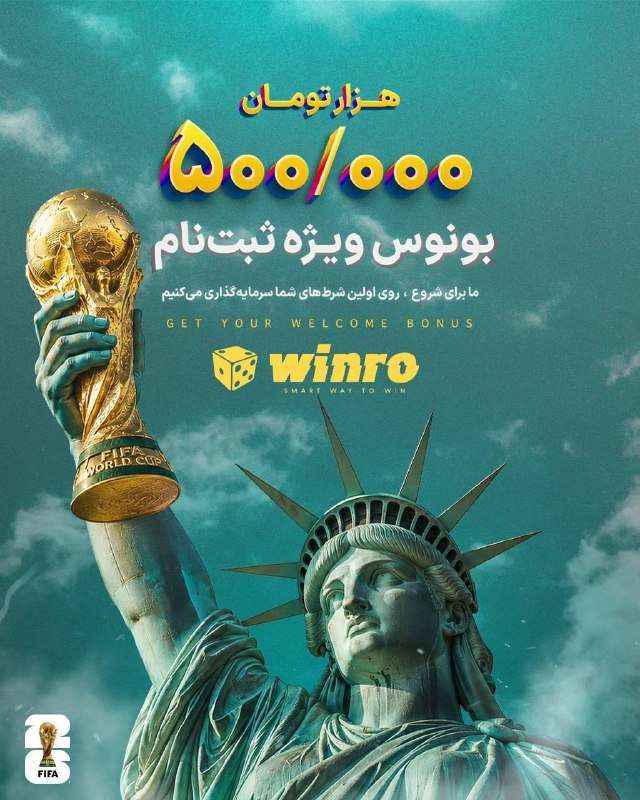

⭕️ تا حالا بدون واریزی روی فوتبال ها شرط بستی؟!

🎉 500 هزارتومن بونوس رایگان فقط با ثبت نام بدون هیچگونه واریزی!

💳 شارژ سریع و امن با درگاه ریالی ، تتر یا ترون فقط با یک کلیک!

⌛ پشتیبانی 24 ساعته

💖تنها سایت مورد اعتماد ما با بونوس های کاملا واقعی و رویایی:

🌐 Winro.io

🌐 Winro.io
کانال بونوس های رایگان g6

📱 @winro_io

## BBCPersian — post 282207

  

🖋دن سیلز
بی‌بی‌سی

رئیس سازمان بهداشت جهانی هشدار داده است که درگیری‌های مداوم در جمهوری دموکراتیک کنگو مانع از پاسخ به شیوع ابولا می‌شود.

دکتر تدروس آدهانوم گبریسوس گفت که شرق آن کشور مرکز «تصادم فاجعه‌بار بیماری و درگیری» است و شیوع ابولا در استان ایتوری از میزان اقدامات و واکنش‌ها به آن پیشی گرفته است.

آقای گبریسوس در بیانیه‌ای در شبکه ایکس نوشت که سازمان جهانی بهداشت «نمی‌تواند، در حالی که بمب‌ها سرازیر می‌شوند، بین این سازمان و مردم ارتباط و اعتماد ایجاد کند، یا بیماران را جداسازی کند».

آقای گبریسوس قرار است روز چهارشنبه (۲۷ مه، ۶ خرداد) وارد جمهوری دموکراتیک کنگو شود تا تلاش‌های خود را برای مهار این ویروس افزایش دهد.

از زمان اعلام شیوع این بیماری حدود دو هفته پیش، ۲۲۰ مورد مرگ مشکوک گزارش شده است.

امدادگران با مشکل مواجه هستند، چرا که به‌دلیل شرایط نامناسب جاده‌ها سفر دشوار است.

ادامه خبر را از لینک زیر در وبسایت بی‌بی‌سی فارسی بخوانید.

📷 Reuters
https://bbc.in/3PKbJWs
@BBCPersian

## BBCPersian — post 282206

🔻شریف پس از تماس تلفنی با پزشکیان: پاکستان در کنار ایران خواهد ایستاد
شهباز شریف، نخست‌وزیر پاکستان، و مسعود پزشکیان، رئیس‌جمهور ایران، تلفنی با هم گفت‌وگو کردند.

آقای شریف در پیامی در ایکس نوشت که مسعود پزشکیان از «تلاش‌های صادقانه پاکستان برای صلح در منطقه» قدردانی کرده و در عین حال نقش فیلد مارشال عاصم منیر، فرمانده کل ارتش و نیروهای مسلح پاکستان را مورد توجه قرار داده است.

او همچنین گفت که بار دیگر تأکید کرده است که «پاکستان همواره به‌عنوان دوستی صمیمی و همسایه‌ای نزدیک در کنار ایران خواهد ایستاد.»

آقای شریف افزود: «ابراز امیدواری کردم که تلاش‌های جاری برای صلح به‌زودی به توافقی پایدار منجر شود و راه را برای ثبات، رفاه و همکاری منطقه‌ای هموار کند.»

خبرگزاری رسمی ایران در گزارشی درباره این تماس تلفنی گفته است که دو طرف «به‌ویژه در حوزه‌های اقتصادی، بازرگانی و گمرکی صحبت و و درباره تداوم رایزنی‌های مشترک برای حمایت از صلح و ثبات منطقه‌ای تأکید کردند.»

پاکستان میانجی آتش‌بس کنونی بین ایران و آمریکاست و در حال وساطت میان دو کشور برای رسیدن به توافق صلح است.

https://bbc.in/4dP5Yi6
@BBCPersian

## BBCPersian — post 282205

  <a href="telegram/content/BBCPersian_282205_1779914785.mp4" target="_blank">🎬 Download video</a>

🔻آخرین خبرهای مهم چهارشنبه ۶ خرداد ۱۴۰۵
@BBCPersian

## BBCPersian — post 282204

  

🔻 دونالد ترامپ، رئیس جمهور آمریکا در جریان جلسه با اعضای کابینه‌اش گفت مذاکره با ایران «تا اینجا به نتیجه نرسیده است» و «ما هنوز از آن راضی نیستیم، اما خواهیم شد.»

رئیس‌جمهور آمریکا با اشاره به رهبران ایران گفت: «آنها در حال مذاکره از موضع ضعف هستند. اما خواهیم دید چه اتفاقی می‌افتد. شاید مجبور شویم برگردیم و کار را تمام کنیم، شاید هم نه.»

آقای ترامپ گفت که «الان فکر می‌کنم به نظر می‌رسد آنها‌ [ایرانی‌ها] فقط می‌خواهند به توافق برسند؛ فکر نمی‌کنم انتخاب دیگری داشته باشند.»

رئیس جمهور آمریکا گفت: «در جریان عملیات خشم حماسی ما روشن کردیم که بزرگترین حامی تروریسم در دنیا، نمی‌تواند سلاح هسته‌ای داشته باشد.»

آقای ترامپ گفت که اقتصاد ایران «در حال سقوط آزاد است، و تورم ۲۵۰ درصدی دارند. پولشان هیچ ارزشی ندارد و کل سیستم اقتصادی‌شان از هم پاشیده است.»

او در جریان پاسخ به خبرنگاران هم گفت تنگه هرمز «برای همه باز خواهد بود» و «هیچ‌کس قرار نیست آن را کنترل کند. ما بر آن نظارت خواهیم داشت. ما مراقبش خواهیم بود، اما هیچکس آن را کنترل نخواهد کرد. این بخشی از مذاکراتی است که داریم.»
📸Reuters
@BBCPersian

## BBCPersian — post 282203

  <a href="https://t.me/bbcpersian/282203" target="_blank">📎 Download file</a>

پادکست جام‌ جهان‌نما چهارشنبه ۶ خرداد ۱۴۰۵

@BBCPersian

## BBCPersian — post 282202

  <a href="telegram/content/BBCPersian_282202_1779914789.mp4" target="_blank">🎬 Download video</a>

🔻پلیس اعلام کرد آتش‌سوزی به‌نسبت بزرگ در سوپرمارکتی در شمال غربی لندن که با اعزام ۱۰۰ آتش‌نشان دارد مهار می‌‌شود، به دلیل اتصال برق بوده است.

آتش‌نشانی لندن اولین تماس را حدود ساعت یک ربع به هفت صبح به وقت گرینویچ دریافت کرد که خبر از آتش‌سوزی در ساختمانی سه طبقه در گولدرز گرین می‌داد.

ویدیوهایی در شبکه‌های اجتماعی منتشر شده که نشان می‌دهد دود از پشت سوپرمارکت یهودی «کوشر کینگدام»، جایی که ساکنان محلی گفته‌اند آتش‌سوزی از آنجا آغاز شده، به هوا بلند می‌شود.

کسی در این آتش‌سوزی مجروح نشده است.

کریگ کارتر، معاون آتش‌نشانی لندن گفت: «تصور نمی‌شود علت آتش‌سوزی مشکوک باشد» و به مردم منطقه توصیه کرد که پنجره‌ها و درها را بسته نگه دارند.

سخنگوی پلیس متروپولیتن هم گفت: «ما نگرانی و اختلالی را که این حادثه برای جامعه محلی و ساکنان و شاغلان در منطقه ایجاد کرده است، درک می‌کنیم. ما می‌خواهیم به ساکنان اطمینان دهیم که هیچ نشانه‌ای از اقدامی هدفمند یا عمدی وجود ندارد.»

گلدرز گرین از جمله محلات یهودی‌نشین لندن است که طی ماه‌های اخیر چند بار هدف حملات ضدیهودی قرار گرفته است.

@BBCPersian

## BBCPersian — post 282201

  <a href="https://t.me/bbcpersian/282201" target="_blank">📎 Download file</a>

تازه‌ترین خبرهای جهان چهارشنبه ۶ خرداد ۱۴۰۵ از رادیو بی‌بی‌سی در لندن

@BBCPersian

## BBCPersian — post 282200

  <a href="https://t.me/bbcpersian/282200" target="_blank">📎 Download file</a>

🔻دنیس راس، مدیر پیشین اداره سیاست‌گذاری وزارت خارجه آمریکا، در گفت‌وگو با برنامه ۶۰ دقیقه بی‌بی‌سی درباره چالش‌های به نتیجه رسیدن مذاکرات ایران و آمریکا گفت.

او تاکید کرد که هیچ راهبردی در قبال ایران تاکنون جواب نداده است؛ چه راهبرد آنها که به ایران امتیاز دادند و چه آنها که سیاست فشار حداکثری را پی گرفتند.

این مصاحبه را که در برنامه شصت دقیقه پنجم خرداد پخش شده، گوش دهید.

@BBCPersian

## BBCPersian — post 282199

🔻نیروی دریایی سپاه: در شبانه روز گذشته ۲۳ شناور از تنگه هرمز عبور کردند

🔻سپاه پاسداران انقلاب اسلامی اعلام کرد که در شبانه روز گذشته ۲۳ شناور با اجازه این نیرو از تنگه هرمز عبور کرده‌اند.

نیروی دریایی سپاه یک روز پیش هم گفته بود که ۲۵ کشتی در هماهنگی با این نیرو از این تنگه گذشتند.

پیشتر گزارش دادیم که رسانه‌های حکومتی ایران اعلام کردند که تهران «پیش‌نویس اولیه و غیررسمی چارچوب یک یادداشت تفاهم با آمریکا را دریافت کرده» است.

بر اساس این پیش‌نویس، ایران ظرف یک ماه عبور و مرور تجاری از تنگه هرمز را به سطح پیش از جنگ بازمی‌گرداند و در مقابل، آمریکا نیروهای نظامی خود را از اطراف ایران خارج و محاصره دریایی را لغو خواهد کرد.

https://bbc.in/3S51FI9
@BBCPersian

## BBCPersian — post 282198

🔻شرکت اماراتی مجوز آمریکا برای اسقاط چهار کشتی تحریم‌شده مرتبط با ایران را دریافت کرد

🔻شرکت جی‌ام‌اس (GMS) مستقر در دبی، اعلام کرد که مجوز دولت آمریکا را برای اسقاط چهار کشتی کانتینربر دریافت کرده است که به‌دلیل ارتباط با ایران تحریم شده بودند.

مدیرعامل این شرکت گفت که این اقدام می‌تواند راه را برای کاهش ناوگان موسوم به «سایه» هموار کند، ناوگانی از کشتی‌هایی که برای دور زدن تحریم‌ها استفاده می‌شوند.

به گزارش رویترز، صدها کشتی فاقد بیمه مشخص یا استانداردهای زیست‌محیطی و ایمنی، نه‌تنها به ایران و روسیه برای دور زدن تحریم‌ها کمک کرده‌اند، بلکه خطر نشت نفت و سوخت را در مسیرهای پرتردد دریایی افزایش داده‌اند.

ایجاد سازوکاری رسمی برای اسقاط این کشتی‌ها می‌تواند انگیزه‌ای برای خارج کردن آن‌ها از چرخه فعالیت باشد، اقدامی که به کاهش خطرات زیست‌محیطی و مهار تجارت نفت و کالاهای تحریم‌شده کمک می‌کند.

انیل شارما، بنیان‌گذار و مدیرعامل جی‌ام‌اس، به رویترز گفت که این شرکت ماه‌ها با مقام‌های آمریکایی درباره تحویل گرفتن کشتی‌های تحریم‌شده و اسقاط آن‌ها در حال مذاکره بوده است.

https://bbc.in/4dzGnuJ
@BBCPersian

## BBCPersian — post 282197

  <a href="telegram/content/BBCPersian_282197_1779914794.mp4" target="_blank">🎬 Download video</a>

🔻حدود ۹۰ پهپاد در طول یک نمایش نور زمستانی محبوب از آسمان بندر دارلینگ سیدنی سقوط کردند و برخی‌شان در نزدیکی جمعیت به داخل آب افتادند.

برگزارکنندگان جشنواره سه هفته‌ای سالانه «ویوید سیدنی» که شامل چیدمان‌های نوری بزرگ است، گفتند که نقص فنی در عصر دوشنبه به وقت محلی به دلیل «مشکلات فنی پیش‌بینی نشده» بوده و چندین نمایش آینده را لغو کرده‌اند.

فیلم نمایش دوشنبه، ده‌ها پهپاد را در حالی که از آسمان شب سقوط می‌کردند نشان می‌داد.

شرکت اسکای‌مجیک، شرکت بریتانیایی برگزارکننده این نمایش، تغییر در فرکانس رادیویی را دلیل این نقص دانست و گفت که هیچ یک از پهپادها خارج از مرزهای ایمنی سقوط نکرده‌اند.

https://bbc.in/4tZCSCO
@BBCPersian

## BBCPersian — post 282196

  

🔻در پی بازگشت تدریجی دسترسی به اینترنت جهانی در ایران از روز سه‌شنبه ۵ خرداد ۱۴۰۵، داده‌های شرکت کنتیک (Kentik) نشان می‌دهد که حجم ترافیک اینترنت بین‌الملل پس از هفته‌ها محدودیت شدید، تا حد قابل توجهی افزایش یافته است، هرچند همچنان فاصله زیادی با سطح عادی پیش از آغاز قطع اینترنت در دی‌ماه دارد.

داگ مادوری، مدیر تحلیل اینترنت در شرکت کنتیک، می‌گوید: «سطح ترافیک در بالاترین حالت به حدود ۳۹ درصد حجم پیش از اعتراضات رسیده است؛ رقمی که به سطح دسترسی در دوره بازگشایی نسبی میان ۷ بهمن تا ۹ اسفند نزدیک است. در آن دوره، خدمات اینترنت ناپایدار و بی‌ثبات بود و محدودیت‌ها روزانه تغییر می‌کردند.»

او اضافه می‌کند: «ما هنوز فاصله زیادی با سطح خدمات پیش از ۱۸ دی داریم. این فقط یک تصویر کلی از وضعیت ترافیک است و ممکن است برخی خدماتی که آن زمان در دسترس بودند، همچنان مسدود باشند.»

گزارش‌های رسیده و تجربیات کاربران حاکی است که دسترسی به برخی خدمات امکان‌پذیر شده است هرچند ارتباط با ثبات نیست و از جمله، تماس‌های صوتی- تصویری، کیفیت بالایی ندارند.

https://bbc.in/4uvLBh7
@BBCPersian

## BBCPersian — post 282195

  

‌🔻اولیویا ویلز، سخنگوی کاخ سفید، در واکنش به انتشار گزارش‌ رسانه‌های ایران درباره پیش‌نویس یادداشت تفاهم میان ایران و آمریکا، گفت: «همان‌طور که رئیس‌جمهور ترامپ گفته است، مذاکرات به‌خوبی در حال پیشرفت است و او خطوط قرمز خود را به‌روشنی مشخص کرده است.»

پیشتر رسانه‌های حکومتی ایران اعلام کردند که تهران «پیش‌نویس اولیه و غیررسمی چارچوب یک یادداشت تفاهم با آمریکا را دریافت کرده است.»

بر اساس این گزارش‌ها، ایران ظرف یک ماه عبور و مرور تجاری از تنگه هرمز را به سطح پیش از جنگ بازمی‌گرداند و در مقابل، آمریکا نیروهای نظامی خود را از اطراف ایران خارج و محاصره دریایی را لغو خواهد کرد.

خانم ویلز بدون تایید یا رد این گزارش‌ها گفت که «رئیس‌جمهور ترامپ تنها توافقی را خواهد پذیرفت که برای مردم آمریکا توافقی خوب باشد و تضمین کند ایران هرگز به سلاح هسته‌ای دست پیدا نکند.»

📷Courtesy: TCU News
https://bbc.in/4tYo1Z8

@BBCPersian

## BBCPersian — post 282194

🔻رسانه‌های ایران: تهران پیش‌نویس اولیه و غیررسمی تفاهم با آمریکا را دریافت کرده است

🔻رسانه‌های حکومتی ایران اعلام کردند که تهران «پیش‌نویس اولیه و غیررسمی چارچوب یک یادداشت تفاهم با آمریکا را دریافت کرده است.»

بر اساس این گزارش‌ها، ایران ظرف یک ماه عبور و مرور تجاری از تنگه هرمز را به سطح پیش از جنگ بازمی‌گرداند و در مقابل، آمریکا نیروهای نظامی خود را از اطراف ایران خارج و محاصره دریایی را لغو خواهد کرد.

این گزارش همچنین حاکیست که هماهنگی در مورد مدیریت مسیر کشتی‌ها با ایران و عمان انجام خواهد شد.

علی باقری کنی، معاون سیاست خارجی و امنیت بین‌الملل دبیرخانه شورای عالی امنیت ملی ایران، هم تایید کرده است که ایران و عمان به‌طور مشترک در حال مذاکره در مورد رویه جدیدی برای عبور کشتی‌ها از تنگه هرمز هستند.

به گفته او «شرایط و رویه‌های عبور از تنگه هرمز کاملا متفاوت از شرایط قبل از شروع درگیری بر سر ایران خواهد بود.»آقای باقری کنی همچنین گفت: «تا زمانی که در مورد همه مسائل به توافق نرسیم، فکر می‌کنیم که در مورد هیچ چیز به توافق نرسیده‌ایم.»

https://bbc.in/3PLvJI4
@BBCPersian

## BBCPersian — post 282193

  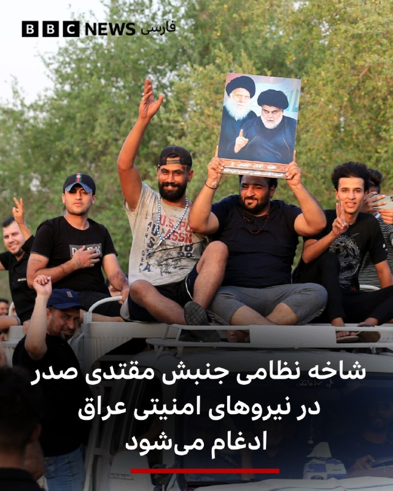

🔻مقتدی صدر، رهبر مذهبی قدرتمند عراق، اعلام کرده است که شاخه نظامی جنبش سیاسی شیعه او در نیروهای امنیتی دولت عراق ادغام خواهد شد.

آقای صدر از سایر جناح‌های مسلح در عراق نیز خواست که همین کار را انجام دهند و سلاح‌های خود را به دولت تحویل دهند.

این اقدام در بحبوحه فشارهای فزاینده آمریکا بر عراق برای مهار نفوذ گروه‌های مسلح تحت حمایت ایران در عراق صورت می‌گیرد.

شبه‌نظامیان همسو با جنبش صدر نقش مهمی در مبارزه با نیروهای آمریکایی پس از حمله به عراق در سال ۲۰۰۳ و همچنین در نبرد علیه داعش پس از تصرف بخش بزرگی از خاک عراق در سال ۲۰۱۴، ایفا کردند.

📷EPA
https://bbc.in/4fbhBT0

@BBCPersian

## BBCPersian — post 282192

  

‏🔻گروهی از کاربران در شبکه اجتماعی ایکس (توییتر سابق) پست‌های انتقادی گزارش‌گونه از تحولات و رویدادهای سیاسی خارج از ایران منتشر می‌کنند، خطاب به شهروندانی که پس از حدود سه ماه به‌طور تدریجی با فیلترشکن موفق می‌‌شوند به اینترنت وصل شوند.

‏این پست‌ها که با عبارت‌هایی مانند «وقتی شما نبودید» یا «بچه‌های ایران که تازه وصل شده‌اید» آغاز می‌شود، همزمان با کاهش تدریجی اختلال در دسترسی به اینترنت، به محلی برای مستندسازی و بازاندیشی انتقادی نسبت به تحولات سیاسی‌ ۸۸ روز گذشته تبدیل شده است.

‏بسیاری از این پست‌ها لحنی آشکارا ضدجنگ دارند و در برابر عملکرد بعضی رسانه‌ها، طرفداران شاهزاده رضا پهلوی و کسانی موضع گرفته‌اند که از حملات نظامی به ایران حمایت یا از آن استقبال می‌کردند.

‏بعضی دیگر از مخالفان جمهوری اسلامی خارج از ایران هم برای مخاطبانی که به‌تازگی دوباره آنلاین شده‌اند، جمع‌بندی‌های کوتاهی از فعالیت و تجمعات به‌عنوان گزارش‌کار تهیه کردند و در پست‌هایی به اظهارنظرها و مواضع چهره‌هایی پرداختند که از نظر آن‌ها در تضاد با «مسیر انقلاب» عمل کرده بودند.

@BBCPersian

## BBCPersian — post 282191

🔻عضو شورای شهر تهران درباره جنگ اخیر: به۶۵۰ نقطه حمله شد و ۱۲۶۰ نفر کشته شدند

🔻یک عضو شورای شهر تهران گفته است که در جریان جنگ اخیر، ۶۵۰ نقطه پایتخت هدف قرار گرفته و ۱۲۶۰ نفر کشته شده‌اند.

مهدی بابایی، رئیس کمیته ایمنی شورای شهر تهران، به خبرگزاری ایرنا گفته است که خانواده‌های جنگ‌زده، شامل ۱۷۱۸ خانوار با ۵۷۵۹ نفر، به‌صورت موقت در ۴۶ هتل اسکان داده شدند.

آقای بابایی گفته است بیشترین حملات در تهران به مناطق ۱، ۳ و ۲۱ بوده است.

جنگ روز در نهم اسفند (۲۸ فوریه) با حملات اسرائیل و آمریکا به ایران آغاز شد و در ۱۸ فروردین (هفتم آوریل) با میانجیگری پاکستان وارد آتش‌بس موقت شد.

https://bbc.in/4uyTIt7
@BBCPersian

## BBCPersian — post 282189

🔻مراسم ختم اعضای خانواده خامنه‌ای این هفته برگزار می‌شود

🔻نزدیک به سه ماه پس از حمله نهم اسفند آمریکا و اسرائیل به دفتر رهبر و محل اقامت علی خامنه‌ای، که از جمله به کشته شدن او و شماری از اعضای خانواده‌اش انجامید، رسانه‌های دولتی در ایران می‌گویند که قرار است برای اعضای خانواده رهبر پیشین مجلس ختمی از سوی بازماندگان برگزار شود.

این مراسم قرار است برای یادبود زهرا حدادعادل (همسر مجتبی خامنه‌ای)، بشری خامنه‌ای (دختر بزرگ رهبر پیشین)، مصباح‌الهدی باقری (همسر دختر کوچک آقای خامنه‌ای) و نوه او، زهرا محمدی گلپایگانی، در روزهای هفتم و هشتم خرداد در شهرری در جنوب تهران برگزار شود.

در این اطلاعیه ذکر شده است که مراسم برای اعضای خانواده رهبر کشته‌شده برگزار می‌شود.

در پی حمله به دفتر و محل سکونت آقای خامنه‌ای، خبر کشته‌شدن همسر او، منصوره خجسته‌ باقرزاده هم منتشر شد اما کمتر از دو هفته بعد خبرگزاری فارس اعلام کرد که اخبار اولیه اشتباه بوده و همسر آقای خامنه‌ای «در قید حیات است.»

https://bbc.in/4u0XzOH
@BBCPersian

## BBCPersian — post 282188

  <a href="telegram/content/BBCPersian_282188_1779914801.mp4" target="_blank">🎬 Download video</a>

🔻سرخط خبرهای روز چهارشنبه ۶ خرداد ۱۴۰۵
@BBCPersian

## BBCPersian — post 282187

🔻ریور احمد اولین زن افغان است که به قله اورست صعود کرده است.

او طی فصل کوهنوردی بهار امسال، صبح روز ۲۱ مه (۲ خرداد) به فراز بلندترین قله جهان رسید.

اما ریور، وضعیت اسفناک زنان و دختران در افغانستان را فراموش نکرده است. «حتی امروز میلیون‌ها دختر افغان از حق اولیه تحصیل محروم هستند و ما باید این قله را هم فتح کنیم. با کمک کوهنوردی، می‌خواهم این پیام را تقویت کنم. من آموخته‌ام که سخت‌ترین کوه‌ها از سنگ و یخ ساخته نشده‌اند، بلکه کوه‌هایی هستند که ما در درون خود حمل می‌کنیم.»

@BBCPersian

## idfinfarsi — post 11657

  <a href="telegram/content/idfinfarsi_11657_1779914804.mp4" target="_blank">🎬 Download video</a>

ارتش اسرائیل ساختمان‌های نظامی، مقرهای فرماندهی و سایت‌های پرتاب در منطقه البقاع را هدف قرار داد: از ابتدای هفته حدود ۵۵۰ هدف از سازمان تروریستی حزب‌الله در لبنان مورد حمله قرار گرفته است

در طول امروز (چهارشنبه)، ارتش اسرائیل در منطقه البقاع و چندین منطقه در جنوب لبنان، ساختمان‌های نظامی، مقرهای فرماندهی و سایت‌های پرتاب مورد استفاده سازمان تروریستی حزب‌الله را هدف قرار داد.

حملات به مقرهای فرماندهی در منطقه صور همچنان در حال انجام است.

## idfinfarsi — post 11656

  <a href="telegram/content/idfinfarsi_11656_1779914807.mp4" target="_blank">🎬 Download video</a>

تکمیل چرخه هدف‌گیری: نیروهای تیپ ۴۰۱ تروریستی را که زنده یاد سرگرد (ذخیره) ایتمار ساپیر را به قتل رساند، به هلاکت رساندند

هفته گذشته (سه‌شنبه)، در جریان درگیری نیروهای ارتش اسرائیل در منطقه قاوزه در جنوب لبنان، یک تروریست از محدوده یک کلیسا به‌سوی نیروهای تیپ ۴۰۱ تیراندازی کرد که در نتیجه آن سرگرد (ذخیره) ایتمار ساپیر جان باخت.

بلافاصله پس از این رویداد، نیروهای تیپ تحت فرماندهی لشکر ۱۴۶ با آتش پاسخ دادند و برای به هلاکت رساندن تروریست اقدام کردند.

اکنون می‌توان تأیید کرد که تروریستی که سرگرد (ذخیره) ایتمار ساپیر را به قتل رساند، پس از شناسایی در حالی که وارد ساختمانی در محدوده کلیسا شده بود، با شلیک تانک و حمله دقیق نیروی هوایی به هلاکت رسید.

در چارچوب پشتیبانی آتش در این رویداد، ارتش اسرائیل از هوا و زمین مواضع دیده‌بانی، انبار تسلیحات و ساختمان‌هایی را که توسط سازمان تروریستی حزب‌الله برای پیشبرد طرح‌های تروریستی مورد استفاده قرار می‌گرفت، هدف قرار داد.

## idfinfarsi — post 11655

  <a href="telegram/content/idfinfarsi_11655_1779914809.mp4" target="_blank">🎬 Download video</a>

در این روزهای مقدس مسلمانان، پیام ما بیش از هر زمان دیگری نمایان است: اتحاد و همبستگی میان اقوام و ادیان، از هر تلاشی برای تفرقه‌ و تحریکها نیرومندتر است.

## idfinfarsi — post 11654

  <a href="telegram/content/idfinfarsi_11654_1779914812.mp4" target="_blank">🎬 Download video</a>

مستند ویژه: تکمیل چرخه شناسایی و هدف قرار دادن یک تروریست که هواگرد بدون سرنشین را در جنوب لبنان هدایت می‌کرد

در چارچوب فعالیت نیروهای ارتش اسرائیل در جنوب لبنان، یک هواگرد از نیروی هوایی، یک هواگرد بدون سرنشین را در آسمان شناسایی کرد که تهدیدی برای نیروهای ما در منطقه محسوب می‌شد.

این هواگرد بدون سرنشین فرود آمد و یک تروریست از سازمان تروریستی حزب‌الله برای جمع‌آوری آن به محل رسید. در یک واکنش سریع، هواگرد نیروی هوایی به محل حمله کرده و این تروریست را به هلاکت رساند.

نیروی هوایی به فعالیت خود برای دفاع و پشتیبانی از نیروهای ما در جنوب لبنان ادامه خواهد داد.

## idfinfarsi — post 11650

  <a href="telegram/content/idfinfarsi_11650_1779914816.mp4" target="_blank">🎬 Download video</a>

ارتش اسرائیل و شاباک محمد عوده، رئیس شاخه نظامی سازمان تروریستی حماس که پس از به هلاکت رسیدن عزالدین حداد منصوب شده بود و همچنین رئیس ستاد اطلاعات سازمان تروریستی حماس بود را به هلاکت رساندند

⭕️ سخنگوی ارتش اسرائیل و شاباک اعلام کردند که در حمله‌ای در شمال نوار غزه، تروریست محمد عوده که به‌عنوان رئیس شاخه نظامی سازمان تروریستی حماس پس از به هلاکت رسیدن عزالدین حداد منصوب شده بود و همچنین ریاست ستاد اطلاعات این سازمان را بر عهده داشت، به هلاکت رسید.

🔻 در چارچوب عملیات مشترک ارتش اسرائیل و شاباک برای حذف این تروریست، چندین ساختمان در قلب شهر غزه که به‌عنوان محل اختفای او مورد استفاده قرار می‌گرفت، هدف قرار گرفت. این اقدام پس از ماه‌ها رصد اطلاعاتی برای شناسایی الگوهای رفت‌وآمد او و همکارانش انجام شد. همزمان، یک آپارتمان متعلق به یک تروریست حماس که در ۷ اکتبر در حمله مشارکت داشت و بخشی از حلقه پشتیبانی عوده بود، نیز هدف قرار گرفت.

⭕️ عوده در دو هفته گذشته رئیس شاخه نظامی سازمان تروریستی حماس بود و در سال‌های اخیر نیز ریاست ستاد اطلاعات این سازمان را بر عهده داشت. وی در این چارچوب مسئول برنامه‌ریزی و هماهنگی ا

## Dirty_Kids — post 390355

  

بچه‌ها شما که نبودید این عکس یکی از گنگ‌ترین عکسایی بود که دیدم

@Dirty_Kids 
👻

## Dirty_Kids — post 390354

اگه آمریکا ‎بوش پدر و پسر داره
ایران هم ‎موش پدر و پسر داره!

@Dirty_Kids 👻

## Dirty_Kids — post 390353

  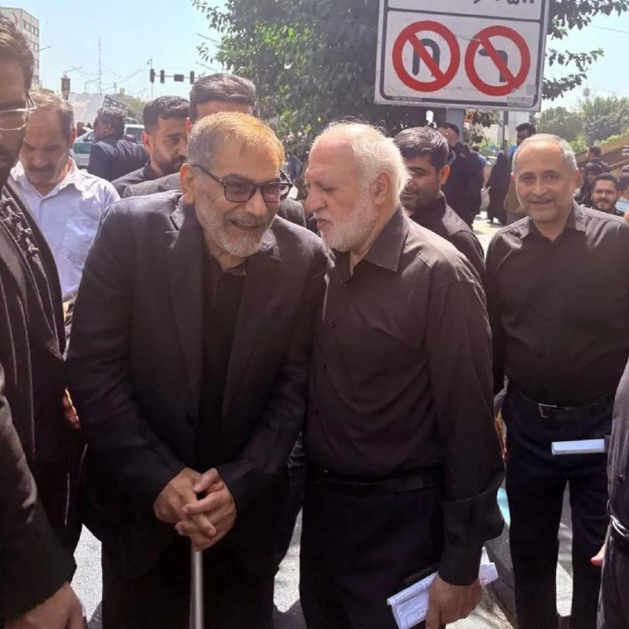

دوستان وقتی نبودید جنازه شمخانی بدون سر دفن شد.

@Dirty_Kids 👻

## Dirty_Kids — post 390352

  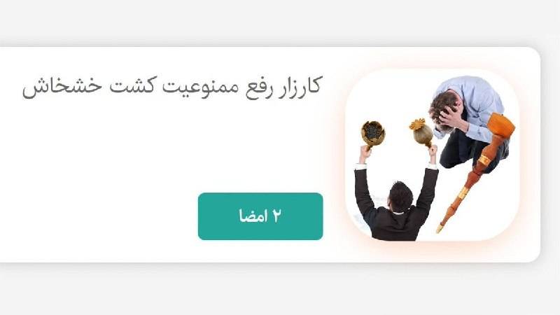

الحق که شاد ترین ملتو داریم.

ملت توی یه مرحله عجیب دارن زندگی میکنن😂😂😂رفتن کارزار رفع ممنوعیت کشت خشخاش رو ایجاد کردن

@Dirty_Kids 👻

## Dirty_Kids — post 390351

  <a href="telegram/content/Dirty_Kids_390351_1779914821.mp4" target="_blank">🎬 Download video</a>

🔴 توی آمل یه نفر برنده شده و ۱ دقیقه بهش فرصت دادن تا هر چی دلش میخواد از فروشگاه برداره.

طرفم یه کاری کرد که صاحب فروشگاه به گوه خوردن افتاد.

@Dirty_Kids 👻

## Dirty_Kids — post 390350

‏این چیزی که وصل کردن اینترنت قبل نیست. نمی‌دونم چه گهیه؛ ولی اون نیست.

@Dirty_Kids 👻

## Dirty_Kids — post 390349

  <a href="telegram/content/Dirty_Kids_390349_1779914822.mp4" target="_blank">🎬 Download video</a>

بچه‌ها شما که نبودید ایشونو دیدم نتونستم یدونه ایراد ازش بگیرم!

high or low waisted?

@Dirty_Kids 👻

## Dirty_Kids — post 390348

‏چرا روی سریال‌های پخش خانگی ایرانی به‌جای اسم فحش می‌ذارن؟ وحشی، بدنام، آفتاب‌پرست، ابله، کفتار، بی‌شرف، قرمساق، جاکش.

@Dirty_Kids 👻

## Dirty_Kids — post 390347

‏این مدت که نبودین بی‌بی‌سی همچنان کسکش بود.

@Dirty_Kids 👻

## Dirty_Kids — post 390346

‏هم جنگ شد هم مذاکره کردن هم تو بگا رفتی هم ما کیر خوردیم :)))

@Dirty_Kids 👻

## Dirty_Kids — post 390345

کاش همینجوری که اینترنتا برگشت جوونامونم از زیر خاک برمیگشتن.

@Dirty_Kids 👻

## Dirty_Kids — post 390344

  

پس کیر شدن این شکلیه ؟

@Dirty_Kids 👻

## Dirty_Kids — post 390343

  

دوستان وقتی شما نبودید عرزشیا به دنیا جهانبخت می‌گفتن باشرف:))

@Dirty_Kids 👻

## Dirty_Kids — post 390342

‏کارمندای پورن‌هاب تا دو هفته باید سه شیفته کار کنن.

@Dirty_Kids 👻

## Dirty_Kids — post 390341

سلام عزیزانی که تازه آنلاین شدین باید بگم که
«اَیَتولا هَمه‌نه‌ای… ایز دد»

@Dirty_Kids 👻

## Dirty_Kids — post 390337

  <a href="telegram/content/Dirty_Kids_390337_1779914825.mp4" target="_blank">🎬 Download video</a>

آتش‌سوزی در یکی از برج‌های مجتمع مسکونی پامچال در چیتگر #تهران

تصاویر دریافتی + منتشرشده، چهارشنبه ۶ خرداد

@Dirty_Kids 👻

## Dirty_Kids — post 390336

  

‏ما که گفتیم ریدن براتون

@Dirty_Kids 👻

## Hranews — post 113201

مرگ و مصدومیت ۳ کارگر در سایه فقدان ایمنی کار/ مسمومیت غذایی ۸ کارگر یک واحد صنعتی

❗️
❗️
❗️
❗️
❗️– در سایه فقدان ایمنی محیط و شرایط نامناسب کار، وقوع یک حادثه در شرکت دماوند انرژی عسلویه یک کشته و دو مصدوم بر جای گذاشت. همچنین، هشت #کارگر شاغل در یک مرکز صنعتی در شهرستان بهاباد دچار مسمومیت غذایی شدند.

ادامه مطلب
↘️
@hranews_bot تماس ✉️ -  @Hranews  کانال هرانا 🆑

## Hranews — post 113200

گزارشی از بیکاری و معوقات مزدی کارگران سامان کاشی و شهرداری تهران/ مشکلات بیمه‌ای بازنشستگان تأمین اجتماعی

❗️
❗️
❗️
❗️
❗️– شماری از کارگران شاغل در کارخانه سامان کاشی بروجرد و کارگران پیمانکاری شهرداری تهران با بیکاری، #معوقات_مزدی، مشکلات بیمه و محرومیت از دریافت پاداش مواجه شده‌اند. از سوی دیگر، #بازنشستگان تأمین اجتماعی از تأخیر طولانی‌مدت شرکت بیمه تکمیلی «آتیه سازان حافظ» در پرداخت سهم درمان بازنشستگان گلایه‌مند هستند.

ادامه مطلب

↘️
@hranews_bot تماس ✉️ -  @Hranews  کانال هرانا 🆑

## Hranews — post 113199

  

اعتراضات ۱۴۰۴؛ بلاتکلیفی نیما عربان، نوجوان بازداشتی در کانون اصلاح و تربیت اصفهان ادامه دارد

❗️
❗️
❗️
❗️
❗️– نیما عربان، نوجوان ۱۷ ساله و یکی از بازداشت‌شدگان اعتراضات ۱۴۰۴ در نائین شهر، کماکان به صورت بلاتکلیف در کانون اصلاح و تربیت اصفهان نگهداری می‌شود. وی در پرونده‌ای مشترک با عباس اکبری فیض‌آبادی، از معترضان اعدام‌شده، مورد رسیدگی قضایی قرار گرفته است.

به گزارش خبرگزاری هرانا، ارگان خبری مجموعه فعالان حقوق بشر در ایران، نیما عربان از بازداشت‌شدگان اعتراضات ۱۴۰۴ در بازداشت بسر می‌برد.

بر اساس اطلاعات دریافتی هرانا، نیما عربان به همراه عباس اکبری فیض‌آبادی، از معترضان اعدام شده، در جریان اعتراضات دی‌ماه ۱۴۰۴در نائین شهر اصفهان، بازداشت شده است. وی هم اکنون بیش از چهار ماه است که در کانون اصلاح و تربیت اصفهان نگهداری می‌شود.

#نیما_عربان

ادامه مطلب

↘️
@hranews_bot تماس ✉️ - @Hranews کانال هرانا 🆑

## Hranews — post 113198

اشنویه؛ دو شهروند با تودیع وثیقه آزاد شدند

❗️
❗️
❗️
❗️
❗️– روز سه‌شنبه ۵ خردادماه، آرمان درویشی و میلاد شادیخواه، شهروندان اهل اشنویه، با تودیع وثیقه، آزاد شدند.

#آرمان_درویشی #میلاد_شادیخواه

ادامه مطلب

↘️
@hranews_bot تماس ✉️ - @Hranews کانال هرانا 🆑

## Hranews — post 113197

  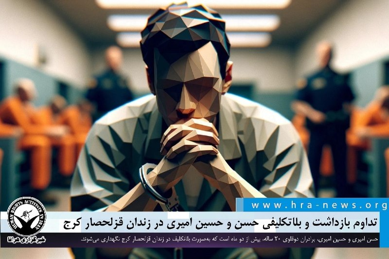

تداوم بازداشت و بلاتکلیفی حسن و حسین امیری در زندان قزلحصار کرج

❗️
❗️
❗️
❗️
❗️– حسن امیری و حسین امیری، برادران دوقلوی ۲۰ ساله، بیش از دو ماه است که بازداشت شده‌اند و کماکان به‌صورت بلاتکلیف در زندان قزلحصار کرج نگهداری می‌شوند.

به گزارش خبرگزاری هرانا، ارگان خبری مجموعه فعالان حقوق بشر در ایران، حسن امیری و حسین امیری در بازداشت بسر میبرند.

بر اساس اطلاعات دریافتی هرانا، این دو برادر دوقلو همزمان با تحولات نظامی در یکی از ایست‌های بازرسی نگه داشته شدند. ماموران حاضر در این ایست بازرسی، تلفن همراه هر دوی آن‌ها را بررسی کردند و پس از مشاهده تصاویری از ساختمان‌های آسیب‌دیده بر اثر حملات موشکی، آن‌ها را بازداشت کردند. اکنون این دو برادر با اتهام جاسوسی مواجه هستند.
این دو برادر ۲۰ ساله که از دو سالگی در بهزیستی بزرگ شده‌اند، هم‌اکنون در واحد سه، اندرزگاه ۳۵ (بند تربیت) زندان قزلحصار کرج نگهداری می‌شوند و با گذشت بیش از دو ماه از زمان بازداشت، تاکنون دادگاهی برای آن‌ها تشکیل نشده است.

#حسن_امیری #حسین_امیری

ادامه مطلب

↘️
@hranews_bot تماس ✉️ - @Hranews کانال هرانا 🆑

## Hranews — post 113196

  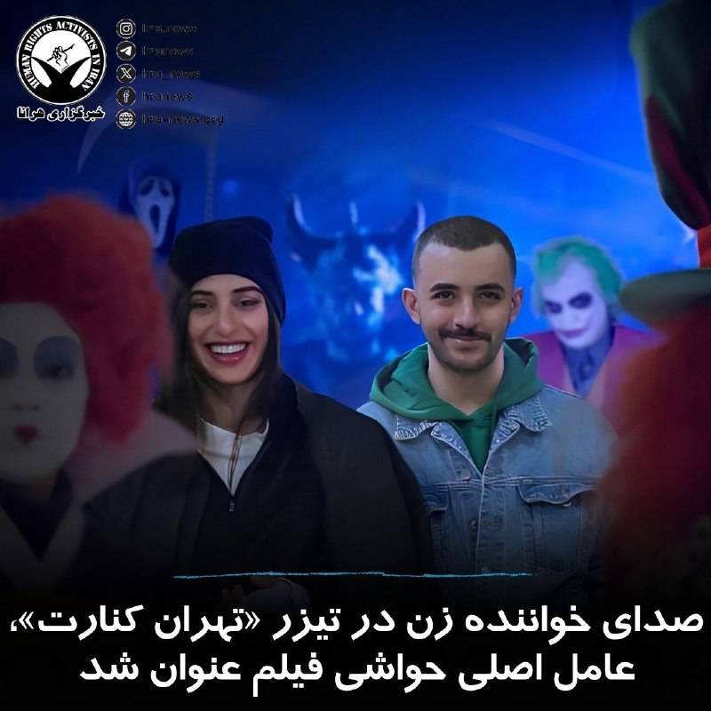

مجتبی بهزادیان، مدیرکل دفتر نظارت بر عرضه و نمایش فیلم، اعلام کرد که موضوعات مطرح‌شده درباره فیلم «تهران کنارت» به انتشار یک ویدیوی تبلیغاتی «خارج از رویه‌های سازمان سینمایی» بازمی‌گردد. به گفته وی، آنچه موجب واکنش نهادهای مسئول شده، استفاده از صدای یک خواننده زن در این ویدیو عنوان شده است.

لازم به ذکر است؛ مرکز رسانه قوه قضاییه چند روز پیش از تشکیل پرونده قضایی علیه دست‌اندرکاران این فیلم به دلیل آنچه «محتوای غیراخلاقی و مغایر با عفت عمومی» خبر داده بود. همچنین رئیس سازمان سینمایی کشور نیز در ارتباط با صدور پروانه نمایش این فیلم به مرجع قضایی احضار شده بود.

↘️
@hranews_bot تماس ✉️ - @Hranews کانال هرانا 🆑

## Hranews — post 113195

  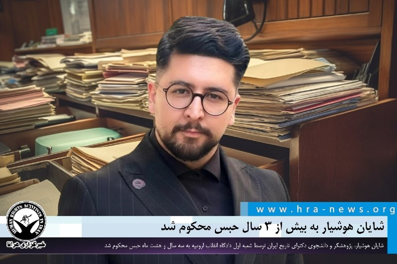

شایان هوشیار به بیش از ۳ سال حبس محکوم شد

❗️
❗️
❗️
❗️
❗️– شایان هوشیار، پژوهشگر و دانشجوی دکترای تاریخ ایران توسط شعبه اول دادگاه انقلاب ارومیه به سه سال و هشت ماه حبس محکوم شد.

به گزارش خبرگزاری هرانا، ارگان خبری مجموعه فعالان حقوق بشر در ایران، شایان هوشیار، پژوهشگر و دانشجوی دکترای تاریخ ایران به حبس محکوم شد.

این حکم اخیرا توسط شعبه اول دادگاه انقلاب ارومیه صادر و به مسعود شمس نژاد، وکیل مدافع شایان هوشیار ابلاغ شده است. بر اساس رای صادره آقای هوشیار به سه سال و هشت ماه حبس محکوم شده است.

#شایان_هوشیار

ادامه مطلب

↘️
@hranews_bot تماس ✉️ - @Hranews کانال هرانا 🆑

## Hranews — post 113194

  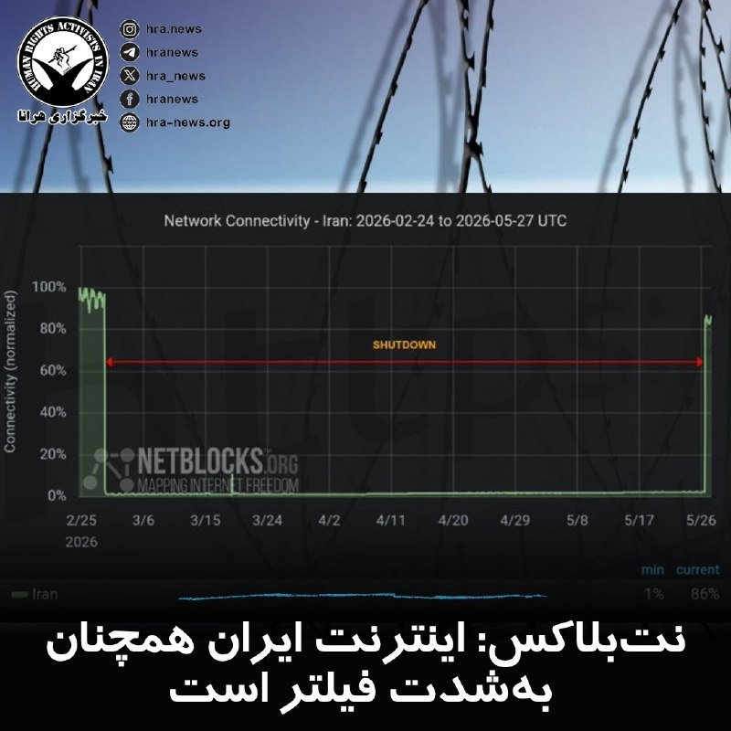

نت‌بلاکس در آخرین به‌روزرسانی خود از وضعیت #اینترنت در ایران نوشت اتصال اینترنت اکنون به مدت ۲۴ ساعت در حالت ترمیم و بازیابی قرار دارد. این نهاد ناظر بر وضعیت اینترنت در جهان تاکید کرد که اینترنت در ایران همچنان به‌شدت فیلتر است و محدودیت‌های جدیدی در پیام‌رسان‌ها و اپلیکیشن‌ها در مقایسه با قبل از قطع اینترنت اعمال شده است.

↘️
@hranews_bot تماس ✉️ - @Hranews کانال هرانا 🆑

## Hranews — post 113193

گزارشی از بازداشت و بلاتکلیفی پژمان حاجی‌زاده

❗️
❗️
❗️
❗️
❗️– پژمان حاجی‌زاده، شهروند ساکن بوکان، مورخ ۲۲ اردیبهشت‌ماه، توسط نیروهای امنیتی در این شهرستان بازداشت و کماکان بصورت بلاتکلیف در یکی از بازداشتگاه‌های امنیتی ارومیه به‌سر می‌برد.

#پژمان_حاجی‌زاده

ادامه مطلب

↘️
@hranews_bot تماس ✉️ - @Hranews کانال هرانا 🆑

## Hranews — post 113192

  

محمد طریقت اسفنجانی، وکیل دادگستری به حبس محکوم شد

❗️
❗️
❗️
❗️
❗️– محمد طریقت اسفنجانی، وکیل دادگستری و عضو کانون وکلای آذربایجان شرقی توسط دادگاه انقلاب شهرستان اسکو به سه سال حبس تعزیری محکوم شد.

به گزارش خبرگزاری هرانا، ارگان خبری مجموعه فعالان حقوق بشر در ایران، محمد طریقت اسفنجانی، وکیل دادگستری به حبس محکوم شد.

بر اساس این حکم که اخیرا توسط دادگاه انقلاب شهرستان اسکو صادر و به محمد طریقت اسفنجانی ابلاغ شده، وی از بابت اتهامات تبلیغ علیه نظام به یک سال حبس و توهین به رهبری و بنیانگذار جمهوری اسلامی به دو سال حبس تعزیری محکوم شده است.

#محمد_طریقت_اسفنجانی

ادامه مطلب

↘️
@hranews_bot تماس ✉️ - @Hranews کانال هرانا 🆑

## Hranews — post 113191

  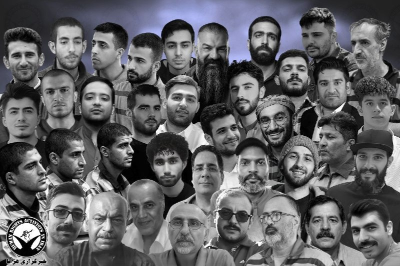

میان موشک و سرکوب؛ گزارش مجموعه فعالان حقوق بشر درباره مخاصمه نظامی ایالات متحده-اسرائیل و ایران منتشر شد 
💥
💥
💥
💥
💥 – امروز، مجموعه فعالان حقوق بشر در ایران گزارش جدیدی را در ۲۴۰ صفحه و دو زبان منتشر کرد که به بررسی کارزار نظامی ایالات متحده و اسرائیل در ایران…

## Hranews — post 113190

  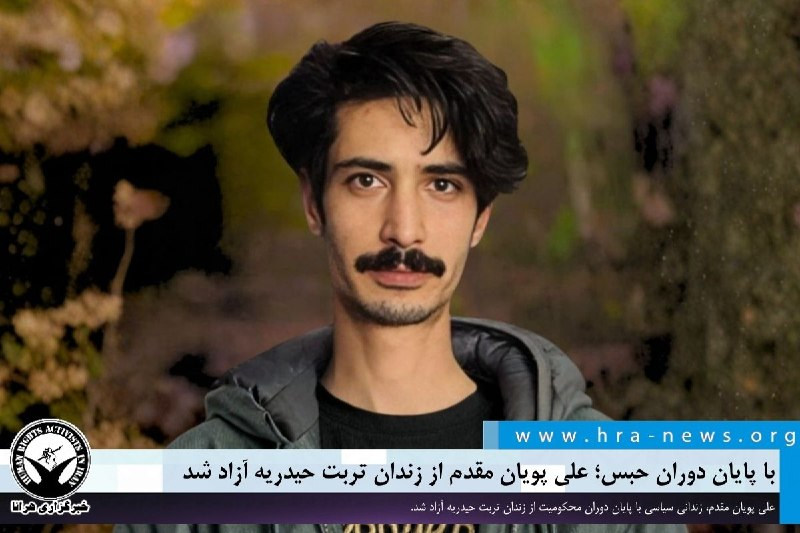

با پایان دوران حبس؛ علی پویان مقدم از زندان تربت حیدریه آزاد شد

❗️
❗️
❗️
❗️
❗️– علی پویان مقدم، زندانی سیاسی با پایان دوران محکومیت از زندان تربت حیدریه آزاد شد.

به گزارش خبرگزاری هرانا، ارگان خبری مجموعه فعالان حقوق بشر در ایران، علی پویان مقدم از زندان آزاد شد.

بر اساس اطلاعات دریافتی هرانا، آزادی آقای پویان مقدم در تاریخ ۳ خردادماه، پس از اتمام دوران حبس وی صورت گرفته است. بنا بر اطلاعات رسیده، در جریان جنگ و همزمان با انتقال زندانیان زندان سبزوار، او نیز به زندان تربت حیدریه منتقل شده بود.

#علی_پویان_مقدم

ادامه مطلب

↘️
@hranews_bot تماس ✉️ - @Hranews کانال هرانا 🆑

## Hranews — post 113189

دانشگاه صنعتی شریف؛ ده‌ها دانشجو با احکام اخراج و محرومیت از تحصیل مواجه شدند

❗️
❗️
❗️
❗️
❗️– دستکم ۳۰ نفر از دانشجویان دانشگاه صنعتی شریف توسط کمیته انضباطی این دانشگاه در ارتباط با فعالیت در فضای مجازی و پرونده‌های مرتبط با اعتراضات سراسری سال گذشته، محکوم شده‌اند. احکام بدوی صادرشده برای این #دانشجویان شامل اخراج همراه با پنج سال محرومیت از تحصیل در تمامی دانشگاه‌ها برای شماری از آنان و منع موقت از تحصیل برای تعدادی دیگر است.

ادامه مطلب

↘️
@hranews_bot تماس ✉️ - @Hranews کانال هرانا 🆑

## Hranews — post 113188

بیش از یک میلیون دانش آموز در کشور از تحصیل بازمانده‌اند

❗️
❗️
❗️
❗️
❗️– رئیس سازمان بهزیستی از وجود بیش از یک میلیون دانش آموز بازمانده از تحصیل در کشور خبر داد.

ادامه مطلب

↘️
@hranews_bot تماس ✉️ - @Hranews کانال هرانا 🆑

## officialrezapahlavi — post 1835

  <a href="telegram/content/officialrezapahlavi_1835_1779914835.mp4" target="_blank">🎬 Download video</a>

شاهزاده رضا پهلوی روز جمعه ۱ خرداد (۲۲ مه)، در نشستی آنلاین با شماری از فعالان و چهره‌های رسانه‌ای و هنری گفتگو کردند. ایشان ضمن شنیدن دیدگاه‌ها و نظرات حاضران، به برخی پرسش‌ها نیز پاسخ دادند. بخش‌های بیشتری از این گفتگو در روزهای آینده منتشر خواهد شد.

@OfficialRezaPahlavi

## manototv — post 105837

  <a href="telegram/content/manototv_105837_1779914837.mp4" target="_blank">🎬 Download video</a>

از «کمک در راه است» تا مذاکره، معامله و بازگشت به همان سیاست همیشگی؟ ورق بزنید.

## alonews — post 123180

  <a href="telegram/content/alonews_123180_1779914838.webm" target="_blank">🎬 Download video</a>

👈علیرضا فیروزجا (ایرانی) با پرچم فرانسه، نفر اول شطرنج جهانو شکست داد

✅ @AloNews خبر جنگ

## alonews — post 123179

  <a href="telegram/content/alonews_123179_1779914839.webm" target="_blank">🎬 Download video</a>

👈چین: تلاش می‌کنیم تنش بین ایران و آمریکا را کاهش دهیم

✅ @AloNews خبر جنگ

## alonews — post 123178

  <a href="telegram/content/alonews_123178_1779914839.mp4" target="_blank">🎬 Download video</a>

👈یه FPV حزب الله افتاد دنبال سرباز اسرائیلی

✅ @AloNews خبر جنگ

## alonews — post 123177

  <a href="telegram/content/alonews_123177_1779914842.webm" target="_blank">🎬 Download video</a>

👈عضو تیم رسانه‌ای هیئت مذاکراتی ایران:
سفر قالیباف به قطر درباره آزادسازی ۱۲ میلیارد دلار از اموال بلوکه‌شده، موفقیت‌آمیز بود!

✅ @AloNews خبر جنگ

## alonews — post 123176

  <a href="telegram/content/alonews_123176_1779914842.webm" target="_blank">🎬 Download video</a>

👈چین: تلاش می‌کنیم تنش بین ایران و آمریکا را کاهش دهیم
 

🔴 به گزارش سی‌جی‌تی‌ان، وانگ یی، وزیر خارجه چین روز چهارشنبه به خبرنگاران گفت که پکن نقش فعالی در کاهش تنش بین ایران و آمریکا ایفا می‌کند

✅ @AloNews خبر جنگ

## alonews — post 123175

  <a href="telegram/content/alonews_123175_1779914842.webm" target="_blank">🎬 Download video</a>

👈گویا گوگل پلی تو اکثر مناطق وصل شده

✅ @AloNews خبر جنگ

## alonews — post 123174

  <a href="telegram/content/alonews_123174_1779914842.webm" target="_blank">🎬 Download video</a>

👈 جایگزینی تسلیحات راهبردی مصرف شده در جنگ با ایران برای آمریکا، ۳ تا ۵ سال زمان می‌خواهد!

✅ @AloNews خبر جنگ

## alonews — post 123173

  <a href="telegram/content/alonews_123173_1779914843.webm" target="_blank">🎬 Download video</a>

👈حمله امشب اسرائیل به غزه 
🔴احتمالا ترور 
✅ @AloNews خبر جنگ

## alonews — post 123172

  <a href="telegram/content/alonews_123172_1779914843.webm" target="_blank">🎬 Download video</a>

👈سخنگوی کمیسیون امنیت ملی: اصلا چرا باید به آمریکا تعهد عدم ساخت سلاح هسته‌ای بدهیم؟

✅ @AloNews خبر جنگ

## alonews — post 123171

  <a href="telegram/content/alonews_123171_1779914843.webm" target="_blank">🎬 Download video</a>

👈حمله امشب اسرائیل به غزه

🔴احتمالا ترور

✅ @AloNews خبر جنگ

## alonews — post 123170

🔥 حجم‌های بالا با قیمت‌های باورنکردنی 🔥 ⚡ سرعت بالا 🌐 پایداری عالی 🚀 کیفیتی که حسش میکنی همین الان جوین شو که جا نمونی 😍 @NetAazaadVPN @NetAazaadVPN

## alonews — post 123169

  

🔥 حجم‌های بالا با قیمت‌های باورنکردنی 🔥

⚡ سرعت بالا
🌐 پایداری عالی
🚀 کیفیتی که حسش میکنی

همین الان جوین شو که جا نمونی 😍

@NetAazaadVPN
@NetAazaadVPN

## alonews — post 123168

  

🔴🇮🇷 کشوری فرد، دبیر سازمان لیگ: پرسپولیس به چی اعتراض داره؟ اونا حتی تو جام حذفی هم نیستن. 22 بازی نتیجه نگرفتن، بعد می‌خوان تو 8 بازی همه تیم‌ها رو ببرن؟ چطور وقتی خودشون میرفتن آسیا، مشکلی نبود؟
@AloSport

## alonews — post 123167

  <a href="telegram/content/alonews_123167_1779914845.webm" target="_blank">🎬 Download video</a>

👈بقایی: موضع ایران در رابطه با قفقاز جنوبی هیچ تغییری نکرده است

🔴سخنگوی وزارت خارجه: جمهوری اسلامی ایران نسبت به نیات بدخواهانه امریکا که سابقه شرارت و تجاوزگری در مناطق مختلف دنیا دارد، سوء ظن شدید دارد و مخالفت خود را با حضور ناامن‌ساز آن در قفقاز جنوبی صراحتا اعلام کرده‌ است.

🔴موضع جمهوری اسلامی ایران درباره امنیت در قفقاز جنوبی روشن است و هیچ شبهه‌ای در این خصوص وجود ندارد.

✅ @AloNews خبر جنگ

## alonews — post 123166

  <a href="telegram/content/alonews_123166_1779914845.webm" target="_blank">🎬 Download video</a>

👈 امانی، سفیر پیشین ایران در لبنان: حزب‌الله برای حمله به اسرائیل در ایام جنگ ایران فرصت را مناسب دید، قضیه راهبردی است و اینطور نیست که حزب‌الله بخواهد در این جنگ طرف ایران را بگیرد و موضوع تبدیل به موضوع کلانی شده است

✅ @AloNews خبر جنگ

## alonews — post 123165

  <a href="telegram/content/alonews_123165_1779914845.mp4" target="_blank">🎬 Download video</a>

🔴من خود به چشم خویشتن دیدم، که جانم میرود…

💔جاویدنام محسن جبارزاده

✅@AloNews

## alonews — post 123164

  <a href="telegram/content/alonews_123164_1779914848.webm" target="_blank">🎬 Download video</a>

👈 بر اساس گزارش «گلدمن ساکس»، تقویت ارزش دلار در نخستین ماه از درگیری میان آمریکا و ایران، موجب شد تا نهادهای رسمی خارجی اقدام به فروش اوراق قرضه خزانه‌داری [آمریکا] کنند.

✅ @AloNews خبر جنگ

## alonews — post 123163

  <a href="telegram/content/alonews_123163_1779914848.webm" target="_blank">🎬 Download video</a>

👈 وزیر خارجه آمریکا: طی روزهای آتی میزان پیشرفت در گفت‌وگوها با ایران را ارزیابی می‌کنیم؛ توافقی وجود دارد که می‌توان به آن دست یافت و مقداری پیشرفت و تمایل مشاهده شده است.

✅ @AloNews خبر جنگ

## alonews — post 123162

  <a href="telegram/content/alonews_123162_1779914848.webm" target="_blank">🎬 Download video</a>

👈تانکر ترکرز: نزدیک به ۶۰ میلیون بشکه نفت خام ایران در نتیجه محاصره دریایی نیروی دریایی آمریکا متوقف و گرفتار شده است. این میزان تقریباً ۶ میلیارد دلار درآمد نفتی است که در حال حاضر به تهران نمی‌رسد.

🔴با وجود این‌که هنوز نفتکش‌های خالی زیادی برای بارگیری نفت در دسترس هستند، اما به دلیل کاهش تولید نفت، میزان بارگیری نفتکش‌ها نیز کاهش یافته است.

✅ @AloNews خبر جنگ

## alonews — post 123161

  <a href="telegram/content/alonews_123161_1779914849.webm" target="_blank">🎬 Download video</a>

👈الجزیره: پهپادهای تهاجمی حزب‌الله یک سرباز اسرائیلی را کشته و دو نفر دیگر را زخمی کردند

✅ @AloNews خبر جنگ

<!-- MSG END -->

<!-- NAV START -->

<a href="https://github.com/sombriolitfa-eng/aioo06/blob/main/telegram/content/archive_1.md" style="display:inline-block; padding:6px 12px; margin:0 4px; background-color:#2ea44f; color:white; text-decoration:none; border-radius:4px; font-weight:bold;">صفحه بعد</a>

<!-- NAV END -->
