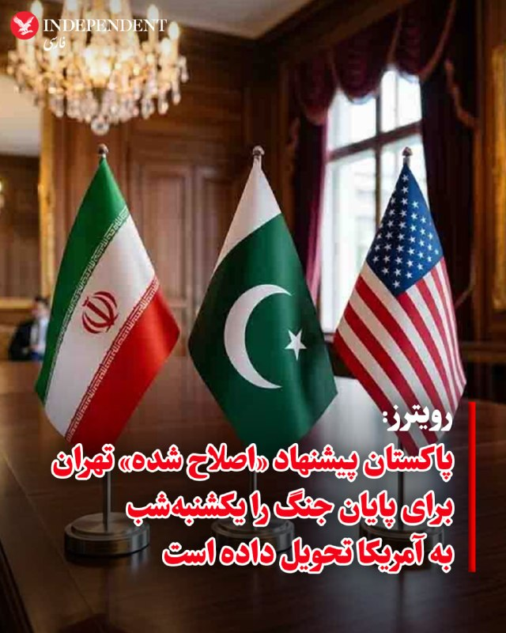
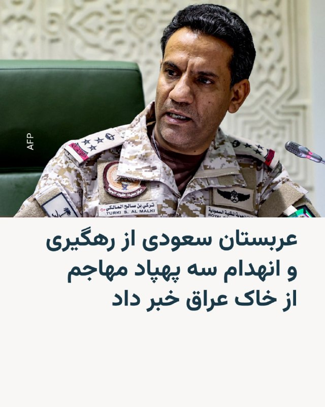

# خواننده تلگرام

<!-- TOP_NAV START -->

<a href="https://github.com/ProAlit/aio-downloader/blob/main/telegram/content/archive_1.md" style="display:inline-block; padding:6px 12px; margin:0 4px; background-color:#2ea44f; color:white; text-decoration:none; border-radius:4px; font-weight:bold;">صفحه بعد</a>

<!-- TOP_NAV END -->

<!-- MSG START -->

---
📅 بروزرسانی: 1405/02/28 12:33
---

## VahidOOnLine — post 240764

  

♦️ خبرگزاری رویترز روز دوشنبه ۲۸ اردیبهشت‌ماه به نقل از یک منبع پاکستانی گزارش کرد که اسلام‌آباد شامگاه یکشنبه «طرح پیشنهادی اصلاح شده»  جمهوری اسلامی ایران برای پایان دادن به جنگ را با آمریکا «به اشتراک گذاشته است».

این مقام پاکستانی که خواست نامش فاش نشود در پاسخ به پرسش رویترز درباره چالش زمان در حل اختلاف تهران و واشنگتن گفت: «ما وقت زیادی نداریم» و هر دو کشور به تغییر اهداف خود ادامه می‌دهند».

این خبر در حالی منتشر می‌شود که دونالد ترامپ، شامگاه یکشنبه هشدار داده بود که اگر ایران توافق را امضا نکند،‌ چیزی برایش باقی نخواهد ماند.
‌🇸🇦 Indypersian

🤖 @VahidOOnLine

## WithYashar — post 11536

ترامپ: اونا یه برگه می‌فرستن که هیچ ربطی به چیزی که توافق کرده بودیم نداره

منم می‌گم، شماها دیوونه‌اید یا چی؟
@withyashar

## DEJradio — post 4689

  <a href="telegram/content/DEJradio_4689_1779094997.webm" target="_blank">🎬 Download video</a>

🕐
🔺 جمهوری اسلامی در محاصره

#ترامپ #جمهوری_اسلامی
@DEJradio

## IranIntlTV — post 337748

  <a href="telegram/content/IranIntlTV_337748_1779094998.mp4" target="_blank">🎬 Download video</a>

یک شهروند با ارسال پیامی به ایران‌اینترنشنال می‌گوید اینترنت پرو خریده و با وجود مصرف کم، بعد از دو روز به او پیام داده‌اند که نصف حجم را مصرف کرده‌اند: «اصلا نمی‌فهمم چطور این حجم استفاده شده. بنظر می‌رسد دولت از همین هم سوءاستفاده می‌کند.»

## DW_Farsi — post 124820

  

🔶بقائی: از آمریکا ملاحظات اصلاحی دریافت کردیم و پاسخ دادیم

اسماعیل بقائی، سخنگوی وزارت خارجه ایران، روز دوشنبه ۲۸ اردیبهشت در نشست خبری هفتگی خود اظهار داشت تهران در حال "مذاکره و تدوین سازوکاری" با عمان در رابطه با تردد کشتی‌ها از تنگه هرمز است.

او افزود: «هفته گذشته دیداری بین بخش‌های کارشناسی در مسقط برگزار شد، در این باره به صورت مفصل و مستمر صحبت شده است و تماس‌ها ادامه دارد.»

بقائی در پاسخ به پرسشی در مورد گزارش‌ها مبنی بر دریافت هزینه برای تردد از تنگه هرمز، طرح چنین امری را "انحراف از اصل موضوع" خواند اما با این حال دریافت هزینه را رد نکرده و گفت: «طبیعی است که هر کشور ساحلی بابت خدماتی که ارائه می‌دهد هزینه‌هایی را دریافت کند اما اصل موضوع اطمینان از تردد ایمن و اقدام برای حفظ امنیت ملی است. اینکه ایران و عمان به عنوان دو کشور ساحلی سازوکاری را بر اساس حقوق بین‌الملل برای تردد ایمن ایجاد کنند، حتما انجام این امر هزینه‌هایی را در پی دارد.»

@dw_farsi

## RadioFarda — post 157304

  

🔸رسانه‌های ایران روز دوشنبه ۲۸ اردیبهشت به نقل از یک «منبع آگاه» در نیروی انتظامی خبر دادند که «۲۴ دستگاه خودرو» به‌دلیل ریخته شدن میخ‌های چندپر در یک اتوبان پنچر شدند.

🔸بر اساس این گزارش، «راننده یک خودروی شوتی» یکشنبه‌شب «با هدف ایجاد اختلال در تردد و نارضایتی عمومی، اقدام به ریختن میخ‌های چندپر در مسیر اتوبان تهران-کرج کرد».

🔸این منبع افزوده که این اقدام موجب آسیب‌دیدگی لاستیک‌های ۲۴ دستگاه خودرو شد و خسارت‌هایی به اموال شهروندان وارد کرد.

🔸به گزارش رسانه‌های ایران، برای این راننده پرونده قضایی تشکیل شده «و پلیس راهور تهران بزرگ با استفاده از تصاویر دوربین‌های نظارتی، فرد خاطی را تحت تعقیب قرار داده است».

🔸پیشتر گزارش شده بود که ۴۰۰ خودرو در این حادثه پنچر شده‌اند ولی نیروی انتظامی می‌گوید که این رقم درست نیست.

🔸خبرگزاری فارس از آسیب دیدن ۲۰ خودرو خبر داده است.

@RadioFarda

## alonews — post 120806

  <a href="telegram/content/alonews_120806_1779095002.mp4" target="_blank">🎬 Download video</a>

دوستان اگه پولتون زیادی کرده و نمیدونین باهاش چیکار کنین، کاخ گوتیک امیردشت با قیمت مفتِ 1500 میلیارد به فروش میرسه، حتما بخرین.

[@AloTweet]

## alonews — post 120805

اخبار جنگ الونیوز AloNews pinned a photo

## alonews — post 120804

  <a href="telegram/content/alonews_120804_1779095003.webm" target="_blank">🎬 Download video</a>

👈سخنگوی وزارت خارجه: آن چیزی که با قطعیت می‌توان گفت، این است که بحث حق، چیزی نیست که بخواهیم درباره‌اش گفت‌وگو و مصالحه کنیم.

🔴حق ایران برای غنی‌سازی بر مبنای توافقنامه NPT شناسایی شده و نیازی نیست دیگران این حق را برای ایران شناسایی کنند. این حق وجود دارد.

✅ @AloNews خبر جنگ

---
📅 بروزرسانی: 1405/02/28 12:23
---

## WithYashar — post 11535

وای نت عبری از قول منبع پاکستانی: «ما پیشنهاد اصلاح‌شده ایران را به آمریکا ارسال کرده‌ایم، وقت زیادی نداریم»
@withyashar

## IranIntlTV — post 337747

  

🔻فوتبال آلمان شاهد یکی از بزرگ‌ترین شگفتی‌های تاریخ خود است؛ باشگاه کوچک «الفرسبرگ» (SVE) با پیروزی ۳ بر صفر مقابل مونستر، برای نخستین بار در تاریخ ۱۰۹ ساله‌ی خود به بوندس‌لیگا صعود کرد. این تیم که در ایالت زارلاند واقع شده، نماینده‌ی شهری با جمعیت تنها ۱۳ هزار نفر است.

🔹به نوشته‌ روزنامه‌ بیلد، این منطقه حتی یک ایستگاه قطار هم ندارد، اما حالا آماده است تا در بالاترین سطح فوتبال آلمان حضور پیدا کند. الفرسبرگ پنجاه‌ونهمین تیم تاریخ بوندس‌لیگا و چهارمین نماینده‌ی ایالت زارلاند در این رقابت‌هاست.

🔹پشت پرده‌ این صعود معجزه‌آسا، فرانک هولتسر ۷۳ ساله، حامی مالی باشگاه و بازیکن سابق فوتبال قرار دارد. او پس از تحصیل در رشته داروسازی، شرکت داروسازی «اورسافارم» را تأسیس کرد؛ شرکتی که حامی مالی بایرن مونیخ نیز هست.

جزییات بیشتر را در سایت بخوانید

@iranintltvsport

## Persian_Trend_Official — post 14401

حضرتی: گشایش اینترنت بین الملل سیاست قطعی دولت است 🔹«فیلترینگ» امنیت سایبری کشور را به مخاطره انداخته است. رئیس شورای اطلاع رسانی دولت تأکید کرد: 🔹سیاست قطعی و بدون عقب نشینی دولت گشایش اینترنت بین‌الملل و رفع فیلترینگ است و تا کنون سه جلسه از سوی شورای…

## RadioFarda — post 157303

  

🔸رسانه‌های ایران روز دوشنبه ۲۸ اردیبهشت به نقل از یک «منبع آگاه» در نیروی انتظامی خبر دادند که «۲۴ دستگاه خودرو» به‌دلیل ریخته شدن میخ‌های چندپر در یک اتوبان پنجر شدند.

🔸بر اساس این گزارش، «راننده یک خودروی شوتی» یکشنبه‌شب «با هدف ایجاد اختلال در تردد و نارضایتی عمومی، اقدام به ریختن میخ‌های چندپر در مسیر اتوبان تهران-کرج کرد».

🔸این منبع افزوده که این اقدام موجب آسیب‌دیدگی لاستیک‌های ۲۴ دستگاه خودرو شد و خسارت‌هایی به اموال شهروندان وارد کرد.

🔸به گزارش رسانه‌های ایران، برای این راننده پرونده قضایی تشکیل شده «و پلیس راهور تهران بزرگ با استفاده از تصاویر دوربین‌های نظارتی، فرد خاطی را تحت تعقیب قرار داده است».

🔸پیشتر گزارش شده بود که ۴۰۰ خودرو در این حادثه پنجر شده‌اند ولی نیروی انتظامی می‌گوید که این رقم درست نیست.

🔸خبرگزاری فارس از آسیب دیدن ۲۰ خودرو خبر داده است.

@RadioFarda

## IranianMinds — post 20319

  

🔴 ترامپ :

ایرانی ها به شدت خواهان توافق هستند و از جنگ میترسند !

@IranianMinds

## IranianMinds — post 20318

🔴 سازمان ملل :

نگرانیم …

@IranianMinds

## Hranews — post 113008

  

هشت روز پس از بازداشت؛ بی‌خبری از سرنوشت استی محمدی ادامه دارد

❗️
❗️
❗️
❗️
❗️– استی محمدی، شهروند ۶۷ ساله اهل بوکان، علیرغم گذشت هشت روز از زمان بازداشت، همچنان در بلاتکلیفی به‌سر میبرد. بی‌خبری از سرنوشت خانم محمدی، منجر به افزایش نگرانی‌های خانواده وی شده است.

به گزارش خبرگزاری هرانا، ارگان خبری مجموعه فعالان حقوق بشر در ایران، استی محمدی کماکان در بازداشت و بلاتکلیفی به‌سر میبرد.

با گذشت هشت روز از زمان بازداشت، خانواده این شهروند همچنان از محل نگهداری و وضعیت او بی‌اطلاع هستند. استی محمدی دارای بیماری زمینه‌ای است و نیاز به مصرف دارو دارد.

ادامه مطلب

#استی_محمدی

↘️
@hranews_bot تماس ✉️ -  @Hranews  کانال هرانا 🆑

## alonews — post 120802

  <a href="telegram/content/alonews_120802_1779094411.webm" target="_blank">🎬 Download video</a>

👈پرزیدنت پزشکیان:
کسی که شعار می‌دهد باید پای شعارش بایستد

✅ @AloNews خبر جنگ

## alonews — post 120801

  <a href="telegram/content/alonews_120801_1779094412.webm" target="_blank">🎬 Download video</a>

👈ترامپ : اونا یه برگه می‌فرستن که هیچ ربطی به چیزی که توافق کرده بودیم نداره

🔴منم می‌گم :  "شماها دیوونه‌اید یا چی؟"

✅ @AloNews خبر جنگ

---
📅 بروزرسانی: 1405/02/28 12:12
---

## VahidOOnLine — post 240763

  

دونالد ترامپ، رییس‌جمهوری آمریکا، در مصاحبه با مجله فورچون گفت مقام‌های جمهوری اسلامی برای امضای توافق «بی‌تاب» هستند، اما پس از رسیدن به توافق، متنی ارسال می‌کند که به گفته او «هیچ ربطی به توافق انجام‌شده ندارد».

ترامپ گفت: «ایرانی‌ها برای امضای توافق بی‌تاب هستند. اما وقتی توافق می‌کنند، بعد از آن برگه‌ای برایت می‌فرستند که هیچ ربطی به توافقی که انجام داده‌اند ندارد. من به آن‌ها می‌گویم شما دیوانه هستید؟»
‌🏁 🇬🇧 IranintlTV

🤖 @VahidOOnLine

## VahidOOnLine — post 240762

  <a href="telegram/content/VahidOOnLine_240762_1779093769.mp4" target="_blank">🎬 Download video</a>

اسماعیل بقایی، سخنگوی وزارت خارجه جمهوری اسلامی، روز دوشنبه ۲۸ اردیبهشت، در نشست خبری خود گفت تهدید و فشار اقتصادی آمریکا نتوانسته تهران را از پیگیری حقوق خود منصرف کند.

بقایی با اشاره به تهدیدهای مطرح‌شده علیه جمهوری اسلامی گفت: «در صورت کوچک‌ترین خطایی از سوی طرف‌های مقابل، می‌توانیم خوب جواب دهیم.» او اضافه کرد در روزهای اخیر مردم در میدان‌های تهران می‌گویند: «تو رستم تهمتنی و بزن که خوب می‌زنی.»
‌🏁 🇬🇧 ManotoTV

🤖 @VahidOOnLine

## IranIntlTV — post 337746

  

دونالد ترامپ، رییس‌جمهوری آمریکا، در مصاحبه با مجله فورچون گفت مقام‌های جمهوری اسلامی برای امضای توافق «بی‌تاب» هستند، اما پس از رسیدن به توافق، متنی ارسال می‌کند که به گفته او «هیچ ربطی به توافق انجام‌شده ندارد».

ترامپ گفت: «ایرانی‌ها برای امضای توافق بی‌تاب هستند. اما وقتی توافق می‌کنند، بعد از آن برگه‌ای برایت می‌فرستند که هیچ ربطی به توافقی که انجام داده‌اند ندارد. من به آن‌ها می‌گویم شما دیوانه هستید؟»
https://iranintl.com/202605187853

## FarsiVOA — post 218034

🔺عمان حمله به نیروگاه هسته‌ای امارات را محکوم کرد؛ موج واکنش‌های منطقه‌ای به حملات پهپادی

▪️عمان روز دوشنبه حمله پهپادی به نیروگاه هسته‌ای براکه در منطقه الظفره امارات متحده عربی را محکوم کرد و همبستگی خود را با ابوظبی در اقداماتی که برای حفظ امنیت و تمامیت ارضی‌اش انجام می‌دهد، اعلام کرد.

▪️این واکنش پس از آن صورت گرفت که مقام‌های امارات اعلام کردند یک پهپاد به یک ژنراتور برق خارج از محدوده داخلی نیروگاه هسته‌ای براکه برخورد کرده و باعث آتش‌سوزی شده است.

▪️رویترز گزارش داد امارات منشأ حمله را بررسی می‌کند و دو پهپاد دیگر نیز از سوی پدافند این کشور رهگیری شده‌اند.

▪️عربستان سعودی و اتحادیه جهان اسلام نیز حمله به امارات را به‌شدت محکوم کرده‌اند.

⬇️ بیشتر بخوانید:
https://ir.voanews.com/a/8151176.html

## Persian_Trend_Official — post 14400

  <a href="telegram/content/Persian_Trend_Official_14400_1779093770.webm" target="_blank">🎬 Download video</a>

حضرتی: گشایش اینترنت بین الملل سیاست قطعی دولت است

🔹«فیلترینگ» امنیت سایبری کشور را به مخاطره انداخته است.

رئیس شورای اطلاع رسانی دولت تأکید کرد:
🔹سیاست قطعی و بدون عقب نشینی دولت گشایش اینترنت بین‌الملل و رفع فیلترینگ است و تا کنون سه جلسه از سوی شورای راهبردی و سیاست‌گذاری اینترنت کشور توسط معاون اول رئیس‌جمهور برگزار شده است.

🫆:Tony

📌 @persian_trend_official
پرشین ترند | متفاوت‌ترین کانال نظامی

## IranianMinds — post 20317

🔴 پاکستان:

ما یک پیشنهاد اصلاح‌ شده ایران را به آمریکا برای پایان دادن به جنگ ارائه دادیم

@IranianMinds

## Dirty_Kids — post 389662

  

ولی من دوست دارم فردای آزادی خودم رو به صورت فیزیکی به عمو مراد ویسی برسونم و ازش خواهش کنم تو یه برنامه بگه:
فرزند ایران و جان فدای میهن فریدون فرخزاد ۵۳ ساله از تهران عزیز
«یادمون باشه ما ها همه‌مون کم و زیاد به نوعی به فریدون فرخزاد بدهکاریم»
#پاينده_ایران_جاویدشاه

@Dirty_Kids 👻

## Hranews — post 113007

  

محمدعلی عموری از زندان شیبان اهواز به مکان نامعلومی منتقل شد

❗️
❗️
❗️
❗️
❗️– محمدعلی عموری، زندانی سیاسی محکوم به #حبس_ابد، حدود ده روز پیش توسط نیروهای اداره اطلاعات اهواز از زندان شیبان این شهر به مکان نامعلومی منتقل شد. تاکنون اطلاعی از محل نگهداری و وضعیت او حاصل نشده است.

به گزارش خبرگزاری هرانا، ارگان خبری مجموعه فعالان حقوق بشر در ایران، از سرنوشت و محل نگهداری محمدعلی عموری، زندانی سیاسی اطلاعی در دست نیست.

ماموران اداره اطلاعات اهواز روز شنبه ۱۹ اردیبهشت ماه، محمدعلی عموری را از زندان شیبان اهواز خارج کرده و به مکان نامعلومی منتقل کرده‌اند. با وجود پیگیری‌های خانواده، تا کنون هیچ نهاد مسئولی پاسخ روشنی درباره محل نگهداری یا وضعیت او ارائه نکرده است.

ادامه مطلب

#محمدعلی_عموری
↘️
@hranews_bot تماس ✉️ -  @Hranews  کانال هرانا 🆑

## alonews — post 120800

  <a href="telegram/content/alonews_120800_1779093772.webm" target="_blank">🎬 Download video</a>

👈دونالد ترامپ به مجله Fortune: «ایران مشتاقانه در تلاش است تا قراردادی امضا کند. آنها بسیار به دنبال یک توافق هستند، ایران درباره توافق صحبت می‌کند و سپس یک کاغذ کاملاً بی‌فایده که هیچ ارتباطی با آنچه ما بحث کردیم ندارد برای من می‌فرستد»

✅ @AloNews خبر جنگ

## alonews — post 120799

  <a href="telegram/content/alonews_120799_1779093772.webm" target="_blank">🎬 Download video</a>

👈امروز هشتادمین روز قطعی اینترنت ایرانه که بیش از ۱۸۹۶ ساعت ادامه داشته...

✅ @AloNews خبر جنگ

## alonews — post 120798

  <a href="telegram/content/alonews_120798_1779093772.mp4" target="_blank">🎬 Download video</a>

👈وزارت امور خارجه چین: تایوان بخشی جدایی‌ناپذیر از قلمرو چین است. تایوان هرگز کشور نبوده است، نه در گذشته و نه در آینده.

🔴استقلال تایوان و صلح در سراسر تنگه به اندازهٔ آتش و آب ناسازگارند.

✅ @AloNews خبر جنگ

---
📅 بروزرسانی: 1405/02/28 12:02
---

## VahidOOnLine — post 240761

  

خبرگزاری رویترز به نقل از یک منبع پاکستانی گزارش داد که اسلام‌آباد پیشنهاد اصلاح‌شده جمهوری اسلامی برای پایان دادن به درگیری در خاورمیانه را با آمریکا به اشتراک گذاشته است.

این منبع در پاسخ به پرسشی درباره زمان لازم برای رفع اختلاف‌ها گفت: «وقت زیادی نداریم.» او افزود دو کشور «مدام خط قرمزهای خود را تغییر می‌دهند.»
‌🏁 🇬🇧 IranintlTV

🤖 @VahidOOnLine

## WithYashar — post 11534

انفجار سنگین در بیت شمش اسرائیل و دیده شدن ابر قارچی گزارش شده که در کارخانه شرکت تومر رخ داد. این شرکت موتورهای موشک سنگین و سبک، از جمله موتورهای پیشران موشک‌های ارو ۲ و ارو ۳، موتور موشک هدف سیلور انکر، موتورهای ماهواره هورایزن و موتورهای موشک باراک ۸ و…

## pm_afshaa — post 90940

🔴منابع پاکستانی:آخرین پیشنهاد ایران برای پایان جنگ، یکشنبه شب(دیشب) به طرف آمریکایی ارسال شد

💧 Rainbet.com the #1 Non-KYC Crypto Casino & Sportsbook @rainbetcom

😁 @Pm_Afshaa

## IranIntlTV — post 337745

  

خبرگزاری رویترز به نقل از یک منبع پاکستانی گزارش داد که اسلام‌آباد پیشنهاد اصلاح‌شده جمهوری اسلامی برای پایان دادن به درگیری در خاورمیانه را با آمریکا به اشتراک گذاشته است.

این منبع در پاسخ به پرسشی درباره زمان لازم برای رفع اختلاف‌ها گفت: «وقت زیادی نداریم.» او افزود دو کشور «مدام خط قرمزهای خود را تغییر می‌دهند.»
https://iranintl.com/202605185818

## ManotoTV — post 105587

  <a href="telegram/content/ManotoTV_105587_1779093165.mp4" target="_blank">🎬 Download video</a>

اسماعیل بقایی، سخنگوی وزارت خارجه جمهوری اسلامی، روز دوشنبه ۲۸ اردیبهشت، در نشست خبری خود گفت تهدید و فشار اقتصادی آمریکا نتوانسته تهران را از پیگیری حقوق خود منصرف کند.

بقایی با اشاره به تهدیدهای مطرح‌شده علیه جمهوری اسلامی گفت: «در صورت کوچک‌ترین خطایی از سوی طرف‌های مقابل، می‌توانیم خوب جواب دهیم.» او اضافه کرد در روزهای اخیر مردم در میدان‌های تهران می‌گویند: «تو رستم تهمتنی و بزن که خوب می‌زنی.»

## RadioFarda — post 157302

  

🔸سخنگوی وزارت خارجه ایران می‌گوید روند مذاکرات تهران و واشینگتن، «ادامه‌دار» است و حکومت ایران از ایالات متحده، «اصلاحاتی» در پاسخ به طرح پیشنهادی خود دریافت کرده است.

🔸اسماعیل بقائی در نشست خبری روز دوشنبه ۲۸ اردیبهشت گفت: هفته گذشته، علی‌رغم این‌که طرف‌های آمریکایی به‌صورت علنی اعلام کردند طرح پیشنهادی ایران مردود است «اما ما از طرف میانجی پاکستانی مجموعه نکات و ملاحظات اصلاحی را از نظر آن‌ها دریافت کردیم».

🔸او افزود ایران بعد از این‌که طرح ۱۴ بندی خود را ارائه کرد، «طرف آمریکایی ملاحظاتش را مطرح کرد. متقابلاً ما نیز ملاحظات خود را مطرح کردیم. از روز بعد از ارسال نقطه‌نظر آمریکایی از طرف پاکستان، ما با مجموعه‌ای از پیشنهادات طرف مقابل مواجه شدیم که در این چند روز بررسی شد».

🔸سخنگوی وزارت خارجه ایران به‌دلیل آنچه تبادل «نقطه‌نظرات متقابل» طرفین به یکدیگر نامیده، تأکید کرد که «بنابراین، روند [مذاکرات ]از طریق پاکستان ادامه دارد».

🔸بقائی جزئیاتی در مورد اصلاحات مدنظر ایالات متحده ارائه نکرد.

@RadioFarda

## IranianMinds — post 20316

  <a href="telegram/content/IranianMinds_20316_1779093167.mp4" target="_blank">🎬 Download video</a>

🔴 اومدن مساجد رو پادگان کردن و هرچی اورانگوتان بسیجی هست و میبرن و بهش آموزش نظامی میدن که چطوری مردمو بکشن و ازش یه گزارش درست کردن تو‌ صداوسیما هم پخشش کردن !

بعد کافیه یه مسجد بمبارون شه همینا بیان زار بزنن بگن وای مناطق غیرنظامی زدن مکان مقدسو‌ هدف قرار دادن 😭

@IranianMinds

## manototv — post 105587

  <a href="telegram/content/manototv_105587_1779093171.mp4" target="_blank">🎬 Download video</a>

اسماعیل بقایی، سخنگوی وزارت خارجه جمهوری اسلامی، روز دوشنبه ۲۸ اردیبهشت، در نشست خبری خود گفت تهدید و فشار اقتصادی آمریکا نتوانسته تهران را از پیگیری حقوق خود منصرف کند.

بقایی با اشاره به تهدیدهای مطرح‌شده علیه جمهوری اسلامی گفت: «در صورت کوچک‌ترین خطایی از سوی طرف‌های مقابل، می‌توانیم خوب جواب دهیم.» او اضافه کرد در روزهای اخیر مردم در میدان‌های تهران می‌گویند: «تو رستم تهمتنی و بزن که خوب می‌زنی.»

## alonews — post 120797

  <a href="telegram/content/alonews_120797_1779093173.webm" target="_blank">🎬 Download video</a>

👈واکنش سخنگوی وزارت امورخارجه به تهدیدات ترامپ: خیالتان راحت، خوب بلدیم جواب دهیم

✅ @AloNews خبر جنگ

## alonews — post 120796

  <a href="telegram/content/alonews_120796_1779093173.mp4" target="_blank">🎬 Download video</a>

👈سخنگوی وزارت امور خارجه: منشأ حمله به کشتی کره جنوبی را بررسی می‌کنیم، قائل به برقراری امنیت کامل برای کشتی‌ها هستیم

✅ @AloNews خبر جنگ

## alonews — post 120795

  <a href="telegram/content/alonews_120795_1779093175.webm" target="_blank">🎬 Download video</a>

👈آخرین پیشنهاد ایران برای پایان جنگ، یکشنبه شب(دیشب) به طرف آمریکایی ارسال شد

✅ @AloNews خبر جنگ

---
📅 بروزرسانی: 1405/02/28 11:53
---

## VahidOOnLine — post 240760

  <a href="telegram/content/VahidOOnLine_240760_1779092587.mp4" target="_blank">🎬 Download video</a>

رالی خودرها در سن‌دیگو در حمایت از مردم ایران، یکشنبه ۲۷ اردیبهشت
‌🏁 🇬🇧 ManotoTV

🤖 @VahidOOnLine

## VahidOOnLine — post 240759

  <a href="telegram/content/VahidOOnLine_240759_1779092590.mp4" target="_blank">🎬 Download video</a>

اسماعیل بقایی، سخنگوی وزارت خارجه جمهوری اسلامی، روز دوشنبه ۲۸ اردیبهشت گفت مواردی مانند آزادسازی دارایی‌های مسدودشده ایران و رفع تحریم‌ها «شرط» تهران نیست، بلکه «مطالبات روشن و به‌حق» جمهوری اسلامی در مذاکرات است.

بقایی در پاسخ به پرسشی درباره شروط جمهوری اسلامی گفت ممکن است طرف مقابل موضوعات را به تشخیص خود نام‌گذاری کند، اما «مطالبات ما روشن است.»

سخنگوی وزارت خارجه جمهوری اسلامی همچنین رفع تحریم‌ها را یکی دیگر از مطالبات ایران دانست و گفت این موارد در هر مذاکره‌ای از سوی هیئت مذاکره‌کننده جمهوری اسلامی «با جدیت» پیگیری می‌شود.
‌🏁 🇬🇧 ManotoTV

🤖 @VahidOOnLine

## VahidOOnLine — post 240758

  <a href="telegram/content/VahidOOnLine_240758_1779092592.mp4" target="_blank">🎬 Download video</a>

⭕️بقایی: کشورهای منطقه به‌ویژه امارات باید از اتفاقات اخیر درس بگیرند

♦️اسماعیل بقایی، سخنگوی وزارت امور خارجه جمهوری اسلامی روز دوشنبه ۲۸ اردیبهشت‌ماه با انتقاد شدید از کشورهای همسایه به‌دلیل آنچه او «همکاری با متجاوزان به ایران» خواند، گفت: «کشورهای منطقه به‌ویژه امارات متحده عربی باید از اتفاقات اخیر درس بگیرند.»

این سخنان در حالی مطرح می‌شود که روز یکشنبه، امارات متحده عربی از حمله پهپادی به نیروگاه هسته‌ای براکه خبر داد و اعلام کرد که در حال بررسی منشاء این حمله است.
ساعاتی بعد، عربستان سعودی اعلام کرد با پهپادهایی که از خاک عراقی بلند شده و حریم هوایی این کشور را نقض کرده بودند، مقابله کرده است.
‌🇸🇦 Indypersian

🤖 @VahidOOnLine

## DEJradio — post 4688

  <a href="telegram/content/DEJradio_4688_1779092596.mp4" target="_blank">🎬 Download video</a>

🚨
🔸 اختلاف میان نیروهای مسلح؛ چالش تازه حکومت

*رضا تمیزکار، پرسنل سابق نیروی انتظامی

#نیروهای_مسلح #نیروی_انتظامی
@DEJradio

## ManotoTV — post 105586

  <a href="telegram/content/ManotoTV_105586_1779092599.mp4" target="_blank">🎬 Download video</a>

رالی خودرها در سن‌دیگو در حمایت از مردم ایران، یکشنبه ۲۷ اردیبهشت

## ManotoTV — post 105585

  <a href="telegram/content/ManotoTV_105585_1779092602.mp4" target="_blank">🎬 Download video</a>

اسماعیل بقایی، سخنگوی وزارت خارجه جمهوری اسلامی، روز دوشنبه ۲۸ اردیبهشت گفت مواردی مانند آزادسازی دارایی‌های مسدودشده ایران و رفع تحریم‌ها «شرط» تهران نیست، بلکه «مطالبات روشن و به‌حق» جمهوری اسلامی در مذاکرات است.

بقایی در پاسخ به پرسشی درباره شروط جمهوری اسلامی گفت ممکن است طرف مقابل موضوعات را به تشخیص خود نام‌گذاری کند، اما «مطالبات ما روشن است.»

سخنگوی وزارت خارجه جمهوری اسلامی همچنین رفع تحریم‌ها را یکی دیگر از مطالبات ایران دانست و گفت این موارد در هر مذاکره‌ای از سوی هیئت مذاکره‌کننده جمهوری اسلامی «با جدیت» پیگیری می‌شود.

## DW_Farsi — post 124819

  

📸 عکس روز: اهتزاز پرچم رنگین‌کمان در پارلمان آلمان

۱۷ مه روز جهانی "مقابله با نفرت‌پراکنی علیه همجنس‌گرایان، دوجنس‌گرایان، میان‌جنسی‌ها، ترنس‌ها و افراد بی‌جنس‌گرا" است. به همین مناسبت، در این روز پرچم رنگین‌کمان، به عنوان مشهورترین نماد این جامعه بزرگ، بر فراز ساختمان پارلمان آلمان (بوندستاگ) در برلین به اهتزاز درآمد؛ همتراز با پرچم آلمان و اتحادیه اروپا.

@dw_farsi

## Hranews — post 113006

  

کانون عالی انجمن‌های صنفی #کارگران ایران در نامه‌ای سرگشاده به رئیس مجلس شورای اسلامی، نسبت به آنچه «انحصار در روند انتخاب و اعزام نمایندگان کارگری» به اجلاس‌های سازمان بین‌المللی کار عنوان شده، انتقاد کرده است. در این نامه تأکید شده که در سال‌های اخیر، ترکیب هیئت‌های اعزامی به‌گونه‌ای بوده که به جای استفاده از ظرفیت نمایندگان تخصصی و منتخب حوزه کار، افراد محدود و نزدیک به بدنه وزارت تعاون، کار و رفاه اجتماعی در این فرآیند نقش پررنگ‌تری داشته‌اند.

در این نامه با اشاره به برگزاری پیش‌روی اجلاس سازمان بین‌المللی کار در ژنو، از مجلس شورای اسلامی خواسته شده درباره معیارهای انتخاب نمایندگان اعزامی و میزان شفافیت این روند توضیح داده شود. همچنین بر ضرورت استفاده از ظرفیت فراکسیون کارگری و جلوگیری از تکرار سازوکارهای غیرشفاف در اعزام‌ها، در شرایطی که به گفته این تشکل #مشکلات_معیشتی و اشتغال کارگران تشدید شده، تأکید شده است.

↘️
@hranews_bot تماس ✉️ -  @Hranews  کانال هرانا 🆑

## manototv — post 105586

  <a href="telegram/content/manototv_105586_1779092606.mp4" target="_blank">🎬 Download video</a>

رالی خودرها در سن‌دیگو در حمایت از مردم ایران، یکشنبه ۲۷ اردیبهشت

## manototv — post 105585

  <a href="telegram/content/manototv_105585_1779092610.mp4" target="_blank">🎬 Download video</a>

اسماعیل بقایی، سخنگوی وزارت خارجه جمهوری اسلامی، روز دوشنبه ۲۸ اردیبهشت گفت مواردی مانند آزادسازی دارایی‌های مسدودشده ایران و رفع تحریم‌ها «شرط» تهران نیست، بلکه «مطالبات روشن و به‌حق» جمهوری اسلامی در مذاکرات است.

بقایی در پاسخ به پرسشی درباره شروط جمهوری اسلامی گفت ممکن است طرف مقابل موضوعات را به تشخیص خود نام‌گذاری کند، اما «مطالبات ما روشن است.»

سخنگوی وزارت خارجه جمهوری اسلامی همچنین رفع تحریم‌ها را یکی دیگر از مطالبات ایران دانست و گفت این موارد در هر مذاکره‌ای از سوی هیئت مذاکره‌کننده جمهوری اسلامی «با جدیت» پیگیری می‌شود.

## alonews — post 120793

  <a href="telegram/content/alonews_120793_1779092612.webm" target="_blank">🎬 Download video</a>

🔴فوری/رویترز: پاکستان پیشنهاد به‌روزشده ایران رو به آمریکا منتقل کرد

✅ @AloNews خبر جنگ

## alonews — post 120792

  <a href="telegram/content/alonews_120792_1779092613.webm" target="_blank">🎬 Download video</a>

👈فیلد مارشال محسن رضایی:
هرکسی که ضد جمهوری اسلامیه و باهاش مشکل داره، ضد ایرانم هست.

✅ @AloNews خبر جنگ

## alonews — post 120791

  <a href="telegram/content/alonews_120791_1779092613.webm" target="_blank">🎬 Download video</a>

👈انجام عملیات انفجار کنترل‌شده در اندیمشک

✅ @AloNews خبر جنگ

---
📅 بروزرسانی: 1405/02/28 11:42
---

## VahidOOnLine — post 240757

⭕️ از مومیایی رضا شاه تا معمای دفن خامنه‌ای

📌 آیا این احتمال وجود دارد که دومین رهبر جمهوری اسلامی مخفیانه و به دور از چشم اغیار به خاک سپرده شده باشد؟

♦️ نزدیک به سه ماه از تاریخ کشته شدن رهبر جمهوری اسلامی آیت‌الله علی خامنه‌ای گذشته است؛ دومین چهره سیاسی نظام اسلامی که پس از آیت‌الله خمینی به قدرت رسید و تا زمان مرگ در نهم اسفندماه ۱۴۰۴، بیش از ۳۶ سال بر اریکه قدرت تکیه زد.

حاکم بلامنازعی که در هر رویداد سیاسی و اجتماعی ایران حرف آخر را می‌زد؛ مردی که بامداد شنبه نهم اسفند در مجتمع مسکونی موسوم به بیت رهبری در جریان حملات هوایی اسرائیل و آمریکا کشته شد.

آن‌گونه که نهادهای اطلاعاتی و امنیتی اسرائیلی و آمریکایی اعلام کردند و مقام‌های ایرانی نیز تایید کردند، وی در این حملات کشته شد، با این حال، آخرین فصل این ماجرا همچنان ناتمام مانده است: مراسم تشییع و تدفین رهبر پیشین جمهوری اسلامی.

🖊 کاملیا انتخابی فرد

بیشتر بخوانید...
‌🇸🇦 Indypersian

🤖 @VahidOOnLine

## mwarmonitor — post 9232

🇺🇸🇵🇰🇮🇷پاکستان شامگاه یکشنبه یک پیشنهاد اصلاح‌شده از سوی ایران را با ایالات متحده به اشتراک گذاشت که هدف آن پایان دادن به جنگ است — رویترز

@mwarmonitor

## DEJradio — post 4687

  <a href="telegram/content/DEJradio_4687_1779091975.mp4" target="_blank">🎬 Download video</a>

🔺🎥 “قیمت برنج سه برابر شده، دیگه نمی‌تونیم بخریم

یک شهروند با ارسال دیدیویی نوشت، «این فیلم کوتاه رو از فروشگاهی در تجریش - تهران - براتون میفرستم. قیمت یک گونی برنج از سال گذشته تا اکنون سه برابر شده. یه زمانی برنج ساده ترین ماده غذایی در سفره ها بود ولی با این قیمت‌ها دیگه برنج هم نمی تونیم بخریم. این حکومت فاسد هر روز سفره های ما رو کوچکتر و کوچکتر میکنه!»

#تورم #برنج
@DEJradio

## DEJradio — post 4686

  <a href="telegram/content/DEJradio_4686_1779091978.webm" target="_blank">🎬 Download video</a>

🚨📢 جیمی دایمن رئیس و مدیرعامل بانک «جی‌پی‌مورگان چیس» [بزرگترین بانک آمریکا]، در گفت‌وگو با فرانسین لاکوا در برنامه «بلومبرگ اوپن اینترست» با اشاره به جنگ آمریکا و اسرائیل با جمهوری اسلامی گفت: «آن‌ها ۴۷ سال است که تجاوز، کشتار و قتل انجام می‌دهند.» او افزود جهان غرب نباید اجازه می‌داد جنگ‌های نیابتی ادامه پیدا کند و «باید سال‌ها پیش سر مار را می‌زد.»

رئیس جی‌پی‌مورگان با اشاره به ادامه بحران خاورمیانه گفت اکنون ریسک بیشتری وجود دارد، اما شاید فرصت بیشتری هم برای صلح ایجاد شده باشد، زیرا «مردم خواهان صلح هستند.»

دایمن ۷۰ ساله گفت: «ما نباید نسبت به نقشی که حکومت فعلی ایران طی سال‌های طولانی در گسترش تروریسم و کشتن هزاران نفر، از جمله آمریکایی‌ها و بسیاری از شهروندان خودش، داشته است چشم‌پوشی کنیم. این تهدید باید به شکلی مناسب مورد رسیدگی قرار گیرد.»

#دی۱۴۰۴ #جنگ
@DEJradio

## IranIntlTV — post 337744

  <a href="telegram/content/IranIntlTV_337744_1779091979.mp4" target="_blank">🎬 Download video</a>

پلیس ترکیه از قتل هولناک یک زن میانسال ایرانی‌تبار در استانبول خبر داد. مقامات امنیتی این کشور ۳ نفر را در ارتباط با قتل فرخنده قائم‌مقامی، زن ۶۸ ساله ایرانی بازداشت کردند.

نرگس هورخش، خبرنگار ایران‌اینترنشنال، گزارش می‌دهد
@iranintltv

## IranIntlTV — post 337743

  <a href="telegram/content/IranIntlTV_337743_1779091981.mp4" target="_blank">🎬 Download video</a>

هم‌زمان با ادامه فشارهای اقتصادی و محدودیت‌های تجاری جمهوری اسلامی، صادرات افغانستان به ایران افزایش کم‌سابقه‌ای داشته است.

جواد همدانی، خبرنگار ایران‌اینترنشنال، گزارش می‌دهد
@iranintltv

## IranIntlTV — post 337742

  <a href="telegram/content/IranIntlTV_337742_1779091983.mp4" target="_blank">🎬 Download video</a>

همزمان با به بن‌بست خوردن مذاکرات میان واشینگتن و تهران و افزایش احتمال از سرگیری عملیات نظامی آمریکا و اسرائیل علیه جمهوری اسلامی، دونالد ترامپ هشدار داد: «زمان برای حکومت ایران به‌سرعت در حال پایان است.»

گفت‌وگو با محمد جواد اکبرین، عضو تحریریه ایران‌اینترنشنال
@iranintltv

## IranIntlTV — post 337741

  <a href="telegram/content/IranIntlTV_337741_1779091986.mp4" target="_blank">🎬 Download video</a>

همزمان با به بن‌بست خوردن مذاکرات میان واشینگتن و تهران، ترامپ گفت زمان برای رهبران جمهوری اسلامی رو به پایان است. رسانه‌های اسرائیل از آمادگی اورشلیم و واشینگتن برای ازسرگیری عملیات نظامی گزارش دادند.

اشکان صفایی، خبرنگار ایران‌اینترنشنال، گزارش می‌دهد
@iranintltv

## DW_Farsi — post 124818

  

🔶 سی‌ان‌ان: پنتاگون در حال آماده‌سازی طرح‌هایی برای حملات جدید علیه ایران است

شبکه خبری "سی‌ان‌ان" به نقل از یک منبع آگاه گزارش داد دونالد ترامپ روز شنبه ساعاتی پس از بازگشت از سفر به چین، نشستی را با تیم امنیت ملی خود درباره گام‌های احتمالی بعدی واشنگتن در قبال ایران برگزار کرده است.

این جلسه در باشگاه گلف "ویرجینیا" رئیس جمهور آمریکا برگزار شد و جی‌دی‌ ونس معاون رئیس جمهور، مارکو روبیو وزیر خارجه، جان رتکلیف رئیس سیا و استیو ویتکاف فرستاده ویژه ترامپ در آن شرکت داشته‌اند.

به نوشته سی‌ان‌ان، ترامپ و تیم او در جریان سفر به پکن تصمیم‌گیری در مورد نحوه ادامه مسیر با ایران را به تعویق انداختند زیرا به گفته چند مقام دولتی، آنها به دنبال این بودند که ابتدا نتیجه گفت‌وگوهای ترامپ با شی جین‌پینگ، رئیس جمهور چین مشخص شود. چین روابط نزدیکی با جمهوری اسلامی دارد و با محکوم کردن جنگ آمریکا و اسرائیل خواستار دستیابی به راه‌حلی مسالمت‌آمیز شده است.

@dw_farsi

## Persian_Trend_Official — post 14399

  

این اتفاق داره واسه مقاومت عراق داستان میشه !

## IranianMinds — post 20315

🔴 خبرگزاری فارس :

باید کابل های اینترنت فیبر نوری در تنگه هرمز رو نابود کنیم و با انفجار موشک‌ در‌ مدار لئو‌ اینترنت استارلینک رو هم قطع کنیم

@IranianMinds

## IranianMinds — post 20314

  

🔴 نبویان عضو کمیسیون امنیت ملی مجلس :

بزودی میخوایم‌ توی مجلس با رای نماینده ها یه جایزه ی بزرگ‌ بزاریم روی سر ترامپ و نتانیاهو که هرکسی اینارو‌ ترور کنه یه پول خیلی بزرگی بهش بدیم

و اگه دوباره به ما حمله کنن هم خودشونو کاخ هاشونو نابود میکنیم

@IranianMinds

## BBCPersian — post 281368

🔻نشست وزرای دارایی گروه هفت زیر سایه نگرانی‌ها از خطرات تورمی جنگ ایران

وزرای دارایی هفت کشور صنعتی جهان، موسوم به گروه هفت، در تلاش برای یافتن راه حلی برای پیامدهای تورمی جنگ ایران، امروز در پاریس دیدار می‌کنند.

این جلسه در حالی برگزار می‌شود که نگرانی از خطرات تورمی جنگ ایران، باعث فروش گسترده اوراق قرضه دولتی شده است.

اوراق قرضه، از توکیو گرفته تا نیویورک، روز دوشنبه به افت ارزش خود ادامه دادند؛ افت ارزش این اوراق قرضه به معنای افزایش نرخ بهره آنهاست که نشان می‌دهد

سرمایه‌گذاران به دلیل نگرانی از افزایش قیمت انرژی و تشدید تورم، پیشبینی می‌کنند که نرخ بهره بانکی افزایش خواهد یافت.

وزیر دارایی فرانسه، در پاسخ به این سوال که آیا بازارهای اوراق قرضه در حال فروپاشی هستند، گفت: «آنها در حال اصلاح قیمت هستند، من آن را فروپاشی توصیف نمی‌کنم.»

وزارت دارایی فرانسه گفت که در این نشست نمایندگانی از بانک‌های مرکزی گروه هفت نیز حضور خواهند داشت.

@BBCPersian

## BBCPersian — post 281367

🔻بقایی: بر سر حق غنی‌سازی گفت‌وگو یا مصالحه نمی‌کنیم

سخنگوی وزارت خارجه ایران درباره غنی‌سازی گفت: «آنچه با قطعیت می‌شود گفت بحث حق موضوعی نیست که ما بر سر آن گفتگو یا مصالحه کنیم. حق ایران برای غنی‌سازی بر اساس معاهده عدم اشاعه (ان‌پی‌تی) به رسمیت شناخته شده است.»

آقای بقایی در پاسخ به سوالی درباره پنج شرط آمریکا در برابر پنج شرط ایران گفت که ما مطالباتمان روشن است. مثلا درباره آزادشدن دارایی‌های ایران «شما می‌گویید این شرط ماست ما می‌گوییم این مطالبه ماست.»

او گفت که «آمریکا در سطح بین‌المللی دیگر معتبر تلقی نمی‌شود» و «کشورهای منطقه به شمول امارات باید درس بگیرند از اتفاقات ماه‌های اخیر که دیدند حضور آمریکا منجر به امنیت منطقه نشده است و آن را در مخاطره جدی قرار می‌دهد.»

@BBCPersian

## BBCPersian — post 281366

🔻بقایی: مذاکرات با میانجی پاکستانی ادامه دارد

اسماعیل بقایی، سخنگوی وزارت خارجه ایران، در نشست خبری هفتگی درباره مفاد پیشنهاد آمریکا گفت که ما وقتی طرح ۱۴ بندی را دادیم، طرف آمریکایی ملاحظاتش را مطرح کرد و ما هم متقابلا ملاحظاتمان را مطرح کردیم:

«هفته گذشته علیرغم اینکه طرف آمریکایی به‌صورت علنی اعلام کردند که این طرح [۱۴ بندی] مردود است ما از طریق میانجی پاکستانی مجموعه نکات و ملاحظات اصلاحی آنها را دریافت کردیم. روز بعد از ارسال طرح‌مان، با مجموعه‌ای از پیشنهادات طرف مقابل مواجه شدیم، در این چند روز بررسی شد و متقابلا پاسخ ما ارائه شده است و مذاکرات با میانجی پاکستانی ادامه دارد.»

@BBCPersian

## alonews — post 120790

  <a href="telegram/content/alonews_120790_1779091992.mp4" target="_blank">🎬 Download video</a>

👈پرواز جنگنده‌های اسرائیل در ارتفاع پایین، جنوب لبنان

✅ @AloNews خبر جنگ

---
📅 بروزرسانی: 1405/02/28 11:32
---

## VahidOOnLine — post 240756

  

علی بابایی کارنامی، رییس کمیسیون اجتماعی مجلس، اعلام کرد پس از جنگ اخیر، آمار بیکاری در کشور به‌صورت فزاینده‌ای رشد یافته و پیش‌بینی می‌شود بین ۲۲۰ تا ۴۰۰ هزار کارگر شغل خود را از دست بدهند.

او با اشاره به شرایط بحرانی بازار کار پیشنهاد کرد دولت مشابه دوران کرونا، حمایت مالی مستقیمی برای کارگران در نظر بگیرد و مبالغی به حساب آنان واریز کند تا امکان حفظ همکاری میان کارگران و کارفرمایان فراهم شود.

بابایی کارنامی افزود برای اجرای این طرح، لازم است هرچه سریع‌تر بخشنامه‌های لازم به استان‌ها ابلاغ شود، زیرا کارگران و کارفرمایان در انتظار تصمیم فوری دولت هستند.
‌🏁 🇬🇧 IranintlTV

🤖 @VahidOOnLine

## VahidOOnLine — post 240755

  <a href="telegram/content/VahidOOnLine_240755_1779091365.mp4" target="_blank">🎬 Download video</a>

ویدیوهای تازه رسیده به ایران‌اینترنشنال، بی‌تابی مادر جاویدنام متین پرویزی را در مراسم تولد او بر مزارش در هشتم فروردین نشان می‌دهد.
متین پرویزی، ۲۶ ساله، ۱۹ دی ۱۴۰۴ در زنجان از ناحیه پا هدف گلوله قرار گرفت و بر زمین افتاد. سپس مأموران به او تیر خلاص زدند.
‌🏁 🇬🇧 IranintlTV

🤖 @VahidOOnLine

## VahidOOnLine — post 240754

  

نت‌بلاکس دوشنبه ۲۸ اردیبهشت اعلام کرد هشتادمین روز از قطع اینترنت در ایران است و مدت این اختلال به ۱۸۹۶ ساعت رسیده است.

بر اساس گزارش این نهاد ناظر بر اینترنت جهانی، همزمان با تداوم این وضعیت، محتوای حامی حکومت شبکه‌های اجتماعی را پر کرده است.

این نهاد همچنین اعلام کرد برخی از ایرانیانی که برای دریافت اینترنت «پرو» یا دسترسی سیم‌کارت سفید اقدام کرده‌اند، می‌گویند از آن‌ها خواسته می‌شود سهمیه‌ای از پست‌های تبلیغاتی روزانه منتشر کنند.

نت‌بلاکس افزود این فعالیت‌ها با استفاده از هوش مصنوعی نظارت می‌شود.
‌🏁 🇬🇧 IranintlTV

🤖 @VahidOOnLine

## IranIntlTV — post 337740

  

علی بابایی کارنامی، رییس کمیسیون اجتماعی مجلس، اعلام کرد پس از جنگ اخیر، آمار بیکاری در کشور به‌صورت فزاینده‌ای رشد یافته و پیش‌بینی می‌شود بین ۲۲۰ تا ۴۰۰ هزار کارگر شغل خود را از دست بدهند.

او با اشاره به شرایط بحرانی بازار کار پیشنهاد کرد دولت مشابه دوران کرونا، حمایت مالی مستقیمی برای کارگران در نظر بگیرد و مبالغی به حساب آنان واریز کند تا امکان حفظ همکاری میان کارگران و کارفرمایان فراهم شود.

بابایی کارنامی افزود برای اجرای این طرح، لازم است هرچه سریع‌تر بخشنامه‌های لازم به استان‌ها ابلاغ شود، زیرا کارگران و کارفرمایان در انتظار تصمیم فوری دولت هستند.
https://iranintl.com/202605182561

## IranIntlTV — post 337739

  <a href="telegram/content/IranIntlTV_337739_1779091370.mp4" target="_blank">🎬 Download video</a>

ویدیوهای تازه رسیده به ایران‌اینترنشنال، بی‌تابی مادر جاویدنام متین پرویزی را در مراسم تولد او بر مزارش در هشتم فروردین نشان می‌دهد.
متین پرویزی، ۲۶ ساله، ۱۹ دی ۱۴۰۴ در زنجان از ناحیه پا هدف گلوله قرار گرفت و بر زمین افتاد. سپس مأموران به او تیر خلاص زدند.

## IranIntlTV — post 337738

  

نت‌بلاکس دوشنبه ۲۸ اردیبهشت اعلام کرد هشتادمین روز از قطع اینترنت در ایران است و مدت این اختلال به ۱۸۹۶ ساعت رسیده است.

بر اساس گزارش این نهاد ناظر بر اینترنت جهانی، همزمان با تداوم این وضعیت، محتوای حامی حکومت شبکه‌های اجتماعی را پر کرده است.

این نهاد همچنین اعلام کرد برخی از ایرانیانی که برای دریافت اینترنت «پرو» یا دسترسی سیم‌کارت سفید اقدام کرده‌اند، می‌گویند از آن‌ها خواسته می‌شود سهمیه‌ای از پست‌های تبلیغاتی روزانه منتشر کنند.

نت‌بلاکس افزود این فعالیت‌ها با استفاده از هوش مصنوعی نظارت می‌شود.
https://iranintl.com/202605188378

## RadioFarda — post 157301

🔸هم‌زمان با پخش برنامه‌های آموزشی نظامی در صداوسیما ویدئوهایی از آموزش کار با اسلحه برای کودکان و زنان در خیابان‌های تهران منتشر شده است.

🔸پیش از این گزارش‌هایی از استفاده از کودکان در ایست‌های بازرسی منتشر شده بود. این در حالی است که بر اساس قوانین بین‌الملل، به‌کارگیری افراد زیر ۱۵ سال در درگیری‌های نظامی ممنوع است و دیوان کیفری بین‌المللی جذب کودکان در جنگ را «جنایت جنگی» می‌داند.

🔸در روزهای گذشته تلویزیون حکومتی ایران با حضور کارشناسان نظامی اقدام به آموزش کار با انواع اسلحه از کلاشنیکف تا تیربار را آغاز کرده است.

🔸در همین حال اعلام شده است که ۵۰ مسجد در تهران آموزش‌های نظامی به زنان و مردان را در دستور کار قرار داده‌اند و مقرهایی در میادین پایتخت برای پاسخ‌گویی به پرسش‌های علاقه‌مندان برپا شده است.

@RadioFarda

## IranianMinds — post 20313

🔴 آکسیوس :

آتش‌بس در آستانه فروپاشی است، و‌ درگیری هر لحظه ممکن است دوباره شروع شود

@IranianMinds

## alonews — post 120789

  

❤️امروز فقط با گیگی 159 تومن کانفیگ اختصاصی خودت رو بخر
❤️

🤩
🤩
🤩
🤩
🤩
🤩
🤩
🤩
🤩
🤩
🤩
🤩
ساب
✅
ضریب
❌
ضمانت بازگشت وجه
✅
پشتیبانی مادام
✅
پس دیگه معطل هیچی نباش و بدون واسطه خرید کن
😁

خرید مستقیم از ربات:
@manageuser_robot
پرداخت ریالی فعال هست 
‼️

پشتیبانی درصورت بروز هرگونه مشکل:
@Niiiiiimaaaaa

## alonews — post 120788

  <a href="telegram/content/alonews_120788_1779091374.webm" target="_blank">🎬 Download video</a>

👈سخنگوی وزارت خارجه: ما در تماس مستمر با عربستان و قطر هستیم

✅ @AloNews خبر جنگ

## alonews — post 120787

  <a href="telegram/content/alonews_120787_1779091374.mp4" target="_blank">🎬 Download video</a>

👈پرواز جنگنده‌های اسرائیل تو ارتفاع پایین، جنوب لبنان

✅ @AloNews خبر جنگ

---
📅 بروزرسانی: 1405/02/28 11:23
---

## VahidOOnLine — post 240753

  

⭕️وزیر خزانه‌داری آمریکا: از گروه ۷ می‌خواهیم تا به نظام تحریم‌ها علیه «ماشین جنگی ایران» بپیوندند

♦️اسکات بسنت، وزیر خزانه‌داری ایالات متحده روز دوشنبه ۲۸ اردیبهشت‌ماه گفت از همتایان خود در گروه ۷ (هفت کشور صنعتی) خواهد خواست تا از نظام حقوقی تحریم‌های آمریکا علیه جمهوری اسلامی با هدف «اجازه ندادن به تامین مالی ماشین جنگی ایران» پیروی کنند.

به گزارش رویترز، بسنت به خبرنگاران گفت سفر هفته گذشته رئیس جمهوری آمریکا و همراهانش به چین بسیار موفقیت‌آمیز بوده است.
‌🇸🇦 Indypersian

🤖 @VahidOOnLine

## VahidOOnLine — post 240752

  

کانال ۱۳ اسرائیل گزارش داد در ۲۴ ساعت گذشته ده‌ها هواپیمای باری خالی از اسرائیل برخاستند، در پایگاه‌های آمریکایی در آلمان فرود آمدند، مهمات بارگیری کردند و سپس به اسرائیل بازگشتند.

بر اساس این گزارش، ارتش اسرائیل در روزهای اخیر در سطح بالایی از آماده‌باش قرار داشته و تاریخی را برای آمادگی تعیین کرده است.

کانال ۱۳ جزئیات بیشتری درباره نوع مهمات یا هدف از این جابه‌جایی منتشر نکرده است.
‌🏁 🇬🇧 IranintlTV

🤖 @VahidOOnLine

## WithYashar — post 11533

سخنگوی وزارت خارجه:
هفته گذشته علی‌رغم اینکه طرف‌های آمریکایی به‌طور علنی اعلام کردند طرح ایران مردود است، ما از طرف میانجی پاکستانی مجموعه‌ای از نکات و ملاحظات اصلاحی را دریافت کردیم.

بنابراین از روز بعد از ارسال نقطه‌نظرات ما به طرف آمریکایی، از طرف پاکستان مجموعه‌ای از پیشنهادات را دریافت کردیم که در این چند روز بررسی شد و هم‌چنان که دیروز اعلام شد، متقابلا نقطه‌نظرات ما به طرف آمریکایی منعکس شده است.

روند مذاکرات از طریق میانجی پاکستانی ادامه دارد
@withyashar

## pm_afshaa — post 90939

🔴سی‌ان‌ان: پنتاگون فهرستی از اهداف برای حمله به ایران در صورت صدور دستور ترامپ آماده کرده

💧 Rainbet.com the #1 Non-KYC Crypto Casino & Sportsbook @rainbetcom

😁 @Pm_Afshaa

## IranIntlTV — post 337737

  

🔻تیم ملی فوتبال ایران در آستانه آغاز رقابت‌های جام جهانی با بحران ویزا مواجه است. تا این لحظه، هنوز روادید بازیکنان ایران صادر نشده و همین موضوع به دغدغه اصلی امیر قلعه‌نویی، سرمربی تیم ملی، تبدیل شده است.

🔹امیر قلعه‌نویی پیش از اعزام کاروان تیم ملی به ترکیه، درباره آخرین وضعیت آماده‌سازی تیم و صدور ویزا گفت: «بازیکنان شایسته‌ای داشتیم که مجبور بودیم تعدادی از آن‌ها را انتخاب کنیم. انتخاب بازیکنان بسیار سخت بود اما این تصمیم بر اساس برنامه‌های تاکتیکی گرفته شد. البته از همین فهرست فعلی هم چند نفر حذف می‌شوند. امیدواریم در نهایت به ۲۸ بازیکن این فهرست ویزا بدهند، چرا که اگر ویزا صادر نشود، کارمان بسیار مشکل‌تر می‌شود.»

🔹او با اشاره به وضعیت آمادگی جسمانی بازیکنان افزود: «به دلیل مشکلات بدنی، در سه بخش حدود ۴۰ درصد عقب هستیم. البته در اردوی اخیر توانستیم ۲۵ درصد از این عقب‌ماندگی را جبران کنیم و امیدواریم تا ۲۶ خرداد بتوانیم بازیکنان را به شرایط ایده‌آل برسانیم.»

@iranintltvsport

## IranIntlTV — post 337736

  

کانال ۱۳ اسرائیل گزارش داد در ۲۴ ساعت گذشته ده‌ها هواپیمای باری خالی از اسرائیل برخاستند، در پایگاه‌های آمریکایی در آلمان فرود آمدند، مهمات بارگیری کردند و سپس به اسرائیل بازگشتند.

بر اساس این گزارش، ارتش اسرائیل در روزهای اخیر در سطح بالایی از آماده‌باش قرار داشته و تاریخی را برای آمادگی تعیین کرده است.

کانال ۱۳ جزئیات بیشتری درباره نوع مهمات یا هدف از این جابه‌جایی منتشر نکرده است.
https://iranintl.com/202605184450

## FarsiVOA — post 218033

  <a href="telegram/content/FarsiVOA_218033_1779090807.mp4" target="_blank">🎬 Download video</a>

گسترش آلودگی نفتی ایران به سواحل کویت؛ زنگ خطر فاجعه در خلیج فارس؛

بر اساس تصاویر منتشر شده در شبکه‌های اجتماعی، تداوم نشت نفت از زیرساخت‌های ایران، اکنون با عبور از مرزهای آبی، به سواحل کویت رسیده است.

یک تحلیلگر سعودی با انتقاد شدید از عملکرد تهران اعلام کرد: «هیچ‌چیز، نه در خشکی و نه در دریا، از آسیب‌های جمهوری اسلامی در امان نیست.»

پیشتر مایک والتز، نماینده آمریکا در سازمان ملل متحد نیز با انتشار ویدیویی از نشت مواد نفتی در آب‌های سواحل جنوبی ایران نوشته بود: «ایران اکنون علاوه بر اهداف غیرنظامی، به محیط زیست هم حمله می‌کند.»

منتقدان این وضعیت را نتیجه مستقیم «شرارت و بی‌توجهی» رژیم ایران به پروتکل‌های ایمنی می‌دانند و بر لزوم پاسخگو کردن بین‌المللی جمهوری اسلامی بابت نابودی آگاهانه محیط زیست منطقه تأکید دارند.

با گذشت دو هفته از مشاهده لکه نفتی بزرگ در غرب خارک، بزرگترین پایانه نفتی ایران، مقامات جمهوری اسلامی هنوز از شفاف‌سازی پیرامون آن طفره می‌روند.
@FarsiVOA

## alonews — post 120786

  <a href="telegram/content/alonews_120786_1779090810.webm" target="_blank">🎬 Download video</a>

👈ادعای شبکه سی‌ان‌ان: پنتاگون فهرستی از اهداف برای حمله به ایران در صورت صدور دستور ترامپ آماده کرده است

✅ @AloNews خبر جنگ

## alonews — post 120785

  <a href="telegram/content/alonews_120785_1779090810.webm" target="_blank">🎬 Download video</a>

👈سخنگوی وزارت خارجه: با هیچ یک از کشورهای منطقه دشمنی نداریم؛ همسایگان دائمی هستیم

🔴کشورهای منطقه به شمول امارات باید از اتفاقات دو سه ماه اخیر درس بگیرند و دیدند که حضور نظامی آمریکا و اسرائیل در منطقه امنیت آور نیست و باعث ناامنی برای همه کشورهای منطقه می‌شود

🔴رفت و آمدهای فراوانی بین رژیم و برخی کشورهای منطقه وجود داشته و دارد که از دید ما مخفی نبوده است

✅ @AloNews خبر جنگ

---
📅 بروزرسانی: 1405/02/28 11:13
---

## VahidOOnLine — post 240751

♦️ ای کاش که جای آرمیدن بودی
یا این ره دور را رسیدن بودی
کاش از پی صد هزار سال از دل خاک
چون سبزه امید بر دمیدن بودی

۲۸ اردیبهشت در تقویم ایران روز بزرگداشت حکیم عمر خیام نیشابوری است.

حکیم عمر خیام، فیلسوف، ادیب، ریاضی‌دان و اخترشناس بزرگ ایرانی شهرتی جهانی دارد.

این دانشمند پرآوازه ایرانی در اواسط قرن پنجم هجری در نیشابور متولد شد.  رباعیات «ندانم‌گرا/ لا ادری‌گرا»، تقویم دقیق جلالی و سال کبیسه از شاهکارهای جاودان او به شمار می‌رود.

حکیم عمر خیام به‌ویژه از اواخر قرن نوزدهم و پس از آنکه ادوارد فیتز جرالد رباعیات او را به انگلیسی ترجمه کرد،‌ شهرتی جهانی یافت.

حکیم عمر خیام را می‌توان یکی از تاثیرگذار‌ترین شخصیت‌های علمی و ادبی ایران دانست. خیام نیشابوری در زادگاهش نزد استادان برجسته‌ای چون «امام موفق نیشابوری» علوم زمانه خویش را در جوانی فراگرفت و در فلسفه و ریاضیات تبحر یافت.

آرامگاه خیام واقع در شهر نیشابور، در سال ۱۳۴۲ و به‌همت «هوشنگ سیحون»، معمار برجسته ایرانی، ساخته شد.
‌🇸🇦 Indypersian

🤖 @VahidOOnLine

## IranIntlTV — post 337735

  

🔻تیم ملی فوتبال برای برگزاری اردوی آماده‌سازی پیش از جام جهانی و همچنین اخذ ویزای آمریکا راهی ترکیه شد. این در حالی است که هنوز مشخص نیست کدام بازیکنان بتوانند ویزای آمریکا را دریافت کنند و تیم ملی فوتبال با بحران ویزا مواجه است.

🔹مهدی محمدنبی، نایب‌رییس فدراسیون فوتبال و مدیر تیم ملی، پیش از سفر به ترکیه به سایت فدراسیون فوتبال گفت: «تیم ملی راهی ترکیه می‌شود تا طبق برنامه از پیش تعیین‌شده، دو بازی دوستانه قطعی برگزار کند. یکی از این تیم‌ها گامبیا است و تیم دوم را پس از نهایی شدن قرارداد، در دو سه روز آینده اعلام خواهیم کرد. یک بازی هم با یکی از باشگاه‌های ترکیه خواهیم داشت.»

🔹او ادامه داد: «تیم ملی سپس راهی شهر توسان در ایالت آریزونا خواهد شد و آنجا با پورتوریکو بازی خواهد کرد. با توجه به مینی‌کمپ‌هایی که کادر فنی در تهران برگزار کرد، امیدواریم اردوی ترکیه مکمل خوبی برای آماده‌سازی مدنظر امیر قلعه‌نویی باشد.»

🔹این در حالی است که به دلیل انزوای جمهوری اسلامی بازی‌های تدارکاتی تیم ملی پیش از جام جهانی لغو شدند و تیم‌های ملی اسپانیا، مقدونیه و آنگولا از بازی با تیم ملی انصراف دادند.

@iranintltvsport

## DW_Farsi — post 124817

  

🔶 از ابتدای جنگ ۶۵۰۰ جاسوس را بازداشت کردیم

احمدرضا رادان، فرمانده نیروی انتظامی، گفته است که از آغاز جنگ آمریکا و اسرائیل با ایران، "بیش از ۶۵۰۰ نفر" به اتهام "وطن‌فروشی و جاسوسی" بازداشت شده‌اند. او مدعی شد از میان بازداشت‌شدگان ۵۶۷ نفر به طور خاص به "نفاق، اشرار و گروهک‌های ضدانقلاب" مرتبط بوده‌اند.

مقامات جمهوری اسلامی در هفته‌های گذشته از بازداشت شماری از شهروندان به اتهام "جاسوسی و همکاری با دشمن" از جمله به دلیل ارسال اطلاعات، فیلم یا حتی فعالیت در شبکه‌های اجتماعی خبر داده‌اند، در حالی‌که هیچ جزئیات دقیقی در مورد هویت بازداشت‌شدگان، نوع اتهام‌ها و روند قضایی رسیدگی به پرونده‌ آنان ارائه نکرده‌اند.

رادان همچنین اضافه کرده است که "دستگیری سربازان دشمن و وطن‌فروشان" در اعتراضات سراسری دی‌ماه ۱۴۰۴ که او با عنوان "اغتشاشات" از آن یاد کرده، همچنان ادامه دارد و پلیس اقدامات خود را متوقف نکرده است.

@dw_farsi

## Dirty_Kids — post 389661

  

‌‌‏این بچه خایه داره اندازه کل هیکل بابات

@Dirty_Kids 👻

## Dirty_Kids — post 389660

  

پناه بر خدا این گربه جدی جدی ریش و سبیل داره.

@Dirty_Kids 👻

## Hranews — post 113005

گزارشی از بازداشت و پخش اعترافات اجباری یک زن در غرب تهران

❗️
❗️
❗️
❗️
❗️– مرکز اطلاع‌رسانی فرماندهی انتظامی تهران بزرگ از #بازداشت یک زن در غرب تهران با اتهاماتی همچون «حمایت از حملات دشمنان خارجی در فضای مجازی و همکاری با سرویس‌های جاسوسی» خبر داد. همزمان ویدیویی از #اعترافات_اجباری این شهروند منتشر شده که شرایط ضبط آن مشخص نیست.

ادامه مطلب

↘️
@hranews_bot تماس ✉️ -  @Hranews  کانال هرانا 🆑

## alonews — post 120784

  <a href="telegram/content/alonews_120784_1779090192.webm" target="_blank">🎬 Download video</a>

👈الجزیره: نتانیاهو روی جنگ با ایران برای تغییر معادله سیاسی شرط‌بندی می‌کند

✅ @AloNews خبر جنگ

## alonews — post 120783

  <a href="telegram/content/alonews_120783_1779090193.webm" target="_blank">🎬 Download video</a>

👈اوکراین: یک پهپاد روسی به یک کشتی باری چینی در دریای سیاه برخورد کرد

✅ @AloNews خبر جنگ

## alonews — post 120782

  <a href="telegram/content/alonews_120782_1779090193.webm" target="_blank">🎬 Download video</a>

👈سخنگوی وزارت خارجه: با عمان برای تدوین سازوکار جدید تنگه هرمز در حال مذاکره هستیم

🔴اقدام ایران در تنگه هرمز بر اساس حقوق بین‌الملل و حقوق داخلی ایران مجاز است

✅ @AloNews خبر جنگ

## alonews — post 120781

  <a href="telegram/content/alonews_120781_1779090193.webm" target="_blank">🎬 Download video</a>

👈معاون وزارت نیرو: اگر مردم ۱۰ درصد در مصرف برق صرفه‌جویی کنند تا ۳۰ درصد در‌ قبض تخفیف می‌گیرند

✅ @AloNews خبر جنگ

---
📅 بروزرسانی: 1405/02/28 11:02
---

## WithYashar — post 11532

سخنگوی سنتکام به شبکه العربیة:ما به اهداف نظامی که برای خود در ایران تعیین کرده بودیم، دست یافته‌ایم

ما تا حد زیادی توانایی‌های نظامی ایران را نابود کرده‌ایم.
ما ظرفیت تولید نظامی ایران را نابود کرده‌ایم.
با متحدان خود برای پشتیبانی از پدافند هوایی همکاری کردیم.
توانایی ایران برای تهدید دیگر مانند گذشته نیست.
عملیات علیه ایران بسیار مؤثر بود.
ما به دلیل استفاده از تنگه هرمز به عنوان سلاحی برای تهدید آزادی دریانوردی، ایران را محاصره می‌کنیم.

برای هرگونه طرح احتمالی که ممکن است از ما درخواست شود، آماده‌ایم.
در طول آتش‌بس با ایران، تجدید تسلیحات و استقرار مجدد نیرو داشته‌ایم.

تهدیدات ایران مانع عبور کشتی‌ها از تنگه هرمز می‌شود.
تحریم ایران بسیار مؤثر است و ما به اجرای آن ادامه می‌دهیم.
@withyashar

## pm_afshaa — post 90938

🔴سخنگوی وزارت امور خارجه بقایی:
تیم‌های فنی ما و عمان برای هماهنگی در پرونده تنگه هرمز دیدار کردند

ما با هیچ یک از کشورهای منطقه، از جمله امارات، دشمنی نداریم، ما همسایگانیم و تهران به دنبال صلح است

حضور آمریکا منطقه را در خطر دائمی قرار می‌دهد

ما از کشورهایی که سرزمین، منابع و آسمان خود را در اختیار متجاوزان قرار می‌دهند، گله‌مندیم

حق ما در غنی‌سازی اورانیوم را در مذاکرات مطرح نخواهیم کرد

💧 Rainbet.com the #1 Non-KYC Crypto Casino & Sportsbook @rainbetcom

😁 @Pm_Afshaa

## Persian_Trend_Official — post 14398

  

طرز تهیه چای کرک

چای کرک یکی از نوشیدنی‌های محبوب عمان و کشورهای خلیج فارس است؛ چایی غلیظ، معطر، شیرین و خامه‌ای که معمولاً با هل و شیر درست می‌شود و طعم خیلی خاصی دارد.

مواد لازم
آب: ۱ لیوان
شیر: ۱ لیوان
چای سیاه: ۱ تا ۲ قاشق چای‌خوری
شکر: ۱ تا ۲ قاشق غذاخوری، بسته به ذائقه
هل: ۳ تا ۴ عدد، کمی کوبیده‌شده
زعفران: مقدار خیلی کم، اختیاری
زنجبیل تازه یا پودر زنجبیل: مقدار کم، اختیاری
طرز تهیه

ابتدا آب را داخل قابلمه کوچک بریزید و روی حرارت قرار دهید تا به جوش بیاید. بعد چای سیاه، هل کوبیده‌شده و در صورت تمایل کمی زنجبیل یا زعفران را اضافه کنید.

اجازه دهید چای چند دقیقه بجوشد تا رنگ و عطر آن کاملاً آزاد شود. سپس شیر را اضافه کنید و حرارت را کمی پایین بیاورید. حالا شکر را هم اضافه کنید و خوب هم بزنید.

بگذارید مخلوط چای و شیر حدود ۵ تا ۷ دقیقه آرام بجوشد تا کمی غلیظ شود و طعم مواد کاملاً با هم ترکیب شود. در این مرحله اگر دوست دارید چای کرک غلیظ‌تر و مجلسی‌تر شود، می‌توانید مقدار کمی شیر تبخیرشده یا شیر غلیظ‌شده هم اضافه کنید.

در پایان چای را از صافی رد کنید و داغ سرو کنید.

نکته مهم

راز خوش‌طعم شدن چای کرک عمانی این است که چای و شیر چند دقیقه با هم بجوشند تا نوشیدنی حالت غلیظ، معطر و کرمی پیدا کند. هرچه هل تازه‌تر باشد، عطر چای بهتر می‌شود.

پ.ن: چون درخواست ها زیاد بود، طرز تهیش رو پست کردم. من که خیلی دوسش دارم، امیدوارم امتحان کنید و لذت ببرید.

## RadioFarda — post 157300

عفو بین‌الملل: ایران در سال ۲۰۲۵ شمار «‌بی‌سابقه‌ای» از افراد را اعدام کرد

🔸سازمان عفو بین‌الملل روز دوشنبه ۲۸ اردیبهشت گزارش داد که ایران در سال ۲۰۲۵ تعداد «بی‌سابقه» دو هزار و ۱۵۹ نفر را اعدام کرده است؛ رقمی که باعث افزایش آمار جهانی تا بالاترین سطح از سال ۱۹۸۱ به این سو شده است.

🔸این سازمان مستقر در لندن اعلام کرد که در سال ۲۰۲۵ دست‌کم دو هزار و ۷۰۷ نفر در سراسر جهان اعدام شده‌اند، هرچند اعدام‌های انجام‌شده در چین در این آمار لحاظ نشده است.

🔸عفو بین‌الملل گفت «هزاران اعدام» در چین، که بیشترین استفاده را از مجازات اعدام در جهان دارد، انجام شده، اما جزئیات به‌دلیل «محرمانه بودن داده‌های دولتی» در این کشور کمونیستی نامشخص است.

🔸این سازمان افزود که آمار جهانی سال ۲۰۲۵، شامل اعدام‌ها در عربستان سعودی، کویت، مصر، یمن، سنگاپور و ایالات متحده، نسبت به مجموع سال ۲۰۲۴ بیش از دو سوم افزایش داشته است.

🔸در این گزارش آمده است: «این روند بیشترین شدت را در کشورهایی داشته که مقامات در آن‌ها با محدود کردن فضای مدنی، خاموش کردن صداهای مخالف و بی‌اعتنایی به حمایت‌های مقرر در قوانین و استانداردهای بین‌المللی حقوق بشر، کنترل خود بر قدرت را تشدید کرده‌اند».

🔸به نوشته عفو بین‌الملل، «افزایش بی‌سابقه اعدام‌های ثبت‌شده در ایران» در حالی رخ داده که مقام‌های جمهوری اسلامی، به‌ویژه پس از جنگ ۱۲ روزه تابستان پارسال با اسرائیل، «استفاده از مجازات اعدام را به‌عنوان ابزاری برای سرکوب و کنترل سیاسی تشدید کرده‌اند».

🔸عفو بین‌الملل و دیگر گروه‌های حقوق بشری گفته‌اند که پس از اعتراضات گسترده ضدحکومتی در دی‌ماه پارسال و همچنین پس از آغاز جنگ با اسرائیل و ایالات متحده در اسفندماه، استفاده از مجازات اعدام در ایران افزایش یافته است.

🔸نسخه کامل این گزارش را در وب‌سایت رادیوفردا بخوانید.

---
📅 بروزرسانی: 1405/02/28 10:52
---

## VahidOOnLine — post 240750

  

⭕️قیمت نفت در سایه احتمال آغاز دوباره جنگ از مرز ۱۱۱ دلار گذشت

♦️بهای نفت در بازارهای جهانی روز دوشنبه ۲۸ اردیبهشت‌ماه و در پی تشدید تنش میان جمهوری اسلامی ایران و آمریکا و بالا رفتن احتمال از سرگیری حملات نظامی آمریکا و اسرائیل افزایش یافت و از مرز ۱۱۱ دلار گذاشت.

قیمت هر بشکه نفت خام برنت دریای شمال در پایان کار بازارهای آسیا و همزمان با بازگشایی بورس‌های اروپایی در نخستین روز کاری هفته به ۱۱۱ دلا و ۲۴ سنت رسید. همزمان، شاخص بهای بازارهای بورس هم در آسیا و اقیانوسیه و هم در اروپا کاهش یافت.
‌🇸🇦 Indypersian

🤖 @VahidOOnLine

## VahidOOnLine — post 240749

  

اسکات بسنت، وزیر خزانه‌داری آمریکا، روز دوشنبه اعلام کرد از وزیران دارایی گروه هفت خواهد خواست نظام تحریم‌ها علیه جمهوری اسلامی را دنبال کنند تا از تامین مالی آنچه او «ماشین جنگی» حکومت ایران توصیف کرد، جلوگیری شود.

بسنت همچنین افزود سفر هفته گذشته هیات آمریکا به چین به ریاست دونالد ترامپ، رییس‌جمهوری آمریکا، «بسیار موفق» بوده است.
‌🏁 🇬🇧 IranintlTV

🤖 @VahidOOnLine

## WithYashar — post 11531

شب گذشته راننده یک خودروی شوتی با هدف فرار از دست نیروهای پلیس اقدام به ریختن میخ‌های چندپر در مسیر اتوبان تهران–کرج کرد که موجب آسیب‌دیدگی لاستیک‌های ۲۴ دستگاه خودرو و مسدود شدن آزادراه تا صبح امروز شد

پلیس اعلام کرده که با استفاده از دوربین های جاده ای خودروی شوتی شناسایی شده و راننده آن تحت تعقیب است
@withyashar

## FarsiVOA — post 218032

  

ارتش اسرائیل اعلام کرد که در شبانه‌روز گذشته بیش از ۳۰ زیرساخت «سازمان تروریستی حزب‌الله» را در جنوب لبنان هدف قرار داده است؛ این اهداف شامل انبارهای تسلیحات، مواضع دیده‌بانی و زیرساخت‌هایی است که به گفته ارتش اسرائیل «برای پیشبرد طرح‌های تروریستی علیه نیروهای ما استفاده می‌شدند».

ارتش اسرائیل اعلام کرده که به عملیات خود برای رفع تهدیدها علیه شهروندان اسرائیل و نیروهای ارتش در جنوب لبنان ادامه می‌دهد.

همچنین بر اساس این اعلام، «در حملات دقیق، تعدادی از تروریست‌های سازمان حزب‌الله که برای پیشبرد طرح‌های تروریستی علیه نیروهای ارتش اسرائیل در جنوب لبنان فعالیت می‌کردند، از بین رفتند.»
@FarsiVOA

## Persian_Trend_Official — post 14393

پست قابل تأمل ‌ترامپ که لحظاتی قبل در تروث سوشال منتشر کرده است. ☆Phantom☆ 📌 @persian_trend_official پرشین ترند | متفاوت‌ترین کانال نظامی

## Hranews — post 113004

دستور توقیف اموال ۱۲۹ شهروند در استان آذربایجان غربی صادر شد 
❗️
❗️
❗️
❗️
❗️– رئیس‌ کل دادگستری آذربایجان غربی از صدور دستور #توقیف_اموال ۱۲۹ شهروند در این استان به دلیل آنچه “اقدامات ضدامنیتی” و همکاری با “کشورهای متخاصم” عنوان کرده، خبر داد. ادامه مطلب ↘️…

## alonews — post 120780

  <a href="telegram/content/alonews_120780_1779088977.mp4" target="_blank">🎬 Download video</a>

👈رئیس پلیس راه راهور فراجا:
شب گذشته، در جریان یک تعقیب‌وگریز برای متوقف کردن یک دستگاه خودروی شوتی بودیم. این متخلف برای جلوگیری از تعقیب پلیس، اقدام به ریختن میخ سه‌پر کرد تا بتواند از دست پلیس فرار کند که در نهایت این اقدام منجر به پنچر شدن تعداد زیادی خودرو شد

🔴در نهایت خودروی متخلف توقیف شد.

✅ @AloNews خبر جنگ

## alonews — post 120779

  <a href="telegram/content/alonews_120779_1779088978.webm" target="_blank">🎬 Download video</a>

👈سخنگوی وزارت کشور: آمادگی ما از ابتدای جنگ رمضان بیشتر است/ از سختی‌های مردم مطلعیم کاستی‌ها برطرف می‌شود

✅ @AloNews خبر جنگ

## alonews — post 120778

  <a href="telegram/content/alonews_120778_1779088978.webm" target="_blank">🎬 Download video</a>

👈طرح جدید ایران برای عبور کشتی‌ها از تنگه هرمز

🔴ایران اعلام کرده به‌زودی یک سیستم جدید مدیریت عبور کشتی‌ها از تنگه هرمز راه‌اندازی می‌کنه.

🔴طبق این طرح، مسیر حرکت کشتی‌ها مدیریت میشه و کشتی‌هایی که بخوان عبور امن (Safe Passage) داشته باشن باید هزینه پرداخت کنن.

🔴گفته میشه این طرح با نام Hormuz Safe معرفی میشه و در قالب آن کشتی‌ها باید بیمه مخصوص عبور از تنگه هرمز دریافت کنن.

🔴نکته جالب اینه که طبق گزارش‌ها امکان پرداخت این هزینه با بیت‌کوین هم در نظر گرفته شده.

🔴از طرفی موضوع دیگه ای که چند تا خبرگزاری فارسی روش کار کردن این بود که جای هزینه پرداخت کشتی ها بیمه ایرانی بشن و ایران اونارو بیمه کنه

✅ @AloNews خبر جنگ

---
📅 بروزرسانی: 1405/02/28 10:43
---

## IranIntlTV — post 337734

  

اسکات بسنت، وزیر خزانه‌داری آمریکا، روز دوشنبه اعلام کرد از وزیران دارایی گروه هفت خواهد خواست نظام تحریم‌ها علیه جمهوری اسلامی را دنبال کنند تا از تامین مالی آنچه او «ماشین جنگی» حکومت ایران توصیف کرد، جلوگیری شود.

بسنت همچنین افزود سفر هفته گذشته هیات آمریکا به چین به ریاست دونالد ترامپ، رییس‌جمهوری آمریکا، «بسیار موفق» بوده است.
https://iranintl.com/202605189837

## DW_Farsi — post 124816

  

🔶 "بازار داغ" خرید و فروش سیم‌کارت‌های عراقی در مناطق مرزی ایران

همزمان با گذشت ۸۰ روز از قطعی سراسری اینترنت در ایران، گزارش‌ها حاکی از شکل‌گیری بازار خرید و فروش سیمکارت‌های عراقی در برخی مناطق مرزی کشور است.

روزنامه "ایران" روز دوشنبه ۲۸ اردیبهشت (۱۸ مه) در گزارشی نوشت بخش مهمی از متقاضیان این سیمکارت‌ها بازرگانانی هستند که به دلیل ارتباطات شغلی، ارسال اسناد تجاری، حواله‌های مالی و هماهنگی‌های لجستیکی با طرف‌های تجاری خود به اینترنت نیاز دارند.

طبق این گزارش، سیمکارت‌های عراقی در مقایسه با فیلترشکن‌هایی که در بازار سیاه اینترنت ایران عرضه می‌شوند، ارزانتر هستند و در برخی نقاط مرزی مانند شلمچه، چذابه و قصرشیرین سیگنال اپراتورهای عراقی تا حدود یک تا دو کیلومتر داخل خاک ایران قابل دریافت است.

نت‌بلاکس که در زمینه پایش، تحلیل و مستندسازی وضعیت اینترنت در جهان فعالیت می‌کند، پیش‌تر عدم دسترسی مردم به شبکه‌های بین‌المللی را موجب از دست رفتن گسترده مشاغل و بیکاری کارگران و کارفرمایان مستقل دانسته و هشدار داده بود این وضعیت عملا "موجب انتقال ثروت به گروه‌های همسو با حکومت می‌شود".

@dw_farsi

---
📅 بروزرسانی: 1405/02/28 10:33
---

## VahidOOnLine — post 240748

  

⭕️عضو کمیسیون امنیت ملی: مجلس برای کشتن ترامپ و نتانیاهو جایزه تعیین می‌کند

♦️محمود نبویان، عضو کمیسیون امنیت ملی مجلس شورای اسلامی روز دوشنبه ۲۸ اردیبهشت گفت «به‌زودی طرحی با هدف تعیین «پاداش» برای فردی که دونالد ترامپ و بنیامین نتانیاهو را «به درک واصل کند» به رای نمایندگان گذاشته خواهد شد.

این عضو «جبهه پایداری» با انتشار پیامی در یکی از شبکه‌های اجتماعی داخلی با اشاره به احتمال از سرگیری حملات نظامی به جمهوری اسلامی نوشت که تهدیدهایی علیه مجتبی خامنه‌ای و فرماندهان نظامی جمهوری اسلامی مطرح شده و هشدار داد در صورت هرگونه حمله، پاسخ ایران «ویرانگر» خواهد بود.
‌🇸🇦 Indypersian

🤖 @VahidOOnLine

## WithYashar — post 11530

طبق روال هر روز اسرائیل جنوب لبنان را شخم میزند.
@withyashar

## IranIntlTV — post 337733

  <a href="telegram/content/IranIntlTV_337733_1779087807.mp4" target="_blank">🎬 Download video</a>

یک دانشجو با ارسال پیامی به ایران‌اینترنشنال می‌گوید: «برای دانشجویان هیچ‌گونه دسترسی به اینترنت آزاد و بین‌المللی در نظر گرفته نشده. مقالات، پروژه‌ها و پایان نامه‌های ما به‌خاطر دسترسی به چیزی که حق طبیعی هر انسانی است، ناتمام مانده.»

## FarsiVOA — post 218031

  

یک مقام قضایی در آذربایجان غربی از توقیف اموال ۱۲۹ شهروند در این استان خبر داد و آنان را به همکاری با آمریکا و اسرائیل متهم کرد.

بر اساس گزارش روز دوشنبه خبرگزاری میزان، ناصر عتباتی، مدعی شد این افراد به اتهام همکاری با گروه‌های ضدانقلاب، تجزیه‌طلب و انجام اقدامات ضدامنیتی تحت پیگرد قرار گرفته‌اند.

به ادعای این مقام قضایی تعدادی از این افراد از اعضا و چهره‌های اصلی «گروه‌های ضدانقلاب» و «تجزیه‌طلب» بوده‌اند.
@FarsiVOA

## Persian_Trend_Official — post 14392

  

⭕️جواد علیکردی؛ محکوم به ده سال زندان پس از پیگیری مرگ مشکوک برادرش

💢جواد علیکردی، شهروند اهل سبزوار و برادر خسرو علیکردی، وکیل دادگستری جان‌باخته، از سوی دستگاه قضایی جمهوری اسلامی به ۱۰ سال حبس تعزیری محکوم شد.

💢او اخیراً در یکی از شعب دادگاه انقلاب مشهد محاکمه شده و هم‌اکنون در زندان وکیل‌آباد مشهد در بازداشت به‌سر می‌برد. جزئیات دقیق اتهامات مطرح‌شده علیه او تاکنون منتشر نشده است.

خسرو علیکردی روز ۱۴ آذر ۱۴۰۴ در دفتر کار خود جان باخت. نهادهای حکومتی علت مرگ را «ایست قلبی» اعلام کردند، اما خانواده او با اشاره به شواهدی از جمله خونریزی غیرعادی، این روایت را نپذیرفتند و خواستار روشن‌شدن حقیقت شدند.

🫆:Tony

📌 @persian_trend_official
پرشین ترند | متفاوت‌ترین کانال نظامی

## Persian_Trend_Official — post 14391

⭕️ روزنامه ایران: در پی محدودیت دسترسی به اینترنت، بازار خرید سیم‌کارت‌های عراقی در برخی مناطق مرزی غرب شکل گرفته است.

در بعضی نقاط مرزی، سیگنال اپراتورهای عراقی تا دو کیلومتر داخل خاک ایران قابل دریافت است.

ارزان‌تر بودن این سیم‌کارت‌ها در مقایسه با هزینه فیلترشکن‌ها، به عنوان یکی از دلایل گرایش برخی به آن‌ها عنوان شده است.

استفاده از سیم‌کارت‌های خارجی می‌تواند چالش‌هایی را در حوزه نشت اطلاعات ایجاد کند.

📝 Nick

📌 @persian_trend_official
پرشین ترند | متفاوت‌ترین کانال نظامی

## BBCPersian — post 281365

🔻کویت و قطر، حملات پهپادی به عربستان را محکوم کردند

کویت و قطر در بیانیه‌هایی جداگانه، حملات پهپادی به عربستان سعودی را که مقام‌ها گفته‌اند از حریم هوایی عراق انجام شده، به‌شدت محکوم کرده‌اند.

کویت اعلام کرده است که این اقدام نقض قطعنامه شورای امنیت سازمان ملل است که برای حفاظت از زیرساخت‌های خلیج فارس تصویب شد.

کویت ز اقدامات عربستان برای حفظ امنیتش حمایت کرد.

قطر نیز این حمله را «تجاوزی مردود» و نقض آشکار حاکمیت عربستان توصیف کرد.

هر دو کشور همبستگی کامل خود را با ریاض اعلام و از هرگونه اقدام برای حفاظت از خاک و شهروندان عربستان حمایت کردند.

این بیانیه‌ها پس از آن منتشر شده است که عربستان سعودی اعلام کرد سامانه‌های پدافند هوایی این کشور سه پهپاد مهاجم را رهگیری کرده‌اند.

@BBCPersian

## idfinfarsi — post 11593

  <a href="telegram/content/idfinfarsi_11593_1779087812.mp4" target="_blank">🎬 Download video</a>

‼️ارتش اسرائیل یک تروریست از سازمان تروریستی حماس را که قصد اجرای طرح‌های تک‌تیراندازی علیه نیروهای ارتش اسرائیل در آینده نزدیک داشت، به هلاکت رساند

🔻یک هواگرد نیروی هوایی، با هدایت نیروهای لشکر غزه (۱۴۳)، دیروز (یکشنبه) یک تروریست از سازمان تروریستی حماس را که در حال پیشبرد طرح‌های تک‌تیراندازی در آینده نزدیک علیه نیروهای ارتش اسرائیل در جنوب نوار غزه بود، به هلاکت رساند.

🔻این تروریست تهدیدی فوری برای نیروهای ارتش اسرائیل محسوب می‌شد و به‌صورت هدفمند برای رفع این تهدید به هلاکت رسید.

🔻پیش از حمله، اقداماتی برای کاهش آسیب به غیرنظامیان انجام شد، از جمله استفاده از مهمات دقیق و دیدبانی هوایی.

🔻نیروهای ارتش اسرائیل تحت فرماندهی جبهه جنوب مطابق با توافق مستقر هستند و به فعالیت برای رفع هرگونه تهدید فوری ادامه خواهند داد.

## alonews — post 120777

  <a href="telegram/content/alonews_120777_1779087814.webm" target="_blank">🎬 Download video</a>

👈حملهٔ هوایی اسرائیل به دیر الزهرانی در جنوب لبنان

✅ @AloNews خبر جنگ

---
📅 بروزرسانی: 1405/02/28 10:22
---

## mwarmonitor — post 9231

  <a href="telegram/content/mwarmonitor_9231_1779087165.mp4" target="_blank">🎬 Download video</a>

📝 شاید واستون سوال پیش بیاد کدوم حیونی پیراهن امضا شده اینا رو می‌خواد؟ جوابش راحته: همون جماعتی که شب‌ها پرچم می‌چرخوندن و تهِ افتخار زندگی‌شون، سواری دادن به این شوهای مسخره‌ است!

🔸اما اوج جنجال و وقاحت این کمدی، حرکت حماسیِ «آقای دکتر بیرانوند» هست. یارو با چنان سیسِ الیور کانی و قیافه‌ حق‌به‌جانبی می‌آد جلو که انگار داره بیانیه سازمان ملل رو تایید می‌کنه! خیلی جدی و طلبکارانه می‌گه: «کجا رو امضا کنم؟»

🔹آخه پوفیوز! تو با اون سطح از سواد و مغزِ آکبندت، بزرگترین توهین به مفهوم خودکاری! تو رو چه به امضا کردن؟ نهایتِ هنری که باید از خودت نشون بدی اینه که استامپ رو بذارن جلوت، انگشت بزنی و جفتک بندازی!

@mwarmonitor

## pm_afshaa — post 90937

انقدر که حرف گرونی بنزین تو آمریکا میزنین چرا حرفی از اینترنت گیگی 5 دلاری تو ایران نمیزنین!؟

## FarsiVOA — post 218030

🔺اخلال در تنگه هرمز دست‌کم ۲۵ میلیارد دلار به شرکت‌های جهانی زیان زده است

▪️اخلال جمهوری اسلامی در تنگه هرمز، تاکنون دست‌کم ۲۵ میلیارد دلار هزینه روی دست شرکت‌های جهانی گذاشته؛ رقمی که هنوز کامل در صورت‌های مالی شرکت‌ها دیده نشده و رو به افزایش است.

▪️به گزارش رویترز، دست‌کم ۲۷۹ شرکت بورسی در آمریکا، اروپا و آسیا به‌دلیل جهش قیمت انرژی، اختلال در زنجیره تأمین، قطع مسیرهای تجاری، افزایش هزینه مواد اولیه، کاهش تولید، افزایش قیمت‌ها، تعلیق سود سهام یا درخواست کمک دولتی، ناچار به واکنش شده‌اند.

▪️خطوط هوایی به‌تنهایی نزدیک به ۱۵ میلیارد دلار از هزینه‌های این بحران را متحمل شده‌اند که نشان می‌دهد اخلال در تنگه هرمز، وارد لایه‌های مختلف در اقتصاد جهانی شده است.

⬇️ بیشتر بخوانید:
https://ir.voanews.com/a/8151175.html

## Persian_Trend_Official — post 14390

  

پمپاژ ترس از سوی آقای ترامپ بیشتر شبیه یک بازی روانی و رسانه‌ای است. ۰ وقتی تنگه بسته باشد، ۰ وقتی قیمت بنزین در آمریکا تا ۵۰ درصد افزایش پیدا کند، ۰ وقتی از مذاکرات با چین دست خالی بازگشته باشند، طبیعی است که برای کنترل افکار عمومی، فضای ترس ایجاد کند. کسی که خودش تحت فشار است، تلاش می‌کند دیگران را بترساند تا اقتصادطرف مقابل دچار رکود و توقف شود، مردم از حرکت بایستند و نارضایتی اجتماعی شکل بگیرد؛ «ایران جای خوبی ایستاده ولی استفاده از این موقعیت مهم است و تدبیر لازم دارد در غیر این متضرر میشود» جنگ امروز جنگ هوش مصنوعی است و تفکر آموزش کلاشینکف در میادین و تلوزیون باید تبدیل به آموزش جوانان برای هوش مصنوعی شود٫ آن وقت خواهید دید جوانان کشور بدون تیر و موشک ٫ماهواره ها و اف ۳۵‌ها‌ را چگونه زمینگیر میکنند . مردم باید در آرامش باشند و زندگی کنند و جوانان راهبری و تفکر

بابک زنجانی

پ.ن : چی میشه کسی که با کیف کشی مسئولین، رانت و فساد تبدیل میشه به سرمایه دار، برای ما فاز استیو جابز برمیداره ؟

📌 @persian_trend_official
پرشین ترند | متفاوت‌ترین کانال نظامی

## Persian_Trend_Official — post 14389

  <a href="telegram/content/Persian_Trend_Official_14389_1779087168.webm" target="_blank">🎬 Download video</a>

💢خط نشان جدید دکتر مصطفی خوش چشم برای اسرائیل ▪️تهدید به استفاده از سلاحی ناشناخته ، مخرب و سری علیه این کشور 🫆:Tony 📌 @persian_trend_official پرشین ترند | متفاوت‌ترین کانال نظامی

## Persian_Trend_Official — post 14388

  <a href="telegram/content/Persian_Trend_Official_14388_1779087168.mp4" target="_blank">🎬 Download video</a>

💢خط نشان جدید دکتر مصطفی خوش چشم برای اسرائیل

▪️تهدید به استفاده از سلاحی ناشناخته ، مخرب و سری علیه این کشور

🫆:Tony

📌 @persian_trend_official
پرشین ترند | متفاوت‌ترین کانال نظامی

## alonews — post 120776

  <a href="telegram/content/alonews_120776_1779087170.webm" target="_blank">🎬 Download video</a>

👈وزیر خزانه‌داری آمریکا: از گروه 7 می‌خواهم از رژیم تحریم‌ها پیروی کنند تا از تامین مالی ماشین جنگی ایران جلوگیری کنند.

✅ @AloNews خبر جنگ

## alonews — post 120775

  <a href="telegram/content/alonews_120775_1779087170.webm" target="_blank">🎬 Download video</a>

👈کانال ۱۲ عبری : جلسه محاکمه نتانیاهو که قرار بود امروز صبح برگزار شود به درخواست خودش «به دلایل امنیتی و سیاسی» به تعویق افتاد.

✅ @AloNews خبر جنگ

## alonews — post 120774

  <a href="telegram/content/alonews_120774_1779087170.webm" target="_blank">🎬 Download video</a>

👈انجمن خودرو آمریکا: قیمت بنزین در ایالات متحده افزایش یافت و میانگین قیمت هر گالن را به 4.5 دلار رساند

✅ @AloNews خبر جنگ

---
📅 بروزرسانی: 1405/02/28 10:12
---

## VahidOOnLine — post 240747

  

حسن‌علی اخلاقی امیری، نماینده مجلس، از اقدامات قوه قضاییه جمهوری اسلامی در «اجرای قاطع احکام جاسوس‌ها و اغتشاشاگران دی‌ماه و توقیف اموال همکاران دشمن به نفع ملت» تمجید کرد.

او «برخورد و توقیف اموال همکاران دشمن» را باعث «شادی دل امت حزب‌‌الله» دانست و گفت: «ضروری است با کسانی که با دشمن چه در قالب ارائه اطلاعات یا ایجاد جوسازی روانی توسط چهره‌ها همکاری می‌کنند، برخورد قاطع انجام شود.»

این نماینده مجلس ادامه داد: «انتظار می‌رود در شرایط جنگ، سرعت اقدامات بیشتر شود و نگاه جامعی در حوزه کسانی که به دشمن کمک می‌کنند، داشته باشیم... باید هر کس در هر لباس و هر فضایی اگر ذره‌ای با دشمن همکاری می‌کند، هزینه آن را بپردازد.»
‌🏁 🇬🇧 IranintlTV

🤖 @VahidOOnLine

## VahidOOnLine — post 240746

  

شهادت بنیامین نتانیاهو، نخست‌وزیر اسرائیل، در دادگاه کیفری او دوشنبه ۲۸ اردیبهشت لغو شد. این تصمیم پس از آن گرفته شد که وکیل او با ارائه درخواستی به دادگاه منطقه‌ای اورشلیم اعلام کرد نخست‌وزیر باید در طول روز در مجموعه‌ای از نشست‌های امنیتی و دیپلماتیک شرکت کند.

وکیل نتانیاهو به دادگاه اعلام کرد برنامه کاری نخست‌وزیر با این نشست‌ها «تا ساعات پایانی شب» کاملا پر است. او همچنین نسخه‌ای محرمانه از برنامه روزانه نتانیاهو را به دادگاه ارائه کرد.

با وجود لغو جلسه امروز، رسیدگی به این پرونده همچنان برای صبح سه‌شنبه ۲۹ اردیبهشت برنامه‌ریزی شده است.
‌🏁 🇬🇧 IranintlTV

🤖 @VahidOOnLine

## VahidOOnLine — post 240745

⭕️زمین‌لرزه در جنوب چین ۱۳ ساختمان را تخریب کرد و دو کشته بر جا گذاشت

♦️در پی وقوع زمین‌لرزه‌ای به بزرگی ۵.۲ در منطقه گوانگشی در جنوب چین، دست‌کم دو نفر جان باختند و ۱۳ ساختمان فروریخت.

رسانه‌های دولتی چین گزارش دادند این زمین‌لرزه بامداد دوشنبه شهر لیوژو را لرزاند و عملیات امداد و جست‌وجو برای یافتن یک مفقود همچنان ادامه دارد.

تصاویر منتشرشده، حضور گسترده نیروهای امدادی و عملیات آواربرداری در مناطق آسیب‌دیده را نشان می‌دهد.
‌🇸🇦 Indypersian

🤖 @VahidOOnLine

## VahidOOnLine — post 240744

  <a href="telegram/content/VahidOOnLine_240744_1779086578.mp4" target="_blank">🎬 Download video</a>

همزمان با افزایش دوباره تنش‌ها در خاورمیانه، قیمت نفت بالا رفت و ریزش جهانی اوراق قرضه، تمایل سرمایه‌گذاران به دارایی‌های پرریسک را کاهش داد.

بر اساس این گزارش، شاخص دلار در برابر سبدی از ارزهای اصلی تقریبا ثابت ماند و به ۹۹.۳۲۵ رسید. همزمان، نفت برنت بیش از یک درصد افزایش یافت و به بالای ۱۱۰ دلار در هر بشکه رسید. رویترز نوشت حمله به یک نیروگاه هسته‌ای در امارات و توقف تلاش‌ها برای پایان دادن به جنگ آمریکا و اسرائیل علیه جمهوری اسلامی، از عوامل افزایش قیمت نفت بود.
‌🏁 🇬🇧 ManotoTV

🤖 @VahidOOnLine

## WithYashar — post 11529

یک کارشناس صدا و سیما تهدید کرد:

با یک انفجار در فضا می‌توان خدمات اینترنت ماهواره‌ای استارلینک را از کار انداخت
@withyashar

## IranIntlTV — post 337732

  

حسن‌علی اخلاقی امیری، نماینده مجلس، از اقدامات قوه قضاییه جمهوری اسلامی در «اجرای قاطع احکام جاسوس‌ها و اغتشاشاگران دی‌ماه و توقیف اموال همکاران دشمن به نفع ملت» تمجید کرد.

او «برخورد و توقیف اموال همکاران دشمن» را باعث «شادی دل امت حزب‌‌الله» دانست و گفت: «ضروری است با کسانی که با دشمن چه در قالب ارائه اطلاعات یا ایجاد جوسازی روانی توسط چهره‌ها همکاری می‌کنند، برخورد قاطع انجام شود.»

این نماینده مجلس ادامه داد: «انتظار می‌رود در شرایط جنگ، سرعت اقدامات بیشتر شود و نگاه جامعی در حوزه کسانی که به دشمن کمک می‌کنند، داشته باشیم... باید هر کس در هر لباس و هر فضایی اگر ذره‌ای با دشمن همکاری می‌کند، هزینه آن را بپردازد.»
https://iranintl.com/202605182490

## IranIntlTV — post 337731

  

شهادت بنیامین نتانیاهو، نخست‌وزیر اسرائیل، در دادگاه کیفری او دوشنبه ۲۸ اردیبهشت لغو شد. این تصمیم پس از آن گرفته شد که وکیل او با ارائه درخواستی به دادگاه منطقه‌ای اورشلیم اعلام کرد نخست‌وزیر باید در طول روز در مجموعه‌ای از نشست‌های امنیتی و دیپلماتیک شرکت کند.

وکیل نتانیاهو به دادگاه اعلام کرد برنامه کاری نخست‌وزیر با این نشست‌ها «تا ساعات پایانی شب» کاملا پر است. او همچنین نسخه‌ای محرمانه از برنامه روزانه نتانیاهو را به دادگاه ارائه کرد.

با وجود لغو جلسه امروز، رسیدگی به این پرونده همچنان برای صبح سه‌شنبه ۲۹ اردیبهشت برنامه‌ریزی شده است.
https://iranintl.com/202605188621

## IranIntlTV — post 337730

  <a href="telegram/content/IranIntlTV_337730_1779086579.mp4" target="_blank">🎬 Download video</a>

مقام‌های فدرال آمریکا از بازداشت محمد باقر سعد داوود الساعدی، از فرماندهان کتائب حزب‌الله عراق، از گروه‌های نیابتی تحت حمایت جمهوری اسلامی خبر دادند.

گفت‌وگو با عرفان قانعی‌فرد، تحلیلگر خاورمیانه
@iranintltv

## IranIntlTV — post 337729

  <a href="telegram/content/IranIntlTV_337729_1779086581.mp4" target="_blank">🎬 Download video</a>

گروهی از ایرانیان ساکن لس‌آنجلس در منطقه گلندل، در اعتراض به قطعی اینترنت، افزایش اعدام‌ها و سرکوب در ایران تجمع کردند.

گزارش نیلوفر منصوری، خبرنگار ایران‌اینترنشنال
@iranintltv

## IranIntlTV — post 337728

  <a href="telegram/content/IranIntlTV_337728_1779086582.mp4" target="_blank">🎬 Download video</a>

روزنامه استرالین گزارش داد دانشگاه موناش با دانشگاه صنعتی شریف در زمینه فناوری‌های حساس مرتبط با شبکه برق و انرژی‌های تجدیدپذیر همکاری پژوهشی دارد.

گفت‌وگو با علیرضا محبی، خبرنگار ایران‌اینترنشنال
@iranintltv

## Persian_Trend_Official — post 14387

💢کانال ۱۵ اسراییل

💢نتانیاهو به دلایل سیاسی و امنیتی خواستار لغو جلسه دادگاه امروز خود شد.

🫆:Tony

📌 @persian_trend_official
پرشین ترند | متفاوت‌ترین کانال نظامی

## Persian_Trend_Official — post 14386

🔴 حمله هوایی اسرائیل به جنوب لبنان

💢شبکه الحدث گزارش داد جنگنده‌های اسرائیلی منطقه «دیر الزهرانی» در جنوب لبنان را هدف حمله هوایی قرار داده‌اند.

همزمان ارتش اسرائیل اعلام کرد:

▪️ طی ۲۴ ساعت گذشته بیش از ۳۰ موضع متعلق به حزب‌الله را هدف قرار داده است
▪️ این حملات در مناطق مختلف جنوب لبنان انجام شده‌اند

🫆:Tony

📌 @persian_trend_official
پرشین ترند | متفاوت‌ترین کانال نظامی

## Persian_Trend_Official — post 14385

ترامپ! اگر تجربه اول را بتوان با تغافل، ناشی از جهالت دانست؛ حتی اگر تجربه دوم را بتوان با تساهل، ناشی از حقارت فرض کرد؛ تله سوم را حتی با احتیاط هم باید محصول سفاهت دانست. «یک بار جستی، ملخک! دوبار جستی، ملخک! آخر به دستی، ملخک!» حسام الدین آشنا 📌 @…

## Dirty_Kids — post 389659

‏۵۷ انقلاب کردن تخم نمیخواست چون اونجا سپاه محمدرسول الله و قرارگاه خاتم و سپاه امام حسن و سپاه موتوری امام علی مسلح مردم رو به رگبار نمیبستن

۵۷ شورش کردن درجه ی بالایی از تخمی بودن لازم داشت که شماها داشتین

@Dirty_Kids 👻

## Dirty_Kids — post 389658

  <a href="telegram/content/Dirty_Kids_389658_1779086584.mp4" target="_blank">🎬 Download video</a>

🔴 ویدیو وایرال شده از روزهای اول جنگ تو تهران؛

خونه‌ی طرف بخاطر موج انفجار آسیب دیده و پلیس‌ 10 دقیقه وقت داده که اگه چیز مهمی مثل طلا، سند و... دارید، بردارید و فوری ساختمون رو ترک کنید که احتمال حمله مجدد هست..

بعد خانومی از لا به لای اون همه شیشه خرده و آوار داره رد میشه که بره چیش رو پیدا کنه؟ موچین...

@Dirty_Kids 👻

## alonews — post 120773

  <a href="telegram/content/alonews_120773_1779086586.webm" target="_blank">🎬 Download video</a>

👈نبویان نایب رئیس کمیسیون امنیت ملی مجلس: مجدد، تهدید رهبر انقلاب و فرماندهان نظامی از دهان نجس برخی  مقامات دشمن شنیده شده است

✅ @AloNews خبر جنگ

## alonews — post 120772

  <a href="telegram/content/alonews_120772_1779086586.webm" target="_blank">🎬 Download video</a>

👈از ساعت ۱۰ صبح امروز انفجارات کنترل شده در شهرستان دزفول انجام می‌شود

✅ @AloNews خبر جنگ

---
📅 بروزرسانی: 1405/02/28 10:02
---

## IranIntlTV — post 337727

  <a href="telegram/content/IranIntlTV_337727_1779085963.mp4" target="_blank">🎬 Download video</a>

یک کارشناس صدا و سیمای جمهوری اسلامی تهدید کرد با یک انفجار در فضا می‌توان برای خدمات اینترنت ماهواره‌ای استارلینک اختلال ایجاد کرد.

گفت‌وگو با مهدی صارمی‌فر، روزنامه‌نگار علم و تکنولوژی
@iranintltv

## ManotoTV — post 105584

  <a href="telegram/content/ManotoTV_105584_1779085965.mp4" target="_blank">🎬 Download video</a>

همزمان با افزایش دوباره تنش‌ها در خاورمیانه، قیمت نفت بالا رفت و ریزش جهانی اوراق قرضه، تمایل سرمایه‌گذاران به دارایی‌های پرریسک را کاهش داد.

بر اساس این گزارش، شاخص دلار در برابر سبدی از ارزهای اصلی تقریبا ثابت ماند و به ۹۹.۳۲۵ رسید. همزمان، نفت برنت بیش از یک درصد افزایش یافت و به بالای ۱۱۰ دلار در هر بشکه رسید. رویترز نوشت حمله به یک نیروگاه هسته‌ای در امارات و توقف تلاش‌ها برای پایان دادن به جنگ آمریکا و اسرائیل علیه جمهوری اسلامی، از عوامل افزایش قیمت نفت بود.

## FarsiVOA — post 218029

🔺قیمت نفت پس از حمله پهپادی به نیروگاه هسته‌ای امارات به بالاترین سطح دو هفته اخیر رسید

▪️بهای نفت روز دوشنبه، پس از حمله پهپادی به محدوده نیروگاه هسته‌ای براکه در امارات متحده عربی، به بالاترین سطح دو هفته اخیر رسید.

▪️نفت برنت با دو دلار و یک سنت افزایش، به ۱۱۱ دلار و ۲۷ سنت برای هر بشکه رسید و پیش‌تر تا ۱۱۲ دلار بالا رفته بود؛ بالاترین سطح از پنجم مه.

▪️نفت وست تگزاس اینترمدیت آمریکا نیز با دو دلار و ۳۳ سنت افزایش، به ۱۰۷ دلار و ۷۵ سنت رسید و در مقطعی به ۱۰۸ دلار و ۷۰ سنت صعود کرد.

▪️دو شاخص اصلی نفت هفته گذشته نیز بیش از هفت درصد رشد کرده بودند.

⬇️ بیشتر بخوانید:
https://ir.voanews.com/a/8151174.html

## DW_Farsi — post 124815

🔶 جام ۱۹۶۶؛ اوزه‌بیو؛ "پلنگ سیاه" عالم فوتبال

https://p.dw.com/p/2xrSM

## Persian_Trend_Official — post 14384

  <a href="telegram/content/Persian_Trend_Official_14384_1779085965.mp4" target="_blank">🎬 Download video</a>

بیضه رو همه دارند آقای فرهانی
شماها عقل نداشتید
مشخصه که خودتون هم میدونید چه نجاستی تناول کردید اما مجبورید تا آخر مسیر سینه خیز برید !

📌 @persian_trend_official
پرشین ترند | متفاوت‌ترین کانال نظامی

## Persian_Trend_Official — post 14383

  

مکان مرگ علی خامنه‌ای، علامتی نمادین از «سوء محاسبه‌»های پی در پی او بود: با شروع حملات جدید، حتی شهروندان عادی هم احتمال می‌دادند بیت رهبری، ممکن است هدف قرار بگیرد. اما «آخرین سوءمحاسبه‌» علی خامنه‌ای، باعث شد دقیقا در همان مکان با چند مقام کشوری جلسه برقرار کند -منابع آمریکایی مختلف بر اینکه رهبر ج.ا در روز واقعه با چند نفر از مسئولان حکومت جلسه داشته تاکید کرده‌اند، هرچند مطمئن نیستیم این مسئولان دقیقا کدام‌ها بوده‌اند.
بعید است مقام‌هایی که به همراه علی خامنه‌ای کشته شده‌اند، اساسا متوجه ریسک برگزاری جلسه در بیت رهبری در روز بعد از شروع حملات آمریکا و اسرائیل نبوده‌اند. ولی وقتی رهبر ۸۷ ساله‌شان تصمیم به برگزاری جلسه در زمان و مکام معین گرفته، قاعدتا دیگران حتی جرات زیر سوال بردن «محاسبات» او را نداشته‌اند. یحتمل مانند سایر هم قطاران‌شان، بر مبنای «پیش بینی‌»های متوهمانه ولی فقیه، تا «ته خط» رفته‌اند.
حسین باستانی

📌 @persian_trend_official
پرشین ترند | متفاوت‌ترین کانال نظامی

## BBCPersian — post 281364

🔻قوه قضائیه اموال ۱۲۹ نفر را در آذربایجان غربی توقیف کرد

با ادامه توقیف اموال چهره‌های مخالف جمهوری اسلامی، قوه قضائیه در این کشور اعلام کرده که اموال ۱۲۹ نفر را در آذربایجان غربی توقیف کرده است.

این نهاد می‌گوید دارایی‌های توقیف شده متعلق به «سرکردگان گروهک‌های ضد انقلاب و تجزیه‌طلب» در استان آذربایجان غربی بوده و مالکان این اموال را به «همدستی با آمریکا و اسرائیل»متهم کرده است.

جزئیات روند دادرسی منجر به توقیف اموال این افراد هنوز مشخص نیست.

با شدت گرفتن ضبط اموال افرادی که در میان آنها طیف وسیعی از اقشار جامعه از خبرنگار تا بازیگران سابق و فعالان سیاسی و هنرمند، دیده می‌شوند.

فعالان مجازی حامی جمهوری اسلامی در جریان جنگ اخیر، اقدام به فراخوان‌هایی برای معرفی مخالفان جمهوری اسلامی که آنها را «حامی جنگ» نامیدند، کرده بودند.

پس از اعتراضات دی ماه و کشتار معترضان، شمار زیادی از شهروندان ایرانی در خارج از کشور در تجمعات اعتراضی در شهرهای مختلف شرکت کردند که این اعتراضات در هفته‌های منتهی به جنگ و بعد از آن هم ادامه یافت.

قوه قضائیه پس از جنگ آمریکا و اسرائیل با ایران، با استناد به قانون «تشدید مجازات جاسوسی» معترضان و مخالفان را به «همراهی با دشمن» متهم کرد.

اما این توقیف‌ها به موضوع جنگ محدود نیست؛ در زمان اعتراضات دی ماه هم اموال بعضی از چهره‌های شناخته شده در داخل ایران هم ضبط شد.

@BBCPersian

## manototv — post 105584

  <a href="telegram/content/manototv_105584_1779085967.mp4" target="_blank">🎬 Download video</a>

همزمان با افزایش دوباره تنش‌ها در خاورمیانه، قیمت نفت بالا رفت و ریزش جهانی اوراق قرضه، تمایل سرمایه‌گذاران به دارایی‌های پرریسک را کاهش داد.

بر اساس این گزارش، شاخص دلار در برابر سبدی از ارزهای اصلی تقریبا ثابت ماند و به ۹۹.۳۲۵ رسید. همزمان، نفت برنت بیش از یک درصد افزایش یافت و به بالای ۱۱۰ دلار در هر بشکه رسید. رویترز نوشت حمله به یک نیروگاه هسته‌ای در امارات و توقف تلاش‌ها برای پایان دادن به جنگ آمریکا و اسرائیل علیه جمهوری اسلامی، از عوامل افزایش قیمت نفت بود.

## alonews — post 120771

  <a href="telegram/content/alonews_120771_1779085968.mp4" target="_blank">🎬 Download video</a>

👈تصاویری از زلزله‌ 5.2 ریشتری در جنوب چین

✅ @AloNews خبر جنگ

---
📅 بروزرسانی: 1405/02/28 09:53
---

## VahidOOnLine — post 240743

  

محمود نبویان، عضو کمیسیون امنیت ملی مجلس، اعلام کرد به‌زودی با رای نمایندگان مجلس، پاداش قابل‌ توجهی برای کسی که دونالد ترامپ و بنیامین نتانیاهو را «به درک واصل کند»، در نظر گرفته خواهد شد.

او گفت تهدید مجدد مجتبی خامنه‌ای و فرماندهان نظامی جمهوری اسلامی از زبان برخی مقام‌های دشمن شنیده شده است.

نبویان افزود مقام‌های آمریکایی و اسرائیلی و سران کشورهای منطقه بدانند، «این‌ بار اگر تعرضی صورت گیرد، آنها را به‌همراه کاخ‌هایشان نابود خواهیم کرد».
‌🏁 🇬🇧 IranintlTV

🤖 @VahidOOnLine

## VahidOOnLine — post 240742

  

♦️ خاویر باردم، هنرپیشه اسپانیایی هوادار فلسطینیان در حاشیه جشنوار کن در پاسخ به خبرنگاران که از او درباره زیر سوال بردن مردانگی و نمایش خانواده‌ها بدون پدر در فیلم‌های به نمایش درآمده در جشنواره امسال سوال کردند گفت که خشونت علیه زنان نتیجه «مردانگی مسموم» است. او همچنین مدعی شد که رفتار دونالد ترامپ، رئیس‌جمهوری آمریکا، ولادیمیر پوتین، رئیس‌جمهوری روسیه و بنیامین نتانیاهو، نخست‌وزیر اسرائیل پیش از حد مردانه یا به تعبیر او دچار «رفتار مسموم مردانه» است.
‌🇸🇦 Indypersian

🤖 @VahidOOnLine

## pm_afshaa — post 90936

  

کارشناسان معتبر عرب :

احمد خلیفه : داره اتفاق میوفته

💧 Rainbet.com the #1 Non-KYC Crypto Casino & Sportsbook @rainbetcom

😁 @Pm_Afshaa

## pm_afshaa — post 90935

🔴روزنامه خراسان: احتمال بروز جنگ و ترور مقامات سیاسی وجود دارد اما غافلگیر نمی‌شویم
 

💧 Rainbet.com the #1 Non-KYC Crypto Casino & Sportsbook @rainbetcom

😁 @Pm_Afshaa

## IranIntlTV — post 337726

  

محمود نبویان، عضو کمیسیون امنیت ملی مجلس، اعلام کرد به‌زودی با رای نمایندگان مجلس، پاداش قابل‌ توجهی برای کسی که دونالد ترامپ و بنیامین نتانیاهو را «به درک واصل کند»، در نظر گرفته خواهد شد.

او گفت تهدید مجدد مجتبی خامنه‌ای و فرماندهان نظامی جمهوری اسلامی از زبان برخی مقام‌های دشمن شنیده شده است.

نبویان افزود مقام‌های آمریکایی و اسرائیلی و سران کشورهای منطقه بدانند، «این‌ بار اگر تعرضی صورت گیرد، آنها را به‌همراه کاخ‌هایشان نابود خواهیم کرد».
https://iranintl.com/202605183807

## IranIntlTV — post 337725

  <a href="telegram/content/IranIntlTV_337725_1779085393.mp4" target="_blank">🎬 Download video</a>

یک شهروند با ارسال پیامی به ایران‌اینترنشنال می‌گوید به دلیل بیکاری، اجاره خانه را از پس‌اندازشان داده‌اند و حالا پولی برای ودیعه و اجاره ندارند؛ «امیدوارم نتیجه این همه سختی و مشکلات برگشت پهلوی باشد.»

## Persian_Trend_Official — post 14382

  <a href="telegram/content/Persian_Trend_Official_14382_1779085395.mp4" target="_blank">🎬 Download video</a>

💢استفاده و نمایش دوباره اسلحه در برنامه زنده صداوسیما ‼️
🫆:Tony

📌 @persian_trend_official
پرشین ترند | متفاوت‌ترین کانال نظامی

## alonews — post 120770

  <a href="telegram/content/alonews_120770_1779085398.webm" target="_blank">🎬 Download video</a>

👈بلومبرگ: بی‌ملاحظگی ترامپ درباره تایوان اشتباه است

✅ @AloNews خبر جنگ

## alonews — post 120769

  <a href="telegram/content/alonews_120769_1779085398.webm" target="_blank">🎬 Download video</a>

👈بیت‌کوین به پایین‌ترین سطح دو هفته گذشته رسید

🔴بیت‌کوین ضعیف شد و به پایین‌ترین سطح خود در بیش از دو هفته گذشته رسید، زیرا ریسک‌های کلان گسترده ناشی از جنگ آمریکا و ایران معامله‌گران را وادار کرد موقعیت‌های خود را کاهش دهند.

🔴این ارز دیجیتال اصلی در روز دوشنبه تا ۷۶,۷۱۱ دلار سقوط کرد، که پایین‌ترین سطح از اول مه بود، قبل از آنکه بخشی از ضررهای خود را جبران کند. سایر توکن‌ها، از جمله اتریوم و سولانا، نیز کاهش یافتند.

✅ @AloNews خبر جنگ

## alonews — post 120768

  <a href="telegram/content/alonews_120768_1779085398.mp4" target="_blank">🎬 Download video</a>

👈صدراعظم سابق آلمان، آنگلا مرکل:
هیچ کشوری در جهان نمی‌تواند همه مشکلاتی را که با آن‌ها روبرو هستیم به تنهایی حل کند.

🔴حتی کشوری به بزرگی و قدرت ایالات متحده نیز، به نظر من، باید علاقه‌مند باشد که چند دوست در جهان داشته باشد.

✅ @AloNews خبر جنگ

---
📅 بروزرسانی: 1405/02/28 09:42
---

## DW_Farsi — post 124814

  

🔶 نشست وزرای دارایی گروه ۷ در پاریس برای بررسی تأثیر اقتصادی جنگ ایران

وزرای دارایی کشورهای گروه هفت (جی‌ ۷) روز دوشنبه در پاریس گردهم می‌آیند تا در مورد تأثیر اقتصادی جنگ ایران و مسدود ماندن تنگه هرمز گفت‌وگو و رایزنی کنند.

در این مذاکرات که تا روز سه‌شنبه ادامه خواهد یافت، همچنین حمایت از اوکراین، عدم تعادل در تجارت جهانی، تأمین مواد اولیه حیاتی، تأمین مالی کشورهای در حال توسعه و تلاش‌ها برای مبارزه با تأمین مالی تروریسم و ​​جرایم سازمان‌یافته موضوعاتی خواهند بود که در دستور کار قرار دارند.

لارس کلینگ‌بایل، وزیر دارایی آلمان، پیش از عزیمت به پاریس برای شرکت در این جلسه، نسبت به پیامدهای اقتصادی جنگ آمریکا و اسرائیل با ایران و احتمال بسته‌شدن طولانی مدت تنگه هرمز هشدار داده و آن را "تهدیدی جدی برای اقتصاد جهانی" خواند.

او تأکید کرد باید همه تلاش‌ها انجام شود تا این درگیری به طور دائمی به پایان برسد و مسیرهای آزاد دریایی تضمین شوند.

@dw_farsi

## Persian_Trend_Official — post 14381

  

ترامپ!
اگر تجربه اول را بتوان با تغافل، ناشی از جهالت دانست؛
حتی اگر تجربه دوم را بتوان با تساهل، ناشی از حقارت فرض کرد؛
تله سوم را حتی با احتیاط هم باید محصول سفاهت دانست.
«یک بار جستی، ملخک! دوبار جستی، ملخک! آخر به دستی، ملخک!»
حسام الدین آشنا

📌 @persian_trend_official
پرشین ترند | متفاوت‌ترین کانال نظامی

## idfinfarsi — post 11592

‼️ارتش اسرائیل بیش از ۳۰ زیرساخت متعلق به سازمان تروریستی حزب‌الله را در جنوب لبنان هدف قرار داد: انبار تسلیحات، مواضع دیده‌بانی و زیرساخت‌هایی که برای پیشبرد طرح‌های تروریستی علیه نیروهای ما استفاده می‌شدند

⭕️ارتش اسرائیل به عملیات خود برای رفع تهدیدها علیه شهروندان اسرائیل و نیروهای ارتش در جنوب لبنان ادامه می‌دهد.

⭕️در طول شبانه‌روز گذشته، ارتش اسرائیل بیش از ۳۰ زیرساخت متعلق به سازمان تروریستی حزب‌الله را هدف قرار داد.
⭕️از جمله اهداف مورد حمله: انبار تسلیحات، مواضع دیده‌بانی و ساختمان‌هایی بودند که تروریست‌های سازمان تروریستی حزب‌الله از آن‌ها برای پیشبرد طرح‌های تروریستی علیه نیروهای ارتش اسرائیل و شهروندان کشور اسرائیل استفاده می‌کردند.

⭕️همچنین، در حملات دقیق، شماری از تروریست‌های سازمان تروریستی حزب‌الله که در حال پیشبرد طرح‌های تروریستی علیه نیروهای ارتش اسرائیل مستقر در جنوب لبنان بودند، به هلاکت رسیدند.

## alonews — post 120767

  <a href="telegram/content/alonews_120767_1779084773.mp4" target="_blank">🎬 Download video</a>

👈صدر اعظم سابق آلمان، آنگلا مرکل:
ترامپ فردی است که با شدت بسیار زیادی اهداف خود را دنبال می‌کند.

🔴هرگز نباید افراد در چنین موقعیت‌هایی را دست کم گرفت. کسی که به موقعیتی مانند ریاست جمهوری ایالات متحده رسیده است، قدرت بسیار زیادی دارد. و به همین دلیل باید او را بسیار، بسیار جدی گرفت.

✅ @AloNews خبر جنگ

## alonews — post 120766

  <a href="telegram/content/alonews_120766_1779084776.webm" target="_blank">🎬 Download video</a>

👈قیمت نفت خام برنت ۲ دلار و ۳ سنت معادل ۱.۸۶ درصد افزایش یافت و به ۱۱۱ دلار و ۲۹ سنت در هر بشکه رسید

🔴در حالی که ابتدای معاملات تا سطح ۱۱۲ دلار پیشروی کرده بود که بالاترین قیمت در بیش از دو هفته گذشته بود.

✅ @AloNews خبر جنگ

## alonews — post 120765

  <a href="telegram/content/alonews_120765_1779084776.webm" target="_blank">🎬 Download video</a>

👈پلیس راه: جاده قدیم چالوس ۳ روز مسدود است

✅ @AloNews خبر جنگ

## alonews — post 120764

  <a href="telegram/content/alonews_120764_1779084776.webm" target="_blank">🎬 Download video</a>

👈جروزالم پست گزارش داد: نتانیاهو خواستار لغو حضور خود در برابر دادگاه طی امروز بنا به دلایل امنیتی و سیاسی شد

🔴دادستانی اسرائیل با این درخواست مخالفت کرده و جلسه را به بعد از ظهر امروز موکول کرد

✅ @AloNews خبر جنگ

## alonews — post 120763

  <a href="telegram/content/alonews_120763_1779084777.webm" target="_blank">🎬 Download video</a>

👈وقوع انفجارهای کنترل شده ناشی از عملیات خنثی‌سازی در یزد

✅ @AloNews خبر جنگ

---
📅 بروزرسانی: 1405/02/28 09:32
---

## DW_Farsi — post 124813

  

🔶 کشته شدن فرمانده گروه "جهاد اسلامی" در حمله اسرائیل به شرق لبنان

خبرگزاری دولتی لبنانی گزارش داد در پی حمله موشکی اسرائیل به یک آپارتمان در حومه شهر بعلبک در شرق لبنان، وائل عبدالحلیم، یکی از فرماندهان گروه "جهاد اسلامی" به همراه دختر ۱۷ ساله‌اش کشته شد. طبق این گزارش تیم‌های امداد و نجات همچنان در محل این حادثه مشغول آواربرداری و جستجو برای یافتن بازماندگان هستند.

مقامات دولتی لبنان و خبرگزاری دولتی این کشور اعلام کرده‌اند در حملات اسرائیل در روز یکشنبه (۱۷ مه) هفت تن کشته و ده‌ها تن زخمی شدند.

به‌رغم آتش‌بس میان اسرائیل و لبنان، نیروهای اسرائیلی در هفته‌های گذشته به حملات گسترده خود در جنوب لبنان ادامه داده‌اند و ارتش این کشور به‌طور مکرر برای شهرها و روستاهای واقع در جنوب هشدار تخلیه صادر کرده است.

حملات جدید اسرائیل در حالی رخ داده است که نمایندگان اسرائیل و لبنان سومین دور مذاکرات خود را در واشنگتن برگزار کرده و با تمدید آتش‌بس موافقت کرده بودند. حزب‌الله بارها این مذاکرات را محکوم و اعلام کرده است آن را به رسمیت نمی‌شناسد.

@dw_farsi

## Persian_Trend_Official — post 14380

  

۲۰ سانتیمتر؟؟ شوخی میکنی؟
در پایان جنگ ۸ ساله
۲۶۰۰ کیلومتر مربع از خاک ایران، یعنی بخش‌هایی از: شلمچه، طلائیه، فکه، مهران، میمک، سومار، نفت‌شهر و خسروی و دشت‌ ذهاب، در دست ارتش عراق ماند و
شما «جام زهر» نوشیدید!
خود صدام حسین در سال ۱۹۹۰ به خاطر حمله به کویت این سرزمین‌ها رو آزاد کرد! خودش به اراده خودش! نه به زور شما! شماها که جام زهر رو نوشیده بودید و تموم شده بود! اصلا خمینی بازگشت این سرزمین‌ها رو ندید!
چون یکسال قبلش مرده بود!
فرهمند علیپور

📌 @persian_trend_official
پرشین ترند | متفاوت‌ترین کانال نظامی

## RadioFarda — post 157299

  

🔸فرمانده نیروی انتظامی جمهوری اسلامی می‌گوید از آغاز جنگ حدود «شش هزار و ۵۰۰» نفر با اتهاماتی که او آن را «وطن‌فروشی و جاسوسی» نامیده، بازداشت شده‌اند.

🔸احمدرضا رادان مدعی شده که ۵۶۷ نفر از این افراد «مرتبط با نفاق، اشرار و گروهک‌های ضدانقلاب بودند».

🔸این فرمانده پلیس توضیحی درباره علت حضور این تعداد به گفته او «جاسوس» در کشور علی‌رغم ادعاهای مقام‌های جمهوری اسلامی مبنی بر «اشراف اطلاعاتی نیروهای امنیتی» ارائه نکرده است.

🔸رادان افزوده که «دستگیری سربازان دشمن و وطن‌فروشان» در اعتراضات دی‌ماه پارسال که او آن را «اغتشاشات» نامیده، نیز «همچنان ادامه دارد».

🔸جمهوری اسلامی پس از سرکوب خونین اعتراضات دی‌ماه ۱۴۰۴، با آغاز جنگ، شماری از بازداشت‌شدگان آن زمان را به بهانه‌های مختلفی از جمله «جاسوسی» برای اسرائیل اعدام کرده است.

@RadioFarda

## alonews — post 120753

  <a href="telegram/content/alonews_120753_1779084158.webm" target="_blank">🎬 Download video</a>

🔴مجموعه پوستر های ضد آمریکایی، اسرائیلی شورش جهل و جنون کمونیستی-اسلامی ۱۳۵۷ به رهبری روح‌ الله خمینی.

🔴طرح پوسترها ایده گرفته شده از کمونیست

🤔هیچ چیزی از انگلیس تو پوسترها نیست که انگلیسی بودن این آخوندها و حکومت فاسدشون رو نشون میده.

✅@AloNews

## alonews — post 120752

  <a href="telegram/content/alonews_120752_1779084158.webm" target="_blank">🎬 Download video</a>

👈روزنامه ایران: در پی محدودیت دسترسی به اینترنت، بازار خرید سیم کارت‌های عراقی در برخی مناطق مرزی غرب شکل گرفته

🔴در بعضی نقاط مرزی، سیگنال اپراتورهای عراقی تا دو کیلومتر داخل خاک ایران، قابل دریافت است

🔴 ارزانی این سیم کارت‌ها در مقایسه با هزینه فیلترشکن‌ها، از دلایل گرایش برخی به آن‌ها عنوان شده

🔴 استفاده از سیم کارت‌های خارجی می‌تواند چالش‌هایی را در حوزه نشت اطلاعات ایجاد کند

✅ @AloNews خبر جنگ

---
📅 بروزرسانی: 1405/02/28 09:22
---

## FarsiVOA — post 218028

🔺اعلام وضعیت اضطراری با نگرانی بین‌المللی درباره شیوع ابولا

▪️در پی مرگ ۸۰ نفر در آفریقا و قرار گرفتن شش آمریکایی در معرض ویروس ابولا، سازمان جهانی بهداشت «وضعیت اضطراری بهداشت عمومی با نگرانی بین‌المللی» اعلام کرده است.

▪️تا روز شنبه، ۸۰ مرگ مشکوک، ۸ مورد آزمایشگاهی تأییدشده و ۲۴۶ مورد مشکوک در استان ایتوری جمهوری دموکراتیک کنگو، در دست‌کم سه منطقه بهداشتی شامل بونیا، روامپارا و مونگبالو گزارش شده است.

▪️این هفدهمین شیوع بیماری در کشوری است که ابولا نخستین بار در سال ۱۹۷۶ در آن شناسایی شد، و ممکن است در واقع بسیار گسترده‌تر باشد، زیرا نرخ مثبت بودن نمونه‌های اولیه بالا است و شمار موارد مشکوک گزارش‌شده نیز در حال افزایش است.

⬇️ بیشتر بخوانید:
https://ir.voanews.com/a/8151173.html

## alonews — post 120740

  <a href="telegram/content/alonews_120740_1779083554.webm" target="_blank">🎬 Download video</a>

👈نفت برنت به ۱۱۱ دلار رسید

✅ @AloNews خبر جنگ

## alonews — post 120739

  <a href="telegram/content/alonews_120739_1779083554.webm" target="_blank">🎬 Download video</a>

🔴فوری / کانال ۱۵ اسراییل به نقل از یک منبع: نتانیاهو به دلایل سیاسی و امنیتی خواستار لغو جلسه دادگاه خود در امروز شد.

✅ @AloNews خبر جنگ

---
📅 بروزرسانی: 1405/02/28 09:13
---

## VahidOOnLine — post 240741

♦️ پلیس ازبکستان روز یکشنبه ۲۷ اردیبهشت از کشف نزدیک به نیم تن مواد مخدر در مرز این کشور با افغانستان خبر داد.

براساس گزارش پلیس مرزی ازبکستان، این محموله شامل ۵۹۳ کیلوگرم حشیش و سه کیلوگرم تریاک به‌شکل ماهرانه‌ای در یک بیل مکانیکی که در یک تریکی در حال عبور از مرز افغانستان بود، کشف و ضبط شد.

به گفته مقام‌های مرزبانی و اداره گمرک ازبکستان، ماموران امنیتی در زمان بازرسی محموله تریلی، به تجهیزات «غیرضروری» این ابزار سنگین مشکوک شدند و پس از آن با استفاده از بازرسی با اشعه ایکس، توانستند بسته‌های جاسازی شده مواد مخدر در بدنه آن را کشف کنند.

این خبر در حالی منتشر می‌شود که از زمان بازگشت طالبان به قدرت در افغانستان، کشت خشخاش و تولید مواد مخدر در این کشور به‌شدت کاهش یافته است.
‌🇸🇦 Indypersian

🤖 @VahidOOnLine

## IranIntlTV — post 337724

  <a href="https://t.me/IranintlTV/337724" target="_blank">📎 Download file</a>

🎧نسخه صوتی اخبار بامدادی | دوشنبه ۲۸ اردیبهشت
@iranintlTV

## DW_Farsi — post 124812

  

🔶 عربستان: سه پهپاد مهاجم از خاک عراق را رهگیری و منهدم کردیم

عربستان سعودی شامگاه یکشنبه ۱۷ مه (۲۷ اردیبهشت) اعلام کرد سه پهپاد را که از حریم هوایی عراق وارد این کشور شده بودند، رهگیری و منهدم کرده است.

وزارت دفاع عربستان با انتشار بیانیه‌ای در ایکس اعلام کرد این پهپادها صبح یکشنبه وارد خاک عربستان شدند و نیروی دفاعی این کشور موفق به رهگیری آنها شد. ترکی المالکی، سخنگوی این وزارتخانه، تأکید کرد که عربستان این حق را برای خود محفوظ می‌دارد که در زمان و مکان مورد نظر خود به این حملات پاسخ دهد.

پیش‌تر امارات متحده عربی نیز در روز یکشنبه از حمله پهپادی به نیروگاه هسته‌ای "براکه" در غرب ابوظبی خبر داده بود. وزارت دفاع امارات اعلام کرد سه پهپاد از غرب وارد حریم هوایی این کشور شده بودند که دو فروند از آنها رهگیری شد، اما پهپاد سوم به یک مولد برق در خارج از محدوده امنیتی داخلی نیروگاه برخورد کرد.

این حادثه آتش‌سوزی محدودی را در این نیروگاه ایجاد کرد اما آسیب جدی و تهدید خطرناکی را به همراه نداشت.

این وزارتخانه اضافه کرده بود تحقیقات برای مشخص شدن منشأ این پهپادها همچنان ادامه دارد.

ایران در جریان جنگ با آمریکا و اسرائیل اهداف متعددی را در اسرائیل و سراسر منطقه خلیج فارس هدف حملات موشکی و پهپادی قرار داد. در این میان امارات متحده عربی بیش از سایر کشورها هدف قرار گرفته شد.

در روزهای گذشته و پس از بازگشت دونالد ترامپ، رئیس جمهور آمریکا از چین، تنش‌های امنیتی در منطقه خاورمیانه و خلیج فارس شدت گرفته و برخی گزارش‌های رسانه‌های غربی حاکی از احتمال از سرگیری دوباره جنگ آمریکا و اسرائیل علیه ایران است.

@dw_farsi

## DW_Farsi — post 124811

  

🔶افزایش قیمت نفت همزمان با بالا گرفتن تنش‌ها میان ایران و آمریکا

بروز تنش‌های تازه در خاورمیانه و بالا گرفتن تنش‌های لفظی میان دونالد ترامپ و جمهوری اسلامی قیمت نفت را در بازارهای جهانی افزایش داد.

روز دوشنبه ۱۸ مه (۲۸ اردیبهشت) معاملات آتی نفت برنت بیش از ۱ درصد رشد داشت و به بیش از ۱۱۱ دلار در هر بشکه رسید. این نفت در اواخر فوریه و قبل از شروع جنگ ایران تقریبا ۷۰ دلار در هر بشکه معامله می‌شد.

نفت خام آمریکا نیز با ۲.۳ درصد افزایش به ۱۰۷.۸۳ دلار در هر بشکه رسید.

تحلیلگران بازار ارز در بانک "اُسی‌بی‌‌سی"، یکی از بزرگترین و معتبرترین بانک‌های جنوب شرق آسیا می‌گویند حملات پهپادی جدید به نیروگاه "براکه" امارات متحده عربی و خاک عربستان سعودی همراه با ضرب‌الاجل مجدد ترامپ و جلسه‌ای که با حضور او به همراه مقامات ارشد آمریکا در اتاق وضعیت در روز سه‌شنبه برنامه‌ریزی شده، خطر از سرگیری جنگ را به شدت افزایش داده است.

با گذشت بیش از دو ماه از جنگ خاورمیانه و افزایش فشارهای تورمی و چشم‌انداز تیره نرخ‌های بهره در سطح جهانی، سرمایه‌گذاران به تدریج نسبت به پیامدهای اقتصادی این درگیری ابراز نگرانی می‌کنند.

@dw_farsi

## Persian_Trend_Official — post 14379

🔴 آمریکا تیم ویژه مقابله با تهدیدات انتخابات میان‌دوره‌ای ۲۰۲۶ را فعال کرد

💢دفتر مدیر اطلاعات ملی آمریکا دو مقام اطلاعاتی را برای هماهنگی فعالیت نهادهای جاسوسی در مقابله با تهدیدات انتخابات میان‌دوره‌ای ۲۰۲۶ منصوب کرده است.

بر اساس گزارش‌ها:

▪️ «دیو ماسترو» از شورای اطلاعات ملی
▪️ و «جیمز کانجیالوسی» از مرکز ملی ضدجاسوسی و امنیت

مسئول هماهنگی اقدامات مرتبط با امنیت انتخابات شده‌اند.

دفتر اطلاعات ملی آمریکا اعلام کرد:

▪️ این تیم بخشی از تلاش‌های دولت ترامپ و تولسی گبرد برای «حفظ سلامت انتخابات» است
▪️ جلسات توجیهی امنیتی گسترده‌ای مشابه سال‌های انتخاباتی برگزار خواهد شد

تهدیداتی که این تیم روی آن تمرکز دارد شامل:

▪️ حملات سایبری به سامانه‌های رأی‌گیری
▪️ عملیات نفوذ خارجی
▪️ و کمپین‌های اطلاعات نادرست برای تضعیف اعتماد عمومی به انتخابات

💢در گزارش آمده مرکز مقابله با نفوذ خارجی که در سال ۲۰۲۲ ایجاد شده بود، پس از نگرانی‌های حقوقی درباره همکاری با شبکه‌های اجتماعی، بخشی از وظایفش را به نهادهای دیگر واگذار کرده است.

💢همچنین تولسی گبرد، مدیر اطلاعات ملی آمریکا، به‌دلیل نقش خود در بررسی مسائل امنیت انتخاباتی با انتقاد برخی دموکرات‌ها روبه‌رو شده است.

🫆:Tony

📌 @persian_trend_official
پرشین ترند | متفاوت‌ترین کانال نظامی

## Persian_Trend_Official — post 14378

  

🇺🇸
🇨🇳 کاخ سفید یک برگه اطلاعاتی درباره دیدار ترامپ-شی منتشر کرد که در آن آمده است رئیس‌جمهور آمریکا دونالد ترامپ و رئیس‌جمهور چین شی جین‌پینگ توافق کردند تا هیئت‌های جدید تجارت و سرمایه‌گذاری آمریکا-چین را تأسیس کنند.

دو رهبر همچنین تأکید کردند که ایران نمی‌تواند به سلاح هسته‌ای دست یابد و از بازگشایی تنگه هرمز حمایت کردند.

چین همچنین موافقت کرد که ۲۰۰ هواپیمای بوئینگ و حداقل ۱۷ میلیارد دلار در سال محصولات کشاورزی آمریکا را تا سال ۲۰۲۸ خریداری کند، در حالی که نگرانی‌های آمریکا درباره زنجیره‌های تأمین عناصر نادر زمین را مورد توجه قرار داده و دسترسی بازار برای صادرات گوشت گاو و مرغ آمریکایی را بازگرداند.

☆Phantom☆

📌 @persian_trend_official
پرشین ترند | متفاوت‌ترین کانال نظامی

## BBCPersian — post 281363

🔻گزارش‌ رسانه‌های اسرائیلی از «آماده‌‌سازی» ارتش برای همراهی با آمریکا در حمله مجدد به ایران

شبکه تلویزیونی کان گزارش داد که ارتش اسرائیل خود را برای سناریوی احتمالی درگیری با ایران آماده می‌کند.

به گزارش شبکه تلویزیونی کان، یک مقام امنیتی اسرائیل که نامش فاش نشد، گفته است که در صورت آغاز حملات جدید آمریکا، اسرائیل نیز به این عملیات خواهد پیوست و «زیرساخت‌های انرژی ایران» را هدف قرار خواهد داد.

این گزارش پس از تماس تلفنی دونالد ترامپ و بنیامین نتانیاهو در روز یکشنبه منتشر می‌شود.

شبکه کان اسرائیل گزارش داد که این تماس بیش از نیم ساعت به طول انجامید و در آن دو طرف درباره احتمال ازسرگیری درگیری‌ها گفت‌وگو کرده‌اند.

شبکه ۱۲ تلویزیون اسرائیل نیز تماس تلفنی رهبران دو کشور را گفتگویی در «سایه آماده‌سازی برای درگیری‌های جدید با ایران» توصیف کرد.

این شبکه هم گزارش داد که ارتش اسرائیل در آماده‌باش کامل قرار دارد.

شبکه ۱۲ همچنین گزارش داده است که دونالد ترامپ از سوی چین تحت فشار «قابل توجهی» قرار دارد تا از رویارویی جدید با ایران خودداری کند و به جای آن مسیر توافق را در پیش بگیرد.

کانال ۱۳ اسرائیل هم از فرود ده‌ها هواپیمای حامل مهمات و تسلیحات آمریکایی در اسرائیل خبر داد.

بنابر این گزارش این هواپیماها در ۲۴ ساعت گذشته از پایگاه‌هایی در آلمان برخاستند و در تل‌آویو به زمین نشستند.

این شبکه تلویزیونی اسرائیل هم این اقدامات را بخشی از روند آماده‌سازی‌ این کشور برای جنگ با ایران خواندند.

@BBCPersian

## BBCPersian — post 281362

🔻لیندزی گراهام خواستار حمله به زیرساخت‌های انرژی ایران شد

لیندزی گراهام، سناتور جمهوری‌خواه آمریکا از دونالد ترامپ خواست مادام که تهران با شروط آمریکا در مذاکرات هسته‌ای موافقت نکرده است، این کشور را هدف قرار دهد.

این سناتور ارشد جمهوری‌خواه از دونالد ترامپ خواست با هدف قرار دادن زیرساخت‌های انرژِی ایران به این کشور ضربه بزند.

بسیاری از کارشناسان در هفته‌های گذشته هشدار دادند که حمله به زیر ساخت‌هایی که برای غیرنظامیان حیاتی است خلاف قواعد بشردوستانه حاکم بر منازعات بین‌المللی است.

لیندزی گراهام در گفت‌وگو با شبکه ان‌بی‌سی گفته است: «زیرساخت‌های انرژی، نقطه‌ضعف آن‌هاست. اگر قرار باشد درگیری از سر گرفته شود، من بخش انرژی را در صدر فهرست قرار می‌دهم.»

او در ادامه گف تکرار رویکردهای پیشین تنها تکرار «نتایج قبلی» را به دنبال خواهد داشت.

این سناتور جمهوری‌خواه گفت که «بیشتر به آن‌ها ضربه بزنید. شاید اگر به اندازه کافی آسیب ببینند، توافق کنند. اما در حال حاضر فکر می‌کنم تلاش می‌کنند ما را منتظر نگه دارند. به نظرم دارند بازی می‌کنند و به تعبیر رئیس‌جمهور، فکر می‌کنم دیوانه هستند.»

@BBCPersian

## BBCPersian — post 281361

🔻نیویورک تایمز: ارتش اسرائیل «یک پایگاه مخفی دوم» در عراق داشت

روزنامه نیویورک تایمز گزارش داده است که ارتش اسرائیل دو پایگاه «مخفی» در بیابان‌های غربی عراق اداره می‌کرده است.

به نوشته این روزنامه، نیروهای اسرائیلی برای پنهان نگه داشتن یکی از این پایگاه‌ها در نزدیکی شهر النخیب، یک چوپان و یک سرباز را کشته‌اند.

نیویورک تایمز به نقل از مقام‌های منطقه‌ای نوشته‌اند که این پایگاه پیش از جنگ کنونی آمریکا و اسرائیل علیه ایران ایجاد شده بود و در جریان جنگ ۱۲ روزه ژوئن سال گذشته نیز مورد استفاده قرار گرفته است.

بر اساس این گزارش، از این پایگاه برای پشتیبانی هوایی، سوخت‌گیری و ارائه خدمات درمانی استفاده می‌شد است.

این روزنامه همچنین گزارش داده است که آمریکا از وجود این پایگاه اطلاع داشته است. این در حالی است که نیروهای آمریکایی در حال حاضر در هماهنگی با دولت عراق در این کشور حضور دارند و این گزارش به این معناست که ایالات متحده حضور نیروهای خارجی در خارک عراق را از این کشور پنهان کرده است.

به گزارش نیویورک تایمز، این پایگاه جدا از مقر موقتی قبلی است که پیش‌تر وال‌استریت ژورنال درباره آن گزارش داده بود.

وال‌استریت ژورنال گفته بود آن پایگاه اندکی پیش از آغاز جنگ آمریکا و اسرائیل علیه ایران ساخته شده بود و محل استقرار نیروهای ویژه و یک مرکز لجستیکی برای نیروی هوایی اسرائیل بود.

مقام‌های عراقی تاکنون واکنشی به این گزارش نشان نداده‌اند.

@BBCPersian

## alonews — post 120738

  <a href="telegram/content/alonews_120738_1779083010.mp4" target="_blank">🎬 Download video</a>

👈زلزله ۵.۲ ریشتری در منطقه گوانگشی چین

🔴بر اثر وقوع زلزله ۵.۲ ریشتری در منطقه گوانگشی چین، دو نفر جان خود را از دست دادند.

🔴هزاران نفر دیگر نیز مجبور شدند خانه‌هایشان را ترک کنند و تخلیه شدند

✅ @AloNews خبر جنگ

## alonews — post 120737

  <a href="telegram/content/alonews_120737_1779083013.webm" target="_blank">🎬 Download video</a>

👈وال استریت ژورنال: صادرات نفت آمریکا قیمت‌ها را در داخل افزایش می‌دهد

✅ @AloNews خبر جنگ

## alonews — post 120736

  <a href="telegram/content/alonews_120736_1779083013.webm" target="_blank">🎬 Download video</a>

👈روزنامه خراسان: احتمال بروز جنگ و ترور مقامات سیاسی وجود دارد اما غافلگیر نمی‌شویم
 

✅ @AloNews خبر جنگ

---
📅 بروزرسانی: 1405/02/28 09:02
---

## Persian_Trend_Official — post 14377

🔴 اختلاف بر سر هزینه پروژه دفاع موشکی«Golden Dome» ترامپ

مسئولان پروژه دفاع موشکی «گلدن دوم» آمریکا برآورد ۱.۲ تریلیون دلاری دفتر بودجه کنگره از هزینه این طرح را زیر سؤال بردند.

ژنرال مایکل گوتلین از نیروی فضایی آمریکا، که مدیریت این پروژه را برعهده دارد، اعلام کرد:

▪️ گزارش دفتر بودجه کنگره بر پایه برآوردهای قدیمی تهیه شده است
▪️ این گزارش ترکیب واقعی فناوری‌ها و تسلیحات مورد استفاده در سامانه را در نظر نگرفته
▪️ جزئیات معماری واقعی این سپر موشکی به‌دلیل ملاحظات امنیتی منتشر نشده است

او گفت:

▪️ «آن‌ها حتی از ما نپرسیدند دقیقاً چه چیزی در حال ساخت است»
▪️ «به‌دلیل تهدیدات اطلاعاتی بالا، اطلاعات زیادی درباره پروژه منتشر نکرده‌ایم»

💢پروژه «گلدن دوم» یکی از جاه‌طلبانه‌ترین طرح‌های دفاع موشکی دولت ترامپ توصیف می‌شود و هدف آن ایجاد یک سپر گسترده برای مقابله با تهدیدات موشکی عنوان شده است.

منبع

🫆:Tony

📌 @persian_trend_official
پرشین ترند | متفاوت‌ترین کانال نظامی

## RadioFarda — post 157298

گفت‌وگو با لوک کافی؛ ایران چگونه از الگوی روسیه برای مذاکرات استفاده می‌کند؟

🔸همزمان با این‌که واشینگتن در حال بررسی گام‌های بعدی خود در قبال حکومت ایران است، برخی تحلیلگران معتقدند که الگوهایی آشنا در حال شکل‌گیری است؛ الگوهایی که نه از خاورمیانه، بلکه از «کتاب راهنمای کرملین» برآمده است.

🔸لوک کافی، پژوهشگر ارشد مؤسسه هادسون در حوزهٔ امنیت ملی و روابط فراآتلانتیک، در گفت‌وگو با رادیو اروپای آزاد/رادیو آزادی می‌گوید ظاهراً حکومت ایران مستقیماً از راهبرد مذاکره‌ای روسیه الگوبرداری می‌کند؛ یعنی طولانی کردن مذاکرات، تلاش برای گرفتن امتیازات به‌صورت گام‌به‌گام و پرهیز از دادن تعهدات معنادار در عین حفظ ظاهر دیپلماتیک.

🔸نسخه کامل این گفت‌وگو را در وب‌سایت رادیوفردا بخوانید.

@RadioFarda

## BBCPersian — post 281360

بیش از ۸۰ سال، هیچ‌کس نمی‌دانست چه بر سر یک اسیر جنگی شوروی آمده است؛ مردی که از دست نازی‌ها در جزایر مانش گریخت و بقیه جنگ جهانی دوم را در حالی سپری کرد که با کمک یک خانواده محلی از اشغالگران آلمانی پنهان شده بود.

🔻این سرباز که تنها با نام کوچک «باقی‌جان» یا به اختصار «تام» شناخته می‌شد، یکی از حدود دو هزار اسیر جنگی و کارگر اجباری شوروی بود که برای ساخت استحکامات نازی‌ها به جزیره جرزی برده شد.

پس از آزادسازی جزایر، تام و دیگر اسرای بازمانده به اتحاد جماهیر شوروی بازگردانده شدند؛ و با وجود اینکه او قول داده بود در تماس بماند، پس از بازگشت دیگر هیچ خبری از او نشد.

این بی‌خبری ادامه داشت تا زمانی که تیم‌های بی‌بی‌سی موفق شدند بازماندگان او را در آسیای مرکزی، در منطقه‌ای بسیار دور از جرسی، در دورترین نقاط شرق ازبکستان پیدا کنند.

در سال ۱۹۴۳ بود که تام از یکی از اردوگاه‌های کار اجباری نازی‌ها در جرزی گریخت. او خسته، گرسنه و مستاصل، درِ خانه جان و فیلیس لبرتون، از کشاورزان محلی را زد. آن‌ها با وجود آگاهی از خطر، به او پناه دادند و جانش را نجات دادند.

https://bbc.in/493cC2W

## alonews — post 120735

  <a href="telegram/content/alonews_120735_1779082354.webm" target="_blank">🎬 Download video</a>

👈احتمال شنیده شدن صدای انفجار در سردرود تبریز

✅ @AloNews خبر جنگ

## alonews — post 120734

  <a href="telegram/content/alonews_120734_1779082354.mp4" target="_blank">🎬 Download video</a>

👈حوثی‌ها از سرنگونی یه پهپاد MQ-9 آمریکایی بر فراز یمن خبر دادن.

✅ @AloNews خبر جنگ

---
📅 بروزرسانی: 1405/02/28 08:52
---

## VahidOOnLine — post 240740

  <a href="telegram/content/VahidOOnLine_240740_1779081748.mp4" target="_blank">🎬 Download video</a>

‌🏁 🇬🇧 ManotoTV

🤖 @VahidOOnLine

## VahidOOnLine — post 240739

  <a href="telegram/content/VahidOOnLine_240739_1779081749.mp4" target="_blank">🎬 Download video</a>

دونالد ترامپ تصویری بدون توضیح در شبکه اجتماعی خود منتشر کرده است که در آن، پرچم آمریکا سراسر خاورمیانه و کشورهای اطراف ایران را پوشانده و پیکان‌هایی به‌سوی داخل ایران کشیده شده‌اند.

ترامپ ساعاتی پیش از انتشار این تصویر گفته بود که زمان برای ایران رو به پایان است.
‌🏁 🇬🇧 ManotoTV

🤖 @VahidOOnLine

## pm_afshaa — post 90934

🔴جلسه دادگاه نتانیاهو به دلایل امنیتی برای بار هزارم لغو شد

💧 Rainbet.com the #1 Non-KYC Crypto Casino & Sportsbook @rainbetcom

😁 @Pm_Afshaa

## IranIntlTV — post 337723

  <a href="telegram/content/IranIntlTV_337723_1779081749.mp4" target="_blank">🎬 Download video</a>

🔻محمد تقوی، ایران‌اینترنشنال در برنامه هت‌تریک درباره اعلام لیست تیم ملی گفت: «امیر قلعه‌نویی در حالی به مسجد جمکران رفت که با خودش عکاس برد و اگر نمی‌خواست ریا شود می‌توانست کلاه بر سرش بگذارد و به مسائل اعتقادی‌اش بپردازد. او چاپلوس‌ترین بازیکنان را به تیم ملی دعوت کرد.»

🔹تماشای نسخه کامل هت‌تریک؛👇
https://youtu.be/gw3eJ0R9R5Y

@iranintltvsport

## FarsiVOA — post 218027

🔺نگرانی از گسترش حملات پهپادی از عراق پس از حمله به نیروگاه هسته‌ای امارات

▪️حمله پهپادی به محدوده نیروگاه هسته‌ای براکه در امارات متحده عربی، موجی از محکومیت‌های منطقه‌ای و نگرانی تازه درباره گسترش حملات پهپادی از خاک عراق به کشورهای خلیج فارس را برانگیخته است؛ کشوری که چندین گروه مسلح همسو با جمهوری اسلامی در آن فعال هستند.

▪️مقام‌های امارات روز یکشنبه اعلام کردند یک پهپاد به یک ژنراتور برق در خارج از محدوده داخلی نیروگاه براکه در منطقه الظفره برخورد کرد و موجب آتش‌سوزی شد.

▪️به گفته مقام‌های امارات، این حادثه تلفات جانی نداشت و سطح ایمنی پرتوی نیروگاه تحت تأثیر قرار نگرفت. وزارت دفاع امارات گفت دو پهپاد دیگر نیز رهگیری شدند و منشأ حمله در دست بررسی است.

⬇️ بیشتر بخوانید:
https://ir.voanews.com/a/8151172.html

## Persian_Trend_Official — post 14376

بولتن خبری خبری ۲۴ساعت گذشته

۲۸ اردیبهشت ۱۴۰۵

تهیه شده در تحریریه پرشین ترند

━━━━━━━━━━━━━━━

🇮🇷
🏛 ایران
━━━━━━━━━━━━━━━

◾️ سخنگوی کمیسیون امنیت ملی: وضعیت تنگه هرمز به دو دوره پیش و پس از مرگ خامنه‌ای تقسیم می‌شود

◾️ رسانه‌های ایرانی: آمریکا ۵ شرط اصلی مطرح کرده؛ عدم غرامت، انتقال ۴۰۰ کیلوگرم اورانیوم، محدودیت هسته‌ای، بلوکه ماندن دارایی‌ها و گره خوردن آتش‌بس به مذاکرات. ایران نیز ۵ پیش‌شرط دارد؛ توقف جنگ، لغو تحریم‌ها، آزادسازی دارایی‌ها، جبران خسارت و به رسمیت شناختن حاکمیت بر هرمز

◾️ Dawn پاکستان: وزیر کشور محسن نقوی در سفری اعلام‌نشده با پزشکیان دیدار ۹۰ دقیقه‌ای داشت؛ هدف جلوگیری از فروپاشی مذاکرات است

◾️ الجزیره: میانجی پاکستانی در تلاش است پیشنهادهای دو طرف را به یک چارچوب مشترک تبدیل کند

◾️ بقائی: آمریکا و اسرائیل ابتدا بحران می‌آفرینند، سپس با شعار بازگرداندن ثبات به تشدید درگیری ادامه می‌دهند

◾️ سخنگوی نیروهای مسلح: هرگونه اقدام تجاوزکارانه آمریکا، ضربات شدیدتری در پی خواهد داشت

◾️ قالیباف با تأیید رهبری به عنوان نماینده ویژه ایران در امور چین منصوب شد

◾️ وال استریت ژورنال: ایران یک کشتی امنیتی چینی را در نزدیکی هرمز توقیف کرد؛ تهران حتی برای کشتی‌های چینی اجازه حفاظت مسلحانه نمی‌دهد

◾️ تصادف زنجیره‌ای در جاده انار-یزد پس از طوفان شن، ۲ کشته و ۱۰ مصدوم برجای گذاشت

━━━━━━━━━━━━━━━

🇮🇱
🇮🇱 اسرائیل و خاورمیانه
━━━━━━━━━━━━━━━

◾️ امارات: ۳ پهپاد از مرزهای غربی وارد حریم هوایی شدند؛ ۲ فروند رهگیری شد، پهپاد سوم به مولد برق نیروگاه هسته‌ای براکه برخورد کرد؛ هیچ مصدومی گزارش نشده

◾️ نیویورک‌تایمز: اسرائیل دو پایگاه مخفی در صحرای غربی عراق برای عملیات علیه ایران احداث کرده؛ یکی توسط چوپانی کشف شد که در حمله بالگرد کشته شد

◾️ نیویورک‌تایمز: واشنگتن از بغداد خواسته بود رادارهایش را خاموش کند تا حضور اسرائیل پنهان بماند

◾️ عراق: اجازه نخواهیم داد خاکمان سکوی حمله به دیگران باشد

◾️ ارتش اسرائیل مدعی ترور بهاء بارود، فرمانده عملیات حماس شد

◾️ نتانیاهو: اسرائیل تقریباً به هدف اصلی جنگ غزه دست یافته است

◾️ اسرائیل دستور تخلیه ۴ روستا در جنوب لبنان را صادر کرد

◾️ بهای نفت برنت به ۱۱۰.۶۲ و وست تگزاس به ۱۰۷.۲۶ دلار رسید

━━━━━━━━━━━━━━━

🇺🇸
🗺 آمریکا و جهان
━━━━━━━━━━━━━━━

◾️ CNN: ترامپ روز شنبه با ونس، روبیو، رتکلیف و ویتکاف درباره گزینه‌های نظامی علیه ایران از جمله حمله به تأسیسات انرژی نشست برگزار کرد

◾️ Axios: ترامپ روز سه‌شنبه جلسه رسمی بررسی گزینه‌های نظامی در اتاق وضعیت برگزار خواهد کرد

◾️ ترامپ: برای ایران ساعت تیک‌تاک می‌زند؛ باید سریع حرکت کنند وگرنه چیزی از آن‌ها باقی نخواهد ماند

◾️ رئیس مجلس آمریکا: عملیات «خشم حماسی» پایان یافته؛ واشنگتن در حال برنامه‌ریزی برای بازگشایی هرمز است

◾️ گراهام: هر چه هرمز بیشتر بسته بماند، ایران قوی‌تر می‌شود

◾️ فایننشال تایمز: عبور روزانه از هرمز از ۱۳۵ کشتی به چند فروند کاهش یافته است

◾️ دیلی میل: استارمر در میانه شورش داخلی حزب کارگر و درخواست ۹۰ نماینده، قصد استعفا دارد

◾️ اوکراین حمله پهپادی گسترده‌ای به مسکو انجام داد؛ روسیه در پاسخ دنیپرو را با موشک‌های اسکندر هدف قرار داد

◾️ دو جنگنده نیروی دریایی آمریکا در نمایش هوایی با هم برخورد کردند؛ هر ۴ خلبان سالم هستند

📌 @persian_trend_official
پرشین ترند | متفاوت‌ترین کانال نظامی

## alonews — post 120730

  <a href="telegram/content/alonews_120730_1779081751.mp4" target="_blank">🎬 Download video</a>

👈حمله موشکی عظیم روسی کمی پیش به شهر دنیپرو در اوکراین هدف قرار گرفت.

🔴 حداقل ۶ موشک کروز اسکندر-ک و ۱۰ موشک بالستیک اسکندر-م به این شهر هدف قرار دادند.

✅ @AloNews خبر جنگ

---
📅 بروزرسانی: 1405/02/28 08:42
---

## VahidOOnLine — post 240738

  

ناصر عتباتی، رییس کل دادگستری آذربایجان غربی، از توقیف اموال ۱۲۹ نفر در این استان به اتهام «اقدامات ضدامنیتی و همکاری با کشورهای متخاصم» خبر داد. او تاکید کرد قوه قضاییه به این روند توقیف اموال «با قدرت» ادامه خواهد داد.
‌🏁 🇬🇧 IranintlTV

🤖 @VahidOOnLine

## IranIntlTV — post 337722

  <a href="telegram/content/IranIntlTV_337722_1779081153.mp4" target="_blank">🎬 Download video</a>

در روز جهانی ارتباطات، مسعود پزشکیان بدون اشاره به قطعی طولانی‌مدت اینترنت در ایران، دسترسی باکیفیت به خدمات دیجیتال را «حق مردم» دانست و نوشت دولت او برای برقرار ماندن ارتباطات، شبانه‌روز تلاش می‌کند.

گفت‌وگو با کامیار بهرنگ، عضو تحریریه ایران‌اینترنشنال
@iranintltv

## IranIntlTV — post 337721

  

ناصر عتباتی، رییس کل دادگستری آذربایجان غربی، از توقیف اموال ۱۲۹ نفر در این استان به اتهام «اقدامات ضدامنیتی و همکاری با کشورهای متخاصم» خبر داد. او تاکید کرد قوه قضاییه به این روند توقیف اموال «با قدرت» ادامه خواهد داد.
https://iranintl.com/202605185365

## ManotoTV — post 105583

  <a href="telegram/content/ManotoTV_105583_1779081156.mp4" target="_blank">🎬 Download video</a>

🎬 Video

## ManotoTV — post 105582

  <a href="telegram/content/ManotoTV_105582_1779081156.mp4" target="_blank">🎬 Download video</a>

دونالد ترامپ تصویری بدون توضیح در شبکه اجتماعی خود منتشر کرده است که در آن، پرچم آمریکا سراسر خاورمیانه و کشورهای اطراف ایران را پوشانده و پیکان‌هایی به‌سوی داخل ایران کشیده شده‌اند.

ترامپ ساعاتی پیش از انتشار این تصویر گفته بود که زمان برای ایران رو به پایان است.

## Persian_Trend_Official — post 14375

  <a href="telegram/content/Persian_Trend_Official_14375_1779081157.webm" target="_blank">🎬 Download video</a>

💢 قیمت نفت برنت به 111 دلار رسید ‼️

🫆:Tony

📌 @persian_trend_official
پرشین ترند | متفاوت‌ترین کانال نظامی

## manototv — post 105583

  <a href="telegram/content/manototv_105583_1779081158.mp4" target="_blank">🎬 Download video</a>

🎬 Video

## manototv — post 105582

  <a href="telegram/content/manototv_105582_1779081158.mp4" target="_blank">🎬 Download video</a>

دونالد ترامپ تصویری بدون توضیح در شبکه اجتماعی خود منتشر کرده است که در آن، پرچم آمریکا سراسر خاورمیانه و کشورهای اطراف ایران را پوشانده و پیکان‌هایی به‌سوی داخل ایران کشیده شده‌اند.

ترامپ ساعاتی پیش از انتشار این تصویر گفته بود که زمان برای ایران رو به پایان است.

---
📅 بروزرسانی: 1405/02/28 08:32
---

## VahidOnline — post 75527

  

در پی افزایش تنش‌های ژئوپولیتیک در خلیج فارس و نگرانی از تداوم فشارهای تورمی، قیمت نفت در بازار جهانی انرژی افزایش یافت.

قیمت نفت برنت در روز دوشنبه ۲۸ اردیبهشت با رشد ۱.۲ درصدی به بیش از ۱۱۱ دلار در هر بشکه رسید و نفت خام وست تکزاس اینترمدیت آمریکا نیز با افزایش یک درصدی بیش از ۱۰۸ دلار معامله شد.
@VahidHeadline

📡 @VahidOnline

## VahidOnline — post 75526

  

مارکو روبیو، وزیر خارجه آمریکا در مصاحبه با ان‌بی‌سی در پاسخ به مجری که از او درباره بازگشت «پروژه آزادی» (هدایت امن کشتی‌ها از تنگه هرمز از سوی ارتش آمریکا) و از سرگیری کارزار نظامی پرسید گفت: «ما پروژه آزادی را به درخواست پاکستان متوقف کردیم.»
روبیو افزود: پاکستان به ما گفت اگر پروژه آزادی را متوقف کنید، ما فکر می‌کنیم که می‌توانیم به توافق برسیم.»
او گفت که ما پذیرفتیم و رئیس‌جمهور هم دیپلماسی را ترجیح می‌دهد.
با این حال روبیو گفت ما در حال خارج کردن ناوشکن‌ها از تنگه هرمز بودیم که دیدید رژیم ایران آنها را هدف قرار داد.
@VahidOOnLine

📡 @VahidOnline

## IranIntlTV — post 337720

  <a href="telegram/content/IranIntlTV_337720_1779080560.mp4" target="_blank">🎬 Download video</a>

روزنامه دیلی‌میل در گزارشی، به روایت بازداشت‌شدگان ایرانی از شکنجه، آزار جنسی و خشونت روانی در زندان‌های جمهوری اسلامی پرداخت و نوشت این موارد نشان‌دهنده الگوی سازمان‌یافته‌ای از سرکوب و ارعاب مخالفان است.

گفت‌وگو با رقیه رضایی، روزنامه‌نگار و عضو تحریریه ایران‌وایر
@iranintltv

## Persian_Trend_Official — post 14374

  <a href="telegram/content/Persian_Trend_Official_14374_1779080562.mp4" target="_blank">🎬 Download video</a>

🔴تخریب پُل ارتباطی زیراب مازندران در پی طغیان رودخانه

🔹پس از بارش شدید باران عصر روز گذشته -یکشنبه- در شهر زیراب، رودخانه جمشیدآباد طغیان کرد و پل ارتباطی روستاهای کارسالار، جمشیدآباد و چند روستای دیگر در ورودی تالار اسپهبد تخریب شد.

💢 در حال حاضر این پل ارتباطی مسدود است و عوامل شهرداری زیراب، اداره راه شهرستان و ماشین‌آلات شرکت شهاب بتن در محل حضور دارند. بر اثر این حادثه، خسارت سطحی به زمین‌های کشاورزی، خزانه برنج و سردهنه وارد شده و همچنین آبگرفتگی چند دامداری و تخریب دیوار حفاظتی پل کوچک گزارش شده است.

🫆:Tony

📌 @persian_trend_official
پرشین ترند | متفاوت‌ترین کانال نظامی

## BBCPersian — post 281359

  

‌ ‌ ‌
مقامات نروژ می‌گویند که یک مرد چینی را به اتهام جاسوسی دستگیر کرده‌اند.

این مظنون در شمال این کشور دستگیر شده است و اکنون در بازداشت موقت به سر می‌برد.

براساس گزارش‌ها ۱۰ روز از دستگیری یک زن چینی به اتهام تاسیس شرکتی در نروژ برای دانلود داده‌ها از ماهواره‌ها در مدار قطبی می‌گذرد.

​​سرویس امنیت داخلی نروژ، چین و روسیه را به عنوان تهدیدهای اصلی جاسوسی معرفی کرده که هر دو به دنبال خرید زمین در نزدیکی تاسیسات نظامی هستند.

📷 Reuters
@BBCPersian

---
📅 بروزرسانی: 1405/02/28 08:22
---

## FarsiVOA — post 218026

  

بلومبرگ گزارش داد کاهش شدید واردات نفت خام چین، پالایشگاه‌های این کشور را به کاهش تولید وادار کرده و فعالیت پالایشگاه‌های دولتی را به پایین‌ترین سطح چند سال اخیر رسانده است.

بر اساس این گزارش، چین در ماه آوریل ۵۴ میلیون و ۶۵۰ هزار تن نفت پالایش کرد؛ رقمی که ۱۱ درصد کمتر از ماه مارس و ۵.۸ درصد پایین‌تر از مدت مشابه سال گذشته است. نرخ فعالیت پالایشگاه‌های دولتی نیز به حدود ۶۷ درصد کاهش یافته است.

این کاهش از آن جهت مهم است که بخش اصلی پالایش نفت چین در کنترل شرکت‌های دولتی قرار دارد و افت تولید در این بخش، نشانه فشار مستقیم اختلال در مسیرهای تأمین نفت بر امنیت انرژی پکن است. بلومبرگ علت اصلی این وضعیت را کاهش واردات نفت، در پی اختلال در عبور محموله‌ها از تنگه هرمز دانست.

رویترز نیز پیش‌تر نوشته بود پالایشگاه‌های مستقل چین به دلیل قیمت بالای نفت، ضعف تقاضای داخلی و زیان سنگین عملیاتی، تولید خود را کاهش داده‌اند. به نوشته رویترز این نشانه‌ای از سرایت جنگ و اختلال هرمز به زنجیره انرژی چین است.
@FarsiVOA

## RadioFarda — post 157297

  

🔸در پی افزایش تنش‌های ژئوپولیتیک در خلیج فارس و نگرانی از تداوم فشارهای تورمی، قیمت نفت در بازار جهانی انرژی افزایش یافت.

🔸قیمت نفت برنت در روز دوشنبه ۲۸ اردیبهشت با رشد ۱.۲ درصدی به بیش از ۱۱۱ دلار در هر بشکه رسید و نفت خام وست تکزاس اینترمدیت آمریکا نیز با افزایش یک درصدی بیش از ۱۰۸ دلار معامله شد.

🔸تحلیلگران نسبت به محدود ماندن عرضه جهانی نفت در پی اختلال در آبراهه استراتژیک هرمز هشدار می‌دهند.

🔸با ادامه محدودیت در مسیر تنگه هرمز که حدود ۲۰ درصد تجارت جهانی نفت از آن عبور می‌کند، قیمت نفت می‌تواند به سطوح ۱۳۰ تا ۱۴۰ دلار در هر بشکه و حتی بالاتر برسد و تورم جهانی را به سطوح نزدیک به ۱۰ درصد در اروپا و بریتانیا افزایش دهد.

@RadioFarda

---
📅 بروزرسانی: 1405/02/28 08:12
---

## IranIntlTV — post 337719

  <a href="telegram/content/IranIntlTV_337719_1779079340.mp4" target="_blank">🎬 Download video</a>

جاویدنامان انقلاب ملی ایرانیان
«رها بهلولی‌پور» در ۱۸ دی‌ماه در جریان اعتراضات در میدان فاطمی تهران، مورد اصابت گلوله نیروهای سرکوب جمهوری اسلامی قرار گرفت و در ۱۹ دی‌ماه جان باخت. نامش در حافظه‌ی این سرزمین می‌ماند و یادش چراغ راه آزادی‌خواهان است.

@iranintltv

## alonews — post 120728

  <a href="telegram/content/alonews_120728_1779079342.webm" target="_blank">🎬 Download video</a>

👈وضعیت عجیب صدا و سیما

✅ @AloNews خبر جنگ

---
📅 بروزرسانی: 1405/02/28 08:02
---

## Persian_Trend_Official — post 14373

کانال رسمی پرشین ترند pinned «♨️ دوستان عزیز، با توجه به شرایط پیش‌رو، بهتر است از همین حالا برای سناریوهای اضطراری آماده باشیم. آمادگی یعنی آرامش بیشتر و آسیب کمتر برای خودمان و خانواده‌مان. 🧭 ⚠️ چند مورد مهم را جدی بگیرید: • برای دست‌کم ۱ ماه، آذوقه‌ی غذایی فاسد نشدنی و آب آشامیدنی…»

## RadioFarda — post 157296

  

🔸عربستان سعودی روز یکشنبه ۲۷ اردیبهشت اعلام کرد سه پهپاد را که از حریم هوایی عراق وارد این کشور شده بودند، رهگیری و منهدم کرده است.

🔸ترکی مالکی، سخنگوی وزارت دفاع عربستان، گفت این پهپادها روز یکشنبه وارد حریم هوایی عربستان شدند که نیروی دفاعی این کشور موفق به رهگیری و نابودی آن‌ها شد.

🔸سخنگوی وزارت دفاع عربستان تأکید کرد وزارت دفاع این‌ کشور حق پاسخ‌گویی در زمان و مکان مناسب را برای خود محفوظ می‌داند.

🔸در همین حال مقام‌های امارات متحده عربی نیز یکشنبه اعلام کردند در پی یک حمله پهپادی به نیروگاه هسته‌ای «براکه»، آتش‌سوزی محدودی در این تأسیسات رخ داد اما منجر به‌آسیب جدی و خطرناک نشد.

🔸وزارت دفاع امارات اعلام کرد دو پهپاد دیگر نیز پس از رهگیری، منهدم شده‌اند.

🔸امارات می‌گوید پهپادها از مرزهای غربی وارد حریم هوایی این کشور شدند اما جزئیات بیشتری درباره منشأ دقیق آن‌ها ارائه نشده است.

🔸این رویدادها در شرایطی رخ می‌دهد که تنش‌های امنیتی در منطقه خلیج فارس و خاورمیانه افزایش یافته و نگرانی‌ها درباره تهدید زیرساخت‌های حیاتی منطقه نیز بیشتر شده است.

@RadioFarda

---
📅 بروزرسانی: 1405/02/28 07:52
---

## VahidOOnLine — post 240737

  

محسن رضایی، مشاور نظامی مجتبی خامنه‌ای، گفت: «آمریکا پس از شکست سختی که از جمهوری اسلامی خورد، در حال سقوط است.» او به ارتش ایالات‌متحده هشدار داد: «قبل از اینکه دریای عمان به گورستانی برای ناوهای شما تبدیل شود، خودتان عقب بکشید.»
محسن رضایی گفت: «یکی از سه ناو آمریکایی که از دریای عمان وارد خلیج فارس شده بود، با موشک‌های ما آسیب دید، اما آمریکا صدایش را درنمی‌آورد.»
او تاکید کرد: تنگه هرمز برای تجارت باز است، اما برای لشکرکشی و ناامنی بسته خواهد بود.

‌🏁 🇬🇧 IranintlTV

🤖 @VahidOOnLine

## IranIntlTV — post 337718

  <a href="telegram/content/IranIntlTV_337718_1779078157.mp4" target="_blank">🎬 Download video</a>

سرخط خبرهای دوشنبه ۲۸ اردیبهشت
@iranintltv

## IranIntlTV — post 337717

  

محسن رضایی، مشاور نظامی مجتبی خامنه‌ای، گفت: «آمریکا پس از شکست سختی که از جمهوری اسلامی خورد، در حال سقوط است.» او به ارتش ایالات‌متحده هشدار داد: «قبل از اینکه دریای عمان به گورستانی برای ناوهای شما تبدیل شود، خودتان عقب بکشید.»
محسن رضایی گفت: «یکی از سه ناو آمریکایی که از دریای عمان وارد خلیج فارس شده بود، با موشک‌های ما آسیب دید، اما آمریکا صدایش را درنمی‌آورد.»
او تاکید کرد: تنگه هرمز برای تجارت باز است، اما برای لشکرکشی و ناامنی بسته خواهد بود.

https://iranintl.com/202605182971

---
📅 بروزرسانی: 1405/02/28 07:42
---

## RadioFarda — post 157295

  <a href="https://t.me/radiofarda/157295" target="_blank">📎 Download file</a>

📻بشنوید: خبرهای ساعت ۲۱ با رادیوفردا، ۲۸ اردیبهشت ۱۴۰۵‌

@RadioFarda

---
📅 بروزرسانی: 1405/02/28 07:32
---

## BBCPersian — post 281358

  

‌ ‌ ‌ ‌
دادستان‌های پاریس می‌گویند که در حال بررسی بیش از صد مهدکودک و مدرسه ابتدایی به اتهام سوءاستفاده جسمی و جنسی هستند.

این اتهامات بیشتر شامل کسانی است که سرپرست غیرآموزشی بوده‌اند و مسئول مراقبت از کودکان قبل و بعد از مدرسه و در زمان زنگ تفریح ​​هستند.

تاکنون ۷۸ نفر از آنها از کار تعلیق شده‌اند، در حالی که یک مرد به اتهام تجاوز جنسی به سه دختر و آزار و اذیت ۹ دختر دیگر در حال محاکمه است.

امانوئل گرگوار، شهردار جدید پایتخت فرانسه، قول داده است که بررسی صلاحیت افرادی که برای سرپرستی درخواست می‌دهند را بهتر انجام دهد و آموزش‌های بهتری در مورد نحوه گزارش موارد مشکوک به بدرفتاری ارائه دهد.

📷EPA/Shutterstock
@BBCPersian

## alonews — post 120727

  <a href="telegram/content/alonews_120727_1779076977.webm" target="_blank">🎬 Download video</a>

👈تحلیلگرا عرب:

احمد خلیفه: داره اتفاق میوفته!
امجد طه‌: ⏳

✅ @AloNews خبر جنگ

---
📅 بروزرسانی: 1405/02/28 07:22
---

## VahidOOnLine — post 240736

♦️خبرگزاری رویترز بامداد دوشنبه ۲۸ اردیبهشت با انتشار ویدیویی گزارش داد یک هواپیمای آب‌نشین متعلق به دوران جنگ جهانی دوم پس از بروز نقص فنی، در یکی از خیابان‌های شهر فینیکس در ایالت آریزونا فرود اضطراری انجام داد.
این ویدیو که با دوربین نصب‌شده روی بال هواپیما ضبط شده، لحظه کاهش ارتفاع و فرود سخت هواپیما را نشان می‌دهد. بر اساس این گزارش، پس از شنیده شدن صدایی از موتور، دود وارد کابین خلبان شد و خلبان پس از جست‌وجو برای یافتن محل مناسب، یک خیابان خلوت را برای فرود انتخاب کرد.
رویترز گزارش داد هر سه سرنشین هواپیما سالم نجات پیدا کردند و تحقیقات هیئت ملی ایمنی حمل‌ونقل آمریکا درباره علت حادثه ادامه دارد.
‌🇸🇦 Indypersian

🤖 @VahidOOnLine

## WithYashar — post 11528

‏شاهزاده رضا پهلوی: «برای انجام نقش خودم به بهترین نحو، باید کاملا موضع فراجناحی و بی‌طرف داشته باشم. نه به نفع پادشاهی و نه به نفع جمهوری؛ به نفع دموکراسی!»
@withyashar

## BBCPersian — post 281357

🔻 ترامپ برای بررسی وضعیت جنگ با ایران به اتاق وضعیت کاخ‌سفید می‌رود

شبکه فاکس نوشته دونالد ترامپ برای وضعیت آخرین تحولات مرتبط با ایران روز سه‌شنبه با مشاوران امنیتی و نظامی کابینه خود در اتاق وضعیت کاخ‌سفید جلسه خواهد گذاشت.

اتاق وضعیت کاخ سفید محل جلسات بسیار مهم و معمولا مرتبط با جنگ و تحولات امنیتی در کاخ سفید است.

گزارش برنامه‌ریزی برای این جلسه را روز یکشنبه ابتدا نشریه اکسیوس گزارش کرد.

آقای ترامپ در چند روز گذشته با اظهار نارضایتی از پاسخ ایران به پیشنهادهای او، تهران را تهدید کرده که در «اسرع وقت» برای رسیدن به توافق با واشنگتن تلاش کند و گرنه به گفته آقای ترامپ ممکن است «چیزی برایش باقی نماند».

در برابر، ایران هم با پافشاری بر مواضع خود گفته «برای هر سناریویی آماده» است و به دولت آمریکا توصیه کرده که با پذیرش پیشنهادهای تهران، زمینه برای توافق و توقف جنگ را فراهم کند.

https://bbc.in/4dwYaSb
@BBCPersian

---
📅 بروزرسانی: 1405/02/28 07:12
---

## alonews — post 120726

  <a href="telegram/content/alonews_120726_1779075755.webm" target="_blank">🎬 Download video</a>

👈مترو هم پرو می‌شود / مترو تهران برای برخی افراد رایگان می‌شود

🔴در طرح پیشنهادی شورای شهر، گروه‌هایی مانند اصحاب رسانه، خبرنگاران، پیشکسوتان ورزشی، بازنشستگان لشکری و کشوری، امدادگران و داوطلبان جمعیت هلال‌احمر، افراد تحت پوشش کمیته امداد و دهک‌های درآمدی یک تا سه مشمول استفاده رایگان از حمل و نقل عمومی می شوند.

✅ @AloNews خبر جنگ

---
📅 بروزرسانی: 1405/02/28 07:02
---

## Persian_Trend_Official — post 14372

  

🔴علیرضا دبیر 💢نوید افکاری رو ما میخاستیم بیاریم بیرون نجات بدیم اما ضد انقلاب نذاشت ! ! ! 🫆:Tony 📌 @persian_trend_official پرشین ترند | متفاوت‌ترین کانال نظامی

---
📅 بروزرسانی: 1405/02/28 06:52
---

## VahidOOnLine — post 240735

  

♦️به گزارش العربیه، کشورهای حوزه خلیج فارس درنظر دارند پیش‌نویس یک قطعنامه‌ درباره آزادی کشتیرانی در تنگه هرمز و حفاظت از گذرگاه‌های آبی بین‌المللی را بار دیگر به شورای امنیت ارائه کنند و روسیه و چین را متقاعد کنند از حق «وتو» استفاده نکرده و پیشنهاد تصویب شود. این پیش‌نویس از ایران می‌خواهد حمله به کشتی‌ها را متوقف کند. عبدالعزیز العویشق، معاون دبیرکل شورای همکاری خلیج فارس در امور سیاسی و مذاکرات به العربیه گفت: «ایران با استفاده از تنگه هرمز به‌عنوان ابزار فشار در مذاکرات با آمریکا اشتباه بزرگی مرتکب شد، چرا که این اقدام ناقض قوانین بین‌المللی است.» او افزود: «کشورهای حوزه خلیج فارس پیش از جنگ ارتباطات خود را با ایران حفظ کرده بودند و امیدوار بودیم پایه‌ای جدید برای روابط شکل بگیرد، اما حملات ایران علیه کشورهای خلیج فارس، که چند برابر عملیاتش علیه اسرائیل بود، باعث شده تهران در پی نقض تفاهم‌ها اکنون با بار سنگینی برای بازسازی پل اعتمادروبه‌رو شود.» العویشق همزمان ابراز امیدواری کرد در آینده توافقی با ایران حاصل شود که برنامه هسته‌ای، موشک‌های بالستیک و دخالت‌های منطقه‌ای ایران را در بر بگیرد. او گفت: «جغرافیا ما را ناگزیر می‌کند که چه بخواهیم چه نخواهیم، با ایران تعامل داشته باشیم.» به نوشته العربیه، حملات ایران علیه کشورهای خلیج فارس و بستن تنگه هرمز تغییر قابل توجهی در چارچوب همکاری مشترک این کشورها ایجاد کرده است. کشورهای شورای همکاری اکنون تلاش‌های مشترک خود را برای تقویت همگرایی اقتصادی و توسعه‌ای، گسترش گزینه‌های دفاعی در چارچوب تقویت فرماندهی نظامی مشترک، تقویت توافق دفاع مشترک، ارتقای سطح امنیتی و اطلاعاتی و ادامه فعالیت برای دستیابی به سامانه دفاع هوایی مشترک افزایش داده‌اند. این کشورها همچنین در نظر دارند یک سامانه هشدار زودهنگام برای مقابله با تهدیدها ایجاد کنند.
‌🇸🇦 Indypersian

🤖 @VahidOOnLine

## VahidOOnLine — post 240734

  

مارک کارنی، نخست‌وزیر کانادا، در ایکس نوشت کشورش در همراهی با آژانس بین‌المللی انرژی اتمی حمله‌های پهپادی به نیروگاه هسته‌ای براکه در امارات متحده عربی را محکوم می‌کند و در کنار دوستان خود در امارات متحده عربی می‌ایستد.
کارنی با هشدار درباره اینکه هدف قرار دادن تاسیسات هسته‌ای صلح‌آمیز خطرات جدی برای جان انسان‌ها و محیط زیست به همراه دارد، بر ضرورت فوری خویشتنداری و کاهش تنش در منطقه تاکید کرد.

‌🏁 🇬🇧 IranintlTV

🤖 @VahidOOnLine

## IranIntlTV — post 337716

  

مارک کارنی، نخست‌وزیر کانادا، در ایکس نوشت کشورش در همراهی با آژانس بین‌المللی انرژی اتمی حمله‌های پهپادی به نیروگاه هسته‌ای براکه در امارات متحده عربی را محکوم می‌کند و در کنار دوستان خود در امارات متحده عربی می‌ایستد.
کارنی با هشدار درباره اینکه هدف قرار دادن تاسیسات هسته‌ای صلح‌آمیز خطرات جدی برای جان انسان‌ها و محیط زیست به همراه دارد، بر ضرورت فوری خویشتنداری و کاهش تنش در منطقه تاکید کرد.

https://iranintl.com/202605180232

## Persian_Trend_Official — post 14370

  <a href="telegram/content/Persian_Trend_Official_14370_1779074581.mp4" target="_blank">🎬 Download video</a>

🔴علیرضا دبیر

💢نوید افکاری رو ما میخاستیم بیاریم بیرون نجات بدیم اما ضد انقلاب نذاشت ! ! !
🫆:Tony

📌 @persian_trend_official
پرشین ترند | متفاوت‌ترین کانال نظامی

---
📅 بروزرسانی: 1405/02/28 06:42
---

## VahidOOnLine — post 240733

♦️اردلان الیاسین‌فر، که در برنامه «به وقت ایران» صداوسیما به‌عنوان «پژوهشگر حوزه تکنولوژی و هوش مصنوعی» معرفی شده است، یکشنبه‌شب ۲۷ اردیبهشت‌ماه از ایجاد اختلال و بحران در مدار پایینی زمین به‌عنوان راهی برای مقابله با آمریکا و آسیب به ماهواره‌هایی مانند استارلینک سخن گفت.

او مدعی شد آمریکا با در اختیار داشتن ماهواره‌های مستقر در مدار LEO، امکان «اقدام پیش‌دستانه» و رصد تحرکات در نقاط مختلف جهان را دارد و افزود ایجاد بحران و زباله‌های فضایی در این مدار می‌تواند به ماهواره‌های مستقر در آن آسیب وارد کند.

در این برنامه، مجری نیز احتمال هدف قرار گرفتن ماهواره‌های مرتبط با جنگ را مطرح کرد و الیاسین‌فر گفت وقوع یک بحران در مدار پایین زمین می‌تواند زنجیره‌ای از مشکلات و اختلال‌های فضایی ایجاد کند.
‌🇸🇦 Indypersian

🤖 @VahidOOnLine

---
📅 بروزرسانی: 1405/02/28 06:33
---

## WithYashar — post 11527

پست جدید ترامپ در تروث مبنی بر فشار یا حمله همه جانبه به ایران @withyashar

## BBCPersian — post 281356

  

‌ ‌ ‌ ‌
رواندا اعلام کرده که در بحبوحه شیوع مرگبار ویروس ابولا در جمهوری دموکراتیک کنگو، غربالگری را در مرز این کشور تشدید می‌کند.

برخی از ساکنان شهر گوما در شرق کنگو به بی‌بی‌سی گفته‌اند که فقط به رواندایی‌ها اجازه داده می‌شود که به رواندا برگردند و شهروندان کنگو اجازه ورود نمی‌یابند.

ساکنان شهر گوما نگران هستند که وضعیت اضطراری بهداشتی بر معیشت مردم نیز تأثیر بگذارد.

مقامات بهداشتی کنگو در حالی که تلاش‌ها برای مهار ابولا را افزایش داده‌اند، از استان ایتوری که مرکز شیوع این بیماری است، بازدید کرده‌اند.

سازمان بهداشت جهانی پس از شناسایی یک مورد در اوگاندا، شیوع این بیماری را یک وضعیت اضطراری بهداشت عمومی با نگرانی بین‌المللی اعلام کرده است.

📷TONY KARUMBA/AFP via Getty Images
@BBCPersian

---
📅 بروزرسانی: 1405/02/28 06:23
---

## BBCPersian — post 281355

🔻 حوثی‌های یمن پس از کشته شدن عزالدین حداد، حمایت مجدد خود را از حماس اعلام کردند

رهبری نظامی حوثی‌های یمن، پس از کشته شدن عزالدین حداد، فرمانده ارشد واحد نظامی حماس، حمایت خود را از گروه‌های مسلح فلسطینی در غزه را مجددا اعلام کرده و متعهد به ادامه حمایت از آنها شده است.

یوسف حسن المدنی در پیام تسلیتی در تلگرام، مرگ عزالدین الحداد را ضایعه‌ای بزرگ برای جنبش فلسطین و منطقه توصیف کرد.

آقای المدنی گفت حوثی‌ها به تلاش‌های مشترک خود با حماس و گروه‌های متحد آن «تا زمان دستیابی به پیروزی» ادامه خواهند داد.

https://bbc.in/42K1LHt
@BBCPersian

---
📅 بروزرسانی: 1405/02/28 06:12
---

## WithYashar — post 11526

حسین دهباشی سازنده کلیپ تبلیغاتی حسن روحانی سال ۱۳۹۶ در پست عجیبی نوشت : حملات و ترورهای دشمن تا رهبری حسن روحانی ادامه خواهد داشت
@withyashar

## WithYashar — post 11525

سی‌ان‌ان به نقل از منابع آگاه:
ترامپ به‌طور فزاینده‌ای از روند مذاکرات با جمهوری اسلامی و ادامه بسته بودن تنگه هرمز ناراضی و کلافه شده.

ترامپ احتمالا اوایل این هفته دوباره با تیم امنیت ملی خود درباره جنگ دیدار خواهد کرد.

پنتاگون در صورت تصمیم نهایی ترامپ، مجموعه‌ای از اهداف و سناریوهای نظامی برای حملات بیشتر آماده کرده.
@withyashar

---
📅 بروزرسانی: 1405/02/28 06:02
---

## FoxNewsTwitter — post 341866

  <a href="telegram/content/FoxNewsTwitter_341866_1779071574.mp4" target="_blank">🎬 Download video</a>

Fox News (Twitter/X)

A World War II-era seaplane makes an emergency landing right on a Phoenix street.

Smoke reportedly started entering the cockpit after the plane's engine made a noise. The video, captured by a camera mounted on the plane's wing, shows the aircraft's descent. All the passengers made it out safely.

An NTSB investigation is now underway.

## Persian_Trend_Official — post 14369

♨️ دوستان عزیز، با توجه به شرایط پیش‌رو، بهتر است از همین حالا برای سناریوهای اضطراری آماده باشیم. آمادگی یعنی آرامش بیشتر و آسیب کمتر برای خودمان و خانواده‌مان. 🧭 ⚠️ چند مورد مهم را جدی بگیرید: • برای دست‌کم ۱ ماه، آذوقه‌ی غذایی فاسد نشدنی و آب آشامیدنی…

---
📅 بروزرسانی: 1405/02/28 05:52
---

## VahidOOnLine — post 240732

  <a href="telegram/content/VahidOOnLine_240732_1779070938.mp4" target="_blank">🎬 Download video</a>

♦️به دنبال برگزاری دادگاه برای صادق ساعدی‌نیا، مدیر کافه‌های زنجیره‌ای ساعدی‌نیا که در جریان انقلاب ملی در کنار مردم ایران ایستاد، دادستان فهرستی از اتهامات ادعایی برای او را قرائت کرد که در آن «تعطیل کردن کافه‌های خودش» هم یک جرم عنوان شده است. حکومت ایران همه اموال ساعدی‌نیا را نیز توقیف کرده است.
‌🇸🇦 Indypersian

🤖 @VahidOOnLine

## BBCPersian — post 281354

  

‌ ‌ ‌ ‌
به گزارش رسانه‌های ترکیه، پلیس استانبول یک مرد را به ظن قتل فجیع یک زن ایرانی به نام فرخنده قائم مقامی، شناسایی و بازداشت کرده است. بنابر گزارش‌ها، دو مظنون دیگر هم به ظن همکاری در این قتل بازداشت شده‌اند.

نشریه حریت ترکیه روز یکشنبه ۱۷ مه / ۲۷ اردیبهشت ضمن انتشار این خبر نوشت: «جسد تکه‌تکه‌شده فرخنده قائم‌مقامی، شهروند ایرانی که در استانبول ناپدید شده بود، در شهر کرشهیر پیدا شد. بر اساس تحقیقات، مشخص شد فرخنده قائم‌مقامی پس از مشاجره با (مرد مظنون)، با قلاده سگ خودش خفه شده و سپس جسد او داخل یک خودرو تکه‌تکه و در زمینی در منطقه موجورِ کرشهیر دفن شده است.»

آن طور که رسانه‌های ترکیه نوشته‌اند فرخنده قائم مقامی - ۶۸ ساله - با مظنون به قتل آشنا بوده و در روز حادثه به اتفاق او برای غذا خوردن بیرون رفته بودند.

حریت نوشته مرد بازداشت شده در بازجویی پلیس اعتراف کرده است که پس از مشاجره‌ای که در آخرین دیدارشان داخل خودرو رخ داد، «فرخنده قائم‌مقامی را با بند قلاده سگ او خفه کرده است».

https://bbc.in/3PIdpjb
📷hurriyet.com.tr
@BBCPersian

## BBCPersian — post 281353

🔻 افزایش بهای نفت در بازارهای صبح دوشنبه شرق آسیا

همزمان با بالا گرفتن مجدد تنش لفظی میان دونالد ترامپ و ایران، بهای نفت در بازارهای صبح دوشنبه شرق آسیا بالا رفت.

قیمت هر بشکه نفت برنت شمال صبح دوشنبه به وقت شرق آسیا به ۱۱۰ دلار رسید.

@BBCPersian

---
📅 بروزرسانی: 1405/02/28 05:42
---

## FarsiVOA — post 218025

🔺گزارش کاخ سفید از دستاوردهای سفر ترامپ به پکن؛ چین و آمریکا توافق کردند جمهوری اسلامی نباید در تنگه هرمز عوارض بگیرد

▪️کاخ سفید، توضیحاتی درباره دستاوردهای سفر دونالد ترامپ، رئيس‌جمهوری آمریکا به چین و دیدارش با شی جین‌پینگ، رئيس‌جمهوری این کشور، منتشر کرد.

⬇️ بیشتر بخوانید:
https://ir.voanews.com/a/8151170.html
@FarsiVOA

---
📅 بروزرسانی: 1405/02/28 05:32
---

## BBCPersian — post 281343

‌ ‌ ‌
بیش از سه دهه پس از بسته شدن مرز میان آن‌ها، ترکیه و ارمنستان بار دیگر در میان تغییرات پویای منطقه‌ای به‌تدریج به سمت نزدیکی حرکت می‌کنند.

گام‌های اعتمادساز در سال‌های اخیر امیدهای محتاطانه‌ای برای عادی‌سازی ایجاد کرده است. اما پیشرفت‌های بزرگ، از جمله بازگشایی مرز زمینی و برقراری روابط دیپلماتیک، همچنان محدود باقی مانده است.

سیگنال‌های رسمی و رسانه‌ای کم ‌سر و صدای ترکیه درباره نزدیکی با ارمنستان بازتاب‌دهنده حساسیت این موضوع است.

با توجه به اینکه این روند همچنان به توافق صلح میان جمهوری آذربایجان و ارمنستان گره خورده است، باید دید آیا آنکارا و ایروان می‌توانند به‌طور مستقل پیش بروند و ژست‌های نمادین را به تغییرات پایدار تبدیل کنند یا نه.

https://bbc.in/4dhcZcH
📸GettyImages/EPA/Shutterstock/ ullstein bild via Getty Images/ Handout/Anadolu via Getty Images/ AFP via Getty Images
@BBCPersian

---
📅 بروزرسانی: 1405/02/28 05:22
---

## VahidOOnLine — post 240731

  

♦️بامداد دوشنبه، همزمان با بازگشایی بازارها و ساعاتی پس از گزارش رهگیری حمله پهپادی بر فراز عربستان سعودی، بهای هر بشکه نفت برنت با حدود یک دلار افزایش به ۱۱۱ دلار و ۴۹ سنت رسید. بهای نفت آمریکا (وست تگزاس) نیز با ۱ دلار و ۲۲ سنت به ۱۰۶ دلار و ۶۴ سنت رسیده است.
‌🇸🇦 Indypersian

🤖 @VahidOOnLine

## VahidOOnLine — post 240730

  

آنیتا آناند، ‌وزیر خارجه کانادا، اقدام جمهوری اسلامی در هدف قرار دادن تاسیسات انرژی هسته‌ای صلح‌آمیز را غیرقابل قبول دانست و بر همبستگی کشورش با امارات متحده عربی در ارتباط با حملات پهپادی به نیروگاه هسته‌ای براکه در این کشور تاکید کرد.
او نوشت: «قطعنامه‌های آژانس بین‌المللی انرژی اتمی و قوانین بین‌المللی هر دو تاکید می‌کنند که هدف قرار دادن تأسیسات انرژی هسته‌ای صلح‌آمیز غیرقابل قبول است.»
آناند اشاره کرد که در تماس با همتای خود در امارات متحده عربی حمایت کامل خود را از این کشور ابراز داشته است، و نوشت: «کانادا از تحقیقات کامل در مورد این حملات حمایت می‌کند و از جامعه بین‌المللی می‌خواهد که آنها را به طور مشابه محکوم کند.»

‌🏁 🇬🇧 IranintlTV

🤖 @VahidOOnLine

---
📅 بروزرسانی: 1405/02/28 05:13
---

## IranIntlTV — post 337715

  

آنیتا آناند، ‌وزیر خارجه کانادا، اقدام جمهوری اسلامی در هدف قرار دادن تاسیسات انرژی هسته‌ای صلح‌آمیز را غیرقابل قبول دانست و بر همبستگی کشورش با امارات متحده عربی در ارتباط با حملات پهپادی به نیروگاه هسته‌ای براکه در این کشور تاکید کرد.
او نوشت: «قطعنامه‌های آژانس بین‌المللی انرژی اتمی و قوانین بین‌المللی هر دو تاکید می‌کنند که هدف قرار دادن تأسیسات انرژی هسته‌ای صلح‌آمیز غیرقابل قبول است.»
آناند اشاره کرد که در تماس با همتای خود در امارات متحده عربی حمایت کامل خود را از این کشور ابراز داشته است، و نوشت: «کانادا از تحقیقات کامل در مورد این حملات حمایت می‌کند و از جامعه بین‌المللی می‌خواهد که آنها را به طور مشابه محکوم کند.»

https://iranintl.com/202605188323

---
📅 بروزرسانی: 1405/02/28 05:02
---

## VahidOOnLine — post 240729

  

قیمت نفت برنت در آغاز معاملات روز دوشنبه با ۱.۲ درصد افزایش به ۱۱۰.۶۳ دلار در هر بشکه و قیمت نفت خام آمریکا با یک درصد افزایش به ۱۰۶.۴۲ دلار در هر بشکه رسید. به گزارش رویترز حملات پهپادی جدید در خلیج فارس، قیمت نفت و بازدهی اوراق قرضه را افزایش داد.
رویترز با اشاره به حملات پهپادی به امارات متحده عربی و عربستان سعودی همراه با هشدار رییس‌جمهوری آمریکا به جمهوری اسلامی و مسدود ماندن تنگه هرمز نوشت تحلیلگران کپیتال اکونومیکس هشدار دادند: «ادامه مسدود ماندن تنگه هرمز به سرعت به تحلیل رفتن ذخایر جهانی نفت منجر خواهد شد. وضعیت ذخایر می‌تواند تا پایان ژوئن سال جاری به سطح بحرانی برسد و زمینه‌ساز افزایش قیمت برنت به ۱۳۰ تا ۱۴۰ دلار در هر بشکه، اگر نه بیشتر، شود.»

‌🏁 🇬🇧 IranintlTV

🤖 @VahidOOnLine

## IranIntlTV — post 337714

  

قیمت نفت برنت در آغاز معاملات روز دوشنبه با ۱.۲ درصد افزایش به ۱۱۰.۶۳ دلار در هر بشکه و قیمت نفت خام آمریکا با یک درصد افزایش به ۱۰۶.۴۲ دلار در هر بشکه رسید. به گزارش رویترز حملات پهپادی جدید در خلیج فارس، قیمت نفت و بازدهی اوراق قرضه را افزایش داد.
رویترز با اشاره به حملات پهپادی به امارات متحده عربی و عربستان سعودی همراه با هشدار رییس‌جمهوری آمریکا به جمهوری اسلامی و مسدود ماندن تنگه هرمز نوشت تحلیلگران کپیتال اکونومیکس هشدار دادند: «ادامه مسدود ماندن تنگه هرمز به سرعت به تحلیل رفتن ذخایر جهانی نفت منجر خواهد شد. وضعیت ذخایر می‌تواند تا پایان ژوئن سال جاری به سطح بحرانی برسد و زمینه‌ساز افزایش قیمت برنت به ۱۳۰ تا ۱۴۰ دلار در هر بشکه، اگر نه بیشتر، شود.»

https://iranintl.com/202605186706

---
📅 بروزرسانی: 1405/02/28 04:59
---

## VahidOOnLine — post 240728

  

♦️جیمی دایمن، رئیس و مدیرعامل بانک جی‌پی‌مورگان چیس، در گفتگو با فرانسین لاکوا در برنامه «بلومبرگ اوپن اینترست» با اشاره به جنگ آمریکا و اسرائیل با جمهوری اسلامی گفت از شنیدن این ادعا که تهران تهدید فوری نبوده، خشمگین می‌شود.

دایمن گفت: «آن‌ها ۴۷ سال است که تجاوز، کشتار و قتل انجام می‌دهند.» او افزود جهان غرب نباید اجازه می‌داد جنگ‌های نیابتی ادامه پیدا کند و «باید سال‌ها پیش سر مار را می‌زد.»

رئیس جی‌پی‌مورگان با اشاره به ادامه بحران خاورمیانه گفت اکنون ریسک بیشتری وجود دارد، اما شاید فرصت بیشتری هم برای صلح ایجاد شده باشد، زیرا «مردم خواهان صلح هستند.»
‌🇸🇦 Indypersian

🤖 @VahidOOnLine

---
📅 بروزرسانی: 1405/02/28 04:53
---

## VahidOOnLine — post 240727

  

اسماعیل کوثری، عضو کمیسیون امنیت ملی و سیاست خارجی مجلس، گفت: «اگر امارات متحده عربی به همکاری با آمریکا و اسرائیل علیه ما ادامه دهد، با شدت بیشتری با آنها برخورد خواهیم کرد.»
کوثری اضافه کرد: «امارات متحده عربی به خودی خود عددی نیست و تنها به پشتوانه آمریکا و اسرائیل توانسته است توطئه‌هایی را علیه جمهوری اسلامی رقم بزند.»
عضو کمیسیون امنیت ملی و سیاست خارجی مجلس گفت: «این‌ها همسایگان ما هستند، همیشه رعایت حال آن‌ها را کرده‌ایم و می‌خواهیم آن‌ها را از دامن اسرائیل نجات دهیم.»

‌🏁 🇬🇧 IranintlTV

🤖 @VahidOOnLine

## IranIntlTV — post 337713

  

اسماعیل کوثری، عضو کمیسیون امنیت ملی و سیاست خارجی مجلس، گفت: «اگر امارات متحده عربی به همکاری با آمریکا و اسرائیل علیه ما ادامه دهد، با شدت بیشتری با آنها برخورد خواهیم کرد.»
کوثری اضافه کرد: «امارات متحده عربی به خودی خود عددی نیست و تنها به پشتوانه آمریکا و اسرائیل توانسته است توطئه‌هایی را علیه جمهوری اسلامی رقم بزند.»
عضو کمیسیون امنیت ملی و سیاست خارجی مجلس گفت: «این‌ها همسایگان ما هستند، همیشه رعایت حال آن‌ها را کرده‌ایم و می‌خواهیم آن‌ها را از دامن اسرائیل نجات دهیم.»

https://iranintl.com/202605184852

---
📅 بروزرسانی: 1405/02/28 04:43
---

## BBCPersian — post 281336

‌ ‌ ‌ ‌
حسن پایکر، مفسر سیاسی ۳۴ ساله‌ای است که تابعیت آمریکا و ترکیه را دارد و خود را یک «سوسیالیست» معرفی می‌کند.

در ماه‌های اخیر، او در ویدیوهای پخش‌ زنده‌ خود از خانه‌اش در لس‌آنجلس، با لحنی تند از سیاست داخلی و خارجی آمریکا انتقاد کرده است.

حسن پایکر از سال ۲۰۱۶ با برنامه‌هایی که صریح و گاه «بی‌پروا» اما در عین حال «سرگرم‌کننده» توصیف می‌شوند، به تدریج مخاطبان بیشتری جذب کرده است.

او در پلتفرم توییچ با نام «حسن‌ابی» (برادر بزرگتر در ترکی) شناخته می‌شود و اکنون در مجموع شبکه‌های اجتماعی مختلف حدود ۱۰ میلیون دنبال‌کننده دارد.

https://bbc.in/4eRVS2j
📸Getty Images/Reuters/ portsfile for Web Summit Qatar via Getty Images/ Bloomberg via Getty Images
@BBCPersian

---
📅 بروزرسانی: 1405/02/28 04:32
---

هیچ پیام جدیدی در این بروزرسانی ارسال نشد.

---
📅 بروزرسانی: 1405/02/28 04:22
---

## FarsiVOA — post 218024

🔺هزاران نفر در مراسم نیایش «تجدید پیمان کشور ما به‌عنوان یک ملت واحد زیر نظر خدا» در واشنگتن شرکت کردند

▪️هزاران نفر روز یک‌شنبه ۲۷ اردیبهشت در محدود «نشنال مال» در واشنگتن دی‌سی، پایتخت آمریکا گرد هم آمدند تا در یک گردهمایی دعای یک‌روزه برای آمریکا شرکت کنند. این رویداد با عنوان «تجدید پیمان کشور ما به‌عنوان یک ملت واحد زیر نظر خدا» برگزار شد.

⬇️ بیشتر بخوانید:
https://ir.voanews.com/a/8151169.html
@FarsiVOA

---
📅 بروزرسانی: 1405/02/28 04:12
---

## VahidOOnLine — post 240726

  

♦️سایت آوش در گفتگو با مهکامه شریف‌زاده، رئیس هیات مدیره «انجمن بلاکچین ایران» گزارش داده است که خسارت قطع اینترنت خطی نیست و صعودی است و با این وضعیت راه‌‌سودجویی و کلاهبرداری از تجارت‌ها هم هموار‌تر شده است. به گزارش آوش، مستندات انجمن بلاکچین ایران فاش می‌کند که چگونه رقمی نزدیک به ۷۰۰ هزار میلیارد تومان سرمایه ملی در غبار اختلالات سیستماتیک ناپدید شد. آوش می‌نویسد، در حالی که جهان بر لبه خیره‌کننده انقلاب هوش مصنوعی، وب ۳ و اقتصادهای غیرمتمرکز ایستاده است، اقتصاد دیجیتال ایران تاریک‌ترین دوران خود را سپری می‌کند.طبق برآوردهای کارشناسی در طی ۷۴ روز اختلال کمرشکن و قطعی‌های پراکنده اما هدفمند، رقمی معادل بودجه عمرانی چندین استان بزرگ کشور به سادگی دود شده و به هوا رفته است.خسارت ۷۰۰ هزار میلیارد تومانی تنها یک عدد نیست؛ این عدد یعنی نابودی فرصت‌های شغلی برای بیش از ۲ میلیون جوان متخصص که در حوزه‌های برنامه‌نویسی، بازاریابی دیجیتال و بلاکچین فعالیت می‌کردند. گزارش انجمن بلاکچین به صراحت بیان می‌کند که اینترنت یک اکوسیستم زنده است و یک لوله‌کشی خصوصی نیست. نمی‌توان به فروشنده و تولیدکننده اینترنت با پهنای باند آزاد داد، اما خریدار و مصرف‌کننده را در پشت سد فیلترینگ و کندی عمدی نگه داشت.گزارش نشان می‌دهد که گردش مالی بازار سیاه وی‌پی‌ان (فیلترشکن) در سال ۱۴۰۵ به ارقام نجومی رسیده و بودجه خانواده‌های ایرانی به جای صرف شدن در آموزش، سلامت یا کالاهای اساسی به جیب سوداگرانی می‌رود که فیلترشکن‌های بی‌کیفیت و ناامن می‌فروشند.استفاده همگانی از فیلترشکن‌ها امنیت ملی داده‌ها را به صفر رسانده است. وقتی میلیون‌ها کاربر از درگاه‌های غیررسمی برای دور زدن محدودیت‌ها استفاده می‌کنند، عملا تمام داده‌های حساس بانکی و شخصی خود را در معرض شنود و سرقت قرار می‌دهند. گزارش تاب‌آوری هشدار می‌دهد که این وضعیت، ایران را به بهشت هکرها و کلاهبرداران اینترنتی تبدیل کرده است. این گزارش هشدار می‌دهد که در صورت ادامه روند فعلی، با تبدیل شدن ایران به یک جزیره دیجیتال متروکه و قطع کامل پیوند با اقتصاد جهانی، اقتصاد دیجیتال به یک فعالیت زیرزمینی و غیررسمی تبدیل خواهد شد. این گزارش همچنین می‌گوید که حتی اگر اصلاحات قطره‌چکانی برای باز کردن مقعطی برخی پلتفرم‌ها برای فرونشاندن خشم عمومی انجام شود هم، بدون تغییر در زیرساخت‌های قانونی، فقط زوال به تاخیر می‌اندازد.
‌🇸🇦 Indypersian

🤖 @VahidOOnLine

---
📅 بروزرسانی: 1405/02/28 04:02
---

## VahidOOnLine — post 240725

  

♦️به گزارش سایت فوتبالی، طبق قانون، فیفا به ازای هر بازیکنی که نامش در فهرست نهایی جام جهانی باشد، به باشگاهش مبلغی می‌پردازد. این در حالی است که باشگاه‌های بزرگ فوتبال ایران عمدتا در اختیار نهادهای حکومتی، شبه‌دولتی یا شرکت‌های وابسته به حکومت و سپاه هستند.
براساس این گزارش، البته هنوز فهرست تیم ملی ایران نهایی نشده و با خط خوردن چند بازیکن دیگر، درآمد باشگاه‌های آنها کمتر خواهد شد اما با در نظر گرفتن فهرست فعلی، می‌توان علی الحساب درآمد باشگاه‌ها را محاسبه کرد. با اعلام فیفا، این نهاد از یک هفته مانده به شروع جام جهانی، یعنی از ۱۵ خرداد، برای هر بازیکنی که نامش در فهرست نهایی تیم ملی کشورش قرار بگیرد، به ازای هر روز ۱۱ هزار دلار در نظر می‌گیرد.
به گزارش سایت فوتبالی: با این فرض محتمل که تیم ایران از گروه خود صعود نخواهد کرد، حضور این تیم در جام جانی در تاریخ ۶ تیر به پایان خواهد رسید. و هر یک از بازیکنان در این ۲۳ روز ۲۵۳ هزار دلار درآمد خواهند داشت.
فوتبالی می‌افزاید: در حال حاضر پرسپولیس تحت مالکیت شرکت فولاد مبارکه اصفهان که روابط نزدیکی با سپاه دارد، با پیام نیازمند، حسین کنعانی، میلاد محمدی، امیرحسین محمودی و علی علیپور پنج بازیکن در اردوی تیم دارد و با این بازیکنان، در پایان مرحله گروهی جام جهانی یک میلیون و ۲۵۰ هزار دلار درآمد خواهد داشت. از سوی دیگر اوستون اورونوف، الکسیس گندوز و ایگور سرگیف هم با حضور در فهرست تیم‌های ملی ازبکستان و الجزایر، می‌توانند تقریبا ۷۶۰ هزار دلار دیگر برای پرسپولیس درآمدزایی کنند که به این ترتیب درآمد پرسپولیس در پایان مرحله گروهی جام جهانی به حدود دو میلیون دلار خواهد رسید.
فوتبالی درباره باشگاه استقلال که تحت مالکیت «هلدینگ خلیج فارس» است که به دلیل روابط با سپاه پاسداران در فهرست تحریم‌های آمریکا قرار دارد، می‌نویسد: این تیم صالح حردانی، روزبه چشمی و امیرمحمد رزاقی‌نیا را در فهرست تیم ملی دارد اما داکنز نازون در فهرست تیم ملی هائیتی و رستم آشورماتوف و جلال‌الدین ماشاریپوف در فهرست تیم ملی ازبکستان هم هستند که تعداد ملی‌پوشان این تیم را به عدد شش می‌رسانند. با این حساب، استقلال در پایان مرحله گروهی جام جهانی بیشتر از یک و نیم میلیون دلار درآمد خواهد داشت.
تراکتور با چهار بازیکن ایرانی به نام‌های علیرضا بیرانوند، شجاع خلیل‌زاده، امیرحسین حسین‌زاده و مهدی ترابی و اودیل خامکروبکوف را در تیم ملی ازبکستان دارد. مجموع درآمد این پنج بازیکن برای تراکتور تا پایان مرحله گروهی حدود یک میلیون و ۲۵۰ هزار دلار خواهد بود.
سپاهان اصفهان در تیم ملی سیدحسین حسین‌زاده، احسان حاج‌صفی، امید نورافکن و آریا یوسفی را دارد که این تیم را صاحب درآمدی حدود یک میلیون دلاری خواهد کرد.
‌🇸🇦 Indypersian

🤖 @VahidOOnLine

## FoxNewsTwitter — post 341865

  <a href="telegram/content/FoxNewsTwitter_341865_1779064374.mp4" target="_blank">🎬 Download video</a>

Fox News (Twitter/X)

Vice President JD Vance praised Americans for embracing prayer throughout the country's history — “in times of suffering and in times of triumph" — at the “Rededicate 250” gathering in Washington, D.C.

"It was obvious to the founders that our faith was the ground upon which America stands — it was our very foundation as a people — and if this foundation were to crumble, so too would the very values that make us Americans," he said.

---
📅 بروزرسانی: 1405/02/28 03:53
---

## BBCPersian — post 281333

‌ ‌ ‌ ‌
دونالد ترامپ، رئیس جمهور آمریکا که در چند روز گذشته تهدیدهای خود علیه ایران را از سرگرفته و این کشور را به سرعت دادن به پاسخ خود و آمادگی برای پذیرش پیشنهادهای آمریکا فراخوانده، در شبکه اجتماعی که مالک آن است - تروث سوشال - ویدیو و گرافیک‌های متعددی علیه ایران منتشر کرده است.

چند نمونه از این پست‌ها را در ویدیو بالا ببینید. رئیس جمهور آمریکا عصر یکشنبه هم یک گرافیک جدید از نقشه ایران و منطقه در حالی که زیر هاله‌ای از پرچم آمریکا قرار گرفته بود منتشر کرد.

در این گرافیک فلش‌های متعددی به سوی ایران نشانه رفته است.

از نکات جالب این گرافیک اسامی نامتعارف و ناآشنایی است که برای مناطق و شهرهای مختلف ایران دیده می‌شود.

در گرافیک دیگری اون «نشانه رفتن» قایق‌های تندرو سپاه پاسداران را در پستی ترسیم کرده است.

https://bbc.in/4uMmqGS
@BBCPersian

---
📅 بروزرسانی: 1405/02/28 03:43
---

## IranIntlTV — post 337712

  <a href="telegram/content/IranIntlTV_337712_1779063198.mp4" target="_blank">🎬 Download video</a>

اردلان الیاسین فر، کارشناس حکومتی، در تلویزیون جمهوری اسلامی به‌عنوان یک راه‌حل برای تهدید آمریکا در جنگ، به از کار انداختن ماهواره‌هایی همچون استارلینک اشاره می‌کند و پیشنهاد می‌دهد جمهوری اسلامی می‌تواند با ایجاد انفجاری در مدار LEO (مدار پایینی زمین) و ایجاد زباله‌های فضایی، باعث آسیب جدی به ماهواره‌های این مدار شود.
@iranintltv

## FarsiVOA — post 218023

🔺محاصره دریایی و آسیب‌دیدگی پالایشگاه‌های از پیش فرسوده؛ آیا بحران بنزین در ایران بدتر می‌شود؟

▪️مشکلات جمهوری اسلامی برای تامین بنزین مردم رو به‌گسترش است و به‌نظر می‌رسد رسانه‌های حکومتی سعی دارند افکار عمومی را برای وخیم‌تر شدن شرایط با استفاده از عباراتی نظیر «مدیریت مصرف» آماده و یا «مدیریت» کنند.

⬇️ بیشتر بخوانید:
https://ir.voanews.com/a/8150969.html
@FarsiVOA

---
📅 بروزرسانی: 1405/02/28 03:32
---

## VahidOOnLine — post 240716

تاریخ ایران، فقط از جنگ‌ها و حکومت‌ها نوشته نشده؛
از خانه‌هایی هم ساخته شده که ناگهان عزادار شدند، از مادرانی که در سردخانه‌ها دنبال نشانی فرزندشان گشتند و از جوانانی که میان رویاهای ساده زندگی، با گلوله متوقف شدند.<
جاویدنامان انقلاب ملی ایرانیان:
مرتضی جهانبخش ورانلو، پوریا پرمون کلاردهی، محمدفواد صفائی، حسین رادی، هنگامه آرا، متین قربانی، محمدحسین فتح‌الله‌زاده رازلیقی و محمدامین خلاصه شعار.<
نام‌هایی که هرکدام بخشی از زخمی هستند که بر حافظه این سرزمین مانده؛ زخمی به بلندای تاریخ ایران.<
#جاویدنامان_انقلاب_ملی_ایرانیان
‌🏁 🇬🇧 IranintlTV

🤖 @VahidOOnLine

## VahidOOnLine — post 240715

  <a href="telegram/content/VahidOOnLine_240715_1779062578.mp4" target="_blank">🎬 Download video</a>

♦️در پی واژگون شدن اتوبوس حامل کارکنان مجتمع گاز پارس جنوبی صبح یکشنبه ۲۷ اردیبهشت‌ماه در جاده عسلویه ـ سیراف، شش نفر کشته و ۲۰ نفر دیگر مجروح شدند. ابراهیم عباسی، سخنگوی مجتمع گاز پارس جنوبی، به ایسنا گفت این اتوبوس در حال سفر به کرمانشاه بوده که دچار سانحه و واژگون شده است.

سخنگوی مجتمع گاز پارس جنوبی اعلام کرد آمار قربانیان و مجروحان قطعی است و حال یکی از مصدومان وخیم گزارش شده است.
‌🇸🇦 Indypersian

🤖 @VahidOOnLine

## VahidOOnLine — post 240714

  

♦️مارکو روبیو، وزیر خارجه آمریکا در مصاحبه با ان‌بی‌سی در پاسخ به مجری که از او درباره بازگشت «پروژه آزادی» (هدایت امن کشتی‌ها از تنگه هرمز از سوی ارتش آمریکا) و از سرگیری کارزار نظامی پرسید گفت: «ما پروژه آزادی را به درخواست پاکستان متوقف کردیم.» روبیو افزود: پاکستان به ما گفت اگر پروژه آزادی را متوقف کنید، ما فکر می‌کنیم که می‌توانیم به توافق برسیم.» او گفت که ما پذیرفتیم و رئیس‌جمهور هم دیپلماسی را ترجیح می‌دهد. با این حال روبیو گفت ما در حال خارج کردن ناوشکن‌ها از تنگه هرمز بودیم که دیدید رژیم ایران آنها را هدف قرار داد.
‌🇸🇦 Indypersian

🤖 @VahidOOnLine

## IranIntlTV — post 337703

تاریخ ایران، فقط از جنگ‌ها و حکومت‌ها نوشته نشده؛
از خانه‌هایی هم ساخته شده که ناگهان عزادار شدند، از مادرانی که در سردخانه‌ها دنبال نشانی فرزندشان گشتند و از جوانانی که میان رویاهای ساده زندگی، با گلوله متوقف شدند.
جاویدنامان انقلاب ملی ایرانیان:
مرتضی جهانبخش ورانلو، پوریا پرمون کلاردهی، محمدفواد صفائی، حسین رادی، هنگامه آرا، متین قربانی، محمدحسین فتح‌الله‌زاده رازلیقی و محمدامین خلاصه شعار.
نام‌هایی که هرکدام بخشی از زخمی هستند که بر حافظه این سرزمین مانده؛ زخمی به بلندای تاریخ ایران.
#جاویدنامان_انقلاب_ملی_ایرانیان

## BBCPersian — post 281332

🔻 محسن رضایی: «تنگه هرمز برای تجارت باز است نه لشکرکشی»

محسن رضایی، فرمانده پیشین سپاه پاسداران در اظهاراتی جدید گفته است: «اگر ترامپ هم نفهمد که محاصره همان ادامه‌ جنگ است نظامیان دنیا که می‌دانند؛ تنها میدان نبرد سکوت کرده است.»

آقای رضایی با انتقاد از ادامه محاصره دریایی بنادر ایران توسط آمریکا گفته است: «هر چقدر محاصره دریایی ایران را طولانی‌تر کنند، آسیب به کشورهای جهان بیشتر خواهد شد. صبر ما حدی دارد و نیروهای مسلح درحال آماده‌کردن خودش است.»

آقای رضایی گفته است تنگه هرمز که بستن آن از سوی ایران به مشکل اصلی مذاکرات آتش بس میان تهران و واشنگتن تبدیل شده است: «برای تجارت باز است اما نه لشکرکشی».

این فرمانده پیشین سپاه پاسداران که اکنون مشاور ارشد نظامی فرمانده کل قوا - رهبر جمهوری اسلامی - است همچنین از احتمال حمله نظامی ظرف چند روز آینده سخن گفته است: «واقعیت این است که آمریکا در یک بن‌بست کامل گرفتار شده است. از یک طرف می‌خواهد بجنگد و حتی در دو سه روز آینده ممکن است وارد این عرصه شود، اما نظامی‌های آمریکایی به ترامپ می‌گویند که در این مسیر احتمال اسیر شدن نیروهای آمریکایی زیاد است چون آنها می‌خواهند در سواحل جنوبی وارد شوند.»

در چند روز گذشته، همزمان با اظهارات تهدید آمیز دونالد ترامپ درباره جنگ با ایران، مقام‌ها در تهران هم بارها با لحنی مقابله جویانه از آمادگی برای «هر سناریو» و مقابله با «حملات نظامی» در صورت از سر گیری جنگ آمریکا و اسرائیل علیه ایران سخن گفته‌اند.

https://bbc.in/4dtzfP5
@BBCPersian

---
📅 بروزرسانی: 1405/02/28 03:22
---

## VahidOOnLine — post 240713

  

♦️بنیامین نتانیاهو، نخست‌وزیر اسرائیل، شامگاه یکشنبه با دونالد ترامپ، رئیس‌جمهوری آمریکا، گفت‌وگو کرد؛ همزمان گزارش‌هایی منتشر شده که احتمال دارد درگیری با جمهوری اسلامی طی هفته جاری از سر گرفته شود. یک مقام اسرائیلی به «وای‌نت» گفت مسئله حمله به مواضع رژیم ایران همچنان حل‌نشده باقی مانده و رئیس‌جمهوری آمریکا هنوز باید تصمیم نهایی را بگیرد.
این مقام افزود: «او باید شخصا با این تصمیم به جمع‌بندی برسد و اگر تصمیم به ازسرگیری درگیری بگیرد، احتمالا از اسرائیل خواسته خواهد شد که مشارکت کند.»
فاکس‌نیوز پیش‌تر در روز یکشنبه گزارش داده بود که «احتمال ازسرگیری درگیری با ایران در حال افزایش است؛ موضوعی که ناشی از ناامیدی ترامپ از تاکتیک‌های ایران و امتناع تهران از پذیرش خواسته او برای کنار گذاشتن جاه‌طلبی‌های هسته‌ای است.»
بر اساس گفته مقام‌های اطلاعاتی فعال در خاورمیانه که با این شبکه گفت‌وگو کردند، «ارزیابی غالب در ایران این است که ترامپ ممکن است بار دیگر به اقدام نظامی روی آورد و تهران اکنون عمدا راهبردی مبتنی بر فریب و تعلل را دنبال می‌کند تا با خرید زمان، هرگونه بازگشت احتمالی به درگیری را پیچیده‌تر کند.»
این مقام‌های اطلاعاتی گفتند به باور آن‌ها، حکومت ایران تصور می‌کند می‌تواند روند تحولات را کند کرده و بحران را دست‌کم دو هفته دیگر طولانی کند؛ اقدامی که از نظر سیاسی و عملیاتی، ازسرگیری کارزار نظامی را برای ترامپ دشوارتر خواهد کرد.
ترامپ روز شنبه تصویری تولیدشده با هوش مصنوعی را در شبکه اجتماعی «تروث سوشال» منتشر کرد که زیر آن نوشته شده بود: «آرامش پیش از طوفان.» این پست پس از آن منتشر شد که روزنامه نیویورک‌تایمز گزارش داد آمریکا و اسرائیل از زمان توافق آتش‌بس در ماه گذشته تاکنون، شدیدترین سطح آماده‌سازی خود را برای ازسرگیری حملات علیه رژیم ایران آغاز کرده‌اند.
بر اساس این گزارش، مشاوران ارشد ترامپ طرح‌هایی را برای بازگشت به حملات نظامی تدوین کرده‌اند.
همزمان با انتشار گزارش‌ها درباره احتمال ازسرگیری درگیری‌ها، وزیر کشور پاکستان که اخیرا نقش میانجی را بین رزیم ایران و آمریکا ایفا می‌کند، روز شنبه در تهران با مسعود پزشکیان، رئیس‌جمهوری اسلامی ایران، دیدار کرد.
‌🇸🇦 Indypersian

🤖 @VahidOOnLine

---
📅 بروزرسانی: 1405/02/28 03:12
---

## pm_afshaa — post 90933

  <a href="telegram/content/pm_afshaa_90933_1779061374.webm" target="_blank">🎬 Download video</a>

🔴سی‌ان‌ان به نقل از منابع آگاه:
ترامپ به‌طور فزاینده‌ای از روند مذاکرات با جمهوری اسلامی و ادامه بسته بودن تنگه هرمز ناراضی و کلافه شده.

ترامپ احتمالا اوایل این هفته دوباره با تیم امنیت ملی خود درباره جنگ دیدار خواهد کرد.

پنتاگون در صورت تصمیم نهایی ترامپ، مجموعه‌ای از اهداف و سناریوهای نظامی برای حملات بیشتر آماده کرده.

💧 Rainbet.com the #1 Non-KYC Crypto Casino & Sportsbook @rainbetcom

😁 @Pm_Afshaa

---
📅 بروزرسانی: 1405/02/28 03:02
---

هیچ پیام جدیدی در این بروزرسانی ارسال نشد.

---
📅 بروزرسانی: 1405/02/28 02:59
---

هیچ پیام جدیدی در این بروزرسانی ارسال نشد.

---
📅 بروزرسانی: 1405/02/28 02:53
---

## VahidOOnLine — post 240712

♦️پیت هگست، وزیر جنگ آمریکا، شنبه از ملوانان و خدمه ناو هواپیمابر آمریکایی «یو‌اس‌اس جرالد آر فورد» پس از پایان ماموریتی ۳۳۱ روزه در ایالات متحده استقبال کرد و گفت این ناوگروه در ماموریتی «تاریخی» برای جلوگیری از دستیابی ایران به سلاح هسته‌ای نقش داشته است.

هگست در سخنرانی خود خطاب به خدمه ناوگروه رزمی ۱۲ و ناوشکن «یو‌اس‌اس ماهان» گفت: «به خاورمیانه رفتید تا بخشی از ماموریت جلوگیری از دستیابی ایران به سلاح هسته‌ای باشید؛ ماموریتی تاریخی که آن را به پایان خواهیم رساند.»

او با اشاره به طولانی بودن این ماموریت دریایی گفت خدمه ناو در این مدت مسافتی معادل سه بار دور کره زمین را طی کردند و در اروپا، کارائیب و خاورمیانه حضور داشتند.

وزیر جنگ آمریکا همچنین از خانواده‌های ملوانان قدردانی کرد و گفت خدمه ناوگروه «قدرت آمریکا را به شکلی تاریخی» به نمایش گذاشتند.

هگست در پایان این مراسم، نشان «استناد افتخار ریاست‌جمهوری» را از طرف دونالد ترامپ به ناوگروه رزمی «جرالد آر فورد» و ناوشکن «یو‌اس‌اس ماهان» اعطا کرد.
‌🇸🇦 Indypersian

🤖 @VahidOOnLine

---
📅 بروزرسانی: 1405/02/28 02:42
---

هیچ پیام جدیدی در این بروزرسانی ارسال نشد.

---
📅 بروزرسانی: 1405/02/28 02:32
---

## kianmeli1 — post 87458

  

🔴قیمت نفت پس از پست های تهدید حمله به ایران افزایش یافت

( بالا رفتن و پایین آمدن نفت با خبرهای هیجانی ممکن است برای شرط بندی و نوسان گیری و خرید و فروش نفت توسط دولت امریکا باشد
شاید فردا با خبر دیگری بگوید توافق نزدیک است

قبل از باز شدن بازار در کف قیمت میخرند‌ و با خبرهای هیجانی بالا میبرند تا صبح دوشنبه با بالاترین قیمت بفروشند

جنگ نعمت است برای دولت های خارجی).
https://t.me/kianmeli1

## FarsiVOA — post 218022

⚡️ایران در میزگردهای هفتگی شبکه‌های تلویزیونی آمریکا
@FarsiVOA

## BBCPersian — post 281331

  

‌ ‌ ‌ ‌
در پی واژگون شدن اتوبوس حامل کارکنان مجمتع گاز پارس جنوبی در عسلویه، شش نفر کشته و ۲۰ نفر مجروح شدند.

ابراهیم عباسی، سخنگوی مجتمع گاز پارس جنوبی به ایسنا گفته است این اتوبوس در حال سفر به شهر کرمانشاه بوده است که در جاده عسلویه - سیراف دچار سانحه و واژگون شده است.

https://bbc.in/4dqYKR9
📷 Irna
@BBCPersian

---
📅 بروزرسانی: 1405/02/28 02:23
---

## VahidOOnLine — post 240711

  

♦️دونالد ترامپ، رئیس‌جمهوری آمریکا، بامداد دوشنبه ۲۸ اردیبهشت‌ماه، چند تصویر و گرافیک با مضمون قدرت نظامی و فشار آمریکا علیه جمهوری اسلامی منتشر کرد.

در یکی از این تصاویر، یک پهپاد آمریکایی در حال هدف قرار دادن دو قایق با پرچم جمهوری اسلامی دیده می‌شود و روی آن نوشته شده است: «خدانگهدار! قایق‌های مثلا تندرو!»

ترامپ همچنین روی پس زمینه‌ای با پرچم آمریکا، نقشه ایران و کشورهای منطقه را منتشر کرد که در آن فلش هایی از کشورهای اطراف ایران به سمت ایران نشانه می رود.
ترامپ عصر یکشنبه ۲۷ اردیبهشت‌ماه در گفتگو با آکسیوس به تهران هشدار داده بود: «اگر پیشنهاد بهتری ارائه نکنند، آمریکا ایران را بسیار شدیدتر از قبل هدف قرار خواهد داد.»

او در ادامه تاکید کرد: «ساعت در حال تیک‌تاک است؛ بهتر است خیلی سریع حرکت کنند، وگرنه چیزی برایشان باقی نخواهد ماند.»
‌🇸🇦 Indypersian

🤖 @VahidOOnLine

## VahidOOnLine — post 240710

  

رسانه‌های جمهوری اسلامی پیامی منتسب به اسماعیل قاآنی، فرمانده نیروی قدس سپاه، را درباره کشته شدن عزالدین الحداد، فرمانده شاخه نظامی حماس، منتشر کردند. در این پیام آمده است که کشته شدن چنین چهره‌هایی «الهام‌بخش مجاهدان جوان فلسطینی» برای «نابودی» اسرائیل خواهد بود.
‌🏁 🇬🇧 IranintlTV

🤖 @VahidOOnLine

## kianmeli1 — post 87457

  <a href="telegram/content/kianmeli1_87457_1779058384.mp4" target="_blank">🎬 Download video</a>

🔴امشب، یک فروند پهپاد MQ-9 Reaper نیروی هوایی ایالات متحده که حامل چندین موشک هوا به سطح AGM-114R9X Hellfire بود و بیشتر با نام «Ginsu Flying» شناخته می‌شود، توسط نیروهای تحت حمایت جمهوری اسلامی بر فراز غرب یمن تحت کنترل حوثی‌ها سرنگون شد و لاشه آن در عکس‌ها و ویدیوها به وضوح متعلق به یک MQ-9 دیده می‌شود.

از آغاز درگیری در اواخر سال ۲۰۲۳، بیش از ۴۰ پهپاد MQ-9 Reaper، که ارزش آنها احتمالاً بیش از یک میلیارد دلار است، به دست ایران یا گروه‌های نیابتی ایران افتاده است که حداقل ۲۴ فروند از آنها بر فراز ایران و ۱۵ تا ۱۸ فروند توسط حوثی‌ها در یمن سرنگون شده‌اند.
https://t.me/kianmeli1

## IranIntlTV — post 337702

  

رسانه‌های جمهوری اسلامی پیامی منتسب به اسماعیل قاآنی، فرمانده نیروی قدس سپاه، را درباره کشته شدن عزالدین الحداد، فرمانده شاخه نظامی حماس، منتشر کردند. در این پیام آمده است که کشته شدن چنین چهره‌هایی «الهام‌بخش مجاهدان جوان فلسطینی» برای «نابودی» اسرائیل خواهد بود.
https://iranintl.com/202605176601

---
📅 بروزرسانی: 1405/02/28 02:13
---

## FarsiVOA — post 218021

🔺رسانه‌های آمریکایی: ترامپ روز شنبه با مشاوران ارشد امنیت ملی خود درباره ایران جلسه گذاشت؛ سه‌شنبه نیز جلسه دیگری دارد

▪️سایت خبری آکسیوس روز یک‌شنبه ۲۷ اردیبهشت گزارش داد که دونالد ترامپ، رئیس‌جمهوری آمریکا قرار است روز سه‌شنبه در «اتاق وضعیت» کاخ سفید با مشاوران ارشد امنیت ملی خود جلسه‌ای درباره ایران برگزار کند.

⬇️ بیشتر بخوانید:
https://ir.voanews.com/a/8150967.html
@FarsiVOA

## Dirty_Kids — post 389657

  <a href="telegram/content/Dirty_Kids_389657_1779057797.webm" target="_blank">🎬 Download video</a>

☢️خفن ترین و‌ قدیمی ترین  انالیزور  ایران ینی دکتر بت 
👍 
🔴هیچ سایت بتی دوست نداره شما کانال دکتر بت رو پیدا کنین چون خیلی سود میکنید🤷‍♂ رایگان بهترین شرط هارو براتون میذاره حتی هزار تومن هم دریافت نمیکنه روزانه میتونی از پیش بینی فوتبال باهاش پول در بیاری…

## Dirty_Kids — post 389656

  <a href="telegram/content/Dirty_Kids_389656_1779057797.webm" target="_blank">🎬 Download video</a>

☢️خفن ترین و‌ قدیمی ترین  انالیزور  ایران ینی دکتر بت 
👍

🔴هیچ سایت بتی دوست نداره شما کانال دکتر بت رو پیدا کنین چون خیلی سود میکنید🤷‍♂

رایگان بهترین شرط هارو براتون میذاره
حتی هزار تومن هم دریافت نمیکنه
روزانه میتونی از پیش بینی فوتبال باهاش پول در بیاری 👌
A27
اگ اهل پیش بینی فوتبالی این کانال اصلا از دست ندین👇

✅https://t.me/+4_ADqwB9e-QwYjlk

✅https://t.me/+4_ADqwB9e-QwYjlk

## Dirty_Kids — post 389655

  

#بخوابیم

@Dirty_Kids 👻

## Dirty_Kids — post 389654

  <a href="telegram/content/Dirty_Kids_389654_1779057799.mp4" target="_blank">🎬 Download video</a>

دوستان اگه پولتون زیادی کرده و نمیدونین باهاش چیکار کنین، کاخ گوتیک امیردشت با قیمت مفتِ 1500 میلیارد به فروش میرسه، حتما بخرین.

@Dirty_Kids 👻

## Dirty_Kids — post 389653

  

زنجیره بی‌پایانِ پیروزی‌های آخوند برشمشیر 🤭🧩

@Dirty_Kids 👻

## Dirty_Kids — post 389652

  

یه تخمش از ممه‌های دخترت بزرگتره

@Dirty_Kids 👻

## Dirty_Kids — post 389651

  <a href="telegram/content/Dirty_Kids_389651_1779057802.mp4" target="_blank">🎬 Download video</a>

شما چپولایی که کل شجاعتتون این بوده تو خونه‌های تیمی، زناتون رو با هم ضربدری عوض بدل کنید، جلوی این نسل از خایه حرف نزنید مادرجنده‌های زن و دختر خراب!

@Dirty_Kids 👻

## Dirty_Kids — post 389650

  

عکس جدید بیلی ایلیش :)

@Dirty_Kids 👻

## Dirty_Kids — post 389649

‏بدتر از خود مقوله‌ی vpn خریدن اینه که حتما باید vpn داشته باشم که بتونم دوباره بخرم

@Dirty_Kids 👻

## Dirty_Kids — post 389648

تخم ما از ممه دخترت بزرگتره

@Dirty_Kids 👻

---
📅 بروزرسانی: 1405/02/28 02:03
---

## FoxNewsTwitter — post 341864

  

Fox News (Twitter/X)

President Trump recited a passage from 2 Chronicles 7 during Sunday’s “Rededicate 250” celebration on the National Mall, including the well-known verse urging people to “humble themselves, and pray, and seek my face, and turn from their wicked ways.”

The verse is often cited by Christians as a call for spiritual renewal.

## IranIntlTV — post 337701

  <a href="telegram/content/IranIntlTV_337701_1779057192.mp4" target="_blank">🎬 Download video</a>

میلاد آفرین، زندانی سیاسی سابق، در حاشیه تجمع اعتراضی ایرانیان در لس‌آنجلس به نیلوفر منصوری، خبرنگار ایران‌اینترنشنال، گفت: «ما صدای زندانیان سیاسی هستیم. من خودم یکی از کسانی بودم که فشارها و آزارهای زندان را تجربه کردم.»

او افزود: «مردمی که امروز اینجا جمع شده‌اند، صدای شما هستند. ما کنار مردم ایران ایستاده‌ایم و می‌خواهیم هرچه زودتر از جمهوری اسلامی عبور کنیم تا زندانیان بتوانند با آرامش به زندگی خود برگردند.»

آفرین همچنین گفت: «مطمئن باشید این آخرین نبرد است.»
@iranintltv

## FarsiVOA — post 218020

⚡️پوشش ویژه | دعای مایک جانسون در مراسم نیایش دویست‌وپنجاهمین سالروز استقلال آمریکا
@FarsiVOA

## FarsiVOA — post 218019

⚡️منیژه حکمت، کارگردان ایرانی و مادر پگاه آهنگرانی بعد از نمایش فیلم «تمرین‌هایی برای یک انقلاب» گفت چاره‌‌ای جز امیدواری وجود ندارد.
@FarsiVOA

---
📅 بروزرسانی: 1405/02/28 01:52
---

## VahidOOnLine — post 240709

  <a href="telegram/content/VahidOOnLine_240709_1779056571.mp4" target="_blank">🎬 Download video</a>

ولودیمیر زلنسکی، رییس‌جمهوری اوکراین، یکشنبه ۲۷ اردیبهشت، با انتشار ویدیویی در ایکس از حمله گسترده پهپادی اوکراین به مناطقی در مسکو، در فاصله بیش از ۵۰۰ کیلومتری از مرزهای اوکراین خبر داد.
مقام‌های روسیه گفتند دست‌کم سه نفر کشته شدند.
پیش‌تر، زلنسکی پس از آن‌که روسیه در روزهای ۲۳ و ۲۴ اردیبهشت سنگین‌ترین حمله پهپادی و موشکی خود به کی‌یف را از آغاز جنگ انجام داد، وعده تلافی داده بود.
‌🏁 🇬🇧 IranintlTV

🤖 @VahidOOnLine

## VahidOOnLine — post 240708

♦️۲۸ اردیبهشت در تقویم رسمی ایران به نام روز بزرگداشت حکیم عمر خیام نیشابوری ثبت شده است؛ شاعر، ریاضی‌دان، ستاره‌شناس و فیلسوف برجسته ایرانی که از او به‌عنوان یکی از تاثیرگذارترین دانشمندان سده‌های میانی یاد می‌شود. خیام با تدوین گاه‌شماری جلالی و آثار علمی و ادبی خود، جایگاهی ماندگار در تاریخ علم و فرهنگ ایران و جهان به دست آورده است.

در انتهای بلوار خیام در جنوب شرقی نیشابور، باغی سرسبز قرار دارد که در قلب آن، اندیشمندی از تبار ستاره‌شناسان، شاعران و ریاضی‌دانان برجسته جهان در خاک آرمیده است. آرامگاه خیام نه‌تنها از مهم‌ترین نمادهای فرهنگی و گردشگری نیشابور محسوب می‌شود، بلکه جلوه‌ای از شکوه اندیشه، معماری و هنر است؛ بنایی که هوشنگ سیحون، معمار برجسته و نامدار، با الهام از رازورمز هستی، سروده‌های خیام و دانش ستاره‌شناسی و ریاضی او، چنان خلق کرد که پژواک سه بعد وجودی این نابغه ایرانی باشد.
آرامگاه خیام روز دوازدهم فروردین ۱۳۴۲ در مراسمی با حضور محمدرضاشاه و ⁧ شهبانو‌ فرح‌پهلوی ⁩ افتتاح شد و در سال ۱۳۵۴ در فهرست میراث ملی ایران به ثبت رسید.
‌🇸🇦 Indypersian

🤖 @VahidOOnLine

## FoxNewsTwitter — post 341863

  <a href="telegram/content/FoxNewsTwitter_341863_1779056572.mp4" target="_blank">🎬 Download video</a>

Fox News (Twitter/X)

Terrifying video shows two U.S. Navy EA-18G Growler jets collide midair during the second day of the Gunfighter Skies Air Show at Mountain Home Air Force Base in Idaho on Sunday.

All four crew members successfully ejected and are being evaluated by medical personnel, the U.S. Navy confirmed to FOX News Digital.

The midair crash happened at about 12:10 p.m. MDT while the aircraft were performing an aerial demonstration during the air show, officials said.

## pm_afshaa — post 90932

🔴شاهزاده رضا پهلوی : ببینید، حتی همین چند روز پیش هم اعدام‌ها تقریباً روزانه ادامه داشته
این واقعیتیه که خیلی‌ها دارن کشته میشن و جنگ واقعی‌ای که جریان داره
همون جنگیه که رژیم 47 سال پیش علیه مردم خودش شروع کرده و هنوز هم تموم نشده
هیچ آتش‌بسی هم در کار نبوده و سرکوب مردم ایران همچنان ادامه داره

💧 Rainbet.com the #1 Non-KYC Crypto Casino & Sportsbook @rainbetcom

😁 @Pm_Afshaa

## pm_afshaa — post 90931

🔴شاهزاده رضا پهلوی : با اینکه بیشتر از 70 روزه اینترنتو کامل قطع کردن و مردم هیچ راهی برای ارتباط با بیرون ندارن ولی هنوز وایسادن و کوتاه نیومدن

فقط امیدشون اینه که این همه سختی و فداکاری هدر نره و آخرش این وضعیت تموم بشه و با به زانو اومدن این رژیم، کشور آزاد بشه

💧 Rainbet.com the #1 Non-KYC Crypto Casino & Sportsbook @rainbetcom

😁 @Pm_Afshaa

## IranIntlTV — post 337700

  <a href="telegram/content/IranIntlTV_337700_1779056574.mp4" target="_blank">🎬 Download video</a>

موج جدید تورم و بیکاری در کشور موجب تشدید بحران معیشت و گسترش فقر در جامعه شده است.

همزمان با تعطیلی مراکز اقتصادی و رکود بازار، یک عضو هیات رییسه مجلس جمهوری اسلامی گفت شمار متقاضیان بیمه بیکاری به بیش از ۳۰۰ هزار نفر رسیده است.

گفت‌وگو با احمد علوی، استاد دانشگاه و اقتصاددان
@iranintltv

## IranIntlTV — post 337699

  <a href="https://t.me/IranintlTV/337699" target="_blank">📎 Download file</a>

🎧نسخه صوتی سیاست با مراد ویسی: حملات پهپادی سپاه و نیابتی‌ها به امارات و عربستان
@iranintlTV

## IranIntlTV — post 337698

  <a href="telegram/content/IranIntlTV_337698_1779056577.mp4" target="_blank">🎬 Download video</a>

همزمان با ادامه بن‌بست مذاکرات میان واشینگتن و تهران و احتمال از سرگیری حملات به جمهوری اسلامی، دونالد ترامپ گفت جمهوری اسلامی باید «خیلی سریع» اقدام کند وگرنه چیزی از آن باقی نخواهد ماند.

گفت‌وگو با امیر گیتی، عضو تحریریه ایران‌اینترنشنال
@iranintltv

## IranIntlTV — post 337697

  <a href="telegram/content/IranIntlTV_337697_1779056578.mp4" target="_blank">🎬 Download video</a>

ولودیمیر زلنسکی، رییس‌جمهوری اوکراین، یکشنبه ۲۷ اردیبهشت، با انتشار ویدیویی در ایکس از حمله گسترده پهپادی اوکراین به مناطقی در مسکو، در فاصله بیش از ۵۰۰ کیلومتری از مرزهای اوکراین خبر داد.
مقام‌های روسیه گفتند دست‌کم سه نفر کشته شدند.
پیش‌تر، زلنسکی پس از آن‌که روسیه در روزهای ۲۳ و ۲۴ اردیبهشت سنگین‌ترین حمله پهپادی و موشکی خود به کی‌یف را از آغاز جنگ انجام داد، وعده تلافی داده بود.

## FarsiVOA — post 218018

⚡️روز جهانی ارتباطات در سایه قطع اینترنت در ایران؛ گفت‌وگو با امیر رشیدی
@FarsiVOA

## FarsiVOA — post 218017

⚡️وکلای تسخیری در جمهوری اسلامی وسیله‌ای برای سرعت‌بخشیدن به اعدام‌ها؛ گفت‌وگو با محمد مقیمی
@FarsiVOA

## Persian_Trend_Official — post 14368

  <a href="telegram/content/Persian_Trend_Official_14368_1779056580.webm" target="_blank">🎬 Download video</a>

شبتون بخیر 🙏🤍

📝 Nick
📌 @persian_trend_official
پرشین ترند | متفاوت‌ترین کانال نظامی

---
📅 بروزرسانی: 1405/02/28 01:43
---

## mwarmonitor — post 9230

  <a href="telegram/content/mwarmonitor_9230_1779055985.mp4" target="_blank">🎬 Download video</a>

📝این مارمولکِ کثیف و فسیل‌شده‌ی نظام را هر چند وقت یک‌بار که با کمبود نفرات و قحط‌الرجال مواجه می‌شوند، مثل یک دلقک سیرک از انباری درمی‌آورند تا روی آنتن زنده با زر مفت زدنش، سوژه خنده و تفریح ما را فراهم کند. مرتیکه‌ی بی‌‌پدرومادر با وقاحتی بی‌شرمانه زل می‌زند در دوربین و می‌گوید «تنگه بازه!»؛ بله، باز است، ولی وای به حال هر کشتی و کشوری که باجِ سبیلِ شما مادر **** تروریست را ندهد، چون فوراً به سمتش شلیک می‌کنید و منطقه را به لجن می‌کشید.

🔸​این حد از وقاحت، دکانِ مظلوم‌نمایی و یکی به نعل و یکی به میخ زدن، اصلاً چیز جدیدی نیست؛ این مدل دروغ‌گوییِ کثیف و توجیه‌گریِ بی‌شرمانه، دقیقاً عین واقعیت و از صفاتِ بارز، ساختاری و ریشه‌ایِ شیعه رافضی است. جماعتی که کل هویت و تاریخش بر پایه‌ی نفاق، تقیه، باج‌خواهی و بحران‌زیستی بنا شده، حالا در قالب یک مشت آخوند و سردارِ ابلَه، از یک طرف تروریسم و موشک صادر می‌کنند و از طرف دیگر روی منبر ژست صلح‌طلبی می‌گیرند؛ حرامیانی که دروغ گفتن و خیانت در ذاتِ نجس و آیین کثیفشان است و با همین حرامزاده‌بازی‌ها دنیا را به آشوب کشیده‌اند.

@mwarmonitor

## IranIntlTV — post 337696

  <a href="telegram/content/IranIntlTV_337696_1779055988.mp4" target="_blank">🎬 Download video</a>

🔻امیر قلعه‌نویی در حالی لیست تیم ملی برای حضور در جام‌جهانی را اعلام کرد که در مصاحبه‌ای گفت شریف‌ترین بازیکنان به تیم ملی دعوت شدند. این در حالی است که بازیکنانی در لیست تیم ملی قرار گرفتند که در تجمعات حکومتی حضور داشتند.

🔹توضیحات مزدک میرزایی، ایران‌اینترنشنال در برنامه هت‌تریک

🔹تماشای نسخه کامل هت‌تریک؛👇
https://youtu.be/gw3eJ0R9R5Y

@iranintltvsport

## IranIntlTV — post 337695

  <a href="telegram/content/IranIntlTV_337695_1779055990.mp4" target="_blank">🎬 Download video</a>

مراد ویسی، تحلیل‌گر ارشد ایران‌اینترنشنال، گفت: «۱۸ سالگی برای بسیاری آغاز ورود به دانشگاه، کار و آینده‌ای پر از آرزوست. سنی که خانواده‌ها انتظار دارند ثمره سال‌ها تلاش فرزندشان را ببینند. در کشتار دی‌ماه، بسیاری از نوجوانان و جوانانی که برای زندگی‌شان هزاران برنامه و امید داشتند، جان خود را از دست دادند؛ رخدادی که تلخی آن برای جامعه و خانواده‌ها عمیق‌تر شد.»
@iranintltv

## Shin_Persian — post 6055

Shin ✓ @hey_itsmyturn
Sun, 17 May 2026 22:09:31 UTC

Wael Abdel Halim, A PIJ terror commander has been eliminated following the #IAF 🇮🇱 strike on an apartment in Baalbek, Easter Lebanon

فارسی

وائل عبدالحلیم، یکی از فرماندهان تروریستی جهاد اسلامی فلسطین (PIJ)، در پی حمله نیروی هوایی اسرائیل (IAF) 🇮🇱 به آپارتمانی در بعلبک، در شرق لبنان حذف شد. #IAF 🇮🇱

𝕏 · @shin_persian

## FarsiVOA — post 218016

⚡️گفت‌وگو با کاوه فرنام تهیه کننده فیلم «تمرین‌هایی برای یک انقلاب »
@FarsiVOA

## Persian_Trend_Official — post 14367

  

پست قابل تأمل ‌ترامپ که لحظاتی قبل در تروث سوشال منتشر کرده است.

☆Phantom☆

📌 @persian_trend_official
پرشین ترند | متفاوت‌ترین کانال نظامی

## Persian_Trend_Official — post 14366

♨️ دوستان عزیز، با توجه به شرایط پیش‌رو، بهتر است از همین حالا برای سناریوهای اضطراری آماده باشیم. آمادگی یعنی آرامش بیشتر و آسیب کمتر برای خودمان و خانواده‌مان. 🧭

⚠️ چند مورد مهم را جدی بگیرید:

• برای دست‌کم ۱ ماه، آذوقه‌ی غذایی فاسد نشدنی و آب آشامیدنی کافی برای همه اعضای خانواده تهیه کنید. 🥫💧

• همیشه تا جای ممکن باک بنزین خودرو را پر نگه دارید. ⛽️

• اگر نوزاد یا کودک شیرخوار دارید، حتماً به اندازه کافی شیر خشک و لوازم ضروری او را از قبل تهیه کنید. 👶🍼

• اگر در خانواده سالمند یا بیماری دارید که داروی حیاتی مصرف می‌کند، از داروهای ضروری او به میزان کافی ذخیره داشته باشید. 💊

• کوله اضطراری را جدی بگیرید؛ شامل مدارک مهم، مقداری پول نقد، پاوربانک، چراغ‌قوه، باتری، داروهای شخصی، لباس گرم، وسایل بهداشتی و شارژر. 🎒🔦

• مقداری پول نقد همراه داشته باشید؛ در شرایط بحران، دسترسی به کارت بانکی یا اینترنت ممکن است مختل شود. 💵

• دارایی و پول خود را فقط در یک محل متمرکز نکنید و برای شرایط قطع دسترسی، برنامه جایگزین داشته باشید. 🏦

• با اعضای خانواده درباره سناریوهای مختلف صحبت کنید: قطع برق، قطع اینترنت، تخلیه اضطراری و محل‌های امن یا محل تجمع خانوادگی. 👨‍👩‍👧‍👦

• یک رادیوی موج متوسط یا رادیوی باتری‌خور تهیه کنید تا در صورت قطع اینترنت، بتوانید خبرها و اطلاعیه‌های ضروری را دنبال کنید. 📻

• در خانه، شیشه‌ها و پنجره‌های حساس را بررسی و تا جای ممکن محکم‌کاری کنید. در صورت نگرانی از موج انفجار، می‌توان برای کاهش پخش شدن خرده‌شیشه‌ها از چسب نواری پهن به‌صورت ضربدری روی شیشه‌ها استفاده کرد. 🪟

• مدارک مهم، شماره تماس‌های ضروری، آدرس‌ها و اطلاعات حیاتی را هم به‌صورت کاغذی و هم در گوشی ذخیره کنید. 📄📱

• برای چند هفته بی‌برقی و بی‌ارتباطی هم آماده باشید: چراغ‌قوه، پاوربانک، آب، غذا و لوازم اولیه را از قبل کنار بگذارید. ⚠️

آمادگی به معنی ترسیدن نیست؛ یعنی از خانواده‌مان بهتر محافظت کنیم. ❤️

ما در تیم پرشین ترند امیدواریم هیچ اتفاق بدی برای هیچ‌یک از هم‌وطنان‌مان رخ ندهد، اما احتیاط از امروز می‌تواند فردا نجات‌بخش باشد.

📝 Nick

📌 @persian_trend_official
پرشین ترند | متفاوت‌ترین کانال نظامی

## alonews — post 120725

  

🔥
💥اینترنت آزاد و رایگان

🌐
🚫تنها جایی که کانفیگ رایگان میزاره

⬇️
⬇️
@NetAazaadBot
@NetAazaadBot

⚠️هر ساعت 100گیگ شارژ میشه، رباتو داشته باشید تا مطلع بشید

## alonews — post 120724

  <a href="telegram/content/alonews_120724_1779055993.webm" target="_blank">🎬 Download video</a>

👈پست عجیب حسین دهباشی سازنده کلیپ تبلیغاتی حسن روحانی در سال ۱۳۹۶: حملات و ترورهای دشمن تا رهبری حسن روحانی ادامه خواهد داشت

✅ @AloNews خبر جنگ

---
📅 بروزرسانی: 1405/02/28 01:32
---

## VahidOOnLine — post 240707

  

‌ترامپ به فاصله چند دقیقه‌ چندین تصویر مرتبط با ایران را در تروث‌سوشال بازنشر کرد. ترامپ همچنین یک تصویر جدید از پرچم آمریکا را منتشر کرد که در پس‌زمینه آن نقشه خاورمیانه به مرکزیت ایران قرار دارد و از همه کشورهای همسایه فِلِش‌هایی به سمت ایران نشان داده شده است.
او همچنین چند تصویر و پویانما را بازنشر کرد که ناوها و پهپادهای آمریکایی را در حال هدف قرار دادن پهپادها و قایق‌های تندرو جمهوری اسلامی نشان می‌دهد.
ترامپ در یک پست نموداری را نیز بازنشر کرد که مدت‌زمان جنگ‌های مختلف آمریکا را نمایش می‌دهد. در این نمودار جنگ کنونی ایران با ۶ هفته به عنوان کوتاه‌مدت‌ترین و جنگ افغانستان با ۵۴۳ هفته به عنوان بلندمدت‌ترین جنگ نمایش داده شده است.
رییس‌جمهوری آمریکا همچنین دو تصویر مقایسه‌ای را بازنشر کرد که ناوگان کشتی‌های نظامی جمهوری اسلامی را در حال حرکت روی آب در زمان ریاست‌جمهوری اوباما و همین ناوگان را غرق شده در کف دریا در زمان دولت ترامپ نشان می‌دهد.

‌🏁 🇬🇧 IranintlTV

🤖 @VahidOOnLine

## IranIntlTV — post 337694

  

‌ترامپ به فاصله چند دقیقه‌ چندین تصویر مرتبط با ایران را در تروث‌سوشال بازنشر کرد. ترامپ همچنین یک تصویر جدید از پرچم آمریکا را منتشر کرد که در پس‌زمینه آن نقشه خاورمیانه به مرکزیت ایران قرار دارد و از همه کشورهای همسایه فِلِش‌هایی به سمت ایران نشان داده شده است.
او همچنین چند تصویر و پویانما را بازنشر کرد که ناوها و پهپادهای آمریکایی را در حال هدف قرار دادن پهپادها و قایق‌های تندرو جمهوری اسلامی نشان می‌دهد.
ترامپ در یک پست نموداری را نیز بازنشر کرد که مدت‌زمان جنگ‌های مختلف آمریکا را نمایش می‌دهد. در این نمودار جنگ کنونی ایران با ۶ هفته به عنوان کوتاه‌مدت‌ترین و جنگ افغانستان با ۵۴۳ هفته به عنوان بلندمدت‌ترین جنگ نمایش داده شده است.
رییس‌جمهوری آمریکا همچنین دو تصویر مقایسه‌ای را بازنشر کرد که ناوگان کشتی‌های نظامی جمهوری اسلامی را در حال حرکت روی آب در زمان ریاست‌جمهوری اوباما و همین ناوگان را غرق شده در کف دریا در زمان دولت ترامپ نشان می‌دهد.

https://iranintl.com/202605173898

## FarsiVOA — post 218015

⚡️خشم رو به گسترش شیعیان لبنان علیه جمهوری اسلامی در پی اقدامات حزب‌الله و ناامنی مناطقی از لبنان
@FarsiVOA

## IranianMinds — post 20312

  <a href="telegram/content/IranianMinds_20312_1779055369.mp4" target="_blank">🎬 Download video</a>

🔴 امشب تو صداوسیما مجری و دو تا سپاهی که از ترس کونشون صورتشونو پوشونده بودن اسلحه گرفته بودن دستشون و‌ داشتن به سمت ترامپ و نتانیاهو شلیک میکردن و داشتن دعا میکردن که ایشالا تیرشون به هدف میخوره

@IranianMinds

## IranianMinds — post 20311

  <a href="telegram/content/IranianMinds_20311_1779055371.webm" target="_blank">🎬 Download video</a>

💥 با هر ثبت نام 
🅰️
🅰️
🅰️ هزار تومن جایزه بگیرید

✔️ میتونید شرط‌بندی کنید و بونوس را به موجودی واقعی تبدیل کنید

⚽️  پوشش کامل مسابقات ورزشی 

💯  پیش‌بینی با بهترین ضرایب 

⭐️ تجربه سریع و حرفه‌ای

💰پرداخت مستقیم و سریع بدون واسطه، بدون دردسر، واریز و برداشت در سریع‌ترین زمان ممکن

☑️ کانال تلگرام: 

➡️ @winro_io  

🎁 هدیه خود را با ثبت نام در سایت دریافت کنید: 

➡️ Winro.io
A27
سایت اصلی در روزهای آینده بازگشایی خواهد شد
💎

## BBCPersian — post 281330

  

‌ ‌ ‌ ‌
علیرضا یوسفی، وزنه‌بردار ایرانی وزن بعلاوه ۱۱۰ کیلوگرم موفق شد در جریان مسابقات قهرمانی آسیا رکود دو ضرب جهان را بشکند.

وزنه بردار فوق سنگین ایران روز یکشنبه در حرکت دو ضرب توانست با بالا بردن ۲۶۱ کیلوگرم، ضمن کسب مدال طلای مسابقات آسیایی که اکنون در هند در حال برگزاری است، رکود جهان را بهبود ببخشد.

او پس از شکست رکود جهان روی سکو دوبنده خود را کنار زد تا نوشته روی تی‌شرت مشکی خود را - «شهدای میناب ۱۶۸» - به دوربین و حاضران در ورزشگاه نشان دهد.

او در حرکت یک ضرب سوم شد تا در مجموع صاحب مدال نقره وزن بعلاوه ۱۱۰ کیلوگرم شود.

https://bbc.in/43dSUhn
📷Nasimonline
@BBCPersian

## alonews — post 120723

  <a href="telegram/content/alonews_120723_1779055372.webm" target="_blank">🎬 Download video</a>

👈وضعیت ایران در روز ارتباطات و روابط عمومی

✅ @AloNews خبر جنگ

## alonews — post 120722

  <a href="telegram/content/alonews_120722_1779055372.webm" target="_blank">🎬 Download video</a>

👈سفیر ایالات متحده در سازمان ملل: هدف قرار دادن نیروگاه هسته‌ای براکه در امارات متحده عربی، تشدید تنش خطرناک و غیرقابل قبول است.

✅ @AloNews خبر جنگ

---
📅 بروزرسانی: 1405/02/28 01:22
---

## kianmeli1 — post 87456

  

🔴پست جدید ترامپ که نیاز به توضیح ندارد
https://t.me/kianmeli1

## IranIntlTV — post 337693

  <a href="telegram/content/IranIntlTV_337693_1779054775.mp4" target="_blank">🎬 Download video</a>

مراد ویسی، تحلیل‌گر ارشد ایران‌اینترنشنال، گفت: «مردم ایران، رفاه و پیشرفت دبی را با وضعیت نامساعد اقتصادی و معیشتی ایران مقایسه می‌کنند و این تفاوت را نتیجه عملکرد متفاوت رهبران جمهوری اسلامی می‌دانند. مقامات جمهوری اسلامی و فرماندهان سپاه نیز چون عقده دبی را دارند این چنین به امارات حمله می کنند.»
@iranintltv

## FarsiVOA — post 218014

  

⚡️مقامات آمریکایی گفتند که دو جت ائی‌ای-۱۸جی گرولر نیروی دریایی روز یکشنبه در نمایشگاه هوایی «گانفایتر اسکایز» در یک پایگاه نیروی هوایی در ایالت آیداهو، با هم در هوا برخورد کردند. به گفته مقامات، هر چهار خدمه با موفقیت ایجکت کردند و از هواپیما بیرون پریدند.
@FarsiVOA

## FarsiVOA — post 218013

⚡️از خاموشی اینترنت مردم تا چشم حکومت به درآمدِ کابل‌های هرمز

@FarsiVOA

## IranianMinds — post 20310

🔴 پست جدید ترامپ : @IranianMinds

## IranianMinds — post 20309

🔴 پست جدید ترامپ : @IranianMinds

## IranianMinds — post 20308

🔴 پست جدید ترامپ : @IranianMinds

## IranianMinds — post 20307

  

🔴 پست جدید ترامپ :

@IranianMinds

## Dirty_Kids — post 389647

  

ترامپ در تروث‌سوشال رگباری گاییده. بیست سی‌تا پست پشت هم گذاشته تا الان. @Dirty_Kids 👻

## alonews — post 120721

  <a href="telegram/content/alonews_120721_1779054778.webm" target="_blank">🎬 Download video</a>

👈خوش چشم: قالیباف هَوَل مذاکره نیست

✅ @AloNews خبر جنگ

## alonews — post 120720

  <a href="telegram/content/alonews_120720_1779054778.webm" target="_blank">🎬 Download video</a>

👈ترامپ بازم پست گذاشت 
✅ @AloNews خبر جنگ

---
📅 بروزرسانی: 1405/02/28 01:12
---

## VahidOOnLine — post 240706

  <a href="telegram/content/VahidOOnLine_240706_1779054167.mp4" target="_blank">🎬 Download video</a>

♦️دو فروند جنگنده ای‌ای-۱۸جی گرولر نیروی دریایی آمریکا روز یکشنبه در جریان نمایش هوایی «گان‌فایتر اسکایز» در پایگاه نیروی هوایی مانتین هوم در ایالت آیداهو در میانه آسمان با یکدیگر برخورد کردند، اما هر چهار عضو خدمه با موفقیت از هواپیماها خارج شدند.

آملیا اومایام، سخنگوی نیروهای هوایی نیروی دریایی آمریکا در ناوگان اقیانوس آرام، به فاکس‌نیوز گفت این دو هواپیما متعلق به اسکادران حمله الکترونیک ۱۲۹ مستقر در ویدبی آیلند ایالت واشنگتن بودند.

ویدیوهای منتشرشده در شبکه‌های اجتماعی لحظه برخورد دو جنگنده در آسمان و باز شدن چهار چتر نجات را نشان می‌دهد. سپس هواپیماها سقوط کردند و پس از برخورد با زمین منفجر شدند.

پایگاه «مانتین هوم گان‌فایترز» اعلام کرد نیروهای امدادی در محل حضور دارند و تحقیقات درباره علت حادثه آغاز شده است.
‌🇸🇦 Indypersian

🤖 @VahidOOnLine

## WithYashar — post 11524

  

پست جدید ترامپ در تروث مبنی بر فشار یا حمله همه جانبه به ایران
@withyashar

## mwarmonitor — post 9229

  

ترامپ در سوشال تروث

@mwarmonitor

## pm_afshaa — post 90930

  

پست جدید ترامپ که تهدید به حمله کرده

💧 Rainbet.com the #1 Non-KYC Crypto Casino & Sportsbook @rainbetcom

😁 @Pm_Afshaa

## IranIntlTV — post 337692

  <a href="telegram/content/IranIntlTV_337692_1779054170.mp4" target="_blank">🎬 Download video</a>

آرش رازی، عضو حزب مشروطه ایران، در حاشیه تجمع اعتراضی ایرانیان در لس‌آنجلس به نیلوفر منصوری، خبرنگار ایران‌اینترنشنال، گفت: «پنج ماه است که هر هفته در لس‌آنجلس و شهرهای اطراف آن تجمع می‌کنیم و امروز هم در گلندیل حضور داریم.»

او افزود: «مهم‌ترین پیام ما "نه به اعدام" است. جمهوری اسلامی در هفته‌های اخیر موجی از اعدام‌ها را آغاز کرده و به گفته معترضان، هر روز و هر شب تعداد زیادی اعدام انجام می‌شود. ما اینجا هستیم تا علیه این روند اعتراض کنیم؛ نه به اعدام، نه به قطع اینترنت و نه به سرکوب زندانیان سیاسی.»
@iranintltv

## IranIntlTV — post 337691

  <a href="telegram/content/IranIntlTV_337691_1779054172.mp4" target="_blank">🎬 Download video</a>

مراد ویسی، تحلیل‌گر ارشد ایران‌اینترنشنال، گفت: «نیروگاه اتمی برکه امارات روز یکشنبه با سه پهپاد مورد حمله قرار گرفت. شامگاه یکشنبه هم وزارت دفاع عربستان اعلام کرد سه پهپاد شلیک‌شده از سمت عراق را سرنگون کرده است. دونالد ترامپ نیز روز یکشنبه ۳۰ دقیقه با بنیامین نتانیاهو درباره ایران گفت‌وگو کرد و قرار است سه‌شنبه نیز نشستی با دستیاران ارشدش درباره ایران برگزار کند.»
@iranintltv

## Dirty_Kids — post 389646

  <a href="telegram/content/Dirty_Kids_389646_1779054174.mp4" target="_blank">🎬 Download video</a>

🔴 در ادامه شلیک‌ها تو صداوسيما؛

امشب مجری شبکه سه و یه فرد نظامی که قیافش رو پوشونده بود، به سمت عکس نتانیاهو و ترامپ شلیک کردن و به همديگه ماشالا گفتن...

@Dirty_Kids 👻

## Dirty_Kids — post 389642

ترامپ در تروث‌سوشال رگباری گاییده. بیست سی‌تا پست پشت هم گذاشته تا الان.

@Dirty_Kids 👻

## alonews — post 120719

  <a href="telegram/content/alonews_120719_1779054176.webm" target="_blank">🎬 Download video</a>

👈ترامپ بازم پست گذاشت 
✅ @AloNews خبر جنگ

## alonews — post 120718

  <a href="telegram/content/alonews_120718_1779054176.webm" target="_blank">🎬 Download video</a>

👈ترامپ بازم پست گذاشت

✅ @AloNews خبر جنگ

---
📅 بروزرسانی: 1405/02/28 01:03
---

## VahidOOnLine — post 240705

  <a href="telegram/content/VahidOOnLine_240705_1779053584.mp4" target="_blank">🎬 Download video</a>

‌
نیس | فرانسه؛ گردهمایی ایرانیان ـ گزارشگر یکشنبه ۲۷ اردیبهشت
‌🏁 🇬🇧 ManotoTV

🤖 @VahidOOnLine

## WithYashar — post 11523

کان نیوز :هرگونه حمله آینده علیه ایران که به تأیید ترامپ برسد، به‌صورت مشترک توسط نیروهای آمریکا و اسرائیل انجام خواهد شد
@withyashar

## WithYashar — post 11522

سنتکام : ما تو زمان آتش‌بس با ایران دوباره مسلح شدیم و نیروهامون رو جابه‌جا و مستقر کردیم
@withyashar

## FoxNewsTwitter — post 341862

  <a href="telegram/content/FoxNewsTwitter_341862_1779053587.mp4" target="_blank">🎬 Download video</a>

Fox News (Twitter/X)

“Our rights do not derive from the government. They come from You: Our Creator and Heavenly Father."

House Speaker Mike Johnson delivered a forceful defense of America’s founding principles during the “Rededicate 250” prayer gathering on the National Mall ahead of the nation’s 250th anniversary.

Johnson warned that “sinister ideologies” are trying to rewrite the American story through “the lens of our sins,” attacking the country’s history, heroes, and moral identity.

“We reject that. We rebuke it,” he said.

## IranIntlTV — post 337690

  <a href="telegram/content/IranIntlTV_337690_1779053589.mp4" target="_blank">🎬 Download video</a>

روزنامه سازندگی از گسترش فقر در میان زنان ایران گزارش داده و نوشته است زنان نخستین قربانیان شوک‌های اقتصادی پی‌درپی و تعدیل نیروها هستند.
این روزنامه همچنین از محرومیت میلیون‌ها زن سرپرست خانواده از بیمه و حمایت پایدار خبر داده است.

گفت‌وگو با پگاه بنی‌هاشمی، پژوهشگر حقوق
@iranintltv

## IranIntlTV — post 337689

  <a href="telegram/content/IranIntlTV_337689_1779053592.mp4" target="_blank">🎬 Download video</a>

در ادامه کارزار حمایت ایرانیان خارج از کشور از انقلاب ملی، گروهی از ایرانیان لس‌آنجلس تجمعی اعتراضی برگزار کردند تا به قطعی اینترنت، افزایش اعدام‌ها و علیه سرکوب‌ها در ایران اعتراض کنند.

گزارش نیلوفر منصوری، خبرنگار ایران‌اینترنشنال و گفت‌وگو با آرش رازی، عضو حزب مشروطه ایران
@iranintltv

## ManotoTV — post 105581

  <a href="telegram/content/ManotoTV_105581_1779053594.mp4" target="_blank">🎬 Download video</a>

‌
نیس | فرانسه؛ گردهمایی ایرانیان ـ گزارشگر یکشنبه ۲۷ اردیبهشت

## FarsiVOA — post 218012

⚡️در حالی که جنگ و تحریم، اقتصاد ایران را زیر فشار بی‌سابقه قرار داده، مرزهای فراموش‌شده سیستان و بلوچستان به شریان تازه‌ای برای بقای اقتصادی جمهوری اسلامی تبدیل شده‌اند. جایی که هزاران وانت، موتورسیکلت و قایق، هر روز میلیون‌ها لیتر سوخت را از دل بیابان و دریا به پاکستان منتقل می‌کنند.
@FarsiVOA

## manototv — post 105581

  <a href="telegram/content/manototv_105581_1779053597.mp4" target="_blank">🎬 Download video</a>

‌
نیس | فرانسه؛ گردهمایی ایرانیان ـ گزارشگر یکشنبه ۲۷ اردیبهشت

## alonews — post 120717

  <a href="telegram/content/alonews_120717_1779053600.webm" target="_blank">🎬 Download video</a>

👈ترامپ دوباره این عکس رو پست کرد

🔴دموکرات‌ها عاشق فاضلاب هستند

✅ @AloNews خبر جنگ

---
📅 بروزرسانی: 1405/02/28 00:53
---

## VahidOOnLine — post 240704

  

♦️سی‌ان‌ان بامداد دوشنبه ۲۸ اردیبهشت‌ماه به نقل از یک منبع آگاه گزارش داد دونالد ترامپ، رئیس‌جمهوری آمریکا، روز شنبه با اعضای ارشد تیم امنیت ملی خود دیدار کرده تا درباره مسیر پیش‌رو در جنگ ایران گفتگو کند. ترامپ هم‌زمان هشدار داد جمهوری اسلامی «بهتر است خیلی سریع اقدام کند، وگرنه چیزی از آن باقی نخواهد ماند.»

ترامپ روز یکشنبه در شبکه تروث سوشال نوشت: «برای ایران، ساعت در حال گذر است و بهتر است خیلی سریع اقدام کنند، وگرنه چیزی از آن‌ها باقی نخواهد ماند. زمان حیاتی است!»

به گفته این منبع، جی‌دی ونس، معاون رئیس‌جمهوری آمریکا، مارکو روبیو، وزیر خارجه، جان رتکلیف، رئیس سازمان سیا، و استیو ویتکاف، فرستاده ویژه آمریکا، در نشست برگزارشده در باشگاه گلف ترامپ در ویرجینیا حضور داشتند. این نشست چند ساعت پس از بازگشت ترامپ از سفرش به چین برگزار شد؛ کشوری که روابط نزدیکی با جمهوری اسلامی دارد.

سی‌ان‌ان گزارش داد ترامپ از روند مذاکرات دیپلماتیک با تهران و ادامه بسته ماندن تنگه هرمز ناراضی است و این موضوع را عاملی برای افزایش فشار بر بازار جهانی انرژی می‌داند. بر اساس این گزارش، دولت ترامپ در جریان سفر به پکن تصمیم‌گیری درباره گام بعدی در قبال جمهوری اسلامی را به بعد از دیدار ترامپ و شی جین‌پینگ موکول کرده بود.

این شبکه همچنین گزارش داد ترامپ در روزهای اخیر با جدیت بیشتری گزینه ازسرگیری عملیات گسترده نظامی علیه جمهوری اسلامی را بررسی کرده است؛ اقدامی که هدف آن وادار کردن تهران به پذیرش مصالحه برای پایان جنگ عنوان شده است.

منابع آگاه به سی‌ان‌ان گفتند پنتاگون مجموعه‌ای از طرح‌های حمله نظامی، از جمله حملات هدفمند به تاسیسات انرژی و زیرساختی ایران، را آماده کرده است تا در صورت تصمیم ترامپ اجرا شوند.

در همین حال، رسانه‌های جمهوری اسلامی گزارش دادند محسن نقوی، وزیر کشور پاکستان، روز یکشنبه با مقام‌های ارشد جمهوری اسلامی از جمله مسعود پزشکیان دیدار کرده است. پاکستان در هفته‌های اخیر نقش میانجی اصلی در گفتگوهای صلح میان آمریکا و جمهوری اسلامی را ایفا کرده است.
‌🇸🇦 Indypersian

🤖 @VahidOOnLine

## pm_afshaa — post 90929

🔴کان نیوز :هرگونه حمله آینده علیه ایران که به تأیید ترامپ برسد، به‌صورت مشترک توسط نیروهای آمریکا و اسرائیل انجام خواهد شد

💧 Rainbet.com the #1 Non-KYC Crypto Casino & Sportsbook @rainbetcom

😁 @Pm_Afshaa

## pm_afshaa — post 90928

🔴سنتکام : ما تو زمان آتش‌بس با ایران دوباره مسلح شدیم و نیروهامون رو جابه‌جا و مستقر کردیم

💧 Rainbet.com the #1 Non-KYC Crypto Casino & Sportsbook @rainbetcom

😁 @Pm_Afshaa

## FarsiVOA — post 218011

⚡️چرا جمهوری اسلامی اینستاگرام را «جنگنده آمریکایی» می‌داند؟
@FarsiVOA

## FarsiVOA — post 218010

  

⚡️دونالد ترامپ، رئيس جمهوری آمریکا عصر یک‌شنبه چندین گرافیک با پیام برتری نظامی آمریکا بر جمهوری اسلامی را منتشر کرد. یکی از این تصاویر عنوان «خدانگهدار! قایق‌های (مثلا) تندرو!» را دارد و یک پهپاد آمریکایی را نشان می‌هد که دو قایق جمهوری‌اسلامی را به آتش‌کشیده‌‌است.
@FarsiVOA

## Persian_Trend_Official — post 14365

https://youtu.be/8YQ1YcLyw6E

## IranianMinds — post 20306

🔴 ترامپ :

مقامات جمهوری اسلامی باید از من بترسن!

@IranianMinds

## IranianMinds — post 20305

🔴 کانال ۱۳ اسرائیل :

مقامات ایرانی باید از اتفاقی که قراره بیوفته بترسن

@IranianMinds

## alonews — post 120716

  <a href="telegram/content/alonews_120716_1779052981.webm" target="_blank">🎬 Download video</a>

💢هم اکنون تحرکات شدید ارتش ایالات متحده در منطقه 
🚨 @AkhbareFouri

## alonews — post 120715

  <a href="telegram/content/alonews_120715_1779052982.webm" target="_blank">🎬 Download video</a>

👈رئیس جمهور ترامپ به کانال 13 اسرائیل:
فکر کنم ایرانی ها باید از اتفاقاتی که الان داره میفته بترسن

🔴اونا بايد از من بترسن

✅ @AloNews خبر جنگ

---
📅 بروزرسانی: 1405/02/28 00:42
---

## VahidOOnLine — post 240703

  <a href="telegram/content/VahidOOnLine_240703_1779052377.mp4" target="_blank">🎬 Download video</a>

با امضای فرمانده منطقه مرکزی ارتش اسرائیل، قانون مجازات اعدام برای فلسطینیان متهم به حملات تروریستی و مرگبار در کرانه باختری از شامگاه یکشنبه اجرایی شد.

بر اساس این قانون، دادگاه‌های نظامی اسرائیل موظف‌اند برای متهمانی که حملاتشان منجر به کشته شدن افراد شده، حکم اعدام صادر کنند؛ مگر آنکه «شرایط ویژه» برای صدور حبس ابد وجود داشته باشد.

این قانون تنها شامل فلسطینیان در دادگاه‌های نظامی می‌شود و شهروندان اسرائیلی را در بر نمی‌گیرد.

ایتمار بن‌گویر، وزیر امنیت ملی اسرائیل، نیز اجرای این قانون را تحقق وعده انتخاباتی حزب راست‌گرای «عوتسما یهودیت» توصیف کرد.

اسرائیل کاتز، وزیر دفاع اسرائیل، گفت: «تروریست‌هایی که یهودیان را می‌کشند، دیگر در زندان با شرایط مناسب نخواهند نشست و سنگین‌ترین بها را خواهند پرداخت.»
‌🏁 🇬🇧 ManotoTV

🤖 @VahidOOnLine

## WithYashar — post 11521

ترامپ به کانال ۱۳ اسرائیل:

فکر می‌کنم ایرانی‌ها باید از اون اتفاقی که الان در حال رخ دادنه بترسن.

@withyashar

## IranIntlTV — post 337688

  <a href="telegram/content/IranIntlTV_337688_1779052378.mp4" target="_blank">🎬 Download video</a>

صداوسیما، پس از آموزش کلاشنیکف در شبکه‌های مختلف، این بار نحوه استفاده از تیربار پی‌کا را در تلویزیون آموزش داد.

پیش‌تر، مجریان صداوسیمای جمهوری اسلامی در برنامه‌هایی با در دست داشتن تفنگ ظاهر شده و کار با سلاح‌های سبک را آموزش داده بودند.

این برنامه‌ها، که دست‌کم در سه بخش پخش شد، در رسانه‌های داخلی بازنشر شد و در شبکه‌های اجتماعی واکنش‌هایی را برانگیخت. برخی کاربران این بخش‌ها را نشانه‌ای از بسیج حامیان حکومت در شرایط جنگی توصیف کردند.
@iranintltv

## ManotoTV — post 105580

  <a href="telegram/content/ManotoTV_105580_1779052380.mp4" target="_blank">🎬 Download video</a>

با امضای فرمانده منطقه مرکزی ارتش اسرائیل، قانون مجازات اعدام برای فلسطینیان متهم به حملات تروریستی و مرگبار در کرانه باختری از شامگاه یکشنبه اجرایی شد.

بر اساس این قانون، دادگاه‌های نظامی اسرائیل موظف‌اند برای متهمانی که حملاتشان منجر به کشته شدن افراد شده، حکم اعدام صادر کنند؛ مگر آنکه «شرایط ویژه» برای صدور حبس ابد وجود داشته باشد.

این قانون تنها شامل فلسطینیان در دادگاه‌های نظامی می‌شود و شهروندان اسرائیلی را در بر نمی‌گیرد.

ایتمار بن‌گویر، وزیر امنیت ملی اسرائیل، نیز اجرای این قانون را تحقق وعده انتخاباتی حزب راست‌گرای «عوتسما یهودیت» توصیف کرد.

اسرائیل کاتز، وزیر دفاع اسرائیل، گفت: «تروریست‌هایی که یهودیان را می‌کشند، دیگر در زندان با شرایط مناسب نخواهند نشست و سنگین‌ترین بها را خواهند پرداخت.»

## FarsiVOA — post 218009

  <a href="telegram/content/FarsiVOA_218009_1779052380.mp4" target="_blank">🎬 Download video</a>

⚡️مسدود ماندن تنگه هرمز «اشتباه بزرگ تاکتیکی» جمهوری اسلامی؛ تازه‌ترین واکنش‌های کنگره به شرایط منطقه
@FarsiVOA

## IranianMinds — post 20304

  

یکی هوش مصنوعیو‌ از دست این بگیره

@IranianMinds

## manototv — post 105580

  <a href="telegram/content/manototv_105580_1779052383.mp4" target="_blank">🎬 Download video</a>

با امضای فرمانده منطقه مرکزی ارتش اسرائیل، قانون مجازات اعدام برای فلسطینیان متهم به حملات تروریستی و مرگبار در کرانه باختری از شامگاه یکشنبه اجرایی شد.

بر اساس این قانون، دادگاه‌های نظامی اسرائیل موظف‌اند برای متهمانی که حملاتشان منجر به کشته شدن افراد شده، حکم اعدام صادر کنند؛ مگر آنکه «شرایط ویژه» برای صدور حبس ابد وجود داشته باشد.

این قانون تنها شامل فلسطینیان در دادگاه‌های نظامی می‌شود و شهروندان اسرائیلی را در بر نمی‌گیرد.

ایتمار بن‌گویر، وزیر امنیت ملی اسرائیل، نیز اجرای این قانون را تحقق وعده انتخاباتی حزب راست‌گرای «عوتسما یهودیت» توصیف کرد.

اسرائیل کاتز، وزیر دفاع اسرائیل، گفت: «تروریست‌هایی که یهودیان را می‌کشند، دیگر در زندان با شرایط مناسب نخواهند نشست و سنگین‌ترین بها را خواهند پرداخت.»

## alonews — post 120714

  <a href="telegram/content/alonews_120714_1779052383.webm" target="_blank">🎬 Download video</a>

👈ترامپ بازم پست گذاشت

🔴گفت حکیم جفریز، رهبر دموکرات‌های مجلس عقلش کمه

✅ @AloNews خبر جنگ

## alonews — post 120713

  <a href="telegram/content/alonews_120713_1779052384.webm" target="_blank">🎬 Download video</a>

👈خبرگزاری فارس: در صورت جنگ مجدد آمریکا و اسرائیل شانس پیروزی در مقابل ایران ندارن و دوباره شکست میخورن

✅ @AloNews خبر جنگ

## alonews — post 120712

  

نروژ مرفه‌ترین کشور جهان در سال 2026

[@AloTweet]

## alonews — post 120711

  <a href="telegram/content/alonews_120711_1779052385.mp4" target="_blank">🎬 Download video</a>

🔴بیشرفی خاصی می‌خواد به مردمی که اینجوری با دستای خالی جلوی رگبار گلوله وایسادن و 40هزار نفر در کمتر از ۴۸ساعت کشته دادن، حرف از بیضه بزنی که طبق معمول فقط از یک چپی برمیاد

🤔حسابتون بمونه با همین مردم فردای آزادی.

✅@AloNews

---
📅 بروزرسانی: 1405/02/28 00:33
---

## WithYashar — post 11520

هم اکنون گزارش CNN: ترامپ تیم امنیت ملی ارشد خود را برای بحث در مورد ایران فراخواند
@withyashar

## WithYashar — post 11519

پست ترامپ از تیر اندازی به پرچم در تلویزیون ایران فیک است !( این کار انجام شده ولی ترامپ چنین پستی منتشر نکرده ! اکانت فیک ترامپ در X منشع این خبر است

## FoxNewsTwitter — post 341861

  

Fox News (Twitter/X)

BREAKING: Two Navy EA18-G jets collided in midair while performing an aerial demonstration for the Mountain Home Air Force Base Gunfighter Skies Air Show on Sunday, the U.S. Navy confirmed to Fox News Digital. All four air crew successfully ejected. (Photo: Michael Katz)

## VahidOnline — post 75524

  

پست ترامپ: بای‌بای "قایق‌های تندرو"
realDonaldTrump

📡 @VahidOnline

## FarsiVOA — post 218008

⚡️افزایش زن‌کشی و خشونت؛ هشدار فعالان حقوق زن درباره وضعیت زنان در افغانستان و ایران
@FarsiVOA

## FarsiVOA — post 218007

⚡️انتصاب قالیباف در امور چین؛ پیام درون‌حاکمیتی یا سیگنال به پکن؟
@FarsiVOA

## FarsiVOA — post 218006

  

⚡️وزارت دفاع عربستان اعلام کرد که صبح یکشنبه سه پهپاد پس از ورود به حریم هوایی پادشاهی از سمت آسمان عراق رهگیری و منهدم شدند. سخنگوی وزارت دفاع عربستان گفت این کشور حق پاسخ‌گویی در زمان و مکان مناسب را برای خود محفوظ می‌داند.
@FarsiVOA

## IranianMinds — post 20303

  

🔴 پست ترامپ :

@IranianMinds

## IranianMinds — post 20300

🔴 پست های جدید ترامپ :

@IranianMinds

## alonews — post 120703

  <a href="telegram/content/alonews_120703_1779051813.webm" target="_blank">🎬 Download video</a>

👈ترامپ یهو ۸تا پست گذاشت

✅ @AloNews خبر جنگ

## alonews — post 120702

  <a href="telegram/content/alonews_120702_1779051814.webm" target="_blank">🎬 Download video</a>

👈رسایی:
اون دسته از مسئولینی که دلسوز کشور هستن در معرض ترور قرار دارن و نباید از موبایل استفاده کنن

🔴مجری:
پس چرا شما از موبایل استفاده میکنید؟

🔴رسایی:
😐

✅ @AloNews خبر جنگ

---
📅 بروزرسانی: 1405/02/28 00:22
---

## WithYashar — post 11518

  <a href="telegram/content/WithYashar_11518_1779051176.mp4" target="_blank">🎬 Download video</a>

مارکو روبیو:

دلیل توقف پروژه آزادی به درخواست پاکستان بود. پاکستانی‌ها گفتند: «اگر شما پروژه آزادی را متوقف کنید، فکر می‌کنیم می‌توانیم به توافق برسیم.»

ما پیش رفتیم و موافقت کردیم که آن را متوقف کنیم.
@withyashar

## pm_afshaa — post 90927

  <a href="telegram/content/pm_afshaa_90927_1779051178.webm" target="_blank">🎬 Download video</a>

🔴سی‌ان‌ان به نقل از یک منبع آگاه:
ترامپ روز شنبه با اعضای ارشد تیم امنیت ملی آمریکا درباره مسیر جنگ با ایران جلسه برگزار کرده.

جی‌دی ونس، مارکو روبیو، رئیس سیا و استیو ویتکاف هم در این نشست حضور داشتن؛ جلسه‌ای که ساعاتی پس از بازگشت ترامپ از سفر چین برگزار شد.

💧 Rainbet.com the #1 Non-KYC Crypto Casino & Sportsbook @rainbetcom

😁 @Pm_Afshaa

## pm_afshaa — post 90926

  <a href="telegram/content/pm_afshaa_90926_1779051178.webm" target="_blank">🎬 Download video</a>

🔴مارکو روبیو، وزیر خارجه آمریکا:
دلیل توقف «پروژه آزادی»، این بود که پاکستان چنین درخواستی کرد. پاکستانی‌ها گفتن: «اگر شما پروژه آزادی رو متوقف کنید، فکر می‌کنیم بتونیم به یک توافق برسیم.»
ما موافقت کردیم و متوقف کردیم.

💧 Rainbet.com the #1 Non-KYC Crypto Casino & Sportsbook @rainbetcom

😁 @Pm_Afshaa

## pm_afshaa — post 90925

عربستان سعودی: امشب 3 پهپاد پرتاب‌شده از عراق رو رهگیری کردیم.

💧 Rainbet.com the #1 Non-KYC Crypto Casino & Sportsbook @rainbetcom

😁 @Pm_Afshaa

## VahidOnline — post 75523

  

ترکی المالکی، سخنگوی رسمی وزارت دفاع عربستان سعودی، یکشنبه ۲۷ اردیبهشت‌ماه اعلام کرد سه پهپاد پس از ورود به حریم هوایی این کشور از سمت حریم هوایی عراق رهگیری و منهدم شدند.

سرلشکر ترکی المالکی تاکید کرد وزارت دفاع عربستان سعودی حق پاسخ‌گویی را در زمان و مکان مناسب برای خود محفوظ می‌داند و تمامی اقدامات عملیاتی لازم را برای مقابله با هرگونه تلاش جهت نقض حاکمیت، امنیت و سلامت شهروندان و ساکنان این کشور انجام خواهد داد.

وزارت دفاع عربستان سعودی افزود این کشور برای مقابله با هرگونه تلاش جهت نقض حاکمیت و امنیت خود، اقدامات عملیاتی لازم را اتخاذ خواهد کرد.
@VahidOOnLine

📡 @VahidOnline

## IranianMinds — post 20299

  

🔴 آکسیوس :

ترامپ گفته هنوز باور دارد ایران خواهان توافق است، اما هشدار داده که تهران باید خیلی سریع پیشنهادی قوی‌تر ارائه کند وگرنه با اقدام نظامی سخت‌ تری از سوی آمریکا مواجه خواهد شد!

@IranianMinds

## BBCPersian — post 281329

  <a href="https://t.me/bbcpersian/281329" target="_blank">📎 Download file</a>

🔻 پادکست برنامه شصت دقیقه یکشنبه ۲۷ اردیبهشت ۱۴۰۵

این نسخه رادیویی برنامه شصت دقیقه تلویزیون فارسی بی‌بی‌سی است که هرشب بعد از پخش، با حجم کم از اپلیکیشن‌های پادگیر و صفحه تلگرام بی‌بی‌سی فارسی در دسترس است.

با هشتگ BBCPersianRadio# با ما در ارتباط باشید.

@BBCPersian

## BBCPersian — post 281328

  

‌ ‌ ‌
وزارت خارجه عربستان سعودی در بیانیه‌ای حملات پهپادی امروز به امارات متحده عربی را محکوم کرد.

در حمله‌ای که امروز به نیروگاه هسته‌ای براکه امارات شد، آتش‌سوزی در بخش‌هایی از آن رخ داد.

در این بیانیه عربستان سعودی آمده است که این کشور به «قوی‌ترین» شکل ممکن حمله پهپادی به کشور امارات متحده عربی را محکوم می‌کند.

پیشتر امارات متحده عربی حمله پهپادی را «یک اقدام تروریستی بی‌دلیل» خواند که باعث تشدید تنش در منطقه می‌شود.

وزارت خارجه امارات در بیانیه‌ای «به شدیدترین لحن» این حمله را محکوم کرد و «حق دیپلماتیک و نظامی خود را برای پاسخ به هرگونه تهدید، ادعا یا دشمنی» را محفوظ دانست.

https://bbc.in/4wqBf3o
📷 Emre Caylak/Bloomberg via Getty Images
@BBCPersian

## alonews — post 120701

  <a href="telegram/content/alonews_120701_1779051180.webm" target="_blank">🎬 Download video</a>

👈سی‌ان‌ان: ترامپ به طور فزاینده‌ای نسبت به نحوه مدیریت مذاکرات دیپلماتیک از سوی تهران بی‌صبر شده و همچنان از تداوم بسته بودن تنگه هرمز و تأثیر آن بر قیمت جهانی نفت کلافه است. 
✅ @AloNews خبر جنگ

## alonews — post 120700

  <a href="telegram/content/alonews_120700_1779051180.webm" target="_blank">🎬 Download video</a>

👈سی‌ان‌ان: منبعی آگاه گفت که دونالد ترامپ روز شنبه با اعضای ارشد تیم امنیت ملی خود دیدار کرد تا درباره مسیر پیشِ روی جنگ با ایران گفتگو کند. 
🔴این جلسه یک روز قبل از آن برگزار شد که ترامپ ادعا کرد تهران «بهتر است سریع حرکت کند، وگرنه چیزی از آنها باقی نخواهد…

## alonews — post 120699

  <a href="telegram/content/alonews_120699_1779051180.webm" target="_blank">🎬 Download video</a>

👈سی‌ان‌ان: منبعی آگاه گفت که دونالد ترامپ روز شنبه با اعضای ارشد تیم امنیت ملی خود دیدار کرد تا درباره مسیر پیشِ روی جنگ با ایران گفتگو کند.

🔴این جلسه یک روز قبل از آن برگزار شد که ترامپ ادعا کرد تهران «بهتر است سریع حرکت کند، وگرنه چیزی از آنها باقی نخواهد ماند».

🔴به گفته این منبع، معاون رئیس‌جمهور، جی‌دی ونس، وزیر خارجه، مارکو روبیو، رئیس سیا، جان رتکلیف، و استیو ویتکاف، فرستاده ویژه، همگی در این نشست در باشگاه گلف ترامپ در ویرجینیا حضور داشتند.

🔴این جلسه تنها ساعاتی پس از بازگشت ترامپ از سفر به چین، کشوری با روابط نزدیک با ایران، برگزار شد.

✅ @AloNews خبر جنگ

## alonews — post 120697

  <a href="telegram/content/alonews_120697_1779051181.mp4" target="_blank">🎬 Download video</a>

👈ترامپ و نتانیاهو ترور شدن
‼️

🔴امشب تو پخش زنده شبکه افق، نتانیاهو و ترامپ توسط صدا و سیما ترور شدن.

✅ @AloNews خبر جنگ

## alonews — post 120696

  <a href="telegram/content/alonews_120696_1779051181.mp4" target="_blank">🎬 Download video</a>

🔴علیه فراموشی: نیزارهای ماهشهر، در 25 آبان 98، 500 نفر توسط، عوامل سرکوب جمهوری اسلامی قتل عام شدند.

🤔جوان مملکت جونش رو جلوی دوشکا گذاشته، بعد بهزاد فراهانی (پدر گلشیفته فراهانی) که با دیدگاه چپی داره، میگه ما بیضه اش رو داشتیم شاه رو سرنگون کردیم، شما هم اگه دارین انجام بدین.

✅@AloNews

## alonews — post 120695

  <a href="telegram/content/alonews_120695_1779051182.mp4" target="_blank">🎬 Download video</a>

👈رضا پهلوی در مورد مشروعیت خود:
این برای هیچ دولت خارجی نیست که تعیین کند چه کسی باید جایگزین باشد.

🔴باید مردم ایران تصمیم بگیرند‌‌

✅ @AloNews خبر جنگ

---
📅 بروزرسانی: 1405/02/28 00:13
---

## VahidOOnLine — post 240702

  <a href="telegram/content/VahidOOnLine_240702_1779050588.mp4" target="_blank">🎬 Download video</a>

‌
وزارت دفاع عربستان سعودی اعلام کرد سه پهپاد که صبح یکشنبه از حریم هوایی عراق وارد فضای این کشور شده بودند، رهگیری و منهدم شدند.

عربستان در بیانیه‌ای تاکید کرد حق پاسخ‌گویی را برای خود محفوظ می‌داند و برای مقابله با هرگونه تعرض به حاکمیت و امنیت خود، اقدامات عملیاتی لازم را انجام خواهد داد.
‌🏁 🇬🇧 ManotoTV

🤖 @VahidOOnLine

## VahidOOnLine — post 240701

  

♦️ترکی المالکی، سخنگوی رسمی وزارت دفاع عربستان سعودی، یکشنبه ۲۷ اردیبهشت‌ماه اعلام کرد سه پهپاد پس از ورود به حریم هوایی این کشور از سمت حریم هوایی عراق رهگیری و منهدم شدند.

سرلشکر ترکی المالکی تاکید کرد وزارت دفاع عربستان سعودی حق پاسخ‌گویی را در زمان و مکان مناسب برای خود محفوظ می‌داند و تمامی اقدامات عملیاتی لازم را برای مقابله با هرگونه تلاش جهت نقض حاکمیت، امنیت و سلامت شهروندان و ساکنان این کشور انجام خواهد داد.

وزارت دفاع عربستان سعودی افزود این کشور برای مقابله با هرگونه تلاش جهت نقض حاکمیت و امنیت خود، اقدامات عملیاتی لازم را اتخاذ خواهد کرد.
‌🇸🇦 Indypersian

🤖 @VahidOOnLine

## VahidOOnLine — post 240700

  

عربستان سعودی اعلام کرد روز یک‌شنبه سه پهپاد را که از حریم هوایی عراق وارد شده بودند، رهگیری کرده است.

وزارت دفاع عربستان سعودی تأکید کرد این کشور برای مقابله با هرگونه تلاش برای نقض حاکمیت و امنیت خود، اقدامات عملیاتی لازم را انجام خواهد داد و حق پاسخ‌گویی را «در زمان و مکان مناسب» برای خود محفوظ می‌داند.
‌🏁 🇬🇧 IranintlTV

🤖 @VahidOOnLine

## pm_afshaa — post 90924

  <a href="telegram/content/pm_afshaa_90924_1779050589.webm" target="_blank">🎬 Download video</a>

🔴سی‌ان‌ان: ترامپ تیم امنیت ملی ارشد خود را برای بحث در مورد ایران فراخواند.

💧 Rainbet.com the #1 Non-KYC Crypto Casino & Sportsbook @rainbetcom

😁 @Pm_Afshaa

## pm_afshaa — post 90922

  <a href="telegram/content/pm_afshaa_90922_1779050589.mp4" target="_blank">🎬 Download video</a>

امشب تو پخش زنده شبکه افق، نتانیاهو و ترامپ توسط مجری صداوسیما ترور شدن.

💧 Rainbet.com the #1 Non-KYC Crypto Casino & Sportsbook @rainbetcom

😁 @Pm_Afshaa

## Shin_Persian — post 6054

Shin ✓ @hey_itsmyturn
Sun, 17 May 2026 20:37:53 UTC

Jet activity over Nineveh, #Iraq 🇮🇶

فارسی

فعالیت جت‌ها بر فراز نینوا، #عراق 🇮🇶

𝕏 · @shin_persian

## ManotoTV — post 105579

  <a href="telegram/content/ManotoTV_105579_1779050590.mp4" target="_blank">🎬 Download video</a>

‌
وزارت دفاع عربستان سعودی اعلام کرد سه پهپاد که صبح یکشنبه از حریم هوایی عراق وارد فضای این کشور شده بودند، رهگیری و منهدم شدند.

عربستان در بیانیه‌ای تاکید کرد حق پاسخ‌گویی را برای خود محفوظ می‌داند و برای مقابله با هرگونه تعرض به حاکمیت و امنیت خود، اقدامات عملیاتی لازم را انجام خواهد داد.

## Dirty_Kids — post 389641

بهزاد فراهانى حرومزاده يه دختر چهل كيلويی بود، به اسم نيكا شاكرمى كه اندازه كل تير و طايفت جیگر داشت.

@Dirty_Kids 👻

## Dirty_Kids — post 389640

  <a href="telegram/content/Dirty_Kids_389640_1779050591.mp4" target="_blank">🎬 Download video</a>

با همین ریخت و قیافه و تیپ گفت؛
دخترای هااات طرفدار فلسطینن

@Dirty_Kids 👻

## manototv — post 105579

  <a href="telegram/content/manototv_105579_1779050592.mp4" target="_blank">🎬 Download video</a>

‌
وزارت دفاع عربستان سعودی اعلام کرد سه پهپاد که صبح یکشنبه از حریم هوایی عراق وارد فضای این کشور شده بودند، رهگیری و منهدم شدند.

عربستان در بیانیه‌ای تاکید کرد حق پاسخ‌گویی را برای خود محفوظ می‌داند و برای مقابله با هرگونه تعرض به حاکمیت و امنیت خود، اقدامات عملیاتی لازم را انجام خواهد داد.

## alonews — post 120694

  <a href="telegram/content/alonews_120694_1779050592.webm" target="_blank">🎬 Download video</a>

👈رضا پهلوی: در ده سال اول حکومت من در ایران آزاد؛ بیش از یک تریلیون دلار منفعت اقتصادی به آمریکا می رسد

✅ @AloNews خبر جنگ

## alonews — post 120693

  <a href="telegram/content/alonews_120693_1779050592.webm" target="_blank">🎬 Download video</a>

👈مارکو روبیو، وزیرخارجه امریکا: دلیل توقف «پروژه آزادی»، این بود که پاکستان چنین درخواستی کرد. پاکستانی‌ها گفتند: «اگر شما پروژه آزادی را متوقف کنید، فکر می‌کنیم بتوانیم به یک توافق برسیم.»

🔴ما موافقت کردیم و آن را متوقف کردیم.

✅ @AloNews خبر جنگ

## alonews — post 120692

  <a href="telegram/content/alonews_120692_1779050592.webm" target="_blank">🎬 Download video</a>

👈هم اکنون گزارش CNN:
ترامپ تیم امنیت ملی ارشد خود را برای بحث در مورد ایران فراخواند

✅ @AloNews خبر جنگ

---
📅 بروزرسانی: 1405/02/28 00:03
---

## VahidOOnLine — post 240699

  

♦️رسانه‌های جمهوری اسلامی، یکشنبه ۲۷ اردیبهشت‌ماه گزارش دادند که عباس عراقچی، وزیر خارجه جمهوری اسلامی، و ژان نوئل بارو، وزیر خارجه فرانسه، در یک گفتگوی تلفنی درباره موضوعات دوجانبه، آخرین تحولات منطقه‌ای و روندهای جاری دیپلماتیک رایزنی و تبادل نظر کردند.

بر اساس این گزارش‌ها، دو طرف در این تماس تلفنی درباره تحولات منطقه و روندهای دیپلماتیک جاری گفتگو کردند، اما جزئیات بیشتری از محورهای این رایزنی منتشر نشده است.
‌🇸🇦 Indypersian

🤖 @VahidOOnLine

## VahidOOnLine — post 240698

  

سخنگوی فرماندهی مرکزی آمریکا در گفت‌وگو با العربیه اعلام کرد جمهوری اسلامی تهدیدی آشکار برای امنیت جهانی و ثبات منطقه‌ای است و توانایی آن در شلیک موشک و پهپاد به‌شدت کاهش یافته است. او افزود آمریکا همراه با متحدانش برای تقویت سامانه‌های پدافند هوایی همکاری کرده است.

سخنگوی سنتکام گفت جمهوری اسلامی در طول جنگ موشک‌های خود را از مناطق پرجمعیت پرتاب کرده است.

او همچنین تاکید کرد آمریکا تمام تلاش‌های جمهوری اسلامی برای ورود و خروج تجهیزات را زیر نظر دارد و با اعمال محاصره دریایی، با استفاده تهران از تنگه هرمز به‌عنوان ابزار تهدید آزادی کشتیرانی مقابله می‌کند. به گفته او، انتقال تسلیحات به متحدان جمهوری اسلامی متوقف شده و نیروهای آمریکا برای هرگونه طرح اضطراری آمادگی کامل دارند.
‌🏁 🇬🇧 IranintlTV

🤖 @VahidOOnLine

## IranIntlTV — post 337687

  

عربستان سعودی اعلام کرد روز یک‌شنبه سه پهپاد را که از حریم هوایی عراق وارد شده بودند، رهگیری کرده است.

وزارت دفاع عربستان سعودی تأکید کرد این کشور برای مقابله با هرگونه تلاش برای نقض حاکمیت و امنیت خود، اقدامات عملیاتی لازم را انجام خواهد داد و حق پاسخ‌گویی را «در زمان و مکان مناسب» برای خود محفوظ می‌داند.
https://iranintl.com/202605177517

## IranIntlTV — post 337686

تلگراف: شرکت مرتبط با جمهوری اسلامی از طریق ویزای کار، افراد را به بریتانیا منتقل کرده است

روزنامه تلگراف در گزارشی تحقیقی خبر داد یک شرکت رسانه‌ای مستقر در لندن مرتبط با نهادهای وابسته به جمهوری اسلامی، از مجوز حمایت مالی ویزای نیروی «کار ماهر» برای انتقال برخی افراد به بریتانیا استفاده کرده است.

به گزارش تلگراف، شرکت «راد مدیا ورلد» (RAD Media World) که در شمال غرب لندن ثبت شده، با نهادهایی از جمله پرس‌تی‌وی، رسانه دولتی جمهوری اسلامی، و هیسپان تی‌وی، شبکه اسپانیایی‌زبان وابسته به حکومت ایران، ارتباط دارد و از طریق حمایت مالی از ویزای نیروی کار ماهر، افرادی را به‌طور قانونی وارد بریتانیا کرده است.

هشدار کارشناسان: خطر ایجاد «درِ باز» برای فعالیت‌های جمهوری اسلامی
به نوشته تلگراف، کارشناسان اطلاعاتی هشدار داده‌اند که چنین سازوکاری ممکن است به «دری باز» برای ورود افرادی تبدیل شود که احتمال دارد به نمایندگی از جمهوری اسلامی فعالیت‌های اطلاعاتی یا خصمانه انجام دهند.

این هشدارها پس از افزایش سطح تهدید تروریستی در بریتانیا به سطح «شدید» و در پی موجی از حملات علیه یهودیان، کنیسه‌ها و موسسات خیریه مطرح شده است.

جاناتان هکت، افسر سابق اطلاعاتی آمریکا و متخصص عملیات پنهانی ایران، به تلگراف گفته است جمهوری اسلامی از رویکرد نسبتا سهل‌گیرانه بریتانیا سوءاستفاده می‌کند و بخشی از فعالیت‌های خود را از طریق نهادهای رسانه‌ای و فرهنگی پیش می‌برد.

او گفت: «این سازمان‌ها می‌توانند پوششی برای ورود ماموران اطلاعاتی ایران به بریتانیا فراهم کنند؛ افرادی که ممکن است برای نظارت، شناسایی، انتقال مخفیانه پول یا دیگر فعالیت‌های پنهانی وارد شوند.»

او همچنین گفت: «اهداف جمهوری اسلامی در بریتانیا شامل جامعه یهودیان و مخالفان ایرانی هستند و وجود چنین نهادهایی می‌تواند امکان اجرای این اهداف را فراهم کند.»

درخواست برای لغو مجوز حمایت مالی از ویزا
تلگراف گزارش می‌دهد از وزارت کشور بریتانیا خواسته شده مجوز موسسه راد برای حمایت مالی از ویزا لغو شده و بررسی جامعی درباره سیاست‌های صدور ویزا آغاز شود.

دیوید تیلور، نماینده حزب کارگر در پارلمان بریتانیا، گفته است: «حق حمایت مالی این شرکت از ویزا باید فورا لغو شود و این شرکت باید بلافاصله تحت تحقیق قرار گیرد.»

او همچنین خواستار بررسی فوری افرادی شده که با حمایت این شرکت موفق به دریافت ویزا شده‌اند.

ارتباط با پرس‌تی‌وی، هیسپان تی‌وی و استودیوهای تولید در لندن
به نوشته تلگراف، شرکت راد مدیا ورلد با «راونور فارم استودیوز» (Ravenor Farm Studios)، استودیویی در غرب لندن، نیز ارتباط دارد؛ جایی که برنامه «Palestine Declassified» متعلق به پرس‌تی‌وی فیلم‌برداری شده بود.

تلگراف می‌گوید هنگام بازدید از محل شرکت در هفته جاری، با یک واحد خالی در شهرک صنعتی مواجه شده که تحت حفاظت یک شرکت امنیتی حرفه‌ای بوده است؛ شرکتی که گفته هدف حضورش جلوگیری از استقرار افراد بی‌خانمان یا مسافران در آن محل بوده است.

ماه گذشته، این استودیو نامه‌ای از دولت بریتانیا دریافت کرده که در آن به احتمال اقدام حقوقی بر اساس قانون امنیت ملی اشاره شده بود.

بر اساس اسناد ثبت شرکت‌ها، سید مهدی میرطالب تنها مدیر فعلی راد مدیا وورد و حمید خیرالدین مدیر پیشین آن بوده‌اند. هر دو پیش‌تر با شرکت منحل‌شده UK Press TV Ltd و همچنین هیسپان تی‌وی همکاری داشته‌اند.

اسناد رسمی همچنین نشان می‌دهد یکی از مالکان ثبت‌شده راونور فارم استودیوز، شرکت «لندن برادکاستینگ‌پارتنرز» (London Broadcasting Partners Limited) است که سید مهدی میرطالب تنها مدیر آن محسوب می‌شود.

تلگراف می‌گوید آدرس ثبت‌شده راد مدیا ورلد در ومبلی لندن، با شرکت‌های مرتبط از جمله لندن‌برادکاستینگ‌ پارتنرز و هیسپان تی‌وی مشترک است.

واکنش متهمان و دولت بریتانیا
سید مهدی میرطالب، مدیر فعلی شرکت لندن برادکاستینگ‌پارتنرز، اتهامات مطرح‌شده را «مزخرفات توطئه‌محور» خوانده است. پرس‌تی‌وی و هیسپان تی‌وی از اظهارنظر درباره گزارش خودداری کرده‌اند.

در مقابل، سخنگوی وزارت کشور بریتانیا به تلگراف گفته است: «ما تهدید ناشی از ایران را بسیار جدی می‌گیریم و حفاظت از منافع و جان شهروندان بریتانیا اولویت نخست ماست.»

او افزود دولت بریتانیا تاکنون سپاه پاسداران و بیش از ۵۵۰ فرد و نهاد ایرانی را تحریم کرده و در هفته‌های آینده قوانین جدیدی برای مقابله با فعالیت‌های خصمانه دولت‌های خارجی و نیروهای نیابتی آن‌ها تصویب خواهد شد.

به نوشته تلگراف، جزئیات ارتباطات راد مدیا ورلد با نهادهای مرتبط با حکومت ایران در قالب پرونده‌ای به واحد مقابله با تروریسم پلیس لندن و وزارت کشور بریتانیا ارائه شده است.
 
🔗متن کامل گزارش را اینجا بخوانید
@iranintltv

## Persian_Trend_Official — post 14364

https://youtube.com/live/2KsilHSCq4o?feature=share

## alonews — post 120691

  <a href="telegram/content/alonews_120691_1779049983.mp4" target="_blank">🎬 Download video</a>

👈پست جدید ترامپ

✅ @AloNews خبر جنگ

## alonews — post 120690

  <a href="telegram/content/alonews_120690_1779049984.webm" target="_blank">🎬 Download video</a>

👈سخنگوی سنتکام، «تیموثی هوکینز» به العربیه : ایران موشک‌هاشو از مناطق شلوغ و پرجمعیت شلیک کرده بود
- ما خیلی دقیق حواسمون به هر چیزی که ایرانی‌ها دارن وارد یا خارج می‌کنن هست
- توان موشکی و پهپادی ایران خیلی شدید کم شده
- توان تولید تسلیحات ایران رو هم نابود کردیم
ما تو زمان آتش‌بس با ایران دوباره مسلح شدیم و نیروهامون رو جابه‌جا و مستقر کردیم

✅ @AloNews خبر جنگ

## alonews — post 120689

📱لطفا توییتر الونیوز رو دنبال کنین 
🔴پست های انگلیسی در رابطه با جنایت های حکومت به انگلیسی نوشته شده و افراد مهم منشن و هشتگ های مهم قرار داده شده. 
🔴ریپست کنین. مهمترین کمک این روزها جلوگیری از پروپاگاندا حکومت علیه این قتل عام مردم هستش. خونشون نباید پایمال…

## alonews — post 120688

  <a href="telegram/content/alonews_120688_1779049984.webm" target="_blank">🎬 Download video</a>

🔴فوری/ترامپ لحظه شلیک مجری صداسیما به پرچم امارات را منتشر کرد و گفت خواهیم دید چه خواهد شد!

✅ @AloNews خبر جنگ

## alonews — post 120687

  <a href="telegram/content/alonews_120687_1779049985.webm" target="_blank">🎬 Download video</a>

👈وزرای خارجه ایران و فرانسه در خصوص موضوعات دوجانبه، آخرین تحولات منطقه‌ای و روندهای جاری دیپلماتیک رایزنی و تبادل نظر کردند

✅ @AloNews خبر جنگ

---
📅 بروزرسانی: 1405/02/27 23:53
---

## VahidOOnLine — post 240697

  <a href="telegram/content/VahidOOnLine_240697_1779049389.mp4" target="_blank">🎬 Download video</a>

♦️مسعود پزشکیان، رئیس‌جمهوری ایران، روز یکشنبه در دیدار با محسن نقوی، وزیر کشور پاکستان، از نقش اسلام‌آباد در تثبیت آتش‌بس قدردانی کرد و ابراز امیدواری کرد تلاش‌های پاکستان به تقویت صلح و ثبات در منطقه کمک کند.

پزشکیان در این دیدار تاکید کرد ایران خواهان روابطی صمیمانه و پایدار با کشورهای اسلامی منطقه است و اتحاد کشورهای اسلامی می‌تواند زمینه مداخله قدرت‌های فرامنطقه‌ای را کاهش دهد.

به گزارش ایرنا، محسن نقوی نیز گفت ایران و پاکستان اکنون بیش از گذشته به یکدیگر نزدیک شده‌اند و روابط برادرانه دو کشور باید بیش از پیش گسترش یابد.

این دیدار در حالی انجام شد که پاکستان در هفته‌های اخیر در روند تلاش‌های دیپلماتیک و میانجی‌گری منطقه‌ای برای کاهش تنش‌ها و تثبیت آتش‌بس نقش فعالی ایفا کرده است.
‌🇸🇦 Indypersian

🤖 @VahidOOnLine

## IranIntlTV — post 337685

  

سخنگوی فرماندهی مرکزی آمریکا در گفت‌وگو با العربیه اعلام کرد جمهوری اسلامی تهدیدی آشکار برای امنیت جهانی و ثبات منطقه‌ای است و توانایی آن در شلیک موشک و پهپاد به‌شدت کاهش یافته است. او افزود آمریکا همراه با متحدانش برای تقویت سامانه‌های پدافند هوایی همکاری کرده است.

سخنگوی سنتکام گفت جمهوری اسلامی در طول جنگ موشک‌های خود را از مناطق پرجمعیت پرتاب کرده است.

او همچنین تاکید کرد آمریکا تمام تلاش‌های جمهوری اسلامی برای ورود و خروج تجهیزات را زیر نظر دارد و با اعمال محاصره دریایی، با استفاده تهران از تنگه هرمز به‌عنوان ابزار تهدید آزادی کشتیرانی مقابله می‌کند. به گفته او، انتقال تسلیحات به متحدان جمهوری اسلامی متوقف شده و نیروهای آمریکا برای هرگونه طرح اضطراری آمادگی کامل دارند.
https://iranintl.com/202605178642

## FarsiVOA — post 218005

  <a href="telegram/content/FarsiVOA_218005_1779049391.mp4" target="_blank">🎬 Download video</a>

⚡️دونالد ترامپ، روز یکشنبه ساعاتی پس از هشدارش به جمهوری اسلامی که «زمان به سرعت رو به پایان است» سه ویدیو در تروت‌سوشال منتشر کرد که اظهاراتش را در مورد سادگی دفع حملات پهپادی جمهوری اسلامی توسط نیروی دریایی آمریکا به تصویر کشیده‌اند.
@FarsiVOA

## IranianMinds — post 20298

  <a href="telegram/content/IranianMinds_20298_1779049392.mp4" target="_blank">🎬 Download video</a>

🔴دو جنگنده نیروی دریایی آمریکا در جریان نمایشی هوایی به هم برخورد کردن، خلبان‌ها با موفقیت اجکت کردن و هر ۴ نفرشون سالم هستن.

@IranianMinds

## alonews — post 120686

  <a href="telegram/content/alonews_120686_1779049394.webm" target="_blank">🎬 Download video</a>

👈فیلد مارشال: محاصره دریایی رو میشکنیم

✅ @AloNews خبر جنگ

## alonews — post 120685

  <a href="telegram/content/alonews_120685_1779049394.webm" target="_blank">🎬 Download video</a>

👈 سخنگوی وزارت دفاع عربستان: رهگیری ۳ فروند پهپاد که از حریم هوایی عراق آمده بودند.

✅ @AloNews خبر جنگ

---
📅 بروزرسانی: 1405/02/27 23:43
---

## WithYashar — post 11517

ادعای فارس : ترامپ با آزادسازی دارایی‌های بلوکه شده مخالفت کرد!
@withyashar

## WithYashar — post 11516

صدای پدافند در اهواز
@withyashar

## mwarmonitor — post 9228

🇸🇦«وزارت دفاع عربستان سعودی مدعی شد که ۳ فروند پهپاد را رهگیری کرده است.» @mwarmonitor

## mwarmonitor — post 9227

🇸🇦«وزارت دفاع عربستان سعودی مدعی شد که ۳ فروند پهپاد را رهگیری کرده است.»

@mwarmonitor

## mwarmonitor — post 9226

انفجار در عربستان سعودی

## FoxNewsTwitter — post 341860

  <a href="telegram/content/FoxNewsTwitter_341860_1779048791.mp4" target="_blank">🎬 Download video</a>

Fox News (Twitter/X)

Marco Rubio draws a direct line between Christianity and the founding of America during a speech at the “Rededicate 250” prayer event in Washington, D.C.

Before the Christian West, Rubio says, most civilizations viewed history as an endless cycle “only to end up back where it began.”

“But our faith calls us outwards into the limitless darkness of the unknown,” he says. "It tells us to go forth and preach the gospel to the world as a witness unto all nations unto the ends of the Earth."

"From that command, came America."

## pm_afshaa — post 90921

  <a href="telegram/content/pm_afshaa_90921_1779048793.webm" target="_blank">🎬 Download video</a>

🔴کانال 12 اسرائیل: احتمال لغو تمامی پروازها از آمریکا به اسرائیل تا سال 2027.

💧 Rainbet.com the #1 Non-KYC Crypto Casino & Sportsbook @rainbetcom

😁 @Pm_Afshaa

## Shin_Persian — post 6053

  

Shin ✓ @hey_itsmyturn Sun, 17 May 2026 20:04:04 UTC Major General Turki Al-Malki, spokesperson for the Ministry of Defense, announced that on the morning of Sunday, May 17, 2026, 3 drones were intercepted and destroyed after entering the KSA's airspace from…

## Shin_Persian — post 6052

Shin ✓ @hey_itsmyturn
Sun, 17 May 2026 20:04:04 UTC

Major General Turki Al-Malki, spokesperson for the Ministry of Defense, announced that on the morning of Sunday, May 17, 2026, 3 drones were intercepted and destroyed after entering the KSA's airspace from Iraqi territory.

Al-Malki affirmed that the "Ministry of Defense reserves the right to respond at the appropriate time and place, and will take and implement all necessary operational measures to counter any attempted aggression against the Kingdom's sovereignty, security, and the safety of its citizens and residents."

#KSA 🇸🇦

فارسی

سرلشکر ترکی المالکی، سخنگوی وزارت دفاع، اعلام کرد که در صبح روز یکشنبه ۱۷ مه ۲۰۲۶، ۳ فروند پهپاد پس از ورود به حریم هوایی پادشاهی عربستان سعودی (KSA) از خاک عراق، رهگیری و منهدم شدند.

المالکی تأکید کرد که «وزارت دفاع حق پاسخگویی در زمان و مکان مناسب را برای خود محفوظ می‌دارد و تمامی اقدامات عملیاتی لازم را برای مقابله با هرگونه تلاش جهت تجاوز به حاکمیت، امنیت پادشاهی و سلامت شهروندان و مقیمان آن، اتخاذ و اجرا خواهد کرد.»

#KSA 🇸🇦

𝕏 · @shin_persian

## ManotoTV — post 105578

  <a href="telegram/content/ManotoTV_105578_1779048794.mp4" target="_blank">🎬 Download video</a>

‌
«صدای فاطمه سپهری باشیم» ـ گزارشگر

## FarsiVOA — post 218004

🔺رئیس مجلس نمایندگان آمریکا: روشن نیست قدرت در ایران دست چه کسی است؛ «آیت‌الله جدید» علنی دیده نشده است

▪️مایک جانسون، رئیس مجلس نمایندگان آمریکا، روز یکشنبه ۲۷ اردیبهشت در گفت‌وگو با برنامه «فاکس نیوز ساندی» اعلام کرد دولت دونالد ترامپ، رئیس جمهوری ایالات متحده، با تمرکز بر بازگشایی تنگه هرمز و افزایش فشار بر رژیم ایران، تلاش می‌کند ثبات اقتصادی و امنیتی را بازگرداند و قیمت‌های انرژی را کاهش دهد.

⬇️ بیشتر بخوانید:
https://ir.voanews.com/a/fox-news-sunday-mike-johnson-shannon-bream-interview/8150948.html
@FarsiVOA

## Persian_Trend_Official — post 14361

## Persian_Trend_Official — post 14357

  <a href="telegram/content/Persian_Trend_Official_14357_1779048796.mp4" target="_blank">🎬 Download video</a>

خبرهایی درباره انهدام یک پهپاد آمریکایی در یمن /فارس نیوز

🔹برخی رسانه‌ها با انتشار تصاویری، از انهدام یک فروند پهپاد MQ9 ارتش آمریکا در آسمان استان مارب به دست نیروهای مسلح یمن خبر می‌دهند‌.

🔸نیروهای مسلح یمن هنوز بیانیه‌ای در این باره صادر نکرده است.

☆Phantom☆

📌 @persian_trend_official
پرشین ترند | متفاوت‌ترین کانال نظامی

## IranianMinds — post 20297

🔴علی قلهکی، از اعضای تیم مذاکره‌کننده در پاکستان:

وزیر کشور پاکستان هم آمده است که بگوید یا توافق کنید، یا جنگ می‌شود.

@IranianMinds

## alonews — post 120684

  

قیمت استثنایی گیگی
9️⃣
8️⃣
1️⃣

تحویل زیر یک دقیقه
✅
دارای لینک سابسکریشن جهت دیدن حجم و کنترل مصرف
✅
بدون قطعی 
✅
بدون محدودیت کاربر و زمان
✅
جمینایو چت جی بی تی و... کامل اوکیه با سرورامون
✅

🏪پشتیبانی کامل
✅
شروع فعالیت از سال 2022 
✅
پرداخت ریالی
✅

ضریب و این چیزا ندارن و تا آخرین مگابایت برای پشتیبانیش درختمتیم
🥂

💤این تخفیف فقط تا ۱۲ شب فعاله
💤

⭐️ @Napsternetiran_bot
〰️〰️〰️〰️〰️〰️〰️

🔶 @Napsternetvirani

## alonews — post 120683

  <a href="telegram/content/alonews_120683_1779048797.webm" target="_blank">🎬 Download video</a>

👈 کاتز، وزیر دفاع اسرائیل: به ارتش دستور دادم برای اجرای قانون اعدام تلاش کنن؛ دیگه اونایی که یهودی‌ها رو میکشن قرار نیست تو زندان‌ها راحت بمونن

✅ @AloNews خبر جنگ

## alonews — post 120682

  <a href="telegram/content/alonews_120682_1779048797.webm" target="_blank">🎬 Download video</a>

👈از دقایقی قبل بنابر گزارشات تایید نشده؛ صدای فعالیت پدافند در اهواز شنیده شده است

✅ @AloNews خبر جنگ

---
📅 بروزرسانی: 1405/02/27 23:33
---

## pm_afshaa — post 90920

  <a href="telegram/content/pm_afshaa_90920_1779048185.webm" target="_blank">🎬 Download video</a>

🔴محسن رضایی:
هرکسی که ضد جمهوری اسلامیه و باهاش مشکل داره، ضد ایران هم هست.

💧 Rainbet.com the #1 Non-KYC Crypto Casino & Sportsbook @rainbetcom

😁 @Pm_Afshaa

## FarsiVOA — post 218003

  <a href="telegram/content/FarsiVOA_218003_1779048185.mp4" target="_blank">🎬 Download video</a>

⚡️گزارش نرگس صبا از آتش‌افروزی‌های سپاه پس از آتش‌بس تاکنون در برنامه تفسیر خبر
@FarsiVOA

## FarsiVOA — post 218002

⚡️از تنگه هرمز تا کابل‌های ارتباطی گسترش دامنه تهدیدهای جمهوری اسلامی؛ گفت‌وگو با فرزانه روستایی
@FarsiVOA

## Persian_Trend_Official — post 14356

  <a href="telegram/content/Persian_Trend_Official_14356_1779048186.mp4" target="_blank">🎬 Download video</a>

🔴دسته گل جدید نیروی هوایی ایالات متحده

💢دو جنگنده F/‌A-18 نیروی دریایی آمریکا در حین اجرای یک نمایش هوایی در آیداهو در اسمان با هم برخورد کردند.

💢خلبانان موفق شدند ایجکت کنند و جان سالم به در ببرند

🫆:Tony

📌 @persian_trend_official
پرشین ترند | متفاوت‌ترین کانال نظامی

## Persian_Trend_Official — post 14355

تا دقایقی دیگه نسخه هاست داخلی آپلود خواهد شد و لطفا اگر امکانش رو دارید نسخه صوتی رو از طریق همین اپ های پادکست بشنوید. در مصرف حجم بین تلگرام و اپ های پادکست هیچ تفاوتی نیست.
از توجه شما به این موضوع متشکرم
الیاس فرخ

## Persian_Trend_Official — post 14354

نسخه صوتی لایو امشب رو از لینک های زیر بشنوید :

https://open.spotify.com/episode/0WrkfsVN8KUvGUSSHYT887?si=sYOmvpJERuCureVC0TULQQ

https://castbox.fm/vi/946274710

## RadioFarda — post 157294

  <a href="https://t.me/radiofarda/157294" target="_blank">📎 Download file</a>

📻بشنوید: خبرهای ساعت ۲۱ با رادیوفردا، ۲۷ اردیبهشت ۱۴۰۵‌

@RadioFarda

## RadioFarda — post 157293

🔸بزرگ‌ترین حمله اوکراین به منطقه مسکو در بیش از یک سال گذشته که در روز یکشنبه ۲۷ اردیبهشت انجام شد، سه کشته به جا گذاشت. همچنین گفته می‌شود یک نفر دیگر نیز در منطقه بلگورود، هم‌مرز با اوکراین، جان باخته است.

🔸وزارت دفاع روسیه اعلام کرد که از شب گذشته تاکنون بیش از هزار پهپاد در دست‌کم ۱۲ منطقه این کشور سرنگون شده‌اند.

🔸آندری وروبیوف، فرماندار منطقه مسکو، این تلفات را تأیید کرد و افزود که تیم‌های امدادی همچنان در حال جست‌وجو برای یافتن دست‌کم یک نفر دیگر در زیر آوار هستند. به گفته او، چندین برج مسکونی و تأسیسات زیربنایی در این حملات آسیب دیده‌اند.

🔸این حمله تنها دو روز پس از آن رخ داد که یک موشک روسی به یک مجتمع مسکونی در کی‌یف، پایتخت اوکراین، اصابت کرد و ۲۴ نفر، از جمله سه کودک، را کشت؛ حمله‌ای که یکی از سنگین‌ترین موج‌های حملات کرملین علیه این شهر در سال جاری توصیف شده است.

🔸ولودیمیر زلنسکی، رئیس‌جمهور اوکراین، در پیامی در شبکه ایکس حملات پهپادی کی‌یف را تأیید کرد و نوشت: «پاسخ‌های ما به ادامه جنگ از سوی روسیه و حملاتش به شهرها و جوامع ما کاملاً موجه است.»

@RadioFarda

## manototv — post 105578

  <a href="telegram/content/manototv_105578_1779048188.mp4" target="_blank">🎬 Download video</a>

‌
«صدای فاطمه سپهری باشیم» ـ گزارشگر

## alonews — post 120681

  <a href="telegram/content/alonews_120681_1779048190.mp4" target="_blank">🎬 Download video</a>

👈بقائی، سخنگوی وزارت خارجه ایران، کلیپی از فیلم The Apprentice محصول ۲۰۲۴ را منتشر کرد که بر اساس زندگی دونالد ترامپ، رئیس‌جمهور آمریکا ساخته شده است.

🔴 در این کلیپ، روی کوهن، وکیل دادگستری، به ترامپ جوان می‌گوید: «مهم نیست چقدر کتک خورده‌ای، ادعای پیروزی کن و هرگز شکست را نپذیر. می‌خواهی برنده شوی؟ این همان راه پیروزی است.»

✅ @AloNews خبر جنگ

## alonews — post 120680

  <a href="telegram/content/alonews_120680_1779048191.mp4" target="_blank">🎬 Download video</a>

👈کلش ریپورت، رسانه ترک: برخورد دو جنگنده آمریکایی به یکدیگر

🔴دو جنگنده اف/ای ۱۸ نیروی دریایی ایالات متحده در جریان یک نمایش هوایی در ایالت آیداهو، در هوا با یکدیگر برخورد کردند.

🔴هر چهار خلبان موفق به خروج اضطراری شدند، اما هر دو جنگنده سقوط کرده و منفجر شدند.

✅ @AloNews خبر جنگ

---
📅 بروزرسانی: 1405/02/27 23:22
---

## VahidOOnLine — post 240695

  

احمدرضا رادان، فرمانده نیروی انتظامی، اعلام کرد که این نیرو ۶ هزار و ۵۰۰ نفر شهروند را از ابتدای جنگ بازداشت کرده است.

رادان این افراد را «وطن‌فروشان و جواسیس» نامید؛ اتهام‌هایی که وکلای دادگستری و نهادهای حقوق بشری می‌گویند جمهوری اسلامی برای سرکوب مردم از آنها استفاده می‌کند.

‌فرمانده فراجا همچنین گفت که بازداشت‌ها در ارتباط با اعتراضات دی ماه همچنان ادامه دارد.
‌🏁 🇬🇧 IranintlTV

🤖 @VahidOOnLine

## WithYashar — post 11515

کاخ سفید: ترامپ و رئیس جمهور چین به توافق رسیدند که ایران نباید به سلاح هسته‌ای دست یابد و توافق کردند هیچ کشوری نباید برای تنگه هرمز عوارض دریافت کند
@withyashar

## kianmeli1 — post 87455

  <a href="telegram/content/kianmeli1_87455_1779047570.mp4" target="_blank">🎬 Download video</a>

🔴محسن رضایی: محاصرهٔ دریایی آمریکا را می‌شکنیم

صبر ما حدی دارد و نیروهای مسلح درحال آماده‌کردن خودش است.
https://t.me/kianmeli1

## IranIntlTV — post 337684

  

احمدرضا رادان، فرمانده نیروی انتظامی، اعلام کرد که این نیرو ۶ هزار و ۵۰۰ نفر شهروند را از ابتدای جنگ بازداشت کرده است.

رادان این افراد را «وطن‌فروشان و جواسیس» نامید؛ اتهام‌هایی که وکلای دادگستری و نهادهای حقوق بشری می‌گویند جمهوری اسلامی برای سرکوب مردم از آنها استفاده می‌کند.

‌فرمانده فراجا همچنین گفت که بازداشت‌ها در ارتباط با اعتراضات دی ماه همچنان ادامه دارد.
https://iranintl.com/202605176516

## FarsiVOA — post 218001

  <a href="telegram/content/FarsiVOA_218001_1779047572.mp4" target="_blank">🎬 Download video</a>

⚡️محمد قائدی در برنامه تفسیر خبر: جمهوری اسلامی می‌کوشد پرونده جنگ را به پرونده بازسازی پیوند بزند
@FarsiVOA

## FarsiVOA — post 218000

⚡️فروپاشی قدرت خرید در ایران؛ گرانی، بیکاری کمبود دارو و مسکن و سقوط طبقه متوسط
@FarsiVOA

## BBCPersian — post 281327

🔻کشته شدن چندین نفر در لبنان و غزه در حملات هوایی

🔻وزارت بهداشت لبنان می‌گوید که در اثر حملات هوایی روز یکشنبه اسرائیل به مناطقی در جنوب این کشور پنج نفر از جمله دو کودک کشته شدند. در این حملات تعدادی هم مجروح شدند.

گزارش‌ها و تصاویر حاکی از بلند شدن دود سیاه رنگ از محل‌هایی است که هدف قرار گرفته است.

از غزه هم گزارش شده که مقامات بهداشتی می‌گویند که پنج نفر در حملات اسرائیل به این باریکه کشته شدند. بر اساس این گزارش سه نفر در حمله هوایی به یک آشپزخانه عمومی در نزدیکی بیمارستان الاقصی در مرکز غزه کشته شدند.

تحلیلگران می‌گویند که اسرائیل از زمان آتش‌بس با ایران،‌ طی هفته‌های اخیر حملات خود را به غزه افزایش داده است.

ارتش اسرائیل درباره حملات اخیر در لبنان و غزه اظهارنظری نکرده است.

https://bbc.in/4dhWi0J
@BBCPersian

## alonews — post 120679

  <a href="telegram/content/alonews_120679_1779047572.webm" target="_blank">🎬 Download video</a>

👈ایندیپندنت: ایران می‌تواند پس از شکست عملیات «خشم حماسی» آمریکا در از بین بردن موشک‌هایش، ماه‌ها به جنگ با آمریکا ادامه دهد

✅ @AloNews خبر جنگ

## alonews — post 120678

  <a href="telegram/content/alonews_120678_1779047573.webm" target="_blank">🎬 Download video</a>

👈پرواز جنگنده‌های اسرائیلی در آسمان درعا سوریه

✅ @AloNews خبر جنگ

## alonews — post 120677

  <a href="telegram/content/alonews_120677_1779047573.webm" target="_blank">🎬 Download video</a>

👈علی قلهکی: وزیر کشور پاکستان هم آمده بگه یا توافق کنید (با شرایط فعلی یعنی تسلیم) یا جنگ می‌شود!

✅ @AloNews خبر جنگ

---
📅 بروزرسانی: 1405/02/27 23:12
---

## VahidOOnLine — post 240694

  <a href="telegram/content/VahidOOnLine_240694_1779046960.mp4" target="_blank">🎬 Download video</a>

♦️هزاران کاتولیک روز یکشنبه در تپه‌های جنگلی شمال لهستان در یکی از منحصربه‌فردترین آیین‌های مذهبی این کشور شرکت کردند؛ مراسمی سالانه که در آن شرکت‌کنندگان آثار مذهبی مقدس را هنگام حرکت، حمل و حتی با حرکات موزون و آیینی به نمایش می‌گذارند.
به گزارش رویترز، این آثار مذهبی که «فرترون» نام دارند، تصاویری از قدیسان، شهدا و صحنه‌هایی از کتاب مقدس را در خود جای داده‌اند و وزن برخی از آنها به حدود ۱۲۰ کیلوگرم می‌رسد.
این سنت که به «رقص فرترون» یا «تعظیم فرترون‌ها» معروف است، ریشه‌ای دیرینه در شمال لهستان دارد و یکی از بخش‌های اصلی زیارت سالانه در محوطه مذهبی کالواریای ویهرووو به شمار می‌رود.
زائران برخی از این آثار را کیلومترها بر دوش می‌کشند و پیاده از شهرهای مختلف منطقه به محل برگزاری مراسم می‌روند.
برای بسیاری از زائران، از جمله افراد سالمند، این مراسم چندروزه یکی از مهم‌ترین رویدادهای مذهبی و فرهنگی سال به شمار می‌رود.
‌🇸🇦 Indypersian

🤖 @VahidOOnLine

## mwarmonitor — post 9225

  <a href="telegram/content/mwarmonitor_9225_1779046962.mp4" target="_blank">🎬 Download video</a>

🔴«دو فروند هواپیمای EA-18G «گرولر» هنگام اجرای یک نمایش هوایی در نمایشگاه هوایی GunFighter Skies 2026 دچار برخورد در هوا شدند.»

@mwarmonitor

## Shin_Persian — post 6051

Shin ✓ @hey_itsmyturn
Sun, 17 May 2026 19:38:19 UTC

IAF Jet activity over Dara'a, #Syria 🇸🇾

فارسی

فعالیت جنگنده‌های نیروی هوایی اسرائیل (IAF) بر فراز درعا، #Syria 🇸🇾

𝕏 · @shin_persian

## FarsiVOA — post 217999

  <a href="telegram/content/FarsiVOA_217999_1779046963.mp4" target="_blank">🎬 Download video</a>

⚡️محسن سازگارا در برنامه تفسیر خبر: اسرائیل مترصد آغاز دوباره جنگ با جمهوری اسلامی است
@FarsiVOA

## FarsiVOA — post 217998

⚡️پرزیدنت ترامپ خطاب بە جمهوری اسلامی: اگر زود دست بە کار نشوید چیزی از شما باقی نمی‌ماند
@FarsiVOA

## FarsiVOA — post 217997

  <a href="telegram/content/FarsiVOA_217997_1779046964.mp4" target="_blank">🎬 Download video</a>

⚡️دامون محمدی در برنامه تفسیر خبر: شرایط جنگی توجیه کننده بسیاری از معضلات حکومت ایران است
@FarsiVOA

## Persian_Trend_Official — post 14353

  <a href="telegram/content/Persian_Trend_Official_14353_1779046965.mp4" target="_blank">🎬 Download video</a>

دو فروند هواپیمای نیروی دریایی ایالات متحده EA-18G Growler (گونه‌ای از F/A-18) در حین اجرای نمایشی در نمایش هوایی Gunfighter Skies در پایگاه نیروی هوایی Mountain Home در آیداهو با یکدیگر در هوا برخورد کردند.
چهار خدمه با «چهار چتر نجات سالم» موفق به خروج اضطراری شدند.
هواپیماهای برخورد کرده امروز متعلق به تیم نمایشی Growler Demo بودند که از اسکادران VAQ-129 «Vikings» تشکیل شده
این اسکادران همان تیم آموزشی اصلی نیروی دریایی برای خلبانان EA-18G است.

یکی از همین هواگان VAQ-129 قبلاً هم در یک برخورد هوایی دیگر در سال ۲۰۱۷ در پایگاه NAS Fallon آسیب دیده بود و بیش از ۲۰۰۰ ساعت کار تعمیراتی نیاز داشت تا دوباره آماده پرواز شود.

☆Phantom☆

📌 @persian_trend_official
پرشین ترند | متفاوت‌ترین کانال نظامی

## BBCPersian — post 281324

🔻کشته شدن چندین نفر در لبنان و غزه در حملات هوایی

🔻وزارت بهداشت لبنان میگوید که در اثر حملات هوایی روز یکشنبه اسرائیل به مناطقی در جنوب این کشور پنج نفر از جمله دو کودک کشته شدند. در این حملات تعدادی هم مجروح شدند.

گزارش‌ها و تصاویر حاکی از بلند شدن دود سیاه رنگ از محل‌هایی است که هدف قرار گرفته است.

از غزه هم گزارش شده که مقامات بهداشتی می‌گویند که پنج نفر در حملات اسرائیل به این باریکه کشته شدند. بر اساس این گزارش سه نفر در حمله هوایی به یک آشپزخانه عمومی در نزدیکی بیمارستان الاقصی در مرکز غزه کشته شدند.

تحلیلگران می‌گویند که اسرائیل از زمان آتش‌بس با ایران،‌ طی هفته‌های اخیر حملات خود را به غزه افزایش داده است.

ارتش اسرائیل درباره حملات اخیر در لبنان و غزه اظهارنظری نکرده است.
https://bbc.in/4dhWi0J
@BBCPersian

## BBCPersian — post 281323

  <a href="telegram/content/BBCPersian_281323_1779046966.mp4" target="_blank">🎬 Download video</a>

🔻آخرین خبرهای مهم روز یکشنبه ۲۷ اردیبهشت ۱۴۰۵
@BBCPersian

## alonews — post 120676

  <a href="telegram/content/alonews_120676_1779046968.webm" target="_blank">🎬 Download video</a>

🔴فوری/پرواز جنگنده‌های اسرائیلی در آسمان درعا سوریه 
🚨 @AkhbareFouri

---
📅 بروزرسانی: 1405/02/27 23:02
---

## WithYashar — post 11514

اکانت رسمی اسرائیل به فارسی: شایدم اصلا چیزی ( جنازه خامنه ای) برای دفن کردن باقی نمونده...
@withyashar

## pm_afshaa — post 90918

  <a href="telegram/content/pm_afshaa_90918_1779046378.webm" target="_blank">🎬 Download video</a>

🔴عارف، معاون اول پزشکیان:
با توجه به روند خوبی که در کشور حاکمه و پیروزی‌هایی که به دست میاریم، در تلاشیم مشکلات اقتصادی رو کاهش بدیم.

💧 Rainbet.com the #1 Non-KYC Crypto Casino & Sportsbook @rainbetcom

😁 @Pm_Afshaa

## DW_Farsi — post 124810

🔶 نیویورک‌تایمز: اسرائیل دو پایگاه مخفی در خاک عراق ساخته است

بر اساس گزارش "نیویورک تایمز" اسرائیل دو پایگاه نظامی مخفی در خاک عراق برای پشتیبانی از عملیات‌های خود علیه ایران ایجاد کرده است.

به گفته مقام‌های عراقی، در جریان تلاش برای حفظ محرمانه بودن این پایگاه‌ها، یک سرباز و یک غیرنظامی کشته شده‌اند.

این گزارش می‌گوید یکی از این پایگاه‌ها در اواخر سال ۲۰۲۴ در غرب عراق ساخته شده و پایگاه دیگری نیز در سال جاری میلادی ایجاد شده است.

هدف از احداث این پایگاه‌ها کاهش زمان پرواز برای حملات به ایران، پشتیبانی لجستیکی، استقرار نیروهای ویژه و آماده‌سازی عملیات امداد در صورت سرنگونی احتمالی جنگنده‌های اسرائیلی عنوان شده است.

روزنامه وال‌استریت ژورنال، در گزارشی که شنبه ۹ مه (۱۹ اردیبهشت) منتشر شد، به نقل از منابع آگاه، از جمله مقام‌های آمریکایی نوشته بود اسرائیل پیش از آغاز جنگ با ایران در نهم اسفند ۱۴۰۴، یک پایگاه نظامی مخفی در بیابان غربی عراق ساخته بود. حالا خبر از دومین پایگاه اسرائیل در خاک عراق منتشر شده است.

در ادامه گزارش نیویورک تایمز آمده است که در جریان یکی از این حوادث، یک چوپان عراقی پس از مشاهده یکی از پایگاه‌ها توسط یک بالگرد اسرائیلی کشته شده و یک سرباز عراقی نیز در جریان اعزام یک تیم شناسایی جان خود را از دست داده است.

مقام‌های عراقی این اقدامات را نقض آشکار حاکمیت ملی خود توصیف کرده‌اند.

به نوشته نیویورک‌تایمز، واشنگتن عراق را متقاعد کرده بود برای محافظت از هواپیماهای آمریکایی، سامانه‌های راداری خود را خاموش کند.

ارتش اسرائیل درباره این گزارش‌ اظهار نظر نکرده است. عراق و اسرائیل روابط دیپلماتیک ندارند.
@dw_farsi

## Persian_Trend_Official — post 14352

  <a href="telegram/content/Persian_Trend_Official_14352_1779046379.webm" target="_blank">🎬 Download video</a>

ترامپ قرار است سه‌شنبه با ارشدترین مقامات امنیتی در اتاق وضعیت دیدار کند — Axios دستور جلسه: گزینه‌های نظامی علیه ایران ☆Phantom☆ 📌 @persian_trend_official پرشین ترند | متفاوت‌ترین کانال نظامی

## IranianMinds — post 20296

🔴چندتا زن بی‌حجاب که در تجمعات شبانه شرکت کرده بودند، از طرف دادگاه اصفهان ابلاغیه گرفتند و جریمه شدند.

@IranianMinds

## Dirty_Kids — post 389639

  <a href="telegram/content/Dirty_Kids_389639_1779046379.mp4" target="_blank">🎬 Download video</a>

این خسته نشد از عن خوردن؟

اگه وقتت‌رو میذاشتی بجای گوه خوردن رو شغلت الان بجای دوتا آهنگ کسشر چهارتا آهنگ کسسر داشتتی

عن‌آقا آخه به تو نمیرسه حتی اسم اینارو بیاری چه برسه گوه‌شونو بخوری

@Dirty_Kids 👻

## Hranews — post 113003

در روزهای اخیر، تصاویری از آموزش‌های نظامی و استفاده از سلاح برای شهروندان در شهرهای مختلف منتشر شده است. این آموزش‌ها بدون تفکیک سن و از جمله برای #کودکان برگزار می‌شود؛ موضوعی که مغایر با تعهدات بین‌المللی ایران در حوزه حقوق کودک است.

مجموعه فعالان حقوق بشر در ایران، در تاریخ ۲۱ فروردین سال جاری، با انتشار بیانیه‌ای هشدار داده بود که آتش‌بس به‌تنهایی نمی‌تواند از کودکان حفاظت کند. این نهاد، به‌کارگیری کودکان در فعالیت‌ها و آموزش‌های نظامی را نقض جدی حقوق کودک و در مواردی مصداق جنایت جنگی دانسته بود.

↘️
@hranews_bot تماس ✉️ - @Hranews کانال هرانا 🆑

## Hranews — post 113002

گزارشی از بازداشت و پخش اعترافات اجباری یک زن در قشم

❗️
❗️
❗️
❗️
❗️– سازمان اطلاعات سپاه پاسداران از #بازداشت یک زن در قشم با اتهاماتی همچون «تهیه عکس و فیلم از محل انفجارها و همکاری با دشمن» خبر داد. ویدیویی از اعترافات اجباری این شهروند نیز منتشر شده که شرایط ضبط آن مشخص نیست.

ادامه مطلب

↘️
@hranews_bot تماس ✉️ - @Hranews کانال هرانا 🆑

---
📅 بروزرسانی: 1405/02/27 22:52
---

## VahidOOnLine — post 240693

  <a href="telegram/content/VahidOOnLine_240693_1779045757.mp4" target="_blank">🎬 Download video</a>

♦️عبدالله حاجی‌صادقی، نماینده مجتبی خامنه‌ای در سپاه پاسداران، روز یکشنبه در گفتگو با رسانه‌های داخلی اعلام کرد مذاکرات با آمریکا «تحت اشراف کامل مسئولان عالی‌رتبه» و با تایید «رهبری» در حال انجام است.
حاجی‌صادقی افزود: «رهبری شجاع، بصیر، حکیم، مسلط و با قدرت فرماندهی داریم که مردم را به زیبایی رهبری می‌کند.»
‌🇸🇦 Indypersian

🤖 @VahidOOnLine

## VahidOOnLine — post 240692

  <a href="telegram/content/VahidOOnLine_240692_1779045758.mp4" target="_blank">🎬 Download video</a>

♦️شبکه خبری العربیه، روز یکشنبه تصاویری از کمک‌رسانی یدک‌کش‌های عربستان سعودی به دریانوردان و شناورهای گرفتار در آب‌های خلیج فارس را منتشر کرد.
به گزارش العربیه، یدک‌کش‌های عربستان سعودی، با ارائه پشتیبانی فنی، لجستیکی و خدمات تعمیر و نگهداری، کشتی‌های متوقف شده در آب‌های جنوبی ایران را امدادرسانی می‌کنند.
تامین نیازهای سوختی کشتی‌ها و همچنین ارائه کمک‌های بشردوستانه، از جمله انتقال دریانوردانی که نیازمند دریافت خدمات درمانی هستند یا قصد بازگشت به کشورهایشان را دارند، از دیگر اقدامات این یدک‌کش‌های سعودی توصیف شده است.
‌🇸🇦 Indypersian

🤖 @VahidOOnLine

## VahidOnline — post 75522

  

صبح روز یکشنبه ۲۷ اردیبهشت ۱۴۰۵ یک دستگاه اتوبوس در محور عسلویه به کنگان، پس از پلیس راه سیراف، واژگون شد و جان هشت نفر از کارکنان مجتمع گاز پارس جنوبی را گرفت. پانزده نفر دیگر نیز در جریان این حادثه مجروح و به بیمارستان منتقل شدند.
@VahidHeadline

📡 @VahidOnline

## IranIntlTV — post 337683

  <a href="telegram/content/IranIntlTV_337683_1779045759.mp4" target="_blank">🎬 Download video</a>

اورشلیم پست از احتمال تشدید حملات جمهوری اسلامی به امارات متحده عربی گزارش داده است.

همزمان با توصیف آتش‌بس به‌عنوان وضعیتی شکننده، نگرانی‌ها درباره حملات جمهوری اسلامی احتمال از سرگیری جنگ را افزایش داده است.

گفت‌وگو با جمشید برزگر، روزنامه‌نگار و تحلیل‌گر سیاسی
@iranintltv

## IranIntlTV — post 337682

  <a href="https://t.me/IranintlTV/337682" target="_blank">📎 Download file</a>

🎧نسخه صوتی چشم‌انداز: اهداف اصلی آمریکا و اسرائیل در حمله دوباره به ایران
@iranintlTV

## IranianMinds — post 20295

🔴 عارف، معاون اول پزشکیان:

با توجه به روند خوبی که در کشور حاکمه و پیروزی‌هایی که به دست میاریم، در تلاشیم مشکلات اقتصادی رو کاهش بدیم.

@IranianMinds

## alonews — post 120673

  <a href="telegram/content/alonews_120673_1779045761.mp4" target="_blank">🎬 Download video</a>

👈 حمله‌های شدیدِ ارتش اسرائیل به جنوب لبنان

✅ @AloNews خبر جنگ

---
📅 بروزرسانی: 1405/02/27 22:42
---

## VahidOOnLine — post 240691

  

محمدرضا عارف، معاون اول پزشکیان، گفت: «تسهیل ازدواج جوانان بخشی از راهبردهای نظام است.»
او افزود: «موضوع جوانان، ازدواج و فرزندآوری در برنامه پنج‌ساله دولت لحاظ شده و با توجه به روند خوبی که در کشور حاکم است و پیروزی‌هایی که به دست می‌آوریم، در تلاشیم مشکلات اقتصادی را کاهش دهیم.»
‌🏁 🇬🇧 IranintlTV

🤖 @VahidOOnLine

## VahidOOnLine — post 240690

  <a href="telegram/content/VahidOOnLine_240690_1779045178.mp4" target="_blank">🎬 Download video</a>

روز شنبه ۲۶ اردیبهشت، جمعی از ایرانیان ساکنِ ونکوور کانادا، در حمایت از مردم ایران و شاهزاده رضا پهلوی تجمع برگزار کردند. شرکت‌کنندگان «خواستار تغییر رژیم ایران» و «اقدام فوری» در حمایت از مردم ایران شدند.
‌🏁 🇬🇧 IranintlTV

🤖 @VahidOOnLine

## pm_afshaa — post 90917

  <a href="telegram/content/pm_afshaa_90917_1779045180.webm" target="_blank">🎬 Download video</a>

🔴محسن رضایی:
آمریکا یا شرایط ما رو میپذیره یا با موشک‌های ما مورد استقبال قرار خواهد گرفت.

💧 Rainbet.com the #1 Non-KYC Crypto Casino & Sportsbook @rainbetcom

😁 @Pm_Afshaa

## pm_afshaa — post 90916

  <a href="telegram/content/pm_afshaa_90916_1779045181.webm" target="_blank">🎬 Download video</a>

🔴ترامپ در گفت‌وگو با شبکه 14 اسرائیل:
مقام‌های جمهوری اسلامی باید از من بترسن و مراقب باشن.

💧 Rainbet.com the #1 Non-KYC Crypto Casino & Sportsbook @rainbetcom

😁 @Pm_Afshaa

## IranIntlTV — post 337681

  <a href="telegram/content/IranIntlTV_337681_1779045181.mp4" target="_blank">🎬 Download video</a>

مسعود پزشکیان، رییس دولت در جمهوری اسلامی، دسترسی باکیفیت به خدمات دیجیتال را حق مردم دانست و گفت دولت او برای برقرار ماندن ارتباطات، به‌صورت شبانه‌روزی تلاش می‌کند.

گفت‌وگو با مهدی صارمی‌فر، روزنامه‌نگار علم و تکنولوژی
@iranintltv

## IranIntlTV — post 337680

  

محمدرضا عارف، معاون اول پزشکیان، گفت: «تسهیل ازدواج جوانان بخشی از راهبردهای نظام است.»
او افزود: «موضوع جوانان، ازدواج و فرزندآوری در برنامه پنج‌ساله دولت لحاظ شده و با توجه به روند خوبی که در کشور حاکم است و پیروزی‌هایی که به دست می‌آوریم، در تلاشیم مشکلات اقتصادی را کاهش دهیم.»
https://iranintl.com/202605172551

## IranIntlTV — post 337679

  <a href="telegram/content/IranIntlTV_337679_1779045185.mp4" target="_blank">🎬 Download video</a>

روز شنبه ۲۶ اردیبهشت، جمعی از ایرانیان ساکنِ ونکوور کانادا، در حمایت از مردم ایران و شاهزاده رضا پهلوی تجمع برگزار کردند. شرکت‌کنندگان «خواستار تغییر رژیم ایران» و «اقدام فوری» در حمایت از مردم ایران شدند.

## Persian_Trend_Official — post 14351

  

ترامپ قرار است سه‌شنبه با ارشدترین مقامات امنیتی در اتاق وضعیت دیدار کند — Axios

دستور جلسه: گزینه‌های نظامی علیه ایران

☆Phantom☆

📌 @persian_trend_official
پرشین ترند | متفاوت‌ترین کانال نظامی

## Dirty_Kids — post 389638

  

🔴 اکانت رسمی اسرائیل به فارسی: شایدم اصلا چیزی از جنازه‌ی خامنه ای برای دفن کردن باقی نمونده...

@Dirty_Kids 👻

## Dirty_Kids — post 389637

  <a href="telegram/content/Dirty_Kids_389637_1779045189.mp4" target="_blank">🎬 Download video</a>

انتقاد شدید آیسان از امین فردین

این امین فردین مگه سیاسی شده؟! پسر اینا هنوز منقرض نشدن...

ناموسا کسی که داداشی پویان مختاری و ساشا سبحانی بوده‌رو هنوز دنبال میکنن برید واشقانی رو دنبال کنید اون اقلا صادقانه میگه خارکسده هستش
+ کلا اکیپ اینا همه صادراتی بودن جیب ملت زدن!

@Dirty_Kids 👻

## alonews — post 120671

  <a href="telegram/content/alonews_120671_1779045192.webm" target="_blank">🎬 Download video</a>

👈فیلد مارشال: ابوظبی به عربستان تعلق دارد؛ امارات ابوظبی را به عربستان تحویل دهد!

✅ @AloNews خبر جنگ

---
📅 بروزرسانی: 1405/02/27 22:32
---

## Hranews — post 113001

دستکم ۵ تجمع اعتراضی برگزار شد

❗️
❗️
❗️
❗️
❗️– امروز یکشنبه ۲۷ اردیبهشت‌ماه، گروهی از بازنشستگان تامین اجتماعی در شهرهای تهران، تبریز، رشت و شوش تجمعات اعتراضی برگزار کردند. همچنین جمعی از #کارگران شرکت پتروشیمی پتروناد بندر امام نیز برای دومین روز متوالی، دست به #تجمع_اعتراضی زدند.

ادامه مطلب

↘️
@hranews_bot تماس ✉️ - @Hranews کانال هرانا 🆑

## alonews — post 120670

  <a href="telegram/content/alonews_120670_1779044576.webm" target="_blank">🎬 Download video</a>

👈تانکر ترکرز: در روزهای اخیر، سه نفتکش خالی از محموله که تحریمهای آمریکا شامل حال آنهاست، از خط محاصره نیروی دریایی ایالات متحده عبور کرده و وارد محدوده مورد نظر شدند.

🔴یکی از آنها سامانه AIS خود را برای مدت کوتاهی خاموش کرده بود.

🔴دیگری پرچم روسیه را برافراشته است.

🔴سومی نیز در امتداد خط ساحلی عمان حرکت کرد.

🔴این سه کشتی در مجموع ظرفیت حمل ۱.۹ میلیون بشکه نفت ایران را دارند.

✅ @AloNews خبر جنگ

---
📅 بروزرسانی: 1405/02/27 22:29
---

## VahidOOnLine — post 240689

  

انور قرقاش مشاور دیپلماتیک رییس امارات متحده عربی در شبکه اجتماعی ایکس نوشت: «هدف قرار دادن تروریستی نیروگاه هسته‌ای پاک براکه، چه از سوی عامل اصلی و چه از طریق یکی از عوامل نیابتی آن، یک تشدید تنش خطرناک و صحنه‌ای تاریک است که تمامی قوانین و عرف‌های بین‌المللی را نقض می‌کند، در حالی که بی‌توجهی جنایتکارانه‌ به جان غیرنظامیان در امارات متحده عربی و پیرامون آن است.»

قرقاش ادامه داد: «این تشدید تنش ممنوع، بار دیگر ماهیت چالش‌هایی را که منطقه در مواجهه با نیروهای شر، هرج‌ومرج و خرابکاری با آنها روبه‌رو است، تایید می‌کند.»

او افزود: «هیچ‌کس نخواهد توانست بازوی امارات را بپیچاند، و هیچ‌کس موفق نخواهد شد چشم‌انداز، موفقیت و پیام الهام‌بخش آن به مردم منطقه در زمینه امنیت، ثبات، توسعه و شکوفایی را تضعیف کند.»
‌🏁 🇬🇧 IranintlTV

🤖 @VahidOOnLine

## kianmeli1 — post 87454

  

🔴ترامپ به کانال ۱۳ گفت:

"من فکر می‌کنم ایرانی‌ها باید از آنچه در حال حاضر در حال وقوع است بترسند."
https://t.me/kianmeli1

## IranIntlTV — post 337678

  <a href="telegram/content/IranIntlTV_337678_1779044356.mp4" target="_blank">🎬 Download video</a>

چشم‌انداز با مهدی مهدوی‌آزاد: اهداف اصلی آمریکا و اسرائیل در حمله دوباره به ایران

نسخه کامل این قسمت را در یوتیوب ایران‌اینترنشنال تماشا کنید:
https://youtu.be/6u1N8mDDOMA
@iranintltv

## IranIntlTV — post 337677

  

انور قرقاش مشاور دیپلماتیک رییس امارات متحده عربی در شبکه اجتماعی ایکس نوشت: «هدف قرار دادن تروریستی نیروگاه هسته‌ای پاک براکه، چه از سوی عامل اصلی و چه از طریق یکی از عوامل نیابتی آن، یک تشدید تنش خطرناک و صحنه‌ای تاریک است که تمامی قوانین و عرف‌های بین‌المللی را نقض می‌کند، در حالی که بی‌توجهی جنایتکارانه‌ به جان غیرنظامیان در امارات متحده عربی و پیرامون آن است.»

قرقاش ادامه داد: «این تشدید تنش ممنوع، بار دیگر ماهیت چالش‌هایی را که منطقه در مواجهه با نیروهای شر، هرج‌ومرج و خرابکاری با آنها روبه‌رو است، تایید می‌کند.»

او افزود: «هیچ‌کس نخواهد توانست بازوی امارات را بپیچاند، و هیچ‌کس موفق نخواهد شد چشم‌انداز، موفقیت و پیام الهام‌بخش آن به مردم منطقه در زمینه امنیت، ثبات، توسعه و شکوفایی را تضعیف کند.»
https://iranintl.com/202605172450

## FarsiVOA — post 217996

⚡️در برنامه تفسیر خبر امروز، مهدی آقازمانی با کارشناسان مهمان، درباره حملە پهپادی بە نیروگاە اتمی ابوظبی، ادامە حملات بە اقلیم کردستان عراق، تلاش برای باجگیری و اختلال در اینترنت جهانی از طریق کابلهایی کە از زیر آبهای خلیج فارس میگذرد و ادامە محاصرە دریایی بنادر جنوبی گفتگو می‌کند
@FarsiVOA

## alonews — post 120669

  <a href="telegram/content/alonews_120669_1779044360.webm" target="_blank">🎬 Download video</a>

👈فیلد مارشال ،محسن رضایی : مقاومت ایران تغییرات ژئوپلیتیکی جهان رو سرعت داده 
🔴 اتحادهای آمریکا رو ضعیف کرده و باعث تقویت روسیه و چین شده 
🔴 جمهوری اسلامی الان تو موقعیت راهبردی جدیدی قرار داره 
✅ @AloNews خبر جنگ

## alonews — post 120668

  <a href="telegram/content/alonews_120668_1779044360.mp4" target="_blank">🎬 Download video</a>

سیمپسون‌ها چیه ما خودمون قهوه‌تلخ‌ داریم

[@AloTweet]

## alonews — post 120667

  <a href="telegram/content/alonews_120667_1779044363.webm" target="_blank">🎬 Download video</a>

👈فارس: ترامپ با آزادسازی دارایی‌های بلوکه شده مخالفت کرد!

✅ @AloNews خبر جنگ

## alonews — post 120666

  <a href="telegram/content/alonews_120666_1779044363.webm" target="_blank">🎬 Download video</a>

👈فیلد مارشال ،محسن رضایی : مقاومت ایران تغییرات ژئوپلیتیکی جهان رو سرعت داده

🔴 اتحادهای آمریکا رو ضعیف کرده و باعث تقویت روسیه و چین شده

🔴 جمهوری اسلامی الان تو موقعیت راهبردی جدیدی قرار داره

✅ @AloNews خبر جنگ

---
📅 بروزرسانی: 1405/02/27 22:22
---

## VahidOOnLine — post 240688

  

‌🇸🇦 Indypersian

🤖 @VahidOOnLine

## DEJradio — post 4685

🔸 خبر ۲۱
یکشنبه ۲۷ اردیبهشت ۱۴۰۵

#خبر۲۱
@DEJradio

## alonews — post 120665

  <a href="telegram/content/alonews_120665_1779043955.webm" target="_blank">🎬 Download video</a>

👈وال استریت ژورنال: ایران یک کشتی پشتیبانی متعلق به یک شرکت امنیتی چین را در نزدیکی تنگه هرمز توقیف کرد.

🔴این اقدام به نظر می‌رسد نشانه‌ای باشد مبنی بر اینکه ایران حتی برای کشتی‌هایی که از طرف چین حرکت می‌کنند، اجازه حفاظت مسلحانه نمی‌دهد.

✅ @AloNews خبر جنگ

---
📅 بروزرسانی: 1405/02/27 22:12
---

## VahidOOnLine — post 240687

  

وزارت خارجه عربستان سعودی حمله پهپادی به نیروگاه هسته‌ای براکه در امارات متحده عربی را محکوم کرد.

همزمان وزارت خارجه بحرین اعلام کرد که این کشور حمله «تروریستی» به نیروگاه هسته‌ای براکه را به‌شدت محکوم می‌کند و بر همبستگی کشورش با امارات متحده عربی تاکید کرد.
‌🏁 🇬🇧 IranintlTV

🤖 @VahidOOnLine

## IranIntlTV — post 337676

  

وزارت خارجه عربستان سعودی حمله پهپادی به نیروگاه هسته‌ای براکه در امارات متحده عربی را محکوم کرد.

همزمان وزارت خارجه بحرین اعلام کرد که این کشور حمله «تروریستی» به نیروگاه هسته‌ای براکه را به‌شدت محکوم می‌کند و بر همبستگی کشورش با امارات متحده عربی تاکید کرد.
https://iranintl.com/202605174803

## IranianMinds — post 20294

🔴 منابع اسرائیلی:

با چراغ سبز ترامپ، انتظار می‌رود اسرائیل و ایالات متحده به طور مشترک به ایران حمله کنند.

@IranianMinds

## BBCPersian — post 281322

🔻خبرنگار اکسیوس به نقل از دو مقام آمریکایی: ترامپ روز سه‌شنبه درباره گزینه اقدام نظامی جلسه خواهد داشت

🔻باراک راوید، خبرنگار اکسیوس به نقل از دو مقام آمریکایی گزارش داد که انتظار می‌رود دونالد ترامپ روز سه‌شنبه جلسه‌ای در «اتاق وضعیت» کاخ سفید با تیم ارشد امنیت ملی خود برگزار کند تا گزینه‌های اقدام نظامی را مورد بررسی قرار دهد.

اتاق وضعیت از اتاق جلسات کاخ سفید است که مجهز به امکانات ارتباط مستقیم رئیس‌جمهور آمریکا با فرماندهی نیروهای این کشور در سراسر جهان است.

این ساعتی پس از آن است که آقای ترامپ در شبکه اجتماعی خود بار دیگر تهدید کرد که فرصت برای ایران در حال تمام شدن است و اگر سریع برای توافق صلح اقدامی نکند،‌ «چیزی برایش باقی نمی‌ماند.»

باراک راوید در شبکه ایکس نوشت که آقای ترامپ به او گفت: ‌‌‌‌‌‌‌‌‌«ما می‌خواهیم به توافق برسیم. آنها در نقطه‌ای که ما می‌خواهیم نیستند. باید به این نقطه برسند وگرنه به شدت ضربه خواهند خورد و آنها این را نمی‌خواهند.»

بنیامین نتانیاهو،‌ نخست وزیر اسرائیل پیشتر گفته بود قرار است امروز،‌ با دونالد ترامپ تلفنی گفت‌وگو کنند.
https://bbc.in/4nT41Gh
@BBCPersian

## Hranews — post 113000

  

سمیرا رضوانی‌فر و آرزو دهقان از زندان وکیل‌آباد مشهد آزاد شدند

❗️
❗️
❗️
❗️
❗️ – آرزو دهقان و سمیرا (فاطمه) رضوانی‌فر، که در جریان اعتراضات دی‌ماه ۱۴۰۴ و همچنین تحولات امنیتی همزمان با جنگ بازداشت شده بودند، با قرار کفالت از زندان وکیل‌آباد مشهد آزاد شدند.

به گزارش خبرگزاری هرانا، ارگان خبری مجموعه فعالان حقوق بشر در ایران، آرزو دهقان و سمیرا (فاطمه) رضوانی‌فر آزاد شدند.

آزادی خانم رضوانی‌فر امروز یکشنبه ۲۷ اردیبهشت ماه و آزادی خانم دهقان، روز گذشته، با قرار کفالت از زندان وکیل آباد مشهد صورت گرفته است.
#آرزو_دهقان #سمیرا_رضوانی‌فر #فاطمه_رضوانی‌فر

ادامه مطلب

↘️ @hranews_bot تماس ✉️ -  @Hranews  کانال هرانا 🆑

## alonews — post 120664

  <a href="telegram/content/alonews_120664_1779043363.webm" target="_blank">🎬 Download video</a>

👈واکنش وزیر صمت به افزایش قیمت خودرو: با افزایش تولید و واردات خودرو آرامش به بازار برمی‌گردد

✅ @AloNews خبر جنگ

---
📅 بروزرسانی: 1405/02/27 22:02
---

## VahidOOnLine — post 240686

  <a href="telegram/content/VahidOOnLine_240686_1779042752.mp4" target="_blank">🎬 Download video</a>

«صدای فاطمه سپهری باشیم» ـ گزارشگر
‌🏁 🇬🇧 ManotoTV

🤖 @VahidOOnLine

## VahidOOnLine — post 240685

  <a href="telegram/content/VahidOOnLine_240685_1779042753.mp4" target="_blank">🎬 Download video</a>

باراک راوید، خبرنگار آکسیوس گزارش داد دو مقام آمریکایی اعلام کردند دونالد ترامپ قرار است روز سه‌شنبه نشستی در اتاق وضعیت کاخ سفید با تیم ارشد امنیت ملی خود برگزار کند تا گزینه‌های اقدام نظامی را بررسی کند.
‌🏁 🇬🇧 ManotoTV

🤖 @VahidOOnLine

## pm_afshaa — post 90915

🔴 ترامپ: ما میخوایم توافق کنیم، آنها جایی که ما میخوایم نیستن؛ باید به آن نقطه برسن، وگرنه ضربه سختی خواهند خورد، و آنها این رو نمیخوان!

💧 Rainbet.com the #1 Non-KYC Crypto Casino & Sportsbook @rainbetcom

😁 @Pm_Afshaa

## pm_afshaa — post 90914

  <a href="telegram/content/pm_afshaa_90914_1779042754.webm" target="_blank">🎬 Download video</a>

🔴شبکه کان اسرائیل: آمریکا و اسرائیل سطح آماده‌باش خود را برای احتمال ازسرگیری درگیری با ایران افزایش داده‌ان.

💧 Rainbet.com the #1 Non-KYC Crypto Casino & Sportsbook @rainbetcom

😁 @Pm_Afshaa

## DEJradio — post 4684

  <a href="telegram/content/DEJradio_4684_1779042754.webm" target="_blank">🎬 Download video</a>

🔸
🔺 شبکه خبری «فاکس نیوز»، روز یکشنبه ۲۷ اردیبهشت ماه در گزارشی اعلام کرد، دونالد ترامپ که به تازگی از سفر چین بازگشته است، در حال بررسی از سرگیری اقدام نظامی علیه ایران است و روز یکشنبه با بنیامین نتانیاهو، نخست وزیر اسرائیل گفتگو خواهد کرد.
نتانیاهو صبح یکشنبه با اعلام آنکه «مانند هر چند روز یکبار» با ترامپ تماس خواهد گرفت، گفت: «مطمئنا بخش‌هایی از سفر او به چین و شاید موارد دیگر را خواهم شنید. احتمالات زیادی وجود دارد و ما برای هر سناریویی آماده‌ایم.»
تماس تلفنی با نتانیاهو در حالی صورت می‌گیرد که فاکس نیوز با استناد به ارزیابی‌های اطلاعاتی منطقه‌ای درباره ایران گزارش داد که ممکن است به دلیل ناامیدی ترامپ از تهران و «رد درخواست او برای دست کشیدن از آرمان‌های تسلیحات هسته‌ای»، حملات نظامی از سر گرفته شود.
دو مقام اطلاعاتی منطقه‌ای به فاکس نیوز گفتند: «ارزیابی غالب در داخل ایران این است که رئیس جمهوری ترامپ ممکن است به شروع مجدد اقدام نظامی متوسل شود و تهران اکنون عمدا راهبرد «فریب و تأخیر» را دنبال می‌کند، با این امید که خرید زمان، هرگونه بازگشت احتمالی به جنگ را پیچیده کند.»
به گزارش فاکس نیوز، تهران تصور می‌کند می‌تواند تحولات را به تاخیر بیندازد و بحران را حداقل برای دو هفته دیگر تمدید کند، به طوری که وضعیت برای ترامپ برای شروع مجدد کمپین نظامی، چه از نظر سیاسی و چه از نظر عملیاتی، دشوارتر شود.
این منابع به فاکس گفتند مقامات ایرانی به جام جهانی و دویست و پنجاهمین سالگرد تأسیس آمریکا به‌عنوان عواملی نگاه می‌کنند که می‌تواند در محاسبات زمانی به سود تهران عمل کند.

#جنگ #جمهوری_اسلامی
@DEJradio

## ManotoTV — post 105577

  <a href="telegram/content/ManotoTV_105577_1779042755.mp4" target="_blank">🎬 Download video</a>

«صدای فاطمه سپهری باشیم» ـ گزارشگر

## ManotoTV — post 105576

  <a href="telegram/content/ManotoTV_105576_1779042756.mp4" target="_blank">🎬 Download video</a>

باراک راوید، خبرنگار آکسیوس گزارش داد دو مقام آمریکایی اعلام کردند دونالد ترامپ قرار است روز سه‌شنبه نشستی در اتاق وضعیت کاخ سفید با تیم ارشد امنیت ملی خود برگزار کند تا گزینه‌های اقدام نظامی را بررسی کند.

## DW_Farsi — post 124809

🔶 ترامپ: ایران باید سریع اقدام کند وگرنه چیزی از آن باقی نمی‌ماند

دونالد ترامپ، رئیس‌جمهور آمریکا روز یکشنبه ۱۷ مه (۲۷ ادریبهشت) هشدار داد اگر ایران به‌سرعت با ایالات متحده به توافق صلح نرسد، "چیزی از آن باقی نخواهد ماند".

ترامپ در شبکه اجتماعی "تروث سوشال" نوشت: «برای ایران، زمان در حال پایان است و آن‌ها بهتر است خیلی سریع اقدام کنند وگرنه چیزی از آن‌ها باقی نخواهد ماند.»

رئیس جمهور آمریکا همچنین در پایان پیام خود تاکید کرد: «زمان حیاتی است!»

هشدار ترامپ به ایران ساعاتی پس از تهدیدهای ابوالفضل شکارچی سخنگوی ارشد نیرو‌های مسلح داده شد.

این مقام نظامی جمهوری اسلامی گفته است: «رئیس‌جمهور مستاصل آمریکا باید بداند در صورت عملی شدن تهدید‌ها و تجاوز مجدد به ایران اسلامی، دارایی‌ها و ارتش مضمحل آن کشور با سناریو‌های جدید، هجومی، غافلگیرکننده و طوفانی روبه‌رو خواهند شد و در باتلاق خودساخته‌ای که نتیجه سیاست‌های ماجراجویانه همان رئیس‌جمهور است، فرو خواهند رفت.»

دونالد ترامپ علیرغم این تهدیدها در مصاحبه با کانال ۱۲ اسرائیل گفته همچنان معتقد است ایران به دستیابی به توافق علاقمند است و انتظار دارد تهران در روزهای آینده یک پیشنهاد به‌روزشده ارائه کند.

او در عین حال تهدید کرده است در صورتی که ایران خواسته‌های آمریکا درباره برنامه هسته‌ای را برآورده نکند، با اقدام نظامی شدیدتری مواجه خواهد شد. ترامپ همچنین گفته است: «ما می‌خواهیم به توافق برسیم، اما ایرانی‌ها اکنون در نقطه‌ای که ما می‌خواهیم نیستند.»

بر اساس گزارش کانال ۱۲ اسرائیل، ترامپ همچنین تماس تلفنی خود با بنیامین نتانیاهو، نخست‌وزیر اسرائیل را مثبت ارزیابی کرده و گفته این تماس بر جنگ با ایران متمرکز بوده است.

تلاش‌ها برای کشاندن آمریکا و ایران به میز مذاکره از سوی پاکستان نیز ادامه دارد. در همین چارچوب، محسن نقوی، وزیر کشور پاکستان به تهران سفر کرد و با مسعود پزشکیان، رئیس‌جمهور ایران دیدار کرد.
@dw_farsi

## Persian_Trend_Official — post 14350

https://youtube.com/live/2KsilHSCq4o?feature=share

## IranianMinds — post 20293

🔴 رئیس‌جمهور ترامپ به Axios گفت که هنوز معتقد است ایران خواهان توافق است و اعلام کرد که در انتظار پیشنهادی تجدیدنظر شده از سوی ایران است که امیدوار است بهتر از پیشنهاد قبلی باشد که چند روز پیش ارائه شده بود. او از تعیین مهلت مشخصی برای مذاکرات خودداری کرد.

- هروقت ترامپ اینو گفت روز بعدش حمله کرد

@IranianMinds

## Dirty_Kids — post 389636

  

🔴 هر چی بگم از طنز ماجرا کم نمیشه؛ توی اصفهان برای زنای بی حجابی که رفتن خایمالی و توی تجمعات شبانه حضور داشتن، احضاریه دادگاه ارسال شده :))

@Dirty_Kids 👻

## Dirty_Kids — post 389635

  <a href="telegram/content/Dirty_Kids_389635_1779042757.mp4" target="_blank">🎬 Download video</a>

ویدئو وایرال شده از پرستو‌های حکومت؛
بی‌حجاب‌ها اومدن صف اول و چادری‌ها پشت سرشونن..

@Dirty_Kids 👻

## Dirty_Kids — post 389634

  <a href="telegram/content/Dirty_Kids_389634_1779042758.webm" target="_blank">🎬 Download video</a>

🔴ترامپ:
برای ایران، ساعت در حال تیک‌تاک کردنه و بهتره خیلی سریع دست‌به‌کار بشن؛

وگرنه چیزی ازشون باقی نمی‌مونه، زمان کاملاً حیاتی و تعیین‌کننده‌ست! 
⏳

@Dirty_Kids 👻

## manototv — post 105577

  <a href="telegram/content/manototv_105577_1779042758.mp4" target="_blank">🎬 Download video</a>

«صدای فاطمه سپهری باشیم» ـ گزارشگر

## manototv — post 105576

  <a href="telegram/content/manototv_105576_1779042759.mp4" target="_blank">🎬 Download video</a>

باراک راوید، خبرنگار آکسیوس گزارش داد دو مقام آمریکایی اعلام کردند دونالد ترامپ قرار است روز سه‌شنبه نشستی در اتاق وضعیت کاخ سفید با تیم ارشد امنیت ملی خود برگزار کند تا گزینه‌های اقدام نظامی را بررسی کند.

## alonews — post 120663

  <a href="telegram/content/alonews_120663_1779042760.webm" target="_blank">🎬 Download video</a>

👈رضایی، سخنگوی کمیسیون امنیت ملی:
آمریکا شرایط ایران را بپذیرد یا منتظر پاسخ موشکی باشد!

✅ @AloNews خبر جنگ

## alonews — post 120662

  <a href="telegram/content/alonews_120662_1779042760.webm" target="_blank">🎬 Download video</a>

👈 اکسیوس به نقل از ترامپ : ما می‌خوایم توافق کنیم، ولی اونا هنوز اونجایی که ما می‌خوایم نرسیدن 
🔴 یا باید کوتاه بیان، یا حسابی ضربه می‌خورن و خودشونم اینو نمی‌خوان 
✅ @AloNews خبر جنگ

## alonews — post 120661

  <a href="telegram/content/alonews_120661_1779042760.webm" target="_blank">🎬 Download video</a>

👈 اکسیوس به نقل از ترامپ : ما می‌خوایم توافق کنیم، ولی اونا هنوز اونجایی که ما می‌خوایم نرسیدن

🔴 یا باید کوتاه بیان، یا حسابی ضربه می‌خورن و خودشونم اینو نمی‌خوان

✅ @AloNews خبر جنگ

<!-- MSG END -->

<!-- NAV START -->

<a href="https://github.com/ProAlit/aio-downloader/blob/main/telegram/content/archive_1.md" style="display:inline-block; padding:6px 12px; margin:0 4px; background-color:#2ea44f; color:white; text-decoration:none; border-radius:4px; font-weight:bold;">صفحه بعد</a>

<!-- NAV END -->
