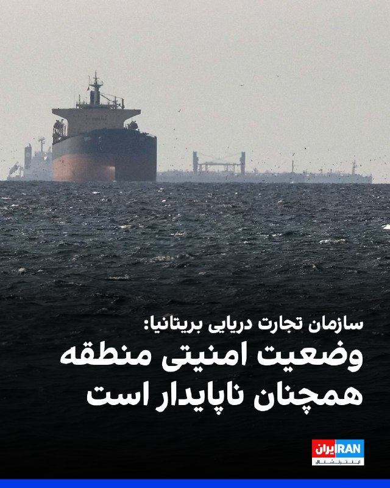
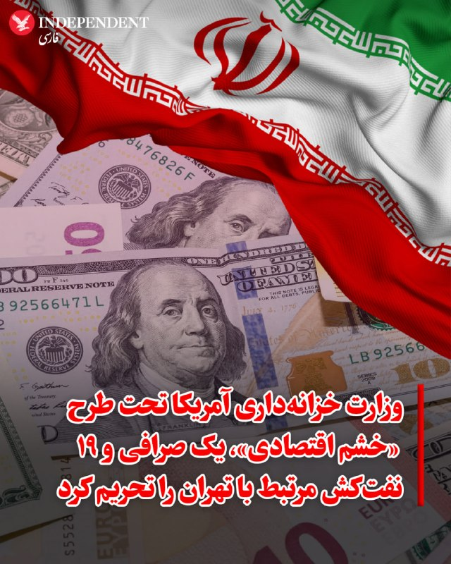

# خواننده تلگرام

<!-- TOP_NAV START -->

<a href="https://github.com/ProAlit/aio-downloader/blob/main/telegram/content/archive_1.md" style="display:inline-block; padding:6px 12px; margin:0 4px; background-color:#2ea44f; color:white; text-decoration:none; border-radius:4px; font-weight:bold;">صفحه بعد</a>

<!-- TOP_NAV END -->

<!-- MSG START -->

---
📅 بروزرسانی: 1405/02/29 20:33
---

## VahidOOnLine — post 241004

  

سازمان عملیات تجارت دریایی بریتانیا اعلام کرد در بازه زمانی ۲۸ و ۲۹ اردیبهشت، هیچ حادثه‌ای در خلیج فارس و دریای عمان گزارش نشده است.

با این حال، وضعیت امنیتی منطقه همچنان ناپایدار است و تهدید علیه کشتیرانی تجاری ادامه دارد.
‌🏁 🇬🇧 IranintlTV

🤖 @VahidOOnLine

## VahidOOnLine — post 241003

  

♦️ دفتر کنترل دارایی‌های خارجی وزارت خزانه‌داری آمریکا (OFAC)، در راستای برنامه «خشم اقتصادی» (Economic Fury)، یک صرافی بزرگ ایرانی و شرکت‌های صوری وابسته به آن را که صدها میلیون دلار تراکنش مالی را برای بانک‌های تحریم‌شده جمهوری اسلامی مدیریت می‌کردند، در لیست تحریم‌ها قرار داد. به گفته واشنگتن، این شبکه‌ها سالانه میلیاردها دلار ارز را جابه‌جا کرده و دسترسی نظام و نیروهای مسلح جمهوری اسلامی به سیستم مالی بین‌المللی و درآمدهای نفتی را تسهیل می‌کنند.

علاوه بر این، وزارت خزانه‌داری ۱۹ نفت‌کش و شناور دیگر را که در انتقال نفت و محصولات پتروشیمی ایران به مشتریان خارجی نقش داشتند، توقیف و مسدود کرد. این اقدام با هدف کاهش درآمدهای ارزی جمهوری اسلامی برای توسعه تسلیحات و تامین مالی گروه‌های نیابتی صورت گرفته است.

اسکات بسنت، وزیر خزانه‌داری آمریکا، با هشدار به نهادهای مالی بین‌المللی درباره شگردهای تهران تاکید کرد: «سیستم بانکداری سایه‌ای ایران، انتقال غیرقانونی پول برای اهداف تروریستی را تسهیل می‌کند و خزانه‌داری آمریکا به شکلی نظام‌مند در حال متلاشی کردن این شبکه پولی و ناوگان شبحی تهران است.»
‌🇸🇦 Indypersian

🤖 @VahidOOnLine

## WithYashar — post 11680

خوش چشم (مرشد) : تا اخر هفته میزنن

@withyashar 😂

## IranIntlTV — post 337963

  

سازمان عملیات تجارت دریایی بریتانیا اعلام کرد در بازه زمانی ۲۸ و ۲۹ اردیبهشت، هیچ حادثه‌ای در خلیج فارس و دریای عمان گزارش نشده است.

با این حال، وضعیت امنیتی منطقه همچنان ناپایدار است و تهدید علیه کشتیرانی تجاری ادامه دارد.
https://iranintl.com/202605197145

## FarsiVOA — post 218145

🔺گزارش | پیامدهای خفقان دیجیتال مردم ایران توسط جمهوری اسلامی: نابودی معیشت خانوارها و تحمیل فقر به زنان

▪️اقدام جمهوری اسلامی در قطع اینترنت، ضمن نابودی صدها هزار کسب‌وکار خانگی، معیشت میلیون‌ها خانوار ایرانی را با بحران مواجه کرده و با تحمیل فقر به زنان، آسیب‌های شدیدی به معیشت و استقلال مالی و اجتماعی زنان [جمهوری اسلامی] ایران وارد کرده است.

⬇️ بیشتر بخوانید:

https://ir.voanews.com/a/internet-outage-in-iran-women-poverty-instagram-jobs/8151672.html/?nocach=1

## Persian_Trend_Official — post 14485

⭕️ علی‌حسین‌ قاضی‌زاده:

فیفا قصد دارد ورود پرچم شیر و خورشید به استادیوم‌های جام‌جهانی را ممنوع کند.

ج.ا. جام جهانی را به میدان جنگ حکومت و مردم بدل کرده است.

📝 Nick

📌 @persian_trend_official
پرشین ترند | متفاوت‌ترین کانال نظامی

## Persian_Trend_Official — post 14484

  <a href="telegram/content/Persian_Trend_Official_14484_1779210189.mp4" target="_blank">🎬 Download video</a>

💢 سرپرست تیم‌ملی فوتبال:

ممنوعیت بُردن هرگونه پرچم
به غیر از پرچم ایران به ورزشگاه‌های جام جهانی درست است

🫆:Tony

📌 @persian_trend_official
پرشین ترند | متفاوت‌ترین کانال نظامی

## alonews — post 121149

  <a href="telegram/content/alonews_121149_1779210191.webm" target="_blank">🎬 Download video</a>

👈نتانیاهو باز هم به دلایل امنیتی درخواست کرده است که فردا در دادگاهش برگزار نشود!

✅ @AloNews خبر جنگ

## alonews — post 121148

  <a href="telegram/content/alonews_121148_1779210191.webm" target="_blank">🎬 Download video</a>

👈فرمانده سنتکام، دریادار کوپر :
- ایران از وقتی آتش‌بس شروع شده، ده‌ها نفر رو اعدام کرده

✅ @AloNews خبر جنگ

---
📅 بروزرسانی: 1405/02/29 20:23
---

## DW_Farsi — post 124894

  

🔶 دولت آلمان: حمله به سیاستمداران شدیدا افزایش یافته است

دولت آلمان در پاسخ به درخواست و پرسش فراکسیون حزب دست راستی افراطی "آلترناتیو برای آلمان" (AfD) اعلام کرد که در سال گذشته شمار حملات به اعضای احزاب این کشور به‌شدت افزایش یافته است.

بنا بر پاسخی که دولت در این زمینه اعلام کرده، پلیس آلمان در سال ۲۰۲۵ بیش از ۵هزار عمل مجرمانه علیه اعضای احزاب را در سراسر این کشور ثبت کرده است.

بیش‌ترین حملات متوجه حزب "آلترناتیو برای آلمان" بوده و پس از آن دو حزب دموکرات‌مسیحی (CDU) و سبزها بیش‌ از همه هدف قرار گرفته‌اند.

مقام‌های آلمان حملات صورت‌گرفته علیه حزب "آلترناتیو برای آلمان" را عمدتا به طیف‌های چپ‌گرا نسبت می‌دهند.

اکثریت قریب به اتفاق این اعمال مجرمانه نیز شامل توهین، افترا یا تخریب اموال بوده است. تعداد اقدامات خشونت‌آمیز حدود ۲۰۰ مورد برآورد شده است.

@dw_farsi

## alonews — post 121147

  <a href="telegram/content/alonews_121147_1779209582.webm" target="_blank">🎬 Download video</a>

👈کانال ۱۲ اسرائیل: یک افسر ارتش اسرائیل در جنوب لبنان کشته شد

✅ @AloNews خبر جنگ

## alonews — post 121146

  <a href="telegram/content/alonews_121146_1779209582.webm" target="_blank">🎬 Download video</a>

👈زاکانی: تا زمان رسیدگی و نتیجه نهایی طرح رایگان بودن وسایل نقلیه، خدمات به منوال قبل است

✅ @AloNews خبر جنگ

---
📅 بروزرسانی: 1405/02/29 20:19
---

## VahidOOnLine — post 241002

  

♦️ مجتبی خامنه‌ای، رهبر سوم جمهوری اسلامی که هنوز از زمان انتصاب در انظار عمومی دیده نشده و صدای او نیز شنیده نشده است، با انتشار نامه‌ای، افزایش جمعیت را پیش‌شرط استمرار «قدرت بزرگ ایران» خواند و خواستار ترویج فرهنگ فرزندآوری شد. او در این پیام که روز دوشنبه ۲۹ اردیبهشت، به مناسبت روز ملی جمعیت و در پاسخ به تشکل‌های مردمی صادر شد، گفت که با افزایش جمعیت، گام‌های بلندی در جهت «خلق تمدن نویت ایران اسلامی» برداشته می‌شود. او هم‌چنین با اشاره به این‌که این مسئله دغدغه علی خامنه‌ای، رهبر پیشین جمهوری اسلامی، نیز بوده است، سیاست افزایش جمعیت را «از مهم‌ترین مسائل راهبردی نظام» دانست.

این پیام خامنه‌ای همزمان با آن منتشر شد که علیرضا رئیسی، معاون وزارت بهداشت دولت مسعود پزشکیان، از بحران شدید چیدمان سنی جمعیت در کشور پرده برداشت. به گفته این مقام دولتی، جمعیت ایران به ۸۶ میلیون و ۵۶۴ هزار نفر رسیده، اما روند پیری جمعیت به شدت شتاب گرفته است.

رئیسی با اشاره به شاخص‌های بحرانی اعلام کرد که نسبت تولد به فوت در کشور از ۲.۱۴ در سال ۱۴۰۳، به ۱.۹۸ در سال ۱۴۰۴ سقوط کرده است.
‌🇸🇦 Indypersian

🤖 @VahidOOnLine

## IranIntlTV — post 337962

🔻دو سال پس از سقوط بالگرد رئیسی، جمهوری اسلامی دیگر پناهگاه امنی ندارد

دو سال پس از ناپدید شدن بالگرد ابراهیم رئیسی در مه و کشته شدن او در کوهستان‌های آذربایجان شرقی، جمهوری اسلامی فقط یک رییس‌جمهور را از دست نداده است، بلکه بخشی از طرح جانشینی، سپر منطقه‌ای، احساس امنیت و این باور را از دست داده که زمان همچنان به سودش حرکت می‌کند.

بالگرد حامل رئیسی ۳۰ اردیبهشت ۱۴۰۳ سقوط کرد. گزارش نهایی جمهوری اسلامی علت حادثه را شرایط جوی منطقه و مه غلیظ اعلام کرد و احتمال هر‌گونه خرابکاری را رد کرد.

سقوطی که به استعاره تبدیل شد

تصویر این حادثه بیش از آن قدرتمند بود که صرفا یک سانحه باقی بماند: کاروانی از مقام‌های حکومتی در میان مه و دید محدود، ارتباط خود را از دست داد اما حکومت همزمان تلاش می‌کرد نشان دهد کنترل اوضاع را در دست دارد.

مرگ رئیسی، بیش از آن‌که یک معمای امنیتی باشد، به استعاره‌ای از وضعیت جمهوری اسلامی تبدیل شد. رئیسی ایران را اداره نمی‌کرد. قدرت واقعی در اختیار علی خامنه‌ای، سپاه پاسداران، ساختار امنیتی و شبکه‌های منطقه‌ای جمهوری اسلامی بود. اهمیت رئیسی در این بود که قرار بود نماد «تداوم» باشد: چهره‌ای وفادار، تندرو، سختگیر و قابل پیش‌بینی. فردی که از او به‌عنوان یکی از گزینه‌های احتمالی جانشینی خامنه‌ای یاد می‌شد.

او آینده جمهوری اسلامی نبود، بلکه تمرینی برای آینده‌ای بود که هرگز نرسید.

در اردیبهشت ۱۴۰۳ این‌طور به نظر می‌رسید که حکومت هنوز طرح جانشینی، سپر منطقه‌ای و صبر لازم را برای فرسوده کردن دشمنانش در اختیار دارد. اما دو سال بعد، تقریبا همه ستون‌هایی که تهران را دست‌نیافتنی نشان می‌دادند، یا آسیب دیده‌اند یا فرو ریخته‌اند.

از «عمق راهبردی» تا نقشه هدف

شمارش معکوس عملا از زمان حمله هفتم اکتبر حماس به اسرائیل آغاز شد.

آن حمله، شبکه منطقه‌ای جمهوری اسلامی را وارد جنگ کرد: حزب‌الله لبنان، شبه‌نظامیان عراق و سوریه و حوثی‌های یمن.

این شبکه سال‌ها «عمق راهبردی» تهران نامیده می‌شد اما پس از هفتم اکتبر، همان عمق راهبردی به نقشه اهداف تبدیل شد.

فروردین ۱۴۰۳، جمهوری اسلامی و اسرائیل از جنگ سایه‌ها وارد رویارویی مستقیم شدند و یک ماه بعد، بالگرد رئیسی در مه سقوط کرد.

جمهوری اسلامی با مراسم عزاداری رسمی، تابوت‌ها، پرچم‌های سیاه و حضور فرماندهان و روحانیون، تلاش کرد پیام «تداوم» را منتقل کند، اما از آن پس، مراسم تشییع جنازه در جمهوری اسلامی معنای دیگری پیدا کرد و نه نمایش ثبات، که نشانه از دست رفتن افراد، شبکه‌ها و جغرافیایی شد که حکومت را محافظت می‌کردند.

مرگ رئیسی انتخابات زودهنگام را به‌دنبال داشت و مسعود پزشکیان، با لحنی اصلاح‌طلبانه، پس از انتخاباتی با مشارکت پایین، رییس‌جمهور شد.

جمهوری اسلامی چهره‌ای نرم‌تر پیدا کرد، اما مرکز قدرت تغییر نکرد.

تهران دیگر پناهگاه نبود

خیلی زود، نخستین تحقیر بزرگ دوران پسارئیسی نیز رخ داد.

اسماعیل هنیه، رهبر سیاسی حماس، برای مراسم تحلیف پزشکیان به تهران رفت و ساعاتی بعد در پایتخت ایران کشته شد.

این فقط گرفتن جان یک مقام حماس نبود، بلکه پیامی بود مبنی بر این‌که حتی پایتخت حامیان «محور مقاومت» نیز دیگر پناهگاهی امن نیست.

مدتی بعد، انفجار پیجرها و بی‌سیم‌های حزب‌الله در لبنان و سوریه، ساختار ارتباطی این گروه را علیه خودش تبدیل به سلاح کرد و چند روز بعد حسن نصرالله، دبیرکل وقت حزب‌الله، در بیروت کشته شد.

جنبشی که بر پنهان‌کاری و فرماندهی زیرزمینی بنا شده بود، هم از درون نفوذپذیر شد و هم از بیرون هدف قرار گرفت.

پس از آن، یحیی سنوار، رهبر حماس در غزه، نیز کشته شد. حماس باقی ماند، حزب‌الله باقی ماند و شعارها همچنان ادامه یافت، اما محور جمهوری اسلامی، رهبران، مسیرها، قلمرو و اعتمادبه‌نفس خود را از دست داد.

سقوط اسد و انتقال جنگ به داخل ایران

شکاف عمیق‌تر با سقوط بشار اسد در آذر ۱۴۰۳ ایجاد شد.

این فقط سقوط یک متحد جمهوری اسلامی نبود، بلکه جغرافیای قدرت ایران را هدف قرار داد؛ یعنی مسیر ارتباط با حزب‌الله، دسترسی به مدیترانه و ایده دوران قاسم سلیمانی مبنی بر تبدیل دولت‌های ضعیف به عمق راهبردی ایران.

سرانجام خرداد ۱۴۰۴، جنگ به داخل ایران رسید.

اسرائیل در جریان جنگ ۱۲ روزه، مراکز هسته‌ای و نظامی جمهوری اسلامی را هدف قرار داد و سپس آمریکا به مستحکم‌ترین بخش‌های برنامه هسته‌ای حکومت ایران حمله کرد.

سال‌ها، ابهام هسته‌ای سپر دفاعی تهران بود، اما در سال ۱۴۰۴ همان سپر به میدان جنگ تبدیل شد.

جمهوری اسلامی همچنان توانست سرکوب، زندان و ایجاد رعب را ادامه دهد، اما دیگر قادر نبوده است بخش بزرگی از جامعه را متقاعد کند که آینده‌ای در پیش دارد.

🔗جزئیات بیشتر را در وبسایت ایران اینترنشنال بخوانید

@iranintltv

## Shin_Persian — post 6100

  

🔁 Quoting above tweet: DefenceGeek 🇬🇧 ✓ @DefenceGeek Tue, 19 May 2026 16:40:08 UTC UPDATED: US Aircraft Casualties as of 19/05/2026 --- #OperationEpicFury / #ProjectFreedom --- So as it turns out, the analysis work by myself, various @MATA_osint team members…

## Shin_Persian — post 6099

🔁 Quoting above tweet:
DefenceGeek 🇬🇧 ✓ @DefenceGeek
Tue, 19 May 2026 16:40:08 UTC

UPDATED: US Aircraft Casualties as of 19/05/2026
--- #OperationEpicFury / #ProjectFreedom ---

So as it turns out, the analysis work by myself, various @MATA_osint team members and a few other folks were more or less spot on! Based on the official comment today, I've updated the graphic, with the following changes:
- A-10C (x1) unknown status - Removed
- MQ-4C (x1) unknown status - Changed to Destroyed
- KC-135 (x5) unknown status - Changed to Damaged

Noteworthy that the US is claiming the E-3G is only "damaged" despite the fact any attempt to fix it would require pulling entire sections of other airframes out of the boneyard and shipping it to Saudi to rebuild there... which let's be honest just isn't going to happen.

@MATA_osint @prestonstew_ @ArmchairAdml @TheIntelFrogbu @steffanwatkins @vcdgf555

فارسی

به‌روزرسانی: تلفات هواگردهای ایالات متحده تا تاریخ ۲۰۲۶/۰۵/۱۹
--- #OperationEpicFury / #ProjectFreedom ---

همان‌طور که مشخص شد، تجزیه و تحلیل‌های من، اعضای مختلف تیم @MATA_osint و چند نفر دیگر کمابیش دقیق بوده‌اند! بر اساس اظهارنظر رسمی امروز، این گرافیک را با تغییرات زیر به‌روزرسانی کردم:
- یک فروند A-10C با وضعیت نامشخص - حذف شد
- یک فروند MQ-4C با وضعیت نامشخص - به "منهدم شده" تغییر یافت
- پنج فروند KC-135 با وضعیت نامشخص - به "آسیب‌دیده" تغییر یافت

قابل توجه است که ایالات متحده مدعی شده که E-3G تنها "آسیب‌دیده" است، با وجود این واقعیت که هرگونه تلاش برای تعمیر آن مستلزم بیرون کشیدن بخش‌های کامل از بدنه هواپیماهای دیگر از قبرستان هواپیماها و ارسال آن به عربستان سعودی برای بازسازی در آنجا خواهد بود... که بیایید صادق باشیم، این اتفاق هرگز نخواهد افتاد.

@MATA_osint @prestonstew_ @ArmchairAdml @TheIntelFrogbu @steffanwatkins @vcdgf555

𝕏 · @shin_persian

## Shin_Persian — post 6098

  

↩️ Quoted tweet: Preston Stewart ✓ @prestonstew_ Tue, 19 May 2026 13:21:59 UTC The Congressional Research Service just listed the 42 US aircraft lost or damaged so far during the war with Iran. 4 x F-15E Strike Eagles destroyed 1 x F-35A damaged by Iranian…

## Shin_Persian — post 6097

↩️ Quoted tweet:
Preston Stewart ✓ @prestonstew_
Tue, 19 May 2026 13:21:59 UTC

The Congressional Research Service just listed the 42 US aircraft lost or damaged so far during the war with Iran.
4 x F-15E Strike Eagles destroyed
1 x F-35A damaged by Iranian ground fire
1 x A-10 destroyed
7 x KC-135 Stratotankers (2 destroyed, 5 damaged)
1 x E-3 Sentry AWACS

↩️ توییت نقل‌قول شده — برای پاسخ، پست زیر را ببینید.

فارسی

مرکز پژوهش‌های کنگره به تازگی فهرست ۴۲ فروند هواپیمای آمریکایی را که تا این لحظه در طول جنگ با ایران منهدم شده یا آسیب دیده‌اند، منتشر کرد.
۴ فروند اف-۱۵ئی استرایک ایگل (F-15E Strike Eagle) منهدم شده
۱ فروند اف-۳۵آ (F-35A) آسیب‌دیده توسط پدافند زمینی ایران
۱ فروند آ-۱۰ (A-10) منهدم شده
۷ فروند کی‌سی-۱۳۵ استراتوتانکر (۲ فروند منهدم شده، ۵ فروند آسیب‌دیده)
۱ فروند ئی-۳ سنتری آواکس (E-3 Sentry AWACS)

𝕏 · @shin_persian

## Shin_Persian — post 6096

↩️ Quoted tweet: Psarantonis @FurzFee2000 Tue, 19 May 2026 16:37:20 UTC @hey_itsmyturn @POTUS Did anyone read every single word? ↩️ توییت نقل‌قول شده — برای پاسخ، پست زیر را ببینید. فارسی @hey_itsmyturn @POTUS آیا کسی تمام کلمات را مو به مو خواند؟ 𝕏…

## Shin_Persian — post 6095

↩️ Quoted tweet:
Psarantonis @FurzFee2000
Tue, 19 May 2026 16:37:20 UTC

@hey_itsmyturn @POTUS Did anyone read every single word?

↩️ توییت نقل‌قول شده — برای پاسخ، پست زیر را ببینید.

فارسی

@hey_itsmyturn @POTUS آیا کسی تمام کلمات را مو به مو خواند؟

𝕏 · @shin_persian

## Dirty_Kids — post 389764

  <a href="telegram/content/Dirty_Kids_389764_1779209377.mp4" target="_blank">🎬 Download video</a>

کارشناس صدا و سیما: هرکسی جنگ نمیخواد؛ جمع کنه از ایران بره. ما تسلیم‌نمیشیم.

@Dirty_Kids 👻

---
📅 بروزرسانی: 1405/02/29 20:13
---

## VahidOOnLine — post 241001

نامزد آیدا عقیلی، جاویدنام انقلاب ملی، در ویدیویی بر سر مزار او توضیح داد که دغدغه و بحث این جوان معترض در خانه، موضوع نان مردم و ظلم به آن‌ها بود؛ تا اینکه شاهزاده رضا پهلوی فراخوان داد و آیدا به خیابان رفت. او گفت که خود حکومت اماکنی را آتش می‌زد و به گردن مردم معترض می‌انداخت.
‌🏁 🇬🇧 IranintlTV

🤖 @VahidOOnLine

## VahidOOnLine — post 241000

  <a href="telegram/content/VahidOOnLine_241000_1779209002.mp4" target="_blank">🎬 Download video</a>

‌
ژنرال برد کوپر، فرمانده ستاد فرماندهی مرکزی آمریکا، سنتکام، به کنگره گفت مدرسه میناب که در جریان جنگ هدف قرار گرفت، «در یک پایگاه فعال موشک‌های کروز» قرار داشت.

او گفت تحقیقات ارتش آمریکا درباره انفجار در این مدرسه «پیچیده» است، زیرا این مرکز در یک سایت فعال موشکی جمهوری اسلامی واقع شده بود.

رویترز پیش‌تر گزارش داده بود تحقیقات اولیه داخلی ارتش آمریکا نشان می‌دهد نیروهای آمریکایی «احتمالاً» مسئول تخریب مدرسه دخترانه‌ای در میناب بوده‌اند؛ موضوعی که پنتاگون بعداً سطح بررسی آن را ارتقا داد.

در این حادثه که در نخستین روز درگیری‌ها ۹ اسفند ۱۴۰۴ رخ داد، ۱۶۸ کودک که بیشتر آن‌ها دختر بودند، کشته شدند.
‌🏁 🇬🇧 ManotoTV

🤖 @VahidOOnLine

## WithYashar — post 11679

فرمانده سنتکام : چند تا ناوشکن آمریکایی اخیراً از تنگه هرمز عبور کردن

ایران از هر نظر خیلی ضعیف‌تر از قبل شده
@withyashar

## mwarmonitor — post 9315

🇺🇸یک یگان ارتش آمریکا از هفته‌ها قبل از یک حمله مرگبار ایران به پست فرماندهی آن‌ها در کویت درخواست افزایش و تقویت پشتیبانی پزشکی کرده بود، اما به گفته سربازان، این درخواست نادیده گرفته شد. برخی از بازماندگان این حمله همچنین گفته‌اند که دست‌کم یکی از سربازانی که کشته شد، در صورت وجود امکانات پزشکی بیشتر در محل، قابل نجات بود.» CBS

@mwarmonitor

## mwarmonitor — post 9314

🇮🇱«روزنامه اسرائیل هیوم به نقل از منابع: شهادت نتانیاهو در دادگاه که قرار بود روز چهارشنبه برگزار شود، به دلیل امنیتی لغو شد.»

@mwarmonitor

## mwarmonitor — post 9313

  

✈️نیروی هوایی آمریکا (USAF) بوئینگ KC-135 استراتوتانکر (سوخت‌رسان) – ۱ فروند AE04EA 61-0276 – REACH 756 AE07BA 62-3557 – REACH 164 ✈️پروازهای REACH 756 و REACH 164 امروز صبح از فرودگاه بن گوریون تل‌آویو به سمت پایگاه هوایی RAF Mildenhall در بریتانیا در حرکت…

## FoxNewsTwitter — post 341942

  

Fox News (Twitter/X)

BREAKING: Trump bucks national Senate Republicans and endorses Ken Paxton instead of incumbent John Cornyn in GOP Texas primary runoff

## FoxNewsTwitter — post 341941

  <a href="telegram/content/FoxNewsTwitter_341941_1779209004.mp4" target="_blank">🎬 Download video</a>

Fox News (Twitter/X)

RT @FoxTrueCrime: COURT CONVOY: Tyler Robinson arrives at the Utah County, Utah courthouse in an armored SWAT vehicle.

Today, his attorneys will fight to seal evidence and testimony from police, and also have prosecutors sanctioned for speaking about his case outside the courtroom.

## IranIntlTV — post 337961

  <a href="telegram/content/IranIntlTV_337961_1779209007.mp4" target="_blank">🎬 Download video</a>

تیتراول با نیوشا صارمی، سه‌شنبه ۲۹ اردیبهشت
@iranintltv

## IranIntlTV — post 337960

نامزد آیدا عقیلی، جاویدنام انقلاب ملی، در ویدیویی بر سر مزار او توضیح داد که دغدغه و بحث این جوان معترض در خانه، موضوع نان مردم و ظلم به آن‌ها بود؛ تا اینکه شاهزاده رضا پهلوی فراخوان داد و آیدا به خیابان رفت. او گفت که خود حکومت اماکنی را آتش می‌زد و به گردن مردم معترض می‌انداخت.

## IranIntlTV — post 337959

  <a href="telegram/content/IranIntlTV_337959_1779209008.mp4" target="_blank">🎬 Download video</a>

تیتراول با نیوشا صارمی، سه‌شنبه ۲۹ اردیبهشت
@iranintltv

## Shin_Persian — post 6094

  

DefenceGeek 🇬🇧 ✓ @DefenceGeek Tue, 19 May 2026 16:23:09 UTC Tanker Swaps - Cloning? #FreeIran‌ --- Operation EPIC FURY / Project FREEDOM --- A pair of KC-135 "Stratotanker" aircraft that had previously left the CENTCOM region (more than 2 weeks ago) back…

## Shin_Persian — post 6093

DefenceGeek 🇬🇧 ✓ @DefenceGeek
Tue, 19 May 2026 16:23:09 UTC

Tanker Swaps - Cloning? #FreeIran‌
--- Operation EPIC FURY / Project FREEDOM ---

A pair of KC-135 "Stratotanker" aircraft that had previously left the CENTCOM region (more than 2 weeks ago) back to the US arrived back at RAF Mildenhall (EGUN) this morning, and are now both airborne showing as RCH164 heading back to CENTCOM.

They'll likely replace 2 airframes that left Tel Aviv Ben Gurion Airport (LLBG) early this morning and went to RAF Mildenhall.

@MATA_osint

فارسی

تبادل تانکرها - کلونینگ؟ #FreeIran‌
--- عملیات خشم حماسی (EPIC FURY) / پروژه آزادی (Project FREEDOM) ---

یک جفت هواپیمای سوخت‌رسان KC-135 "استراتوتانکر" که پیش از این (بیش از ۲ هفته قبل) منطقه فرماندهی مرکزی ایالات متحده (سنتکام/CENTCOM) را به مقصد آمریکا ترک کرده بودند، امروز صبح به پایگاه نیروی هوایی سلطنتی میدهال (EGUN) بازگشتند و اکنون هر دو با شناسه RCH164 به صورت پروازی در حال بازگشت به سمت سنتکام هستند.

آن‌ها احتمالاً جایگزین ۲ بدنه پروازی خواهند شد که اوایل صبح امروز فرودگاه بن گوریون تل‌آویو (LLBG) را ترک کرده و به پایگاه میدهال رفتند.

@MATA_osint

𝕏 · @shin_persian

## Shin_Persian — post 6092

  

Shin ✓ @hey_itsmyturn Tue, 19 May 2026 16:35:43 UTC President Trump @POTUS: "The Highly Respected Attorney General of Texas, Ken Paxton, an America First Patriot, and someone who has always been extremely loyal to me and our AMAZING MAGA MOVEMENT, is running…

## Shin_Persian — post 6091

Shin ✓ @hey_itsmyturn
Tue, 19 May 2026 16:35:43 UTC

President Trump @POTUS:
"The Highly Respected Attorney General of Texas, Ken Paxton, an America First Patriot, and someone who has always been extremely loyal to me and our AMAZING MAGA MOVEMENT, is running for the United States Senate, to represent a place I love and WON, BIG, three times, with 6.4 Million Votes in 2024 (The Most Votes in the History of the State, BY FAR)!I know Ken well, have seen him tested at the highest and most difficult levels, and he is a WINNER! Ken is a Strong Supporter of TERMINATING THE FILIBUSTER and, very importantly, THE SAVE AMERICA ACT, something which polls at 87%, including Dumocrats, and yet can’t seem to get approved. Perhaps Ken can help move these important elements of Government forward because with the Filibuster, as an example, the Democrats will terminate it on their First Day in Office, giving us two extra States, D.C. and Puerto Rico, and a greatly enlarged Supreme Court of the United States, probably going with their Dream Number of 21 Justices from the 9 that we currently have — And these new Justices will be Radical Left Lunatics! Two years ago, our Country was DEAD — Now we have the “HOTTEST” Country anywhere in the World — And I want to keep it that way. Ken Paxton will help me do that, MAKING AMERICA BIGGER, BETTER, AND STRONGER THAN EVER BEFORE!Ken is a true MAGA Warrior who has ALWAYS delivered for Texas, and will continue to do so in the United States Senate. He will tirelessly fight to continue the Great Growth of our Economy, Cut Taxes and Regulations (I just delivered the Largest Tax and Regulation Cuts in American History!), and Advance MADE IN THE U.S.A., Unleash American Energy DOMINANCE, Champion Texas Oil & Gas, Advocate for our Amazing Farmers and Ranchers, Promote School Choice, Keep our Border SECURE, Stop Migrant Crime, Support our Incredible Military/Veterans, Safeguard our Elections, and Protect our always under siege Second Amendment.John Cornyn is a good man, and I worked well with him, but he was not supportive of me when times were tough and, despite having the Most Successful Economy in the History of our Country during my First Term and, with all of the many other things that I accomplished (Secure Border, Military Dominance, Space Force, All Time High Stock Markets and 401(k)s, Record Job and Economic Growth, and so many other things that would be impossible to readily list!), which are considered by many to be legendary, John was very late in backing me in what turned out to be a Historic Run for the Republican Nomination, and then, the Presidency, itself, both of which were Landslide Victories and, more importantly, gave us the Country that we have today — THE GOLDEN AGE OF AMERICA (and when we finish up with Iran, which will not be allowed to have a Nuclear Weapon, you will see numbers that have never been generated by our Country before!), as opposed to the DISASTER of the previous Administration.Ken Paxton has gone through a lot, in many cases, very unfairly, but he is a Fighter, and knows how to WIN. Our Country needs Fighters, and also Loyalty to the Cause of Greatness. We can never allow what happened to the United States of America during the Corrupt Biden Administration, to happen again. In Texas alone, just look at the Border, with the Highest Level Criminals allowed to run through your State, totally unvetted and unchecked, through an Open Border Policy that was a Laughingstock all over the World. I came in, and fixed it, IMMEDIATELY. I will not permit those dark and dangerous days to come back! WE HAVE ALREADY MADE AMERICA GREAT AGAIN, BUT NOW, WE WANT TO MAKE OUR NATION BETTER THAN EVER BEFORE. Therefore, Ken Paxton has my Complete and Total Endorsement to be the next United States Senator from the Great State of Texas – KEN PAXTON WILL NEVER LET YOU DOWN!DONALD J. TRUMP, PRESIDENT OF THE UNITED STATES OF AMERICA"

ترجمه فارسی در بخش نظرات

𝕏 · @shin_persian

## FarsiVOA — post 218144

🔺پاداش ۱۵ میلیون دلاری برای اطلاعات شبکه‌‌های مالی سپاه پاسداران

▪️وزارت امور خارجه آمریکا روز سه‌شنبه ۲۹ اردیبهشت، با انتشار بیانیه‌ای اعلام کرد که در چارچوب برنامه «پاداش برای عدالت» این وزارتخانه «۱۵ میلیون دلار پاداش برای اطلاعات درباره شبکه‌‌های مالی سپاه پاسداران در نظر گرفته شده است.»

⬇️ بیشتر بخوانید:

https://ir.voanews.com/a/financial-reward-for-justice-against-irgc/8151668.html/?nocach=1

## DW_Farsi — post 124893

  

🔶 آزادسازی بودجه اضطراری اروپا در مقابله با گرانی کود ناشی از جنگ ایران

اتحادیه اروپا در صدد برآمده تا با گرانی سرسا‌م‌آور کود در کشورهای عضو که پیامد جنگ ایران است با آزادسازی بودجه‌های اضطراری خو د مقابله کند. این آزادسازی بر پایه برنامه‌های حمایتی این اتحادیه از بخش کشاورزی که قرار است سه‌شنبه ۱۹ مه رونمایی شود انجام خواهد گرفت.

خبرگزاری فرانسه در گزارشی در این مورد نوشته که بروکسل برای کاهش تأثیر بحران خاورمیانه بر بخش کشاورزی تحت فشار است زیرا جهش قیمت کود، خطر افزایش هزینه‌های مواد غذایی را در سراسر این اتحادیه به همراه دارد.

حدود یک‌سوم از کودهایی که از طریق دریا حمل می‌شوند، از طریق تنگه هرمز به بازار جهانی می‌رسند؛ آبراهی که در پی  جنگ آمریکا و اسرائیل علیه ایران، درعمل بسته شده است.

این امر باعث افزایش قیمت‌ها شده و سازمان تجارت جهانی (WTO) هشدار داده که این محاصره، امنیت غذایی جهانی، به‌ویژه در آفریقا و جنوب آسیا را تهدید می‌کند.

در اروپا، قیمت کودهای نیتروژنی که از گاز مشتق می‌شوند، از ۳۸۰ یورو در زمستان گذشته به حدود ۵۰۰ یورو (۵۸۱ دلار) در هر تن رسیده است.

این وضعیت برای کشاورزانی که پیش از این با افزایش هزینه‌های ناشی از جنگ اوکراین دست‌وپنجه نرم می‌کردند، ضربه‌ای متوالی و مضاعف محسوب می‌شود.

بروکسل تعرفه‌های سنگینی بر کودهای وارداتی از روسیه (به عنوان یک تولیدکننده بزرگ) وضع کرده و قصد دارد تا سال ۲۰۲۸ واردات از این کشور را به‌طور کامل متوقف کند تا به خزانه جنگی مسکو در نبرد علیه اوکراین ضربه بزند.

به گفته فعالان این صنعت، تولیدکنندگان غلات که به مقادیر عظیمی کود نیاز دارند، به‌طور ویژه‌ای از این وضعیت آسیب دیده‌اند.

@dw_farsi

## BBCPersian — post 281510

دوشنبه ۲۸ اردیبهشت در تجمع شبانه حامیان حکومت ایران، مراسم ازدواج ۵۰۰ زوج برگزار شد که واکنش‌هایی را به دنبال داشت. از جمله بعضی کاربران شبکه‌های اجتماعی از آن به عنوان «جنگی‌ترین عروسی تاریخ» یاد کردند. 

مراسم عروسی زوج‌ها در میدان‌های اصلی تهران برگزار شد و بعد از آن عروس و دامادها سوار بر خودروهای نظامی مسلح به دوشکا در سطح خیابان‌های تهران رژه رفتند. 

پیش از آن گزارشی در تلویزیون ایران از ازدواج «جانفدایان ایران» منتشر شد که زوج تازه ازدواج کرده مهمان برنامه اعلام کردند یک پهپاد شاهد به عنوان مهریه عروس در نظر گرفته شده است.

تجمع‌های شبانه حامیان حکومت، انتقادهای زیادی را به دنبال داشته است. از جمله استفاده از کودکان برای اهداف ایدئولوژیک. در مراسم ازدواج برگزار شده کودکان نقش پررنگی در تبلیغ این مراسم داشتند. در شب‌های قبل هم تصاویری از آموزش کار با اسلحه به کودکان منتشر شد. در جریان جنگ آمریکا و اسرائیل با ایران، استفاده از کودکان در ایست و بازرسی‌ها واکنش‌های زیادی را به دنبال داشت. 
@BBCPersian

## Dirty_Kids — post 389763

  <a href="telegram/content/Dirty_Kids_389763_1779209012.mp4" target="_blank">🎬 Download video</a>

ادامه آموزش کار با اسلحه در صداوسیما:

@Dirty_Kids 👻

## Dirty_Kids — post 389762

  <a href="telegram/content/Dirty_Kids_389762_1779209014.mp4" target="_blank">🎬 Download video</a>

مجتبی واحدی هم یه حالی به بهزاد بی بیضه داد

@Dirty_Kids 👻

## Dirty_Kids — post 389761

  

یارو لیترالی سواد خوندن آنچنانی نداشت، تصمیم گرفت فال بگیره، و همونجا بدون کوچیک‌ترین تپقی فالش رو خوند.
«خوش باش که ظالم نبرد راه به منزل»

بعد اون فال اول خودشو بگا داد؛ بعدشم محور مقاوت یک روز خوش ندید که ندید.

پ‌ن: عکس بالگردیه که باهاش سقوط کرد.

@Dirty_Kids 👻

## Dirty_Kids — post 389760

  <a href="https://t.me/Dirty_Kids/389760" target="_blank">📎 Download file</a>

✅ اپلیکیشن اندروید سایت جهانی دربی بت

💰اولین سایت جهانی با امکان شارژ و برداشت ریالی(کارت به کارت)

🔗 برای ورود فیلترشکن روی کشور مناسب قرار دهید مانند فنلاند و المان و....

😀Telegram Channel
👇
https://t.me/+bcynkEgSW2dlYTc0

## Dirty_Kids — post 389759

  

😤دنبال یه سایت شرط بندی بین المللی بودی که به ایرانیا خدمات بده؟!
⛔

👍دربی بت همون انتخاب  100%

💎ویژگی های سایت جهانی Derby Bet:

⬅️امکان شارژ امن با کارت بانکی

⬅️واریز اول دوبل شارژ می شوید(بونوس۱۰۰٪)

⬅️پر اپشن ترین سایت فعال در ایران

⬅️تسویه حساب کمتر از 5 دقیقه

⬅️برگشت بخشی از باخت به صورت هفتگی

🚨کد هدیه ثبت نام:GG007

⚠️برای دانلود اپلکیشن کلیک کنید
👉

🔔کانال دربی بت :

🪙https://t.me/+bcynkEgSW2dlYTc0

## alonews — post 121145

  <a href="telegram/content/alonews_121145_1779209018.webm" target="_blank">🎬 Download video</a>

👈اسرائیل هیوم: نتانیاهو به دلایل امنیتی درخواست کرده است که فردا در دادگاهش برگزار نشود

✅ @AloNews خبر جنگ

## alonews — post 121144

  <a href="telegram/content/alonews_121144_1779209018.webm" target="_blank">🎬 Download video</a>

👈ادعای کانال ۱۲ اسرائیل: ارزیابی‌های اسرائیل نشان می‌دهد که ترامپ تصمیم حمله به ایران را گرفته است و اجرای آن فقط مربوط به مسئله زمان است.

✅ @AloNews خبر جنگ

## alonews — post 121143

👈فرمانده سنتکام : چند تا ناوشکن آمریکایی اخیراً از تنگه هرمز عبور کردن

🔴 ایران از هر نظر خیلی ضعیف‌تر از قبل شده

✅ @AloNews خبر جنگ

---
📅 بروزرسانی: 1405/02/29 20:03
---

## VahidOOnLine — post 240999

  

با وجود آنکه از زمان انتصاب مجتبی خامنه‌ای به‌عنوان سومین رهبر جمهوری اسلامی، هیچ تصویر یا ویدیویی از او منتشر نشده، کانال تلگرامی منتسب به او پیامی منتشر کرد که در آن بر «لزوم افزایش جمعیت» و «ترویج فرهنگ فرزندآوری» تاکید شده است.
در این پیام که در ادامه تلاش‌های مقام‌های جمهوری اسلامی برای تشویق ایرانیان به فرزندآوری و افزایش نرخ تولد منتشر شده، آمده است از جمله دستاوردهای جنگ ۴۰ روزه، برآمدن جمهوری اسلامی در «مُستَوای قدرتی بزرگ و تاثیرگذار» بوده است.
در ادامه این پیام تاکید شده «استمرار این وضع» و رسیدن به «درجه مطلوب‌تر» از آن، «نسبت مستقیمی با مسئله جمعیت» دارد و ملت ایران با «پیگیری مجدانه سیاست صحیح و حتمی افزایش جمعیت» می‌تواند «جهش‌هایی راهبردی» را تجربه کرده و در مسیر «خلق تمدن نوین ایران اسلامی» گام بردارد.
در این متن همچنین از «تلاش روزافزون فعالان حوزه جمعیت و ترویج فرهنگ فرزندآوری» تقدیر شده و موضوع افزایش جمعیت از «مهم‌ترین دغدغه‌های» علی خامنه‌ای، رهبر کشته شده جمهوری اسلامی و از مهمترین مسائل راهبردی نظام توصیف شده است.
‌🏁 🇬🇧 IranintlTV

🤖 @VahidOOnLine

## mwarmonitor — post 9312

🇮🇷«غریب‌آبادی، معاون وزیر امور خارجه ایران، ادعاهای اخیر ترامپ درباره مذاکرات را به سخره گرفت و گفت: “تسلیم شدن هیچ معنایی ندارد؛ ما یا پیروز می‌شویم یا شهید می‌شویم.”»

@mwarmonitor

## FoxNewsTwitter — post 341940

  <a href="telegram/content/FoxNewsTwitter_341940_1779208400.mp4" target="_blank">🎬 Download video</a>

Fox News (Twitter/X)

NEW: President Trump surprises reporters at the White House by setting up a special breakfast for them during their tour of the ongoing ballroom construction:

"I figured I'd be nice to you for a change." | @MargoMartin47

## IranIntlTV — post 337958

  

با وجود آنکه از زمان انتصاب مجتبی خامنه‌ای به‌عنوان سومین رهبر جمهوری اسلامی، هیچ تصویر یا ویدیویی از او منتشر نشده، کانال تلگرامی منتسب به او پیامی منتشر کرد که در آن بر «لزوم افزایش جمعیت» و «ترویج فرهنگ فرزندآوری» تاکید شده است.
در این پیام که در ادامه تلاش‌های مقام‌های جمهوری اسلامی برای تشویق ایرانیان به فرزندآوری و افزایش نرخ تولد منتشر شده، آمده است از جمله دستاوردهای جنگ ۴۰ روزه، برآمدن جمهوری اسلامی در «مُستَوای قدرتی بزرگ و تاثیرگذار» بوده است.
در ادامه این پیام تاکید شده «استمرار این وضع» و رسیدن به «درجه مطلوب‌تر» از آن، «نسبت مستقیمی با مسئله جمعیت» دارد و ملت ایران با «پیگیری مجدانه سیاست صحیح و حتمی افزایش جمعیت» می‌تواند «جهش‌هایی راهبردی» را تجربه کرده و در مسیر «خلق تمدن نوین ایران اسلامی» گام بردارد.
در این متن همچنین از «تلاش روزافزون فعالان حوزه جمعیت و ترویج فرهنگ فرزندآوری» تقدیر شده و موضوع افزایش جمعیت از «مهم‌ترین دغدغه‌های» علی خامنه‌ای، رهبر کشته شده جمهوری اسلامی و از مهمترین مسائل راهبردی نظام توصیف شده است.
https://iranintl.com/202605191704

## ManotoTV — post 105648

  <a href="telegram/content/ManotoTV_105648_1779208403.mp4" target="_blank">🎬 Download video</a>

‌
ژنرال برد کوپر، فرمانده ستاد فرماندهی مرکزی آمریکا، سنتکام، به کنگره گفت مدرسه میناب که در جریان جنگ هدف قرار گرفت، «در یک پایگاه فعال موشک‌های کروز» قرار داشت.

او گفت تحقیقات ارتش آمریکا درباره انفجار در این مدرسه «پیچیده» است، زیرا این مرکز در یک سایت فعال موشکی جمهوری اسلامی واقع شده بود.

رویترز پیش‌تر گزارش داده بود تحقیقات اولیه داخلی ارتش آمریکا نشان می‌دهد نیروهای آمریکایی «احتمالاً» مسئول تخریب مدرسه دخترانه‌ای در میناب بوده‌اند؛ موضوعی که پنتاگون بعداً سطح بررسی آن را ارتقا داد.

در این حادثه که در نخستین روز درگیری‌ها ۹ اسفند ۱۴۰۴ رخ داد، ۱۶۸ کودک که بیشتر آن‌ها دختر بودند، کشته شدند.

## FarsiVOA — post 218143

🔺اتحادیه اروپا شبکه تبلیغات اینترنتی سپاه پاسداران را تحت پیگرد گسترده قرار داد

◾️سازمان اتحادیه اروپا برای همکاری در اجرای قانون، «یوروپل»، سه‌شنبه ۲۹ اردیبهشت اعلام کرد طی یک عملیات هماهنگ بین‌المللی علیه محتوای تروریستی آنلاین، بیش از ۱۴ هزار پیوند اینترنتی مرتبط با فعالیت‌های تبلیغاتی سپاه پاسداران را شناسایی کرده و هدف قرار داده است. این اقدام پس از قرار گرفتن رسمی سپاه در فهرست سازمان‌های تروریستی اتحادیه اروپا انجام گرفت.

⬇️ بیشتر بخوانید:

https://ir.voanews.com/a/europol-targets-irgc-online-ecosystem/8151632.html

## Hranews — post 113044

  

حبس بدون تصمیم؛ تداوم بلاتکلیفی محسن عالی‌زاده در زندان تهران بزرگ

❗️
❗️
❗️
❗️
❗️– محسن عالی‌زاده بناری، شهروند اهل گچساران که در جریان اعترضات دی ماه در تهران بازداشت شده، کماکان به صورت بلاتکلیف در زندان تهران بزرگ به‌سر می‌برد.

به گزارش خبرگزاری هرانا، ارگان خبری مجموعه فعالان حقوق بشر در ایران، محسن عالی‌زاده بناری کماکان در بازداشت به‌سر می‌برد.

یک منبع مطلع نزدیک به خانواده این شهروند، ضمن تایید این خبر به هرانا گفت: محسن عالی‌زاده بناری از زمان بازداشت به صورت بلاتکلیف در زندان تهران بزرگ نگهداری می شود و تاکنون رسیدگی نتیجه‌بخشی به پرونده قضایی آقای عالی‌زاده صورت نگرفته است.

ادامه مطلب

#محسن_عالی‌زاده_بناری

↘️
@hranews_bot تماس ✉️ - @Hranews کانال هرانا 🆑

## manototv — post 105648

  <a href="telegram/content/manototv_105648_1779208404.mp4" target="_blank">🎬 Download video</a>

‌
ژنرال برد کوپر، فرمانده ستاد فرماندهی مرکزی آمریکا، سنتکام، به کنگره گفت مدرسه میناب که در جریان جنگ هدف قرار گرفت، «در یک پایگاه فعال موشک‌های کروز» قرار داشت.

او گفت تحقیقات ارتش آمریکا درباره انفجار در این مدرسه «پیچیده» است، زیرا این مرکز در یک سایت فعال موشکی جمهوری اسلامی واقع شده بود.

رویترز پیش‌تر گزارش داده بود تحقیقات اولیه داخلی ارتش آمریکا نشان می‌دهد نیروهای آمریکایی «احتمالاً» مسئول تخریب مدرسه دخترانه‌ای در میناب بوده‌اند؛ موضوعی که پنتاگون بعداً سطح بررسی آن را ارتقا داد.

در این حادثه که در نخستین روز درگیری‌ها ۹ اسفند ۱۴۰۴ رخ داد، ۱۶۸ کودک که بیشتر آن‌ها دختر بودند، کشته شدند.

---
📅 بروزرسانی: 1405/02/29 19:53
---

## VahidOOnLine — post 240998

  

♦️ دونالد ترامپ، رئیس‌جمهوری آمریکا، روز سه‌شنبه ۲۹ اردیبهشت در جمع خبرنگاران در کاخ سفید افشا کرد که دستور یک حمله نظامی بزرگ علیه ایران را صادر کرده بود، اما تنها یک ساعت پیش از آغاز عملیات، تصمیم خود را تغییر داد و آن را لغو کرد.

ترامپ با اشاره به آماده‌باش کامل نیروهای نظامی برای این حمله گسترده، دلیل به تعویق انداختن این حمله را درخواست مستقیم رهبران کشورهای حوزه‌ خلیج فارس عنوان کرد. به گفته او، مقامات این کشورها در تماس‌هایی اضطراری از واشنگتن خواستند تا به دیپلماسی فرصت دوباره داده شود. رئیس‌جمهوری آمریکا تاکید کرد که در حال حاضر «مذاکراتی جدی» میان ایالات متحده و جمهوری اسلامی در جریان است و کشورهای منطقه معتقدند این گفتگوها می‌تواند به یک توافق صلح پایدار و مورد پذیرش همه طرف‌ها منجر شود.
‌🇸🇦 Indypersian

🤖 @VahidOOnLine

## VahidOOnLine — post 240997

  <a href="telegram/content/VahidOOnLine_240997_1779207782.mp4" target="_blank">🎬 Download video</a>

♦️ولادیمیر پوتین، رئیس‌جمهوری روسیه، سه‌شنبه ۲۹ اردیبهشت‌ماه،برای سفری دو روزه و گفتگو درباره مسائل مهم بین‌المللی وارد پکن شد و در فرودگاه مورد استقبال وانگ یی، وزیر خارجه چین، قرار گرفت.

بر اساس برنامه اعلام‌شده، پوتین و شی جین‌پینگ روز ۳۰ اردیبهشت ابتدا در نشستی محدود و سپس در دیداری با حضور هیئت‌های عالی‌رتبه دو کشور گفتگو خواهند کرد.

طبق اعلام مقام‌های روسیه و چین، هدف اصلی این سفر تقویت روابط دوجانبه و بررسی چالش‌های مهم جهانی عنوان شده است. همچنین قرار است دو رهبر عصر همان روز در دیداری غیررسمی، درباره مسائل بین‌المللی در فضایی دوستانه گفتگو کنند.
‌🇸🇦 Indypersian

🤖 @VahidOOnLine

## WithYashar — post 11678

  <a href="telegram/content/WithYashar_11678_1779207783.mp4" target="_blank">🎬 Download video</a>

ولادیمیر پوتین وارد چین شد؛ جایی که وانگ یی، وزیر امور خارجهٔ چین، از او استقبال کرد.
@withyashar

## pm_afshaa — post 91044

🔴ریکلین فاش خبرنگار اسرائیلی: نیروهای ویژه ارتش اسرائیل دارن برای نفوذ به تأسیسات هسته ایی اصفهان تمرین می‌کنن تا اورانیوم غنی‌شده رو خارج کنن
مواد هسته‌ای اون‌قدرا هم عمیق دفن نشده و بعد از ورود به سایت، میشه منتقلش کرد

💧 Rainbet.com the #1 Non-KYC Crypto Casino & Sportsbook @rainbetcom

😁 @Pm_Afshaa

## DEJradio — post 4748

  <a href="telegram/content/DEJradio_4748_1779207785.mp4" target="_blank">🎬 Download video</a>

🚨
🔸 سوشا مکانی، دروازه‌بان پیشین تیم ملی:
صدای رشید مظاهری باشیم؛ او فرزند رشید ایران است.

#رشید_مظاهری #فرزند_ایران
@DEJradio

## IranIntlTV — post 337957

  <a href="https://t.me/IranintlTV/337957" target="_blank">📎 Download file</a>

🎧نسخه صوتی اخبار شبانگاهی | سه‌شنبه ۲۹ اردیبهشت
@iranintlTV

## RadioFarda — post 157357

🔸امارات متحده عربی روز سه‌شنبه اعلام کرد پهپادهایی که دو روز پیش به سمت نیروگاه هسته‌ای این کشور شلیک شدند، از عراق آمده بودند. 🔸از زمان آغاز جنگ آمریکا و اسرائیل با ایران در نهم اسفند پارسال، گروه‌های مورد حمایت جمهوری اسلامی در عراق چندین حمله به کشورهای…

## RadioFarda — post 157356

  

🔸امارات متحده عربی روز سه‌شنبه اعلام کرد پهپادهایی که دو روز پیش به سمت نیروگاه هسته‌ای این کشور شلیک شدند، از عراق آمده بودند.

🔸از زمان آغاز جنگ آمریکا و اسرائیل با ایران در نهم اسفند پارسال، گروه‌های مورد حمایت جمهوری اسلامی در عراق چندین حمله به کشورهای دیگر ترتیب داده‌اند.

🔸وزارت دفاع امارات در بیانیه‌ای اعلام کرد: «در چارچوب تحقیقات جاری درباره حمله آشکار به نیروگاه هسته‌ای «براکه» در ۱۷ مه ۲۰۲۶، رهگیری و پایش فنی تأیید کرد که هر سه پهپاد همگی از خاک عراق منشأ گرفته‌اند.»

🔸این وزارتخانه افزود که مقام‌ها طی ۴۸ ساعت گذشته شش پهپاد دیگر را که از عراق آمده و «تلاش داشتند مناطق غیرنظامی و حیاتی را هدف قرار دهند» رهگیری کرده‌اند.

🔸یک پهپاد که مسئولیت شلیک آن بر عهده گرفته نشده، روز یکشنبه به یک ژنراتور برق در نزدیکی نیروگاه هسته‌ای براکه در ابوظبی برخورد کرد و باعث آتش‌سوزی شد، اما هیچ مصدوم یا نشت پرتوی به‌جا نگذاشت. دو پهپاد دیگر نیز رهگیری شدند.

@RadioFarda

## BBCPersian — post 281509

🔻امارات متحده عربی: پهپادهایی که هفته پیش نیروگاه هسته‌ای را هدف قرار دادند، از عراق آمده بودند

امارات متحده عربی روز سه‌شنبه اعلام کرد پهپادهایی که هفته پیش نیروگاه هسته‌ایش را هدف قرار دادند، از عراق آمده بودند.

در بیانیه وزارت دفاع امارات آمده است: «به عنوان بخشی از تحقیقات جاری در مورد حمله آشکار به نیروگاه هسته‌ای براکه در ۱۷ مه ۲۰۲۶، ردیابی و نظارت فنی تایید کرده است که این سه پهپاد... همگی از قلمرو عراق آمده‌اند.»

از زمان آغاز جنگ آمریکا و اسرائیل با ایران، گروه‌های تحت حمایت جمهوری اسلامی چندین حمله از عراق انجام داده‌اند.

امارات متحده روز یکشنبه گفت که در حمله پهپادی، ژانراتور برق بیرون محوطه نیروگاه هسته‌ای براکه، در نزدیکی ابوظبی، آتش گرفته است.

این کشور در بیانیه‌هایش نامی از کشوری نبرد و فقط گفت پهپاد از «مرز غربی» وارد شده بود.

سخنگوی وزارت خارجه ایران امروز اتهام صدراعظم آلمان را تکذیب کرد که گفته بود ایران در حمله به نزدیکی نیروگاه هسته‌ای امارات متحده عربی نقش داشته است.

## alonews — post 121142

  <a href="telegram/content/alonews_121142_1779207787.webm" target="_blank">🎬 Download video</a>

👈رابرت مالی رئیس هیات مذاکره کننده آمریکا در دوره بایدن: مدتهاست که زمان آن فرا رسیده که کاری را انجام دهیم که برای بسیاری از ما غیرممکن به نظر می‌رسد، و آن این است که به حرف‌های ترامپ اصلاً هیچ توجهی نکنیم.

🔴این بدان معنا نیست که او حمله نخواهد کرد؛ به این معنا نیست که حتماً حمله خواهد کرد.

🔴معنایش این است که حرفی که او یک روز می‌زند، هیچ نسبتی با واقعیت ندارد و هیچ نسبتی با حرفی که روز بعد خواهد زد، ندارد

✅ @AloNews خبر جنگ

<!-- MSG END -->

<!-- NAV START -->

<a href="https://github.com/ProAlit/aio-downloader/blob/main/telegram/content/archive_1.md" style="display:inline-block; padding:6px 12px; margin:0 4px; background-color:#2ea44f; color:white; text-decoration:none; border-radius:4px; font-weight:bold;">صفحه بعد</a>

<!-- NAV END -->
