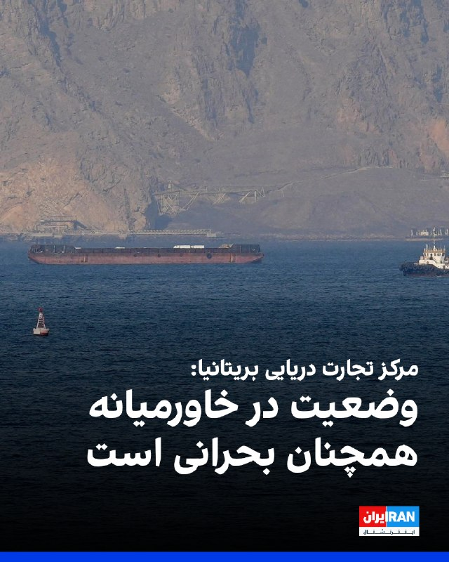
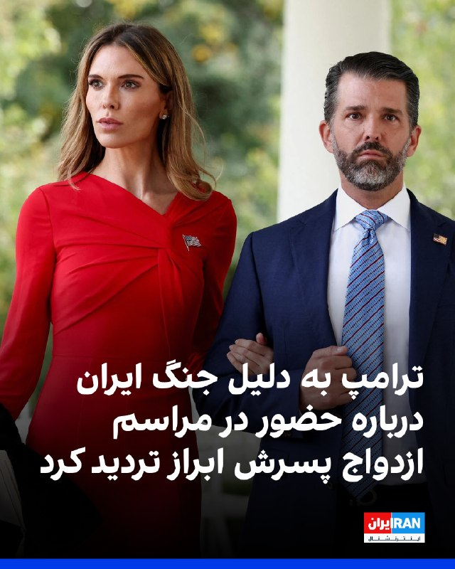
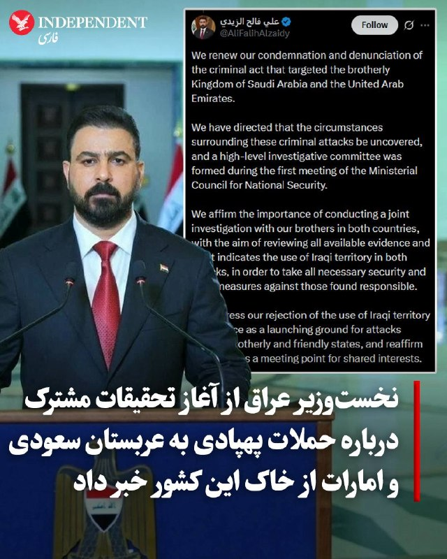
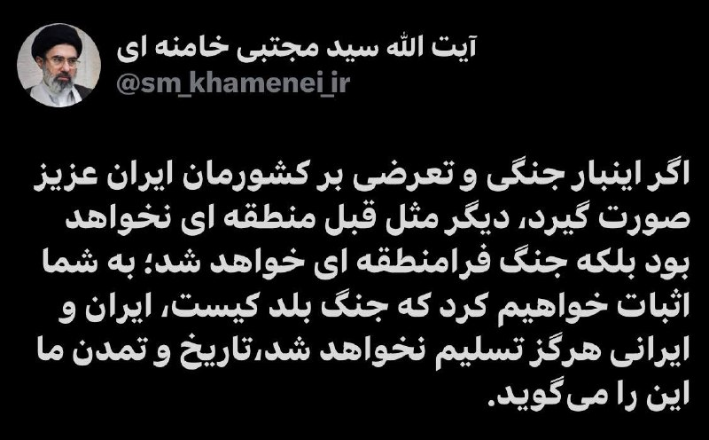
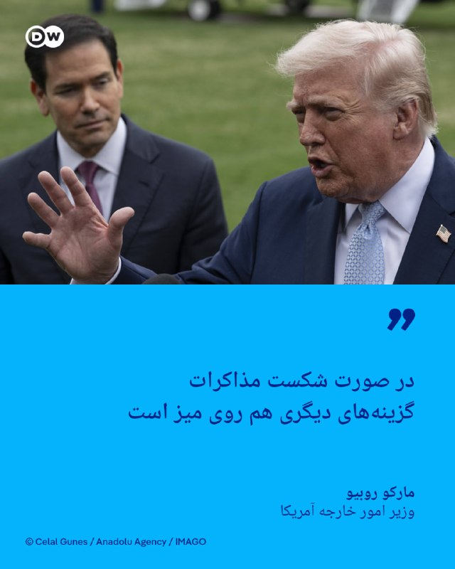
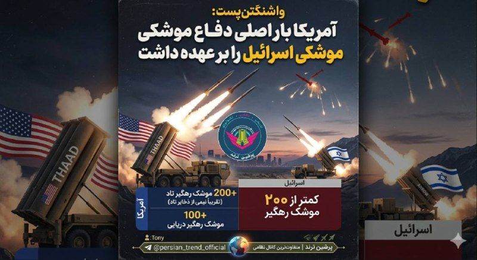
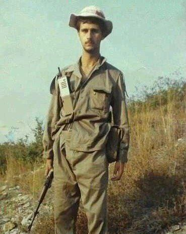

# خواننده تلگرام

<!-- TOP_NAV START -->

<a href="https://github.com/ProAlit/aio-downloader/blob/main/telegram/content/archive_1.md" style="display:inline-block; padding:6px 12px; margin:0 4px; background-color:#2ea44f; color:white; text-decoration:none; border-radius:4px; font-weight:bold;">صفحه بعد</a>

<!-- TOP_NAV END -->

<!-- MSG START -->

---
📅 بروزرسانی: 1405/03/01 03:22
---

## VahidOOnLine — post 241418

  

مرکز تجارت دریایی بریتانیا سطح تهدید در منطقه دریایی خاورمیانه را همچنان «بحرانی» خواند و گفت که تردد در تنگه هرمز همچنان به‌طور چشمگیری کاهش یافته اما در ۴۸ ساعت گذشته هیچ رخداد مرتبط با امنیت در این محدوده گزارش نشده است.
این نهاد که به نیروی دریایی بریتانیا وابسته است، پنجشنبه ۳۱ اردیبهشت اعلام کرد: «مین‌گذاری در داخل و اطراف مسیرهای جداسازی تردد دریایی همچنان یک تهدید محسوب می‌شود و اختلال در سامانه‌های ناوبری ماهواره‌ای جهانی به‌طور مستمر ادامه دارد.»
طبق اعلام این مرکز، شناورهای تجاری همچنان در سراسر خلیج عمان و شمال دریای عرب به نیروی دریایی آمریکا گزارش می‌دهند و اجرای محاصره دریایی از سوی این کشور ادامه دارد.
مرکز تجارت دریایی تردد تجاری در باب‌المندب و خلیج عدن را همچنان «باثبات» توصیف کرد.

‌🏁 🇬🇧 IranintlTV

🤖 @VahidOOnLine

## VahidOOnLine — post 241417

  

دونالد ترامپ پنجشنبه ۳۱ اردیبهشت در گفت‌وگو با خبرنگاران در کاخ سفید اعلام کرد که مطمئن نیست بتواند این آخر هفته در مراسم ازدواج پسر بزرگش، دونالد ترامپ جونیور، شرکت کند. او دلیل این تردید را درگیری‌های مرتبط با ایران و دیگر مشغله‌های کاری عنوان کرد.
ترامپ در توضیح این موضوع در دفتر بیضی گفت: «او دوست دارد من در مراسم باشم»، اما افزود: «به او گفتم این زمان‌بندی برای من مناسب نیست، چون موضوعی به نام ایران و مسائل دیگر دارم.»
بر اساس این اظهارات، مراسم ازدواج دونالد ترامپ جونیور، ۴۷ ساله، و بتینا اندرسون، ۳۹ ساله، قرار است در باهاما برگزار شود. این زوج از سال ۲۰۲۴ وارد رابطه شدند و در دسامبر ۲۰۲۵ نامزد کردند.
پسر رییس‌جمهوری آمریکا پیش‌تر با ونسا ترامپ ازدواج کرده بود و این زوج پنج فرزند دارند. او همچنین با کیمبرلی گیلفویل نامزد بود که اکنون به عنوان سفیر آمریکا در یونان فعالیت می‌کند.

‌🏁 🇬🇧 IranintlTV

🤖 @VahidOOnLine

## WithYashar — post 11903

Martik (t.me/withyashar) – Parandeh (IG @yashar)

## IranIntlTV — post 338310

  

مرکز تجارت دریایی بریتانیا سطح تهدید در منطقه دریایی خاورمیانه را همچنان «بحرانی» خواند و گفت که تردد در تنگه هرمز همچنان به‌طور چشمگیری کاهش یافته اما در ۴۸ ساعت گذشته هیچ رخداد مرتبط با امنیت در این محدوده گزارش نشده است.
این نهاد که به نیروی دریایی بریتانیا وابسته است، پنجشنبه ۳۱ اردیبهشت اعلام کرد: «مین‌گذاری در داخل و اطراف مسیرهای جداسازی تردد دریایی همچنان یک تهدید محسوب می‌شود و اختلال در سامانه‌های ناوبری ماهواره‌ای جهانی به‌طور مستمر ادامه دارد.»
طبق اعلام این مرکز، شناورهای تجاری همچنان در سراسر خلیج عمان و شمال دریای عرب به نیروی دریایی آمریکا گزارش می‌دهند و اجرای محاصره دریایی از سوی این کشور ادامه دارد.
مرکز تجارت دریایی تردد تجاری در باب‌المندب و خلیج عدن را همچنان «باثبات» توصیف کرد.

https://iranintl.com/202605219066

## FarsiVOA — post 218338

⚡️دونالد ترامپ: جمهوری اسلامی اورانیوم غنی شده را در چارچوب هر توافقی در اختیار نخواهد داشت
@FarsiVOA

---
📅 بروزرسانی: 1405/03/01 03:12
---

## WithYashar — post 11902

  <a href="https://t.me/withyashar/11902" target="_blank">📎 Download file</a>

🌐 @withyashar

🌐 instagram.com/yashar

## IranIntlTV — post 338309

  

دونالد ترامپ پنجشنبه ۳۱ اردیبهشت در گفت‌وگو با خبرنگاران در کاخ سفید اعلام کرد که مطمئن نیست بتواند این آخر هفته در مراسم ازدواج پسر بزرگش، دونالد ترامپ جونیور، شرکت کند. او دلیل این تردید را درگیری‌های مرتبط با ایران و دیگر مشغله‌های کاری عنوان کرد.
ترامپ در توضیح این موضوع در دفتر بیضی گفت: «او دوست دارد من در مراسم باشم»، اما افزود: «به او گفتم این زمان‌بندی برای من مناسب نیست، چون موضوعی به نام ایران و مسائل دیگر دارم.»
بر اساس این اظهارات، مراسم ازدواج دونالد ترامپ جونیور، ۴۷ ساله، و بتینا اندرسون، ۳۹ ساله، قرار است در باهاما برگزار شود. این زوج از سال ۲۰۲۴ وارد رابطه شدند و در دسامبر ۲۰۲۵ نامزد کردند.
پسر رییس‌جمهوری آمریکا پیش‌تر با ونسا ترامپ ازدواج کرده بود و این زوج پنج فرزند دارند. او همچنین با کیمبرلی گیلفویل نامزد بود که اکنون به عنوان سفیر آمریکا در یونان فعالیت می‌کند.

https://iranintl.com/202605211033

## FarsiVOA — post 218337

⚡️طعنه‌ وزارت جنگ آمریکا به مجتبی خامنه‌ای
وزارت جنگ آمریکا ویدیویی از توضیحات پیت هگست، وزیر جنگ منتشر کرد که در آن او به اقدامات وزارت جنگ برای مدرن‌سازی، استفاده از فناوری‌های پیشرفته هوش مصنوعی، و تکنولوژی‌های فضایی اشاره می‌کند. این ویدیو طعنه‌هایی تصویری نیز به جمهوری اسلامی و مجتبی خامنه‌ای دارد.
@FariVOA

---
📅 بروزرسانی: 1405/03/01 03:03
---

## VahidOOnLine — post 241416

  

♦️شبکه العربیه پنجشنبه‌شب ۳۱ اردیبهشت گزارش‌های منتشرشده در برخی رسانه‌های جمهوری اسلامی درباره دستیابی به توافق در مذاکرات ایران و آمریکا را تکذیب و آن‌ها را «جعلی و نادرست» توصیف کرد.
العربیه اعلام کرد برخی رسانه‌های جمهوری اسلامی اخباری را بدون بررسی صحت آن یا انتشارش در پلتفرم‌های رسمی این شبکه، به العربیه نسبت داده‌اند و این اقدام را «غیرحرفه‌ای» توصیف کرد. این شبکه تاکید کرد هیچ گزارشی درباره دستیابی به توافق هسته‌ای یا حل‌وفصل اختلافات میان واشنگتن و تهران منتشر نکرده است.
این واکنش در حالی مطرح می‌شود که مذاکرات هسته‌ای آمریکا و ایران با میانجی‌گری پاکستان در هفته‌های اخیر وارد مرحله حساسی شده و همزمان گزارش‌های ضدونقیضی درباره روند مذاکرات منتشر شده است. در روزهای اخیر، برخی رسانه‌ها از نزدیک شدن دو طرف به یک تفاهم احتمالی خبر داده بودند.
‌🇸🇦 Indypersian

🤖 @VahidOOnLine

## FoxNewsTwitter — post 342082

  

Fox News (Twitter/X)

WATCH LIVE: SpaceX launches its massive, next-generation Starship V3 rocket from Starbase, Texas https://twitter.com/i/broadcasts/1qJVmQdOpXDGB

---
📅 بروزرسانی: 1405/03/01 02:53
---

## IranianMinds — post 20510

  

🔴حساب احمد وحیدی، فرمانده سپاه تروریستی پاسداران بسته شد.

@IranianMinds

---
📅 بروزرسانی: 1405/03/01 02:43
---

## FoxNewsTwitter — post 342081

  <a href="telegram/content/FoxNewsTwitter_342081_1779405214.mp4" target="_blank">🎬 Download video</a>

Fox News (Twitter/X)

FOX NEWS REPORT: The White House says it won't ease pressure on Iran's nuclear program, and President Trump is rejecting any Iranian effort to impose tolls in the Strait of Hormuz.

Travelers from countries impacted by the Ebola outbreak will now be routed through Dulles Airport in Virginia for enhanced health screenings.

@BillMelugin_ has the latest.

## VahidOnline — post 75603

  <a href="telegram/content/VahidOnline_75603_1779405217.mp4" target="_blank">🎬 Download video</a>

تصویرسازی از مجتبی خامنه‌ای

وزارت جنگ آمریکا روز پنجشنبه ۳۱ اردیبهشت، با انتشار ویدیویی بر ضرورت افزایش بودجه دفاعی کشور تاکید کرد.

در این ویدیو که ترکیبی از صحنه‌های واقعی، گفته‌های پیت هگست، وزیر جنگ آمریکا و تصاویر کارتونی است، تصویری از مجتبی خامنه‌ای، رهبر جدید جمهوری اسلامی نیز در کنار یک سامانه موشکی دیده می‌آشود در حالی که یک پایش قطع شده است.
@VahidOOnLine

📡 @VahidOnline

## FarsiVOA — post 218336

⚡️آیا پاکستان می‌تواند میانجی موفقی باشد؟
@FarsiVOA

---
📅 بروزرسانی: 1405/03/01 02:33
---

## VahidOOnLine — post 241415

  

♦️«تانکرترکرز»، سامانه رصد موقعیت نفتکش‌ها، بامداد جمعه اول خرداد با انتشار تصاویری هوایی در شبکه اجتماعی اکس اعلام کرد نیروی دریایی آمریکا شماری از نفتکش‌های ناقض تحریم را در سواحل شرقی عمان متوقف کرده است. بر اساس تصاویر منتشرشده، یک نفتکش آفرامکس که معمولا نفت ایران را حمل می‌کند، پس از بازگردانده شدن به دریای عرب از سوی یک ناو آمریکایی تعقیب شد.

این گزارش همچنین می‌گوید چندین نفتکش مرتبط با ایران که هنوز در فهرست تحریم‌های آمریکا قرار نگرفته‌اند، وارد محدوده محاصره شده‌اند. به گفته تانکرترکرز، اکنون ۴۹ نفتکش از این نوع در این محدوده حضور دارند.

فرماندهی مرکزی ایالات متحده، سنتکام، روز پنجشنبه ۳۱ اردیبهشت اعلام کرد در جریان محاصره دریایی بنادر ایران، ۹۴ کشتی تجاری تغییر مسیر داده‌اند و چهار کشتی دیگر نیز زمین‌گیر و ناچار به توقف شده‌اند.
‌🇸🇦 Indypersian

🤖 @VahidOOnLine

## VahidOOnLine — post 241414

  

دادستان‌های آلمان اعلام کردند یک تبعه دانمارکی به نام علی اس. که خرداد گذشته در دانمارک بازداشت شده بود، به اتهام جاسوسی از رییس اصلی‌ترین نهاد یهودیان آلمان و سه نفر دیگر برای اطلاعات سپاه و تلاش برای مشارکت در قتل متهم شده است.
دادستان‌های آلمانی گفتند به موجب کیفرخواستی که ۱۷ اردیبهشت در دادگاه ایالتی هامبورگ ثبت کرده‌اند، این تبعه دانمارکی به همکاری به عنوان مامور اطلاعات سپاه، فعالیت مخفیانه با هدف خرابکاری و تلاش برای مشارکت در قتل و آتش‌سوزی متهم شده است.
طبق این کیفرخواست، همچنین یک تبعه افغانستان با نام تواب م. که آبان‌ماه ۱۴۰۴ در دانمارک بازداشت شده بود نیز به عنوان همد‌ست مورد ادعای او در این پرونده به تلاش برای مشارکت در قتل متهم شده است.
به گفته دادستان‌ها، علی اس. ارتباط نزدیکی با نیروی قدس سپاه داشت و در آغاز سال ۲۰۲۵ از او خواسته شده بود درباره یوزف شوستر، رییس شورای مرکزی یهودیان آلمان، و فولکر بک، رییس انجمن آلمانی-اسراییلی و نماینده پیشین برجسته پارلمان آلمان، و همچنین دو فروشنده یهودی مواد غذایی در برلین که نامشان فاش نشده، اطلاعات جمع‌آوری کند.
‌🏁 🇬🇧 IranintlTV

🤖 @VahidOOnLine

## FoxNewsTwitter — post 342080

  

Fox News (Twitter/X)

Former “The Hills” star Spencer Pratt — who is now running for mayor of Los Angeles — says Jesus Christ is his political role model.

He was then prodded on whether there are any modern politicians he views as role models.

“No, I’m not a politician,” Pratt responded. “I don’t want to be a politician. I want to be a fighter for the people.”

## IranIntlTV — post 338308

  

دادستان‌های آلمان اعلام کردند یک تبعه دانمارکی به نام علی اس. که خرداد گذشته در دانمارک بازداشت شده بود، به اتهام جاسوسی از رییس اصلی‌ترین نهاد یهودیان آلمان و سه نفر دیگر برای اطلاعات سپاه و تلاش برای مشارکت در قتل متهم شده است.
دادستان‌های آلمانی گفتند به موجب کیفرخواستی که ۱۷ اردیبهشت در دادگاه ایالتی هامبورگ ثبت کرده‌اند، این تبعه دانمارکی به همکاری به عنوان مامور اطلاعات سپاه، فعالیت مخفیانه با هدف خرابکاری و تلاش برای مشارکت در قتل و آتش‌سوزی متهم شده است.
طبق این کیفرخواست، همچنین یک تبعه افغانستان با نام تواب م. که آبان‌ماه ۱۴۰۴ در دانمارک بازداشت شده بود نیز به عنوان همد‌ست مورد ادعای او در این پرونده به تلاش برای مشارکت در قتل متهم شده است.
به گفته دادستان‌ها، علی اس. ارتباط نزدیکی با نیروی قدس سپاه داشت و در آغاز سال ۲۰۲۵ از او خواسته شده بود درباره یوزف شوستر، رییس شورای مرکزی یهودیان آلمان، و فولکر بک، رییس انجمن آلمانی-اسراییلی و نماینده پیشین برجسته پارلمان آلمان، و همچنین دو فروشنده یهودی مواد غذایی در برلین که نامشان فاش نشده، اطلاعات جمع‌آوری کند.
https://iranintl.com/202605212861

## FarsiVOA — post 218335

⚡️کاهش قابل توجه مهاجرت به بریتانیا؛ پایین‌ترین آمار در چهار سال اخیر
@FardiVOA

## BBCPersian — post 281736

  

‌🔸سه هفته مانده به آغاز جام جهانی فوتبال که به طور مشترک در آمریکا، کانادا و مکزیک برگزار می‌شود، تیم ملی فوتبال ایران به تمرینات خود در آنتالیا ترکیه ادامه می‌دهد.

در تازه‌ترین اخبار مربوط به این تیم، شهریار مغانلو، مهاجم شاغل در لیگ امارات، به اردوی تیم ایران اضافه خواهد شد و روزبه چشمی که گزارش شده از ناحیه همسترینگ مصدوم شده، برای آغاز درمان از اردوی تیم ملی جدا خواهد شد.

پیوستن شهریار مغانلو به جمع مهاجمان تیم ملی ایران در حالی است که خط خوردن نام سردار آزمون، فوق ستاره این تیم، همچنان یکی از حواشی اصلی تیم ایران است.

در تحولی دیگر،‌ همزمان با مراجعه اعضای تیم ایران برای درخواست ویزا از کنسولگری‌های آمریکا و کانادا در آنتالیا، یک عضو هیات رئیسه فدراسیون فوتبال ایران از سفر به آمریکا انصراف داده است.

به گزارش خبرگزاری ایرنا، محمدرحمان سالاری، عضو هیات رئیسه فدراسیون فوتبال، با ارسال نامه‌ای به مهدی تاج، رئیس فدراسیون فوتبال، از سفر به آمریکا و حضور در جام‌جهانی «انصراف داده است».

لینک خبر:
https://bbc.in/49eO8DO

📷DeFodi Images via Getty Images
@BBCPersian

---
📅 بروزرسانی: 1405/03/01 02:23
---

## WithYashar — post 11901

## WithYashar — post 11900

عروسیه ولی بزا بگو درگیری بین نیرو های سپاه و اسراییل🤣🤣

## WithYashar — post 11899

## kianmeli1 — post 87548

🔴مشاغل باقی مانده در ایران:
۱-کانفینگ فروش
۲-عرق فروش
۳-موادفروش
۴-اسنپ
۵-آدم فروش
۶-ناخن کار
https://t.me/kianmeli1

---
📅 بروزرسانی: 1405/03/01 02:13
---

## VahidOOnLine — post 241413

♦️تیم فوتبال النصر در هفته پایانی لیگ حرفه‌ای عربستان سعودی پنجشنبه‌شب ۳۱ اردیبهشت‌ماه با نتیجه ۴ بر ۱ ضمک را شکست داد و با ۸۶ امتیاز بالاتر از الهلال به مقام قهرمانی رسید. گل‌های النصر را سادیو مانه، کینگزلی کومان و کریستیانو رونالدو (دو بار) به ثمر رساندند.

رونالدو با دو گلی که در این مسابقه زد، تعداد گل‌های دوران حرفه‌ای خود را به ۹۷۳ رساند. این سی‌وهفتمین جام دوران حرفه‌ای او و نخستین قهرمانی لیگش پس از قهرمانی با یوونتوس در سری‌آ ایتالیا در سال ۲۰۲۰ است.

در دیگر دیدار هفته پایانی، الهلال با نتیجه ۱ بر صفر الفیحا را شکست داد و با ۸۴ امتیاز در رده دوم قرار گرفت. الاهلی، قهرمان دو دوره اخیر لیگ نخبگان آسیا، نیز با ۸۱ امتیاز فصل را در جایگاه سوم به پایان رساند.

رونالدو همچنین النصر را پس از ۷ سال دوباره به قهرمانی لیگ عربستان سعودی رساند.
‌🇸🇦 Indypersian

🤖 @VahidOOnLine

## Persian_Trend_Official — post 14645

  <a href="telegram/content/Persian_Trend_Official_14645_1779403389.mp4" target="_blank">🎬 Download video</a>

شبتون بخیر 🙏🌙

📝 Nick
📌 @persian_trend_official
پرشین ترند | متفاوت‌ترین کانال نظامی

---
📅 بروزرسانی: 1405/03/01 02:02
---

## VahidOOnLine — post 241412

  

♦️به گزارش نیویورک تایمز، شرکت آمریکایی اکسون موبیل به توافقی برای استخراج نفت در ونزوئلا نزدیک شده است؛ اقدامی که حدود دو دهه پس از آن انجام می‌شود که این غول نفتی عملا از ونزوئلا اخراج شد. این توافق چند ماه پس از برکناری نیکلاس مادورو، رهبر ونزوئلا، با حمایت آمریکا مطرح شده است. اخیرا پروازهای مستقیم میان ونزوئلا و آمریکا نیز برقرار شده و نرخ تورم در ونزوئلا حدود پنج ماه پس از بازداشت مادورو و محاکمه او در آمریکا، کاهش یافته است.
‌🇸🇦 Indypersian

🤖 @VahidOOnLine

## WithYashar — post 11898

رسانه‌های ایرانی: تبادل پیام‌های میان آمریکا و ایران از طریق پاکستان ادامه دارد. وزیر کشور پاکستان با ادامه مذاکرات روز جمعه در ایران خواهد ماند. عاصم منیر، فرمانده ارتش پاکستان در صورت دست‌یابی به «چارچوب توافق» به تهران سفر خواهد کرد.
@withyashar

## WithYashar — post 11897

النصر با کریستیانو رونالدو قهرمان لیگ عربستان شد.
@withyashar

## IranIntlTV — post 338307

  <a href="telegram/content/IranIntlTV_338307_1779402772.mp4" target="_blank">🎬 Download video</a>

مشاور دیپلماتیک رییس امارات متحده عربی حملات سپاه پاسداران را «تجاوزی وحشیانه» به کشورهای عربی توصیف کرد و گفت اعتبار تهران از بین رفته است.

او همچنین تاکید کرد بازسازی اعتماد با شعار ممکن نیست.

گفت‌وگو با غسان عاشور، تحلیل‌گر مسائل خاورمیانه
@iranintltv

## IranIntlTV — post 338306

  <a href="telegram/content/IranIntlTV_338306_1779402773.mp4" target="_blank">🎬 Download video</a>

آژانس بین‌المللی انرژی هشدار داد ادامه تنش‌ها در خاورمیانه و اختلال در عبور نفتکش‌ها از تنگه هرمز می‌تواند بازار جهانی نفت را تابستان امسال با کمبود شدید عرضه روبه‌رو کند.

گفت‌وگو با مهدی مصلحی، کارشناس بازار نفت
@iranintltv

## IranIntlTV — post 338305

  <a href="telegram/content/IranIntlTV_338305_1779402775.mp4" target="_blank">🎬 Download video</a>

رویترز به نقل از یک مقام ارشد جمهوری اسلامی گزارش داد اختلافات با آمریکا کاهش یافته، اما هنوز توافقی حاصل نشده است.

پولیتیکو نیز نوشت مساله برنامه هسته‌ای ایران و بازگشایی تنگه هرمز همچنان از محورهای اختلاف در مذاکرات است.

جزییات بیشتر با امیر گیتی، عضو تحریریه ایران‌اینترنشنال
@iranintltv

## IranIntlTV — post 338304

  <a href="telegram/content/IranIntlTV_338304_1779402777.mp4" target="_blank">🎬 Download video</a>

همزمان با گمانه‌زنی‌ها درباره اقدام بعدی دونالد ترامپ در برابر جمهوری اسلامی در صورت شکست مذاکرات، مخالفان او در کنگره آمریکا همچنان برای کاهش اختیارات جنگی رییس‌جمهوری تلاش می‌کنند.

گزارش مرضیه حسینی، خبرنگار ایران‌اینترنشنال
@iranintltv

## Persian_Trend_Official — post 14644

دوستان عزیز
از سمت هاست دانلودمون‌ یک مشکلی پیش اومده که لایو امشب آپلود نمیشه
فردا اول وقت پیگیری میکنم و براتون میزارمش 🙏❤️
ارادتمند ✌️

📝 Nick

📌 @persian_trend_official
پرشین ترند | متفاوت‌ترین کانال نظامی

---
📅 بروزرسانی: 1405/03/01 01:52
---

## VahidOOnLine — post 241411

  

♦️العربیه به نقل از یک منبع بلندپایه گزارش داد عاصم منیر، فرمانده ارتش پاکستان، که قرار بود پنجشنبه ۳۱ اردیبهشت به تهران سفر کند، سفرش به تاخیر افتاده است.
پیش‌تر رسانه‌های ایرانی گزارش داده بودند عاصم منیر قرار است در چارچوب رایزنی‌های منطقه‌ای و هم‌زمان با ادامه مذاکرات غیرمستقیم تهران و واشنگتن، به ایران سفر کند. فداحسین مالکی، عضو کمیسیون امنیت ملی مجلس، نیز اعلام کرده بود فرمانده ارتش پاکستان حامل «پیام جدیدی» از سوی آمریکا برای مقام‌های جمهوری اسلامی است.
العربیه همچنین گزارش داد سفر احتمالی منیر به تهران ممکن است در صورت دستیابی دو طرف به «چارچوب توافق» انجام شود. این گزارش در حالی منتشر شده که رویترز به نقل از یک منبع ارشد ایرانی نوشته بود هنوز توافق نهایی میان تهران و واشنگتن حاصل نشده، اما اختلاف‌ها کاهش یافته است.
تا زمان انتشار این خبر، مقام‌های ایرانی و پاکستانی درباره دلیل این تاخیر اظهارنظر رسمی نکرده‌اند.
‌🇸🇦 Indypersian

🤖 @VahidOOnLine

## VahidOOnLine — post 241410

  

♦️به گزارش نشنال، چندین عضو سپاه پاسداران جمهوری اسلامی روز پنج‌شنبه از سوی دادستانی کویت به‌دلیل ارتباط با یک عملیات نفوذ مسلحانه به خاک این کشور، به دادگاه معرفی شدند.
کویت اعلام کرد که اوایل ماه جاری میلادی یک طرح سپاه پاسداران در جزیره بوبیان را خنثی کرده است. به گفته مقام‌های کویت، چهار مهاجم مرتبط با سپاه پاسداران روز سوم مه پس از تلاش برای نفوذ به این جزیره با یک قایق ماهیگیری و با هدف انجام «اقدامات خصمانه» بازداشت شدند.
خبرگزاری رسمی کویت، کونا، گزارش داد دو نفر دیگر موفق به فرار شدند و یک نیروی امنیتی کویت نیز زخمی شد. گفته می‌شود متهمان به ارتباط با سپاه پاسداران اعتراف کرده‌اند.
دادستانی عمومی کویت اعلام کرد متهمان با اتهام اجرای طرحی برای انجام اقدام خصمانه علیه کویت از طریق استفاده از قایق، سامانه‌های ناوبری و تجهیزات ارتباطی روبه‌رو هستند.
در بیانیه دادستانی آمده است که این افراد همچنین به تلاش برای قتل نیروهای امنیتی کویت از طریق هدف قرار دادن آنان با سلاح گرم، که همراه خود وارد کشور کرده بودند، متهم شده‌اند.
دادستانی همچنین این افراد را به نقض حاکمیت کویت از طریق عبور غیرقانونی از مرز، نفوذ به منطقه نظامی ممنوعه و هدف قرار دادن مراکز نظامی و حاکمیتی متهم کرده است.
هفته گذشته، رژیم ایران خواستار آزادی چهار عضو سپاه پاسداران شد که در جریان درگیری در این جزیره بازداشت شده بودند.
عباس عراقچی، وزیر خارجه جمهوری اسلامی، گفت تهران «حق پاسخ‌گویی را برای خود محفوظ می‌داند» و اتهام‌های کویت را «بی‌اساس» خواند.
همسایگان عرب کویت در خلیج فارس تلاش برای نفوذ به این کشور را محکوم کردند و حمایت خود را از کویت اعلام کردند. جاسم البدیوی، دبیرکل شورای همکاری خلیج فارس، گفت این عملیات نشان‌دهنده «تلاشی سازمان‌یافته» از سوی رژیم ایران برای بی‌ثبات کردن منطقه است.
جزیره بوبیان در شمال خلیج فارس و نزدیک مرز عراق قرار دارد و محل اجرای پروژه‌های مهم بندری و زیرساختی است. کویت هنوز اعلام نکرده است که آیا این پرونده را به شورای امنیت سازمان ملل ارجاع خواهد داد یا نه، اما مقام‌های این کشور گفته‌اند این گزینه همچنان روی میز است.
‌🇸🇦 Indypersian

🤖 @VahidOOnLine

## WithYashar — post 11896

صدای پدافند در تهران
@withyashar

## FoxNewsTwitter — post 342079

  

Fox News (Twitter/X)

Two-time NASCAR Cup Series champion Kyle Busch died Thursday afternoon, sending shockwaves through the racing world.

Busch, 41, was hospitalized Thursday due to an undisclosed but "severe illness," according to a statement from his family.

Busch won 63 races over 762 career starts, winning the championship in 2015 and 2019.

## alonews — post 121680

  <a href="telegram/content/alonews_121680_1779402180.webm" target="_blank">🎬 Download video</a>

👈لبنیات از امروز 20% گرون شد

✅ @AloNews خبر جنگ

---
📅 بروزرسانی: 1405/03/01 01:46
---

## WithYashar — post 11895

اتاق جنگ با شما : سلام همچنان صدای پدافند میاد اصفهان.
@withyashar

## alonews — post 121679

  

یه بسته چیپس ساده شده 525 هزار تومن!!!

هر دونه چیپسی که میخورین 3 هزار تومن ناقابل.

[@AloTweet]

---
📅 بروزرسانی: 1405/03/01 01:42
---

## VahidOOnLine — post 241409

  

ایسنا گزارش داد تبادل پیام و متن بین جمهوری اسلامی و آمریکا با میانجی‌گری طرف پاکستانی همچنان ادامه دارد و به گفته منابع پاکستانی، سفر عاصم منیر، فرمانده ارتش پاکستان، به ایران در صورت نهایی شدن چارچوب مورد نظر دو طرف انجام خواهد شد.
طبق این گزارش، محسن نقوی، وزیر کشور پاکستان، که هفته جاری برای بار دوم صبح روز چهارشنبه به تهران سفر کرد، حامل پیامی از سوی طرف آمریکایی برای تهران بود.

‌🏁 🇬🇧 IranintlTV

🤖 @VahidOOnLine

## WithYashar — post 11894

اتاق جنگ با شما : درود خسته نباشی برادر به نظرم درگیری هست بین بندرعباس و سیریک تو دریا داخل تنگه مدام صدای بمب میاد
@withyashar

## WithYashar — post 11893

صدای انفجار یا پدافند شدید در قشم
@withyashar

## IranIntlTV — post 338303

  

ایسنا گزارش داد تبادل پیام و متن بین جمهوری اسلامی و آمریکا با میانجی‌گری طرف پاکستانی همچنان ادامه دارد و به گفته منابع پاکستانی، سفر عاصم منیر، فرمانده ارتش پاکستان، به ایران در صورت نهایی شدن چارچوب مورد نظر دو طرف انجام خواهد شد.
طبق این گزارش، محسن نقوی، وزیر کشور پاکستان، که هفته جاری برای بار دوم صبح روز چهارشنبه به تهران سفر کرد، حامل پیامی از سوی طرف آمریکایی برای تهران بود.

https://iranintl.com/202605216298

## BBCPersian — post 281728

‌🖊ایموجن فولکس
در,برن

🔻سرویس اطلاعات فدرال سوئیس اعلام کرده است که سرانجام پرونده‌های محرمانه و مهر و موم‌شده مربوط به یوزف منگله، جنایتکار بدنام جنگی نازی را منتشر خواهد کرد.

منگله پس از جنگ جهانی دوم از اروپا گریخت، اما سال‌ها شایعه‌هایی وجود داشت مبنی بر این‌ که او مدتی را در سوئیس گذرانده است، آن هم در حالی که حکم بازداشت بین‌المللی برای او صادر شده بود.

منگله پزشکی بود که در واحد وافن اس‌اس آلمان خدمت می‌کرد. او به اردوگاه مرگ آشویتس در لهستان تحت اشغال نازی‌ها اعزام شد؛ جایی که افرادی را برای فرستادن به اتاق‌های گاز انتخاب می‌کرد. برآورد می‌شود حدود یک میلیون و یکصد هزار نفر در آن اردوگاه جان باختند که نزدیک به یک میلیون نفر از آن‌ها یهودی بودند.

او که به «فرشته مرگ» معروف شده بود، زندانیان، به‌ویژه کودکان و دوقلوها را نیز برای آزمایش‌های پزشکی سادیستی انتخاب می‌کرد و سپس آن‌ها را به سوی مرگ می‌فرستاد.

متن کامل خبر را از لینک زیر بخوانید:

📷Getty Images/ Regula Bochsler/ BBC
https://bbc.in/4ujpD0G

@BBCPersian

---
📅 بروزرسانی: 1405/03/01 01:33
---

## IranIntlTV — post 338302

  <a href="telegram/content/IranIntlTV_338302_1779400983.mp4" target="_blank">🎬 Download video</a>

دونالد ترامپ بار دیگر تاکید کرد جمهوری اسلامی اجازه دستیابی به سلاح هسته‌ای را ندارد.

او در پاسخ به خبرنگاران گفت ایالات متحده اورانیوم غنی‌شده ایران را خارج و نابود می‌کند.

گزارش اردوان روزبه، خبرنگار ایران‌اینترنشنال
@iranintltv

---
📅 بروزرسانی: 1405/03/01 01:23
---

## VahidOOnLine — post 241408

♦️ محمد مخبر، مشاور رهبر جمهوری اسلامی، پنجشنبه‌شب ۳۱ اردیبهشت‌ماه در گفتگو با صدا و سیما گفت که از زمان مرگ ابراهیم رئیسی، رئیس دولت سیزدهم، تاکنون هیچ‌گاه باور نکرده است سقوط هلیکوپتر او یک «حادثه عادی» بوده باشد.

مخبر گفت این موضوع را پیش‌تر با علی خامنه‌ای نیز مطرح کرده و در دیداری با او گفته است: «ما الان مستندی نداریم که ترور انجام گرفته باشد، اما هرچه برای من توضیح دادند که قضیه عادی بوده، بر ابهاماتم اضافه شده است.»

او افزود: «هیچ‌وقت تا الان قبول نکردم که این فقط یک حادثه و سقوط عادی بوده است.» مجری برنامه نیز از او پرسید که آیا همچنان همین باور را دارد که مخبر پاسخ داد: «بله.»

هلیکوپتر حامل ابراهیم رئیسی، رئیس دولت سیزدهم، حسین امیرعبداللهیان، وزیر خارجه، و هیئت همراه آنان عصر یکشنبه ۳۰ اردیبهشت ۱۴۰۳ در مسیر بازگشت به تبریز در شمال‌غرب ایران ناپدید شد. ساعاتی بعد، لاشه هلیکوپتر و اجساد سرنشینان پیدا شد. محمدعلی آل هاشم، امام جمعه تبریز، مالک رحمتی، استاندار آذربایجان شرقی، خلبان، کمک‌خلبان، اعضای تیم پرواز و چند عضو تیم حفاظت نیز در این حادثه کشته شدند.
‌🇸🇦 Indypersian

🤖 @VahidOOnLine

## VahidOOnLine — post 241407

  

♦️دونالد ترامپ، رئیس‌جمهوری آمریکا، با انتشار پیامی در شبکه «تروث سوشال» اعلام کرد ایالات متحده ۵ هزار نیروی اضافی به لهستان اعزام خواهد کرد.
او نوشت: «در پی برگزاری موفق انتخابات و انتخاب کارول ناوروتسکی به‌عنوان رئیس‌جمهوری لهستان؛ فردی که با افتخار از او حمایت کردم و با توجه به روابط ما با او، خوشحال هستم اعلام کنم ایالات متحده ۵ هزار نیروی اضافی به لهستان اعزام خواهد کرد.»
‌🇸🇦 Indypersian

🤖 @VahidOOnLine

## VahidOOnLine — post 241406

  

لیندزی گراهام، سناتور جمهوری‌خواه آمریکا، در پستی در ایکس نوشت ترامپ تاکید کرده است بدون توانایی غنی‌سازی، مسیری برای دستیابی به سلاح هسته‌ای وجود ندارد و به دلیل سابقه «تقلب» جمهوری اسلامی، تهران نباید اجازه ادامه غنی‌سازی را داشته باشد.
او با هشدار درباره اینکه جمهوری اسلامی می‌تواند از حدود ۴۴۰ کیلوگرم اورانیوم با غنای بالا برای ساخت «بمب کثیف» یا غنی‌سازی بیشتر تا سطح ۹۰ درصد برای تولید سلاح هسته‌ای استفاده کند، گفت ترامپ همچنان تاکید دارد که جمهوری اسلامی نباید اجازه حفظ این مواد را داشته باشد.
او همچنین جلوگیری از ادامه حمایت جمهوری اسلامی از گروه‌های نیابتی را از خطوط قرمز مذاکرات دانست و نوشت: «زمان همه‌چیز را مشخص خواهد کرد.»

‌🏁 🇬🇧 IranintlTV

🤖 @VahidOOnLine

## WithYashar — post 11892

لیندزی گراهام: ترامپ تاکید کرده است بدون توانایی غنی‌سازی، مسیری برای دستیابی به سلاح هسته‌ای وجود ندارد و به دلیل سابقه «تقلب» جمهوری اسلامی، تهران نباید اجازه ادامه غنی‌سازی را داشته باشد.
این موضوع، همراه با هدف اعلام‌شده برای اطمینان از اینکه ایران نتواند از گروه‌های نیابتی تروریستی حمایت کند، از نظر من خطوط قرمز مذاکرات هستند و دلایل محکمی هم دارند.
زمان مشخص خواهد کرد
@withyashar

## WithYashar — post 11891

حملات هوایی سنگین اسرائیل به جنوب لبنان
منابع لبنانی از آغاز دور دیگر حملات جنوبی لبنان خبر دادند.
تا این لحظه شهرک‌های زوطر، کفرا و شوکین هدف این حملات قرار گرفته‌اند.
@withyashar

## FoxNewsTwitter — post 342078

  

Fox News (Twitter/X)

Trump’s 250-foot triumphal arch just cleared a key hurdle.

The U.S. Commission of Fine Arts has approved the design, advancing a massive monument planned for an entrance to Washington, D.C.

The arch will feature a Lady Liberty-style figure holding a torch, gilded eagles, gold lettering reading “One Nation Under God” and “Liberty and Justice for All,” and a public observation deck with 360-degree views, though the four lions originally planned for the base have been removed.

📸: U.S. Commission of Fine Arts

## IranIntlTV — post 338301

  

لیندزی گراهام، سناتور جمهوری‌خواه آمریکا، در پستی در ایکس نوشت ترامپ تاکید کرده است بدون توانایی غنی‌سازی، مسیری برای دستیابی به سلاح هسته‌ای وجود ندارد و به دلیل سابقه «تقلب» جمهوری اسلامی، تهران نباید اجازه ادامه غنی‌سازی را داشته باشد.
او با هشدار درباره اینکه جمهوری اسلامی می‌تواند از حدود ۴۴۰ کیلوگرم اورانیوم با غنای بالا برای ساخت «بمب کثیف» یا غنی‌سازی بیشتر تا سطح ۹۰ درصد برای تولید سلاح هسته‌ای استفاده کند، گفت ترامپ همچنان تاکید دارد که جمهوری اسلامی نباید اجازه حفظ این مواد را داشته باشد.
او همچنین جلوگیری از ادامه حمایت جمهوری اسلامی از گروه‌های نیابتی را از خطوط قرمز مذاکرات دانست و نوشت: «زمان همه‌چیز را مشخص خواهد کرد.»

https://iranintl.com/202605211326

## Shin_Persian — post 6130

  

Shin ✓ @hey_itsmyturn
Thu, 21 May 2026 21:44:53 UTC

Blast sound in Qeshm, Hormozgan Province, #Iran
Unclear reason.

فارسی

صدای انفجار در قشم، استان هرمزگان، #Iran
دلیل آن نامشخص است.

𝕏 · @shin_persian

## FarsiVOA — post 218334

  

⚡️مارکو روبیو، وزیر امورخارجه آمریکا، روز پنج‌شنبه به خبرنگاران گفت اصرار جمهوری اسلامی به دریافت عوارض از کشتی‌ها برای عبور از تنگه هرمز توافق با رژیم ایران را غیرممکن خواهد کرد. آقای روبیو گفت هیچ‌کس در جهان طرفدار چنین سیستم غیرقانونی نیست و گرفتن عوارض غیرقابل قبول است.
@FarsiVOA

## BBCPersian — post 281727

🔻نیروی دریایی سپاه پاسداران: ۳۱ کشتی با هماهنگی ما طی شبانه‌روز گذشته از تنگه هرمز عبور کرد

🔻روابط عمومی نیروی دریای سپاه پاسداران، روز پنجشنبه ۳۱ اردیبهشت اعلام کرد که طی شبانه‌روز گذشته به «۳۱ کشتی» اجازه دادند که از تنگه‌هرمز عبور کنند.

در این بیانیه که خبرگزاری ایرنا آن را منتشر کرده است،‌ آمده: «طی شبانه روز گذشته ۳۱ فروند کشتی اعم از نفتکش، کانتینر بر و سایر کشتی‌های تجاری با هماهنگی و تامین امنیت نیروی دریایی سپاه از تنگه هرمز عبور کردند.»

نیروی دریایی سپاه پاسداران،‌ در این بیانیه ارتش آمریکا را «تروریستی» خواند و آن را به «ایجاد ناامنی بی‌سابقه» در خلیج فارس و تنگه هرمز متهم کرد.

سپاه پاسداران می‌گوید که تلاش کرده مسیر مشخص و ایمنی برای عبور و استمرار تجارت جهانی ایجاد کند.

این در حالی است که آمریکا هم می‌گوید که با محاصره بنادر ایران،‌ هیچ کشتی نمی‌تواند دربنادر ایران پهلو بگیرد یا بنادر را ترک کند.

https://bbc.in/3RT3jfU
@BBCPersian

## Dirty_Kids — post 389919

  <a href="telegram/content/Dirty_Kids_389919_1779400394.webm" target="_blank">🎬 Download video</a>

☢️خفن ترین و‌ قدیمی ترین  انالیزور  ایران ینی دکتر بت 
👍 
🔴هیچ سایت بتی دوست نداره شما کانال دکتر بت رو پیدا کنین چون خیلی سود میکنید🤷‍♂ رایگان بهترین شرط هارو براتون میذاره حتی هزار تومن هم دریافت نمیکنه روزانه میتونی از پیش بینی فوتبال باهاش پول در بیاری…

## Dirty_Kids — post 389918

  <a href="telegram/content/Dirty_Kids_389918_1779400395.webm" target="_blank">🎬 Download video</a>

☢️خفن ترین و‌ قدیمی ترین  انالیزور  ایران ینی دکتر بت 
👍

🔴هیچ سایت بتی دوست نداره شما کانال دکتر بت رو پیدا کنین چون خیلی سود میکنید🤷‍♂

رایگان بهترین شرط هارو براتون میذاره
حتی هزار تومن هم دریافت نمیکنه
روزانه میتونی از پیش بینی فوتبال باهاش پول در بیاری 👌
A31
اگ اهل پیش بینی فوتبالی این کانال اصلا از دست ندین👇

✅https://t.me/+4_ADqwB9e-QwYjlk

✅https://t.me/+4_ADqwB9e-QwYjlk

## Dirty_Kids — post 389917

  

#بخوابیم

## Dirty_Kids — post 389913

  <a href="telegram/content/Dirty_Kids_389913_1779400395.mp4" target="_blank">🎬 Download video</a>

قسمت‌های دیگری از چالش دوربین‌به‌کون که توسط روس‌ها وایرال شده این چالش باعث خشکی کمر آقایون در سراسر دنیا شده.

@Dirty_Kids 👻

## Dirty_Kids — post 389912

  <a href="telegram/content/Dirty_Kids_389912_1779400396.mp4" target="_blank">🎬 Download video</a>

حمله با شوکر به دانش‌آموزان!!!
چرا؟؟ چون اعتراض دارن به امتحان حضوری.
وحشت از مردم داره جرررتون میده.

@Dirty_Kids 👻

## Dirty_Kids — post 389911

‏از وقتی که مجبورم به طور مداوم کانفیگ بخرم تازه دارم درک میکنم خرید ملزومات حجاب اجباری (لباس بلند و شال و مقنعه و...) چقدر تخمیه. یعنی عملا داری پول میدی که محدودتر زندگی کنی.

@Dirty_Kids 👻

## Dirty_Kids — post 389910

ایوان گونچاروف توی کتاب اُبلوموف یه جمله داره که وقتی خوندمش چندبار با خودم تکرار کردم:
"‌در غرب، رویاها برای تبدیل شدن به حقیقت بنا می‌شوند‌‌‌ و‌‌ در‌ شرق رویاها برای فرار از حقیقت!"
به همین دلیل جغرافیا خودِ سرنوشته!

@Dirty_Kids 👻

## Dirty_Kids — post 389909

  <a href="telegram/content/Dirty_Kids_389909_1779400398.mp4" target="_blank">🎬 Download video</a>

چرا چپ از شاه متنفر بودند!

@Dirty_Kids 👻

## alonews — post 121678

  <a href="telegram/content/alonews_121678_1779400400.mp4" target="_blank">🎬 Download video</a>

👈حرمله در صدا و سیما: دلم واستون میسوزه ولی دوستون دارم، اما این‌بار بزارین فراخوان بدن ببینیم کت تن کیه.

✅ @AloNews خبر جنگ

## alonews — post 121677

  <a href="telegram/content/alonews_121677_1779400401.webm" target="_blank">🎬 Download video</a>

👈امروز ۱ خرداد تولد ترامپ هست

🔴بفرست برا خردادی‌های مودی

✅ @AloNews خبر جنگ

---
📅 بروزرسانی: 1405/03/01 01:13
---

## WithYashar — post 11890

۸ سوخت رسان در آسمان منطقه !!!!
@withyashar

## WithYashar — post 11889

Voice message

## alonews — post 121676

  <a href="telegram/content/alonews_121676_1779399824.webm" target="_blank">🎬 Download video</a>

👈منابع خبری از شنیده‌شدن صدای انفجارهای مهیب در دیرالزور سوریه خبر دادند.

✅ @AloNews خبر جنگ

---
📅 بروزرسانی: 1405/03/01 01:03
---

## VahidOOnLine — post 241405

  <a href="telegram/content/VahidOOnLine_241405_1779399217.mp4" target="_blank">🎬 Download video</a>

تماسی از ایران:
«می‌گفت ما سال‌ها درد و رنج رو تحمل کردیم، اما هنوز ایستادیم…
می‌گفت مردم ایران بیشتر از هر کسی این پیروزی رو می‌خوان، و حتما پیروز می‌شن.»
‌🏁 🇬🇧 ManotoTV

🤖 @VahidOOnLine

## VahidOOnLine — post 241404

  <a href="telegram/content/VahidOOnLine_241404_1779399219.mp4" target="_blank">🎬 Download video</a>

‌
‌
محمد مخبر، معاون ابراهیم رئیسی، گفت هرگز باور نکرده سقوط بالگرد حامل رئیسی «حادثه‌ای عادی» بوده باشد و افزود هرچه توضیحات بیشتری درباره عادی بودن ماجرا شنیده، «ابهاماتش بیشتر شده است.»

مخبر همچنین گفت به علی خامنه‌ای گفته احتمال «دخالت نرم‌افزاری» در ارتباطات میان بالگردها وجود داشته است.

این اظهارات در حالی مطرح می‌شود که گزارش نهایی ستاد کل نیروهای مسلح، علت سقوط بالگرد حامل ابراهیم رئیسی را «شرایط پیچیده جوی و مه غلیظ» اعلام کرده و هرگونه خرابکاری، ترور، جنگ الکترونیک یا نقص فنی را رد کرده است.

بر اساس این گزارش، مسیر پرواز تغییر غیرعادی نداشته و کاهش دید ناشی از مه، علت اصلی برخورد بالگرد با کوه عنوان شده است.
‌🏁 🇬🇧 ManotoTV

🤖 @VahidOOnLine

## VahidOOnLine — post 241403

  <a href="telegram/content/VahidOOnLine_241403_1779399221.mp4" target="_blank">🎬 Download video</a>

دونالد ترامپ اعلام کرد آمریکا ۵ هزار نیروی نظامی دیگر به لهستان اعزام خواهد کرد.

ترامپ در پیامی گفت این تصمیم پس از پیروزی کارول ناوروتسکی در انتخابات ریاست‌جمهوری لهستان و با توجه به روابط واشینگتن با او اتخاذ شده است.

او نوشت: «بر اساس پیروزی موفقیت‌آمیز کارول ناوروتسکی، رئیس‌جمهوری کنونی لهستان، که با افتخار از او حمایت کردم، خوشحالم اعلام کنم آمریکا ۵ هزار نیروی اضافی به لهستان اعزام خواهد کرد.»
‌🏁 🇬🇧 ManotoTV

🤖 @VahidOOnLine

## WithYashar — post 11888

پدافند اصفهان فعال شده

## mwarmonitor — post 9449

🔴سناتور لیندسی گراهام: رئیس‌جمهور ترامپ امروز بار دیگر به‌طور قاطع و بدون ابهام تأکید کرد که به ایران اجازه داده نخواهد شد بیش از ۹۰۰ پوند اورانیوم با غنای بالا در اختیار داشته باشد. ایران می‌تواند از آن برای ساخت یک «بمب کثیف» استفاده کند یا در آینده بالقوه آن را تا سطح ۹۰ درصد به سلاح هسته‌ای تبدیل کند. او امروز دوباره عزم خود را برای جلوگیری از داشتن هرگونه مسیر ایران به سوی سلاح هسته‌ای تقویت کرد. بدون توانایی غنی‌سازی، مسیری به سوی سلاح هسته‌ای وجود ندارد. رئیس‌جمهور با توجه به سابقه تقلب ایران، به‌طور جدی بر این موضوع پافشاری کرده است که ایران نباید اجازه غنی‌سازی داشته باشد.

🔸به نظر من، این موارد—همراه با هدف اعلام‌شده برای اطمینان از اینکه ایران نتواند به حمایت از نیروهای نیابتی تروریستی ادامه دهد—به‌درستی خطوط قرمز مذاکرات هستند.

زمان نشان خواهد داد.

@mwarmonitor

## mwarmonitor — post 9448

و وضعیتی که الان در آن قرار داریم این است که به نظر نمی‌رسد بتوانیم به توافقی برسیم. فکر می‌کنم باید به همان جایی که از آن شروع کردیم برگردیم، تعهد خود را به اهداف اولیه [در قبال] این رژیم تجدید کنیم، و این عملیات مشترک را با اسرائیلی‌ها و ایالات متحده انجام…

## mwarmonitor — post 9447

🔴مجری فاکس نیوز ؛ بنابر این پرزیدنت ترامپ اصرار دارد که ایالات متحده همچنان کارت‌های بازی (برگ برنده) را در برابر ایران در دست دارد و مدعی است که عجله‌ای برای توافق ندارد. این در حالی است که کاخ سفید گزارش جدید خبرگزاری رویترز را رد می‌کند؛ گزارشی که ادعا…

## mwarmonitor — post 9446

🔴مجری فاکس نیوز ؛ بنابر این پرزیدنت ترامپ اصرار دارد که ایالات متحده همچنان کارت‌های بازی (برگ برنده) را در برابر ایران در دست دارد و مدعی است که عجله‌ای برای توافق ندارد. این در حالی است که کاخ سفید گزارش جدید خبرگزاری رویترز را رد می‌کند؛ گزارشی که ادعا دارد رهبر ایران دستورالعمل جدیدی صادر کرده مبنی بر اینکه مواد هسته‌ای این کشور باید در داخل ایران باقی بماند. برای بحث در این باره، ژنرال بازنشسته چهار ستاره و تحلیلگر ارشد استراتژیک فاکس نیوز، ژنرال جک کین همراه ماست.
ژنرال، دولت [آمریکا] با آنچه رهبر ایران گفته مخالفت می‌کند. من دقیقاً نمی‌دانم این به چه معناست. اما اساساً رهبر ایران می‌گوید مواد هسته‌ای [در کشور] باقی می‌ماند. شما چه شنیده‌اید؟

🔵 ژنرال کین ؛ خب، من فکر نمی‌کنم این [حرف] منطقی باشد. فکر می‌کنم آنچه شنیده‌ام این است که احتمالاً [مواد هسته‌ای] به یک طرف سوم منتقل می‌شود. و قطعاً ایرانی‌ها می‌خواهند غنی‌سازی را برای به اصطلاح «اهداف غیرنظامی» حفظ کنند؛ همان غنی‌سازی ۳.۶۷ درصدی که در توافق برجام (توافق دوران اوباما) بود. من نمی‌توانم تصور کنم که این برای دولت [ترامپ] قابل قبول باشد، زیرا اگر هرگونه توانایی برای غنی‌سازی اورانیوم به آن‌ها بدهید، آن‌ها می‌توانند در مقطعی آن را به اورانیوم با درجه تسلیحاتی ارتقا دهند، که مشخصاً هدف آن‌ها هم همین است. بنابراین، هنوز باید چیزهای بیشتری دیده شود تا مشخص شود یک توافق خوب چه ویژگی‌هایی دارد.
اما مشکل من با توافق در شرایط فعلی این است که ما ایران را آسیب‌دیده اما پابرجا رها می‌کنیم، و آن‌ها از این وضعیت خارج شده و با این دیدگاه خود را متقاعد می‌کنند که ایالات متحده را مجبور به عقب‌نشینی کرده‌اند. و در نتیجه‌ی آن، ما قطعاً یک طناب نجات به این رژیم می‌دهیم؛ برای اینکه چه کار کنند؟ برای اینکه خود را بازیابی کنند.
و در این توافق، دارایی‌های آزادشده حدود ۱۰۰ میلیارد دلار است. احتمال دارد که بخشی از آن را در همان ابتدا به آن‌ها بدهیم و همچنین برخی از تحریم‌ها را کاهش دهیم. و قطعاً ما رفتار آن‌ها را زیر نظر خواهیم داشت، اما با این وجود، این یک طناب نجات برای رژیم است که بقای آن‌ها را برای سال‌های آینده تمدید می‌کند. در نهایت دولت بعدی [آمریکا] مجبور خواهد شد با آن‌ها دست‌وپنجه نرم کند.
این آن نقطه‌ای نیست که ما از آن شروع کردیم. به یاد داشته باشید، ما شروع کردیم تا این رژیم را تضعیف کنیم، آن را تحت فشار شدید قرار دهیم و توانایی‌هایش را برای متجاوز بودن در منطقه و حمایت از گروه‌های نیابتی‌اش قطعاً از بین ببریم. و بدیهی است که هیچ‌گونه توانایی هسته‌ای به هیچ شکلی نداشته باشد و برنامه موشک‌های بالستیک خود را نیز به طور بسیار قابل توجهی کاهش دهد.
و ایده این بود که رژیم را از نظر نظامی و همچنین اقتصادی تضعیف کنیم، تا در نهایت در مسیر فروپاشی قرار گیرد. و ما قرار بود این کار را به مردم ایران بسپاریم تا به آن‌ها برای انجام همین امر کمک کنیم.
اما اگر در اینجا به یک توافق برسیم، داریم دارایی‌های آزاد شده و میلیاردها میلیارد دلار به آن‌ها می‌دهیم که به آن‌ها امکان بازیابی می‌دهد و طناب نجاتشان را طولانی‌تر می‌کند. به نظر من، این آن نقطه‌ای نیست که ما کار را با آن شروع کردیم.
به نظر من اکنون شش هفته است که برای رسیدن به توافق تلاش می‌کنیم. در حالی که تا الان عملیات نظامی تا حد زیادی به پایان رسیده بود. و به عقیده من، تا آن زمان بخشی از فشارهایی که دولت [آمریکا] حس می‌کند، کاملاً برطرف شده بود.

@mwarmonitor

## mwarmonitor — post 9445

## ManotoTV — post 105732

  <a href="telegram/content/ManotoTV_105732_1779399222.mp4" target="_blank">🎬 Download video</a>

تماسی از ایران:
«می‌گفت ما سال‌ها درد و رنج رو تحمل کردیم، اما هنوز ایستادیم…
می‌گفت مردم ایران بیشتر از هر کسی این پیروزی رو می‌خوان، و حتما پیروز می‌شن.»

## ManotoTV — post 105731

  <a href="telegram/content/ManotoTV_105731_1779399224.mp4" target="_blank">🎬 Download video</a>

‌
‌
محمد مخبر، معاون ابراهیم رئیسی، گفت هرگز باور نکرده سقوط بالگرد حامل رئیسی «حادثه‌ای عادی» بوده باشد و افزود هرچه توضیحات بیشتری درباره عادی بودن ماجرا شنیده، «ابهاماتش بیشتر شده است.»

مخبر همچنین گفت به علی خامنه‌ای گفته احتمال «دخالت نرم‌افزاری» در ارتباطات میان بالگردها وجود داشته است.

این اظهارات در حالی مطرح می‌شود که گزارش نهایی ستاد کل نیروهای مسلح، علت سقوط بالگرد حامل ابراهیم رئیسی را «شرایط پیچیده جوی و مه غلیظ» اعلام کرده و هرگونه خرابکاری، ترور، جنگ الکترونیک یا نقص فنی را رد کرده است.

بر اساس این گزارش، مسیر پرواز تغییر غیرعادی نداشته و کاهش دید ناشی از مه، علت اصلی برخورد بالگرد با کوه عنوان شده است.

## ManotoTV — post 105730

  <a href="telegram/content/ManotoTV_105730_1779399225.mp4" target="_blank">🎬 Download video</a>

دونالد ترامپ اعلام کرد آمریکا ۵ هزار نیروی نظامی دیگر به لهستان اعزام خواهد کرد.

ترامپ در پیامی گفت این تصمیم پس از پیروزی کارول ناوروتسکی در انتخابات ریاست‌جمهوری لهستان و با توجه به روابط واشینگتن با او اتخاذ شده است.

او نوشت: «بر اساس پیروزی موفقیت‌آمیز کارول ناوروتسکی، رئیس‌جمهوری کنونی لهستان، که با افتخار از او حمایت کردم، خوشحالم اعلام کنم آمریکا ۵ هزار نیروی اضافی به لهستان اعزام خواهد کرد.»

## FarsiVOA — post 218333

  

⚡️دونالد ترامپ، رئیس‌جمهوری آمریکا، روز پنج‌شنبه گفت ۵ هزار نظامی دیگر آمریکایی را به لهستان اعزام می‌کند. آقای ترامپ گفت این کار را «بر اساس انتخاب‌شدن موفقیت‌آمیز کارول ناوروتسکی، که اکنون رئیس‌جمهوری لهستان است و من با افتخار از او حمایت کردم، و با توجه به رابطه‌ای که با او داریم» گرفته است.
@FarsiVOA

## manototv — post 105732

  <a href="telegram/content/manototv_105732_1779399226.mp4" target="_blank">🎬 Download video</a>

تماسی از ایران:
«می‌گفت ما سال‌ها درد و رنج رو تحمل کردیم، اما هنوز ایستادیم…
می‌گفت مردم ایران بیشتر از هر کسی این پیروزی رو می‌خوان، و حتما پیروز می‌شن.»

## manototv — post 105731

  <a href="telegram/content/manototv_105731_1779399228.mp4" target="_blank">🎬 Download video</a>

‌
‌
محمد مخبر، معاون ابراهیم رئیسی، گفت هرگز باور نکرده سقوط بالگرد حامل رئیسی «حادثه‌ای عادی» بوده باشد و افزود هرچه توضیحات بیشتری درباره عادی بودن ماجرا شنیده، «ابهاماتش بیشتر شده است.»

مخبر همچنین گفت به علی خامنه‌ای گفته احتمال «دخالت نرم‌افزاری» در ارتباطات میان بالگردها وجود داشته است.

این اظهارات در حالی مطرح می‌شود که گزارش نهایی ستاد کل نیروهای مسلح، علت سقوط بالگرد حامل ابراهیم رئیسی را «شرایط پیچیده جوی و مه غلیظ» اعلام کرده و هرگونه خرابکاری، ترور، جنگ الکترونیک یا نقص فنی را رد کرده است.

بر اساس این گزارش، مسیر پرواز تغییر غیرعادی نداشته و کاهش دید ناشی از مه، علت اصلی برخورد بالگرد با کوه عنوان شده است.

## manototv — post 105730

  <a href="telegram/content/manototv_105730_1779399230.mp4" target="_blank">🎬 Download video</a>

دونالد ترامپ اعلام کرد آمریکا ۵ هزار نیروی نظامی دیگر به لهستان اعزام خواهد کرد.

ترامپ در پیامی گفت این تصمیم پس از پیروزی کارول ناوروتسکی در انتخابات ریاست‌جمهوری لهستان و با توجه به روابط واشینگتن با او اتخاذ شده است.

او نوشت: «بر اساس پیروزی موفقیت‌آمیز کارول ناوروتسکی، رئیس‌جمهوری کنونی لهستان، که با افتخار از او حمایت کردم، خوشحالم اعلام کنم آمریکا ۵ هزار نیروی اضافی به لهستان اعزام خواهد کرد.»

## alonews — post 121675

  <a href="telegram/content/alonews_121675_1779399231.webm" target="_blank">🎬 Download video</a>

👈ایسنا: منابع پاکستانی به برخی رسانه های مستقر در اسلام آباد اعلام کردند در صورت به نتیجه رسیدن گفت وگوهای وزیر کشور در تهران، فیلد مارشال عاصم منیر فرمانده ارتش این کشور به تهران سفر خواهد کرد اما آخرین خبرها تا پنجشنبه شب حاکی از آن است که رایزنی ها بر سر معدود اختلافات هنوز نهایی نشده است.

🔴منابع پاکستانی اعلام کردند سفر فرمانده ارتش پاکستان در صورت نهایی شدن چارچوب مورد نظر میان دو طرف انجام خواهد شد

✅ @AloNews خبر جنگ

## alonews — post 121674

  <a href="telegram/content/alonews_121674_1779399231.mp4" target="_blank">🎬 Download video</a>

👈سوتی بزرگ در صدا و سیما

✅ @AloNews خبر جنگ

---
📅 بروزرسانی: 1405/03/01 00:53
---

## VahidOOnLine — post 241402

  

♦️ولادیمیر پوتین، رئیس‌جمهوری روسیه، پنج‌شنبه ۳۱ اردیبهشت، پس از برگزاری رزمایش گسترده هسته‌ای مشترک با بلاروس گفت استفاده از سلاح هسته‌ای «آخرین و استثنایی‌ترین راه‌حل» برای تامین امنیت ملی ما است.
پوتین در جریان این رزمایش که با مشارکت حدود ۶۴ هزار نیرو، زیردریایی‌ها و موشک‌های هایپرسونیک برگزار شد، تاکید کرد سه‌گانه هسته‌ای روسیه و بلاروس باید همچنان «ضامن قابل اعتماد حاکمیت» دو کشور و عامل حفظ توازن قدرت در جهان باقی بماند.
رییس جمهوری روسیه همچنین گفت: «ما مطلقا کسی را تهدید نمی‌کنیم، اما چنین سلاحی در اختیار داریم و آماده‌ایم از میهن مشترک خود از برست تا ولادی‌وستوک دفاع کنیم.»
در این رزمایش، نیروهای روسیه و بلاروس تمرین مشترک مدیریت نیروهای هسته‌ای راهبردی و تاکتیکی، از جمله استفاده از تسلیحات مستقر در خاک بلاروس و شلیک موشک‌های بالستیک و کروز را انجام دادند.
کشورهای اروپایی و ناتو این رزمایش را «تحریک‌آمیز» توصیف کرده‌اند. مارک روته، دبیرکل ناتو، نیز هشدار داده هرگونه حمله به اعضای این پیمان با پاسخی «ویرانگر» روبه‌رو خواهد شد.
‌🇸🇦 Indypersian

🤖 @VahidOOnLine

## WithYashar — post 11887

درود به اقا یاشار گل داداش من با این حرفت که میگی پادشاهی خوبه چون مردم میترسن حساب میبرن مخالفم چون بلاخره راه در رو برای دور زدن اون موضوع رو پیدا میکنن ولی اگه قبولش داشته باشن و بهش اعتماد داشته باشن بدون نیاز به ترسوندن دستور رو اجرا میکنن

## WithYashar — post 11886

درود به اقا یاشار گل
داداش من با این حرفت که میگی پادشاهی خوبه چون مردم میترسن حساب میبرن مخالفم
چون بلاخره راه در رو برای دور زدن اون موضوع رو پیدا میکنن
ولی اگه قبولش داشته باشن و بهش اعتماد داشته باشن بدون نیاز به ترسوندن دستور رو اجرا میکنن

## Shin_Persian — post 6129

Shin ✓ @hey_itsmyturn
Thu, 21 May 2026 21:20:44 UTC

Explosions heard in #DeirEzZor
#Syria 🇸🇾

فارسی

صدای انفجارهایی در #دیرالزور شنیده شد
#سوریه 🇸🇾

𝕏 · @shin_persian

## Shin_Persian — post 6128

Shin ✓ @hey_itsmyturn
Thu, 21 May 2026 21:18:03 UTC

In a world where you see these two reports:
1. "Pakistani CoS has arrived in Tehran" and
2. "Pakistani CoS will NOT travel to Tehran"
in less than 2 hours, just ignore every dumbass rumor and listen to Radiohead instead.

فارسی

در دنیایی که این دو گزارش را می‌بینید:
۱. «رئیس ستاد مشترک ارتش پاکستان (CoS) وارد تهران شده است» و
۲. «رئیس ستاد مشترک ارتش پاکستان به تهران سفر نخواهد کرد»
آن هم در کمتر از ۲ ساعت، فقط تمام شایعات احمقانه را نادیده بگیرید و در عوض به ردیوهد (Radiohead) گوش دهید.

𝕏 · @shin_persian

## alonews — post 121673

  <a href="telegram/content/alonews_121673_1779398614.mp4" target="_blank">🎬 Download video</a>

👈سخنگوی وزارت خارجه روسیه ماریا زاخاروا: زلنسکی به احتمال اقدام اجباری علیه ترانس‌نیستریا اشاره کرده است.

🔴او به کل جهان تهدید می‌کند، نه تنها ساکنان ترانس‌نیستریا بلکه فضای اوراسیا را نیز. او فکر می‌کند که شیطان را از شاخ‌ها گرفته و محکم نگه داشته است.

🔴او قصد دارد با ترانس‌نیستریا برخورد کند — هرگونه تجاوز به هموطنان ما در ترانس‌نیستریا بلافاصله و به طور مناسب پاسخ داده خواهد شد.

✅ @AloNews خبر جنگ

---
📅 بروزرسانی: 1405/03/01 00:43
---

## WithYashar — post 11885

@withyashar eXtrime weekend

## FoxNewsTwitter — post 342077

Fox News (Twitter/X)

The Graham Platner controversy continues to be a major headache for Democrats.

Ahead of Memorial Day weekend, Platner is facing backlash over posts mocking U.S. troops, along with a resurfaced interview in which he suggested decorated Navy SEAL Chris Kyle killed civilians to inflate his combat record.

Thousands of additional posts tied to the far-left Democrat also include racial remarks, anti-gay slurs, and attacks on veterans and rural Americans.

Platner remains on the campaign trail, but as more voters uncover the posts, the fallout surrounding his Senate bid continues to grow, with Democrats already beginning to distance themselves from their previous support and endorsements.

@willcain breaks down the vulgar attacks Platner has launched against U.S. troops and American patriots.

@WillCainShow

## pm_afshaa — post 91180

به عبارتی هر گیگ فقط 107 هزارتومن
👍

🚀@LexVipBot

## Shin_Persian — post 6127

Shin ✓ @hey_itsmyturn
Thu, 21 May 2026 21:06:34 UTC

Jet activity over Mosul, #KRI, #Iraq 🇮🇶

فارسی

فعالیت جنگنده‌ها بر فراز موصل، #اقلیم_کردستان، #عراق 🇮🇶

𝕏 · @shin_persian

## Persian_Trend_Official — post 14642

  <a href="https://t.me/persian_trend_official/14642" target="_blank">📎 Download file</a>

فایل صوتی لایو امشب پنجشنبه ۳۱ اردیبهشت
نسخه کم حجم ۶.۷ مگابایت

اخبار ضد و نقیض از توافق ایران و آمریکا

🫆SJ

@persian_trend_official

## alonews — post 121672

  <a href="telegram/content/alonews_121672_1779398004.mp4" target="_blank">🎬 Download video</a>

👈معاون رئیس دفتر کاخ سفید در امور سیاست، استیون میلر: تقسیم سیاسی اصلی در آمریکا امروز بین دیدگاهی از آمریکا به عنوان یک کشور جهان اول و دیدگاهی از آمریکا به عنوان یک کشور جهان سوم است

✅ @AloNews خبر جنگ

## alonews — post 121671

  <a href="telegram/content/alonews_121671_1779398005.mp4" target="_blank">🎬 Download video</a>

👈مخبر : اروپایی‌ها چپو راست برای عبور از تنگه هرمز به ما پیام میدن

✅ @AloNews خبر جنگ

---
📅 بروزرسانی: 1405/03/01 00:33
---

## WithYashar — post 11884

دروووود

ویست راجب سلطنت طلبی انقد خوب بود عشق کردم سلطان
گذاشتم با صدا بلند تو خونه همه گوش کردیم

جاوید شاه تا ابد من از وقتی که بدنیا اومدم عاشق شاهنشاه بودم از بچگی هیچوقت دنبال این بی بته ها و بی ریشه ها نبودیم و تا اخرین نفس ازشون متنفر میمونیم.

## WithYashar — post 11883

درود به شرفت مرد
حرف دلمونو زدی ❤️🔥

## WithYashar — post 11882

خیلی حال کردم با دایرکتها ، حال اتاق جنگ ندارم ولی اینجا ویس میدم تحلیل رو

## DEJradio — post 4830

  <a href="telegram/content/DEJradio_4830_1779397433.mp4" target="_blank">🎬 Download video</a>

🔺🎥 شعار شهروندان: اتحاد برای ایران

#اتحاد #ایران
@DEJradio

## FarsiVOA — post 218332

🔺خطوط قرمز آمریکا از دید لیندزی گراهام: عدم غنی‌سازی و قطع حمایت جمهوری اسلامی از گروه‌های نیابتی

▪️لیندزی گراهام، سناتور جمهوری‌خواه آمریکایی روز پنج‌شنبه ۳۱ اردیبهشت، با اشاره به سخنان رئیس‌جمهوری آمریکا، دونالد ترامپ، در این روز گفت که او « بار دیگر امروز قاطعانه و بدون ابهام اعلام کرد که به [جمهوری اسلامی] ایران اجازه داده نخواهد شد بیش از ۹۰۰ پوند اورانیوم با غنای بالا نگه دارد.»

⬇️ بیشتر بخوانید:
https://ir.voanews.com/a/8152498.html
@FarsiVOA

## alonews — post 121670

👈آسوشیتدپرس: احمد وحیدی، فرمانده سپاه پاسداران، به یکی از چهره‌های اصلی در مذاکرات تبدیل شده

✅ @AloNews خبر جنگ

## alonews — post 121669

👈نیروهای پشتیبانی سریع تحت حمایت امارات متحده عربی فیلمی منتشر کردند که حمله پهپادی به یک سامانه هیسار-آ ساخت ترکیه که توسط نیروهای مسلح سودان در نزدیکی منطقه راهید النوبا در شمال کردفان عملیاتی شده بود را نشان می‌دهد

✅ @AloNews خبر جنگ

## alonews — post 121668

  

👈دیواری به افتخار رئیس‌جمهور ترامپ، معاون رئیس‌جمهور جی‌دی ونس، و وزیر امور خارجه مارکو روبیو در کنسولگری جدید آمریکا در نوک، گرینلند نصب شده است

✅ @AloNews خبر جنگ

---
📅 بروزرسانی: 1405/03/01 00:20
---

## VahidOOnLine — post 241401

  

واشینگتن‌پست گزارش داد آمریکا در جریان دفاع از اسرائیل در برابر حملات جمهوری اسلامی طی جنگ اخیر، بیش از ۲۰۰ موشک‌ رهگیر سامانه تاد--حدود نیمی از کل موجودی پنتاگون-- را مصرف کرده است.

بر اساس ارزیابی‌های وزارت دفاع آمریکا که واشینگتن‌پست به نقل از منابع آگاه منتشر کرده، همچنین بیش از ۱۰۰ موشک اس‌ام۳ و اس‌ام۶ از ناوهای آمریکایی در شرق مدیترانه استفاده شده است.

در مقابل، اسرائیل کمتر از ۱۰۰ موشک رهگیر «پیکان» و حدود ۹۰ موشک «فلاخن داوود» به کار گرفته است؛ برخی از این رهگیرها نیز برای مقابله با پرتابه‌های ساده‌تر گروه‌های نیابتی جمهوری اسلامی در یمن و لبنان استفاده شده‌اند.
‌🏁 🇬🇧 IranintlTV

🤖 @VahidOOnLine

## WithYashar — post 11881

خصوصیات پادشاه مورد قبول ایرانیان
@withyashar

## kianmeli1 — post 87547

  <a href="telegram/content/kianmeli1_87547_1779396624.mp4" target="_blank">🎬 Download video</a>

🔴کلاش صورتی
https://t.me/kianmeli1

## IranIntlTV — post 338300

  <a href="telegram/content/IranIntlTV_338300_1779396626.mp4" target="_blank">🎬 Download video</a>

آسوشیتدپرس گزارش داد احمد وحیدی، فرمانده سپاه پاسداران، به یکی از چهره‌های اصلی در شکل‌دهی به موضع سخت جمهوری اسلامی در مذاکرات مربوط به پایان جنگ با آمریکا تبدیل شده است.

گفت‌وگو با مهدی نخل‌احمدی، روزنامه‌نگار و فعال سیاسی
@iranintltv

## IranIntlTV — post 338299

  

واشینگتن‌پست گزارش داد آمریکا در جریان دفاع از اسرائیل در برابر حملات جمهوری اسلامی طی جنگ اخیر، بیش از ۲۰۰ موشک‌ رهگیر سامانه تاد--حدود نیمی از کل موجودی پنتاگون-- را مصرف کرده است.

بر اساس ارزیابی‌های وزارت دفاع آمریکا که واشینگتن‌پست به نقل از منابع آگاه منتشر کرده، همچنین بیش از ۱۰۰ موشک اس‌ام۳ و اس‌ام۶ از ناوهای آمریکایی در شرق مدیترانه استفاده شده است.

در مقابل، اسرائیل کمتر از ۱۰۰ موشک رهگیر «پیکان» و حدود ۹۰ موشک «فلاخن داوود» به کار گرفته است؛ برخی از این رهگیرها نیز برای مقابله با پرتابه‌های ساده‌تر گروه‌های نیابتی جمهوری اسلامی در یمن و لبنان استفاده شده‌اند.
https://iranintl.com/202605217861

## Persian_Trend_Official — post 14641

  

🔻رئیس جمهور آمریکا:

🔹بر اساس انتخاب موفقیت آمیز رئیس‌جمهور فعلی لهستان، کارول ناوروسکی، که من افتخار داشتم از او حمایت کنم
خوشحالم اعلام کنم که ایالات متحده ۵۰۰۰ نیروی اضافی به لهستان اعزام خواهد کرد.

🫆:Tony

📌 @persian_trend_official
پرشین ترند | متفاوت‌ترین کانال نظامی

## BBCPersian — post 281726

🔻آلمان دو نفر را به طراحی حمله علیه رهبران یهودی در حمایت از ایران متهم کرد

🔻مقام‌های قضایی آلمان، علیه یک شهروند دانمارکی و یک شهروند افغان به‌ظن حمایت از ایران در طراحی قتل رهبران برجسته سازمان‌های یهودی آلمان اعلام جرم کرده‌اند.

به گزارش رویترز، متهمان که طبق قوانین حریم خصوصی آلمان تنها با نام‌های «علی اس.» و «طواب م.» معرفی شده‌اند، با اتهام مشارکت در اقدام به قتل روبه‌رو هستند.

مقام‌های دادستانی فدرال آلمان گفتند که یکی از متهمان در اوایل سال گذشته میلادی، مامور جمع‌آوری اطلاعات درباره یوزف شوستر، رئیس شورای مرکزی یهودیان آلمان، و فولکر بک، رئیس انجمن آلمان-اسرائیل، شده بود.

به گفته دادستان‌ها، او همچنین ماموریت داشت از دو فروشگاه مواد غذایی یهودیان در برلین جاسوسی کند.

مقام‌های قضایی آلمان می‌گویند: «تمام این اقدامات برای تسهیل برنامه‌ریزی حملات قتل و آتش‌سوزی در آلمان انجام شده بود.»

مقام‌های آلمان و دانمارک سال گذشته نیز اعلام کرده بودند یک شهروند دانمارکی به ظن جاسوسی برای ایران و جمع‌آوری اطلاعات درباره اماکن و افراد یهودی در برلین در دانمارک بازداشت شده است.

https://bbc.in/4fA0Kt2
@BBCPersian

---
📅 بروزرسانی: 1405/03/01 00:13
---

## WithYashar — post 11880

ما یکی لازم داریم همه مثل سگ ازش بترسند ! و اول از همه مثل سنگاپور و چین باید فساد رو ریشه‌کن کنه و فتیله پیچ کنه، چون اگه نکنه، اولیگارکهای مافیایی شکل می‌گیرن دوباره!!!

## WithYashar — post 11879

فرهنگ سازی این مملکت فقط یه رضا شاه کبیر میخواد ! حتی محمد رضاشاه هم کارش نیست ! جدی‌میگیم … دموکراسی رو فراموش کنید که در انتها بد تر از اخوندا میشه 😂🙌🏾 مینویسم امضا میکنم من اینجا رو یه کلونی کوچیک تمام تست های روانپزشکی رو انجام دادم فقط دیکتاتوری ولی مدرن بدون محدود کردن تفریح و استعداد ها !

## mwarmonitor — post 9444

  

🔸بر اساس انتخابات موفقیت‌آمیز رئیس‌جمهور کنونی لهستان، کارول ناوروتسکی (Karol Nawrocki)، که با افتخار او را تأیید و حمایت کردم، و با توجه به رابطه‌ای که با او داریم، خرسندم اعلام کنم که ایالات متحده ۵,۰۰۰ نیروی نظامی اضافی به لهستان اعزام خواهد کرد. از توجه شما به این موضوع سپاسگزارم!

رئیس‌جمهور دونالد جی. ترامپ

@mwarmonitor

## IranIntlTV — post 338298

  <a href="telegram/content/IranIntlTV_338298_1779396195.mp4" target="_blank">🎬 Download video</a>

دونالد ترامپ گفت: «کنترل کامل تنگه هرمز را در اختیار داریم و حصر دریایی صد درصد موفق بوده است. هیچ کشتی‌ای بدون اجازه ما وارد یا خارج نمی‌شود.»

او افزود: «یا مطمئن می‌شویم جمهوری اسلامی سلاح هسته‌ای نداشته باشد، یا مجبور می‌شویم اقدامی قاطع انجام دهیم.»

ترامپ همچنین گفت جمهوری اسلامی روزانه حدود ۵۰۰ میلیون دلار از دست می‌دهد و آمریکا اجازه نخواهد داد تهران دوباره به اورانیوم غنی‌شده دسترسی پیدا کند.
@iranintltv

## IranIntlTV — post 338297

  <a href="telegram/content/IranIntlTV_338297_1779396196.mp4" target="_blank">🎬 Download video</a>

با انتشار گزارش‌ها از افزایش نفوذ تندروها و نقش پررنگ‌تر سپاه در تصمیم‌های نظامی و مذاکراتی تهران، آسوشیتدپرس می‌گوید حمد وحیدی، فرمانده سپاه پاسداران، از چهره‌های کلیدی در مواضع سخت جمهوری اسلاامی در مذاکرات با آمریکا شده است.
@iranintltv

## IranIntlTV — post 338296

  

🔻تیم فوتبال النصر در هفته پایانی لیگ حرفه‌ای عربستان سعودی با نتیجه ۴-۱ ضمک اف‌سی را شکست داد و با ۸۶ امتیاز بالاتر از الهلال به مقام قهرمانی رسید. گل‌های النصر را در این بازی سادیو مانه، کومان و کریستیانو رونالدو (۲بار) به ثمر رساندند. رونالدو با دو گلی که به ثمر رساند تعدادگل‌های خود را به عدد ۹۷۳ رساند.

🔹در دیگر بازی لیگ حرفه‌ای عربستان سعودی، الهلال دیگر تیم مدعی قهرمانی با نتیجه ۱-۰ الفیحا را شکست داد و با ۸۴ امتیاز در رده دوم قرار گرفت.

🔹الاهلی، قهرمان دو دوره اخیر لیگ نخبگان آسیا با ۸۱ امتیاز در رده سوم قرار گرفت.

@iranintltvsport

## IranIntlTV — post 338295

  <a href="telegram/content/IranIntlTV_338295_1779396199.mp4" target="_blank">🎬 Download video</a>

دونالد ترامپ گفت: «در حال حاضر با آنها مذاکره می‌کنیم و خواهیم دید چه می‌شود، اما به هر حال به هدفمان خواهیم رسید. نمی‌توانیم اجازه بدهیم به سلاح هسته‌ای دست پیدا کنند.»

ترامپ همچنین هشدار داد: «در صورت وقوع چنین وضعیتی، خاورمیانه ممکن است با بحران و حتی خطر جنگ هسته‌ای روبه‌رو شود؛ بحرانی که می‌تواند به اروپا و فراتر از آن گسترش پیدا کند.»
@iranintltv

## FarsiVOA — post 218331

  <a href="telegram/content/FarsiVOA_218331_1779396200.mp4" target="_blank">🎬 Download video</a>

⚡️از اسفند ۱۴۰۴ تا امروز جمهوری اسلامی از کجا به کجا رسید؟ نرگس صبا در برنامه تفسیر خبر گزارش می‌دهد
@FarsiVOA

## FarsiVOA — post 218330

⚡️پرزیدنت ترامپ روز پنج‌شنبه ۳۱ اردیبهشت در کاخ سفید در جلسه‌ای با حضور برخی صاحبان کسب‌و‌کار، به پرسش‌های خبرنگاران در مورد مسائل گوناگون، از جمله مقابله با تهدید هسته‌ای جمهوری اسلامی، پاسخ داد. صدای آمریکا بخشی از این گفت‌و‌گو را به طور مستفیم و با ترجمه همزمان پژواک کیومرثی پخش کرد.
@FarsiVOA

## alonews — post 121667

  <a href="telegram/content/alonews_121667_1779396201.webm" target="_blank">🎬 Download video</a>

👈یک مقام ارشد کاخ سفید به پولیتیکو گفت دو هدف اصلی مذاکرات با ایران، جلوگیری از دستیابی ایران به سلاح هسته‌ای و باز بودن تنگه هرمز برای تردد آزاد است

✅ @AloNews خبر جنگ

## alonews — post 121666

  <a href="telegram/content/alonews_121666_1779396201.webm" target="_blank">🎬 Download video</a>

👈ترامپ : بعد از اینکه کارول ناوروتسکی تو انتخابات لهستان برد و رئیس‌جمهور شد

🔴 و با توجه به رابطه خوبی که باهاش داریم، آمریکا قراره ۵ هزار نیروی اضافه بفرسته لهستان

✅ @AloNews خبر جنگ

---
📅 بروزرسانی: 1405/03/01 00:03
---

## VahidOOnLine — post 241400

  

♦️خبرگزاری رویترز به نقل از یک منبع ارشد ایرانی گزارش داد هنوز هیچ توافقی میان تهران و واشنگتن حاصل نشده، اما اختلاف‌ها در مذاکرات کاهش یافته است.
این منبع افزود غنی‌سازی اورانیوم و کنترل جمهوری اسلامی بر تنگه هرمز همچنان از جمله موارد اصلی اختلاف میان دو طرف به شمار می‌رود.
‌🇸🇦 Indypersian

🤖 @VahidOOnLine

## IranIntlTV — post 338294

  <a href="telegram/content/IranIntlTV_338294_1779395599.mp4" target="_blank">🎬 Download video</a>

دونالد ترامپ می‌گوید آمریکا «کنترل کامل» تنگه هرمز را در دست دارد و محاصره دریایی علیه جمهوری اسلامی «صد درصد موفق» بوده است. او همچنین گفت واشینگتن اورانیوم غنی‌شده ایران را «می‌گیرد و نابود می‌کند».
@iranintltv

## FarsiVOA — post 218329

  <a href="telegram/content/FarsiVOA_218329_1779395601.mp4" target="_blank">🎬 Download video</a>

⚡️عمار ملکی در برنامه تفسیر خبر: مجتبی خامنه‌ای رهبر یک گروه تروریستی است
@FarsiVOA

## BBCPersian — post 281725

  

🔻وزارت دارایی آمریکا از تحریم ۹ نفر از جمله محمدرضا شیبانی رئوف،‌ سفیر ایران در لبنان خبر داد. دفتر کنترل دارایی‌های خارجی وزارت دارایی آمریکا می‌گوید که این افراد در روند صلح لبنان مانع تراشی کردند و مانع اجرای خلع سلاح حزب‌الله شدند.

محمدرضا شیبانی رئوف،‌ سفیر ایران در لبنان است اما حدود دو ماه پیش، وزارت خارجه لبنان او را «عنصر نامطلوب» خواند و از لبنان اخراج کرد.

وزارت خارجه لبنان آقای شیبانی را به بیان اظهاراتی «مداخله‌جویانه در سیاست داخلی لبنان» متهم کرده بود. در آن مقطع زمانی، او حاضر به ترک لبنان نشد و وزارت خارجه ایران هم گفت که او به کارش ادامه می‌دهد.

عکسی از او در مراسم چهلم علی خامنه‌ای که روز دوم اردیبهشت در سفارت ایران در بیروت برگزار شده بود، منتشر شده است.

آمریکا می‌گوید که افراد تحریم شده که از مقامات لبنانی همسو با حزب‌الله هستند در پارلمان،‌ ارتش و نهادهای امنیتی این کشور هستند و « در تلاشند نفوذ این گروه تروریستی تحت حمایت ایران را بر نهادهای کلیدی دولتی لبنان حفظ کنند.»

لینک خبر کامل:
https://bbc.in/4nFo62q
📷EPA

@BBCPersian

## alonews — post 121665

  <a href="telegram/content/alonews_121665_1779395602.webm" target="_blank">🎬 Download video</a>

👈گرینلندی‌ها در نوک با پلاکاردهایی که روی آن نوشته شده بود «بله به ناتو، نه به پدوفیلیا» دیده شدند.

🔴 یکی از این پلاکاردها توسط یک معترض در بیرون کنسولگری جدید آمریکا رها شده بود

✅ @AloNews خبر جنگ

## alonews — post 121662

  <a href="telegram/content/alonews_121662_1779395602.mp4" target="_blank">🎬 Download video</a>

👈گرینلندی‌ها امروز در مراسم افتتاحیه کنسولگری جدید آمریکا در نوک تجمع کردند.

🔴صدای مردم گرینلند شنیده می‌شود که شعار می‌دهند: «برو خانه، آمریکا.»

✅ @AloNews خبر جنگ

## alonews — post 121661

  <a href="telegram/content/alonews_121661_1779395603.webm" target="_blank">🎬 Download video</a>

👈بر اساس گزارش اکسیوس، تنش اصلی بر سر صلح میان آمریکا و ایران، مخالفت نتانیاهو با هرگونه توافق است. او خواستار ادامه جنگ و شکست کامل ایران است، در حالی که ترامپ از مذاکره و آتش‌بس ۳۰ روزه حمایت می‌کند.

✅ @AloNews خبر جنگ

---
📅 بروزرسانی: 1405/02/31 23:54
---

## WithYashar — post 11878

## FarsiVOA — post 218328

⚡️همزمان با ادامه اعدام‌ها و ۸۳ روز خاموشی اینترنت در ایران، تصاویر مراجعه اعضای تیم ملی فوتبال جمهوری اسلامی به سفارت آمریکا در آنکارا برای دریافت ویزای جام جهانی ۲۰۲۶، واکنش گسترده کاربران شبکه‌های اجتماعی را به‌دنبال داشته است.
@FarsiVOA

## Persian_Trend_Official — post 14639

💢ویدیویی دیگر از از زیر دریایی مرطوب السابحات برای دوستانی که تصور میکردن هوش مصنوعی است ... 🫆:Tony 📌 @persian_trend_official پرشین ترند | متفاوت‌ترین کانال نظامی

## alonews — post 121660

  

🚨 رسمییییییی؛ النصر قهرمان لیگ عربستان شد
کریستیانو رونالدو بعد از 3 سال ، اولین جام خودش رو با النصر به دست آورد😍

@AloSport

---
📅 بروزرسانی: 1405/02/31 23:45
---

## VahidOOnLine — post 241399

  

♦️ وزارت جنگ آمریکا روز پنجشنبه ۳۱ اردیبهشت، با انتشار ویدیویی بر ضرورت افزایش بودجه دفاعی کشور تاکید کرد. در این ویدیو که ترکیبی از صحنه‌های واقعی، گفته‌های پیت هگست، وزیر جنگ آمریکا و تصاویر کارتونی است، تصویری از مجتبی خامنه‌ای، رهبر جدید جمهوری اسلامی نیز دیده می‌شود که در حالی‌که یک پایش قطع شده، با عصا و دست باندپیچی شده کنار یک سامانه موشکی قرار می‌گیرد. در ادامه دیده می‌شود که سامانه موشکی فرو ریخته و خامنه‌ای روی زمین می‌افتد.

در این ویدیو که به زبان ساده و برای مخاطب قرار دادن شهروندان آمریکایی ساخته شده، تاکید شده است که بودجه ۱.۵ تریلیون دلاری وزارت جنگ، برای بازسازی توان نظامی آمریکا و دستیابی به جدیدترین فناوری‌ها ضروری است.
‌🇸🇦 Indypersian

🤖 @VahidOOnLine

## VahidOOnLine — post 241398

  

♦️کریستیانو رونالدو، مهاجم ۴۱ ساله پرتغالی النصر، پس از سه فصل حضور در فوتبال عربستان، نخستین قهرمانی خود در لیگ حرفه‌ای این کشور را به دست آورد.
تیم فوتبال النصر عربستان سعودی در آخرین هفته از رقابت‌های لیگ این کشور (فصل ۲۰۲۵–۲۶)، پنجشنبه شب در ورزشگاه الاول پارک ریاض به مصاف تیم ضمک رفت و موفق شد در یک بازی پرگل و یک‌طرفه با نتیجه ۴ بر ۱ مهمان خود را با شکست بدرقه کند.
شاگردان ژرژ ژسوس که برای قطعی کردن عنوان قهرمانی خود در این فصل به ۳ امتیاز این مسابقه نیاز داشتند، بازی را طوفانی آغاز کردند. گل‌های النصر در این دیدار حساس را سادیو مانه (دقیقه ۳۳)، کینگزلی کومان (دقیقه ۵۱) و فوق‌ستاره پرتغالی، کریستیانو رونالدو دو گل به ثمر رساندند. تک گل تیم ضمک نیز در دقیقه ۵۷ از روی نقطه پنالتی توسط مورلای سیلا وارد دروازه بنتو شد.

رونالدو که در ۳۰ دسامبر ۲۰۲۲ به النصر پیوست، در فصل ۲۰۲۲–۲۳ و ۲۰۲۳–۲۴ از رسیدن به قهرمانی لیگ بازمانده بود و حالا در سومین فصل حضورش، همراه با النصر این جام را فتح کرد.
‌🇸🇦 Indypersian

🤖 @VahidOOnLine

## VahidOOnLine — post 241397

  

خبرگزاری رویترز به نقل از یک منبع ارشد ایرانی نوشت هنوز هیچ توافقی میان تهران و واشینگتن حاصل نشده، اما شکاف‌ها کاهش یافته است.

این منبع افزود غنی‌سازی اورانیوم و کنترل جمهوری اسلامی بر تنگه هرمز همچنان از جمله موارد اختلاف در مذاکرات است.
‌🏁 🇬🇧 IranintlTV

🤖 @VahidOOnLine

## WithYashar — post 11877

العربیه: پیش‌نویس نهایی توافق‌نامه ایالات متحده و ایران با میانجیگری پاکستان دست یافته است که قرار است ظرف چند ساعت آینده اعلام شود. ۱. این پیش‌نویس شامل آتش‌بس فوری و جامع در تمامی جبهه‌ها است. ۲. طرفین متعهد می‌شوند به‌صورت متقابل از هدف قرار دادن زیرساخت‌ها…

## WithYashar — post 11876

## WithYashar — post 11875

## mwarmonitor — post 9443

🔴نقاط اختلاف اصلی در مذاکرات با ایران همچنان بر سر موضوع برنامه هسته‌ای و باز شدن تنگه هرمز باقی مانده است — به گفته یک مقام ارشد کاخ سفید به پولیتیکو. @mwarmonitor

## pm_afshaa — post 91178

  <a href="telegram/content/pm_afshaa_91178_1779394503.webm" target="_blank">🎬 Download video</a>

🚨 LEX ViP دوباره قیمتو ترکوند! 
🚨

دیگه وقتشه با قیمت واقعی، کیفیت واقعی رو تجربه کنی 
🚬
🔥

💎 هر گیگ فقط 150 هزار تومن

🆕 5گیگ بخر 7گیگ ببر!

⚡️ سرعت بالا و پایدار

⛔️ بدون قطعی و افت سرعت

😀 مناسب گیم، دانلود و استفاده سنگین

💰این همون قیمتیه که همه دنبالش بودن

⏰ فرصت محدوده… قبل گرون شدن جا نمونی
‼️

💬@Lex_Server 
🚀@LexVipBot

## pm_afshaa — post 91177

🔴خبرنگار الجزیره:خبرها در مورد چارچوب توافق بین تهران و واشنگتن، تا این لحظه صرفاً حدس و گمان است

💧 Rainbet.com the #1 Non-KYC Crypto Casino & Sportsbook @rainbetcom

😁 @Pm_Afshaa

## pm_afshaa — post 91176

🔴الحدث شامگاه پنج‌شنبه به نقل از یک منبع دیپلماتیک ارشد اعلام کرد که فرمانده ارتش پاکستان امشب به تهران سفر نخواهد کرد

💧 Rainbet.com the #1 Non-KYC Crypto Casino & Sportsbook @rainbetcom

😁 @Pm_Afshaa

## pm_afshaa — post 91175

🔴العربیه خبر توافق رژیم جمهوری اسلامی با آمریکا را تکذیب کرد

💧 Rainbet.com the #1 Non-KYC Crypto Casino & Sportsbook @rainbetcom

😁 @Pm_Afshaa

## VahidOnline — post 75602

  

ترجمه ماشین:
در تازه‌ترین تحولات بحران ایران و مذاکرات جاری، یک منبع بلندپایه به «العربیه» گفت که فرمانده ارتش پاکستان امشب راهی تهران نخواهد شد؛ این در حالی است که پیش‌تر گزارش‌هایی درباره احتمال سفر او در چارچوب میانجی‌گری‌های منطقه‌ای منتشر شده بود.

قرار بود عاصم منیر، رئیس ستاد ارتش پاکستان، امروز پنج‌شنبه در سفری رسمی وارد تهران شود؛ هم‌زمان با انتظارها برای تحویل پاسخ ایران به تازه‌ترین پیشنهاد آمریکا برای توقف جنگ و دستیابی به توافق میان ایران و ایالات متحده.
alarabiya

📡 @VahidOnline

## IranIntlTV — post 338293

  

خبرگزاری رویترز به نقل از یک منبع ارشد ایرانی نوشت هنوز هیچ توافقی میان تهران و واشینگتن حاصل نشده، اما شکاف‌ها کاهش یافته است.

این منبع افزود غنی‌سازی اورانیوم و کنترل جمهوری اسلامی بر تنگه هرمز همچنان از جمله موارد اختلاف در مذاکرات است.
https://iranintl.com/202605214677

## FarsiVOA — post 218327

  <a href="telegram/content/FarsiVOA_218327_1779394504.mp4" target="_blank">🎬 Download video</a>

⚡️شکریا برادوست در برنامه تفسیر خبر: جمهوری اسلامی از دولت حامی تروریسم به دولت تروریست تبدیل شده است
@FarsiVOA

## FarsiVOA — post 218326

⚡️گزارش‌ها از آماده باش اسرائیل برای حمله مجدد به جمهوری اسلامی در میانه تردید از موفقیت مذاکرات
@FarsiVOA

## FarsiVOA — post 218325

  <a href="telegram/content/FarsiVOA_218325_1779394506.mp4" target="_blank">🎬 Download video</a>

⚡️حسن هاشمیان در برنامه تفسیر خبر: جمهوری اسلامی دهان مردم را بسته و روایت خودش را غالب کرده است
@FarsiVOA

## RadioFarda — post 157438

  <a href="https://t.me/radiofarda/157438" target="_blank">📎 Download file</a>

📻بشنوید: خبرهای ساعت ۲۱ با رادیوفردا،۳۱اردیبهشت ۱۴۰۵‌

@RadioFarda

## RadioFarda — post 157437

🔸ایالات متحده روز پنج‌شنبه ۹ فرد مرتبط با حزب‌الله ازجمله سفیر ایران در لبنان را به اتهام «اخلال در روند صلح در لبنان» تحریم کرد. 🔸اسکات بسنت، وزیر خزانه‌داری آمریکا، گفت: «حزب‌الله یک سازمان تروریستی است و باید به‌طور کامل خلع سلاح شود.» 🔸او افزود: «وزارت…

## RadioFarda — post 157436

  

🔸ایالات متحده روز پنج‌شنبه ۹ فرد مرتبط با حزب‌الله ازجمله سفیر ایران در لبنان را به اتهام «اخلال در روند صلح در لبنان» تحریم کرد.

🔸اسکات بسنت، وزیر خزانه‌داری آمریکا، گفت: «حزب‌الله یک سازمان تروریستی است و باید به‌طور کامل خلع سلاح شود.»

🔸او افزود: «وزارت خزانه‌داری به اقدام علیه مقام‌هایی که در دولت لبنان نفوذ کرده‌اند و به حزب‌الله امکان می‌دهند کارزار بی‌معنای خشونت علیه مردم لبنان را ادامه دهد و مانع صلح پایدار شود، ادامه خواهد داد.»

🔸حزب‌الله مورد حمایت جمهوری اسلامی است و علاوه بر شاخه نظامی، شاخه سیاسی نیز دارد که شامل نمایندگان پارلمان لبنان می‌شود. اتحادیه اروپا تنها شاخه نظامی این گروه را تروریستی می‌داند.

🔸این گروه به‌شدت با مذاکرات مستقیم اخیر میان نمایندگان لبنان و اسرائیل مخالفت کرده است. واشنگتن و متحدش اسرائیل خواستار خلع سلاح کامل حزب‌الله شده‌اند.

@RadioFarda

## Dirty_Kids — post 389906

  <a href="telegram/content/Dirty_Kids_389906_1779394509.mp4" target="_blank">🎬 Download video</a>

بحث علی کریمی شده بحث اول مجازی
ظاهرای اعلام برائت داره میکنه از شاهزاده رضا پهلوی!

داستان سر دعوا با شاهین نجفی هست، گفته حق نداری کنسرت بزاری عادیسازی کنی

شاهین نجفی هم میگه من خواننده ۶و۸ نیستم که کنسرتم انقلابیه

شاهبانو یاسمین هم اومد گفت دعوا نکنید
ولی گوش نداد و این استوری و توئیتارو زد
هشتگ #جاویدشاه رو هم حذف کرده 🤷🏻‍♂

@Dirty_Kids 👻

## alonews — post 121659

  <a href="telegram/content/alonews_121659_1779394510.webm" target="_blank">🎬 Download video</a>

👈شبکه CNN: ترامپ در کوبا به دنبال چیزی است که در ایران از دستش رفته است

✅ @AloNews خبر جنگ

## alonews — post 121658

🌟 اشتراک v2ray 
🗯گیگی 150,000 تومان 
🔗لینک ساب برا چک کردن مصرف و حجمتون 
🔥سرعت و کیفیت بالا 
✅ پشتیبانی دائم 
📱جهت خرید : @v2safeBot

## alonews — post 121657

  

🌟 اشتراک v2ray

🗯گیگی 150,000 تومان

🔗لینک ساب برا چک کردن مصرف و حجمتون

🔥سرعت و کیفیت بالا

✅ پشتیبانی دائم

📱جهت خرید : @v2safeBot

## alonews — post 121656

  <a href="telegram/content/alonews_121656_1779394511.webm" target="_blank">🎬 Download video</a>

👈یک منبع ارشد ایرانی به رویترز: شکاف‌ها کاهش یافته اما هنوز به توافق نرسیده‌ایم

🔴غنی‌سازی اورانیوم و تنگه هرمز از جمله نقاط اختلافی درباره توافق هستند

✅ @AloNews خبر جنگ

## alonews — post 121655

  <a href="telegram/content/alonews_121655_1779394511.webm" target="_blank">🎬 Download video</a>

👈علی قلهکی: تعویقِ سفرِ «عاصم منیر»، فرمانده ارتش پاکستان به تهران _پس از انتظارِ ۲۴ ساعته_ نشانه‌ی مهمی‌ست!

🔴«آمریکا» اصرار دارد «بحث هسته‌ای در شرایطِ فعلی، مذاکره و پرونده آن بسته شود» آنهم با «سختگیری هسته‌ای بر ایران!»

🔴ولی «ایران» مذاکره در بابِ پرونده هسته‌ای را منوطِ به پروسه‌ی اعتمادسازِ ۳۰ روزه‌ی «پایانِ جنگ» و «رفعِ محاصره دریایی» می‌داند!

🔴در موضوع «تنگه» هم آمریکای‌ها علی‌رغمِ «پذیرشِ مدیریت ایران بر تنگه»، حاضر به پذیرش موضوعِ «اخذ عوارض از تنگه توسط ایران» نیستند!

✅ @AloNews خبر جنگ

---
📅 بروزرسانی: 1405/02/31 23:33
---

## VahidOOnLine — post 241396

  

علی الزیدی، نخست وزیر عراق، در شبکه ایکس درباره حملات اخیر به امارات متحده عربی و عربستان سعودی نوشت: «ما بار دیگر این اقدام جنایتکارانه که پادشاهی عربستان سعودی و امارات متحده عربی را هدف قرار داد، محکوم و تقبیح می‌کنیم.»

او افزود: «ما دستور افشای جزئیات این حملات جنایتکارانه را صادر کرده‌ایم و یک کمیته تحقیقاتی نخبه در اولین جلسه شورای وزیران امنیت ملی تشکیل شده است.»

نخست‌وزیر عراق نوشت: «ما بر اهمیت تحقیقات مشترک با برادرانمان در دو کشور، با هدف بررسی همه جوانب، تاکید می‌کنیم.»
‌🏁 🇬🇧 IranintlTV

🤖 @VahidOOnLine

## VahidOOnLine — post 241395

  

حامد تیزرویان، دانشجوی دکترای مهندسی محیط زیست دانشگاه بهشتی و عکاس حیات‌وحش، از ۱۴ اردیبهشت‌ماه توسط ماموران اداره اطلاعات مازندران بازداشت شده و همچنان در زندان ساری در وضعیت بلاتکلیف نگهداری می‌شود.

به گفته نزدیکان او، بازداشت پس از انتشار مطالب انتقادی در شبکه‌های اجتماعی درباره سرکوب معترضان و اعتراض به اعدام‌ها صورت گرفته است.

بر اساس گزارش‌ها، اتهام مطرح‌شده علیه او «اجتماع و تبانی علیه امنیت ملی» عنوان شده است.
‌🏁 🇬🇧 IranintlTV

🤖 @VahidOOnLine

## WithYashar — post 11874

مخبر: هیچ‌وقت باور نکردم که حادثهٔ سقوط بالگرد شهید رئیسی یک اتفاق عادی باشد.
@withyashar 😃

## pm_afshaa — post 91174

کوثری:اگر امارات متحده از سایت‌هایی که آمریکا علیه ما فراهم کرده استفاده کند، قطعاً موشک‌های خود را به آن‌ها شلیک خواهیم کرد

💧 Rainbet.com the #1 Non-KYC Crypto Casino & Sportsbook @rainbetcom

😁 @Pm_Afshaa

## IranIntlTV — post 338292

  

🔻تیم فوتبال النصر در هفته پایانی لیگ حرفه‌ای عربستان سعودی با نتیجه ۴-۱ داماک اف‌سی را شکست داد و با ۸۶ امتیاز بالاتر از الهلال به مقام قهرمانی رسید. گل‌های النصر را در این بازی سادیو مانه، کومان و کریستیانو رونالدو (۲بار) به ثمر رساندند. رونالدو با دو گلی که به ثمر رساند تعدادگل‌های خود را به عدد ۹۷۳ رساند.

🔹در دیگر بازی لیگ حرفه‌ای عربستان سعودی، الهلال دیگر تیم مدعی قهرمانی با نتیجه ۱-۰ الفیحا را شکست داد و با ۸۴ امتیاز در رده دوم قرار گرفت.

🔹الاهلی، قهرمان دو دوره اخیر لیگ نخبگان آسیا با ۸۱ امتیاز در رده سوم قرار گرفت.

@iranintltvsport

## IranIntlTV — post 338291

  

علی الزیدی، نخست وزیر عراق، در شبکه ایکس درباره حملات اخیر به امارات متحده عربی و عربستان سعودی نوشت: «ما بار دیگر این اقدام جنایتکارانه که پادشاهی عربستان سعودی و امارات متحده عربی را هدف قرار داد، محکوم و تقبیح می‌کنیم.»

او افزود: «ما دستور افشای جزئیات این حملات جنایتکارانه را صادر کرده‌ایم و یک کمیته تحقیقاتی نخبه در اولین جلسه شورای وزیران امنیت ملی تشکیل شده است.»

نخست‌وزیر عراق نوشت: «ما بر اهمیت تحقیقات مشترک با برادرانمان در دو کشور، با هدف بررسی همه جوانب، تاکید می‌کنیم.»
https://iranintl.com/202605219998

## FarsiVOA — post 218324

🔺ژنرال ویلزباک: «خشم حماسی» نشان‌دهنده آمادگی نیروی هوایی آمریکا برای جنگ‌های بزرگ آینده بود

◾️ژنرال کنث استیون ویلزباک، رئیس ستاد نیروی هوایی ایالات متحده، در جلسه استماع کمیته نیروهای مسلح مجلس نمایندگان آمریکا، اعلام کرد عملیات‌های اخیر آمریکا، از جمله «چکش نیمه‌شب»، «عزم مطلق»، و «خشم حماسی»، توانایی نیروی هوایی آمریکا برای اجرای عملیات‌های گسترده و پیچیده در محیط‌های پرتنش را به نمایش گذاشته است.

⬇️ بیشتر بخوانید:
https://ir.voanews.com/a/gen-wilsbach-testifies-before-house-armed-services-committee/8152387.html
@FarsiVOA

## FarsiVOA — post 218323

⚡️در برنامه تفسیر خبر امروز، مهدی آقازمانی با کارشناسان مهمان، درباره بی اعتمادی کشورهای عربی به جمهوری اسلامی، وضعیت جاری در مذاکرالت بین تهران و واشنگتن و برآورد سازمان‌های اطلاعاتی آمریکا از زندگی مجتبی خامنه‌ای به سبک بن لادن گفتگو می‌کند
@FarsiVOA

## FarsiVOA — post 218322

🔺آمریکا ۹ نفر از حامیان حزب‌الله در لبنان را تحریم کرد

◾️وزارت خارجه ایالات متحده روز چهارشنبه ۳۱ اردیبهشت اعلام کرد واشنگتن ۹ نفر را به دلیل حمایت از «حزب‌الله» و کمک به تضعیف حاکمیت دولت لبنان تحریم کرده است.

⬇️ بیشتر بخوانید:
https://ir.voanews.com/a/us-sanctions-hezbollah-enablers-in-lebanon/8152490.html
@FarsiVOA

## Persian_Trend_Official — post 14638

  <a href="telegram/content/Persian_Trend_Official_14638_1779393817.webm" target="_blank">🎬 Download video</a>

💢ویدیویی دیگر از از زیر دریایی مرطوب السابحات ۲ برای دوستانی که تصور میکردن هوش مصنوعی است ... 🫆:Tony 📌 @persian_trend_official پرشین ترند | متفاوت‌ترین کانال نظامی

## Persian_Trend_Official — post 14637

  <a href="telegram/content/Persian_Trend_Official_14637_1779393818.mp4" target="_blank">🎬 Download video</a>

💢در این ویدیو زیر دریایی السابحات ۲ رو مشاهده میکنید 🫆:Tony 📌 @persian_trend_official پرشین ترند | متفاوت‌ترین کانال نظامی

---
📅 بروزرسانی: 1405/02/31 23:23
---

## VahidOOnLine — post 241394

  

♦️ بلومبرگ روز پنجشنبه ۳۱ اردیبهشت گزارش داد که جمهوری اسلامی در حال رایزنی با عمان است تا یک سازوکار دایمی وضع عوارض را برای رسمی کردن کنترل خود بر تردد دریایی در تنگه هرمز ایجاد کند.

محمد امین‌نژاد، سفیر جمهوری اسلامی در فرانسه، در مصاحبه‌ای با بلومبرگ در پاریس اعلام کرد: «ایران و عمان باید تمامی منابع خود را هم برای تامین امنیت و هم برای مدیریت کشتیرانی به بهترین شکل ممکن بسیج کنند.» او افزود این اقدام هزینه‌هایی در بر خواهد داشت و کسانی که می‌خواهند از این تردد بهره‌مند شوند، باید سهم خود را بپردازند. او تاکید کرد این سازوکار شفاف خواهد بود و برای بهبود شرایط، باید ریشه مشکلات حل شود.

با این حال، دونالد ترامپ، رئیس‌جمهوری آمریکا، روز پنج‌شنبه در کاخ سفید با رد قاطع این طرح به خبرنگاران گفت: «ما می‌خواهیم این مسیر باز و آزاد باشد؛ ما هیچ عوارضی نمی‌خواهیم.» مارکو روبیو، وزیر خارجه آمریکا نیز وضع عوارض برای کشتیرانی در تنگه هرمز را مانع هرگونه توافق بین واشنگتن و تهران دانست.

دولت عمان هنوز به درخواست‌ها برای اظهار نظر در این باره پاسخ نداده است.
‌🇸🇦 Indypersian

🤖 @VahidOOnLine

## WithYashar — post 11873

یک مقام کاخ سفید گفت : فردا کوین وارش به عنوان رئیس جدید فدرال رزرو سوگند یاد خواهد کرد.
@withyashar

## mwarmonitor — post 9442

🔴نقاط اختلاف اصلی در مذاکرات با ایران همچنان بر سر موضوع برنامه هسته‌ای و باز شدن تنگه هرمز باقی مانده است — به گفته یک مقام ارشد کاخ سفید به پولیتیکو.

@mwarmonitor

## VahidOnline — post 75601

  <a href="telegram/content/VahidOnline_75601_1779393215.mp4" target="_blank">🎬 Download video</a>

دونالد ترامپ، رئیس‌جمهور آمریکا، در گفتگو با خبرنگاران در کاخ سفید تاکید کرد که هیچ کشتی‌ای بدون تایید ایالات متحده اجازه ورود به ایران یا خروج از آن را ندارد و نیروی دریایی آمریکا در این زمینه عملکرد فوق‌العاده‌ای داشته است.

ترامپ با اشاره به خسارت‌های سنگین مالی جمهوری اسلامی در پی این اقدامات گفت: «بر اساس پیش‌بینی‌ها، آن‌ها روزانه ۵۰۰ میلیون دلار ضرر می‌کنند؛ رقم بسیار زیادی است و چه ۲۰۰، ۳۰۰ یا ۵۰۰ میلیون دلار باشد، آن‌ها در حال از دست دادن پول گزافی هستند.»

رئیس‌جمهوری آمریکا با تاکید بر لزوم آزادی کشتیرانی افزود: «خواسته ما این است که این آبراه بین‌المللی، باز و آزاد باشد. تنگه هرمز یک مسیر دریایی بین‌المللی است، هیچ‌کس نباید در آن عوارض وضع کند و ما اجازه چنین کاری را نخواهیم داد.»
@VahidOOnLine

📡 @VahidOnline

## IranIntlTV — post 338289

  <a href="https://t.me/IranintlTV/338289" target="_blank">📎 Download file</a>

🎧نسخه صوتی ۲۴ با فرداد فرحزاد: ترامپ: اورانیوم ایران را می‌گیریم و نابود می‌کنیم
@iranintlTV

## IranIntlTV — post 338288

  <a href="telegram/content/IranIntlTV_338288_1779393216.mp4" target="_blank">🎬 Download video</a>

انور قرقاش، مشاور ارشد رییس دولت امارات، گفت کشورهای منطقه سال‌ها با رفتارهای تهدیدآمیز و زورگویانه جمهوری اسلامی روبه‌رو بوده‌اند. او افزود بازسازی اعتماد با شعار ممکن نیست و نیاز به احترام عملی به حاکمیت کشورها دارد.

گفت‌وگو با علیرضا نوری‌زاده، مدیر مرکز پژوهش‌های ایران و عرب
@iranintltv

## Persian_Trend_Official — post 14636

  <a href="telegram/content/Persian_Trend_Official_14636_1779393219.mp4" target="_blank">🎬 Download video</a>

💢در این ویدیو زیر دریایی السابحات ۲ رو مشاهده میکنید

🫆:Tony

📌 @persian_trend_official
پرشین ترند | متفاوت‌ترین کانال نظامی

## BBCPersian — post 281724

🔻نوجوان متهم به قتل آروین خشنود در دادگاه سوئد محکوم شد

🔻دادگاهی در سوئد روز پنجشنبه، نوجوانی را که با چاقو به خانه آروین خشنود، پژوهشگر ایرانی ساکن در جنوب آن کشور رفته بود، حدود چهار سال به نگهداری در کانون اصلاح و تربیت محکوم کرد.

این نوجوان که دادکاه او را «آ. ن» معرفی کرده است، همراه با دو نفر دیگر به اتهام مشارکت در توطئه قتل آقای خوشنود، پژوهشگر شناخته‌شده‌، مجرم شناخته شد.

آقای خوشنود بر این باور است که حکومت ایران پشت این حمله بوده است.

به گفته دادگاه، متهمان دیگری این نوجوان را از طریق پیام‌رسان‌ها جذب کردند و قرار بود که در ازای قتل آقای خوشنود به او پول پرداخت کنند.

این نوجوان سپتامبر سال گذشته به خانه این پژوهشگر در شهر مالمو رفت و با همسرش صحبت کرد اما آقای خوشنود داخل خانه ماند و پلیس را خبر کرد.

وکیل او در جریان دادگاه گفت که موکلش از آن زمان در مخفیگاه و در نشانی دیگری زندگی می‌کند.

دادگاه اعلام کرد که «محرز می‌داند که آ. ن، با چاقو مسلح شده و با قصد کشتن قربانی به خانه او رفته است.»

با این حال، دادگاه اعلام کرد که شواهد کافی برای اثبات اتهام اقدام به قتل وجود ندارد و اتهام را به «اقدامات مقدماتی برای ارتکاب قتل» تغییر داد.

متهم اصلی به سه سال و ۹ ماه بازداشت در مرکز ویژه نوجوانان محکوم شد.

آروین خوشنود به‌طور منظم به‌عنوان کارشناس ایران در رسانه‌های سوئدی حضور پیدا می‌کند. او در شبکه‌های اجتماعی از شاهزاده رضا پهلوی، حمایت می‌کند.

دادستان پرونده درباره احتمال دخالت یک دولت خارجی در این ماجرا اظهارنظر نکرد.

https://bbc.in/4uIMwuV
@BBCPersian

## alonews — post 121654

  <a href="telegram/content/alonews_121654_1779393221.webm" target="_blank">🎬 Download video</a>

👈رئیس ارتش پاکستان، عاصم منیر، سفر خود به تهران را لغو کرده است. انتظار می‌رفت که او پیام‌هایی بین ایالات متحده و ایران رد و بدل کند.

✅ @AloNews خبر جنگ

---
📅 بروزرسانی: 1405/02/31 23:13
---

## VahidOOnLine — post 241393

  

♦️روزنامه واشنگتن‌پست روز پنجشنبه ۳۱ اردیبهشت، با استناد به ارزیابی‌های وزارت دفاع آمریکا (پنتاگون) گزارش داد که ارتش ایالات متحده بخش عمده‌ای از ذخایر موشک‌های پدافندی پیشرفته خود را در جریان دفاع از اسرائیل در برابر حملات ایران مصرف کرده است؛ تا جایی که میزان تسلیحات مصرف‌شده توسط نیروهای آمریکایی، به مراتب بیشتر از خود اسرائیل بوده است.

سه مقام عالی‌رتبه آمریکایی که خواستند نامشان فاش نشود، در گفتگو با واشنگتن‌پست اعلام کردند واشنگتن در جریان عملیات موسوم به «خشم حماسی»، بار اصلی مقابله با حملات موشک‌های بالستیک ایران را به دوش کشیده است. این نابرابری در مصرف تسلیحات، گزینه‌های آمادگی نظامی ارتش آمریکا و تعهدات امنیتی این کشور در سراسر جهان را با چالش و پرسش‌های جدی مواجه کرده است.
‌🇸🇦 Indypersian

🤖 @VahidOOnLine

## VahidOOnLine — post 241392

  

حامد تیزرویان، عکاس حیات‌وحش و فعال محیط زیست، ۱۴ اردیبهشت ۱۴۰۵ در ساری بازداشت شده است. بر اساس اطلاعات منتشرشده، ماموران در جریان این بازداشت، تلفن همراه و دیگر وسایل الکترونیکی او را نیز ضبط کردند. اتهام مطرح‌شده علیه او «اجتماع و تبانی با هدف اقدام علیه امنیت ملی» عنوان شده است.
گزارش‌ها حاکی است بازداشت این عکاس حیات‌وحش پس از انتشار مطالبی انتقادی در شبکه‌های اجتماعی صورت گرفته است. این مطالب شامل انتقاد از کشتار معترضان در دی‌ماه و همچنین اعتراض به اجرای احکام اعدام بوده است.
حامد تیزرویان از عکاسان شناخته‌شده در حوزه حیات‌وحش ایران به شمار می‌رود. ثبت تصاویر کمیاب از گونه‌هایی مانند خرس قهوه‌ای و مرال که در معرض خطر انقراض قرار دارند، بخشی از فعالیت حرفه‌ای او بوده است
‌🏁 🇬🇧 IranintlTV

🤖 @VahidOOnLine

## VahidOOnLine — post 241391

  <a href="telegram/content/VahidOOnLine_241391_1779392614.mp4" target="_blank">🎬 Download video</a>

‌
وزارت خزانه‌داری آمریکا اعلام کرد ۹ نفر در لبنان را به اتهام کمک به حزب‌الله و «تضعیف حاکمیت لبنان» تحریم کرده است.

در میان افراد تحریم‌شده، چهره‌هایی مرتبط با جنبش امل و همچنین یکی از اعضای ارتش لبنان دیده می‌شود.

اسکات بسنت، وزیر خزانه‌داری آمریکا، نیز در بیانیه‌ای گفت: «حزب‌الله یک سازمان تروریستی است و باید به‌طور کامل خلع سلاح شود.»

تام پیگوت، سخنگوی وزارت خارجه آمریکا، گفت این تحریم‌ها هشداری به نخبگان سیاسی، اقتصادی و امنیتی لبنان است.

او افزود آمریکا به اقدام علیه مقام‌هایی که به گفته واشینگتن در ساختار دولت لبنان نفوذ کرده و به حزب‌الله برای ادامه «کارزار خشونت» کمک می‌کنند، ادامه خواهد داد.
‌🏁 🇬🇧 ManotoTV

🤖 @VahidOOnLine

## WithYashar — post 11872

  <a href="telegram/content/WithYashar_11872_1779392615.mp4" target="_blank">🎬 Download video</a>

رسانه های رژیم : ابراز آمادگی احمدی‌نژاد برای مذاکره با ترامپ مقابل دوربین‌ها
@withyashar

## mwarmonitor — post 9441

🔴 گزارش شده است که فرمانده ارتش پاکستان امشب به ایران سفر نخواهد کرد، برخلاف ادعاهای قبلی روبیو. شبکه i24 @mwarmonitor

## mwarmonitor — post 9440

  

🔴سیستم راکت‌انداز M142 HIMARS ارتش آمریکا در تصاویری که در وب‌سایت DVIDS منتشر شده و مربوط به ۱۴ مه و ۶ مه است، در منطقه تحت مسئولیت فرماندهی مرکزی آمریکا (CENTCOM) مشاهده شده است. 🔸این سامانه‌ها احتمالاً در بحرین یا کویت مستقر هستند؛ جایی که پیش‌تر نیز در…

## IranIntlTV — post 338287

  <a href="telegram/content/IranIntlTV_338287_1779392618.mp4" target="_blank">🎬 Download video</a>

آسوشیتدپرس گزارش داد با افزایش ابهام درباره وضعیت رهبری جمهوری اسلامی، نفوذ جریان‌های تندرو در ساختار قدرت ایران بیشتر شده است.

موسسه مطالعات جنگ در واشینگتن نیز اعلام کرد احمد وحیدی و نزدیکانش کنترل پاسخ نظامی و سیاست مذاکراتی تهران را در دست گرفته‌اند.

گفت‌وگو با مرتضی کاظمیان، عضو تحریریه ایران‌اینترنشنال
@iranintltv

## IranIntlTV — post 338286

  <a href="https://t.me/IranintlTV/338286" target="_blank">📎 Download file</a>

🎧نسخه صوتی دومینو: نفس‌های جنگ پشت دروازه‌های ایران
@iranintlTV

## IranIntlTV — post 338285

  

حامد تیزرویان، عکاس حیات‌وحش و فعال محیط زیست، ۱۴ اردیبهشت ۱۴۰۵ در ساری بازداشت شده است. بر اساس اطلاعات منتشرشده، ماموران در جریان این بازداشت، تلفن همراه و دیگر وسایل الکترونیکی او را نیز ضبط کردند. اتهام مطرح‌شده علیه او «اجتماع و تبانی با هدف اقدام علیه امنیت ملی» عنوان شده است.
گزارش‌ها حاکی است بازداشت این عکاس حیات‌وحش پس از انتشار مطالبی انتقادی در شبکه‌های اجتماعی صورت گرفته است. این مطالب شامل انتقاد از کشتار معترضان در دی‌ماه و همچنین اعتراض به اجرای احکام اعدام بوده است.
حامد تیزرویان از عکاسان شناخته‌شده در حوزه حیات‌وحش ایران به شمار می‌رود. ثبت تصاویر کمیاب از گونه‌هایی مانند خرس قهوه‌ای و مرال که در معرض خطر انقراض قرار دارند، بخشی از فعالیت حرفه‌ای او بوده است
https://iranintl.com/202605219434

## ManotoTV — post 105729

  <a href="telegram/content/ManotoTV_105729_1779392623.mp4" target="_blank">🎬 Download video</a>

‌
وزارت خزانه‌داری آمریکا اعلام کرد ۹ نفر در لبنان را به اتهام کمک به حزب‌الله و «تضعیف حاکمیت لبنان» تحریم کرده است.

در میان افراد تحریم‌شده، چهره‌هایی مرتبط با جنبش امل و همچنین یکی از اعضای ارتش لبنان دیده می‌شود.

اسکات بسنت، وزیر خزانه‌داری آمریکا، نیز در بیانیه‌ای گفت: «حزب‌الله یک سازمان تروریستی است و باید به‌طور کامل خلع سلاح شود.»

تام پیگوت، سخنگوی وزارت خارجه آمریکا، گفت این تحریم‌ها هشداری به نخبگان سیاسی، اقتصادی و امنیتی لبنان است.

او افزود آمریکا به اقدام علیه مقام‌هایی که به گفته واشینگتن در ساختار دولت لبنان نفوذ کرده و به حزب‌الله برای ادامه «کارزار خشونت» کمک می‌کنند، ادامه خواهد داد.

## FarsiVOA — post 218321

⚡️رامین زله و کریم معروف‌پور، دو زندانی سیاسی کُرد، بی‌ آن که خانواده‌هایشان برای آخرین بار صدایشان را بشنوند، در سکوت اعدام شدند. اعدامی که نه فقط پایان زندگی دو انسان، بلکه نشانه‌ای از موج تازه‌ای از ترس، خاموشی و اعدام‌های سیاسی در ایران است
@FarsiVOA

## BBCPersian — post 281723

  <a href="telegram/content/BBCPersian_281723_1779392623.mp4" target="_blank">🎬 Download video</a>

🔻آخرین خبرهای مهم روز پنجشنبه ۳۱ اردیبهشت ۱۴۰۵
@BBCPersian

## Hranews — post 113086

تداوم بازداشت و بیخبری از وضعیت عرفان خادم، دانشجوی دانشگاه شریف

❗️
❗️
❗️
❗️
❗️– عرفان خادم، دانشجوی دانشگاه صنعتی شریف، علیرغم گذشت حدود ۱۴ روز از زمان دستگیری، کماکان در بازداشت بسر میبرد.

ادامه مطلب

#عرفان_خادم

↘️
@hranews_bot تماس ✉️ -  @Hranews  کانال هرانا 🆑

## manototv — post 105729

  <a href="telegram/content/manototv_105729_1779392626.mp4" target="_blank">🎬 Download video</a>

‌
وزارت خزانه‌داری آمریکا اعلام کرد ۹ نفر در لبنان را به اتهام کمک به حزب‌الله و «تضعیف حاکمیت لبنان» تحریم کرده است.

در میان افراد تحریم‌شده، چهره‌هایی مرتبط با جنبش امل و همچنین یکی از اعضای ارتش لبنان دیده می‌شود.

اسکات بسنت، وزیر خزانه‌داری آمریکا، نیز در بیانیه‌ای گفت: «حزب‌الله یک سازمان تروریستی است و باید به‌طور کامل خلع سلاح شود.»

تام پیگوت، سخنگوی وزارت خارجه آمریکا، گفت این تحریم‌ها هشداری به نخبگان سیاسی، اقتصادی و امنیتی لبنان است.

او افزود آمریکا به اقدام علیه مقام‌هایی که به گفته واشینگتن در ساختار دولت لبنان نفوذ کرده و به حزب‌الله برای ادامه «کارزار خشونت» کمک می‌کنند، ادامه خواهد داد.

## alonews — post 121653

  <a href="telegram/content/alonews_121653_1779392627.webm" target="_blank">🎬 Download video</a>

👈یک مقام ارشد ایرانی به الجزیره گفت که مذاکره‌کنندگان بسیار به حصول توافق نزدیک شده‌اند و در حال حاضر روی پیش‌نویس متن کار می‌کنند.

🔴همزمان، منبع دیگری به الجزیره گفت که برای قضاوت درباره دستیابی به یک توافق جدی و نهایی، هنوز خیلی زود است

✅ @AloNews خبر جنگ

## alonews — post 121652

  <a href="telegram/content/alonews_121652_1779392627.webm" target="_blank">🎬 Download video</a>

👈پزشکیان: سر خم نخواهیم کرد، وزرا و کارشناسان ما شبانه روز سرکارند، بدون حتی یک روز تعطیلی

✅ @AloNews خبر جنگ

## alonews — post 121651

  <a href="telegram/content/alonews_121651_1779392628.webm" target="_blank">🎬 Download video</a>

👈مارکو روبیو: کوبا قادر نخواهد بود که ما را منتظر بگذارد یا زمان بخرد.

🔴همانطور که در مورد ایران گفتم، ترجیح رئیس‌جمهور ترامپ همیشه توافقی مذاکره‌شده و مسالمت‌آمیز است... با کوبا، احتمال وقوع چنین چیزی زیاد نیست.

✅ @AloNews خبر جنگ

## alonews — post 121650

  <a href="telegram/content/alonews_121650_1779392628.webm" target="_blank">🎬 Download video</a>

👈مارکو روبیو: شما درباره ابولا از من سوال می‌کنید. مهم است، اما ابولا در آفریقا است.

🔴کوبا ۹۰ مایل از سواحل ما فاصله دارد

✅ @AloNews خبر جنگ

## alonews — post 121649

  <a href="telegram/content/alonews_121649_1779392628.webm" target="_blank">🎬 Download video</a>

👈پیت هگستث:با بودجه نظامی ۱.۵ تریلیون دلاری رئیس‌جمهور ترامپ، ما غول خفته را بیدار می‌کنیم و زرادخانه آزادی آمریکا را می‌سازیم — و این کار را به‌طور مسئولانه انجام می‌دهیم.

✅ @AloNews خبر جنگ

---
📅 بروزرسانی: 1405/02/31 23:03
---

## VahidOOnLine — post 241390

  <a href="telegram/content/VahidOOnLine_241390_1779391983.mp4" target="_blank">🎬 Download video</a>

تماسی از ایران:
«می‌گفت یک دکتر برای عمل چشمش ۶۰ میلیون خواسته و گفته بود اگر عمل نکنه نابینا میشه…
اما بعد از مراجعه به پزشک دیگر فهمیده اصلاً نیازی به عمل نداشته.»
‌🏁 🇬🇧 ManotoTV

🤖 @VahidOOnLine

## WithYashar — post 11871

الحدث به نقل از یک منبع دیپلماتیک بلندپایه پاکستانی: فرمانده ارتش پاکستان امشب به تهران سفر نخواهد کرد
@withyashar

## DEJradio — post 4829

  <a href="telegram/content/DEJradio_4829_1779391984.mp4" target="_blank">🎬 Download video</a>

👑
🕐 شاهزاده رضا پهلوی:
ما حداقل می‌توانیم بر سر ۴ اصل برای آزادی ایران از چنگ رژیم با هم توافق کنیم:
🔸تمامیت ارضی ایران
🔸جدایی دین از حکومت
🔸برابری شهروندان در برابر قانون و آزادی فردی
🔸تصمیم‌گیری شکل نظام آینده به دست مردم از طریق انتخابات آزاد و صندوق رأی

#شاهزاده_رضا_پهلوی #ایران_را_پس_میگیریم
@DEJradio

## kianmeli1 — post 87546

🔴بازاری ترامپ

جمهوری‌اسلامی تنها ۴۸ ساعت فرصت دارد. آنها یا توافق می‌کنند یا مهلتشان ۴۸ ساعت دیگر تمدید می‌ شود.
https://t.me/kianmeli1

## kianmeli1 — post 87545

  <a href="telegram/content/kianmeli1_87545_1779391986.mp4" target="_blank">🎬 Download video</a>

🔴دلالیِ عشق هم رسید به نسخه‌ حکومتی.
روزگاری کوپن مرغ میدادن، الان غرفه همسریابی وسط تجمعات شبانه برپا میکنن؛

بازار همه‌چی خوابیده، فقط بازار شعار و صیغه همیشه داغه. برای نان صف می‌بندند، برای ایدئولوژی غرفه می‌زنند.
https://t.me/kianmeli1

## ManotoTV — post 105728

  <a href="telegram/content/ManotoTV_105728_1779391988.mp4" target="_blank">🎬 Download video</a>

تماسی از ایران:
«می‌گفت یک دکتر برای عمل چشمش ۶۰ میلیون خواسته و گفته بود اگر عمل نکنه نابینا میشه…
اما بعد از مراجعه به پزشک دیگر فهمیده اصلاً نیازی به عمل نداشته.»

## FarsiVOA — post 218320

  <a href="telegram/content/FarsiVOA_218320_1779391989.mp4" target="_blank">🎬 Download video</a>

⚡️پرزیدنت ترامپ روز پنج‌شنبه ۳۱ اردیبهشت در کاخ سفید در جلسه‌ای با حضور برخی صاحبان کسب‌و‌کار، به پرسش‌های خبرنگاران در مورد مسائل گوناگون، از جمله مقابله با تهدید هسته‌ای جمهوری اسلامی، پاسخ داد. صدای آمریکا بخشی از این گفت‌و‌گو را به طور مستفیم و با ترجمه همزمان پژواک کیومرثی پخش کرد.
@FarsiVOA

## Persian_Trend_Official — post 14635

💢خبرنگار : آیا شهید رئیسی ترور شد؟

🔻مخبر:
▪️هیچوقت نتوانستم قبول کنم حادثه هلی‌کوپتر شهید رئیسی یک سقوط ساده بود و  همچنان نیز قبول ندارم.

🫆:Tony

📌 @persian_trend_official
پرشین ترند | متفاوت‌ترین کانال نظامی

## Persian_Trend_Official — post 14632

ایران سال‌ها با پهپادهای ارزان آمریکا را به دردسر انداخت. حالا پنتاگون همان سلاح را با فناوری برتر علیه خودش آماده می‌کند.

وزارت دفاع آمریکا شرکت Shield AI را مأمور کرده تا نرم‌افزار ازدحام هوشمند Hivemind را روی پهپاد LUCAS نصب کند؛ پهپادی که مستقیماً از روی طرح شاهد ایرانی کپی شده.

این سیستم به یک اپراتور اجازه می‌دهد صدها پهپاد خودران را بدون هیچ دخالت انسانی هدایت کند. آزمایش‌های عملیاتی پاییز ۲۰۲۶ برنامه‌ریزی شده‌اند.

مقامات پنتاگون می‌گویند این تصمیم پاسخ مستقیمی است به معادله‌ای که ایران کشف کرد؛ یک پهپاد ۲۰ هزار دلاری در برابر یک موشک ۳ میلیون دلاری. آمریکا می‌خواهد این معادله را برعکس کند.

بودجه پیشنهادی ۲۰۲۷ برای پهپاد و سیستم‌های خودران به ۵۳.۶ میلیارد دلار رسیده؛ بزرگ‌ترین رقم در تاریخ نظامی آمریکا در این
حوزه.

☆Phantom☆

📌 @persian_trend_official
پرشین ترند | متفاوت‌ترین کانال نظامی

## Persian_Trend_Official — post 14631

💢اسماعیل کوثری، عضو کمیسیون امنیت ملی مجلس

💢 اگر امارات از مکان‌هایی که در اختیار آمریکا گذاشته علیه ما استفاده کند، قطعا آنجا را زیر آتش موشک‌های خود می‌بریم.

🫆:Tony

📌 @persian_trend_official
پرشین ترند | متفاوت‌ترین کانال نظامی

## Persian_Trend_Official — post 14630

🔴 یدیعوت آحرونوت: حملات ایران به چند پایگاه مهم اسرائیل خسارت وارد کرده است

💢روزنامه «یدیعوت آحرونوت» گزارش داد تصاویر ماهواره‌ای نشان می‌دهد چندین پایگاه نظامی اسرائیل در حملات اخیر ایران آسیب دیده‌اند.

🔻بر اساس این گزارش:

▪️ پایگاه هوایی «رمات داوید» دچار خسارت شده است
▪️ احتمال آسیب‌دیدگی در پایگاه «نواتیم» نیز مطرح شده
▪️ پایگاه وابسته به واحد اطلاعاتی ۸۲۰۰ و چند مرکز نظامی دیگر نیز هدف قرار گرفته‌اند

🔻همچنین تصاویر ماهواره‌ای نشان می‌دهد:

▪️ در اردوگاه «شمشون» نزدیک طبریا آتش‌سوزی گسترده‌ای رخ داده است
▪️ این آتش‌سوزی از ۱۰ مارس، همزمان با اعلام حمله پهپادی حزب‌الله به این پایگاه آغاز شده
▪️ بر اساس تحلیل تصاویر، آتش چند روز ادامه داشته و حدود ۲۰۰ متر از محوطه داخلی پایگاه را دربر گرفته است

🫆:Tony

📌 @persian_trend_official
پرشین ترند | متفاوت‌ترین کانال نظامی

## Persian_Trend_Official — post 14629

⭕️ گزارشات حاکی از عدم پذیرش باز کردن تنگه هرمز توسط ایران است.

📝 Nick

📌 @persian_trend_official
پرشین ترند | متفاوت‌ترین کانال نظامی

## IranianMinds — post 20509

  

🔴الحدث شامگاه پنج‌شنبه به نقل از یک منبع دیپلمات ارتش اعلام کرد که فرمانده ارتش پاکستان امشب به تهران سفر نخواهد کرد.

پیش‌تر الحدث گزارش داده بود فرمانده ارتش پاکستان ممکن است روز پنج‌شنبه برای اعلام نهایی شدن متن توافق میان تهران و واشنگتن به ایران سفر کند.

@IranianMinds

## Dirty_Kids — post 389905

خیلی جالبه ۵ گیگ نت ‎#ایرانسل خریدم ۲ گیگ vpn.
وی پی انم هنوز تموم نشده ولی ۵ گیگی که ایرانسل بهم داده بود تموم شد.🦦
دریای مادرجندگیتون ساحل نداره

@Dirty_Kids 👻

## Dirty_Kids — post 389904

۷۴روز
۱۷۹۰ساعت
۱۰۷٬۴۵۵دقیقه
۶٬۴۴۷٬۳۰۰ثانیه
از اعلام نام مجتبی می‌گذره و اینا هنوز نتونستن یک ثانیه فیلم یا یک عکس جدید ازش منتشر کنن؟
دیگه خود این عرزشیهای کودن هم باور نمی‌کنن یارو زنده باشه و فقط مجبورن بخاطر پولی که می‌گیرن تو سیرک سپاه بازی کنن.

@Dirty_Kids 👻

## Dirty_Kids — post 389903

  <a href="telegram/content/Dirty_Kids_389903_1779391990.mp4" target="_blank">🎬 Download video</a>

دونالد ترامپ :

ایران نمیتونه اورانیوم با سطح بالای غنی‌شده‌اش رو نگه داره؛ وقتی این اورانیوم رو به دست بیاریم، احتمالاً نابودش میکنیم چون نمی‌خواهیمش و بهش نیازی نداریم — اما اجازه هم نمیدیم ایران این اورانیوم رو داشته باشه.

@Dirty_Kids 👻

## Dirty_Kids — post 389902

  <a href="telegram/content/Dirty_Kids_389902_1779391991.mp4" target="_blank">🎬 Download video</a>

ویدیو وایرال شده از کفتر چاهی که تریاک یه کارگرِ بنده‌خدا رو دزديده و باهاش لونه ساخته؛

@Dirty_Kids 👻

## manototv — post 105728

  <a href="telegram/content/manototv_105728_1779391992.mp4" target="_blank">🎬 Download video</a>

تماسی از ایران:
«می‌گفت یک دکتر برای عمل چشمش ۶۰ میلیون خواسته و گفته بود اگر عمل نکنه نابینا میشه…
اما بعد از مراجعه به پزشک دیگر فهمیده اصلاً نیازی به عمل نداشته.»

## alonews — post 121648

  <a href="telegram/content/alonews_121648_1779391994.webm" target="_blank">🎬 Download video</a>

👈ناتور پاکستانی: مذاکرات ایران و آمریکا در مسیر درستی پیش می‌رود
 

🔴 «افنان الله خان» در اظهاراتی با اشاره به اینکه اسلام‌آباد به تلاش خود برای دستیابی تهران و واشنگتن به یک توافق ادامه می‌دهد، تاکید کرد: مذاکرات ایران و آمریکا در مسیر درستی پیش می‌رود.
 

🔴 به گفته این سناتور پاکستانی در جمع خبرنگاران، مذاکرات میان تهران و اسلام‌آباد و همچنین میان پاکستان و آمریکا ادامه دارد و ما هر کاری که بتوانیم انجام می‌دهیم تا طرف‌ها را پشت میز مذاکره بنشانیم، اختلافات را کاهش دهیم، به توافق برسیم و جنگ را متوقف کنیم.

✅ @AloNews خبر جنگ

---
📅 بروزرسانی: 1405/02/31 22:53
---

## VahidOOnLine — post 241389

♦️در حالی که روند مذاکرات بین ایران و ایالات متحده به کندی پیش می‌رود، تصاویری از شهر بندرعباس در جنوب ایران کشتی‌ها و نفتکش‌هایی را نشان می‌دهد که در تنگه هرمز گیر افتاده‌اند و منتظر ترک آن هستند.
روابط عمومی نیروی دریایی سپاه، روز پنجشنبه ۳۱ اردیبهشت اعلام کرد که در ۲۴ ساعت گذشته، ۳۱ کشتی از تنگه هرمز عبور کرده‌اند. سپاه بدون اعلام آمار دقیق انواع شناورهای عبوری گفت که این کشتی‌ها شامل نفتکش، کانتینربر و سایر کشتی‌های تجاری بوده است.
همزمان گزارش‌هایی از ایران حاکی است که تهران به دنبال طرحی برای دریافت عوارض عبور از کشتی‌ها در تنگه هرمز است؛ طرحی که مارکو روبیو، وزیر امور خارجه ایالات متحده، روز پنجشنبه با «غیرقانونی» خواندن آن هشدار داد که اصرار تهران بر این اقدام، دست‌یابی به هرگونه توافق دیپلماتیک را «غیرممکن» خواهد کرد.
‌🇸🇦 Indypersian

🤖 @VahidOOnLine

## VahidOOnLine — post 241388

  

اسماعیل بقایی، سخنگوی وزارت خارجه جمهوری اسلامی با رد گمانه‌زنی‌ها درباره جزییات مذاکرات مرتبط با پایان جنگ گفت: ادعاهای مطرح شده در رسانه‌ها درباره مباحث هسته‌ای از جمله مواد غنی شده یا بحث غنی‌سازی، گمانه‌زنی رسانه‌ای بوده و فاقد اعتبار است.

او همچنین گفت در این مرحله، تمرکز مذاکرات بر خاتمه جنگ در همه جبهه‌ها از جمله لبنان است.
‌🏁 🇬🇧 IranintlTV

🤖 @VahidOOnLine

## VahidOOnLine — post 241387

  <a href="telegram/content/VahidOOnLine_241387_1779391417.mp4" target="_blank">🎬 Download video</a>

♦️دونالد ترامپ، رئیس‌جمهور آمریکا، در گفتگو با خبرنگاران در کاخ سفید تاکید کرد که هیچ کشتی‌ای بدون تایید ایالات متحده اجازه ورود به ایران یا خروج از آن را ندارد و نیروی دریایی آمریکا در این زمینه عملکرد فوق‌العاده‌ای داشته است.

ترامپ با اشاره به خسارت‌های سنگین مالی جمهوری اسلامی در پی این اقدامات گفت: «بر اساس پیش‌بینی‌ها، آن‌ها روزانه ۵۰۰ میلیون دلار ضرر می‌کنند؛ رقم بسیار زیادی است و چه ۲۰۰، ۳۰۰ یا ۵۰۰ میلیون دلار باشد، آن‌ها در حال از دست دادن پول گزافی هستند.»

رئیس‌جمهوری آمریکا با تاکید بر لزوم آزادی کشتیرانی افزود: «خواسته ما این است که این آبراه بین‌المللی، باز و آزاد باشد. تنگه هرمز یک مسیر دریایی بین‌المللی است، هیچ‌کس نباید در آن عوارض وضع کند و ما اجازه چنین کاری را نخواهیم داد.»
‌🇸🇦 Indypersian

🤖 @VahidOOnLine

## WithYashar — post 11870

## mwarmonitor — post 9439

🔴 گزارش شده است که فرمانده ارتش پاکستان امشب به ایران سفر نخواهد کرد، برخلاف ادعاهای قبلی روبیو. شبکه i24

@mwarmonitor

## mwarmonitor — post 9438

  <a href="telegram/content/mwarmonitor_9438_1779391421.mp4" target="_blank">🎬 Download video</a>

📝دانشگاه تهرانی که روزی جایگاه بزرگ‌ترین نخبگان این سرزمین بود، امروز به لجن‌زاری تبدیل شده که در آن یک فاحشه علنی فضای مجازی و عنصر مبتذل، با رانت دزدی‌های شوهر باج‌خورش شهرام جزایری، مدعی علم و فناوری می‌شود. نظام گندیده‌ای که ویترین دانشگاهش را با اوباش حشدالشعبی، فاطمیون و این دست مهره‌های هرزه و کثیف پر می‌کند، رسماً سند سقوط و وقاحت خود را امضا کرده است. این جانوران فاسد که بویی از شرف و علم نبرده‌اند، حالا در پارک علم و فناوری از «پروژه‌های خفن» رونمایی می‌کنند؛ پروژه‌هایی که تنها خروجی آن‌ها ماله‌کشی بر روی فساد ساختاری و نابودی کامل نخبگان واقعی است. اگر چشمتان به این سیرک کثیف افتاد، کمترین کار این است که تف غلیظی نثار صورتِ کریه مسئولان دیوث و بی‌ناموسی کنید که این تفاله‌های مجازی را به صندلی دانشگاه رسانده‌اند تا به ریش این ملت و آبروی علم بخندند.

@mwarmonitor

## kianmeli1 — post 87544

🔴موجودی نفت ایالات متحده در حال فروپاشی است: کل موجودی نفت خام ایالات متحده، از جمله ذخایر استراتژیک نفت (SPR)، هفته گذشته ۱۷.۸ میلیون بشکه کاهش یافت که بزرگترین کاهش هفتگی در تاریخ است. موجودی نفت خام تجاری ۷.۹ میلیون بشکه کاهش یافت که بزرگترین کاهش از…

## kianmeli1 — post 87543

  

🔴موجودی نفت ایالات متحده در حال فروپاشی است:

کل موجودی نفت خام ایالات متحده، از جمله ذخایر استراتژیک نفت (SPR)، هفته گذشته ۱۷.۸ میلیون بشکه کاهش یافت که بزرگترین کاهش هفتگی در تاریخ است.

موجودی نفت خام تجاری ۷.۹ میلیون بشکه کاهش یافت که بزرگترین کاهش از اواسط فوریه است.

علاوه بر این، ذخایر استراتژیک به تنهایی ۹.۹ میلیون بشکه کاهش یافت که بزرگترین کاهش هفتگی ثبت شده است.

این هشتمین کاهش هفتگی متوالی و طولانی‌ترین دوره در ۳ سال گذشته است.

از زمان آغاز جنگ ایران، ۴۲ میلیون بشکه یا ۱۰٪ از کل ذخایر استراتژیک ایالات متحده، عمدتاً از طریق صادرات به آسیا، تخلیه شده است.

ذخیره استراتژیک اکنون به ۳۷۴ میلیون بشکه رسیده است که کمترین میزان از ژوئیه ۲۰۲۴ است و ایالات متحده را با یک ضربه گیر به طور قابل توجهی کاهش یافته در برابر شوک‌های عرضه آینده مواجه می‌کند.

ذخیره اضطراری نفت ایالات متحده سریعتر از هر نقطه‌ای در تاریخ در حال ناپدید شدن است.
https://t.me/kianmeli1

## IranIntlTV — post 338284

  

اسماعیل بقایی، سخنگوی وزارت خارجه جمهوری اسلامی با رد گمانه‌زنی‌ها درباره جزییات مذاکرات مرتبط با پایان جنگ گفت: ادعاهای مطرح شده در رسانه‌ها درباره مباحث هسته‌ای از جمله مواد غنی شده یا بحث غنی‌سازی، گمانه‌زنی رسانه‌ای بوده و فاقد اعتبار است.

او همچنین گفت در این مرحله، تمرکز مذاکرات بر خاتمه جنگ در همه جبهه‌ها از جمله لبنان است.
https://iranintl.com/202605215041

## Shin_Persian — post 6126

  

↩️ Quoted tweet: العربية عاجل ✓ @AlArabiya_Brk Thu, 21 May 2026 18:04:43 UTC مصدر رفيع المستوى للعربية: قرار مجتبى خامنئي النهائي هو عدم تسليم اليورانيوم لواشنطن #العربية_عاجل ↩️ Quoted tweet — see the post below for the reply. English High-level source…

## Shin_Persian — post 6125

↩️ Quoted tweet:
العربية عاجل ✓ @AlArabiya_Brk
Thu, 21 May 2026 18:04:43 UTC

مصدر رفيع المستوى للعربية: قرار مجتبى خامنئي النهائي هو عدم تسليم اليورانيوم لواشنطن #العربية_عاجل

↩️ Quoted tweet — see the post below for the reply.

English

High-level source to Al Arabiya: Mojtaba Khamenei's final decision is not to hand over uranium to Washington. #AlArabiya_Breaking

𝕏 · @shin_persian

## FarsiVOA — post 218319

⚡️قطعنامه پارلمان اروپا علیه جمهوری اسلامی به‌ دلیل سرکوب در ایران؛ همزمان با آغاز نشست ناتو در سوئد
@FarsiVOA

## FarsiVOA — post 218318

⚡️واکنش کاربران شبکه‌های اجتماعی به اعدام‌های بی‌وقفه توسط رژیم ایران زیر سایه خاموشی دیجیتال
@FarsiVOA

## Persian_Trend_Official — post 14628

💢الحدث به نقل از یک منبع دیپلماتیک:

🔻فرمانده ارتش پاکستان امشب به تهران سفر نخواهد کرد.

🫆:Tony

📌 @persian_trend_official
پرشین ترند | متفاوت‌ترین کانال نظامی

## Persian_Trend_Official — post 14627

  

⭕️ روزنامه The Wall Street Journal در گزارشی اعلام کرد که اسرائیل پس از حملات ۷ اکتبر ۲۰۲۳، یک عملیات گسترده اطلاعاتی و امنیتی را برای شناسایی، بازداشت یا حذف عاملان این حملات آغاز کرده است.

بر اساس این گزارش، این عملیات توسط واحدی ویژه موسوم به «NILI» و با استفاده از ابزارهای نظارتی، داده‌های اطلاعاتی و رصد میدانی دنبال می‌شود.

وال‌استریت ژورنال همچنین نوشت که این اقدامات در کنار اهداف امنیتی، با انتقاداتی درباره تشدید درگیری‌ها و افزایش تلفات غیرنظامی نیز مواجه شده است.

📝 Nick

📌 @persian_trend_official
پرشین ترند | متفاوت‌ترین کانال نظامی

## alonews — post 121647

  <a href="telegram/content/alonews_121647_1779391426.webm" target="_blank">🎬 Download video</a>

👈الحدث به نقل از یک منبع دیپلماتیک بلندپایه پاکستانی: فرمانده ارتش پاکستان امشب به تهران سفر نخواهد کرد

✅ @AloNews خبر جنگ

---
📅 بروزرسانی: 1405/02/31 22:43
---

## VahidOOnLine — post 241386

  

الحدث شامگاه پنج‌شنبه به نقل از یک منبع دیپلماتیک ارشد اعلام کرد که فرمانده ارتش پاکستان امشب به تهران سفر نخواهد کرد.

پیش‌تر الحدث گزارش داده بود فرمانده ارتش پاکستان ممکن است روز پنج‌شنبه برای اعلام نهایی شدن متن توافق میان تهران و واشینگتن به ایران سفر کند.
‌🏁 🇬🇧 IranintlTV

🤖 @VahidOOnLine

## FoxNewsTwitter — post 342076

  

Fox News (Twitter/X)

Top Democrats suddenly go quiet when asked about the explosive Reddit posts from Maine Senate candidate Graham Platner.

Fox Digital pressed Democratic leaders on whether Platner’s newly uncovered vulgar online comments are becoming a political problem ahead of the midterms... and got little to no response.

## kianmeli1 — post 87542

  

🔴سخنگوی قرارگاه خاتم

واشنگتن در منطقه غرب آسیا جای پایی نخواهد داشت.

واشنگتن در نهایت مجبور به ترک منطقه خواهد شد.

## kianmeli1 — post 87541

🔴پروکسی های جمهوری اسلامی: منتظر شروع مجدد جنگیم
https://t.me/kianmeli1

## kianmeli1 — post 87540

🔴الحدث شامگاه پنج‌شنبه به نقل از یک منبع دیپلماتیک ارشد اعلام کرد که فرمانده ارتش پاکستان امشب به تهران سفر نخواهد کرد
https://t.me/kianmeli1

## IranIntlTV — post 338283

  

الحدث شامگاه پنج‌شنبه به نقل از یک منبع دیپلماتیک ارشد اعلام کرد که فرمانده ارتش پاکستان امشب به تهران سفر نخواهد کرد.

پیش‌تر الحدث گزارش داده بود فرمانده ارتش پاکستان ممکن است روز پنج‌شنبه برای اعلام نهایی شدن متن توافق میان تهران و واشینگتن به ایران سفر کند.
https://iranintl.com/202605213043

## FarsiVOA — post 218317

علی جوانمردی: اگر پرزیدنت ترامپ نبود خاورمیانە با خطری بی‌سابقە مواجە می‌شد!

## DW_Farsi — post 124984

  

🔶 آمریکا ۹ نفر را به دلیل ارتباط با گروه تروریستی حزب‌الله تحریم کرد

ایالات متحده ۹ فرد مرتبط با گروه تروریستی حزب‌الله را تحریم کرد و آنها را به "اخلال در روند صلح در لبنان" متهم کرد.

اسکات بسنت، وزیر خزانه‌داری آمریکا، گفت: «حزب‌الله یک سازمان تروریستی است و باید به طور کامل خلع سلاح شود.»

گروه تروریستی حزب‌الله به شدت با گفت‌وگوهای مستقیم اخیر میان نمایندگان لبنان و اسرائیل مخالفت کرده است. واشنگتن و متحدش اسرائیل خواستار خلع سلاح کامل این گروه تروریستی شده‌اند.

از جمله افرادی که تحریم شده‌اند می‌توان به حسن فضل‌الله، ابراهیم الموسوی و حسین الحاج حسن، نمایندگان حزب‌الله، و محمد عبدالمطلب فنیش، رئیس شورای اجرایی این گروه تروریستی، اشاره کرد.

واشنگتن همچنین محمدرضا شیبانی، سفیر تعیین‌شده جمهوری اسلامی در لبنان، را تحریم کرد. او در ماه مارس عنصر نامطلوب اعلام شد و به او دستور داده شد لبنان را ترک کند.

احمد اسعد بعلبکی و علی احمد صفوی از جنبش امل، متحد سیاسی حزب‌الله، نیز در فهرست تحریم‌ها قرار گرفته‌اند، همچنین سرتیپ خضر نصرالدین و سرهنگ سمیر حمادی، دو افسر شاغل ارتش لبنان.
@dw_farsi

## BBCPersian — post 281722

  

مارکو روبیو، وزیر امور خارجه ایالات متحده، روز پنجشنبه ابراز امیدواری کرد که سفر فرمانده ارتش پاکستان به ایران، دیپلماسی برای پایان دادن به جنگ را پیش ببرد و گفت پیشرفت‌هایی حاصل شده است.

آقای روبیو به خبرنگاران گفت که مطلع است امروز مقامات پاکستانی‌ به تهران سفر خواهند کرد.

او ابراز امیدواری که این امر به پیشرفت بیشتر مذاکرات برای پایان دادن به جنگ کمک کند.

وزیر امور خارجه آمریکا، همچنین باردیگر از ناتو به دلیل عدم حمایت از جنگ آمریکا علیه ایران انتقاد کرد.

او به خبرنگاران گفت که دونالد ترامپ «از آنها نمی‌خواهد که جت‌های جنگنده خود را اعزام کنند. اما آنها از انجام هر کاری خودداری می‌کنند. ما از این بابت بسیار ناراحت هستیم.»

📸 Gettya

https://bbc.in/3Re8181
@BBCPersian

## Hranews — post 113085

  

زندان شیبان اهواز؛ گزارشی از بازداشت و آزادی مجتبی موسوی

❗️
❗️
❗️
❗️
❗️– مجتبی موسوی، فعال سیاسی دهم اسفندماه در اهواز بازداشت و پس از مدتی به زندان شیبان اهواز منتقل شد. وی نهایتا مورخ ۲۹ فروردین ماه با تودیع وثیقه از زندان آزاد شد.

به گزارش خبرگزاری هرانا، ارگان خبری مجموعه فعالان حقوق بشر در ایران، مجتبی موسوی، فعال سیاسی در تاریخ ۱۰ اسفتد ۱۴۰۴، بازداشت شد.

بازداشت این شهروند توسط نیروهای امنیتی صورت گرفت و مجتبی موسوی پس از مدتی با پایان ایام بازجویی به زندان شیبان اهواز منتقل شد.
پس از ارجاع پرونده مجتبی موسوی، به دادسرا، با آزادی موقت وی موافقت شد و این فعال سیاسی نهایتا در تاریخ ۲۹ فروردین ماه سال جاری با تودیع وثیقه از زندان آزاد شد.

ادامه مطلب

#مجتبی_موسوی

↘️
@hranews_bot تماس ✉️ -  @Hranews  کانال هرانا 🆑

## alonews — post 121646

⭕️
⭕️اپلیکیشن‌ها را فقط از Google Play یا App Store نصب کنید. 
🔴فایل‌هایی که در تلگرام، کانال‌ها، گروه‌ها یا از طریق لینک مستقیم دانلود منتشر می‌شوند، اگر از منبع معتبر نباشند می‌توانند خطرناک باشند. 
🔴نصب این فایل‌ها ممکن است باعث شود اطلاعات شخصی شما، رمزها،…

## alonews — post 121645

  <a href="telegram/content/alonews_121645_1779390801.webm" target="_blank">🎬 Download video</a>

👈حمله‌ی تعداد بالای پهپاد اوکراین به روسیه

✅ @AloNews خبر جنگ

## alonews — post 121644

  <a href="telegram/content/alonews_121644_1779390801.webm" target="_blank">🎬 Download video</a>

👈بهاروند، معاون حقوقی پیشین وزارت خارجه: چین محتاط است و تا از نتیجه کاری مطمئن نباشد قدم برنمی‌دارد؛ فعلاً چنین وضعیتی را نمی‌بینم.

✅ @AloNews خبر جنگ

---
📅 بروزرسانی: 1405/02/31 22:33
---

## VahidOOnLine — post 241385

  

العربیه به نقل از یک مقام ارشد جمهوری اسلامی گزارش داد «تصمیم نهایی مجتبی خامنه‌ای این است که اورانیوم غنی‌شده به واشینگتن تحویل داده نشود.»

این در حالی است که دونالد ترامپ در صحبت‌های روز پنج‌شنبه خود در کاخ سفید درباره اورانیوم غنی‌شده ایران گفت: «ما اورانیوم بسیار غنی‌شده را می‌گیریم. اجازه نمی‌دهیم آن‌ها آن را داشته باشند.» او افزود پس از در اختیار گرفتن این مواد، احتمالا آن را نابود خواهند کرد.
‌🏁 🇬🇧 IranintlTV

🤖 @VahidOOnLine

## FarsiVOA — post 218313

ناسا اعلام کرد فضاپیمای «سایکی» در مسیر حرکت به سوی یک سیارک فلزی، جمعه ۲۵ اردیبهشت از کنار مریخ عبور کرده است.

به گفته ناسا، مریخ با کمک نیروی گرانشی خود سرعت این فضاپیما را افزایش داده و تصاویر تازه‌ای نیز از سیاره سرخ ثبت شده است.

@FarsiVOA

## alonews — post 121643

  <a href="telegram/content/alonews_121643_1779390197.webm" target="_blank">🎬 Download video</a>

👈 وال‌استریت ژورنال: کویت بر اثر جنگ ایران منزوی شده؛ با بسته شدن تنگه هرمز، صادرات ۲ میلیون بشکه نفتی روزانه این کشور متوقف شده و واردات مایحتاج از مسیر زمینی عربستان، ۶ برابر هزینه حمل دریایی تمام می‌شود

✅ @AloNews خبر جنگ

---
📅 بروزرسانی: 1405/02/31 22:27
---

## kianmeli1 — post 87539

🔴روبیو: تعرفه و عوارض در تنگه هرمز توسط جمهوری اسلامی غیرقابل قبول است و توافق را غیرممکن میکند

(جمهوری اسلامی از خود ترامپ یاد گرفته تعرفه ببنده
ترامپ هرروز از خواب بیدار میشه یک لیست دست گرفته به تعرفه بستن روی هرکشوری)

الانم جنگ رو متوقف کردن با بالا رفتن و پایین رفتن نفت دارن دلالی و شرط بندی و نوسان گیری میکنن
https://t.me/kianmeli1

## IranIntlTV — post 338282

  

العربیه به نقل از یک مقام ارشد جمهوری اسلامی گزارش داد «تصمیم نهایی مجتبی خامنه‌ای این است که اورانیوم غنی‌شده به واشینگتن تحویل داده نشود.»

این در حالی است که دونالد ترامپ در صحبت‌های روز پنج‌شنبه خود در کاخ سفید درباره اورانیوم غنی‌شده ایران گفت: «ما اورانیوم بسیار غنی‌شده را می‌گیریم. اجازه نمی‌دهیم آن‌ها آن را داشته باشند.» او افزود پس از در اختیار گرفتن این مواد، احتمالا آن را نابود خواهند کرد.
https://iranintl.com/202605213164

## DW_Farsi — post 124983

  

ترامپ: اورانیوم با غنای بالای ایران یکی از موانع صلح است

دونالد ترامپ، رئیس جمهور آمریکا، روز پنجشنبه ۲۱ مه (۳۱ اردیبهشت) گفت به جمهوری اسلامی اجازه نخواهد داد اورانیوم با غنای بالا را نزد خود نگه دارد.

ترامپ در دفتر بیضی کاخ سفید گفت: «ما به آن نیازی نداریم، آن را نمی‌خواهیم. احتمالا بعد از آنکه آن را تحویل گرفتیم نابودش می‌کنیم، اما اجازه نخواهیم داد آن‌ها آن را داشته باشند.»

رویترز پیش‌تر روز پنجشنبه گزارش داده بود که به گفته دو منبع ارشد ایرانی، رهبر جمهوری اسلامی دستور داده است ذخایر اورانیوم نزدیک به سطح تسلیحاتی از ایران خارج نشود.

این موضع، موضع تهران را در یکی از اصلی‌ترین خواسته‌های آمریکا سخت‌تر می‌کند و می‌تواند مذاکرات صلح را پیچیده‌تر سازد.

ترامپ همچنین هشدار داد که جمهوری اسلامی باید در روزهای آینده با شروط آمریکا موافقت کند، در غیر این صورت ممکن است با حملات تازه روبه‌رو شود.

او گفت: «یا مطمئن می‌شویم که آنها سلاح هسته‌ای نداشته باشند یا مجبور خواهیم شد کاری بسیار شدید انجام دهیم.»
@dw_farsi

## BBCPersian — post 281721

🔻فرانسه مشارکت ناتو در ماموریت تضمین آزادی کشتیرانی در تنگه هرمز را رد کرد

سخنگوی وزارت خارجه فرانسه روز پنج‌شنبه ایده مشارکت ناتو در یک ماموریت بین‌المللی برای تضمین آزادی کشتیرانی در تنگه هرمز را رد کرد.

پاسکال کانفاورو در نشست خبری هفتگی به خبرنگاران گفت که موضع ما روشن و ثابت است: «پیمان آتلانتیک شمالی (ناتو) مربوط به آتلانتیک شمالی است.»

او تاکید کرد که این ائتلاف نه از نظر هدف و نه در عمل، مناسب آن نیست که بر موضوعی در خاورمیانه و تنگه هرمز متمرکز شود.

ایران از زمان حملات اسرائیل و آمریکا، تنگه هرمز را بسته است.

اختلال در عرضه نفت و گاز از راه تنگه هرمز باعث افزایش جهانی قیمت انرژی شده است.

برنامه جهانی غذا وابسته به سازمان ملل هم تخمین زده است که پیامدهای مختلف جنگ در خاورمیانه می‌تواند ۴۵ میلیون نفر دیگر را در سال جاری میلادی با «گرسنگی حاد» مواجه کند.

https://bbc.in/3Re8181
@BBCPersian

## alonews — post 121642

  <a href="telegram/content/alonews_121642_1779389867.webm" target="_blank">🎬 Download video</a>

👈یدیعوت آحارونوت: تصاویر ماهواره‌ای نشان می‌دهند که پایگاه رامات دیوید اسرائیل آسیب دیده و احتمالاً به پایگاه نواتیم و پایگاه دیگری متعلق به واحد ۸۲۰۰ و پایگاه‌های دیگر بر اثر حملات موشکی ایران خسارت وارد شده است

✅ @AloNews خبر جنگ

## alonews — post 121641

  <a href="telegram/content/alonews_121641_1779389867.webm" target="_blank">🎬 Download video</a>

👈رایزنی وزرای خارجه قطر و مصر درباره ایران

✅ @AloNews خبر جنگ

---
📅 بروزرسانی: 1405/02/31 22:22
---

## WithYashar — post 11869

وال‌استریت ژورنال: کویت بر اثر جنگ ایران منزوی شده؛ با بسته شدن تنگه هرمز، صادرات ۲ میلیون بشکه نفتی روزانه این کشور متوقف شده و واردات مایحتاج از مسیر زمینی عربستان، ۶ برابر هزینه حمل دریایی تمام می‌شود.
@withyashar

## FoxNewsTwitter — post 342075

  

Fox News (Twitter/X)

WATCH LIVE: Sen. Schumer holds press conference on budget reconciliation bill https://twitter.com/i/broadcasts/1OxwbldYjOrJB

## DEJradio — post 4828

  <a href="telegram/content/DEJradio_4828_1779389578.webm" target="_blank">🎬 Download video</a>

🚨
🔸 خبر ۲۱
پنجشنبه ۳۱ اردیبهشت ۱۴۰۵

#خبر۲۱
@DEJradio

## kianmeli1 — post 87538

  

🔴وال‌استریت ژورنال: کویت بر اثر جنگ ایران منزوی شده؛ با بسته شدن تنگه هرمز، صادرات ۲ میلیون بشکه نفتی روزانه این کشور متوقف شده و واردات مایحتاج از مسیر زمینی عربستان، ۶ برابر هزینه حمل دریایی تمام می‌شود.
https://t.me/kianmeli1

## kianmeli1 — post 87537

  

🔴یک بسته چیپس ساده نیم میلیون تومان!
https://t.me/kianmeli1

## FarsiVOA — post 218312

🔺نتایج یک نظرسنجی: دوسوم رای‌دهندگان آمریکایی ایالات متحده را برنده جنگ با رژیم ایران می‌دانند

◾️فاکس‌نیوز روز پنجشنبه ۳۱ اردیبهشت با انتشار نتایج آخرین نظرسنجی خود اعلام کرد که حدود دوسوم، معادل ۶۵ درصد شرکت‌کنندگان در این رای‌گیری معتقدند که ایالات متحده در حال پیروزی در جنگ با رژیم ایران است.

⬇️ بیشتر بخوانید:

https://ir.voanews.com/a/donald-trump-success-in-war-poll/8152423.html

## DW_Farsi — post 124982

🎥 فقط "بله" یعنی رضایت

در بسیاری از کشورهای اروپایی، قربانیان هنوز باید ثابت کنند که مقاومت کرده‌اند تا یک تعرض، "تجاوز" شناخته شود. حالا اتحادیه اروپا پس از سال‌ها اعتراض عمومی، به‌دنبال اجرای قانونی تازه است: فقط "بله" یعنی رضایت.
#dwcurrentaffairs
@dw_farsi

## BBCPersian — post 281720

  

‌
سازمان ملل متحد روز پنجشنبه ۲۱ ماه مه را به عنوان «روز جهانی چای» نامگذاری کرده است. چای یکی از قدیمی‌ترین نوشیدنی‌های جهان است و پس از آب، پرمصرف‌ترین نوشیدنی در جهان محسوب می‌شود و انواع مختلفی دارد.

سازمان ملل می‌گوید که چای چیزی بیش از یک نوشیدنی آرامش‌بخش است،‌ نوشیدنی که بخشی از زندگی روزمره و فرهنگ جوامع مختلف در سراسر جهان و منبع درآمد میلیون‌ها نفر است.

سازمان غذا و کشاورزی ملل متحد، فائو، هم به این مناسبت در مطلبی نوشت که ریشه‌های نوشیدن چای به «بیش از پنج هزار سال پیش» برمی‌گردد و همچنان این نوشیدنی در سلامت، فرهنگ و توسعه اجتماعی و اقتصادی جوامع نقش دارد.

فائو می‌گوید:‌ «چای در حال حاضر در مناطق بسیار محلی کشت می‌شود و بیش از ۱۳ میلیون نفر در سراسر جهان از جمله کشاورزان کوچک و خانواده‌های آنها از طریق کشت و تولید چای امرار معاش می‌کنند.»

فائو می‌گوید که روز جهانی چای فرصتی است برای بزرگداشت میراث فرهنگی و فواید سلامتی و اهمیت اقتصادی چای و همچنین تلاشی برای پایدار کردن روند تولید و مصرف چای از «مزرعه تا فنجان» تا این نوشیدنی برای نسل‌های آینده هم باقی بماند.

@BBCPersian

## alonews — post 121640

  <a href="telegram/content/alonews_121640_1779389580.webm" target="_blank">🎬 Download video</a>

👈رئیس سابق میز ایران در سازمان اطلاعات نظامی اسرائیل: اینکه ترامپ به رغم مخالفت صریح نتانیاهو، با ایران مذاکره می‌کند، نکته‌ای قطعی است

🔴 تا زمانی که رئیس‌جمهور آمریکا باور دارد که توافق قابل دستیابی است، اصلا با نخست‌وزیر اسرائیل همسو نیست

🔴 از دیدگاه نتانیاهو، تقریباً هر توافقی با ایران خطرناک تلقی می‌شود، زیرا آزادی عمل تل‌آویو را محدود خواهد کرد

✅ @AloNews خبر جنگ

## alonews — post 121639

  

قیمت استثنایی گیگی
9️⃣
8️⃣
1️⃣

تحویل زیر یک دقیقه
✅
دارای لینک سابسکریشن جهت دیدن حجم و کنترل مصرف
✅
بدون قطعی 
✅
بدون محدودیت کاربر و زمان
✅
جمینایو چت جی بی تی و... کامل اوکیه با سرورامون
✅

🏪پشتیبانی کامل
✅
شروع فعالیت از سال 2022 
✅
پرداخت ریالی
✅

ضریب و این چیزا ندارن و تا آخرین مگابایت برای پشتیبانیش درختمتیم
🥂

💤این تخفیف فقط تا ۱۲ شب فعاله
💤

⭐️ @Napsternetiran_bot
〰️〰️〰️〰️〰️〰️〰️

🔶 @Napsternetvirani

---
📅 بروزرسانی: 1405/02/31 22:13
---

## VahidOOnLine — post 241384

  

♦️علی فالح الزیدی، نخست‌وزیر عراق، حملات پهپادی صورت‌گرفته از خاک این کشور به عربستان سعودی و امارات متحده عربی را به شدت محکوم کرد. این موضع‌گیری پس از آن اتخاذ شد که امارات روز سه‌شنبه اعلام کرد یک پهپاد که به یک نیروگاه هسته‌ای در این کشور برخورد کرد از درون عراق هدایت شده بود؛ هم‌زمان عربستان سعودی نیز از رهگیری سه پهپاد ورودی از حریم هوایی عراق خبر داد.

الزیدی روز پنج‌شنبه ۳۱ اردیبهشت در شبکه اجتماعی ایکس ضمن تاکید مجدد بر «محکومیت و مردود دانستن» این حملات، از تعهد بغداد برای تشکیل یک کمیته تحقیقاتی مشترک با امارات و عربستان سعودی خبر داد.

نخست‌وزیر عراق در این پیام که به سه زبان عربی، انگلیسی و کُردی منتشر شد، نوشت: «ما مخالفت قاطع خود را با استفاده از خاک یا حریم هوایی عراق به عنوان سکویی برای حمله به کشورهای برادر و دوست اعلام می‌کنیم و بر نقش عراق به عنوان کانون منافع مشترک تاکید داریم.»

او همچنین افزود دستورات لازم برای روشن شدن ابعاد این «حملات جنایتکارانه» صادر شده و در اولین جلسه شورای وزرا برای امنیت ملی، یک کمیته تحقیقاتی سطح بالا تشکیل شده است.
‌🇸🇦 Indypersian

🤖 @VahidOOnLine

## VahidOOnLine — post 241383

یک شهروند در پیامی به ایران اینترنشنال خطاب به رهبران آمریکا و اسرائیل خواست که مردم ایران را تنها نگذارند و افزود منتظر فراخوان شاهزاده پهلوی برای اعتراضات است. پیام او با هوش مصنوعی خوانده شده است.
‌🏁 🇬🇧 IranintlTV

🤖 @VahidOOnLine

## VahidOnline — post 75600

  <a href="telegram/content/VahidOnline_75600_1779388992.mp4" target="_blank">🎬 Download video</a>

حمید رسایی هم وجود یا عاملیت داشتن مجتبی خامنه‌ای در تصمیم‌گیری‌ها رو زیر سوال برد.

📡 @VahidOnline

## kianmeli1 — post 87535

🔴تصاویر ماهواره‌ای از چهار لانچر نابود شده/آسیب دیده در نجف آباد اصفهان.
https://t.me/kianmeli1

## kianmeli1 — post 87534

  

🔴پیج هواداران مجتبی خامنه ای نوشت
https://t.me/kianmeli1

## IranIntlTV — post 338281

  <a href="telegram/content/IranIntlTV_338281_1779388993.mp4" target="_blank">🎬 Download video</a>

۲۴ با فرداد فرحزاد
@iranintltv

## IranIntlTV — post 338280

  <a href="telegram/content/IranIntlTV_338280_1779388994.mp4" target="_blank">🎬 Download video</a>

۲۴ با فرداد فرحزاد
@iranintltv

## IranIntlTV — post 338279

یک شهروند در پیامی به ایران اینترنشنال خطاب به رهبران آمریکا و اسرائیل خواست که مردم ایران را تنها نگذارند و افزود منتظر فراخوان شاهزاده پهلوی برای اعتراضات است. پیام او با هوش مصنوعی خوانده شده است.

## FarsiVOA — post 218311

پارلمان اروپا روز پنجشنبه ۳۱ اردیبهشت با تصویب قطعنامه‌ای، سرکوب و اعدام معترضان، مخالفان، زندانیان سیاسی و اقلیت‌های مذهبی در ایران را به شدت محکوم کرد و خواستار تحریم‌های بیشتر علیه مقامات جمهوری اسلامی شد.

نمایندگان پارلمان اروپا در این قطعنامه ضمن اعلام همبستگی با مردم ایران، کشتار معترضان توسط جمهوری اسلامی در دی‌ ۱۴۰۴ و سرکوب‌ها و اعدام‌های بعد از آن‌ را «بزرگترین قتل عام معترضان در تاریخ ایران» توصیف کردند.

آنها گسترش مجازات اعدام در ایران را نیز به شدت محکوم و از آن به عنوان «اقدام جمهوری اسلامی برای جلوگیری از بسیج سیاسی مردم» یاد کردند و خواستار لغو فوری همه احکام اعدام شدند.

گزارش کامل را در وب‌سایت صدای آمریکا بخوانید.

@FarsiVOA

## DW_Farsi — post 124981

  

روبیو: در صورت شکست مذاکرات گزینه‌های دیگری هم روی میز است

مارکو روبیو، وزیر امور خارجه آمریکا، گفت ایالات متحده ترجیح می‌دهد با جمهوری اسلامی به توافق برسد، اما در صورتی که توافقی حاصل نشود، دونالد ترامپ، رئیس جمهور آمریکا، گزینه‌های دیگری نیز در اختیار دارد.

او افزود هرگونه دریافت عوارض در تنگه هرمز، دستیابی به یک توافق دیپلماتیک را ناممکن خواهد کرد.

روبیو با وجود اشاره به نشانه‌های مثبت در گفت‌وگوها برای پایان دادن به جنگ با جمهوری اسلامی، نسبت به خوش‌بینی بیش از حد در روزهای آینده هشدار داد.

او در گفت‌وگو با خبرنگاران گفت: «فکر می‌کنم پاکستانی‌ها امروز راهی تهران می‌شوند. امیدوارم این موضوع به پیشبرد کار کمک کند.»
@dw_farsi

## Persian_Trend_Official — post 14625

  

🔴 واشنگتن‌پست: آمریکا بخش اصلی دفاع موشکی اسرائیل مقابل ایران را بر عهده داشت

💢روزنامه واشنگتن‌پست گزارش داد ایالات متحده در جریان درگیری اخیر ایران و اسرائیل، نقش بسیار پررنگ‌تری از تل‌آویو در رهگیری موشک‌ها ایفا کرده است.

🔻بر اساس این گزارش:

▪️ نیروهای آمریکایی بیش از ۲۰۰ موشک رهگیر پیشرفته THAAD شلیک کردند
▪️ این رقم تقریباً معادل نیمی از کل ذخایر سامانه THAAD آمریکا عنوان شده است
▪️ علاوه بر آن، بیش از ۱۰۰ موشک رهگیر دریایی نیز توسط آمریکا پرتاب شده است

در مقابل:

▪️ اسرائیل در مجموع کمتر از ۲۰۰ موشک رهگیر پیشرفته خود را استفاده کرده است

💢واشنگتن‌پست می‌گوید این اختلاف نشان می‌دهد واشنگتن تا چه اندازه بار اصلی دفاع موشکی اسرائیل را در این درگیری بر دوش کشیده است.

🫆:Tony

📌 @persian_trend_official
پرشین ترند | متفاوت‌ترین کانال نظامی

## IranianMinds — post 20508

  

🔴 بشار اسد یه زمان با این تیپ و استایل توی ارتش سوریه خدمت میکرد؛ بعدا شد رهبر کشورش. پس اصلا خودتونو دست کم نگیرید.

@IranianMinds

## IranianMinds — post 20507

  <a href="telegram/content/IranianMinds_20507_1779388997.mp4" target="_blank">🎬 Download video</a>

دیگه صرف نداره یدونه یدونه این حشریارو عقد کنن، بصورت گوسفندی گله‌وار عقدشون میکنن برن جهاد نکاح

بیشترشون هم صیغه ای هستن
برا فاحشگی اسلامی جشن هم می گیرن

جمهوری اسلامی همه واژه ها و مراسمات رو به گند کشیده
@IranianMinds

## Dirty_Kids — post 389901

  

این آخر هفته عروسی پسر پرزیدنت ترامپ(دانلد جونیور) هست. ازش پرسیدن ایا میره عروسی؟ پرزیدنت: اگه برم، منو میکشن! اگرم نرم، رسانه های فیک نیوز منو میکشن! پسرم دوس داره من برم ولی بهش گفتم الان زمان خوبی نیس برا من! وسط قضیه ایران و چند تا چیز دیگه هستم! به…

## alonews — post 121638

  <a href="telegram/content/alonews_121638_1779388999.webm" target="_blank">🎬 Download video</a>

👈 فایننشال تایمز: بحران خلیجفارس] احتمالاً تازه از الان آغاز می‌شود

🔴 کشتی‌های که پیش از بسته شدن تنگه هرمز از آن عبور کرده بودند، تاکنون عمدتاً به مقصد رسیده‌اند.

🔴 اما از اواخر ماه فوریه دیگر کشتی‌های حاوی نفت، گاز طبیعی مایع، مشتقات نفتی، اوره، هیدروژن، هلیوم و...  از تنگه عبور نکرده‌اند.

🔴 تا به امروز، کمبودها عمدتاً ذهنی و فرضی بوده‌اند؛ اما با کاهش و تخلیه ذخایر انبارها کمبودها واقعی می‌شوند.

🔴 از این پس، جای خالی محموله‌هایی که حرکت نکردند، به شکلی فزاینده‌ای احساس خواهد شد.

✅ @AloNews خبر جنگ

---
📅 بروزرسانی: 1405/02/31 22:04
---

## VahidOOnLine — post 241382

  <a href="telegram/content/VahidOOnLine_241382_1779388456.mp4" target="_blank">🎬 Download video</a>

♦️شهرهای چین شروع به استقرار کیوسک‌های آرایشگری رباتیک مجهز به هوش مصنوعی کرده‌اند که با استفاده از فناوری سه‌بعدی، مشتریان را اسکن کرده و مو را با دقت میلی‌متری و با هزینه‌ای ۵۰ هزار تومان کوتاه می‌کنند.
‌🇸🇦 Indypersian

🤖 @VahidOOnLine

## VahidOOnLine — post 241381

  <a href="telegram/content/VahidOOnLine_241381_1779388459.mp4" target="_blank">🎬 Download video</a>

♦️بارش شدید باران و وقوع طوفان‌های سهمگین در شهر نیویورک، منجر به جاری شدن سیلاب‌های ناگهانی و شدید شد؛ وضعیتی که رانندگان گرفتار در سیل را مجبور کرد برای نجات خود به سقف خودروها پناه ببرند.

تصاویر و ویدیوهای منتشر شده از وضعیت اواخر وقت چهارشنبه، ۳۰ اردیبهشت، حجم عظیمی از باران و وزش بادهایی با سرعت ۶۰ مایل بر ساعت (حدود ۹۶ کیلومتر بر ساعت) را نشان می‌دهند که عابران پیاده را با خود می‌برد و خودروها را در آب غوطه‌ور می‌کند.

اگرچه هشدار طوفان در سراسر نیویورک صادر شده بود، اما منطقه «کوئینز» بیشترین آسیب را دید؛ به طوری که به گزارش کریستوفر تیت، کارشناس هواشناسی شبکه فاکس‌ودر، ۲.۵۷ اینچ (بیش از ۶۵ میلی‌متر) باران در محله بلروز ثبت شده است. این سیلاب همچنین باعث اختلال در حرکت چندین خط مترو شد و سردرگمی و مشکلات مسافران را دوچندان کرد.
‌🇸🇦 Indypersian

🤖 @VahidOOnLine

## VahidOOnLine — post 241380

  <a href="telegram/content/VahidOOnLine_241380_1779388462.mp4" target="_blank">🎬 Download video</a>

تماسی از استرالیا:
«از جاویدنام جواد صفریان گفت…
جوان ۱۹ ساله‌ای از مشهد که به گفته نزدیکانش، هنگام بازگشت از سر کار هدف گلوله قرار گرفت.
می‌گفت اسمش خیلی کم شنیده شده و خانواده‌اش فقط می‌خواهند نام او فراموش نشود.»
‌🏁 🇬🇧 ManotoTV

🤖 @VahidOOnLine

## WithYashar — post 11868

🚨🚨🚨🚨🚨🚨🚨

منبع ایرانی نزدیک به تیم مذاکره‌کننده:
اصرار آمریکا بر مذاکرات هسته‌ای باعث بن‌بست در گفتگوها شده است،
تهران تمایل کمی به ادامه مذاکرات نشان می‌دهد،
احتمال شروع درگیری در هر لحظه وجود دارد.
@withyashar

## mwarmonitor — post 9437

🔸محمد مرندی: «درباره اورانیوم غنی‌شده ایران هیچ چیز جدیدی گفته نشده است. همان‌طور که بارها گفته شده، در این مرحله از مذاکرات، جمهوری اسلامی برنامه هسته‌ای خود را مورد بحث قرار نخواهد داد.»

@mwarmonitor

## ManotoTV — post 105727

  <a href="telegram/content/ManotoTV_105727_1779388465.mp4" target="_blank">🎬 Download video</a>

تماسی از استرالیا:
«از جاویدنام جواد صفریان گفت…
جوان ۱۹ ساله‌ای از مشهد که به گفته نزدیکانش، هنگام بازگشت از سر کار هدف گلوله قرار گرفت.
می‌گفت اسمش خیلی کم شنیده شده و خانواده‌اش فقط می‌خواهند نام او فراموش نشود.»

## RadioFarda — post 157435

  <a href="https://t.me/radiofarda/157435" target="_blank">📎 Download file</a>

📻بشنوید: ایستگاه ۱۹ با رادیوفردا،۳۱ اردیبهشت ۱۴۰۵

@RadioFarda

## manototv — post 105727

  <a href="telegram/content/manototv_105727_1779388468.mp4" target="_blank">🎬 Download video</a>

تماسی از استرالیا:
«از جاویدنام جواد صفریان گفت…
جوان ۱۹ ساله‌ای از مشهد که به گفته نزدیکانش، هنگام بازگشت از سر کار هدف گلوله قرار گرفت.
می‌گفت اسمش خیلی کم شنیده شده و خانواده‌اش فقط می‌خواهند نام او فراموش نشود.»

## alonews — post 121637

  <a href="telegram/content/alonews_121637_1779388471.webm" target="_blank">🎬 Download video</a>

👈 رئیس‌جمهور ترامپ امضای یک فرمان اجرایی که شرکت‌های هوش مصنوعی را ملزم به اشتراک‌گذاری مدل‌های پیشرفته خود با دولت فدرال برای بررسی می‌کرد، به تعویق انداخت و با استناد به گزارش‌های وال‌استریت ژورنال، نگرانی‌هایی را مطرح کرد که این اقدام ممکن است در رقابت ایالات متحده با چین در زمینه هوش مصنوعی به کندی منجر شود.

🔴 این فرمان نظارت دولت بر صنعت هوش مصنوعی را گسترش می‌داد، اما ترامپ به خبرنگاران گفت که نمی‌خواهد چیزی را تأیید کند که در مسیر حفظ رهبری ایالات متحده در توسعه هوش مصنوعی «ممانعت ایجاد کند».

🔴کاخ سفید به مدیران اجرایی فناوری اطلاع داد که مراسم امضا مجدداً زمان‌بندی خواهد شد

✅ @AloNews خبر جنگ

## alonews — post 121636

  <a href="telegram/content/alonews_121636_1779388471.webm" target="_blank">🎬 Download video</a>

👈واشنگتن‌پست: آمریکا نیمی از ذخیره موشک‌های «تاد» را در جریان جنگ علیه ایران مصرف کرد 
🔴آمریکا برای دفاع از اسرائیل بیش از ۲۰۰ موشک سامانه «تاد» شلیک کرده است. 
✅ @AloNews خبر جنگ

---
📅 بروزرسانی: 1405/02/31 21:53
---

## WithYashar — post 11867

‏شاهزاده رضا پهلوی:
ما برای مطالبه آزادی‌مان عذرخواهی نمی‌کنیم. جهان باید بابت نادیده گرفتن مردم ایران از آنها عذرخواهی کند که ۴۷ سال با این رژیم مماشات کرده است.
@withyashar

## WithYashar — post 11866

وزارت امور خارجه آمریکا : ‏استیون میلر، معاون رئیس دفتر در امور سیاستگذاری کاخ سفید:
‏«ایران دو انتخاب پیش رو دارد: یا با سندی که مورد رضایت ایالات متحده باشد موافقت می‌کند، یا با مجازاتی از سوی ارتش ما روبه‌رو خواهد شد که مشابه آن در تاریخ معاصر دیده نشده است. این انتخابی است که پیش روی آنها قرار دارد.»
@withyashar

## WithYashar — post 11865

علی کریمی : ‏اگر نتوانیم بگوييم اشتباه ،اشتباه است؛
‏يعنى به پايين‌ترين مرحله بردگى رسيديم!!!
‏فعلا يكسرى هاتون جولان بدهید تا اينترنت مردم داخل ايران وصل بشه!!
‏آنوقت مردم داخل ايران قضاوت خواهند كرد
@withyashar

## mwarmonitor — post 9436

🔴اختصاصی واشینگتن پست : ارزیابی‌های وزارت دفاع آمریکا (پنتاگون) از «عملیات خشم حماسی» (Operation Epic Fury) نشان می‌دهد که ایالات متحده بخش عمده‌ای از ذخایر موشک‌های پدافند هوایی پیشرفته خود را تخلیه کرده است؛ چرا که واشنگتن برای دفاع از اسرائیل، تسلیحات گران‌قیمت بسیار بیشتری نسبت به خود نیروهای اسرائیلی شلیک کرده است.

🔹بر اساس این گزارش، ایالات متحده بیش از ۲۰۰ موشک رهگیر سیستم «تاد» (THAAD) — یعنی تقریباً نیمی از کل ذخایر پنتاگون — را به همراه بیش از ۱۰۰ موشک رهگیر از نوع SM-3 و SM-6 شلیک کرده است. در مقابل، اسرائیل کمتر از ۱۰۰ موشک از سامانه «پیکان» (Arrow) و حدود ۹۰ موشک از سامانه «فلاخن داوود» (David's Sling) را پرتاب کرده است.

🔸تحلیلگران نظامی می‌گویند این آمار، دریچه‌ای نادر را به نحوه همکاری ایالات متحده و اسرائیل می‌گشاید. کِلی گریکو، کارشناس نظامی، در این رابطه گفت:
«آمارها تکان‌دهنده است. ایالات متحده بار اصلی ماموریت پدافند موشکی را به دوش کشیده، در حالی که اسرائیل ذخایر تسلیحاتی خود را حفظ کرده است.»
وی افزود: «حتی اگر منطق عملیاتی این کار درست بوده باشد، اکنون برای آمریکا تنها حدود ۲۰۰ موشک تاد باقی مانده و خط تولید نیز نمی‌تواند همپای تقاضا پیش برود. ریسک پرداخت هزینه این کمبود، ممکن است در جبهه‌هایی رخ نشان دهد که هیچ ارتباطی با ایران ندارند.»

🔸به گفته یک مقام آمریکایی، در صورت از سرگیری درگیری‌ها در روزهای آینده، ارتش ایالات متحده احتمالاً مجبور خواهد شد سهم بیشتری از موشک‌های رهگیر خود را مصرف کند؛ چرا که ارتش اسرائیل اخیراً تصمیم گرفته است برخی از آتشبار‌های پدافند موشکی خود را برای تعمیر و نگهداری از خدمت خارج کند.
با این حال، وزارت دفاع آمریکا (پنتاگون) هرگونه مشکل در زمینه «تقسیم بار مسئولیت» را تکذیب کرده و اعلام داشت: «موشک‌های رهگیر بالستیک تنها یکی از ابزارها در شبکه گسترده‌ای از سیستم‌ها و قابلیت‌ها هستند.»

🔸سفارت اسرائیل نیز در بیانیه‌ای اعلام کرد: «ایالات متحده هیچ شریک دیگری با اراده نظامی، آمادگی، منافع مشترک و قابلیت‌های اسرائیل ندارد.»
با طولانی شدن جنگ، تنش‌ها میان مقامات آمریکایی و اسرائیلی افزایش یافته است، به‌ویژه در شرایطی که نتانیاهو برای از سرگیری جنگ به واشنگتن فشار می‌آورد. یک مقام آمریکایی در این باره گفت: «اسرائیل قادر نیست به تنهایی در جنگ‌ها بجنگد و پیروز شود، اما هیچ‌کس در واقع این را نمی‌داند، چون کسی پشت صحنه را نمی‌بیند.»

@mwarmonitor

## FarsiVOA — post 218310

🔺پرزیدنت ترامپ: «رهبران دیوانه» رژیم ایران هرگز به سلاح هسته‌ای دست نخواهند یافت

▪️دونالد ترامپ، رئیس جمهوری ایالات متحده، روز پنجشنبه ۳۱ اردیبهشت بار دیگر تأکید کرد که آمریکا اجازه نخواهد داد جمهوری اسلامی به سلاح هسته‌ای دست پیدا کند، و هشدار داد که دستیابی تهران به چنین سلاحی می‌تواند جهان را به سوی یک جنگ هسته‌ای گسترده سوق دهد.

⬇️ بیشتر بخوانید:

https://ir.voanews.com/a/president-trump-white-house-meeting-iran/8152449.html/?nocach=1

## RadioFarda — post 157434

🔸یک نوجوان که با چاقو به درِ خانه آروین خوشنود، پژوهشگر ایرانی، در جنوب سوئد رفته بود، روز پنج‌شنبه به اتهام «مشارکت در توطئه قتل» به حدود چهار سال نگهداری در مرکز اصلاح و تربیت نوجوانان محکوم شد. 🔸این نوجوان که همراه با دو نفر دیگر با همین اتهام مجرم شناخته…

## RadioFarda — post 157433

  

🔸یک نوجوان که با چاقو به درِ خانه آروین خوشنود، پژوهشگر ایرانی، در جنوب سوئد رفته بود، روز پنج‌شنبه به اتهام «مشارکت در توطئه قتل» به حدود چهار سال نگهداری در مرکز اصلاح و تربیت نوجوانان محکوم شد.

🔸این نوجوان که همراه با دو نفر دیگر با همین اتهام مجرم شناخته شد، از طریق اپلیکیشن‌های پیام‌رسان توسط دیگر متهمان جذب شده و در ازای کشتن خوشنود به او وعده پرداخت پول داده شده بود.

🔸او سپتامبر سال گذشته به خانه خوشنود در شهر مالمو رفت و با همسر این پژوهشگر صحبت کرد.

🔸خوشنود در خانه ماند و با پلیس تماس گرفت. وکیل او در جریان دادگاه به خبرگزاری فرانسه گفت که او از آن زمان تاکنون مخفیانه در محل دیگری زندگی می‌کند.

🔸دادگاه اودوالا در حکم خود نوشت محرز می‌داند متهم که با نام اختصاری «آ.ن» معرفی شده است، «با چاقو مسلح شده و با قصد کشتن قربانی به خانه او رفته است.»
دادگاه اعلام کرد شواهد کافی برای اتهام اقدام به قتل وجود ندارد و اتهام را به «اقدامات مقدماتی برای ارتکاب قتل» تغییر داد.
@RadioFarda

## alonews — post 121635

  <a href="telegram/content/alonews_121635_1779387784.webm" target="_blank">🎬 Download video</a>

👈واشنگتن‌پست: آمریکا نیمی از ذخیره موشک‌های «تاد» را در جریان جنگ علیه ایران مصرف کرد

🔴آمریکا برای دفاع از اسرائیل بیش از ۲۰۰ موشک سامانه «تاد» شلیک کرده است.

✅ @AloNews خبر جنگ

---
📅 بروزرسانی: 1405/02/31 21:43
---

## VahidOOnLine — post 241379

  

♦️‌آرین سلیمی، تکواندوکار دارنده مدال طلای المپیک ایران روز پنجشنبه ۳۱ اردیبهشت در پایان روز نخست رقابت‌های تکواندوی قهرمانی آسیا در مغولستان، در وزن ۸۴+ کیلوگرم به مدال طلا رسید.
سلیمی برابر حریفانی از قرقیزستان، مالزی، کره جنوبی و ازبکستان به پیروزی رسید و در فینال ماولونوف از ازبکستان را شکست داد.
یاسین ولی‌زاده دیگر تکواندوکار ایران در وزن ۵۴- کیلوگرم هم موفق شد پس از پیروزی مقابل رقبایی از سنگاپور، عربستان، ایران و ازبکستان و شکست در برابر جعفر الداوود از اردن به مدال نقره دست یاید.
‌🇸🇦 Indypersian

🤖 @VahidOOnLine

## VahidOOnLine — post 241378

  

فاطمه عباسی، ۳۱ ساله و دانشجوی دانشگاه هنر اصفهان، روز ۱۹ دی‌ماه در جریان انقلاب ملی در بلوار کشاورز شهر اصفهان هنگامی‌ که در حال کمک و پناه دادن به مجروحین بود با اصابت گلوله به گردنش مجروح و دچار قطع نخاع شد. او ۲۱ اسفندماه پس از گذران نزدیک به چند هفته کما، در بیمارستان جان باخت.

بنا به گزارش‌های رسیده به ایران‌اینترنشنال، او پس از یک دوره کما، به هوش آمده و در روزهای پایانی زندگی‌اش حال عمومی بهتری داشته است. خبر درگذشت فاطمه از طریق تماس تلفنی به خانواده اطلاع داده شد.

دوستان فاطمه او را علاقه‌مند به حرفه‌ عکاسی معرفی کرده‌اند.

طبق اطلاعات رسیده به ایران‌اینترنشنال، فاطمه پس از گرفتن تعهد به خانواده تحویل و طی کنترل شدید امنیتی در قطعه ۵۲ باغ رضوان اصفهان به خاک سپرده شد.
‌🏁 🇬🇧 IranintlTV

🤖 @VahidOOnLine

## WithYashar — post 11864

دولت فرانسه معتقد است بحران خاورمیانه طولانی‌تر از آنچه سایر کشورها تصور می‌کنند، ادامه خواهد داشت.
@withyashar

## WithYashar — post 11863

پیام اطلاعات سپاه به آمریکا: زمان به نفع شما نیست
@withyashar

## FoxNewsTwitter — post 342074

  

Fox News (Twitter/X)

WATCH LIVE: Secretary Duffy faces questions over DOT budget https://twitter.com/i/broadcasts/1qJDzPNjEPzKV

## FoxNewsTwitter — post 342072

Fox News (Twitter/X)

Read more about Platner's latest disgraceful posts here ➡️ https://www.foxnews.com/politics/top-off-the-wall-reddit-posts-haunting-graham-platners-maine-senate-bid

## FoxNewsTwitter — post 342070

Fox News (Twitter/X)

## FoxNewsTwitter — post 342068

Fox News (Twitter/X)

## FoxNewsTwitter — post 342067

  

Fox News (Twitter/X)

Graham Platner’s old Reddit account is turning into a political nightmare for the Left.

Thousands of resurfaced Reddit posts tied to the Maine Democrat are now exploding across social media, showing racial remarks, anti-gay slurs, and vicious attacks on veterans and rural Americans.

Platner remains on the campaign trail, but the deeper voters dig into the account, the worse the fallout appears for his Senate bid.

## FoxNewsTwitter — post 342066

  

Fox News (Twitter/X)

Three people are dead and nearly 20 first responders ended up hospitalized after walking into what police say may have been an overdose scene in New Mexico.

Authorities say responders in Mountainair started experiencing nausea and dizziness after exposure to an unidentified substance inside the home.

Hazmat crews later entered the scene in Level-A suits as investigators worked to determine exactly what crews were exposed to. Two first responders were reported in serious condition.

## pm_afshaa — post 91173

سخنگوی وزارت خارجه فرانسه اعلام کرد که این کشور هرگونه نقش احتمالی ناتو در تنگه هرمز را رد و تاکید می‌کند که ماموریت این ائتلاف به خاورمیانه گسترش نمی‌یابد

💧 Rainbet.com the #1 Non-KYC Crypto Casino & Sportsbook @rainbetcom

😁 @Pm_Afshaa

## IranIntlTV — post 338278

  

فاطمه عباسی، ۳۱ ساله و دانشجوی دانشگاه هنر اصفهان، روز ۱۹ دی‌ماه در جریان انقلاب ملی در بلوار کشاورز شهر اصفهان هنگامی‌ که در حال کمک و پناه دادن به مجروحین بود با اصابت گلوله به گردنش مجروح و دچار قطع نخاع شد. او ۲۱ اسفندماه پس از گذران نزدیک به چند هفته کما، در بیمارستان جان باخت.

بنا به گزارش‌های رسیده به ایران‌اینترنشنال، او پس از یک دوره کما، به هوش آمده و در روزهای پایانی زندگی‌اش حال عمومی بهتری داشته است. خبر درگذشت فاطمه از طریق تماس تلفنی به خانواده اطلاع داده شد.

دوستان فاطمه او را علاقه‌مند به حرفه‌ عکاسی معرفی کرده‌اند.

طبق اطلاعات رسیده به ایران‌اینترنشنال، فاطمه پس از گرفتن تعهد به خانواده تحویل و طی کنترل شدید امنیتی در قطعه ۵۲ باغ رضوان اصفهان به خاک سپرده شد.
https://iranintl.com/202605218377

## FarsiVOA — post 218309

🔺پرزیدنت ترامپ مقاله‌ای درباره «شکست رژیم ایران» را بازنشر کرد

▪️دونالد ترامپ، رئیس جمهوری ایالات متحده، روز پنجشنبه ۳۱ اردیبهشت مقاله‌ای از روزنامه «نیویورک پست» را در حساب کاربری خود در شبکه اجتماعی «تروت سوشال» بازنشر کرد. در این مقاله راهبردهایی برای افزایش فشار بر جمهوری اسلامی و تضعیف ساختار حاکم بر ایران مطرح شده است.

⬇️ بیشتر بخوانید:

https://ir.voanews.com/a/president-trump-shares-richard-goldberg-artilce-on-iran/8152378.html/?nocach=1

## FarsiVOA — post 218308

پرزیدنت ترامپ روز پنج‌شنبه ۳۱ اردیبهشت در کاخ سفید در جلسه‌ای با حضور برخی صاحبان کسب‌و‌کار، به پرسش‌های خبرنگاران در مورد مسائل گوناگون، از جمله مقابله با تهدید هسته‌ای جمهوری اسلامی، پاسخ داد. صدای آمریکا بخشی از این گفت‌و‌گو را به طور مستفیم و با ترجمه همزمان پژواک کیومرثی پخش کرد.

## DW_Farsi — post 124980

  

کمیسر عالی سازمان ملل: جمهوری اسلامی از درگیری کنونی برای سرکوب بیشتر مخالفت‌ها بهره‌برداری می‌کند

فولکر تورک، کمیسر عالی حقوق بشر سازمان ملل از اعدام دو مرد دیگر در ایران ابراز تاسف کرد و گفت جمهوری اسلامی از جنگ با آمریکا و اسرائیل برای سرکوب بیشتر مخالفت‌ها بهره‌برداری می‌کند.

دفتر فولکر تورک، کمیسر عالی حقوق بشر سازمان ملل، در شبکه ایکس نوشت: «از زمان آغاز تشدید تنش‌های نظامی، دست‌کم ۳۴ نفر به اتهام‌های سیاسی و امنیت ملی اعدام شده‌اند، از جمله در ارتباط با اعتراض‌های ماه ژانویه. غیرقابل قبول است که مقام‌های ایران از درگیری کنونی برای سرکوب بیشتر مخالفت‌ها بهره‌برداری می‌کنند.»
@dw_farsi

## Persian_Trend_Official — post 14624

https://youtube.com/live/zMW0RhvWank?feature=share

## alonews — post 121634

  <a href="telegram/content/alonews_121634_1779387201.webm" target="_blank">🎬 Download video</a>

👈سازمان اطلاعات سپاه: جمع‌بندی نهادهای اطلاعاتی آمریکا این است: «گذشت زمان به نفع ما نیست و برای رهایی از مخمصه چندلایه، ابتکار و تهدید ایران را جدی بگیرید

✅ @AloNews خبر جنگ

## alonews — post 121633

  <a href="telegram/content/alonews_121633_1779387201.webm" target="_blank">🎬 Download video</a>

👈دولت فرانسه معتقد است بحران خاورمیانه طولانی‌تر از آنچه سایر کشورها تصور می‌کنند، ادامه خواهد داشت.

🔴کمک‌های دولتی فرانسه به گاز برای صنایع ماهیگیری و کشاورزی به مدت سه ماه تمدید شده است. فرانسه ۷۱۰ میلیون یورو کمک عمومی اضافی را برای کاهش اثرات بحران گاز اختصاص داده است.

✅ @AloNews خبر جنگ

---
📅 بروزرسانی: 1405/02/31 21:33
---

## VahidOOnLine — post 241377

  

اسکات بسنت، وزیر خزانه‌داری آمریکا درباره تحریم‌های جدید این کشور علیه حزب‌الله، گروه تحت حمایت جمهوری اسلامی، در شبکه اجتماعی ایکس نوشت: «حزب‌الله یک سازمان تروریستی است و باید کاملا خلع سلاح شود.»

او افزود: «وزارت خزانه‌داری به اقدامات خود علیه مقاماتی که در دولت لبنان نفوذ کرده‌اند و حزب‌الله را قادر می‌سازند تا کارزار بی‌معنی خشونت علیه مردم لبنان را به راه بیندازد و مانع صلح پایدار شود، ادامه خواهد داد.»

پیش‌تر وزارت خزانه‌داری آمریکا اعلام کرد محمدرضا رئوف شیبانی، سفیر اخراجی جمهوری اسلامی در لبنان را تحریم کرده است.

نام شیبانی در میان ۹ نفری است که وزارت خزانه‌داری آمریکا پنجشنبه به دلیل ارتباط با حزب‌الله لبنان تحریم کرده است.

آمریکا اعلام کرده که این افراد خلع سلاح حزب‌الله را مختل می‌کردند و در جهت پیشبرد برنامه‌های جمهوری اسلامی در لبنان فعالیت می‌کردند.
‌🏁 🇬🇧 IranintlTV

🤖 @VahidOOnLine

## WithYashar — post 11862

العربیه: پیش‌نویس نهایی توافق‌نامه ایالات متحده و ایران با میانجیگری پاکستان دست یافته است که قرار است ظرف چند ساعت آینده اعلام شود.

۱. این پیش‌نویس شامل آتش‌بس فوری و جامع در تمامی جبهه‌ها است.
۲. طرفین متعهد می‌شوند به‌صورت متقابل از هدف قرار دادن زیرساخت‌ها خودداری کنند.
۳. آزادی کشتیرانی در خلیج فارس و تنگه هرمز تحت یک سازوکار نظارتی مشترک تضمین می‌شود.
۴. تحریم‌ها در برابر پایبندی ایران به مفاد توافق، به‌تدریج لغو خواهد شد.
۵. مذاکرات درباره مسائل معوقه حداکثر ظرف هفت روز آغاز می‌شود.
@withyashar

## WithYashar — post 11861

اتاق جنگ با یاشار : آرامش قبل از طوفان 🌪️
@withyashar

## IranIntlTV — post 338277

  

اسکات بسنت، وزیر خزانه‌داری آمریکا درباره تحریم‌های جدید این کشور علیه حزب‌الله، گروه تحت حمایت جمهوری اسلامی، در شبکه اجتماعی ایکس نوشت: «حزب‌الله یک سازمان تروریستی است و باید کاملا خلع سلاح شود.»

او افزود: «وزارت خزانه‌داری به اقدامات خود علیه مقاماتی که در دولت لبنان نفوذ کرده‌اند و حزب‌الله را قادر می‌سازند تا کارزار بی‌معنی خشونت علیه مردم لبنان را به راه بیندازد و مانع صلح پایدار شود، ادامه خواهد داد.»

پیش‌تر وزارت خزانه‌داری آمریکا اعلام کرد محمدرضا رئوف شیبانی، سفیر اخراجی جمهوری اسلامی در لبنان را تحریم کرده است.

نام شیبانی در میان ۹ نفری است که وزارت خزانه‌داری آمریکا پنجشنبه به دلیل ارتباط با حزب‌الله لبنان تحریم کرده است.

آمریکا اعلام کرده که این افراد خلع سلاح حزب‌الله را مختل می‌کردند و در جهت پیشبرد برنامه‌های جمهوری اسلامی در لبنان فعالیت می‌کردند.
https://iranintl.com/202605217096

## FarsiVOA — post 218307

تاثیرات تنش خاورمیانه بر اقتصاد فرانسه

## IranianMinds — post 20506

  

عروسی دسته جمعی زوج های جانفدا تو اتوبوس عمومی :

@IranianMinds

## Dirty_Kids — post 389900

  

کتاب نوشتن واسه رییسی اسمشو گذاشتن "خسته نیستم".
اولین چیزی که به ذهن آدم میاد اینه که "خب بکیرم".

@Dirty_Kids 👻

## Dirty_Kids — post 389899

  <a href="telegram/content/Dirty_Kids_389899_1779386613.mp4" target="_blank">🎬 Download video</a>

این آخر هفته عروسی پسر پرزیدنت ترامپ(دانلد جونیور) هست. ازش پرسیدن ایا میره عروسی؟
پرزیدنت: اگه برم، منو میکشن! اگرم نرم، رسانه های فیک نیوز منو میکشن! پسرم دوس داره من برم ولی بهش گفتم الان زمان خوبی نیس برا من! وسط قضیه ایران و چند تا چیز دیگه هستم!

به هر حال سعی میکنم خودمو برسونم! [نامزد پسرم] آدم خیلی خوبیه!! مدتهاس میشناسمش!

@Dirty_Kids 👻

## alonews — post 121632

  <a href="telegram/content/alonews_121632_1779386614.webm" target="_blank">🎬 Download video</a>

👈وزارت امور خارجه آمریکا به الجزیره گفت: ما ۹ نفر را به دلیل حمایت از حزب‌الله و تضعیف حاکمیت لبنان تحریم کرده‌ایم. 
✅ @AloNews خبر جنگ

---
📅 بروزرسانی: 1405/02/31 21:23
---

## VahidOOnLine — post 241376

  

♦️وزارت خزانه‌داری ایالات متحده از اعمال تحریم علیه ۹ فرد در لبنان به اتهام «کارشکنی در روند صلح لبنان و مانع‌تراشی در مسیر خلع سلاح حزب‌الله» خبر داد.

اسکات بسنت، وزیر خزانه‌داری آمریکا، در بیانیه‌ای اعلام کرد: «حزب‌الله یک سازمان تروریستی است و باید به طور کامل خلع سلاح شود.»

او در ادامه افزود: «وزارت خزانه‌داری به اقدام علیه مقاماتی که به درون دولت لبنان نفوذ کرده و حزب‌الله را قادر می‌سازند تا به کارزار خشونت‌بار و بی‌هدف خود علیه مردم لبنان ادامه دهد و مانع از دستیابی به صلحی پایدار شود، خستگی‌ناپذیر ادامه خواهد داد.»
‌🇸🇦 Indypersian

🤖 @VahidOOnLine

## IranIntlTV — post 338276

  

🔻مهدی تاج، رییس فدراسیون فوتبال، درباره جلسه با دبیرکل فیفا در جمع خبرنگاران گفت: «ما ۱۰ مورد را تنظیم کرده بودیم و درباره همه آنها با فیفا به نتایج خوبی رسیدیم. آنچه فیفا قول داده، این است که این مواردی که دغدغه فدراسیون فوتبال بوده، رعایت شود.»

🔹تاج درباره شرایط تیم ملی و موضوع ویزای آمریکا گفت: «در حال پیگیری است و تیم ملی بهترین شرایط را پشت سر می‌گذارد. بازی‌های دوستانه در ترکیه پیش‌بینی شده و تیم برنامه‌های خود را انجام می‌دهد.»

🔹او همچنین گفت: «در حال حاضر هنوز برای هیچ فردی ویزا صادر نشده اما بسیاری از کشورهای حاضر در جام جهانی نیز هنوز ویزا نگرفته‌اند. امیدواریم ویزاها صادر شود تا تیم ملی بتواند به‌راحتی بازی‌هایش را برگزار کند.»

@iranintltvsport

## Shin_Persian — post 6124

  <a href="telegram/content/Shin_Persian_6124_1779386030.mp4" target="_blank">🎬 Download video</a>

Rapid Response 47 ✓ @RapidResponse47
Thu, 21 May 2026 16:20:42 UTC

"Can they keep their highly enriched uranium?"

@POTUS: "No. We will get it. We don't need it. We don't want it. We'll probably destroy it after we get it — but we're not going to let them have it."

فارسی

«آیا آن‌ها می‌توانند اورانیوم با غنای بالای خود را نگه دارند؟»

@POTUS: «نه. ما آن را خواهیم گرفت. ما به آن نیازی نداریم. ما آن را نمی‌خواهیم. احتمالا پس از گرفتنش، آن را نابود خواهیم کرد — اما اجازه نخواهیم داد که آن‌ها آن را داشته باشند.»

𝕏 · @shin_persian

## FarsiVOA — post 218306

ادامه حملات پهپادی به اقلیم کردستان همزمان با بحران نفوذ جمهوری اسلامی در بغداد

## DW_Farsi — post 124979

  

پارلمان اروپا قطعنامه‌ای درباره نقض حقوق بشر در ایران را تصویب کرد

پارلمان اروپا روز پنج‌شنبه ۲۱ مه (۳‍۱ اردیبهشت) یک قطعنامه درباره وضعیت حقوق بشر در ایران، افغانستان و اندونزی تصویب کرد.

نمایندگان پارلمان اروپا با این اقدام همبستگی خود را با مردم ایران ابراز کردند، مردمی که به گفته آن‌ها با بزرگ‌ترین کشتار جمعی معترضان در تاریخ این کشور روبه‌رو هستند.

نمایندگان همچنین از اعدام مخفیانه مخالفان در ماه‌های مارس و آوریل (اسفند و فروردین)، از جمله افراد زیر سن قانونی، ابراز تاسف کردند و از مقام‌های جمهوری اسلامی خواستند همه زندانیان سیاسی را فورا آزاد کنند.

در همین حال پارلمان اروپا از اتحادیه اروپا خواست تحریم‌ها علیه مقام‌های ایرانی مسئول سرکوب، از جمله سپاه پاسداران انقلاب اسلامی و نهادهای مرتبط با رهبر جمهوری اسلامی، را بیش از پیش گسترش دهد.

به گفته نمایندگان، اعضای سپاه پاسداران و اعضای خانواده وفادار به آن نیز باید از ورود به اتحادیه اروپا منع شوند.

این قطعنامه با ۵۱۶ رای موافق، ۱۴ رای مخالف و ۳۹ رای ممتنع تصویب شد.
@dw_farsi

## Persian_Trend_Official — post 14623

🔴 قوه قضاییه جمهوری اسلامی بازداشت رشید مظاهری را تأیید کرد

💢قوه قضاییه جمهوری اسلامی بازداشت «رشید مظاهری» دروازه‌بان پیشین تیم ملی فوتبال ایران را تأیید کرد.

🔻بر اساس اعلام مقام‌های قضایی:

▪️ او با اتهاماتی از جمله «فعالیت تبلیغی برخلاف امنیت ملی» مواجه شده است
▪️ بازداشت مظاهری پس از انتقاد علنی او از علی خامنه‌ای و حوادث دی‌ماه ۱۴۰۴ صورت گرفته است

💢رشید مظاهری یکی از چهره‌های شناخته‌شده فوتبال ایران و سابقه حضور در تیم ملی را در کارنامه دارد.

🫆:Tony

📌 @persian_trend_official
پرشین ترند | متفاوت‌ترین کانال نظامی

## IranianMinds — post 20505

🔴 ترامپ :

مذاکره با ایران ادامه داره و جنگ خیلی زود تموم میشه.

@IranianMinds

## Hranews — post 113084

  

ایران در وضعیت انسداد اطلاعاتی/ مریم شیرین‌سخن

📡
📡
📡
📡
📡– این روزها در ایران تجربه‌ای کم‌سابقه در جریان است: هفته‌ها قطع گسترده‌ی اینترنت، محدود شدن شدید رسانه‌ها و تمرکز روایت در یک کانال رسمی. بیش از دو ماه است که دسترسی به #اینترنت در ایران کاملاً قطع شده است. با این‌که به تازگی امکان دسترسی اینترنتی به بعضی اشخاص و اصناف داده شده است ولی عموم مردم این امکان را ندارند. روزنامه‌ها که پیش از جنگ نیز دچار محدودیت‌های #سانسور و همواره در خطر لغو مجوز بودند، اکنون با فشاری بیش از قبل به کار خود ادامه می‌دهند. فعالین و کنشگران سیاسی با تهدید، ضبط و توقیف وسایل الکتریکی مواجه هستند. گزارشاتی از بازرسی و تفتیش دستگاه تلفن‌ِِ همراه در ایست‌های بازرسی به گوش می‌رسد و همه‌ی این‌ها به خاطر (بهانه‌ی) حفظ امنیت در شرایط جنگی است. نه این‌که پیش از #جنگ هیچ‌کدام از این‌ها نبود. پیش از جنگ هم فیلترینگ و مسدود بودن سایت‌های اطلاعاتی، تهدید روزنامه‌های مستقل یا مخالف جریان فکری حاکم وجود داشت، اکنون ولی دلیل آن را چیزی می‌نامند که گویا در جهان نیز مشروع به نظر می‌رسد: «امنیت اطلاعاتی در شرایط جنگی».‌

در این وضعیت، مسئله‌‌ای بنیادین، بیش از پیش خود را نشان می‌دهد: مرز میان «امنیت اطلاعاتی» و «حق آزادی بیان» کجاست؟ و آیا می‌توان یکی را به بهای حذف کامل دیگری حفظ کرد؟

در شرایطی که رسانه‌های مستقل یا تعطیل شده‌اند یا زیر فشار شدید فعالیت می‌کنند و رسانه‌ی ملی تنها یک روایت مشخص را بازتاب می‌دهد، فضای عمومی به‌تدریج تک‌صدایی می‌شود. این تک‌صدایی شاید در نگاه اول به انسجام کمک کند، اما با نگاهی دقیق‌تر پرسش‌هایی جدی ایجاد می‌کند. اگر تنها یک روایت وجود داشته باشد و امکان مقایسه و بررسی نباشد، اعتماد چگونه شکل می‌گیرد و قضاوت چگونه امکان‌پذیر می‌گردد؟

ادامه مطلب

ادامه و لینک به مطلب در وبسایت خط صلح

#مریم_شیرین‌سخن

↘️
@hranews_bot تماس ✉️ - @Hranews کانال هرانا 🆑

## alonews — post 121631

  <a href="telegram/content/alonews_121631_1779386033.webm" target="_blank">🎬 Download video</a>

👈دبی با 49 ثانیه قطعی برق در طول یک سال،کمترین میزان قطعی برق در سطح جهان رو ثبت کرد

✅ @AloNews خبر جنگ

## alonews — post 121630

  <a href="telegram/content/alonews_121630_1779386034.webm" target="_blank">🎬 Download video</a>

👈روسیه: آماده‌ایم به اجرای هرگونه توافق هسته‌ای میان ایران و آمریکا کمک کنیم

✅ @AloNews خبر جنگ

---
📅 بروزرسانی: 1405/02/31 21:13
---

## VahidOOnLine — post 241375

  

♦️سخنگوی وزارت خارجه جمهوری اسلامی شامگاه پنجشنبه ۳۱ اردیبهشت درباره «فضاسازی‌های رسانه‌ای درخصوص مذاکرات خاتمه جنگ» تاکید کرد: «هیچ‌یک از گمانه‌زنی‌هایی که در روزهای اخیر راجع به ابعاد مختلف مذاکرات مطرح شده قابل تایید نیست.»
  اسماعیل بقائی به ایرنا گفت: «در این مرحله تمرکز مذاکرات بر خاتمه جنگ در همه جبهه‌ها به شمول لبنان است و ادعاهایی که درباره مباحث هسته‌ای، از جمله موضوع مواد غنی شده یا بحث غنی‌سازی، در رسانه‌ها مطرح شده، صرفا گمانه‌زنی رسانه‌ای بوده و فاقد اعتبار است.»
بقائی تاکید کرد: «اطلاع رسانی دقیق راجع به جزئیات مذاکرات توسط مقام‌های رسمی صلاحیت‌دار و سخنگوی هیات مذاکره‌کننده صورت می‌گیرد.»
خبرگزاری رویترز روز پنجشنبه به نقل از دو مقام ارشد جمهوری اسلامی گزارش کرد که مجتبی خامنه‌ای، رهبر حکومت ایران دستور داده است که ذخایر اورانیوم با غنای بالا (نزدیک به اورانیوم مورد نیاز برای ساخت سلاح هسته‌ای) در خاک ایران باقی بماند.
‌🇸🇦 Indypersian

🤖 @VahidOOnLine

## VahidOOnLine — post 241374

  <a href="telegram/content/VahidOOnLine_241374_1779385438.mp4" target="_blank">🎬 Download video</a>

♦️دونالد ترامپ، رئیس‌جمهوری آمریکا، در پاسخ به سوالی درباره حضور در مراسم عروسی این آخر هفته پسرش، به شوخی گفت که به دلیل فشارهای رسانه‌ای در هر صورت بازنده است.

ترامپ با اشاره به مشغله‌های شدید خود گفت: «به پسرم گفتم الآن زمان‌بندی خوبی برای من نیست؛ موضوعی به نام ایران و مسائل دیگر را در دست دارم. این از آن مواردی است که اگر در عروسی شرکت کنم، توسط رسانه‌های اخبار جعلی سلاخی می‌شوم و اگر شرکت نکنم هم باز من را می‌کشند!»

او با بیان اینکه مراسم بسیار کوچک و خصوصی خواهد بود، تأکید کرد که با این حال تلاش می‌کند در آن شرکت کند.

دونالد ترامپ جوان، پسر ارشد رئیس‌جمهوری آمریکا قرار است آخر هفته با بتینا اندرسون ازدواج کند.
‌🇸🇦 Indypersian

🤖 @VahidOOnLine

## VahidOOnLine — post 241373

  <a href="telegram/content/VahidOOnLine_241373_1779385442.mp4" target="_blank">🎬 Download video</a>

مارکو روبیو، وزیر خارجه آمریکا، می‌گوید دونالد ترامپ از واکنش کشورهای عضو ناتو به جنگ آمریکا و اسرائیل علیه ایران «بسیار ناامید» شده است.
او با انتقاد از اسپانیا گفت مادرید اجازه استفاده آمریکا از پایگاه‌های نظامی خود را در جریان جنگ نداده و این موضوع باعث شده واشنگتن نقش ناتو را زیر سوال ببرد.
روبیو گفت: «اگر ناتو قرار است در بحران‌های خاورمیانه به آمریکا کمک کند، اما کشورهایی مثل اسپانیا همکاری نکنند، پس چرا عضو ناتو هستند؟»
‌🏁 🇬🇧 ManotoTV

🤖 @VahidOOnLine

## VahidOOnLine — post 241372

  <a href="telegram/content/VahidOOnLine_241372_1779385442.mp4" target="_blank">🎬 Download video</a>

دونالد ترامپ گفت آمریکا «کنترل کامل» تنگه هرمز را در اختیار دارد و محاصره دریایی اعمال‌شده علیه ایران «صددرصد مؤثر» بوده است.

ترامپ گفت: «هیچ‌کس نتوانسته عبور کند. این مثل یک دیوار فولادی است.»

رئیس‌جمهوری آمریکا همچنین گفت واشینگتن بخش عمده‌ای از توان دریایی، هوایی و موشکی جمهوری اسلامی را از بین برده و حدود «۸۵ درصد» ظرفیت موشکی ایران نابود شده است.

او افزود اکنون برای جمهوری اسلامی ساخت موشک و پهپاد «بسیار دشوار» شده و آمریکا به فناوری‌های پیشرفته پهپادی و ضدپهپادی دست یافته است.

ترامپ بار دیگر تأکید کرد آمریکا اجازه نخواهد داد ایران به سلاح هسته‌ای دست پیدا کند و گفت: «در هر صورت به نتیجه خواهیم رسید. آن‌ها سلاح هسته‌ای نخواهند داشت.»

او هشدار داد دستیابی ایران به سلاح هسته‌ای می‌تواند به «جنگ هسته‌ای در خاورمیانه» منجر شود؛ جنگی که به گفته او «به آمریکا و اروپا نیز خواهد رسید.»

ترامپ همچنین گفت آمریکا در حال مذاکره با جمهوری اسلامی است، اما اگر توافق حاصل نشود، واشینگتن «اقدام بسیار شدیدی» انجام خواهد داد.

او در پاسخ به پرسشی درباره سرنوشت اورانیوم غنی‌شده ایران نیز گفت آمریکا آن را «تحویل خواهد گرفت» و احتمالاً پس از به دست آوردن، نابود خواهد کرد.
‌🏁 🇬🇧 ManotoTV

🤖 @VahidOOnLine

## VahidOOnLine — post 241371

  

وزارت خزانه‌داری آمریکا اعلام کرد محمدرضا رئوف شیبانی، سفیر اخراجی جمهوری اسلامی در لبنان، را تحریم کرده است.

وزارت خارجه آمریکا نیز اعلام کرد ۹ نفر مرتبط با حزب‌الله را که حاکمیت لبنان را تضعیف می‌کنند، تحریم کرده است.
بر اساس این اعلام، این افراد در روند خلع سلاح حزب‌الله اخلال ایجاد کرده و در جهت پیشبرد برنامه‌های جمهوری اسلامی در لبنان فعالیت می‌کردند.
‌🏁 🇬🇧 IranintlTV

🤖 @VahidOOnLine

## FoxNewsTwitter — post 342065

  <a href="telegram/content/FoxNewsTwitter_342065_1779385445.mp4" target="_blank">🎬 Download video</a>

Fox News (Twitter/X)

"If you're a fraudster, do not walk away from this press conference, RUN."

Dr. Mehmet Oz delivers a blunt warning after officials announced 15 arrests tied to nearly $90 million in alleged COVID-era health care fraud:

"Because COVID caused a lack of oversight and because agencies like mine were gutted in their ability to provide program integrity, we have allowed this monstrous, outrageous increase in spending which does not benefit anybody to increase."

## iaghapour — post 2624

  

🔥 فروش ویژه کانفیگ‌های پرسرعت V2ray 🔥

🌍 دسترسی آزاد با ۹ سرور قدرتمند از بهترین لوکیشن‌ها

به پاس استقبال شما عزیزان، تعرفه‌ها را کاهش دادیم! ما به پایداری و کیفیت سرویس‌هایمان اطمینان داریم؛ بنابراین در صورت عدم رضایت، تا ۴۸ ساعت (در صورت مصرف کم) مبلغ پرداختی شما بدون قید و شرط عودت داده می‌شود. 🤝

📊 تعرفه‌های حجمی با تخفیف پلکانی:
⏱️ مدت زمان کانفیگ‌ها: 1 ماهه ولی به رایگان قابل تمدید.

🔹 ۱ گیگابایت: ۱۹۰ هزار تومان
🔸 ۲ گیگابایت: ۳۸۰ هزار تومان (گیگی ۱۹۰)
🔸 ۵ گیگابایت: ۹۰۰ هزار تومان (گیگی ۱۸۰)
🔸 ۱۰ گیگابایت: ۱,۶۵۰,۰۰۰ تومان (گیگی ۱۶۵)
🔸 ۱۵ گیگابایت: ۲,۲۵۰,۰۰۰ تومان (گیگی ۱۵۰)

💎 خریدهای عمده:
🔸بالای ۴۰ گیگ: هر گیگ ۱۴۰ هزار تومان
🔸 بالای ۱۰۰ گیگ: هر گیگ ۱۲۰ هزار تومان
🎯 بالای ۲۰۰ گیگ: هر گیگ فقط ۱۰۰ هزار تومان

📌 نکات مهم پیش از خرید:
⚙️ تمامی کانفیگ‌ها بصورت V2ray ارائه می‌شوند.
🛡 اکانت تست نداریم، اما گارانتی ۴۸ ساعته بازگشت وجه داریم.
👈🏻 فروش پنل اختصاصی نداریم.
💳 پرداخت‌ها از طریق ارزهای دیجیتال انجام می‌شود.

🎯 برای اعتمادسازی و دریافت کانفیگ به کانال ما بپیوندید:
🆔 @NetProPlus

## ManotoTV — post 105726

  <a href="telegram/content/ManotoTV_105726_1779385448.mp4" target="_blank">🎬 Download video</a>

مارکو روبیو، وزیر خارجه آمریکا، می‌گوید دونالد ترامپ از واکنش کشورهای عضو ناتو به جنگ آمریکا و اسرائیل علیه ایران «بسیار ناامید» شده است.
او با انتقاد از اسپانیا گفت مادرید اجازه استفاده آمریکا از پایگاه‌های نظامی خود را در جریان جنگ نداده و این موضوع باعث شده واشنگتن نقش ناتو را زیر سوال ببرد.
روبیو گفت: «اگر ناتو قرار است در بحران‌های خاورمیانه به آمریکا کمک کند، اما کشورهایی مثل اسپانیا همکاری نکنند، پس چرا عضو ناتو هستند؟»

## ManotoTV — post 105725

  <a href="telegram/content/ManotoTV_105725_1779385449.mp4" target="_blank">🎬 Download video</a>

دونالد ترامپ گفت آمریکا «کنترل کامل» تنگه هرمز را در اختیار دارد و محاصره دریایی اعمال‌شده علیه ایران «صددرصد مؤثر» بوده است.

ترامپ گفت: «هیچ‌کس نتوانسته عبور کند. این مثل یک دیوار فولادی است.»

رئیس‌جمهوری آمریکا همچنین گفت واشینگتن بخش عمده‌ای از توان دریایی، هوایی و موشکی جمهوری اسلامی را از بین برده و حدود «۸۵ درصد» ظرفیت موشکی ایران نابود شده است.

او افزود اکنون برای جمهوری اسلامی ساخت موشک و پهپاد «بسیار دشوار» شده و آمریکا به فناوری‌های پیشرفته پهپادی و ضدپهپادی دست یافته است.

ترامپ بار دیگر تأکید کرد آمریکا اجازه نخواهد داد ایران به سلاح هسته‌ای دست پیدا کند و گفت: «در هر صورت به نتیجه خواهیم رسید. آن‌ها سلاح هسته‌ای نخواهند داشت.»

او هشدار داد دستیابی ایران به سلاح هسته‌ای می‌تواند به «جنگ هسته‌ای در خاورمیانه» منجر شود؛ جنگی که به گفته او «به آمریکا و اروپا نیز خواهد رسید.»

ترامپ همچنین گفت آمریکا در حال مذاکره با جمهوری اسلامی است، اما اگر توافق حاصل نشود، واشینگتن «اقدام بسیار شدیدی» انجام خواهد داد.

او در پاسخ به پرسشی درباره سرنوشت اورانیوم غنی‌شده ایران نیز گفت آمریکا آن را «تحویل خواهد گرفت» و احتمالاً پس از به دست آوردن، نابود خواهد کرد.

## FarsiVOA — post 218305

مارکو روبیو، وزیر امور خارجه آمریکا، پیش از ترک آمریکا برای شرکت در اجلاس وزیران امور خارجه ناتو در سوئد، به پرسش‌های خبرنگاران پاسخ داد. صدای آمریکا بخش‌هایی از این گفت‌و‌گو را به صورت مستفیم و با ترجمه همزمان پژواک کیومرثی پخش کرد.

## FarsiVOA — post 218304

گفت‌وگو با محمد منظرپور، روزنامه‌نگار از واشنگتن، درباره گزارش‌های مربوط به دستور مجتبی خامنه‌ای برای نگه‌داشتن چهارصد کیلوگرم اورانیوم با غنای بالا در داخل ایران

## Persian_Trend_Official — post 14622

حدود 30 دقیقه دیگه لایو آغاز میشه

## IranianMinds — post 20504

  <a href="telegram/content/IranianMinds_20504_1779385450.mp4" target="_blank">🎬 Download video</a>

🔴 ترامپ:

«ما کنترل کامل تنگه هرمز را در دست داریم.»

@IranianMinds

## IranianMinds — post 20503

  <a href="telegram/content/IranianMinds_20503_1779385452.mp4" target="_blank">🎬 Download video</a>

🔴 ترامپ:

«ایران نمی‌تواند اورانیوم با غنی شده بالا داشته باشد. وقتی به دست ما برسد، احتمالاً آن را نابود می‌کنیم. ما آن را نمی‌خواهیم.»

@IranianMinds

## IranianMinds — post 20502

ثبت نام کن ۵۰۰ هزارتومان جایزه بگیر
نیازی هم به واریز نیست
تنها سایت مورد #تایید ما با بونوس های واقعی:

🌐 Winro.io

## IranianMinds — post 20501

  

⭕️ تا حالا بدون واریزی روی فوتبال ها شرط بستی؟!

🎉 500 هزارتومن بونوس رایگان فقط با ثبت نام بدون هیچگونه واریزی!

💳 شارژ سریع و امن با درگاه ریالی ، تتر یا ترون فقط با یک کلیک!

⌛ پشتیبانی 24 ساعته

💖تنها سایت مورد اعتماد ما با بونوس های کاملا واقعی و رویایی:

🌐 Winro.io

🌐 Winro.io
کانال بونوس های رایگان g31

📱 @winro_io

## manototv — post 105726

  <a href="telegram/content/manototv_105726_1779385456.mp4" target="_blank">🎬 Download video</a>

مارکو روبیو، وزیر خارجه آمریکا، می‌گوید دونالد ترامپ از واکنش کشورهای عضو ناتو به جنگ آمریکا و اسرائیل علیه ایران «بسیار ناامید» شده است.
او با انتقاد از اسپانیا گفت مادرید اجازه استفاده آمریکا از پایگاه‌های نظامی خود را در جریان جنگ نداده و این موضوع باعث شده واشنگتن نقش ناتو را زیر سوال ببرد.
روبیو گفت: «اگر ناتو قرار است در بحران‌های خاورمیانه به آمریکا کمک کند، اما کشورهایی مثل اسپانیا همکاری نکنند، پس چرا عضو ناتو هستند؟»

## alonews — post 121629

  <a href="telegram/content/alonews_121629_1779385456.mp4" target="_blank">🎬 Download video</a>

👈عضو کمیسیون امنیت ملی مجلس: احتمال عبور از آتش بس از سوی ایران وجود دارد!

✅ @AloNews خبر جنگ

## alonews — post 121628

  <a href="telegram/content/alonews_121628_1779385459.webm" target="_blank">🎬 Download video</a>

👈سخنگوی وزارت خارجه: در این مرحله تمرکز مذاکرات بر خاتمه جنگ در همه جبهه‌ها به شمول لبنان است و ادعاهایی که درباره مباحث هسته‌ای، از جمله موضوع مواد غنی شده یا بحث غنی‌سازی، در رسانه‌ها مطرح شده، صرفا گمانه‌زنی رسانه‌ای بوده و فاقد اعتبار است.

🔴هیچ‌یک از گمانه‌زنی‌هایی که در روزهای اخیر راجع به ابعاد مختلف مذاکرات مطرح شده قابل تایید نیست.

✅ @AloNews خبر جنگ

---
📅 بروزرسانی: 1405/02/31 21:03
---

## IranIntlTV — post 338275

  

وزارت خزانه‌داری آمریکا اعلام کرد محمدرضا رئوف شیبانی، سفیر اخراجی جمهوری اسلامی در لبنان، را تحریم کرده است.

وزارت خارجه آمریکا نیز اعلام کرد ۹ نفر مرتبط با حزب‌الله را که حاکمیت لبنان را تضعیف می‌کنند، تحریم کرده است.
بر اساس این اعلام، این افراد در روند خلع سلاح حزب‌الله اخلال ایجاد کرده و در جهت پیشبرد برنامه‌های جمهوری اسلامی در لبنان فعالیت می‌کردند.
https://iranintl.com/202605213671

## FarsiVOA — post 218303

گفت‌وگو با اردشیر زارع‌زاده، حقوقدان، درباره عملکرد و نتایج برنامه دولت کانادا برای برخورد با اعضای سپاه که در کانادا حضور دارند.

## FarsiVOA — post 218302

قوه قضاییه جمهوری اسلامی بازداشت رشید مظاهری، چهره شناخته شده فوتبال ایران، را تایید و او را به اتهاماتی از جمله «فعالیت تبلیغی برخلاف امنیت ملی» متهم کرد. رشید مظاهری، دروازه‌بان پیشین تیم ملی فوتبال ایران، پس از انتقاد علنی از علی خامنه‌ای و کشتار دی ۱۴۰۴ بازداشت شد.

## Persian_Trend_Official — post 14621

  <a href="telegram/content/Persian_Trend_Official_14621_1779384787.webm" target="_blank">🎬 Download video</a>

💢وزارت خارجه جمهوری اسلامی اعلام کرد ادعاهای مطرح‌شده درباره غنی‌سازی اورانیوم و سرنوشت مواد غنی‌شده، چیزی جز «گمانه‌زنی رسانه‌ای فاقد اعتبار» نیست.

🫆:Tony

📌 @persian_trend_official
پرشین ترند | متفاوت‌ترین کانال نظامی

## RadioFarda — post 157432

اسرائیل بیش از ۴۳۰ فعال بازداشت‌شده در کاروان دریایی کمک به غزه را اخراج کرد

🔸اسرائیل روز پنجشنبه ۳۱ اردیبهشت‌ماه از اخراج همۀ فعالان خارجی‌ای که با کاروان دریایی کمک برای غزه راهی این باریکه بودند، خبر داد.

🔸دوشنبه گذشته ۲۸ اردیبهشت‌ماه نیروهای اسرائیلی با ورود به شناورهایی که از مسیر قبرس در حال نزدیک‌شدن به آبهای ساحلی غزه بودند، بیش از ۴۳۰ فعال از گوشه‌وکنار جهان را بازداشت کردند.

🔸این نخستین‌باری نبود که اسرائیل فعالان سوار بر شناورهای کمک‌رسانی به غزه را بازداشت می‌کند، اما این‌بار فیلمی که ایتامار بن-گویر وزیر درست‌راستی و تندروی امنیت داخلی این کشور از صحنۀ بازداشت فعالان منتشر کرد، باعث اعتراضات گسترده جهانی و حتی در میان برخی سیاستمداران اسرائیلی شد.

🔸در این فیلم، ایتامار بن‌-گویر با یک پرچم بزرگ اسرائیل در دست، خطاب به فعالان تحت بازداشت، با لحنی طعنه‌آمیز می‌گوید «به اسرائیل خوش آمدید». این در حالی‌است که دستان افراد بازداشت‌شده از پشت بسته شده و پیشانی‌هایشان روی زمین است.

🔸روز چهارشنبه چندین کشور از جمله بریتانیا، فرانسه، ایتالیا، کانادا، استرالیا و حتی ایالات متحده برخورد با فعالان بازداشت‌شده و بخصوص رفتار ایتامار بن-گویر را غیر قابل قبول خواندند.

🔸 گزارش کامل را در وب‌سایت رادیوفردا بخوانید.

@RadioFarda

## BBCPersian — post 281719

  

🔻دونالد ترامپ، رئیس‌جمهور آمریکا، بار دیگر تاکید کرد که ذخایر اورانیوم غنی شده ایران را از این کشور خواهد گرفت.

آقای ترامپ روز پنجشنبه در کاخ سفید در پاسخ به سوال خبرنگاران درباره ذخایر اورانیوم غنی شده ایران گفت: «ما آن را به دست خواهیم آورد. به آن نیازی نداریم، ما آن را نمی‌خواهیم. حتی احتمالاً پس از اینکه به آن دست یافتیم، آن را نابود خواهیم کرد، اما اجازه نخواهیم داد که آنها به آن دست یابند.»

او همچنین بار دیگر گفت که در حال مذاکراه با ایران هستند و مهم‌ترین هدفش این است که ایران «سلاح هسته‌ای نداشته باشد.»

📸 Reuters

https://bbc.in/4fwMLUO
@BBCPersian

## BBCPersian — post 281718

تیم ملی فوتبال مردان ایران روز پنجشنبه برای شرکت در جام جهانی ۲۰۲۶ از سفارت کانادا در آنکارا درخواست ویزا کرد. تمام اعضای تیم برای ویزای کانادا درخواست دادند و تعدادی از بازیکنانی هم که تاکنون ویزای آمریکا نگرفته‌اند، از سفارت آمریکا در آنکارا درخواست ویزا…

## BBCPersian — post 281717

  <a href="telegram/content/BBCPersian_281717_1779384788.mp4" target="_blank">🎬 Download video</a>

تیم ملی فوتبال مردان ایران روز پنجشنبه برای شرکت در جام جهانی ۲۰۲۶ از سفارت کانادا در آنکارا درخواست ویزا کرد.

تمام اعضای تیم برای ویزای کانادا درخواست دادند و تعدادی از بازیکنانی هم که تاکنون ویزای آمریکا نگرفته‌اند، از سفارت آمریکا در آنکارا درخواست ویزا کردند.
جام جهانی امسال به میزبانی مشترک ایالات متحده آمریکا، کانادا و مکزیک برگزار می‌شود و ایران قرار است هر سه بازی مرحله گروهی خود را در آمریکا انجام دهد. در صورت صعود به مرحله حذفی، بازی‌های ایران در کانادا برگزار خواهد شد و تیم ایران نیاز به ویزای کانادا خواهد داشت.

ایران قرار است در ۱۱ خرداد (۲۵ ژوئن) با نیوزیلند و در ۳۱ خرداد (۲۱ ژوئن) با بلژیک در لس‌آنجلس روبرو شود و پنج روز بعد در سیاتل با مصر بازی کند.

بازیکنان تیم ایران در آنکارا در یک مرکز درخواست ویزا حضور پیدا کردند تا درخواست‌های ویزا برای سفارت کانادا ارسال شود.

## Hranews — post 113083

گزارشی از مطالبات معوقه کارکنان شرکت مخابرات ایران

❗️
❗️
❗️
❗️
❗️– انجمن صنفی مخابرات استان تهران از عدم پرداخت مابه‌التفاوت رفاهیات ماهیانه و سالیانه چهار سال گذشته کارکنان #شرکت_مخابرات ایران خبر داد و با نگارش نامه‌ای خطاب به مدیرعامل این مجموعه، خواستار پرداخت مطالبات آنها شد.

ادامه مطلب

↘️
@hranews_bot تماس ✉️ -  @Hranews  کانال هرانا 🆑

## manototv — post 105725

  <a href="telegram/content/manototv_105725_1779384790.mp4" target="_blank">🎬 Download video</a>

دونالد ترامپ گفت آمریکا «کنترل کامل» تنگه هرمز را در اختیار دارد و محاصره دریایی اعمال‌شده علیه ایران «صددرصد مؤثر» بوده است.

ترامپ گفت: «هیچ‌کس نتوانسته عبور کند. این مثل یک دیوار فولادی است.»

رئیس‌جمهوری آمریکا همچنین گفت واشینگتن بخش عمده‌ای از توان دریایی، هوایی و موشکی جمهوری اسلامی را از بین برده و حدود «۸۵ درصد» ظرفیت موشکی ایران نابود شده است.

او افزود اکنون برای جمهوری اسلامی ساخت موشک و پهپاد «بسیار دشوار» شده و آمریکا به فناوری‌های پیشرفته پهپادی و ضدپهپادی دست یافته است.

ترامپ بار دیگر تأکید کرد آمریکا اجازه نخواهد داد ایران به سلاح هسته‌ای دست پیدا کند و گفت: «در هر صورت به نتیجه خواهیم رسید. آن‌ها سلاح هسته‌ای نخواهند داشت.»

او هشدار داد دستیابی ایران به سلاح هسته‌ای می‌تواند به «جنگ هسته‌ای در خاورمیانه» منجر شود؛ جنگی که به گفته او «به آمریکا و اروپا نیز خواهد رسید.»

ترامپ همچنین گفت آمریکا در حال مذاکره با جمهوری اسلامی است، اما اگر توافق حاصل نشود، واشینگتن «اقدام بسیار شدیدی» انجام خواهد داد.

او در پاسخ به پرسشی درباره سرنوشت اورانیوم غنی‌شده ایران نیز گفت آمریکا آن را «تحویل خواهد گرفت» و احتمالاً پس از به دست آوردن، نابود خواهد کرد.

## alonews — post 121627

  <a href="telegram/content/alonews_121627_1779384791.webm" target="_blank">🎬 Download video</a>

👈دیجیتاتو: محمدرضا فرزانگان، اقتصاددان حوزه خاورمیانه در دانشگاه فیلیپس ماربورگ آلمان، گفته است حدود ۱۰ میلیون شغل در ایران به‌طور مستقیم یا غیرمستقیم به اقتصاد دیجیتال وابسته هستند.

🔴او به وال‌استریت ژورنال گفته محدودیت گسترده اینترنت باعث کاهش بهره‌وری، تضعیف اعتماد کسب‌وکارها و افزایش نابرابری می‌شود؛ زیرا در چنین شرایطی تنها کاربران ثروتمندتر یا افرادی که به ارتباطات بهتر دسترسی دارند، می‌توانند اتصال پایدار و قابل اتکا داشته باشند.

✅ @AloNews خبر جنگ

## alonews — post 121626

  <a href="telegram/content/alonews_121626_1779384791.webm" target="_blank">🎬 Download video</a>

👈سخنگوی وزارت خارجه: ادعاهای هسته‌ای در مذاکرات فاقد اعتبار است

✅ @AloNews خبر جنگ

---
📅 بروزرسانی: 1405/02/31 20:53
---

## VahidOOnLine — post 241370

  

♦️کمیسر عالی حقوق بشر سازمان ملل متحد روز پنج‌شنبه ۳۱ اردیبهشت با ابراز تاسف و محکومیت اعدام دو نفر دیگر در ایران، تهران را متهم کرد که از شرایط جنگی با آمریکا و اسرائیل به عنوان بهانه‌ای برای سرکوب بیشتر مخالفت‌های داخلی استفاده می‌کند.

دفتر ولکر تورک اعلام کرد: «از زمان آغاز تنش‌های نظامی، دست‌کم ۳۴ نفر به اتهامات سیاسی و امنیت ملی، از جمله در رابطه با اعتراضات ژانویه، اعدام شده‌اند. ابزارسازی مقامات ایران از مناقشه کنونی برای خفه کردن صدای معترضان غیرقابل قبول است.»

این موضع‌گیری پس از آن صورت گرفت که خبرگزاری میزان، رسانه قوه قضاییه جمهوری اسلامی، اعلام کرد رامین زله (بازداشت در مرداد ۱۴۰۳) و کریم معروف‌پور (بازداشت در فروردین ۱۴۰۰)، صبح پنج‌شنبه ۳۱ اردیبهشت ۱۴۰۵ به اتهام «تشکیل گروه با هدف برهم زدن امنیت کشور» اعدام شده‌اند.

گزارش سازمان عفو بین‌الملل نشان می‌دهد آمار اعدام‌ها در ایران طی سال گذشته دو برابر شده و دستگاه قضایی دست‌کم ۲,۱۵۹ نفر را اعدام کرده است.
‌🇸🇦 Indypersian

🤖 @VahidOOnLine

## VahidOOnLine — post 241369

  

♦️شهباز شریف، نخست‌وزیر پاکستان روز پنجشنبه ۳۱ اردیبهشت در مراسم هفتاد و پنجمین سالگرد آغاز روابط دیپلماتیک پاکستان و چین در اسلام‌آباد اعلام کرد که این کشور در حال ایفای نقشی کلیدی برای حل‌وفصل تنش‌ها میان ایران و آمریکا در منطقه است و چین نیز از این تلاش‌های میانجی‌گرانه پاکستان حمایت می‌کند.
محمد اسحاق دار، وزیر امور خارجه پاکستان نیز در پیامی تاکید کرد که کشورش به‌عنوان میانجی تمام تلاش خود را جهت دستیابی به توافق میان ایران و آمریکا انجام می‌دهد.
او در جدیدترین اظهار نظر خود در رابطه با تلاش‌های صورت گرفته برای از سرگیری مذاکرات آمریکا و ایران در یک بیانیه رسمی اعلام کرد: «ما تمام تلاش خود را می‌کنیم تا واشنگتن و تهران را به‌عنوان میانجی برای دستیابی به توافق صلح گرد هم آوریم.»
او تاکید کرد که اسلام‌آباد مصمم است به ایفای این نقش حساس ادامه دهد.
‌🇸🇦 Indypersian

🤖 @VahidOOnLine

## WithYashar — post 11860

  <a href="telegram/content/WithYashar_11860_1779384205.mp4" target="_blank">🎬 Download video</a>

سکانس هایی از فیلم کمدی تهران۵۷ و باز سازی عکس معروف ترامپ در تهران…😂
@withyashar

## DEJradio — post 4827

  <a href="telegram/content/DEJradio_4827_1779384208.webm" target="_blank">🎬 Download video</a>

🔺🎤 درخواست پشت پرده اعراب از واشنگتن؛ مذاکره یا خرید زمان؟

*گفت‌وگو با شهرام خلدی، پژوهشگر تاریخ خاورمیانه و روابط بین‌الملل

#کشورهای_عربی #مذاکرات
@DEJradio

## IranIntlTV — post 338274

  <a href="telegram/content/IranIntlTV_338274_1779384209.mp4" target="_blank">🎬 Download video</a>

یک نهاد مدنی ایرانی در آمریکا با ارسال نامه‌ای به فیفا درباره ممنوعیت احتمالی ورود پرچم شیروخورشید به ورزشگاه‌ها در جام جهانی هشدار داد.

این نهاد با استناد به قوانین آزادی بیان در آمریکا، چنین اقدامی را نقض حقوق مدنی دانسته است.

گفت‌وگو با منصور آریا، حقوقدان
@iranintltv

## FarsiVOA — post 218301

در گفت‌وگو با رسول نفیسی، جامعه‌شناس و تحلیلگر سیاسی، به پنهان‌بودن طولانی‌مدت رهبر جدید جمهوری اسلامی پرداختیم و بررسی کردیم چگونه مردمی که زیر فشار جنگ و بحران معیشتی زندگی می‌کنند، ناچارند نظاره‌گر تصمیم‌هایی باشند که رهبرانشان از مخفیگاه‌ برای آن‌ها می‌گیرند.

## FarsiVOA — post 218300

در گفت‌وگو با موسی شریفی، روزنامه نگار از ریاض، به انتقال کم‌سابقه پیام‌های واشنگتن و تهران از مسیر پاکستان پرداختیم و از نقش پررنگ رئیس ستاد ارتش پاکستان، تردیدهای حکومت ایران پس از فعال شدن پیمان دفاعی ریاض–اسلام‌آباد گفتیم.

## Persian_Trend_Official — post 14620

  <a href="telegram/content/Persian_Trend_Official_14620_1779384211.mp4" target="_blank">🎬 Download video</a>

💢ترامپ مدعی شد که وضعیت ایران خیلی زود حل خواهد شد

💢دونالد ترامپ، رئیس‌جمهور آمریکا، در جمع خبرنگاران در دفتر بیضی شکل ( در کاخ سفید) اظهار داشت:

🔹ایالات متحده با دریافت هزینه حمل و نقل توسط ایران در تنگه هرمز مخالف است.

🔹آمریکا قصد دارد اورانیوم ایران را خارج کرده و به احتمال زیاد آن را معدوم (نابود) کند.

🔹گروه ضربت نیروی دریایی آمریکا به رهبری ناو هواپیمابر یواس اس «نیمیتز» که وارد دریای کارائیب شده است، برای تهدید مقامات کوبا نیست.

🫆:Tony

📌 @persian_trend_official
پرشین ترند | متفاوت‌ترین کانال نظامی

## BBCPersian — post 281716

  <a href="https://t.me/bbcpersian/281716" target="_blank">📎 Download file</a>

در برنامه رادیویی جام‌جهان‌نمای امروز می‌شنوید:

سفر دوباره فرمانده ارتش پاکستان به ایران برای میانجیگری میان تهران و واشنگتن؛ در حالی که اسلام‌آباد تلاش می‌کند نقش واسطه را حفظ کند، دونالد ترامپ هشدار داده که پاسخ ایران باید به گفته او «صحیح» باشد. این پیام‌ها چه معنایی برای آینده مذاکرات دارد؟

در ادامه، اعلام محدوده نظارتی ایران بر تنگه هرمز؛ تهران می‌گوید تردد شناورها در این آبراه راهبردی تنها با هماهنگی و دریافت مجوز امکان‌پذیر است. آیا این تصمیم می‌تواند تنش‌ها را وارد مرحله تازه‌ای کند؟

در مقابل، مخالفت وزیر خارجه آمریکا با اخذ عوارض در تنگه هرمز؛ مارکو روبیو می‌گوید چنین اقدامی مسیر دیپلماسی را می‌بندد و بحران را تشدید می‌کند.

و اعدام دو زندانی دیگر در ایران به اتهام عضویت در "گروه‌های تجزیه‌طلب"؛ ادامه موج نگرانی‌های بین‌المللی درباره وضعیت حقوق بشر در ایران.

برنامه رادیویی جام جهان‌نما هر شب ساعت ۲۰ به وقت ایران، روی موج متوسط ۷۰۲ کیلوهرتز و موج کوتاه ۹۴۶۵ کیلوهرتز پخش می‌شود و تکرار آن را هم می‌توانید ساعت ۲۱:۳۰ روی موج متوسط ۷۰۲ کیلوهرتز و موج کوتاه ۵۳۹۵ کیلوهرتز گوش کنید.

## Dirty_Kids — post 389898

  <a href="telegram/content/Dirty_Kids_389898_1779384214.mp4" target="_blank">🎬 Download video</a>

این روزا انگلیس چقدر زیباست 😂😂😂😂 بریتانیای کبیر 🤣🤣🤣

@Dirty_Kids 👻

## Dirty_Kids — post 389897

  

در دیدار امروز فرمانده‌ی قرمساق ارتش روافض با پوزیده در بانکر،

این سمت چپی چاقاله جوری سیس عقاب گرفته انگار صاحب هفت هشتا اسکادران اف-۳۵ و اف-۱۶ست.

@Dirty_Kids 👻

## alonews — post 121625

  <a href="telegram/content/alonews_121625_1779384217.webm" target="_blank">🎬 Download video</a>

👈فیگارو: دولت فرانسه معتقد است که بحران موجود در خاورمیانه طولانی‌تر از آن چیزی خواهد بود که سایر کشورها تصور می‌کنند

✅ @AloNews خبر جنگ

---
📅 بروزرسانی: 1405/02/31 20:43
---

## VahidOOnLine — post 241368

♦️دونالد ترامپ، رئیس‌جمهوری آمریکا، روز پنجشنبه ۳۱ اردیبهشت در جریان گفتگو با خبرنگاران در دفتر بیضی کاخ سفید با تاکید بر اینکه واشنگتن تحت هیچ شرایطی اجازه دستیابی ایران به سلاح هسته‌ای را نخواهد داد، هشدار داد که چنین رویدادی جهان را به سمت یک فاجعه اتمی سوق می‌دهد.

او با انتقاد از پوشش رسانه‌ای مواضعش افزود: «مسئله اصلی، هسته‌ای شدن کشوری است که برخی آن را تا حدی دیوانه می‌دانند. اگر ایران به سلاح هسته‌ای برسد، یک جنگ هسته‌ای در خاورمیانه رخ خواهد داد که دامنه آن به اروپا و آمریکا نیز کشیده می‌شود.»

ترامپ با اشاره به مذاکرات جاری گفت: «ما در حال مذاکره هستیم و به هر طریقی اورانیوم با غنی‌سازی بالا را از ایران تحویل خواهیم گرفت. ما این اورانیوم را نمی‌خواهیم و احتمالا پس از تحویل، آن را نابود می‌کنیم، اما اجازه نمی‌دهیم دست آن‌ها باقی بماند.»

رئیس‌جمهوری آمریکا در پایان با حیاتی خواندن این موضوع تاکید کرد که جلوگیری از هسته‌ای شدن ایران، مهم‌ترین مسئله پیش‌روی دولت اوست و مانع وقوع آن خواهد شد.
‌🇸🇦 Indypersian

🤖 @VahidOOnLine

## VahidOOnLine — post 241367

  

دفتر کمیسر عالی حقوق بشر سازمان ملل اعلام کرد ولکر تورک، کمیسر عالی حقوق بشر این نهاد، اعدام دو نفر دیگر در ایران را محکوم کرد.
بر اساس گزارش این دفتر، تورک گفته مقام‌های جمهوری اسلامی از جنگ با آمریکا و اسرائیل به‌عنوان بهانه‌ای برای تشدید سرکوب داخلی استفاده می‌کنند.

خبرگزاری میزان، وابسته به قوه قضاییه جمهوری اسلامی، گزارش داد رامین زله و کریم معروف‌پور، دو زندانی سیاسی بامداد پنج‌شنبه ۳۱ اردیبهشت اعدام شدند.
‌🏁 🇬🇧 IranintlTV

🤖 @VahidOOnLine

## VahidOOnLine — post 241366

  <a href="telegram/content/VahidOOnLine_241366_1779383610.mp4" target="_blank">🎬 Download video</a>

یک شهروند در پیامی به ایران اینترنشنال می‌گوید که بین مردم و حکومت دریایی از خون فاصله است و ترامپ نباید با جمهوری اسلامی مذاکره کند. پیام او با هوش مصنوعی خوانده شده است.
‌🏁 🇬🇧 IranintlTV

🤖 @VahidOOnLine

## WithYashar — post 11859

ترامپ : پس از پایان جنگ با ایران، قیمت بنزین در آمریکا به سطح ۱.۸۵ دلار سقوط خواهد کرد

«این وضعیت خیلی زود، خیلی زود تمام خواهد شد. و وقتی تمام شود، قیمت بنزین شما پایین‌تر از قبل خواهد آمد. می‌دانید، چند ماه پیش از آیووا رفتم و قیمت بنزین ۱.۸۵ دلار در هر گالن بود.»

«و ما دوباره به چنین ارقامی خواهیم رسید. اما به‌هرحال به شکلی بسیار بهتر به آن خواهیم رسید. ما به آن اعداد برمی‌گردیم و در عین حال کشوری خواهیم داشت که سلاح هسته‌ای نخواهد داشت!
@withyashar

## FoxNewsTwitter — post 342064

  <a href="telegram/content/FoxNewsTwitter_342064_1779383611.mp4" target="_blank">🎬 Download video</a>

Fox News (Twitter/X)

"Eat, drink and be merry today because your days of frolicking and freedom are numbered."

Assistant AG for Fraud Enforcement delivers a blistering warning to fraudsters tied to alleged Minnesota schemes worth millions

"We are doing everything we can to find you. And when we do, we will prosecute you.

"We will claw back every dollar you have stolen from the American people."

"We will not rest until every fraudster knows that the cost of stealing from the American people is far higher than any scheme is worth."

## FoxNewsTwitter — post 342063

  <a href="telegram/content/FoxNewsTwitter_342063_1779383613.mp4" target="_blank">🎬 Download video</a>

Fox News (Twitter/X)

BREAKING: Assistant AG McDonald reveals heartbreaking consequences of the rampant Medicaid fraud in Minnesota - sharing that a patient died after not receiving the care he needed because of a fraudster:

"One defendant is charged with defrauding the Integrated Community Supports Medicaid Program. This program is designed to help individuals with disabilities live independently.”

“One patient was supposed to be receiving 24 hour care through this program, but he was actually being serviced by a fraudster and received no services. This patient was later found dead."

## IranIntlTV — post 338273

  

دفتر کمیسر عالی حقوق بشر سازمان ملل اعلام کرد ولکر تورک، کمیسر عالی حقوق بشر این نهاد، اعدام دو نفر دیگر در ایران را محکوم کرد.
بر اساس گزارش این دفتر، تورک گفته مقام‌های جمهوری اسلامی از جنگ با آمریکا و اسرائیل به‌عنوان بهانه‌ای برای تشدید سرکوب داخلی استفاده می‌کنند.

خبرگزاری میزان، وابسته به قوه قضاییه جمهوری اسلامی، گزارش داد رامین زله و کریم معروف‌پور، دو زندانی سیاسی بامداد پنج‌شنبه ۳۱ اردیبهشت اعدام شدند.
https://iranintl.com/202605219033

## IranIntlTV — post 338272

  <a href="telegram/content/IranIntlTV_338272_1779383615.mp4" target="_blank">🎬 Download video</a>

یک شهروند در پیامی به ایران اینترنشنال می‌گوید که بین مردم و حکومت دریایی از خون فاصله است و ترامپ نباید با جمهوری اسلامی مذاکره کند. پیام او با هوش مصنوعی خوانده شده است.

## DW_Farsi — post 124978

🔶 ایران "قصد ترور رئیس انجمن آلمان ـ اسرائيل" را داشت

به نوشته رسانه‌‌های آلمانی، دادستانی فدرال این کشور علیه دو مرد با اصالت افغانستانی کیفرخواست صادر کرده که از سوی ایران مأمور عملیات تروریستی در آلمان شده بودند.

یکی از این دو به نام "علی س." که یک دانمارکی‌‌ افغانستانی‌تبار است متهم است که برای سپاه پاسداران انقلاب اسلامی کار می‌کرده و در حال آماده‌سازی حملات احتمالی در آلمان بوده است.

طبق اتهامات، او مأمور بوده اطلاعاتی درباره دو هدف احتمالی جمع‌آوری کند: یوزف شوستر، رئیس شورای مرکزی یهودیان آلمان و فولکر بک، سیاستمدار پیشین حزب سبزها و رئیس انجمن آلمان ـ اسرائيل (DIG) در آلمان. گفته می‌شود قرار بوده علیه بک سوءقصدی با هدف قتل انجام شود.

نشریه اشپیگل آلمان نخستین رسانه در این کشور بود که این خبر را منتشر کرد.

"علی س." در تابستان ۲۰۲۵ در دانمارک بازداشت و سپس به آلمان تحویل داده شد. متهم دوم با نام اختصاری "تواب م." نیز در نوامبر ۲۰۲۵ در دانمارک بازداشت و به آلمان منتقل شد. هر دوی آن‌ها از آن زمان تاکنون در بازداشت موقت به‌سر می‌برند.

اتهام "علی س." شامل "فعالیت جاسوسی با هدف خرابکاری" و نیز "تلاش برای مشارکت در قتل و آتش‌سوزی عمدی شدید" است.

"تواب م." نیز به "تلاش برای مشارکت در یک قتل" متهم شده است.

بر اساس کیفرخواست صادره از دادگاه عالی ایالتی هامبورگ، "علی س." ظاهرا در اوایل سال ۲۰۲۵ از سوی تهران مأموریت یافته بود که یوزف شوستر و فولکر بک را تحت نظر بگیرد و درباره آن‌ها اطلاعات جمع‌آوری کند.
@dw_farsi

## RadioFarda — post 157431

🔸دونالد ترامپ، رئیس‌جمهور آمریکا، روز پنج‌شنبه ۳۱ اردیبهشت گفت ایالات متحده با دریافت عوارض از کشتی‌ها در تنگه هرمز موافق نیست و ذخایر اورانیوم با غنای بالای ایران را به دست خواهد آورد. 🔸او در جمع خبرنگاران در کاخ سفید در پاسخ به سوالی درباه ذخایر اورانیوم…

## RadioFarda — post 157430

  

🔸دونالد ترامپ، رئیس‌جمهور آمریکا، روز پنج‌شنبه ۳۱ اردیبهشت گفت ایالات متحده با دریافت عوارض از کشتی‌ها در تنگه هرمز موافق نیست و ذخایر اورانیوم با غنای بالای ایران را به دست خواهد آورد.

🔸او در جمع خبرنگاران در کاخ سفید در پاسخ به سوالی درباه ذخایر اورانیوم غنی‌شده ایران گفت: «ما آن را به دست خواهیم آورد. به آن نیازی نداریم، آن را نمی‌خواهیم. احتمالاً بعد از این‌که به دستش آوردیم نابودش می‌کنیم، اما قرار نیست اجازه بدهیم آنها آن را داشته باشند.»

🔸ترامپ بار دیگر بر عزم واشینگتن برای جلوگیری از دستیابی ایران به سلاح هسته‌ای تأکید کرد و گفت: «ما یا مطمئن می‌شویم که آنها سلاح هسته‌ای نداشته باشند یا مجبور می‌شویم یک اقدام بسیار شدید انجام دهیم. و من باور دارم وقتی این موضوع برای مردم کشورمان مطرح شود، همه موافق خواهند بود که نمی‌توانیم اجازه دهیم ایران سلاح هسته‌ای داشته باشد.»

🔸این موضع‌گیری ساعاتی بعد از آن است که خبرگزاری رویترز به نقل از «دو منبع ارشد ایرانی» که خواستند نامشان فاش نشود، نوشت مجتبی خامنه‌ای، دستور داده است که ذخایر اورانیوم غنی‌شده ایران به خارج از کشور فرستاده نشود.

@RadioFarda

## BBCPersian — post 281715

  <a href="https://t.me/bbcpersian/281715" target="_blank">📎 Download file</a>

امروز در برنامه رادیویی جام‌جهان‌نما می‌شنوید:

سفر دوباره فرمانده ارتش پاکستان به ایران برای میانجیگری میان تهران و واشنگتن؛ در حالی که اسلام‌آباد تلاش می‌کند نقش واسطه را حفظ کند، دونالد ترامپ هشدار داده که پاسخ ایران باید به گفته او «صحیح» باشد. این پیام‌ها چه معنایی برای آینده مذاکرات دارد؟

در ادامه، اعلام محدوده نظارتی ایران بر تنگه هرمز؛ تهران می‌گوید تردد شناورها در این آبراه راهبردی تنها با هماهنگی و دریافت مجوز امکان‌پذیر است. آیا این تصمیم می‌تواند تنش‌ها را وارد مرحله تازه‌ای کند؟

در مقابل، مخالفت وزیر خارجه آمریکا با اخذ عوارض در تنگه هرمز؛ مارکو روبیو می‌گوید چنین اقدامی مسیر دیپلماسی را می‌بندد و بحران را تشدید می‌کند.

و اعدام دو زندانی دیگر در ایران به اتهام عضویت در "گروه‌های تجزیه‌طلب"؛ ادامه موج نگرانی‌های بین‌المللی درباره وضعیت حقوق بشر در ایران.

برنامه رادیویی جام جهان‌نما هر شب ساعت ۲۰ به وقت ایران، روی موج متوسط ۷۰۲ کیلوهرتز و موج کوتاه ۹۴۶۵ کیلوهرتز پخش می‌شود و تکرار آن را هم می‌توانید ساعت ۲۱:۳۰ روی موج متوسط ۷۰۲ کیلوهرتز و موج کوتاه ۵۳۹۵ کیلوهرتز گوش کنید.

## Dirty_Kids — post 389896

  

من ترجیح میدم تو لندکروز بشکه بشکه اشک بریزم تا اینکه پشت هوندا مثل کسخلا بخندم:)))))))

@Dirty_Kids 👻

## Dirty_Kids — post 389895

  <a href="telegram/content/Dirty_Kids_389895_1779383618.mp4" target="_blank">🎬 Download video</a>

انتقام چپی‌های ۵۷‌تی از مردم بخاطر شعار جاوید شاه!

@Dirty_Kids 👻

## Dirty_Kids — post 389894

  <a href="https://t.me/Dirty_Kids/389894" target="_blank">📎 Download file</a>

✅ اپلیکیشن اندروید سایت جهانی دربی بت

💰اولین سایت جهانی با امکان شارژ و برداشت ریالی(کارت به کارت)

🔗 برای ورود فیلترشکن روی کشور مناسب قرار دهید مانند فنلاند و المان و....

😀Telegram Channel
👇
https://t.me/+bcynkEgSW2dlYTc0

## Dirty_Kids — post 389893

  

😤دنبال یه سایت شرط بندی بین المللی بودی که به ایرانیا خدمات بده؟!
⛔

👍دربی بت همون انتخاب  100%

💎ویژگی های سایت جهانی Derby Bet:

⬅️امکان شارژ امن با کارت بانکی

⬅️واریز اول دوبل شارژ می شوید(بونوس۱۰۰٪)

⬅️پر اپشن ترین سایت فعال در ایران

⬅️تسویه حساب کمتر از 5 دقیقه

⬅️برگشت بخشی از باخت به صورت هفتگی

🚨کد هدیه ثبت نام:GG007

⚠️برای دانلود اپلکیشن کلیک کنید
👉

🔔کانال دربی بت :

🪙https://t.me/+bcynkEgSW2dlYTc0

## alonews — post 121624

  <a href="telegram/content/alonews_121624_1779383620.webm" target="_blank">🎬 Download video</a>

👈وزارت امور خارجه آمریکا به الجزیره گفت: ما ۹ نفر را به دلیل حمایت از حزب‌الله و تضعیف حاکمیت لبنان تحریم کرده‌ایم. 
✅ @AloNews خبر جنگ

## alonews — post 121623

  <a href="telegram/content/alonews_121623_1779383621.webm" target="_blank">🎬 Download video</a>

👈وزارت امور خارجه آمریکا به الجزیره گفت: ما ۹ نفر را به دلیل حمایت از حزب‌الله و تضعیف حاکمیت لبنان تحریم کرده‌ایم.

✅ @AloNews خبر جنگ

## alonews — post 121622

  <a href="telegram/content/alonews_121622_1779383621.webm" target="_blank">🎬 Download video</a>

👈خبرنگار: آیا در مراسم عروسی پسرتان شرکت می‌کنید؟

🔴ترامپ: او دوست دارد بروم. سعی می‌کنم. بهش گفتم این زمان‌بندی برای من خوب نیست. من با چیزی به نام ایران و مسائل دیگر سر و کار دارم

✅ @AloNews خبر جنگ

---
📅 بروزرسانی: 1405/02/31 20:33
---

## VahidOOnLine — post 241365

  <a href="telegram/content/VahidOOnLine_241365_1779383011.mp4" target="_blank">🎬 Download video</a>

دونالد ترامپ، رئیس‌جمهور آمریکا، در پاسخ به این سؤال که آیا جمهوری‌اسلامی می‌تواند اورانیوم با غنای بالا را حفظ کند، گفته: «نه. ما آن را خواهیم گرفت. به آن نیازی نداریم و آن را نمی‌خواهیم. احتمالا بعد از به دست آوردنش نابودش می‌کنیم، اما اجازه نخواهیم داد آن را داشته باشند.»
‌🏁 🇬🇧 ManotoTV

🤖 @VahidOOnLine

## VahidOOnLine — post 241364

  <a href="telegram/content/VahidOOnLine_241364_1779383011.mp4" target="_blank">🎬 Download video</a>

مارکو روبیو، وزیر خارجه آمریکا، گفت واشینگتن در مذاکرات با جمهوری اسلامی «پیشرفت‌هایی» داشته، اما تأکید کرد حکومت ایران با نوعی «چنددستگی و شکاف داخلی» روبه‌رو است.

روبیو در پاسخ به پرسشی درباره گزارش رسانه‌های دولتی ایران مبنی بر کاهش اختلاف‌ها میان دو طرف گفت: «فکر می‌کنم مقداری پیشرفت حاصل شده، اما بدیهی است که با سیستمی طرف هستیم که خودش تا حدی دچار شکاف است.»

او همچنین گفت قرار است مقام‌های پاکستانی امروز به تهران سفر کنند و ابراز امیدواری کرد این سفر به پیشبرد مذاکرات کمک کند.

وزیر خارجه آمریکا تأکید کرد دونالد ترامپ همچنان ترجیح می‌دهد از مسیر دیپلماسی به «یک توافق خوب» با جمهوری اسلامی برسد.

او افزود دریافت عوارض از کشتی‌ها در تنگه هرمز می‌تواند دستیابی به توافق میان آمریکا و جمهوری اسلامی را «غیرممکن» کند.

روبیو گفت: «اگر بتوانیم به یک توافق خوب برسیم، عالی خواهد بود. ما هر کاری بتوانیم انجام می‌دهیم تا ببینیم آیا رسیدن به توافق ممکن است یا نه.»

او در عین حال هشدار داد اگر توافق مطلوب حاصل نشود، ترامپ «گزینه‌های دیگری» در اختیار دارد، اما توضیح بیشتری درباره این گزینه‌ها نداد.

روبیو افزود: «نشانه‌های مثبتی وجود دارد، اما نمی‌خواهم بیش از حد خوش‌بین باشم. باید ببینیم طی چند روز آینده چه اتفاقی می‌افتد.»
‌🏁 🇬🇧 ManotoTV

🤖 @VahidOOnLine

## VahidOOnLine — post 241363

  <a href="telegram/content/VahidOOnLine_241363_1779383012.mp4" target="_blank">🎬 Download video</a>

♦️دونالد ترامپ، رئیس‌جمهوری ایالات متحده روز پنجشنبه ۳۱ اردیبهشت در کاخ سفید به خبرنگاران گفت که اجازه نخواهد داد جمهوری اسلامی ذخایر اورانیوم غنی‌شده با غنای بالای خود را حفظ کند.

ترامپ تاکید کرد که ایالات متحده اورانیوم با غنای بالا را خواهد گرفت و احتمالا آن را نابود خواهد کرد.
‌🇸🇦 Indypersian

🤖 @VahidOOnLine

## WithYashar — post 11858

  <a href="telegram/content/WithYashar_11858_1779383014.mp4" target="_blank">🎬 Download video</a>

فاکس‌نیوز: «رگ حیاتی تهران»
ژنرال جک کین هشدار می‌دهد که یک توافق جدید ممکن است ایران را زخمی اما همچنان پابرجا باقی بگذارد و این تصور را در ذهن حکومت ایجاد کند که آمریکا را وادار به عقب‌نشینی کرده است.

او می‌گوید:
«مشکل من با این توافق این است که ما ایران را زخمی اما همچنان سرپا باقی می‌گذاریم، و آن‌ها از اینجا خارج می‌شوند و خودشان را قانع می‌کنند که آمریکا را مجبور به عقب‌نشینی کرده‌اند.»
@withyashar

## WithYashar — post 11857

  <a href="telegram/content/WithYashar_11857_1779383016.mp4" target="_blank">🎬 Download video</a>

فاکس نیوز : تیم رئیس‌جمهور ترامپ شروط ایران برای دسترسی و کنترل تنگهٔ هرمز را رد کرده است.

خوب است! فقط شرایط «اول آمریکا» پذیرفته می‌شود.

«ایران نقشه‌ای منتشر کرده که آن را “منطقهٔ دریایی تحت کنترل” می‌نامد. تهران می‌گوید متعهد است تنگه را برای کشورهایی که با شروط آن موافقت کنند دوباره باز کند؛ شروطی که به‌احتمال زیاد شامل دریافت هزینه برای عبور از این تنگه خواهد بود.»

و واشنگتن، در واکنش به این موضوع، اعلام کرده که این اقدام کاملاً غیرقابل قبول است
@withyashar

## FoxNewsTwitter — post 342062

  <a href="telegram/content/FoxNewsTwitter_342062_1779383017.mp4" target="_blank">🎬 Download video</a>

Fox News (Twitter/X)

NOW: Assistant AG for Fraud Enforcement outlines the damage fraudsters have caused to programs meant to help the Minnesota community:

“Our cases today involve seven different state-managed Medicaid programs that have been systematically pilfered by fraudsters who treated Minnesota-run programs as their personal piggy bank.”

## FoxNewsTwitter — post 342061

  <a href="telegram/content/FoxNewsTwitter_342061_1779383019.mp4" target="_blank">🎬 Download video</a>

Fox News (Twitter/X)

BREAKING: Assistant Attorney General Colin McDonald announces criminal charges against 15 defendants in Minnesota for executing massive fraud schemes targeting over $90 million in taxpayer funds.

“This is not the end of the beginning of our work in Minnesota, This is the beginning of our work in Minnesota.”

## FoxNewsTwitter — post 342060

  

Fox News (Twitter/X)

BREAKING: Justice Department announces criminal charges against 15 people in 'shocking' $90 million Minnesota fraud schemes

## DEJradio — post 4826

  <a href="telegram/content/DEJradio_4826_1779383021.webm" target="_blank">🎬 Download video</a>

🚨
🔸 پرچم ملی به ورزش بازمی‌گردد؛ آنچه که حذف می‌شود جمهوری اسلامی خواهد بود

*پژمان گلچین، پژوهشگر فلسفه

#پرچم_شیروخورشید #ورزش
@DEJradio

## Shin_Persian — post 6123

Shin ✓ @hey_itsmyturn
Thu, 21 May 2026 17:01:09 UTC

Treasury designated nine Hizballah-aligned Lebanese officials obstructing peace processes and impeding the terrorist group's disarmament across Lebanon's parliament, military, and security sectors.

𝐇𝐢𝐳𝐛𝐚𝐥𝐥𝐚𝐡 𝐏𝐨𝐥𝐢𝐭𝐢𝐜𝐚𝐥 𝐑𝐞𝐩𝐫𝐞𝐬𝐞𝐧𝐭𝐚𝐭𝐢𝐯𝐞𝐬

• 𝐌𝐨𝐡𝐚𝐦𝐞𝐝 𝐀𝐛𝐝𝐞𝐥-𝐌𝐨𝐭𝐭𝐚𝐥𝐞𝐛 𝐅𝐚𝐧𝐢𝐜𝐡 (Lebanon) - Leads Hizballah's executive council, responsible for reorganizing terrorist group's administrative structure. Longtime Hizballah member since organization's founding, elected to parliament 1992, former Minister of Youth and Sports.

• 𝐇𝐚𝐬𝐬𝐚𝐧 𝐍𝐢𝐳𝐚𝐦𝐦𝐞𝐝𝐝𝐢𝐧𝐞 𝐅𝐚𝐝𝐥𝐚𝐥𝐥𝐚𝐡 (Lebanon) - Hizballah parliamentary representative since 2005, helped found U.S.-designated Al Nour Radio, senior director for U.S.-designated Al Manar TV.

• 𝐈𝐛𝐫𝐚𝐡𝐢𝐦 𝐚𝐥-𝐌𝐨𝐮𝐬𝐬𝐚𝐰𝐢 (Lebanon) - Head of Hizballah's Media Committee and elected parliamentary representative. Longtime Hizballah official.

• 𝐇𝐮𝐬𝐬𝐞𝐢𝐧 𝐀𝐥-𝐇𝐚𝐣𝐣 𝐇𝐚𝐬𝐬𝐚𝐧 (Lebanon) - Hizballah member since 1982, parliamentary representative since 1996. Key figure opposing terrorist group's disarmament.

𝐈𝐫𝐚𝐧𝐢𝐚𝐧 𝐃𝐢𝐩𝐥𝐨𝐦𝐚𝐭𝐢𝐜 𝐒𝐮𝐩𝐩𝐨𝐫𝐭

• 𝐌𝐨𝐡𝐚𝐦𝐦𝐚𝐝 𝐑𝐞𝐳𝐚 𝐒𝐡𝐞𝐢𝐛𝐚𝐧𝐢 (Iran) - Iranian Ambassador designate to Lebanon declared persona non grata by Lebanese Foreign Ministry and ordered to leave Beirut for violating diplomatic norms and supporting IRGC activities backing Hizballah military operations.

𝐀𝐦𝐚𝐥 𝐌𝐨𝐯𝐞𝐦𝐞𝐧𝐭 𝐒𝐞𝐜𝐮𝐫𝐢𝐭𝐲 𝐏𝐚𝐫𝐭𝐧𝐞𝐫𝐬

• 𝐀𝐡𝐦𝐚𝐝 𝐀𝐬𝐚𝐚𝐝 𝐁𝐚𝐚𝐥𝐛𝐚𝐤𝐢 (Lebanon) - Amal Security Director coordinating public displays of force with Hizballah leadership to intimidate political opponents.

• 𝐀𝐥𝐢 𝐀𝐡𝐦𝐚𝐝 𝐒𝐚𝐟𝐚𝐰𝐢 (Lebanon) - Commander of Lebanese Amal militia in southern Lebanon. Coordinates with and takes direction from Hizballah on attacks against Israel, leads joint Hizballah-Amal military operations.

𝐂𝐨𝐦𝐩𝐫𝐨𝐦𝐢𝐬𝐞𝐝 𝐋𝐞𝐛𝐚𝐧𝐞𝐬𝐞 𝐒𝐞𝐜𝐮𝐫𝐢𝐭𝐲 𝐎𝐟𝐟𝐢𝐜𝐢𝐚𝐥𝐬

• 𝐁𝐫𝐢𝐠𝐚𝐝𝐢𝐞𝐫 𝐆𝐞𝐧𝐞𝐫𝐚𝐥 𝐊𝐡𝐚𝐭𝐭𝐚𝐫 𝐍𝐚𝐬𝐬𝐞𝐫 𝐄𝐥𝐝𝐢𝐧 (Lebanon) - General Directorate for General Security National Security Department Chief sharing intelligence with Hizballah during ongoing conflict.

• 𝐂𝐨𝐥𝐨𝐧𝐞𝐥 𝐒𝐚𝐦𝐢𝐫 𝐇𝐚𝐦𝐚𝐝𝐢 (Lebanon) - Lebanese Armed Forces Intelligence Directorate Dahiyah Branch Chief providing intelligence support to Hizballah.

𝐃𝐞𝐬𝐢𝐠𝐧𝐚𝐭𝐢𝐨𝐧 𝐀𝐮𝐭𝐡𝐨𝐫𝐢𝐭𝐢𝐞𝐬
- Four Hizballah political representatives designated under E.O. 13224 for being owned, controlled, or directed by Hizballah
- Five security/diplomatic figures designated under E.O. 13224 for materially assisting or providing support to Hizballah

All designated persons' U.S.-based assets frozen, 50% ownership rule applies to controlled entities. Secondary sanctions risk for foreign financial institutions conducting significant transactions with designated persons.

ترجمه فارسی در بخش نظرات

𝕏 · @shin_persian

## ManotoTV — post 105724

  <a href="telegram/content/ManotoTV_105724_1779383022.mp4" target="_blank">🎬 Download video</a>

دونالد ترامپ، رئیس‌جمهور آمریکا، در پاسخ به این سؤال که آیا جمهوری‌اسلامی می‌تواند اورانیوم با غنای بالا را حفظ کند، گفته: «نه. ما آن را خواهیم گرفت. به آن نیازی نداریم و آن را نمی‌خواهیم. احتمالا بعد از به دست آوردنش نابودش می‌کنیم، اما اجازه نخواهیم داد آن را داشته باشند.»

## ManotoTV — post 105723

  <a href="telegram/content/ManotoTV_105723_1779383022.mp4" target="_blank">🎬 Download video</a>

مارکو روبیو، وزیر خارجه آمریکا، گفت واشینگتن در مذاکرات با جمهوری اسلامی «پیشرفت‌هایی» داشته، اما تأکید کرد حکومت ایران با نوعی «چنددستگی و شکاف داخلی» روبه‌رو است.

روبیو در پاسخ به پرسشی درباره گزارش رسانه‌های دولتی ایران مبنی بر کاهش اختلاف‌ها میان دو طرف گفت: «فکر می‌کنم مقداری پیشرفت حاصل شده، اما بدیهی است که با سیستمی طرف هستیم که خودش تا حدی دچار شکاف است.»

او همچنین گفت قرار است مقام‌های پاکستانی امروز به تهران سفر کنند و ابراز امیدواری کرد این سفر به پیشبرد مذاکرات کمک کند.

وزیر خارجه آمریکا تأکید کرد دونالد ترامپ همچنان ترجیح می‌دهد از مسیر دیپلماسی به «یک توافق خوب» با جمهوری اسلامی برسد.

او افزود دریافت عوارض از کشتی‌ها در تنگه هرمز می‌تواند دستیابی به توافق میان آمریکا و جمهوری اسلامی را «غیرممکن» کند.

روبیو گفت: «اگر بتوانیم به یک توافق خوب برسیم، عالی خواهد بود. ما هر کاری بتوانیم انجام می‌دهیم تا ببینیم آیا رسیدن به توافق ممکن است یا نه.»

او در عین حال هشدار داد اگر توافق مطلوب حاصل نشود، ترامپ «گزینه‌های دیگری» در اختیار دارد، اما توضیح بیشتری درباره این گزینه‌ها نداد.

روبیو افزود: «نشانه‌های مثبتی وجود دارد، اما نمی‌خواهم بیش از حد خوش‌بین باشم. باید ببینیم طی چند روز آینده چه اتفاقی می‌افتد.»

## manototv — post 105724

  <a href="telegram/content/manototv_105724_1779383023.mp4" target="_blank">🎬 Download video</a>

دونالد ترامپ، رئیس‌جمهور آمریکا، در پاسخ به این سؤال که آیا جمهوری‌اسلامی می‌تواند اورانیوم با غنای بالا را حفظ کند، گفته: «نه. ما آن را خواهیم گرفت. به آن نیازی نداریم و آن را نمی‌خواهیم. احتمالا بعد از به دست آوردنش نابودش می‌کنیم، اما اجازه نخواهیم داد آن را داشته باشند.»

## manototv — post 105723

  <a href="telegram/content/manototv_105723_1779383024.mp4" target="_blank">🎬 Download video</a>

مارکو روبیو، وزیر خارجه آمریکا، گفت واشینگتن در مذاکرات با جمهوری اسلامی «پیشرفت‌هایی» داشته، اما تأکید کرد حکومت ایران با نوعی «چنددستگی و شکاف داخلی» روبه‌رو است.

روبیو در پاسخ به پرسشی درباره گزارش رسانه‌های دولتی ایران مبنی بر کاهش اختلاف‌ها میان دو طرف گفت: «فکر می‌کنم مقداری پیشرفت حاصل شده، اما بدیهی است که با سیستمی طرف هستیم که خودش تا حدی دچار شکاف است.»

او همچنین گفت قرار است مقام‌های پاکستانی امروز به تهران سفر کنند و ابراز امیدواری کرد این سفر به پیشبرد مذاکرات کمک کند.

وزیر خارجه آمریکا تأکید کرد دونالد ترامپ همچنان ترجیح می‌دهد از مسیر دیپلماسی به «یک توافق خوب» با جمهوری اسلامی برسد.

او افزود دریافت عوارض از کشتی‌ها در تنگه هرمز می‌تواند دستیابی به توافق میان آمریکا و جمهوری اسلامی را «غیرممکن» کند.

روبیو گفت: «اگر بتوانیم به یک توافق خوب برسیم، عالی خواهد بود. ما هر کاری بتوانیم انجام می‌دهیم تا ببینیم آیا رسیدن به توافق ممکن است یا نه.»

او در عین حال هشدار داد اگر توافق مطلوب حاصل نشود، ترامپ «گزینه‌های دیگری» در اختیار دارد، اما توضیح بیشتری درباره این گزینه‌ها نداد.

روبیو افزود: «نشانه‌های مثبتی وجود دارد، اما نمی‌خواهم بیش از حد خوش‌بین باشم. باید ببینیم طی چند روز آینده چه اتفاقی می‌افتد.»

## alonews — post 121621

  <a href="telegram/content/alonews_121621_1779383025.webm" target="_blank">🎬 Download video</a>

👈 پوتین: سلاح هسته‌ای آخرین گزینه تضمین امنیت ملی ماست!

🔴رؤسای جمهور روسیه و بلاروس طی یک ارتباط ویدئوکنفرانسی، فرمان آغاز نخستین رزمایش مشترک نیروهای هسته‌ای استراتژیک و تاکتیکی دو کشور را صادر کردند. ولادیمیر پوتین در این مراسم، سه‌گانه هسته‌ای را ضامن قابل اعتماد حاکمیت «دولت متحد» دانست.

✅ @AloNews خبر جنگ

## alonews — post 121620

  <a href="telegram/content/alonews_121620_1779383025.webm" target="_blank">🎬 Download video</a>

👈عضو اتاق بازرگانی: همه مسیرها به سمت اتصال مجدد اینترنت بین‌الملل است

🔴مسعودی، رئیس کمیسیون فاوای اتاق بازرگانی ایران: در تمامی رایزنی‌ها و مذاکرات اخیر با نهادهای مسئول، روند تصمیم‌گیری‌ها به سمت اتصال مجدد اینترنت بین‌الملل برای عموم مردم پیش رفته و تاکنون بحثی درباره اینترنت طبقاتی مطرح نشده است.

✅ @AloNews خبر جنگ

<!-- MSG END -->

<!-- NAV START -->

<a href="https://github.com/ProAlit/aio-downloader/blob/main/telegram/content/archive_1.md" style="display:inline-block; padding:6px 12px; margin:0 4px; background-color:#2ea44f; color:white; text-decoration:none; border-radius:4px; font-weight:bold;">صفحه بعد</a>

<!-- NAV END -->
