# خواننده تلگرام

<!-- TOP_NAV START -->

<a href="https://github.com/sombriolitfa-eng/aioo06/blob/main/telegram/content/archive_1.md" style="display:inline-block; padding:6px 12px; margin:0 4px; background-color:#2ea44f; color:white; text-decoration:none; border-radius:4px; font-weight:bold;">صفحه بعد</a>

<!-- TOP_NAV END -->

<!-- MSG START -->

---
📅 بروزرسانی: 1405/03/03 19:46
---

## VahidOOnLine — post 241964

  <a href="telegram/content/VahidOOnLine_241964_1779639369.mp4" target="_blank">🎬 Download video</a>

وزیران خارجه ۱۹ کشور عربی و اسلامی در بیانیه‌ای مشترک، اقدام منطقه موسوم به «سومالی‌لند» در افتتاح «سفارت» در اورشلیم را به‌شدت محکوم کردند.

در این بیانیه که روز یکشنبه سوم خرداد منتشر شد، این اقدام «غیرقانونی و مردود» خوانده شده و آمده است که افتتاح این دفتر، نقض آشکار قوانین بین‌المللی و قطعنامه‌های مربوط به مشروعیت بین‌المللی است.

وزیران خارجه کویت، مصر، عربستان سعودی، قطر، اردن، ترکیه، پاکستان، اندونزی، جیبوتی، سومالی، فلسطین، عمان، سودان، یمن، لبنان، موریتانی، الجزایر، بنگلادش و مراکش تاکید کردند که اورشلیم شرقی «سرزمین فلسطینی اشغال‌شده از سال ۱۹۶۷» است و هر اقدامی برای تغییر وضعیت حقوقی و تاریخی آن «باطل و بی‌اثر» است.

این کشورها همچنین حمایت کامل خود را از وحدت، حاکمیت و تمامیت ارضی جمهوری فدرال سومالی اعلام کردند و هرگونه اقدام یک‌جانبه علیه وحدت سرزمینی سومالی را مردود دانستند.
‌🏁 🇬🇧 ManotoTV

🤖 @VahidOOnLine

## VahidOOnLine — post 241963

  

♦️بنیامین نتانیاهو، نخست‌وزیر اسرائیل، روز یکشنبه اعلام کرد او و دونالد ترامپ، رئیس‌جمهوری آمریکا، توافق دارند که هرگونه توافق نهایی با ایران باید «تهدید هسته‌ای»
ناشی از جمهوری اسلامی را از میان بردارد.

نتانیاهو گفت تحقق این هدف مستلزم برچیدن تاسیسات غنی‌سازی اورانیوم ایران و خارج کردن مواد غنی‌شده هسته‌ای از خاک این کشور است.

نخست‌وزیر اسرائیل همچنین اعلام کرد ترامپ بار دیگر بر حق اسرائیل برای دفاع از خود در برابر تهدیدها در همه جبهه‌ها، از جمله لبنان،
تاکید کرده است.
‌🇸🇦 Indypersian

🤖 @VahidOOnLine

## VahidOOnLine — post 241962

  

یک مقام ارشد دولت آمریکا به فاکس‌نیوز گفت اگر ایران در موضوع اورانیوم غنی‌شده امتیازهای قابل‌توجهی بدهد، واشینگتن نیز در زمینه کاهش تحریم‌ها امتیازهای مهمی ارائه خواهد کرد.

او گزارش‌ها درباره احتمال امضای توافق در روز یکشنبه را کم‌اهمیت دانست و گفت ساختار تصمیم‌گیری در تهران «به آن سرعتی که لازم است عمل نمی‌کند.»

این مقام افزود برنامه آمریکا رسیدگی به تمام ذخایر اورانیوم غنی‌شده ایران است و اکنون انعطاف‌هایی از سوی تهران دیده می‌شود که پیش‌تر وجود نداشت.

او همچنین تاکید کرد آمریکا با اخذ عوارض در تنگه هرمز مخالف است.
‌🏁 🇬🇧 IranintlTV

🤖 @VahidOOnLine

## VahidOOnLine — post 241961

  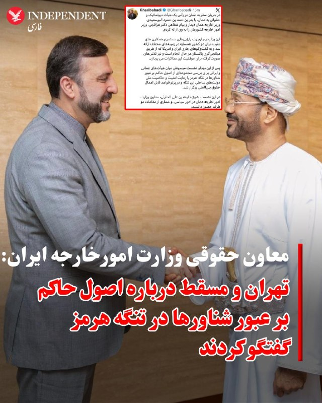

♦️کاظم غریب‌آبادی، معاون حقوقی و بین‌الملل وزارت امور خارجه جمهوری اسلامی، روز یکشنبه ۳ خرداد در پیامی در شبکه اجتماعی اکس اعلام کرد در سفر به عمان، پیام شفاهی عباس عراقچی، وزیر امور خارجه ایران، را به بدر البوسعیدی، وزیر خارجه عمان، منتقل کرده است.

غریب‌آبادی نوشت این پیام در چارچوب رایزنی‌ها و همکاری‌های مستمر میان تهران و مسقط ارائه شده و به گفتگوهای جاری ایران و آمریکا که با میانجی‌گری پاکستان در حال انجام است و همچنین تلاش‌ها برای موفقیت این مذاکرات مربوط می‌شود.

معاون  عراقچی همچنین اعلام کرد پس از این دیدار، نشست مفصلی میان هیات‌های ایرانی و عمانی درباره «اصول حاکم بر عبور شناورها از تنگه هرمز» برگزار شد.

غریب‌آبادی نوشت: «پس از این دیدار، نشست مبسوطی میان هیأت‌های عمانی و ایرانی برای بررسی مجموعه‌ای از اصول حاکم بر عبور شناورها در تنگه هرمز با رعایت امنیت و حاکمیت ملی دولت‌های ساحلی این تنگه و در پرتو قواعد قابل اعمال حقوق بین‌الملل برگزار شد.»
‌🇸🇦 Indypersian

🤖 @VahidOOnLine

## VahidOOnLine — post 241960

  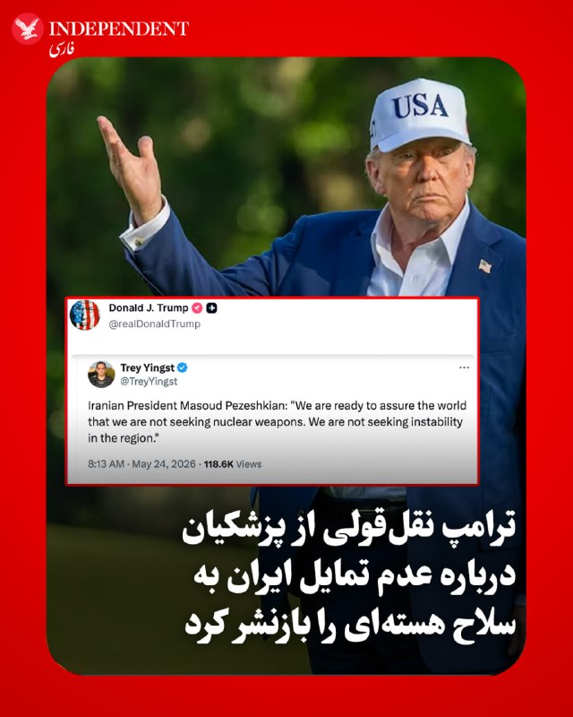

♦️در بحبوحه گمانه‌زنی‌ها درباره امضای توافق احتمالی پایان جنگ میان ایران و آمریکا، دونالد ترامپ نقل قولی از مسعود پزشکیان که گفته بود «آماده‌ایم به جهان اطمینان دهیم که به‌دنبال سلاح هسته‌ای و خواهان بی‌ثباتی در منطقه نیز نیستیم»، را در شبکه اجتماعی تروث سوشال بازنشر کرد.
پزشکیان، رئیس‌جمهوری اسلامی، روز یکشنبه در گفتگویی ویدیویی اعلام کرد ایران آماده است در چارچوب گفتگوها به جهان اطمینان دهد که به‌دنبال سلاح هسته‌ای و ایجاد ناآرامی در منطقه نیست.

ترامپ پیش‌تر در پیامی روابط واشنگتن و تهران را «در حال حرفه‌ای‌ و سازنده‌تر شدن» توصیف کرده بود.
‌🇸🇦 Indypersian

🤖 @VahidOOnLine

## VahidOOnLine — post 241959

  

♦️جنیفر جیکوب، خبرنگار شبکه خبری سی‌بی‌اس، روز یکشنبه سوم خرداد ماه به نقل از منابع آگاه گزارش داد کاخ سفید بر این باور است مجتبی خامنه‌ای رهبر جمهوری اسلامی، چارچوب کلی پیش‌نویس توافق میان تهران و واشنگتن را تایید کرده است.
بر اساس این گزارش، ایران پذیرفته است در ازای لغو محاصره و کاهش فشارهای آمریکا، ذخایر اورانیوم با غنای بالا را کنار بگذارد.
با این حال، مقام‌های آمریکایی تاکید کرده‌اند این پیش‌نویس هنوز باید مراحل تایید در ساختار رهبری جمهوری اسلامی را طی کند و واشنگتن خواهان تعهد رسمی تهران برای کنار گذاشتن اورانیوم با غنای بالا و حل‌وفصل دیگر مسائل هسته‌ای است.
سی‌بی‌اس همچنین گزارش داد جی‌دی ونس، استیو ویتکاف و جرد کوشنر در مذاکرات نقش دارند و آمریکا تلاش می‌کند همه متحدان خود در خاورمیانه را در روند مذاکرات دخیل کند.
‌🇸🇦 Indypersian

🤖 @VahidOOnLine

## VahidOOnLine — post 241958

  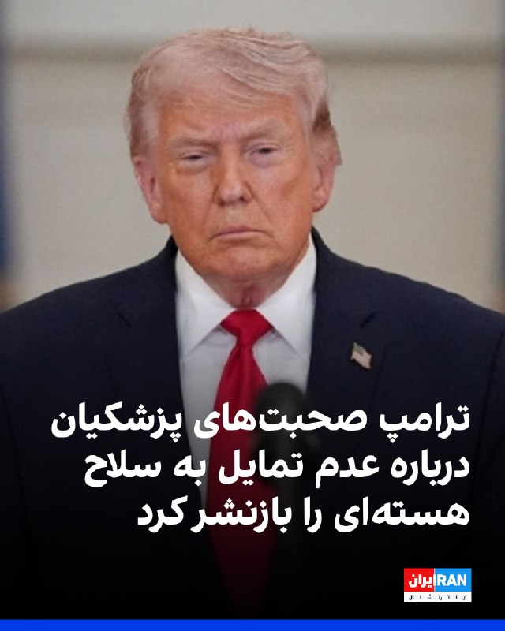

دونالد ترامپ صحبت‌های مسعود پزشکیان را که گفته بود «آماده‌ایم به جهان اطمینان دهیم که به‌دنبال سلاح هسته‌ای نیستیم و خواهان بی‌ثباتی در منطقه نیز نیستیم»، در شبکه تروث سوشال بازنشر کرد.

ترامپ پیش‌تر نیز گفت روابط آمریکا با جمهوری اسلامی در حال حرفه‌ای‌تر و سازنده‌تر شدن است.
‌🏁 🇬🇧 IranintlTV

🤖 @VahidOOnLine

## VahidOOnLine — post 241957

  

به گزارش اکسیوس، یک مقام ارشد آمریکایی به خبرنگاران گفت کاخ سفید انتظار ندارد توافق برای پایان جنگ با جمهوری اسلامی یکشنبه نهایی شود و معتقد است تأیید آن از سوی رهبران جمهوری اسلامی، از جمله مجتبی خامنه‌ای، ممکن است چند روز زمان ببرد.

او افزود با وجود خوش‌بینی مقام‌های آمریکایی به دستیابی به توافق در روزهای آینده، مذاکرات هنوز نهایی نشده و همچنان احتمال شکست آن وجود دارد.

به گفته این مقام، این توافق می‌تواند از تشدید جنگ جلوگیری کرده و فشار بر بازار جهانی نفت را کاهش دهد، اما هنوز مشخص نیست آیا به توافقی پایدار، از جمله درباره خواسته‌های هسته‌ای ترامپ، منجر خواهد شد یا نه.
‌🏁 🇬🇧 IranintlTV

🤖 @VahidOOnLine

## VahidOOnLine — post 241956

  

♦️رسانه آکسیوس، روز یکشنبه سوم خرداد ماه، به نقل از یک مقام ارشد دولت دونالد ترامپ گزارش داد، «چند مورد جزئیات حل‌نشده» میان تهران و واشنگتن باقی‌مانده است و به همین دلیل توافق میان ایران و آمریکا احتمالا امروز امضا نخواهد شد.

این مقام آمریکایی به آکسیوس گفت هنوز بر سر برخی بخش‌های توافق «رفت‌وبرگشت» وجود دارد و اختلاف‌ها بیشتر بر سر عباراتی است که برای هر یک از دو طرف اهمیت دارد: «برخی کلمات برای ما مهم هستند و برخی کلمات برای آن‌ها.»

آکسیوس به نقل از این مقام ارشد کاخ سفید نوشت، ساختار تصمیم‌گیری در جمهوری اسلامی «سریع عمل نمی‌کند» و روند دریافت همه تاییدیه‌های لازم چند روز زمان خواهد برد.

به گفته این مقام، ارزیابی واشنگتن این است که «مجتبی خامنه‌ای»، رهبر جمهوری اسلامی، چارچوب کلی توافق را تایید کرده، اما اینکه این روند به توافق نهایی منجر شود، «همچنان یک سوال باز» است.
‌🇸🇦 Indypersian

🤖 @VahidOOnLine

## VahidOOnLine — post 241955

  

♦️محسن رضایی، فرمانده سابق سپاه پاسداران و مشاور مجتبی خامنه‌ای، روز یکشنبه سوم خرداد ماه، در مراسمی حکومتی با هشدار به آمریکا اعلام کرد، نیروهای مسلح جمهوری اسلامی در صورت ورود نیروهای آمریکایی به خلیج فارس و یا حمله به تنگه هرمز، علاوه بر شکستن هرگونه محاصره دریایی، دست به اقداماتی قاطع خواهند زد و «خروج از پیمان منع گسترش سلاح‌های هسته‌ای (NPT)» نیز یکی از گزینه‌های جدی روی میز تهران است.

رضایی همچنین گفت آمریکا باید با پذیرش شروط «منصفانه» ایران، از «خودکشی اقتصادی و نظامی» جلوگیری کند.
این اظهارات در حالی مطرح می‌شود که گزارش‌ها از احتمال نهایی شدن توافق میان دو طرف در آینده نزدیک خبر می‌دهند.

همزمان با سخنان محسن رضایی، دونالد ترامپ نیز صبح یکشنبه (به وقت آمریکا) تصویری ساخته با هوش مصنوعی را در شبکه اجتماعی تروث سوشال منتشر کرد که انهدام یک قایق سپاه پاسداران به دست پهپاد آمریکایی را نشان می‌دهد.
کارشناسان معتقدند با توجه به حساسیت شرایط در دو سو، تهران و واشنگتن تهدیدهای متقابل را تا پیش از رسیدن به توافق ادامه خواهند داد.
‌🇸🇦 Indypersian

🤖 @VahidOOnLine

## VahidOOnLine — post 241954

  

بنیامین نتانیاهو، نخست‌وزیر اسرائیل، اعلام کرد او و دونالد ترامپ توافق دارند هرگونه توافق نهایی با جمهوری اسلامی باید به‌طور کامل تهدید هسته‌ای را برطرف کند.

او گفت این به معنای برچیدن تاسیسات غنی‌سازی ایران و خارج کردن مواد هسته‌ای غنی‌شده از خاک این کشور است.

نتانیاهو افزود ترامپ بار دیگر بر حق اسرائیل برای دفاع از خود در برابر تهدیدها در همه جبهه‌ها، از جمله لبنان، تاکید کرده است.

او همچنین گفت سیاست او، همانند سیاست ترامپ، همچنان ثابت است؛ ایران نباید به سلاح هسته‌ای دست یابد.
‌🏁 🇬🇧 IranintlTV

🤖 @VahidOOnLine

## VahidOOnLine — post 241953

  

♦️دونالد ترامپ، رئیس‌جمهوری آمریکا، روز یکشنبه سوم خرداد در پیامی در شبکه اجتماعی تروث سوشال اعلام کرد مذاکرات با ایران «به شکلی منظم و سازنده» در حال پیشرفت است و دولت او برای دستیابی به توافق عجله‌ای ندارد.
ترامپ نوشت: «به نمایندگان خود اطلاع داده‌ام که برای رسیدن به توافق عجله نکنند، زیرا زمان به نفع ماست.»
او همچنین تاکید کرد فشارها و محاصره علیه ایران تا زمان دستیابی، تایید و امضای توافق، به‌طور کامل ادامه خواهد یافت.
‌🇸🇦 Indypersian

🤖 @VahidOOnLine

## VahidOOnLine — post 241952

  

♦️دونالد ترامپ، رئیس‌جمهوری آمریکا، روز یکشنبه ۳ خرداد در پیامی در شبکه اجتماعی تروث سوشال، با تاکید بر آنکه مذاکره با تهران «به شکلی منظم و سازنده» در حال پیشرفت است، نوشت به نمایندگان خود دستور داده برای رسیدن به توافق عجله نکنند، زیرا «زمان به نفع آمریکا است.»
رئیس‌جمهوری آمریکا همچنین اعلام کرد محاصره علیه ایران تا زمان دستیابی، تایید و امضای توافق، «با قدرت و به طور کامل» ادامه خواهد داشت.
ترامپ در ادامه نوشت روابط آمریکا و ایران در حال تبدیل شدن به «رابطه‌ای حرفه‌ای‌تر و سازنده‌تر» است، اما تهران باید درک کند که «نمی‌تواند سلاح یا بمب هسته‌ای تولید یا به دست آورد.»
توافق هسته‌ای دوران باراک اوباما را «یکی از بدترین توافق‌های» تاریخ آمریکا توصیف کرد و گفت آن توافق، «مسیری مستقیم» برای دستیابی ایران به سلاح هسته‌ای بود.
ترامپ با اشاره به مذاکرات کنونی میان تهران و واشنگتن نوشت توافقی که دولت او با ایران در حال مذاکره بر سر آن است، «دقیقا برعکس» توافق دوران اوباما خواهد بود.
او در پایان از کشورهای خاورمیانه به دلیل حمایت و همکاری در روند مذاکرات قدردانی کرد.
‌🇸🇦 Indypersian

🤖 @VahidOOnLine

## VahidOOnLine — post 241951

  <a href="telegram/content/VahidOOnLine_241951_1779639377.mp4" target="_blank">🎬 Download video</a>

دونالد ترامپ، رئیس‌جمهور آمریکا، در پیامی تازه بار دیگر توافق هسته‌ای دوره باراک اوباما با جمهوری اسلامی را «یکی از بدترین توافق‌های تاریخ آمریکا» خواند و گفت آن توافق مسیر دستیابی تهران به سلاح هسته‌ای را هموار می‌کرد.

ترامپ گفت مذاکرات کنونی دولت او با جمهوری اسلامی «منظم و سازنده» پیش می‌رود، اما به نمایندگان خود دستور داده برای رسیدن به توافق عجله نکنند، زیرا به گفته او «زمان به سود آمریکا است».

او اضافه کرد انسداد علیه جمهوری اسلامی تا زمان دستیابی به توافق، تایید و امضای آن، با قدرت کامل ادامه خواهد داشت.

ترامپ افزود دو طرف باید با دقت و بدون خطا پیش بروند و جمهوری اسلامی باید بداند که نمی‌تواند سلاح هسته‌ای تولید یا تهیه کند.

رئیس‌جمهور آمریکا همچنین از کشورهای خاورمیانه برای حمایت و همکاری در این روند تشکر کرد و گفت این همکاری می‌تواند با پیوستن بیشتر کشورها به پیمان‌های ابراهیم تقویت شود. او در ادامه نوشت شاید جمهوری اسلامی نیز بخواهد به این روند بپیوندد.
‌🏁 🇬🇧 ManotoTV

🤖 @VahidOOnLine

## VahidOOnLine — post 241950

  

شانزده سال پیش، منوتو با یک باور ساده آغاز شد:

اینکه مردم ایران شایسته‌ی رسانه‌ای حرفه ای هستند که حقیقت را بی‌واسطه، بی‌ واهمه و بدون وابستگی به هیچ دولت و قدرتی، با آن‌ها در میان بگذارد. بر اساس این باور، منوتو همیشه صدای مستقل خود را داشت؛ صدایی که از دل اعتماد، همراهی و دغدغه‌های شما شکل گرفت و نشان داد که ایرانیان، با هر پیشینه، باور و نگاه متفاوت، می‌توانند زیر یک سقف و برای هدفی بزرگ‌تر، کنار هم بایستند و به آنچه می خواهند دست یابند.

در طول سالها، ما آموختیم که رسانه فقط برای خبر دادن نیست. رسانه می تواند حافظه‌ی یک ملت باشد؛ جایی که رنج‌ها، شادی‌ها، امیدها، شکست‌ها و ایستادگی‌ها ثبت می‌شوند تا فراموش نشوند.

ما همیشه ایران را فراتر از یک جغرافیا دیدیم؛ ایران برای ما میراث است، هویت، فرهنگ و غرور ملی است، و مسئولیتی برای تک تک ما، که نباید از آن چشم پوشید.

این مسیر آسان نبود و در طول سال‌ها با وجود تهدیدها، تخریب‌ها و فشار، به راه خود ادامه دادیم و آنچه کردیم و آنچه گفتیم، و جایی که در لحظات حساس تاریخ ایستادیم، قابل داوری و باعث افتخار ماست.

امروز فصل پخش منوتو به پایان می‌رسد؛ اما باورهایی که این مسیر را آغاز کرد، پایان نمی‌گیرد.

از هر بیننده، همراه، منتقد و حامی که در این سال‌ها کنار ما بود، صمیمانه سپاسگزارم.

راه آینده شاید شکل دیگری داشته باشد؛ اما باور ما به ایران، به مردم ایران، و به فردایی آزاد و بهتر، همچنان پابرجا و زنده است.
‌🏁 🇬🇧 ManotoTV

🤖 @VahidOOnLine

## VahidOOnLine — post 241949

  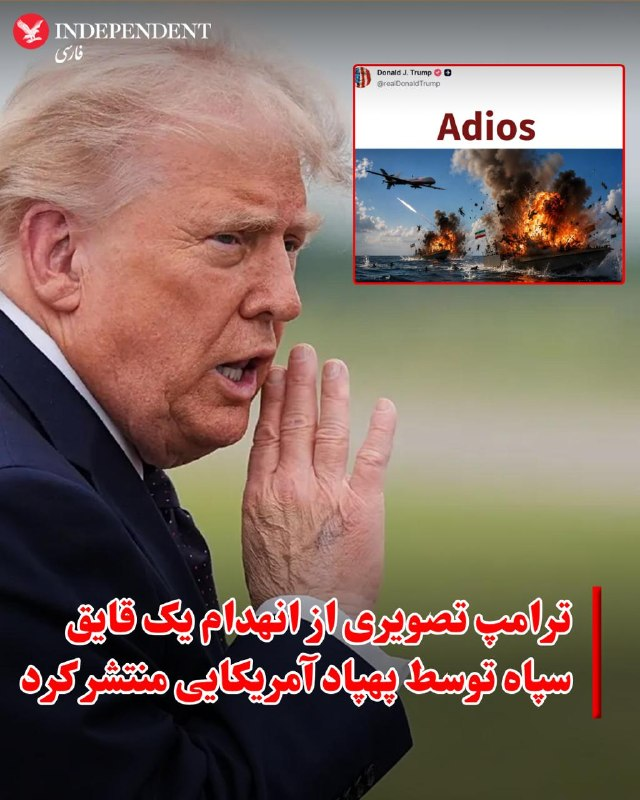

♦️دونالد ترامپ، رئیس جمهوری ایالات متحده، روز یکشنبه سوم خرداد ماه، تصویری ساخته با هوش مصنوعی را در شبکه اجتماعی تروث سوشال منتشر کرد که انهدام یک قایق سپاه پاسداران  به دست پهپاد آمریکایی را نشان می‌دهد.

بر این تصویر، واژه «حداحافظ» به زبان اسپانیایی نوشته شده است.
این تصویر در حالی توسط رئیس جمهوری آمریکا منتشر می‌شود که رسانه‌ها در انتظار نهایی شدن توافق احتمالی تهران و واشنگتن برای پایان جنگ هستند.
‌🇸🇦 Indypersian

🤖 @VahidOOnLine

## VahidOOnLine — post 241948

♦️محسن رضایی، فرمانده سابق سپاه پاسداران و مشاور مجتبی خامنه‌ای، روز یکشنبه سوم خرداد ماه در مراسم حکومتی «بزرگداشت شهدای جنگ تحمیلی» اعلام کرد دونالد ترامپ و ارتش آمریکا در «بن‌بست کامل» قرار دارند و هشدار داد هرگونه ورود به جنگ، آمریکا را وارد «دالانی تاریک و بی‌انتها» خواهد کرد.
رضایی با تهدید ضمنی کشورهای منطقه گفت: این دالان از تنگه هرمز آغاز می‌شود و تا خلیج فارس، دریای عمان، باب‌المندب و اقیانوس هند امتداد پیدا می‌کند و می‌تواند به جنگی گسترده در منطقه منجر شود.
مشاور رهبر سوم جمهوری اسلامی همچنین ادعا کرد نیروی دریایی سپاه با مدیریت بر تنگه هرمز، امنیت عبور کشتی‌های کشورهای مختلف را پس از شناسایی و ثبت تامین کرده است. رضایی در ادامه هشدار داد در صورت هرگونه اقدام نظامی علیه تنگه هرمز یا تلاش برای ورود به خلیج فارس، جمهوری اسلامی «پاسخی سخت، دردناک و بی‌نظیر» خواهد داد.
این سخنان در حالی مطرح می‌شود که گمانه‌زنی‌ها از توافق احتمالی میان تهران و واشنگتن برای پایان جنگ و بازگشایی تنگه هرمز خبر می‌دهد.
‌🇸🇦 Indypersian

🤖 @VahidOOnLine

## VahidOOnLine — post 241947

  

محسن رضایی، مشاور نظامی مجتبی خامنه‌ای، گفت کاری خواهیم کرد که «امنیت» کشور برای ۵۰ سال آینده تامین شود.
او افزود: «از یک طرف دست‌مان روی ماشه برای نبرد چهارم است و از طرف دیگر مسئولان در حال مذاکره هستند.»
رضایی گفت آمریکا پس از جنگ دیگر به آمریکای سابق بازنخواهد گشت و جمهوری اسلامی افول آمریکا در خاورمیانه را رقم زده است.
مشاور نظامی خامنه‌ای گفت در صورت تعرض به تنگه هرمز و ورود به خلیج‌فارس، محاصره دریایی را خواهند شکست و پاسخی سخت به آمریکا خواهند داد.
رضایی اضافه کرد اگر روند خصمانه علیه جمهوری اسلامی ادامه یابد، تهران از معاهده «ان‌پی‌تی» خارج خواهد شد و این اقدام پیامدهای سنگینی برای آمریکا خواهد داشت.
‌🏁 🇬🇧 IranintlTV

🤖 @VahidOOnLine

## VahidOOnLine — post 241946

  

دونالد ترامپ در تروث سوشال نوشت توافقی که دولت او در حال مذاکره بر سر آن است، دقیقا برعکس توافق هسته‌ای دولت اوباما خواهد بود. او گفت مذاکرات به شکلی منظم و سازنده پیش می‌رود و به نمایندگانش دستور داده برای رسیدن به توافق عجله نکنند، زیرا زمان به نفع آمریکاست.

ترامپ تاکید کرد محاصره به‌طور کامل ادامه خواهد داشت تا زمانی که توافقی حاصل، تأیید و امضا شود و هر دو طرف باید بدون اشتباه و با صرف زمان کافی کار را به‌درستی انجام دهند.

او همچنین نوشت روابط آمریکا با جمهوری اسلامی در حال حرفه‌ای‌تر و سازنده‌تر شدن است، اما ایران اجازه تولید یا دستیابی به سلاح یا بمب هسته‌ای را نخواهد داشت.
‌🏁 🇬🇧 IranintlTV

🤖 @VahidOOnLine

## VahidOOnLine — post 241945

  <a href="telegram/content/VahidOOnLine_241945_1779639381.mp4" target="_blank">🎬 Download video</a>

راهپیمایی از مقابل ساختمان بی‌بی‌سی بسمت دفتر نخست‌وزیری، یکشنبه سوم خرداد ۱۴۰۵
‌🏁 🇬🇧 ManotoTV

🤖 @VahidOOnLine

## WithYashar — post 12346

دبیرکل حزب‌الله: خلع سلاح را نمی پذیریم
تحریم‌های آمریکا هرگز ما را تضعیف نخواهد کرد؛ اگر آمریکا بیش از این خوی وحشی‌گری به خود بگیرد، دیگر چیزی برایش در لبنان باقی نخواهد ماند
@withyashar

## WithYashar — post 12345

یک مقام آمریکایی به سی‌بی‌اس: ایران قبول کرده اورانیوم غنی شده‌ش رو به‌عنوان بخشی از توافق، دفن کنه
@withyashar

## WithYashar — post 12344

جروزالم پست: جنگ، ایران را فرو نپاشید. کنترل آن بر هرمز را تثبیت کرد، اتحادهایش را از نو ساخت و همان نهادهایی را که ایالات متحده هدف قرار داده بود، تقویت کرد
@withyashar

## WithYashar — post 12343

نیویورک تایمز به نقل از یک مقام آمریکایی: مسائلی مانند ذخایر موشکی ایران و غنی سازی اورانیوم در مذاکرات بعدی مورد بحث قرار خواهد گرفت.
@withyashar

## WithYashar — post 12342

حسین یکتا: علی خامنه ای توی دوران جنگ شبانه با حاج علی مالکی رفتن حموم، حضرت آقا گفت فقط به شرطی میذارم منو لیف بکشی که منم تورو لیف بزنم و کیسه بکشم. @withyashar

## WithYashar — post 12341

## WithYashar — post 12340

یک مقام ارشد دولت ترامپ در گفتگو با آکسیوس ادعا کرد که انتظار نمی‌رود توافق با ایران امروز امضا شود، زیرا هنوز جزئیات متعددی باید نهایی شوند.

این مقام مدعی شد که مذاکرات درباره عبارت‌بندی‌های مشخص در متن توافق ادامه دارد و آن را «برخی کلماتی که برای ما مهم است و برخی کلماتی که برای آن‌ها مهم است» توصیف کرد.
@withyashar

## WithYashar — post 12339

  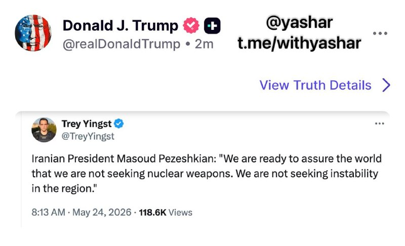

ترامپ در تروث پست تری یینگست را منتشر کرد که از قول مسعود پزشکیان است که گفته : «ما آماده‌ایم به جهان اطمینان بدهیم که به دنبال سلاح هسته‌ای نیستیم. همچنین به دنبال ایجاد بی‌ثباتی در منطقه نیستیم.
@withyashar

## WithYashar — post 12338

  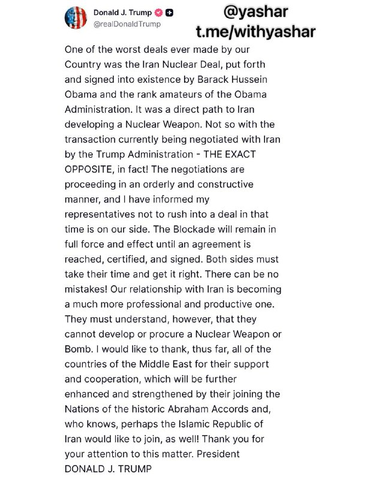

ترامپ در تروث : یکی از بدترین توافق‌هایی که کشور ما تا به حال انجام داده، «توافق هسته‌ای ایران» بود که توسط باراک حسین اوباما و افراد کاملاً غیرحرفه‌ای دولت اوباما طراحی و امضا شد. این توافق، یک مسیر مستقیم برای ایران جهت دستیابی به سلاح هسته‌ای ایجاد می‌کرد.

اما وضعیتی که اکنون در حال مذاکره با ایران توسط دولت ترامپ است، کاملاً برعکس آن می‌باشد — دقیقاً نقطه مقابل!

این مذاکرات به شکلی منظم و سازنده در حال پیشرفت است و من به نمایندگان خود گفته‌ام که در رسیدن به توافق عجله نکنند، چون زمان به نفع ماست.

محاصره و فشارها تا زمانی که یک توافق نهایی حاصل، تأیید و امضا شود، به‌طور کامل ادامه خواهد داشت. هر دو طرف باید با دقت و بدون شتاب عمل کنند. هیچ اشتباهی نباید رخ دهد.

روابط ما با ایران در حال تبدیل شدن به رابطه‌ای حرفه‌ای‌تر و سازنده‌تر است. با این حال، آن‌ها باید درک کنند که نباید اجازه ساخت یا به‌دست‌آوردن هیچ‌گونه سلاح یا بمب هسته‌ای را داشته باشند.

در پایان، از تمام کشورهای خاورمیانه بابت حمایت و همکاری‌شان تشکر می‌کنم؛ همکاری‌ای که با پیوستن آن‌ها به «توافق‌های تاریخی ابراهیم» بیشتر و قوی‌تر خواهد شد. و چه بسا شاید جمهوری اسلامی ایران هم در آینده مایل به پیوستن به این توافق‌ها باشد.
از توجه شما به این موضوع سپاسگزارم.
@withyashar

## WithYashar — post 12337

https://www.instagram.com/p/DYuUYVWMTTa/?igsh=eXI0enRnYjU0aTlq

کامنتم رک و مستقیمم برای بی بی
کارای ادایشو انجام بدید
ترجمه :
بی بی‌ جون، کار را یکسره کن.
اگر این توافق امضا شود، مردم ایران بازنده خواهند بود و اسرائیل هم به‌سمت افول می‌رود.
خیلی صریح و روشن می‌گویم: ما دوست نداریم دوران سیاسی شما هم زود به پایان برسد.
شما باید روزی در ایران میهمان ما باشید تا با هم جشن بگیریم❤️‍🩹

## WithYashar — post 12336

دونالد ترامپ در گفت‌وگو با ABC News:

من نمی‌توانم دربارهٔ توافق صحبت کنم؛ این کاملاً به خودم بستگی دارد، و اگر خبری وجود داشته باشد، فقط خبر خوب خواهد بود.

من توافق بد انجام نمی‌دهم.
@withyashar

## WithYashar — post 12335

یدیعوت آحارانوت به نقل از یک منبع ارشد امنیتی: اگر این توافق به شکل فعلی امضا شود، برای اسرائیل فاجعه بار خواهد بود.
@withyashar

## WithYashar — post 12334

رادیو ارتش اسرائیل: نتانیاهو امشب ساعت 18:00 جلسه‌ای برگزار میکنه.

@withyashar

## WithYashar — post 12333

آکسیوس : کاخ سفید امیدوار است که اختلافات نهایی در ساعات آینده حل شود و توافقی روز یکشنبه اعلام شود
ممکن است این توافق حتی 60 روز کامل هم دوام نیاورد اگر آمریکا معتقد باشد ایران در مذاکرات هسته‌ ای جدی نیست
@withyashar

## WithYashar — post 12332

رشیدی کوچی، نماینده مجلس: اینترنت بین‌المللی تا هفته آینده به روال عادی برمیگرده.
@withyashar

## WithYashar — post 12331

کانال 14 اسرائیل:
اسرائیل رهبر 86 ساله که از سرطان مرحله 4 در حال مرگ بود رو از بین نبرد تا آمریکا با پسر 56 ساله سالم‌تر و تندروتر او صلح کنه.
با آمریکا یا بدون آمریکا، اسرائیل این رژیم رو به پایان خواهد رسوند.
@withyashar

## WithYashar — post 12330

  <a href="telegram/content/WithYashar_12330_1779639384.mp4" target="_blank">🎬 Download video</a>

مارکو روبیو: ما توانستیم وارد ونزوئلا شویم و اورانیوم بسیار غنی‌شده را خارج کنیم.
نظام ایران حتی از بحث درباره آن خودداری کرده است. این باید تغییر کند.
@withyashar

## WithYashar — post 12329

روزنامه پاکستانی«داون»: فضای مذاکرات همچنان محتاطانه است؛ تهران حاضر به مصالحه بر حقوق خود نیست
@withyashar

## WithYashar — post 12328

  

پست جدید ترامپ که به اسپانیایی واژه خداحافظ را نوشته که بسیار طعنه آمیز است و معنیه «بری دیگه برنگردی» را میدهد.
@withyashar

## mwarmonitor — post 9650

🔴رئیس ستاد ارتش اسرائیل: ما آماده‌ایم فوراً به نبرد شدید بازگردیم تا رژیم «تروریستی» ایران را تضعیف کنیم.

@mwarmonitor

## mwarmonitor — post 9649

  <a href="telegram/content/mwarmonitor_9649_1779639387.mp4" target="_blank">🎬 Download video</a>

❌برای رفع تهدید فوری: ارتش اسرائیل یک تروریست از سازمان تروریستی حماس را که در یورش به پایگاه زیکیم در کشتار ۷ اکتبر شرکت داشت، به هلاکت رساند

🔸در طول آخر هفته (جمعه)، نیروهای ارتش اسرائیل تحت فرماندهی جنوب، تروریست لؤی هشام محمود بصل را که به‌عنوان تک‌تیرانداز در گردان زیتون وابسته به سازمان تروریستی حماس فعالیت می‌کرد و تهدیدی فوری علیه نیروهای ما محسوب می‌شد، به هلاکت رساندند.

🔹بر اساس بررسی‌های اطلاعاتی، مشخص شد که این تروریست در یورش به پایگاه زیکیم در کشتار خونین ۷ اکتبر مشارکت داشته و در دوره اخیر نیز برای اجرای طرح‌های تروریستی علیه نیروهای ارتش اسرائیل در منطقه فعالیت می‌کرده است.

🔸نیروهای ارتش اسرائیل تحت فرماندهی جنوب مطابق با توافق در منطقه مستقر هستند و به فعالیت خود برای رفع هرگونه تهدید فوری ادامه خواهند داد.

@mwarmonitor

## mwarmonitor — post 9648

🔰مارک لوین ؛ همان‌طور که بیشتر مردم می‌دانند، من طرفدار بسیار پر و پا قرص ریگان هستم. در سال‌های ۱۹۷۶ و ۱۹۸۰ برای او تبلیغ کردم و ۸ سال در دولت او خدمت کردم. اما یکی از بزرگ‌ترین اشتباهات، عفو ۲.۳ میلیون مهاجر غیرقانونی بود. علاوه بر آن، این عفو پیش از آن انجام شد که دموکرات‌ها وعده دهند بودجه امنیت مرزی تأمین خواهد شد. دموکرات‌ها به‌سادگی از اجرای بخش خود از توافق خودداری کردند. ریگان بعدها گفت که این یک اشتباه بوده است.

🔸زمان‌بندی اهمیت دارد. من با یک توافق مخالفم. ماه‌هاست این را می‌گویم. به کسانی که خواهان توافق بودند تبریک می‌گویم؛ به نظر می‌رسد امروز روز شماست. و اگر توافقی انجام شود، رژیم ایران دست‌کم فعلاً باقی خواهد ماند. باید دید در طول زمان این موضوع چگونه پیش می‌رود. من نسبت به این‌که هر توافقی بتواند دشمن را مهار کند یا اجرا شود بسیار بدبین هستم، به دلایل متعدد؛ به‌ویژه بعد از ترک سمت ریاست‌جمهوری توسط ترامپ، یا این‌که تروریست‌ها دست از تروریسم بردارند.

🔹با این حال، فرض می‌کنم اگر توافقی وجود داشته باشد، رژیم ایران باید ابتدا تعهدات خود را انجام دهد — یعنی به‌عنوان شرط مقدم بر هرگونه رفع تحریم. معتقدم اگر این‌طور نباشد، اشتباه بزرگی خواهد بود. از جمله اینکه اگر رژیم ایران قصد عمل به تعهداتش را ندارد، باید از همان ابتدا مشخص شود، نه بعداً. و باید همین حالا خودش را آشکار کند.

🔸همچنین آزاد کردن میلیاردها و میلیاردها دلار برای آن‌ها — که پیش از جنگ مسدود شده بود — پس از رسیدن به دستشان تقریباً غیرقابل کنترل خواهد بود و برای تقویت رژیم استفاده خواهد شد. من در این مورد هیچ شکی ندارم. این همان چیزی است که هستند. این طرز فکر آن‌هاست. آن‌ها به هیچ‌کس جز خودشان پاسخگو نیستند.

🔹هیچ کشور خاورمیانه‌ای نباید برای یک توافق، تحت فشار قرار گیرد تا امنیت ملی خود را کاهش دهد. آیا حزب‌الله واقعاً زنده می‌ماند و دوباره در لبنان قدرت می‌گیرد و آزاد خواهد بود که به شلیک موشک به اسرائیل ادامه دهد؟ آیا ما چنین چیزی را می‌پذیریم؟ این موضوع باید کاملاً روشن باشد. «حق موجودیت اسرائیل» نباید فقط یک شعار باشد.

🔸تا این لحظه من هیچ چیزی درباره موشک‌های بالستیک نمی‌بینم، در حالی که این‌ها خطرناک‌ترین سلاح متعارف در زرادخانه رژیم ایران هستند. مهم خواهد بود که ببینیم این موضوع چگونه رسیدگی می‌شود.

🔹اگر توافقی انجام شود، من روی مجموعه‌ای از مسائل به‌طور جدی تمرکز خواهم کرد. همه ما باید همین کار را بکنیم. عجیب خواهد بود اگر نکنیم. این فقط یک دشمن خارجی هزاران کیلومتر دورتر نیست. در ۴۷ سال گذشته هزاران آمریکایی را کشته یا معلول کرده است.

🔸رئیس‌جمهور بارها قوی‌ترین استدلال را برای ضرورت و فوریت اقدام نظامی مطرح کرده است. همچنین بسیار مفیدتر و منطقی‌تر خواهد بود اگر سناتورها و نمایندگان کنگره که خواهان توافق هستند، دقیقاً توضیح دهند که از نظر آن‌ها سازوکار یک توافق چگونه باید باشد.

ادامه دارد...

@mwarmonitor

## mwarmonitor — post 9647

🔴ایالات متحده و ایران به‌طور اصولی بر سر یک توافق به تفاهم رسیده‌اند که بر اساس آن تنگه هرمز دوباره بازگشایی شود و ایران متعهد شود اورانیوم بسیار غنی‌شده خود را دفع کند، یک مقام آمریکایی روز یکشنبه گفت. این مقام افزود که این توافق هنوز امضا نشده است. نیویورک تایمز

@mwarmonitor

## mwarmonitor — post 9646

  

🔸ترامپ در سوشال تروث

🔹مسعود پزشکیان، رئیس‌جمهور ایران: «ما آماده‌ایم به جهان اطمینان دهیم که به دنبال سلاح هسته‌ای نیستیم. ما به دنبال بی‌ثباتی در منطقه نیستیم.»

@mwarmonitor

## mwarmonitor — post 9645

🔰بنیامین نتانیاهو:

🔸«من دیشب با رئیس‌جمهور Donald Trump درباره یادداشت تفاهم برای بازگشایی تنگه هرمز و مذاکرات پیشِ‌رو برای رسیدن به توافق نهایی درباره برنامه هسته‌ای ایران صحبت کردم.

🔸من قدردانی عمیق خود را از رئیس‌جمهور ترامپ به‌خاطر تعهد تزلزل‌ناپذیرش به امنیت اسرائیل ابراز کردم؛ از جمله در جریان عملیات «Roaring Lion» و «Epic Fury»، زمانی که نیروهای آمریکایی و اسرائیلی شانه‌به‌شانه علیه تهدید ایران جنگیدند.

🔸ترامپ و من توافق کردیم که هر توافق نهایی با ایران باید خطر هسته‌ای را به‌طور کامل از بین ببرد. این به معنای برچیدن تأسیسات غنی‌سازی ایران و خارج کردن مواد هسته‌ای غنی‌شده از خاک این کشور است.

🔸ترامپ همچنین حق اسرائیل برای دفاع از خود در برابر تهدیدات در همه جبهه‌ها، از جمله لبنان، را تأیید کرد.

🔸شراکت بین ما و دو کشورمان در میدان نبرد اثبات شده و هرگز قوی‌تر از این نبوده است.

🔸سیاست من، مانند سیاست ترامپ، بدون تغییر باقی مانده است: ایران نباید سلاح هسته‌ای داشته باشد.»

@mwarmonitor

## mwarmonitor — post 9644

🔴«خبر فوری: آمریکا معتقد است که رهبر عالی ایران چارچوب کلی پیش‌نویس توافق با ایران را تأیید کرده است. ایران به‌طور اصولی پذیرفته است که در ازای برداشته شدن محاصره از سوی آمریکا، با کنار گذاشتن اورانیوم بسیار غنی‌شده موافقت کند. این پیش‌نویس هنوز باید از ساختار…

## mwarmonitor — post 9643

🔴«خبر فوری: آمریکا معتقد است که رهبر عالی ایران چارچوب کلی پیش‌نویس توافق با ایران را تأیید کرده است. ایران به‌طور اصولی پذیرفته است که در ازای برداشته شدن محاصره از سوی آمریکا، با کنار گذاشتن اورانیوم بسیار غنی‌شده موافقت کند. این پیش‌نویس هنوز باید از ساختار رهبری ایران عبور کند. با این حال، آمریکا می‌خواهد ایران به تعهد خود برای کنار گذاشتن اورانیوم بسیار غنی‌شده پایبند بماند و سایر مسائل هسته‌ای را نیز حل‌وفصل کند. معاون رئیس‌جمهور آمریکا، ویتکاف و کوشنر در این مذاکرات نقش دارند. آمریکا تلاش می‌کند همه متحدان خاورمیانه‌ای خود را نیز در این روند مشارکت دهد.» CBS

@mwarmonitor

## mwarmonitor — post 9642

فکر نمی‌کنم هیچ‌کس در قبال جاه‌طلبی‌های هسته‌ای ایران، سرسخت‌تر از پرزیدنت ترامپ بوده باشه. متوجهید؟ بگم که، باز هم من در جریان نیستم... نمی‌دونم برخی از این اظهارنظرهای فردی از بخش‌های مختلف فضای سیاسی ما در ایالات متحده چی بوده، اما این رو می‌گم: هیچ‌کس در این موضوع قوی‌تر از پرزیدنت ترامپ نبوده، خب؟
رهبران سیاسی متعدد، رؤسای جمهور متعدد در ایالات متحده، همگی حرف یکسانی رو زدن که "ایران نباید سلاح هسته‌ای داشته باشه"؛ تنها کسی که سعی کرده کاری انجام بده و در واقع کاری در این باره انجام داده—به شکلی واقعی—پرزیدنت ترامپ بوده. بنابراین، تعهد اون به این اصل که اون‌ها هرگز سلاح هسته‌ای نخواهند داشت، نباید توسط هیچ‌کس زیر سؤال بره.
و این ایده که به نوعی این رئیس‌جمهور، با توجه به تمام چیزهایی که تا الان ثابت کرده حاضره انجام بده، بیاد و به نوعی با توافقی موافقت کنه که در نهایت وقتی نوبت به جاه‌طلبی‌های هسته‌ای می‌رسه، ایران رو در موقعیت قوی‌تری قرار بده، مضحکه. این چیزی نیست که اتفاق بیفته.
اما ترجیح ما اینه که به این مسئله از طریق ابزارهای دیپلماتیک رسیدگی کنیم؛ و این همون کاریه که ما در تلاشیم اینجا انجام بدیم. فکر می‌کنم پیشرفت‌هایی داشتیم. من همیشه وقتی این رو می‌گم محتاط هستم، چون شما می‌تونید روی کاغذ با چیزهایی موافقت کنید، اما اون‌ها در واقع باید اجرا بشن. شما می‌تونید به صورت مکتوب با چیزهایی موافقت کنید و بعدش در واقع باید برید بیرون و انجامش بدید.
و... اما فکر می‌کنم شاید این احتمال وجود داره که ظرف چند ساعت آینده، دنیا خبرهای خوبی دریافت کنه، حداقل در رابطه با تنگه‌ها و در رابطه با فرآیندی که می‌تونه در نهایت ما رو به جایی برسونه که رئیس‌جمهور می‌خواد ما اونجا باشیم؛ و اون، جهانیه که دیگه مجبور نباشه در ترس یا نگرانی از یک سلاح هسته‌ایِ ایران باشه. و... و بنابراین، فکر می‌کنم خبرهای خوبی در اون جبهه وجود داره.

@mwarmonitor

## mwarmonitor — post 9641

  <a href="telegram/content/mwarmonitor_9641_1779639389.mp4" target="_blank">🎬 Download video</a>

🎬 Video

## mwarmonitor — post 9640

یکی از بدترین توافق‌هایی که تا به حال توسط کشور ما انجام شده، توافق هسته‌ای ایران بود که توسط باراک حسین اوباما و آماتورهای رده‌پایین دولت اوباما مطرح و امضا شد. این توافق مسیری مستقیم برای دستیابی ایران به سلاح هسته‌ای بود. اما در مورد معامله‌ای که در حال حاضر توسط دولت ترامپ با ایران در حال مذاکره است، اصلاً این‌طور نیست - در واقع، دقیقاً برعکس است!
مذاکرات به شکلی منظم و سازنده در حال پیشرفت است و من به نمایندگان خود اطلاع داده‌ام که برای رسیدن به توافق عجله نکنند، چرا که زمان به نفع ماست. «محاصره» تا زمانی که توافقی حاصل، تأیید و امضا نشود، با تمام قوا و تأثیر خود باقی خواهد ماند. هر دو طرف باید زمان بگذارند و کار را درست انجام دهند. هیچ اشتباهی نباید رخ دهد!
رابطه ما با ایران در حال تبدیل شدن به یک رابطه بسیار حرفه‌ای‌تر و سازنده‌تر است. با این حال، آن‌ها باید درک کنند که نمی‌توانند سلاح یا بمب هسته‌ای تولید کنند یا به دست آورند. من مایلم تا اینجای کار از همه کشورهای خاورمیانه به خاطر حمایت و همکاری‌شان تشکر کنم؛ همکاری‌ای که با پیوستن آن‌ها به کشورهای توافقنامه تاریخی ابراهیم بیشتر تقویت و مستحکم خواهد شد و چه کسی می‌داند، شاید جمهوری اسلامی ایران نیز مایل باشد به آن بپیوندد!

از توجه شما به این موضوع سپاسگزارم.
رئیس‌جمهور دونالد جی. ترامپ

@mwarmonitor

## mwarmonitor — post 9639

  

🔸پست بنیامین نتانیاهو در شبکه اجتماعی ایکس

@mwarmonitor

## mwarmonitor — post 9638

🔴اتحادیه اروپا: گسترش دامنه تحریم‌ها علیه ایران به دلیل بستن تنگه هرمز.

@mwarmonitor

## mwarmonitor — post 9637

  <a href="telegram/content/mwarmonitor_9637_1779639392.mp4" target="_blank">🎬 Download video</a>

📝 امام ۵۳ ساله‌ای که مستقیم از کاخ‌های مجلل لیسبون پرتغال با هلیکوپتر لوکس سوئیسی بر فراز کوه‌های پاکستان نازل می‌شود تا به اصطلاح «کیفیت زندگی» گوسفندچرانی را ارتقا دهد که سهم‌شان از جهان، زندگی در میان پشکل و کثافت و فقر مطلق است. تماشای این جماعتِ مسخ‌شده که زیر پای این امام فرنگ‌نشین فرش قرمز پهن می‌کنند و برای ابراز وفاداری ۱۳۰ هزار درخت می‌کارند، اوج بلاهت و حماقت بشری است؛ کپی برابر اصلی از شعبات دیگر شیعه تفسیرشده به نفع حاکمان، درست مثل جمهوری اسلامی که در آن سران و آقازاده‌هایش در کانادا و ویلاهای لوکس غرق در ثروتند و سهم مردمش فقر، فلاکت و ذوب شدن در ولایت است. مردمی بدبخت که در اوج فلاکت برای تکان دادن دست یک میلیونرِ کت‌وشلواری هلهله می‌کنند، در حالی که او با کلاهی مضحک بر سر و لبخندی تحقیرآمیز، چند دقیقه‌ای روی صندلی پادشاهی می‌نشیند، عکس‌های تبلیغاتی‌اش را می‌گیرد و دوباره به زندگی اشرافی‌اش در اروپا برمی‌گردد تا کثافت این تناقض مذهبی، استثمارِ شیکِ توده‌های جاهل، و این دکان‌های دین‌فروشیِ مشترک، بیشتر از همیشه به ریش انسانیت دهن‌کجی کند.

@mwarmonitor

## mwarmonitor — post 9636

🔴جیسون برودسکی مدیر سیاست‌گذاری در سازمان «اتحاد علیه ایران هسته‌ای »

من چند نظر اولیه درباره پیش‌نویس یادداشت تفاهم (MOU) میان ایران و آمریکا، آن‌گونه که در گزارش‌های رسانه‌ای آمده، دارم:

۱) تا زمانی که همه‌چیز نهایی نشود، هیچ‌چیز نهایی نیست. با توجه به رویدادهای پس از سال ۲۰۲۵، همیشه امکان غافلگیری وجود دارد. باید برای اتفاقات غیرمنتظره آماده بود. مطمئنم رئیس‌جمهور ترامپ با دقت واکنش‌ها تا این لحظه را زیر نظر دارد.

۲) درباره توصیف این پیش‌نویس MOU به‌عنوان «توافق صلح» هشدار می‌دهم. از نظر من، این صرفاً ترتیبی برای خریدن زمان جهت مذاکرات بیشتر است. کل سیاست خارجی رژیم ایران بر دشمنی با آمریکا و اسرائیل بنا شده و این موضوع—چه MOU باشد چه نباشد—تغییری نخواهد کرد. این یک اقدام فوق‌العاده شکننده است. توهم کاهش تنش نباید با صلح واقعی اشتباه گرفته شود، چرا که تهران ممکن است از طریق معافیت‌های تحریمی، فروش آزادانه نفت و رفع محاصره، منابع بیشتری برای تسلیح مجدد و بازسازی شبکه تروریستی و توانمندی‌های نظامی خود به‌دست آورد. صلح واقعی زمانی محقق می‌شود که این رژیم از میان برود.

۳) من نگران گزارش‌های رسانه‌ای درباره «تعهدات شفاهی» در موضوعات محوری مانند غنی‌سازی و ذخایر اورانیوم بسیار غنی‌شده (HEU) هستم. درک می‌کنم که آزادسازی بخش عمده دارایی‌های ایران و رفع کامل تحریم‌ها تا زمان دستیابی به توافق نهایی انجام نخواهد شد و مفهومی به نام «کاهش تحریم در برابر اقدام» وجود دارد؛ اما این خطر هست که حتی برخی معافیت‌های تحریمی و رفع محاصره—که اهرم‌های فشار قدرتمندی هستند—انگیزه تهران را برای دادن امتیازاتی که آمریکا بعداً می‌خواهد کاهش دهد و ایران ترجیح دهد با وقت‌کشی، منتظر پایان دولت ترامپ بماند.

۴) همچنین این پرسش مطرح است که آیا با چنین MOUای، تنگه هرمز واقعاً حتی «باز» خواهد بود یا نه؛ چرا که شرکت‌ها ممکن است با توجه به ریسک‌ها همچنان احساس امنیت نکنند. برداشت از ریسک اهمیت دارد. به همین دلیل است که این اقدام را فوق‌العاده شکننده می‌دانم. پرچالش و محل مناقشه خواهد بود.

۵) این یک واقعیت است که تنها دلیل وجود یک تعهد—حتی در حد شفاهی—برای مذاکره درباره تعلیق چندساله غنی‌سازی، این است که رئیس‌جمهور ترامپ با اقدام نظامی، واقعیت‌های میدانی را ایجاد کرد. تعلیق چندساله غنی‌سازی حتی در دولت بایدن هم روی میز نبود و تهران آن را در نظر نمی‌گرفت، مگر تحت فشار نظامی دولت ترامپ.

۶) همچنین این یک واقعیت است که عملیات «Epic Fury» دستاوردهای متعددی داشت—تضعیف برنامه موشکی و پهپادی ایران، فرسایش پایگاه صنعتی دفاعی، تضعیف شبکه تروریستی، حذف مقامات کلیدی جمهوری اسلامی که دستانشان به خون آمریکایی‌ها آلوده بود، و ضربه به صنایع کلیدی تأمین‌کننده منابع مالی سپاه پاسداران—دستاوردهایی که با دیپلماسی ممکن نبود. جمهوری اسلامی حتی حاضر نیست درباره آن‌ها مذاکره کند. و برخلاف اسلافش، رئیس‌جمهور ترامپ به‌درستی به صدور بیانیه‌های تند و نمادین و تحریم‌های سمبلیک بسنده نکرد، در حالی که رژیم به اقدامات مرگبار خود ادامه می‌دهد.

۷) در نهایت، همان‌طور که پیش‌تر تأکید کرده‌ام، با حضور این رژیم در قدرت، پایان خوشی وجود ندارد؛ تنها می‌توان مناقشه را مدیریت کرد و با ابزارهای اقتصادی، نظامی و گاهی دیپلماتیک با رژیم مقابله نمود. این مسیر اغلب آشفته، ناقص و همراه با ریسک است—و همه ابزارها، از جمله توافق‌های دیپلماتیک، در مواجهه با تهدیدهای این رژیم ریسک دارند.

@mwarmonitor

## mwarmonitor — post 9635

🔸محمد مرندی عضو تیم مذاکره کننده ایران:

🔹رژیم صهیونیستی «آزادی عمل» نخواهد داشت.

🔹مدیریت تنگه هرمز موضوعی است که میان ایران و عمان، به‌عنوان کشورهای ساحلی، هماهنگ می‌شود.

🔹ایران تحت این یادداشت تفاهم هیچ تعهد هسته‌ای جدیدی نمی‌پذیرد، جز در خصوص سلاح هسته‌ای که موضوع تازه‌ای نیست.

🔹ایران به دارایی‌های مسدودشده خود دسترسی خواهد داشت.

🔹تحریم‌های مرتبط با بخش انرژی لغو خواهند شد.

@mwarmonitor

## mwarmonitor — post 9634

  

ترامپ در سوشال تروث

@mwarmonitor

## mwarmonitor — post 9633

🔸به گفته تایوان، یک کشتی گارد ساحلی چین پس از یک رویارویی پرتنش و تبادل هشدارهای لفظی میان دو گارد ساحلی، آب‌های اطراف جزایر پراتاسِ تایوان را ترک کرده است — رویترز.

@mwarmonitor

## mwarmonitor — post 9632

🔴پلیس ضدشورش ترکیه با شلیک گاز اشک‌آور وارد مقر اصلی حزب اپوزیسیون جمهوری‌خواه خلق (CHP) در آنکارا شد و پس از آنکه دادگاه کنگره حزبی سال ۲۰۲۳ را که در آن اوزگور اوزل انتخاب شده بود باطل کرد و کمال قلیچداراوغلو، رئیس پیشین حزب، را به سمت خود بازگرداند، رهبری برکنار‌شده حزب را از ساختمان بیرون کرد — رویترز

@mwarmonitor

## FoxNewsTwitter — post 342185

‌Fox News (Twitter/X)

BREAKING: US offering 'significant' sanctions relief for 'serious' Iranian deal on nuclear material, doesn't expect to sign agreement Sunday, senior administration official tells Fox News' @TreyYingst

## FoxNewsTwitter — post 342184

  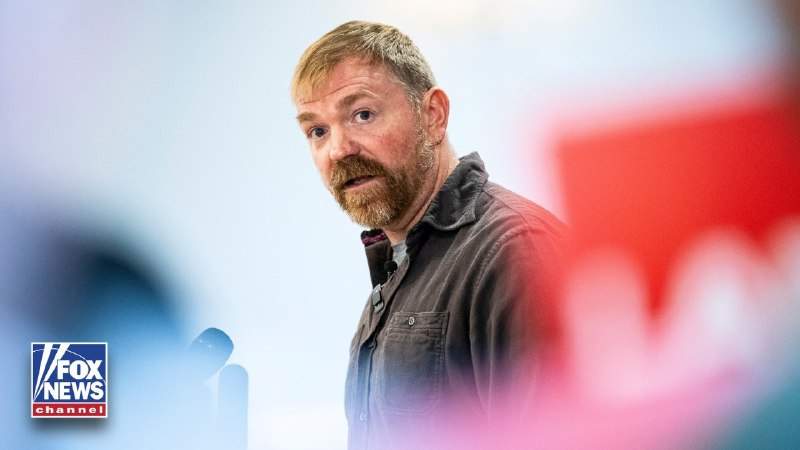

Fox News (Twitter/X)

“You don't have much experience with Latin American hookers, do you?”

More deleted Reddit comments tied to Maine Democratic Senate candidate Graham Platner are surfacing as scrutiny over his online history intensifies.

In newly uncovered posts from 2012, Platner discussed prostitution overseas and defended men who cheated on their wives while abroad, writing that infidelity and loyalty to fellow soldiers were “not mutually exclusive.”

The comments add to a growing archive linked to Platner that also includes posts insulting the U.S. Army, mocking a Purple Heart recipient, using slurs, and expressing support for political violence — creating new headaches for Democrats in his bid to unseat incumbent Republican Sen. Susan Collins.

## pm_afshaa — post 91398

🔴یک مقام آمریکایی به سی‌بی‌اس: ایران قبول کرده اورانیوم غنی شده‌ش رو به‌عنوان بخشی از توافق، دفن کنه

💧 Rainbet.com the #1 Non-KYC Crypto Casino & Sportsbook @rainbetcom

😁 @Pm_Afshaa

## pm_afshaa — post 91397

جروزالم پست: جنگ، ایران را فرو نپاشید. کنترل آن بر هرمز را تثبیت کرد، اتحادهایش را از نو ساخت و همان نهادهایی را که ایالات متحده هدف قرار داده بود، تقویت کرد

💧 Rainbet.com the #1 Non-KYC Crypto Casino & Sportsbook @rainbetcom

😁 @Pm_Afshaa

## pm_afshaa — post 91396

🔴فاکس نیوز: یک مقام ارشد در دولت ترامپ گفته است که توافق ایران امروز امضا نخواهد شد، اما پیشرفت‌هایی در مذاکرات حاصل شده است.

«اگر ایرانی‌ها در مسئله غنی‌سازی امتیازات قابل توجهی بدهند، ما نیز در زمینه رفع تحریم‌ها امتیازات قابل توجهی خواهیم داد

💧 Rainbet.com the #1 Non-KYC Crypto Casino & Sportsbook @rainbetcom

😁 @Pm_Afshaa

## pm_afshaa — post 91395

  <a href="telegram/content/pm_afshaa_91395_1779639396.webm" target="_blank">🎬 Download video</a>

🔴نتانیاهو: پرزیدنت ترامپ و من توافق کردیم که هرگونه توافق نهایی با ایران باید خطر هسته‌ای رو به‌طور کامل از بین ببرد. این یعنی برچیدن (تخریب) سایت‌های غنی‌سازی هسته‌ای ایران و خارج کردن مواد هسته‌ای غنی‌شده‌ی اون از خاک این کشور.

💧 Rainbet.com the #1 Non-KYC Crypto Casino & Sportsbook @rainbetcom

😁 @Pm_Afshaa

## pm_afshaa — post 91394

  <a href="telegram/content/pm_afshaa_91394_1779639396.webm" target="_blank">🎬 Download video</a>

🔴پست جدید ترامپ:

یکی از بدترین توافق‌هایی که کشور ما تا به حال انجام داده، توافق هسته‌ای ایران بود که توسط باراک حسین اوباما و آماتورهای بی‌تجربه دولت او مطرح، امضا و اجرایی شد. این توافق، مسیری مستقیم برای دستیابی ایران به سلاح هسته‌ای بود. اما معامله‌ای که در حال حاضر توسط دولت ترامپ با ایران در حال مذاکره است، اصلاً این‌طور نیست؛ در واقع، دقیقاً عکس آن است!

مذاکرات به شکلی منظم و سازنده در حال پیشرفت است و من به نمایندگان خود اعلام کرده‌ام که برای رسیدن به توافق عجله نکنند، چرا که زمان به نفع ماست. محاصره (تحریم‌ها) تا زمان دستیابی، تأیید و امضای یک توافق، با قدرت و قوت تمام به قوت خود باقی خواهد ماند. هر دو طرف باید زمان کافی بگذارند و کار را درست انجام دهند. هیچ اشتباهی نباید رخ دهد!

رابطه ما با ایران در حال تبدیل شدن به رابطه‌ای بسیار حرفه‌ای‌تر و سازنده‌تر است. با این حال، آن‌ها باید درک کنند که نمی‌توانند سلاح یا بمب هسته‌ای بسازند یا به آن دست یابند.

من مایلم تا این لحظه از تمامی کشورهای خاورمیانه برای حمایت و همکاری‌شان تشکر کنم؛ همکاری‌هایی که با پیوستن آن‌ها به کشورهای توافق‌نامه تاریخی ابراهیم، بیش از پیش تقویت و مستحکم خواهد شد و کسی چه می‌داند، شاید جمهوری اسلامی ایران نیز مایل باشد به آن بپیوندد!

💧 Rainbet.com the #1 Non-KYC Crypto Casino & Sportsbook @rainbetcom

😁 @Pm_Afshaa

## pm_afshaa — post 91393

محسن رضایی:اگر دشمن به تنگه هرمز حمله کند، ما محاصره دریایی را می‌شکنیم و ممکن است از پیمان منع گسترش سلاح‌های هسته‌ای (NPT) خارج شویم

💧 Rainbet.com the #1 Non-KYC Crypto Casino & Sportsbook @rainbetcom

😁 @Pm_Afshaa

## pm_afshaa — post 91391

  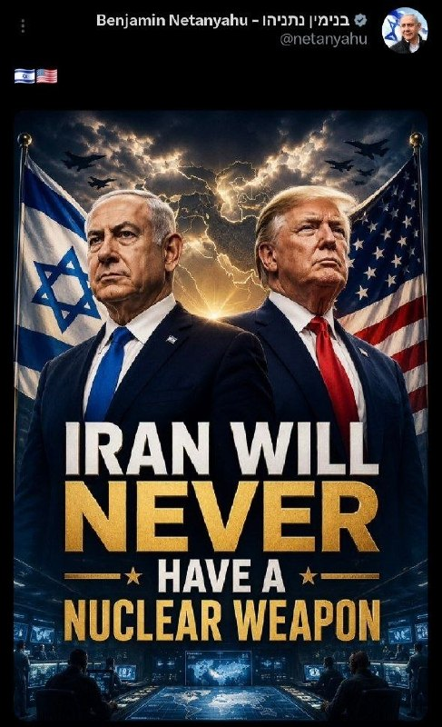

پست جدید نتانیاهو با عکس ترامپ : ایران هرگز به سلاح هسته‌ای نخواهد داشت

💧 Rainbet.com the #1 Non-KYC Crypto Casino & Sportsbook @rainbetcom

😁 @Pm_Afshaa

## pm_afshaa — post 91390

  <a href="telegram/content/pm_afshaa_91390_1779639398.webm" target="_blank">🎬 Download video</a>

🔴ترامپ به ABC: کل توافق فقط به من بستگی داره. فقط خبرهای خوب میاد. من هیچ معامله بدی نمیبندم.

💧 Rainbet.com the #1 Non-KYC Crypto Casino & Sportsbook @rainbetcom

😁 @Pm_Afshaa

## pm_afshaa — post 91389

  <a href="telegram/content/pm_afshaa_91389_1779639399.webm" target="_blank">🎬 Download video</a>

🔴مقامات آمریکایی به آکسیوس:
کاخ سفید امیدواره که اختلافات نهایی در ساعات آینده حل بشه و توافقی روز یکشنبه اعلام بشه، ممکنه این توافق حتی تا 60 روز کامل هم دوام نیاره، اگه آمریکا معتقد باشه ایران در مذاکرات هسته‌ای جدی نیست.

💧 Rainbet.com the #1 Non-KYC Crypto Casino & Sportsbook @rainbetcom

😁 @Pm_Afshaa

## pm_afshaa — post 91388

  <a href="telegram/content/pm_afshaa_91388_1779639399.webm" target="_blank">🎬 Download video</a>

🔴رادیو ارتش اسرائیل: نتانیاهو امشب ساعت 18:00 جلسه‌ای برگزار میکنه.

💧 Rainbet.com the #1 Non-KYC Crypto Casino & Sportsbook @rainbetcom

😁 @Pm_Afshaa

## pm_afshaa — post 91387

  <a href="telegram/content/pm_afshaa_91387_1779639400.webm" target="_blank">🎬 Download video</a>

🔴مدیر دفتر المیادین در اسلام‌آباد:
خبرهایی درباره اعلامیه‌ای در روز دوشنبه از سمت وزیر خارجه و فرمانده ارتش پاکستان منتشر شده.

ممکنه پاکستان فردا چهار بندی رو که بر سر اونا توافق حاصل شده، اعلام کنه.

💧 Rainbet.com the #1 Non-KYC Crypto Casino & Sportsbook @rainbetcom

😁 @Pm_Afshaa

## pm_afshaa — post 91386

🔴رشیدی کوچی: اینترنت این هفته به حالت قبل بر می‌گردد، یا 48 ساعت آینده یا تا پایان هفته

💧 Rainbet.com the #1 Non-KYC Crypto Casino & Sportsbook @rainbetcom

😁 @Pm_Afshaa

## pm_afshaa — post 91385

  <a href="telegram/content/pm_afshaa_91385_1779639401.webm" target="_blank">🎬 Download video</a>

🔴یک منبع اسرائیلی به فاکس‌نیوز:
ترامپ صراحتا به نتانیاهو اعلام کرده بدون برچیده شدن کامل برنامه هسته‌ای جمهوری اسلامی و خروج تمام اورانیوم غنی‌شده از ایران، هیچ توافق نهایی‌ای امضا نخواهد شد.

💧 Rainbet.com the #1 Non-KYC Crypto Casino & Sportsbook @rainbetcom

😁 @Pm_Afshaa

## pm_afshaa — post 91384

  <a href="telegram/content/pm_afshaa_91384_1779639402.webm" target="_blank">🎬 Download video</a>

🔴پست جدید ترامپ که به اسپانیایی واژه خداحافظ رو نوشته که بسیار طعنه آمیز است و معنیه «بری دیگه برنگردی» رو میده.

💧 Rainbet.com the #1 Non-KYC Crypto Casino & Sportsbook @rainbetcom

😁 @Pm_Afshaa

## DEJradio — post 4921

  <a href="telegram/content/DEJradio_4921_1779639402.mp4" target="_blank">🎬 Download video</a>

📢🎥 پیام دیوید سیمیور، معاون نخست وزیر نیوزیلند به ملت ایران؛
ما بار دیگر شکوه و تمدن این سرزمین را، به دور از ظلم و ستم و بدون حضور این گروه تروریستی اشغالگر، خواهیم دید.

#ایران_را_پس_میگیریم
@DEJradio

## DEJradio — post 4920

  <a href="telegram/content/DEJradio_4920_1779639404.webm" target="_blank">🎬 Download video</a>

⭕️
🔺 خبرگزاری تسنیم وابسته به سـ.ـپاه گزارش داد، توافق احتمالی میان جمهوری اسلامی و آمریکا مبنی بر خروج مواد هسته‌ای از ایران کذب است و هیچ تعهدی داده نشده است.
تسنیم توضیح داد اساساً ایران در این مرحله هیچگونه اقدامی را در حوزه هسته‌ای نپذیرفته است و موضوع مذاکرات هسته‌ای به بعد از پایان احتمالی جنگ و اجرای برخی اقدامات در این مقطع توسط آمریکا موکول شده است.
بر اساس همین گزارش، تعهد ایران در تفاهم‌نامه به تعلیق ۲۰ ساله فعالیت‌های هسته‌ای نیز که از سوی برخی رسانه‌های منطقه‌ای امروز مطرح شد، کذب است و به طور کلی هیچ جزئیاتی درباره اقدامات هسته‌ای ایران در تفاهم احتمالی (MOU) وجود ندارد.

#مذاکرات #اورانیوم #تفاهم
@DEJradio

## DEJradio — post 4919

  <a href="telegram/content/DEJradio_4919_1779639405.mp4" target="_blank">🎬 Download video</a>

🎤
🛑 بازداشت محمدباقر الساعدی، فرمانده نزدیک به کتائب حزب‌الله عراق، در ترکیه و انتقال او به آمریکا، بار دیگر توجه‌ها را به شبکه‌های نیابتی و فعالیت‌های برون‌مرزی گروه‌های همسو با جمهوری اسلامی جلب کرده است. پرونده‌ای که واشنگتن آن را مرتبط با طراحی و پشتیبانی از حملات در چند کشور می‌داند و می‌تواند در ادامه، ابعاد سیاسی و امنیتی گسترده‌تری پیدا کند.
هانا نامداری گزارش می‌دهد.

#نیروهای_نیابتی #جمهوری_اسلامی
@DEJradio

## DEJradio — post 4918

👑🎥 ایرانیان مقیم استکهلم روز شنبه با برگزاری تجمعی در این شهر، حمایت خود را از «انقلاب شیر و خورشید» اعلام کردند و خواستار تعطیلی سفارتخانه‌های جمهوری اسلامی در سوئد شدند. بهنام روغنی گزارش می‌دهد.

#استکهلم #همبستگی
@DEJradio

## DEJradio — post 4917

  

🔸
🛩️ منابع غیررسمی یکشنبه سوم خرداد ۱۴۰۵ از پرواز چند پهپاد بر فراز ایران خبر دادند. شهروندان در استان‌های غربی و جنوبی پرواز این پهپادها را گزارش دادند. نوع این پهپادها هنوز مشخص نیست اما شنیده شد یکی از آنها «اوربیتر» است.
خبرگزاری مهر، وابسته به سازمان تبلیغات اسلامی، اعلام کرد یک پهپاد اسرائیلی که کاربری جاسوسی و شناسایی داشت، با شلیک پدافند ارتش جمهوری اسلامی سرنگون شد. این گزارش افزود: «لاشه پهپاد متلاشی شده اربیتر با همکاری ناوگروه دریابانی فراجای هرمزگان کشف شد.»

#پهپاد
@DEJradio

## DEJradio — post 4916

🎤
⭕️ برنامه چالش
گفتگو با ناصر کرمی اقلیم شناس و عضو جبهه هفت آبان؛
غیبت مجتبی خامنه‌ای؛ چه کسانی تصمیم‌گیر هستند؟

#چالش #موشتبا
@DEJradio

## DEJradio — post 4915

👑🎥 روز شنبه ۲۳ می در برلین، بار دیگر خیابان‌ها شاهد حضور ایرانیان آزادی‌خواه بود؛ تجمعی در مسیر کاخ صدراعظمی آلمان که با هدف رساندن صدای مردم ایران به گوش جهان برگزار شد. ایمان صفتی گزارش می‌دهد

#گزارش #همبستگی
@DEJradio

## mamlekate — post 103577

📝 دونالد ترامپ: عجله‌ای برای امضای توافق نداریم، زمان به نفع ماست

دونالد ترامپ رئیس‌جمهوری ایالات متحده، در حالی که همه منتظر انتشار جزئیات توافق با ایران هستند، پیام جدیدی بر صفحه تروت‌سوشال خود منتشر کرد.

@mamlekate

## VahidOnline — post 75686

  

رسانه آکسیوس، روز یکشنبه سوم خرداد ماه، به نقل از یک مقام ارشد دولت دونالد ترامپ گزارش داد، «چند مورد جزئیات حل‌نشده» میان تهران و واشنگتن باقی‌مانده است و به همین دلیل توافق میان ایران و آمریکا احتمالا امروز امضا نخواهد شد.

این مقام آمریکایی به آکسیوس گفت هنوز بر سر برخی بخش‌های توافق «رفت‌وبرگشت» وجود دارد و اختلاف‌ها بیشتر بر سر عباراتی است که برای هر یک از دو طرف اهمیت دارد: «برخی کلمات برای ما مهم هستند و برخی کلمات برای آن‌ها.»

آکسیوس به نقل از این مقام ارشد کاخ سفید نوشت، ساختار تصمیم‌گیری در جمهوری اسلامی «سریع عمل نمی‌کند» و روند دریافت همه تاییدیه‌های لازم چند روز زمان خواهد برد.

به گفته این مقام، ارزیابی واشنگتن این است که «مجتبی خامنه‌ای»، رهبر جمهوری اسلامی، چارچوب کلی توافق را تایید کرده، اما اینکه این روند به توافق نهایی منجر شود، «همچنان یک سوال باز» است.
@VahidOOnLine

📡 @VahidOnline

## VahidOnline — post 75685

  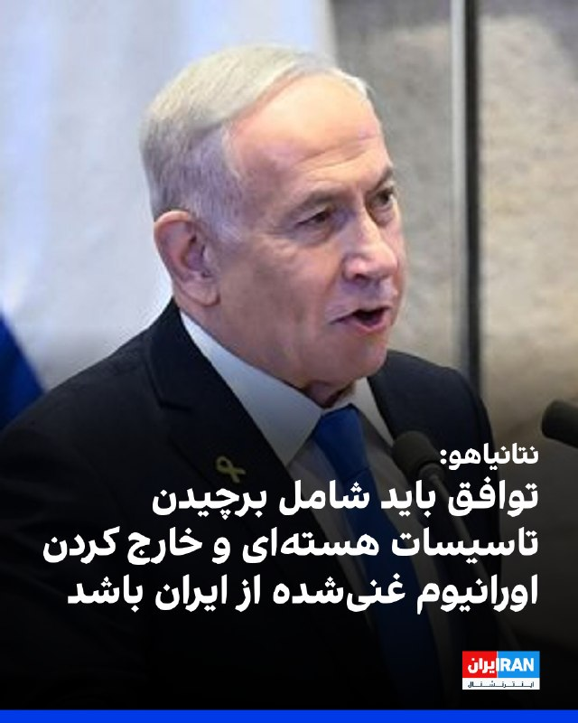

بنیامین نتانیاهو، نخست‌وزیر اسرائیل، اعلام کرد او و دونالد ترامپ توافق دارند هرگونه توافق نهایی با جمهوری اسلامی باید به‌طور کامل تهدید هسته‌ای را برطرف کند.

او گفت این به معنای برچیدن تاسیسات غنی‌سازی ایران و خارج کردن مواد هسته‌ای غنی‌شده از خاک این کشور است.

نتانیاهو افزود ترامپ بار دیگر بر حق اسرائیل برای دفاع از خود در برابر تهدیدها در همه جبهه‌ها، از جمله لبنان، تاکید کرده است.

او همچنین گفت سیاست او، همانند سیاست ترامپ، همچنان ثابت است؛ ایران نباید به سلاح هسته‌ای دست یابد.
@VahidOOnLine

📡 @VahidOnline

## VahidOnline — post 75684

  

ترامپ سخنان پزشکیان را نشان داد: آماده‌ایم به جهان اطمینان بدهیم

ترامپ اسکرین‌شاتی از توییت خبرنگار فاکس‌نیوز رو پست کرده که نوشته بود:
مسعود پزشکیان، رئیس‌جمهور ایران: ما آماده‌ایم به جهان اطمینان بدهیم که به‌دنبال سلاح هسته‌ای نیستیم. ما به‌دنبال بی‌ثباتی در منطقه نیستیم.
realDonaldTrump

📡 @VahidOnline

## VahidOnline — post 75683

  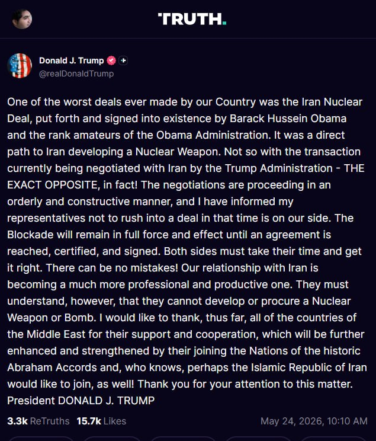

پست ترامپ، ترجمه ماشین:
یکی از بدترین توافق‌هایی که کشور ما تاکنون انجام داده، توافق هسته‌ای ایران بود؛ توافقی که باراک حسین اوباما و افراد کاملاً ناشیِ دولت اوباما آن را مطرح کردند و به امضا رساندند. این توافق، مسیری مستقیم برای دستیابی ایران به سلاح هسته‌ای بود. اما درباره معامله‌ای که اکنون دولت ترامپ با ایران در حال مذاکره بر سر آن است، چنین نیست؛ در واقع کاملاً برعکس است!

مذاکرات به شکلی منظم و سازنده در حال پیشرفت است و من به نمایندگانم اطلاع داده‌ام که برای رسیدن به توافق عجله نکنند، زیرا زمان به سود ماست. محاصره تا زمانی که توافقی حاصل، تأیید و امضا شود، با تمام قدرت برقرار خواهد ماند. هر دو طرف باید وقت بگذارند و کار را درست انجام دهند. هیچ اشتباهی نباید رخ دهد!

رابطه ما با ایران در حال تبدیل شدن به رابطه‌ای بسیار حرفه‌ای‌تر و ثمربخش‌تر است. با این حال، آنها باید درک کنند که نمی‌توانند سلاح یا بمب هسته‌ای تولید یا تهیه کنند. مایلم تا این مرحله از همه کشورهای خاورمیانه بابت حمایت و همکاری‌شان تشکر کنم؛ حمایتی که با پیوستن آنها به کشورهای عضو توافق‌های تاریخی ابراهیم، بیش از پیش تقویت و گسترش خواهد یافت و چه کسی می‌داند، شاید جمهوری اسلامی ایران هم بخواهد به آن بپیوندد!

از توجه شما به این موضوع سپاسگزارم.

رئیس‌جمهور دونالد جی. ترامپ
realDonaldTrump

📡 @VahidOnline

## VahidOnline — post 75682

  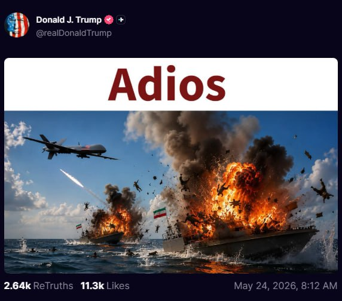

دونالد ترامپ تصویری ساخته با هوش مصنوعی را در شبکه اجتماعی تروث سوشال منتشر کرد که انهدام یک قایق سپاه پاسداران  به دست پهپاد آمریکایی را نشان می‌دهد.

بر این تصویر، واژه «حداحافظ» به زبان اسپانیایی نوشته شده است.

این تصویر در حالی توسط رئیس جمهوری آمریکا منتشر می‌شود که رسانه‌ها در انتظار نهایی شدن توافق احتمالی تهران و واشنگتن برای پایان جنگ هستند.
@VahidOOnLine

📡 @VahidOnline

## VahidOnline — post 75681

  

محمدرضا عارف، معاون اول پزشکیان گفت: «مدیران دولت تا زمانی که مباحث کارشناسی درباره مدیریت مصرف بنزین نهایی نشده است، حق اظهارنظر شخصی ندارند.»

او افزود: «اگر کسی از این دستور تخطی کند با او برخورد می‌شود، زیرا ابتدا باید نظرات کارشناسی بررسی و سپس جمع‌بندی نهایی حاصل شود.»

او ادامه داد: «مسئولان تا پیش از آن حق ندارند اظهارنظر شخصی کنند، چرا که نباید در جامعه التهاب یا نگرانی ایجاد شود.»
@VahidOOnLine
این دستور در شرایطی صادر شده که شایعات درباره افزایش قیمت بنزین، تغییر سهمیه‌ها و تشدید سیاست‌های مدیریت مصرف بالا گرفته است.

همزمان، ناترازی بنزین و فاصله میان مصرف داخلی و توان تأمین سوخت، نگرانی‌ها درباره کمبود احتمالی یا فشار بیشتر بر شبکه توزیع را افزایش داده است.

عارف گفت دولت تلاش می‌کند تصمیم‌ها به‌گونه‌ای اتخاذ شود که معیشت مردم آسیب نبیند، اما واقعیات اقتصادی کشور و تحولات اخیر نیز باید در نظر گرفته شود.
@VahidHeadline

📡 @VahidOnline

## VahidOnline — post 75679

خبرگزاری فارس، نزدیک به سپاه پاسداران روز یکشنبه سوم خرداد با اشاره به توافق احتمالی میان جمهوری اسلامی و آمریکا، نوشت: در پیش‌نویس توافق احتمالی ایران و آمریکا هیچ بندی درباره «تعهدات هسته‌ای ایران گنجانده نشده و تمام مسائل مرتبط با برنامه هسته‌ای به مذاکرات ۶۰ روزه پس‌از امضای توافق موکول شده است.»
فارس در ادامه تاکید کرده است که «ایران در این توافق هیچ تعهدی برای واگذاری ذخایر هسته‌ای، خروج تجهیزات، تعطیلی تأسیسات یا حتی تعهد به نساختن بمب هسته‌ای وجود ندارد.»
این در حالیست که نیویورک تایمز به نقل از دو مقام آمریکایی گزارش داد، یکی از عناصر کلیدی توافق پیشنهادی میان واشنگتن و تهران، تعهد آشکار ایران به واگذاری ذخایر اورانیوم با غنی‌سازی بالای خود است.
@VahidOOnLine
خبرگزاری تسنیم، وابسته به سپاه پاسداران، نوشت که شنیده‌ها از جزییات تفاهم اولیه «احتمالی»، حاکی است که واشینگتن متعهد خواهد شد در طول دوره مذاکرات، تحریم‌های نفتی ایران را به حالت اسقاط درآورد و جمهوری اسلامی در مقطع کنونی هیچ اقدامی را در حوزه هسته‌ای نپذیرفته است.
این گزارش افزود در صورتی که این تفاهم‌نامه مورد توافق قرار گیرد، بخشی از دارایی‌های بلوکه شده حکومت ایران باید در گام اول آزاد شود.
@VahidOOnLine

📡 @VahidOnline

## VahidOnline — post 75676

  <a href="telegram/content/VahidOnline_75676_1779639411.mp4" target="_blank">🎬 Download video</a>

مارکو روبیو، وزیر خارجه آمریکا، روز یکشنبه در جریان نشست خبری مشترک با سابرامانیام جایشانکار، وزیر خارجه هند، در دهلی‌نو اعلام کرد که طی ۴۸ ساعت گذشته «پیشرفت قابل‌توجهی» در مذاکرات و رایزنی‌های مرتبط با بحران تنگه هرمز و پرونده ایران حاصل شده و احتمال دارد تا ساعاتی دیگر اخبار مهم‌تری در این زمینه منتشر شود.

او بدون ارائه جزئیات کامل، گفت هنوز توافق نهایی شکل نگرفته اما مسیر مذاکرات نسبت به روزهای گذشته امیدوارکننده‌تر شده است.
روبیو با تاکید بر اینکه دولت آمریکا همچنان راه‌حل دیپلماتیک را ترجیح می‌دهد، اظهار داشت دونالد ترامپ تمایل دارد بحران ایران از طریق وزارت خارجه و مذاکره حل شود، نه از مسیر درگیری نظامی.
با این حال او هشدار داد که واشنگتن در هر شرایطی مانع دستیابی ایران به سلاح هسته‌ای خواهد شد و این موضوع «خط قرمز» دولت آمریکاست.

به گفته او، رئیس‌جمهوری آمریکا بارها تاکید کرده که ایران هرگز نباید به توانایی ساخت سلاح هسته‌ای برسد و دولت ترامپ در این زمینه از همه دولت‌های پیشین آمریکا سخت‌گیرتر عمل کرده است.
وزیر خارجه آمریکا در بخش دیگری از سخنانش به وضعیت تنگه هرمز پرداخت و گفت این آبراه، یک مسیر بین‌المللی است و هیچ کشوری حق ندارد عبور و مرور آزاد کشتی‌های تجاری را تهدید کند. او اقدامات اخیر ایران در قبال کشتی‌های عبوری را مغایر قوانین بین‌المللی دانست و هشدار داد اگر جامعه جهانی در برابر چنین اقداماتی سکوت کند، یک «وضعیت خطرناک و غیرقابل‌قبول» به رویه‌ای عادی در جهان تبدیل خواهد شد، موضوعی که می‌تواند در مناطق دیگر دنیا نیز تکرار شود.
روبیو همچنین اعلام کرد آمریکا طی دو روز گذشته همراه با شرکای خود در منطقه خلیج فارس روی چارچوبی کار کرده که هدف آن باز نگه داشتن کامل تنگه هرمز، جلوگیری از اخذ عوارض یا محدودیت برای عبور کشتی‌ها و همچنین رسیدگی به نگرانی‌های مرتبط با برنامه هسته‌ای ایران است.
او توضیح داد که در صورت موفقیت این روند، نه‌تنها امنیت کشتیرانی و تجارت جهانی حفظ خواهد شد، بلکه نگرانی‌ها درباره برنامه هسته‌ای ایران نیز تا حد زیادی کاهش پیدا می‌کند.
روبیو در ادامه گفت هرگونه توافق احتمالی نیازمند پذیرش کامل ایران و اجرای عملی تعهدات خواهد بود و مذاکرات درباره جزئیات فنی برنامه هسته‌ای، روندی پیچیده و زمان‌بر دارد.
او افزود هنوز نمی‌توان درباره موفقیت نهایی مذاکرات با قطعیت صحبت کرد، اما «نشانه‌هایی از پیشرفت واقعی» دیده می‌شود و ممکن است جهان در ساعات آینده خبرهای مثبتی درباره تنگه هرمز و روند مذاکرات دریافت کند.
@VahidOOnLine
روبیو گفت: «هدف نهایی این است که ایران هرگز نتواند به سلاح هسته‌ای دست یابد. ایران هرگز نباید مالک سلاح هسته‌ای شود.»
او تاکید کرد دونالد ترامپ، رئیس‌جمهوری آمریکا، در این زمینه موضعی «کاملا روشن» داشته و گفته است ایران هرگز به سلاح هسته‌ای دست نخواهد یافت.
وزیر خارجه آمریکا افزود: «قطعا تا زمانی که دونالد ترامپ رئیس‌جمهور است، این اتفاق نخواهد افتاد.»
@VahidOOnLine

📡 @VahidOnline

## VahidOnline — post 75675

  

محمد سرافراز، رئیس پیشین سازمان صداوسیما و عضو کنونی شورای عالی فضای مجازی، می‌گوید بخشی از حاکمیت ایران با الهام از الگوی چین به‌دنبال محدود کردن اینترنت جهانی برای عموم مردم و ارائهٔ آن فقط به گروهی خاص و کنترل‌شده است.

او روز یک‌شنبه سوم خرداد در گفت‌وگو با روزنامه اینترنتی فراز گفت جمهوری اسلامی تجهیزات لازم برای «قطع دائمی اینترنت» را از چین خریداری و وارد کرده است.

محمد سرافراز توضیح داد که در چین اینترنت جهانی برای عموم مردم قطع است و فقط به‌صورت محدود در اختیار گروه‌هایی خاص قرار می‌گیرد. سرافراز با اشاره به الگویی که آن را «سامانه نیکان» در چین خواند، گفت هدف چنین سازوکاری این است که «روایت حکومت» بر کشور حاکم باشد.

او همچنین اپراتورهای عضو شورای عالی فضای مجازی را از عوامل پشت پردهٔ تصویب طرح موسوم به «اینترنت پرو» دانست و گفت ذی‌نفعان قطع اینترنت «یک روز فیلترشکن می‌فروشند و یک روز اینترنت پرو».
@VahidHeadline
پس از ۲۰۴۰ ساعت قطعی اینترنت در ایران، نت‌بلاکس، نهاد مستقل و بین المللی پایش اینترنت، در حساب‌کاربری‌اش در شبکه اجتماعی ایکس نوشت که در حالی که دسترسی به اینترنت جهانی در طول مذاکرات صلح تا حد زیادی قطع است، کاربران منتخب در لیست سفید، تصویری مصنوعی از زندگی ایرانیان را به جهان خارج ارائه می‌دهند.»
@VahidHeadline

📡 @VahidOnline

## VahidOnline — post 75674

  <a href="telegram/content/VahidOnline_75674_1779639412.mp4" target="_blank">🎬 Download video</a>

انفجاری بزرگ در نزدیکی یک قطار که از گذرگاه چمن در شهر کویته در ایالت بلوچستان پاکستان عبور می‌کرد، تعداد زیادی کشته و ده‌ها نفر زخمی برجا گذاشت.

یک مقام ارشد پلیس بلوچستان و یکی از مسئولان این ایالت به محمد کاظم، خبرنگار بی‌بی‌سی اردو، گفت تاکنون کشته شدن ۲۰ نفر در این انفجار تأیید شده و دست‌کم ۷۰ نفر زخمی شده‌اند.
تصاویر منتشرشده پس از حادثه نشان می‌دهد که چندین خودرو در نزدیکی خط آهن آتش‌ گرفته‌اند و واگن‌های قطار نیز روی ریل واژگون شده‌اند.
گروه جدایی‌طلب «ارتش آزادیبخش بلوچ» مسئولیت این حمله را به عهده گرفته‌ است.
@VahidHeadline

📡 @VahidOnline

## VahidOnline — post 75673

  

خبرگزاری میزان، وابسته به قوه قضائیه جمهوری اسلامی، اعلام کرد مجتبی کیان به اتهام ارسال اطلاعات مراکز تولید صنایع دفاعی به «دشمن آمریکایی ـ صهیونیستی» اعدام شده است.

قوه قضائیه مدعی شده کیان در جریان آنچه مقام‌های جمهوری اسلامی «جنگ رمضان» می‌نامند، اطلاعات و مختصات واحدهای مرتبط با تولید قطعات صنایع دفاعی را از طریق پیام به شبکه‌های وابسته به اسرائیل و آمریکا ارسال کرده بود.

میزان مدعی شده بررسی‌های فنی نشان داده سه روز پس از ارسال این اطلاعات، محل مورد اشاره هدف حمله قرار گرفته و به‌طور کامل تخریب شده است. قوه قضائیه گفته پرونده این متهم در دادگستری استان البرز رسیدگی شد و حکم او پس از تأیید دیوان عالی کشور اجرا شد.

بر اساس رأی دادگاه، مجتبی کیان به اعدام و مصادره کلیه اموال محکوم شده بود. میزان همچنین نوشت از زمان بازداشت تا اجرای حکم کمتر از ۵۰ روز زمان گذشته است؛ موضوعی که پرسش‌های جدی درباره سرعت رسیدگی، امکان دفاع مؤثر و فرصت اعتراض در پرونده‌ای با مجازات اعدام ایجاد می‌کند.

قوه قضائیه گفته دادگاه با حضور وکیل برگزار شده، اما روشن نیست این وکیل منتخب متهم بوده یا تسخیری، از چه زمانی به پرونده دسترسی داشته، آیا امکان ملاقات محرمانه و آماده‌سازی دفاع فراهم بوده و آیا متهم فرصت کافی برای اعتراض به ادله فنی، درخواست کارشناسی مستقل و پیگیری مؤثر در دیوان عالی کشور داشته است یا نه.

این پرونده در بستر موج گسترده‌تری از اعدام‌ها، احکام امنیتی، مصادره اموال و رسیدگی‌های شتاب‌زده پس از جنگ قرار می‌گیرد؛ روندی که منتقدان و سازمان‌های حقوق بشری آن را نشانه استفاده فزاینده جمهوری اسلامی از مجازات اعدام برای ایجاد بازدارندگی سیاسی و امنیتی می‌دانند.
@VahidHeadline

خبرگزاری میزان هیچ اطلاعاتی درباره حرفه این فرد نداده و مشخص نیست که مجتبی کیان چگونه به «اطلاعات صنایع دفاعی» دسترسی داشته است.
@VahidHeadline

📡 @VahidOnline

## kianmeli1 — post 87638

  <a href="telegram/content/kianmeli1_87638_1779639413.mp4" target="_blank">🎬 Download video</a>

🔴 ترامپ به شبکه خبری ABC:

نمی‌توانم در مورد توافق صحبت کنم؛ این کاملاً به من بستگی دارد و اگر خبری باشد، فقط خبر خوبی خواهد بود.
من توافق‌های بدی نمی‌بندم.
https://t.me/kianmeli1

## kianmeli1 — post 87637

  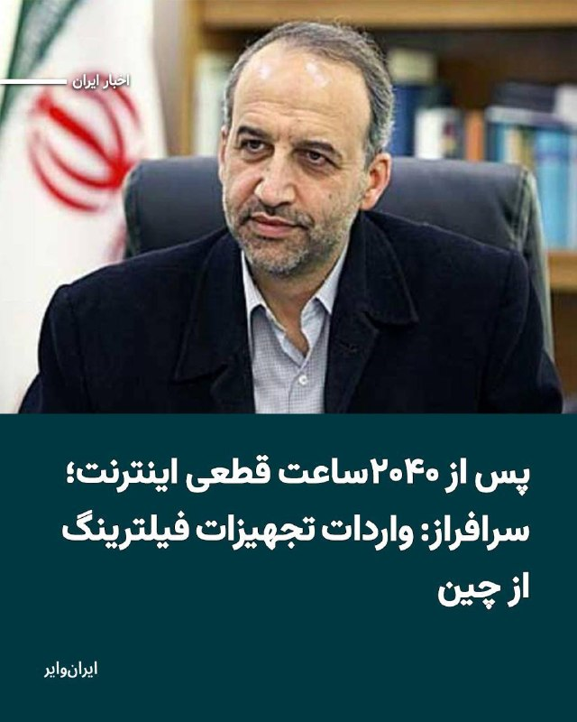

🔴محمد سرافراز، رئیس پیشین سازمان صداوسیما و عضو کنونی شورای عالی فضای مجازی، می‌گوید بخشی از حاکمیت ایران با الهام از الگوی چین به‌دنبال محدود کردن اینترنت جهانی برای عموم مردم و ارائهٔ آن فقط به گروهی خاص و کنترل‌شده است.

او روز یک‌شنبه سوم خرداد در گفت‌وگو با روزنامه اینترنتی فراز گفت جمهوری اسلامی تجهیزات لازم برای «قطع دائمی اینترنت» را از چین خریداری و وارد کرده است.
https://t.me/kianmeli1

## kianmeli1 — post 87636

  <a href="telegram/content/kianmeli1_87636_1779639415.mp4" target="_blank">🎬 Download video</a>

🔴پس از حملات سنگین چندشب پیش اوکراین به یک مدرسه در روسیه٫ دیشب روسیه حملات سنگین با موشک های قاره پیما علیه اوکراین شلیک کرد
https://t.me/kianmeli1

## kianmeli1 — post 87635

  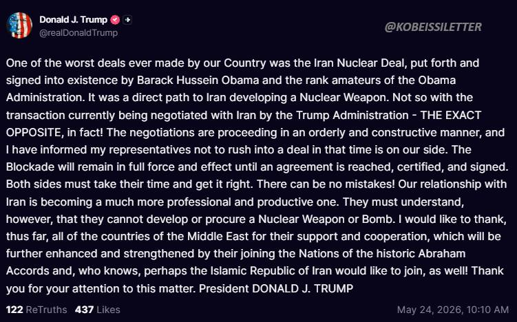

🔴 ترامپ می‌گوید به نمایندگانش اطلاع داده است که «برای رسیدن به توافق» با ایران «عجله نکنند» و «زمان به نفع ماست».
https://t.me/kianmeli1

## kianmeli1 — post 87634

  <a href="telegram/content/kianmeli1_87634_1779639417.mp4" target="_blank">🎬 Download video</a>

🔴هواپیماهای سوخت‌رسان هوایی KC-135R و KC-46A نیروی هوایی ایالات متحده از پایگاه هوایی الظفره در امارات متحده عربی اوایل هفته گذشته پس از استقرار از اوایل آوریل تخلیه شدند.

ممکن است به اسرائیل یا عربستان سعودی منتقل شده باشند.
https://t.me/kianmeli1

## kianmeli1 — post 87632

🔴تصاویر ماهواره‌ای با وضوح بالا نمای واضحی از دارایی‌های نیروی هوایی ایالات متحده مستقر در فرودگاه خانیا در کرت یونان ارائه می‌دهد، از جمله:

3× هواپیمای شناسایی سیگنال RC-135W Rivet Joint

6× هواپیمای سوخت‌رسان هوایی KC-135R

2× هواپیمای جنگ الکترونیک EA-37B Compass Call
https://t.me/kianmeli1

## kianmeli1 — post 87631

  

🔴توییت جدید نتانیاهو با تصویری از خودش و رئیس‌جمهور آمریکا ترامپ و عبارت «ایران هرگز سلاح هسته‌ای نخواهد داشت»
https://t.me/kianmeli1

## kianmeli1 — post 87630

🔴ایران بار دیگر این موضوع را که موضوع هسته‌ای بخشی از مذاکرات نیست، رد کرده است، چرا که رویترز به نقل از یک مقام ارشد ایرانی گزارش می‌دهد که آنها با تحویل مواد غنی‌سازی موافقت نکرده‌اند. اوایل این هفته، ایران قاطعانه گزارش‌هایی مبنی بر تمایل به پذیرش این اقدام را رد کرد و تکرار این درخواست از سوی آنها، موضع عمومی آنها را در تقابل با موضع دولت ترامپ قرار می‌دهد.
https://t.me/kianmeli1

## kianmeli1 — post 87629

  

🔴پست جدید ترامپ درحالی که خبرها از احتمال اعلام تفاهم پایان جنگ در آینده نزدیک است
https://t.me/kianmeli1

## IranIntlTV — post 338786

  <a href="https://t.me/IranintlTV/338786" target="_blank">📎 Download file</a>

🎧نسخه صوتی اخبار شبانگاهی | یکشنبه ۳ خرداد
@iranintlTV

## IranIntlTV — post 338785

ترامپ: زمان به نفع ماست، برای رسیدن به توافق عجله نداریم

دونالد ترامپ، رییس‌جمهوری آمریکا، مذاکرات تهران و واشینگتن را «سازنده» خواند و در عین حال تاکید کرد عجله‌ای برای دستیابی به توافق وجود ندارد.

ترامپ یک‌شنبه سوم خرداد در شبکه اجتماعی تروث‌سوشال نوشت: «مذاکرات به شکلی منظم و سازنده در حال پیشرفت است و من به نمایندگان خود اطلاع داده‌ام که برای رسیدن به توافق عجله نکنند، زیرا زمان به نفع ماست.»

او با انتقاد از باراک اوباما و «افراد کاملا آماتور» دولت او، برجام را «یکی از بدترین» توافق‌های تاریخ آمریکا خواند و افزود مذاکرات کنونی کاخ سفید با جمهوری اسلامی «دقیقا برعکس آن» است.

ترامپ تاکید کرد محاصره دریایی بنادر جنوبی ایران تا زمان «دستیابی به توافق و تایید و امضای آن» همچنان برقرار خواهد بود.

در روزهای اخیر، گمانه‌زنی‌ها در خصوص احتمال دستیابی تهران و واشینگتن به توافقی برای پایان جنگ بالا گرفته است.

ترامپ شامگاه دوم خرداد پس از گفت‌وگو با رهبران منطقه تایید کرد تنها «نهایی‌سازی متن» توافق با تهران باقی مانده است.

این موضوع واکنش‌های گسترده‌ای را در میان افکار عمومی و چهره‌های سیاسی به همراه داشته است.

شهروندان در پیام‌های خود به ایران‌اینترنشنال، از احتمال توافق میان جمهوری اسلامی و آمریکا ابراز ناامیدی کردند و آن را «خیانت» در حق مردم ایران و «پایمال کردن خون» جاویدنامان انقلاب ملی دانستند.

شماری از سناتورهای ارشد حزب جمهوری‌خواه آمریکا نیز از مفاد گزارش‌شده از توافق احتمالی انتقاد کردند و هشدار دادند این توافق تمام دستاوردهای عملیات «خشم حماسی» را از بین می‌برد.

ترامپ: تهران باید بپذیرد که نمی‌تواند به سلاح هسته‌ای دست یابد
رییس‌جمهوری ایالات متحده در ادامه پیام خود در تروث‌سوشال، با اشاره به مذاکرات جاری میان تهران و واشینگتن نوشت: «هر دو طرف باید وقت کافی بگذارند و این کار را درست انجام دهند. هیچ اشتباهی نباید رخ دهد.»

ترامپ اضافه کرد: «روابط ما با ایران در حال تبدیل شدن به رابطه‌ای حرفه‌ای‌تر و سازنده‌تر است. با این حال، آنها باید درک کنند که نمی‌توانند سلاح یا بمب هسته‌ای توسعه دهند یا به دست آورند.»

او همچنین از «حمایت و همکاری همه کشورهای خاورمیانه» قدردانی کرد و نوشت این رویکرد با پیوستن آن‌ها به پیمان ابراهیم تقویت خواهد شد.
ترامپ ادامه داد: «چه بسا شاید جمهوری اسلامی نیز بخواهد [به پیمان ابراهیم] بپیوندد.»

بنیامین نتانیاهو، نخست‌وزیر اسرائیل، سوم خرداد تصویری از خود و ترامپ در شبکه ایکس منتشر کرد که روی آن نوشته شده: «ایران هرگز به سلاح هسته‌ای دست نخواهد یافت.»

یک منبع اسرائیلی سوم خرداد به رویترز گفت ترامپ به‌روشنی به نتانیاهو اعلام کرده که در مذاکرات، بر خواسته همیشگی خود مبنی بر برچیدن برنامه هسته‌ای جمهوری اسلامی و خروج تمام اورانیوم غنی‌شده از ایران پافشاری خواهد کرد.

او افزود ترامپ تاکید کرده که بدون تحقق این شروط، «توافق نهایی را امضا نخواهد کرد».

در سوی دیگر، یک منبع ارشد حکومت ایران در مصاحبه با رویترز تاکید کرد تهران با انتقال ذخایر اورانیوم با غنای بالا موافقت نکرده و پرونده هسته‌ای بخشی از تفاهم اولیه با واشینگتن نیست.

محسن رضایی، مشاور نظامی مجتبی خامنه‌ای، هم تهدید کرد در صورت حمله آمریکا به تنگه هرمز، جمهوری اسلامی «محاصره دریایی را می‌شکند و ممکن است از ان‌پی‌تی خارج شود».

تاکید نتانیاهو بر آزادی عمل اسرائیل در تمامی جبهه‌ها
رویترز سوم خرداد به نقل از یک منبع سیاسی اسرائیل گزارش داد نتانیاهو در تماس تلفنی شب گذشته خود با ترامپ تاکید کرده که اسرائیل «آزادی عمل خود را برای مقابله با تهدیدها در همه جبهه‌ها، از جمله لبنان، حفظ خواهد کرد».

او افزود ترامپ نیز در این گفت‌وگو، موضع نتانیاهو را مورد تایید قرار داده و از آن حمایت کرده است.

ترامپ پیش‌تر گفت‌وگوی تلفنی خود با نخست‌وزیر اسرائیل را «خوب» ارزیابی کرده بود.

بنی گانتس، سیاستمدار برجسته اسرائیلی و وزیر پیشین دفاع این کشور، سوم خرداد هشدار داد توقف درگیری‌ها در لبنان به‌عنوان بخشی از توافق با جمهوری اسلامی، «اشتباهی راهبردی» خواهد بود که اسرائیل سال‌ها هزینه آن را خواهد پرداخت.

اول خرداد، اسماعیل بقایی، سخنگوی وزارت امور خارجه جمهوری اسلامی، اعلام کرده بود خاتمه جنگ در همه جبهه‌ها، از جمله لبنان، وضعیت تنگه هرمز و محاصره دریایی آمریکا، از محورهای اصلی گفت‌وگوهای حکومت ایران و ایالات متحده به شمار می‌روند.
 
🔗وب‌سایت ایران‌اینترنشنال
@iranintltv

## IranIntlTV — post 338784

  

یک مقام ارشد دولت آمریکا به فاکس‌نیوز گفت اگر ایران در موضوع اورانیوم غنی‌شده امتیازهای قابل‌توجهی بدهد، واشینگتن نیز در زمینه کاهش تحریم‌ها امتیازهای مهمی ارائه خواهد کرد.

او گزارش‌ها درباره احتمال امضای توافق در روز یکشنبه را کم‌اهمیت دانست و گفت ساختار تصمیم‌گیری در تهران «به آن سرعتی که لازم است عمل نمی‌کند.»

این مقام افزود برنامه آمریکا رسیدگی به تمام ذخایر اورانیوم غنی‌شده ایران است و اکنون انعطاف‌هایی از سوی تهران دیده می‌شود که پیش‌تر وجود نداشت.

او همچنین تاکید کرد آمریکا با اخذ عوارض در تنگه هرمز مخالف است.
https://iranintl.com/202605242847

## IranIntlTV — post 338783

  <a href="telegram/content/IranIntlTV_338783_1779639421.mp4" target="_blank">🎬 Download video</a>

هم‌زمان با مطرح شدن احتمال توافق میان تهران و واشینگتن، دونالد ترامپ، رییس‌جمهوری آمریکا، اعلام کرد محاصره دریایی تا زمان دست‌یابی و امضای یک توافق قطعی ادامه خواهد داشت. او در پیامی در شبکه اجتماعی تروث‌سوشال نوشت زمان به نفع آمریکا است و نمایندگانش نباید برای رسیدن به توافق عجله کنند.

مرضیه حسینی و اشکان صفایی، خبرنگاران ایران‌اینترنشنال، گزارش می‌دهند
@iranintltv

## IranIntlTV — post 338782

  

دونالد ترامپ صحبت‌های مسعود پزشکیان را که گفته بود «آماده‌ایم به جهان اطمینان دهیم که به‌دنبال سلاح هسته‌ای نیستیم و خواهان بی‌ثباتی در منطقه نیز نیستیم»، در شبکه تروث سوشال بازنشر کرد.

ترامپ پیش‌تر نیز گفت روابط آمریکا با جمهوری اسلامی در حال حرفه‌ای‌تر و سازنده‌تر شدن است.
https://iranintl.com/202605249014

## IranIntlTV — post 338781

  <a href="telegram/content/IranIntlTV_338781_1779639425.mp4" target="_blank">🎬 Download video</a>

یک شهروند با ارسال ویدیویی به ایران‌اینترنشنال می‌گوید یک خرید ساده مایحتاج برای خانه، ۹ میلیون تومان هزینه برداشته است.

## IranIntlTV — post 338780

  

به گزارش اکسیوس، یک مقام ارشد آمریکایی به خبرنگاران گفت کاخ سفید انتظار ندارد توافق برای پایان جنگ با جمهوری اسلامی یکشنبه نهایی شود و معتقد است تأیید آن از سوی رهبران جمهوری اسلامی، از جمله مجتبی خامنه‌ای، ممکن است چند روز زمان ببرد.

او افزود با وجود خوش‌بینی مقام‌های آمریکایی به دستیابی به توافق در روزهای آینده، مذاکرات هنوز نهایی نشده و همچنان احتمال شکست آن وجود دارد.

به گفته این مقام، این توافق می‌تواند از تشدید جنگ جلوگیری کرده و فشار بر بازار جهانی نفت را کاهش دهد، اما هنوز مشخص نیست آیا به توافقی پایدار، از جمله درباره خواسته‌های هسته‌ای ترامپ، منجر خواهد شد یا نه.
https://iranintl.com/202605248274

## IranIntlTV — post 338779

  

بنیامین نتانیاهو، نخست‌وزیر اسرائیل، اعلام کرد او و دونالد ترامپ توافق دارند هرگونه توافق نهایی با جمهوری اسلامی باید به‌طور کامل تهدید هسته‌ای را برطرف کند.

او گفت این به معنای برچیدن تاسیسات غنی‌سازی ایران و خارج کردن مواد هسته‌ای غنی‌شده از خاک این کشور است.

نتانیاهو افزود ترامپ بار دیگر بر حق اسرائیل برای دفاع از خود در برابر تهدیدها در همه جبهه‌ها، از جمله لبنان، تاکید کرده است.

او همچنین گفت سیاست او، همانند سیاست ترامپ، همچنان ثابت است؛ ایران نباید به سلاح هسته‌ای دست یابد.
https://iranintl.com/202605243871

## IranIntlTV — post 338778

  <a href="telegram/content/IranIntlTV_338778_1779639428.mp4" target="_blank">🎬 Download video</a>

کی‌یر استارمر، نخست‌وزیر بریتانیا، از پیشرفت در مسیر دستیابی به توافق میان واشینگتن و تهران استقبال کرد و گفت جمهوری اسلامی هرگز نباید به سلاح هسته‌ای دست یابد. استارمر افزود توافق باید به گونه‌ای انجام شود که درگیری‌ها پایان یابد و تنگه هرمز بدون هیچ محدودیتی باز بماند.

علی حسن‌پور، خبرنگار ایران‌اینترنشنال، گزارش می‌دهد
@iranintltv

## IranIntlTV — post 338777

  <a href="telegram/content/IranIntlTV_338777_1779639430.mp4" target="_blank">🎬 Download video</a>

سرخط خبرهای یکشنبه ۳ خرداد
@iranintltv

## IranIntlTV — post 338776

  

محسن رضایی، مشاور نظامی مجتبی خامنه‌ای، گفت کاری خواهیم کرد که «امنیت» کشور برای ۵۰ سال آینده تامین شود.
او افزود: «از یک طرف دست‌مان روی ماشه برای نبرد چهارم است و از طرف دیگر مسئولان در حال مذاکره هستند.»
رضایی گفت آمریکا پس از جنگ دیگر به آمریکای سابق بازنخواهد گشت و جمهوری اسلامی افول آمریکا در خاورمیانه را رقم زده است.
مشاور نظامی خامنه‌ای گفت در صورت تعرض به تنگه هرمز و ورود به خلیج‌فارس، محاصره دریایی را خواهند شکست و پاسخی سخت به آمریکا خواهند داد.
رضایی اضافه کرد اگر روند خصمانه علیه جمهوری اسلامی ادامه یابد، تهران از معاهده «ان‌پی‌تی» خارج خواهد شد و این اقدام پیامدهای سنگینی برای آمریکا خواهد داشت.
https://iranintl.com/202605241703

## IranIntlTV — post 338775

  

دونالد ترامپ در تروث سوشال نوشت توافقی که دولت او در حال مذاکره بر سر آن است، دقیقا برعکس توافق هسته‌ای دولت اوباما خواهد بود. او گفت مذاکرات به شکلی منظم و سازنده پیش می‌رود و به نمایندگانش دستور داده برای رسیدن به توافق عجله نکنند، زیرا زمان به نفع آمریکاست.

ترامپ تاکید کرد محاصره به‌طور کامل ادامه خواهد داشت تا زمانی که توافقی حاصل، تأیید و امضا شود و هر دو طرف باید بدون اشتباه و با صرف زمان کافی کار را به‌درستی انجام دهند.

او همچنین نوشت روابط آمریکا با جمهوری اسلامی در حال حرفه‌ای‌تر و سازنده‌تر شدن است، اما ایران اجازه تولید یا دستیابی به سلاح یا بمب هسته‌ای را نخواهد داشت.
https://iranintl.com/202605242249

## IranIntlTV — post 338774

  <a href="telegram/content/IranIntlTV_338774_1779639433.mp4" target="_blank">🎬 Download video</a>

دادستانی بحرین اعلام کرد ۱۱ نفر را به اتهام جاسوسی و همکاری اطلاعاتی با سپاه پاسداران محاکمه کرده است. به گفته دادستانی، ۹ نفر از متهمان به اتهام انجام «اقدامات خصمانه و تروریستی علیه پادشاهی بحرین» به حبس ابد محکوم شدند و دو متهم دیگر نیز حکم سه سال حبس دریافت کردند.

گفت‌وگو با علی صدرزاده، تحلیل‌گر مسائل خاورمیانه
@iranintltv

## IranIntlTV — post 338773

  <a href="telegram/content/IranIntlTV_338773_1779639435.mp4" target="_blank">🎬 Download video</a>

متین پرویزی، دانشجوی علوم دامی، ۱۸ دی‌ در زنجان هنگام کمک به یک مادر و کودک، از پشت سر هدف گلوله قرار گرفت و جان باخت. علیرضا علی‌نیا، ۲۳ ساله اهل مشهد، ۱۸ دی‌ در بلوار وکیل‌آباد این شهر با شلیک گلوله جنگی ماموران کشته شد.

فرنوش فرجی، عضو تحریریه ایران‌اینترنشنال، گزارش می‌دهد
@iranintltv

## IranIntlTV — post 338772

  

🔻نیویورک تایمز در گزارشی با اشاره به تغییر کمپ تیم ملی در جام جهانی ۲۰۲۶ از آمریکا به مکزیک نوشت: «اگر برخی اعضای غیرضروری در روز مسابقه برای دریافت ویزای آمریکا با مشکل مواجه باشند، انتقال کمپ به مکزیک می‌تواند به آن‌ها اجازه دهد در کنار تیم بمانند، اما برای مسابقات سفر نکنند.»

🔹مهدی تاج، رییس فدراسیون فوتبال روز گذشته خبر داد که کمپ تیم ملی فوتبال از آریزونای آمریکا به کمپی در شهر تیخوانا مکزیک منتقل شده است.

🔹او به سایت فدراسیون فوتبال گفت: «با این تغییر، مساله ویزا تا اندازه زیادی حل می‌شود. می‌توانیم با پرواز ایران‌ایر به مکزیک برویم و برگشت هم از همان‌جا بیاییم.»

🔹یک ماه پیش، مارکو روبیو، وزیر خارجه آمریکا، درباره ورود همراهان تیم ملی به ایالات متحده گفت: «آن‌ها نمی‌توانند یک مشت تروریست عضو سپاه را به عنوان روزنامه‌نگار یا مربی ورزشی وارد کشور ما کنند.»

@iranintltvsport

## IranIntlTV — post 338771

فایننشال‌تایمز: سپاه از طریق شرکت مستقر در امارات تجهیزات ماهواره‌ای چینی تهیه کرده است

فایننشال‌تایمز گزارش داد سپاه پاسداران برای تامین تجهیزات پیشرفته ارتباطات ماهواره‌ای ساخت چین مورد استفاده در برنامه پهپادی خود، از شرکت «تل‌سان» مستقر در راس‌الخیمه امارات متحده عربی استفاده کرده است.
 
این روزنامه یک‌شنبه سوم خرداد نوشت این تجهیزات برای «گروه صنعتی سامان» که در فهرست تحریم‌های آمریکا قرار دارد، تهیه شده‌اند.
 
بر اساس این گزارش، شرکت تل‌سان در اواخر سال ۲۰۲۵ انتقال حدود دو تن تجهیزات آنتن ماهواره‌ای، از جمله یک آنتن موتوردار ۴.۵ متری ساخت شرکت چینی «استاروین»، را از شانگهای به ایران از طریق بندر جبل‌علی هماهنگ کرده است.
 
این معامله از آن جهت توجه‌ها را جلب کرده که نشان می‌دهد یک شرکت مستقر در امارات در تامین تجهیزات ارتباطی مورد نیاز سپاه پاسداران نقش داشته است؛ نهادی که در واکنش به کارزار نظامی اخیر آمریکا و اسرائیل، امارات را هدف حملات موشکی و پهپادی خود قرار داد.
 
امارات بیشترین آسیب را از حملات تلافی‌جویانه تهران در جریان جنگ اخیر متحمل شد و جمهوری اسلامی بیش از ۲۸۰۰ پهپاد و موشک به سوی این کشور شلیک کرد، از جمله به اهداف غیرنظامی.

فعالیت‌ شرکت‌های ایرانی در امارات
با وجود موضع سخت‌گیرانه ابوظبی در قبال جمهوری اسلامی، امارات متحده عربی پیش از جنگ به‌طور سنتی مرکز فعالیت شرکت‌های ایرانی در خارج از کشور بود.

به گفته تحلیلگران، امارات که طی دو دهه اخیر به قطب تجارت در منطقه تبدیل شده، در امارت‌های مختلف خود مناطق آزاد تجاری ایجاد کرده است؛ مناطقی که نظارت بر مبادلات مالی و تجاری در آنها با محدودیت‌هایی همراه است.

همین موضوع نگرانی‌هایی را درباره احتمال سوءاستفاده از این مناطق برای تجارت غیرقانونی و دور زدن تحریم‌ها افزایش داده است.

نقش شرکت مستقر در راس‌الخیمه
فایننشال‌تایمز در ادامه گزارش داد تجهیزات مورد نیاز سپاه از طریق شرکت تل‌سان که در راس‌الخیمه مستقر است، منتقل شد.

این شرکت انتقال حدود ۱.۸ تن تجهیزات آنتن ماهواره‌ای ساخت چین را از شانگهای به ایران، از طریق بندر کانتینری جبل‌علی در دبی، هماهنگ کرد.

فایننشال‌تایمز با استناد به تصاویر ماهواره‌ای و داده‌های موقعیت‌یابی کشتی‌ها نوشت یک شناور ایرانی که در مرحله پایانی این انتقال در ماه نوامبر مورد استفاده قرار گرفت، با ارسال اطلاعات ناوبری جعلی برای سایر شناورها تلاش کرد سفر خود به ایران را پنهان کند.

این اسناد و تحلیل‌های حمل‌ونقل نشان می‌دهد سپاه پاسداران حتی پس از اعمال تحریم‌های غرب علیه شبکه تامین نظامی‌اش، همچنان از مسیر شرکت‌ها و شبکه‌های تجاری مستقر در امارات برای دستیابی به فناوری‌های حساس ارتباطی بهره می‌گرفت.

سپاه پاسداران در جریان جنگ اخیر از این توانمندی‌ها در حملات خود علیه پایگاه‌های نظامی آمریکا در منطقه استفاده کرد؛ حملاتی که خساراتی بر جای گذاشت و به کشته شدن ۱۳ نظامی آمریکایی منجر شد.

پیش‌تر شبکه سی‌ان‌ان به نقل از منابع آگاه گزارش داد جمهوری اسلامی در جریان آتش‌بس شش‌هفته‌ای بخشی از روند تولید پهپادهای خود را از سر گرفته است.

بر اساس این گزارش، حکومت ایران بسیار سریع‌تر از برآوردهای اولیه در حال بازسازی و احیای توان نظامی خود است.

جمهوری اسلامی با وجود تحریم‌های بین‌المللی، همچنان برای دور زدن محدودیت‌ها تلاش می‌کند.

پیش‌تر وال‌استریت ژورنال گزارش داد شبکه‌ای محرمانه تحت مدیریت بابک زنجانی، طی دو سال از طریق صرافی رمزارز بایننس ۸۵۰ میلیون دلار تراکنش برای تامین مالی نیروهای نظامی جمهوری اسلامی انجام داد.

به نوشته این روزنامه، این تراکنش‌ها دست‌کم تا بهمن ۱۴۰۴ ادامه داشت.
 
🔗وب‌سایت ایران‌اینترنشنال
@iranintltv

## IranIntlTV — post 338770

  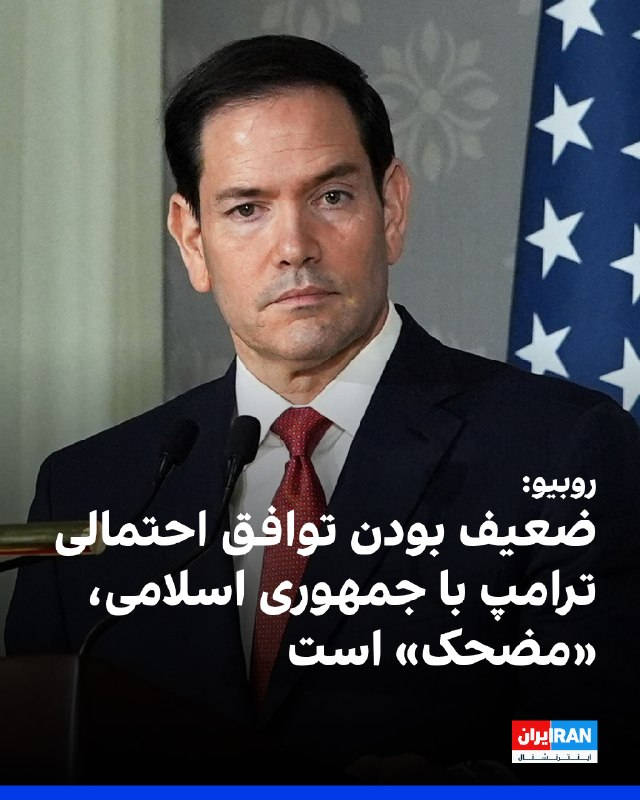

مارکو روبیو، وزیر خارجه آمریکا، اظهارنظرها درباره ضعیف‌ بودن توافق احتمالی دونالد ترامپ با جمهوری اسلامی را «مضحک» توصیف کرد. روبیو که در سفر به هند به‌سر می‌برد، به خبرنگاران گفت تعهد ترامپ به جلوگیری از دستیابی ایران به سلاح هسته‌ای «نباید از سوی هیچ‌کس زیر سؤال برود»

او افزود: این که ترامپ ممکن است با توافقی موافقت کند که در نهایت موقعیت ایران را در برنامه هسته‌ای تقویت کند، با توجه به مواضع و اقداماتی که تاکنون از او دیده‌ایم، کاملا مضحک است.
https://iranintl.com/202605242555

## IranIntlTV — post 338769

  <a href="telegram/content/IranIntlTV_338769_1779639439.mp4" target="_blank">🎬 Download video</a>

فائزه حسین‌نژاد، دانشجوی ۲۳ ساله مامایی و والیبالیست، شامگاه ۱۹ دی ۱۴۰۴ در خیابان امامت مشهد به دست نیروهای سرکوبگر کشته شد. ابتدا گلوله‌ای به زیر قلبش زدند و سپس زیر ضربات باتون او را کشتند.

## IranIntlTV — post 338768

  <a href="telegram/content/IranIntlTV_338768_1779639441.mp4" target="_blank">🎬 Download video</a>

در ادامه تجمع‌های ایرانیان خارج از کشور، گروهی از ایرانیان مقیم سوئد یکشنبه مقابل سفارت جمهوری اسلامی در استکهلم تجمع کردند. شرکت‌کنندگان اعلام کردند این تجمع در اعتراض به اجرای کمپین «جان فدا» در این سفارت برگزار شد.

گزارش مهران عباسیان، خبرنگار ایران‌اینترنشنال
@iranintltv

## IranIntlTV — post 338767

  <a href="telegram/content/IranIntlTV_338767_1779639443.mp4" target="_blank">🎬 Download video</a>

بر اساس ویدیوهای ارسال‌شده به ایران‌اینترنشنال گروهی از ایرانیان مقیم استرالیا در حمایت از مردم ایران و علیه جمهوری اسلامی در شهر آدلاید کاروان خودرویی به راه انداختند.

## Shin_Persian — post 6208

↩️ Quoted tweet: Barak Ravid ✓ @BarakRavid Sun, 24 May 2026 14:52:25 UTC 🚨A senior Trump administration official says the agreement with Iran is not expected to be signed today 🚨The official said there are still several details to close. There is still back…

## Shin_Persian — post 6207

↩️ Quoted tweet:
Barak Ravid ✓ @BarakRavid
Sun, 24 May 2026 14:52:25 UTC

🚨A senior Trump administration official says the agreement with Iran is not expected to be signed today
🚨The official said there are still several details to close. There is still back and forth over certain parts of the deal. "some words that are important to us and some words

↩️ توییت نقل‌قول شده — برای پاسخ، پست زیر را ببینید.

فارسی

🚨 یک مقام ارشد دولت ترامپ می‌گوید انتظار نمی‌رود توافق با ایران امروز امضا شود.
🚨 این مقام گفت هنوز جزئیات متعددی برای نهایی شدن باقی مانده است. همچنان رفت و برگشت‌هایی بر سر بخش‌های خاصی از توافق وجود دارد. «برخی کلمات که برای ما مهم هستند و برخی کلمات...»

𝕏 · @shin_persian

## Shin_Persian — post 6206

  

Shin ✓ @hey_itsmyturn Sun, 24 May 2026 14:15:12 UTC President Trump @POTUS: "One of the worst deals ever made by our Country was the Iran Nuclear Deal, put forth and signed into existence by Barack Hussein Obama and the rank amateurs of the Obama Administration.…

## Shin_Persian — post 6205

Shin ✓ @hey_itsmyturn
Sun, 24 May 2026 14:15:12 UTC

President Trump @POTUS:
"One of the worst deals ever made by our Country was the Iran Nuclear Deal, put forth and signed into existence by Barack Hussein Obama and the rank amateurs of the Obama Administration. It was a direct path to Iran developing a Nuclear Weapon. Not so with the transaction currently being negotiated with Iran by the Trump Administration - THE EXACT OPPOSITE, in fact! The negotiations are proceeding in an orderly and constructive manner, and I have informed my representatives not to rush into a deal in that time is on our side. The Blockade will remain in full force and effect until an agreement is reached, certified, and signed. Both sides must take their time and get it right. There can be no mistakes! Our relationship with Iran is becoming a much more professional and productive one. They must understand, however, that they cannot develop or procure a Nuclear Weapon or Bomb. I would like to thank, thus far, all of the countries of the Middle East for their support and cooperation, which will be further enhanced and strengthened by their joining the Nations of the historic Abraham Accords and, who knows, perhaps the Islamic Republic of Iran would like to join, as well! Thank you for your attention to this matter. President DONALD J. TRUMP"

فارسی

رئیس‌جمهور ترامپ @POTUS:

«یکی از بدترین توافق‌هایی که تا به حال توسط کشور ما منعقد شده، توافق هسته‌ای ایران بود که توسط باراک حسین اوباما و آماتورهای رده‌بالای دولت اوباما مطرح و امضا شد. آن توافق مسیری مستقیم برای دستیابی ایران به سلاح هسته‌ای بود. اما در مورد معامله‌ای که در حال حاضر توسط دولت ترامپ با ایران در حال مذاکره است، این‌گونه نیست - در واقع، دقیقاً برعکس است! مذاکرات به شیوه‌ای منظم و سازنده در حال پیشرفت است و من به نمایندگان خود ابلاغ کرده‌ام که برای رسیدن به توافق عجله نکنند، چرا که زمان به نفع ماست. محاصره (تحریم‌ها) تا زمانی که توافقی حاصل، تأیید و امضا نشود، با تمام قوت و اعتبار باقی خواهد ماند. هر دو طرف باید وقت بگذارند و کار را درست انجام دهند. هیچ اشتباهی نباید صورت بگیرد! رابطه ما با ایران در حال تبدیل شدن به رابطه‌ای بسیار حرفه‌ای‌تر و سازنده‌تر است. با این حال، آن‌ها باید درک کنند که نمی‌توانند سلاح یا بمب هسته‌ای تولید کرده یا به دست آورند. من مایلم تا این لحظه از تمام کشورهای خاورمیانه بابت حمایت و همکاری‌شان تشکر کنم، که این همکاری با پیوستن آن‌ها به کشورهای پیمان‌های تاریخی ابراهیم (Abraham Accords) بیشتر تقویت و مستحکم خواهد شد و کسی چه می‌داند، شاید جمهوری اسلامی ایران نیز مایل باشد به آن بپیوندد! از توجه شما به این موضوع سپاسگزارم. رئیس‌جمهور دونالد جی. ترامپ»

𝕏 · @shin_persian

## Shin_Persian — post 6204

↩️ Quoted tweet: Faytuks Network ✓ @FaytuksNetwork Sun, 24 May 2026 12:17:06 UTC Fars News, an IRGC-linked Iranian outlet, reported that U.S. officials and mediators privately told Tehran during indirect exchanges to ignore Donald Trump’s Truth Social posts…

## Shin_Persian — post 6203

↩️ Quoted tweet:
Faytuks Network ✓ @FaytuksNetwork
Sun, 24 May 2026 12:17:06 UTC

Fars News, an IRGC-linked Iranian outlet, reported that U.S. officials and mediators privately told Tehran during indirect exchanges to ignore Donald Trump’s Truth Social posts, saying they were aimed mainly at U.S. domestic audiences and did not reflect Washington’s negotiating

↩️ توییت نقل‌قول شده — برای پاسخ، پست زیر را ببینید.

فارسی

خبرگزاری فارس، رسانه وابسته به سپاه پاسداران انقلاب اسلامی (IRGC)، گزارش داد که مقامات و میانجی‌گران آمریکایی در خلال تبادلات غیرمستقیم، به‌طور خصوصی به تهران گفته‌اند که پست‌های دونالد ترامپ در شبکه اجتماعی «تروث سوشال» را نادیده بگیرد؛ آن‌ها اعلام کردند که این پیام‌ها عمدتاً با هدف جذب مخاطبان داخلی ایالات متحده منتشر شده و بازتاب‌دهنده مواضع مذاکراتی واشینگتن نیست.

𝕏 · @shin_persian

## Shin_Persian — post 6202

  <a href="telegram/content/Shin_Persian_6202_1779639446.mp4" target="_blank">🎬 Download video</a>

↩️ Quoted tweet: Shin ✓ @hey_itsmyturn Sun, 24 May 2026 10:52:04 UTC Islamic Regime claims downing Israeli Orbiter drone over Hormozgan Province with air defense system. Drone reportedly conducting reconnaissance mission. #Iran ↩️ توییت نقل‌قول شده — برای…

## Shin_Persian — post 6201

↩️ Quoted tweet:
Shin ✓ @hey_itsmyturn
Sun, 24 May 2026 10:52:04 UTC

Islamic Regime claims downing Israeli Orbiter drone over Hormozgan Province with air defense system. Drone reportedly conducting reconnaissance mission.

#Iran

↩️ توییت نقل‌قول شده — برای پاسخ، پست زیر را ببینید.

فارسی

رژیم اسلامی مدعی سرنگونی یک پهپاد اوربیتر (Orbiter) اسرائیلی بر فراز استان هرمزگان توسط سامانه پدافند هوایی شد. گزارش شده است که این پهپاد در حال انجام ماموریت شناسایی بوده است.

#Iran

𝕏 · @shin_persian

## ManotoTV — post 105809

  <a href="telegram/content/ManotoTV_105809_1779639448.mp4" target="_blank">🎬 Download video</a>

وزیران خارجه ۱۹ کشور عربی و اسلامی در بیانیه‌ای مشترک، اقدام منطقه موسوم به «سومالی‌لند» در افتتاح «سفارت» در اورشلیم را به‌شدت محکوم کردند.

در این بیانیه که روز یکشنبه سوم خرداد منتشر شد، این اقدام «غیرقانونی و مردود» خوانده شده و آمده است که افتتاح این دفتر، نقض آشکار قوانین بین‌المللی و قطعنامه‌های مربوط به مشروعیت بین‌المللی است.

وزیران خارجه کویت، مصر، عربستان سعودی، قطر، اردن، ترکیه، پاکستان، اندونزی، جیبوتی، سومالی، فلسطین، عمان، سودان، یمن، لبنان، موریتانی، الجزایر، بنگلادش و مراکش تاکید کردند که اورشلیم شرقی «سرزمین فلسطینی اشغال‌شده از سال ۱۹۶۷» است و هر اقدامی برای تغییر وضعیت حقوقی و تاریخی آن «باطل و بی‌اثر» است.

این کشورها همچنین حمایت کامل خود را از وحدت، حاکمیت و تمامیت ارضی جمهوری فدرال سومالی اعلام کردند و هرگونه اقدام یک‌جانبه علیه وحدت سرزمینی سومالی را مردود دانستند.

## ManotoTV — post 105808

  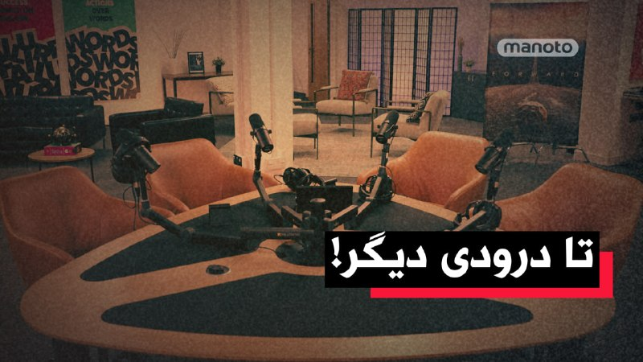

https://studio.youtube.com/video/bQJFCVV8hCg/livestreaming

## ManotoTV — post 105807

  <a href="telegram/content/ManotoTV_105807_1779639449.mp4" target="_blank">🎬 Download video</a>

دونالد ترامپ، رئیس‌جمهور آمریکا، در پیامی تازه بار دیگر توافق هسته‌ای دوره باراک اوباما با جمهوری اسلامی را «یکی از بدترین توافق‌های تاریخ آمریکا» خواند و گفت آن توافق مسیر دستیابی تهران به سلاح هسته‌ای را هموار می‌کرد.

ترامپ گفت مذاکرات کنونی دولت او با جمهوری اسلامی «منظم و سازنده» پیش می‌رود، اما به نمایندگان خود دستور داده برای رسیدن به توافق عجله نکنند، زیرا به گفته او «زمان به سود آمریکا است».

او اضافه کرد انسداد علیه جمهوری اسلامی تا زمان دستیابی به توافق، تایید و امضای آن، با قدرت کامل ادامه خواهد داشت.

ترامپ افزود دو طرف باید با دقت و بدون خطا پیش بروند و جمهوری اسلامی باید بداند که نمی‌تواند سلاح هسته‌ای تولید یا تهیه کند.

رئیس‌جمهور آمریکا همچنین از کشورهای خاورمیانه برای حمایت و همکاری در این روند تشکر کرد و گفت این همکاری می‌تواند با پیوستن بیشتر کشورها به پیمان‌های ابراهیم تقویت شود. او در ادامه نوشت شاید جمهوری اسلامی نیز بخواهد به این روند بپیوندد.

## ManotoTV — post 105806

  

شانزده سال پیش، منوتو با یک باور ساده آغاز شد:

اینکه مردم ایران شایسته‌ی رسانه‌ای حرفه ای هستند که حقیقت را بی‌واسطه، بی‌ واهمه و بدون وابستگی به هیچ دولت و قدرتی، با آن‌ها در میان بگذارد. بر اساس این باور، منوتو همیشه صدای مستقل خود را داشت؛ صدایی که از دل اعتماد، همراهی و دغدغه‌های شما شکل گرفت و نشان داد که ایرانیان، با هر پیشینه، باور و نگاه متفاوت، می‌توانند زیر یک سقف و برای هدفی بزرگ‌تر، کنار هم بایستند و به آنچه می خواهند دست یابند.

در طول سالها، ما آموختیم که رسانه فقط برای خبر دادن نیست. رسانه می تواند حافظه‌ی یک ملت باشد؛ جایی که رنج‌ها، شادی‌ها، امیدها، شکست‌ها و ایستادگی‌ها ثبت می‌شوند تا فراموش نشوند.

ما همیشه ایران را فراتر از یک جغرافیا دیدیم؛ ایران برای ما میراث است، هویت، فرهنگ و غرور ملی است، و مسئولیتی برای تک تک ما، که نباید از آن چشم پوشید.

این مسیر آسان نبود و در طول سال‌ها با وجود تهدیدها، تخریب‌ها و فشار، به راه خود ادامه دادیم و آنچه کردیم و آنچه گفتیم، و جایی که در لحظات حساس تاریخ ایستادیم، قابل داوری و باعث افتخار ماست.

امروز فصل پخش منوتو به پایان می‌رسد؛ اما باورهایی که این مسیر را آغاز کرد، پایان نمی‌گیرد.

از هر بیننده، همراه، منتقد و حامی که در این سال‌ها کنار ما بود، صمیمانه سپاسگزارم.

راه آینده شاید شکل دیگری داشته باشد؛ اما باور ما به ایران، به مردم ایران، و به فردایی آزاد و بهتر، همچنان پابرجا و زنده است.

## ManotoTV — post 105805

  <a href="telegram/content/ManotoTV_105805_1779639451.mp4" target="_blank">🎬 Download video</a>

راهپیمایی از مقابل ساختمان بی‌بی‌سی بسمت دفتر نخست‌وزیری، یکشنبه سوم خرداد ۱۴۰۵

## ManotoTV — post 105804

  <a href="telegram/content/ManotoTV_105804_1779639453.mp4" target="_blank">🎬 Download video</a>

تجمع مقابل ساختمان بی‌بی‌سی فارسی در لندن، یکشنبه سوم خرداد ۱۴۰۵

## ManotoTV — post 105803

  <a href="telegram/content/ManotoTV_105803_1779639455.mp4" target="_blank">🎬 Download video</a>

فایننشال تایمز در گزارشی نوشت سپاه از یک شبکه تدارکاتی مستقر در امارات برای خرید تجهیزات پیشرفته ماهواره‌ای چینی مرتبط با برنامه پهپادی و موشکی خود استفاده کرده است.

بر اساس این گزارش، شرکتی به نام «تله‌سان» در راس‌الخیمه، انتقال حدود یک و هشت دهم تن تجهیزات ارتباطی ماهواره‌ای ساخت چین را از شانگهای به ایران، از مسیر دبی، تسهیل کرده است.

فایننشال تایمز نوشت مقصد نهایی این تجهیزات شرکت «ارتباطات فراگستر کیش» بوده که بنا بر این گزارش، با «گروه صنعتی سامان» مرتبط با نیروی هوافضای سپاه و تحریم‌شده از سوی آمریکا همکاری داشته است.

این روزنامه همچنین گزارش داد بخش پایانی انتقال محموله با یک کشتی ایرانی انجام شده که برای پنهان کردن مسیر خود، داده‌های موقعیت‌یابی نادرست مخابره کرده است.

## ManotoTV — post 105802

  <a href="telegram/content/ManotoTV_105802_1779639455.mp4" target="_blank">🎬 Download video</a>

دانیال مقدم، خواننده و رپر اعتراضی ایرانی، تتوی جدید صورتش با الهام از «God of War» را فقط به‌عنوان یک طرح انتخاب نکرده؛ این تتو برای او یادآور زخم‌ها، ترس‌ها، امیدها و روزهایی‌ست که نسلش از میان جنگ، درد و ناامیدی عبور کرده است.
رنگ سبز این طرح، نماد عشق، صلح، امید و زندگی‌ست؛ پیامی برای فراموش نکردن روزهایی که مردم با تمام زخم‌هایشان هنوز ایستاده‌اند و ایران را دوست دارند

## FarsiVOA — post 218539

  <a href="telegram/content/FarsiVOA_218539_1779639458.mp4" target="_blank">🎬 Download video</a>

شهرام همایون در عمق میدان و در پاسخ به پرسش فهیمه خضر حیدری درباره فروش کاغد سفید در شبکه تلویزیونی‌اش می‌گوید مردم به او ایمان دارند و کاغذ سفید هم از او می‌خرند

## FarsiVOA — post 218538

در گفت‌وگو با بابک دربیکی، تحلیلگر سیاسی از لندن، به واکنش کشورهای منطقه به تفاهم اولیه آمریکا و جمهوری اسلامی پرداختیم؛ از امید به ثبات انرژی و بازگشایی تنگه هرمز گفتیم و بررسی کردیم چرا همزمان نگرانی‌ها درباره تثبیت موقعیت جمهوری اسلامی در صورتی که به روند صلح خاورمیانه نپیوندد پابرجاست.

## FarsiVOA — post 218537

در پی اعلام دونالد ترامپ مبنی بر اینکه چارچوب یک «یادداشت تفاهم صلح» با جمهوری اسلامی «تا حد زیادی مذاکره شده»، موجی از واکنش‌ها در آمریکا، اسرائیل، اروپا و کشورهای منطقه شکل گرفته است.

نخستین واکنش حساس از اسرائیل آمد؛ جایی که رسانه‌های اسرائیلی گزارش دادند بنیامین نتانیاهو درباره مفاد توافق احتمالی، از جمله تعویق رسیدگی به پرونده هسته‌ای جمهوری اسلامی و گنجاندن آتش‌بس لبنان، ابراز نگرانی کرده است.

تایمز اسرائیل نوشت نتانیاهو قرار است نشست کابینه امنیتی محدود را برای بررسی توافق در حال شکل‌گیری برگزار کند.

گزارش کامل را در وب‌سایت صدای آمریکا بخوانید.

@FarsiVOA

## FarsiVOA — post 218536

🔺دونالد ترامپ: عجله‌ای برای امضای توافق نداریم، زمان به نفع ماست

◾️دونالد ترامپ رئیس‌جمهوری ایالات متحده روز یکشنبه ۳ خرداد، در اشاره به توافق احتمالی با جمهوری اسلامی، در حساب کاربری خود در تروت‌سوشال نوشت: «توافق‌نامه اتمی ایران که توسط باراک حسین اوباما به همراه تیم تازه‌کار و ناآشنا به امور وی امضا شد، از بدترین توافق‌نامه‌هایی است که تاکنون در کشور ما امضا شده است.

⬇️ بیشتر بخوانید:

https://ir.voanews.com/a/trump-iran-deal-negotiation-israel/8153309.html

## FarsiVOA — post 218535

🔺ارتش اسرائیل: کشته شدن چهار تروریست حزب‌الله

◾️ارتش اسرائیل روز یکشنبه سوم خرداد، با انتشار ویدئویی در شبکه‌های اجتماعی نوشت: «نیروهای یگان چندبعدی به فعالیت خود برای رفع تهدیدات علیه غیرنظامیان و نیروهای ارتش اسرائیل در جنوب لبنان ادامه می‌دهند.»

⬇️ بیشتر بخوانید:

https://ir.voanews.com/a/israeli-army-hezbollah-attack/8153303.html

## FarsiVOA — post 218534

شهرام همایون در گفت‌وگو با فهیمه خضر حیدری در عمق میدان از تلاش‌های خود برای حفظ پرچم شیر و خورشید گفت: «این که گروهی این اواخر، تاج را به پرچم شیر و خورشید اضافه کرده‌اند آخرین تلاش‌ها برای ضربه زدن به یگانگی پرچم است»

## FarsiVOA — post 218533

  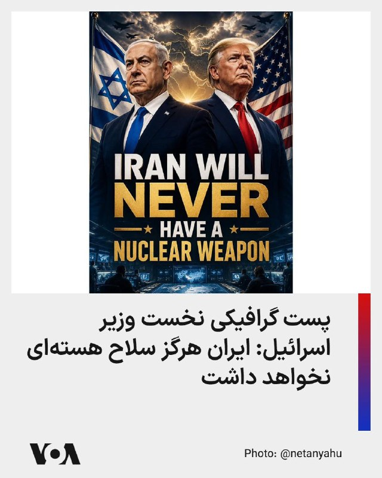

🔺نخست وزیر اسرائیل روز یکشنبه سوم خرداد با انتشار یک پست گرافیکی از عکس خودش همراه با رئیس جمهوری آمریکا در رسانه اجتماعی ایکس، تاکید کرد که ایران هرگز به سلاح هسته‌ای دست پیدا نخواهد کرد.

◾️در این تصویر، اقتدار بنیامین نتانیاهو و پرزیدنت ترامپ در کنار پرچم کشورهایشان به نمایش درآمده است. در پس‌زمینه، نقشه خاورمیانه و ایران و چند جنگنده در آسمان نیمه‌ابری و در حالی دیده می‌شود که خورشید از شانه‌های دو رهبر در حال طلوع است. در پایین هم یک اتاق عملیات به تصویر کشیده و بالای آن نوشته شده است: «ایران هرگز سلاح هسته‌ای نخواهد داشت.»

◾️انتشار این پست در میانه گمانه‌زنی‌ها درباره توافق احتمالی ایالات متحده با رژیم ایران و نارضایتی اسرائیل از این توافق، قابل توجه است.

## FarsiVOA — post 218532

  <a href="telegram/content/FarsiVOA_218532_1779639459.mp4" target="_blank">🎬 Download video</a>

در ادامه تنش‌ها در منطقه، وزارت دفاع عربستان سعودی در آستانه روز عرفه و عید قربان ویدیویی از تجهیزات پدافند مستقر در اطراف اماکن مقدس منتشر و اعلام کرد «در چارچوب سیستم آمادگی یکپارچه وزارت دفاع، نیروهای پدافند مسئولیت حفاظت از حریم هوایی اماکن مقدس را بر عهده دارند و با همه تهدیدات هوایی برخورد می‌کنند تا امنیت و آرامش زائران را تضمین کند.»
نسخه اصلی این ویدیو با موسیقی متن منتشر شده است.

## FarsiVOA — post 218531

🔺سنتکام: روز یادبود سربازان فداکار گرامی

◾️ستاد فرماندهی مرکزی ایالات متحده آمریکا، روز یادبود سربازان فداکار را گرامی داشت.

⬇️ بیشتر بخوانید:

https://ir.voanews.com/a/memorial-day-veterans-centcom/8153299.html

## FarsiVOA — post 218530

🔺تاکید ترامپ بر اهمیت حفظ امنیت در واشنگتن، در واکنش به تیراندازی در نزدیکی کاخ سفید

◾️دونالد ترامپ، رئیس جمهوری آمریکا به تیراندازی روز شنبه در مجاورت کاخ سفید واکنش نشان داد.

⬇️ بیشتر بخوانید:

https://ir.voanews.com/a/donald-trump-shooting-new-location-a-safe-space-for-presidents/8153295.html

## FarsiVOA — post 218529

  <a href="telegram/content/FarsiVOA_218529_1779639462.mp4" target="_blank">🎬 Download video</a>

ویدیوهایی که در شبکه‌های اجتماعی منتشر شده، ورود نیروهای پلیس ترکیه به ساختمان حزب مخالف «جمهوری‌خواه خلق» را نشان می‌دهد.

برخی کاربران و فعالان سیاسی می‌گویند پلیس برای بیرون کردن رهبران برکنار‌شده این حزب از گاز اشک‌آور استفاده کرده است.

@FarsiVOA

## FarsiVOA — post 218528

جنگ روایت‌ها در جمهوری اسلامی بر سر توافق ۶۰ روزه احتمالی با آمریکا

## FarsiVOA — post 218527

  <a href="telegram/content/FarsiVOA_218527_1779639463.mp4" target="_blank">🎬 Download video</a>

ارتش اسرائیل تصاویری از شناسایی و هدف‌گیری نیروهای حزب‌الله در جنوب لبنان منتشر کرد.

بخشی از این تصاویری با دوربین موشک ثبت شده است که نشان می‌دهد چگونه ارتش اسرائیل نیروهای حزب‌الله و تجهیزات دیده‌بانی این سازمان را شناسایی و هدف‌گیری کردند.

ارتش اسرائیل همچنین اعلام کرد روز گذشته چهار نیروی سازمان تروریستی حزب‌الله را که وارد یک زیرساخت شده بودند شناسایی و هدف‌گیری کردند.

## FarsiVOA — post 218526

  <a href="telegram/content/FarsiVOA_218526_1779639465.mp4" target="_blank">🎬 Download video</a>

گروهی از بازنشستگان تامین اجتماعی در شوش، در ادامه اعتراضات هفتگی، روز یکشنبه، ۳ خرداد ۱۴۰۵، با شعار «معیشت، منزلت، حق مسلم ماست» در اعتراض به شرایط دشوار معیشتی و خدمات درمانی تجمع کردند.

## FarsiVOA — post 218525

🔺اسرائیل: دروغ حزب‌الله ناخواسته لو رفت

◾️اسرائیل می‌گوید گروه تروریستی حزب‌الله، بدون برنامه‌ریزی قبلی دروغ روایت خود را برای رسانه‌های جهانی آشکار کرد.

⬇️ بیشتر بخوانید:

https://ir.voanews.com/a/hezbollah-s-lie-social-media-delete-news/8153285.html

## FarsiVOA — post 218524

  <a href="telegram/content/FarsiVOA_218524_1779639468.mp4" target="_blank">🎬 Download video</a>

نیروهای ارتش اسرائیل یک مسیر زیرزمینی به طول حدود ۱۰۰ متر متعلق به حزب‌الله را منهدم کردند.

ارتش اسرائیل اعلام کرد نیروهای تیپ «کوهستان‌ها» که در منطقه کوه دوو در لبنان در حال فعالیت هستند با همکاری یگان مهندسی ویژه این مسیر زیرزمینی را شناسایی و منهدم کردند. این مسیر شامل چهار اتاق اقامت بود و توسط نیروهای سازمان تروریستی حزب‌الله استفاده می‌شد.

این ویدیو بی‌صدا است.

## FarsiVOA — post 218523

🔺واکنش نتانیاهو به تیراندازی در نزدیکی کاخ سفید: تلاش‌های مکرر برای ترور پرزیدنت ترامپ با قاطعیت باید محکوم شود

◾️بنیامین نتانیاهو، نخست وزیر اسرائیل به تیراندازی رخ داده در عصر روز شنبه در مجاورت کاخ سفید واکنش نشان داد.

⬇️ بیشتر بخوانید:

https://ir.voanews.com/a/benjamin-netanyahu-white-house-shooting/8153286.html

## FarsiVOA — post 218520

فرماندهی مرکزی ایالات متحده، سنتکام، تصاویری از عملیات هوایی نیروهای نیروی دریایی و تفنگداران دریایی آمریکا در ناو «یواس‌اس تریپولی» منتشر کرد.

سنتکام می‌گوید این ناو تهاجمی آبی‌خاکی در حال عبور از دریای عرب است.

@FarsiVOA

## DW_Farsi — post 125101

  

🔶 تسنیم: تمدید ۶۰روزه آتش‌بس در متن توافق ایران و آمریکا وجود ندارد

خبرگزاری تسنیم در خبری در روز یکشنبه سوم خرداد با اشاره به خبری که پیش از این در پایگاه خبری آکسیوس منتشر شده بود اعلام کرد، در متن توافق میان ایران و آمریکا از تمدید ۶۰روزه آتش‌بس سخنی به میان نیامده است.

تسنیم وابسته به سپاه پاسداران نوشت: «بر اساس شنیده‌ها از متن تفاهم احتمالی، برخلاف گزارش یک رسانه آمریکایی که می‌گوید، طبق تفاهم‌نامه آتش‌بس میان ایران و آمریکا به مدت ۶۰ روز تمدید می‌شود، این عبارت در متن وجود ندارد.»

این خبرگزاری همچنین نوشت که در این متن "تعبیری که به کار گرفته شده است، اعلام پایان جنگ در همه جبهه‌ها، از جمله لبنان است".

تسنیم با تأکید بر این که متن توافق هنوز نهایی نشده ادامه داد، بر پایه این متن، در "بازه ۳۰ روزه موضوع تنگه هرمز و محاصره دریایی پیش برده می‌شود و زمان ۶۰ روزه‌ای برای مذاکرات در مسئله هسته‌ای در نظر گرفته شده است".
@dw_farsi

## DW_Farsi — post 125100

  <a href="telegram/content/DW_Farsi_125100_1779639471.mp4" target="_blank">🎬 Download video</a>

🎥 گامی تاریخی در پاکستان؛ استخدام نخستین زندانبانان تراجنسیتی
 
سوبیا خان با آغاز به کار به عنوان نخستین زندانبان تراجنسیتی در ایالت "خیبر پختونخوا" پاکستان، تاریخ‌ساز شد.
این یک نقطه عطف مهم است، به‌ویژه از این جهت که افراد تراجنسیتی در این ایالت محافظه‌کار با وجود حمایت‌های قانونی اغلب با تبعیض مواجه هستند یا طرد می‌شوند.
@dw_farsi

## DW_Farsi — post 125099

  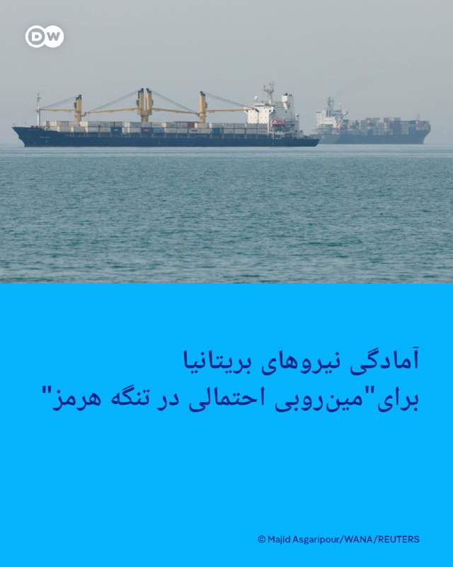

🔶 آمادگی نیروهای بریتانیا برای "مین‌روبی احتمالی در تنگه هرمز"

صدها ملوان در عرشه کشتی پشتیبانی "لایم ‌بی" (RFA Lyme Bay) بریتانیا که در سواحل جبل‌الطارق لنگر انداخته در انتظار اعزام به مأموریت مین‌روبی در تنگه هرمز به سر می‌برند؛ مأموریتی که هنوز در هاله‌ای از ابهام قرار دارد.

خبرگزاری آسوشیتدپرس که این خبر را روز یکشنبه ۲۴ مه اعلام کرده می‌گوید، اکنون در جنوبی‌ترین نقطه شبه‌جزیره ایبری، در منطقه فرامرزی بریتانیا یعنی جبل‌الطارق، نیروی دریایی سلطنتی بریتانیا خود را برای انجام این کار آماده می‌کند؛ اما این اقدام تنها زمانی صورت خواهد گرفت که توافق صلح میان آمریکا و ایران حاصل شود.

در حالی که این توافق که آخرین خبرها امید به نهایی شدن آن‌ را بالا برده هنوز به دست نیامده، آسوشیتدپرس می‌گوید، این کشتی به‌زودی جبل‌الطارق را ترک می‌کند تا به ناوشکن بریتانیایی "اچ‌ام‌اس دراگون" و سایر کشتی‌های متحدان بپیوندد و پس از دریافت پشتیبانی هوایی، از طریق کانال سوئز راهی خلیج فارس شود.
@dw_farsi

## DW_Farsi — post 125098

🔶 نظرسنجی: فقط شمار اندکی به توان دفاعی ارتش آلمان باور دارند

طبق نظر بیشتر افرادی که در یک نظرسنجی جدید شرکت کرده‌اند، اگر وضعیت اضطراری پیش بیاید، وضعیت توان دفاعی آلمان چندان مطلوب نیست.

بر پایه داده‌های مؤسسه پاسخ‌های جدید اجتماعی "اینسا" (INSA)، تنها ۱۷ درصد از پاسخ‌دهندگان تا حدی یا کاملاً با این گزاره موافق بودند که ارتش آلمان در صورت یک حمله احتمالی می‌تواند به میزان کافی از کشور دفاع کند.

در مقابل، ۷۲ درصد چنین باوری نداشته‌اند یا چندان به آن معتقد نبوده‌اند. این نظرسنجی به سفارش روزنامه "بیلد آم زونتاگ" انجام شده است.

طبق داده‌های این مؤسسه افکارسنجی مستقر در شهر ارفورت، نگرانی شهروندان آلمان از حمله احتمالی روسیه به این کشور تا حدودی کاهش یافته است.

بر همین اساس، ۳۸ درصد از افرادی که مورد پرسش قرار گرفته‌اند گفته‌اند که نگران این موضوع هستند، در حالی که از هر دو نفر، یک نفر (۵۰ درصد) نگرانی‌ای در این زمینه نداشته است.

در نظرسنجی قبلی مؤسسه اینسا در سپتامبر ۲۰۲۵، اکثریت پاسخ‌دهندگان، یعنی ۵۲ درصد از آنها، نسبت به حمله روسیه ابراز نگرانی کرده بودند.
بر اساس همین نظرسنجی، ترس مردم در زمینه حملات احتمالی در فضای دیجیتال به‌مراتب بیشتر از حملات نظامی در فضای واقعی است.

دو سوم پاسخ‌دهندگان در این نظرسنجی گفته‌اند نگران آن هستند که حملات سایبری، اقدامات خرابکارانه یا انتشار هدفمند اطلاعات نادرست بتواند زندگی در آلمان را مختل کند.

اندکی بیش از یک‌پنجم شرکت‌کنندگان، یعنی ۲۲ درصد آنها، نیز در مقابل گفته‌اند که درباره این خطرهای احتمالی چندان نگران نیستند یا اصلاً نگرانی ندارند.

مؤسسه افکارسنجی اینسا اعلام کرده است که برای این نظرسنجی، هزار و پنج نفر در فاصله زمانی ۲۱ تا ۲۲ ماه مه ۲۰۲۶ مورد پرسش قرار گرفته‌اند.
@dw_farsi

## DW_Farsi — post 125097

  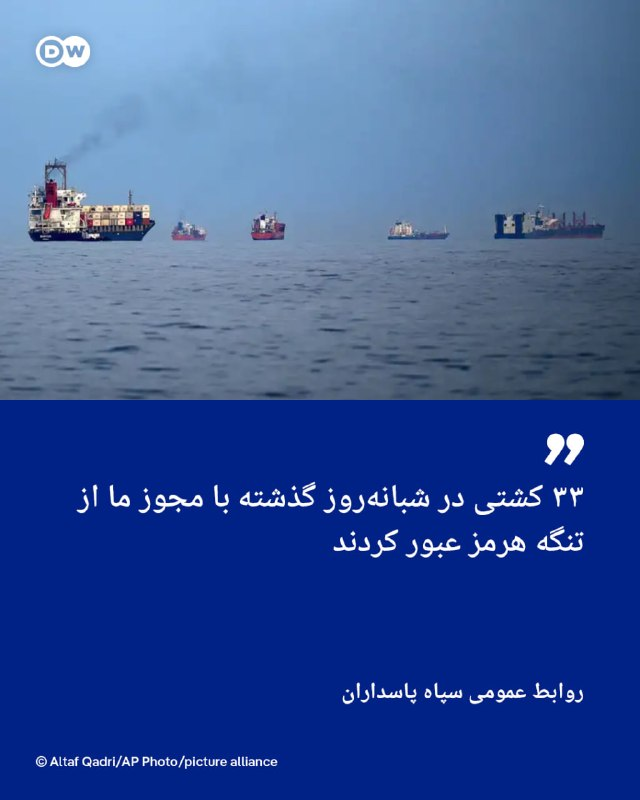

🔶 سپاه: ۳۳ کشتی در شبانه‌روز گذشته با مجوز ما از تنگه هرمز عبور کردند

روابط عمومی سپاه پاسداران روز یکشنبه سوم خرداد با انتشار اطلاعیه‌ای اعلام کرد که در شبانه‌روز گذشته ۳۳ فروند کشتی با مجوز این نهاد از تنگه هرمز عبور کرده‌اند.

مطابق این اطلاعیه، این کشتی‌ها شامل "نفتکش، کانتینربر و انواع کشتی‌های تجاری" می‌شده که "پس از کسب مجوز با هماهنگی و تأمین امنیت نیروی دریایی سپاه از تنگه هرمز عبور کرده‌اند".

بر اساس خبرهای منتشر شده در رسانه‌های ایران، نیروی دریایی سپاه همچنین مدعی شد که "کنترل هوشمند تنگه هرمز پس از شدت ناامنی ایجاد شده" در پی حضور دریایی آمریکا "توسط نیروی دریایی سپاه با قوت در حال انجام است".
@dw_farsi

## DW_Farsi — post 125096

🎥 رویای دبی، واقعیت پاکستان؛ وقتی همه چیز با شلیک جمهوری اسلامی فروریخت

یک مهاجر پاکستانی در گفت‌وگو با دویچه وله از زندگی خود در دبی گفت و این‌که چگونه در پی حملات جمهوری اسلامی به امارات همه چیز خود را از دست داد.

او حالا در اقتصاد نحیف پاکستان، بدون شغل و پشتوانه مالی، به سختی امرار معاش می‌کند.
@dw_farsi

## DW_Farsi — post 125095

🔶 اقدام ترکیه برای تخلیه دفتر مرکزی بزرگ‌ترین حزب مخالف

مقا‌م‌های ترکیه پس از برکناری اوزگور اوزل، رهبر حزب جمهوری‌خواه خلق (CHP)، بزرگ‌ترین حزب اپوزیسیون ترکیه دستور تخلیه دفتر مرکزی این حزب در آنکارا را صادر کرده‌اند.

فرمانداری آنکارا اعلام کرد که این اقدام را در راستای اجرای حکم دادگاهی انجام می‌دهد که کمال قلیچداراوغلو، رهبر پیشین حزب، را به‌طور موقت دوباره به سمت رهبری حزب منصوب کرده است.

این دادگاه در آنکارا چند روز پیش در جریان دادرسی تجدیدنظر، انتخابات هیأت‌رئيسه‌ حزب جمهوری‌خواه خلق در سال ۲۰۲۳ را به دلیل "تخلفات احتمالی" باطل اعلام کرد و رأی به برکناری اوزگور اوزل از سمت رهبری این حزب داد.

به حکم دادگاه، به صورت موقت کمال قلیچدار اوغلو، رهبر قبلی و جنجالی این حزب به تصدی این سمت منصوب شد.

اوزل پس از برکناری قضایی خود در روز پنج‌شنبه ۱۹ مه، ساختمان حزب را ترک نکرده و همراه با نمایندگان حزب در آنجا مستقر شده است.

تصاویر نشان می‌دهند که نیروهای ویژه پلیس در اطراف ساختمان دفتر این حزب در آنکارا تجمع کرده و موانع امنیتی ایجاد کرده‌اند.

کمال قلیچداراوغلو ۷۷ ساله بیش از ۱۰ سال رهبری حزب جمهوری‌خواه خلق  را بر عهده داشت. او در انتخابات سه سال پیش، از رجب طیب اردوغان، رهبر حزب حاکم عدالت و توسعه (AKP) و رئیس‌جمهور ترکیه شکست خورد و پس از آن نیز در رقابت داخلی حزب، رهبری را به اوزل واگذار کرد.

اینک حکم دادگاه برای برکناری اوزگور اوزل ضربه‌ای سنگین به مخالفان سیاسی رجب طیب اردوغان تلقی می‌شود. ناظران معتقدند که این تصمیم انگیزه‌های سیاسی دارد. در مقابل، دولت ترکیه تأکید می‌کند که قوه قضاییه مستقل است.

این حکم هنوز به‌صورت نهایی و قطعی صادر نشده است.

دستگاه قضایی اوزل را متهم کرده که پیروزی خود در انتخابات کنگره سال ۲۰۲۳ برای رهبری حزب جمهوری‌خواه خلق را مدیون روش‌هایی مانند فشار بر اعضا، وعده‌هاش شغلی و حتی خرید مستقیم رأی بوده است. او این اتهامات را رد کرده است.

این حزب که در انتخابات شهرداری‌ها در سال ۲۰۲۴ شکست سنگینی را بر حزب عدالت و توسعه به رهبری اردوغان وارد آورد، از آن پس با شدتی روز‌افزون در کانون توجه و فشارهای قوه قضائیه ترکیه قرار گرفت.

اکرم امام‌اوغلو، شهردار سابق استانبول و سیاستمدار محبوب حزب جمهوری‌خواه خلق که از او به عنوان مهم‌ترین رقیب رجب طیب اردوغان در انتخابات ریاست جمهوری یاد می‌شد نیز بیش از یک سال است که در زندان به سر می‌برد.

علیه او اتهامات فساد مالی مطرح شده که او آن‌ها را کاملا رد کرده است.
@dw_farsi

## DW_Farsi — post 125094

🔶 انفجار در قطار مسافربری پاکستان با ده‌ها کشته و زخمی

در جریان یک انفجار مهیب در یک قطار مسافربری در غرب پاکستان، دست‌کم ۳۰ نفر کشته شدند.

سخنگوی پلیس به خبرگزاری آلمان گفته است که طی این حادثه در شهر کویته، پایتخت ایالت ناآرام بلوچستان بیش از ۱۰۰ نفر نیز زخمی شده‌اند.

یک گروه جدایی‌طلب به نام بریگاد یا "تیپ مجید"، وابسته به ارتش آزادیبخش بلوچستان (BLA) مسئولیت این حمله را بر عهده گرفته است.

این گروه می‌گوید، هدفش از این حمله نظامیانی بوده‌اند که قصد داشته‌اند برای تعطیلات عید با این قطار به زادگاه‌های خود سفر کنند. مقام‌های دولتی تا کنون در این باره اظهار نظری نکرده‌اند.

این انفجار که در زمان عبور قطار رخ داد شدتش به حدی بود که قطار از ریل خارج و به مناطق مسکونی اطراف و خودروها خسارت وارد شد.

حمیدالله‌شاه، یک مقام پلیس محلی در گفت‌وگو با خبرگزاری آلمان شمار زخمی‌‌ها را ۱۰۳ تن نامید و ابراز نگرانی کرد که تعداد قربانیان افزایش یابد.
در پی این حادثه، در تمامی بیمارستان‌های دولتی و خصوصی شهر وضعیت فوق‌العاده اعلام شده است.

به گفته سخنگوی دولت محلی، بر اثر انفجار حداقل سه واگن به همراه لوکوموتیو از ریل خارج شدند.
در حال حاضر نیروهای امنیتی منطقه را محاصره کرده‌اند و عملیات امداد و نجات همچنان ادامه دارد.

تا به‌حال مشخص نشده که مواد منفجره دقیقا در کجا کار گذاشته شده بود. همچنین مقام‌های مسئول هنوز تأیید نکرده‌اند که آیا واقعا نیروهای نظامی (همان‌طور که گروه جدایی‌طلب یادشده ادعا کرده) در میان کشته‌شدگان بوده‌اند یا نه.

در ماه‌های اخیر، میزان خشونت در پاکستان به‌طور قابل توجهی افزایش یافته است. سال گذشته نیز یک قطار که صدها نیروی امنیتی و خانواده‌های آن‌ها را حمل می‌کرد، توسط گروه شبه‌نظامی ممنوعه ارتش آزادی‌بخش بلوچستان ربوده شد و مسافرانش به گروگان گرفته شدند.

در جریان درگیری چندروزه برای آزادسازی گروگان‌ها، حداقل ۲۴ نفر از مسافران و سربازان کشته شدند.

ارتش آزادی‌بخش بلوچستان بزرگ‌ترین گروه از چندین گروه مسلحی است که برای استقلال بلوچستان از پاکستان مبارزه می‌کنند. این گروه پشت بسیاری از حملات خشونت‌آمیز قرار دارد، به‌ویژه حملاتی که پروژه‌های میلیاردی زیرساختی چین را هدف قرار می‌دهند.
@dw_farsi

## DW_Farsi — post 125093

🔶 حمله گسترده روسیه به کی‌یف با چندین کشته و ده‌ها زخمی

طبق اعلام مقام‌های اوکراینی در روز یکشنبه ۲۴ مه (سوم خرداد)، در پی حملات گسترده جدید روسیه با پهپادهای رزمی و موشک‌های بالستیک و کروز به کی‌یف، پایتخت اوکراین، و مناطق اطراف آن، دست‌کم چهار نفر کشته شده‌اند.

همچنین بیم آن می‌رود که شمار قربانیان افزایش یابد. تصاویر ویدئویی منتشرشده از شهر، ویرانی‌های گسترده‌ای را نشان می‌دهند.
ویتالی کلیچکو، شهردار کی‌یف، در تلگرام اعلام کرد که در جریان حملات شامگاه گذشته، دست‌کم دو نفر در خود پایتخت کشته شده‌اند. دست‌کم ۵۶ نفر نیز زخمی شده‌اند.

به گفته کلیچکو، ۳۰ نفر، از جمله دو کودک، در بیمارستان بستری شده‌اند. نیروهای امدادی مشغول آواربرداری از ساختمان‌های مسکونی‌ای هستند که در جریان حمله هدف قرار گرفته‌اند.

میکولا کالاشنیک، رئیس اداره منطقه‌ای کی‌یف، نیز اعلام کرده است که در مناطق اطراف پایتخت دست‌کم دو نفر کشته و ۹ نفر زخمی شده‌اند.

بر اساس اعلام نیروی هوایی اوکراین، روسیه در این حمله از ۹۰ موشک بالستیک و کروز و نیز ۶۰۰ پهپاد از انواع مختلف استفاده کرده است.

سامانه پدافند هوایی اوکراین اعلام کرد که در مجموع ۶۰۴ هدف، از جمله ۵۵ موشک بالستیک و کروز و ۵۴۹ پهپاد، ردیابی و منهدم شده‌اند. با این حال، اصابت ده‌ها پرتابه روسی به اهدافی در این منطقه ثبت شده است.

ولودیمیر زلنسکی، رئیس جمهور اوکراین، اعلام کرد که مسکو بار دیگر از موشک میان‌بُرد اورشنیک استفاده کرده، اما این نخستین بار بوده که چنین موشکی در نزدیکی منطقه کی‌یف به کار گرفته شده است.

زلنسکی در پیام ویدئویی منتشرشده‌اش در بامداد امروز یکشنبه در کی‌یف گفت ولادیمیر پوتین، رئیس کرملین، این موشک را به سمت شهر "بیلا تسرکوا"، واقع در استان کی‌یف، شلیک کرده است. او درباره میزان خسارت‌ها در این منطقه توضیحی نداد.

خبرگزاری دولتی "اینترفکس" روسیه، با استناد به اطلاعات وزارت دفاع این کشور، استفاده از موشک اورشنیک را تأیید کرده است.

بر این اساس، اوکراین با چهار نوع موشک مختلف اورشنیک، اسکندر، کینژال و زیرکُن هدف قرار گرفته است. این موشک‌ها در دسته موشک‌های موسوم به فراصوت قرار می‌گیرند که سرعتی بسیار بالا دارند.

به گفته روسیه، این حمله پاسخی تلافی‌جویانه به حملات اوکراین به منطقه لوهانسک بوده است. طبق اعلام روسیه، در جریان حمله به منطقه تحت اشغال این کشور در لوهانسک، یک مرکز آموزش عالی فنی و خوابگاه دانشجویی‌اش در شهر استاروبیلسک هدف قرار گرفته و ۲۱ نفر کشته شده‌اند.

کی‌یف هدف قرار دادن عمدی غیرنظامیان را رد کرده و اعلام کرده است که هدف، یک واحد پهپادی ارتش روسیه در آن منطقه بوده است.
موشک اورشنیک (به معنی "درختچه فندق") با قدرت تخریبی شدیدش شناخته می‌شود. این موشک که مسکو آن را در بلاروس نیز مستقر کرده است، هم توان حمل کلاهک‌های متعارف و هم هسته‌ای را دارد.

سرعت بسیار بالای اورشنیک که تا ۱۲ هزار کیلومتر در ساعت با بردی تا پنج هزار کیلومتر تخمین زده می‌شود، آن را به تهدیدی بالقوه برای سراسر قاره اروپا تبدیل می‌کند.

زلنسکی گفت: «این واقعاً اقدامی غیرمسئولانه است. مهم است که این اقدام برای روسیه بی‌پیامد نماند.» طبق گزارش‌ها، این سومین بار است که این سلاح در جنگ روسیه علیه اوکراین به کار گرفته می‌شود.

مناطق اطراف کی‌یف و دیگر بخش‌های کشور نیز هدف این حملات قرار گرفته‌اند. با این حال، زلنسکی گفت: «بیشترین اصابت‌ها در کی‌یف رخ داد و دقیقاً کی‌یف هدف اصلی این حمله روسیه بود. سه موشک روسی به یک تأسیسات آب‌رسانی اصابت کرد، یک بازار در آتش سوخت و ده‌ها ساختمان مسکونی و چندین مدرسه عادی آسیب دیدند.»

سازمان دفاع غیرنظامی اوکراین تصاویر و ویدیوهایی از تخریب‌های گسترده زیرساخت‌های غیرنظامی و آتش‌سوزی‌های بزرگ منتشر کرده که نیروهای امدادی را در حال مهار آنها نشان می‌دهد.

در تمام طول شب گذشته و صبح امروز یکشنبه، در منطقه کی‌یف هشدارهای حمله هوایی داده شده و گزارش‌هایی از انفجار در نقاط مختلف پایتخت منتشر شده است.

دفتر مرکزی کانال اول تلویزیون آلمان (ARD) نیز که در مرکز کی‌یف قرار دارد به‌شدت آسیب دیده و بخشی از آن تخریب شده است.
این تخریب احتمالاً بر اثر موج انفجار رخ داده و باعث شکسته شدن پنجره‌ها، ویرانی اتاق‌ها و فروریختن دیوارها شده است. هنگام وقوع این حادثه هیچ‌یک از کارکنان این شبکه در دفتر حضور نداشته‌اند.

با وجود خسارت‌های سنگین، پوشش خبری این شبکه از اوکراین ادامه خواهد یافت و تولید برنامه‌ها و گزارش‌های زنده با استفاده از راهکارهای فنی سیار و امکانات جایگزین ادامه خواهد داشت.
@dw_farsi

## Persian_Trend_Official — post 14869

  <a href="telegram/content/Persian_Trend_Official_14869_1779639474.webm" target="_blank">🎬 Download video</a>

🔴 مقام ارشد دولت ترامپ: توافق با ایران امروز امضا نخواهد شد

یک مقام ارشد دولت ترامپ به آکسیوس گفته است:

▪️ انتظار نمی‌رود توافق با ایران امروز امضا شود، زیرا هنوز چندین جزئیات برای نهایی‌شدن باقی مانده است

▪️ ساختار تصمیم‌گیری در ایران در وضعیت فعلی با سرعت بالا عمل نمی‌کند و طی‌شدن مراحل تأیید توافق چند روز زمان خواهد برد

▪️ برداشت واشینگتن این است که «مجتبی خامنه‌ای» با چارچوب کلی توافق موافقت کرده، اما اینکه این روند نهایتاً به توافق نهایی منجر شود یا نه، همچنان نامشخص است

این اظهارات در حالی مطرح می‌شود که:

▪️ گزارش‌های متعددی از نزدیک‌شدن تهران و واشینگتن به یک تفاهم ۶۰ روزه منتشر شده است

▪️ اختلافات اصلی همچنان بر سر غنی‌سازی، ذخایر اورانیوم، تحریم‌ها و ضمانت‌های امنیتی باقی مانده

▪️ آمریکا و متحدان منطقه‌ای در تلاش‌اند قبل از بازگشت تنش نظامی، چارچوبی موقت برای مهار بحران ایجاد کنند

🫆:Tony

📌 @persian_trend_official
پرشین ترند | متفاوت‌ترین کانال نظامی

## Persian_Trend_Official — post 14868

  

🚨 ترامپ از طریق Truth Social در مورد ایران:

یکی از بدترین توافق‌هایی که کشور ما تاکنون انجام داده، توافق هسته‌ای ایران بود که توسط باراک حسین اوباما و تازه‌کارهای درجه یک دولت اوباما مطرح و امضا شد. این توافق مسیر مستقیمی به سوی توسعه سلاح هسته‌ای توسط ایران بود.

اما معامله‌ای که در حال حاضر توسط دولت ترامپ با ایران در حال مذاکره است، دقیقاً برعکس آن است! مذاکرات به صورت منظم و سازنده پیش می‌رود و من به نمایندگانم اطلاع داده‌ام که در این زمان عجله نکنند چون زمان به نفع ماست.

محاصره تا زمانی که توافقی حاصل، تأیید و امضا شود، به طور کامل ادامه خواهد داشت. هر دو طرف باید وقت بگذارند و کار را درست انجام دهند. هیچ اشتباهی مجاز نیست!

روابط ما با ایران در حال تبدیل شدن به رابطه‌ای بسیار حرفه‌ای‌تر و سازنده‌تر است. با این حال، آنها باید درک کنند که نمی‌توانند سلاح یا بمب هسته‌ای توسعه دهند یا تهیه کنند.

تا کنون از همه کشورهای خاورمیانه برای حمایت و همکاری‌شان تشکر می‌کنم، که با پیوستن آنها به کشورهای توافقات تاریخی ابراهیم، این همکاری‌ها بیشتر تقویت خواهد شد و چه بسا جمهوری اسلامی ایران نیز بخواهد به این جمع بپیوندد!

📝 Nick

📌 @persian_trend_official
پرشین ترند | متفاوت‌ترین کانال نظامی

## Persian_Trend_Official — post 14867

  <a href="telegram/content/Persian_Trend_Official_14867_1779639476.mp4" target="_blank">🎬 Download video</a>

امروز 3 خرداد، سالروز آزادسازی خرمشهره؛

این ویدئو از آخرین لحظات قبل از آزادی خرمشهر و اسیر شدن عراقی‌هاست...

📝 Nick

📌 @persian_trend_official
پرشین ترند | متفاوت‌ترین کانال نظامی

## Persian_Trend_Official — post 14866

🔴سرلشکر محسن رضایی: پشت صبر راهبردی ایران خشم انقلابی ملت است ♦️امروز ترامپ و ارتش آمریکا در یک بن‌بست کامل قرار دارند و اگر وارد جنگ شوند، در برابر آنها دالانی تاریک و بی‌انتها قرار خواهد گرفت؛ دالانی که از تنگۀ هرمز آغاز می‌شود، به خلیج فارس، دریای عمان،…

## Persian_Trend_Official — post 14865

  <a href="telegram/content/Persian_Trend_Official_14865_1779639478.webm" target="_blank">🎬 Download video</a>

🔴سرلشکر محسن رضایی: پشت صبر راهبردی ایران خشم انقلابی ملت است

♦️امروز ترامپ و ارتش آمریکا در یک بن‌بست کامل قرار دارند و اگر وارد جنگ شوند، در برابر آنها دالانی تاریک و بی‌انتها قرار خواهد گرفت؛ دالانی که از تنگۀ هرمز آغاز می‌شود، به خلیج فارس، دریای عمان، تنگه باب‌المندب و اقیانوس هند امتداد می‌یابد و جنگی بسیار گسترده را رقم خواهد زد.

♦️تنگۀ هرمز برای تجارت آزاد بسته نیست، بلکه برای لشکرکشی و ایجاد جنگ در منطقه بسته است و مدیریت فعلی نیروی دریایی سپاه موجب شده کشتی‌های کشورهای مختلف پس از شناسایی و ثبت، با امنیت از این مسیر عبور کنند.

♦️در صورت هرگونه اقدام نظامی علیه تنگۀ هرمز و تلاش برای ورود به خلیج فارس، جمهوری اسلامی پاسخی سخت، دردناک و بی‌نظیر خواهد داد.

🫆:Tony

📌 @persian_trend_official
پرشین ترند | متفاوت‌ترین کانال نظامی

## Persian_Trend_Official — post 14864

  <a href="telegram/content/Persian_Trend_Official_14864_1779639478.webm" target="_blank">🎬 Download video</a>

🔴پست جدید نتانیاهو

💢ایران هیجوقت سلاح هسته ای نخواهد داشت.

🫆:Tony

📌 @persian_trend_official
پرشین ترند | متفاوت‌ترین کانال نظامی

## Persian_Trend_Official — post 14863

  

🔴ترامپ:

«نمی‌توانم درباره توافق صحبت کنم؛ این توافق کاملاً به من بستگی دارد، و اگر خبری باشد، فقط خبر خوب خواهد بود.من معامله بد انجام نمی‌دهم.»

🫆:Tony

📌 @persian_trend_official
پرشین ترند | متفاوت‌ترین کانال نظامی

## Persian_Trend_Official — post 14862

  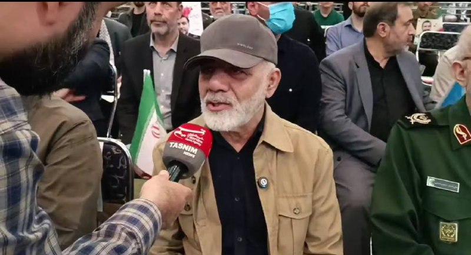

♦️سرلشکر عبداللهی: پیروزی ملت ایران بر دشمنان عزت و افتخار ایران را بالاتر برد

♦️با سلاح‌های بومی، دشمن را شکست دادیم

▪️فرمانده قرارگاه مرکزی خاتم الانبیا در گفتگو با تسنیم:

در شرایط جنگی هستیم و تمامی نیروهای مسلح در آمادگی کامل به سر می‌برند که با هر دشمنی و در هر سطحی مقابله کنند.

🫆:Tony

📌 @persian_trend_official
پرشین ترند | متفاوت‌ترین کانال نظامی

## Persian_Trend_Official — post 14861

  <a href="telegram/content/Persian_Trend_Official_14861_1779639480.webm" target="_blank">🎬 Download video</a>

⭕️ ارتش اسرائیل خواستار تخلیه 10 شهرک در جنوب لبنان شد.

📝 Nick

📌 @persian_trend_official
پرشین ترند | متفاوت‌ترین کانال نظامی

## Persian_Trend_Official — post 14860

🔴 جزئیات تفاهم ۶۰ روزه ایران و آمریکا به روایت آکسیوس

▪️آکسیوس مدعی شده متن یادداشت تفاهم میان ایران و آمریکا شامل بندهای زیر است:

▪️ تمدید ۶۰ روزه آتش‌بس

▪️ عدم دریافت هرگونه عوارض یا هزینه از کشتی‌ها در تنگه هرمز توسط ایران

▪️ ایران ابتدا مین‌های دریایی را پاکسازی کرده و محاصره خود را رفع می‌کند؛ سپس آمریکا محاصره دریایی و محدودیت‌های خود را کاهش خواهد داد

▪️ آمریکا بخشی از معافیت‌های تحریمی مرتبط با صنعت نفت ایران را صادر می‌کند

▪️در بخش هسته‌ای:

▪️ ایران متعهد می‌شود هرگز به‌دنبال سلاح هسته‌ای نرود

▪️ تهران وارد مذاکرات درباره توقف کامل غنی‌سازی و انتقال ذخایر اورانیوم غنی‌شده خواهد شد

▪️ آمریکا نیز متعهد می‌شود درباره کاهش تدریجی تحریم‌ها و آزادسازی دارایی‌های بلوکه‌شده ایران مذاکره کند

▪️اما بر خلاف برخی گزارش‌های قبلی:

▪️ آمریکا هیچ نیرویی را فعلاً از اطراف ایران خارج نخواهد کرد
▪️ خروج نیروهای آمریکایی تنها در صورت دستیابی به توافق نهایی پس از پایان دوره ۶۰ روزه بررسی می‌شود

▪️درباره لبنان نیز:

▪️ جنگ میان حزب‌الله و اسرائیل پایان خواهد یافت

▪️ اما اسرائیل اجازه خواهد داشت برای جلوگیری از مسلح‌شدن مجدد حزب‌الله، حملات پیش‌دستانه از جمله حملات هوایی و پهپادی در لبنان انجام دهد
▪️ به گفته منابع: «اگر حزب‌الله رفتار کند، اسرائیل هم رفتار خواهد کرد»

💢اگر این جزئیات درست باشند، ایران در برخی از مهم‌ترین پرونده‌های منطقه‌ای و هسته‌ای عقب‌نشینی‌های قابل‌توجهی انجام داده؛ مخصوصاً در موضوع هرمز، غنی‌سازی و آزادی عمل اسرائیل در لبنان !

🫆:Tony

📌 @persian_trend_official
پرشین ترند | متفاوت‌ترین کانال نظامی

## Persian_Trend_Official — post 14859

  <a href="telegram/content/Persian_Trend_Official_14859_1779639481.mp4" target="_blank">🎬 Download video</a>

🔴تظاهرات گسترده ضد دولتی در صربستان

💢پایتخت صربستان شاهد برگزاری تجمعات و تظاهرات گسترده مردمی بود؛ اعتراضاتی که با حضور هزاران نفر در بلگراد برگزار شد.

💢معترضان نسبت به عملکرد دولت و وضعیت سیاسی و اقتصادی کشور ابراز نارضایتی کردند.

🫆:Tony

📌 @persian_trend_official
پرشین ترند | متفاوت‌ترین کانال نظامی

## Persian_Trend_Official — post 14858

  <a href="telegram/content/Persian_Trend_Official_14858_1779639483.webm" target="_blank">🎬 Download video</a>

▪️رئیس‌جمهور ترامپ جوان‌تر می‌شود

منظور ترامپ از این کنایه جوان تر به نظر رسیدن خودش نسبت شی جی پینگ است

🫆:Tony

📌 @persian_trend_official
پرشین ترند | متفاوت‌ترین کانال نظامی

## Persian_Trend_Official — post 14857

‍‌‌‌
🔴عبور ۳۳ کشتی در شبانه‌روز گذشته با مجوز سپاه

💢نیروی دریایی سپاه: طی شبانه روز گذشته ۳۳ فروند کشتی اعم از نفتکش، کانتینربر و سایر کشتی های تجاری پس از کسب مجوز با هماهنگی و تامین امنیت نیروی دریایی سپاه از تنگه هرمز عبور کردند.

🫆:Tony

📌 @persian_trend_official
پرشین ترند | متفاوت‌ترین کانال نظامی

## Persian_Trend_Official — post 14856

  <a href="telegram/content/Persian_Trend_Official_14856_1779639483.webm" target="_blank">🎬 Download video</a>

🔴ترامپ

▪️خدانگهدار

🫆:Tony

📌 @persian_trend_official
پرشین ترند | متفاوت‌ترین کانال نظامی

## Persian_Trend_Official — post 14855

♦️حسام‌الدین آشنا:

💢فیلترینگ سراسری امنیت نمی‌آورد، هزینه می‌آورد

💢برخی از مسئولان و غیرمسئولان گویا به هدف بلند‌مدت خود که بستن اینترنت در ایران بوده به واسطه جنگ رسیده اند و حاضر نیستند دست بردارند / انتخاب

🫆:Tony

📌 @persian_trend_official
پرشین ترند | متفاوت‌ترین کانال نظامی

## RadioFarda — post 157522

  

🔸نخست‌وزیر اسرائیل روز یکشنبه گفت که او و دونالد ترامپ، رئیس‌جمهور آمریکا، بعد از یک تماس تلفنی در شامگاه شنبه توافق دارند که هرگونه توافق نهایی با ایران باید تهدید هسته‌ای ناشی از تهران را از بین ببرد.

🔸بنیامین نتانیاهو در پیامی در شبکه ایکس در توضیح بیشتر نوشت: «این یعنی برچیدن تأسیسات غنی‌سازی هسته‌ای ایران و خارج کردن مواد هسته‌ای غنی‌شده آن از خاک این کشور.»

🔸آژانس بین‌المللی انرژی اتمی گفته است ایران بیش از چهارصد کیلو اورانیوم غنی‌شده تا حد ۶۰ درصد دارد که به احتمال زیاد در تأسیسات زیرزمینی بمباران‌شده در جریان جنگ ۱۲ روزه مدفون است. ترامپ بارها گفته که ایران باید این مواد را به آمریکا تحویل دهد.

🔸نخست‌وزیر اسرائیل همچنین خبر داد که ترامپ همچنین بار دیگر بر حق اسرائیل برای دفاع از خود در برابر تهدیدها در تمامی جبهه‌ها، از جمله در لبنان، تأکید کرده است.

🔸رئیس‌جمهور آمریکا شامگاه شنبه اعلام کرد با سران کشورهای منطقه درباره مذاکرات با ایران تماس تلفنی داشته و افزود که به جداگانه با نخست‌وزیر اسرائیل گفت‌وگو کرده که «آن تماس نیز بسیار خوب پیش رفت».

@RadioFarda

## RadioFarda — post 157521

  

🔸رئیس‌جمهور آمریکا، روز یکشنبه اعلام کرد محاصره دریایی ایران تا زمان نهایی شدن و امضای توافق پایان جنگ به طور کامل برقرار خواهد ماند و واشینگتن عجله‌ای برای رسیدن به این توافق ندارد.

🔸او در شبکه اجتماعی خود، نوشت: «مذاکرات به شکلی منظم و سازنده در حال پیشرفت است و من به نمایندگانم اطلاع داده‌ام که برای رسیدن به توافق عجله نکنند، زیرا زمان به نفع ماست. محاصره تا زمانی که توافق حاصل، تأیید و امضا شود، به‌طور کامل برقرار و اجرایی باقی خواهد ماند.»

🔸آقای ترامپ گفت که آمریکا و ایران «باید وقت بگذارند و کار را درست انجام دهند. هیچ اشتباهی نباید رخ دهد».

🔸او در ادامه پیام خود نوشت: «روابط ما با ایران در حال تبدیل شدن به روابطی بسیار حرفه‌ای‌تر و سازنده‌تر است. با این حال، آنها باید درک کنند که نمی‌توانند سلاح یا بمب هسته‌ای تولید یا تهیه کنند.»

🔸رئیس‌جمهور آمریکا از کشورهای منطقه خاورمیانه بابت همکاری آنها تشکر کرد و افزود: «همکاری‌ای که با پیوستن آنها به کشورهای عضو توافق تاریخی ابراهیم بیش از پیش تقویت و مستحکم خواهد شد و چه کسی می‌داند، شاید جمهوری اسلامی ایران هم بخواهد به آن بپیوندد!»

@RadioFarda

## RadioFarda — post 157520

خانه سینما می‌گوید قوه قضائیه تعدادی از سینماگران را به «همکاری با دولت‌های متخاصم» متهم کرده است

🔸مدیر حقوقی خانه سینما روز یکشنبه سوم خرداد تأیید کرد که قوه قضائیه جمهوری اسلامی تعدادی از سینماگران ایرانی ازجمله سعید روستایی و هومن سیدی، کارگردانان سرشناس، را به اتهام «همکاری با دولت‌های متخاصم» به دادسرا احضار کرده است.

🔸مهدی کوهیان در گفت‌وگو با خبرگزاری ایسنا گفت که خانه سینما از این احضارها به دادسرای فرهنگ و رسانه «مطلع» بوده و این اقدام دستگاه قضائی محدود به روستایی و سیدی نیست.

🔸او با انتقاد از این احضارها گفت: «اتهام «همکاری با دُو‌‌‌‌‏َل متخاصم» یکی از سنگین‌ترین عناوین کیفری است و باید با ادله دقیق و مستندات روشن مطرح شود. ما معتقدیم طرح این اتهام علیه هنرمندانی که سال‌ها برای تولید فرهنگ ایرانی و نمایش هویت ملی تلاش کرده‌اند، می‌تواند به تعمیق شکاف اجتماعی و آسیب به انسجام داخلی منجر شود.»

🔸مدیر حقوقی خانه سینما افزود که ابلاغ این «اتهام سنگین» در برخی احضاریه‌ها برای سینماگران ایرانی «باعث شده تابو این اتهام شکسته شود».

🔸او همچنین خبر داد که تعدادی از این سینماگران بر خلاف درخواست او برای سکوت، خبر احضار خود را به رسانه‌ها «درز دادند» و در ادامه مدعی شد این کار آنها «از منظر میهن‌پرستی و تدبیر جمعی به ضرر فضای کلی سینما و کشور بوده است.»

🔸کوهیان درباره پرونده اتهامی جعفر پناهی در قوه قضائیه نیز اعلام کرد که این کارگردان سرشناس و وکیل او «تاکنون هیچ درخواستی برای حمایت صنفی از خانه سینما مطرح نکرده‌اند».

@RadioFarda

## RadioFarda — post 157519

🔸گزارش‌ها حاکی از آن است که پلیس ضدشورش ترکیه روز یکشنبه سوم خرداد با شلیک گاز اشک‌آور و ورود اجباری به ساختمان مرکزی حزب اصلی اپوزیسیون، برای بیرون کردن رهبری برکنارشده این حزب اقدام کرد.

🔸خبرگزاری رویترز به نقل از شاهدان عینی و خبرنگاران خبرگزاری فرانسه یورش به مقر «حزب جمهوری‌خواه خلق» در آنکارا، پایتخت ترکیه، را گزارش کرده‌اند؛ اتفاقی که بحران سیاسی این کشور را بیش از پیش تشدید کرده است.

🔸در حالی که پلیس از سد موانع موقتی عبور می‌کرد، ابرهای گاز اشک‌آور در داخل ساختمان حزب جمهوری‌خواه خلق پراکنده شد و افراد حاضر در داخل، فریاد می‌زدند و اشیایی به سمت ورودی پرتاب می‌کردند.

🔸دادگاهی در ترکیه روز پنج‌شنبه اوزگور اوزل، رهبر این حزب را برکنار و نتایج کنگره حزبی سال ۲۰۲۳ که او در آن انتخاب شده بود را به دلیل «تخلفات» باطل اعلام کرد.

🔸روز یکشنبه، استاندار آنکارا دستور تخلیه افرادی را که در ساختمان مرکزی حزب حضور داشتند صادر کرد.

@RadioFarda

## RadioFarda — post 157518

تسنیم می‌گوید تمدید ۶۰ روزه آتش‌بس در تفاهم‌نامه احتمالی ایران و آمریکا نیست

🔸خبرگزاری تسنیم، نزدیک به سپاه پاسداران، روز یکشنبه سوم خرداد اعلام کرد که در «متن تفاهم احتمالی» میان ایران و آمریکا موضوع تمدید ۶۰ روزه آتش‌بس «وجود ندارد».

🔸این خبرگزاری مدعی شد در این متن «تعبیری که به کار گرفته شده است، اعلام پایان جنگ در همه جبهه‌ها از جمله لبنان است.»

🔸پیش‌تر وب‌سایت اکسیوس در گزارشی به نقل از منابع خود نوشت که حکومت ایران و ایالات متحده به امضای یک «یادداشت تفاهم ۶۰ روزه» نزدیک شده‌اند.

🔸تسنیم با تأکید بر این که متن تفاهم «هنوز نهایی نشده»، گفته است: «در بازه ۳۰ روزه موضوع تنگه هرمز و محاصره دریایی پیش برده می‌شود و زمان ۶۰روزه‌ای برای مذاکرات در مسئله هسته‌ای در نظر گرفته شده است.»

🔸از سوی دیگر روزنامه نیویورک تایمز هم روز یکشنبه به نقل از دو مقام آمریکایی که نامشان فاش نشده، گزارش داد که یکی از عناصر کلیدی توافق پیشنهادی، تعهد ظاهری تهران به واگذاری ذخایر اورانیوم با غنای بالای خود بوده است.

🔸به نوشته این روزنامه، چگونگی انجام این کار از سوی ایران قرار است در «دورهای بعدی مذاکرات درباره برنامه هسته‌ای ایران» مورد بحث قرار گیرد.

🔸اکسیوس نیز گفته بود که مسائل اتمی میان ایران و آمریکا در ۶۰ روز حل نخواهد شد، بلکه تفاهم‌نامه به یک دوره از مذاکره درباره مسائل اتمی ختم خواهد شد.

🔸اما خبرگزاری‌های فارس و تسنیم، هر دو نزدیک به سپاه پاسداران، گزارش دادند که ایران هیچ تعهدی درباره برنامه هسته‌ای خود نداده است.

🔸دونالد ترامپ،‌ رئیس‌جمهور آمریکا، شامگاه شنبه اعلام کرد توافق با ایران تا حد زیادی نهایی شده است. مارکو روبیو، وزیر خارجه آمریکا، نیز ساعتی پیش گفت ممکن است تا شامگاه یک‌شنبه خبری دربارهٔ توافقی با ایران اعلام شود که می‌تواند به‌طور رسمی به جنگ خاورمیانه پایان دهد.

@RadioFarda

## IranianMinds — post 20686

  

🔴 سی بی اس نیوز :

به گفته یک مقام ارشد کاخ سفید، ایران در جریان مذاکرات با آمریکا، به‌صورت کلی با کنار گذاشتن اورانیوم غنی‌شده با درصد بالا موافقت کرده است.

هنوز توافق نهایی امضا نشده ، دولت ترامپ معتقد است رهبر ایران چارچوب کلی توافق را تأیید کرده

دو طرف همچنان درباره نحوه نابودی یا انتقال اورانیوم در حال مذاکره هستند

@IranianMinds

## IranianMinds — post 20685

🎁 استارت کن و کانفیگتو رایگان بگیر 
⭐ویژه کاربران پرمیوم تلگرام 
⭐️ اگه اکانت تلگرامت پرمیوم باشه به محض استارت ربات بدون هیچ امتیاز و زیر مجموعه دایی جون بهت کانفیگ هدیه میده 
✔️ همچنین با اوردن دوستای پرمیومت امتیاز بیشتری میگیری 
🎁 @Daeijoonbot | استارت…

## IranianMinds — post 20684

  

🎁 استارت کن و کانفیگتو رایگان بگیر

⭐ویژه کاربران پرمیوم تلگرام

⭐️ اگه اکانت تلگرامت پرمیوم باشه به محض استارت ربات بدون هیچ امتیاز و زیر مجموعه دایی جون بهت کانفیگ هدیه میده

✔️ همچنین با اوردن دوستای پرمیومت امتیاز بیشتری میگیری

🎁 @Daeijoonbot | استارت کن و کانفیگ رایگان بگیر 
🌟

## IranianMinds — post 20683

## IranianMinds — post 20682

  

🔴 ترامپ‌ حرف های امروز‌ پزشکیان که گفته بود آماده ایم‌ به جهان اطمینان بدیم که به دنبال سلاح هسته ای نیستیم رو ریپوست کرده.

@IranianMinds

## IranianMinds — post 20681

  

🔴 نتانیاهو:

من و رئیس‌جمهور ترامپ توافق کردیم که هر توافق نهایی با ایران باید تهدید هسته‌ای را از بین ببرد.

این یعنی تأسیسات غنی‌سازی ایران برچیده شود و مواد هسته‌ای غنی‌شده از خاک ایران خارج گردد.

ترامپ همچنین بار دیگر بر حق اسرائیل برای دفاع از خود در برابر تهدیدها، از جمله در لبنان، تأکید کرد.

شراکت میان ما و دو کشورمان در میدان نبرد ثابت شده و هرگز تا این حد قوی نبوده است.

سیاست من، همانند سیاست ترامپ، تغییری نکرده: ایران نباید سلاح هسته‌ای داشته باشد.

@IranianMinds

## IranianMinds — post 20680

🔴تاکتیک‌های ناشناخته محسن رضایی:

اگر دشمن به تنگه‌هرمز حمله کند، ما محاصره دریایی را می‌شکنیم و از NPT خارج می‌شویم.

@IranianMinds

## IranianMinds — post 20679

  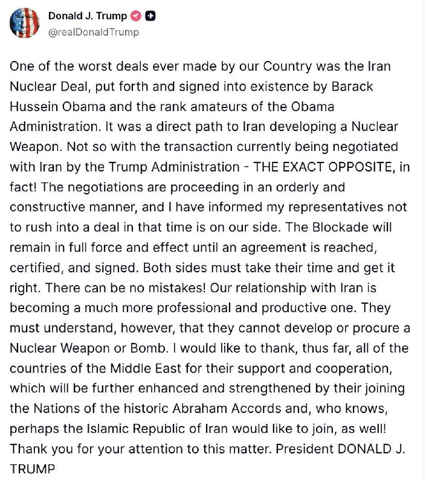

🔴 پست جدید ترامپ :

مذاکرات به‌صورت منظم و سازنده در حال پیشرفت است ، به نمایندگانم گفته‌ام برای توافق عجله نکنند، چون زمان به نفع ماست.

محاصره تا زمان رسیدن، تأیید و امضای توافق به‌طور کامل ادامه خواهد داشت.

رابطه ما با ایران حرفه‌ای‌تر و سازنده‌تر شده است.

ایران نباید سلاح یا بمب هسته‌ای تولید یا به دست بیاورد.

ترامپ همچنین از کشورهای خاورمیانه بابت حمایتشان تشکر کرد و گفت شاید ایران هم روزی به پیمان ابراهیم بپیوندد.

@IranianMinds

## IranianMinds — post 20678

❌دیگه فریب بونوس سایت های متفرقه رو نخورید!

💖توی این سایت که مورد #تایید ماست، با عضویت 500 هزارتومان بگیر!

🌐 Winro.io

🌐 Winro.io

## IranianMinds — post 20677

  

⭕️ رایگان بدون واریز شرط های فوتبالی ببند از همون اول موجودی 500 هزارتومانه
❌

🎉 500 هزارتومن رایگان فقط با ثبت نام بدون هیچگونه واریزی!

💳 پرداخت مستقیم و سریع بدون واسطه، بدون دردسر، واریز و برداشت در سریع‌ترین زمان ممکن

⌛ پشتیبانی 24 ساعته

🌐 Winro.io

🌐 Winro.io
کانال بونوس های رایگان g3

📱 @winro_io

## IranianMinds — post 20675

  <a href="telegram/content/IranianMinds_20675_1779639490.mp4" target="_blank">🎬 Download video</a>

🔴آخوند لائینی:

در صدا و سیما دروغ نمی‌گیم، اما همه راست‌هارو هم نمی‌گیم، چون گفتن راست واجب نیست.

@IranianMinds

## IranianMinds — post 20674

  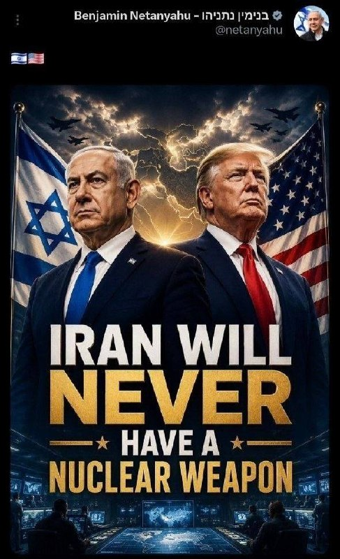

🔴 پست جدید نخست‌ وزیر نتانیاهو :

ایران هرگز سلاح هسته‌ای نخواهد داشت.

@IranianMinds

## IranianMinds — post 20673

  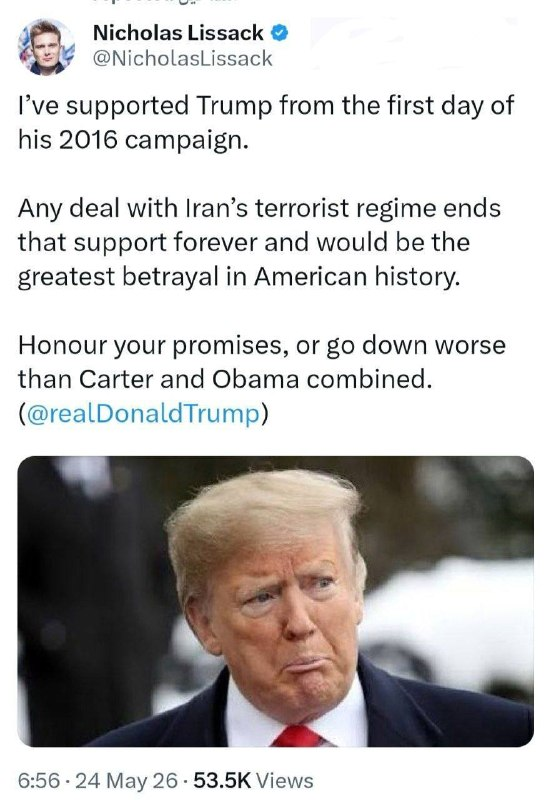

🔴پست نیکلاس لیساک، فعال رسانه‌ای آمریکایی و طرفدار ترامپ:

من از اولین روز کارزار انتخاباتی ترامپ در سال ۲۰۱۶ از او حمایت کردم. هرگونه توافق با رژیم تروریستی ایران، به این حمایت( ما از ترامپ) برای همیشه پایان می‌دهد و بزرگ‌ترین خیانت به آمریکا خواهد بود.
به وعده‌های خود عمل کن، وگرنه سقوطی بدتر از کارتر و اوباما با هم خواهی داشت.

@IranianMinds

## IranianMinds — post 20672

🔴 ترامپ به شبکه ای بی سی :

نمی‌توانم درباره توافق صحبت کنم؛ همه‌چیز کاملا به من بستگی دارد و اگر خبری باشد، فقط خبر خوب خواهد بود. من توافق بد انجام نمی‌دهم.

@IranianMinds

## IranianMinds — post 20671

🔴 ترامپ :

مذاکرات عالی پیش میره و فقط خبرای خوب داره میاد امروز.

@IranianMinds

## IranianMinds — post 20670

  

🔴 پست جدید ترامپ که یه لیست گذاشته و گفته اینا آدمای بد و مریضین که اوباما هم توشه

@IranianMinds

## IranianMinds — post 20669

🔴 خبرگزاری فارس :

بمولا این آمریکاییا تسلیم شدن و مقاماتشون‌ به ما گفتن به پست های ترامپ هم اصلا اهمیت ندید اینا همش‌ برای مردم آمریکاس و اینه که نشون بده شکست نخوردن.

@IranianMinds

## IranianMinds — post 20668

🔴 رشیدی کوچی ، نماینده مجلس :

تا هفته آینده اینترنت بین الملل برمیگرده.

@IranianMinds

## IranianMinds — post 20666

آقای علی کریمی ، آقای امید دانا ، شماها خودتون خارج از کشور‌ دارید زندگی‌ میکنید و‌ راحتید و مفت میخورید براتون هیچ اهمیتی نداره این دعواهای احمقانه ولی نمیدونید با این کاراتون چه ضربه ای میزنید به ایران‌‌ و این ملت حداقل یاد بگیرید تو‌ این شرایط مشکل دارید با هم خصوصی حلش کنید نه اینکه بیاید با این‌ کاراتون کل اتحاد مردم رو بهم‌ بزنید

خود شما احمقا که خارج از کشور زندگیتونو‌ میکنید راحتید این ملت ایرانن که تا آخر عمرمشون باید زجر بکشن از دست جمهوری اسلامی !

@IranianMinds

## BBCPersian — post 281959

🔻پلیس ترکیه روز یکشنبه (۲۴ مه/ ۳خرداد) با استفاده از اسپری فلفل، شکستن دروازه و عبور از موانع موقت، وارد دفتر مرکزی حزب جمهوری‌خواه خلق (سی‌اچ‌پی) شد.

پلیس سپس اوزگور اوزال، رهبر حزب جمهوری‌خواه خلق که روز پنجشنبه (۲۱ مه) با حکم دادگاه برکنار شده بود، را از ساختمان بیرون کرد.

هنگامی که هواداران حزب کپسول آتش‌نشانی را به سمت پلیس پرتاب کردند، ابری از دود در ورودی ساختمان دیده می‌شد. افرادی که ماسک زده بودند در فضای کم داخل ساختمان سرفه می‌کردند.

دادگاهی در ترکیه روز پنجشنبه اوزگور اوزل، رهبر حزب جمهوری‌خواه خلق را برکنار کرد و نتایج کنگره حزب جمهوری‌خواه خلق را که در سال ۲۰۲۳ در آن انتخاب شده بود، به دلیل تخلفات لغو کرد.

دادگاه، کمال قلیچدار اوغلو، رئیس سابق حزب جمهوری‌خواه خلق را که در انتخابات سراسری ۲۰۲۳ از رئیس‌جمهور طیب اردوغان شکست خورده بود، به جای اوزال بازگرداند.

اما طرفداران آقای اوزال ساختمان را ترک نکردند و حامیان کمال قلیچداراوغلو تلاش کردند وارد ساختمان حزب شوند که سرانجام پلیس وارد عمل شد و ساختمان را تحت کنترل خود درآورد.

bbc.in/42PlJAL
@BBCPersian

## BBCPersian — post 281958

  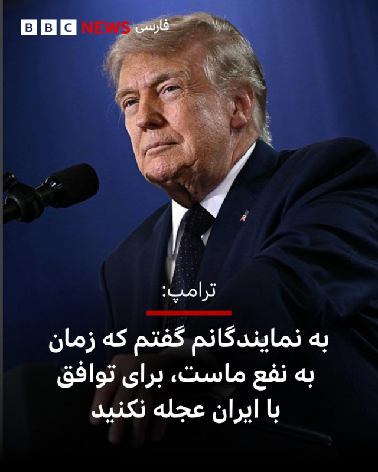

🔻دونالد ترامپ می‌گوید که به نمایندگانش گفته‌ است که در مذاکره با ایران عجله نکنند چرا که فشار زمان بیشتر روی ایران است تا آمریکا.

رئیس‌‌جمهور آمریکا یکبار دیگر از توافق برجام که در زمان دولت اوباما امضا شده بود انتقاد کرد و گفت که اینبار هر دو طرف باید «سر فرصت» تصمیم «درست» را بگیرند.

آقای ترامپ گفت که محاصره بنادر ایران تا زمان نهایی شدن و امضای توافق کاملا برقرار خواهد بود.

او گفت که روابط ایران و آمریکا «حرفه‌ای‌تر و سازنده‌تر» شده است اما تاکید کرد که مقام‌های جمهوری اسلامی «باید متوجه باشند که نمی‌توانند سلاح اتمی بسازند یا به‌ دست بیاورند.»

رئیس‌‌جمهور آمریکا از «حمایت و همکاری» کشورهای خاورمیانه تشکر کرد و گفت که این همکاری با پیوستن آن‌ها به پیمان ابراهیم حتی قویتر خواهد شد.

او افزود: «از کجا معلوم، شاید ایران هم بخواهد (به این پیمان) ملحق شود.»
📸 AFP via Getty
@BBCPersian

## BBCPersian — post 281957

  <a href="telegram/content/BBCPersian_281957_1779639495.mp4" target="_blank">🎬 Download video</a>

⭕️ناهید کیانی، ملی‌پوش تکواندوی ایران در ۵۷- کیلوگرم با کسب مدال طلا در مسابقات تکواندو قهرمانی آسیا، رتبه تیمی ایران را بالا کشید.

به جز ناهید کیانی، فقط یلدا ولی‌نژاد که برنز گرفت، از تیم اعزامی زنان ایران توانستند روی سکو بروند و تیم مردان هم با ۴ طلا، یک نقره و یک برنز به کارش پایان داد. تیم ایران در مجموع مدال‌ها به مقام دومی رسید.

ناهید کیانی سابقه قهرمانی جهان در مسابقات ۲۰۲۳ باکو و مدال نقره المپیک در پاریس ۲۰۲۴ را در کارنامه دارد. دو رویارویی المپیکی ناهید کیانی و کیمیا علیزاده، پس از جدایی او از تیم ملی ایران توجه‌برانگیز شد.
@bbcpersian

## BBCPersian — post 281956

🔻خبرگزاری فرانسه: ترامپ گفته است که فقط در صورت برچیدن برنامه هسته‌ای ایران حاضر به امضای توافق است

یک مقام اسرائیلی که نامش ذکر نشد به خبرگزاری فرانسه گفت دونالد ترامپ به بنیامین نتانیاهو گفته است که اصرار خواهد داشت که توافق نهایی به پایان برنامه هسته‌ای ایران ختم شود.

بنابر این گزارش، این مقام به خبرگزاری فرانسه گفت رئیس‌جمهور آمریکا این را روشن کرده که در مذاکرات با ایران از خواسته خود برای برچیدن برنامه هسته‌ای ایران و خارج کردن تمام اورانیوم غنی‌شده از خاک ایران به هیچ‌وجه کوتاه نخواهد آمد و «هیچ توافقی را بدون این شرایط امضا نخواهد کرد.»

ایران گفته است که خروج اورانیوم غنی‌شده از ایران برای خط قرمز است.

دونالد ترامپ و بنیامین نتانیاهو شنبه تلفنی صحبت کردند و رئیس‌جمهور آمریکا گفت این مکالمه خوب پیش رفته است.

گزارش شده که نخست‌وزیر اسرائیل نگرانی‌های خود از توافق احتمالی با ایران «محترمانه» با اقای ترامپ در میان گذاشته است.

https://bbc.in/4nOuCnR
@BBCPersian

## BBCPersian — post 281955

🔻 ارتش اسرائیل دستور تخلیه ۱۰ شهر و روستا را در لبنان صادر کرد

آویخای ادرعی، سخنگوی عرب زبان ارتش اسرائیل، از ساکنان ۱۰ شهر و روستا در جنوب و شرق لبنان خواست خانه‌هایشان را پیش از عملیات نظامی علیه «اهداف حزب‌الله» ترک کنند.

او در شبکه اجتماعی ایکس نوشت: «برای حفظ امنیت خود، باید فورا خانه‌های خود را ترک کنید و از روستاها و شهرها حداقل ۱۰۰۰ متر در مناطق باز فاصله بگیرید.»

او نوشت این حملات «با توجه به نقض توافق آتش‌بس» توسط حزب‌الله انجام می‌شود.

سخنگوی ارتش اسرائیل گفته «هر کسی که در نزدیکی عناصر حزب‌الله، تاسیسات و وسایل جنگی آنها حضور داشته باشد، جان خود را به خطر می‌اندازد.»

اسرائیل از دیشب به حمله به جنوب لبنان ادامه داده که براساس گزارش‌ها چندین کشته و زخمی داشته است.

در یکی از این حملات یک تیم دفاع مدنی لبنان را در روستای عربصالیم هدف قرار گرفتند و جنگنده‌های اسرائیل یک ساختمان مسکونی را در شهر دویر بمباران کردند.

خبرگزاری رسمی لبنان هم گزارش کرده که در حمله صبح امروز اسرائیل به منطقه بازوریه، در شهرستان صور در جنوبی، یک نفر کشته و دو نفر زخمی شده‌اند.

به گفته این رسانه در حمله هوایی شب گذشته نیز، خانه‌ایدر شهر تورا، در همان شهرستان هدف قرار گرفت که یک کشته و دو زخمی داشت.

https://bbc.in/4nOuCnR
@BBCPersian

## BBCPersian — post 281954

🔻 دادگاهی در بحرین برای ۱۱ فرد متهم به همکاری با سپاه پاسداران حکم زندان صادر کرد

به گزارش خبرگزاری دولتی بحرین، این افراد به همکاری با سپاه برای انجام «اقدامات خصمانه و تروریستی» علیه بحرین متهم بودند و ۹ نفرشان به حبس ابد و سه نفرشان به سه سال حبس محکوم شدند.

براساس بیانیه‌ای که این خبرگزاری منتشر کرده است، متهمان در جمع‌آوری اطلاعات درباره مکان‌های حساس و تسهیل انتقال‌های مالی مرتبط با این فعالیت‌ها نقش داشته‌اند.

وزارت کشور بحرین در ۹ مه (۱۹ اردیبهشت) از بازداشت ۴۱ فرد «مرتبط با سپاه پاسداران» خبر داده بود.

وزارت کشور بحرین در آن زمان گفت که نیروهای امنیتی یک گروه وابسته به سپاه پاسداران را شناسایی کرده‌اند؛ همچنین گفته شد که تحقیقات دادستانی شامل مواردی هم است که به «همدلی» با حملات ایران مربوط می‌شود.

ایران پس از حملات آمریکا و اسرائیل و آغاز جنگ در ۲۸ فوریه (۹ اسفند)، حملاتی را علیه اهدافی در بحرین و دیگر کشورهای عربی حوزه خلیج فارس که میزبان پایگاه‌های نظامی آمریکا هستند، انجام داد.

https://bbc.in/4nOuCnR
@BBCPersian

## BBCPersian — post 281953

🔻استقبال رئیس کمیسیون اروپا از «پیشرفت» ایران و آمریکا در رسیدن به توافق

رئيس کميسيون اروپا از «پیشرفت‌ در مذاکرات ایران و آمریکا برای رسیدن به توافق» استقبال کرد.

اورزولا فون درلاین گفت: «ما به توافقی نیاز داریم که واقعا از شدت درگیری بکاهد، تنگه هرمز را بازگشایی کند و آزادی کامل ناوبری را تضمین کند.»

خانم فون درلاین در حسابش در شبکه اجتماعی ایکس نوشت که ایران «همچنین باید به اقدامات بی‌ثبات‌کننده خود در منطقه، چه مستقیم و چه از طریق نیروهای نیابتی، و همچنین حملات ناموجه و مکرر خود به همسایگانش پایان دهد.»

او تاکید کرد که اروپا به همکاری با شرکای بین‌المللی خود ادامه می‌دهد تا «از این فرصت برای یک راه‌‌حل دیپلماتیک پایدار استفاده کند.»
https://bbc.in/4nOuCnR
@BBCPersian

## idfinfarsi — post 11642

  <a href="telegram/content/idfinfarsi_11642_1779639497.mp4" target="_blank">🎬 Download video</a>

برای رفع تهدید فوری: ارتش اسرائیل یک تروریست از سازمان تروریستی حماس را که در یورش به پایگاه زیکیم در کشتار ۷ اکتبر شرکت داشت، به هلاکت رساند

در طول آخر هفته (جمعه)، نیروهای ارتش اسرائیل تحت فرماندهی جنوب، تروریست لؤی هشام محمود بصل را که به‌عنوان تک‌تیرانداز در گردان زیتون وابسته به سازمان تروریستی حماس فعالیت می‌کرد و تهدیدی فوری علیه نیروهای ما محسوب می‌شد، به هلاکت رساندند.

بر اساس بررسی‌های اطلاعاتی، مشخص شد که این تروریست در یورش به پایگاه زیکیم در کشتار خونین ۷ اکتبر مشارکت داشته و در دوره اخیر نیز برای اجرای طرح‌های تروریستی علیه نیروهای ارتش اسرائیل در منطقه فعالیت می‌کرده است.

نیروهای ارتش اسرائیل تحت فرماندهی جنوب مطابق با توافق در منطقه مستقر هستند و به فعالیت خود برای رفع هرگونه تهدید فوری ادامه خواهند داد.

## idfinfarsi — post 11638

  <a href="telegram/content/idfinfarsi_11638_1779639498.mp4" target="_blank">🎬 Download video</a>

تصاویر از دوربین موشک: نیروهای یگان چندبعدی به هلاکت رساندن تروریست‌های حزب‌الله در جنوب لبنان ادامه می‌دهند

نیروهای یگان چندبعدی به فعالیت خود برای رفع تهدیدات علیه غیرنظامیان و نیروهای ارتش اسرائیل در جنوب لبنان ادامه می‌دهند.

دیروز (شنبه)، نیروهای این یگان چهار تروریست از سازمان تروریستی حزب‌الله را که وارد یک زیرساخت تروریستی شده بودند شناسایی کردند. بلافاصله پس از آن، نیروها این زیرساخت را هدف قرار داده و تروریست‌هایی را که از داخل آن فعالیت می‌کردند به هلاکت رساندند.

ارتش اسرائیل اکنون تصاویر بیشتری از دوربین موشک منتشر کرده است که در آن نیروهای یگان چندبعدی یک تروریست حزب‌الله را که سوار بر موتورسیکلت و در نزدیکی نیروها در حال فعالیت بود، به هلاکت رساندند.
همچنین، نیروها چندین تجهیزات دیده‌بانی را که توسط سازمان تروریستی حزب‌الله برای رصد و هدایت فعالیت‌ها علیه نیروهای ارتش اسرائیل استفاده می‌شد، شناسایی و مورد حمله قرار دادند.

## Dirty_Kids — post 390088

  <a href="telegram/content/Dirty_Kids_390088_1779639501.mp4" target="_blank">🎬 Download video</a>

پشمای شهرام همایون ریخت از دست این صدای امریکا (صدای ج.ا) 😂😂😂

شهرام همایون رفته تو برنامه این زنک فهیمه وسط برنامه، طنز مهران مدیری رو پخش کردن که مسخرش میکرد

شهرام همایون شدید قاطی میکنه!

@Dirty_Kids 👻

## Dirty_Kids — post 390087

  

رییس جمهور آمریکا
جو باراک ترامپ

@Dirty_Kids 👻

## Dirty_Kids — post 390086

  

🌪وقتی اینترنت طوفانیه فقط کافیه بادبان ها رو بکشی

⚫️100 هزار تومان تخفیف خرید اول 
🎁

⚫️پایین ترین قیمت گیگی 180 هزار تومان
🌐 

⚫️پورسانت %10 دائمی برای هر معرفی
💼

با بادبان، میتونی یه اتصال سریع، پایدار و امن
همراه با پشتیبانی ۲۴ ساعته داشته باشی
🚀

🛒کد تخفیف: badban4k

بادبان راهتو باز می‌کنه
⛵️
G3

🛡@BadBan_VPN | کانال 

🤖@BadBan_VPNBot | ربات 

📞@BadBan_VPNSupport | پشتیبانی

## Dirty_Kids — post 390085

ترامپ واقعا عموعه تهش ارثمون رو بالا کشید

@Dirty_Kids 👻

## Dirty_Kids — post 390084

‏بنظرم ایران با چین معامله کرده، گفته آمریکا برای من تایوان برای تو

@Dirty_Kids 👻

## Dirty_Kids — post 390083

حالا میره کوبا چنان انقلابی می‌کنه که کون هممون آتشفشان بشه.

@Dirty_Kids 👻

## Dirty_Kids — post 390082

  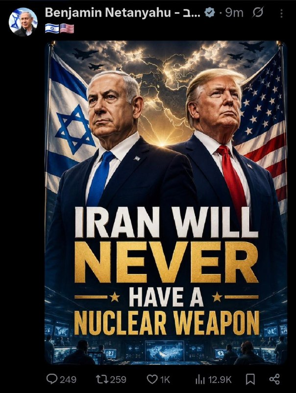

پست جدید نتانیاهو کنار ترامپ:

ایران هرگز سلاح هسته‌ای نخواهد داشت.

@Dirty_Kids 👻

## Dirty_Kids — post 390081

  

دونالد ترامپ:
نمی‌تونم درباره توافق صحبت کنم؛ این کاملاً به من بستگی داره و اگه خبری هم باشه فقط خبرهای خوبی خواهد بود — من به عنوان یه املاکی اصلا معامله بدی انجام نمیدم.

@Dirty_Kids 👻

## Dirty_Kids — post 390080

ترامپ گفته تا سال آقا نرسه عروسی اینا نمیرم.

@Dirty_Kids 👻

## Dirty_Kids — post 390079

  

ترامپ AI به کون باز شروع کرد،
با AI همه رو زده، همه رو گاییده، نیرو دریایی رو نابود کرده

ما هم‌ می‌گیم باشه با AI گاییدی، اما ما رو.

@Dirty_Kids 👻

## Dirty_Kids — post 390078

  <a href="telegram/content/Dirty_Kids_390078_1779639505.mp4" target="_blank">🎬 Download video</a>

ویس لو رفته ترامپ تو پیوی مجتبی:

@Dirty_Kids 👻

## Dirty_Kids — post 390077

  <a href="telegram/content/Dirty_Kids_390077_1779639506.mp4" target="_blank">🎬 Download video</a>

لحظه‌ای که معاون رئیس جمهور آرژانتین نزدیک بود ترور شود، اما اسلحه در چند سانتی متر جلوی صورتش گیر کرد و زنده ماند...

@Dirty_Kids 👻

## Dirty_Kids — post 390076

🔴 کانال ۱۴ اسرائیل:

اسرائیل رهبری ۸۶ ساله که از سرطان مرحله ۴ در حال مرگ بود را از بین نبرد تا ایالات متحده آمریکا با پسر ۵۶ ساله تندروتر او صلح کند.
با و یا بدون ایالات متحده، اسرائیل این رژیم تروریستی را به پایان خواهد رساند.

@Dirty_Kids 👻

## Dirty_Kids — post 390074

  <a href="telegram/content/Dirty_Kids_390074_1779639507.mp4" target="_blank">🎬 Download video</a>

این ویدیو از جواد ظریف که مربوط به انتخاباته جدیدا وایرال شده

@Dirty_Kids 👻

## Dirty_Kids — post 390073

  <a href="telegram/content/Dirty_Kids_390073_1779639509.mp4" target="_blank">🎬 Download video</a>

ویدیو وایرال شده از دعوای دوتا دختر ایرانه که اختلاف قدی زیادی دارن و قد کوتاهه میزنه دهن قد بلنده رو سرویس میکنه :))))

@Dirty_Kids 👻

## Hranews — post 113136

یک زن قربانی کودک همسری در خوی توسط همسرش به قتل رسید

❗️
❗️
❗️
❗️
❗️ – یک زن قربانی کودک‌همسری در روستای تاریمیش از توابع شهرستان خوی، به دست همسرش به قتل رسید.

ادامه مطلب

#کودک_همسری
#خشونت_خانگی

↘️
@hranews_bot تماس ✉️ -  @Hranews  کانال هرانا 🆑

## Hranews — post 113135

  

فعالان حوزه اقتصاد دیجیتال ایران اعلام کردند که خسارت ناشی از قطع اینترنت و نبود زیرساخت‌های جایگزین، روزانه بین ۳ تا ۸ هزار میلیارد تومان برآورد شده و مجموع این خسارت‌ها در طی دو ماه اخیر به ۳۰۰ تا ۷۰۰ هزار میلیارد تومان می‌رسد.

گزارش‌های صنفی حاکی از آن است که اختلال در ارتباطات موجب افت فروش بیش از ۷۰ درصدی برخی کسب‌وکارهای دیجیتال شده است. تداوم این وضعیت پیامدهای منفی گسترده‌ای همچون، تعطیلی کسب‌وکارها و تعدیل نیرو، از دست رفتن سرمایه انسانی و افزایش مهاجرت نیروهای متخصص، افت شفافیت اقتصادی و گسترش فعالیت‌های غیررسمی در اقتصاد کشور را به دنبال خواهد داشت./ دنیای اقتصاد

↘️
@hranews_bot تماس ✉️ -  @Hranews  کانال هرانا 🆑

## manototv — post 105809

  <a href="telegram/content/manototv_105809_1779639511.mp4" target="_blank">🎬 Download video</a>

وزیران خارجه ۱۹ کشور عربی و اسلامی در بیانیه‌ای مشترک، اقدام منطقه موسوم به «سومالی‌لند» در افتتاح «سفارت» در اورشلیم را به‌شدت محکوم کردند.

در این بیانیه که روز یکشنبه سوم خرداد منتشر شد، این اقدام «غیرقانونی و مردود» خوانده شده و آمده است که افتتاح این دفتر، نقض آشکار قوانین بین‌المللی و قطعنامه‌های مربوط به مشروعیت بین‌المللی است.

وزیران خارجه کویت، مصر، عربستان سعودی، قطر، اردن، ترکیه، پاکستان، اندونزی، جیبوتی، سومالی، فلسطین، عمان، سودان، یمن، لبنان، موریتانی، الجزایر، بنگلادش و مراکش تاکید کردند که اورشلیم شرقی «سرزمین فلسطینی اشغال‌شده از سال ۱۹۶۷» است و هر اقدامی برای تغییر وضعیت حقوقی و تاریخی آن «باطل و بی‌اثر» است.

این کشورها همچنین حمایت کامل خود را از وحدت، حاکمیت و تمامیت ارضی جمهوری فدرال سومالی اعلام کردند و هرگونه اقدام یک‌جانبه علیه وحدت سرزمینی سومالی را مردود دانستند.

## manototv — post 105808

  

https://studio.youtube.com/video/bQJFCVV8hCg/livestreaming

## manototv — post 105807

  <a href="telegram/content/manototv_105807_1779639512.mp4" target="_blank">🎬 Download video</a>

دونالد ترامپ، رئیس‌جمهور آمریکا، در پیامی تازه بار دیگر توافق هسته‌ای دوره باراک اوباما با جمهوری اسلامی را «یکی از بدترین توافق‌های تاریخ آمریکا» خواند و گفت آن توافق مسیر دستیابی تهران به سلاح هسته‌ای را هموار می‌کرد.

ترامپ گفت مذاکرات کنونی دولت او با جمهوری اسلامی «منظم و سازنده» پیش می‌رود، اما به نمایندگان خود دستور داده برای رسیدن به توافق عجله نکنند، زیرا به گفته او «زمان به سود آمریکا است».

او اضافه کرد انسداد علیه جمهوری اسلامی تا زمان دستیابی به توافق، تایید و امضای آن، با قدرت کامل ادامه خواهد داشت.

ترامپ افزود دو طرف باید با دقت و بدون خطا پیش بروند و جمهوری اسلامی باید بداند که نمی‌تواند سلاح هسته‌ای تولید یا تهیه کند.

رئیس‌جمهور آمریکا همچنین از کشورهای خاورمیانه برای حمایت و همکاری در این روند تشکر کرد و گفت این همکاری می‌تواند با پیوستن بیشتر کشورها به پیمان‌های ابراهیم تقویت شود. او در ادامه نوشت شاید جمهوری اسلامی نیز بخواهد به این روند بپیوندد.

## manototv — post 105806

  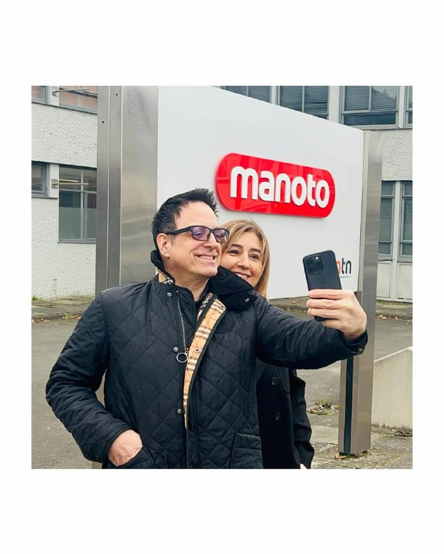

شانزده سال پیش، منوتو با یک باور ساده آغاز شد:

اینکه مردم ایران شایسته‌ی رسانه‌ای حرفه ای هستند که حقیقت را بی‌واسطه، بی‌ واهمه و بدون وابستگی به هیچ دولت و قدرتی، با آن‌ها در میان بگذارد. بر اساس این باور، منوتو همیشه صدای مستقل خود را داشت؛ صدایی که از دل اعتماد، همراهی و دغدغه‌های شما شکل گرفت و نشان داد که ایرانیان، با هر پیشینه، باور و نگاه متفاوت، می‌توانند زیر یک سقف و برای هدفی بزرگ‌تر، کنار هم بایستند و به آنچه می خواهند دست یابند.

در طول سالها، ما آموختیم که رسانه فقط برای خبر دادن نیست. رسانه می تواند حافظه‌ی یک ملت باشد؛ جایی که رنج‌ها، شادی‌ها، امیدها، شکست‌ها و ایستادگی‌ها ثبت می‌شوند تا فراموش نشوند.

ما همیشه ایران را فراتر از یک جغرافیا دیدیم؛ ایران برای ما میراث است، هویت، فرهنگ و غرور ملی است، و مسئولیتی برای تک تک ما، که نباید از آن چشم پوشید.

این مسیر آسان نبود و در طول سال‌ها با وجود تهدیدها، تخریب‌ها و فشار، به راه خود ادامه دادیم و آنچه کردیم و آنچه گفتیم، و جایی که در لحظات حساس تاریخ ایستادیم، قابل داوری و باعث افتخار ماست.

امروز فصل پخش منوتو به پایان می‌رسد؛ اما باورهایی که این مسیر را آغاز کرد، پایان نمی‌گیرد.

از هر بیننده، همراه، منتقد و حامی که در این سال‌ها کنار ما بود، صمیمانه سپاسگزارم.

راه آینده شاید شکل دیگری داشته باشد؛ اما باور ما به ایران، به مردم ایران، و به فردایی آزاد و بهتر، همچنان پابرجا و زنده است.

## manototv — post 105805

  <a href="telegram/content/manototv_105805_1779639514.mp4" target="_blank">🎬 Download video</a>

راهپیمایی از مقابل ساختمان بی‌بی‌سی بسمت دفتر نخست‌وزیری، یکشنبه سوم خرداد ۱۴۰۵

## manototv — post 105804

  <a href="telegram/content/manototv_105804_1779639516.mp4" target="_blank">🎬 Download video</a>

تجمع مقابل ساختمان بی‌بی‌سی فارسی در لندن، یکشنبه سوم خرداد ۱۴۰۵

## manototv — post 105803

  <a href="telegram/content/manototv_105803_1779639517.mp4" target="_blank">🎬 Download video</a>

فایننشال تایمز در گزارشی نوشت سپاه از یک شبکه تدارکاتی مستقر در امارات برای خرید تجهیزات پیشرفته ماهواره‌ای چینی مرتبط با برنامه پهپادی و موشکی خود استفاده کرده است.

بر اساس این گزارش، شرکتی به نام «تله‌سان» در راس‌الخیمه، انتقال حدود یک و هشت دهم تن تجهیزات ارتباطی ماهواره‌ای ساخت چین را از شانگهای به ایران، از مسیر دبی، تسهیل کرده است.

فایننشال تایمز نوشت مقصد نهایی این تجهیزات شرکت «ارتباطات فراگستر کیش» بوده که بنا بر این گزارش، با «گروه صنعتی سامان» مرتبط با نیروی هوافضای سپاه و تحریم‌شده از سوی آمریکا همکاری داشته است.

این روزنامه همچنین گزارش داد بخش پایانی انتقال محموله با یک کشتی ایرانی انجام شده که برای پنهان کردن مسیر خود، داده‌های موقعیت‌یابی نادرست مخابره کرده است.

## manototv — post 105802

  <a href="telegram/content/manototv_105802_1779639518.mp4" target="_blank">🎬 Download video</a>

دانیال مقدم، خواننده و رپر اعتراضی ایرانی، تتوی جدید صورتش با الهام از «God of War» را فقط به‌عنوان یک طرح انتخاب نکرده؛ این تتو برای او یادآور زخم‌ها، ترس‌ها، امیدها و روزهایی‌ست که نسلش از میان جنگ، درد و ناامیدی عبور کرده است.
رنگ سبز این طرح، نماد عشق، صلح، امید و زندگی‌ست؛ پیامی برای فراموش نکردن روزهایی که مردم با تمام زخم‌هایشان هنوز ایستاده‌اند و ایران را دوست دارند

## alonews — post 122381

  <a href="telegram/content/alonews_122381_1779639521.mp4" target="_blank">🎬 Download video</a>

👈 جنگنده‌های اسرائیلی به زراریه، سومور (دره البقاع)، كفرسیر و سر الغربیّه در لبنان حمله کردند.

✅ @AloNews خبر جنگ

## alonews — post 122380

  <a href="telegram/content/alonews_122380_1779639523.webm" target="_blank">🎬 Download video</a>

👈دبیرکل حزب‌الله: خلع سلاح را نمی پذیریم

✅ @AloNews خبر جنگ

## alonews — post 122379

  <a href="telegram/content/alonews_122379_1779639523.webm" target="_blank">🎬 Download video</a>

👈سی‌بی‌اس نیوز: موضوعاتی نظیر ذخایر موشکی ایران و غنی‌سازی اورانیوم در مذاکرات آتی مورد بررسی قرار خواهد گرفت

✅ @AloNews خبر جنگ

## alonews — post 122378

  <a href="telegram/content/alonews_122378_1779639523.webm" target="_blank">🎬 Download video</a>

👈یک مقام آمریکایی به اکسیوس گفت: برخی از جزئیات توافق با ایران هنوز نهایی نشده است

✅ @AloNews خبر جنگ

## alonews — post 122377

  <a href="telegram/content/alonews_122377_1779639524.webm" target="_blank">🎬 Download video</a>

👈نیویورک تایمز به نقل از یک مقام آمریکایی: مسائلی مانند ذخایر موشکی ایران و غنی سازی اورانیوم در مذاکرات بعدی مورد بحث قرار خواهد گرفت.

✅ @AloNews خبر جنگ

## alonews — post 122376

  <a href="telegram/content/alonews_122376_1779639524.webm" target="_blank">🎬 Download video</a>

👈منابع به المیادین: ابتکار چین، تنگه هرمز را از نقطه تنش و اختلاف به نقطه‌ای برای توافق و حل‌وفصل به سود همه طرف‌ها تبدیل می‌کند

✅ @AloNews خبر جنگ

## alonews — post 122375

  <a href="telegram/content/alonews_122375_1779639524.webm" target="_blank">🎬 Download video</a>

👈یک منبع اسرائیلی به سی‌بی‌اس گفته که به واشنگتن اعلام کرده‌اند حتی در صورت توافق با ایران، آزادی عملشان در جبهه‌هایی مثل لبنان باید حفظ شود.

✅ @AloNews خبر جنگ

## alonews — post 122373

  <a href="telegram/content/alonews_122373_1779639524.webm" target="_blank">🎬 Download video</a>

👈اسرائیل دقایقی قبل حملات سنگینی در جنوب لبنان انجام داد

✅ @AloNews خبر جنگ

## alonews — post 122370

  <a href="telegram/content/alonews_122370_1779639524.webm" target="_blank">🎬 Download video</a>

👈معاون بین‌الملل وزارت خارجه: نشست مبسوطی میان هیئت‌های عمانی و ایرانی برای بررسی مجموعه‌ای از اصول حاکم بر عبور شناورها در تنگه هرمز با رعایت امنیت و حاکمیت ملی دولت‌های ساحلی این‌ تنگه و در پرتو قواعد قابل اعمال حقوق بین‌الملل برگزار شد.

✅ @AloNews خبر جنگ

## alonews — post 122369

  <a href="telegram/content/alonews_122369_1779639525.webm" target="_blank">🎬 Download video</a>

👈وال استریت ژورنال: توافق ایالات متحده و ایران برای بازگشایی تنگه هرمز امیدوار کننده است، اما کشتیران‌ها همچنان محتاط هستند و بازسازی تأسیسات تولیدی و ذخایر زمان‌بر خواهد بود

✅ @AloNews خبر جنگ

## alonews — post 122368

  <a href="telegram/content/alonews_122368_1779639525.webm" target="_blank">🎬 Download video</a>

👈نتانیاهو: توافق نهایی با ایران به معنای برچیدن تأسیسات غنی‌سازی هسته‌ای و حذف مواد هسته‌ای غنی‌شده است.

🔴توییت جدید نتانیاهو: من و رئیس جمهور ترامپ توافق کردیم که هرگونه توافق نهایی با ایران باید خطر هسته‌ای را از بین ببرد.

🔴این به معنای برچیدن سایت‌های غنی‌سازی هسته‌ای ایران و خارج کردن مواد هسته‌ای غنی‌شده از خاک آن است.

🔴رئیس جمهور ترامپ همچنین بر حق اسرائیل برای دفاع از خود در برابر تهدیدات در هر جبهه‌ای، از جمله لبنان، تأکید کرد.

🔴مشارکت بین ما و دو کشورمان در میدان نبرد ثابت شده و هرگز قوی‌تر از این نبوده است.

🔴سیاست من، مانند سیاست رئیس جمهور ترامپ، بدون تغییر باقی می‌ماند: ایران سلاح هسته‌ای نخواهد داشت.

✅ @AloNews خبر جنگ

## alonews — post 122367

  <a href="telegram/content/alonews_122367_1779639525.webm" target="_blank">🎬 Download video</a>

👈ترامپ سخنان پزشکیان علیه سلاح‌های هسته‌ای را بازنشر کرد

🔴پزشکیان درخصوص سلاح هسته ای گفته بود: ما آماده‌ایم به جهان اطمینان دهیم که به دنبال سلاح هسته‌ای نیستیم. ما به دنبال بی‌ثباتی در منطقه نیستیم

✅ @AloNews خبر جنگ

## alonews — post 122366

  <a href="telegram/content/alonews_122366_1779639525.webm" target="_blank">🎬 Download video</a>

👈فاکس نیوز: یک مقام ارشد در دولت ترامپ گفته است که توافق با ایران امروز امضا نخواهد شد، اما پیشرفت در مورد یک توافق را نشان داد.

«اگر ایرانیان در مورد مسئله غنی‌سازی تسهیلات قابل توجهی ایجاد کنند، ما نیز تسهیلات قابل توجهی در مورد تسکین تحریم‌ها ایجاد خواهیم کرد،» مقام مذکور گفت.
در مورد مسئله هسته‌ای، برنامه فعلی این است که با کل ذخیره مواد غنی‌سازی شده سر و کار داشته باشیم.

«اگر شما یک توافق نهایی دارید که در آن ایرانیان در حال غنی‌سازی هستند، پس شما یک توافق نهایی ندارید،» مقام مذکور افزود.

✅ @AloNews خبر جنگ

## alonews — post 122365

  <a href="telegram/content/alonews_122365_1779639526.mp4" target="_blank">🎬 Download video</a>

👈ارتش اسرائیل داره حملات خیلی سنگین تو جنوب لبنان انجام میده

✅ @AloNews خبر جنگ

<!-- MSG END -->

<!-- NAV START -->

<a href="https://github.com/sombriolitfa-eng/aioo06/blob/main/telegram/content/archive_1.md" style="display:inline-block; padding:6px 12px; margin:0 4px; background-color:#2ea44f; color:white; text-decoration:none; border-radius:4px; font-weight:bold;">صفحه بعد</a>

<!-- NAV END -->
