# خواننده تلگرام

<!-- TOP_NAV START -->

<a href="https://github.com/sombriolitfa-eng/aioo06/blob/main/telegram/content/archive_1.md" style="display:inline-block; padding:6px 12px; margin:0 4px; background-color:#2ea44f; color:white; text-decoration:none; border-radius:4px; font-weight:bold;">صفحه بعد</a>

<!-- TOP_NAV END -->

<!-- MSG START -->

---
📅 بروزرسانی: 1405/03/09 21:50
---

## VahidOOnLine — post 242942

  

سایت هرانا گزارش داد سپیده قلیان، زندانی سیاسی، پس از پایان دوران محکومیت خود از زندان وکیل‌آباد مشهد آزاد شد. قلیان که در جریان مراسم هفتم خسرو علی‌کردی، وکیل دادگستری جان‌باخته، دستگیر شده بود، با انتشار پستی در اینستاگرام، تصویری از حضور خود بر سر مزار خسرو علی‌کردی منتشر کرد.

قلیان در این پست نوشت: «با خودم قرار گذاشته‌ام از هرچه خسته می‌شوم بشوم، اما از رسیدن به آزادی و حمل کردن این سنگ‌های سخت حقیقت «نه». برای همین رفتار داعش‌گونه جمهوری اسلامی در مراسم خسرو نباید و نمی‌تواند بگذارد که سنگ نیمه‌ تمامم در آذر ۱۴۰۱ را، زمین بگذارم.»
‌🏁 🇬🇧 IranintlTV

🤖 @VahidOOnLine

## VahidOOnLine — post 242941

  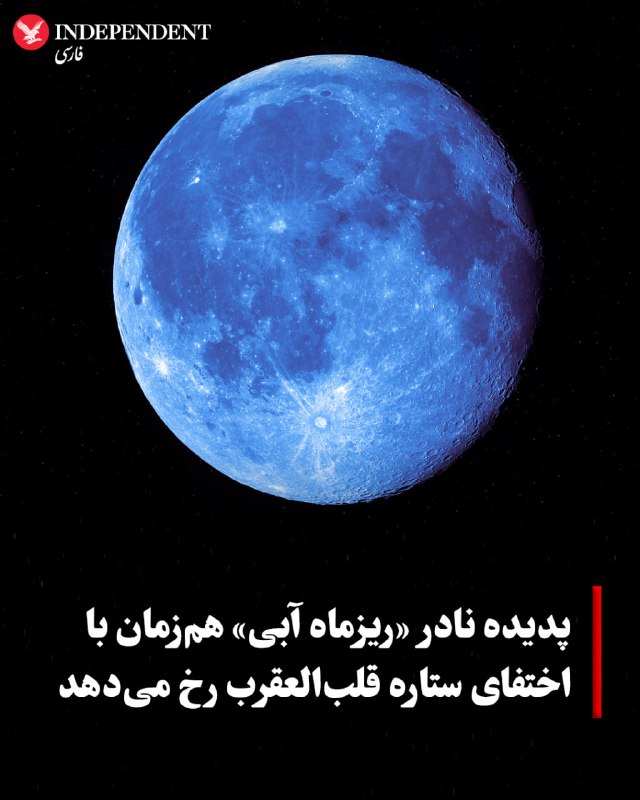

♦️ آسمان شب یکشنبه‌شب، دهم خرداد، میزبان یک رویداد نجومی نادر به نام «ریزماه آبی» (Blue Micromoon) خواهد بود؛ پدیده‌ای که در آن، ماه کامل در دورترین فاصله خود از زمین قرار می‌گیرد و کوچک‌تر و کم‌نورتر از همیشه دیده می‌شود. علاوه بر این، ستاره درخشان «قلب‌العقرب» (Antares) نیز در این نمایش آسمانی حضور خواهد داشت.

ماه آبی زمانی رخ می‌دهد که دو ماه کامل در یک ماه میلادی شکل بگیرند (نخستین ماه کامل این ماه در ۱ مه دیده شد). از سوی دیگر، به دلیل مدار بیضوی ماه، این بار قمر زمین در فاصله ۴۰۶,۱۳۵ کیلومتری قرار دارد که باعث می‌شود ۶ درصد کوچک‌تر و ۱۰ درصد کم‌نورتر از یک ماه کامل معمولی به نظر برسد. برخلاف نامش، این ماه تغییر رنگ نخواهد داد.

نکته جذاب‌تر این رویداد، پدیده «اختفا» برای رصدگران نیم‌کره جنوبی (مانند استرالیا، نیوزیلند، شیلی و آرژانتین) است؛ جایی که ریزماه آبی برای مدتی کوتاه از مقابل ستاره غول‌پیکر سرخ «قلب‌العقرب» در صورت فلکی کژدم عبور کرده و آن را پنهان می‌کند. در سایر نقاط جهان، این ستاره سرخ در تمام طول شب در کنار ماه کامل قابل رویت خواهد بود.
‌🇸🇦 Indypersian

🤖 @VahidOOnLine

## VahidOOnLine — post 242940

  

صداوسیمای جمهوری اسلامی در گزارشی درباره تفاهم احتمالی بین تهران و واشینگتن با عنوان «جزئیات غیررسمی»، اعلام کرد آمریکا متعهد شده در طول ۶۰ روز امکان دسترسی جمهوری اسلامی به ۱۲ میلیارد دلار از دارایی‌ها را به‌گونه‌ای فراهم کند که این منابع قابلیت انتقال و هزینه‌کرد در بانک‌های مقصد را بدون محدودیت داشته باشد.

این گزارش افزود که بر اساس این تفاهم، جمهوری اسلامی مرجع انحصاری تشخیص ماهیت شناورهای عبوری است و هر شناوری که محموله آن تهدیدآمیز شناخته شود یا بهره‌بردار نهایی آن در «خصومت» با جمهوری اسلامی باشد، به عنوان کشتی تجاری شناخته نشده و اجازه عبور از مسیرهای تعریف‌شده را ندارد.

صدا و سیما تاکید کرد که این رونوشت هنوز در حکم یک تفاهم غیررسمی است چون مسیر آن همچنان در چرخه بررسی، مذاکره و بازبینی قرار دارد.
‌🏁 🇬🇧 IranintlTV

🤖 @VahidOOnLine

## VahidOOnLine — post 242939

  

♦️ تیفانی ترامپ و همسرش مایکل بولوس تازه‌ترین چهره‌های نزدیک به خانواده دونالد ترامپ‌اند که در سفر خود به هند از تاج‌محل بازدید کردند.

این زوج که در روزهای گذشته در سفر به مقصدهای گرمسیری بودند، پس از حضور در مراسم ازدواج جزیره‌ای دونالد ترامپ جوان، برادر تیفانی، سفر خود را ادامه دادند و در ادامه به هند رفتند؛ جایی که بازدید از تاج‌محل، بنای مشهور شهر آگرا، بخشی از برنامه سفرشان بود.

چند روز پیش نیز مارکو روبیو، وزیر امور خارجه آمریکا، همراه همسرش ژانت دوسدبس، از تاج محل بازدید کرده بود.

تاج محل، از معروف‌ترین بناهای تاریخی هند، در قرن هفدهم میلادی به دستور شاه جهان، پادشاه گورکانی، ساخته شد. این آرامگاه باشکوه به یاد همسر محبوب ایرانی او، ممتاز محل، بنا شد و سال‌ها است که یکی از مهم‌ترین جاذبه‌های گردشگری هند و از شناخته‌شده‌ترین بناهای عاشقانه جهان به شمار می‌رود.
‌🇸🇦 Indypersian

🤖 @VahidOOnLine

## VahidOOnLine — post 242938

  

یدالله جوانی، معاون سیاسی سپاه پاسداران گفت: «میدان‌های ما آماده است و اگر دشمن مرتکب خطای مجددی شود، پاسخ جمهوری اسلامی محکم‌تر، قاطع‌تر و غیرقابل‌باورتر خواهد بود.»

او ادامه داد: «جمهوری اسلامی بر تنگه هرمز مسلط شده و پس از ۵۰۰ سال، به موقعیتی دست یافته که حق مسلم مردم ایران است.»

جوانی افزود: «دشمن اکنون با دو راه پیش‌رو مواجه است؛ راه بد و راه بدتر.»
‌🏁 🇬🇧 IranintlTV

🤖 @VahidOOnLine

## VahidOOnLine — post 242937

  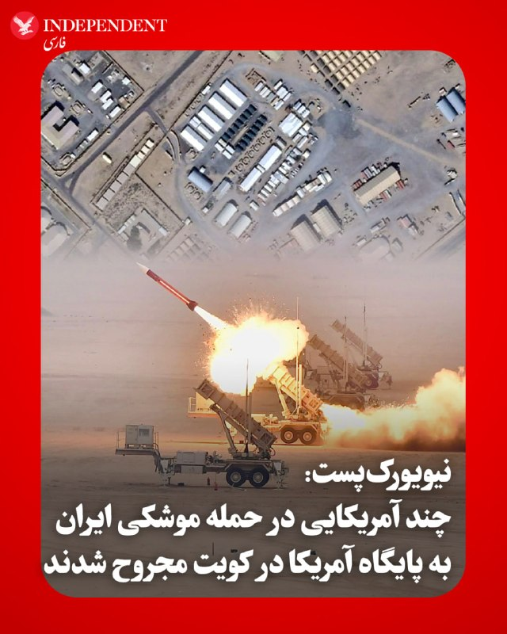

♦️ به گزارش نیویورک‌پست، در پی حمله موشکی جمهوری اسلامی به یک پایگاه هوایی در کویت، چند نفر از نیروهای نظامی و پیمانکاران آمریکایی مجروح شدند. این حمله در حالی رخ می‌دهد که دونالد ترامپ، رئیس‌جمهوری آمریکا، در حال ارزیابی پذیرش آخرین پیشنهاد صلح تهران یا بازگشت به شرایط جنگی است.

یک منبع مطلع روز شنبه نهم خرداد، اعلام کرد که در پی رهگیری یک موشک «فاتح-۱۱۰» توسط پدافند هوایی کویت طی ۲۴ ساعت گذشته، قطعات و ترکش‌های ناشی از انهدام موشک بر فراز پایگاه هوایی «علی السالم» فرود آمده و منجر به جراحت سطحی چند آمریکایی شده است. این حادثه همچنین خسارت شدیدی به دو پهپاد «ام‌کیو-۹ ریپر» (MQ-9 Reaper) به ارزش تقریبی ۳۰ میلیون دلار وارد کرده است.

این حمله در شرایطی صورت گرفته که دونالد ترامپ روز جمعه با تیم امنیتی خود تشکیل جلسه داد و اعلام کرد که قصد دارد تصمیم نهایی را درباره توافق با ایران اتخاذ کند؛ توافقی که شامل تمدید ۶۰ روزه آتش‌بس، بازگشایی تنگه هرمز و آغاز مذاکرات بیشتر درباره مواد هسته‌ای ایران در ازای لغو محاصره دریایی آمریکا می‌شود.
‌🇸🇦 Indypersian

🤖 @VahidOOnLine

## VahidOOnLine — post 242936

  

♦️ یک مقام مطلع آمریکایی روز شنبه نهم خرداد، به خبرگزاری اسوشیتدپرس گفت که ارتش ایالات متحده از ورود یک کشتی تجاری دیگر که قصد داشت محاصره دریایی بنادر ایران را بشکند، جلوگیری کرده است.

به گفته این مقام مسئول که خواست نامش فاش نشود، کشتی باری «لیان استار» (Lian Star) با پرچم گامبیا، بامداد امروز بدون توجه به هشدارهای مکرر نیروهای آمریکایی تلاش کرد وارد یکی از بنادر ایران شود. در پی این اقدام، جنگنده‌های ارتش آمریکا این کشتی را در دریای عمان غیرفعال (زمین‌گیر) کردند؛ این شناور اکنون بدون آنکه نیروهای آمریکایی وارد آن شده باشند، در دریا سرگردان است.

با احتساب این رویارویی جدید، ارتش آمریکا تاکنون پنج کشتی که قصد شکستن محاصره دریایی بنادر ایران را داشتند از کار انداخته‌اند.
‌🇸🇦 Indypersian

🤖 @VahidOOnLine

## VahidOOnLine — post 242935

  

مهدی محمدی، مشاور محمدباقر قالیباف نوشت: «بر خلاف عملیات روانی گسترده رسانه‌های غربی، هیچ توافقی نهایی نشده است.»
او افزود: «جمهوری اسلامی در موضع قدرت است، توافق صرفا یک تاکتیک برای خرید زمان و منابع است نه استراتژی صلح‌طلبانه، و سرنوشت نبرد را ما تعیین خواهیم کرد.»
‌🏁 🇬🇧 IranintlTV

🤖 @VahidOOnLine

## VahidOOnLine — post 242934

  

♦️ دونالد ترامپ، رئیس‌جمهوری آمریکا، روز شنبه نهم خرداد اعلام کرد که در پی انصراف تعدادی از هنرمندان، در حال بررسی لغو زنجیره کنسرت‌های گرامیداشت دویست‌وپنجاهمین سالگرد استقلال ایالات متحده و برگزاری یک سخنرانی به جای آن است.

روز جمعه، برت مایکلز، خواننده اصلی گروه راک «پویزن» (Poison)، پنجمین موسیقی‌دانی بود که از حضور در این کنسرت‌ها تحت عنوان «آزادی ۲۵۰» (Freedom 250) انصراف داد. این رویدادها قرار است از ۲۵ ژوئن تا ۱۰ ژوئیه در محوطه ملی واشنگتن برگزار شوند. پیش از این قرار بود ۹ هنرمند در این رویدادها اجرا داشته باشند اما چهار نفر از جمله مارتینا مک‌براید، بعد از آن که متوجه شدند برنامه به ترامپ مربوط است، تصمیم به انصراف گرفتند.

ترامپ در شبکه اجتماعی «تروث سوشال» نوشت که در حال بررسی گزینش یک سخنرانی و تجمع انتخاباتی به جای این کنسرت‌هاست. او خود را «جذابیت شماره یک در سراسر جهان» نامید و افزود: «من مردی هستم که جمیعت بسیار بزرگ‌تری را نسبت به دوران اوج الویس پرسلی به خود جذب می‌کند، آن هم بدون اینکه گیتاری به دست داشته باشد.»
‌🇸🇦 Indypersian

🤖 @VahidOOnLine

## VahidOOnLine — post 242933

  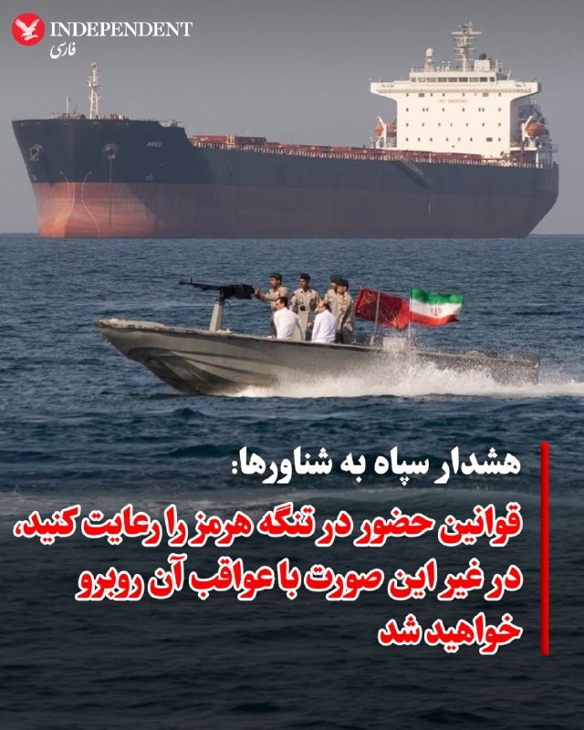

♦️ قرارگاه مرکزی خاتم‌الانبیا روز شنبه، نهم خرداد، بار دیگر بر کنترل تهران بر تنگه هرمز تاکید کرد و به شناورهای تجاری و نظامی هشدار داد که از مقررات مربوط به عبور از این آبراه استراتژیک پیروی کنند.

در بیانیه این قرارگاه که در خبرگزاری تسنیم بازتاب یافت، آمده است: «مدیریت تنگه هرمز با اقتدار کامل توسط نیروهای مسلح جمهوری اسلامی ایران اعمال می‌شود.»

این قرارگاه در ادامه افزود: «تمامی کشتی‌ها، شناورهای تجاری و نفتکش‌ها موظفند صرفا از مسیرهای تعیین‌شده تردد کرده و از نیروی دریایی سپاه پاسداران انقلاب اسلامی مجوز دریافت کنند. هرگونه تخطی از این مقررات، امنیت تردد آن‌ها را به شدت به خطر خواهد انداخت.»

جمهوری اسلامی همچنین به نیروهای نظامی خارجی مستقر در منطقه هشدار داد که هرگونه تلاش برای مداخله در مدیریت دریایی یا تردد کشتیرانی، با واکنش مواجه خواهد شد.
‌🇸🇦 Indypersian

🤖 @VahidOOnLine

## VahidOOnLine — post 242932

  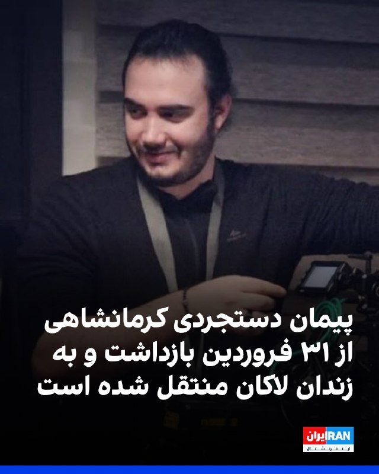

بر اساس گزارش‌ها پیمان دستجردی کرمانشاهی، ۳۲ساله و فیلمبردار، روز ۳۱ فروردین با اتهام‌های «تبلیغ علیه نظام، همکاری با اسرائیل از طریق انتشار استوری، توهین به مقدسات و  توهین به رهبری» بازداشت و به زندان لاکان رشت منتقل شده و از وضعیت او اطلاعی در دست نیست.

او پیش‌تر نیز در ابتدای جنگ آمریکا و اسرائیل با جمهوری اسلامی، به‌دلیل انتشار استوری‌های اینستاگرامی بازداشت و پس از مدتی با قرار وثیقه آزاد شده بود.
‌🏁 🇬🇧 IranintlTV

🤖 @VahidOOnLine

## VahidOOnLine — post 242931

  <a href="telegram/content/VahidOOnLine_242931_1780165242.mp4" target="_blank">🎬 Download video</a>

♦️در جریان مراسم روز نیروهای مسلح اسپانیا، یک اتفاق غیرمنتظره توجه‌ها را به خود جلب کرد؛ پرچم اسپانیا در حین اجرای مراسم دچار اختلال شد و به‌طور ناگهانی سقوط کرد.
در ویدیوی منتشرشده، واکنش آرام و خونسرد فیلیپه ششم، پادشاه اسپانیا، به این اتفاق مورد توجه قرار گرفته و در شبکه‌های اجتماعی بازتاب گسترده‌ای داشته است.
این مراسم که هر سال با حضور مقامات ارشد و نمایش توان نظامی برگزار می‌شود، امسال با این اتفاق غیرمنتظره به یکی از سوژه‌های رسانه‌ای تبدیل شد.
‌🇸🇦 Indypersian

🤖 @VahidOOnLine

## VahidOOnLine — post 242930

  

خبرگزاری آسوشیتدپرس به نقل از یک مقام آمریکایی خبر داد که ناوگان آمریکا یک کشتی تجاری با پرچم گامبیا را که تلاش داشت محاصره بنادر ایران را بشکند، متوقف کرده و از کار انداختند.
بر اساس این گزارش، این کشتی از سوی هواپیماهای آمریکایی از کار انداخته شد و نیروهای آمریکایی وارد آن نشدند.

روز شنبه پیت هگست، وزیر جنگ آمریکا، در حاشیه نشست «گفت‌وگوی شانگری‌لا» در سنگاپور، درباره محاصره بنادر و سواحل جنوبی ایران گفت که محاصره دریایی ادامه دارد و این اقدام موثر بوده و کنترل تنگه هرمز در اختیار آمریکا است.
‌🏁 🇬🇧 IranintlTV

🤖 @VahidOOnLine

## VahidOOnLine — post 242929

  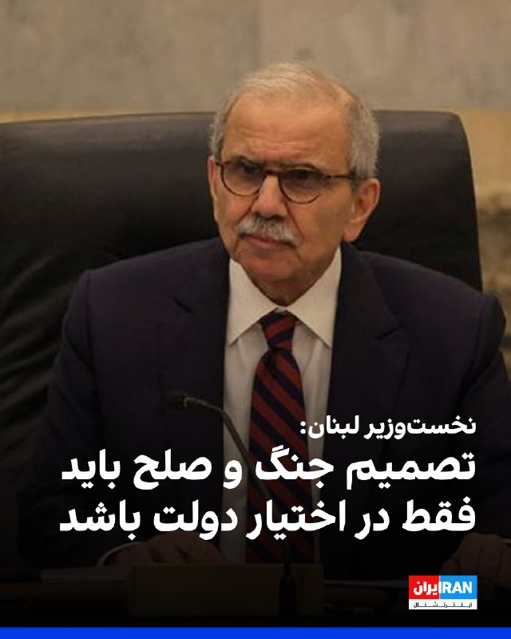

نواف سلام، نخست‌وزیر لبنان گفت این کشور در حال حاضر با سخت‌ترین مرحله در تاریخ خود روبه‌رو است.
نواف سلام تاکید کرد که تصمیم جنگ و صلح باید فقط در اختیار دولت باشد. پیش‌تر نواف سلام بر ضرورت خلع سلاح حزب‌الله از سوی خود لبنانی‌ها و و بازگرداندن انحصار سلاح به دولت تاکید کرده بود.
‌🏁 🇬🇧 IranintlTV

🤖 @VahidOOnLine

## VahidOOnLine — post 242928

♦️ خبرگزاری رویترز تصاویر هوایی از آخرین وضعیت کشتی‌های سرگردان در آب‌های نزدیک به تنگه هرمز را منتشر کرد. در این تصاویر که صبح شنبه، نهم خرداد ثبت شده، صدها شناور از انواع مختلف دیده می‌شود که در فاصله‌های کمی از یکدیگر متوقف شده‌اند؛ وضعیتی که از اولین روزهای جنگ تاکنون ادامه داشته است.

جمهوری اسلامی با قرار دادن سازوکار جدیدی برای عبور از تنگه هرمز و تهدید کشتی‌هایی که از این سازوکار جدید تبعیت نکنند، از یک سو، و احتمال مین‌گذاری در این آبراه استراتژیک از سوی دیگر، باعث افزایش شدید قیمت‌های بیمه کشتی‌ها شده است. همین امر باعث شده این شناورها که میزبان هزاران ملوان هستند، با وجود سختی و هزینه‌های بسیار، از عبور از تنگه هرمز خودداری کنند.
‌🇸🇦 Indypersian

🤖 @VahidOOnLine

## VahidOOnLine — post 242927

  

قرارگاه مرکزی خاتم‌الانبیا در بیانیه‌ای اعلام کرد که هرگونه اقدام شناورهای نظامی جهت مداخله در مدیریت تنگه هرمز یا ایجاد اختلال در تردد، مورد هدف نیروهای مسلح جمهوری اسلامی قرار خواهد گرفت.
در این بیانیه آمده: «هرگونه تخلف از این ضوابط، امنیت تردد آن‌ها را با مخاطره جدی مواجه خواهد کرد.»

قرارگاه مرکزی خاتم‌الانبیا اعلام کرد کلیه کشتی‌ها، شناورهای تجاری و نفتکش‌ها صرفا ملزم به تردد از مسیرهای تعیین‌شده و اخذ مجوز از نیروی دریایی سپاه پاسداران هستند.
‌🏁 🇬🇧 IranintlTV

🤖 @VahidOOnLine

## VahidOOnLine — post 242926

  

مصطفی نیلی، وکیل دادگستری اعلام کرد بنیامین نقدی، زندانی سیاسی و از معترضان دی‌ماه، از سوی دادگاه انقلاب شیراز به اتهام «افسادفی‌الارض»، به اعدام محکوم شد.

این وکیل دادگستری به کانال امتداد گفت که بنیامین نقدی در شب سیزدهم دی ۱۴۰۴ در شیراز، به دلیل «شعله‌ور نمودن یک دستگاه کپسول آتش‌نشانی» به سمت مامورین نیروی انتظامی بازداشت شده بود.

مصطفی نیلی افزود پس از پایان تحقیقات مقدماتی کیفرخواست بنیامین نقدی با اتهام‌های «محاربه، عضویت در گروه‌های به هم‌زننده امنیت، اجتماع و تبانی به قصد انجام جرم علیه امنیت و فعالیت تبلیغی علیه نظام» صادر شد و نسبت به اتهام ایراد صدمه جسمانی به ماموران و حمل سلاح سرد منع تعقیب صادر شد.

نیلی، وکیل دادگستری گفت که در جلسه دادگاه، قضات تمامی اتهامات را مصداق افسادفی‌الارض تشخیص دادند و بر همین مبنا حکم اعدام برای بنیامین نقدی صادر کردند.
‌🏁 🇬🇧 IranintlTV

🤖 @VahidOOnLine

## WithYashar — post 12954

پست جدید بوگاتی شاه

https://www.instagram.com/reel/DY-ObumIJEK/?igsh=MjQ5cGt6dWo0dGg=
کارای اداریش رو انجام بدید 💥

## WithYashar — post 12952

صداوسیما جزئیات غیررسمی از یادداشت تفاهم (ایران و آمریکا) را منتشر کرد
‌
یکی از مهمترین محورهای توافق (ایران و آمریکا) بازتعریف قواعد عبور و مرور در تنگه هرمز است

‌ایران مرجع انحصاری تشخیص ماهیت شناورهای عبوری است

هر شناوری که محموله آن تهدید آمیز تلقی شود یا بهره‌بردار نهایی آن در خصومت با ایران باشد به عنوان کشتی تجاری شناخته نمی‌شود و اجازه عبور از مسیرهای تعریف شده را ندارد

تعیین مسیر حرکت و تعیین هزینه خدمات ناوبری در حوزه تصمیم‌گیری ایران دیده شده
‌
هر شناور موظف است اطلاعاتش را در اختیار مرکز مرتبط با نیروی دریایی قرار دهد و فرم‌هایی شامل جزئیات محموله مالکیت و مقصد را تکمیل کند
@withyashar

## WithYashar — post 12951

الجزیره: ترامپ برای جلوگیری از جنگ با ایران پیش از جام جهانی بسیار مصمم است

او همچنان برای دستیابی به یک توافق موقت با تهران تحت فشار است، اما پیشرفت فوری بعید به نظر می‌رسد
@withyashar

## WithYashar — post 12950

شبکه ۱۴ اسرائیل : نتانیاهو، قراره به‌زودی یه جلسه امنیتی برگزار کنه تا درباره نحوه پاسخ به شدت گرفتن حملات حزب‌الله تصمیم بگیره
@withyashar

## WithYashar — post 12949

## WithYashar — post 12948

## WithYashar — post 12947

🌊

## WithYashar — post 12946

درود میشه یکم ویس بدی دلمون گرفت :)❤️

## WithYashar — post 12945

  

ترامپ: پنج مرحله سندروم ترامپ هراسی
@withyashar

## WithYashar — post 12944

نماینده سیستان و بلوچستان در مجلس : برخی از مناطق زاهدان ۲۴ تا ۴۸ ساعت آب ندارند. ادامه بحران آب، استان را با چالش‌های امنیتی و اجتماعی روبه‌رو می‌کند
@withyashar

## WithYashar — post 12943

سخنگوی فدراسیون فوتبال:
روزبه چشمی به‌دلیل مصدومیت جام جهانی را از دست داد
@withyashar

## WithYashar — post 12942

تلگراف: دو ژنرال قدرتمند، احمد وحیدی و محمد جعفری، با هم متحد شدن تا قالیباف رو از قدرت برکنار کنن.
@withyashar

## WithYashar — post 12941

شاهزاده رضا پهلوی در نشست «امنیت دریای سیاه» در اودسا، در جنوب اوکراین، گفت مردم ایران برای ساختن آینده کشور خود آماده‌اند و از جهان نمی‌خواهند آینده ایران را برای آنان رقم بزند، بلکه خواستار آن هستند که جامعه جهانی در کنار ملت ایران بایستد.

او در بخش دیگری از سخنانش، با اشاره به خروج اجباری خود از ایران در ۱۰ سالگی، گفت که با وجود گذشت ۴۷ سال، هرگز امید خود را به آزادی ایران از دست نداده و همواره صدای مردمی بوده است که امکان بیان خواسته‌هایشان را نداشته‌اند.
@withyashar

## WithYashar — post 12940

  <a href="telegram/content/WithYashar_12940_1780165247.mp4" target="_blank">🎬 Download video</a>

مک‌اننی از فاکس:
بلومبرگ گزارش داده است که حملات موشکی ایرانی چند آمریکایی را در یک پایگاه هوایی کویتی زخمی کرده‌اند. فکر می‌کنید اوضاع در چه وضعیتی است؟

مایک جانسون، سخنگو:
دیشب با رئیس‌جمهور ترامپ صحبت کردم. او کاملاً در جریان است. فکر می‌کنم رهبری جدید ایرانی‌ها می‌خواهد این درگیری را به پایان برساند.
@withyashar

## mwarmonitor — post 9921

🔴«جناح تندرو در ایران، گروهی حاشیه‌ای اما پرسر و صدا که اعضایی در مجلس و یک کرسی در شورای عالی امنیت ملی دارد، به‌طور علنی با هرگونه امتیازدهی به واشینگتن مخالفت کرده و با استفاده از تجمع‌ها، رسانه‌های دولتی و فشارهای پشت‌پرده تلاش می‌کند یک توافق را به شکست بکشاند.» وال‌استریت ژورنال

@mwarmonitor

## mwarmonitor — post 9920

🔴جنگنده آمریکایی F-15E Strike Eagle که در ماه آوریل بر فراز جنوب‌غربی ایران سرنگون شد، احتمالاً توسط یک موشک دوش‌پرتاب ساخت چین هدف قرار گرفته است؛ این موضوع را سه نفر آشنا با این پرونده اعلام کرده‌اند. — NBC News

@mwarmonitor

## mwarmonitor — post 9919

  <a href="telegram/content/mwarmonitor_9919_1780165249.mp4" target="_blank">🎬 Download video</a>

📝 واقعیت این است که به وضوح همین پروپاگاندای مضحک دیده می‌شود؛ خبرنگار صداوسیما را فرستاده‌اند وسط فروشگاه تا از مردمی که از خط فقر هم پایین‌تر سرنگون شده‌اند، اعترافِ اجباریِ «خدا را شکر همه‌چیز هست» بگیرد! قفسه‌های پر از روغن و برنج را به رخ ملت می‌کشند، انگار مردم به خاطر «کمبود جنس» گرسنه‌اند، نه به خاطر بی‌پولی و نکبتی که گریبان‌گیرشان شده است.

🔸اینکه اسم همان کوپنِ دهه شصت را بگذاری «طرح الکترونیکی» و هر چند ماه یک‌بار به عنوان یک فتح‌الفتوح جدید در اخبار جار بزنی، اوج وقاحت و تحقیر یک ملت است. نمایشِ پر بودن قفسه‌ها دقیقاً مثل این است که به یک آدم تشنه در بیابان، عکس یک پارچ آب یخ نشان بدهی و بگویی: «ببین چقدر فراوانی است، حالا اگر پول داری بخر، اگر هم نداری کارتِ گداییِ الکترونیکی‌ات را بکش!» این‌ها فقط یاد گرفته‌اند صورت‌مسئله را پاک کنند و با شوهای تلویزیونی، روی فلاکت و خاکِ سیاهی که مردم را به آن نشانده‌اند، رنگ و لعابِ مدرنیته بپاشند.

@mwarmonitor

## mwarmonitor — post 9918

🔴 یک مقام آمریکایی: یک کشتی تجاری که تلاش داشت به سمت یک بندر ایرانی حرکت کند، متوقف شد.

🔸این نفتکش/کشتی با نام «لیان استار» هشدارهای نیروهای دریایی ما در خلیج عمان را نادیده گرفته بود.

@mwarmonitor

## FoxNewsTwitter — post 342431

  

Fox News (Twitter/X)

Jaxson Dart is breaking his silence after receiving pushback for introducing President Trump at a rally, saying his decision comes down to one thing: respect for the office.

The Giants quarterback tells reporters he has always viewed the presidency as a position worthy of respect, regardless of party affiliation, pointing to his family's long history of military service.

## FoxNewsTwitter — post 342430

  

Fox News (Twitter/X)

CHARGED: Anti-ICE agitator bit two federal officers during clashes outside Newark's Delaney Hall, leaving bloody wounds that sent both agents to the hospital.

Brendan John Geier, 26, now faces federal charges for assaulting officers who told his group to clear the road. He kicked one officer and sank his teeth into two others, according to the DOJ.

Acting AG Todd Blanche posted photos of the bloodied agents: 'These riots are clearly not peaceful protests as you can see from the photos of these horrific wounds.'

## FoxNewsTwitter — post 342429

  <a href="telegram/content/FoxNewsTwitter_342429_1780165253.mp4" target="_blank">🎬 Download video</a>

Fox News (Twitter/X)

"They both should be in jail."

Los Angeles mayoral candidate Spencer Pratt argues California Gov. Gavin Newsom and Los Angeles Mayor Karen Bass should be behind bars over their alleged "negligence" while in office.

The reality TV star claims the pair of Democrats "make up stats" on homelessness — and that the city's crisis has only gotten worse under their watch. | @SatAmericaFNC @kayleighmcenany

## FoxNewsTwitter — post 342428

‌Fox News (Twitter/X)

👉 Full story here:

## FoxNewsTwitter — post 342427

Fox News (Twitter/X)

DAVID MARCUS: Democrats own the chaos at Newark's anti-ICE riots — Antifa agitators screamed 'Every Cop, Every Fed, Shoot Yourself in the Head' at officers while progressive White women berated Black men as 'race traitors' with 'the wrong skin color.' Gov. Sherrill finally deployed state police after a week of violence, but blamed ICE for wanting to 'stoke' the confrontation. Zero evidence offered for that claim.

## FoxNewsTwitter — post 342426

‌Fox News (Twitter/X)

👉 Full story here:

## pm_afshaa — post 91903

🔴یک مقام ارشد آمریکایی: دیدار رئیس‌جمهور ایالات متحده دونالد ترامپ در اتاق عملیات حدود دو ساعت طول کشید، اما هنوز تصمیمی درباره توافق با ایران گرفته نشده است. در دولت معتقدند که به توافق نزدیک هستند، اما هنوز مسائل اختلافی باقی مانده

💧 Rainbet.com the #1 Non-KYC Crypto Casino & Sportsbook @rainbetcom

😁 @Pm_Afshaa

## pm_afshaa — post 91902

🔴شاهزاده رضا پهلوی:مردم ایران باید از طریق هوا حفاظت بشن و اینترنت و دیگر ابزار لازم رو داشته باشن که دست به‌کار بشن و رژیم رو به زانو بیارن

💧 Rainbet.com the #1 Non-KYC Crypto Casino & Sportsbook @rainbetcom

😁 @Pm_Afshaa

## pm_afshaa — post 91901

  <a href="telegram/content/pm_afshaa_91901_1780165255.webm" target="_blank">🎬 Download video</a>

🔴ان‌بی‌سی نیوز: احتمال داره ایران در جریان درگیری‌های اخیر، از یک موشک ساخت چین برای سرنگونی یک جنگنده F-15E استرایک ایگل آمریکا استفاده کرده باشد.

💧 Rainbet.com the #1 Non-KYC Crypto Casino & Sportsbook @rainbetcom

😁 @Pm_Afshaa

## iaghapour — post 2644

  <a href="https://t.me/iaghapour/2644" target="_blank">📎 Download file</a>

🟢 لیست آی‌پی ها و فایل html مربوط به ویدیو ساخت فیلترشکن پرسرعت و رایگان با ورکر کلودفلر

🆔@iaghapour

## iaghapour — post 2643

  

⭕️ ساخت فیلترشکن پرسرعت و رایگان با ورکر کلودفلر (تست شده)

🔹در این ویدیو به صورت قدم‌به‌قدم بهتون آموزش دادم که چطور با استفاده از Cloudflare Workers یک فیلترشکن کاملاً رایگان، و پرسرعت برای خودتون بسازید. این روش کاملاً تست شده و می‌تونید به راحتی روی گوشی و کامپیوتر ازش استفاده کنید.

🔗 تماشا ویدیو در یوتیوب

#آموزش #فیلترشکن #رایگان #پروکسی #نوا #novaproxy
برای دور زدن فیلترینگ و آموزش تکنولوژی و هوش مصنوعی ما رو دنبال کنید 💚
🆔@iaghapour

## DEJradio — post 5158

  <a href="telegram/content/DEJradio_5158_1780165257.webm" target="_blank">🎬 Download video</a>

🔺🎤 تکنیک های کاهش اضطراب

گفت‌وگو با دکتر مصطفی میررمضانی، روانپزشک و روان‌درمانگر

#کاهش_اضطراب #اضطراب
@DEJradio

## DEJradio — post 5157

  <a href="telegram/content/DEJradio_5157_1780165258.webm" target="_blank">🎬 Download video</a>

🚨📢 نشست امنیتی «دریای سیاه» در اودسا
شاهزاده رضا پهلوی خطاب به رهبران غرب:
رژیم ایران را مدیریت نکنید، تمامش کنید

شاهزاده رضا پهلوی روز شنبه نهم خرداد ۱۴۰۵ در نشست امنیتی «دریای سیاه» در اودسا خطاب به رهبران غرب گفت «رژیم تروریستی جمهوری اسلامی را مدیریت نکنید؛ به آن پایان دهید.»
او با هشدار درباره تهدیدهای مشترک علیه جهان آزاد تاکید کرد: «محور مسکو و تهران یک دشمن هماهنگ برای همه ماست و باید با قدرت، انسجام و قاطعیت با آن مقابله شود.»

پهلوی همچنین با انتقاد از سیاست توافق و امتیازدهی به حکومت تهران گفت: «هیچ‌یک از توافق‌هایی که تاکنون با جمهوری اسلامی انجام شده، همان‌گونه که توافق‌های مشابه با اتحاد جماهیر شوروی نتوانستند مشکل را حل کنند، راه‌حل پایدار نبوده‌اند.»

#شاهزاده_رضا_پهلوی #جمهوری_اسلامی
@DEJradio

## DEJradio — post 5156

  <a href="telegram/content/DEJradio_5156_1780165258.webm" target="_blank">🎬 Download video</a>

🔺🎤 کابینه ترامپ و میانجی‌گری عمان در پی احیای روابط با تهران

گفت‌وگو با شایان سمیعی، کارشناس امنیت ملی

#عمان #مذاکرات
@DEJradio

## VahidOnline — post 75806

  

صداوسیمای جمهوری اسلامی در گزارشی درباره تفاهم احتمالی بین تهران و واشینگتن با عنوان «جزئیات غیررسمی»، اعلام کرد آمریکا متعهد شده در طول ۶۰ روز امکان دسترسی جمهوری اسلامی به ۱۲ میلیارد دلار از دارایی‌ها را به‌گونه‌ای فراهم کند که این منابع قابلیت انتقال و هزینه‌کرد در بانک‌های مقصد را بدون محدودیت داشته باشد.

این گزارش افزود که بر اساس این تفاهم، جمهوری اسلامی مرجع انحصاری تشخیص ماهیت شناورهای عبوری است و هر شناوری که محموله آن تهدیدآمیز شناخته شود یا بهره‌بردار نهایی آن در «خصومت» با جمهوری اسلامی باشد، به عنوان کشتی تجاری شناخته نشده و اجازه عبور از مسیرهای تعریف‌شده را ندارد.

صدا و سیما تاکید کرد که این رونوشت هنوز در حکم یک تفاهم غیررسمی است چون مسیر آن همچنان در چرخه بررسی، مذاکره و بازبینی قرار دارد.
@VahidOOnLine

📡 @VahidOnline

## VahidOnline — post 75805

  

♦️ به گزارش نیویورک‌پست، در پی حمله موشکی جمهوری اسلامی به یک پایگاه هوایی در کویت، چند نفر از نیروهای نظامی و پیمانکاران آمریکایی مجروح شدند. این حمله در حالی رخ می‌دهد که دونالد ترامپ، رئیس‌جمهوری آمریکا، در حال ارزیابی پذیرش آخرین پیشنهاد صلح تهران یا بازگشت به شرایط جنگی است.

یک منبع مطلع روز شنبه نهم خرداد، اعلام کرد که در پی رهگیری یک موشک «فاتح-۱۱۰» توسط پدافند هوایی کویت طی ۲۴ ساعت گذشته، قطعات و ترکش‌های ناشی از انهدام موشک بر فراز پایگاه هوایی «علی السالم» فرود آمده و منجر به جراحت سطحی چند آمریکایی شده است. این حادثه همچنین خسارت شدیدی به دو پهپاد «ام‌کیو-۹ ریپر» (MQ-9 Reaper) به ارزش تقریبی ۳۰ میلیون دلار وارد کرده است.

این حمله در شرایطی صورت گرفته که دونالد ترامپ روز جمعه با تیم امنیتی خود تشکیل جلسه داد و اعلام کرد که قصد دارد تصمیم نهایی را درباره توافق با ایران اتخاذ کند؛ توافقی که شامل تمدید ۶۰ روزه آتش‌بس، بازگشایی تنگه هرمز و آغاز مذاکرات بیشتر درباره مواد هسته‌ای ایران در ازای لغو محاصره دریایی آمریکا می‌شود.
@VahidOOnLine

📡 @VahidOnline

## VahidOnline — post 75804

  

قرارگاه مرکزی خاتم‌الانبیا در بیانیه‌ای اعلام کرد که هرگونه اقدام شناورهای نظامی جهت مداخله در مدیریت تنگه هرمز یا ایجاد اختلال در تردد، مورد هدف نیروهای مسلح جمهوری اسلامی قرار خواهد گرفت.
در این بیانیه آمده: «هرگونه تخلف از این ضوابط، امنیت تردد آن‌ها را با مخاطره جدی مواجه خواهد کرد.»

قرارگاه مرکزی خاتم‌الانبیا اعلام کرد کلیه کشتی‌ها، شناورهای تجاری و نفتکش‌ها صرفا ملزم به تردد از مسیرهای تعیین‌شده و اخذ مجوز از نیروی دریایی سپاه پاسداران هستند.
@VahidOOnLine

📡 @VahidOnline

## VahidOnline — post 75803

  <a href="telegram/content/VahidOnline_75803_1780165261.mp4" target="_blank">🎬 Download video</a>

پیت هگست، وزیر دفاع آمریکا، روز شنبه نهم خرداد گفت ایالات متحده در صورتی که مذاکرات با ایران به توافق منجر نشود، آماده ازسرگیری حملات علیه جمهوری اسلامی است.

هگست در جمع خبرنگاران گفت: «در حال حاضر تمرکز ما بر حفظ آمادگی و آماده بودن برای بازگشت به عملیات است، اگر لازم باشد.»
او افزود دونالد ترامپ «صبور» است و به دنبال دستیابی به «توافقی خوب» است که تضمین کند ایران هرگز به سلاح هسته‌ای دست پیدا نخواهد کرد.

اظهارات وزیر دفاع آمریکا در حالی مطرح می‌شود که مذاکره‌کنندگان تهران و واشینگتن در تلاش‌اند اختلافات باقی‌مانده بر سر برنامه هسته‌ای ایران را برطرف کنند.
@VahidHeadline

📡 @VahidOnline

## VahidOnline — post 75802

  

مصطفی نیلی، وکیل دادگستری، اعلام کرد شعبه اول دادگاه انقلاب شیراز بنیامین نقدی را با اتهام «افساد فی‌الارض» به اعدام محکوم کرده است.

نیلی در گفت‌وگو با امتداد گفت که بنیامین نقدی شامگاه ۱۳ دی‌ماه در شیراز به دلیل شعله‌ور کردن یک کپسول آتش‌نشانی به سمت ماموران نیروی انتظامی بازداشت شد.

به گفته این وکیل دادگستری، در ابتدا اتهام «شروع به قتل» به موکلش تفهیم شد، اما پس از آن اتهام وی به «محاربه» تغییر یافت.

او افزود پس از پایان تحقیقات مقدماتی، کیفرخواست بنیامین نقدی با اتهام‌های «محاربه»، «عضویت در گروه‌های برهم‌زننده امنیت کشور»، «اجتماع و تبانی به قصد ارتکاب جرم علیه امنیت کشور» و «فعالیت تبلیغی علیه نظام» صادر شد. به گفته نیلی، در خصوص اتهام‌های «ایراد صدمه جسمانی به ماموران» و «حمل سلاح سرد» قرار منع تعقیب صادر شده بود.

نیلی همچنین گفت قضات شعبه اول دادگاه انقلاب شیراز در جریان رسیدگی، مجموعه اتهام‌های مطرح‌شده را مصداق «افساد فی‌الارض» تشخیص داده و بر همین اساس حکم اعدام برای بنیامین نقدی صادر کرده‌اند.

وکیل بنیامین نقدی با اشاره به قصد خود و همکارانش برای اعتراض به این رای گفت که در مهلت قانونی درخواست فرجام‌خواهی خواهند کرد. او ابراز امیدواری کرد که با توجه به این که به گفته وی در جریان رخداد مورد اشاره هیچ فردی آسیب ندیده است و اقدامات موکلش مصداق افساد فی‌الارض نیست، حکم صادره در دیوان عالی کشور نقض شود.
@VahidHeadline

📡 @VahidOnline

## IranIntlTV — post 339775

  

سایت هرانا گزارش داد سپیده قلیان، زندانی سیاسی، پس از پایان دوران محکومیت خود از زندان وکیل‌آباد مشهد آزاد شد. قلیان که در جریان مراسم هفتم خسرو علی‌کردی، وکیل دادگستری جان‌باخته، دستگیر شده بود، با انتشار پستی در اینستاگرام، تصویری از حضور خود بر سر مزار خسرو علی‌کردی منتشر کرد.

قلیان در این پست نوشت: «با خودم قرار گذاشته‌ام از هرچه خسته می‌شوم بشوم، اما از رسیدن به آزادی و حمل کردن این سنگ‌های سخت حقیقت «نه». برای همین رفتار داعش‌گونه جمهوری اسلامی در مراسم خسرو نباید و نمی‌تواند بگذارد که سنگ نیمه‌ تمامم در آذر ۱۴۰۱ را، زمین بگذارم.»
https://iranintl.com/202605307956

## IranIntlTV — post 339774

  <a href="https://t.me/IranintlTV/339774" target="_blank">📎 Download file</a>

🎧نسخه صوتی تیتراول با نیوشا صارمی: وزیر جنگ آمریکا:برای ازسرگیری حملات به ایران آماده‌ایم؛ تعویق در تصمیم ترامپ
@iranintlTV

## IranIntlTV — post 339773

  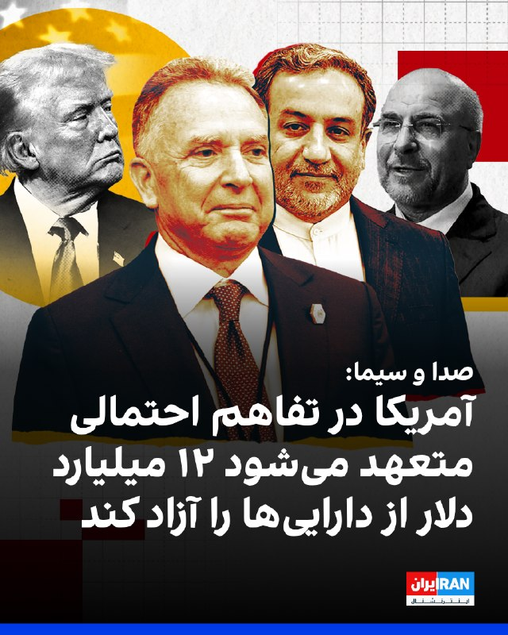

صداوسیمای جمهوری اسلامی در گزارشی درباره تفاهم احتمالی بین تهران و واشینگتن با عنوان «جزئیات غیررسمی»، اعلام کرد آمریکا متعهد شده در طول ۶۰ روز امکان دسترسی جمهوری اسلامی به ۱۲ میلیارد دلار از دارایی‌ها را به‌گونه‌ای فراهم کند که این منابع قابلیت انتقال و هزینه‌کرد در بانک‌های مقصد را بدون محدودیت داشته باشد.

این گزارش افزود که بر اساس این تفاهم، جمهوری اسلامی مرجع انحصاری تشخیص ماهیت شناورهای عبوری است و هر شناوری که محموله آن تهدیدآمیز شناخته شود یا بهره‌بردار نهایی آن در «خصومت» با جمهوری اسلامی باشد، به عنوان کشتی تجاری شناخته نشده و اجازه عبور از مسیرهای تعریف‌شده را ندارد.

صدا و سیما تاکید کرد که این رونوشت هنوز در حکم یک تفاهم غیررسمی است چون مسیر آن همچنان در چرخه بررسی، مذاکره و بازبینی قرار دارد.
https://iranintl.com/202605302838

## IranIntlTV — post 339772

  

یدالله جوانی، معاون سیاسی سپاه پاسداران گفت: «میدان‌های ما آماده است و اگر دشمن مرتکب خطای مجددی شود، پاسخ جمهوری اسلامی محکم‌تر، قاطع‌تر و غیرقابل‌باورتر خواهد بود.»

او ادامه داد: «جمهوری اسلامی بر تنگه هرمز مسلط شده و پس از ۵۰۰ سال، به موقعیتی دست یافته که حق مسلم مردم ایران است.»

جوانی افزود: «دشمن اکنون با دو راه پیش‌رو مواجه است؛ راه بد و راه بدتر.»
https://iranintl.com/202605305267

## IranIntlTV — post 339771

  <a href="telegram/content/IranIntlTV_339771_1780165265.mp4" target="_blank">🎬 Download video</a>

با وجود برگزاری جلسه در اتاق وضعیت کاخ سفید، دونالد ترامپ هنوز تصمیم نهایی درباره تفاهم‌نامه با تهران را اعلام نکرده است. هم‌زمان پیت هگست، وزیر جنگ آمریکا، گفت ترامپ تنها در صورت «توافقی مطلوب برای آمریکا و امنیت جهانی» آن را می‌پذیرد.

ارزیابی بیشتر با ایمان آقایاری، تحلیل‌گر سیاسی
@iranintltv

## IranIntlTV — post 339770

  <a href="telegram/content/IranIntlTV_339770_1780165267.mp4" target="_blank">🎬 Download video</a>

با گذشت نزدیک به پنج ماه از اعتراضات دی‌ماه، همچنان روایت‌ها و اسامی تازه‌ای از جان‌باختگان منتشر می‌شود. سودا اکرمی‌فرد، ۱۶ ساله، ۱۹ دی‌ماه در مارلیک کرج با شلیک گلوله جنگی جان خود را از دست داده است.
گفت‌وگو با سمیرا عینی، مادر سودا اکرمی‌فرد از جان‌باختگان اعتراضات دی‌ماه
@iranintltv

## IranIntlTV — post 339769

  <a href="https://t.me/IranintlTV/339769" target="_blank">📎 Download file</a>

🎧نسخه صوتی اخبار شبانگاهی | شنبه ۹ خرداد
@iranintlTV

## IranIntlTV — post 339768

  <a href="telegram/content/IranIntlTV_339768_1780165270.mp4" target="_blank">🎬 Download video</a>

حسین علایی، فرمانده پیشین نیروی دریایی سپاه، گفت سه روز پیش از جنگ اخیر به علی شمخانی گفته بود طرح آمریکا و اسرائیل این است که با هدف قرار دادن خامنه‌ای، جنگ دیگری را آغاز کنند.

به گفته او، شمخانی در پاسخ گفته بود: «نمی‌توانند خامنه‌ای را پیدا کنند.»

حامیان جمهوری اسلامی تاکید دارند که خامنه‌ای از پناهگاه استفاده نمی‌کرد.
@iranintltv

## IranIntlTV — post 339767

  

مهدی محمدی، مشاور محمدباقر قالیباف نوشت: «بر خلاف عملیات روانی گسترده رسانه‌های غربی، هیچ توافقی نهایی نشده است.»
او افزود: «جمهوری اسلامی در موضع قدرت است، توافق صرفا یک تاکتیک برای خرید زمان و منابع است نه استراتژی صلح‌طلبانه، و سرنوشت نبرد را ما تعیین خواهیم کرد.»
https://iranintl.com/202605308903

## IranIntlTV — post 339766

  

🔻در فاصله ۱۲ روز تا جام جهانی، خبرگزاری مهر گزارش داده که فدراسیون فوتبال در پی ابهام صادر نشدن ویزای تیم ملی «با ارسال نامه‌ای جدید به فیفا خواستار تعیین تکلیف فوری این پرونده شده است.»

🔹به نوشته خبرگزاری مهر فیفا پاسخی به نامه‌های فدراسیون فوتبال نمی‌دهد.

🔹روز گذشته مهدی محمدنبی، سرپرست تیم ملی گفت که نه ویزای مکزیک و نه ویزای آمریکا صادر نشده است.

🔹به گفته او، «در آخرین مذاکرات اعلام شده است که «پروسه اداری، به احتمال بسیار زیاد، در همین هفته انجام می‌شود.»

🔹سرپرست تیم ملی گفت: «ایمیلی به فیفا زدیم تا بدانیم چه روزی ویزاها صادر می‌شود. ما هم به ویزای مولتی مکزیک نیاز داریم و هم به ویزای مولتی آمریکا.»

🔹پیش‌تر، مهدی تاج، رئیس فدراسیون فوتبال، گفته بود برای حل مشکل ویزا، کمپ تیم ملی از آریزونای آمریکا به تیخوانای مکزیک تغییر کرده است.

🔹از سوی دیگر، ابوالفضل پسندیده، سفیر جمهوری اسلامی در مکزیک در حاشیه سفر به شهر تیخوانا که محل اصلی کمپ تیم ملی برای جام جهانی است گفت که هنوز مشخص نیست که آمریکا به تیم ملی ویزا می‌دهد یا نه.

@iranintltvsport

## IranIntlTV — post 339765

  <a href="telegram/content/IranIntlTV_339765_1780165273.mp4" target="_blank">🎬 Download video</a>

تیتر اول با نیوشا صارمی، شنبه ۹ خرداد
@iranintltv

## IranIntlTV — post 339764

  

بر اساس گزارش‌ها پیمان دستجردی کرمانشاهی، ۳۲ساله و فیلمبردار، روز ۳۱ فروردین با اتهام‌های «تبلیغ علیه نظام، همکاری با اسرائیل از طریق انتشار استوری، توهین به مقدسات و  توهین به رهبری» بازداشت و به زندان لاکان رشت منتقل شده و از وضعیت او اطلاعی در دست نیست.

او پیش‌تر نیز در ابتدای جنگ آمریکا و اسرائیل با جمهوری اسلامی، به‌دلیل انتشار استوری‌های اینستاگرامی بازداشت و پس از مدتی با قرار وثیقه آزاد شده بود.
https://iranintl.com/202605303854

## IranIntlTV — post 339763

  <a href="telegram/content/IranIntlTV_339763_1780165276.mp4" target="_blank">🎬 Download video</a>

جمهوری اسلامی از ایجاد نهادی می‌گوید که در آن کشتی‌ها برای عبور از تنگه هرمز باید از نهاد مورد نظر مجوز بگیرند. ایالات متحده و برخی منتقدان این سازوکار را خطرناک‌ ارزیابی کرده‌اند.
مهدی بیگی، عضو تحریریه ایران‌اینترنشنال، در «پیوست» به این موضوع می‌پردازد
@iranintltv

## IranIntlTV — post 339762

  

خبرگزاری آسوشیتدپرس به نقل از یک مقام آمریکایی خبر داد که ناوگان آمریکا یک کشتی تجاری با پرچم گامبیا را که تلاش داشت محاصره بنادر ایران را بشکند، متوقف کرده و از کار انداختند.
بر اساس این گزارش، این کشتی از سوی هواپیماهای آمریکایی از کار انداخته شد و نیروهای آمریکایی وارد آن نشدند.

روز شنبه پیت هگست، وزیر جنگ آمریکا، در حاشیه نشست «گفت‌وگوی شانگری‌لا» در سنگاپور، درباره محاصره بنادر و سواحل جنوبی ایران گفت که محاصره دریایی ادامه دارد و این اقدام موثر بوده و کنترل تنگه هرمز در اختیار آمریکا است.
https://iranintl.com/202605306829

## IranIntlTV — post 339761

## IranIntlTV — post 339760

  

نواف سلام، نخست‌وزیر لبنان گفت این کشور در حال حاضر با سخت‌ترین مرحله در تاریخ خود روبه‌رو است.
نواف سلام تاکید کرد که تصمیم جنگ و صلح باید فقط در اختیار دولت باشد. پیش‌تر نواف سلام بر ضرورت خلع سلاح حزب‌الله از سوی خود لبنانی‌ها و و بازگرداندن انحصار سلاح به دولت تاکید کرده بود.
https://iranintl.com/202605308844

## IranIntlTV — post 339759

  <a href="telegram/content/IranIntlTV_339759_1780165280.mp4" target="_blank">🎬 Download video</a>

در حالی که وزیر جنگ آمریکا اعلام کرد واشینگتن آماده ازسرگیری حملات فوری به ایران در صورت شکست دیپلماسی است، به نظر می‌رسد سپاه با دو مرحله‌ای کردن توافق، ترامپ را در تله پایان جنگ بدون دستاورد نقد در مورد برنامه هسته‌ای جمهوری اسلامی انداخته است.

گزارشی از مجتبا پورمحسن
@iranintltv

## IranIntlTV — post 339758

  <a href="telegram/content/IranIntlTV_339758_1780165282.mp4" target="_blank">🎬 Download video</a>

شاهزاده رضا پهلوی در نشست امنیتی دریای سیاه در اودسای اوکراین خواستار حمایت جهانی از مردم ایران برای تغییر رژیم جمهوری اسلامی شد. او گفت تهران و مسکو معماران مشترک بی‌ثباتی در نظم جهانی هستند.

گفت‌وگو با نوید محبی، تحلیل‌گر سیاسی
@iranintltv

## IranIntlTV — post 339757

  

🔻دبیر سازمان لیگ اعلام کرد که نمایندگان فوتبال ایران برای فصل آینده مسابقات آسیایی، بر اساس جدول لیگ برتر معرفی می شوند: «با توجه به وضعیت کشور در دوران جنگ و کمک به روند آماده‌سازی تیم ملی برای جام جهانی، امکان برگزاری ادامه رقابت‌های بیست و پنجمین دوره لیگ برتر وجود نداشت.»

🔹به گفته محمدرضا کشوری‌فرد، کنفدراسیون فوتبال آسیا مهلت لازم را نداد که پس از برگزاری مسابقات لیگ برتر نمایندگان ایران برای حضور در لیگ‌های آسیایی معرفی شوند.

🔹او گفت: «ما هم طبق قانون و عرف جهان فوتبال مجبور شدیم برای معرفی نمایندگان ایران به جدول ثابت مانده لیگ برتر رجوع کنیم. با توجه به مهلت تعیین شده تا ۱۰ خرداد ۱۴۰۵ براساس جدول فعلی لیگ برتر باشگاه ها به ای‌اف‌سی معرفی می شوند.»

🔹با توجه به جدول لیگ برتر در پایان هفته بیست و دوم، تیم‌های استقلال و تراکتور نمایندگان ایران در لیگ نخبگان آسیا و سپاهان،‌ نماینده ایران در سطح ۲ لیگ قهرمانان آسیا خواهند بود.

🔹این تصمیم که از مدتها پیش به عنوان راه‌حل نهایی سهمیه آسیا شناخته می‌شد، درحالی اعلام شده که در هفته‌های گذشته جنجال‌های زیادی دراین‌باره به راه افتاده بود

@iranintltvsport

## IranIntlTV — post 339756

  <a href="telegram/content/IranIntlTV_339756_1780165285.mp4" target="_blank">🎬 Download video</a>

سرخط خبرهای شنبه ۹ خرداد
@iranintltv

## reutersworldchannel — post 151525

  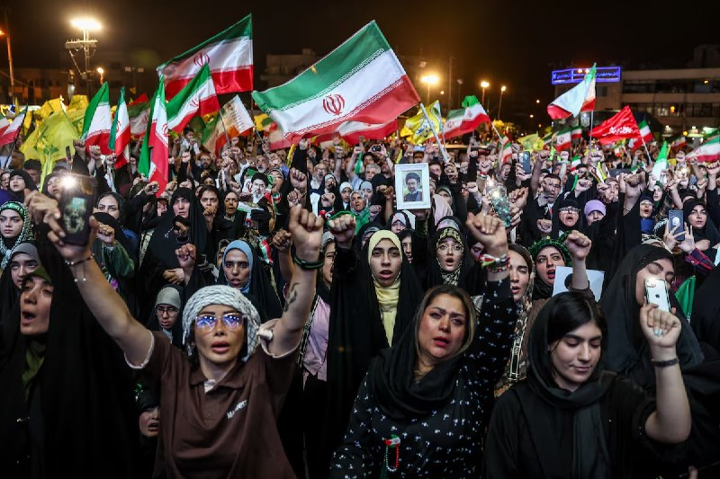

Trump says he will soon decide on Iran deal, demands reopening of Hormuz Strait

U.S. President Donald Trump said on Friday he ​would soon decide on a proposed deal to extend the ceasefire with Iran, though the two countries still appeared to differ on significant issues ‌that have been central to the conflict.

Trump said on Friday morning that he would meet in a secure White House room to make a "final determination" on the proposal, which would extend an early-April truce for another 60 days, giving negotiators time to forge a permanent end to the war. read more

## FarsiVOA — post 219110

  

⚡️ستاد فرماندهی مرکزی آمریکا، سنتکام، روز شنبه اعلام کرد که نیروهای آمریکایی فعال در دریای عمان، یک کشتی با پرچم گامبیا که قصد حرکت به سمت یک بندر ایرانی را داشت، روز جمعه ۸ خرداد از کار انداختند و محاصره دریایی علیه جمهوری اسلامی را اعمال کردند.

سنتکام در بیانیه خود گفت نیروهایش کشتی «لیان استار» را در حال عبور از آب‌های بین‌المللی به سمت یک بندر ایرانی بود در دریای عمان مشاهده کردند و بیش از ۲۰ هشدار صادر کردند و به این کشتی اطلاع دادند که در حال نقض محاصره ایالات متحده است.

سنتکام گفت یک هواگرد آمریکایی پس از آنکه خدمه کشتی دستورات نیروهای آمریکایی را نادیده گرفتند، با شلیک یک موشک هل‌فایر به موتورخانه کشتی، آن را غیرفعال کرد.

سنتکام افزود این کشتی دیگر به سمت ایران در حال حرکت نیست.

سنتکام اعلام کرد که نیروهای آمریکایی پیشتر پنج کشتی تجاری را غیرفعال کرده‌اند و با اجرای کامل محاصره دریایی علیه جمهوری اسلامی، مسیر ۱۱۶ کشتی را تغییر داده‌اند.

## FarsiVOA — post 219109

در حالی که اختلاف‌ها در جمهوری اسلامی بر سر مذاکرات با آمریکا ادامه دارد، گزارش‌ها از صدور و تأیید احکام اعدام، کمبود دارو، مهاجرت پزشکان، خاموشی‌های گسترده و فشار فزاینده اقتصادی بر خانوارهای ایرانی حکایت دارد.

## FarsiVOA — post 219108

اختلاف دیدگاه‌ها در کنگره آمریکا درباره مسیر مذاکرات با جمهوری اسلامی همزمان با تحریم‌های تازه

## FarsiVOA — post 219105

پیت هگست، وزیر جنگ آمریکا، اعلام کرد با جان هیلی و ریچارد مارلز در نشست وزیران دفاع پیمان آکوس دیدار کرده است.

او گفت به دستور دونالد ترامپ، این همکاری «با تمام سرعت» در حال پیشرفت است.

@FarsiVOA

## FarsiVOA — post 219104

🔺آسوشیتدپرس: آمریکا یک کشتی تجاری دیگر را که تلاش داشت محاصره بنادر ایران را نقض کند از کار انداخت

▪️یک مقام آمریکایی می‌گوید ارتش ایالات متحده یک کشتی تجاری دیگر را که قصد داشت محاصره بنادر ایران را نقض کند، در خلیج عمان از کار انداخت.

⬇️ بیشتر بخوانید:

https://ir.voanews.com/a/usa-disabled-ship-near-iran/8155588.html/?nocach=1

## FarsiVOA — post 219103

🔺دو زندانی سیاسی اهل بوکان زیر تیغ رژیم ایران؛ حکم اعدام رئوف شیخ‌معروفی و محمد فرجی در دیوان عالی تایید شد

▪️احکام اعدام رئوف شیخ‌معروفی و محمد فرجی، دو زندانی سیاسی اهل بوکان، در دیوان عالی کشور تأیید و برای اجرا به شعبه اجرای احکام ارسال شده است.

⬇️ بیشتر بخوانید:

https://ir.voanews.com/a/death-sentences-upheld-two-iranian-political-prisoners/8155586.html/?nocach=1

## FarsiVOA — post 219102

🔺انتقال یک فعال حقوق زنان به زندان رشت و بلاتکلیفی یک زندانی بهائی در یزد؛ آزادی سپیده قلیان پس از پایان دوره محکومیت

▪️رسانه‌های حقوق بشری روز شنبه ۹ خرداد اعلام کردند تینا دلجو، فعال حقوق زنان، به زندان لاکان رشت منتقل شد، بلاتکلیفی فلورا صمدانی، شهروند بهائی در زندان یزد از یک‌ ماه فراتر رفت، و همزمان سپیده قلیان، با پایان دوران محکومیت، از زندان وکیل‌آباد مشهد آزاد شد.

⬇️ بیشتر بخوانید:

https://ir.voanews.com/a/iran-prison-arrest-women-activist-bahaie/8155579.html/?nocach=1

## FarsiVOA — post 219101

🔺صدور حکم اعدام علیه بنیامین نقدی در شیراز؛ ماشین مرگ جمهوری اسلامی همچنان در حرکت است

▪️وکیل بنیامین نقدی، از بازداشت‌شدگان اعتراضات سراسری دی ۱۴۰۴ در شیراز، از صدور جکم اعدام برای او خبر داد.

⬇️ بیشتر بخوانید:

https://ir.voanews.com/a/iran-court-sentences-protester-to-death/8155582.html/?nocach=1

## FarsiVOA — post 219098

پیت هگست، وزیر جنگ آمریکا، اعلام کرد در حاشیه نشست «گفت‌وگوی شانگری لا» با کریس پنک، وزیر دفاع جدید نیوزیلند، دیدار کرده است.

او گفت امیدوار است نیوزیلند در مشارکت خود در دفاع جمعی پیشرفت کند.

@FarsiVOA

## FarsiVOA — post 219097

فرماندهی جنوبی آمریکا اعلام کرد که روز ۸ خرداد به یک شناور متعلق به یک سازمان تروریستی حمله کرده است.

به گفته این فرماندهی، اطلاعات موجود نشان می‌داد این شناور در مسیرهای شناخته‌شده قاچاق مواد مخدر در شرق اقیانوس آرام در حال تردد بوده و در عملیات قاچاق مواد مخدر مشارکت داشته است.

فرماندهی جنوبی آمریکا اعلام کرد سه نفر در این عملیات کشته شدند و هیچ یک از نیروهای نظامی آمریکا آسیب ندیدند.

@FarsiVOA

## FarsiVOA — post 219096

  <a href="telegram/content/FarsiVOA_219096_1780165288.mp4" target="_blank">🎬 Download video</a>

گلایه یک شهروند از گرانی؛ «یک دانه موز ۱۸۰ هزار تومان»؛

در سایه بی‌ثباتی اقتصادی و فشارهای مداوم، زندگی روزمره بسیاری از مردم به میدان مبارزه‌ای خاموش برای تأمین حداقل‌ها تبدیل شده است.

روزنامه شرق در گزارشی میدانی از تهران، از بازگشت دفترهای نسیه در سوپرمارکت‌ها، خرید اعتباری اقلامی مانند نان، پنیر، حبوبات، روغن و رب، و سقوط طبقه متوسط به وضعیت بقا تا پایان ماه روایت کرده است.

## FarsiVOA — post 219094

فرماندهی مرکزی ایالات متحده، سنتکام، تصاویری از فرود یک جنگنده «اف-۳۵ بی» تفنگداران دریایی آمریکا روی عرشه ناو «یو‌اس‌اس تریپولی» در جریان عبور از دریای عرب منتشر کرد.

سنتکام می‌گوید «اف-۳۵ بی» برای برخاست کوتاه و فرود عمودی طراحی شده است.

@FarsiVOA

## FarsiVOA — post 219093

🔺روبیو: تام باراک همچنان در مورد سوریه و عراق نقش محوری ایفا خواهد کرد

▪️مارکو روبیو، وزیر امور خارجه آمریکا، اعلام کرد تام باراک، سفیر ایالات متحده در ترکیه، با وجود پایان یافتن نقشش به‌عنوان نماینده ویژه آمریکا در امور سوریه، همچنان در سیاست‌گذاری آمریکا درباره سوریه و عراق نقش مهمی ایفا خواهد کرد.

⬇️ بیشتر بخوانید:

https://ir.voanews.com/a/rubio-backs-tom-barrack-regional-role/8155576.html/?nocach=1

## FarsiVOA — post 219092

گفت‌و‌گو با دکتر بابک خطی، پزشک و فعال سیاسی، درباره مهاجرت پرستاران و پزشکان تیر خلاص به بخش درمان ایران

## FarsiVOA — post 219091

  <a href="telegram/content/FarsiVOA_219091_1780165290.mp4" target="_blank">🎬 Download video</a>

«حال‌ وش» ویدیویی از لحظه زورگیری مسلحانه از یک شهروند در زاهدان را منتشر کرده است. در این ویدیو که مربوط به ۳۱ اردیبهشت ۱۴۰۵ است دو موتورسوار مسلح با تهدید، تلفن همراه و پول نقد یک شهروند را سرقت کرده و از محل متواری می‌شوند.

سایه جنگ، افزایش تورم، فشارهای اقتصادی و قطعی اینترنت، هم‌زمان با تغییر الگوی جرائم، چهره ناامنی شهری در ایران را دگرگون کرده است.

## DW_Farsi — post 125326

  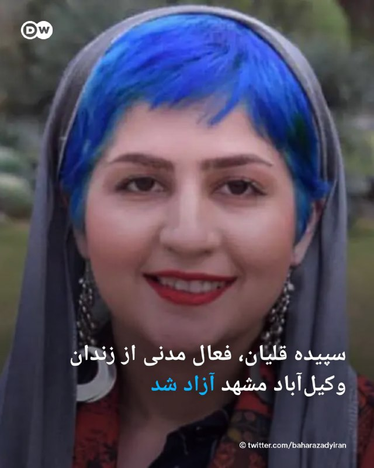

🔶 سپیده قلیان، فعال مدنی از زندان وکیل‌آباد مشهد آزاد شد

سپیده قلیان، فعال مدنی زندانی که دوران محکومیت خود را در زندان وکیل‌آباد مشهد سپری می‌کرد، امروز شنبه نهم خردادماه (۳۰ مه) از این زندان آزاد شد.

خبرگزاری هرانا مطابق اطلاعات دریافتی خود نوشت که آزادی قلیان پس از پایان دوران شش ماه محکومیت حبس تعزیری او صورت گرفته است.

قلیان در ۲۱ آذرماه سال گذشته در جریان مراسم هفتم خسرو علیکردی، وکیل دادگستری در مشهد توسط نیروهای امنیتی بازداشت شد.

این فعال مدنی که بارها سابقه زندان دارد امروز ساعاتی پس از آزادی با انتشار تصویری از حضور خود بر مزار خسرو علیکردی در شبکه ایکس نوشت: «دوباره سلام خسرو! چطور سعی کردند چشم‌های حقیقت را با قتل تو ببندند. اگر ما خاموش شویم پس کدام شهرزاد قصه تو را بگوید.»

خسرو علیکردی وکالت تعدادی از زندانیان سیاسی، معترضان و خانواده‌های دادخواه را بر عهده داشت. پیدا شدن پیکر بی‌جان این وکیل دادگستری در دفتر کارش در مشهد در آذرماه سال ۱۴۰۴ موجی از واکنش‌ها را برانگیخت و بسیاری آن را "مشکوک" دانستند.

@dw_farsi

## DW_Farsi — post 125325

  

🔶 نخست‌وزیر لبنان با تأکید بر لزوم آتش‌بس عملیات اسرائيل را محکوم کرد

نواف سلام، نخست‌وزیر لبنان آن چه که تشدید تنش "خطرناک و بی‌سابقه" از سوی اسرائیل در جنوب این کشور خواند را به شدت محکوم کرد.

به گزارش خبرگزاری فرانسه، او ضمن تاکید بر لزوم برقراری یک آتش‌بس فوری، تصریح کرد که پیش گرفتن "سیاست زمین سوخته" هرگز امنیت اسرائیل را تضمین نخواهد کرد.

سلام در یک سخنرانی تلویزیونی با دفاع از دموکراسی و ورود دولت خود به مذاکرات مستقیم با اسرائیل گفت که این گفت‌وگوها در شرایط کنونی، "کم‌هزینه‌ترین مسیر» برای لبنان است.

این در حالی است که پیش از این مقام‌های لبنانی از روند گفت‌وگوها با اسرائيل که با میزبانی وزارت دفاع آمریکا (پنتاگون) برگزار شد ابراز ناامیدی کرده بودند.

به گزارش تایمز اسرائیل، روزنامه العربی الجدید به نقل از چند مقام آگاه نوشت که نشست پنتاگون "هیچ‌گونه پیشرفتی به‌ویژه در رابطه با برقراری آتش‌بس جامع و فراگیر دربر نداشت."

شبکه الحدث نیز به نقل از یک منبع نظامی گزارش داد که این نشست "نتایج عملی و ملموسی که مورد نظر و مطلوب لبنان بود را به بار نیاورد."

@dw_farsi

## DW_Farsi — post 125324

  

🔶 هشدار سازمان دریانوردی بریتانیا نسبت به "تشدید سریع تنش‌ها" در تنگه هرمز

آژانس امنیت تجارت دریایی بریتانیا (UKMTO) در بیانیه‌ای وضعیت امنیتی در تنگه هرمز را "همچنان بحرانی" خواند و اعلام کرد که محاصره دریایی بنادر ایران توسط ایالات متحده بدون تغییر باقی مانده است.

خبرگزاری آلمان در گزارش خود در روز شنبه ۳۰ مه (۹ خرداد) نوشت، در این بیانیه با اشاره به این که "کشتی‌هایی که مشمول این محاصره هستند باید کماکان از دستورات نیروهای محاصره‌کننده پیروی کنند" آمده است که عدم پایبندی به این دستورات می‌تواند منجر به "تشدید سریع تنش‌ها" شود.

مذاکرات ایران و آمریکا که هدف از آن پایان دادن به مناقشه هسته‌ای و جنگ است هنوز به نتیجه‌ نهایی نرسیده است.

آخرین خبرها در روزهای گذشته دستیابی به توافق را باورپذیر کرده بود اما به رغم مذاکرات فشرده هنوز گشایش نهایی در این مسیر به دست نیامده است.

به گفته مقا‌م‌های ایرانی، ظرف ۲۴ ساعت گذشته در مجموع ۲۰ فروند کشتی از تنگه هرمز عبور کرده‌اند.

@dw_farsi

## DW_Farsi — post 125323

  

🔶 اسرائيل دستور تخلیه ۱۰ روستای لبنان را صادر کرد

ارتش اسرائیل پس از چند حمله از سوی حزب‌الله لبنان، از ساکنان ۱۰ روستای این کشور خواست تا خانه‌های خود را تخلیه کنند.

به گزارش رسانه‌های آلمان، یک سخنگوی ارتش اسرائيل گفت، این اقدام در پاسخ به نقض مداوم آتش‌بس از سوی حزب‌الله صورت گرفت است.

همزمان شبکه‌های تلویزیونی عربی از حملات هوایی اسرائیل به اهدافی در شهر نبطیه لبنان و حومه آن گزارش داده‌اند. طبق‌ گزارش شبکه تلویزیونی "ال‌بی‌سی" لبنان، در این حملات دست‌کم سه نفر کشته شده‌اند؛ هر چند که این آمار هنوز به طور رسمی تأیید نشده است.

به گفته ارتش اسرائیل، گروه حزب‌الله در طول شب گذشته ۲۹ مه در چهار حمله حدود ۱۰ تا ۱۵ موشک به شمال اسرائیل شلیک کرده است.

روزنامه اسرائیلی هاآرتص نیز به نقل از مقامات محلی گزارش داد که تنها ۱۰ فروند از این پرتابه‌ها به سمت شهر مرزی "کریات شمونا" هدایت شدند.

طبق این گزارش، پدافند هوایی اسرائیل ۹ موشک را رهگیری و منهدم کرد. یکی از موشک‌ها به مرکز شهر اصابت کرد و خسارات مالی بر جای گذاشت، اما این حادثه هیچ مجروحی در پی نداشت.

@dw_farsi

## DW_Farsi — post 125322

  

🔶 نیویورک‌ پست: آزادی وجوه ایران در قطر از گره‌های توافق با آمریکاست

روزنامه آمریکایی نیویورک پست در گزارشی شرح داده که آزادسازی ۶ میلیارد دلار ایران که در پی توافق تبادل زندانی میان ایران و آمریکا در سال ۲۰۲۳ در قطر بلوکه شده بود، از جمله آخرین گره‌های دستیابی به توافق در مذاکرات صلح بین ایران و آمریکاست.

نیویورک ‌پست به نقل از یک مقام آمریکایی نوشت که این دارایی‌ها به تدریج و در قالب محموله‌های غذایی و دارویی آزاد خواهند شد، مشروط بر اینکه ایران به تعهدات خود، از جمله بازگشایی و مین‌روبی تنگه هرمز عمل کند.

در این گزارش مشخص نشده که این مقام مسئول در حال تشریح پیشنهاد ایالات متحده است یا به بند خاصی از پیش‌نویس توافق اشاره دارد.

در سپتامبر ۲۰۲۳ و به عنوان بخشی از توافقی که به آزادی پنج تن از اتباع هر یک از این دو کشور انجامید، جو بایدن، رئیس‌جمهور وقت آمریکا، تحریم‌هایی را که مانع برداشت ۶میلیارد دلار دارایی ایران از کره جنوبی می‌شد لغو کرد.

این وجوه سپس از کره جنوبی به حساب‌هایی در قطر منتقل شد، اما پس از حمله ۷ اکتبر ۲۰۲۳ گروه حماس به جنوب اسرائیل و آغاز جنگ غزه، مسدود ماند.

@dw_farsi

## DW_Farsi — post 125321

  

🔶 توقیف اموال ده‌ها نفر در ایران به اتهام "همکاری با دشمن"

در حالی که قوه قضائیه استان گلستان از توقیف اموال ۷۴ ایرانی خارج از کشور به اتهام "خیانت به وطن" خبر داده، رئيس‌ کل دادگستری خراسان جنوبی نیز می‌گوید، اموال ۳۴ نفر در این استان به اتهام "حمایت از دشمن" ضبط شده است.

خبرگزاری ایرنا روز شنبه نهم خرداد (۳۰ مه) به نقل از قوه قضائيه نوشت، به دستور مقام قضايی، اموال ۷۴ نفر در استان گلستان که از " خائنین به وطن و افراد تأثیرگذار در شبکه همکاران دشمن" و ساکن خارج از کشور هستند در راستای "حفظ حقوق عامه و اجرای قانون تشدید مجازات جاسوسی و همکاری" با اسرائيل توقیف شد.

قوه قضائيه می‌‌گوید، اموال این افراد شامل حساب‌های بانکی، خودرو و املاک ثبتی است که شناسایی و همه توقیف شده است. در ضمن، هرگونه نقل و انتقال مالی برای آن‌ها ممنوع و پرونده این افراد در دادسرای مرکز استان در حال رسیدگی است.

هم‌زمان محمدجعفر عبداللهی، رئیس‌ کل دادگستری استان خراسان جنوبی از توقیف اموال ۳۴ نفر که او آن‌ها را "حامی دشمن و خائن به کشور" نامید خبر داد.

@dw_farsi

## DW_Farsi — post 125320

  

🔶 نماینده ایرانی‌تبار پارلمان آلمان خواستار ممنوعیت فعالیت سپاه شد

رضا اصغری، نماینده ایرانی‌تبار پارلمان آلمان از حزب دموکرات‌مسیحی (CDU) خواستار ممنوعیت فعالیت سپاه پاسداران انقلاب اسلامی در این کشور شد.

اصغری در گفت‌وگو با خبرگزاری رویترز گفت: «سرویس‌های اطلاعاتی ایران در آلمان بسیار فعال هستند. غیرقابل درک است که هنوز ممنوعیتی برای فعالیت سپاه پاسداران در این کشور وجود ندارد. ما در سریع‌ترین زمان ممکن به این ممنوعیت نیاز داریم.»

اتحادیه اروپا تا کنون سپاه پاسداران را در فهرست سازمان‌های تروریستی قرار داده است.

اما وزارت کشور آلمان هنوز بر اساس قانون تشکل‌ها (Vereinsrecht)، فعالیت سپاه را در خاک خود ممنوع اعلام نکرده است.

در ساختار حقوقی آلمان، دولت برای ممنوع کردن فعالیت یک نهاد خارجی در خاک خود، باید از طریق این قانون اقدام کند تا بتواند شعبه‌ها، فعالیت‌ها و دارایی‌های آن نهاد یا هوادارانش را در داخل مرزهای آلمان غیرقانونی اعلام کند.

@dw_farsi

## Persian_Trend_Official — post 15350

یک مقام آمریکایی آگاه به خبرگزاری آسوشیتدپرس گفت که ارتش آمریکا یک کشتی تجاری دیگر را که سعی داشت از محاصره بنادر ایران توسط آمریکا عبور کند، متوقف کرده است. 📝 Amir 📌 @persian_trend_official پرشین ترند | متفاوت‌ترین کانال نظامی

## Persian_Trend_Official — post 15349

  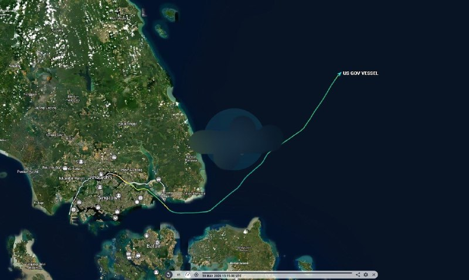

ناو آبی خاکی باکسر به خاورمیانه نمی آید!

به نظر می‌رسد که ناو آبی خاکی یو‌اس‌اس باکسر (LHD-4) قرار نیست در حوزه مسئولیت سنتکام مستقر شود. ناو آبی‌خاکی کلاس وسپ نیز امروز از بندر سمبانوان در سنگاپور حرکت کرد؛ اگرچه اکنون به سمت شرق در حرکت است.

📝 Amir

📌 @persian_trend_official
پرشین ترند | متفاوت‌ترین کانال نظامی

## Persian_Trend_Official — post 15348

  <a href="telegram/content/Persian_Trend_Official_15348_1780165298.webm" target="_blank">🎬 Download video</a>

کانال 12 اسرائیل: نخست وزیر نتانیاهو، وزیر دفاع کاتز، رئیس ستاد ارتش اسرائیل و مقامات ارشد امنیتی عصر امروز یک ارزیابی امنیتی برگزار خواهند کرد.

بحث‌ها بر تشدید تنش در شمال اسرائیل و تشدید دستورالعمل‌های فرماندهی جبهه داخلی متمرکز خواهد بود.

📝 Amir

📌 @persian_trend_official
پرشین ترند | متفاوت‌ترین کانال نظامی

## Persian_Trend_Official — post 15347

https://www.instagram.com/reel/DY9_9XQNm3g/?igsh=MWh2Z3d5eXRvcnhoMg==

پیج اینستاگرام پرشین ترند رو فالو کردید ؟

## Persian_Trend_Official — post 15346

  <a href="telegram/content/Persian_Trend_Official_15346_1780165299.webm" target="_blank">🎬 Download video</a>

قرارگاه مرکزی خاتم‌الانبیا: مدیریت تنگه هرمز توسط نیروهای مسلح جمهوری اسلامی ایران با اقتدار کامل اعمال می‌شود.

قرارگاه مرکزی خاتم الانبیا در بیانیه ای اعلام کرد: با توجه به یکپارچگی این مسیر، تأکید می‌شود کلیه کشتی‌ها، شناورهای تجاری و نفتکش‌ها صرفاً ملزم به تردد از مسیرهای تعیین‌شده و اخذ مجوز از نیروی دریایی سپاه پاسداران انقلاب اسلامی هستند. هرگونه تخلف از این ضوابط، امنیت تردد آن‌ها را با مخاطره جدی مواجه خواهد کرد.

همچنین هشدار داده می‌شود هرگونه اقدام شناورهای نظامی جهت مداخله در مدیریت تنگه هرمز یا ایجاد اختلال در تردد، مورد هدف نیروهای مسلح جمهوری اسلامی ایران قرار خواهد گرفت.

📝 Amir

📌 @persian_trend_official
پرشین ترند | متفاوت‌ترین کانال نظامی

## Persian_Trend_Official — post 15345

  

یک مقام آمریکایی آگاه به خبرگزاری آسوشیتدپرس گفت که ارتش آمریکا یک کشتی تجاری دیگر را که سعی داشت از محاصره بنادر ایران توسط آمریکا عبور کند، متوقف کرده است.

📝 Amir

📌 @persian_trend_official
پرشین ترند | متفاوت‌ترین کانال نظامی

## Persian_Trend_Official — post 15344

  <a href="telegram/content/Persian_Trend_Official_15344_1780165300.mp4" target="_blank">🎬 Download video</a>

امریکا خبر آسیب حمله موشکی ایران به کویت را تأیید کرد.

مجری فاکس نیوز: بلومبرگ گزارش می‌دهد که حملات موشکی ایران منجر به زخمی شدن چندین آمریکایی در پایگاه هوایی کویت شده است. به نظر شما اوضاع از چه قرار است؟

مایک جانسون، رئیس مجلس نمایندگان: من دیشب با رئیس جمهور ترامپ صحبت کردم. او در جریان این موضوع قرار گرفته است. من فکر می‌کنم رهبری جدید ایران می‌خواهد به این درگیری پایان دهد.

📝 Amir

📌 @persian_trend_official
پرشین ترند | متفاوت‌ترین کانال نظامی

## RadioFarda — post 157729

  

🔸خبرگزاری بلومبرگ روز شنبه گزارش داد که حمله موشکی ایران به یک پایگاه هوایی در کویت باعث زخمی شدن چند آمریکایی شده است.

🔸یک منبع به این رسانه گفته است که در ۲۴ ساعت گذشته پنج آمریکایی، از جمله پیمانکاران و نیروهای نظامی، در پی رهگیری و انهدام یک موشک ایرانی از نوع «فاتح ۱۱۰» توسط سامانه پدافند هوایی کویت دچار «جراحات جزئی» شده‌اند.

🔸این اتفاق بر اثر سقوط بقایای موشک ایرانی بر روی پایگاه هوایی علی السالم کویت که محل استقرار نیروهای آمریکایی است، رخ داد.

🔸بلومبرگ می‌گوید در این حادثه، یک فروند پهپاد ام‌کیو-۹ ریپر آمریکایی نابود شد و یک پهپاد دیگر از همین نوع در همین پایگاه «آسیب جدی» دید.

🔸ارتش آمریکا درباره این گزارش هنوز اظهارنظر نکرده است.

🔸پایگاه هوایی علی السالم در حدود ۳۲ کیلومتری مرز عراق قرار دارد و در جریان جنگ اخیر آمریکا و اسرائیل با ایران نیز تحت حملات پهپادی و موشکی ایران قرار گرفته بود.

@RadioFarda

## RadioFarda — post 157728

  

🔸ستاد فرماندهی مرکزی ارتش آمریکا، سنتکام، اعلام کرد نیروهای این کشور یک کشتی تجاری با پرچم گامبیا را که به گفته واشینگتن در نقض محاصره دریایی به سمت یکی از بنادر ایران در حرکت بود، در خلیج عمان هدف قرار داده و از ادامه مسیر آن جلوگیری کرده‌اند.

🔸سنتکام روز شنبه نهم خرداد در بیانیه‌ای گفت نیروهای آمریکایی روز هشتم خرداد کشتی «لیان استار» را هنگام حرکت در آب‌های بین‌المللی به سوی یکی از بنادر ایران شناسایی کردند و بیش از ۲۰ بار به خدمه آن هشدار دادند.

🔸به گفته این نهاد نظامی، پس از آنکه خدمه کشتی به هشدارها توجه نکردند، یک هواپیمای آمریکایی با شلیک موشک هلفایر به اتاق موتور کشتی، آن را از کار انداخت.

🔸سنتکام افزود این کشتی دیگر به سمت ایران در حرکت نیست.

🔸در این بیانیه آمده است که از زمان اجرای محاصره دریایی علیه ایران، نیروهای آمریکایی پنج کشتی تجاری را از کار انداخته و ۱۱۶ کشتی دیگر را وادار به تغییر مسیر کرده‌اند.

🔸سنتکام جزئیات بیشتری درباره محموله کشتی یا مقصد دقیق آن در ایران ارائه نکرده است.

@RadioFarda

## RadioFarda — post 157727

  <a href="https://t.me/radiofarda/157727" target="_blank">📎 Download file</a>

📻بشنوید: ایستگاه ۱۹ با رادیوفردا، نهم خرداد ۱۴۰۵

@RadioFarda

## RadioFarda — post 157726

  <a href="https://t.me/radiofarda/157726" target="_blank">📎 Download file</a>

آیا جهان در آستانه شوک تازه انرژی قرار گرفته است؟

🔸مدیران چهار نهاد بزرگ اقتصادی جهان شامل آژانس بین‌المللی انرژی، صندوق بین‌المللی پول، بانک جهانی و سازمان تجارت جهانی هشدار داده‌اند ادامه درگیری‌ها در خاورمیانه، عرضه انرژی، تجارت جهانی و اقتصاد کشورهای آسیب‌پذیر را به‌طور جدی تحت فشار قرار داده است. این نهادها می‌گویند اختلال در تردد نفتکش‌ها از تنگه هرمز، افزایش قیمت سوخت و کود شیمیایی و نااطمینانی اقتصادی، بیش از همه به کشورهای فقیر آسیب می‌زند. حسن منصور، اقتصاددان در بریتانیا به این پرسش پاسخ می‌دهد که هشدار هم‌زمان چهار نهاد بزرگ اقتصادی جهان را باید تا چه حد جدی گرفت؟

@RadioFarda

## RadioFarda — post 157725

  <a href="https://t.me/radiofarda/157725" target="_blank">📎 Download file</a>

لبنان میان فشار دیپلماسی و آتش جنگ؛ گفت‌وگو با مهرداد فرهمند

🔸در حالی که جمهوری اسلامی در مذاکرات با آمریکا بر پایان جنگ در همه جبهه‌ها، از جمله لبنان، تأکید می‌کند، نمایندگان لبنان و اسرائیل نیز با میانجی‌گری آمریکا در پنتاگون گفت‌وگوهایی امنیتی و نظامی برگزار کردند؛ مذاکراتی که بر تثبیت آتش‌بس شکننده و کاهش تنش متمرکز بود، نه یک توافق سیاسی جامع. هم‌زمان، بنیامین نتانیاهو مدعی شده نیروهای اسرائیلی از رود لیتانی عبور کرده‌اند؛ ادعایی که حزب‌الله آن را رد می‌کند. اکنون این پرسش مطرح است که آیا لبنان به بخشی تعیین‌کننده از معامله بزرگ‌تر میان تهران و واشینگتن تبدیل شده، یا همچنان در مدار یک جنگ فرسایشی باقی خواهد ماند؟ ارزیابی مهرداد فرهمند، تحلیل‌گر مسائل خاورمیانه، را بشنویم.

@RadioFarda

## RadioFarda — post 157724

  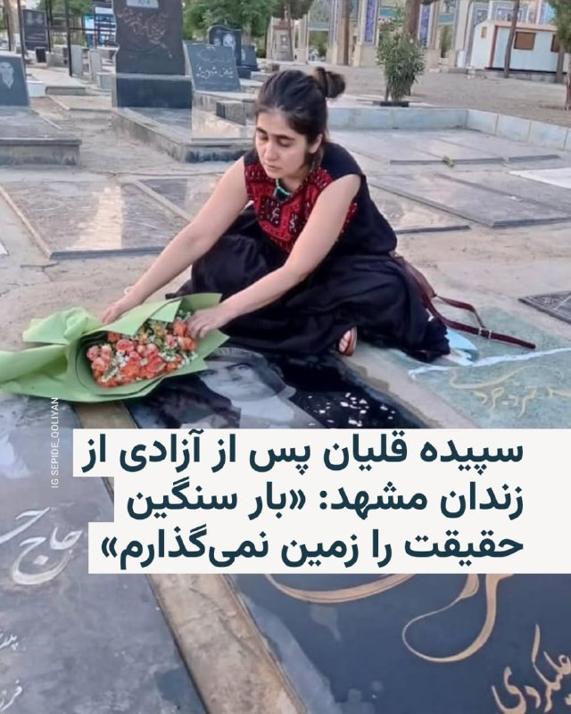

🔸سپیده قلیان، فعال مدنی و زندانی سیاسی، روز شنبه نهم خرداد پس از پایان محکومیت شش‌ماهه خود از زندان وکیل‌آباد مشهد آزاد شد.

🔸او ساعاتی پس از آزادی با انتشار تصویری از حضور خود بر مزار خسرو علیکردی، وکیل دادگستری، نوشت: «از زندان یک راست آمدم سر خاک خسرو» و افزود که «از هرچه خسته شوم، از رسیدن به آزادی و حمل کردن سنگ‌های سخت حقیقت خسته نخواهم شد.»

🔸قلیان همچنین با اشاره به هم‌بندی‌های خود در زندان وکیل‌آباد نوشت که هنگام خداحافظی، در چشمان آنان تنها یک جمله می‌دید: «ما را فراموش نکنید.»

🔸سپیده قلیان در بخش دیگری از پیام خود نوشت که نام زندانیان و کشته‌شدگان ماه‌های اخیر را «فریاد خواهد زد» و افزود: «کاش شهرزاد قصه‌شان باشم.»

🔸سپیده قلیان ۲۱ آذر ۱۴۰۴ در جریان مراسم ترحیم خسرو علیکردی در مشهد بازداشت شد. آن مراسم با برخورد نیروهای امنیتی و انتظامی همراه بود و در جریان آن شماری از حاضران، از جمله نرگس محمدی، عالیه مطلب‌زاده و جواد علیکردی، برادر خسرو علیکردی، نیز بازداشت شدند.

@RadioFarda

## RadioFarda — post 157723

🔸پیت هگست، وزیر دفاع آمریکا، روز شنبه نهم خرداد گفت ایالات متحده در صورتی که مذاکرات با ایران به توافق منجر نشود، آماده ازسرگیری حملات علیه جمهوری اسلامی است.

🔸هگست در جمع خبرنگاران گفت: «در حال حاضر تمرکز ما بر حفظ آمادگی و آماده بودن برای بازگشت به عملیات است، اگر لازم باشد.»

🔸او افزود دونالد ترامپ «صبور» است و به دنبال دستیابی به «توافقی خوب» است که تضمین کند ایران هرگز به سلاح هسته‌ای دست پیدا نخواهد کرد.

🔸اظهارات وزیر دفاع آمریکا در حالی مطرح می‌شود که مذاکره‌کنندگان تهران و واشینگتن در تلاش‌اند اختلافات باقی‌مانده بر سر برنامه هسته‌ای ایران را برطرف کنند.

@RadioFarda

## RadioFarda — post 157722

🔸یک عضو هیئت رئیسه مجلس شورای اسلامی روز شنبه اعلام کرد که «اعمال مدیریت» ایران بر تنگه هرمز «تصمیم قطعی» مجلس است و طرح مربوط به آن در صحن علنی تصویب و تبدیل به قانون خواهد شد. 🔸به گزارش خبرگزاری تسنیم، علیرضا سمیعی مدعی شد که درباره طرح مذکور با «دستگاه‌های…

## RadioFarda — post 157721

  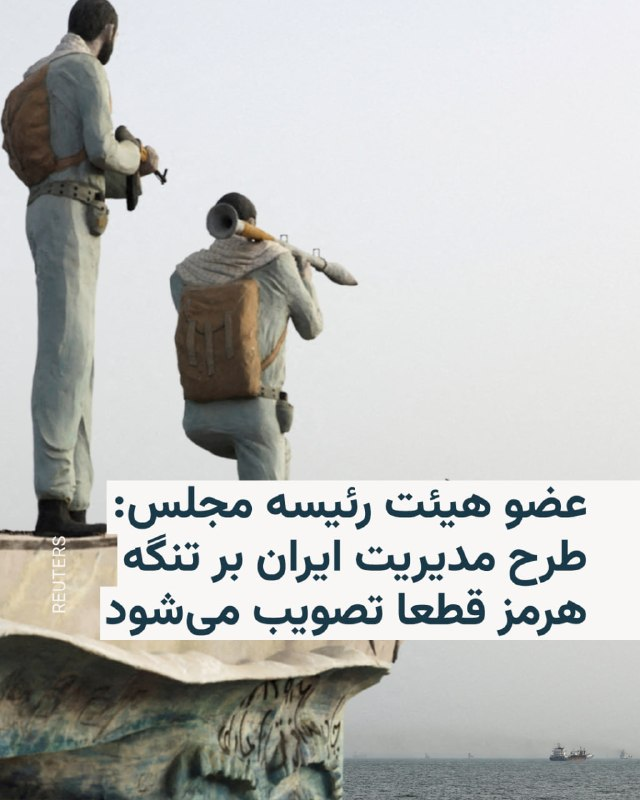

🔸یک عضو هیئت رئیسه مجلس شورای اسلامی روز شنبه اعلام کرد که «اعمال مدیریت» ایران بر تنگه هرمز «تصمیم قطعی» مجلس است و طرح مربوط به آن در صحن علنی تصویب و تبدیل به قانون خواهد شد.

🔸به گزارش خبرگزاری تسنیم، علیرضا سمیعی مدعی شد که درباره طرح مذکور با «دستگاه‌های مختلف» گفت‌وگوهایی انجام شده است.

🔸این در حالی است که دونالد ترامپ، رئیس‌جمهور آمریکا، بارها اعلام کرده که هرگونه توافق با ایران برای پایان دادن به جنگ باید شامل باز شدن این آبراه بدون اخذ عوارض باشد. او روز جمعه نیز این موضع ایالات منحده را تکرار کرد.

🔸عضو هیئت رئیسه مجلس با اعلام این‌که تنگه هرمز در «حوزه سرزمینی ایران و عمان» است، گفت که اجازه نمی‌دهیم کشور دیگری در این‌ زمینه تصمیم‌گیری کند.

📷شرح عکس: مجسمه نیروهای نظامی ایران در ساحل بندرعباس، در حالی که شناورهایی در آب‌های تنگه هرمز دیده می‌شوند.

@RadioFarda

## IranianMinds — post 21087

🔴 سنتکام :

نیروهای آمریکایی فعال در خلیج عمان با از کار انداختن یک کشتی دریایی با پرچم گامبیا که قصد حرکت به سمت بندر ایران را داشت، در 29 مه، اقدامات محاصره ای را اعمال کردند.

نیروهای فرماندهی مرکزی ایالات متحده (CENTCOM) M/V Lian Star را در حال عبور از آب‌های بین‌المللی به سمت یک بندر ایرانی در خلیج عمان مشاهده کردند و بیش از 20 اخطار صادر کردند و در عین حال به کشتی اطلاع دادند که محاصره ایالات متحده را نقض می‌کند.

یک هواپیمای آمریکایی با شلیک موشک هلفایر به داخل موتور کشتی، کشتی را از کار انداخت، زیرا خدمه لیان استار از رعایت این مقررات ناکام ماندند. این کشتی دیگر به ایران ترانزیت نمی کند.

نیروهای ایالات متحده پنج کشتی تجاری را از کار انداخته و 116 کشتی را برای اجرای کامل محاصره هدایت کرده اند، زیرا آتش بس با ایران همچنان به قوت خود باقی است.

@IranianMinds

## IranianMinds — post 21086

یعنی میشه مام یه روزی به آزادی برسیم از دست آخوند راحت شیم ؟ یا برا ما قفله …

@IranianMinds

## IranianMinds — post 21085

  

@IranianMinds

## IranianMinds — post 21084

  <a href="telegram/content/IranianMinds_21084_1780165307.mp4" target="_blank">🎬 Download video</a>

🔴 کارشناس صداوسیما :

ما اصلا آریایی نیستیم و اینکه بعضیا میگن ما آریایی هستیم نژاد‌ پرستیه ، آریایی ها همشون قاتل بودن و همه رو‌ کشتن تا به قدرت برسن اینکه بگیم ما آریایی هستیم یعنی ما فرزندان کسانی هستیم که نسل کشی کردن.

@IranianMinds

## IranianMinds — post 21083

  

@IranianMinds

## IranianMinds — post 21082

  

😤دنبال یه سایت شرط بندی بین المللی بودی که به ایرانیا خدمات بده؟!
⛔

👍دربی بت همون انتخاب  100%

💎ویژگی های سایت جهانی Derby Bet:

⬅️امکان شارژ امن با کارت بانکی

⬅️واریز اول دوبل شارژ می شوید(بونوس۱۰۰٪)

⬅️پر اپشن ترین سایت فعال در ایران

⬅️تسویه حساب کمتر از 5 دقیقه

⬅️برگشت بخشی از باخت به صورت هفتگی

🚨کد هدیه ثبت نام:GG007

⚠️برای دانلود اپلکیشن کلیک کنید
👉

🔔کانال دربی بت G9:

🪙https://t.me/+aCbq7yy8QY80NzQ0

## IranianMinds — post 21081

  

🔴 پست جدید ترامپ :

۵ مرحله از سندرم ترامپ هراسی.

@IranianMinds

## IranianMinds — post 21080

  

پست جدید ترامپ :

@IranianMinds

## IranianMinds — post 21078

  <a href="telegram/content/IranianMinds_21078_1780165313.mp4" target="_blank">🎬 Download video</a>

🔴 حملات هوای ارتش اسرائیل به جنوب لبنان در دقایقی پیش.

@IranianMinds

## IranianMinds — post 21077

  

@IranianMinds

## IranianMinds — post 21076

🔴آسو‌شیتد‌پرس به نقل از یک منبع آمریکایی:

ارتش آمریکا یک کشتی تجاری را که قصد داشت به سمت یکی از بنادر ایران برود، منع کرد.

@IranianMinds

## IranianMinds — post 21075

  

🔴 بنیامین نقدی، زندانی سیاسی و از معترضان دی‌ماه، از سوی دادگاه انقلاب شیراز به اعدام محکوم شد.

@IranianMinds

## IranianMinds — post 21074

  

🔴بدون توضیح.

😂😂😂

@IranianMinds

## BBCPersian — post 282444

  <a href="telegram/content/BBCPersian_282444_1780165316.mp4" target="_blank">🎬 Download video</a>

🔻‌نشست «امنیت دریای سیاه» در حساب رسمی خود در شبکه ایکس اعلام کرده که شاهزاده رضا پهلوی به این نشست که در اودسا در جنوب اوکراین برگزار می‌شود رفته است و او را «میهمان ویژه» خوانده است.

این نهاد رضا پهلوی را «ریاست سلسله پهلوی و وارث سلطنت در ایران» توصیف کرده است.

این نشست در حساب کاربری خود در شبکه ایکس گفته است:«امروز، رضا پهلوی یکی از برجسته‌ترین چهره‌های اپوزیسیون ایران و از مدافعان برجسته تغییرات دموکراتیک در ایران است.»
آقای پهلوی در بخشی از سخنان خود گفت ایستادن جامعه جهانی در کنار مردم ایران «در راستای منافع همه کشورها خواهد بود.»

نشست امنیت دریای سیاه در سال ۲۰۲۴ توسط گروهی از نمایندگان پارلمان اوکراین در اودسا آغاز به کار کرد و در جلسات سالانه خود به بررسی چالش‌های امنیتی و ژئوپلیتیک در منطقه دریای سیاه و فراتر از آن می‌پردازد.

@‌‌BBCPersian

## BBCPersian — post 282443

🔻سپاه پاسداران درباره هرگونه مداخله نظامی در مدیریت تنگه هرمز هشدار داد

قرارگاه مرکزی خاتم الانبیا که نقش اصلی در مدیریت جنگ از سوی ایران دارد، امروز هشدار داد که «هرگونه اقدام شناورهای نظامی جهت مداخله در مدیریت تنگۀ هرمز یا ایجاد اختلال در تردد، مورد هدف نیروهای مسلح جمهوری اسلامی ایران قرار خواهد گرفت.»

این قرارگاه گفته است که «کلیه کشتی‌ها، شناورهای تجاری و نفتکش‌ها صرفا ملزم به تردد از مسیرهای تعیین‌شده و اخذ مجوز از نیروی دریایی سپاه پاسداران انقلاب اسلامی هستند» و «هرگونه تخلف از این ضوابط، امنیت تردد آنها را با مخاطره جدی مواجه خواهد کرد.»

ایران از زمان حمله آمریکا و اسرائیل کنترل عبور و مرور کشتی‌ها در تنگه هرمز را در اختیار گرفته است.

برخی از گزارش‌های تایید نشده حاکی از این بود که برخی از شناورها در صدد عبور از بخشی از تنگه هرمز هستند که در آب‌های عمان قرار دارد.

ساعاتی پیش از این گزارش داده بودیم که عمان پس از مشاهده شیئی مشابه مین دریایی در آب‌های خود، به دریانوردان هشدار داده است.

@BBCPersian

## BBCPersian — post 282442

🔻دو روز پس از کشته‌شدن مجتبی و میثم ویسی، دو برادر کرد یارسان، با شلیک نیروهای سپاه پاسداران انقلاب اسلامی در دالاهوی کرمانشاه، مراسم بزرگداشت آنها در محله دره دریژ این شهر برگزار شد.

یک منبع نزدیک به خانواده ویسی به بی‌بی‌سی گفت: « پیکر این دو برادر هنوز به خانواده‌شان تحویل داده نشده است.»

عناصر اصلی آشوب‌های دی‌ماه سال گذشته

خبرگزاری فارس مجتبی و میثم ویسی را از «عناصر اصلی آشوب‌های دی‌ماه سال گذشته» در دره‌ دریژ کرمانشاه خوانده است.

شبکه حقوق بشر کردستان گزارش داده است که این دو برادر از نگرانی بازداشت شدن، طی ماه‌های اخیر محل سکونت خود در شهرک ده‌ره‌دریژ کرمانشاه را ترک کرده و به‌صورت مخفیانه زندگی می‌کردند.

هم‌زمان، دو عضو دیگر این خانواده نیز که در پی اعتراضات دی‌ماه بازداشت شده بودند با اتهام محاربه روبه‌رو شده‌اند.

سجاد ویسی، برادر آنها، و شایان ویسی، پسرعمویشان، اکنون در خطر صدور حکم اعدام قرار دارند.

سجاد ویسی روز سوم اسفند ۱۴۰۴ بازداشت شد. شایان نیز از بازداشت‌شدگان اعتراضات دی‌ماه ۱۴۰۴ است.

@BBCPersian

## BBCPersian — post 282441

🔻‌ این تصاویر از تجمع گروهی از مخالفان حکومت ایران در استرالیا و آلمان به دست بی‌بی‌سی فارسی رسیده است.

در هامبورگ آلمان، تجمع‌کنندگان با در دست داشتن تصاویر بازداشت‌شدگان اعتراضات دی‌ماه ۱۴۰۴، خواستار توقف اعدام‌ها در ایران شدند.

همچنین در بریزبن استرالیا، حاضران در حمایت از مردم ایران و در اعتراض به مشکلات اقتصادی و اجتماعی سخنرانی کردند و شعارهایی در حمایت از شاهزاده رضا پهلوی سر دادند.

در فرانکفورت هم تجمعی با عنوان «۴۷ ایستگاه دادخواهی» به نشانه ۴۷ سال اعتراض و مبارزات مردم ایران برگزار شد. حاضران در این تجمع با تشکیل زنجیره‌انسانی و در دست داشتن پلاکاردهایی درباره شرایط ایران اطلاع رسانی و همچنین سخنرانی کردند.  

از شروع اعتراضات در دی‌ماه ۱۴۰۴ و سرکوب و کشتار گسترده معترضان توسط حکومت، بسیاری از ایرانیان خارج از کشور در شهرهای مختلف جهان تجمعات هفتگی برگزار کرده‌اند.

بر اساس آمارهای منتشرشده، از زمان آغاز جنگ آمریکا و اسرائیل با ایران، بیش از ۳۰ نفر در ارتباط با پرونده‌های سیاسی و امنیتی اعدام شده‌اند.
@BBCPersian

## BBCPersian — post 282440

  <a href="https://t.me/bbcpersian/282440" target="_blank">📎 Download file</a>

پادکست برنامه جام جهان‌نما، شنبه ۹ خرداد ۱۴۰۵

این برنامه رادیویی رامی‌توانید هرشب ساعت ۲۰ به وقت ایران، روی موج متوسط ۷۰۲ کیلوهرتز و موج کوتاه۹۴۶۵ کیلوهرتز بشنوید. تکرار برنامه را هم می‌توانید ساعت ۲۱:۳۰ روی موج متوسط ۷۰۲ کیلوهرتز و موج کوتاه۵۳۹۵ کیلوهرتز گوش کنید.
@BBCPersian

## BBCPersian — post 282439

فینال لیگ قهرمانان اروپا در بوداپست بین پاری‌سن‌ژرمن و آرسنال امروز شنبه ۹ خرداد برگزار می‌شود. باشگاه آرسنال اسکرین بزرگی را در ورزشگاه خانگی این تیم، ورزشگاه امارات لندن آماده کرده است تا طرفدارانش بازی را در این ورزشگاه تماشا کنند.

این بازی برای آرسنال که حدود یک هفته پیش توانست بعد از ۲۲ سال در لیگ برتر انگلستان قهرمان شود، بسیار مهم است.

اگر آرسنال بتواند امروز به قهرمانی لیگ قهرمانان اروپا برسد، سالی استثنایی برای طرفدارانش رقم خواهد زد.
@BBCPersian

## BBCPersian — post 282438

  

🔻روزنامه شرق در گزارشی میدانی به موج فزاینده گرانی و کاهش قدرت خرید شهروندان ایرانی پرداخته است.

این گزارش که با عنوان «تهران؛ شهر جیب‌های خالی» منتشر شده است، به فقر در تهران با بازگشت نسیه‌ فروشی پرداخته و در آن گفته شده که موج گرانی و بی‌ثباتی اقتصادی، بسیاری از شهروندان را وادار کرده است که هزینه بعضی از کالاهای خوراکی را هم به طور قسطی بپردازند.

روزنامه شرق می‌گوید که طبقه متوسط جامعه به دلیل تورم فزاینده و موج گسترده تعدیل نیرو، «در حال فروپاشی تدریجی است.»

بر اساس این گزارش، یک زوج کارمند به این روزنامه گفته‌اند: «دو حقوق کارمندی عملا تنها تا هفته دوم ماه دوام می‌آورد.»

یک دختر جوان هم که به همراه دو نفر دیگر در خانه‌ای اشتراکی زندگی می‌کنند، می‌گوید: «با جهش ناگهانی اجاره‌بها در سال جدید و افزایش‌نیافتن دستمزدها، رسما وارد بحران شده‌اند.»

در این گزارش یک مغازه‌دار در شرق تهران روایت می‌کند‌ که آمار سرقت اقلام کوچک خوراکی نظیر تن ماهی به‌شدت بالا رفته است.

خرید دانه‌ای میوه و درخواست نصف نان از دیگر مواردی بوده که در این گزارش آمده است.

@BBCPersian
📷 REUTERS

## BBCPersian — post 282437

  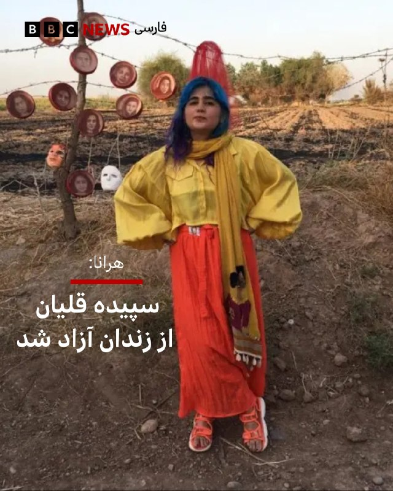

🔻به گزارش هرانا، ارگان خبری مجموعه فعالان حقوق بشر در ایران، سپیده قلیان، زندانی سیاسی امروز(شنبه ۹ خرداد) از زندان وکیل آباد مشهد آزاد شده است.

آزادی او پس از پایان دوران شش ماه محکومیت حبس تعزیری صورت گرفته است.

خانم قلیان اواخر آذرماه سال پیش (۱۴۰۴) در مراسم هفتم خسرو علیکردی در مشهد به همراه نرگس محمدی، عالیه مطلب‌زاده و پوران ناظمی بازداشت شد.

او در دی‌ماه سال پیش در دادگاه انقلاب مشهد محاکمه شد و در بهمن ماه به «اجتماع و تبانی برای ارتکاب جرم برضد امنیت داخلی/خارجی» و «تبلیغ علیه نظام» متهم شد که پنج سال حبس تعلیقی و شش ماه حبس تعزیری را برای او به همراه داشت.

این فعال سیاسی در خردادماه پارسال با پایان دوران محکومیت از زندان اوین آزاد شده بود.

@BBCPersian

## BBCPersian — post 282436

🔻در پی مشاهده شدن شیئی شبیه مین دریایی در تنگه هرمز، مرکز امنیت دریایی عمان به دریانوردان، ماهیگیران و شناورها هشدار داد که نهایت احتیاط را به خرج دهند.

این شیء مشکوک در آب‌های سرزمینی عمان و در غرب منطقه ترافیک ساحلی مشاهده شده است.

مرکز امنیت دریایی عمان به دریانوردان توصیه کرد که فاصله ایمن را از هر شی مشکوکی حفظ کنند و در صورت مشاهده، فورا موضوع را به مقام‌های ذی‌ربط گزارش دهند.

آمریکا بارها ایران را به تلاش برای مین‌گذاری در تنگه هرمز متهم کرده و یکی از شرایط توافق صلح با تهران را هم مین‌روبی این آبراه عنوان کرده است.

ایران هیچگاه رسما مین‌گذاری در این تنگه را تایید نکرده است.

@BBCPersian

## Dirty_Kids — post 390588

  

وضعیت من وقتی قیمت ها رو می‌بینم:

@Dirty_Kids 👻

## Dirty_Kids — post 390587

از بس بی‌اینترنتی کشیدیم، وبگردی بهم حس «کار مفید» می‌ده. کل روز یوتیوب می‌بینم و حس نمی‌کنم دارم وقت تلف می‌کنم.

@Dirty_Kids 👻

## Dirty_Kids — post 390586

  

اگر در جنگل گم شدید، گاوها رو دنبال کنید. گاوها همیشه بر می‌گردند.

@Dirty_Kids 👻

## Dirty_Kids — post 390585

  <a href="telegram/content/Dirty_Kids_390585_1780165322.mp4" target="_blank">🎬 Download video</a>

گل اول پاریس به ارسنال

@Dirty_Kids 👻

## Dirty_Kids — post 390584

میگن اسرائیل رو موشکایی که واسه سوراخ ضحاک تدارک دیده بود نوشته بوده؛

"خامنه‌ای ۲۵ ثانیه‌‌ آینده را نخواهد دید" :)))

@Dirty_Kids 👻

## Dirty_Kids — post 390583

  <a href="telegram/content/Dirty_Kids_390583_1780165323.mp4" target="_blank">🎬 Download video</a>

تحلیل بسیار مهم اتفاقات افتاده تو نیمه اول بازی

@Dirty_Kids 👻

## Dirty_Kids — post 390582

گل اول ارسنال به پاریسس گل سکسی هاورتززز @Dirty_Kids 👻

## Dirty_Kids — post 390581

  

عکس گویای همه هست...

@Dirty_Kids 👻

## Dirty_Kids — post 390580

  

طبق تحقیقات جدید لب گرفتن از رفیق صمیمی‌تون مجازه و شما با اینکار همجنس‌باز به حساب نمیاین!

@Dirty_Kids 👻

## Dirty_Kids — post 390579

‏این که زخم‌ها قبل از خوب شدنشون می‌خارن و التماست می‌کنن تا دوباره بازشون کنی‌ خیلی استعارهٔ جالبیه. تحمل کردن خارشه، پیچ آخره. رد کنی تمومه.

@Dirty_Kids 👻

## Dirty_Kids — post 390578

  <a href="telegram/content/Dirty_Kids_390578_1780165326.mp4" target="_blank">🎬 Download video</a>

🔴 فیلم وایرال شده از حرکات عجیب عرزشیا تو تجمعات شبانه😐😂

@Dirty_Kids 👻

## Dirty_Kids — post 390577

  <a href="https://t.me/Dirty_Kids/390577" target="_blank">📎 Download file</a>

✅ اپلیکیشن اندروید سایت جهانی دربی بت

💰اولین سایت جهانی با امکان شارژ و برداشت ریالی(کارت به کارت)

🔗 برای ورود فیلترشکن روی کشور مناسب قرار دهید مانند فنلاند و المان و....

😀Telegram Channel
👇
https://t.me/+bcynkEgSW2dlYTc0

## Dirty_Kids — post 390576

  

😤دنبال یه سایت شرط بندی بین المللی بودی که به ایرانیا خدمات بده؟!
⛔

👍دربی بت همون انتخاب  100%

💎ویژگی های سایت جهانی Derby Bet:

⬅️امکان شارژ امن با کارت بانکی

⬅️واریز اول دوبل شارژ می شوید(بونوس۱۰۰٪)

⬅️پر اپشن ترین سایت فعال در ایران

⬅️تسویه حساب کمتر از 5 دقیقه

⬅️برگشت بخشی از باخت به صورت هفتگی

🚨کد هدیه ثبت نام:GG007

⚠️برای دانلود اپلکیشن کلیک کنید
👉

🔔کانال دربی بت :

🪙https://t.me/+bcynkEgSW2dlYTc0

## Dirty_Kids — post 390575

  <a href="telegram/content/Dirty_Kids_390575_1780165329.mp4" target="_blank">🎬 Download video</a>

گل اول ارسنال به پاریسس

گل سکسی هاورتززز

@Dirty_Kids 👻

## Dirty_Kids — post 390574

  <a href="telegram/content/Dirty_Kids_390574_1780165331.mp4" target="_blank">🎬 Download video</a>

جه جالب ما هم ساعت بلند ميشیم.فقط ما اون ساعت ميشاشم تو روح بنيانگذار جمهورى اسلامی و نايبش خامنه‌اى و مقوا

@Dirty_Kids 👻

## Dirty_Kids — post 390573

  

وقتی کلی مطلب برا غُرزدن اماده کرده بودم ولی یهویی میادمیگه دخترخوشگلِ من چطوره؟

@Dirty_Kids 👻

## Dirty_Kids — post 390572

  

🌎با بهبود نسبی وضعیت اینترنت و بازگشت محدود دسترسی به شبکه بین‌الملل، موفق شدیم ضمن حفظ کیفیت و پایداری سرویس‌ها، قیمت را تا هر گیگابایت 20 هزار تومان کاهش دهیم
🖥

🟣با وجود اینکه شرایط اینترنت همچنان ناپایدار است و وضعیت پهنای باند بین‌الملل به ثبات کامل نرسیده، تیم فنی بادبان با توسعه زیرساخت‌ها و بهره‌گیری از سرورهای جدید از سرویس‌دهندگان معتبر، توانسته هزینه‌ها را بهینه کرده و سرویس‌ها را با قیمت مناسب‌تری ارائه دهد
⛵️
G9
از همراهی و اعتماد شما سپاسگزاریم
💜

🛡@BadBan_VPN | کانال 

🤖@BadBan_VPNBot | ربات 

📞@BadBan_VPNSupport | پشتیبانی

## Dirty_Kids — post 390571

  <a href="telegram/content/Dirty_Kids_390571_1780165334.mp4" target="_blank">🎬 Download video</a>

ایرانی فکر کن بعد سه ماه بهت اینترنت دادن اینو ببینی😂

@Dirty_Kids 👻

## Dirty_Kids — post 390570

  <a href="telegram/content/Dirty_Kids_390570_1780165336.mp4" target="_blank">🎬 Download video</a>

🔴 ویدیوی ویرال شده از حرکت یه پسر جوون توی ایران که شاهکار خلق کرده🔥

@Dirty_Kids 👻

## Hranews — post 113250

گزارشی از بازداشت ۵ شهروند در شهرستان‌های مهرستان و سیب و سوران

❗️
❗️
❗️
❗️
❗️– روز پنجشنبه ۷ خردادماه، پنج شهروند ساکن شهرستان‌های سیب‌ و سوران و مهرستان توسط نیروهای امنیتی #بازداشت و به مکان‌های نامعلومی منتقل شدند.

ادامه مطلب

↘️
@hranews_bot تماس ✉️ - @Hranews کانال هرانا 🆑

## Hranews — post 113249

جمعی از پرستاران ساکن در یزد، صبح امروز با برگزاری تجمع اعتراضی مقابل ساختمان استانداری، نسبت به واریز نشدن تعرفه‌های خدمات پرستاری از شش ماه گذشته و عدم رسیدگی به مطالبات صنفی و مزدی خود، اعتراض کردند.
#پرستاران

↘️
@hranews_bot تماس ✉️ - @Hranews کانال هرانا 🆑

## Hranews — post 113248

  

زندان دولت‌آباد اصفهان؛ تداوم بازداشت مائده دانشمند به ۱۴۰ روز رسید

❗️
❗️
❗️
❗️
❗️– مائده دانشمند، از بازداشت شدگان مرتبط با اعتراضات سراسری ۱۴۰۴، بیش از چهار ماه است که در زندان دولت‌آباد اصفهان در بلاتکلیفی قضایی به‌سر می‌برد.

به گزارش خبرگزاری هرانا، ارگان خبری مجموعه فعالان حقوق بشر در ایران، مائده دانشمند همچنان در بازداشت بسر می‌برد.

بر اساس اطلاعات دریافتی هرانا، ۱۴۰ روز از بازداشت خانم دانشمند که که با اتهامات مرتبط با اعتراضات سراسری مواجه است، می‌گذرد. او هم‌اکنون در زندان دولت‌آباد اصفهان نگهداری می‌شود. وی همچنان در وضعیت بلاتکلیفی قضایی قرار دارد و امکان آزادی او با وثیقه نیز تاکنون میسر نشده است.

ادامه مطلب

#مائده_دانشمند

↘️
@hranews_bot تماس ✉️ - @Hranews کانال هرانا 🆑

## Hranews — post 113247

  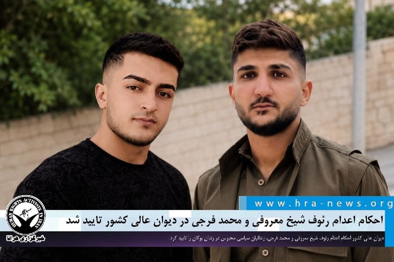

احکام اعدام رئوف شیخ‌ معروفی و محمد فرجی در دیوان عالی کشور تایید شد

❗️
❗️
❗️
❗️
❗️– دیوان عالی کشور احکام اعدام رئوف شیخ‌ معروفی و محمد فرجی، زندانیان سیاسی محبوس در زندان بوکان را تایید کرد. این افراد پیشتر از بابت اتهام “افساد فی الارض”، توسط دادگاه انقلاب به #اعدام محکوم شده بودند.

ادامه مطلب

#رئوف_شیخ‌_معروفی #محمد_فرجی

↘️
@hranews_bot تماس ✉️ - @Hranews کانال هرانا 🆑

## Hranews — post 113246

  

اعتراضات دی‌ماه ۱۴۰۴؛ بنیامین نقدی به اعدام محکوم شد

❗️
❗️
❗️
❗️
❗️– بنیامین نقدی، از بازداشت شدگان اعتراضات سراسری ۱۴۰۴، توسط دادگاه انقلاب شیراز از بابت اتهام «افساد فی‌الارض» به #اعدام محکوم شد. مصطفی نیلی، وکیل مدافع وی اعلام کرده است که نسبت به این حکم درخواست فرجام‌خواهی خواهد کرد.

ادامه مطلب

#بنیامین_نقدی

↘️
@hranews_bot تماس ✉️ - @Hranews کانال هرانا 🆑

## Hranews — post 113245

پرونده سجاد و شایان ویسی با اتهام محاربه به دادگاه انقلاب کرمانشاه ارجاع شد

❗️
❗️
❗️
❗️
❗️– سجاد ویسی و شایان ویسی، شهروندان پیرو آئین یارسان و از بازداشت‌شدگان اعتراضات دی‌ماه در کرمانشاه، همچنان در زندان دیزل‌آباد این شهر نگهداری می‌شوند. پرونده این شهروندان با اتهام محاربه به دادگاه انقلاب کرمانشاه ارجاع شده است. سجاد ویسی برادر میثم و مجتبی ویسی است که روز پنجشنبه ۷ خرداد ۱۴۰۵ در یکی از روستاهای شهرستان دالاهو هدف تیراندازی ماموران اطلاعات سپاه قرار گرفته و جان خود را از دست دادند.

ادامه مطلب

#سجاد_ویسی #شایان_ویسی

↘️
@hranews_bot تماس ✉️ - @Hranews کانال هرانا 🆑

## alonews — post 123788

  <a href="telegram/content/alonews_123788_1780165338.webm" target="_blank">🎬 Download video</a>

👈صداوسیما جزئیات غیررسمی از یادداشت تفاهم [ایران و آمریکا] را منتشر کرد:

🔴موضوع آزادسازی منابع بلوکه شده ایران از مهمترین بندهای رونوشت غیررسمی چارچوب تفاهم اسلام آباد است.

🔴بر این اساس آمریکا متعهد شده طی ۶۰ روز امکان دسترسی کامل ایران به ۱۲ میلیارد دلار از دارایی‌هایش را فراهم کند.

🔴به گونه‌ای که این منابع قابلیت انتقال و هزینه کرد در بانک‌های مقصد موردنظر ایران را بدون محدودیت داشته باشند.

✅ @AloNews خبر جنگ

## alonews — post 123787

  <a href="telegram/content/alonews_123787_1780165338.webm" target="_blank">🎬 Download video</a>

👈سنتکام : تا الان مسیر ۱۱۶ کشتی تجاری عوض کردیم

✅ @AloNews خبر جنگ

## alonews — post 123786

  <a href="telegram/content/alonews_123786_1780165339.webm" target="_blank">🎬 Download video</a>

👈 بنیامین نتانیاهو، نخست‌وزیر اسرائیل، وزیر دفاع کاتز، رئیس ستاد کل ارتش اسرائیل و مقامات ارشد امنیتی امشب جلسه‌ای برای ارزیابی امنیتی برگزار خواهند کرد، گزارش کانال ۱۲.

🔴 بحث‌ها بر تشدید تنش‌ها در شمال اسرائیل و سخت‌گیری در دستورالعمل‌های فرماندهی جبهه داخلی متمرکز خواهد بود

✅ @AloNews خبر جنگ

## alonews — post 123785

  <a href="telegram/content/alonews_123785_1780165339.webm" target="_blank">🎬 Download video</a>

👈مهدی خانعلی‌زاده، عضو رسانه‌ای هیات مذاکره‌کننده جمهوری اسلامی، نوشت: جمهوری اسلامی هیچ پولی در قطر ندارد

✅ @AloNews خبر جنگ

## alonews — post 123784

  <a href="telegram/content/alonews_123784_1780165339.webm" target="_blank">🎬 Download video</a>

👈کانال 12 اسرائیل: حزب الله در 48 ساعت اخیر 100 موشک و پهپاد به سمت شمال اسرائیل پرتاب کرده است،
ارتش اسرائیلی در حال تدارک برای حمله گسترده در بیروت است.

✅ @AloNews خبر جنگ

## alonews — post 123783

  <a href="telegram/content/alonews_123783_1780165339.mp4" target="_blank">🎬 Download video</a>

👈جزئیاتی جدید و غیررسمی از یادداشت تفاهم احتمالی ایران و آمریکا

🔴 گزارش صدا و سیما

✅ @AloNews خبر جنگ

## alonews — post 123782

  <a href="telegram/content/alonews_123782_1780165342.webm" target="_blank">🎬 Download video</a>

👈الجزیره: ترامپ برای جلوگیری از جنگ با ایران پیش از جام جهانی بسیار مصمم است

🔴 او همچنان برای دستیابی به یک توافق موقت با تهران تحت فشار است، اما پیشرفت فوری بعید به نظر می‌رسد

✅ @AloNews خبر جنگ

## alonews — post 123781

  <a href="telegram/content/alonews_123781_1780165342.mp4" target="_blank">🎬 Download video</a>

گلللللل مساااوی پاری‌سن‌ژرمن به ارسنااال توووسط دمبلههه دقیقه 65
@AloSport

## alonews — post 123780

🔥 همراه با ساب + حجم مصرفی، فقط 9T! 🚀 ❌ آفر فقط تا پایان امشب ❌ 🔥 اگه دنبال یه VPN پایدار و بدون دردسر می‌گردی، این پلن مخصوص خودته! @Netaazaadbot @NetAazaadBot ✅ همراه با ساب + حجم مصرفی ✅ 15 سرور اختصاصی پرسرعت ✅ اتصال پایدار و بدون قطعی ✅ سرعت بالا…

## alonews — post 123779

  

🔥 همراه با ساب + حجم مصرفی، فقط 9T! 🚀

❌ آفر فقط تا پایان امشب ❌

🔥 اگه دنبال یه VPN پایدار و بدون دردسر می‌گردی، این پلن مخصوص خودته!

@Netaazaadbot
@NetAazaadBot
✅ همراه با ساب + حجم مصرفی
✅ 15 سرور اختصاصی پرسرعت
✅ اتصال پایدار و بدون قطعی
✅ سرعت بالا حتی در ساعات شلوغ

@Netaazaadbot
@NetAazaadBot
💎 کیفیتی که بعد از استفاده متوجه تفاوتش میشی!

📩 برای خرید و دریافت سرویس استارت رو بزن✅

## alonews — post 123778

  <a href="telegram/content/alonews_123778_1780165345.webm" target="_blank">🎬 Download video</a>

👈معاون هوانوردی سازمان هواپیمایی: بیش از ۹۰ درصد از بلیت‌های پروازهای لغوشده تعیین‌تکلیف و وجه آنها برگشت داده شده است؛ ۱۰ درصد باقی‌مانده نیز افرادی هستند که هنوز برای استرداد بلیت خود اقدام نکرده‌اند

✅ @AloNews خبر جنگ

## alonews — post 123777

  <a href="telegram/content/alonews_123777_1780165345.webm" target="_blank">🎬 Download video</a>

👈صداوسیمام خیلی جالبه فوتبال دزدی پخش میکنه بعد کنار زمین تبلیغ بیمه قسطی میکنه وسط زمینم تبلیغ تشک

✅ @AloNews خبر جنگ

## alonews — post 123776

  <a href="telegram/content/alonews_123776_1780165345.webm" target="_blank">🎬 Download video</a>

👈شبکه ۱۴ اسرائیل : نتانیاهو، قراره به‌زودی یه جلسه امنیتی برگزار کنه تا درباره نحوه پاسخ به شدت گرفتن حملات حزب‌الله تصمیم بگیره

✅ @AloNews خبر جنگ

## alonews — post 123775

  <a href="telegram/content/alonews_123775_1780165345.webm" target="_blank">🎬 Download video</a>

👈پزشک رئیس‌جمهور آمریکا: ترامپ با «تورم ساق پا» و نیز «کبودی خوش‌خیم» دست دست‌وپنجه نرم می‌کند، اما همچنان از وضعیت سلامت «عالی» برخوردار است

✅ @AloNews خبر جنگ

## alonews — post 123774

  <a href="telegram/content/alonews_123774_1780165346.mp4" target="_blank">🎬 Download video</a>

👈فاطمه مهاجرانی، سخنگوی دولت:
دولت پول بازسازی خانه هایی که در جنگ تخریب شده را نمی دهد، چنانچه تصمیم بگیرند خودشان بازسازی کنند، دولت مجوز ساخت دو طبقه بیشتر می‌دهد!

✅ @AloNews خبر جنگ

## alonews — post 123773

  <a href="telegram/content/alonews_123773_1780165348.webm" target="_blank">🎬 Download video</a>

👈پست ترامپ در طریق Truth Social

✅ @AloNews خبر جنگ

## alonews — post 123772

  <a href="telegram/content/alonews_123772_1780165348.webm" target="_blank">🎬 Download video</a>

👈 ترامپ در شبکه اجتماعی «تروث سوشال» درباره «سندرم جنون ترامپ» پستی منتشر کرد.

✅ @AloNews خبر جنگ

## alonews — post 123771

  <a href="telegram/content/alonews_123771_1780165348.webm" target="_blank">🎬 Download video</a>

👈 ترامپ از طریق Truth Social:
می‌دانم که هنرمندان دچار «ییپس» شده‌اند و نگران اجرای خود در روز چهارشنبه هستند، بنابراین دارم به آوردن جذاب‌ترین شماره یک در هر جای دنیا فکر می‌کنم، مردی که مخاطبان بسیار بزرگ‌تری نسبت به الویس در اوجش دارد و این کار را بدون گیتار انجام می‌دهد، مردی که کشور ما را بیشتر از هر کس دیگری دوست دارد و مردی که برخی می‌گویند بزرگ‌ترین رئیس‌جمهور تاریخ است (THE GOAT!)، دونالد ج. ترامپ، برای جایگزینی این «هنرمندان» درجه سوم و بسیار پردرآمد، و ایراد یک سخنرانی مهم که کشور را به جلو سوق دهد، همانطور که از زمان ریاست‌جمهوری‌ام انجام داده‌ام!

🔴دو سال پیش، ایالات متحده مرده بود. اکنون ما «داغ‌ترین» کشور در هر جای دنیا هستیم. من هنرمندان به اصطلاحی که پول زیادی می‌گیرند و راضی نیستند را نمی‌خواهم. من فقط می‌خواهم در کنار مردم خوشحال، باهوش، موفق و کسانی باشم که می‌دانند چگونه پیروز شوند.

🔴پس، با کپی این حقیقت، به نمایندگانم دستور می‌دهم امکان‌سنجی برگزاری تجمع «آمریکا بازگشته است» را در روز چهارشنبه، واشنگتن دی.سی، همان زمان و مکان بررسی کنند. فقط میهن‌پرستان بزرگ دعوت خواهند شد — این جشن وحشیانه و زیبایی از آمریکا خواهد بود!



✅ @AloNews خبر جنگ

## alonews — post 123770

  <a href="telegram/content/alonews_123770_1780165349.webm" target="_blank">🎬 Download video</a>

👈دلار در بازار آزاد تهران: ۱۶۹ هزار و ۷۰۰ تومان

✅ @AloNews خبر جنگ

## alonews — post 123769

  <a href="telegram/content/alonews_123769_1780165349.webm" target="_blank">🎬 Download video</a>

👈 اتلانتیک: تلاش‌های دونالد ترامپ برای پایان دادن به جنگ ایران نشان می‌دهد که او همیشه در مورد مهارتی که برند خود را بر اساس آن بنا کرده، اغراق کرده است.

✅ @AloNews خبر جنگ

---
📅 بروزرسانی: 1405/03/09 18:23
---

## VahidOOnLine — post 242925

  <a href="telegram/content/VahidOOnLine_242925_1780152780.mp4" target="_blank">🎬 Download video</a>

♦️همزمان با نزدیک شدن به عید قربان، ایستگاه‌های قطار در بنگلادش شاهد ازدحام شدید مسافران بوده‌اند؛ شهروندانی که برای گذراندن تعطیلات به زادگاه‌های خود بازمی‌گردند.
ویدیوی منتشرشده نشان می‌دهد صدها نفر حتی روی سقف و بدنه قطارها سوار شده‌اند؛ صحنه‌ای که هر سال در آستانه این مناسبت مذهبی تکرار می‌شود و نشان‌دهنده فشار بالای تقاضا بر سیستم حمل‌ونقل این کشور است.
عید قربان یکی از مهم‌ترین اعیاد مسلمانان است و در بنگلادش نیز مانند بسیاری از کشورهای اسلامی، میلیون‌ها نفر تلاش می‌کنند این روزها را در کنار خانواده‌های خود در شهرها و روستاهای محل تولدشان سپری کنند.
‌🇸🇦 Indypersian

🤖 @VahidOOnLine

## VahidOOnLine — post 242924

  

شاهزاده رضا پهلوی گفت که مردم ایران باید از طریق هوا حفاظت شوند و اینترنت و دیگر ابزار لازم را داشته باشند که دست به‌کار شوند و رژیم را به زانو درآورند.
او ادامه داد: «مردم حمله به زیرساخت‌های رژیم را جشن گرفتند و خیابان‌ها را به نام ترامپ نام‌گذاری کردند.»

شاهزاده رضا پهلوی ادامه داد: «دنیا باید تصمیم بگیرد که بعد از ۴۷ سال مماشات در کنار مردم ایران بایستد.»

او اضافه کرد: «مردم بین حمله به کشور و حمله به رژیم تمایز ایجاد می‌کنند.»
‌🏁 🇬🇧 IranintlTV

🤖 @VahidOOnLine

## VahidOOnLine — post 242923

  

♦️ رضا محمدی، رئیس سازمان سنجش روز شنبه نهم خرداد اعلام کرد که کنکور سراسری و آزمون پذیرش دانشجومعلم به طور همزمان در روزهای پنجشنبه و جمعه، ۲۹ و ۳۰ مرداد، برگزار خواهد شد. بر اساس داده‌های سازمان سنجش، بیش از یک ملیون و ۸۰هزار نفر برای شرکت در کنکور سراسری و آزمون پذیرش دانشجومعلم ثبت نام کرده‌اند.

همچنین به گفته محمدی، افرادی که از ثبت نام در کنکور کارشناسی ارشد جا مانده‌اند از امروز، نهم خرداد تا ۱۱ خرداد فرصت ثبت نام دارند و آزمون این مقطع نیز در روزهای ۱۸ و ۱۹ تیر برگزار می‌شود.
‌🇸🇦 Indypersian

🤖 @VahidOOnLine

## VahidOOnLine — post 242922

  <a href="telegram/content/VahidOOnLine_242922_1780152782.mp4" target="_blank">🎬 Download video</a>

♦️هم‌زمان با نزدیک شدن به فینال لیگ قهرمانان اروپا، روز شنبه ۹ خردادماه فروشگاه‌ها در خیابان شانزه‌لیزه پاریس با نصب موانع و تدابیر امنیتی در حال آماده‌سازی برای این رویداد هستند.
این تدابیر در آستانه دیدار نهایی میان دو تیم پاری‌سن ژرمن و آرسنال انجام می‌شود؛ تیم‌هایی که پس از سال‌ها دوباره به فینال این رقابت‌ها رسیده‌اند. پاری سن ژرمن با شکست تیم‌های لیورپول و بایرمونیخ  به این مرحله رسیده و و آرسنال نیز با شکست اسپورتینگ و اتلتیکومادرید از مدافعان قهرمانی راهی فینال شده است.
مقامات شهری پاریس با توجه به حضور گسترده هواداران، تمهیدات ویژه‌ای برای جلوگیری از ناآرامی‌های احتمالی در نظر گرفته‌اند تا این شب فوتبالی در فضایی امن برگزار شود.
‌🇸🇦 Indypersian

🤖 @VahidOOnLine

## VahidOOnLine — post 242921

  

شاهزاده رضا پهلوی در نشست «امنیت دریای سیاه» در اودسا در جنوب اوکراین، ضمن انتقاد از هرگونه توافق احتمالی، گفت که جمهوری اسلامی را مدیریت نکنید، بلکه به آن پایان دهید.

او افزود: «محور مسکو-تهران یک دشمن هماهنگ برای همه است و باید قاطعانه و با انسجام با آن برخورد شود.»

شاهزاده رضا پهلوی ادامه داد: «هر توافقی با جمهوری اسلامی مانند توافقات با شوروی سابق موضوع را حل نکرده است.»
‌🏁 🇬🇧 IranintlTV

🤖 @VahidOOnLine

## VahidOOnLine — post 242920

  

♦️ نیروهای طالبان شماری از جوانان را که با موتورسیکلت از زیرگذر شهر هرات در غرب افغانستان عبور کرده بودند، بازداشت و تنبیه کردند.

در عکسی که از این رویداد منتشر شده، شماری از جوانان در یک صف کنار دیوار زیرگذر نشسته و دست‌هایشان را بر گوش‌هایشان گذاشته‌اند. یک عضو مسلح طالبان نیز در مقابل آنان ایستاده است. در تصویر چند موتورسیکلت نیز دیده می‌شود.
منابع مردمی می‌گویند که طالبان این افراد را به دلیل عبور از زیرگذری که تردد موتورسیکلت در آن ممنوع است بازداشت کرده‌اند.
طالبان تاکنون درمورد این رویداد ابراز نظر نکرده‌اند.
چنین شیوه تنبیهی در قوانین رانندگی افغانستان سابقه ندارد و در گذشته تخلفات رانندگی معمولا با جریمه نقدی، توقیف وسایل یا اقدامات قانونی دیگر پیگیری می‌شد.

این در حالی است که نیروهای طالبان در بیش از چهار سال گذشته در موارد متعددی از شیوه‌های مختلف تنبیهی، از جمله شلیک به متهمان، سیاه کردن چهره افراد متهم به دزدی، و ضرب و شتم آنان استفاده کرده‌اند.
‌🇸🇦 Indypersian

🤖 @VahidOOnLine

## VahidOOnLine — post 242919

  

شاهزاده رضا پهلوی در نشست «امنیت دریای سیاه» در اودسا در جنوب اوکراین، گفت که دنیای آزاد هنوز متوجه ماهیت جمهوری اسلامی نشده است.
شاهزاده رضا پهلوی درباره تلاش برای توافق با جمهوری اسلامی با امید به ایجاد ثبات، گفت که یک سگ وحشی در نهایت دست شما را گاز می‌گیرد.

او افزود: «پهپادهایی که اوکراین را هدف قرار می‌دهد از سوی جمهوری اسلامی تهیه شده و با همان پهپادها مردم معترض خود را در خیابان تعقیب می‌کند تا تک‌تیراندازها آن‌ها را هدف قرار دهند.»

شاهزاده رضا پهلوی گفت که تهران و مسکو معماران مشترک هرج‌ومرج در جهان هستند.
‌🏁 🇬🇧 IranintlTV

🤖 @VahidOOnLine

## VahidOOnLine — post 242918

  

مجتبی یوسفی، عضو هیات رییسه مجلس گفت: «رهبری در بحث مذاکرات، ۱۰ شرط مشخص کردند که اگر تیم مذاکره‌کننده ۱۰ شرط را رعایت نکند، نه مردم، نه نمایندگان، نه نخبگان، آن توافق را حتما به‌عنوان توافق خوب در نظر نخواهند گرفت و می‌شود تجربه‌ای که در اعتماد به غرب باعث عقب‌افتادگی کشور شد.»

او افزود: «امروز باید هم‌قسم شویم تا به گفته امام شهید و امام جدیدمان، مسائل اصلی کشور را حل کنیم.»
‌🏁 🇬🇧 IranintlTV

🤖 @VahidOOnLine

## VahidOOnLine — post 242917

  

♦️ هاکان فیدان، وزیر امور خارجه ترکیه، در گفتگو با نشریه «نیکِی آسیا» اعلام کرد که اگر اسرائیل تشکیل دولت مستقل فلسطین بر اساس مرزهای ۱۹۶۷ را به رسمیت بشناسد، می‌تواند به یک «بلوک منطقه‌ای» مشترک ملحق شود. فیدان تاکید کرد: «در صورت حل این مسئله، کشورهای منطقه نیز به امنیت اسرائیل کمک شایانی خواهند کرد.»

به گفته فیدان، این چارچوب همکاری می‌تواند شامل پاکستان، ترکیه، عربستان سعودی، مصر و دیگر کشورهای خلیج فارس باشد و در صورت عادی شدن شرایط، شاید ایران نیز به آن بپیوندد. او افزود: «همه کشورهای منطقه باید به تمامیت ارضی، حاکمیت و امنیت یکدیگر متعهد باشند.»

این اظهارات در حالی مطرح می‌شود که ترکیه خود را برای میزبانی از نشست کلیدی ناتو در ماه ژوئیه آماده می‌کند. هم‌زمان، دونالد ترامپ نیز روز دوشنبه در تروث سوشال، با نام بردن از شش کشور از جمله ترکیه و مصر، بر لزوم توسعه «پیمان ابراهیم» تاکید کرد و نوشت: «لازم است دست‌کم این کشورها، همزمان به این پیمان بپیوندند.»
‌🇸🇦 Indypersian

🤖 @VahidOOnLine

## VahidOOnLine — post 242916

  

حسینعلی شهریاری، نماینده سیستان و بلوچستان در مجلس گفت: «الان شهر زاهدان هزار لیتر در ثانیه کمبود آب دارد؛ به‌طوری که طبق گفته بعضی از شهروندان، برخی از آنها ۲۴ تا ۴۸ ساعت آب ندارند و مناطق زیادی از زاهدان در این زمینه دچار مشکل هستند.»

او ادامه داد: «مثلا الان در زاهدان که مرکز استان است، از دولت‌های قبل، به علت کمبود آب، دو پروژه در آن شروع شد؛ یکی انتقال آب از دریای عمان که قرار بود به سیستان و بلوچستان جنوبی و خراسان رضوی برسد و دیگری هم آبی که قرار بود از دشت تهلاب برای شهر زاهدان بیاید.»
‌🏁 🇬🇧 IranintlTV

🤖 @VahidOOnLine

## VahidOOnLine — post 242915

  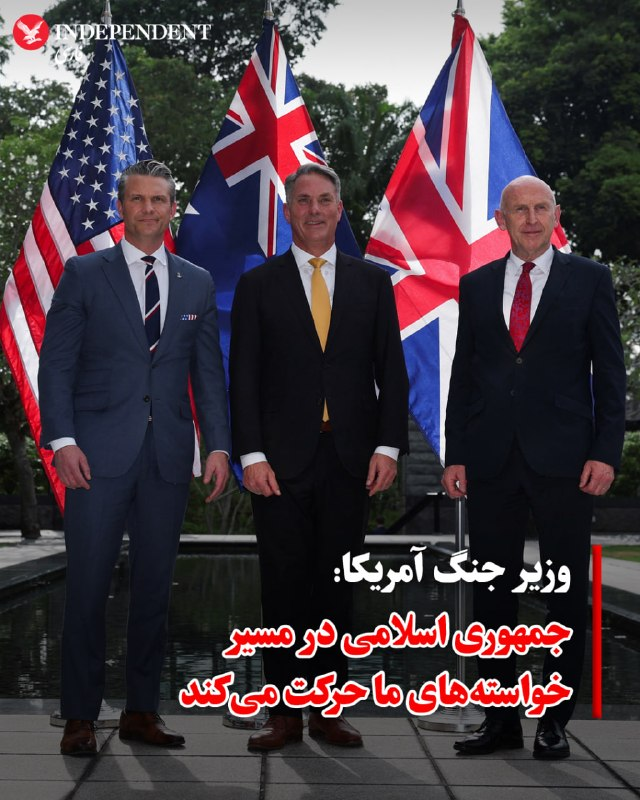

♦️ پیت هگست، وزیر جنگ ایالات متحده، روز شنبه نهم خرداد اعلام کرد که به دنبال جلسه روز گذشته در کاخ سفید، واشنگتن به موفقیت‌هایی در مذاکرات با ایران دست یافته است. هگست تاکید کرد: «ایران به طور کاملا واضح از انتظارات ما آگاه است. آن‌ها در مسیر خواسته‌های ما حرکت می‌کنند و گفتگوها سازنده بوده است. من به رئیس‌جمهورمان که فقط توافق‌های بزرگ امضا می‌کند، اعتماد کامل دارم.»

وزیر جنگ آمریکا که در کنار وزیران دفاع استرالیا و بریتانیا با خبرنگاران صحبت کرد، با اشاره به گره‌های موجود در مذاکرات فاش کرد که بخشی از بحث‌ها با این همتایان، بر چگونگی جلوگیری از دستیابی ایران به سلاح هسته‌ای «هم‌زمان با پیشرفت فناوری» متمرکز است.
‌🇸🇦 Indypersian

🤖 @VahidOOnLine

## VahidOOnLine — post 242914

  

علیرضا سلیمی، عضو هیات رییسه مجلس گفت: «طرح اعمال مدیریت تنگه هرمز در جلسه علنی مجلس بررسی و تصویب خواهد شد.»
او افزود: «تصمیمات ما درباره اعمال مدیریت بر تنگه هرمز تاکتیکی و موقت نیست، بلکه قطعی و ابدی است.»

سلیمی ادامه داد: «صفر تا صد قانون اعمال مدیریت بر تنگه هرمز به‌طور کامل و جزء به جزء صرفا در مجلس تصویب و نهایی خواهد شد.»

او اضافه کرد: «قطعا این قانون یکی از قوانین مشعشع تاریخ ایران خواهد بود.»
‌🏁 🇬🇧 IranintlTV

🤖 @VahidOOnLine

## VahidOOnLine — post 242913

  <a href="telegram/content/VahidOOnLine_242913_1780152787.mp4" target="_blank">🎬 Download video</a>

♦️پیت هگست، وزیر جنگ ایالات متحده، روز شنبه ۹ خردادماه در جریان سفر خود به سنگاپور در مصاحبه ای با خبرنگاران اعلام کرد که بخش عمده عملیات‌های اخیر در منطقه بر عهده آمریکا بوده و این کشور «کنترل واقعی» تنگه را در اختیار دارد.
او با اشاره به نقش متحدان، از جمله استرالیا، گفت هرچند این کشورها حمایت مهمی ارائه کرده‌اند، اما عملیات محاصره به‌طور عمده توسط آمریکا انجام شده و «فشار اصلی» را بر ایران وارد کرده است.
هگست همچنین با اشاره به روند مذاکرات تأکید کرد تحولات پشت‌صحنه نشان می‌دهد واشنگتن در موقعیت مسلط قرار دارد. او در ادامه به همکاری‌های امنیتی در قالب پیمان «آکوس» و سایر ترتیبات منطقه‌ای اشاره کرد و گفت این همکاری‌ها نشان‌دهنده قدرت و انسجام اتحادهای آمریکا در منطقه اقیانوس آرام است.
‌🇸🇦 Indypersian

🤖 @VahidOOnLine

## VahidOOnLine — post 242912

  

♦️ مرکز امنیت دریایی عمان روز شنبه نهم خرداد، از دریانوردان، ماهیگیران و شناورها خواست تا در مسیرهای حرکتی خود نهایت احتیاط را به کار بندند. این هشدار پس از آن صادر شد که یک شی شناور مشکوک به «مین دریایی» در سمت غربی منطقه تردد ساحلی در تنگه هرمز و در محدوده آب‌های سرزمینی عمان رویت شد.

این مرکز به فعالان و کاربران حوزه دریانوردی توصیه کرد که فاصله ایمن را با هرگونه شی مشکوک حفظ کرده و مراتب را فورا به مقامات ذی‌ربط گزارش دهند.
‌🇸🇦 Indypersian

🤖 @VahidOOnLine

## VahidOOnLine — post 242911

  

مرکز امنیت دریایی عمان اعلام کرد در پی مشاهده یک جسم شناور مشکوک به مین دریایی در غرب مسیر ترافیک ساحلی تنگه هرمز و در آب‌های سرزمینی این کشور، از کشتی‌ها و صیادان خواسته شده با حداکثر احتیاط تردد کنند و هر مورد مشکوک را فورا به مقام‌های مسئول گزارش دهند.
‌🏁 🇬🇧 IranintlTV

🤖 @VahidOOnLine

## VahidOOnLine — post 242910

  

رافائل گروسی، مدیرکل آژانس بین‌المللی انرژی اتمی سازمان ملل، در گفت‌وگو با روزنامه نشنال‌نیوز با ابراز نگرانی از گسترش «پدیده» حمله به نیروگاه‌های هسته‌ای در جریان درگیری‌های اخیر، گفت حمله به این تاسیسات در حال تبدیل شدن به الگویی خطرناک در جنگ‌ها است.

گروسی با اشاره به حمله پهپادی به نیروگاه براکه در امارات متحده عربی گفت: «این واقعیت که کسی یک نیروگاه هسته‌ای را هدف قرار داده، بسیار جدی است.»

او گفت آژانس شواهد لازم برای مقصر دانستن تهران در این حمله را در اختیار ندارد و افزود: «ما به مدرک ملموسی درباره منشا این حمله نیاز داریم.»

مقام‌های امارات متحده عربی، نیروهای نیابتی جمهوری اسلامی در عراق را مسئول این حمله اعلام کردند.

گروسی همچنین به حملات علیه نیروگاه هسته‌ای زاپوروژیا در اوکراین و نیروگاه هسته‌ای بوشهر اشاره کرد.
‌🏁 🇬🇧 IranintlTV

🤖 @VahidOOnLine

## VahidOOnLine — post 242909

🗣روایت شما از زندگی در دوران پس از انقلاب ملی و جنگ - شنبه ۹ خرداد ۱۴۰۵

🔹وضعیت وحشتناکه، گرونی زیاد شده، ما کم آوردیم. من خودم دانش‌آموز هستم، هیچی از درس نفهمیدیم و بعد از ۱۸ و ۱۹ هیچی مثل قبل نشد.

🔹اپراتورهای تلفن همراه علاوه بر افزایش شدید هزینه بسته‌های نت، مخصوصاً همراه اول، امکان خرید شارژ در مبالغ زیر ۲۰ هزار تومان هم نمی‌دن.

🔹ما کیش هستیم. از روز اول جنگ تا همین امروز به دلیل امن نبودن پرواز، هنوز هیچ مسافری با پرواز نیامده کیش. از طریق دریایی هم تا همین یک هفته پیش فقط کیشوندان رو راه می‌دادن. تمام هتل‌ها، رستوران‌ها و بازارها بدبخت شدن.

🔹از ایرانشهر: هموطنان عزیز اینجا همه‌چیز گرونه و اینترنت خیلی ضعیفه. قبلاً با کانفیگ پولی قوی‌تر بود، الان خیلی بدتر و ضعیف‌تر شده.

🔹امروز و دیروز رانندگان اسنپ‌فود ایلام به دلیل پایین بودن کرایه‌ها و گرانی روغن و بنزین اعتصاب کردن. صدها سفارش در رستوران‌ها خراب شد و به مشتری نرسید.

🔹چیپسی که پارسال ۱۸ تومان بود شده ۷۰ تومان، دقیقاً ۴ برابر.

🔹تهران هستم. ۱۰ ساله اسنپ کار می‌کنم، کرایه خیلی پایینه. درآمدم همون درآمد پارساله ولی هزینه‌ها ۳ برابر شده. تعویض روغن موتور پراید شده ۳ میلیون.

🔹از بوشهر پیام می‌دم. برادر من نظامی هست و حقوق دو ماه پیشش حدود ۳۰ میلیون تومان بود. الان حقوق این ماهش شده ۱۵ میلیون تومان، قضاوت با خودتون.

🔹نیروهای پیمانکاری شرکت نفت سروستان از استان فارس هستیم. حقوق اسفند و فروردین به‌صورت علی‌الحساب پرداخت شده، ولی تا امروز نه حقوق اردیبهشت و نه حقوق معوقه پرداخت نشده.

🔹فقط مبلغ یک بسته سویا از سه ماه پیش تا دیروز با تورم ۸۰۰ درصدی بالا رفته.
‌🏁 🇬🇧 IranintlTV

🤖 @VahidOOnLine

## VahidOOnLine — post 242908

♦️سعید آجرلو، از چهره‌های رسانه‌ای نزدیک به هیات مذاکراتی ایران، در گفتگویی تلویزیونی اعلام کرد دسترسی غیرقابل برگشت به ۱۲ میلیارد دلار از اموال مسدود شده از شروط اصلی تفاهم احتمالی است.
این کارشناس سیاسی گفت: «این مبلغ باید به صورت غیرقابل برگشت در اختیار بانک مرکزی قرار ‌گیرد.»
آجرلو اعلام کرد در طرح ۱۴ ماده‌ای، معافیت تحریم‌های نفتی و رفع محاصره دریایی به عنوان گام نخست پیش‌بینی شده و در صورت اجرای تعهدات از سوی آمریکا، جمهوری اسلامی وارد مرحله بعدی می‌شود.
به گفته این چهره رسانه‌ای نزدیک به هیات مذاکراتی ایران ادامه داد: «اگر مرحله نخست اجرا نشود، اعتمادی برای ادامه مذاکرات وجود نخواهد داشت.»
‌🇸🇦 Indypersian

🤖 @VahidOOnLine

## VahidOOnLine — post 242907

  

پیت هگست، وزیر جنگ آمریکا، با اشاره به سخنان دونالد ترامپ درباره احتمال جنگ دوباره در صورت شکست مذاکرات با جمهوری اسلامی گفت واشینگتن اکنون در موقعیت قوی‌تری قرار دارد و در صورت لزوم آماده اقدام نظامی است.
هگست افزود با این حال ترجیح ترامپ این است که کار به گزینه نظامی نکشد.
‌🏁 🇬🇧 IranintlTV

🤖 @VahidOOnLine

## VahidOOnLine — post 242906

  

پیت هگست، وزیر جنگ آمریکا، در حاشیه نشست «گفت‌وگوی شانگری‌لا» در سنگاپور، درباره محاصره بنادر و سواحل جنوبی ایران گفت: «محاصره دریایی ادامه دارد و این اقدام موثر بوده و کنترل تنگه هرمز در اختیار آمریکا است.»
او افزود تنگه هرمز باید برای همه کشورها باز و بدون عوارض باقی بماند.
‌🏁 🇬🇧 IranintlTV

🤖 @VahidOOnLine

## WithYashar — post 12939

  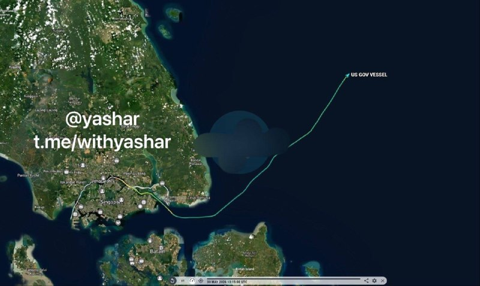

به نظر می‌رسد که ناو آبی/خاکی یو‌اس‌اس باکسر (lhd-4) قرار نیست در حوزه مسئولیت سنت‌کام  مستقر شود. ناو آبی‌خاکی کلاس واسپ نیز امروز از بندر سِمبانوان در سنگاپور حرکت کرد؛ اگرچه اکنون به سمت شرق در حرکت است.
@withyashar

## WithYashar — post 12938

شاهزاده رضا پهلوی در نشست «امنیت دریای سیاه» در اودسا در جنوب اوکراین، گفت که دنیای آزاد هنوز متوجه ماهیت جمهوری اسلامی نشده است.
شاهزاده رضا پهلوی درباره تلاش برای توافق با جمهوری اسلامی با امید به ایجاد ثبات، گفت که یک سگ وحشی در نهایت دست شما را گاز می‌گیرد.

او افزود: «پهپادهایی که اوکراین را هدف قرار می‌دهد از سوی جمهوری اسلامی تهیه شده و با همان پهپادها مردم معترض خود را در خیابان تعقیب می‌کند تا تک‌تیراندازها آن‌ها را هدف قرار دهند.»

شاهزاده رضا پهلوی گفت که تهران و مسکو معماران مشترک هرج‌ومرج در جهان هستند.
@withyashar

## WithYashar — post 12937

عمان: در آب‌های سرزمینی خود جسمی شناور را مشاهده کردیم که مظنون به مین دریایی است‌
@withyashar

## WithYashar — post 12936

  <a href="telegram/content/WithYashar_12936_1780152791.mp4" target="_blank">🎬 Download video</a>

پیت هگست درباره ایران: ایران می‌خواهد بگوید که کنترل تنگه را در دست دارد، اما این ما هستیم.

و همه چیز پشت صحنه نشان می‌دهد که وقتی صحبت از آن می‌شود، ما کنترل را در دست داریم.
@withyashar

## WithYashar — post 12935

وزیر جنگ آمریکا: به محاصره دریایی ادامه میدهیم.
@withyashar

## WithYashar — post 12934

## WithYashar — post 12933

#shahzade من تا آخرین نفس و قطره خونم از شما پسر شاه فقیدم حمایت میکنم تا رسیدن به آزادی

## WithYashar — post 12932

#shahzade
من تا آخرین نفس و قطره خونم از شما پسر شاه فقیدم حمایت میکنم تا رسیدن به آزادی

## WithYashar — post 12931

#shahzade

## WithYashar — post 12930

سفر قاهره با یاشار غمی ندارد فقط لذت ببریم از وقایع
👑

## mwarmonitor — post 9917

  

🔴 مرکز امنیت دریایی عمان: از کشتی‌ها می‌خواهیم در پی مشاهده یک جسم شناور که احتمال می‌رود مین باشد، در غرب منطقه عبور در تنگه هرمز، احتیاط کنند. @mwarmonitor

## mwarmonitor — post 9916

  

🔸ملوانان نیروی دریایی آمریکا در حالی نظاره‌گر هستند که یک جنگنده پنهانکار F-35B Lightning II متعلق به تفنگداران دریایی آمریکا بر روی عرشه ناو آبی‌خاکی USS Tripoli (LHA-7) در حال عبور از دریای عرب فرود می‌آید. جنگنده F-35B برای انجام برخاست‌های کوتاه و فرودهای عمودی طراحی شده است.

@mwarmonitor

## mwarmonitor — post 9915

🔴 مرکز امنیت دریایی عمان: از کشتی‌ها می‌خواهیم در پی مشاهده یک جسم شناور که احتمال می‌رود مین باشد، در غرب منطقه عبور در تنگه هرمز، احتیاط کنند.

@mwarmonitor

## mwarmonitor — post 9914

✈️ هواپیماهای جنگی در آسمان پایتخت عراق، بغداد، در حال پرواز هستند.

@mwarmonitor

## mwarmonitor — post 9913

🔸ایران نشان می‌دهد که در مذاکرات هسته‌ای بر موضع اولیه خود پایبند است و انتظار نمی‌رود امتیازهای عمده‌ای بدهد. همچنین همچنان برخی خواسته‌های کلیدی آمریکا را رد می‌کند، از جمله تحویل دادن ذخایر اورانیوم بسیار غنی‌شده و ایجاد تغییر در سیاست هسته‌ای اصلی خود. نیویورک تایمز

@mwarmonitor

## mwarmonitor — post 9912

🔴اداره عملیات تجارت دریایی بریتانیا می‌گوید:
«سطح تهدید امنیت دریایی در تنگه هرمز همچنان به‌طور بسیار بحرانی باقی مانده است، به‌دلیل محاصره.»

@mwarmonitor

## mwarmonitor — post 9911

  <a href="telegram/content/mwarmonitor_9911_1780152794.mp4" target="_blank">🎬 Download video</a>

📝 این روزها مرزهای عرفان و طهارت در رسانه میلی آن‌چنان جابه‌جا شده که تئاتر کمدی غریبی را به نمایش گذاشته است؛ حکایت لجن‌زاری که هر چقدر عمیق‌تر می‌شود، دست‌اندرکارانش مخلص‌تر و زاهدتر جلوه می‌کنند. بعد از مراجع تقلیدِ مجازی مثل پویان مختاری و قدیسینِ تازه‌تطهیرشده، حالا نوبت به محمدرضا گلزار رسیده تا با کت قرمز جیغ، از راز و نیازهای ماورایی و ایستاده‌اش در ساعت سه نصف‌شب پرده بردارد و دین‌داری را به یک اکسسوری لاکچری روی تردمیل، زیر دوش و پشت فرمان ماشین تبدیل کند. این بساطِ تهوع‌آور، ویترینی از دین‌فروشیِ مدرن است که در آن برای تبرئه کردنِ ابتذال و رانت، یک لایه ضخیم از مناجاتِ سفارشی روی همه‌چیز می‌پاشند؛ شیک‌پوشانی که خدا را هم مثل ساعت و ماشین‌شان برند کرده‌اند تا لایک بگیرند، در حالی که بوی گندِ این معرکه‌گیری، تنها قربانی کردنِ باورهای مردمِ گرسنه را به دست این لجن‌ها نشان می‌دهد.

@mwarmonitor

## FoxNewsTwitter — post 342425

  

Fox News (Twitter/X)

“We are all one... This is celebrating America’s birthday."

Vanilla Ice is embracing his role at the Great American State Fair after several performers dropped out of the Freedom 250 concert lineup.

The rapper says the event is about celebrating America’s 250th birthday and bringing people together through music, not politics.

As backlash and artist withdrawals continue to make headlines, Vanilla Ice says he’s focused on positivity, fun, and giving fans a memorable show.

## FoxNewsTwitter — post 342424

  <a href="telegram/content/FoxNewsTwitter_342424_1780152796.mp4" target="_blank">🎬 Download video</a>

Fox News (Twitter/X)

Eight roller coaster riders were stranded near the top of a Texas amusement park ride for more than three hours before firefighters could bring them down.

The Iron Shark coaster at Galveston’s Pleasure Pier malfunctioned during its climb, leaving passengers stuck nearly 100 feet above the ground.

Video captured the dramatic rescue as firefighters used a ladder truck and harnesses to remove riders one at a time.

## FoxNewsTwitter — post 342423

‌Fox News (Twitter/X)

👉 Full story here:

## FoxNewsTwitter — post 342422

Fox News (Twitter/X)

TANVI RATNA: Europe built its entire post-Russia energy system to avoid dependence on a single supplier. The Iran war just handed that leverage to America.

US LNG now supplies 63% of European imports and climbing. IEEFA projects 80% by 2030 — with 40% of all EU gas, pipeline and LNG combined, flowing from the United States.

The contracts got signed under wartime pressure. The Russian ban became law. The terminals run on American supply. There's no exit clause and no alternative at scale.

## FoxNewsTwitter — post 342421

  <a href="telegram/content/FoxNewsTwitter_342421_1780152797.mp4" target="_blank">🎬 Download video</a>

Fox News (Twitter/X)

Police deploy tear gas outside a New Jersey immigration detention facility as tensions boil over during another night of protests.

Video shows officers advancing in formation, pushing demonstrators and reporters back before tear gas is fired as clashes escalate outside Delaney Hall in Newark.

The facility has been the focus of days of demonstrations involving lawmakers, detainees' families, and immigration advocacy groups

## FoxNewsTwitter — post 342420

‌Fox News (Twitter/X)

👉 Full story here:

## FoxNewsTwitter — post 342419

  

Fox News (Twitter/X)

Twitch streamer Hasan Piker called Progressive International coordinator David Adler his 'comrade' on livestream — the same organizer who sat in a VIP seat beside Cuba's president during the convoy trip now under federal investigation for possible sanctions violations.

Adler's organization, Progressive International, counts Raúl Castro's daughter Mariela Castro Espín on its advisory council. Federal subpoenas target Piker and CodePink's Medea Benjamin for travel, communications and financial records tied to possible contacts with Cuban government entities.

The convoy brought an estimated 650 delegates from 33 countries to Havana in March.

## pm_afshaa — post 91900

  <a href="telegram/content/pm_afshaa_91900_1780152799.webm" target="_blank">🎬 Download video</a>

🔴آسوشیتدپرس:
توافق احتمالی ترامپ با جمهوری اسلامی، شکاف بین جمهوری‌خواهان رو عمیق‌تر کرده.

💧 Rainbet.com the #1 Non-KYC Crypto Casino & Sportsbook @rainbetcom

😁 @Pm_Afshaa

## pm_afshaa — post 91899

  <a href="telegram/content/pm_afshaa_91899_1780152800.webm" target="_blank">🎬 Download video</a>

🔴تلگراف: دو ژنرال قدرتمند، احمد وحیدی و محمد جعفری، با هم متحد شدن تا قالیباف رو از قدرت برکنار کنن.

💧 Rainbet.com the #1 Non-KYC Crypto Casino & Sportsbook @rainbetcom

😁 @Pm_Afshaa

## pm_afshaa — post 91898

  <a href="telegram/content/pm_afshaa_91898_1780152800.webm" target="_blank">🎬 Download video</a>

🔴هگست، وزیر جنگ آمریکا:
محاصره که کاملاً محکم و بدون نفوذ بوده و واقعاً فشار زیادی روی ایران گذاشته.

اونا ممکنه بگن کنترل تنگه رو در دست دارن، ولی کاری که ما انجام میدیم، حتی پشت صحنه، نشون میده که در عمل ما هستیم که کنترل رو در دست داریم.
محاصره دریایی جمهوری اسلامی همچنان ادامه داره و این اقدام موثر بوده و کنترل تنگه هرمز در اختیار آمریکاست.

💧Rainbet.com the #1 Non-KYC Crypto Casino & Sportsbook @rainbetcom

😁 @Pm_Afshaa

## pm_afshaa — post 91896

  <a href="telegram/content/pm_afshaa_91896_1780152801.mp4" target="_blank">🎬 Download video</a>

کارشناس حرومزاده صداوسیما :

ایرانی ها اصلا آریایی نیستن، ما اصلا نژاد آریایی نداریم؛ اونا کلا 5 هزار سال پیش مهاجرت کردن اومدن ولی ما واسه 65 هزار سال پیشیم.
اصلا درست نیست بگیم آریایی هستیم انگار داریم میگیم بچه های یه مشت قاتل نسل کشیم.

💧Rainbet.com the #1 Non-KYC Crypto Casino & Sportsbook @rainbetcom

😁 @Pm_Afshaa

## pm_afshaa — post 91895

🔴نیویورک تایمز:ایران به رد خواسته‌های کلیدی آمریکا ادامه می‌دهد،از جمله تحویل ذخیره اورانیوم بسیار غنی شده خود و محدود کردن غنی‌سازی که باعث به بن بست رسیدن مذاکرات شده

💧 Rainbet.com the #1 Non-KYC Crypto Casino & Sportsbook @rainbetcom

😁 @Pm_Afshaa

## pm_afshaa — post 91894

🔴پیت هگست:هر لحظه آماده ایم جنگ علیه ایران را از سر بگیریم

💧 Rainbet.com the #1 Non-KYC Crypto Casino & Sportsbook @rainbetcom

😁 @Pm_Afshaa

## pm_afshaa — post 91893

🔴پیت هگست:به محاصره دریایی ایران ادامه خواهیم داد

💧 Rainbet.com the #1 Non-KYC Crypto Casino & Sportsbook @rainbetcom

😁 @Pm_Afshaa

## pm_afshaa — post 91892

🔴نیویورک تایمز: جمهوری‌اسلامی به آمریکا پیشنهاد سرمایه‌گذاری تو ایران رو داده

💧 Rainbet.com the #1 Non-KYC Crypto Casino & Sportsbook @rainbetcom

😁 @Pm_Afshaa

## DEJradio — post 5155

⭕️ آمریکا، بریتانیا و استرالیا در پروژۀ زیردریایی‌های بی‌سرنشین همکاری می‌کنند

پیت هگست، وزیر دفاع آمریکا گفت واشینگتن، لندن و کانبرا در چارچوب پیمان آکوس برای توسعۀ شناورهای زیردریایی بی‌سرنشین همکاری می‌کنند.
او گفت این پروژه بر فناوری‌های پیشرفتۀ دفاعی از جمله هوش مصنوعی، فناوری زیرآبی، موشک‌های مافوق صوت، فناوری سایبری و محاسبات کوانتومی متمرکز است.
هگست افزود در این طرح روی مجموعه‌ای از سامانه‌های زیردریایی بدون سرنشین و چندمنظوره، برای حفظ برتری دریایی سه کشور، کار می‌شود.

#خبر #دژ #هوش_مصنوعی
@DEJradio

## DEJradio — post 5154

⭕️ بریتانیا تأیید کرد محاصرۀ دریایی جمهوری اسلامی توسط آمریکا ادامه دارد

سازمان عملیات تجارت دریایی بریتانیا اعلام کرد محاصرۀ بنادر ایران ادامه دارد.
به گفتۀ این نهاد، سطح تهدید دریایی در خلیج فارس، تنگۀ هرمز، دریای عمان و شمال دریای عرب همچنان بحرانی است.
بر اساس این بیانیه شناورهایی که از طریق انتقال کشتی‌به‌کشتی به ناقضان محاصرۀ جمهوری اسلامی کمک کنند، ناقض محاصره به شمار می‌روند.

#خبر #دژ #بریتانیا #محاصره_دریایی
@DEJradio

## DEJradio — post 5153

⭕️ قطر: می‌شود در مورد عوارض موقت در تنگۀ هرمز مذاکره کرد

شیخ سعود بن عبدالرحمن آل‌ثانی، معاون نخست‌وزیر قطر، گفت می‌شود درمورد عوارض موقت در تنگۀ هرمز برای مواردی مانند پاکسازی مین مذاکره کرد.
او گفت دوحه با دریافت دائمی عوارض عبور کشتی‌ها از آبراه هرمز مخالف است.
آمریکا و اروپا تلاش جمهوری اسلامی برای دریافت عوارض از کشتی‌ها را اخاذی مالی می‌دانند.
آمریکا اعلام کرده نهادها و کشتی‌هایی را که به باجگیری جمهوری اسلامی تن بدهند، تحریم می‌کند.

#خبر #دژ #قطر #تنگه_هرمز
@DEJradio

## DEJradio — post 5152

⭕️ واردات برق از ترکمنستان و ارمنستان ادامه دارد

مصطفی رجبی مشهدی، معاون وزیر نیرو گفتجمهوری اسلامی اکنون ۳۰۰ مگاوات برق از ترکمنستان و ارمنستان وارد می‌کند.
این مقام دولت پزشکیان از سویی مدعی شد صادرات برق به افغانستان و پاکستان نیز ادامه دارد. او گفت جنگ اخیر بر تبادلات برق منطقه‌ای اثر نگذاشت.
رجبی مشهدی همچنین ادعا کرد تبادل هزار مگاوات برق با روسیه قرار است در برنامه‌های آینده دنبال شود.

#خبر #دژ #برق
@DEJradio

## DEJradio — post 5151

⭕️ عضو کمیسیون انرژی مجلس: یک‌سوم ظرفیت تولید گاز در ایران از دست رفت

غلامرضا دهقان ناصرآبادی، عضو کمیسیون انرژی مجلس شورای اسلامی گفت در جریان جنگ چهل روزه درحدود یک‌سوم ظرفیت تولید گاز در ایران از بین رفته است.
او با اشاره به آسیب‌دیدن چند فازدر بندر عسلویه گفت وزارت نفت و وزارت نیرو برای بازگرداندن ظرفیت تولید به وضعیت پیش از جنگ تلاش می‌کنند.
بخش عمدۀ گاز در ایران از میدان مشترک پارس جنوبی تأمین می‌شود.

#خبر #دژ #انرژی
@DEJradio

## DEJradio — post 5150

⭕️ شاهزاده رضا پهلوی برای شرکت در نشستی امنیتی وارد اوکراین شد

بر پایۀ گزارش‌ها شاهزاده رضا پهلوی برای شرکت در نشست «فروم امنیت دریای سیاه» به بندر اودسا در اوکراین رفت.
بر اساس این گزارش، الکسی گنچارنکو، نمایندۀ پارلمان اوکراین و رئیس این فروم، از شاهزاده استقبال کرد.
در پیام‌های منتشرشده در این راستا گفت شد که مردم ایران و اوکراین، دشمنان مشترکی در تهران دارند.
روسیه بارها با استفاده از پهپادهای ساخته شده توسط جمهوری اسلامی، اوکراین را هدف گرفته است.
متخصصان اوکراینی در جریان جنگ چهل روزه، برای مقابله با پهپادهای جمهوری اسلامی به کشورهای حاشیۀ خلیج فارس کمک کردند.
شاهزاده رضا پهلوی پیش‌تر نشستی را با ولودیمیر زلنسکی، رئیس جمهوری اوکراین برگزار کرده بود.

#خبر #دژ #شاهزاده_رضا_پهلوی #اوکراین
@DEJradio

## DEJradio — post 5149

⭕️ رسانه‌های اسرائیل: ارتش برای جنگ احتمالی بعدی با جمهوری اسلامی آماده می‌شود

رسانه‌های اسرائیل می‌گویند روند آمادگی ارتش این کشور برای سومین رویارویی احتمالی با جمهوری اسلامی، ادامه دارد.
به گزارش شبکۀ کان، ارتش اسرائیل به دنبال ایجاد شرایطی است که جامعه بتواند در کمترین زمان ممکن با تغییر از وضعیت عادی به شرایط جنگی، سازگاری داشته باشد.
ارزیابی‌های ارتش اسرائیل بیانگر است که جمهوری اسلامی در جنگ بعدی ممکن است سریع‌تر واکنش نشان بدهد و الگوی استفاده از موشک‌ها را تغییر دهد.
بر پایۀ ارزیابی‌ها بیش از 72 درصد از موشک‌های جمهوری اسلامی که در جنگ پیشین استفاده شد، دارای کلاهک خوشه‌ای بود.
از سویی نخستین هواپیماهای سوخت‌رسان جدید آمریکایی به اسرائیل رسیده است.
به گفتۀ مقام‌های نظامی اسرائیل، این هواپیماها ظرفیت عملیات دوربرد را افزایش می‌دهد.
رسانه‌های اسرائیل گزارش دادند در جنگ چهل روزه همۀ اهداف اسرائیل محقق نشده و تلاش برای دستیابی به سایر اهداف ادامه می‌یابد.

#خبر #دژ #اسرائیل
@DEJradio

## DEJradio — post 5148

  <a href="telegram/content/DEJradio_5148_1780152802.mp4" target="_blank">🎬 Download video</a>

🤡
🔺 حرکات اروتیک ولایتمداران در تجمعات شبانه

بر اساس ویدیویی‌هایی که در رسانه‌های وابسته به حکومت از تجمعات شبانه ولایتمداران منتشر می‌شود، شماری از آنها زیر تاثیر اشعار مداحان اخیرا حرکات اروتیک از خود به نمایش می‌گذارند.

#شیفت_شب #اروتیک #تجمعات_حکومتی
@DEJradio

## DEJradio — post 5147

⭕️ آمریکا یک میلیارد دلار رمزارز مرتبط با جمهوری اسلامی را توقیف کرد

اسکات بسنت، وزیر خزانه‌داری آمریکا گفت واشینگتن یک میلیارد دلار دارایی رمزارزی مرتبط با جمهوری اسلامی را توقیف کرده است.
او همچنین گفت اگر قرار باشد محاصرۀ مالی و اقتصادی علیه جمهوری اسلامی کاهش یابد و یا لغو شود، این کار به‌صورت مرحله‌به‌مرحله پیش می‌رود.

#خبر #دژ #تحریم #رمز_ارز
@DEJradio

## DEJradio — post 5146

⭕️ ترامپ در نشست با مشاوران خود در مورد جمهوری اسلامی تصمیم پایانی را نگرفت

نشست بیش از دو ساعتۀ دونالد ترامپ با مشاوران ارشدش در اتاق وضعیت کاخ سفید، بدون اعلام نتیجه پایان یافت.
نیویورک‌تایمز به نقل از یک مقام ارشد دولت آمریکا نوشت ترامپ هنوز درمورد تفاهم احتمالی با تهران به جمع‌بندی نرسیده است.
ترامپ بر باز شدن تنگۀ هرمز و نابودی ذخایر اورانیوم غنی‌شدۀ جمهوری اسلامی پافشاری می‌کند.

#خبر #دژ #ترامپ
@DEJradio

## DEJradio — post 5145

⭕️ وزیر جنگ آمریکا: برای ازسرگیری جنگ با جمهوری اسلامی توانایی ما فراتر از حد است

پیت هگست، وزیر جنگ دولت ایالات متحده، خبر داد واشینگتن در صورت لزوم، آمادۀ ازسرگیری جنگ با جمهوری اسلامی است.
او در نشست امنیتی سنگاپور گفت توانایی آمریکا برای ازسرگیری جنگ با رژیم حاکم بر ایران، بیش از حد لازم است. به گفتۀ هگست، انبارهای مهمات ایالات متحده کاملا آماده‌ است.
هگست تأکید کرد آمریکا میان مهمات پیشرفته و ذخایر انبوه تسلیحاتی تعادل برقرار کرده است.
کاخ سفید اعلام کرده دونالد ترامپ به تصمیم‌گیری درباره توافق احتمالی نزدیک شده، اما هنوز تصمیم پایانی در مورد توافق یا حملۀ نظامی گرفته نشده است.

#خبر #دژ #جنگ
@DEJradio

## DEJradio — post 5144

⭕️ نیروهای اسرائیلی تا فراتر از رود لیتانی پیشروی کردند

بنیامین نتانیاهو، نخست‌وزیر اسرائیل گفت نیروهای این کشور از رود لیتانی عبور کرده و در عمق جنوب لبنان پیشروی کردند.
همزمان، هیات‌های نظامی اسرائیل و لبنان در واشینگتن گفت‌وگوهای امنیتی برگزار کردند.
ژوزف عون، رئیس‌جمهور لبنان، در تماس با مارکو روبیو بر ضرورت تلاش برای برقراری آتش‌بس تأکید کرد.
با وجود آتش‌بسی که از ۲۸ فروردین میان اسرائیل و لبنان برقرار شده، حزب‌الله بارها به شمال اسرائیل حمله کرده و ارتش این کشور را به واکنش نظامی واداشته است.

#دژ #خبر #اسرائیل
@DEJradio

## DEJradio — post 5143

  <a href="telegram/content/DEJradio_5143_1780152804.mp4" target="_blank">🎬 Download video</a>

🛩️
🔥 سرنگونی یک پهپاد «شاهد» با مسلسل از داخل هلی‌کوپتر

گزارش‌ها حاکی است که نیروهای اسرائیلی از یک مسلسل M134 Minigun (مینی‌گان ام۱۳۴) نصب‌شده روی هلیکوپتر برای سرنگونی یک پهپاد «شاهد» استفاده کرده‌اند.

این رهگیری نشان می‌دهد که جنگ پهپادی با چه سرعتی در حال دگرگون‌کردن شیوه‌های نبرد مدرن در خاورمیانه و سایر نقاط جهان است. گفته می‌شود این ویدیو مربوط به روزهای جنگ است.

پهپادهای شاهد به یکی از شناخته‌شده‌ترین سلاح‌های درگیری‌های کنونی جهان تبدیل شده‌اند و به‌طور گسترده توسط جمهوری اسلامی ایران و روسیه مورد استفاده قرار می‌گیرند.

#پهپاد_شاهد #جنگ
@DEJradio

## DEJradio — post 5142

⭕️ آمریکا باج‌دهندگان به جمهوری اسلامی برای عبور از تنگۀ هرمز را تحریم می‌کند

وزارت خزانه‌داری آمریکا هشدار داد هرگونه توافق با جمهوری اسلامی برای عبور امن از تنگۀ هرمز، حتا بدون پرداخت مستقیم پول می‌تواند تحریم در پی داشته باشد.
دفتر کنترل دارایی‌های خارجی آمریکا اعلام کرد دریافت خدمات یا تضمین از دولت جمهوری اسلامی یا سپاه پاسداران برای عبور امن از تنگۀ هرمز، برای شهروندان آمریکا ممنوع است.
وزارت خزانه‌داری آمریکا همچنین گفت نهاد موسوم به «مدیریت آبراه خلیج فارس» که برای دریافت عوارض از کشتی‌ها ایجاد شده، به‌دلیل ارتباط با سپاه تحریم شده است.
واشینگتن هشدار داد همکاری مستقیم یا غیرمستقیم با این نهاد، حتا برای شرکت‌ها و مؤسسات غیرآمریکایی تحریم در پی دارد.

#خبر #دژ #تنگه_هرمز
@DEJradio

## DEJradio — post 5141

⭕️ عضو نزدیک به مذاکره‌کنندگان جمهوری اسلامی گفت بدون آزادسازی ۱۲ میلیارد دلار، مرحلۀ بعدی در کار نیست

سعید آجرلو، از چهره‌های رسانه‌ای نزدیک به محمدباقر قالیباف و هیئت مذاکرکنندۀ جمهوری اسلامی، گفت دسترسی به ۱۲ میلیارد دلار از دارایی‌های بلوکه‌شده، یکی از شروط اصلی تفاهم احتمالی است.
او ادعا کرد این مبلغ باید به‌صورت غیرقابل برگشت، در اختیار بانک مرکزی قرار بگیرد.
آجرلو ادعا کرد در طرح ۱۴ ماده‌ای، معافیت تحریم‌های نفتی و رفع محاصرۀ دریایی به‌عنوان گام نخست در نظر گرفته شده است.
به گفتۀ این فرد نزدیک به مقامات، پس از اجرای تعهدات آمریکا، جمهوری اسلامی وارد مرحلۀ بعدی می‌شود.
او مدعی شد اگر مرحلۀ اول اجرا نشود، اعتمادی برای ادامۀ مذاکرات وجود ندارد.

#خبر #دژ #مذاکرات #توافق
@DEJradio

## DEJradio — post 5140

⭕️ وزیر جنگ آمریکا: تنگۀ هرمز باید بدون عوارض برای استفادۀ همۀ دنیا باز باشد

پیت هگست، وزیر جنگ آمریکا گفت تنگۀ هرمز باید بدون عوارض باز باشد و همۀ دنیا بتواند از آن استفاده کند.
به گفتۀ هگست، هر توافقی با جمهوری اسلامی تنها زمانی انجام می‌شود که دونالد ترامپ آن را توافقی عالی برای آمریکا و امنیت جهان بداند.
هگست در حاشیۀ نشست شانگری‌لا در سنگاپور گفت معیارهای آمریکا برای توافق تغییری نکرده است.
او گفت هرچه جمهوری اسلامی به مواضع واشینگتن نزدیک‌تر شود، احتمال توافق افزایش می‌یابد.
هگست با اشاره به گزینۀ نظامی علیه جمهوری اسلامی گفت آمریکا اکنون آماده‌تر است و دست بالا را دارد.
وزیر جنگ ایالات متحده با اشاره به این که ترجیح ترامپ این است که کار به درگیری نظامی نکشد، گفت جمهوری اسلامی دارد به خواسته‌های آمریکا نزدیک می‌شود.
هگست همچنین با دفاع از ادامۀ محاصره دریایی جمهوری اسلامی گفت رژیم ادعا می‌کند مدیریت تنگۀ هرمز را در اختیار دارد، اما واقعیت این است که کنترل این آبراه در اختیار آمریکا است.

#خبر #دژ #تنگه_هرمز
@DEJradio

## DEJradio — post 5139

  <a href="telegram/content/DEJradio_5139_1780152805.mp4" target="_blank">🎬 Download video</a>

🚨
🔸 سرهنگ دوم بازنشسته نیروی هوایی محمد ضابطی با اشاره به سوابق خاندان ایران‌ساز پهلوی می‌گوید، تنها منجی ایران شاهزاده رضا پهلوی است.

#شاهزاده_رضا_پهلوی #خاندان_ایرانساز_پهلوی
@DEJradio

## DEJradio — post 5138

👑🎥 حضور شاهزاده رضا پهلوی در نشست امنیت دریای سیاه در اوکراین

رسانه‌های اوکراینی با انتشار تصاویری، از حضور شاهزاده رضا پهلوی در نشست امنیت دریای سیاه در شهر اودسای اوکراین خبر دادند.

#شاهزاده_رضا_پهلوی #اوکراین
@DEJradio

## DEJradio — post 5137

  <a href="telegram/content/DEJradio_5137_1780152807.mp4" target="_blank">🎬 Download video</a>

🔺🎥 فینال لیگ قهرمان اروپا؛ تمهیدات امنیتی در بوداپست

فینال لیگ قهرمانان اروپا شنبه‌شب نهم خرداد بین آرسنال و پاری‌سن ژرمن در بوداپست برگزار خواهد شد.
فروشگاه‌ها در مرکز پاریس در حال تخته‌کوبی و محافظت از ویترین‌های خود هستند، زیرا انتظار می‌رود صرف‌نظر از اینکه پاریس عنوان قهرمانی را ببازد یا ببرد، شورش و درگیری اتفاق بیافتد.

#لیگ_قهرمانان_اروپا #فوتبال
@DEJradio

## DEJradio — post 5136

  <a href="telegram/content/DEJradio_5136_1780152808.mp4" target="_blank">🎬 Download video</a>

⚽️
🔺 مهدی رستم‌پور، روزنامه‌نگار ورزشی، با انتقاد از بی‌تفاوتی و سکوت بازیکنان‌ و مربیان تیم فوتبال جمهوری اسلامی در قبال ظلم و ستم حکومت به مردم می‌گوید "جنگ که شروع شد قلعه‌نوعی رفت ویلای آلانیا".

#جنگ #فوتبال
@DEJradio

## VahidOnline — post 75801

اینترنت در ایران آزاد و عادی نشده. بیشتر مسیرهای خارجی یا بسته‌اند یا نیمه‌بازند. فقط بعضی مقاصد و مسیرهای خاص اجازه عبور دارند. همین باعث شده فیلترشکن‌های معمولی خوب کار نکنند.
در این میون بعضی از افرادی که دامنه‌ها و مسیرهای سفیدشده دارند، دسترسی می‌فروشند. نتیجه‌اش هم شده اینترنت نابرابر، رانتی و پر از راه‌حل‌های موقت.
انگاری که درِ ساختمون رو کمی باز گذاشته باشن که هوا بیاد، اما اجازه ندن کسی ازش رد بشه.
برای همینه که گوشی‌تون ممکنه نشون بده که اینترنت دارید، حتی شاید اولش سایت یا اپ مورد نظر رو باز کنه یا بهش واکنش نشون بده، اما در عمل از اینترنت خبری نیست.

## IranIntlTV — post 339750

  

شاهزاده رضا پهلوی گفت که مردم ایران باید از طریق هوا حفاظت شوند و اینترنت و دیگر ابزار لازم را داشته باشند که دست به‌کار شوند و رژیم را به زانو درآورند.
او ادامه داد: «مردم حمله به زیرساخت‌های رژیم را جشن گرفتند و خیابان‌ها را به نام ترامپ نام‌گذاری کردند.»

شاهزاده رضا پهلوی ادامه داد: «دنیا باید تصمیم بگیرد که بعد از ۴۷ سال مماشات در کنار مردم ایران بایستد.»

او اضافه کرد: «مردم بین حمله به کشور و حمله به رژیم تمایز ایجاد می‌کنند.»
https://iranintl.com/202605301562

## IranIntlTV — post 339749

  <a href="telegram/content/IranIntlTV_339749_1780152810.mp4" target="_blank">🎬 Download video</a>

شاهزاده رضا پهلوی در نشست «امنیت دریای سیاه» در اودسا در جنوب اوکراین، گفت: « با محور هرج ومرج مذاکره نکنید، با آن مقابله کنید. مدیریت نکنید جمهوری اسلامی را، به آن پایان دهید.»
@iranintltv

## IranIntlTV — post 339748

  

🔻رولاندو ماران، سرمربی تیم ملی آلبانی، پس از اعلام فهرست بازیکنان برای دو دیدار دوستانه مقابل اسرائیل و لوکزامبورگ، درباره غیبت یاسر آسانی، مهاجم تیم استقلال گفت: «یاسر آسانی دعوت نشد چون بازی نکرده است. من شخصاً با او صحبت نکردم، اما همکارانم با او تماس گرفتند.»

🔹ماران گفت: «او در این مدت به میدان نرفته و آماده بودنش برای این مسابقات دشوار بود.»

🔹آلبانی روز ۱۳ خرداد به مصاف اسرائیل می‌رود و ۱۶ خرداد برابر لوکزامبورگ قرار خواهد گرفت.

@iranintltvsport

## IranIntlTV — post 339747

  <a href="telegram/content/IranIntlTV_339747_1780152812.mp4" target="_blank">🎬 Download video</a>

شاهزاده رضا پهلوی در نشست «امنیت دریای سیاه» در اودسا در جنوب اوکراین، گفت پهپادهایی که امروز شهرهای اوکراین را هدف قرار می‌دهند، همان ابزار سرکوبی هستند که جمهوری اسلامی برای تعقیب و هدف قرار دادن معترضان در خیابان‌های ایران به کار گرفته است.
@iranintltv

## IranIntlTV — post 339746

  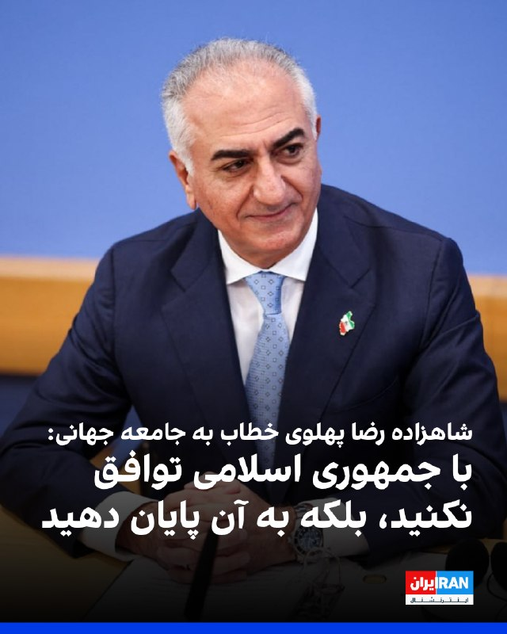

شاهزاده رضا پهلوی در نشست «امنیت دریای سیاه» در اودسا در جنوب اوکراین، ضمن انتقاد از هرگونه توافق احتمالی، گفت که جمهوری اسلامی را مدیریت نکنید، بلکه به آن پایان دهید.

او افزود: «محور مسکو-تهران یک دشمن هماهنگ برای همه است و باید قاطعانه و با انسجام با آن برخورد شود.»

شاهزاده رضا پهلوی ادامه داد: «هر توافقی با جمهوری اسلامی مانند توافقات با شوروی سابق موضوع را حل نکرده است.»
https://iranintl.com/202605309589

## IranIntlTV — post 339745

  

شاهزاده رضا پهلوی در نشست «امنیت دریای سیاه» در اودسا در جنوب اوکراین، گفت که دنیای آزاد هنوز متوجه ماهیت جمهوری اسلامی نشده است.
شاهزاده رضا پهلوی درباره تلاش برای توافق با جمهوری اسلامی با امید به ایجاد ثبات، گفت که یک سگ وحشی در نهایت دست شما را گاز می‌گیرد.

او افزود: «پهپادهایی که اوکراین را هدف قرار می‌دهد از سوی جمهوری اسلامی تهیه شده و با همان پهپادها مردم معترض خود را در خیابان تعقیب می‌کند تا تک‌تیراندازها آن‌ها را هدف قرار دهند.»

شاهزاده رضا پهلوی گفت که تهران و مسکو معماران مشترک هرج‌ومرج در جهان هستند.
https://iranintl.com/202605309766

## IranIntlTV — post 339744

  <a href="telegram/content/IranIntlTV_339744_1780152814.mp4" target="_blank">🎬 Download video</a>

اسماعیل سقاب اصفهانی، معاون رییس‌جمهور دولت جمهوری اسلامی، از تشدید بحران انرژی در ایران خبر داد و گفت کمبود روزانه بنزین به ۳۰ میلیون لیتر و کسری گاز به ۱۰۰ میلیارد متر مکعب رسیده است.
گفت‌وگو با عطا حسینیان، روزنامه‌نگار اقتصادی و حوزه انرژی
@iranintltv

## IranIntlTV — post 339743

  

مجتبی یوسفی، عضو هیات رییسه مجلس گفت: «رهبری در بحث مذاکرات، ۱۰ شرط مشخص کردند که اگر تیم مذاکره‌کننده ۱۰ شرط را رعایت نکند، نه مردم، نه نمایندگان، نه نخبگان، آن توافق را حتما به‌عنوان توافق خوب در نظر نخواهند گرفت و می‌شود تجربه‌ای که در اعتماد به غرب باعث عقب‌افتادگی کشور شد.»

او افزود: «امروز باید هم‌قسم شویم تا به گفته امام شهید و امام جدیدمان، مسائل اصلی کشور را حل کنیم.»
https://iranintl.com/202605306617

## IranIntlTV — post 339742

  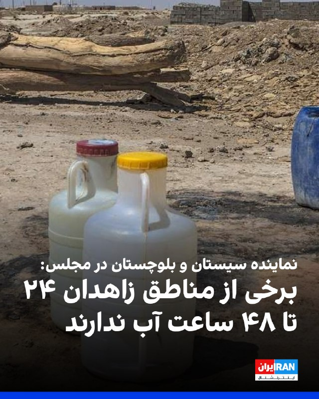

حسینعلی شهریاری، نماینده سیستان و بلوچستان در مجلس گفت: «الان شهر زاهدان هزار لیتر در ثانیه کمبود آب دارد؛ به‌طوری که طبق گفته بعضی از شهروندان، برخی از آنها ۲۴ تا ۴۸ ساعت آب ندارند و مناطق زیادی از زاهدان در این زمینه دچار مشکل هستند.»

او ادامه داد: «مثلا الان در زاهدان که مرکز استان است، از دولت‌های قبل، به علت کمبود آب، دو پروژه در آن شروع شد؛ یکی انتقال آب از دریای عمان که قرار بود به سیستان و بلوچستان جنوبی و خراسان رضوی برسد و دیگری هم آبی که قرار بود از دشت تهلاب برای شهر زاهدان بیاید.»
https://iranintl.com/202605302542

## IranIntlTV — post 339741

  <a href="telegram/content/IranIntlTV_339741_1780152817.mp4" target="_blank">🎬 Download video</a>

دانش‌آموزان در پیام‌هایی به ایران‌اینترنشنال می‌گویند که به دلیل فشارهای اقتصادی و برای کمک به تامین معاش خود و خانواده، ناچار به ترک تحصیل و ورود به بازار کار شده‌اند.
جزییات بیشتر با محسن مهیمنی، عضو تحریریه ایران‌اینترنشنال
@iranintltv

## IranIntlTV — post 339740

  

علیرضا سلیمی، عضو هیات رییسه مجلس گفت: «طرح اعمال مدیریت تنگه هرمز در جلسه علنی مجلس بررسی و تصویب خواهد شد.»
او افزود: «تصمیمات ما درباره اعمال مدیریت بر تنگه هرمز تاکتیکی و موقت نیست، بلکه قطعی و ابدی است.»

سلیمی ادامه داد: «صفر تا صد قانون اعمال مدیریت بر تنگه هرمز به‌طور کامل و جزء به جزء صرفا در مجلس تصویب و نهایی خواهد شد.»

او اضافه کرد: «قطعا این قانون یکی از قوانین مشعشع تاریخ ایران خواهد بود.»
https://iranintl.com/202605300411

## IranIntlTV — post 339739

  <a href="telegram/content/IranIntlTV_339739_1780152819.mp4" target="_blank">🎬 Download video</a>

شاهزاده رضا پهلوی شنبه نهم خرداد برای شرکت در نشست بین‌المللی «امنیت دریای سیاه» وارد شهر اودسا در جنوب اوکراین شد.

شاهزاده در بدو ورود به محل برگزاری این نشست مورد استقبال اولکسی گونچارنکو، نماینده پارلمان اوکراین، قرار گرفت.

نشست «انجمن امنیت دریای سیاه» که با نام «انجمن اودسا» نیز شناخته می‌شود، یک رویداد بین‌المللی سالانه است که به بررسی چالش‌های امنیتی، اقتصادی و سیاسی منطقه دریای سیاه می‌پردازد. این انجمن در سال ۲۰۲۴ از سوی گروهی از نمایندگان پارلمان اوکراین بنیان‌گذاری شد.

اولکسی گونچارنکو، نماینده پارلمان اوکراین، بنیان‌گذار و رییس این انجمن است.
@iranintltv

## IranIntlTV — post 339738

  <a href="https://t.me/IranintlTV/339738" target="_blank">📎 Download file</a>

🎧نسخه صوتی اخبار نیمروزی | شنبه ۹ خرداد
@iranintlTV

## IranIntlTV — post 339737

  <a href="telegram/content/IranIntlTV_339737_1780152820.mp4" target="_blank">🎬 Download video</a>

در آستانه سومین ماه قطعی اینترنت در ایران، مقام‌های جمهوری اسلامی از آغاز روند بازگشت اینترنت بین‌الملل خبر داده‌اند. خبری که هم‌زمان با گزارش‌ها درباره احتمال توافق میان تهران و واشینگتن، بازتاب گسترده‌ای در رسانه‌های بین‌المللی داشت.

اما داده‌های نت‌بلاکس، کنتیک و کلودفلر، و مهم‌تر از آن روایت شهروندان، تصویر متفاوتی نشان می‌دهد؛ بازگشتی محدود، ناپایدار و بیشتر متمرکز در تهران.

این گزارش بررسی می‌کند که پشت تیتر «بازگشت اینترنت در ایران» چه واقعیتی قرار دارد؛ بازگشت واقعی برای مردم، یا نسخه‌ای محدود و کنترل‌شده از اتصال به جهان؟
@iranintltv

## IranIntlTV — post 339736

  

مرکز امنیت دریایی عمان اعلام کرد در پی مشاهده یک جسم شناور مشکوک به مین دریایی در غرب مسیر ترافیک ساحلی تنگه هرمز و در آب‌های سرزمینی این کشور، از کشتی‌ها و صیادان خواسته شده با حداکثر احتیاط تردد کنند و هر مورد مشکوک را فورا به مقام‌های مسئول گزارش دهند.
https://iranintl.com/202605303637

## IranIntlTV — post 339735

  <a href="telegram/content/IranIntlTV_339735_1780152822.mp4" target="_blank">🎬 Download video</a>

یکی از شرکت‌کنندگان در تجمع استکهلم در گفت‌وگو با مهران عباسیان، خبرنگار ایران‌اینترنشنال، خواستار بسته شدن سفارت جمهوری اسلامی در سوئد شد

@iranintltv

## IranIntlTV — post 339734

  

رافائل گروسی، مدیرکل آژانس بین‌المللی انرژی اتمی سازمان ملل، در گفت‌وگو با روزنامه نشنال‌نیوز با ابراز نگرانی از گسترش «پدیده» حمله به نیروگاه‌های هسته‌ای در جریان درگیری‌های اخیر، گفت حمله به این تاسیسات در حال تبدیل شدن به الگویی خطرناک در جنگ‌ها است.

گروسی با اشاره به حمله پهپادی به نیروگاه براکه در امارات متحده عربی گفت: «این واقعیت که کسی یک نیروگاه هسته‌ای را هدف قرار داده، بسیار جدی است.»

او گفت آژانس شواهد لازم برای مقصر دانستن تهران در این حمله را در اختیار ندارد و افزود: «ما به مدرک ملموسی درباره منشا این حمله نیاز داریم.»

مقام‌های امارات متحده عربی، نیروهای نیابتی جمهوری اسلامی در عراق را مسئول این حمله اعلام کردند.

گروسی همچنین به حملات علیه نیروگاه هسته‌ای زاپوروژیا در اوکراین و نیروگاه هسته‌ای بوشهر اشاره کرد.
https://iranintl.com/202605306998

## IranIntlTV — post 339733

🗣روایت شما از زندگی در دوران پس از انقلاب ملی و جنگ - شنبه ۹ خرداد ۱۴۰۵

🔹وضعیت وحشتناکه، گرونی زیاد شده، ما کم آوردیم. من خودم دانش‌آموز هستم، هیچی از درس نفهمیدیم و بعد از ۱۸ و ۱۹ هیچی مثل قبل نشد.

🔹اپراتورهای تلفن همراه علاوه بر افزایش شدید هزینه بسته‌های نت، مخصوصاً همراه اول، امکان خرید شارژ در مبالغ زیر ۲۰ هزار تومان هم نمی‌دن.

🔹ما کیش هستیم. از روز اول جنگ تا همین امروز به دلیل امن نبودن پرواز، هنوز هیچ مسافری با پرواز نیامده کیش. از طریق دریایی هم تا همین یک هفته پیش فقط کیشوندان رو راه می‌دادن. تمام هتل‌ها، رستوران‌ها و بازارها بدبخت شدن.

🔹از ایرانشهر: هموطنان عزیز اینجا همه‌چیز گرونه و اینترنت خیلی ضعیفه. قبلاً با کانفیگ پولی قوی‌تر بود، الان خیلی بدتر و ضعیف‌تر شده.

🔹امروز و دیروز رانندگان اسنپ‌فود ایلام به دلیل پایین بودن کرایه‌ها و گرانی روغن و بنزین اعتصاب کردن. صدها سفارش در رستوران‌ها خراب شد و به مشتری نرسید.

🔹چیپسی که پارسال ۱۸ تومان بود شده ۷۰ تومان، دقیقاً ۴ برابر.

🔹تهران هستم. ۱۰ ساله اسنپ کار می‌کنم، کرایه خیلی پایینه. درآمدم همون درآمد پارساله ولی هزینه‌ها ۳ برابر شده. تعویض روغن موتور پراید شده ۳ میلیون.

🔹از بوشهر پیام می‌دم. برادر من نظامی هست و حقوق دو ماه پیشش حدود ۳۰ میلیون تومان بود. الان حقوق این ماهش شده ۱۵ میلیون تومان، قضاوت با خودتون.

🔹نیروهای پیمانکاری شرکت نفت سروستان از استان فارس هستیم. حقوق اسفند و فروردین به‌صورت علی‌الحساب پرداخت شده، ولی تا امروز نه حقوق اردیبهشت و نه حقوق معوقه پرداخت نشده.

🔹فقط مبلغ یک بسته سویا از سه ماه پیش تا دیروز با تورم ۸۰۰ درصدی بالا رفته.

## IranIntlTV — post 339732

  <a href="telegram/content/IranIntlTV_339732_1780152824.mp4" target="_blank">🎬 Download video</a>

در ادامه تجمع‌های همبستگی ایرانیان خارج از کشور با انقلاب ملی، شنبه ۹ خرداد ایرانیان مقیم استکهلم در اعتراض به اعدام‌ها و سرکوب مخالفان جمهوری اسلامی تجمع کردند و خواستار پایان مماشات دولت‌های اروپایی با جمهوری اسلامی شدند.

گزارش مهران عباسیان، خبرنگار ایران‌اینترنشنال
@iranintltv

## IranIntlTV — post 339731

  <a href="telegram/content/IranIntlTV_339731_1780152826.mp4" target="_blank">🎬 Download video</a>

ایرانیان ساکن استکهلم شنبه در تجمع همبستگی ایرانیان خارج از کشور با انقلاب ملی، با اجرای یک پرفورمنس اعتراضی به صدور حکم اعدام برای «بچه‌های اکباتان» و خطر اجرای این احکام واکنش نشان دادند.

گزارش مهران عباسیان، خبرنگار ایران‌اینترنشنال
@iranintltv

## Shin_Persian — post 6320

  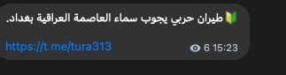

Shin ✓ @hey_itsmyturn
Sat, 30 May 2026 12:24:21 UTC

And still.

فارسی

و همچنان.

𝕏 · @shin_persian

## Shin_Persian — post 6319

Shin ✓ @hey_itsmyturn
Sat, 30 May 2026 11:59:41 UTC

Jet activity over Baghdad, #Iraq 🇮🇶

فارسی

فعالیت جت‌ها بر فراز بغداد، #Iraq 🇮🇶

𝕏 · @shin_persian

## ManotoTV — post 105878

  <a href="telegram/content/ManotoTV_105878_1780152828.mp4" target="_blank">🎬 Download video</a>

سخنان محمود جعفریان، معاون سازمان رادیو تلویزیون ملی ایران و قائم‌مقام دبیرکل حزب رستاخیز، درباره ایران‌دوستی

## FarsiVOA — post 219077

آرمان معرفتی، شهروند اهل سقز که اسفند سال گذشته به اتهام آتش‌ زدن یک مسجد در تهران محاکمه شده بود، به اعدام محکوم شد.

## FarsiVOA — post 219076

  <a href="telegram/content/FarsiVOA_219076_1780152829.mp4" target="_blank">🎬 Download video</a>

ارتش اسرائیل روز گذشته مقر توپخانه حزب‌الله را در منطقه شویا در جنوب لبنان منهدم کرد.

ارتش اسرائیل اعلام کرد این حمله پس از تایید حضور نیروهای این سازمان تروریستی در منطقه انجام شد.

وقوع انفجارهای ثانویه بعد از حمله، وجود تسلیحات را در این محل تایید کرد.

این ویدیو بی‌صدا است.

## FarsiVOA — post 219075

🔺هشدار ارتش اسرائیل به ساکنان مناطقی در لبنان: فورا تخلیه کنید

▪️ارتش اسرائیل در واکنش به تازه‌ترین حملات گروه تروریستی حزب‌الله به شمال این کشور، برای چندین روستا در جنوب لبنان و همچنین و در دره بقاع، هشدار تخلیه صادر کرد.

⬇️ بیشتر بخوانید:

https://ir.voanews.com/a/israel-hezbollah-iran-war-proxy/8155561.html/?nocach=1

## FarsiVOA — post 219074

پیت هگست، وزیر جنگ آمریکا، با اشاره به مذاکرات با رژیم ایران گفت که گفت‌وگوها «سازنده» بوده و جمهوری اسلامی به مواضع مورد نظر واشنگتن نزدیک‌تر شده است.

او تاکید کرد آمریکا همچنان بر جلوگیری از دستیابی رژیم ایران به سلاح هسته‌ای اصرار دارد و گفت انتظارات آمریکا از جمهوری اسلامی تغییری نکرده است.

هگست همچنین گفت دولت آمریکا ترجیح می‌دهد مسئله از طریق توافق حل شود، اما در صورت لزوم برای گزینه‌های دیگر نیز آمادگی دارد.

@FarsiVOA

## FarsiVOA — post 219073

  <a href="telegram/content/FarsiVOA_219073_1780152830.mp4" target="_blank">🎬 Download video</a>

هاجر نادری، مادر متین پرویزی، از کشته‌شدگان دی ماه ۱۴۰۴، بعد از بازگشایی محدود اینترنت در ایران، ویدیویی از حضور خود بر آرامگاه پسرش در سال نو منتشر کرده است. متین پرویزی، ۲۲ ساله و دانشجو در ۱۸ دی ۱۴۰۴ در سبزه‌میدان زنجان، با شلیک ماموران حکومتی به سرش کشته شد.

## FarsiVOA — post 219072

  <a href="telegram/content/FarsiVOA_219072_1780152832.mp4" target="_blank">🎬 Download video</a>

ارتش اسرائیل ویدیویی از شناسایی و انهدام یک سکوی پرتاب موشک منتشر کرده است که شب گذشته نیروهای حزب‌الله از آن به سمت اسرائیل موشک شلیک کرده بودند.
این ویدیو بی‌صدا است.

## FarsiVOA — post 219071

🔺هگست: پرزیدنت ترامپ فقط توافقی را می‌پذیرد که برای آمریکا و امنیت جهان «عالی» باشد

▪️پیت هگست، وزیر جنگ ایالات متحده، می‌گوید پرزیدنت ترامپ تنها در صورتی حاضر به توافق با جمهوری اسلامی ایران خواهد بود که آن را «توافقی عالی» برای آمریکا و امنیت جهان بداند.

⬇️ بیشتر بخوانید:

https://ir.voanews.com/a/hegseth-trump-demands-great-iran-deal/8155554.html/?nocach=1

## FarsiVOA — post 219070

  <a href="telegram/content/FarsiVOA_219070_1780152834.mp4" target="_blank">🎬 Download video</a>

این ویدیو که بعد از بازگشایی محدود اینترنت در ایران در شبکه‌های اجتماعی منتشر شده منتسب است به روزهای نخست جنگ و گذر موشک‌های کروز تاماهاک در مرز عراق و ایران.

## FarsiVOA — post 219069

🔺آمریکا یک «شبکه کلاهبرداری» وابسته به رژیم ایران را تحریم کرد

▪️ایالات متحده از تحریم یک شبکه پیچیده وابسته به جمهوری اسلامی که با جعل هویت و فریب شرکت‌های آمریکایی، فناوری‌های حساس را برای نیروی نظامی رژیم ایران تهیه می‌کرد، خبر داد.

⬇️ بیشتر بخوانید:

https://ir.voanews.com/a/iran-irgc-state-department-sanction-network-fraud-american-companies/8155552.html/?nocach=1

## FarsiVOA — post 219068

🔺هشدار مرکز امنیت دریایی عمان درباره مشاهده «جسم شناور مشکوک» در تنگه‌ هرمز

▪️مرکز امنیت دریایی عمان روز شنبه ۹ خرداد، بعد از مشاهده یک جسم شناور در غرب منطقه ترافیک ساحلی تنگه هرمز در محدوده آب‌های سرزمینی عمان، که گمان می‌رود «مین دریایی» باشد، از دریانوردان، ماهیگیران، و کشتی‌ها خواست تا نهایت احتیاط را به کار گیرند.

⬇️ بیشتر بخوانید:

https://ir.voanews.com/a/oman-warns-vessels-about-floating-object/8155551.html/?nocach=1

## FarsiVOA — post 219067

  <a href="telegram/content/FarsiVOA_219067_1780152835.mp4" target="_blank">🎬 Download video</a>

ارتش اسرائیل با انتشار ویدیو و تصاویری اعلام کرد این مستندات به حملات سازمان تروریستی حزب‌الله در طول شب جمعه به کلیسای ارتدوکس سنت جورج در جنوب لبنان مربوط است. به گفته ارتش اسرائیل این حملات به ساختمان‌هایی در روستای مسیحی مرجعیون اصابت کردند.

ارتش اسرائیل تأکید کرد نیروهایش در محدوده این کلیسا فعالیت نمی‌کنند.

این ویدیو بی‌صدا است.

## FarsiVOA — post 219066

  

فرماندهی مرکزی ایالات متحده، سنتکام، تصویری از یک جنگنده «اف-۱۶ فایتینگ فالکن» نیروی هوایی آمریکا در حال پرواز بر فراز خاورمیانه در جریان یک ماموریت گشت‌زنی را منتشر کرد.

سنتکام اعلام کرد که نیروهای آمریکا همچنان در سراسر منطقه حضور دارند و در حالت آماده‌باش باقی مانده‌اند.

@FarsiVOA

## FarsiVOA — post 219065

  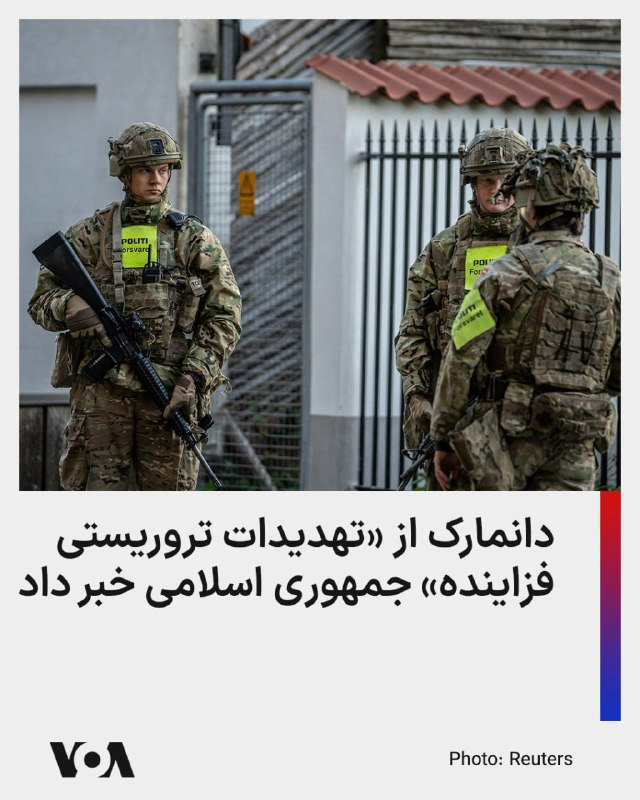

سازمان امنیت و اطلاعات دانمارک طی گزارشی از «تهدیدات تروریستی فزاینده» جمهوری اسلامی در این کشور خبر داد و ایران را در رده چهار از پنج درجه تهدید امنیتی قرار داد.

در گزارش سالانه این نهاد امنیتی گفته می‌شود که در سال گذشته، بازیگران دولتی به طور فزاینده‌ای بر تهدیدهای تروریستی در دانمارک تأثیر گذاشته‌اند: «این موضوع به طور خاص در مورد ایران صدق می‌کند که به ویژه تهدیدی علیه منافع اسرائیل و جامعه یهودی در اروپا، از جمله دانمارک، ایجاد می‌کند. استفاده نهادهای اطلاعاتی جمهوری اسلامی از شبکه‌های مجرمانه برای انجام حملات تروریستی افزایش یافته و این امر تهدیدها را بیشتر از قبل غیرقابل پیش‌بینی‌ می‌کند».

این تحلیل به جنگ اخیر اسرائیل و آمریکا با جمهوری اسلامی اشاره کرده و هشدار داده که رژیم ایران در حال حاضر قصد قوی‌تری برای هدایت یا حمایت از اقدامات خشونت‌آمیز در اروپا دارد.

سازمان امنیت و اطلاعات دانمارک همچنین گفته است جمهوری اسلامی فعالیت اوپوزیسیون را تهدیدی برای بقای خود می‌داند و به طور مداوم به دنبال حمله به مخالفان و منتقدان خود در داخل و خارج از کشور است.
@FarsiVOA

## FarsiVOA — post 219064

🔺بلومبرگ: آمریکا درباره توافق با تهران برای عبور از تنگه هرمز هشدار تحریمی داد

▪️وزارت خزانه‌داری آمریکا هشدار داده هرگونه توافق با جمهوری اسلامی برای عبور امن از تنگه هرمز، حتی اگر شامل پرداخت مستقیم پول نباشد، می‌تواند با خطر تحریم روبه‌رو شود.

▪️دفتر کنترل دارایی‌های خارجی در به‌روزرسانی ۲۹ مه اعلام کرد دریافت خدمات یا تضمین از دولت ایران یا سپاه پاسداران برای عبور امن از تنگه هرمز برای اشخاص آمریکایی ممنوع است.

▪️همزمان، قطر موضعی متفاوت اما محتاطانه اتخاذ کرده است. شیخ سعود بن عبدالرحمن آل‌ثانی، وزیر مشاور در امور دفاعی قطر، گفته دوحه با دریافت عوارض دائمی از کشتی‌های عبوری مخالف است، اما دریافت عوارض موقت برای مواردی مانند پاکسازی مین می‌تواند قابل مذاکره باشد.

⬇️ بیشتر بخوانید:
https://ir.voanews.com/a/8155548.html

## FarsiVOA — post 219063

  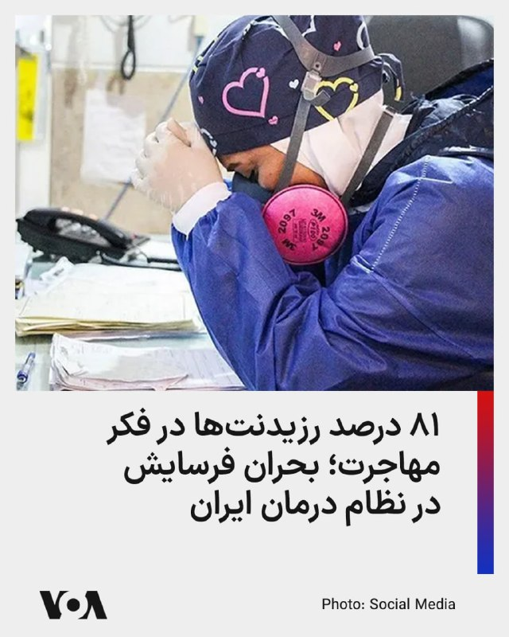

ایلنا به نقل از سخنگوی انجمن روانپزشکان ایران، گزارش داد که در یک نظرسنجی از ۲۵۴ دستیار پزشکی، ۸۱.۵ درصد گفته‌اند تمایل به مهاجرت دارند. همچنین ۷۹.۵ درصد اعلام کرده‌اند اگر پیش از ورود به دوره تخصص شناخت امروز خود را از شرایط دستیاری داشتند، مهاجرت را به رزیدنتی ترجیح می‌دادند.

امیرحسین جلالی ندوشن این وضعیت را نشانه «فرسایش جدی» در نیروی انسانی سلامت دانسته و گفته مسئله فقط مهاجرت نیست، بلکه کاهش امید، بی‌اعتمادی به آینده حرفه‌ای و فرسودگی در ساختار درمانی کشور است.

این آمار در ادامه سال‌ها بحران در جامعه رزیدنتی منتشر می‌شود؛ از کشیک‌های طولانی، فشار معیشتی، اعتراض به آزمون‌ها و تصمیم‌های وزارت بهداشت تا هشدارها درباره افزایش خودکشی میان دستیاران پزشکی.

پیش‌تر در نشست کارگروه ویژه نظام پزشکی اعلام شده بود میزان خودکشی در جمعیت رزیدنتی چند برابر سایر گروه‌هاست.

اعتراض‌های صنفی رزیدنت‌ها نیز در سال‌های گذشته بارها با احضار، فشار انضباطی و بی‌اعتنایی نهادی روبه‌رو شده است.
@FarsiVOA

## FarsiVOA — post 219062

🔺از فروش خانه و طلا تا کمبود دارو؛ بحران نقدینگی زنجیره دارو را زمین‌گیر کرد

▪️بحران نقدینگی در بازار داروی ایران به مرحله‌ای رسیده که مقام‌های صنفی و نمایندگان مجلس می‌گویند برخی داروخانه‌داران برای پاس کردن چک‌های خرید دارو، ناچار به فروش خانه، طلا و دارایی‌های شخصی شده‌اند.

▪️معاون حقوقی انجمن داروسازان ایران گفته است ۱۷ هزار داروخانه خصوصی کشور در دوره جنگ اخیر مانند یک «ستاد بحران» عمل کردند و اجازه ندادند اختلال زنجیره تأمین دارو به نگرانی اجتماعی گسترده تبدیل شود.

▪️اما پشت این استمرار ظاهری، بحران مالی سنگینی قرار دارد؛ مجموع مطالبات داروخانه‌های سرپایی بخش خصوصی از بیمه‌ها به ۳۶.۷۸ هزار میلیارد تومان رسیده است؛ شامل ۱۱.۳۸ همت سهم ارز و ۲۵.۴ همت سهم سازمان‌های بیمه‌گر.

⬇️ بیشتر بخوانید:
https://ir.voanews.com/a/8155541.html

## FarsiVOA — post 219061

🔺جمهوری اسلامی اموال ۱۰۸ نفر را در گلستان و خراسان جنوبی توقیف کرد

▪️روند تازه نشان می‌دهد جمهوری اسلامی سیاست توقیف دارایی ایرانیان خارج از کشور را از یک اقدام موردی به ابزار فشار امنیتی و مالی تبدیل کرده است.

⬇️ بیشتر بخوانید:
https://ir.voanews.com/a/8155543.html

## FarsiVOA — post 219060

🔺پنتاگون: بیش از ۶۰۰ حمله جمهوری اسلامی و گروه‌های نیابتی علیه منافع آمریکا و متحدانش

▪️گزارش تازه بازرس کل ارشد وزارت جنگ آمریکا درباره عملیات «خشم حماسی» نشان می‌دهد که جمهوری اسلامی و گروه‌های وابسته به آن، در واکنش به آغاز عملیات «خشم حماسی»، دست به حملات تلافی‌جویانه گسترده‌ای علیه تأسیسات آمریکا، متحدانش و اهداف مرتبط با ائتلاف در عراق و منطقه زده‌اند.

▪️بر اساس این گزارش، شبه‌نظامیان مستقر در عراق با استفاده از پهپاد، راکت و موشک به اهداف ائتلاف حمله کرده‌اند.

▪️این گزارش حملات در عراق را عمدتاً به گروه‌های تندروی همسو با تهران نسبت می‌دهد؛ از جمله کتائب حزب‌الله، کتائب سیدالشهدا و حرکت النجباء. این گزارش می‌افزاید این گروه‌ها احتمالاً با هدایت مستقیم سپاه پاسداران عمل کرده‌اند.

⬇️ بیشتر بخوانید:
https://ir.voanews.com/a/8155544.html

## FarsiVOA — post 219059

🔺فشار گرانی بر سفره مردم؛ افزایش دوباره قیمت روغن در انتظار چراغ سبز دولت

▪️سخنگوی اتحادیه بنکداران مواد غذایی از پیشنهاد افزایش دوباره قیمت روغن خبر داده و گفته قیمت این کالای اساسی نسبت به سال گذشته حدود سه برابر شده است؛ افزایشی که به گفته او قدرت خرید خانوارها را به‌شدت کاهش داده است.

▪️در هفته‌های اخیر، افزایش قیمت نان نیز با حاشیه‌های گسترده همراه شد؛ از اعلام نرخ‌های جدید برای نان‌های پرمصرف تا روایت‌های میدانی شهروندانی که دیگر توان خرید یک نان کامل را ندارند و به خرید نصف نان یا نان تکه‌ای رسیده‌اند.

▪️در بازار مرغ، گوشت قرمز و برنج نیز شرایط مشابهی دیده می‌شود. مرغ که زمانی جایگزین ارزان‌تر گوشت قرمز بود، حالا برای بسیاری خانوارها به کالایی پرهزینه تبدیل شده است.

⬇️ بیشتر بخوانید:
https://ir.voanews.com/a/8155540.html

## FarsiVOA — post 219058

🔺از کمبود دارو تا نسخه‌نویسی بر اساس موجودی؛ دولت بحران دارو را به بیمار منتقل می‌کند

▪️سازمان غذا و دارو اعلام کرده است پزشکان تا کمتر از یک ماه دیگر هنگام نسخه‌نویسی، به اطلاعات کمبودهای دارویی و میزان مصرف دارو دسترسی خواهند داشت.

▪️اکبر عبداللهی، مدیرکل دارو و مواد تحت کنترل سازمان غذا و دارو، روز ۹ خرداد ۱۴۰۵ گفت سامانه نسخه‌نویسی به اطلاعات کمبودهای دارویی متصل می‌شود و همزمان «کارنامه پزشک» نیز بار مالی تجویز هر پزشک را به‌صورت برخط نشان خواهد داد.

▪️جمهوری اسلامی به جای تأمین پایدار داروی مورد نیاز، نظام نسخه‌نویسی را به سمتی می‌برد که پزشک پیش از تجویز، نه فقط نیاز درمانی بیمار، بلکه موجودی بازار و هزینه نسخه برای نظام سلامت را هم محاسبه کند.

⬇️ بیشتر بخوانید:
https://ir.voanews.com/a/government-passing-drug-crisis-on-to-patients/8155539.html

## DW_Farsi — post 125319

  

🔶 "انهدام پهپاد اسرائيلی" در قشم و "حمله ایران به پایگاهی در کویت"

در حالی که ارتش ایران از انهدام یک فروند پهپاد اسرائيلی در منطقه قشم خبر می‌دهد بلومبرگ نیز می‌گوید، در حمله موشکی ایران به یک پایگاه آمریکا در کویت چند آمریکایی زخمی شده‌اند.

به نوشته خبرگزاری ایرنا، ارتش ایران روز شنبه نهم خرداد (۳۰ مه) در اطلاعیه‌ای اعلام کرد که در بامداد همین روز یک فروند پهپاد اوربیتر اسرائيل را رهگیری و منهدم کرده است.

به گفته ارتش، این پهپاد "تحت شبکه یکپارچه قرارگاه مشترک پدافند هوایی کشور در منطقه قشم" مورد اصابت قرار گرفت و منهدم شد.

در همین حال خبرگزاری بلومبرگ نیز در گزارشی به نقل از منبعی آگاه از حمله موشکی ایران به پایگاه آمریکایی "علی السالم" در کویت در ۲۴ ساعت گذشته خبر داد.

به گفته بلومبرگ، در این حمله پنج نفر، از جمله چند پرسنل آمریکایی زخمی شدند و به پهپادهای ایالات متحده نیز آسیب وارد آمد.

بلومبرگ به نقل از این منبع که نامش ذکر نشد جراحات آمریکایی‌ها را سطحی اما خسارت وارده به دو پهپاد "ام‌کیو ـ ۹ریپر" ارتش آمریکا را شدید اعلام کرده است.

@dw_farsi

## DW_Farsi — post 125318

🔶 "امارات در طول جنگ، ده‌ها حمله هوایی علیه ایران انجام داد"

روزنامه آمریکایی وال‌استریت ژورنال روز جمعه هشتم خرداد (۲۹ مه) گزارش داد که امارات متحده عربی در طول جنگ ، ده‌ها حمله هوایی علیه ایران انجام داده است که این حملات یک روز پس از اعلام آتش‌بس میان آمریکا و ایران در اوایل آوریل به پایان رسید.

روزنامه اسرائيلی جروزالم پست که چکیده‌ای از این گزارش را منتشر کرده می‌نویسد، وال‌استریت ژورنال به نقل از چندین منبع مطلع نوشت که امارات با ایالات متحده و اسرائیل هماهنگی داشته و با استفاده از اطلاعات دریافتی از هر دو کشور، تأسیسات انرژی ایران را در پاسخ به حملات ایران به زیرساخت‌های نفت و گاز خود، هدف قرار داده است.

اگرچه کشورهای حوزه خلیج‌فارس در ابتدا اعلام کرده بودند که اجازه نخواهند داد از پایگاه‌ها یا حریم هوایی آن‌ها برای حمله استفاده شود، اما برخی از آن‌ها پس از حملات ایران به کشورهای مختلف این منطقه، سیاست خود را تغییر دادند.

ایران با بیش از ۲۸۰۰ موشک و پهپاد امارات را هدف قرار داد که این تعداد بیش از پرتاب‌های انجام‌شده به هر کشور دیگری، از جمله اسرائیل، بوده است.

به گزارش وال‌استریت ژورنال، امارات نیز متقابلا اقدام به همکاری تلافی‌جویانه با آمریکا و اسرائیل کرد تا به اهدافی، از جمله در جزایر قشم و ابوموسی در تنگه هرمز ، بندرعباس و پالایشگاه نفت در جزیره لاوان در خلیج‌فارس حمله کند.

وال‌استریت ژورنال می‌نویسد، حمله دیگر به مجتمع پتروشیمی عسلویه و با همکاری اسرائیل انجام شد که محکومیت‌های بین‌المللی را در پی داشت؛ تا جایی که دونالد ترامپ، رئیس‌ جمهور آمریکا، از اسرائیل خواست حمله به تأسیسات انرژی را متوقف کند.

بنیامین نتانیاهو، نخست‌وزیر اسرائیل، در پاسخ به سؤالی درباره حمله به مجتمع عسلویه و واکنش ترامپ، به خبرنگاران گفت: «اسرائیل به تنهایی علیه مجتمع گاز عسلویه عمل کرد.»

این روزنامه همچنین نوشت که امارات اتحاد خود با اسرائیل را در طول جنگ افزایش داده و اسرائیل نیز سامانه‌های گنبد آهنین و سربازان ارتش خود را به امارات اعزام کرده است.

به علاوه، چندین مقام اسرائیلی از جمله دیوید بارنیا، رئیس موساد یا سازمان اطلاعات خارجی، دیوید زینی، رئیس شین‌بت یا سازمان اطلاعات داخلی و ایال زامیر، رئیس ستاد مشترک ارتش اسرائیل و همچنین نتانیاهو به امارات سفر کردند.

سفر نتانیاهو ابتدا توسط وزارت خارجه امارات تکذیب شد، اما سپس سخنگوی نتانیاهو مجددا آن را تأیید کرد.

در ماه آوریل، عربستان سعودی از رویکرد تهاجمی امارات انتقاد کرد و به آمریکا شکایت برد که حملات امارات خطر اقدامات تلافی‌جویانه ایران را در سراسر منطقه افزایش می‌دهد.

@dw_farsi

## DW_Farsi — post 125317

🔶 پزشک ترامپ آمادگی او برای انجام وظایفش را تأیید کرد

شان باربابلا، پزشک دونالد ترامپ، اعلام کرده است که رئیس جمهور آمریکا از نظر جسمی و ذهنی از وضعیت سلامتی بسیار خوبی برخوردار است.

بر اساس بیانیه منتشرشده از سوی کاخ سفید در روز جمعه ۲۹ مه (۸ خرداد) به وقت محلی، باربابلا گفته است ترامپ از نظر قلبی، ریوی و سیستم عصبی عملکردی قوی دارد.

او افزوده است که ترامپ بدون هیچ محدودیتی قادر است تمامی وظایف خود را به عنوان فرمانده کل قوا و رئیس دولت انجام دهد.

خود ترامپ نیز پس از معاینه دوره‌ای‌اش در بیمارستان نظامی "والتر رید" در روز سه‌شنبه گذشته گفته بود که همه چیز "عالی" پیش رفته است.

وضعیت جسمانی ترامپ به‌دقت زیر نظر قرار دارد. انتشار تصاویری از ورم مچ پاها، کبودی دست‌ها و لکه‌هایی روی گردن، پرسش‌هایی را درباره وضعیت سلامت این سیاستمدار ۷۹ ساله جمهوری‌خواه برانگیخته است.

همچنین مواردی از خواب‌آلودگی‌های مکرر رئیس جمهور آمریکا در جریان مراسم رسمی نیز تردیدهایی را درباره آمادگی جسمانی‌اش ایجاد کرده بود.

باربابلا به وجود ورم خفیف در ساق پاهای ترامپ اشاره کرده، اما گفته است که این وضعیت در مقایسه با سال گذشته بهبود یافته است.

او همچنین کبودی‌های روی دست ترامپ را بی‌خطر دانسته و توضیح داده است که این کبودی‌ها در نتیجه دست دادن‌های مکرر و مصرف همزمان آسپرین برای پیشگیری از بیماری‌های قلبی-عروقی ایجاد شده‌اند.

عملکرد کلی قلب رئیس‌ جمهور آمریکا هم طبیعی اعلام شده است. همچنین به گفته او، یک "معاینه جامع عصبی" نشان داده که وضعیت ذهنی ترامپ طبیعی است.

ترامپ از نظر افسردگی و اضطراب نیز مورد آزمایش قرار گرفته است. با این حال، پزشک او هیچ توضیحی درباره دلیل درمان پوست گردن ترامپ در ماه مارس ارائه نکرده و به تصویربرداری "ام‌آر‌آی" در ماه اکتبر گذشته نیز اشاره‌ای نکرده است.

ترامپ در ماه ژوئن امسال ۸۰ ساله خواهد شد. او هنگام آغاز دوره ریاست جمهوری خود از همه رؤسای جمهور پیشین آمریکا مسن‌تر بود.

ترامپ بارها تأکید کرده که از جو بایدن، رئیس جمهور پیشین آمریکا از حزب دموکرات، پرانرژی‌تر و آماده‌تر است.

بایدن سال گذشته در سن ۸۲ سالگی و پس از مطرح شدن پرسش‌هایی درباره توانایی جسمی و ذهنی‌اش، سمت خود را ترک کرد.

طبق این گزارش، پزشک ترامپ توصیه‌هایی پیشگیرانه نیز به او ارائه کرده است. ترامپ توصیه‌هایی درباره رژیم غذایی دریافت کرده و مصرف آسپرین با دوز پایین نیز به او پیشنهاد شده است.

@dw_farsi

## DW_Farsi — post 125316

  

🔸 محسن رضایی: آمریکا با ادامه محاصره اهداف دیگری را دنبال می‌کند

محسن رضایی، فرمانده سپاه در دوران جنگ هشت ساله ایران و عراق، روز شنبه ۹ خرداد (۳۰ مه) در شبکه اجتماعی ایکس مدعی شد دونالد ترامپ، رئیس جمهور آمریکا با ادامه محاصره دریایی کشتی‌های مرتبط با ایران، "دیپلماسی را نقض کرده است".

رضایی گفته است: «همان‌طور که انتظار می‌رفت، رئیس‌جمهور ایالات متحده برای سومین بار دیپلماسی را نقض می‌کند.»

به گفته رضایی دو مورد قبلی احتمالا به حمله هوایی اسرائیل علیه ایران در ژوئن سال گذشته و همچنین حمله مشترک آمریکا و اسرائیل در ۲۸ فوریه سال جاری مربوط می‌شود؛ حملاتی که در جریان مذاکرات غیرمستقیم هسته‌ای ایران و آمریکا رخ دادند.

رضایی در پیام خود همچنین گفته است "با ادامه محاصره دریایی و زیاده‌خواهی در مذاکرات" آمریکا نشان می‌دهد اهل مذاکره نیست و اهداف دیگری را دنبال می‌کند.
@dw_farsi

## DW_Farsi — post 125315

🔸 هشدار اشتاین‌مایر درباره گرایش‌های اقتدارگرایانه در جهان

فرانک والتر اشتاین‌مایر، رئیس جمهور آلمان، در مراسم اهدای "جایزه آزادی هامباخ"، نسبت به گرایش‌های اقتدارگرایانه در جهان هشدار داد. به گفته او، دموکراسی، حاکمیت قانون و نهادهای مستقل در سطح بین‌المللی تحت فشار قرار دارند.

اشتاین‌مایر دیروز جمعه ۲۹ مه (۸ خرداد) گفت دولت‌های اقتدارگرا می‌کوشند نهادهای نظارتی دموکراتیک، از جمله رسانه‌های مستقل، فرهنگ و دستگاه قضایی را بی‌اعتبار کرده و از میان بردارند.

اشتاین‌مایر با بیان اینکه شهروندان در یک نظام دموکراتیک در برابر چنین تحولاتی ناتوان نیستند، تأکید کرد: «گرایش‌های اقتدارگرایانه سرنوشتی نیستند که نتوان از آن گریخت. برعکس، همه ما دارای حق انتخابیم و می‌توانیم با رأی خود تصمیم بگیریم.»

اشتاین‌مایر جایزه آزادی هامباخ را به آدام بودنار، حقوقدان قانون اساسی و وزیر پیشین دادگستری لهستان، اهدا کرد. او برنده این جایزه را مبارزی پرشور برای حقوق بشر، دموکراسی و حاکمیت قانون توصیف کرد.

رئیس‌جمهور آلمان گفت بودنار از همان ابتدا درباره خطرات پیش روی استقلال نهادهای دموکراتیک هشدار داده و در برابر دخالت‌ها در دستگاه قضایی ایستادگی کرده است.

اشتاین‌مایر گفت قلعه هامباخ و رنگ‌های سیاه، سرخ و طلایی، نماد آزادی، دموکراسی و تفاهم میان ملت‌ها هستند. او افزود: «از همه کسانی نیز که از این مکان و از پرچم ما در برابر کسانی که امروزه به دنبال سوءاستفاده از آنها به نفع یک ناسیونالیسم جدید و تفکر اقتدارگرایانه هستند، سپاسگزاری می‌کنم.»
@dw_farsi

## DW_Farsi — post 125314

  

🔸 عزیزی: چین و روسیه برای ترانزیت در تنگه هرمز از امتیازاتی برخوردار خواهند بود

ابراهیم عزیزی، رئیس کمیسیون امنیت ملی و سیاست خارجی مجلس شورای اسلامی روز جمعه ۸ خرداد (۲۹ مه) در گفت‌وگو با خبرگزاری روسی ریانووستی گفت "تنگه هرمز در جغرافیای ایران قرار دارد و تصمیم‌گیری درباره تردد در این آبراه حق ایران است و هیچ طرفی نمی‌تواند آن را زیر سئوال ببرد."

او همچنین اعلام کرد کشورهای راهبردی مانند چین و روسیه از شرایط ویژه برای ترانزیت در تنگه هرمز برخوردار خواهند بود و این کشورها به دلیل همکاری‌های گذشته با ایران، در سامان‌دهی عبور و مرور دریایی از امتیازاتی بهره‌مند می‌شوند.

عزیزی در بخش دیگری از سخنانش به سازوکار جدید تردد در تنگه هرمز با همکاری ایران و عمان اشاره کرد و گفت امنیت کشتیرانی باید به‌گونه‌ای تامین شود که هم منافع ایران و هم منافع جامعه بین‌المللی حفظ شود.

مساله دریافت ترانزیت از سوی جمهوری اسلامی اما اقدامی تلقی می‌شود که با قوانین بین‌المللی همخوانی ندارد و از سوی کشورهای منطقه، اروپا، آمریکا و دیگر کشورها با مخالفت شدیدی روبرو شده است.
@dw_farsi

## DW_Farsi — post 125313

🔸 گفت‌وگوهای پاریس و برلین بر سر "بازدارندگی هسته‌ای"

آلمان و فرانسه گفت‌وگوهای برنامه‌ریزی‌شده برای همکاری نزدیک‌تر در زمینه بازدارندگی هسته‌ای را آغاز کرده‌اند. هفته‌نامه اشپیگل گزارش داده است که گونتر زاوتر، مشاور امنیتی صدراعظم آلمان، چهارشنبه گذشته ۲۷ مه (۶ خرداد) برای نخستین دور این مذاکرات به پاریس سفر کرده است.

طبق گزارش این هفته‌نامه آلمانی، همچنین کشورهای اروپایی دیگری نیز در این رایزنی‌ها در پاریس حضور داشته‌اند. بر اساس این گزارش، نشست بعدی آلمان و فرانسه پیش از تعطیلات تابستانی در آلمان برگزار خواهد شد.

فریدریش مرتس، صدراعظم آلمان، و امانوئل مکرون، رئیس‌جمهوری فرانسه، پیش‌تر در ماه مارس یک "گروه راهبری هسته‌ای" تشکیل داده بودند تا جزئیات همکاری را بررسی کند.

گروه راهبری آلمان و فرانسه که مکرون و مرتس در بهار امسال ایجاد کردند، برای آمادگی در شرایط بحرانی، در حال برنامه‌ریزی برای برگزاری مانورهای مشترک است.

بر این اساس، ارتش آلمان می‌تواند در بخش متعارف رزمایش‌های هسته‌ای فرانسه شرکت کرده و به تأسیسات هسته‌ای فرانسه نیز دسترسی پیدا کند.

طبق گزارش اشپیگل، نخستین مشارکت آلمان در یکی از رزمایش‌های موسوم به "پوکر" برای همین سال جاری (۲۰۲۶) برنامه‌ریزی شده و احتمالاً در ماه سپتامبر انجام خواهد شد.
@dw_farsi

## DW_Farsi — post 125312

  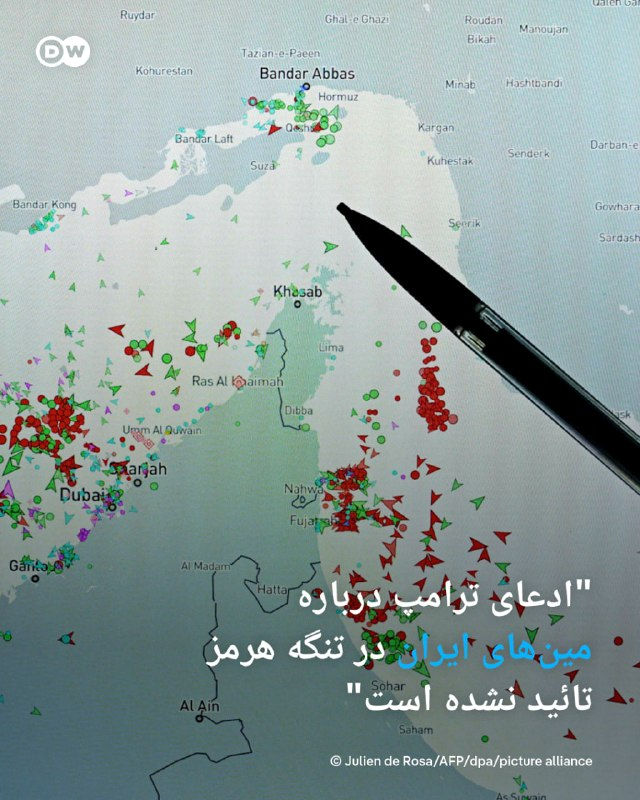

🔸 "ادعای ترامپ درباره مین‌های ایران در تنگه هرمز تائید نشده است"

شبکه "ان‌بی‌سی" به نقل از دو مقام آمریکایی و یک منبع آگاه گزارش داد که واشنگتن هنوز تایید نکرده است که ایران در تنگه هرمز مین‌گذاری کرده باشد؛ این در حالی است که دونالد ترامپ، رئیس‌ جمهور ایالات متحده آمریکا، روز جمعه ۸ خرداد (۲۹ مه) مدعی شده بود که ایران پذیرفته است مین‌هایی را که آمریکا موفق به پاکسازی آنها نشده، از تنگه هرمز جمع‌آوری کند.

با این حال، بر اساس این گزارش، ارزیابی‌های اطلاعاتی آمریکا و کشورهای متحد در روزهای آغازین جنگ نشان می‌داد که ایران احتمالا در حال مین‌گذاری این آبراه راهبردی بوده است، اما عملیات جست‌وجو و بازرسی زیرآبی آمریکا نتوانسته هیچ شیئی را که به‌طور قطعی مین دریایی تشخیص داده شود، پیدا کند.

یکی از منابع آگاه در این باره گفت که اگر هم تهدیدی وجود داشته، بسیار کمتر از آن چیزی بوده است که در ابتدا درباره آن نگرانی وجود داشت.

تنگه هرمز یکی از مهم‌ترین مسیرهای انتقال نفت و انرژی جهان به شمار می‌رود و هرگونه تهدید علیه امنیت کشتیرانی در این آبراه تاثیری مستقیم بر قیمت نفت دارد.
@dw_farsi

## DW_Farsi — post 125311

  

🔶 وزارت خزانه‌داری آمریکا از تحریم‌های جدید شبکه مرتبط با سپاه خبر داد

وزارت امور خارجه و وزارت خزانه‌داری آمریکا از اعمال تحریم‌های جدید علیه جمهوری اسلامی و تلاش برای انحلال یک شبکه مرتبط با این کشور خبر دادند.

این شبکه به رهبری "علی مجد سپهر" مستقر در ایران متهم شده است که با جعل هویت شرکت‌های آمریکایی و فریب شرکت‌های فناوری در آمریکا در تلاش برای دسترسی به تجهیزات پیشرفته برای بخش نظامی ایران بوده است.

وزارت خزانه‌داری آمریکا علی مجدسپهر را فردی مرتبط با وزارت دفاع جمهوری اسلامی معرفی کرده و چند فرد و شرکت دیگر را نیز به دلیل همکاری و ارتباط با او تحریم کرده است.

به گفته مقام‌های آمریکایی، این شبکه از وب‌سایت‌های جعلی و واسطه‌هایی در دبی برای دریافت محموله‌ها استفاده کرده و در پی تهیه تجهیزات برای بخش دفاعی ایران بوده است.

وزارت خارجه آمریکا هم‌زمان با این تحریم‌ها اعلام کرد تا ۱۵ میلیون دلار پاداش برای اطلاعاتی که به مختل‌شدن تامین مالی سپاه پاسداران منجر شود، در نظر گرفته شده است.
@dw_farsi

## DW_Farsi — post 125310

🔶 جنگ ایران شریان دارویی هند به آفریقا را قطع کرده است

هند را اغلب "داروخانه جنوب جهانی" می‌نامند و برای کشورهای آفریقایی، سلامت عمومی و داروهای هندی به‌شدت به یکدیگر گره خورده‌اند.

بر اساس داده‌های نهادهای بهداشت عمومی از جمله سازمان بهداشت جهانی (WHO)، آفریقا نزدیک به یک‌چهارم بار بیماری‌های جهان را بر دوش می‌کشد و سهم نامتناسبی از موارد ابتلا به اچ‌آی‌وی (HIV)، سل و مالاریا را به خود اختصاص داده است.

بر پایه داده‌های کمیسیون اقتصادی سازمان ملل برای آفریقا و آژانس ملی کنترل و نظارت بر غذا و داروی نیجریه (NAFDAC)، هند حدود ۴۰ درصد داروهای وارداتی آفریقا را تأمین می‌کند و بزرگ‌ترین شریک تجاری دارویی این قاره به شمار می‌رود.

از نیجریه تا کنیا و آفریقای جنوبی، داروهای ژنریک هندی ستون فقرات نظام‌های بهداشت عمومی را تشکیل می‌دهند. در سراسر قاره، این داروها آنتی‌بیوتیک‌های ارزان‌قیمت، داروهای ضدویروس اچ‌آی‌وی، داروهای مالاریا و سل، انسولین، داروهای فشار خون و مسکن‌های رایج مورد استفاده روزانه میلیون‌ها نفر را تأمین می‌کنند.

این نظام تاکنون کارآمد بوده است، زیرا داروهای هندی مقرون به صرفه، قابل اعتماد و وابسته به یکی از کارآمدترین کریدورهای لجستیکی جهان بوده‌اند.

این داروها از مراکز لجستیکی حوزه خلیج فارس عبور می‌کنند، زیرا برخی داروها و واکسن‌ها به سامانه‌های پیشرفته حمل‌ونقل با کنترل دما و شرایط اقلیمی نیاز دارند.

اما با مسدود شدن تنگه هرمز در پی جنگ ایران، حمل‌ونقل تجاری از منطقه خلیج فارس مختل شده است. همزمان، حق بیمه خطرات جنگی افزایش یافته، هزینه‌های حمل‌ونقل بالا رفته و شرکت‌های هواپیمایی مسیرهای خود را تغییر داده یا ظرفیت حمل بار از حریم هوایی خلیج فارس را کاهش داده‌اند.

افزایش قیمت نفت نیز همزمان هزینه‌های تولید و حمل‌ونقل شرکت‌های داروسازی را بالا برده است.

📌 برای دسترسی کامل به گزارش به وبسایت دویچه‌وله فارسی مراجعه کنید.
@dw_farsi

## DW_Farsi — post 125309

🔶 واژگونی کامیون حامل مهاجران افغان؛ ۱۸ نفر کشته شدند

روز شنبه یک کامیون حامل پناهجویان افغان که در حال بازگشت از پاکستان بودند، در بزرگراهی در شرق افغانستان واژگون شد. در این حادثه دست‌کم ۱۸ نفر کشته و ۳۵ تن دیگر مجروح شدند. بیشتر آن‌ها زن و کودک هستند.

عبدالمالک نیازی، سخنگوی والی لغمان، اعلام کرد که این تصادف در استان لغمان و در بزرگراه اصلی متصل‌کننده کابل (پایتخت افغانستان) به استان ننگرهار رخ داده است.

وی افزود که در میان کشته‌شدگان، ۱۰ کودک و ۵ زن وجود دارند و مجروحان برای مداوا به بیمارستان‌های ننگرهار منتقل شده‌اند.

مسافران این کامیون در زمره هزاران افغان بودند که به تازگی از پاکستان بازگشته‌اند. مقام‌های پاکستان از سال ۲۰۲۳ و بخصوص در ماه‌های اخیر سیاست‌های سختگیرانه‌تری را در قبال مهاجران و پناهجویان افغان ساکن این کشور اتخاذ کرده‌اند؛ موضوعی که باعث شده شمار زیادی از افغان‌ها، اغلب همراه با خانواده و وسایل زندگی خود، با کامیون‌ها به افغانستان بازگردند. ایران نیز در همان حوالی زمانی، اخراج مهاجران افغان را شدت بخشید.

بر اساس آمار کمیساریای عالی سازمان ملل متحد در امور پناهندگان (UNHCR) و سازمان بین‌المللی مهاجرت (IOM)، از آغاز سال ۲۰۲۶ میلادی تاکنون ۴۴۷ هزار و ۴۰۰ افغان از جمله بسیاری که در پاکستان متولد شده بودند و ده‌ها سال را به زندگی و کار در آنجا سپری کرده بودند، به کشور خود بازگشته‌اند.
@dw_farsi

## Persian_Trend_Official — post 15343

التماس تفکر 🙏 📝 Nick 📌 @persian_trend_official پرشین ترند | متفاوت‌ترین کانال نظامی

## Persian_Trend_Official — post 15342

  <a href="telegram/content/Persian_Trend_Official_15342_1780152841.mp4" target="_blank">🎬 Download video</a>

پیت هگست، وزیر جنگ ایالات متحده: همین چند روز پیش در جلسه کابینه بودیم و رئیس جمهور گفت هی، این یک توافق عالی خواهد بود.

ولی اگر ایران نمی‌خواهد توافق خوبی انجام دهد که تضمین کند به سلاح هسته‌ای دست پیدا نمی‌کند، می‌تواند با فردی که در سمت چپ من است، معامله کند و این تنها باری بود که من به چپ بودن متهم شدم.

📝 Amir

📌 @persian_trend_official
پرشین ترند | متفاوت‌ترین کانال نظامی

## Persian_Trend_Official — post 15341

  

ترامپ قول داد که به زودی در مورد توافقی برای پایان دادن به جنگ ایران تصمیم نهایی را بگیرد، اما به گزارش نیویورک تایمز، جلسه اتاق وضعیت روز جمعه بدون هیچ نتیجه ای پایان یافت!

نیویورک تایمز: ایران می‌گوید هیچ توافق نهایی در دست نیست؛ سخنگوی وزارت امور خارجه، بقایی، تأیید کرد که تبادل پیام‌ها هنوز ادامه دارد. این توافق پیشنهادی، در ازای لغو محاصره تنگه هرمز توسط ایران، به کارزار نظامی آمریکا و اسرائیل پایان می‌دهد و برنامه هسته‌ای به مذاکرات بعدی موکول شده است.

هگست، وزیر دفاع امریکا در سنگاپور قریب‌الوقوع بودن این توافق را کم‌اهمیت جلوه داد و تأکید کرد که ذخایر مهمات ایالات متحده برای جنگ مجدد آماده است.

هم تندروهای جمهوری‌خواه آمریکایی و هم تندروهای ایرانی به این توافق حمله می‌کنند. تندرو های ایرانی آن را بیش از حد آشتی‌جویانه می‌نامد و محسن رضایی، ترامپ را به خواسته‌های بیش از حد متهم می‌کند.

📝 Amir

📌 @persian_trend_official
پرشین ترند | متفاوت‌ترین کانال نظامی

## Persian_Trend_Official — post 15340

  

عبور 20 کشتی از تنگه هرمز با هماهنگی سپاه پاسداران

نیروی دریایی سپاه پاسداران انقلاب اسلامی با تأکید بر حاکمیت کامل خود بر تنگه هرمز، امروز از عبور 20 فروند کشتی در قالب کریدور اقتدارخبر داد، سپاه می‌گوید ضمن آنکه شرایط بشردوستانه کشورهای ذی‌نفع که نیازمند محموله‌های کود شیمیایی هستند نیز در نظر گرفته شده است.

📝 Amir

📌 @persian_trend_official
پرشین ترند | متفاوت‌ترین کانال نظامی

## Persian_Trend_Official — post 15339

  <a href="telegram/content/Persian_Trend_Official_15339_1780152843.mp4" target="_blank">🎬 Download video</a>

هدف قرار گرفتن تأسیسات نظامی و انبارهای مهمات پایگاه ششم شکاری شهید یاسینی بوشهر در ۱۷ فروردین ۱۴۰۵

👺Phantom

📌 @persian_trend_official
پرشین ترند | متفاوت‌ترین کانال نظامی

## Persian_Trend_Official — post 15338

  <a href="telegram/content/Persian_Trend_Official_15338_1780152845.mp4" target="_blank">🎬 Download video</a>

صداوسیما خبر از کشته شدن 2 تن از اعضای گروهک تروریستی پاک توسط نیروهای امنیتی در کرمانشاه داد.

📝 Amir

📌 @persian_trend_official
پرشین ترند | متفاوت‌ترین کانال نظامی

## Persian_Trend_Official — post 15337

https://youtube.com/shorts/mE9NFxON9xQ?feature=share

## Persian_Trend_Official — post 15336

  <a href="telegram/content/Persian_Trend_Official_15336_1780152847.webm" target="_blank">🎬 Download video</a>

هدف قرار دادن تانک مرکاوا اسرائیلی توسط مولتی روتور FPV حزب‌الله لبنان

حزب‌الله لبنان با انتشار ویدیویی خبر از حمله به یک عراده تانک مرکاوا در زوطر الشرقیه داد، این شهر در شمال رودخانه لیتانی واقع شده است.

📝 Amir

📌 @persian_trend_official
پرشین ترند | متفاوت‌ترین کانال نظامی

## Persian_Trend_Official — post 15335

  <a href="telegram/content/Persian_Trend_Official_15335_1780152847.webm" target="_blank">🎬 Download video</a>

مشاهده شدن مین دریایی در حریم آبی عمان!

مرکز امنیت دریایی عمان: به دلیل مشاهده یک جسم شناور که احتمال می‌رود مین دریایی باشد در غرب منطقه ترافیک ساحلی در تنگه هرمز در داخل آب‌های سرزمینی عمان، مرکز امنیت دریایی از تمامی دریانوردان، ماهیگیران و شناورها درخواست می‌کند هنگام عبور از این منطقه نهایت احتیاط را به عمل آورند.

به همه کاربران دریایی توصیه می‌شود فاصله ایمن از هر جسم مشکوک را حفظ کرده و فوراً آن را به مراجع ذی‌ربط گزارش دهند.

📝 Amir

📌 @persian_trend_official
پرشین ترند | متفاوت‌ترین کانال نظامی

## Persian_Trend_Official — post 15334

  <a href="telegram/content/Persian_Trend_Official_15334_1780152847.mp4" target="_blank">🎬 Download video</a>

وزیر جنگ آمریکا: محاصره ایران هنوز کاملاً پابرجاست.

آینده انرژی در واقع آینده‌ آمریکایی است و این برای امنیت انرژی در سراسر جهان خوب است.

📝 Amir

📌 @persian_trend_official
پرشین ترند | متفاوت‌ترین کانال نظامی

## Persian_Trend_Official — post 15333

  <a href="telegram/content/Persian_Trend_Official_15333_1780152849.webm" target="_blank">🎬 Download video</a>

الجزیره: جنگ بین ایران، اسرائیل و ایالات متحده وارد روز 92 خود شده است در حالی که رئیس‌جمهور دونالد ترامپ همچنان در حال بررسی توافق پیشنهادی برای تمدید آتش‌بس و بازگشایی تنگه هرمز است.

مذاکرات درباره برنامه هسته‌ای ایران، رفع تحریم‌ها و آینده ذخایر اورانیوم غنی‌شده تهران همچنان ادامه دارد، در حالی که هر دو طرف واشنگتن و تهران یکدیگر را به نقض آتش‌بس متهم می‌کنند.

تنش‌های منطقه‌ای علی‌رغم تلاش‌های دیپلماتیک همچنان بالا است، با فعالیت‌های نظامی مداوم در خلیج و اطراف آن، عملیات‌های اسرائیل در سراسر منطقه و عدم قطعیت درباره اینکه آیا توافق نهایی بین ایالات متحده و ایران می‌تواند حاصل شود یا خیر.

📝 Amir

📌 @persian_trend_official
پرشین ترند | متفاوت‌ترین کانال نظامی

## Persian_Trend_Official — post 15332

  

یک منبع ارشد نظامی لبنان به خبرگزاری آناتولی گفت: نیروهای اسرائیلی از رودخانه لیتانی در جنوب لبنان عبور کرده و به حومه شهر نبطیه رسیده‌اند.

📝 Amir

📌 @persian_trend_official
پرشین ترند | متفاوت‌ترین کانال نظامی

## Persian_Trend_Official — post 15331

  <a href="telegram/content/Persian_Trend_Official_15331_1780152850.webm" target="_blank">🎬 Download video</a>

محسن رضایی، مشاور نظامی رهبر جمهوری اسلامی ایران: همانطور که پیشبینی میشد رئیس جمهور آمریکا برای سومین بار در حال خیانت به دیپلماسی است.

او با ادامه محاصره دریایی و زیاده‌خواهی در مذاکرات ثابت کرد که اهل مذاکره نیست و اهداف دیگری را دنبال می‌کند.

📝 Amir

📌 @persian_trend_official
پرشین ترند | متفاوت‌ترین کانال نظامی

## Persian_Trend_Official — post 15330

  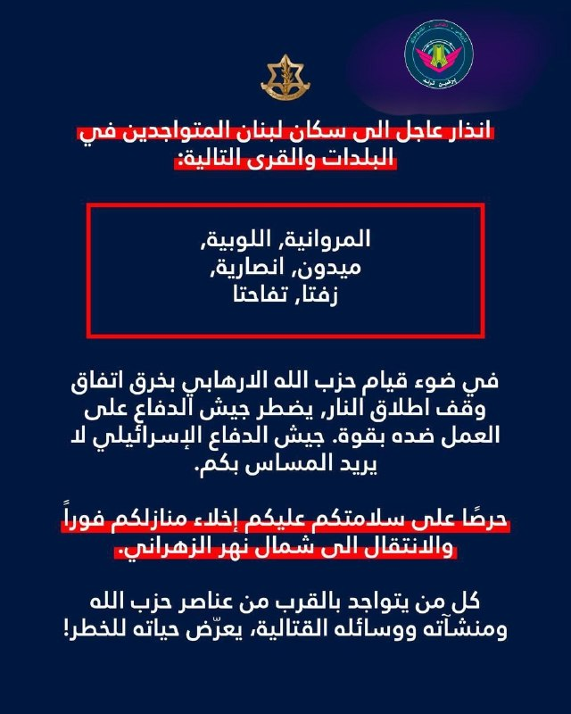

چهارمین بیانیه امروز ارتش اسرائیل

هشدار فوری به ساکنان لبنان که در شهرها و روستاهای زیر حضور دارند:
المروانیه،اللویزه،میدون
،انصاریه،زفتا،تفاحتا

با توجه به اینکه حزب‌الله توافق آتش‌بس را نقض کرده است، ارتش اسرائیل مجبور به اقدام علیه آن با قدرت می‌شود. ارتش اسرائیل قصد آسیب رساندن به شما را ندارد.
برای حفظ امنیت خود، باید فوراً خانه‌های خود را تخلیه کرده و به شمال رودخانه زهرانی منتقل شوید.
هر کسی که در نزدیکی نیروهای حزب‌الله، تأسیسات آن یا تجهیزات رزمی آن حضور داشته باشد، جان خود را در معرض خطر قرار می‌دهد.

👺Phantom

📌 @persian_trend_official
پرشین ترند | متفاوت‌ترین کانال نظامی

## Persian_Trend_Official — post 15328

  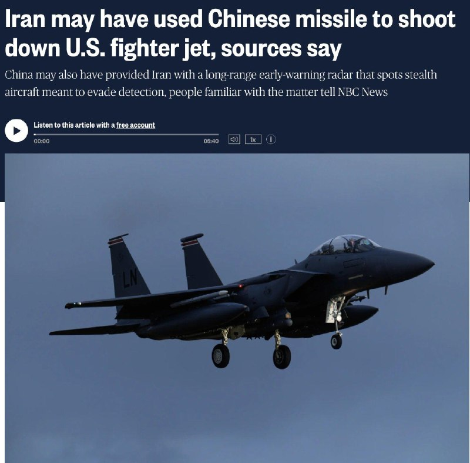

رسانه NBC: یک فروند جنگنده F-15E آمریکایی که ماه گذشته برفراز آسمان جنوب غرب ایران سرنگون شد احتمالاً توسط یک موشک دوش پرتاب ساخت چین مورد اصابت قرار گرفته است.

چین همچنین ممکن است یک رادار هشدار دهنده برد بلند YLC-8B را که قادر به شناسایی هواپیماهای رادارگریز در اوایل درگیری است در اختیار ایران قرار داد باشد.

ان بی سی مدرکی برای این ادعاهای خود منتشر نکرد و این ادعاها را براساس احتمالات منتشر کرده.

📝 Amir

📌 @persian_trend_official
پرشین ترند | متفاوت‌ترین کانال نظامی

## Persian_Trend_Official — post 15327

  <a href="telegram/content/Persian_Trend_Official_15327_1780152852.mp4" target="_blank">🎬 Download video</a>

ارتش امریکا روز گذشته یک قایق مظنون به قاچاق مواد مخدر را در شرق اقیانوس آرام مورد حمله خود قرار داد. هر سه سرنشین این قایق کشته شدند.

📝 Amir

📌 @persian_trend_official
پرشین ترند | متفاوت‌ترین کانال نظامی

## Persian_Trend_Official — post 15324

تصاویری از لاشه یک تلار سامانه پدافندی سوم خرداد نیروی هوافضا سپاه که در جریان جنگ اخیر در حوالی کرمانشاه در اثر برخورد پرتابه اسرائیلی منهدم شده است.

📝 Amir

📌 @persian_trend_official
پرشین ترند | متفاوت‌ترین کانال نظامی

## RadioFarda — post 157720

  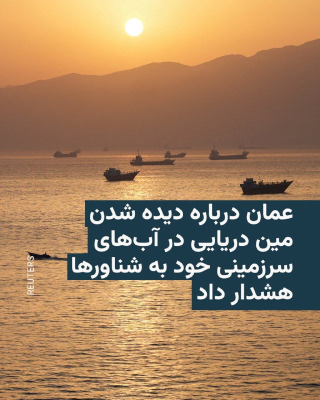

🔸مرکز امنیت دریایی عمان روز شنبه از دریانوردان، ماهیگیران و کشتی‌ها خواست پس از مشاهده یک شیء شناور که گمان می‌رود مین دریایی باشد، نهایت احتیاط را به خرج دهند.

🔸این شیء در غرب مسیر تردد ساحلی در تنگه هرمز و در محدوده آب‌های سرزمینی عمان مشاهده شده است.

🔸این مرکز بدون آن که به منشأ کار گذاشتن مین اشاره کند، به کاربران دریا توصیه کرد که از هرگونه شیء مشکوک فاصله ایمن حفظ کنند و بلافاصله آن را به مراجع ذی‌صلاح گزارش دهند.

🔸با آغاز جنگ آمریکا و اسرائیل علیه ایران در اسفند سال گذشته، گزارش‌هایی درباره مین‌گذاری تنگه هرمز توسط ایران منتشر شد.

🔸دونالد ترامپ، رئیس‌جمهور آمریکا، روز جمعه تعهد ایران به جمع‌آوری «هرگونه مین دریایی» در تنگه هرمز و باز شدن فوری این آبراه راهبردی را از جمله شروط توافق با جمهوری اسلامی خوانده بود.

@RadioFarda

## RadioFarda — post 157719

حج در سایهٔ گرمایش زمین؛ موج گرما از مکه تا مادرید رکورد می‌شکند

🔸گرمایش زمین دیگر فقط موضوعی برای گزارش‌های علمی و هشدارهای بلندمدت نیست؛ نشانه‌های آن هم‌زمان در آیین‌های مذهبی، زندگی روزمره و زیرساخت‌های شهری دیده می‌شود. از مکه که میلیون‌ها زائر حج را در معرض گرمایی فزاینده قرار داده، تا اروپا که در ماه مه رکوردهای تازهٔ دمایی ثبت کرده و حتی شبکه آب برخی مناطق بریتانیا را زیر فشار برده است،

🔸تصویر تازه‌ای از جهان گرم‌تر در حال شکل‌گیری است: جهانی که در آن فصل‌ها دیگر همان معنای پیشین را ندارند.

🔸بر اساس تحلیل تازه گروه «نسبت‌دهی هوای جهان»، گرمایش زمین، اقلیم مکه را «به‌طور بنیادین» دگرگون کرده و زائران حج را حتی در ماه‌هایی بیرون از تابستان در معرض گرمای شدید و خطرناک قرار داده است.

🔸این بررسی می‌گوید انتشار دی‌اکسید کربن ناشی از سوخت‌های فسیلی باعث شده دمای ۴۰ درجه سانتی‌گراد اکنون در ماه مه (اردیبهشت و خرداد) نیز به‌طور منظم تجربه شود؛ دمایی که در دهه‌های گذشته عمدتاً به تابستان محدود بود.

🔸این تغییر برای حج اهمیتی حیاتی دارد، چون مناسک آن در چند روز، همراه با پیاده‌روی‌های طولانی، ازدحام شدید و حضور شمار زیادی از زائران سالمند یا دارای بیماری‌های زمینه‌ای انجام می‌شود. در سال ۲۰۲۴، زمانی که حج در ماه ژوئن برگزار شد، بیش از ۱۳۰۰ زائر بر اثر گرما و رطوبت شدید جان باختند.

🔸پژوهشگران می‌گویند اگر جهان با همین روند سیاست‌های اقلیمی پیش برود و دمای جهانی تا پایان قرن سه درجه افزایش یابد، حدود ۹۷ درصد مناسک حج در مکه با سطح خطرناک گرما روبه‌رو خواهد شد.

🔸نسخه کامل این گزارش را در وب‌سایت رادیوفردا بخوانید.

@Radiofarda

## RadioFarda — post 157718

  <a href="https://t.me/radiofarda/157718" target="_blank">📎 Download file</a>

📻بشنوید: ساعت ۱۴ با رادیوفردا، نهم خرداد ۱۴۰۵‌

@Radiofarda

## RadioFarda — post 157717

پاراگراف اول؛ تابوی اسرائیل و منطق عادی‌سازی رابطه در سایهٔ جنگ

🔸پس از جنگ ۴۰ روزهٔ اسرائیل و آمریکا با ایران، خاورمیانه وارد مرحلهٔ تازه‌ای از بازآرایی ژئوپولیتیکی شده است؛ مرحله‌ای که در آن کشورهای عربی میان سه ملاحظهٔ اصلی در حال موازنه‌اند: مهار قدرت منطقه‌ای ایران، حفظ روابط امنیتی با ایالات متحده، و مدیریت حساسیت افکار عمومی نسبت به اسرائیل و مسئلهٔ فلسطین.

🔸در این چارچوب، پیمان‌های ابراهیم که در سال ۲۰۲۰ با میانجی‌گری دونالد ترامپ، رئیس‌جمهور آمریکا، شکل گرفت، همچنان به‌عنوان مهم‌ترین الگوی عادی‌سازی روابط با اسرائیل مطرح است؛ هرچند جنگ غزه و افزایش تنش‌های منطقه‌ای، آینده و دامنهٔ آن را با ابهام روبه‌رو کرده است.

🔸امارات، بحرین و مراکش با تکیه بر منافع اقتصادی، امنیتی و فناورانه به این روند پیوسته‌اند، در حالی که عربستان سعودی عادی‌سازی را به پیشرفت واقعی در تشکیل کشور فلسطین مشروط کرده است. هم‌زمان، برخی بازیگران منطقه‌ای مانند پاکستان نسبت به گسترش این چارچوب موضعی کاملاً مخالف گرفته‌اند.

🔸اکنون بحث درباره توافقی فراتر از پیمان ابراهیم و حتی احتمال نوعی تفاهم محدود با ایران نشان می‌دهد که دولت دونالد ترامپ در پی ترسیم نظمی جدید برای خاورمیانه است؛ نظمی که در آن نفوذ آمریکا در منطقه حفظ شود، روابط اسرائیل با کشورهای مسلمانِ منطقه و فراتر از آن تقویت گردد و حضور چین محدود شود. این‌ها موضوع‌هایی هستند که به عناصر تعیین‌کننده برای آیندهٔ خاورمیانه تبدیل شده‌اند.

🔸در برنامهٔ رادیویی «پاراگراف اول»، نوید طوبیان، دانش‌آموخته اسلام‌شناسی، خاورمیانه و ایران از دانشگاه عبری اورشلیم و ساکن تل‌آویو، علی معموری دانش‌آموخته فلسفه سیاسی و الهیات و پژوهشگر در مؤسسه مطالعات شهروندی در دانشگاه دیکن از سیدنی به همراه میثم بادامچی فلسفه سیاسی از دانشگاه لوئیس رم و پژوهشگر ارشد مؤسسه مطالعه بین‌منطقه‌ای قانون اساسی‌گرایی وابسته به بخش حقوق دانشگاه چارلز از پراگ در این‌باره تبادل نظر کرده‌اند.

🔸نسخه کامل این گفت‌وگو را در وب‌سایت رادیوفردا بخوانید.

@RadioFarda

## RadioFarda — post 157716

  

🔸رئیس کل دادگستری خراسان جنوبی روز شنبه ۹ خرداد از توقیف اموال ۳۴ نفر در این استان با اتهامات امنیتی خبر داد.

🔸محمدجعفر عبدالهی از این افراد با عنوان «عناصر حامی دشمن» نام برد و آن‌ها را به «اقدامات ضدامنیتی و همکاری با کشورهای متخاصم» متهم و اعلام کرد که اموال آن‌ها به «نفع ملت» مصادره شده است.

🔸دادگستری خراسان جنوبی اسامی این افراد را اعلام نکرده و برای اتهامات علیه این افراد شواهد و مدارکی ارائه نداده است.

🔸پیش از این نیز گزارش‌های متعددی از توقیف اموال شماری از روزنامه‌نگاران، فعالان سیاسی و مدنی، هنرمندان، ورزشکاران و چهره‌های شناخته‌شده با اتهامات مشابه در استانهای مختلف ایران منتشر شده بود.

@RadioFarda

## RadioFarda — post 157715

  

🔸ارتش جمهوری اسلامی ایران روز شنبه در بیانیه‌ای اعلام کرد یک پهپاد را در آسمان قشم ساقط کرده است.

🔸در این بیانیه آمده است که پدافند ارتش بامداد روز شنبه نهم خرداد یک فروند پهپاد «اوربیتر دشمن متجاوز» را رهگیری و با «شلیک موفق» ساقط کرده است.

🔸ارتش جمهوری اسلامی می‌گوید این پهپاد «آمریکایی- اسرائیلی» بوده است.

🔸سنتکام و ارتش اسرائیل هنوز واکنشی به این خبر نشان نداده‌اند.

🔸این خبر در حالی منتشر شده است که وزیر دفاع ایالات متحده روز شنبه هشدار داد که ارتش این کشور برای ازسرگیری جنگ با ایران حتی «بیش از آنچه لازم است توانایی» دارد.

@RadioFarda

## RadioFarda — post 157714

  

🔸پلیس و مقامات فرودگاه مونیخ به خبرگزاری فرانسه گفتند که پروازها در این فرودگاه روز شنبه نهم خرداد به دلیل «مشاهده یک پهپاد مشکوک»، حدود یک ساعت به حالت تعلیق درآمد.

🔸سخنگوی پلیس گفت که دو خلبان کمی پس از ساعت ۹ صبح از وقوع حادثه‌ای مشکوک که ظاهراً پهپاد بود، خبر دادند و با هماهنگی کنترل ترافیک هوایی آلمان، مقامات امنیتی سپس تصمیم به بستن باند فرودگاه‌ها گرفتند.

🔸به گفته سخنگوی فرودگاه، پروازها ساعت ۱۰:۰۵ صبح از سر گرفته شد.

🔸سخنگوی فرودگاه مونیخ گفت که «جستجوی گسترده توسط سرویس‌های اورژانس هیچ تهدیدی» برای امنیت عمومی پیدا نکرد.

🔸سال گذشته نیز فرودگاه مونیخ آلمان پس از مشاهده چندین پهپاد مشکوک به‌دلایل امنیتی تعطیل شد.

@RadioFarda

## RadioFarda — post 157713

سازمان اطلاعات دانمارک «تهدید تروریستی ایران» را بزرگ‌تر از گذشته ارزیابی کرد

🔸سازمان اطلاعات دانمارک روز جمعه، هشتم خردادماه، در بیانیه‌ای اعلام کرد که ایران، در پی تحولات جهانی اخیر، در حال حاضر نقش پررنگ‌تری در تهدید تروریستی علیه این کشور اسکاندیناوی ایفا می‌کند.

🔸رئیس سازمان امنیت و اطلاعات ملی دانمارک گفت که سطح کلی تهدید از طرف ایران برای کشورش همچنان چهار از مقیاسی پنج درجه‌ای است، اما در عین حال تأکید کرد که در سال‌های اخیر ماهیت این تهدیدها «به‌طور قابل‌توجهی تغییر کرده است».

🔸فین بورخ آندرسن در بیانیه‌ رسمی خود می‌گوید: «در سال گذشته، عوامل دولتی اهمیت فزاینده‌ای در تهدیدات تروریستی پیدا کرده‌اند. ارزیابی ما این است که این موضوع به‌ویژه درباره ایران صدق می‌کند؛ کشوری که به‌طور خاص تهدیدی برای منافع اسرائیلی و یهودی و همچنین برخی مخالفان ایرانی در اروپا، از جمله دانمارک، محسوب می‌شود.»

🔸او افزود: «تهدید ناشی از ایران از سرویس‌های اطلاعاتی این کشور سرچشمه می‌گیرد که برای برنامه‌ریزی و اجرای حملات از شبکه‌های مجرمانه و همچنین جذب نیرو در اروپا استفاده می‌کنند».

🔸در کشور همسایه دانمارک، سوئد، سازمان امنیت این کشور (ساپو) نیز ایران را متهم کرده که از باندهای تبهکار برای انجام «اقدامات خشونت‌آمیز» علیه منافع اسرائیلی و چهره‌های مخالف ایرانی در سوئد استفاده می‌کند، ادعایی که ایران رد کرده است.

🔸به گفته سازمان ملی امنیت و اطلاعات دانمارک، تشدید خصومت میان ایران و اسرائیل در سال‌های اخیر، به‌ویژه پس از آغاز حملات اسرائیل و ایالات متحده علیه ایران در ۹ اسفند پارسال، بر سطح تهدید علیه کشورهای شمال اروپا و به‌طور کلی کشورهای غربی تأثیر گذاشته است.

🔸سازمان امنیت و اطلاعات دانمارک همچنین افزود که در گذشته، تهدیدها عمدتاً از سوی «بازیگران غیردولتی» مانند افراط‌گرایان خشونت‌طلب هدایت می‌شد، و با وجود افزایش نقش بازیگران دولتی، تهدید از سوی دیگر گروه‌ها همچنان پابرجاست.

🔸همزمان با انتشار بیانیه رسمی دانمارک، پلیس بریتانیا روز جمعه اعلام کرد یک شهروند یونانی به اتهام همکاری با یک سرویس اطلاعاتی خارجی که به گفته پلیس «گمان می‌رود متعلق به ایران باشد» دادگاهی شد.

🔸اتهام او تلاش برای هدف قرار دادن یک روزنامه‌نگار شاغل در شبکه تلویزیونی ایران اینترنشنال عنوان شده است. در بیانیه پلیس بریتانیا نام این روزنامه‌نگار ذکر نشده است.

🔸نسخه کامل این گزارش را در وب‌سایت رادیوفردا بخوانید.

RadioFarda

## IranianMinds — post 21073

🔴 شاهزاده رضا پهلوی:

مردم ایران باید از طریق هوا حفاظت بشن و اینترنت و دیگر ابزار لازم رو داشته باشن که دست به‌کار بشن و رژیم رو به زانو بیارن.

مردم حمله به زیرساخت‌های رژیم رو جشن گرفتن و خیابان‌ها رو به نام ترامپ نام‌گذاری کردن.

دنیا باید تصمیم بگیره که بعد از ۴۷ سال مماشات در کنار مردم ایران بایسته.

@IranianMinds

## IranianMinds — post 21072

  

🔴در تجمعات شبانه دیده شده است.

@IranianMinds

## IranianMinds — post 21071

پیت هگست جملات طنز گفته

🔴 هگست : همین چند روز پیش در جلسه کابینه بودیم و رئیس جمهور گفت: «هی، این یک توافق عالی خواهد بود و اگر ایران نمی‌خواهد توافق خوبی انجام دهد که تضمین کند به سلاح هسته‌ای دست پیدا نمی‌کند، می‌تواند با فردی که در سمت چپ من است، معامله کند.»

و این تنها باری بود که من به چپ بودن متهم شدم. 😂

@IranianMinds

## IranianMinds — post 21069

🔴 امروز‌ ساعت 19:30 فینال لیگ قهرمانان اروپا تو شهر بوداپست مجارستان برگزار میشه

پی اس جی - آرسنال

@IranianMinds

## IranianMinds — post 21068

  <a href="telegram/content/IranianMinds_21068_1780152856.webm" target="_blank">🎬 Download video</a>

▶️ فینال لیگ قهرمانان اروپا رو با آپشن های تخصصی در MelBet پیشبینی کنید! ⚽️
🔥😍

💵 امکان شارژ کارت بکارت و هات ووچر

🎁 قرعه کشی و آفر های جذاب با جوایز ویژه

📱 کاملترین برنامه موبایل

🤝 اسپانسر رسمی لالیگا

🇮🇷 پشتیبانی از زبان فارسی

✍️ حرفه ای، مطمئن و در کلاس جهانی پیشبینی کنید!

برای ورود به سایت فیلترشکن خود را خاموش کنید!
‌
🌐 Link 🔜 MelBet1.net

🌐‌ Link 🔜 MelBet1.net

## IranianMinds — post 21067

  <a href="telegram/content/IranianMinds_21067_1780152857.mp4" target="_blank">🎬 Download video</a>

🔴فوری.

@IranianMinds

## IranianMinds — post 21066

🔴حسین علائی:

هرچقدر به شمخانی می‌گفتم که در جنگ بعدی رهبر را می‌زنند، میگفت نمی‌توانند.
خدا او را بیامرزد، آخر هم رهبر را زدند و هم خودش را.

@IranianMinds

## IranianMinds — post 21065

خبرنگار : آیا اون محاصره هنوز هم برقرار هست؟

هگست :
بله، محاصره هنوز کاملاً برقرار هست

@IranianMinds

## IranianMinds — post 21064

🔴وزیر جنگ آمریکا:

هر لحظه آماده ایم جنگ علیه ایران را از سر بگیریم.

@IranianMinds

## IranianMinds — post 21063

  <a href="telegram/content/IranianMinds_21063_1780152858.mp4" target="_blank">🎬 Download video</a>

پیت هگست وزیر جنگ آمریکا درباره ایران:

ایران می‌خواهد بگوید که کنترل تنگه را در دست دارد، اما این ما هستیم.

و همه چیز پشت صحنه نشان می‌دهد که وقتی صحبت از آن می‌شود، ما کنترل را در دست داریم.

@IranianMinds

## IranianMinds — post 21062

  

🔴ارتش اسرائیل دستور تخلیه به ساکنان جنوب لبنان به ویژه شهرها و روستاهای زیر را صادر کرد.

المروانیه، اللوبیه، میدون، انصاریه، زفتا و تفاحتا.

@IranianMinds

## IranianMinds — post 21061

  

سر لشگر و فرمانده ی خشن محسن رضایی:

ترامپ اهل مذاکره نیست و اهداف دیگری را دنبال می‌کند

@IranianMinds

## IranianMinds — post 21060

🔴 مقامات رژیم جمهوری اسلامی پیشنهاد همکاری با آمریکا را دادند!

نیویورک تایمز:

گزارش شده است که مقامات رژیم جمهوری اسلامی پیشنهاد داده‌اند شرکت‌های آمریکایی، مانند شرکت‌های نفت و انرژی، اجازه داشته باشند در ایران سرمایه‌گذاری کنند.

این توافق بسیار شبیه به «هیئت صلح» برای غزه است، جایی که تقریباً ۱۷ میلیارد دلار وعده داده شده است (که تقریباً هیچ‌کدام از آن جمع‌آوری نشده است) برای بازسازی غزه، و تاکنون هیچ هزینه‌ای برای بازسازی غزه صرف نشده است.

@IranianMinds

## IranianMinds — post 21059

یک مقام ارشد آمریکایی به الجریزه :

ترامپ هیچ توافقی با ایران رو امضا نمی‌کنه مگر اینکه به نفع آمریکا باشه و خط قرمزهاش رعایت بشه

@IranianMinds

## BBCPersian — post 282435

  <a href="https://t.me/bbcpersian/282435" target="_blank">📎 Download file</a>

📻این هفته در پرگار: گرایش سیاسی ما چگونه شکل می‌گیرد؟

🔻عقاید سیاسی ما چگونه شکل می‌گیرند؟ چطور تغییرمی‌کنند؟ چرا دیگرانی که تا دیروز همفکر می‌پنداشتیم را ممکن است امروز ناقص‌العقل بنامیم؟ آنها ما را چطور می‌بینند؟

میهمان‌ها:
پویا قدوسی، استاد جغرافیای انسانی
مانی منجمی، روان‌پزشک

@BBCPersian

## BBCPersian — post 282434

  <a href="https://t.me/bbcpersian/282434" target="_blank">📎 Download file</a>

تازه‌ترین خبرهای جهان از جام جهان‌نما - شنبه ۹ خرداد ۱۴۰۵
@BBCPersian

## BBCPersian — post 282432

  <a href="telegram/content/BBCPersian_282432_1780152861.mp4" target="_blank">🎬 Download video</a>

🔻‌ خبرگزاری دولتی لبنان گزارش داده است که روز شنبه ۳۰ مه، پس از حملات اسرائیل، دود غلیظی از مناطق مختلف جنوب لبنان به هوا برخاست. پیش‌تر ارتش اسرائیل با صدور هشدار تخلیه به ساکنان هفت روستا در جنوب لبنان اعلام کرده بود که قصد دارد اهدافی متعلق به حزب‌الله را در این مناطق هدف قرار دهد.

اسرائیل و حزب‌الله یکدیگر را به نقض آتش‌بس متهم می‌کنند و تنش میان دو طرف افزایش یافته است. در تصاویری که از حمله اسرائیل به شهر صور در ۲۸ مه منتشر شده، چند ساختمان هدف قرار گرفته‌اند و نیروهای امدادی برای کمک به آسیب‌دیدگان در محل حاضر شده‌اند. ارتش اسرائیل همچنین در روزهای اخیر از یک «حمله هدفمند» در جنوب بیروت خبر داده است.

آویخای ادرعی، سخنگوی عرب‌زبان ارتش اسرائیل، در شبکه ایکس نوشت این حملات در پاسخ به آنچه «نقض توافق آتش‌بس» از سوی حزب‌الله خوانده، انجام شده و اسرائیل ناچار به «اقدامی قاطع» شده است.

این تحولات در حالی رخ می‌دهد که مذاکرات میان اسرائیل و لبنان، که از ماه آوریل آغاز شده، همچنان ادامه دارد

@‌‌BBCPersian

## BBCPersian — post 282431

🔻جعفر پورکبگانی، نماینده مجلس شورای اسلامی از خسارت «۴ میلیارد دلاری پارس جنوبی» در جریان جنگ خبر داد.

او گفت که نتایج ارزیابی مشترک کارشناسان و متخصصان دانشگاه علم و صنعت نشان می‌دهد که میزان خسارت وارده به پارس جنوبی تا این لحظه به «حدود ۴ میلیارد دلار رسیده و زیان ناشی از کاهش فعالیت‌ها هم روزانه نزدیک به ۲ میلیون دلار برآورد می‌شود.»

آمریکا و اسرائیل در جریان جنگ تاسیسات پارس جنوبی را که بزرگ‌ترین میدان گازی جهان در خلیج فارس است، هدف قرار دادند.

پارس جنوبی در اختیار ایران است و بخش شمالی آن به قطر تعلق دارد که بزرگ‌ترین تولیدکننده گاز در منطقه محسوب می‌شود. قطر حدود ۲۰ درصد گاز مایع جهان را تامین می‌کند.

نماینده بوشهر،‌ گناوه و دیلم با اشاره به خسارت‌های واردشده به زیرساخت‌ها و اداره کل هواشناسی بوشهر هم گفت که در جریان جنگ مجموعه هواشناسی بوشهر سه بار هدف حمله قرار گرفت و به دلیل آسیب‌های واردشده، بازگشت کامل این مجموعه به شرایط عادی زمان‌بر خواهد بود.

او در مورد شرایط فرودگاه بوشهر هم گفت: زیرساخت‌ها و امکانات فنی این فرودگاه برای انجام پرواز آماده است، اما بهره‌برداری مجدد از آن پس از اخذ مجوزهای امنیتی مورد نیاز از استانداری امکان‌پذیر خواهد بود.

@BBCPersian

## BBCPersian — post 282430

🔻پیت هگست، وزیر دفاع آمریکا، در یک مجمع عالی دفاعی منطقه‌ای در سنگاپور گفت که ارتش آمریکا در حالی که به «تعهدات جهانی» خود مانند جنگ ایران عمل می‌کند، به آسیا «پشت نمی‌کند».

در پی تعلیق فروش تسلیحاتی آمریکا به تایوان، آقای هگست سعی کرد که به متحدان واشنگتن در آسیا-اقیانوسیه اطمینان دهد که آمریکا همچنان پای تعهداتش به این منطقه ایستاده است. هرچند او درخواست‌های آمریکا از شرکای آسیایی برای صرف هزینه‌های بیشتر در حوزه دفاعی را تکرار کرد.

پیت هگست در عین اشاره به تهدید تقویت حضور نظامی چین در منطقه، گفت که آمریکا می‌خواهد از «رویارویی غیرضروری» اجتناب کند.

پیت هگست این سخنان را چند هفته پس از «مذاکرات مثبت» دونالد ترامپ با شی جین‌پینگ، رئیس‌جمهورچین، در پکن بیان کرد.
https://bbc.in/4dF0tDR

@BBCPersian

## BBCPersian — post 282429

🔻قوه قضائیه اموال بیش از ۱۰۰ شهروند ایرانی را در خراسان جنوبی و گلستان توقیف کرد

بنابر اعلام دادگستری خراسان جنوبی اموال ۳۴ شهروند ایرانی در این استان توقیف شده است.

دادگستری این استان از این افراد به عنوان «عنصر خائن به کشور» و «حامی» آمریکا و اسرائیل یاد کرده است.

بر اساس اعلام این نهاد، دارایی‌های توقیف شده شامل اموال منقول و غیرمنقول، حساب‌های بانکی، املاک ثبتی و آپارتمان و خودروی سواری بوده است.

قوه قضائیه همچنین گفته است اموال ۷۴ نفر دیگر هم در استان گلستان توقیف شده است؛ همه این افراد در خارج از کشور سکونت دارند.

پس از اعتراضات دی‌ماه و کشتار معترضان، شمار زیادی از شهروندان ایرانی در خارج از کشور در تجمعات اعتراضی در شهرهای مختلف شرکت کردند که این اعتراضات در هفته‌های منتهی به جنگ و بعد از آن هم ادامه یافت.

قوه قضائیه پس از جنگ آمریکا و اسرائیل با ایران، با استناد به قانون «تشدید مجازات جاسوسی» معترضان و مخالفان را به «همراهی با دشمن» متهم کرد.

اما این توقیف‌ها به موضوع جنگ محدود نیست؛ در زمان اعتراضات دی‌ماه هم اموال بعضی از چهره‌های شناخته شده در داخل ایران ضبط شد.

فعالان مجازی حامی جمهوری اسلامی در جریان جنگ اخیر، اقدام به فراخوان‌هایی برای معرفی مخالفان جمهوری اسلامی که آنها را «حامی جنگ» نامیدند، کردند.

@BBCPersian

## BBCPersian — post 282428

ویدیوهایی از ورود گروهی با قایق‌های کوچک به کشتی سن‌آنتونیو روز ۸ خرداد منتشر شده است. در این ویدیوها دیده می‌شود گروه بزرگی با تعداد زیادی قایق کوچک به این کشتی باری کانتینربر وارد می‌شوند و مفتول‌های فلزی باقیمانده در کشتی را از آن به قایق‌هایشان منتقل می‌کنند.

کشتی سن‌آنتونیو متعلق به شرکت «سی‌ام‌ای سی‌جی‌ام» است که در تاریخ اردیبهشت هنگام عبور از تنگه هرمز هدف اصابت «پرتابگر ناشناخته» قرار گرفت.

بر اثر این حمله تعدادی از کارکنان کشتی مجروح شدند.

مسئول این حمله مشخص نیست ولی پیش از آن ایران اعلام کرده بود به کشتی‌هایی که بدون مجوز سپاه قصد عبور از تنگه هرمز را داشته باشند، حمله می‌کند.

بعضی گزارش‌ها حاکی است این کشتی بعد از حمله و تخلیه افراد زخمی و سایر کارکنان، در نزدیکی بندر جاسک رها شده است. تاریخ و مکان دقیق ویدیوهای منتشر شده برای بی‌بی‌سی فارسی مشخص نیست.
@BBCPersian

## BBCPersian — post 282427

🔻یک عضو هیأت رئیسه مجلس ایران گفت «به زودی طرح اعمال مدیریت و حاکمیت ایران بر تنگه هرمز در مجلس تصویب و قانونی خواهد شد.»

علیرضا سلیمی به خبرگزاری ایسنا گفت «بررسی‌های مفصلی درباره این طرح صورت گرفته و نظرات دستگاه‌های مختلف از جمله بخش‌های اقتصادی، حمل‌ونقل، امنیتی و سایر نهادهای مرتبط اخذ شده است.»

مشخص نیست طرحی که آقای سلیمی می‌گوید چند امضا دارد و قرار است چه وقت در مجلس ایران به بحث گذاشته شود. از زمان حمله آمریکا و اسرائیل به ایران، جلسات علنی مجلس شورای اسلامی در محل دائمی و همیشگی آن متوقف شده است.

تنگه هرمز که بین آب‌های ایران و عمان قرار دارد از زمان جنگ اخیر از سوی ایران کنترل می‌شود و عبور و مرور کشتی‌ها در آن به شکل محسوسی کاهش یافته است.

آقای سلیمی گفت «طرف عمانی نیز موافقت‌های اولیه خود را اعلام کرده است.»

نماینده مجلس ایران گفته «تنگه هرمز برای جمهوری اسلامی ایران از ده‌ها بمب هسته‌ای مهم‌تر و ارزشمندتر است و به هیچ وجه اعمال مدیریت بر تنگه هرمز قابل معامله نبوده، نیست و نخواهد بود.»

آمریکا گفته است که این تنگه باید برای عبور و مرور کشتی‌ها باز شود و نهاد کشتیرانی سازمان ملل متحد هم گفته است که ایده اخذ عوارض از آن را تایید نمی‌کند.

@BBCPersian

## BBCPersian — post 282426

🔻عضو کمیسیون انرژی مجلس شورای اسلامی: یک سوم ظرفیت تولید گاز در جنگ اخیر از دست رفت

یک عضو کمیسیون انرژی مجلس شورای اسلامی می‌گوید که این کشور در جریان جنگ اخیر با آمریکا و اسرائیل «حدود یک سوم ظرفیت تولید گاز» خود را از دست داده است.

غلامرضا دهقان ناصرآبادی با اشاره به آسیب دیدن «فازهای چندگانه عسلویه» در میدان گازی پارس جنوبی، گفت: «وزارت نیرو و وزارت نفت تمام تلاش خود را برای‌ بازسازی و بازگشت به ظرفیت تولید قبل از جنگ به کار بسته‌اند.»

بخش عمده گاز تولیدی ایران از میدان گازی پارس جنوبی تامین می‌شود که با کشور قطر مشترک است.
@BBCPersian

## BBCPersian — post 282425

🔻دسترسی پزشکان ایران به لیست داروهای کمیاب در سامانه نسخه‌‌نویسی

اکبر عبداللهی، مدیرکل دارو و مواد تحت کنترل سازمان غذا و داروی ایران خبر داد که از یک ماه دیگر پزشکان هنگام تجویز دارو به فهرستی از داروهای کمیاب، دسترسی خواهند داشت.

به گفته این مقام ارشد دولت، فهرستی که در اختیار پزشکان قرار خواهد گرفت «میزان کمبود دارویی و اطلاعات آماری مربوط به میزان تجویز و بار مالی داروهای تجویزی» را شامل می‌شود.

این خبر در حالی منتشر می‌شود که بارها گزارش‌هایی از تشدید مشکل کمبود دارو در ایران منتشر شده است.

ایران می‌گوید تحریم‌ها و حملات آمریکا و اسرائیل به مراکز تولید دارو از جمله دلایل کمبود داروهاست.

اکبر عبداللهی گفت اکنون در وزارت بهداشت یک «کمیته تجویز و مصرف» تشکیل شده است و قرار است «کمتر از یک ماه دیگر» اجرایی شود.

به گفته آقای عبداللهی، علاوه بر سامانه «نسخه‌نویسی» که پزشکان در زمان تجویز به اطلاعات کمبودهای دارویی دسترسی خواهند داشت، سامانه دیگری با عنوان «کارنامه پزشک» ایجاد خواهد شد که در آن، «بار مالی تحمیل‌شده از سوی پزشک به نظام سلامت، هنگام نسخه‌نویسی برای او قابل مشاهده است.»

مسعود پزشکیان، رئیس جمهور ایران هم روز گذشته دستوری برای تسریع تامین کالاهای اساسی و دارو از طریق متحدان و کریدورهای شمالی ایران صادر کرد.

@BBCPersian

## BBCPersian — post 282424

🔻محسن رضایی: ترامپ برای سومین‌بار در حال خیانت به دیپلماسی است

محسن رضایی، فرمانده پیشین سپاه پاسداران، دونالد ترامپ را متهم کرده است که با ادامه محاصره دریایی ایران و مطرح کردن «خواسته‌های بیش از حد» در مذاکرات، «برای سومین بار به دیپلماسی خیانت می‌کند.»

پس از آنکه مجتبی خامنه‌ای به‌عنوان جانشین پدرش، سومین رهبر جمهوری اسلامی شد، رسانه‌های ایران گزارش دادند که او آقای رضایی را به‌عنوان مشاور نظامی خود منصوب کرده است.

آقای رضایی در پست خود در شبکه ایکس نوشت که دونالد ترامپ «بیش از پیش ثابت کرد که اهل مذاکره نیست و اهداف دیگری را دنبال می‌کند.»

مقام‌های ایرانی آمریکا بارها انتقاد کرده‌اند که آمریکا هم موقع آغاز جنگ ۱۲ روزه و هم در آغاز جنگ اخیر، در میانه مذاکره با ایران دست به حمله نظامی زد و «به دیپلماسی خیانت کرد.»

@BBCPersian

## BBCPersian — post 282423

🔻به گزارش خبرگزاری بلومبرگ، ایران در ۲۴ ساعت گذشته با موشک بالستیک به یک پایگاه هوایی در کویت حمله کرده است که در نتیجه آن چندین آمریکایی «جراحات سطحی» دیده‌اند.

این خبرگزاری به نقل از یک مقام آگاه که نخواست نامش فاش شود، گزارش داد که دو پهپاد «ام‌کیو۹ ریپر» هم در این حمله به شدت آسیب دیدند.

به گفته این منبع، پدافند هوایی کویت یک موشک فاتح-۱۱۰ را رهگیری کرده است اما بقایا و لاشه موشک در پایگاه هوایی علی السالم سقوط کرده و خساراتی برجا گذاشته است.

چند روز پیش در جریان تبادل آتش‌هایی که در منطقه خلیج فارس گزارش شد، مقام‌های کویت و آمریکا از حمله موشکی ایران به کویت خبر داده‌ بودند اما زمان انجام آن حمله با حمله‌ای که بلومبرگ گزارش کرده مطابقت ندارد و متفاوت به‌نظر می‌رسد.

فرماندهی مرکزی ارتش ایالات متحده، سنتکام، پیشتر در بیانیه‌ای گفته بود: «ساعت ۱۰:۱۷ شب به وقت شرق آمریکا در تاریخ ۲۷ مه، (۶ خرداد) ایران یک موشک بالستیک به سمت کویت شلیک کرد که با موفقیت توسط نیروهای کویتی رهگیری شد.»

همان زمان سپاه پاسداران اعلام کرده بود که در واکنش به حمله هوایی آمریکا به نقاطی در حومه بندرعباس، «پایگاه مبداء» این حملات را مورد حمله قرار داده است.

در بیانیه سپاه پاسداران آمده بود: «به دنبال تعرض سحرگاه امروز پنجشنبه (۷ خرداد) ارتش متجاوز آمریکا به نقطه‌ای در حاشیه فرودگاه بندر عباس با پرتابه‌های هوایی، پایگاه هوایی آمریکایی مبداء تجاوز در ساعت ۴/۵۰ دقیقه هدف قرار گرفت.»

حمله جدیدی که بلومبرگ می‌گوید در شبانه روز گذشته انجام گرفته، در حالی است که دونالد ترامپ دیروز برای تصمیم‌گیری در مورد توافق با ایران جلسه تشکیل داده بود.

کاخ سفید پس از جلسه دونالد ترامپ با مشاورانش اعلام کرد که رئیس‌جمهور آمریکا تنها توافقی با ایران را خواهد پذیرفت که «خطوط قرمز» او را تامین کند.
@BBCPersian

## BBCPersian — post 282422

🔻معاون وزیر نیروی ایران از واردات «۳۰۰ مگاوات برق» از کشورهای ترکمنستان و ارمنستان برای کمک به تأمین برق در دوره اوج مصرف تابستان امسال خبر داد و گفت که هم‌زمان صادرات برق به افغانستان و پاکستان نیز ادامه دارد.

مصطفی رجبی مشهدی با بیان این که جنگ ۴۰ روزه اخیر تأثیری بر مبادلات برقی ایران با کشورهای همسایه نداشته است، گفت: «زیرساخت‌های تبادل برق در معرض حملات قرار نگرفتند و همکاری ترکمنستان و ارمنستان در زمینه تأمین برق ایران همچنان ادامه دارد.»

او با اشاره به این که تبادل ۱۰۰۰ مگاوات برق با روسیه جزء توافقات آینده است، گفت که بعد از این که خطوط و تاسیسات مورد نیاز برای اتصال شبکه بین ایران و روسیه احداث شود به لحاظ فنی امکان مبادله تا ۱۰۰۰ مگاوات بین دو کشور وجود دارد.
@BBCPersian

## BBCPersian — post 282420

🔻ارتش اسرائیل شنبه با صدور هشدار تخلیه به ساکنان هفت روستا در جنوب لبنان اعلام کرد که قصد دارد اهدافی متعلق به حزب‌الله را در آن مناطق از لبنان هدف قرار دهد.

آویخای ادرعی، سخنگوی عرب‌زبان ارتش اسرائیل، در بیانیه‌‌ای در شبکه ایکس نوشت که این حملات در پاسخ به «نقض توافق آتش‌بس» از سوی حزب‌الله لبنان است و اکنون ارتش اسرائیل ناگزیر است تا «اقدامی قاطع» انجام دهد.

اسرائیل و حزب‌الله لبنان یکدیگر را به نقض آتش‌بس متهم می‌کنند. در یک هفته‌ گذشته، تنش میان دو طرف تشدید شده است.

ساعتی پیش هم ارتش اسرائیل اعلام کرد که از خاک لبنان چند پرتابه به سمت اسرائیل شلیک شده است.

در همین حال، اسرائیل به بمباران سنگین مناطقی از جنوب لبنان که می‌گوید مواضع حزب‌الله است، ادامه داده است.

این خبرها در حالی منتشر می‌شود که گفت‌وگوهای اسرائیل و لبنان که از ماه آوریل آغاز شد، همچنان ادامه دارد.
@BBCPersian

## BBCPersian — post 282419

🔻ارتش ایران در بیانیه‌ای اعلام کرد نیروی پدافندش یک پهپاد را در قشم ساقط کرده است.

ارتش ایران در این بیانیه‌ نوشت بامداد روز شنبه ۹ خرداد یک فروند پهپاد «اوربیتر دشمن متجاوز» را رهگیری و با «شلیک موفق» ساقط کرده است.

ارتش ایران می‌گوید این پهپاد «آمریکایی- صهیونی» بوده است.

@BBCPersian

## Dirty_Kids — post 390569

  

دورانی که اینترنت قطع بود مردم از سر بیکاری اسم وای فای‌شون رو تغییر میدادن تا از همسایشون بپرسن شام چی دارن :))

@Dirty_Kids 👻

## Dirty_Kids — post 390568

  <a href="telegram/content/Dirty_Kids_390568_1780152863.mp4" target="_blank">🎬 Download video</a>

عرزشیا تو عید قربان خاتمی، روحانی و ظریف رو بنر کنار ترامپ و نتانیاهو چاپ کردن دارن بهشون بعنوان شیطان سنگ میزنن 😂

خب خاک تو سر بی‌عرضتون کنن این سه تا شیطان بغل دستتون تو ایران هستن

@Dirty_Kids 👻

## Dirty_Kids — post 390567

  <a href="telegram/content/Dirty_Kids_390567_1780152865.mp4" target="_blank">🎬 Download video</a>

🔴 کارشناس ضد ایرانی صداوسیما : آریایی‌ها قاتل بودن!

اینکه بعضی‌ها میگن ما آریایی هستیم، نژادپرستیه.
تمدن ما 65 هزار ساله‌ست، آريايی‌ها کلا 4-5 هزار سال پیش اومدن.
آریایی‌ها همه رو کُشتن و به قدرت رسیدن، اینکه بگیم ما آریایی هستیم یعنی ما فرزندان کسایی هستیم که نسل کُشی کردن...

@Dirty_Kids 👻

## Dirty_Kids — post 390565

  <a href="telegram/content/Dirty_Kids_390565_1780152867.mp4" target="_blank">🎬 Download video</a>

کسی بهت نگفت شبیهه لامایی؟

ستایش دهقان هستش، تنها جایی که دیدمش ۵ دقیقه تو سریال جیران بود، همش نگران کیفیت کص دادن و زندگی جیران بود

@Dirty_Kids 👻

## Dirty_Kids — post 390564

جفت کنید، اینا 👆۲۰ میلیارد ناقابل دادن فقط برای عروسی گرفتن😕 ۹۰ درصد مردم تمام آرزوشون ۲۰ میلیارده یه خونه و ماشین بگیرن، این دیگه اختلاف طبقاتی نیست شیاف طبقاتیه @Dirty_Kids 👻

## Dirty_Kids — post 390563

  <a href="telegram/content/Dirty_Kids_390563_1780152867.mp4" target="_blank">🎬 Download video</a>

در حالیکه ما با اوکراینی دشمنان مشترکی مثه روسیه‌ی قرمساق داریم،

سفر شاهزاده رضا پهلوی به اوکراین و شرکت در مجمع امنیتی دریای سیاه بسیار مهمه چرا که [سربسته بگم] از دل این نشست‌هاست که گاییدن‌ روافض در فاز نهایی رقم می‌خوره.

@Dirty_Kids 👻

## Dirty_Kids — post 390559

اینترنت رو قطع کردن تا دنیا این صحنه‌ها رو نبینه
صدای واقعی ملت ایران

@Dirty_Kids 👻

## Dirty_Kids — post 390558

  

جرررر 😂😂😂

@Dirty_Kids 👻

## Dirty_Kids — post 390557

خیلی گرمه، یه لحظه به خامنه ای که تو یخچال حسودیم‌ شد.

@Dirty_Kids 👻

## Dirty_Kids — post 390556

  

پاره 🤣🤣🤣🤣

دوستانی که نبودند درجریان نیستن، شماکه نبودید پوبون زیدش از یجا افتاده بود پایین پوبون برای خرج بیمارستان از مردم دذخواست پول کرد

@Dirty_Kids 👻

## Dirty_Kids — post 390555

این ویدیو از زمان جنگ خیلی خوبه تا آخرش ببینید

داداشمون خیلی بتخمم‌وار وسط اون حجم از موشک که آدم خایه‌فنگ میکنه، واستاده ریلکس میشاشه فیلم میگیره گزارش میکنه

@Dirty_Kids 👻

## Dirty_Kids — post 390554

  

🔴 رئیس سازمان سنجش:
کنکور امسال پنجشنبه و جمعه - 29 و 30 مرداد برگزار میشه.

@Dirty_Kids 👻

## Dirty_Kids — post 390553

  

و اینگونه بود که به پایان رسید:

@Dirty_Kids 👻

## Dirty_Kids — post 390552

  <a href="telegram/content/Dirty_Kids_390552_1780152870.webm" target="_blank">🎬 Download video</a>

🆕 اپلیکیشن MelBet 
✅

🎁 کد هدیه 100 دلاری: Sport100

🌀 کاملترین برنامه موبایل

🤝 اسپانسر رسمی لالیگا

🥇صرافی معتبر

🌐 ربات راهنما

🇮🇷 برای تغییر زبان برنامه، زبان موبایل خود را تغییر دهید.

✅ ورود به اپلیکیشن بدون فیلترشکن

## Dirty_Kids — post 390551

  <a href="telegram/content/Dirty_Kids_390551_1780152871.webm" target="_blank">🎬 Download video</a>

▶️ فینال لیگ قهرمانان اروپا رو با آپشن های تخصصی در MelBet پیشبینی کنید! ⚽️
🔥😍

💵 امکان شارژ کارت بکارت و هات ووچر

🎁 قرعه کشی و آفر های جذاب با جوایز ویژه

📱 کاملترین برنامه موبایل

🤝 اسپانسر رسمی لالیگا

🇮🇷 پشتیبانی از زبان فارسی

✍️ حرفه ای، مطمئن و در کلاس جهانی پیشبینی کنید!

برای ورود به سایت فیلترشکن خود را خاموش کنید!
‌
🌐 Link 🔜 MelBet1.net

🌐‌ Link 🔜 MelBet1.net

## Dirty_Kids — post 390550

  <a href="telegram/content/Dirty_Kids_390550_1780152871.mp4" target="_blank">🎬 Download video</a>

ویدیو وایرال شده از دکلمه این خانم
خدا همدست قاتلهای مزدوره😏😏

@Dirty_Kids 👻

## Hranews — post 113244

  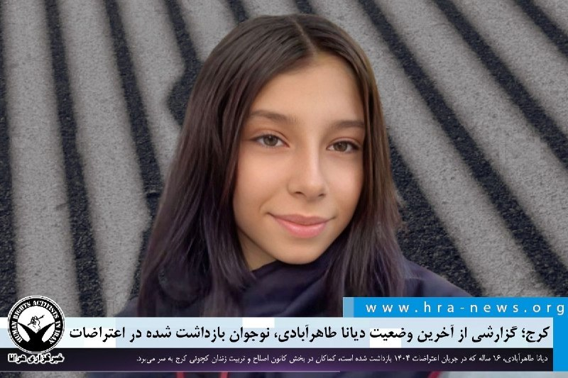

گزارشی از آخرین وضعیت دیانا طاهرآبادی، نوجوان بازداشت شده در اعتراضات

❗️
❗️
❗️
❗️
❗️– دیانا طاهرآبادی، ۱۶ ساله که در جریان اعتراضات ۱۴۰۴ بازداشت شده است، کماکان در بخش کانون اصلاح و تربیت زندان کچوئی کرج به سر می‌برد.

به گزارش خبرگزاری هرانا، ارگان خبری مجموعه فعالان حقوق بشر در ایران، دیانا طاهرآبادی همچنان در بازداشت است.

یک منبع مطلع نزدیک به خانواده این نوجوان ضمن تایید این موضوع به هرانا گفت: «با گذشت ۱۲۶ روز از زمان بازداشت دیانا طاهرآبادی، وی همچنان در بخش کانون اصلاح و تربیت زندان کچوئی کرج نگهداری می‌شود. نیروهای امنیتی از او اعترافات اجباری اخذ کرده و پرونده‌اش را به دادگاه ارسال کردند. او در دادگاه اتهامات خود را رد کرد و پرونده وی با مداخله نهادهای امنیتی برای رسیدگی به تهران ارسال شده است.»

ادامه مطلب

#دیانا_طاهرآبادی

↘️
@hranews_bot تماس ✉️ - @Hranews کانال هرانا 🆑

## Hranews — post 113243

  

سپیده قلیان از زندان وکیل آباد مشهد آزاد شد

❗️
❗️
❗️
❗️
❗️– سپیده قلیان، زندانی سیاسی که دوران محکومیت خود را در زندان وکیل آباد مشهد سپری می‌کرد، امروز شنبه ۹ خردادماه، از این زندان آزاد شد.

به گزارش خبرگزاری هرانا، ارگان خبری مجموعه فعالان حقوق بشر در ایران، سپیده قلیان، زندانی سیاسی آزاد شد.

بر اساس اطلاعات دریافتی هرانا، آزادی خانم قلیان ساعاتی پیش و پس از پایان دوران شش ماه محکومیت حبس تعزیری وی صورت گرفته است.

ادامه مطلب

#سپیده_قلیان

↘️
@hranews_bot تماس ✉️ - @Hranews کانال هرانا 🆑

## Hranews — post 113242

  

زندان تربت حیدریه؛ بلاتکلیفی ۵ معترض بازداشت شده همچنان ادامه دارد

❗️
❗️
❗️
❗️
❗️– جواد قاضی‌منش، جواد سیدحجی نقدعلی، یوسف معمار، علی‌اصغر جعفری و مرتضی بابک، علیرغم گذشت ۱۴ روز از زمان بازداشت، کماکان در زندان تربت حیدریه در وضعیت بلاتکیف به‌سر میبرند. بازداشت این افراد در رابطه با شرکت در اعتراضات د‌یماه ۱۴۰۴ صورت گرفته است.

به گزارش خبرگزاری هرانا، ارگان خبری مجموعه فعالان حقوق بشر در ایران، پنج معترض بازداشت شده، همچنان در زندان تربت حیدریه بلاتکلیف هستند.

جواد قاضی‌منش، جواد سیدحجی نقدعلی، یوسف معمار، علی‌اصغر جعفری و مرتضی بابک در تاریخ ۲۷ اردیبهشت‌ماه ۱۴۰۵، در منازل شخصی خود در روستای باغجر از توابع بخش مرکزی شهرستان سبزوار بازداشت شدند.

ادامه مطلب

#جواد_قاضی‌منش #جواد_سیدحجی_نقدعلی
#یوسف_معمار #علی‌اصغر_جعفری
#مرتضی_بابک

↘️
@hranews_bot تماس ✉️ - @Hranews کانال هرانا 🆑

## Hranews — post 113241

  

زندان وکیل آباد مشهد؛ بلاتکلیفی مهدی بازوبندی و مهدی ساعدی ادامه دارد

❗️
❗️
❗️
❗️
❗️– مهدی بازوبندی و مهدی ساعدی، بیش از چهار ماه است که به صورت بلاتکلیف در زندان وکیل آباد مشهد نگهداری می‌شوند.

به گزارش خبرگزاری هرانا، ارگان خبری مجموعه فعالان حقوق بشر در ایران، مهدی بازوبندی و مهدی ساعدی همچنان در بازداشت هستند.

یک منبع مطلع از وضعیت این دو شهروند، ضمن تأیید این خبر به هرانا گفت: «این افراد پس از بازداشت، در جریان بازجویی‌ها تأکید کرده‌اند که هیچ‌گونه نقشی در اعتراضات سراسری دی‌ماه ۱۴۰۵ نداشته‌اند. با این حال، بازداشت آن‌ها با رویکردی امنیتی و بر پایه انتساب مشارکت در این اعتراضات صورت گرفته و قرار بازداشت موقتشان نیز تمدید شده است.»

ادامه مطلب

#مهدی_بازوبندی #مهدی_ساعدی

↘️
@hranews_bot تماس ✉️ - @Hranews کانال هرانا 🆑

## Hranews — post 113240

ضرب‌وشتم یک محیطبان در جاجرم؛ ضارب به شش ماه حبس و پرداخت دیه محکوم شد

❗️
❗️
❗️
❗️
❗️– یک متخلف محیط زیستی که در جریان درگیری با یک #محیط‌بان در پناهگاه حیات‌وحش میاندشت جاجرم، وی را مورد ضرب‌وشتم قرار داده بود، به شش ماه حبس و پرداخت دیه محکوم شد.

ادامه مطلب

↘️
@hranews_bot تماس ✉️ - @Hranews کانال هرانا 🆑

## Hranews — post 113239

گلستان؛ اموال ۷۴ شهروند ساکن خارج از کشور توقیف شد

❗️
❗️
❗️
❗️
❗️– دارایی‌ها و اموال ۷۴ شهروند ساکن خارج از کشور در استان گلستان توقیف شد. دستگاه قضایی این افراد را متهم به «همکاری با دشمن» دانسته است.

ادامه مطلب

#توقیف_اموال

↘️
@hranews_bot تماس ✉️ - @Hranews کانال هرانا 🆑

## Hranews — post 113238

  

اعتراضات دی‌ماه؛ تداوم بازداشت و بلاتکلیفی حسین شریفی حسین‌آبادی در زندان تربت حیدریه

❗️
❗️
❗️
❗️
❗️– حسین شریفی حسین‌آبادی، از بازداشت‌شدگان اعتراضات سراسری دی‌ماه ۱۴۰۴ در سبزوار، علیرغم گذشت ۱۱۴ روز از زمان بازداشت، کماکان به صورت بلاتکلیف در زندان تربت حیدریه نگهداری می‌شود.

به گزارش خبرگزاری هرانا، ارگان خبری مجموعه فعالان حقوق بشر در ایران، حسین شریفی حسین‌آبادی، از بازداشت‌شدگان مرتبط با اعتراضات دی‌ماه ۱۴۰۴، کماکان در بازداشت به سر می‌برد.

بر اساس اطلاعات دریافتی هرانا، آقای شریفی حسین‌آبادی در تاریخ ۱۷ بهمن‌ماه ۱۴۰۴، توسط نیروهای امنیتی در سبزوار بازداشت شد. او سپس به زندان تربت حیدریه منتقل شده و با گذشت ۱۱۴ روز، همچنان به صورت بلاتکلیف در این زندان به‌سر می‌برد.

یک منبع مطلع نزدیک به خانواده این شهروند ضمن تایید این خبر به هرانا گفت: “حسین نان‌آور خانواده خود بود. پدر او که دچار معلولیت است، تحت پوشش بهزیستی قرار دارد و مادرش اکنون به سختی هزینه‌های زندگیشان را تامین می‌کند. علیرغم پیگیری‌های مکرر خانواده این شهروند، مسئولان ذیربط تاکنون پاسخ روشنی در خصوص وضعیت پرونده او ارائه نکرده و تنها اعلام کرده‌اند که پرونده وی سنگین است.”

ادامه مطلب

#حسین_شریفی_حسین‌آبادی

↘️
@hranews_bot تماس ✉️ - @Hranews کانال هرانا 🆑

## Hranews — post 113237

  

حبس بدون تصمیم؛ تداوم بلاتکلیفی فلورا صمدانی، شهروند بهائی در زندان یزد

❗️
❗️
❗️
❗️
❗️– فلورا صمدانی، شهروند بهائی ساکن یزد، نزدیک به یک ماه است بازداشت شده و به صورت بلاتکلیف در زندان این شهرستان نگهداری می‌شود.

به گزارش هرانا، ارگان خبری مجموعه فعالان حقوق بشر در ایران، فلورا صمدانی، شهروند بهائی در بازداشت به‌سر می‌برد.

بر اساس اطلاعات دریافتی هرانا، خانم صمدانی ۲۸ روز است که بازداشت شده و کماکان به صورت بلاتکلیف در زندان یزد نگهداری می‌شود. در پی مراجعات مکرر خانواده این شهروند بهائی به دادسرا و شعبه بازپرسی مربوطه، به آنان اعلام شده است که پرونده تاکنون به دادسرا ارسال نشده است. همچنین هیچ‌گونه زمان مشخصی برای صدور قرار تامین یا برگزاری جلسه رسیدگی در دادگاه اعلام نشده است.

ادامه مطلب

#فلورا_صمدانی

↘️
@hranews_bot تماس ✉️ - @Hranews کانال هرانا 🆑

## Hranews — post 113236

دیواندره؛ ۸ محکوم قضایی به احکام جایگزین حبس محکوم شدند

❗️
❗️
❗️
❗️
❗️– رئیس اداره منابع طبیعی و آبخیزداری دیواندره از صدور حکم سبز برای هشت محکوم قضایی در این شهرستان خبر داد. این محکومان به عنوان مجازات جایگزین حبس در حفر ۳۸۰ چاله و ایجاد تشتک برای نهال‌ها در یک پارک جنگلی مشارکت داشته‌اند.

ادامه مطلب

#حکم_سبز

↘️
@hranews_bot تماس ✉️ - @Hranews کانال هرانا 🆑

## Hranews — post 113235

اموال ۳۴ نفر در استان خراسان جنوبی توقیف شد

❗️
❗️
❗️
❗️
❗️– رئیس کل دادگستری خراسان جنوبی از توقیف اموال ۳۴ نفر در این استان به دلایلی همچون «حمایت از دشمن» خبر داد.

ادامه مطلب

#توقیف_اموال

↘️
@hranews_bot تماس ✉️ - @Hranews کانال هرانا 🆑

## Hranews — post 113234

  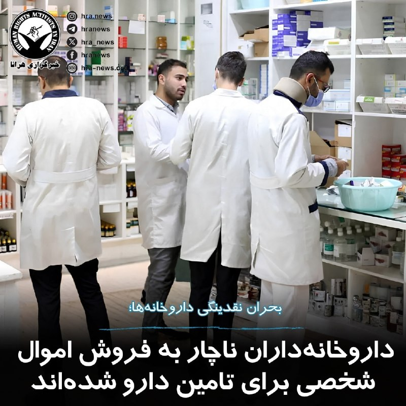

عضو کمیسیون بهداشت و درمان مجلس، اعلام کرد که تشدید بحران نقدینگی در داروخانه‌های خصوصی کشور، برخی از فعالان این حوزه را ناچار به فروش دارایی‌های شخصی از جمله خانه و طلا برای تامین دارو و جلوگیری از برگشت خوردن چک‌ها کرده است. سیدمحمد جمالیان، این وضعیت را ناشی از «چرخه معیوب بیمه‌ها» دانست. وی با اشاره به تاخیر در پرداخت مطالبات مربوط به طرح «دارویار» و منابع هدفمندی یارانه‌ها، افزود که تداوم این روند می‌تواند به کاهش کیفیت خدمات درمانی و حتی تعطیلی مراکز خصوصی حوزه سلامت منجر شود.
#دارو #داروخانه

↘️
@hranews_bot تماس ✉️ - @Hranews کانال هرانا 🆑

## manototv — post 105878

  <a href="telegram/content/manototv_105878_1780152875.mp4" target="_blank">🎬 Download video</a>

سخنان محمود جعفریان، معاون سازمان رادیو تلویزیون ملی ایران و قائم‌مقام دبیرکل حزب رستاخیز، درباره ایران‌دوستی

## alonews — post 123735

  <a href="telegram/content/alonews_123735_1780152876.webm" target="_blank">🎬 Download video</a>

🚨🔴پرسپولیس رسما از آسیا جا ماند 🔻دبیر سازمان لیگ: به دلیل اینکه باشگاه پرسپولیس در رتبه ششم جدول لیگ قرار دارد نمی‌تواند به رقابت‌های آسیایی معرفی شود. کنفدراسیون فوتبال آسیا مهلت لازم را نداد که پس از برگزاری مسابقات لیگ برتر نمایندگان کشور جهت حضور در…

## alonews — post 123734

  <a href="telegram/content/alonews_123734_1780152876.webm" target="_blank">🎬 Download video</a>

👈تلگراف: دو ژنرال قدرتمند، احمد وحیدی و محمد جعفری، با هم متحد شدن تا قالیباف رو از قدرت برکنار کنند.

✅ @AloNews خبر جنگ

## alonews — post 123733

  <a href="telegram/content/alonews_123733_1780152877.webm" target="_blank">🎬 Download video</a>

👈کانال ۱۲ اسرائیل:
از صبح امروز هر ۲۲ دقیقه یکبار آژیر خطر در شمال اسرائیل به صدا در می‌آید.

✅ @AloNews خبر جنگ

## alonews — post 123732

  <a href="telegram/content/alonews_123732_1780152877.mp4" target="_blank">🎬 Download video</a>

👈ویدئویی که تازه از حمله‌های اسرائیل و آمریکا به خرم‌آباد تو جنگ ۴۰ روزه بیرون اومده!

✅ @AloNews خبر جنگ

## alonews — post 123731

  <a href="telegram/content/alonews_123731_1780152878.mp4" target="_blank">🎬 Download video</a>

👈فاطمه مهاجرانی، سخنگوی دولت: دولت پول بازسازی خانه هایی که در جنگ تخریب شده را نمی دهد، چنانچه تصمیم بگیرند خودشان باز سازی کنند، دولت مجوز ساخت دو طبقه بیشتر می‌دهد

✅ @AloNews خبر جنگ

## alonews — post 123729

  <a href="telegram/content/alonews_123729_1780152880.webm" target="_blank">🎬 Download video</a>

👈هم اکنون حملات به جنوب لبنان

✅ @AloNews خبر جنگ

## alonews — post 123728

  <a href="telegram/content/alonews_123728_1780152880.webm" target="_blank">🎬 Download video</a>

👈رئیس‌جمهور ترامپ بین ۱۵٬۰۰۰ تا ۵۰٬۰۰۰ دلار سهام شرکت TKO Group Holdings را درست قبل از تبلیغ گسترده رویداد UFC در کاخ سفید خریداری کرد، گزارش نیویورک تایمز.

🔴افشای مالی ثبت شده در ۸ مه نشان می‌دهد ترامپ این سهام را در ۲۵ مارس خریداری کرده است، کمی بیش از دو هفته پس از اعلام عمومی رویداد «Freedom Fights 250».

✅ @AloNews خبر جنگ

## alonews — post 123727

  <a href="telegram/content/alonews_123727_1780152880.mp4" target="_blank">🎬 Download video</a>

👈کارشناس هواشناسی:
ورود سامانه بارشی جدید به کشور از روز سه‌شنبه

🔴وزش باد شدید با احتمال گرد و خاک در تهران پیش بینی می‌شود

✅ @AloNews خبر جنگ

## alonews — post 123726

اخبار جنگ الونیوز AloNews pinned a photo

## alonews — post 123725

  <a href="telegram/content/alonews_123725_1780152881.webm" target="_blank">🎬 Download video</a>

👈باکسر به خاورمیانه نمی آید

🔴به نظر می‌رسد که ناو آبی_خاکی یو‌اس‌اس باکسر (LHD-4) قرار نیست در حوزه مسئولیت سنت‌کام مستقر شود. ناو آبی‌خاکی کلاس واسپ نیز امروز از بندر سِمبانوان در سنگاپور حرکت کرد؛ اگرچه اکنون به سمت شرق در حرکت است.

✅ @AloNews خبر جنگ

## alonews — post 123724

  <a href="telegram/content/alonews_123724_1780152882.webm" target="_blank">🎬 Download video</a>

👈دیده شده در تجمعات شبانه

✅ @AloNews خبر جنگ

## alonews — post 123723

  <a href="telegram/content/alonews_123723_1780152882.webm" target="_blank">🎬 Download video</a>

👈مدیرعامل آروان کلاد:
از نظر فنی همینطوری که میشه توی یه لحظه اینترنت رو قطع کرد؛ همینطوری میشه تو یه لحظه هم وصلش کرد.
زمانبر بودن بهبود وضعیت اینترنت از نظر فنی فقط بهانه ست
.
وضعیت اینترنت در حال حاضر بسیار ناپایدار و ضعیفه و اصلا به شرایط قبل از جنگ برنگشته
گویا این اینترنت جدیدمونه و باید کم کم بهش عادت کنیم

✅ @AloNews خبر جنگ

## alonews — post 123722

  <a href="telegram/content/alonews_123722_1780152882.webm" target="_blank">🎬 Download video</a>

👈بررسی وضعیت اینترنت ایران نشون میده که پزشکیان هنوزم نتونسته اینترنت رو وصل کنه.

🔴اینترنت دیتاسنترها قطعه.

🔴اینترنت خونگی به شکل وایت‌لیست کار می‌کنه.

🔴پروتکل‌های IPv6 و HTTP3 مسدوده؛ SSH و UDP هم پر اختلاله.

🔴به خاطر کاهش پهنای باند شبکه هم بسیاری از کانفیگ های پولی که در دوران قطعی اینترنت کار میکردن؛ الان از کار افتادن.

🔴خلاصه میشه گفت اینترنت وصله ولی فقط به ظاهر.

✅ @AloNews خبر جنگ

## alonews — post 123721

  <a href="telegram/content/alonews_123721_1780152882.webm" target="_blank">🎬 Download video</a>

👈اعتماد به نفس اگه اپلیکیشن بود

✅ @AloNews خبر جنگ

## alonews — post 123720

  <a href="telegram/content/alonews_123720_1780152882.webm" target="_blank">🎬 Download video</a>

👈عضو کمیته رسانه ای هیئت مذاکراتی:
متن تفاهم به شکلی است که در صورت نهایی شدن، هر کجا آمریکا به تعهدات خود عمل نکند ایران می‌تواند از تفاهم خارج شود

✅ @AloNews خبر جنگ

## alonews — post 123719

🔥 همراه با ساب + حجم مصرفی، فقط 9T! 🚀 ❌ آفر فقط تا پایان امشب ❌ 🔥 اگه دنبال یه VPN پایدار و بدون دردسر می‌گردی، این پلن مخصوص خودته! @Netaazaadbot @NetAazaadBot ✅ همراه با ساب + حجم مصرفی ✅ 15 سرور اختصاصی پرسرعت ✅ اتصال پایدار و بدون قطعی ✅ سرعت بالا…

## alonews — post 123718

  

🔥 همراه با ساب + حجم مصرفی، فقط 9T! 🚀

❌ آفر فقط تا پایان امشب ❌

🔥 اگه دنبال یه VPN پایدار و بدون دردسر می‌گردی، این پلن مخصوص خودته!

@Netaazaadbot
@NetAazaadBot
✅ همراه با ساب + حجم مصرفی
✅ 15 سرور اختصاصی پرسرعت
✅ اتصال پایدار و بدون قطعی
✅ سرعت بالا حتی در ساعات شلوغ

@Netaazaadbot
@NetAazaadBot
💎 کیفیتی که بعد از استفاده متوجه تفاوتش میشی!

📩 برای خرید و دریافت سرویس استارت رو بزن✅

## alonews — post 123717

  <a href="telegram/content/alonews_123717_1780152883.webm" target="_blank">🎬 Download video</a>

👈به گزارش ان بی سی، جنگده اف 15 که ماه گذشته در جنوب غربی ایران سرنگون شد ، احتمالا توسط یک موشک دوش پرتاب چینی (manpad) مورد اصابت قرار گرفت.

🔴مقامات آمریکایی هنوز در حال بررسی این حادثه هستند که اولین بار در دهه های اخیر بود که یک جنگنده آمریکایی توسط آتش دشمن سرنگون شد. این شلیک همچنین باعث شد که منابع آن را به عنوان یک ماموریت نجات خطرناک توصیف کنند.

🔴چین ممکن است یک رادار هشدار زودهنگام YLC-8B را برای ایران فراهم کرده باشد که قادر به تشخیص هواپیماهای مخفی در اوایل درگیری است. مقامات گفتند که هنوز مشخص نیست که این تجهیزات دقیقا چه زمانی منتقل شده اند.‌‌

✅ @AloNews خبر جنگ

## alonews — post 123716

  <a href="telegram/content/alonews_123716_1780152883.webm" target="_blank">🎬 Download video</a>

💔جاویدنام بهار شاه‌مهری ۱۷ ساله از نیشابور

🔴این تصویر را چند روز قبل از اعتراضات منتشر کرد و در 19 دی‌ماه هنگام فرار با گلوله مزدوران جمهوری اسلامی برای همیشه از بین ما رفت.

🤔حرام زاده های عرزشی از پشت سر به اون شلیک کردن

✅@AloNews

<!-- MSG END -->

<!-- NAV START -->

<a href="https://github.com/sombriolitfa-eng/aioo06/blob/main/telegram/content/archive_1.md" style="display:inline-block; padding:6px 12px; margin:0 4px; background-color:#2ea44f; color:white; text-decoration:none; border-radius:4px; font-weight:bold;">صفحه بعد</a>

<!-- NAV END -->
