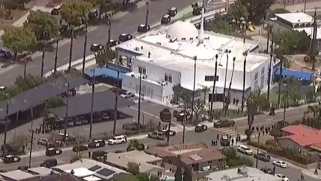

# خواننده تلگرام

<!-- TOP_NAV START -->

<!-- TOP_NAV END -->

<!-- MSG START -->

---
📅 بروزرسانی: 1405/02/29 00:52
---

## VahidOOnLine — post 240869

  

رییس پلیس سن‌دیگو اعلام کرد درپی تیراندازی در مرکز اسلامی سن‌دیگو سه مرد بزرگسال کشته شدند و مهاجمان مظنون نیز جان باخته‌اند. پلیس گفت این حمله به عنوان یک جرم ناشی از نفرت در نظر گرفته شده است.
‌🏁 🇬🇧 IranintlTV

🤖 @VahidOOnLine

## VahidOOnLine — post 240868

  <a href="telegram/content/VahidOOnLine_240868_1779139329.mp4" target="_blank">🎬 Download video</a>

تماسی از ایران:
«می‌گفت دست همدیگه رو ول نکنیم، حتی وقتی خودمون هم سختی داریم. همدلی اگر نباشه، هیچ‌چیز درست نمی‌شه»
‌🏁 🇬🇧 ManotoTV

🤖 @VahidOOnLine

## VahidOOnLine — post 240867

  <a href="telegram/content/VahidOOnLine_240867_1779139331.mp4" target="_blank">🎬 Download video</a>

رسانه‌های داخل ایران گزارش دادند پدافند هوایی اصفهان فعال شده است.

تاکنون مقام‌های جمهوری اسلامی توضیحی درباره علت فعال شدن پدافند هوایی در اصفهان ارائه نکرده‌اند.
‌🏁 🇬🇧 ManotoTV

🤖 @VahidOOnLine

## WithYashar — post 11601

  

شیمون ریکلین، خبرنگار کانال ۱۴ اسرائیل، امروز احتمالاً اطلاعات محرمانه‌ای را به صورت زنده در مورد عملیات‌های مرتبط با کمپین علیه ایران فاش کرد، از جمله گزارش‌هایی درباره آمادگی‌ها برای عملیات زمینی احتمالی در سایت هسته‌ای .

ریکلین گفت تمریناتی انجام شده است که شامل نیروهای کماندو می‌شود که به سایت حمله کرده و اورانیوم غنی‌شده را استخراج می‌کنند، و افزود بر اساس آنچه شنیده، این ماده در عمق زمین در اصفهان دفن نشده است و «زمانی که وارد تأسیسات شوند، می‌توان لوله‌ها را استخراج کرد.»

سانسورچی‌های نظامی اسرائیل درخواست کرده‌اند این بخش از پلتفرم‌های پخش حذف شود.

اعضای یش عتید، از جمله رام بن-باراک و الازار استرن، از بوعاز بیسموت، رئیس کمیته امور خارجه و امنیت، خواستند جلسه‌ای فوری برای بحث درباره انتشار «اطلاعات ادعاشده محرمانه که می‌تواند به دستاوردهای کمپین در ایران آسیب برساند و به آینده استراتژیک کشور خسارت وارد کند» برگزار شود.
@withyashar

## FoxNewsTwitter — post 341900

  

Fox News (Twitter/X)

🚨BREAKING: San Diego authorities say three adults were killed in a shooting at the Islamic Center of San Diego on Monday. Police say two teen suspects are also dead.

## pm_afshaa — post 90997

  <a href="telegram/content/pm_afshaa_90997_1779139332.webm" target="_blank">🎬 Download video</a>

🔴مقام امنیتی اسرائیلی به کانال 12:
در کابینه همه از دست ترامپ کلافه شدیم

💧 Rainbet.com the #1 Non-KYC Crypto Casino & Sportsbook @rainbetcom

😁 @Pm_Afshaa

## IranIntlTV — post 337842

  <a href="telegram/content/IranIntlTV_337842_1779139333.mp4" target="_blank">🎬 Download video</a>

مراد ویسی، تحلیل‌گر ارشد ایران‌اینترنشنال، گفت: «ترامپ می‌گوید حمله برنامه‌ریزی شده روز سه‌شنبه به جمهوری اسلامی را به درخواست رهبران امارات، عربستان و قطر به تعویق انداخته تا یک شانس دیگر به توافق داده شود. ترامپ گفته ارتش آمریکا آماده است در صورت عدم توافق حمله را بی‌درنگ شروع کند.»
@iranintltv

## IranIntlTV — post 337841

  

رییس پلیس سن‌دیگو اعلام کرد درپی تیراندازی در مرکز اسلامی سن‌دیگو سه مرد بزرگسال کشته شدند و مهاجمان مظنون نیز جان باخته‌اند. پلیس گفت این حمله به عنوان یک جرم ناشی از نفرت در نظر گرفته شده است.
https://iranintl.com/202605188629

## ManotoTV — post 105616

  <a href="telegram/content/ManotoTV_105616_1779139335.mp4" target="_blank">🎬 Download video</a>

تماسی از ایران:
«می‌گفت دست همدیگه رو ول نکنیم، حتی وقتی خودمون هم سختی داریم. همدلی اگر نباشه، هیچ‌چیز درست نمی‌شه»

## ManotoTV — post 105615

  <a href="telegram/content/ManotoTV_105615_1779139337.mp4" target="_blank">🎬 Download video</a>

رسانه‌های داخل ایران گزارش دادند پدافند هوایی اصفهان فعال شده است.

تاکنون مقام‌های جمهوری اسلامی توضیحی درباره علت فعال شدن پدافند هوایی در اصفهان ارائه نکرده‌اند.

## manototv — post 105616

  <a href="telegram/content/manototv_105616_1779139337.mp4" target="_blank">🎬 Download video</a>

تماسی از ایران:
«می‌گفت دست همدیگه رو ول نکنیم، حتی وقتی خودمون هم سختی داریم. همدلی اگر نباشه، هیچ‌چیز درست نمی‌شه»

## manototv — post 105615

  <a href="telegram/content/manototv_105615_1779139339.mp4" target="_blank">🎬 Download video</a>

رسانه‌های داخل ایران گزارش دادند پدافند هوایی اصفهان فعال شده است.

تاکنون مقام‌های جمهوری اسلامی توضیحی درباره علت فعال شدن پدافند هوایی در اصفهان ارائه نکرده‌اند.

## alonews — post 120973

  <a href="telegram/content/alonews_120973_1779139339.webm" target="_blank">🎬 Download video</a>

👈قلهکی، ‏فعال رسانه ای حکومتی:
ترامپ «شنبه‌شب» قصد حمله داشت که صبح آن قطر به ایران هشدار داد. علت عدم حمله پیدا نکردن لوکیشن سران نظام بوده است.

✅ @AloNews خبر جنگ

## alonews — post 120972

  <a href="telegram/content/alonews_120972_1779139340.mp4" target="_blank">🎬 Download video</a>

👈شعار جدید رونمایی شد
‼️

🔴تندروهای خیابون امشب شعار مرگ بر "امارات" میدادن

✅ @AloNews خبر جنگ

---
📅 بروزرسانی: 1405/02/29 00:42
---

## FoxNewsTwitter — post 341899

  <a href="telegram/content/FoxNewsTwitter_341899_1779138723.mp4" target="_blank">🎬 Download video</a>

Fox News (Twitter/X)

BREAKING: The FBI confirms 2 teen suspects are dead following the shooting at the Islamic Center of San Diego.

Officials also confirm at least 3 adult male victims were killed in the attack.

## IranianMinds — post 20367

  

چیشده شل شدین ؟

🔴 پزشکیان :

گفتگو به معنای تسلیم نیست؛
جمهوری‌اسلامی ایران با عزت و اقتدار وارد گفتگو میشه و از حقوق خودش عقب‌نشینی نمیکنه.

@IranianMinds

## BBCPersian — post 281399

🔻 تیراندازی در مسجد جامع سن دیگو؛ پلیس: سه نفر کشته شدند و دو مظنون هم «کشته شده‌اند»

ساعتی بعد از تیراندازی در مسجد جامع سن‌دیگو، اسکات وال، رئیس پلیس این شهر، در حال گفت‌وگو با رسانه‌هاست.

او گفت در حال حاضر هیچ تهدید دیگری در منطقه وجود ندارد و دو مظنون «کشته شده‌اند».

رئیس پلیس همچنین افزود سه بزرگسال در مرکز اسلامی جان باخته‌اند.

او گفت: «قلب ما با خانواده‌هایی است که در این لحظه در حال مطلع شدن از اتفاقی هستند که برای عزیزانشان رخ داده است.»

مقام‌های پلیس هم اکنون در حال دادن آخرین اطلاعات به خبرنگاران هستند. با ما باشید تا جزییات بیشتر را همزمان برایتان گزارش کنیم.

https://bbc.in/4wsKH6m
@BBCPersian

## BBCPersian — post 281398

🔻 تیراندازی در مسجد جامع سن دیگو؛ با انتقال مجروحان، مراکز درمانی سن دیگو در وضعیت فوق‌العاده قرار گرفتند

سخنگوی شبکه درمانی «شارپ هلث‌کر» به بی‌بی‌سی گفت بیمارستان «شارپ مموریال» این شبکه در حال پذیرش مجروحان مرتبط با تیراندازی است.

آلیشیا کوک، سخنگوی این مرکز درمانی، گفته است: «گزارش‌ها حاکی از آن است که چندین نفر زخمی شده‌اند.»

او افزود: «پروتکل‌های وضعیت بحرانی ما فعال شده و در حال هماهنگی با شهرستان سن‌دیگو و دیگر نهادها برای واکنش به این حادثه هستیم.»

تاد گلوریا، شهردار سن‌دیگو، اعلام کرد پلیس این شهر به او اطلاع داده که در حال حاضر هیچ تهدید ادامه‌داری متوجه جامعه نیست.

او در پیامی در شبکه‌های اجتماعی از نیروهای امدادی و ماموران پلیس «که به سرعت برای حفاظت از جان مردم و تامین امنیت منطقه واکنش نشان دادند» قدردانی کرد.

سن دیگو در جنوب کالیفرنیا و مرز این ایالت با مکزیک واقع شده است.

همچون لس‌آنجلس و حومه آن مانند منطقه اورنج کانتی، سن‌دیگو هم میزبان جامعه بزرگی از مهاجران ایرانی است.

https://bbc.in/4nHwkHC
@BBCPersian

## Dirty_Kids — post 389710

کونی که امشب تو صداوسیما به نمایش گذاشته شد

@Dirty_Kids 👻

## Dirty_Kids — post 389709

  <a href="telegram/content/Dirty_Kids_389709_1779138725.mp4" target="_blank">🎬 Download video</a>

صداوسیما امشب یکی رو کون لخت نشون داد...

@Dirty_Kids 👻

## Dirty_Kids — post 389708

  

هر تصمیمی که در خصوص روافض بخواد گرفته شه، چه جنگ احتمالی چه توافق احتمالی، دو سه هفته بیشتر فرصت برای انجامش نیست،

چرا که طبق گفته‌ی مدیر اجرایی آژانس بین‌المللی انرژی [IEA]، فقط چند هفته تا تموم شدن «ذخایر تجاری نفت» باقی مونده که در صورت تموم شدن ذخایر تجاری، قیمت نفت به مراتب افزایش پیدا می‌کنه که هیچ،

کشورها مجبور می‌شن برای کنترل بازار از «ذخایر نفت استراتژیک»‌شون استفاده کنن که خب خیلی مطلوب‌شون نیست،

این تنها کارت بازی که روافض در دست دارن و با فرسایشی کردن روند مذاکرات سعی دارن وضعیت رو تا جای ممکن کش بدن تا به نقطه‌ی بحرانی برسه،

از طرفی حمله‌ی محدود آمریکا هم جوابگوی جلوگیری از اون وضعیت بحرانی قیمت نفت نیست و آمریکا دو راه بیشتر پیش رو نداره:

یا باید با یک حمله‌ی همه‌جانبه و به مراتب پرقدرت‌تر از قبل چنان ضربه‌ای بزنه که تمام اهداف نظامی و بخش عمده‌ی زیرساخت‌های انرژی به منظور تسلیم کردن روافض از بین بره [که خب متأسفانه نامطلوب‌ترین حالت ممکن برای ساقط کردن این رژیم حرومیه و احتمالاً انجامش آخرین پلن شیر خدا از سر ناچاری باشه]،

و یا باید با رژیم روافض به توافق برسه که با توجه به روند فعلی هنوز نشونه‌ای از رسیدن به خواسته‌هایی که آمریکا اعلام کرده بود از جمله تحویل ۴۸۰ کیلوگرم اورانیوم و بازکردن تنگه‌ی هرمز و غیره نیست.

در حال حاضر و با توجه به فشار و هشداری که پاکستان قرمساق به رژیم روافض داده، درصدی امکان عقب‌نشینی از سمت برخی از سران روافض خدعه‌گر هست، حداقل از توئیت پوزیده این برداشت رو می‌شه کرد،

اما نکته اینجاست که رژیم شیعه‌سانان رافضی تیکه‌پاره‌تر این حرفاست که تصمیم‌گیری در این مورد در اختیار موجود چپ‌و‌چوله‌ای مثه پوزیده باشه،

بنابراین تا اعلام نظر هفت‌هشت گروه مختلف رژیم شیعه‌سانان که از دقایقی دیگه شروع به جفتک اندازی می‌کنن باید منتظر موند که آیا آخرین اتمام حجت شیر خدا برای تسلیم رژیم جواب می‌ده یا خیر.

@Dirty_Kids 👻

## Dirty_Kids — post 389707

  

ژنرال محسن رضایی:
باز امریکارو شکست دادیم

همین که تو زنده‌ای، ارتقاع درجه پیدا کردی یعنی بزرگترین عملیات فریب امریکا با موفقیت انجام شده

@Dirty_Kids 👻

---
📅 بروزرسانی: 1405/02/29 00:32
---

## VahidOOnLine — post 240866

  

کانال تلگرامی دانشجویان متحد اعلام کرد که امیرحسین شیخ محمدی، دانشجوی دامپزشکی دانشگاه آزاد واحد کرج، صبح دوشنبه ۲۸ اردیبهشت بازداشت شده است.

هیچ اطلاعاتی درباره اتهام‌های احتمالی مطرح شده علیه این دانشجو و محل نگهداری او منتشر نشده است.
‌🏁 🇬🇧 IranintlTV

🤖 @VahidOOnLine

## WithYashar — post 11600

  <a href="telegram/content/WithYashar_11600_1779138156.mp4" target="_blank">🎬 Download video</a>

@withyashar

## IranIntlTV — post 337840

  <a href="telegram/content/IranIntlTV_337840_1779138157.mp4" target="_blank">🎬 Download video</a>

دونالد ترامپ اعلام کرد به درخواست رهبران منطقه، برنامه حمله به مواضع جمهوری اسلامی را که برای سه‌شنبه طراحی شده بود، متوقف کرده است.
او گفت رهبران منطقه معتقدند امکان دستیابی به توافق در آینده نزدیک وجود دارد.

گزارش نیلوفر منصوری، خبرنگار ایران‌اینترنشنال
@iranintltv

## IranIntlTV — post 337839

  

کانال تلگرامی دانشجویان متحد اعلام کرد که امیرحسین شیخ محمدی، دانشجوی دامپزشکی دانشگاه آزاد واحد کرج، صبح دوشنبه ۲۸ اردیبهشت بازداشت شده است.

هیچ اطلاعاتی درباره اتهام‌های احتمالی مطرح شده علیه این دانشجو و محل نگهداری او منتشر نشده است.
https://iranintl.com/202605189606

## BBCPersian — post 281397

  

🔻چند سینماگر ایرانی اخیرا به دادسرای فرهنگ و رسانه در تهران احضار شده‌اند و اتهام «همکاری با دول متخاصم خارجی علیه جمهوری اسلامی» به آنها ابلاغ شده است.

هومن سیدی، بازیگر و فیلمساز، و سعید روستایی، کارگردان و تهیه‌کننده سینما، از جمله احضارشدگان هستند.

بی‌بی‌سی از مصداق اتهامات آنها اطلاع ندارد و معلوم نیست که آیا این احضارها به فعالیت‌های هنری آنها مربوط است یا به فعالیت‌های دیگر.

📷 AsrIran
https://bbc.in/3PomJIX
@BBCPersian

## BBCPersian — post 281396

🔻 تیراندازی در بزرگترین مسجد و مرکز اسلامی سن دیگو آمریکا

پلیس شهر سن دیگو - در جنوب کالیفرنیا - در واکنش به تیراندازی در بزرگترین مسجد این شهر وارد عمل شده است و مدرسه مجاور این مسجد را هم قرق کرده و همه دانش‌آموزان در وضعیت پناه گرفتن قرار گرفته‌اند.

یک شاهد عینی در گفت‌وگو با شبکه سی‌بی‌اس نیوز، شریک خبری بی‌بی‌سی در آمریکا، گفت صدای شلیک حدود ۳۰ گلوله را شنیده که به گفته او، به نظر می‌رسید از یک «سلاح نیمه‌خودکار» شلیک شده باشد.

او گفت ابتدا حدود ۱۲ گلوله شنیده، سپس وقفه‌ای کوتاه ایجاد شده و بعد دوباره احتمالا حدود ۱۲ گلوله دیگر شلیک شده است.

این مرد که بازنشسته است و هنگام حادثه در خانه مشغول خوردن ناهار بود، گفت با شماره اضطراری ۹۱۱ تماس گرفته و پلیس ظرف «پنج تا ۱۰ دقیقه» در محل حاضر شده است.

او افزود این مسجد در ایام تعطیلات بسیار شلوغ می‌شود.

این شاهد گفت: «خوشبختانه این اتفاق روز جمعه رخ نداد، چون خیابان‌ها پر از جمعیت می‌بود.»

این مرکز اسلامی، بزرگ‌ترین مسجد در شه سن‌دیگو به شمار می‌رود و بنا بر وب‌سایت آن، بیش از ۵ هزار عضو در جامعه مذهبی خود دارد.

این مجموعه همچنین شامل مدرسه «الرشید» است که دوره‌های آموزش دینی و زبان ارائه می‌کند.

بر اساس اطلاعات وب‌سایت این مرکز، ماموریت آن خدمت‌رسانی به جامعه مسلمانان و همچنین «همکاری با جامعه گسترده‌تر برای کمک به افراد کم‌برخوردار، آموزش و بهبود کشور» عنوان شده است.

https://bbc.in/49ampEf
@BBCPersian

## alonews — post 120971

  <a href="telegram/content/alonews_120971_1779138161.webm" target="_blank">🎬 Download video</a>

👈هاآرتص: مقامات اسرائیلی از دست ترامپ کلافه شده‌اند

✅ @AloNews خبر جنگ

## alonews — post 120970

  <a href="telegram/content/alonews_120970_1779138162.mp4" target="_blank">🎬 Download video</a>

واسه اولین بار تو تاریخ؛ صداوسیما امشب یکی رو کون لخت نشون داد...

@AloSport

---
📅 بروزرسانی: 1405/02/29 00:22
---

## VahidOOnLine — post 240865

  

عبدالقهار بلخی، سخنگوی وزارت خارجه طالبان، حملات پهپادی اخیر به «تاسیسات غیرنظامی» در امارات متحده عربی، به ویژه به نیروگاه هسته‌ای براکه را محکوم کرد.

او در شبکه اجتماعی ایکس نوشت که طالبان «نگرانی عمیق خود را از تشدید خشونت در منطقه ابراز می‌کند.»
‌🏁 🇬🇧 IranintlTV

🤖 @VahidOOnLine

## VahidOOnLine — post 240864

  

♦️خبرگزاری مهر دوشنبه شب ۲۸ اردیبهشت از فعال شدن پدافند هوایی در اصفهان خبر داد و اعلام کرد تا زمان انتشار این خبر، توضیحی درباره علت آن ارائه نشده است.
هم‌زمان، معاون سیاسی و امنیتی استاندار هرمزگان نیز فعال شدن پدافند هوایی در جزیره قشم را تایید کرد و گفت این اقدام پس از مشاهده «ریزپرنده‌ها» در آسمان قشم و برای مقابله با «اهداف متخاصم» انجام شده است.
‌🇸🇦 Indypersian

🤖 @VahidOOnLine

## WithYashar — post 11599

اتاق جنگ با یاشار: تحلیلگران ارشد ایرانی ۱۰ روز پیش نظرشون این بود که اگه تا ۱۰ روز آینده جنگ نشه دیگه نمیشه … این ۱۰ روز چندین ساعت پیش به پایان رسید 😬😬😬
@withyashar

## WithYashar — post 11598

خبرگزاری «مهر»: پدافند هوایی در اصفهان به‌دلایلی نامعلوم که تاکنون مشخص نشده فعال شد.
@withyashar

## pm_afshaa — post 90995

  <a href="telegram/content/pm_afshaa_90995_1779137525.webm" target="_blank">🎬 Download video</a>

🔴ترامپ: مذاکرات جدی در حال حاضر برای دستیابی به توافق با ایران در جریانه.

💧 Rainbet.com the #1 Non-KYC Crypto Casino & Sportsbook @rainbetcom

😁 @Pm_Afshaa

## IranIntlTV — post 337838

  

عبدالقهار بلخی، سخنگوی وزارت خارجه طالبان، حملات پهپادی اخیر به «تاسیسات غیرنظامی» در امارات متحده عربی، به ویژه به نیروگاه هسته‌ای براکه را محکوم کرد.

او در شبکه اجتماعی ایکس نوشت که طالبان «نگرانی عمیق خود را از تشدید خشونت در منطقه ابراز می‌کند.»
https://iranintl.com/202605183828

## Persian_Trend_Official — post 14460

  

🔺فرمانده قرارگاه مرکزی خاتم‌الانبیا: به آمریکا و همپیمانان آن اعلام می‌داريم، دوباره مرتکب اشتباه راهبردی و خطای محاسباتی نشوند.

🔹سرلشکر پاسدار خلبان علی عبدالهی: آنها باید بدانند ایران اسلامی و نیروهای مسلح آن نسبت به گذشته آماده تر و قوی تر، دست بر ماشه هستند و هرگونه تعرض و تجاوز مجددی از سوی دشمنان سرزمین و ملت سربلند را سریع، قاطع، پرقدرت و گسترده پاسخ خواهند داد.

🔹دشمنان آمریکایی اسرائیلی بارها ملت شجاع ایران و نیروهای مسلح مقتدر آن را آزموده اند.

🔹ما با عظم و اراده الهی ثابت کرده ایم که اقتدار و توانایی خود را در میدان عمل به دشمنان نشان می دهیم و چنانچه خطای دیگری از سوی دشمنانمان سربزند با قدرت و توانایی به مراتب بالاتر از جنگ تحمیلی رمضان با آن برخورد خواهیم نمود و با تمام توان از حقوق ملت ایران دفاع می کنیم و دست هر متجاوزی را قطع می نمائیم.

☆Phantom☆

📌 @persian_trend_official
پرشین ترند | متفاوت‌ترین کانال نظامی

## Persian_Trend_Official — post 14459

  

📰
📰 تو صداوسیما تانک آوردن!!!

☆Phantom☆

📌 @persian_trend_official
پرشین ترند | متفاوت‌ترین کانال نظامی

## alonews — post 120969

  <a href="telegram/content/alonews_120969_1779137526.webm" target="_blank">🎬 Download video</a>

👈عوستاد خوش چشم هفته قبل: آمریکا تا ۳۰ اردیبهشت حمله میکنه

🔴ترامپ امروز: فعلا حمله نمیکنیم تا مذاکرات ادامه پیدا کنه

🔴پ.ن: عوستاد همیشه برعکس پیش بینی میکنه، سری قبلم گفت جنگ نمیشه اما فرداش شد

✅ @AloNews خبر جنگ

---
📅 بروزرسانی: 1405/02/29 00:12
---

## VahidOOnLine — post 240863

  

رسانه‌های ایران شامگاه دوشنبه از فعال شدن پدافند هوایی در اصفهان خبر دادند.

تا زمان انتشار این خبر توضیحی درباره علت فعال شدن پدافند ارائه نشده است.
پیش‌تر خبرگزاری تسنیم نوشت: «پس از مشاهده ریزپرنده‌ها در آسمان جزیره قشم، پدافند برای نابودی اهداف متخاصم فعال شد.»
‌🏁 🇬🇧 IranintlTV

🤖 @VahidOOnLine

## VahidOOnLine — post 240862

  

آنا کلی، معاون سخنگوی کاخ سفید، در گفت‌وگو با فاکس نیوز اعلام کرد که جمهوری اسلامی اجازه نخواهد داشت اورانیوم غنی‌شده در اختیار داشته باشد و این موضوع خط قرمز دونالد ترامپ در مذاکرات است.

او گفت: «تهران نه‌تنها نباید به سلاح هسته‌ای دست پیدا کند، بلکه باید مواد غنی‌شده را نیز تحویل دهد.»

کلی افزود که ترامپ معتقد است جمهوری اسلامی به‌خوبی می‌داند که او در تهدیدهایش بلوف نمی‌زند و عملیات‌های اخیر نشان داده واشینگتن در اجرای تهدیدات خود جدی است.
‌🏁 🇬🇧 IranintlTV

🤖 @VahidOOnLine

## VahidOOnLine — post 240861

  

♦️شبکه خبری آی۲۴نیوز گزارش داد بنیامین نتانیاهو، نخست‌وزیر اسرائیل، روز دوشنبه ۲۸ اردیبهشت، دومین جلسه محدود کابینه امنیتی خود را ظرف ۲۴ ساعت گذشته برگزار کرده است. مقامات اسرائیلی با اشاره به وضعیت «آماده‌باش کامل» اعلام کرده‌اند که کشور خود را برای تصمیم احتمالی رئیس‌جمهوری دونالد ترامپ درباره گام‌های بعدی در قبال تهران و احتمال ازسرگیری جنگ با ایران تا پایان هفته جاری آماده می‌کنند.
این نشست‌های فشرده پی‌درپی پس از گفتگوهای تلفنی ۳۰ دقیقه‌ای روز یکشنبه نتانیاهو و ترامپ صورت می‌گیرد. بر اساس گزارش منابع آگاه، ترامپ در این تماس نخست‌وزیر اسرائیل را در جریان جزئیات سفر اخیر خود به چین قرار داده، اما این گفتگو به راه‌حل مشخصی برای مسیر پیش‌رو منجر نشده است؛ با این حال، هماهنگی‌های فشرده میان اورشلیم و واشنگتن برای تمامی سناریوهای ممکن در آستانه آنچه مقامات آن را «لحظه حقیقت» می‌نامند، ادامه دارد.
‌🇸🇦 Indypersian

🤖 @VahidOOnLine

## WithYashar — post 11597

@withyashar part3

## mwarmonitor — post 9279

فعل شدن پدافند هوایی در اصفهان

## FoxNewsTwitter — post 341898

  <a href="telegram/content/FoxNewsTwitter_341898_1779136933.mp4" target="_blank">🎬 Download video</a>

Fox News (Twitter/X)

NEW: U.S. Attorney Jeanine Pirro draws a hard line against teen lawlessness following a violent brawl at a DC Chipotle:

"It was a takeover of a restaurant by individuals who felt they could get away with it. Well, they're not going to get away with it."

"The message that lawlessness runs the streets is over."

"The city belongs to law-abiding residents, not roaming mobs looking to make a name for themselves, contribute to the chaos and violence, or gain social media attention."

"These are not kids being kids."

## pm_afshaa — post 90994

فعالیت پدافند در اصفهان

💧 Rainbet.com the #1 Non-KYC Crypto Casino & Sportsbook @rainbetcom

😁 @Pm_Afshaa

## kianmeli1 — post 87474

🔴پدافند هوایی اصفهان شامگاه دوشنبه فعال شد و علت آن هنوز اعلام نشده است.
https://t.me/kianmeli1

## IranIntlTV — post 337837

  

رسانه‌های ایران شامگاه دوشنبه از فعال شدن پدافند هوایی در اصفهان خبر دادند.

تا زمان انتشار این خبر توضیحی درباره علت فعال شدن پدافند ارائه نشده است.
پیش‌تر خبرگزاری تسنیم نوشت: «پس از مشاهده ریزپرنده‌ها در آسمان جزیره قشم، پدافند برای نابودی اهداف متخاصم فعال شد.»
https://iranintl.com/202605188482

## IranIntlTV — post 337836

  <a href="telegram/content/IranIntlTV_337836_1779136935.mp4" target="_blank">🎬 Download video</a>

مستند «تمرین‌هایی برای یک انقلاب» ساخته پگاه آهنگرانی در حاشیه جشنواره فیلم کن، جایزه ویژه هیات داوران رویداد مستند گلدن گلوبز را دریافت کرد.

این رویداد با همکاری بخش کن داکس، مجله ورایتی و بازار فیلم کن برگزار می‌شود.

گفت‌وگو با محمد عبدی، نویسنده و منتقد فیلم
@iranintltv

## IranIntlTV — post 337835

  

آنا کلی، معاون سخنگوی کاخ سفید، در گفت‌وگو با فاکس نیوز اعلام کرد که جمهوری اسلامی اجازه نخواهد داشت اورانیوم غنی‌شده در اختیار داشته باشد و این موضوع خط قرمز دونالد ترامپ در مذاکرات است.

او گفت: «تهران نه‌تنها نباید به سلاح هسته‌ای دست پیدا کند، بلکه باید مواد غنی‌شده را نیز تحویل دهد.»

کلی افزود که ترامپ معتقد است جمهوری اسلامی به‌خوبی می‌داند که او در تهدیدهایش بلوف نمی‌زند و عملیات‌های اخیر نشان داده واشینگتن در اجرای تهدیدات خود جدی است.
https://iranintl.com/202605188107

## Shin_Persian — post 6078

  

Shin ✓ @hey_itsmyturn
Mon, 18 May 2026 20:34:12 UTC

MehrNews confirms

فارسی

خبرگزاری مهر تأیید کرد

𝕏 · @shin_persian

## FarsiVOA — post 218092

  

⚡️یک دادگاه تحت کنترل شورشیان حوثی در یمن ۱۹ نفر را به اتهام همکاری با ائتلاف تحت رهبری عربستان به اعدام محکوم کرد. حوثی‌ها مورد حمایت جمهوری اسلامی هستند و ائتلاف تحت رهبری عربستان در حمایت از دولت قانونی یمن با حوثی‌ها در جنگ بود. به گزارش آسوشیتدپرس این حکم روز یکشنبه صادر شد.
@FarsiVOA

## Persian_Trend_Official — post 14458

  

فعال شدن پدافند هوایی اصفهان/مهر نیوز

☆Phantom☆

📌 @persian_trend_official
پرشین ترند | متفاوت‌ترین کانال نظامی

## RadioFarda — post 157323

  <a href="https://t.me/radiofarda/157323" target="_blank">📎 Download file</a>

📻بشنوید: سرخط خبرهای بامدادی رادیوفردا، ۲۹ اردیبهشت ۱۴۰۵‌

@RadioFarda

## IranianMinds — post 20366

🔴خبرگزاری مهر:

پدافند هوایی در اصفهان فعال شد.

@IranianMinds

## IranianMinds — post 20365

🔴 ترامپ:

هم‌اکنون مذاکرات جدی برای رسیدن به توافق با ایران در جریان است.

@IranianMinds

## alonews — post 120968

  <a href="telegram/content/alonews_120968_1779136939.webm" target="_blank">🎬 Download video</a>

👈سخنگوی وزارت خارجه آمریکا در گفتگو با الجزیره: ترامپ برای رسیدن به توافقی غیرقابل قبول عجله نخواهد کرد

🔴خطوط قرمز رئیس‌جمهور روشن است و آن اینکه ایران نباید به سلاح هسته‌ای دست یابد.

✅ @AloNews خبر جنگ

## alonews — post 120967

  <a href="telegram/content/alonews_120967_1779136939.webm" target="_blank">🎬 Download video</a>

👈این وسط تو صدا و سیما تانک آوردن

✅ @AloNews خبر جنگ

## alonews — post 120966

  <a href="telegram/content/alonews_120966_1779136939.webm" target="_blank">🎬 Download video</a>

👈صدا و سیما: دیدید ترامپ ترسید؟

✅ @AloNews خبر جنگ

---
📅 بروزرسانی: 1405/02/29 00:02
---

## WithYashar — post 11596

خبرنگار آکسیوس:ترامپ از زمان شروع جنگ حداقل 12 بار ضرب الاجل ها را تمدید کرده و حملات برنامه ریزی شده به ایران را به تعویق انداخته
@withyashar

## WithYashar — post 11595

ترامپ: مذاکرات جدی در حال حاضر برای دستیابی به توافق با ایران در جریان است.
@withyashar

## Shin_Persian — post 6077

Shin ✓ @hey_itsmyturn
Mon, 18 May 2026 20:31:15 UTC

AA activity in Isfahan right now
Isfahan Province, #Iran

فارسی

فعالیت پدافند هوایی همین الان در اصفهان
استان اصفهان، #Iran_

𝕏 · @shin_persian

## Persian_Trend_Official — post 14457

  

حزب‌الله : ما یک هواپیمای جنگی اسرائیلی را با یک موشک زمین به هوا در حریم هوایی بخش غربی جنوب لبنان رهگیری کردیم.

☆Phantom☆

📌 @persian_trend_official
پرشین ترند | متفاوت‌ترین کانال نظامی

## alonews — post 120965

  <a href="telegram/content/alonews_120965_1779136350.webm" target="_blank">🎬 Download video</a>

👈پدافند اصفهان فعال شد

✅ @AloNews خبر جنگ

<!-- MSG END -->

<!-- NAV START -->

<!-- NAV END -->
