# خواننده تلگرام

<!-- TOP_NAV START -->

<a href="https://github.com/sombriolitfa-eng/aioo06/blob/main/telegram/content/archive_1.md" style="display:inline-block; padding:6px 12px; margin:0 4px; background-color:#2ea44f; color:white; text-decoration:none; border-radius:4px; font-weight:bold;">صفحه بعد</a>

<!-- TOP_NAV END -->

<!-- MSG START -->

---
📅 بروزرسانی: 1405/03/05 01:52
---

## VahidOOnLine — post 242192

  

ترامپ در تروث‌سوشال نوشت: «اورانیوم غنی‌شده (غبار هسته‌ای!) یا فورا به آمریکا تحویل داده خواهد شد تا در ایالات‌متحده نابود شود، یا ترجیحا با همکاری و هماهنگی با جمهوری اسلامی ایران، در همان محل یا در مکانی قابل قبول دیگر نابود خواهد شد.»
ترامپ گفت در صورت نابودی اورانیوم غنی‌شده در مکانی غیر از آمریکا، «کمیسیون انرژی اتمی»، یا نهاد معادل آن، به عنوان شاهد بر این فرایند نظارت خواهد داشت.
‌🏁 🇬🇧 IranintlTV

🤖 @VahidOOnLine

## VahidOOnLine — post 242191

  

♦️دونالد ترامپ، رئیس‌جمهوری ایالات متحده، با انتشار پیامی در شبکه اجتماعی «تروث سوشال»نوشت: «اورانیوم غنی‌شده (گرد‌وغبار هسته‌ای) یا باید فورا به ایالات متحده تحویل داده شود تا به آمریکا منتقل و نابود گردد، یا اینکه ترجیحا در بستر همکاری و هماهنگی با جمهوری اسلامی، در همان محل یا در مکان قابل‌قبول دیگری، در حضور و با نظارت کمیسیون انرژی اتمی یا نهاد معادل آن نابود شود.»
‌🇸🇦 Indypersian

🤖 @VahidOOnLine

## VahidOOnLine — post 242190

  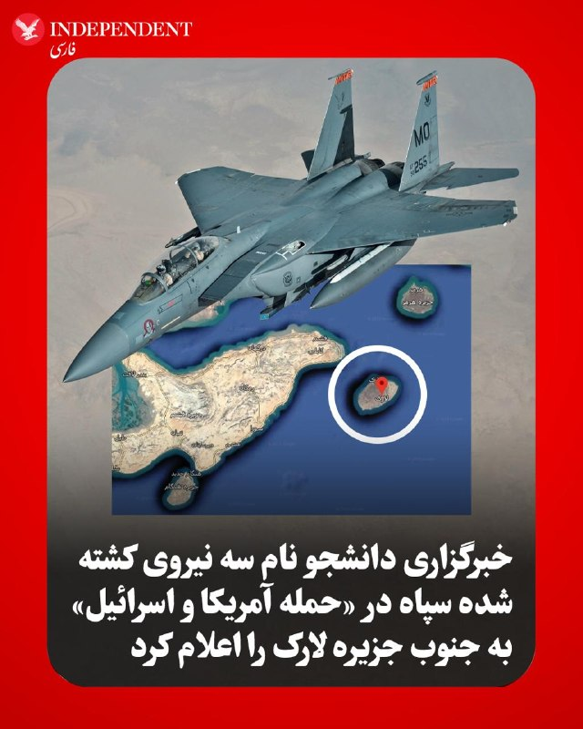

♦️خبرگزاری دانشجو بامداد سه‌شنبه، پنجم خردادماه، گزارش داد که در حمله دوشنبه‌شب آمریکا و اسرائیل به جنوب جزیره لارک، عباس اسلامی، قدرت زرنگاری و عبدالرضا گلزاری، نیروهای سپاه پاسداران کشته شدند. براساس این گزارش «تعداد دقیق کشته‌شدگان هنوز مشخص نشده است».
‌🇸🇦 Indypersian

🤖 @VahidOOnLine

## VahidOOnLine — post 242189

  

♦️صابرین‌نیوز، کانال تلگرامی مشترک سپاه قدس و حشدالشعبی عراق، بامداد سه‌شنبه، پنجم خردادماه، از کشته‌شدن دو نیروی سپاه پاسداران در حمله جنگنده‌های دشمن به دو قایق در خلیج فارس خبر داد. همزمان، گزارش‌های رسیده از شنیده‌شدن صدای انفجارها در اصفهان و بابلسر خبر می‌دهد. پیش از این، تابناک بامداد سه‌شنبه، پنجم خردادماه، گزارش داد: «باند پروازی فرودگاه بندرعباس مورد اصابت موشک قرار گرفت».
‌🇸🇦 Indypersian

🤖 @VahidOOnLine

## VahidOOnLine — post 242188

  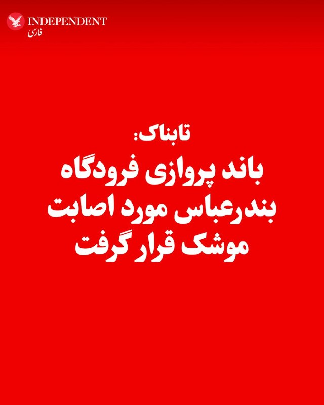

♦️تابناک بامداد سه‌شنبه، پنجم خردادماه، گزارش داد: «باند پروازی فرودگاه بندرعباس مورد اصابت موشک قرار گرفت». پیش از این فارس، خبرگزاری وابسته به سپاه پاسداران از شنیده‌شدن چند انفجار در بندرعباس و حوالی سیریک و جاسک خبر داده بود.
‌🇸🇦 Indypersian

🤖 @VahidOOnLine

## VahidOOnLine — post 242187

  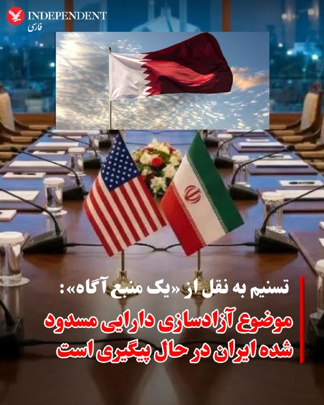

♦️تسنیم، خبرگزاری وابسته به سپاه، بامداد سه‌شنبه، پنجم خردادماه، درباره آخرین وضعیت مذاکرات هیات ایرانی به نقل از «یک منبع آگاه» گزارش داد: «موضوع آزادسازی دارایی بلوکه شده ایران در حال پیگیری است». براساس این گزارش، سفر محمدباقر قالیباف، رئیس مجلس شورای اسلامی، به قطر با همراهی عباس عراقچی، وزیر خارجه جمهوری اسلامی و رئیس کل بانک مرکزی، در جهت آزادسازی بخشی از پولهای بلوکه شده در مرحله اول اجرایی شدن یادداشت تفاهم احتمالی با واشنگتن است. تسنیم نوشت که چون جمهوری اسلامی به آمریکایی‌ها بی‌اعتماد است و می‌خواهد نتایج قطعی را حاصل و انتفاع ایجاد کند، اصرار دارد در این فرایند حتما بخشی از پول‌های مسدود شده آزاد شود. این «منبع مطلع» به تسنیم گفت که در این سفر «پیشرفت‌هایی حاصل شده و گام‌های رو به جلو برداشته شده است».
‌🇸🇦 Indypersian

🤖 @VahidOOnLine

## VahidOOnLine — post 242186

  

♦️درحالی‌که از کشته‌شدن علی خامنه‌ای در حمله مشترک آمریکا و اسرائیل، ۸۸ روز می‌گذرد، فارس، خبرگزاری وابسته به سپاه دوشنبه‌شب، چهارم خردادماه، به نقل از رئیس شورای هماهنگی تبلیغات اسلامی تهران گزارش داد: «هنوز زمان مشخصی برای تشییع رهبر شهید انقلاب تعیین نشده و مردم به شایعات توجه نکنند». رهبر دوم جمهوری اسلامی روز ۹ اسفند ۱۴۰۴ در تهران کشته شد.
‌🇸🇦 Indypersian

🤖 @VahidOOnLine

## VahidOOnLine — post 242185

  

♦️ فارس، خبرگزاری وابسته به سپاه، بامداد سه‌شنبه، پنجم خردادماه، از شنیده شدن چند انفجار در بندر عباس و حوالی سیریک و جاسک خبر داد و نوشت: «هنوز محل دقیق و منشا این صداها مشخص نیست».
‌🇸🇦 Indypersian

🤖 @VahidOOnLine

## VahidOOnLine — post 242184

♦️همزمان با هشتادوهفتمین روز قطع اینترنت جهانی در ایران، خبرگزاری ایرنا دوشنبه‌شب گزارش داد که با توجه به تایید مصوبه بازگشت اینترنت به وضعیت قبل از دی‌ماه ۱۴۰۴ و ابلاغ آن به وزارت ارتباطات، «انتظار می‌رود این دستور فردا (سه‌شنبه، پنجم خردادماه) اجرایی شود و اینترنت بین‌الملل به‌زودی دسترسی مردم قرار بگیرد». براساس این گزارش، پیش از این، احسان چیت‌ساز، معاون سیاست گذاری و برنامه‌ریزی توسعه فاوا و اقتصاد دیجیتال وزارت ارتباطات با انتشار مطلبی در اکس از ابلاغ مصوبه بازگشایی اینترنت توسط پزشکیان خبر داد.
‌🇸🇦 Indypersian

🤖 @VahidOOnLine

## VahidOOnLine — post 242183

  

محمد محمدی گلپایگانی، رییس دفتر علی خامنه‌ای، در ویدیویی با اشاره به رهبر کشته‌شده جمهوری اسلامی گفت او مخالف تجمل‌گرایی بود و زندگی بسیار ساده‌ای داشت، به‌گونه‌ای که وسایل شخصی‌اش به اندازه بار یک وانت یا حتی کمتر بود.

گلپایگانی افزود علی خامنه‌ای هدایایی را که از داخل و خارج کشور برایش ارسال می‌شد، به کمیته امداد و نهادهای دیگر می‌داد تا صرف کمک به فقرا شود و بهره شخصی او از این هدایا بسیار ناچیز بود.
‌🏁 🇬🇧 IranintlTV

🤖 @VahidOOnLine

## VahidOOnLine — post 242182

♦️ابراهیم عزیزی، رئیس کمیسیون امنیت ملی مجلس، دوشنبه‌شب، در برنامه «گفتگوی ویژه خبری» صداوسیما اعلام کرد که پهپادهای دشمن همچنان در مرزهای ایران در حال گشت زنی هستند. او گفت: «در طول روز گذشته و امروز، شاهد حضور پهپادهای دشمن بودیم که دیروز برخورد قاطعی صورت گرفت».
‌🇸🇦 Indypersian

🤖 @VahidOOnLine

## VahidOOnLine — post 242181

  

♦️تسنیم، خبرگزاری وابسته به سپاه، بامداد سه‌شنبه، پنجم خردادماه از «شنیده‌شدن ۳ انفجار مهیب» در بندر عباس خبر داد. براساس این گزارش، معاون استاندار اعلام کرد منشا صدای انفجار در حال بررسی است.
‌🇸🇦 Indypersian

🤖 @VahidOOnLine

## VahidOOnLine — post 242180

  

رسانه‌های ایران شامگاه دوشنبه از شنیده‌شدن صداهای انفجار در بندرعباس و همزمان در خلیج فارس حوالی سیریک و جاسک خبر دادند.

معاون استاندار هرمزگان اعلام کرد منشا صدای انفجار در حال بررسی است.
‌🏁 🇬🇧 IranintlTV

🤖 @VahidOOnLine

## VahidOOnLine — post 242179

  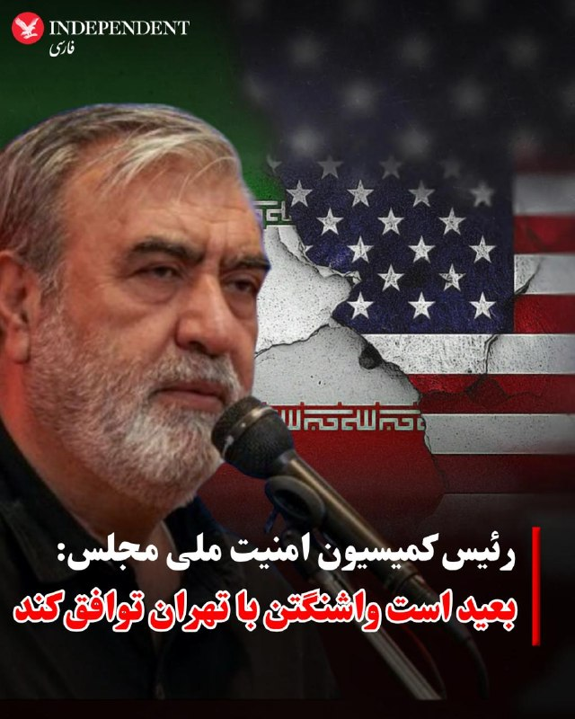

♦️ابراهیم عزیزی، رئیس کمیسیون امنیت ملی و سیاست خارجی مجلس شورای اسلامی، در برنامه «گفتگوی ویژه خبری» صداوسیما با ابراز بدبینی شدید نسبت به آینده مذاکرات با واشنگتن، دستیابی به یک توافق همه‌جانبه را دور از ذهن دانست و گفت: «ما در این شرایطی که داریم، بعید می‌دانیم که آمریکایی‌ها خلاصه وارد یک توافقی بشوند که این خواسته‌های جمهوری اسلامی را بپذیرند.» او با اشاره به روند طولانی‌مدت گفتگوها و پاسخ به پرسش مجری درباره میزان فاصله تا رسیدن به نتیجه نهایی صراحتا تأکید کرد: «من پذیرش پنج بند اول خواسته‌های ایران را بسیار بعید می‌دانم؛ بنابراین از نظر من، ما در حال حاضر در شرایطی قرار داریم که از دستیابی به هرگونه توافقی بسیار دور هستیم.»
‌🇸🇦 Indypersian

🤖 @VahidOOnLine

## VahidOOnLine — post 242178

  

♦️«یک منبع نظامی» در گفتگو با تسنیم، خبرگزاری وابسته به سپاه، روز دوشنبه مدعی شد که بررسی‌های فنی نیروهای مسلح نشان می‌دهد اسرائیل طی چند هفته گذشته، چندین حمله پهپادی را در قالب عملیات «پرچم دروغین» علیه امارات متحده عربی انجام داده است. این منبع ضمن اشاره به اینکه اقدامات انجام شده با هدف «تحریک» مقامات اماراتی صورت گرفته، گفت: «اسرائیل نشان داده است که صرفا منافع خود را در نظر دارد؛ به نوعی که هم در ارتباط با برخی از کشورهای حاشیه خلیج فارس آن‌ها را به ورطه‌ای خطرناک می‌کشاند و هم همزمان عملیات‌هایی را علیه آن‌ها انجام می‌دهد.»
‌🇸🇦 Indypersian

🤖 @VahidOOnLine

## VahidOOnLine — post 242177

  <a href="telegram/content/VahidOOnLine_242177_1779747746.mp4" target="_blank">🎬 Download video</a>

محمد مرندی، کارشناس حکومتی و عضو هیات مذاکره‌کنندگان جمهوری اسلامی در مذاکرات جاری، در تلویزیون گفت قطر پذیرفته بخشی از دارایی‌های بلوکه‌شده حکومت را پیشاپیش تامین و بعد، از آمریکا دریافت کند. او دلیل این اقدام را درک قدرت جمهوری اسلامی و نتایج ایستادگی آن عنوان کرد.
‌🏁 🇬🇧 IranintlTV

🤖 @VahidOOnLine

## VahidOOnLine — post 242176

  

♦️ رسانه آکسیوس، شامگاه دوشنبه چهارم خرداد ماه، به نقل از یک مقام ارشد آمریکایی گزارش داد دولت دونالد ترامپ از تشدید اقدام‌های نظامی اسرائیل در واکنش به «نقض آتش‌بس» از سوی حزب‌الله، حمایت خواهد کرد.
این مقام آمریکایی با اعلام آنکه «حزب‌الله درخواست‌های مکرر برای توقف شلیک به اسرائیل، از جمله یک اولتیماتوم اخیر، را نادیده گرفته است»، به آکسیوس گفت اسرائیل هرگز مجبور نخواهد شد «منفعلانه حملات علیه نیروها و غیرنظامیان خود را تحمل کند» او تاکید کرد: «این دولت بایدن نیست.»
به گفته این مقام، حزب‌الله از ۲۸ فروردین تاکنون بیش از هزار پهپاد و بیش از ۷۰۰ راکت شلیک کرده تا مذاکرات جاری میان لبنان و اسرائیل را مختل کند.
‌🇸🇦 Indypersian

🤖 @VahidOOnLine

## VahidOOnLine — post 242175

  

ابراهیم عزیزی، رییس کمیسیون امنیت ملی مجلس، گفت آمریکا از اوایل هفته دوم جنگ از طریق عاصم منیر، فرمانده ارتش پاکستان، درخواست آتش‌بس و مذاکره داده است.
او افزود تا زمانی که پنج اقدام «اعتمادساز» از سوی آمریکا انجام نشود، چیزی به نام تفاهم و مذاکره معنا ندارد.
به گفته عزیزی، این پنج اقدام شامل «خاتمه جنگ در همه جبهه‌ها به‌ویژه لبنان، برداشته‌شدن محاصره دریایی آمریکا، تردد کشتی‌های غیرنظامی از تنگه هرمز با ترتیبات مورد نظر ایران، تعلیق ۳۰ یا ۶۰ روزه تحریم‌های نفتی و آزادسازی پول‌های بلوکه‌شده است.»
‌🏁 🇬🇧 IranintlTV

🤖 @VahidOOnLine

## VahidOOnLine — post 242172

  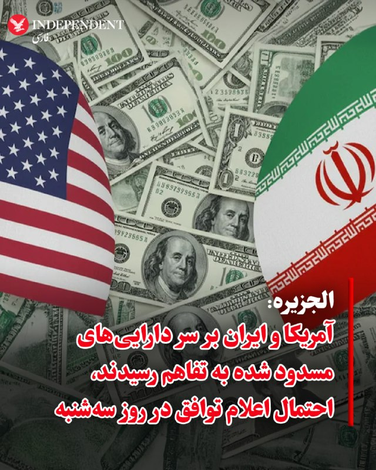

♦️یک منبع آگاه از گفتگوهای هیئت بلندپایه ایرانی با مقام‌های حاضر در دوحه، شامگاه دوشنبه چهارم خرداد ماه به خبرگزاری الجزیره گفت میانجی‌گری قطر به تفاهمی میان تهران و واشنگتن درباره دارایی‌های مسدود شده ایران منجر شده است.
این منبع افزود دستیابی به توافق در این موضوع که برای تهران اهمیت بالایی داشته، احتمال اعلام توافق میان آمریکا و ایران در روز سه‌شنبه را افزایش داده است.
‌🇸🇦 Indypersian

🤖 @VahidOOnLine

## VahidOOnLine — post 242171

  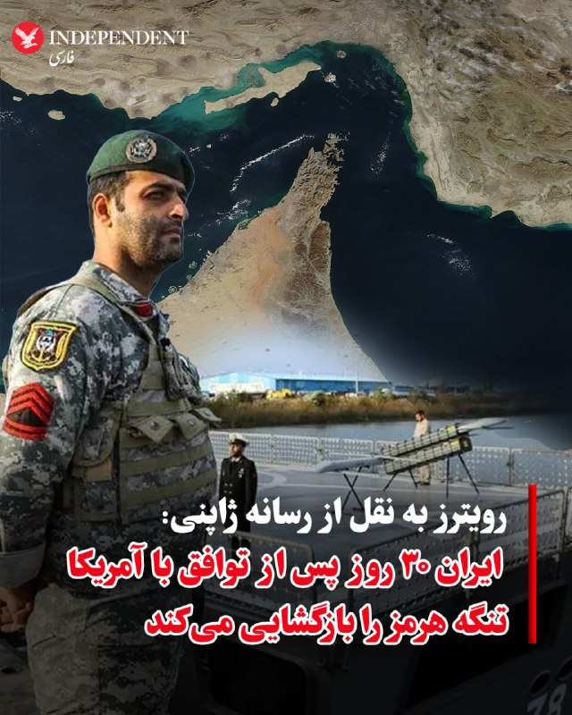

♦️خبرگزاری رویترز به نقل از روزنامه ژاپنی نیکی گزارش داد، جمهوری اسلامی ایران ۳۰ روز پس از دستیابی به توافق با آمریکا، تنگه هرمز را بازگشایی خواهد کرد.
بر اساس این گزارش، ایران در بازه ۳۰ روزه پس از توافق، روند پاکسازی مین‌ها از تنگه هرمز را آغاز می‌کند.
نیکی به نقل از یک منبع آگاه نوشت پس از اجرای توافق، کشتی‌های همه کشورها همانند دوره پیش از تعطیلی عملی تنگه، امکان عبور آزادانه و امن از هرمز را خواهند داشت.
این گزارش می‌افزاید آتش‌بسی که آمریکا و ایران در فرودین ماه گذشته بر سر آن توافق کرده‌اند، برای ۶۰ روز دیگر تمدید خواهد شد.
‌🇸🇦 Indypersian

🤖 @VahidOOnLine

## WithYashar — post 12499

شاهزاده رضا پهلوی:

«یکی از نماینده‌های پارلمان حتی بهم گفت فکر نمی‌کنه ایرانی‌ها آماده دموکراسی باشن.
ایرانی‌ها فقط آماده دموکراسی نیستن؛ ۴۰ هزار نفر جونشون رو برای رسیدن بهش دادن و من نمی‌ذارم این فداکاری بی‌نتیجه بمونه.
چه اروپا کنار ما بایسته چه نه، چه خبرنگارها کارشون رو درست انجام بدن چه نه، چه سیاستمدارها شجاعت اقدام داشته باشن چه نه، من برای مردمم و کشورم می‌جنگم.
حتی اگر مجبور باشیم تنهایی این مسیر رو بریم، می‌جنگیم تا ایران آزاد بشه.»
@withyashar

## WithYashar — post 12498

گزارشها میگن که اپ های ، روبیکا و بله از دسترس خارج شدند
@withyashar

## WithYashar — post 12497

باراک راوید خبرنگار آکسیوس : چرا مهمه؟ آمریکا داره موضعش رو کمی نرم‌تر می‌کنه

- احتمالاً نسبت به قبل انعطاف بیشتری درباره اورانیوم غنی‌شده ایران نشون میده و حتی تا حدی به خواسته ایران نزدیک‌تر شده
@withyashar

## WithYashar — post 12496

پست جدید ترامپ که به اسپانیایی واژه خداحافظ را نوشته که بسیار طعنه آمیز است و معنیه «بری دیگه برنگردی» را میدهد. @withyashar

## WithYashar — post 12495

  

به نظر می رسد 2 آتش سوزی در جزیره خارک ایران رخ داده است.

جزیره خارک بندری برای صادرات 90 درصد فرآورده های نفتی ایران است.
@withyashar

## WithYashar — post 12494

## WithYashar — post 12493

## WithYashar — post 12492

## WithYashar — post 12491

صدا و سیما : حمله شب گذشته دشمن آمریکایی-اسرائیلی به شناورها در جنوب جزیره لارک بر اساس اعلام منابع محلی شب گذشته جنگنده‌های آمریکایی-اسرائیلی چند شناور ایرانی را در جنوب جزیره لارک مورد هدف قرار دادند. طبق اعلام منابع محلی چند تن از هموطنانمان در این حملات…

## WithYashar — post 12490

  

ترامپ در تروث : اورانیوم غنی‌شده (غبار هسته‌ای!) یا باید فوراً به ایالات متحده تحویل داده شود تا به آمریکا منتقل و نابود گردد، یا ترجیحاً با همکاری و هماهنگی جمهوری اسلامی ایران، در همان محل ــ یا در مکان مورد توافق دیگری ــ از بین برده شود؛ آن هم در حالی که کمیسیون انرژی اتمی، یا نهاد معادل آن، بر این روند و این اقدام نظارت و شهادت داشته باشد.

از توجه شما به این موضوع سپاسگزارم!

رئیس‌جمهور دونالد جی. ترامپ
@withyashar

## WithYashar — post 12489

هر‌ چیزی لیاقت میخواد…

## WithYashar — post 12488

## WithYashar — post 12487

پدافند تهران گویا فعال شد !
@withyashar

## WithYashar — post 12486

۴ نفر فوتی بردن بیمارستان شهید محمدی @withyashar

## WithYashar — post 12485

صابرین نیوز : اسامی شهدای حمله سحرگاه شب گذشته ۴ خرداد در جنوب جزیره لارک

بر اساس اعلام منابع محلی نام سه تن از شهدای حمله دشمن متخاصم آمریکایی-اسرائیلی که تا این لحظه شناسایی شدند به شرح زیر است:

شهید عباس اسلامی
شهید قدرت زرنگاری
گشهید عبدالرضا گلزاری

گفتنی است تعداد شهدا هنوز مشخص نشده.
@withyashar

## WithYashar — post 12484

صدا و سیما : حمله شب گذشته دشمن آمریکایی-اسرائیلی به شناورها در جنوب جزیره لارک بر اساس اعلام منابع محلی شب گذشته جنگنده‌های آمریکایی-اسرائیلی چند شناور ایرانی را در جنوب جزیره لارک مورد هدف قرار دادند. طبق اعلام منابع محلی چند تن از هموطنانمان در این حملات…

## WithYashar — post 12483

صدا و سیما : حمله شب گذشته دشمن آمریکایی-اسرائیلی به شناورها در جنوب جزیره لارک

بر اساس اعلام منابع محلی شب گذشته جنگنده‌های آمریکایی-اسرائیلی چند شناور ایرانی را در جنوب جزیره لارک مورد هدف قرار دادند.

طبق اعلام منابع محلی چند تن از هموطنانمان در این حملات به شهادت رسیده‌اند.
@withyashar

## WithYashar — post 12482

هاآرتص: جرقه زده شد
@withyashar

## WithYashar — post 12481

گزارش مشاهده چند موشک ۳ پا در آسمان یزد
@withyashar

## WithYashar — post 12480

برابر گزارش‌ها، پرتاب موشک از قم.
@withyashar

## mwarmonitor — post 9723

«چرا این مهم است: به نظر می‌رسد در اینجا نوعی نرمش در موضع آمریکا درباره روش‌های از بین بردن ذخایر اورانیوم غنی‌شده وجود دارد و نوعی نزدیک شدن به موضع ایران دیده می‌شود.» باراک راوید @mwarmonitor

## mwarmonitor — post 9722

🚨 ترامپ در شبکه اجتماعی Truth Social: «اورانیوم غنی‌شده (گرد هسته‌ای!) یا باید فوراً به ایالات متحده تحویل داده شود تا به کشور منتقل و نابود گردد، یا ترجیحاً با هماهنگی و همکاری جمهوری اسلامی ایران، همان‌جا در محل یا در مکانی دیگر که قابل قبول باشد، نابود…

## mwarmonitor — post 9721

🚨«درگیری‌هایی میان نیروی دریایی ایران و نیروهای آمریکایی رخ داده که در نتیجه آن تعدادی کشته شده‌اند، که عبارتند از: پاسدار عباس اسلامی پاسدار قدرت زرنگاری پاسدار عبدالرضا گلزاری پاسدار حسین ستوده» @mwarmonitor

## mwarmonitor — post 9720

🚨 ترامپ در شبکه اجتماعی Truth Social:

«اورانیوم غنی‌شده (گرد هسته‌ای!) یا باید فوراً به ایالات متحده تحویل داده شود تا به کشور منتقل و نابود گردد، یا ترجیحاً با هماهنگی و همکاری جمهوری اسلامی ایران، همان‌جا در محل یا در مکانی دیگر که قابل قبول باشد، نابود شود؛ به‌طوری که کمیسیون انرژی اتمی یا نهاد معادل آن، شاهد این فرایند و رویداد باشد.

از توجه شما به این موضوع سپاسگزارم!»

@mwarmonitor

## mwarmonitor — post 9719

🚨«درگیری‌هایی میان نیروی دریایی ایران و نیروهای آمریکایی رخ داده که در نتیجه آن تعدادی کشته شده‌اند، که عبارتند از:

پاسدار عباس اسلامی
پاسدار قدرت زرنگاری
پاسدار عبدالرضا گلزاری
پاسدار حسین ستوده»

@mwarmonitor

## mwarmonitor — post 9718

🔴 جزیره لارک در جنوب ایران هدف قرار گرفت

## mwarmonitor — post 9717

🚨🚨🚨

## mwarmonitor — post 9716

خبر فوری

## mwarmonitor — post 9715

🔴ایران به واشنگتن هشدار داده است که هرگونه حمله اسرائیل به بیروت یا حومه جنوبی آن، می‌تواند تلاش‌های جاری برای پایان دادن به جنگ را به‌طور جدی به خطر بیندازد و حتی کل روند دیپلماتیک را کاملاً مختل کند — الجزیره. @mwarmonitor

## mwarmonitor — post 9714

🔴بنیامین نتانیاهو می‌گوید اسرائیل «در حال جنگ با حزب‌الله است» و تأکید کرد که اسرائیل فشار نظامی را کاهش نخواهد داد و او به نیروها دستور داده است «پدال را حتی محکم‌تر فشار دهند». 📌نتانیاهو گفت حزب‌الله در حال شلیک پهپادها، از جمله پهپادهای فیبر نوری است،…

## mwarmonitor — post 9713

💥صدای انفجارهایی در خلیج فارس در نزدیکی مقابلِ سیریک و جاسک شنیده شد.

## mwarmonitor — post 9712

🔴سفر محمدباقر قالیباف و عباس عراقچی به دوحه ممکن است نشانه‌ای از حرکت واشنگتن به سمت «میانه‌ی پل» باشد. نقش میانجی‌گرانه قطر اکنون در حال تکمیل تلاش‌های پاکستان است و اگر گره‌های باقی‌مانده برطرف شود، احتمال اعلام یک توافق می‌تواند بسیار بالا برود. الجزیره…

## mwarmonitor — post 9710

🔴منابع به الجزیره گفته‌اند که میانجی‌گری قطر با موفقیت به ایالات متحده و ایران کمک کرده است تا درباره دارایی‌های مسدودشده به یک توافق دست پیدا کنند.

@mwarmonitor

## mwarmonitor — post 9709

  

📝 همان ثانیه اول شروع جنگ، مثل موش‌های غافلگیرشده پریدید روی سیم و در کسری از ثانیه کل اینترنت کشور را قطع کردید؛ اما حالا یک ماه است که این انگل‌زاده‌های کت‌شلواری و دایناسورهای عهد بوق، اندر خم وصل کردن مجدد آن مانده‌اند. خنده‌دار اینجاست که رسانه‌ها با…

## mwarmonitor — post 9708

  

✈️ساعت ۱۹:۳۳ به وقت محلی— SAM 535 — یک فروند C-32A به شماره 98-0002 از پایگاه KADW (اندروز) به مقصد ETAR (رامشتاین) برخاسته و در مسیر به نقطه KOK در حال حرکت است؛ با London Control روی فرکانس 132.840 ارتباط دارد.

📌احتمالا ویتکاف و کوشنر در این پرواز هستند در مسیر اسرائیل

@mwarmonitor

## mwarmonitor — post 9707

📊 بر اساس یک نظرسنجی که توسط کانال ۱۳ اسرائیل انجام شده است:

📈۵۸٪ معتقدند توافق منعقدشده با ایران ـ طبق آنچه منتشر شده ـ به «اسرائیل» آسیب می‌زند.
📈۵۱٪ با این توافق مخالف‌اند.
📉۳۹٪ بر این باورند که وضعیت امنیتی «اسرائیل» به‌دلیل جنگ تغییری نکرده
📉 ۳۴٪ می‌گویند بدتر شده است.
📈۴۹٪ نیز از ادامه جنگ در جبهه شمالی حمایت می‌کنند.

@mwarmonitor

## mwarmonitor — post 9706

✈️ساعت ۱۹:۲۲ به وقت گرینویچ— HENRY 30 — یک فروند بمب‌افکن B-52H به‌صورت تکی از فرفورد (Fairford) به پرواز درآمده و با Brize روی فرکانس 231.950 در ارتباط است.

@mwarmonitor

## mwarmonitor — post 9705

✈️ساعت ۱۹:۲۰ به وقت گرینویچ— CORE 45 — یک فروند بمب‌افکن استراتژیک B-1B به‌صورت تکی در حال پرواز از پایگاه فرفورد و با پایگاه Brize روی فرکانس 231.950 ارتباط برقرار می‌کند.

@mwarmonitor

## FoxNewsTwitter — post 342249

Fox News (Twitter/X)

Construction is officially underway at the White House for UFC Freedom Fights 250.

Workers were seen assembling what appeared to be part of a lighting structure Monday as crews build out a temporary arena expected to hold roughly 5,000 invited guests.

The June 14 card is believed to be the first professional sporting event ever held at the White House — and it lands on President Trump’s 80th birthday.

## FoxNewsTwitter — post 342245

Fox News (Twitter/X)

The streets of D.C. filled with flags, music, and special tributes as crowds gathered for the annual Memorial Day parade.

This year’s event also featured America250 celebrations ahead of the nation’s 250th anniversary.

## FoxNewsTwitter — post 342244

  

Fox News (Twitter/X)

A Christian lifeguard captain says he was punished for refusing to raise a Pride flag.

Jeffrey Little says L.A. County first approved his religious exemption request, then reversed course days later and suspended him after he declined to participate.

According to the lawsuit, supervisors told him his “religious beliefs do not matter” because he was a county employee.

Now the dispute is moving closer to a federal courtroom showdown over religious accommodations in the workplace.

## FoxNewsTwitter — post 342243

‌Fox News (Twitter/X)

Read more:

## FoxNewsTwitter — post 342242

  <a href="telegram/content/FoxNewsTwitter_342242_1779747753.mp4" target="_blank">🎬 Download video</a>

Fox News (Twitter/X)

Nearly $7,000 of merchandise gone in just a few minutes.

Surveillance video captures a suspect breaking into an Arizona card shop and making off with thousands of dollars in rare Pokémon cards and collectibles.

Investigators say the burglary caused heavy damage to the store, with nearly $7,000 in merchandise stolen, and the suspect hasn’t been identified.

Store owners across the country have been warning about a rise in targeted Pokémon card thefts as the collectibles market keeps exploding in value.

## FoxNewsTwitter — post 342241

  <a href="telegram/content/FoxNewsTwitter_342241_1779747755.mp4" target="_blank">🎬 Download video</a>

Fox News (Twitter/X)

Ilhan Omar responding to Nancy Mace’s new proposal to ban foreign-born American from serving in Congress or holding other major political positions in the United States.

When asked about the bill, the Minnesota congresswoman who was born in Somalia shrugged off the move, telling Fox News Digital “Good luck to [Nancy Mace].”

The amendment would require members of Congress, federal judges, and Senate-confirmed officials to be natural-born citizens — the same standard currently applied to presidents and vice presidents.

Omar, who was born in Somalia and became a U.S. citizen in 2000, was one of the lawmakers Mace specifically pointed to when unveiling the proposal.

## FoxNewsTwitter — post 342240

  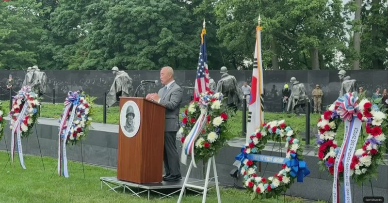

Fox News (Twitter/X)

WATCH LIVE: Memorial Day ceremony honors Korean War veterans https://twitter.com/i/broadcasts/1nxnRRRpjRdxO

## pm_afshaa — post 91506

  <a href="telegram/content/pm_afshaa_91506_1779747759.webm" target="_blank">🎬 Download video</a>

🔴پست جدید ترامپ: اورانیوم غنی‌شده (غبار هسته‌ای) یا فوراً به آمریکا تحویل داده خواهد شد تا به خاک آمریکا برده شده و منهدم شود، یا ترجیحاً با هماهنگی و همکاری جمهوری اسلامی ایران، در همان مکان منهدم شود. یا در مکانی دیگر که مورد قبول باشه، با نظارت کمیسیون…

## pm_afshaa — post 91505

  <a href="telegram/content/pm_afshaa_91505_1779747760.webm" target="_blank">🎬 Download video</a>

🔴طبق تصاویر ماهواره‌ای 2 آتش سوزی در جزیره خارک ایران مشاهده شده اما رسانه‌های داخلی تا الان تکذیب کردن.

💧 Rainbet.com the #1 Non-KYC Crypto Casino & Sportsbook @rainbetcom

😁 @Pm_Afshaa

## pm_afshaa — post 91504

  <a href="telegram/content/pm_afshaa_91504_1779747760.webm" target="_blank">🎬 Download video</a>

🔴پست جدید ترامپ: اورانیوم غنی‌شده (غبار هسته‌ای) یا فوراً به آمریکا تحویل داده خواهد شد تا به خاک آمریکا برده شده و منهدم شود، یا ترجیحاً با هماهنگی و همکاری جمهوری اسلامی ایران، در همان مکان منهدم شود. یا در مکانی دیگر که مورد قبول باشه، با نظارت کمیسیون…

## pm_afshaa — post 91503

  <a href="telegram/content/pm_afshaa_91503_1779747761.webm" target="_blank">🎬 Download video</a>

🔴میدل ایست: دو قایق تندرو نیروی دریایی سپاه در خلیج فارس هدف جنگنده‌های آمریکایی قرار گرفتن و 4 سرباز کشته شدن. 
💧 Rainbet.com the #1 Non-KYC Crypto Casino & Sportsbook @rainbetcom 
😁 @Pm_Afshaa

## pm_afshaa — post 91502

  <a href="telegram/content/pm_afshaa_91502_1779747762.webm" target="_blank">🎬 Download video</a>

🔴پست جدید ترامپ: اورانیوم غنی‌شده (غبار هسته‌ای) یا فوراً به آمریکا تحویل داده خواهد شد تا به خاک آمریکا برده شده و منهدم شود، یا ترجیحاً با هماهنگی و همکاری جمهوری اسلامی ایران، در همان مکان منهدم شود. یا در مکانی دیگر که مورد قبول باشه، با نظارت کمیسیون انرژی اتمی یا نهاد معادل آن بر این فرآیند و رویداد

این توافق مثل برجام نیست که راه بمب اتم باز بمونه، این‌بار قضیه کاملاً برعکسه.

💧 Rainbet.com the #1 Non-KYC Crypto Casino & Sportsbook @rainbetcom

😁 @Pm_Afshaa

## pm_afshaa — post 91501

خیلی وقته خبر جنگ نبوده کانالا جوگیر شدن یکم

## pm_afshaa — post 91500

  <a href="telegram/content/pm_afshaa_91500_1779747762.webm" target="_blank">🎬 Download video</a>

🔴خبرگزاری مهر: منشا صدای انفجار شرق بندرعباس بوده.

اوضاع شهر، کاملا تحت کنترله و جای هیچگونه نگرانی برای مردم بندرعباس نیست. به شایعات منتشر شده در فضای مجازی توجه نکنید؛ هنوز منابع رسمی در این خصوص اظهار نظری نکردن.

💧 Rainbet.com the #1 Non-KYC Crypto Casino & Sportsbook @rainbetcom

😁 @Pm_Afshaa

## pm_afshaa — post 91499

  <a href="telegram/content/pm_afshaa_91499_1779747763.webm" target="_blank">🎬 Download video</a>

🔴تو اصفهان هم گزارش پرواز پهباد داده شده.

💧 Rainbet.com the #1 Non-KYC Crypto Casino & Sportsbook @rainbetcom

😁 @Pm_Afshaa

## pm_afshaa — post 91498

  <a href="telegram/content/pm_afshaa_91498_1779747764.webm" target="_blank">🎬 Download video</a>

🔴فارس: در خلیج فارس حوالی سیریک و جاسک هم صداهای انفجار شنیده شده.

💧 Rainbet.com the #1 Non-KYC Crypto Casino & Sportsbook @rainbetcom

😁 @Pm_Afshaa

## pm_afshaa — post 91497

  <a href="telegram/content/pm_afshaa_91497_1779747764.webm" target="_blank">🎬 Download video</a>

🔴این وسط تسنیم گفته:
در سفر قالیباف و عراقچی به قطر، پیشرفت‌هایی حاصل شده و گام‌های رو به جلو برداشته شده.

💧 Rainbet.com the #1 Non-KYC Crypto Casino & Sportsbook @rainbetcom

😁 @Pm_Afshaa

## pm_afshaa — post 91496

یه شب خبر از توافقه یه شب جنگ

## pm_afshaa — post 91495

🔴میدل ایست: دو قایق تندرو نیروی دریایی سپاه در خلیج فارس هدف جنگنده‌های آمریکایی قرار گرفتن و 4 سرباز کشته شدن.

💧 Rainbet.com the #1 Non-KYC Crypto Casino & Sportsbook @rainbetcom

😁 @Pm_Afshaa

## pm_afshaa — post 91494

  <a href="telegram/content/pm_afshaa_91494_1779747765.webm" target="_blank">🎬 Download video</a>

🔴معاون استاندار هرمزگان: منشا صدای انفجار در حال بررسی است.

💧 Rainbet.com the #1 Non-KYC Crypto Casino & Sportsbook @rainbetcom

😁 @Pm_Afshaa

## pm_afshaa — post 91493

  <a href="telegram/content/pm_afshaa_91493_1779747766.webm" target="_blank">🎬 Download video</a>

🔴بندرعباس صدای 4 انفجار شنیده شده. 
💧 Rainbet.com the #1 Non-KYC Crypto Casino & Sportsbook @rainbetcom 
😁 @Pm_Afshaa

## pm_afshaa — post 91492

  <a href="telegram/content/pm_afshaa_91492_1779747766.webm" target="_blank">🎬 Download video</a>

🔴الجزیره: احتمالا توافق بین آمریکا و جمهوری اسلامی سه‌شنبه اعلام میشه.

💧 Rainbet.com the #1 Non-KYC Crypto Casino & Sportsbook @rainbetcom

😁 @Pm_Afshaa

## pm_afshaa — post 91491

  <a href="telegram/content/pm_afshaa_91491_1779747767.webm" target="_blank">🎬 Download video</a>

🔴بندرعباس صدای 4 انفجار شنیده شده. 
💧 Rainbet.com the #1 Non-KYC Crypto Casino & Sportsbook @rainbetcom 
😁 @Pm_Afshaa

## pm_afshaa — post 91490

  <a href="telegram/content/pm_afshaa_91490_1779747768.webm" target="_blank">🎬 Download video</a>

🔴بندرعباس صدای 4 انفجار شنیده شده. 
💧 Rainbet.com the #1 Non-KYC Crypto Casino & Sportsbook @rainbetcom 
😁 @Pm_Afshaa

## pm_afshaa — post 91489

  <a href="telegram/content/pm_afshaa_91489_1779747769.webm" target="_blank">🎬 Download video</a>

🔴رئیس کمیسیون امنیت ملی: بعید میدونم آمریکا با ایران توافق کنه و 5 بند ایران رو بپذیره؛ توافق ایران و آمریکا خیلی دور است.

💧 Rainbet.com the #1 Non-KYC Crypto Casino & Sportsbook @rainbetcom

😁 @Pm_Afshaa

## pm_afshaa — post 91488

  <a href="telegram/content/pm_afshaa_91488_1779747769.webm" target="_blank">🎬 Download video</a>

🔴بندرعباس صدای 4 انفجار شنیده شده.

💧 Rainbet.com the #1 Non-KYC Crypto Casino & Sportsbook @rainbetcom

😁 @Pm_Afshaa

## pm_afshaa — post 91487

  <a href="telegram/content/pm_afshaa_91487_1779747770.webm" target="_blank">🎬 Download video</a>

🔴تسنیم به نقل از منبع نظامی:
اسرائیل هفته های پیش حمله پهبادی به امارات کرده بندازه گردن ایران.

💧 Rainbet.com the #1 Non-KYC Crypto Casino & Sportsbook @rainbetcom

😁 @Pm_Afshaa

## DEJradio — post 4961

  <a href="telegram/content/DEJradio_4961_1779747771.webm" target="_blank">🎬 Download video</a>

🚨
⭕️ بنیامین نتانیاهو، نخست‌وزیر اسرائیل، شامگاه دوشنبه با انتشار ویدئویی اعلام کرد جنگ جاری اسرائیل با حزب‌الله متوقف نخواهد شد و حملات خود علیه این گروه تروریستی و نیابتی رژیم ایران در لبنان را تشدید خواهد کرد. پیش از این گفته بود که یکی از مفاد توافق احتمالی…

## DEJradio — post 4960

  <a href="telegram/content/DEJradio_4960_1779747771.mp4" target="_blank">🎬 Download video</a>

🔺🎥 مارکو روبیو، وزیر خارجه ایالات متحده، بامداد چهارم خرداد ضمن اعلاک اینکه مذاکرات «همچنان پیش می‌رود»، گفت که در مورد «توانایی ایران برای باز کردن» تنگه هرمز و «ورود به مذاکراتی واقعی، مهم و محدود از نظر زمانی درباره مسائل هسته‌ای»، پیشنهادی «نسبتا محکم» روی میز است.

#مارکو_روبیو #مذاکرات
@DEJradio

## DEJradio — post 4959

  <a href="telegram/content/DEJradio_4959_1779747774.mp4" target="_blank">🎬 Download video</a>

⭕️ اهمیت حیاتی موبایل امن
#توصیه
@DEJradio

## DEJradio — post 4958

  <a href="telegram/content/DEJradio_4958_1779747776.mp4" target="_blank">🎬 Download video</a>

🕐
🔴 چشم اسفندیار یا پاشنه آشیل، همون نقطه‌ضعف پنهانیه که حتی قدرتمندترین حریف‌ها رو هم می‌تونه با کمترین هزینه از پا دربیاره 🏹

جمهوری اسلامی هم در طول سال‌ها پاشنه‌آشیل‌های زیادی داشته؛ از حجاب اجباری تا نیروهای نیابتی‌ای که قرار بود نقطه‌قوت رژیم باشن، اما به‌مرور تبدیل شدن به حفره‌های امنیتی و سیاسی ⚠️
البته گفتن از پاشنه‌آشیل‌های قدیمی و کشف‌شده خیلی آسون‌تر از پیدا کردن نقطه‌ضعف‌های امروز رژیمه.
به نظر شما امروز پاشنه‌آشیل آخوندها کجاست؟😉

#تمام_رخ
@DEJradio

## DEJradio — post 4957

  <a href="telegram/content/DEJradio_4957_1779747778.mp4" target="_blank">🎬 Download video</a>

🚨
⭕️ بنیامین نتانیاهو، نخست‌وزیر اسرائیل، شامگاه دوشنبه با انتشار ویدئویی اعلام کرد جنگ جاری اسرائیل با حزب‌الله متوقف نخواهد شد و حملات خود علیه این گروه تروریستی و نیابتی رژیم ایران در لبنان را تشدید خواهد کرد.
پیش از این گفته بود که یکی از مفاد توافق احتمالی ترامپ با رژیم ایران اتمام جنگ در تمام جبهه ها از جمله لبنان خواهد بود.

#مذاکرات #اسرائیل #لبنان
@DEJradio

## DEJradio — post 4956

  <a href="telegram/content/DEJradio_4956_1779747780.mp4" target="_blank">🎬 Download video</a>

📢
🔺 اعتراض یک شهروند به گرانی و کمبود بنزین: هرچی کار می‌کنیم پول بنزین میدیم.

#بنزین #صدای_شما
@DEJradio

## DEJradio — post 4955

  <a href="telegram/content/DEJradio_4955_1779747783.mp4" target="_blank">🎬 Download video</a>

⭕️ خبر ۲۱
دوشنبه ۴ خرداد ۱۴۰۵

#خبر۲۱

@DEJradio

## DEJradio — post 4954

🛑
⭕️ منابع غربی ادعا می‌کنند حکومت ایران «پشت‌پرده» تعهداتی در زمینه واگذاری اورانیوم غنی‌شده داده است. روزنامه «نیویورک‌پست»، به نقل از یک مقام آمریکایی گزارش داد «۹۵ درصد کار انجام شده»، در مقابل اما خبرگزاری رویترز به نقل از یک منبع دیگر گزارش داد جمهوری‌اسلامی با کنار گذاشتن ذخایر اورانیوم غنی‌شده موافقت نکرده است.
منابع داخلی نزدیک به سـ.ـپاه پاسداران نیز ادعا کرده‌اند که مجتبی خامنه‌ای با واگذاری اورانیوم‌های غنی شده مخالفت کرده اما چه کسانی درون حکومت برای انتقال اورانیوم‌ها به خارج از ایران به ترامپ قول همکاری داده‌اند؟ در شرایطی که سپاه پاسداران تعیین می‌کند چه کسانی طرف مذاکره با آمریکا باشند آیا کسانی که به آمریکا قول همکاری داده‌اند چراغ سبز سپاه را داشته‌اند؟

#اورانیوم
@DEJradio

## DEJradio — post 4953

  <a href="telegram/content/DEJradio_4953_1779747785.webm" target="_blank">🎬 Download video</a>

🎥
🔺 در برلین روز یکشنبه سوم خرداد ۱۴۰۵ شماری از اوباش حامی نظام که با افراطی‌های حامی‌ فلسطین همدست شده بودند و برای ایرانیان میهن‌دوست مزاحمت درست کردند، مورد نوازش قرار گرفتند و سپس بازداشت شدند.

#مزدوران #برلین
@DEJradio

## mamlekate — post 103583

📝 سلام بندرعباس امشب چهارم خرداد ساعت ۲۳:۴۰ صدای سه تا انفجار شدید پست سر هم اومد. خیلی نزدیک بود. انگاری از پایگاه شکاری بود.

@mamlekate

## VahidOnline — post 75716

خبرگزاری دانشجو گزارش داد که در "حمله سحرگاه شب گذشته ۴ خرداد" در جنوب جزیره لارکآمریکا و اسرائیل به جنوب جزیره لارک، عباس اسلامی، قدرت زرنگاری و عبدالرضا گلزاری، نیروهای سپاه پاسداران کشته شدند.
براساس این گزارش «تعداد دقیق کشته‌شدگان هنوز مشخص نشده است».
@VahidOOnLine
گویا این واقعه مربوط به اولین ساعت‌های دوشنبه است. یعنی حدود ۲۴ ساعت قبل
ولی به نظر می‌رسه اون دسته از منابع جمهوری اسلامی که این خبر رو پخش کردند عمدا طوری گمراه‌کننده نوشتند که مربوط به صداهای شنیده شده الان به نظر بیاد.
مثلا این توییت مربوط به ساعت ۷ شب دوشنبه است:
دیشب یه قایق سپاه در حال مین ریزی در تنگه هرمز مورد اصابت یک جنگده که از خاک امارات بلند شده بود قرار میگیره و چهار نفر از نیروهای سپاه کشته میشن
YourAnon_Zeus
حالا درسته یا نه نمی‌دونم ولی خبر مربوط به الان نیست. من هم ساعت سه چهار صبح دوشنبه پیام‌هایی داشتم از شنیده شدن صدا در قشم و بندرعباس
📡 @VahidOnline

## VahidOnline — post 75715

  

پست ترامپ، ترجمه ماشین:
غبار هسته‌ای، یعنی اورانیوم غنی‌شده، یا باید فوراً به ایالات متحده تحویل داده شود تا به کشورمان منتقل و نابود شود، یا ترجیحاً، در همکاری و هماهنگی با جمهوری اسلامی ایران، در همان محل یا در مکان قابل قبول دیگری نابود شود؛ در حالی که کمیسیون انرژی اتمی، یا نهاد معادل آن، شاهد این روند و رویداد باشد.

از توجه شما به این موضوع سپاسگزارم!

رئیس‌جمهور دی‌جی‌تی
realDonaldTrump

📡 @VahidOnline

## VahidOnline — post 75714

#بندرعباس
پیام‌های دریافتی درباره صدای شنیده شدن صدای انفجار:

بندرعباس سه بار صدای شدید اومد الان

صدای بمب میاد.
بندرعباس ساعت ۲۳:۴۰

همین الان ساعت ۲۳:۴۰ صدای سه تا انفجار شدید توو بندرعباس اومد. نزدیک پایگاه شکاری یا همون فرودگاه بود به نظرم

سلام وحید جان
بندر عباس صدای آزاد سازی پول های بلوکه شده میاد

بندرعباس ۲۳:۴۰ سه تا انفجار شدید

حاجی۲۳/۴۰ سه تا انفجار شدید شرق بندرعباس
دقیقا صدای انفجار ۴۰روز جنگ بود

سلام همین الان بندرعباس صدای دوتا انفجار اومد

بندرعباس حدود ۲۳:۴۰ دقیقه سمت فرودگاه صدای سه انفجار اومد.

درود وحید جان
بندر عباس ۱۱:۴۲ سه تا صدای زدن اومد

بندرعباس، ساعت 11.40

صدای شدید انفجار و لرزش

سه تا صدای انفجار پشت هم شنیدیم بندرعباس

بندرعباس 11:40 شب 4 خرداد صدای انفجار

بندرعباس ۵ بار صدای انفجار
ما سمت پایگاه هوایی هستیم نسبتا شدید بود

پدافند سمت فرودگاه بندرعباس فعال شده ساعت ۲۳:۴۵

آپدیت:
رسانه‌های ایران شامگاه دوشنبه از شنیده‌شدن صداهای انفجار در بندرعباس و همزمان در خلیج فارس حوالی سیریک و جاسک خبر دادند.
معاون استاندار هرمزگان اعلام کرد منشا صدای انفجار در حال بررسی است.
@VahidOOnLine

📡 @VahidOnline

## VahidOnline — post 75713

  <a href="telegram/content/VahidOnline_75713_1779747787.mp4" target="_blank">🎬 Download video</a>

بنیامین نتانیاهو، نخست وزیر اسرائیل، روز دوشنبه خبر داد که دستور حملات تازه به جنوب لبنان در تلاش برای «خرد کردن» گروه حزب‌الله را صادر کرده است.
ساعتی بعد خبرگزاری‌ها از چند حمله شدید اسرائیل به این منطقه خبر دادند.

نتانیاهو در ویدئویی که در شبکه تلگرام منتشر شد خبر داد که خواستار «سرعت بیشتر دادن» به حملات ارتش اسرائیل شده است.
او همچنین حزب‌الله را متهم کرد که با پهپاد نیروهای اسرائیلی را هدف گرفته است.

صدور دستور حمله بیشتر به لبنان، همزمان است با خواسته دو وزیر افراطی در کابینه اسرائیل که در همین روز خواستار تشدید حملات به جنوب لبنان و همین طور پایتخت، بیروت، شده بودند.

حمله اسرائیل به این منطقه در حالی رخ می‌دهد که در سوی دیگر تهران و واشینگتن از جمله درباره پایان جنگ در لبنان مذاکره می‌کنند.
حکومت ایران در هر دور از مذاکرات اخیر خود با آمریکا، پایان جنگ در لبنان را نیز خواستار شده است.
حملات متقابل اسرائیل و حزب‌الله در حالی رخ می‌دهد که دو طرف بیش از یک ماه است که به طور اسمی در آتش‌بس به سر می‌برند.
@VahidHeadline

📡 @VahidOnline

## VahidOnline — post 75712

  

الجزیره به نقل از یک منبع آگاه گزارش داد میانجی‌گری قطر به دستیابی به تفاهمی میان آمریکا و جمهوری اسلامی درباره دارایی‌های مسدودشده ایران منجر شده است.

این منبع افزود با توجه به اهمیت بالای این موضوع برای ایران، احتمال زیادی وجود دارد توافق میان آمریکا و جمهوری اسلامی فردا اعلام شود.
@VahidOOnLine

📡 @VahidOnline

## kianmeli1 — post 87668

🔴 ۴ عضو سپاه پاسداران در خلیج فارس پس از آنکه بنا به گزارش‌ها دو قایق تندرو توسط «هواپیماهای جنگی امریکا» مورد اصابت قرار گرفتند، کشته شدند.
https://t.me/kianmeli1

## kianmeli1 — post 87667

🔴امشب-دو قایق تندرو نیروی دریایی سپاه پاسداران در خلیج فارس توسط جنگنده‌های آمریکایی هدف قرار گرفتند و چهار نیرو سپاه کشته شده‌اند
https://t.me/kianmeli1

## kianmeli1 — post 87666

  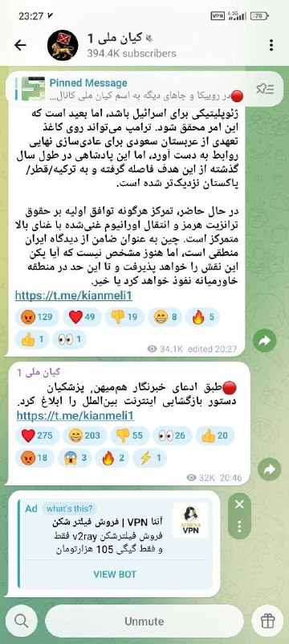

🔴پایین صفحه نوشته شده فروش فیلترشکن جعلیه و کلاهبرداری

خود تلگرام تبلیغ میکنه و مراقب باشید نخرید
https://t.me/kianmeli1

## kianmeli1 — post 87665

🔴ادعای تابناک: باند پروازی فرودگاه بندرعباس مورد اصابت موشک قرار گرفت.
https://t.me/kianmeli1

## kianmeli1 — post 87664

🔴صداهای انفجاری که در بندر عباس شنیده شده به احتمال زیاد مربوط به خنثی سازی مهمات عمل نکرده جنگ اخیر است.
https://t.me/kianmeli1

## kianmeli1 — post 87663

  <a href="telegram/content/kianmeli1_87663_1779747788.mp4" target="_blank">🎬 Download video</a>

🔴پزشکیان: این خانم‌هایی که قبلا می‌گفتند بگیرید همین الان تصاویرشان هستند که پرچم ایران و تصویر آقا را برداشتند و می‌گویند حاضرم جان بدهم و در مقابل دشمن بایستم در صورتی که یه روزی می‌گفتند این‌ها را بگیرید و جریمه کنید!

-در برخی مساجد اگر خانمی با مانتو برود، خانم‌های چادری وی را از مسجد بیرون می‌کنند
https://t.me/kianmeli1

## IranIntlTV — post 338996

  

ترامپ در تروث‌سوشال نوشت: «اورانیوم غنی‌شده (غبار هسته‌ای!) یا فورا به آمریکا تحویل داده خواهد شد تا در ایالات‌متحده نابود شود، یا ترجیحا با همکاری و هماهنگی با جمهوری اسلامی ایران، در همان محل یا در مکانی قابل قبول دیگر نابود خواهد شد.»
ترامپ گفت در صورت نابودی اورانیوم غنی‌شده در مکانی غیر از آمریکا، «کمیسیون انرژی اتمی»، یا نهاد معادل آن، به عنوان شاهد بر این فرایند نظارت خواهد داشت.
https://iranintl.com/202605259577

## IranIntlTV — post 338995

  <a href="telegram/content/IranIntlTV_338995_1779747791.mp4" target="_blank">🎬 Download video</a>

مراد ویسی، تحلیل‌گر ارشد ایران‌اینترنشنال، گفت: «بسیاری از اختیارات پزشکیان گرفته شده او عملا نقش تعیین‌کننده‌ای در تصمیم‌گیری‌ها ندارد. پزشکیان عملا به تدارکاتچی سپاه تبدیل شده و حتی در جایگاه‌هایی مثل شورای عالی امنیت ملی هم بیشتر به ماشین امضای تصمیمات سپاه مثل جنایت دی‌ماه تبدیل شده است.»
@iranintltv

## IranIntlTV — post 338994

  <a href="telegram/content/IranIntlTV_338994_1779747794.mp4" target="_blank">🎬 Download video</a>

با ادامه انتقاد برخی گروه‌های درون حکومت ایران به شیوه مذاکرات، بعضی نمایندگان مجلس می‌گویند نباید هیچ تعهدی پذیرفته شود که به تضعیف قدرت بازدارندگی منجر گردد.
@iranintltv

## IranIntlTV — post 338993

  <a href="telegram/content/IranIntlTV_338993_1779747796.mp4" target="_blank">🎬 Download video</a>

مراد ویسی، تحلیل‌گر ارشد ایران‌اینترنشنال، گفت: «خروج قالیباف از مخفیگاه و سفرش به قطر و علنی شدن حضور علی عبداللهی، فرمانده قرارگاه خاتم الانبیا، پس از چند ماه می‌تواند نشانه امان‌نامه غیر رسمی و موقت ترامپ به فرماندهان سپاه برای رسیدن به یک توافق احتمالی باشد. اگر توافق نشود این امان‌نامه می تواند توسط نیروی هوایی اسراییل باطل شود.»
@iranintltv

## IranIntlTV — post 338992

  <a href="telegram/content/IranIntlTV_338992_1779747798.mp4" target="_blank">🎬 Download video</a>

در ادامه رایزنی‌ها بر سر توافق احتمالی میان تهران و واشینگتن، هیات جمهوری اسلامی به ریاست محمدباقر قالیباف، رییس مجلس و عباس عراقچی، وزیر امور خارجه جمهوری اسلامی، وارد دوحه شد.
@iranintltv

## IranIntlTV — post 338991

  <a href="telegram/content/IranIntlTV_338991_1779747800.mp4" target="_blank">🎬 Download video</a>

مراد ویسی، تحلیل‌گر ارشد ایران‌اینترنشنال، گفت: «علنی شدن رقم ۱۲ میلیارد دلاری پول‌های توقیف‌شده در قطر، بار دیگر این واقعیت را نشان داد که در مبادلات بانکی، فروش غیر رسمی نفت و دور زدن تحریم‌ها بخش زیادی از درآمدهای ملی حیف‌ومیل می‌شود و به‌دلیل پنهانی بودن معاملات، امکان سوءاستفاده و بالا کشیدن درآمدهای نفتی توسط فرماندهان سپاه و باندهای آنها وجود دارد.»
@iranintltv

## IranIntlTV — post 338990

  

محمد محمدی گلپایگانی، رییس دفتر علی خامنه‌ای، در ویدیویی با اشاره به رهبر کشته‌شده جمهوری اسلامی گفت او مخالف تجمل‌گرایی بود و زندگی بسیار ساده‌ای داشت، به‌گونه‌ای که وسایل شخصی‌اش به اندازه بار یک وانت یا حتی کمتر بود.

گلپایگانی افزود علی خامنه‌ای هدایایی را که از داخل و خارج کشور برایش ارسال می‌شد، به کمیته امداد و نهادهای دیگر می‌داد تا صرف کمک به فقرا شود و بهره شخصی او از این هدایا بسیار ناچیز بود.
https://iranintl.com/202605252326

## IranIntlTV — post 338989

  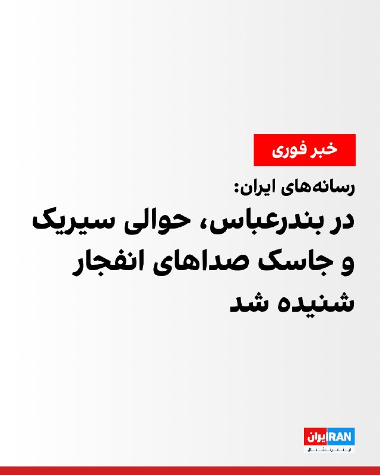

رسانه‌های ایران شامگاه دوشنبه از شنیده‌شدن صداهای انفجار در بندرعباس و همزمان در خلیج فارس حوالی سیریک و جاسک خبر دادند.

معاون استاندار هرمزگان اعلام کرد منشا صدای انفجار در حال بررسی است.
https://iranintl.com/202605254215

## IranIntlTV — post 338988

  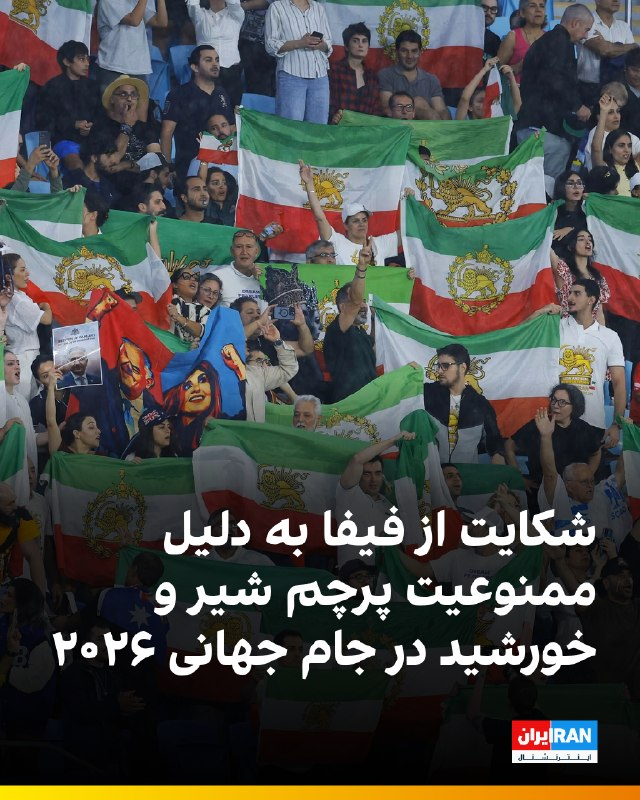

🔻نیویورک تایمز گزارش داده که فیفا از سوی یک گروه غیرانتفاعی در آمریکا به دلیل ممنوعیت پرچم شیر و خورشید در جام جهانی ۲۰۲۶، تهدید به اقدام حقوقی و قضایی شده است؛ این نهاد غیرانتفاعی خواستار آن شده که برگزارکننده جام جهانی ممنوعیت نمایش پرچم پیش از انقلاب اسلامی را لغو کند.

🔹«مؤسسه صداهای آزادی» نامه‌ای حاوی نگرانی‌های خود را از طریق شاهرخ مختارزاده، مشاور حقوقی‌اش، برای فیفا ارسال کرده است.

🔹مختارزاده به نشریه اتلتیک گفته است که بسته به پاسخ یا عدم پاسخ فیفا، «تصمیم برای آغاز روند رسمی دادرسی در دادگاه عالی ایالت کالیفرنیا یا دادگاه‌های فدرال در کالیفرنیا اتخاذ خواهد شد.»

🔹مشاور حقوقی این گروه گفت که سه روز پس از ارسال نامه به فیفا، هنوز هیچ پاسخی دریافت نکرده‌اند: «در صورت هرگونه تلاش فیفا برای حذف پرچم شیر و خورشید، در حال آماده‌سازی برای آغاز اقدامات حقوقی مقتضی هستیم.»

🔹هفته گذشته، اتلتیک به نقل از منابعی، گزارش داد که راهنمای رسمی فیفا برای ورزشگاه‌ها در جام جهانی، ممنوعیت این پرچم خواهد بود.

🔹جزییات بیشتر را در سایت بخوانید.

@iranintltvsport

## IranIntlTV — post 338987

  <a href="telegram/content/IranIntlTV_338987_1779747804.mp4" target="_blank">🎬 Download video</a>

محمد مرندی، کارشناس حکومتی و عضو هیات مذاکره‌کنندگان جمهوری اسلامی در مذاکرات اسلام‌آباد، در تلویزیون گفت قطر پذیرفته بخشی از دارایی‌های بلوکه‌شده حکومت را پیشاپیش تامین و بعد، از آمریکا دریافت کند. او دلیل این اقدام را درک قدرت جمهوری اسلامی و نتایج ایستادگی آن عنوان کرد.

## IranIntlTV — post 338986

  <a href="telegram/content/IranIntlTV_338986_1779747806.mp4" target="_blank">🎬 Download video</a>

رویترز به نقل از دو مقام اسرائیلی گزارش داد بنیامین نتانیاهو نسبت به تفاهم‌نامه در حال مذاکره میان تهران و واشینگتن ابراز نگرانی کرده است. براساس این گزارش، او گفته اسرائیل نفوذ چندانی بر تصمیم‌های دونالد ترامپ درباره ایران ندارد.

گفت‌وگو با مئیر جاودانفر، تحلیل‌گر مسائل اسرائیل
@iranintltv

## IranIntlTV — post 338985

  <a href="https://t.me/IranintlTV/338985" target="_blank">📎 Download file</a>

🎧نسخه صوتی ۲۴ با فرداد فرحزاد: انتقادها از توافق احتمالی ایران و آمریکا؛ ترامپ: مخالفان چیزی نمی‌دانند
@iranintlTV

## IranIntlTV — post 338984

  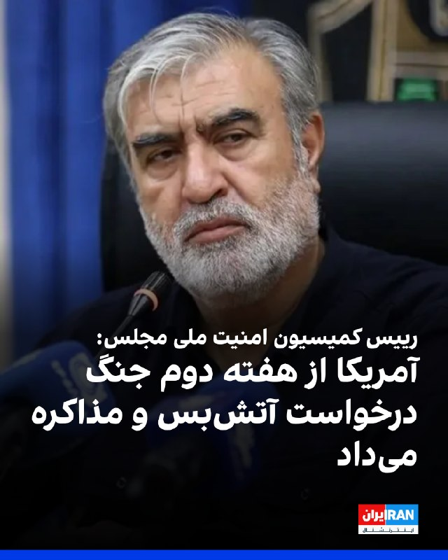

ابراهیم عزیزی، رییس کمیسیون امنیت ملی مجلس، گفت آمریکا از اوایل هفته دوم جنگ از طریق عاصم منیر، فرمانده ارتش پاکستان، درخواست آتش‌بس و مذاکره داده است.
او افزود تا زمانی که پنج اقدام «اعتمادساز» از سوی آمریکا انجام نشود، چیزی به نام تفاهم و مذاکره معنا ندارد.
به گفته عزیزی، این پنج اقدام شامل «خاتمه جنگ در همه جبهه‌ها به‌ویژه لبنان، برداشته‌شدن محاصره دریایی آمریکا، تردد کشتی‌های غیرنظامی از تنگه هرمز با ترتیبات مورد نظر ایران، تعلیق ۳۰ یا ۶۰ روزه تحریم‌های نفتی و آزادسازی پول‌های بلوکه‌شده است.»
https://iranintl.com/202605256772

## IranIntlTV — post 338983

  

ابراهیم عزیزی، رییس کمیسیون امنیت ملی مجلس، گفت آمریکا از اوایل هفته دوم جنگ از طریق عاصم منیر، فرمانده ارتش پاکستان، درخواست آتش‌بس و مذاکره داده است.
او افزود تا زمانی که پنج اقدام «اعتمادساز» از سوی آمریکا انجام نشود، چیزی به نام تفاهم و مذاکره معنا ندارد.
به گفته عزیزی، این پنج اقدام شامل «خاتمه جنگ در همه جبهه‌ها به‌ویژه لبنان، برداشته‌شدن محاصره دریایی آمریکا، تردد کشتی‌های غیرنظامی از تنگه هرمز با ترتیبات مورد نظر ایران، تعلیق ۳۰ یا ۶۰ روزه تحریم‌های نفتی و آزادسازی پول‌های بلوکه‌شده است.»
https://iranintl.com/202605256772

## IranIntlTV — post 338982

  

ابراهیم عزیزی، رییس کمیسیون امنیت ملی مجلس، گفت آمریکا از اوایل هفته دوم جنگ از طریق عاصم منیر، فرمانده ارتش پاکستان، درخواست آتش‌بس و مذاکره داده است.
او افزود تا زمانی که پنج اقدام «اعتمادساز» از سوی آمریکا انجام نشود، چیزی به نام تفاهم و مذاکره معنا ندارد.
به گفته عزیزی، این پنج اقدام شامل «خاتمه جنگ در همه جبهه‌ها به‌ویژه لبنان، برداشته‌شدن محاصره دریایی آمریکا، تردد کشتی‌های غیرنظامی از تنگه هرمز با ترتیبات مورد نظر ایران، تعلیق ۳۰ یا ۶۰ روزه تحریم‌های نفتی و آزادسازی پول‌های بلوکه‌شده است.»
https://iranintl.com/202605256772

## IranIntlTV — post 338981

  <a href="telegram/content/IranIntlTV_338981_1779747811.mp4" target="_blank">🎬 Download video</a>

علی صدرزاده، تحلیل‌گر مسائل خاورمیانه، گفت: «دلیل تاکید دونالد ترامپ بر پیوستن کشورهای عربی به پیمان ابراهیم این است که می‌خواهد این پیام را منتقل کند که آن‌ها نباید انتظار داشته باشند آمریکا از آن‌ها دفاع کند.» او افزود از نظر ترامپ، کشورهای عربی بهتر است با اسرائیل همکاری کنند تا از امکانات و توان دفاعی آن بهره‌مند شوند.
@iranintltv

## IranIntlTV — post 338980

  

مسعود پزشکیان گفت: «وقتی تصمیمی گرفته می‌شود، باید یک‌صدا از سیستم بیرون بیاید. من خیلی چیزها را دوست ندارم، اما وقتی تصمیم گرفته می‌شود، کوتاه می‌آیم.»

او افزود: «اگر بتوانم معیشت و زندگی مردم را تامین کنم، آمریکا و اسرائیل نمی‌توانند در داخل کشور توطئه کنند.»
https://iranintl.com/202605258505

## IranIntlTV — post 338979

  <a href="https://t.me/IranintlTV/338979" target="_blank">📎 Download file</a>

🎧نسخه صوتی چشم‌انداز: تحرکات قالیباف در قطر، دور از چشم و گوش مجتبی و سپاه!
@iranintlTV

## IranIntlTV — post 338978

  <a href="telegram/content/IranIntlTV_338978_1779747815.mp4" target="_blank">🎬 Download video</a>

تحرکات قالیباف در قطر، دور از چشم و گوش مجتبی و سپاه!

چشم‌انداز با مهدی مهدوی‌آزاد

تماشای نسخه کامل در یوتیوب:
https://youtu.be/WCt7x569huw
@iranintltv

## IranIntlTV — post 338977

  

الجزیره به نقل از یک منبع آگاه از گفت‌وگوهای میان هیات عالی‌رتبه ایرانی و مقام‌های قطری در دوحه گزارش داد میانجی‌گری قطر به دستیابی به تفاهمی میان آمریکا و جمهوری اسلامی درباره دارایی‌های مسدودشده تهران منجر شده است.
این منبع افزود با توجه به اهمیت بالای این موضوع برای ایران، احتمال زیادی وجود دارد توافق میان آمریکا و جمهوری اسلامی فردا اعلام شود.

https://iranintl.com/202605257486

## Shin_Persian — post 6232

  

Shin ✓ @hey_itsmyturn Mon, 25 May 2026 21:50:47 UTC President Trump @POTUS: "The Enriched Uranium (Nuclear Dust!) will either be immediately turned over to the United States to be brought home and destroyed or, preferably, in conjunction and coordination…

## Shin_Persian — post 6231

Shin ✓ @hey_itsmyturn
Mon, 25 May 2026 21:50:47 UTC

President Trump @POTUS:
"The Enriched Uranium (Nuclear Dust!) will either be immediately turned over to the United States to be brought home and destroyed or, preferably, in conjunction and coordination with the Islamic Republic of Iran, destroyed in place or, at another acceptable location, with the Atomic Energy Commission, or its equivalent, being witness to this process and event. Thank you for your attention to this matter! President DJT"

فارسی

رئیس‌جمهور ترامپ @POTUS:

«اورانیوم غنی‌سازی شده (گرد و غبار هسته‌ای!) یا باید فوراً به ایالات متحده تحویل داده شود تا به میهن بازگردانده و نابود شود یا ترجیحاً، با همکاری و هماهنگی با جمهوری اسلامی ایران، در محل یا در مکان قابل قبول دیگری، با حضور کمیسیون انرژی اتمی یا معادل آن به عنوان شاهد این فرآیند و رویداد، نابود گردد. از توجه شما به این موضوع سپاسگزارم! رئیس‌جمهور دی‌جی‌تی»

𝕏 · @shin_persian

## Shin_Persian — post 6230

Shin ✓ @hey_itsmyturn
Mon, 25 May 2026 21:47:08 UTC

AA activity over Khorzuq Borkhar, Isfahan Province, #Iran

فارسی

فعالیت پدافند هوایی (AA) بر فراز خورزوق برخوار، استان اصفهان، #Iran

𝕏 · @shin_persian

## Shin_Persian — post 6228

Shin ✓ @hey_itsmyturn
Mon, 25 May 2026 21:42:17 UTC

And regarding the reports on death of 4 regime forces in Larak island due to strike(s): SNN (Daneshju) reported it, claims it happened on Monday (4th of Khordad), AsrIran cites Daneshju and reports it as well.
Hormozgan Province, #Iran

فارسی

و در رابطه با گزارش‌ها مبنی بر کشته شدن ۴ تن از نیروهای رژیم در جزیره لارک بر اثر حمله (یا حملات): خبرگزاری دانشجو (SNN) این خبر را گزارش کرده و مدعی شده است که این حادثه در روز دوشنبه (۴ خرداد) رخ داده است؛ عصر ایران نیز با استناد به خبرگزاری دانشجو این خبر را گزارش کرده است.
استان هرمزگان، #Iran_

𝕏 · @shin_persian

## Shin_Persian — post 6227

Shin ✓ @hey_itsmyturn
Mon, 25 May 2026 21:37:03 UTC

No explosions in Babolsar.
No explosions in Isfahan.
No explosions in Qom.
Yes explosions &amp; AA activity in Bandar Abbas.
No official statements, Yet.

فارسی

هیچ انفجاری در بابلسر رخ نداده است.
هیچ انفجاری در اصفهان رخ نداده است.
هیچ انفجاری در قم رخ نداده است.
بله، انفجارها و فعالیت پدافند هوایی در بندرعباس گزارش شده است.
هنوز هیچ بیانیه رسمی صادر نشده است.

𝕏 · @shin_persian

## Shin_Persian — post 6226

  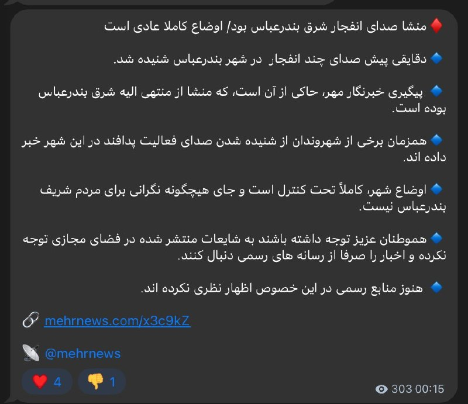

↩️ Quoted tweet: Shin ✓ @hey_itsmyturn Mon, 25 May 2026 21:12:23 UTC No, Tabnak News did not report anything about "Bandar Abbas airport being hit". But yes, the sound was heard from east of the city. #Hormogzan Province, #Iran ↩️ توییت نقل‌قول شده — برای…

## Shin_Persian — post 6225

↩️ Quoted tweet:
Shin ✓ @hey_itsmyturn
Mon, 25 May 2026 21:12:23 UTC

No, Tabnak News did not report anything about "Bandar Abbas airport being hit".
But yes, the sound was heard from east of the city.
#Hormogzan Province, #Iran

↩️ توییت نقل‌قول شده — برای پاسخ، پست زیر را ببینید.

فارسی

خیر، خبرگزاری تابناک هیچ خبری مبنی بر «هدف قرار گرفتن فرودگاه بندرعباس» منتشر نکرده است.
اما بله، صدا از شرق شهر شنیده شده است.
#Hormogzan Province, #Iran

𝕏 · @shin_persian

## Shin_Persian — post 6224

Shin ✓ @hey_itsmyturn
Mon, 25 May 2026 21:12:23 UTC

No, Tabnak News did not report anything about "Bandar Abbas airport being hit".
But yes, the sound was heard from east of the city.
#Hormogzan Province, #Iran

فارسی

خیر، خبرگزارى تابناک هیچ خبری مبنی بر «مورد اصابت قرار گرفتن فرودگاه بندرعباس» گزارش نکرده است.
اما بله، صدا در شرق شهر شنیده شده است.
#Hormogzan Province, #Iran

𝕏 · @shin_persian

## Shin_Persian — post 6223

  

Shin ✓ @hey_itsmyturn
Mon, 25 May 2026 21:10:26 UTC

Source of this image is not know, it has no results in reverse image searches, and it's claimed to be from Bandar Abbas, Hormozgan Province, #Iran
(Can't confirm)

فارسی

منبع این تصویر مشخص نیست، در جستجوی معکوس تصاویر هیچ نتیجه‌ای ندارد و ادعا شده است که مربوط به بندرعباس در استان هرمزگان، #Iran است.
(قابل تأیید نیست)

𝕏 · @shin_persian

## Shin_Persian — post 6222

  

Shin ✓ @hey_itsmyturn
Mon, 25 May 2026 20:32:58 UTC

State-owned Mehr News and IRGC's Fars News confirm the explosions in Bandar Abbas, Fars adds "At the same time, several blasts were heard from Sirik and Jask as well"
Hormozgan Province, #Iran

فارسی

خبرگزاری دولتی مهر و خبرگزاری فارس متعلق به سپاه پاسداران انقلاب اسلامی (سپاه)، وقوع انفجارها در بندرعباس را تأیید کردند. فارس افزود: «همزمان، چندین صدای انفجار از سیریک و جاسک نیز شنیده شده است.»
استان هرمزگان، #Iran_

𝕏 · @shin_persian

## Shin_Persian — post 6221

Shin ✓ @hey_itsmyturn
Mon, 25 May 2026 20:24:16 UTC

2024Z
AA activity over Bandar Abbas right now.
Hormozgan Province, #Iran

فارسی

۲۰۲۴ زولو (۲۳:۵۴ به وقت تهران)
فعالیت پدافند هوایی (AA) در حال حاضر برفراز بندرعباس.
استان هرمزگان، #Iran

𝕏 · @shin_persian

## Shin_Persian — post 6220

  

Shin ✓ @hey_itsmyturn
Mon, 25 May 2026 20:17:30 UTC

2012Z
3 huge blasts in Bandar Abbas, Hormozgan Province, #Iran

فارسی

۲۰۱۲ زولو (۲۳:۴۲ به وقت تهران)
۳ انفجار مهیب در بندرعباس، استان هرمزگان، #Iran

𝕏 · @shin_persian

## Shin_Persian — post 6219

📦 mhrv-rs v1.9.35 released

• Improve large-download resilience and slow exit-node behavior (PR #1346)

Files (Android APKs, Windows, macOS, Linux, OpenWRT) on the files channel:

👉 v1.9.35 — all files with SHA-256

Channel:
https://t.me/mhrv_rs
or: https://t.me/+R1OyoHX2boA1ZDgx

#v1935

## FarsiVOA — post 218657

🔺دونالد ترامپ: اورانیوم غنی‌شده جمهوری اسلامی یا در آمریکا، یا ایران و یا در مکان دیگری نابود خواهد شد

▪️دونالد ترامپ، رئیس‌جمهوری آمریکا، روز دوشنبه ۴ خرداد گفت اورانیوم غنی‌شده جمهوری‌ اسلامی یا تحویل آمریکا داده می‌شود و یا در ایران و یا «مکان قابل قبول دیگری» نابود خواهد شد.

⬇️ بیشتر بخوانید:
https://ir.voanews.com/a/8153748.html
@FarsiVOA

## FarsiVOA — post 218656

  <a href="telegram/content/FarsiVOA_218656_1779747822.mp4" target="_blank">🎬 Download video</a>

⚡️واکنش کاربران شبکه‌های اجتماعی به توافق احتمالی آمریکا با جمهوری اسلامی
@FarsiVOA

## FarsiVOA — post 218655

  

رسانه حکومتی تابناک در ایران در خبری مدعی شد که دو قایق تندرو سپاه پاسداران هدف حمله هوایی قرار گرفتند.
این رسانه نام چهار نفر را نیز به عنوان کشته‌ها منتشر کرد.
در همین حال یک خبرنگار شبکه الجزیره نیز به نقل از منابع جمهوری اسلامی از هدف قرار گرفتن قایق‌های سپاه خبر داد.
او افزود نیروهای سپاهی قبل از اینکه هدف قرار بگیرند، به یک شناور حمله کرده بودند.
ساعاتی قبل از این نیز گزارش‌های مختلفی در شبکه‌های اجتماعی از شنیده شدن صدای چندین انفجار در بندرعباس و سیریک و جاسک منتشر شد.
ستاد فرماندهی مرکزی آمریکا، سنتکام، تا این لحظه واکنشی به این گزارش‌ها شده نشان نداده است.
برخی رسانه‌های داخلی مدعی شده‌اند که قایق‌های سپاه در نزدیکی جزیره لارک هدف قرار گرفتند.
@FarsiVOA

## FarsiVOA — post 218654

⚡️روز دوشنبه ۴ خرداد جی دی ونس، معاون رئیس جمهوری آمریکا، به همراه پرزیدنت ترامپ و شماری از مقامات بلندپایه آمریکا در مراسم «روز یادبود» در آرامستان ملی آرلینگتون در نزدیکی واشنگتن شرکت کرد. این مراسم به طور زنده و با ترجمه همزمان پژواک کیومرثی از صدای آمریکا پخش شد.
@FarsiVOA

## FarsiVOA — post 218653

⚡️روز دوشنبه ۴ خرداد پیت هگست، وزیر جنگ آمریکا، به همراه پرزیدنت ترامپ و شماری از مقامات بلندپایه آمریکا در مراسم «روز یادبود» در آرامستان ملی آرلینگتون در نزدیکی واشنگتن شرکت کرد. این مراسم به طور زنده و با ترجمه همزمان پژواک کیومرثی از صدای آمریکا پخش شد.
@FarsiVOA

## FarsiVOA — post 218652

  <a href="telegram/content/FarsiVOA_218652_1779747823.mp4" target="_blank">🎬 Download video</a>

⚡️آیا فرانسه می‌خواهد اروپا را از وابستگی به چین نجات دهد؟
@FarsiVOA

## FarsiVOA — post 218651

⚡️هزاران نفر در رژه روز یادبود در واشنگتن، پایتخت آمریکا، شرکت کردند.
روز یادبود کشته‌شدگان نیروهای مسلح آمریکا در ایالات متحده برای گرامی‌داشت نظامیان کشته‌شده این کشور برگزار می‌شود.
@FarsiVOA

## FarsiVOA — post 218650

  

⚡️گزارش‌های شبکه‌های اجتماعی از شنیده شدن صدای چند انفجار شدید در اواخر روز دوشنبه در بندرعباس حکایت دارد.
@FarsiVOA

## FarsiVOA — post 218649

  <a href="telegram/content/FarsiVOA_218649_1779747824.mp4" target="_blank">🎬 Download video</a>

⚡️مهرداد درویش پور در برنامه تفسیر خبر: عقربه زمان به ضرر «جناح آخر الزمانی» خواهد چرخید
@FarsiVOA

## FarsiVOA — post 218648

  <a href="telegram/content/FarsiVOA_218648_1779747825.mp4" target="_blank">🎬 Download video</a>

⚡️امین قضایی در برنامه تفسیر خبر: جمهوری اسلامی صرفا برای مذاکره، مذاکره می‌کند
@FarsiVOA

## FarsiVOA — post 218647

  <a href="telegram/content/FarsiVOA_218647_1779747826.mp4" target="_blank">🎬 Download video</a>

⚡️گزارش نرگس صبا از جدال قدرت بین قالیباف و جلیلی - برنامه تفسیر خبر
@FarsiVOA

## FarsiVOA — post 218646

  <a href="telegram/content/FarsiVOA_218646_1779747827.mp4" target="_blank">🎬 Download video</a>

⚡️رضا طالبی: سعید جلیلی به حاشیه رانده شده است
@FarsiVOA

## FarsiVOA — post 218645

  <a href="telegram/content/FarsiVOA_218645_1779747828.mp4" target="_blank">🎬 Download video</a>

⚡️ترامپ: به جمهوری اسلامی که حامی نخست تروریسم در جهان است اجازه دستیابی به سلاح اتمی را نمی‌دهم
@FarsiVOA

## FarsiVOA — post 218644

⚡️دونالد ترامپ، رئیس جمهوری ایالات متحده، در مراسم «روز یادبود» تاکید کرد واشنگتن اجازه نخواهد داد «بزرگ‌ترین حامی دولتی تروریسم در جهان» به سلاح هسته‌ای دست پیدا کند. صدای آمریکا این مراسم را به طور زنده و با ترجمه همزمان پژواک کیومرثی پخش کرد.
@FarsiVOA

## FarsiVOA — post 218643

🔺وزارت خارجه آمریکا: «حزب‌الله» مسئول اصلی بحران کنونی در لبنان است

▪️وزارت خارجه ایالات متحده می‌گوید که گروه شبه‌نظامی «حزب‌الله» با ادامه حملات علیه اسرائیل و نقض آتش‌بس، مسئول اصلی بحران جاری در لبنان است، و عملا تلاش می‌کند مسیر صلح، بازسازی، و تثبیت حاکمیت دولت لبنان را نابود کند.

⬇️ بیشتر بخوانید:
https://ir.voanews.com/a/state-department-says-hezbollah-entirely-responsible-for-current-crisis-in-lebanon/8153718.html
@FarsiVOA

## FarsiVOA — post 218642

⚡️در برنامه تفسیر خبر امروز، مهدی آقازمانی با کارشناسان مهمان، درباره تنش‌های درون حکومت ایران برای رسیدن به تفاهم با آمریکا، موضع و رویکرد ایالات متحده به مذاکره و روش دیپلماسی در قبال جمهوری اسلامی و تازه‌ترین گفته‌های سخنگوی وزارت خارجه جمهوری اسلامی گفتگو می‌کند
@FarsiVOA

## FarsiVOA — post 218641

نت‌بلاکس، نهاد ناظر بر اختلالات اینترنتی، اعلام کرد محدودیت گسترده اینترنت در ایران وارد هشتادوهفتمین روز پیاپی شده و بیش از دو هزار و ۶۴ ساعت ادامه یافته است.

به گفته این نهاد، وضعیت کنونی شفافیت درباره اعدام‌ها را از میان برده و بلاتکلیفی روزانه زندانیان، مخالفان، منتقدان و بازداشت‌شدگان را تشدید کرده است.

این هشدار در شرایطی مطرح می‌شود که عفو بین‌الملل در گزارشی به تاریخ ۳۱ اردیبهشت ۱۴۰۵ اعلام کرد از زمان آغاز حملات آمریکا و اسرائیل به ایران در ۲۸ فوریه، مقام‌های جمهوری اسلامی دست‌کم ۳۶ نفر را پس از محکومیت در پرونده‌های سیاسی و در پی «محاکمه‌های به‌شدت ناعادلانه» اعدام کرده‌اند.

گزارش کامل را در وب‌سایت صدای آمریکا بخوانید.

@FarsiVOA

## FarsiVOA — post 218640

ژنرال دن کین، رئیس ستاد مشترک نیروهای مسلح آمریکا در مراسم «روز یادبود» گفت سربازان، ملوانان و تفنگداران جوان ما به میدان‌های نبرد رفتند تا برای حفظ استقلال ما بجنگند و مسیر این ملت بزرگی که امروز می‌شناسیم را هموار کنند.

## FarsiVOA — post 218639

دونالد ترامپ، رئیس جمهوری ایالات متحده، در مراسم «روز یادبود» گفت در دو جنگ اخیر، آمریکا ۱۳ نیروی نظامی خود را در جریان عملیات علیه جمهوری اسلامی از دست داده است، اما تاکید کرد واشنگتن اجازه نخواهد داد «بزرگ‌ترین حامی دولتی تروریسم در جهان» به سلاح هسته‌ای دست پیدا کند.

## DW_Farsi — post 125145

  

🔶 ترامپ: اورانیوم غنی‌شده باید بلافاصله به ایالات متحده تحویل داده شود

دونالد ترامپ، رئیس جمهور آمریکا بامداد سه‌شنبه ۲۶ مه (۵ خرداد) با انتشار پستی در شبکه اجتماعی تروث سوشال، بار دیگر بر خواست واشنگتن مبنی بر تحویل اورانیوم با غنای بالای ایران تاکید کرد.

او نوشت: «اورانیوم غنی‌شده (غبار هسته‌ای!) یا فورا به آمریکا تحویل داده می‌شود تا به کشورمان منتقل و نابود شود یا ترجیحا در همکاری و هماهنگی با جمهوری اسلامی ایران، در همان محل یا در مکانی دیگر که مورد قبول باشد، با نظارت کمیسیون انرژی اتمی یا نهاد معادل آن بر این فرآیند و رویداد، نابود شود.»

این در حالی است که پیش از این مقامات ایرانی اعلام کرده بودند، "تهران هیچ تعهدی در پیش‌نویس توافق‌ اولیه با آمریکا در موضوع هسته‌ای و اورانیوم با غنای بالا به طرف مقابل نداده است."

با این حال رویترز به نقل از یک مقام آگاه نوشته بود، محور اصلی مذاکرات محمدباقر قالیباف، مذاکره‌کننده ارشد ایران و عباس عراقچی، وزیر خارجه این کشور، در سفر به قطر موضوع تنگه هرمز و ذخایر اورانیوم بسیار غنی‌شده ایران خواهد بود.
@dw_farsi

## DW_Farsi — post 125144

  

🔴 انفجار در بندرعباس؛ "حمله به لارک و کشته شدن چند عضو سپاه"

خبرگزاری‌های داخلی ایران گزارش دادند، در ساعات پایانی روز دوشنبه ۴ خرداد (۲۵ مه) صدای سه انفجار در شرق بندرعباس شنیده شده است. همزمان در حوالی سیریک و جاسک نیز صداهای مشابه شنیده شده است.

معاون استاندار هرمزگان اعلام کرد، منشا صدای انفجار در حال بررسی است.

خبرگزاری فارس وابسته به سپاه پاسداران نیز در خبری نوشت، "سحرگاه روز سه‌شنبه ۵ خرداد نیروهای مسلح ایران یک فروند پهپاد متخاصم را در محدوده خلیج فارس منهدم کرده‌اند."

برخی منابع داخلی نیز از حمله به فرودگاه بندرعباس خبر می‌دهند. تا کنون هیچ مقام رسمی توضیحی در این رابطه ارائه نکرده است.

خبرگزاری دانشجو به نقل از منابع محلی نوشت، جنگنده‌های آمریکایی چند شناور ایرانی را در جنوب جزیره لارک هدف قرار داده‌اند. آنگونه که این خبرگزاری نوشته چند عضو سپاه بر اثر این حمله کشته شده‌اند که هویت سه تن از آنها تایید شده است.

📌تصویر از آرشیو
@dw_farsi

## DW_Farsi — post 125143

🔶 پزشکیان دستور بازگشایی اینترنت بین‌المللی را ابلاغ کرد

رسانه‌های ایران اعلام کردند مسعود پزشکیان، رئیس‌جمهور ایران مصوبه بازگشایی اینترنت بین‌الملل به وضعیت پیش از دی‌ماه ۱۴۰۴ را برای اجرا به وزارت ارتباطات ابلاغ کرده است.

پیش از این رسانه‌های داخلی خبر داده بودند که مصوبه بازگشایی اینترنت در جلسه روز دوشنبه چهارم خرداد ستاد ویژه ساماندهی و راهبری فضای مجازی به ریاست محمدرضا عارف، معاون‌‌اول پزشکیان به تصویب رسید.

قطعی اینترنت بین‌الملل در ایران که پیش‌تر در جریان اعتراضات دی‌ماه ۱۴۰۴ رخ داده بود، در ماه‌های بعد و در پی حملات آمریکا و اسرائیل به ایران پی گرفته شد و تا کنون نیز ادامه دارد.

به نوشته روزنامه شرق، ستار هاشمی، وزیر ارتباطات و فناوری اطلاعات، بازگشایی اینترنت بین‌الملل را نشانه‌ای از "بازگشت ثبات و اعتماد ملی" تلقی و از آن تجلیل کرده است.

به گفته او، این تصمیم بعد از جلسات فشرده ستاد ویژه ساماندهی و راهبری فضای مجازی کشور و با دستور مستقیم رئیس‌جمهور وارد مرحله اجرا شده است.

هاشمی با اشاره به حیاتی بودن اینترنت و پیامدهای اختلال آن بر زندگی مردم و پایداری خدمات تأکید کرد: «بر اساس گزارش‌های رسمی، محدودیت‌های اینترنتی در ماه‌های اخیر خسارات درخور توجهی به اقتصاد دیجیتال، کسب‌وکارهای آنلاین و چرخه خدمات کشور وارد کرد و استمرار این وضعیت می‌توانست علاوه بر آسیب‌های اقتصادی، زمینه‌ساز تضعیف سرمایه‌گذاری، مهاجرت نیرو‌های انسانی نخبه و گسترش الگوهای ارتباطی خارج از چارچوب حکمرانی رسمی کشور شود‌.»

او همچنین با اشاره به اهداف برنامه هفتم توسعه در حوزه ارتباطات گفت: «دستیابی به سهم ۱۰‌درصدی اقتصاد دیجیتال از تولید ناخالص داخلی تا پایان سال ۱۴۰۷، بدون ایجاد فضای باثبات ارتباطی، توسعه زیرساخت‌های دیجیتال و حفاظت از عدالت ارتباطی ممکن نخواهد بود.»

@dw_farsi

## DW_Farsi — post 125142

🔶 رییس جمهور مکزیک با اقامت تیم فوتبال ایران در این کشور موافقت کرد

به گفته کلودیا شینباوم، رئیس‌جمهور مکزیک، دولت او موافقت کرده که تیم ملی فوتبال ایران در طول رقابت‌های جام جهانی ۲۰۲۶ در مکزیک اقامت داشته باشد. به گفته او، آمریکا تمایلی به میزبانی این تیم نداشته است.

به گزارش خبرگزاری رویترز، او گفت که فدراسیون بین‌المللی فوتبال (فیفا) پس از آن که آمریکا اعلام کرد، نمی‌خواهد تیم ایران در طول مسابقات در خاک این کشور مستقر باشد، به دولت او مراجعه کرد.

شینباوم در یک نشست خبری در روز دوشنبه چهارم خرداد گفت: «هیچ دلیلی نمی‌بینیم که امکان اقامت در مکزیک را از آن‌ها دریغ کنیم.»

رویترز می‌نویسد، تا کنون کاخ سفید و وزارت خارجه آمریکا به درخواست‌ها برای اظهار نظر در این‌باره پاسخی نداده‌اند.

پیش از این در روز شنبه دوم خرداد مهدی تاج، رئیس فدراسیون فوتبال ایران گفته بود که محل استقرار تیم ملی در جریان این رقابت‌ها از ایالت آریزونای آمریکا به شهر مرزی تیخوانا در مکزیک منتقل خواهد شد.

حضور تیم ملی ایران در این رقابت‌ها که از ۲۱ خرداد تا ۲۸ تیر (۱۱ ژوئن تا ۱۹ ژوئیه) برگزار می‌شود، پس از حملات آمریکا و اسرائیل به ایران در اواخر فوریه، با ابهام مواجه شده بود.

@dw_farsi

## Persian_Trend_Official — post 15020

https://youtube.com/live/81sH1UrOPAM?feature=share

## Persian_Trend_Official — post 15019

  

🇮🇱‏۶۱ سال پیش، الی کوهن قهرمان افسانه‌ای  مردم اسرائیل در سوریه اعدام شد.

اطلاعاتی که وی از طریق نفوذ در حکومت سوریه به دست آورد، نقش حیاتی در پیروزی اسرائیل در جنگ شش روزه داشت.

👩‍💻@PhantomDirective

🆔@persian_trend_official
پرشین ترند | متفاوت‌ترین کانال نظامی

## Persian_Trend_Official — post 15018

  <a href="telegram/content/Persian_Trend_Official_15018_1779747831.webm" target="_blank">🎬 Download video</a>

🔴به نظر می‌رسد دو آتش‌سوزی در جزیره خارگ ایران رخ داده است.

⭕️جزیره خارگ بندری برای صادرات تا ۹۰٪ از محصولات نفتی ایران فراهم می‌کند

🫆:Tony

📌 @persian_trend_official
پرشین ترند | متفاوت‌ترین کانال نظامی

## Persian_Trend_Official — post 15017

  

⭕️ترامپ:

«اورانیوم غنی‌شده (غبار هسته‌ای!) فوراً به ایالات متحده تحویل داده خواهد شد تا به کشور بازگردانده شده و نابود شود، یا بهتر از آن، با همکاری و هماهنگی با جمهوری اسلامی ایران، در همان محل یا در مکانی قابل قبول دیگر نابود گردد؛ آن هم با حضور و نظارت کمیسیون انرژی اتمی یا نهادی معادل آن به‌عنوان شاهد این فرآیند و رویداد.

از توجه شما به این موضوع سپاسگزارم!»

🫆:Tony

📌 @persian_trend_official
پرشین ترند | متفاوت‌ترین کانال نظامی

## Persian_Trend_Official — post 15016

  <a href="telegram/content/Persian_Trend_Official_15016_1779747832.webm" target="_blank">🎬 Download video</a>

شبکه خبر: منبع صدای انفجار در بندرعباس هنوز مشخص نیست

## Persian_Trend_Official — post 15015

  <a href="telegram/content/Persian_Trend_Official_15015_1779747833.webm" target="_blank">🎬 Download video</a>

علی هاشم، خبرنگار الجزیره: یک منبع ایرانی به من گفت که صدای تیراندازی شدیدی که در نزدیکی بندرعباس شنیده شد، پس از آن رخ داد که سپاه پاسداران یک کشتی را در دریا هدف قرار داد و پس از آن جنگنده‌های آمریکایی به قایق‌های نیروی دریایی سپاه در خلیج فارس حمله کردند.

به گفته این منبع، چندین پرسنل نیروی دریایی سپاه در این حمله کشته شدند.

این منبع گفت: «وضعیت هنوز در حال وخیم شدن است.»

## Persian_Trend_Official — post 15014

  <a href="telegram/content/Persian_Trend_Official_15014_1779747833.webm" target="_blank">🎬 Download video</a>

هم اکنون؛ پرواز هواپیمای سوخت‌رسان آمریکایی بر فراز منطقه.

## Persian_Trend_Official — post 15013

  <a href="telegram/content/Persian_Trend_Official_15013_1779747834.webm" target="_blank">🎬 Download video</a>

صدای انفجار از کرمانشاه و اصفهان

## Persian_Trend_Official — post 15010

  <a href="telegram/content/Persian_Trend_Official_15010_1779747835.mp4" target="_blank">🎬 Download video</a>

پدافند در قم
تاکنون ده ها موشک پرتاب شده

## Persian_Trend_Official — post 15008

  <a href="telegram/content/Persian_Trend_Official_15008_1779747836.webm" target="_blank">🎬 Download video</a>

🔹 آماده باش سراسری به یگان های آفندی سپاه و ارتش‼️

## Persian_Trend_Official — post 15007

  

دود بلند شده از فرودگاه بندرعباس

## Persian_Trend_Official — post 15006

(غیر رسمی)دو قایق تندرو نیروی دریایی سپاه توسط جنگنده‌های آمریکایی در خلیج فارس هدف قرار گرفتند و چهار نیرو کشته شدند. این خبر تایید یا تکذیب نمی‌شود . 👩‍💻@PhantomDirective 🆔@persian_trend_official پرشین ترند | متفاوت‌ترین کانال نظامی

## Persian_Trend_Official — post 15005

  <a href="telegram/content/Persian_Trend_Official_15005_1779747837.webm" target="_blank">🎬 Download video</a>

🔹صدای انفجار در بابلسر

👩‍💻@PhantomDirective

🆔@persian_trend_official
پرشین ترند | متفاوت‌ترین کانال نظامی

## Persian_Trend_Official — post 15004

  <a href="telegram/content/Persian_Trend_Official_15004_1779747838.webm" target="_blank">🎬 Download video</a>

(غیر رسمی)دو قایق تندرو نیروی دریایی سپاه توسط جنگنده‌های آمریکایی در خلیج فارس هدف قرار گرفتند و چهار نیرو کشته شدند.
این خبر تایید یا تکذیب نمی‌شود .

👩‍💻@PhantomDirective

🆔@persian_trend_official
پرشین ترند | متفاوت‌ترین کانال نظامی

## Persian_Trend_Official — post 15003

  <a href="telegram/content/Persian_Trend_Official_15003_1779747838.mp4" target="_blank">🎬 Download video</a>

فعالیت پدافند بندر عباس

👩‍💻@PhantomDirective

🆔@persian_trend_official
پرشین ترند | متفاوت‌ترین کانال نظامی

## Persian_Trend_Official — post 15002

  <a href="telegram/content/Persian_Trend_Official_15002_1779747840.webm" target="_blank">🎬 Download video</a>

خبر عجیب خبرگزاری تابناک

👩‍💻@PhantomDirective

🆔@persian_trend_official
پرشین ترند | متفاوت‌ترین کانال نظامی

## Persian_Trend_Official — post 15001

  <a href="telegram/content/Persian_Trend_Official_15001_1779747840.mp4" target="_blank">🎬 Download video</a>

خبرنگار الجزیره: ایران به آمریکا هشدار داده است که هرگونه حمله اسرائیل به بیروت یا حومه‌های جنوبی آن می‌تواند مذاکرات جاری برای پایان دادن به جنگ را به طور جدی به خطر بیندازد!

## Persian_Trend_Official — post 15000

  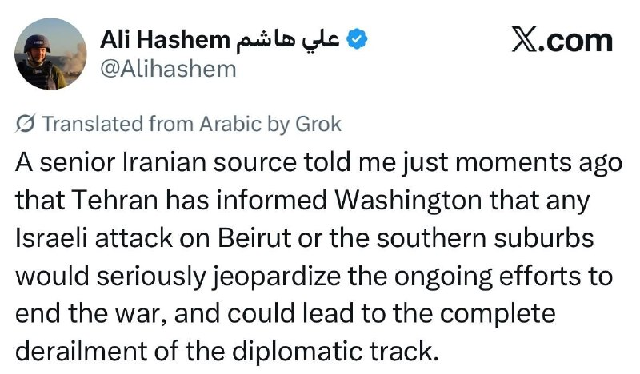

خبرنگار الجزیره:
ایران به آمریکا هشدار داده است
که هرگونه حمله اسرائیل به بیروت
یا حومه‌های جنوبی آن می‌تواند
مذاکرات جاری برای پایان دادن
به جنگ را به طور جدی
به خطر بیندازد!

## Persian_Trend_Official — post 14999

  <a href="https://t.me/persian_trend_official/14999" target="_blank">📎 Download file</a>

فایل صوتی لایو اول
نسخه کم حجم - 8.45 مگابایت

اتاق جنگ دوشنبه 4 خرداد | حمله گسترده اسرائیل به لبنان نشانه توافق با تهران ؟

📝 Nick

📌 @persian_trend_official
پرشین ترند | متفاوت‌ترین کانال نظامی

## RadioFarda — post 157552

  <a href="https://t.me/radiofarda/157552" target="_blank">📎 Download file</a>

📻بشنوید: سرخط خبرها با رادیوفردا، چهارم خرداد ۱۴۰۵‌

@RadioFarda

## RadioFarda — post 157551

🔸بنیامین نتانیاهو، نخست وزیر اسرائیل، روز دوشنبه خبر داد که دستور حملات تازه به جنوب لبنان در تلاش برای «خرد کردن» گروه حزب‌الله را صادر کرده است.

🔸ساعتی بعد خبرگزاری‌ها از چند حمله شدید اسرائیل به این منطقه خبر دادند.

🔸نتانیاهو در ویدئویی که در شبکه تلگرام منتشر شد خبر داد که خواستار «سرعت بیشتر دادن» به حملات ارتش اسرائیل شده است.

🔸او همچنین حزب‌الله را متهم کرد که با پهپاد نیروهای اسرائیلی را هدف گرفته است.

🔸صدور دستور حمله بیشتر به لبنان همزمان است با خواسته دو وزیر افراطی در کابینه اسرائیل که در همین روز خواستار تشدید حملات به جنوب لبنان و همین طور پایتخت، بیروت، شده بودند.

🔸حمله اسرائیل به این منطقه در حالی رخ می‌دهد که در سوی دیگر تهران و واشینگتن از جمله درباره پایان جنگ در لبنان مذاکره می‌کنند.

🔸حکومت ایران در هر دور از مذاکرات اخیر خود با آمریکا، پایان جنگ در لبنان را نیز خواستار شده است.

🔸حملات متقابل اسرائیل و حزب‌الله در حالی رخ می‌دهد که دو طرف بیش از یک ماه است که به طور اسمی در آتش‌بس به سر می‌برند.

@RadioFarda

## IranianMinds — post 20771

  

🔴پست جدید ترامپ:

اورانیوم غنی شده( همان گرد و غبار هسته‌ای) یا باید فورأ به ایالات متحده تحویل داده شود تا به امریکا منتقل شود و نابود گردد، یا ترجیحأ با همکاری و هماهنگی جمهوری اسلامی ایران در همان محل یا در یک مکان مورد قبول دیگر نابود گردد در حالیکه کمیسیون انرژی اتمی یا نهاد معادل آن، شاهد و ناظر این روند باشد.
پرزیدنت DJT

@IranianMinds

## IranianMinds — post 20770

  

🔴فعالیت سوخت‌رسان‌ها، الان

@IranianMinds

## IranianMinds — post 20769

یه جا زده فوری ترور ‌‌‌هدفمند در بابل

ی جا زده فوری تست بمب اتم در اصفهان

یکی زده قایق های تندرو سپاهو‌ زدن ۴ نفرم کشته شدن

یکی زده بمب اتم زدن رو تهران

فازتون چیه نمیفهمم

## IranianMinds — post 20768

🔴 خبرگزاری مهر :

شایعات فضای مجازی رو‌ باور نکنید منشا انفجار در بندرعباس هنوز مشخص نیست.

@IranianMinds

## IranianMinds — post 20766

دوباره صدا اومد بندرعباس؟

## IranianMinds — post 20765

🔴 حمید رسایی نماینده حرومی مجلس : اینکه بخوان اینترنت بین الملل رو وصل کنن کاملا غیرقانونیه و‌ پزشکیان اصلا نمیتونه همچین کاریو انجام بده و تواناییش رو نداره ، و اینکار فقط برای حواس پرتیه @IranianMinds

## IranianMinds — post 20764

🔴 تابناک : باند فرودگاه هدف حمله ی موشکی قرار گرفته. @IranianMinds

## IranianMinds — post 20763

ولی زود خوشحال نشید بخواد جنگ شه با خبر کتلت شدن سپاهیا بیدار میشید فقط یا بازم‌ مثل دفعه ی قبله یا خودشون ی گوهی خوردن

## IranianMinds — post 20762

🔴 خبرگزاری تابناک : باند فرودگاه بندرعباس هدف حمله قرار گرفت. @IranianMinds

## IranianMinds — post 20761

🔴 خبرگزاری تابناک :

باند فرودگاه بندرعباس هدف حمله قرار گرفت.

@IranianMinds

## IranianMinds — post 20760

🔴 ارتش اسرائیل :

از امروز عملیات «تیر آتش» رو برای نابودی کامل حزب الله در لبنان آغاز میکنیم!

@IranianMinds

## IranianMinds — post 20759

  

🔴 الجزیره :

احتمالا توافق ایران و آمریکا فردا اعلام بشه.

@IranianMinds

## IranianMinds — post 20758

🔴 بنیامین نتانیاهو :

دستور دارم حملات به لبنان برای نابودی حزب الله تشدید و قوی تر شود.

@IranianMinds

## IranianMinds — post 20757

چقد اتفاقی شبی که قرار بود فرداش نتا وصل شه صدای انفجار اومد

الان فردا میان میگن شرایط جنگیه‌ رفع محدودیت اینترنت فعلا کنسل

## IranianMinds — post 20756

🔴 ارتش اسرائیل :

داریم حزب الله رو پاره میکنیم امشب.

@IranianMinds

## IranianMinds — post 20755

🔴 در حال حاضر یک هواپیمای سوخت‌رسان KC-46A Pegasus متعلق به نیروی هوایی آمریکا بر فراز خلیج عمان در حال پرواز است.

@IranianMinds

## IranianMinds — post 20754

🔴 ایسنا :

دستور بازگشایی اینترنت احتمالا از فردا اجرا میشود.

@IranianMinds

## IranianMinds — post 20753

این صداهایی که میگن از بندرعباس میاد بعید بدونم خبری باشه چون اگر یادتون باشه ثانیه اولی که تهران رو زدن ۱۰۰ تا عکس و فیلم اومد
بندرعباسم شهر کوچیکیه اگر زده باشن باید کلی عکس و فیلم میومد
لابد فقط خنثی سازی بوده یا فعالیت پدافند

## IranianMinds — post 20752

🔴 احتمالاً ترامپ در ازای این تفاهم‌نامه موقت ۶۰ روزه به نتانیاهو آزادی عمل بیشتری در جبهه لبنان داده است زیرا اسرائیل در حال گسترش قابل توجه عملیات نظامی خود در لبنان است/کانال 12 اسرائیل

@IranianMinds

## IranianMinds — post 20751

آمریکای جهان‌خوار به ما که رسید شد گیاهخوار @IranianMinds

## BBCPersian — post 282041

⚡️گزارش‌ها از شنیده شدن صدای انفجارهایی در بندرعباس و حاشیه خلیج فارس

چند نفر از مخاطبان کانال خبری وحید آنلاین که از بندرعباس پیغام فرستاده‌اند از شنیدن صدای دو انفجار و فعال شدن پدافندهای ضدهوایی در حدود ساعت ۱۱:۴۰ دوشنبه شب به وقت محلی خبر داده‌اند.

خبرگزاری فارس هم با اشاره به چنین گزارش‌هایی نوشته «هنوز محل دقیق و منشأ این صداها مشخص نیست».

به گزارش فارس گزارش‌های مشابهی هم از حوالی «سیریک و جاسک» در حاشیه خلیج فارس مخابره شده است.

https://bbc.in/4tYLaei
@BBCPersian

## BBCPersian — post 282040

  

ارتش اسرائیل می‌گوید ساعتی پس از آنکه بنیامین نتانیاهو، نخست‌وزیر اسرائیل اعلام کرد اسرائیل در حال جنگ با حزب‌الله است، موجی از حملات هوایی را در سراسر لبنان آغاز کرده است.

از جمله مناطقی که هدف این حملات قرار گرفته است «مواضع حزب‌الله در دره بقاع در شرق لبنان» اعلام شده است.

آقای نتانیاهو روز دوشنبه اعلام کرد که به ارتش دستور داده حملات خود در لبنان را تشدید کند تا حزب‌الله را «در هم بکوبد.»

او این گروه را به هدف قرار دادن نیروهای اسرائیلی با حملات پهپادی متهم کرد.

نخست‌وزیر اسرائیل گفت ارتش این کشور «ضربات سنگینی» به حزب‌الله وارد خواهد کرد.

او افزود که اسرائیل «در حال جنگ» با این گروه است و در هفته‌های اخیر ۶۰۰ عضو حزب‌الله را کشته است.

آقای نتانیاهو گفت: «دامنه حملات خود علیه حزب‌الله را افزایش خواهیم داد و متوقف نخواهیم شد.»

حزب‌الله در چند هفته گذشته به حملات پهپادی خود به مواضع ارتش اسرائیل ادامه داده است.

📷Reuters
https://bbc.in/4tYLaei
@BBCPersian

## BBCPersian — post 282039

الجزیره به نقل از یک منبع آگاه می‌گوید که میانجی‌گری قطر«به تفاهم با آمریکا درباره دارایی‌های مالی مسدودشده ایران منجر شد»

بر اساس این گزارش مذاکرات میان هیئت عالی‌رتبه ایرانی و مقامات در دوحه اعلام کرد که میانجی‌گری قطر به حصول یک تفاهم با آمریکا درباره دارایی‌های مالی مسدود شده ایران منجر شده است.

به گفته این منبع «این توافق که از اهمیت بالایی برای ایران برخوردار بوده، زمینه‌ساز پیشرفت قابل توجهی در مذاکرات شده است و احتمال زیادی وجود دارد که توافقی میان آمریکا و ایران فردا اعلام شود.»

محمدباقر قالیباف، رئیس مجلس ایران همراه با عباس عاقچی وزیر خارجه و عبدالناصر همتی، رئیس کل بانک مرکزی برای مذاکره با مقام های قطری، به دوحه رفته‌اند.

تلویزیون الجزیره به نقل از یک دیپلمات منطقه‌ای که نامی از او نبرده گزارش داد که «تمرکز سفر گروه ایرانی به دوحه بر مسائل مربوط به تنگه هرمز و اورانیوم غنی شده با خلوص بالا است.»

خبرگزاری ایرنا گفته است که هدف اصلی این سفر «سنجش اراده» آمریکا درباره مسائل مالی و آزاد کردن دارایی های مسدود شده ایران است.

همزمان محمد مرندی که رسانه‌های ایران از او به عنوان یک فرد نزدیک به گروه مذاکره کننده جمهوری اسلامی ایران یاد می کنند به تلویزیون ایران گفته است که قطر قرار است دارایی‌های مسدود شده ایران را که در حدود شش میلیارد دلار است به ایران بدهد و سپس معادل این مبلغ را از آمریکا بگیرید.

https://bbc.in/4f2VsGk
@BBCPersian

## BBCPersian — post 282038

  <a href="telegram/content/BBCPersian_282038_1779747846.mp4" target="_blank">🎬 Download video</a>

آخرین خبرهای مهم روز دوشنبه ۴ خرداد ماه ۱۴۰۵ از تلویزیون بی‌بی‌سی فارسی

https://bbc.in/42XnQmy
https://bbc.in/3WtLd3k
@BBCPersian

## BBCPersian — post 282037

  <a href="https://t.me/bbcpersian/282037" target="_blank">📎 Download file</a>

پادکست برنامه شصت دقیقه روز دوشنبه ۴ خرداد ۱۴۰۵
این نسخه رادیویی برنامه شصت دقیقه تلویزیون فارسی بی‌بی‌سی است که هرشب بعد از پخش، با حجم کم از اپلیکیشن‌هایپادگیر و صفحه تلگرام بی‌بی‌سی فارسی در دسترس است.
با هشتگ BBCPersianRadio# با ما در ارتباط باشید

## BBCPersian — post 282036

  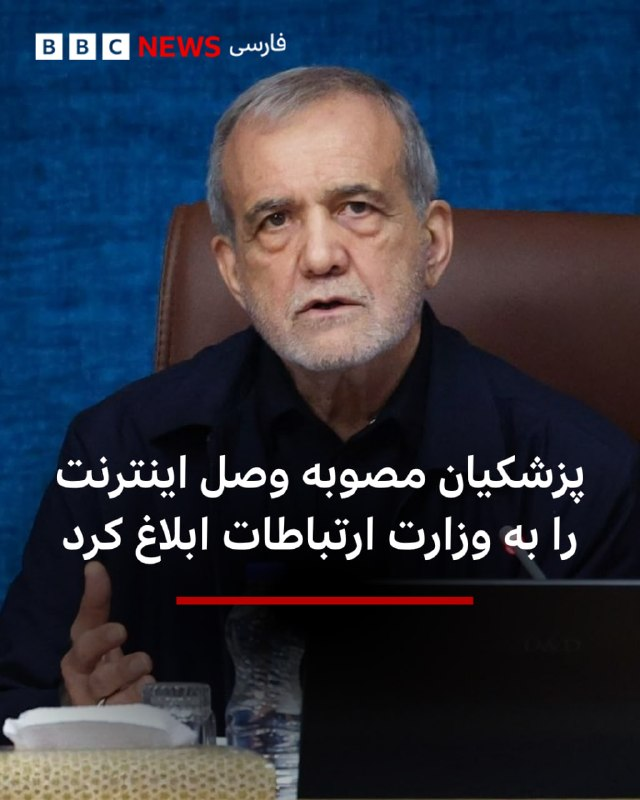

‌
مصوبه وصل اینترنت ایران به وضعیت قبل از دی‌ ۱۴۰۴، از سوی مسعود پزشکیان، رئیس‌جمهور به وزارت ارتباطات «ابلاغ» شد.

خبرگزاری ایسنا گزارش کرده است که احسان چیت‌ساز، معاون وزیر ارتباطات، دریافت این ابلاغیه را تایید کرده و گفته است: «این اقدام گامی در جهت بازگرداندن حق مردم و ستون اعتماد عمومی» است.

بر اساس این گزارش در جلسه ستاد ویژه ساماندهی فضای مجازی به ریاست محمدرضا عارف، معاون اول رئیس‌جمهور، «مصوبات مهمی درباره وضعیت اینترنت کشور تصویب شد.»

خبرگزاری فارس گزارش داده بود که در این جلسه «طرح اتصال دوباره اینترنت بین‌‌الملل با ۹ رای موافق تصویب و برای تایید نهایی به دفتر مسعود پزشکیان ارسال شد.»

رفع فیلترینگ از وعده‌های انتخاباتی دولت پزشکیان بود که محقق نشد و از شروع جنگ اخیر اینترنت به روی شهروندان در ایران جز برای کسانی که «اینترنت پرو»، سیم‌کارت «سفید»، یا دسترسی به استارلینک داشته‌اند مسدود بوده است.

نت‌بلاکس که بر وضعیت اینترنت در جهان نظارت می‌کند دوشنبه گزارش دادکه قطع متوالی اینترنت در ایران وارد هشتاد و هفتمین روز شده است.

📷پایگاه اطلاع‌رسانی دولت/ پاد
https://bbc.in/4f2VsGk
@BBCPersian

## Dirty_Kids — post 390201

حیف شد شهید تنگسیری نیست. اگه الان بود، حسابی خط و نشون میکشید و دوباره بگا میرفت

@Dirty_Kids 👻

## Dirty_Kids — post 390200

‏تا این لحظه ۴ سپاهی کشته شدن.
خوبه ولی کافی نیست. بجنبین که خیلی عقبیم بخدا.

@Dirty_Kids 👻

## Dirty_Kids — post 390199

  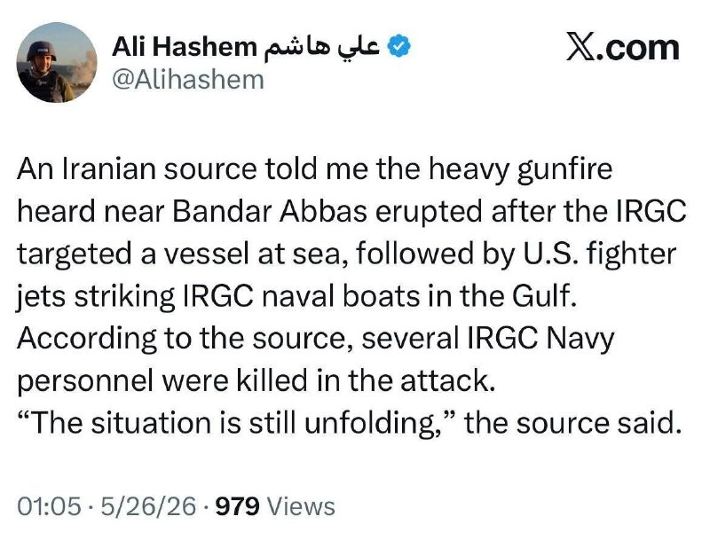

خبرنگار الجزیره نوشت ابتدا سپاه پاسداران به یک کشتی در خلیج فارس حمله کرده و سپس جنگنده‌های آمریکایی قایق‌های نیروی دریایی سپاه را هدف حمله قرار دادند و چند نفرشان را کشتند.

@Dirty_Kids 👻

## Dirty_Kids — post 390198

🔴 منابع عبری :
عراقچی و قالیباف در دوحه در امنیت نخواهند بود.*

@Dirty_Kids 👻

## Dirty_Kids — post 390197

  

پست جدید ترامپ شیر خدا در خصوص سرنوشت اورانیوم رژیم روافض قحبه‌زاده:

اورانیوم غنی‌شده (گرد و غبار هسته‌ای) یا باید فوراً به ایالات متحده تحویل داده بشه تا در آمریکا نابود شه،

یا اینکه ترجیحاً و در همکاری و هماهنگی با رژیم قحبه‌زاده‌ی رافضی در همون محل یا یک جای قابل‌قبول دیگه نابود شه؛

اون هم در حالی که سازمان انرژی اتمی یا معادل اون شاهد این فرآیند و رویداد نابودیش باشه.

از توجهتون به این موضوع ممنونم.
پرزیدنت DJT

@Dirty_Kids 👻

## Dirty_Kids — post 390196

🔴 صداوسیما تایید کرد شامگاه گذشته چند شناور در جنوب جزیره لارک هدف حمله جنگنده‌های آمریکا و اسرائیل قرار گرفته‌اند.

بر اساس این گزارش، منابع محلی از کشته‌شدن چند نفر در این حمله خبر داده‌اند، اما شمار دقیق تلفات، هویت کشته‌شدگان و نوع شناورهای هدف قرارگرفته هنوز به‌طور رسمی اعلام نشده است. جزیره لارک که در نزدیکی تنگه هرمز قرار دارد، طی هفته‌های اخیر به یکی از حساس‌ترین نقاط تنش و درگیری در خلیج فارس تبدیل شده و حمله شب گذشته، سطح تنش نظامی در منطقه را وارد مرحله تازه‌ای کرده است.

@Dirty_Kids 👻

## Dirty_Kids — post 390195

  <a href="telegram/content/Dirty_Kids_390195_1779747850.mp4" target="_blank">🎬 Download video</a>

هم‌اکنون آسمان اربیل عراق

@Dirty_Kids 👻

## Dirty_Kids — post 390194

شنوندگان عزیز توجه فرمایید.
شنوندگان عزیز توجه فرمایید.

تنگه‌ی هرمز، تنگه‌ی خون

آزاد شد.

[فاکس نیوز و سی‌ان‌ان]

@Dirty_Kids 👻

## Dirty_Kids — post 390193

گروهک تروریستی «الجیش الکانفیگ‌فروش» مسئولیت حمله به بندرعباس رو گردن گرفت.

@Dirty_Kids 👻

## Dirty_Kids — post 390192

غیررسمی:
جنگنده‌های آمریکا به دو قایق تندروی سپاه حمله کردن که باعث کشته شدن 4 نفر شد.

@Dirty_Kids 👻

## Dirty_Kids — post 390191

  

زیرنویس صداوسیما و تایید صدای انفجار در بندرعباس

@Dirty_Kids 👻

## Dirty_Kids — post 390190

  <a href="telegram/content/Dirty_Kids_390190_1779747852.mp4" target="_blank">🎬 Download video</a>

هم‌اکنون بندرعباس

@Dirty_Kids 👻

## Dirty_Kids — post 390189

تا الان شک داشتم جنگ شده یا نه که یادم اومد امروز عراقچی برای مذاکرات رفته بود قطر.

قدرت مذاکره :))

@Dirty_Kids 👻

## Dirty_Kids — post 390188

  <a href="telegram/content/Dirty_Kids_390188_1779747852.mp4" target="_blank">🎬 Download video</a>

مهر: اوضاع شهر، کاملاً تحت کنترل است

@Dirty_Kids 👻

## Dirty_Kids — post 390187

🔻بابلسر صدای انفجار

🔻اصفهان صدای انفجار

@Dirty_Kids 👻

## Dirty_Kids — post 390186

ظاهرا حملات آمریکایی به قایق های سپاه کشته و زخمی زیادی دارد/

@Dirty_Kids 👻

## Dirty_Kids — post 390185

🔴 خبرگزاری فارس :
دقایقی پیش مردم تو بندرعباس و حوالی خلیج فارس صدای چند انفجار شنیدن؛ هنوز محل دقیق و منشأ این صداها مشخص نیست.

@Dirty_Kids 👻

## Dirty_Kids — post 390183

  <a href="telegram/content/Dirty_Kids_390183_1779747853.mp4" target="_blank">🎬 Download video</a>

حالا که دارن وصل میکنن اگه برنامه‌ای برای مصرف کانفیگ گروناتون ندارید میتونید از این چالش جدیدا ببینید

کانفیگ‌ بزنیم به کص‌گاو کونمون نسوزه

اعتباریم نیست خوب فکر کنید

@Dirty_Kids 👻

## Dirty_Kids — post 390182

سرانه مصرف سالانه لبنیات در ایران: ۴۰ کیلوگرم
میانگین کشورهای جهان: ۱۸۰ کیلوگرم
کشورهای پیشرفته: ۳۶۰ کیلوگرم.

نتیجه: پوکی‌استخوان، پوسیدگی‌دندان، بی‌خوابی و اضطراب، کوتاهی‌قد، سوءتغذیه و اختلال‌رشد.

تنها رژیم چینجی که ترامپ انجام داد رژیم غذایی مردم بود

@Dirty_Kids 👻

## Hranews — post 113165

گزارشی از تجمع اعتراضی رانندگان استیجاری در تهران

❗️
❗️
❗️
❗️
❗️– امروز دوشنبه ۴ خردادماه، جمعی از رانندگان استیجاری از استان‌های مختلف برای سومین روز متوالی در مقابل ساختمان نهاد ریاست جمهوری در تهران، #تجمع_اعتراضی برگزار کردند.

ادامه مطلب

↘️
@hranews_bot تماس ✉️ - @Hranews کانال هرانا 🆑

## Hranews — post 113164

رضایت اولیای دم؛ ۴ زندانی از اعدام رهایی یافتند

❗️
❗️
❗️
❗️
❗️– چهار زندانی در رشت، همدان، تایباد و استان آذربایجان غربی که پیشتر بابت اتهام قتل در پرونده‌های مجزا به #اعدام محکوم شده بودند، با اعلام رضایت اولیای دم از مجازات مرگ رهایی یافتند.

ادامه مطلب

↘️
@hranews_bot تماس ✉️ - @Hranews کانال هرانا 🆑

## Hranews — post 113163

  

حسن پژوم و سینا کراچی از زندان وکیل آباد مشهد آزاد شدند

❗️
❗️
❗️
❗️
❗️– حسن پژوم و سینا کراچی، دو شهروند ساکن سبزوار، در تاریخ ۲۳ اردیبهشت ماه با تودیع وثیقه از زندان وکیل آباد مشهد آزاد شدند. این دو شهروند در آذرماه سال گذشته در سبزوار بازداشت شده بودند.

به گزارش خبرگزاری هرانا، ارگان خبری مجموعه فعالان حقوق بشر در ایران، حسن پژوم و سینا کراچی آزاد شدند.

بر اساس اطلاعات دریافتی هرانا، آزادی آقایان پژوم و کراچی در تاریخ ۲۳ اردیبهشت ماه، با تودیع وثیقه از زندان وکیل آباد مشهد صورت گرفته است.

ادامه مطلب

#حسن_پژوم #سینا_کراچی

↘️
@hranews_bot تماس ✉️ - @Hranews کانال هرانا 🆑

## Hranews — post 113162

فقدان ایمنی کار؛ مرگ و مصدومیت ۳ کارگر در یزد و پاکدشت

❗️
❗️
❗️
❗️
❗️– در سایه فقدان ایمنی محیط و شرایط نامناسب کار، روز جاری، دو کارگر در پاکدشت در پی حادثه آتش‌سوزی مصدوم شدند. از سوی دیگر، روز یکشنبه ۳ خردادماه، یک #کارگر در یزد، حین انجام کار بر اثر برق‌گرفتگی جان خود را از دست داد.

ادامه مطلب

↘️
@hranews_bot تماس ✉️ - @Hranews کانال هرانا 🆑

## Hranews — post 113161

سه شهروند در مهاباد بازداشت شدند

❗️
❗️
❗️
❗️
❗️– منصور عباسی، احد خیری و واحد خیری شهروندان اهل مهاباد، امروز دوشنبه ۴ خردادماه، توسط نیروهای امنیتی بازداشت و به مکان نامعلومی منتقل شدند.

ادامه مطلب

#منصور_عباسی #احد_خیری #واحد_خیری

↘️
@hranews_bot تماس ✉️ - @Hranews کانال هرانا 🆑

## alonews — post 122698

  

داش فرامرز کف قیمت ایران وصلت می‌کنه حاجی 🤙

فی ۱ گیگ = ۱۵۰ت
فی ۲ گیگ = ۳۰۰ت
فی ۳ گیگ = ۴۵۰ت
🧡فی ۵ گیگ = ۷۵۰ت🧡
فی ۱۰ گیگ = قابلتونو نداره ۱٫۵۰۰

ایکی‌ثانیه تو جیباته جون داداش👇
@VPNFaraMarzBot @VPNFaraMarzBot
@VPNFaraMarzBot @VPNFaraMarzBot

## alonews — post 122697

  <a href="telegram/content/alonews_122697_1779747855.webm" target="_blank">🎬 Download video</a>

👈پدافند هوایی ایران سه پهپاد آمریکایی را در آسمان بندرعباس سرنگون کرد، از جمله یک پهپاد ام‌ویو-۹ای "ریپر".

✅ @AloNews خبر جنگ

## alonews — post 122696

  <a href="telegram/content/alonews_122696_1779747855.webm" target="_blank">🎬 Download video</a>

👈ترامپ هم اکنون: اورانیوم غنی‌شده (گرد هسته‌ای!) یا بلافاصله به ایالات متحده تحویل داده می‌شود تا به کشور بازگردانده شده و نابود شود یا ترجیحاً، با همکاری و هماهنگی جمهوری اسلامی ایران، در محل یا در مکان دیگری که مورد قبول باشد، با حضور کمیسیون انرژی اتمی…

## alonews — post 122694

  <a href="telegram/content/alonews_122694_1779747856.webm" target="_blank">🎬 Download video</a>

👈در شرایطی که همه فکر میکنیم به فنا رفتیم امروز در ایران، تمام ظرفیت فروش لکسوس LX600 با قیمت 110 میلیارد تومن توی کمتر از 10 دقیقه به پایان رسید.

✅ @AloNews خبر جنگ

## alonews — post 122693

  <a href="telegram/content/alonews_122693_1779747856.webm" target="_blank">🎬 Download video</a>

👈بلوبانک قطع شد

✅ @AloNews خبر جنگ

## alonews — post 122692

  <a href="telegram/content/alonews_122692_1779747856.webm" target="_blank">🎬 Download video</a>

👈رسانه نزدیک به محور مقاومت: ایران احتمالا با انتقال اورانیوم به خارج مخالفت کرده است

✅ @AloNews خبر جنگ

## alonews — post 122691

  <a href="telegram/content/alonews_122691_1779747856.webm" target="_blank">🎬 Download video</a>

👈ترامپ هم اکنون:
اورانیوم غنی‌شده (گرد هسته‌ای!) یا بلافاصله به ایالات متحده تحویل داده می‌شود تا به کشور بازگردانده شده و نابود شود یا ترجیحاً، با همکاری و هماهنگی جمهوری اسلامی ایران، در محل یا در مکان دیگری که مورد قبول باشد، با حضور کمیسیون انرژی اتمی یا معادل آن، این فرآیند و رویداد انجام و نابود گردد

✅ @AloNews خبر جنگ

## alonews — post 122690

  <a href="telegram/content/alonews_122690_1779747857.webm" target="_blank">🎬 Download video</a>

👈وضعیت فعلی 
✅ @AloNews خبر جنگ

## alonews — post 122689

  <a href="telegram/content/alonews_122689_1779747857.webm" target="_blank">🎬 Download video</a>

👈جنگنده‌های آمریکایی یا مشترک آمریکا و اسرائیل دو قایق تندرو نیروی دریایی سپاه پاسداران را در نزدیکی جزیره لارک در تنگه هرمز هدف قرار دادند که منجر به کشته شدن حداقل ۴ پرسنل ایرانی شد.

🔴این حمله تقریباً ۴۸ ساعت قبل از افشای گزارش رخ داده است.

🔴رسانه‌های ایرانی تحت فشار بودند تا از انتشار این خبر خودداری کنند تا مبادا مذاکرات جاری آتش‌بس مختل شود.

✅ @AloNews خبر جنگ

## alonews — post 122688

  <a href="telegram/content/alonews_122688_1779747857.webm" target="_blank">🎬 Download video</a>

🔴فووووووووووری/گزارش‌های اولیه از پرتاب موشک‌های ضد کشتی توسط نیروی دریایی سپاه پاسداران به سمت ناوهای جنگی آمریکایی در خلیج عمان

✅ @AloNews خبر جنگ

## alonews — post 122687

  <a href="telegram/content/alonews_122687_1779747857.webm" target="_blank">🎬 Download video</a>

👈نام سه تن از کشته شدگان نیروی دریایی سپاه

🔴عباس اسلامی

🔴قدرت زرنگاری

🔴عبدالرضا گلزاری

تاکنون باقی تلفات اعلام نشده

✅ @AloNews خبر جنگ

## alonews — post 122686

گروهک تروریستی «الجیش الکانفیگ‌» مسئولیت حمله به بندرعباس رو گردن گرفت. [@AloTweet]

## alonews — post 122685

  <a href="telegram/content/alonews_122685_1779747857.webm" target="_blank">🎬 Download video</a>

👈کانال ۱۴اسرائیل: چهار نیروی سپاه در حملات آمریکا به قایق‌ها کشته شدن

✅ @AloNews خبر جنگ

## alonews — post 122684

  <a href="telegram/content/alonews_122684_1779747858.webm" target="_blank">🎬 Download video</a>

👈طبق برخی گزارشات دو قایق تندرو سپاه هدف حمله جنگنده آمریکایی قرار گرفتن 
✅ @AloNews خبر جنگ

## alonews — post 122683

  <a href="telegram/content/alonews_122683_1779747858.webm" target="_blank">🎬 Download video</a>

👈هم اکنون پرواز دو فروند هواپیما سوخترسان آمریکایی در آسمان خلیج فارس

✅ @AloNews خبر جنگ

## alonews — post 122682

  <a href="telegram/content/alonews_122682_1779747858.webm" target="_blank">🎬 Download video</a>

🔴فوووووووووووووووووووووووووووری

## alonews — post 122681

🔴فوووووووووووووووووووووووووووری

## alonews — post 122680

  <a href="telegram/content/alonews_122680_1779747858.webm" target="_blank">🎬 Download video</a>

💢فوری/پرواز جنگنده‌های آمریکایی در مرز ایران 
🚨 @AkhbareFouri

## alonews — post 122679

  <a href="telegram/content/alonews_122679_1779747859.webm" target="_blank">🎬 Download video</a>

👈طبق برخی گزارشات دو قایق تندرو سپاه هدف حمله جنگنده آمریکایی قرار گرفتن

✅ @AloNews خبر جنگ

---
📅 بروزرسانی: 1405/03/04 21:53
---

## VahidOOnLine — post 242160

  

ستار هاشمی، وزیر ارتباطات، با اشاره به «تصویب و آغاز اجرای بازگشایی اینترنت» گفت آنچه در حال وقوع است «پیام‌آور پایداری، اعتماد ملی و ثبات کشور» است.

او افزود: «پس از ابلاغ مصوبه به وزارت ارتباطات، اقدامات فنی و عملیاتی برای بازگرداندن اینترنت به مدار عادی آغاز خواهد شد.»
‌🏁 🇬🇧 IranintlTV

🤖 @VahidOOnLine

## VahidOOnLine — post 242159

  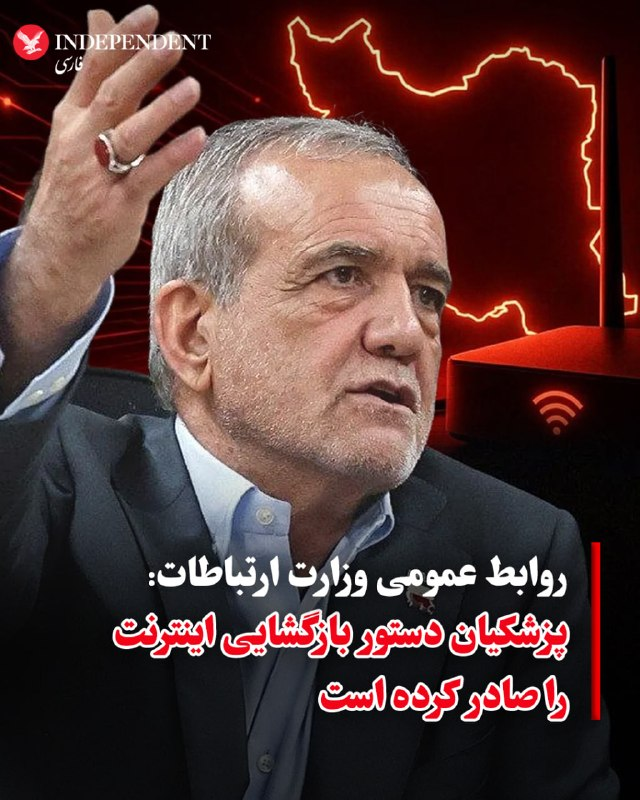

♦️رسانه‌های دولتی ایران، روز دوشنبه چهارم اردیبهشت ماه به نقل از رئیس روابط عمومی وزارت ارتباطات گزارش دادند مسعود پزشکیان، دستور بازگشایی دسترسی به اینترنت بین‌المللی را پس از نزدیک به ۹۰ روز قطع گسترده اینترنت صادر کرده است.
پایگاه اطلاع‌رسانی دولت، پیش‌تر گزارش کرده بود، در جلسه «ستاد ویژه ساماندهی فضای مجازی، مصوبات مهمی درباره وضعیت اینترنت کشور تصویب شد که پس از تایید نهایی رئیس‌جمهور پزشکیان، برای اجرا به وزارت ارتباطات و فناوری اطلاعات ابلاغ می‌شود.»
در همین راستا، خبرگزاری فارس نیز گزارش کرد، «برقراری اتصال اینترنت بین‌الملل» با ۹ رای موافق و سه رای مخالف تصویب شده و برای تایید به دفتر رئیس‌جمهور ارسال شده است.
اگرچه جمهوری اسلامی در مقاطع مختلف مانند اعتراضات سراسری آبان ۹۸ دست به قطع گسترده اینترنت زده بود، اما خاموشی دیجیتال در ایران از ۱۸ دی‌ماه سال گذشته و در واکنش به اعتراضات سراسری وارد مرحله جدید شد. اینترنت ایران از بهمن‌ماه تا حدودی به حالت عادی بازگشت، اما پس از آغاز جنگ ایران با آمریکا و اسرائیل رکورد خاموشی اجباری دیجیتال شهروندان در جهان شکسته شد.
‌🇸🇦 Indypersian

🤖 @VahidOOnLine

## VahidOOnLine — post 242158

  

رسانه‌های ایران گزارش دادند مسعود پزشکیان دستور بازگشایی اینترنت بین‌الملل را ابلاغ کرده است.
پزشکیان گفت: «راه دشواری پیمودیم تا حق مردم را به آنها بازگردانیم .»
پیش‌تر ستاد راهبری و ساماندهی فضای مجازی، به ریاست محمدرضا عارف، معاون اول مسعود پزشکیان، تشکیل جلسه داد و بازگشت اینترنت به وضعیت پیش از دی‌ماه ۱۴۰۴ را تصویب کرد.
‌🏁 🇬🇧 IranintlTV

🤖 @VahidOOnLine

## VahidOOnLine — post 242157

  

العربیه به نقل از منابع آگاه گزارش داد پیش‌نویس یک توافق میان واشینگتن و تهران در حال بررسی است. بر اساس این پیش‌نویس، تنگه هرمز بدون دریافت عوارض بازگشایی و مین‌های دریایی پاکسازی می‌شود و به ایران اجازه فروش و صادرات نفت داده خواهد شد.

در این پیش‌نویس دوره‌ای ۳۰ روزه برای ازسرگیری کامل کشتیرانی در تنگه هرمز در نظر گرفته شده و همچنین یک بازه ۶۰ روزه برای مذاکرات هسته‌ای تعیین شده است.

بر اساس این گزارش، آتش‌بس در همه جبهه‌ها از جمله لبنان برقرار خواهد ماند و برای ۶۰ روز تمدید می‌شود و امکان تمدید دوباره آن نیز وجود دارد. آمریکا نیز متعهد شده محدودیت‌ها بر بنادر جنوب ایران را کاهش دهد و بخشی از دارایی‌های مسدودشده ایران بر اساس سازوکاری مشخص آزاد شود.
‌🏁 🇬🇧 IranintlTV

🤖 @VahidOOnLine

## VahidOOnLine — post 242156

  

یدالله جوانی، معاون سیاسی سپاه پاسداران، گفت «هادیان سیاسی» باید «روایت پیروزی ملت ایران» را برای جامعه بازگو کنند و افزود دشمن پس از شکست در میدان، تلاش می‌کند در جامعه «اختلاف، تردید و سستی» ایجاد کند.

او گفت: «اگر مجاهدت در میدان نباشد، دشمن شکست نمی‌خورد.»

معاون سیاسی سپاه پاسداران افزود: «دشمنی که در میدان شکست خورده است تلاش می‌کند در جامعه اختلاف، تردید، ابهام و سستی ایجاد کند.»
‌🏁 🇬🇧 IranintlTV

🤖 @VahidOOnLine

## VahidOOnLine — post 242155

  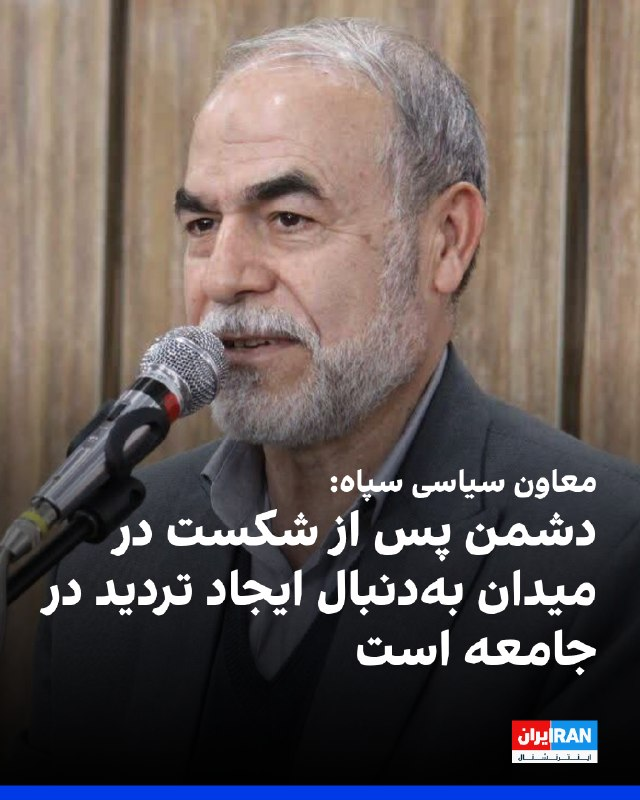

یدالله جوانی، معاون سیاسی سپاه پاسداران، گفت «هادیان سیاسی» باید «روایت پیروزی ملت ایران» را برای جامعه بازگو کنند و افزود دشمن پس از شکست در میدان، تلاش می‌کند در جامعه «اختلاف، تردید و سستی» ایجاد کند.

او گفت: «اگر مجاهدت در میدان نباشد، دشمن شکست نمی‌خورد.»

معاون سیاسی سپاه پاسداران افزود: «دشمنی که در میدان شکست خورده است تلاش می‌کند در جامعه اختلاف، تردید، ابهام و سستی ایجاد کند.»
‌🏁 🇬🇧 IranintlTV

🤖 @VahidOOnLine

## VahidOOnLine — post 242154

  

یدالله جوانی، معاون سیاسی سپاه پاسداران، گفت «هادیان سیاسی» باید «روایت پیروزی ملت ایران» را برای جامعه بازگو کنند و افزود دشمن پس از شکست در میدان، تلاش می‌کند در جامعه «اختلاف، تردید و سستی» ایجاد کند.

او گفت: «اگر مجاهدت در میدان نباشد، دشمن شکست نمی‌خورد.»

معاون سیاسی سپاه پاسداران افزود: «دشمنی که در میدان شکست خورده است تلاش می‌کند در جامعه اختلاف، تردید، ابهام و سستی ایجاد کند.»
‌🏁 🇬🇧 IranintlTV

🤖 @VahidOOnLine

## VahidOOnLine — post 242153

  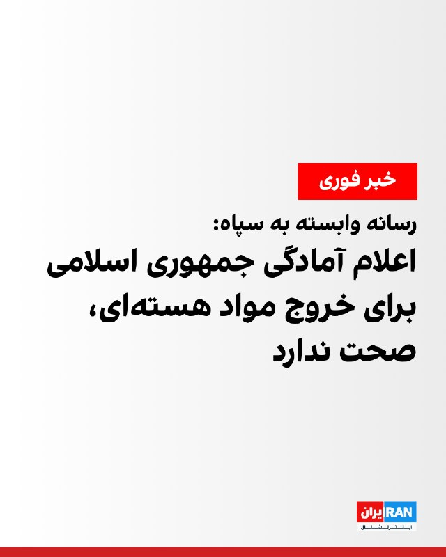

خبرگزاری تسنیم، وابسته به سپاه پاسداران، نوشت که اخبار منتشرشده از سوی شبکه الحدث مبنی بر اعلام آمادگی جمهوری اسلامی برای خروج مواد هسته‌ای «کذب» است و در متن تفاهم‌نامه‌ای که تا امروز وجود دارد، هیچ جمله‌ای مبنی بر اعلام آمادگی برای خروج مواد هسته‌ای وجود ندارد.
‌🏁 🇬🇧 IranintlTV

🤖 @VahidOOnLine

## VahidOOnLine — post 242152

  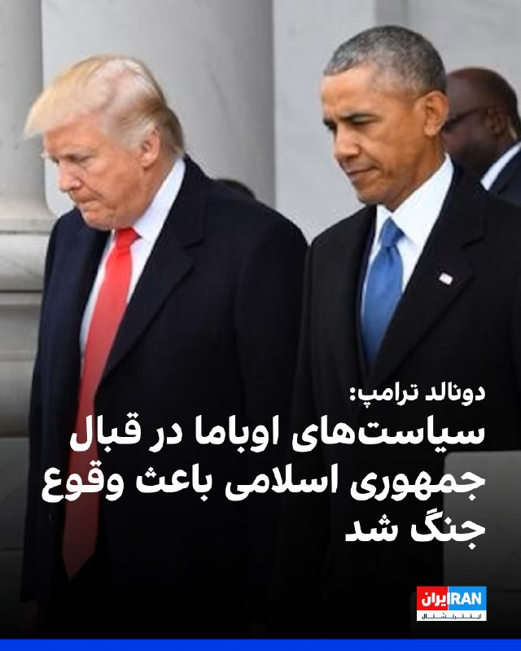

دونالد ترامپ، رییس‌جمهوری آمریکا، در شبکه اجتماعی تروث‌سوشال با انتشار تصویری که با هوش مصنوعی ساخته شده، دوره اوباما و بایدن را با دوران ریاست‌جمهوری خود در مذاکرات با جمهوری اسلامی مقایسه کرد

او نوشت در دولت‌های پیشین، روسای‌جمهور آمریکا خواهان مذاکره بودند و تهران تهدید به اقدام نظامی می‌کرد، اما این بار او جمهوری اسلامی را تهدید کرد و آن‌ها به مذاکره تن دادند.

ترامپ همچنین با انتشار تصویری ساخته‌شده با هوش مصنوعی از باراک اوباما در کنار یک پالت پر از پول، نوشت سیاست‌های اوباما در قبال جمهوری اسلامی باعث وقوع جنگ شده است.
‌🏁 🇬🇧 IranintlTV

🤖 @VahidOOnLine

## VahidOOnLine — post 242151

  

♦️محمد جمالیان، عضو کمیسیون بهداشت مجلس شورای اسلامی،  روز دوشنبه چهارم خرداد در گفتگویی با رسانه‌ها اعلام کرد بازگشت قیمت دارو به نرخ‌های پیش از افزایش اخیر «بعید» است.
به گفته این نمایند مجلس، افزایش هزینه مواد اولیه، بسته‌بندی و تولید، دلیل ادامه گرانی داروهاست.
جمالیان پیشتر نیز در گفتگو با خبرگزاری ایلنا با بیان اینکه افزایش قیمت دارو یک ضرورت محسوب می‌شود، گفته بود مردم باید میان «گرانی دارو» و «نبود دارو» یکی را انتخاب کنند.
‌🇸🇦 Indypersian

🤖 @VahidOOnLine

## VahidOOnLine — post 242150

  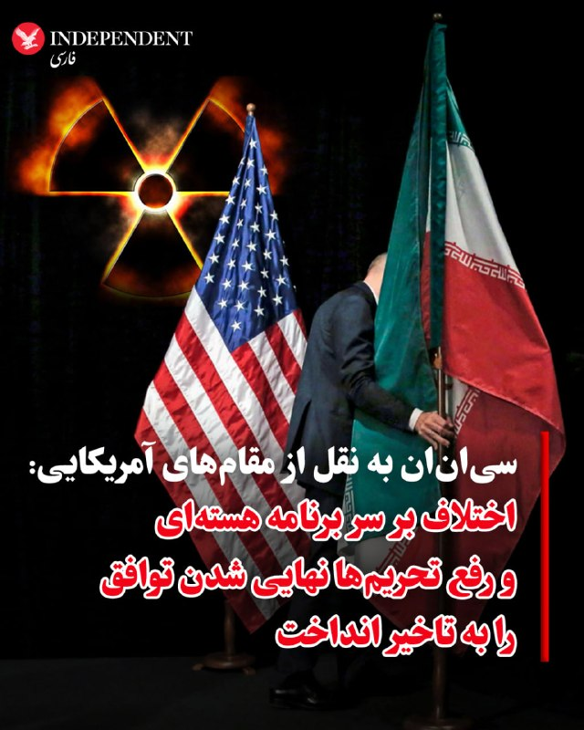

♦️مقام‌های آمریکایی به سی‌ان‌ان گفته‌اند، اختلاف‌ها بر سر نحوه پرداختن به برنامه هسته‌ای ایران و لغو تحریم‌ها، نهایی شدن توافق برای پایان جنگ را به تاخیر انداخته است.
شبکه خبری سی‌ان‌ان، روز دوشنبه چهارم خرداد ماه به نقل از یک مقام آمریکایی گزارش کرد، سفر اعضای ارشد تیم مذاکره کننده ایرانی در قطر در روز دوشنبه، نشانه‌ای مثبت ارزیابی می‌شود و نقش میانجی‌گرانه قطر همچنان اهمیت دارد.
سی‌ان‌ان با گزارش آنکه واشنگتن به‌دنبال دریافت تضمین‌های قطعی از تهران درباره کنار گذاشتن ذخایر اورانیوم با غنای بالا و صرف‌نظر کردن از دستیابی به سلاح هسته‌ای است، به نقل از یک مقام آمریکایی نوشت: «تهران به‌صورت اصولی با این موارد موافقت کرده است.»
در همین حال، سخنگوی وزارت خارجه ایران روز دوشنبه اعلام کرد، جمهوری اسلامی در مقطع کنونی درباره جزئیات برنامه هسته‌ای گفتگو نمی‌کند و این موضوع را به دورهای بعدی مذاکرات موکول کرده است.
به گزارش سی‌ان‌ان، تهران در مقابل خواستار دریافت تضمین‌هایی درباره رفع تحریم‌ها و آزادسازی دارایی‌های بلوکه‌شده برای کمک به اقتصاد آسیب‌دیده خود شده است.
‌🇸🇦 Indypersian

🤖 @VahidOOnLine

## VahidOOnLine — post 242149

  

♦️احمد دنیا مالی: فیفا تضمین داده بازیکنان تیم ملی ایران ویزای آمریکا را دریافت کنند
احمد دنیامالی، وزیر ورزش و جوانان ایران روز دوشنبه اعلام کرد فیفا به تهران اطمینان داده همه بازیکنان تیم ملی فوتبال ایران برای حضور در جام جهانی ۲۰۲۶ ویزای آمریکا دریافت خواهند کرد.

وزیر ورزش ایران، به خبرگزاری ایسنا گفت: «رئیس فیفا به ما قول داده که همه بازیکنان ویزا دریافت کنند و دلیلی وجود ندارد که بازیکنان ما ویزا نگیرند.»
دنیامالی با تاکید بر آنکه کشورهای میزبان جام جهانی موظف‌اند برای همه تیم‌های شرکت‌کننده، از جمله بازیکنان و اعضای کادر فنی، ویزا صادر کنند، افزود تیم ملی ایران قرار است در مکزیک ویزاهای چندبار ورود آمریکا را دریافت کند.

رئیس‌جمهوری مکزیک، نیز روز دوشنبه گفت کشورش به تیم ملی فوتبال ایران اجازه خواهد داد در مکزیک مستقر شود.

تیم ملی فوتبال ایران اکنون در آنتالیای ترکیه اردو زده و برخی بازیکنان هفته گذشته برای ارائه درخواست ویزا به سفارت آمریکا در آنکارا مراجعه کرده‌اند. ایران در گروه هفتم جام جهانی با نیوزیلند، بلژیک و مصر هم‌گروه است.
‌🇸🇦 Indypersian

🤖 @VahidOOnLine

## VahidOOnLine — post 242148

  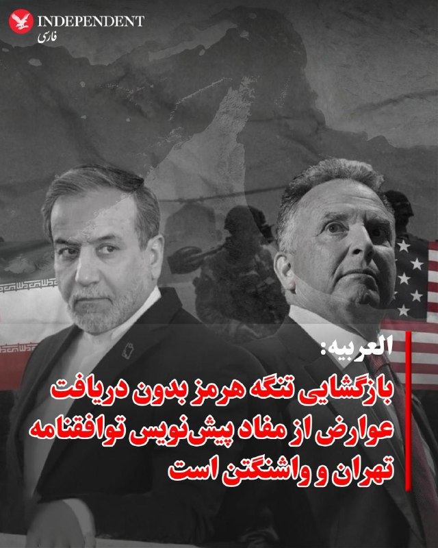

♦️شبکه العربیه، روز دوشنبه چهارم خرداد ماه، به نقل از منابع آگاه به مذاکرات واشنگتن و تهران گزارش داد پیش‌نویس توافقنامه پایان جنگ میان دو کشور شامل تمدید آتش‌بس به مدت ۶۰ روز، با امکان تمدید دوباره، است و در آن بر بازگشایی تنگه هرمز بدون دریافت عوارض و پاکسازی مین‌ها تاکید دارد.

منابع العربیه افزودند این توافق امکان فروش و صادرات نفت ایران را فراهم می‌کند و ادامه مذاکرات هسته‌ای برای دستیابی به تفاهم‌های بلندمدت را نیز در بر می‌گیرد.

دونالد ترامپ، رئیس‌جمهوری آمریکا نیز روز دوشنبه در پیامی در شبکه اجتماعی تروث سوشال اعلام کرد مذاکرات با جمهوری اسلامی ایران «به‌خوبی» در حال پیشرفت است.
‌🇸🇦 Indypersian

🤖 @VahidOOnLine

## VahidOOnLine — post 242147

  

کلودیا شینباوم، رییس‌جمهوری مکزیک، دوشنبه اعلام کرد که دولت او موافقت کرده به تیم ملی فوتبال ایران اجازه دهد در طول رقابت‌های جام جهانی در مکزیک اقامت داشته باشد.

او افزود که ایالات متحده تمایلی به میزبانی این تیم نداشته است.

شینباوم گفت که فدراسیون بین‌المللی فوتبال (فیفا) پس از آن‌که آمریکا اعلام کرد نمی‌خواهد تیم ایران در طول مسابقات در خاک این کشور مستقر باشد، با دولت مکزیک تماس گرفته است.

ایران قرار است هر سه بازی مرحله گروهی خود را در آمریکا برگزار کند.

شینباوم در یک نشست خبری گفت: «ما هیچ دلیلی برای محروم کردن آنها از امکان اقامت در مکزیک نمی‌بینیم.»

کاخ سفید و وزارت خارجه آمریکا هنوز در این زمینه اظهار نظر نکرده‌اند.
‌🏁 🇬🇧 IranintlTV

🤖 @VahidOOnLine

## VahidOOnLine — post 242146

♦️دونالد ترامپ، رئیس‌جمهوری آمریکا، روز یکشنبه چهار خرداد ماه، به همراه جی‌دی ونس، معاون رئیس‌جمهوری، و پیت هگست، وزیر دفاع، برای ادای احترام به سربازان کشته‌شده ارتش آمریکا در مراسم «روز یادبود» در گورستان ملی آرلینگتون حضور یافتند.
«روز یادبود» (Memorial Day) یکی از مناسبت‌های رسمی آمریکا است که هر سال در آخرین دوشنبه ماه مه برگزار می‌شود و به یاد نظامیان آمریکایی کشته‌شده در جنگ‌ها و ماموریت‌های نظامی اختصاص دارد. در این روز، مقام‌های آمریکایی با حضور در گورستان‌های نظامی، به‌ویژه گورستان ملی آرلینگتون در نزدیکی واشنگتن، به سربازان کشته‌شده ادای احترام می‌کنند و پرچم‌ها در سراسر کشور به حالت نیمه‌افراشته درمی‌آید.
‌🇸🇦 Indypersian

🤖 @VahidOOnLine

## VahidOOnLine — post 242145

  

رضا باکری، دبیر انجمن صنایع لبنی ایران، اعلام کرد قیمت محصولات لبنی در یک سال گذشته چندین بار افزایش یافته و در مجموع حدود ۹۰ درصد گران شده است.

باکری افزود هفته گذشته دامداران، قیمت شیر خام را با ۲۹ درصد افزایش به کیلویی ۶۰ هزار و ۵۰۰ تومان رساندند.

دبیر انجمن صنایع لبنی ایران از افزایش قیمت چند محصول پرمصرف خبر داد و گفت: «قیمت شیر نایلونی به ۸۴ هزار تومان، شیر بطری به ۹۸ هزار تومان، پنیر یو‌اف ۴۰۰ گرمی به ۲۰۳ هزار تومان و ماست دبه‌ای دو کیلوگرمی به ۲۲۸ هزار و ۷۰۰ تومان رسیده است.»

سرانه مصرف شیر در ایران یک‌سوم میانگین جهانی است که تنها در یکی دو سال اخیر، ۳۰ درصد کاهش داشته است.
‌🏁 🇬🇧 IranintlTV

🤖 @VahidOOnLine

## VahidOOnLine — post 242144

  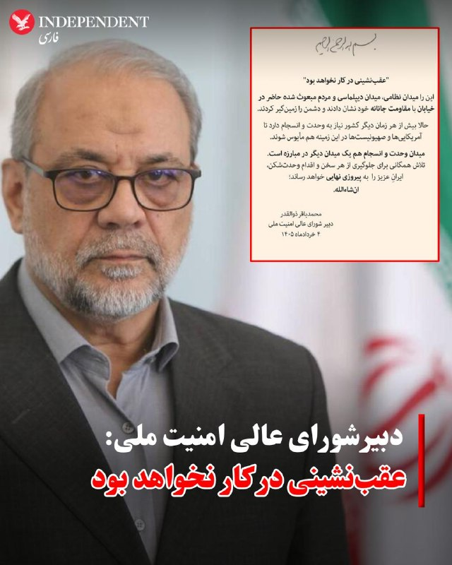

♦️محمدباقر ذوالقدر، دبیر شورای عالی امنیت ملی ایران، روز دوشنبه چهارم خرداد ماه، در نخستین پیام پس از انتصاب به این سمت گفت «عقب‌نشینی در کار نخواهد بود».

ذوالقدر با ادعای آنکه مقاومت ایران در «میدان نظامی»، «میدان دیپلماسی» دشمن را «زمین‌گیر» کرده است، افزود اکنون بیش از هر زمان دیگری کشور به وحدت و انسجام نیاز دارد تا «آمریکایی‌ها و اسرائیلی‌ها» در این زمینه نیز ناامید شوند.

او تاکید کرد بیش از هر زمان دیگری به وحدت و انسجام نیاز داریم تا آمریکایی‌ها و اسرائیلی‌ها مایوس شوند.
‌🇸🇦 Indypersian

🤖 @VahidOOnLine

## VahidOOnLine — post 242143

  

علیرضا رحیمی، معاون امور جوانان وزارت ورزش و جوانان، در اختتامیه جشنواره «نسل امید» گفت: اگر واقعا به آینده ایران فکر می‌کنیم، باید به نهاد اصلی جامعه یعنی تشکیل خانواده بها بدهیم. فرزندآوری در این شرایط نوعی فداکاری و ایثار است و شاید بزرگ‌ترین ازخودگذشتگی برای آینده ایران محسوب شود.

وزارت ورزش و جوانان جمهوری اسلامی هدف از برگزاری این جشنواره را «توسعه کمی و کیفی آثار هنری در حوزه خانواده و جوانی جمعیت» عنوان کرده است.

جشنواره «نسل امید» با همکاری حوزه هنری سازمان تبلیغات اسلامی برگزار می‌شود.
‌🏁 🇬🇧 IranintlTV

🤖 @VahidOOnLine

## VahidOOnLine — post 242142

♦️اسماعیل بقایی، سخنگوی وزارت امور خارجه ایران،  روز دوشنبه چهارم خرداد ماه به خبرنگاران گفت جمهوری اسلامی در حال حاضر درباره «جزئیات هسته‌ای» با آمریکا مذاکره نخواهد کرد و «تمرکز یادداشت تفاهم ۱۴ بندی بر پایان جنگ است.»
بقایی در پاسخ به پرسشی درباره مذاکرات ۶۰ روزه گفت قرار است طی این بازه زمانی درباره برخی جزئیات یادداشت تفاهم و چند موضوع دیگر گفتگو شود و «یکی از موضوعات قاعدتا مرتبط با هسته‌ای است.»
این اظهارات در گرماگرم گمانه‌زنی‌ها درباره نهایی شدن توافق تهران و واشنگتن برای پایان جنگ مطرح می‌شود. موضوع اورانیوم‌های غنی شده ایران از مهمترین مجادلات دوطرف توصیف شده است.
دونالد ترامپ روز دوشنبه با انتشار متنی در تروث سوشال اعلام کرد، نتیجه مذاکرات یا «توافقی بزرگ برای همه» خواهد بود یا در غیر این صورت، منطقه به «میدان نبرد و تیراندازی» بازخواهد گشت؛ آن هم در ابعادی «بزرگ‌تر و قدرتمندتر از همیشه».
‌🇸🇦 Indypersian

🤖 @VahidOOnLine

## VahidOOnLine — post 242141

  

♦️پس از ابقای محمدباقر قالیباف در ریاست مجلس شورای اسلامی، مسعود پزشکیان، رئیس‌جمهوری و غلامحسین محسنی اژه‌ای، رئیس قوه قضائیه جمهوری اسلامی ایران، در پیام‌هایی جداگانه انتخاب مجدد او را تبریک گفتند.
مجلس شورای اسلامی روز دوشنبه چهارم خرداد نخستین جلسه علنی و حضوری خود را از زمان آغاز حملات اسرائیل و آمریکا در نهم اسفند سال گذشته برگزار کرد. در این جلسه، محمدباقر قالیباف، رئیس هیئت مذاکره‌کننده جمهوری اسلامی با آمریکا، برای یک سال دیگر به ریاست مجلس انتخاب شد.
پزشکیان در پیامی که خبرگزاری دولتی ایرنا منتشر کرد، نوشت اعتماد دوباره نمایندگان به قالیباف «حاصل سال‌ها مدیریت جهادی و حضور مستمر و موثر» او در عرصه‌های حساس خدمت به جمهوری اسلامی و ملت ایران است.
محسنی اژه‌ای نیز در پیامی در شبکه اجتماعی اکس، قالیباف را «مدیری جهادی و نستوه و میدان‌دیده» توصیف کرد و نوشت او در جنگ‌های ۱۲ روزه، جنگ اخیر و «پس از آن» در عرصه‌های «میدان» و «دیپلماسی» جهاد کرده است.
‌🇸🇦 Indypersian

🤖 @VahidOOnLine

## WithYashar — post 12451

پزشکیان: در جنگ ۱۲ روزه خدمت رهبر شهید رفتم و ایشان گفتند چگونه مذاکره انجام بشود

ایشان قبول کردند ما باید برویم پای میز مذاکره، اما ما اکنون تبلیغ می‌کنیم که نباید مذاکره کنیم
@withyashar
رفسنجانی هم با همین فن از قول خمینی ، خامنه ای رو رهبر کرد ! 😂

## WithYashar — post 12450

یک مقام آمریکایی به اکسیوس گفت: دولت ترامپ از تشدید اقدام نظامی اسرائیل در لبنان حمایت خواهد کرد. @withyashar

## WithYashar — post 12449

61 سال پیش در چنین روزی الی کوهن جاسوس افسانه‌ای و عجیب و غریب موساد توسط دولت سوریه اعدام شد الی کوهن توانسته بود تا سطوح ارشد وزارت دفاع سوریه نفوذ کند و عملاً با اطلاعات طلایی اش توانست پیروزی های اسرائیل در بلندی های جولان در جنگ شش روزه را تسهیل کند
@withyashar
قبلا به شما در اتاق جنگ مینی سریال بسیار زیبای داستان زندگیشو به نام The Spy معرفی کردم

## WithYashar — post 12448

یک مقام آمریکایی به اکسیوس گفت: دولت ترامپ از تشدید اقدام نظامی اسرائیل در لبنان حمایت خواهد کرد.
@withyashar

## WithYashar — post 12447

طبق خبرهای رسیده به خبرنگار هم‌میهن رئیس‌جمهور زرشکیان دستور بازگشایی اینترنت بین‌الملل را ابلاغ کرد. @withyashar

## WithYashar — post 12446

  <a href="telegram/content/WithYashar_12446_1779733423.mp4" target="_blank">🎬 Download video</a>

دونالد ترامپ: "در دو جنگ اخیر، مجموعاً ۱۳ تن از نیروهای نظامی خود را از دست داده‌ایم... در عملیات «خشم حماسی»، ۱۳ جان فوق‌العاده را از دست دادیم."
@withyashar

## WithYashar — post 12445

شبکه ۱۲ تلویزیون اسرائیل به نقل از منابع آگاه گزارش داد که «استیو ویتکاف» و «جرد کوشنر» به منظور بحث و تبادل نظر درباره توافق احتمالی میان واشنگتن و تهران به اسرائیل سفر خواهند کرد.
@withyashar

## WithYashar — post 12444

طبق خبرهای رسیده به خبرنگار هم‌میهن رئیس‌جمهور زرشکیان دستور بازگشایی اینترنت بین‌الملل را ابلاغ کرد.
@withyashar

## WithYashar — post 12443

ترامپ برای بار دو میلیون و چهارصدو شصت و هشتم : ایران هیچوقت سلاح هسته ای نخواهد داشت.
@withyashar

## WithYashar — post 12442

منابع العربیه: نسخه نهایی پیش‌نویس یادداشت تفاهم آمریکا و ایران شامل تجدید قابل‌تمدید آتش‌بس 60 روزه، باز کردن تنگه هرمز بدون اخذ عوارض و پاکسازی مین‌ها و برداشتن موانع دریایی از این آبراه بین‌المللی مقابل تجارت جهانی، برداشتن برخی محدودیت‌ها از بنادر ایران و دادن معافیت‌‌هایی از تحریم‌ها و فراهم کردن امکان ازسرگیری فروش و صادرات نفت ایران و همچنین ادامه مذاکرات درباره برنامه هسته‌ای ایران در دوره تنش‌زدایی میان دو طرف، می‌شود.
@withyashar

## WithYashar — post 12441

ادعای الحدث به نقل از منابع: ایران آماده‌ست تا اورانیوم با غنای بالا رو به چین انتقال بده ! @withyashar

## WithYashar — post 12440

طبق گزارش تایید نشده از شاهدان عینی که به دستمان رسیده است از وقوع یک درگیری نامشخص در محدوده میدان انقلاب تهران در ساعتی قبل خبر می‌دهند.

بر اساس این ادعاها، گفته می‌شود منطقه تحت کنترل نیروهای امنیتی قرار گرفته و رفت‌وآمد در برخی مسیرها محدود شده است.

همچنین طبق گفته شاهدان عینی تعداد زیادی جنازه که از ظواهر آنها مشخص بود نیروهای حشد الشعبی بوده اند روی زمین ریخته بود

به محض وصول هر گونه اخبار تکمیلی به اطلاع شما عزیزان خواهد رسید ‌
@withyashar

## WithYashar — post 12439

نورالدین الدغیر، خبرنگار الجزیره در تهران:
به نظر می‌رسد گره مذاکرات ایران و آمریکا در حال باز شدن است و ابتکار قطر نقش اساسی در حل اختلافات داشته است.

به گفته او، دوحه یک میانجی واقعی بوده، نه فقط کمکی در میانجی‌گری.
@withyashar

## WithYashar — post 12438

العربیه: پیش‌نویس توافق میان آمریکا و ایران، برقراری آتش‌بس جامع در تمامی جبهه‌ها، از جمله لبنان را تضمین می‌کند.
@withyashar

## WithYashar — post 12437

ادعای الحدث به نقل از منابع: ایران آماده‌ست تا اورانیوم با غنای بالا رو به چین انتقال بده !
@withyashar

## WithYashar — post 12436

## WithYashar — post 12435

  <a href="telegram/content/WithYashar_12435_1779733425.mp4" target="_blank">🎬 Download video</a>

🎬 Video

## WithYashar — post 12433

ترامپ با مسخره کردن اوباما و بایدن عکسهایی منتشر کرد که آنها به ایران پول میدهند و مذاکره میکنند، ولی او آنها را منهدم میکند.
@withyashar

## WithYashar — post 12428

## mwarmonitor — post 9704

🔴بنیامین نتانیاهو می‌گوید اسرائیل «در حال جنگ با حزب‌الله است» و تأکید کرد که اسرائیل فشار نظامی را کاهش نخواهد داد و او به نیروها دستور داده است «پدال را حتی محکم‌تر فشار دهند».

📌نتانیاهو گفت حزب‌الله در حال شلیک پهپادها، از جمله پهپادهای فیبر نوری است، اما اسرائیل یک تیم ویژه برای مقابله با این تهدید دارد. او افزود: «آنچه اکنون از ما لازم است افزایش حملات و بالا بردن شدت آن‌هاست» و ادامه داد: «ما ضربه سختی به آن‌ها خواهیم زد.»

@mwarmonitor

## mwarmonitor — post 9703

باراک راوید:

🚨 یک مقام ارشد آمریکایی امشب اشاره کرده است که دولت ترامپ از تشدید اقدامات اسرائیل علیه حزب‌الله حمایت خواهد کرد.

🚨 این مقام آمریکایی به من گفت: «حزب‌الله درخواست‌های مکرر برای توقف شلیک به سمت اسرائیل را نادیده گرفته است، از جمله اولتیماتومی که اخیراً منتقل شد. اسرائیل هرگز مجبور نخواهد شد به‌طور منفعلانه حملات علیه نیروها و غیرنظامیانش را تحمل کند. این دولت بایدن نیست.»

🚨 این مقام آمریکایی اشاره کرد که از ۱۷ آوریل، حزب‌الله بیش از هزار پهپاد و بیش از ۷۰۰ راکت شلیک کرده است تا روند مذاکرات جاری بین لبنان و اسرائیل را مختل کند. او گفت: «وضع موجود قابل دوام نیست.»

🚨 این مقام آمریکایی افزود: «حزب‌الله به‌طور کامل مسئول وضعیت فعلی است. این گروه آتش‌بس ۲ مارس را نقض کرده و اکنون مصمم است مانع از مسیر صلح و بازسازی برای مردم لبنان شود.»

🚨 به گفته این مقام، حزب‌الله از مذاکراتی که دولت لبنان با حمایت آمریکا با اسرائیل انجام می‌دهد نگران است. او گفت: «این موضوع برای حزب‌الله یک تهدید وجودی است.»

🚨 این مقام همچنین افزود: «یک آتش‌بس موفق به رهبری دولت لبنان، حزب‌الله را از قدرت و روایت خود محروم خواهد کرد.»

@mwarmonitor

## mwarmonitor — post 9702

🔴جزئیات جدیدی درباره دشواری‌های مذاکرات آمریکا و ایران در حال منتشر شدن است:

🔹در حال حاضر، ایران فقط حاضر است متعهد شود که به سمت ساخت سلاح هسته‌ای نرود، در حالی که آمریکا بر اقدامات مشخص برای کاهش اورانیوم غنی‌شده تأکید دارد—از جمله فروش آن، انتقال به خارج از کشور یا رقیق‌سازی آن.

🔸یکی از نقاط اصلی اختلاف، تنگه هرمز است: ایران خواهان مدیریت آن توسط خود است، در حالی که آمریکا بر آزادی کامل کشتیرانی تأکید دارد.

🔸همچنین هنوز توافقی درباره تسهیلات مالی وجود ندارد. قطر پیشنهادی برای ارائه یک وام بشردوستانه ۱۲ میلیارد دلاری به ایران مطرح کرده است.

📌نکته قابل توجه این است که لبنان نیز اکنون بخشی از چارچوب گسترده‌تر در حال بررسی شده است. آمیت سیگال خبرنگار کانال ۱۲ اسرائیل

@mwarmonitor

## mwarmonitor — post 9701

🔴موضع ایران درباره خارج کردن اورانیوم با غنای بالا دستخوش تغییر شده است. بر اساس گزارش‌ها، ایران حاضر است اورانیوم با غنای بالا (HEU) خود را از کشور خارج کند، اما تنها به مقصد چین. همچنین ایران به دنبال دریافت تضمین حمایت از پکن در ازای هرگونه توافق نهایی با واشنگتن است. این موضوع به نقل از منابع ناشناس توسط شبکه «الحدث» گزارش شده است.

🔸مقام‌های ایرانی طی روزهای اخیر اعلام کرده‌اند ـ برخلاف مواضع قبلی ـ که از سوی رهبر جمهوری اسلامی دستور گرفته‌اند اورانیوم نزدیک به سطح تسلیحاتی را در داخل کشور نگه دارند. هرچند این دو روایت به‌طور کامل نمی‌توانند همزمان درست باشند، اما همین اختلاف نشان می‌دهد که روایت خبر از واقعیت اختلاف‌نظر درون ساختار تصمیم‌گیری ایران ناشی می‌شود. موضوع «سرنوشت اورانیوم» همچنان در داخل سیستم ایران حل‌نشده باقی مانده است، نه فقط در سطح مذاکرات ایران و آمریکا.

🔹در حالی که گفته می‌شود آمادگی چین برای دریافت این ذخیره اورانیوم (یا رقیق‌سازی آن به سطح پایین‌تر) حدود ۴۴۰ کیلوگرم با غنای ۶۰ درصد است و از چند هفته قبل مطرح بوده، تغییر جدید این است که ایران ظاهراً پذیرفتن انتقال این ذخیره به چین را به‌عنوان تنها گزینه قابل قبول خود مطرح کرده است؛ نه یکی از چند گزینه.

🔸منابع رسمی دو کشور هنوز به این خبر واکنشی نشان نداده‌اند.

@mwarmonitor

## mwarmonitor — post 9700

  

📝 همان ثانیه اول شروع جنگ، مثل موش‌های غافلگیرشده پریدید روی سیم و در کسری از ثانیه کل اینترنت کشور را قطع کردید؛ اما حالا یک ماه است که این انگل‌زاده‌های کت‌شلواری و دایناسورهای عهد بوق، اندر خم وصل کردن مجدد آن مانده‌اند. خنده‌دار اینجاست که رسانه‌ها با بوق و کرنا از مصوبه «جدید و مهم» ستاد ساماندهی برای بازگشت اینترنت به وضعیت قبل از دی‌ماه ۱۴۰۴ خبر می‌دهند؛ مصوبه‌ای که بعد از کلی چای خوردن با ۹ رای موافق تصویب شده و حالا لنگِ تایید نهایی مسعود پزشکیان است. واقعاً کدام حیوانی به این رئیس‌جمهور رای داده؟ موجودی که تنها شباهتش به رئیس، به خط کردن آفتابه‌های توالت‌های پادگان است و حالا برای چهار تا پورت اینترنت که خودشان قطع کرده‌اند، باید منتظر امضای ولایتمدارانه‌اش ماند. این کمدیِ مضحک نشان می‌دهد که حق بدیهی میلیون‌ها انسان، گروگانِ مشتی بی‌خاصیت است که برای بدیهی‌ترین کارها هم یک ماه جلسات پوچ برگزار می‌کنند.

@mwarmonitor

## mwarmonitor — post 9699

  <a href="telegram/content/mwarmonitor_9699_1779733428.mp4" target="_blank">🎬 Download video</a>

🔴ارتش اسرائیل (IDF) اعلام کرده است که حملات خود را به اهداف حزب‌الله در منطقه صور و سایر مناطق جنوب لبنان آغاز کرده است.

@mwarmonitor

## mwarmonitor — post 9698

📌 رئیس‌جمهور مکزیک، شینباوم، اعلام کرده است که دولتش موافقت کرده به تیم ملی فوتبال ایران اجازه دهد در جریان جام جهانی در مکزیک اقامت داشته باشد، پس از آنکه ایالات متحده اعلام کرده بود تمایلی به میزبانی آن‌ها ندارد.

@mwarmonitor

## mwarmonitor — post 9697

🔴عربستان سعودی اعلام کرده است که روابط خود را با اسرائیل عادی‌سازی نخواهد کرد، مگر اینکه مسیری غیرقابل بازگشت به سمت تشکیل یک دولت فلسطینی وجود داشته باشد. CNN

@mwarmonitor

## mwarmonitor — post 9696

🔴گفت‌وگوهای ایران درباره برنامه هسته‌ای و کاهش تحریم‌ها به بن‌بست خورده است.

🔸با این حال، هر دو طرف انگیزه‌هایی برای رسیدن به توافق دارند، اما هر کدام بر مواضع خود پافشاری می‌کنند؛ ترامپ نیز گفته است که «یک توافق بد را نخواهد پذیرفت».

@mwarmonitor

## mwarmonitor — post 9695

  <a href="telegram/content/mwarmonitor_9695_1779733430.mp4" target="_blank">🎬 Download video</a>

✈️نقل و انتقالات هوایی نیروی هوایی آمریکا به خاورمیانه با حجم بالا همچنان ادامه دارد، با وجود صحبت‌هایی که درباره نزدیک بودن نهایی شدن مذاکرات مطرح شده است.

@mwarmonitor

## mwarmonitor — post 9694

🔸وزیر امور خارجه امارات متحده عربی، شیخ عبدالله بن زاید آل نهیان، هشدار داده است که اروپا در نهایت به دلیل نبود اقدامات قاطع از سوی رهبران اروپایی و «وسواس نسبت به اصلاحات سیاسیِ افراطی (woke political correctness)»، ممکن است حتی بیشتر از خاورمیانه تولیدکننده افراط‌گرایان و اسلام‌گرایان تندرو باشد.

🔹او به‌طور مشخص به وجود هسته‌های افراط‌گرای اسلام‌گرا در شهرهای اروپایی مانند لندن، و همچنین در آلمان، اسپانیا و ایتالیا اشاره کرده و هشدار داده است که کشورهایی که در برخورد با این موضوع کوتاهی کنند ممکن است به‌عنوان «پرورشگاه‌های تروریسم» طبقه‌بندی شوند.

🔹بخش قابل توجهی از افرادی که در اروپا به‌دلیل طراحی یا تلاش برای حملات اسلام‌گرایانه بازداشت یا متوقف می‌شوند، نوجوانان محلی با تابعیت اروپایی (سنین ۱۴ تا ۱۹ سال) هستند که به‌طور کامل از طریق شبکه‌های اجتماعی و پلتفرم‌های بازی آنلاین رادیکال شده‌اند، بدون اینکه هرگز به خاورمیانه سفر کرده باشند.

🔸شیخ عبدالله بن زاید آل نهیان گفته است:
«روزی خواهد رسید که ما شاهد خواهیم بود افراط‌گرایان و تروریست‌های بسیار بیشتری از اروپا خارج می‌شوند، به دلیل نبود تصمیم‌گیری قاطع، تلاش برای سیاسی‌کاری بیش از حد، یا این تصور که آن‌ها اسلام و خاورمیانه و دیگران را بهتر از خودشان می‌شناسند. و متأسفم، اما این چیزی جز ناآگاهی نیست.»

@mwarmonitor

## mwarmonitor — post 9693

  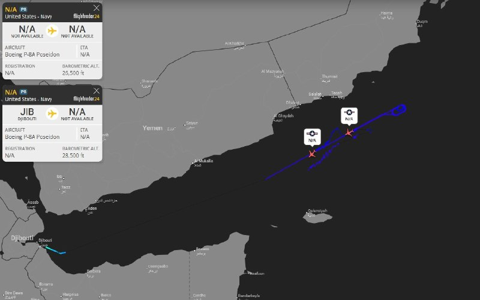

✈️دو فروند هواپیمای گشت دریایی بوئینگ P-8 پوسایدون نیروی دریایی آمریکا امروز در آن منطقه بین دریای عرب و خلیج عمان در حال عملیات بوده‌اند.

⁉️سؤال این است که آیا گروه رزمی ناو هواپیمابر یو‌اس‌اس جورج اچ. دبلیو. بوش در نزدیکی آن منطقه قرار دارد یا نه.

@mwarmonitor

## mwarmonitor — post 9692

مذاکرات با جمهوری اسلامی ایران به خوبی در حال پیشرفت است! این یا یک «توافق بزرگ» برای همه خواهد بود، یا هیچ توافقی در کار نخواهد بود — بازگشت به جبهه جنگ و شلیک، اما بزرگتر و قوی‌تر از هر زمان دیگری — و هیچ‌کس این را نمی‌خواهد! من در طول گفتگوهایم در روز شنبه…

## mwarmonitor — post 9691

🛢نفت خام برنت بیش از ۵ درصد سقوط کرد و معاملات آتی شاخص داوجونز صنعتی افزایش یافت، هرچند سرمایه‌گذاران همچنان نسبت به تأثیر مذاکرات آمریکا و ایران تردید دارند. وال‌استریت ژورنال

@mwarmonitor

## mwarmonitor — post 9690

🔸 رویترز: مذاکرات قالیباف و عراقچی در دوحه بر موضوع تنگه هرمز و اورانیوم غنی‌شده متمرکز خواهد بود. @mwarmonitor

## mwarmonitor — post 9689

🔴 وزارت خارجه روسیه: اتباع خارجی فوراً کی‌یف را ترک کنند. @mwarmonitor

## mwarmonitor — post 9688

🔴 وزارت خارجه روسیه: اتباع خارجی فوراً کی‌یف را ترک کنند.

@mwarmonitor

## mwarmonitor — post 9687

🔴بانک مرکزی اسرائیل کاهش نرخ بهره را از سر گرفته است؛ اقدامی که با کاهش تورم، تقویت شِکِل اسرائیل و نشانه‌هایی از پیشرفت در مسیر توافق احتمالی میان آمریکا و ایران تقویت شده است. بلومبرگ

@mwarmonitor

## mwarmonitor — post 9686

مذاکرات با جمهوری اسلامی ایران به خوبی در حال پیشرفت است! این یا یک «توافق بزرگ» برای همه خواهد بود، یا هیچ توافقی در کار نخواهد بود — بازگشت به جبهه جنگ و شلیک، اما بزرگتر و قوی‌تر از هر زمان دیگری — و هیچ‌کس این را نمی‌خواهد! من در طول گفتگوهایم در روز شنبه…

## FoxNewsTwitter — post 342236

Fox News (Twitter/X)

SEE IT: President Trump, VP Vance, and Secretary Pete Hegseth participate in a Memorial Day ceremony honoring fallen U.S. service members and their families.

The event featured military tributes, moments of silence, and recognition of Gold Star families gathered to remember loved ones lost in service.

## FoxNewsTwitter — post 342235

  <a href="telegram/content/FoxNewsTwitter_342235_1779733433.mp4" target="_blank">🎬 Download video</a>

Fox News (Twitter/X)

NOW: President Trump and VP Vance give a heartfelt salute as 'Taps' echoes across Arlington National Cemetery during the Memorial Day ceremony.

## FoxNewsTwitter — post 342234

  <a href="telegram/content/FoxNewsTwitter_342234_1779733436.mp4" target="_blank">🎬 Download video</a>

Fox News (Twitter/X)

NOW President Trump delivers a powerful tribute to America's fallen heroes, honoring the legacy of our nation's military, spanning from the early days of America all the way to the present.

"From 1776 to 2026, America has always stood as a great and moral cause. Our warriors are no mere mercenaries.”

“They are guardian angels who stride across the battlefields of history and stand watch over the highest and most beautiful plains the human spirit has ever seen, holding the line between liberty and tyranny, between civilization and barbarism, between good and evil."

## FoxNewsTwitter — post 342233

  <a href="telegram/content/FoxNewsTwitter_342233_1779733439.mp4" target="_blank">🎬 Download video</a>

Fox News (Twitter/X)

BREAKING: President Trump pays tribute to the 13 American service members killed during recent military operations.

“We lost 13 wonderful souls... These incredible men and women gave their lives to ensure that the world's number one state sponsor of terror will never have a nuclear weapon," Trump said before recognizing the family of Major Ariana Savanah Saville during the Memorial Day event.

"Ariana's selfless gift will not be in vain. Our debt to you is everlasting, and it's always going to end in victory."

## FoxNewsTwitter — post 342232

  <a href="telegram/content/FoxNewsTwitter_342232_1779733441.mp4" target="_blank">🎬 Download video</a>

Fox News (Twitter/X)

HAPPENING NOW: President Trump honors America’s fallen military members on Memorial Day while looking ahead to the nation’s 250th anniversary, saying the country must first remember the sacrifices that made its freedoms possible.

“Before we celebrate the triumph, we pay the tribute.”

"We owe our liberty, our self-government, the glories of our history, and our very nation itself to the generations who paid for it with everything they had the ultimate sacrifice."

## FoxNewsTwitter — post 342231

  <a href="telegram/content/FoxNewsTwitter_342231_1779733445.mp4" target="_blank">🎬 Download video</a>

Fox News (Twitter/X)

BREAKING: President Trump honors the fallen and Gold Star families in his Memorial Day address at Arlington National Cemetery:

"We honor those who fell so that our Republic might stand, those who died so that our nation could live, those who gave up their sacred light on earth, so that the sublime light of American freedom would shine for ever and ever. This Memorial Day, we salute them, we exalt them, and we thank them for all that we have and for all that they gave. They gave everything. God bless our fallen heroes."

## FoxNewsTwitter — post 342230

  

Fox News (Twitter/X)

WATCH LIVE: Memorial Day tribute remembers America’s fallen at the Vietnam Veterans Memorial https://twitter.com/i/broadcasts/1mxPaaagbLqKN

## FoxNewsTwitter — post 342229

  <a href="telegram/content/FoxNewsTwitter_342229_1779733448.mp4" target="_blank">🎬 Download video</a>

Fox News (Twitter/X)

JUST IN: Vice President JD Vance delivers a powerful Memorial Day message, calling on Americans to live as the "very best version" of themselves to honor the ultimate sacrifice of the nation's fallen heroes.

Vance reminded the nation that every cherished moment with loved ones was paid for by total strangers who laid down their lives to protect American freedom.

"On this Memorial Day, I just ask two things of all of our fellow Americans. The first is that we be the very best version of ourselves in honor of those who gave everything that this nation might be worthy"

"And that second, we always remember that every moment that we're able to enjoy with our loved ones, everything that gives our life and our nation meaning and purpose was given to us, often by total strangers who laid down their lives that this might be the best nation in the history of the world."

## FoxNewsTwitter — post 342228

  <a href="telegram/content/FoxNewsTwitter_342228_1779733451.mp4" target="_blank">🎬 Download video</a>

Fox News (Twitter/X)

NOW: VP Vance pays tribute to America's fallen heroes:

"Today is for those veterans who put on the uniform, who went overseas and who never came home."

"When I think about the debt that we owe them, I think about all the things that they gave, which can't be measured in dollars or in the things of this world..."

"They traded every moment from the moment where they gave their lives to the moment where they would ultimately meet their natural end. Every single one of those moments, they gave up that the United States might remain the freest and best country in the entire world."

## FoxNewsTwitter — post 342227

  <a href="telegram/content/FoxNewsTwitter_342227_1779733454.mp4" target="_blank">🎬 Download video</a>

Fox News (Twitter/X)

NOW: Army Chaplain Lt. Col. Kevin Trimble delivers a powerful Memorial Day prayer at Arlington National Cemetery honoring America’s fallen heroes:

"May we cherish the freedoms they have preserved, defend the justice they have sought and extend compassion they carried in their hearts. Comfort the families who still feel the ache of absence. May they know their loved ones are not forgotten, that their names are spoken with reverence, and their legacy lives on in the soul of our nation."

"As we stand among the markers of the fallen, may we be reminded that liberty is never free. It is fought and paid for, in courage, in service and in love. God, we pray for peace that one day swords may be beaten into plowshares. And no mother need weep for a child lost to war until that day. Give us strength to be faithful stewards of the freedom entrusted to us. In your holy name we remember, we honor, and we render thanksgiving. Amen."

## FoxNewsTwitter — post 342226

  <a href="telegram/content/FoxNewsTwitter_342226_1779733457.mp4" target="_blank">🎬 Download video</a>

Fox News (Twitter/X)

NEW: General Dan Caine honors America's fallen heroes, praising the unbroken line of courage from Valley Forge to recent military action like Operation Epic Fury.

"Across the centuries, the character, courage, and commitment of the American warfighter has never wavered. And it never will.”

“It's that same war fighting spirit we recently saw in Operation Epic Fury, and we remember and honor those who made the ultimate sacrifice, adding their names to the story of American heroism."

## FoxNewsTwitter — post 342225

  <a href="telegram/content/FoxNewsTwitter_342225_1779733460.mp4" target="_blank">🎬 Download video</a>

Fox News (Twitter/X)

WATCH: The U.S. Army Band 'Pershing's Own' plays the Star Spangled Banner in a Memorial Day tribute at Arlington National Cemetery.

## FoxNewsTwitter — post 342224

  <a href="telegram/content/FoxNewsTwitter_342224_1779733463.mp4" target="_blank">🎬 Download video</a>

Fox News (Twitter/X)

WATCH: The Battle Hymn of the Republic echoes through Arlington National Cemetery as the nation honors its fallen heroes on Memorial Day.

## FoxNewsTwitter — post 342223

  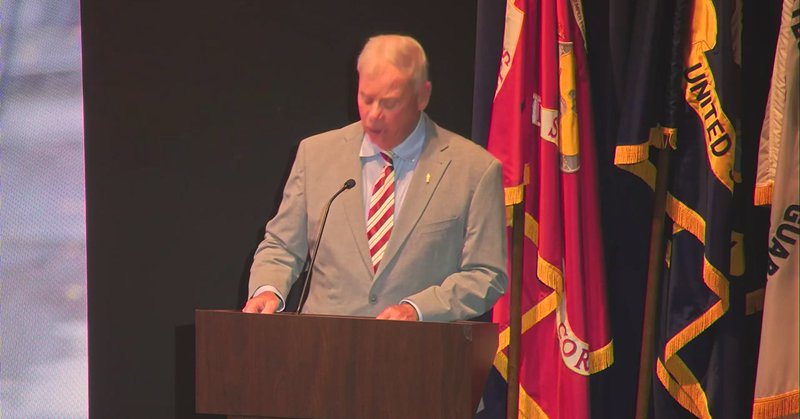

Fox News (Twitter/X)

WATCH LIVE: Navy Memorial hosts solemn wreath laying ceremony https://twitter.com/i/broadcasts/1AxRnnnrRzkxl

## FoxNewsTwitter — post 342222

  <a href="telegram/content/FoxNewsTwitter_342222_1779733466.mp4" target="_blank">🎬 Download video</a>

Fox News (Twitter/X)

JUST NOW: President Trump lays a wreath at the Tomb of the Unknown Soldier as part of Memorial Day observance at Arlington National Cemetery.

## FoxNewsTwitter — post 342221

Fox News (Twitter/X)

NOW: President Trump, Vice President JD Vance, and Secretary of War Pete Hegseth arrive at Arlington National Cemetery to honor fallen troops on Memorial Day.

## FoxNewsTwitter — post 342220

  

Fox News (Twitter/X)

WATCH LIVE: President Trump honors fallen troops at Arlington National Cemetery https://twitter.com/i/broadcasts/1qKDzzzpewEJV

## pm_afshaa — post 91476

رئیس شورای هماهنگی تبلیغات اسلامی: فعلا تصمیم نگرفتیم چه زمانی رهبر سابق رو تشییع کنیم

💧 Rainbet.com the #1 Non-KYC Crypto Casino & Sportsbook @rainbetcom

😁 @Pm_Afshaa

## pm_afshaa — post 91475

رسایی: پزشکیان خودشم میدونه نمیتونه اینترنت رو وصل کنه. این خبرای جدید بازی رسانه‌ایه 
💧 Rainbet.com the #1 Non-KYC Crypto Casino & Sportsbook @rainbetcom 
😁 @Pm_Afshaa

## pm_afshaa — post 91474

🔴نتانیاهو در بیانیه‌ای اعلام کرد ما به حزب‌الله ضربه‌ای مهلک خواهیم زد. از استقامت ساکنان شمال تقدیر می‌کنم

💧 Rainbet.com the #1 Non-KYC Crypto Casino & Sportsbook @rainbetcom

😁 @Pm_Afshaa

## pm_afshaa — post 91473

رسایی: پزشکیان خودشم میدونه نمیتونه اینترنت رو وصل کنه. این خبرای جدید بازی رسانه‌ایه

💧 Rainbet.com the #1 Non-KYC Crypto Casino & Sportsbook @rainbetcom

😁 @Pm_Afshaa

## pm_afshaa — post 91472

بچه ها چنل زاپاسمونو بفرستین برا بقیه حتما داشته باشینمون گممون نکنین

دمتون گرم از حمایتتون🤍🤍

https://t.me/pm_zapas
https://t.me/pm_zapas

## pm_afshaa — post 91471

روزنامه هم‌میهن: رئیس‌جمهور دستور بازگشایی اینترنت بین‌الملل را ابلاغ کرد 
💧 Rainbet.com the #1 Non-KYC Crypto Casino & Sportsbook @rainbetcom 
😁 @Pm_Afshaa

## pm_afshaa — post 91470

🔴یک مقام آمریکایی به الجزیره: حزب‌الله درخواست‌های مکرر برای آتش‌بس با اسرائیل را نادیده گرفته است. اسرائیل به حملات هدفمند علیه سربازان و شهروندان خود پاسخ خواهد داد

💧 Rainbet.com the #1 Non-KYC Crypto Casino & Sportsbook @rainbetcom

😁 @Pm_Afshaa

## pm_afshaa — post 91469

روزنامه هم‌میهن: رئیس‌جمهور دستور بازگشایی اینترنت بین‌الملل را ابلاغ کرد

💧 Rainbet.com the #1 Non-KYC Crypto Casino & Sportsbook @rainbetcom

😁 @Pm_Afshaa

## pm_afshaa — post 91468

🔴منابع آگاه به العربیه: ایران در مذاکرات شرط کرده اورانیوم غنی‌ شده با درصد بالا فقط به چین منتقل شود

💧 Rainbet.com the #1 Non-KYC Crypto Casino & Sportsbook @rainbetcom

😁 @Pm_Afshaa

## pm_afshaa — post 91467

🔴الحدث : منابع نزدیک میگن ایران آماده‌ست اورانیوم با غنای بالا رو از کشور خارج کنه

💧 Rainbet.com the #1 Non-KYC Crypto Casino & Sportsbook @rainbetcom

😁 @Pm_Afshaa

## pm_afshaa — post 91464

  <a href="telegram/content/pm_afshaa_91464_1779733470.mp4" target="_blank">🎬 Download video</a>

تلمبه های سنگین اسراییل به لبنان

💧 Rainbet.com the #1 Non-KYC Crypto Casino & Sportsbook @rainbetcom

😁 @Pm_Afshaa

## pm_afshaa — post 91463

درود هموطنان عزیزم یک دختر 26 سال داره بجرم کشتن یکنفر که وارد خونش شده که بهش تعرض و تجاوز بکنه صبح 5 خرداد اعدام میشه، باید ۱۰ میلیارد جمع بشه که رضایت بدن تا حالا ۹ میلیارد جمع شده  همه چی داخل تصویر هست کسی خواست استعلام بگیره میدونم ایرانی ها آدم با…

## pm_afshaa — post 91462

درود مجدد داداش نوکرتم خیلی دمت گرم برای این خانوم ۸۰۰ میلیون جمع شد به لطف شما عزیزان و بقیه و ۲۰۰ میلیون مونده خیلی خوشحال شدم

## pm_afshaa — post 91461

  <a href="telegram/content/pm_afshaa_91461_1779733473.webm" target="_blank">🎬 Download video</a>

🔴سناتور لیندسی گراهام:

پیشنهاد اخیر ترامپ که گسترش توافقنامه‌های ابراهیم رو به عنوان بخشی از یک توافق مذاکره‌شده در مورد مناقشه ایران الزامی میکنه، به سادگی درخشان است و منجر به مهم‌ترین تغییر در خاورمیانه در هزاران سال خواهد شد.

با صلح عربستان سعودی و دیگر کشورهایی مانند پاکستان با اسرائیل، منطقه شاهد سطحی از ثبات خواهد بود که پیش از رئیس‌جمهور ترامپ هرگز تصور نمیشد و در نهایت به یکپارچگی منطقه‌ای منجر خواهد شد که خاورمیانه رو به یک قدرت اقتصادی و منبع فرصت‌های خوب تبدیل میکنه، به جای اینکه یک انبار باروت باشه.

انتظار دارم متحدان عرب ما این رو بپذیرند، همچنین دوستان ما در اسرائیل، با تمرکز بر این وظیفه، زیرا شکست گزینه‌ای نیست - که تحلیلی درست خواهد بود.

💧 Rainbet.com the #1 Non-KYC Crypto Casino & Sportsbook @rainbetcom

😁 @Pm_Afshaa

## pm_afshaa — post 91460

  <a href="telegram/content/pm_afshaa_91460_1779733474.webm" target="_blank">🎬 Download video</a>

🔴وال استریت ژورنال:
مذاکرات ایران رو بحث برنامه هسته‌ای و لغو تحریم‌ها به بن‌بست خورده.

💧 Rainbet.com the #1 Non-KYC Crypto Casino & Sportsbook @rainbetcom

😁 @Pm_Afshaa

## pm_afshaa — post 91459

  <a href="telegram/content/pm_afshaa_91459_1779733475.mp4" target="_blank">🎬 Download video</a>

🔴خوش چشم، کارشناس صداوسیما:
روبیو، ویتکاف و کوشنر از طریق واسطه‌ها بهمون گفتن به توییت‌های ترامپ توجه نکنید.

💧 Rainbet.com the #1 Non-KYC Crypto Casino & Sportsbook @rainbetcom

😁 @Pm_Afshaa

## pm_afshaa — post 91458

  <a href="telegram/content/pm_afshaa_91458_1779733477.webm" target="_blank">🎬 Download video</a>

🔴مارک لوین: درباره توافق احتمالی، کلی مطلب توی اینترنت نوشته شده؛ اما من هیچ چیزی درباره خودِ مردم ایران ندیدم.

💧 Rainbet.com the #1 Non-KYC Crypto Casino & Sportsbook @rainbetcom

😁 @Pm_Afshaa

## pm_afshaa — post 91457

  <a href="telegram/content/pm_afshaa_91457_1779733478.mp4" target="_blank">🎬 Download video</a>

حملات پی در پی اسرائیل به جنوب لبنان

💧 Rainbet.com the #1 Non-KYC Crypto Casino & Sportsbook @rainbetcom

😁 @Pm_Afshaa

## iaghapour — post 2630

🔻این روزا انقدر شایعه و خبر بی‌خود درباره وصل شدن اینترنت پیچیده که واقعاً حس و حال خبر زدن در موردش رو ندارم.

با این حال، سعی می‌کنم اسکریپت‌هایی که زحمت کشیدید فرستادید رو حتماً بررسی کنم، به هر حال از دست رو دست گذاشتن که بهتره. راستش با این وضع زندگی، اصلاً هیچ انرژی و انگیزه‌ای برای آدم باقی نمونده.

## DEJradio — post 4952

  <a href="telegram/content/DEJradio_4952_1779733480.webm" target="_blank">🎬 Download video</a>

🔺📢 الحدث به نقل از منابع آگاه گزارش داد جمهوری اسلامی شرط انتقال اورانیوم با غنای بالا به چین را مطرح کرده است.
در این گزارش آمده، ایران آمادگی دارد اورانیوم با غنای بالای خود را از کشور خارج کند، اما پیش از نهایی شدن هرگونه توافق با آمریکا، به دنبال دریافت تضمین‌هایی از چین است.
پیش از این ولادیمیر پوتین نیز پیشنهاد داده بود اورانیوم‌های جمهوری اسلامی به روسیه منتقل شود.

#اورانیوم #چین #جمهوری_اسلامی
@DEJradio

## DEJradio — post 4951

  <a href="telegram/content/DEJradio_4951_1779733481.webm" target="_blank">🎬 Download video</a>

🛩️
🚨 فعال شدن پدافند در قشم
منابع داخلی: یک پهپاد سرنگون شد

عصر دوشنبه، حوالی ساعت ۱۶:۱۵ دقیقه به وقت ایران پدافند جزیره قشم فعال شد. ساعاتی بعد اعلام شد که نیروهای مسلح یک «پهپاد متخاصم» را بر فراز آب‌های خلیج فارس با استفاده از سامانه «آرش» مورد هدف قرار دادند.

در روزهای اخیر بارها مواردی از پرواز پهپادها بر فرار ایران گزارش شد اما مشخص نیست متعلق به کدام کشور بودند. برخی منابع ادعا کردند پهپاد ساقط شده اسرائیلی بود.

#پهپاد #قشم #خلیج_فارس
@DEJradio

## DEJradio — post 4950

⭕️ ترامپ گفت توافق با جمهوری اسلامی باید به گسترش پیمان ابراهیم منجر شود

دونالد ترامپ، رئیس‌ جمهوری آمریکا، روز دوشنبه گفت توافق احتمالی با تهران باید به گسترش پیمان ابراهیم در خاورمیانه بینجامد.
او در پیامی در شبکۀ «تروث سوشال اعلام کرد مذاکرات با جمهوری اسلامی «به خوبی پیش می‌رود».
ترامپ هشدار داد اگر مذاکرات شکست بخورد، منطقه دوباره به یک میدان جنگ بزرگ‌تر و شدیدتر از پیش تبدیل می‌شود.
رئیس جمهوری آمریکا تأکید کرد توافق یا باید برای همه بزرگ و معنادار باشد، یا توافقی در کار نیست.
ترامپ افزود عربستان سعودی و قطر باید بی‌درنگ به پیمان ابراهیم بپیوندند و دیگر کشورهای منطقه نیز از آنها پیروی کنند.
به گفتۀ ترامپ اگر جمهوری اسلامی توافق مورد نظر آمریکا را امضا کند، پیوستن تهران به پیمان ابراهیم می‌تواند بخشی از یک ائتلاف جهانی بی‌سابقه، باشد.
رئیس‌ جمهوری آمریکا اعلام کرد با رهبران پادشاهی سعودی، امارات، قطر، پاکستان، ترکیه، مصر، اردن و بحرین درمورد آیندۀ خاورمیانه و توافق احتمالی با جمهوری اسلامی گفت‌وگو کرده است.
ترامپ توافق احتمالی را «مهم‌ترین توافق تاریخ خاورمیانه» عنوان کرد.

#پیمان_ابراهیم #خاورمیانه
@DEJradio

## DEJradio — post 4949

⭕️ سی‌بی‌اس خبر زندگی پنهانی و پیکی مجتبی خامنه‌ای را تأیید کرد

شبکۀ خبری سی‌بی‌اس به نقل از مقام‌های آگاه در دولت آمریکا گزارش داد مجتبی خامنه‌ای، رهبر جمهوری اسلامی، در مکانی نامعلوم پنهان شده و دسترسی بسیار محدودی به دنیای خارج دارد.
بر پایۀ این گزارش، ارتباطات او تنها از طریق شبکه‌ای پیچیده از پیک‌ها و نامه‌برها انجام می‌شود.
نهادهای اطلاعاتی آمریکا گفتند حتا مقام‌های بلندپایۀ حکومت نیز از محل پنهان شدن خامنه‌ای آگاهی ندارند.
مقام‌های آمریکایی گفته‌اند مسئولان جمهوری اسلامی که مجوز مذاکره با دولت آمریکا را دارند، برای ارتباط‌گیری در داخل ساختار حکومت با مشکلات جدی روبه‌رو شده‌اند. آنها می‌گویند همین موضوع روند مذاکرات را کند کرده است.
دو مقام آمریکایی به سی‌بی‌اس گفتند هر بار که واشینگتن جزئیات پیشنهادی را ارسال می‌کند، دسترسی نداشتن به مجتبی خامنه‌ای، پاسخ تهران را با تاخیری طولانی همراه می‌کند.
مجتبی خامنه‌ای از زمان آغاز حملات آمریکا و اسرائیل به جمهوری اسلامی، به‌شدت زخمی و سپس ناپدید شده است.
با وجود معرفی مجتبی خامنه‌ای به عنوان رهبر سوم جمهوری اسلامی، تاکنون هیچ تصویر یا صدایی از او منتشر نشده است.
منابع آگاه همچنین گزارش دادند بسیاری از رهبران جمهوری اسلامی هفته‌های بسیاری را در پناهگاه‌های بسیار مستحکم سپری می‌کنند و فقط در موارد بسیار ضروری با یکدیگر ارتباط دارند.
مسعود پزشکیان در هفته‌های پیشین از دیداری دو ساعت و نیمه با مجتبی خامنه‌ای خبر داده و از «ویژگی‌های شخصیتی» او تمجید کرده بود.
برخی منابع آگاه بر این باورند که مجتبی خامنه‌ای کشته شده و تنها شبحی از او در نزد مقامات سپاه به بیانیه نویسی مشغول است.

#موشتبا
@DEJradio

## DEJradio — post 4948

⭕️ بهای نفت در پی احتمال توافق جمهوری اسلامی و آمریکا سقوط کرد

بهای نفت روز دوشنبه در پی افزایش احتمال توافق میان آمریکا و جمهوری اسلامی برای پایان دادن به جنگ، حدودا شش درصد کاهش یافت.
قیمت‌ها در این روز به پایین‌ترین سطح در دو هفتۀ اخیر رسیده است.
بر پایۀ گزارش خبرگزاری رویترز، بهای نفت برنت با کاهش ۵.۷ درصدی به ۹۷ دلار و ۶۹ سنت برای هر بشکه رسید.
نفت خام وست‌تگزاس آمریکا نیز که شاخص قیمت نفت در این کشور به شمار می‌رود، با کاهش شش درصدی ۹۰ دلار و ۸۵ سنت معامله شد.
پیش از آغاز جنگ چهل روزه، درحدود بیست درصد از صادرات نفت و گاز طبیعی مایع در دنیا، از تنگۀ هرمز عبور می‌کرد.

#نفت
@DEJradio

## DEJradio — post 4947

⭕️ روبیو: یا با تهران به توافقی خوب می‌رسیم یا از راهی دیگر برخورد می‌کنیم

مارکو روبیو، وزیر امور خارجۀ آمریکا، روز دوشنبه گفت برای پایان دادن به جنگ با جمهوری اسلامی ممکن است «امروز» توافقی به‌دست بیاید.
او در دهلی‌نو، پایتخت هندوستان گفت شامگاه گذشته ممکن بود خبری برسد، اما شاید هم امروز چیزی در راه باشد.
روبیو افزود آمریکا یا به یک توافق خوب با جمهوری اسلامی می‌رسد، یا از راهی دیگری با آنها برخورد می‌کند.
وزیر امور خارجۀ آمریکا تأکید کرد واشینگتن پیش از بررسی گزینه‌های دیگر، به دیپلماسی کاملا فرصت می‌دهد.
او افزود طرح باز نگه داشتن تنگۀ هرمز از پشتیبانی گسترده‌ای در خلیج فارس برخوردار است و کشورهای منطقه آن را «معقول و ضروری» می‌دانند.
روبیو اطمینان داد جمهوری اسلامی وارد مذاکراتی «واقعی، مهم و زمان‌بر» درباره پرونده هسته‌ای می‌شود.
او تصریح کرد دونالد ترامپ عجله‌ای ندارد و هیچ توافق بدی را امضا نمی‌کند.

#مارکو_روبیو #مذاکرات
@DEJradio

## DEJradio — post 4946

  <a href="telegram/content/DEJradio_4946_1779733481.webm" target="_blank">🎬 Download video</a>

⭕️
🚨 یکی دیگر از معترضان انقلاب شیر و خورشید اعدام شد؛ صدور حکم اعدام برای چهار متهم پروندۀ اکباتان

قوۀ قضائیۀ جمهوری اسلامی اعلام کرد عباس اکبری فیض‌آبادی، از معترضان دی‌ماه ۱۴۰۴ را اعدام کرده است.
خبرگزاری میزان، وابسته به دستگاه قضائی مدعی شد عباس اکبری فیض‌آبادی، یکی از «لیدرهای مسلح» اعتراض‌ها در نائین بوده است. بنا بر این ادعا، او در حمله به فرمانداری نائین و تیراندازی به سوی مأموران نقش داشت.
هیچ جزئیاتی دربارۀ روند دادرسی، شرایط دادگاه و دسترسی این مخالف سیاسی رژیم به وکیل، منتشر نشده است.
جمهوری اسلامی از شکنجۀ روحی و جسمی بر بازداشت‌شدگان برای گرفتن اعتراف اجباری از آنها علیه خودشان استفاده می‌کند.
از سویی قوه قضائیه از صدور حکم اعدام برای چهار متهم پروندۀ کشته‌شدن یک بسیجی در شهرک اکباتان تهران در جریان اعتراض‌های ۱۴۰۱ خبر داد.
شعبۀ ۱۵ دادگاه انقلاب این افراد را با اتهام «افساد فی‌الارض» به اعدام محکوم کرد.
در روزهای پیشین شعبۀ ۱۳ دادگاه کیفری تهران حکم قصاص متهمان این پرونده را نقض و آن‌ها را به حبس و پرداخت دیه محکوم کرده بود.
وکلای متهمان گفتند احکام اعدام به‌صورت ناگهانی و شفاهی، بدون طی مراحل قانونی، از سوی قاضی صلواتی اعلام شده است.
قاضی صلواتی یکی از بدنام‌ترین افراد دستگاه قضائی است که به صدور فله‌ای حکم اعدام برای متهمان سیاسی شهرت دارد.

#اعدام #زندانیان_سیاسی
@DEJradio

## DEJradio — post 4945

⭕️ یک عضو فعال حماس در فاجعۀ کشتار هفتم اکتبر، توسط اسرائیل حذف شد

ارتش اسرائیل اعلام کرد طی عملیاتی لؤی هشام محمود بصل، عضو حماس را که در حملۀ هفتم اکتبر به پایگاه زیکیم نقش داشت، حذف کرد.
بر پایۀ بیانیه ارتش اسرائیل، بصل به‌عنوان تک‌تیرانداز در گردان زیتون حماس فعالیت می‌کرد.
اسرائیل گزارش داد که این فرد در روزهای اخیر نیز برای اجرای حملات علیه نیروهای اسرائیلی برنامه‌ریزی می‌کرد.
عملیات ارتش اسرائیل با هدف رفع یک تهدید فوری، انجام شد.
در جریان فاجعۀ هفتم اکتبر 2023 بیش از هزار تن از شهروندان اسرائیل کشته شده بودند.
حماس که توسط جمهوری اسلامی پشتیبانی می‌شود، در سیاهۀ تروریستی اروپا و آمریکا قرار دارد.

#اسرائیل #حماس
@DEJradio

## DEJradio — post 4944

⭕️پاکستان از چین خواست برای توافق احتمالی تهران و واشینگتن وارد عمل شود

منابع آگاه گفتند شهباز شریف، نخست‌وزیر پاکستان، در گفت‌وگو با مقام‌های چینی دربارۀ مذاکرات جمهوری اسلامی و آمریکا رایزنی کرد.
بر اساس گزارش‌ها، اسلام‌آباد خواستارنقش فعال و ضمانت چین در توافق احتمالی میان جمهوری اسلامی و آمریکا شد.
شهباز شریف که همراه با عاصم منیر، فرماندۀ ارتش پاکستان به پکن سفر کرده است، ادعا کرد مذاکرۀ تهران و واشینگتن «در مسیر درست در حال پیش‌روی است».
نخست‌وزیر پاکستان همچنین از پشتیبانی چین از تلاش‌های میانجی‌گرانۀ اسلام‌آباد برای برقراری آتش‌بس و کاهش تنش در منطقه خبر داد.

#مذاکرات #چین #پاکستان
@DEJradio

## DEJradio — post 4943

⭕️معاون پزشکیان خواهان بازگشت سردار آزمون به تیم ملی شد

عبدالکریم حسین‌زاده، معاون رئیس‌ جمهوری در امور توسعۀ روستایی و مناطق محروم، خواستار دعوت دوبارۀ سردار آزمون به تیم ملی فوتبال جمهوری اسلامی ایران شد.
او در شبکۀ اجتماعی اکس مدعی شد «نیاز وطن» حفظ نخ‌های پیوند بین فرزندانش است.
بنا بر ادعای این مقام دولتی، بازگرداندن آزمون پیامی به نفع انسجام ملی، قلمداد می‌شود.
نام سردار آزمون در فهرست ۳۰ نفرۀ تیم ملی برای جام جهانی ۲۰۲۶ که به‌تازگی اعلام شد، دیده نمی‌شود.
پشتیبانی سردار آزمون از اعتراضات مردمی و انتشار تصاویرش در کنار حاکم دوبی، از دلایل غیررسمی کنار گذاشته شدن او از تیم ملی عنوان شد.
قوۀ قضائیه پیش‌تر دستور به توقیف اموال این بازیکن معترض تیم ملی داده بود.
سردار آزمون با ۵۷ گل زدۀ ملی، دومین گلزن برتر تاریخ تیم ملی فوتبال ایران است.

#سردار_آزمون #فوتبال #جام_جهانی
@DEJradio

## DEJradio — post 4942

⭕️ کلاس‌های دانشگاه آریامهر تا اطلاع بعدی مجازی می‌ماند

معاونت آموزشی دانشگاه آریامهر که پس از 57 با نام صنعتی شریف شناخته می‌شود، اعلام کرد کلاس‌های همۀ مقاطع تحصیلی این دانشگاه تا اطلاع بعدی همچنان به‌صورت مجازی برگزار می‌شود.
بر اساس ادعای مسئولان دانشگاه، با وجود تصمیم پیشین برای حضوری شدن کلاس‌های تحصیلات تکمیلی از نهم خردادماه، هنوز «امکان ارائۀ پایدار خدمات اینترنت و امکانات رفاهی» فراهم نیست.
تداوم اختلال گستردۀ اینترنت در ایران طی هفته‌های اخیر، فعالیت بسیاری از دانشگاه‌ها و مراکز آموزشی را تحت تاثیر قرار داده است.
از سویی در زمان بازگشایی حضوری دانشگاه‌ها، چندین تجمع دانشجویی در پشتیبانی از شاهزاده رضا پهلوی و انقلاب شیر و خورشید برگزار شده بود.

#دانشجویان #دانشگاه
@DEJradio

## DEJradio — post 4941

⭕️ آمادگی نیروی دریایی بریتانیا برای مین‌روبی احتمالی در تنگۀ هرمز

کشتی بریتانیایی آر.اف.ای لایم بی، در تنگۀ جبل‌الطارق برای مأموریت احتمالی مین‌روبی در تنگۀ هرمز آماده می‌شود.

رویترز گزارش داد این شناور قرار است همراه با ناوشکن اچ‌ام‌اس دراگون، و سایر کشتی‌های متحدان، برای عملیات احتمالی به رهبری بریتانیا و فرانسه راهی خلیج فارس شود.
نیروی دریایی بریتانیا از سویی پهپادهای دریایی مین‌شکار و تجهیزات ویژۀ شناسایی مین در این کشتی بارگیری می‌کند.
به گفتۀ مقام‌های بریتانیایی از ابتدای جنگ چهل روزه، دستکم شش هزار کشتی از عبور از تنگۀ هرمز منع شدند.
بریتانیا می‌گوید هنوز مشخص نیست جمهوری اسلامی واقعاً در آبراه هرمز مین‌گذاری کرده باشد.
شرکت‌های بیمه برای ازسرگیری کامل تردد دریایی خواهان یقین مطلق، درمورد امنیت مسیر شده‌اند.
برخی ناظران می‌گویند جمهوری اسلامی از «ادعای» مین‌گذاری برای ترساندن نفتکش‌ها و برهم زدن نظم بازار جهانی استفاده کرده است.

#بریتانیا #تنگه_هرمز
@DEJradio

## mamlekate — post 103582

📝 قالیباف و عراقچی در سفری غیرمنتظره وارد قطر شدند

@mamlekate

## mamlekate — post 103581

📝 مصوبه «اتصال اینترنت بین‌الملل» برای اجرا «در انتظار تأیید پزشکیان» است

منابع داخلی ایران از تصویب مصوبه‌ای تازه درباره اتصال اینترنت بین‌الملل خبر داده‌اند؛ مصوبه‌ای که هنوز اجرا نشده و اجرای آن به تأیید نهایی مسعود پزشکیان و ابلاغ به وزارت ارتباطات و فناوری اطلاعات منوط است.

@mamlekate

## VahidOnline — post 75710

  

ساعاتی پس از انتشار خبر تصویب تصمیم بازگشت اینترنت به خانه‌های مردم، چند رسانه در داخل کشور می‌گویند که مسعود پزشکیان، رئیس جمهور، این مصوبه را به طور رسمی ابلاغ کرده است.

رسانه‌ها در ایران روز دوشنبه از تصویب مصوبه‌ای «جدید و مهم» دربارهٔ اتصال دوباره اینترنت کشور به اینترنت بین‌الملل در «ستاد ویژه ساماندهی فضای مجازی» خبر داده‌ بودند، مصوبه‌ای که برای اجرا نیازمند تأیید نهایی مسعود پزشکیان، رئیس‌جمهور ایران، بود.

به گزارش سیتنا، پایگاه خبری فناوری اطلاعات، بر اساس این مصوبه، اینترنت عمومی باید «به وضعیت قبل از دی‌ماه ۱۴۰۴» بازگردد.
@VahidHeadline

📡 @VahidOnline

## VahidOnline — post 75709

  

العربیه به نقل از منابع آگاه گزارش داد پیش‌نویس یک یادداشت تفاهم اولیه و نهایی میان آمریکا و جمهوری اسلامی در حال بررسی است؛ تفاهمی که شامل بازگشایی تنگه هرمز، تمدید آتش‌بس و کاهش برخی محدودیت‌ها علیه ایران می‌شود.

بر اساس گزارش العربیه، در پیش‌نویس این تفاهم‌نامه آمده است تنگه هرمز بدون دریافت هزینه از کشتی‌ها بازگشایی خواهد شد و عملیات پاکسازی مین‌ها نیز انجام می‌شود.

این گزارش همچنین می‌گوید در چارچوب این تفاهم، به جمهوری اسلامی اجازه فروش و صادرات نفت داده خواهد شد.

العربیه افزود پیش‌نویس توافق شامل تمدید ۶۰ روزه آتش‌بس است و امکان تمدید دوباره آن نیز وجود دارد.

بر اساس این گزارش، آمریکا همچنین متعهد شده محدودیت‌ها علیه بنادر جنوب ایران را کاهش دهد.

منابع العربیه گفته‌اند بخشی از دارایی‌های مسدودشده ایران نیز بر اساس سازوکاری مشخص آزاد خواهد شد.
@VahidOOnLine

📡 @VahidOnline

## VahidOnline — post 75707

محمدباقر ذوالقدر، دبیر شورای عالی امنیت ملی، در پیامی با اشاره به «میدان نظامی، میدان دیپلماسی و مردم مبعوث‌شده حاضر در خیابان» نوشت: عقب‌نشینی در کار نخواهد بود.
او تاکید کرد: بیش از هر زمان دیگری به وحدت و انسجام نیاز داریم تا آمریکایی‌ها و اسرائیلی‌ها مایوس شوند.
@VahidOOnLine

📡 @VahidOnline

## VahidOnline — post 75705

تصاویری که ترامپ از اکانت بقیه بازنشر کرده.
realDonaldTrump

📡 @VahidOnline

## VahidOnline — post 75703

دونالد ترامپ، رئیس جمهور آمریکا، روز دوشنبه در تازه‌ترین پیام خود در شبکه اجتماعی‌اش ضمن خبر دادن از پیشرفت «خوب» در مذاکره با ایران، از تمام کشورهای دخیل در این مذاکرات خواست پس از حصول توافق با ایران، بلافاصله به پیمان‌های ابراهیم بپیوندند.

پیمان یا پیمان‌های ابراهیم طرحی بود که دونالد ترامپ در دوره اول خود برای تلاش در راه عادی‌سازی روابط میان اعراب و اسرائیل آغاز کرد و موفق شد تا چندین کشور از جمله بحرین و امارات متحده عربی را هم به این کار ترغیب کند.

حال رئیس جمهور آمریکا روند توافق با جمهوری اسلامی را به این طرح پیوند زده و به گفته خود این «خواسته اجباری» را با دیگر کشورهای عرب خلیج فارس و همین طور ترکیه مطرح کرده که به‌فوریت و همزمان به پیمان ابراهیم بپیوندند.
@VahidHeadline
دونالد ترامپ در شبکه تروث سوشال نوشت که پیوستن جمهوری اسلامی به پیمان ابراهیم، می‌تواند به «اتفاقی تاریخی» تبدیل شود.
او افزود که در گفت‌وگو با سران عربستان سعودی، امارات متحده عربی، قطر، ترکیه، مصر، اردن و بحرین، تاکید کرده لازم است همه این کشورها به‌طور هم‌زمان پیمان ابراهیم را برای عادی‌سازی روابط با اسرائیل امضا کنند.

ترامپ نوشت: ««کشورهایی که درباره آن‌ها صحبت شد عبارت‌اند از عربستان سعودی، امارات متحده عربی (که هم‌اکنون عضو است)، قطر، پاکستان، ترکیه، مصر، اردن و بحرین (که هم‌اکنون عضو است). ممکن است یکی دو کشور دلیلی برای انجام ندادن این کار داشته باشند و این پذیرفته خواهد شد، اما بیشتر آن‌ها باید آماده، مایل و قادر باشند که این توافق با ایران را به رویدادی بسیار تاریخی‌تر از آنچه در غیر این صورت می‌بود تبدیل کنند.»
@VahidOOnLine

📡 @VahidOnline

## VahidOnline — post 75701

خبرگزاری‌های رویترز و فرانسه به نقل از یک مقام آگاه، از سفر غیر‌منتظره محمد باقر قالیباف و عباس عراقچی، مذاکره‌کنندگان ارشد ایران، به دوحه خبر داده‌اند.

بر اساس این گزارش‌ها، رئیس مجلس و وزیر خارجه ایران برای گفت‌وگو با نخست‌وزیر قطر به دوحه سفر کرده‌اند.

رویترز نوشت که این گفت‌و‌گوها عمدتا درباره «تنگه هرمز و ذخایر اورانیوم غنی‌شده» ایران است.

رسانه‌های ایران گزارش داده بودند که عبدالناصر همتی، رئیس کل بانک مرکزی ایران، برای «بررسی آزادسازی اموال بلوکه‌شده و در راستای کمیسیون اقتصادی مذاکرات» به قطر سفر کرده است.

هیئتی از قطر هفته پیش به ایران سفر کرده بود.

یکی از خواسته‌های ایران در مذاکره با آمریکا آزاد شدن منابع مالی مسدودشده‌اش است.
@VahidHeadline

📡 @VahidOnline

## VahidOnline — post 75700

  

دونالد ترامپ، رئیس‌جمهور آمریکا، در پیامی در شبکه اجتماعی تروث سوشال گفت توافق احتمالی با ایران یا «عالی و معنادار» خواهد بود یا اساساً توافقی در کار نخواهد بود.

آقای ترامپ در این پیام، منتقدان خود در میان دموکرات‌ها و برخی جمهوری‌خواهان را به باد انتقاد گرفت و گفت آنان «هیچ چیز» دربارهٔ توافق احتمالی او با ایران نمی‌دانند و حتی دربارهٔ موضوعاتی اظهار نظر می‌کنند که به گفتهٔ او «هنوز مذاکره نشده‌اند».

ترامپ تأکید کرد توافق مورد نظر او با ایران «دقیقاً نقطهٔ مقابل» توافق هسته‌ای برجام خواهد بود؛ توافقی که او بار دیگر آن را «فاجعه» خواند و دولت باراک اوباما را به گشودن «مسیر مستقیم و آشکار» ایران به سوی جنگ‌افزار هسته‌ای متهم کرد.

او در پایان پیام خود نوشت: «من چنین توافق‌هایی نمی‌کنم.»
@VahidHeadline

📡 @VahidOnline

## VahidOnline — post 75699

  

رسانه‌های ایران از تصویب مصوبه‌ای «جدید و مهم» دربارهٔ اتصال دوباره اینترنت کشور به اینترنت بین‌الملل در «ستاد ویژه ساماندهی فضای مجازی» خبر داده‌اند؛ مصوبه‌ای که هنوز برای اجرا نیازمند تأیید نهایی مسعود پزشکیان، رئیس‌جمهور ایران، است.

خبرگزاری فارس روز دوشنبه چهارم خرداد گزارش داد چهارمین جلسه این ستاد به ریاست محمدرضا عارف، معاون اول رئیس‌جمهور، برگزار شد و در آن «مصوبات مهمی» دربارهٔ اتصال به اینترنت بین‌الملل به تصویب رسید.

فارس به نقل از یک منبع نوشت که «برقراری اتصال اینترنت بین‌الملل» با ۹ رأی موافق و سه رأی مخالف تصویب شده و برای تأیید به دفتر رئیس‌جمهور ارسال شده است.

خبرگزاری تسنیم نیز با انتشار گزارشی مشابه نوشت مصوبات این جلسه پس از تأیید نهایی رئیس‌جمهور، برای اجرا به وزارت ارتباطات و فناوری اطلاعات ابلاغ خواهد شد.

در همین حال، سیتنا، رسانه تخصصی حوزه ارتباطات و فناوری اطلاعات، به نقل از «یک منبع آگاه» گزارش داد که در جلسه صبح دوشنبه «بازگشت اینترنت به وضعیت قبل از دی‌ماه ۱۴۰۴» مصوب شده و در صورت تأیید مسعود پزشکیان، جهت اجرا به وزارت ارتباطات ابلاغ خواهد شد.
@VahidHeadline

📡 @VahidOnline

## VahidOnline — post 75698

  

رسانه‌های ایران به نقل از «حسین کرمانپور»، رییس مرکز روابط عمومی وزارت بهداشت، گزارش دادند که جراحت‌های وارد شده به «مجتبی خامنه‌ای»، رهبر جمهوری اسلامی، در جریان حملات اخیر «سطحی» بوده و مشکل جدی برای او ایجاد نکرده است.

کرمانپور گفت رهبر جمهوری اسلامی تنها از ناحیه صورت، سر و پاها دچار جراحت شده و این آسیب‌ها «منجر به قطع عضو یا ناراحتی خاصی نشده است.»او همچنین مدعی شد که هنگام انتقال خامنه‌ای به بیمارستان، پزشکان از او خواسته‌اند روزه خود را بشکند، اما او تا زمان افطار روزه‌اش را ادامه داده است.
@VahidHeadline

📡 @VahidOnline

## VahidOnline — post 75697

  

ایران می‌گوید که سفر وزیر خارجه به نیویورک برای شرکت در نشست شورای امنیت «منتفی» شده است.

اسماعیل بقایی، سخنگوی وزارت خارجه ایران، دلیل انجام نشدن سفر عباس عراقچی را «مشکل روادید» عنوان کرد.

آقای بقایی چهارشنبه هفته پیش درمورد حضور آقای عراقچی در این نشست گفته بود: «این سفر به نیویورک احتمال دارد انجام شود و البته ممکن هم هست انجام نشود، چون هنوز قطعی نیست. دلیلش هم این است که هم باید روادید صادر شود و هم ممکن است اولویت‌های دیگری داشته باشیم.»

چین به‌عنوان رئیس دوره‌ای شورای امنیت، سه‌شنبه ۲۶ مه یک بحث آزاد در سطح بالا با موضوع «حفظ اهداف و اصول منشور سازمان ملل و تقویت نظام بین‌المللی متمرکز بر سازمان ملل» برگزار خواهد کرد.

این جلسه به ریاست وانگ یی، عضو دفتر سیاسی کمیته مرکزی حزب کمونیست و وزیر امور خارجه چین، برگزار می‌شود.

چین این نشست را «فرصتی» برای همبستگی و اجماع کشورهای عضو توصیف کرد تا «تعهد راسخ خود را به حفظ اهداف و اصول منشور سازمان ملل متحد مجددا تصریح و نقش محوری این سازمان را در نظام بین‌المللی احیا کنند.»
@VahidHeadline

📡 @VahidOnline

## VahidOnline — post 75696

  

روز سه‌شنبه ۲۶ اردیبهشت‌ماه ۱۴۰۵، «جانا سعدوئی»، زن ۱۹ ساله، مادر دو کودک و اهل روستای تاریمیش از توابع بخش قطور شهرستان خوی، به دست همسر خود به قتل رسیده است.

به گفته منابع آگاه، همسر این زن پس از وارد کردن ضربات مرگبار، تلاش کرده است ماجرا را به‌عنوان «خودکشی» جلوه دهد.
با این حال، نتایج بررسی‌های پزشکی قانونی و تناقض‌های موجود در روایت‌ها و اظهارات مطرح‌شده، ابعاد این قتل و تلاش برای صحنه‌سازی را آشکار کرده است.
@VahidHeadline

📡 @VahidOnline

## kianmeli1 — post 87662

🔴طبق ادعای خبرنگار هم‌میهن, پزشکیان دستور بازگشایی اینترنت بین‌الملل را ابلاغ کرد.
https://t.me/kianmeli1

## kianmeli1 — post 87661

  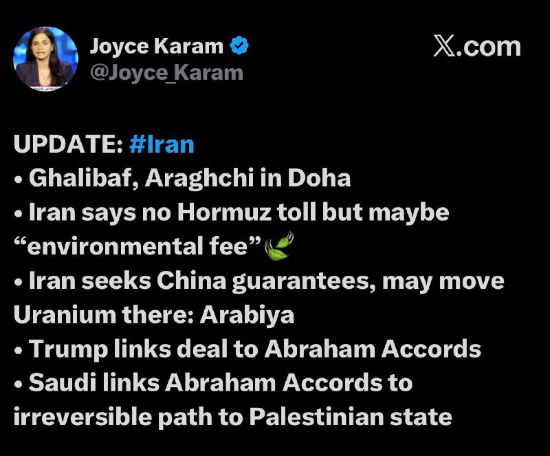

🔴قالیباف و عراقچی در دوحه
ایران می‌گوید هیچ عوارضی برای تنگه هرمز وجود ندارد، اما شاید «هزینه زیست‌محیطی» داشته باشد

ایران به دنبال تضمین‌های چین است، ممکن است اورانیوم را به آنجا منتقل کند: عربستان
ترامپ این توافق را به توافق آبراهام مرتبط دانست
عربستان توافق آبراهام را به مسیر برگشت‌ناپذیر برای تشکیل کشور فلسطین مرتبط دانست

به نظر می‌رسد پیوند توافق‌نامه ابراهیم ناشی از تمایل به خروج آبرومندانه ترامپ و پیروزی ژئوپلیتیکی برای اسرائیل باشد، اما بعید است که این امر محقق شود. ترامپ می‌تواند روی کاغذ تعهدی از عربستان سعودی برای عادی‌سازی نهایی روابط به دست آورد، اما این پادشاهی در طول سال گذشته از این هدف فاصله گرفته و به ترکیه/قطر/پاکستان نزدیک‌تر شده است.

در حال حاضر، تمرکز هرگونه توافق اولیه بر حقوق ترانزیت هرمز و انتقال اورانیوم غنی‌شده با غنای بالا متمرکز است. چین به عنوان ضامن از دیدگاه ایران منطقی است، اما هنوز مشخص نیست که آیا پکن این نقش را خواهد پذیرفت و تا این حد در منطقه خاورمیانه نفوذ خواهد کرد یا خیر.
https://t.me/kianmeli1

## kianmeli1 — post 87660

‏🔴العربیه به نقل از منابع آگاه اعلام کرد پیش‌نویس یک یادداشت تفاهم اولیه و نهایی میان واشینگتن و تهران در حال بررسی است. این پیش‌نویس شامل بازگشایی تنگه هرمز بدون دریافت هزینه و همچنین پاکسازی مین‌ها است. در این پیش‌نویس همچنین به ایران اجازه فروش و صادرات نفت داده خواهد شد

‏در بخش دیگری از این پیش‌نویس آمده است که آتش‌بس به مدت ۶۰ روز تمدید خواهد شد و امکان تمدید دوباره آن نیز وجود دارد. همچنین آمریکا متعهد شده محدودیت‌ها بر بنادر جنوب ایران را کاهش دهد

‏بر اساس گزارش العربیه، بخشی از دارایی‌های مسدودشده ایران بر اساس سازوکاری مشخص آزاد خواهد شد
https://t.me/kianmeli1

## IranIntlTV — post 338968

  

ستار هاشمی، وزیر ارتباطات، با اشاره به «تصویب و آغاز اجرای بازگشایی اینترنت» گفت آنچه در حال وقوع است «پیام‌آور پایداری، اعتماد ملی و ثبات کشور» است.

او افزود: «پس از ابلاغ مصوبه به وزارت ارتباطات، اقدامات فنی و عملیاتی برای بازگرداندن اینترنت به مدار عادی آغاز خواهد شد.»
https://iranintl.com/202605250528

## IranIntlTV — post 338967

  <a href="telegram/content/IranIntlTV_338967_1779733489.mp4" target="_blank">🎬 Download video</a>

مهدی مهدوی‌آزاد در برنامه «چشم‌انداز» گفت: «زمانی که یک حکومت استبدادی مانند جمهوری اسلامی با کشوری مانند آمریکا مذاکره می‌کند، قرارهای پنهانی و محرمانه بخشی از سنت این‌گونه مذاکرات خواهد بود.»
@iranintltv

## IranIntlTV — post 338966

  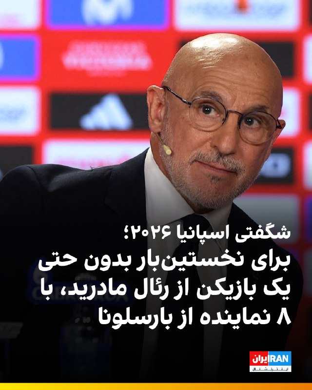

🔻لوئیس دلا فوئنته، سرمربی تیم ملی اسپانیا امروز فهرست نهایی خود برای جام جهانی ۲۰۲۶ را اعلام کرد. فهرستی که هسته اصلی تیم قهرمان یورو را حفظ کرده، اما شگفتی بزرگی دارد؛ برای نخستین‌بار در تاریخ حضور اسپانیا در جام‌های جهانی، حتی یک بازیکن از رئال مادرید حضور ندارد.

🔹ستون اصلی تیمی که یورو ۲۰۲۴ را فتح کرد، همچنان شالوده تیم ملی اسپانیا برای جام جهانی ۲۰۲۶ را تشکیل می‌دهد.

🔹بازیکنانی مانند رودری، پدری، فابیان روئیس، دنی اولمو و لامین یامال همچنان مهره‌های کلیدی تیم محسوب می‌شوند.

🔹با این لیست، برای نخستین‌بار در ۹۲ سال حضور اسپانیا در جام جهانی، هیچ نماینده‌ای از پرافتخارترین باشگاه این کشور در ترکیب تیم ملی حضور نخواهد داشت. در عوض بارسلونا، قهرمان دو فصل اخیر لالیگا، ۸ نماینده در ترکیب دارد.

🔹لوئیس دلا فوئنته گفته فرم فعلی و آمادگی بدنی بازیکنان را در اولویت قرار داده است؛ تصمیمی که باعث غیبت‌های قابل توجه و در عین حال دعوت از چهره‌هایی شد که در طول فصل درخشیدند.

🔹فهرست نهایی اسپانیا و تحلیلی درباره ترکیب ۲۰۲۶ را در وب‌سایت ایران اینترنشنال بخوانید.

@iranintltvsport

## IranIntlTV — post 338965

  

یدالله جوانی، معاون سیاسی سپاه پاسداران، گفت «هادیان سیاسی» باید «روایت پیروزی ملت ایران» را برای جامعه بازگو کنند و افزود دشمن پس از شکست در میدان، تلاش می‌کند در جامعه «اختلاف، تردید و سستی» ایجاد کند.

او گفت: «اگر مجاهدت در میدان نباشد، دشمن شکست نمی‌خورد.»

معاون سیاسی سپاه پاسداران افزود: «دشمنی که در میدان شکست خورده است تلاش می‌کند در جامعه اختلاف، تردید، ابهام و سستی ایجاد کند.»
https://iranintl.com/202605257865

## IranIntlTV — post 338964

  

یدالله جوانی، معاون سیاسی سپاه پاسداران، گفت «هادیان سیاسی» باید «روایت پیروزی ملت ایران» را برای جامعه بازگو کنند و افزود دشمن پس از شکست در میدان، تلاش می‌کند در جامعه «اختلاف، تردید و سستی» ایجاد کند.

او گفت: «اگر مجاهدت در میدان نباشد، دشمن شکست نمی‌خورد.»

معاون سیاسی سپاه پاسداران افزود: «دشمنی که در میدان شکست خورده است تلاش می‌کند در جامعه اختلاف، تردید، ابهام و سستی ایجاد کند.»
https://iranintl.com/202605257865

## IranIntlTV — post 338963

  

یدالله جوانی، معاون سیاسی سپاه پاسداران، گفت «هادیان سیاسی» باید «روایت پیروزی ملت ایران» را برای جامعه بازگو کنند و افزود دشمن پس از شکست در میدان، تلاش می‌کند در جامعه «اختلاف، تردید و سستی» ایجاد کند.

او گفت: «اگر مجاهدت در میدان نباشد، دشمن شکست نمی‌خورد.»

معاون سیاسی سپاه پاسداران افزود: «دشمنی که در میدان شکست خورده است تلاش می‌کند در جامعه اختلاف، تردید، ابهام و سستی ایجاد کند.»
https://iranintl.com/202605257865

## IranIntlTV — post 338962

حضور مجتبی خامنه‌ای در مخفی‌گاه، روند مذاکرات تهران و واشینگتن را کند کرده است. براساس گزارش‌های اطلاعاتی آمریکا، رهبر سوم جمهوری اسلامی در مخفیگاهی نامعلوم و تحت تدابیر شدید امنیتی زندگی می‌کند و ارتباط با او هم صرفا از طریق شبکه‌ای پیچیده از پیک‌ها ممکن است. سی‌بی‌اس در گزارشی به نقل از مقام‌های آمریکایی نوشت یکی از دلایل تاخیر طولانی در پاسخ‌های تهران، این است که مقام‌های ارشد حکومت هم دسترسی مستقیمی به مجتبی خامنه‌ای ندارند.

گفت‌وگو با جمشید برزگر، روزنامه‌نگار و تحلیل‌گر سیاسی
@iranintltv

## IranIntlTV — post 338961

توافق احتمالی با تهران، باعث شکاف در جمهوری‌خواهان شده است. تعدادی از سناتورهای ارشد جمهوری‌خواه، معتقدند ترامپ با رفع بخشی از تحریم‌ها و آزادسازی دارایی‌های تهران، امتیاز زیادی به جمهوری اسلامی می‌دهد. آن‌ها هشدار داده‌اند فروش دوباره نفت، می‌تواند باعث تقویت جمهوری اسلامی و گروه‌های نیابتی تهران شود. کاخ سفید اما از مذاکرات دفاع کرده و می‌گوید ترامپ اجازه نخواهد داد ایران به سلاح هسته‌ای دست پیدا کند.

گفت‌وگو با مرضیه حسینی، خبرنگار ایران‌اینترنشنال
@iranintltv

## IranIntlTV — post 338960

  

رسانه‌های ایران گزارش دادند مسعود پزشکیان دستور بازگشایی اینترنت بین‌الملل را ابلاغ کرده است.
پزشکیان گفت: «راه دشواری پیمودیم تا حق مردم را به آنها بازگردانیم .»
پیش‌تر ستاد راهبری و ساماندهی فضای مجازی، به ریاست محمدرضا عارف، معاون اول مسعود پزشکیان، تشکیل جلسه داد و بازگشت اینترنت به وضعیت پیش از دی‌ماه ۱۴۰۴ را تصویب کرد.
https://iranintl.com/202605257040

## IranIntlTV — post 338959

  

خبرگزاری تسنیم، وابسته به سپاه پاسداران، نوشت که اخبار منتشرشده از سوی شبکه الحدث مبنی بر اعلام آمادگی جمهوری اسلامی برای خروج مواد هسته‌ای «کذب» است و در متن تفاهم‌نامه‌ای که تا امروز وجود دارد، هیچ جمله‌ای مبنی بر اعلام آمادگی برای خروج مواد هسته‌ای وجود ندارد.
https://iranintl.com/202605255310

## IranIntlTV — post 338958

  

دونالد ترامپ، رییس‌جمهوری آمریکا، در شبکه اجتماعی تروث‌سوشال با انتشار تصویری که با هوش مصنوعی ساخته شده، دوره اوباما و بایدن را با دوران ریاست‌جمهوری خود در مذاکرات با جمهوری اسلامی مقایسه کرد

او نوشت در دولت‌های پیشین، روسای‌جمهور آمریکا خواهان مذاکره بودند و تهران تهدید به اقدام نظامی می‌کرد، اما این بار او جمهوری اسلامی را تهدید کرد و آن‌ها به مذاکره تن دادند.

ترامپ همچنین با انتشار تصویری ساخته‌شده با هوش مصنوعی از باراک اوباما در کنار یک پالت پر از پول، نوشت سیاست‌های اوباما در قبال جمهوری اسلامی باعث وقوع جنگ شده است.
https://iranintl.com/202605251179

## IranIntlTV — post 338957

  <a href="telegram/content/IranIntlTV_338957_1779733498.mp4" target="_blank">🎬 Download video</a>

ویدیوهای دریافتی نشان می‌دهد روز یک‌شنبه سوم خرداد، جمعی از ایرانیان ساکن شهر رجاینا در ساسکاچوان کانادا، در حمایت از مردم ایران، زنجیره انسانی بر روی پلی تشکیل دادند. آن‌ها با در دست گرفتن نوشته‌هایی علیه اعدام‌های جمهوری اسلامی و قطعی اینترنت، تجمع اعتراضی برگزار کردند.
@iranintltv

## IranIntlTV — post 338956

  <a href="telegram/content/IranIntlTV_338956_1779733500.mp4" target="_blank">🎬 Download video</a>

همزمان با ادامه مذاکرات میان تهران و واشینگتن و انتشار گزارش‌هایی درباره توافق احتمالی، انتقادها در آمریکا و اسرائیل ادامه دارد. منتقدان می‌گویند جزییات منتشرشده از متن توافق می‌تواند منافع ملی آمریکا و اسرائیل را به خطر بیندازد.

گفت‌وگو با آرش آرامش، حقوقدان و کارشناس امنیت ملی
@iranintltv

## IranIntlTV — post 338955

  

🔻خبرگزاری تسنیم گزارش داده که هیات رییسه فدراسیون فوتبال مصوب کرده پاداشی معادل ۲۵۰ میلیارد تومان به اعضای تیم ملی شامل بازیکنان، مربیان و سایر اعضا بابت صعود به جام جهانی ۲۰۲۶ اختصاص دهد. این خبرگزاری نوشته این پاداش از محل مطالبات فدراسیون فوتبال در فیفا تامین می‌شود.

🔹در چهار سال گذشته، پاداش به تیم ملی بابت صعود به جام جهانی ۲۰۲۲، یک پرونده بی‌سرانجام در فوتبل ایران بود؛ پیگیری‌های رسانه‌ای درباره حواله‌های میلیاردی خودرو به بازیکنان تیم ملی و پاداش چند ۱۰ هزار دلاری به هیات رییسه فدراسیون، هیچ‌گاه به پاسخ روشنی نرسید.

@iranintltvsport

## IranIntlTV — post 338954

  <a href="telegram/content/IranIntlTV_338954_1779733503.mp4" target="_blank">🎬 Download video</a>

دونالد ترامپ، رییس‌جمهوری آمریکا، گفت مذاکرات با جمهوری اسلامی به‌خوبی پیش می‌رود و تاکید کرد توافق احتمالی یا یک معامله بزرگ برای همه خواهد بود یا هیچ معامله‌ای در کار نخواهد بود. او همچنین از کشورهای منطقه، از جمله ایران، خواست فورا به پیمان ابراهیم بپیوندند و روابط خود را با اسرائیل عادی‌سازی کنند.

گفت‌وگو با سمیرا قرایی و بابک اسحاقی، خبرنگاران ایران‌اینترنشنال و مسعود کاظمی، روزنامه‌نگار
@iranintltv

## IranIntlTV — post 338953

  

العربیه به نقل از منابع آگاه گزارش داد پیش‌نویس یک توافق میان واشینگتن و تهران در حال بررسی است. بر اساس این پیش‌نویس، تنگه هرمز بدون دریافت عوارض بازگشایی و مین‌های دریایی پاکسازی می‌شود و به ایران اجازه فروش و صادرات نفت داده خواهد شد.

در این پیش‌نویس دوره‌ای ۳۰ روزه برای ازسرگیری کامل کشتیرانی در تنگه هرمز در نظر گرفته شده و همچنین یک بازه ۶۰ روزه برای مذاکرات هسته‌ای تعیین شده است.

بر اساس این گزارش، آتش‌بس در همه جبهه‌ها از جمله لبنان برقرار خواهد ماند و برای ۶۰ روز تمدید می‌شود و امکان تمدید دوباره آن نیز وجود دارد. آمریکا نیز متعهد شده محدودیت‌ها بر بنادر جنوب ایران را کاهش دهد و بخشی از دارایی‌های مسدودشده ایران بر اساس سازوکاری مشخص آزاد شود.
https://iranintl.com/202605252770

## IranIntlTV — post 338952

  

کلودیا شینباوم، رییس‌جمهوری مکزیک، دوشنبه اعلام کرد که دولت او موافقت کرده به تیم ملی فوتبال ایران اجازه دهد در طول رقابت‌های جام جهانی در مکزیک اقامت داشته باشد.

او افزود که ایالات متحده تمایلی به میزبانی این تیم نداشته است.

شینباوم گفت که فدراسیون بین‌المللی فوتبال (فیفا) پس از آن‌که آمریکا اعلام کرد نمی‌خواهد تیم ایران در طول مسابقات در خاک این کشور مستقر باشد، با دولت مکزیک تماس گرفته است.

ایران قرار است هر سه بازی مرحله گروهی خود را در آمریکا برگزار کند.

شینباوم در یک نشست خبری گفت: «ما هیچ دلیلی برای محروم کردن آنها از امکان اقامت در مکزیک نمی‌بینیم.»

کاخ سفید و وزارت خارجه آمریکا هنوز در این زمینه اظهار نظر نکرده‌اند.
https://iranintl.com/202605252544

## IranIntlTV — post 338951

  <a href="telegram/content/IranIntlTV_338951_1779733508.mp4" target="_blank">🎬 Download video</a>

🔻هدایت ممبینی، دبیرکل فدراسیون فوتبال ایران گفته آمریکا برای اعضای تیم ملی فوتبال ویزای مولتی صادر خواهد کرد. این درحالی است که به طور معمول، ایالات متحده برای دارندگان پاسپورت ایرانی ویزای مولتی صادر نمی‌کند.

🔹توضیحات امیر گیتی، عضو تحریریه ایران اینترنشنال

@iranintltvsport

## IranIntlTV — post 338950

  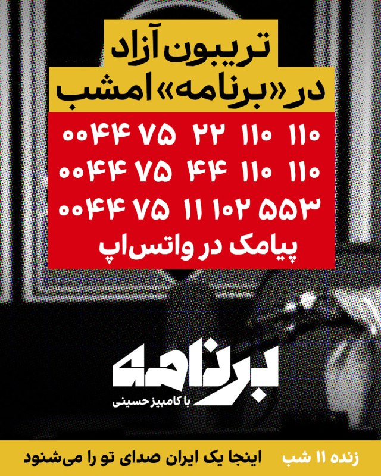

«برنامه» بعد از یک هفته، امشب روی آنتن برمی‌گردد و یک «تریبون آزاد» دیگر را برای شما میزبانی خواهد کرد.
اگر فقط یک جمله فرصت داشتید با ایران حرف بزنید، چه می‌گفتید؟
چه چیزی هنوز دلتان را گرم نگه می‌دارد؟
نگرانی‌تان چیست؟
از چه چیزی عصبانی هستید؟
حرفی دارید که در دلتان مانده و جایی برای گفتنش نبوده است؟
از خودتان بگویید؛ از امیدها و ترس‌هایتان، از رؤیایی که هنوز زنده است یا از چیزی که از دست رفته است.
تاریخ با صدای شما نوشته می‌شود.
برای شرکت در «برنامه»، همین حالا در واتس‌اپ پیام بدهید:
۰۰۴۴۷۵۲۲۱۱۰۱۱۰
۰۰۴۴۷۵۴۴۱۱۰۱۱۰
۰۰۴۴۷۵۱۱۱۰۲۵۵۳
«برنامه با کامبیز حسینی»
«یک ایران، صدای شما را می‌شنود»
@iranintltv

## IranIntlTV — post 338949

  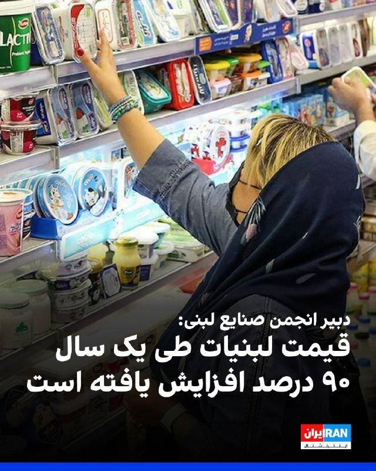

رضا باکری، دبیر انجمن صنایع لبنی ایران، اعلام کرد قیمت محصولات لبنی در یک سال گذشته چندین بار افزایش یافته و در مجموع حدود ۹۰ درصد گران شده است.

باکری افزود هفته گذشته دامداران، قیمت شیر خام را با ۲۹ درصد افزایش به کیلویی ۶۰ هزار و ۵۰۰ تومان رساندند.

دبیر انجمن صنایع لبنی ایران از افزایش قیمت چند محصول پرمصرف خبر داد و گفت: «قیمت شیر نایلونی به ۸۴ هزار تومان، شیر بطری به ۹۸ هزار تومان، پنیر یو‌اف ۴۰۰ گرمی به ۲۰۳ هزار تومان و ماست دبه‌ای دو کیلوگرمی به ۲۲۸ هزار و ۷۰۰ تومان رسیده است.»

سرانه مصرف شیر در ایران یک‌سوم میانگین جهانی است که تنها در یکی دو سال اخیر، ۳۰ درصد کاهش داشته است.
https://iranintl.com/202605252813

## Shin_Persian — post 6218

Shin ✓ @hey_itsmyturn
Mon, 25 May 2026 17:57:24 UTC

Al Arabiya is NewYorkTimesing too much these days. I would take their news on Iran talks with a huge grain of salt

فارسی

العربیه این روزها بیش از حد به سبک نیویورک تایمز (NYT) عمل می‌کند. من اخبار آن‌ها درباره مذاکرات ایران را با تردید بسیار زیاد می‌پذیرم.

𝕏 · @shin_persian

## ManotoTV — post 105829

  <a href="telegram/content/ManotoTV_105829_1779733513.mp4" target="_blank">🎬 Download video</a>

گفت‌وگو با کیوان عباسی:
«می‌گفت ایرانی‌ها باید بیشتر کنار هم بایستند…
و دوباره باور کنند که سرنوشت ایران را خود مردم ایران رقم می‌زنند.»

## FarsiVOA — post 218638

🔺پرزیدنت ترامپ در مراسم «روز یادبود»: «خشم حماسی» تضمین کرد که رژیم ایران هرگز سلاح هسته‌ای نخواهد داشت

▪️دونالد ترامپ، رئیس جمهوری ایالات متحده، روز دوشنبه ۴ خرداد در مراسم رسمی «روز یادبود کشته‌شدگان نیروهای مسلح آمریکا» (یا «مموریال دِی») در گورستان ملی آرلینگتون، با ادای احترام به سربازان کشته‌شده آمریکایی، تاکید کرد عملیات‌های اخیر ارتش ایالات متحده، از جمله «خشم حماسی» علیه جمهوری اسلامی، بخشی از نبرد آمریکا برای دفاع از آزادی و جلوگیری از دستیابی «بزرگ‌ترین حامی تروریسم در جهان» به سلاح هسته‌ای بوده است.

⬇️ بیشتر بخوانید:

https://ir.voanews.com/a/president-trump-arlington-cemetery-speech-iran-epic-fury/8153702.html/?nocach=1

## FarsiVOA — post 218637

انتخابات پادگانی مجلس؛ جنگ قالیباف و پایداری وارد فاز علنی شد

## FarsiVOA — post 218636

دولت بریتانیا متهم شده از ترس کمبود سوخت جت و تبعات بحران خاورمیانه، اجرای بخشی از تحریم سوخت روسیه را عقب انداخته. دارن جونز، از مقام‌های دولت استارمر، این ادعا را «کاملاً غلط» توصیف کرده اما همزمان تأیید کرده لندن در حال بررسی سناریوهای بحران انرژی و تأثیر تنش‌های خاورمیانه روی بریتانیا است.

## FarsiVOA — post 218635

  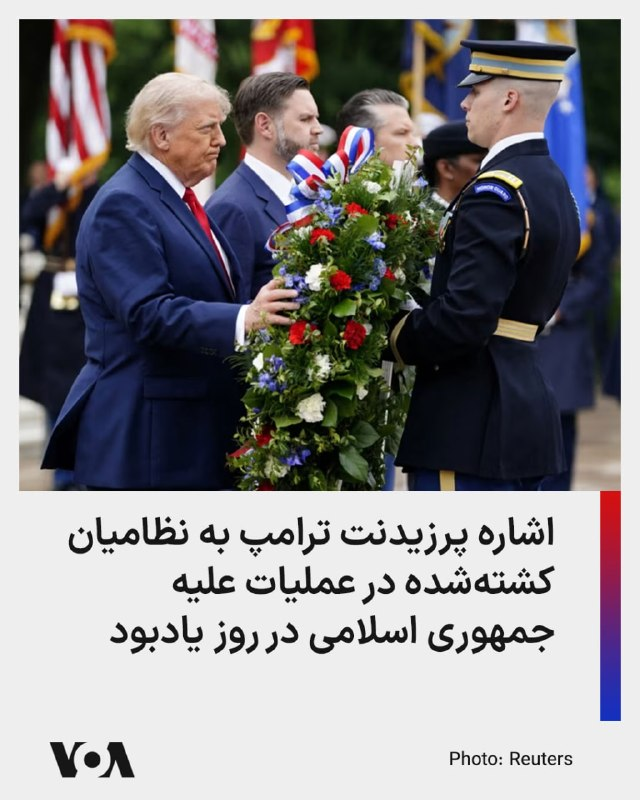

⚡️دونالد ترامپ، رئیس جمهوری آمریکا در روز یادبود با حضور در آرامستان ملی آرلینگتون، به قهرمانان جنگی ادای احترام کرد. پرزیدنت ترامپ نظامیان کشته‌شده آمریکا در عملیات خشم حماسی را قهرمانانی نامید که جانشان را از دست دادند تا بزرگترین حامی تروریسم در جهان به سلاح هسته‌ای دست پیدا نکند و هرگز هم دست پیدا نخواهد کرد.

## FarsiVOA — post 218634

ادامه تلاش های دیپلماتیک برای کاهش تنش در منطقه در گفتگو با حامد آئینه‌وند

## FarsiVOA — post 218633

پیشنهاد فوری عراق به واشنگتن: «نظارت سختگیرانه» بر گروه‌های مسلح در برابر اعطای مهلت سه‌ماهه به دولت الزیدی

## FarsiVOA — post 218632

دونالد ترامپ، رئیس‌جمهوری آمریکا، در مراسم روز یادبود کشته‌شدگان نیروهای مسلح آمریکا با حضور در مقبره سرباز گمنام، به نظامیان کشته‌شده آمریکا ادای احترام کرد.

@FarsiVOA

## FarsiVOA — post 218631

🔺ارتش اسرائیل: یک «تروریست‌ کلیدی» حماس را از میان برداشتیم

▪️ارتش اسرائیل می‌گوید محمد ابو ملوح، که یک «تروریست‌ کلیدی» در سازمان تروریستی حماس بوده، کشته شده است.

⬇️ بیشتر بخوانید:

https://ir.voanews.com/a/terrorist-hamas-killed-attack/8153681.html/?nocach=1

## FarsiVOA — post 218629

تغییر حکم بچه های اکباتان از حبس به اعدام در گفتگو با مینا احدی، سخنگوی کمیته علیه اعدام.

## FarsiVOA — post 218628

اسپیس‌ایکس ویدیویی از مانور چرخش و مرحله فرود استارشیپ در پایان دوازدهمین پرواز آزمایشی منتشر کرد.

@FarsiVOA

## FarsiVOA — post 218627

  <a href="telegram/content/FarsiVOA_218627_1779733516.mp4" target="_blank">🎬 Download video</a>

مجموعه «سور اطلس» تصاویر ماهواره‌ای جدیدی را منتشر کرده که نشان‌دهنده تخریب گسترده در «تاسیسات کلیدی دریایی بوشهر» است.

بررسی تصاویر قبل و بعد نشان می‌دهد که بعد از حملات هوایی آمریکا و اسرائیل در ۱۴ اسفند ۱۴۰۴ چند ساختمان در این منطقه «برای تضعیف توانایی ایران در ادامه عملیات دریایی» هدف‌گیری شدند.

دونالد ترامپ، رئیس‌جمهوری آمریکا، از آغاز جنگ چند مرتبه اشاره کرد که در همان هفته اول «نیروی دریایی جمهوری اسلامی از بین رفته است.»

این ویدیو بی‌صدا است.

## FarsiVOA — post 218626

در گفت‌وگو با مهدی عربشاهی به انتقادها از نادیده‌گرفتن نقش مردم ایران در گفت‌وگوهای احتمالی، پنهان‌بودن رهبر جمهوری اسلامی و مقایسه آن با سال‌های پایانی اسامه بن‌لادن در پاکستان پرداختیم و پرسیدیم در این معادله قدرت، جامعه معترض چه جایگاهی دارد و چه تاثیری بر سرنوشت خود خواهد گذاشت؟

## FarsiVOA — post 218625

ترامپ: توافق با تهران کاملا بر خلاف برجام است، و پیمان ابراهیم را با توافق تهران مرتبط می‌دانم

## FarsiVOA — post 218624

🔺هشدار جدید ارتش اسرائیل به چند روستا در جنوب لبنان: فورا تخلیه کنید

▪️ارتش اسرائیل روز دوشنبه ۴ خرداد هشداری فوری برای تخلیه روستای العباسیه در اطراف شهر صور در جنوب لبنان صادر کرد.

⬇️ بیشتر بخوانید:

https://ir.voanews.com/a/israel-lebanon-iran-hezbollah-war-ceasfire/8153680.html/?nocach=1

## FarsiVOA — post 218623

  <a href="telegram/content/FarsiVOA_218623_1779733519.mp4" target="_blank">🎬 Download video</a>

ارتش اسرائیل مواضع حزب‌الله را در نزدیکی منطقه صور در جنوب لبنان هدف قرار داد.

ارتش اسرائیل پیشتر به ساکنان ۱۰ منطقه شامل شهر و روستا در جنوب لبنان هشدار داده بود که پیش از حملات هوایی علیه مواضع گروه حزب‌الله لبنان، این مناطق را تخلیه کنند.

## FarsiVOA — post 218622

  <a href="telegram/content/FarsiVOA_218622_1779733521.mp4" target="_blank">🎬 Download video</a>

ارتش اسرائیل اعلام کرد روز گذشته یک نیروی کلیدی از ستاد تولید سازمان تروریستی حماس را از بین برد.

بنابر بیانیه ارتش اسرائیل، «محمد ابو ملوح»، یکی از منابع اصلی دانش در سازمان تروریستی حماس بود که در طول دوره آتش‌بس نیز به تولید تسلیحاتی مشغول بود که تهدیدی برای نیروهای ارتش در منطقه و شهروندان محسوب می‌شد. او با حمله نیروهای ارتش اسرائیل تحت فرماندهی جنوب در مرکز نوار غزه حذف شد.

ارتش اسرائیل تاکید کرد نیروهایش تحت فرماندهی جنوب مطابق با توافق در منطقه مستقر هستند و به فعالیت خود برای رفع هرگونه تهدید فوری ادامه می‌دهند.

## FarsiVOA — post 218621

در گفت‌وگو با مئیر جاودانفر، تحلیلگر مسائل خاورمیانه در اسرائیل، به هم‌زمانی سیگنال‌های مثبت درباره پیشرفت مذاکرات میان حکومت ایران و آمریکا پرداختیم و پرسیدیم آیا مسیر کنونی به توافقی واقعی منتهی می‌شود یا صرفاً بازیِ سیگنال‌ها و مدیریت انتظارات است؟

## FarsiVOA — post 218620

  <a href="telegram/content/FarsiVOA_218620_1779733524.mp4" target="_blank">🎬 Download video</a>

چیزی که در این مدت آموخته‌ایم این است که هیچ چیز هنوز قطعی نیست و همه چیز در تعلیق است. اما آیا فضای تازه‌ای که در مذاکرات ایران و آمریکا باز شده می‌‌تواند آغازی باشد برای یک پایان؟ کارشناسان میدان پاسخ می‌دهند

## FarsiVOA — post 218619

  <a href="telegram/content/FarsiVOA_218619_1779733525.mp4" target="_blank">🎬 Download video</a>

ارتش اسرائیل یک ساختمان حزب‌الله را در رشیدیه، جنوب لبنان، هدف قرار داد. این حمله پس از هشدار تخلیه انجام شد.

ارتش اسرائیل پیشتر به ساکنان ۱۰ منطقه شامل شهر و روستا در جنوب لبنان هشدار داده بود که پیش از حملات هوایی علیه مواضع گروه حزب‌الله لبنان، این مناطق را تخلیه کنند.

## FarsiVOA — post 218618

🔺نوبت به اهالی سینما رسید؛ هومن سیدی و سعید روستایی احضار شدند

▪️قوه قضائیه جمهوری اسلامی با پرونده‌سازی علیه شماری از اهالی سینما، از جمله هومن سیدی و سعید روستایی، آنها را به اتهام واهی «همکاری با دولت متخاصم» به «دادسرای فرهنگ و رسانه» احضار کرده است.

⬇️ بیشتر بخوانید:

https://ir.voanews.com/a/filing-a-case-against-cinema-workers-saeed-roustaei-hooman-seydi-judiciary-legal-director-of-the-cinema-house/8153614.html/?nocach=1

## DW_Farsi — post 125141

🔶 شبکه تلویزیونی و اینترنتی"منوتو" به کار خود پایان داد

شبکه تلویزیونی و اینترنتی "منوتو" (manoto)، از رسانه‌های پرمخاطب فارسی‌زبان خارج از کشور طی اطلاعیه‌ای از پایان پخش برنامه‌هایش بعد از ۱۶ سال کار خبر داد.

این شبکه که پیش از این پخش برنامه‌هایش در زمستان ۱۴۰۲ متوقف شده بود این بار در شامگاه جمعه اول خردادماه طی اطلاعیه‌ای اعلام کرد، سرانجام به این تصمیم دشوار رسیده که به پخش برنامه‌های منوتو پایان دهد: «آخرین پخش ما از ماهواره و یوتیوب، شامگاه ۲۴ مه ۲۰۲۶ [۳ خرداد ۱۴۰۵] خواهد بود.»

"منوتو" که از پاییز سال ۱۳۸۹ در لندن با مدیریت کیوان و مرجان عباسی به روی آنتن ماهواره رفت بعد از حدود دو سال و نیم کار اعلام کرد، به دلیل "مشکلات مالی" پخش تلویزیونی خود را متوقف کرده است. اما این توقف به طول نیانجامید و مدتی بعد فعالیت "منوتو" ازسر گرفته شد.

این بار طبق اطلاعیه پایانی، علاوه بر مسائل مالی به "دگرگونی‌های بنیادین در عرصه رسانه‌ای و سیاسی" ایران نیز اشاره شده است.

در این اطلاعیه گفته شده که فضای عمومی مملو از "اطلاعات نادرست، هیجان‌سازی و تلاش آگاهانه برای مخدوش کردن مرز میان واقعیت و روایت‌های جعلی" است و فضای سیاسی ایران نیز "خصمانه‌تر و قطبی‌تر" شده و شرایط را برای ادامه فعالیت این شبکه غیرممکن کرده است.

در ادامه آمده است: «از همین رو، ترجیح دادیم به جای ادامه مسیری که ممکن است به بهای از دست رفتن هویت منوتو تمام شود، از ارزش و انسجام این مجموعه محافظت کرده و خود را برای شکلی متفاوت از تأثیرگذاری آماده کنیم.»

"منوتو" همچنین گفته است، پخش را متوقف می‌کند تا بتواند در آینده "به‌ شکلی دیگر، در گفت‌وگو درباره فردای ایران سهیم" شود.

@dw_farsi

## DW_Farsi — post 125140

🔶 محکومیت یک نفر به زندان "به دلیل پخش شیرینی" در شب کشته شدن خامنه‌ای

شهلا عروجی، وکیل دادگستری در پستی در شبکه ایکس خبر از صدور دو سال زندان برای یک شهروند به دلیل پخش شیرینی در شامگاه نهم اسفند ۱۴۰۴ همزمان با کشته شدن علی خامنه‌ای خبر داد.

عروجی در این پست نوشت: «به دليل پخش شيرينی در شب ۱۰ اسفند [خود موكل ميگه ٩ اسفند و بابت افتتاح فست فودش بوده] محكوم به ۲ سال حبس از بابت اتهام توهين به رهبری شده!»

به نوشته این وکیل دادگستری، در رأی صادره به "شاد بودن" این شهروند هم به عنوان مصداق ارتکاب جرم اشاره شده است.

دادبان، مرکز مشاوره و آموزش حقوقی ویژه کنش‌گران با انتشار این خبر نوشته است: «حتی در فرض صحت ادعای مطرح‌شده درباره پخش شیرینی به مناسبت کشته شدن رهبر جمهوری اسلامی، چنین رفتاری به‌ خودی‌خود مصداق جرم "توهین به رهبری"، موضوع ماده ۵۱۴ قانون مجازات اسلامی محسوب نمی‌شود.»

به نوشته دادبان، تحقق عمل مجرمانه توهین به رهبری "مستلزم به‌کارگیری الفاظ، عبارات یا رفتارهای صریحا موهن و تحقیرآمیز است و صرف ابراز شادی یا پخش شیرینی، فاقد عناصر قانونی لازم برای تحقق این جرم است".

دادبان ادامه می‌دهد: «همچنین استناد دادگاه به "شاد بودن" متهم به‌عنوان دلیل ارتکاب جرم، با اصل قانونی بودن جرم و مجازات در تعارض آشکار قرار دارد؛ چرا که احساسات، حالات روحی یا برداشت‌های ذهنی افراد تا زمانی که در قالب رفتار مجرمانه مشخص و تعریف‌شده در قانون بروز پیدا نکند، قابل جرم‌انگاری نیست.»
به علاوه، در قوانین کیفری ایران نیز "هیچ ماده‌ای صرف شادمانی از مرگ یک فرد را جرم تلقی نکرده است."

دادبان بر همین مبنا صدور دو سال زندان در این پرونده را "فاقد مبنای قانونی روشن" و "مصداق تفسیر موسع قوانین کیفری علیه متهم" خوانده است؛ امری که "برخلاف اصول بنیادین حقوق کیفری و الزامات دادرسی عادلانه است.

@dw_farsi

## DW_Farsi — post 125139

  <a href="telegram/content/DW_Farsi_125139_1779733528.mp4" target="_blank">🎬 Download video</a>

🎥 شکست پروژه قطار شناور آلمان

"ترانس‌راپید"، پروژه قطار شناور مغناطیسی آلمان، قرار بود آینده حمل‌ونقل را تغییر دهد.

قطاری فوق‌سریع که بدون چرخ و با فناوری مغناطیسی حرکت می‌کرد. اما حالا مسیر آزمایشی این قطار زنگ زده و متروکه شده است.

چه شد که این پروژه شکست خورد؟

@dw_farsi

## DW_Farsi — post 125138

🔶 رسانه‌ها‌ی ایران از تصویب بازگشایی اینترنت بین‌الملل خبر دادند

رسانه‌های ایران از تصویب مصوبه‌ای تازه در راستای اتصال مجدد اینترنت بین‌الملل در این کشور خبر داده‌اند.

خبرآنلاین به نقل از یک منبع آگاه نوشت ستاد راهبردی و ساماندهی فضای مجازی صبح دوشنبه چهارم خرداد به ریاست محمدرضا عارف، معاون‌ اول مسعود پزشکیان، رئیس‌جمهور کشور جلسه‌ای تشکیل داد و بازگشت اینترنت به وضعیت قبل از دی‌‌ماه ۱۴۰۴ را تصویب کرد.

در جریان اعتراضات ضدحکومتی دی‌ماه اینترنت قطع و  دسترسی به شبکه جهانی تقریبا به طور کامل ناممکن شد.

قطع اینترنت بین‌الملل در خلال جنگ اسرائيل و آمریکا علیه جمهوری اسلامی نیز پی گرفته شد و تا کنون ادامه دارد.

محمدرضا عارف در جلسه روز دوشنبه بر لزوم رفع محدودیت‌های اینترنتی و حمایت از جوانان تأکید کرد و خواستار پاسخگویی به مطالبات مردم و جامعه علمی شد.

به گزارش خبرگزاری مهر، او گفت: «نمی‌شود شعار کمک به مردم سر دهیم ولی در عمل به مردم اعتماد نکرده و اینترنت را بر روی مردم ببندیم و با این کار خود، سرمایه‌های اجتماعی را سوزانده و فرصت طی کردن مسیر فناوری‌ها از دست بدهیم.»

پایگاه خبری تخصصی سیتنا در حوزه فناوری و اطلاعات ایران خبر داده که مصوبه بازگشایی اینترنت برای پزشکیان ارسال شده و "در صورت تأیید رئیس‌جمهور جهت اجرا برای وزارت ارتباطات ارسال خواهد شد."

در همین رابطه نیز یک منبع به خبرگزاری فارس گفت، در جلسه‌ روز دوشنبه، برقراری اینترنت بین‌الملل با ۹ رأی موافق در برابر سه رأی مخالف تصویب و برای تأیید به دفتر رئیس‌جمهور ارسال شد.

@dw_farsi

## DW_Farsi — post 125137

🔶 ترامپ: یا به توافقی عالی با ایران می‌رسیم یا اصلا توافقی در کار نیست

دونالد ترامپ، رئیس‌جمهور آمریکا در پیامی تازه با قید این که گفت‌وگوها با ایران "به‌خوبی پیش می‌رود" نوشت، این مذاکرات یا به یک "توافق عالی" برای همگان منجر می‌شود یا اصلا توافقی در کار نخواهد بود.

در این پیام که دوشنبه ۴ خرداد (۲۵ مه) در شبکه اجتماعی تروث سوشال به نگارش درآمده هشدار داده شده که در غیر این صورت درگیری نظامی دوباره آغاز خواهد شد و همچنین "تیراندازی بزرگ‌تر و قوی‌تر از همیشه ـ و کسی چنین چیزی نمی‌خواهد."

ترامپ با یادآوری دیدار و گفت‌وگوهای اخیر خود با رهبران عربستان، امارات، قطر، پاکستان، ترکیه، مصر، اردن و بحرین گفت، اظهار کرده که پس از تمامی تلاش‌های انجام‌شده توسط ایالات متحده برای حل این مسئله پیچیده (در مورد ایران) باید برای این کشورها دست کم به صورت همزمان امضای پیمان ابراهیمکه همانا عادی‌سازی روابط با اسرائیل است الزامی باشد.  

ترامپ با اشاره به این که پیمان ابراهیم برای کشورهایی که آن را امضا کرده‌اند مانند امارات متحده عربی و بحرین "شکوفایی مالی، اقتصادی و اجتماعی" به بار آورده از عربستان، قطر و سایر کشورها نیز خواست که این روند را ادامه دهند و این پیمان را امضا کنند.

او تصریح کرد: «من قاطعانه از همه کشورها می‌خواهم که فورا پیمان ابراهیم را امضا کنند و اگر ایران هم با من، رئیس‌جمهور آمریکا، توافقش را امضا کند، مایه افتخار خواهد بود که آن‌ها نیز بخشی از این ائتلاف بی‌نظیر جهانی باشند.»

دونالد ترامپ در اولین دور ریاست جمهوری‌اش طرحی را به منظور صلح کشورهای عربی با اسرائیل به نام توافق یا پیمان صلح ابراهیم تهیه کرد. در اولین قدم از این طرح، امارات متحده عربی و بحرین به این توافق پیوسته و برای اولین بار روابط دیپلماتیک‌شان با اسرائیل را در سال ۲۰۲۰ از سر گرفتند.

@dw_farsi

## DW_Farsi — post 125136

🔶 چین سه فضانورد را راهی ایستگاه فضایی تیانگونگ کرد

سه فضانورد سفر خود به سمت ایستگاه فضایی تیانگونگ چین را در روز یکشنبه ۲۴ مه (۳ خرداد) آغاز کردند. فضاپیمای "شنژو-۲۳" در این روز با این سه فضانورد از پایگاه فضایی جیوکوان در بخش چینی صحرای گُبی (Gobi) به پرواز درآمد.

موشک "لانگ مارچ ۲ـ اف" فضاپیمای یادشده را در این روز به فضا فرستاد تا در نهایت به ایستگاه فضایی تیانگونگ چین در مدار زمین متصل شود.

در چارچوب این مأموریت، برای نخستین بار قرار است یک فضانورد چینی به‌مدت یک سال کامل در این ایستگاه فضایی اقامت داشته باشد؛ این در حالی است که به‌طور معمول، خدمه سه‌نفره این ایستگاه هر شش ماه یک‌بار تعویض می‌شوند.

پکن این اقدام را گامی اساسی در راستای تلاش‌های خود برای اعزام انسان به کره ماه تا سال ۲۰۳۰ قلمداد می‌کند.

@dw_farsi

## DW_Farsi — post 125135

🔶 کی‌یف زیر آتش؛ اوکراین خواستار واکنش جهانی شد

یک روز پس از حمله گسترده روسیه به کی‌یف، پایتخت اوکراین، بار دیگر حملات متقابل میان دو کشور در مناطق مرزی ادامه یافت.

مقام‌های روسیه در کانال تلگرام اعلام کردند که در منطقه بلگورود یک مرد در جریان حمله موشکی و پهپادی کشته و فرد دیگری زخمی شده است. همچنین به گفته آنها، زیرساخت‌های انرژی آسیب دیده‌اند که به قطع برق و آب در شهر بلگورود منجر شده است.

سرپرست فرمانداری منطقه بریانسک نیز اعلام کرد یک مرد دیگر در حمله اوکراین به شهرک "بلایا بریوزکا" در نزدیکی بریانسک کشته شده است.

به گزارش تلویزیون دولتی روسیه، در شهر "هورلیفکا" در شرق اوکراین که تحت اشغال روسیه است، پنج نفر در حملات پهپادی زخمی شده‌اند.

@dw_farsi

## DW_Farsi — post 125134

  <a href="telegram/content/DW_Farsi_125134_1779733531.mp4" target="_blank">🎬 Download video</a>

🎥 مخترعان آلمان کجا هستند؟

شرکت‌های بزرگ در آلمان سرمایه فراوانی دریافت می‌کنند. اما اقتصاد این کشور در رکود است. آیا آلمان روی گزینه درستی سرمایه‌گذاری می‌کند؟

@dw_farsi

## DW_Farsi — post 125133

🔶 رسانه‌ها: قالیباف و عراقچی برای مذاکرات وارد قطر شده‌اند

خبرگزاری‌های رویترز  و فرانسه به نقل از یک مقام آگاه از حضور محمدباقر قالیباف، مذاکره‌کننده ارشد ایران و عباس عراقچی، وزیر خارجه این کشور در دوحه قطر به منظور گفت‌وگو با نخست‌وزیر این کشور خبر داده‌اند.

بر اساس این گزارش‌ها، در این گفت‌وگوها توافق احتمالی میان ایران و آمریکا برای پایان دادن به جنگ بررسی خواهد شد.

رویترز به نقل از این مقام آگاه نوشت، محور اصلی مذاکرات موضوع تنگه هرمز و ذخایر اورانیوم بسیار غنی‌شده ایران خواهد بود.

به گفته خبرگزاری‌های داخلی، عبدالناصر همتی، رئیس بانک مرکزی نیز عازم قطر شده و در این سفر "آزادسازی اموال بلوکه‌شده ایران" را بررسی خواهد کرد.

این سفر در پی گفت‌وگوهای اخیر هیأت قطری در تهران در چارچوب میانجی‌گری در مذاکرات ایران و آمریکا صورت می‌گیرد.

در حالی که سرنوشت توافق احتمالی میان ایران و آمریکا در هاله‌ای از ابهام قرار دارد، روزنامه واشنگتن پست به نقل از یک مقام ارشد آمریکایی خبر داده که این دو کشور به یک "چارچوب" مشترک دست یافته‌اند که شامل تمدید ۶۰ روزه آتش‌بس تا رسیدن دو طرف به توافق نهایی برای پایان دادن به جنگ می‌شود.

با این حال این مقام گفت که هنوز هیچ توافقی با ایران امضا نشده و مشخص نیست که این چارچوب تا چه  حد الزام‌آور است.

محورهای اصلی توافق پیشنهادی

واشنگتن پست همچنین به نقل از یک دیپلمات آگاه که نامش ذکر نشد نوشت "آخرین پیشنهاد در انتظار تأیید ایران است."

طبق این گزارش، این پیشنهاد شامل این موارد کلیدی زیر می‌شود:

بازگشایی تنگه هرمز: ایران متعهد می‌شود فورا تنگه هرمز را بازگشایی و عملیات مین‌روبی را آغاز کند و ظرف ۳۰ روز شرایط تردد کشتی‌ها را به وضعیت پیش از جنگ بازگرداند.

توقف کامل درگیری‌ها: ایران، آمریکا و متحدانش متعهد ‌می‌شوند عملیات نظامی را در تمامی جبهه‌ها، از جمله لبنان فورا متوقف کنند.

مسئله هسته‌ای ایران: جمهوری اسلامی باید تعهد بدهد که هرگز سلاح هسته‌ای تولید نخواهد کرد. همچنین توافق شده که ذخایر اورانیوم غنی‌شده ایران یا "غبار هسته‌ای" تحت یک مکانیزم مورد توافق، منهدم یا واگذار شود.

@dw_farsi

## DW_Farsi — post 125132

  <a href="telegram/content/DW_Farsi_125132_1779733534.mp4" target="_blank">🎬 Download video</a>

🎥 مارکو روبیو: ترامپ توافق بد با ایران را نمی‌پذیرد

مارکو روبیو، وزیر خارجه آمریکا، در جریان سفر رسمی خود به هند گفت مذاکرات واشنگتن و جمهوری اسلامی همچنان ادامه دارد و آمریکا پیش از بررسی گزینه‌های دیگر، به "دیپلماسی" فرصت خواهد داد.

روبیو اعلام کرد مذاکرات میان واشنگتن و جمهوری اسلامی همچنان "در حال پیشرفت" است و آمریکا پیش از رفتن به‌سوی گزینه‌های دیگر، به دیپلماسی فرصت خواهد داد. روبیو در دهلی نو گفت چارچوبی "نسبتاً قوی" برای توافق روی میز قرار دارد که شامل بازگشایی تنگه هرمز و آغاز مذاکراتی محدود و جدی درباره برنامه هسته‌ای جمهوری اسلامی است. هم‌زمان، آسوشیتدپرس به نقل از مقام‌های منطقه‌ای گزارش داده آمریکا به توافقی نزدیک شده که می‌تواند به جنگ پایان دهد و جمهوری اسلامی ذخایر اورانیوم با غنای بالای خود را کنار بگذارد. روبیو همچنین درباره لبنان گفت تا زمانی که حزب‌الله مسلح باقی بماند، رسیدن به صلح در لبنان دشوار خواهد بود.

@dw_farsi

## DW_Farsi — post 125131

🎥 وقتی خودبودن جرم می‌شود؛ "مادرم گفت می‌کشمت"

یک مرد کوئیر عراقی از نجف می‌گوید که تهدیدهای خانواده‌اش همراه با قوانین ضد جامعه دگرباشان در عراق، او را مجبور کرد تا برای یافتن جایی که بتواند آزادانه و با امنیت زندگی کند، به بیروت فرار کند. آیا وضعیت در بیروت بهتر است؟

@dw_farsi

## Persian_Trend_Official — post 14964

  <a href="telegram/content/Persian_Trend_Official_14964_1779733538.mp4" target="_blank">🎬 Download video</a>

🔴در این ویدئو آماده سازی و تمرینات سخت نیروهای ویژه کره شمالی را مشاهده میکنید .

🫆:Tony

📌 @persian_trend_official
پرشین ترند | متفاوت‌ترین کانال نظامی

## Persian_Trend_Official — post 14963

  

🗻
💥ویرانی گسترده زاغه مهمات اصفهان

✈️تصاویر ماهواره‌ای منتشرشده از قبل و بعدِ حمله به زاغه مهمات واقع در پشت کوه صفه اصفهان، نشان می‌دهد این مجموعه به‌طور کامل تخریب شده و بخش عمده تأسیسات و انبارهای آن از بین رفته‌اند.

💣این مرکز در تاریخ ۱۱ فروردین توسط بمب افکن های آمریکایی مورد هدف قرار گرفت و طبق ویدیوهای منتشرشده از آن شب، انفجار مهمات داخل پایگاه تا ساعت‌ها پس از حمله ادامه داشته است.

👩‍💻@PhantomDirective

🆔@persian_trend_official
پرشین ترند | متفاوت‌ترین کانال نظامی

## Persian_Trend_Official — post 14962

♦️مقام ارشد آمریکایی به الجزیره: • حزب‌الله درخواست‌های مکرر برای آتش‌بس علیه اسرائیل، از جمله در آخرین هشدار را نادیده می‌گیرد. • اسرائیل به تمام حملاتی که علیه نیروها و شهروندانش انجام شود پاسخ خواهد داد؛ این دولت، دولت بایدن نیست. • از ۱۷ آوریل تاکنون،…

## Persian_Trend_Official — post 14961

♦️مقام ارشد آمریکایی به الجزیره:

• حزب‌الله درخواست‌های مکرر برای آتش‌بس علیه اسرائیل، از جمله در آخرین هشدار را نادیده می‌گیرد.

• اسرائیل به تمام حملاتی که علیه نیروها و شهروندانش انجام شود پاسخ خواهد داد؛ این دولت، دولت بایدن نیست.

• از ۱۷ آوریل تاکنون، حزب‌الله برای مختل کردن مذاکرات میان لبنان و اسرائیل، هزار پهپاد و ۷۰۰ موشک شلیک کرده است.

• حزب‌الله به‌طور کامل مسئول تشدید تنش‌های فعلی است، زیرا از ابتدای ماه مارس آتش‌بس را نقض کرده است.

• حزب‌الله تلاش می‌کند مردم لبنان را از فرصت رسیدن به صلح و آغاز بازسازی و توسعه محروم کند.

🫆:Tony

📌 @persian_trend_official
پرشین ترند | متفاوت‌ترین کانال نظامی

## Persian_Trend_Official — post 14960

  <a href="telegram/content/Persian_Trend_Official_14960_1779733541.webm" target="_blank">🎬 Download video</a>

یک روز نسبتا کم کار فرودگاه بن گوریون

👩‍💻@PhantomDirective

🆔@persian_trend_official
پرشین ترند | متفاوت‌ترین کانال نظامی

## Persian_Trend_Official — post 14958

♦️مدیر روابط‌عمومی وزارت ارتباطات:

▪️مصوبه بازگشت اینترنت به وضعیت قبل از دی‌ماه ۱۴۰۴، دقایقی پیش از سوی رئیس‌جمهور به وزارت ارتباطات ابلاغ شد.

🫆:Tony

📌 @persian_trend_official
پرشین ترند | متفاوت‌ترین کانال نظامی

## Persian_Trend_Official — post 14957

تسنیم:خبر رسانه سعودی درباره جزئیات تفاهم احتمالی کذب است

🔹الحدث، رسانه وابسته به سعودی نوشت که «منابع ایرانی به او گفته‌اند که ایران آماده است اورانیوم غنی شده سطح بالا را از کشور خارج کند»!

🔹بررسی‌ها نشان می‌دهد که رسانه سعودی نیز همچون بسیاری از اخبار او درباره جزئیات مذاکرات کذب بوده و در راستای عملیات روانی آمریکایی‌هاست.

🔹در متن تفاهم‌نامه‌ای که تا امروز وجود دارد، هیچ جمله‌ای مبنی بر اعلام آمادگی برای خروج مواد هسته‌ای وجود ندارد و اساساً ایران در این تفاهم نامه هیچ تعهدی درباره اقدام هسته‌ای نداده است.

🫆:Tony

📌 @persian_trend_official
پرشین ترند | متفاوت‌ترین کانال نظامی

## Persian_Trend_Official — post 14956

  <a href="telegram/content/Persian_Trend_Official_14956_1779733542.webm" target="_blank">🎬 Download video</a>

🔴اولین پیام دبیر شورای عالی امنیت ملی جمهوری اسلامی

▪️"عقب نشینی در‌ کار نخواهد بود".

♦️این را میدان نظامی، میدان دیپلماسی و مردم مبعوث شده حاضر در خیابان با مقاومت جانانه خود نشان دادند و دشمن را زمین گیر کردند.

♦️حالا بیش از هر زمان دیگر کشور نیاز به وحدت و انسجام دارد تا آمریکایی‌ها و صهیونیست‌ها در این زمینه هم مأیوس شوند.

♦️میدان وحدت و انسجام هم یک میدان دیگر در مبارزه است. تلاش همگانی برای جلوگیری از هر سخن و اقدام وحدت‌شکن، ایرانِ عزیز را به پیروزی نهایی خواهد رساند؛ ان‌شاءالله.

🫆:Tony

📌 @persian_trend_official
پرشین ترند | متفاوت‌ترین کانال نظامی

## Persian_Trend_Official — post 14955

  

⭕️پست جدید دونالد ترامپ

⚠️ترجمه فارسی در تحریریه پرشین ترند به تصویر اصلی اضافه شده است .

🫆:Tony

📌 @persian_trend_official
پرشین ترند | متفاوت‌ترین کانال نظامی

## Persian_Trend_Official — post 14953

  <a href="telegram/content/Persian_Trend_Official_14953_1779733543.webm" target="_blank">🎬 Download video</a>

ویدیو لو رفته از مذاکرات آمریکا با جمهوری اسلامی 😒

📝 Nick

📌 @persian_trend_official
پرشین ترند | متفاوت‌ترین کانال نظامی

## Persian_Trend_Official — post 14952

  

🔹 دونالد ترامپ در پیامی مفصل اعلام کرد از کشورهایی که طی آخر هفته با آن‌ها گفت‌وگو داشته، از جمله پاکستان، ترکیه، مصر، اردن، بحرین، امارات، عربستان سعودی و قطر خواسته است هرچه سریع‌تر به توافقنامه‌های ابراهیم بپیوندند.

## Persian_Trend_Official — post 14951

  <a href="telegram/content/Persian_Trend_Official_14951_1779733545.webm" target="_blank">🎬 Download video</a>

🚨 فوری:
وال استریت ژورنال: مذاکرات ایران رو بحث برنامه هسته‌ای و رفع تحریم‌ها به بن بست رسیده.

📝 Nick

📌 @persian_trend_official
پرشین ترند | متفاوت‌ترین کانال نظامی

## Persian_Trend_Official — post 14950

🔴 یک منبع سعودی به CNN:

▪️ عربستان تنها در صورتی روابط خود با اسرائیل را عادی‌سازی خواهد کرد که «مسیر غیرقابل بازگشت» برای تشکیل کشور فلسطین وجود داشته باشد
▪️ ریاض تأکید کرده موضعش «همان موضع همیشگی» است
▪️ این اظهارات پس از آن مطرح شد که ترامپ از احتمال گسترش شناسایی اسرائیل در منطقه پس از توافق احتمالی با ایران صحبت کرده بود

🫆:Tony

📌 @persian_trend_official
پرشین ترند | متفاوت‌ترین کانال نظامی

## Persian_Trend_Official — post 14949

  <a href="telegram/content/Persian_Trend_Official_14949_1779733546.webm" target="_blank">🎬 Download video</a>

🔴 آمریکا و عربستان به‌دنبال تولید پهپادی مشابه شاهد ۱۳۶ ایران

▪️ رسانه‌ها گزارش داده‌اند یک شرکت تسلیحاتی آمریکایی و یک شرکت سعودی در حال ساخت کارخانه‌ای نزدیک ریاض برای تولید پهپادهای رزمی مشابه Shahed 136 هستند

▪️ گفته می‌شود این پهپادها بر اساس الگوی پهپادهای انتحاری ایرانی طراحی خواهند شد

▪️ این اقدام نشان‌دهنده تأثیر گسترده پهپادهای ارزان و انبوه ایران بر دکترین نظامی کشورهای منطقه و غرب است

🫆:Tony

📌 @persian_trend_official
پرشین ترند | متفاوت‌ترین کانال نظامی

## Persian_Trend_Official — post 14948

⭕️وزیر نفت:

♦️باید عرضه بنزین کشور را بطور خاص مدیریت کنیم و در تلاشیم تا تاسیسات آسیب‌دیده به سرعت به مدار تولید بازگردد.

🫆:Tony

📌 @persian_trend_official
پرشین ترند | متفاوت‌ترین کانال نظامی

## Persian_Trend_Official — post 14947

🔴 هشدار فوری روسیه: اتباع خارجی فوراً کی‌یف را ترک کنند

▪️ وزارت خارجه روسیه با صدور بیانیه‌ای اضطراری از آغاز موج جدید و گسترده حملات به کی یف خبر داد
▪️ مسکو از تمام اتباع خارجی حاضر در کی‌یف خواسته هرچه سریع‌تر این شهر را ترک کنند
▪️ این هشدار در حالی صادر شده که حملات هوایی و موشکی روسیه علیه پایتخت اوکراین طی ساعات اخیر تشدید شده است

🫆:Tony

📌 @persian_trend_official
پرشین ترند | متفاوت‌ترین کانال نظامی

## Persian_Trend_Official — post 14946

  

♦️ معاون اول پزشکیان:

🔹 ستاد راهبری فضای مجازی، ستاد شورای‌عالی امنیت ملی است

🔹 عارف گفت: رئیس‌جمهور به عنوان رئیس‌ دولت، رئیس شورای عالی امنیت ملی، رئیس شورای عالی فضای مجازی و رئیس شورای عالی انقلاب فرهنگی از اختیارات قانونی خود برای تشکیل این ستاد استفاده کرده است. 

♦️معاون اول رئیس‌جمهور ادامه داد: برای اولین بار است که رئیس‌جمهور در حکمی از عنوان رئیس‌جمهور و رئیس شورای عالی امنیت ملی استفاده کرده است، بنابراین این ستاد هم ستاد دولت و هم ستاد شورای عالی امنیت ملی است.

🫆:Tony

📌 @persian_trend_official
پرشین ترند | متفاوت‌ترین کانال نظامی

## Persian_Trend_Official — post 14945

  <a href="telegram/content/Persian_Trend_Official_14945_1779733547.webm" target="_blank">🎬 Download video</a>

⭕️عاصم منیر، فرمانده ارتش پاکستان، در دیدار با شی جین‌پینگ در پکن.

«توافق میان ایران و آمریکا به مراحل نهایی خود رسیده و دستیابی به آن بسیار نزدیک است»

🫆:Tony

📌 @persian_trend_official
پرشین ترند | متفاوت‌ترین کانال نظامی

## Persian_Trend_Official — post 14944

  <a href="telegram/content/Persian_Trend_Official_14944_1779733548.webm" target="_blank">🎬 Download video</a>

🔴 پهپاد دشمن با « کمان آرش » بر فراز خلیج فارس شکار شد

♦️در ساعات گذشته، فضای خلیج فارس شاهد رونمایی از سامانه کمان آرش با بود

♦️یک پهپاد متخاصم بر فراز آب‌های خلیج فارس با موفقیت توسط این سامانه سرنگون کردند.

▪️اطلاعاتی راجب این سامانه پدافندی در دسترس نیست.

🫆:Tony

📌 @persian_trend_official
پرشین ترند | متفاوت‌ترین کانال نظامی

## Persian_Trend_Official — post 14943

  <a href="telegram/content/Persian_Trend_Official_14943_1779733548.webm" target="_blank">🎬 Download video</a>

⭕️ناوگروه نیروی
دریایی فرانسه به محوریت ناو هواپیمابر شارل دوگل پس از توقفی در جیبوتی، در دریای عرب مستقر شده است.

♦️این ناو هواپیمابر روز گذشته در حال مانور به همراه یک ناوشکن اسکورت مشاهده شد؛ که احتمالاً یا ناوشکن فرانسوی «شوالیه پل» بوده یا همتای بریتانیایی آن یعنی «اچ‌ام‌اس دراگون».

♦️این ناوگروه اکنون کمتر از یک روز دریانوردی با خط محاصره نیروی دریایی آمریکا فاصله دارد. با این حال، به دلایل سیاسی، برگزاری رزمایش مشترک با ناوهای آمریکایی حاضر در منطقه همچنان بعید به نظر می‌رسد.

ناو شارل دوگل

16°50’9.60”N 55°55’26.40”E

🫆:Tony

📌 @persian_trend_official
پرشین ترند | متفاوت‌ترین کانال نظامی

## RadioFarda — post 157550

  

🔸ساعاتی پس از انتشار خبر تصویب تصمیم بازگشت اینترنت به خانه‌های مردم، چند رسانه در داخل کشور می‌گویند که مسعود پزشکیان، رئیس جمهور، این مصوبه را به طور رسمی ابلاغ کرده است.

🔸رسانه‌ها در ایران روز دوشنبه از تصویب مصوبه‌ای «جدید و مهم» دربارهٔ اتصال دوباره اینترنت کشور به اینترنت بین‌الملل در «ستاد ویژه ساماندهی فضای مجازی» خبر داده‌ بودند، مصوبه‌ای که برای اجرا نیازمند تأیید نهایی مسعود پزشکیان، رئیس‌جمهور ایران، بود.

🔸به نوشته خبرگزاری فارس، در چهارمین جلسه این ستاد به ریاست محمدرضا عارف، معاون اول رئیس‌جمهور، «مصوبات مهمی» دربارهٔ اتصال به اینترنت بین‌الملل به تصویب رسیده است.

🔸فارس به نقل از یک منبع نوشته بود که «برقراری اتصال اینترنت بین‌الملل» با ۹ رأی موافق و سه رأی مخالف تصویب شده و برای تأیید به دفتر رئیس‌جمهور ارسال شده است.

🔸به گزارش سیتنا، پایگاه خبری فناوری اطلاعات، بر اساس این مصوبه، اینترنت عمومی باید «به وضعیت قبل از دی‌ماه ۱۴۰۴» بازگردد.

@RadioFarda

## RadioFarda — post 157549

🔸احمد دنیامالی، وزیر ورزش جمهوری اسلامی، روز دوشنبه گفت: «فیفا همه تمهیدات را از قبل با آمریکایی‌ها هماهنگ کرده و به ما قول داده که همه بازیکنان ویزا دریافت می‌کنند و هیچ دلیلی وجود ندارد که بازیکن ما ویزا نگیرد.» 🔸به گزارش باشگاه خبرنگاران جوان، او ادامه…

## RadioFarda — post 157548

  

🔸احمد دنیامالی، وزیر ورزش جمهوری اسلامی، روز دوشنبه گفت: «فیفا همه تمهیدات را از قبل با آمریکایی‌ها هماهنگ کرده و به ما قول داده که همه بازیکنان ویزا دریافت می‌کنند و هیچ دلیلی وجود ندارد که بازیکن ما ویزا نگیرد.»

🔸به گزارش باشگاه خبرنگاران جوان، او ادامه داد: «در جلسه‌ای که رئیس فدراسیون فوتبال با مسئولان فیفا داشت، اعلام کردیم که اگر حتی به یک بازیکن ما ویزا داده نشود، قابل قبول نیست.»

🔸همزمان کلودیا شِین‌بام، رئیس جمهور مکزیک، روز دوشنبه فاش کرد که دولت آمریکا نمی‌خواسته میزبان اردوی تیم ملی ایران باشد، و به همین دلیل مقر تیم ملی پس از موافقت خانم شین‌بام به مکزیک منتقل شده است.

🔸مهدی تاج، رئیس فدراسیون فوتبال ایران، اعلام کرده بود که تیم ملی فوتبال در جریان جام جهانی ۲۰۲۶ در شهر مرزی تیخوانا در مکزیک، همسایه ایالت کالیفرنیا، مستقر خواهد شد.

🔸او روز شنبه دوم خرداد ادعا کرده بود که فدراسیون جهانی فوتبال، فیفا، با «درخواست ایران» برای انتقال محل اردو از ایالت آریزونا آمریکا موافقت کرده است.

@RadioFarda

## RadioFarda — post 157547

  <a href="https://t.me/radiofarda/157547" target="_blank">📎 Download file</a>

📻بشنوید: ایستگاه ۱۹ با رادیوفردا، چهارم خرداد ۱۴۰۵

@RadioFarda

## RadioFarda — post 157546

قاضی صلواتی به چهار متهم «اکباتان» حکم اعدام داد؛ یک معترض دیگر اعدام شد

🔸در ادامه تشدید صدور و اجرای حکم اعدام در ایران، یک روز پس از صدور حکم اعدام برای چهار تن از معترضان «پرونده شهرک اکباتان»، یک معترض دیگر از اعتراضات دی‌ماه سال گذشته اعدام شد.
خبرگزاری میزان، وابسته به قوه قضاییه، صبح روز دوشنبه، چهارم خردادماه، از اعدام عباس اکبری، از بازداشت‌شدگان اعتراضات دی‌ماه ۱۴۰۴ در اصفهان، خبر داد.

🔸در گزارش میزان این معترض جوان بدون اشاره به سن و حرفه‌اش با نام «عباس اکبری فیض‌آبادی» به عنوان «یکی از لیدرهای مسلح» در اعتراضات شهرستان نائین معرفی شده است.

🔸بر اساس گزارش این خبرگزاری حکومتی، اکبری «نقش مهمی در حمله به فرمانداری شهرستان و مراکز تأمین امنیت و همچنین مراکز خدماتی» داشته است.

🔸میزان اتهامات عباس اکبری را «محاربه، تخریب عمدی اموال عمومی به قصد مقابله با نظام و اخلال در نظم و امنیت جامعه، اجتماع و تبانی برای ارتکاب جرم علیه امنیت داخلی» نوشته و مدعی شده که او با کلت کمری جنگی اقدام به تیراندازی در خیابان کرده است.

🔸 گزارش کامل را در وب‌سایت رادیوفردا بخوانید.

@RadioFarda

## RadioFarda — post 157545

طالبان با تشدید سرکوب رسانه‌ای، سه ایستگاه‌ رادیویی دیگر را تعطیل کرد

🔸طالبان افغانستان در تازه‌ترین اقدامات سرکوبگرانهٔ خود که از زمان به قدرت رسیدن دوباره این گروه در سال ۲۰۲۱، صحنه رسانه‌ای کشور را تا حد زیادی تضعیف کرده است، سه ایستگاه رادیویی محلی را تعطیل کرد.

🔸ریاست اطلاعات و فرهنگ طالبان در قندهار روز سوم خرداد در اعلامیه‌ای گفت که رادیوهای «تحسین القرآن»، «سنگا» و «زما زیور» به دلیل عدم پرداخت مالیات، عدم دریافت پروانه و پخش با کیفیت پایین تعطیل شده‌اند.

🔸در این اعلامیه همچنین به دو رادیوی دیگر به نام‌های «ملت غژ» و «ورانگی» هشدار داده شده است که اسناد خود را تکمیل کرده و فعالیت‌هایشان را قانونی سازند.

🔸حامد عبیدی، رئیس سازمان حمایت از رسانه‌ها، در واکنش به این اقدام به بخش افغانستان رادیو اروپای آزاد/ رادیو آزادی گفت که حکومت طالبان به آزادی بیان متعهد نیست و تلاش می‌کند برای کنترل افکار عمومی از هر ابزار ممکن استفاده کند.

🔸عبیدی گفت که دلایل ارائه‌شده برای تعطیلی ایستگاه‌ها تنها بهانه‌ای برای سرکوب افکار عمومی است.

🔸هفته گذشته، وقتی ایستگاه محلی دیگری، رادیو بامیان، به‌دلیل عدم تمدید مجوزش تعطیل شد، منبعی در این رادیو به رادیو آزادی گفت که طالبان در واقع از این کار جلوگیری کرده‌اند.

🔸افغانستان در جدیدترین شاخص جهان آزادی مطبوعات گزارشگران بدون مرز که ماه گذشته منتشر شد، در رتبه ۱۷۵ قرار دارد. تنها عربستان سعودی، ایران، چین، کرهٔ شمالی و اریتره امتیاز پایین‌تری داشتند.

🔸گزارشگران بدون مرز می‌گوید ۴۳ درصد از رسانه‌ها در افغانستان از سال ۲۰۲۱ تعطیل شده‌اند که نمونه‌هایی از خاموش شدن رسانه‌های مستقل با هدف قرار دادن زنان خبرنگار است.

🔸 گزارش کامل را در وب‌سایت رادیوفردا بخوانید.

@RadioFarda

## RadioFarda — post 157544

خاویار دریای خزر به دوران اوج خود بازمی‌گردد؟

🔸خاویار دریای خزر که زمانی یکی از منابع ثروت بزرگ منطقه بود، به‌خاطر دهه‌ها صید بی‌رویه، آلودگی، احداث سدها و کاهش جریان رودها و همچنین تخریب زیستگاه‌ها تقریبا در آستانه نابودی قرار گرفته است.

🔸اکنون کشورهای حاشیه این دریا مثل قزاقستان و ایران تلاش می‌کنند پرورش خاوریار را دوباره زنده کنند و به آن رونقی دوباره بدهند.

🔸محصول خاویار دریای خزر که از قرن هفدهم میلادی مورد بهره‌برداری قرار گرفته، در ابتدا، جشن‌های تزارهای روس را زینت می‌داد و در قرن بیستم از سوی جمهوری‌های اتحاد شوروی به یک تولید استراتژیک برای صادرات و ایجاد ارز خارجی تبدیل شد.

🔸در گذشته، تقریباً تمام خاویار سیاه جهان از کشورهای حاشیه دریای خزر، شامل قزاقستان، روسیه، ایران، ترکمنستان و جمهوری آذربایجان تأمین می‌شد، اما اکنون کشورهایی چون چین، بلاروس، ژاپن، آلمان و دانمارک و نروژ جایگزین کشورهای دریای خزر شده‌اند.

🔸ماهیان خاویاری می‌توانند تا ۱۰۰ سال در آب شور دریا زندگی کنند و برای تولیدمثل به آب شیرین رودخانه‌ها باز‌گردند. اکنون دست‌کم سه دهه است که همه گونه‌های ماهیان خاویاری از سوی اتحادیه بین‌المللی حفاظت از طبیعت در وضعیت «در معرض انقراض بحرانی» طبقه‌بندی شده‌اند.

🔸در این شرایط، دولت‌ها و همچنین شرکت‌ها در حاشیه دریای خزر می‌خواهند که این محصول ارزشمند را با کمک پرورش مصنوعی نجات، و تولید آن را دوباره افزایش دهند.

🔸 گزارش کامل را در وب‌سایت رادیوفردا بخوانید.

@RadioFarda

## RadioFarda — post 157543

🔸دونالد ترامپ، رئیس جمهور آمریکا، روز دوشنبه در تازه‌ترین پیام خود در شبکه اجتماعی‌اش ضمن خبر دادن از پیشرفت «خوب» در مذاکره با ایران، از تمام کشورهای دخیل در این مذاکرات خواست پس از حصول توافق با ایران، بلافاصله به پیمان‌های ابراهیم بپیوندند. 🔸پیمان یا پیمان‌های…

## RadioFarda — post 157542

  

🔸دونالد ترامپ، رئیس جمهور آمریکا، روز دوشنبه در تازه‌ترین پیام خود در شبکه اجتماعی‌اش ضمن خبر دادن از پیشرفت «خوب» در مذاکره با ایران، از تمام کشورهای دخیل در این مذاکرات خواست پس از حصول توافق با ایران، بلافاصله به پیمان‌های ابراهیم بپیوندند.

🔸پیمان یا پیمان‌های ابراهیم طرحی بود که دونالد ترامپ در دوره اول خود برای تلاش در راه عادی‌سازی روابط میان اعراب و اسرائیل آغاز کرد و موفق شد تا چندین کشور از جمله بحرین و امارات متحده عربی را هم به این کار ترغیب کند.

🔸حال رئیس جمهور آمریکا روند توافق با جمهوری اسلامی را به این طرح پیوند زده و به گفته خود این «خواسته اجباری» را با دیگر کشورهای عرب خلیج فارس و همین طور ترکیه مطرح کرده که به‌فوریت و همزمان به پیمان ابراهیم بپیوندند.

@RadioFarda

## RadioFarda — post 157541

🔸در حالی که رئیس جمهور آمریکا در پیامی تازه در شبکه اجتماعی خود نوشته است که مذاکره با ایران «خوب پیش می‌رود»، رسانه‌ها در ایران از سفر هیئت عالی‌رتبه مذاکره‌کنندگان جمهوری اسلامی به قطر خبر می‌دهند. 🔸خبرگزاری صداوسیما روز دوشنبه نوشت: «رئیس مجلس شورای اسلامی…

## RadioFarda — post 157540

  

🔸در حالی که رئیس جمهور آمریکا در پیامی تازه در شبکه اجتماعی خود نوشته است که مذاکره با ایران «خوب پیش می‌رود»، رسانه‌ها در ایران از سفر هیئت عالی‌رتبه مذاکره‌کنندگان جمهوری اسلامی به قطر خبر می‌دهند.

🔸خبرگزاری صداوسیما روز دوشنبه نوشت: «رئیس مجلس شورای اسلامی امروز در صدر هیئتی رسمی برای رایزنی درباره روابط دوجانبه و تحولات منطقه‌ای و بین‌المللی به دوحه سفر کرد.»

🔸پیشتر مقامات دولت مسعود پزشکیان از محمدباقر قالیباف به عنوان رئیس هیئت مذاکره‌کننده نام برده‌اند، از همین رو سفر او در مقطعی که حرف از نزدیکی به توافق میان ایران و آمریکا به میان آمده است مهم جلوه می‌کند.
عباس عراقچی، وزیر امور خارجه، هم در این سفر قالیباف را همراهی می‌کند.

🔸قطر که پیشتر هم در مذاکرات این‌چنینی نقش میانجی را بازی کرده بود، از هفته گذشته به پاکستان پیوسته است که در هفته‌های گذشته نقش میانجی اصلی میان تهران و واشینگتن را داشته است.

@RadioFarda

## IranianMinds — post 20749

🔴 حمید رسایی نماینده حرومی مجلس : اینکه بخوان اینترنت بین الملل رو وصل کنن کاملا غیرقانونیه و‌ پزشکیان اصلا نمیتونه همچین کاریو انجام بده و تواناییش رو نداره ، و اینکار فقط برای حواس پرتیه @IranianMinds

## IranianMinds — post 20748

  

🔴 حمید رسایی نماینده حرومی مجلس :

اینکه بخوان اینترنت بین الملل رو وصل کنن کاملا غیرقانونیه و‌ پزشکیان اصلا نمیتونه همچین کاریو انجام بده و تواناییش رو نداره ، و اینکار فقط برای حواس پرتیه

@IranianMinds

## IranianMinds — post 20747

  <a href="telegram/content/IranianMinds_20747_1779733554.mp4" target="_blank">🎬 Download video</a>

🔴 ترامپ:

در دو جنگ اخیر، مجموعاً ۱۳ نیروی نظامی از دست دادیم.

در ونزوئلا که یک پیروزی کامل و قاطع بود و الان هم خیلی نزدیک با دولت ونزوئلا همکاری می‌کنیم ظرف یک روز کنترلش را گرفتیم و هیچ تلفاتی نداشتیم.

در عملیات خشم حماسی ، ۱۳ روح فوق‌العاده را از دست دادیم.

@IranianMinds

## IranianMinds — post 20746

  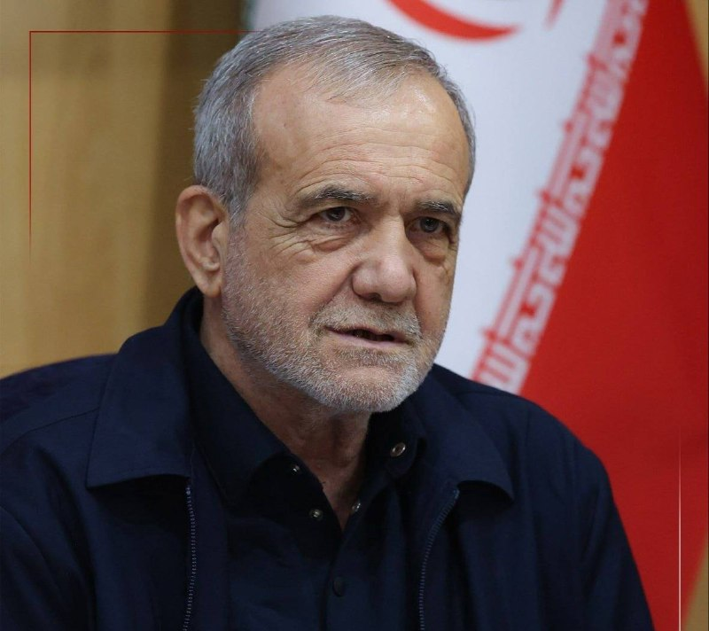

🔴منابع العربیه: نسخه نهایی پیش‌نویس یادداشت تفاهم آمریکا و ایران شامل تجدید قابل تمدید آتش‌بس ۶۰ روزه، باز کردن تنگه هرمز بدون اخذ عوارض و پاکسازی مین‌ها و برداشتن موانع دریایی از این آبراه بین‌المللی مقابل تجارب جهانی، برداشتن برخی محدودیت‌ها از بنادر ایران…

## IranianMinds — post 20745

🎁 استارت کن و کانفیگتو رایگان بگیر 
⭐ویژه کاربران پرمیوم تلگرام 
⭐️ اگه اکانت تلگرامت پرمیوم باشه به محض استارت ربات بدون هیچ امتیاز و زیر مجموعه دایی جون بهت کانفیگ هدیه میده 
✔️ همچنین با اوردن دوستای پرمیومت امتیاز بیشتری میگیری 
🎁 @Daeijoonbot | استارت…

## IranianMinds — post 20743

  

🎁 استارت کن و کانفیگتو رایگان بگیر

⭐ویژه کاربران پرمیوم تلگرام

⭐️ اگه اکانت تلگرامت پرمیوم باشه به محض استارت ربات بدون هیچ امتیاز و زیر مجموعه دایی جون بهت کانفیگ هدیه میده

✔️ همچنین با اوردن دوستای پرمیومت امتیاز بیشتری میگیری

🎁 @Daeijoonbot | استارت کن و کانفیگ رایگان بگیر 
🌟

## IranianMinds — post 20742

🔴منابع العربیه:

نسخه نهایی پیش‌نویس یادداشت تفاهم آمریکا و ایران شامل تجدید قابل تمدید آتش‌بس ۶۰ روزه، باز کردن تنگه هرمز بدون اخذ عوارض و پاکسازی مین‌ها و برداشتن موانع دریایی از این آبراه بین‌المللی مقابل تجارب جهانی، برداشتن برخی محدودیت‌ها از بنادر ایران و دادن معافیت‌هایی از تحریم‌ها و فراهم کردن امکان ازسرگیری فروش و صادرات نفت ایران و همچنین ادامه مذاکرات درباره برنامه هسته‌ای ایران در دوره تنش‌زدایی میان دو طرف می‌شود.

@IranianMinds

## IranianMinds — post 20741

🔴 خبرگزاری فارس :

ستادی که امروز اومده دستور رفع فیلترینگ‌ رو‌ تصویب کرده اصلا یه ستاد تازه تاسیسه و چیزی بهش ربطی نداره که بخواد همچین دستوری بده

اصلا اینا نباید بیان راجب وصل شدن اینترنت نظر بدن و‌ بهشون ربطی نداره !

@IranianMinds

## IranianMinds — post 20740

  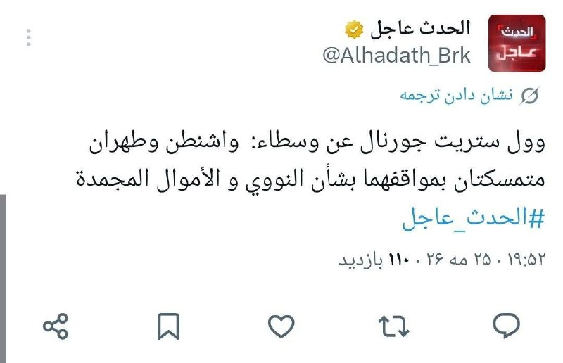

🔴الحدث:
وال‌استریت‌ژورنال به نقل از واسطه‌ها، واشنگتن و تهران به مواضع خود در مورد مسائل هسته‌ای و دارایی‌های مسدود شده ، پایبند هستند.

@IranianMinds

## IranianMinds — post 20739

  

پدر تنگسیری منظورشه.

@IranianMinds

## IranianMinds — post 20738

  

🔴 گاییدی این بدبختارو ولشون کن

نوشته : دوتا از بدترین رئیس جمهور های تاریخ آمریکا.

@IranianMinds

## IranianMinds — post 20736

🔴 پست های جدید ترامپ :

@IranianMinds

## IranianMinds — post 20734

🔴 الحدث : ایران قبول کرد که اورانیوم خودشو از کشور خارج کنه و آماده ی اینکاره. @IranianMinds

## IranianMinds — post 20733

🔴 الحدث :

ایران قبول کرد که اورانیوم خودشو از کشور خارج کنه و آماده ی اینکاره.

@IranianMinds

## IranianMinds — post 20732

  <a href="telegram/content/IranianMinds_20732_1779733560.mp4" target="_blank">🎬 Download video</a>

🔴 تحلیلگر صداوسیما :

هر موقع که پولا اومد تو‌ حسابمون میریم پای میز مذاکره

+ رهبر موشلمین جهان رو به‌ پول فروختید ؟

@IranianMinds

## IranianMinds — post 20731

  

🔴 رویترز به نقل از منابع اسرائیلی:

نتانیاهو گفته فعلا نمی‌تواند روی تصمیمات ترامپ درباره ایران تاثیر بگذارد

اسرائیل تا حد زیادی از مذاکرات آمریکا و ایران کنار گذاشته شده
نتانیاهو نگران توافق احتمالی واشنگتن و تهران است

نتانیاهو می‌خواهد آزادی عمل نظامی برای حمله به ایران داشته باشد!

@IranianMinds

## IranianMinds — post 20730

🔴 سخنگوی اقلیم کردستان :

ترامپ هیچ سلاحی اصلا برای استفاده و رسوندن به گروهای مخالف جمهوری اسلامی به ما ارسال نکرده و اگه کرده باشه هم به دست ما نرسیده

آمریکا بیاد اعلام کنه که سلاح هارو برای کی فرستاده چون ما چیزی دریافت نکردیم.

@IranianMinds

## IranianMinds — post 20729

🔴 یک منبع ایرانی به المیادین:

هیئت ایرانی در دوحه پس از پایان دیدار‌های خود، امشب به تهران بازمی‌گردند.

@IranianMinds

## IranianMinds — post 20728

  

🔴 وال استریت ژورنال :

در مذاکرات ایران و آمریکا دو طرف سر مسئله هسته ای و لغو‌ تحریم ها به بن بست خوردن.

@IranianMinds

## BBCPersian — post 282035

  <a href="telegram/content/BBCPersian_282035_1779733563.mp4" target="_blank">🎬 Download video</a>

🔻مقام‌ها می‌گویند در پی انفجار گاز در یک معدن زغال‌سنگ در شمال چین در روز یکشنبه، دست‌کم ۸۲ نفر کشته شده‌اند و دست‌کم دو نفر نیز همچنان مفقود هستند.
 
این حادثه مرگبارترین فاجعه معدنی در چین از سال ۲۰۰۹ تاکنون محسوب می‌شود و رئیس‌جمهور چین، شی جین‌پینگ، اعلام کرد که از هیچ تلاشی برای عملیات جست‌وجو و نجات نباید دریغ شود.
 
علت انفجار گاز هنوز مشخص نشده اما رسانه‌های دولتی گزارش داده‌اند که میزان مونوکسید کربن در معدن «بالاتر از حد مجاز» بوده است.
 
پس از وقوع مرگبارترین حادثه معدنی چین در بیش از ۱۵ سال گذشته، خشم عمومی نسبت به ادعاهای مربوط به «نقض مقررات ایمنی» رو به افزایش است.
   
برای بسیاری از مردم چین، این فاجعه یادآور دهه ۲۰۰۰ میلادی است یعنی زمانی که از این‌ قبیل حوادث در معادن زغال‌سنگ رخ می‌داد و مردم تصور می‌کردند که آن دوران به پایان رسیده است.
 
مقام‌ها می‌گویند علت این حادثه همچنان در دست بررسی است اما یافته‌های اولیه نشان می‌دهد که شرکت «تونگژو گروپ» که این معدن خصوصی را اداره می‌کرده، مرتکب «تخلفات جدی و غیرقانونی» شده است.
 
https://bbc.in/4f1HnZL
@BBCPersian

## BBCPersian — post 282034

  <a href="https://t.me/bbcpersian/282034" target="_blank">📎 Download file</a>

📻پادکست جام جهان‌نما، دوشنبه ۴ خرداد ۱۴۰۵

این برنامه رادیویی رامی‌توانید هرشب ساعت ۲۰ به وقت ایران، روی موج متوسط ۷۰۲ کیلوهرتز و موج کوتاه۹۴۶۵ کیلوهرتز بشنوید. تکرار برنامه را هم می‌توانید ساعت ۲۱:۳۰ روی موج متوسط ۷۰۲ کیلوهرتز و موج کوتاه۵۳۹۵ کیلوهرتز گوش کنید

@BBCPersian

## BBCPersian — post 282033

  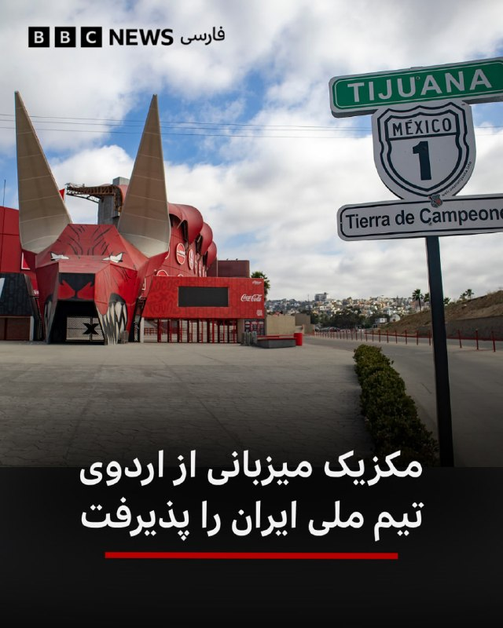

🔻کلودیا شینباوم، رئیس‌جمهور مکزیک، امروز گفت که موافقت کرده است تیم ملی فوتبال ایران در جام جهانی ۲۰۲۶ در مکزیک مستقر شود.

خانم شینباوم در کنفرانس خبری گفت: «آمریکا نمی‌خواست تیم ایران در خاکشان باشد.»

«آنها (ایران) به همین دلیل از ما پرسیدند: 'می‌توانیم در مکزیک مستقر شویم؟' و ما پاسخ دادیم، بله، هیچ اشکالی ندارد.»

فدراسیون فوتبال ایران دیروز گفته بود که با موافقت فیفا، کمپ و محل استقرار تیم ملی فوتبال در جام جهانی به شهر مرزی تیخوانا در مکزیک منتقل شده است.

ایران از فیفا خواسته بود محل مسابقاتش را از آمریکا به مکزیک منتقل کند اما فیفا گفته بود که امکان تغییر محل مسابقه وجود ندارد.

مهدی تاج، رئیس فدراسیون فوتبال ایران، دیروز گفت که با انتقال کمپ تیم ملی از آریزونا در آمریکا به تیخوانا در مکزیک، «مشکل ویزا نداریم و تیم ملی با پرواز ایران‌ایر می‌تواند عازم مکزیک شود.»

تیخوانا، شهر مرزی پرجنب‌وجوش، با سن دیگو در کالیفرنیا مرز مشترک دارد. تمرینات تیم فوتبال ایران قرار است در مجموعه ورزشی «کلوب تیخوانا» برگزار شود.
ادامه مطلب⬇️

📸GettyImages
https://bbc.in/4wFbfkW

## BBCPersian — post 282031

🔻در پی اعتراضات دانشجویی در ترکیه، رجب طیب اردوغان، رئیس جمهور ترکیه، دستورش برای تعطیلی یکی از قدیمی‌ترین دانشگاه‌های آن کشور را پس گرفت.

رئیس‌جمهور ترکیه سه روز پیش دستور داده بود که دانشگاه «استانبول بیلگی» که به داشتن گرایش‌های سیاسی لیبرال شناخته می‌شود، تعطیل شود.

دولت در هشت ماه گذشته مدیریت این دانشگاه را بر عهده داشته است.

شرکت «جان هولدینگ»، مالک دانشگاه، به اتهام «پول‌شویی و فرار مالیاتی» تحت تحقیق قرار داشت.

این شرکت همچنین مالک شبکه‌های عمده تلویزیونی و چندین مدرسه در ترکیه است.

📸AFP via Getty Images
@BBCPersian

## BBCPersian — post 282030

  

🔻شبکه تلویزیونی و اینترنتی «منوتو» بعد از ۱۶ سال به کار خود پایان داد.

این رسانه فارسی‌زبان از سال ۲۰۱۰ در لندن با مدیریت کیوان و مرجان عباسی به روی آنتن ماهواره رفت و به یکی از پربیننده‌ترین تلویزیون‌های فارسی‌زبان تبدیل شد.

اما حدود دو سال و نیم پیش، به دلیل «مشکلات مالی» پخش تلویزیونیش را متوقف کرد و مدتی بعد، فعالیتش را محدودتر از سر گرفت.

مدیران این شبکه، علاوه بر محدودیت‌های مالی، این بار به «دگرگونی‌های بنیادین در عرصه رسانه‌ای و سیاسی» ایران اشاره کرده و گفته‌اند که فضا خصمانه‌تر و قطبی‌تر شده و مجموعه این شرایط، ادامه فعالیت را برای منوتو غیرممکن کرده است.

https://bbc.in/43uDwNI
@BBCPersian

## BBCPersian — post 282029

  

🔻بتسالل اسموتریچ، وزیر دارایی اسرائیل، خواستار تخریب ساختمان‌ها در بیروت برای مقابله با «تهدید پهپادهای انفجاری حزب‌الله» شد.

این وزیر راست افراطی اسرائیل در پستی در شبکه اجتماعی ایکس به کشته شدن یک سرباز اسرائیلی در حمله پهپادی امروز حزب‌الله در جنوب لبنان اشاره کرد و نوشت: «برای هر پهپاد انفجاری، ۱۰ ساختمان باید در بیروت فرو بریزد.»

او تاکید کرد که «پاسخ به یک تهدید قابل توجه باید قابل توجه باشد.»

آقای اسموتریچ نوشت: «شما با یک تهدید استراتژیک تنها با سپر دفاعی مقابله نمی‌کنید، بلکه باید با تغییر قوانین و معادله با آن مقابله کنید.»

📸AFP via Getty Images
https://bbc.in/43uAYz6
@BBCPersian

## BBCPersian — post 282028

🔻خبرگزاری فارس: پهپاد متخاصم در حریم خلیج فارس سرنگون شد

خبرگزاری فارس می‌گوید که پهپادهای رهگیر موسوم به آرش کمانگیر یک «پهپاد متخاصم» را بر فراز آب‌های خلیج فارس سرنگون کرده‌اند.

این خبرگزاری که به نهادهای امنیتی و نظامی نزدیک است نوشت: «این عملیات که با به‌کارگیری سامانه‌ای با قابلیت‌های پنهان انجام شد، پیامی روشن و قاطع از سوی ایران به شمار می‌رود. مقامات مربوطه تصریح کرده‌اند که این نشانه از طرف ماست تا دیگر هیچ پهپاد رادارگریزی نتواند بر آسمان خلیج فارس نفوذ کند.»

در این گزارش به نوع یا مبدا یا کشور سازنده پهپاد اشاره نشده است.

ایالات متحده می‌گوید که که محاصره دریایی ایران ادامه دارد اما نیروی دریایی سپاه امروز گفت که ۳۲ کشتی نفتکش، کانتینری یا تجاری پس از «اخذ مجوز با هماهنگی» این نیروها از تنگه هرمز عبور کرده‌اند.

سپاه دیروز هم گفت ۳۳ کشتی عبور کرده‌اند.

https://bbc.in/4v8Jxf0
@BBCPersian

## BBCPersian — post 282027

🔻نخست‌وزیر پاکستان با رئیس جمهور چین دیدار کرد

خبرگزاری دولتی شینهوا چین گزارش کرده که شهباز شریف، نخست‌وزیر پاکستان، در سفر خود به چین با شی جین پینگ، رئیس جمهور چین، دیدار کرده است.

سفر نخست‌وزیر پاکستان و فرمانده ارتش این کشور به چین در ادامه تلاش‌های دیپلماتیک چندین کشور برای پایان رسمی جنگ آمریکا و اسرائیل با ایران است.

پیش از این گزارش داده بود که فیلد مارشال عاصم منیر، مذاکره کننده ارشد پاکستان هم به پکن سفر کرده است.

آقای شریف پیش از این با لی چیانگ، نخست وزیر چین، دیدار کرده بود.

https://bbc.in/49hnc6r
@BBCPersian

## BBCPersian — post 282025

🔻ویشکا آسایش، بازیگر سینما، مجموعه مجسمه‌های برنزی ساخته و برای نخستین بار در نیویورک آنها را به نمایش گذاشته است.

نمایشگاه مجسمه‌های ویشکا آسایش از روز چهارشنبه (۲۰ مه / ۳۱ اردیبهشت) در گالری بیرند گکلر نیویورک افتتاح شده است.

بهمن کلباسی، خبرنگار بی‌بی‌سی در نیویورک با او در مورد مجسمه‌هایش گفتگو کرده است.

@BBCPersian

## BBCPersian — post 282024

  <a href="telegram/content/BBCPersian_282024_1779733569.mp4" target="_blank">🎬 Download video</a>

🔻‌رسانه‌های آمریکایی وقوع آتش‌سوزی مهیبی را در یک منطقه صنعتی در ساوت گیت در لس‌انجلس کانتی کالیفرنیا گزارش کردند. این آتش‌سوزی در یک مرکز صنعتی بازیافت لاستیک خودرو رخ داد.

در پی این آتش‌سوزی در روز یکشنبه (۲۴ مه)، مقام‌های محلی از مردم خواستند که به همراه حیوانات خانگی‌شان با در و پنجره‌های بسته داخل خانه‌ها بمانند.

علت آتش‌سوزی و اینکه آیا در زمان شروع آتش‌سوزی افرادی در محل حضور داشته‌اند یا خیر، تاکنون مشخص نشده است.

آتش‌نشانان آتش را مهار کردند و تاکنون هیچ مصدومی در این حادثه گزارش نشده است.

https://bbc.in/43etyAd
@BBCPersian

## BBCPersian — post 282023

‌ 🔻دونالد ترامپ، رئیس‌جمهور آمریکا، یک بار دیگر از پیشرفت در مذاکرات با ایران ابراز رضایت کرد. آقای ترامپ در پستی در شبکه اجتماعی خود، تروث سوشال، نوشت: «مذاکرات با ایران خوب پیش می‌رود! یا توافق عالی برای همه خواهد بود یا هیچ توافقی نخواهد بود.» او در عین…

## BBCPersian — post 282022

  

‌
🔻دونالد ترامپ، رئیس‌جمهور آمریکا، یک بار دیگر از پیشرفت در مذاکرات با ایران ابراز رضایت کرد.

آقای ترامپ در پستی در شبکه اجتماعی خود، تروث سوشال، نوشت: «مذاکرات با ایران خوب پیش می‌رود! یا توافق عالی برای همه خواهد بود یا هیچ توافقی نخواهد بود.»

او در عین حال هشدار داد که اگر توافق حاصل نشود، آمریکا به جبهه جنگ باز می‌گردد و «تیراندازی بزرگتر و شدیدتر از گذشته و هر زمان آغاز خواهد شد و کسی چنین چیزی را نمی‌خواهد.»

رئیس‌جمهور آمریکا همچنین مذاکرات با ایران را به پیمان ابراهیم پیوند داد و با اشاره دوباره به گفت‌و‌گوهایی که روز شنبه با رهبران عربستان، امارات، قطر، پاکستان، ترکیه، مصر، اردن و بحرین داشته است، گفت که به آنها گفته است:

«بعد از تلاش‌های آمریکا برای حل این مساله پیچیده (در مورد ایران) حداقل برای این کشورها باید اجباری باشد که همزمان پیمان ابراهیم را امضا کنند.»

📷GETTY
https://bbc.in/4wPXxf5
@BBCPersian

## BBCPersian — post 282020

  <a href="telegram/content/BBCPersian_282020_1779733572.mp4" target="_blank">🎬 Download video</a>

🔻سرخط خبرهای دوشنبه ۴ خرداد ۱۴۰۵
@BBCPersian

## BBCPersian — post 282019

  

🔻چهارمین جلسه ستاد ویژه ساماندهی فضای مجازی به ریاست محمدرضا عارف، معاون اول رئیس‌جمهور، و با حضور اعضای ستاد برگزار شد.

به گزارش پایگاه اطلاع‌رسانی دولت، در این جلسه «مصوبات مهمی درباره وضعیت اینترنت کشور تصویب شد که پس از تایید نهایی رئیس‌جمهور پزشکیان، برای اجرا به وزارت ارتباطات و فناوری اطلاعات ابلاغ می‌شود.»

جزئیات بیشتری از این مصوبات رسما منتشر نشده است اما خبرگزاری فارس نوشت که در این جلسه «طرح اتصال دوباره اینترنت بین‌‌الملل با ۹ رای موافق تصویب و برای تایید نهایی به دفتر مسعود پزشکیان ارسال شد.»

رفع فیلترینگ از وعده‌های انتخاباتی دولت پزشکیان بود که محقق نشد و از شروع جنگ اخیر اینترنت بین‌الملل به روی شهروندان در ایران جز برای کسانی که «اینترنت پرو»، سیم‌کارت «سفید»، یا دسترسی به استارلینک داشته‌اند مقدور بوده است.

قطع اینترنت بین‌المللی در ایران طولانی‌ترین قطع گسترده در تاریخ اینترنت است.

ادامه مطلب⬇️
📸NurPhoto via Getty Images
https://bbc.in/4uAWWMU
@BBCPersian

## BBCPersian — post 282018

  

🔻ایتامار بن گویر، وزیر امنیت ملی اسرائیل، خواستار بازگشت اسرائیل به «جنگی شدید» در لبنان شد.

این وزیر راست افراطی اسرائیل در حسابش در شبکه اجتماعی ایکس نوشت: «عادی‌سازی واقعیت پهپادهای انفجاری جایز نیست؛ وقت آن رسیده است که نخست‌وزیر روی میز ترامپ بکوبد و به او اطلاع دهد که ما در حال بازگشت به جنگ در لبنان هستیم.»

او در ادامه درخواست کرد: «ما باید برق لبنان را قطع کنیم، ضاحیه را فتح کنیم و به جنگی شدید بازگردیم.»

تقاضای این وزیر راست افراطی در حالی است که هفته گذشته آتش‌بس در لبنان تمدید شد و دور بعد مذاکرات صلح قرار است تا حدود یک هفته دیگر در واشنگتن برگزار شود.

پهپادهای ارزان‌قیمت مورد استفاده حزب‌الله در طول درگیری‌های اخیر به‌طور فزاینده‌ای از سیستم راداری اسرائیل عبور کرده‌ و خساراتی را برجا گذاشته‌اند.

📸Bloomberg via Getty Images
https://bbc.in/49Q61ZO
@BBCPersian

## idfinfarsi — post 11643

  <a href="telegram/content/idfinfarsi_11643_1779733576.mp4" target="_blank">🎬 Download video</a>

‼️برای رفع تهدید: ارتش اسرائیل روز گذشته (یکشنبه) یک تروریست کلیدی از ستاد تولید سازمان تروریستی حماس را به هلاکت رساند

⭕️نیروهای ارتش اسرائیل تحت فرماندهی جنوب، روز گذشته (یکشنبه) در مرکز نوار غزه حمله کرده و محمد ابو ملوح، یکی از تروریست‌های کلیدی در ستاد تولید سازمان تروریستی حماس را به هلاکت رساندند.

⭕️ابو ملوح یکی از منابع اصلی دانش در سازمان تروریستی حماس بود و در طول دوره آتش‌بس، اقدام به تولید تسلیحاتی کرده بود که تهدیدی برای نیروهای ارتش اسرائیل در منطقه و شهروندان این کشور محسوب می‌شد.

⭕️نیروهای ارتش اسرائیل تحت فرماندهی جنوب مطابق با توافق در منطقه مستقر هستند و به فعالیت خود برای رفع هرگونه تهدید فوری ادامه خواهند داد.

## Dirty_Kids — post 390174

## Dirty_Kids — post 390172

  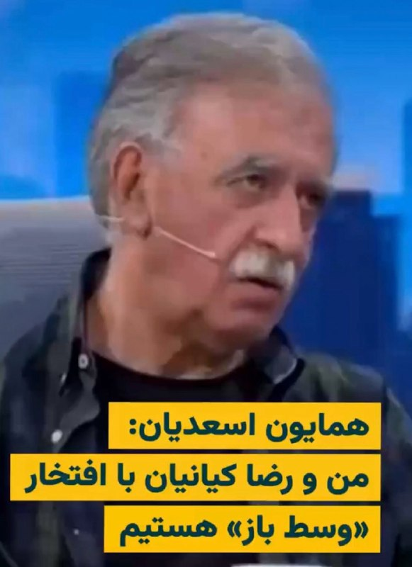

‏افتخار به یک رذیلت اخلاقی، اون رذیلت رو فضیلت نمی‌کنه.
انگار یه مگس بیاد بگه من با افتخار گه می‌خورم.

@Dirty_Kids 👻

## Dirty_Kids — post 390171

  <a href="telegram/content/Dirty_Kids_390171_1779733579.mp4" target="_blank">🎬 Download video</a>

بعد دیدن این ویدیو درصد ایمانتون به ترامپ ۱۰درصد افزایش پیدا میکنه

@Dirty_Kids 👻

## Dirty_Kids — post 390170

  <a href="telegram/content/Dirty_Kids_390170_1779733581.mp4" target="_blank">🎬 Download video</a>

ارزش دانلود برای فمنیستا ۱ از ۱۰
برای مردا ۹ از ۱۰

@Dirty_Kids 👻

## Dirty_Kids — post 390169

وضعیت طوری شده که هر کی هر کاری میکنه بیهوده‌ست؛ درس بخونی بیهودست، کار کنی بیهودست، پس‌انداز کنی بیهودست و...

‏من حتی انرژی ناراحت شدن از اخبار رو هم ندارم دیگه.

@Dirty_Kids 👻

## Dirty_Kids — post 390168

‏این روزا خیلی سهراب سپهری ام. کون هیچ کاری رو ندارم

@Dirty_Kids 👻

## Dirty_Kids — post 390167

  <a href="telegram/content/Dirty_Kids_390167_1779733583.mp4" target="_blank">🎬 Download video</a>

با يه شغل ديگه نشون بده كه شغلت اين نيست :

@Dirty_Kids 👻

## Dirty_Kids — post 390166

  <a href="https://t.me/Dirty_Kids/390166" target="_blank">📎 Download file</a>

✅ اپلیکیشن اندروید سایت جهانی دربی بت

💰اولین سایت جهانی با امکان شارژ و برداشت ریالی(کارت به کارت)

🔗 برای ورود فیلترشکن روی کشور مناسب قرار دهید مانند فنلاند و المان و....

😀Telegram Channel
👇
https://t.me/+bcynkEgSW2dlYTc0

## Dirty_Kids — post 390165

  

😤دنبال یه سایت شرط بندی بین المللی بودی که به ایرانیا خدمات بده؟!
⛔

👍دربی بت همون انتخاب  100%

💎ویژگی های سایت جهانی Derby Bet:

⬅️امکان شارژ امن با کارت بانکی

⬅️واریز اول دوبل شارژ می شوید(بونوس۱۰۰٪)

⬅️پر اپشن ترین سایت فعال در ایران

⬅️تسویه حساب کمتر از 5 دقیقه

⬅️برگشت بخشی از باخت به صورت هفتگی

🚨کد هدیه ثبت نام:GG007

⚠️برای دانلود اپلکیشن کلیک کنید
👉

🔔کانال دربی بت :

🪙https://t.me/+bcynkEgSW2dlYTc0

## Dirty_Kids — post 390163

محمدباقر ذوالقدر، دبیر شورای عالی امنیت رژیم تروریستی جمهوری اسلامی، در بیانیه‌ای اعلام کرد: «هیچ عقب‌نشینی‌ای در کار نخواهد بود.»

او مدعی شد آنچه در «میدان نظامی»، «میدان دیپلماسی» و «مقاومت شدید نیروهای حاضر در خیابان‌ها» رخ داده، باعث شده دشمن «زمین‌گیر» شود. ذوالقدر همچنین با تاکید بر ضرورت «وحدت و انسجام» گفت رژیم تروریستی جمهوری اسلامی تلاش دارد آمریکا و اسرائیل را در این حوزه نیز «ناامید» کند و افزود جلوگیری از هر سخن یا اقدامی که به‌گفته او وحدت داخلی را مختل کند، «ایران را به پیروزی نهایی خواهد رساند.»

@Dirty_Kids 👻

## Dirty_Kids — post 390162

  

خبرگزاری الحدث:
منابع ایرانی به ما گفتن؛ ایران ظاهراً آمادست اورانیوم غنی‌شده‌ی سطح بالاشو از کشور خارج کنه!

@Dirty_Kids 👻

## Dirty_Kids — post 390161

قهوه‌ی جدید گرفتم. مامانم خورده می‌گه مثل قهوه‌ی خودمون نیست. قهوه‌ی خودمون آخه؟ مزرعه داریم تو کنیا؟

@Dirty_Kids 👻

## Dirty_Kids — post 390160

  <a href="telegram/content/Dirty_Kids_390160_1779733587.mp4" target="_blank">🎬 Download video</a>

این چه سمّیه دیگه؟😐😂
این چادریا میرن تجمعات شبونه شعارمیدن یه برده شکار میکنن میارن خونه

@Dirty_Kids 👻

## Dirty_Kids — post 390159

  

بادبان با همراهی شما 90 هزار نفری شد!
🎉

🛒به این مناسبت، قیمت سرویس‌ها تا گیگی 150 هزار تومان کاهش پیدا کرد! 
🚀

🎁 کد تخفیف خرید اول دوباره ریست شد و همه میتونن ازش استفاده کنن:
BadBan4k

💸 با این کد، 50 هزار تومان تخفیف روی اولین خریدت بگیر!

🔥و مهم‌تر از همه...
سیستم معرفی بادبان فعال‌تر از همیشه‌ست!
از تمام خریدهای کاربرانی که معرفی میکنی، 10% خریدشون رو پورسانت دائمی دریافت کن و موجودی کیف پولت رو افزایش بده 
💼

وقتی بادبان داری،
هیچ بادی مانع نیست… حتی وقتی اینترنت ملیه
⛵️
G4

🛡@BadBan_VPN | کانال 

🤖@BadBan_VPNBot | ربات 

📞@BadBan_VPNSupport | پشتیبانی

## Dirty_Kids — post 390155

پست‌های رگباری لحظاتی پیش شیر AIبه‌باسن در تروث‌سوشال که نیاز به توضیح نداره و تصاویر گویاست:

@Dirty_Kids 👻

## Dirty_Kids — post 390154

«ریچارد گلدبرگ» مشاور ارشد بنیاد دفاع از دموکراسی‌ها در خصوص اون توییت طولانی ترامپ که به کشورهای قرمساق مسلمون منطقه گفته بود اگه می‌خواید من با جمهوی‌اسلامی تفاهم‌نامه امضا کنم اول باید شما به پیمان ابراهیم و صلح با اسرائیل بپیوندید، نوشته که:

«کشورهایی که ترامپ برای پیوستن به پیمان ابراهیم تحت فشارشون گذاشته دقیقاً همون پدرقحبه‌هایی هستند که حالا رامپ رو تحت فشار گذاشتن تا از پروژه‌ی آزادی دست بکشه و به جاش با رژیم قحبه‌ی روافض معامله کنه.

واکنش ترامپ در این شرایط کاملاً منطقی به نظر می‌رسه.
واقعاً اگر این کار انجام شه، یک دستاورد تاریخی خواهد بود و ضربه‌‌ی استراتژیک بسیار سنگین به رژیم کس‌پدر روافض وارد می‌کنه.»

@Dirty_Kids 👻

## Hranews — post 113160

  

مهسا زیدآبادی با تودیع وثیقه از زندان تربت حیدریه آزاد شد

❗️
❗️
❗️
❗️
❗️– مهسا زیدآبادی، شهروند اهل سبزوار، امروز با تودیع وثیقه از زندان تربت حیدریه آزاد شد.

به گزارش خبرگزاری هرانا، ارگان خبری مجموعه فعالان حقوق بشر در ایران، مهسا زیدآبادی آزاد شد.

بر اساس اطلاعات دریافتی هرانا، آزادی مهسا زیدآبادی امروز دوشنبه ۴ خردادماه، با تودیع وثیقه هفت میلیارد تومانی از زندان تربت حیدریه صورت گرفته است.

ادامه مطلب

#مهسا_زیدآبادی

↘️
@hranews_bot تماس ✉️ - @Hranews کانال هرانا 🆑

## Hranews — post 113159

گزارشی از مطالبات مزدی، بیمه‌ای و بیکاری کارگران در شهرهای مختلف

❗️
❗️
❗️
❗️
❗️– کارگران ابنیه فنی راه‌آهن زاهدان از تعلیق شماری از همکارانشان پس از پیگیری مطالبات صنفی خبر داده و اعلام کردند که به دلیل عدم پرداخت چندین ماه حق بیمه توسط کارفرما از دریافت خدمات بیمه و امکانات درمانی نیز محروم مانده‌اند. همچنین، #کارگران کارخانه فولاد سیادن ابهر از تاخیر در پرداخت حقوق اردیبهشت ماه و دیگر مشکلات شغلی خود انتقاد کردند. افزون بر این، مدیرکل تعاون، کار و رفاه اجتماعی خراسان جنوبی اعلام کرد که از ابتدای امسال تاکنون، ۵۲۷ نفر از کارگران واحدهای تولیدی این استان از چرخه کار خارج شده‌اند و اکنون تحت پوشش بیمه بیکاری قرار دارند.

ادامه مطلب

↘️
@hranews_bot تماس ✉️ - @Hranews کانال هرانا 🆑

## Hranews — post 113158

  

سرکوب و اعدام با اتهام نابخشودنیِِ جاسوسی/ مرتضی هامونیان

📡
📡
📡
📡
📡– هر بار حکومت بهانه‌ای تازه برای گرفتن جان انسان‌ها پیدا می‌کند؛ حکومتی که در تمام عمر خود نشان داده ارزشی برای حیات شهروندان قائل نیست. تازه‌ترین نمونه‌اش در جریان #جنگ آمریکا و اسرائیل با ایران آشکار شد؛ جایی که روشن شد سال‌ها بودجه‌های کلان پدافند غیرعامل یا صرف اموری نامعلوم شده یا اساساً کارکردی برای حفاظت از مردم نداشته است. نتیجه این شد که شهروندان زیر موشک‌باران، حتی از ابتدایی‌ترین امکان یعنی پناهگاهی امن برای حفظ جان خود نیز محروم بودند. حسام‌الدین آشنا، مقام امنیتی پیشین و رئیس مرکز بررسی‌های استراتژیک (زیر مجموعه‌ی نهاد ریاست جمهوری) در دولت‌های یازدهم و دوازدهم در نخستین برنامه‌ی «اسپرسو» با مجری‌گری محمد دلاوری –که از پلت‌فرم روبیکا پخش می‌شود—، با ارجاع به کشور سوئیس و وجود پناهگاه بزرگ اتمی در آن کشور می‌گوید که ما باید به حفظ جان مردم توجه می‌کردیم. اما آن‌چه در عمل رخ داد، درست نقطه‌ی مقابل حفاظت از جان مردم بود. نه تنها اراده‌ای برای حفظ جان شهروندان دیده نشد، بلکه حکومت هم‌زمان مسیر قانونی تازه‌ای نیز برای گرفتن جان انسان‌ها ایجاد کرد. حاصل آن، تصویب «قانون تشدید مجازات جاسوسی و همکاری با رژیم صهیونیستی و کشورهای متخاصم علیه امنیت و منافع ملی» بود؛ قانونی که در ظاهر با نام امنیت معرفی می‌شود، اما در عمل ابزار سرکوب دیگری در اختیار حاکمیت قرار می‌دهد تا به بهانه‌ی اتهام جاسوسی، دامنه‌ی اعدام و حذف مخالفان را گسترش دهد.(۱)

اگر در مقطع تابستان ۱۳۶۷، کشتار زندانیان سیاسی به صورت اعدام‌های فراقضایی رخ داد (تعبیری که عفو بین‌الملل در گزارش خود در آذر ۱۳۹۷ به دلیل خارج از رویه‌های قضایی بودن آن اعدام‌ها، به آن نسبت داد)، این بار قرار است با ابزاری قانونی و اتهامی که حیثیت و آبروی متهم را هدف قرار می‌دهد، مخالفین سیاسی را #اعدام و یا مرعوب کنند: اتهام جاسوسی و همکاری با اسرائیل و کشورهای متخاصم علیه امنیت و منافع ملی ایران. بر اساس تبصره‌ی اول ماده‌ی یک این قانون، آمریکا و اسرائیل به عنوان «دولت متخاصم» شناخته می‌شوند و تعیین متخاصم بودن سایر کشورها نیز به تشخیص شورای عالی امنیت ملی (شعام) واگذار شده است. این یعنی دست باز برای شعام که هر وقت بخواهد، کشوری را متخاصم اعلام کند و با این قانون، کم‌ترین مراوده با آن کشور می‌تواند حکم اعدام به همراه داشته باشد. بماند که اصولاً برای اعدام و اتهام‌زنی، نیازی به مراوده هم نیست. دستگاه‌های اطلاعاتی رنگارنگ جمهوری اسلامی با اتکا به اعترافات اخذشده تحت فشار و شکنجه، سناریوهای امنیتی خود را تولید می‌کنند و در غیاب دادرسی عادلانه، همان روایت‌ها مبنای صدور حکم قرار می‌گیرد. در چنین فضایی، رئیس دستگاه قضای نظام هم به مخالفین اعدام می‌گوید که تو غلط می‌کنی که می‌گویی فلانی اعدام نشود.

ادامه مطلب

ادامه و لینک به مطلب در وبسایت خط صلح

#مرتضی_هامونیان

↘️
@hranews_bot تماس ✉️ - @Hranews کانال هرانا 🆑

## Hranews — post 113157

  

گزارشی از آخرین وضعیت حمیدرضا درستکار در زندان شیبان اهواز

❗️
❗️
❗️
❗️
❗️– حمیدرضا درستکار، زندانی سیاسی اهل بهبهان، در حال تحمل دوران محکومیت خود در زندان شیبان اهواز است. وی در فروردین‌ماه امسال به صورت تنبیهی از زندان بهبهان به زندان شیبان منتقل شد.

به گزارش خبرگزاری هرانا، ارگان خبری مجموعه فعالان حقوق بشر در ایران، حمیدرضا درستکار در زندان شیبان اهواز محبوس است.

یک منبع نزدیک به خانواده این زندانی سیاسی به هرانا گفت: در جریان جنگ، حمیدرضا به‌دلیل طرح مطالبه تخلیه زندان، به «ایجاد آشوب و شورش در زندان» متهم و در ۱۵ فروردین‌ماه به‌صورت تنبیهی به زندان شیبان منتقل شد. این در حالی است که درخواست تخلیه زندان در آن شرایط، مطالبه‌ای مشترک میان تمامی زندانیان بوده است.

ادامه مطلب

#حمیدرضا_درستکار

↘️
@hranews_bot تماس ✉️ -  @Hranews  کانال هرانا 🆑

## Hranews — post 113153

گزارش تصویری؛ برگزاری برنامه نمادین نظامی برای کودکان بر خلاف پیمان‌نامه حقوق کودک

❗️
❗️
❗️
❗️
❗️– برخلاف تعهدات بین‌المللی ایران تحت عنوان الحاق به پیمان‌نامه #حقوق_کودک و تعهدات مربوط به عدم به‌کارگیری #کودکان در امور نظامی، برنامه‌ای نمادین تحت عنوان «اعزام به جبهه» با پوشاندن لباس نظامی به کودکان، قرار دادن سلاح در دست آنها، بازسازی صحنه‌های اعزام کودکان به جبهه جنگ و استفاده از دیگر نمادهای امور نظامی در حضور کودکان، در همدان برگزار شده است.

ادامه مطلب

↘️
@hranews_bot تماس ✉️ -  @Hranews  کانال هرانا 🆑

## manototv — post 105829

  <a href="telegram/content/manototv_105829_1779733592.mp4" target="_blank">🎬 Download video</a>

گفت‌وگو با کیوان عباسی:
«می‌گفت ایرانی‌ها باید بیشتر کنار هم بایستند…
و دوباره باور کنند که سرنوشت ایران را خود مردم ایران رقم می‌زنند.»

## alonews — post 122637

  <a href="telegram/content/alonews_122637_1779733594.webm" target="_blank">🎬 Download video</a>

👈اکونومیست: نزدیکی ایران و آمریکا به توافق؛ توافقی موقت برای خرید زمان، نه پایان قطعی درگیری‌ها

🔴ایران و ایالات متحده به یک توافق نزدیک‌تر شده‌اند، اما این تفاهم از جنس توافق‌های پایان‌دهنده به جنگ—آن‌طور که دونالد ترامپ ادعا می‌کند—نخواهد بود. این توافق در بهترین حالت، صرفاً زمان بیشتری را برای پیشبرد مذاکرات بعدی و به مراتب پیچیده‌تر خریداری می‌کند.

✅ @AloNews خبر جنگ

## alonews — post 122636

  <a href="telegram/content/alonews_122636_1779733595.webm" target="_blank">🎬 Download video</a>

👈بنیامین نتانیاهو: «ما در جنگ با حزب‌الله هستیم و حملات علیه آن را تشدید و قوی‌تر خواهیم کرد.»

✅ @AloNews خبر جنگ

## alonews — post 122635

  <a href="telegram/content/alonews_122635_1779733595.webm" target="_blank">🎬 Download video</a>

👈روایت آمیت سگال، خبرنگار شبکه 12 اسرائیل از اختلافات ایران و آمریکا در مذاکرات:

🔴ایران در حال حاضر فقط حاضر است به عدم توسعه سلاح‌های هسته‌ای متعهد شود، در حالی که ایالات متحده چندین گزینه برای ذخایر اورانیوم غنی‌شده ایران پیشنهاد می‌دهد، از جمله فروش آن به ایالات متحده، انتقال آن به یک کشور ثالث یا رقیق‌سازی مواد.

🔴اختلافات همچنین بر سر تنگه هرمز باقی مانده است، ایران بر مدیریت بر این آبراه اصرار دارد در حالی که ایالات متحده خواستار کشتیرانی آزاد و بدون محدودیت است.

🔴هنوز هیچ توافقی در مورد دارایی‌های مسدود شده ایران حاصل نشده است، اگرچه قطر پیشنهاد داده است که ۱۲ میلیارد دلار وام بشردوستانه به ایران بدهد.

🔴لبنان نیز به عنوان بخشی از چارچوب توافق گسترده‌تر مورد بحث گنجانده شده است.

✅ @AloNews خبر جنگ

## alonews — post 122634

  <a href="telegram/content/alonews_122634_1779733595.webm" target="_blank">🎬 Download video</a>

👈رسایی، از رهبران بولشویک‌ها:
پزشکیان خودشم میدونه نمیتونه اینترنت رو وصل کنه. این خبرای جدید بازی رسانه‌ایه

✅ @AloNews خبر جنگ

## alonews — post 122633

اخبار جنگ الونیوز AloNews pinned a photo

## alonews — post 122632

  <a href="telegram/content/alonews_122632_1779733596.webm" target="_blank">🎬 Download video</a>

👈یک مقام آمریکایی به اکسیوس گفت: دولت ترامپ از تشدید اقدام نظامی اسرائیل در لبنان حمایت خواهد کرد.

✅ @AloNews خبر جنگ

## alonews — post 122631

  <a href="telegram/content/alonews_122631_1779733596.webm" target="_blank">🎬 Download video</a>

👈اسرائیل آماده حمله گسترده به لبنان است

🔴کانال ۱۴ اسرائیل: نتانیاهو و کاتز (وزیر جنگ) درباره گسترش چشمگیر عملیات در لبنان و تصویب هدف قرار دادن ساختمان‌ها گفت‌وگو کردند.

🔴کانال ۱۳ تلویزیون اسرائیل: اسرائیل در حال مذاکره با ایالات متحده در مورد گسترش عملیات نظامی در لبنان است.

🔴خبرگزاری رسمی اسرائیل هم گزارش داد که ارتش طرح حمله آتشین قدرتمندی را علیه لبنان آماده کرده و منتظر تایید سیاسی است.

✅ @AloNews خبر جنگ

## alonews — post 122630

  

🌟 اشتراک v2ray

🗯گیگی 120,000 تومان

🔗لینک ساب برا چک کردن مصرف و حجمتون

🔥سرعت و کیفیت بالا

✅ پشتیبانی دائم

📱جهت خرید : @v2safeBot

## alonews — post 122628

👈قیمت نفت امریکا برای اولین بار از ۷ می به زیر ۹۰ دلار در هر بشکه سقوط کرد.

✅ @AloNews خبر جنگ

## alonews — post 122627

  <a href="telegram/content/alonews_122627_1779733597.webm" target="_blank">🎬 Download video</a>

🔴فووووووووووری/فارس: اینترنت باید با دستور شعام باز بشه و فعلا خبری نیست

✅ @AloNews خبر جنگ

## alonews — post 122626

  <a href="telegram/content/alonews_122626_1779733598.webm" target="_blank">🎬 Download video</a>

👈مدیر روابط‌عمومی وزارت قطع ارتباطات خبر داد: رئیس‌جمهور دستور بازگشایی اینترنت بین‌الملل را ابلاغ کرده است

✅ @AloNews خبر جنگ

## alonews — post 122625

👈ترامپ : ایران هرگز نباید سلاح هسته ای داشته باشه

تو دو درگیری اخیر مجموعاً ۱۳ نفر از نیروهای مسلح رو از دست دادیم
- تو ونزوئلا که یه پیروزی کامل بود هیچ تلفاتی نداشتیم و اونجا رو در یک روز گرفتیم
- اما تو عملیات خشم حماسی ۱۳ نفر جانشون رو از دست دادن
- این افراد فوق‌العاده برای جلوگیری از دسترسی بزرگ‌ترین حامی تروریسم دولتی به سلاح هسته‌ای جان خودشون رو فدا کردن

✅ @AloNews خبر جنگ

## alonews — post 122624

  <a href="telegram/content/alonews_122624_1779733598.webm" target="_blank">🎬 Download video</a>

🔴فوری/روزنامه هم‌میهن: رئیس‌جمهور دستور بازگشایی اینترنت بین‌الملل را ابلاغ کرد. 
✅ @AloNews خبر جنگ

## alonews — post 122623

  <a href="telegram/content/alonews_122623_1779733599.webm" target="_blank">🎬 Download video</a>

🔴فوری/روزنامه هم‌میهن: رئیس‌جمهور دستور بازگشایی اینترنت بین‌الملل را ابلاغ کرد.

✅ @AloNews خبر جنگ

## alonews — post 122622

  <a href="telegram/content/alonews_122622_1779733599.webm" target="_blank">🎬 Download video</a>

👈رئیس شورای هماهنگی تبلیغات اسلامی: فعلا تصمیم نگرفتیم چه زمانی رهبر سابق رو تشییع کنیم

✅ @AloNews خبر جنگ

## alonews — post 122621

  <a href="telegram/content/alonews_122621_1779733599.webm" target="_blank">🎬 Download video</a>

👈کانال ۱۲ عبری:
برخلاف ارزیابی‌های قبلی، ایران تولید موشک‌های بالستیک را به سرعت از سر گرفته است

✅ @AloNews خبر جنگ

## alonews — post 122620

  <a href="telegram/content/alonews_122620_1779733600.webm" target="_blank">🎬 Download video</a>

👈ادعای العربیه:
پیش‌نویس توافق تأکید می‌کند که کاهش تحریم‌های نفت ایران مشروط به اجرای تعهدات آن است.

🔴پیش‌نویس توافق آمریکا و ایران بر دوره ۳۰ روزه برای بازگشت کشتیرانی در تنگه هرمز تأکید دارد.

🔴پیش‌نویس توافق آمریکا و ایران بر دوره ۶۰ روزه برای مذاکرات هسته‌ای تأکید دارد.

🔴توافق بر آزادسازی بخشی از دارایی‌های مسدود شده ایران طبق سازوکاری مشخص تأکید دارد.

✅ @AloNews خبر جنگ

## alonews — post 122619

  <a href="telegram/content/alonews_122619_1779733600.webm" target="_blank">🎬 Download video</a>

🔴فوری/فارس: باز شدن اینترنت دست شورای عالی امنیت ملی هست و فعلا تصمیمی گرفته نشده و گمانه زنی‌ها الکیه

✅ @AloNews خبر جنگ

## alonews — post 122618

  <a href="telegram/content/alonews_122618_1779733600.webm" target="_blank">🎬 Download video</a>

👈العربیه: پیش‌نویس توافق میان آمریکا و ایران، برقراری آتش‌بس جامع در تمامی جبهه‌ها، از جمله لبنان را تضمین می‌کند.

✅ @AloNews خبر جنگ

## alonews — post 122617

  <a href="telegram/content/alonews_122617_1779733601.webm" target="_blank">🎬 Download video</a>

👈منابع خبری الحدث:
پیش‌نویس توافق آمریکا و ایران بر گشایش تنگه هرمز بدون عوارض و خنثی‌سازی مین‌ها تأکید دارد.

✅ @AloNews خبر جنگ

<!-- MSG END -->

<!-- NAV START -->

<a href="https://github.com/sombriolitfa-eng/aioo06/blob/main/telegram/content/archive_1.md" style="display:inline-block; padding:6px 12px; margin:0 4px; background-color:#2ea44f; color:white; text-decoration:none; border-radius:4px; font-weight:bold;">صفحه بعد</a>

<!-- NAV END -->
