# خواننده تلگرام

<!-- TOP_NAV START -->

<a href="https://github.com/sombriolitfa-eng/aioo06/blob/main/telegram/content/archive_1.md" style="display:inline-block; padding:6px 12px; margin:0 4px; background-color:#2ea44f; color:white; text-decoration:none; border-radius:4px; font-weight:bold;">صفحه بعد</a>

<!-- TOP_NAV END -->

<!-- MSG START -->

---
📅 بروزرسانی: 1405/03/03 15:42
---

## VahidOOnLine — post 241928

  <a href="telegram/content/VahidOOnLine_241928_1779624726.mp4" target="_blank">🎬 Download video</a>

بر اساس ویدیوهای رسیده به ایران‌اینترنشنال، گروهی از بازنشستگان در شوش یکشنبه سوم خرداد تجمع کرده و شعار دادند: «تا حق خود نگیریم، از پا نمی‌نشینیم»
‌🏁 🇬🇧 IranintlTV

🤖 @VahidOOnLine

## VahidOOnLine — post 241927

  

♦️خبرگزاری رویترز روز یکشنبه سوم خرداد به نقل از خبرگزاری دولتی بحرین گزارش داد که دادگاهی در این کشور ۹ متهم را به جرم «همکاری با سپاه پاسداران ایران» برای انجام آنچه «اقدامات خصمانه و تروریستی» علیه بحرین توصیف شده است، به حبس ابد و دو نفر دیگر را به سه سال زندان محکوم کرد.

در این بیانیه آمده است که متهمان در جمع‌آوری اطلاعات در مورد سایت‌های حساس و تسهیل نقل و انتقالات مالی مرتبط با آن دست داشته‌اند.

دادستانی بحرین اعلام کرده است برخی متهمان مامور رصد، تصویربرداری و جمع‌آوری اطلاعات از تاسیسات حیاتی بحرین بوده‌اند و اطلاعات را در اختیار سپاه پاسداران قرار می‌دادند.

در این بیانیه همچنین به استفاده از شبکه‌های مالی، صرافی و ارزهای دیجیتال برای تامین مالی این فعالیت‌ها اشاره شده است.

دادگاه دستور مصادره اقلام ضبط‌شده این افراد را صادر کرده است.
‌🇸🇦 Indypersian

🤖 @VahidOOnLine

## VahidOOnLine — post 241926

  

محمدرضا عارف، معاون اول پزشکیان گفت: «مدیران دولت تا زمانی که مباحث کارشناسی درباره مدیریت مصرف بنزین نهایی نشده است، حق اظهارنظر شخصی ندارند.»

او افزود: «اگر کسی از این دستور تخطی کند با او برخورد می‌شود، زیرا ابتدا باید نظرات کارشناسی بررسی و سپس جمع‌بندی نهایی حاصل شود.»

او ادامه داد: «مسئولان تا پیش از آن حق ندارند اظهارنظر شخصی کنند، چرا که نباید در جامعه التهاب یا نگرانی ایجاد شود.»
iranintl
‌🏁 🇬🇧 IranintlTV

🤖 @VahidOOnLine

## VahidOOnLine — post 241925

  

فایننشال تایمز گزارش داد سپاه پاسداران برای تامین تجهیزات پیشرفته ارتباطات ماهواره‌ای ساخت چین مورد استفاده در برنامه پهپادی خود، از شرکت «تل‌سان» مستقر در راس‌الخیمه امارات متحده عربی استفاده کرده است.

بر اساس این گزارش، تجهیزات یادشده برای «گروه صنعتی سامان» که تحت تحریم قرار دارد، تهیه شده‌اند.

فایننشال تایمز افزود شرکت تل‌سان در اواخر سال ۲۰۲۵ انتقال حدود دو تن تجهیزات آنتن ماهواره‌ای، از جمله یک آنتن موتوردار ۴.۵ متری ساخت شرکت چینی «استاروین»، را از شانگهای به ایران از طریق بندر جبل‌علی دبی هماهنگ کرده است.
iranintl
‌🏁 🇬🇧 IranintlTV

🤖 @VahidOOnLine

## VahidOOnLine — post 241924

🗣روایت شما از احتمال توافق میان آمریکا و جمهوری اسلامی- یکشنبه ۳ خرداد

🔹اگه بعد از توافق، ارزونی هم بشه یه آرامش گذراست. هرگز آرامش لحظه‌ای رو به نجات همیشگی ترجیح ندین.

🔹این چه وضعیه، همش منتظر ترامپ نشستین؟ مردم حتی حاضر نیستن اعتصاب کنن یا قبض پرداخت نکنن. خودمون باید یه کاری کنیم؛ مبارزه مدنی، اقتصادی و اعتصاب کنید.

🔹ترامپ با این جنگ و توافق، جمهوری اسلامی را «پررو» کرد و بدتر از آن ابهت آمریکا در دنیا رو از بین خواهد برد. ای کاش بدون توافق از جنگ خارج می‌شد.

🔹همه ناراحت و نگرانیم، ولی امیدتون رو از دست ندین. در آخر، این ما مردم هستیم که ایرانمون رو پس می‌گیریم.

🔹ترامپ، نتانیاهو به همه ما نوید آزادی دادن. گفتن کمکتون می‌کنیم. مردم و ۴۰ هزار کشته ابزاری شدن برای اینکه ترامپ و نتانیاهو به خواسته‌هاشون برسن. الان شرایط اقتصادی و اجتماعی مردم از آنچه که پیش از جنگ بود هم بدتر شده.

🔹نمی‌دانم چرا مردم ایران فکر می‌کنن کسی باید بیاد نجات‌شون بده. هرکسی دنبال منفعت خودشه. هیچ‌کس برای ما کاری نمی‌کند. خودمون باید خودمون رو نجات بدیم.

🔹واقعا ما مردم ساده هستیم که فکر می‌کنیم کشورهای دیگر دل‌شان برای ما می‌سوزه. این توافق ظلم به مردمه.

🔹انگار به حرف‌های ترامپ باید برعکس نگاه کرد. وقتی گفت توافق قطعی هست، جنگ شد. وقتی گفت زیرساخت می‌زنیم و ضرب‌الاجل داد، آتش‌بس شد. یا باید صبر کرد تا ببینیم چی میشه، یا باید دوباره متحد بشیم و بریم کف خیابون.

🔹چه توافقی؟ مگر ترامپ فراموش کرده که در همین آتش‌بس شرط این بود که جمهوری اسلامی ابتدا تنگه را باز کند، اما نکرد و در نهایت منجر به محاصره دریایی شد. حتی بار اول به قول‌شان عمل نکردند. پس چرا ترامپ دارد برای بار دوم گول‌شان را می‌خورد؟

🔹ما هنوز فراموش نکردیم. نمی‌توانیم در خیابون پا بگذاریم که پای‌مان بره رو خون عزیزان‌مان. ما انتقام همه این خون‌ها رو می‌گیریم. جمهوری اسلامی باید از این خشم ما مردم ایران بترسه.

🔹ما با جمهوری اسلامی اختلاف نداریم، پدرکشتگی داریم. چه توافق بشه و چه نشه ما ادامه داریم و تا سرنگونی ادامه می‌دهیم.
‌🏁 🇬🇧 IranintlTV

🤖 @VahidOOnLine

## VahidOOnLine — post 241923

  

♦️خبرگزاری مهر، وابسته به سازمان تبلیغات اسلامی روز یکشنبه اعلام کرد که «یک پهپاد اسرائیلی که کاربری جاسوسی و شناسایی داشت، با شلیک پدافند ارتش جمهوری اسلامی بر فراز استان هرمزگان سرنگون شد.»

به گزارش مهر، پهپاد هدف گرفته شده از نوع «اربیتر رادار گریز» بوده و «لاشه پهپاد متلاشی شده با همکاری ناوگروه دریابانی فراجای هرمزگان کشف شد.»

خبرگزاری مهر به تاریخ این اتفاق هیچ اشاره‌ای نکرده است.
‌🇸🇦 Indypersian

🤖 @VahidOOnLine

## VahidOOnLine — post 241922

  

مسعود پزشکیان در مصاحبه با خبرنگار صداوسیما گفت: «قطعا ما و تیم مذاکره‌کننده به هیچ‌وجه از عزت و سربلندی کشور کوتاه نخواهیم آمد اما آماده‌ایم به دنیا این اطمینان را بدهیم که ما به دنبال سلاح هسته‌ای نیستیم.»

او افزود: «ما به دنبال ناآرامی در منطقه نیستیم، ناآرام‌کننده منطقه اسرائیل است که به دنبال نقشه اسرائیل بزرگ است.»
iranintl
‌🏁 🇬🇧 IranintlTV

🤖 @VahidOOnLine

## VahidOOnLine — post 241921

  

دادستانی بحرین اعلام کرد دادگاه عالی کیفری این کشور در دو پرونده جداگانه، ۱۱ متهم را به اتهام «جاسوسی و همکاری اطلاعاتی» با سپاه پاسداران انقلاب اسلامی با هدف انجام «اقدامات تروریستی و خصمانه» علیه بحرین محاکمه کرده که ۹ متهم به حبس ابد محکوم شده‌اند.

همچنین دو متهم دیگر به سه سال زندان محکوم شدند و دادگاه دستور مصادره اقلام ضبط‌شده را صادر کرد. دادستانی بحرین اعلام کرد برخی متهمان مامور رصد، تصویربرداری و جمع‌آوری اطلاعات از تاسیسات حیاتی بحرین بوده‌اند و اطلاعات را در اختیار سپاه پاسداران قرار می‌دادند.

در این بیانیه همچنین به استفاده از شبکه‌های مالی، صرافی و ارزهای دیجیتال برای تامین مالی این فعالیت‌ها اشاره شده است.
iranintl
‌🏁 🇬🇧 IranintlTV

🤖 @VahidOOnLine

## VahidOOnLine — post 241920

  

♦️تسنیم، خبرگزاری وابسته به سپاه پاسداران، روز یکشنبه سوم خرداد در واکنش به «توافق احتمالی» ایران و آمریکا به نقل از یک منبع مطلع مدعی شد: «بدون آزادسازی اموال بلوکه شده ایران تفاهمی در کار نخواهد بود.»

تسنیم به نقل از یک منبع که نامی از او برده نشده است، نوشت: «اگرچه آمریکایی‌ها همواره در مسیر مذاکرات کارشکنی‌ کرده و تغییر موضع می‌دهند، اما ایران تاکید کرده است که بدون آزادسازی بخش مشخصی از اموال بلوکه شده ایران در همین گام اول و مشخص بودن سازوکار روشن برای ادامه‌ی تضمین‌شده آزادسازی همه اموال بلوکه شده، تفاهمی در کار نخواهد بود.»

به نوشته تسنیم اختلاف بر سر این مورد یکی از مسائلی است که موجب شده است فعلاً تفاهمی نهایی نشود.

این خبر درحالی منتشر شده است که مارکو روبیو، وزیر خارجه آمریکا روز یکشنبه اعلام کرد که طی ۴۸ ساعت گذشته «پیشرفت قابل‌توجهی» در مذاکرات و رایزنی‌های مرتبط با بحران تنگه هرمز و پرونده ایران حاصل شده و احتمال دارد تا ساعاتی دیگر اخبار مهم‌تری در این زمینه منتشر شود.
‌🇸🇦 Indypersian

🤖 @VahidOOnLine

## VahidOOnLine — post 241919

  <a href="telegram/content/VahidOOnLine_241919_1779624732.mp4" target="_blank">🎬 Download video</a>

اورزولا فون‌درلاین، رئیس کمیسیون اروپا، از پیشرفت در مسیر دستیابی به توافق میان آمریکا و جمهوری اسلامی استقبال کرد و گفت هر توافقی باید به کاهش واقعی تنش‌ها، بازگشایی تنگه هرمز و تضمین آزادی کامل کشتیرانی بدون پرداخت عوارض منجر شود.

او تاکید کرد جمهوری اسلامی نباید اجازه پیدا کند به سلاح هسته‌ای دست یابد.

فون‌درلاین همچنین گفت تهران باید به اقدامات بی‌ثبات‌کننده خود در منطقه، چه مستقیم و چه از طریق گروه‌های نیابتی، پایان دهد و حملات «بی‌دلیل و مکرر» به همسایگانش را متوقف کند.

رئیس کمیسیون اروپا افزود اروپا به همکاری با شرکای بین‌المللی برای استفاده از این فرصت در مسیر یک راه‌حل دیپلماتیک پایدار ادامه خواهد داد.

او همچنین گفت اروپا تلاش می‌کند پیامدهای این درگیری، به‌ویژه بر زنجیره‌های تامین و قیمت انرژی، مهار شود.
‌🏁 🇬🇧 ManotoTV

🤖 @VahidOOnLine

## VahidOOnLine — post 241918

  <a href="telegram/content/VahidOOnLine_241918_1779624733.mp4" target="_blank">🎬 Download video</a>

ایرانیان در لندن برای هجدهمین هفته پیاپی، از مقابل شماره ۱۰ خیابان داونینگ تا سفارت جمهوری اسلامی راهپیمایی کردند و حمایت خود را از آزادی مردم ایران اعلام کردند.
‌🏁 🇬🇧 ManotoTV

🤖 @VahidOOnLine

## VahidOOnLine — post 241917

  

علی عبداللهی، فرمانده قرارگاه مرکزی خاتم‌الانبیا در بیانیه‌ای اعلام کرد: «به دشمنان هشدار می‌دهیم برنامه‌ها و راهبردهای رهبری برای مدیریت خلیج فارس و تنگه هرمز اجرا خواهد شد و بیگانگان جایگاهی در نظم جدید منطقه ندارند و ما آماده پاسخگویی سخت و جهنمی به هرگونه حمله هستیم.»

او ادامه داد: «به مشت گره‌خورده رهبر شهیدمان قسم، نیروهای مسلح مقتدر کشورمان اجازه نخواهند داد تجربه‌های دردناک تاریخی تکرار شود.»
iranintl
‌🏁 🇬🇧 IranintlTV

🤖 @VahidOOnLine

## VahidOOnLine — post 241916

  

خبرگزاری مهر، وابسته به سازمان تبلیغات اسلامی، اعلام کرد یک پهپاد اسرائیلی که کاربری جاسوسی و شناسایی داشت، با شلیک پدافند ارتش جمهوری اسلامی سرنگون شد.
این گزارش افزود: «لاشه پهپاد متلاشی شده اربیتر با همکاری ناوگروه دریابانی فراجای هرمزگان کشف شد.»

خبرگزاری مهر به تاریخ این اتفاق اشاره‌ای نکرده است.
‌🏁 🇬🇧 IranintlTV

🤖 @VahidOOnLine

## VahidOOnLine — post 241915

  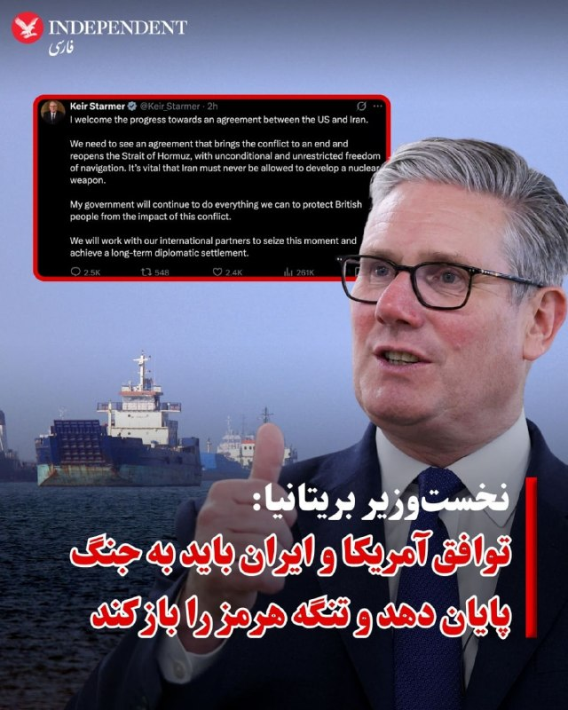

♦️کی‌یر استارمر، نخست‌وزیر بریتانیا روز یکشنبه از پیشرفت‌ گفتگوهای آمریکا و ایران استقبال کرد و گفت که توافق باید به جنگ پایان دهد و تنگه هرمز را بی‌قید و شرط باز کند.

کی‌یر استارمر در پیامی در شبکه اجتماعی ایکس نوشت: «ما باید شاهد توافقی باشیم که به درگیری پایان دهد و تنگه هرمز را با آزادی بی‌قید و شرط و نامحدود برای دریانوردی بازگشایی کند.»

نخست‌وزیر بریتانیا در عین حال بر این نکته که هرگز نباید به ایران اجازه توسعه سلاح هسته‌ای داده شود، تاکید کرده است.

استارمر همچنین نوشت که بریتانیا آماده همکاری با شرکای بین‌المللی خود است تا از این فرصت برای دست‌یابی به یک «توافق دیپلماتیک بلندمدت» استفاده شود.
‌🇸🇦 Indypersian

🤖 @VahidOOnLine

## VahidOOnLine — post 241914

♦️در پی درگذشت پرویز قلیچ‌خانی، کاپیتان پیشین تیم ملی فوتبال ایران، نجمه موسوی-پیمبری، یار و همراه او، با انتشار یک پیام صوتی جزئیات مربوط به وصیت شخصی این چهره ماندگار فوتبال ایران را تشریح کرد.
در این پیام، او با قدردانی از ابراز همدردی و همراهی دوستان، هواداران و علاقه‌مندان قلیچ‌خانی، اعلام کرد که این اسطوره فوتبال ایران بر اساس باورهای شخصی خود تصمیم گرفته بود پیکرش به مراکز علمی و آموزشی اهدا شود، از همین رو مراسم خاک‌سپاری به شکل سنتی برگزار نخواهد شد.
به گفته موسوی-پیمبری، قلیچ‌خانی در سال‌های پایانی عمر، به دلیل فروتنی شخصی و نیز پرهیز از ایجاد زحمت برای دیگران، تمایلی به برگزاری آیین‌های رسمی و گسترده یادبود نداشت. با این حال او تاکید کرده است که دوستداران این چهره آزاداندیش، مبارز و اثرگذار در تاریخ ورزش و سیاست ایران، می‌توانند در هر نقطه از جهان، به‌صورت داوطلبانه برنامه‌هایی برای بزرگداشت جایگاه و یاد او برگزار کنند.
پرویز قلیچ‌خانی از بزرگ‌ترین چهره‌های تاریخ ورزش ایران، روز شنبه ۲ خرداد ۱۴۰۵ در ۸۱ سالگی در بیمارستانی در حومه پاریس درگذشت.
‌🇸🇦 Indypersian

🤖 @VahidOOnLine

## VahidOOnLine — post 241913

  

وای‌نت به نقل از یک منبع نوشت که نتانیاهو در تماس با ترامپ تاکید کرد، اسرائیل آزادی عمل خود را برای مقابله با تهدیدها در همه جبهه‌ها از جمله لبنان، حفظ خواهد کرد.

بر اساس این گزارش، ترامپ نیز حمایت خود را از این موضوع اعلام کرد.

وای‌نت نوشت که ترامپ در تماس تلفنی با نتانیاهو تاکید کرده در مذاکرات بر خواسته همیشگی خود برای برچیدن برنامه هسته‌ای و خارج کردن همه ذخایر اورانیوم غنی‌شده از خاک ایران پافشاری خواهد کرد.

همچنین کانال ۱۴ اسرائیل به نقل از یک مقام ارشد سیاسی نوشت که اسرائیل به آمریکا اعلام کرده، چه توافقی با جمهوری اسلامی حاصل شود و چه نشود، این کشور آزادی عمل خود برای عملیات در همه بخش‌ها، از جمله در لبنان را حفظ می‌کند.
iranintl
‌🏁 🇬🇧 IranintlTV

🤖 @VahidOOnLine

## VahidOOnLine — post 241912

🗣روایت شما از احتمال توافق میان آمریکا و جمهوری اسلامی- یکشنبه ۳ خرداد

🔹دیگه امیدی به ترامپ نداریم. ما ۴۰ هزار کشته ندادیم که با این حکومت مماشات کنیم. کشورهای دیگه هم به خاطر منافع خودشون از این حکومت حمایت کردن. خودمون کار رو تموم می‌کنیم. مردم عزیز این آخرین نبرده.

🔹ما مردم ایران توافق و آتش‌بس ۶۰ روزه نمی‌خوایم. منتظریم دوباره صدای جنگنده‌ها رو در آسمون ایران بشنویم.

🔹نباید تصمیمات ترامپ برامون مهم باشه. خودمون از داخل کشور باید این رژیم رو زمین بزنیم. ناامید نشو هموطن.

🔹منتظر فراخوان مجدد شاهزاده هستیم تا کار جمهوری اسلامی رو تموم کنیم. زنده بودن در ایران دیگه غیرممکن شده.

🔹داریم زیر بار گرونی کمر خم می‌کنیم و کاری از دستمون برنمیاد. اگه ترامپ توافق کنه بزرگ‌ترین خیانت رو در حق مردم ایران کرده. امیدواریم پایان این شب سیه، سپید باشه.

🔹کدوم توافق؟ هر روز با استرس خبر اعدامی‌ها، افسردگی و فقر و هزار تا بدبختی دیگه که ترامپ و جمهوری اسلامی بهمون تحمیل کردن دست‌وپنجه نرم می‌کنیم.

🔹با خبرهایی که از توافق داره میاد، مشخصه که ما مردم، قربانی سیاست شدیم.

🔹ترامپ خواهشا با این جانیان و قاتلان ملت که در دو روز ۴۰ هزار نفر رو کشتن و تیر خلاص زدن، توافق نکن. این حکومت خون ما رو در شیشه کرده و نمی‌گذاره آزادانه راهپیمایی کنیم و خواسته خودمون رو طلب کنیم. اینا ۴۷ ساله فقط مرگ بر آمریکا و اسرائیل گفتن.
‌🏁 🇬🇧 IranintlTV

🤖 @VahidOOnLine

## VahidOOnLine — post 241911

♦️مارکو روبیو، وزیر خارجه آمریکا، روز یکشنبه در جریان نشست خبری مشترک با سابرامانیام جایشانکار، وزیر خارجه هند، در دهلی‌نو اعلام کرد که طی ۴۸ ساعت گذشته «پیشرفت قابل‌توجهی» در مذاکرات و رایزنی‌های مرتبط با بحران تنگه هرمز و پرونده ایران حاصل شده و احتمال دارد تا ساعاتی دیگر اخبار مهم‌تری در این زمینه منتشر شود. او بدون ارائه جزئیات کامل، گفت هنوز توافق نهایی شکل نگرفته اما مسیر مذاکرات نسبت به روزهای گذشته امیدوارکننده‌تر شده است.
روبیو در ادامه گفت هرگونه توافق احتمالی نیازمند پذیرش کامل ایران و اجرای عملی تعهدات خواهد بود و مذاکرات درباره جزئیات فنی برنامه هسته‌ای، روندی پیچیده و زمان‌بر دارد. او افزود هنوز نمی‌توان درباره موفقیت نهایی مذاکرات با قطعیت صحبت کرد، اما «نشانه‌هایی از پیشرفت واقعی» دیده می‌شود و ممکن است جهان در ساعات آینده خبرهای مثبتی درباره تنگه هرمز و روند مذاکرات دریافت کند.
‌🇸🇦 Indypersian

🤖 @VahidOOnLine

## VahidOOnLine — post 241910

  <a href="telegram/content/VahidOOnLine_241910_1779624737.mp4" target="_blank">🎬 Download video</a>

نت‌بلاکس اعلام کرد انسداد اینترنت در ایران وارد هشتادوششمین روز شده و مردم پس از بیش از دو هزار و ۴۰ ساعت، همچنان در «تاریکی دیجیتال» به سر می‌برند.

این نهاد ناظر بر اینترنت نوشت دسترسی به اینترنت جهانی در ایران، همزمان با ادامه گفت‌وگوهای صلح، همچنان به‌طور گسترده قطع است.

به گفته نت‌بلاکس، در حالی که بخش بزرگی از مردم از دسترسی آزاد به اینترنت محرومند، گروهی از کاربران گزینش‌شده و دارای دسترسی سفید، تصویری ساختگی و کنترل‌شده از زندگی در ایران را به جهان بیرون نشان می‌دهند.
‌🏁 🇬🇧 ManotoTV

🤖 @VahidOOnLine

## VahidOOnLine — post 241909

  

اورزولا فون در لاین، رییس کمیسیون اروپا، از پیشرفت آمریکا و جمهوری اسلامی به سمت توافق استقبال کرد و افزود: «جمهوری اسلامی باید اقدامات بی‌ثبات‌کننده در منطقه را چه به‌صورت مستقیم و چه از طریق نیروهای نیابتی، و همچنین حملات مکرر و بی‌دلیل به همسایگانش را متوقف کند.»

او ادامه داد: «بازگشایی تنگه هرمز اهمیت دارد و به توافقی نیاز داریم که واقعا به کاهش تنش‌ها منجر شود، تنگه هرمز را بازگشایی و آزادی کامل کشتیرانی را بدون دریافت عوارض و بدون محدودیت تضمین کند.»
iranintl
‌🏁 🇬🇧 IranintlTV

🤖 @VahidOOnLine

## WithYashar — post 12327

تسنیم : بر اساس شنیده‌ها از متن تفاهم احتمالی، برخلاف گزارش یک رسانه آمریکایی که می‌گوید طبق تفاهم نامه «آتش بس میان ایران و آمریکا به مدت 60 روز تمدید می‌شود»، این عبارت در متن وجود ندارد و تعبیری که به کار گرفته شده است، اعلام پایان جنگ در همه جبهه‌ها از جمله لبنان است.
بر اساس متنی که هنوز نهایی نشده، در بازه 30 روزه موضوع تنگه هرمز و محاصره دریایی پیش برده می‌شود و زمان 60 روزه‌ای برای مذاکرات در مسئله هسته‌ای در نظر گرفته شده است.
@withyashar

## WithYashar — post 12326

روبیو: اهداف تعیین شده عملیات نظامی بدست آمده
@withyashar 😈

## WithYashar — post 12325

  <a href="telegram/content/WithYashar_12325_1779624738.mp4" target="_blank">🎬 Download video</a>

امیرحسین ثابتی نماینده تهران در تجمعات شبانه :

ممکنه جنگ یک ساعت دیگه باشه، ممکنه یک روز یا یک سال دیگه، اما قطعاً قطعی جنگ.
حتی اگه آمریکا تمام شرایط ما رو بپذیره و امضا کنه و تسلیم بشه، باز هم جنگ خواهیم داشت.
حتی اگر تیتر همه رسانه‌های غربی درباره نزدیک بودن مذاکره و توافق درست باشه ، من بازگشت جنگ رو تضمین می‌کنم.
@withyashar

## WithYashar — post 12324

بیانیه منتشر از دفتر نخست‌وزیر اسرائیل به نقل از یک منبع سیاسی (وای‌نت):

در مکالمه دیروز با ترامپ، نخست‌وزیر تأکید کرد که اسرائیل آزادی عملش رو در برابر تهدیدها در همه جبهه‌ها، از جمله لبنان، حفظ میکنه و ترامپ هم حمایتش از این اصل رو دوباره تأکید کرد.

ترامپ روشن کرد که خواسته‌اش برای خراب کردن برنامه هسته‌ای ایران و حذف تمام اورانیوم غنی‌شده از خاک این کشور ثابت میمونه و بدون این شرایط، توافق نهایی رو امضا نمیکنه.

نخست‌وزیر یه بار دیگه از تعهد طولانی‌مدت و خاص ترامپ به امنیت اسرائیل تشکر کرد.
@withyashar

## WithYashar — post 12323

تروریست سردار قربانی: اسرائیلی‌ها بدانند قاآنی تا زیر سنگرهایشان می‌رود
سردار «مرتضی قربانی» مشاور فرمانده سپاه تروریست پاسداران: هیچ‌وقت از قاآنی ترس و واهمه ندیدم، اسرائیلی‌ها بدانند قاآنی تا زیر سنگرهایشان می‌رود!
@withyashar 🥴

## WithYashar — post 12322

  <a href="telegram/content/WithYashar_12322_1779624740.mp4" target="_blank">🎬 Download video</a>

🚨🚨🚨🚨بالاخره توافق رسمی‌شد
@withyashar

## WithYashar — post 12321

مهر: یک پهپاد اسرائیلی بر فراز هرمزگان سرنگون شد
این پهپاد که کاربری جاسوسی و شناسایی داشت، با شلیک پدافند ارتش سرنگون شد.
لاشه پهپاد متلاشی شده اربیتر با همکاری ناوگروه دریابانی فراجای هرمزگان کشف شد.
@withyashar

## WithYashar — post 12320

## WithYashar — post 12319

## WithYashar — post 12318

احمد وحیدی فرمانده کل سپاه:

فتح خرمشهر یک الگوی خوب برای نابودی کامل اسرائیل است.
@withyashar
یاشار : همین فرمون برین 🤣

## WithYashar — post 12317

گزارش کانال 14 : ممکن است ظرف چند روز توافقی بین آمریکا و ایران حاصل شود که انتظار می‌رود لبنان را نیز شامل شود و احتمالاً به پایان درگیری‌های اسرائیل با حزب‌الله منجر شود.

بر اساس جزئیات منتشر شده، ایران تنگه هرمز را بدون دریافت هزینه باز خواهد کرد در حالی که آمریکا پولی به تهران منتقل نخواهد کرد و به هر دو طرف مهلت ۶۰ روزه داده می‌شود تا مذاکرات هسته‌ای را ادامه دهند.

تحریم‌ها علیه ایران باقی خواهد ماند به جز تسهیلات محدودی در محدودیت‌های مرتبط با نفت
@withyashar

## WithYashar — post 12316

## WithYashar — post 12315

ما عمر نوح نداریم انقدر صبر کنیم !
@withyashar

## WithYashar — post 12314

Pishro (instagram.com/yashar) – Sonnat Shekan (t.me/withyashar)

## WithYashar — post 12313

نتانیاهو:
خوشحالم که رئیس‌جمهور دونالد ترامپ، بهترین دوستی که اسرائیل تا حالا در کاخ سفید داشته، در امانه و مهاجم قبل از اینکه بتونه آسیب بیشتری بزنه خنثی شده.

خشونت سیاسی، از جمله تلاش‌های مکرر برای ترور ترامپ، باید بدون هیچ ابهامی و با قاطعیت کامل از طرف همه محکوم بشه
@withyashar

## WithYashar — post 12312

## WithYashar — post 12311

عجب سکوتی …

## WithYashar — post 12310

  <a href="telegram/content/WithYashar_12310_1779624741.mp4" target="_blank">🎬 Download video</a>

@withyashar 🤣 بی بی عشقه

## WithYashar — post 12309

کانال ۱۴ اسرائیل: نتانیاهو به وزرا دستور داده است از بحث در مورد توافق قریب الوقوع بین تهران و واشنگتن خودداری کنند
@withyashar

## WithYashar — post 12308

## mwarmonitor — post 9631

🔴یک توافق احتمالی میان آمریکا و ایران شامل این خواهد بود که ایران تعهد دهد به دنبال ساخت سلاح هسته‌ای نرود، هرگونه غنی‌سازی جدید را متوقف کند و وارد مذاکراتی درباره کنار گذاشتن ذخایر اورانیوم بسیار غنی‌شده خود شود، به گزارش CNN به نقل از یک فرد مطلع از موضوع.

🔸جزئیات مربوط به نحوه خارج کردن این ذخایر و مدت زمان توقف موقت غنی‌سازی در مذاکرات آینده تعیین خواهد شد.

@mwarmonitor

## mwarmonitor — post 9630

🔸«بحرین ۹ نفر را به حبس ابد محکوم کرد به اتهام جاسوسی برای سپاه پاسداران انقلاب اسلامی ایران و طراحی اقدامات تروریستی»

@mwarmonitor

## mwarmonitor — post 9629

🔴 فاکس‌نیوز: توافق مورد انتظار شامل این است که نیروهای آمریکایی تا ۳۰ روز در نزدیکی ایران باقی بمانند.

@mwarmonitor

## mwarmonitor — post 9628

📌دو مقام منطقه‌ای به آسوشیتدپرس گفته‌اند که توافق احتمالی شامل تعهد ایران به عدم پیگیری سلاح هسته‌ای و کنار گذاشتن ذخایر اورانیوم بسیار غنی‌شده‌اش است، و در مقابل، رفع تحریم‌ها و آزادسازی دارایی‌های مسدودشده طی ۶۰ روز مورد مذاکره قرار خواهد گرفت.

@mwarmonitor

## mwarmonitor — post 9627

🔴ترامپ به نتانیاهو به‌طور روشن اعلام کرد که بدون برچیده شدن کامل برنامه هسته‌ای ایران و خارج شدن تمام اورانیوم غنی‌شده از خاک این کشور، هیچ توافق نهایی درباره ایران را امضا نخواهد کرد؛ این را یک منبع سیاسی اسرائیلی به فاکس‌نیوز گفته است.

@mwarmonitor

## mwarmonitor — post 9626

  

🚢یک تانکر LNG ثبت‌شده در بریتانیا به نام FUWAIRIT تلاش کرد از تنگه هرمز عبور کند، اما در جنوب جزیره لارَک متوقف شد.

«حتما عوارض پرداخت نکرده بود؟»

@mwarmonitor

## mwarmonitor — post 9625

🔴ترامپ در سوشال تروث 🔸از سرویس مخفی عالی و نیروهای مجری قانونِ ما برای اقدام سریع و حرفه‌ای امشبِ آن‌ها در برابر فرد مسلحی که در نزدیکی کاخ سفید حضور داشت، سپاسگزارم؛ فردی که سابقه رفتارهای خشونت‌آمیز داشته و احتمالاً به ارزشمندترین بنای کشور ما (کاخ سفید)…

## mwarmonitor — post 9624

  

🛩جت «ARTEMIS II» امروز بر فراز گرجستان در حال پرواز دایره‌ای بوده و احتمالاً حسگرهای خود را به سمت جنوب، یعنی ارمنستان و/یا حتی شمال ایران متمرکز کرده است.

🔸این یک پرواز نادر محسوب می‌شود، زیرا این جت تجاریِ جمع‌آوری اطلاعات سیگنال که متعلق به یک پیمانکار و تحت عملیات ارتش آمریکا است، معمولاً بر فراز اروپای شرقی و همچنین در نزدیکی سواحل لیبی پروازهای مداری انجام می‌دهد.

@mwarmonitor

## mwarmonitor — post 9623

🔴گزارش یک منبع سیاسی: کانال ۱۲ اسرائیل

🔸ایالات متحده در حال به‌روزرسانی اسرائیل درباره مذاکرات مربوط به یک تفاهم‌نامه است که هدف آن بازگشایی تنگه هرمز و پیشبرد مذاکرات برای دستیابی به یک توافق نهایی درباره مسائل مورد اختلاف باقی‌مانده است.

🔹در تماس شب گذشته، نخست‌وزیر به رئیس‌جمهور ترامپ گفت که اسرائیل آزادی کامل اقدام در برابر تهدیدها در همه جبهه‌ها، از جمله لبنان، را حفظ خواهد کرد. ترامپ نیز بار دیگر حمایت خود را از این اصل تأکید کرد.

🔹ترامپ همچنین تأکید کرد که بر برچیده شدن برنامه هسته‌ای ایران و خارج شدن تمام اورانیوم غنی‌شده از خاک این کشور اصرار خواهد داشت و بدون تحقق این شروط، هیچ توافق نهایی را امضا نخواهد کرد.

🔹نخست‌وزیر از ترامپ به خاطر تداوم تعهدش به امنیت اسرائیل تشکر کرد.

@mwarmonitor

## mwarmonitor — post 9622

📌نتانیاهو طی هفته‌های گذشته چندین بار درخواست کرده است با ترامپ صحبت کند، اما طبق گزارش روزنامه «معاریو» به نقل از منابع، تنها دستیاران ترامپ به این درخواست‌ها پاسخ داده‌اند.

@mwarmonitor

## mwarmonitor — post 9621

🔴ایران از ارسال ذخایر اورانیوم بسیار غنی‌شده خود به خارج از کشور خودداری کرده است و تهران تأکید دارد که مذاکرات هسته‌ای خارج از چارچوب فعلیِ در حال بررسی با واشنگتن قرار ندارد. رویترز

@mwarmonitor

## mwarmonitor — post 9620

🔵نخست وزیر انگلیس ؛ از پیشرفت در جهت رسیدن به توافق میان آمریکا و ایران استقبال می‌کنم.

🔹ما باید شاهد توافقی باشیم که به این درگیری پایان دهد و تنگه هرمز را دوباره باز کند، با آزادی کامل و بدون قید و شرط برای کشتیرانی. بسیار حیاتی است که ایران هرگز اجازه نیابد سلاح هسته‌ای توسعه دهد.

🔹دولت من همچنان هر کاری که بتواند انجام خواهد داد تا از مردم بریتانیا در برابر پیامدهای این درگیری محافظت کند.

🔹ما با شرکای بین‌المللی خود همکاری خواهیم کرد تا از این لحظه استفاده کرده و به یک راه‌حل دیپلماتیک بلندمدت دست پیدا کنیم.

@mwarmonitor

## mwarmonitor — post 9619

📌فیننشال تایمز ؛ سپاه پاسداران انقلاب اسلامی ایران از یک شبکه تأمین مستقر در امارات متحده عربی برای خرید تجهیزات پیشرفته ماهواره‌ای چینی استفاده کرده است.

@mwarmonitor

## mwarmonitor — post 9618

🔸خبرگزاری تسنیم

🔴فوری/ یک منبع مطلع: اختلاف بر سر یکی دو بند از تفاهم‌نامه همچنان ادامه دارد

▪️ یک منبع مطلع به خبرگزاری تسنیم گفت که اختلاف میان ایران و آمریکا بر سر یکی دو بند از تفاهم نامه احتمالی همچنان ادامه دارد و به دلیل مانع‌تراشی‌های آمریکا هنوز موضوع نهایی نشده است.

▪️ وی تاکید کرد: ایران بر احقاق خود مردم خود تاکید دارد و این موضوع به میانجی پاکستانی اعلام شده است که در صورت ادامه مانع‌تراشی‌های آمریکا، امکان نهایی شدن تفاهم نامه وجود ندارد.

@mwarmonitor

## mwarmonitor — post 9617

🔴ساعت ۰۸:۴۵ به وقت گرینویچ/ DERMA 84؛ ۲ فروند بمب‌افکن استراتژیک B-1B از فرودگاه فیرفورد (Fairford) به پرواز درآمده‌اند و به سمت جنوب‌غرب در حال حرکت هستند، با رعایت رویه‌های ایمنی پروازی (due regard) و در حال ارتباط با Brize با فرکانس 231.950.

@mwarmonitor

## FoxNewsTwitter — post 342183

  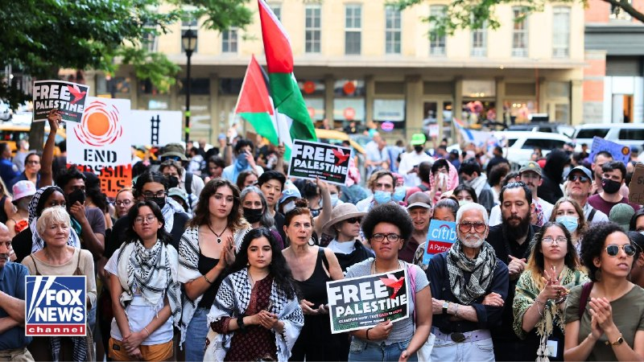

Fox News (Twitter/X)

Anti-Israel agitators. Climate activists. Communist groups.

Experts warn a growing activist network united by anti-American sentiment — and in some cases China-linked funding networks — is now targeting America’s AI infrastructure and industrial power.

Fox News Digital found many of the same movements protesting side-by-side across the country, including groups opposing new AI data centers over energy and environmental concerns.

“What all of these protests have in common ... is that anti-American trend within them,” Hudson Institute fellow Zineb Riboua told Fox News Digital.

## FoxNewsTwitter — post 342182

  <a href="telegram/content/FoxNewsTwitter_342182_1779624744.mp4" target="_blank">🎬 Download video</a>

Fox News (Twitter/X)

FIRST ON FOX: Democratic Maine Senate candidate Graham Platner dodges an apology when confronted over a deleted Reddit post where he said a Purple Heart recipient "didn’t deserve to live."

Fox News Digital asked him what he would say to offended voters — and whether he owed Pfc. Ted Daniels an apology.

Platner instead pointed to his own service: "I did four tours in the infantry, any attempt to say that I disrespect veterans is slanderous and offensive."

## pm_afshaa — post 91382

  <a href="telegram/content/pm_afshaa_91382_1779624746.webm" target="_blank">🎬 Download video</a>

🔴کانال 14 اسرائیل:
اسرائیل رهبر 86 ساله که از سرطان مرحله 4 در حال مرگ بود رو از بین نبرد تا آمریکا با پسر 56 ساله سالم‌تر و تندروتر او صلح کنه.
با آمریکا یا بدون آمریکا، اسرائیل این رژیم رو به پایان خواهد رسوند.

💧 Rainbet.com the #1 Non-KYC Crypto Casino & Sportsbook @rainbetcom

😁 @Pm_Afshaa

## pm_afshaa — post 91381

  <a href="telegram/content/pm_afshaa_91381_1779624747.webm" target="_blank">🎬 Download video</a>

🔴تسنیم به نقل از منبع آگاه:
آمریکایی‌ها درحال کارشکنی هستن و مسئله پول‌های بلوکه شده باعث شده فعلا توافقی نهایی نشه.

💧 Rainbet.com the #1 Non-KYC Crypto Casino & Sportsbook @rainbetcom

😁 @Pm_Afshaa

## pm_afshaa — post 91380

#مهم عزیزای دلم همگی الان چنل زاپاس‌مون رو جوین بشید کانال تحت ریپورت شدیده اگه چیزی شد زاپاس رو داشته باشید فعالیت میاد اونور
👇 https://t.me/Pm_Zapas https://t.me/Pm_Zapas

## pm_afshaa — post 91379

  <a href="telegram/content/pm_afshaa_91379_1779624747.webm" target="_blank">🎬 Download video</a>

🔴خبرگزاری مهر: پدافند هوایی ارتش یک پهپاد اسرائیلی رو بر فراز هرمزگان سرنگون کرد.

💧 Rainbet.com the #1 Non-KYC Crypto Casino & Sportsbook @rainbetcom

😁 @Pm_Afshaa

## pm_afshaa — post 91378

🔴فاکس نیوز: توافق با ایران مقرر می‌کند که نیروهای آمریکایی به مدت 30 روز پس از اجرای توافق در نزدیکی ایران باقی بمانن

💧 Rainbet.com the #1 Non-KYC Crypto Casino & Sportsbook @rainbetcom

😁 @Pm_Afshaa

## pm_afshaa — post 91377

🔴بحرین: 9 نفر به جرم جاسوسی برای سپاه پاسداران ایران به حبس ابد محکوم شدن

💧 Rainbet.com the #1 Non-KYC Crypto Casino & Sportsbook @rainbetcom

😁 @Pm_Afshaa

## pm_afshaa — post 91376

  <a href="telegram/content/pm_afshaa_91376_1779624748.webm" target="_blank">🎬 Download video</a>

🔴بیانیه منتشر از دفتر نخست‌وزیر اسرائیل به نقل از یک منبع سیاسی (وای‌نت):

در مکالمه دیروز با ترامپ، نخست‌وزیر تأکید کرد که اسرائیل آزادی عملش رو در برابر تهدیدها در همه جبهه‌ها، از جمله لبنان، حفظ میکنه و ترامپ هم حمایتش از این اصل رو دوباره تأکید کرد.

ترامپ روشن کرد که خواسته‌اش برای خراب کردن برنامه هسته‌ای ایران و حذف تمام اورانیوم غنی‌شده از خاک این کشور ثابت میمونه و بدون این شرایط، توافق نهایی رو امضا نمیکنه.

نخست‌وزیر یه بار دیگه از تعهد طولانی‌مدت و خاص ترامپ به امنیت اسرائیل تشکر کرد.

💧 Rainbet.com the #1 Non-KYC Crypto Casino & Sportsbook @rainbetcom

😁 @Pm_Afshaa

## pm_afshaa — post 91375

بچه ها حتما تو چنل زاپاسمون جوین شین ما رو گم نکنین

https://t.me/Pm_Zapas
https://t.me/Pm_Zapas

## pm_afshaa — post 91374

  <a href="telegram/content/pm_afshaa_91374_1779624749.webm" target="_blank">🎬 Download video</a>

🔴نتانیاهو:
خوشحالم که رئیس‌جمهور دونالد ترامپ، بهترین دوستی که اسرائیل تا حالا در کاخ سفید داشته، در امانه و مهاجم قبل از اینکه بتونه آسیب بیشتری بزنه خنثی شده.

خشونت سیاسی، از جمله تلاش‌های مکرر برای ترور ترامپ، باید بدون هیچ ابهامی و با قاطعیت کامل از طرف همه محکوم بشه

💧 Rainbet.com the #1 Non-KYC Crypto Casino & Sportsbook @rainbetcom

😁 @Pm_Afshaa

## pm_afshaa — post 91373

  <a href="telegram/content/pm_afshaa_91373_1779624749.webm" target="_blank">🎬 Download video</a>

🔴شبکه 14 اسرائیل:
نتانیاهو به وزرا دستور داد که در مورد توافق نزدیک ایران و آمریکا صحبت نکنن.

💧 Rainbet.com the #1 Non-KYC Crypto Casino & Sportsbook @rainbetcom

😁 @Pm_Afshaa

## pm_afshaa — post 91372

تسنیم: اختلاف بر سر یک یا دو بند در یادداشت تفاهم ادامه دارد. اگر آمریکا به ایجاد موانع ادامه دهد، امکان رسیدن به تفاهم وجود نخواهد داشت

💧 Rainbet.com the #1 Non-KYC Crypto Casino & Sportsbook @rainbetcom

😁 @Pm_Afshaa

## pm_afshaa — post 91371

فارس:احتمالا دوباره آمریکا دبه میکنه و توافق رو‌ بهم میزنه

💧 Rainbet.com the #1 Non-KYC Crypto Casino & Sportsbook @rainbetcom

😁 @Pm_Afshaa

## pm_afshaa — post 91370

  <a href="telegram/content/pm_afshaa_91370_1779624750.webm" target="_blank">🎬 Download video</a>

🔴کیر استارمر، نخست وزیر بریتانیا:
پیشرفت به سمت توافق بین ایران و آمریکا رو تبریک میگیم. باید به توافقی برسیم که منجر به پایان درگیری بشه. حیاتیه که ایران هرگز نتونه سلاح هسته‌ای داشته باشه. با شرکای خود در جهان پیش میریم تا از این فرصت استفاده کنیم و به یک توافق سیاسی بلندمدت دست پیدا کنیم.

💧 Rainbet.com the #1 Non-KYC Crypto Casino & Sportsbook @rainbetcom

😁 @Pm_Afshaa

## pm_afshaa — post 91369

  <a href="telegram/content/pm_afshaa_91369_1779624750.webm" target="_blank">🎬 Download video</a>

🔴رویترز به نقل از یک مقام ارشد ایرانی:
تهران با تحویل اورانیوم غنی‌شده با سطح بالا موافقت نخواهد کرد؛ مسئله هسته‌ای بخشی از توافق مقدماتی نیست.

💧 Rainbet.com the #1 Non-KYC Crypto Casino & Sportsbook @rainbetcom

😁 @Pm_Afshaa

## DEJradio — post 4914

  

🔸
⭕️ خبرگزاری تسنیم، وابسته به سـ.ـپاه پاسداران گزارش داد اختلاف میان جمهوری اسلامی و آمریکا بر سر یکی دو بند از تفاهم‌نامه احتمالی همچنان ادامه دارد و به دلیل «مانع‌تراشی‌های آمریکا» هنوز موضوع نهایی نشده است.
همچنین رویترز به نقل از یک «منبع ارشد ایرانی» نوشت که تهران با تحویل ذخیره اورانیوم بسیار غنی شده خود موافقت نکرده و مسئله هسته‌ای بخشی از توافق اولیه نیست.

#مذاکرات #برنامه_اتمی
@DEJradio

## DEJradio — post 4913

  <a href="telegram/content/DEJradio_4913_1779624752.mp4" target="_blank">🎬 Download video</a>

🔸🎥 پاکستان؛ بیش از ۱۲۰ کشته و زخمی در حمله انتحاری به یک قطار

کشوری که در تامین امنیت داخلی خود سر تا پا مشکل دارد و با انواع بحران روبروست، میانجی مذاکره آمریکا و جمهوری اسلامی شده است.

#پاکستان
@DEJradio

## DEJradio — post 4912

⭕️ رئیس کمیسیون اروپا گفت جمهوری اسلامی باید اقدامات بی‌ثبات‌کننده را در منطقه متوقف کند

اورسولا فون‌ در لاین، رئیس کمیسیون اروپا تأکید کرد جمهوری اسلامی باید اقدامات بی‌ثبات‌کننده را در منطقه، چه مستقیما و چه از طریق نیروهای نیابتی متوقف کند.
اورسولا فون‌ در لاین همچنین از پیشرفت مذاکرات میان آمریکا و جمهوری اسلامی استقبال کرد. او گفت بازگشایی تنگۀ هرمز اهمیت دارد.
فون در لاین ادعا کرد اروپا با شرکای بین‌المللی برای دستیابی به راه‌حلی دیپلماتیک و پایدار در مورد جمهوری اسلامی همکاری می‌کند.
رئیس کمیسیون اروپا، گفت به توافقی نیاز است که واقعا به کاهش تنش‌ها منجر شود، تنگۀ هرمز را بازگشایی کند و آزادی کامل کشتیرانی را بدون دریافت عوارض و محدودیت تضمین کند.
او افزود حملات مکرر تهران به همسایگان باید پایان یابد.

#اتحادیه_اروپا #مذاکرات
@DEJradio

## DEJradio — post 4911

⭕️ قطعی سراسری اینترنت در ایران وارد هشتاد و ششمین روز شد

نت‌بلاکس اعلام کرد قطعی سراسری اینترنت در ایران وارد هشتاد و ششمین روز شده است.
بنا بر این گزارش، شهروندان پس از بیش از ۲۰۴۰ ساعت همچنان از دسترسی آزاد به اینترنت جهانی محروم‌اند.
این نهاد جهانی پایش اینترنت گفت در حالی که دسترسی عمومی به شبکۀ جهانی امکان ندارد، گروهی از کاربران وابسته به حکومت تصویری «مصنوعی» را از «وضعیت عادی» در ایران به بیرون منتقل می‌کنند.

#اینترنت
@DEJradio

## DEJradio — post 4910

⭕️ اردوی تیم ملی فوتبال در جام جهانی به‌جای آریزونا در مکزیک برگزار می‌شود

مهدی تاج، رئیس فدراسیون فوتبال جمهوری اسلامی اعلام کرد تیم ملی در جریان جام جهانی ۲۰۲۶ در شهر تیخوانا در مکزیک مستقر می‌شود.
او گفت فیفا با درخواست جمهوری اسلامی برای انتقال محل اردو از ایالت آریزونا آمریکا موافقت کرد.
بنا بر ادعای تاج، این جابه‌جایی می‌تواند مشکلات مربوط به دریافت ویزا را کاهش دهد. همچنین اعضای تیم می‌توانند با پرواز مستقیم ایران‌ایر به مکزیک سفر کنند.
تیم فوتبال جمهوری اسلامی ایران در حالی برای حضور در جام جهانی آماده می‌شود که هنوز ویزای آمریکا برای بخشی از بازیکنان و اعضای کادر فنی صادر نشده است.
از سویی بنا بر برخی گزارش‌ها، فیفا قصد دارد مانع ورود پرچم‌ شیر و خورشید به ورزشگاه‌ها در هنگام برگزاری جام جهانی بشود.

#فوتبال #جام_جهانی
@DEJradio

## DEJradio — post 4909

⭕️ قوۀ قضائیه از اعدام یک شهروند به اتهام همکاری با آمریکا و اسرائیل خبر داد

قوۀ قضائیۀ جمهوری اسلامی اعلام کرد شهروندی به نام مجتبا کیان را با اتهام «ارسال اطلاعات مراکز صنایع دفاعی» به آمریکا و اسرائیل اعدام کرده است.
به گزارش خبرگزاری میزان، وابسته به دستگاه قضائی مدعی شد مجتبا کیان در دوران جنگ اخیر اطلاعات مربوط به واحدهای صنایع دفاعی را به خارج ارسال کرده بود.
میزان مدعی شد که از دیگر موارد اتهامی مجتبا کیان، ارسال پیام‌ برای «شبکه‌های معاند» بوده است.
قوۀ قضائیه هیچ توضیحی درمورد شغل یا شیوۀ دسترسی او به اطلاعات صنایع دفاعی ارائه نکرد.
در ماه‌های اخیر جمهوری اسلامی بارها شهروندانی را به اتهام ارسال تصاویر و اطلاعات برای رسانه‌های خارج از کشور، بازداشت کرد.
رویۀ اتهام‌زنی، بازداشت، شکنجه و اعدام شهروندان، در همۀ سال‌های اخیر توسط حکومت ادامه داشته است.
حکومت از شکنجه و اعدام مخالفان به عنوان ابزاری برای ترساندن و عقب‌راندن مخالفان استفاده می‌کند.

#اعدام #زندانیان_سیاسی
@DEJradio

## DEJradio — post 4908

⭕️ فرماندۀ سپاه تهدید آمریکا و اسرائیل را ازسر گرفت

در حالی که رسانه‌های نزدیک به سپاه از نزدیک شدن تهران و واشینگتن به یک «تفاهم اولیه» خبر دادند، فرماندۀ سپاه پاسداران دربارۀ هرگونه حملۀ دوباره هشدار داد.
احمد وحیدی تهدید کرد که در صورت حمله، نیروهای مسلح جمهوری اسلامی، واکنشس «ویرانگر و جهنمی» در ابعاد منطقه‌ای و فرامنطقه‌ای انجام می‌دهند.
ادعاهای فرماندۀ سپاه در حالی است که در دوران جنگ چهل روزه، شمار بسیاری از فرماندهان ارشد و میانی این نیرو و همچنین پایگاه‌های موشکی و پهپادی جمهوری اسلامی نابود شده است.
#سپاه_تروریستی_پاسداران
@DEJradio

## DEJradio — post 4907

⭕️چهره‌های جمهوری‌خواه از توافق احتمالی ترامپ با ایران انتقاد کردند

همزمان با گزارش‌ها دربارۀ توافق احتمالی میان دولت دونالد ترامپ و جمهوری اسلامی، چند چهرۀ برجسته جمهوری‌خواه از این روند انتقاد کردند.
لیندزی گراهام، سناتور جمهوری‌خواه گفت توافقی که به جمهوری اسلامی اجازۀ حفظ قدرت منطقه‌ای را بدهد، در بلندمدت «کابوسی برای اسرائیل» می‌شود.
مایک پمپئو، وزیر امور خارجۀ نخستین دولت ترامپ گفت توافق احتمالی به هیچ وجه در راستای شعار «اول آمریکا» نیست.
پمپئو توافق احتمالی را به توافق هسته‌ای {برجام} در زمان دولت باراک اوباما شبیه دانست.
تد کروز، سناتور جمهوری‌خواه، نیز هشدار داد اگر نتیجۀ جنگ این باشد که جمهوری اسلامی همچنان توان غنی‌سازی اورانیوم و کنترل موثر بر تنگۀ هرمز را حفظ کند، این «اشتباهی فاجعه‌بار» است.
مورگان اورتگاس، نمایندۀ پیشین دولت ترامپ در امور خاورمیانه، هم هشدار داد جمهوری اسلامی ممکن است از مذاکرات برای «خرید زمان» و کاهش فشارها استفاده کند.

#تفاهم #مذاکرات #لیندسی_گراهام
@DEJradio

## DEJradio — post 4906

⭕️ اکسیوس: تهران و واشینگتن به تفاهم‌نامۀ ۶۰ روزه نزدیک شدند

وبسایت خبری اکسیوس به نقل از منابع آگاه گزارش داد جمهوری اسلامی و آمریکا به امضای یک «یادداشت تفاهم ۶۰ روزه» نزدیک شده‌اند.
بر اساس این گزارش، این تفاهم‌نامه توافق نهایی محسوب نمی‌شود، اما می‌تواند آتش‌بس را تمدید کند، به بازگشایی تنگۀ هرمز بینجامد و زمینۀ مذاکرات تازۀ هسته‌ای را فراهم کند.
به گزارش اکسیوس، جمهوری اسلامی در چارچوب این تفاهم متعهد می‌شود تنگۀ هرمز را بدون دریافت عوارض باز نگه دارد و مین‌های کارگذاشته شدۀ احتمالی را جمع‌آوری کند.
اکسیوس نوشت دولت آمریکا نیز محاصرۀ بنادر ایران را متوقف و بخشی از تحریم‌ها را تعلیق می‌کند.
بنا بر این گزارش، تهران اجازه می‌یابد موقتا بخشی از نفت خود را به فروش برساند.
به نوشتۀ اکسیوس، در دورۀ شصت روزه مسائل هسته‌ای حل نمی‌شود.
اکسیوس به نقل از منابع آگاه گفت در دو ماه پیش رو، مذاکراتی دربارۀ توقف غنی‌سازی، انتقال ذخایر اورانیوم و تعهد جمهوری اسلامی به نرفتن به سمت سلاح هسته‌ای انجام می‌شود.

#مذاکرات #برنامه_اتمی
@DEJradio

## DEJradio — post 4905

⭕️ پاکستان برای میزبانی دور تازۀ مذاکرات جمهوری اسلامی و آمریکا ابراز امیدواری کرد

پس از پیام دونالد ترامپ درمورد نزدیک بودن توافق با جمهوری اسلامی، شهباز شریف، نخست‌وزیر پاکستان، ابراز امیدواری کرد دور تازۀ مذاکرۀ تهران و واشینگتن «در آینده‌ای بسیار نزدیک» در اسلام‌آباد برگزار شود.
از سویی خبرگزاری حکومتی فارس، نزدیک به سپاه پاسداران، پیام‌های ترامپ را «تبلیغاتی و برای مصرف داخلی آمریکا» عنوان کرد.
در سوی دیگر، وبسایت اکسیوس گزارش داد پیش‌نویس تفاهم‌نامه‌ای در حال آماده شدن است که ترامپ «در شرف امضای آن» قرار دارد.
بر اساس گزارش اکسیوس، جمهوری اسلامی از طریق میانجی‌ها به‌صورت شفاهی تعهد داده هرگز به‌دنبال سلاح هسته‌ای نرود و درباره تعلیق غنی‌سازی و انتقال ذخایر اورانیوم مذاکره کند.
خبرگزاری حکومتی فارس مدعی شد «هیچ تعهدی از سوی تهران داده نشده» است.
به ادعای این خبرگزاری نزدیک به سپاه، پروندۀ هسته‌ای در این مرحله از مذاکرات «مورد بحث قرار نگرفته است.»

#مذاکرات #تفاهم #پاکستان
@DEJradio

## DEJradio — post 4904

⭕️ رسانۀ اسرائیلی: برخی مشاوران ترامپ او را به سوی توافقی ناخوشایند با تهران می‌برند

شبکه ۱۳ اسرائیل گزارش داد مقام‌های این کشور بر این باورند که تهران و واشینگتن به توافق احتمالی نزدیک‌تر شده‌اند.
به گزارش شبکۀ ۱۳ اسرائیل، مقام‌های این کشور گفته‌اند فشار برخی مشاوران دونالد ترامپ بر او برای توافق با تهران، در روزهای اخیر افزایش یافته است.
اسرائیل پیش‌تر تصور می‌کرد اختلاف بر سر مسائل کلیدی مانع توافق می‌شود، اما اکنون برخی مقام‌های این کشور فکر می‌کنند روند مذاکرات به‌خلاف ارزیابی‌های قبلی به پیش می‌رود.
بر اساس این گزارش، بخشی از نهاد امنیتی اسرائیل از روند مذاکرات ناخشنود است.

#مذاکرات #تفاهم #اسرائیل
@DEJradio

## DEJradio — post 4903

  <a href="telegram/content/DEJradio_4903_1779624753.mp4" target="_blank">🎬 Download video</a>

🎤
⭕️ یک میلیون شغل پودر شد و بیش از سه هزار واحد صنعتی به خاکستر تبدیل گشت! این کارنامه تکان‌دهنده شوک پس از جنگ بر بازار کار ایران است.
آمارهای رسمی از بیکاری مستقیم و غیرمستقیم دو میلیون نفر خبر می‌دهند. از قزوین و کرمان تا اصفهان، غول‌های تولید دست به تعدیل‌های بی‌سابقه زده‌اند،تا جایی که در صنعت خودرو، تولید به یک‌سوم سقوط کرده ودر فولاد مبارکه، از ۲۷ هزار کارگر فقط دو هزار نفر سر کار برگشته‌اند! کارگران باقی‌مانده نیز میان دوراهی اخراج یا کاربا نصف حقوق و بدون مزایاگرفتار شده‌اند؛ آن هم در حالی که صندوق‌های حمایتی دولت کاملاً خالی است.
عطا حسینیان گزارش می‌دهد.

#گزارش #اقتصاد
@DEJradio

## DEJradio — post 4902

⭕️
⭕️ روبیو گفت احتمال دارد خبری در مورد توافق با جمهوری اسلامی تا شامگاه یک‌شنبه اعلام شود

مارکو روبیو، وزیر امور خارجۀ آمریکا، گفت ممکن است تا شامگاه یک‌شنبه خبری درمورد توافقی با تهران اعلام شود که می‌تواند رسما به جنگ خاورمیانه پایان بدهد.
روبیو در جمع خبرنگاران در دهلی‌نو گفت: شاید در چند ساعت آینده دنیا «خبرهای خوبی» دریافت کند.
او افزود توافق در حال شکل‌گیری به نگرانی‌های آمریکا درباره تنگۀ هرمز می‌پردازد.
به گفتۀ وزیر امور خارجۀ آمریکا، این توافق می‌تواند روندی را آغاز کند که در پایان به هدف دونالد ترامپ یعنی رفع نگرانی دربارۀ برنامه هسته‌ای تهران منجر شود.

#تفاهم #تنگه_هرمز
@DEJradio

## DEJradio — post 4901

  <a href="telegram/content/DEJradio_4901_1779624755.mp4" target="_blank">🎬 Download video</a>

👑🎥 پرفورمنس های ایرانیان در نقاط مختلف دنیا در حمایت از مردم ایران، انقلاب شیر و خورشید و زندانیان سیاسی

#همبستگی
@DEJradio

## DEJradio — post 4900

📢🎥 یک شهروند با ارسال ویدیویی با اشاره به گرانی شدید مواد خوراکی، می‌گوید حبوبات انقدر گران شده که داره به لیست آرزوها اضافه میشه".

#صدای_شما #گرانی
@DEJradio

## DEJradio — post 4897

🔸📷 تصاویر ماهواره‌ای نشان می‌دهد در جنگ ۴۰ روزه پایگاه یکم دریایی ارتش در بندرعباس به طور کامل تخریب شده است. این پایگاه به عنوان، مرکز اورهال و ساخت ناو، اهمیت بسیاری داشت.
بالا ترین داک خشک، ۳ ناو البرز (۷۲) از کلاس الوند، یک ناو از کلاس هنگام و یک ناو دیگر از کلاس کمان/سینا (احتمالی) در حال اورهال بودند که بمباران شدند.
منابع غیررسمی داخلی گزارش دادند در داک مسقف، یک زیردریایی کلاس کیلو که از سال ۹۷ در حال اورهال بوده، نیز مورد اصابت قرار گرفته اما آسیب به زیردریایی مشخص نیست. اشاره شده که این زیردریایی از قبل جنگ ۴۰ روزه وضعیت بدی داشته است.
در داک شناور نیز یک ناو از کلاس هنگام در حال اورهال بود که هدف قرار گرفته است.
براساس تصاویر ماهواره‌ای لاشه ناو زاگرس نیز در اسکله قابل مشاهده است.

#جنگ_چهل_روزه #بندرعباس
@DEJradio

## DEJradio — post 4895

🔸
⭕️ صاحبان نانوایی‌ها در استان کرمانشاه در اعتراض به گرانی آرد و هزینه‌ها و مالیات‌های سنگین روز یکشنبه سوم خرداد ۱۴۰۵ اعتصاب کردند و در مقابل استانداری دست به اعتراض زدند.
گرانی آرد، سبب افزایش قیمت نان می‌شود و شهروندانی هستند که حتی برایشان خرید نان به عنوان اولیه‌ترین غذا برای سیر کردن شکم دشوار است.

#اعتصابات #نانوایی
@DEJradio

## mamlekate — post 103576

📝 ایران و آمریکا به تفاهم اولیه نزدیک شدند؛ جزئیات گزارش‌شده از تفاهم‌نامه

وب‌سایت اکسیوس به نقل از منابع خود گزارش داده است که آمریکا و جمهوری اسلامی ایران به امضای یک یادداشت تفاهم ۶۰ روزه نزدیک شده‌اند؛ تفاهمی که در صورت نهایی شدن می‌تواند آتش‌بس را تمدید کند، تنگه هرمز را بازگشاید، فشار بر بازار جهانی نفت را کاهش دهد و زمینه‌ساز دور تازه‌ای از مذاکرات هسته‌ای شود.

بر اساس این گزارش، تفاهم‌نامه پیشنهادی ۶۰ روز اعتبار خواهد داشت و با توافق دو طرف می‌تواند تمدید شود. در این دوره، ایران متعهد می‌شود تنگه هرمز را بدون دریافت عوارض باز کند و مین‌هایی را که احتمالا در این مسیر کار گذاشته شده، جمع‌آوری کند تا کشتی‌ها بتوانند آزادانه عبور کنند.

در مقابل، دولت ترامپ محاصره بنادر ایران را لغو خواهد کرد و برخی معافیت‌های تحریمی را صادر می‌کند تا ایران بتواند نفت خود را در بازار جهانی بفروشد. یک مقام آمریکایی گفته است این اقدام برای ایران «منفعت اقتصادی بزرگی» خواهد داشت، اما همزمان به کاهش فشار بر بازار جهانی نفت نیز کمک می‌کند.

اکسیوس تأکید کرده که مسائل هسته‌ای در این دوره ۶۰ روزه حل نخواهد شد، بلکه دو طرف دربارهٔ تعلیق غنی‌سازی اورانیوم، انتقال ذخایر اورانیوم غنی‌شده و تعهد ایران به دنبال نکردن سلاح هسته‌ای مذاکره خواهند کرد.

بر اساس این گزارش، رفع تحریم‌ها و آزادسازی دارایی‌های مسدودشده ایران نیز در این دوره بررسی می‌شود، اما اجرای آن منوط به توافق نهایی و قابل راستی‌آزمایی خواهد بود.

اکسیوس همچنین نوشته است که پیش‌نویس تفاهم‌نامه شامل پایان جنگ اسرائیل و حزب‌الله در لبنان نیز هست، موضوعی که بنیامین نتانیاهو در تماس با دونالد ترامپ نسبت به آن ابراز نگرانی کرده است.

📝 از توافق احتمالی تهران-واشنگتن چه می‌دانیم؟

@mamlekate

## kianmeli1 — post 87628

🔴خبرگزاری تسنیم سپاه: «بدون آزادسازی دارایی‌های مسدود شده ایران، توافقی حاصل نخواهد شد»، این موضوع به میانجیگران پاکستانی و منطقه‌ای ابلاغ شده است.
https://t.me/kianmeli1

## kianmeli1 — post 87627

‏🔴خبرگزاری مهر وابسته به سازمان تبلیغات اسلامی نوشت پدافند ارتش جمهوری اسلامی یک پهپاد اسرائیل را در هرمزگان سرنگون کرده است
https://t.me/kianmeli1

## kianmeli1 — post 87626

🔴یکی از همسایگان بیت خامنه ای میگفت از بالای پشت بام به بیت که نگاه میکنیم صاف شده حتی یک آجر سالم نمانده

سوال: چگونه مجتبی زنده مانده

دو حالت دارد:
۱-مجتبی آنجا نبوده
۲-اگر بوده کشته شده

بنظر ما مجتبی آنجا نبوده و مطلع بوده از حمله
https://t.me/kianmeli1

## kianmeli1 — post 87625

  

🔴چندروز پیش ۳۰ اردیبهشت مجتبی خامنه ای پیام تسلیتی را امضا کرده که جالبه
دست خطش این مدلیه یا واقعا نمیتونه امضا کنه در بستریه!

شبیه دست خط نهضت سوادآموزیه
https://t.me/kianmeli1

## kianmeli1 — post 87624

  

🔴هشدار شدید پمپئو به ترامپ:

‏به نظر می‌رسد توافقی که با ایران در حال انجام است، به‌طور مستقیم از روی نقشه وندی شرمن-رابرت مالی-بن رودز بیرون آمده: به سپاه پاسداران پول بدهید تا یک برنامه سلاح‌های کشتار جمعی بسازد و جهان را ترور کند.
‏این اصلا ربطی به شعار «اول آمریکا» ندارد.
‏موضوع خیلی ساده است:
‏تنگه را باز کنید.
‏دسترسی ایران به پول را قطع کنید.
‏و آن‌قدر توانایی‌های ایران را هدف قرار دهید که دیگر نتواند متحدان ما در منطقه را تهدید کند.
‏خیلی دیر شده.
‏وقتشه اقدام کنند.
https://t.me/kianmeli1

## kianmeli1 — post 87623

  

🔴اساسا چرا باید حمله کند! اگر بناست به براندازی٫ کار بزرگ را کردند تا قبل کشتن خامنه ای ، همه میگفتند با حذف خامنه ای کار تمام میشود حال می گویند منتظریم خامنه ای دوم حذف شود کار را تمام میکنیم به این حضرات که ۲۴ ساعت در تلویزیون ها نشسته اند تحت عناوین…

## IranIntlTV — post 338755

  <a href="telegram/content/IranIntlTV_338755_1779624759.mp4" target="_blank">🎬 Download video</a>

بر اساس ویدیوهای رسیده به ایران‌اینترنشنال، گروهی از بازنشستگان در شوش یکشنبه سوم خرداد تجمع کرده و شعار دادند: «تا حق خود نگیریم، از پا نمی‌نشینیم»

## IranIntlTV — post 338754

  

محمدرضا عارف، معاون اول پزشکیان گفت: «مدیران دولت تا زمانی که مباحث کارشناسی درباره مدیریت مصرف بنزین نهایی نشده است، حق اظهارنظر شخصی ندارند.»

او افزود: «اگر کسی از این دستور تخطی کند با او برخورد می‌شود، زیرا ابتدا باید نظرات کارشناسی بررسی و سپس جمع‌بندی نهایی حاصل شود.»

او ادامه داد: «مسئولان تا پیش از آن حق ندارند اظهارنظر شخصی کنند، چرا که نباید در جامعه التهاب یا نگرانی ایجاد شود.»
iranintl.com/202605243568

## IranIntlTV — post 338753

  

فایننشال تایمز گزارش داد سپاه پاسداران برای تامین تجهیزات پیشرفته ارتباطات ماهواره‌ای ساخت چین مورد استفاده در برنامه پهپادی خود، از شرکت «تل‌سان» مستقر در راس‌الخیمه امارات متحده عربی استفاده کرده است.

بر اساس این گزارش، تجهیزات یادشده برای «گروه صنعتی سامان» که تحت تحریم قرار دارد، تهیه شده‌اند.

فایننشال تایمز افزود شرکت تل‌سان در اواخر سال ۲۰۲۵ انتقال حدود دو تن تجهیزات آنتن ماهواره‌ای، از جمله یک آنتن موتوردار ۴.۵ متری ساخت شرکت چینی «استاروین»، را از شانگهای به ایران از طریق بندر جبل‌علی دبی هماهنگ کرده است.
iranintl.com/202605248444

## IranIntlTV — post 338752

  <a href="telegram/content/IranIntlTV_338752_1779624762.mp4" target="_blank">🎬 Download video</a>

🔻مهدی تاج، رییس فدراسیون فوتبال، خبر داد کمپ تیم ملی فوتبال از آریزونای آمریکا به کمپی در شهر تیخوانا مکزیک منتقل شده است.

🔹مهدی رستم‌پور، خبرنگار ورزشی معتقد است که این ترفندی از جمهوری اسلامی برای فرار از ایرانیان آمریکا بوده است.

@iranintltvsport

## IranIntlTV — post 338751

  <a href="telegram/content/IranIntlTV_338751_1779624764.mp4" target="_blank">🎬 Download video</a>

یک شهروند با ارسال پیامی به ایران‌اینترنشنال می‌گوید: «اگر ترامپ توافق کد بزرگ‌ترین خیانت را در حق مردم ایران کرده است. امیدواریم پایان این شب سیه، سپید باشد.»

## IranIntlTV — post 338750

  <a href="telegram/content/IranIntlTV_338750_1779624765.mp4" target="_blank">🎬 Download video</a>

مروری بر روزنامه‌های ایران، یکشنبه ۳ خرداد، با مجتبی هاشمی، روزنامه‌نگار
@iranintltv

## IranIntlTV — post 338749

🗣روایت شما از احتمال توافق میان آمریکا و جمهوری اسلامی- یکشنبه ۳ خرداد

🔹اگه بعد از توافق، ارزونی هم بشه یه آرامش گذراست. هرگز آرامش لحظه‌ای رو به نجات همیشگی ترجیح ندین.

🔹این چه وضعیه، همش منتظر ترامپ نشستین؟ مردم حتی حاضر نیستن اعتصاب کنن یا قبض پرداخت نکنن. خودمون باید یه کاری کنیم؛ مبارزه مدنی، اقتصادی و اعتصاب کنید.

🔹ترامپ با این جنگ و توافق، جمهوری اسلامی را «پررو» کرد و بدتر از آن ابهت آمریکا در دنیا رو از بین خواهد برد. ای کاش بدون توافق از جنگ خارج می‌شد.

🔹همه ناراحت و نگرانیم، ولی امیدتون رو از دست ندین. در آخر، این ما مردم هستیم که ایرانمون رو پس می‌گیریم.

🔹ترامپ، نتانیاهو به همه ما نوید آزادی دادن. گفتن کمکتون می‌کنیم. مردم و ۴۰ هزار کشته ابزاری شدن برای اینکه ترامپ و نتانیاهو به خواسته‌هاشون برسن. الان شرایط اقتصادی و اجتماعی مردم از آنچه که پیش از جنگ بود هم بدتر شده.

🔹نمی‌دانم چرا مردم ایران فکر می‌کنن کسی باید بیاد نجات‌شون بده. هرکسی دنبال منفعت خودشه. هیچ‌کس برای ما کاری نمی‌کند. خودمون باید خودمون رو نجات بدیم.

🔹واقعا ما مردم ساده هستیم که فکر می‌کنیم کشورهای دیگر دل‌شان برای ما می‌سوزه. این توافق ظلم به مردمه.

🔹انگار به حرف‌های ترامپ باید برعکس نگاه کرد. وقتی گفت توافق قطعی هست، جنگ شد. وقتی گفت زیرساخت می‌زنیم و ضرب‌الاجل داد، آتش‌بس شد. یا باید صبر کرد تا ببینیم چی میشه، یا باید دوباره متحد بشیم و بریم کف خیابون.

🔹چه توافقی؟ مگر ترامپ فراموش کرده که در همین آتش‌بس شرط این بود که جمهوری اسلامی ابتدا تنگه را باز کند، اما نکرد و در نهایت منجر به محاصره دریایی شد. حتی بار اول به قول‌شان عمل نکردند. پس چرا ترامپ دارد برای بار دوم گول‌شان را می‌خورد؟

🔹ما هنوز فراموش نکردیم. نمی‌توانیم در خیابون پا بگذاریم که پای‌مان بره رو خون عزیزان‌مان. ما انتقام همه این خون‌ها رو می‌گیریم. جمهوری اسلامی باید از این خشم ما مردم ایران بترسه.

🔹ما با جمهوری اسلامی اختلاف نداریم، پدرکشتگی داریم. چه توافق بشه و چه نشه ما ادامه داریم و تا سرنگونی ادامه می‌دهیم.

## IranIntlTV — post 338748

  

مسعود پزشکیان در مصاحبه با خبرنگار صداوسیما گفت: «قطعا ما و تیم مذاکره‌کننده به هیچ‌وجه از عزت و سربلندی کشور کوتاه نخواهیم آمد اما آماده‌ایم به دنیا این اطمینان را بدهیم که ما به دنبال سلاح هسته‌ای نیستیم.»

او افزود: «ما به دنبال ناآرامی در منطقه نیستیم، ناآرام‌کننده منطقه اسرائیل است که به دنبال نقشه اسرائیل بزرگ است.»
iranintl.com/202605248136

## IranIntlTV — post 338747

  <a href="telegram/content/IranIntlTV_338747_1779624767.mp4" target="_blank">🎬 Download video</a>

بر اساس گزارش رسانه‌ها، تفاهم احتمالی جمهوری اسلامی و آمریکا شامل بازگشایی تنگه هرمز در ازای لغو محاصره دریایی، امکان فروش نفت و آزادسازی بخشی از منابع ارزی مسدودشده ایران است.

ارزیابی آرش آزرمی، دبیر بخش اقتصادی ایران‌اینترنشنال

@iranintltv

## IranIntlTV — post 338746

  

دادستانی بحرین اعلام کرد دادگاه عالی کیفری این کشور در دو پرونده جداگانه، ۱۱ متهم را به اتهام «جاسوسی و همکاری اطلاعاتی» با سپاه پاسداران انقلاب اسلامی با هدف انجام «اقدامات تروریستی و خصمانه» علیه بحرین محاکمه کرده که ۹ متهم به حبس ابد محکوم شده‌اند.

همچنین دو متهم دیگر به سه سال زندان محکوم شدند و دادگاه دستور مصادره اقلام ضبط‌شده را صادر کرد. دادستانی بحرین اعلام کرد برخی متهمان مامور رصد، تصویربرداری و جمع‌آوری اطلاعات از تاسیسات حیاتی بحرین بوده‌اند و اطلاعات را در اختیار سپاه پاسداران قرار می‌دادند.

در این بیانیه همچنین به استفاده از شبکه‌های مالی، صرافی و ارزهای دیجیتال برای تامین مالی این فعالیت‌ها اشاره شده است.
iranintl.com/202605242725

## IranIntlTV — post 338745

  <a href="telegram/content/IranIntlTV_338745_1779624770.mp4" target="_blank">🎬 Download video</a>

بسته شدن مسیرهای اصلی تجاری در تنگه هرمز، پای قایق‌های تندرو و شناورهای باری ایرانی را به بندر خصب عمان باز کرده است. این بندر کوچک، در فاصله حدود ۳۵ کیلومتری ایران، حالا به یکی از راه‌های تهران برای دور زدن محاصره دریایی آمریکا تبدیل شده است.

انتقال کالا از امارات به بندر خصب و سپس به ایران، هزینه واردات را تا شش برابر افزایش داده است.
@iranintltv

## IranIntlTV — post 338744

  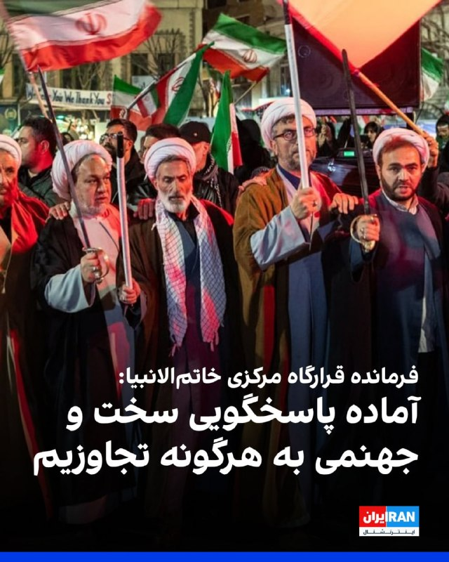

علی عبداللهی، فرمانده قرارگاه مرکزی خاتم‌الانبیا در بیانیه‌ای اعلام کرد: «به دشمنان هشدار می‌دهیم برنامه‌ها و راهبردهای رهبری برای مدیریت خلیج فارس و تنگه هرمز اجرا خواهد شد و بیگانگان جایگاهی در نظم جدید منطقه ندارند و ما آماده پاسخگویی سخت و جهنمی به هرگونه حمله هستیم.»

او ادامه داد: «به مشت گره‌خورده رهبر شهیدمان قسم، نیروهای مسلح مقتدر کشورمان اجازه نخواهند داد تجربه‌های دردناک تاریخی تکرار شود.»
iranintl.com/202605240729

## IranIntlTV — post 338743

جاویدنامان انقلاب ملی ایرانیان
«علی و شیوا بردبار جاوید» از جان‌باختگان اعتراضات ۱۸ دی در مشهد هستند. نامشان در حافظه‌ی این سرزمین می‌ماند و یادشان چراغ راه آزادی‌خواهان است.

@iranintltv

## IranIntlTV — post 338742

  

خبرگزاری مهر، وابسته به سازمان تبلیغات اسلامی، اعلام کرد یک پهپاد اسرائیلی که کاربری جاسوسی و شناسایی داشت، با شلیک پدافند ارتش جمهوری اسلامی سرنگون شد.
این گزارش افزود: «لاشه پهپاد متلاشی شده اربیتر با همکاری ناوگروه دریابانی فراجای هرمزگان کشف شد.»

خبرگزاری مهر به تاریخ این اتفاق اشاره‌ای نکرده است.
https://iranintl.com/202605240342

## IranIntlTV — post 338741

استقبال اروپا از پیشرفت مذاکرات با تاکید بر بازگشایی تنگه هرمز و مهار برنامه هسته‌ای تهران

هم‌زمان با گزارش‌ها درباره نزدیک شدن آمریکا و جمهوری اسلامی به یک تفاهم اولیه، رهبران اتحادیه اروپا و بریتانیا از پیشرفت مذاکرات استقبال کرده و خواستار توافقی شدند که به کاهش تنش‌ها، بازگشایی تنگه هرمز و جلوگیری از دستیابی حکومت ایران به سلاح هسته‌ای منجر شود.

اورزولا فون‌در‌لاین، رییس کمیسیون اروپا، از نشانه‌های پیشرفت در مذاکرات میان آمریکا و جمهوری اسلامی استقبال کرده و گفته است اروپا از دستیابی به توافقی حمایت می‌کند که به کاهش واقعی تنش‌ها، بازگشایی تنگه هرمز و تضمین آزادی کامل کشتیرانی بدون دریافت عوارض منجر شود.

فون‌در‌لاین در پیامی در شبکه ایکس نوشت: «از پیشرفت در مسیر توافق میان آمریکا و ایران استقبال می‌کنم. ما به توافقی نیاز داریم که واقعا تنش‌ها را کاهش دهد، تنگه هرمز را بازگشایی کند و آزادی کامل ناوبری را تضمین کند. نباید به ایران اجازه داده شود به سلاح هسته‌ای دست پیدا کند.» او همچنین تاکید کرد تهران باید اقدامات بی‌ثبات‌کننده منطقه‌ای، از جمله حمایت از نیروهای نیابتی و حملات به کشورهای همسایه را متوقف کند.

رییس کمیسیون اروپا افزود اتحادیه اروپا برای بهره‌برداری از فرصت کنونی جهت دستیابی به یک راه‌حل دیپلماتیک پایدار، همکاری با شرکای بین‌المللی را ادامه خواهد داد و هم‌زمان برای کاهش اثرات بحران بر زنجیره‌های تامین جهانی و قیمت انرژی تلاش می‌کند.

اظهارات فون‌در‌لاین پس از آن مطرح شد که دونالد ترامپ اعلام کرد واشینگتن و تهران «تا حد زیادی» درباره یک یادداشت تفاهم برای توافق صلح مذاکره کرده‌اند؛ توافقی که می‌تواند به بازگشایی تنگه هرمز منجر شود.

در بریتانیا نیز کی‌یر استارمر، نخست‌وزیر این کشور، از «پیشرفت در مسیر توافق» برای پایان دادن به جنگ ایران استقبال کرد. استارمر در پیامی نوشت: «ما با شرکای بین‌المللی خود همکاری خواهیم کرد تا از این فرصت برای دستیابی به یک راه‌حل دیپلماتیک بلندمدت استفاده کنیم.»

این مواضع در حالی مطرح می‌شود که مقام‌های آمریکایی گفته‌اند احتمال دارد جزئیات توافق احتمالی میان [حکومت] ایران و آمریکا طی ساعات یا روزهای آینده اعلام شود؛ هرچند هنوز اختلاف‌هایی بر سر برنامه هسته‌ای ایران، وضعیت تنگه هرمز و دامنه کاهش تحریم‌ها باقی مانده است.

در همین حال، منابع سیاسی اسرائیل نیز نگرانی خود را نسبت به پیامدهای توافق احتمالی ابراز کرده‌اند. یک مقام ارشد سیاسی اسرائیل به یینون ماگال، خبرنگار کانال۱۴ این کشور گفته است تل‌آویو به واشینگتن اطلاع داده که «صرف‌نظر از دستیابی یا عدم دستیابی به توافق، آزادی عمل عملیاتی خود را در همه جبهه‌ها، از جمله لبنان، حفظ خواهد کرد.»

این اظهارات نشان می‌دهد با وجود افزایش امیدها به پیشرفت دیپلماتیک، اختلاف‌ها بر سر نحوه مهار برنامه هسته‌ای ایران، نقش منطقه‌ای تهران و آینده درگیری‌های نیابتی همچنان از چالش‌های اصلی مسیر توافق باقی مانده است.
 
🔗وب‌سایت ایران‌اینترنشنال
@iranintltv

## IranIntlTV — post 338740

  <a href="telegram/content/IranIntlTV_338740_1779624772.mp4" target="_blank">🎬 Download video</a>

یک شهروند با ارسال پیامی به ایران‌اینترنشنال می‌گوید: «امیدی به ترامپ نداریم. ما ۴۰ هزار کشته ندادیم که با این حکومت مماشات کنیم. خودمان کار را تمام می‌کنیم. مردم عزیز این آخرین نبرد است.»

## IranIntlTV — post 338739

  

🔻سایت اتلتیک در گزارشی درباره تغییر کمپ تیم ملی از آریزونای آمریکا به تیخوانا در مکزیک، که به گفته مهدی تاج، رییس فدراسیون فوتبال، برای حل مشکل ویزای اعضای تیم انجام شده است، نوشت با وجود این اقدام، تیم ملی برای هر بازی باید ویزا بگیرد: «تمامی بازیکنان و اعضای کادر همچنان برای ورود به ایالات متحده جهت برگزاری مسابقات نیاز به ویزا خواهند داشت.»

🔹اتلتیک اشاره می‌کند که با این تغییر، «اگر برخی اعضای غیرضروری در روز مسابقه برای دریافت ویزای آمریکا با مشکل مواجه باشند، انتقال کمپ به مکزیک می‌تواند به آن‌ها اجازه دهد در کنار تیم بمانند، اما برای مسابقات سفر نکنند.»

🔹یک ماه پیش، مارکو روبیو، وزیر خارجه آمریکا، درباره ورود همراهان تیم ملی به ایالات متحده گفت: «آن‌ها نمی‌توانند یک مشت تروریست عضو سپاه را به عنوان روزنامه‌نگار یا مربی ورزشی وارد کشور ما کنند.»

🔹اتلتیک نوشته است این تغییر کمپ تیم فوتبال ایران در حالی رخ داده که مقام‌های آریزونا برای استقبال از این تیم آماده می‌شدند.

جزییات بیشتر را در سایت بخوانید.

@iranintltvsport

## IranIntlTV — post 338738

  <a href="telegram/content/IranIntlTV_338738_1779624774.mp4" target="_blank">🎬 Download video</a>

وزیر دفاع پیشین اسرائیل از مطرح شدن لبنان به‌عنوان بخشی از توافق میان واشینگتن و تهران انتقاد کرد. اردوغان نیز در تماس با ترامپ، بر حل اختلافات از راه دیپلماسی تاکید کرد و از مذاکرات با جمهوری اسلامی حمایت کرد.

گزارش اشکان صفایی و نرگس هورخش، خبرنگاران ایران‌اینترنشنال

@iranintltv

## IranIntlTV — post 338737

  <a href="telegram/content/IranIntlTV_338737_1779624776.mp4" target="_blank">🎬 Download video</a>

رسانه‌های پاکستان گزارش دادند در حمله انتحاری به قطار مسافربری در شهر کویته، دست‌کم ۲۴ نفر کشته و حدود ۵۰ نفر زخمی شدند. به گفته این رسانه‌ها، بخشی از واگن‌ها حامل نظامیان پاکستانی بود. ارتش آزادی‌بخش بلوچستان مسئولیت این حمله را بر عهده گرفت.
گفت‌وگو با وحید پیمان، روزنامه‌نگار
@iranintltv

## IranIntlTV — post 338736

  

وای‌نت به نقل از یک منبع نوشت که نتانیاهو در تماس با ترامپ تاکید کرد، اسرائیل آزادی عمل خود را برای مقابله با تهدیدها در همه جبهه‌ها از جمله لبنان، حفظ خواهد کرد.

بر اساس این گزارش، ترامپ نیز حمایت خود را از این موضوع اعلام کرد.

وای‌نت نوشت که ترامپ در تماس تلفنی با نتانیاهو تاکید کرده در مذاکرات بر خواسته همیشگی خود برای برچیدن برنامه هسته‌ای و خارج کردن همه ذخایر اورانیوم غنی‌شده از خاک ایران پافشاری خواهد کرد.

همچنین کانال ۱۴ اسرائیل به نقل از یک مقام ارشد سیاسی نوشت که اسرائیل به آمریکا اعلام کرده، چه توافقی با جمهوری اسلامی حاصل شود و چه نشود، این کشور آزادی عمل خود برای عملیات در همه بخش‌ها، از جمله در لبنان را حفظ می‌کند.
iranintl.com/202605249125

## Shin_Persian — post 6198

  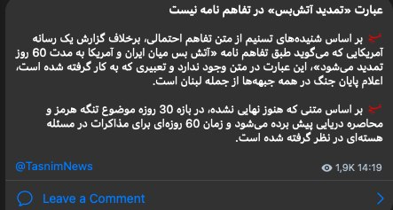

Shin ✓ @hey_itsmyturn Sun, 24 May 2026 11:33:47 UTC IRGC-owned Tasnim News: """ The term "ceasefire extension" is not included in the agreement. According to reports obtained by Tasnim regarding the potential agreement, and contrary to a claim by an American…

## Shin_Persian — post 6197

Shin ✓ @hey_itsmyturn
Sun, 24 May 2026 11:33:47 UTC

IRGC-owned Tasnim News:
"""
The term "ceasefire extension" is not included in the agreement.

According to reports obtained by Tasnim regarding the potential agreement, and contrary to a claim by an American media outlet suggesting a 60-day extension of the "ceasefire between Iran and the U.S." within the document, this phrase is absent. The language used instead signifies a declaration of the cessation of hostilities on all fronts, including Lebanon.

The draft text, which is not yet finalized, allocates a 30-day period for discussions concerning the Strait of Hormuz and naval blockade, and a 60-day period has been designated for nuclear negotiations.
"""

#Iran

فارسی

خبرگزاری تسنیم متعلق به سپاه پاسداران انقلاب اسلامی (IRGC):
"""
عبارت «تمدید آتش‌بس» در متن توافق گنجانده نشده است.

طبق گزارش‌های دریافتی تسنیم در خصوص توافق احتمالی، و برخلاف ادعای یک رسانه آمریکایی مبنی بر پیشنهاد تمدید ۶۰ روزه «آتش‌بس میان ایران و آمریکا» در این سند، چنین عبارتی وجود ندارد. در مقابل، ادبیات به‌کار رفته به معنای اعلام توقف تخاصمات در تمامی جبهه‌ها، از جمله لبنان، است.

در پیش‌نویس این متن که هنوز نهایی نشده است، یک بازه زمانی ۳۰ روزه برای گفتگوها پیرامون تنگه هرمز و محاصره دریایی در نظر گرفته شده و همچنین یک بازه ۶۰ روزه برای مذاکرات هسته‌ای تعیین شده است.
"""

#Iran

𝕏 · @shin_persian

## Shin_Persian — post 6196

Shin ✓ @hey_itsmyturn
Sun, 24 May 2026 10:52:04 UTC

Islamic Regime claims downing Israeli Orbiter drone over Hormozgan Province with air defense system. Drone reportedly conducting reconnaissance mission.

#Iran

فارسی

رژیم اسلامی ادعا می‌کند یک پهپاد اوربیتر (Orbiter) اسرائیلی را با سامانه پدافند هوایی بر فراز استان هرمزگان سرنگون کرده است. گزارش شده است که این پهپاد در حال انجام مأموریت شناسایی بوده است.

#Iran

𝕏 · @shin_persian

## Shin_Persian — post 6195

Shin ✓ @hey_itsmyturn
Sun, 24 May 2026 10:20:32 UTC

3 Iraqi Counter-Terrorism Service personnel killed, 4 wounded by ISIS IED in Hadhr desert, southwest Nineveh Province, #Iraq 🇮🇶

فارسی

۳ تن از پرسنل سرویس ضد تروریسم عراق کشته و ۴ تن دیگر در پی انفجار بمب کنار جاده‌ای داعش در بیابان الحضر، واقع در جنوب غربی استان نینوا، زخمی شدند. #Iraq 🇮🇶

𝕏 · @shin_persian

## ManotoTV — post 105801

  <a href="telegram/content/ManotoTV_105801_1779624779.mp4" target="_blank">🎬 Download video</a>

اورزولا فون‌درلاین، رئیس کمیسیون اروپا، از پیشرفت در مسیر دستیابی به توافق میان آمریکا و جمهوری اسلامی استقبال کرد و گفت هر توافقی باید به کاهش واقعی تنش‌ها، بازگشایی تنگه هرمز و تضمین آزادی کامل کشتیرانی بدون پرداخت عوارض منجر شود.

او تاکید کرد جمهوری اسلامی نباید اجازه پیدا کند به سلاح هسته‌ای دست یابد.

فون‌درلاین همچنین گفت تهران باید به اقدامات بی‌ثبات‌کننده خود در منطقه، چه مستقیم و چه از طریق گروه‌های نیابتی، پایان دهد و حملات «بی‌دلیل و مکرر» به همسایگانش را متوقف کند.

رئیس کمیسیون اروپا افزود اروپا به همکاری با شرکای بین‌المللی برای استفاده از این فرصت در مسیر یک راه‌حل دیپلماتیک پایدار ادامه خواهد داد.

او همچنین گفت اروپا تلاش می‌کند پیامدهای این درگیری، به‌ویژه بر زنجیره‌های تامین و قیمت انرژی، مهار شود.

## ManotoTV — post 105800

  <a href="telegram/content/ManotoTV_105800_1779624779.mp4" target="_blank">🎬 Download video</a>

ایرانیان در لندن برای هجدهمین هفته پیاپی، از مقابل شماره ۱۰ خیابان داونینگ تا سفارت جمهوری اسلامی راهپیمایی کردند و حمایت خود را از آزادی مردم ایران اعلام کردند.

## ManotoTV — post 105799

  <a href="telegram/content/ManotoTV_105799_1779624781.mp4" target="_blank">🎬 Download video</a>

نت‌بلاکس اعلام کرد انسداد اینترنت در ایران وارد هشتادوششمین روز شده و مردم پس از بیش از دو هزار و ۴۰ ساعت، همچنان در «تاریکی دیجیتال» به سر می‌برند.

این نهاد ناظر بر اینترنت نوشت دسترسی به اینترنت جهانی در ایران، همزمان با ادامه گفت‌وگوهای صلح، همچنان به‌طور گسترده قطع است.

به گفته نت‌بلاکس، در حالی که بخش بزرگی از مردم از دسترسی آزاد به اینترنت محرومند، گروهی از کاربران گزینش‌شده و دارای دسترسی سفید، تصویری ساختگی و کنترل‌شده از زندگی در ایران را به جهان بیرون نشان می‌دهند.

## ManotoTV — post 105798

  <a href="telegram/content/ManotoTV_105798_1779624782.mp4" target="_blank">🎬 Download video</a>

مارکو روبیو، وزیر خارجه آمریکا، در سخنانی در دهلی گفت در پرونده ایران «پیشرفت قابل توجهی» حاصل شده، اما هنوز توافقی نهایی نشده است.

او گفت احتمالا تا ساعاتی دیگر اخبار بیشتری منتشر خواهد شد و افزود هدف اصلی واشینگتن جلوگیری از دستیابی جمهوری اسلامی به سلاح هسته‌ای است.

روبیو همچنین تنگه هرمز را یک آبراه بین‌المللی خواند و گفت جمهوری اسلامی مالک آن نیست. او تهدید کشتی‌های تجاری در این مسیر را غیرقانونی دانست و گفت دولت ترامپ طی ۴۸ ساعت گذشته با شرکای منطقه‌ای برای باز نگه داشتن کامل این آبراه کار کرده است.

وزیر خارجه آمریکا اضافه کرد ترجیح ترامپ حل مسئله از راه دیپلماسی است، اما افزود که این موضوع «به هر شکل» حل خواهد شد.

## FarsiVOA — post 218518

  

محمدرضا عارف، معاون اول رئیس‌جمهور به مدیران دولتی دستور داد تا پیش از نهایی شدن بررسی‌های کارشناسی درباره مدیریت مصرف بنزین، هیچ مسئولی حق اظهارنظر شخصی در این زمینه ندارد.

او هشدار داد در صورت تخطی از این دستور، با فرد خاطی برخورد خواهد شد؛ زیرا به گفته او، اظهارنظرهای زودهنگام می‌تواند در جامعه التهاب و نگرانی ایجاد کند.

این دستور در شرایطی صادر شده که شایعات درباره افزایش قیمت بنزین، تغییر سهمیه‌ها و تشدید سیاست‌های مدیریت مصرف بالا گرفته است.

همزمان، ناترازی بنزین و فاصله میان مصرف داخلی و توان تأمین سوخت، نگرانی‌ها درباره کمبود احتمالی یا فشار بیشتر بر شبکه توزیع را افزایش داده است.

عارف گفت دولت تلاش می‌کند تصمیم‌ها به‌گونه‌ای اتخاذ شود که معیشت مردم آسیب نبیند، اما واقعیات اقتصادی کشور و تحولات اخیر نیز باید در نظر گرفته شود.
@FarsiVOA

## FarsiVOA — post 218517

  

خبرگزاری رسمی بحرین گزارش داد که یک دادگاه این کشور، ۹ متهم را به حبس ابد و دو نفر دیگر را به سه سال زندان محکوم کرده است. بر اساس این گزارش، این افراد به همکاری با سپاه پاسداران برای انجام «اقدامات خصمانه و تروریستی» علیه بحرین متهم بودند.

در بیانیه‌ای که روز یکشنبه منتشر شد، آمده است که متهمان در جمع‌آوری اطلاعات درباره مکان‌های حساس و تسهیل انتقال‌های مالی مرتبط نقش داشته‌اند.

پیشتر وزارت کشور بحرین اعلام کرد که ۴۱ نفر را که با سپاه پاسداران مرتبط بوده‌اند، بازداشت کرده است.

این وزارتخانه ۱۹ اردیبهشت در بیانیه‌ای که در شبکه‌های اجتماعی منتشر شد، نوشت که این افراد اعضای هسته اصلی «یک سازمان مرتبط با سپاه پاسداران» و مدافع تئوری «ولایت فقیه» بوده‌اند.
@FarsiVOA

## FarsiVOA — post 218516

  

مقام‌های ترکیه به پلیس این کشور دستور دادند اوزگور اوزل، رهبر حزب جمهوری‌خواه خلق، حزب اصلی اپوزیسیون را از مقر این حزب اخراج کند.

به گزارش رویترز، فرمانداری آنکارا روز یکشنبه این دستور را برای برکناری اعضای حزب جمهوری‌خواه خلق که با اوزگور اوزل، رهبر برکنار‌شده، همسو هستند صادر کرد و پلیس ضد شورش و گروهی از افراد در برابر درهای مقر حزب جمهوری‌خواه خلق در پایتخت ترکیه تجمع کردند.

یک دادگاه تجدیدنظر ترکیه روز پنج‌شنبه نتایج کنگره حزب جمهوری‌خواه خلق در سال ۲۰۲۳ را که اوزل در آن به عنوان رهبر انتخاب شده بود، به دلیل «تخلفات نامشخص» باطل کرد.

این دادگاه به جای اوزل، کمال قلیچداراوغلو، رئیس پیشین حزب جمهوری‌خواه خلق را که در انتخابات همان سال از رئیس‌جمهور طیب اردوغان شکست خورد، دوباره به این سمت بازگرداند.

اوزل روز شنبه خواست هرچه سریع‌تر کنگره جدیدی برای حزب برگزار شود، اما قلیچداراوغلو گفت کنگره در «زمانی مناسب» برگزار خواهد شد.
@FarsiVOA

## FarsiVOA — post 218515

  

تایمز اسرائیل به نقل از یک مقام ارشد اسرائیلی گزارش داد دونالد ترامپ، رئیس‌جمهور ایالات متحده آمریکا، در تماس تلفنی با بنیامین نتانیاهو به او اطمینان داده که توافق نهایی با جمهوری اسلامی، برنامه هسته‌ای تهران را به‌طور کامل برمی‌چیند و همه اورانیوم غنی‌شده از قلمرو جمهوری اسلامی خارج خواهد شد.

بر اساس این گزارش، ترامپ تأکید کرده در مذاکرات بر خواسته دیرینه خود برای برچیدن برنامه هسته‌ای جمهوری اسلامی و خارج شدن تمام ذخایر اورانیوم غنی‌شده پافشاری خواهد کرد و بدون تحقق این شروط، توافق نهایی را امضا نمی‌کند.

این مقام اسرائیلی همچنین گفته واشنگتن، اسرائیل را در جریان مذاکرات بر سر تفاهم‌نامه‌ای برای بازگشایی تنگه هرمز و ورود به گفت‌وگوهای نهایی درباره موارد اختلافی قرار داده است.

نتانیاهو نیز در این تماس گفته اسرائیل آزادی عمل خود را در برابر تهدیدها در همه جبهه‌ها حفظ خواهد کرد؛ موضعی که به گفته این مقام، با حمایت دوباره ترامپ همراه شده است.
@FarsiVOA

## FarsiVOA — post 218514

  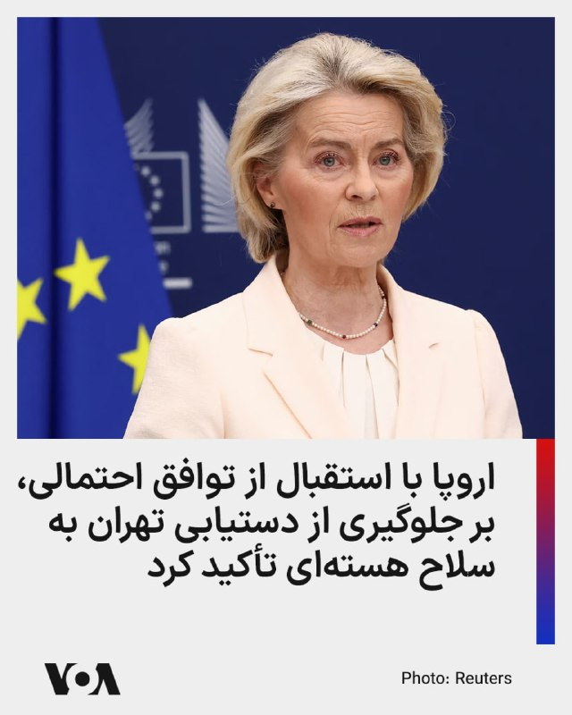

اورزولا فون‌درلاین، رئیس کمیسیون اروپا، از بروز نشانه‌های پیشرفت در مذاکرات بر سر توافق احتمالی میان ایالات متحده و جمهوری اسلامی استقبال کرد.

فون‌درلاین یکشنبه در شبکه ایکس نوشت: «من از پیشرفت به سوی توافقی میان آمریکا و [حکومت] ایران استقبال می‌کنم. ما به توافقی نیاز داریم که واقعاً به کاهش تنش‌ها منجر شود، تنگه هرمز را دوباره باز کند و آزادی کامل کشتیرانی بدون پرداخت عوارض را تضمین کند.»

او همچنین تأکید کرد: «نباید به ایران اجازه داده شود که سلاح هسته‌ای توسعه دهد.»

دونالد ترامپ، رئیس‌جمهوری آمریکا، پیش‌تر گفته است که واشنگتن و جمهوری اسلامی «تا حد زیادی» بر سر یک یادداشت تفاهم مذاکره کرده‌اند.
@FarsiVOA

## FarsiVOA — post 218513

  

خبرگزاری رویترز به نقل از یک مقام ارشد جمهوری اسلامی گزارش داد که اگر شورای عالی امنیت ملی این کشور یادداشت تفاهم با آمریکا را تأیید کند، این متن سپس برای تأیید نهایی به مجتبی خامنه‌ای، رهبر جمهوری اسلامی، ارسال خواهد شد.

مجتبی خامنه‌ای از زمان اعلام نامش به عنوان رهبر جدید جمهوری اسلامی در انظار عمومی ظاهر نشده و فیلم یا فایل صوتی از او نیز نیز پخش نشده است.

پیشتر رسانه‌های داخل ایران ادعا کرده بودند که مجتبی خامنه‌ای، رهبر جمهوری اسلامی، دستور داده که اورانیوم نزدیک به درجه تسلیحاتی نباید به خارج از کشور ارسال شود.

اما دو مقام آمریکایی به نیویورک تایمز گفته‌اند که جمهوری اسلامی به عنوان بخشی از توافقی با ایالات متحده برای پایان دادن به جنگ، پذیرفته است ذخیره اورانیوم با غنای بالای خود را واگذار کند.

پرزیدنت ترامپ که بارها بر اراده آمریکا برای جلوگیری از دستیابی جمهوری اسلامی به سلاح اتمی تأکید کرده، اعلام کرد که توافق احتمالی، چنین هدفی را در نظر گرفته، در غیر این صورت «حتی در مورد آن صحبت نمی‌کرد.»
@FarsiVOA

## FarsiVOA — post 218512

🔺سرافراز: تجهیزات قطع دائمی اینترنت از چین خریداری شده است

▪️رئیس پیشین سازمان صداوسیما و عضو شورای عالی فضای مجازی، گفته است که تجهیزات لازم برای قطع دائمی اینترنت جهانی و ارائه دسترسی محدود به گروهی خاص، از چین خریداری و وارد ایران شده است.

▪️به گفته او، همان تجهیزاتی که برای قطع اینترنت و ارائه دسترسی محدود خریداری شده، اکنون به فرصتی برای فروش اینترنت گران‌قیمت به گروه‌های خاص تبدیل شده است.

▪️سرافراز پیشتر در گفت‌وگویی مسئول نهایی قطع اینترنت، سیم‌کارت سفید و اینترنت طبقاتی را «کسانی در بالاترین رده‌های حکمرانی» دانسته بود که به گفته او تصمیم‌سازی و تصمیم‌گیری می‌کنند، اما پاسخگو نیستند.

⬇️ بیشتر بخوانید:
https://ir.voanews.com/a/8153274.html

## FarsiVOA — post 218511

🔺کاهش ۵۰ درصدی تقاضای گوشت قرمز؛ سفره ایرانی از پروتئین تا لبنیات و برنج کوچک‌تر شد

▪️یک مسئول صنعت گوشت ایران گفته است که امسال «نیاز به واردات گوشت قرمز نداریم» چون تولید داخل می‌تواند نیاز بازار را پوشش دهد؛ اما دلیل اصلی این وضعیت، نه افزایش تولید، بلکه کاهش شدید تقاضاست.

▪️او گفته است که بازار تقاضای گوشت قرمز نسبت به سال گذشته حدود ۵۰ درصد کاهش یافته و به همین دلیل جمعیت دام داخل برای تأمین نیاز فعلی بازار کافی است.

▪️این کاهش فقط در گوشت قرمز دیده نمی‌شود. به گفته این مقام مسئول آمار جوجه‌ریزی فروردین ۱۴۰۴ حدود ۱۶۰ میلیون قطعه بوده، اما در فروردین ۱۴۰۵ به حدود ۱۰۰ میلیون قطعه رسیده؛ یعنی تولید گوشت مرغ هم بین ۳۰ تا ۴۰ درصد کاهش یافته است.

⬇️ بیشتر بخوانید:
https://ir.voanews.com/a/8153272.html

## FarsiVOA — post 218510

🔺وزیر نیرو: ۳۰۰ دشت کشور درگیر فرونشست است

▪️وزیر نیرو در دولت جمهوری اسلامی می‌گوید ۳۰۰ دشت کشور با پدیده فرونشست زمین مواجه‌ است و بیش از ۴۰۰ دشت نیز در وضعیت ممنوعه یا ممنوعه بحرانی قرار دارد.

▪️کارشناسان محیط زیست برداشت بی‌رویه از ذخایر زیزمینی آب را عامل فرونشست دشت‌ها و شهرهای ایران اعلام کرده‌اند.

▪️آمارهای سازمان ملل متحد نشان می‌دهد ایران در خاورمیانه بیشترین میزان برداشت از منابع آب زیرزمینی را دارد و حتی در رتبه بندی جهانی، مقام پنجم را دارد.

▪️داده‌های شرکت مدیریت منابع آب ایران نشان می‌دهد استان‌های اصفهان، کرمان، فارس، خراسان رضوی و تهران که بیشترین آسیب را از فرونشست تجربه کرده‌اند، در صدر برداشت آب از منابع زیرزمینی قرار دارند.

⬇️ بیشتر بخوانید:
https://ir.voanews.com/a/8153271.html

## FarsiVOA — post 218509

  <a href="telegram/content/FarsiVOA_218509_1779624787.mp4" target="_blank">🎬 Download video</a>

لحظه اصابت موشک‌های کروز به مرکز شهر کی‌یف و انهدام چندین موشک در آسمان در پی حملات شبانه روسیه؛

تصاویر منتشر شده، لحظه اصابت موشک‌های کروز به مرکز شهر کی‌یف را در جریان حملات گسترده پهپادی و موشکی شبانه توسط ارتش روسیه نشان می‌دهند.

این تصاویر جدید، اصابت بارانی از موشک‌های کروز پیشرفته ارتش روسیه به اهداف غیرنظامی در کی‌یف و انهدام چندین موشک دیگر توسط پدافند هوایی اوکراین در آسمان پایتخت را ثبت کرده‌اند.
@FarsiVOA

## FarsiVOA — post 218508

  

مرکز آمار ترکیه از افت ۲۹ درصدی ورود گردشگران ایرانی به این کشور در چهار ماه ابتدایی شال ۲۰۲۶ خبر داد.

جزئیات آمارهای ماهانه این نهاد دولتی نشان از سقوط چشمگیر ورود گردشگران ایرانی به این کشور در دوران جنگ بوده است؛ به‌طوری که در ماه‌های مارس و آوریل در مجموع ۲۴۱ هزار گردشگر ایرانی وارد ترکیه شده که دقیقاً نصف دور مشابه پارسال است.

در دوران جنگ ۳۹ روزه، تردد شهروندان ایرانی به ترکیه تنها از مسیر زمینی بوده است.

در مجموع، طی چهار ماه ابتدایی ۲۰۲۶ حدود ۶۷۲ هزار شهروند ایران به ترکیه سفر کرده‌اند. در این دوره همچنین شهروندان ایرانی ۴۷۹ واحد مسکونی در ترکیه خریداری کرده‌اند که ۲۵ درصد کمتر از دور مشابه پارسال است.
@FarsiVOA

## FarsiVOA — post 218507

🔺واکنش‌ها به توافق احتمالی تهران و واشنگتن؛ نگرانی نتانیاهو از تعویق پرونده هسته‌ای و آتش‌بس لبنان

▪️در پی اعلام دونالد ترامپ مبنی بر اینکه چارچوب یک «یادداشت تفاهم صلح» با جمهوری اسلامی «تا حد زیادی مذاکره شده»، موجی از واکنش‌ها در آمریکا، اسرائیل، اروپا و کشورهای منطقه شکل گرفته است.

▪️توافق احتمالی هنوز نهایی نشده اما واکنش‌ها نشان‌دهنده مواجهه‌ای چندگانه با چنین توافقی است.
ایالات متحده و میانجی‌های منطقه‌ای چنین توافقی را راهی برای پایان جنگ و بازگشایی هرمز می‌دانند.

▪️اسرائیل و بخشی از جمهوری‌خواهان آمریکا نگران عقب افتادن پرونده هسته‌ای و تقویت موقعیت جمهوری اسلامی هستند.

▪️جمهوری اسلامی می‌کوشد هم پایان جنگ و رفع محاصره را پیگیری کند، هم کنترل خود بر تنگه هرمز و اهرم‌های منطقه‌ای‌اش را حفظ کند.

⬇️ بیشتر بخوانید:
https://ir.voanews.com/a/regional-and-international-reactions-to-possible-iran-deal/8153270.html

## FarsiVOA — post 218506

  <a href="telegram/content/FarsiVOA_218506_1779624790.mp4" target="_blank">🎬 Download video</a>

اسرائیل از انهدام چند انبار تسلیحات حماس خبر داد؛

ارتش اسرائیل اعلام کرد در روزهای اخیر چند انبار تسلیحات سازمان تروریستی حماس را هدف قرار داده و نابود کرده است.

نیروهای ارتش اسرائیل در طول ۲۴ ساعت گذشته، سه انبار تسلیحات حماس را در مرکز نوار غزه هدف قرار داده و نابود کردند. از جمله تسلیحات موجود در این انبارها که در نتیجه حملات نابود شدند، راکت‌های ضد تانک، سلاح‌های بلند، آرپی‌جی، جلیقه‌های ضدگلوله و تجهیزات جنگی دیگر بودند.

در رویدادی دیگر در روز چهارشنبه، نیروهای ارتش اسرائیل یک انبار تسلیحات دیگر شامل مواد منفجره، پرتاب‌کننده‌های آرپی‌جی، نارنجک‌های دستی و خشاب‌های سازمان تروریستی حماس را در مرکز نوار غزه هدف قرار داده و نابود کردند.

ارتش اسرائیل می‌گوید که این تسلیحات برای آسیب رساندن به نیروهایش که در منطقه خط زرد فعالیت می‌کنند و همچنین شهروندان اسرائیلی طراحی شده بودند و به منظور رفع تهدید نابود شدند.

پس از حملات، انفجارهای ثانویه‌ای مشاهده شد که نشان‌دهنده وجود تسلیحات در انبارها بود.
@FarsiVOA

## FarsiVOA — post 218505

  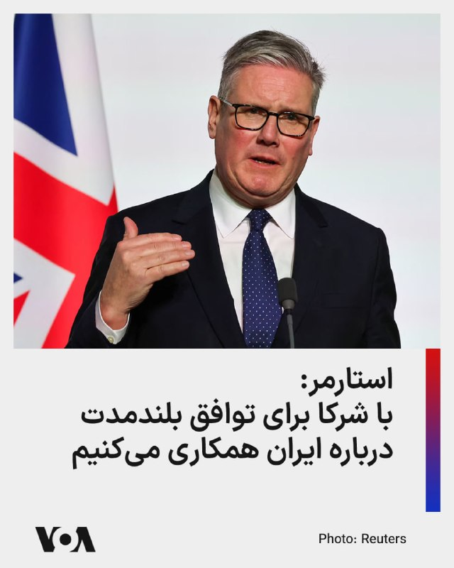

کی‌یر استارمر، نخست‌وزیر بریتانیا، از «پیشرفت به سوی توافق» میان آمریکا و جمهوری اسلامی برای پایان دادن به جنگ استقبال کرد.

استارمر در پیامی در شبکه ایکس نوشت بریتانیا با شرکای بین‌المللی خود همکاری خواهد کرد تا از این فرصت برای دستیابی به یک «راه‌حل دیپلماتیک بلندمدت» استفاده شود.

این موضع پس از آن مطرح شد که مقام‌های آمریکایی گفتند ممکن است اعلام توافق در همین روز انجام شود. هنوز جزئیات نهایی توافق احتمالی منتشر نشده است.

سخنان نخست‌وزیر بریتانیا در حالی بیان می‌شود که تماس‌های دیپلماتیک میان آمریکا، جمهوری اسلامی و کشورهای منطقه در روزهای اخیر افزایش یافته و چند کشور، از جمله قطر، پاکستان و ترکیه، برای کاهش تنش و رسیدن به توافق نقش فعال‌تری گرفته‌اند.
@FarsiVOA

## FarsiVOA — post 218504

🔺وزیر خارجه آمریکا: احتمال خبرهای خوب درباره تنگه هرمز وجود دارد

▪️مارکو روبیو، وزیر خارجه آمریکا، اعلام کرد که «احتمال خبرهای خوب در چند ساعت آینده درباره تنگه [هرمز] وجود دارد.»

▪️آقای روبیو روز یکشنبه در یک کنفرانس مشترک با وزیر خارجه هند، درباره پرونده مذاکرات با تهران گفت: «در ۴۸ ساعت گذشته پیشرفت‌هایی در چارچوبی که می‌تواند وضعیت تنگه هرمز را حل‌وفصل کند حاصل شده است.»

▪️در حالی که پیشتر کشتی‌هایی در منطقه خلیج فارس هدف حملات قرار گرفتند، وزیر خارجه آمریکا تأکید کرد که حملات به کشتی‌های تجاری «کاملاً غیرقانونی» است و همچنین جمهوری اسلامی هرگز «نباید به سلاح هسته‌ای» دست پیدا کند.

▪️او افزود که اخبار بیشتری درباره وضعیت ایران ممکن است در طول روز یکشنبه منتشر شود.

⬇️ بیشتر بخوانید:
https://ir.voanews.com/a/8153269.html

## FarsiVOA — post 218503

  <a href="telegram/content/FarsiVOA_218503_1779624792.mp4" target="_blank">🎬 Download video</a>

ویدیوی خبرنگار شبکه اِی‌بی‌سی از لحظه وقوع تیراندازی در نزدیکی کاخ سفید؛

شنبه عصر، یک تیراندازی در حوالی کاخ سفید روی داد که طی آن دو نفر از جمله یک عابر و فرد مظنون تیر خوردند.

سرویس مخفی ایالات متحده اعلام کرد که کمی پس از ساعت ۶ عصر روز شنبه، فردی در محدوده خیابان ۱۷ و خیابان پنسیلوانیا، سلاحی را از کیف خود خارج کرد و شروع به تیراندازی کرد.

پلیس سرویس مخفی به تیراندازی او پاسخ داد و به مظنون شلیک کرد. مظنون به یک بیمارستان محلی منتقل شد، اما در آنجا اعلام شد که جان باخته است. به گفته این نهاد امنیی، در جریان این تیراندازی، یک عابر نیز مورد اصابت گلوله قرار گرفت و هیچ‌یک از مأموران آسیب ندیدند.

در پی این تیراندازی، نیروهای سرویس مخفی آمریکا خبرنگاران و اعضای رسانه‌ها را به داخل کاخ سفید هدایت کردند.

خبرنگار شبکه ای‌بی‌سی، سلینا ونگ، ویدیویی از لحظه وقوع حادثه حین گزارش خود منتشر کرد.
@FarsiVOA

## FarsiVOA — post 218502

🔺حصر دیجیتال ۸۵ روزه شد؛ اینترنت طبقاتی از بحران امنیتی تا شکاف اجتماعی

▪️قطع اینترنت در ایران وارد هشتاد و ششمین روز شده و مردم پس از ۲۰۴۰ ساعت «تاریکی دیجیتال» همچنان از دسترسی آزاد به اینترنت جهانی محروم‌اند.

▪️نت‌بلاکس در این باره می‌گوید در حالی که دسترسی عمومی به شبکه جهانی عمدتاً قطع مانده، گروهی از کاربران سفیدفهرست‌شده تصویری مصنوعی از زندگی عادی در ایران را به بیرون منتقل می‌کنند.

▪️به این ترتیب، بحران اینترنت در ایران وارد مرحله‌ای فراتر از قطع ارتباط شده است. مسئله امروز فقط نبود دسترسی نیست؛ شکل‌گیری دو جامعه موازی است. گروهی محدود با اینترنت سفیدفهرست‌شده و اکثریتی که از اطلاعات، فرصت، بازار کار، آموزش و ارتباط جهانی جدا شده‌اند.

⬇️ بیشتر بخوانید:
https://ir.voanews.com/a/8153268.html

## FarsiVOA — post 218501

  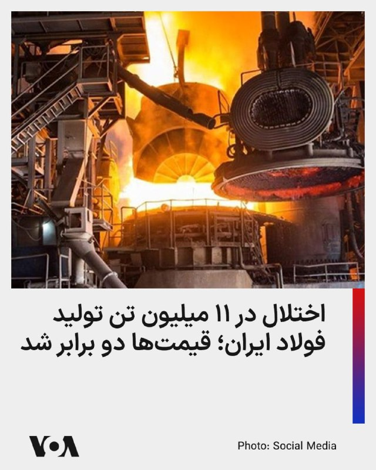

احمد کرمی‌راد، عضو هیئت‌مدیره انجمن سازه‌های فولادی، می‌گوید در جریان جنگ اخیر، شماری از فولادسازی‌های مادر ایران هدف حمله قرار گرفته و این حملات برای زنجیره‌های بالادستی و پایین‌دستی فولاد مشکل ایجاد کرده است.

به گفته او، از مجموع حدود ۳۲ میلیون تن تولید فولاد کشور، نزدیک به ۱۱ میلیون تن دچار اختلال شده و فعالان این صنعت در تلاش‌اند تا راهکاری برای عبور از بحران پیدا کنند.

او همچنین از جهش شدید قیمت فولاد خبر داد و گفت قیمت‌ها «تقریباً دو برابر» شده است. به گفته او، آخرین عرضه فولاد مبارکه با نرخ ۸۵ هزار تومان برای هر کیلوگرم انجام شده، اما با احتساب هزینه‌های ارزی، زمان تحویل و نرخ بهره، قیمت مؤثر آن به حدود ۱۰۵ تا ۱۱۰ هزار تومان می‌رسد.

این افزایش قیمت می‌تواند بر ساخت‌وساز، پروژه‌های عمرانی، صنایع پایین‌دستی، سازه‌های فلزی و هزینه تمام‌شده تولید در بخش‌های مختلف اقتصاد ایران اثر مستقیم بگذارد.
@FarsiVOA

## FarsiVOA — post 218500

  <a href="telegram/content/FarsiVOA_218500_1779624794.mp4" target="_blank">🎬 Download video</a>

رزمایش نظامی آمریکا بر فراز کاراکاس؛ چند ماه پس از بازداشت مادورو؛

رویترز گزارش داد ارتش آمریکا روز شنبه یک رزمایش هوایی بر فراز کاراکاس، پایتخت ونزوئلا، انجام داد؛ نخستین رزمایش نظامی آمریکا در این کشور پس از عملیات سوم ژانویه که به بازداشت نیکلاس مادورو، رئیس‌جمهور پیشین ونزوئلا، و همسرش سیلیا فلورس منجر شد.

به گفته دولت ونزوئلا، این رزمایش به‌عنوان تمرین تخلیه برای موارد اضطراری پزشکی یا بلایای احتمالی مجوز گرفته بود و شامل دو هواپیمای اوسپری و ورود شناورهایی به آب‌های کارائیب ونزوئلا شد.

فرماندهی جنوبی ارتش آمریکا نیز در این عملیات حضور داشت و فرمانده آن با مقام‌های دولت موقت دیدار کرد.

این رزمایش در شرایطی انجام می‌شود که دولت ترامپ پس از بازداشت مادورو از طرح سه‌مرحله‌ای برای «ثبات‌سازی ونزوئلا» حمایت کرده و از دولت دلسی رودریگز پشتیبانی می‌کند؛ دولتی که همزمان قوانینی برای باز کردن بخش نفت و معدن ونزوئلا به روی شرکت‌های آمریکایی تصویب کرده است.
@FarsiVOA

## FarsiVOA — post 218499

  

دفتر رجب طیب اردوغان، رئیس‌جمهوری ترکیه، از برگزاری یک تماس ویدیویی مشترک با دونالد ترامپ، رئیس‌جمهوری آمریکا، و رهبران منطقه خبر داد و اعلام کرد که آنکارا آماده است در جریان اجرای یک توافق احتمالی با تهران، هر نوع حمایتی ارائه دهد.

دفتر ریاست‌جمهوری ترکیه روز یکشنبه در بیانیه‌ای اعلام کرد که اردوغان در این تماس گفته است توافقی برای تضمین عبور آزادانه از تنگه هرمز، به ثبات در منطقه کمک خواهد کرد و موجب آسودگی خاطر اقتصاد جهانی خواهد شد.

در بیانیه دفتر ریاست‌جمهوری ترکیه آمده است: «اردوغان همچنین در این گفت‌وگو تأکید کرد که ترکیه خواهان آغاز دوره‌ای جدید است که در آن کشورهای منطقه تهدیدی برای یکدیگر نباشند و تصریح کرد که در یک صلح عادلانه، بازنده‌ای وجود نخواهد داشت.»

پیشتر رئيس‌جمهوری آمریکا، از «یک یادداشت تفاهم» مربوط به پایان دادن جنگ با جمهوری اسلامی خبر داد و افزود که این توافق همچنین به «مدیریت رضایت‌بخش» اورانیوم غنی‌شده منجر خواهد شد.

پرزیدنت ترامپ بارها بر اراده آمریکا برای جلوگیری از دستیابی حکومت ایران به سلاح اتمی تاکید کرده است.
@FarsiVOA

## DW_Farsi — post 125092

📸 تحریم‌ها، محرومیت‌ها و غیاب‌ها در جام‌های جهانی فوتبال در گذر زمان

🔺 گزارشی از شهرام احدی

اگر چه تیم ملی فوتبال ایران بلیط حضور در جام جهانی ۲۰۲۶ را گرفته، اما گمانه‌زنی‌ها در مورد غیاب یا حضور ایران پایان نیافته است. در تاریخ جام جهانی فوتبال کشورهای مختلفی به علت تحریم، محرومیت یا علل دیگر غایب بوده‌اند.

@dw_farsi

## DW_Farsi — post 125091

  

🔶 "ترامپ به نتانیاهو گفته توافق نهایی با ایران شامل لغو برنامه هسته‌ای و خروج اورانیوم می‌شود"

برخی رسانه‌های اسرائیل به نقل از یک مقام ارشد این کشور گزارش داده‌اند که دونالد ترامپ، رئیس جمهور آمریکا در تماس تلفنی شامگاه شنبه با بنیامین نتانیاهو، به او اطمینان داده که توافق نهایی با ایران منجر به برچیده‌ شدن کامل برنامه هسته‌ای ایران خواهد شد.

روزنامه "تایمز اسرائیل" نوشت این مقام که نامش فاش نشده در بیانیه‌ای اظهار داشت، ترامپ در این گفت‌وگو "واضح ساخت که در مذاکرات [با تهران] بر خواسته دیرینه خود مبنی بر برچیده‌شدن برنامه هسته‌ای ایران و خروج تمام اورانیوم غنی‌شده از این خاک این کشور قاطعانه پافشاری خواهد کرد و بدون تحقق این شروط، هیچ توافق نهایی را امضا نخواهد کرد".

در این بیانیه آمده است که آمریکا، اسرائیل را در جریان مذاکرات "درباره یک یادداشت تفاهم برای بازگشایی تنگه هرمز و ورود به مذاکرات برای دستیابی به توافق نهایی درباره موارد باقی‌مانده مورد اختلاف" قرار داده است.

به گفته این مقام اسرائیلی نتانیاهو به ترامپ گفته است که اسرائیل "آزادی عمل خود در برابر همه تهدیدها در تمامی جبهه‌ها از جمله لبنان" را حفظ خواهد کرد و رئیس جمهور آمریکا نیز "حمایت خود را از این رویکرد اعلام کرده است".

وبسایت خبری "اکسیوس" پیش‌تر گزارش داده بود که توافق در حال شکل‌گیری میان تهران و واشنگتن تصریح می‌کند که درگیری میان اسرائیل و حزب‌الله لبنان پایان خواهد یافت اما اسرائیل اجازه خواهد داشت تا در صورتی که حزب‌الله آغازگر اقداماتی تحریک‌آمیز یا حملاتی علیه این کشور باشد، این گروه را هدف قرار دهد.

از سوی دیگر خبرگزاری رویترز به نقل از یک مقام ارشد ایرانی گزارش کرده است که تهران در توافق اولیه، با واگذاری اورانیوم غنی‌شده با درصد بالا، مخالفت کرده است.

@dw_farsi

## DW_Farsi — post 125090

  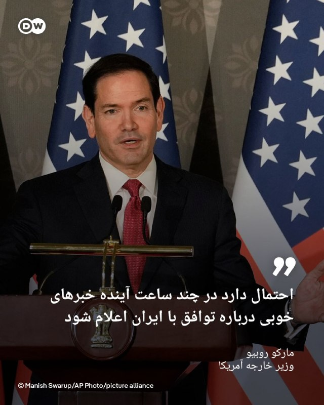

🔶 روبیو: احتمال دارد در چند ساعت آینده خبرهای خوبی درباره توافق با ایران اعلام شود

مارکو روبیو، وزیر خارجه آمریکا، که برای دیدار با مقامات هند به این کشور سفر کرده، به خبرنگاران گفت که ممکن است اواخر روز یکشنبه ۲۴ مه (سوم خرداد) درباره توافقی با ایران که می‌تواند به طور رسمی به جنگ در خاورمیانه پایان دهد، اعلامیه‌ای منتشر شود. او گفت: «فکر می‌کنم این احتمال وجود دارد که در چند ساعت آینده، جهان خبرهای خوبی دریافت کند.»

به گفته وزیر خارجه آمریکا توافق در حال شکل‌گیری میان تهران و واشنگتن، نگرانی‌های واشنگتن در مورد تنگه هرمز را برطرف خواهد کرد. روبیو افزود این توافق "همچنین آغازگر فرآیندی خواهد بود که در نهایت ما را به جایی می‌رساند که رئیس جمهور می‌خواهد و این یعنی جهانی که دیگر مجبور نباشد از سلاح هسته‌ای ایران بترسد یا نگران آن باشد".

اظهارات روبیو پس از آن مطرح شد که دونالد ترامپ با انتشار پستی در شبکه تروث سوشال نوشت پیشنهادی که شامل بازگشایی تنگه هرمز است، "تا حد زیادی مذاکره شده است".

@dw_farsi

## DW_Farsi — post 125080

🔶 تغذیه ضد اضطراب؛ چطور با غذا به آرامش ذهنی برسیم؟

اضطراب یک وضعیت شایع است که میلیون‌ها نفر را در سراسر جهان تحت تأثیر قرار می‌دهد. علائم آن متفاوت است و برخی افراد تنها هر از گاهی آن را تجربه می‌کنند. با این حال، اگر فردی علائم را به مدت ۶ ماه یا بیشتر تجربه کند، ممکن است دچار اختلال اضطراب فراگیر (GAD) باشد.

پزشکان اغلب GAD را با ترکیبی از روش‌های درمانی، از جمله روان‌درمانی و تجویز دارو مدیریت می‌کنند. گاهی اوقات این درمان‌های متداول در درازمدت پاسخگو نیستند. 

با این حال تحقیقات نشان می‌دهد که تغییر به یک الگوی غذایی سالم‌تر و غنی از مواد مغذی می‌تواند ابزاری مفید در کنار درمان و دارو باشد:

@dw_farsi

## DW_Farsi — post 125079

  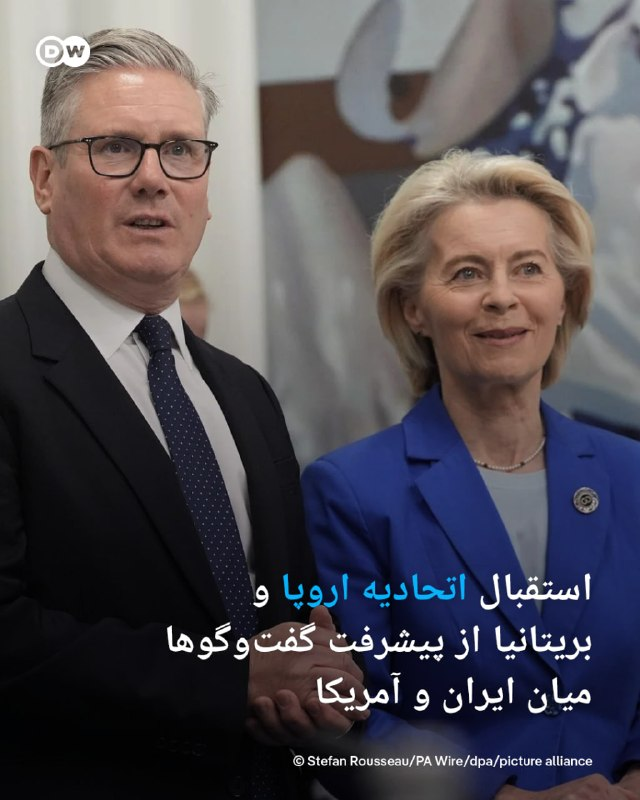

🔶 استقبال اتحادیه اروپا و بریتانیا از پیشرفت گفت‌وگوها میان ایران و آمریکا

اورزولا فن در لاین، رئیس کمیسیون اروپا، از نشانه‌های پیشرفت در مذکرات میان تهران و واشنگتن بر سر یک توافق احتمالی برای آتش‌بس و پایان جنگ استقبال کرد. او روز یکشنبه با انتشار پستی در ایکس نوشت: «ما به توافقی نیاز داریم که واقعا تنش‌ را کاهش دهد، تنگه هرمز را بازگشایی کند و آزادی کامل و بدون عوارض تردد دریایی را تضمین کند. ایران نباید اجازه داشته باشد که سلاح هسته‌ای توسعه دهد.»

کی‌یر استارمر، نخست‌وزیر بریتانیا، نیز با استقبال از توافق در حال شکل‌گیری بین ایران و آمریکا، با انتشار پیامی در ایکس گفت که بریتانیا با شرکای بین‌المللی خود همکاری خواهد کرد تا "از این فرصت استفاده کرده و به یک راه‌حل دیپلماتیک بلندمدت دست یابیم".

او در این پیام تأکید: «ما باید شاهد توافقی باشیم که به درگیری پایان دهد و تنگه هرمز را با آزادی کامل و بدون قید و شرط تردد دریایی بازگشایی کند. بسیار مهم است که به ایران هرگز اجازه توسعه سلاح هسته‌ای داده نشود.»

@dw_farsi

## DW_Farsi — post 125078

🔶 خزر؛ دریایی که به‌آرامی محو می‌شود

🔺 گزارشی از فاطمه روشن

مریم، روزنامه‌نگار محیط زیست ایرانی، در کودکی بیشتر وقت خود را در کنار دریای خزر می‌گذراند. او از خانه ساحلی‌اش در شهر رودسر در شمال ایران، شاهد نوسان‌های سطح آب بود؛ نوسان‌هایی گاه چنان شدید که در دهه ۱۹۹۰ سیلاب در بخش‌هایی از سواحل شمالی ایران برخی از بستگانش را بی‌خانمان کرد.

تمام آن تغییر شکل‌های مداوم، طبیعی به نظر می‌رسید، اما در سفر اخیرش به آن منطقه پس از سال‌ها دوری از آنجا، این پهنه آبی ناگهان برایش کاملاً ناآشنا بود. مریم، که دویچه وله به دلایل امنیتی نام واقعی‌اش را فاش نمی‌کند، می‌گوید: «مدام از ساحل دورتر می‌رفتم، اما آب فقط تا زانویم می‌رسید. برای کسی که کنار این دریا بزرگ شده، واقعاً ترسناک بود.»

آنچه او در آن سفر تجربه کرد رخدادی استثنایی نبود. دریای خزر، بزرگ‌ترین پهنه آبی محصور در خشکی جهان که میان ایران، روسیه، جمهوری آذربایجان، ترکمنستان و قزاقستان قرار دارد، به‌سرعت در حال کوچک شدن است.

گرچه خزرِ نیمه‌شور در گذشته نیز دچار نوسان‌هایی بوده، اما دانشمندان می‌گویند کاهش کنونی سطح آب، که از دهه ۱۹۹۰ آغاز شده، احتمالاً بازگشت‌ناپذیر است. پیش‌بینی‌ها حاکی از پس‌روی حتی بیشتر خزر در این قرن است، به‌گونه‌ای که برخی مدل‌ها از افت احتمالی تا ۲۱ متر نیز خبر می‌دهند.

@dw_farsi

## DW_Farsi — post 125077

  

🔶 انتقاد و ابراز نگرانی شماری از جمهوری‌خواهان در مورد توافق احتمالی با ایران

تد کروز، سناتور جمهوری‌خواه، با انتشار پستی در شبکه ایکس نسبت به اظهارات دونالد ترامپ در مورد توافق در حال شکل‌گیری میان آمریکا و ایران "عمیقا" ابراز نگرانی کرده و گفت، چنین توافقی می‌تواند فشار واشنگتن بر تهران را تضعیف کرده و دستاوردهای نظامی اخیر را برعکس کند.

او تصمیم ترامپ برای حمله به ایران را "مهم‌ترین تصمیم" دومین دوره ریاست‌ جمهوری‌اش خوانده و نوشت ایالات متحده در این جنگ "از جمله با نابود کردن تمام موشک‌ها و پهپادهای جمهوری اسلامی و همچنین غرق کردن کل نیروی دریایی ایران، به دستاوردهای فوق‌العاده‌ای" رسید. کروز افزود: «اگر نتیجه همه این‌ها این باشد که یک رژیم ایرانی که همچنان توسط اسلام‌گرایانی اداره می‌شود که شعار ’مرگ بر آمریکا‘ سر می‌دهند، اکنون میلیاردها دلار دریافت کند، بتواند اورانیوم غنی‌سازی کند و سلاح هسته‌ای توسعه دهد و کنترل مؤثری بر تنگه هرمز داشته باشد، در این صورت چنین نتیجه‌ای یک اشتباه فاجعه‌بار خواهد بود.»

این سناتور سرشناس با اشاره به اظهارات ترامپ در مورد اینکه جزئیات این توافق هنوز در دست بررسی است، گفت: «دعا می‌کنم که گزارش‌های اولیه نادرست باشند، اما اینکه راب مالی [نماینده ویژه دولت آمریکا در امور ایران در دولت جو بایدن] از این توافق تعریف می‌کند، نشانه امیدبخشی نیست.»

کروز تأکید کرد ترامپ "باید خطوط قرمزی را که بارها ترسیم کرده است"، به اجرا بگذارد.

@dw_farsi

## DW_Farsi — post 125076

  

🔶 مقام اسرائیلی: توافق احتمالی نشان می‌دهد تهران می‌تواند تنگه هرمز را به سلاح تبدیل کند

یک مقام اسرائیلی که نخواست نامش فاش شود، در مصاحبه‌ای با کانال ۱۲ اسرائیل نسبت به توافق پیشنهادی احتمالی میان آمریکا و ایران ابراز نگرانی کرده و آن را "توافقی بد" خواند. این مقام اسرائیلی به این شبکه خبری گفت چارچوب این توافق درحال شکل‌گیری به تهران نشان می‌دهد که دارای سلاح دیگری به نام تنگه هرمز است که اثربخشی آن از یک سلاح هسته‌ای کمتر نیست.

به گفته او، دونالد ترامپ معتقد است که این توافق مبنای اقتصادی خواهد داشت و امکان بازگشایی تنگه هرمز را بدون آنگه پیشرفتی وابسته به امتیازدهی در برنامه هسته‌ای ایران باشد، فراهم می‌کند.

این مقام اسرائیلی به کانال ۱۲ اسرائیل گفته است که سرنوشت این توافق بعد از مرحله اول مبهم باقی می‌ماند.

در همین حال شبکه کان اسرائیل نیز خبر داد بنیامین نتانیاهو، نخست‌وزیر این کشور، نگرانی خود را در مورد دو بخش خاص از توافق احتمالی میان آمریکا و ایران که تعویق رسیدگی به پرونده هسته‌ای و پیوند زدن توافق آتش‌بس در لبنان با تفاهمات با ایران را شامل می‌شود، ابراز نگرانی کرده است.

رسانه‌های اسرائیلی گزارش کرده‌اند که نتانیاهو عصر روز یکشنبه جلسه محدودی را با کابینه امنیتی با موضوع بحث و بررسی توافق احتمالی تهران و واشنگتن برگزار خواهد کرد.

دستیار یکی از وزرای حاضر در این جلسه به "تایمز اسرائیل" گفته است که هنوز زمان تشکیل این نشست تعیین نشده است.

@dw_farsi

## DW_Farsi — post 125075

🔶 تیراندازی در نزدیکی کاخ سفید؛ مهاجم کشته شد

رسانه‌های آمریکایی پس از تیراندازی در نزدیکی کاخ سفید در واشنگتن در روز شنبه ۲۳ مه (دوم خرداد) به وقت محلی، از کشته شدن عامل احتمالی تیراندازی خبر داده‌اند.

بر اساس بیانیه سرویس مخفی آمریکا که رسانه‌های این کشور به آن استناد کرده‌اند، پس از آنکه این مرد به سوی مأموران سرویس مخفی مسئول حفاظت از رئیس جمهوری آمریکا آتش گشود، در جریان تیراندازی متقابل زخمی شد و سپس از شدت جراحات درگذشت.

طبق این گزارش، این فرد در یکی از ایست‌های بازرسی نزدیک کاخ سفید به سوی مأموران شلیک کرده بود. رسانه‌های آمریکایی به نقل از بیانیه سرویس مخفی نوشته‌اند: «مأموران سرویس مخفی پلیس به تیراندازی پاسخ دادند، مظنون را هدف قرار دادند و او به یکی از بیمارستان‌های منطقه منتقل شد، و بعداً درگذشت.»

@dw_farsi

## DW_Farsi — post 125074

  

🔶 نماینده مجلس: تنگه هرمز به هیچ‌وجه به حالت قبل جنگ باز نخواهد گشت

در پی اعلام دونالد ترامپ، رئیس جمهور آمریکا، مبنی بر بازگشایی تنگه هرمز در چارچوب توافق احتمالی با ایران، شماری از رسانه‌ها و مقامات جمهوری اسلامی به اظهارات او واکنش نشان دادند.

علی خزایی، عضو کمیسیون آموزش و تحقیقات مجلس شورای اسلامی، تأکید کرد که تنگه هرمز "به هیچ‌وجه و تحت هیچ شرایطی" به وضعیت پیش از جنگ بازنخواهد گشت. او با اشاره به اینکه حدود تردد دریایی در این آبراه کلیدی توسط سپاه پاسداران مشخص شده، گفت هر کشتی تجاری یا غیرتجاری باید برای عبور، از ایران مجوز بگیرد.

خزایی هشدار داد جمهوری اسلامی "اگر صلاح بداند، از امکان و اقتدار خود در تنگه‌های دیگر مثل باب‌المندب نیز برای سرجای خود نشاندن دشمن بهره خواهد برد".

حسین شریعتمداری، مدیر مسئول روزنامه کیهان، نیز در یادداشتی نسبت به بازگشت تنگه هرمز به وضعیت قبل هشدار داده و تأکید کرد ایران باید بابت عبور هر بشکه نفت از این آبراه عوارض دریافت کند.

او همچنین مزیت تنگه هرمز را فراتر از دریافت عوارض و کسب درآمد چندین میلیارد دلاری از کشتی‌ها و شناورها دانسته و نوشت این آبراه یک "اهرم قدرتمند استراتژیک" است که می‌توان از آن "برای مقابله جدی با تحریم‌ها، نقش‌آفرینی در روند جهانی اقتصاد، افزایش هزینه فشار‌های اقتصادی و نظامی علیه ایران اسلامی، کنترل بازار جهانی انرژی، کنترل و دریافت هزینه عبور کابل‌های اینترنتی زیر آب در خلیج‌فارس" بهره برد.

مارکو روبیو، وزیر خارجه آمریکا، پیش‌تر با اشاره به "پیشرفت‌هایی" در مذاکرات با ایران، تأکید کرده بود تنگه هرمز "باید بدون وضع هیچ‌گونه عوارضی باز بماند".

@dw_farsi

## DW_Farsi — post 125073

  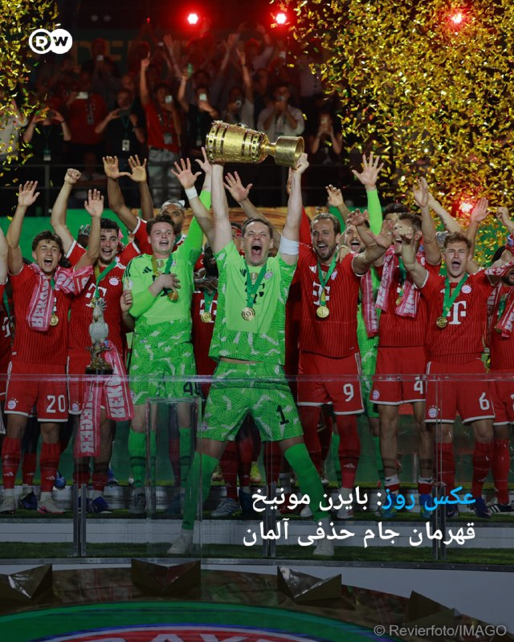

📸 عکس روز: بایرن مونیخ قهرمان جام حذفی

تیم فوتبال بایرن مونیخ با هت‌تریک هری کین موفق به کسب نتیجه سه بر صفر مقابل تیم فوتبال اشتوتگارت شد و جام حذفی فوتبال آلمان را از آن خود کرد. بایرن مونیخ آخرین بار در سال ۲۰۲۰ قهرمان جام حذفی آلمان شده بود. این تیم محبوب، ۳۵ قهرمانی در لیگ آلمان و ۲۱ قهرمانی در جام حذفی در کارنامه خود دارد.

@dw_farsi

## Persian_Trend_Official — post 14854

⭕️ تسنیم: ایران تاکید کرده است که بدون آزادسازی بخش مشخصی از اموال بلوکه شده ایران در همین گام اول و مشخص بودن سازوکار روشن برای ادامه‌ی تضمین‌شده آزادسازی همه اموال بلوکه شده، تفاهمی در کار نخواهد بود. 📝 Nick 📌 @persian_trend_official پرشین ترند | متفاوت‌ترین…

## Persian_Trend_Official — post 14853

💢مارکو روبیو کافی است بگوییم که پیشرفت‌هایی حاصل شده است، پیشرفت‌های قابل توجه، اگرچه پیشرفت نهایی هنوز به دست نیامده است. اگر اجازه دهیم این موضوع به یک امر عادی تبدیل شود، ما یک سابقه خطرناک ایجاد خواهیم کرد که می‌تواند در نقاط مختلف جهان تکرار شود. آنها…

## Persian_Trend_Official — post 14852

💢مارکو روبیو

کافی است بگوییم که پیشرفت‌هایی حاصل شده است، پیشرفت‌های قابل توجه، اگرچه پیشرفت نهایی هنوز به دست نیامده است.
اگر اجازه دهیم این موضوع به یک امر عادی تبدیل شود، ما یک سابقه خطرناک ایجاد خواهیم کرد که می‌تواند در نقاط مختلف جهان تکرار شود.
آنها مالک تنگه هرمز نیستند. این یک مسیر آبی بین‌المللی است. کاری که آنها اکنون انجام می‌دهند تهدید به نابودی کشتی‌های تجاری است که از این مسیر آبی بین‌المللی استفاده می‌کنند.
ایده اینکه این رئیس‌جمهور به توافقی تن دهد که در نهایت ایران را در موقعیت قوی‌تری در زمینه جاه‌طلبی‌های هسته‌ای قرار دهد، مضحک است. این اتفاق نخواهد افتاد.

🫆:Tony

📌 @persian_trend_official
پرشین ترند | متفاوت‌ترین کانال نظامی

## Persian_Trend_Official — post 14851

  

♦️هدف قرار دادن پهپاد ‌اربیتر بر فراز هرمزگان

🔹 این پهپاد ، که کاربری جاسوسی و شناسایی داشت، با شلیک پدافند ارتش سرنگون شد.

🔹لاشه پهپاد متلاشی شده اربیتر هم با همکاری ناوگروه دریابانی فراجای هرمزگان کشف شد./مهر

پ ن : با توجه به برد کم این پهپاد احتمالا از درون خاک به پرواز در امده است

🫆:Tony

📌 @persian_trend_official
پرشین ترند | متفاوت‌ترین کانال نظامی

## Persian_Trend_Official — post 14848

  <a href="telegram/content/Persian_Trend_Official_14848_1779624802.webm" target="_blank">🎬 Download video</a>

⭕️ طبق گزارش تایمز آو اسرائیل، یک مقام ارشد اسرائیلی گفته ترامپ در تماس دیشب با نتانیاهو تأکید کرده که توافق نهایی با ایران باید به برچیده شدن کامل برنامه هسته‌ای تهران و خارج شدن تمام اورانیوم غنی‌شده از خاک ایران منجر شود و بدون این شروط، آن را امضا نخواهد کرد.

در همان گزارش آمده نتانیاهو هم گفته اسرائیل آزادی عملش را در برابر تهدیدها در همه جبهه‌ها، از جمله لبنان، حفظ می‌کند و ترامپ هم از این اصل حمایت کرده است.

📝 Nick

📌 @persian_trend_official
پرشین ترند | متفاوت‌ترین کانال نظامی

## Persian_Trend_Official — post 14847

  <a href="telegram/content/Persian_Trend_Official_14847_1779624802.mp4" target="_blank">🎬 Download video</a>

🔴سردار قربانی: اسرائیلی‌ها بدانند قاآنی تا زیر سنگرهایشان می‌رود‼️

💢سردار «مرتضی قربانی» مشاور فرمانده سپاه پاسداران: هیچ‌وقت از قاآنی ترس و واهمه ندیدم، اسرائیلی‌ها بدانند قاآنی تا زیر سنگرهایشان می‌رود!

🫆:Tony

📌 @persian_trend_official
پرشین ترند | متفاوت‌ترین کانال نظامی

## Persian_Trend_Official — post 14846

⭕️ رویترز به نقل از یک مقام ایرانی گفت تهران با انتقال ذخایر اورانیوم غنی‌شده با غنای بالا به خارج از کشور موافقت نکرده است و موضوع هسته‌ای بخشی از توافق اولیه فعلی با ایالات متحده نیست.

پ.ن: 20 امتیاز برای کسی که پرتقال فروش رو پیدا کنه 😑

📝 Nick

📌 @persian_trend_official
پرشین ترند | متفاوت‌ترین کانال نظامی

## Persian_Trend_Official — post 14845

  <a href="telegram/content/Persian_Trend_Official_14845_1779624804.webm" target="_blank">🎬 Download video</a>

⭕️ کیر استارمر نخست وزیر بریتانیا:

من پیشرفت‌ها را به سوی یک توافق بین ایالات متحده و ایران خوش‌آمد می‌گویم.
ما باید توافقی را ببینیم که درگیری را به پایان برساند و تنگه هرمز را با آزادی ناوبری بدون قید و شرط و بدون محدودیت دوباره باز کند. حیاتی است که هرگز به ایران اجازه داده نشود تا سلاح هسته‌ای توسعه دهد.
دولت من به انجام هر کاری که می‌توانیم برای محافظت از مردم بریتانیا از تأثیرات این درگیری ادامه خواهد داد.
ما با شرکای بین‌المللی خود برای بهره‌برداری از این لحظه و دستیابی به یک حل و فصل دیپلماتیک بلندمدت همکاری خواهیم کرد.

پ.ن: خدایی اظهار نظر به تو یکی دیگه نمیرسه.

📝 Nick

📌 @persian_trend_official
پرشین ترند | متفاوت‌ترین کانال نظامی

## Persian_Trend_Official — post 14844

  <a href="telegram/content/Persian_Trend_Official_14844_1779624804.webm" target="_blank">🎬 Download video</a>

💢 پزشکیان: گاهی برخی کارشناسان در رسانه ملی سخنانی مطرح می‌کنند که با واقعیت‌های جاری کشور و روندهای موجود فاصله جدی دارد، اما دولت به‌منظور جلوگیری از اختلاف و حفظ آرامش جامعه، از واکنش و موضع‌گیری پرهیز می‌کند.

🚫 در مواردی، کلیپ‌هایی از بیانات رهبر شهید انقلاب درباره مذاکره به‌گونه‌ای بازنشر می‌شود که گویا نظام به‌صورت مطلق مخالف هرگونه مذاکره بوده است، در حالی که رهبر شهید هیچ‌گاه با مذاکره عزتمندانه، مبتنی بر اقتدار و در چارچوب منافع ملی مخالفت نداشتند و در دیدارهایی که با معظم‌له داشتیم، نگاه ایشان همواره مبتنی بر حفظ عزت، حکمت و مصلحت نظام بود.

📝 Nick

📌 @persian_trend_official
پرشین ترند | متفاوت‌ترین کانال نظامی

## Persian_Trend_Official — post 14843

⭕️ تسنیم:

ایران تاکید کرده است که بدون آزادسازی بخش مشخصی از اموال بلوکه شده ایران در همین گام اول و مشخص بودن سازوکار روشن برای ادامه‌ی تضمین‌شده آزادسازی همه اموال بلوکه شده، تفاهمی در کار نخواهد بود.

📝 Nick

📌 @persian_trend_official
پرشین ترند | متفاوت‌ترین کانال نظامی

## Persian_Trend_Official — post 14842

  <a href="telegram/content/Persian_Trend_Official_14842_1779624805.webm" target="_blank">🎬 Download video</a>

⭕️ کانال ۱۴ اسرائیل:

نتانیاهو به وزرا دستور داده است که از بحث در مورد توافق قریب‌الوقوع بین تهران و واشنگتن خودداری کنند.

📝 Nick

📌 @persian_trend_official
پرشین ترند | متفاوت‌ترین کانال نظامی

## Persian_Trend_Official — post 14841

  <a href="telegram/content/Persian_Trend_Official_14841_1779624805.webm" target="_blank">🎬 Download video</a>

⭕️ بنیامین نتانیاهو:

خوشحالم که رئیس‌جمهور realDonaldTrump، بهترین دوستی که اسرائیل تاکنون در کاخ سفید داشته، سالم است و مهاجم پیش از آنکه بتواند آسیب بیشتری بزند، خنثی شد.

خشونت سیاسی، از جمله تلاش‌های مکرر برای ترور رئیس‌جمهور ترامپ، باید بدون هیچ تردیدی و با قاطعیت از سوی همه محکوم شود.

📝 Nick

📌 @persian_trend_official
پرشین ترند | متفاوت‌ترین کانال نظامی

## Persian_Trend_Official — post 14840

https://youtube.com/live/FTUt8HfIdrc?feature=share

## Persian_Trend_Official — post 14839

  <a href="https://t.me/persian_trend_official/14839" target="_blank">📎 Download file</a>

فایل صوتی لایو اول
نسخه کم حجم - 4.28 مگابایت

اتاق جنگ یکشنبه 3 خرداد | توافق مبهم ایران و آمریکا !

📝 Nick

📌 @persian_trend_official
پرشین ترند | متفاوت‌ترین کانال نظامی

## RadioFarda — post 157517

  

🔸 خبرگزاری رسمی بحرین روز یک‌شنبه گزارش داد که دادگاهی در این کشور ۹ متهم را به حبس ابد و دو متهم دیگر را به سه سال زندان محکوم کرده است.

🔸 بر اساس این گزارش، این افراد به همکاری با سپاه پاسداران برای انجام آنچه «اقدامات خصمانه و تروریستی» علیه بحرین توصیف شده، متهم شده‌اند.

🔸 در بیانیهٔ منتشرشده آمده است که متهمان در «گردآوری اطلاعات دربارهٔ مراکز حساس و تسهیل انتقال‌های مالی مرتبط با آن» دست داشته‌اند.

🔸 بحرین که از کشورهای دارای اکثریت شیعه‌مذهب است، روابط پرتنشی با جمهوری اسلامی ایران داشته و پایتخت آن در جریان جنگ آمریکا و اسرائیل با ایران هدف حملات موشکی و پهپادی سپاه پاسداران قرار گرفت.

🔸 مقامات دولت بحرین در سال‌های اخیر بارها اعلام کرده‌اند که نیروهای امنیتی آن کشور توانسته‌اند «نقشه‌های شبه‌نظامیان مورد حمایت ایران» را خنثی بکنند.

@RadioFarda

## RadioFarda — post 157516

  <a href="https://t.me/radiofarda/157516" target="_blank">📎 Download file</a>

📻بشنوید: ساعت ۱۴ با رادیوفردا، سوم خرداد ۱۴۰۵‌

@Radiofarda

## RadioFarda — post 157515

  

🔸محمد سرافراز، رئیس پیشین سازمان صداوسیما و عضو کنونی شورای عالی فضای مجازی، می‌گوید بخشی از حاکمیت ایران با الهام از الگوی چین به‌دنبال محدود کردن اینترنت جهانی برای عموم مردم و ارائهٔ آن فقط به گروهی خاص و کنترل‌شده است.

🔸او روز یک‌شنبه سوم خرداد در گفت‌وگو با روزنامه اینترنتی فراز گفت جمهوری اسلامی تجهیزات لازم برای «قطع دائمی اینترنت» را از چین خریداری و وارد کرده است.

🔸محمد سرافراز توضیح داد که در چین اینترنت جهانی برای عموم مردم قطع است و فقط به‌صورت محدود در اختیار گروه‌هایی خاص قرار می‌گیرد. سرافراز با اشاره به الگویی که آن را «سامانه نیکان» در چین خواند، گفت هدف چنین سازوکاری این است که «روایت حکومت» بر کشور حاکم باشد.

🔸او همچنین اپراتورهای عضو شورای عالی فضای مجازی را از عوامل پشت پردهٔ تصویب طرح موسوم به «اینترنت پرو» دانست و گفت ذی‌نفعان قطع اینترنت «یک روز فیلترشکن می‌فروشند و یک روز اینترنت پرو».

🔸نت‌بلاکس، نهاد رصد دسترسی به اینترنت در جهان، روز یک‌شنبه نوشت که قطعی اینترنت در ایران وارد هشتادوششمین روز خود شده است.

@RadioFarda

## RadioFarda — post 157514

🔸در یکی از بزرگ‌ترین حمله‌های سال‌های اخیر به پایتخت اوکراین، روسیه جدیدترین موشک هایپرسونیک خود را به همراه صدها پهپاد و موشک دیگر به سمت شهری در منطقۀ کی‌یف پرتاب کرد.

🔸بر پایۀ گزارش‌ها، دست‌کم چهار نفر جان باخته‌اند و پیش‌بینی می‌شود آمار جان‌باختگان افزایش یابد.

🔸ولودیمیر زلنسکی، رئیس‌جمهور اوکراین، اظهار داشت که روسیه با استفاده از جدیدترین موشک فراصوت خود به نام اورِشنیک، شهر بیلا تسرکوا در ۸۰ کیلومتری جنوب کی‌یف را هدف قرار داده که در جریان آن «تأسیسات آب‌رسانی، بازار شهر، ده‌ها ساختمان مسکونی و چندین مدرسه» آسیب دیده‌اند. در مجموع، نزدیک به ۶۰۰ پهپاد و ۹۰ موشک در این تهاجم به کار گرفته شد.

🔸این سومین بار است که روسیه موشک اورشنیک را بر ضد اهداف اوکراینی به کار می‌گیرد و نخستین باری است که آن را به سوی منطقۀ کی‌یف پرتاب می‌کند.

🔸این حمله تنها دو روز پس از سخنرانی به شدت ستیزه‌جویانۀ ولادیمیر پوتین، رئیس‌جمهور روسیه، انجام گرفت؛ سخنرانیِ که یادآور لحن و ادبیات او در آستانۀ تهاجم فوریه ۲۰۲۲ بود.

@RadioFarda

## RadioFarda — post 157513

  

🔸هیئت داوران جشنواره کن در فرانسه روز شنبه، دوم خردادماه، کریستیان مونجیو، کارگردان رومانیایی، را به عنوان برنده جایزه نخل طلای کن انتخاب کرد.

🔸مونجیو اولین بار ۱۹ سال پیش این جایزه را برای فیلم «چهار ماه،‌ سه هفته،‌ دو روز» برده بود و این بار نخل طلا را برای فیلم «فیورد» [آب‌دره] از آنِ خود کرد.

🔸در فیورد که اولین فیلم انگلیسی‌زبان مونجیو نیز هست، رناته رِینسوِه، هنرپیشه نروژی، و سباستین استن،‌ ستاره هالیوود، نقش پدر و مادری رومانیایی و مهاجر به نروژ و مذهبی را بازی می‌کنند که در این کشور به آزار و اذیت کودکان متهم می‌شوند.

🔸کریستیان مونجیوی ۵۸ ساله با بردن دوباره نخل طلا روز شنبه گذشته به کارگردانانی چون فرانسیس فورد کوپولا، میشاییل هانِکِه، بیل آگوست، شوهه‌ای ایمامورا و امیر کوستوریتسا پیوست که همگی دو بار این جایزه را برده‌اند.

🔸در این دوره از جشنواره که پارک چان ووک، کارگردان برجسته کره‌ای،‌ ریاست هیئت داوران آن را بر عهده داشت، جایزه بزرگ که دومین جایزه مهم این جشنواره است به فیلم «مینوتور» ساخته آندری زِویاگینتسِف رسید، هجویه‌ای درباره زندگی اجتماعی در روسیه امروز.

@RadioFarda

## RadioFarda — post 157512

  

🔸مارکو روبیو، وزیر خارجه آمریکا، گفت ممکن است تا شامگاه یک‌شنبه سوم خرداد خبری دربارهٔ توافقی با ایران اعلام شود که می‌تواند به‌طور رسمی به جنگ خاورمیانه پایان دهد.

🔸روبیو در جمع خبرنگاران در دهلی نو گفت: «فکر می‌کنم شاید این امکان وجود داشته باشد که در چند ساعت آینده جهان خبرهای خوبی دریافت کند.»

🔸روبیو، که در نخستین سفر خود به هند به‌سر می‌بَرد، گفت توافق در حال شکل‌گیری به نگرانی‌های آمریکا دربارهٔ تنگه هرمز خواهد پرداخت؛ تنگه‌ای که ایران در واکنش به حمله آمریکا و اسرائیل تا حد زیادی مسدود کرده است.

🔸او افزود این توافق همچنین روندی را آغاز خواهد کرد که «در نهایت می‌تواند ما را به جایی برساند که رئیس‌جمهور می‌خواهد، یعنی جهانی که دیگر ناچار نباشد از سلاح هسته‌ای ایران بترسد یا نگران آن باشد.»

🔸سخنان او پس از آن بیان شد که دونالد ترامپ، رئیس‌جمهور آمریکا، گفت پیشنهادی که شامل بازگشایی تنگه هرمز است، «تا حد زیادی مذاکره شده است».

@RadioFarda

## RadioFarda — post 157511

  

🔸ناهید کیانی آخرین شانس تکواندوی زنان ایران در مسابقات قهرمانی آسیا ۲۰۲۶ مغولستان با کسب مدال طلا بر‌بام آسیا ایستاد.

🔸ناهید کیانی آخرین شانس تکواندوی زنان ایران در مسابقات قهرمانی آسیا ۲۰۲۶ مغولستان با کسب مدال طلا بر‌بام آسیا ایستاد.

🔸 کیانی در دیدار فینال وزن -۵۷ کیلوگرم رقابتهای قهرمانی آسیا، با برتری ۲ بر صفر مقابل حریف ازبکستانی خود صاحب مدال طلا شد.

🔸او در حالی طلای تکواندوی زنان ایران در جهان را کسب کرد که در روزهای گذشته تیم ملی تکواندوی زنان نتوانسته بود هیچ مدالی در مسابقات قهرمانی آسیا از آن‌ خود کند.

🔸ناهید کیانی در المپیک ۲۰۲۴ پاریس اولین زن برنده مدال نقره شد.

@RadioFarda

## RadioFarda — post 157510

  

🔸 در آستانه امضای توافقی احتمالی میان آمریکا و ایران برای پایان دادن به جنگ، چند عضو برجسته حزب جمهوری‌خواه به انتقاد از این توافق دست زدند.

🔸 مایک پمپئو، وزیر خارجهٔ پیشین آمریکا، روز شنبه در مورد مفاد گزارش‌شدهٔ این توافق گفت که به باور او «به هیچ وجه در راستای شعار اول آمریکا نیست» و آن را به توافق هسته‌ای سال ۲۰۱۵ دولت باراک اوباما تشبیه کرد.

🔸 تد کروز، سناتور جمهوری‌خواه از تگزاس، نیز روز یک‌شنبه در ایکس نوشت اگر نتیجهٔ عملیات نظامی آمریکا علیه ایران این باشد که «رژیم ایران همچنان به غنی‌سازی اورانیوم، توسعهٔ سلاح هسته‌ای و کنترل مؤثر تنگه هرمز ادامه دهد»، این «اشتباهی فاجعه‌بار» خواهد بود.

🔸 لیندزی گراهام، سناتور جمهوری‌خواه از کارولینای جنوبی نیز هشدار داد توافقی که به جمهوری اسلامی اجازه دهد همچنان قدرت منطقه‌ای خود را حفظ کند، در بلندمدت «کابوسی برای اسرائیل» خواهد بود.

🔸 همزمان مورگان اورتگاس، نمایندهٔ پیشین دولت ترامپ در امور خاورمیانه، در نشست سیاست‌گذاری «فروم خاورمیانه» در واشینگتن هشدار داد که ایران ممکن است از مذاکرات هسته‌ای برای «خریدن زمان» استفاده کند.

@RadioFarda

## IranianMinds — post 20662

  

🔴 نتانیاهو:

«خوشحالم که رئیس‌جمهور دونالد ترامپ، بهترین دوستی که اسرائیل تاکنون در کاخ سفید داشته، در امنیت است و مهاجم پیش از آنکه بتواند آسیب بیشتری وارد کند، خنثی شد.

خشونت سیاسی، از جمله تلاش‌های مکرر برای ترور رئیس‌جمهور ترامپ، باید به‌طور قاطع و شدید از سوی همه محکوم شود.»

@IranianMinds

## IranianMinds — post 20661

🔄 اگر هنوز ۵۰۰ هزارتومان رو نگرفتی همین الان عضو شو‌ و جایزتو بگیر

✅نیازی هم به واریز نیست

🟢 تنها سایت مورد #تایید ما با بونوس های واقعی

🌐 Winro.io

## IranianMinds — post 20660

  

⭕️ تا حالا بدون واریزی روی فوتبال ها شرط بستی؟!

🎉 500 هزارتومن بونوس رایگان فقط با ثبت نام بدون هیچگونه واریزی!

😮 تنها سایتی که با عضویت بدون واریز 500,000 تومان شارژ بی قیدو شرط میده #وینرو هست
💰

👑 #معتبرترین سایت ایرانی 
⬇️

🌐 Winro.io

🌐 Winro.io

📱کانال اخبار و هدایا r3 
🎁

📱 @winro_io

## IranianMinds — post 20659

  

🔴 آلمان در حال بررسی پرداخت پاداش ۸۰۰۰ یورویی برای پناهجویان سوری است که داوطلبانه آلمان را ترک کنند

بیش از ۹۰۰ هزار سوریه ای بدون تابعیت آلمانی در آلمان زندگی می‌کنند!

@IranianMinds

## IranianMinds — post 20658

🔴 خبرگزاری فارس :

احتمالا دوباره آمریکا دبه میکنه و توافق رو‌ بهم میزنه.

@IranianMinds

## IranianMinds — post 20657

🔴 مارکو روبیو درباره توافق احتمالی با ایران:

پیشرفت‌هایی حاصل شده؛ پیشرفت‌های قابل‌توجه، هرچند هنوز نهایی نشده‌اند.

«نمی‌خواهم اهمیت این موضوع را کم جلوه بدهم، اما هنوز کارهایی باقی مانده که باید انجام شود.»

«شاید طی چند ساعت آینده جهان خبرهای خوبی، حداقل درباره تنگه‌ها و روند مذاکرات، دریافت کند.»

این تصور که ترامپ توافقی را می‌پذیرد که در نهایت ایران را در زمینه جاه‌طلبی هسته‌ای در موقعیت قوی‌تری قرار دهد، مضحک است. چنین چیزی اتفاق نخواهد افتاد.

@IranianMinds

## BBCPersian — post 281952

  

🔻 مارکو روبیو، وزیر خارجه آمریکا، می‌گوید که احتمال دارد در ساعات آینده بیانیه‌ای اعلام شود که رسما به جنگ در خاورمیانه پایان می‌دهد. دونالد ترامپ گفته بود که مذاکرات با ایران به مراحل پایانی رسیده است.

وزیر خارجه آمریکا در کنفرانس خبری در هند بدون اشاره به جزئیات گفت که توافق احتمالی نگرانی‌های ایالات متحده در مورد تنگه هرمز را «تا حد زیادی» برطرف خواهد کرد و اجازه نمی‌دهد که ایران به سلاح هسته‌ای دست پیدا کند.

مقام‌های ایران هنوز در مورد محتوای توافق احتمالی صحبتی نکرده‌اند؛ هرچند مسعود پزشکیان، رئیس‌جمهور ایران، امروز گفت: «هیچ تصمیمی خارج از چارچوب شورای‌عالی امنیت ملی و بدون هماهنگی و اذن مقام معظم رهبری اتخاذ نخواهد شد.»

در همین حال، گزارش‌های غیر‌رسمی‌ و تاییدنشده‌ای از جزئیات توافق احتمالی تهران و واشنگتن منتشر شده است.

بیشتر بخوانید:
https://bbc.in/3PA6wR2
📸Getty Images
@BBCPersian

## BBCPersian — post 281951

🔻 فرمانده قرارگاه خاتم‌الانبیا: آماده پاسخگویی سخت و جهنمی هستیم

علی عبداللهی، فرمانده قرارگاه مرکزی خاتم‌الانبیا، گفته است نیروهای مسلح ایران «اجازه نخواهند داد تجربه دردناک تاریخی تکرار شود» و «آماده پاسخگویی سخت و جهنمی به هرگونه تجاوز هستیم.»

آقای عبداللهی در پیامی به مناسبت مراسمی برای کشته‌شدگان جنگ اخیر آمریکا و اسرائیل با ایران که خبرگزاری ایرنا منتشر کرد این جنگ «یکی از شگفت‌انگیزترین رخدادهای تاریخی» توصیف کرد.

او همچنین گفته جمهوری اسلامی پس از جنگ براساس «راهبردهای رهبر» برای «مدیریت خلیج فارس و تنگه هرمز» برنامه خواهد داشت.

https://bbc.in/3RiH6rE
@BBCPersian

## BBCPersian — post 281950

  <a href="telegram/content/BBCPersian_281950_1779624813.mp4" target="_blank">🎬 Download video</a>

🔻انفجار شدید در نزدیکی یک قطار در پاکستان چندین کشته و ده‌ها زخمی برجای گذاشت
انفجاری بزرگ در نزدیکی یک قطار که از گذرگاه چمن در شهر کویته در ایالت بلوچستان پاکستان عبور می‌کرد، تعداد زیادی کشته و ده‌ها نفر زخمی برجا گذاشت.

یک مقام ارشد پلیس بلوچستان و یکی از مسئولان این ایالت به محمد کاظم، خبرنگار بی‌بی‌سی اردو، گفت تاکنون کشته شدن ۲۰ نفر در این انفجار تأیید شده و دست‌کم ۷۰ نفر زخمی شده‌اند.

در پی این حادثه، در بیمارستان‌های شهر کویته وضعیت اضطراری اعلام شده است.

تصاویر منتشرشده پس از حادثه نشان می‌دهد که چندین خودرو در نزدیکی خط آهن آتش‌ گرفته‌اند و واگن‌های قطار نیز روی ریل واژگون شده‌اند.

گروه جدایی‌طلب «ارتش آزادیبخش بلوچ» مسئولیت این حمله را به عهده گرفته‌ است.
https://bbc.in/3RHt56N
🎥 Reuters
@BBCPersian

## BBCPersian — post 281949

🔻فدراسیون فوتبال ایران اعلام کرد که با موافقت فیفا، کمپ و محل استقرار تیم ملی فوتبال در جریان جام جهانی ۲۰۲۶ به شهر مرزی تیخوانا در مکزیک منتقل شده است.

مهدی تاج، رئیس فدراسیون فوتبال ایران، گفته با انتقال کمپ تیم ملی از آریزونا در آمریکا به تیخوانا در مکزیک، «مشکل ویزا نداریم و تیم ملی با پرواز ایران‌ایر می تواند عازم مکزیک شود.»

تمرینات تیم فوتبال ایران در این شهر قرار است در مجموعه ورزشی «کلوب تیخوانا» برگزار شود.

آقای تاج گفته فاصله پروازی تیخوانا تا لس‌آنجلس که محل انجام دو بازی اول تیم ملی فوتبال ایران است، ۵۵ دقیقه است و از کمپ قبلی در آریزونا نزدیک‌تر است.

در پی وقوع جنگ آمریکا و اسرائیل با ایران، شرکت تیم ملی فوتبال ایران در جام جهانی که با میزبانی سه کشور آمریکا، کانادا و مکزیک برگزار می‌شود با دست‌اندازهایی مواجه شد.

رسانه‌های ایران می‌گویند تیم فوتبال این کشور با انتقال کمپ خود به مکزیک، کشور آمریکا و مشکلات ناشی از تاخیر در صدور ویزا و بلاتکلیفی تا لحظات آخر را «دور زده است.»

https://bbc.in/49lrycN
@BBCPersian

## BBCPersian — post 281948

🔻تسنیم: هنوز اختلاف بر سر یکی دو بند تفاهم‌نامه وجود دارد

خبرگزاری تسنیم در خبری به نقل از «منبع مطلع» بدون اشاره به نامی نوشت که «اختلاف میان ایران و آمریکا بر سر یکی دو بند از تفاهم‌نامه احتمالی همچنان ادامه دارد.»

به نوشته تسنیم، یکی از موارد اختلاف «آزادسازی اموال ایران» است.

این خبرگزاری که به نهادهای نظامی و امنیتی نزدیک است، نوشت به همین دلیل توافق «هنوز نهایی» نشده است و «در صورت ادامه مانع‌تراشی‌های آمریکا، امکان نهایی شدن تفاهم‌نامه وجود ندارد.»

بنابر این گزارش، در متن تفاهم‌نامه «هیچ اشاره‌ای به تعیین پروتکل آمریکایی برای کشتی‌های ایرانی» پس از رفع محاصره دریایی ایالات متحده نشده است.

https://bbc.in/4nOuCnR
@BBCPersian

## BBCPersian — post 281947

  

🔻وزیر خارجه آمریکا گفت: «فکر می‌کنم شاید این احتمال وجود داشته باشد که در چند ساعت آینده دنیا خبرهای خوبی بشنود.»

مارکو روبیو که به هند سفر کرده است در کنفرانس خبری با همتای هندی خود افزود: «ممکن است اواخر روز یکشنبه بیانیه‌ای در مورد توافق با ایران منتشر شود که می‌تواند رسما به جنگ خاورمیانه پایان دهد.»

او گفت که در این توافق احتمالی نگرانی‌های ایالات متحده در مورد تنگه هرمز را «تا حد زیادی» برطرف خواهد کرد.

وزیر خارجه آمریکا همچنین گفت این توافق «فرآیندی را آغاز می‌کند که در نهایت می‌تواند ما را به جایی که رئیس‌جمهور می‌خواهد برساند، دنیایی که دیگر لازم نیست از سلاح هسته‌ای ایران بترسد یا نگرانش باشد.»

📸Getty Images
@BBCPersian

## BBCPersian — post 281946

🔻استارمر: توافق باید به جنگ پایان دهد و تنگه هرمز باز شود

نخست‌وزیر بریتانیا از پیشرفت‌ گفت‌گوهای آمریکا و ایران استقبال کرد.

کی‌یر استارمر گفت: «ما باید شاهد توافقی باشیم که به درگیری پایان دهد و تنگه هرمز را با آزادی بی‌قید و شرط و نامحدود برای دریانوردی بازگشایی کند.»

نخست‌وزیر بریتانیا در عین حال تاکید کرده «بسیار مهم است که هرگز به ایران اجازه توسعه سلاح هسته‌ای داده نشود.»

آقای استارمر در شبکه اجتماعی ایکس نوشت که بریتانیا آماده همکاری با شرکای بین‌المللی خود است «تا از این فرصت استفاده کنیم و به یک توافق دیپلماتیک بلندمدت دست یابیم.»

https://bbc.in/4nOuCnR
@BBCPersian

## BBCPersian — post 281938

🖊 دیزی استفنز، بی‌بی‌سی

🔻 برج کج پیزا یکی از شاخص‌ترین نمادهای ایتالیا است.

اما این تنها سازه‌ای نیست که به یک سمت متمایل شده است. از خانه‌های رقصان در هلند گرفته تا پاگودای تپه ببر در چین، بناهای کج در گوشه‌وکنار جهان وجود دارند.

اما چرا این ساختمان‌ها کج می‌شوند؟ و چرا این موضوع لزوما به معنای فرو ریختن آن‌ها نیست؟

بیشتر بخوانید:

https://bbc.in/4dqGSau
📸Getty Images
@BBCPersian

## BBCPersian — post 281937

  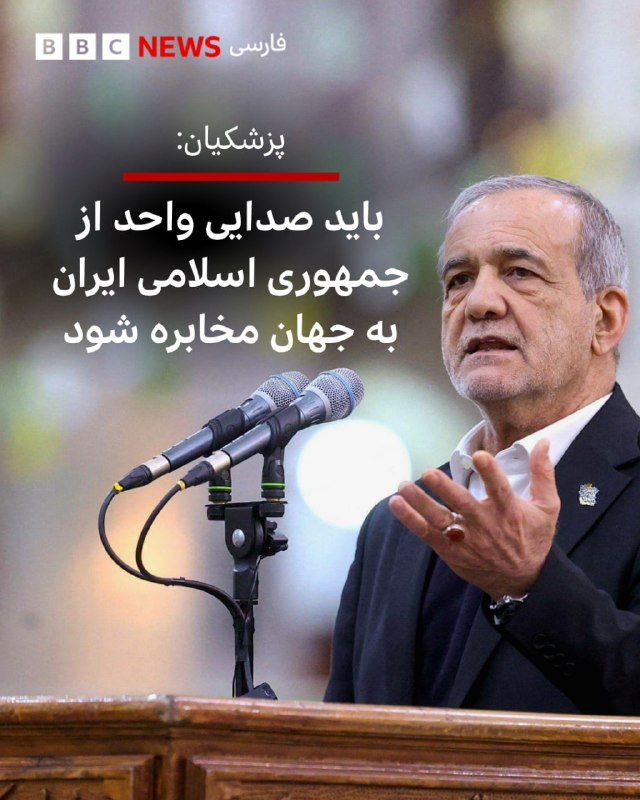

🔻مسعود پزشکیان در دیدار با مدیران صداوسیما گفت که «هیچ تصمیمی خارج از چارچوب شورای عالی امنیت ملی و بدون هماهنگی و اذن» رهبر اتخاذ نخواهد شد.

رئیس‌جمهور ایران تاکید کرد: «هنگامی که تصمیمی در حوزه دیپلماسی اتخاذ می‌شود، همه دستگاه‌ها و تریبون‌ها و جریان‌ها باید از آن حمایت کنند تا صدایی واحد و منسجم از جمهوری اسلامی ایران به جهان مخابره شود.»

او از صداوسیما خواست: «در مسیر تقویت همبستگی اجتماعی، حمایت از تصمیمات کلان نظام، و افزایش سرمایه اجتماعی کشور بیش از پیش نقش‌آفرینی کند.»

کامران غضنفری، نماینده مجلس، دیروز گفته بود که رئیس‌جمهور بدون اجازه رهبر جمهوری اسلامی آتش‌بس را قبول کرده است.

📸Reuters
@BBCPersian

## BBCPersian — post 281936

🔻اردوغان: توافق برای تضمین عبور آزاد از تنگه هرمز به اقتصاد جهانی کمک می‌کند

رجب‌طیب اردوغان گفت که در تماس تلفنی دونالد ترامپ با رهبران کشورهای منطقه از باز شدن تنگه هرمز استقبال و برای «هر نوع حمایتی در طول مراحل اجرای توافق» با ایران اعلام آمادگی کرده است.

دفتر رئیس‌جمهور ترکیه در شبکه اجتماعی ایکس نوشت که ترکیه همیشه طرفدار حل مشکلات از طریق گفتگو و دیپلماسی است و از توافق ایران و آمریکا استقبال می‌کند:

«توافق برای تضمین عبور آزاد از تنگه هرمز، ثبات منطقه را پشتیبانی می‌کند و به اقتصاد جهانی کمک خواهد کرد.»

https://bbc.in/4nOuCnR
@BBCPersian

## Dirty_Kids — post 390072

  <a href="telegram/content/Dirty_Kids_390072_1779624815.mp4" target="_blank">🎬 Download video</a>

عروس و داماد قبل از مراسم عروسیشون،
در تجمع امروز ونکوور 🥹

@Dirty_Kids 👻

## Dirty_Kids — post 390071

  <a href="telegram/content/Dirty_Kids_390071_1779624817.mp4" target="_blank">🎬 Download video</a>

او می‌خواست مانند #موسی دریا را بشکافد، اما موفق نشد زیرا دوربین اختراع شده بود.😅

@Dirty_Kids 👻

## Dirty_Kids — post 390070

  <a href="https://t.me/Dirty_Kids/390070" target="_blank">📎 Download file</a>

📱 اپلیکیشن اندروید بدون فیلتر ریتزوبت

➖➖➖➖➖

🔹 ثبت نام آسان 
✅
🔹 رابط کاربری بسیار راحت و سریع 
✅
🔹 درگاه پرداخت کارت به کارت 
✅
🔹 درگاه پرداخت دلاری سریع 
✅
🔹 بونوس ۱۰۰ درصدی اولین واریز 
✅
🔹 بونوس ۱۰۰ درصدی واریز یکشنبه ها 
✅

➖➖➖➖➖
🌐 https://RitzoBet.com

⚡️ @RitzoBet_ir

## Dirty_Kids — post 390069

  <a href="telegram/content/Dirty_Kids_390069_1779624819.webm" target="_blank">🎬 Download video</a>

⚠️ برای #شرطبندی های فوتبال از سایت معتبر و بین المللی استفاده کنید ✅

🏴󠁧󠁢󠁥󠁮󠁧󠁿 برایتون
🔢
🔢 
🏴󠁧󠁢󠁥󠁮󠁧󠁿 منچستریونایتد

سایت #ریتزوبت ، چهار سال هستش داخل ایران فعالیت میکنه 
✅

لایسنس بین المللی داره ، روش های شارژ و برداشت متنوع داره و بونوس 100% ورزشی و کش بک های جذاب
💎

⏪ اپلیکیشن بدون فیلتر ریتزوبت 
📱
⏩
R3

✅ لینک بدون‌ فیلتر ریتزوبت
🤣

🆔 @RitzoBet_ir 
🇮🇷

## Dirty_Kids — post 390068

  <a href="telegram/content/Dirty_Kids_390068_1779624819.mp4" target="_blank">🎬 Download video</a>

وقتی میگیم حتا اگه یه نفر از ما ایرانیا مونده باشه، روی گور نحس و کثیف شما حرومیا میرقصه منظورمون اینه

تورنتو

@Dirty_Kids 👻

## Dirty_Kids — post 390066

علی کریمی توی یه استوری عکس اصلی که یه نفر تصویر شاهزاده رضا پهلوی رو برده بالا استوری کرده، اما شاهزاده رضا پهلوی رو سانسور کرده و جای عکس شاهزاده رضا پهلوی نوشته «ایران»!

@Dirty_Kids 👻

## Dirty_Kids — post 390065

  <a href="telegram/content/Dirty_Kids_390065_1779624820.mp4" target="_blank">🎬 Download video</a>

دو تماس متفاوت از ایران😂😂
حتما تا اخر ببینید

@Dirty_Kids 👻

## Dirty_Kids — post 390064

  

🌪وقتی اینترنت طوفانیه فقط کافیه بادبان ها رو بکشی

⚫️100 هزار تومان تخفیف خرید اول 
🎁

⚫️پایین ترین قیمت گیگی 180 هزار تومان
🌐 

⚫️پورسانت %10 دائمی برای هر معرفی
💼

با بادبان، میتونی یه اتصال سریع، پایدار و امن
همراه با پشتیبانی ۲۴ ساعته داشته باشی
🚀

🛒کد تخفیف: badban4k

بادبان راهتو باز می‌کنه
⛵️
R3

🛡@BadBan_VPN | کانال 

🤖@BadBan_VPNBot | ربات 

📞@BadBan_VPNSupport | پشتیبانی

## Dirty_Kids — post 390063

  <a href="telegram/content/Dirty_Kids_390063_1779624823.mp4" target="_blank">🎬 Download video</a>

صحبت‌های عمو مراد درباره توافق شدن یا نشدن رو هم بشنوید...

@Dirty_Kids 👻

## Dirty_Kids — post 390062

  <a href="telegram/content/Dirty_Kids_390062_1779624825.mp4" target="_blank">🎬 Download video</a>

حقیقتاً لذتی که در شنیدن این جملات هست، در دیدن تپلی‌های سیدنی سویینی نیست:)))

@Dirty_Kids 👻

## Hranews — post 113134

شماری از هنرمندان از جمله هومن سیدی و سعید روستایی به دادسرای فرهنگ و رسانه احضار شدند

❗️
❗️
❗️
❗️
❗️ – مدیر حقوقی خانه سینما از #احضار شماری از هنرمندان از جمله هومن سیدی، بازیگر و فیلم‌ساز و سعید روستایی، کارگردان به دادسرای فرهنگ و رسانه خبر داد. به گفته وی برخی از احضار شدگان با اتهام «همکاری با دولت متخاصم» مواجه هستند.

ادامه مطلب

#هومن_سیدی
#سعید_روستایی

↘️
@hranews_bot تماس ✉️ -  @Hranews  کانال هرانا 🆑

## Hranews — post 113133

  

عباس علی‌آبادی، وزیر نیرو، با اشاره به شرایط منابع آبی کشور در ششمین سال متوالی خشکسالی گفت: از مجموع ۶۰۹ دشت ایران، بیش از ۴۰۰ دشت در وضعیت ممنوعه یا بحرانی قرار دارند و حدود ۳۰۰ دشت نیز با پدیده #فرونشست زمین مواجه هستند؛ موضوعی که به‌ویژه در استان‌هایی مانند اصفهان، کرمان، فارس، خراسان رضوی و تهران شدت بیشتری دارد.

وی در ادامه افزود: مهم‌ترین چالش بخش آب کشور اضافه‌برداشت از منابع زیرزمینی است و فشار بیش از حد بر آبخوان‌ها موجب بروز مشکلات متعددی از جمله تشدید بحران آب شده است.

↘️
@hranews_bot تماس ✉️ -  @Hranews  کانال هرانا 🆑

## Hranews — post 113132

  

اعتراضات ۱۴۰۴؛ ایلیا بن‌رشید به حبس و شلاق محکوم شد

❗️
❗️
❗️
❗️
❗️ – ایلیا بن‌رشید، از بازداشت‌شدگان اعتراضات دی‌ماه ۱۴۰۴ در شاهین‌شهر، توسط دادگاه کیفری به شش ماه #حبس و تحمل ۲۰ ضربه #شلاق محکوم شد. بخش دیگر پرونده وی با اتهام «#محاربه» در دادگاه انقلاب در حال رسیدگی است و تاکنون حکمی برای این بخش از پرونده صادر نشده است.

به گزارش خبرگزاری هرانا، ارگان خبری مجموعه فعالان حقوق بشر در ایران، ایلیا بن‌رشید یکی از بازداشت‌شدگان اعتراضات دی‌ماه ۱۴۰۴ که در زندان دستگرد اصفهان محبوس است، به حبس و شلاق محکوم شد.

براساس حکم صادره توسط شعبه ۱۰۲ دادگاه کیفری دو شاهین‌شهر و میمه، آقای بن‌رشید بابت اتهام «مباشرت در سرقت یک عدد کیس کامپیوتر متعلق به شبکه بهداشت و درمان شاهین‌شهر» به شش ماه حبس تعزیری و ۲۰ ضربه شلاق تعزیری محکوم شده است. این شعبه او را از اتهام اخلال در نظم و آسایش عمومی از طریق شرکت در اعتراضات تبرئه کرده است.
براساس اطلاعات دریافتی هرانا، بخش دیگر پرونده وی در دادگاه انقلاب اصفهان در حال رسیدگی است و تاکنون حکمی برای این بخش از پرونده صادر نشده است.

ادامه مطلب

#ایلیا_بن‌رشید

↘️
@hranews_bot تماس ✉️ -  @Hranews  کانال هرانا 🆑

## Hranews — post 113131

با اتمام مراحل بازجویی؛ فروزان نوجوان به زندان ارومیه منتقل شد

❗️
❗️
❗️
❗️
❗️– فروزان نوجوان (اسلامی)، مدرس زبان انگلیسی و اهل ارومیه، با اتمام مراحل بازجویی از یکی از بازداشتگاه‌های امنیتی ارومیه به بند زنان زندان این شهر منتقل شد.

ادامه مطلب

#فروزان_نوجوان
#فروزان_اسلامی

↘️
@hranews_bot تماس ✉️ -  @Hranews  کانال هرانا 🆑

## Hranews — post 113130

امروز یکشنبه ۳ خردادماه، شماری از بازنشستگان تامین اجتماعی در مقابل ساختمان این سازمان در شوش دست به #تجمع اعتراضی زدند.

این تجمع در اعتراض به تاخیر در اعمال افزایش حقوق سالانه موضوع ماده ۹۶، بی‌توجهی به تعیین و ابلاغ حق مسکن و همچنین اجرا نشدن قانون الزام در بخش درمان صورت گرفته است.

↘️
@hranews_bot تماس ✉️ -  @Hranews  کانال هرانا 🆑

## Hranews — post 113129

تهران؛ یک زن توسط همسرش به قتل رسید

❗️
❗️
❗️
❗️
❗️ – روز جمعه ۱ خردادماه، مردی در تهران، همسر خود را به دلیل اختلافات خانوادگی به قتل رساند. متهم توسط پلیس بازداشت شد.

ادامه مطلب

#زن_کشی

↘️
@hranews_bot تماس ✉️ -  @Hranews  کانال هرانا 🆑

## Hranews — post 113128

رسول یادیار از زندان بوکان آزاد شد

❗️
❗️
❗️
❗️
❗️ – رسول یادیار، شهروند اهل بوکان، با تودیع وثیقه از زندان این شهرستان آزاد شد.

ادامه مطلب

#رسول_یادیار

↘️
@hranews_bot تماس ✉️ -  @Hranews  کانال هرانا 🆑

## Hranews — post 113127

اداره‌ اطلاعات فارس از بازداشت ۱۵ تن با اتهامات امنیتی خبر داد

❗️
❗️
❗️
❗️
❗️ – اداره‌ اطلاعات استان فارس با انتشار اطلاعیه‌ای از #بازداشت ۱۵ نفر با اتهامات امنیتی خبر داد. در این اطلاعیه اعلام شده که از بازداشت‌شدگان، اسلحه و تجهیزات ماهواره‌ای #استارلینک ضبط شده است.

ادامه مطلب

↘️
@hranews_bot تماس ✉️ -  @Hranews  کانال هرانا 🆑

## Hranews — post 113126

تداوم بازداشت و بی‌خبری از وضعیت مجتبی حاجیان

❗️
❗️
❗️
❗️
❗️ – مجتبی حاجیان، شهروند ساکن تهران، علیرغم گذشت ۱۱۹ روز از زمان بازداشت، در بلاتکلیفی به‌سر می‌برد. بی‌خبری از سرنوشت این شهروند، منجر به افزایش نگرانی‌های خانواده وی شده است.

ادامه مطلب

#مجتبی_حاجیان

↘️
@hranews_bot تماس ✉️ -  @Hranews  کانال هرانا 🆑

## Hranews — post 113125

  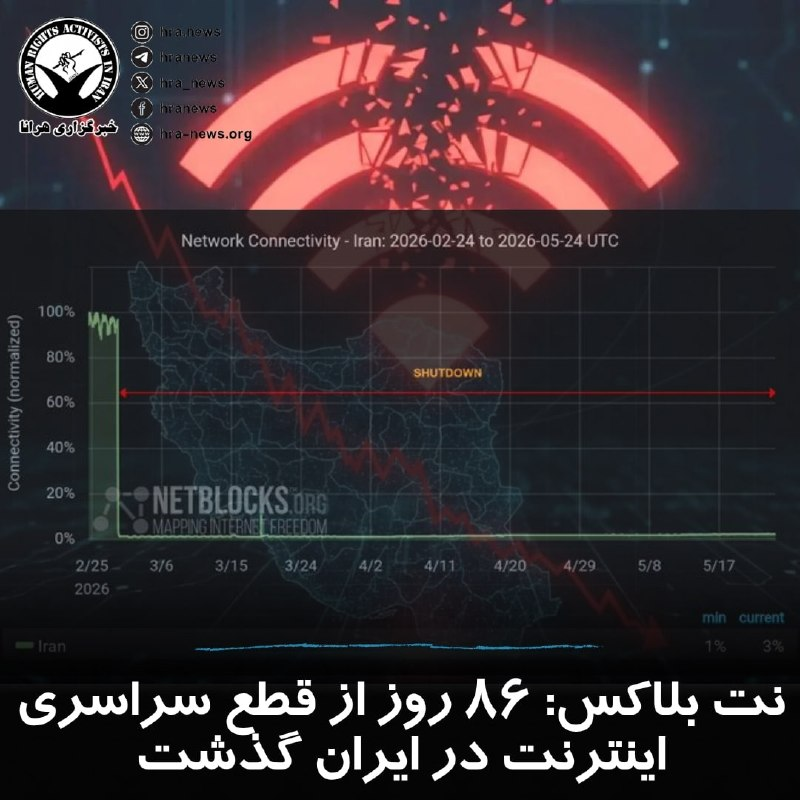

آخرین داده‌های نت بلاکس نشان می‌دهد که قطع سراسری #اینترنت در ایران اکنون از ۲۰۴۰ ساعت گذشته و وارد هشتادوششمین روز خود شده است. این نهاد ناظر بر وضعیت دسترسی به اینترنت در جهان همچنین اعلام کرد: دسترسی عمومی به اینترنت جهانی همچنان به‌طور گسترده محدود مانده و تنها گروهی از کاربران که دسترسی ویژه‌ای دارند، تصاویری کنترل‌شده از وضعیت ایران را به جهان خارج ارائه می‌کنند.

↘️
@hranews_bot تماس ✉️ -  @Hranews  کانال هرانا 🆑

## manototv — post 105801

  <a href="telegram/content/manototv_105801_1779624827.mp4" target="_blank">🎬 Download video</a>

اورزولا فون‌درلاین، رئیس کمیسیون اروپا، از پیشرفت در مسیر دستیابی به توافق میان آمریکا و جمهوری اسلامی استقبال کرد و گفت هر توافقی باید به کاهش واقعی تنش‌ها، بازگشایی تنگه هرمز و تضمین آزادی کامل کشتیرانی بدون پرداخت عوارض منجر شود.

او تاکید کرد جمهوری اسلامی نباید اجازه پیدا کند به سلاح هسته‌ای دست یابد.

فون‌درلاین همچنین گفت تهران باید به اقدامات بی‌ثبات‌کننده خود در منطقه، چه مستقیم و چه از طریق گروه‌های نیابتی، پایان دهد و حملات «بی‌دلیل و مکرر» به همسایگانش را متوقف کند.

رئیس کمیسیون اروپا افزود اروپا به همکاری با شرکای بین‌المللی برای استفاده از این فرصت در مسیر یک راه‌حل دیپلماتیک پایدار ادامه خواهد داد.

او همچنین گفت اروپا تلاش می‌کند پیامدهای این درگیری، به‌ویژه بر زنجیره‌های تامین و قیمت انرژی، مهار شود.

## manototv — post 105800

  <a href="telegram/content/manototv_105800_1779624828.mp4" target="_blank">🎬 Download video</a>

ایرانیان در لندن برای هجدهمین هفته پیاپی، از مقابل شماره ۱۰ خیابان داونینگ تا سفارت جمهوری اسلامی راهپیمایی کردند و حمایت خود را از آزادی مردم ایران اعلام کردند.

## manototv — post 105799

  <a href="telegram/content/manototv_105799_1779624830.mp4" target="_blank">🎬 Download video</a>

نت‌بلاکس اعلام کرد انسداد اینترنت در ایران وارد هشتادوششمین روز شده و مردم پس از بیش از دو هزار و ۴۰ ساعت، همچنان در «تاریکی دیجیتال» به سر می‌برند.

این نهاد ناظر بر اینترنت نوشت دسترسی به اینترنت جهانی در ایران، همزمان با ادامه گفت‌وگوهای صلح، همچنان به‌طور گسترده قطع است.

به گفته نت‌بلاکس، در حالی که بخش بزرگی از مردم از دسترسی آزاد به اینترنت محرومند، گروهی از کاربران گزینش‌شده و دارای دسترسی سفید، تصویری ساختگی و کنترل‌شده از زندگی در ایران را به جهان بیرون نشان می‌دهند.

## manototv — post 105798

  <a href="telegram/content/manototv_105798_1779624830.mp4" target="_blank">🎬 Download video</a>

مارکو روبیو، وزیر خارجه آمریکا، در سخنانی در دهلی گفت در پرونده ایران «پیشرفت قابل توجهی» حاصل شده، اما هنوز توافقی نهایی نشده است.

او گفت احتمالا تا ساعاتی دیگر اخبار بیشتری منتشر خواهد شد و افزود هدف اصلی واشینگتن جلوگیری از دستیابی جمهوری اسلامی به سلاح هسته‌ای است.

روبیو همچنین تنگه هرمز را یک آبراه بین‌المللی خواند و گفت جمهوری اسلامی مالک آن نیست. او تهدید کشتی‌های تجاری در این مسیر را غیرقانونی دانست و گفت دولت ترامپ طی ۴۸ ساعت گذشته با شرکای منطقه‌ای برای باز نگه داشتن کامل این آبراه کار کرده است.

وزیر خارجه آمریکا اضافه کرد ترجیح ترامپ حل مسئله از راه دیپلماسی است، اما افزود که این موضوع «به هر شکل» حل خواهد شد.

## alonews — post 122317

  <a href="telegram/content/alonews_122317_1779624832.webm" target="_blank">🎬 Download video</a>

👈 ارتش اسرائیل(IDF): کمی پیش، پهپادی انفجاری که توسط حزب‌الله به سمت سربازان IDF پرتاب شده بود، در خاک اسرائیل و در مجاورت مرز اسرائیل-لبنان منفجر شد. هیچ آسیبی گزارش نشده است.

✅ @AloNews خبر جنگ

## alonews — post 122316

  <a href="telegram/content/alonews_122316_1779624832.webm" target="_blank">🎬 Download video</a>

👈وزیر نیرو: برق مشترکانی که با دولت برای مصرف بهینه همکاری نکنند، قطع خواهد شد!

✅ @AloNews خبر جنگ

## alonews — post 122315

  <a href="telegram/content/alonews_122315_1779624832.webm" target="_blank">🎬 Download video</a>

👈کلش ریپورت به نقل از سی‌ان‌ان: شروط توافق احتمالی ایران و آمریکا

🔴یک توافق احتمالی بین ایران و آمریکا مستلزم آن است که ایران از سلاح‌های هسته‌ای دست بکشد، غنی‌سازی جدید را متوقف کند و مذاکراتی را برای کنار گذاشتن ذخایر اورانیوم با غنای بالای خود آغاز کند. جزئیات مربوط به حذف این ذخایر و مدت زمان توقف غنی‌سازی، بعداً مورد مذاکره قرار خواهد گرفت.

✅ @AloNews خبر جنگ

## alonews — post 122314

  <a href="telegram/content/alonews_122314_1779624832.webm" target="_blank">🎬 Download video</a>

👈ارتش اسرائیل خواستار تخلیه 10 شهرک در جنوب لبنان شد و گفت بزودی هدف قرار میگیرن

✅ @AloNews خبر جنگ

## alonews — post 122313

  <a href="telegram/content/alonews_122313_1779624833.webm" target="_blank">🎬 Download video</a>

👈سیتنا، پایگاه تخصصی اخبار اینترنت: احتمالا تا هفته آینده اینترنت بین الملل متصل خواهد شد

✅ @AloNews خبر جنگ

## alonews — post 122311

  <a href="telegram/content/alonews_122311_1779624833.webm" target="_blank">🎬 Download video</a>

👈تصویری جدید از حمله سنگین ارتش اسرائیل به جنوب لبنان

✅ @AloNews خبر جنگ

## alonews — post 122310

  <a href="telegram/content/alonews_122310_1779624833.mp4" target="_blank">🎬 Download video</a>

👈 فیلم خارج از پارلمان لبنان در بیروت چکمه‌های نظامی سربازان ارتش لبنان را نشان می‌دهد که در نبردهای سال 2015 علیه شبه‌نظامیان اسلام‌گرا کشته شده‌اند که در اعتراض به طرح پیشنهادی قانون عفو ​​عمومی به نمایش درآمده است.

✅ @AloNews خبر جنگ

## alonews — post 122309

  <a href="telegram/content/alonews_122309_1779624834.webm" target="_blank">🎬 Download video</a>

👈وزارت امور خارجه قطر: نخست وزیر بر اهمیت حمایت از تلاش‌های میانجیگری مداوم برای دستیابی به توافق صلح پایدار تأکید کرد.

✅ @AloNews خبر جنگ

## alonews — post 122308

  <a href="telegram/content/alonews_122308_1779624834.webm" target="_blank">🎬 Download video</a>

👈روزنامه بریتانیایی فایننشال تایمز ادعا کرد که سپاه ایران از یک شرکت ثبت شده در امارات برای خرید تجهیزات ماهواره‌ای نظامی از چین استفاده کرده است

✅ @AloNews خبر جنگ

## alonews — post 122307

  <a href="telegram/content/alonews_122307_1779624835.webm" target="_blank">🎬 Download video</a>

👈توافق احتمالی بین ایالات متحده و ایران شامل تعهدات ایران برای دنبال نکردن سلاح هسته‌ای و ورود به مذاکرات درباره تحویل ذخیره اورانیوم غنی‌شده بسیار خود و تعلیق هرگونه فعالیت جدید غنی‌سازی اورانیوم است، گزارش می‌دهد CNN.

🔴جزئیات مربوط به حذف ذخیره اورانیوم و مدت زمان تعلیق غنی‌سازی در مذاکرات بعدی مورد بحث قرار خواهد گرفت

✅ @AloNews خبر جنگ

## alonews — post 122306

  <a href="telegram/content/alonews_122306_1779624835.webm" target="_blank">🎬 Download video</a>

👈طبق گزارش صدا و سیمای ایران، تقریباً ۲۴۰ کشتی در انتظار دریافت مجوز از ایران برای عبور از تنگه هرمز هستند

✅ @AloNews خبر جنگ

## alonews — post 122305

  <a href="telegram/content/alonews_122305_1779624835.mp4" target="_blank">🎬 Download video</a>

👈پزشکیان: قطعاً ما و تیم مذاکره‌کننده هرگز کرامت و غرور کشور را به خطر نخواهیم انداخت.

🔴ما آماده‌ایم به جهان اطمینان دهیم که به دنبال سلاح هسته‌ای نیستیم

🔴ما به دنبال بی‌ثباتی در منطقه نیستیم؛ آشفته‌کننده در منطقه اسرائیل است که طرح اسرائیل بزرگ را دنبال می‌کند و به طرق مختلف توطئه می‌کند تا جنگ، بی‌ثباتی و اختلاف را در منطقه زنده نگه دارد

✅ @AloNews خبر جنگ

## alonews — post 122304

  <a href="telegram/content/alonews_122304_1779624836.webm" target="_blank">🎬 Download video</a>

👈نشریه اکونومیست گزارش داده که شرکت موشک‌سازی اسپیس‌ایکس بعد از فتح فضا، حالا پروژه بزرگ‌تری رو شروع کرده. طبق این آمار، اسپیس‌ایکس بزرگ‌ترین عرضه اولیه (IPO) تاریخ رو کلید زده تا ایلان ماسک، ثروتمندترین مرد جهان، بتونه روی یک بازار حتی بزرگ‌تر از فضا مسلط بشه.

✅ @AloNews خبر جنگ

## alonews — post 122303

  <a href="telegram/content/alonews_122303_1779624837.webm" target="_blank">🎬 Download video</a>

👈فاکس نیوز: توافق مورد انتظار تصریح می‌کند که نیروهای آمریکایی به مدت ۳۰ روز در نزدیکی ایران باقی خواهند ماند

✅ @AloNews خبر جنگ

## alonews — post 122302

  <a href="telegram/content/alonews_122302_1779624837.webm" target="_blank">🎬 Download video</a>

👈بحرین: نه نفر به جرم جاسوسی برای سپاه پاسداران ایران به حبس ابد محکوم شدند

✅ @AloNews خبر جنگ

## alonews — post 122301

  <a href="telegram/content/alonews_122301_1779624837.webm" target="_blank">🎬 Download video</a>

👈رویترز: توافق اولیه بین آمریکا و ایران، برنامه هسته‌ای را شامل نمی‌شود

✅ @AloNews خبر جنگ

## alonews — post 122300

  <a href="telegram/content/alonews_122300_1779624837.webm" target="_blank">🎬 Download video</a>

👈نشریه اکونومیست گزارش داده که جنگ، بازار بیمه رو شدیداً تکون داده؛ طوری که هزینه بیمه کردن دارایی‌ها در برابر خشونت‌های سیاسی، الان ۴۰ برابرِ زمان قبل از جنگ شده و این موضوع خریداران بیمه رو با چالش بزرگی روبرو کرده.

✅ @AloNews خبر جنگ

## alonews — post 122299

  <a href="telegram/content/alonews_122299_1779624837.webm" target="_blank">🎬 Download video</a>

👈فرماندهی جبهه داخلی اسرائیل یک سیستم هشدار زودهنگام جدید برای پرتاب راکت و موشک از لبنان توسعه داده است که طبق گزارش کانال ۱۲ اسرائیل، به ساکنان نزدیک مرز چند ثانیه هشدار قبلی و در سایر نقاط کشور تا دو دقیقه زمان می‌دهد.

✅ @AloNews خبر جنگ

## alonews — post 122298

  <a href="telegram/content/alonews_122298_1779624838.webm" target="_blank">🎬 Download video</a>

👈 مهر: سرنگون شدن پهپاد اسرائیلی بر فراز هرمزگان

✅ @AloNews خبر جنگ

---
📅 بروزرسانی: 1405/03/03 11:40
---

## VahidOOnLine — post 241895

  <a href="telegram/content/VahidOOnLine_241895_1779610233.mp4" target="_blank">🎬 Download video</a>

بر اساس ویدیوهای ارسال‌شده به ایران‌اینترنشنال گروهی از ایرانیان مقیم فنلاند، علیه جمهوری اسلامی در شهر تورکو تجمع کرده و سرود «ای ایران» را همخوانی کردند.
‌🏁 🇬🇧 IranintlTV

🤖 @VahidOOnLine

## VahidOOnLine — post 241894

  

⭕️ ناهید کیانی، تکواندوکار ایرانی مدال طلای آسیا را کسب کرد

♦️ناهید کیانی، نماینده وزن منفی ۵۷ کیلوگرم ایران، در فینال مسابقات تکواندو قهرمانی آسیا در مغولستان مقابل نماینده ازبکستان به میدان رفت و با برتری برابر حریف خود، مدال طلای این رقابت‌ها را کسب کرد.
کیانی که در سال‌های اخیر یکی از چهره‌های مطرح تکواندوی زنان ایران بوده، پیش از این نیز سابقه کسب مدال در رقابت‌های جهانی و آسیایی را در کارنامه خود ثبت کرده است. او با این قهرمانی، یک بار دیگر جایگاه خود را به عنوان یکی از موفق‌ترین ورزشکاران زن ایران در تکواندو تثبیت کرد.
ناهید کیانی پیش‌تر با کسب مدال نقره المپیک پاریس و همچنین مدال طلای بازی‌های آسیایی هانگژو، به یکی از شناخته‌شده‌ترین ورزشکاران زن ایرانی در عرصه بین‌المللی تبدیل شده بود و موفقیت اخیر او در قهرمانی آسیا، ادامه روند درخشان این تکواندوکار ایرانی محسوب می‌شود.
‌🇸🇦 Indypersian

🤖 @VahidOOnLine

## VahidOOnLine — post 241893

  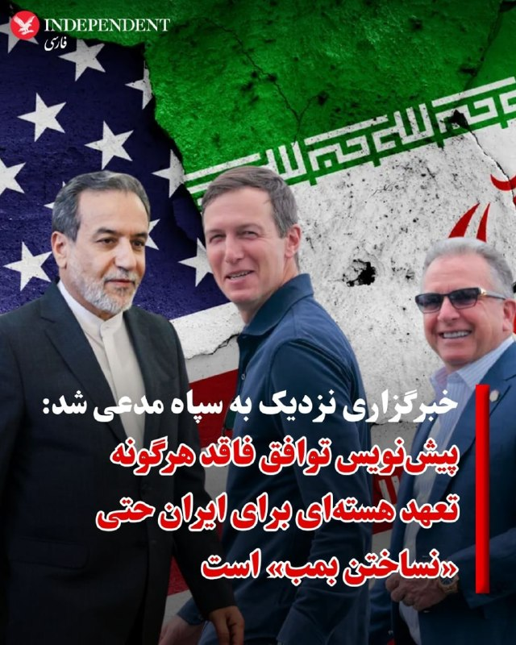

♦️خبرگزاری فارس، نزدیک به سپاه پاسداران روز یکشنبه سوم خرداد با اشاره به توافق احتمالی میان جمهوری اسلامی و آمریکا، نوشت: در پیش‌نویس توافق احتمالی ایران و آمریکا هیچ بندی درباره «تعهدات هسته‌ای ایران گنجانده نشده و تمام مسائل مرتبط با برنامه هسته‌ای به مذاکرات ۶۰ روزه پس‌از امضای توافق موکول شده است.»

فارس در ادامه تاکید کرده است که «ایران در این توافق هیچ تعهدی برای واگذاری ذخایر هسته‌ای، خروج تجهیزات، تعطیلی تأسیسات یا حتی تعهد به نساختن بمب هسته‌ای وجود ندارد.»

این در حالیست که نیویورک تایمز به نقل از دو مقام آمریکایی گزارش داد، یکی از عناصر کلیدی توافق پیشنهادی میان واشنگتن و تهران، تعهد آشکار ایران به واگذاری ذخایر اورانیوم با غنی‌سازی بالای خود است.
‌🇸🇦 Indypersian

🤖 @VahidOOnLine

## VahidOOnLine — post 241892

  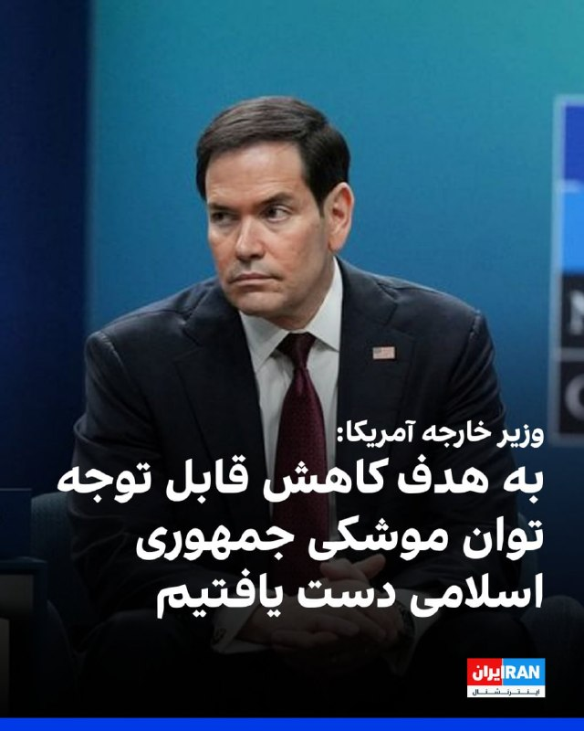

مارکو روبیو، وزیر خارجه آمریکا در نشست خبری با وزیر خارجه هند گفت: «ممکن است طی ساعات آینده خبرهای خوبی، دست‌کم درباره تنگه هرمز منتشر شود.» وزیر خارجه آمریکا گفت که این کشور به هدف خود برای کاهش قابل توجه توان موشکی جمهوری اسلامی دست یافته است.

او افزود: «طی ۴۸ ساعت گذشته با همکاری شرکای خود در منطقه روی چارچوبی کار کرده‌ایم که در صورت موفقیت، نه تنها به باز ماندن کامل تنگه هرمز بدون عوارض منجر می‌شود بلکه به برخی مسائل اساسی مرتبط با جاه‌طلبی‌های هسته‌ای جمهوری اسلامی نیز خواهد پرداخت.»
iranintl
‌🏁 🇬🇧 IranintlTV

🤖 @VahidOOnLine

## VahidOOnLine — post 241891

  <a href="telegram/content/VahidOOnLine_241891_1779610238.mp4" target="_blank">🎬 Download video</a>

گزارشگرمنوتو: در سالگرد فاجعه متروپل آبادان، جمعی از ایرانیان مقابل کنسولگری جمهوری اسلامی در هامبورگ تجمع کردند.

این تجمع با حضور اعضای حزب پادشاهی‌خواه میهن‌پرستان ایران و شماری از نزدیکان جان‌باختگان متروپل برگزار شد. شرکت‌کنندگان جمهوری اسلامی را به ناکارآمدی، فساد و بی‌توجهی به جان شهروندان متهم کردند.

ساختمان متروپل آبادان در ۲۳ مه ۲۰۲۲ فرو ریخت؛ فاجعه‌ای که جان ده‌ها نفر را گرفت و به نمادی از بی‌مسئولیتی و فساد ساختاری در جمهوری اسلامی تبدیل شد.
‌🏁 🇬🇧 ManotoTV

🤖 @VahidOOnLine

## VahidOOnLine — post 241890

  

تد کروز، سناتور جمهوری‌خواه آمریکا، در پستی در شبکه اجتماعی ایکس از گزارش‌ها درباره احتمال توافق با جمهوری اسلامی ابراز نگرانی کرد.

او با دفاع از تصمیم دونالد ترامپ برای حمله به ایران، مدعی شد این اقدام به «نتایج نظامی فوق‌العاده» منجر شده و گفت اگر نتیجه نهایی، ادامه حاکمیت جمهوری اسلامی، دریافت میلیاردها دلار، امکان غنی‌سازی اورانیوم و کنترل مؤثر بر تنگه هرمز باشد، چنین توافقی «اشتباهی فاجعه‌بار» خواهد بود.

کروز همچنین نوشت جزئیات هنوز در حال روشن شدن است، اما حمایت برخی چهره‌های دولت بایدن از این توافق را «نگران‌کننده» دانست و از ترامپ خواست بر خطوط قرمز خود پافشاری کند.
‌🏁 🇬🇧 ManotoTV

🤖 @VahidOOnLine

## VahidOOnLine — post 241889

  

قوه قضائیه جمهوری اسلامی اعلام کرد مجتبی کیان، زندانی متهم به ارسال اطلاعات مربوط به مراکز تولید صنایع دفاعی، بامداد امروز اعدام شده است.

رسانه‌های وابسته به قوه قضائیه مدعی شده‌اند او در جریان آنچه مقام‌های جمهوری اسلامی «جنگ رمضان» می‌نامند، اطلاعات و مختصات واحدهای مرتبط با صنایع دفاعی را برای شبکه‌های وابسته به آمریکا و اسرائیل ارسال کرده بود.

این ادعاها به‌طور مستقل قابل راستی‌آزمایی نیست و قوه قضائیه جمهوری اسلامی تاکنون جزئیات شفافی از روند بازداشت، دسترسی متهم به وکیل مستقل، نحوه محاکمه و زمان دقیق رسیدگی منتشر نکرده است.

اجرای این حکم در حالی اعلام شده که جمهوری اسلامی در سال‌های اخیر بارها از پرونده‌های امنیتی و اتهام‌های مرتبط با «جاسوسی» برای صدور و اجرای احکام سنگین، از جمله اعدام، استفاده کرده است.
‌🏁 🇬🇧 ManotoTV

🤖 @VahidOOnLine

## VahidOOnLine — post 241888

  

حسن عبدلیان‌پور، رییس مرکز وکلای قوه قضاییه گفت که بزرگ‌ترین خسارت معنوی وارده به ما، کشته شدن «ناجوانمردانه رهبر شهید» در محل کارش به دست آمریکا و اسرائیل است و ما به «خونخواهی امام شهید»، قصد داریم از ۹۰ میلیون مردم ایران برای اقامه دعوی وکالت اخذ کنیم.

او افزود: «در این مسیر کوتاه نمی‌آییم و جنایتکاران را رها نمی‌کنیم و نمی‌گذاریم خون شهدا پایمال شود.»
iranintl
‌🏁 🇬🇧 IranintlTV

🤖 @VahidOOnLine

## VahidOOnLine — post 241887

  <a href="telegram/content/VahidOOnLine_241887_1779610242.mp4" target="_blank">🎬 Download video</a>

ویدیوی رسیده به ایران اینترنشنال نشان می‌دهد روز شنبه دوم خرداد تعدادی از دانش‌آموزان مدارس در خرم‌آباد برای اعتراض به شیوه امتحانات خود و اظهارات مسئولان برای حضوری کردن امتحانات، مقابل ساختمان آموزش و پرورش تجمع کردند. آن‌ها شعار «مجازی مجازی»‌ سر داده و خواستار غیرحضوری شدن امتحانات شدند.
‌🏁 🇬🇧 IranintlTV

🤖 @VahidOOnLine

## VahidOOnLine — post 241886

  

مارکو روبیو، وزیر خارجه آمریکا در نشست خبری با وزیر خارجه هند گفت که آزادی ناوبری و کشتیرانی باید تضمین شود و تنگه هرمز یک آبراه بین‌المللی است و جمهوری اسلامی مالک آن نیست.

روبیو گفت که در مذاکرات با جمهوری اسلامی پیشرفت قابل توجهی حاصل شده اما پیشرفت نهایی حاصل نشده است.
iranintl
‌🏁 🇬🇧 IranintlTV

🤖 @VahidOOnLine

## VahidOOnLine — post 241885

  <a href="telegram/content/VahidOOnLine_241885_1779610244.mp4" target="_blank">🎬 Download video</a>

بر اساس ویدیوهای ارسال‌شده به ایران‌اینترنشنال گروهی از ایرانیان مقیم هلیفکس در کانادا، علیه جمهوری اسلامی تجمع برگزار کردند.
‌🏁 🇬🇧 IranintlTV

🤖 @VahidOOnLine

## VahidOOnLine — post 241884

  

مسعود پزشکیان در نشستی با مدیران سازمان صداوسیما گفت: «هیچ تصمیمی خارج از چارچوب شورای‌عالی امنیت ملی و بدون هماهنگی و اذن رهبری اتخاذ نخواهد شد.»

او افزود: «هنگامی که تصمیمی در حوزه دیپلماسی اتخاذ می‌شود، همه دستگاه‌ها، تریبون‌ها و جریان‌ها باید از آن حمایت کنند.»

او ادامه داد: «همواره تلاش کرده‌ام سخنی بر خلاف نظر رهبری بیان نشود و یا موضعی اتخاذ نگردد که به اختلاف میان ارکان حاکمیت دامن بزند و دشمن از آن سوءاستفاده کند.»
‌🏁 🇬🇧 IranintlTV

🤖 @VahidOOnLine

## VahidOOnLine — post 241883

  <a href="telegram/content/VahidOOnLine_241883_1779610248.mp4" target="_blank">🎬 Download video</a>

ویدیوهای رسیده به ایران‌اینترنشنال نشان می‌دهند گروهی از ایرانیان مقیم هلند شنبه دوم خرداد علیه جمهوری اسلامی در خیابان‌های شهر لاهه راهپیمایی کردند و شعار «مرگ بر سه فاسد، ملا چپی مجاهد» سردادند.
‌🏁 🇬🇧 IranintlTV

🤖 @VahidOOnLine

## VahidOOnLine — post 241882

♦️خبرگزاری فرانسه گزارش داد، ده‌ها نفر در انفجاری که قطاری را در جنوب غربی پاکستان هدف قرار داد، کشته و زخمی شدند.

بنا بر گزارش‌ها روز یکشنبه سوم خرداد انفجاری شدید در نزدیکی یک مرکز امنیتی مشرف به ایستگاه قطار در شهر کویته پاکستان رخ داد.

منابع بیمارستانی گفتند که هشت پیکر از محل حادثه انتقال داده شده و ۳۰ نفر دیگر نیز زخمی هستند.

بابر یوسف‌زی، سخنگوی وزیر کشور، گفت که پس از انفجار در شهر، تمام نهادهای مربوطه در حالت آماده‌باش کامل قرار گرفته‌اند.

او از مردم خواست که برای اطمینان از ایمنی در نزدیکی محل انفجار تجمع نکنند و به تیم‌های امداد و نجات اجازه دهند تا عملیات نجات را بدون مانع انجام دهند.

تاکنون هیچ گروهی مسئولیت انفجار صبح روز یکشنبه در شهر کویته پاکستان را برعهده نگرفته است‌.
‌🇸🇦 Indypersian

🤖 @VahidOOnLine

## VahidOOnLine — post 241881

  <a href="telegram/content/VahidOOnLine_241881_1779610250.mp4" target="_blank">🎬 Download video</a>

بر اساس ویدیوهای رسیده به ایران‌اینترنشنال، ایرانیان مقیم بریتانیا شنبه دوم خرداد علیه جمهوری اسلامی در لندن تجمع کرده و فریاد زدند: «سپاه تروریست است»
‌🏁 🇬🇧 IranintlTV

🤖 @VahidOOnLine

## VahidOOnLine — post 241880

  

♦️مقام‌های جمهوری اسلامی به مناسبت سوم خرداد، سالروز آزادسازی خرمشهر، پیام‌ها و اظهاراتی منتشر کردند و از این روز به عنوان نماد «مقاومت» و «ایستادگی» یاد کردند.
مسعود پزشکیان، رئیس‌جمهوری اسلامی در شبکه اجتماعی اکس نوشت: «خرمشهر امروز ایران، خلیج فارس و تنگه هرمز است.» او افزود: «ملت ما امروز هم چونان مردم رزم‌ندیده اما دلیر خرمشهرند که روزها در مقابل ارتش متجاوز ایستادند تا قدرت مردم ایران را به رخ جهانیان بکشند. مقاومت، ایثار و دفع تجاوز ریشه در فرهنگ این سرزمین دارد.»
همزمان محمدباقر قالیباف، رئیس مجلس شورای اسلامی، در پیامی به مناسبت سالروز آزادسازی خرمشهر گفت: «هیچ دژخیمی را یارای ایستادن مقابل سربازان عاشق و مومن ایران نیست.»
او در بخشی از پیام خود، سوم خرداد را «طلوع فجر رشادت مجاهدانی» توصیف کرد که «خرمشهر عزیز را از حلقوم جنایتکاری چون صدام و رژیم بعث بیرون کشیدند».
خرمشهر پس از آغاز جنگ ایران و عراق در مهر ۱۳۵۹ به اشغال ارتش عراق درآمد و پس از حدود ۱۹ ماه، در سوم خرداد ۱۳۶۱ و در جریان عملیات «بیت‌المقدس» توسط نیروهای ایرانی بازپس گرفته شد.
‌🇸🇦 Indypersian

🤖 @VahidOOnLine

## VahidOOnLine — post 241879

  

نیروی دریایی بریتانیا اعلام کرده صدها ملوان این کشور در جبل‌الطارق آماده‌اند تا در صورت دستیابی آمریکا و جمهوری اسلامی به توافق صلح، برای پاکسازی احتمالی مین‌ها در تنگه هرمز اعزام شوند.

بر اساس گزارش آسوشیتدپرس، کشتی پشتیبانی آراف‌ای لایم بِی متعلق به نیروی دریایی سلطنتی بریتانیا در جبل‌الطارق مستقر است و با مهمات و پهپادهای دریایی مین‌یاب مجهز به سونار آماده عملیات احتمالی شده است. این مأموریت قرار است با همکاری بریتانیا و فرانسه انجام شود.

اولویت نخست این عملیات، در صورت اجرا، پاکسازی یک مسیر عبور در تنگه هرمز برای خروج حدود ۷۰۰ کشتی عنوان شده است. پس از آن، مسیر مقابل برای ورود کشتی‌ها پاکسازی خواهد شد؛ هرچند مقام‌ها گفته‌اند پاکسازی کامل تنگه ممکن است ماه‌ها یا حتی سال‌ها زمان ببرد.
‌🏁 🇬🇧 ManotoTV

🤖 @VahidOOnLine

## VahidOOnLine — post 241878

  

محمد اسحاق دار، وزیر خارجه پاکستان، اعلام کرد در تماس تلفنی با دونالد ترامپ درباره مذاکرات میان آمریکا و جمهوری اسلامی گفت‌وگو کرده است.

او این گفت‌وگوی «مهم» را «گامی قابل‌توجه به سوی صلح منطقه‌ای» توصیف کرد و گفت دستاوردهای مذاکرات اخیر، زمینه خوش‌بینی نسبت به یک نتیجه مثبت و پایدار را فراهم کرده است.

پاکستان در روزهای اخیر نقش میانجی کلیدی میان آمریکا و جمهوری اسلامی را برعهده داشته است. اسحاق دار همچنین از «رهبری» ترامپ و «تعهد او به گفت‌وگو و دیپلماسی» تقدیر کرد.
‌🏁 🇬🇧 ManotoTV

🤖 @VahidOOnLine

## VahidOOnLine — post 241877

  

سرویس مخفی آمریکا در بیانیه‌ای اعلام کرد فردی مسلح عصر شنبه در نزدیکی خیابان ۱۷ و پنسیلوانیا، در محدوده کاخ سفید، پس از بیرون آوردن سلاح از کیف خود به سمت ماموران تیراندازی کرد.

ماموران سرویس مخفی در پاسخ به او شلیک کردند و مظنون پس از انتقال به بیمارستان جان باخت. در جریان این تیراندازی، یک رهگذر نیز هدف گلوله قرار گرفت. سرویس مخفی گفته هنوز مشخص نیست این فرد با شلیک مظنون زخمی شده یا در تبادل آتش میان او و ماموران.

بر اساس تصاویر منتشرشده از سلینا وانگ، خبرنگار ای‌بی‌سی نیوز، هم‌زمان با شنیده‌شدن صدای تیراندازی در نزدیکی کاخ سفید، خبرنگاران حاضر در محوطه به سمت اتاق نشست خبری منتقل شدند.

سرویس مخفی اعلام کرد هیچ‌یک از نیروهایش در این حادثه آسیب ندیده‌اند. دونالد ترامپ هنگام وقوع تیراندازی در کاخ سفید حضور داشت، اما این حادثه تاثیری بر او یا عملیات حفاظتی نداشته است. تحقیقات درباره این تیراندازی ادامه دارد. جزئیات اصلی با گزارش رویترز و آسوشیتدپرس هم‌خوانی دارد
‌🏁 🇬🇧 ManotoTV

🤖 @VahidOOnLine

## VahidOOnLine — post 241876

  <a href="telegram/content/VahidOOnLine_241876_1779610255.mp4" target="_blank">🎬 Download video</a>

تصاویر منتشرشده از سلینا وانگ، خبرنگار ای‌بی‌سی نیوز، لحظه‌ای را نشان می‌دهد که هم‌زمان با شنیده‌شدن صدای تیراندازی در نزدیکی کاخ سفید، خبرنگاران حاضر در محوطه به سمت اتاق نشست خبری منتقل شدند.

سرویس مخفی آمریکا اعلام کرد یک مرد مسلح در نزدیکی ایست بازرسی خیابان ۱۷ و پنسیلوانیا به سوی ماموران شلیک کرد. ماموران نیز در پاسخ تیراندازی کردند و مظنون که به بیمارستان منتقل شده بود، بعداً جان باخت.

در جریان این تیراندازی یک رهگذر نیز زخمی شد. هنوز مشخص نیست این فرد با شلیک مظنون زخمی شده یا در جریان تبادل آتش. دونالد ترامپ هنگام وقوع حادثه در کاخ سفید بود، اما آسیبی ندید.
‌🏁 🇬🇧 ManotoTV

🤖 @VahidOOnLine

## WithYashar — post 12298

  

B2 رسید
@withyashar

## WithYashar — post 12297

## WithYashar — post 12296

## WithYashar — post 12295

انتقاد تند تد کروز، سناتور مطرح جمهوری‌خواه از اخبار توافق آمریکا و ایران :

به‌شدت نگران چیزهایی هستم که درباره توافق احتمالی با ایران می‌شنویم؛ توافقی که بعضی صداها داخل دولت آمریکا دارن برایش فشار میارن.
تصمیم ترامپ برای حمله به ایران، مهم‌ترین تصمیم دوره دوم ریاست‌جمهوریش بود. او کار درستی انجام داد و ما به نتایج نظامی فوق‌العاده‌ای رسیدیم؛ از جمله نابودی تمام موشک‌ها و پهپادهای ایران و غرق کردن کل نیروی دریایی‌شان.
اگر نتیجه همه این‌ها این باشد که حکومت ایران — که هنوز توسط اسلام‌گراهایی اداره می‌شود که شعار «مرگ بر آمریکا» می‌دهند — حالا میلیاردها دلار دریافت کند، بتواند اورانیوم غنی‌سازی کند و سلاح هسته‌ای توسعه دهد و کنترل مؤثری روی تنگه هرمز داشته باشد، آن وقت این یک اشتباه فاجعه‌بار خواهد بود.
جزئیات هنوز کامل منتشر نشده و امیدوارم گزارش‌های اولیه اشتباه باشند؛ اما اینکه راب مالیِ دولت بایدن از این توافق تعریف کرده، اصلاً امیدوارکننده نیست.
ترامپ به «صلح از طریق قدرت» اعتقاد دارد و رهبری قدرتمند او همین حالا آمریکا را امن‌تر کرده. او باید همچنان محکم بایستد، از آمریکا دفاع کند و خطوط قرمزی را که بارها اعلام کرده، اجرا کند.
@withyashar

## WithYashar — post 12294

دلم میخواد یه ویس بی‌پروا بدم ولی افسوس ….

## WithYashar — post 12293

خامنه ای کپک زد
ترامپ به ما کلک زد🤣
@withyashar

## WithYashar — post 12292

کانال 12 اسرائیل به نقل از یک مقام ارشد اسرائیلی:

توافق احتمالی اصلاً خوب نیست؛ چون به ایرانی‌ها این پیام رو میده که سلاحشون به اندازه بمب هسته‌ای خطرناکه و اونم تنگه هرمزه؛ ترامپ هم فکر میکنه این توافق فقط اقتصادی هست و شامل باز شدن متقابل تنگه هرمز میشه، ولی هر قدمی برای حل مسئله هسته‌ای وابسته به خروج اورانیوم ها هست. و اصلا معلوم نیست بعد از مرحله اول اصلاً چی پیش میاد.
@withyashar

## WithYashar — post 12291

وزیر امور خارجه آمریکا :
«ترامپ اجازه نمیده ایران به سلاح هسته ای دسترسی پیدا کنه احتمالاً جهان در ساعات آینده، به ویژه در مورد تنگه هرمز، اخبار خوبی خواهد شنید»
@withyashar

## WithYashar — post 12290

تسنیم : پیش‌نویس توافق با واشنگتن تصریح می‌کند که وضعیت حاکمیتی تنگه هرمز به شرایط قبل از جنگ برنمی‌گردد و تنها تعداد کشتی‌های عبوری ظرف ۳۰ روز، همزمان با لغو کامل محاصره دریایی و اجرای تعهدات ایالات متحده، به حالت عادی باز می‌گردند. تهران بر حفظ حق حاکمیتی خود بر این تنگه اصرار دارد.
@withyashar

## WithYashar — post 12289

وزیر امور خارجه آمریکا :
«هیچ کشوری نباید از گذرگاه‌های دریایی یا حریم هوایی سوءاستفاده کند و آزادی کشتیرانی باید تضمین شود»
@withyashar

## WithYashar — post 12288

کانال 14 اسرائیل : ایران تنگه رو بدون هیچ عوارضی باز می‌کنه و آمریکا هم هیچ پولی نمی‌ده و تحریمی رو برنمیداره فقط اجازه میده به ایران بتونه یکم نفت بفروشه ، احتمالأ اسرائیل هم حملاتش به لبنان رو قطع میکنه ، خلاصه اگه پذیرفته بشه یه آتش بس 30 الی 60 روزس که برای مذاکره داده شده بدون هیچ امتیازی اجازه نفس کشیدن میده به جهان
@withyashar

## WithYashar — post 12287

اکسیوس؛شرایط پیشنهادی تفاهم‌نامه آمریکا و ایران:
🚨🚨🚨🚨🚨🚨🚨
آتش‌بس ۶۰ روزه بین دو طرف.
بازگشایی تنگه هرمز بدون عوارض.
پاکسازی مین‌های دریایی در تنگه توسط ایران.
رفع محاصره بنادر ایران توسط آمریکا.
معافیت‌های تحریمی که به ایران اجازه صادرات نفت رو میده.
تعهد ایران به مذاکرات درباره تعلیق غنی‌سازی اورانیوم.
مذاکره ایران درباره حذف ذخایر اورانیوم بسیار غنی‌شده.
مذاکره آمریکا درباره رفع تحریم‌ها و آزادسازی دارایی‌های ایران در دوره ۶۰ روزه.
باقی‌موندن نیروهای آمریکایی در منطقه طول مذاکرات.
پایان گزارش‌شده جنگ اسرائیل و حزب‌الله در چارچوب این توافق.
@withyashar

## WithYashar — post 12286

کابینه جنگ اسرائیل امشب تشکیل خواهد داد
@withyashar

## WithYashar — post 12285

  

عکس فرد مهاجم ۲۱ ساله در نزدیکی کاخ‌سفید

@withyashar

## WithYashar — post 12284

احتمال از سرگیری روابط دیپلماتیک ایران و آمریکا

آکسیوس به نقل از مشاوران ترامپ:
رئیس جمهور آماده است در صورت برآورده شدن خواسته‌هایش در مورد برنامه هسته‌ای، روابط با ایران را از سر بگیرد.
@withyashar

## WithYashar — post 12283

  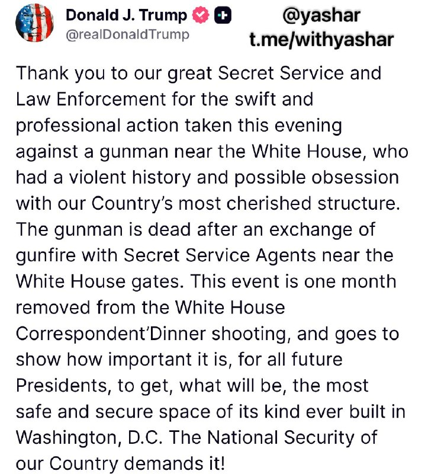

ترامپ در تروث : از سرویس مخفی و نیروی انتظامی عالی‌مون به خاطر اقدام سریع و حرفه‌ای که امشب علیه یک فرد مسلح در نزدیکی کاخ سفید، که سابقه خشونت‌آمیز و احتمالاً وسواس فکری نسبت به گرامی‌ترین بنای کشورمون داشت، انجام شد، سپاسگزاریم.
فرد مسلح بعد از درگیری با مأموران سرویس مخفی در نزدیکی دروازه‌های کاخ سفید کشته شد.
این اتفاق یک ماه بعد از تیراندازی در ضیافت شام خبرنگاران کاخ سفید رخ داد
برای همه روسای جمهور آینده مهمه که امن‌ترین و مطمئن‌ترین فضایی رو که تاالان در واشنگتن دی سی ساخته شده، داشته باشن.
@withyashar

## WithYashar — post 12282

  <a href="telegram/content/WithYashar_12282_1779610260.webm" target="_blank">🎬 Download video</a>

🎬 Video

## WithYashar — post 12281

تیرانداز به هلاکت رسید و فرد حاضر زنده و هوشیار است. هر دو به بیمارستان منتقل شده‌اند.
@withyashar

## WithYashar — post 12280

  

سرویس مخفی پس از شروع تیراندازی در سمت غرب کاخ سفید به یک مظنون مسلح شلیک کرد، به گزارش فاکس نیوز.

یک عابر پیاده در این حادثه زخمی شد و تأیید شده است که رئیس‌جمهور ترامپ در امنیت است.
@withyashar

## WithYashar — post 12279

بی‌بی‌اس نیوز گزارش داد: در تیراندازی نزدیک کاخ سفید دو نفر زخمی شدند که یکی از آن‌ها مظنون است.
@withyashar

## mwarmonitor — post 9616

🔴در حالی که ترافیک دریایی در دوره 30 روزه اختصاص داده شده برای مذاکرات هسته‌ای تسهیل خواهد شد، سوال اساسی همچنان باقی است: آیا ایالات متحده این ترتیبات موقت را خواهد پذیرفت یا بر بازگشایی کامل و بدون قید و شرط تنگه قبل از امضای هرگونه توافقی اصرار خواهد ورزید؟…

## mwarmonitor — post 9615

🔴توافقی ایرانی-آمریکایی در حال شکل‌گیری است: پیچیده‌ترین اختلافات همچنان حل‌نشده باقی مانده‌اند. 🔸نویسنده: علی هاشم خبرنگار الجزیره به گفته چندین منبع منطقه‌ای آشنا با مذاکرات، طرف‌های درگیر در مذاکرات در حال بررسی پیش‌نویس چارچوبی برای یک توافق جامع احتمالی…

## mwarmonitor — post 9614

🔴توافقی ایرانی-آمریکایی در حال شکل‌گیری است: پیچیده‌ترین اختلافات همچنان حل‌نشده باقی مانده‌اند.

🔸نویسنده: علی هاشم خبرنگار الجزیره

به گفته چندین منبع منطقه‌ای آشنا با مذاکرات، طرف‌های درگیر در مذاکرات در حال بررسی پیش‌نویس چارچوبی برای یک توافق جامع احتمالی بین ایران و ایالات متحده هستند. اگر توافق نهایی حاصل شود، این مهمترین گام دیپلماتیک از زمان آتش‌بس با میانجیگری پاکستان خواهد بود که به جنگی تقریباً شش هفته‌ای پایان داد. این جنگ در 28 فوریه با ترور آیت‌الله علی خامنه‌ای، رهبر وقت ایران، در یک حمله هماهنگ علیه مقامات ارشد و زیرساخت‌های حیاتی در داخل ایران آغاز شد.

این جنگ، منطقه را به شیوه‌ای که هیچ‌کس کاملاً پیش‌بینی نکرده بود، تغییر شکل داد. این جنگ حزب‌الله را ظرف چند روز به نبرد مستقیم کشاند و منجر به بسته شدن تنگه هرمز، گلوگاه دریایی که یک پنجم نفت دریایی جهان از آن عبور می‌کند، شد. همچنین باعث یک دور مذاکرات مستقیم بین ایران و ایالات متحده در اسلام‌آباد شد که بدون نتیجه پایان یافت و همزمان یک مسیر مذاکره جداگانه، هرچند شکننده، بین لبنان و اسرائیل را گشود. امروز، با وجود آتش‌بس برقرار شده اما فاقد یک چارچوب روشن و رسمی، به نظر می‌رسد طرفین در تلاشند تا به سمت یک توافق پایدارتر حرکت کنند.

به گفته منابع عرب و ایرانی که با الجدا صحبت کردند، پیش‌نویس توافق شامل توقف خصومت‌ها در تمام جبهه‌ها، از جمله لبنان، آزادسازی میلیاردها دلار از دارایی‌های مسدود شده ایران، لغو محاصره دریایی ایالات متحده و خروج نیروهای آمریکایی از مناطق نزدیک ایران است. در مرحله بعد، طرفین یک دوره 30 روزه برای رسیدن به تفاهم در مورد مسئله هسته‌ای به خود اختصاص می‌دهند و امکان تمدید مذاکرات با توافق متقابل نیز وجود دارد.

دو ضمیمه و یک توافقنامه

ساختار توافق پیشنهادی پیچیده‌تر از یک یادداشت تفاهم واحد است. به گفته یک منبع آگاه از ساختار این توافق، آنچه دونالد ترامپ، رئیس جمهور آمریکا، علناً به آن اشاره کرد، در واقع مربوط به دو ضمیمه جداگانه است که به یادداشت اصلی پیوست خواهند شد، در حالی که مذاکرات در مورد جزئیات آنها هنوز ادامه دارد.

مهم‌ترین نکته در اینجا مسئله زمان‌بندی است. به نظر می‌رسد مفاد مالی و امنیتی به گونه‌ای طراحی شده‌اند که منافع متقابل ملموسی ایجاد کنند که هر دو طرف را وادار می‌کند با چیزی برای از دست دادن وارد مذاکرات هسته‌ای شوند: کاهش تحریم‌ها، کاهش تنش نظامی و بازگشایی تنگه هرمز.

یکی از این پیوست‌ها مربوط به دارایی‌های مسدود شده ایران در خارج از کشور به دلیل تحریم‌های ایالات متحده است. به گفته یک منبع منطقه‌ای سطح بالا، تقریباً ۵۰٪ از این وجوه، یا حدود ۱۲ میلیارد دلار، در حال حاضر در قطر، عراق و ترکیه نگهداری می‌شود. این منبع توضیح داد که قطر «نقش محوری» در پیشبرد این روند مذاکره ایفا کرده است.

در این زمینه، تهران تصمیم گرفت با امضای تفاهم‌نامه جداگانه‌ای با دوحه، به‌ویژه در مورد این وجوه، این نقش را رسمیت بخشد. در سطح وسیع‌تر توافق، نقش قطر دیگر صرفاً میانجی نیست، بلکه به یک جزء ساختاری در روند مذاکرات تبدیل شده است.

هرمز، قلب جنگ

از همان لحظه اول جنگ، تنگه هرمز به نقطه کانونی درگیری ایران، اسرائیل و آمریکا تبدیل شد. ایران عملاً ظرف چند ساعت پس از حملات ۲۸ فوریه، تنگه را بست و اعلام کرد که هیچ کشتی خارجی بدون اجازه ایران اجازه عبور نخواهد داشت. سپاه پاسداران از طریق ارتباطات دریایی هشدارهای مستقیمی را پخش کرد، در حالی که صدها نفتکش در دریا سرگردان بودند و قیمت جهانی نفت به شدت افزایش یافت.

واشنگتن با یک عملیات هوایی که از ۱۹ مارس کشتی‌ها و تأسیسات دریایی ایران را هدف قرار داد، پاسخ داد. پس از شکست مذاکرات در اسلام‌آباد، به رهبری جی. دی. ونس، معاون رئیس‌جمهور آمریکا، و محمد باقر قالیباف، رئیس مجلس ایران، در ماه آوریل، ایالات متحده محاصره دریایی کاملی را بر کشتی‌هایی که به بنادر ایران وارد یا از آنها خارج می‌شدند، اعمال کرد.

بر اساس آتش‌بس اعلام‌شده با میانجیگری پاکستان در ۸ آوریل، ایران به‌طور موقت به برخی کشتی‌ها اجازه عبور داد، اما محاصره آمریکا به‌طور کامل برداشته نشد و ایران دیگر تنگه هرمز را به‌طور کامل باز نکرد. هر طرف، دیگری را به نقض آتش‌بس متهم می‌کرد و ترافیک دریایی بسیار پایین‌تر از سطح قبل از جنگ باقی ماند.

تهران با توجه به مرز مشترک ایران و عمان با تنگه هرمز، پیش‌نویس توافق جدید را صرفاً موضوعی مربوط به ایران و عمان می‌داند و مذاکرات در مورد این موضوع در مسقط آغاز شده است. با این حال، هنوز مشخص نیست که آیا واشنگتن این رویکرد را خواهد پذیرفت یا خیر.

@mwarmonitor

## mwarmonitor — post 9613

🔴رویترز به نقل از یک منبع ایرانی: تهران با تحویل ذخایر اورانیوم با غنای بالا خود موافقت نکرده است.

@mwarmonitor

## mwarmonitor — post 9612

  <a href="telegram/content/mwarmonitor_9612_1779610261.mp4" target="_blank">🎬 Download video</a>

🚀این احتمالاً بهترین نمایی است که تا حالا از امواج ضربه‌ای پرواز اخیر استارشیپ دیده شده.

@mwarmonitor

## mwarmonitor — post 9611

🔸داستان واقعی پشت توافق هسته‌ایِ احتمالی، لبنان است.

🔹اگر آتش‌بس شبیه نوامبر ۲۰۲۴ باشد—جایی که اسرائیل جلوی تقویت و استقرار نیروهای حزب‌الله را می‌گیرد و آن‌ها پاسخی نمی‌دهند—این حالت ایده‌آل است؛ اما احتمال وقوعش کم است.

🔸به‌زودی اسرائیل با یک انتخاب روبه‌رو می‌شود: یا خویشتنداری شبیه ۶ اکتبر، یا یک جنگ فرسایشیِ طولانی‌مدت، یا جنگی تمام‌عیار برای از میان بردن این تهدید.« آمیت سیگال خبرنگار کانال ۱۲ اسرائیل»

@mwarmonitor

## mwarmonitor — post 9610

🚨 شبکه کان اسرائیل:
نتانیاهو درباره توافق با ‎ایران با ترامپ گفت‌وگو کرده و امشب جلسه‌ای با کابینه امنیتی کوچک برگزار خواهد کرد.

@mwarmonitor

## mwarmonitor — post 9609

🚨 آژیرهای هشدار نفوذ پهپاد در شمال اسرائیل فعال شد . i24

@mwarmonitor

## mwarmonitor — post 9608

  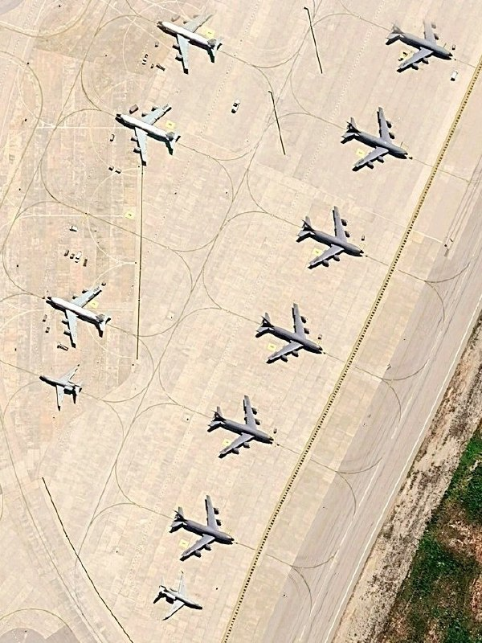

🛰تصاویر ماهواره‌ای با وضوح بالا، نمای روشنی از تجهیزات نیروی هوایی ایالات متحده مستقر در فرودگاه خانیا در جزیره کرت یونان ارائه می‌دهد که شامل موارد زیر است:

✈️۳ فروند هواپیمای شنود و اطلاعات سیگنالی RC-135W Rivet Joint

✈️۶ فروند هواپیمای سوخت‌رسان هوایی KC-135R

✈️۲ فروند هواپیمای جنگ الکترونیک EA-37B Compass Call

@mwarmonitor

## mwarmonitor — post 9607

🔴 گزارش‌هایی از شنیده شدن صدای انفجار در استان (السماوه) در جنوب عراق منتشر شده است؛ جزئیات این حادثه هنوز مشخص نیست.

@mwarmonitor

## mwarmonitor — post 9606

🔴به گزارش Fox News، فردی پس از تیراندازی در نزدیکی کاخ سفید توسط سرویس مخفی ایالات متحده هدف گلوله قرار گرفت. همچنین یک رهگذر نیز در این حادثه تیر خورده است. @mwarmonitor

## mwarmonitor — post 9605

به گفته این مقام آمریکایی، این رهبران شامل محمد بن زاید، رئیس‌جمهور امارات متحده عربی نیز می‌شد. همچنین رهبران عربستان سعودی، قطر، مصر، ترکیه و پاکستان که همگی در تلاش‌های میانجی‌گرانه نقش داشته‌اند، در این تماس حضور داشتند.
پاکستانی‌ها میانجی اصلی بوده‌اند که هدایت این تلاش‌ها بر عهده فیلد مارشال عاصم منیر بود؛ کسی که روزهای جمعه و شنبه در تهران حضور داشت تا این توافق را به سرانجام برساند.
ترامپ در روزهای اخیر میان پیشبرد توافق و یا راه‌اندازی موج گسترده‌ای از حملات علیه ایران مردد بود. تا عصر شنبه، او بیشتر به سمت یک راهکار دیپلماتیک تمایل پیدا کرده بود.
چه چیزهایی را باید زیر نظر داشت؟
این مقام آمریکایی گفت کاخ سفید امیدوار است اختلافات باقی‌مانده در ساعات آینده حل و فصل شود و توافق روز یکشنبه اعلام گردد.
این مقام اشاره کرد اگر ایالات متحده احساس کند ایران در مذاکرات هسته‌ای جدی نیست، این احتمال وجود دارد که توافق حتی تا پایان ۶۰ روز هم دوام نیاورد. از سوی دیگر، ایالات متحده معتقد است بحران اقتصادی ایران انگیزه لازم را برای رسیدن به یک توافق کامل جهت رفع تحریم‌ها و آزادسازی پول‌های بلوکه‌شده‌اش فراهم می‌کند.
این مقام آمریکایی گفت: «جالب خواهد بود که ببینیم ایران واقعاً تا کجا حاضر است پیش برود، اما اگر آن‌ها توانایی و تمایل تغییر مسیر خود را داشته باشند، این مرحله بعدی آن‌ها را مجبور می‌کند تصمیمات حیاتی درباره آینده کشورشان بگیرند.»

📌مشاوران ترامپ می‌گویند اگر خواسته‌های او در رابطه با برنامه هسته‌ای ایران برآورده شود، رئیس‌جمهور آماده است گام‌های بلندی برای بازتنظیمی (Reset) روابط با ایران بردارد و این فرصت را به آن‌ها بدهد تا از پتانسیل اقتصادی کامل خود، که ترامپ آن را «فوق‌العاده بزرگ» می‌داند، بهره‌مند شوند.

@mwarmonitor

## mwarmonitor — post 9604

🔴اختصاصی آکسیوس: جزئیات توافق با ایران که ترامپ در آستانه امضای آن است

🔰به گفته یک مقام آمریکایی، توافقی که ایالات متحده و ایران به امضای آن نزدیک شده‌اند، شامل یک تمدید ۶۰ روزه آتش‌بس است. در این مدت، تنگه هرمز بازگشایی خواهد شد، ایران اجازه خواهد داشت به طور آزادانه نفت بفروشد و مذاکراتی پیرامون محدود کردن برنامه هسته‌ای ایران انجام خواهد گرفت.

چرا این موضوع اهمیت دارد؟
این توافق مانع از تشدید جنگ شده و فشار بر عرضه جهانی نفت را کاهش می‌دهد. با این حال، هنوز مشخص نیست که آیا این تفاهم به یک توافق صلح پایدار منجر خواهد شد که خواسته‌های هسته‌ای پرزیدنت ترامپ را نیز برآورده کند یا خیر.
آخرین وضعیت (State of play)
هم ترامپ و هم میانجی‌ها اشاره کرده‌اند که این توافق ممکن است روز یکشنبه (امروز) اعلام شود؛ اگرچه هنوز نهایی نشده و همچنان احتمال دارد با شکست مواجه شود.
این مقام آمریکایی طرح دقیقی از پیش‌نویس فعلی را ارائه داد که بخش زیادی از آن توسط منابع دیگر نزدیک به گفتگوها تایید شده است.
این جزئیات هنوز از سوی طرف ایرانی تایید نشده است، هرچند تهران نیز سیگنال‌هایی مبنی بر نزدیک شدن به توافق ارسال کرده است.
مفاد توافق چیست؟
هر دو طرف یک یادداشت تفاهم (MOU) امضا خواهند کرد که مدت آن ۶۰ روز خواهد بود و با رضایت دوجانبه قابل تمدید است.
بازگشایی تنگه هرمز: در طول این دوره ۶۰ روزه، تنگه هرمز بدون هیچ‌گونه عوارضی باز خواهد بود و ایران موافقت می‌کند مین‌هایی را که در این تنگه کار گذاشته است، پاکسازی کند تا کشتی‌ها بتوانند به راحتی عبور کنند.
لغو محاصره و معافیت‌های نفتی: در مقابل، ایالات متحده محاصره بنادر ایران را لغو کرده و برخی معافیت‌های تحریمی را صادر می‌کند تا ایران بتواند آزادانه نفت بفروشد.
مقام آمریکایی اذعان کرد که این امر کمکی به اقتصاد ایران خواهد بود، اما در عین حال گفت که گشایش بزرگی نیز برای بازار جهانی نفت ایجاد خواهد کرد.
این مقام گفت هرچه ایرانی‌ها سریع‌تر مین‌ها را پاکسازی کنند و کشتیرانی از سر گرفته شود، محاصره نیز سریع‌تر لغو خواهد شد.
اصل کلیدی ترامپ در این توافق، «امتیاز در ازای عملکرد» (Relief for performance) است.
به گفته این مقام، ایران خواستار آزادسازی فوری دارایی‌های مسدود شده و لغو دائمی تحریمی‌ها بود، اما طرف آمریکایی اعلام کرد که این اتفاق تنها پس از برداشتن گام‌های ملموس رخ خواهد داد.
مسائل هسته‌ای که باید درباره آن‌ها مذاکره شود
به گفته این مقام آمریکایی، پیش‌نویس یادداشت تفاهم شامل تعهداتی از سوی ایران است مبنی بر اینکه هرگز به دنبال سلاح هسته‌ای نرود و درباره تعلیق برنامه غنی‌سازی اورانیوم و همچنین واگذاری ذخایر اورانیوم با غنی‌سازی بالای خود مذاکره کند.
طبق گفته دو منبع مطلع، ایران از طریق میانجی‌ها تعهدات شفاهی به آمریکا داده است که نشان می‌دهد تا چه حد مایل به دادن امتیاز در زمینه تعلیق غنی‌سازی و تحویل مواد هسته‌ای است.
ایالات متحده موافقت خواهد کرد که در طول این دوره ۶۰ روزه درباره لغو تحریم‌ها و آزادسازی دارایی‌های مسدود شده ایران مذاکره کند؛ هرچند این گام‌ها تنها به عنوان بخشی از توافق نهایی و پس از تایید اجرای آن محقق خواهند شد.
نیروهای آمریکایی که در ماه‌های اخیر در منطقه مستقر شده‌اند، در طول این دوره ۶۰ روزه باقی خواهند ماند و تنها در صورت دستیابی به توافق نهایی منطقه را ترک خواهند کرد.
ماجرای پشت پرده (The intrigue)
پیش‌نویس این یادداشت تفاهم همچنین به وضوح نشان می‌دهد که جنگ میان اسرائیل و حزب‌الله در لبنان پایان خواهد یافت.
یک مقام اسرائیلی گفت که بنیامین نتانیاهو، نخست‌وزیر اسرائیل، روز شنبه در تماس تلفنی با ترامپ نسبت به این شرط ابراز نگرانی کرده است. یک مقام آمریکایی نیز تایید کرد که نتانیاهو نسبت به ابعاد دیگری از این توافق ابراز نگرانی کرده، اما مواضع خود را محترمانه و با تکریم مطرح کرده است.
این مقام آمریکایی گفت که این یک «آتش‌بس یک‌طرفه» نخواهد بود و اگر حزب‌الله برای تسلیح مجدد یا تحریک به حملات تلاش کند، به اسرائیل اجازه داده می‌شود برای جلوگیری از آن اقدام کند: «اگر حزب‌الله درست رفتار کند، اسرائیل هم درست رفتار خواهد کرد.»
این مقام آمریکایی با اشاره به نام مستعار نتانیاهو گفت: «بی‌بی ملاحظات داخلی خود را دارد، اما ترامپ باید به منافع ایالات متحده و اقتصاد جهانی فکر کند.»
این توافق چگونه شکل گرفت؟
سه منبع آشنا با این گفتگوها گفتند که پرزیدنت ترامپ روز شنبه در یک تماس کنفرانسی نظر چندین رهبر عرب و مسلمان را درباره این توافق جویا شد و همگی از آن حمایت کردند.

## mwarmonitor — post 9603

📝عجب شاهکار کمدی-استراتژیکی! آقای «کله زرد» بعد از این همه خط‌ونشان و هزینه‌های نجومی روی دست مالیات‌دهندگان آمریکایی، عملاً خاورمیانه را شخم زد تا دوباره همه‌چیز را برگرداند به پله اول؛ منتها با چند صفر اضافه‌تر در حساب بانکی تهران. 🔸این بیانیه هالیوودی…

## mwarmonitor — post 9602

🔹یک مقام سرویس مخفی به CNN گفته است که این نهاد در حال بررسی گزارش‌هایی درباره تیراندازی در تقاطع خیابان ۱۷ و خیابان پنسیلوانیا در شمال‌غرب واشینگتن است؛ محلی که درست در خارج از مجموعه کاخ سفید قرار دارد. @mwarmonitor

## mwarmonitor — post 9601

  <a href="telegram/content/mwarmonitor_9601_1779610264.mp4" target="_blank">🎬 Download video</a>

📝بررسی کارنامه مذهبی که بقای خود را در گرو ترور، سرکوب و ویرانی می‌بیند، هیچ شکلی از تردید را باقی نمی‌گذارد. شیعه سانان رافضی که با بی‌رحمی تمام، اینترنت نود میلیون انسان را ماه‌ها قطع می‌کند، دستش به خون چهل و پنج هزار انسان بیگناه آلوده است و با شلیک موشک به چهار گوشه منطقه، امنیت خاورمیانه را به گروگان می‌گیرد، هرگز به کابل‌های ارتباطی جهان و ابزارهای پیوند بشریت رحم نخواهد کرد. این فرقه، نماد عینی دنائت و تهدیدی افسارگسیخته برای تمدن بشری است؛ تفکری مخرب و ذاتاً جنایت‌کار که اگر به سلاح کشتار جمعی و بمب اتم دست یابد، حتی برای نابودی خود و اطرافیانش نیز درنگ نخواهد کرد. دنیا با جانیانی روبه‌روست که منطقشان چیزی جز قطع شریان‌های حیاتی جامعه جهانی و بازگرداندن انسان‌ها به تاریکی و انزوا نیست.

@mwarmonitor

## FoxNewsTwitter — post 342178

Fox News (Twitter/X)

The White House was placed on lockdown after shots were fired near a checkpoint. President Trump was at the White House during the incident.

The suspect, identified as 21-year-old Nasire Best of Maryland, was shot by Secret Service and died on the way to GW Medical Center. One civilian bystander was injured in the shooting.

Officials said the suspect had previous encounters with Secret Service, including making threats, and also had a history of mental health issues.

No injuries were sustained by Secret Service personnel.

## FoxNewsTwitter — post 342177

  

Fox News (Twitter/X)

BREAKING: The gunman who opened fire near the White House on Saturday afternoon has been identified as 21-year-old Nasire Best of Maryland. He was shot by Secret Service agents and died on the way to the hospital.

Best allegedly had multiple prior encounters with the Secret Service and had a history of mental health issues.

Best was detained by Secret Service on June 26, 2025, for flagging down agents and making threats, and again on July 10, 2025 for entering a restricted area, FOX News has learned.

## FoxNewsTwitter — post 342176

‌Fox News (Twitter/X)

Federal officials have served subpoenas to Marxist political influencer Hasan Piker and CodePink cofounder Susan Medea Benjamin as part of a wider investigation into whether U.S. organizations and leaders violated U.S. laws and sanctions in supporting Cuba's communist regime, Fox News Digital has learned.

## FoxNewsTwitter — post 342175

  <a href="telegram/content/FoxNewsTwitter_342175_1779610267.mp4" target="_blank">🎬 Download video</a>

Fox News (Twitter/X)

NEW: The suspect in the shooting near the White House is dead, and one bystander was wounded, according to the White House. FOX News' Alex Hogan breaks down the moments leading up to the incident.

## FoxNewsTwitter — post 342174

  <a href="telegram/content/FoxNewsTwitter_342174_1779610269.mp4" target="_blank">🎬 Download video</a>

Fox News (Twitter/X)

JUST IN: FOX News' Chad Pergram reports that two people were wounded in a shooting near the White House, and that the lockdown has been lifted.

## FoxNewsTwitter — post 342173

  <a href="telegram/content/FoxNewsTwitter_342173_1779610272.mp4" target="_blank">🎬 Download video</a>

Fox News (Twitter/X)

BREAKING: FOX News' Chad Pergram reports on shots fired near the White House, says Secret Service took down shooter.

## pm_afshaa — post 91368

🔴ربیو:هیچ مسیر آبی بین‌المللی و هیچ فضای هوایی بین‌المللی نباید هرگز توسط هیچ کشوری در جهان استفاده یا ملی‌سازی شود

💧 Rainbet.com the #1 Non-KYC Crypto Casino & Sportsbook @rainbetcom

😁 @Pm_Afshaa

## pm_afshaa — post 91367

  <a href="telegram/content/pm_afshaa_91367_1779610274.webm" target="_blank">🎬 Download video</a>

🔴مارکو روبیو:
احتمالاً امروز اخبار بیشتری درباره ایران منتشر بشه؛ این احتمال وجود داره که جهان در ساعات آینده اخبار خوبی بشنوه.

💧 Rainbet.com the #1 Non-KYC Crypto Casino & Sportsbook @rainbetcom

😁 @Pm_Afshaa

## pm_afshaa — post 91366

  <a href="telegram/content/pm_afshaa_91366_1779610274.webm" target="_blank">🎬 Download video</a>

🔴روبیو، وزیر خارجه آمریکا: زمانی که درگیری با ایران آغاز شد، هدف ما از بین بردن توانایی‌های دریایی و سامانه‌های موشکی آنها بود و به اهداف عملیات دست یافتیم.

ما در 48 ساعت گذشته پیشرفت هایی در طرح کلی که ممکنه بحران تنگه هرمز رو حل کنه، داشتیم.

💧 Rainbet.com the #1 Non-KYC Crypto Casino & Sportsbook @rainbetcom

😁 @Pm_Afshaa

## pm_afshaa — post 91365

  <a href="telegram/content/pm_afshaa_91365_1779610275.webm" target="_blank">🎬 Download video</a>

🔴شرایط پیشنهادی تفاهم‌نامه آمریکا و ایران طبق گزارش آکسیوس : - آتش‌بس 60 روزه بین دو طرف. - بازگشایی تنگه هرمز بدون عوارض. - پاکسازی مین‌های دریایی در تنگه توسط ایران. - رفع محاصره بنادر ایران توسط آمریکا. - معافیت‌های تحریمی که به ایران اجازه صادرات نفت…

## pm_afshaa — post 91364

  <a href="telegram/content/pm_afshaa_91364_1779610276.webm" target="_blank">🎬 Download video</a>

🔴تسنیم: برای حل و فصل موضوع تنگه هرمز و رفع محاصره دریایی یک دوره 30 روزه تعیین میشه. مهلتی 60 روزه برای مذاکرات هسته‌ای تعیین میشه. ایران در حال حاضر با هیچ چیز در زمینه هسته‌ای موافقت نکرده.

💧 Rainbet.com the #1 Non-KYC Crypto Casino & Sportsbook @rainbetcom

😁 @Pm_Afshaa

## pm_afshaa — post 91363

  <a href="telegram/content/pm_afshaa_91363_1779610276.webm" target="_blank">🎬 Download video</a>

🔴تسنیم: پیش‌نویس توافق با واشنگتن تصریح می‌کند که وضعیت حاکمیتی تنگه هرمز به شرایط قبل از جنگ برنمی‌گردد و تنها تعداد کشتی‌های عبوری ظرف ۳۰ روز، همزمان با لغو کامل محاصره دریایی و اجرای تعهدات ایالات متحده، به حالت عادی باز می‌گردند. تهران بر حفظ حق حاکمیتی خود بر این تنگه اصرار داره.

💧 Rainbet.com the #1 Non-KYC Crypto Casino & Sportsbook @rainbetcom

😁 @Pm_Afshaa

## pm_afshaa — post 91362

  <a href="telegram/content/pm_afshaa_91362_1779610277.webm" target="_blank">🎬 Download video</a>

🔴کانال 12 اسرائیل به نقل از یک مقام ارشد اسرائیلی:

توافق احتمالی اصلاً خوب نیست؛ چون به ایرانی‌ها این پیام رو میده که سلاحشون به اندازه بمب هسته‌ای خطرناکه و اونم تنگه هرمزه؛ ترامپ هم فکر میکنه این توافق فقط اقتصادی هست و شامل باز شدن متقابل تنگه هرمز میشه، ولی هر قدمی برای حل مسئله هسته‌ای وابسته به خروج اورانیوم‌ها هست و اصلا معلوم نیست بعد از مرحله اول اصلاً چی پیش میاد.

💧 Rainbet.com the #1 Non-KYC Crypto Casino & Sportsbook @rainbetcom

😁 @Pm_Afshaa

## pm_afshaa — post 91361

  <a href="telegram/content/pm_afshaa_91361_1779610278.webm" target="_blank">🎬 Download video</a>

🔴شرایط پیشنهادی تفاهم‌نامه آمریکا و ایران طبق گزارش آکسیوس :

- آتش‌بس 60 روزه بین دو طرف.
- بازگشایی تنگه هرمز بدون عوارض.
- پاکسازی مین‌های دریایی در تنگه توسط ایران.
- رفع محاصره بنادر ایران توسط آمریکا.
- معافیت‌های تحریمی که به ایران اجازه صادرات نفت رو میده.
- تعهد ایران به مذاکرات درباره تعلیق غنی‌سازی اورانیوم.
- مذاکره ایران درباره حذف ذخایر اورانیوم بسیار غنی‌شده.
- مذاکره آمریکا درباره رفع تحریم‌ها و آزادسازی دارایی‌های ایران در دوره 60 روزه
- باقی‌موندن نیروهای آمریکایی در منطقه طول مذاکرات.
- پایان گزارش‌شده جنگ اسرائیل و حزب‌الله در چارچوب این توافق.

💧Rainbet.com the #1 Non-KYC Crypto Casino & Sportsbook @rainbetcom

😁 @Pm_Afshaa

## pm_afshaa — post 91360

  

مجتبی کیان امروز صبح به دلیل ارسال پیام و دادن مختصات صنایع نظامی به شبکه های ماهواره ای معاند ( ایران اینترنشنال ) توسط جمهوری اسلامی اعدام شد

💧 Rainbet.com the #1 Non-KYC Crypto Casino & Sportsbook @rainbetcom

😁 @Pm_Afshaa

## pm_afshaa — post 91359

🔴کابینه جنگ اسرائیل امشب تشکیل خواهد شد

💧 Rainbet.com the #1 Non-KYC Crypto Casino & Sportsbook @rainbetcom

😁 @Pm_Afshaa

## pm_afshaa — post 91358

عرزشیا براتون سوال نی چرا جنگنده ای که باید بیاد تو کشور حداقل نیم ساعت پرواز کنه و تو این نیم ساعت هیچ راداری هشدار نداد و رهبرتون کتلت شد

## pm_afshaa — post 91357

  

هشدار پمپئو به ترامپ:به نظر می‌رسد توافقی که با ایران در حال انجام است، به‌طور مستقیم از روی نقشه وندی شرمن-رابرت مالی-بن رودز بیرون آمده: به سپاه پاسداران پول بدهید تا یک برنامه سلاح‌های کشتار جمعی بسازد و جهان را ترور کند.
‏این اصلا ربطی به شعار «اول آمریکا» ندارد.
‏موضوع خیلی ساده است:
‏تنگه را باز کنید.
‏دسترسی ایران به پول را قطع کنید.
‏و آن‌قدر توانایی‌های ایران را هدف قرار دهید که دیگر نتواند متحدان ما در منطقه را تهدید کند خیلی دیر شده.
‏وقتشه اقدام کنن

💧 Rainbet.com the #1 Non-KYC Crypto Casino & Sportsbook @rainbetcom

😁 @Pm_Afshaa

## pm_afshaa — post 91355

🔴نیویورک تایمز: ایران موافقت کرده است که ذخیره اورانیوم غنی‌شده خود را به عنوان بخشی از توافق برای پایان دادن به جنگ واگذار کند

💧 Rainbet.com the #1 Non-KYC Crypto Casino & Sportsbook @rainbetcom

😁 @Pm_Afshaa

## pm_afshaa — post 91353

  <a href="telegram/content/pm_afshaa_91353_1779610280.webm" target="_blank">🎬 Download video</a>

🔴ان‌بی‌سی نیوز: هم‌اکنون بیرون کاخ سفید حدود 20 تا 30 تا تیر شلیک شده! سرویس مخفی آمریکا خبرنگارهایی که تو محوطه کاخ سفید بودن رو جمع کرده و برده داخل اتاق کنفرانس خبری تا ازشون محافطت کنه. 
💧 Rainbet.com the #1 Non-KYC Crypto Casino & Sportsbook @rainbetcom…

## pm_afshaa — post 91352

  <a href="telegram/content/pm_afshaa_91352_1779610281.webm" target="_blank">🎬 Download video</a>

🔴ان‌بی‌سی نیوز: هم‌اکنون بیرون کاخ سفید حدود 20 تا 30 تا تیر شلیک شده! سرویس مخفی آمریکا خبرنگارهایی که تو محوطه کاخ سفید بودن رو جمع کرده و برده داخل اتاق کنفرانس خبری تا ازشون محافطت کنه. 
💧 Rainbet.com the #1 Non-KYC Crypto Casino & Sportsbook @rainbetcom…

## pm_afshaa — post 91351

  <a href="telegram/content/pm_afshaa_91351_1779610281.webm" target="_blank">🎬 Download video</a>

🔴ان‌بی‌سی نیوز: هم‌اکنون بیرون کاخ سفید حدود 20 تا 30 تا تیر شلیک شده! سرویس مخفی آمریکا خبرنگارهایی که تو محوطه کاخ سفید بودن رو جمع کرده و برده داخل اتاق کنفرانس خبری تا ازشون محافطت کنه. 
💧 Rainbet.com the #1 Non-KYC Crypto Casino & Sportsbook @rainbetcom…

## DEJradio — post 4891

⭕️ خبرها از یک سلسله تیراندازی در اطراف کاخ سفید حکایت دارند. ویدئوی منتشر شده، سلینا وانگ، خبرنگار «ای‌بی‌سی نیوز»را در نزدیکی کاخ سفید در واشنگتن دی‌سی نشان می‌دهد. #کاخ_سفید @DEJradio

## mamlekate — post 103575

📝 نیویورک پست از طرح ترور دختر ترامپ توسط سپاه خبر داد

به گزارش نیویورک پست، ایوانکا ترامپ هدف طرح ترور منتسب به فردی آموزش‌دیده از سوی سپاه پاسداران انقلاب اسلامی بوده است. طبق گزارش، هدف از این طرح، انتقام‌گیری به خاطر کشته شدن قاسم سلیمانی بوده است.

@mamlekate

## mamlekate — post 103574

  <a href="telegram/content/mamlekate_103574_1779610282.mp4" target="_blank">🎬 Download video</a>

📝 گزارش‌ها از تیراندازی در نزدیکی کاخ سفید

رسانه‌های آمریکایی از گزارش‌های مربوط به تیراندازی احتمالی در عصر شنبه در نزدیکی چمن شمالی کاخ سفید خبر دادند.

⚡️ ماموران امنیتی و خبرنگاران در خیابان ۱۸ام و پنسیلوانیا (شمال غربی) در واشنگتن دی‌سی، در پی تیراندازی شنبه عصر در نزدیکی کاخ سفید، در منطقه حضور دارند. فرد مظنون در این تیراندازی کشته شد.

farsivoa
@mamlekate

## mamlekate — post 103573

📝 دونالد ترامپ می‌گوید جزئیات یک «یادداشت تفاهم صلح» با جمهوری اسلامی به زودی اعلام می‌شود

دونالد ترامپ، رئيس‌جمهوری آمریکا، شنبه‌ عصر گفت با شماری از رهبران منطقه از جمله مقامات عربستان، قطر، امارات درباره یک یادداشت تفاهم مربوط به صلح ایران صحبت کرده است.

@mamlekate

## VahidOnline — post 75672

  

آکسیوس: جزئیات توافقی که ترامپ در آستانه امضای آن با ایران است

ترجمه ماشین:
توافقی که آمریکا و ایران در آستانه امضای آن هستند، شامل تمدید ۶۰ روزه آتش‌بس است؛ دوره‌ای که طی آن تنگه هرمز دوباره باز خواهد شد، ایران می‌تواند نفت خود را آزادانه بفروشد و مذاکراتی برای محدود کردن برنامه هسته‌ای ایران برگزار خواهد شد؛ این را یک مقام آمریکایی گفته است.

🔻چرا مهم است: این توافق از تشدید جنگ جلوگیری می‌کند و فشار بر عرضه جهانی نفت را کاهش می‌دهد. با این حال روشن نیست که آیا به یک توافق صلح پایدار منجر خواهد شد یا نه؛ توافقی که هم‌زمان خواسته‌های هسته‌ای رئیس‌جمهور ترامپ را نیز پوشش دهد.
▪️وضعیت فعلی: هم ترامپ و هم میانجی‌ها گفته‌اند ممکن است این توافق روز یکشنبه اعلام شود، هرچند هنوز نهایی نشده و همچنان ممکن است از هم بپاشد.
▪️این مقام آمریکایی طرح کلی مفصلی از پیش‌نویس فعلی ارائه کرده که بخش عمده آن را منابع دیگر نزدیک به مذاکرات نیز تأیید کرده‌اند.

🔻چه چیزهایی در توافق آمده است؟
دو طرف یک یادداشت تفاهم امضا خواهند کرد که ۶۰ روز اعتبار دارد و با رضایت متقابل قابل تمدید است.
▪️در این دوره ۶۰ روزه، تنگه هرمز بدون عوارض باز خواهد بود و ایران موافقت می‌کند مین‌هایی را که در این تنگه کار گذاشته پاکسازی کند تا کشتی‌ها آزادانه عبور کنند.
▪️در مقابل، آمریکا محاصره بنادر ایران را لغو می‌کند و برخی معافیت‌های تحریمی صادر خواهد کرد تا ایران بتواند نفت خود را آزادانه بفروشد.
▪️این مقام آمریکایی اذعان کرد که این موضوع به سود اقتصاد ایران خواهد بود اما گفت در عین حال کمک قابل توجهی برای بازار جهانی نفت خواهد بود.

🔻این مقام آمریکایی گفت هرچه ایرانی‌ها سریع‌تر مین‌ها را پاکسازی کنند و اجازه دهند کشتیرانی از سر گرفته شود، محاصره هم سریع‌تر لغو خواهد شد.
▪️اصل کلیدی ترامپ در این توافق «امتیازدهی در برابر عملکرد» است.
▪️طبق گفته این مقام، ایران خواستار آزادسازی فوری منابع مالی مسدودشده و لغو دائمی تحریم‌ها بود، اما طرف آمریکایی گفت این موارد فقط پس از ارائه امتیازهای ملموس اجرا خواهد شد.

🔻مسائل هسته‌ای هنوز باید مذاکره شوند
▪️به گفته مقام آمریکایی، پیش‌نویس یادداشت تفاهم شامل تعهد ایران به این است که هرگز به دنبال سلاح هسته‌ای نرود و درباره تعلیق برنامه غنی‌سازی اورانیوم و خارج کردن ذخایر اورانیوم با غنای بالای خود مذاکره کند.
▪️به گفته دو منبع مطلع، ایران از طریق میانجی‌ها تعهدات شفاهی درباره دامنه امتیازهایی که حاضر است در زمینه تعلیق غنی‌سازی و واگذاری مواد هسته‌ای بدهد، به آمریکا ارائه کرده است.
▪️آمریکا موافقت خواهد کرد که در دوره ۶۰ روزه درباره لغو تحریم‌ها و آزادسازی منابع مالی ایران مذاکره کند؛ هرچند این اقدامات فقط در چارچوب توافق نهایی و پس از اجرای قابل راستی‌آزمایی آن عملی خواهند شد.
▪️نیروهای آمریکایی که در ماه‌های اخیر در منطقه مستقر شده‌اند، در دوره ۶۰ روزه در منطقه باقی خواهند ماند و فقط در صورتی خارج می‌شوند که توافق نهایی حاصل شود.

🔻نکته قابل توجه: پیش‌نویس یادداشت تفاهم همچنین تصریح می‌کند که جنگ میان اسرائیل و حزب‌الله در لبنان پایان خواهد یافت.
▪️یک مقام اسرائیلی گفت بنیامین نتانیاهو، نخست‌وزیر اسرائیل، در تماس تلفنی روز شنبه با ترامپ درباره این شرط ابراز نگرانی کرد. او همچنین درباره جنبه‌های دیگر توافق نیز نگرانی‌هایی مطرح کرد، اما به گفته یک مقام آمریکایی، دیدگاه خود را با احترام و لحنی محتاطانه بیان کرد.
▪️مقام آمریکایی گفت این یک «آتش‌بس یک‌طرفه» نخواهد بود و اگر حزب‌الله برای مسلح شدن دوباره یا تحریک حملات تلاش کند، اسرائیل اجازه خواهد داشت برای جلوگیری از آن اقدام کند.
...

🔻چه باید دید: به گفته مقام آمریکایی، کاخ سفید امیدوار است اختلافات نهایی در ساعات آینده حل‌وفصل شود و توافق روز یکشنبه اعلام شود.
▪️این مقام گفت ممکن است توافق حتی کل ۶۰ روز هم دوام نیاورد، اگر آمریکا به این نتیجه برسد که ایران درباره مذاکرات هسته‌ای جدی نیست. از سوی دیگر، آمریکا معتقد است فشار اقتصادی بر ایران انگیزه‌ای برای رسیدن به توافق کامل به‌منظور رفع تحریم‌ها و آزادسازی منابع مالی این کشور ایجاد می‌کند.
▪️این مقام آمریکایی گفت: «دیدنی خواهد بود که ایران واقعا تا کجا حاضر است پیش برود؛ اما اگر آن‌ها توانایی و تمایل تغییر مسیر خود را داشته باشند، این مرحله بعدی آن‌ها را وادار خواهد کرد تصمیم‌های حیاتی درباره این بگیرند که می‌خواهند چه نوع کشوری باشند.»
▪️مشاوران ترامپ می‌گویند اگر خواسته‌های او درباره برنامه هسته‌ای ایران برآورده شود، رئیس‌جمهور آماده است برای بازتنظیم روابط با ایران و دادن فرصت به این کشور برای دنبال کردن ظرفیت کامل اقتصادی‌اش، که به نظر ترامپ «عظیم» است، اقدامات بسیار گسترده‌ای انجام دهد.
axios

📡 @VahidOnline

## VahidOnline — post 75670

اسماعیل بقائی، سخنگوی وزارت امور خارجه، در پیامی در شبکه اجتماعی ایکس با درج تصویر سنگ‌نگاره پیروزی شاپور اول ساسانی بر امپراتور روم، نوشت: «وقتی ایرانیان مهاجمان متوهم را ناکام گذاشتند.»

او در این پیام که کنایه‌ای است به محاصره دریایی بنادر ایران توسط آمریکا نوشت: «رومیان تصور می‌کردند که رم مرکز عالم است؛ اما ایرانیان این توهم را در هم شکستند.»

پیام آقای بقایی که به نحو گسترده‌ای در کانال‌های تلگرامی رسانه‌های حکومتی ایران بازنشر شده است به نظر می‌رسد که با استفاده از سنگ‌نگاره پیروزی شاپور بر امپراتوران روم در نقش رستم استان فارس بازنقش شده است.

آقای بقایی که اخیرا با حکم محمدباقر قالیباف به عنوان سخنگوی هیئت مذاکره‌کننده ایران هم منصوب شده است با اشاره به لشگرکشی مارکوس یولیوس فیلیپوس معروف به فیلیپ عرب، امپراتور روم، علیه امپراتوری ساسانیان، نوشت که لشگرکشی او «منجر به پیروزی رومیان نشد بلکه به صلحی با شروط شاپور اول ختم شد؛ امپراتور ناچار شد با واقعیت کنار بیاید.»
@VahidHeadline

📡 @VahidOnline

## VahidOnline — post 75669

  

نیویورک تایمز به نقل از دو مقام آمریکایی گزارش داد، یکی از عناصر کلیدی توافق پیشنهادی میان واشنگتن و تهران، تعهد آشکار ایران به واگذاری ذخایر اورانیوم با غنی‌سازی بالای خود است؛

مقامات آمریکایی تصریح کردند که این پیشنهاد هنوز جزئیات دقیق نحوه واگذاری این ذخایر را تعیین نکرده و حل این مسئله را به دور بعدی گفتگوها درباره برنامه هسته‌ای ایران موکول کرده است، اما یک بیانیه کلی که ایران را متعهد به این کار کند، که هدف دیرینه ایالات متحده بوده، برای توافق بسیار حیاتی است، به‌ویژه اگر این توافق کلی با بدبینی جمهوری‌خواهان در کنگره مواجه شود. تا این لحظه، ایران هیچ بیانیه‌ عمومی درباره توافقی که ترامپ اعلام کرده، صادر نکرده است.

تهران در ابتدا با گنجاندن هرگونه توافقی درباره ذخایر اورانیوم غنی‌شده خود در این مرحله اولیه مخالفت کرده و خواستار موکول شدن آن به مرحله دوم گفتگوها بود، اما مذاکره‌کنندگان آمریکایی از طریق واسطه‌ها به صراحت اعلام کردند که بدون دستیابی به توافقی بر سر این ذخایر در فاز اولیه، میز مذاکره را ترک کرده و کارزار نظامی خود را از سر خواهند گرفت.

براساس این گزارش، بخش دیگری از این توافق محتمل شامل آزادسازی میلیاردها دلار از دارایی‌های بلوکه‌شده ایران در خارج از کشور است؛ اما به گفته مقامات آمریکایی، ایران تنها زمانی به بخش عمده این دارایی‌ها که قرار است توسط ایالات متحده و متحدانش در یک صندوق بازسازی قرار گیرد دسترسی پیدا خواهد کرد که با یک توافق هسته‌ای نهایی موافقت کند؛ امری که انگیزه‌ای برای تهران ایجاد می‌کند تا پای میز مذاکره بماند.
@VahidOOnLine

📡 @VahidOnline

## VahidOnline — post 75668

  

شهباز شریف، نخست‌وزیر پاکستان، ابراز امیدواری کرد پاکستان به‌زودی میزبان دور بعدی گفت‌وگوهای تهران و واشینگتن باشد.
CMShehbaz

📡 @VahidOnline

## VahidOnline — post 75666

توییت‌های تد کروز و لیندسی گراهام در واکنش به اخبار منتشر شده درباره توافق احتمالی
tedcruz, LindseyGrahamSC

📡 @VahidOnline

## VahidOnline — post 75665

  <a href="telegram/content/VahidOnline_75665_1779610284.mp4" target="_blank">🎬 Download video</a>

شنبه عصر، یک تیراندازی در حوالی کاخ سفید خبر روی داد که طی آن دو نفر از جمله یک عابر و فرد مظنون تیر خوردند.

سرویس مخفی ایالات متحده، در گزارشی اعلام کرد که اندکی پس از ساعت ۶ عصر روز شنبه، فردی در محدوده خیابان ۱۷ و خیابان پنسیلوانیا، (شمال غربی) سلاحی را از کیف خود خارج کرد و شروع به تیراندازی کرد.

سرویس مخفی ایالات متحده افزود پلیس سرویس مخفی به تیرانازی او پاسخ داد و به مظنون شلیک کرد.

به گفته سرویس مخفی،‌مظنون به یک بیمارستان محلی منتقل شد، اما در آنجا اعلام شد که جان باخته است.

به گفته این نهاد امنیی، در جریان این تیراندازی، یک عابر نیز مورد اصابت گلوله قرار گرفت و هیچ‌یک از مأموران آسیب ندیدند.

سرویس مخفی که وظیفه حفاظت از رئیس‌جمهوری آمریکا را دارد افزود دونالد ترامپ، رئیس‌جمهوری آمریکا، در زمان حادثه در کاخ سفید حضور داشت.
@VahidHeadline
آپدیت:
رسانه‌های آمریکایی هویت عامل تیراندازی عصر شنبه در مجاورت کاخ سفید را «نصیر بست»، جوان ۲۱ ساله اهل مریلند، معرفی کردند که به عنوان فردی با اختلالات روانی و عاطفی شدید برای ماموران امنیتی شناخته‌شده بوده است.

بر اساس گزارش‌ها، این فرد که پیش از این در ژوئن ۲۰۲۵ با ادعای این‌که «خدا» است یک مسیر ورودی کاخ سفید را مسدود کرده و پس از آن به یک مرکز روان‌پزشکی منتقل شده بود، به دلیل تلاش مجدد برای ورود به حریم کاخ سفید در ژوئیه همان سال، حکم دادگاه مبنی بر «ممنوعیت ورود و نزدیکی به این عمارت» را داشته است.

گزارش‌های تکمیلی نشان می‌دهد که «نصیر بست» دست‌کم در یک پست رسانه‌های اجتماعی تمایل خود را برای آسیب رساندن به دونالد ترامپ ابراز کرده بود؛ او سرانجام پس از نقض حکم دادگاه، نزدیک شدن به ایست بازرسی خیابان هفدهم و پنسیلوانیا و گشودن آتش به سمت ماموران، در تبادل آتش متقابل با نیروهای سرویس مخفی هدف قرار گرفت و در بیمارستان جان باخت.
📷 @VahidOOnLine

📡 @VahidOnline

## IranIntlTV — post 338719

  <a href="telegram/content/IranIntlTV_338719_1779610284.mp4" target="_blank">🎬 Download video</a>

بر اساس ویدیوهای ارسال‌شده به ایران‌اینترنشنال گروهی از ایرانیان مقیم فنلاند، علیه جمهوری اسلامی در شهر تورکو تجمع کرده و سرود «ای ایران» را همخوانی کردند.

## IranIntlTV — post 338718

  

مارکو روبیو، وزیر خارجه آمریکا در نشست خبری با وزیر خارجه هند گفت: «ممکن است طی ساعات آینده خبرهای خوبی، دست‌کم درباره تنگه هرمز منتشر شود.» وزیر خارجه آمریکا گفت که این کشور به هدف خود برای کاهش قابل توجه توان موشکی جمهوری اسلامی دست یافته است.

او افزود: «طی ۴۸ ساعت گذشته با همکاری شرکای خود در منطقه روی چارچوبی کار کرده‌ایم که در صورت موفقیت، نه تنها به باز ماندن کامل تنگه هرمز بدون عوارض منجر می‌شود بلکه به برخی مسائل اساسی مرتبط با جاه‌طلبی‌های هسته‌ای جمهوری اسلامی نیز خواهد پرداخت.»
iranintl.com/202605244321

## IranIntlTV — post 338717

  

حسن عبدلیان‌پور، رییس مرکز وکلای قوه قضاییه گفت که بزرگ‌ترین خسارت معنوی وارده به ما، کشته شدن «ناجوانمردانه رهبر شهید» در محل کارش به دست آمریکا و اسرائیل است و ما به «خونخواهی امام شهید»، قصد داریم از ۹۰ میلیون مردم ایران برای اقامه دعوی وکالت اخذ کنیم.

او افزود: «در این مسیر کوتاه نمی‌آییم و جنایتکاران را رها نمی‌کنیم و نمی‌گذاریم خون شهدا پایمال شود.»
iranintl.com/202605247665

## IranIntlTV — post 338716

  <a href="telegram/content/IranIntlTV_338716_1779610288.mp4" target="_blank">🎬 Download video</a>

ویدیوی رسیده به ایران اینترنشنال نشان می‌دهد روز شنبه دوم خرداد تعدادی از دانش‌آموزان مدارس در خرم‌آباد برای اعتراض به شیوه امتحانات خود و اظهارات مسئولان برای حضوری کردن امتحانات، مقابل ساختمان آموزش و پرورش تجمع کردند. آن‌ها شعار «مجازی مجازی»‌ سر داده و خواستار غیرحضوری شدن امتحانات شدند.

## IranIntlTV — post 338715

  

مارکو روبیو، وزیر خارجه آمریکا در نشست خبری با وزیر خارجه هند گفت که آزادی ناوبری و کشتیرانی باید تضمین شود و تنگه هرمز یک آبراه بین‌المللی است و جمهوری اسلامی مالک آن نیست.

روبیو گفت که در مذاکرات با جمهوری اسلامی پیشرفت قابل توجهی حاصل شده اما پیشرفت نهایی حاصل نشده است.
iranintl.com/202605240620

## IranIntlTV — post 338714

  <a href="telegram/content/IranIntlTV_338714_1779610291.mp4" target="_blank">🎬 Download video</a>

بر اساس ویدیوهای ارسال‌شده به ایران‌اینترنشنال گروهی از ایرانیان مقیم هلیفکس در کانادا، علیه جمهوری اسلامی تجمع برگزار کردند.

## IranIntlTV — post 338713

  

مسعود پزشکیان در نشستی با مدیران سازمان صداوسیما گفت: «هیچ تصمیمی خارج از چارچوب شورای‌عالی امنیت ملی و بدون هماهنگی و اذن رهبری اتخاذ نخواهد شد.»

او افزود: «هنگامی که تصمیمی در حوزه دیپلماسی اتخاذ می‌شود، همه دستگاه‌ها، تریبون‌ها و جریان‌ها باید از آن حمایت کنند.»

او ادامه داد: «همواره تلاش کرده‌ام سخنی بر خلاف نظر رهبری بیان نشود و یا موضعی اتخاذ نگردد که به اختلاف میان ارکان حاکمیت دامن بزند و دشمن از آن سوءاستفاده کند.»
https://iranintl.com/202605244166

## IranIntlTV — post 338712

  <a href="telegram/content/IranIntlTV_338712_1779610294.mp4" target="_blank">🎬 Download video</a>

پیر پولی‌اِور، رهبر حزب محافظه‌کار کانادا، در جمع ایرانیان مقیم ونکوور با اعلام حمایت خود از مردم ایران گفت دولت کانادا در اخراج عوامل جمهوری اسلامی ضعیف عمل کرده و تاکید کرد که به باور او حکومت ایران دیگر مشروعیت ندارد.
@iranintltv

## IranIntlTV — post 338711

  <a href="telegram/content/IranIntlTV_338711_1779610296.mp4" target="_blank">🎬 Download video</a>

ویدیوهای رسیده به ایران‌اینترنشنال نشان می‌دهند گروهی از ایرانیان مقیم هلند شنبه دوم خرداد علیه جمهوری اسلامی در خیابان‌های شهر لاهه راهپیمایی کردند و شعار «مرگ بر سه فاسد، ملا چپی مجاهد» سردادند.

## IranIntlTV — post 338710

  <a href="telegram/content/IranIntlTV_338710_1779610298.mp4" target="_blank">🎬 Download video</a>

بر اساس ویدیوهای رسیده به ایران‌اینترنشنال، ایرانیان مقیم بریتانیا شنبه دوم خرداد علیه جمهوری اسلامی در لندن تجمع کرده و فریاد زدند: «سپاه تروریست است»

## IranIntlTV — post 338709

  

احمد کرمی‌راد، عضو هیات‌مدیره انجمن سازه‌های فولادی، گفت که تولید ۱۱ میلیون تن فولاد در جنگ اخیر مختل شده و طبق آخرین عرضه فولاد مبارکه، قیمت واقعی فولاد به حدود دو برابر رسیده است.

او ادامه داد: «ما به دنبال راهکاری هستیم تا بتوانیم از این بحران عبور کنیم.» او افزود: «تعادل بازار عرضه و تقاضا در حال حاضر از بین رفته است.»
iranintl.com/202605241945

## IranIntlTV — post 338708

  <a href="telegram/content/IranIntlTV_338708_1779610301.mp4" target="_blank">🎬 Download video</a>

ویدیوهای رسیده به ایران‌اینترنشنال نشان می‌دهند گروهی از ایرانیان مقیم استرالیا یکشنبه سوم خرداد علیه جمهوری اسلامی در خیابان‌های شهر سیدنی راهپیمایی کردند و شعار «جانم فدای ایران» سردادند.

## IranIntlTV — post 338707

  <a href="telegram/content/IranIntlTV_338707_1779610303.mp4" target="_blank">🎬 Download video</a>

یک مقام اسرائیلی به کانال ۱۲ این کشور گفت توافق احتمالی میان آمریکا و جمهوری اسلامی شبیه توافقی است که در آن واشینگتن «هزینه را نقد» می‌پردازد و تعهدات طرف مقابل نامشخص می‌ماند.

گفت‌وگو با منشه امیر، کارشناس امور خاورمیانه
@iranintltv

## IranIntlTV — post 338706

  

خبرگزاری تسنیم، وابسته به سپاه پاسداران، با اشاره به توافق احتمالی میان جمهوری اسلامی و آمریکا، نوشت که شنیده‌ها از جزییات تفاهم اولیه «احتمالی»، حاکی است که واشینگتن متعهد خواهد شد در طول دوره مذاکرات، تحریم‌های نفتی ایران را به حالت اسقاط درآورد و جمهوری اسلامی در مقطع کنونی هیچ اقدامی را در حوزه هسته‌ای نپذیرفته است.

این گزارش افزود در صورتی که این تفاهم‌نامه مورد توافق قرار گیرد، بخشی از دارایی‌های بلوکه شده حکومت ایران باید در گام اول آزاد شود.
iranintl.com/202605244256

## IranIntlTV — post 338705

  <a href="telegram/content/IranIntlTV_338705_1779610306.mp4" target="_blank">🎬 Download video</a>

یک شهروند با ارسال پیامی به ایران‌اینترنشنال خطاب به ترامپ می‌گوید: «شما به مردم ایران گفتی کمک در راه است، پس چرا با حکومت کودک‌کش مذاکره می‌کنی؟ تا چه زمانی می‌خواهی به ساز جمهوری اسلامی برقصی؟ آیا زمان نابودی جمهوری اسلامی نرسیده؟ تا کی باید هر روز شاهد اعدام بهترین جوان‌هایمان باشیم؟»

## IranIntlTV — post 338704

  

فداحسین مالکی، عضو کمیسیون امنیت ملی مجلس گفت: «جنگ آینده اگر رخ دهد، دامن آن بسیاری از کشورها را درگیر خواهد کرد؛ خصوصا کشورهای عربی منطقه. اما تلاش پاکستان و تلاش برخی دیگر از کشورها، حتی قطر این است که جنگ از منطقه دور شود؛ زیرا به هر حال تبعات خاص خود را دارد.»

او افزود: «آمریکایی‌ها هنوز نتوانسته‌اند اعتماد جمهوری اسلامی را جلب کنند و کشورهای منطقه هم نگران تبعات سنگین هرگونه جنگ احتمالی هستند.»
iranintl.com/202605240868

## IranIntlTV — post 338703

  

کانال ۱۲ اسرائیل به نقل از یک مقام این کشور نوشت که توافق بدی بین آمریکا و جمهوری اسلامی در حال شکل‌گیری است.

این مقام افزود که در صورت به نتیجه رسیدن این توافق، جمهوری اسلامی می‌تواند تنگه هرمز را به شکلی به کار گیرد که از سلاح هسته‌ای موثرتر باشد.

پیش‌تر اکسیوس به‌نقل از یک مقام آمریکایی گزارش داد توافقی که واشینگتن و تهران در آستانه امضای آن هستند، شامل تمدید ۶۰ روزه آتش‌بس است و در این مدت تنگه هرمز بازگشایی می‌شود، تهران قادر خواهد بود آزادانه نفت بفروشد و مذاکراتی درباره محدود کردن برنامه هسته‌ای ایران انجام می‌شود.
iranintl.com/202605240997

## IranIntlTV — post 338702

  <a href="telegram/content/IranIntlTV_338702_1779610310.mp4" target="_blank">🎬 Download video</a>

نسخه‌های عظیم و بازسازی‌شده از نقاشی‌های میکل‌آنژ در لندن به نمایش درآمده و فضای کلیسای سیستین واتیکان را بازآفرینی کرده‌اند؛ تجربه‌ای که برگزارکنندگان آن را حتی متفاوت از بازدید نسخه اصلی توصیف می‌کنند.

فرزیا ثابتی، خبرنگار ایران‌اینترنشنال، گزارش می‌دهد
@iranintltv

## IranIntlTV — post 338701

  <a href="telegram/content/IranIntlTV_338701_1779610311.mp4" target="_blank">🎬 Download video</a>

نیویورک تایمز به نقل از دو مقام آمریکایی گزارش داد که یکی از محورهای اصلی توافق پیشنهادی میان تهران و واشینگتن، تعهد ایران به تعیین تکلیف ذخایر اورانیوم با غنای بالا است.

گفت‌وگو با روح‌الله رحیم‌پور، روزنامه‌نگار و تحلیل‌گر سیاسی
@iranintltv

## IranIntlTV — post 338700

  <a href="telegram/content/IranIntlTV_338700_1779610314.mp4" target="_blank">🎬 Download video</a>

ارتش اسرائیل اعلام کرد به یک سایت زیرزمینی تولید تسلیحات متعلق به حزب‌الله در دره بقاع و چند منطقه در جنوب و شرق لبنان حمله کرده است. همزمان، حزب‌الله لبنان نیز چندین بار مواضع ارتش اسرائیل و شهرهای مرزی این کشور را با پهپاد هدف قرار داده است.

گزارش اشکان صفایی، خبرنگار ایران‌اینترنشنال
@iranintltv

## ManotoTV — post 105797

  <a href="telegram/content/ManotoTV_105797_1779610315.mp4" target="_blank">🎬 Download video</a>

گزارشگرمنوتو: در سالگرد فاجعه متروپل آبادان، جمعی از ایرانیان مقابل کنسولگری جمهوری اسلامی در هامبورگ تجمع کردند.

این تجمع با حضور اعضای حزب پادشاهی‌خواه میهن‌پرستان ایران و شماری از نزدیکان جان‌باختگان متروپل برگزار شد. شرکت‌کنندگان جمهوری اسلامی را به ناکارآمدی، فساد و بی‌توجهی به جان شهروندان متهم کردند.

ساختمان متروپل آبادان در ۲۳ مه ۲۰۲۲ فرو ریخت؛ فاجعه‌ای که جان ده‌ها نفر را گرفت و به نمادی از بی‌مسئولیتی و فساد ساختاری در جمهوری اسلامی تبدیل شد.

## ManotoTV — post 105796

  

تد کروز، سناتور جمهوری‌خواه آمریکا، در پستی در شبکه اجتماعی ایکس از گزارش‌ها درباره احتمال توافق با جمهوری اسلامی ابراز نگرانی کرد.

او با دفاع از تصمیم دونالد ترامپ برای حمله به ایران، مدعی شد این اقدام به «نتایج نظامی فوق‌العاده» منجر شده و گفت اگر نتیجه نهایی، ادامه حاکمیت جمهوری اسلامی، دریافت میلیاردها دلار، امکان غنی‌سازی اورانیوم و کنترل مؤثر بر تنگه هرمز باشد، چنین توافقی «اشتباهی فاجعه‌بار» خواهد بود.

کروز همچنین نوشت جزئیات هنوز در حال روشن شدن است، اما حمایت برخی چهره‌های دولت بایدن از این توافق را «نگران‌کننده» دانست و از ترامپ خواست بر خطوط قرمز خود پافشاری کند.

## ManotoTV — post 105795

  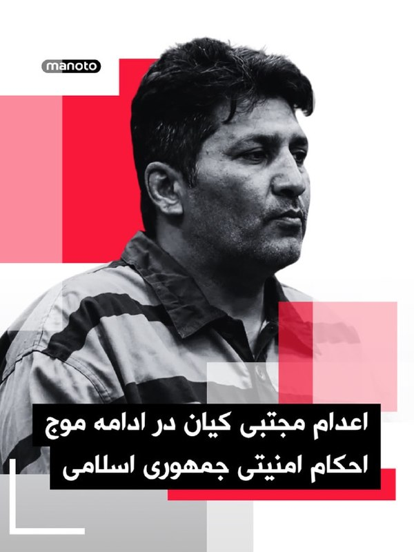

قوه قضائیه جمهوری اسلامی اعلام کرد مجتبی کیان، زندانی متهم به ارسال اطلاعات مربوط به مراکز تولید صنایع دفاعی، بامداد امروز اعدام شده است.

رسانه‌های وابسته به قوه قضائیه مدعی شده‌اند او در جریان آنچه مقام‌های جمهوری اسلامی «جنگ رمضان» می‌نامند، اطلاعات و مختصات واحدهای مرتبط با صنایع دفاعی را برای شبکه‌های وابسته به آمریکا و اسرائیل ارسال کرده بود.

این ادعاها به‌طور مستقل قابل راستی‌آزمایی نیست و قوه قضائیه جمهوری اسلامی تاکنون جزئیات شفافی از روند بازداشت، دسترسی متهم به وکیل مستقل، نحوه محاکمه و زمان دقیق رسیدگی منتشر نکرده است.

اجرای این حکم در حالی اعلام شده که جمهوری اسلامی در سال‌های اخیر بارها از پرونده‌های امنیتی و اتهام‌های مرتبط با «جاسوسی» برای صدور و اجرای احکام سنگین، از جمله اعدام، استفاده کرده است.

## ManotoTV — post 105794

  

نیروی دریایی بریتانیا اعلام کرده صدها ملوان این کشور در جبل‌الطارق آماده‌اند تا در صورت دستیابی آمریکا و جمهوری اسلامی به توافق صلح، برای پاکسازی احتمالی مین‌ها در تنگه هرمز اعزام شوند.

بر اساس گزارش آسوشیتدپرس، کشتی پشتیبانی آراف‌ای لایم بِی متعلق به نیروی دریایی سلطنتی بریتانیا در جبل‌الطارق مستقر است و با مهمات و پهپادهای دریایی مین‌یاب مجهز به سونار آماده عملیات احتمالی شده است. این مأموریت قرار است با همکاری بریتانیا و فرانسه انجام شود.

اولویت نخست این عملیات، در صورت اجرا، پاکسازی یک مسیر عبور در تنگه هرمز برای خروج حدود ۷۰۰ کشتی عنوان شده است. پس از آن، مسیر مقابل برای ورود کشتی‌ها پاکسازی خواهد شد؛ هرچند مقام‌ها گفته‌اند پاکسازی کامل تنگه ممکن است ماه‌ها یا حتی سال‌ها زمان ببرد.

## ManotoTV — post 105793

  

محمد اسحاق دار، وزیر خارجه پاکستان، اعلام کرد در تماس تلفنی با دونالد ترامپ درباره مذاکرات میان آمریکا و جمهوری اسلامی گفت‌وگو کرده است.

او این گفت‌وگوی «مهم» را «گامی قابل‌توجه به سوی صلح منطقه‌ای» توصیف کرد و گفت دستاوردهای مذاکرات اخیر، زمینه خوش‌بینی نسبت به یک نتیجه مثبت و پایدار را فراهم کرده است.

پاکستان در روزهای اخیر نقش میانجی کلیدی میان آمریکا و جمهوری اسلامی را برعهده داشته است. اسحاق دار همچنین از «رهبری» ترامپ و «تعهد او به گفت‌وگو و دیپلماسی» تقدیر کرد.

## ManotoTV — post 105792

  

سرویس مخفی آمریکا در بیانیه‌ای اعلام کرد فردی مسلح عصر شنبه در نزدیکی خیابان ۱۷ و پنسیلوانیا، در محدوده کاخ سفید، پس از بیرون آوردن سلاح از کیف خود به سمت ماموران تیراندازی کرد.

ماموران سرویس مخفی در پاسخ به او شلیک کردند و مظنون پس از انتقال به بیمارستان جان باخت. در جریان این تیراندازی، یک رهگذر نیز هدف گلوله قرار گرفت. سرویس مخفی گفته هنوز مشخص نیست این فرد با شلیک مظنون زخمی شده یا در تبادل آتش میان او و ماموران.

بر اساس تصاویر منتشرشده از سلینا وانگ، خبرنگار ای‌بی‌سی نیوز، هم‌زمان با شنیده‌شدن صدای تیراندازی در نزدیکی کاخ سفید، خبرنگاران حاضر در محوطه به سمت اتاق نشست خبری منتقل شدند.

سرویس مخفی اعلام کرد هیچ‌یک از نیروهایش در این حادثه آسیب ندیده‌اند. دونالد ترامپ هنگام وقوع تیراندازی در کاخ سفید حضور داشت، اما این حادثه تاثیری بر او یا عملیات حفاظتی نداشته است. تحقیقات درباره این تیراندازی ادامه دارد. جزئیات اصلی با گزارش رویترز و آسوشیتدپرس هم‌خوانی دارد

## ManotoTV — post 105791

  <a href="telegram/content/ManotoTV_105791_1779610321.mp4" target="_blank">🎬 Download video</a>

تصاویر منتشرشده از سلینا وانگ، خبرنگار ای‌بی‌سی نیوز، لحظه‌ای را نشان می‌دهد که هم‌زمان با شنیده‌شدن صدای تیراندازی در نزدیکی کاخ سفید، خبرنگاران حاضر در محوطه به سمت اتاق نشست خبری منتقل شدند.

سرویس مخفی آمریکا اعلام کرد یک مرد مسلح در نزدیکی ایست بازرسی خیابان ۱۷ و پنسیلوانیا به سوی ماموران شلیک کرد. ماموران نیز در پاسخ تیراندازی کردند و مظنون که به بیمارستان منتقل شده بود، بعداً جان باخت.

در جریان این تیراندازی یک رهگذر نیز زخمی شد. هنوز مشخص نیست این فرد با شلیک مظنون زخمی شده یا در جریان تبادل آتش. دونالد ترامپ هنگام وقوع حادثه در کاخ سفید بود، اما آسیبی ندید.

## ManotoTV — post 105790

  <a href="telegram/content/ManotoTV_105790_1779610322.mp4" target="_blank">🎬 Download video</a>

تماسی از امارات
«می‌گفت مردم ایران عوض شده‌اند…
و این بار باید هوشیارتر، عاقل‌تر و متفاوت‌تر عمل کنند.»

## ManotoTV — post 105789

  <a href="telegram/content/ManotoTV_105789_1779610324.mp4" target="_blank">🎬 Download video</a>

تماسی از سن‌فرانسیسکو:
«می‌گفت با شنیدن صدای شما احساس می‌کنم تو ایرانم…
و از سال‌هایی گفت که با برنامه‌های منوتو خندیده، گریه کرده و زندگی کرده بود.»

## ManotoTV — post 105788

  <a href="telegram/content/ManotoTV_105788_1779610327.mp4" target="_blank">🎬 Download video</a>

تماسی از خارج ایران:
«می‌گفت بسته شدن منوتو برای خیلی‌ها دردناک بود…
و از همراهی و امیدی گفت که این سال‌ها از برنامه‌ها گرفته بودند.

## FarsiVOA — post 218498

  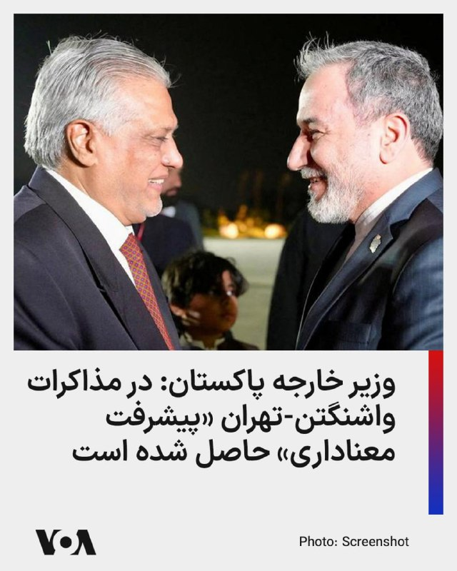

محمد اسحاق دار، وزیر خارجه پاکستان، اعلام کرد که در مذاکرات میان ایالات متحده و حکومت ایران «پیشرفت معناداری» حاصل شده است.

وزیر خارجه پاکستان روز یکشنبه در شبکه ایکس نوشت که این پیشرفت، زمینه‌ای برای خوش‌بینی فراهم می‌کند که یک نتیجه «مثبت و پایدار» در دسترس باشد.

کمی قبل از آن، شهباز شریف، نخست‌وزیر پاکستان، «تلاش‌های فوق‌العاده» دونالد ترامپ، رئیس‌جمهوری ایالات متحده، برای پیگیری صلح را ستود و افزود که پاکستان همچنان متعهد به ادامه گفت‌وگوهاست و امیدوار است میزبان دور بعدی مذاکرات باشد.

پیشتر رئيس‌جمهوری آمریکا، از «یک یادداشت تفاهم» مربوط به پایان دادن جنگ با جمهوری اسلامی خبر داد و افزود که این توافق همچنین به «مدیریت رضایت‌بخش» اورانیوم غنی‌شده منجر خواهد شد.

پرزیدنت ترامپ بارها بر اراده آمریکا برای جلوگیری از دستیابی حکومت ایران به سلاح اتمی تأکید کرده است.
@FarsiVOA

## FarsiVOA — post 218497

  <a href="telegram/content/FarsiVOA_218497_1779610330.mp4" target="_blank">🎬 Download video</a>

تصاویری از حمله گسترده موشکی و پهپادی روسیه به کی‌یف؛

روسیه بامداد یکشنبه کی‌یف را با موج گسترده‌ای از موشک‌ها و پهپادها هدف قرار داد.

این حمله به گفته مقام‌های اوکراینی به ساختمان‌های مسکونی و مدارس آسیب زد و دست‌کم یک کشته و ۲۰ زخمی در پایتخت برجای گذاشت. سه نفر دیگر نیز در منطقه کی‌یف زخمی شدند.

حمله ساعاتی پس از آن انجام شد که ولودیمیر زلنسکی، رئیس‌جمهور اوکراین، هشدار داده بود روسیه در حال آماده‌سازی یک حمله ترکیبی علیه اوکراین، از جمله کی‌یف، با استفاده احتمالی از موشک بالستیک مافوق‌صوت «اورشنیک» است.

در روزهای گذشته نیز حملات موشکی و پهپادی روسیه به مناطق چرنیهیف، سومی، دنیپرو و زاپوریژیا چندین کشته و زخمی برجای گذاشته بود.
@FarsiVOA

## FarsiVOA — post 218496

  

منابع خبری پاکستان گزارش دادند در پی یک حمله انتحاری در شهر کویته، مرکز ایالت بلوچستان، دست‌کم ۸ نفر کشته و ۳۰ نفر دیگر زخمی شدند. این انفجار در محدوده چمن پاتک و نزدیک خط آهن گزارش شده است.

رسانه‌های پاکستانی در ساعات اولیه آمار متفاوتی منتشر کرده بودند. دنیا نیوز پاکستان پیشتر از زخمی شدن دست‌کم ۲۰ نفر خبر داده و نوشته بود انفجار باعث آتش‌سوزی در نزدیکی خط آهن شده، بیمارستان‌ها در آماده‌باش قرار گرفته‌اند و قطار اکسپرس پس از حادثه در ایستگاه کویته متوقف شده است.

ای‌آر‌وای نیوز نیز وقوع انفجار در نزدیکی چمن پاتک را تأیید کرده، اما در گزارش اولیه آمار کشته‌ها را اعلام نکرده بود.

این حمله در ادامه موج ناامنی‌های اخیر در کویته و ایالت بلوچستان رخ می‌دهد. روزنامه داون اوایل ماه مه گزارش داده بود چهار راکت به بخش‌هایی از کویته شلیک شد و سه نفر زخمی شدند.

در ۱۸ مه نیز همین روزنامه از عملیات چهارروزه نیروهای امنیتی در ارتفاعات اطراف کویته خبر داد که در جریان آن، به گفته مقام‌های پاکستانی، ۳۵ شبه‌نظامی کشته شدند.
@FarsiVOA

## FarsiVOA — post 218495

  

اداره‌کل اطلاعات استان فارس مدعی شد «یک شبکه آموزش‌دیده» را که آن را متشکل از «عناصر آشوبگر و تروریستی» خوانده، پیش از هرگونه اقدام در این استان شناسایی و منهدم کرده است.

در اطلاعیه منتشرشده از سوی روابط عمومی این نهاد آمده است که متهمان در ایام جنگ اخیر، برای «توطئه و ترور جمعی از شهروندان» با هدف برهم زدن امنیت استان برنامه‌ریزی کرده بودند.

این ادعا از سوی نهادهای وابسته به جمهوری اسلامی مطرح شده و تاکنون جزئیات مستقلی درباره هویت بازداشت‌شدگان، مستندات پرونده یا روند دادرسی احتمالی منتشر نشده است.
@FarsiVOA

## FarsiVOA — post 218494

🔺حمله گسترده روسیه به کی‌یف پس از هشدار زلنسکی درباره موشک اورشنیک

▪️روسیه بامداد یکشنبه کی‌یف را با موج گسترده‌ای از موشک‌ها و پهپادها هدف قرار داد.

▪️این حمله به گفته مقام‌های اوکراینی به ساختمان‌های مسکونی و مدارس آسیب زد و دست‌کم یک کشته و ۲۰ زخمی در پایتخت برجای گذاشت. سه نفر دیگر نیز در منطقه کی‌یف زخمی شدند.

▪️حمله ساعاتی پس از آن انجام شد که ولودیمیر زلنسکی، رئیس‌جمهور اوکراین، هشدار داده بود روسیه در حال آماده‌سازی یک حمله ترکیبی علیه اوکراین، از جمله کی‌یف، با استفاده احتمالی از موشک بالستیک مافوق‌صوت «اورشنیک» است.

▪️در روزهای گذشته نیز حملات موشکی و پهپادی روسیه به مناطق چرنیهیف، سومی، دنیپرو و زاپوریژیا چندین کشته و زخمی برجای گذاشته بود.

⬇️ بیشتر بخوانید:
https://ir.voanews.com/a/8153267.html

## FarsiVOA — post 218493

  

اداره دفاع مدنی لبنان اعلام کرد تأسیسات منطقه‌ای این نهاد در شهر نبطیه در جنوب لبنان، در حمله اسرائیل تخریب شده است.

به گزارش تایمز اسرائیل، این نهاد گفته ساختمان بر اثر «اصابت مستقیم» فرو ریخته و شمار زیادی از خودروها و تجهیزات امدادی آسیب دیده‌اند.

این گزارش تاکید می‌کند همه نیروهای دفاع مدنی پیش از حمله به محل دیگری منتقل شده بودند و گزارشی از تلفات میان کارکنان منتشر نشده است. ارتش اسرائیل تاکنون درباره این حمله اظهارنظر نکرده است.

این حمله در ادامه تشدید حملات اسرائیل به جنوب لبنان در روزهای اخیر انجام شد. روز جمعه نیز حملات هوایی اسرائیل در جنوب لبنان دست‌کم ۱۰ کشته برجای گذاشت.

با وجود آتش‌بس مورد حمایت آمریکا، رویترز گزارش داده درگیری اسرائیل و حزب‌الله همچنان ادامه دارد و شمار کشته‌شدگان در لبنان از سه هزار نفر گذشته است.
@FarsiVOA

## FarsiVOA — post 218492

🔺از توافق احتمالی تهران-واشنگتن چه می‌دانیم؟

▪️پس از آن که دونالد ترامپ، از «یک یادداشت تفاهم» مربوط به پایان دادن جنگ با جمهوری اسلامی خبر داد، رسانه‌ها گزارش‌های تاییدنشده‌ای از محتوای این توافق منتشر کرده‌اند.

▪️دو مقام آمریکایی به نیویورک تایمز گفته‌اند که حکومت ایران به عنوان بخشی از توافق با ایالات متحده برای پایان دادن به جنگ، پذیرفته است ذخیره اورانیوم با غنای بالای خود را واگذار کند.

▪️همچنین آکسیوس به نقل از یک مقام آمریکایی گزارش داد که ایالات متحده و حکومت ایران به امضای توافقی نزدیک شده‌اند که شامل تمدید آتش‌بس به مدت ۶۰ روز است و در این مدت، تنگه هرمز باز خواهد شد.

▪️این توافق همچنین شامل آتش‌بس میان حزب‌الله و اسرائیل خواهد بود.

⬇️ بیشتر بخوانید:
https://ir.voanews.com/a/8153265.html

## FarsiVOA — post 218491

🔺محاصره آمریکا علیه جمهوری اسلامی به «نقطه عطف» تغییر مسیر ۱۰۰ کشتی رسید

▪️سنتکام، می‌گوید در چهارچوب محاصره دریایی جمهوری اسلامی شمار کشتی‌های مرتبط با جمهوری اسلامی که وادار به تغییر مسیر شده‌اند، به «نقطه عطف» ۱۰۰ فروند رسیده است.

▪️بر اساس این اعلام، پس از شش هفته محاصره دریایی جمهوری اسلامی، بیش از ۱۵ هزار سرباز، ملوان، تفنگدار دریایی و نیروی هوایی آمریکا ۱۰۰ کشتی را تغییر مسیر داده و چهار فروند را از کار انداخته است.

▪️نیروهای نظامی آمریکا در عین حال به ۲۶ کشتی حامل کمک‌های بشردوستانه اجازه عبور به ایران را داده‌اند.

▪️ایالات متحده از اواخر فروردین ۱۴۰۵، محاصره دریایی علیه جمهوری اسلامی ایران را در واکنش به اقدام رژیم ایران در بستن تنگه هرمز آغاز کرده است.

⬇️ بیشتر بخوانید:
https://ir.voanews.com/a/8153263.html

## FarsiVOA — post 218490

  

شهباز شریف، نخست‌وزیر پاکستان، به دونالد ترامپ، رئیس‌جمهوری آمریکا، «به خاطر تلاش‌های فوق‌العاده‌اش برای پیگیری صلح» در میانه تلاش‌ها برای نهایی کردن توافقی جهت پایان دادن به جنگ آمریکا و اسرائیل با ایران، تبریک گفت.

شریف در بیانیه‌ای در شبکه ایکس نوشت که تماس تلفنی «بسیار مفید و سازنده» ترامپ با رهبران منطقه در روز شنبه، «فرصت مفیدی برای تبادل نظر درباره وضعیت کنونی منطقه و چگونگی پیشبرد تلاش‌های جاری برای صلح به منظور برقراری صلحی پایدار در منطقه فراهم کرد.»

او افزود: «پاکستان با نهایت صداقت به تلاش‌های صلح خود ادامه خواهد داد و امیدواریم که خیلی زود میزبان دور بعدی مذاکرات باشیم.»

رئيس‌جمهوری آمریکا، عصر شنبه‌ دوم خرداد به وقت واشنگتن گفت جزئیات نهایی یک یادداشت تفاهم صلح با جمهوری اسلامی «به‌زودی اعلام خواهد شد.»
@FarsiVOA

## FarsiVOA — post 218489

🔺اعدام یک شهروند بازداشت‌شده در ایام جنگ؛ دادرسی شتاب‌زده و اعدام در ۵۰ روز

▪️قوه قضائیه از اعدام مجتبی کیان، به اتهام ارسال اطلاعات مراکز تولید صنایع دفاعی به «دشمن آمریکایی ـ صهیونیستی» خبر داد.

▪️ادعا شده کیان در جریان جنگ اخیر، اطلاعات و مختصات واحدهای مرتبط با تولید قطعات صنایع دفاعی را از طریق پیام به «شبکه‌های وابسته به اسرائیل و آمریکا» ارسال کرده بود.

▪️مجتبی کیان علاوه بر اعدام، به مصادره کلیه اموال محکوم شده بود، و از زمان بازداشت تا اجرای حکم کمتر از ۵۰ روز زمان گذشته است.

▪️عفو بین‌الملل پیشتر هشدار داده بود که نگرانی از اعدام‌های بیشتر افزایش یافته، زیرا مقام‌های جمهوری اسلامی پس از آغاز جنگ خواستار رسیدگی سریع‌تر و مجازات‌های «شدید» برای بازداشت‌شدگان شده‌اند.

⬇️ بیشتر بخوانید:
https://ir.voanews.com/a/8153262.html

## FarsiVOA — post 218488

  <a href="telegram/content/FarsiVOA_218488_1779610335.mp4" target="_blank">🎬 Download video</a>

⚡️گزارش مایکل لیپین، خبرنگار صدای آمریکا از تیراندازی شنبه عصر در اطراف کاخ سفید
@FarsiVOA

## FarsiVOA — post 218487

  <a href="telegram/content/FarsiVOA_218487_1779610336.mp4" target="_blank">🎬 Download video</a>

⚡️ماموران امنیتی و خبرنگاران در خیابان ۱۸ام و پنسیلوانیا (شمال غربی) در واشنگتن دی‌سی، در پی تیراندازی شنبه عصر در نزدیکی کاخ سفید، در منطقه حضور دارند. فرد مظنون در این تیراندازی کشته شد.
@FarsiVOA

## FarsiVOA — post 218486

  <a href="telegram/content/FarsiVOA_218486_1779610337.mp4" target="_blank">🎬 Download video</a>

⚡️اولین تصاویر از چمن شمالی کاخ سفید پس از آن‌که در پی حادثه تیراندازی عصر شنبه، به خبرنگاران اجازه بازگشت به محوطه داده شد.
@FarsiVOA

## FarsiVOA — post 218485

🔺گزارش‌ها از تیراندازی در نزدیکی کاخ سفید؛ سرویس مخفی می‌گوید مظنون کشته شد و یک عابر تیر خورد

▪️شنبه عصر، یک تیراندازی در حوالی کاخ سفید خبر روی داد که طی آن دو نفر از جمله یک عابر و یک فرد مظنون تیر خوردند.

⬇️ بیشتر بخوانید:
https://ir.voanews.com/a/8153104.html
@FarsiVOA

## FarsiVOA — post 218484

  <a href="telegram/content/FarsiVOA_218484_1779610338.mp4" target="_blank">🎬 Download video</a>

⚡️گزارش مایکل لیپین، خبرنگار صدای آمریکا از تیراندازی شنبه عصر در اطراف کاخ سفید
@FarsiVOA

## FarsiVOA — post 218483

🔺گزارش خبرنگار صدای آمریکا از محل تیراندازی در اطراف کاخ سفید؛ صدای ده‌ها گلوله شنیده شد

▪️خبرنگار صدای آمریکا در حوزه کاخ سفید، مایکل لیپین، عصر شنبه از نزدیکی محل تیراندازی در اطراف کاخ سفید گزارش کرد.

⬇️ بیشتر بخوانید:
https://ir.voanews.com/a/8153117.html
@FarsiVOA

## FarsiVOA — post 218482

  <a href="telegram/content/FarsiVOA_218482_1779610338.mp4" target="_blank">🎬 Download video</a>

⚡️ویدیوی صدای آمریکا از حضور نیروهای امنیتی پس از گزارش‌ها از تیراندازی شنبه عصر در نزدیکی کاخ سفید
@FarsiVOA

## FarsiVOA — post 218480

⚡️نیروهای گارد ملی و دیگر ماموران امنیتی شنبه عصر و در پی گزارش‌ها از تیراندازی در اطراف کاخ سفید، در محل استقرار یافتند.
@FarsiVOA

## FarsiVOA — post 218479

⚡️خط قرمز جدید بغداد: دولت علی الزیدی به دنبال انحلال شبه‌نظامیان وابسته به جمهوری اسلامی
@FarsiVOA

## DW_Farsi — post 125071

  

🔶 لیندزی گراهام: توافقی که اجازه دهد رژیم ایران پابرجا بماند، ریختن بنزین روی درگیری‌های منطقه است

لیندزی گراهام، سناتور پرنفوذ جمهوری‌خواه، در پستی در شبکه ایکس در واکنش به اظهارات جدید ترامپ مبنی بر "نهایی شدن توافق" با ایران هشدار داد: «اگر توافقی برای پایان دادن به درگیری با ایران حاصل شود، آن هم به این دلیل که باور بر این است که تنگه هرمز نمی‌تواند در برابر تروریسم ایران محافظت شود و ایران همچنان توانایی تخریب زیرساخت‌های اصلی نفتی خلیج فارس را دارد، در این صورت ایران به‌عنوان یک قدرت برتر تلقی خواهد شد که نیازمند یک راه‌حل دیپلماتیک است.»

او در ادامه نوشت: «این ترکیب، یعنی تصور اینکه ایران توانایی ایجاد ناامنی دائمی در تنگه را دارد و همچنین قادر است آسیب‌های گسترده‌ای به زیرساخت‌های نفتی خلیج فارس وارد کند، نشان‌دهنده تغییر بزرگی در توازن قدرت در منطقه است و در بلندمدت می‌تواند به یک کابوس برای اسرائیل تبدیل شود.»

به گفته گراهام اگر این برداشت‌ها درست باشند، "این پرسش مطرح می‌شود که اصلا چرا جنگ آغاز شد".

او افزود: «به این ایده که نمی‌تو‌ان توانایی ایران برای ایجاد ناامنی در تنگه هرمز را مهار کرد و اینکه منطقه قادر به دفاع از خود در برابر توان نظامی ایران نیست، تردید دارم.»

@dw_farsi

## DW_Farsi — post 125070

  

🔶 قوه قضائیه مجتبی کیان را به اتهام "همکاری با دشمن" اعدام کرد

خبرگزاری میزان، وابسته به قوه قضائیه جمهوری اسلامی، از اعدام مجتبی کیان در بامداد یکشنبه سوم خرداد (۲۴ مه) به اتهام "ارسال اطلاعات مرتبط با واحد‌های صنایع دفاعی کشور به دشمن" خبر داد.

در این گزارش ادعا شده مجتبی کیان در طول جنگ آمریکا و اسرائیل با ایران، "پیام‌های متعددی را به شبکه‌های معاند" ارسال می‌کرد که "از جمله آنها مختصات و اطلاعات محل واحد‌های تولید قطعات مرتبط با صنایع دفاعی کشور بود". در ادبیات حکومت جمهوری اسلامی اصطلاح "شبکه‌های معاند" به رسانه‌ها و شبکه‌های فارسی‌زبان خارج از کشور اشاره دارد.

میزان مدعی شده است که مجتبی کیان "در پیام‌هایی به شبکه وابسته به دشمن، اطلاعات محل شرکت مرتبط با صنایع دفاعی را ارسال کرده" و با قید نام بنیامین نتانیاهو، نخست‌وزیر اسرائیل، "در پیام ارسالی به عوامل این شبکه تأکید می‌کند که موضوع را ’به بی‌بی آمار بده‘".

قوه قضائیه جزئیاتی درباره نحوه دسترسی مجتبی کیان به این اطلاعات، شغل یا جایگاه او نداده و مشخص نکرده است که او چگونه به "اطلاعات مرتبط با صنایع دفاعی" دسترسی داشته است. در این گزارش یکی از "ادله" این پرونده "اعترافات و اقرارهای" متهم عنوان شده است. با این حال قوه قضائیه جزئیاتی درباره شرایط بازجویی و نحوه اخذ این اعترافات منتشر نکرده است.

نهادهای حقوق بشری طی سال‌های گذشته بارها نسبت به پخش و استناد به اعترافات اجباری در پرونده‌های امنیتی در ایران ابراز نگرانی کرده و از احتمال اخذ اعتراف تحت فشار یا شکنجه سخن گفته‌اند.

به نوشته خبرگزاری میزان دادگاه مجتبی کیان در دادگستری استان البرز برگزار شد و با استناد به "ماده یک قانون تشدید مجازات جاسوسی و همکاری" برای او حکم اعدام و مصادره کلیه اموال صادر شد.

@dw_farsi

## DW_Farsi — post 125069

  

🔶 ابراز امیدواری نخست‌وزیر پاکستان به برگزاری دور جدید مذاکرات

شهباز شریف، نخست‌وزیر پاکستان، در واکنش به پست تازه دونالد ترامپ در شبکه تروث سوشال در مورد "نهایی شدن" توافق با ایران، ابراز امیدواری کرد که اسلام‌آباد به‌زودی میزبان دور بعدی مذاکرات میان تهران و واشنگتن باشد.

او با انتشار پیامی در شبکه ایکس از رئیس جمهور آمریکا به دلیل "تلاش‌های فوق‌العاده‌اش برای پیگیری صلح" و "تماس‌‌های تلفنی بسیار سازنده و مفید" با رهبران عربستان، قطر، ترکیه، مصر، امارات متحده عربی، اردن و پاکستان قدردانی کرده و نوشت: «این گفت‌وگوها فرصت مفیدی را برای تبادل نظر در مورد وضعیت فعلی منطقه و چگونگی پیشبرد تلاش‌های جاری برای ایجاد صلح پایدار در منطقه فراهم کرد.»

شهباز شریف تأکید کرد پاکستان به تلاش‌های میانجی‌گرانه خود برای صلح "با نهایت صداقت" ادامه خواهد داد و امیدوار است که میزبان دور بعدی مذاکرات در "آینده‌ای بسیار نزدیک" باشد.

ترامپ در پست خود در تروث سوشال گفته بود که واشنگتن و تهران به مراحل پایانی یک توافق نزدیک شده‌اند که جزئیات آن در "دست بررسی است و به‌زودی اعلام خواهد شد."

@dw_farsi

## DW_Farsi — post 125067

  

🔶 اکسیوس: توافق پیشنهادی شامل بازگشایی تنگه هرمز در دوره آتش‌بس ۶۰ روزه است

سایت خبری "اکسیوس" روز شنبه به نقل از یک مقام آمریکایی گزارش داد که ایالات متحده و ایران به امضای یک توافق نزدیک شده‌اند که شامل تمدید ۶۰ روزه آتش‌بس است که طی آن تنگه هرمز بازگشایی خواهد شد، ایران می‌تواند آزادانه نفت بفروشد و مذاکراتی در مورد مهار برنامه هسته‌ای انجام خواهد شد.

به نوشته اکسیوس در طول این دوره ۶۰ روزه، تنگه هرمز بدون دریافت عوارض باز خواهد بود و ایران موافقت می‌کند مین‌هایی را که در این تنگه کار گذاشته، پاکسازی کند تا کشتی‌ها بتوانند آزادانه عبور کنند. در مقابل به عنوان بخشی از توافق پیشنهادی آمریکا به محاصره بنادر ایرانی پایان می‌دهد و برخی معافیت‌های تحریمی را صادر می‌کند تا به ایران اجازه دهد آزادانه نفت بفروشد.

این گزارش می‌افزاید که پیش‌نویس توافق همچنین شامل تعهداتی از سوی ایران مبنی بر عدم دستیابی به سلاح هسته‌ای و مذاکره در مورد تعلیق برنامه غنی‌سازی اورانیوم و حذف ذخایر اورانیوم با غنای بالاست.

دو منبع به اکسیوس گفته‌اند که ایران از طریق میانجی‌ها، در مورد میزان امتیازاتی که حاضر است در زمینه تعلیق غنی‌سازی و کنار گذاشتن مواد هسته‌ای ارائه دهد، تعهدات شفاهی به آمریکا داده است.

در این گزارش همچنین آمده است که ایالات متحده موافقت می‌کند در طول دوره ۶۰ روزه تمدید آتش‌بس بر سر لغو تحریم‌ها و آزادسازی دارایی‌های مسدودشده ایران مذاکره کند.

@dw_farsi

## DW_Farsi — post 125065

  

🔶 ترامپ: توافق با ایران تا حد زیادی مذاکره شده است و تنگه هرمز هم باز می‌شود

دونالد ترامپ، رئیس جمهور آمریکا، گفت توافق با ایران به مراحل پایانی رسیده است و این پیشنهاد شامل بازگشایی تنگه هرمز نیز می‌شود، هرچند این توافق "هنوز نهایی نشده است".

ترامپ روز شنبه ۲۳ مه (دوم خرداد) با انتشار پیامی در شبکه تروث سوشال نوشت: «من در دفتر بیضی کاخ سفید هستم؛ جایی که به‌تازگی تماس بسیار خوبی با محمد بن سلمان آل سعود ولیعهد عربستان سعودی، محمد بن زاید آل نهیان رئیس امارات متحده عربی، شیخ تمیم بن حمد بن خلیفه آل ثانی، نخست‌وزیر محمد بن عبدالرحمن بن جاسم بن جابر آل ثانی و وزیر علی الثوادی از قطر، فیلد مارشال سید عاصم منیر احمد شاه از پاکستان، رجب طیب اردوغان رئیس‌جمهور ترکیه، عبدالفتاح السیسی رئیس‌جمهور مصر، ملک عبدالله دوم پادشاه اردن و حمد بن عیسی آل خلیفه پادشاه بحرین درباره جمهوری اسلامی ایران و همه مسائل مرتبط با یک یادداشت تفاهم در خصوص صلح داشتیم.»

ترامپ در ادامه افزود یک توافق "تا حد زیادی" میان ایالات متحده و ایران دیگر کشورهای نا‌م‌برده شده، مذاکره شده و اکنون در انتظار نهایی‌‌سازی قرار دارد.

او همچنین نوشت که با بنیامین نتانیاهو، نخست‌وزیر اسرائیل، نیز گفت‌وگو کرده است که "این تماس نیز بسیار خوب پیش رفته است".

رئیس جمهور آمریکا در پایان پست خود خاطرنشان ساخت: «جنبه‌ها و جزئیات نهایی این توافق در حال حاضر در دست بررسی است و به زودی اعلام خواهد شد. علاوه بر بسیاری دیگر از مفاد این توافق، تنگه هرمز نیز بازگشایی خواهد شد.»

اظهارات ترامپ در حالی مطرح شده است که مقام‌های جمهوری اسلامی گفته بودند هنوز اختلاف‌هایی میان طرف‌ها وجود دارد و موضوع برنامه هسته‌ای ایران در مذاکرات اولیه مطرح نخواهد شد.

@dw_farsi

## Persian_Trend_Official — post 14838

♨️ تسنیم:
تعهد ایران به خروج مواد هسته‌ای یا تعلیق 10-20 ساله در تفاهم‌نامه کذب است.

📝 Nick

📌 @persian_trend_official
پرشین ترند | متفاوت‌ترین کانال نظامی

## Persian_Trend_Official — post 14837

  

⭕️ بنی گانتز، رئیس سابق ستاد کل ارتش اسرائیل (اپوزیسیون نتانیاهو):

دنبال کردن آتش‌بس در لبنان، تحت هیچ شرایطی نباید بخشی از توافق با ایران باشد.

نمی‌شود وضعیتی را پذیرفت که درست وقتی جامعه لبنان دارد از اقدامات حزب‌الله آسیب می‌بیند، اسرائیل اجازه بدهد این وضعیت به سپری برای لبنان تبدیل شود.

روستاهای جنوب لبنان فقط چندصد متر با مطولا، شومیرا و مسگاو عام فاصله دارند و اسرائیل وظیفه دارد از ساکنان خود، بدون وابستگی به هیچ عامل خارجی، دفاع کند.

پذیرفتن آتش‌بس در لبنان به‌عنوان بخشی از توافق با ایران، یک اشتباه راهبردی خواهد بود که تا سال‌ها بهایش را خواهیم پرداخت.

این دقیقاً همان موردی است که اسرائیل باید به آمریکا بگوید: نه.

📝 Nick

📌 @persian_trend_official
پرشین ترند | متفاوت‌ترین کانال نظامی

## Persian_Trend_Official — post 14836

  <a href="telegram/content/Persian_Trend_Official_14836_1779610343.webm" target="_blank">🎬 Download video</a>

https://youtube.com/live/FTUt8HfIdrc?feature=share

## Persian_Trend_Official — post 14834

  <a href="telegram/content/Persian_Trend_Official_14834_1779610344.webm" target="_blank">🎬 Download video</a>

https://youtube.com/live/FTUt8HfIdrc?feature=share

## Persian_Trend_Official — post 14833

  

⭕️ به گزارش فایننشال تایمز، نیروی هوافضای سپاه پاسداران انقلاب اسلامی از تلسان، شبکه تأمین مستقر در امارات متحده عربی، برای به‌دست آوردن تجهیزات پیشرفته ماهواره‌ای چینی مرتبط با برنامه پهپادی خود در اواخر سال 2025 استفاده کرد.

🔴این تجهیزات بعدها در حملات پهپادی ایران در طول جنگ به کار رفت. شرکت مستقر در رأس‌الخیمه حدود 1.8 تن تجهیزات آنتن ماهواره‌ای ساخت چین را از شانگهای به ایران از طریق بندر کانتینری جبل علی در دبی منتقل کرد.

پ.ن: اینم از عاقبت دور زدن تحریم برای ج.ا.

📝 Nick

📌 @persian_trend_official
پرشین ترند | متفاوت‌ترین کانال نظامی

## Persian_Trend_Official — post 14832

  <a href="telegram/content/Persian_Trend_Official_14832_1779610345.mp4" target="_blank">🎬 Download video</a>

دقت کردید باز هم از این شخص هیچ خبری نیست؟ 😁 📝 Nick 📌 @persian_trend_official پرشین ترند | متفاوت‌ترین کانال نظامی

## Persian_Trend_Official — post 14831

🔴 آکسیوس: توافق ۶۰ روزه ایران و آمریکا شامل بازگشایی رایگان تنگه هرمز خواهد بود آکسیوس گزارش داد یادداشت تفاهم ۶۰ روزه پیشنهادی میان ایران و آمریکا شامل بازگشایی تنگه هرمز بدون دریافت عوارض و ازسرگیری صادرات نفت ایران در ازای تمدید آتش‌بس و آغاز مذاکرات هسته‌ای…

## Persian_Trend_Official — post 14830

  <a href="telegram/content/Persian_Trend_Official_14830_1779610346.mp4" target="_blank">🎬 Download video</a>

⭕️ ارتش دفاعی اسرائیل:

‼️در تلاش مستمر برای رفع تهدید: ارتش اسرائیل در روزهای اخیر چندین انبار تسلیحاتی متعلق به سازمان تروریستی حماس را هدف قرار داده و نابود کرد

⭕️نیروهای ارتش اسرائیل تحت فرماندهی جنوب، طی شبانه‌روز گذشته (شنبه)، سه انبار تسلیحات متعلق به سازمان تروریستی حماس را در مرکز نوار غزه هدف قرار داده و منهدم کردند.
در میان تسلیحات موجود در این انبارها که در پی این حمله نابود شد، مواردی چون موشک‌های ضدزره، سلاح‌های سبک، آرپی‌جی (RPG)، جلیقه‌های رزمی و سایر تجهیزات نظامی وجود داشت.

⭕️در رویدادی دیگر در اوایل همین هفته (چهارشنبه)، نیروهای ارتش اسرائیل تحت فرماندهی جنوب یک انبار تسلیحاتی دیگر را در مرکز نوار غزه هدف قرار داده و منهدم کردند که در آن مواد منفجره، راکت‌اندازهای RPG، نارنجک‌های دستی و خشاب‌ها نگهداری می‌شد.

⭕️این تسلیحات برای حمله به نیروهای ارتش اسرائیل که در محدوده خط زرد فعالیت می‌کنند و همچنین غیرنظامیان اسرائیلی در نظر گرفته شده بود و به‌منظور رفع تهدید نابود شد.

⭕️پس از این حملات، انفجارهای ثانویه‌ای شناسایی شد که نشان‌دهنده وجود مهمات در این انبارها بود.

⭕️نیروهای ارتش اسرائیل تحت فرماندهی جنوب مطابق با توافق در منطقه مستقر هستند و به فعالیت خود برای رفع هرگونه تهدید فوری ادامه خواهند داد.

📝 Nick

📌 @persian_trend_official
پرشین ترند | متفاوت‌ترین کانال نظامی

## Persian_Trend_Official — post 14829

  

⭕️ اسرائیل به فارسی:

چرخ روزگار... از پارسال تا امسال.

📝 Nick

📌 @persian_trend_official
پرشین ترند | متفاوت‌ترین کانال نظامی

## Persian_Trend_Official — post 14828

  

انفجار مهیب در کویته پاکستان؛ ۲۳ کشته و ده‌ها زخمی
منابع محلی در پاکستان از وقوع یک انفجار انتحاری در شهر کویته، مرکز ایالت بلوچستان، خبر دادند؛ انفجاری که در نزدیکی ایستگاه قطار و یک مرکز امنیتی رخ داد و دست‌کم ۲۳ کشته و ده‌ها زخمی برجا گذاشت.
این حادثه صبح امروز رخ داد و شدت انفجار به‌حدی بود که خسارت قابل توجهی به خودروهای اطراف، واگن‌های قطار و شماری از ساختمان‌های مسکونی وارد شد. تصاویر منتشرشده از محل، از آوار، دود غلیظ و تخریب گسترده در اطراف نقطه انفجار حکایت دارد.

هم‌زمان، گروه «ارتش آزادی‌بخش بلوچ» شاخه جیاند مسئولیت این حمله را برعهده گرفته و مدعی شده عملیات توسط تیپ مجید انجام شده است.

👩‍💻@PhantomDirective

🆔@persian_trend_official
پرشین ترند | متفاوت‌ترین کانال نظامی

## Persian_Trend_Official — post 14827

  

شهباز شریف، نخست‌وزیر پاکستان، به دونالد ترامپ، رئیس‌جمهوری آمریکا، «به خاطر تلاش‌های فوق‌العاده‌اش برای پیگیری صلح» در میانه تلاش‌ها برای نهایی کردن توافقی جهت پایان دادن به جنگ آمریکا و اسرائیل با ایران، تبریک گفت.

به گزارش «رویترز»، شریف تأکید کرد که عاصم منیر، فرمانده ارتش پاکستان، در تماس تلفنی ترامپ با شماری از رهبران منطقه برای بررسی تحولات مربوط به توافق احتمالی، نماینده پاکستان بود.

نخست‌وزیر پاکستان گفت کشورش «با نهایت صداقت به تلاش‌ها برای دستیابی به صلح ادامه خواهد داد» و افزود اسلام‌آباد همچنان نقش میانجی میان واشینگتن و تهران را دنبال می‌کند.

شریف همچنین ابراز امیدواری کرد که پاکستان «به‌زودی میزبان دور بعدی مذاکرات» باشد که نشان‌دهنده تمایل اسلام‌آباد برای ایفای نقشی پررنگ‌تر در گفت‌وگوهای جاری است.

👩‍💻@PhantomDirective

🆔@persian_trend_official
پرشین ترند | متفاوت‌ترین کانال نظامی

## Persian_Trend_Official — post 14826

  

دقت کردید باز هم از این شخص هیچ خبری نیست؟ 😁

📝 Nick

📌 @persian_trend_official
پرشین ترند | متفاوت‌ترین کانال نظامی

## Persian_Trend_Official — post 14825

  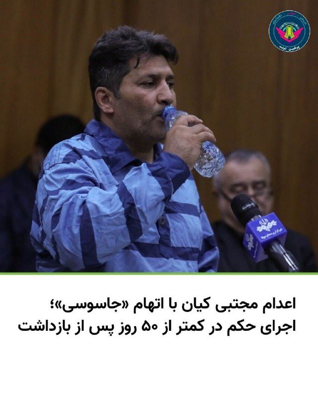

اعدام مجتبی کیان با اتهام «جاسوسی»؛ اجرای حکم در کمتر از ۵۰ روز پس از بازداشت

خبرگزاری میزان، وابسته به قوه قضاییه جمهوری اسلامی، اعلام کرد مجتبی کیان، زندانی سیاسی، پس از تشکیل پرونده‌ای در دادگستری استان البرز به اتهام ارسال اطلاعات مربوط به صنایع نظامی ایران به «دشمن» در جریان جنگ اخیر، اعدام شده است.

بر اساس گزارش منتشرشده، مقام‌های قضایی مدعی شده‌اند که مجتبی کیان اطلاعات مورد نظر را از طریق پیام‌رسانی به «یک شبکه ماهواره‌ای معاند» منتقل کرده بود.

قوه قضاییه همچنین او را به «فعالیت اطلاعاتی برای اسرائیل و آمریکا» متهم کرده و اعلام کرده است که وی علاوه بر حکم اعدام، به مصادره کلیه اموال نیز محکوم شده بود.

طبق اعلام رسمی، از زمان بازداشت مجتبی کیان تا اجرای حکم اعدام او در روز سوم خرداد ۱۴۰۵، کمتر از ۵۰ روز فاصله زمانی وجود داشته است.

حکم اعدام این زندانی در حالی اجرا شد که از روند رسیدگی پرونده او هیچ اطلاعاتی منتشر نشده است. اینکه آیا او وکیل داشته یا خیر، در شرایطی به سر برده و این اتهامات چه اندازه با واقعیت انطباق دارد، مشخص نیست.

جمهوری اسلامی در زوندی ناعادلانه و غیر شفاف شهروندان را به اتهامات مختلف متهم کرده و احکام سنگین صادر می‌کند. شهروندانی بی‌دفاع در برابر حکومتی ظالم و بی‌رحم.

👩‍💻@PhantomDirective

🆔@persian_trend_official
پرشین ترند | متفاوت‌ترین کانال نظامی

## Persian_Trend_Official — post 14823

ساعت 11 به وقت تهران لایو داریم

## Persian_Trend_Official — post 14822

  <a href="telegram/content/Persian_Trend_Official_14822_1779610352.mp4" target="_blank">🎬 Download video</a>

تصاویر ثبت شده لحظه اصابت موشک کروز روسی اسکندر-ک به کی‌یف در صبح امروز .

👩‍💻@PhantomDirective

🆔 @persian_trend_official
پرشین ترند | متفاوت‌ترین کانال نظامی

## Persian_Trend_Official — post 14821

بولتن خبری۲۴ ساعت گذشته پرشین ترند

🇮🇷 ایران

◾️ فرمانده ارتش پاکستان عاصم منیر پس از دیدار دوم با عراقچی، همچنین با قالیباف و پزشکیان دیدار کرد؛ وی روند مذاکرات مثبت خواند؛ سپس تهران را ترک کرد.

◾️ الجزیره: تهران و پاکستان بر سر یک «یادداشت تفاهم» به توافق رسیده‌اند؛ شامل پایان جنگ، بازگشایی تنگه هرمز و خروج نیروهای آمریکایی از منطقه؛ موضوع هسته‌ای به مذاکرات ۳۰ روزه بعدی موکول شده.

◾️ ایران دو پیشنهاد به میانجی پاکستانی ارائه کرده؛ خواستار بحث درباره تحریم‌ها و آزادسازی دارایی‌های مسدودشده پیش از امضای توافق شده است.

◾️ منبع نزدیک به تیم مذاکره‌کننده به فارس: سه موضوع اختلافی هنوز پابرجاست؛ پرونده هسته‌ای، آزادسازی پول‌های بلوکه‌شده، و مدیریت ایران بر تنگه هرمز
◾️ سخنگوی وزارت خارجه: تنگه هرمز به آمریکا ربطی ندارد؛ سازوکار مدیریت آن باید میان ایران و عمان تعریف شود
◾️ عضو کمیسیون امنیت ملی مجلس: در هر توافقی ایران باید غرامت جنگ دریافت کند؛ از مدیریت تنگه هرمز عقب‌نشینی نخواهد شد

◾️ ایران نماینده دائم خود نزد سازمان ملل را مأمور کرد مسئولیت بین‌المللی کشورهای خلیج فارس در تسهیل تجاوز علیه ایران را رسماً مطرح کند

◾️ حزب‌الله: عراقچی بر حمایت «قاطع و تزلزل‌ناپذیر» ایران از این گروه تأکید کرده؛ تهران خواستار گنجانده‌شدن لبنان در هرگونه توافق آتش‌بس است

◾️ جمهوری اسلامی مقر گروه کومله در اربیل عراق را با موشک و پهپاد هدف قرار داد

◾️ نیروی دریایی سپاه: ۲۵ کشتی در شبانه‌روز گذشته با مجوز سپاه از تنگه هرمز عبور کردند؛ تصاویر ماهواره‌ای از توقف ۲۴۰ کشتی در انتظار مجوز عبور خبر می‌دهد
◾️ پروازهای فرودگاه‌های اهواز و ماهشهر از سر گرفته شد.

◾️ مقامات ایران اعلام کردند اینترنت بین‌المللی در حال حاضر بازگشایی نخواهد شد؛ شورای عالی امنیت ملی قطع اینترنت را به دلایل امنیتی تأیید کرده.

◾️ راننده کنسول جمهوری آذربایجان در تبریز در سانحه رانندگی در اتوبان جلفا-تبریز جان باخت.

خبرگزاری قوه قضائیه: مجتبی کیان به اتهام ارسال اطلاعات در جنگ پس از تأیید حکم دیوان عالی کشور اعدام شد.

🇮🇱اسرائیل و خاورمیانه

◾️ اکسیوس: نتانیاهو از توافق در دست بررسی شدیداً نگران است و از ترامپ خواسته دور جدیدی از حملات به ایران آغاز شود؛ اسرائیل در حال اعمال فشار برای مختل کردن توافق است.

◾️ رسانه‌های اسرائیلی: اسرائیل سطح آماده‌باش را کاهش داده؛ برآوردها حاکی از عدم وقوع حمله قریب‌الوقوع به ایران است.

◾️ کانال ۱۳ اسرائیل: اسرائیل اطلاعاتی دریافت کرده که توافق آمریکا با ایران ممکن شده است.

◾️ فرانسه از ورود بن‌گویر، وزیر امنیت داخلی اسرائیل، به خاک خود جلوگیری کرد
◾️ نفتکشی در ۲۰۰ مایل دریایی غرب سوکوترا توسط یک قایق کوچک مورد تهدید قرار گرفت؛ با استقرار تیم امنیتی مسلح، قایق مسیر خود را تغییر داد.

🇺🇸
🇺🇳 آمریکا و جهان

◾️ ترامپ در پست توییتری اعلام کرد با رهبران عربستان، امارات، قطر، پاکستان، ترکیه، مصر، اردن و بحرین درباره ایران گفتگو کرده؛ توافق «تا حد زیادی» نهایی شده و به‌زودی اعلام می‌شود؛ تنگه هرمز بازگشایی خواهد شد.

◾️ اکسیوس: واشنگتن و تهران یادداشت تفاهم ۶۰ روزه امضا خواهند کرد؛ شامل پایان جنگ با حزب‌الله، امکان فروش نفت ایران و توقف محاصره بنادر؛ کاخ سفید امیدوار است توافق امروز یکشنبه اعلام شود.

◾️ نیویورک‌تایمز: یادداشت تفاهم ۲۵ میلیارد دلار از دارایی‌های مسدودشده ایران را آزاد می‌کند؛ مسائل هسته‌ای ظرف ۳۰ تا ۶۰ روز مذاکره خواهد شد.

◾️ فایننشال تایمز: موانع اصلی درخواست ترامپ برای تحویل ۴۴۰ کیلوگرم اورانیوم نزدیک به درجه تسلیحاتی و برچیدن سه سایت هسته‌ای نطنز، فردو و اصفهان است.

◾️ روبیو: ممکن است ایران توافق را در اوایل یکشنبه بپذیرد؛ امروز یا فردا خبری اعلام شود.

◾️ ترامپ با اکسیوس: شانس توافق یا حمله را «۵۰-۵۰» ارزیابی می‌کند؛ امروز با ویتکاف، کوشنر و ونس درباره آخرین پاسخ ایران دیدار خواهد کرد.

◾️ لیندزی گراهام هشدار داد هر توافقی که به بقای حکومت ایران و بازگشت نفوذ منطقه‌ای آن منجر شود خاورمیانه را بی‌ثبات‌تر خواهد کرد.

◾️ وزیر جنگ آمریکا هگست: نیروی هوایی آمریکا برای اعزام به خاورمیانه در آماده‌باش است.

◾️ دن اسکاوینو، معاون دفتر کاخ سفید، ویدیویی از بمب‌افکن‌های مخفی‌کار B-2 منتشر کرد؛ آخرین بار چنین پستی چند ساعت پیش از حمله به ایران منتشر شده بود.

◾️ تیراندازی مقابل کاخ سفید؛ مهاجم با ۳ گلوله به سمت ساختمان توسط سرویس مخفی کشته شد؛ یک عابر مجروح شد؛ ترامپ در سلامت کامل است؛ مهاجم فردی با سابقه اختلال روانی شناخته‌شده بود.

◾️ روسیه با بیش از ۳۰ موشک بالستیک از جمله اورشنیک کی‌یف اوکراین را بمباران کرد؛ این حمله از هفته گذشته برنامه‌ریزی شده بود.

🆔@persian_trend_official
پرشین ترند | متفاوت‌ترین کانال نظامی

## Persian_Trend_Official — post 14820

در این تماس، رهبران عربستان سعودی، قطر، مصر، ترکیه و پاکستان نیز حضور داشتند؛ کشورهایی که همگی در تلاش‌های میانجی‌گرانه نقش داشته‌اند.
پاکستانی‌ها میانجی اصلی بودند؛ با محوریت فیلدمارشال عاصم منیر که روزهای جمعه و شنبه در تهران بود تا تلاش کند این توافق را به مرحله نهایی برساند.
ترامپ در روزهای اخیر میان دو گزینه مردد بود: پیش بردن توافق یا آغاز موج گسترده‌ای از حملات علیه ایران. تا شنبه‌شب، او بیشتر به سمت راه‌حل دیپلماتیک متمایل شده بود.
مرحله بعد چیست؟
کاخ سفید امیدوار است اختلافات باقی‌مانده در ساعات آینده حل شود و توافق روز یکشنبه اعلام گردد. این را مقام ارشد آمریکایی گفته است.
او همچنین گفت ممکن است توافق حتی تمام ۶۰ روز دوام نیاورد، اگر آمریکا به این نتیجه برسد که ایران در مذاکرات مربوط به برنامه هسته‌ای جدی نیست.
از سوی دیگر، آمریکا معتقد است بحران اقتصادی در ایران انگیزه‌ای برای حکومت ایجاد کرده تا برای دستیابی به توافق کامل، رفع تحریم‌ها و آزادسازی دارایی‌ها وارد مسیر جدی‌تری شود.
این مقام آمریکایی گفت:
«جالب خواهد بود ببینیم ایران واقعاً تا چه اندازه حاضر است جلو برود؛ اما اگر ایران توانایی و اراده تغییر مسیر خود را داشته باشد، این مرحله بعدی آن را مجبور خواهد کرد تصمیم‌های بسیار مهمی بگیرد؛ اینکه می‌خواهد به‌عنوان یک کشور چه باشد.»
به گفته مشاوران ترامپ، اگر خواسته‌های او درباره برنامه هسته‌ای ایران برآورده شود، رئیس‌جمهور آمریکا آماده است برای بازتنظیم روابط با ایران بسیار جلو برود و به ایران فرصت دهد ظرفیت کامل اقتصادی خود را آزاد کند؛ ظرفیتی که ترامپ آن را «عظیم» می‌داند.

باراک راوید

## Persian_Trend_Official — post 14819

جزئیات توافق در حال شکل‌گیری میان آمریکا و ایران برای پایان جنگ

توافقی که آمریکا و ایران به امضای آن نزدیک شده‌اند، شامل تمدید ۶۰ روزه آتش‌بس است؛ دوره‌ای که در آن تنگه هرمز دوباره باز خواهد شد، ایران خواهد توانست نفت خود را آزادانه بفروشد و مذاکراتی درباره محدودسازی برنامه هسته‌ای ایران برگزار خواهد شد. این مطلب را یک مقام ارشد آمریکایی اعلام کرده است.
چرا مهم است؟
این توافق می‌تواند مانع تشدید جنگ شود و فشار بر بازار جهانی نفت را کاهش دهد. با این حال، هنوز روشن نیست که آیا این توافق به یک صلح پایدار منجر خواهد شد یا نه؛ صلحی که همزمان بتواند خواسته‌های رئیس‌جمهور ترامپ درباره برنامه هسته‌ای ایران را هم تأمین کند.
وضعیت فعلی
هم ترامپ و هم میانجی‌ها اشاره کرده‌اند که اعلام توافق ممکن است امروز، یکشنبه، انجام شود؛ هرچند توافق هنوز نهایی نشده و همچنان ممکن است فروبپاشد.
این مقام ارشد آمریکایی چارچوبی دقیق از پیش‌نویس فعلی ارائه کرده که بخش زیادی از آن توسط منابع دیگر نزدیک به مذاکرات نیز تأیید شده است.
این جزئیات از سوی طرف ایرانی تأیید نشده، هرچند تهران نیز نشانه‌هایی داده که توافق نزدیک است.
مفاد توافق چیست؟
دو طرف یک یادداشت تفاهم ۶۰ روزه امضا خواهند کرد که با توافق متقابل قابل تمدید خواهد بود.
در طول این ۶۰ روز، تنگه هرمز بدون دریافت عوارض باز خواهد بود و ایران موافقت می‌کند مین‌هایی را که در تنگه کار گذاشته، جمع‌آوری کند تا عبور آزاد کشتی‌ها ممکن شود.
در مقابل، آمریکا محاصره بنادر ایران را برمی‌دارد و برخی معافیت‌های موقت تحریمی صادر می‌کند تا ایران بتواند به مدت ۶۰ روز نفت خود را آزادانه بفروشد.
این مقام آمریکایی پذیرفته که این موضوع برای اقتصاد ایران یک مزیت خواهد بود، اما گفته این اقدام همچنین فشار قابل‌توجهی را از بازار جهانی نفت برمی‌دارد.
او گفت هرچه ایرانی‌ها سریع‌تر مین‌ها را جمع‌آوری کنند و امکان ازسرگیری کشتیرانی در تنگه هرمز را فراهم کنند، محاصره دریایی نیز سریع‌تر برداشته خواهد شد.
به گفته این مقام آمریکایی، اصل کلیدی ترامپ در این توافق این است: «امتیاز در برابر عملکرد».
ایران می‌خواست دارایی‌های مسدودشده فوراً آزاد شود و آمریکا نیز بلافاصله همه تحریم‌ها را به‌صورت دائمی بردارد، اما طرف آمریکایی گفته این اقدامات فقط پس از امتیازدهی ملموس ایران درباره برنامه هسته‌ای انجام خواهد شد.
مسائل هسته‌ای که هنوز باید حل‌وفصل شوند
پیش‌نویس یادداشت تفاهم شامل تعهداتی از سوی ایران است مبنی بر اینکه هرگز برای دستیابی به سلاح هسته‌ای تلاش نکند و درباره تعلیق برنامه غنی‌سازی اورانیوم و خارج کردن ذخایر اورانیوم با غنای بالا از کشور مذاکره کند. این را همان مقام ارشد آمریکایی گفته است.
به گفته دو منبع مطلع، ایران از طریق میانجی‌ها به آمریکا تعهدات شفاهی داده که نشان می‌دهد حاضر است در موضوع تعلیق غنی‌سازی و واگذاری ذخایر اورانیوم غنی‌شده تا چه حد امتیاز بدهد.
آمریکا موافقت خواهد کرد که در طول دوره ۶۰ روزه درباره رفع تحریم‌ها و آزادسازی دارایی‌های ایران مذاکره کند؛ هرچند این اقدامات فقط به‌عنوان بخشی از توافق نهایی و پس از اجرای قابل راستی‌آزمایی آن عملی خواهد شد.
نیروهای آمریکایی که در ماه‌های اخیر به خاورمیانه اعزام شده‌اند، در طول این ۶۰ روز در منطقه باقی خواهند ماند و فقط در صورت دستیابی به توافق نهایی عقب‌نشینی خواهند کرد.
پشت پرده
پیش‌نویس یادداشت تفاهم همچنین روشن می‌کند که جنگ میان اسرائیل و حزب‌الله در لبنان پایان خواهد یافت.
به گفته یک مقام اسرائیلی، بنیامین نتانیاهو، نخست‌وزیر اسرائیل، در تماس تلفنی روز شنبه با ترامپ نسبت به این شرط ابراز نگرانی کرده است. او همچنین درباره بخش‌های دیگر توافق نیز نگرانی‌هایی مطرح کرده، اما موضع خود را محترمانه بیان کرده و در نهایت موضوع را با نوعی تسلیم پذیرفته است؛ این را مقام آمریکایی گفته است.
این مقام آمریکایی تأکید کرد که این یک «آتش‌بس یک‌جانبه» نخواهد بود و اگر حزب‌الله تلاش کند دوباره مسلح شود یا حملاتی را آغاز کند، اسرائیل حق خواهد داشت برای جلوگیری از آن اقدام کند.
او گفت:
«اگر حزب‌الله درست رفتار کند، اسرائیل هم درست رفتار خواهد کرد.»
این مقام آمریکایی همچنین گفت:
«بی‌بی ملاحظات داخلی خودش را دارد، اما ترامپ باید به منافع آمریکا و اقتصاد جهانی فکر کند.»
این توافق چگونه شکل گرفت؟
رئیس‌جمهور ترامپ روز شنبه در یک تماس کنفرانسی، دیدگاه چند رهبر عرب و مسلمان را درباره این توافق جویا شد و همه آن‌ها گفتند از آن حمایت می‌کنند. این را سه منبع آشنا با این تماس اعلام کرده‌اند.
این رهبران شامل محمد بن زاید، رئیس امارات متحده عربی، نیز بودند؛ کسی که به گفته مقام آمریکایی، سخت‌گیرانه‌ترین موضع را در قبال ایران دارد.

## Persian_Trend_Official — post 14818

فرمانده ارتش پاکستان، ایران را ترک کرد تا در روزِ یکشنبه جواب آمریکا را به ایران منتقل و «یادداشت تفاهمِ مشترک» برای «دورانِ سختِ مذاکره هسته‌ای» نوشته و پذیرفته شود؛

محورهای مشترک مورد توافق ایران و آمریکا:
۱. پایانِ جنگ در تمامیِ جبهه‌ها
۲. بازگشایی تنگه توسط ایران در ازای رفع محاصره تنگه از طرف آمریکا
۳. آزادسازیِ بخشی از اموال بلوکه شده ایران (۱۲ میلیارد دلار از ۲۵ میلیارد دلارِ بحث شده)
۴. کم‌رنگ شدن حضور نظامی آمریکا در اطرافِ ایران (مبهم)
۵. فرصت ۳۰ روزه برای مذاکره در باب هسته‌ای

در موردِ محورهای گفته شده نکاتی مطرح است؛
۱. قرار بر این شده که اگر ساز و کار آزادسازی اموال بلوکه شده ایران زمان ببرد، قطر سریعا ۱۲ میلیارد دلار (با ۶ میلیارد دلار کُره که در بانک‌های قطر بلوکه شده) را بپردازد تا فرآیند آزادسازی بطور کامل طی شود.
۲. برخی منابع می‌گویند آمریکا ممکن است رفع محاصره تنگه را با یک پروتکل پذیرفته باشد بدین منظور که کشتی‌هایی که مبدا و مقصدشان ایران است هر روز بصورتِ لیستی چک شوند و در صورت تایید می‌توانند از تنگه هرمز تردد کنند!
۳. آیا آمریکا قصد دارد شریک ایران در مدیریت تنگه هرمز باشد؟! آیا قرار است پایگاهی در عمان تاسیس کند برای مدیریت بر تنگه؟! نقش عمان در مدیریت تنگه چه می‌شود؟! تقسیم‌کار تنگه هرمز میان ایران، عمان و آمریکا چگونه است و با چه درصدی از منافعِ آن؟!
۴. تا کنون کشتی‌هایی که از تنگه عبور کردند عموما از مسیر تعیین شده توسط ایران استفاده کردند؛ این مسیر در این تفاهم مشترک، لحاظ شده است؟! بحث عوارض ایران از کشتی‌های عبوری _که در شرایط فعلی اعمال می‌گردد_ در آینده نیز ادامه دارد یا حذف می‌شود؟!
۵. برداشتن تحریم‌ها در دور اول مذاکرات جایی نداشته و این یعنی برداشتن تحریم‌ها موکول به بخش هسته‌ای مذاکره یا ۳۰ روز مدنظر شده است!
۶. در بحث هسته‌ای آیا ایران غنی سازی ۳.۶۷ را می پذیرد یا ۲۰٪ را؟! میزان تعلیق غنی سازی توسط ایران چند سال است؛ ۵ سال، ۱۰ سال، ۱۵ سال یا ۲۰ سال یا حتی صفر؟! ۴۰۰ کیلو اورانیوم ۶۰٪ در ایران می‌ماند، به چین می‌رود یا روسیه؟! مهم‌تر از همه «آقا مجتبی»، «تعلیقِ بلند مدتِ غنی‌سازی» و «خروج اورانیوم» یا «رقیق‌سازیِ آن» در داخل را می پذیرید؟!
۷. «کاهشِ حضور نظامی آمریکا در اطراف ایران» صرفا به ناوچه‌ها و ناوشکن‌های آمریکا برمی‌گردد یا در مورد پایگاه‌های پرتعداد آمریکا در اطراف ایران هم صدق می‌کند؟!
۸. خسارت جنگ به کشور که اخیر بنا بر گزارش نهادهای اقتصادی دولت از ۹ میلیارد دلار (وزارت اقتصاد) تا ۲۷۰ میلیارد دلار (سازمان برنامه) _بصورتِ خسارت مستقیم و غیرمستقیم_ ذکر شده چه می‌شود؟! از «اخذِ غرامت» منصرف شدیم یا به مذاکرت هسته‌ای پیوند خورده یا قرار است آزادسازی پول‌های بلوکه شده را در ازای «غرامتِ جنگ» بدانیم؟!

جمع بندی نهایی: فارغ از نکات و انتقاداتِ وارده، اگر آمریکا «رفع محاصره تنگه هرمز» را «بدونِ پیش‌شرط» و «پروتکل» بپذیرد (همانطور که عضو ارشد اقتصادی دولت معتقد است در صورت عدم محاصره دریایی می‌توان کشور را گرداند)، مذاکره در مورد «پرونده هسته‌ای ایران» به آینده موکول شود _یعنی آمریکا از توافقِ یکجا بر سر همه مسائل در شرایط فعلی عدول کند_ و به سمتِ «آزاد سازیِ اموال بلوکه شده‌ی ایران» برود، تا اینجای کار «برای ایران»، «بُرد» به حساب می‌آید!

علی قلهکی

📌 @persian_trend_official
پرشین ترند | متفاوت‌ترین کانال نظامی

## Persian_Trend_Official — post 14817

🔴 آکسیوس: توافق ۶۰ روزه ایران و آمریکا شامل بازگشایی رایگان تنگه هرمز خواهد بود

آکسیوس گزارش داد یادداشت تفاهم ۶۰ روزه پیشنهادی میان ایران و آمریکا شامل بازگشایی تنگه هرمز بدون دریافت عوارض و ازسرگیری صادرات نفت ایران در ازای تمدید آتش‌بس و آغاز مذاکرات هسته‌ای است.

بر اساس این گزارش:

▪️ ایران متعهد خواهد شد مین‌های دریایی را از تنگه هرمز پاکسازی کند
▪️ تهران وارد مذاکرات درباره تعلیق غنی‌سازی اورانیوم و انتقال ذخایر اورانیوم با غنای بالا خواهد شد
▪️ آمریکا نیز بخشی از تحریم‌ها را کاهش داده و محاصره بنادر ایران را در طول مدت توافق متوقف می‌کند

همچنین گفته شده:
▪️ این تفاهم به‌عنوان یک چارچوب موقت برای جلوگیری از بازگشت جنگ طراحی شده است

▪️ هدف اصلی آن، حفظ آتش‌بس و ایجاد زمان برای مذاکرات پیچیده‌تر هسته‌ای است

▪️ بازگشایی کامل تنگه هرمز یکی از مهم‌ترین بخش‌های توافق برای بازار جهانی انرژی محسوب می‌شود

با این حال:
▪️ هنوز توافق به‌صورت رسمی امضا یا اعلام نشده است

▪️ اختلافات درباره غنی‌سازی، ذخایر اورانیوم و تضمین‌های امنیتی همچنان پابرجاست

▪️ برخی منابع اسرائیلی نسبت به مفاد توافق و محدودشدن گزینه نظامی علیه ایران ابراز نگرانی کرده‌اند

🫆:Tony

📌 @persian_trend_official
پرشین ترند | متفاوت‌ترین کانال نظامی

## RadioFarda — post 157509

🔸رسانه‌های پاکستان گزارش دادند یک بمب قدرتمند در نزدیکی خط راه‌آهن شهر کویته هم‌زمان با عبور یک قطار مسافربری منفجر شد.

🔸بر اساس اعلام مقام‌های محلی، در این حادثه بیش از ۳۰ نفر زخمی شدند.

🔸پزشکان بیمارستان‌های منطقه حال شماری از مجروحان را وخیم گزارش کردند.

🔸 هنوز جزئیاتی درباره عامل یا انگیزه این انفجار منتشر نشده است.

@RadioFarda

## RadioFarda — post 157508

  

🔸 در حالی که خبرگزاری نزدیک به سپاه پاسداران از نزدیک شدن طرفین به یک «تفاهم اولیه» خبر می‌دهد، فرمانده کل سپاه پاسداران در پیامی به مناسبت روز سوم خرداد که در ایران به عنوان «سالروز آزادسازی خرمشهر» گرامی داشته می‌شود، به آمریکا درباره «تعرض مجدد» هشدار داد.

🔸همزمان خبرگزاری تسنیم، نزدیک به سپاه پاسداران، روز یک‌شنبه از «تفاهم اولیه احتمالی» نوشته و جزئیات آن را بر اساس «شنیده‌ها»ی خود شرح داده است.

🔸 بر اساس گزارش تسنیم که بسیار نزدیک به گزارش سایت اکسیوس از جزئیات تفاهم‌نامه است، در تفاهم‌نامه «یک بازه ۳۰ روزه برای اجرای اقدامات مرتبط با محاصره دریایی و تنگه هرمز در نظر گرفته شده و همزمان، دوره‌ای ۶۰ روزه برای مذاکرات درباره موضوع هسته‌ای تعریف خواهد شد».

🔸 تسنیم در ادامه همچون خبرگزاری فارس نوشته است:‌ «ایران در مقطع کنونی هیچ اقدامی را در حوزه هسته‌ای نپذیرفته است.»

@RadioFarda

## RadioFarda — post 157507

  

🔸وب‌سایت خبری اکسیوس روز یک‌شنبه در گزارشی به نقل از منابع خود که به نام‌شان اشاره نکرد نوشت که حکومت ایران و ایالات متحده به امضای یک «یادداشت تفاهم ۶۰ روزه» نزدیک شده‌اند.

🔸به طور خلاصه، این تفاهم‌نامه که می‌تواند آتش‌بس را تمدید کرده، تنگه هرمز را باز کرده و به دور جدیدی از مذاکرات اتمی بینجامد توافق نهایی نیست.

🔸بر اساس این تفاهم‌نامه که می‌تواند با توافق طرفین تمدید شود ایران متعهد می‌شود که تنگه هرمز را بدون دریافت عوارض باز کند و مین‌هایی را که احتمالا در آب رها کرده جمع‌آوری کند.

🔸در مقابل،‌ دولت دونالد ترامپ به محاصره بنادر ایران پایان خواهد داد، و ایران را از برخی از تحریم‌ها معاف خواهد کرد تا بتواند نفت خود را در بازار جهانی به فروش برساند.

🔸مسائل اتمی میان ایران و آمریکا در این ۶۰ روز حل نخواهد شد، بلکه تفاهم‌نامه به یک دوره از مذاکره درباره مسائل اتمی ختم خواهد شد که در آن، بنا بر امیدواری موجود، حکومت ایران تعهد می‌کند که هرگز به دنبال سلاح اتمی نباشد و دو طرف درباره تعلیق برنامه عنی‌سازی اورانیوم و انتقال ذخیره اورانیوم ایران گفت‌وگو و مذاکره خواهند کرد.

@RadioFarda

## RadioFarda — post 157506

  

🔸پس از آن که دونالد ترامپ در پیامی در شبکه اجتماعی خود از نهایی شدن جزئیات توافق با جمهوری اسلامی خبر داد، نخست وزیر پاکستان در پیامی در شبکه ایکس برای برگزاری دور جدید مذاکرات ابراز امیدواری کرد و خبرگزاری فارس پیام‌های رئیس جمهور آمریکا را «تبلیغاتی و برای مصرف در داخل آمریکا» توصیف کرد.

🔸دونالد ترامپ، رئیس‌جمهور ایالات متحده، شامگاه شنبه دوم خرداد به وقت تهران اعلام کرد که با رهبران چند کشور خاورمیانه دربارهٔ جمهوری اسلامی ایران و همهٔ موضوعات مرتبط با تفاهم‌نامهٔ صلح گفت‌وگو کرده و توافق با ایران تا حد زیادی نهایی شده است.

🔸با این حال پیام پاکستان به عنوان میانجی اصلی و همین طور خبر فارس به عنوان خبرگزاری نزدیک به سپاه پاسداران در ایران حکایت از آن دارد که راه رسیدن به توافق هنوز به پایان نرسیده است.

🔸همزمان وب‌سایت خبری اکسیوس از آماده شدن پیش‌نویس تفاهم‌نامه‌ای می‌گوید که «ترامپ در شرف امضا کردن است».

🔸ساعاتی پیش خبرگزاری فارس در همین زمینه نوشته بود:‌ «هیچ تعهدی از سوی ایران داده نشده و پروندهٔ هسته‌ای اساساً در این مرحله مورد بحث قرار نگرفته است.»

@RadioFarda

## RadioFarda — post 157505

  

🔸قوه قضاییه جمهوری اسلامی روز یک‌شنبه، سوم خرداد از اعدام فردی به نام مجتبی کیان به عنوان «عامل ارسال اطلاعات مراکز تولید صنایع دفاعی»‌ ایران به آمریکا و اسرائیل خبر داد.

🔸خبرگزاری میزان نوشت که کیان «از عناصر همکار دشمن» بوده که در طول جنگ اخیر «اقدام به ارسال اطلاعات مرتبط با واحدهای صنایع دفاعی کشور» کرده و پس از رسیدگی قضایی در دادگستری استان البرز بامداد یک‌شنبه «پس از تأیید حکم از سوی دیوان عالی کشور... به دار مجازات آویخته شد».

🔸این خبرگزاری هیچ اطلاعاتی درباره حرفه این فرد نداده و مشخص نیست که مجتبی کیان چگونه به «اطلاعات صنایع دفاعی» دسترسی داشته است.

🔸همزمان در ادامه خبر میزان آمده است که او «پیام‌های متعددی را به شبکه‌های معاند» فرستاده است. در ادبیات جمهوری اسلامی، شبکه معاند اشاره به شبکه‌های فارسی‌زبان خارج از کشور دارد.

🔸ایران در ماه‌های اخیر با موج تازه‌ای از اعدام‌ها، بازداشت‌ها و صدور احکام سنگین روبه‌رو بوده است؛ موجی که به گفتهٔ نهادها و سازمان‌های حقوق بشری، در فضای جنگ، بحران امنیتی و اعتراضات، به‌عنوان ابزاری برای ایجاد ترس و کنترل جامعه عمل می‌کند.

@RadioFarda

## RadioFarda — post 157504

🔸تیراندازی در حوالی کاخ سفید در روز شنبه دوم خرداد یک کشته و یک زخمی بر جا گذاشت.

🔸به گزارش سرویس مخفی پس تیراندازی فرد مظنون به سمت ایست بازرسی کاخ سفید، مأموران به سوی او شلیک کردند و او پس از انتقال به بیمارستان جان باخت.

🔸یک مقام انتظامی به رویترز گفت که مظنون به‌عنوان فردی با اختلالات روانی شناسایی شده است.

🔸طبق یک بیانیه سرویس مخفی در جریان تیرانداری یک رهگذر نیز مورد اصابت گلوله قرار گرفت، اما مشخص نیست که این شخص چقدر آسیب دیده و چه کسی به سمت او شلیک کرده است.

🔸بنا بر اعلام سرویس مخفی دونالد ترامپ، رئیس جمهور، در زمان وقوع حادثه در کاخ سفید حضور داشته است و هیچ یک از پرسنل انتظامی زخمی نشده‌اند.

@RadioFarda

## RadioFarda — post 157503

  <a href="https://t.me/radiofarda/157503" target="_blank">📎 Download file</a>

📻بشنوید: سرخط خبرها با رادیوفردا، سوم خرداد ۱۴۰۵‌

@RadioFarda

## IranianMinds — post 20656

  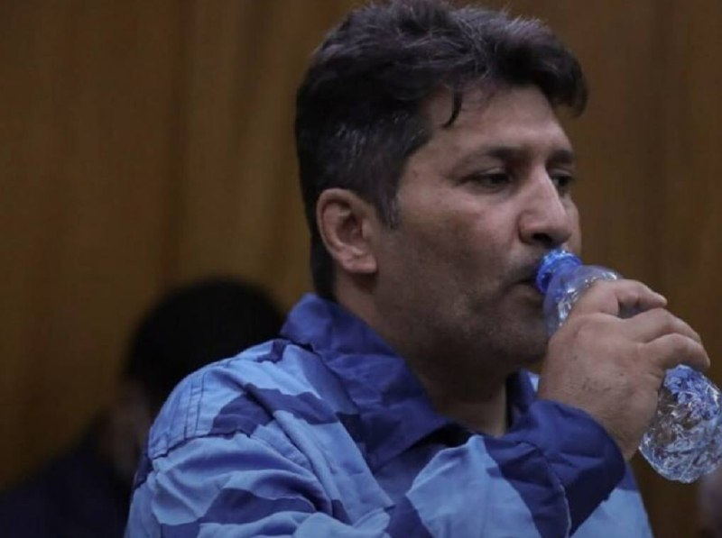

⚫️ جمهوری اسلامی یکی دیگه از هموطن هامونو هم امروز کشت.

خبرگزاری قوه قضائیه جمهوری اسلامی اعلام کرد مجتبی کیان امروز صبح به دلیل ارسال پیام و دادن مختصات صنایع نظامی به شبکه های ماهواره ای معاند ( ایران اینترنشنال ) اعدام شد.

@IranianMinds

## IranianMinds — post 20655

این اخباری که داره میاد با هیچکدوم از حرف های ترامپ و کلا باورهاش سازگار نیست. همه چیز مشکوکه و باید صبر کنیم خود ترامپ درباره جزییاتش صحبت بکنه.

وگرنه باراک اوباما بدون ریختن خون یک نفر و بدون هیچ جنگی توافقی بهتر از این با جمهوری امضا کرد

تازه تنگه هرمز هم بسته نشد
نفت هم گرون نشد
پایگاه های آمریکا هم آسیب ندیدن
کشور های منطقه هم آسیب ندیدن

جهان بینی آمریکا، مخصوصا جمهوری خواهان اصلا اجازه چنین توافقی نمیده.
حتی اگر توافق بشه، بعد از خارج کردن اورانیوم جمهوری اسلامی به احتمال زیاد بهشون حمله میشه

## IranianMinds — post 20654

🔴 فوری

تنش ها در میان مقامات آمریکایی در حال افزایش است زیرا توافق نامه صلح ترامپ در آینده با ایران واکنش ها را برانگیخته است.
بسیاری از افراد پر نفود جمهوری خواه مخالفت شدید خود را با این توافق اعلام کرده اند.

@IranianMinds

## IranianMinds — post 20653

  

🔴 هشدار شدید پمپئو به ترامپ:

‏به نظر می‌رسد توافقی که با ایران در حال انجام است، به‌طور مستقیم از روی نقشه وندی شرمن-رابرت مالی-بن رودز بیرون آمده: به سپاه پاسداران پول بدهید تا یک برنامه سلاح‌های کشتار جمعی بسازد و جهان را ترور کند.
‏این اصلا ربطی به شعار «اول آمریکا» ندارد.
‏موضوع خیلی ساده است:
‏تنگه را باز کنید.
‏دسترسی ایران به پول را قطع کنید.
‏و آن‌قدر توانایی‌های ایران را هدف قرار دهید که دیگر نتواند متحدان ما در منطقه را تهدید کند.
‏خیلی دیر شده.
‏وقتشه اقدام کنند.

@IranianMinds

## IranianMinds — post 20651

🔴 توییت‌های تد کروز و لیندسی گراهام در واکنش به اخبار منتشر شده درباره توافق احتمالی

@IranianMinds

## IranianMinds — post 20650

آمریکای جهان‌خوار به ما که رسید شد گیاهخوار

@IranianMinds

## IranianMinds — post 20649

🔴 ترامپ :

«از سرویس مخفی و مجری قانون بزرگ ما برای اقدام سریع و حرفه ای که امروز عصر علیه مرد مسلحی در نزدیکی کاخ سفید انجام شد، که سابقه خشونت آمیز و احتمال وسواس احتمالی نسبت به ارزشمندترین ساختار کشورمان داشت، سپاسگزاریم. مرد مسلح پس از تبادل آتش با ماموران سرویس مخفی در نزدیکی دروازه های کاخ سفید کشته شد. این رویداد یک ماه از تیراندازی در مراسم شام خبرنگاران کاخ سفید حذف شده است و نشان می‌دهد که برای همه روسای جمهور آینده چقدر مهم است که امن‌ترین و امن‌ترین فضایی را که در نوع خود در واشنگتن دی سی ساخته شده است، داشته باشند.

@IranianMinds

## BBCPersian — post 281935

🔻 مخالفت روزنامه کیهان با برگشتن تنگه هرمز به وضعیت پیش از جنگ

حسین شریعتمداری، مدیر مسئول روزنامه کیهان، در یادداشتی درباره برگشتن تنگه هرمز به وضعیت پیش از جنگ، نوشت: «تنگه هرمز بخشی از آب‌های سرزمینی ایران است و این حق قانونی برای کشورمان محفوظ است که از کشتی‌ها و شناورهای عبورکننده از آب‌های سرزمینی خود عوارض عبور بگیرد.»

«این روزها در برخی از اخبار و گزارش‌ها به عبور ده‌ها کشتی از تنگه هرمز اشاره می‌شود با این تأکید که عبور آنها با کسب اجازه و تحت کنترل نیروی دریادل سپاه پاسداران صورت می‌پذیرد اما توضیحی داده نمی‌شود که آیا از این کشتی‌ها و شناورها، حق عبور نیز دریافت می‌شود یا نه؟ اگر پاسخ منفی است، باید آن را غفلت از یک اقدام ضروری تلقی کرد. چرا که عوارض عبور، حق قانونی ایران اسلامی است و نباید نادیده گرفته شود.»

او در انتها از تیم مذاکره کننده انتقاد کرد: «همین جا باید از اظهارات برخی از دیپلمات‌ها و تیم مذاکره‌کننده کشورمان گلایه کرد که انگار قرار است بعد از پایان جنگ، شرایط و قوانین حاکم بر تنگه به حالت پیش از جنگ بازگردد. و انگار نه انگار که اِعمال حاکمیت ایران بر تنگه هرمز، حق قانونی و قطعی کشورمان است‌.»

https://bbc.in/4nJgJqO
@BBCPersian

## BBCPersian — post 281934

🔻 دستفروشی در ایران؛ خوداشتغالی برای بقا و مبارزه شخصی با فقر

علی رمضانیان - روزنامه‌نگار
پدیده دستفروشی در ایران دیگر صرفا یک شغل حاشیه‌ای و موقت برای اقشار کم‌ درآمد محسوب نمی‌شود؛ بلکه در سال‌های اخیر به یکی از آشکارترین نشانه‌های بحران اقتصادی، گسترش فقر و فرسایش طبقه متوسط تبدیل شده است.

در شهرهای بزرگ ایران، از تهران و مشهد تا اهواز، تبریز، شیراز و کرج، دستفروشان اکنون به بخشی جدایی‌ناپذیر از چهره خیابان‌ها، متروها، پیاده‌روها و حتی بزرگراه‌ها بدل شده‌اند.

بسیاری از کارشناسان اقتصادی معتقدند رشد فزاینده دستفروشی، بازتاب مستقیم بیکاری، سقوط قدرت خرید خانوارها، گسترش اقتصاد غیررسمی، فرار مالیاتی، کاهش امنیت شغلی و تضعیف تدریجی بازار رسمی کار است.

https://bbc.in/4fF8Yjz
@BBCPersian

## BBCPersian — post 281933

🔻 وزارت اطلاعات ایران می‌گوید ۱۵ نفر را در استان فارس دستگیر کرده است

اداره کل اطلاعات استان فارس گفت که ۱۵ نفر را در این استان دستگیر کرده که از «عناصر آشوبگر و تروریستی» بوده‌اند.

به گفته این اداره، این «یک شبکه آموزش دیده» بود و از این افراد «مقادیری سلاح مهمات، ابزارهای خرابکاری برای هدف قرار دادن اماکن دولتی و تجمعات مردمی کشف و ضبط گردید.»

https://bbc.in/4uoSII9
@BBCPersian

## BBCPersian — post 281932

🔻 اسرائیل: در ۲۴ ساعت گذشته سه انبار سلاح حماس را در نوار غزه منهدم کردیم

ارتش اسرائیل می‌گوید در شبانه‌روز گذشته «به سه انبار سلاح حماس در مرکز نوار غزه حمله و آنها را منهدم» کرده است.

به گفته اسرائیل در این انبارها «موشک‌های ضد تانک، سلاح‌های دوربرد، آرپی‌جی، جلیقه‌های ضدگلوله و تجهیزات جنگی» وجود داشت.

روز چهارشنبه هم ارتش اسرائیل یک انبار دیگر حماس را از بین برده بود.

ارتش اسرائیل در پایان اعلام این خبر گفته «مطابق با توافق آتش‌بس» همچنان به فعالیت ادامه خواهد داد و «به عملیات خود برای رفع هرگونه تهدید فوری ادامه» می‌دهد.

https://bbc.in/4dsLOLV
@BBCPersian

## BBCPersian — post 281931

  

🔻انفجاری بزرگ در نزدیکی یک قطار که از گذرگاه چمن در شهر کویته در ایالت بلوچستان پاکستان عبور می‌کرد، تعداد زیادی کشته و ده‌ها نفر زخمی برجا گذاشت.

یک مقام ارشد پلیس بلوچستان و یکی از مسئولان این ایالت به محمد کاظم، خبرنگار بی‌بی‌سی اردو، گفت تاکنون کشته شدن ۲۰ نفر در این انفجار تأیید شده و دست‌کم ۷۰ نفر زخمی شده‌اند.
در پی این حادثه، در بیمارستان‌های شهر کویته وضعیت اضطراری اعلام شده است.

تصاویر منتشرشده پس از حادثه نشان می‌دهد که چندین خودرو در نزدیکی خط آهن آتش‌ گرفته‌اند و واگن‌های قطار نیز روی ریل واژگون شده‌اند.

گروه جدایی‌طلب «ارتش آزادیبخش بلوچ» مسئولیت این حمله را به عهده گرفته‌ است.

بیشتر بخوانید:

https://bbc.in/43vfz8U
@BBCPersian

## BBCPersian — post 281930

🔻 کشته شدن یک کارمند کنسولگری جمهوری آذربایجان در تصادف جاده‌ای

رسانه‌های ایران گزارش کرده‌اند که رامیل عمران‌اُف، کارمند بخش کنسولگری جمهوری آذربایجان در تبریز، در یک سانحه رانندگی در محور مرند - جلفا جان خود را از دست داده است.

حبیب آبراهه، رئیس پلیس راه آذربایجان شرقی، گفته است این تصادف در ساعت ۱۲:۵۰ روز شنبه رخ داد و «در این حادثه یک دستگاه سواری کیا اسپورتیج با پلاک دیپلماتیک جمهوری آذربایجان با یک دستگاه کامیون میکسر حمل بتن برخورد کرد.»

https://bbc.in/4o5dKtb
@BBCPersian

## BBCPersian — post 281929

  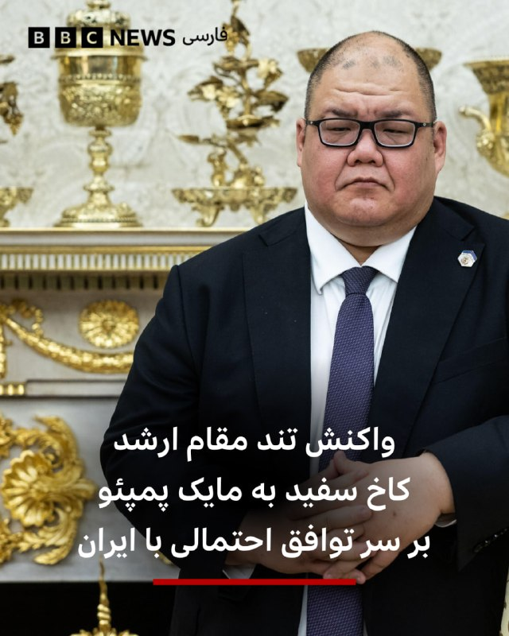

‌ ‌ ‌
استیون چونگ، مدیر ارتباطات کاخ سفید، در واکنش به انتقادهای مایک پمپئو از توافق احتمالی با ایران، در شبکه اجتماعی ایکس حمله تندی به وزیر خارجه پیشین آمریکا کرد.

آقای چونگ نوشت: «مایک پمپئو هیچ درکی از موضوع ندارد. بهتر است دهانش را ببندد و کار واقعی را به حرفه‌ای‌ها واگذار کند.»

او همچنین گفت آقای پمپئو «در جریان اتفاقات نیست» و به همین دلیل «نمی‌داند چه می‌گذرد.»

این واکنش پس از آن مطرح شد که مایک پمپئو در پیامی در ایکس، توافق احتمالی با ایران را شبیه سیاست‌های دولت جو بایدن توصیف کرد و هشدار داد که چنین توافقی می‌تواند به ایران امکان دسترسی به منابع مالی، ادامه غنی‌سازی اورانیوم و نفوذ بیشتر بر تنگه هرمز را بدهد.

اظهارات آقای چونگ در حالی مطرح می‌شود که دونالد ترامپ ساعاتی پیش گفته بود بخش عمده توافق با ایران «مذاکره شده» و بازگشایی تنگه هرمز هم شامل آن خواهد بود.

https://bbc.in/49LCGzK
📷EPA/Shutterstock
@BBCPersian

## BBCPersian — post 281928

  

‌ ‌ ‌ ‌
خبرگزاری میزان، وابسته به قوه‌ قضائیه ایران خبر از اعدام مجتبی کیان، به اتهام «فعالیت اطلاعاتی» برای اسرائیل و آمریکا در جنگ اخیر داده است.

قوه قضائیه جمهوری اسلامی گفته که مجتبی کیان «در طول جنگ رمضان اقدام به ارسال اطلاعات مرتبط با واحد‌های صنایع دفاعی کشور به دشمن می‌کرد.»

به گفته رسانه دستگاه قضایی آقای کیان در طول جنگ اخیر «پیام‌های متعددی را به شبکه‌های معاند» ارسال می‌کرده «که از جمله آنها، مختصات و اطلاعات محل واحد‌های تولید قطعات مرتبط با صنایع دفاعی کشور بود.»

میزان تاکید کرده که یکی از دلایل صدور حکم اعدام برای آقای کیان «اعترافات» او پیش از دادگاه و در دادگاه بوده است.

نهادهای حقوق بشر از دادرسی‌های ناعادلانه، نقض حقوق متهم و موج اعدام‌ها بر اساس «اعترافات» زیر شکنجه و فشار برای صدور احکام اعدام در ایران ابراز نگرانی کرده‌اند.

https://bbc.in/4a0m5Ir
📷Getty
@BBCPersian

## BBCPersian — post 281927

🔻سی‌بی‌اس: مظنون تیراندازی در نزدیکی کاخ سفید سابقه درگیری با سرویس مخفی داشت

منابع آگاه به سی‌بی‌اس نیوز شریک خبری بی‌بی‌سی، گفتند که مظنون کشته‌شده در تیراندازی بیرون کاخ سفید، شناسایی شده است و نامش «نصیر بِست» و ۲۱ ساله بود.

https://bbc.in/4wGRQA5
@BBCPersian

## BBCPersian — post 281926

🔻تد کروز: توافقی که به ایران امکان کنترل تنگه هرمز بدهد، اشتباهی فاجعه‌بار است

تد کروز، سناتور جمهوری‌خواه آمریکا، در واکنش به گزارش‌ها درباره توافق احتمالی با ایران، در شبکه اجتماعی ایکس نوشت که نسبت به آنچه «توافق ایران» خوانده می‌شود و به گفته او برخی در دولت آمریکا در حال پیشبرد آن هستند، «عمیقا نگران» است.

او نوشت که تصمیم دونالد ترامپ برای حمله به ایران «مهم‌ترین تصمیم» دوره دوم ریاست‌جمهوری او بود و افزود که آمریکا «نتایج نظامی فوق‌العاده‌ای» به دست آورده است؛ از جمله به گفته او نابودی همه موشک‌ها و پهپادهای ایران و غرق کردن تمام نیروی دریایی آن کشور.

سناتور کروز می‌گوید که اسلامگرایان حاکم بر ایران، همچنان شعار «مرگ بر آمریکا» سر می‌دهند و نوشت که اگر نتیجه این تحولات آن باشد که این حکومت بعد از این توافق «میلیاردها دلار دریافت کند، اورانیوم غنی‌سازی کند و سلاح هسته‌ای توسعه دهد و کنترل موثر بر تنگه هرمز داشته باشد، این یک اشتباه فاجعه‌بار خواهد بود.»

او همچنین نوشت که جزئیات توافق هنوز در حال روشن شدن است، اما این‌که راب مالی، نماینده پیشین دولت جو بایدن در امور ایران، از آن حمایت کرده «دلگرم‌کننده نیست.»

سناتور کروز در پایان گفت که دونالد ترامپ به «صلح از مسیر قدرت» باور دارد و باید به دفاع از آمریکا و اجرای «خطوط قرمز» اعلام‌شده ادامه دهد.

https://bbc.in/4dIXh98
@BBCPersian

## BBCPersian — post 281925

  

🔻مایک جانسون، رئیس مجلس نمایندگان آمریکا، از توافق در حال شکل‌گیری با ایران حمایت کرد و در شبکه اجتماعی ایکس نوشت تنها دونالد ترامپ می‌توانست ایران را «پای میز مذاکره» بیاورد.

آقای جانسون نوشت: «از این‌که می‌شنویم توافق صلح با ایران در حال شکل‌گیری است، بسیار دلگرم شده‌ایم و منتظریم جزئیات بیشتری درباره آن منتشر شود.»

او همچنین افزود: «تحت رهبری رئیس‌جمهور ترامپ، کشور ما قدرتمندتر، در صحنه جهانی محترم‌تر و امن‌تر از هر زمان دیگری است.»

📸 Reuters

https://bbc.in/4dIXh98
@BBCPersian

## BBCPersian — post 281924

🔻اختلاف جمهوری‌خواهان بر سر توافق احتمالی ترامپ با ایران

اعلام دونالد ترامپ، رئیس جمهور آمریکا مبنی بر «تا حد زیادی مذاکره شدن» توافق با ایران، که به گفته او شامل بازگشایی تنگه هرمز نیز می‌شود، واکنش‌های متفاوتی را در میان جمهوری‌خواهان و متحدان سیاسی او در آمریکا برانگیخته است.

https://bbc.in/4nPu9BJ
@BBCPersian

## BBCPersian — post 281923

🔻دنیس راس: ایران در آینده از تنگه هرمز به‌عنوان اهرم فشار استفاده خواهد کرد

دنیس راس، دیپلمات باسابقه و مذاکره کننده سابق آمریکایی در شبکه اجتماعی ایکس نوشت که توافق در حال شکل‌گیری درباره بازگشایی تنگه هرمز است.

او نوشت: «ما محاصره خود را برمی‌داریم و آن‌ها اجازه عبور همه کشتی‌ها را می‌دهند؛ همان‌طور که پیش از جنگ برقرار بود.»

آقای راس افزود که قرار است طی ۶۰ روز آینده درباره برنامه هسته‌ای ایران مذاکره شود؛ توافقی که هدف آن پایان دادن به این برنامه نیست، بلکه محدود کردن آن است.

او همچنین مدعی شد که ایران در آینده از تنگه هرمز به‌عنوان اهرم فشار استفاده خواهد کرد.

https://bbc.in/4dIXh98
@BBCPersian

## BBCPersian — post 281922

🔻لیندزی گراهام: توافقی که به بقای حکومت ایران منجر شود بر درگیری‌های منطقه بنزین می‌ریزد

لیندزی گراهام، سناتور ارشد جمهوری‌خواه آمریکا، در پیامی در شبکه اجتماعی ایکس نوشت که اگر در منطقه چنین برداشت شود که توافق با ایران به حکومت آن کشور امکان بقا و قدرتمندتر شدن در گذر زمان را می‌دهد، در واقع «بر درگیری‌های لبنان و عراق بنزین ریخته‌ایم.»

او افزود توافقی که این تصور را ایجاد کند که ایران می‌تواند بقا پیدا کند و در آینده توان کنترل تنگه هرمز را داشته باشد، حزب‌الله در لبنان و شبه‌نظامیان شیعه در عراق را «به‌شدت تقویت خواهد کرد.»

پست سناتور گراهام بعد از آن است که دونالد ترامپ، رئیس جمهور آمریکا اعلام کرد که گفت‌وگوهای «بسیار خوبی» با شماری از رهبران منطقه داشته است اما جنبه‌ها و جزئیات نهایی توافق با ایران همچنان در حال بررسی است و «به‌زودی» اعلام خواهد شد.

آقای ترامپ همچنین گفت که در چارچوب این توافق، تنگه هرمز بازگشایی خواهد شد.

https://bbc.in/4dIXh98
@BBCPersian

## BBCPersian — post 281921

  

به‌گزارش خبرگزاری فرانسه، شهباز شریف، نخست‌وزیر پاکستان، ابراز امیدواری کرد که کشورش به‌زودی میزبان دور بعدی مذاکرات صلح میان ایران و آمریکا باشد.

آقای شریف در پیامی در شبکه اجتماعی ایکس نوشت: «پاکستان با نهایت صداقت به تلاش‌های صلح خود ادامه خواهد داد و امیدواریم خیلی زود میزبان دور بعدی گفت‌وگوها باشیم.»

به گزارش خبرگزاری رویترز، نخست‌وزیر پاکستان همچنین از دونالد ترامپ به‌دلیل «تلاش‌های فوق‌العاده برای پیگیری صلح»، تقدیر کرد و گفت که گفت‌وگوی تلفنی آقای ترامپ با رهبران عربستان سعودی، قطر، ترکیه، مصر، امارات متحده عربی، اردن و پاکستان «بسیار مفید و سازنده» بوده است.

به گفته آقای شریف، فیلد مارشال عاصم منیر، فرمانده کل ارتش و نیروهای مسلح پاکستان، نماینده آن کشور در تماس تلفنی با آقای ترامپ بود و از «تلاش‌های خستگی‌ناپذیر» او در تمام روند مذاکرات قدردانی کرد.

نخست‌وزیر پاکستان افزود که این گفت‌وگوها فرصتی برای تبادل نظر درباره وضعیت کنونی منطقه و پیشبرد تلاش‌ها برای دستیابی به صلحی پایدار فراهم کرده است.

📸 Reuters

https://bbc.in/4dIXh98
@BBCPersian

## BBCPersian — post 281919

🔻اسماعیل بقائی، سخنگوی وزارت امور خارجه، در پیامی در شبکه اجتماعی ایکس با درج تصویر سنگ‌نگاره پیروزی شاپور اول ساسانی بر امپراتور روم، نوشت: «وقتی ایرانیان مهاجمان متوهم را ناکام گذاشتند.»

او در این پیام که کنایه‌ای است به محاصره دریایی بنادر ایران توسط آمریکا نوشت: «رومیان تصور می‌کردند که رم مرکز عالم است؛ اما ایرانیان این توهم را در هم شکستند.»

پیام آقای بقایی که به نحو گسترده‌ای در کانال‌های تلگرامی رسانه‌های حکومتی ایران بازنشر شده است به نظر می‌رسد که با استفاده از سنگ‌نگاره پیروزی شاپور بر امپراتوران روم در نقش رستم استان فارس بازنقش شده است.

آقای بقایی که اخیرا با حکم محمدباقر قالیباف به عنوان سخنگوی هیئت مذاکره‌کننده ایران هم منصوب شده است با اشاره به لشگرکشی مارکوس یولیوس فیلیپوس معروف به فیلیپ عرب، امپراتور روم، علیه امپراتوری ساسانیان، نوشت که لشگرکشی او «منجر به پیروزی رومیان نشد بلکه به صلحی با شروط شاپور اول ختم شد؛ امپراتور ناچار شد با واقعیت کنار بیاید.»

📸 REUTERS/ IRIMFA_SPOX

https://bbc.in/4dIXh98
@BBCPersian

## BBCPersian — post 281918

  

🔻ایران در جریان جام جهانی امسال، اردوی تیم ملی خود را در شهر مرزی تیخوانا در مکزیک برپا خواهد کرد. این اقدام پس از آن‌ است که فیفا با درخواست انتقال محل اردو از ایالت آریزونا موافقت کرد.

به گزارش رویترز مهدی تاج، رئیس فدراسیون فوتبال ایران، در ویدیویی که در حساب تلگرام فدراسیون منتشر شد گفت: «ما در کمپ تیخوانا مستقر خواهیم شد؛ جایی در نزدیکی اقیانوس آرام و در مرز مکزیک و آمریکا.»

او افزود که این تغییر می‌تواند از مشکلات مربوط به ویزا جلوگیری کند و اعضای تیم خواهند توانست با پروازهای مستقیم ایران‌ایر به مکزیک سفر کنند.

رویترز می‌گوید که فیفا به درخواستش برای اظهار نظر پاسخ نداده است.

ایران نخستین دو مسابقه خود در گروه جی را در لس‌آنجلس برگزار خواهد کرد؛ برابر نیوزیلند در ۲۵ خرداد و بلژیک در ۳۱ خرداد، و سپس ۵ تیر در سیاتل به مصاف مصر خواهد رفت.

مهدی تاج گفت که فاصله پروازی میان تیخوانا و محل بازی‌های تیم در لس‌آنجلس حدود ۵۵ دقیقه است و این شهر نسبت به اردوی قبلی برنامه‌ریزی‌شده در آریزونا به محل مسابقات نزدیک‌تر است.

📸 Reuters

https://bbc.in/4dIXh98
@BBCPersian

## BBCPersian — post 281910

🖌بی‌بی‌سی موندو:

🔻اف‌بی‌آی به تازگی اعلام کرده است که برای دریافت اطلاعات منجر به بازداشت و محاکمه مونیکا ویت، عضو پیشین نیروهای مسلح و مامور سابق ضدجاسوسی آمریکا، ۲۰۰ هزار دلار جایزه تعیین کرده است.

مونیکا ویت در فوریه ۲۰۱۹ از سوی یک هیئت منصفه فدرال در واشنگتن به جاسوسی، از جمله از طریق انتقال اطلاعات مربوط به دفاع ملی به حکومت ایران، متهم شد.

اف‌بی‌آی در بیانیه‌ای در ۱۴ مه ۲۰۲۶ اعلام کرد که همچنان در تلاش برای یافتن این فرد است که بر اساس اطلاعات موجود در کیفرخواست او، در سال ۲۰۱۳ به ایران پناهنده شده است.

📸GettyImages/ FBI

https://bbc.in/4dFATNH
@BBCPersian

## idfinfarsi — post 11629

  <a href="telegram/content/idfinfarsi_11629_1779610362.mp4" target="_blank">🎬 Download video</a>

‼️به طول حدود ۱۰۰ متر: نیروهای تیپ ۸۱۰ یک مسیر زیرزمینی متعلق به سازمان تروریستی حزب‌الله را منهدم کردند

⭕️نیروهای تیپ «کوهستان‌ها» (۸۱۰) تحت فرماندهی لشکر ۲۱۰، در منطقه کوه دوو در لبنان برای شناسایی و انهدام زیرساخت‌های تروریستی سازمان تروریستی حزب‌الله در حال فعالیت هستند.

⭕️این نیروها با همکاری یگان مهندسی ویژه، یک مسیر زیرزمینی به طول حدود ۱۰۰ متر را شناسایی و منهدم کردند؛ مسیری که شامل چهار اتاق اقامت بود و توسط تروریست‌های سازمان تروریستی حزب‌الله مورد استفاده قرار می‌گرفت.

⭕️ارتش اسرائیل به فعالیت خود علیه تهدیدات علیه شهروندان این کشور و نیروهایش ادامه خواهد داد و مطابق با دستورالعمل‌های سطوح سیاسی عمل می‌کند.

## idfinfarsi — post 11628

  <a href="telegram/content/idfinfarsi_11628_1779610364.mp4" target="_blank">🎬 Download video</a>

‼️در تلاش مستمر برای رفع تهدید: ارتش اسرائیل در روزهای اخیر چندین انبار تسلیحاتی متعلق به سازمان تروریستی حماس را هدف قرار داده و نابود کرد

⭕️نیروهای ارتش اسرائیل تحت فرماندهی جنوب، طی شبانه‌روز گذشته (شنبه)، سه انبار تسلیحات متعلق به سازمان تروریستی حماس را در مرکز نوار غزه هدف قرار داده و منهدم کردند.
در میان تسلیحات موجود در این انبارها که در پی این حمله نابود شد، مواردی چون موشک‌های ضدزره، سلاح‌های سبک، آرپی‌جی (RPG)، جلیقه‌های رزمی و سایر تجهیزات نظامی وجود داشت.

⭕️در رویدادی دیگر در اوایل همین هفته (چهارشنبه)، نیروهای ارتش اسرائیل تحت فرماندهی جنوب یک انبار تسلیحاتی دیگر را در مرکز نوار غزه هدف قرار داده و منهدم کردند که در آن مواد منفجره، راکت‌اندازهای RPG، نارنجک‌های دستی و خشاب‌ها نگهداری می‌شد.

⭕️این تسلیحات برای حمله به نیروهای ارتش اسرائیل که در محدوده خط زرد فعالیت می‌کنند و همچنین غیرنظامیان اسرائیلی در نظر گرفته شده بود و به‌منظور رفع تهدید نابود شد.

⭕️پس از این حملات، انفجارهای ثانویه‌ای شناسایی شد که نشان‌دهنده وجود مهمات در این انبارها بود.

⭕️نیروهای ارتش اسرائیل تحت فرماندهی جنوب مطابق با توافق در منطقه مستقر هستند و به فعالیت خود برای رفع هرگونه تهدید فوری ادامه خواهند داد.

## Dirty_Kids — post 390061

  

ما چه‌ها از سر که نگذروندیم!

@Dirty_Kids 👻

## Dirty_Kids — post 390060

  

ولا حق داری 🫠💅

@Dirty_Kids 👻

## Dirty_Kids — post 390059

  <a href="telegram/content/Dirty_Kids_390059_1779610367.mp4" target="_blank">🎬 Download video</a>

چالش booty transitior دسته جمعی

@Dirty_Kids 👻

## Dirty_Kids — post 390058

  <a href="telegram/content/Dirty_Kids_390058_1779610369.mp4" target="_blank">🎬 Download video</a>

خدمت دوستانی که پنیک (خایه) کردن از مذاکرات

جهت یادوآری باید هر ماه اینو ببینید

+ من که فکر میکنم بعد سفر ترامپ به چین، چین داره اینارو تسلیم میکنه ولی با حفظ آبرو، ترامپم خرش از پل بگذره «اورانیوم» اینارو ول نمیکنه

@Dirty_Kids 👻

## Dirty_Kids — post 390057

  

دست خدا عیان شد
جیمی کارتر جوان شد!

@Dirty_Kids 👻

## Dirty_Kids — post 390056

  <a href="telegram/content/Dirty_Kids_390056_1779610371.webm" target="_blank">🎬 Download video</a>

☢️خفن ترین و‌ قدیمی ترین  انالیزور  ایران ینی دکتر بت 
👍 
🔴هیچ سایت بتی دوست نداره شما کانال دکتر بت رو پیدا کنین چون خیلی سود میکنید🤷‍♂ رایگان بهترین شرط هارو براتون میذاره حتی هزار تومن هم دریافت نمیکنه روزانه میتونی از پیش بینی فوتبال باهاش پول در بیاری…

## Dirty_Kids — post 390055

  <a href="telegram/content/Dirty_Kids_390055_1779610371.webm" target="_blank">🎬 Download video</a>

☢️خفن ترین و‌ قدیمی ترین  انالیزور  ایران ینی دکتر بت 
👍

🔴هیچ سایت بتی دوست نداره شما کانال دکتر بت رو پیدا کنین چون خیلی سود میکنید🤷‍♂

رایگان بهترین شرط هارو براتون میذاره
حتی هزار تومن هم دریافت نمیکنه
روزانه میتونی از پیش بینی فوتبال باهاش پول در بیاری 👌
A2
اگ اهل پیش بینی فوتبالی این کانال اصلا از دست ندین👇

✅https://t.me/+4_ADqwB9e-QwYjlk

✅https://t.me/+4_ADqwB9e-QwYjlk

## Dirty_Kids — post 390054

  

#بخوابیم

@Dirty_Kids 👻

## Dirty_Kids — post 390053

  

آخرین آپدیت از نمودار محبوبیت ترامپ:

@Dirty_Kids 👻

## Dirty_Kids — post 390052

جدی مملکت عالیه. در ۴-۵ ماه اخیر هرکس اندازه بضاعت خودش کیر شد. هیچ دسته یا گروهی رو نمیتونی پیدا کنی که کیر نشده باشه.

@Dirty_Kids 👻

## Dirty_Kids — post 390051

شما اگه امیدوار باشی ایران بهترین جا برای کیر شدنه…

@Dirty_Kids 👻

## Dirty_Kids — post 390050

‏می‌رفتی عروسی پسرت به قر می‌دادی جای این کسشرا!

@Dirty_Kids 👻

## Dirty_Kids — post 390049

  

اتاق جنگ اسرائیل:
ایرانِ آزاد 🦁☀️

@Dirty_Kids 👻

## Dirty_Kids — post 390048

  

نظرات عرزشی‌ها؛
باز شروع شد زجه زدن

@Dirty_Kids 👻

## Dirty_Kids — post 390047

  

چه گوه‌خوریا، مارو درجریان بزارید 😂😂
هنوز نفهمیدن فقط برای صیغه شدنن

@Dirty_Kids 👻

## Dirty_Kids — post 390046

  <a href="telegram/content/Dirty_Kids_390046_1779610374.mp4" target="_blank">🎬 Download video</a>

بیرون کاخ سفید حدود 20 تا 30 تا تیر شلیک شده!

سرویس مخفی آمریکا هم سریع خبرنگارایی که تو محوطه کاخ سفید بودن رو جمع کرده و برده داخل اتاق کنفرانس خبری تا ازشون محافطت کنه.

@Dirty_Kids 👻

## Hranews — post 113124

یک زن در کرج توسط همسرش به قتل رسید

❗️
❗️
❗️
❗️
❗️ – روز گذشته، یک مرد در کرج با استفاده از سلاح گرم همسر خود را به #قتل رساند. متهم پس از ساعاتی بازداشت شد.

ادامه مطلب

#زن_کشی

↘️
@hranews_bot تماس ✉️ -  @Hranews  کانال هرانا 🆑

## Hranews — post 113123

  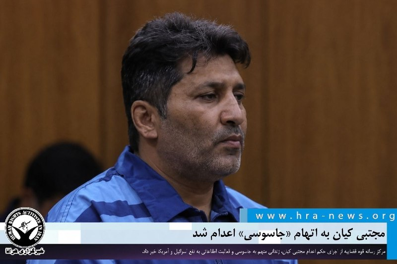

مجتبی کیان به اتهام «جاسوسی» اعدام شد

❗️
❗️
❗️
❗️
❗️ – مرکز رسانه قوه قضاییه از اجرای حکم #اعدام مجتبی کیان، زندانی متهم به #جاسوسی و فعالیت اطلاعاتی به نفع اسرائیل و آمریکا خبر داد. این حکم بامداد امروز پس از تایید در دیوان عالی کشور به اجرا درآمد. بر اساس داده‌های گردآوری‌شده توسط هرانا، همزمان با آغاز درگیری‌های نظامی، روند صدور و اجرای احکام اعدام در پرونده‌های سیاسی و امنیتی افزایش یافته و تاکنون ۳۵ زندانی با این اتهامات در این بازه زمانی اعدام شده‌اند.

ادامه مطلب

#مجتبی_کیان

↘️
@hranews_bot تماس ✉️ -  @Hranews  کانال هرانا 🆑

## manototv — post 105797

  <a href="telegram/content/manototv_105797_1779610376.mp4" target="_blank">🎬 Download video</a>

گزارشگرمنوتو: در سالگرد فاجعه متروپل آبادان، جمعی از ایرانیان مقابل کنسولگری جمهوری اسلامی در هامبورگ تجمع کردند.

این تجمع با حضور اعضای حزب پادشاهی‌خواه میهن‌پرستان ایران و شماری از نزدیکان جان‌باختگان متروپل برگزار شد. شرکت‌کنندگان جمهوری اسلامی را به ناکارآمدی، فساد و بی‌توجهی به جان شهروندان متهم کردند.

ساختمان متروپل آبادان در ۲۳ مه ۲۰۲۲ فرو ریخت؛ فاجعه‌ای که جان ده‌ها نفر را گرفت و به نمادی از بی‌مسئولیتی و فساد ساختاری در جمهوری اسلامی تبدیل شد.

## manototv — post 105796

  

تد کروز، سناتور جمهوری‌خواه آمریکا، در پستی در شبکه اجتماعی ایکس از گزارش‌ها درباره احتمال توافق با جمهوری اسلامی ابراز نگرانی کرد.

او با دفاع از تصمیم دونالد ترامپ برای حمله به ایران، مدعی شد این اقدام به «نتایج نظامی فوق‌العاده» منجر شده و گفت اگر نتیجه نهایی، ادامه حاکمیت جمهوری اسلامی، دریافت میلیاردها دلار، امکان غنی‌سازی اورانیوم و کنترل مؤثر بر تنگه هرمز باشد، چنین توافقی «اشتباهی فاجعه‌بار» خواهد بود.

کروز همچنین نوشت جزئیات هنوز در حال روشن شدن است، اما حمایت برخی چهره‌های دولت بایدن از این توافق را «نگران‌کننده» دانست و از ترامپ خواست بر خطوط قرمز خود پافشاری کند.

## manototv — post 105795

  

قوه قضائیه جمهوری اسلامی اعلام کرد مجتبی کیان، زندانی متهم به ارسال اطلاعات مربوط به مراکز تولید صنایع دفاعی، بامداد امروز اعدام شده است.

رسانه‌های وابسته به قوه قضائیه مدعی شده‌اند او در جریان آنچه مقام‌های جمهوری اسلامی «جنگ رمضان» می‌نامند، اطلاعات و مختصات واحدهای مرتبط با صنایع دفاعی را برای شبکه‌های وابسته به آمریکا و اسرائیل ارسال کرده بود.

این ادعاها به‌طور مستقل قابل راستی‌آزمایی نیست و قوه قضائیه جمهوری اسلامی تاکنون جزئیات شفافی از روند بازداشت، دسترسی متهم به وکیل مستقل، نحوه محاکمه و زمان دقیق رسیدگی منتشر نکرده است.

اجرای این حکم در حالی اعلام شده که جمهوری اسلامی در سال‌های اخیر بارها از پرونده‌های امنیتی و اتهام‌های مرتبط با «جاسوسی» برای صدور و اجرای احکام سنگین، از جمله اعدام، استفاده کرده است.

## manototv — post 105794

  

نیروی دریایی بریتانیا اعلام کرده صدها ملوان این کشور در جبل‌الطارق آماده‌اند تا در صورت دستیابی آمریکا و جمهوری اسلامی به توافق صلح، برای پاکسازی احتمالی مین‌ها در تنگه هرمز اعزام شوند.

بر اساس گزارش آسوشیتدپرس، کشتی پشتیبانی آراف‌ای لایم بِی متعلق به نیروی دریایی سلطنتی بریتانیا در جبل‌الطارق مستقر است و با مهمات و پهپادهای دریایی مین‌یاب مجهز به سونار آماده عملیات احتمالی شده است. این مأموریت قرار است با همکاری بریتانیا و فرانسه انجام شود.

اولویت نخست این عملیات، در صورت اجرا، پاکسازی یک مسیر عبور در تنگه هرمز برای خروج حدود ۷۰۰ کشتی عنوان شده است. پس از آن، مسیر مقابل برای ورود کشتی‌ها پاکسازی خواهد شد؛ هرچند مقام‌ها گفته‌اند پاکسازی کامل تنگه ممکن است ماه‌ها یا حتی سال‌ها زمان ببرد.

## manototv — post 105793

  

محمد اسحاق دار، وزیر خارجه پاکستان، اعلام کرد در تماس تلفنی با دونالد ترامپ درباره مذاکرات میان آمریکا و جمهوری اسلامی گفت‌وگو کرده است.

او این گفت‌وگوی «مهم» را «گامی قابل‌توجه به سوی صلح منطقه‌ای» توصیف کرد و گفت دستاوردهای مذاکرات اخیر، زمینه خوش‌بینی نسبت به یک نتیجه مثبت و پایدار را فراهم کرده است.

پاکستان در روزهای اخیر نقش میانجی کلیدی میان آمریکا و جمهوری اسلامی را برعهده داشته است. اسحاق دار همچنین از «رهبری» ترامپ و «تعهد او به گفت‌وگو و دیپلماسی» تقدیر کرد.

## manototv — post 105792

  

سرویس مخفی آمریکا در بیانیه‌ای اعلام کرد فردی مسلح عصر شنبه در نزدیکی خیابان ۱۷ و پنسیلوانیا، در محدوده کاخ سفید، پس از بیرون آوردن سلاح از کیف خود به سمت ماموران تیراندازی کرد.

ماموران سرویس مخفی در پاسخ به او شلیک کردند و مظنون پس از انتقال به بیمارستان جان باخت. در جریان این تیراندازی، یک رهگذر نیز هدف گلوله قرار گرفت. سرویس مخفی گفته هنوز مشخص نیست این فرد با شلیک مظنون زخمی شده یا در تبادل آتش میان او و ماموران.

بر اساس تصاویر منتشرشده از سلینا وانگ، خبرنگار ای‌بی‌سی نیوز، هم‌زمان با شنیده‌شدن صدای تیراندازی در نزدیکی کاخ سفید، خبرنگاران حاضر در محوطه به سمت اتاق نشست خبری منتقل شدند.

سرویس مخفی اعلام کرد هیچ‌یک از نیروهایش در این حادثه آسیب ندیده‌اند. دونالد ترامپ هنگام وقوع تیراندازی در کاخ سفید حضور داشت، اما این حادثه تاثیری بر او یا عملیات حفاظتی نداشته است. تحقیقات درباره این تیراندازی ادامه دارد. جزئیات اصلی با گزارش رویترز و آسوشیتدپرس هم‌خوانی دارد

## manototv — post 105791

  <a href="telegram/content/manototv_105791_1779610381.mp4" target="_blank">🎬 Download video</a>

تصاویر منتشرشده از سلینا وانگ، خبرنگار ای‌بی‌سی نیوز، لحظه‌ای را نشان می‌دهد که هم‌زمان با شنیده‌شدن صدای تیراندازی در نزدیکی کاخ سفید، خبرنگاران حاضر در محوطه به سمت اتاق نشست خبری منتقل شدند.

سرویس مخفی آمریکا اعلام کرد یک مرد مسلح در نزدیکی ایست بازرسی خیابان ۱۷ و پنسیلوانیا به سوی ماموران شلیک کرد. ماموران نیز در پاسخ تیراندازی کردند و مظنون که به بیمارستان منتقل شده بود، بعداً جان باخت.

در جریان این تیراندازی یک رهگذر نیز زخمی شد. هنوز مشخص نیست این فرد با شلیک مظنون زخمی شده یا در جریان تبادل آتش. دونالد ترامپ هنگام وقوع حادثه در کاخ سفید بود، اما آسیبی ندید.

## manototv — post 105790

  <a href="telegram/content/manototv_105790_1779610383.mp4" target="_blank">🎬 Download video</a>

تماسی از امارات
«می‌گفت مردم ایران عوض شده‌اند…
و این بار باید هوشیارتر، عاقل‌تر و متفاوت‌تر عمل کنند.»

## manototv — post 105789

  <a href="telegram/content/manototv_105789_1779610386.mp4" target="_blank">🎬 Download video</a>

تماسی از سن‌فرانسیسکو:
«می‌گفت با شنیدن صدای شما احساس می‌کنم تو ایرانم…
و از سال‌هایی گفت که با برنامه‌های منوتو خندیده، گریه کرده و زندگی کرده بود.»

## manototv — post 105788

  <a href="telegram/content/manototv_105788_1779610388.mp4" target="_blank">🎬 Download video</a>

تماسی از خارج ایران:
«می‌گفت بسته شدن منوتو برای خیلی‌ها دردناک بود…
و از همراهی و امیدی گفت که این سال‌ها از برنامه‌ها گرفته بودند.

## alonews — post 122256

  <a href="telegram/content/alonews_122256_1779610390.webm" target="_blank">🎬 Download video</a>

👈نخست‌وزیر بریتانیا: از پیشرفت به سمت توافق بین آمریکا و ایران استقبال می‌کنم

🔴ما به توافقی نیاز داریم که به جنگ پایان دهد

🔴ما با شرکای بین‌المللی خود برای غنیمت شمردن این فرصت و دستیابی به یک راه‌حل دیپلماتیک بلندمدت همکاری خواهیم کرد

✅ @AloNews خبر جنگ

## alonews — post 122255

  <a href="telegram/content/alonews_122255_1779610390.mp4" target="_blank">🎬 Download video</a>

👈مارکو روبیو: هیچ مسیر آبی بین‌المللی و هیچ فضای هوایی بین‌المللی نباید هرگز توسط هیچ کشوری در جهان ملی‌سازی شود. این نباید هرگز به عنوان یک هنجار جدید پذیرفته شود.

✅ @AloNews خبر جنگ

## alonews — post 122254

  <a href="telegram/content/alonews_122254_1779610393.webm" target="_blank">🎬 Download video</a>

👈منبع ارشد ایرانی به رویترز: تهران با تحویل ذخیره اورانیوم بسیار غنی شده خود موافقت نکرده است.مسئله هسته‌ای ایران بخشی از توافق اولیه نیست.

✅ @AloNews خبر جنگ

## alonews — post 122253

  <a href="telegram/content/alonews_122253_1779610393.webm" target="_blank">🎬 Download video</a>

👈روبیو: پیشرفت بزرگی در مورد بحران با ایران حاصل شده است

🔴این احتمال وجود دارد که جهان در ساعات آینده اخبار خوبی بشنود

✅ @AloNews خبر جنگ

## alonews — post 122252

  <a href="telegram/content/alonews_122252_1779610393.webm" target="_blank">🎬 Download video</a>

👈روبیو، وزیر خارجه آمریکا: پس از همکاری با کشورهای خلیج فارس، در مورد ایران پیشرفت کرده‌ایم

🔴 احتمالاً اخبار بیشتری درباره ایران امروز منتشر شود

✅ @AloNews خبر جنگ

## alonews — post 122251

  <a href="telegram/content/alonews_122251_1779610393.webm" target="_blank">🎬 Download video</a>

👈ترامپ، سال ۲۰۲۰ میلادی: ایران هرگز جنگی را نبرده، اما هرگز مذاکره‌ای را هم نباخته است

✅ @AloNews خبر جنگ

## alonews — post 122250

اخبار جنگ الونیوز AloNews pinned a photo

## alonews — post 122249

  

🔴🔴گیگی ۱۴۹ تومن🔴🔴
🔴🔴گیگی ۱۴۹ تومن🔴🔴
🔴🔴گیگی ۱۴۹ تومن🔴🔴
______________________

لینک سابسکریشن ✅

تست رایگان✅

بدون محدودیت کاربر و زمان✅

تضمین عودت وجه✅

@darkoob_config1
@darkoob_config1
@darkoob_config1

## alonews — post 122248

  <a href="telegram/content/alonews_122248_1779610394.webm" target="_blank">🎬 Download video</a>

👈پزشکیان: بنده نسبت به مشکلات اقتصادی و معیشتی مردم، به‌ویژه آسیب‌هایی که در پی شرایط جنگی تشدید شده، احساس مسئولیت جدی دارم و با تمام توان در حال تلاش برای کاهش فشارها بر مردم هستم.

✅ @AloNews خبر جنگ

## alonews — post 122247

  <a href="telegram/content/alonews_122247_1779610394.webm" target="_blank">🎬 Download video</a>

👈پزشکیان: آنچه در مقاطع حساس، ضامن حفظ و ثبات کشور بوده، همبستگی و همدلی مردم و ارکان نظام است.

🔴با وجود مسائل و مشکلات متعدد، از بیان بسیاری از مطالب صرف‌نظر می‌کنم تا مبادا زمینه تفرقه و اختلاف فراهم شود. امروز حفظ وحدت و انسجام ملی به‌مراتب مهم‌تر از مسائل نظامی و امنیتی است

🔴همواره تلاش کرده‌ام سخنی بر خلاف نظر مقام معظم رهبری بیان نشود و یا موضعی اتخاذ نگردد که به اختلاف میان ارکان حاکمیت دامن بزند و دشمن از آن سوءاستفاده کند.

🔴هر سخن، تحلیل یا موضعی که از هر تریبونی، به‌ویژه صدا و سیما، منجر به ایجاد شکاف و تفرقه در جامعه شود، در عمل آب ریختن به آسیاب دشمن است

🔴گاهی برخی کارشناسان در رسانه ملی سخنانی مطرح می‌کنند که با واقعیت‌های جاری کشور و روندهای موجود فاصله جدی دارد، اما دولت به‌منظور جلوگیری از اختلاف و حفظ آرامش جامعه، از واکنش و موضع‌گیری پرهیز می‌کند

✅ @AloNews خبر جنگ

## alonews — post 122246

  <a href="telegram/content/alonews_122246_1779610395.webm" target="_blank">🎬 Download video</a>

👈‌فارس: بررسی متن نهایی‌شده توافق احتمالی، نشان می‌دهد آمریکا و متحدانش متعهد می‌شوند که به هیچ وجه به ایران یا متحدانش حمله نکنند.

🔴در مقابل، ایران نیز متعهد شده که خود و متحدانش به آمریکا و متحدان آن حملۀ نظامی پیش دستانه نداشته باشند.

🔴طبق پیش‌نویس توافق، طرفین بر سر آزادسازی تمام یا بخشی از پول‌های مسدودشدهٔ ایران به منظور ورود به مذاکره توافق کرده‌اند

🔴همچنین طبق این پیش‌نویس، امکان تردد در تنگهٔ هرمز به تعداد قبل از جنگ و با مدیریت ایران، همزمان با برداشتن محاصرهٔ دریایی فراهم می‌شود.

🔴علاوه بر این، تحریم‌های نفت، گاز، پتروشیمی و مشتقات آن در دورهٔ مذاکره به‌طور موقت لغو می‌شود تا ایران بتواند آزادانه به فروش محصولات خود بپردازد.

✅ @AloNews خبر جنگ

## alonews — post 122245

  <a href="telegram/content/alonews_122245_1779610395.webm" target="_blank">🎬 Download video</a>

👈خبرگزاری معتبر تسنیم: پیش نویس توافق با واشنگتن مقرر می‌کند که وضعیت حاکمیتی تنگه هرمز به شرایط پیش از جنگ باز نگردد و تنها تعداد کشتی‌های عبوری ظرف ۳۰ روز بازیابی شود، که همزمان با رفع کامل محاصره دریایی و اجرای تعهدات آمریکا است. تهران بر حفظ حق حاکمیتی خود بر این تنگه تأکید دارد

✅ @AloNews خبر جنگ

## alonews — post 122244

  <a href="telegram/content/alonews_122244_1779610395.webm" target="_blank">🎬 Download video</a>

👈العربی الجديد به نقل از منبع ایرانی:
پیش‌نویس توافق بین تهران و واشنگتن شامل پایان جنگ در تمام جبهه‌ها از جمله لبنان است
 

🔴بخش بزرگی از دارایی‌های مسدود شده ایران در خارج آزاد خواهد شد و محاصره دریایی برداشته شده و تنگه هرمز بازگشایی می‌شود

🔴 وضعیت موجود در پرونده هسته‌ای و تحریم‌ها حفظ خواهد شد
 

🔴 تهران در دوره ۶۰ روزه از کاهش تحریم‌ها برای فروش نفت خود بهره‌مند خواهد شد
 

🔴 هنوز برخی اختلافات برای حل شدن قبل از اعلام توافق موقت باقی است و توپ در زمین آمریکاست
 

🔴هیچ چیز را نمی‌توان تضمین شده یا نهایی دانست مگر اینکه همه جزئیات توافق شود

✅ @AloNews خبر جنگ

## alonews — post 122243

  <a href="telegram/content/alonews_122243_1779610395.webm" target="_blank">🎬 Download video</a>

👈راضیه عالیشوندی، معاون امور بین‌الملل و حقوق بشردوستانه جمعیت هلال‌احمر: محموله‌های کمک‌های بشردوستانه کشورهای عراق، ازبکستان و قزاقستان وارد ایران شد.

🔴این کمک‌ها شامل اقلام غذایی، دارویی و تجهیزات پزشکی است.

🔴این کمک‌ها در راستای حمایت از عملیات امدادی و تامین نیازهای اقشار آسیب‌پذیر در اختیار جمعیت هلال‌احمر قرار گرفته است

✅ @AloNews خبر جنگ

## alonews — post 122242

  <a href="telegram/content/alonews_122242_1779610396.webm" target="_blank">🎬 Download video</a>

👈نخست‌وزیر پاکستان، شہباز شریف: من به رئیس‌جمهور دونالد ترامپ بابت تلاش‌های فوق‌العاده‌اش برای پیگیری صلح و برگزاری یک تماس تلفنی بسیار مفید و سازنده در اوایل امروز با رهبران عربستان سعودی، قطر، ترکیه، مصر، امارات، اردن و پاکستان تبریک می‌گویم.

🔴فیلد مارشال سید عاصم منیر نماینده پاکستان در این تماس تلفنی بود و من از تلاش‌های بی‌وقفه او در طول کل این فرایند بسیار قدردانی می‌کنم.

🔴این گفتگوها فرصتی مفید برای تبادل نظر درباره وضعیت کنونی منطقه و چگونگی پیشبرد تلاش‌های جاری برای صلح به منظور آوردن صلح پایدار در منطقه فراهم کرد.

🔴پاکستان تلاش‌های صلح خود را با نهایت صداقت ادامه خواهد داد و امیدواریم به زودی میزبان دور بعدی مذاکرات باشیم.

✅ @AloNews خبر جنگ

## alonews — post 122241

  <a href="telegram/content/alonews_122241_1779610396.webm" target="_blank">🎬 Download video</a>

👈 مونیکا ویت کیست؛ نظامی سابق آمریکایی که به جاسوسی برای ایران متهم شد و اف‌بی‌آی برای او جایزه تعیین کرد

🔴 اف‌بی‌آی به تازگی اعلام کرده است که برای دریافت اطلاعات منجر به بازداشت و محاکمه مونیکا ویت، عضو پیشین نیروهای مسلح و مامور سابق ضدجاسوسی آمریکا، ۲۰۰ هزار دلار جایزه تعیین کرده است.

✅ @AloNews خبر جنگ

## alonews — post 122240

  <a href="telegram/content/alonews_122240_1779610396.webm" target="_blank">🎬 Download video</a>

👈آزادسازی نیمی از دارایی‌های بلوکه‌شده ایران به ارزش ۱۲ میلیارد دلار نیز در این چارچوب این یادداشت تفاهم پیش‌بینی شده است.

✅ @AloNews خبر جنگ

## alonews — post 122239

  <a href="telegram/content/alonews_122239_1779610396.webm" target="_blank">🎬 Download video</a>

👈کابینه جنگ اسرائیل امشب تشکیل جلسه میده

✅ @AloNews خبر جنگ

## alonews — post 122238

  <a href="telegram/content/alonews_122238_1779610396.webm" target="_blank">🎬 Download video</a>

👈تتر دوباره رفت بالا و الان 170,500

✅ @AloNews خبر جنگ

## alonews — post 122237

  <a href="telegram/content/alonews_122237_1779610397.webm" target="_blank">🎬 Download video</a>

👈تشکر ترامپ از سرویس مخفی برای دستگیری تیرانداز دیشب: از سرویس مخفی و نیروی انتظامی عالی‌مون به خاطر اقدام سریع و حرفه‌ای که امشب علیه یک فرد مسلح در نزدیکی کاخ سفید، که سابقه خشونت‌آمیز و احتمالاً وسواس فکری نسبت به گرامی‌ترین بنای کشورمون داشت، انجام شد، سپاسگزاریم.

🔴فرد مسلح بعد از درگیری با مأموران سرویس مخفی در نزدیکی دروازه‌های کاخ سفید کشته شد.

🔴این اتفاق یک ماه بعد از تیراندازی در ضیافت شام خبرنگاران کاخ سفید رخ داد
برای همه روسای جمهور آینده مهمه که امن‌ترین و مطمئن‌ترین فضایی رو که تاالان در واشنگتن دی سی ساخته شده، داشته باشن

✅ @AloNews خبر جنگ

---
📅 بروزرسانی: 1405/03/03 02:11
---

## VahidOOnLine — post 241822

  <a href="telegram/content/VahidOOnLine_241822_1779576115.mp4" target="_blank">🎬 Download video</a>

♦️تصاویر منتشر شده توسط سلینا وانگ، خبرنگار ارشد شبکه «ای‌بی‌سی نیوز»، لحظات شلیک گلوله در نزدیکی کاخ سفید در واشنگتن دی‌سی را نشان می‌دهد. بر اساس گزارش‌های اولیه، حدود ۳۰ گلوله در خارج از محوطه کاخ سفید شلیک شده و نیروهای سرویس مخفی آمریکا بلافاصله وارد عمل شدند و خبرنگارانی را که در چمن شمالی مستقر بودند، به سمت اتاق کنفرانس مطبوعاتی هدایت کردند تا پناه بگیرند. این ویدیو نشان می‌دهد سلینا وانگ در حالی که در حال ضبط گزارش زنده خود درباره توافق احتمالی با ایران بود، با شنیدن صدای شلیک گلوله‌ها ناچار به قطع گزارش و تخلیه اضطراری محل می‌شود. هنوز جزییات بیشتری از این تیراندازی منتشر نشده است.
‌🇸🇦 Indypersian

🤖 @VahidOOnLine

## VahidOOnLine — post 241821

  

گزارش‌ها از شنیده شدن ده‌ها صدای تیراندازی در نزدیکی کاخ سفید خبر می‌دهد. به گزارش رسانه‌های آمریکایی، خبرنگاران در داخل کاخ سفید در محل امن مستقر شدند و ماموران سرویس مخفی در چمن شمالی کاخ سفید در حالی دیده می‌شوند که تفنگ در دست دارند.
‌🏁 🇬🇧 IranintlTV

🤖 @VahidOOnLine

## VahidOOnLine — post 241820

  

♦️روزنامه «فایننشال تایمز» در گزارشی اختصاصی نوشت که ایالات متحده به ژاپن اطلاع داده است تحویل ۴۰۰ موشک کروز «تاماهاک» به این کشور به دلیل اولویت پنتاگون برای بازسازی ذخایر تسلیحاتی خود پس از جنگ با ایران، با تاخیر مواجه خواهد شد. بر اساس این گزارش، پیت هگست، وزیر جنگ آمریکا، در تماس تلفنی اوایل ماه مه این موضوع را به همتای ژاپنی خود، شینجیرو کویزومی، اطلاع داده و واشنگتن گفته است که این موشک‌ها ممکن است با تاخیر دو ساله تحویل داده شوند. بر اساس ارزیابی مرکز مطالعات استراتژیک و بین‌المللی (CSIS)، ارتش آمریکا در طول پنج هفته عملیات نظامی علیه ایران، بیش از ۱۰۰۰ موشک تاماهاک را از مجموع ذخیره پیش از جنگ خود شلیک کرده است. براساس این گزارش، این تاخیر می‌تواند ضربه بزرگی به استراتژی دفاعی توکیو وارد کند، چرا که ژاپن این موشک‌های ۲.۳۵ میلیارد دلاری را با هدف تقویت توان بازدارندگی و ایجاد قابلیت «حمله متقابل» علیه چین سفارش داده بود.
‌🇸🇦 Indypersian

🤖 @VahidOOnLine

## VahidOOnLine — post 241819

  <a href="telegram/content/VahidOOnLine_241819_1779576118.mp4" target="_blank">🎬 Download video</a>

تجمع ایرانیان ساکن کپنهاگ، دوم خرداد ۱۴۰۵
‌🏁 🇬🇧 ManotoTV

🤖 @VahidOOnLine

## VahidOOnLine — post 241818

  <a href="telegram/content/VahidOOnLine_241818_1779576119.mp4" target="_blank">🎬 Download video</a>

♦️کریم بنزما، مهاجم باشگاه الهلال عربستان سعودی، با انتشار ویدیویی در صفحه اینستاگرام خود، حضورش در «مناسک حج» را به اشتراک گذاشت. این ستاره فوتبال با انتشار تصویری از خود در حال طواف به دور کعبه، این لحظات مذهبی را با مخاطبانش به اشتراک گذاشت و عبارت «الحمدلله برای همه‌چیز» را به عنوان پیام خود منتشر کرد.
‌🇸🇦 Indypersian

🤖 @VahidOOnLine

## VahidOOnLine — post 241817

  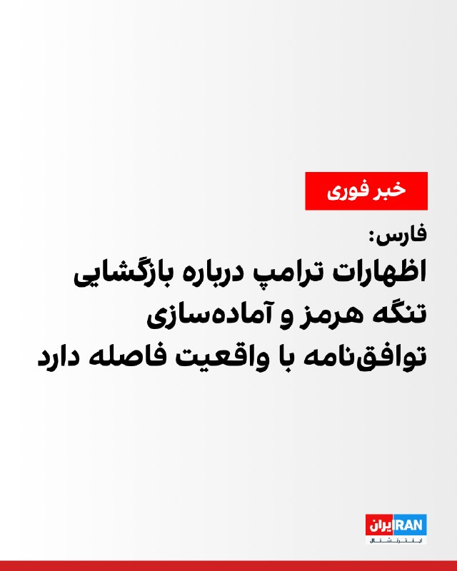

خبرگزاری فارس، وابسته به سپاه، گزارش داد بر اساس پیگیری‌های خبرنگار این رسانه، اظهارات جدید ترامپ مبنی بر بازگشت تنگه هرمز به وضعیت پیشین و آماده‌سازی برای امضای توافق‌نامه «با واقعیت‌ها فاصله دارد».
فارس افزود: براساس آخرین متن ردوبدل‌شده بین آمریکا و جمهوری اسلامی، در صورت توافق احتمالی، تنگه هرمز کماکان تحت مدیریت حکومت ایران خواهد بود.
طبق این گزارش، اگرچه جمهوری اسلامی موافقت کرده است که اجازه دهد تعداد کشتی‌های عبوری به میزان قبل از جنگ بازگردد، اما این به‌هیچ‌عنوان به معنای «تردد آزاد» به وضعیت پیش از جنگ نیست.
خبرگزاری فارس تاکید کرد: «مدیریت تنگه، تعیین مسیر، زمان، نحوه عبور و صدور مجوز، کماکان در انحصار و با تدبیر جمهوری اسلامی خواهد بود. بنابراین ادعای ترامپ در این خصوص ناقص و فاقد انطباق با واقعیت است.»
این گزارش افزود مقام‌های آمریکایی در پیام‌های متعدد به تهران گفته‌اند که توییت‌های ترامپ عمدتاً جنبه تبلیغاتی و مصرف رسانه‌ای در داخل آمریکا دارد و توصیه کرده‌اند که به این اظهارات توجهی نشود.

‌🏁 🇬🇧 IranintlTV

🤖 @VahidOOnLine

## VahidOOnLine — post 241816

  

♦️اسماعیل بقایی، سخنگوی وزارت امور خارجه جمهوری اسلامی ایران، با انتشار پیامی در اکس با اشاره به مواجهه تاریخی ایران و روم نوشت: «در ذهن رومیان، رم مرکز بلامنازع جهان بود، اما ایرانیان آن توهم را در هم شکستند. زمانی که مارکوس ژولیوس فیلیپوس، مشهور به فیلیپ عرب، برای جنگ با ایران به شرق لشکر کشید، این نبرد به پیروزی روم ختم نشد، بلکه با صلحی پایان یافت که بر اساس شروط ساسانیان شکل گرفت. امپراتور مجبور شد کنار بیاید!» این پیام همزمان با انتشار اخبار مربوط به پیش‌نویس توافق صلح واشنگتن و تهران منتشر شد.
‌🇸🇦 Indypersian

🤖 @VahidOOnLine

## VahidOOnLine — post 241815

  

♦️فارس، خبرگزاری وابسته به سپاه، روز شنبه، دوم خردادماه، در واکنش به پیام دونالد ترامپ، رئیس‌جمهوری آمریکا مبنی بر نزدیک شدن به توافق با ایران و بازگشایی تنگه هرمز نوشت: «این ادعا نیز با واقعیت‌ها فاصله دارد». فارس در ادامه نوشت: «برخلاف ادعای لحظات قبل دونالد ترامپ در شبکه اجتماعی تروث سوشال مبنی بر بازگشت تنگه هرمز به وضعیت پیشین و آماده‌سازی برای امضای توافق‌نامه، پیگیری‌های خبرنگار فارس نشان می‌دهد که این ادعا نیز با واقعیت‌ها فاصله دارد؛ چرا که بر اساس آخرین متن ردوبدل‌شده، در صورت توافق احتمالی، تنگه هرمز کماکان تحت مدیریت ایران خواهد بود و اگرچه ایران موافقت کرده اجازه دهد تعداد کشتی‌های عبوری به میزان قبل از جنگ بازگردد، اما این به‌هیچ‌عنوان به معنای تردد آزاد به وضعیت قبل از جنگ نیست و مدیریت تنگه، تعیین مسیر، زمان، نحوه عبور و صدور مجوز، کماکان در انحصار و با تدبیر جمهوری اسلامی ایران خواهد بود.»
خبرگزاری سپاه در ادامه مدعی شد که برخلاف شروط پیشین ترامپ مبنی بر گنجاندن برنامه هسته‌ای در توافق، «هیچ تعهدی از سوی ایران داده نشده و پرونده هسته‌ای اساسا در این مرحله مورد بحث قرار نگرفته است.» فارس همچنین ادعا کرد که «مقامات آمریکایی در پیغام‌های متعدد به ایران اذعان داشته‌اند که توییت‌های ترامپ عمدتا جنبه تبلیغاتی و مصرف رسانه‌ای در داخل آمریکا دارد و توصیه کرده‌اند که به این اظهارات توجهی نشود».
‌🇸🇦 Indypersian

🤖 @VahidOOnLine

## VahidOOnLine — post 241814

  

♦️خبرنگار الجزیره به نقل از «منابع خود»، مفاد کلیدی پیش‌نویس توافقی را که قرار است میان واشنگتن و تهران نهایی شود را اعلام کرد. خبرنگار الجزیره مدعی شد، توافق پیشنهادی شامل «پایان جنگ در تمامی جبهه‌ها از جمله لبنان»، «آزادسازی چندین میلیارد دلار از دارایی‌های مسدودشده ایران»، «رفع محاصره دریایی آمریکا و بازگشایی تنگه هرمز» و همچنین «عقب‌نشینی نیروهای آمریکایی از مجاورت مرزهای ایران» است. پس از اجرای این گام‌ها، طرفین یک مهلت ۳۰ روزه، که با توافق دوطرفه قابل تمدید است، خواهند داشت تا درباره مسئله هسته‌ای به توافق برسند که در طول این مدت نیز تردد از تنگه هرمز تسهیل خواهد شد. به گفته این خبرنگار، از نظر ایران، مدیریت تنگه هرمز یک موضوع دوجانبه میان تهران و مسقط تلقی می‌شود و گفتگوها در این زمینه با عمان در جریان است.
‌🇸🇦 Indypersian

🤖 @VahidOOnLine

## VahidOOnLine — post 241813

  

♦️فرمانداری مرند، روز شنبه، دوم خردادماه، خبر جان‌باختن دیپلمات جمهوری آذربایجان در تبریز را «نادرست» اعلام کرد و گفت: «در سانحه رانندگی، راننده کنسولگری جان باخته و رییس کنسولگری در سلامت کامل است». پیش از این، تسنیم، خبرگزاری وابسته به سپاه، به نقل از وزارت امور خارجه جمهوری آذربایجان، از جان باختن دیپلمات این کشور در تبریز خبر داده و گزارش داده بود که رامیل رضا اوغلو عمرانوف، کنسول جمهوری آذربایجان در تبریز حین انجام فعالیت خدماتی در حوالی شهر مرند در اتوبان جلفا-تبریز در اثر سانحه تصادف با خودرویی که در حال رانندگی بود جان باخته است.
‌🇸🇦 Indypersian

🤖 @VahidOOnLine

## VahidOOnLine — post 241812

  <a href="telegram/content/VahidOOnLine_241812_1779576125.mp4" target="_blank">🎬 Download video</a>

دونالد ترامپ، رئیس‌جمهور آمریکا، در پیامی در تروث‌سوشال اعلام کرد که از دفتر بیضی کاخ سفید، تماس «بسیار خوبی» با رهبران و مقام‌های چند کشور خاورمیانه و منطقه درباره جمهوری اسلامی و یک یادداشت تفاهم مرتبط با «صلح» داشته است.

او نوشت: «من در دفتر بیضی کاخ سفید هستم، جایی که همین حالا تماس بسیار خوبی با رئیس‌جمهور محمد بن سلمان آل سعود، از عربستان سعودی، محمد بن زاید آل نهیان، از امارات متحده عربی، امیر تمیم بن حمد بن خلیفه آل ثانی، نخست‌وزیر محمد بن عبدالرحمن بن جاسم بن جبر آل ثانی، و وزیر علی الثوادی، از قطر، فیلد مارشال سید عاصم منیر احمد شاه، از پاکستان، رئیس‌جمهور رجب طیب اردوغان، از ترکیه، رئیس‌جمهور عبدالفتاح السیسی، از مصر، ملک عبدالله دوم، از اردن، و ملک حمد بن عیسی آل خلیفه، از بحرین، درباره جمهوری اسلامی ایران و همه مسائل مرتبط با یک یادداشت تفاهم مربوط به صلح داشتیم.

یک توافق تا حد زیادی مذاکره شده است، مشروط به نهایی شدن میان ایالات متحده آمریکا، جمهوری اسلامی ایران، و کشورهای مختلف دیگر، همان‌طور که نام برده شدند.

به طور جداگانه، من تماسی با نخست‌وزیر بی‌بی نتانیاهو، از اسرائیل، داشتم که آن هم به همین ترتیب بسیار خوب پیش رفت.

جنبه‌ها و جزئیات نهایی توافق در حال حاضر در حال گفت‌وگو است و به‌زودی اعلام خواهد شد.

علاوه بر بسیاری عناصر دیگر این توافق، تنگه هرمز باز خواهد شد.»
‌🏁 🇬🇧 ManotoTV

🤖 @VahidOOnLine

## VahidOOnLine — post 241811

  <a href="telegram/content/VahidOOnLine_241811_1779576126.mp4" target="_blank">🎬 Download video</a>

دو تماس متفاوت از ایران؛
«اگه اجازه بدین جوابشو بدم»
‌🏁 🇬🇧 ManotoTV

🤖 @VahidOOnLine

## VahidOOnLine — post 241810

  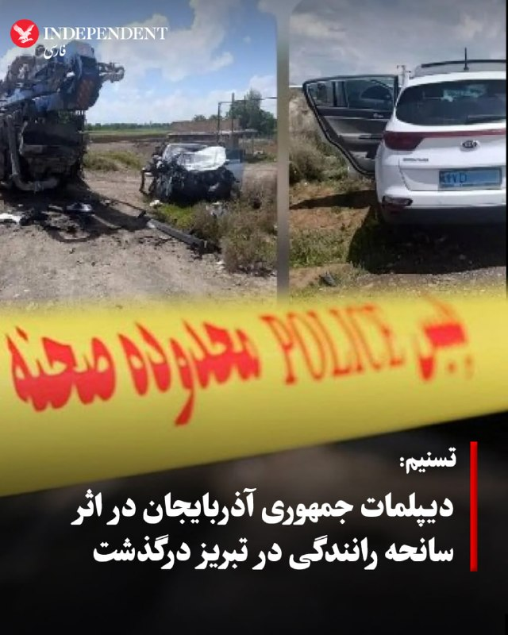

♦️تسنیم، خبرگزاری وابسته به سپاه پاسداران، روز شنبه به نقل از وزارت امور خارجه جمهوری آذربایجان، از جان باختن دیپلمات این کشور در تبریز خبر داد. براساس این گزارش، رامیل رضا اوغلو عمرانوف، کنسول جمهوری آذربایجان در تبریز حین انجام فعالیت خدماتی در حوالی شهر مرند در اتوبان جلفا-تبریز در اثر سانحه تصادف با خودرویی که در حال رانندگی بود جان باخت.
‌🇸🇦 Indypersian

🤖 @VahidOOnLine

## VahidOOnLine — post 241809

  

♦️«یک منبع ارشد منطقه‌ای» از جزییات گفتگوی رهبران کشورهای عربی و مسلمان با دونالد ترامپ خبر داد. خبرنگار آکسیوس نوشت: «یک منبع ارشد منطقه‌ای به من گفت که تمامی رهبران عرب و مسلمان حاضر در گفتگوی روز شنبه با ترامپ، از او خواسته‌اند تا برای پایان دادن به جنگ و مهار تنش‌ها در منطقه، توافق را پیش ببرد.» این منبع تاکید کرده است که «پیام همه این بود: لطفا به خاطر کل منطقه، جنگ را متوقف کنید.» به گفته این منبع، مذاکرات به خوبی در حال پیشرفت است و میانجی‌ها امیدوارند روز یکشنبه یک توافق چارچوب یک‌صفحه‌ای را منعقد و بلافاصله آن را اعلام کنند و پس از آن، قصد دارند ظرف چند روز مذاکرات را برای دستیابی به یک توافق دقیق و پرجزئیات آغاز کنند.
همزمان، دونالد ترامپ روز شنبه با انتشار پیامی در «تروث سوشال» از پیشرفت در مذاکرات صلح با ایران خبر داد و اعلام کرد جزئیات نهایی آن به‌زودی اعلام خواهد شد. رئیس‌جمهوری آمریکا با مثبت ارزیابی کردن تماس‌های تلفنی خود با رهبران کشورهای عربی، مسلمان و همچنین بنیامین نتانیاهو، نخست‌وزیر اسرائیل، تاکید کرد که در کنار سایر عناصر این توافق، تنگه هرمز نیز باز خواهد شد.
‌🇸🇦 Indypersian

🤖 @VahidOOnLine

## VahidOOnLine — post 241808

  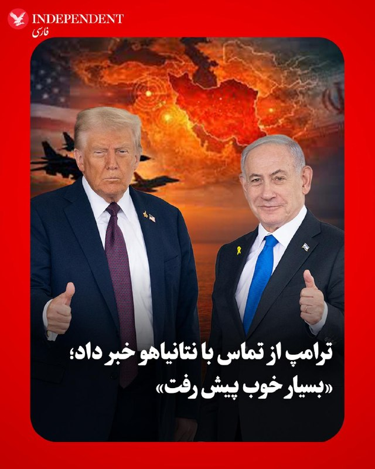

♦️دونالد ترامپ، رئیس‌جمهوری آمریکا، در بخشی از پیام روز جمعه خود در شبکه اجتماعی «تروث سوشال» مبنی بر نزدیک شدن به توافق با ایران، به رایزنی‌های دیپلماتیک با اسرائیل اشاره کرد و نوشت: «به طور جداگانه، تماسی با بنیامین نتانیاهو، نخست‌وزیر اسرائیل داشتم که آن هم بسیار خوب پیش رفت.» او با تاکید بر اینکه جنبه‌ها و جزئیات نهایی توافق با ایران در حال حاضر در دست بحث است و به‌زودی اعلام خواهد شد، شرایط گفتگو با نخست‌وزیر اسرائیل را مثبت ارزیابی کرد.
‌🇸🇦 Indypersian

🤖 @VahidOOnLine

## VahidOOnLine — post 241807

  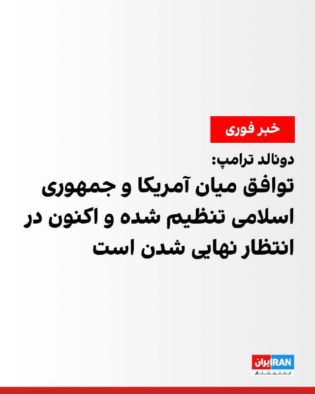

دونالد ترامپ، رییس جمهوری ایالات متحده در شبکه تروث سوشال نوشت: «یک توافق میان ایالات متحده آمریکا، جمهوری اسلامی تنظیم شده و اکنون در انتظار نهایی شدن است. جنبه‌ها و جزییات نهایی توافق در دست بررسی است و به‌زودی اعلام خواهد شد.»

دونالد ترامپ افزود: «علاوه بر بسیاری از بندهای دیگر توافق، تنگه هرمز نیز بازگشایی خواهد شد.»
‌🏁 🇬🇧 IranintlTV

🤖 @VahidOOnLine

## VahidOOnLine — post 241806

  <a href="telegram/content/VahidOOnLine_241806_1779576130.mp4" target="_blank">🎬 Download video</a>

تماسی از سن‌فرانسیسکو:
«می‌گفت با شنیدن صدای شما احساس می‌کنم تو ایرانم…
و از سال‌هایی گفت که با برنامه‌های منوتو خندیده، گریه کرده و زندگی کرده بود.»
‌🏁 🇬🇧 ManotoTV

🤖 @VahidOOnLine

## VahidOOnLine — post 241805

  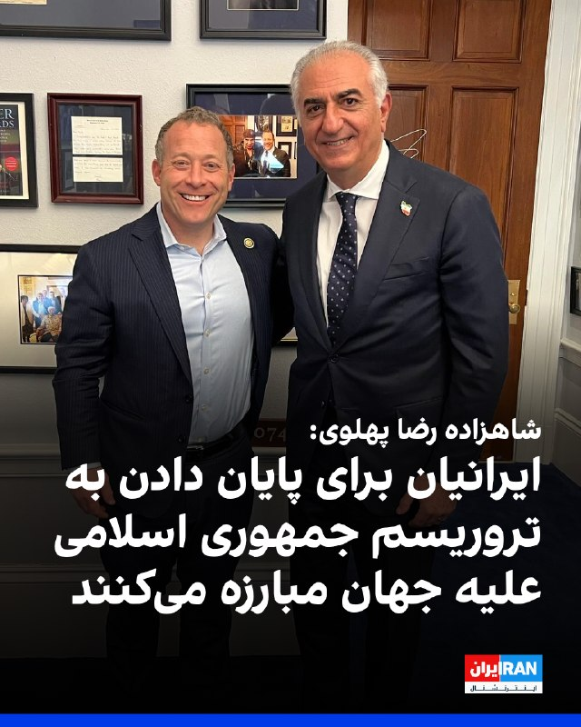

شاهزاده رضا پهلوی در دیدار با جاش گاتهایمر، عضو حزب دموکرات در مجلس نمایندگان آمریکا، بر اهمیت حمایت دوحزبی کنگره ایالات متحده از مردم ایران تاکید کرد و گفت: ایرانیان نه‌تنها برای آزادی خود، بلکه برای پایان دادن به تروریسم جمهوری اسلامی علیه جهان مبارزه می‌کنند.
‌🏁 🇬🇧 IranintlTV

🤖 @VahidOOnLine

## VahidOOnLine — post 241804

  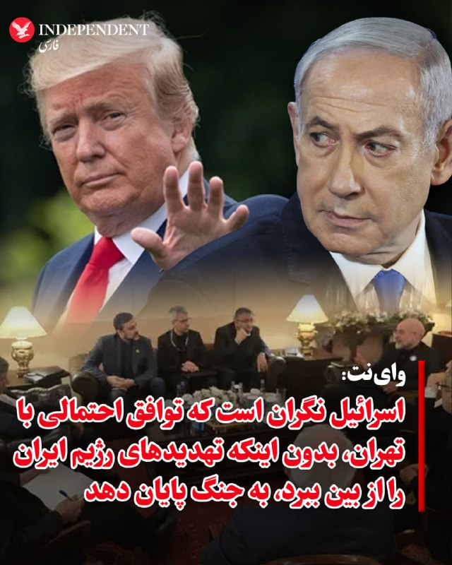

♦️به گزارش «وای‌نت»، مقامات اورشلیم به شدت نگران آن هستند که هرگونه توافق یا تفاهم موقت واشنگتن با تهران، جنگ را بدون دستاورد پایدار متوقف کند. این نگرانی وجود دارد که چنین توافقی بدون برچیدن زیرساخت‌های هسته‌ای جمهوری اسلامی، محدود کردن برنامه‌های موشک‌های بالستیک و پهپادی این کشور، و همچنین بدون مهار فعالیت گروه‌های نیابتی تهران در منطقه، به‌ویژه حزب‌الله در لبنان و حوثی‌ها در یمن، حاصل شود و عملا تهدیدهای اصلی را پابرجا باقی بگذارد.
‌🇸🇦 Indypersian

🤖 @VahidOOnLine

## VahidOOnLine — post 241803

  

کانال ۱۲ اسرائیل گزارش داد که ترامپ در روز شنبه به طور غیرمنتظره‌ای جی‌دی ونس، دن کین، رییس ستاد مشترک ارتش، پیت هگست، وزیر جنگ و کل شورای امنیت ملی را به اتاق وضعیت کاخ سفید فراخواند.

پیش‌تر ترامپ با رهبران کشورهای منطقه درباره مذاکرات با جمهوری اسلامی گفت‌وگو کرده بود.
‌🏁 🇬🇧 IranintlTV

🤖 @VahidOOnLine

## WithYashar — post 12274

  <a href="telegram/content/WithYashar_12274_1779576133.mp4" target="_blank">🎬 Download video</a>

طبق گزارش‌ها، تیم‌های تک‌تیرانداز سرویس مخفی اکنون بر روی پشت‌بام کاخ سفید قابل مشاهده هستند.

این یک واکنش حفاظتی استاندارد پس از یک حادثه امنیتی است که در آن تیم‌ها برای ایمن‌سازی محوطه به موقعیت‌های مرتفع اعزام می‌شوند.

این با وضعیت فعال پس از گزارش‌های قبلی تیراندازی و انتقال خبرنگاران به داخل کاخ مطابقت دارد.
@withyashar

## WithYashar — post 12273

  <a href="telegram/content/WithYashar_12273_1779576135.mp4" target="_blank">🎬 Download video</a>

فیلمی از اخبار ABC لحظه‌ای را ثبت می‌کند که تیراندازی در خارج از کاخ سفید رخ داد.
@withyashar
🚨🚨🚨🚨🚨🚨🚨

## WithYashar — post 12272

طبق گزارش NBC News، صدای تیراندازی در خارج از کاخ سفید شنیده شد، با حدود ۲۰ تا ۳۰ گلوله شلیک شده. سرویس مخفی به اعضای مطبوعات که در چمن شمالی جمع شده‌اند دستور داده است که به داخل اتاق جلسه بروند.
@withyashar

## WithYashar — post 12271

  <a href="telegram/content/WithYashar_12271_1779576137.mp4" target="_blank">🎬 Download video</a>

وضعیت اعصاب و روان من الان 👺
@withyashar

## WithYashar — post 12270

الحدث: ایران و آمریکا به دشمنی طولانی مدتشون پایان دادن!
@withyashar

## WithYashar — post 12269

## WithYashar — post 12268

«نیویورک تایمز به نقل از سه مقام ایرانی: در این توافق موضوع هسته‌ای را به مرحله‌ای بعدی موکول می‌کند.
ولی این توافق به آزادسازی ۲۵ میلیارد دلار از دارایی‌های مسدودشده در خارج از کشور منجر خواهد شد.
@withyashar

## WithYashar — post 12267

المیادین: آنچه پیشنهاد می شود یک توافق نهایی نیست، بلکه یک یادداشت تفاهم است.
این یادداشت تفاهم شامل هیچ بند مرتبط با پرونده هسته ای ایران نمی شود.
این یادداشت بر پایان جنگ و ترتیبات آتش بس متمرکز است. این تفاهم نامه شامل تسهیل دریانوردی در تنگه هرمز است.

این تفاهم نامه شامل خروج ناوگان آمریکایی از مجاورت ایران است.

این تفاهم نامه شامل آزادسازی نیمی از وجوه مسدود شده ایران است که بالغ بر 12 میلیارد دلار است.

این یادداشت شامل پایان محاصره نظامی دریایی ایالات متحده است. مهلت 30 روزه برای دستیابی به توافق هسته ای پس از امضای چارچوب توافق داده شد.
@withyashar

## WithYashar — post 12266

فارس : ایران هیچ توافق هسته ای هم با امریکا نداشته
@withyashar

## WithYashar — post 12265

دقایقی پیش صداسیما گفت ادعای ترامپ در خصوص بازگشایی تنگه هرمز دروغ است و تنگه دست ایران خواهد ماند
@withyashar

## WithYashar — post 12264

  

ترامپ کمی پیش در حال تماس با سران کشورها
@withyashar

## WithYashar — post 12263

خبرنگار کانال 12 اسرائیل:
ترامپ تسلیم خواسته های ایران شد
@withyashar

## WithYashar — post 12262

## WithYashar — post 12261

## WithYashar — post 12260

یاشار فکر میکنم خیلیا که پنیک میکنن تازه به جمعمون اضافه شدن
اونای که قدیمین فقط میشینن به این اتفاقات میخندن چون از چیزای با خبرن و شناخت دارن که بقیه نمیفهمن
البته این اتفاق زمانی میفته که نقشه راهو نداشته باشی
ولی ما که میدونیم چه خبره😉

## WithYashar — post 12259

## WithYashar — post 12258

## WithYashar — post 12257

## WithYashar — post 12256

  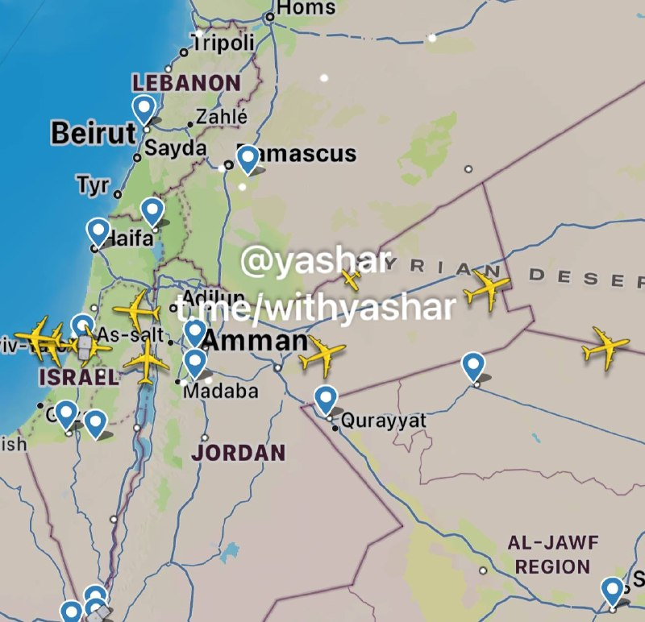

۸ سوخت رسان از اسرائیل بلند شدن شاید بیشترم بشن هنوز چند تا رو باندن دارن پا میشن !!!!!
@withyashar

## WithYashar — post 12255

فقط کی حالتو خوب‌ میکنه ؟ عمو یاشار حالا اگه این پست رو ریکشن آتیش فقط بزنی میگم

## mwarmonitor — post 9600

  

در حالی که در محوطه شمالی کاخ سفید (North Lawn) مشغول ضبط یک ویدیوی اجتماعی با آیفونم بودم، صدای تیراندازی را شنیدیم. صدایی شبیه شلیک ده‌ها گلوله بود. به ما گفته شد با سرعت به سمت اتاق نشست خبری بدویم و اکنون در آنجا نگه داشته شده‌ایم. خبرنگار ABC @mwarmonitor

## mwarmonitor — post 9599

  <a href="telegram/content/mwarmonitor_9599_1779576140.mp4" target="_blank">🎬 Download video</a>

🚨 گزارش شده که روسیه یک موشک بالستیک میان‌برد «اورشنیک» (Oreshnik) را به سمت اوکراین شلیک کرده است که طبق اعلام نیروی هوایی اوکراین، باعث به صدا درآمدن آژیرهای حمله هوایی در سراسر این کشور شده است. @mwarmonitor

## mwarmonitor — post 9598

  <a href="telegram/content/mwarmonitor_9598_1779576141.mp4" target="_blank">🎬 Download video</a>

در حالی که در محوطه شمالی کاخ سفید (North Lawn) مشغول ضبط یک ویدیوی اجتماعی با آیفونم بودم، صدای تیراندازی را شنیدیم. صدایی شبیه شلیک ده‌ها گلوله بود. به ما گفته شد با سرعت به سمت اتاق نشست خبری بدویم و اکنون در آنجا نگه داشته شده‌ایم. خبرنگار ABC

@mwarmonitor

## mwarmonitor — post 9597

  

🚨به گزارش NBC، صدای تیراندازی در خارج از کاخ سفید شنیده شده و حدود ۲۰ تا ۳۰ گلوله شلیک شده است. سرویس مخفی به خبرنگارانی که در محوطه شمالی کاخ سفید (North Lawn) جمع شده بودند دستور داده فوراً به داخل اتاق توجیه خبری بروند.

@mwarmonitor

## mwarmonitor — post 9596

🔸هنوز مشخص نشده که امتیازهای ایران چه خواهد بود، جز بازگشایی تنگه (که خودِ ایران هم از آن منتفع می‌شود).

🔹ممکن است به این دلیل باشد که درز اطلاعات فقط از یک طرف صورت می‌گیرد، یا اینکه اساساً امتیاز دیگری در کار نیست. در حال حاضر قضاوت قطعی غیرممکن است. خبرنگار نیویورک پست

@mwarmonitor

## mwarmonitor — post 9595

🚨 گزارش شده که روسیه یک موشک بالستیک میان‌برد «اورشنیک» (Oreshnik) را به سمت اوکراین شلیک کرده است که طبق اعلام نیروی هوایی اوکراین، باعث به صدا درآمدن آژیرهای حمله هوایی در سراسر این کشور شده است.

@mwarmonitor

## mwarmonitor — post 9594

🔴نیویورک تایمز به نقل از ۳ مقام ایرانی: ایران با یک یادداشت تفاهم موافقت کرده است که بر اساس آن، درگیری‌ها در تمامی جبهه‌ها از جمله لبنان متوقف خواهد شد، تنگه هرمز بازگشایی می‌شود، محاصره دریایی آمریکا لغو می‌گردد، عبور و مرور تجاری آزاد خواهد شد و ۲۵ میلیارد دلار از دارایی‌های بلوکه‌شده ایران در خارج از کشور آزاد می‌شود. مسائل هسته‌ای طی ۳۰ تا ۶۰ روز آینده مورد مذاکره قرار خواهد گرفت .

@mwarmonitor

## mwarmonitor — post 9593

  

✈️یک فروند هواپیمای هشدار زودهنگام و کنترل هوابرد E-3B Sentry متعلق به نیروی هوایی آمریکا در حال حاضر پس از برخاستن از پایگاه هوایی «شاهزاده سلطان»، بر فراز شرق عربستان سعودی در حال پرواز است.

✈️همچنین یک فروند هواپیمای هشدار زودهنگام و کنترل هوابرد Saab GlobalEye متعلق به نیروی هوایی سلطنتی عربستان نیز به‌تازگی از همین پایگاه برخاسته و به سمت شمال‌شرق در حال حرکت است.

@mwarmonitor

## mwarmonitor — post 9591

📝عجب شاهکار کمدی-استراتژیکی! آقای «کله زرد» بعد از این همه خط‌ونشان و هزینه‌های نجومی روی دست مالیات‌دهندگان آمریکایی، عملاً خاورمیانه را شخم زد تا دوباره همه‌چیز را برگرداند به پله اول؛ منتها با چند صفر اضافه‌تر در حساب بانکی تهران.

🔸این بیانیه هالیوودی ترامپ بیشتر شبیه تیتراژ پایانی یک فیلم ابرقهرمانی است که در آن از شیر مرغ تا جان آدمیزاد—از محمد بن سلمان تا فیلد مارشال پاکستانی—را قطار کرده تا بگوید «من بزرگ‌ترین معامله تاریخ را کردم». اما خروجی واقعی این «هنر معامله»، بازگشت به چیزی شبیه به برجام است، با این تفاوت که میلیاردها دلار دارایی مسدودشده را آزاد کرده، مدیریت مهم‌ترین آبراه جهان را به ترکیب ایران-عمان سپرده و یک حکومت سرسخت‌تر و جسورتر را در منطقه تثبیت کرده است. این وسط، سهم مردم داخل ایران و ثبات منطقه مثل همیشه نادیده گرفته شده و آن مهلت ۳۰ روزه هسته‌ای هم بیشتر به یک وقت استراحت برای بازیابی قوا شباهت دارد. ترامپ با این کار، خود را مضحکه عام و خاص کرد؛ چرا که بعد از یک دور باطلِ خونین و پرهزینه، ثابت کرد واشنگتن در نهایت استادِ خریدنِ معامله‌های اضطراریِ دقیقه‌نودی به قیمت گزاف است، بی‌آنکه موازنه قدرت را سر سوزنی به نفع خود تغییر داده باشد.

@mwarmonitor

## mwarmonitor — post 9590

🔸خبرگزاری فارس ایران ادعای ترامپ مبنی بر اینکه تنگه هرمز به وضعیت پیش از جنگ بازخواهد گشت را رد کرده و گفته است هر توافق احتمالی فقط اجازه می‌دهد حجم تردد به سطح قبلی برگردد، در حالی که کنترل مسیرهای عبور، زمان‌بندی و صدور مجوزها همچنان در اختیار ایران خواهد بود.

@mwarmonitor

## mwarmonitor — post 9589

🔴علی هاشم خبرنگار الجزیره:

«بر اساس منابع من، پیش‌نویس پیشنهادی که قرار است نهایی شود شامل موارد زیر است:

پایان جنگ در همه جبهه‌ها، از جمله لبنان

آزادسازی چندین میلیارد دلار از دارایی‌های مسدودشده ایران

لغو محاصره دریایی آمریکا و بازگشایی تنگه هرمز

عقب‌نشینی نیروهای آمریکایی از نزدیکی فوری ایران

پس از آن، طرف‌ها ۳۰ روز فرصت خواهند داشت تا درباره موضوع هسته‌ای به توافق برسند. این ۳۰ روز می‌تواند با توافق دوطرفه تمدید شود.

در طول این ۳۰ روز، عبور و مرور از تنگه تسهیل خواهد شد.

بر اساس گفته ایران، مدیریت تنگه هرمز یک موضوع ایرانی–عمانی خواهد بود و در حال مذاکره با مسقط است.»

@mwarmonitor

## mwarmonitor — post 9588

🔴🔴🔴 من در دفتر بیضی شکل کاخ سفید هستم، جایی که همین حالا یک تماس تلفنی بسیار خوب با این مقامات داشتیم: رئیس‌جمهور محمد بن سلمان آل سعود از عربستان سعودی، محمد بن زاید آل نهیان از امارات متحده عربی، امیر تمیم بن حمد بن خلیفه آل ثانی، نخست‌وزیر محمد بن عبدالرحمن…

## mwarmonitor — post 9587

🔴🔴🔴

من در دفتر بیضی شکل کاخ سفید هستم، جایی که همین حالا یک تماس تلفنی بسیار خوب با این مقامات داشتیم: رئیس‌جمهور محمد بن سلمان آل سعود از عربستان سعودی، محمد بن زاید آل نهیان از امارات متحده عربی، امیر تمیم بن حمد بن خلیفه آل ثانی، نخست‌وزیر محمد بن عبدالرحمن بن جاسم بن جابر آل ثانی، و وزیر علی الثوادی از قطر، فیلد مارشال سید عاصم منیر احمد شاه از پاکستان، رئیس‌جمهور رجب طیب اردوغان از ترکیه، رئیس‌جمهور عبدالفتاح السیسی از مصر، ملک عبدالله دوم از اردن، و ملک حمد بن عیسی آل خلیفه از بحرین؛ درباره جمهوری اسلامی ایران و تمامی موارد مربوط به یک یادداشت تفاهم پیرامون صلح.
توافقی تا حد زیادی مذاکره و تدوین شده است که منوط به نهایی‌سازی بین ایالات متحده آمریکا، جمهوری اسلامی ایران و کشورهای مختلف دیگری است که نام آن‌ها ذکر شد. به طور جداگانه، تماسی نیز با نخست‌وزیر بی‌بی نتانیاهو از اسرائیل داشتم که آن هم به همین ترتیب بسیار خوب پیش رفت. جنبه‌ها و جزئیات نهایی این توافق در حال حاضر در حال بحث و بررسی است و به زودی اعلام خواهد شد. علاوه بر بسیاری از عناصر دیگر این توافق، تنگه هرمز باز خواهد شد. از توجه شما به این موضوع سپاسگزارم!

رئیس‌جمهور دونالد جی. ترامپ

@mwarmonitor

## mwarmonitor — post 9586

انفجارهایی بخش شمالی پایتخت بغداد را لرزاند.

## mwarmonitor — post 9585

انفجارهایی بخش شمالی پایتخت بغداد را لرزاند.

## mwarmonitor — post 9584

انفجارهای استان اربیل در شمال عراق را لرزاند.

## mwarmonitor — post 9582

🔴مقامات ارشد نهاد امنیتی اسرائیل معتقدند که رهبری ایران در حال گمراه کردن تیم مذاکره‌کننده ایالات متحده است - هاآرتص

@mwarmonitor

## mwarmonitor — post 9581

🚨 یک منبع منطقه‌ای گفت تمام رهبران عرب و مسلمان که روز شنبه در تماس با ترامپ بودند، از او خواستند توافق را پیش ببرد تا جنگ پایان یابد و تنش در منطقه کاهش پیدا کند. 🚨 این منبع گفت: «پیام همه این بود که لطفاً جنگ را به خاطر منافع کل منطقه متوقف کنید.» 🚨 به…

## mwarmonitor — post 9580

🚨 یک منبع منطقه‌ای گفت تمام رهبران عرب و مسلمان که روز شنبه در تماس با ترامپ بودند، از او خواستند توافق را پیش ببرد تا جنگ پایان یابد و تنش در منطقه کاهش پیدا کند.

🚨 این منبع گفت: «پیام همه این بود که لطفاً جنگ را به خاطر منافع کل منطقه متوقف کنید.»

🚨 به گفته این منبع منطقه‌ای، مذاکرات به‌خوبی در حال پیشرفت است و میانجی‌ها امیدوارند فردا چارچوب یک‌صفحه‌ای توافق را نهایی کرده و آن را اعلام کنند.

🚨 سپس میانجی‌ها قصد دارند چند روز بعد مذاکرات برای یک توافق تفصیلی و جزئی را آغاز کنند، این منبع منطقه‌ای گفت. باراک راوید

@mwarmonitor

## FoxNewsTwitter — post 342172

Fox News (Twitter/X)

BREAKING: White House locked down after as many as 30 shots fired in vicinity.

## FoxNewsTwitter — post 342171

  

Fox News (Twitter/X)

California Gov. Newsom declares a state of emergency in Orange County as a failing chemical tank threatens a potentially catastrophic explosion.

More than 40,000 residents have been evacuated as emergency crews race to cool the overheating tank at a Southern California aerospace facility.

Officials warn the tank could either explode or spill thousands of gallons of toxic chemicals, triggering what responders called an “environmental disaster.”

## FoxNewsTwitter — post 342170

Fox News (Twitter/X)

BREAKING: President Trump says an agreement with Iran has been “largely negotiated” and “subject to finalization.”

## FoxNewsTwitter — post 342169

  <a href="telegram/content/FoxNewsTwitter_342169_1779576144.mp4" target="_blank">🎬 Download video</a>

Fox News (Twitter/X)

“You will not see color, and you will not try to meet arbitrary quotas based on immutable characteristics.”

Defense Secretary Pete Hegseth used his West Point commencement speech to sharply criticize past military diversity policies while urging future Army officers to focus on merit, leadership, and performance.

“You do not have time to celebrate identity months,” Hegseth told cadets during the address at the U.S. Military Academy.

He also blasted what he called the military’s past embrace of “DEI craze” and “anti-American ideologies,” declaring: “Success here is based on merit.”

## pm_afshaa — post 91350

  <a href="telegram/content/pm_afshaa_91350_1779576145.mp4" target="_blank">🎬 Download video</a>

🔴ان‌بی‌سی نیوز: هم‌اکنون بیرون کاخ سفید حدود 20 تا 30 تا تیر شلیک شده!

سرویس مخفی آمریکا خبرنگارهایی که تو محوطه کاخ سفید بودن رو جمع کرده و برده داخل اتاق کنفرانس خبری تا ازشون محافطت کنه.

💧 Rainbet.com the #1 Non-KYC Crypto Casino & Sportsbook @rainbetcom

😁 @Pm_Afshaa

## pm_afshaa — post 91349

#مهم عزیزای دلم همگی الان چنل زاپاس‌مون رو جوین بشید کانال تحت ریپورت شدیده اگه چیزی شد زاپاس رو داشته باشید فعالیت میاد اونور
👇 https://t.me/Pm_Zapas https://t.me/Pm_Zapas

## pm_afshaa — post 91348

یا شروط توافق این که میگن نیست یا ترامپ کلکی تو کارِشه منطقی نیست اصلا اینو تو دنیا به عنوان شکست ترامپ میدونن

## pm_afshaa — post 91347

  <a href="telegram/content/pm_afshaa_91347_1779576147.webm" target="_blank">🎬 Download video</a>

🔴علی هاشم، خبرنگار الجزیره: طبق گفته منابع، پیش‌نویس پیشنهادی که قراره نهایی بشه شامل موارد زیر است: - پایان جنگ در همه جبهه‌ها از جمله لبنان - آزاد شدن میلیاردها دلار از دارایی‌های مسدود شده ایران - لغو محاصره دریایی آمریکا و گشایش تنگه هرمز - خروج نیروهای…

## pm_afshaa — post 91346

  <a href="telegram/content/pm_afshaa_91346_1779576148.webm" target="_blank">🎬 Download video</a>

🔴نیویورک تایمز به نقل از 3 مقام ایرانی: با یادداشت تفاهمی به توافق رسیدیم که جنگ متوقف بشه و تنگه هرمز هم باز بشه. این توافق منجر به آزادسازی 25 میلیارد دلار دارایی مسدود شده در خارج از کشور میشه! 
💧 Rainbet.com the #1 Non-KYC Crypto Casino & Sportsbook…

## pm_afshaa — post 91345

خبر اکسیوس که گفته هم‌اکنون متن توافقنامه توسط ایران و آمریکا امضا شد رو چک کردم من ندیدم گذاشته باشه. خبر فیکه داره پخش میشه تو چنلا

## pm_afshaa — post 91343

  <a href="telegram/content/pm_afshaa_91343_1779576148.webm" target="_blank">🎬 Download video</a>

🔴نیویورک تایمز به نقل از 3 مقام ایرانی: با یادداشت تفاهمی به توافق رسیدیم که جنگ متوقف بشه و تنگه هرمز هم باز بشه. این توافق منجر به آزادسازی 25 میلیارد دلار دارایی مسدود شده در خارج از کشور میشه! 
💧 Rainbet.com the #1 Non-KYC Crypto Casino & Sportsbook…

## pm_afshaa — post 91342

خبر اکسیوس که گفته هم‌اکنون متن توافقنامه توسط ایران و آمریکا امضا شد رو چک کردم من ندیدم گذاشته باشه. خبر فیکه داره پخش میشه تو چنلا

## pm_afshaa — post 91341

  <a href="telegram/content/pm_afshaa_91341_1779576149.webm" target="_blank">🎬 Download video</a>

🔴نیویورک تایمز به نقل از 3 مقام ایرانی:
با یادداشت تفاهمی به توافق رسیدیم که جنگ متوقف بشه و تنگه هرمز هم باز بشه.

این توافق منجر به آزادسازی 25 میلیارد دلار دارایی مسدود شده در خارج از کشور میشه!

💧 Rainbet.com the #1 Non-KYC Crypto Casino & Sportsbook @rainbetcom

😁 @Pm_Afshaa

## pm_afshaa — post 91340

  <a href="telegram/content/pm_afshaa_91340_1779576149.webm" target="_blank">🎬 Download video</a>

🔴تتر بعد از خبر توافق احتمالی بین آمریکا و جمهوری اسلامی تا 170 هزار تومن ریزش کرد 
💧 Rainbet.com the #1 Non-KYC Crypto Casino & Sportsbook @rainbetcom 
😁 @Pm_Afshaa

## pm_afshaa — post 91339

  <a href="telegram/content/pm_afshaa_91339_1779576150.webm" target="_blank">🎬 Download video</a>

🔴ترامپ در تروث سوشال: من اکنون در دفتر بیضی کاخ سفید هستم؛ جایی که همین حالا گفت‌وگوی بسیار خوبی با محمد بن سلمان آل سعود، عربستان سعودی؛ محمد بن زاید آل نهیان، امارات متحده عربی؛ امیر تمیم بن حمد آل ثانی، نخست‌وزیر محمد بن عبدالرحمن بن جاسم آل ثانی و وزیر…

## pm_afshaa — post 91338

  <a href="telegram/content/pm_afshaa_91338_1779576150.webm" target="_blank">🎬 Download video</a>

🔴توییت انگلیسی بقایی، سخنگوی وزارت خارجه و کنایه به ترامپ:

تو ذهن رومیان، روم مرکز بلامنازع جهان به‌شمار می‌رفت، ولی ایرانی‌ها این توهم رو شکوندن؛ زمانی که مارکوس ژولیوس فیلیپوس (فیلیپ عرب) واسه جنگ با ایران به شرق لشکر کشید، این نبرد به پیروزی روم ختم نشد، بلکه با صلحی بر پایه شروط ساسانیان تموم شد؛ تا جایی که امپراتور ناچار شد با ایران کنار بیاد!

💧 Rainbet.com the #1 Non-KYC Crypto Casino & Sportsbook @rainbetcom

😁 @Pm_Afshaa

## pm_afshaa — post 91337

  <a href="telegram/content/pm_afshaa_91337_1779576151.webm" target="_blank">🎬 Download video</a>

🔴علی هاشم، خبرنگار الجزیره:

طبق گفته منابع، پیش‌نویس پیشنهادی که قراره نهایی بشه شامل موارد زیر است:

- پایان جنگ در همه جبهه‌ها از جمله لبنان
- آزاد شدن میلیاردها دلار از دارایی‌های مسدود شده ایران
- لغو محاصره دریایی آمریکا و گشایش تنگه هرمز
- خروج نیروهای آمریکایی از مجاورت بلافصل ایران
پس از این، طرفین 30 روز فرصت خواهند داشت تا درباره مسئله هسته‌ای به توافق برسند؛ این 30 روز با توافق طرفین قابل تمدید است.
در طول این 30 روز، عبور و مرور از طریق تنگه تسهیل خواهد شد و به گفته ایران، مدیریت تنگه هرمز موضوعی ایرانی-عمانی خواهد بود و در حال مذاکره با مسقط است.

💧Rainbet.com the #1 Non-KYC Crypto Casino & Sportsbook @rainbetcom

😁 @Pm_Afshaa

## pm_afshaa — post 91336

  <a href="telegram/content/pm_afshaa_91336_1779576151.webm" target="_blank">🎬 Download video</a>

🔴خبرنگار کانال 12 اسرائیل:
ترامپ تسلیم خواسته های ایران شد

💧 Rainbet.com the #1 Non-KYC Crypto Casino & Sportsbook @rainbetcom

😁 @Pm_Afshaa

## pm_afshaa — post 91335

  <a href="telegram/content/pm_afshaa_91335_1779576152.webm" target="_blank">🎬 Download video</a>

🔴تتر بعد از خبر توافق احتمالی بین آمریکا و جمهوری اسلامی تا 170 هزار تومن ریزش کرد

💧 Rainbet.com the #1 Non-KYC Crypto Casino & Sportsbook @rainbetcom

😁 @Pm_Afshaa

## pm_afshaa — post 91334

  <a href="telegram/content/pm_afshaa_91334_1779576152.webm" target="_blank">🎬 Download video</a>

🔴آکسیوس: پیام همه رهبرانی که در تماس با ترامپ شرکت داشتن این بود که توقف جنگ به نفع منطقه است.

💧 Rainbet.com the #1 Non-KYC Crypto Casino & Sportsbook @rainbetcom

😁 @Pm_Afshaa

## pm_afshaa — post 91333

یهو دیدی نتانیاهو با ذکر "کیرم تو جام جهانی" خودش حمله رو شروع کرد😂

## pm_afshaa — post 91332

توافق بر سر پایان جنگ و باز شدن تنگه هرمز هست، بعدشم ۳۰ یا ۶۰ روز وارد مذاکرات درباره مسائل دیگه (هسته‌ای و غنی سازی) میشن.

## pm_afshaa — post 91331

  <a href="telegram/content/pm_afshaa_91331_1779576153.webm" target="_blank">🎬 Download video</a>

🔴ترامپ در تروث سوشال: من اکنون در دفتر بیضی کاخ سفید هستم؛ جایی که همین حالا گفت‌وگوی بسیار خوبی با محمد بن سلمان آل سعود، عربستان سعودی؛ محمد بن زاید آل نهیان، امارات متحده عربی؛ امیر تمیم بن حمد آل ثانی، نخست‌وزیر محمد بن عبدالرحمن بن جاسم آل ثانی و وزیر…

## pm_afshaa — post 91330

  <a href="telegram/content/pm_afshaa_91330_1779576154.webm" target="_blank">🎬 Download video</a>

🔴ترامپ در تروث سوشال:

من اکنون در دفتر بیضی کاخ سفید هستم؛ جایی که همین حالا گفت‌وگوی بسیار خوبی با محمد بن سلمان آل سعود، عربستان سعودی؛ محمد بن زاید آل نهیان، امارات متحده عربی؛ امیر تمیم بن حمد آل ثانی، نخست‌وزیر محمد بن عبدالرحمن بن جاسم آل ثانی و وزیر علی الثوادی از قطر؛ فیلدمارشال سید عاصم منیر احمد شاه از پاکستان؛ رجب طیب اردوغان، رئیس‌جمهور ترکیه؛ عبدالفتاح السیسی، رئیس‌جمهور مصر؛ ملک عبدالله دوم، پادشاه اردن؛ و حمد بن عیسی آل خلیفه، پادشاه بحرین، دربارهٔ جمهوری اسلامی ایران و همهٔ مسائل مرتبط با یک یادداشت تفاهم مربوط به صلح داشتیم.

یک توافق تا حد زیادی مذاکره و تنظیم شده است، اما نهایی شدن آن میان ایالات متحده آمریکا، جمهوری اسلامی ایران و کشورهای مختلفی که نام برده شد، همچنان منوط به تکمیل جزئیات است.

به‌طور جداگانه، با نخست‌وزیر اسرائیل، بی‌بی نتانیاهو، نیز گفت‌وگو کردم که آن هم بسیار خوب پیش رفت.

جنبه‌ها و جزئیات نهایی توافق در حال حاضر در دست بررسی است و به‌زودی اعلام خواهد شد.

علاوه بر بسیاری از بخش‌های دیگر این توافق، تنگهٔ هرمز نیز بازگشایی خواهد شد.

💧 Rainbet.com the #1 Non-KYC Crypto Casino & Sportsbook @rainbetcom

😁 @Pm_Afshaa

## DEJradio — post 4890

  <a href="telegram/content/DEJradio_4890_1779576154.mp4" target="_blank">🎬 Download video</a>

⭕️ خبرها از یک سلسله تیراندازی در اطراف کاخ سفید حکایت دارند.
ویدئوی منتشر شده، سلینا وانگ، خبرنگار «ای‌بی‌سی نیوز»را در نزدیکی کاخ سفید در واشنگتن دی‌سی نشان می‌دهد.

#کاخ_سفید
@DEJradio

## VahidOnline — post 75664

  

فارس، خبرگزاری وابسته به سپاه، در واکنش به پیام دونالد ترامپ، رئیس‌جمهوری آمریکا مبنی بر نزدیک شدن به توافق با ایران و بازگشایی تنگه هرمز نوشت: «این ادعا نیز با واقعیت‌ها فاصله دارد».

فارس در ادامه نوشت: «برخلاف ادعای لحظات قبل دونالد ترامپ در شبکه اجتماعی تروث سوشال مبنی بر بازگشت تنگه هرمز به وضعیت پیشین و آماده‌سازی برای امضای توافق‌نامه، پیگیری‌های خبرنگار فارس نشان می‌دهد که این ادعا نیز با واقعیت‌ها فاصله دارد؛ چرا که بر اساس آخرین متن ردوبدل‌شده، در صورت توافق احتمالی، تنگه هرمز کماکان تحت مدیریت ایران خواهد بود و اگرچه ایران موافقت کرده اجازه دهد تعداد کشتی‌های عبوری به میزان قبل از جنگ بازگردد، اما این به‌هیچ‌عنوان به معنای تردد آزاد به وضعیت قبل از جنگ نیست و مدیریت تنگه، تعیین مسیر، زمان، نحوه عبور و صدور مجوز، کماکان در انحصار و با تدبیر جمهوری اسلامی ایران خواهد بود.»

خبرگزاری سپاه در ادامه مدعی شد که برخلاف شروط پیشین ترامپ مبنی بر گنجاندن برنامه هسته‌ای در توافق، «هیچ تعهدی از سوی ایران داده نشده و پرونده هسته‌ای اساسا در این مرحله مورد بحث قرار نگرفته است.»

فارس همچنین ادعا کرد که «مقامات آمریکایی در پیغام‌های متعدد به ایران اذعان داشته‌اند که توییت‌های ترامپ عمدتا جنبه تبلیغاتی و مصرف رسانه‌ای در داخل آمریکا دارد و توصیه کرده‌اند که به این اظهارات توجهی نشود».
@VahidOOnLine

📡 @VahidOnline

## VahidOnline — post 75663

  

خبرنگار الجزیره به نقل از «منابع خود»، مفاد کلیدی پیش‌نویس توافقی را که قرار است میان واشنگتن و تهران نهایی شود را اعلام کرد.

خبرنگار الجزیره مدعی شد، توافق پیشنهادی شامل «پایان جنگ در تمامی جبهه‌ها از جمله لبنان»، «آزادسازی چندین میلیارد دلار از دارایی‌های مسدودشده ایران»، «رفع محاصره دریایی آمریکا و بازگشایی تنگه هرمز» و همچنین «عقب‌نشینی نیروهای آمریکایی از مجاورت مرزهای ایران» است.

پس از اجرای این گام‌ها، طرفین یک مهلت ۳۰ روزه، که با توافق دوطرفه قابل تمدید است، خواهند داشت تا درباره مسئله هسته‌ای به توافق برسند که در طول این مدت نیز تردد از تنگه هرمز تسهیل خواهد شد.
به گفته این خبرنگار، از نظر ایران، مدیریت تنگه هرمز یک موضوع دوجانبه میان تهران و مسقط تلقی می‌شود و گفتگوها در این زمینه با عمان در جریان است.
@VahidOOnLine

📡 @VahidOnline

## VahidOnline — post 75662

  

«یک منبع ارشد منطقه‌ای» از جزییات گفتگوی رهبران کشورهای عربی و مسلمان با دونالد ترامپ خبر داد.

خبرنگار آکسیوس نوشت: «یک منبع ارشد منطقه‌ای به من گفت که تمامی رهبران عرب و مسلمان حاضر در گفتگوی روز شنبه با ترامپ، از او خواسته‌اند تا برای پایان دادن به جنگ و مهار تنش‌ها در منطقه، توافق را پیش ببرد.»

این منبع تاکید کرده است که «پیام همه این بود: لطفا به خاطر کل منطقه، جنگ را متوقف کنید.»

به گفته این منبع، مذاکرات به خوبی در حال پیشرفت است و میانجی‌ها امیدوارند روز یکشنبه یک توافق چارچوب یک‌صفحه‌ای را منعقد و بلافاصله آن را اعلام کنند و پس از آن، قصد دارند ظرف چند روز مذاکرات را برای دستیابی به یک توافق دقیق و پرجزئیات آغاز کنند.
@VahidOOnLine

📡 @VahidOnline

## VahidOnline — post 75660

  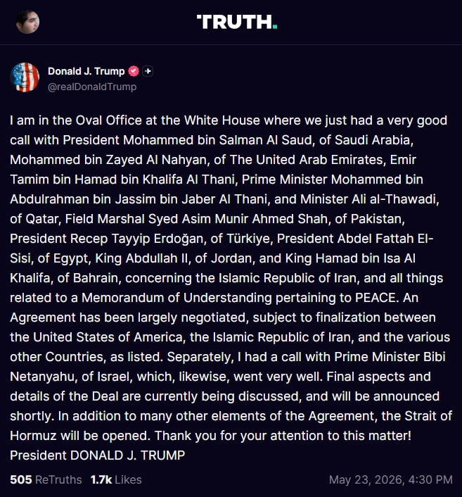

☄️ ترامپ: یک توافق تنظیم شده و اکنون در انتظار نهایی شدن است

پست ترامپ، ترجمه ماشین:
من در دفتر بیضیِ کاخ سفید هستم؛ جایی که همین حالا تماس بسیار خوبی با
▪️پرزیدنت محمد بن سلمان آل سعود از عربستان سعودی،
▪️محمد بن زاید آل نهیان از امارات متحده عربی،
▪️امیر تمیم بن حمد بن خلیفه آل ثانی،
نخست‌وزیر محمد بن عبدالرحمن بن جاسم بن جبر آل ثانی و وزیر علی الثوادی از قطر،
▪️فیلد مارشال سید عاصم منیر احمد شاه از پاکستان،
▪️رجب طیب اردوغان رئیس‌جمهور ترکیه،
▪️عبدالفتاح السیسی رئیس‌جمهور مصر،
▪️عبدالله دوم پادشاه اردن،
▪️و حمد بن عیسی آل خلیفه پادشاه بحرین،

درباره جمهوری اسلامی ایران و همه مسائل مربوط به یادداشت تفاهمی در ارتباط با صلح داشتیم.

یک توافق تا حد زیادی مذاکره شده و نهایی شدن آن منوط به جمع‌بندی میان ایالات متحده آمریکا، جمهوری اسلامی ایران و کشورهای مختلف دیگری است که نامشان ذکر شد.

▪️جداگانه، با نخست‌وزیر بی‌بی نتانیاهو از اسرائیل نیز تماسی داشتم که آن هم بسیار خوب پیش رفت.

جنبه‌ها و جزئیات نهایی توافق در حال حاضر در حال بررسی است و به‌زودی اعلام خواهد شد. علاوه بر بسیاری دیگر از عناصر این توافق، تنگه هرمز باز خواهد شد.

از توجه شما به این موضوع سپاسگزارم!

رئیس‌جمهور دونالد جی. ترامپ

realDonaldTrump

📡 @VahidOnline

## kianmeli1 — post 87622

  <a href="https://t.me/kianmeli1/87622" target="_blank">📎 Download file</a>

https://t.me/kianmeli1

## kianmeli1 — post 87621

  <a href="telegram/content/kianmeli1_87621_1779576158.mp4" target="_blank">🎬 Download video</a>

🔴فاطی کماندو با موزیک رقص مردگان
https://t.me/kianmeli1

## kianmeli1 — post 87620

🔴دقایقی پیش صداسیما گفت ادعای ترامپ در خصوص بازگشایی تنگه هرمز دروغ است و تنگه دست ایران خواهد ماند
https://t.me/kianmeli1

## kianmeli1 — post 87619

🔴احتمالا بزودی صدای توافق بیرون از پنجره شنیده میشه
لب پنجره نباشیم

هرگاه به مهر نهایی پای برگه میرسیدند جنگ شروع میشد
https://t.me/kianmeli1

## kianmeli1 — post 87618

  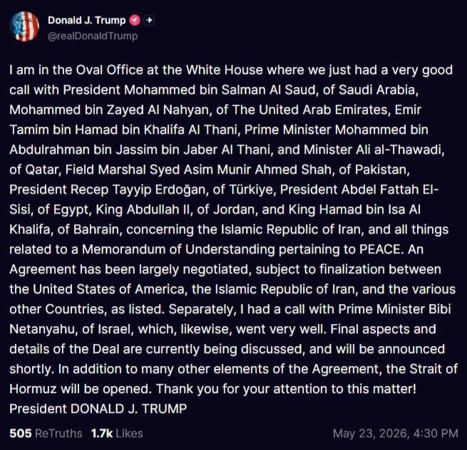

🔴دونالد ترامپ، رییس جمهوری ایالات متحده در شبکه تروث سوشال نوشت: «یک توافق میان ایالات متحده آمریکا، جمهوری اسلامی تنظیم شده و اکنون در انتظار نهایی شدن است. جنبه‌ها و جزییات نهایی توافق در دست بررسی است و به‌زودی اعلام خواهد شد.»

دونالد ترامپ افزود: «علاوه بر بسیاری از بندهای دیگر توافق، تنگه هرمز نیز بازگشایی خواهد شد.»
https://t.me/kianmeli1

## kianmeli1 — post 87617

  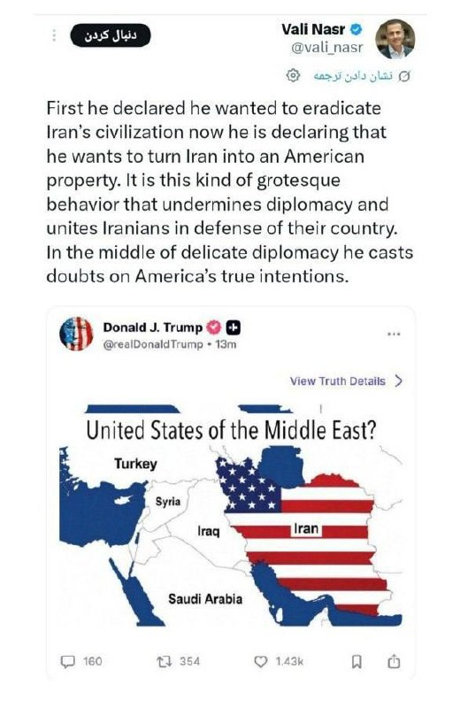

🔴واکنش ولی نصر، مشاور سابق اوباما به پست ترامپ:

اول اعلام کرد که می‌خواهد تمدن ایران را نابود کند، حالا اعلام می‌کند که می‌خواهد ایران را به ملک آمریکا تبدیل کند

این نوع رفتار زننده، دیپلماسی را تضعیف می‌کند و ایرانیان را در دفاع از کشورشان متحد می‌سازد.

در میانه دیپلماسی، او نسبت به نیات واقعی آمریکا تردید ایجاد می‌کند.
https://t.me/kianmeli1

## IranIntlTV — post 338668

  <a href="telegram/content/IranIntlTV_338668_1779576161.mp4" target="_blank">🎬 Download video</a>

ایرانیان مقیم تورنتو با سر دادن شعارهایی در حمایت از شاهزاده رضا پهلوی، خواستار توقف اعدام‌ها، دسترسی به اینترنت آزاد و دموکراسی برای مردم ایران شدند.

گزارش مهسا مرتضوی، خبرنگار ایران‌اینترنشنال و گفت‌وگو با یکی از شرکت‌کنندگان
@iranintltv

## IranIntlTV — post 338667

  

گزارش‌ها از شنیده شدن ده‌ها صدای تیراندازی در نزدیکی کاخ سفید خبر می‌دهد. به گزارش رسانه‌های آمریکایی، خبرنگاران در داخل کاخ سفید در محل امن مستقر شدند و ماموران سرویس مخفی در چمن شمالی کاخ سفید در حالی دیده می‌شوند که تفنگ در دست دارند.
https://iranintl.com/202605231953

## IranIntlTV — post 338666

  <a href="telegram/content/IranIntlTV_338666_1779576163.mp4" target="_blank">🎬 Download video</a>

واشینگتن‌پست گزارش داد مقام‌ها و دیپلمات‌های آگاه از مذاکرات میان آمریکا و جمهوری اسلامی ابراز امیدواری کرده‌اند دو طرف پس از بررسی پیش‌نویس تهیه‌شده از سوی پاکستان، طی ۴۸ ساعت آینده تصمیم نهایی خود را اتخاذ کنند.

گفت‌وگو با حسین علیزاده، دیپلمات پیشین
@iranintltv

## IranIntlTV — post 338665

  <a href="telegram/content/IranIntlTV_338665_1779576165.mp4" target="_blank">🎬 Download video</a>

دونالد ترامپ از تماس تلفنی خود با رهبران کشورهای منطقه درباره ایران خبر داد. او تاکید کرد بخش زیادی از چارچوب توافق نهایی شده، اما اجرای آن همچنان به توافق نهایی میان واشینگتن، تهران و برخی کشورهای دخیل در مذاکرات بستگی دارد.

گفت‌وگو با امیر گیتی، عضو تحریریه ایران‌اینترنشنال
@iranintltv

## IranIntlTV — post 338664

  <a href="https://t.me/IranintlTV/338664" target="_blank">📎 Download file</a>

🎧نسخه صوتی سیاست با مراد ویسی: تهدید پزشکیان به استعفا
@iranintlTV

## IranIntlTV — post 338663

  <a href="telegram/content/IranIntlTV_338663_1779576167.mp4" target="_blank">🎬 Download video</a>

مراد ویسی، تحلیل‌گر ارشد ایران‌اینترنشنال، گفت: «در راس جمهوری اسلامی اختلاف بر سر توافق با آمریکا یا رفتن به سمت جنگ شدت گرفته است. مسعود پزشکیان در نامه‌ای به مجتبی خامنه‌ای نوشته توان تاب‌آوری نظام رو به پایان است و در صورت ادامه شرایط موجود تهدید به استعفا کرده است.»
@iranintltv

## IranIntlTV — post 338662

  

خبرگزاری فارس، وابسته به سپاه، گزارش داد بر اساس پیگیری‌های خبرنگار این رسانه، اظهارات جدید ترامپ مبنی بر بازگشت تنگه هرمز به وضعیت پیشین و آماده‌سازی برای امضای توافق‌نامه «با واقعیت‌ها فاصله دارد».
فارس افزود: براساس آخرین متن ردوبدل‌شده بین آمریکا و جمهوری اسلامی، در صورت توافق احتمالی، تنگه هرمز کماکان تحت مدیریت حکومت ایران خواهد بود.
طبق این گزارش، اگرچه جمهوری اسلامی موافقت کرده است که اجازه دهد تعداد کشتی‌های عبوری به میزان قبل از جنگ بازگردد، اما این به‌هیچ‌عنوان به معنای «تردد آزاد» مانند وضعیت پیش از جنگ نیست.
خبرگزاری فارس تاکید کرد: «مدیریت تنگه، تعیین مسیر، زمان، نحوه عبور و صدور مجوز، کماکان در انحصار و با تدبیر جمهوری اسلامی خواهد بود. بنابراین ادعای ترامپ در این خصوص ناقص و فاقد انطباق با واقعیت است.»
این گزارش افزود مقام‌های آمریکایی در پیام‌های متعدد به تهران گفته‌اند که توییت‌های ترامپ عمدتاً جنبه تبلیغاتی و مصرف رسانه‌ای در داخل آمریکا دارد و توصیه کرده‌اند که به این اظهارات توجهی نشود.

https://iranintl.com/202605233399

## IranIntlTV — post 338661

  <a href="telegram/content/IranIntlTV_338661_1779576169.mp4" target="_blank">🎬 Download video</a>

مراد ویسی، تحلیل‌گر ارشد ایران‌اینترنشنال، گفت: «ترامپ گفته روز یکشنبه درباره توافق یا جنگ با جمهوری اسلامی تصمیم می‌گیرد و احتمال توافق را ۵۰-۵۰ دانسته، اکنون نگاه‌ها به تصمیم اوست. آخرین پیشنهاد جمهوری اسلامی از طریق عاصم منیر، فرمانده ارتش پاکستان، به آمریکا منتقل شده و او پس از دیدار با مقام‌های تهران از انتقال نظرات نهایی جمهوری اسلامی به آمریکا خبر داده است.»
@iranintltv

## IranIntlTV — post 338660

  

دونالد ترامپ، رییس جمهوری ایالات متحده در شبکه تروث سوشال نوشت: «یک توافق میان ایالات متحده آمریکا و جمهوری اسلامی تنظیم شده و اکنون در انتظار نهایی شدن است. جنبه‌ها و جزییات نهایی توافق در دست بررسی است و به‌زودی اعلام خواهد شد.»

دونالد ترامپ افزود: «علاوه بر بسیاری از بندهای دیگر توافق، تنگه هرمز نیز بازگشایی خواهد شد.»
https://iranintl.com/202605230612

## IranIntlTV — post 338659

  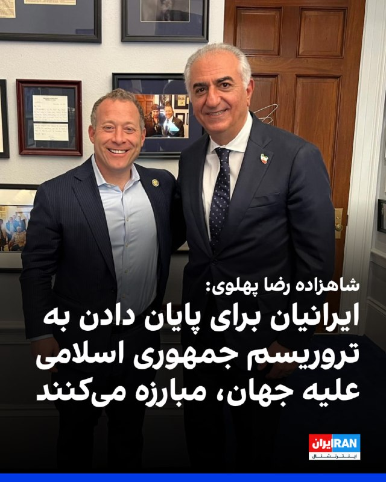

شاهزاده رضا پهلوی در دیدار با جاش گاتهایمر، عضو حزب دموکرات در مجلس نمایندگان آمریکا، بر اهمیت حمایت دوحزبی کنگره ایالات متحده از مردم ایران تاکید کرد و گفت: ایرانیان نه‌تنها برای آزادی خود، بلکه برای پایان دادن به تروریسم جمهوری اسلامی علیه جهان مبارزه می‌کنند.
https://iranintl.com/202605235303

## IranIntlTV — post 338658

  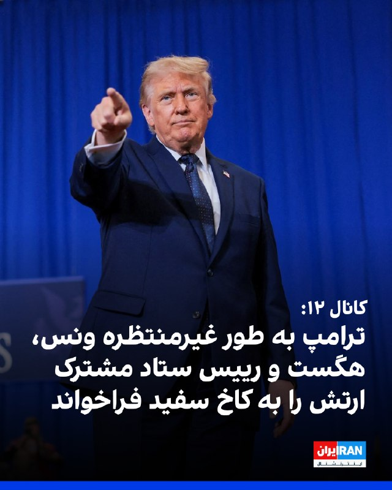

کانال ۱۲ اسرائیل گزارش داد که ترامپ در روز شنبه به طور غیرمنتظره‌ای جی‌دی ونس، دن کین، رییس ستاد مشترک ارتش، پیت هگست، وزیر جنگ و کل شورای امنیت ملی را به اتاق وضعیت کاخ سفید فراخواند.

پیش‌تر ترامپ با رهبران کشورهای منطقه درباره مذاکرات با جمهوری اسلامی گفت‌وگو کرده بود.
https://iranintl.com/202605233431

## Shin_Persian — post 6194

  

Shin ✓ @hey_itsmyturn
Sat, 23 May 2026 22:34:08 UTC

𝕏 · @shin_persian

## Shin_Persian — post 6193

  <a href="telegram/content/Shin_Persian_6193_1779576172.mp4" target="_blank">🎬 Download video</a>

Selina Wang ✓ @selinawangtv
Sat, 23 May 2026 22:20:24 UTC

I was in the middle of taping on my iPhone for a social video from the White House North Lawn when we heard the shots. It sounded like dozens of gunshots. We were told to sprint to the press briefing room where we are holding now.

فارسی

من در میانه ضبط ویدئویی برای شبکه‌های اجتماعی با آیفون خود در محوطه شمالی کاخ سفید بودم که صدای شلیک‌ها را شنیدیم. صدا شبیه به ده‌ها شلیک گلوله بود. به ما گفته شد که به سرعت به سمت اتاق کنفرانس مطبوعاتی بدویم، جایی که هم‌اکنون در آنجا پناه گرفته‌ایم.

𝕏 · @shin_persian

## Shin_Persian — post 6192

  

Faytuks Network ✓ @FaytuksNetwork
Sat, 23 May 2026 22:24:37 UTC

Police have created a perimeter around the scene of the shooting close to the White House.

فارسی

پلیس پیرامون صحنه تیراندازی در نزدیکی کاخ سفید، یک کمربند امنیتی ایجاد کرده است.

𝕏 · @shin_persian

## Shin_Persian — post 6191

Shin ✓ @hey_itsmyturn
Sat, 23 May 2026 22:14:55 UTC

Shots fired outside of the White House

فارسی

شلیک گلوله در بیرون از کاخ سفید

𝕏 · @shin_persian

## Shin_Persian — post 6189

🔁 Quoting above tweet:
Shin ✓ @hey_itsmyturn
Sat, 23 May 2026 21:48:53 UTC

The only entity that wants to attack "The President" [and attempted to assassinate his daughter] is the IRGC , dingus. Same people you're "getting close" to make a deal with.
(https://x.com/HouseGOP/status/2058202848093946166)

فارسی

تنها نهادی که قصد حمله به «رئیس‌جمهور» را دارد [و برای ترور دخترش تلاش کرد]، سپاه پاسداران انقلاب اسلامی (IRGC) است، احمق. همان کسانی که برای توافق دارید به آن‌ها «نزدیک» می‌شوید.
(https://x.com/HouseGOP/status/2058202848093946166)

𝕏 · @shin_persian

## Shin_Persian — post 6188

  

↩️ Quoted tweet: Kaelan Dorr ✓ @Kaelan47 Sat, 23 May 2026 21:02:21 UTC If you find yourself reading this Truth and feeling the need to attack the President for attempting to achieve long lasting peace… Go ahead and delete your account, touch some grass…

## Shin_Persian — post 6187

↩️ Quoted tweet:
Kaelan Dorr ✓ @Kaelan47
Sat, 23 May 2026 21:02:21 UTC

If you find yourself reading this Truth and feeling the need to attack the President for attempting to achieve long lasting peace…

Go ahead and delete your account, touch some grass, and call a loved one. The TDS has set in.

↩️ توییت نقل‌قول شده — برای پاسخ، پست زیر را ببینید.

فارسی

اگر خود را در حال خواندن این «حقیقت» (در Truth Social) می‌بینید و احساس می‌کنید نیاز دارید به رئیس‌جمهور بابت تلاش برای دستیابی به صلحی پایدار حمله کنید...

بفرمایید و حساب کاربری خود را پاک کنید، با دنیای واقعی ارتباط بگیرید (کمی علف لمس کنید) و با یکی از عزیزانتان تماس بگیرید. «سندروم آشفتگی ترامپ» (TDS) در شما ریشه دوانده است.

𝕏 · @shin_persian

## Shin_Persian — post 6184

↩️ Quoted tweet:
Kaelan Dorr ✓ @Kaelan47
Sat, 23 May 2026 21:02:21 UTC

If you find yourself reading this Truth and feeling the need to attack the President for attempting to achieve long lasting peace…

Go ahead and delete your account, touch some grass, and call a loved one. The TDS has set in.

↩️ توییت نقل‌قول شده — برای پاسخ، پست زیر را ببینید.

فارسی

اگر در حال خواندن این «تروث» هستید و احساس می‌کنید باید به رئیس‌جمهور بابت تلاش برای دستیابی به صلحی پایدار حمله کنید...

بفرمایید و حساب کاربری‌تان را پاک کنید، کمی با دنیای واقعی ارتباط بگیرید (touch some grass) و با یکی از عزیزانتان تماس بگیرید. سندرم تنفر از ترامپ (TDS) در شما ریشه دوانده است.

𝕏 · @shin_persian

## Shin_Persian — post 6183

Shin ✓ @hey_itsmyturn
Sat, 23 May 2026 21:26:27 UTC

IRGC-owned Fars News:
"""
Trump's Claim Regarding the Return of the Strait of Hormuz to its Previous State Is Baseless

According to Fars News Agency, despite Donald Trump's recent claim on "Truth Social" that the Strait of Hormuz has returned to its previous condition and that an agreement is being prepared for signing, investigations by Fars reporters indicate that this assertion is unsubstantiated.

Based on the latest exchanged communications, should a potential agreement be reached, the Strait of Hormuz will remain under Iranian management.

Although Iran has agreed to allow the number of passing vessels to return to pre-war levels, this by no means signifies "free passage" to the pre-war status.

Consequently, the management of the strait, including route determination, timing, passage procedures, and permit issuance, will remain exclusively under the discretion and management of the Islamic Republic of Iran. Therefore, Trump's claim in this regard is flawed and does not align with reality.

It is worth noting that Trump had previously declared negotiations regarding Iran's nuclear program as one of the primary and inseparable conditions for any agreement. However, no commitment has been made by Iran, and the nuclear file has not been discussed at this stage.

American officials have reportedly acknowledged in numerous messages to Iran that Trump's tweets are primarily promotional and intended for media consumption within the United States, advising against paying attention to these statements.

"""

ترجمه فارسی در بخش نظرات

𝕏 · @shin_persian

## Shin_Persian — post 6180

  

↩️ Quoted tweet: Steven Cheung ✓ @StevenCheung47 Sat, 23 May 2026 20:16:47 UTC It’s 4:00 PM on a Saturday, and President Trump has been working hard at the White House since early this morning. This man is focused and determined. ↩️ توییت نقل‌قول شده —…

## Shin_Persian — post 6179

↩️ Quoted tweet:
Steven Cheung ✓ @StevenCheung47
Sat, 23 May 2026 20:16:47 UTC

It’s 4:00 PM on a Saturday, and President Trump has been working hard at the White House since early this morning. This man is focused and determined.

↩️ توییت نقل‌قول شده — برای پاسخ، پست زیر را ببینید.

فارسی

ساعت ۴:۰۰ بعد از ظهر شنبه است و پرزیدنت ترامپ از اوایل امروز صبح در کاخ سفید به سختی مشغول کار بوده است. این مرد متمرکز و بااراده است.

𝕏 · @shin_persian

## Shin_Persian — post 6178

  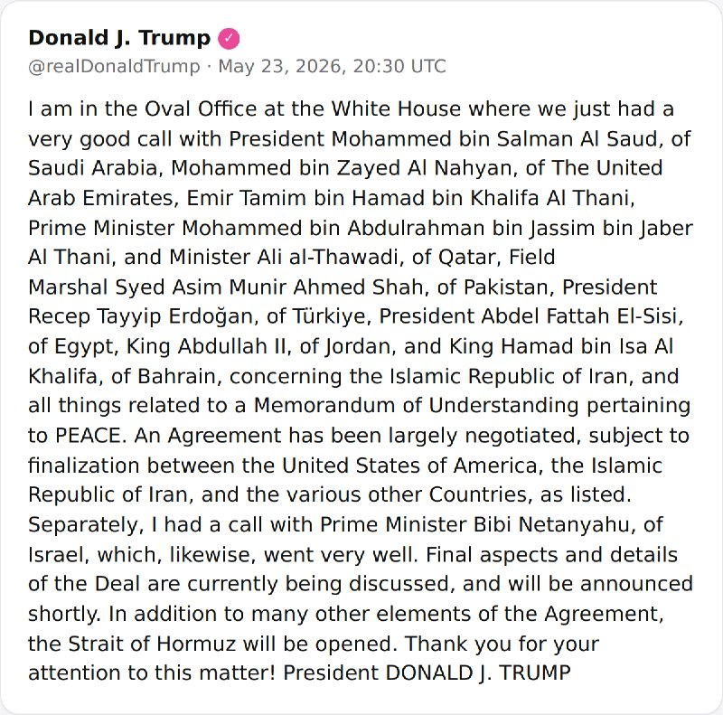

Shin ✓ @hey_itsmyturn Sat, 23 May 2026 20:35:28 UTC President Trump @POTUS: "I am in the Oval Office at the White House where we just had a very good call with President Mohammed bin Salman Al Saud, of Saudi Arabia, Mohammed bin Zayed Al Nahyan, of The United…

## Shin_Persian — post 6177

Shin ✓ @hey_itsmyturn
Sat, 23 May 2026 20:35:28 UTC

President Trump @POTUS:
"I am in the Oval Office at the White House where we just had a very good call with President Mohammed bin Salman Al Saud, of Saudi Arabia, Mohammed bin Zayed Al Nahyan, of The United Arab Emirates, Emir Tamim bin Hamad bin Khalifa Al Thani, Prime Minister Mohammed bin Abdulrahman bin Jassim bin Jaber Al Thani, and Minister Ali al-Thawadi, of Qatar, Field Marshal Syed Asim Munir Ahmed Shah, of Pakistan, President Recep Tayyip Erdoğan, of Türkiye, President Abdel Fattah El-Sisi, of Egypt, King Abdullah II, of Jordan, and King Hamad bin Isa Al Khalifa, of Bahrain, concerning the Islamic Republic of Iran, and all things related to a Memorandum of Understanding pertaining to PEACE. An Agreement has been largely negotiated, subject to finalization between the United States of America, the Islamic Republic of Iran, and the various other Countries, as listed. Separately, I had a call with Prime Minister Bibi Netanyahu, of Israel, which, likewise, went very well. Final aspects and details of the Deal are currently being discussed, and will be announced shortly. In addition to many other elements of the Agreement, the Strait of Hormuz will be opened. Thank you for your attention to this matter! President DONALD J. TRUMP"

فارسی

رئیس‌جمهور ترامپ @POTUS:
«من در دفتر بیضی در کاخ سفید هستم، جایی که دقایقی پیش تماس بسیار خوبی با پرنس محمد بن سلمان آل سعود از عربستان سعودی، محمد بن زاید آل نهیان از امارات متحده عربی، امیر تمیم بن حمد بن خلیفه آل ثانی، نخست‌وزیر محمد بن عبدالرحمن بن جاسم بن جابر آل ثانی و وزیر علی الثوادی از قطر، ارتشبد سید عاصم منیر احمد شاه از پاکستان، رئیس‌جمهور رجب طیب اردوغان از ترکیه، رئیس‌جمهور عبدالفتاح السیسی از مصر، ملک عبدالله دوم از اردن، و ملک حمد بن عیسی آل خلیفه از بحرین، در خصوص جمهوری اسلامی ایران و تمامی موارد مرتبط با یک یادداشت تفاهم مربوط به صلح داشتم. توافق‌نامه‌ای تا حد زیادی مذاکره شده است که منوط به نهایی شدن بین ایالات متحده آمریکا، جمهوری اسلامی ایران و سایر کشورهای مختلفِ فهرست شده می‌باشد. به‌طور جداگانه، تماسی با نخست‌وزیر بیبی نتانیاهو از اسرائیل داشتم که آن هم به همان ترتیب بسیار خوب پیش رفت. جنبه‌ها و جزئیات نهایی این توافق در حال حاضر در حال بحث است و به‌زودی اعلام خواهد شد. علاوه بر بسیاری از عناصر دیگرِ این توافق‌نامه، تنگه هرمز باز خواهد شد. از توجه شما به این موضوع سپاسگزارم! رئیس‌جمهور دونالد جی. ترامپ»

𝕏 · @shin_persian

## Shin_Persian — post 6176

  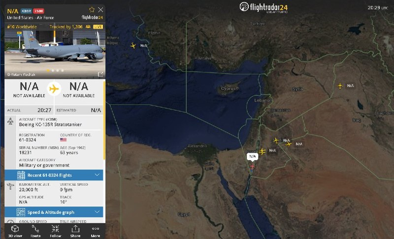

DefenceGeek 🇬🇧 ✓ @DefenceGeek
Sat, 23 May 2026 20:31:12 UTC

Tanker In-Flight Emergency #FreeIran‌
--- Operation EPIC FURY / Project FREEDOM ---

KC-135R "BAYOU99" 61-0324 #AE0263 is squawking 7600 over southern Israel/Jordan border area

@MATA_osint

فارسی

وضعیت اضطراری تانکر در حین پرواز #FreeIran
--- عملیات خشم حماسی / پروژه آزادی ---

هواپیمای KC-135R با نام فراخوان "BAYOU99" به شماره سریال 0324-61 و کد رهگیری #AE0263 در حال ارسال سیگنال وضعیت اضطراری ۷۶۰۰ (قطع ارتباط رادیویی) برفراز منطقه مرزی جنوب اسرائیل/اردن است.

@MATA_osint

𝕏 · @shin_persian

## Shin_Persian — post 6175

Shin ✓ @hey_itsmyturn
Sat, 23 May 2026 20:31:36 UTC

Blasts in north of Baghdad and Erbil (KRI) at the same time!
#Iraq 🇮🇶

فارسی

انفجارها در شمال بغداد و اربیل (اقلیم کردستان عراق) به طور همزمان!
#Iraq 🇮🇶

𝕏 · @shin_persian

## Shin_Persian — post 6174

Shin ✓ @hey_itsmyturn
Sat, 23 May 2026 20:30:07 UTC

Explosions from rockets in Tarmiyah, north of Baghdad, #Iraq 🇮🇶

فارسی

انفجارهای ناشی از اصابت راکت در طارمیه، شمال بغداد، #Iraq 🇮🇶

𝕏 · @shin_persian

## Shin_Persian — post 6173

Lindsey Graham ✓ @LindseyGrahamSC
Sat, 23 May 2026 19:43:10 UTC

If it is perceived in the region that a deal with Iran allows the regime to survive and become more powerful over time, we will have poured gasoline on the conflicts in Lebanon and Iraq.

A deal that is perceived to allow Iran to survive and possess the ability to control the Strait in the future will put Hezbollah in Lebanon and the Shia militias in Iraq on steroids.

فارسی

اگر در منطقه این‌گونه برداشت شود که توافق با ایران به این رژیم اجازه می‌دهد بقای خود را حفظ کرده و به مرور زمان قدرتمندتر شود، در واقع بر آتش درگیری‌ها در لبنان و عراق بنزین ریخته‌ایم.

توافقی که تصور شود به ایران اجازه بقا و داشتن توانایی کنترل تنگه [هرمز] در آینده را می‌دهد، حزب‌الله در لبنان و شبه‌نظامیان شیعه در عراق را به شدت تقویت خواهد کرد.

𝕏 · @shin_persian

## ManotoTV — post 105787

  <a href="telegram/content/ManotoTV_105787_1779576177.mp4" target="_blank">🎬 Download video</a>

تجمع ایرانیان ساکن کپنهاگ، دوم خرداد ۱۴۰۵

## ManotoTV — post 105786

  <a href="telegram/content/ManotoTV_105786_1779576178.mp4" target="_blank">🎬 Download video</a>

دونالد ترامپ، رئیس‌جمهور آمریکا، در پیامی در تروث‌سوشال اعلام کرد که از دفتر بیضی کاخ سفید، تماس «بسیار خوبی» با رهبران و مقام‌های چند کشور خاورمیانه و منطقه درباره جمهوری اسلامی و یک یادداشت تفاهم مرتبط با «صلح» داشته است.

او نوشت: «من در دفتر بیضی کاخ سفید هستم، جایی که همین حالا تماس بسیار خوبی با رئیس‌جمهور محمد بن سلمان آل سعود، از عربستان سعودی، محمد بن زاید آل نهیان، از امارات متحده عربی، امیر تمیم بن حمد بن خلیفه آل ثانی، نخست‌وزیر محمد بن عبدالرحمن بن جاسم بن جبر آل ثانی، و وزیر علی الثوادی، از قطر، فیلد مارشال سید عاصم منیر احمد شاه، از پاکستان، رئیس‌جمهور رجب طیب اردوغان، از ترکیه، رئیس‌جمهور عبدالفتاح السیسی، از مصر، ملک عبدالله دوم، از اردن، و ملک حمد بن عیسی آل خلیفه، از بحرین، درباره جمهوری اسلامی ایران و همه مسائل مرتبط با یک یادداشت تفاهم مربوط به صلح داشتیم.

یک توافق تا حد زیادی مذاکره شده است، مشروط به نهایی شدن میان ایالات متحده آمریکا، جمهوری اسلامی ایران، و کشورهای مختلف دیگر، همان‌طور که نام برده شدند.

به طور جداگانه، من تماسی با نخست‌وزیر بی‌بی نتانیاهو، از اسرائیل، داشتم که آن هم به همین ترتیب بسیار خوب پیش رفت.

جنبه‌ها و جزئیات نهایی توافق در حال حاضر در حال گفت‌وگو است و به‌زودی اعلام خواهد شد.

علاوه بر بسیاری عناصر دیگر این توافق، تنگه هرمز باز خواهد شد.»

## ManotoTV — post 105785

  <a href="telegram/content/ManotoTV_105785_1779576179.mp4" target="_blank">🎬 Download video</a>

دو تماس متفاوت از ایران؛
«اگه اجازه بدین جوابشو بدم»

## ManotoTV — post 105784

  <a href="telegram/content/ManotoTV_105784_1779576181.mp4" target="_blank">🎬 Download video</a>

تماسی از سن‌فرانسیسکو:
«می‌گفت با شنیدن صدای شما احساس می‌کنم تو ایرانم…
و از سال‌هایی گفت که با برنامه‌های منوتو خندیده، گریه کرده و زندگی کرده بود.»

## ManotoTV — post 105783

  <a href="telegram/content/ManotoTV_105783_1779576183.mp4" target="_blank">🎬 Download video</a>

راهپیمایی ایرانیان مونترآل، دوم خرداد ۱۴۰۵

## FarsiVOA — post 218477

🔺وال‌استریت ژورنال: دونالد ترامپ حق از سرگیری حملات به جمهوری اسلامی را برای خود محفوظ نگه می‌دارد

▪️روزنامه وال‌‌استریت ژورنال عصر شنبه گزارش داد که دونالد ترامپ، رئيس جمهوری آمریکا به دستیاران و همتایان خود گفته است که حق از سرگیری حملات به جمهوری اسلامی را در صورتی که رژیم ایران به «توافق موقت» عمل نکند، برای خود محفوظ نگه می‌دارد.

⬇️ بیشتر بخوانید:
https://ir.voanews.com/a/8153093.html
@FarsiVOA

## FarsiVOA — post 218476

🔺دونالد ترامپ می‌گوید جزئیات یک «یادداشت تفاهم صلح» با جمهوری اسلامی به زودی اعلام می‌شود

▪️دونالد ترامپ، رئيس‌جمهوری آمریکا، شنبه‌ عصر ۲ خرداد گفت با شماری از رهبران منطقه از جمله مقامات عربستان، قطر، و امارات درباره یک یادداشت تفاهم مربوط به صلح با جمهوری اسلامی ایران صحبت کرده است.

⬇️ بیشتر بخوانید:
https://ir.voanews.com/a/8153084.html
@FarsiVOA

## FarsiVOA — post 218475

  <a href="telegram/content/FarsiVOA_218475_1779576185.mp4" target="_blank">🎬 Download video</a>

⚡️واکنش‌های قانون‌گذاران آمریکا به قطعنامه دموکرات‌ها برای محدود کردن اختیارات جنگی رئیس‌جمهوری
@FarsiVOA

## FarsiVOA — post 218474

🔺احکام سنگین زندان برای دو زن جوان در سمنان به اتهام «ارسال ویدیو» به شبکه‌های تلویزیونی

▪️کانون حقوق بشر ایران، شنبه ۲ خرداد‌ از صدور حکم مجموعاً ۵۳ سال زندان برای لیلا رمضانی و فاطمه ملک‌احمدی توسط مقام‌های قضایی استان سمنان خبر داد. اتهام این دو زن ارسال ویدیو به شبکه‌های تلویزیونی و «اتباط با شبکه‌های تلویزیونی مخالف حکومت و ارسال محتوا و اطلاعات» برای این رسانه‌ها گزارش شده است.

⬇️ بیشتر بخوانید:
https://ir.voanews.com/a/iran-accusation-prison-dissent-/8153077.html
@FarsiVOA

## FarsiVOA — post 218473

🔺جمهوری‌خواهان مجلس نمایندگان: تلاش گزارش‌شده برای ترور ایوانکا ترامپ «چهره واقعی» جمهوری اسلامی را نشان می‌دهد

▪️جمهوری‌خواهان مجلس نمایندگان آمریکا روز شنبه ۲ خرداد با انتشار بیانیه‌ای، به گزارش‌های منتشر شده درباره توطئه یک تبعه عراقی آموزش دیده سپاه برای ترور ایوانکا ترامپ، دختر رئیس جمهوری آمریکا، واکنش نشان دادند.

⬇️ بیشتر بخوانید:
https://ir.voanews.com/a/iran-iavanka-trump-assassination-irgc-terror-ghasem-soleimani-/8153076.html
@FarsiVOA

## Persian_Trend_Official — post 14799

  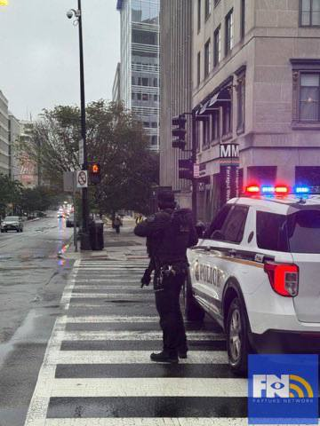

🔴 فوری | گزارش تیراندازی در اطراف کاخ سفید شبکه CBS گزارش داده صدای تیراندازی در اطراف کاخ سفید شنیده شده است. بر اساس گزارش اولیه: ▪️ سرویس مخفی آمریکا از خبرنگاران حاضر در ورودی کاخ سفید خواسته فوراً به اتاق توجیه خبری منتقل شوند ▪️ هنوز جزئیاتی درباره…

## Persian_Trend_Official — post 14798

  <a href="telegram/content/Persian_Trend_Official_14798_1779576186.mp4" target="_blank">🎬 Download video</a>

🔴 فوری | گزارش تیراندازی در اطراف کاخ سفید شبکه CBS گزارش داده صدای تیراندازی در اطراف کاخ سفید شنیده شده است. بر اساس گزارش اولیه: ▪️ سرویس مخفی آمریکا از خبرنگاران حاضر در ورودی کاخ سفید خواسته فوراً به اتاق توجیه خبری منتقل شوند ▪️ هنوز جزئیاتی درباره…

## Persian_Trend_Official — post 14797

  <a href="telegram/content/Persian_Trend_Official_14797_1779576187.mp4" target="_blank">🎬 Download video</a>

🔴 فوری | گزارش تیراندازی در اطراف کاخ سفید شبکه CBS گزارش داده صدای تیراندازی در اطراف کاخ سفید شنیده شده است. بر اساس گزارش اولیه: ▪️ سرویس مخفی آمریکا از خبرنگاران حاضر در ورودی کاخ سفید خواسته فوراً به اتاق توجیه خبری منتقل شوند ▪️ هنوز جزئیاتی درباره…

## Persian_Trend_Official — post 14796

  <a href="telegram/content/Persian_Trend_Official_14796_1779576188.mp4" target="_blank">🎬 Download video</a>

شبتون بخیر 🤍

📝 Nick
📌 @persian_trend_official
پرشین ترند | متفاوت‌ترین کانال نظامی

## Persian_Trend_Official — post 14795

🔴 فوری | گزارش تیراندازی در اطراف کاخ سفید شبکه CBS گزارش داده صدای تیراندازی در اطراف کاخ سفید شنیده شده است. بر اساس گزارش اولیه: ▪️ سرویس مخفی آمریکا از خبرنگاران حاضر در ورودی کاخ سفید خواسته فوراً به اتاق توجیه خبری منتقل شوند ▪️ هنوز جزئیاتی درباره…

## Persian_Trend_Official — post 14794

🔴 فوری | گزارش تیراندازی در اطراف کاخ سفید

شبکه CBS گزارش داده صدای تیراندازی در اطراف کاخ سفید شنیده شده است.

بر اساس گزارش اولیه:

▪️ سرویس مخفی آمریکا از خبرنگاران حاضر در ورودی کاخ سفید خواسته فوراً به اتاق توجیه خبری منتقل شوند
▪️ هنوز جزئیاتی درباره عامل تیراندازی یا محل دقیق حادثه منتشر نشده است
▪️ وضعیت امنیتی در اطراف کاخ سفید به‌شدت تشدید شده است

◼️تاکنون هیچ مقام آمریکایی درباره ماهیت حادثه یا احتمال تهدید علیه مقامات ارشد اظهار نظر رسمی نکرده است.

🫆:Tony

📌 @persian_trend_official
پرشین ترند | متفاوت‌ترین کانال نظامی

## Persian_Trend_Official — post 14793

## Persian_Trend_Official — post 14792

  <a href="telegram/content/Persian_Trend_Official_14792_1779576190.webm" target="_blank">🎬 Download video</a>

⭕️درگذشت دیپلمات جمهوری آذربایجان در سانحه رانندگی در اتوبان جلفا-تبریز

💢وزارت امور خارجه جمهوری آذربایجان در فضای مجازی از درگذشت دیپلمات خود در شهر تبریز بر اثر تصادف خبر داد.

💢رامیل رضا اوغلو عمرانوف، کنسول جمهوری آذربایجان در جمهوری اسلامی ایران در شهر تبریز حین انجام فعالیت خدماتی در حوالی شهر مرند در اتوبان جلفا-تبریز بر اثر تصادف خودرویی که با آن در حال رانندگی بود جان خود را از دست داد

🫆:Tony

📌 @persian_trend_official
پرشین ترند | متفاوت‌ترین کانال نظامی

## Persian_Trend_Official — post 14791

اسرائیل نابود شده فقط یک تکون لازمه جولان تصرف بشه ...

## Persian_Trend_Official — post 14790

  <a href="telegram/content/Persian_Trend_Official_14790_1779576190.mp4" target="_blank">🎬 Download video</a>

اسرائیل نابود شده
فقط یک تکون لازمه جولان تصرف بشه ...

## Persian_Trend_Official — post 14788

ادمین هستم، با اجازه از الیاس عزیز. 📝

این صرفا نظر شخصی من هست. 🙏

به نظر من الان همه دارن از اینکه جام جهانی رویداد خیلی مهمی هست و ترامپ قبل از جام جهانی نمیزنه صحبت می‌کنند و میگن اگرم بزنه بعد از جام جهانی میزنه

و فکر میکنم این دقیقا همون تله‌ای هست که شما هم دارید توش می‌افتید

امنیت ملی آمریکا موضوعی نیست که با یک فستیوال بخواد موضوع مهمی مثل ج.ا رو به تعویق بندازه

به نظرم از الان هم دارن توافق رو بولد میکنن تا به جام جهانی که رسیدیم دیگه هیچکس فکرش رو هم نکنه که بخوان وسط جام جهانی بزنن

و خب دقیقا همونجاست که، بوووم‌ 🗿
🐭🐁تباه به ملکوت اعلی می‌پیونده 😂
البته اگر تا الان نپیوسته باشه 😈

گفتم این صرفا نظر شخصی من هست. ❤️🙏

📝 Nick

📌 @persian_trend_official
پرشین ترند | متفاوت‌ترین کانال نظامی

## Persian_Trend_Official — post 14787

  

📷 Photo

## Persian_Trend_Official — post 14786

خبرگزاری فارس | ادعای ترامپ دربارهٔ بازگشت تنگهٔ هرمز به حالت قبل واقعیت ندارد

💢به‌گزارش فارس؛ برخلاف ادعای لحظات قبل دونالد ترامپ در شبکهٔ اجتماعی «تروث سوشال» مبنی بر بازگشت تنگهٔ هرمز به وضعیت پیشین و آماده‌سازی برای امضای توافق‌نامه، پیگیری‌های خبرنگار فارس نشان می‌دهد که این ادعا نیز با واقعیت‌ها فاصله دارد.

💢براساس آخرین متن ردوبدل‌شده، در صورت توافق احتمالی، تنگهٔ هرمز کماکان تحت مدیریت ایران خواهد بود.

💢اگرچه ایران موافقت کرده اجازه دهد تعداد کشتی‌های عبوری به میزان قبل از جنگ بازگردد، اما این به‌هیچ‌عنوان به معنای «تردد آزاد» به وضعیت قبل از جنگ نیست.

🫆:Tony

📌 @persian_trend_official
پرشین ترند | متفاوت‌ترین کانال نظامی

## Persian_Trend_Official — post 14785

علی هاشم خبرنگار الجزیره:

طبق گفته منابع من، پیش‌نویس پیشنهادی که قرار است نهایی شود شامل موارد زیر است:

- پایان جنگ در همه جبهه‌ها از جمله لبنان

- آزاد شدن میلیاردها دلار از دارایی‌های مسدود شده ایران

- لغو محاصره دریایی آمریکا و گشایش تنگه هرمز

- خروج نیروهای آمریکایی از مجاورت بلافصل ایران

پس از این، طرفین ۳۰ روز فرصت خواهند داشت تا درباره مسئله هسته‌ای به توافق برسند.

این ۳۰ روز با توافق طرفین قابل تمدید است.

در طول این سی روز، عبور و مرور از طریق تنگه تسهیل خواهد شد.

به گفته ایران، مدیریت تنگه هرمز موضوعی ایرانی-عمانی خواهد بود و در حال مذاکره با مسقط است./انتخاب

😄😄😄😄😄 بخدا این ترامپ همرو سرکار گذاشته !

## Persian_Trend_Official — post 14783

💢وضعیت پرواز های نظامی ایالات متحده در آسمان منطقه . 🫆:Tony 📌 @persian_trend_official پرشین ترند | متفاوت‌ترین کانال نظامی

## Persian_Trend_Official — post 14782

https://t.me/persian_trend_official/14778?comment=576703

من فشار بخورم یا نخورم تاثیری داره ؟
فکر میکنی توافقی هم بشه از فردا دلار میشه 20 تومن و سرمایه گزار خارجی واسه ایران صف میبندن ؟
داداش من این مسیر رو به قهقراست

## Persian_Trend_Official — post 14781

  <a href="telegram/content/Persian_Trend_Official_14781_1779576192.webm" target="_blank">🎬 Download video</a>

دونالد تا حس پیروزی بهشون دست نده از سوراخ بیرون نمیان 😄

## Persian_Trend_Official — post 14780

  

💢وضعیت پرواز های نظامی ایالات متحده در آسمان منطقه .

🫆:Tony

📌 @persian_trend_official
پرشین ترند | متفاوت‌ترین کانال نظامی

## Persian_Trend_Official — post 14779

جمهوری اسلامی و آمریکا، حتی روی چهارچوب هم تا الان به نقطه مشترک نرسیدن !

## IranianMinds — post 20648

  

آخرین باری که جمهوری اسلامی مخالفانش را به مذاکره و گفتگو دعوت کرد، چنین اتفاقی افتاد!

عبدالرحمان قاسملو، پای میز مذاکره رفت و ترور شد!

در قاموسِ جمهوری اسلامی، بیائید مذاکره کنیم یعنی بیائید تا شما را به قتل برسانیم.

این نکته را هرگز فراموش نکنید!
و مطمئن باشید اطلاعات آمریکا بیشتر از ماست

@IranianMinds

## IranianMinds — post 20647

ثبت نام کن ۵۰۰ هزارتومان جایزه بگیر
نیازی هم به واریز نیست
تنها سایت مورد #تایید ما با بونوس های واقعی:

🌐 Winro.io

## IranianMinds — post 20646

  

⭕️ تا حالا بدون واریزی روی فوتبال ها شرط بستی؟!

🎉 500 هزارتومن بونوس رایگان فقط با ثبت نام بدون هیچگونه واریزی!

💳 شارژ سریع و امن با درگاه ریالی ، تتر یا ترون فقط با یک کلیک!

⌛ پشتیبانی 24 ساعته

💖تنها سایت مورد اعتماد ما با بونوس های کاملا واقعی و رویایی:

🌐 Winro.io

🌐 Winro.io
کانال بونوس های رایگان aa2

📱 @winro_io

## IranianMinds — post 20645

  

در تاریخ ننگ این دوره را با آب زمزم و کوثر هم نمیشود شست..!

👤 صادق هدایت

@IranianMinds

## IranianMinds — post 20644

  

🔴پست اتاق جنگ اسرائیل:

ایران آزاد.

@IranianMinds

## IranianMinds — post 20643

ترامپ به نفع کشورش کار میکنه
و همکاری با این رژیمی که خواهان نابودی اونهاست به نفع آمریکا نیست.

موضوعاتی هست که ما اطلاع نداریم
فقط کافیه وایستیم و ببینیم

پیچیدگی های موضوع رو اطلاعی نداریم

## IranianMinds — post 20642

🔴 ریزش تتر بعد از خبر توافق احتمالی بین آمریکا و جمهوری اسلامی

171 هزارتومان

@IranianMinds

## IranianMinds — post 20641

🔴 آکسیوس: پیام همه رهبرانی که در تماس با ترامپ شرکت داشتن این بود که توقف جنگ به نفع منطقه است.

@IranianMinds

## IranianMinds — post 20640

  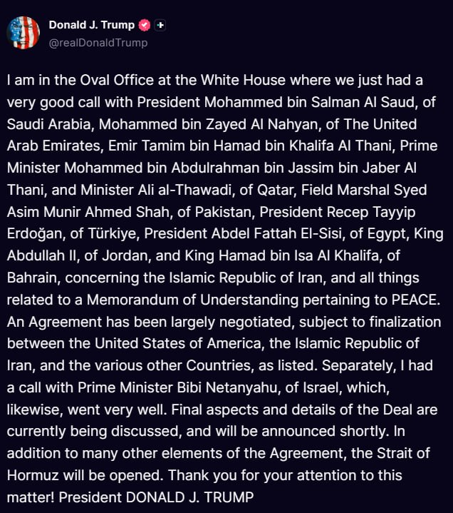

🔴 ترامپ:

من در دفتر بیضی شکل کاخ سفید هستم جایی که ما به تازگی تماس بسیار خوبی با رئیس‌جمهور محمد بن سلمان آل سعود از عربستان سعودی، محمد بن زاید آل نهیان از امارات متحده عربی، امیر تمیم بن حمد بن خلیفه آل ثانی، نخست‌وزیر محمد بن عبدالرحمن بن جاسم بن جابر آل ثانی و وزیر علی الثوادی از قطر، فیلد مارشال سید عاصم منیر احمد شاه از پاکستان، رئیس‌جمهور رجب طیب اردوغان از ترکیه، رئیس‌جمهور عبدالفتاح السیسی از مصر، پادشاه عبدالله دوم از اردن و پادشاه حمد بن عیسی آل خلیفه از بحرین، درباره جمهوری اسلامی ایران و همه موارد مربوط به یادداشت تفاهم مربوط به صلح داشتیم. توافقنامه‌ای تا حد زیادی مذاکره شده است که منوط به نهایی شدن بین ایالات متحده آمریکا، جمهوری اسلامی ایران و کشورهای مختلف دیگر ذکر شده است. به طور جداگانه، من تماسی با نخست‌وزیر بیبی نتانیاهو از اسرائیل داشتم که به همان صورت بسیار خوب پیش رفت. جنبه‌ها و جزئیات نهایی توافق در حال حاضر در حال بحث است و به زودی اعلام خواهد شد. علاوه بر بسیاری از عناصر دیگر توافق، تنگه هرمز باز خواهد شد. از توجه شما به این موضوع سپاسگزارم!

@IranianMinds

## IranianMinds — post 20639

🔴 ستاد کل نیروهای مسلح جمهوری اسلامی:

مسلمانان جهان طعم شیرین نجات از شر آمریکا و اسرائیل رو خواهند چشید و به فتوحات بیشتری نائل خواهند شد.

@IranianMinds

## IranianMinds — post 20638

  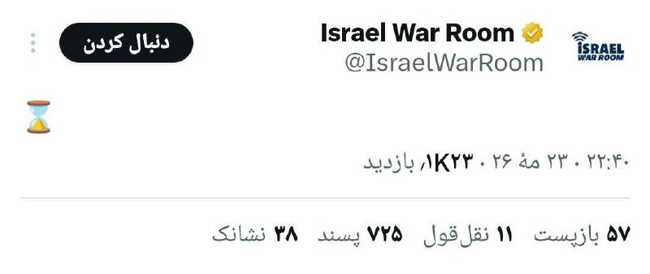

🔴 توییت اتاق جنگ اسرائیل:

دوباره ساعت شنی ، رو به اتمام است.

@IranianMinds

## IranianMinds — post 20637

آکسیوس شب : تموم شد مذاکرات قطعیه بزودی نهایی میشه تبریک !

آکسیوس روز : ترامپ داره طرح‌ حمله ی جدیدی رو‌ به ایران میچینه و احتمالا بزودی جنگ دوباره شروع میشه .

این چرخه همینطور ادامه داره …

@IranianMinds

## BBCPersian — post 281907

  

ستاد فرماندهی مرکزی آمریکا (سنتکام) اعلام کرد که در جریان اجرای محاصره دریایی علیه ایران به تغییر مسیر ۱۰۰ کشتی تجاری رسیده‌ است.

سنتکام در پیامی در شبکه اجتماعی ایکس این آمار را منتشر کرد.

ایران نیز در واکنش به جنگ آمریکا و اسرائیل، عبور و مرور کشتی ها از تنگه هرمز را به شدت محدود کرده است.

دو طرف در حال مذاکره بر سر بازگشایی تنگه هرمز و پایان محاصره دریایی ایران هستند وبر اساس گزارش‌های رسمی به «پیشرفت هایی» رسیده‌اند.

📸 X CENTCOM

https://bbc.in/4dtIPCY
@BBCPersian

## BBCPersian — post 281906

  

🔻در پی اعلام دونالد ترامپ مبنی بر این که در چارچوب توافق احتمالی تنگه هرمز بازگشایی خواهد شد، برخی از رسانه‌های حکومتی جمهوری اسلامی به اظهارات او واکنش نشان دادند.

حسین شریعتمداری، مدیر روزنامه کیهان با «گلایه» از برخی دیپملات‌ها و تیم مذاکره‌کننده ایران گفت که «انگار قرار است بعد از پایان جنگ، شرایط و قوانین حاکم بر تنگه هرمز به حالت پیش از جنگ بازگردد.»

او تاکید کرد که «عوارض عبور، حق قانونی ایران اسلامی است و نباید نادیده گرفته شود.»

خبرگزاری فارس، نزدیک به سپاه پاسداران هم نوشت که «ادعای ترامپ در باره بازگشت تنگه هرمز به حالت قبل واقعیت ندارد.»

این رسانه حکومتی نزدیک به سپاه پاسداران مدعی شد که «براساس آخرین متن ردوبدل‌شده، در صورت توافق احتمالی، تنگه هرمز کماکان تحت مدیریت ایران خواهد بود.»

خبرگزاری فارس در عین حال نوشت که «گرچه ایران موافقت کرده اجازه دهد تعداد کشتی‌های عبوری به میزان قبل از جنگ بازگردد، اما این به‌هیچ‌عنوان به معنای «تردد آزاد» به وضعیت قبل از جنگ نیست.»

📸 ایرنا

https://bbc.in/4dtIPCY
@BBCPersian

## BBCPersian — post 281905

  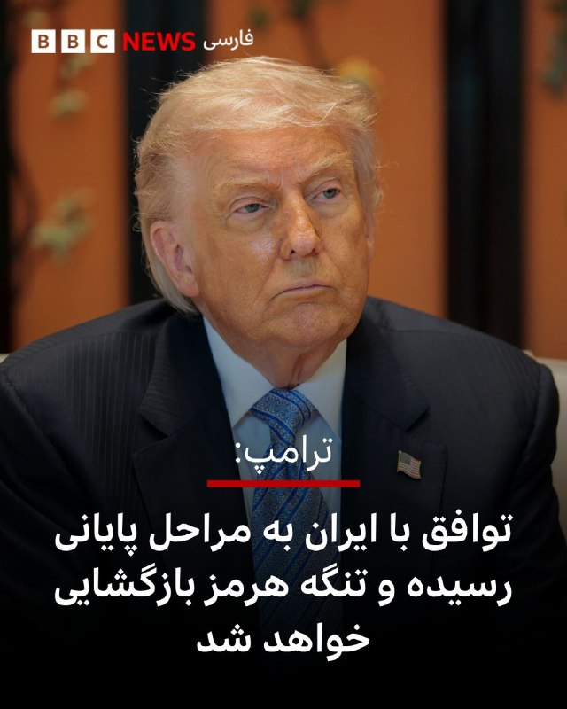

🔻دونالد ترامپ، رئیس جمهور آمریکا در شبکه اجتماعی تروث سوشال اعلام کرد که گفت‌وگوهای «بسیار خوبی» با شماری از رهبران منطقه داشته است اما جنبه‌ها و جزئیات نهایی توافق با ایران همچنان در حال بررسی است و «به‌زودی» اعلام خواهد شد.

او همچنین گفت که در چارچوب این توافق، تنگه هرمز بازگشایی خواهد شد.

آقای ترامپ می‌گوید که از دفتر بیضی کاخ سفید در باره ایران و «تفاهم‌نامه‌ای مرتبط با صلح» این گفت‌وگوها را انجام داده است.

او گفت که بخش عمده توافق میان آمریکا، ایران و دیگر کشورهای یادشده مورد مذاکره قرار گرفته، اما هنوز نهایی نشده است.

آقای ترامپ افزود که به‌طور جداگانه با بنیامین نتانیاهو، نخست‌وزیر اسرائیل، نیز گفت‌وگو کرده و این تماس هم «بسیار خوب» بوده است.

📸 Getty

https://bbc.in/4dtIPCY
@BBCPersian

## BBCPersian — post 281904

  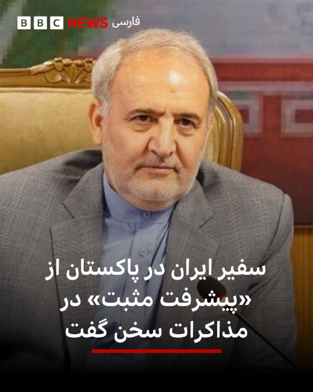

🔻رضا امیری‌مقدم، سفیر ایران در پاکستان، در شبکه اجتماعی ایکس نوشت که محسن نقوی، وزیر کشور پاکستان، پس از بازگشت از تهران، «موفقیت مذاکرات با مقام‌های ایران» را به او تبریک گفته است.

او افزود که با «خوش‌بینی محتاطانه» می‌توان امیدوار بود که در صورت «پایبندی طرف مقابل»، گامی مثبت در مسیر توافق در حال شکل‌گیری باشد.

گامی که به گفته آقای امیری‌مقدم، حاصل «مواضع جمهوری اسلامی ایران» و نیز ابتکار و تلاش‌های فداکارانه میانجی پاکستانی است.

او همچنین ابراز امیدواری کرد که تلاش‌های مقام‌های پاکستان به عنوان میانجی مذاکرات میان ایران و آمریکا به صلحی پایدار در منطقه منجر شود.

پیشتر سخنگوی وزارت خارجه ایران، درباره نتایج تازه‌ترین میانجیگری‌های پاکستان گفت که «ما در مرحله نهایی‌سازی یادداشت تفاهم هستیم.»

مارکو روبیو، وزیر خارجه آمریکا هم در این باره گفت که دیپلماسی در حال پیشرفت است و ممکن است امروز یا ظرف چند روز آینده خبری منتشر شود هرچند که نمی‌توان مطمئن بود.

📸 ایرنا

https://bbc.in/4dtIPCY
@BBCPersian

## BBCPersian — post 281903

🔻تماس‌های تلفنی متعدد رهبران منطقه با یکدیگر در جریان است

گزارش‌های رسمی حاکی از آن است که تماسهای متعدد تلفنی بین رهبران کشورهای منطقه امروز در جریان بوده است.

از جمله تماس‌ها، گفت‌وگوهای تلفنی عباس عراقچی با وزرای خارجه عربستان سعودی، مصر و قطر بوده است.

رسانه های عربی هم گزارش داده‌اند که وزیر خارجه مصر با استیو ویتکاف، فرستاده ویژه رئیس‌جمهور آمریکا، درباره ایران تلفنی صحبت کرده است.

پیشتر گزارش دادیم که خبرگزاری رویترز گزارش داد که دونالد ترامپ امروز با رهبران کشورهای منطقه از جمله مصر، ترکیه، پاکستان، عربستان، امارات و قطر تلفنی مذاکره خواهد کرد.

https://bbc.in/4dtIPCY
@BBCPersian

## BBCPersian — post 281902

  <a href="https://t.me/bbcpersian/281902" target="_blank">📎 Download file</a>

📻پادکست برنامه شصت دقیقه روز شنبه ۲ خرداد ۱۴۰۵ است

این نسخه رادیویی برنامه شصت دقیقه تلویزیون فارسی بی‌بی‌سی است که هرشب بعد از پخش، با حجم کم از اپلیکیشن‌های پادگیر و صفحه تلگرام بی‌بی‌سی فارسی در دسترس است.

با هشتگ BBCPersianRadio# با ما در ارتباط باشید.

@BBCPersian

## BBCPersian — post 281901

🔻مثلث قوه قضاییه، وکلای امنیتی و خبرگزاری میزان؛ چرا اعدام‌ها با «شدت و سرعت» اجرا می‌شود؟

🖌مسعود آذر, بی‌بی‌سی

قوه قضاییه ایران، ۳۱ اردیبهشت ۱۴۰۵ دو نفر را به اتهام «عضویت در گروه‌های تجزیه‌طلب» محکوم و اعدام کرد. خبرگزاری میزان جزئیاتی از زمان بازداشت رامین زله و کریم معروف‌پور ارائه نداد و در باره مراحل دادرسی و محاکمه آنها توضیحی کلی منتشر کرد.

https://bbc.in/4uovMJ3
@BBCPersian

## Dirty_Kids — post 390045

  <a href="telegram/content/Dirty_Kids_390045_1779576198.mp4" target="_blank">🎬 Download video</a>

نیرو ویژه آمریکا در کاخ سفید

طبق گزارشات نزدیک کاخ سفید تیراندازی سنگینی رخ داده و 20-30 گلوله شلیک شده!

@Dirty_Kids 👻

## Dirty_Kids — post 390044

  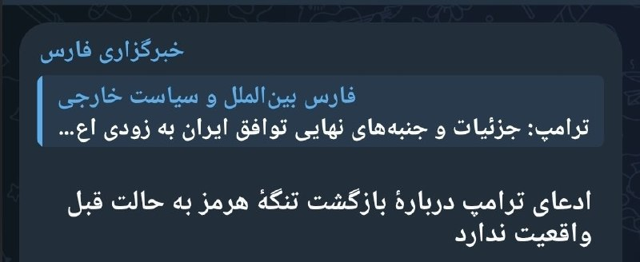

فارس هم خبردرمانی میکنه بچه شیعه آروم بشه
آخه با قاتل رهبرشون رفتن توافق کردن

@Dirty_Kids 👻

## Dirty_Kids — post 390043

  

۲ دسته عرزشی وجود داره:

@Dirty_Kids 👻

## Dirty_Kids — post 390041

‏اصلا چرا من باید شخصی به نام “عاصم منیر” رو بشناسم؟ کیرم توی این سونوشت جدی. همین که شخصی به نام “عاصم منیر” رو می‌شناسیم یعنی باید رید توی این سرنوشت.

@Dirty_Kids 👻

## Dirty_Kids — post 390040

نذارید اخبار مذاکره حواستون رو از رسیدگی به خشخاش‌ها پرت کنه، همین الان برین بهش آب بدین

@Dirty_Kids 👻

## Dirty_Kids — post 390039

  <a href="telegram/content/Dirty_Kids_390039_1779576200.mp4" target="_blank">🎬 Download video</a>

حتی در برهوت میهن‌پرستی، همیشه کسانی بوده‌اند که بدون سهم‌خواهی و منت، برای میهن جانفشانی کرده‌اند تا #ایران همچنان پابرجا بماند.
ما به آنها مدیونیم….

امیرحسین‌خان شجاع‌الدوله

@Dirty_Kids 👻

## Dirty_Kids — post 390038

  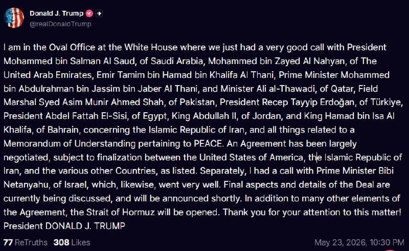

ترامپ: الان تو دفتر بیضی کاخ سفید هستم و دقایقی پیش با رهبرای عربستان، امارات، قطر، پاکستان، ترکیه، مصر، اردن و بحرین درباره ایران و توافق صلح صحبت کردم؛

توافق تقریبا تنظیم شده و فقط مونده یه‌سری جزئیات نهایی بین آمریکا، ایران و بقیه کشورا جمع‌بندی بشه، با نتانیاهو هم حرف زدم، اونم خوب پیش رفت.

جزئیات نهایی توافق قراره به‌زودی اعلام بشه و تنگه هرمز هم دوباره باز میشه.

@Dirty_Kids 👻

## manototv — post 105787

  <a href="telegram/content/manototv_105787_1779576202.mp4" target="_blank">🎬 Download video</a>

تجمع ایرانیان ساکن کپنهاگ، دوم خرداد ۱۴۰۵

## manototv — post 105786

  <a href="telegram/content/manototv_105786_1779576203.mp4" target="_blank">🎬 Download video</a>

دونالد ترامپ، رئیس‌جمهور آمریکا، در پیامی در تروث‌سوشال اعلام کرد که از دفتر بیضی کاخ سفید، تماس «بسیار خوبی» با رهبران و مقام‌های چند کشور خاورمیانه و منطقه درباره جمهوری اسلامی و یک یادداشت تفاهم مرتبط با «صلح» داشته است.

او نوشت: «من در دفتر بیضی کاخ سفید هستم، جایی که همین حالا تماس بسیار خوبی با رئیس‌جمهور محمد بن سلمان آل سعود، از عربستان سعودی، محمد بن زاید آل نهیان، از امارات متحده عربی، امیر تمیم بن حمد بن خلیفه آل ثانی، نخست‌وزیر محمد بن عبدالرحمن بن جاسم بن جبر آل ثانی، و وزیر علی الثوادی، از قطر، فیلد مارشال سید عاصم منیر احمد شاه، از پاکستان، رئیس‌جمهور رجب طیب اردوغان، از ترکیه، رئیس‌جمهور عبدالفتاح السیسی، از مصر، ملک عبدالله دوم، از اردن، و ملک حمد بن عیسی آل خلیفه، از بحرین، درباره جمهوری اسلامی ایران و همه مسائل مرتبط با یک یادداشت تفاهم مربوط به صلح داشتیم.

یک توافق تا حد زیادی مذاکره شده است، مشروط به نهایی شدن میان ایالات متحده آمریکا، جمهوری اسلامی ایران، و کشورهای مختلف دیگر، همان‌طور که نام برده شدند.

به طور جداگانه، من تماسی با نخست‌وزیر بی‌بی نتانیاهو، از اسرائیل، داشتم که آن هم به همین ترتیب بسیار خوب پیش رفت.

جنبه‌ها و جزئیات نهایی توافق در حال حاضر در حال گفت‌وگو است و به‌زودی اعلام خواهد شد.

علاوه بر بسیاری عناصر دیگر این توافق، تنگه هرمز باز خواهد شد.»

## manototv — post 105785

  <a href="telegram/content/manototv_105785_1779576204.mp4" target="_blank">🎬 Download video</a>

دو تماس متفاوت از ایران؛
«اگه اجازه بدین جوابشو بدم»

## manototv — post 105784

  <a href="telegram/content/manototv_105784_1779576206.mp4" target="_blank">🎬 Download video</a>

تماسی از سن‌فرانسیسکو:
«می‌گفت با شنیدن صدای شما احساس می‌کنم تو ایرانم…
و از سال‌هایی گفت که با برنامه‌های منوتو خندیده، گریه کرده و زندگی کرده بود.»

## alonews — post 122203

  <a href="telegram/content/alonews_122203_1779576207.webm" target="_blank">🎬 Download video</a>

👈طبق گزارش NBC News، صدای تیراندازی در خارج از کاخ سفید شنیده شد، با حدود ۲۰ تا ۳۰ گلوله شلیک شده. سرویس مخفی به خبرنگاران دستور داده است که برای حفظ جانشان به داخل اتاق جلسه بروند

✅ @AloNews خبر جنگ

## alonews — post 122202

  <a href="telegram/content/alonews_122202_1779576208.webm" target="_blank">🎬 Download video</a>

👈وال استریت ژورنال: ترامپ به دستیارانش گفته است که در صورت عدم پایبندی ایران به چارچوب توافق، حق از سرگیری بمباران ایران را برای خود محفوظ می‌دارد.

✅ @AloNews خبر جنگ

## alonews — post 122201

  <a href="telegram/content/alonews_122201_1779576208.webm" target="_blank">🎬 Download video</a>

👈نیویورک تایمز: ۲۵ میلیارد دلار از پولای بلوکه شده‌ی ایران قراره واسشون آزاد بشه

✅ @AloNews خبر جنگ

## alonews — post 122199

  <a href="telegram/content/alonews_122199_1779576208.webm" target="_blank">🎬 Download video</a>

👈نیویورک تایمز به نقل از 3 مقام ایرانی: توافق بر باز کردن تنگه هرمز و رفع محاصره دریایی آمریکا متمرکز است

🔴با یادداشت تفاهمی به توافق رسیدیم که جنگ را متوقف کند و تنگه هرمز را بازگشایی کند

🔴این توافق به جنگ در همه جبهه ها پایان می دهد

🔴توافق پرونده هسته ای را به مرحله بعدی موکول می کند

🔴در این توافقنامه آزادی کشتیرانی در تنگه هرمز بدون اعمال هزینه های ترانزیت قید شده است

✅ @AloNews خبر جنگ

## alonews — post 122198

  <a href="telegram/content/alonews_122198_1779576208.webm" target="_blank">🎬 Download video</a>

👈دلار 163000
🔽

✅ @AloNews خبر جنگ

## alonews — post 122197

  <a href="telegram/content/alonews_122197_1779576208.webm" target="_blank">🎬 Download video</a>

👈منابع موثق به المیادین:

🔴آنچه پیشنهاد می شود یک توافق نهایی نیست، بلکه یک یادداشت تفاهم است.

🔴این یادداشت تفاهم شامل هیچ بند مرتبط با پرونده هسته ای ایران نمی شود.

🔴این یادداشت بر پایان جنگ و ترتیبات آتش بس متمرکز است. این تفاهم نامه شامل تسهیل دریانوردی در تنگه هرمز است.

🔴این تفاهم نامه شامل خروج ناوگان آمریکایی از مجاورت ایران است.

🔴این تفاهم نامه شامل آزادسازی نیمی از وجوه مسدود شده ایران است که بالغ بر 12 میلیارد دلار است.

🔴این یادداشت شامل پایان محاصره نظامی دریایی ایالات متحده است. مهلت 30 روزه برای دستیابی به توافق هسته ای پس از امضای چارچوب توافق داده شد.

✅ @AloNews خبر جنگ

## alonews — post 122196

  <a href="telegram/content/alonews_122196_1779576208.webm" target="_blank">🎬 Download video</a>

👈خبرگزاری معتبر فارس: تنگه هرمز تحت کنترل ایران باقی میمونه

✅ @AloNews خبر جنگ

## alonews — post 122195

  <a href="telegram/content/alonews_122195_1779576209.webm" target="_blank">🎬 Download video</a>

👈منبعی در وزارت خارجه پاکستان به «العربی الجدید»:
توافق موقت خواهد بود نه نهایی، و پیشنهاد شامل گشایش تنگه هرمز و رفع محاصره بنادر ایران است.

🔴پیشنهاد شامل رفع محدودیت‌ها از دارایی‌های مسدود شده ایران است.

✅ @AloNews خبر جنگ

## alonews — post 122194

کانفیگ فروشا👍

## alonews — post 122193

## alonews — post 122192

  <a href="telegram/content/alonews_122192_1779576209.webm" target="_blank">🎬 Download video</a>

👈علی هاشم خبرنگار الجزیره: طبق گفته منابع من، پیش‌نویس پیشنهادی که قرار است نهایی شود شامل موارد زیر است:

🔴پایان جنگ در همه جبهه‌ها از جمله لبنان

🔴آزاد شدن میلیاردها دلار از دارایی‌های مسدود شده ایران

🔴لغو محاصره دریایی آمریکا و گشایش تنگه هرمز

🔴خروج نیروهای آمریکایی از مجاورت بلافصل ایران

🔴پس از این، طرفین ۳۰ روز فرصت خواهند داشت تا درباره مسئله هسته‌ای به توافق برسند.

🔴این ۳۰ روز با توافق طرفین قابل تمدید است.

🔴در طول این سی روز، عبور و مرور از طریق تنگه تسهیل خواهد شد.

🔴به گفته ایران، مدیریت تنگه هرمز موضوعی ایرانی-عمانی خواهد بود و در حال مذاکره با مسقط است.

✅ @AloNews خبر جنگ

## alonews — post 122191

  <a href="telegram/content/alonews_122191_1779576209.webm" target="_blank">🎬 Download video</a>

👈معاون اول ترامپ، بعد جلسه درباره ایران کاخ سفید رو ترک کرد

✅ @AloNews خبر جنگ

## alonews — post 122190

املاکی از تسلیم بی قید و شرط رسید به تنگه هرمز به زودی باز میشه

[@AloTweet]

## alonews — post 122189

  <a href="telegram/content/alonews_122189_1779576209.mp4" target="_blank">🎬 Download video</a>

🔴چه احساسی دارید؟

✅@AloNews

## alonews — post 122188

  <a href="telegram/content/alonews_122188_1779576210.webm" target="_blank">🎬 Download video</a>

👈مارک لوین:
«تاریخ نشون داده که بهترین زمان برای صلح، بعد از شکست یا تسلیم دشمنه.»

✅@AloNews

## alonews — post 122187

  <a href="telegram/content/alonews_122187_1779576210.webm" target="_blank">🎬 Download video</a>

👈رسایی:
تنگه اگه باز بشه جواب اون مردمی که ۸۰روز اومدن تو خیابون رو کی میخواد بده؟

✅ @AloNews خبر جنگ

## alonews — post 122186

  <a href="telegram/content/alonews_122186_1779576210.webm" target="_blank">🎬 Download video</a>

👈تتر هم اکنون به 169000تومان رسید

✅ @AloNews خبر جنگ

## alonews — post 122185

  <a href="telegram/content/alonews_122185_1779576210.webm" target="_blank">🎬 Download video</a>

👈هم اکنون ریزش شدید دلار و طلا

🔴تتر 171000

✅ @AloNews خبر جنگ

## alonews — post 122184

  <a href="telegram/content/alonews_122184_1779576211.webm" target="_blank">🎬 Download video</a>

👈طی اتفاقی جالب بازهم پمپ بنزین‌ها شلوغ شد

✅ @AloNews خبر جنگ

## alonews — post 122183

  <a href="telegram/content/alonews_122183_1779576211.webm" target="_blank">🎬 Download video</a>

👈ترامپ: رژیم ایران را کاملا عوض کردیم

پ.ن:😂

✅ @AloNews خبر جنگ

---
📅 بروزرسانی: 1405/03/02 23:30
---

## VahidOOnLine — post 241801

  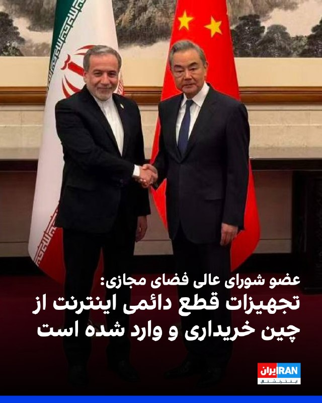

محمد سرافراز، عضو شورای عالی فضای مجازی، گفت: «تجهیزات مربوط به قطع دائمی اینترنت از چین خریداری و وارد شده است.» او افزود: «اپراتورهای عضو شورای عالی فضای مجازی در پشت‌پرده تصویب طرح اینترنت پرو نقش دارند و ذی‌نفعان قطع اینترنت در بازار فروش فیلترشکن و اینترنت ویژه فعال هستند.»
‌🏁 🇬🇧 IranintlTV

🤖 @VahidOOnLine

## VahidOOnLine — post 241800

  

♦️ به گزارش سی‌ان‌ان، دونالد ترامپ، رئیس‌جمهوری آمریکا، عصر روز شنبه دوم خرداد در یک نشست تلفنی با رهبران کشورهای حوزه خلیج فارس و دیگر مقامات منطقه، به بررسی آخرین پیشنهاد جمهوری اسلامی برای پایان دادن به جنگ پرداخت. این رایزنی‌ها در حالی صورت می‌گیرد که میانجی‌ها پس از پایان جلسات خود در تهران، از نزدیک شدن به یک چارچوب برای توافق احتمالی خبر داده‌اند.

یک منبع منطقه‌ای به سی‌ان‌ان گفت که در این تماس تلفنی، مقامات ارشد کشورهای خلیج فارس، پاکستان، ترکیه و مصر حضور داشته‌اند. هم‌زمان، جی‌دی ونس، معاون رئیس‌جمهوری آمریکا، در کاخ سفید دیده شده و ترامپ نیز از برنامه‌اش برای گفتگو با استیو ویتکاف و جرد کوشنر خبر داده است.

از سوی دیگر، یک منبع اسرائیلی به سی‌ان‌ان اعلام کرد که بنیامین نتانیاهو، نخست‌وزیر اسرائیل، قرار است شنبه‌شب یک نشست امنیتی محدود با حضور برخی وزرا و مقامات دفاعی برگزار کند تا تحولات مربوط به مذاکرات تهران و واشنگتن که تل‌آویو از آن کنار گذاشته شده را بررسی کنند.
‌🇸🇦 Indypersian

🤖 @VahidOOnLine

## VahidOOnLine — post 241799

  

ستاد کل نیروهای مسلح جمهوری اسلامی در بیانیه‌ای نوشت: «این مسیر پرفروغ و نورانی ادامه خواهد یافت و مسلمانان و آزادی‌خواهان جهان، طعم شیرین نجات از شر شیاطین عالم، به ویژه آمریکا و اسرائیل را خواهند چشید و به فتوحات بیشتری نائل خواهند شد.»
‌🏁 🇬🇧 IranintlTV

🤖 @VahidOOnLine

## VahidOOnLine — post 241798

مهدیس نظری
۷ ساله بود.

عاشق اسکیت بود.
عاشق شعر خواندن.
شاهنامه...

۹ اسفند،
در حمله به مدرسه شجره طیبه میناب،
او و ۱۲۰ کودک دیگر
جانشان را از دست دادند
‌🏁 🇬🇧 ManotoTV

🤖 @VahidOOnLine

## VahidOOnLine — post 241797

  <a href="telegram/content/VahidOOnLine_241797_1779566427.mp4" target="_blank">🎬 Download video</a>

تماسی از ایران؛
«مرسی که همیشه صدای ما بودید»
‌🏁 🇬🇧 ManotoTV

🤖 @VahidOOnLine

## VahidOOnLine — post 241796

  

♦️ کاظم غریب‌آبادی، معاون وزیر امور خارجه جمهوری اسلامی، در پی پایان بدون نتیجه و دست نیافتن به توافق در یازدهمین نشست بازنگری پیمان منع گسترش سلاح‌های هسته‌ای (NPT)، ایالات متحده، کشورهای غربی و اسرائیل را مقصر این ناکامی دانست.

غریب‌آبادی در پیامی در شبکه اجتماعی ایکس نوشت که دولت‌های غربی تلاش کردند «جای متجاوز و قربانی را عوض کنند». او همچنین از حملات مشترک آمریکا و اسرائیل به تاسیسات هسته‌ای ایران به شدت انتقاد کرد.

معاون وزیر خارجه جمهوری اسلامی در خصوص خروجی این نشست تاکید کرد: «مسئولیت این شکست بر عهده این کشورهاست. ایران به آن‌ها اجازه نخواهد داد که به سوءاستفاده ابزاری و لجام‌گسیخته خود از مجامع و اسناد بین‌المللی برای رسیدن به اهداف سیاسی‌شان ادامه دهند.»
‌🇸🇦 Indypersian

🤖 @VahidOOnLine

## VahidOOnLine — post 241795

  

سایت هرانا گزارش داد بیژن کاظمی، زندانی سیاسی محبوس در زندان اوین، با حکم شعبه ۱۵ دادگاه انقلاب تهران در مجموع به ۳۷ سال و شش ماه حبس محکوم شد.

بیژن کاظمی، زندانی سیاسی پس از کشته شدن محمد مقیسه و علی رازینی، دو قاضی دیوان عالی کشور در ۳۰ دی‌ماه ۱۴۰۳، در شهرستان کوهدشت بازداشت شده بود.
‌🏁 🇬🇧 IranintlTV

🤖 @VahidOOnLine

## VahidOOnLine — post 241794

♦️مهدی تاج، رئیس فدراسیون فوتبال جمهوری اسلامی، روز شنبه دوم خردادماه اعلام کرد تیم ملی در جریان جام جهانی ۲۰۲۶ در شهر تیخوانا مکزیک، در نزدیکی مرز آمریکا، مستقر خواهد شد.
او گفت این تصمیم با تایید فیفا و به‌دلیل مشکلات مربوط به صدور ویزا برای ورود به آمریکا اتخاذ شده و تیم ملی می‌تواند به‌صورت مستقیم با پروازهای «ایران‌ایر» به مکزیک سفر کند.
بر اساس برنامه مسابقات، ایران در دو دیدار نخست خود در مرحله گروهی در لس‌آنجلس مقابل نیوزیلند و بلژیک به میدان می‌رود و سپس در سیاتل با مصر دیدار خواهد کرد. تاج همچنین تأکید کرد نزدیکی تیخوانا به محل برگزاری مسابقات، یکی از دلایل انتخاب این شهر به‌عنوان محل اردوی تمرینی بوده است.
‌🇸🇦 Indypersian

🤖 @VahidOOnLine

## VahidOOnLine — post 241793

  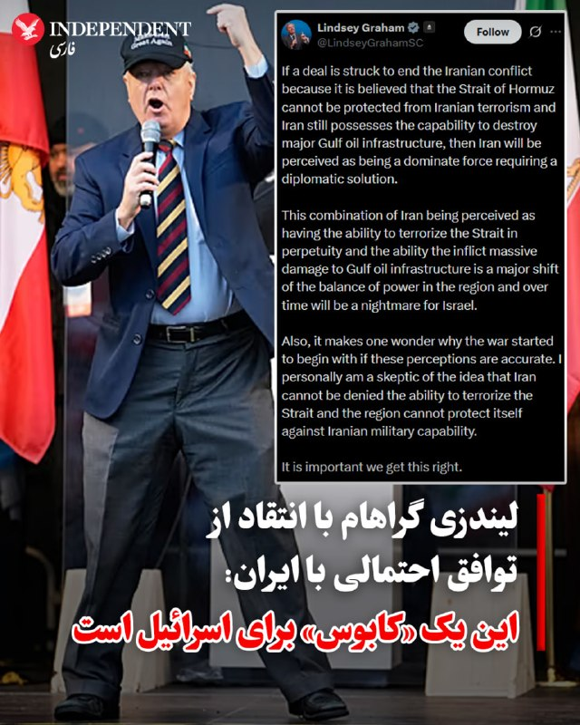

♦️ لیندزی گراهام، سناتور جمهوری‌خواه روز شنبه دوم خرداد، در پی انتشار اخبار مربوط به توافق احتمالی با جمهوری اسلامی، منطق دستیابی به چنین تفاهمی را زیر سوال برد و آن را یک «کابوس» برای اسرائیل توصیف کرد.

گراهام که از حامیان سرشناس از سرگیری حملات آمریکا به ایران است، در شبکه اجتماعی ایکس نوشت: «اگر قرار باشد توافقی برای پایان دادن به درگیری‌ها امضا شود، با این فرض که نمی‌توان از تنگه هرمز در برابر تروریسم ایران محافظت کرد و ایران همچنان توانایی نابودی زیرساخت‌های نفتی خلیج فارس را دارد، در این صورت ایران به عنوان یک قدرت مسلط که نیازمند راهکار دیپلماتیک است، دیده خواهد شد.»

او این توافق را مایه تغییر توازن قوا به نفع تهران دانست و افزود: «این برداشت که ایران می‌تواند برای همیشه به ترور در تنگه هرمز ادامه دهد و به زیرساخت‌های نفتی آسیب بزند، در طول زمان یک کابوس برای اسرائیل خواهد بود.»

گراهام در پایان با ابراز تردید نسبت به ناتوانی در مهار نظامی جمهوری اسلامی گفت: «اگر این برداشت‌ها درست باشد، این سوال پیش می‌آید که اصلا چرا جنگ را شروع کردیم؟»
‌🇸🇦 Indypersian

🤖 @VahidOOnLine

## VahidOOnLine — post 241792

  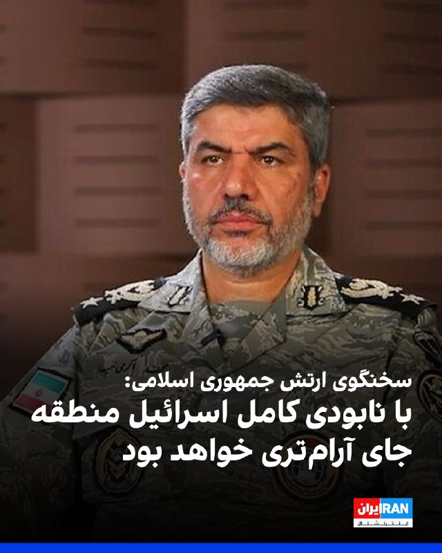

محمد اکرمی‌نیا، سخنگوی ارتش جمهوری اسلامی، گفت: «تا آخرین لحظه دست از عملیات برنداشتیم. با موشک‌ها و پهپادها برابر دشمن که مجهز به تسلیحات پیشرفته است، مقاومت کردیم.» او گفت: «با نابودی کامل اسرائیل منطقه جای آرام‌تری خواهد بود.»
‌🏁 🇬🇧 IranintlTV

🤖 @VahidOOnLine

## VahidOOnLine — post 241791

  

♦️ راجر ویکر ، سناتور جمهوری‌خواه، از ایالت می‌سی‌سی‌پی و رئیس کمیته قدرتمند نیروهای مسلح سنای آمریکا، توافق احتمالی با جمهوری اسلامی را یک «فاجعه» توصیف کرد.

ویکر از منتقدان سرشناس مذاکره برای دستیابی به توافق با تهران است و همواره خواستار از سرگیری بمباران‌های گسترده علیه ایران بوده است.

ویکر در حساب کاربری خود در شبکه اجتماعی ایکس نوشت: «شایعات درباره آتش‌بس ۶۰ روزه با این باور که ایران روزی با حسن نیت وارد تعامل خواهد شد، یک فاجعه است. با این کار، تمام دستاوردهای عملیات خشم حماسی به باد خواهد رفت!»

ویکر روز جمعه نیز تاکید کرده بود که به ترامپ برای پیگیری این توافق «مشاوره‌های غلطی داده شده» و این تصمیم، «میراث دوران ریاست‌جمهوری ترامپ را تعریف خواهد کرد.»
‌🇸🇦 Indypersian

🤖 @VahidOOnLine

## VahidOOnLine — post 241790

  <a href="telegram/content/VahidOOnLine_241790_1779566435.mp4" target="_blank">🎬 Download video</a>

♦️در پی تحولات مربوط به ایران، جی‌دی ونس، معاون رئیس‌جمهوری آمریکا، به‌صورت غیرمنتظره به واشینگتن بازگشت و کاروان خودرویی او با سرعت به سمت کاخ سفید حرکت کرد.
بر اساس گزارش‌ها، دونالد ترامپ تمامی اعضای تیم امنیت ملی آمریکا را برای برگزاری نشستی درباره ایران فراخوانده است. همچنین قرار است رئیس‌جمهوری آمریکا ساعت ۱ بعدازظهر به وقت شرق آمریکا، یک تماس کنفرانسی با رهبران چند کشور عربی برگزار کند.
این تحرکات در حالی انجام می‌شود که طی روزهای اخیر، مقام‌های آمریکایی از احتمال تشدید تنش‌ها و حتی بازگشت عملیات نظامی علیه ایران سخن گفته‌اند.
‌🇸🇦 Indypersian

🤖 @VahidOOnLine

## VahidOOnLine — post 241789

  <a href="telegram/content/VahidOOnLine_241789_1779566436.mp4" target="_blank">🎬 Download video</a>

♦️حضور آیشواریا رای باچان، ستاره افسانه‌ای بالیوود، در هفتاد و نهمین دوره جشنواره فیلم کن (2026)، بار دیگر تمام نگاه‌ها را به خود معطوف کرد. این حضور در حالی رقم خورد که غیبت او در پوسترهای تبلیغاتی جدید «لورئال پاریس» در هتل مارتینز، موجی از نگرانی و اعتراض را در فضای مجازی به راه انداخته بود.

هواداران که کن را بدون «ملکه» خود متصور نبودند، با مشاهده جای خالی او در کنار دیگر سفیران نام تجاری لورئال، واکنش‌های تندی نشان دادند. با این حال، لورئال با خطاب کردن او به عنوان یک «اسطوره زنده»، اطمینان داد که پیوند آیشواریا و کن ناگسستنی است.

آیشواریا با پوشیدن پیراهنی آبی و مجسمه‌گونه از «آمیت آگاروال»، روی فرش قرمز درخشید و ثابت کرد که همچنان نماد بیانی از اصالت و شکوه است. او پس از مراسم، با توقفی کوتاه و صمیمانه در میان هواداران، بار دیگر نشان داد چرا پس از دو دهه، همچنان قلب‌ها را تسخیر می‌کند. این لحظات که به سرعت در شبکه‌های اجتماعی دست‌به‌دست شد، پایانی بود بر شایعات و تاییدی بر جایگاه تزلزل‌ناپذیر او در دنیای مد و سینما.
‌🇸🇦 Indypersian

🤖 @VahidOOnLine

## VahidOOnLine — post 241788

  

♦️ منابع آگاه به خبرگزاری رویترز اعلام کردند که چارچوب پیشنهادی برای حل بحران شامل سه مرحله است: پایان رسمی جنگ، حل بحران در تنگه هرمز، و ایجاد یک بازه زمانی ۳۰ روزه و قابل تمدید برای آغاز مذاکرات جهت دستیابی به توافقی گسترده‌تر.

یکی از این منابع پاکستانی تاکید کرد که هیچ تضمینی برای پذیرش این تفاهم‌نامه از سوی ایالات متحده وجود ندارد. با این حال، در صورت موافقت تهران و واشنگتن، این تفاهم‌نامه بستر مناسبی را فراهم می‌کند تا مذاکرات تکمیلی پس از پایان تعطیلات عید [قربان] در روز جمعه، از سر گرفته شود.

این گمانه‌زنی‌ها در حالی مطرح می‌شود که به گزارش آکسیوس، دونالد ترامپ، رئیس‌جمهور آمریکا، اعلام کرده است اواخر امروز پیش‌نویس توافق با جمهوری اسلامی را با مشاورانش بررسی می‌کند و احتمالا روز یکشنبه درباره پذیرش آن یا از سرگیری حملات تصمیم خواهد گرفت. ترامپ با لحنی هشداری افزود: «یا به یک توافق خوب می‌رسیم، یا آن‌ها را نابود می‌کنم.»
‌🇸🇦 Indypersian

🤖 @VahidOOnLine

## VahidOOnLine — post 241787

  

اکسیوس به نقل از یک مقام آمریکایی گزارش داد: «ترامپ هنوز هیچ تصمیم نهایی در مورد توافق با جمهوری اسلامی نگرفته است.»

اکسیوس نوشت که ترامپ و مشاورانش در مراحل قبلی جنگ نیز چندین بار تصور می‌کردند به توافق نزدیک شده‌اند، اما هیچ‌یک به نتیجه نرسید.
‌🏁 🇬🇧 IranintlTV

🤖 @VahidOOnLine

## VahidOOnLine — post 241786

  <a href="telegram/content/VahidOOnLine_241786_1779566440.mp4" target="_blank">🎬 Download video</a>

راهپیمایی ایرانیان برلین
‌🏁 🇬🇧 ManotoTV

🤖 @VahidOOnLine

## VahidOOnLine — post 241785

  <a href="telegram/content/VahidOOnLine_241785_1779566442.mp4" target="_blank">🎬 Download video</a>

تصاویر جاویدنامان انقلاب ملی در بوردو فرانسه، دوم خرداد ۱۴۰۵
‌🏁 🇬🇧 ManotoTV

🤖 @VahidOOnLine

## VahidOOnLine — post 241784

  <a href="telegram/content/VahidOOnLine_241784_1779566444.mp4" target="_blank">🎬 Download video</a>

تماسی از ایران؛
«من پر از بغضم از رفتن شما»
‌🏁 🇬🇧 ManotoTV

🤖 @VahidOOnLine

## VahidOOnLine — post 241783

  <a href="telegram/content/VahidOOnLine_241783_1779566446.mp4" target="_blank">🎬 Download video</a>

راهپیمایی ایرانیان استکهلم
‌🏁 🇬🇧 ManotoTV

🤖 @VahidOOnLine

## VahidOOnLine — post 241782

  <a href="telegram/content/VahidOOnLine_241782_1779566449.mp4" target="_blank">🎬 Download video</a>

راهپیمایی ایرانیان لاهه در هلند، دوم خرداد ۱۴۰۵
‌🏁 🇬🇧 ManotoTV

🤖 @VahidOOnLine

## WithYashar — post 12247

  <a href="telegram/content/WithYashar_12247_1779566451.mp4" target="_blank">🎬 Download video</a>

بیت رهبری رو جوری زدن که شده بیابان
@withyashar

## WithYashar — post 12246

رویترز:
یک چارچوب سه مرحله‌ای برای مذاکرات آمریکا و ایران پیشنهاد شده:
پایان رسمی جنگ.
حل و فصل بن‌بست تنگه هرمز .
باز کردن پنجره مذاکره ۳۰ روزه برای توافقی گسترده‌تر.
امکان تمدید آتش بس نیز وجود دارد.
@withyashar

## WithYashar — post 12245

کنسول جمهوری آذربایجان در تبریز بر اثر تصادف در اتوبان جلفا-تبریز جان باخت.
@withyashar

## WithYashar — post 12244

سناتور لیندسی گراهام:
اگه با ایران توافق کنیم فقط بخاطر اینه که چون فهمیدیم نمی‌تونیم تنگه هرمز رو از دست ایران حفظ کنیم و ایران هنوز هم میتونه زیرساخت‌های نفتی خلیج فارس رو نابود کنه؛ یعنی اون‌وقت ایران به‌عنوان قدرت غالب منطقه شناخته میشه و همه مجبور میشن باهاش دیپلماتیک کنار بیان.

اینکه ایران بتونه همیشه تنگه هرمز رو به‌هم بریزه و همزمان توان ضربه سنگین به نفت خلیج فارس رو داشته باشه، موازنه قدرت منطقه رو کامل عوض میکنه و در آینده واسه اسرائیل تبدیل به کابوس میشه.

من شخصاً قبول ندارم که نشه جلوی توان ایران رو گرفت یا منطقه نتونه از خودش در برابر قدرت نظامی ایران دفاع کنه. باید خیلی حواسمون باشه که این قضیه رو خراب نکنیم.
@withyashar

## WithYashar — post 12243

خبرنگار لبنانی در شبکه سه: حزب‌الله بر روی نابودکردن گنبد آهنین اسرائیل تمرکز کرده است!
@withyashar

## WithYashar — post 12242

توییت مارک لوین:
شما متحدی را که در یک عملیات نظامی بزرگ در کنار شما جنگیده است، کنار نمی‌گذارید. یا این فقط یکی دیگر از فهرست طولانی تهمت‌ها علیه نتانیاهو است که نیویورک تایمز و جروزالم پست بدنام از او متنفرند، یا یک اشتباه استراتژیک بسیار بزرگ است.
@withyashar

## WithYashar — post 12241

## WithYashar — post 12240

## WithYashar — post 12239

پرواز گسترده جنگنده های آمریکایی در نزدیکی مرز ایران

@withyashar

## WithYashar — post 12238

علی خضریان، عضو کمیسیون امنیت ملی مجلس : در هر توافقی ایران حتما باید غرامت جنگ را دریافت کند.
شرایط تنگه هرمز به قبل از جنگ برنخواهد گشت این دستاورد و مطالبه رهبری است .
مطالبه ملت ایران است که از مدیریت تنگه هرمز عقب‌نشینی نشود
@withyashar

## WithYashar — post 12237

گروه کرد ایرانی کومله می‌گوید پهپادها کمی پیش پایگاه‌های آن را در استان اربیل، کردستان عراق، مورد حمله قرار دادند، در حالی که پهپادهایی توسط «هواپیماهای ائتلاف» سرنگون شدند.
@withyashar

## WithYashar — post 12236

همین الان دارن میجنگن فقط تو عراق 😂

## WithYashar — post 12235

جنگنده‌های نیروی هوایی ایالات متحده در حال حاضر بر فراز منطقه خلیفان در استان اربیل در شمال عراق پرواز می‌کنند تا پهپادهای ایرانی را که گروه‌های مخالف کرد-ایرانی در منطقه را هدف قرار داده‌اند، رهگیری کنند.
@withyashar

## WithYashar — post 12234

فاکس نیوز:هنوز هیچ توافقی بین رژیم جمهوری اسلامی و آمریکا صورت نگرفته

@withyashar

## WithYashar — post 12233

یاشار جان این ترامپ اشتباهی بجای اینکه مارو ببره قاهره داره میبره بورکینافاسو 😂😂😂

## WithYashar — post 12232

یاشار جان این ترامپ اشتباهی بجای اینکه مارو ببره قاهره داره میبره بورکینافاسو 😂😂😂

## WithYashar — post 12231

کانال 14 اسرائیل: چند منبع معتبر تأیید می‌کنند که ایران با برخی از درخواست‌های کلیدی ایالات متحده موافقت کرده است و کمتر از 24 ساعت دیگر اعلام توافق انجام خواهد شد که به تهران چند ماه فرصت می‌دهد تا کاملاً تسلیم شود
@withyashar

## WithYashar — post 12230

نخست‌وزیر اسرائیل، بنیامین نتانیاهو، به منظور بررسی آخرین تحولات مذاکرات با ایران، جلسه امنیتی محدودی برگزار خواهد کرد. یک منبع اسرائیلی در گفت‌وگو با سی‌ان‌ان این خبر را اعلام کرد.
@withyashar

## WithYashar — post 12229

کانال ۱۴ اسرائیل:چند منبع معتبر تأیید می‌کنند که ایران با برخی از درخواست‌های کلیدی ایالات متحده موافقت کرده است و کمتر از ۲۴ ساعت دیگر اعلام توافق انجام خواهد شد که به تهران چند ماه فرصت می‌دهد تا کاملاً تسلیم شود.
@withyashar

## WithYashar — post 12228

هم اکنون تماس تلفنی نتانیاهو و ترامپ! @withyashar

## mwarmonitor — post 9579

🔴سناتور لیندسی گراهام ؛ اگر در منطقه این برداشت وجود داشته باشد که توافق با ایران باعث می‌شود این رژیم پابرجا بماند و در طول زمان قدرتمندتر شود، ما در واقع بنزین روی آتش درگیری‌ها در لبنان و عراق ریخته‌ایم. 🔸توافقی که چنین برداشتی ایجاد کند مبنی بر اینکه…

## mwarmonitor — post 9578

🔴سناتور لیندسی گراهام ؛ اگر در منطقه این برداشت وجود داشته باشد که توافق با ایران باعث می‌شود این رژیم پابرجا بماند و در طول زمان قدرتمندتر شود، ما در واقع بنزین روی آتش درگیری‌ها در لبنان و عراق ریخته‌ایم.

🔸توافقی که چنین برداشتی ایجاد کند مبنی بر اینکه ایران می‌تواند باقی بماند و در آینده توان کنترل تنگه را داشته باشد، حزب‌الله در لبنان و شبه‌نظامیان شیعه در عراق را بسیار تقویت خواهد کرد.

@mwarmonitor

## mwarmonitor — post 9577

  

🔸اوکراین: سفارت ایالات متحده در کی‌یف اطلاعاتی دریافت کرده است مبنی بر اینکه ممکن است طی ۲۴ ساعت آینده یک حمله هوایی قابل توجه در هر لحظه رخ دهد.

🔹این سفارتخانه، مانند همیشه، به شهروندان آمریکایی توصیه می‌کند در صورت اعلام هشدار حمله هوایی، فوراً برای پناه گرفتن آماده باشند.

@mwarmonitor

## mwarmonitor — post 9576

🔴«تماس بسیار مثبت بود. پیشرفت خوبی در حال انجام است»، یک دیپلمات منطقه‌ای به فاکس نیوز گفت. «رهبران منطقه از این پیشرفت و همچنین از دستاوردی که رئیس‌جمهور ترامپ در مذاکرات به آن رسیده حمایت کردند.»

@mwarmonitor

## mwarmonitor — post 9575

🔴سفیر ایران در پاکستان: با خوش‌بینی محتاطانه می‌توان امیدوار بود که اگر طرف مقابل تعهد کافی نشان دهد، گام‌های مثبتی در حال شکل‌گیری است.

@mwarmonitor

## mwarmonitor — post 9574

  

🔸ملوانان و تفنگداران دریایی آمریکا در ناو USS Tripoli (LHA-7) در حالی که این ناو در حال عبور از دریای عرب است، عملیات پروازی انجام می‌دهند.

@mwarmonitor

## mwarmonitor — post 9573

پیام دادن که فلان خبر موثق ؟!!!
نه استخاره میکنم از لای نهج‌البلاغه خبر در میارم

## mwarmonitor — post 9572

  <a href="telegram/content/mwarmonitor_9572_1779566455.mp4" target="_blank">🎬 Download video</a>

✈️پرواز جنگنده‌های آمریکایی بر فراز آسمان منطقه خلیفان در استان اربیل، در شمال عراق.

@mwarmonitor

## mwarmonitor — post 9570

🔴 آکسیوس به نقل از یک منبع مطلع: چند تن از رهبران در جریان تماس تلفنی از ترامپ خواسته‌اند که توافق را بپذیرد.

📌 معاون رئیس‌جمهور از اوهایو و وزیر جنگ از نیویورک به واشنگتن فراخوانده شده‌اند تا برای یک نشست درباره توافق حضور پیدا کنند.

@mwarmonitor

## mwarmonitor — post 9569

🔴ایالات متحده و ایران در آستانه توافقی برای پایان دادن به جنگ؛ یک مقام مسئول خبر داد 📝باراک راوید AXIOS 🔰یک مقام آمریکایی که در جریان مذاکرات قرار گرفته است، روز شنبه اعلام کرد که دولت ترامپ و ایران به توافقی برای پایان دادن به جنگ نزدیک شده‌اند و اختلافات…

## mwarmonitor — post 9568

🔴ایالات متحده و ایران در آستانه توافقی برای پایان دادن به جنگ؛ یک مقام مسئول خبر داد

📝باراک راوید AXIOS

🔰یک مقام آمریکایی که در جریان مذاکرات قرار گرفته است، روز شنبه اعلام کرد که دولت ترامپ و ایران به توافقی برای پایان دادن به جنگ نزدیک شده‌اند و اختلافات باقی‌مانده عمدتاً بر سر «لحن و عبارات» چند بند متمرکز است.

🔹چرا این موضوع اهمیت دارد؟
این اتفاق یکی از قوی‌ترین نشانه‌ها تا به امروز است که نشان می‌دهد این جنگِ تقریباً سه ماهه، ممکن است به پایان خود نزدیک شده باشد.

🔸نکات کلیدی
این مقام مسئول تاکید کرد که هنوز هیچ تصمیم نهایی از سوی پرزیدنت ترامپ در خصوص این توافق اتخاذ نشده است.

📌ارزیابی واقع‌بینانه: ترامپ و مشاورانش در مراحل قبلی این جنگ نیز چندین بار تصور می‌کردند که به توافق نزدیک شده‌اند، اما در نهایت هیچ‌کدام از آن‌ها به نتیجه نرسید.

@mwarmonitor

## mwarmonitor — post 9567

🚨 یک مقام آمریکایی مطلع از مذاکرات به من گفت دولت ترامپ و ایران به توافقی برای پایان دادن به جنگ نزدیک شده‌اند و اشاره کرد که اختلافات باقی‌مانده بیشتر بر سر «نحوه بیان» چند بند است. باراک راوید

@mwarmonitor

## mwarmonitor — post 9566

🔴سناتور لیندسی گراهام ؛ اگر توافقی برای پایان دادن به درگیری ایران حاصل شود، به این دلیل که باور بر این است که تنگه هرمز نمی‌تواند از «تروریسم ایران» محافظت شود و ایران همچنان توانایی نابود کردن زیرساخت‌های اصلی نفتی خلیج فارس را دارد، در این صورت ایران به‌عنوان یک قدرت مسلط تلقی خواهد شد که نیازمند یک راه‌حل دیپلماتیک است.

🔹این ترکیب از این تصور که ایران توانایی تهدید دائمی تنگه هرمز را دارد و همچنین توانایی وارد کردن خسارت گسترده به زیرساخت‌های نفتی خلیج فارس، یک تغییر مهم در توازن قدرت در منطقه محسوب می‌شود و در طول زمان می‌تواند برای اسرائیل یک کابوس باشد.

🔸همچنین این سؤال را ایجاد می‌کند که اگر این برداشت‌ها درست باشد، اصلاً چرا این جنگ آغاز شد؟ شخصاً من نسبت به این ایده که ایران را نمی‌توان از توانایی تهدید تنگه هرمز محروم کرد و اینکه منطقه قادر به محافظت از خود در برابر توان نظامی ایران نیست، تردید دارم.

🔸مهم است که در این مورد به نتیجه‌گیری درستی برسیم.

@mwarmonitor

## mwarmonitor — post 9565

🔴کان نیوز: اسرائیل سطح آماده‌باش بالایی را که در طول تعطیلات به دلیل نگرانی از احتمال حمله به ایران برقرار کرده بود، کاهش داده است. در این مرحله، مقام‌های اسرائیلی از هیچ حمله احتمالی آمریکا به ایران اطلاع ندارند.

@mwarmonitor

## mwarmonitor — post 9564

  

✈️در حال حاضر تعداد قابل توجهی پرواز خروجی از خاورمیانه در جریان است. در حالی که در حال حاضر هیچ پرواز ورودیِ قابل ردیابی (که سیگنال ترنسپاندر فعال داشته باشد) دیده نمی‌شود، به جز شاید MOOSE56. MOOSE48 و MOOSE58 (هر دو در شرق امارات متحده عربی به نظر می‌رسد)…

## mwarmonitor — post 9563

  

✈️در حال حاضر تعداد قابل توجهی پرواز خروجی از خاورمیانه در جریان است. در حالی که در حال حاضر هیچ پرواز ورودیِ قابل ردیابی (که سیگنال ترنسپاندر فعال داشته باشد) دیده نمی‌شود، به جز شاید MOOSE56.

MOOSE48 و MOOSE58 (هر دو در شرق امارات متحده عربی به نظر می‌رسد) نیز در حال ترک منطقه هستند، اما اختلال در سیگنال‌ها (spoofing) شدید شده است.

بوئینگ C-17A گلوب‌مستر III:

RCH643 - 10-0218
RCH542 - 06-6158
RCH445 - 08-8195
MOOSE53 - 06-6164
MOOSE42 - 01-0191
MOOSE57 - 06-6168
MOOSE56 - 00-0177
MOOSE48 - 07-7170
MOOSE58 - 07-7174
بوئینگ KC-135R استراتوتانکر:
NA - 63-8028
NA - 62-3552

@mwarmonitor

## mwarmonitor — post 9562

  

🔸وزیر جنگ، هگست در حال بازگشت به واشنگتن دی‌سی است.

@mwarmonitor

## mwarmonitor — post 9561

  

✈️نیروی هوایی ایالات متحده (USAF)

۲ فروند سوخت رسان بوئینگ KC-135 استراتوتانکر:

AE036A 63-7985 — پرواز REACH 171
AE0656 58-0102 — پرواز REACH 290

✈️پروازهای REACH 171 و REACH 290 امشب در حال ورود به پایگاه RAF Mildenhall هستند، که از پایگاه Bangor Air National Guard برخاسته‌اند.

@mwarmonitor

## mwarmonitor — post 9560

🔴 مارک لوین ؛ شما یک متحدی را که در یک عملیات نظامی بزرگ در کنار شما جنگیده، کنار نمی‌گذارید. یا این فقط یکی دیگر از مجموعه طولانیِ بدنام‌سازی‌ها علیه نتانیاهو است—کسی که نیویورک تایمز و جروزالم پستِ بی‌اعتبار از او بیزارند—یا یک اشتباه استراتژیک بسیار بزرگ.

@mwarmonitor

## mwarmonitor — post 9559

🔴راجر ویکر رئیس کمیته نیروهای مسلح در سنا «آتش‌بس ۶۰ روزه‌ی شایعه‌شده — با این باور که ایران هرگز با حسن نیت وارد تعامل نخواهد شد — یک فاجعه خواهد بود. تمام دستاوردهایی که در جریان عملیات «Epic Fury» به دست آمده، هدر خواهد رفت!»

@mwarmonitor

## FoxNewsTwitter — post 342168

  

Fox News (Twitter/X)

"You will be the tip of the spear."

The Army has now hit its 2026 recruiting goal months ahead of schedule, according to War Secretary Pete Hegseth.

During a commencement speech at West Point, Hegseth announced the Army reached the milestone four months early and said the service is preparing to bring in 61,500 new soldiers.

The announcement comes as the Pentagon faces mounting global tensions and renewed focus on military readiness.

## FoxNewsTwitter — post 342167

‌Fox News (Twitter/X)

Read more:

## FoxNewsTwitter — post 342166

  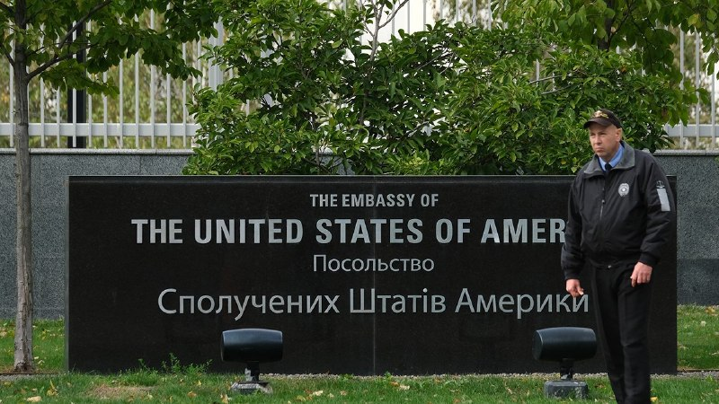

Fox News (Twitter/X)

BREAKING NEWS: The U.S. Embassy in Kyiv issued a security alert Saturday warning of a “potentially significant air attack” that could strike the Ukrainian capital within the next 24 hours.

## FoxNewsTwitter — post 342165

  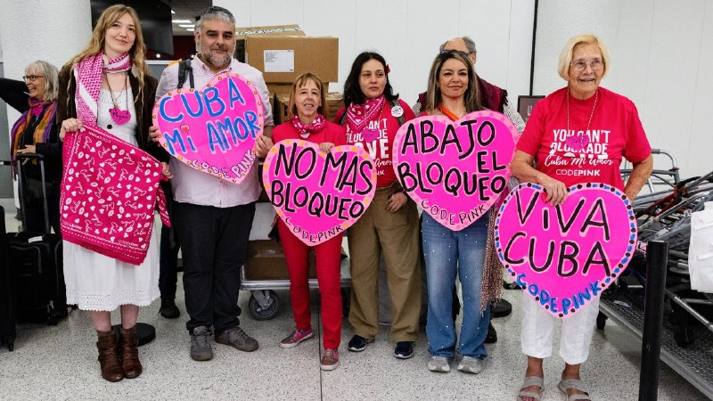

Fox News (Twitter/X)

RT @foxnewspolitics: Nine minutes after the AG announced murder charges against Raúl Castro, a pre-produced rapid-response campaign launched across multiple U.S. organizations defending the Cuban dictator. @FoxNews Digital's @AsraNomani reports DOJ and Treasury investigators probe whether that synchronized activation reveals a foreign influence operation directed by Havana — with 145 nonprofits with $1 billion in combined revenue under scrutiny.

## FoxNewsTwitter — post 342164

  <a href="telegram/content/FoxNewsTwitter_342164_1779566463.mp4" target="_blank">🎬 Download video</a>

Fox News (Twitter/X)

“We gave up our yesterdays for your tomorrows.”

98-year-old World War II veteran David Yoho delivered an emotional message at the WWII Memorial in Washington, D.C. as Americans gathered to honor the more than 400,000 U.S. service members who died during the war.

Standing before the crowd in the rain, Yoho urged younger generations to remember the sacrifices made by veterans and to keep telling their stories long after they’re gone.

“Tell them it was a 16-year-old boy in the hearts and mind and body of a 98-year-old veteran of World War II.”

## FoxNewsTwitter — post 342163

‌Fox News (Twitter/X)

Read more:

## FoxNewsTwitter — post 342162

  

Fox News (Twitter/X)

BREAKING NEWS: NASCAR legend Kyle Busch's family released a statement saying a medical evaluation concluded that "severe pneumonia progressed into sepsis," causing "rapid and overwhelming complications" that led to his death.

## pm_afshaa — post 91322

سری قبلی هم‌ گفتم بازم میگم
هر وقت خبر توافق بالا گرفت بیشتر به جنگ امیدوار باش..

توافق نهایی شدنی نیست نهایت همین آتش‌بس ۶۰ روزه رو اعلام میکنن که جنگ بره واسه بعد جام جهانی

همه میدونیم جمهوری اسلامی تسلیم بشو نیست و ترامپ هم ول کن نیست و پیروزی قاطع میخواد.

فقط موضوع اینه که قبل جام جهانی یا بعدش..

## pm_afshaa — post 91321

  <a href="telegram/content/pm_afshaa_91321_1779566467.webm" target="_blank">🎬 Download video</a>

🔴سناتور لیندسی گراهام: برخی رهبران منطقه از ترامپ خواستن برای تضعیف جمهوری اسلامی اقدام نظامی انجام بده تا توافق بهتری حاصل بشه. 
💧 Rainbet.com the #1 Non-KYC Crypto Casino & Sportsbook @rainbetcom 
😁 @Pm_Afshaa

## pm_afshaa — post 91320

  <a href="telegram/content/pm_afshaa_91320_1779566468.webm" target="_blank">🎬 Download video</a>

🔴سناتور لیندسی گراهام:
برخی رهبران منطقه از ترامپ خواستن برای تضعیف جمهوری اسلامی اقدام نظامی انجام بده تا توافق بهتری حاصل بشه.

💧 Rainbet.com the #1 Non-KYC Crypto Casino & Sportsbook @rainbetcom

😁 @Pm_Afshaa

## pm_afshaa — post 91319

  <a href="telegram/content/pm_afshaa_91319_1779566468.webm" target="_blank">🎬 Download video</a>

🔴سفیر ایران در پاکستان:
با خوش‌بینی محتاطانه میشه امیدوار بود که اگه طرف مقابل تعهد کافی نشون بده، گام‌های مثبتی در حال شکل‌گیریه.

💧 Rainbet.com the #1 Non-KYC Crypto Casino & Sportsbook @rainbetcom

😁 @Pm_Afshaa

## pm_afshaa — post 91318

🔴تماس تلفنی بی بی با ترامپ شروع شد

💧 Rainbet.com the #1 Non-KYC Crypto Casino & Sportsbook @rainbetcom

😁 @Pm_Afshaa

## pm_afshaa — post 91317

  <a href="telegram/content/pm_afshaa_91317_1779566469.webm" target="_blank">🎬 Download video</a>

🔴توییت اتاق جنگ اسرائیل:
⌛️

💧 Rainbet.com the #1 Non-KYC Crypto Casino & Sportsbook @rainbetcom

😁 @Pm_Afshaa

## pm_afshaa — post 91316

  <a href="telegram/content/pm_afshaa_91316_1779566470.webm" target="_blank">🎬 Download video</a>

🔴واشنگتن‌تایمز به نقل از یک منبع نزدیک به مذاکرات: آمریکا و ایران احتمالا طی 24 ساعت آینده نهایی‌شدن توافق صلح رو اعلام می‌کنن.

مذاکره‌کنندگان پیش‌نویس پایان درگیری‌ها در همه جبهه‌ها رو تایید کردن، اما توافق هنوز نیازمند تایید نهایی دو طرفه.

💧 Rainbet.com the #1 Non-KYC Crypto Casino & Sportsbook @rainbetcom

😁 @Pm_Afshaa

## pm_afshaa — post 91315

🔴پرواز گسترده جنگنده های آمریکایی در نزدیکی مرز ایران

💧 Rainbet.com the #1 Non-KYC Crypto Casino & Sportsbook @rainbetcom

😁 @Pm_Afshaa

## pm_afshaa — post 91314

  <a href="telegram/content/pm_afshaa_91314_1779566471.mp4" target="_blank">🎬 Download video</a>

مونترال کانادا

💧 Rainbet.com the #1 Non-KYC Crypto Casino & Sportsbook @rainbetcom

😁 @Pm_Afshaa

## pm_afshaa — post 91313

العربیه : چیزی تا نهایی شدن توافق میان آمریکا و ایران نمانده

💧 Rainbet.com the #1 Non-KYC Crypto Casino & Sportsbook @rainbetcom

😁 @Pm_Afshaa

## pm_afshaa — post 91312

سردار نقدی : هرگونه تجاوز دشمن با ضربات جبران‌ناپذیر جواب داده میشه

💧 Rainbet.com the #1 Non-KYC Crypto Casino & Sportsbook @rainbetcom

😁 @Pm_Afshaa

## pm_afshaa — post 91311

🔐 سرور اختصاصی ترکیه با پینگ فوق‌العاده پایین
مناسب گیم، ترید، استریم و استفاده حرفه‌ای

✅ سرعت و کیفیت عالی

✅ آی‌پی ترکیه واقعی

✅ پایداری بالا و بدون قطعی

✅ مناسب استفاده 24/7

✅ بدون محدودیت زمان و بدون ضریب

💰 قیمت تک: هر گیگ 150 هزار تومان

🤝 قیمت همکاری: هر گیگ فقط 120 هزار تومان

با ضمانت عودت وجه در صورت قطعی
🙏
برای تست و ثبت سفارش پیام بدید 
✉️:
@V2rayyar_sup
@v2rayyar

## pm_afshaa — post 91310

🔴فاکس نیوز:هنوز هیچ توافقی بین رژیم جمهوری اسلامی و آمریکا صورت نگرفته

💧 Rainbet.com the #1 Non-KYC Crypto Casino & Sportsbook @rainbetcom

😁 @Pm_Afshaa

## pm_afshaa — post 91309

🔴ترامپ نیم ساعت دیگر با رهبران عرب کنفرانس تلفنی انجام خواهد داد

💧 Rainbet.com the #1 Non-KYC Crypto Casino & Sportsbook @rainbetcom

😁 @Pm_Afshaa

## pm_afshaa — post 91308

حمله پهپادی جمهوری اسلامی به اربیل عراق

😁 @Pm_Afshaa

## pm_afshaa — post 91307

🔴کانال 14 اسرائیل: چند منبع معتبر تأیید می‌کنند که ایران با برخی از درخواست‌های کلیدی ایالات متحده موافقت کرده است و کمتر از 24 ساعت دیگر اعلام توافق انجام خواهد شد که به تهران چند ماه فرصت می‌دهد تا کاملاً تسلیم شود

💧 Rainbet.com the #1 Non-KYC Crypto Casino & Sportsbook @rainbetcom

😁 @Pm_Afshaa

## pm_afshaa — post 91306

🔴آکسیوس : گزارش‌ها حاکی از آن است که دولت ترامپ و ایران به توافق برای پایان جنگ نزدیک شده‌اند و اختلافات باقی‌مانده بیشتر بر سر نحوه نگارش برخی بندهاست

💧 Rainbet.com the #1 Non-KYC Crypto Casino & Sportsbook @rainbetcom

😁 @Pm_Afshaa

## pm_afshaa — post 91305

🔴هم اکنون جلسه اضطراری امنیت ملی دولت ترامپ در اتاق جنگ کاخ سفید در حال برگزاریه

💧 Rainbet.com the #1 Non-KYC Crypto Casino & Sportsbook @rainbetcom

😁 @Pm_Afshaa

## pm_afshaa — post 91304

🔴مقامات ارشد در اسرائیل: ویتکاف تلاش می‌کند به هر قیمتی توافقی با ایران به دست آورد، او کسی است که به ترامپ فشار می‌آورد تا به جنگ بازنگردد

💧 Rainbet.com the #1 Non-KYC Crypto Casino & Sportsbook @rainbetcom

😁 @Pm_Afshaa

## pm_afshaa — post 91303

🔴کانال 13 اسرائیل:نیروهای دفاعی اسرائیل در حالت آماده‌باش کامل به‌دلیل احتمال شکست مذاکرات و از سرگیری درگیری‌ها هستن

💧 Rainbet.com the #1 Non-KYC Crypto Casino & Sportsbook @rainbetcom

😁 @Pm_Afshaa

## DEJradio — post 4889

  

👑
⭕️ شاهزاده رضا پهلوی در پیامی در حساب کاربری خود در شبکهٔ ایکس، از دیدار و گفت‌وگوی خود با جاش گاتهایمر، نمایندهٔ کنگره آمریکا، خبر دادند. ایشان با قدردانی از مواضع این نماینده دربارهٔ ایران، تأکید کردند در این دیدار دربارهٔ اهمیت حمایت دوحزبی از مردم ایران گفت‌وگو شده است.
شاهزاده رضا پهلوی همچنین تصریح کردند مردم ایران تنها برای آزادی کشور خود مبارزه نمی‌کنند، بلکه در تلاش هستند تروریسم جمهوری اسلامی علیه جهان را نیز پایان دهند.

#شاهزاده_رضا_پهلوی #کنگره_آمریکا
@DEJradio

## DEJradio — post 4888

  <a href="telegram/content/DEJradio_4888_1779566473.mp4" target="_blank">🎬 Download video</a>

🚨
🔸 خبر ۲۱
شنبه ۲ خرداد ۱۴۰۵

#خبر۲۱
@DEJradio

## DEJradio — post 4887

  <a href="telegram/content/DEJradio_4887_1779566477.mp4" target="_blank">🎬 Download video</a>

🚨🎥 مانور کماندوهای آمریکایی در کاراکاس؛ هلی‌برن نیروها در سفارت آمریکا

#جنگ #کاراکاس
@DEJradio

## DEJradio — post 4886

⭕️ فرماندهٔ ارتش پاکستان ایران را ترک کرد

فیلد مارشال عاصم منیر، فرماندهٔ کل ارتش و نیروهای مسلح پاکستان، پس از سفری یک‌روزه تهران را ترک کرد.
بنا به گزارش خبرگزاری‌های داخل کشور، عاصم منیر به همراه محسن نقوی، وزیر کشور پاکستان، که از هفتهٔ پیشین در تهران حضور داشت، ایران را ترک کرد.
فرماندهٔ ارتش پاکستان در این سفر با مسعود پزشکیان، محمدباقر قالیباف و عباس عراقچی دیدار و گفت‌وگو کرد.
جزئیات رسمی این مذاکرات منتشر نشده است. رسانه‌ها محور گفت‌وگوها را تلاش برای جلوگیری از تشدید تنش و پیشبرد مذاکره میان جمهوری اسلامی و آمریکا عنوان کردند.
این دومین سفر عاصم منیر به تهران در چند هفتهٔ اخیر به شمار می‌رود.
پاکستان در هفته‌های اخیر نقش میانجی اصلی را در مذاکره میان تهران و واشینگتن بر عهده گرفته است.

#مذاکرات #پاکستان
@DEJradio

## DEJradio — post 4885

⭕️ قلیچ‌خانی کاپیتان پیشین تیم ملی درگذشت

پرویز قلیچ‌خانی، کاپیتان پیشین تیم ملی فوتبال ایران و از چهره‌های سیاسی مخالف جمهوری اسلامی، در ۸۱ سالگی در حومهٔ پاریس درگذشت.
جمهوری اسلامی بارها تلاش کرده بود او را به دست‌کشیدن از مخالفت با حکومت و بازگشت به ایران در پناه رژیم، مجاب کند، اما قلیچ‌خانی همچنان به مبارزه ادامه داد.
قلیچ‌خانی به بیماری سرطان معده و آلزایمر مبتلا بود.
قلیچ‌خانی تنها بازیکن تاریخ فوتبال ایران است که سه بار همراه تیم ملی قهرمان جام ملت‌های آسیا شد.
پرویز قلیچ‌خانی پیش از انقلاب در تیم‌های تاج، پرسپولیس و پاس بازی کرد و سال‌ها بازوبند کاپیتانی تیم ملی ایران را بر بازو داشت.

#پرویز_قلیچ_خانی
@DEJradio

## VahidOnline — post 75659

  

دونالد ترامپ، رییس‌جمهوری آمریکا، روز شنبه دوم خرداد ۱۴۰۵ در تماس‌هایی جداگانه با رهبران عربستان سعودی، امارات، قطر، مصر، ترکیه، پاکستان و فرانسه درباره توافق احتمالی برای پایان جنگ با جمهوری اسلامی گفت‌وگو کرد. همزمان یک مقام آمریکایی آگاه از روند مذاکرات گفت واشنگتن و تهران به دستیابی به توافق نزدیک شده‌اند و اختلاف‌های باقی‌مانده عمدتا بر سر نحوه نگارش برخی بندهای توافق است.

به گزارش اکسیوس، چند تن از رهبران حاضر در تماس با ترامپ از او خواسته‌اند مسیر دستیابی به توافق را دنبال کند. با این حال، این مقام آمریکایی تاکید کرده است که هنوز تصمیم نهایی از سوی رییس‌جمهوری آمریکا اتخاذ نشده و او همچنان می‌تواند توافق را رد کرده و دستور حملات جدید علیه ایران را صادر کند.

همزمان، جی‌دی ونس، معاون رییس‌جمهوری آمریکا، و پیت هگست، وزیر دفاع این کشور، برای شرکت در نشست ویژه بررسی توافق احتمالی به واشینگتن فراخوانده شدند. ترامپ پیش‌تر گفته بود پس از بررسی آخرین پیشنهاد ایران با تیم مذاکره‌کننده خود، احتمالا تا روز یکشنبه درباره ادامه مذاکرات یا ازسرگیری جنگ تصمیم خواهد گرفت.

به گفته منابع آگاه، پیش‌نویس جدیدی که قرار است ترامپ آن را بررسی کند، حاصل مذاکرات اخیر میان ایران و پاکستان است.
@VahidHeadline

📡 @VahidOnline

## VahidOnline — post 75658

  

شبکه ۱۳ اسرائیل در گزارشی از روند گفت‌وگوهای ایران و آمریکا گفت مقام‌های اسرائیلی معتقدند ایالات متحده و ایران به دستیابی به توافق احتمالی نزدیک‌تر شده‌اند و گزارش‌های اخیر و اطلاعاتی که دریافت می‌شود، «در اورشلیم به‌طور فزاینده‌ای معتبر تلقی می‌شود».

بر اساس گزارش این شبکه، مقام‌های ارشد اسرائیلی گفته‌اند پیشرفت در مذاکرات برای بخشی از نهاد امنیتی اسرائیل «بسیار ناامیدکننده» است، به‌ویژه در شرایطی که به نظر می‌رسد تلاش واشینگتن برای رسیدن به توافق در حال تشدید شدن است.

این مقام‌ها همچنین معتقدند فشار برخی مشاوران رئیس‌جمهور ترامپ در روزهای اخیر افزایش یافته و انتظار می‌رود بنیامین نتانیاهو، نخست‌وزیر اسرائیل، در پی این تحولات، نشست‌هایی مشورتی با وزیران ارشد و مقام‌های امنیتی برگزار کند.
نهادها و مقامات رسمی اسرائیل هنوز این گزارش را رد یا تأیید نکرده‌اند.

ارزیابی اسرائیل در دو هفتهٔ گذشته این بود که ترامپ خواهان توافق است، اما در نهایت به دلیل اختلاف بر سر مسائل کلیدی، موفق به دستیابی به آن نخواهد شد. با این حال، مقام‌های اسرائیلی اکنون معتقدند روند کنونی ظاهراً برخلاف چیزی است که اسرائیل در هفته‌های اخیر برای آن تلاش کرده بود.

این گزارش همچنین می‌گوید چارچوبی که دربارهٔ آن گفت‌وگو می‌شود، شامل یک توافق موقت ۶۰ روزه خواهد بود که ممکن است بعداً در حالی که مذاکرات درباره توافقی گسترده‌تر ادامه دارد، تمدید شود.

روز شنبه مقامات ایران و آمریکا و همچنین پاکستان که نقش میانجی را بین دو طرف بر عهده دارد، اعلام کردند که در مذاکرات برای پایان دادن به جنگ پیشرفت حاصل شده است.

روز شنبه، روزنامه اسرائیل هیوم نیز در گزارشی ادعا کرد پیش‌نویس توافقی که روی میز قرار دارد، شامل تعهد اولیه ایران به خودداری از توسعه سلاح هسته‌ای و تعلیق بلندمدت غنی‌سازی اورانیوم است و سایر مسائل، از جمله سرنوشت ذخایر کنونی اورانیوم غنی‌شده ایران، در مذاکرات بعدی در دورهٔ آتش‌بس بررسی خواهد شد.

این روزنامه همچنین به‌نقل از منابع آگاه که نام‌شان را نیاورده، ادعا کرد «رهبری سیاسی ایران پیش‌تر با تحویل اورانیوم غنی‌شده موافقت کرده بود، اما فرماندهان سپاه پاسداران با این اقدام مخالفت کردند و تصمیم‌گیری دربارهٔ این موضوع اکنون به تأیید رهبر جمهوری اسلامی بستگی دارد».
@VahidHeadline

📡 @VahidOnline

## VahidOnline — post 75657

  

خبرگزاری فارس، وابسته به سپاه پاسداران، به نقل از یک منبع آگاه و نزدیک به تیم مذاکره‌کننده، با تاکید بر اینکه اگر آمریکا انعطاف نشان ندهد، مذاکره شکست می‌خورد نوشت که موضوع هسته‌ای، پول‌های بلوکه‌شده و کنترل جمهوری اسلامی بر تنگه هرمز، سه موضوع اختلاف جدی در مذاکرات است.

فارس نوشت که تهران اعلام کرده که در این دوره وارد مذاکره درباره موضوع هسته‌ای نمی‌شود. تنها در صورتی که طرف مقابل شرایط اعتمادساز را اجرا کند، در دور بعد درباره مسائل هسته‌ای صحبت خواهد شد.

رسانه سپاه به نقل از این منبع نوشت: «پول‌‌های بلوکه‌شده باید واریز شود؛ شرط دوم و اساسی برای ورود تهران به مذاکره این است که پول‌های بلوکه‌شده ابتدا واریز و آزاد شوند. بدون این اتفاق، اساسا وارد مذاکره نمی‌شویم.»

در ادامه آمده است: «اختلاف دیگر بر سر نحوه عبور کشتی‌ها در تنگه هرمز است. آمریکا تاکید دارد که تنگه باید کاملا به شرایط پیشین بازگردد، اما تهران می‌گوید فقط خود را متعهد می‌کند که تعداد کشتی‌ها به وضعیت قبل بازگردد. معنای این حرف آن است که حکومت ایران با مدل خود، تعداد کشتی‌های مجاز برای عبور را تعیین می‌کند.»
@VahidOOnLine

📡 @VahidOnline

## VahidOnline — post 75656

  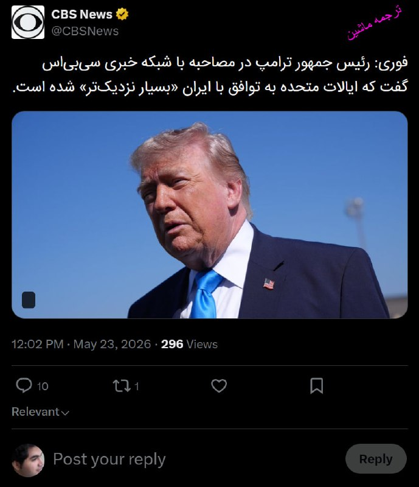

ترامپ: به توافق بسیار نزدیک‌تر شده‌ایم

ترجمه ماشین:
پرزیدنت ترامپ به شبکه سی‌بی‌اس نیوز گفت مذاکره‌کنندگان ایالات متحده و ایران برای نهایی کردن توافقی که به جنگ میان دو کشور پایان دهد، «بسیار به هم نزدیک‌تر شده‌اند».

منابع آگاه از مذاکرات به سی‌بی‌اس نیوز گفتند تازه‌ترین پیشنهاد شامل روندی برای بازگشایی تنگه هرمز، آزادسازی بخشی از دارایی‌های ایران که در بانک‌های خارجی نگهداری می‌شود، و ادامه مذاکرات است.

آقای ترامپ از ارائه جزئیات درباره این توافق خودداری کرد، اما گفت که «هر روز بهتر و بهتر می‌شود.»

آقای ترامپ در یک مصاحبه تلفنی به سی‌بی‌اس نیوز گفت: «نمی‌توانم قبل از اینکه به خودشان بگویم، به شما بگویم، درست است؟»

👈 آقای ترامپ گفت معتقد است توافق نهایی مانع دستیابی ایران به سلاح هسته‌ای خواهد شد و افزود که در غیر این صورت «اصلاً درباره آن صحبت هم نمی‌کرد».

👈 او همچنین گفت این توافق باعث خواهد شد اورانیوم غنی‌شده ایران «به شکل رضایت‌بخشی مدیریت شود.»

👈او گفت: «من فقط توافقی را امضا می‌کنم که در آن به هر چیزی که می‌خواهیم برسیم.»

منابع به سی‌بی‌اس نیوز گفتند آقای ترامپ هنوز در حال بررسی پیشنهادهاست و هنوز تصمیم نهایی خود را نگرفته است. این منابع گفتند او با مشاوران خود رایزنی می‌کند و با رهبران خارجی، از جمله رهبران عربستان سعودی و دیگر کشورهای حوزه خلیج فارس، گفت‌وگو دارد.

آقای ترامپ گفت اگر آمریکا و ایران به توافق نرسند، «با وضعیتی روبه‌رو خواهیم شد که هیچ کشوری هرگز به اندازه ضربه‌ای که آن‌ها در آستانه دریافتش هستند، ضربه نخورده باشد.»

آقای ترامپ پیش‌تر ایران را تهدید کرده بود؛ او پیش از آغاز آتش‌بسی که در ماه آوریل آغاز شد، گفته بود بدون توافق «یک تمدن کامل نابود خواهد شد» و اخیراً نیز به این کشور هشدار داده بود که «ساعت در حال تیک‌تاک است.»

مارکو روبیو، وزیر خارجه آمریکا، نیز روز شنبه گفت ممکن است «بعداً امروز خبری» درباره وضعیت مذاکرات میان ایران و آمریکا منتشر شود.

روبیو پیش از یک شام رسمی در سفارت آمریکا در دهلی‌نو، هند، گفت: «پیشرفت‌هایی حاصل شده، همین حالا هم که با شما صحبت می‌کنم، کارهایی در حال انجام است. این احتمال وجود دارد که چه بعداً امروز، چه فردا، چه ظرف چند روز آینده، چیزی برای گفتن داشته باشیم؛ اما همان‌طور که رئیس‌جمهور گفت، این موضوع باید به یک شکل یا شکل دیگر حل شود.»
CBSNews

📡 @VahidOnline

## kianmeli1 — post 87616

🔴این توافق احتمالی چه پیروزی برای ترامپ دارد!

۱-رهبری پیر در اوج نفرت تبدیل به شهید شد
۲-فرزندش بر تخت نشست
۳-تنگه هرمز بسته شد
۴-تمام پایگاه های امریکایی پودر شدند
۵-تخم کشورهای عربی کشیده شد
۶-اورانیوم ها در ایران ماند
۷-نفت ۱۰۰ دلاری

اگر پیروزی ترامپ نیست پس چیست
https://t.me/kianmeli1

## kianmeli1 — post 87615

  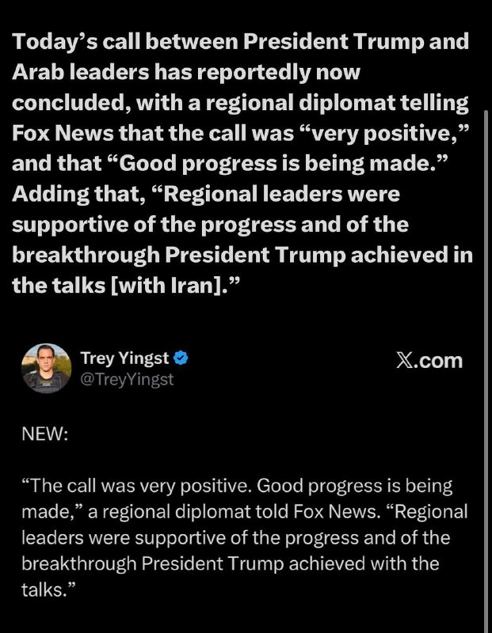

🔴بنا به گزارش‌ها، تماس تلفنی امروز بین رئیس جمهور ترامپ و رهبران عرب به پایان رسیده است و یک دیپلمات منطقه‌ای به فاکس نیوز گفته است که این تماس «بسیار مثبت» بوده و «پیشرفت خوبی حاصل شده است.» وی افزود: «رهبران منطقه‌ای از پیشرفت و موفقیتی که رئیس جمهور ترامپ در مذاکرات [با ایران] به دست آورده است، حمایت کردند.»
https://t.me/kianmeli1

## kianmeli1 — post 87614

‏🔴سازمان هواپیمایی کشوری: فرودگاه‌های اصفهان، اردبیل و لامرد از یکشنبه سه خرداد فعالیت خود را از سر می‌گیرند.
‏این سازمان اعلام کرد در حال حاضر هیچ محدودیت تازه‌ای در فضای هوایی کشور اعمال نشده است
https://t.me/kianmeli1

## kianmeli1 — post 87613

  <a href="telegram/content/kianmeli1_87613_1779566483.mp4" target="_blank">🎬 Download video</a>

‏🔴برخی رسانه‌های ایران از حمله موشکی از سوی جمهوری اسلامی به اربیل کردستان عراق خبر دادند https://t.me/kianmeli1

## kianmeli1 — post 87612

‏🔴برخی رسانه‌های ایران از حمله موشکی از سوی جمهوری اسلامی به اربیل کردستان عراق خبر دادند
https://t.me/kianmeli1

## kianmeli1 — post 87611

  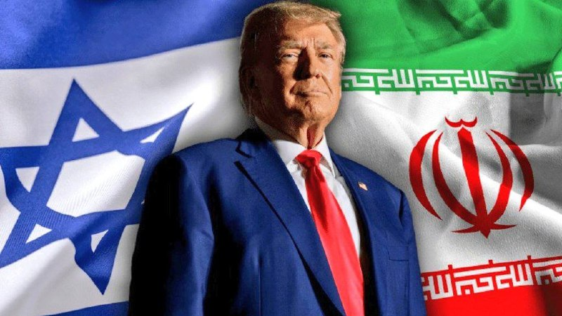

🔴خلاصه تمام خبرهای امروز

آمریکا و ایران به توافق برای پایان دادن به جنگ نزدیک شده‌اند و اختلافات باقی‌مانده بر سر نحوه نگارش چندین نکته کلیدی است - اکسیوس

ممکن است ظرف ۲۴ ساعت آینده توافق صلح اعلام شود.

انتظار می‌رود ترامپ امشب با نتانیاهو در مورد توافق مورد انتظار با ایران صحبت کند، اگرچه به احتمال زیاد نتانیاهو تلاش خواهد کرد ترامپ را متقاعد کند که به جای آن به ایران حمله کند.
https://t.me/kianmeli1

## kianmeli1 — post 87610

🔴گزارش رویترز:

طرح پیشنهادی توافق بین ایران و آمریکا قرار است در سه مرحله پیش برود - پایان رسمی جنگ، حل بحران تنگه هرمز و باز شدن پنجره زمانی 30 روزه برای مذاکره درباره توافقی گسترده‌تر، البته با امکان تمدید مدت زمانی
https://t.me/kianmeli1

## kianmeli1 — post 87609

‏🔴سلمان اسحاقی، سخنگوی کمیسیون بهداشت مجلس، گفت: کشور با کمبود نزدیک به هزار قلم دارو روبه‌رو است
https://t.me/kianmeli1

## kianmeli1 — post 87608

🔴هم اکنون جلسه اضطراری امنیت ملی دولت ترامپ در اتاق جنگ کاخ سفید در حال برگزاری است
https://t.me/kianmeli1

## kianmeli1 — post 87607

🔴آکسیوس: طبق گفته یک منبع مطلع ترامپ قرار است امشب با نتانیاهو گفتگو کند تا درباره توافق در حال شکل‌گیری با ایران بحث کنند.
https://t.me/kianmeli1

## kianmeli1 — post 87606

🔴به گزارش خبرگزاری دولتی عربستان سعودی، العربیه، به نقل از یک منبع ارشد: «چند ساعت تا اعلام توافق بین ایران و ایالات متحده فاصله داریم.»
https://t.me/kianmeli1

## kianmeli1 — post 87605

  

🔴آتش بس ۶۰ روزه پیروزی ایران است / مارک دوبوویتز، مدیر اندیشکده مهم FDD:

اگر رئیس جمهور ترامپ بر اساس وعده‌های مبهم ایران برای «بحث» در مورد مسائل هسته‌ای، با تمدید آتش‌بس ۶۰ روزه موافقت کند، بازی تمام است. این امر بحران را به اواخر ژوئیه یا اوایل اوت سوق می‌دهد، زمانی که احتمال عملیات نظامی عمده پیش از انتخابات میان‌دوره‌ای بسیار کمتر می‌شود.

هنگامی که اهرم نظامی از بین برود، امتیازات هسته‌ای معنادار نیز با آن از بین می‌روند. محدودیت‌های موشک‌های بالستیک وجود نخواهد داشت. ایران میلیاردها دلار از تخفیف تحریم‌ها دریافت خواهد کرد - در حالی که بارها از تنگه هرمز به عنوان ابزاری برای باج‌گیری استفاده می‌کند.

تهران آنچه را که در میدان نبرد از دست داده بود، در میز مذاکره به دست آورده است.
https://t.me/kianmeli1

## kianmeli1 — post 87604

  <a href="telegram/content/kianmeli1_87604_1779566487.mp4" target="_blank">🎬 Download video</a>

🔴وضعیت امشب یکی از میادین مملکت

کشور دست مداحان است نه سرداران
https://t.me/kianmeli1

## kianmeli1 — post 87603

🔴یک شب قبل کشتن خامنه ای خبر توافق تیتر تمام خبرگزاری ها بود

دقیقا مشخص نیست آیا توافق واقعی است یا خیر
https://t.me/kianmeli1

## kianmeli1 — post 87602

‏🔴الحدث به نقل از یک «منبع عالی‌رنبه» نوشت: «تنها چند ساعت تا اعلام توافق بین واشینگتن و تهران فاصله داریم»
https://t.me/kianmeli1

## kianmeli1 — post 87601

  <a href="telegram/content/kianmeli1_87601_1779566489.mp4" target="_blank">🎬 Download video</a>

🔴نیروهای واکنش سریع آمریکا برای مقابله با نیروهای نیابتی ایران به خاورمیانه اعزام می‌شوند

پیت هگست:

ما از نیروهای هوابرد و واکنش سریع خود خواسته‌ایم که در هر لحظه آماده اعزام به خاورمیانه باشند؛ تا همچون سپری آهنین از پایگاه‌ها و جان آمریکایی‌ها در برابر نیروهای نیابتی ایران محافظت کنند.

این شامل یگان‌های ارتش آمریکا می‌شود که با استفاده از سامانه‌های هیمارس (HIMARS) برای غرق کردن نیروی دریایی ایران کمک می‌کنند.

من می‌دانم که ارتش عاشق غرق کردن نیروهای دریایی است. این تنها نیروی دریایی است که در حال حاضر اجازه دارید غرق کنید.
https://t.me/kianmeli1

## kianmeli1 — post 87600

  

🔴دوم خرداد سالروز تولد مهدی حسنی که توسط جمهوری اسلامی اعدام شد

به مهدی حسنی در زندان گفته بودند اگر اعتراف نکنی به پسر کوچکت تجاوز میکنیم
https://t.me/kianmeli1

## kianmeli1 — post 87599

  <a href="telegram/content/kianmeli1_87599_1779566492.mp4" target="_blank">🎬 Download video</a>

🔴پاسخ به صدای دانش‌آموزان: باتوم و اشک‌آور!

دانش‌آموزان خرم‌آباد در اعتراض به شرایط آموزشی و اختلالات گسترده، مقابل آموزش‌وپرورش تجمع کردند.
آن‌ها از کیفیت پایین آموزش، اینترنت ضعیف و بی‌عدالتی در امتحانات گلایه داشتند.
این تجمع با برخورد نیروهای امنیتی و استفاده از گاز اشک‌آور و باتوم به تنش کشیده شد.
https://t.me/kianmeli1

## kianmeli1 — post 87598

  <a href="telegram/content/kianmeli1_87598_1779566493.mp4" target="_blank">🎬 Download video</a>

🔴ثابتی: جنگ نظامی مجدد قطعی است حتی اگر آمریکا تسلیم شود

امیرحسین ثابتی نماینده تهران در تجمعات شبانه مردم امشب (۲ خرداد) با تأکید بر قطعی بودن وقوع مجدد جنگ نظامی گفت: ممکن است یک ساعت دیگر باشد، ممکن است یک روز یا یک سال، اما قطعاً قطعی است.

وی افزود: حتی اگر آمریکا تمام شرایط ما را بپذیرد امضا کند و تسلیم شود، باز هم جنگ خواهیم داشت.

ثابتی تأکید کرد: حتی اگر تیتر همه رسانه‌های غربی درباره نزدیک بودن مذاکره و توافق درست باشد، من بازگشت جنگ را تضمین می‌کنم.
https://t.me/kianmeli1

## kianmeli1 — post 87597

  

🔴تهدید امریکا توسط سپاه

توافق نکنید ٫ مذاکره شکست میخورد

(حرف های شبیه ترامپ میزنند).
https://t.me/kianmeli1

## IranIntlTV — post 338657

  

محمد سرافراز، عضو شورای عالی فضای مجازی، گفت: «تجهیزات مربوط به قطع دائمی اینترنت از چین خریداری و وارد شده است.» او افزود: «اپراتورهای عضو شورای عالی فضای مجازی در پشت‌پرده تصویب طرح اینترنت پرو نقش دارند و ذی‌نفعان قطع اینترنت در بازار فروش فیلترشکن و اینترنت ویژه فعال هستند.»
https://iranintl.com/202605235937

## IranIntlTV — post 338656

  <a href="https://t.me/IranintlTV/338656" target="_blank">📎 Download file</a>

🎧نسخه صوتی چشم‌انداز: تاثیرات بن لادن بر سبک زندگی مجتبی خامنه‌ای
@iranintlTV

## IranIntlTV — post 338655

  <a href="telegram/content/IranIntlTV_338655_1779566498.mp4" target="_blank">🎬 Download video</a>

تاثیرات بن لادن بر سبک زندگی مجتبی خامنه‌ای

چشم‌انداز با مهدی مهدوی‌آزاد

نسخه کامل این برنامه در یوتیوب:
https://youtu.be/oPPdjYWeEIE
@iranintltv

## IranIntlTV — post 338654

  <a href="telegram/content/IranIntlTV_338654_1779566501.mp4" target="_blank">🎬 Download video</a>

تاثیرات بن لادن بر سبک زندگی مجتبی خامنه‌ای

چشم‌انداز با مهدی مهدوی‌آزاد

نسخه کامل این برنامه در یوتیوب:
https://youtu.be/oPPdjYWeEIE
@iranintltv

## IranIntlTV — post 338653

  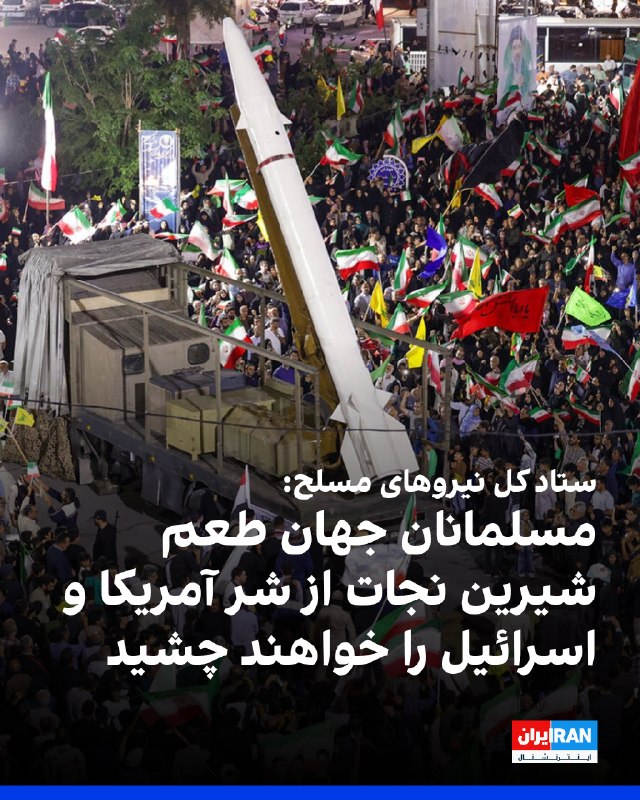

ستاد کل نیروهای مسلح جمهوری اسلامی در بیانیه‌ای نوشت: «این مسیر پرفروغ و نورانی ادامه خواهد یافت و مسلمانان و آزادی‌خواهان جهان، طعم شیرین نجات از شر شیاطین عالم، به ویژه آمریکا و اسرائیل را خواهند چشید و به فتوحات بیشتری نائل خواهند شد.»
https://iranintl.com/202605233697

## IranIntlTV — post 338652

  

سایت هرانا گزارش داد بیژن کاظمی، زندانی سیاسی محبوس در زندان اوین، با حکم شعبه ۱۵ دادگاه انقلاب تهران در مجموع به ۳۷ سال و شش ماه حبس محکوم شد.

بیژن کاظمی، زندانی سیاسی پس از کشته شدن محمد مقیسه و علی رازینی، دو قاضی دیوان عالی کشور در ۳۰ دی‌ماه ۱۴۰۳، در شهرستان کوهدشت بازداشت شده بود.
https://iranintl.com/202605234393

## IranIntlTV — post 338651

  <a href="telegram/content/IranIntlTV_338651_1779566506.mp4" target="_blank">🎬 Download video</a>

در برنامه‌ای زنده در صداوسیما، زنی که ادعا می‌شود همسایه بیت علی خامنه‌ای، رهبر کشته‌شده جمهوری اسلامی، بوده در پاسخ به مجری که از او می‌پرسد چه اتفاقی برای «بیت رهبری» افتاده است، می‌گوید: «اگر از پشت‌بام نگاه کنی، تلی از خاک می‌بینی. منطقه [خامنه‌ای] خیلی سرسبز بود، اما حالا به بیابانی بی‌درخت تبدیل شده و فقط خاک است. درختی هم نیست.»
@iranintltv

## IranIntlTV — post 338650

  <a href="https://t.me/IranintlTV/338650" target="_blank">📎 Download file</a>

🎧نسخه صوتی تیتراول با نیوشا صارمی: ترامپ: شانس توافق با جمهوری اسلامی یا نابودی کامل آن‌ها پنجاه-پنجاه است
@iranintlTV

## IranIntlTV — post 338649

  

محمد اکرمی‌نیا، سخنگوی ارتش جمهوری اسلامی، گفت: «تا آخرین لحظه دست از عملیات برنداشتیم. با موشک‌ها و پهپادها برابر دشمن که مجهز به تسلیحات پیشرفته است، مقاومت کردیم.» او گفت: «با نابودی کامل اسرائیل منطقه جای آرام‌تری خواهد بود.»
https://iranintl.com/202605236138

## IranIntlTV — post 338648

  <a href="telegram/content/IranIntlTV_338648_1779566508.mp4" target="_blank">🎬 Download video</a>

دونالد ترامپ، رییس‌جمهوری آمریکا، در گفت‌وگو با اکسیوس اعلام کرد در دیدار با تیم مذاکره‌کننده، آخرین پیشنهاد جمهوری اسلامی را بررسی خواهد کرد. ترامپ گفته است احتمال دارد روز یکشنبه درباره ازسرگیری جنگ تصمیم‌گیریa کند و شانس توافق یا بازگشت به درگیری را «۵۰-۵۰» می‌داند.
گفت‌وگو با امید معماریان، تحلیل‌گر سیاسی
@iranintltv

## IranIntlTV — post 338647

  

اکسیوس به نقل از یک مقام آمریکایی گزارش داد: «ترامپ هنوز هیچ تصمیم نهایی در مورد توافق با جمهوری اسلامی نگرفته است.»

اکسیوس نوشت که ترامپ و مشاورانش در مراحل قبلی جنگ نیز چندین بار تصور می‌کردند به توافق نزدیک شده‌اند، اما هیچ‌یک به نتیجه نرسید.
https://iranintl.com/202605230532

## IranIntlTV — post 338646

  

🔻مهدی تاج، رییس فدراسیون فوتبال، خبر داد کمپ تیم ملی فوتبال از آریزونای آمریکا به کمپی در شهر تیخوانا مکزیک منتقل شده است.

🔹او به سایت فدراسیون فوتبال گفت: «با این تغییر، مساله ویزا تا اندازه زیادی حل می‌شود. می‌توانیم با پرواز ایران‌ایر به مکزیک برویم و برگشت هم از همان‌جا بیاییم.»

🔹تیخوانا شهری مرزی در شمال غربی مکزیک، در ایالت باخا کالیفرنیا، است و در نزدیکی مرز ایالات متحده و شهر سن‌دیگو قرار دارد.

🔹رسانه‌های ایران امروز گزارش دادند سفارت آمریکا در آنکارا برای تعدادی از بازیکنان تیم ملی، از جمله مهدی طارمی، شجاع خلیل‌زاده و احسان حاج‌صفی، ویزا صادر نکرده است.

🔹از سوی دیگر، فدراسیون فوتبال اصرار دارد با پرواز ایران‌ایر به آمریکا سفر کند؛ تصمیمی که با توجه به تحریم‌های این شرکت هواپیمایی، امکان‌پذیر نیست.

🔹مهدی تاج توضیحی نداد که تکلیف ویزای ورود به آمریکا برای برگزاری مسابقات تیم ملی چه می‌شود.

🔹از سوی دیگر به نظر می‌رسد این تصمیم فدراسیون فوتبال برای دور ماندن تیم ملی از تقابل با ایرانیان مقیم آمریکا باشد.

@iranintltvsport

## IranIntlTV — post 338645

دانش‌آموزان در ایران در مناطق مختلف کشور در اعتراض به وضع موجود آموزشی تجمع کردند. آن‌ها به وضعیت بلاتکلیف آموزشی، فشارهای معیشتی و تصمیم مسئولان درباره امتحانات نهایی اعتراض کردند.

گفت‌وگو با مهرداد قاسمفر، روزنامه‌نگار و تحلیل‌گر مسائل ایران
@iranintltv

## IranIntlTV — post 338644

  <a href="telegram/content/IranIntlTV_338644_1779566512.mp4" target="_blank">🎬 Download video</a>

ویدیوهای رسیده به ایران‌اینترنشنال نشان می‌دهند گروهی از ایرانیان مقیم آلمان روز شنبه دوم خرداد، علیه اعدام‌های جمهوری اسلامی و در حمایت از شاهزاده رضا پهلوی، در شهر هانوفر تجمع کردند.

## IranIntlTV — post 338643

  <a href="telegram/content/IranIntlTV_338643_1779566516.mp4" target="_blank">🎬 Download video</a>

مهدی مهدوی‌آزاد در برنامه «چشم‌انداز» می‌گوید علی خامنه‌ای در خاطراتش به‌صراحت از تاثیرپذیری خود از سید قطب و نواب صفوی گفته است؛ افرادی که به گفته او در شکل‌گیری جریان‌های اسلام‌گرای رادیکال نقش داشتند. مهدوی‌آزاد در ادامه می‌گوید بر اساس برخی منابع آمریکایی، مجتبی خامنه‌ای نیز در نگاه سیاسی خود تحت تاثیر اسامه بن‌لادن قرار دارد.
@iranintltv

## IranIntlTV — post 338642

  

امیرحسین ثابتی، نماینده مجلس، در تجمع شبانه حامیان حکومت با تاکید بر قطعی بودن وقوع مجدد جنگ نظامی گفت: «ممکن است یک ساعت دیگر باشد، ممکن است یک روز یا یک سال، اما قطعی است. حتی اگر آمریکا تمام شرایط ما را بپذیرد، امضا کند و تسلیم شود، باز هم جنگ خواهیم داشت.»
https://iranintl.com/202605233406

## IranIntlTV — post 338641

گرچه در ساعات گذشته بحث توافق اولیه یا تمدید آتش‌بس بین جمهوری اسلامی و آمریکا مطرح شده، اما آن‌‌طور که سی‌بی‌اس گزارش داده، ارتش و نهادهای اطلاعاتی آمریکا برنامه حمله احتمالی به ایران را آماده و این برنامه را به دونالد ترامپ هم ارائه کرده‌اند. برنامه‌ای که شامل اهداف مختلفی در داخل ایران می‌شود. براساس گزارش‌ها، بسیاری از مقام‌های ارشد اطلاعاتی و نظامی آمریکا هم برنامه‌های آخر هفته‌ خود را تغییر داده و مرخصی‌های‌شان را لغو کرده‌اند.

@iranintltv

## IranIntlTV — post 338640

  

سناتور راجر ویکر، رییس کمیته نیروهای مسلح سنای آمریکا، در ایکس نوشت که آتش‌بس ۶۰ روزه با فرض حسن نیت جمهوری اسلامی یک «فاجعه» خواهد بود و دستاوردهای عملیات خشم حماسی را از بین می‌برد.
ویکر روز گذشته نیز در ایکس نوشت: «باید کاری را که آغاز کرده‌ایم، به پایان برسانیم.»
https://iranintl.com/202605232378

## IranIntlTV — post 338639

  <a href="telegram/content/IranIntlTV_338639_1779566520.mp4" target="_blank">🎬 Download video</a>

دونالد ترامپ گفت شانس دستیابی به توافق با تهران یا حمله و نابودی، «پنجاه‌پنجاه» است.

رییس‌جمهوری آمریکا همچنین به اکسیوس گفت اواخر امروز برای بررسی آخرین پیشنهاد جمهوری اسلامی با مشاورانش دیدار می‌کند و احتمالا تا فردا درباره از سرگیری جنگ تصمیم خواهد گرفت.

گفت‌وگو با فرشته پزشک، کارشناس روابط بین‌الملل، و جمشید برزگر، روزنامه‌نگار و تحلیل‌گر سیاسی
@iranintltv

## IranIntlTV — post 338638

  <a href="telegram/content/IranIntlTV_338638_1779566524.mp4" target="_blank">🎬 Download video</a>

پنتاگون ده‌ها فایل و ویدیو از پدیده‌های ناشناس هوایی منتشر کرده؛ از جمله تصاویری نزدیک ایران که بیش از پاسخ، پرسش می‌سازند: بشقاب‌پرنده یا خطای دید؟

آرین ریسباف گزارش می‌دهد.
@iranintltv

## Shin_Persian — post 6171

Shin ✓ @hey_itsmyturn
Sat, 23 May 2026 19:27:12 UTC

PM @netanyahu on the phone with @POTUS - Reports

فارسی

گزارش‌ها: نخست‌وزیر @netanyahu در حال گفتگو با @POTUS (رئیس‌جمهور ایالات متحده) است.

𝕏 · @shin_persian

## Shin_Persian — post 6170

Gordo ✓ @GordoCDA
Sat, 23 May 2026 18:40:42 UTC

Fox News is reporting that no deal has been made with the Iranians.

فارسی

فاکس نیوز گزارش می‌دهد که هیچ توافقی با ایرانی‌ها حاصل نشده است.

𝕏 · @shin_persian

## Shin_Persian — post 6169

  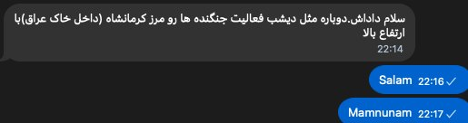

↩️ Quoted tweet: Shin ✓ @hey_itsmyturn Fri, 22 May 2026 19:46:10 UTC Intense jet activity over Eastern Iraq, near Iranian western borders. #Iraq 🇮🇶 ↩️ توییت نقل‌قول شده — برای پاسخ، پست زیر را ببینید. فارسی فعالیت شدید جت‌های جنگنده برفراز شرق عراق،…

## Shin_Persian — post 6168

  

↩️ Quoted tweet:
Shin ✓ @hey_itsmyturn
Fri, 22 May 2026 19:46:10 UTC

Intense jet activity over Eastern Iraq, near Iranian western borders.
#Iraq 🇮🇶

↩️ توییت نقل‌قول شده — برای پاسخ، پست زیر را ببینید.

فارسی

فعالیت شدید جت‌های جنگنده برفراز شرق عراق، در نزدیکی مرزهای غربی ایران.
#Iraq 🇮🇶

𝕏 · @shin_persian

## Shin_Persian — post 6167

  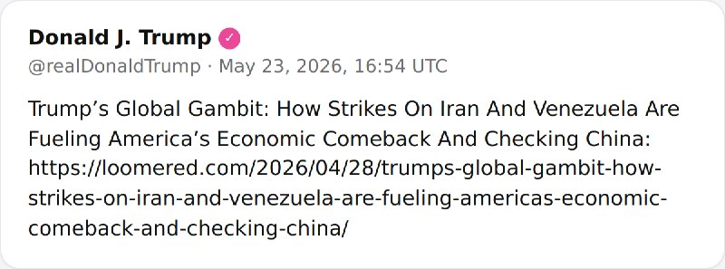

Shin ✓ @hey_itsmyturn
Sat, 23 May 2026 16:59:26 UTC

President Trump @POTUS:
"Trump’s Global Gambit: How Strikes On Iran And Venezuela Are Fueling America’s Economic Comeback And Checking China: https://loomered.com/2026/04/28/trumps-global-gambit-how-strikes-on-iran-and-venezuela-are-fueling-americas-economic-comeback-and-checking-china/"

فارسی

رئیس‌جمهور ترامپ @POTUS:
«قمار جهانی ترامپ: چگونه حملات به ایران و ونزوئلا در حال تقویت بازگشت اقتصادی آمریکا و مهار چین است: https://loomered.com/2026/04/28/trumps-global-gambit-how-strikes-on-iran-and-venezuela-are-fueling-americas-economic-comeback-and-checking-china/»

𝕏 · @shin_persian

## Shin_Persian — post 6166

Hiba Nasr ✓ @HibaNasr
Sat, 23 May 2026 15:38:36 UTC

‼️ Regional sources: President Trump is supposed to have a call with leaders of Saudi Arabia, UAE, Egypt, Qatar, Jordan, Pakistan and Turkey later today at 01:00 PM ET.

@AsharqNews

فارسی

‼️ منابع منطقه‌ای: انتظار می‌رود رئیس‌جمهور ترامپ اواخر امروز ساعت ۰۱:۰۰ بعد از ظهر به وقت منطقه زمانی شرقی (۱۸۰۰ زولو / ۲۱:۳۰ به وقت تهران) با رهبران عربستان سعودی، امارات متحده عربی، مصر، قطر، اردن، پاکستان و ترکیه تماس تلفنی داشته باشد.

@AsharqNews

𝕏 · @shin_persian

## Shin_Persian — post 6165

Barak Ravid ✓ @BarakRavid
Sat, 23 May 2026 15:35:31 UTC

🚨🚨הנשיא טראמפ אמר לי בשיחת טלפון כי הוא "50:50" בכל הנוגע להסכם עם איראן או חידוש המלחמה. "או שנגיע לעסקה טובה או שאפוצץ אותם לאלף עזאזל", הוא אמר. טראמפ אמר לי שייפגש היום עם יועציו הבכירים כדי לדון בפרטי הטיוטה המעודכנת וייתכן שיקבל החלטה עד מחר

English

🚨🚨 President Trump told me in a phone call that he is "50:50" regarding an agreement with Iran or a resumption of the war. "Either we reach a good deal or I will blow them to hell," he said. Trump told me he would meet today with his senior advisors to discuss the details of the updated draft and may reach a decision by tomorrow.

فارسی

🚨🚨 پرزیدنت ترامپ در یک تماس تلفنی به من گفت که در مورد توافق با ایران یا از سرگیری جنگ در وضعیت «۵۰:۵۰» قرار دارد. او گفت: «یا به یک توافق خوب می‌رسیم یا آن‌ها را به درک واصل می‌کنم (منفجر می‌کنم).» ترامپ به من گفت که امروز با مشاوران ارشد خود برای بررسی جزئیات پیش‌نویس به‌روزشده دیدار خواهد کرد و احتمالاً تا فردا تصمیمی اتخاذ خواهد کرد.

𝕏 · @shin_persian

## ManotoTV — post 105782

مهدیس نظری
۷ ساله بود.

عاشق اسکیت بود.
عاشق شعر خواندن.
شاهنامه...

۹ اسفند،
در حمله به مدرسه شجره طیبه میناب،
او و ۱۲۰ کودک دیگر
جانشان را از دست دادند

## ManotoTV — post 105781

  <a href="telegram/content/ManotoTV_105781_1779566528.mp4" target="_blank">🎬 Download video</a>

تماسی از ایران؛
«مرسی که همیشه صدای ما بودید»

## ManotoTV — post 105780

  <a href="telegram/content/ManotoTV_105780_1779566531.mp4" target="_blank">🎬 Download video</a>

راهپیمایی ایرانیان برلین

## ManotoTV — post 105779

  <a href="telegram/content/ManotoTV_105779_1779566533.mp4" target="_blank">🎬 Download video</a>

تصاویر جاویدنامان انقلاب ملی در بوردو فرانسه، دوم خرداد ۱۴۰۵

## ManotoTV — post 105778

  

به دنبال اعلام توقف پخش ماهواری‌ای و کانال یوتیوب منوتو، شماری از بینندگان با ارسال پیام‌هایی، از سال‌ها فعالیت منوتو و همراهی آن با مخاطبان قدردانی کردند.
یکی از بینندگان در پیام خود نوشته است:
«راستش هنوز باورم نمی‌شود که داریم درباره پایان منوتو صحبت می‌کنیم. من به عنوان نسلی که با منوتو بزرگ شد، بخشی از خاطرات زندگی‌ام با منوتو ورق خورد.»

در پیام دیگری آمده است:
«شما فقط یک شبکه نبودید، نوری بودید در میان سایه تیره فراموشی و وارونه‌نمایی حقیقت.»

## ManotoTV — post 105777

  <a href="telegram/content/ManotoTV_105777_1779566536.mp4" target="_blank">🎬 Download video</a>

تماسی از ایران؛
«من پر از بغضم از رفتن شما»

## ManotoTV — post 105776

  <a href="telegram/content/ManotoTV_105776_1779566538.mp4" target="_blank">🎬 Download video</a>

راهپیمایی ایرانیان استکهلم

## ManotoTV — post 105775

  <a href="telegram/content/ManotoTV_105775_1779566541.mp4" target="_blank">🎬 Download video</a>

راهپیمایی ایرانیان لاهه در هلند، دوم خرداد ۱۴۰۵

## ManotoTV — post 105774

  <a href="telegram/content/ManotoTV_105774_1779566543.mp4" target="_blank">🎬 Download video</a>

بر پایه گزارش‌ها ترامپ برای تماس گروهی با رهبران عربستان سعودی، امارات متحده عربی، مصر، قطر، اردن، پاکستان و ترکیه وارد اتاق بیضی کاخ سفید شده است. همزمان سناتور لیندسی گراهام به باراک راوید خبرنگار آکسیوس گفت برخی از رهبران منطقه از ترامپ خواسته‌اند به ایران حمله کند تا حکومت تضعیف شود و در نتیجه توافقی با شرایط بهتر به دست آید.
او در مقابل گفت برخی دیگر از رهبران منطقه و همچنین تعدادی از مشاوران ارشد رئیس‌جمهور از او خواسته‌اند همان توافقی را که روی میز است بپذیرد.
راوید در ادامه نوشته به گفته گراهام، این گروه معتقدند تنگه هرمز نمی‌تواند از نفوذ جمهوری‌اسلامی در امان باشد و اگر ایران هدف حمله قرار بگیرد، این توانایی را دارد که بخش قابل توجهی از عملیات نفتی خلیج فارس را نابود کند.
گراهام همچنین گفت: من به‌شدت تردید دارم که نتوان ایران را از تهدید تنگه هرمز بازداشت و نتوان منافع حیاتی منطقه را پس از حملات گسترده به ایران دفاع کرد؛ اگر واقعاً ایران به‌طور کامل نابود شده باشد، نباید بتواند هیچ‌کدام از این کارها را انجام دهد. زمان مشخص خواهد کرد. هنوز امیدوارم نتیجه خوبی به دست بیاید.

## ManotoTV — post 105773

  <a href="telegram/content/ManotoTV_105773_1779566544.mp4" target="_blank">🎬 Download video</a>

ترامپ می‌گوید آمریکا و جمهوری‌اسلامی «خیلی به توافق نزدیک‌تر شده‌اند»
دونالد ترامپ، رئیس‌جمهور آمریکا، به شبکه سی‌بی‌اس نیوز گفته است که واشنگتن و تهران «روزبه‌روز به نهایی‌کردن یک توافق نزدیک‌تر می‌شوند».
او گفت: «هر روز بهتر و بهتر می‌شود.»
ترامپ همچنین افزود که در صورت رسیدن به توافق احتمالی، اورانیوم غنی‌شده ایران «به‌طور رضایت‌بخش مدیریت خواهد شد»، اما جزئیات بیشتری ارائه نکرد.
او تأکید کرد: «من فقط توافقی را امضا می‌کنم که در آن همه چیزهایی که می‌خواهیم را به دست آوریم.»

## ManotoTV — post 105772

  <a href="telegram/content/ManotoTV_105772_1779566544.mp4" target="_blank">🎬 Download video</a>

برخی رسانه‌ها از قول منابع منطقه‌ای گزارش داده‌اند قرار است دونالد ترامپ امروز ساعت ۱ بعدازظهر به وقت شرق آمریکا با رهبران عربستان سعودی، امارات متحده عربی، مصر، قطر، اردن، پاکستان و ترکیه، درباره ایران تماس گروهی داشته باشد. این تماس برابر است با ساعت ۸:۳۰ شب به وقت تهران

## ManotoTV — post 105771

  <a href="telegram/content/ManotoTV_105771_1779566545.mp4" target="_blank">🎬 Download video</a>

دونالد ترامپ اعلام کرد شنبه با تیم مذاکره‌کننده‌اش درباره آخرین پیشنهاد جمهوری‌اسلامی دیدار می‌کند و احتمالاً تا روز یکشنبه درباره ادامه مذاکرات یا ازسرگیری جنگ تصمیم خواهد گرفت.
ترامپ در گفت‌وگو با آکسیوس گفت شانس رسیدن به توافق با ایران «پنجاه-پنجاه» است و تأکید کرد یا به «توافقی خوب» می‌رسند یا «ایران را شدیدتر از همیشه هدف قرار می‌دهد».
او قرار است با استیو ویتکاف، جرد کوشنر و همچنین معاونش جی‌دی ونس جلسه‌ای برگزار کند. هم‌زمان، عاصم منیر، فرمانده ارتش پاکستان که نقش میانجی میان تهران و واشینگتن را برعهده داشته، پس از دیدار با مقام‌های جمهوری‌اسلامی تهران را ترک کرده است. پاکستان از «پیشرفت امیدوارکننده» در مسیر توافق نهایی خبر داده، اما هنوز توافقی نهایی نشده است.
بر اساس پیش‌نویس تفاهم‌نامه‌ای که در مذاکرات جمهوری‌اسلامی و پاکستان شکل گرفته، دو طرف احتمالاً ابتدا بر سر توقف جنگ توافق می‌کنند و سپس وارد ۳۰ روز مذاکرات فشرده درباره مسائل اصلی، از جمله غنی‌سازی اورانیوم و ذخایر هسته‌ای ایران، خواهند شد.
ترامپ گفته هر توافقی باید شامل محدودیت بر برنامه هسته‌ای ایران باشد. با این حال، اختلاف‌های اصلی میان تهران و واشنگتن، از جمله بر سر اورانیوم غنی‌شده و وضعیت تنگه هرمز، همچنان حل‌نشده باقی مانده است.
مارکو روبیو، وزیر خارجه آمریکا، نیز از «پیشرفت‌هایی» در مذاکرات خبر داده و گفته احتمال دارد تا پایان شنبه اخبار تازه‌ای منتشر شود.

## ManotoTV — post 105770

  <a href="telegram/content/ManotoTV_105770_1779566547.mp4" target="_blank">🎬 Download video</a>

گردهمایی ایرانیان دنهاخ

## FarsiVOA — post 218472

⚡️رئیس جمهوری آمریکا می‌گوید طرح ‌پیشنهادی جمهوری اسلامی را دریافت‌ کرده و در مورد آن تصمیم‌ می‌گیرد
@FarsiVOA

## FarsiVOA — post 218471

🔺گزارش | روایت اعدام عبدالجلیل شه‌بخش؛ از روستای چاه احمد تا اعترافات تلویزیونی

▪️عبدالجلیل شه‌بخش، زندانی سیاسی، روز ۲۲ اردیبهشت ۱۴۰۵ اعدام شد. بنا بر برخی گزارش‌ها، او ۲۶ ساله، پدر دو کودک خردسال و اهل روستای چاه احمد بود.

⬇️ بیشتر بخوانید:
https://ir.voanews.com/a/iran-baloch-sistan-execution-abdoljalil-shahbakhsh-prison/8153055.html
@FarsiVOA

## FarsiVOA — post 218470

⚡️گروهی از دانش‌آموزان در شهرهای دورود، یاسوج، خرم‌آبا‌‌د، و بر‌وجرد تجمع‌های اعتراضی برگزار کردند و خواستند امتحانات‌شان به طور مجازی برگزار شود.
@FarsiVOA

## FarsiVOA — post 218469

⚡️گفت‌وگو با دکتر بابک خطی برای بررسی دلایل بحران دارو در ایران؛ سوء مدیریت، مافیای دارو یا مشکل واردات؟
@FarsiVOA

## FarsiVOA — post 218468

⚡️گفت‌وگو با حسن هاشمیان درباره تلاش‌های دیپلماتیک برای توافق و تماس‌های پاکستان و قطر با مقام‌های جمهوری اسلامی
@FarsiVOA

## FarsiVOA — post 218467

⚡️گفت‌وگو با علیرضا فیروزی درباره پیامدهای بیش از دوهزار ساعت قطع اینترنت در ایران، از جمله اختلال در ارتباطات، آموزش، و کسب‌وکار.
@FarsiVOA

## FarsiVOA — post 218466

روزنامه دنیای اقتصاد در گزارشی از همایش «چشم‌انداز اقتصاد ایران ۱۴۰۵» تصویری نگران‌کننده از اقتصاد ایران ترسیم کرده است؛ تصویری که در آن تورم، بیکاری، رکود سرمایه‌گذاری، و کاهش رفاه خانوارها به مرحله‌ای خطرناک‌تر رسیده‌اند.

مسعود نیلی، اقتصاددان، در این همایش هشدار داده اقتصاد ایران از وضعیت «بحران مزمن» وارد مرحله «بروز آشکار بحران‌ها» شده و اگر سازوکارهای شکل‌گیری این بحران‌ها درست شناخته نشود، هزینه‌های سنگین‌تری در آینده تحمیل خواهد شد. او با اشاره به آمار مرکز آمار گفته تورم کالاها از ۱۰۰ درصد گذشته و شرایط تورمی ایران به‌سادگی به وضعیت نرمال بازنخواهد گشت.

گزارش کامل را در وب‌سایت صدای آمریکا بخوانید.

@FarsiVOA

## FarsiVOA — post 218465

اروپا در مسیر بدون بازگشت؛ حرکت به سوی پایان وابستگی به انرژی روسیه

## FarsiVOA — post 218464

در گفت‌وگو با کیانوش رزاقی، وکیل مهاجرت در مریلند، به تصمیم جدید دولت پرزیدنت ترامپ درباره الزام ثبت درخواست گرین کارت از خارج خاک آمریکا پرداختیم و پیامدهای حقوقی و عملی آن را برای دانشجویان، نیروهای متخصص و متقاضیانی که با محدودیت‌های کنسولی در کشور خود روبه‌رو هستند بررسی کردیم.

## FarsiVOA — post 218460

اسپیس‌ایکس اعلام کرد «استارشیپ وی۳»، برای نخستین بار به پرواز درآمده است.

استارشیپ بزرگ‌ترین و قدرتمندترین فضاپیمای ساخته‌شده توسط اسپیس‌ایکس است.

@FarsiVOA

## FarsiVOA — post 218459

گزارش‌ها از موج تازه کمبود و گرانی در بازار دیجیتال ایران خبر می‌دهند؛ جایی که به‌دنبال تنش‌ها میان جمهوری اسلامی و امارات و اختلال در مسیر واردات، بازار موبایل، لپ‌تاپ و قطعات کامپیوتری با بحران تأمین کالا روبه‌رو شده است.

## FarsiVOA — post 218458

  <a href="telegram/content/FarsiVOA_218458_1779566549.mp4" target="_blank">🎬 Download video</a>

وزیر امور خارجه ایالات متحده که در نخستین سفر خود به هند به‌سر می‌برد با تکرار مواضع رسمی و قطعی آمریکا در مذاکرات جاری با رژیم ایران گفت: «در مذاکرات با جمهوری اسلامی پیشرفت‌هایی حاصل شده، اما آمریکا از خطوط قرمز پرزیدنت ترامپ کوتاه نخواهد آمد.»

## FarsiVOA — post 218457

🔺افزایش نشانه‌ها از توافق آمریکا و رژیم ایران؛ پرزیدنت ترامپ: «بسیار نزدیک» است

▪️همزمان با پایان سفر فرمانده ارتش پاکستان به ایران به عنوان میانجی گفتگوها، رسانه‌ها از افزایش احتمال دستیابی تهران و واشنگتن به توافق خبر دادند. همزمان رئیس‌جمهوری آمریکا به سی‌بی‌اس نیوز گفت که دو کشور به توافق نهایی «بسیار نزدیک‌تر» شده‌اند.

⬇️ بیشتر بخوانید:

https://ir.voanews.com/a/iran-trump-us-negotiations-hormuz-persian-gulf/8153056.html/?nocach=1

## FarsiVOA — post 218456

🔺درگذشت پرویز قلیچ‌خانی، ستاره سال‌های دور فوتبال ایران

▪️پرویز قلیچ‌خانی، ستاره فوتبال ایران در دهه‌های ۴۰ و ۵۰ خورشیدی، پس از ماه‌ها تحمل بیماری، روز شنبه ۲ خرداد در بیمارستانی در حومه پاریس فرانسه درگذشت.

⬇️ بیشتر بخوانید:

https://ir.voanews.com/a/iran-soccor-footbal-parviz-ghalichkhani-legendary/8153050.html

## FarsiVOA — post 218454

در حالی که محدودیت گسترده اینترنت بین‌الملل در ایران وارد هشتاد و پنجمین روز شده، داده‌های نت‌بلاکس نشان می‌دهد میزان «انزوای دیجیتال» ایران از جهان از مرز ۲۰۱۶ ساعت گذشته است.

بر اساس اعلام این نهاد ناظر بر اینترنت، قطع یا محدودیت شدید دسترسی به اینترنت جهانی اکنون وارد هفته سیزدهم شده و زندگی روزمره، کار، آموزش، ارتباطات و دسترسی به اطلاعات را برای میلیون‌ها شهروند ایرانی مختل کرده است.

نت‌بلاکس می‌گوید این سطح از قطع ارتباط، شهروندان را از فرصت‌ها و اطلاعاتی محروم کرده که در بسیاری از کشورها در چند ثانیه در دسترس است.

این گزارش در حالی منتشر می‌شود که مقام‌های جمهوری اسلامی همچنان زمان روشنی برای بازگشایی اینترنت اعلام نکرده‌اند.

گزارش کامل را در وب‌سایت صدای آمریکا بخوانید.

@FarsiVOA

## FarsiVOA — post 218453

  

⚡️دونالد ترامپ، رئیس جمهوری آمریکا، روز شنبه ۲ خرداد در گفت‌و‌گویی تلفنی با شبکه خبری «سی‌بی‌اس نیوز» گفت که مذاکره‌کنندگان ایالات متحده و حکومت ایران به نهایی کردن توافق بین دو کشور «بسیار نزدیک‌تر» شده‌آند.

پرزیدنت ترامپ بدون ارائه جزئیات بیشتر در مورد توافق، گفت: «هر روز بهتر و بهتر می‌شود.»

پرزیدنت ترامپ با تاکید بر این که توافق نهایی مانع از دستیابی رژیم ایران به سلاح هسته‌ای خواهد شد، تصریح کرد که در غیر این صورت «حتی در مورد آن صحبت نمی‌کرد.» او افزود که این توافق همچنین به «مدیریت رضایت‌بخش» اورانیوم غنی‌شده منجر خواهد شد.

او گفت: «من فقط توافقی را امضا خواهم کرد که در آن هر آن چه را که می‌خواهیم به دست آوریم.»

## DW_Farsi — post 125064

🔶 نشست نتانیاهو با رهبران احزاب و مقام‌های امنیتی اسرائیل درباره توافق احتمالی میان آمریکا و جمهوری اسلامی

کانال ۱۲ اسرائیل گزارش داد بنیامین نتانیاهو، نخست وزیر اسرائیل، قرار است شامگاه شنبه ۲۳ مه (۲ خرداد) رهبران احزاب ائتلاف و مقام‌های امنیتی این کشور را برای گفت‌وگو درباره توافقی که میان آمریکا و جمهوری اسلامی برای پایان دادن به جنگ در حال شکل‌گیری است، گرد هم آورد.

این شبکه مفاد گزارش‌شده این توافق را برای اسرائیل "بسیار بد" توصیف کرد.

در این گزارش به نقل از یک مقام اسرائیلی که نامش فاش نشده آمده است استیو ویتکاف، فرستاده آمریکا، بیش از همه برای آن تلاش می‌کند که ترامپ این توافق را بپذیرد.

به نوشته این گزارش، اسرائیل،  ویتکاف را بازیگر اصلی‌ای می‌داند که "تقریبا به هر قیمتی خواهان توافق است و فشار بسیار زیادی به ترامپ وارد می‌کند تا جنگ را از سر نگیرد."

با این حال، گزارش می‌افزاید اگر مفاد منتشرشده این توافق درست باشد، در اسرائیل آن را چنان "بد" می‌دانند که به سختی می‌توان تصور کرد ترامپ با آن موافقت کند.

به گفته این گزارش، این توافق "یک مشکل بسیار بزرگ برای اسرائیل" خواهد بود و "به شدت با آنچه نتانیاهو علنا گفته و حتی بیش از آن، با آنچه ترامپ تنها چند ساعت پیش علنا گفته، در تضاد است."

کانال ۱۲ در توضیح بیشتر نوشت که این مفاد، بازگشایی تنگه هرمز از سوی ایران را در ازای دریافت امتیازهای مالی پیش‌بینی می‌کند، در حالی که قرار است درباره برنامه هسته‌ای جمهوری اسلامی و خارج کردن ذخایر اورانیوم غنی‌شده آن تازه در مرحله‌ای بعد گفت‌وگو شود.

این گزارش افزود که برنامه موشک‌های بالستیک جمهوری اسلامی اصلا در دستور کار قرار ندارد.

این گزارش در جمع‌بندی نوشت: «آمریکا نقدی پرداخت می‌کند، در حالی که ایران اگر اصلا چیزی بپردازد، نسیه خواهد پرداخت.»

با این حال، گزارش ادامه می‌دهد که میان نتانیاهو و ترامپ "هماهنگی نزدیک" وجود دارد و "هیچ فاصله‌ای" میان آن دو نیست.

این ادعا با گزارش نیویورک تایمز در اوایل امروز در تضاد است؛ گزارشی که گفته بود نتانیاهو "تقریبا به طور کامل" از روند مذاکرات کنار گذاشته شده است.

ترامپ پیش‌تر روز شنبه به اکسیوس گفته بود: «برخی خیلی بیشتر ترجیح می‌دهند توافقی حاصل شود و برخی دیگر ترجیح می‌دهند جنگ از سر گرفته شود.»

او همچنین گفته بود نتانیاهو "دو دل" است، اما این تصور را رد کرده بود که نخست وزیر اسرائیل نگران باشد او با یک توافق بد موافقت کند.

گزارش اکسیوس به نقل از مقام‌های اسرائیلی گفته بود که نتانیاهو در واقع به شدت نگران توافق احتمالی است و از ترامپ خواسته دور تازه‌ای از حملات را آغاز کند.

در همین حال باراک راوید، خبرنگار اکسیوس و کانال ۱۲، به این شبکه گفت ترامپ به او اطمینان داده که اگر توافق "برای اسرائیل خوب" نباشد، آن را نخواهد پذیرفت.

در حال حاضر هیچ متن رسمی‌ای از این توافق منتشر نشده است، هرچند وبسایت العربیه روز گذشته متنی که آن را "پیش‌نویس نهایی" خوانده بود، منتشر کرد.

سخنگوی وزارت امور خارجه جمهوری اسلامی پیش‌تر امروز گفته بود یادداشت تفاهمی که اکنون در دست بررسی است، به بازگشایی تدریجی تنگه هرمز، لغو محاصره آمریکا علیه بنادر ایران و آزادسازی دارایی‌های مسدودشده ایران خواهد پرداخت.

او همچنین گفت مفاد این توافق یک دوره ۳۰ تا ۶۰ روزه بعدی را برای مذاکرات بر سر یک توافق تفصیلی پیش‌بینی می‌کند.

@dw_farsi

## DW_Farsi — post 125063

  <a href="telegram/content/DW_Farsi_125063_1779566551.mp4" target="_blank">🎬 Download video</a>

🎥 اعتراض دانش‌آموزان در ایران به حضوری شدن امتحانات

ویدیوهایی در شبکه‌های اجتماعی، تجمع گروهی از دانش‌آموزان در چند شهر ایران را در روز شنبه، دوم خرداد ماه نشان می‌دهد. آنها به احتمال برگزاری حضوری امتحانات اعتراض دارند و می‌گویند ماه‌ها آموزش غیرحضوری، اختلال اینترنت و شرایط جنگی، روند یادگیری‌شان را مختل کرده است.

@dw_farsi

## DW_Farsi — post 125062

🔶 ترامپ قصد دارد با چند تن از رهبران خاورمیانه تلفنی گفت‌وگو کند

به گفته یک منبع آگاه، دونالد ترامپ، رئیس جمهور آمریکا، قصد دارد با چند تن از سران کشورها و دولت‌های منطقه خاورمیانه تلفنی گفت‌وگو کند.

یک مقام دولتی عرب به خبرگزاری رویترز گفت که قرار است این تماس‌ها با رهبران عربستان سعودی، قطر، امارات متحده عربی، مصر، ترکیه و پاکستان انجام شود.

بر اساس یک گزارش رسانه‌ای، دونالد ترامپ احتمال دستیابی به یک توافق احتمالی، و از نگاه آمریکا "خوب"، در جنگ ایران را "پنجاه به پنجاه" ارزیابی کرده است.

پرتال اکسیوس همچنین از قول رئیس جمهور آمریکا نوشت: «فکر می‌کنم یکی از این دو اتفاق خواهد افتاد: یا آنها را شدیدتر از هر زمان دیگری هدف قرار خواهم داد، یا یک توافق خوب امضا خواهیم کرد.»

اکسیوس همچنین به نقل از این گفت‌وگو گزارش داد که ترامپ قرار است همین روز شنبه با استیو ویتکاف و جرد کوشنر، مذاکره‌کنندگان خود، دیدار کند تا پیشنهاد تازه جمهوری اسلامی را بررسی کند.

در ادامه این گزارش آمده است که ترامپ احتمالا تا روز یکشنبه تصمیم خواهد گرفت که آیا جنگ از سر گرفته خواهد شد یا نه.

@dw_farsi

## DW_Farsi — post 125061

🔶 بقائی: چارچوب مذاکرات ایران و آمریکا تقریبا نهایی شده است

به گفته مقام‌های جمهوری اسلامی، چارچوب ادامه گفت‌وگوها میان تهران و واشنگتن در آستانه نهایی شدن است.

با این حال، به گفته اسماعیل بقائی، سخنگوی وزارت امور خارجه جمهوری اسلامی، اینکه در پایان توافقی حاصل شود، هم "بسیار نزدیک" است و هم "بسیار دور".

او در تلویزیون دولتی گفت: «در حال حاضر در مرحله نهایی تدوین یک یادداشت تفاهم هستیم.»

بر اساس گزارش‌های همسو در رسانه‌های آمریکایی، واشنگتن و تهران با میانجی‌گری طرف‌های واسطه در حال کار بر روی یک یادداشت تفاهم ۱۴ ماده‌ای هستند. این سند قرار است چارچوبی برای مذاکرات ایجاد کند و به طور رسمی به جنگ پایان دهد.

بقائی اکنون گفت محور این یادداشت تفاهم، پایان دادن به جنگ، لغو محاصره آمریکایی در تنگه هرمز و نیز آزادسازی کلی دارایی‌های مسدودشده ایران در خارج از کشور است.

به گفته بقائی، قرار است در ۳۰ تا ۶۰ روز آینده، در چارچوب همین یادداشت تفاهم ۱۴ ماده‌ای، جزئیات بیشتری مذاکره شود تا در نهایت توافقی نهایی حاصل شود.

بر این اساس، اختلاف بر سر برنامه هسته‌ای جمهوری اسلامی و نیز روند فنی لغو تحریم‌های اعمال‌شده علیه تهران و آزادسازی حساب‌های ایرانی در خارج از کشور نیز در همین مرحله بررسی خواهد شد.

او افزود که آمریکا در جریان روند مذاکرات تا کنون چند بار مواضعی متناقض اتخاذ کرده و دیدگاه‌های خود را تغییر داده است. به همین دلیل، تهران نمی‌تواند مطمئن باشد که این وضعیت بار دیگر تکرار نخواهد شد.

بقائی هم‌زمان از "نزدیک شدن مواضع" سخن گفت، بدون آنکه جزئیات بیشتری ارائه کند.

@dw_farsi

## DW_Farsi — post 125060

  <a href="telegram/content/DW_Farsi_125060_1779566555.mp4" target="_blank">🎬 Download video</a>

🎥 روبیو: در مذاکرات با ایران پیشرفت‌هایی حاصل شده است

مارکو روبیو در سفرش به هند گفت در مذاکرات با ایران "پیشرفت‌هایی" حاصل شده و واشنگتن همچنان راه‌حل دیپلماتیک را ترجیح می‌دهد. او همچنین گفت که ایران باید اورانیوم غنی‌شده خود را تحویل دهد.

@dw_farsi

## DW_Farsi — post 125059

🔶 آمریکا و ایران از پیشرفت در مذاکرات برای پایان جنگ خبر دادند

در جنگی که نزدیک به سه ماه است میان آمریکا و جمهوری اسلامی ادامه دارد، دو طرف به گفته خودشان در حال نزدیک شدن به یکدیگر هستند.

آمریکا، جمهوری اسلامی و همچنین پاکستان به عنوان میانجی، روز شنبه ۲۳ مه (۲ خرداد) از پیشرفت در گفت‌وگوها برای پایان دادن به این درگیری خبر دادند.

مارکو روبیو، وزیر امور خارجه آمریکا، در جریان سفر به دهلی‌نو گفت که همچنان برای یافتن یک راه‌حل تلاش می‌شود. او افزود ممکن است دولت آمریکا ظرف چند روز آینده در این باره اظهارنظر کند.

اسماعیل بقائی، سخنگوی وزارت امور خارجه جمهوری اسلامی، نیز از نزدیک شدن مواضع سخن گفت. او در عین حال افزود که هنوز موضوع‌های حل‌نشده‌ای باقی مانده که باید در سه یا چهار روز آینده از طریق میانجی‌ها روشن شود.

پیش از آن، عاصم منیر، فرمانده ارتش پاکستان، در جریان سفر به تهران با مقام‌های جمهوری اسلامی درباره یک یادداشت تفاهم گفت‌وگو کرده بود.

تلاش‌های میانجی‌گرانه پاکستان با هدف برطرف کردن اختلاف‌ها میان واشنگتن و تهران انجام می‌شود.

بنا بر اعلام وزارت خارجه ایران، اولویت تهران پایان تهدیدهای حمله از سوی آمریکا و همچنین پایان درگیری‌ها در لبنان است.  محمد باقر قالیباف، رئیس مجلس شورای اسلامی و مذاکره‌کننده ارشد جمهوری اسلامی ایران، هشدار داد که اگر آمریکا جنگ را ادامه دهد، واکنش ایران شدیدتر از آغاز درگیری خواهد بود.

@dw_farsi

## DW_Farsi — post 125058

  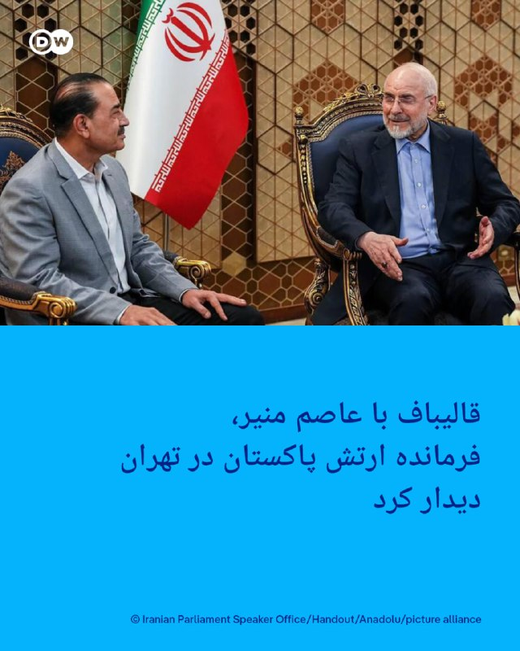

🔶 قالیباف با عاصم منیر، فرمانده ارتش پاکستان در تهران دیدار کرد

رسانه‌های دولتی ایران روز شنبه ۲۳ مه (۲ خرداد) گزارش دادند که محمدباقر قالیباف، مذاکره‌کننده ارشد ایران و رئیس مجلس شورای اسلامی، در چارچوب تلاش‌های دیپلماتیک جاری درباره تنش‌های منطقه‌ای، در تهران با عاصم منیر، فرمانده ارتش پاکستان، دیدار کرده است.

بر اساس این گزارش‌ها، منیر در جریان سفر خود به ایران همچنین با مسعود پزشکیان، رئیس جمهور ایران، با حضور عباس عراقچی، وزیر امور خارجه، دیدار کرده است.

در همین حال آمریکا، جمهوری اسلامی و همچنین پاکستان به عنوان میانجی، روز شنبه ۲۳ مه (۲ خرداد) از پیشرفت در گفت‌وگوها برای پایان دادن به این درگیری خبر دادند.

تلاش‌های میانجی‌گرانه پاکستان با هدف برطرف کردن اختلاف‌ها میان واشنگتن و تهران انجام می‌شود.

@dw_farsi

## DW_Farsi — post 125057

🔶 "فروش تسلیحات آمریکا به تایوان ارتباطی با جنگ ایران ندارد"

بر اساس گزارش رویترز و به نقل از یک منبع آگاه، فروش تسلیحات آمریکا به تایوان روندی چندساله دارد و ارتباطی با جنگ با ایران ندارد.

این اظهارات پس از آن مطرح شد که یک مقام ارشد آمریکایی گفته بود این روند به دلیل نیاز به حفظ ذخایر تسلیحاتی برای جنگ، متوقف شده است.

تایوان، که چین آن را بخشی از قلمرو خود می‌داند، در انتظار آن است که آمریکا فروش تسلیحاتی را تایید کند که رویترز پیش‌تر گزارش داده بود ارزش آن ممکن است به ۱۴ میلیارد دلار برسد.

دونالد ترامپ، رئیس جمهور آمریکا، پس از دیدار با شی جین‌پینگ، رئیس جمهور چین، در ماه جاری، با گفتن این که هنوز درباره تایید این بسته تصمیم نگرفته است، در تایپه تردیدهایی ایجاد کرد.

در همین حال هونگ کائو، سرپرست وزارت نیروی دریایی آمریکا، روز پنج‌شنبه در جلسه کمیته فرعی دفاع در کمیته تخصیص بودجه سنای آمریکا گفت: «فروش تسلیحات به تایوان متوقف شده است تا اطمینان حاصل شود آمریکا مهمات لازم برای حمله به ایران در چارچوب عملیاتی موسوم به "خشم حماسی" را در اختیار دارد.»

اما منبع آگاه گفت ترامپ اعلام کرده که به زودی درباره فروش تسلیحات به تایوان تصمیم خواهد گرفت.

او گفت: «این فروش‌ها سال‌ها زمان می‌برد تا طی روند اداری بررسی و نهایی شوند و ارتباطی با عملیات "خشم حماسی" ندارند».

این منبع با اشاره به جنگی که آمریکا و اسرائیل در ماه فوریه آغاز کردند افزود: «ارتش آمریکا بیش از اندازه کافی مهمات، گلوله و ذخایر تسلیحاتی در اختیار دارد تا همه اهداف راهبردی رئیس جمهور ترامپ و حتی فراتر از آن را تامین کند.»

آمریکا بر اساس "قانون روابط با تایوان" مصوب ۱۹۷۹ موظف است امکان دفاع از خود را برای تایوان فراهم کند. واشنگتن همچنین پس از دیدار ترامپ و شی گفته است که سیاست این کشور در قبال تایوان تغییری نکرده است.

یک مقام کاخ سفید به رویترز گفت همان‌طور که ترامپ گفته، او در مدتی نسبتا کوتاه درباره یک بسته تازه تسلیحاتی برای تایوان تصمیم‌گیری خواهد کرد. این مقام همچنین به بسته ۱۱ میلیارد دلاری اشاره کرد که در ماه دسامبر تایید شده بود.

او افزود: «رئیس جمهور ترامپ در دوره نخست ریاست جمهوری خود بیش از هر رئیس جمهور دیگری در تاریخ، فروش تسلیحات به تایوان را تایید کرد.»

در همین حال دولت تایوان روز جمعه ۲۲ مه اعلام کرد هیچ اطلاعی درباره تاخیر در فروش تسلیحات آمریکا دریافت نکرده است.

تایوان می‌گوید با تهدیدی فزاینده از سوی چین روبه‌رو است، زیرا ناوهای جنگی و هواپیماهای نظامی چین تقریبا هر روز در اطراف این جزیره فعالیت می‌کنند و به همین دلیل تایوان باید توان بازدارندگی خود را تقویت کند.

@dw_farsi

## DW_Farsi — post 125056

🔶 پرویز قلیچ‌خانی، ستاره ‌ماندگار فوتبال ایران درگذشت

پرویز قلیچ‌خانی از چهره‌های استثنایی فوتبال ایران به شمار می‌رفت. بازیکنی که نامش بیش از هر چیز با تیم ملی ایران، سه قهرمانی پیاپی در جام ملت‌های آسیا و سال‌ها درخشش در میانه میدان گره خورده است. او تنها بازیکنی است که با تیم ملی ایران سه بار به عنوان قهرمانی آسیا رسیده است.

او فوتبال را از محله صابون‌پزخانه در میدان شوش تهران آغاز کرد و خیلی زود به یکی از استعدادهای کم‌نظیر فوتبال ایران بدل شد.

قلیچ‌خانی در دوران بازیگری خود پیراهن تیم ملی ایران و همچنین باشگاه‌های تاج، پرسپولیس و پاس را بر تن کرد و از همان سال‌های نخست، به دلیل قدرت بدنی، هوش تاکتیکی، توان رهبری و تاثیرگذاری در جریان بازی، جایگاهی ویژه یافت.

اگرچه بسیاری او را در آغاز بیشتر یک بازیکن دفاعی می‌شناختند، اما قلیچ‌خانی به تدریج به چهره‌ای همه‌کاره در قلب میدان تبدیل شد. او در سال‌های نخست حضورش در فوتبال، چه در تیم کیان و چه بعدتر در تاج، اغلب در خط دفاعی به کار گرفته می‌شد.

@dw_farsi

## Persian_Trend_Official — post 14769

  <a href="telegram/content/Persian_Trend_Official_14769_1779566559.webm" target="_blank">🎬 Download video</a>

تا نتانیاهو هست محور مقاومت عمو ندارد !

## Persian_Trend_Official — post 14768

همه شواهد نشون میده برخلاف وانمود رسانه ها جنگ بسیار به ما نزدیکه

## Persian_Trend_Official — post 14767

ساعت صفر نزدیک است

## Persian_Trend_Official — post 14766

  <a href="telegram/content/Persian_Trend_Official_14766_1779566559.webm" target="_blank">🎬 Download video</a>

راستش امشب اصلا حال جسمی خوبی ندارم اما این رو بهتون بگم بهم اعتماد داشته باشید به نظر من دور بعدی جنگ در راهه این خبر هایی که در مورد توافق گفته میشه احمقانست توافقی وجود نداره همه هدف این هست که غافلگیری بوحود بیارن وگرنه امکان توافق بین این تیم فعلی…

## Persian_Trend_Official — post 14765

کانال رسمی پرشین ترند pinned «راستش امشب اصلا حال جسمی خوبی ندارم اما این رو بهتون بگم بهم اعتماد داشته باشید به نظر من دور بعدی جنگ در راهه این خبر هایی که در مورد توافق گفته میشه احمقانست توافقی وجود نداره همه هدف این هست که غافلگیری بوحود بیارن وگرنه امکان توافق بین این تیم فعلی…»

## Persian_Trend_Official — post 14764

🔴 ترامپ اعضای ارشد تیم امنیت ملی آمریکا را به اتاق وضعیت کاخ سفید فراخواند

💢گزارش‌ها حاکی است دونالد ترامپ معاون رئیس‌جمهور «جی‌دی ونس»، وزیر جنگ «پیت هگست»، رئیس ستاد مشترک ارتش ژنرال «دن کین» و تمامی اعضای شورای امنیت ملی آمریکا را به اتاق وضعیت (Situation Room) کاخ سفید فراخوانده است

🫆:Tony

📌 @persian_trend_official
پرشین ترند | متفاوت‌ترین کانال نظامی

## Persian_Trend_Official — post 14763

  <a href="telegram/content/Persian_Trend_Official_14763_1779566560.webm" target="_blank">🎬 Download video</a>

راستش امشب اصلا حال جسمی خوبی ندارم
اما این رو بهتون بگم
بهم اعتماد داشته باشید
به نظر من دور بعدی جنگ در راهه
این خبر هایی که در مورد توافق گفته میشه احمقانست

توافقی وجود نداره

همه هدف این هست که غافلگیری بوحود بیارن وگرنه امکان توافق بین این تیم فعلی جمهوری اسلامی با تیم فعلی امریکا و اسرائیل وجود نداره !

## Persian_Trend_Official — post 14762

💢کانال اسرائیلی کان:

💢«ساعت‌های حساس: در اسرائیل منتظرند ببینند آیا تلاش‌های دیپلماتیک فشرده، به ویژه از سوی پاکستان و قطر، به امضای یادداشت تفاهم بین ایران و ایالات متحده منجر خواهد شد یا نه.

💢این در حالی است که نخست‌وزیر بنیامین نتانیاهو به سمت ازسرگیری جنگ و حملات علیه ایران فشار آورده است.

🫆:Tony

📌 @persian_trend_official
پرشین ترند | متفاوت‌ترین کانال نظامی

## Persian_Trend_Official — post 14761

  <a href="telegram/content/Persian_Trend_Official_14761_1779566561.webm" target="_blank">🎬 Download video</a>

🔴 ترامپ در حال برگزاری نشست امنیت ملی درباره ایران است

💢گزارش‌ها حاکی است دونالد ترامپ هم‌اکنون در کاخ سفید ریاست یک نشست امنیت ملی را برعهده دارد؛ نشستی که همزمان با پیشرفت مذاکرات ایران و آمریکا و احتمال توافق بر سر «یادداشت تفاهم» برگزار می‌شود.

بر اساس گزارش رسانه‌های آمریکایی:

▪️ این نشست با حضور مقام‌های ارشد امنیتی، اطلاعاتی و نظامی آمریکا برگزار شده است
▪️ محور اصلی گفت‌وگوها، بررسی پیش‌نویس توافق و تصمیم‌گیری درباره ادامه مسیر مذاکرات یا بازگشت به گزینه نظامی است
▪️ ترامپ طی ساعات اخیر گفته بود «مذاکرات بسیار به توافق نزدیک شده‌اند» و پیش‌نویس توافق را مطالعه کرده است.

همزمان:

▪️ میانجیگران منطقه‌ای از جمله پاکستان، قطر و عربستان همچنان در تماس با دو طرف هستند
▪️ گزارش‌ها از آماده بودن یک «یادداشت تفاهم» برای پایان جنگ و آغاز مذاکرات گسترده‌تر خبر می‌دهند
▪️ با وجود فضای مثبت، اختلافات درباره برنامه هسته‌ای ایران و تحریم‌ها همچنان پابرجاست.

🫆:Tony

📌 @persian_trend_official
پرشین ترند | متفاوت‌ترین کانال نظامی

## Persian_Trend_Official — post 14760

  <a href="telegram/content/Persian_Trend_Official_14760_1779566561.webm" target="_blank">🎬 Download video</a>

دوستان باک ماشین ها رو پر کنید و کمربند هاتون رو سفت ببندید. 👽👾

📝 Nick

## Persian_Trend_Official — post 14759

اگر جنگ بشه میام اگر نشه فعلا همون خبر های دیشب هست

## Persian_Trend_Official — post 14758

دوستان امشب کسالت دارم نمیتونم لایو اجرا کنم
عذرخواهی میکنم

## Persian_Trend_Official — post 14757

  <a href="telegram/content/Persian_Trend_Official_14757_1779566562.mp4" target="_blank">🎬 Download video</a>

💢همزمان با اخبار توافق، جمهوری اسلامی مقر گروه کومله در اربیل عراق را زیر ضرب حملات موشکی و پهپادی برده است.
🫆:Tony

📌 @persian_trend_official
پرشین ترند | متفاوت‌ترین کانال نظامی

## Persian_Trend_Official — post 14756

💢 فرانس پرس:

💢تماس مکرون با ترامپ و رهبران عرب خلیج‌فارس در حمایت از راه‌حل دیپلماتیک با ایران

🫆:Tony

📌 @persian_trend_official
پرشین ترند | متفاوت‌ترین کانال نظامی

## Persian_Trend_Official — post 14755

💢ادعای رویترز درباره چارچوب سه مرحله‌ای برای مذاکرات آمریکا و ایران

💢یک چارچوب سه مرحله‌ای برای مذاکرات آمریکا و ایران پیشنهاد شده است:

♦️پایان رسمی جنگ،

♦️حل و فصل بن‌بست تنگه هرمز

♦️باز کردن پنجره مذاکره ۳۰ روزه برای توافقی گسترده‌تر. امکان تمدید نیز وجود دارد.

🫆:Tony

📌 @persian_trend_official
پرشین ترند | متفاوت‌ترین کانال نظامی

## Persian_Trend_Official — post 14754

🔴 العربیه: تنها چند ساعت تا اعلام توافق میان ایران و آمریکا باقی مانده است

💢خبرگزاری العربیه به نقل از یک منبع ارشد گزارش داد تنها «چند ساعت» تا اعلام رسمی توافق میان تهران و واشینگتن باقی مانده است.

🫆:Tony

📌 @persian_trend_official
پرشین ترند | متفاوت‌ترین کانال نظامی

## Persian_Trend_Official — post 14753

  <a href="telegram/content/Persian_Trend_Official_14753_1779566564.mp4" target="_blank">🎬 Download video</a>

🔴علی خضریان، عضو کمیسیون امنیت ملی مجلس

💢در هر توافقی ایران حتما باید غرامت جنگ را دریافت کند.

▪️شرایط تنگه هرمز به قبل از جنگ برنخواهد گشت این دستاورد و مطالبه رهبری است .

▪️مطالبه ملت ایران است که از مدیریت تنگه هرمز عقب‌نشینی نشود

🫆:Tony

📌 @persian_trend_official
پرشین ترند | متفاوت‌ترین کانال نظامی

## Persian_Trend_Official — post 14752

## Persian_Trend_Official — post 14751

  

🔴 فاکس‌نیوز: تماس بسیار مثبت بود و پیشرفت خوبی در مذاکرات حاصل شده است

«تماس سران عرب و ترامپ بسیار مثبت بود. پیشرفت خوبی در حال انجام است.

بر اساس این گزارش:

▪️ رهبران منطقه از روند پیشرفت مذاکرات حمایت کرده‌اند
▪️ این منابع از «دستاورد دیپلماتیک» ترامپ در مذاکرات تمجید کرده‌اند
▪️ فضای کلی گفت‌وگوها نسبت به روزهای گذشته مثبت‌تر ارزیابی می‌شود

💢این گزارش در حالی منتشر می‌شود که:

▪️ میانجیگری پاکستان، قطر، عربستان و چند کشور منطقه ادامه دارد
▪️ بحث بر سر تمدید آتش‌بس و آغاز مذاکرات گسترده‌تر هسته‌ای همچنان در جریان است
▪️همزمان آمریکا هنوز گزینه نظامی را کاملاً کنار نگذاشته است

🫆:Tony

📌 @persian_trend_official
پرشین ترند | متفاوت‌ترین کانال نظامی

## Persian_Trend_Official — post 14750

  <a href="telegram/content/Persian_Trend_Official_14750_1779566567.webm" target="_blank">🎬 Download video</a>

🔴ادعای اکسیوس:

«ترامپ هنوز تصمیم نهایی خود را درباره توافق با ایران اتخاذ نکرده است.»

🫆:Tony

📌 @persian_trend_official
پرشین ترند | متفاوت‌ترین کانال نظامی

## RadioFarda — post 157502

  <a href="https://t.me/radiofarda/157502" target="_blank">📎 Download file</a>

📻بشنوید: خبرهای ساعت ۲۱ با رادیوفردا، دوم خرداد ۱۴۰۵‌

@RadioFarda

## RadioFarda — post 157501

🔸مهدی تاج، رئیس فدراسیون فوتبال ایران، اعلام کرد که تیم ملی فوتبال در جریان جام جهانی ۲۰۲۶ در شهر مرزی تیخوانا در مکزیک مستقر خواهد شد. 🔸او روز شنبه دوم خرداد گفت که فدراسیون جهانی فوتبال، فیفا، با درخواست ایران برای انتقال محل اردو از ایالت آریزونا آمریکا…

## RadioFarda — post 157500

  

🔸مهدی تاج، رئیس فدراسیون فوتبال ایران، اعلام کرد که تیم ملی فوتبال در جریان جام جهانی ۲۰۲۶ در شهر مرزی تیخوانا در مکزیک مستقر خواهد شد.

🔸او روز شنبه دوم خرداد گفت که فدراسیون جهانی فوتبال، فیفا، با درخواست ایران برای انتقال محل اردو از ایالت آریزونا آمریکا موافقت کرده است.

🔸تیخوانا در نزدیکی اقیانوس آرام و مرز مکزیک با آمریکا قرار دارد و به‌گفتهٔ مهدی تاج، این جابه‌جایی محل اردو می‌تواند از مشکلات مربوط به دریافت ویزا جلوگیری کند. او افزود اعضای تیم ملی می‌توانند با پرواز مستقیم ایران‌ایر به مکزیک سفر کنند.

🔸رئیس فدراسیون فوتبال ایران گفت فاصله تیخوانا تا لس‌آنجلس حدود ۵۵ دقیقه پرواز است و این شهر نسبت به اردوی قبلی در آریزونا به محل مسابقات نزدیک‌تر است.

@RadioFarda

## RadioFarda — post 157499

  <a href="https://t.me/radiofarda/157499" target="_blank">📎 Download file</a>

📻بشنوید: ایستگاه ۱۹ با رادیوفردا، دوم خرداد ۱۴۰۵

@RadioFarda

## RadioFarda — post 157498

  <a href="https://t.me/radiofarda/157498" target="_blank">📎 Download file</a>

تهران، واشینگتن و میانجی‌ها؛ آیا زمان توافق فرا رسیده است؟

🔸پس از ۲۴ ساعت مذاکرات فشرده میان ایران و امریکا با واسطهٔ پاکستان، حضور نمایندگانی از قطر در تهران و تماس‌های عباس عراقچی با وزیران خارجه کشورهای منطقه، مقام‌های ایرانی، آمریکایی و پاکستانی از «پیشرفت‌های امیدوارکننده» در گفت‌وگوها خبر دادند.

🔸مقام‌های ایرانی می‌گویند تمرکز کنونی بر نهایی‌کردن یک «تفاهم‌نامه» است، اما اختلاف‌ها همچنان بر سر موضوع‌هایی چون برنامه هسته‌ای، بازگشایی تنگه هرمز، سرنوشت ذخایر اورانیوم غنی‌شده و تضمین عدم حمله دوباره آمریکا ادامه دارد. هم‌زمان، واشینگتن نیز از پیشرفت در مذاکرات سخن گفته، اما بر شروط خود درباره برنامه هسته‌ای و تنگه هرمز تأکید کرده است.

🔸فرشته پزشک، کارشناس روابط بین‌الملل، به این پرسش پاسخ داده که آیا این نشانه‌ها از نزدیکی به توافق حکایت دارد یا بیشتر تلاشی برای مدیریت فضای سیاسی و رسانه‌ای است؟

@RadioFarda

## RadioFarda — post 157497

🔸شبکه ۱۳ اسرائیل در گزارشی از روند گفت‌وگوهای ایران و آمریکا گفت مقام‌های اسرائیلی معتقدند ایالات متحده و ایران به دستیابی به توافق احتمالی نزدیک‌تر شده‌اند و گزارش‌های اخیر و اطلاعاتی که دریافت می‌شود، «در اورشلیم به‌طور فزاینده‌ای معتبر تلقی می‌شود». 🔸بر…

## RadioFarda — post 157496

  

🔸شبکه ۱۳ اسرائیل در گزارشی از روند گفت‌وگوهای ایران و آمریکا گفت مقام‌های اسرائیلی معتقدند ایالات متحده و ایران به دستیابی به توافق احتمالی نزدیک‌تر شده‌اند و گزارش‌های اخیر و اطلاعاتی که دریافت می‌شود، «در اورشلیم به‌طور فزاینده‌ای معتبر تلقی می‌شود».

🔸بر اساس گزارش این شبکه، مقام‌های ارشد اسرائیلی گفته‌اند پیشرفت در مذاکرات برای بخشی از نهاد امنیتی اسرائیل «بسیار ناامیدکننده» است، به‌ویژه در شرایطی که به نظر می‌رسد تلاش واشینگتن برای رسیدن به توافق در حال تشدید شدن است.

🔸این مقام‌ها همچنین معتقدند فشار برخی مشاوران رئیس‌جمهور ترامپ در روزهای اخیر افزایش یافته و انتظار می‌رود بنیامین نتانیاهو، نخست‌وزیر اسرائیل، در پی این تحولات، نشست‌هایی مشورتی با وزیران ارشد و مقام‌های امنیتی برگزار کند.

🔸نهادها و مقامات رسمی اسرائیل هنوز این گزارش را رد یا تأیید نکرده‌اند.

@RadioFarda

## RadioFarda — post 157495

🔸کانال شورای تشکل‌های صنفی فرهنگیان می‌گوید مدیرکل آموزش و پرورش استان لرستان در واکنش به تجمعات اعتراضی دانش‌آموزان این استان اعلام کرد آزمون‌های نوبت دوم دانش‌آموزان این استان نیز همانند سایر استان‌ها به‌صورت مجازی برگزار خواهد شد. 🔸روز شنبه دوم خرداد،…

## RadioFarda — post 157493

  <a href="telegram/content/RadioFarda_157493_1779566572.mp4" target="_blank">🎬 Download video</a>

🔸کانال شورای تشکل‌های صنفی فرهنگیان می‌گوید مدیرکل آموزش و پرورش استان لرستان در واکنش به تجمعات اعتراضی دانش‌آموزان این استان اعلام کرد آزمون‌های نوبت دوم دانش‌آموزان این استان نیز همانند سایر استان‌ها به‌صورت مجازی برگزار خواهد شد.

🔸روز شنبه دوم خرداد، ویدئوهایی از تجمع اعتراضی گستردهٔ دانش‌آموزان در مقابل آموزش و پرورش لرستان منتشر شد.

🔸بر اساس شعارهای ویدئوها و توضیحات برخی کانال‌های خبری، دانش‌آموزان می‌گویند آموزش آنلاین از طریق سامانهٔ «شاد»، به‌دلیل اینترنت ملی ضعیف و اختلال، با مشکلات جدی همراه بوده و به همین دلیل انتظار دارند بین نوع آموزش و شیوهٔ ارزیابی تناسب وجود داشته باشد.

🔸در ویدئویی که عصر شنبه منتشر شد، مدیر آموزش و پرورش در جمع معترضان اعلام می‌کند که تمامی امتحانات پایه‌های هفتم تا دهم در استان لرستان نیز به‌صورت مجازی برگزار خواهد شد.

@RadioFarda

## RadioFarda — post 157492

🔸دونالد ترامپ، رئیس‌جمهور آمریکا، می‌گوید مذاکره‌کنندگان ایالات متحده و ایران برای نهایی کردن توافقی که به جنگ پایان دهد، «بسیار به هم نزدیک‌تر شده‌اند»، اما در صورت شکست مذاکرات، ایران «به‌شدت هدف قرار خواهد گرفت». 🔸آقای ترامپ روز دوم خرداد، در گفت‌وگو با…

## RadioFarda — post 157491

  

🔸دونالد ترامپ، رئیس‌جمهور آمریکا، می‌گوید مذاکره‌کنندگان ایالات متحده و ایران برای نهایی کردن توافقی که به جنگ پایان دهد، «بسیار به هم نزدیک‌تر شده‌اند»، اما در صورت شکست مذاکرات، ایران «به‌شدت هدف قرار خواهد گرفت».

🔸آقای ترامپ روز دوم خرداد، در گفت‌وگو با شبکۀ سی‌بی‌اس نیوز، گفت که روند مذاکرات «هر روز بهتر و بهتر می‌شود»، اما تأکید کرد که فقط توافقی را امضا خواهد کرد که در آن آمریکا «به هرچه می‌خواهد برسد».

🔸رئیس‌جمهور آمریکا همچنین به وب‌سایت آکسیوس گفت که تازه‌ترین پیش‌نویس توافق با ایران را با مشاورانش بررسی خواهد کرد و ممکن است تا روز یکشنبه دربارهٔ ادامۀ مسیر، از جمله احتمال ازسرگیری جنگ، تصمیم بگیرد.

🔸او در این گفت‌وگو گفت: «یا به یک توافق خوب می‌رسیم یا آن‌ها را به هزار جهنم می‌فرستم (به شدت هدف قرار می‌دهیم).»

🔸به گزارش سی‌بی‌اس نیوز، منابع آگاه از مذاکرات گفته‌اند که تازه‌ترین پیشنهاد شامل روندی برای بازگشایی تنگۀ هرمز، آزادسازی بخشی از دارایی‌های مسدودشدۀ ایران در بانک‌های خارجی و ادامۀ مذاکرات است.

@RadioFarda

## RadioFarda — post 157490

گفت‌وگوهای غیرمستقیم ایران و آمریکا؛ دو طرف از «پیشرفت در مذاکرات» خبر دادند

🔸مقامات ایران، ایالات متحده و همچنین پاکستان که نقش میانجی را بین دو طرف بر عهده دارد، روز شنبه دوم خرداد اعلام کردند که در مذاکرات برای پایان دادن به جنگ پیشرفت حاصل شده است.

🔸وزارت خارجهٔ ایران پس از دیدار محمدباقر قالیباف، مذاکره‌کنندهٔ ارشد حکومت، و عباس عراقچی، وزیر خارجه، با عاصم منیر، فرمانده ارتش پاکستان، اعلام کرد تهران بر نهایی کردن یک «یادداشت تفاهم» متمرکز است.

🔸اسماعیل بقایی گفت موضوعات تفاهم‌نامه‌ای که تهران مشغول تدوین آن است، «به‌لحاظ کلی» بر خاتمهٔ جنگ، پایان یافتن محاصرهٔ دریایی آمریکا و آزادشدن اموال بلوکه‌شده ایران متمرکز است.

🔸رسانه‌های دولتی ایران گزارش دادند که عاصم منیر پیش از ترک تهران با مسعود پزشکیان، رئیس‌جمهور ایران، نیز دیدار کرده است. ارتش پاکستان هم اعلام کرد که مذاکرات ۲۴ ساعت گذشته به پیشرفتی «امیدوارکننده» برای دستیابی به یک تفاهم نهایی منجر شده است.

🔸مارکو روبیو، وزیر خارجهٔ آمریکا که در اولین سفر خود هند به‌سر می‌برد، نیز گفت در موضوع ایران پیشرفت‌هایی حاصل شده و آمریکا ممکن است «در چند روز آینده» اظهارنظری در این باره داشته باشد.

🔸او در گفت‌وگو با خبرنگاران در دهلی نو گفت: «پیشرفت‌هایی حاصل شده و حتی همین حالا که با شما صحبت می‌کنم، کارهایی در جریان است. این احتمال وجود دارد که بعداً امروز، فردا یا ظرف چند روز آینده، حرفی برای گفتن داشته باشیم.»

🔸اسماعیل بقائی، سخنگوی وزارت خارجهٔ ایران، نیز گفت: «روند این هفته به‌سمت کاهش اختلافات بوده است، اما هنوز مسائلی وجود دارد که باید از طریق میانجی‌ها دربارهٔ آن گفت‌وگو شود. باید منتظر ماند و دید طی سه یا چهار روز آینده وضعیت به کجا می‌رسد.»

🔸 گزارش کامل را در وب‌سایت رادیوفردا بخوانید.

@RadioFarda

## IranianMinds — post 20636

🔴 نیویورک‌ تایمز: ترامپ قبلا نتانیاهو را شریک اصلی خود علیه ایران می‌دانست، اما بعد از متوقف شدن جنگ و آغاز مذاکرات آتش‌بس، اسرائیل عملاً از مذاکرات آمریکا و ایران کنار گذاشته شده است. نتانیاهو امیدوار بود جنگ باعث سقوط حکومت ایران، نابودی برنامه هسته‌ای…

## IranianMinds — post 20635

  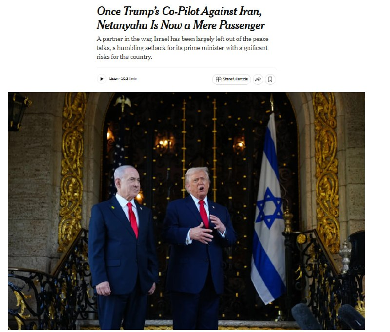

🔴 نیویورک‌ تایمز:

ترامپ قبلا نتانیاهو را شریک اصلی خود علیه ایران می‌دانست، اما بعد از متوقف شدن جنگ و آغاز مذاکرات آتش‌بس، اسرائیل عملاً از مذاکرات آمریکا و ایران کنار گذاشته شده است.

نتانیاهو امیدوار بود جنگ باعث سقوط حکومت ایران، نابودی برنامه هسته‌ای و از بین رفتن موشک‌های ایران شود، اما هیچ‌کدام محقق نشد

ترامپ به سمت پایان دادن به جنگ رفت و نفوذ اسرائیل بر توافق نهایی را محدود کرد

این موضوع برای نتانیاهو هم از نظر سیاسی و هم راهبردی ضربه محسوب می‌شود، چون تصویر او به‌عنوان فردی با نفوذ ویژه روی ترامپ تضعیف شده است!

@IranianMinds

## IranianMinds — post 20634

😳 هنوزم واسه کانفیگ هزینه میکنی؟ 🍸 با داییجون رایگان وصل شو 🎁 کافیه فقط دوستاتو بیاری تو ربات و کانفیگتو رایگان از ما تحویل بگیری ⭐ راستی دایی جون اگه تلگرامت پرمیوم باشه به محض استارت کردن ربات صد مگابایت کانفیگ رایگان از دایی هدیه میگیری 🎁 @Daeijoonbot…

## IranianMinds — post 20633

🔴 فاکس نیوز :

تماس های ترامپ با رهبر های منطقه مثبت بوده و‌ مذاکرات پیشرفت قابل توجهی داشته.

@IranianMinds

## IranianMinds — post 20632

بنظرتون باز مثل همیشه دوروز دیگه میزنن یا ایندفه یه خبرایی هست واقعا؟

## IranianMinds — post 20631

🔴 العربیه :

چیزی تا نهایی شدن توافق میان آمریکا و ایران نمانده …

@IranianMinds

## IranianMinds — post 20630

  

🔴 به گزارش آکسیوس به نقل از یک مقام ارشد اسرائیلی، ترامپ قرار است امشب با بنیامین نتانیاهو، نخست‌وزیر اسرائیل، درباره توافق با ایران گفتگو کند.

@IranianMinds

## IranianMinds — post 20629

🔴 آکسیوس : گزارش‌ها حاکی از آن است که دولت ترامپ و ایران به توافق برای پایان جنگ نزدیک شده‌اند و اختلافات باقی‌مانده بیشتر بر سر نحوه نگارش برخی بندهاست. @IranianMinds

## IranianMinds — post 20627

🔴 آکسیوس :

گزارش‌ها حاکی از آن است که دولت ترامپ و ایران به توافق برای پایان جنگ نزدیک شده‌اند و اختلافات باقی‌مانده بیشتر بر سر نحوه نگارش برخی بندهاست.

@IranianMinds

## IranianMinds — post 20626

🔴سناتور راجر ویکر، رئیس کمیته نیروهای مسلح سنای آمریکا در ایکس نوشت:

آتش‌بس ۶۰ روزه با فرض حسن‌نیت جمهوری اسلامی، یک فاجعه خواهد بود و دستاوردهای خشم حماسی را از بین می‌برد.

ویکر روز گذشته نیز در ایکس نوشت :
باید کاری را که آغاز کرده‌ایم، به پایان رسانیم.

@IranianMinds

## IranianMinds — post 20625

🔴 ترامپ :

اگه توافقمون برای اسرائیل خوب نباشه ، قبولش نمیکنم !

@IranianMinds

## IranianMinds — post 20624

  

😂😂😂

@IranianMinds

## IranianMinds — post 20623

🔴 الحدث:

عاصم منیر، رئیس کل ارتش پاکستان، در سفر به تهران، با فرماندهان سپاه دیدار کرد و از مواظع آنها شوکه شده است😂

@IranianMinds

## IranianMinds — post 20622

  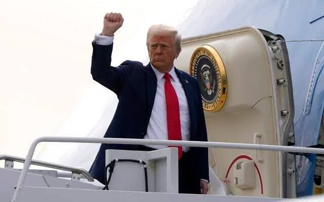

🔴 ترامپ گفت آمریکا و ایران «خیلی به توافق نزدیک شده‌اند» و به سی بی اس نیوز گفت: «هر روز اوضاع بهتر و بهتر می‌شود.»

او گفت هر توافقی باید مانع دستیابی ایران به سلاح هسته‌ای شود و تضمین کند که اورانیوم غنی‌شده ایران «به‌طور رضایت‌بخش مدیریت شود.»

ترامپ همچنین بدون ارائه جزئیات گفت:
«فقط توافقی را امضا می‌کنم که در آن به همه چیزهایی که می‌خواهیم برسیم.

@IranianMinds

## IranianMinds — post 20621

  

😳 هنوزم واسه کانفیگ هزینه میکنی؟
🍸 با داییجون رایگان وصل شو

🎁 کافیه فقط دوستاتو بیاری تو ربات و کانفیگتو رایگان از ما تحویل بگیری

⭐ راستی دایی جون اگه تلگرامت پرمیوم باشه به محض استارت کردن ربات صد مگابایت کانفیگ رایگان از دایی هدیه میگیری

🎁 @Daeijoonbot | استارت کن و کانفیگ رایگان بگیر 🌟

## IranianMinds — post 20620

  

⚫️پرویز قلیچ‌خانی، اسطوره فوتبال ایران و تنها فوتبالیست ایرانی که سه بار قهرمان جام ملت‌های آسیا شد، امروز شنبه دوم خرداد ۱۴۰۵ در ۸۱ سالگی در بیمارستانی در پاریس درگذشت.

@IranianMinds

## IranianMinds — post 20619

  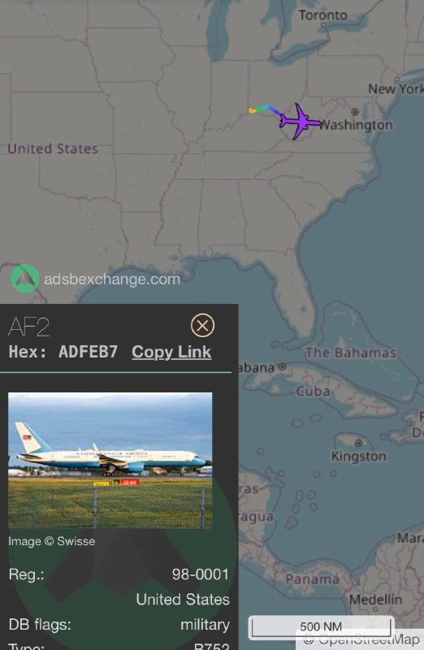

🔴جی‌دی‌ونس هم داره به سرعت به کاخ سفید میره.

@IranianMinds

## IranianMinds — post 20618

  

@IranianMinds

## IranianMinds — post 20617

🔴 ترامپ :

ممکنه فردا تصمیم خودم راجب ایران رو بگیرم.

@IranianMinds

## IranianMinds — post 20616

🔴 روزنامه اعتماد :

به احتمال زیاد درخواست رفع فیلترینگ این هفته در مجلس عملی میشه.

@IranianMinds

## BBCPersian — post 281900

🔻ایران: آمریکا و اسرائیل مسئول بی‌نتیجه ماندن کنفرانس بازنگری ان‌پی‌تی هستند

ساعاتی پیش گزارش دادیم که کنفرانس بازنگری پیمان منع گسترش سلاح‌های هسته‌ای بدون نتیجه در نیویورک به کار خود خاتمه داده است.

اینک معاون وزیر خارجه ایران در امور بین‌المللی، ایالات متحده، کشورهای غربی و اسرائیل را مسئول پایان بی‌نتیجه یازدهمین کنفرانس بازنگری ان‌پی‌تی خوانده و گفته «مسئولیت این شکست بر عهده این کشورهاست.»

کاظم غریب‌آبادی در پیامی در شبکه ایکس نوشت که دولت‌های غربی تلاش کردند «جای متجاوز و قربانی را عوض کنند» و از حملات آمریکا و اسرائیل به تأسیسات هسته‌ای ایران انتقاد کرد.

آقای غریب‌آبادی نوشت: «ایران اجازه نخواهد داد این کشورها همچنان از مجامع و اسناد بین‌المللی به‌صورت ابزاری و بدون محدودیت برای اهداف سیاسی خود سوءاستفاده کنند.»

https://bbc.in/4dtIPCY
@BBCPersian

## BBCPersian — post 281899

  <a href="telegram/content/BBCPersian_281899_1779566582.mp4" target="_blank">🎬 Download video</a>

🔻آخرین خبرهای مهم روز شنبه ۲ خرداد ۱۴۰۵

@BBCPersian

## BBCPersian — post 281897

🔻ابراز خوش‌بینی محتاطانه وزیر خارجه آمریکا در مورد گفت‌وگو با ایران

مارکو روبیو با خوش‌بینی محتاطانه‌ نسبت به مذاکرات با ایران گقت دولت دونالد ترامپ ممکن است به زودی «حرفی برای گفتن» در این باره داشته باشد.

اظهارات وزیر خارجه آمریکا در سفر به هند مطرح شد.

تام بیتمن، خبرنگار بی‌بی‌سی، از او پرسید که آیا دولت آمریکا امروز جوابی از ایران گرفته است. او پاسخ داد که دیپلماسی در حال پیشرفت است و ممکن است امروز یا ظرف چند روز آینده خبری منتشر شود هرچند که نمی‌توان مطمئن بود.

او بار دیگر تاکید کرد که ایران باید اورانیوم غنی‌شده با خلوص بالا را تحویل دهد و عوارض ترانزیت از تنگه هرمز دریافت نکند.

آقای روبیو امروز در دیدار با نخست‌وزیر هند درباره بحران در خاورمیانه گفت‌وگو کرد.

هند از جمله کشورهایی است که بیشترین آسیب را از بسته شدن تنگه هرمز دیده است.

به نظر می‌رسد یکی از راه‌حل‌های پیشنهادی آقای روبیو، تلاش برای متقاعد کردن هند به خرید نفت بیشتر از آمریکا است حتی اگر گران‌تر باشد و مسافت بیشتری را طی کند

https://bbc.in/4dtIPCY
@BBCPersian

## BBCPersian — post 281896

🔻چرا رژه با نمادهای ساواک در اروپا جنجالی شد؟

در روزهای گذشته تجمع برخی از پادشاهی‌خواهان در چندین شهر آلمان با نمادهای ساواک، سازمان اطلاعات و امنیت در دوران محمدرضا شاه پهلوی، حسابی بحث‌برانگیز شده و دوباره توجه‌ها را نسبت به عملکرد این سازمان امنیتی جلب کرده است. مخالفان می‌گویند با نمادهای یک سازمانی امنیتی که در سرکوب و شکنجه نقش داشته نمی‌توان برای دمکراسی در ایران مبارزه کرد و در طرف مقابل طرفداران می‌گویند ساواک تنها برای برقراری امنیت کشور تلاش می‌کرد.

گزارش فرزاد صیفی‌کاران، از بخش راستی‌آزمایی بی‌بی‌سی، با این هشدار که حاوی روایت‌هایی است که برای برخی ممکن است آزاردهنده باشد.

@BBCPersian

## BBCPersian — post 281895

🔻رویترز: ترامپ امروز با رهبران کشورهای منطقه تلفنی صحبت می‌کند

خبرگزاری رویترز به نقل از یک مقام از کشورهای عربی گفت که دونالد ترامپ، رئیس‌جمهور آمریکا، امروز گفت‌وگویی تلفنی با برخی از رهبران کشورهای منطقه خواهد داشت.

بر اساس این گزارش قرار است آقای ترامپ با رهبران عربستان سعودی، قطر، امارات متحده عربی، مصر، ترکیه و پاکستان تلفنی صحبت کند.

https://bbc.in/4dtIPCY
@BBCPersian

## BBCPersian — post 281894

🔻ایران و پاکستان از تلاش برای تنظیم یادداشت تفاهم خبر دادند

سخنگوی وزارت خارجه ایران و یک مقام پاکستانی گفته‌اند که طرف‌ها در حال کار به روی متن یادداشت تفاهم درباره توافق ایران و آمریکا هستند.

اسماعیلی بقایی، سخنگوی وزارت خارجه ایران، درباره نتایج تازه‌ترین میانجیگری‌های پاکستان بین ایران و آمریکا گفته است که «ما در مرحله نهایی‌سازی یادداشت تفاهم هستیم.»

آقای بقایی گفت: «موضوعاتی که در این مرحله درباره آنها بحث می‌شود به طور کلی بر خاتمه جنگ متمرکز است. موضوع پایان یافتن تعرضات دریایی آمریکا و موضوعات مرتبط با آزاد شدن اموال بلوکه شده ایران، از عمده مواردی هستند که در این یادداشت تفاهم به آنها پرداخته می‌شود.»

همزمان یک یک مقام امنیتی پاکستانی هم به خبرگزاری رویترز گفت که «یادداشت تفاهم برای پایان دادن به جنگ میان آمریکا و ایران در حال نهایی‌سازی و تنظیم جزئیات است.»

آمریکا می‌گوید در حال بررسی پاسخ ایران است و احتمال توافق یا درگیری مجدد در حال حاضر پنجاه پنجاه است.

https://bbc.in/4dtIPCY
@BBCPersian

## BBCPersian — post 281893

  <a href="https://t.me/bbcpersian/281893" target="_blank">📎 Download file</a>

پادکست رادیویی جام جهان‌نما شنبه ۲  خرداد ۱۴۰۵ 
در پی تحولات اخیر ایران و قطع و اختلال در اینترنت که امکان دسترسی مخاطبان در ایران به رسانه‌ها را با مشکل مواجه کرده است، بی‌بی‌سی فارسی از ۱۵ بهمن پخش رادیویی برنامه‌های خود را دوباره آغاز کرده است.

برنامه‌ جام جهان‌نما از این پس همه روزه از ساعت ۱۶:۳۰ گرینویچ (۲۰:۰۰ ایران) روی موج متوسط ۷۰۲ کیلوهرتز و موج کوتاه ۹۴۶۵ کیلوهرتز پخش می‌شود.

تکرار این برنامه از ساعت ۱۸:۰۰ گرینویچ (۲۱:۳۰ ایران) روی موج متوسط ۷۰۲ کیلوهرتز و موج کوتاه ۵۹۳۵ کیلوهرتز پخش می‌شود.
@BBCPersian

## BBCPersian — post 281891

  

🔻دونالد ترامپ می‌گوید آمریکا و ایران به توافق نهایی «بسیار نزدیک‌‌تر» شده‌‌اند.

رئیس‌جمهور آمریکا با این حال به شبکه آمریکایی سی‌بی‌اس گفت: «من فقط توافقی را امضا خواهم کرد که در آن به تمام خواسته‌های خود برسیم.»

او تاکید کرد که توافق نهایی باید مانع دستیابی ایران به «سلاح هسته‌ای» و «مدیریت رضایت‌بخش» اورانیوم غنی‌شده شود وگرنه «اصلا نمی‌شود درباره آن صحبت می‌کرد.»

سی بی اس به نقل از منابع آگاه نوشت آخرین پیشنهاد شامل تعیین روند بازگشایی تنگه هرمز، آزادسازی بخشی از دارایی‌های مسدودشده ایران در بانک‌های خارجی و ادامه مذاکرات است.

این منابع به سی‌بی‌اس گفته‌اند که آقای ترامپ تصمیم نهایی خود را نگرفته و در حال مشورت با مشاورانش و گفت‌وگو با رهبران خارجی از جمله رهبران عربستان سعودی و دیگر کشورهای حوزه خلیج فارس است.

رئیس‌جمهور آمریکا تهدید کرد که اگر توافق حاصل نشود «با وضعیتی روبه‌رو خواهیم شد که هیچ کشوری تاکنون به این شدت هدف حمله قرار نگرفته است.»

📸Getty Images
https://bbc.in/4dr8pIP
@BBCPersian

## BBCPersian — post 281890

🔻تسنیم: با وجود پیشرفت، اختلافات مهم با آمریکا هنوز پابرجاست

خبرگزاری تسنیم در گزارشی روند گفت‌وگوهایی که با میانجی‌گری پاکستان در جریان است نوشت: «ایران بر ضرورت تفکیک موضوع پایان جنگ از هسته‌ای تاکید دارد.»

این خبرگزاری که به نهادهای نظامی و امنیتی نزدیک است نوشت متن‌های ایران که به میانجی پاکستانی تحویل شده همگی «چارچوب مشخصی» داشته‌اند از جمله اینکه:

صرفا در صورت تحقق گام اول یعنی «پایان جنگ، پایان جنگ با شروط مورد قبول ایران و انجام اقدامات عملی توسط آمریکا» گام دوم یعنی موضوع مواد هسته‌ای بررسی می‌شود.
خروج یا دادن مواد هسته‌ای به آمریکا خط قرمز ایران است. درباره تعطیلی تاسیسات هسته‌ای نیز ایران هیچ تعهدی را نپذیرفته است.
ایران بر ضرورت پایان جنگ و تهدید در همه جبهه‌ها از جمله لبنان تاکید دارد.
در صورت حل اختلافات فعلی، در گام اول یک تفاهم اولیه اعلام و سپس مهلتی ۳۰ یا ۶۰ روزه برای گفت‌وگو درباره موضوع هسته‌ای (بدون هیچگونه تعهد اولیه ایران) داده شود.
بخش مهمی از اموال بلوکه شده باید در همان گام اول آزاد شود و در اختیار ایران قرار گیرد.
این خبرگزاری نوشت پس از گفت‌وگوهای اخیر عاصم منیر در تهران، «گفته می‌شود پیشرفت‌هایی در حوزه‌های تفکیک پایان جنگ از مذاکرات بعدی، آزادسازی اموال ایران، پایان جنگ در همه جبهه‌ها از جمله لبنان، سازوکار تضمین توافق نهایی احتمالی، اسقاط تحریم‌های نفتی در طول مذاکره، رفع محاصره دریایی، تعهد آمریکا به خروج نیروهای رزمی» حاصل شده اما «اختلافات مهمی نیز پابرجاست و توافق هنوز در دسترس نیست.»

آمریکا گفته است که حاضر نیست در جریان مذاکرات امتیازی از
جمله رفع تحریم به تهران بدهد.

https://bbc.in/4eYgYfo
@BBCPersian

## BBCPersian — post 281889

عراقچی: هرگونه توافق با آمریکا با آتش‌بس در لبنان پیوند دارد
عباس عراقچی می‌گوید هر توافقی بین ایران و آمریکا، با برقراری آتش‌بس در لبنان پیوند دارد.

وزیر خارجه ایران در پیامی به نعیم قاسم، دبیرکل حزب الله، گفت: «در آخرین پیشنهادی که جمهوری اسلامی ایران از طریق میانجی پاکستانی با هدف پایان دادن دائمی و پایدار به جنگ ارائه کرد، بر ضرورت شمول لبنان در آتش‌بس تأکید شد.»

ایران بارها اعلام کرده که پایان جنگ باید شامل تمام جنگ‌های منطقه از جمله در لبنان شود.

در حال حاضر بین اسرائیل و حزب‌الله لبنان آتش‌بس برقرار است اما دو طرف پیوسته مواضع یکدیگر را هدف حمله قرار می‌دهند.

https://bbc.in/3REalVO
@BBCPersian

## BBCPersian — post 281888

🔻فایننشال تایمز: آمریکا و ایران به توافق برای تمدید ۶۰ روزه آتش‌بس نزدیک هستند

روزنامه فایننشال تایمز از منابع آگاه گزارش داد که میانجی‌ها بر این باورند که به توافقی برای تمدید ۶۰ روزه آتش‌بس میان آمریکا و ایران و تعیین چارچوبی برای مذاکرات درباره برنامه هسته‌ای تهران نزدیک شده‌اند.

بر اساس این گزارش، این توافق شامل بازگشایی تدریجی تنگه هرمز، گفت‌وگو درباره رقیق‌سازی یا انتقال ذخایر اورانیوم غنی‌شده از ایران و کاهش محاصره بنادر ایران و رفع برخی از تحریم‌ها خواهد بود.

ایران گفته است که پس از توقف جنگ درباره مسئله هسته‌ای با آمریکا مذاکره می‌کند نه قبل از آن.

پاکستان میانجی رسمی گفت‌وگوهای ایران و آمریکاست اما سایر کشورها از جمله قطر هم فعالیت‌هایی انجام داده‌اند.

https://bbc.in/4dwAAEQ
@BBCPersian

## BBCPersian — post 281887

🔻بقایی: روند گفت‌وگوها به سمت کم کردن موارد اختلاف با آمریکاست

سخنگوی وزارت خارجه ایران درباره گفت‌وگو با آمریکا که با میانجی‌گری پاکستان در جریان است گفت: «در این چند روز، درباره برخی نکات و عبارت‌پردازی‌هایی که کماکان اختلاف نظر وجود داشت، بحث و پیشنهادهایی مطرح شد.»

اسماعیل بقایی گفت روند گفت‌وگوهای «یک هفته اخیر به سمت کم کردن موارد اختلاف» بوده است با این حال برخی موارد هنوز حل نشده و برخی «همچنان در حال بررسی و اعلام نظر است.»

آقای بقایی گفت: «از یک سو، ما تجربه ضدونقیض‌گویی طرف آمریکایی را داریم. دیدگاه‌شان را بارها تغییر داده‌اند و مواضع متناقضی توسط مقامات مختلفشان بیان شده است. به همین دلیل نمی‌توانیم کاملا مطمئن باشیم که این رویکرد تغییر نمی‌کند. از سوی دیگر، پس از چند هفته گفت‌وگو بین دو طرف می‌توان گفت روند به سمت نزدیک‌تر شدن دیدگاه‌ها هست.»

آقای بقایی گفت باید منتظر ماند و دید «در سه چهار روز آینده» چه اتفاقی خواهد افتاد.

عاصم منیر، فرمانده کل ارتش و نیروهای مسلح پاکستان پس از دیدار با محمدباقر قالیباف، مسعود پزشکیان و عباس عراقچی امروز تهران را ترک کرد.

در همین حال شهباز شریف، نخست‌وزیر پاکستان، وارد چین شده است. موضوع ایران از محورهای گفت‌وگوهای اوست.

https://bbc.in/4f3MhFM
@BBCPersian

## Dirty_Kids — post 390037

  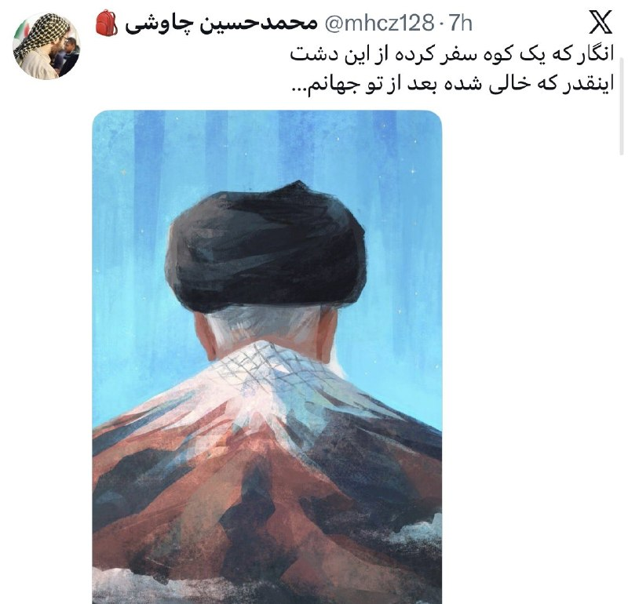

اون کوه رو انقدر دفن نکردید تبدیل به کود شد.

@Dirty_Kids 👻

## Dirty_Kids — post 390036

باراک راوید هر ده دقیقه: 🚨🚨🚨🚨🚨

@Dirty_Kids 👻

## Dirty_Kids — post 390035

  

بعد عدم توانایی مردم واسه خرید ماشین، حالا دیگه گرفتن گواهینامه هم داره به یه آرزو تبدیل میشه؛

هزینه دریافت گواهینامه رانندگی با افزایش 56 درصدی نسبت به قبل، ناقابل 15 میلیون تومن شد.

@Dirty_Kids 👻

## Dirty_Kids — post 390034

آخرین اخبار و وضعیت مذاکرات دقیقا مانند روزهای پیش از دو جنگ قبلی است؛ آمریکایی‌ها به دروغ ابراز امیدواری می‌کنند که توافق امضا می‌شود، اما مقامات و رسانه‌های ایرانی اعتراف می‌کنند که اختلاف‌نظرها زیاد است و توافق در دسترس نیست، و سپس ناگهان مخفیگاه مقامات در تهران منفجر می‌شود.

@Dirty_Kids 👻

## Dirty_Kids — post 390033

شاید خبر ندارید ولی سپاه مادرقحبه‌ی پاسداران ، امسال سراسر ایران رو تبدیل کرده به یه مزرعه بزرگ خشخاش و بزودی تولید تریاک ایران از افغانستان هم میزنه جلو

@Dirty_Kids 👻

## Dirty_Kids — post 390032

  <a href="telegram/content/Dirty_Kids_390032_1779566587.mp4" target="_blank">🎬 Download video</a>

اینجوری که وسط تعریف کردن ارضا شد، دست عاقا جای بالا رفته بوده پایین!
با حجاب شد، لاک قرمزشم پاک کرد
فقط مونده با یه سپاهی صیغه کنه و وسط خیابون براش جشن عروسی بگیرن.

@Dirty_Kids 👻

## Dirty_Kids — post 390031

  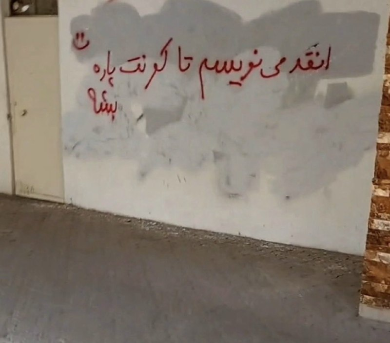

دمش گرم 😂😂
اِسمایلی «ت» براش گذاشته

@Dirty_Kids 👻

## Dirty_Kids — post 390030

  

من چرا با ریتم خوندم چت اینارو 😐😂

@Dirty_Kids 👻

## Dirty_Kids — post 390029

  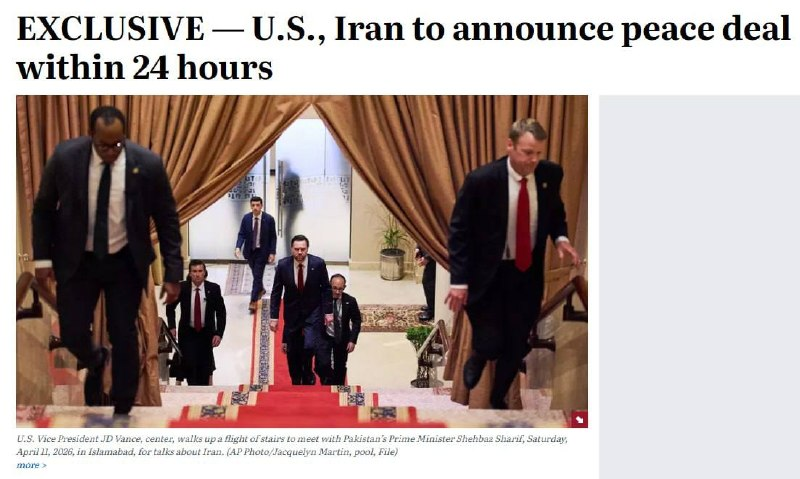

واشنگتن پست :
احتمالاً آمریکا و ایران تا عصر فردا یه توافق صلح اعلام کنن که هدفش تموم کردن درگیری‌ها تو همه جبهه‌هاست.

متن اولیه توافق، صبح امروز نهایی شده و فرستادنش واسه تأیید نهایی دست رهبران دو کشور.
تو روند تأیید این توافق هم اسم قالیباف، جی‌دی ونس، استیو ویتکاف و جرد کوشنر مطرح شده.

@Dirty_Kids 👻

## Dirty_Kids — post 390028

پسرا موجودات عجیبی هستن، برای تو وقت ندارن ولی برای اهلی کردن اسب توی بازی red dead redemption سه روز وقت دارن

@Dirty_Kids 👻

## Dirty_Kids — post 390027

  <a href="telegram/content/Dirty_Kids_390027_1779566590.mp4" target="_blank">🎬 Download video</a>

ولی این چالشه که اخیرا ترند شده یه چیزیو در من روشن میکنه :)))

@Dirty_Kids 👻

## Dirty_Kids — post 390026

  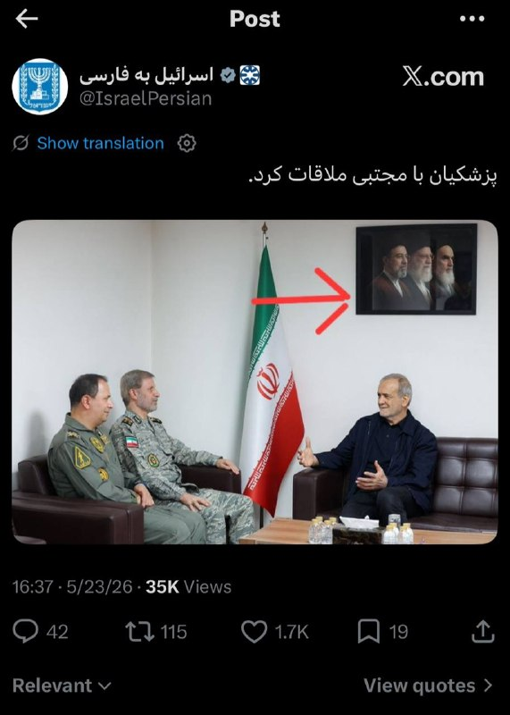

وزارت خارجه اسرائیل:

بالاخره پزشکیان با «مجتبی خامنه‌ای» ملاقات کرد.

@Dirty_Kids 👻

## Dirty_Kids — post 390025

  <a href="https://t.me/Dirty_Kids/390025" target="_blank">📎 Download file</a>

✅ اپلیکیشن اندروید سایت جهانی دربی بت

💰اولین سایت جهانی با امکان شارژ و برداشت ریالی(کارت به کارت)

🔗 برای ورود فیلترشکن روی کشور مناسب قرار دهید مانند فنلاند و المان و....

😀Telegram Channel
👇
https://t.me/+bcynkEgSW2dlYTc0

## Dirty_Kids — post 390024

  

😤دنبال یه سایت شرط بندی بین المللی بودی که به ایرانیا خدمات بده؟!
⛔

👍دربی بت همون انتخاب  100%

💎ویژگی های سایت جهانی Derby Bet:

⬅️امکان شارژ امن با کارت بانکی

⬅️واریز اول دوبل شارژ می شوید(بونوس۱۰۰٪)

⬅️پر اپشن ترین سایت فعال در ایران

⬅️تسویه حساب کمتر از 5 دقیقه

⬅️برگشت بخشی از باخت به صورت هفتگی

🚨کد هدیه ثبت نام:GG007

⚠️برای دانلود اپلکیشن کلیک کنید
👉

🔔کانال دربی بت :

🪙https://t.me/+bcynkEgSW2dlYTc0

## Dirty_Kids — post 390023

ترامپ آمریکا تاکتیک های جنگیش رو با الهام از بستنی فروش های ترکیه طراحی کرده.

@Dirty_Kids 👻

## Dirty_Kids — post 390022

  

رفتم خونه دوستم و فهمیدم تو خونه مجردی پسرا هرچیزی ممکنه پیدا بشه، مثلا درخت موز 😅

@Dirty_Kids 👻

## Dirty_Kids — post 390021

  

تقسیم بار رو دقت کنید!!! این کار یه مرده. اینکار رو باید یه مرد بکنه نه چون وظیفشه. بلکه چون دلش نمیاد دختری که کنارشه سختی بکشه.
نباید ارزش اینکار ندید گرفته بشه و وظیفه تلقی بشه

@Dirty_Kids 👻

## Dirty_Kids — post 390020

  

🌪وقتی اینترنت طوفانیه فقط کافیه بادبان ها رو بکشی

⚫️100 هزار تومان تخفیف خرید اول 
🎁

⚫️پایین ترین قیمت گیگی 180 هزار تومان
🌐 

⚫️پورسانت %10 دائمی برای هر معرفی
💼

با بادبان، میتونی یه اتصال سریع، پایدار و امن
همراه با پشتیبانی ۲۴ ساعته داشته باشی
🚀

🛒کد تخفیف: badban4k

بادبان راهتو باز می‌کنه
⛵️
G2

🛡@BadBan_VPN | کانال 

🤖@BadBan_VPNBot | ربات 

📞@BadBan_VPNSupport | پشتیبانی

## Hranews — post 113122

  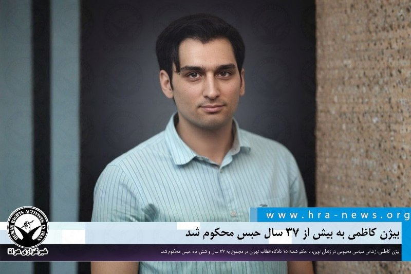

بیژن کاظمی به بیش از ۳۷ سال حبس محکوم شد

❗️
❗️
❗️
❗️
❗️– بیژن کاظمی، زندانی سیاسی محبوس در زندان اوین، با حکم شعبه ۱۵ دادگاه انقلاب تهران در مجموع به ۳۷ سال و شش ماه حبس محکوم شد.

به گزارش خبرگزاری هرانا، ارگان خبری مجموعه فعالان حقوق بشر در ایران، بیژن کاظمی به حبس محکوم شد.

بر اساس حکمی که توسط شعبه ۱۵ دادگاه انقلاب تهران به ریاست قاضی ابوالقاسم صلواتی صادر و اخیراً ابلاغ شده است، وی از بابت اتهامات مطروحه در پرونده خود در مجموع به ۳۷ سال و شش ماه حبس محکوم شده است.

بیژن کاظمی که تاکنون در بازداشت موقت به‌ سر می‌برد، بهمن ماه سال گذشته با اتهاماتی از جمله اجتماع و تبانی برای ارتکاب جرم علیه امنیت داخلی و خارجی و عضویت در جمعیت‌های معارض کشور در شعبه ۱۵ دادگاه انقلاب تهران محاکمه شده بود.

یک منبع مطلع در این خصوص به هرانا گفت: "وی در این پرونده همچنین با اتهامی مرتبط با «تهیه سلاح برای ضارب دو قاضی رازینی و مقیسه» مواجه شد؛ اتهامی که پیش‌تر توسط ضابطان امنیتی رد شده و مقام‌های قضایی کوهدشت نیز درباره آن سکوت کرده بودند."

ادامه مطلب

#بیژن_کاظمی

↘️
@hranews_bot تماس ✉️ - @Hranews کانال هرانا 🆑

## Hranews — post 113121

دست‌کم ۳ تجمع اعتراضی برگزار شد

❗️
❗️
❗️
❗️
❗️– امروز شنبه ۲ خردادماه، جمعی از رانندگان استیجاری از استان‌های مختلف در مقابل نهاد ریاست جمهوری در تهران، گروهی از کارکنان شرکت‌های تعاونی سهام عدالت مقابل وزارت اقتصاد در تهران و شماری از #کارگران اپراتور برق فشار قوی در کرمانشاه، با برگزاری تجمعات اعتراضی خواستار رسیدگی به مطالبات خود شدند.

ادامه مطلب

↘️
@hranews_bot تماس ✉️ - @Hranews کانال هرانا 🆑

## Hranews — post 113120

اجرای حکم اعدام یک زندانی زن در اردبیل/ رهایی ۳ زندانی از چوبه دار

❗️
❗️
❗️
❗️
❗️– سحرگاه روز چهارشنبه ۳۰ اردیبهشت‌ماه، حکم یک زندانی زن که پیشتر از بابت اتهام قتل به #اعدام محکوم شده بود، در زندان اردبیل اجرا شد. از سوی دیگر، سه زندانی محکوم به اعدام در استان‌های مختلف از جمله خوزستان و کرمان، با کسب رضایت اولیای دم از چوبه دار رهایی یافتند.

ادامه مطلب

#اسما_زارعی

↘️
@hranews_bot تماس ✉️ - @Hranews کانال هرانا 🆑

## Hranews — post 113119

  

اعدام به نام امنیت؛ تشدید برخورد با اتهام جاسوسی در ایران/ #نفیسه_مطلق

📡
📡
📡
📡
📡– در پی تشدید تنش‌های نظامی و حملات ایالات متحده آمریکا و اسرائیل، روند برخورد قضایی با اتهام «جاسوسی» و «همکاری با دولت‌های متخاصم» در ایران وارد مرحله‌ای تازه شده است. آن‌چه بیش از خود قوانین محل بحث قرار گرفته، نحوه‌ی اجرای آن‌هاست: رسیدگی‌های سریع، نبود شفافیت و محدودیت دسترسی متهمان به روندهای دفاعی استاندارد؛ عواملی که پرسش‌هایی جدی درباره‌ی رعایت دادرسی عادلانه ایجاد کرده‌اند.

در آن سوی این تنش‌ها، رسانه‌های اسرائیلی از بازداشت دو نظامی نیروی هوایی این کشور به اتهام همکاری اطلاعاتی با ایران خبر داده‌اند؛ پرونده‌ای که با دسترسی به وکیل و طی مراحل قانونی در حال بررسی است و با وجود پیش‌بینی مجازات #اعدام در قوانین این کشور، تاکنون گزارشی از اجرای چنین حکمی منتشر نشده است. در مقابل، در ایران، اتهامی مشابه می‌تواند به‌سرعت به مجازات نهایی منجر شود. در یکی از نمونه‌های اجرای احکام اعدام که به‌تازگی اعلام شد، دو زندانی به نام‌های یعقوب کریم‌پور و ناصر بکرزاده پس از محاکمه به اتهام «همکاری اطلاعاتی و جاسوسی» برای اسرائیل، بلافاصله پس از تایید حکم در دیوان عالی، اعدام شدند؛ تفاوتی که بیش از هر چیز به کیفیت دادرسی بازمی‌گردد.

طبق اخبار و اطلاعات منتشر شده در خبرگزاری هرانا، تنها از ۹ اسفند ۱۴۰۴ (از زمان آغاز درگیری ایالات متحده آمریکا و اسرائیل با ایران) تا ۳۱ اردیبهشت ماه ۱۴۰۵، دستکم ۳۴ مورد اعدام با اتهامات سیاسی و امنیتی صورت گرفته است.

ادامه مطلب

ادامه مطلب در وبسایت خط صلح

↘️
@hranews_bot تماس ✉️ - @Hranews کانال هرانا 🆑

## Hranews — post 113118

دو زن در تهران به اتهام قتل همسرانشان محاکمه شدند

❗️
❗️
❗️
❗️
❗️– دو زن که در پرونده‌های جداگانه هر یک متهم به #قتل همسر خود با همدستی مردی دیگر هستند، در دادگاه کیفری یک استان تهران محاکمه شدند.

ادامه مطلب

↘️
@hranews_bot تماس ✉️ - @Hranews کانال هرانا 🆑

## manototv — post 105783

  <a href="telegram/content/manototv_105783_1779566598.mp4" target="_blank">🎬 Download video</a>

راهپیمایی ایرانیان مونترآل، دوم خرداد ۱۴۰۵

## manototv — post 105782

مهدیس نظری
۷ ساله بود.

عاشق اسکیت بود.
عاشق شعر خواندن.
شاهنامه...

۹ اسفند،
در حمله به مدرسه شجره طیبه میناب،
او و ۱۲۰ کودک دیگر
جانشان را از دست دادند

## manototv — post 105781

  <a href="telegram/content/manototv_105781_1779566601.mp4" target="_blank">🎬 Download video</a>

تماسی از ایران؛
«مرسی که همیشه صدای ما بودید»

## manototv — post 105780

  <a href="telegram/content/manototv_105780_1779566603.mp4" target="_blank">🎬 Download video</a>

راهپیمایی ایرانیان برلین

## manototv — post 105779

  <a href="telegram/content/manototv_105779_1779566605.mp4" target="_blank">🎬 Download video</a>

تصاویر جاویدنامان انقلاب ملی در بوردو فرانسه، دوم خرداد ۱۴۰۵

## manototv — post 105778

  

به دنبال اعلام توقف پخش ماهواری‌ای و کانال یوتیوب منوتو، شماری از بینندگان با ارسال پیام‌هایی، از سال‌ها فعالیت منوتو و همراهی آن با مخاطبان قدردانی کردند.
یکی از بینندگان در پیام خود نوشته است:
«راستش هنوز باورم نمی‌شود که داریم درباره پایان منوتو صحبت می‌کنیم. من به عنوان نسلی که با منوتو بزرگ شد، بخشی از خاطرات زندگی‌ام با منوتو ورق خورد.»

در پیام دیگری آمده است:
«شما فقط یک شبکه نبودید، نوری بودید در میان سایه تیره فراموشی و وارونه‌نمایی حقیقت.»

## manototv — post 105777

  <a href="telegram/content/manototv_105777_1779566608.mp4" target="_blank">🎬 Download video</a>

تماسی از ایران؛
«من پر از بغضم از رفتن شما»

## manototv — post 105776

  <a href="telegram/content/manototv_105776_1779566610.mp4" target="_blank">🎬 Download video</a>

راهپیمایی ایرانیان استکهلم

## manototv — post 105775

  <a href="telegram/content/manototv_105775_1779566612.mp4" target="_blank">🎬 Download video</a>

راهپیمایی ایرانیان لاهه در هلند، دوم خرداد ۱۴۰۵

## manototv — post 105774

  <a href="telegram/content/manototv_105774_1779566615.mp4" target="_blank">🎬 Download video</a>

بر پایه گزارش‌ها ترامپ برای تماس گروهی با رهبران عربستان سعودی، امارات متحده عربی، مصر، قطر، اردن، پاکستان و ترکیه وارد اتاق بیضی کاخ سفید شده است. همزمان سناتور لیندسی گراهام به باراک راوید خبرنگار آکسیوس گفت برخی از رهبران منطقه از ترامپ خواسته‌اند به ایران حمله کند تا حکومت تضعیف شود و در نتیجه توافقی با شرایط بهتر به دست آید.
او در مقابل گفت برخی دیگر از رهبران منطقه و همچنین تعدادی از مشاوران ارشد رئیس‌جمهور از او خواسته‌اند همان توافقی را که روی میز است بپذیرد.
راوید در ادامه نوشته به گفته گراهام، این گروه معتقدند تنگه هرمز نمی‌تواند از نفوذ جمهوری‌اسلامی در امان باشد و اگر ایران هدف حمله قرار بگیرد، این توانایی را دارد که بخش قابل توجهی از عملیات نفتی خلیج فارس را نابود کند.
گراهام همچنین گفت: من به‌شدت تردید دارم که نتوان ایران را از تهدید تنگه هرمز بازداشت و نتوان منافع حیاتی منطقه را پس از حملات گسترده به ایران دفاع کرد؛ اگر واقعاً ایران به‌طور کامل نابود شده باشد، نباید بتواند هیچ‌کدام از این کارها را انجام دهد. زمان مشخص خواهد کرد. هنوز امیدوارم نتیجه خوبی به دست بیاید.

## manototv — post 105773

  <a href="telegram/content/manototv_105773_1779566615.mp4" target="_blank">🎬 Download video</a>

ترامپ می‌گوید آمریکا و جمهوری‌اسلامی «خیلی به توافق نزدیک‌تر شده‌اند»
دونالد ترامپ، رئیس‌جمهور آمریکا، به شبکه سی‌بی‌اس نیوز گفته است که واشنگتن و تهران «روزبه‌روز به نهایی‌کردن یک توافق نزدیک‌تر می‌شوند».
او گفت: «هر روز بهتر و بهتر می‌شود.»
ترامپ همچنین افزود که در صورت رسیدن به توافق احتمالی، اورانیوم غنی‌شده ایران «به‌طور رضایت‌بخش مدیریت خواهد شد»، اما جزئیات بیشتری ارائه نکرد.
او تأکید کرد: «من فقط توافقی را امضا می‌کنم که در آن همه چیزهایی که می‌خواهیم را به دست آوریم.»

## manototv — post 105772

  <a href="telegram/content/manototv_105772_1779566616.mp4" target="_blank">🎬 Download video</a>

برخی رسانه‌ها از قول منابع منطقه‌ای گزارش داده‌اند قرار است دونالد ترامپ امروز ساعت ۱ بعدازظهر به وقت شرق آمریکا با رهبران عربستان سعودی، امارات متحده عربی، مصر، قطر، اردن، پاکستان و ترکیه، درباره ایران تماس گروهی داشته باشد. این تماس برابر است با ساعت ۸:۳۰ شب به وقت تهران

## manototv — post 105771

  <a href="telegram/content/manototv_105771_1779566617.mp4" target="_blank">🎬 Download video</a>

دونالد ترامپ اعلام کرد شنبه با تیم مذاکره‌کننده‌اش درباره آخرین پیشنهاد جمهوری‌اسلامی دیدار می‌کند و احتمالاً تا روز یکشنبه درباره ادامه مذاکرات یا ازسرگیری جنگ تصمیم خواهد گرفت.
ترامپ در گفت‌وگو با آکسیوس گفت شانس رسیدن به توافق با ایران «پنجاه-پنجاه» است و تأکید کرد یا به «توافقی خوب» می‌رسند یا «ایران را شدیدتر از همیشه هدف قرار می‌دهد».
او قرار است با استیو ویتکاف، جرد کوشنر و همچنین معاونش جی‌دی ونس جلسه‌ای برگزار کند. هم‌زمان، عاصم منیر، فرمانده ارتش پاکستان که نقش میانجی میان تهران و واشینگتن را برعهده داشته، پس از دیدار با مقام‌های جمهوری‌اسلامی تهران را ترک کرده است. پاکستان از «پیشرفت امیدوارکننده» در مسیر توافق نهایی خبر داده، اما هنوز توافقی نهایی نشده است.
بر اساس پیش‌نویس تفاهم‌نامه‌ای که در مذاکرات جمهوری‌اسلامی و پاکستان شکل گرفته، دو طرف احتمالاً ابتدا بر سر توقف جنگ توافق می‌کنند و سپس وارد ۳۰ روز مذاکرات فشرده درباره مسائل اصلی، از جمله غنی‌سازی اورانیوم و ذخایر هسته‌ای ایران، خواهند شد.
ترامپ گفته هر توافقی باید شامل محدودیت بر برنامه هسته‌ای ایران باشد. با این حال، اختلاف‌های اصلی میان تهران و واشنگتن، از جمله بر سر اورانیوم غنی‌شده و وضعیت تنگه هرمز، همچنان حل‌نشده باقی مانده است.
مارکو روبیو، وزیر خارجه آمریکا، نیز از «پیشرفت‌هایی» در مذاکرات خبر داده و گفته احتمال دارد تا پایان شنبه اخبار تازه‌ای منتشر شود.

## manototv — post 105770

  <a href="telegram/content/manototv_105770_1779566618.mp4" target="_blank">🎬 Download video</a>

گردهمایی ایرانیان دنهاخ

## alonews — post 122164

  <a href="telegram/content/alonews_122164_1779566621.webm" target="_blank">🎬 Download video</a>

👈 معاون رئیس‌جمهور جی‌دی ونس، وزیر جنگ هگست، رئیس ستاد مشترک کین و کل شورای امنیت ملی توسط رئیس‌جمهور ترامپ به اتاق وضعیت کاخ سفید برای گفتگو درباره ایران احضار شده‌اند.

✅ @AloNews خبر جنگ

## alonews — post 122163

  

قیمت استثنایی گیگی
9️⃣
8️⃣
1️⃣

تحویل زیر یک دقیقه
✅
دارای لینک سابسکریشن جهت دیدن حجم و کنترل مصرف
✅
بدون قطعی 
✅
بدون محدودیت کاربر و زمان
✅
جمینایو چت جی بی تی و... کامل اوکیه با سرورامون
✅

🏪پشتیبانی کامل
✅
شروع فعالیت از سال 2022 
✅
پرداخت ریالی
✅

ضریب و این چیزا ندارن و تا آخرین مگابایت برای پشتیبانیش درختمتیم
🥂

💤این تخفیف فقط تا ۱۲ شب فعاله
💤

⭐️ @Napsternetiran_bot
〰️〰️〰️〰️〰️〰️〰️

🔶 @Napsternetvirani

## alonews — post 122162

  <a href="telegram/content/alonews_122162_1779566622.webm" target="_blank">🎬 Download video</a>

👈کانال عبری کان: «ساعت‌های حساس: در اسرائیل منتظرند ببینند آیا تلاش‌های دیپلماتیک فشرده، به ویژه از سوی پاکستان و قطر، به امضای یادداشت تفاهم بین ایران و ایالات متحده منجر خواهد شد یا نه.

🔴این در حالی است که نخست‌وزیر بنیامین نتانیاهو به سمت ازسرگیری جنگ و حملات علیه ایران فشار آورده است.»

✅ @AloNews خبر جنگ

## alonews — post 122161

  <a href="telegram/content/alonews_122161_1779566623.webm" target="_blank">🎬 Download video</a>

👈فاکس نیوز: «شما نوک نیزه خواهید بود.»

🔴ارتش اکنون چهار ماه زودتر از برنامه به هدف استخدامی خود در سال ۲۰۲۶ رسیده است، طبق گفته پیت هگست، وزیر جنگ.

🔴هگستث در سخنرانی فارغ‌التحصیلی در وست پوینت اعلام کرد که ارتش چهار ماه زودتر به این نقطه عطف رسیده و گفت که این نیرو در حال آماده‌سازی برای جذب ۶۱,۵۰۰ سرباز جدید است.

🔴این اعلامیه در حالی صورت می‌گیرد که پنتاگون با تنش‌های فزاینده جهانی و تمرکز مجدد بر آمادگی نظامی روبرو است.

✅ @AloNews خبر جنگ

## alonews — post 122160

  <a href="telegram/content/alonews_122160_1779566623.webm" target="_blank">🎬 Download video</a>

👈کنسول جمهوری آذربایجان در تبریز بر اثر تصادف در اتوبان جلفا-تبریز جان باخت.

✅ @AloNews خبر جنگ

## alonews — post 122159

  <a href="telegram/content/alonews_122159_1779566623.webm" target="_blank">🎬 Download video</a>

👈خبرنگار لبنانی در شبکه سه: حزب‌الله بر روی نابودکردن گنبد آهنین اسرائیل تمرکز کرده است!

✅ @AloNews خبر جنگ

## alonews — post 122158

  <a href="telegram/content/alonews_122158_1779566624.webm" target="_blank">🎬 Download video</a>

👈ادعای رویترز درباره چارچوب سه مرحله‌ای برای مذاکرات آمریکا و ایران

🔴پایان رسمی جنگ، حل و فصل بن‌بست تنگه هرمز و باز کردن پنجره مذاکره ۳۰ روزه برای توافقی گسترده‌تر. امکان تمدید نیز وجود دارد.

✅ @AloNews خبر جنگ

## alonews — post 122157

  <a href="telegram/content/alonews_122157_1779566624.mp4" target="_blank">🎬 Download video</a>

👈 فیلمی از حمله پهپادی ایرانی به حزب آزادی کردستان (پاک) در استان اربیل، شمال عراق

✅ @AloNews خبر جنگ

## alonews — post 122156

  <a href="telegram/content/alonews_122156_1779566625.mp4" target="_blank">🎬 Download video</a>

👈 پهپادهای ایران مواضع گروه های جدایی طلب در کردستان عراق را هدف قرار دادند.

✅ @AloNews خبر جنگ

## alonews — post 122155

  <a href="telegram/content/alonews_122155_1779566626.webm" target="_blank">🎬 Download video</a>

👈مکرون در تماس با ترامپ و سران خلیج فارس، خواستار راهکار دیپلماتیک و توافق با ایران شد

✅ @AloNews خبر جنگ

## alonews — post 122154

  <a href="telegram/content/alonews_122154_1779566626.webm" target="_blank">🎬 Download video</a>

👈 شنیده شدن صدای انفجار در اربیل عراق

✅ @AloNews خبر جنگ

## alonews — post 122153

  <a href="telegram/content/alonews_122153_1779566627.mp4" target="_blank">🎬 Download video</a>

👈خضریان، عضو کمیسیون امنیت ملی مجلس: در هر توافقی ایران حتما باید غرامت جنگ را دریافت کند/ مطالبه ملت ایران است که از مدیریت تنگه هرمز عقب‌نشینی نشود

✅ @AloNews خبر جنگ

## alonews — post 122152

  <a href="telegram/content/alonews_122152_1779566630.webm" target="_blank">🎬 Download video</a>

👈یک دیپلمات منطقه‌ای به فاکس نیوز:
«تماس سران عرب و ترامپ بسیار مثبت بود. پیشرفت خوبی در حال انجام است. رهبران منطقه از این پیشرفت که ترامپ با مذاکرات به دست آورد، حمایت کردند.»

✅ @AloNews خبر جنگ

## alonews — post 122151

  <a href="telegram/content/alonews_122151_1779566630.webm" target="_blank">🎬 Download video</a>

🔴فوری / هم اکنون جلسه اضطراری امنیت ملی دولت ترامپ در اتاق جنگ کاخ سفید در حال برگزاری است. 
✅ @AloNews خبر جنگ

## alonews — post 122150

  <a href="telegram/content/alonews_122150_1779566630.webm" target="_blank">🎬 Download video</a>

👈سفیر ایران در پاکستان: چند دقیقه پیش، جناب وزیر محترم کشور پاکستان، برادر عزیزم محسن نقوی، پس از بازگشت از تهران، مرا از دستاوردهای مذاکرات با مقامات کشورم مطلع کردند.

🔴با خوش‌بینی محتاطانه می‌توان امیدوار بود که در صورت پایبندی کافی طرف مقابل، گام مثبتی در حال شکل‌گیری است که نتیجه مواضع جمهوری اسلامی ایران مبتنی بر عزت، ایستادگی نیروهای مسلح شجاع و مقاومت ملت شجاع ایران، همچنین ابتکار و تلاش‌های فداکارانه میانجی پاکستان است

✅ @AloNews خبر جنگ

## alonews — post 122149

  <a href="telegram/content/alonews_122149_1779566631.webm" target="_blank">🎬 Download video</a>

👈۷ نماینده کاندید نایب‌‌رئیسی مجلس شدند

🔴علی نیکزاد ثمرین نماینده اردبیل

🔴عبدالرضا مصری نماینده کرمانشاه

🔴حسینعلی حاجی دلیگانی نماینده شاهین شهر

🔴حمیدرضا حاجی بابایی نماینده همدان

🔴رضا جباری نماینده مسجد سلیمان

🔴علیرضا منادی نماینده تبریز

🔴پیمان فلسفی نماینده تهران

🔴انتخابات هیئت رئیسه مجلس دوشنبه این هفته برگزار خواهد شد.

✅ @AloNews خبر جنگ

## alonews — post 122148

  <a href="telegram/content/alonews_122148_1779566631.webm" target="_blank">🎬 Download video</a>

👈وضعیت قیمت تتر بعد از اخبار مذاکرات

✅ @AloNews خبر جنگ

## alonews — post 122147

  <a href="telegram/content/alonews_122147_1779566631.webm" target="_blank">🎬 Download video</a>

👈سی ان ان به نقل از یک منبع اسرائیلی: نتانیاهو یک نشست امنیتی محدود برای گفتگو درباره تحولات مذاکرات با ایران برگزار خواهد کرد

✅ @AloNews خبر جنگ

## alonews — post 122146

  <a href="telegram/content/alonews_122146_1779566632.webm" target="_blank">🎬 Download video</a>

👈اکسیوس: معاون رئیس جمهور از اوهایو و وزیر جنگ از نیویورک برای جلسه‌ای در مورد این توافق به واشنگتن احضار شدند

✅ @AloNews خبر جنگ

## alonews — post 122145

  <a href="telegram/content/alonews_122145_1779566632.webm" target="_blank">🎬 Download video</a>

👈احتمال توافق ایران و آمریکا صدای انتقاد سناتور لیندسی گراهام را بلند کرد!

🔴گراهام اگر توافقی برای پایان دادن به درگیری ایران حاصل شود،زیرا اعتقاد بر این است که تنگه هرمز را نمی‌توان از تروریسم ایران محافظت کرد و ایران هنوز توانایی تخریب زیرساخت‌های اصلی نفتی خلیج فارس را دارد،در آن صورت ایران به عنوان یک نیروی مسلط که نیاز به یک راه حل دیپلماتیک دارد، تلقی خواهد شد.

🔴این ترکیب از اینکه ایران به عنوان کشوری که توانایی ایجاد رعب و وحشت دائمی در تنگه هرمز را دارد و قادر به وارد کردن خسارات گسترده به زیرساخت‌های نفتی خلیج فارس است،یک تغییر عمده در توازن قدرت در منطقه می‌باشد.و با گذشت زمان برای اسرائیل به یک کابوس تبدیل خواهد شد.

🔴همچنین،اگر این برداشت‌ها دقیق باشند، باعث تعجب می‌شود که چرا این جنگ آغاز شد.من شخصاً به این ایده که نمی‌توان توانایی ایجاد رعب و وحشت در تنگه هرمز را از ایران سلب کرد و منطقه نمی‌تواند از خود در برابر توانایی نظامی ایران محافظت کند، شک دارم.مهم است که این موضوع را درست درک کنیم.

✅ @AloNews خبر جنگ

<!-- MSG END -->

<!-- NAV START -->

<a href="https://github.com/sombriolitfa-eng/aioo06/blob/main/telegram/content/archive_1.md" style="display:inline-block; padding:6px 12px; margin:0 4px; background-color:#2ea44f; color:white; text-decoration:none; border-radius:4px; font-weight:bold;">صفحه بعد</a>

<!-- NAV END -->
