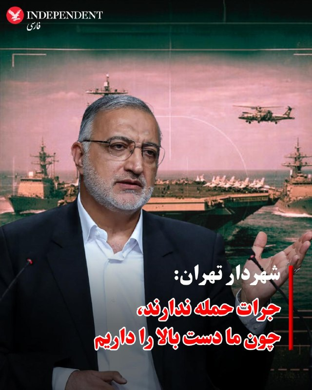

# خواننده تلگرام

<!-- TOP_NAV START -->

<!-- TOP_NAV END -->

<!-- MSG START -->

---
📅 بروزرسانی: 1405/02/31 06:02
---

## VahidOOnLine — post 241259

  

فاکس بیزنس گزارش داد آمریکا تلاش‌ها برای هدف قرار دادن استفاده جمهوری اسلامی از ارزهای دیجیتال را تشدید کرده است. به گفته مقام‌های آمریکایی، تهران حدود ۷.۷ میلیارد دلار دارایی دیجیتال را تحت کنترل دارد.
به گفته مقام‌های آمریکایی، مقابله با شبکه‌های مالی دیجیتال جمهوری اسلامی اکنون به بخشی از راهبرد فشار اقتصادی واشینگتن علیه تهران تبدیل شده است.
بر اساس این گزارش، جمهوری اسلامی از بیت‌کوین و سایر رمزارزها برای انتقال پول خارج از سیستم بانکی سنتی استفاده کرده است که این مسیر می‌تواند به دور زدن تحریم‌ها کمک کند.

‌🏁 🇬🇧 IranintlTV

🤖 @VahidOOnLine

## FoxNewsTwitter — post 342034

  <a href="telegram/content/FoxNewsTwitter_342034_1779330743.mp4" target="_blank">🎬 Download video</a>

Fox News (Twitter/X)

Intense footage shows a police BearCat accelerating toward a camouflage-clad alleged cop killer as he fired multiple rounds into the armored vehicle's window and underside.

Deputies backed away but were forced to re-engage a second time as the suspect continued manipulating his rifle and reached for a handgun in his waistband.

Tulare County Sheriff Mike Boudreaux confirmed that deputies ultimately used the BearCat to run over the suspect a third and final time to neutralize the threat, resulting in his death.

## IranIntlTV — post 338180

  

فاکس بیزنس گزارش داد آمریکا تلاش‌ها برای هدف قرار دادن استفاده جمهوری اسلامی از ارزهای دیجیتال را تشدید کرده است. به گفته مقام‌های آمریکایی، تهران حدود ۷.۷ میلیارد دلار دارایی دیجیتال را تحت کنترل دارد.
به گفته مقام‌های آمریکایی، مقابله با شبکه‌های مالی دیجیتال جمهوری اسلامی اکنون به بخشی از راهبرد فشار اقتصادی واشینگتن علیه تهران تبدیل شده است.
بر اساس این گزارش، جمهوری اسلامی از بیت‌کوین و سایر رمزارزها برای انتقال پول خارج از سیستم بانکی سنتی استفاده کرده است که این مسیر می‌تواند به دور زدن تحریم‌ها کمک کند.

https://iranintl.com/202605210850

---
📅 بروزرسانی: 1405/02/31 05:52
---

## VahidOOnLine — post 241258

  

استیون میلر، مشاور ارشد کاخ سفید، به فاکس نیوز گفت که باقی‌مانده حکومت در ایران باید میان «موافقت با سندی که برای آمریکا رضایت‌بخش باشد» یا «مجازاتی از سوی ارتش آمریکا که نظیر آن در تاریخ معاصر دیده نشده است» دست به انتخاب بزند.
میلر بامداد پنجشنبه ۳۱ اردیبهشت در این مصاحبه تلویزیونی کارزار نظامی ایالات متحده علیه جمهوری اسلامی را «یک شکست نظامی خُردکننده و کامل» توصیف کرد که به گفته او بهای «پیگیری رویای دستیابی به سلاح هسته‌ای» بود.
میلر افزود: «رییس‌جمهور ترامپ اصل منع اشاعه سلاح هسته‌ای را با قدرت عریان آمریکا به اجرا گذاشته است؛ پیامی نه فقط به رژیم ایران، نه فقط به سپاه پاسداران، بلکه به سراسر جهان، به هر کسی که ممکن است به انجام کاری مشابه فکر کند.»
او گفت که آمریکا «رهبری شرور، پلید و فاسد» ایران را کشته، نیروی هوایی و دریایی، برنامه موشکی و پایه‌های صنایع دفاعی آنها را هم نابود کرده و آن را به کشوری ناتوان و تضعیف‌شده تبدیل کرده است که دیگر توان به راه انداختن جنگ جهانی ندارد.»
میلر گفت که حکومت ایران اکنون در ضعیف‌ترین شکل خود در تاریخ قرار دارد.

‌🏁 🇬🇧 IranintlTV

🤖 @VahidOOnLine

## IranIntlTV — post 338179

  

استیون میلر، مشاور ارشد کاخ سفید، به فاکس نیوز گفت که باقی‌مانده حکومت در ایران باید میان «موافقت با سندی که برای آمریکا رضایت‌بخش باشد» یا «مجازاتی از سوی ارتش آمریکا که نظیر آن در تاریخ معاصر دیده نشده است» دست به انتخاب بزند.
میلر بامداد پنجشنبه ۳۱ اردیبهشت در این مصاحبه تلویزیونی کارزار نظامی ایالات متحده علیه جمهوری اسلامی را «یک شکست نظامی خُردکننده و کامل» توصیف کرد که به گفته او بهای «پیگیری رویای دستیابی به سلاح هسته‌ای» بود.
میلر افزود: «رییس‌جمهور ترامپ اصل منع اشاعه سلاح هسته‌ای را با قدرت عریان آمریکا به اجرا گذاشته است؛ پیامی نه فقط به رژیم ایران، نه فقط به سپاه پاسداران، بلکه به سراسر جهان، به هر کسی که ممکن است به انجام کاری مشابه فکر کند.»
او گفت که آمریکا «رهبری شرور، پلید و فاسد» ایران را کشته، نیروی هوایی و دریایی، برنامه موشکی و پایه‌های صنایع دفاعی آنها را هم نابود کرده و آن را به کشوری ناتوان و تضعیف‌شده تبدیل کرده است که دیگر توان به راه انداختن جنگ جهانی ندارد.»
میلر گفت که حکومت ایران اکنون در ضعیف‌ترین شکل خود در تاریخ قرار دارد.

https://iranintl.com/202605218506

---
📅 بروزرسانی: 1405/02/31 05:42
---

هیچ پیام جدیدی در این بروزرسانی ارسال نشد.

---
📅 بروزرسانی: 1405/02/31 05:32
---

## VahidOOnLine — post 241257

  

♦️مرکز لرزه‌نگاری موسسه ژئوفیزیک دانشگاه تهران اعلام کرد زمین‌لرزه‌ای به بزرگی ۴ بامداد پنج‌شنبه ۳۱ اردیبهشت حوالی فراشبند در استان فارس را لرزاند.
بر اساس این گزارش، این زمین‌لرزه ساعت ۳:۴۷ بامداد رخ داده است. تا زمان انتشار این خبر گزارشی درباره خسارت‌های احتمالی منتشر نشده است.
‌🇸🇦 Indypersian

🤖 @VahidOOnLine

## FoxNewsTwitter — post 342033

  <a href="telegram/content/FoxNewsTwitter_342033_1779328940.mp4" target="_blank">🎬 Download video</a>

Fox News (Twitter/X)

Johnny “Joey” Jones is heading back into the Marine Corps.

The FOX News host and combat veteran announced he is reenlisting more than a decade after medically retiring following a 2010 IED-related incident in Afghanistan that cost him both legs.

Jones has become one of the most visible advocates for veterans and wounded warriors since joining FOX News.

Now the decorated Marine says he’s ready to serve again. |@Johnny_Joey

---
📅 بروزرسانی: 1405/02/31 05:22
---

## VahidOOnLine — post 241256

  

♦️استیون میلر، مشاور ارشد سیاسی و امنیت داخلی دونالد ترامپ، بامداد پنجشنبه ۳۱ اردیبهشت‌ماه، در گفتگو با فاکس‌نیوز گفت جمهوری اسلامی تنها با یک «انتخاب دوگانه» روبه‌رو است و هشدار داد اگر تهران توافق مورد نظر واشنگتن را نپذیرد، با واکنش نظامی آمریکا مواجه خواهد شد.

میلر گفت: «آن‌ها یا باید با متنی موافقت کنند که مورد رضایت ایالات متحده باشد، یا با مجازاتی از سوی ارتش ما روبه‌رو شوند که مانند آن در تاریخ معاصر دیده نشده است.»

او افزود جمهوری اسلامی تاکنون «سنگین‌ترین هزینه» را بابت دنبال‌کردن برنامه هسته‌ای خود پرداخته و این هزینه به شکل «شکست کامل و خردکننده نظامی» بوده است.

مشاور ارشد ترامپ با اشاره به حملات آمریکا و اسرائیل به جمهوری اسلامی گفت دولت ترامپ با استفاده از قدرت نظامی ایالات متحده، سیاست منع گسترش سلاح هسته‌ای را به اجرا گذاشته و از نگاه واشنگتن، این اقدام پیامی برای جمهوری اسلامی، سپاه پاسداران و دیگر کشورها و گروه‌هایی بوده که ممکن است مسیر مشابهی را دنبال کنند.

او همچنین گفت: «ما رهبری شرور، فاسد و پلید آن کشور را از بین بردیم.»

میلر با اشاره به حمله مشترک آمریکا و اسرائیل به اهداف نظامی جمهوری اسلامی گفت نیروی هوایی، نیروی دریایی، برنامه موشکی و زیرساخت صنایع دفاعی جمهوری اسلامی نابود شدند.

او افزود: «پس این کشوری است که تضعیف شده و عملا توانایی خود برای جنگ بین‌المللی و جهانی را از دست داده است.»

میلر تاکید کرد جمهوری اسلامی اکنون «در ضعیف‌ترین وضعیت تاریخ خود» قرار دارد و گفت: «اگر جمهوری اسلامی بخواهد در تجارت جهانی اخلال ایجاد کند، آمریکا می‌تواند ایران را متوقف کند.»

او افزود: «پس همه برگ‌های برنده دست ماست، همه قدرت دست ماست و فضای تصمیم‌گیری کاملا در اختیار ما قرار دارد.»

میلر گفت: «بنابراین تصمیم با ایران است.»

او در پایان هشدار داد: «اما در هر زمان و در هر نقطه‌ای از آینده، اگر ایران تصمیم بگیرد کار احمقانه‌ای انجام دهد و آمریکا یا جهان را تهدید کند، ارتش ما آماده مقابله با آن است.»

دونالد ترامپ، رئیس‌جمهوری آمریکا، چهارشنبه ۳۰ اردیبهشت‌ماه گفت اگر با چند روز صبر بتواند از جنگ یا کشته‌شدن افراد جلوگیری کند، آن را «کار بزرگی» می‌داند. او همچنین اعلام کرد آمریکا در آستانه تصمیم‌گیری درباره جمهوری اسلامی قرار دارد و نتیجه این تصمیم می‌تواند توافق یا از سرگیری حملات نظامی باشد.
‌🇸🇦 Indypersian

🤖 @VahidOOnLine

---
📅 بروزرسانی: 1405/02/31 05:12
---

## BBCPersian — post 281652

  <a href="telegram/content/BBCPersian_281652_1779327737.mp4" target="_blank">🎬 Download video</a>

🔻وزارت دفاع بریتانیا اعلام کرد دو جنگنده روسی ماه گذشته «به‌طور مکرر و خطرناک» یک هواپیمای جاسوسی غیرمسلح نیروی هوایی سلطنتی بریتانیا را بر فراز دریای سیاه رهگیری کردند.

بر اساس این گزارش، یک جنگنده سوخو-۳۵ روسی به هواپیمای شناسایی «ریوت جوینت» نزدیک شد؛ به‌طوری که سامانه‌های اضطراری هواپیما فعال و خلبان خودکار آن غیرفعال شد.

همچنین یک جنگنده سوخو-۲۷ شش بار از مقابل هواپیمای بریتانیایی عبور کرد و در نزدیک‌ترین فاصله، تنها شش متر با دماغه آن فاصله داشت.

وزارت دفاع و وزارت خارجه بریتانیا از سفارت روسیه خواسته‌اند این حادثه را محکوم کند.

وزارت دفاع بریتانیا افزود این رهگیری‌ها در حالی رخ داده که رفتار تهاجمی روسیه در منطقه افزایش یافته است و به فعالیت‌های اخیر زیردریایی‌های روسیه در نزدیکی زیرساخت‌های حیاتی زیرآبی بریتانیا در دریای شمال اشاره کرد.

این حادثه در ادامه رویدادی مشابه در سپتامبر ۲۰۲۲ رخ می‌دهد؛ زمانی که یک خلبان «خودسر» روس تلاش کرد یک هواپیمای ریوت جوینت نیروی هوایی سلطنتی بریتانیا را بر فراز دریای سیاه سرنگون کند.
ادامه مطلب⬇️

🎥AFP
https://bbc.in/4fvWN8H
@BBCPersian

---
📅 بروزرسانی: 1405/02/31 05:02
---

هیچ پیام جدیدی در این بروزرسانی ارسال نشد.

---
📅 بروزرسانی: 1405/02/31 04:52
---

## VahidOOnLine — post 241255

  

بهنام بن‌طالب‌لو، مدیر ارشد برنامه ایران در بنیاد دفاع از دموکراسی‌ها، به فاکس نیوز گفت: «راه واقعی پیروزی بر جمهوری اسلامی، فاصله گرفتن از میز مذاکره و تغییر معادله است؛ یعنی توانمندسازی مردم. حکومت ایران بیش از آنکه از بمب‌های اسرائیلی و آمریکایی بترسد، از مردم خود می‌ترسد.»
بن‌طالب‌لو افزود: «با جمهوری اسلامی نمی‌توان مذاکره کرد. می‌دانم ترامپ مذاکره‌کننده ارشد است، اما شاید این موردی باشد که او بیشتر باید در جایگاه فرمانده کل قوا عمل کند.»

‌🏁 🇬🇧 IranintlTV

🤖 @VahidOOnLine

## IranIntlTV — post 338178

  

بهنام بن‌طالب‌لو، مدیر ارشد برنامه ایران در بنیاد دفاع از دموکراسی‌ها، به فاکس نیوز گفت: «راه واقعی پیروزی بر جمهوری اسلامی، فاصله گرفتن از میز مذاکره و تغییر معادله است؛ یعنی توانمندسازی مردم. حکومت ایران بیش از آنکه از بمب‌های اسرائیلی و آمریکایی بترسد، از مردم خود می‌ترسد.»
بن‌طالب‌لو افزود: «با جمهوری اسلامی نمی‌توان مذاکره کرد. می‌دانم ترامپ مذاکره‌کننده ارشد است، اما شاید این موردی باشد که او بیشتر باید در جایگاه فرمانده کل قوا عمل کند.»

https://iranintl.com/202605216082

## FarsiVOA — post 218270

🔺مقام ارشد کاخ سفید: باقیمانده رهبران جمهوری اسلامی یک «انتخاب دوگانه» دارند، یا توافق یا مجازاتی بی‌مانند در تاریخ مدرن

▪️استیون میلر، از مقامات ارشد کاخ سفید، در مصاحبه‌ای تلویزیونی گفت باقی‌مانده رهبران جمهوری اسلامی، همانطور که رئيس جمهوری آمریکا، دونالد ترامپ، «خیلی روشن» گفته است با یک «انتخاب دوگانه» روبرو هستند: «یا می‌توانند با یک توافق‌نامه‌ای موافقت کنند که برای ایالات متحده رضایت‌بخش باشد، یا باید با مجازاتی از سوی ارتش ما روبه‌رو شوند؛ مجازاتی که مانندش در تاریخ مدرن دیده نشده است. این انتخابی است که پیش روی آن‌ها است.»

⬇️ بیشتر بخوانید:
https://ir.voanews.com/a/8152356.html
@FarsiVOA

---
📅 بروزرسانی: 1405/02/31 04:42
---

## FarsiVOA — post 218269

⚡️نخستين نتیجه از سياست بستن تنگه، خفگى اقتصاد جمهورى اسلامى
@FarsiVOA

---
📅 بروزرسانی: 1405/02/31 04:32
---

## VahidOOnLine — post 241254

♦️دونالد ترامپ، رئیس جمهوری آمریکا، در گفتگو با خبرنگاران با اشاره به حضور نیروهای اطلاعاتی ایالات متحده در کوبا اعلام کرد که واشنگتن در حال آزاد کردن این کشور است و مردم این کشور ۶۵ سال منتظر چنین لحظه‌ای بوده‌اند.
ترامپ در این باره گفت: «ما افراد زیادی در کوبا داریم؛ سازمان سی‌آی‌ای در آنجا حضور دارد و مارکو روبیو، وزیر امور خارجه نیز اهل آنجا است، بنابراین ما تخصص و اشراف زیادی روی این کشور داریم.»
رئیس جمهوری آمریکا با تاکید بر وضعیت دشوار معیشتی در کوبا افزود: «ما به مردم کوبا کمک خواهیم کرد؛ آن‌ها در حال حاضر راهی برای امرار معاش ندارند، غذا، برق و هیچ انرژی دیگری ندارند اما مردم فوق‌العاده‌ای هستند. ما کوبا را آزاد می‌کنیم.»
‌🇸🇦 Indypersian

🤖 @VahidOOnLine

---
📅 بروزرسانی: 1405/02/31 04:22
---

## FarsiVOA — post 218268

  <a href="telegram/content/FarsiVOA_218268_1779324742.mp4" target="_blank">🎬 Download video</a>

⚡️واکنش‌ها به سفر احتمالی طالبان به اروپا
@FarsiVOA

## Persian_Trend_Official — post 14565

⭕️زمین‌لرزه ۴ ریشتری فراشبند فارس را لرزاند

🔹مرکز لرزه‌نگاری موسسه ژئوفیزیک دانشگاه تهران اعلام کرد، زمین‌لرزه‌ای به قدرت ۴ ریشتر ساعت ۳:۴۷ بامداد امروز -پنجشنبه- حوالی فراشبند استان فارس را لرزاند. این زمین‌لرزه در عمق ۱۰ کیلومتری زمین رخ داد.

🫆:Tony

📌 @persian_trend_official
پرشین ترند | متفاوت‌ترین کانال نظامی

---
📅 بروزرسانی: 1405/02/31 04:12
---

## FarsiVOA — post 218267

  <a href="telegram/content/FarsiVOA_218267_1779324158.mp4" target="_blank">🎬 Download video</a>

⚡️اعتراف کم‌سابقه رئیس دولت جمهوری اسلامی به بحران سوخت، آسیب به زیرساخت‌های انرژی، دشواری صادرات نفت و گرانی‌های پیش‌رو، شکاف میان روایت رسمی جمهوری اسلامی و واقعیت اقتصادی ایران را آشکارتر کرده است؛ وضعیتی که حتی بخشی از حاکمیت دیگر نمی‌تواند آن را پنهان کند.
@FarsiVOA

## BBCPersian — post 281651

  

🔻یک مادر و دختر قربانی تصادف قطار با پژو ۲۰۶ در حوالی رشت شدند

در پی تصادف قطار با یک دستگاه خودرو در حوالی رشت دو سرنشین پژو ۲۰۶ که یک مادر و دختر بودند، جان باختند.

علیرضا پورسان، رئیس اورژانس استان گیلان روز چهارشنبه به خبرگزاری ایرنا گفت: «غروب ۳۰ اردیبهشت‌ماه، گزارشی مبنی بر تصادف شدید یک دستگاه خودروی سواری پژو ۲۰۶ با قطار در رشت_ جاده لاکان_ نرسیده به سه‌راه رضاپور، به مرکز اورژانس اعلام شد.»

به گفته این مقام امداد و نجات، با وجود انتقال مصدومان به بیمارستان، دو سرنشین خودرو که آقای پورسان یک «مادر ۴۵ ساله و دختر ۱۲ ساله» خوانده بر اثر شدت جراحات جان باختند.

📸IRNA
@BBCPersia

---
📅 بروزرسانی: 1405/02/31 04:02
---

## VahidOOnLine — post 241253

  

♦️فرماندهی مرکزی ایالات متحده (سنتکام) بامداد پنجشنبه ۳۱ اردیبهشت‌ماه در شبکه اجتماعی اکس تصاویری منتشر کرد که یک فروند بمب‌افکن بی-۱بی لنسر نیروی هوایی آمریکا را در حال سوخت‌گیری هوایی بر فراز آب‌های منطقه‌ای خاورمیانه نشان می‌دهد.

بر اساس توضیح سنتکام، این سوخت‌گیری در جریان یک پرواز آموزشی و با استفاده از هواپیمای سوخت‌رسان کی‌سی-۱۳۵ استراتوتنکر انجام شده است.

در تصاویر منتشرشده، بمب‌افکن راهبردی آمریکا هنگام اتصال به هواپیمای سوخت‌رسان در میانه پرواز دیده می‌شود؛ اقدامی که بخشی از حفظ آمادگی عملیاتی نیروهای آمریکایی در منطقه عنوان شده است.
‌🇸🇦 Indypersian

🤖 @VahidOOnLine

## FoxNewsTwitter — post 342032

  

Fox News (Twitter/X)

Vanessa Trump announced she has been diagnosed with breast cancer and recently underwent a procedure as she starts treatment and recovery.

"I am staying focused and hopeful while surrounded by the love and support of my family, my kids, and those closest to me," Trump wrote.

The update quickly prompted an outpouring of support from other members of the Trump family and supporters.

## FoxNewsTwitter — post 342031

‌Fox News (Twitter/X)

Read more:

## FoxNewsTwitter — post 342030

  

Fox News (Twitter/X)

"I'm Hunter Biden. You've never actually heard from me."

A newly active "Hunter Biden" X account is sparking a firestorm as politicians and commentators relentlessly mock the first post.

---
📅 بروزرسانی: 1405/02/31 03:52
---

## VahidOOnLine — post 241252

  

♦️پیت هگست، وزیر جنگ ایالات متحده، بامداد پنجشنبه ۳۱ اردیبهشت‌ماه، با بازنشر سخنان اخیر جی‌دی ونس، معاون رئیس جمهوری آمریکا، عبارت «آماده برای شلیک» را به کار برد. وزیر جنگ آمریکا عصر چهارشنبه ویدیویی از اظهارات معاون رئیس جمهوری در مورد «گزینه ب» واشنگتن در صورت شکست مذاکرات با جمهوری اسلامی را بازنشر کرد و در شبکه اجتماعی اکس نوشت: «آماده برای شلیک». هگست همچنین با نقل قولی از ونس تاکید کرد که ایالات متحده هیچ توافقی را که به جمهوری اسلامی اجازه دستیابی به سلاح هسته‌ای بدهد، نخواهد پذیرفت.
‌🇸🇦 Indypersian

🤖 @VahidOOnLine

## VahidOOnLine — post 241251

  

هانا نیومن، نماینده پارلمان اروپا، روز چهارشنبه گفت سپاه همچنان در فهرست گروه‌های تروریستی اتحادیه اروپا قرار دارد، اما «شبکه‌های آن همچنان در برخی کشورهای عضو فعال هستند.» او خواستار تلاش‌های بیشتر برای «خشکاندن منابع مالی، نفوذ و دامنه فعالیت‌های سپاه پاسداران در داخل اروپا» شد.
‌🏁 🇬🇧 IranintlTV

🤖 @VahidOOnLine

## FarsiVOA — post 218266

⚡️شب پرالتهاب عراق؛ از حملات پهپادی به مقرهای احزاب کرد تا طرح‌های بغداد برای نجات نفت و دیپلماسی
FarsiVOA

---
📅 بروزرسانی: 1405/02/31 03:42
---

## VahidOOnLine — post 241242

این زخم‌ها با گذشت زمان کوچک نمی‌شوند؛
در حافظه یک سرزمین می‌مانند، میان عکس‌های خانوادگی، مغازه‌های نیمه‌تعطیل، صندلی‌های خالی و رویاهایی که قرار بود تازه آغاز شوند. این نام‌ها، فقط متعلق به یک روز و یک خیابان نیستند؛ بخشی از نسلی‌اند که برای زندگی ایستاد و بهایش را با جان داد.<
جاویدنامان انقلاب ملی ایرانیان:
مهدی اکرمی قدیرلی، امیرحسین بیاتی، شایان آزادی، علی آقاجانی، فرزین پوست‌آشکن دورکی، مجید زنگنه، امیرحسین جوادزاده و مهرشاد قائدی.<
هر بار که این نام‌ها تکرار می‌شوند، یادآوری می‌شود پشت هر کدام، آینده‌ای بود که می‌توانست ادامه پیدا کند؛ آینده‌ای که با گلوله، بازداشت و پنهان‌کاری متوقف شد، اما از حافظه مردم پاک نشد.<
#جاویدنامان_انقلاب_ملی_ایرانیان
‌🏁 🇬🇧 IranintlTV

🤖 @VahidOOnLine

## IranIntlTV — post 338177

  

هانا نیومن، نماینده پارلمان اروپا، روز چهارشنبه گفت سپاه همچنان در فهرست گروه‌های تروریستی اتحادیه اروپا قرار دارد، اما «شبکه‌های آن همچنان در برخی کشورهای عضو فعال هستند.» او خواستار تلاش‌های بیشتر برای «خشکاندن منابع مالی، نفوذ و دامنه فعالیت‌های سپاه پاسداران در داخل اروپا» شد.
https://iranintl.com/202605217213

## IranIntlTV — post 338168

این زخم‌ها با گذشت زمان کوچک نمی‌شوند؛
در حافظه یک سرزمین می‌مانند، میان عکس‌های خانوادگی، مغازه‌های نیمه‌تعطیل، صندلی‌های خالی و رویاهایی که قرار بود تازه آغاز شوند. این نام‌ها، فقط متعلق به یک روز و یک خیابان نیستند؛ بخشی از نسلی‌اند که برای زندگی ایستاد و بهایش را با جان داد.
جاویدنامان انقلاب ملی ایرانیان:
مهدی اکرمی قدیرلی، امیرحسین بیاتی، شایان آزادی، علی آقاجانی، فرزین پوست‌آشکن دورکی، مجید زنگنه، امیرحسین جوادزاده و مهرشاد قائدی.
هر بار که این نام‌ها تکرار می‌شوند، یادآوری می‌شود پشت هر کدام، آینده‌ای بود که می‌توانست ادامه پیدا کند؛ آینده‌ای که با گلوله، بازداشت و پنهان‌کاری متوقف شد، اما از حافظه مردم پاک نشد.
#جاویدنامان_انقلاب_ملی_ایرانیان

## FarsiVOA — post 218265

⚡️زوج‌ بریتانیایی که در زندان اوین محبوس هستند اعتصاب غذا کردند
@FarsiVOA

---
📅 بروزرسانی: 1405/02/31 03:32
---

هیچ پیام جدیدی در این بروزرسانی ارسال نشد.

---
📅 بروزرسانی: 1405/02/31 03:22
---

## BBCPersian — post 281649

⠀سردار آزمون، گلزن سرشناس تیم ملی فوتبال ایران که از فهرست این تیم برای جام جهانی
پیش رو خط خورده است با ارسال پستی در اینستاگرم برای تیم ملی کشورش آرزوی موفقیت کرده است.

مهاجم ۳۱ ساله باشگاه شباب الاهلی در لیگ برتر امارت که به عنوان بهترین گلزن در ترکیب تیم ملی ایران مشهور است به عنوان دومین گلزن برتر تاریخ تیم ملی پس از علی دایی شناخته می‌شود.

گفته شده آزمون به دلایل «غیر فنی» به اردو تیم ملی دعوت نشده است؛ دلایلی چون انتشار تصاویر دیدار او با مقامات اول حکومت امارات در روزهای نخست جنگ ۳۹ روزه. این دیدار را آزمون در آن زمان در صفحه کاربری اینستاگرم خود منتشر کرد و این موجب خشم تندروهای ایرانی و تقاضا برای تعلیق وی و حتی ضبط اموال او در ایران شد.

📸GettyImages/ sardar_azmoun / Instgram
https://bbc.in/3Rhx9ux
@BBCPersian

---
📅 بروزرسانی: 1405/02/31 03:18
---

## IranIntlTV — post 338167

  

🔻سردار آزمون در یادداشتی در صفحه اینستاگرام خود نوشت: «من هميشه با افتخار برای تيم ملی كشورم بازی كردم. وقتی می‌برديم، به خودم و هم‌تيمی‌هام افتخار می كردم و وقتی نمی‌برديم مثل همه آنها ناراحت‌ترين آدم دنيا بودم. من عاشق فوتبال هستم و عاشق مردم خوب و شايسته كشورم ايران.»

🔹مهاجم تیم ملی با اشاره به سابقه خود در این تیم نوشت: «وقتی پيراهن تيم ملی كشورم را پوشيدم، به خودم قول دادم هر بار كه برای ايران بازی می كنم، با تمام وجود تلاش كنم تا باعث خوشحالی مردمی كه با عشق فوتبال را دنبال می كنند بشوم، بخصوص بچه‌هایی كه توی دورترين شهرها و روستاها با پيروزی ما خوشحال می‌شوند.»

🔹او که به دلیل مواضع ضد حکومتی خود پس از انقلاب ملی ایرانیان و جنگ اخیر از تیم ملی کنار گذاشته شد، با آرزوی موفقیت برای بازیکنان و کادر فنی تیم ملی «مخصوصا امیرخان» در جام جهانی ۲۰۲۶، نوشت: «من فوتباليستم و عاشق فوتبال و هر چيزی كه در زندگی به دست آوردم اول لطف خدا بوده و بعد زحمت و تلاش و حمايت و محبت مردم عزيز و به خاطر همين عشق هميشه قدردان مردم كشورم هستم.»

🔹جزییات بیشتر را در سایت بخوانید.

@iranintltvsport

## FarsiVOA — post 218264

⚡️ترامپ به جمهوری اسلامی: برای جلوگیری از درگیری نظامی به پیشنهاد توافق پاسخ مثبت دهید
@FarsiVOA

---
📅 بروزرسانی: 1405/02/31 03:12
---

## pm_afshaa — post 91138

  <a href="telegram/content/pm_afshaa_91138_1779320555.webm" target="_blank">🎬 Download video</a>

🔴توییت پیت هگست، وزیر جنگ آمریکا درباره ایران: قفل شده و آماده شلیک

💧 Rainbet.com the #1 Non-KYC Crypto Casino & Sportsbook @rainbetcom

😁 @Pm_Afshaa

## VahidOnline — post 75588

  <a href="telegram/content/VahidOnline_75588_1779320556.mp4" target="_blank">🎬 Download video</a>

'من وطن‌فروش نیستم... زنده باد جمهوری اسلامی... تا آخر کنار ولایت می‌مانیم... این پرچم با طوفان نمی‌افتد... سقوط این کشور را به گور خواهند برد... عزت این ملت معامله‌شدنی نیست راه مقاومت ادامه دارد...'

تبلیغ «وطن»دوستی در «کشور جمهوری اسلامی» با شهروندان وارداتی از 'عمان، سنگال، غنا، کنیا، بورکینافاسو، ساحل عاج، نیجریه، تانزانیا، مالی'

📡 @VahidOnline

## IranianMinds — post 20473

  

‏🔴 کاخ سفید در پیامی در شبکه ایکس با انتشار تصویری از علی خامنه‌ای، نیکلاس مادورو، رائول کاسترو و ابو بلال المینوکی، نفر دوم داعش، نوشت: «عدالت اجرا خواهد شد.» بر روی عکس این افراد در این تصویر نوشته شده خامنه‌ای کشته شده، مادورو بازداشت شده، المینوکی کشته شده و کاسترو تحت تعقیب است

@IranianMinds

## IranianMinds — post 20472

  <a href="telegram/content/IranianMinds_20472_1779320557.webm" target="_blank">🎬 Download video</a>

⭕️ #بدون_واریز ، ۵۰۰هزارتومان جایزه بگیر.

💲همین حالا میتونی با عضویت پولتو بگیری و‌شرط ببندی 
🤗

🎉 500 هزارتومن بونوس رایگان فقط با ثبت نام بدون هیچگونه واریزی!

⌛ پشتیبانی 24 ساعته

💰پرداخت مستقیم و سریع بدون واسطه، بدون دردسر، واریز و برداشت در سریع‌ترین زمان ممکن

☑️ کانال تلگرام: 

➡️ @winro_io  

🎁 هدیه خود را با ثبت نام در سایت دریافت کنید: 

➡️ Winro.io
A30
سایت اصلی در روزهای آینده بازگشایی خواهد شد A
🟢

## IranianMinds — post 20471

  

@IranianMinds

---
📅 بروزرسانی: 1405/02/31 03:02
---

## VahidOnline — post 75587

  

حساب رسمی کاخ سفید در شبکه اجتماعی ایکس، روز چهارشنبه ۳۰ اردیبهشت در پُستی، عکسی از رئيس جمهوری آمریکا، دونالد ترامپ را منتشر کرد که زیر آن تصاویری از «دشمنان خنثی‌شده آمریکا بدست پرزیدنت دونالد جی. ترامپ» دیده می‌شود.

در این پست تصاویری از علی خامنه‌‌ای رهبر کشته‌شده جمهوری اسلامی، نیکلاس مادورو رهبر دستگیر‌شده ونزوئلا، رائول کاسترو رهبر سابق کوبا، و ابو بلال المنوکی از رهبران داعش که به جای تصویرش پرچم داعش نشان داده شده، منتشر شده است.

کاخ سفید در مورد کاسترو، روی تصویر او نوشت که علیه او کیفرخواست صادر شده است. در مورد مادورو روی تصویر او نوشت که دستگیر شده است. و در مورد علی خامنه‌ای و ابو بلال المنوکی روی تصاویر آن‌ها نوشت که «کشته‌ شدند.»

حساب رسمی کاخ سفید افزود: «عدالت اجرا خواهد شد.»
@VahidHeadline

📡 @VahidOnline

## VahidOnline — post 75586

  

روزنامه اسرائیل هیوم به نقل از «منابع آگاه» نوشت جلسه چهارشنبه ۳۰ اردیبهشت در کاخ سفید درباره ایران با اختلاف‌نظر شدید میان مقام‌های ارشد دولت آمریکا همراه شد، اما رییس‌جمهوری آمریکا در نهایت، خلاف نظر وزیر جنگ و وزیر امور خارجه، و همسو با دیدگاه جی‌دی ونس و فرستادگان ویژه‌اش، ادامه مذاکرات با جمهوری اسلامی را تایید کرد.

این روزنامه راستگرا نوشت ارزیابی مارکو روبیو، وزیر امور خارجه، و پیت هگست، وزیر جنگ آمریکا، این بود که در این مرحله، بدون اعمال فشار قابل‌توجه، از جمله تهدید به حمله و تشدید تحریم‌های اقتصادی، نمی‌توان از جمهوری اسلامی امتیاز گرفت. در مقابل، ونس معتقد بود تازه‌ترین پیشنهاد تهران نشانه‌ای از انعطاف است و می‌تواند زمینه حرکت به سوی یک توافق اولیه را فراهم کند.

منابع آگاه از این جلسه به اسرائیل هیوم گفتند که استیو ویتکاف و جرد کوشنر، فرستادگان ویژه دونالد ترامپ نیز در این گفت‌وگو از موضع ونس حمایت کردند.

آنها پیش از این جلسه با رهبران عمان، قطر و عربستان سعودی گفت‌وگو کرده بودند.

به نوشته این رسانه تنش در این جلسه زمانی شدت گرفت که ترامپ از ونس و فرستادگان انتقاد و آنها متهم کرد که رویکردشان به جمهوری اسلامی امکان می‌دهد زمان بخرد و به تصویر ایالات متحده و نهاد ریاست‌جمهوری آسیب بزند. ونس با لحنی قاطع پاسخ داد که دولت باید به دنبال پایان دادن به این کارزار نظامی، بازگرداندن سربازان به خانه، کاهش قیمت نفت و تمرکز بر مشکلات داخلی آمریکا باشد؛ پاسخی که حاضران را غافلگیر کرد.

اسرائیل هیوم در ادامه این گزارش به گفت‌وگوی ترامپ با رهبران منطقه اشاره کرد و به نقل از دو منبع نوشت که رهبران اسرائیل و امارات متحده عربی، همزمان با تاکید بر ضرورت حفاظت از تاسیسات حساس خود در قبال حملات احتمالی جمهوری اسلامی، از پیش گرفتن «سیاست‌های سخت‌گیرانه» علیه جمهوری اسلامی حمایت می‌کنند.

در مقابل، رهبران عربستان سعودی و قطر ترجیح می‌دهند از بازگشت به درگیری‌ها پرهیز شود.

این روزنامه همچنین به نقل از یک مقام آمریکایی درباره تماس تلفنی ترامپ با نخست‌وزیر اسرائیل نوشت که نتانیاهو از رفتار جمهوری اسلامی و احتمال وقت‌کشی تهران ابراز سرخوردگی کرد، در حالی که ترامپ بر پیچیدگی شرایط و دشواری‌هایی پیشِ رو تاکید داشت. با این حال رییس‌جمهوری آمریکا بار دیگر گفت که به رفع تهدید هسته‌ای حکومت ایران متعهد است.
@VahidOOnLine

📡 @VahidOnline

---
📅 بروزرسانی: 1405/02/31 02:52
---

## VahidOOnLine — post 241241

  

♦️ حساب رسمی کاخ سفید بامداد پنجشنبه ۳۱ اردیبهشت‌ماه، تصویری از دونالد ترامپ، رئیس‌جمهوری آمریکا، منتشر کرد که در آن زیر عنوان «دشمنان آمریکا خنثی شدند» تصاویری از نیکلاس مادورو، علی خامنه‌ای، ابوبلال المنوکی و رائول کاسترو دیده می‌شود.

در این تصویر، مقابل نام مادورو عبارت «بازداشت شد»، مقابل خامنه‌ای و ابوبلال المنوکی عبارت «کشته شد» و مقابل کاسترو عبارت «تحت پیگرد قضایی قرار گرفت» نوشته شده است.

در بخش بالای تصویر نیز عکسی از دونالد ترامپ با عبارت «توسط رئیس‌جمهوری دونالد ترامپ» دیده می‌شود.

نیکلاس مادورو در جریان یک عملیات نظامی در کاراکاس، در ۱۳ دی ۱۴۰۴ به دست نیروهای ویژه آمریکا بازداشت و به همراه همسرش، سیلیا فلورس، برای مواجهه با اتهام‌های فدرال به ایالات متحده منتقل شد.

علی خامنه‌ای، رهبر جمهوری اسلامی، روز ۹ اسفند ۱۴۰۴ در تهران و در جریان حملات هوایی اسرائیل به مقام‌های ارشد جمهوری اسلامی کشته شد؛ حملاتی که به گفته گزارش‌ها بخشی از یک عملیات مشترک آمریکا و اسرائیل بود.

در ۲۶ اردیبهشت ۱۴۰۵ نیز آمریکا و نیجریه عملیات مشترکی را علیه داعش غرب آفریقا و بوکوحرام آغاز کردند که در جریان آن ابوبلال المنوکی، از فرماندهان ارشد داعش غرب آفریقا، کشته شد.

چهارشنبه ۳۰ اردیبهشت‌ماه نیز وزارت دادگستری آمریکا علیه رائول کاسترو، رئیس‌جمهوری پیشین کوبا، به اتهام قتل و توطئه برای کشتن شهروندان آمریکایی اعلام جرم کرد.
ش
‌🇸🇦 Indypersian

🤖 @VahidOOnLine

---
📅 بروزرسانی: 1405/02/31 02:42
---

## kianmeli1 — post 87526

  

‏🔴کاخ سفید در پیامی در شبکه ایکس با انتشار تصویری از علی خامنه‌ای، نیکلاس مادورو، رائول کاسترو و ابو بلال المینوکی، نفر دوم داعش، نوشت: «عدالت اجرا خواهد شد.» بر روی عکس این افراد در این تصویر نوشته شده خامنه‌ای کشته شده، مادورو بازداشت شده، المینوکی کشته شده و کاسترو تحت تعقیب است
https://t.me/kianmeli1

---
📅 بروزرسانی: 1405/02/31 02:32
---

## WithYashar — post 11806

https://t.me/boost/withyashar

۵۰۲ بوس تا آزادی استیکز ثثحامله 😅😂

## FoxNewsTwitter — post 342029

  <a href="telegram/content/FoxNewsTwitter_342029_1779318166.mp4" target="_blank">🎬 Download video</a>

Fox News (Twitter/X)

FOX NEWS REPORT: Former Cuban President Raúl Castro was indicted for allegedly ordering the 1996 attack on civilian airplanes that were rescuing people from the communist nation, leaving four people dead.
@BillMelugin_ has the latest.

## FarsiVOA — post 218262

🔺حساب رسمی کاخ سفید عکس «علی خامنه‌ای» را در میان «دشمنان خنثی‌‌شده آمریکا به دست پرزیدنت ترامپ» منتشر کرد

▪️حساب رسمی کاخ سفید در شبکه اجتماعی ایکس، روز چهارشنبه ۳۰ اردیبهشت در پُستی، عکسی از رئيس جمهوری آمریکا، دونالد ترامپ را منتشر کرد که و زیر آن تصاویری از «دشمنان خنثی‌شده آمریکا بدست پرزیدنت دونالد جی. ترامپ» منتشر کرد.

⬇️ بیشتر بخوانید:
https://ir.voanews.com/a/8152146.html
@FarsiVOA

---
📅 بروزرسانی: 1405/02/31 02:22
---

## VahidOOnLine — post 241240

  

♦️ترکیه روز چهارشنبه ۳۰ اردیبهشت‌ماه اعلام کرد آلمان از ماه ژوئن یک سامانه دفاع موشکی پاتریوت را به مدت شش ماه در این کشور مستقر خواهد کرد تا جایگزین سامانه‌ قبلی ناتو شود.

سامانه دفاعی پیشین در چارچوب تدابیر ناتو در جنوب شرقی ترکیه و در بحبوحه جنگ برای تقویت پدافند هوایی مستقر شده بود.

پدافندهای ناتو در جریان جنگ، چهار موشک بالستیک شلیک‌شده از ایران را رهگیری و سرنگون کرده بودند.

وزارت دفاع ترکیه اعلام کرد یکی از دو سامانه پاتریوت اضافی ناتو که به دلیل درگیری‌های میان آمریکا، اسرائیل و ایران در منطقه مستقر شده بود، اکنون با سامانه آلمانی جایگزین خواهد شد.

این وزارتخانه افزود روند جایگزینی در ماه ژوئن تکمیل می‌شود و سامانه جدید حدود شش ماه عملیاتی خواهد بود.
‌🇸🇦 Indypersian

🤖 @VahidOOnLine

## VahidOOnLine — post 241239

  

♦️درحالی که دونالد ترامپ، رئیس‌جمهوری آمریکا بسیاری از گزارش‌هایی که به نقل از منابع ناشناس در رسانه‌ها از پشت‌پرده مذاکرات با تهران را رد کرده و آنها را به داستان‌سرایی متهم کرده است، اسرائیل هیوم به نقل از منابعی که آنها را افراد مطلع معرفی کرده، ادعا کرده است که پس از یک بحث داغ در کاخ سفید میان دونالد ترامپ و جی‌دی ونس، معاون رئیس‌جمهوری آمریکا، ترامپ تصمیم گرفت به مذاکرات با رژیم ایران فرصت دیگری بدهد. در این جلسه، وزیر جنگ و وزیر خارجه آمریکا نیز حضور داشتند و معتقد بودند بدون اعمال فشار گسترده‌تر، از جمله احتمال حمله نظامی و تحریم‌های شدیدتر، گرفتن امتیاز از تهران ممکن نیست.
در مقابل، ونس استدلال کرد که پیشنهاد جدید جمهوری اسلامی نشان‌دهنده انعطاف‌پذیری تهران است و می‌توان از طریق آن به یک توافق اولیه برای پایان دادن به درگیری‌ها رسید. هیوم ادعا می‌کند، استیو ویتکاف و جرد کوشنر نیز از موضع ونس حمایت کردند. آنها پیش از نشست، با رهبران عمان، قطر و عربستان سعودی گفتگو کرده بودند؛ کشورهایی که به نوشته هیوم مخالف ازسرگیری جنگ هستند.
هیوم در ادامه ادعا می‌کند که ترامپ از ونس و فرستادگانش انتقاد کرد که ویکردی در پیش گرفته‌اند که به رژیم ایران اجازه وقت‌کشی می‌دهد.
هم‌زمان، ترامپ با رهبران منطقه نیز گفتگو کرد.
هیوم می‌نویسد، در نهایت، ترامپ پس از گفتگو با نتانیاهو تصمیم گرفت مذاکرات ادامه پیدا کند.
‌🇸🇦 Indypersian

🤖 @VahidOOnLine

## VahidOOnLine — post 241238

  

اسرائیل هیوم به نقل از منابع آگاه گزارش داد جلسه‌ای که چهارشنبه در کاخ سفید درباره ایران برگزار شد، به تنش انجامید، اما ترامپ در نهایت، خلاف نظر وزیران جنگ و خارجه و همسو با دیدگاه جی‌دی ونس و فرستادگان ویژه‌اش، ادامه مذاکرات با جمهوری اسلامی را تایید کرد.
این روزنامه نوشت ارزیابی مارکو روبیو، وزیر امور خارجه، و پیت هگست، وزیر جنگ آمریکا، این بود که در این مرحله، بدون اعمال فشار قابل‌توجه، از جمله تهدید به حمله و تشدید تحریم‌های اقتصادی، نمی‌توان از جمهوری اسلامی امتیاز گرفت. در مقابل، ونس معتقد بود تازه‌ترین پیشنهاد تهران نشانه‌ای از انعطاف است و می‌تواند زمینه حرکت به سوی یک توافق اولیه را فراهم کند.
منابع آگاه از این جلسه به اسرائیل هیوم گفتند که استیو ویتکاف و جرد کوشنر، فرستادگان ویژه دونالد ترامپ نیز در این گفت‌وگو از موضع ونس حمایت کردند.
آنها پیش از این جلسه با رهبران عمان، قطر و عربستان سعودی گفت‌وگو کرده بودند.
به نوشته این رسانه تنش در این جلسه زمانی شدت گرفت که ترامپ از ونس و فرستادگان انتقاد و آنها متهم کرد که رویکردشان به جمهوری اسلامی امکان می‌دهد زمان بخرد و به تصویر ایالات متحده و نهاد ریاست
‌🏁 🇬🇧 IranintlTV

🤖 @VahidOOnLine

## mwarmonitor — post 9392

  <a href="telegram/content/mwarmonitor_9392_1779317548.mp4" target="_blank">🎬 Download video</a>

📝 اصلاً بوی زهمِ این بساط از فرسنگ‌ها داد می‌زند؛ شاهکارِ جدیدِ جماعتِ ارزشی مدار که کلِ جهان‌بینی‌شان از ناف به پایین خلاصه می‌شود. غرفه‌ی همسریابی کفِ خیابان! رسماً دکانِ چوب‌زدن و حراجِ غریزه راه انداخته‌اند، آن‌وقت اسمش را می‌گذارند «تسهیلِ ازدواجِ جوانان».

🔸فضا بیشتر شبیه به بازارِ هفتگیِ فروشِ احشام است تا کانونِ خانواده. یک طرف پسرک‌های هول و کفری که با هورمون‌های بالا زده، یقه غرفه‌دار را چسبیده‌اند که «پس کاتالوگِ سوگلی‌های مؤمنه چی شد؟»؛ یک طرف هم خانواده‌های متوهمی که مشخصاتِ دخترشان را آورده‌اند، اما از ترسِ چشم‌زخم، حتی اسمِ خریدار را هم نمی‌پرسند!

🔸تمام هنرِ این تفکرِ کپک‌زده، تنزل دادنِ شأنِ انسان به حدِ یک جفت‌گیریِ خیابانی و هول‌هولکی است. خب اگر خیلی نگرانِ جوششِ غریزه و کاهشِ جمعیتِ نظام هستید، تعارف را کنار بگذارید؛ همان‌جا وسطِ پیاده‌رو، بغلِ غرفهٔ آش و سیب‌زمینی، یک لاحاف تشک پهن کنید تا برادران و خواهرانِ بی‌تاب، کار را بی‌فوتِ وقت تمام کنند. واقعاً تف به این حجم از سقوط و لجن‌زارِ فرهنگی.

@mwarmonitor

## IranIntlTV — post 338166

  

اسرائیل هیوم به نقل از منابع آگاه گزارش داد جلسه‌ای که چهارشنبه در کاخ سفید درباره ایران برگزار شد، به تنش انجامید، اما ترامپ در نهایت، خلاف نظر وزیران جنگ و خارجه و همسو با دیدگاه جی‌دی ونس و فرستادگان ویژه‌اش، ادامه مذاکرات با جمهوری اسلامی را تایید کرد.
این روزنامه نوشت ارزیابی مارکو روبیو، وزیر امور خارجه، و پیت هگست، وزیر جنگ آمریکا، این بود که در این مرحله، بدون اعمال فشار قابل‌توجه، از جمله تهدید به حمله و تشدید تحریم‌های اقتصادی، نمی‌توان از جمهوری اسلامی امتیاز گرفت. در مقابل، ونس معتقد بود تازه‌ترین پیشنهاد تهران نشانه‌ای از انعطاف است و می‌تواند زمینه حرکت به سوی یک توافق اولیه را فراهم کند.
منابع آگاه از این جلسه به اسرائیل هیوم گفتند که استیو ویتکاف و جرد کوشنر، فرستادگان ویژه دونالد ترامپ نیز در این گفت‌وگو از موضع ونس حمایت کردند.
آنها پیش از این جلسه با رهبران عمان، قطر و عربستان سعودی گفت‌وگو کرده بودند.
به نوشته این رسانه تنش در این جلسه زمانی شدت گرفت که ترامپ از ونس و فرستادگان انتقاد و آنها متهم کرد که رویکردشان به جمهوری اسلامی امکان می‌دهد زمان بخرد و به تصویر ایالات متحده و نهاد ریاست

## FarsiVOA — post 218261

  

⚡️پیت هگست، وزیر جنگ آمریکا، عصر چهارشنبه ویدیویی از سخنان اخیر جی‌دی ونس، معاون رئیس‌جمهوری آمریکا در مورد «گزینه ب» واشنگتن در صورت شکست مذاکرات با جمهوری اسلامی را بازنشر کرد و در شبکه اجتماعی ایکس نوشت: «آماده برای شلیک»
@FarsiVOA

## alonews — post 121450

  <a href="telegram/content/alonews_121450_1779317552.webm" target="_blank">🎬 Download video</a>

👈یدیعوت آحارونوت: مقامات اسرائیل از اقدامات ترامپ راضی نیستند

✅ @AloNews خبر جنگ

---
📅 بروزرسانی: 1405/02/31 02:12
---

## Dirty_Kids — post 389855

  <a href="telegram/content/Dirty_Kids_389855_1779316966.webm" target="_blank">🎬 Download video</a>

☢️خفن ترین و‌ قدیمی ترین  انالیزور  ایران ینی دکتر بت 
👍 
🔴هیچ سایت بتی دوست نداره شما کانال دکتر بت رو پیدا کنین چون خیلی سود میکنید🤷‍♂ رایگان بهترین شرط هارو براتون میذاره حتی هزار تومن هم دریافت نمیکنه روزانه میتونی از پیش بینی فوتبال باهاش پول در بیاری…

## Dirty_Kids — post 389854

  <a href="telegram/content/Dirty_Kids_389854_1779316967.webm" target="_blank">🎬 Download video</a>

☢️خفن ترین و‌ قدیمی ترین  انالیزور  ایران ینی دکتر بت 
👍

🔴هیچ سایت بتی دوست نداره شما کانال دکتر بت رو پیدا کنین چون خیلی سود میکنید🤷‍♂

رایگان بهترین شرط هارو براتون میذاره
حتی هزار تومن هم دریافت نمیکنه
روزانه میتونی از پیش بینی فوتبال باهاش پول در بیاری 👌
A30
اگ اهل پیش بینی فوتبالی این کانال اصلا از دست ندین👇

✅https://t.me/+4_ADqwB9e-QwYjlk

✅https://t.me/+4_ADqwB9e-QwYjlk

## Dirty_Kids — post 389853

  

#بخوابیم

@Dirty_Kids 👻

## Dirty_Kids — post 389852

این خبر احمدی‌نژاد یه چیزی تو مایه‌های ماجرای مهران مدیری بود که با قایق رفته بود دنبال علی کریمی.

@Dirty_Kids 👻

## Dirty_Kids — post 389851

دیگه چیزی‌ نمونده که جوون ایرانی تجربه نکرده باشه جز یک چیز. شادی. شادی رو هنوز تجربه نکردیم.

@Dirty_Kids 👻

## Dirty_Kids — post 389850

  <a href="telegram/content/Dirty_Kids_389850_1779316968.mp4" target="_blank">🎬 Download video</a>

ازدواج آسان

اینا اصلا موشعلی و مقوایی اینارو یادشون رفته
افتادن به مقاومت جنسی.
فکر کن هر شب میرن پرچم تکون میدن واسه پایین تنه.🤣🤣

@Dirty_Kids 👻

## Dirty_Kids — post 389849

  <a href="telegram/content/Dirty_Kids_389849_1779316972.mp4" target="_blank">🎬 Download video</a>

مود: 🦦

@Dirty_Kids 👻

## Dirty_Kids — post 389848

  

🔴 طبق مطالعات جدید کسایی که دائم از بقیه غلط املایی میگیرن، دچار اختلال روانی ان.

@Dirty_Kids 👻

## alonews — post 121448

  <a href="telegram/content/alonews_121448_1779316975.webm" target="_blank">🎬 Download video</a>

👈کانال 14 اسرائیل: ایران و ایالات متحده امشب از طریق واسطه‌های پاکستانی نزدیک‌ترین پیش‌نویس‌های پیشنهادی خود را مبادله کردند. هر دو کشور فردا جزئیات را بررسی خواهند کرد

✅ @AloNews خبر جنگ

---
📅 بروزرسانی: 1405/02/31 02:02
---

## mwarmonitor — post 9391

🔴شبکه CBS گزارش داد: کار بر روی تدوین گزینه‌های نظامی علیه کوبا برای رئیس‌جمهور ترامپ آغاز شده و جامعه اطلاعاتی آمریکا در حال بررسی این است که کوبا چگونه ممکن است به یک اقدام نظامی آمریکا واکنش نشان دهد.

@mwarmonitor

## IranIntlTV — post 338165

  <a href="telegram/content/IranIntlTV_338165_1779316355.mp4" target="_blank">🎬 Download video</a>

انتشار قانون جدید طالبان درباره طلاق موجی از نگرانی درباره وضعیت حقوق زنان و احتمال تشدید کودک‌همسری در افغانستان ایجاد کرده است.

براساس این قانون، سکوت یک دختر هنگام جاری شدن خطبه عقد، به معنای رضایتش برای ازدواج تلقی می‌شود.

گفت‌وگو با راضیه دانش، عضو تحریریه ایران‌اینترنشنال
@iranintltv

## BBCPersian — post 281648

  

🔻پدرو سانچز، نخست‌وزیر اسپانیا، در واکنشی تند به برخورد تند و خشن وزیر امنیت ملی اسرائیل با فعالان ناوگان بشردوستانه غزه گفته تلاش خواهد کرد اتحادیه اروپا را برای تحریم برخی از اعضای تندور دولت اسرائیل، مجاب کند.

آقای سانچز روز چهارشنبه در حساب ایکس خود نوشت:

«تصاویر مربوط به تحقیر اعضای ناوگان بین‌المللی حامی غزه توسط وزیر اسرائیلی، بن گویر، غیرقابل قبول است. ما تحمل نخواهیم کرد که با شهروندان‌مان بدرفتاری شود. در ماه سپتامبر، ممنوعیت ورود این عضو دولت اسرائیل به خاک کشورمان را اعلام کردم. اکنون نیز در بروکسل تلاش خواهیم کرد این تحریم‌ها در سریع‌ترین زمان ممکن به سطح اتحادیه اروپا گسترش یابد.»

📸EPA/Shutterstock

@BBCPersian

## Dirty_Kids — post 389847

  <a href="telegram/content/Dirty_Kids_389847_1779316358.mp4" target="_blank">🎬 Download video</a>

این صحبت ترامپ ارزش داره چندین بار ببینیش:

@Dirty_Kids 👻

## alonews — post 121445

  <a href="telegram/content/alonews_121445_1779316360.webm" target="_blank">🎬 Download video</a>

👈کلاهبرداری صرافی #رمزینکس
⁉️

🔴پیام مخاطب:

با سلام
من در تاریخ ۶ فروردین ۳۰۰ ملیون معامله اهرمی در نماد تتر گلد صرافی رمزینکس داشتم در عرض چند ثانیه قیمت از ۱۷هزار به یک هزار سقوط کرد و دوباره برگشت همه معاملات اهرمی پودر شدند با پشتیبانی هرچقدر پیگیری کردیم آخرش میگن که شما ریسک معاملاتی رو پذیرفته اید یا بعضا قبول میکنن قصوراتشون رو ولی جبران خسارت نمیکنن خواهشا اطلاع رسانی کنید تا بقیه تو دام این کلاهبرداران کثیف نیوفتن وسط جنگ از این شرایط سو استفاده میکنن و پول ملت رو بالا میکشن و هیچ مسؤولیتی رو گردن نمیگیرن.

🔴این اقدام صرافی رمزینکس مصداق بارز اخلال در نظام اقتصادی و سواستفاده از شرایط جنگی است

✅ @AloNews خبر جنگ

---
📅 بروزرسانی: 1405/02/31 01:52
---

## mwarmonitor — post 9390

  

✈️۴ فروند هواپیمای سوخت‌رسان هوایی KC-46A Pegasus نیروی هوایی آمریکا از اسرائیل به پرواز درآمده‌اند و بر اساس داده‌های فلایت‌رادار بر فراز عربستان سعودی و عراق شناسایی شده‌اند.

@mwarmonitor

## pm_afshaa — post 91137

  <a href="telegram/content/pm_afshaa_91137_1779315732.webm" target="_blank">🎬 Download video</a>

🔴امروز وزیر کشور پاکستان با احمد وحیدی، فرمانده سپاه پاسداران در تهران دیدار کرد.

💧 Rainbet.com the #1 Non-KYC Crypto Casino & Sportsbook @rainbetcom

😁 @Pm_Afshaa

## IranIntlTV — post 338164

  <a href="telegram/content/IranIntlTV_338164_1779315732.mp4" target="_blank">🎬 Download video</a>

مسعود پزشکیان، رییس دولت در جمهوری اسلامی، با تایید آسیب دیدن بخشی از زیرساخت‌های انرژی جمهوری اسلامی در جریان حملات آمریکا و اسرائیل، از ناتوانی دولت در تامین و واردات بنزین خبر داد.

گفت‌وگو با مهدی مصلحی، کارشناس بازار نفت
@iranintltv

## IranIntlTV — post 338163

  <a href="telegram/content/IranIntlTV_338163_1779315734.mp4" target="_blank">🎬 Download video</a>

سنای آمریکا طرح پایان دادن به جنگ با ایران را با ۵۰ رای در برابر ۴۷ رای یک گام به پیش برد.

رسانه‌ها این اقدام را ضربه‌ای سیاسی به دونالد ترامپ توصیف کرده‌اند.

گزارش مرضیه حسینی، خبرنگار ایران‌اینترنشنال
@iranintltv

## IranIntlTV — post 338162

  <a href="telegram/content/IranIntlTV_338162_1779315735.mp4" target="_blank">🎬 Download video</a>

مراد ویسی، تحلیل‌گر ارشد ایران‌اینترنشنال، گفت: «صف بنزین در بندرعباس، شهری که بخش بزرگی از بنزین کشور را تولید می‌کند، نشانه‌ای از شدت گرفتن کمبود بنزین و بحرانی عمیق‌تر از روایت‌ دولت است. در صورت گسترش جنگ و حمله به زیرساخت‌های انرژی، خطر شکل‌گیری ابر بحران بنزین و برق در کشور وجود دارد.»
@iranintltv

## Shin_Persian — post 6119

  

U.S. Central Command ✓ @CENTCOM
Wed, 20 May 2026 22:20:46 UTC

A U.S. Air Force B-1B Lancer refuels from a KC-135 Stratotanker during a training flight over regional waters in the Middle East.

فارسی

یک فروند بی-۱بی لنسر نیروی هوایی ایالات متحده (USAF) در جریان یک پرواز آموزشی بر فراز آب‌های منطقه در خاورمیانه، از یک کی‌سی-۱۳۵ استراتوتانکر سوخت‌گیری می‌کند.

𝕏 · @shin_persian

## Persian_Trend_Official — post 14564

  <a href="telegram/content/Persian_Trend_Official_14564_1779315737.mp4" target="_blank">🎬 Download video</a>

▪️شبی پر از آرامش برای شما آرزومندم 🫶

🫆:Tony

📌 @persian_trend_official
پرشین ترند | متفاوت‌ترین کانال نظامی

---
📅 بروزرسانی: 1405/02/31 01:40
---

## VahidOOnLine — post 241237

  

به گزارش رسانه‌های ایران، چهارشنبه در پی تیراندازی سرنشینان مسلح یک خودروی پژو به خودروی نیروهای انتظامی در یکی از جاده‌های اطراف سراوان، یک نیروی نظامی به نام امیرحسین شهرکی و دو نفر از مهاجمان کشته شدند.
بر اساس این گزارش‌ها، پس از این درگیری، سلاح، مهمات و یک دستگاه استارلینک کشف و خودروی مهاجمان توقیف شد. تلاش‌ها برای شناسایی و بازداشت دیگر مهاجمان ادامه دارد.

‌🏁 🇬🇧 IranintlTV

🤖 @VahidOOnLine

## WithYashar — post 11802

وزیر کشور پاکستان با احمد وحیدی، فرمانده سپاه پاسداران در تهران دیدار کرد.
@withyashar
یکی اینو آخرش از سولاخ کشید بیرون دیگه مابقی با موساده 😅

## IranIntlTV — post 338161

  <a href="https://t.me/IranintlTV/338161" target="_blank">📎 Download file</a>

🎧نسخه صوتی سیاست با مراد ویسی: چهارمین جنگ یا توافق در آخرین لحظه؟
@iranintlTV

## IranIntlTV — post 338160

  <a href="telegram/content/IranIntlTV_338160_1779315038.mp4" target="_blank">🎬 Download video</a>

آکسیوس گزارش داد دونالد ترامپ در گفت‌وگوی تلفنی با بنیامین نتانیاهو از کار میانجی‌ها روی یک «تفاهم اولیه» خبر داده که قرار است آمریکا و ایران آن را امضا کنند تا جنگ به‌صورت رسمی پایان یابد و دوره ۳۰ روزه مذاکرات آغاز شود.

گفت‌وگو با فرزین ندیمی، پژوهشگر امور دفاعی و امنیتی
@iranintltv

## IranIntlTV — post 338159

  

به گزارش رسانه‌های ایران، چهارشنبه در پی تیراندازی سرنشینان مسلح یک خودروی پژو به خودروی نیروهای انتظامی در یکی از جاده‌های اطراف سراوان، یک نیروی نظامی به نام امیرحسین شهرکی و دو نفر از مهاجمان کشته شدند.
بر اساس این گزارش‌ها، پس از این درگیری، سلاح، مهمات و یک دستگاه استارلینک کشف و خودروی مهاجمان توقیف شد. تلاش‌ها برای شناسایی و بازداشت دیگر مهاجمان ادامه دارد.

https://iranintl.com/202605200267

## Shin_Persian — post 6118

Shin ✓ @hey_itsmyturn
Wed, 20 May 2026 22:03:08 UTC

Jet activity over Daraa, #Syria 🇸🇾

فارسی

فعالیت جت‌ها برفراز درعا، #Syria 🇸🇾

𝕏 · @shin_persian

## BBCPersian — post 281646

🔻قاآنی: جنگ باعث شد اسرائیل سریع‌تر به «نقطه پایان نزدیک شود»

اسماعیل قاآنی، فرمانده نیروی قدس سپاه پاسداران در اظهاراتی جدید که خبرگزاری‌های نزدیک به سپاه منتشر کرده‌اند به تحولات روز واکنش نشان داده است از جمله به حرکت ناوگان بشردوستانه به سمت غزه که متوقف کردن آن و برخورد خشن و تحقیر آمیز وزیر امنیت ملی اسرائیل با یکی از دهها فعال ناوگان صمود آن امروز خبر ساز شده است.

آقای قاآنی گفته آنچه او دستاورهای ناوگان صمود خوانده «ادامه» خواهد داشت و از نظر او: «فلسطین را باز به کانون توجه جهانیان بازگرداند. رژیم صهیونسیتی مغلوب را که به تشدید سرکوب و جنایاتگری دست زده، سریعتر از قبل به نقطه پایان نزدیک کرد.»

نیروی قدس سپاه پاسداران که پیش از آقای قاآنی، قاسم سلیمانی برای سالها فرماندهی آن را در دست داشت، شاخه برون مرزی سپاه پاسداران است و بازوری اصلی حکومت در ایران برای هماهنگی و کنترل و حمایت از نیروهای نیابتی آن در منطقه محسوب می‌شود.

این بخش از سپاه پاسداران از سال‌ها قبل در فهرست سازمان‌های تروریستی آمریکا و چند کشور غربی دیگر قرار گرفته است.

https://bbc.in/4upkbJS
@BBCPersian

---
📅 بروزرسانی: 1405/02/31 01:32
---

## VahidOOnLine — post 241236

  <a href="telegram/content/VahidOOnLine_241236_1779314570.mp4" target="_blank">🎬 Download video</a>

جاویدنام سینا عباسی؛
جوان ۲۲ ساله‌ای از کرمانشاه که هشتم دی ۱۴۰۴ در جریان اعتراضات میدان انقلاب، بر اثر ضربات باتوم به سر جان باخت.
با گذشت ماه‌ها، هنوز نامش جایی ثبت نشده…
و خانواده‌اش فقط می‌خواهند صدای سینا شنیده شود.»
‌🏁 🇬🇧 ManotoTV

🤖 @VahidOOnLine

## mwarmonitor — post 9389

📝 سوال، انتقاد ، پیشنهاد ، دایرکت به گوشم

## ManotoTV — post 105706

  <a href="telegram/content/ManotoTV_105706_1779314572.mp4" target="_blank">🎬 Download video</a>

جاویدنام سینا عباسی؛
جوان ۲۲ ساله‌ای از کرمانشاه که هشتم دی ۱۴۰۴ در جریان اعتراضات میدان انقلاب، بر اثر ضربات باتوم به سر جان باخت.
با گذشت ماه‌ها، هنوز نامش جایی ثبت نشده…
و خانواده‌اش فقط می‌خواهند صدای سینا شنیده شود.»

## Persian_Trend_Official — post 14563

⭕️ رائول کاسترو متهم به قتل شد 💢دادستان‌های فدرال آمریکا روز چهارشنبه اعلام کردند که علیه رائول کاسترو، رئیس‌جمهوری پیشین کوبا، به اتهام نقش داشتن در سرنگونی هواپیماهای غیرنظامی در سال ۱۹۹۶ پرونده کیفری تشکیل داده‌اند. این هواپیماها مورد استفاده تبعیدی‌هایی…

## Persian_Trend_Official — post 14562

  <a href="telegram/content/Persian_Trend_Official_14562_1779314574.webm" target="_blank">🎬 Download video</a>

⭕️ رائول کاسترو متهم به قتل شد

💢دادستان‌های فدرال آمریکا روز چهارشنبه اعلام کردند که علیه رائول کاسترو، رئیس‌جمهوری پیشین کوبا، به اتهام نقش داشتن در سرنگونی هواپیماهای غیرنظامی در سال ۱۹۹۶ پرونده کیفری تشکیل داده‌اند. این هواپیماها مورد استفاده تبعیدی‌هایی کوبایی‌تبار ساکن میامی در آمریکا بود.

🫆:Tony

📌 @persian_trend_official
پرشین ترند | متفاوت‌ترین کانال نظامی

## manototv — post 105706

  <a href="telegram/content/manototv_105706_1779314575.mp4" target="_blank">🎬 Download video</a>

جاویدنام سینا عباسی؛
جوان ۲۲ ساله‌ای از کرمانشاه که هشتم دی ۱۴۰۴ در جریان اعتراضات میدان انقلاب، بر اثر ضربات باتوم به سر جان باخت.
با گذشت ماه‌ها، هنوز نامش جایی ثبت نشده…
و خانواده‌اش فقط می‌خواهند صدای سینا شنیده شود.»

## alonews — post 121444

  <a href="telegram/content/alonews_121444_1779314578.webm" target="_blank">🎬 Download video</a>

👈دوستان این تبلیغاتی که پائین کانال نمایش داده میشه توسط تلگرامه و دست ما نیست و کلاهبرداری هست و فریب نخورید

✅ @AloNews خبر جنگ

---
📅 بروزرسانی: 1405/02/31 01:22
---

## VahidOOnLine — post 241235

  <a href="telegram/content/VahidOOnLine_241235_1779313938.mp4" target="_blank">🎬 Download video</a>

‌
«نهاد مدیریت آبراه خلیج فارس» با انتشار نقشه‌ای در شبکه اکس «محدوده نظارتی مدیریت» جمهوری اسلامی در تنگه هرمز را تعیین کرد.

بر اساس متن این نقشه، محدوده مورد نظر در شرق تنگه از خط اتصال «کوه مبارک» در ایران به جنوب فجیره در امارات متحده عربی، و در غرب تنگه از خط اتصال انتهای جزیره قشم به ام‌القوین در امارات تعیین شده است.

در این بیانیه آمده است تردد در این محدوده برای عبور از تنگه هرمز باید «با هماهنگی مدیریت آبراه خلیج فارس و مجوز این نهاد» انجام شود.

در نقشه منتشرشده، بخش وسیعی از آب‌های اطراف تنگه هرمز (محدوده قرمز) با عنوان «محدوده تحت نظارت نیروهای مسلح ایران» مشخص شده است.
‌🏁 🇬🇧 ManotoTV

🤖 @VahidOOnLine

## mwarmonitor — post 9388

🔴هدف این تلاش جدید این است که تعهدات ملموس‌تری از سوی ایران درباره گام‌های مربوط به برنامه هسته‌ای‌اش به دست آید، و همچنین جزئیات بیشتری از سوی آمریکا درباره این‌که چگونه دارایی‌های مسدودشده ایران به‌تدریج آزاد خواهند شد، ارائه شود؛ یک مقام عربی گفت. باراک راوید

@mwarmonitor

## mwarmonitor — post 9387

🇮🇷🇺🇸ایالات متحده و ایران در حال گفت‌وگو درباره یک «نقشه راه » برای دور جدیدی از مذاکرات هستند که قرار است محورهای مورد بحث را مشخص کند؛ مذاکراتی که ترامپ پیش‌تر گفته بود در اسلام‌آباد برگزار خواهد شد—اگر ایران آماده گفت‌وگو درباره کنار گذاشتن جاه‌طلبی‌های هسته‌ای خود باشد. نیویورک پست

@mwarmonitor

## IranIntlTV — post 338158

  <a href="telegram/content/IranIntlTV_338158_1779313939.mp4" target="_blank">🎬 Download video</a>

دونالد ترامپ گفت ایران باید تنگه هرمز را باز نگه دارد. او با اشاره به شرایط دشوار زندگی در ایران افزود خشم و ناآرامی زیادی در کشور وجود دارد.

همزمان آکسیوس گزارش داد تماس تلفنی ترامپ و نتانیاهو درباره جمهوری اسلامی پرتنش بوده است.

گزارش اردوان روزبه، خبرنگار ایران‌اینترنشنال
@iranintltv

## ManotoTV — post 105705

  <a href="telegram/content/ManotoTV_105705_1779313940.mp4" target="_blank">🎬 Download video</a>

‌
«نهاد مدیریت آبراه خلیج فارس» با انتشار نقشه‌ای در شبکه اکس «محدوده نظارتی مدیریت» جمهوری اسلامی در تنگه هرمز را تعیین کرد.

بر اساس متن این نقشه، محدوده مورد نظر در شرق تنگه از خط اتصال «کوه مبارک» در ایران به جنوب فجیره در امارات متحده عربی، و در غرب تنگه از خط اتصال انتهای جزیره قشم به ام‌القوین در امارات تعیین شده است.

در این بیانیه آمده است تردد در این محدوده برای عبور از تنگه هرمز باید «با هماهنگی مدیریت آبراه خلیج فارس و مجوز این نهاد» انجام شود.

در نقشه منتشرشده، بخش وسیعی از آب‌های اطراف تنگه هرمز (محدوده قرمز) با عنوان «محدوده تحت نظارت نیروهای مسلح ایران» مشخص شده است.

## FarsiVOA — post 218260

🔺آمریکا علیه رهبر سابق کوبا کیفرخواست صادر کرد؛ رائول کاسترو متهم به قتل شد

▪️دادستان‌های فدرال آمریکا روز چهارشنبه اعلام کردند که علیه رائول کاسترو، رئیس‌جمهوری پیشین کوبا، به اتهام نقش داشتن در سرنگونی هواپیماهای غیرنظامی در سال ۱۹۹۶ پرونده کیفری تشکیل داده‌اند. این هواپیماها مورد استفاده تبعیدی‌هایی کوبایی‌تبار ساکن میامی در آمریکا بود.

⬇️ بیشتر بخوانید:
https://ir.voanews.com/a/8152139.html
@FarsiVOA

## IranianMinds — post 20470

  

🔴نهاد مدیریت آبراه خلیج ‌فارس:
که به تازگی اعلام موجودیت کرده است، می‌گوید یک منطقه دریایی کنترل شده در تنگه هرمز ایجاد کرده است.

@IranianMinds

## Dirty_Kids — post 389846

  

سرانجام بخت زیبای خفته‌ی عرزشی‌ها هم باز شد @Dirty_Kids 👻

## Dirty_Kids — post 389845

  <a href="telegram/content/Dirty_Kids_389845_1779313942.mp4" target="_blank">🎬 Download video</a>

سرانجام بخت زیبای خفته‌ی عرزشی‌ها هم باز شد

@Dirty_Kids 👻

## manototv — post 105705

  <a href="telegram/content/manototv_105705_1779313943.mp4" target="_blank">🎬 Download video</a>

‌
«نهاد مدیریت آبراه خلیج فارس» با انتشار نقشه‌ای در شبکه اکس «محدوده نظارتی مدیریت» جمهوری اسلامی در تنگه هرمز را تعیین کرد.

بر اساس متن این نقشه، محدوده مورد نظر در شرق تنگه از خط اتصال «کوه مبارک» در ایران به جنوب فجیره در امارات متحده عربی، و در غرب تنگه از خط اتصال انتهای جزیره قشم به ام‌القوین در امارات تعیین شده است.

در این بیانیه آمده است تردد در این محدوده برای عبور از تنگه هرمز باید «با هماهنگی مدیریت آبراه خلیج فارس و مجوز این نهاد» انجام شود.

در نقشه منتشرشده، بخش وسیعی از آب‌های اطراف تنگه هرمز (محدوده قرمز) با عنوان «محدوده تحت نظارت نیروهای مسلح ایران» مشخص شده است.

## alonews — post 121443

  <a href="telegram/content/alonews_121443_1779313943.mp4" target="_blank">🎬 Download video</a>

👈شاخص پیتزا تو اطراف پنتاگون رفت بالا

✅ @AloNews خبر جنگ

---
📅 بروزرسانی: 1405/02/31 01:12
---

## VahidOOnLine — post 241234

♦️نارندرا مودی، نخست وزیر هند، با انتشار تصاویری از اجرای رقص پنج زن ایتالیایی در حساب کاربری خود در اکس نوشت: «دیدن علاقه جهانی به فرم‌های رقص هندی واقعا شگفت‌انگیز است.» این هنرمندان ایتالیایی به مناسبت سفر رسمی مودی به رم و برای خوش‌آمدگویی به او، ترکیبی از رقص‌های سنتی «کوچی‌پودی»، «بهاراتاناتیام» و «کاتاک» را اجرا کردند؛ هنرمندانی که پس از این اجرا اعلام کردند احساسات بسیار عمیقی داشتند و مودی نیز شخصا از عملکرد عالی آن‌ها تقدیر کرده است. نخست وزیر هند در بخش دیگری از این سفر دیپلماتیک، به همراه همتای ایتالیایی خود، جورجیا ملونی، از بنای تاریخی کولوسئوم در رم بازدید کرد؛ سفری که ملونی با انتشار پیامی در شبکه اجتماعی اکس و با عبارت «دوست من، به رم خوش آمدی»، استقبال گرمی از آن به عمل آورد. این سفر، نخستین سفر یک نخست‌وزیر هند به ایتالیا در ۲۶ سال گذشته است.
‌🇸🇦 Indypersian

🤖 @VahidOOnLine

## mwarmonitor — post 9386

  

⁉️سوال زیادی در مورد موقعیت ناو boxer پرسیده بودید

🔸اقیانوس هند
۱۵ می ۲۰۲۶ (۲۵ اردیبهشت ۱۴۰۵)

📷عکس از: سرجوخه ترنت ای. هنری
یگان یازدهم اعزامی تفنگداران دریایی 11th MEU

🔸یک ملوان آمریکایی مستقر در کشتی بالگردبر و آب‌خاکی کلاس واسپ، یو‌اس‌اس باکسر (LHD 4)، در حال نظارت بر یک جنگنده F-35B لایتنینگ ۲ متعلق به اسکادران ۱۲۲ حمله جنگنده‌ای تفنگداران دریایی (VMFA-122)، یگان یازدهم اعزامی تفنگداران دریایی، در جریان عملیات پروازی در اقیانوس هند در تاریخ ۱۵ می ۲۰۲۶ است.

🔸یگان 11th MEU که بر روی ناوگروه آماده آب-خاکی باکسر (Boxer ARG) مستقر شده است، یک نیروی مداوم و با توان رزمی معتبر است که به بازدارندگی و پاسخ به بحران‌ها در منطقه عملیاتی ناوگان هفتم نیروی دریایی آمریکا کمک می‌کند. ناوگان هفتم ایالات متحده، به عنوان بزرگ‌ترین ناوگان شماره‌گذاری‌شده و فرامرزی نیروی دریایی آمریکا، به طور منظم با متحدان و شرکای خود تعامل و عملیات انجام می‌دهد تا امنیت و پایداری یک منطقه آزاد و باز در هند-آرام (ایندو-پاسیفیک) را حفظ کند.

@mwarmonitor

---
📅 بروزرسانی: 1405/02/31 01:02
---

## VahidOOnLine — post 241233

  <a href="telegram/content/VahidOOnLine_241233_1779312760.mp4" target="_blank">🎬 Download video</a>

♦️وزارت دفاع بریتانیا چهارشنبه ۳۰ اردیبهشت‌ماه اعلام کرد یک فروند هواپیمای شناسایی «ریوت جوینت» نیروی هوایی سلطنتی در حریم هوایی بین‌المللی بر فراز دریای سیاه با مزاحمت و رهگیری جنگنده‌های روسیه روبه‌رو شده است.

بر اساس بیانیه لندن، جنگنده‌های روسی تا فاصله شش متری به هواپیمای بریتانیایی نزدیک شدند و سامانه‌های اضطراری داخل هواپیما فعال شد.

در تصاویر منتشرشده از سوی وزارت دفاع بریتانیا، جنگنده‌های روسیه در فاصله‌ای بسیار نزدیک کنار هواپیمای شناسایی بریتانیا دیده می‌شوند.

بریتانیا اعلام کرد این هواپیما در حال انجام ماموریتی عادی در حمایت از عملیات ناتو بوده و خدمه آن با وجود «مانورهای بی‌پروا» ماموریت خود را با امنیت کامل به پایان رساندند.

وزارت دفاع بریتانیا همچنین این حادثه را نشانه ادامه افزایش فعالیت‌های نظامی روسیه در اروپای شرقی و مناطق شمالی توصیف کرد.
‌🇸🇦 Indypersian

🤖 @VahidOOnLine

## mwarmonitor — post 9385

  

🔴به نظر می‌رسد نخست وزیر هند در مسیر بازگشت از اروپا، به‌طور کامل از خاورمیانه اجتناب می‌کند. عجیب است که او حتی از حریم هوایی عربستان هم عبور نکرده است.

@mwarmonitor

## pm_afshaa — post 91136

  <a href="telegram/content/pm_afshaa_91136_1779312762.mp4" target="_blank">🎬 Download video</a>

🎙 خبرنگار: پیامت به خانواده‌های آمریکایی که از هوش مصنوعی می‌ترسن چیه؟ اونا نگرانن بچه‌هاشون تو آینده کار نداشته باشن.

جواب کاملا مرتبط و منطقی ترامپ:
هوش مصنوعی فوق‌العاده‌ست و ایران نباید سلاح هسته‌ای داشته باشه!

💧 Rainbet.com the #1 Non-KYC Crypto Casino & Sportsbook @rainbetcom

😁 @Pm_Afshaa

## pm_afshaa — post 91135

  <a href="telegram/content/pm_afshaa_91135_1779312764.webm" target="_blank">🎬 Download video</a>

🔴میدل ایست آی: سه منبع گفتن که انتظار دارن جنگ در هفته‌های آینده و پس از پایان دوره حج، از سر گرفته بشه. آمریکا از سیگنال‌های فریبنده استفاده کرده تا سعی کنه طرف مقابل رو دچار احساس امنیت کاذب کنه. 
💧 Rainbet.com the #1 Non-KYC Crypto Casino & Sportsbook…

## pm_afshaa — post 91134

  <a href="telegram/content/pm_afshaa_91134_1779312765.webm" target="_blank">🎬 Download video</a>

🔴میدل ایست آی: سه منبع گفتن که انتظار دارن جنگ در هفته‌های آینده و پس از پایان دوره حج، از سر گرفته بشه.

آمریکا از سیگنال‌های فریبنده استفاده کرده تا سعی کنه طرف مقابل رو دچار احساس امنیت کاذب کنه.

💧 Rainbet.com the #1 Non-KYC Crypto Casino & Sportsbook @rainbetcom

😁 @Pm_Afshaa

## IranIntlTV — post 338157

  <a href="telegram/content/IranIntlTV_338157_1779312766.mp4" target="_blank">🎬 Download video</a>

مراد ویسی، تحلیل‌گر ارشد ایران‌اینترنشنال، گفت: «تشکیل تدریجی صف برای برخی کالاها، از جمله بنزین و نان، در شهرهای مختلف به مساله‌ای تازه در زندگی روزمره مردم تبدیل شده، صف‌هایی که نشانه کمبود و اختلال در تامین برخی کالاها پس از جنگ اخیر هستند. گزارش‌هایی از شهرهایی مانند اصفهان، مشهد، بندرعباس و اراک از طولانی شدن صف بنزین و نان و مشکلات تأمین بنزین و آرد خبر می‌دهد.»
@iranintltv

## Persian_Trend_Official — post 14561

نسخه صوتی لایو امشب در اسپاتیفای : https://open.spotify.com/episode/4ZyN11ARn9PzPUowsFbzbh?si=w_I-pR9MRMyUKElfOPbe8Q

## BBCPersian — post 281645

  

🔻نشریه آمریکایی اکسیوس از تماس تلفنی روز گذشته - سه‌شنبه ۲۹ اردیبهشت - میان دونالد ترامپ و بنیامین نتانیاهو بر سر ایران خبر داده که به نوشته این رسانه، «پرتنش» بوده و نخست‌وزیر اسرائیل را «بسیار برآشفته» است.

باراک راوید، خبرنگار اکسیوس در گزارش روز چهارشنبه خود نوشته که این اطلاعات را سه منبع مطلع دریافت کرده است هر چند نام آنها را ذکر نکرده است.

به گفته این باراک راوید: «بنیامین نتانیاهو نسبت به مذاکرات به‌شدت بدبین است و خواهان ازسرگیری جنگ برای تضعیف بیشتر توانایی‌های نظامی ایران و ضربه زدن به حکومت از طریق نابودی زیرساخت‌های حیاتی آن است.»

بر اساس آنچه اکسیوس گزارش کرده در برابر این موضع نخست‌وزیر اسرائیل، دونالد ترامپ «معتقد است که امکان دستیابی به توافق وجود دارد، اما اگر چنین توافقی حاصل نشود، آماده ازسرگیری جنگ است.»

📸GettyImages
https://bbc.in/49Zp2sK
@BBCPersian

## Dirty_Kids — post 389841

حاصل خالی گذاشتن سکوهای ورزشگاه جام جهانی قطر شد:
حضور ‎#پرستوهای_رژیم به اسم «نماینده ی ملت ایران» با هد بند و پرچم!
آخوندها هم به دنیا گفتند: ببینید مردم ایران چقدر آزادند و حامی و دوستدار حکومت میباشند!!

تبلیغات جمهوری اسلامی در جام جهانی قطر دقیقا ۴ سال جنایت و فلاکت و شکنجه و غارت ایران و همچنین ۴۰ هزار کشته فقط در ۲ روز واسمون هزینه ایجاد کرد!!
این بار فریب نخوریم و با برنامه پیش بریم.

@Dirty_Kids 👻

## Dirty_Kids — post 389840

  <a href="telegram/content/Dirty_Kids_389840_1779312770.mp4" target="_blank">🎬 Download video</a>

چالش "دوربین‌به‌کون" هم تازه راه افتاده

@Dirty_Kids 👻

## alonews — post 121442

  <a href="telegram/content/alonews_121442_1779312772.mp4" target="_blank">🎬 Download video</a>

👈خبرنگار: پیامت به خانواده‌های آمریکایی که از هوش مصنوعی می‌ترسن چیه؟ اونا نگرانن بچه‌هاشون تو آینده کار نداشته باشن.

🔴جواب کاملا مرتبط و منطقی ترامپ:
ایران نباید سلاح هسته‌ای داشته باشه!

✅ @AloNews خبر جنگ

## alonews — post 121441

  <a href="telegram/content/alonews_121441_1779312774.mp4" target="_blank">🎬 Download video</a>

👈 وزیر بهداشت و خدمات انسانی آر‌اف‌کِی جونیور: من همیشه در اطراف دختران جوان زیادی هستم و همه آنها در آن بخش از زندگی خود واقعا دیوانه به نظر می رسند

✅ @AloNews خبر جنگ

---
📅 بروزرسانی: 1405/02/31 00:52
---

## mwarmonitor — post 9384

🇺🇸مقامات فدرال آمریکا در حال بررسی معاملاتی مشکوک در بازار نفت به ارزش ۸۰۰ میلیون دلار هستند که درست پیش از انتشار خبرهای مهم مربوط به جنگ ایران انجام شده است؛ موضوعی که یک گزارش آن را فاش کرده است. نیویورک پست

@mwarmonitor

## mwarmonitor — post 9383

🔴فیننشال تایمز: ارزشمندترین شرکت جهان (اینویدیا) پیش‌بینی کرده است که فروش آن در سه‌ماهه جاری به ۹۱ میلیارد دلار برسد؛ رقمی که به‌طور قابل توجهی بالاتر از میانگین انتظار وال‌استریت (۸۶ میلیارد دلار بر اساس داده‌های Visible Alpha) است، اما از خوش‌بینانه‌ترین پیش‌بینی‌ها کمتر است.

@mwarmonitor

## FoxNewsTwitter — post 342028

  <a href="telegram/content/FoxNewsTwitter_342028_1779312137.mp4" target="_blank">🎬 Download video</a>

Fox News (Twitter/X)

WATCH: Boos break out during former Google CEO Eric Schmidt’s commencement speech after he addressed fears about AI reshaping the workforce.

“There is a fear in your generation that the future has already been written... The question is not whether AI will shape the world. It will. The question is whether you will help shape artificial intelligence."

Schmidt said those concerns are “rational” as AI rapidly transforms industries, but pushed graduates to help build the future instead of rejecting the technology outright — prompting audible boos from some in the crowd.

## IranIntlTV — post 338156

مراد ویسی، تحلیل‌گر ارشد ایران‌اینترنشنال، گفت: «ترامپ گفته فقط چند روز دیگر برای توافق با جمهوری اسلامی فرصت خواهد داد. او گفته الان سوال اصلی این است که جمهوری اسلامی سند توافق را امضا خواهد کرد یا ما کار را تمام خواهیم کرد. طبق گفته ترامپ همه چیز باید تا یکشنبه روشن شود اما تجارب تاریخی نشان داده سیاست بالا و پایین بسیار دارد.»
@iranintltv

---
📅 بروزرسانی: 1405/02/31 00:42
---

## VahidOOnLine — post 241232

۴۰ روز مادری؛ مراقبت انسانی، نمایش عاطفه و پرسش‌های اخلاقی

نعیمه دوستدار- روایت زنی جوان که برای مدتی کوتاه سرپرستی یک نوزاد را بر عهده داشت، به یکی از بحث‌برانگیزترین موضوعات شبکه‌های اجتماعی فارسی‌زبان تبدیل شد. روایتی که با لحنی احساسی و الهام‌بخش منتشر شد، خیلی زود به موجی از نقدهای اخلاقی، روانشناختی و سیاسی دامن زد.
ماجرا از انتشار روایت‌های سارا کنعانی، فعال فضای مجازی، درباره حضور موقت یک نوزاد در خانه‌اش آغاز شد. او در اینستاگرام و ایکس از تجربه «مادری موقت» نوشت. تجربه‌ای که در قالب طرح «میزبان» سازمان بهزیستی انجام شد.
رسانه‌های حکومتی در ایران، از جمله خبرگزاری جمهوری اسلامی (ایرنا) و روزنامه همشهری، این روایت را با ادبیاتی احساسی و تصویری بازنشر کردند. تصاویری از خانه، آغوش، گریه هنگام جدایی و توصیف‌هایی از «۴۰ روز مادری».
تصاویر بدون حجاب کنعانی در ایرنا منتشر شد و کاربران مدتی بعد خبر از دسترس خارج شدن این خبرگزاری را منتشر کردند.
اما آنچه ابتدا برای بخشی از کاربران تصویری انسانی از مراقبت از کودک بی‌سرپرست به نظر می‌رسید، برای گروهی دیگر به پرسشی جدی درباره مرز میان حمایت از کودک و تبدیل کودک به «محتوا» بدل شد.
https://www.iranintl.com/fa/202605197267

‌🏁 🇬🇧 IranintlTV

🤖 @VahidOOnLine

## VahidOOnLine — post 241231

  

♦️خبرگزاری تسنیم، وابسته به سپاه پاسداران، چهارشنبه‌شب ۳۰ اردیبهشت‌ماه اعلام کرد «نهاد مدیریت آبراه خلیج فارس» محدوده نظارتی جمهوری اسلامی در تنگه هرمز را تعیین کرده است.

بر اساس نقشه منتشرشده، محدوده شرقی این منطقه از خط اتصال «کوه مبارک» در ایران تا جنوب فجیره در امارات متحده عربی و محدوده غربی آن از انتهای جزیره قشم تا ام‌القوین در امارات تعیین شده است.

در متن منتشرشده آمده است عبور از تنگه هرمز در این محدوده باید «با هماهنگی مدیریت آبراه خلیج فارس و مجوز این نهاد» انجام شود.

در نقشه منتشرشده، بخش وسیعی از آب‌های اطراف تنگه هرمز با عنوان «محدوده تحت نظارت نیروهای مسلح جمهوری اسلامی» مشخص شده است.
‌🇸🇦 Indypersian

🤖 @VahidOOnLine

## IranIntlTV — post 338155

۴۰ روز مادری؛ مراقبت انسانی، نمایش عاطفه و پرسش‌های اخلاقی

نعیمه دوستدار- روایت زنی جوان که برای مدتی کوتاه سرپرستی یک نوزاد را بر عهده داشت، به یکی از بحث‌برانگیزترین موضوعات شبکه‌های اجتماعی فارسی‌زبان تبدیل شد. روایتی که با لحنی احساسی و الهام‌بخش منتشر شد، خیلی زود به موجی از نقدهای اخلاقی، روانشناختی و سیاسی دامن زد.
ماجرا از انتشار روایت‌های سارا کنعانی، فعال فضای مجازی، درباره حضور موقت یک نوزاد در خانه‌اش آغاز شد. او در اینستاگرام و ایکس از تجربه «مادری موقت» نوشت. تجربه‌ای که در قالب طرح «میزبان» سازمان بهزیستی انجام شد.
رسانه‌های حکومتی در ایران، از جمله خبرگزاری جمهوری اسلامی (ایرنا) و روزنامه همشهری، این روایت را با ادبیاتی احساسی و تصویری بازنشر کردند. تصاویری از خانه، آغوش، گریه هنگام جدایی و توصیف‌هایی از «۴۰ روز مادری».
تصاویر بدون حجاب کنعانی در ایرنا منتشر شد و کاربران مدتی بعد خبر از دسترس خارج شدن این خبرگزاری را منتشر کردند.
اما آنچه ابتدا برای بخشی از کاربران تصویری انسانی از مراقبت از کودک بی‌سرپرست به نظر می‌رسید، برای گروهی دیگر به پرسشی جدی درباره مرز میان حمایت از کودک و تبدیل کودک به «محتوا» بدل شد.

https://www.iranintl.com/fa/202605197267

## FarsiVOA — post 218259

🔺وزیر خزانه‌داری آمریکا با وزیر دارایی قطر در مورد لزوم حفظ فشار بر جمهوری اسلامی صحبت کرد

▪️وزیر خزانه‌داری آمریکا، اسکات بسنت، روز چهارشنبه ۳۰ اردیبهشت اعلام کرد که با وزیر علی احمد الکواری وزیر دارایی قطر در پاریس دیدار و گفت‌وگو کرده است.

⬇️ بیشتر بخوانید:
https://ir.voanews.com/a/8152133.html
@FarsiVOA

## Persian_Trend_Official — post 14560

  

🔴 هالیوود فیلمی درباره عملیات نجات خلبانان آمریکایی در ایران می‌سازد

💢به گزارش ددلاین، استودیوی «یونیورسال پیکچرز» و «مایکل بی» کارگردان مشهور آمریکایی، در حال ساخت فیلمی درباره نجات دو نیروی هوایی آمریکا در ایران پس از سرنگونی جنگنده F-15E Strike Eagle آن‌ها در جریان عملیات «خشم حماسی» هستند.

🔻بر اساس این گزارش:

▪️ فیلم بر پایه کتابی از «میچل زاکف» که قرار است در سال ۲۰۲۷ منتشر شود ساخته خواهد شد
▪️ مایکل بی اعلام کرده طی سال‌های فعالیتش همکاری «شگفت‌انگیزی» با وزارت جنگ آمریکا و ارتش این کشور داشته است
▪️ این موضوع احتمال همکاری مستقیم پنتاگون با پروژه را تقویت می‌کند

مایکل بی درباره این پروژه گفت:

▪️ فیلم روی نیروهایی تمرکز دارد که یکی از «پیچیده‌ترین و پرریسک‌ترین عملیات‌های تاریخ معاصر» را انجام داده‌اند

🫆:Tony

📌 @persian_trend_official
پرشین ترند | متفاوت‌ترین کانال نظامی

## alonews — post 121440

  <a href="telegram/content/alonews_121440_1779311554.webm" target="_blank">🎬 Download video</a>

👈بزرگترین کشتی جنگی ژاپن برای آموزش F-35B با تفنگداران دریایی آمریکا آماده میشه - USNI

✅ @AloNews خبر جنگ

## alonews — post 121439

  <a href="telegram/content/alonews_121439_1779311554.webm" target="_blank">🎬 Download video</a>

👈وزیر امور خارجه مارکو روبیو:
اشتباهی نباشد: ایالات متحده به طور قاطع از دولت قانونی و قانون اساسی بولیوی حمایت می‌کند.

🔴ما اجازه نخواهیم داد که جنایتکاران و قاچاقچیان مواد مخدر رهبران منتخب دموکراتیک در نیمکره ما را سرنگون کنند.

✅ @AloNews خبر جنگ

---
📅 بروزرسانی: 1405/02/31 00:32
---

## WithYashar — post 11801

ادعای «میدل ایست آی»: دونالد ترامپ، حمله برنامه‌ریزی‌شده به ایران را در این هفته به تعویق انداخت، چراکه متحدان عرب و مقامات دولت خودش به او هشدار دادند در ایام حج، جنگ را از سر نگیرد. به گفته دو مقام ارشد کشورهای حوزه خلیج‌فارس، به ترامپ گفته شده بود که حمله…

## WithYashar — post 11800

ادعای «میدل ایست آی»: دونالد ترامپ، حمله برنامه‌ریزی‌شده به ایران را در این هفته به تعویق انداخت، چراکه متحدان عرب و مقامات دولت خودش به او هشدار دادند در ایام حج، جنگ را از سر نگیرد.

به گفته دو مقام ارشد کشورهای حوزه خلیج‌فارس، به ترامپ گفته شده بود که حمله به ایران در ایام حج، بحرانی را در میان کشورهای عربی حاشیه خلیج فارس ایجاد می‌کند، زیرا این حمله باعث می‌شود صدها هزار زائر حج سرگردان بمانند.

منابع همچنین گفتند که به ترامپ گفته شده بود حمله در این ایام مقدس که منتهی به عید قربان می‌شود، بیشتر از این به جایگاه آمریکا در جهان اسلام لطمه می‌زند.

یک مقام ارشد آمریکایی که از بحث‌های جریان‌یافته در دولت ترامپ آگاه است، تأیید کرد که این گفت‌وگوها انجام شده است
@withyashar

## FoxNewsTwitter — post 342027

  

Fox News (Twitter/X)

A Texas Democrat is getting ripped by members of her own party after making shocking comments online.

Congressional candidate Maureen Galindo posted that she wants to lock up “American Zionists” in an ICE detention facility.

Galindo — a sex therapist and housing activist running in the Democratic runoff for Texas’ newly redrawn 35th Congressional District — also said she would lock up former ICE officers and turn the local ICE detention center into a “castration processing center for pedophiles, which will probably be most of the Zionists.”

The comments sparked outrage, with critics calling them antisemitic. Even fellow Democrats and The New York Times condemned the remarks, with the paper urging voters not to let her win the runoff.

Jewish Democratic Rep. Jared Moskowitz accused Galindo of proposing “concentration camps for American Jews,” while Sen. Ruben Gallego said she should “never be allowed in any political office.”

## Persian_Trend_Official — post 14559

💢ادعای «میدل ایست آی»:

🔹سه منبع گفتند که انتظار دارند جنگ در هفته‌های آینده و پس از پایان دوره حج، از سر گرفته شود

🔹ایالات متحده در گذشته از سیگنال‌های فریبنده و حیله‌های دیگر استفاده کرده تا سعی کند طرف مقابل را دچار احساس امنیت کاذب کند

🫆:Tony

📌 @persian_trend_official
پرشین ترند | متفاوت‌ترین کانال نظامی

## alonews — post 121438

  <a href="telegram/content/alonews_121438_1779310977.webm" target="_blank">🎬 Download video</a>

👈زاکانی شهردار تهران: آمریکا ته زورشو زد و دیگه جرات حمله نداره

✅ @AloNews خبر جنگ

## alonews — post 121437

  <a href="telegram/content/alonews_121437_1779310978.webm" target="_blank">🎬 Download video</a>

👈اوکراین تعداد زیادی پهپاد به سمت غرب روسیه و کریمه پرتاب کرده است

✅ @AloNews خبر جنگ

## alonews — post 121436

  <a href="telegram/content/alonews_121436_1779310978.webm" target="_blank">🎬 Download video</a>

👈ادعای «میدل ایست آی»: دونالد ترامپ، حمله برنامه‌ریزی‌شده به ایران را در این هفته به تعویق انداخت، چراکه متحدان عرب و مقامات دولت خودش به او هشدار دادند در ایام حج، جنگ را از سر نگیرد. 
🔴به گفته دو مقام ارشد کشورهای حوزه خلیج‌فارس، به ترامپ گفته شده بود که…

## alonews — post 121435

  <a href="telegram/content/alonews_121435_1779310978.webm" target="_blank">🎬 Download video</a>

👈فرستاده ویژه ترامپ به گرینلند جف لندری: زمان آن است که ایالات متحده ردپای خود را دوباره در گرینلند بگذارد 
✅ @AloNews خبر جنگ

---
📅 بروزرسانی: 1405/02/31 00:22
---

## WithYashar — post 11799

معاون نیروی دریایی ۳پا :
همه نیروهای مسلح دست به ماشه و آماده هرگونه پاسخ به هر تعرض دشمن هستند
@withyashar

## kianmeli1 — post 87525

  <a href="telegram/content/kianmeli1_87525_1779310348.mp4" target="_blank">🎬 Download video</a>

🔴 ترامپ درباره ایران:
اگر پاسخ‌های درست را نگیریم، خیلی سریع پیش می‌رود. همه ما آماده‌ایم. باید پاسخ‌های درست را بگیریم.

باید پاسخ‌ها کاملاً ۱۰۰٪ درست باشند، و اگر اینطور باشد، زمان، انرژی و جان‌های زیادی را نجات می‌دهیم.
https://t.me/kianmeli1

## kianmeli1 — post 87524

  

🔴آخرین قیمت نفت ۱۰۵.۰۹ دلار
https://t.me/kianmeli1

## kianmeli1 — post 87523

  

🔴«اداره تنگه خلیج فارس» (PGSA) که به تازگی از سوی ایران اعلام موجودیت کرده است، می‌گوید یک منطقه دریایی کنترل‌شده در تنگه هرمز ایجاد کرده است.
https://t.me/kianmeli1

## IranIntlTV — post 338154

  <a href="telegram/content/IranIntlTV_338154_1779310350.mp4" target="_blank">🎬 Download video</a>

دونالد ترامپ گفت باید پاسخ درستی از جمهوری اسلامی دریافت کند. او افزود واشینگتن در تهران با «افرادی منطقی» در حال گفت‌وگو است و چند روز دیگر نیز در انتظار پاسخ آنها خواهد ماند.
ترامپ همچنین تاکید کرد تا زمان دستیابی به توافق، هیچ‌گونه امتیاز یا تخفیفی به ایران داده نخواهد شد.

گفت‌وگو با محسن مدیرشانه‌چی، پژوهشگر موسسه نظم جهانی، و محمد قائدی، مدرس روابط بین‌الملل
@iranintltv

## IranIntlTV — post 338153

  <a href="telegram/content/IranIntlTV_338153_1779310352.mp4" target="_blank">🎬 Download video</a>

رابرت اِستلوف، مدیر اجرایی انستیتو واشینگتن، به مرضیه حسینی، خبرنگار ایران‌اینترنشنال، گفت: «کاملا وارد مرحله‌ای شده‌ایم که هدف بلندمدت، تغییر حکومت است. اینکه چطور به آن برسند، از طریق ادامه فشار و محاصره سیاسی و اقتصادی حکومت خواهد بود.»
@iranintltv

## IranIntlTV — post 338152

  <a href="telegram/content/IranIntlTV_338152_1779310353.mp4" target="_blank">🎬 Download video</a>

سپاه پاسداران در واکنش به تهدیدهای کاخ سفید هشدار داد در صورت حمله آمریکا و اسرائیل، به نقاطی که آنها تصور نمی‌کنند، ضرباتی کوبنده وارد می‌کند.

گفت‌وگو با علی شیرازی، عضو تحریریه ایران‌اینترنشنال و آرام حسامی، استاد علوم سیاسی کالج مونتگومری
@iranintltv

## IranIntlTV — post 338151

  <a href="telegram/content/IranIntlTV_338151_1779310355.mp4" target="_blank">🎬 Download video</a>

دونالد ترامپ گفت: «مهم این است که چه پاسخی از ایران دریافت می‌کنیم. اگر پاسخ، آن چیزی نباشد که ما انتظار داریم، خیلی سریع وارد عمل خواهیم شد. همه‌چیز آماده است.»

او افزود: «اگر به توافق برسیم، از هزینه‌های بسیار زیاد و کشته شدن انسان‌ها جلوگیری می‌شود. ممکن است این ماجرا خیلی زود تمام شود یا چند روز دیگر طول بکشد.»

او تاکید کرد: «آمریکا تا پیش از امضای توافق، هیچ تخفیفی در تحریم‌ها به ایران نخواهد داد و در حال حاضر هیچ امتیاز یا پیشنهاد مشخصی روی میز نیست.»
@iranintltv

## alonews — post 121434

  <a href="telegram/content/alonews_121434_1779310356.webm" target="_blank">🎬 Download video</a>

👈ادعای «میدل ایست آی»: دونالد ترامپ، حمله برنامه‌ریزی‌شده به ایران را در این هفته به تعویق انداخت، چراکه متحدان عرب و مقامات دولت خودش به او هشدار دادند در ایام حج، جنگ را از سر نگیرد.

🔴به گفته دو مقام ارشد کشورهای حوزه خلیج‌فارس، به ترامپ گفته شده بود که حمله به ایران در ایام حج، بحرانی را در میان کشورهای عربی حاشیه خلیج فارس ایجاد می‌کند، زیرا این حمله باعث می‌شود صدها هزار زائر حج سرگردان بمانند.

🔴منابع همچنین گفتند که به ترامپ گفته شده بود حمله در این ایام مقدس که منتهی به عید قربان می‌شود، بیشتر از این به جایگاه آمریکا در جهان اسلام لطمه می‌زند.

🔴یک مقام ارشد آمریکایی که از بحث‌های جریان‌یافته در دولت ترامپ آگاه است، تأیید کرد که این گفت‌وگوها انجام شده است

✅ @AloNews خبر جنگ

## alonews — post 121433

  <a href="telegram/content/alonews_121433_1779310356.webm" target="_blank">🎬 Download video</a>

👈فرستاده ویژه ترامپ به گرینلند جف لندری: زمان آن است که ایالات متحده ردپای خود را دوباره در گرینلند بگذارد

✅ @AloNews خبر جنگ

---
📅 بروزرسانی: 1405/02/31 00:12
---

## VahidOOnLine — post 241230

  

♦️به گزارش انتخاب، فداحسین مالکی، عضو کمیسیون امنیت ملی و سیاست خارجی مجلس، چهارشنبه‌شب ۳۰ اردیبهشت‌ماه، در گفتگو با صداوسیما اعلام کرد عاصم منیر، فرمانده ارتش پاکستان، فردا به ایران سفر خواهد کرد. این عضو کمیسیون امنیت ملی با اشاره به اهداف این سفر اعلام کرد که فرمانده ارتش پاکستان در این دیدار، حامل پیام جدیدی از سوی ایالات متحده آمریکا به مقامات جمهوری اسلامی است.
پیش‌تر نیز مسعود پزشکیان، رئیس‌جمهوری اسلامی، در دیدار با سید محسن نقوی، وزیر کشور پاکستان، درباره آخرین تحولات منطقه، روند مذاکرات غیرمستقیم ایران و آمریکا و گسترش همکاری‌های تهران و اسلام‌آباد گفتگو کرده بود. در این دیدار، وزیر کشور پاکستان پیام‌ها و دیدگاه‌های مقام‌های این کشور را درباره تحولات منطقه و ادامه رایزنی‌های دیپلماتیک به پزشکیان منتقل کرد.
‌🇸🇦 Indypersian

🤖 @VahidOOnLine

## VahidOOnLine — post 241229

  

♦️علیرضا زاکانی، شهردار تهران، چهارشنبه‌شب ۳۰ اردیبهشت‌ماه، در گفتگو با صداوسیما با رد گزارش‌ها درباره محاصره دریایی جمهوری اسلامی گفت: «محاصره دریایی معنا ندارد. این‌ها اغراق می‌کنند و جرات حمله ندارند. اوج اقداماتشان را هم انجام دادند و دیدند ما دست بالا را داریم.»

او افزود: «اگر حمله کنند، پاسخ می‌گیرند. دوره بزن‌دررو تمام شده است.»

زاکانی همچنین درباره تنگه هرمز گفت نظارت بر این آبراه «حق طبیعی» جمهوری اسلامی است و تهران نباید درباره آن با آمریکا مذاکره کند.

شهردار تهران افزود: «از تنگه هرکی می‌خواهد استفاده کند، باید منابع ما را آزاد کند» و گفت کشورهایی که جمهوری اسلامی را تحریم کرده‌اند، نباید انتظار عبور آزاد از تنگه هرمز را داشته باشند.
‌🇸🇦 Indypersian

🤖 @VahidOOnLine

## IranIntlTV — post 338150

  <a href="telegram/content/IranIntlTV_338150_1779309728.mp4" target="_blank">🎬 Download video</a>

کلیفورد می، رییس بنیاد دفاع از دموکراسی‌ها، به مرضیه حسینی، خبرنگار ایران‌اینترنشنال، گفت: «پیش‌بینی دونالد ترامپ خیلی سخت است، چون مدام نظرش را عوض می‌کند.»

او افزود: «امیدوارم هرچه زودتر به این نتیجه برسد که برای ادامه این مسیر، باید هم فشار اقتصادی را حفظ کند و هم فشار نظامی را افزایش دهد؛ از جمله حمله به مراکز نظامی و شاید حتی حذف لایه‌های بعدی قدرت در ایران.»
@iranintltv

## Persian_Trend_Official — post 14558

🔴 جانشین فرمانده نیروی دریایی سپاه: آماده رویارویی در تنگه هرمز هستیم

💢جانشین فرمانده نیروی دریایی سپاه پاسداران ایران اعلام کرد نیروهای ایرانی در وضعیت آماده‌باش قرار دارند و تهدیدها را جدی می‌دانند.

وی گفت:

▪️ «دست ما روی ماشه است»

▪️ اگر ترامپ تصور می‌کند می‌تواند با زور تنگه هرمز را باز کند، باید بداند با همان نیروی دریایی مواجه خواهد شد که ادعا می‌کردند نابود شده است

▪️ دشمنان اشتباه می‌کنند اگر فکر کنند با هدف قرار دادن زیرساخت‌ها، این ملت عقب‌نشینی خواهد کرد

▪️ ایران طی ۴۷ سال گذشته نشان داده که آسیب‌پذیر است اما تسلیم نمی‌شود

🫆:Tony

📌 @persian_trend_official
پرشین ترند | متفاوت‌ترین کانال نظامی

---
📅 بروزرسانی: 1405/02/31 00:02
---

## IranIntlTV — post 338149

  <a href="telegram/content/IranIntlTV_338149_1779309162.mp4" target="_blank">🎬 Download video</a>

سپاه در واکنش به تهدیدهای آمریکا و اسرائیل هشدار داد در صورت حمله، پاسخ‌های کوبنده‌ای در نقاط غیرقابل‌تصور خواهد داد. محمدباقر قالیباف نیز گفت نشانه‌ها از احتمال دور جدید تنش و جنگ حکایت دارد. وزیر خارجه ایران هم از هماهنگی روزانه میان دستگاه دیپلماسی و نیروهای نظامی خبر داد.
@iranintltv

## IranianMinds — post 20469

🔴کانال ۱۲ اسرائیل:

نخست‌وزیر نتانیاهو همیشه با نظر ترامپ در مورد مذاکره با ایران مخالفت کرده است.

@IranianMinds

## BBCPersian — post 281644

🔸آرسنال پس از ۲۲ سال دوباره قهرمان لیگ برتر شد؛ قهرمانی‌ای که دیشب با توقف منچسترسیتی مقابل بورنموث قطعی شد. هزاران هوادار این تیم بیرون از ورزشگاه امارات و همزمان، بازیکنان و کادر فنی هم در محل تمرین تیم در شمال لندن این قهرمانی را جشن گرفتند. قرار است جام قهرمانی لیگ برتر در پایان آخرین بازی فصل لیگ برتر توپچی‌ها به آرسنال اهدا شود؛ دیداری که یکشنبه آینده در خانه کریستال پالاس برگزار می‌شود. این چهارمین قهرمانی آرسنال در تاریخ لیگ برتر است؛ تیمی که حالا به یک چالش بزرگ دیگر فکر می‌کند: فینال لیگ قهرمانان اروپا مقابل پاری‌سن‌ژرمن در بوداپست.

 گزارشی از کاوه مشکات

@BBCPersian

## BBCPersian — post 281643

🔻بریتانیا با لغو تحریم‌های نفتی روسیه، مجوز واردات دیزل و سوخت جت را صادر می‌کند

بریتانیا بر اساس برنامه معافیت از تحریم‌ها، اجازه واردات دیزل و سوخت جت پالایش‌شده از نفت خام روسیه در خارج از این کشور را خواهد داد.

با افزایش هزینه‌های سوخت و فشار بر خطوط هوایی و خانوارها، که بخشی از آن به دلیل درگیری در خاورمیانه است، بریتانیا در صدد است تا محدودیت‌ها در این زمینه را کاهش ‌دهد.

تصمیم بریتانیا پس از اقدام مشابه ایالات متحده انجام می‌شود.

آمریکا روز دوشنبه طرح معافیت از تحریم‌های نفتی روسیه را تمدید کرد و مجوز خرید نفت از این کشور را صادر کرد.

منتقدان این تصمیم آمریکا می‌گویند که چنین اقدامی، پول بیشتری را روانه روسیه خواهد کرد که آن را جنگ در اوکراین برای کشتن مردم اوکراین هزینه خواهد کرد.

روز سه‌شنبه قیمت هر بشکه نفت برنت روز سه‌شنبه به حدود ۱۱۰ دلار رسید که نزدیک به بالاترین رکوردهای اخیر است.

این نشان‌دهنده ادامه نگرانی‌ها در مورد اختلال در جریان نفت از طریق تنگه هرمز است.

https://bbc.in/4eTwV6x
@BBCPersian

## BBCPersian — post 281642

  <a href="https://t.me/bbcpersian/281642" target="_blank">📎 Download file</a>

🔻این نسخه رادیویی برنامه شصت دقیقه تلویزیون فارسی بی‌بی‌سی است که هرشب بعد از پخش، با حجم کم از اپلیکیشن‌های پادگیر و صفحه تلگرام بی‌بی‌سی فارسی در دسترس است.
با هشتگ BBCPersianRadio با ما در ارتباط باشید.

## Dirty_Kids — post 389839

نخست وزیر پاکستان:
بتخمم اصلا جنگ کنید

@Dirty_Kids 👻

## Dirty_Kids — post 389838

  

جان‌فداست ولی تو عروسیش ماسک میزنه شناسایی نشه.

@Dirty_Kids 👻

## alonews — post 121431

لکسوس LX600 غول ژاپنی با قیمت 110 میلیارد تومان ناقابل!

و حالا همون ماشین در فرانسه به قیمت 124000 یورو که میشع چیزی حدود 26 میلیارد تومن…

شما فقط اختلاف رو ببین

[@AloTweet]

## alonews — post 121430

  <a href="telegram/content/alonews_121430_1779309164.webm" target="_blank">🎬 Download video</a>

👈نهاد مدیریت آبراه خلیج فارس محدودهٔ نظارتی مدیریتی تنگهٔ هرمز را مشخص کرد

🔴ايران محدودهٔ نظارتى مديریت تنگهٔ هرمز را به این شرح تعيین کرده است:

🔴«خط اتصال كوه مبارک درايران و جنوب فجيره درامارات در شرق تنگه تا خط اتصال انتهاى جزيره قشم در ايران و ام‌القيوین امارات درغرب تنگه.»

🔴تردد دراین محدوده برای عبور از تنگهٔ هرمز نیازمند هماهنگی با مدیریت آبراه خلیج فارس و مجوز این نهاد است

✅ @AloNews خبر جنگ

## alonews — post 121429

اخبار جنگ الونیوز AloNews pinned a photo

## alonews — post 121428

  <a href="telegram/content/alonews_121428_1779309165.webm" target="_blank">🎬 Download video</a>

👈نخست‌وزیر اسپانیا: فشار می‌آورم تا کل اروپا وزیر امنیت اسرائیل را تحریم کند

✅ @AloNews خبر جنگ

## alonews — post 121427

  <a href="telegram/content/alonews_121427_1779309165.webm" target="_blank">🎬 Download video</a>

👈سازمان تنگه خلیج فارس: جمهوری اسلامی ایران محدوده نظارتی سازمان تنگه هرمز را به شرح زیر تعریف کرده است: «خطی که کوه مبارک در ایران و جنوب فجیره در امارات متحده عربی در شرق تنگه را به خط اتصال انتهای جزیره قشم در ایران و ام القوین در امارات متحده عربی در غرب تنگه متصل می‌کند.»

🔴تردد در این منطقه برای عبور از تنگه هرمز نیازمند هماهنگی با سازمان راه‌های آبی خلیج فارس و کسب اجازه از این نهاد است

✅ @AloNews خبر جنگ

<!-- MSG END -->

<!-- NAV START -->

<!-- NAV END -->
